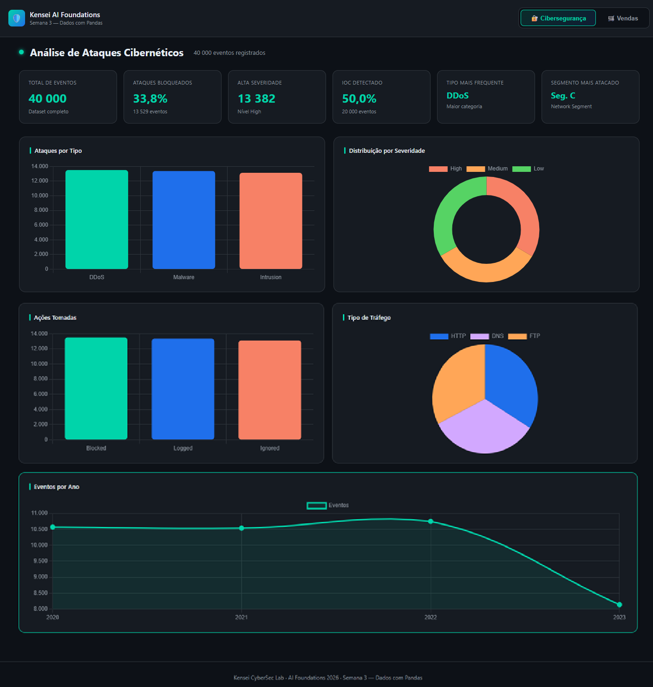
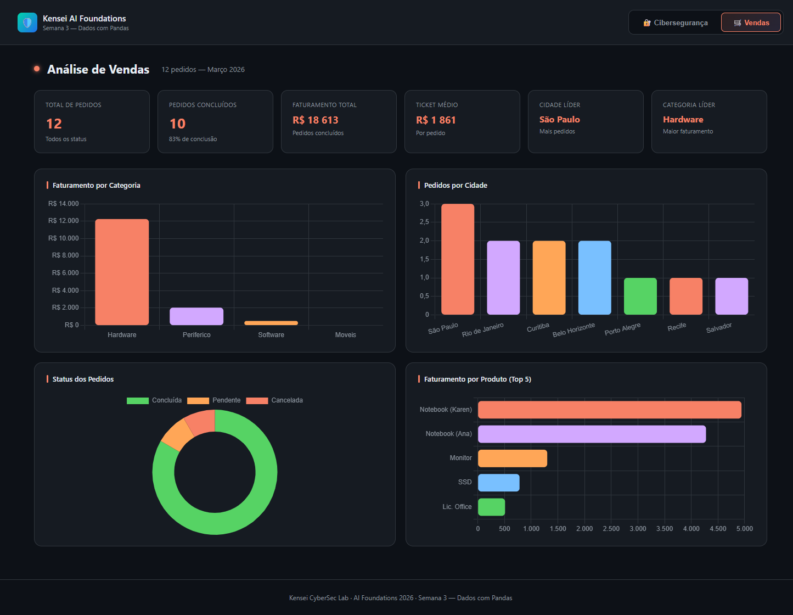

# 🔒🤖 Kensei AI Foundations


> **KENSEI CYBER AI ACADEMY — 100% GRATUITO**
> O mercado é AI-first. Sua formação também precisa ser.
> 6 meses de mentoria prática integrando IA, Dados e Cybersecurity. Só precisa de vontade e disposição.

| O **Kensei AI Foundations** é uma jornada prática para quem quer entrar de vez no universo de **IA, dados, programação e automação**, mesmo começando do zero. Aqui, o foco não é só teoria: você aprende construindo projetos reais, usando IA como copiloto e desenvolvendo as competências que o mercado já exige hoje. Ao longo de 8 semanas, você vai evoluir em ritmo progressivo, com desafios mão na massa, apoio da comunidade e um portfólio que mostra sua capacidade de resolver problemas de verdade. Se o objetivo é construir uma carreira **AI-first** com base sólida e visão aplicada para tecnologia e cybersecurity, este curso é o ponto de partida. |
|:---:|
| |
|  <a href="https://kensei.seg.br/lab" target="_blank"></a> |

---

<p align="center">
    
</p>

---

## Aula Inaugural | Bem-vindos à Comunidade

**IA | Dados | Programação | Automação | Apps**

100% Gratuito · Quartas às 19h · Comunidade Aberta · Kensei CyberSec Lab

> *Kensei CyberSec Lab | AI Foundations 2026 — Precisão de Samurai.*

---

## Quem é a Kensei?

> **"Precisão de Samurai."**

A Kensei é um laboratório e consultoria em cibersegurança com mais de **20 anos de experiência**.

Não fazemos teatro de segurança. Criamos ambientes onde ataque e defesa se encontram de verdade.

Treinamos pessoas e empresas para o mundo onde o incidente não é **"se"**, é **"quando"**.

- 🛡️ NIST CSF 2.0 / ISO 27001
- ☁️ Cloud Security (AWS/Azure)
- 🔧 DevSecOps & Labs Reais
- 🤖 AI + Cybersecurity

---

## Sobre Mim

Sou estudante do **Kensei AI Foundations 2026**, um programa 100% gratuito de 6 meses focado em IA, Dados e Programação com visão prática voltada para o mercado.

Minha trajetória começa aqui: construindo portfólio real, aprendendo com a comunidade e desenvolvendo as habilidades que o mercado AI-first exige.

Este repositório documenta meu aprendizado semana a semana — desde os primeiros scripts em Python até automações com IA e aplicações web.

---

## Por Que IA Agora?

| Dado | Impacto |
|------|---------|
| **77%** | das empresas já usam ou exploram IA |
| **97M** | novos empregos criados por IA até 2025 |
| **#1** | habilidade mais demandada: *AI literacy* |

> O mercado não está esperando.
> Quem dominar **IA + Dados + Automação** vai liderar. Quem não dominar vai ser substituído.

---

## O Mapa da Inteligência Artificial

```
INTELIGÊNCIA ARTIFICIAL (IA)
└── Máquinas que simulam inteligência humana: aprender, raciocinar, decidir

    MACHINE LEARNING (ML)
    └── Algoritmos que aprendem padrões a partir de dados (sem programação explícita)

        DEEP LEARNING (DL)
        └── Redes neurais profundas que aprendem representações complexas

            IA GENERATIVA
            └── Cria conteúdo novo: texto, imagem, código, áudio
                ChatGPT, Claude, Midjourney, Copilot

                LLMs (Large Language Models)
                └── Modelos treinados em bilhões de textos
                    GPT-4, Claude, Gemini, Llama
```

---

## A Revolução: Transformer

### 2017 — "Attention Is All You Need"

O Google publicou o paper que criou a arquitetura **Transformer**. A inovação: **Self-Attention** — o modelo aprende a prestar atenção nas partes mais relevantes do texto, processando tudo em paralelo.

| Antes do Transformer | Depois do Transformer |
|----------------------|----------------------|
| RNNs e LSTMs: processavam palavra por palavra (lento) | Processa tudo em paralelo (rápido e escalável) |
| Dificuldade com textos longos e contexto | Entende contexto de textos gigantes |
| Modelos menores, menos capazes | Possibilitou GPT, BERT, Claude, Gemini, etc. |

> Um único paper mudou tudo. Toda IA generativa que você usa hoje — ChatGPT, Claude, Gemini, Copilot — é baseada em Transformers.

---

## Como um LLM Funciona?

1. **Treinamento** — Consome bilhões de textos da internet, livros, código. Aprende padrões de linguagem.
2. **Tokenização** — Texto é quebrado em "tokens" (pedaços de palavras). O modelo trabalha com números, não letras.
3. **Self-Attention** — Para cada token, o modelo calcula quais outros tokens são mais relevantes para entender o contexto.
4. **Geração** — Prevê o próximo token mais provável, um de cada vez. Repete até completar a resposta.

---

## O Que Vou Aprender?

| Tópico | Descrição |
|--------|-----------|
| 🤖 IA como Copiloto | Prompt engineering, LLMs no dia a dia |
| 🐍 Python do Zero | Programação básica com assistência de IA |
| 📊 Dados & Análise | Pandas, visualização, insights reais |
| 🔌 APIs de IA | OpenAI, Claude, integrações |
| ⚙️ Automação n8n | Workflows inteligentes no-code + IA |
| 🌐 Apps com Streamlit | Aplicações web simples e úteis |

---

## A Trilha: 8 Semanas

### 📦 Módulo 1 | Semanas 1–4 — IA, Python & Dados

- **S1:** IA na prática + primeiro repositório no GitHub
- **S2:** Python do zero com copiloto IA
- **S3:** Dados com Pandas + visualização
- **S4:** APIs de IA + assistente de terminal

### 📦 Módulo 2 | Semanas 5–8 — Automação, Apps & Capstone

- **S5:** Automação no-code com n8n
- **S6:** n8n + IA (agentes inteligentes)
- **S7:** Apps web com Streamlit + deploy
- **S8:** Projeto final + apresentação

---

## Por Que Isso Importa Para Cyber?

```
AI Foundations                    →    Cyber AI Academy
──────────────────────────────────────────────────────
Python + Dados                         Defesa AI-Powered (SOC, SIEM)
IA como ferramenta                     Ethical Hacking com IA
Automação inteligente                  Purple Team + MITRE ATT&CK
Pensamento AI-first                    Projeto capstone completo
```

> **Carreira em Cybersecurity: o profissional AI-first**
> SOC Analyst, Threat Hunter, DevSecOps, vCISO, Pentester — todos precisam de IA e dados.

---

## Como Vai Funcionar

| Aspecto | Detalhe |
|---------|---------|
| 📅 **Quartas às 19h** | Encontros semanais ao vivo pela comunidade |
| 🛠️ **Hands-on desde o dia 1** | Cada semana tem lab prático com entrega |
| 📂 **Tudo no GitHub** | Portfólio profissional desde a semana 1 |
| 🤖 **IA como copiloto** | Aprender COM IA, não sobre IA teórica |
| 💬 **Comunidade ativa** | WhatsApp + Discord para dúvidas e networking |
| 🎯 **Pré-requisito** | Laptop + internet + vontade = suficiente |

---

## Alinhamento de Expectativas

### ✅ O Que Esperar

- Aprender fazendo, com projetos reais
- Errar e iterar (faz parte!)
- Construir portfólio profissional
- Mentoria e suporte da comunidade
- Base sólida para o Cyber AI Academy

### ❌ O Que Não Esperar

- Aula passiva estilo faculdade
- Virar expert em 8 semanas
- Conteúdo mastigado sem esforço
- Teoria sem aplicação prática
- Trabalhar sozinho sem comunidade

---

## Próximos Passos

- [x] **01** — Criar conta no GitHub
- [x] **02** — Entrar no grupo WhatsApp e Discord da comunidade
- [x] **03** — Instalar VS Code + Python no computador
- [x] **04** — Semana que vem: **Aula 1 — IA na Prática!**

---

## Progresso das Aulas

| Semana | Tema | Status |
|--------|------|--------|
| S0 | Aula Inaugural — Bem-vindos à Comunidade | ✅ Concluída |
| S1 | IA na prática + primeiro repo GitHub | ✅ Concluída |
| S2 | Python do zero + Vibe Coding com copiloto IA | ✅ Concluída |
| S3 | Dados com Pandas + visualização | ✅ Concluída |
| S4 | APIs de IA + assistente de terminal | ✅ Concluída |
| S5 | Automação no-code com n8n | ✅ Concluída |
| S6 | n8n + IA (agentes inteligentes) | 🔜 Em breve |
| S7 | Apps web com Streamlit + deploy | 🔜 Em breve |
| S8 | Projeto final + apresentação | 🔜 Em breve |

---

## Entregas por Semana

### Semana 2 — Python do Zero + Vibe Coding

<p align="center">
    <a href="/semana-02/README.md" target="_blank"></a>
    <p align="center"><strong style="color: #ff3b30;">Aviso: clique na imagem para acessar o material completo da semana 2 - Python do Zero com Copiloto IA</strong></p>
</p>

---

**Python do Zero** (`semana-02/`)

| Script | O que faz |
|--------|-----------|
| `ola.py` | Primeiro programa: imprime mensagens e pede o nome |
| `variaveis.py` | Tipos de dados: str, int, float, bool |
| `listas_dicts.py` | Listas de ferramentas cyber e dicionário de dados pessoais |
| `condicionais.py` | Nota → aprovado, recuperação ou reprovado |
| `loops.py` | Contagem, lista de nomes e tabuada |
| `funcoes.py` | calcular_area(), e_maior(), apresentar() |
| `calculadora.py` | Calculadora com +, -, *, / e validação de divisão por zero |
| `lista_compras.py` | Lista interativa com entrada pelo terminal |
| `quiz.py` | Quiz de Python com 5 perguntas e placar |
| `gerador_senhas.py` | Senha aleatória com tamanho escolhido |
| `organizador.py` | Ordena lista de nomes em ordem alfabética |

**Vibe Coding** (`semana-02/vibe_coding/`)

| Script | O que faz | Melhoria |
|--------|-----------|----------|
| `01_conversor.py` | Converte temperaturas | Menu com C→F e F→C |
| `02_lista_compras.py` | Lista de compras com menu | Salva em `.txt` ao sair |
| `03_quiz_cyber.py` | Quiz de cybersecurity | Timer de 10s por pergunta |
| `04_gerador_senhas.py` | Gera senhas com opcoes | 5 senhas + salva com timestamp |
| `05_organizador.py` | Organiza arquivos por extensão | Log por categoria + proteção contra sobrescrita |

**Arquivo-chave:**
- [`semana-02/README.md`](semana-02/README.md)

---

### Semana 3 — Dados com Pandas + Dashboard

<p align="center">
    <a href="/semana-03/README.md" target="_blank"></a>
    <p align="center"><strong style="color: #ff3b30;">Aviso: clique na imagem para acessar o material completo da semana 3 - Dados com Pandas</strong></p>
</p>

---

**Pasta:** `semana-03/`

- Pipeline completo com Pandas: exploração, limpeza, filtros, KPIs e visualização.
- Trilha paralela de cibersegurança em `semana-03/cyber/` com análise de 40.000 eventos.
- Dashboard interativo em `semana-03/dashboard.html` com alternância **Cibersegurança ↔ Vendas**.
- Gráficos salvos em `semana-03/graficos/` (vendas + cyber).
- Projeto dockerizado com `semana-03/Dockerfile`.

**Arquivos-chave:**
- [`semana-03/README.md`](semana-03/README.md)
- [`semana-03/dashboard.html`](semana-03/dashboard.html)
- [`semana-03/cyber/05_visualizacao_ataques.py`](semana-03/cyber/05_visualizacao_ataques.py)

<p align="center">
    
</p>

<p align="center">
    
</p>

---

### Semana 4 — APIs de IA + Assistente de Terminal

<p align="center">
    <a href="/semana-04/README.md" target="_blank"></a>
    <p align="center"><strong style="color: #ff3b30;">Aviso: clique na imagem para acessar o material completo da semana 4 - APIs de IA</strong></p>    
</p>

---

**Pasta:** `semana-04/`

- Integração com APIs de IA via `.env`, com foco operacional em **Google Gemini**.
- Camada comum de provedor em `semana-04/api_provider.py`.
- Projetos v2 de ponta a ponta:
    - `01_hello_api_v2.py`
    - `02_assistente_v2.py`
    - `03_analisador_v2.py`
    - `04_tradutor_v2.py`
    - `05_relatorio_automatico_v2.py`
    - `06_ferramenta_soc_api_v2.py`
- Docker da semana em `semana-04/Dockerfile`.
- Validação com suíte de testes e logs em `semana-04/logs_testes/google_suite_20260419_180653/`.

**Validação registrada (Google):**
- conexão Gemini OK (`00_test_google.py`)
- provider detectado como `google` (`api_provider.py`)
- geração de relatório automático em `outputs/`
- geração de plano SOC em `outputs/plano_triagem_soc_v2.md`

**Arquivo-chave:**
- [`semana-04/README.md`](semana-04/README.md)

---

### Semana 5 — Automação com n8n

<p align="center">
    <a href="/semana-05/README.md" target="_blank"></a>
    <p align="center"><strong style="color: #ff3b30;">Aviso: clique na imagem para acessar o material completo da semana 5 - Automação com n8n</strong></p>
</p>

---

**Pasta:** `semana-05/`

- Automação visual **no-code** com **n8n** self-hosted via Docker.
- 4 workflows completos exportados em JSON, prontos para importar em qualquer instância n8n.
- Integração com **OpenAI**, **Google Sheets**, **Telegram**, **RSS feeds** e **Email**.
- Conceitos essenciais: **Triggers**, **Nodes**, **Connections**, **Logic IFs**.
- API pessoal criada via Webhook — sem servidor, sem deploy.
- Bônus: **1999+ templates prontos** em `semana-05/bonus/pack_1999_templates/` para alavancar sua imaginação.

**Workflows:**

| Arquivo | Trigger | Fluxo | Integrações |
|---------|---------|-------|-------------|
| `01_primeiro_workflow.json` | Manual | Manual Trigger → OpenAI → Google Sheets | OpenAI + Google Sheets |
| `02_notificador_site.json` | Schedule (5min) | HTTP Request → IF (status) → Telegram | Telegram |
| `03_threat_intel_diario.json` | Schedule (8h) | RSS × 3 feeds → Filter → OpenAI → Email | RSS + OpenAI + Email |
| `04_api_sentimento.json` | Webhook POST | Webhook → OpenAI → Respond JSON | OpenAI + Webhook |

**Conceitos-chave:**
- **Workflow** — Sequência completa de ações automatizadas
- **Node** — Cada caixinha do fluxo (OpenAI, Telegram, Sheets, etc.)
- **Trigger** — O que dispara o workflow (manual, schedule, webhook, evento)
- **Connection** — Linha que conecta nodes e passa dados

**Arquivos-chave:**
- [`semana-05/README.md`](semana-05/README.md)
- [`semana-05/01_primeiro_workflow.json`](semana-05/01_primeiro_workflow.json)
- [`semana-05/04_api_sentimento.json`](semana-05/04_api_sentimento.json)

---

## Vamos Construir Juntos!

**Kensei AI Foundations | Quartas às 19h | 100% Gratuito**

🌐 [kensei.seg.br](https://kensei.seg.br)

> *Kensei CyberSec Lab | AI Foundations 2026 — Precisão de Samurai.*
