# PACK COM 1999 TEMPLATES PARA SEU N8N - Parte 1

Templates nesta parte: 200

## Sumário

- [Template 1 - Atualizar papéis de usuário via Excel](#template-1)
- [Template 2 - Automação de fine-tuning e uso de modelo OpenAI](#template-2)
- [Template 3 - Verificação periódica de site com notificação](#template-3)
- [Template 4 - Transformar artigos do Hacker News em vídeos sociais](#template-4)
- [Template 5 - Sincronizar playlist Spotify → YouTube](#template-5)
- [Template 6 - Publicador social automático a partir do WordPress](#template-6)
- [Template 7 - Curadoria automática de projetos GitHub do Hacker News](#template-7)
- [Template 8 - Salvar ideias do Slack no Notion](#template-8)
- [Template 9 - Exportar notícias YCombinator para planilha e enviar por email](#template-9)
- [Template 10 - Envio em lote para Claude (Anthropic)](#template-10)
- [Template 11 - Processamento de dados de IA de chamadas de vendas](#template-11)
- [Template 12 - Obter detalhes de um fórum Disqus](#template-12)
- [Template 13 - Backup automático para GitLab](#template-13)
- [Template 14 - Chatbot de recomendações de filmes com RAG (Qdrant + OpenAI)](#template-14)
- [Template 15 - Controle de concorrência via Redis para webhooks Slack](#template-15)
- [Template 16 - Tradução e TTS Francês para Inglês](#template-16)
- [Template 17 - Atualizar campo Close Date com validação](#template-17)
- [Template 18 - Importação automática de CSV para PostgreSQL](#template-18)
- [Template 19 - Criar Work Item Azure DevOps por alertas Elasticsearch](#template-19)
- [Template 20 - Publicador automático de tweets a partir do Sheets](#template-20)
- [Template 21 - Enviar template por e-mail após compra PayPal](#template-21)
- [Template 22 - Roteamento por valor booleano de saída de comando](#template-22)
- [Template 23 - Extração, Resumo e Análise de Sentimento de Conteúdo](#template-23)
- [Template 25 - Buffer e consolidação de mensagens](#template-25)
- [Template 26 - Enviar email por país do IP](#template-26)
- [Template 27 - Obter volume e adicionar à estante do usuário](#template-27)
- [Template 28 - Resposta automática de e-mail com revisão humana](#template-28)
- [Template 29 - Conversão Markdown → HTML para descrições do Airtable](#template-29)
- [Template 30 - Publicação automática de posts no Instagram](#template-30)
- [Template 31 - Resposta automática por e-mail com revisão humana](#template-31)
- [Template 32 - Soma de valores USD](#template-32)
- [Template 33 - Auto-resposta por IA com aprovação](#template-33)
- [Template 34 - Criar e atualizar item Webflow](#template-34)
- [Template 35 - Gerador de tweets com hashtag e armazenamento](#template-35)
- [Template 36 - Atualizações de eventos no ClickUp](#template-36)
- [Template 37 - Notificações GitHub para Discord](#template-37)
- [Template 38 - Rastreamento de despesas por recibos](#template-38)
- [Template 39 - Gatilho Calendly: invitee criado ou cancelado](#template-39)
- [Template 40 - Atualizações de eventos do Chargebee](#template-40)
- [Template 41 - Reindexação de URLs a partir do sitemap](#template-41)
- [Template 42 - Agente de IA com ferramenta personalizada (Hacker News)](#template-42)
- [Template 43 - Importar resumos Hugging Face para Notion](#template-43)
- [Template 44 - Pesquisa com Perplexity Sonar](#template-44)
- [Template 45 - Consulta de pessoa por e-mail (Clearbit)](#template-45)
- [Template 46 - Criar, publicar e recuperar post no Ghost](#template-46)
- [Template 47 - Extrator de esquemas de API](#template-47)
- [Template 48 - Busca de usuários no Bubble](#template-48)
- [Template 49 - Assistente OpenAI integrado ao chat HubSpot](#template-49)
- [Template 50 - Servidor MCP para sistema de arquivos](#template-50)
- [Template 51 - Identificação de workflows potencialmente afetados](#template-51)
- [Template 52 - Envio de PDFs do Gmail para Drive com OpenAI](#template-52)
- [Template 53 - Agente de contatos com IA](#template-53)
- [Template 54 - Converter páginas web em Markdown e extrair links](#template-54)
- [Template 55 - Revisor automático de MR GitLab](#template-55)
- [Template 56 - Análise automática de imagens via Telegram](#template-56)
- [Template 57 - Scraper de vagas 'Who is hiring' do Hacker News](#template-57)
- [Template 58 - Chatbot para Bitrix24 com Webhook e registro automático](#template-58)
- [Template 59 - Criar e atualizar registro FileMaker](#template-59)
- [Template 60 - Notificação de resposta no Mattermost](#template-60)
- [Template 61 - Resumo diário de podcasts por gênero](#template-61)
- [Template 62 - Debounce de SMS e resposta consolidada por AI](#template-62)
- [Template 63 - Envio de convite iCalendar por e-mail](#template-63)
- [Template 64 - Envio mensal de métricas financeiras ao Mattermost](#template-64)
- [Template 65 - Execução manual de job no Rundeck](#template-65)
- [Template 66 - Scraper e sumarização de empresas Indeed](#template-66)
- [Template 67 - Verificar certificado SSL de domínio](#template-67)
- [Template 68 - Comparação de dois conjuntos de dados por chave](#template-68)
- [Template 69 - Citações de arquivos com Assistente OpenAI](#template-69)
- [Template 70 - Notificar Mattermost ao adicionar dados no Airtable](#template-70)
- [Template 71 - Adicionar, commitar e enviar README.md para Git](#template-71)
- [Template 72 - Wrapper Adobe PDF Services](#template-72)
- [Template 73 - Notificar Mattermost ao criar pedido no WooCommerce](#template-73)
- [Template 74 - Análise Avançada de Ações com IA (Técnica e Tendências)](#template-74)
- [Template 75 - Notificações de tweets para Mattermost](#template-75)
- [Template 76 - Atualizar incidente e avisar canal](#template-76)
- [Template 77 - Inicializar configuração do Standup Bot](#template-77)
- [Template 78 - Remover um rótulo e aplicar outro em mensagens do Gmail](#template-78)
- [Template 79 - Compartilhar link Whereby no Mattermost](#template-79)
- [Template 80 - Gerar narração de vídeo com IA e TTS](#template-80)
- [Template 81 - Sobrescrever configuração do Standup Bot](#template-81)
- [Template 82 - Agente de vendas via WhatsApp](#template-82)
- [Template 83 - Backup diário de fluxos com purga](#template-83)
- [Template 84 - Publicador diário de quadrinhos traduzidos](#template-84)
- [Template 85 - Remoção em massa de e-mails do Gmail](#template-85)
- [Template 86 - Notificações de respostas Lemlist](#template-86)
- [Template 87 - Análise de sentimento e notificação no Mattermost](#template-87)
- [Template 88 - Notificação de feedbacks negativos](#template-88)
- [Template 89 - Converter Parquet/Avro/ORC/Feather para JSON via ParquetReader](#template-89)
- [Template 90 - Criar item no Monday a partir de novo contato](#template-90)
- [Template 91 - Exportar tabela SQL para XLSX](#template-91)
- [Template 92 - Atualizar status Slack e controlar luzes por evento do calendário](#template-92)
- [Template 93 - Sincronização estudantes → Mautic](#template-93)
- [Template 94 - Enviar mensagem privada no Zulip](#template-94)
- [Template 95 - Sincronização de contatos Google Sheets → Mautic](#template-95)
- [Template 96 - Sincronização de consentimento Shopify e Mautic](#template-96)
- [Template 97 - Assistente WhatsApp multimodal com IA](#template-97)
- [Template 98 - OCR de imagem a partir do S3](#template-98)
- [Template 99 - Contagem de pessoas do datastore de clientes](#template-99)
- [Template 100 - Processamento de planilhas Excel](#template-100)
- [Template 101 - Geração automática de legendas em vídeo](#template-101)
- [Template 102 - Baixar arquivos e combinar binários](#template-102)
- [Template 103 - Criar, atualizar e obter contato no Google Contacts](#template-103)
- [Template 104 - Extração de dados de PDF com Claude e Gemini](#template-104)
- [Template 105 - Resposta automática por IA para emails específicos](#template-105)
- [Template 106 - Enriquecimento e importação de contatos para Lemlist](#template-106)
- [Template 107 - Selecionar cor aleatória excluindo cores](#template-107)
- [Template 108 - Teste de regressão visual automatizado](#template-108)
- [Template 109 - Automação LINE -> IA -> Microsoft 365](#template-109)
- [Template 110 - Sincronizar e-mails do Google Sheets para Mailchimp](#template-110)
- [Template 111 - Extração de dados do Etsy com Bright Data e Google Gemini](#template-111)
- [Template 112 - Assistente de e-mail IA para Outlook](#template-112)
- [Template 113 - LinkedIn posts a partir de Ghost com registro em planilha](#template-113)
- [Template 114 - Obter data e dia atuais](#template-114)
- [Template 115 - Chat com arquivos do Supabase](#template-115)
- [Template 116 - Verificador de backlinks ao vivo](#template-116)
- [Template 117 - Agente de recomendações de filmes com MongoDB](#template-117)
- [Template 118 - Enviar imagens para upload-post (Instagram/TikTok)](#template-118)
- [Template 119 - Atribuir valores a variáveis](#template-119)
- [Template 120 - Geração e publicação automática de conteúdo para WordPress](#template-120)
- [Template 121 - Criar recurso no Netlify via webhook](#template-121)
- [Template 122 - Restaurar workflows a partir do GitHub](#template-122)
- [Template 123 - Converter PDF para PDF/A e salvar](#template-123)
- [Template 124 - Gerador automático de vídeos curtos POV](#template-124)
- [Template 125 - Assistente LINE com calendário e e-mail](#template-125)
- [Template 126 - Gerenciar registros no Quick Base](#template-126)
- [Template 127 - Alerta de deploy falhado no Slack](#template-127)
- [Template 128 - Geração de wallpaper gráfico com IA](#template-128)
- [Template 129 - Bot Telegram multilíngue](#template-129)
- [Template 130 - Teste rápido de webhook usando PostBin e BambooHR](#template-130)
- [Template 131 - Atualizar descrições do YouTube com texto padronizado](#template-131)
- [Template 132 - Conversão DOCX → PDF (ConvertAPI)](#template-132)
- [Template 133 - Responder chat HubSpot com Assistente OpenAI](#template-133)
- [Template 134 - Notificações de bounce e abertura de e-mail](#template-134)
- [Template 135 - Agregador de execuções em lote](#template-135)
- [Template 136 - Resposta automática a e-mails com aprovação](#template-136)
- [Template 137 - Geração de imagem via prompt por Webhook](#template-137)
- [Template 138 - Nova conta adicionada por admin no ActiveCampaign](#template-138)
- [Template 139 - Publicação automática de posts no WordPress](#template-139)
- [Template 140 - Gerar fala via Elevenlabs (Text-to-Speech)](#template-140)
- [Template 141 - Comando /deploy no Telegram para buscar release](#template-141)
- [Template 142 - Alerta SMS por temperatura](#template-142)
- [Template 143 - Geração de vídeo 3D giratório](#template-143)
- [Template 144 - Integração Gravity Forms com KlickTipp para assinaturas e tags](#template-144)
- [Template 145 - Análise de URL e recuperação de job Cortex](#template-145)
- [Template 146 - Monitoramento térmico e ingestão de dados da fábrica](#template-146)
- [Template 147 - Extrair e separar arquivos de um ZIP](#template-147)
- [Template 148 - Notificações de submissões de formulário Webflow](#template-148)
- [Template 149 - Resumo diário de tickets Zammad](#template-149)
- [Template 150 - Enviar SMS de alerta por temperatura](#template-150)
- [Template 151 - Enriquecer contatos HubSpot com dados da ExactBuyer](#template-151)
- [Template 152 - Exclusão de dados GDPR via Slack](#template-152)
- [Template 153 - Assistente de vendas WhatsApp com catálogo 2024](#template-153)
- [Template 154 - Atualização de Tendências do Google via RSS para Sheets](#template-154)
- [Template 155 - Roteamento e qualificação de leads em tempo real](#template-155)
- [Template 156 - Notificações de RSS para Telegram](#template-156)
- [Template 157 - Definir medoides e limiares de classe para deteção de anomalias](#template-157)
- [Template 158 - Extrair transações de PDFs/Imagens para CSV](#template-158)
- [Template 159 - Lembrete diário de To Dos do Notion no Slack](#template-159)
- [Template 160 - Geração de SQL a partir do esquema](#template-160)
- [Template 161 - Roteador de comandos Slack para executar workflows](#template-161)
- [Template 162 - Conversão de XML para JSON via webhook](#template-162)
- [Template 163 - Transformação de itens simulados](#template-163)
- [Template 164 - Gestão de grupo Bitwarden](#template-164)
- [Template 165 - Formulário com Dropdown dinâmico](#template-165)
- [Template 166 - Geração de SQL a partir do esquema](#template-166)
- [Template 167 - Alerta por SMS quando BTC ≥ €9000](#template-167)
- [Template 168 - Ingestão de PDF e Q&A vetorial](#template-168)
- [Template 169 - Extração de dados pessoais com LLM local Mistral NeMo](#template-169)
- [Template 170 - Gerador de capítulos para vídeos do YouTube](#template-170)
- [Template 171 - Geração de vídeo AI com HeyGen](#template-171)
- [Template 172 - API GET para FlutterFlow - lista de estudantes](#template-172)
- [Template 173 - Seletor dinâmico de modelos LLM](#template-173)
- [Template 174 - Bot Slack para executar scans e gerar relatórios Qualys](#template-174)
- [Template 175 - Notificação no Mattermost por atualização de perfil do Facebook](#template-175)
- [Template 176 - Backup automático de fluxos para GitHub](#template-176)
- [Template 177 - Criação automática de projeto e usuários](#template-177)
- [Template 178 - Notificações Jira → Telegram](#template-178)
- [Template 179 - Integração Figma para Jira via webhook](#template-179)
- [Template 180 - Processar e marcar linhas da planilha](#template-180)
- [Template 181 - Gatilho para novos projetos no Copper](#template-181)
- [Template 182 - Geração de leads com cupom para SuiteCRM](#template-182)
- [Template 183 - Responder leads B2B qualificados via enriquecimento](#template-183)
- [Template 184 - Tradução de legendas SRT](#template-184)
- [Template 185 - Classificação de sentimento e registro de feedbacks](#template-185)
- [Template 186 - Geração de fatura PDF via webhook](#template-186)
- [Template 187 - Atualização semanal de tarefas do Notion](#template-187)
- [Template 188 - Criação de cliente, geração e envio de fatura](#template-188)
- [Template 189 - Assistente de Calendário Outlook](#template-189)
- [Template 190 - Bot Telegram com chat e geração de imagens](#template-190)
- [Template 191 - Pixel de rastreamento transparente para abrir e-mails](#template-191)
- [Template 192 - Lembretes de tarefas do Notion via Slack](#template-192)
- [Template 193 - Importação de empresas e contatos para Salesforce](#template-193)
- [Template 194 - Exportar dados XML para Google Sheets](#template-194)
- [Template 195 - SMS diário com temperatura](#template-195)
- [Template 196 - Criar, atualizar e obter produto WooCommerce](#template-196)
- [Template 197 - Backup de credenciais no GitHub](#template-197)
- [Template 198 - Envio via Twilio (execução manual)](#template-198)
- [Template 199 - Envio diário de temperatura no Line](#template-199)
- [Template 200 - Respostas automáticas a comentários do Instagram](#template-200)
- [Template 201 - Registro de uso e custo de IA por cliente](#template-201)

---

<a id="template-1"></a>

## Template 1 - Atualizar papéis de usuário via Excel

- **Nome:** Atualizar papéis de usuário via Excel
- **Descrição:** Atualiza os papéis (roles) de usuários em uma instância Zammad com base em dados contidos em um arquivo Excel hospedado por URL.
- **Funcionalidade:** • Definição de variáveis básicas: Configura URL base do Zammad e fonte do arquivo Excel.
• Download do arquivo Excel via URL: Recupera o arquivo de origem hospedado por HTTP.
• Extração de dados do Excel: Lê e transforma o conteúdo do arquivo em registros utilizáveis.
• Normalização para objeto de usuário: Mapeia colunas do Excel para um objeto universal contendo email e role_ids.
• Busca de usuário por email na plataforma: Consulta a API do Zammad para localizar o usuário correspondente ao email.
• Mesclagem de dados locais com resultados da busca: Combina informações do Excel com os dados retornados pela API para preparar atualização.
• Atualização de papéis via API: Envia requisição PUT para atualizar o campo role_ids do usuário no Zammad.
• Tratamento de erros controlado: Continua execução quando atualização falha, permitindo registros com problemas sem interromper todo o fluxo.
- **Ferramentas:** • Zammad: Instância de gestão de tickets/usuários cuja API é usada para buscar e atualizar usuários.
• Servidor HTTP com arquivo Excel: Local onde o arquivo Excel (Users.txt/xlsx) está hospedado e é baixado via URL.

## Fluxo visual

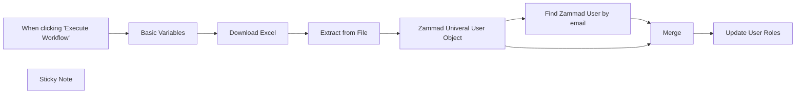

## Fluxo (.json) :

```json
{
  "id": "xzKlhjcc6QEzA98Z",
  "meta": {
    "instanceId": "494d0146a0f47676ad70a44a32086b466621f62da855e3eaf0ee51dee1f76753",
    "templateId": "2041",
    "templateCredsSetupCompleted": true
  },
  "name": "Update Roles by Excel",
  "tags": [],
  "nodes": [
    {
      "id": "580d8a47-32cc-4976-a464-793523ae3d1e",
      "name": "When clicking \"Execute Workflow\"",
      "type": "n8n-nodes-base.manualTrigger",
      "position": [
        80,
        140
      ],
      "parameters": {},
      "typeVersion": 1
    },
    {
      "id": "f37ea772-a953-4b5b-8e54-c76e42938544",
      "name": "Extract from File",
      "type": "n8n-nodes-base.extractFromFile",
      "position": [
        760,
        140
      ],
      "parameters": {
        "options": {},
        "operation": "xlsx"
      },
      "typeVersion": 1
    },
    {
      "id": "60ab7913-d421-41cd-af04-ccec2ed6838e",
      "name": "Merge",
      "type": "n8n-nodes-base.merge",
      "position": [
        1700,
        120
      ],
      "parameters": {
        "mode": "combine",
        "options": {},
        "fieldsToMatchString": "email"
      },
      "typeVersion": 3
    },
    {
      "id": "ad6719b4-95dc-419e-94cb-97039014be62",
      "name": "Basic Variables",
      "type": "n8n-nodes-base.set",
      "position": [
        320,
        140
      ],
      "parameters": {
        "options": {},
        "assignments": {
          "assignments": [
            {
              "id": "68b32087-5e23-4590-8042-0061234ce479",
              "name": "zammad_base_url",
              "type": "string",
              "value": "https://zammad.sirhexalot.de/"
            },
            {
              "id": "240f4dc5-a070-4623-96e7-1e0750dbeba5",
              "name": "excel_source_url",
              "type": "string",
              "value": "http://zammad.sirhexalot.de/Users.txt"
            }
          ]
        }
      },
      "typeVersion": 3.4
    },
    {
      "id": "8f18e493-5dbe-4447-a422-450c610e9585",
      "name": "Zammad Univeral User Object",
      "type": "n8n-nodes-base.set",
      "position": [
        1020,
        140
      ],
      "parameters": {
        "values": {
          "string": [
            {
              "name": "email",
              "value": "={{ $json.email }}"
            },
            {
              "name": "role_ids",
              "value": "={{ $json.role_ids }}\n"
            }
          ]
        },
        "options": {},
        "keepOnlySet": true
      },
      "typeVersion": 1
    },
    {
      "id": "5bc0a423-91bc-4b52-af05-2869223bbbff",
      "name": "Download Excel",
      "type": "n8n-nodes-base.httpRequest",
      "position": [
        540,
        140
      ],
      "parameters": {
        "url": "={{ $json.excel_source_url }}",
        "options": {
          "response": {
            "response": {
              "responseFormat": "file"
            }
          }
        }
      },
      "typeVersion": 4.1
    },
    {
      "id": "b5962a7b-27d3-45f1-adc4-1abff5d1c990",
      "name": "Find Zammad User by email",
      "type": "n8n-nodes-base.httpRequest",
      "position": [
        1360,
        -60
      ],
      "parameters": {
        "url": "={{ $('Basic Variables').item.json.zammad_base_url }}api/v1/users/search?query=email:{{ $json.email }}",
        "options": {},
        "authentication": "genericCredentialType",
        "genericAuthType": "httpHeaderAuth"
      },
      "credentials": {
        "httpHeaderAuth": {
          "id": "GJ7tG0KxDpEUv3DS",
          "name": "zammad.sirhexalot.de"
        }
      },
      "executeOnce": false,
      "typeVersion": 4.2,
      "alwaysOutputData": false
    },
    {
      "id": "0b8f5007-d28d-4406-a7ec-aa69d2b865d5",
      "name": "Update User Roles",
      "type": "n8n-nodes-base.httpRequest",
      "onError": "continueErrorOutput",
      "position": [
        2020,
        120
      ],
      "parameters": {
        "url": "={{ $('Basic Variables').item.json.zammad_base_url }}/api/v1/users/{{ $json.id }}",
        "method": "PUT",
        "options": {},
        "jsonBody": "={\n  \"role_ids\": [\n  {{ $json.role_ids }}\n  ]\n} ",
        "sendBody": true,
        "specifyBody": "json",
        "authentication": "genericCredentialType",
        "genericAuthType": "httpHeaderAuth"
      },
      "credentials": {
        "httpHeaderAuth": {
          "id": "GJ7tG0KxDpEUv3DS",
          "name": "zammad.sirhexalot.de"
        }
      },
      "typeVersion": 4.2
    },
    {
      "id": "7724e271-0beb-4fc3-a9dd-4e55bcf033a1",
      "name": "Sticky Note",
      "type": "n8n-nodes-base.stickyNote",
      "position": [
        60,
        -500
      ],
      "parameters": {
        "width": 577.5890410958907,
        "height": 253.58904109589045,
        "content": "## Authentication for Zammad\n\nCreate in the Node Find Zammad User by email a Header Auth Authentication\n\nUse:\n\nName: Authorization\nValue: Bearer - put here your zammad api token - \n"
      },
      "typeVersion": 1
    }
  ],
  "active": false,
  "pinData": {},
  "settings": {
    "executionOrder": "v1"
  },
  "versionId": "2e34f31f-cb00-43e1-8709-6405ea8521ac",
  "connections": {
    "Merge": {
      "main": [
        [
          {
            "node": "Update User Roles",
            "type": "main",
            "index": 0
          }
        ]
      ]
    },
    "Download Excel": {
      "main": [
        [
          {
            "node": "Extract from File",
            "type": "main",
            "index": 0
          }
        ]
      ]
    },
    "Basic Variables": {
      "main": [
        [
          {
            "node": "Download Excel",
            "type": "main",
            "index": 0
          }
        ]
      ]
    },
    "Extract from File": {
      "main": [
        [
          {
            "node": "Zammad Univeral User Object",
            "type": "main",
            "index": 0
          }
        ]
      ]
    },
    "Find Zammad User by email": {
      "main": [
        [
          {
            "node": "Merge",
            "type": "main",
            "index": 0
          }
        ]
      ]
    },
    "Zammad Univeral User Object": {
      "main": [
        [
          {
            "node": "Merge",
            "type": "main",
            "index": 1
          },
          {
            "node": "Find Zammad User by email",
            "type": "main",
            "index": 0
          }
        ]
      ]
    },
    "When clicking \"Execute Workflow\"": {
      "main": [
        [
          {
            "node": "Basic Variables",
            "type": "main",
            "index": 0
          }
        ]
      ]
    }
  }
}
```

<a id="template-2"></a>

## Template 2 - Automação de fine-tuning e uso de modelo OpenAI

- **Nome:** Automação de fine-tuning e uso de modelo OpenAI
- **Descrição:** Fluxo que baixa um arquivo de treinamento, envia para a plataforma OpenAI para fine-tuning e utiliza o modelo resultante para responder mensagens de chat.
- **Funcionalidade:** • Download do arquivo de treinamento: Baixa um arquivo .jsonl armazenado no Google Drive, com opção de conversão de documentos.
• Upload do arquivo para treinamento: Envia o arquivo baixado para a plataforma OpenAI com o propósito de fine-tune.
• Criação do job de fine-tuning: Inicia um job de fine-tuning na API da OpenAI especificando o arquivo de treinamento e o modelo base.
• Utilização do modelo customizado em chat: Encaminha mensagens de chat para o modelo fine-tuned (identificador ft:...) para gerar respostas.
• Gatilhos de execução: Permite iniciar o processo manualmente para testes e receber mensagens via webhook para atendimento em tempo real.
- **Ferramentas:** • Google Drive: Armazenamento e fornecimento do arquivo de treinamento (.jsonl) e possibilidade de conversão de documentos.
• OpenAI (API / Plataforma): Recebe o arquivo (upload), executa o fine-tuning (jobs) e disponibiliza o modelo customizado para uso em chamadas de chat.

## Fluxo visual

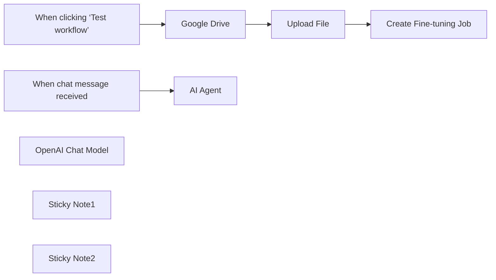

## Fluxo (.json) :

```json
{
  "id": "gAzsjTGbfWuvAObi",
  "meta": {
    "instanceId": "a4bfc93e975ca233ac45ed7c9227d84cf5a2329310525917adaf3312e10d5462",
    "templateCredsSetupCompleted": true
  },
  "name": "Fine-tuning with OpenAI models",
  "tags": [
    {
      "id": "2VG6RbmUdJ2VZbrj",
      "name": "Google Drive",
      "createdAt": "2024-12-04T16:50:56.177Z",
      "updatedAt": "2024-12-04T16:50:56.177Z"
    },
    {
      "id": "paTcf5QZDJsC2vKY",
      "name": "OpenAI",
      "createdAt": "2024-12-04T16:52:10.768Z",
      "updatedAt": "2024-12-04T16:52:10.768Z"
    }
  ],
  "nodes": [
    {
      "id": "ff65c2db-6a94-4e56-a10c-2538c9617df6",
      "name": "When clicking ‘Test workflow’",
      "type": "n8n-nodes-base.manualTrigger",
      "position": [
        220,
        320
      ],
      "parameters": {},
      "typeVersion": 1
    },
    {
      "id": "208fc618-0543-4552-bd65-9c808c879d88",
      "name": "Google Drive",
      "type": "n8n-nodes-base.googleDrive",
      "position": [
        440,
        320
      ],
      "parameters": {
        "fileId": {
          "__rl": true,
          "mode": "list",
          "value": "1wvlEcbxFIENvqL-bACzlLEfy5gA6uF9J",
          "cachedResultUrl": "https://drive.google.com/file/d/1wvlEcbxFIENvqL-bACzlLEfy5gA6uF9J/view?usp=drivesdk",
          "cachedResultName": "test_fine_tuning.jsonl"
        },
        "options": {
          "binaryPropertyName": "data.jsonl",
          "googleFileConversion": {
            "conversion": {
              "docsToFormat": "application/pdf"
            }
          }
        },
        "operation": "download"
      },
      "credentials": {
        "googleDriveOAuth2Api": {
          "id": "HEy5EuZkgPZVEa9w",
          "name": "Google Drive account"
        }
      },
      "typeVersion": 3
    },
    {
      "id": "3580d925-c8c9-446f-bfa4-faae5ed3f44a",
      "name": "AI Agent",
      "type": "@n8n/n8n-nodes-langchain.agent",
      "position": [
        500,
        800
      ],
      "parameters": {
        "options": {}
      },
      "typeVersion": 1.7
    },
    {
      "id": "d309da46-c44e-47b7-bb46-5ee6fe7e6964",
      "name": "When chat message received",
      "type": "@n8n/n8n-nodes-langchain.chatTrigger",
      "position": [
        220,
        800
      ],
      "webhookId": "88151d03-e7f5-4c9a-8190-7cff8e849ca2",
      "parameters": {
        "options": {}
      },
      "typeVersion": 1.1
    },
    {
      "id": "84b896f7-d1dd-4485-a088-3c7f8154a406",
      "name": "OpenAI Chat Model",
      "type": "@n8n/n8n-nodes-langchain.lmChatOpenAi",
      "position": [
        380,
        1000
      ],
      "parameters": {
        "model": "ft:gpt-4o-mini-2024-07-18:n3w-italia::AsVfsl7B",
        "options": {}
      },
      "credentials": {
        "openAiApi": {
          "id": "CDX6QM4gLYanh0P4",
          "name": "OpenAi account"
        }
      },
      "typeVersion": 1.1
    },
    {
      "id": "3bff93e4-70c3-48c7-b0b3-d2a9881689c4",
      "name": "Sticky Note1",
      "type": "n8n-nodes-base.stickyNote",
      "position": [
        220,
        560
      ],
      "parameters": {
        "width": 556.5145228215765,
        "height": 211.35269709543567,
        "content": "# Step 2\n\nOnce the .jsonl file for training is uploaded (See the entire process here.: https://platform.openai.com/finetune/), a \"new model\" will be created and made available via your API. OpenAI will automatically train it based on the uploaded .jsonl file. If the training is successful, the new model will be accessible via API.\n\neg. ft:gpt-4o-mini-2024-07-18:n3w-italia::XXXXX7B"
      },
      "typeVersion": 1
    },
    {
      "id": "ea67edd7-986d-47cd-bc1a-5df49851e27b",
      "name": "Sticky Note2",
      "type": "n8n-nodes-base.stickyNote",
      "position": [
        220,
        -5.676348547717737
      ],
      "parameters": {
        "width": 777.3941908713687,
        "height": 265.161825726141,
        "content": "# Step 1\n\nCreate the training file .jsonl with the following syntax and upload it to Drive.\n\n{\"messages\": [{\"role\": \"system\", \"content\": \"You are an experienced and helpful travel assistant.\"}, {\"role\": \"user\", \"content\": \"What documents are needed to travel to the United States?\"}, {\"role\": \"assistant\", \"content\": \"To travel to the United States, you will need a valid passport and an ESTA authorization, which you can apply for online. Make sure to check the specific requirements based on your nationality.\"}]}\n....\n\nThe file will be uploaded here: https://platform.openai.com/storage/files\n\n"
      },
      "typeVersion": 1
    },
    {
      "id": "87df3b85-01ac-41db-b5b6-a236871fa4e2",
      "name": "Upload File",
      "type": "@n8n/n8n-nodes-langchain.openAi",
      "position": [
        660,
        320
      ],
      "parameters": {
        "options": {
          "purpose": "fine-tune"
        },
        "resource": "file",
        "binaryPropertyName": "data.jsonl"
      },
      "credentials": {
        "openAiApi": {
          "id": "CDX6QM4gLYanh0P4",
          "name": "OpenAi account"
        }
      },
      "typeVersion": 1.8
    },
    {
      "id": "c8ec10d4-ff83-461f-94ac-45b68d298276",
      "name": "Create Fine-tuning Job",
      "type": "n8n-nodes-base.httpRequest",
      "position": [
        900,
        320
      ],
      "parameters": {
        "url": "https://api.openai.com/v1/fine_tuning/jobs",
        "method": "POST",
        "options": {},
        "jsonBody": "={\n  \"training_file\": \"{{ $json.id }}\",\n  \"model\": \"gpt-4o-mini-2024-07-18\"\n} ",
        "sendBody": true,
        "sendHeaders": true,
        "specifyBody": "json",
        "authentication": "genericCredentialType",
        "genericAuthType": "httpHeaderAuth",
        "headerParameters": {
          "parameters": [
            {
              "name": "Content-Type",
              "value": "application/json"
            }
          ]
        }
      },
      "credentials": {
        "httpHeaderAuth": {
          "id": "0WeSLPyZXOxqMuzn",
          "name": "OpenAI API"
        }
      },
      "typeVersion": 4.2
    }
  ],
  "active": false,
  "pinData": {},
  "settings": {
    "executionOrder": "v1"
  },
  "versionId": "a4aa95f5-132b-4aa3-a7f5-3bb316e00133",
  "connections": {
    "Upload File": {
      "main": [
        [
          {
            "node": "Create Fine-tuning Job",
            "type": "main",
            "index": 0
          }
        ]
      ]
    },
    "Google Drive": {
      "main": [
        [
          {
            "node": "Upload File",
            "type": "main",
            "index": 0
          }
        ]
      ]
    },
    "OpenAI Chat Model": {
      "ai_languageModel": [
        [
          {
            "node": "AI Agent",
            "type": "ai_languageModel",
            "index": 0
          }
        ]
      ]
    },
    "When chat message received": {
      "main": [
        [
          {
            "node": "AI Agent",
            "type": "main",
            "index": 0
          }
        ]
      ]
    },
    "When clicking ‘Test workflow’": {
      "main": [
        [
          {
            "node": "Google Drive",
            "type": "main",
            "index": 0
          }
        ]
      ]
    }
  }
}
```

<a id="template-3"></a>

## Template 3 - Verificação periódica de site com notificação

- **Nome:** Verificação periódica de site com notificação
- **Descrição:** Verifica periodicamente o conteúdo de uma página web e envia uma notificação via Discord quando a string monitorada não é encontrada.
- **Funcionalidade:** • Agendamento periódicos: executa a verificação a cada hora.
• Requisição HTTP ao site alvo: busca o conteúdo da página configurada.
• Verificação de conteúdo: procura pela string "Out Of Stock" na resposta.
• Notificação condicional: quando a resposta NÃO contém "Out Of Stock", envia uma mensagem "value not found" para um webhook do Discord.
• Notificação positiva configurada (inativa): existe uma mensagem "value found" preparada para envio, porém o fluxo dessa ação não está conectado.
- **Ferramentas:** • Site alvo (HTTP): página web monitorada para verificação de conteúdo.
• Discord: canal para envio de notificações via webhook.

## Fluxo visual

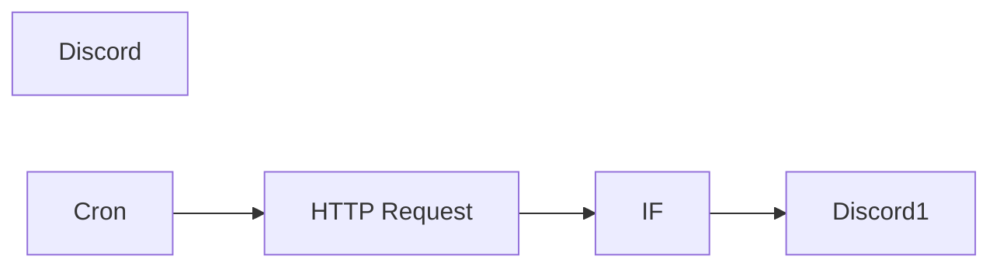

## Fluxo (.json) :

```json
{
  "id": "1",
  "name": "Website check",
  "nodes": [
    {
      "name": "HTTP Request",
      "type": "n8n-nodes-base.httpRequest",
      "position": [
        400,
        300
      ],
      "parameters": {
        "url": "",
        "options": {},
        "responseFormat": "string"
      },
      "typeVersion": 1
    },
    {
      "name": "IF",
      "type": "n8n-nodes-base.if",
      "position": [
        550,
        300
      ],
      "parameters": {
        "conditions": {
          "string": [
            {
              "value1": "={{$node[\"HTTP Request\"].json[\"data\"]}}",
              "value2": "Out Of Stock",
              "operation": "contains"
            }
          ]
        }
      },
      "typeVersion": 1
    },
    {
      "name": "Discord",
      "type": "n8n-nodes-base.discord",
      "position": [
        700,
        300
      ],
      "parameters": {
        "text": "value found",
        "webhookUri": ""
      },
      "typeVersion": 1
    },
    {
      "name": "Discord1",
      "type": "n8n-nodes-base.discord",
      "position": [
        700,
        450
      ],
      "parameters": {
        "text": "value not found",
        "webhookUri": ""
      },
      "typeVersion": 1
    },
    {
      "name": "Cron",
      "type": "n8n-nodes-base.cron",
      "position": [
        210,
        300
      ],
      "parameters": {
        "triggerTimes": {
          "item": [
            {
              "mode": "everyHour"
            }
          ]
        }
      },
      "typeVersion": 1
    }
  ],
  "active": false,
  "settings": {
    "timezone": "America/Los_Angeles"
  },
  "connections": {
    "IF": {
      "main": [
        [],
        [
          {
            "node": "Discord1",
            "type": "main",
            "index": 0
          }
        ]
      ]
    },
    "Cron": {
      "main": [
        [
          {
            "node": "HTTP Request",
            "type": "main",
            "index": 0
          }
        ]
      ]
    },
    "HTTP Request": {
      "main": [
        [
          {
            "node": "IF",
            "type": "main",
            "index": 0
          }
        ]
      ]
    }
  }
}
```

<a id="template-4"></a>

## Template 4 - Transformar artigos do Hacker News em vídeos sociais

- **Nome:** Transformar artigos do Hacker News em vídeos sociais
- **Descrição:** Este fluxo busca artigos do Hacker News, identifica os relacionados a IA/automação, gera resumos, imagens e vídeos e publica/armazen a mídia resultante.
- **Funcionalidade:** • Coleta de artigos: obtém itens do Hacker News e limita a quantidade a processar.
• Análise de relevância: determina se o artigo é sobre IA ou automação e extrai um resumo e URL de imagem.
• Preparação de conteúdo: cria título curto, blurb para newsletter, dois resumos curtos e prompts de imagem otimizados.
• Geração de imagens: melhora prompts e gera imagens a partir dos prompts fornecidos.
• Geração de vídeos a partir de imagens: converte imagens em clipes de vídeo utilizando modelos de geração de vídeo.
• Edição e montagem: combina vídeos, imagens, legendas e vozes (TTS) em uma composição final para publicação.
• Análise de imagem: valida e descreve imagens geradas para garantir relevância ao conteúdo.
• Gerenciamento assíncrono: usa esperas e checagens para tratar jobs longos de geração e evitar rate limits.
• Armazenamento de ativos: faz upload dos arquivos gerados para armazenamento em nuvem/objeto.
• Publicação em redes sociais: prepara e encaminha os vídeos para plataformas sociais e serviços de nuvem para distribuição.
- **Ferramentas:** • Hacker News: fonte pública de artigos e links para processamento.
• OpenAI: geração e análise de texto, criação de blurbs e uso de modelos multimodais (análise de imagem e TTS).
• Leonardo.ai: melhoria de prompts e geração de imagens a partir de prompts.
• RunwayML: conversão de imagens em vídeos (image-to-video) usando modelos de vídeo.
• Creatomate: montagem e renderização final do vídeo com cenas, legendas e áudio.
• Minio/S3: armazenamento de objetos para guardar os ativos gerados.
• Dropbox: opção para armazenar ou sincronizar arquivos gerados.
• Google Drive: opção de armazenamento e atualização de arquivos na nuvem.
• Microsoft OneDrive: opção adicional de armazenamento em nuvem.
• YouTube: plataforma de hospedagem e publicação de vídeos.
• X (Twitter): plataforma social para compartilhamento dos vídeos.
• Instagram: plataforma social para compartilhamento visual.
• LinkedIn: plataforma social para publicação profissional e distribuição do conteúdo.

## Fluxo visual

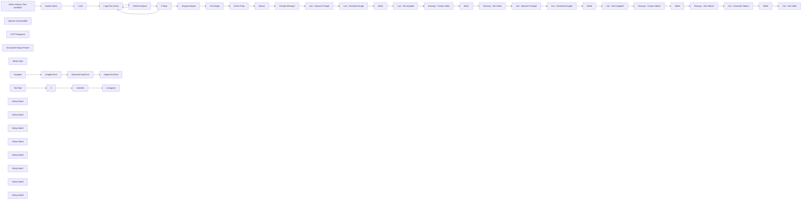

## Fluxo (.json) :

```json
{
  "id": "744G7emgZe0pXaPB",
  "meta": {
    "instanceId": "d868e3d040e7bda892c81b17cf446053ea25d2556fcef89cbe19dd61a3e876e9"
  },
  "name": "Hacker News to Video Template - AlexK1919",
  "tags": [
    {
      "id": "04PL2irdWYmF2Dg3",
      "name": "RunwayML",
      "createdAt": "2024-11-15T05:55:30.783Z",
      "updatedAt": "2024-11-15T05:55:30.783Z"
    },
    {
      "id": "yrY6updwSCXMsT0z",
      "name": "Video",
      "createdAt": "2024-11-15T05:55:34.333Z",
      "updatedAt": "2024-11-15T05:55:34.333Z"
    },
    {
      "id": "QsH2EXuw2e7YCv0K",
      "name": "OpenAI",
      "createdAt": "2024-11-15T04:05:20.872Z",
      "updatedAt": "2024-11-15T04:05:20.872Z"
    },
    {
      "id": "lvPj9rYRsKOHCi4J",
      "name": "Creatomate",
      "createdAt": "2024-11-19T15:59:16.134Z",
      "updatedAt": "2024-11-19T15:59:16.134Z"
    },
    {
      "id": "9LXACqpQLNtrM6or",
      "name": "Leonardo",
      "createdAt": "2024-11-19T15:59:21.368Z",
      "updatedAt": "2024-11-19T15:59:21.368Z"
    }
  ],
  "nodes": [
    {
      "id": "c777c41b-842d-4504-a1a0-ccbb034a0fdd",
      "name": "When clicking ‘Test workflow’",
      "type": "n8n-nodes-base.manualTrigger",
      "position": [
        -320,
        300
      ],
      "parameters": {},
      "typeVersion": 1
    },
    {
      "id": "74fafd7c-55a4-46ec-b4a8-33d46f2b5b54",
      "name": "Hacker News",
      "type": "n8n-nodes-base.hackerNews",
      "position": [
        -20,
        300
      ],
      "parameters": {
        "resource": "all",
        "additionalFields": {}
      },
      "typeVersion": 1
    },
    {
      "id": "9cd87fd2-6a38-463a-a22e-e0c34910818f",
      "name": "Loop Over Items",
      "type": "n8n-nodes-base.splitInBatches",
      "position": [
        440,
        300
      ],
      "parameters": {
        "options": {}
      },
      "typeVersion": 3
    },
    {
      "id": "611b24cd-558b-4025-a0a8-ea355ba61988",
      "name": "OpenAI Chat Model3",
      "type": "@n8n/n8n-nodes-langchain.lmChatOpenAi",
      "position": [
        720,
        580
      ],
      "parameters": {
        "options": {}
      },
      "typeVersion": 1
    },
    {
      "id": "f814682c-cf6f-49a8-8ea0-48fbc64a3ebe",
      "name": "HTTP Request1",
      "type": "@n8n/n8n-nodes-langchain.toolHttpRequest",
      "position": [
        900,
        580
      ],
      "parameters": {
        "url": "={{ $json.url }}",
        "toolDescription": "grab the article for the ai agent to use"
      },
      "typeVersion": 1.1
    },
    {
      "id": "2a4bcf69-23f0-440d-a3b0-c8261e153c62",
      "name": "Structured Output Parser",
      "type": "@n8n/n8n-nodes-langchain.outputParserStructured",
      "position": [
        1080,
        580
      ],
      "parameters": {
        "schemaType": "manual",
        "inputSchema": "{\n\t\"type\": \"object\",\n\t\"properties\": {\n\t\t\"summary\": {\n\t\t\t\"type\": \"string\"\n\t\t},\n\t\t\"related\": {\n\t\t\t\"type\": \"string\"\n\t\t},\n \"image urls\": {\n\t\t\t\"type\": \"string\"\n }\n\t}\n}"
      },
      "typeVersion": 1.2
    },
    {
      "id": "83c3b8f0-8d67-48a2-a5ce-b777ea1d7b32",
      "name": "Upload to Minio",
      "type": "n8n-nodes-base.s3",
      "position": [
        4240,
        1080
      ],
      "parameters": {
        "operation": "upload",
        "bucketName": "=",
        "additionalFields": {
          "grantRead": true,
          "parentFolderKey": "="
        }
      },
      "typeVersion": 1
    },
    {
      "id": "05b972ff-ccab-415b-8787-aafabb3b7292",
      "name": "News1",
      "type": "n8n-nodes-base.set",
      "position": [
        2180,
        320
      ],
      "parameters": {
        "options": {},
        "assignments": {
          "assignments": [
            {
              "id": "ec8013d5-84b5-43c8-abcb-6986ef15939d",
              "name": "property_name",
              "type": "string",
              "value": "={{ $json.message.content['Article Title'] }}"
            },
            {
              "id": "4d91c4fc-12a2-4fe2-a58e-02284314e1de",
              "name": "property_text",
              "type": "string",
              "value": "={{ $json.message.content['Article Blurb'] }}"
            },
            {
              "id": "cad2b795-8b71-415f-a100-700d9ec62bbd",
              "name": "property_image_url",
              "type": "string",
              "value": "={{ $('If Topic').item.json.output['image urls'] }}"
            }
          ]
        }
      },
      "typeVersion": 3.4
    },
    {
      "id": "d175d366-e672-4452-b78e-a06336ef242b",
      "name": "Leo - Improve Prompt",
      "type": "n8n-nodes-base.httpRequest",
      "position": [
        2720,
        100
      ],
      "parameters": {
        "url": "https://cloud.leonardo.ai/api/rest/v1/prompt/improve",
        "method": "POST",
        "options": {
          "response": {
            "response": {
              "fullResponse": true
            }
          }
        },
        "jsonBody": "={\n \"prompt\": \"{{ $('Article Prep').item.json.message.content['Image Prompt 1'] }}\"\n}",
        "sendBody": true,
        "sendHeaders": true,
        "specifyBody": "json",
        "authentication": "genericCredentialType",
        "genericAuthType": "httpCustomAuth",
        "headerParameters": {
          "parameters": [
            {
              "name": "accept",
              "value": "application/json"
            }
          ]
        }
      },
      "typeVersion": 4.2
    },
    {
      "id": "d8da7879-1a67-4da1-86db-f70e50b4e9da",
      "name": "Leo - Get imageId",
      "type": "n8n-nodes-base.httpRequest",
      "position": [
        3320,
        100
      ],
      "parameters": {
        "url": "=https://cloud.leonardo.ai/api/rest/v1/generations/{{ $json.body.sdGenerationJob.generationId }}",
        "options": {
          "response": {
            "response": {
              "fullResponse": true
            }
          }
        },
        "sendHeaders": true,
        "authentication": "genericCredentialType",
        "genericAuthType": "httpCustomAuth",
        "headerParameters": {
          "parameters": [
            {
              "name": "content-type",
              "value": "application/json"
            }
          ]
        }
      },
      "typeVersion": 4.2
    },
    {
      "id": "faf80246-3b1a-49c6-a277-0152428e46e1",
      "name": "Runway - Create Video",
      "type": "n8n-nodes-base.httpRequest",
      "position": [
        2520,
        300
      ],
      "parameters": {
        "url": "https://api.dev.runwayml.com/v1/image_to_video",
        "method": "POST",
        "options": {},
        "sendBody": true,
        "sendHeaders": true,
        "authentication": "genericCredentialType",
        "bodyParameters": {
          "parameters": [
            {
              "name": "promptImage",
              "value": "={{ $json.body.generations_by_pk.generated_images[0].url }}"
            },
            {
              "name": "promptText",
              "value": "string"
            },
            {
              "name": "model",
              "value": "gen3a_turbo"
            }
          ]
        },
        "genericAuthType": "httpCustomAuth",
        "headerParameters": {
          "parameters": [
            {
              "name": "X-Runway-Version",
              "value": "2024-11-06"
            }
          ]
        }
      },
      "typeVersion": 4.2
    },
    {
      "id": "e91c1f01-7870-4063-9557-24a6ba1d3db3",
      "name": "Runway - Get Video",
      "type": "n8n-nodes-base.httpRequest",
      "position": [
        2920,
        300
      ],
      "parameters": {
        "url": "=https://api.dev.runwayml.com/v1/tasks/{{ $json.id }}",
        "options": {},
        "sendHeaders": true,
        "authentication": "genericCredentialType",
        "genericAuthType": "httpCustomAuth",
        "headerParameters": {
          "parameters": [
            {
              "name": "X-Runway-Version",
              "value": "2024-11-06"
            }
          ]
        }
      },
      "typeVersion": 4.2
    },
    {
      "id": "41ee2665-e1aa-4d48-ade6-e37af568f211",
      "name": "Wait2",
      "type": "n8n-nodes-base.wait",
      "position": [
        2720,
        300
      ],
      "webhookId": "ddca5833-a40b-404a-9140-686cd4fa26cb",
      "parameters": {
        "unit": "minutes",
        "amount": 3
      },
      "typeVersion": 1.1
    },
    {
      "id": "091e9e07-89ba-4fe3-9fc5-278fc333dbff",
      "name": "Sticky Note",
      "type": "n8n-nodes-base.stickyNote",
      "position": [
        -160,
        -40
      ],
      "parameters": {
        "color": 5,
        "width": 341,
        "height": 951,
        "content": "# Choose your data source \n## This can be swapped for any other data source of your choosing."
      },
      "typeVersion": 1
    },
    {
      "id": "9660a593-9966-4ebe-bfd7-f884dc185d56",
      "name": "If Topic",
      "type": "n8n-nodes-base.if",
      "position": [
        1100,
        320
      ],
      "parameters": {
        "options": {},
        "conditions": {
          "options": {
            "version": 2,
            "leftValue": "",
            "caseSensitive": true,
            "typeValidation": "strict"
          },
          "combinator": "and",
          "conditions": [
            {
              "id": "56219de5-244d-4b7f-a511-f3061572cf93",
              "operator": {
                "name": "filter.operator.equals",
                "type": "string",
                "operation": "equals"
              },
              "leftValue": "={{ $json.output.related }}",
              "rightValue": "yes"
            }
          ]
        }
      },
      "typeVersion": 2.2
    },
    {
      "id": "e47140ac-20cc-417b-a6cd-30f780dc8289",
      "name": "Get Image",
      "type": "n8n-nodes-base.httpRequest",
      "position": [
        1500,
        320
      ],
      "parameters": {
        "url": "={{ $('Article Analysis').first().json.output['image urls'] }}",
        "options": {
          "response": {
            "response": {
              "fullResponse": true
            }
          }
        }
      },
      "typeVersion": 4.2
    },
    {
      "id": "26f80f71-2c3a-46fe-a960-21cdbc18ce34",
      "name": "Prompt Settings1",
      "type": "n8n-nodes-base.set",
      "position": [
        2520,
        100
      ],
      "parameters": {
        "options": {},
        "assignments": {
          "assignments": [
            {
              "id": "56c8f20d-d9d9-4be7-ac2a-38df6ffdd722",
              "name": "model",
              "type": "string",
              "value": "6b645e3a-d64f-4341-a6d8-7a3690fbf042"
            }
          ]
        },
        "includeOtherFields": true
      },
      "typeVersion": 3.4
    },
    {
      "id": "ce697f6f-f8fc-4ba7-b776-17bbc2e870b7",
      "name": "Leo - Generate Image",
      "type": "n8n-nodes-base.httpRequest",
      "position": [
        2920,
        100
      ],
      "parameters": {
        "url": "https://cloud.leonardo.ai/api/rest/v1/generations",
        "method": "POST",
        "options": {
          "response": {
            "response": {
              "fullResponse": true
            }
          }
        },
        "jsonBody": "={\n \"alchemy\": true,\n \"width\": 1024,\n \"height\": 768,\n \"modelId\": \"6b645e3a-d64f-4341-a6d8-7a3690fbf042\",\n \"num_images\": 1,\n \"presetStyle\": \"MONOCHROME\",\n \"prompt\": \"{{ $json.body.promptGeneration.prompt }}; Use the rule of thirds, leading lines, & balance. DO NOT INCLUDE ANY WORDS OR LABELS.\",\n \"guidance_scale\": 7,\n \"highResolution\": true,\n \"promptMagic\": false,\n \"promptMagicStrength\": 0.5,\n \"promptMagicVersion\": \"v3\",\n \"public\": false,\n \"ultra\": false,\n \"photoReal\": false,\n \"negative_prompt\": \"\"\n} ",
        "sendBody": true,
        "sendHeaders": true,
        "specifyBody": "json",
        "authentication": "genericCredentialType",
        "genericAuthType": "httpCustomAuth",
        "headerParameters": {
          "parameters": [
            {
              "name": "accept",
              "value": "application/json"
            }
          ]
        }
      },
      "typeVersion": 4.2
    },
    {
      "id": "e2067fe5-3fae-4f97-97c0-879967efd9b8",
      "name": "Wait1",
      "type": "n8n-nodes-base.wait",
      "position": [
        3120,
        100
      ],
      "webhookId": "256c3814-6a52-4eb1-969a-30f9f3b8e04e",
      "parameters": {
        "amount": 30
      },
      "typeVersion": 1.1
    },
    {
      "id": "f0ba57a5-1d27-4c75-a422-4bc0e2cead9d",
      "name": "Limit",
      "type": "n8n-nodes-base.limit",
      "position": [
        240,
        300
      ],
      "parameters": {
        "keep": "lastItems",
        "maxItems": 50
      },
      "typeVersion": 1
    },
    {
      "id": "e01152aa-961b-4e33-a1e3-186d47d81c55",
      "name": "Image Analysis",
      "type": "@n8n/n8n-nodes-langchain.openAi",
      "position": [
        1300,
        320
      ],
      "parameters": {
        "modelId": {
          "__rl": true,
          "mode": "list",
          "value": "gpt-4o-mini",
          "cachedResultName": "GPT-4O-MINI"
        },
        "options": {
          "detail": "auto"
        },
        "resource": "image",
        "imageUrls": "={{ $json.output['image urls'] }}",
        "operation": "analyze"
      },
      "credentials": {
        "openAiApi": {
          "id": "ysxujEYFiY5ozRTS",
          "name": "AlexK OpenAi Key"
        }
      },
      "typeVersion": 1.6
    },
    {
      "id": "ab346129-c3d5-4f51-af5e-5d63cd154981",
      "name": "Wait3",
      "type": "n8n-nodes-base.wait",
      "disabled": true,
      "position": [
        3080,
        1020
      ],
      "webhookId": "6e4a0b8d-6c31-4a98-8ec3-2509aa2087e8",
      "parameters": {
        "unit": "minutes"
      },
      "typeVersion": 1.1
    },
    {
      "id": "872c35a3-bdd5-4eec-9bac-0959f3ff78e7",
      "name": "Article Analysis",
      "type": "@n8n/n8n-nodes-langchain.agent",
      "onError": "continueErrorOutput",
      "position": [
        740,
        300
      ],
      "parameters": {
        "text": "=Can you tell me if the article at {{ $json.url }} is related to automation or ai? \n\nthen, create a 250 word summary of the article\n\nAlso, list any image url's related to the article content from the url. Limit to 1 image url.",
        "options": {
          "systemMessage": "You are a helpful assistant in summarizing and identifying articles related to automation and ai. \nOutput the results as:\nsummary: \nrelated: yes or no\nimage urls: "
        },
        "promptType": "define",
        "hasOutputParser": true
      },
      "typeVersion": 1.7
    },
    {
      "id": "31c3a90e-10ee-4217-9b08-ff57bf17ea10",
      "name": "Dropbox",
      "type": "n8n-nodes-base.dropbox",
      "position": [
        3640,
        1080
      ],
      "parameters": {},
      "typeVersion": 1
    },
    {
      "id": "22ccd0a0-f7f6-40ca-bd09-40ed4a7fcde1",
      "name": "Google Drive",
      "type": "n8n-nodes-base.googleDrive",
      "position": [
        3840,
        1080
      ],
      "parameters": {
        "fileId": {
          "__rl": true,
          "mode": "list",
          "value": ""
        },
        "options": {},
        "operation": "update"
      },
      "credentials": {
        "googleDriveOAuth2Api": {
          "id": "m8K1mbAUn7yuiEwl",
          "name": "AlexK1919 Google Drive account"
        }
      },
      "typeVersion": 3
    },
    {
      "id": "ea75931d-c1ee-4139-9bdc-7901056ba016",
      "name": "Microsoft OneDrive",
      "type": "n8n-nodes-base.microsoftOneDrive",
      "position": [
        4040,
        1080
      ],
      "parameters": {},
      "typeVersion": 1
    },
    {
      "id": "38888521-3087-4e0a-81d6-cf4b9a5dd3dd",
      "name": "YouTube",
      "type": "n8n-nodes-base.youTube",
      "position": [
        3640,
        1500
      ],
      "parameters": {
        "options": {},
        "resource": "video",
        "operation": "upload"
      },
      "typeVersion": 1
    },
    {
      "id": "55f3decc-f952-4d2a-804d-2aec44fb2755",
      "name": "X",
      "type": "n8n-nodes-base.twitter",
      "position": [
        3840,
        1500
      ],
      "parameters": {
        "additionalFields": {}
      },
      "typeVersion": 2
    },
    {
      "id": "54c8b762-444d-4790-97a9-a2f84518492f",
      "name": "Instagram",
      "type": "n8n-nodes-base.httpRequest",
      "position": [
        4240,
        1500
      ],
      "parameters": {
        "options": {}
      },
      "typeVersion": 4.2
    },
    {
      "id": "90040f15-95c0-4ebb-818f-dde508eb0689",
      "name": "LinkedIn",
      "type": "n8n-nodes-base.linkedIn",
      "position": [
        4040,
        1500
      ],
      "parameters": {
        "additionalFields": {}
      },
      "typeVersion": 1
    },
    {
      "id": "691eb779-5fae-4f65-89eb-b1b8e5488809",
      "name": "Leo - Improve Prompt2",
      "type": "n8n-nodes-base.httpRequest",
      "position": [
        2720,
        500
      ],
      "parameters": {
        "url": "https://cloud.leonardo.ai/api/rest/v1/prompt/improve",
        "method": "POST",
        "options": {
          "response": {
            "response": {
              "fullResponse": true
            }
          }
        },
        "jsonBody": "={\n \"prompt\": \"{{ $('Article Prep').item.json.message.content['Image Prompt 2'] }}\"\n}",
        "sendBody": true,
        "sendHeaders": true,
        "specifyBody": "json",
        "authentication": "genericCredentialType",
        "genericAuthType": "httpCustomAuth",
        "headerParameters": {
          "parameters": [
            {
              "name": "accept",
              "value": "application/json"
            }
          ]
        }
      },
      "credentials": {
        "httpCustomAuth": {
          "id": "hIzUsjbtHLmIe6uM",
          "name": "RunwayML Custom Auth"
        }
      },
      "typeVersion": 4.2
    },
    {
      "id": "076a745a-055b-459c-8af9-fa7b6740dc6f",
      "name": "Wait4",
      "type": "n8n-nodes-base.wait",
      "position": [
        2720,
        700
      ],
      "webhookId": "89b31515-b403-4644-a2c1-970e5e774008",
      "parameters": {
        "unit": "minutes",
        "amount": 3
      },
      "typeVersion": 1.1
    },
    {
      "id": "adc2c993-3f89-40df-96fc-eb3ff5eafb1c",
      "name": "Wait6",
      "type": "n8n-nodes-base.wait",
      "position": [
        3120,
        500
      ],
      "webhookId": "2efb873f-bcbd-41d9-99da-b2b57ef5ad93",
      "parameters": {
        "amount": 30
      },
      "typeVersion": 1.1
    },
    {
      "id": "156f5735-bc20-46a9-871c-143b0772ca45",
      "name": "Leo - Generate Image2",
      "type": "n8n-nodes-base.httpRequest",
      "position": [
        2920,
        500
      ],
      "parameters": {
        "url": "https://cloud.leonardo.ai/api/rest/v1/generations",
        "method": "POST",
        "options": {
          "response": {
            "response": {
              "fullResponse": true
            }
          }
        },
        "jsonBody": "={\n \"alchemy\": true,\n \"width\": 1024,\n \"height\": 768,\n \"modelId\": \"6b645e3a-d64f-4341-a6d8-7a3690fbf042\",\n \"num_images\": 1,\n \"presetStyle\": \"MONOCHROME\",\n \"prompt\": \"{{ $json.body.promptGeneration.prompt }}; Use the rule of thirds, leading lines, & balance. DO NOT INCLUDE ANY WORDS OR LABELS.\",\n \"guidance_scale\": 7,\n \"highResolution\": true,\n \"promptMagic\": false,\n \"promptMagicStrength\": 0.5,\n \"promptMagicVersion\": \"v3\",\n \"public\": false,\n \"ultra\": false,\n \"photoReal\": false,\n \"negative_prompt\": \"\"\n} ",
        "sendBody": true,
        "sendHeaders": true,
        "specifyBody": "json",
        "authentication": "genericCredentialType",
        "genericAuthType": "httpCustomAuth",
        "headerParameters": {
          "parameters": [
            {
              "name": "accept",
              "value": "application/json"
            }
          ]
        }
      },
      "typeVersion": 4.2
    },
    {
      "id": "4f270fa8-4da2-44f0-927f-3509fd9f8f7d",
      "name": "Leo - Get imageId2",
      "type": "n8n-nodes-base.httpRequest",
      "position": [
        3320,
        500
      ],
      "parameters": {
        "url": "=https://cloud.leonardo.ai/api/rest/v1/generations/{{ $json.body.sdGenerationJob.generationId }}",
        "options": {
          "response": {
            "response": {
              "fullResponse": true
            }
          }
        },
        "sendHeaders": true,
        "authentication": "genericCredentialType",
        "genericAuthType": "httpCustomAuth",
        "headerParameters": {
          "parameters": [
            {
              "name": "content-type",
              "value": "application/json"
            }
          ]
        }
      },
      "typeVersion": 4.2
    },
    {
      "id": "49c0e7ba-bf9c-4819-b479-61aa099ab9ab",
      "name": "Runway - Create Video2",
      "type": "n8n-nodes-base.httpRequest",
      "position": [
        2520,
        700
      ],
      "parameters": {
        "url": "https://api.dev.runwayml.com/v1/image_to_video",
        "method": "POST",
        "options": {},
        "sendBody": true,
        "sendHeaders": true,
        "authentication": "genericCredentialType",
        "bodyParameters": {
          "parameters": [
            {
              "name": "promptImage",
              "value": "={{ $json.body.generations_by_pk.generated_images[0].url }}"
            },
            {
              "name": "promptText",
              "value": "string"
            },
            {
              "name": "model",
              "value": "gen3a_turbo"
            }
          ]
        },
        "genericAuthType": "httpCustomAuth",
        "headerParameters": {
          "parameters": [
            {
              "name": "X-Runway-Version",
              "value": "2024-11-06"
            }
          ]
        }
      },
      "credentials": {
        "httpCustomAuth": {
          "id": "hIzUsjbtHLmIe6uM",
          "name": "RunwayML Custom Auth"
        }
      },
      "typeVersion": 4.2
    },
    {
      "id": "d03eb190-5fc0-4b7e-ad65-88ece3ab833d",
      "name": "Runway - Get Video2",
      "type": "n8n-nodes-base.httpRequest",
      "position": [
        2920,
        700
      ],
      "parameters": {
        "url": "=https://api.dev.runwayml.com/v1/tasks/{{ $json.id }}",
        "options": {},
        "sendHeaders": true,
        "authentication": "genericCredentialType",
        "genericAuthType": "httpCustomAuth",
        "headerParameters": {
          "parameters": [
            {
              "name": "X-Runway-Version",
              "value": "2024-11-06"
            }
          ]
        }
      },
      "typeVersion": 4.2
    },
    {
      "id": "0072563d-b87d-47c5-80fd-ed3c051b3287",
      "name": "Sticky Note1",
      "type": "n8n-nodes-base.stickyNote",
      "position": [
        3580,
        940
      ],
      "parameters": {
        "color": 6,
        "width": 882,
        "height": 372,
        "content": "# Upload Assets\nYou can extend this workflow further by uploading the generated assets to your storage option of choice."
      },
      "typeVersion": 1
    },
    {
      "id": "a0b2377e-57ea-47e9-83c9-3e58372610e5",
      "name": "Sticky Note2",
      "type": "n8n-nodes-base.stickyNote",
      "position": [
        3580,
        1360
      ],
      "parameters": {
        "color": 6,
        "width": 882,
        "height": 372,
        "content": "# Post to Social Media\nYou can extend this workflow further by posting the generated assets to social media."
      },
      "typeVersion": 1
    },
    {
      "id": "708fe6a0-4899-462b-9a08-fadea7c7e195",
      "name": "Sticky Note3",
      "type": "n8n-nodes-base.stickyNote",
      "position": [
        2420,
        -40
      ],
      "parameters": {
        "color": 4,
        "width": 1114,
        "height": 943,
        "content": "# Generate Images and Videos"
      },
      "typeVersion": 1
    },
    {
      "id": "5bbb6552-ec3a-42ea-a911-993f67a6c8dc",
      "name": "Sticky Note4",
      "type": "n8n-nodes-base.stickyNote",
      "position": [
        2420,
        940
      ],
      "parameters": {
        "color": 5,
        "width": 1114,
        "height": 372,
        "content": "# Stitch it all together"
      },
      "typeVersion": 1
    },
    {
      "id": "25f4cc09-fbff-4c10-b706-30df5840b794",
      "name": "Cre - Generate Video1",
      "type": "n8n-nodes-base.httpRequest",
      "position": [
        2880,
        1020
      ],
      "parameters": {
        "url": "https://api.creatomate.com/v1/renders",
        "method": "POST",
        "options": {
          "response": {
            "response": {
              "fullResponse": true
            }
          }
        },
        "jsonBody": "={\n \"max_width\": 480,\n \"template_id\": \"enterTemplateID\",\n \"modifications\": {\n \"Scenes.elements\": [\n {\n \"name\": \"Intro Comp\",\n \"type\": \"composition\",\n \"track\": 1,\n \"elements\": [\n {\n \"name\": \"Image-1\",\n \"type\": \"image\",\n \"source\": \"{{ $('Leo - Get imageId').item.json.body.generations_by_pk.generated_images[0].url }}\"\n },\n {\n \"name\": \"Subtitles-1\",\n \"type\": \"text\",\n \"transcript_source\": \"Voiceover-1\",\n \"width\": \"86.66%\",\n \"height\": \"37.71%\",\n \"x_alignment\": \"50%\",\n \"y_alignment\": \"50%\",\n \"fill_color\": \"#ffffff\",\n \"stroke_color\": \"#333333\",\n \"stroke_width\": \"1.05 vmin\",\n \"font_family\": \"Inter\",\n \"font_weight\": \"700\",\n \"font_size\": \"8 vmin\",\n \"background_color\": \"rgba(255,255,255,0.2)\",\n \"background_x_padding\": \"26%\",\n \"background_y_padding\": \"7%\",\n \"background_border_radius\": \"28%\",\n \"transcript_effect\": \"highlight\",\n \"transcript_color\": \"#ff5900\"\n },\n {\n \"name\": \"Voiceover-1\",\n \"type\": \"audio\",\n \"source\": \"{{ $('News1').item.json.property_name }}\",\n \"provider\": \"openai model=tts-1 voice=onyx\"\n }\n ]\n },\n {\n \"name\": \"Auto Scene Comp\",\n \"type\": \"composition\",\n \"track\": 1,\n \"elements\": [\n {\n \"name\": \"Video-2\",\n \"type\": \"video\",\n \"source\": \"{{ $('Runway - Get Video').first().json.output[0] }}\",\n \"loop\": true\n },\n {\n \"name\": \"Subtitles-2\",\n \"type\": \"text\",\n \"transcript_source\": \"Voiceover-2\",\n \"y\": \"78.2173%\",\n \"width\": \"86.66%\",\n \"height\": \"37.71%\",\n \"x_alignment\": \"50%\",\n \"y_alignment\": \"50%\",\n \"fill_color\": \"#ffffff\",\n \"stroke_color\": \"#333333\",\n \"stroke_width\": \"1.05 vmin\",\n \"font_family\": \"Inter\",\n \"font_weight\": \"700\",\n \"font_size\": \"8 vmin\",\n \"background_color\": \"rgba(255,255,255,0.2)\",\n \"background_x_padding\": \"26%\",\n \"background_y_padding\": \"7%\",\n \"background_border_radius\": \"28%\",\n \"transcript_effect\": \"highlight\",\n \"transcript_color\": \"#ff5900\"\n },\n {\n \"name\": \"Voiceover-2\",\n \"type\": \"audio\",\n \"source\": \"{{ $('Article Prep').item.json.message.content['Summary Blurb 1'] }}\",\n \"provider\": \"openai model=tts-1 voice=onyx\"\n }\n ]\n },\n {\n \"name\": \"Auto Scene Comp\",\n \"type\": \"composition\",\n \"track\": 1,\n \"elements\": [\n {\n \"name\": \"Video-3\",\n \"type\": \"video\",\n \"source\": \"{{ $('Runway - Get Video2').first().json.output[0] }}\",\n \"loop\": true\n },\n {\n \"name\": \"Subtitles-3\",\n \"type\": \"text\",\n \"transcript_source\": \"Voiceover-3\",\n \"y\": \"78.2173%\",\n \"width\": \"86.66%\",\n \"height\": \"37.71%\",\n \"x_alignment\": \"50%\",\n \"y_alignment\": \"50%\",\n \"fill_color\": \"#ffffff\",\n \"stroke_color\": \"#333333\",\n \"stroke_width\": \"1.05 vmin\",\n \"font_family\": \"Inter\",\n \"font_weight\": \"700\",\n \"font_size\": \"8 vmin\",\n \"background_color\": \"rgba(255,89,0,0.5)\",\n \"background_x_padding\": \"26%\",\n \"background_y_padding\": \"7%\",\n \"background_border_radius\": \"28%\",\n \"transcript_effect\": \"highlight\",\n \"transcript_color\": \"#ff0040\"\n },\n {\n \"name\": \"Voiceover-3\",\n \"type\": \"audio\",\n \"source\": \"{{ $('Article Prep').item.json.message.content['Summary Blurb 2'] }}\",\n \"provider\": \"openai model=tts-1 voice=onyx\"\n }\n ]\n }\n ]\n }\n}",
        "sendBody": true,
        "specifyBody": "json",
        "authentication": "genericCredentialType",
        "genericAuthType": "httpCustomAuth"
      },
      "credentials": {
        "httpCustomAuth": {
          "id": "hIzUsjbtHLmIe6uM",
          "name": "RunwayML Custom Auth"
        }
      },
      "typeVersion": 4.2
    },
    {
      "id": "7093de7b-a4e3-4363-8038-1002f7b20fbc",
      "name": "Cre - Get Video",
      "type": "n8n-nodes-base.httpRequest",
      "position": [
        3280,
        1020
      ],
      "parameters": {
        "url": "=https://api.creatomate.com/v1/renders/{{ $json.body.body[0].id }}",
        "options": {
          "response": {
            "response": {
              "fullResponse": true
            }
          }
        },
        "authentication": "genericCredentialType",
        "genericAuthType": "httpCustomAuth"
      },
      "credentials": {
        "httpCustomAuth": {
          "id": "hIzUsjbtHLmIe6uM",
          "name": "RunwayML Custom Auth"
        }
      },
      "typeVersion": 4.2
    },
    {
      "id": "a57b719f-b299-431e-9c85-fa333e38b6a7",
      "name": "Sticky Note6",
      "type": "n8n-nodes-base.stickyNote",
      "position": [
        660,
        -40
      ],
      "parameters": {
        "color": 3,
        "width": 1033,
        "height": 951,
        "content": "# Article Analysis - Is it the right topic?"
      },
      "typeVersion": 1
    },
    {
      "id": "60b879a0-8b7f-40f1-ae70-ac94e4675b38",
      "name": "Sticky Note7",
      "type": "n8n-nodes-base.stickyNote",
      "position": [
        1740,
        -40
      ],
      "parameters": {
        "color": 3,
        "width": 630,
        "height": 947,
        "content": "# Prepare the article for content generation"
      },
      "typeVersion": 1
    },
    {
      "id": "afaf8437-ee52-434b-a267-8dbaff0e1922",
      "name": "Article Prep",
      "type": "@n8n/n8n-nodes-langchain.openAi",
      "position": [
        1820,
        320
      ],
      "parameters": {
        "modelId": {
          "__rl": true,
          "mode": "list",
          "value": "gpt-4o-mini",
          "cachedResultName": "GPT-4O-MINI"
        },
        "options": {},
        "messages": {
          "values": [
            {
              "content": "=prepare the following summary for a newsletter where the article will be 1 of several presented in the newsletter:\n\n{{ $('Article Analysis').first().json.output.summary }}\n\nMake sure the Article Blurb lenght is less than 15 words.\n\nThen, create 2 Summary Blurbs, making sure each is less than 15 words.\n\nAlso create 2 image prompts that is less than 15 words long for each Summary Blurb"
            },
            {
              "role": "system",
              "content": "Output in markdown format\nArticle Title\nArticle Blurb\nSummary Blurb 1\nSummary Blurb 2\nArticle Image\nImage Prompt 1\nImage Prompt 2"
            }
          ]
        },
        "jsonOutput": true
      },
      "credentials": {
        "openAiApi": {
          "id": "ysxujEYFiY5ozRTS",
          "name": "AlexK OpenAi Key"
        }
      },
      "typeVersion": 1.6
    },
    {
      "id": "e7c95d56-86e1-4456-a6d3-9c8b9fc3a53c",
      "name": "Sticky Note5",
      "type": "n8n-nodes-base.stickyNote",
      "position": [
        -620,
        -40
      ],
      "parameters": {
        "color": 6,
        "width": 252,
        "height": 946,
        "content": "# AlexK1919 \n\n\n#### I’m Alex Kim, an AI-Native Workflow Automation Architect Building Solutions to Optimize your Personal and Professional Life.\n\n### Workflow Overview Video\nhttps://youtu.be/XaKybLDUlLk\n\n### About Me\nhttps://beacons.ai/alexk1919\n\n### Product Used \n[Leonardo.ai](https://leonardo.ai)\n[RunwayML](https://runwayml.com/)\n[Creatomate](https://creatomate.com/)\n"
      },
      "typeVersion": 1
    },
    {
      "id": "32e2803e-bf7c-4da4-a4ae-c9b6fa5ae226",
      "name": "Sticky Note8",
      "type": "n8n-nodes-base.stickyNote",
      "position": [
        3280,
        1180
      ],
      "parameters": {
        "color": 7,
        "width": 180,
        "height": 100,
        "content": "Don't forget to connect this last node to the loop to process additional items"
      },
      "typeVersion": 1
    }
  ],
  "active": false,
  "pinData": {},
  "settings": {
    "executionOrder": "v1"
  },
  "versionId": "c7ab1ecd-50cb-4e4b-b2f7-aade804bbd63",
  "connections": {
    "X": {
      "main": [
        [
          {
            "node": "LinkedIn",
            "type": "main",
            "index": 0
          }
        ]
      ]
    },
    "Limit": {
      "main": [
        [
          {
            "node": "Loop Over Items",
            "type": "main",
            "index": 0
          }
        ]
      ]
    },
    "News1": {
      "main": [
        [
          {
            "node": "Prompt Settings1",
            "type": "main",
            "index": 0
          }
        ]
      ]
    },
    "Wait1": {
      "main": [
        [
          {
            "node": "Leo - Get imageId",
            "type": "main",
            "index": 0
          }
        ]
      ]
    },
    "Wait2": {
      "main": [
        [
          {
            "node": "Runway - Get Video",
            "type": "main",
            "index": 0
          }
        ]
      ]
    },
    "Wait3": {
      "main": [
        [
          {
            "node": "Cre - Get Video",
            "type": "main",
            "index": 0
          }
        ]
      ]
    },
    "Wait4": {
      "main": [
        [
          {
            "node": "Runway - Get Video2",
            "type": "main",
            "index": 0
          }
        ]
      ]
    },
    "Wait6": {
      "main": [
        [
          {
            "node": "Leo - Get imageId2",
            "type": "main",
            "index": 0
          }
        ]
      ]
    },
    "Dropbox": {
      "main": [
        [
          {
            "node": "Google Drive",
            "type": "main",
            "index": 0
          }
        ]
      ]
    },
    "YouTube": {
      "main": [
        [
          {
            "node": "X",
            "type": "main",
            "index": 0
          }
        ]
      ]
    },
    "If Topic": {
      "main": [
        [
          {
            "node": "Image Analysis",
            "type": "main",
            "index": 0
          }
        ],
        [
          {
            "node": "Loop Over Items",
            "type": "main",
            "index": 0
          }
        ]
      ]
    },
    "LinkedIn": {
      "main": [
        [
          {
            "node": "Instagram",
            "type": "main",
            "index": 0
          }
        ]
      ]
    },
    "Get Image": {
      "main": [
        [
          {
            "node": "Article Prep",
            "type": "main",
            "index": 0
          }
        ]
      ]
    },
    "Hacker News": {
      "main": [
        [
          {
            "node": "Limit",
            "type": "main",
            "index": 0
          }
        ]
      ]
    },
    "Article Prep": {
      "main": [
        [
          {
            "node": "News1",
            "type": "main",
            "index": 0
          }
        ]
      ]
    },
    "Google Drive": {
      "main": [
        [
          {
            "node": "Microsoft OneDrive",
            "type": "main",
            "index": 0
          }
        ]
      ]
    },
    "HTTP Request1": {
      "ai_tool": [
        [
          {
            "node": "Article Analysis",
            "type": "ai_tool",
            "index": 0
          }
        ]
      ]
    },
    "Image Analysis": {
      "main": [
        [
          {
            "node": "Get Image",
            "type": "main",
            "index": 0
          }
        ]
      ]
    },
    "Loop Over Items": {
      "main": [
        [],
        [
          {
            "node": "Article Analysis",
            "type": "main",
            "index": 0
          }
        ]
      ]
    },
    "Article Analysis": {
      "main": [
        [
          {
            "node": "If Topic",
            "type": "main",
            "index": 0
          }
        ],
        [
          {
            "node": "Loop Over Items",
            "type": "main",
            "index": 0
          }
        ]
      ]
    },
    "Prompt Settings1": {
      "main": [
        [
          {
            "node": "Leo - Improve Prompt",
            "type": "main",
            "index": 0
          }
        ]
      ]
    },
    "Leo - Get imageId": {
      "main": [
        [
          {
            "node": "Runway - Create Video",
            "type": "main",
            "index": 0
          }
        ]
      ]
    },
    "Leo - Get imageId2": {
      "main": [
        [
          {
            "node": "Runway - Create Video2",
            "type": "main",
            "index": 0
          }
        ]
      ]
    },
    "Microsoft OneDrive": {
      "main": [
        [
          {
            "node": "Upload to Minio",
            "type": "main",
            "index": 0
          }
        ]
      ]
    },
    "OpenAI Chat Model3": {
      "ai_languageModel": [
        [
          {
            "node": "Article Analysis",
            "type": "ai_languageModel",
            "index": 0
          }
        ]
      ]
    },
    "Runway - Get Video": {
      "main": [
        [
          {
            "node": "Leo - Improve Prompt2",
            "type": "main",
            "index": 0
          }
        ]
      ]
    },
    "Runway - Get Video2": {
      "main": [
        [
          {
            "node": "Cre - Generate Video1",
            "type": "main",
            "index": 0
          }
        ]
      ]
    },
    "Leo - Generate Image": {
      "main": [
        [
          {
            "node": "Wait1",
            "type": "main",
            "index": 0
          }
        ]
      ]
    },
    "Leo - Improve Prompt": {
      "main": [
        [
          {
            "node": "Leo - Generate Image",
            "type": "main",
            "index": 0
          }
        ]
      ]
    },
    "Cre - Generate Video1": {
      "main": [
        [
          {
            "node": "Wait3",
            "type": "main",
            "index": 0
          }
        ]
      ]
    },
    "Leo - Generate Image2": {
      "main": [
        [
          {
            "node": "Wait6",
            "type": "main",
            "index": 0
          }
        ]
      ]
    },
    "Leo - Improve Prompt2": {
      "main": [
        [
          {
            "node": "Leo - Generate Image2",
            "type": "main",
            "index": 0
          }
        ]
      ]
    },
    "Runway - Create Video": {
      "main": [
        [
          {
            "node": "Wait2",
            "type": "main",
            "index": 0
          }
        ]
      ]
    },
    "Runway - Create Video2": {
      "main": [
        [
          {
            "node": "Wait4",
            "type": "main",
            "index": 0
          }
        ]
      ]
    },
    "Structured Output Parser": {
      "ai_outputParser": [
        [
          {
            "node": "Article Analysis",
            "type": "ai_outputParser",
            "index": 0
          }
        ]
      ]
    },
    "When clicking ‘Test workflow’": {
      "main": [
        [
          {
            "node": "Hacker News",
            "type": "main",
            "index": 0
          }
        ]
      ]
    }
  }
}
```

<a id="template-5"></a>

## Template 5 - Sincronizar playlist Spotify → YouTube

- **Nome:** Sincronizar playlist Spotify → YouTube
- **Descrição:** Mantém uma playlist do YouTube sincronizada com uma playlist do Spotify, usando armazenamento persistente para rastrear faixas e correspondências de vídeos.
- **Funcionalidade:** • Detecção de alterações na playlist do Spotify: Verifica se houve mudanças usando snapshot_id antes de processar.
• Sincronização unidirecional: Propaga adições e remoções da playlist Spotify para a playlist do YouTube.
• Importação para banco persistente: Adiciona faixas novas ao banco de dados com título, artista e duração.
• Marcação para exclusão: Marca entradas do banco com to_delete quando removidas da playlist Spotify.
• Busca inteligente no YouTube: Pesquisa vídeos usando título e artista e avalia os top resultados com base na duração (tolerância configurada).
• Adição automática ao YouTube: Adiciona o vídeo correspondente à playlist do YouTube e grava o ID do vídeo no banco.
• Marcação NOTFOUND: Sinaliza faixas sem correspondência encontrada para tentativas futuras.
• Verificação e recuperação: Detecta vídeos removidos do YouTube, limpa o ID no banco para re-pesquisar e permite re-tentativas periódicas.
• Exclusão condicional do banco: Remove registros marcados para exclusão quando apropriado.
• Agendamentos múltiplos: Executa verificações periódicas (hora a hora, diariamente e mensalmente) e inclui um processo de espera para checagens repetidas.
• Notificações opcionais: Envia notificações sobre correspondências falhadas ou adições bem-sucedidas via webhook.
- **Ferramentas:** • Spotify API: Fonte das faixas e metadados da playlist (snapshot_id, título, artista, duração).
• YouTube Data API v3 / YouTube Playlist: Pesquisa de vídeos, obtenção de metadados (duração) e gerenciamento da playlist de destino.
• Supabase (Postgres): Armazenamento persistente das faixas, IDs de vídeos e flags de estado (youtube_video_id, to_delete).
• Discord Webhook: Envio de notificações sobre correspondências ou falhas.

## Fluxo visual

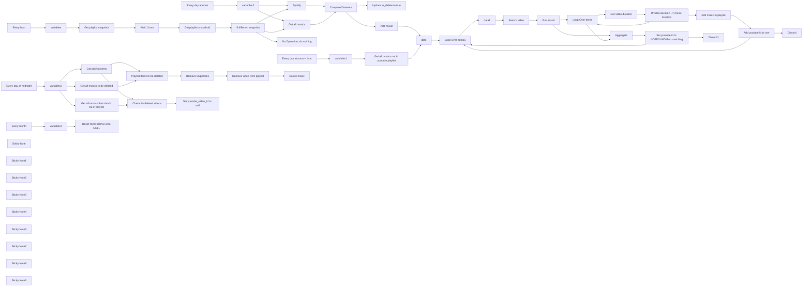

## Fluxo (.json) :

```json
{
  "meta": {
    "instanceId": "173bb893d2008dedab0ccfa3d7dba2c858a9076afa8f7dce6ebaa9c817262edf"
  },
  "nodes": [
    {
      "id": "c9e46f43-b159-42ca-945d-7aa8546e5fa2",
      "name": "Get playlist snapshot",
      "type": "n8n-nodes-base.spotify",
      "position": [
        380,
        1580
      ],
      "parameters": {
        "id": "={{ $json.spotify_playlist_id }}",
        "resource": "playlist",
        "operation": "get"
      },
      "typeVersion": 1
    },
    {
      "id": "73c2303e-24c2-4026-95f6-825e5d08baa4",
      "name": "Get playlist snapshot1",
      "type": "n8n-nodes-base.spotify",
      "position": [
        720,
        1580
      ],
      "parameters": {
        "id": "={{ $('variables').item.json.spotify_playlist_id }}",
        "resource": "playlist",
        "operation": "get"
      },
      "typeVersion": 1
    },
    {
      "id": "bb71003b-0945-4333-91d3-662290dfb42d",
      "name": "If different snapshot",
      "type": "n8n-nodes-base.if",
      "position": [
        900,
        1580
      ],
      "parameters": {
        "options": {},
        "conditions": {
          "options": {
            "version": 1,
            "leftValue": "",
            "caseSensitive": true,
            "typeValidation": "strict"
          },
          "combinator": "and",
          "conditions": [
            {
              "id": "2606c811-7c92-4c61-b99e-be2aaced10dd",
              "operator": {
                "type": "string",
                "operation": "notEquals"
              },
              "leftValue": "={{ $('Get playlist snapshot').item.json.snapshot_id }}",
              "rightValue": "={{ $json.snapshot_id }}"
            }
          ]
        }
      },
      "typeVersion": 2
    },
    {
      "id": "4894d2a7-dda9-430f-849a-d2368daa0aab",
      "name": "Get all musics",
      "type": "n8n-nodes-base.supabase",
      "position": [
        1220,
        1600
      ],
      "parameters": {
        "tableId": "={{ (() => { try { return $('variables').item.json.supabase_table_name } catch(e) {} try { return $('variables2').item.json.supabase_table_name } catch(e) {} return undefined; })() }}",
        "operation": "getAll",
        "returnAll": true
      },
      "typeVersion": 1
    },
    {
      "id": "e854147b-a5fa-400d-8440-bda25a0226b2",
      "name": "Update to_delete to true",
      "type": "n8n-nodes-base.supabase",
      "position": [
        1700,
        1620
      ],
      "parameters": {
        "filters": {
          "conditions": [
            {
              "keyName": "id",
              "keyValue": "={{ $json.id }}",
              "condition": "eq"
            }
          ]
        },
        "tableId": "={{ (() => { try { return $('variables').item.json.supabase_table_name } catch(e) {} try { return $('variables2').item.json.supabase_table_name } catch(e) {} return undefined; })() }}",
        "fieldsUi": {
          "fieldValues": [
            {
              "fieldId": "to_delete",
              "fieldValue": "TRUE"
            }
          ]
        },
        "operation": "update"
      },
      "typeVersion": 1
    },
    {
      "id": "2425db39-487b-4b61-9b61-9ae00067bbca",
      "name": "Add music",
      "type": "n8n-nodes-base.supabase",
      "position": [
        1700,
        1400
      ],
      "parameters": {
        "tableId": "={{ (() => { try { return $('variables').item.json.supabase_table_name } catch(e) {} try { return $('variables2').item.json.supabase_table_name } catch(e) {} return undefined; })() }}\n",
        "fieldsUi": {
          "fieldValues": [
            {
              "fieldId": "id",
              "fieldValue": "={{ $json.track.id }}"
            },
            {
              "fieldId": "title",
              "fieldValue": "={{ $json.track.name }}"
            },
            {
              "fieldId": "artist",
              "fieldValue": "={{ $json.track.artists[0].name }}"
            },
            {
              "fieldId": "duration",
              "fieldValue": "={{ $json.track.duration_ms }}"
            }
          ]
        }
      },
      "typeVersion": 1,
      "alwaysOutputData": false
    },
    {
      "id": "1c28ae15-9049-4ac7-9a7f-dcd094a60ace",
      "name": "Compare Datasets",
      "type": "n8n-nodes-base.compareDatasets",
      "position": [
        1460,
        1540
      ],
      "parameters": {
        "options": {
          "skipFields": "title, artists, duration, youtube_video_id, added_at, added_by, is_local, primary_color, video_thumbnail,"
        },
        "mergeByFields": {
          "values": [
            {
              "field1": "track.id",
              "field2": "id"
            }
          ]
        }
      },
      "typeVersion": 2.3
    },
    {
      "id": "af89d454-1071-42c1-9455-d64e02ae14b7",
      "name": "Spotify",
      "type": "n8n-nodes-base.spotify",
      "position": [
        1220,
        1440
      ],
      "parameters": {
        "id": "={{ (() => { try { return $('variables').item.json.spotify_playlist_id } catch(e) {} try { return $('variables2').item.json.spotify_playlist_id } catch(e) {} return undefined; })() }}",
        "resource": "playlist",
        "operation": "getTracks",
        "returnAll": true
      },
      "typeVersion": 1
    },
    {
      "id": "b924ad92-b1f2-41d5-b662-1e64ad0cc6dc",
      "name": "No Operation, do nothing",
      "type": "n8n-nodes-base.noOp",
      "position": [
        1220,
        1800
      ],
      "parameters": {},
      "typeVersion": 1
    },
    {
      "id": "2665982e-68ac-4a83-988d-78d07a0d6c75",
      "name": "Get all musics not in youtube playlist",
      "type": "n8n-nodes-base.supabase",
      "position": [
        400,
        960
      ],
      "parameters": {
        "filters": {
          "conditions": [
            {
              "keyName": "youtube_video_id",
              "keyValue": "null",
              "condition": "is"
            },
            {
              "keyName": "to_delete",
              "keyValue": "FALSE",
              "condition": "is"
            }
          ]
        },
        "tableId": "={{ $json.supabase_table_name }}",
        "matchType": "allFilters",
        "operation": "getAll",
        "returnAll": true
      },
      "typeVersion": 1
    },
    {
      "id": "6ea4ae11-9889-4ae2-904f-614ca4118b8a",
      "name": "Every day at noon",
      "type": "n8n-nodes-base.scheduleTrigger",
      "position": [
        20,
        1220
      ],
      "parameters": {
        "rule": {
          "interval": [
            {
              "triggerAtHour": 12
            }
          ]
        }
      },
      "typeVersion": 1.2
    },
    {
      "id": "8e4b14f4-a7ec-45dd-9b24-8c86889fd135",
      "name": "Every day at noon + 1mn",
      "type": "n8n-nodes-base.scheduleTrigger",
      "position": [
        20,
        960
      ],
      "parameters": {
        "rule": {
          "interval": [
            {
              "triggerAtHour": 12,
              "triggerAtMinute": 1
            }
          ]
        }
      },
      "typeVersion": 1.2
    },
    {
      "id": "16242250-5f3f-49f9-b6cb-7302bc11765a",
      "name": "Every hour",
      "type": "n8n-nodes-base.scheduleTrigger",
      "position": [
        20,
        1580
      ],
      "parameters": {
        "rule": {
          "interval": [
            {
              "field": "hours"
            }
          ]
        }
      },
      "typeVersion": 1.2
    },
    {
      "id": "6b6784ce-e236-40ca-b85c-1b0f0abdd7a5",
      "name": "Wait 1 hour",
      "type": "n8n-nodes-base.wait",
      "position": [
        560,
        1580
      ],
      "webhookId": "7d71bd21-a70a-47d5-bde5-299299fdb84e",
      "parameters": {
        "unit": "hours",
        "amount": 1
      },
      "typeVersion": 1.1
    },
    {
      "id": "746e7e33-00ba-4e92-a877-3619e14fa718",
      "name": "variables",
      "type": "n8n-nodes-base.set",
      "position": [
        200,
        1580
      ],
      "parameters": {
        "options": {},
        "assignments": {
          "assignments": [
            {
              "id": "89615f0d-1f93-4416-bab4-1c69479e135e",
              "name": "spotify_playlist_id",
              "type": "string",
              "value": "4fjIxvQt8aQrQZs4XqvsmR"
            },
            {
              "id": "be22a9a9-58be-4275-aac5-c0d95ba91cfd",
              "name": "youtube_playlist_id",
              "type": "string",
              "value": "PLjmwnzu1gWRsnW6icKeUyvbaK9-Cs8oom"
            },
            {
              "id": "3536712c-8881-4089-98aa-e25516fea624",
              "name": "supabase_table_name",
              "type": "string",
              "value": "musics"
            }
          ]
        }
      },
      "typeVersion": 3.4
    },
    {
      "id": "0006e12a-fea6-408d-bcf5-6d0a726322b1",
      "name": "Search video",
      "type": "n8n-nodes-base.youTube",
      "position": [
        2500,
        1420
      ],
      "parameters": {
        "limit": 5,
        "filters": {
          "q": "={{ $json.title }} {{ '-' }} {{ $json.artist }}"
        },
        "options": {},
        "resource": "video"
      },
      "typeVersion": 1,
      "alwaysOutputData": true
    },
    {
      "id": "24f5a360-fa93-4942-baea-baf134dd40a3",
      "name": "Get video duration",
      "type": "n8n-nodes-base.youTube",
      "position": [
        3020,
        1420
      ],
      "parameters": {
        "part": [
          "contentDetails",
          "snippet"
        ],
        "options": {},
        "videoId": "={{ $json.id.videoId }}",
        "resource": "video",
        "operation": "get"
      },
      "typeVersion": 1
    },
    {
      "id": "2027d659-01d6-4dd0-bfdc-c92f65b021bc",
      "name": "Loop Over Items",
      "type": "n8n-nodes-base.splitInBatches",
      "position": [
        2840,
        1420
      ],
      "parameters": {
        "options": {}
      },
      "typeVersion": 3
    },
    {
      "id": "3e843f70-bc17-4749-86ba-11f5a0e98e7d",
      "name": "If video duration ~= music duration",
      "type": "n8n-nodes-base.if",
      "position": [
        3240,
        1420
      ],
      "parameters": {
        "options": {},
        "conditions": {
          "options": {
            "version": 1,
            "leftValue": "",
            "caseSensitive": true,
            "typeValidation": "strict"
          },
          "combinator": "and",
          "conditions": [
            {
              "id": "e8ed16f1-f0c6-4ef4-bf09-8ecb6fbf44cb",
              "operator": {
                "type": "number",
                "operation": "gt"
              },
              "leftValue": "={{ $json.contentDetails.duration.match(/(\\d+)(?=[MHS])/g).reduce((acc, time, i) => acc + time * [60000, 1000, 1][i], 0) }}",
              "rightValue": "={{ $('data1').first().json.duration - 5000}}"
            },
            {
              "id": "c4317b05-69bb-4244-ac8a-4cc51113a63b",
              "operator": {
                "type": "number",
                "operation": "lt"
              },
              "leftValue": "={{ $json.contentDetails.duration.match(/(\\d+)(?=[MHS])/g).reduce((acc, time, i) => acc + time * [60000, 1000, 1][i], 0) }}",
              "rightValue": "={{ $('data1').first().json.duration + 20000}}"
            }
          ]
        }
      },
      "typeVersion": 2
    },
    {
      "id": "a21e462c-72c9-4e77-99dc-1046acbaa998",
      "name": "Add music to playlist",
      "type": "n8n-nodes-base.youTube",
      "position": [
        3460,
        1400
      ],
      "parameters": {
        "options": {},
        "videoId": "={{ $('Get video duration').item.json.id }}",
        "resource": "playlistItem",
        "playlistId": "PLjmwnzu1gWRsnW6icKeUyvbaK9-Cs8oom"
      },
      "typeVersion": 1
    },
    {
      "id": "68fc1180-ce51-496a-909f-a652bb43febc",
      "name": "Add youtube id to row",
      "type": "n8n-nodes-base.supabase",
      "position": [
        3640,
        1400
      ],
      "parameters": {
        "filters": {
          "conditions": [
            {
              "keyName": "id",
              "keyValue": "={{ $('data1').first().json.id }}",
              "condition": "eq"
            }
          ]
        },
        "tableId": "={{ $('data1').first().json.supabase_table_name }}",
        "fieldsUi": {
          "fieldValues": [
            {
              "fieldId": "youtube_video_id",
              "fieldValue": "={{ $json.snippet.resourceId.videoId }}"
            }
          ]
        },
        "operation": "update"
      },
      "typeVersion": 1
    },
    {
      "id": "3611f50e-3000-46e9-b145-109251c3a12d",
      "name": "Discord",
      "type": "n8n-nodes-base.discord",
      "position": [
        4040,
        1400
      ],
      "parameters": {
        "content": "=Added : {{ $json.title }} (https://www.youtube.com/watch?v={{ $json.youtube_video_id }})",
        "options": {},
        "authentication": "webhook"
      },
      "typeVersion": 2
    },
    {
      "id": "bd6438b2-8628-4bb9-be34-03785458f194",
      "name": "Discord1",
      "type": "n8n-nodes-base.discord",
      "position": [
        4040,
        1020
      ],
      "parameters": {
        "content": "=No match for : {{ $('data1').first().json.title }}",
        "options": {},
        "authentication": "webhook"
      },
      "typeVersion": 2
    },
    {
      "id": "97ea9e76-96a5-48de-afe3-f81dbe7e431b",
      "name": "Set youtube id to NOTFOUND if no matching",
      "type": "n8n-nodes-base.supabase",
      "position": [
        3320,
        1020
      ],
      "parameters": {
        "filters": {
          "conditions": [
            {
              "keyName": "id",
              "keyValue": "={{ $('data1').first().json.id }}",
              "condition": "eq"
            }
          ]
        },
        "tableId": "={{ $('data1').first().json.supabase_table_name }}",
        "fieldsUi": {
          "fieldValues": [
            {
              "fieldId": "youtube_video_id",
              "fieldValue": "NOTFOUND"
            }
          ]
        },
        "matchType": "allFilters",
        "operation": "update"
      },
      "typeVersion": 1
    },
    {
      "id": "acb1e31e-5f17-4092-b357-b0b255a4d15f",
      "name": "Aggregate",
      "type": "n8n-nodes-base.aggregate",
      "position": [
        3060,
        1220
      ],
      "parameters": {
        "options": {},
        "aggregate": "aggregateAllItemData"
      },
      "typeVersion": 1
    },
    {
      "id": "2db8c163-bf26-445f-9339-9e387cf22286",
      "name": "If no result",
      "type": "n8n-nodes-base.if",
      "position": [
        2660,
        1420
      ],
      "parameters": {
        "options": {},
        "conditions": {
          "options": {
            "version": 1,
            "leftValue": "",
            "caseSensitive": true,
            "typeValidation": "strict"
          },
          "combinator": "and",
          "conditions": [
            {
              "id": "49a188bb-3cc8-4a8d-babf-f591c2e72094",
              "operator": {
                "type": "object",
                "operation": "empty",
                "singleValue": true
              },
              "leftValue": "={{ $json }}",
              "rightValue": ""
            }
          ]
        }
      },
      "typeVersion": 2
    },
    {
      "id": "5eea12d7-c313-4176-b85a-54f631e3a98f",
      "name": "data",
      "type": "n8n-nodes-base.set",
      "position": [
        1900,
        1340
      ],
      "parameters": {
        "options": {},
        "assignments": {
          "assignments": [
            {
              "id": "3622fecd-9a77-4cd4-ab02-6997cd83362d",
              "name": "title",
              "type": "string",
              "value": "={{ $json.title }}"
            },
            {
              "id": "76232c1e-f4de-41c4-837f-d20bd2bcfca2",
              "name": "artist",
              "type": "string",
              "value": "={{ $json.artist }}"
            },
            {
              "id": "01c3e160-f1ce-42e9-9010-a8ac806bb029",
              "name": "duration",
              "type": "number",
              "value": "={{ $json.duration }}"
            },
            {
              "id": "65f29ba5-28b4-4b50-8d38-540236229312",
              "name": "id",
              "type": "string",
              "value": "={{ $json.id }}"
            },
            {
              "id": "d6b26130-454c-4625-bdf2-688498d61321",
              "name": "supabase_table_name",
              "type": "string",
              "value": "={{ (() => { try { return $('variables').item.json.supabase_table_name } catch(e) {} try { return $('variables1').item.json.supabase_table_name } catch(e) {} try { return $('variables2').item.json.supabase_table_name } catch(e) {} return undefined; })() }}\n"
            },
            {
              "id": "9d82b3d1-b9f9-4dc1-9e7f-ec2a3c97bfe1",
              "name": "youtube_playlist_id",
              "type": "string",
              "value": "={{ (() => { try { return $('variables').item.json.youtube_playlist_id } catch(e) {} try { return $('variables1').item.json.youtube_playlist_id } catch(e) {} try { return $('variables2').item.json.youtube_playlist_id } catch(e) {} return undefined; })() }}\n"
            }
          ]
        }
      },
      "typeVersion": 3.4
    },
    {
      "id": "73055f49-c804-4b54-a16f-c795f1295069",
      "name": "variables2",
      "type": "n8n-nodes-base.set",
      "position": [
        560,
        1220
      ],
      "parameters": {
        "options": {},
        "assignments": {
          "assignments": [
            {
              "id": "89615f0d-1f93-4416-bab4-1c69479e135e",
              "name": "spotify_playlist_id",
              "type": "string",
              "value": "4fjIxvQt8aQrQZs4XqvsmR"
            },
            {
              "id": "be22a9a9-58be-4275-aac5-c0d95ba91cfd",
              "name": "youtube_playlist_id",
              "type": "string",
              "value": "PLjmwnzu1gWRsnW6icKeUyvbaK9-Cs8oom"
            },
            {
              "id": "3536712c-8881-4089-98aa-e25516fea624",
              "name": "supabase_table_name",
              "type": "string",
              "value": "musics"
            }
          ]
        }
      },
      "typeVersion": 3.4
    },
    {
      "id": "4f7da7fb-5b18-4b44-9aad-d24c2e1409cc",
      "name": "variables1",
      "type": "n8n-nodes-base.set",
      "position": [
        200,
        960
      ],
      "parameters": {
        "options": {},
        "assignments": {
          "assignments": [
            {
              "id": "89615f0d-1f93-4416-bab4-1c69479e135e",
              "name": "spotify_playlist_id",
              "type": "string",
              "value": "4fjIxvQt8aQrQZs4XqvsmR"
            },
            {
              "id": "be22a9a9-58be-4275-aac5-c0d95ba91cfd",
              "name": "youtube_playlist_id",
              "type": "string",
              "value": "PLjmwnzu1gWRsnW6icKeUyvbaK9-Cs8oom"
            },
            {
              "id": "3536712c-8881-4089-98aa-e25516fea624",
              "name": "supabase_table_name",
              "type": "string",
              "value": "musics"
            }
          ]
        }
      },
      "typeVersion": 3.4
    },
    {
      "id": "a814763e-d073-4984-986f-7c627bbe2269",
      "name": "Loop Over Items1",
      "type": "n8n-nodes-base.splitInBatches",
      "position": [
        2120,
        1400
      ],
      "parameters": {
        "options": {}
      },
      "typeVersion": 3
    },
    {
      "id": "5329c838-56bd-4d85-a789-7ded3a128d87",
      "name": "data1",
      "type": "n8n-nodes-base.set",
      "position": [
        2320,
        1420
      ],
      "parameters": {
        "options": {},
        "assignments": {
          "assignments": [
            {
              "id": "3622fecd-9a77-4cd4-ab02-6997cd83362d",
              "name": "title",
              "type": "string",
              "value": "={{ $json.title }}"
            },
            {
              "id": "76232c1e-f4de-41c4-837f-d20bd2bcfca2",
              "name": "artist",
              "type": "string",
              "value": "={{ $json.artist }}"
            },
            {
              "id": "01c3e160-f1ce-42e9-9010-a8ac806bb029",
              "name": "duration",
              "type": "number",
              "value": "={{ $json.duration }}"
            },
            {
              "id": "65f29ba5-28b4-4b50-8d38-540236229312",
              "name": "id",
              "type": "string",
              "value": "={{ $json.id }}"
            },
            {
              "id": "d6b26130-454c-4625-bdf2-688498d61321",
              "name": "supabase_table_name",
              "type": "string",
              "value": "={{ $json.supabase_table_name }}"
            },
            {
              "id": "9d82b3d1-b9f9-4dc1-9e7f-ec2a3c97bfe1",
              "name": "youtube_playlist_id",
              "type": "string",
              "value": "={{ $json.youtube_playlist_id }}"
            }
          ]
        }
      },
      "typeVersion": 3.4
    },
    {
      "id": "01039cab-f822-4cfc-996f-0e88923f9c14",
      "name": "Get playlist items",
      "type": "n8n-nodes-base.youTube",
      "position": [
        540,
        2600
      ],
      "parameters": {
        "options": {},
        "resource": "playlistItem",
        "operation": "getAll",
        "returnAll": true,
        "playlistId": "={{ $json.youtube_playlist_id }}"
      },
      "typeVersion": 1
    },
    {
      "id": "c12fb59f-ad15-4456-b827-f749a22f2f0c",
      "name": "Playlist items to be deleted",
      "type": "n8n-nodes-base.compareDatasets",
      "position": [
        840,
        2700
      ],
      "parameters": {
        "options": {
          "skipFields": "kind, etag, snippet, thumbnails, channelTitle, position, resourceId, contentDetails, status"
        },
        "mergeByFields": {
          "values": [
            {
              "field1": "snippet.resourceId.videoId",
              "field2": "youtube_video_id"
            }
          ]
        }
      },
      "typeVersion": 2.3
    },
    {
      "id": "57172162-a766-4c51-8249-e6e0632d1312",
      "name": "Get all musics that should be in playlist",
      "type": "n8n-nodes-base.supabase",
      "position": [
        540,
        2400
      ],
      "parameters": {
        "filters": {
          "conditions": [
            {
              "keyName": "youtube_video_id",
              "keyValue": "={{ null }}",
              "condition": "neq"
            },
            {
              "keyName": "youtube_video_id",
              "keyValue": "NOTFOUND",
              "condition": "neq"
            }
          ]
        },
        "tableId": "={{ $json.supabase_table_name }}",
        "matchType": "allFilters",
        "operation": "getAll",
        "returnAll": true
      },
      "typeVersion": 1
    },
    {
      "id": "88f01cff-33a2-4184-af92-80cf7dd6d28b",
      "name": "Remove Duplicates",
      "type": "n8n-nodes-base.removeDuplicates",
      "position": [
        1080,
        2700
      ],
      "parameters": {
        "compare": "selectedFields",
        "options": {},
        "fieldsToCompare": "different.youtube_video_id.inputB"
      },
      "typeVersion": 1.1
    },
    {
      "id": "e25d78cd-d3a9-4b24-8663-84344b6f0b68",
      "name": "Remove video from playlist",
      "type": "n8n-nodes-base.youTube",
      "position": [
        1240,
        2700
      ],
      "parameters": {
        "options": {},
        "resource": "playlistItem",
        "operation": "delete",
        "playlistItemId": "={{ $json.different.id.inputA }}"
      },
      "typeVersion": 1
    },
    {
      "id": "1420795b-fac4-47ac-8449-96ae39541c22",
      "name": "Check for deleted videos",
      "type": "n8n-nodes-base.compareDatasets",
      "position": [
        820,
        2480
      ],
      "parameters": {
        "options": {
          "skipFields": "kind, etag, snippet, thumbnails, channelTitle, position, resourceId, contentDetails, status"
        },
        "mergeByFields": {
          "values": [
            {
              "field1": "youtube_video_id",
              "field2": "contentDetails.videoId"
            }
          ]
        }
      },
      "typeVersion": 2.3
    },
    {
      "id": "fc2e2908-c491-4d45-87e4-a572a2f3e72a",
      "name": "Set youtube_video_id to null",
      "type": "n8n-nodes-base.supabase",
      "onError": "continueRegularOutput",
      "position": [
        1080,
        2440
      ],
      "parameters": {
        "filters": {
          "conditions": [
            {
              "keyName": "id",
              "keyValue": "={{ $json.id }}",
              "condition": "eq"
            },
            {
              "keyName": "youtube_video_id",
              "keyValue": "NOTFOUND",
              "condition": "neq"
            }
          ]
        },
        "tableId": "={{ $('variables3').item.json.supabase_table_name }}",
        "fieldsUi": {
          "fieldValues": [
            {
              "fieldId": "youtube_video_id",
              "fieldValue": "={{ null }}"
            }
          ]
        },
        "matchType": "allFilters",
        "operation": "update"
      },
      "typeVersion": 1
    },
    {
      "id": "52523569-4347-477f-abe3-718b0177324a",
      "name": "Get all musics to be deleted",
      "type": "n8n-nodes-base.supabase",
      "position": [
        540,
        2820
      ],
      "parameters": {
        "filters": {
          "conditions": [
            {
              "keyName": "to_delete",
              "keyValue": "TRUE",
              "condition": "is"
            },
            {
              "keyName": "youtube_video_id",
              "keyValue": "NOTFOUND",
              "condition": "neq"
            }
          ]
        },
        "tableId": "={{ $json.supabase_table_name }}",
        "matchType": "allFilters",
        "operation": "getAll",
        "returnAll": true
      },
      "typeVersion": 1
    },
    {
      "id": "c1306c1e-07aa-46f9-970c-3e9ecb01638a",
      "name": "Delete music",
      "type": "n8n-nodes-base.supabase",
      "position": [
        1400,
        2700
      ],
      "parameters": {
        "filters": {
          "conditions": [
            {
              "keyName": "youtube_video_id",
              "keyValue": "={{ $('Get all musics to be deleted').item.json.youtube_video_id }}",
              "condition": "eq"
            },
            {
              "keyName": "to_delete",
              "keyValue": "true",
              "condition": "is"
            }
          ]
        },
        "tableId": "={{ $('variables3').item.json.supabase_table_name }}",
        "matchType": "allFilters",
        "operation": "delete"
      },
      "typeVersion": 1
    },
    {
      "id": "770083fa-6ac1-4dd9-929e-e30e933bbd95",
      "name": "Every day at midnight",
      "type": "n8n-nodes-base.scheduleTrigger",
      "position": [
        40,
        2620
      ],
      "parameters": {
        "rule": {
          "interval": [
            {}
          ]
        }
      },
      "typeVersion": 1.2
    },
    {
      "id": "92e5e851-0c66-476e-bec8-a46fc96915ab",
      "name": "variables3",
      "type": "n8n-nodes-base.set",
      "position": [
        240,
        2620
      ],
      "parameters": {
        "options": {},
        "assignments": {
          "assignments": [
            {
              "id": "89615f0d-1f93-4416-bab4-1c69479e135e",
              "name": "spotify_playlist_id",
              "type": "string",
              "value": "4fjIxvQt8aQrQZs4XqvsmR"
            },
            {
              "id": "be22a9a9-58be-4275-aac5-c0d95ba91cfd",
              "name": "youtube_playlist_id",
              "type": "string",
              "value": "PLjmwnzu1gWRsnW6icKeUyvbaK9-Cs8oom"
            },
            {
              "id": "3536712c-8881-4089-98aa-e25516fea624",
              "name": "supabase_table_name",
              "type": "string",
              "value": "musics"
            }
          ]
        }
      },
      "typeVersion": 3.4
    },
    {
      "id": "acde16fc-3fe3-453b-bffe-ead681e97046",
      "name": "Reset NOTFOUND id to NULL",
      "type": "n8n-nodes-base.supabase",
      "position": [
        420,
        3280
      ],
      "parameters": {
        "filters": {
          "conditions": [
            {
              "keyName": "youtube_video_id",
              "keyValue": "NOTFOUND",
              "condition": "eq"
            }
          ]
        },
        "tableId": "={{ $json.supabase_table_name }}",
        "fieldsUi": {
          "fieldValues": [
            {
              "fieldId": "youtube_video_id",
              "fieldValue": "={{ null }}"
            }
          ]
        },
        "operation": "update"
      },
      "typeVersion": 1
    },
    {
      "id": "62053829-3253-4a7c-b70f-ba6075df034b",
      "name": "variables4",
      "type": "n8n-nodes-base.set",
      "position": [
        220,
        3280
      ],
      "parameters": {
        "options": {},
        "assignments": {
          "assignments": [
            {
              "id": "89615f0d-1f93-4416-bab4-1c69479e135e",
              "name": "spotify_playlist_id",
              "type": "string",
              "value": "4fjIxvQt8aQrQZs4XqvsmR"
            },
            {
              "id": "be22a9a9-58be-4275-aac5-c0d95ba91cfd",
              "name": "youtube_playlist_id",
              "type": "string",
              "value": "PLjmwnzu1gWRsnW6icKeUyvbaK9-Cs8oom"
            },
            {
              "id": "3536712c-8881-4089-98aa-e25516fea624",
              "name": "supabase_table_name",
              "type": "string",
              "value": "musics"
            }
          ]
        }
      },
      "typeVersion": 3.4
    },
    {
      "id": "9a205a87-f32a-49c1-8282-469777c83c9c",
      "name": "Every month",
      "type": "n8n-nodes-base.scheduleTrigger",
      "position": [
        40,
        3280
      ],
      "parameters": {
        "rule": {
          "interval": [
            {
              "field": "months"
            }
          ]
        }
      },
      "typeVersion": 1.2
    },
    {
      "id": "a40fa87c-71ae-4045-8285-91235f0cf1f0",
      "name": "Sticky Note",
      "type": "n8n-nodes-base.stickyNote",
      "position": [
        2040,
        780
      ],
      "parameters": {
        "color": 6,
        "width": 1780,
        "height": 980,
        "content": "# Match Spotify Tracks to YouTube Videos  \n\n## This part finds the best YouTube video for a Spotify track using the YouTube Data API v3. It searches with the track title and artist, retrieves the top 5 videos, and selects the first one with a duration within ±10% of the Spotify track length. The matched video is added to a YouTube playlist, and its ID is saved in the database.  \n\n## Operation:\n- ## Uses Spotify data (title + artist) for search.\n- ## Ensures duration accuracy (±10% tolerance).  \n- ## Automates playlist updates and database storage."
      },
      "typeVersion": 1
    },
    {
      "id": "b850a168-7fa4-417c-980c-da8fcf558cfb",
      "name": "Sticky Note1",
      "type": "n8n-nodes-base.stickyNote",
      "position": [
        -20,
        1440
      ],
      "parameters": {
        "color": 4,
        "width": 1100,
        "height": 420,
        "content": "## Check for any modification in the spotify playlist with snapshot_id\n### If you want to change the checking interval, make sure to change the trigger AND the wait node\n"
      },
      "typeVersion": 1
    },
    {
      "id": "fe2aaa9f-e4de-4000-b535-3e351a643d01",
      "name": "Sticky Note2",
      "type": "n8n-nodes-base.stickyNote",
      "position": [
        -1360,
        1120
      ],
      "parameters": {
        "color": 3,
        "width": 960,
        "height": 1340,
        "content": "# Spotify to YouTube Playlist Synchronization\n## A workflow that maintains a YouTube playlist in sync with a Spotify playlist, featuring smart video matching and persistent synchronization.\n\n## Key Features\n- **One-way Sync**: Spotify playlist → YouTube playlist (additions and deletions\n- **Continuous Monitoring**: Automatic synchronization (every hour by default, but you can put any time you want)\n- **Smart Video Matching**: Considers video length and content relevance\n- **Auto-Recovery**: Automatically handles deleted YouTube videos\n- **Database Backup**: Persistent storage using Supabase\n\n## Prerequisites\n\n1. Supabase project with the following table structure:\n```sql\nCREATE TABLE IF NOT EXISTS musics (\n    id TEXT PRIMARY KEY,\n    title TEXT NOT NULL,\n    artist TEXT NOT NULL,\n    duration INT8 NOT NULL,\n    youtube_video_id TEXT,\n    to_delete BOOLEAN DEFAULT FALSE\n);\n```\n2. Empty YouTube playlist (recommended as duplicates are not handled)\n3. Configured credentials for YouTube, Spotify, and Supabase APIs\n4. Properly set variables in all \"variables\" nodes (variables, variables1, variables2, variables3, variables4 (all the same))\n5. Activate the workflow !\n\n## Workflow Components\n\n### Workflow 1: Main Sync Process\n1. **Change Detection**\n   - Monitors Spotify playlist for changes\n   - Compares database state with current playlist\n\n2. **Video Matching**\n   - Searches YouTube based on title, artist, and duration\n   - Evaluates top 5 results for best match\n   - Marks unmatched tracks with \"NOTFOUND\"\n   - Notifies user of successful matches and failures\n\n### Workflow 2: YouTube Maintenance\n- Monitors YouTube playlist for removed videos\n- Flags removed videos for re-search\n- Handles deletion of marked videos\n\n### Workflow 3: Recovery Process\n- Clears \"NOTFOUND\" flags periodically to re-search previously unmatched tracks\n\n## Implementation Notes\n- Workflows can be separated into different files for better monitoring\n- Recovery process ensures long-term playlist maintenance\n\n"
      },
      "typeVersion": 1
    },
    {
      "id": "a86748bf-e52a-4d14-b940-d66a62de802e",
      "name": "Sticky Note3",
      "type": "n8n-nodes-base.stickyNote",
      "position": [
        1100,
        700
      ],
      "parameters": {
        "color": 5,
        "width": 920,
        "height": 1260,
        "content": "# Spotify-Database Synchronization\n\n## Operation:\n- ## Compares Spotify playlist tracks against database entries\n- ## Adds missing tracks to database\n- ## Marks database entries for deletion when removed from Spotify playlist"
      },
      "typeVersion": 1
    },
    {
      "id": "c58d3233-7059-4095-bae7-c0b451748c2f",
      "name": "Sticky Note4",
      "type": "n8n-nodes-base.stickyNote",
      "position": [
        -20,
        620
      ],
      "parameters": {
        "width": 800,
        "height": 800,
        "content": "# Daily Force Check\n\n## Forces daily comparison between Spotify playlist and database state, bypassing playlist modification checks. Essential for:\n- ## Initial setup of large playlists (manages YouTube API limits)\n- ## Processing pending tracks when playlist hasn't changed\n- ## Continuing sync attempts for unmatched tracks"
      },
      "typeVersion": 1
    },
    {
      "id": "cfea38bb-d8b2-48aa-9718-e5d2d36f52c7",
      "name": "Sticky Note5",
      "type": "n8n-nodes-base.stickyNote",
      "position": [
        3840,
        780
      ],
      "parameters": {
        "color": 2,
        "width": 460,
        "height": 980,
        "content": "## Optional notifications (you can use the chat of your choice)\n"
      },
      "typeVersion": 1
    },
    {
      "id": "fb6fa7af-a434-463a-a2d7-e78d0328033c",
      "name": "Sticky Note7",
      "type": "n8n-nodes-base.stickyNote",
      "position": [
        -40,
        120
      ],
      "parameters": {
        "color": 7,
        "width": 4400,
        "height": 1880,
        "content": "# Workflow 1: Main Sync Process\n# 1. **Change Detection**\n   - ## Monitors Spotify playlist for changes\n   - ## Compares database state with current playlist\n\n# 2. **Video Matching**\n   - ## Searches YouTube based on title, artist, and duration\n   - ## Evaluates top 5 results for best match\n   - ## Marks unmatched tracks with \"NOTFOUND\"\n   - ## Notifies user of successful matches and failures"
      },
      "typeVersion": 1
    },
    {
      "id": "03e20125-37c8-4e40-98fd-9b4617eaab70",
      "name": "Sticky Note8",
      "type": "n8n-nodes-base.stickyNote",
      "position": [
        -40,
        2200
      ],
      "parameters": {
        "color": 7,
        "width": 1740,
        "height": 800,
        "content": "# Workflow 2: YouTube Maintenance\n- ## Monitors YouTube playlist for removed videos\n- ## Flags removed videos for re-search\n- ## Handles deletion of marked videos\n"
      },
      "typeVersion": 1
    },
    {
      "id": "031c2984-96b1-4c60-9e24-a125619b204a",
      "name": "Sticky Note6",
      "type": "n8n-nodes-base.stickyNote",
      "position": [
        -40,
        3080
      ],
      "parameters": {
        "color": 7,
        "width": 760,
        "height": 360,
        "content": "# Workflow 3: Recovery Process\n- ## Clears \"NOTFOUND\" flags periodically to re-search previously unmatched tracks"
      },
      "typeVersion": 1
    }
  ],
  "pinData": {},
  "connections": {
    "data": {
      "main": [
        [
          {
            "node": "Loop Over Items1",
            "type": "main",
            "index": 0
          }
        ]
      ]
    },
    "data1": {
      "main": [
        [
          {
            "node": "Search video",
            "type": "main",
            "index": 0
          }
        ]
      ]
    },
    "Spotify": {
      "main": [
        [
          {
            "node": "Compare Datasets",
            "type": "main",
            "index": 0
          }
        ]
      ]
    },
    "Add music": {
      "main": [
        [
          {
            "node": "data",
            "type": "main",
            "index": 0
          }
        ]
      ]
    },
    "Aggregate": {
      "main": [
        [
          {
            "node": "Set youtube id to NOTFOUND if no matching",
            "type": "main",
            "index": 0
          }
        ]
      ]
    },
    "variables": {
      "main": [
        [
          {
            "node": "Get playlist snapshot",
            "type": "main",
            "index": 0
          }
        ]
      ]
    },
    "Every hour": {
      "main": [
        [
          {
            "node": "variables",
            "type": "main",
            "index": 0
          }
        ]
      ]
    },
    "variables1": {
      "main": [
        [
          {
            "node": "Get all musics not in youtube playlist",
            "type": "main",
            "index": 0
          }
        ]
      ]
    },
    "variables2": {
      "main": [
        [
          {
            "node": "Spotify",
            "type": "main",
            "index": 0
          },
          {
            "node": "Get all musics",
            "type": "main",
            "index": 0
          }
        ]
      ]
    },
    "variables3": {
      "main": [
        [
          {
            "node": "Get all musics that should be in playlist",
            "type": "main",
            "index": 0
          },
          {
            "node": "Get playlist items",
            "type": "main",
            "index": 0
          },
          {
            "node": "Get all musics to be deleted",
            "type": "main",
            "index": 0
          }
        ]
      ]
    },
    "variables4": {
      "main": [
        [
          {
            "node": "Reset NOTFOUND id to NULL",
            "type": "main",
            "index": 0
          }
        ]
      ]
    },
    "Every month": {
      "main": [
        [
          {
            "node": "variables4",
            "type": "main",
            "index": 0
          }
        ]
      ]
    },
    "Wait 1 hour": {
      "main": [
        [
          {
            "node": "Get playlist snapshot1",
            "type": "main",
            "index": 0
          }
        ]
      ]
    },
    "If no result": {
      "main": [
        [
          {
            "node": "Aggregate",
            "type": "main",
            "index": 0
          }
        ],
        [
          {
            "node": "Loop Over Items",
            "type": "main",
            "index": 0
          }
        ]
      ]
    },
    "Search video": {
      "main": [
        [
          {
            "node": "If no result",
            "type": "main",
            "index": 0
          }
        ]
      ]
    },
    "Get all musics": {
      "main": [
        [
          {
            "node": "Compare Datasets",
            "type": "main",
            "index": 1
          }
        ]
      ]
    },
    "Loop Over Items": {
      "main": [
        [
          {
            "node": "Aggregate",
            "type": "main",
            "index": 0
          }
        ],
        [
          {
            "node": "Get video duration",
            "type": "main",
            "index": 0
          }
        ]
      ]
    },
    "Compare Datasets": {
      "main": [
        [
          {
            "node": "Add music",
            "type": "main",
            "index": 0
          }
        ],
        [],
        [],
        [
          {
            "node": "Update to_delete to true",
            "type": "main",
            "index": 0
          }
        ]
      ]
    },
    "Loop Over Items1": {
      "main": [
        [],
        [
          {
            "node": "data1",
            "type": "main",
            "index": 0
          }
        ]
      ]
    },
    "Every day at noon": {
      "main": [
        [
          {
            "node": "variables2",
            "type": "main",
            "index": 0
          }
        ]
      ]
    },
    "Remove Duplicates": {
      "main": [
        [
          {
            "node": "Remove video from playlist",
            "type": "main",
            "index": 0
          }
        ]
      ]
    },
    "Get playlist items": {
      "main": [
        [
          {
            "node": "Playlist items to be deleted",
            "type": "main",
            "index": 0
          },
          {
            "node": "Check for deleted videos",
            "type": "main",
            "index": 1
          }
        ]
      ]
    },
    "Get video duration": {
      "main": [
        [
          {
            "node": "If video duration ~= music duration",
            "type": "main",
            "index": 0
          }
        ]
      ]
    },
    "Add music to playlist": {
      "main": [
        [
          {
            "node": "Add youtube id to row",
            "type": "main",
            "index": 0
          }
        ]
      ]
    },
    "Add youtube id to row": {
      "main": [
        [
          {
            "node": "Loop Over Items1",
            "type": "main",
            "index": 0
          },
          {
            "node": "Discord",
            "type": "main",
            "index": 0
          }
        ]
      ]
    },
    "Every day at midnight": {
      "main": [
        [
          {
            "node": "variables3",
            "type": "main",
            "index": 0
          }
        ]
      ]
    },
    "Get playlist snapshot": {
      "main": [
        [
          {
            "node": "Wait 1 hour",
            "type": "main",
            "index": 0
          }
        ]
      ]
    },
    "If different snapshot": {
      "main": [
        [
          {
            "node": "Spotify",
            "type": "main",
            "index": 0
          },
          {
            "node": "Get all musics",
            "type": "main",
            "index": 0
          }
        ],
        [
          {
            "node": "No Operation, do nothing",
            "type": "main",
            "index": 0
          }
        ]
      ]
    },
    "Get playlist snapshot1": {
      "main": [
        [
          {
            "node": "If different snapshot",
            "type": "main",
            "index": 0
          }
        ]
      ]
    },
    "Every day at noon + 1mn": {
      "main": [
        [
          {
            "node": "variables1",
            "type": "main",
            "index": 0
          }
        ]
      ]
    },
    "Check for deleted videos": {
      "main": [
        [
          {
            "node": "Set youtube_video_id to null",
            "type": "main",
            "index": 0
          }
        ]
      ]
    },
    "Remove video from playlist": {
      "main": [
        [
          {
            "node": "Delete music",
            "type": "main",
            "index": 0
          }
        ]
      ]
    },
    "Get all musics to be deleted": {
      "main": [
        [
          {
            "node": "Playlist items to be deleted",
            "type": "main",
            "index": 1
          }
        ]
      ]
    },
    "Playlist items to be deleted": {
      "main": [
        [],
        [],
        [
          {
            "node": "Remove Duplicates",
            "type": "main",
            "index": 0
          }
        ]
      ]
    },
    "If video duration ~= music duration": {
      "main": [
        [
          {
            "node": "Add music to playlist",
            "type": "main",
            "index": 0
          }
        ],
        [
          {
            "node": "Loop Over Items",
            "type": "main",
            "index": 0
          }
        ]
      ]
    },
    "Get all musics not in youtube playlist": {
      "main": [
        [
          {
            "node": "data",
            "type": "main",
            "index": 0
          }
        ]
      ]
    },
    "Get all musics that should be in playlist": {
      "main": [
        [
          {
            "node": "Check for deleted videos",
            "type": "main",
            "index": 0
          }
        ]
      ]
    },
    "Set youtube id to NOTFOUND if no matching": {
      "main": [
        [
          {
            "node": "Loop Over Items1",
            "type": "main",
            "index": 0
          },
          {
            "node": "Discord1",
            "type": "main",
            "index": 0
          }
        ]
      ]
    }
  }
}
```

<a id="template-6"></a>

## Template 6 - Publicador social automático a partir do WordPress

- **Nome:** Publicador social automático a partir do WordPress
- **Descrição:** Automatiza a criação e publicação de legendas e imagens para múltiplas redes sociais com base no conteúdo de um post do WordPress, usando modelos de IA e integração com APIs de redes sociais e planilha.
- **Funcionalidade:** • Leitura de planilha Google Sheets: Busca o ID do post do WordPress para processar.
• Recuperação do post do WordPress: Obtém título, conteúdo e link do artigo especificado.
• Geração de legendas por IA: Cria textos otimizados e adaptados para LinkedIn, Instagram, Facebook e Twitter (X), respeitando tom e limite de cada plataforma.
• Parser de saída estruturada: Transforma a resposta do modelo de IA em campos separados por plataforma.
• Geração de imagens por IA: Cria imagens específicas para Instagram e para Facebook/LinkedIn com tamanhos apropriados.
• Publicação automática: Envia posts com texto e imagens para X, LinkedIn, Facebook e Instagram via suas APIs.
• Atualização da planilha: Marca, por linha, quais plataformas foram publicadas com sucesso.
- **Ferramentas:** • WordPress: CMS de onde o conteúdo do post é recuperado para criação das publicações.
• Google Sheets: Planilha usada para fornecer IDs de posts e registrar o status das publicações.
• OpenRouter (modelo de linguagem): Serviço de modelo de linguagem usado para gerar as legendas adaptadas a cada plataforma.
• OpenAI (geração de imagens): Serviço de geração de imagens usado para criar ativos visuais para as publicações.
• X (Twitter): Rede social para publicação de posts concisos e engajadores.
• Facebook Graph / Instagram API: APIs usadas para publicar fotos e legendas no Facebook e no Instagram.
• LinkedIn: Rede social profissional usada para publicar conteúdo com tom mais formal e direcionado a negócios.

## Fluxo visual

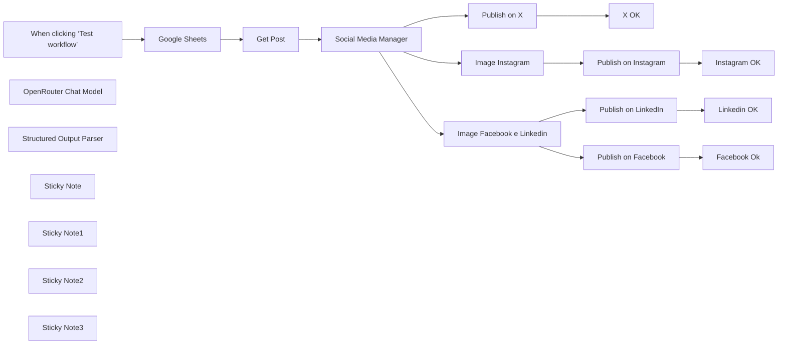

## Fluxo (.json) :

```json
{
  "id": "U9RofpXSIIUg12f9",
  "meta": {
    "instanceId": "a4bfc93e975ca233ac45ed7c9227d84cf5a2329310525917adaf3312e10d5462",
    "templateCredsSetupCompleted": true
  },
  "name": "AI Social Media Publisher from WordPress",
  "tags": [
    {
      "id": "2VG6RbmUdJ2VZbrj",
      "name": "Google Drive",
      "createdAt": "2024-12-04T16:50:56.177Z",
      "updatedAt": "2024-12-04T16:50:56.177Z"
    },
    {
      "id": "EtObDwELrdVvzOcI",
      "name": "OpenRouter",
      "createdAt": "2024-12-04T16:53:26.886Z",
      "updatedAt": "2024-12-04T16:53:26.886Z"
    },
    {
      "id": "OVXRgoTzbRrrYmBB",
      "name": "X",
      "createdAt": "2025-02-24T15:47:38.855Z",
      "updatedAt": "2025-02-24T15:47:38.855Z"
    },
    {
      "id": "PLbmcn8OyqnoHrYE",
      "name": "Instagram",
      "createdAt": "2025-02-24T15:47:48.325Z",
      "updatedAt": "2025-02-24T15:47:48.325Z"
    },
    {
      "id": "QsjuqQbwRJaxuGB4",
      "name": "Facebook",
      "createdAt": "2025-02-24T15:47:42.574Z",
      "updatedAt": "2025-02-24T15:47:42.574Z"
    },
    {
      "id": "oK8zaSe2Q5RG7qNe",
      "name": "Linkedin",
      "createdAt": "2025-02-24T15:47:45.129Z",
      "updatedAt": "2025-02-24T15:47:45.129Z"
    },
    {
      "id": "paTcf5QZDJsC2vKY",
      "name": "OpenAI",
      "createdAt": "2024-12-04T16:52:10.768Z",
      "updatedAt": "2024-12-04T16:52:10.768Z"
    }
  ],
  "nodes": [
    {
      "id": "f5bb7898-44eb-45bf-b199-2146c8e901f6",
      "name": "When clicking ‘Test workflow’",
      "type": "n8n-nodes-base.manualTrigger",
      "position": [
        -220,
        -80
      ],
      "parameters": {},
      "typeVersion": 1
    },
    {
      "id": "b1977304-fbbf-4bb5-924a-e5db036bca91",
      "name": "Google Sheets",
      "type": "n8n-nodes-base.googleSheets",
      "position": [
        0,
        -80
      ],
      "parameters": {
        "options": {
          "returnFirstMatch": true
        },
        "filtersUI": {
          "values": [
            {
              "lookupColumn": "TWITTER"
            }
          ]
        },
        "sheetName": {
          "__rl": true,
          "mode": "list",
          "value": "gid=0",
          "cachedResultUrl": "https://docs.google.com/spreadsheets/d/1suPQNdgoAzrklleN4ok2mZnsq0GK1dt59oIHv8JWX5U/edit#gid=0",
          "cachedResultName": "Foglio1"
        },
        "documentId": {
          "__rl": true,
          "mode": "list",
          "value": "1suPQNdgoAzrklleN4ok2mZnsq0GK1dt59oIHv8JWX5U",
          "cachedResultUrl": "https://docs.google.com/spreadsheets/d/1suPQNdgoAzrklleN4ok2mZnsq0GK1dt59oIHv8JWX5U/edit?usp=drivesdk",
          "cachedResultName": "Social Media post"
        }
      },
      "credentials": {
        "googleSheetsOAuth2Api": {
          "id": "JYR6a64Qecd6t8Hb",
          "name": "Google Sheets account"
        }
      },
      "typeVersion": 4.5
    },
    {
      "id": "1451692d-8e8d-4da7-be3e-b4dd20319c7a",
      "name": "OpenRouter Chat Model",
      "type": "@n8n/n8n-nodes-langchain.lmChatOpenRouter",
      "position": [
        400,
        140
      ],
      "parameters": {
        "model": "google/gemini-2.0-flash-exp:free",
        "options": {}
      },
      "credentials": {
        "openRouterApi": {
          "id": "pb06rfB4xmxzVe3Q",
          "name": "OpenRouter"
        }
      },
      "typeVersion": 1
    },
    {
      "id": "6768f867-666d-4c41-b77a-1bfb389b0329",
      "name": "Structured Output Parser",
      "type": "@n8n/n8n-nodes-langchain.outputParserStructured",
      "position": [
        620,
        140
      ],
      "parameters": {
        "schemaType": "manual",
        "inputSchema": "{\n\t\"type\": \"object\",\n\t\"properties\": {\n\t\t\"twitter\": {\n\t\t\t\"type\": \"string\"\n\t\t},\n\t\t\"facebook\": {\n\t\t\t\"type\": \"string\"\n\t\t},\n        \"linkedin\": {\n\t\t\t\"type\": \"string\"\n\t\t},\n        \"instagram\": {\n\t\t\t\"type\": \"string\"\n\t\t}\n\t}\n}"
      },
      "typeVersion": 1.2
    },
    {
      "id": "05cf81ec-bb25-447a-9c54-183132b8804c",
      "name": "Image Instagram",
      "type": "@n8n/n8n-nodes-langchain.openAi",
      "position": [
        940,
        280
      ],
      "parameters": {
        "prompt": "={{ $json.output.instagram }}",
        "options": {
          "size": "1024x1024",
          "returnImageUrls": true
        },
        "resource": "image"
      },
      "credentials": {
        "openAiApi": {
          "id": "CDX6QM4gLYanh0P4",
          "name": "OpenAi account"
        }
      },
      "typeVersion": 1.8
    },
    {
      "id": "2ae8be2c-28a3-4f55-aee3-2fff3517b149",
      "name": "Image Facebook e Linkedin",
      "type": "@n8n/n8n-nodes-langchain.openAi",
      "position": [
        940,
        -140
      ],
      "parameters": {
        "prompt": "={{ $json.output.facebook }}",
        "options": {
          "size": "1792x1024",
          "returnImageUrls": false
        },
        "resource": "image"
      },
      "credentials": {
        "openAiApi": {
          "id": "CDX6QM4gLYanh0P4",
          "name": "OpenAi account"
        }
      },
      "typeVersion": 1.8
    },
    {
      "id": "583a8459-3574-44e6-85bf-a33b9a4bf9f4",
      "name": "Social Media Manager",
      "type": "@n8n/n8n-nodes-langchain.chainLlm",
      "position": [
        440,
        -80
      ],
      "parameters": {
        "text": "=Generate social content from the following text with title \"{{ $json.title.rendered }}\" (in the same language):\n\n'''\n{{ $json.content.rendered }}\n'''",
        "messages": {
          "messageValues": [
            {
              "message": "=Your goal is to create engaging and informative content for LinkedIn, Instagram, Facebook, Twitter (X) while ensuring each post aligns with the platform’s audience, tone, and style. Content should reflect the company’s expertise, providing value-driven insights, tutorials, reviews, and discussions that resonate with tech professionals, enthusiasts, and businesses.\n\nEach post should be optimized for engagement, using platform-specific hashtags to improve reach and SEO. Maintain a professional yet approachable tone that promotes trust and authority in the tech space.\n\nContent Creation Best Practices:\nPost Optimization: Adapt content format, style, and hashtags based on each social media platform’s algorithm and audience engagement patterns.\nSEO & Hashtags: Use a balanced mix of general hashtags and platform-specific trending hashtags to maximize reach.\nEngagement-driven content: Focus on tech tutorials, IT industry updates, comparisons, reviews, and in-depth discussions that spark engagement.\nConsistency: Maintain a consistent tone and visual identity across all platforms, while tailoring content to each audience.\nData-driven trends: Regularly analyze post performance and adjust your hashtag strategy to reflect trending discussions within your topic. High-quality, relevant, and engaging copy that appeals to professionals, businesses, and enthusiasts of your topic must be provided.\n\n### Platform-specific requirements:\n1. **LinkedIn**:\n- Style: Professional and informative.\n- Tone: Focus on business results, employee gratitude, and community impact.\n- Content length: 3-4 sentences, detailed and insightful.\n- Hashtags: Create hashtags that are compatible with your topic.\n- Call to action: Engage businesses and professionals by encouraging comments or visits to Al Ansari's website.\n\n2. **Instagram**:\n- Style: Visual storytelling.\n- Tone: Inspiring and engaging.\n- Content length: 2-3 sentences, paired with creative captions and emojis.\n- Images: Highlight events, giveaways, and milestones (e.g., 50th anniversary keychains, eco-friendly tote bags).\n- Call to action: Use phrases like “Swipe to see more,” “Tag your coworkers,” or “Celebrate with us!”\n- Hashtags: Create hashtags that resonate with your topic\n\n3. **Facebook**:\n- Style: Friendly and relevant.\n- Tone: Community-focused, sharing employee stories, accomplishments, or event updates.\n- Content length: 2-3 sentences, slightly informal but still reflective of your company’s values.\n- Call to Action: Encourage likes, shares, and comments from connected families and communities\n\n4. **Twitter (X)**:\n- Style: Concise and impactful.\n- Tone: Crisp, engaging, and catchy.\n- Content Length: 150 characters or less, including hashtags.\n- Create hashtags that are compatible with the topic being discussed\n- Call to Action: Focus on rapid engagement through retweets, likes, and replies.\n\nWith this guide, generate posts for all platforms for the inputs below by inserting them into the specified json structure;"
            }
          ]
        },
        "promptType": "define",
        "hasOutputParser": true
      },
      "typeVersion": 1.5
    },
    {
      "id": "634af127-cd08-4beb-99a8-daa626793736",
      "name": "Sticky Note",
      "type": "n8n-nodes-base.stickyNote",
      "position": [
        -60,
        -160
      ],
      "parameters": {
        "width": 420,
        "height": 260,
        "content": "Get the Post ID of the Wordpress article on which you want to generate the caption for social media"
      },
      "typeVersion": 1
    },
    {
      "id": "dbdb39dc-02b2-4fe6-8b70-f38b86c9d9e3",
      "name": "Linkedin OK",
      "type": "n8n-nodes-base.googleSheets",
      "position": [
        1480,
        -260
      ],
      "parameters": {
        "columns": {
          "value": {
            "LINKEDIN": "x",
            "row_number": "={{ $('Google Sheets').item.json.row_number }}"
          },
          "schema": [
            {
              "id": "POST ID",
              "type": "string",
              "display": true,
              "required": false,
              "displayName": "POST ID",
              "defaultMatch": false,
              "canBeUsedToMatch": true
            },
            {
              "id": "TESTO",
              "type": "string",
              "display": true,
              "required": false,
              "displayName": "TESTO",
              "defaultMatch": false,
              "canBeUsedToMatch": true
            },
            {
              "id": "TWITTER",
              "type": "string",
              "display": true,
              "required": false,
              "displayName": "TWITTER",
              "defaultMatch": false,
              "canBeUsedToMatch": true
            },
            {
              "id": "FACEBOOK",
              "type": "string",
              "display": true,
              "removed": false,
              "required": false,
              "displayName": "FACEBOOK",
              "defaultMatch": false,
              "canBeUsedToMatch": true
            },
            {
              "id": "INSTAGRAM",
              "type": "string",
              "display": true,
              "removed": false,
              "required": false,
              "displayName": "INSTAGRAM",
              "defaultMatch": false,
              "canBeUsedToMatch": true
            },
            {
              "id": "LINKEDIN",
              "type": "string",
              "display": true,
              "removed": false,
              "required": false,
              "displayName": "LINKEDIN",
              "defaultMatch": false,
              "canBeUsedToMatch": true
            },
            {
              "id": "row_number",
              "type": "string",
              "display": true,
              "removed": false,
              "readOnly": true,
              "required": false,
              "displayName": "row_number",
              "defaultMatch": false,
              "canBeUsedToMatch": true
            }
          ],
          "mappingMode": "defineBelow",
          "matchingColumns": [
            "row_number"
          ],
          "attemptToConvertTypes": false,
          "convertFieldsToString": false
        },
        "options": {},
        "operation": "update",
        "sheetName": {
          "__rl": true,
          "mode": "list",
          "value": "gid=0",
          "cachedResultUrl": "https://docs.google.com/spreadsheets/d/1suPQNdgoAzrklleN4ok2mZnsq0GK1dt59oIHv8JWX5U/edit#gid=0",
          "cachedResultName": "Foglio1"
        },
        "documentId": {
          "__rl": true,
          "mode": "list",
          "value": "1suPQNdgoAzrklleN4ok2mZnsq0GK1dt59oIHv8JWX5U",
          "cachedResultUrl": "https://docs.google.com/spreadsheets/d/1suPQNdgoAzrklleN4ok2mZnsq0GK1dt59oIHv8JWX5U/edit?usp=drivesdk",
          "cachedResultName": "Social Media post"
        }
      },
      "credentials": {
        "googleSheetsOAuth2Api": {
          "id": "JYR6a64Qecd6t8Hb",
          "name": "Google Sheets account"
        }
      },
      "typeVersion": 4.5
    },
    {
      "id": "07aba718-fb10-48d4-bedb-0c19315acfe1",
      "name": "Facebook Ok",
      "type": "n8n-nodes-base.googleSheets",
      "position": [
        1480,
        0
      ],
      "parameters": {
        "columns": {
          "value": {
            "FACEBOOK": "x",
            "row_number": "={{ $('Google Sheets').item.json.row_number }}"
          },
          "schema": [
            {
              "id": "POST ID",
              "type": "string",
              "display": true,
              "required": false,
              "displayName": "POST ID",
              "defaultMatch": false,
              "canBeUsedToMatch": true
            },
            {
              "id": "TESTO",
              "type": "string",
              "display": true,
              "required": false,
              "displayName": "TESTO",
              "defaultMatch": false,
              "canBeUsedToMatch": true
            },
            {
              "id": "TWITTER",
              "type": "string",
              "display": true,
              "required": false,
              "displayName": "TWITTER",
              "defaultMatch": false,
              "canBeUsedToMatch": true
            },
            {
              "id": "FACEBOOK",
              "type": "string",
              "display": true,
              "removed": false,
              "required": false,
              "displayName": "FACEBOOK",
              "defaultMatch": false,
              "canBeUsedToMatch": true
            },
            {
              "id": "INSTAGRAM",
              "type": "string",
              "display": true,
              "removed": false,
              "required": false,
              "displayName": "INSTAGRAM",
              "defaultMatch": false,
              "canBeUsedToMatch": true
            },
            {
              "id": "LINKEDIN",
              "type": "string",
              "display": true,
              "removed": false,
              "required": false,
              "displayName": "LINKEDIN",
              "defaultMatch": false,
              "canBeUsedToMatch": true
            },
            {
              "id": "row_number",
              "type": "string",
              "display": true,
              "removed": false,
              "readOnly": true,
              "required": false,
              "displayName": "row_number",
              "defaultMatch": false,
              "canBeUsedToMatch": true
            }
          ],
          "mappingMode": "defineBelow",
          "matchingColumns": [
            "row_number"
          ],
          "attemptToConvertTypes": false,
          "convertFieldsToString": false
        },
        "options": {},
        "operation": "update",
        "sheetName": {
          "__rl": true,
          "mode": "list",
          "value": "gid=0",
          "cachedResultUrl": "https://docs.google.com/spreadsheets/d/1suPQNdgoAzrklleN4ok2mZnsq0GK1dt59oIHv8JWX5U/edit#gid=0",
          "cachedResultName": "Foglio1"
        },
        "documentId": {
          "__rl": true,
          "mode": "list",
          "value": "1suPQNdgoAzrklleN4ok2mZnsq0GK1dt59oIHv8JWX5U",
          "cachedResultUrl": "https://docs.google.com/spreadsheets/d/1suPQNdgoAzrklleN4ok2mZnsq0GK1dt59oIHv8JWX5U/edit?usp=drivesdk",
          "cachedResultName": "Social Media post"
        }
      },
      "credentials": {
        "googleSheetsOAuth2Api": {
          "id": "JYR6a64Qecd6t8Hb",
          "name": "Google Sheets account"
        }
      },
      "typeVersion": 4.5
    },
    {
      "id": "7fda8841-4b46-4f3b-9ba0-aa728ba7943f",
      "name": "Instagram OK",
      "type": "n8n-nodes-base.googleSheets",
      "position": [
        1480,
        280
      ],
      "parameters": {
        "columns": {
          "value": {
            "INSTAGRAM": "x",
            "row_number": "={{ $('Google Sheets').item.json.row_number }}"
          },
          "schema": [
            {
              "id": "POST ID",
              "type": "string",
              "display": true,
              "required": false,
              "displayName": "POST ID",
              "defaultMatch": false,
              "canBeUsedToMatch": true
            },
            {
              "id": "TESTO",
              "type": "string",
              "display": true,
              "required": false,
              "displayName": "TESTO",
              "defaultMatch": false,
              "canBeUsedToMatch": true
            },
            {
              "id": "TWITTER",
              "type": "string",
              "display": true,
              "required": false,
              "displayName": "TWITTER",
              "defaultMatch": false,
              "canBeUsedToMatch": true
            },
            {
              "id": "FACEBOOK",
              "type": "string",
              "display": true,
              "removed": false,
              "required": false,
              "displayName": "FACEBOOK",
              "defaultMatch": false,
              "canBeUsedToMatch": true
            },
            {
              "id": "INSTAGRAM",
              "type": "string",
              "display": true,
              "removed": false,
              "required": false,
              "displayName": "INSTAGRAM",
              "defaultMatch": false,
              "canBeUsedToMatch": true
            },
            {
              "id": "LINKEDIN",
              "type": "string",
              "display": true,
              "removed": false,
              "required": false,
              "displayName": "LINKEDIN",
              "defaultMatch": false,
              "canBeUsedToMatch": true
            },
            {
              "id": "row_number",
              "type": "string",
              "display": true,
              "removed": false,
              "readOnly": true,
              "required": false,
              "displayName": "row_number",
              "defaultMatch": false,
              "canBeUsedToMatch": true
            }
          ],
          "mappingMode": "defineBelow",
          "matchingColumns": [
            "row_number"
          ],
          "attemptToConvertTypes": false,
          "convertFieldsToString": false
        },
        "options": {},
        "operation": "update",
        "sheetName": {
          "__rl": true,
          "mode": "list",
          "value": "gid=0",
          "cachedResultUrl": "https://docs.google.com/spreadsheets/d/1suPQNdgoAzrklleN4ok2mZnsq0GK1dt59oIHv8JWX5U/edit#gid=0",
          "cachedResultName": "Foglio1"
        },
        "documentId": {
          "__rl": true,
          "mode": "list",
          "value": "1suPQNdgoAzrklleN4ok2mZnsq0GK1dt59oIHv8JWX5U",
          "cachedResultUrl": "https://docs.google.com/spreadsheets/d/1suPQNdgoAzrklleN4ok2mZnsq0GK1dt59oIHv8JWX5U/edit?usp=drivesdk",
          "cachedResultName": "Social Media post"
        }
      },
      "credentials": {
        "googleSheetsOAuth2Api": {
          "id": "JYR6a64Qecd6t8Hb",
          "name": "Google Sheets account"
        }
      },
      "typeVersion": 4.5
    },
    {
      "id": "fe599e8f-ff45-4aec-b70e-f0dc75b929d5",
      "name": "Get Post",
      "type": "n8n-nodes-base.wordpress",
      "position": [
        220,
        -80
      ],
      "parameters": {
        "postId": "={{ $json['POST ID'] }}",
        "options": {},
        "operation": "get"
      },
      "credentials": {
        "wordpressApi": {
          "id": "OE4AgquSkMWydRqn",
          "name": "Wordpress (wp.test.7hype.com)"
        }
      },
      "typeVersion": 1
    },
    {
      "id": "09059725-47dd-44ff-bcbd-f83d3bb3941d",
      "name": "Sticky Note1",
      "type": "n8n-nodes-base.stickyNote",
      "position": [
        380,
        -160
      ],
      "parameters": {
        "width": 360,
        "height": 260,
        "content": "The SMM Chain analyses the content of the post and creates the most suitable caption based on the destination social network.\n"
      },
      "typeVersion": 1
    },
    {
      "id": "89a0deab-b55a-4eb6-8251-538f5f216d56",
      "name": "Publish on X",
      "type": "n8n-nodes-base.twitter",
      "position": [
        1220,
        -500
      ],
      "parameters": {
        "text": "={{ $json.output.twitter }}",
        "additionalFields": {}
      },
      "credentials": {
        "twitterOAuth2Api": {
          "id": "qex5DVfLnCShvOC4",
          "name": "X account"
        }
      },
      "typeVersion": 2
    },
    {
      "id": "d0a618f3-48e0-4ba1-9525-e15663b38d9f",
      "name": "X OK",
      "type": "n8n-nodes-base.googleSheets",
      "position": [
        1480,
        -500
      ],
      "parameters": {
        "columns": {
          "value": {
            "TWITTER": "x",
            "row_number": "={{ $('Google Sheets').item.json.row_number }}"
          },
          "schema": [
            {
              "id": "POST ID",
              "type": "string",
              "display": true,
              "required": false,
              "displayName": "POST ID",
              "defaultMatch": false,
              "canBeUsedToMatch": true
            },
            {
              "id": "TESTO",
              "type": "string",
              "display": true,
              "required": false,
              "displayName": "TESTO",
              "defaultMatch": false,
              "canBeUsedToMatch": true
            },
            {
              "id": "TWITTER",
              "type": "string",
              "display": true,
              "required": false,
              "displayName": "TWITTER",
              "defaultMatch": false,
              "canBeUsedToMatch": true
            },
            {
              "id": "FACEBOOK",
              "type": "string",
              "display": true,
              "removed": false,
              "required": false,
              "displayName": "FACEBOOK",
              "defaultMatch": false,
              "canBeUsedToMatch": true
            },
            {
              "id": "INSTAGRAM",
              "type": "string",
              "display": true,
              "removed": false,
              "required": false,
              "displayName": "INSTAGRAM",
              "defaultMatch": false,
              "canBeUsedToMatch": true
            },
            {
              "id": "LINKEDIN",
              "type": "string",
              "display": true,
              "removed": false,
              "required": false,
              "displayName": "LINKEDIN",
              "defaultMatch": false,
              "canBeUsedToMatch": true
            },
            {
              "id": "row_number",
              "type": "string",
              "display": true,
              "removed": false,
              "readOnly": true,
              "required": false,
              "displayName": "row_number",
              "defaultMatch": false,
              "canBeUsedToMatch": true
            }
          ],
          "mappingMode": "defineBelow",
          "matchingColumns": [
            "row_number"
          ],
          "attemptToConvertTypes": false,
          "convertFieldsToString": false
        },
        "options": {},
        "operation": "update",
        "sheetName": {
          "__rl": true,
          "mode": "list",
          "value": "gid=0",
          "cachedResultUrl": "https://docs.google.com/spreadsheets/d/1suPQNdgoAzrklleN4ok2mZnsq0GK1dt59oIHv8JWX5U/edit#gid=0",
          "cachedResultName": "Foglio1"
        },
        "documentId": {
          "__rl": true,
          "mode": "list",
          "value": "1suPQNdgoAzrklleN4ok2mZnsq0GK1dt59oIHv8JWX5U",
          "cachedResultUrl": "https://docs.google.com/spreadsheets/d/1suPQNdgoAzrklleN4ok2mZnsq0GK1dt59oIHv8JWX5U/edit?usp=drivesdk",
          "cachedResultName": "Social Media post"
        }
      },
      "credentials": {
        "googleSheetsOAuth2Api": {
          "id": "JYR6a64Qecd6t8Hb",
          "name": "Google Sheets account"
        }
      },
      "typeVersion": 4.5
    },
    {
      "id": "8f19c32b-ab02-4098-a165-a3c9c6ff05c4",
      "name": "Publish on LinkedIn",
      "type": "n8n-nodes-base.linkedIn",
      "position": [
        1220,
        -260
      ],
      "parameters": {
        "text": "={{ $('Social Media Manager').item.json.output.linkedin }}",
        "postAs": "organization",
        "organization": "xxxxxxx",
        "additionalFields": {},
        "shareMediaCategory": "IMAGE"
      },
      "credentials": {
        "linkedInOAuth2Api": {
          "id": "K5XMG4dK4jY43PJ3",
          "name": "LinkedIn account"
        }
      },
      "typeVersion": 1
    },
    {
      "id": "69324bfa-ce6e-42e7-9598-13d8dbd13ae7",
      "name": "Publish on Facebook",
      "type": "n8n-nodes-base.facebookGraphApi",
      "position": [
        1220,
        0
      ],
      "parameters": {
        "edge": "photos",
        "node": "433770813646235",
        "options": {
          "queryParameters": {
            "parameter": [
              {
                "name": "message",
                "value": "={{ $('Social Media Manager').item.json.output.facebook }}"
              },
              {
                "name": "link",
                "value": "={{ $('Get Post').item.json.link }}"
              }
            ]
          }
        },
        "sendBinaryData": true,
        "graphApiVersion": "v21.0",
        "httpRequestMethod": "POST",
        "binaryPropertyName": "data"
      },
      "credentials": {
        "facebookGraphApi": {
          "id": "q5gZW6hdEvqTFPup",
          "name": "Facebook Graph account (Fantaera)"
        }
      },
      "typeVersion": 1
    },
    {
      "id": "ccc7bb23-2a26-42c6-9ac4-16a2cce77f66",
      "name": "Publish on Instagram",
      "type": "n8n-nodes-base.httpRequest",
      "position": [
        1220,
        280
      ],
      "parameters": {
        "url": "https://graph.facebook.com/v20.0/433770813646235/media",
        "method": "POST",
        "options": {},
        "sendQuery": true,
        "authentication": "predefinedCredentialType",
        "queryParameters": {
          "parameters": [
            {
              "name": "image_url",
              "value": "={{ $json.url }}"
            },
            {
              "name": "caption",
              "value": "={{ $('Social Media Manager').item.json.output.instagram }}"
            }
          ]
        },
        "nodeCredentialType": "facebookGraphApi"
      },
      "credentials": {
        "facebookGraphApi": {
          "id": "q5gZW6hdEvqTFPup",
          "name": "Facebook Graph account (Fantaera)"
        }
      },
      "typeVersion": 4.2
    },
    {
      "id": "687cf808-1355-4bec-aad3-2395efd5a41c",
      "name": "Sticky Note2",
      "type": "n8n-nodes-base.stickyNote",
      "position": [
        -220,
        -680
      ],
      "parameters": {
        "color": 3,
        "width": 960,
        "height": 320,
        "content": "## STEP 1\n\nThis workflow automates the process of creating and publishing social media posts across multiple platforms (Twitter/X, Facebook, LinkedIn, and Instagram) based on content from a WordPress post. It uses AI models to generate platform-specific captions and images, and integrates with Google Sheets, WordPress, and various social media APIs.\n\nGet the API Keys of the social networks you want to publish on\n- [X (Twitter)](https://docs.x.com/x-api/getting-started/getting-access)\n- [Linkedin](https://learn.microsoft.com/en-us/linkedin/marketing/community-management/shares/posts-api?view=li-lms-2025-02&tabs=http)\n- [Facebook](https://developers.facebook.com/docs/facebook-login/guides/access-tokens#portabletokens)\n- [Instagram](https://developers.facebook.com/docs/instagram-platform/instagram-api-with-facebook-login/content-publishing/)\n\nAuthenticate on social media nodes with the access tokens obtained"
      },
      "typeVersion": 1
    },
    {
      "id": "f74d071d-cb55-48f0-8cea-1cc24fa34061",
      "name": "Sticky Note3",
      "type": "n8n-nodes-base.stickyNote",
      "position": [
        -220,
        -320
      ],
      "parameters": {
        "color": 3,
        "width": 960,
        "height": 100,
        "content": "## STEP 2\nClone [this Sheet](https://docs.google.com/spreadsheets/d/1suPQNdgoAzrklleN4ok2mZnsq0GK1dt59oIHv8JWX5U/edit?usp=sharing) and set ONLY the WordPress Post ID id in the right column\n"
      },
      "typeVersion": 1
    }
  ],
  "active": false,
  "pinData": {},
  "settings": {
    "executionOrder": "v1"
  },
  "versionId": "31616cbf-fe93-445c-8224-ea0b3afc4696",
  "connections": {
    "Get Post": {
      "main": [
        [
          {
            "node": "Social Media Manager",
            "type": "main",
            "index": 0
          }
        ]
      ]
    },
    "Publish on X": {
      "main": [
        [
          {
            "node": "X OK",
            "type": "main",
            "index": 0
          }
        ]
      ]
    },
    "Google Sheets": {
      "main": [
        [
          {
            "node": "Get Post",
            "type": "main",
            "index": 0
          }
        ]
      ]
    },
    "Image Instagram": {
      "main": [
        [
          {
            "node": "Publish on Instagram",
            "type": "main",
            "index": 0
          }
        ]
      ]
    },
    "Publish on Facebook": {
      "main": [
        [
          {
            "node": "Facebook Ok",
            "type": "main",
            "index": 0
          }
        ]
      ]
    },
    "Publish on LinkedIn": {
      "main": [
        [
          {
            "node": "Linkedin OK",
            "type": "main",
            "index": 0
          }
        ]
      ]
    },
    "Publish on Instagram": {
      "main": [
        [
          {
            "node": "Instagram OK",
            "type": "main",
            "index": 0
          }
        ]
      ]
    },
    "Social Media Manager": {
      "main": [
        [
          {
            "node": "Image Instagram",
            "type": "main",
            "index": 0
          },
          {
            "node": "Image Facebook e Linkedin",
            "type": "main",
            "index": 0
          },
          {
            "node": "Publish on X",
            "type": "main",
            "index": 0
          }
        ]
      ]
    },
    "OpenRouter Chat Model": {
      "ai_languageModel": [
        [
          {
            "node": "Social Media Manager",
            "type": "ai_languageModel",
            "index": 0
          }
        ]
      ]
    },
    "Structured Output Parser": {
      "ai_outputParser": [
        [
          {
            "node": "Social Media Manager",
            "type": "ai_outputParser",
            "index": 0
          }
        ]
      ]
    },
    "Image Facebook e Linkedin": {
      "main": [
        [
          {
            "node": "Publish on LinkedIn",
            "type": "main",
            "index": 0
          },
          {
            "node": "Publish on Facebook",
            "type": "main",
            "index": 0
          }
        ]
      ]
    },
    "When clicking ‘Test workflow’": {
      "main": [
        [
          {
            "node": "Google Sheets",
            "type": "main",
            "index": 0
          }
        ]
      ]
    }
  }
}
```

<a id="template-7"></a>

## Template 7 - Curadoria automática de projetos GitHub do Hacker News

- **Nome:** Curadoria automática de projetos GitHub do Hacker News
- **Descrição:** Automatiza a descoberta de links GitHub em posts do Hacker News, extrai informações dos repositórios, gera posts para Twitter e LinkedIn usando IA, armazena registros e notifica o responsável antes da publicação.
- **Funcionalidade:** • Rastreamento agendado: Periodicamente verifica a página inicial do Hacker News em busca de novos posts.
• Extração de meta: Identifica e filtra links do GitHub e coleta metadados dos posts (título, autor, score, comentários).
• Verificação de duplicatas: Consulta uma base para evitar republicar o mesmo conteúdo.
• Visita ao repositório: Abre a página do GitHub para obter mais contexto e conteúdo do projeto.
• Conversão de conteúdo: Transforma o HTML da página em markdown para facilitar análise.
• Geração de conteúdo com IA: Usa um modelo de linguagem para criar textos formatados para Twitter e LinkedIn com regras específicas (CTA, comprimento, tom).
• Validação de conteúdo: Verifica se os textos gerados atendem ao formato esperado antes de prosseguir.
• Registro em base de dados: Cria/atualiza registros na base (controle de que foi preparado/postado).
• Notificação e espera: Envia a mensagem pronta ao responsável via Telegram e aguarda um intervalo antes da publicação final.
• Publicação em redes: Publica a postagem no X (Twitter) e no LinkedIn e atualiza o status no sistema após o envio.
• Tratamento de erros: Filtra itens com erro para evitar publicações incorretas ou incompletas.
- **Ferramentas:** • Hacker News (news.ycombinator.com): Fonte pública para descobrir links e discussões relevantes.
• GitHub: Repositórios-fonte referenciados pelo Hacker News e fonte de conteúdo do projeto.
• OpenAI (modelo GPT-4o-mini): Geração de textos para Twitter e LinkedIn com regras específicas de estilo e formato.
• Airtable: Armazenamento e controle de itens processados, evitando duplicação e registrando status de publicação.
• X (Twitter): Plataforma para publicar posts curtos gerados automaticamente.
• LinkedIn: Plataforma para publicar posts mais longos e orientados a narrativa profissional.
• Telegram: Canal de notificação para alertar o responsável e permitir revisão antes da publicação.

## Fluxo visual

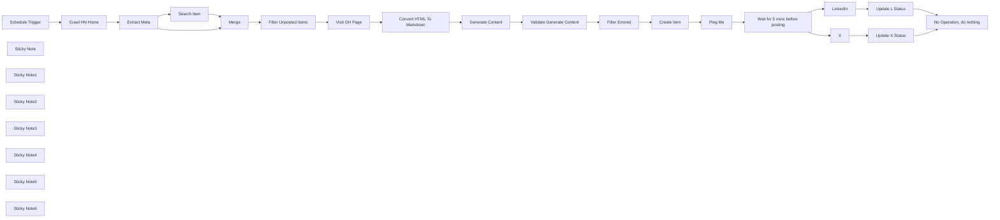

## Fluxo (.json) :

```json
{
  "id": "ZeSJSbwXI593H1Qj",
  "meta": {
    "instanceId": "8e1a7e3413df437923cda0e92c098469371d84f7001856e525beaff17be8b941",
    "templateCredsSetupCompleted": true
  },
  "name": "Social Media AI Agent - Telegram",
  "tags": [],
  "nodes": [
    {
      "id": "814303e0-5fe9-474e-a4ed-e4a728fd4acf",
      "name": "Crawl HN Home",
      "type": "n8n-nodes-base.httpRequest",
      "position": [
        -1540,
        1640
      ],
      "parameters": {
        "url": "https://news.ycombinator.com/",
        "options": {
          "response": {
            "response": {
              "neverError": true,
              "fullResponse": true
            }
          }
        }
      },
      "executeOnce": true,
      "typeVersion": 4.2,
      "alwaysOutputData": true
    },
    {
      "id": "32e20b1d-b3f1-4ed2-acbf-4d5bd56b0d8b",
      "name": "Extract Meta",
      "type": "n8n-nodes-base.code",
      "position": [
        -1260,
        1720
      ],
      "parameters": {
        "language": "python",
        "pythonCode": "# Import necessary modules\nimport asyncio\nimport micropip\n\n# Define an asynchronous function to install packages\nasync def install_packages():\n    await micropip.install(\"beautifulsoup4\")\n    await micropip.install(\"simplejson\")\n\n# Run the asynchronous package installation\nasyncio.get_event_loop().run_until_complete(install_packages())\n\n# Now, import the installed packages\nimport simplejson as json\nfrom bs4 import BeautifulSoup\n\n# Retrieve the HTML content from the first item in the input\n# Assuming n8n passes data as a list of items, each with a 'json' key\nhtml_content = items[0].get('json', {}).get('data', '')\n\n# Initialize BeautifulSoup with the HTML content\nsoup = BeautifulSoup(html_content, 'html.parser')\n\n# Initialize a list to store metadata of GitHub posts\ngithub_posts = []\n\n# Find all 'tr' elements with class 'athing submission'\nposts = soup.find_all('tr', class_='athing submission')\n\nfor post in posts:\n    post_id = post.get('id')\n    title_line = post.find('span', class_='titleline')\n    if not title_line:\n        continue  # Skip if titleline is not found\n\n    # Extract the title and URL\n    title_tag = title_line.find('a')\n    if not title_tag:\n        continue  # Skip if title tag is not found\n\n    title = title_tag.get_text(strip=True)\n    url = title_tag.get('href', '')\n\n    # Check if the URL is a GitHub link\n    if 'github.com' not in url.lower():\n        continue  # Skip if not a GitHub link\n\n    # Extract the site domain (e.g., github.com/username/repo)\n    site_bit = title_line.find('span', class_='sitebit comhead')\n    site = site_bit.find('span', class_='sitestr').get_text(strip=True) if site_bit else ''\n\n    # The subtext is in the next 'tr' element\n    subtext_tr = post.find_next_sibling('tr')\n    if not subtext_tr:\n        continue  # Skip if subtext row is not found\n\n    subtext_td = subtext_tr.find('td', class_='subtext')\n    if not subtext_td:\n        continue  # Skip if subtext td is not found\n\n    # Extract score\n    score_span = subtext_td.find('span', class_='score')\n    score = score_span.get_text(strip=True) if score_span else '0 points'\n\n    # Extract author\n    author_a = subtext_td.find('a', class_='hnuser')\n    author = author_a.get_text(strip=True) if author_a else 'unknown'\n\n    # Extract age\n    age_span = subtext_td.find('span', class_='age')\n    age_a = age_span.find('a') if age_span else None\n    age = age_a.get_text(strip=True) if age_a else 'unknown'\n\n    # Extract comments\n    comments_a = subtext_td.find_all('a')[-1] if subtext_td.find_all('a') else None\n    comments_text = comments_a.get_text(strip=True) if comments_a else '0 comments'\n\n    # Construct the Hacker News URL\n    hn_url = f\"https://news.ycombinator.com/item?id={post_id}\"\n\n    # Compile the metadata\n    post_metadata = {\n        'Post': post_id,\n        'title': title,\n        'url': url,\n        'site': site,\n        'score': score,\n        'author': author,\n        'age': age,\n        'comments': comments_text,\n        'hn_url': hn_url\n    }\n\n    # Append to the list of GitHub posts\n    github_posts.append(post_metadata)\n\n# Prepare the output for n8n\noutput = [{'json': post} for post in github_posts]\n\n# Return the output\nreturn output\n"
      },
      "executeOnce": true,
      "typeVersion": 2,
      "alwaysOutputData": true
    },
    {
      "id": "b54cf663-b823-4613-a812-764942b95b9d",
      "name": "Filter Unposted Items",
      "type": "n8n-nodes-base.code",
      "position": [
        -680,
        1640
      ],
      "parameters": {
        "jsCode": "const items = [];\n\n// Step 1: Collect all Post IDs from input1 items (those with 'id')\nconst processedPosts = new Set(\n  $input.all()\n    .filter(item => item.json.id)\n    .map(item => item.json.Post)\n);\n\n// Step 2: Iterate over all items and filter out duplicates\nfor (const item of $input.all()) {\n  \n  // Only process items without 'id' (input2 items)\n  if(!item.json.id){\n    \n    // Check if the Post ID is already processed\n    if(!processedPosts.has(item.json.Post) && item.json.Post!=undefined){\n      items.push(item);\n    }\n  }\n}\n\nreturn items;\n"
      },
      "typeVersion": 2
    },
    {
      "id": "d7ac7121-8da7-4e45-9b74-daf07fbf15fb",
      "name": "Visit GH Page",
      "type": "n8n-nodes-base.httpRequest",
      "position": [
        -420,
        1420
      ],
      "parameters": {
        "url": "={{ $json.url }}",
        "options": {}
      },
      "typeVersion": 4.2
    },
    {
      "id": "f156ca8e-7963-42b9-9612-9ab5efc53be4",
      "name": "Convert HTML To Markdown",
      "type": "n8n-nodes-base.markdown",
      "position": [
        -240,
        1700
      ],
      "parameters": {
        "html": "={{ $json.data }}",
        "options": {}
      },
      "typeVersion": 1,
      "alwaysOutputData": true
    },
    {
      "id": "86221ed0-29fa-4775-ba36-8ffdf614977c",
      "name": "Filter Errored",
      "type": "n8n-nodes-base.filter",
      "position": [
        380,
        1440
      ],
      "parameters": {
        "options": {},
        "conditions": {
          "options": {
            "version": 2,
            "leftValue": "",
            "caseSensitive": true,
            "typeValidation": "strict"
          },
          "combinator": "and",
          "conditions": [
            {
              "id": "7776cb97-e02d-418e-a168-612bf92d4160",
              "operator": {
                "type": "string",
                "operation": "empty",
                "singleValue": true
              },
              "leftValue": "={{ $json.error }}",
              "rightValue": ""
            }
          ]
        }
      },
      "typeVersion": 2.2
    },
    {
      "id": "f08c4f61-17a5-4899-ab3d-4e3ff5d1b8b7",
      "name": "No Operation, do nothing",
      "type": "n8n-nodes-base.noOp",
      "position": [
        1760,
        1540
      ],
      "parameters": {},
      "typeVersion": 1
    },
    {
      "id": "48856b3b-a951-4e7f-a0b8-410a71e9b0a7",
      "name": "Update X Status",
      "type": "n8n-nodes-base.airtable",
      "position": [
        1500,
        1400
      ],
      "parameters": {
        "base": {
          "__rl": true,
          "mode": "list",
          "value": "app7fh2kmMzPKS4RZ",
          "cachedResultUrl": "https://airtable.com/app7fh2kmMzPKS4RZ",
          "cachedResultName": "Twitter Agent"
        },
        "table": {
          "__rl": true,
          "mode": "list",
          "value": "tblf0cODJFdvDj7vU",
          "cachedResultUrl": "https://airtable.com/app7fh2kmMzPKS4RZ/tblf0cODJFdvDj7vU",
          "cachedResultName": "My Tweets"
        },
        "columns": {
          "value": {
            "id": "={{ $('Create Item').item.json.id }}",
            "TDone": true
          },
          "schema": [
            {
              "id": "id",
              "type": "string",
              "display": true,
              "removed": false,
              "readOnly": true,
              "required": false,
              "displayName": "id",
              "defaultMatch": true
            },
            {
              "id": "Post",
              "type": "string",
              "display": true,
              "removed": true,
              "readOnly": false,
              "required": false,
              "displayName": "Post",
              "defaultMatch": false,
              "canBeUsedToMatch": true
            },
            {
              "id": "Title",
              "type": "string",
              "display": true,
              "removed": true,
              "readOnly": false,
              "required": false,
              "displayName": "Title",
              "defaultMatch": false,
              "canBeUsedToMatch": true
            },
            {
              "id": "Url",
              "type": "string",
              "display": true,
              "removed": true,
              "readOnly": false,
              "required": false,
              "displayName": "Url",
              "defaultMatch": false,
              "canBeUsedToMatch": true
            },
            {
              "id": "Tweet",
              "type": "string",
              "display": true,
              "removed": true,
              "readOnly": false,
              "required": false,
              "displayName": "Tweet",
              "defaultMatch": false,
              "canBeUsedToMatch": true
            },
            {
              "id": "LinkedIn",
              "type": "string",
              "display": true,
              "removed": true,
              "readOnly": false,
              "required": false,
              "displayName": "LinkedIn",
              "defaultMatch": false,
              "canBeUsedToMatch": true
            },
            {
              "id": "Date",
              "type": "string",
              "display": true,
              "removed": true,
              "readOnly": true,
              "required": false,
              "displayName": "Date",
              "defaultMatch": false,
              "canBeUsedToMatch": true
            },
            {
              "id": "Last Modified",
              "type": "string",
              "display": true,
              "removed": true,
              "readOnly": true,
              "required": false,
              "displayName": "Last Modified",
              "defaultMatch": false,
              "canBeUsedToMatch": true
            },
            {
              "id": "TDone",
              "type": "boolean",
              "display": true,
              "removed": false,
              "readOnly": false,
              "required": false,
              "displayName": "TDone",
              "defaultMatch": false,
              "canBeUsedToMatch": true
            },
            {
              "id": "LDone",
              "type": "boolean",
              "display": true,
              "removed": true,
              "readOnly": false,
              "required": false,
              "displayName": "LDone",
              "defaultMatch": false,
              "canBeUsedToMatch": true
            }
          ],
          "mappingMode": "defineBelow",
          "matchingColumns": [
            "id"
          ]
        },
        "options": {
          "typecast": true
        },
        "operation": "update"
      },
      "credentials": {
        "airtableTokenApi": {
          "id": "BxLldDZTAZvuWVbr",
          "name": "Airtable Personal Access Token account"
        }
      },
      "typeVersion": 2.1
    },
    {
      "id": "c31bb906-2a0d-406a-a7cd-6fc4adfcb67b",
      "name": "LinkedIn",
      "type": "n8n-nodes-base.linkedIn",
      "position": [
        1200,
        1820
      ],
      "parameters": {
        "text": "={{ $('Filter Errored').item.json.message.content.linkedin }}",
        "person": "afi4Hy9wlI",
        "additionalFields": {}
      },
      "credentials": {
        "linkedInOAuth2Api": {
          "id": "S7G2oyLAmzhWuYFQ",
          "name": "LinkedIn account"
        }
      },
      "typeVersion": 1
    },
    {
      "id": "4aab4cc2-4a51-432a-aa21-ba469c027ac6",
      "name": "Update L Status",
      "type": "n8n-nodes-base.airtable",
      "position": [
        1520,
        1680
      ],
      "parameters": {
        "base": {
          "__rl": true,
          "mode": "list",
          "value": "app7fh2kmMzPKS4RZ",
          "cachedResultUrl": "https://airtable.com/app7fh2kmMzPKS4RZ",
          "cachedResultName": "Twitter Agent"
        },
        "table": {
          "__rl": true,
          "mode": "list",
          "value": "tblf0cODJFdvDj7vU",
          "cachedResultUrl": "https://airtable.com/app7fh2kmMzPKS4RZ/tblf0cODJFdvDj7vU",
          "cachedResultName": "My Tweets"
        },
        "columns": {
          "value": {
            "id": "={{ $('Create Item').item.json.id }}",
            "LDone": true
          },
          "schema": [
            {
              "id": "id",
              "type": "string",
              "display": true,
              "removed": false,
              "readOnly": true,
              "required": false,
              "displayName": "id",
              "defaultMatch": true
            },
            {
              "id": "Post",
              "type": "string",
              "display": true,
              "removed": true,
              "readOnly": false,
              "required": false,
              "displayName": "Post",
              "defaultMatch": false,
              "canBeUsedToMatch": true
            },
            {
              "id": "Title",
              "type": "string",
              "display": true,
              "removed": true,
              "readOnly": false,
              "required": false,
              "displayName": "Title",
              "defaultMatch": false,
              "canBeUsedToMatch": true
            },
            {
              "id": "Url",
              "type": "string",
              "display": true,
              "removed": true,
              "readOnly": false,
              "required": false,
              "displayName": "Url",
              "defaultMatch": false,
              "canBeUsedToMatch": true
            },
            {
              "id": "Tweet",
              "type": "string",
              "display": true,
              "removed": true,
              "readOnly": false,
              "required": false,
              "displayName": "Tweet",
              "defaultMatch": false,
              "canBeUsedToMatch": true
            },
            {
              "id": "LinkedIn",
              "type": "string",
              "display": true,
              "removed": true,
              "readOnly": false,
              "required": false,
              "displayName": "LinkedIn",
              "defaultMatch": false,
              "canBeUsedToMatch": true
            },
            {
              "id": "Date",
              "type": "string",
              "display": true,
              "removed": true,
              "readOnly": true,
              "required": false,
              "displayName": "Date",
              "defaultMatch": false,
              "canBeUsedToMatch": true
            },
            {
              "id": "Last Modified",
              "type": "string",
              "display": true,
              "removed": true,
              "readOnly": true,
              "required": false,
              "displayName": "Last Modified",
              "defaultMatch": false,
              "canBeUsedToMatch": true
            },
            {
              "id": "TDone",
              "type": "boolean",
              "display": true,
              "removed": true,
              "readOnly": false,
              "required": false,
              "displayName": "TDone",
              "defaultMatch": false,
              "canBeUsedToMatch": true
            },
            {
              "id": "LDone",
              "type": "boolean",
              "display": true,
              "removed": false,
              "readOnly": false,
              "required": false,
              "displayName": "LDone",
              "defaultMatch": false,
              "canBeUsedToMatch": true
            }
          ],
          "mappingMode": "defineBelow",
          "matchingColumns": [
            "id"
          ]
        },
        "options": {
          "typecast": true
        },
        "operation": "update"
      },
      "credentials": {
        "airtableTokenApi": {
          "id": "BxLldDZTAZvuWVbr",
          "name": "Airtable Personal Access Token account"
        }
      },
      "typeVersion": 2.1
    },
    {
      "id": "72dd9714-c11d-4417-8710-89e416ac44c9",
      "name": "Search Item",
      "type": "n8n-nodes-base.airtable",
      "position": [
        -1100,
        1240
      ],
      "parameters": {
        "base": {
          "__rl": true,
          "mode": "list",
          "value": "app7fh2kmMzPKS4RZ",
          "cachedResultUrl": "https://airtable.com/app7fh2kmMzPKS4RZ",
          "cachedResultName": "Twitter Agent"
        },
        "table": {
          "__rl": true,
          "mode": "list",
          "value": "tblf0cODJFdvDj7vU",
          "cachedResultUrl": "https://airtable.com/app7fh2kmMzPKS4RZ/tblf0cODJFdvDj7vU",
          "cachedResultName": "My Tweets"
        },
        "options": {
          "fields": [
            "Title",
            "Url",
            "Tweet",
            "Date",
            "Post"
          ]
        },
        "operation": "search",
        "filterByFormula": "={Post}= {{ $json.Post }}"
      },
      "credentials": {
        "airtableTokenApi": {
          "id": "BxLldDZTAZvuWVbr",
          "name": "Airtable Personal Access Token account"
        }
      },
      "typeVersion": 2.1,
      "alwaysOutputData": true
    },
    {
      "id": "f89fbada-0e53-44f0-a09b-119869fabd10",
      "name": "Create Item",
      "type": "n8n-nodes-base.airtable",
      "position": [
        580,
        1660
      ],
      "parameters": {
        "base": {
          "__rl": true,
          "mode": "list",
          "value": "app7fh2kmMzPKS4RZ",
          "cachedResultUrl": "https://airtable.com/app7fh2kmMzPKS4RZ",
          "cachedResultName": "Twitter Agent"
        },
        "table": {
          "__rl": true,
          "mode": "list",
          "value": "tblf0cODJFdvDj7vU",
          "cachedResultUrl": "https://airtable.com/app7fh2kmMzPKS4RZ/tblf0cODJFdvDj7vU",
          "cachedResultName": "My Tweets"
        },
        "columns": {
          "value": {
            "Url": "={{ $('Filter Unposted Items').item.json.url }}",
            "Post": "={{ $('Filter Unposted Items').item.json.Post }}",
            "Title": "={{ $('Filter Unposted Items').item.json.title }}",
            "Tweet": "={{ $json.message.content.twitter }}",
            "LinkedIn": "={{ $json.message.content.linkedin }}"
          },
          "schema": [
            {
              "id": "Post",
              "type": "string",
              "display": true,
              "removed": false,
              "readOnly": false,
              "required": false,
              "displayName": "Post",
              "defaultMatch": false,
              "canBeUsedToMatch": true
            },
            {
              "id": "Title",
              "type": "string",
              "display": true,
              "removed": false,
              "readOnly": false,
              "required": false,
              "displayName": "Title",
              "defaultMatch": false,
              "canBeUsedToMatch": true
            },
            {
              "id": "Url",
              "type": "string",
              "display": true,
              "removed": false,
              "readOnly": false,
              "required": false,
              "displayName": "Url",
              "defaultMatch": false,
              "canBeUsedToMatch": true
            },
            {
              "id": "Tweet",
              "type": "string",
              "display": true,
              "removed": false,
              "readOnly": false,
              "required": false,
              "displayName": "Tweet",
              "defaultMatch": false,
              "canBeUsedToMatch": true
            },
            {
              "id": "LinkedIn",
              "type": "string",
              "display": true,
              "removed": false,
              "readOnly": false,
              "required": false,
              "displayName": "LinkedIn",
              "defaultMatch": false,
              "canBeUsedToMatch": true
            },
            {
              "id": "Date",
              "type": "string",
              "display": true,
              "removed": false,
              "readOnly": true,
              "required": false,
              "displayName": "Date",
              "defaultMatch": false,
              "canBeUsedToMatch": true
            }
          ],
          "mappingMode": "defineBelow",
          "matchingColumns": []
        },
        "options": {},
        "operation": "create"
      },
      "credentials": {
        "airtableTokenApi": {
          "id": "BxLldDZTAZvuWVbr",
          "name": "Airtable Personal Access Token account"
        }
      },
      "typeVersion": 2.1
    },
    {
      "id": "51a2c3d3-3e75-4375-b2b6-4bb86fa71855",
      "name": "X",
      "type": "n8n-nodes-base.twitter",
      "onError": "continueRegularOutput",
      "position": [
        1180,
        1380
      ],
      "parameters": {
        "text": "={{ $('Filter Errored').item.json.message.content.twitter }}",
        "additionalFields": {}
      },
      "credentials": {
        "twitterOAuth2Api": {
          "id": "YQyS9lQTpZtZkefS",
          "name": "X account"
        }
      },
      "executeOnce": false,
      "typeVersion": 2
    },
    {
      "id": "58869c5b-9fb2-4f76-8788-68056cda45b0",
      "name": "Validate Generate Content",
      "type": "n8n-nodes-base.code",
      "onError": "continueRegularOutput",
      "position": [
        180,
        1680
      ],
      "parameters": {
        "mode": "runOnceForEachItem",
        "jsCode": "if ($json.message.content.twitter && $json.message.content.linkedin) {\n  \n  return $json;\n} else {\n\n  const parsedContent = JSON.parse($json.message.content);\n  if ($json.message.content.twitter && $json.message.content.linkedin) {\n    return parsedContent;\n  }\n\n  console.log(\"Invalid formatting\")\n  return {}\n}"
      },
      "typeVersion": 2
    },
    {
      "id": "527fd640-8bc8-4043-92a6-52fbea8de63f",
      "name": "Schedule Trigger",
      "type": "n8n-nodes-base.scheduleTrigger",
      "position": [
        -1780,
        1640
      ],
      "parameters": {
        "rule": {
          "interval": [
            {
              "field": "hours",
              "hoursInterval": 6
            }
          ]
        }
      },
      "typeVersion": 1.2
    },
    {
      "id": "f00c1de5-d5bd-4d78-8717-d26dd739adc7",
      "name": "Merge",
      "type": "n8n-nodes-base.merge",
      "position": [
        -840,
        1420
      ],
      "parameters": {},
      "typeVersion": 3,
      "alwaysOutputData": true
    },
    {
      "id": "3529fba4-173c-4378-ae69-43a3bae0813f",
      "name": "Generate Content",
      "type": "@n8n/n8n-nodes-langchain.openAi",
      "position": [
        -120,
        1440
      ],
      "parameters": {
        "modelId": {
          "__rl": true,
          "mode": "list",
          "value": "gpt-4o-mini",
          "cachedResultName": "GPT-4O-MINI"
        },
        "options": {},
        "messages": {
          "values": [
            {
              "role": "system",
              "content": "You are an AI-powered social media assistant specialized in crafting short-form, engaging posts for Twitter and LinkedIn. Your tone should blend the enthusiasm of a Tech Evangelist with the narrative depth of a Storyteller. The goal is to highlight technological and open-source projects in a friendly, forward-thinking manner, connecting them to real-world use cases. \n\nGuidelines:\n1. Output must be in JSON with separate fields for “twitter” and “linkedin.”\n2. Do not include emojis or marketing buzzwords (“cutting-edge,” “disruptive,” etc.).\n3. Write naturally and concisely. Avoid overly formal or robotic language.\n4. Twitter posts must be under 280 characters (including spaces and URL).\n5. LinkedIn posts should be slightly longer, yet still succinct, and focus on storytelling and real-world applications.\n6. Provide a single call-to-action in each post.\n7. Do not imply ownership of the project unless explicitly stated.\n8. Maintain a professional yet approachable tone in both outputs.\n"
            },
            {
              "content": "=Using the following details, generate two posts—one for Twitter and one for LinkedIn—incorporating an enthusiastic yet narrative-driven style:\n\nTitle: {{ $('Filter Unposted Items').item.json.title }}\nDetails in markdown: {{ $json.data }}\nRepository Link: {{ $('Filter Unposted Items').item.json.url }}  (this is the actual link you want to be inserted)\n\nConstraints:\n- No emojis.\n- Keep the Twitter post under 280 characters (including the link).\n- Use a friendly, forward-thinking tone that weaves in a short narrative where possible.\n- Highlight how the project solves a real problem or benefits the user.\n- End each post with one clear CTA (e.g., “Check it out!” or “Learn more.”).\n- **Ensure the tone is neutral and does not imply personal involvement** (e.g., avoid phrases like \"my journey\" or \"I found it fascinating\").\n- **LinkedIn post should be more detailed**: Provide context, explain the key features, highlight how it can be useful to different audiences, and elaborate on the problem it solves or the impact it can have.\n- Output your response in JSON with the structure:\n```json\n{\n  \"twitter\": \"Your Twitter post here\",\n  \"linkedin\": \"Your LinkedIn post here\"\n}\n"
            }
          ]
        },
        "jsonOutput": true
      },
      "credentials": {
        "openAiApi": {
          "id": "IfJo4dG8AUORk6f0",
          "name": "OpenAi account"
        }
      },
      "typeVersion": 1.7,
      "alwaysOutputData": true
    },
    {
      "id": "2dfd7849-877c-4bd3-b248-94140a1fe209",
      "name": "Sticky Note",
      "type": "n8n-nodes-base.stickyNote",
      "position": [
        -320,
        960
      ],
      "parameters": {
        "width": 619.8433261701165,
        "height": 97.20332107671479,
        "content": "Automate the curation and sharing of trending GitHub discussions from Hacker News to Twitter and LinkedIn. This workflow leverages AI to generate engaging posts, streamlining your social media content creation and distribution.\n\n"
      },
      "typeVersion": 1
    },
    {
      "id": "20704a99-1234-46dc-b8c8-860b051b3b85",
      "name": "Sticky Note1",
      "type": "n8n-nodes-base.stickyNote",
      "position": [
        -1620,
        1520
      ],
      "parameters": {
        "color": 5,
        "width": 524.8824946275869,
        "height": 420.37647358435385,
        "content": "I crawl Hacker News and extract Github links."
      },
      "typeVersion": 1
    },
    {
      "id": "5cfa2c30-6c88-429a-8b5f-0034d2352cc2",
      "name": "Sticky Note2",
      "type": "n8n-nodes-base.stickyNote",
      "position": [
        -480,
        1280
      ],
      "parameters": {
        "color": 5,
        "width": 828.144505037599,
        "height": 670.031562962293,
        "content": "This is where the magic happens. I use the Github url extracted earlier and visit Github page to get more insights in the project being shared. Then I ask Chat GPT very nicely to help me get a Tweet and a LinkedIn post"
      },
      "typeVersion": 1
    },
    {
      "id": "caec3df6-ddcc-4959-94e1-18163cf3128f",
      "name": "Sticky Note3",
      "type": "n8n-nodes-base.stickyNote",
      "position": [
        1100,
        1280
      ],
      "parameters": {
        "color": 5,
        "width": 285.9487894560623,
        "height": 751.2077576680031,
        "content": "One last magic trick, Send the generated Tweet and the post to the respective platforms."
      },
      "typeVersion": 1
    },
    {
      "id": "89c8472d-3329-4f94-a656-2539e061eeb0",
      "name": "Ping Me",
      "type": "n8n-nodes-base.telegram",
      "position": [
        720,
        1420
      ],
      "parameters": {
        "text": "=Hi There, here is your readymade tweet - \n\n {{ $json.fields.Tweet }}\n\nAnd your readymade LinkedIn post -\n\n {{ $json.fields.LinkedIn }}\n\n",
        "chatId": "1297549992",
        "additionalFields": {}
      },
      "credentials": {
        "telegramApi": {
          "id": "1RZApQ3BwJxFn9jp",
          "name": "Telegram account"
        }
      },
      "typeVersion": 1.2
    },
    {
      "id": "b1444e6d-0cab-4082-af42-a8decc97d9b4",
      "name": "Sticky Note4",
      "type": "n8n-nodes-base.stickyNote",
      "position": [
        640,
        1300
      ],
      "parameters": {
        "color": 5,
        "width": 264.5060210432334,
        "height": 307.03612625939974,
        "content": "Just pinging the owner that something is about to be posted and wait for 5 mins before final posting."
      },
      "typeVersion": 1
    },
    {
      "id": "01c2f7ff-ff6c-4a60-9581-f8c5f3985792",
      "name": "Wait for 5 mins before posting",
      "type": "n8n-nodes-base.wait",
      "position": [
        880,
        1660
      ],
      "webhookId": "0c7ee388-30cf-4a99-9bb0-0fd85171c794",
      "parameters": {
        "unit": "minutes"
      },
      "typeVersion": 1.1
    },
    {
      "id": "909c7e7d-ea84-4612-a322-b1fa889b2efb",
      "name": "Sticky Note5",
      "type": "n8n-nodes-base.stickyNote",
      "position": [
        -920,
        1380
      ],
      "parameters": {
        "width": 400.8207630962184,
        "height": 392.80719991071624,
        "content": "CHORE"
      },
      "typeVersion": 1
    },
    {
      "id": "04ab5b63-8def-4d49-9360-596261eb051c",
      "name": "Sticky Note6",
      "type": "n8n-nodes-base.stickyNote",
      "position": [
        -1140,
        1140
      ],
      "parameters": {
        "color": 5,
        "width": 195.58283685913963,
        "height": 285.5933578465706,
        "content": "Make sure we don't post the same content again."
      },
      "typeVersion": 1
    }
  ],
  "active": true,
  "pinData": {
    "Schedule Trigger": [
      {
        "json": {
          "Hour": "18",
          "Year": "2024",
          "Month": "December",
          "Minute": "00",
          "Second": "17",
          "Timezone": "America/New_York (UTC-05:00)",
          "timestamp": "2024-12-27T18:00:17.035-05:00",
          "Day of week": "Friday",
          "Day of month": "27",
          "Readable date": "December 27th 2024, 6:00:17 pm",
          "Readable time": "6:00:17 pm"
        }
      }
    ]
  },
  "settings": {
    "executionOrder": "v1"
  },
  "versionId": "4c28d47d-811e-4b89-adeb-47da12abd378",
  "connections": {
    "X": {
      "main": [
        [
          {
            "node": "Update X Status",
            "type": "main",
            "index": 0
          }
        ]
      ]
    },
    "Merge": {
      "main": [
        [
          {
            "node": "Filter Unposted Items",
            "type": "main",
            "index": 0
          }
        ]
      ]
    },
    "Ping Me": {
      "main": [
        [
          {
            "node": "Wait for 5 mins before posting",
            "type": "main",
            "index": 0
          }
        ]
      ]
    },
    "LinkedIn": {
      "main": [
        [
          {
            "node": "Update L Status",
            "type": "main",
            "index": 0
          }
        ]
      ]
    },
    "Create Item": {
      "main": [
        [
          {
            "node": "Ping Me",
            "type": "main",
            "index": 0
          }
        ]
      ]
    },
    "Search Item": {
      "main": [
        [
          {
            "node": "Merge",
            "type": "main",
            "index": 0
          }
        ]
      ]
    },
    "Extract Meta": {
      "main": [
        [
          {
            "node": "Search Item",
            "type": "main",
            "index": 0
          },
          {
            "node": "Merge",
            "type": "main",
            "index": 1
          }
        ]
      ]
    },
    "Crawl HN Home": {
      "main": [
        [
          {
            "node": "Extract Meta",
            "type": "main",
            "index": 0
          }
        ]
      ]
    },
    "Visit GH Page": {
      "main": [
        [
          {
            "node": "Convert HTML To Markdown",
            "type": "main",
            "index": 0
          }
        ]
      ]
    },
    "Filter Errored": {
      "main": [
        [
          {
            "node": "Create Item",
            "type": "main",
            "index": 0
          }
        ]
      ]
    },
    "Update L Status": {
      "main": [
        [
          {
            "node": "No Operation, do nothing",
            "type": "main",
            "index": 0
          }
        ]
      ]
    },
    "Update X Status": {
      "main": [
        [
          {
            "node": "No Operation, do nothing",
            "type": "main",
            "index": 0
          }
        ]
      ]
    },
    "Generate Content": {
      "main": [
        [
          {
            "node": "Validate Generate Content",
            "type": "main",
            "index": 0
          }
        ]
      ]
    },
    "Schedule Trigger": {
      "main": [
        [
          {
            "node": "Crawl HN Home",
            "type": "main",
            "index": 0
          }
        ]
      ]
    },
    "Filter Unposted Items": {
      "main": [
        [
          {
            "node": "Visit GH Page",
            "type": "main",
            "index": 0
          }
        ]
      ]
    },
    "Convert HTML To Markdown": {
      "main": [
        [
          {
            "node": "Generate Content",
            "type": "main",
            "index": 0
          }
        ]
      ]
    },
    "Validate Generate Content": {
      "main": [
        [
          {
            "node": "Filter Errored",
            "type": "main",
            "index": 0
          }
        ]
      ]
    },
    "Wait for 5 mins before posting": {
      "main": [
        [
          {
            "node": "X",
            "type": "main",
            "index": 0
          },
          {
            "node": "LinkedIn",
            "type": "main",
            "index": 0
          }
        ]
      ]
    }
  }
}
```

<a id="template-8"></a>

## Template 8 - Salvar ideias do Slack no Notion

- **Nome:** Salvar ideias do Slack no Notion
- **Descrição:** Recebe comandos slash do Slack e cria páginas em um banco de dados do Notion, notificando o autor para adicionar mais detalhes.
- **Funcionalidade:** • Receber comando slash do Slack: Aceita POST do comando /idea e extrai texto, usuário e response_url.
• Roteamento por comando: Identifica o comando recebido e permite suportar diferentes comandos (ex.: /idea, /bug) via regras.
• Criar página no Notion: Insere uma nova página no database usando o texto do comando como título e registra o criador no campo Creator.
• Enviar mensagem de confirmação para Slack: Publica uma resposta ao usuário via response_url, menciona o autor e fornece um link para adicionar detalhes e hipóteses.
• Configuração centralizada: Usa um campo configurável com a URL do database do Notion para facilitar o setup e reuso.
- **Ferramentas:** • Slack: Plataforma que envia o comando slash (/idea), fornece dados do usuário e disponibiliza um response_url para respostas.
• Notion: Banco de dados onde são criadas páginas com as ideias, armazenando título e informação do criador.

## Fluxo visual

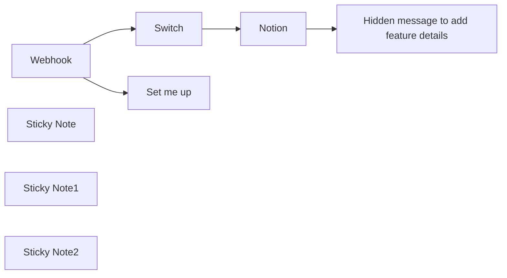

## Fluxo (.json) :

```json
{
  "meta": {
    "instanceId": "cb484ba7b742928a2048bf8829668bed5b5ad9787579adea888f05980292a4a7"
  },
  "nodes": [
    {
      "id": "1f506d0f-e999-409c-8456-d77d1771a2f3",
      "name": "Webhook",
      "type": "n8n-nodes-base.webhook",
      "position": [
        740,
        120
      ],
      "webhookId": "a8877bd7-8364-4868-9f88-d9080cce0cb1",
      "parameters": {
        "path": "slack-trigger",
        "options": {},
        "httpMethod": "POST"
      },
      "typeVersion": 1
    },
    {
      "id": "d5bdebab-cb97-44b5-8f85-e2bc71c0b7fb",
      "name": "Sticky Note",
      "type": "n8n-nodes-base.stickyNote",
      "position": [
        220,
        -100
      ],
      "parameters": {
        "color": 7,
        "width": 446,
        "height": 321,
        "content": "## Needed pre-work: Add a Slack App\n1. Visit https://api.slack.com/apps, click on `New App` and choose a name and workspace.\n2. Click on `OAuth & Permissions` and scroll down to Scopes -> Bot token Scopes\n3. Add the `chat:write` scope\n4. Head over to `Slash Commands` and click on `Create New Command`\n5. Use `/idea` as the command\n6. Copy the test URL from the **Webhook** node into `Request URL`\n7. Add whatever feels best to the description and usage hint\n8. Go to `Install app` and click install"
      },
      "typeVersion": 1
    },
    {
      "id": "fa0734a5-6794-4ba8-9675-b54ba9ddf6e8",
      "name": "Notion",
      "type": "n8n-nodes-base.notion",
      "position": [
        1620,
        20
      ],
      "parameters": {
        "title": "={{ $json.body.text }}",
        "options": {},
        "resource": "databasePage",
        "databaseId": {
          "__rl": true,
          "mode": "url",
          "value": "={{ $('Set me up').first().json['Notion URL'] }}"
        },
        "propertiesUi": {
          "propertyValues": [
            {
              "key": "Creator|rich_text",
              "textContent": "={{ $json.body.user_name }}"
            }
          ]
        }
      },
      "credentials": {
        "notionApi": {
          "id": "1exvaAn7wzyBgkXZ",
          "name": "Nik's Notion Cred"
        }
      },
      "typeVersion": 2.1
    },
    {
      "id": "28116568-f19c-47b3-9cd2-e08032db4dd5",
      "name": "Switch",
      "type": "n8n-nodes-base.switch",
      "position": [
        1360,
        120
      ],
      "parameters": {
        "rules": {
          "values": [
            {
              "outputKey": "New idea",
              "conditions": {
                "options": {
                  "leftValue": "",
                  "caseSensitive": true,
                  "typeValidation": "strict"
                },
                "combinator": "and",
                "conditions": [
                  {
                    "operator": {
                      "type": "string",
                      "operation": "equals"
                    },
                    "leftValue": "={{ $json.body.command }}",
                    "rightValue": "/idea"
                  }
                ]
              },
              "renameOutput": true
            },
            {
              "outputKey": "Add more here",
              "conditions": {
                "options": {
                  "leftValue": "",
                  "caseSensitive": true,
                  "typeValidation": "strict"
                },
                "combinator": "and",
                "conditions": [
                  {
                    "id": "25221a2c-18e9-47f6-a112-0edc85b63cda",
                    "operator": {
                      "name": "filter.operator.equals",
                      "type": "string",
                      "operation": "equals"
                    },
                    "leftValue": "={{ $json.body.command }}",
                    "rightValue": "/some-other-command"
                  }
                ]
              },
              "renameOutput": true
            }
          ]
        },
        "options": {}
      },
      "typeVersion": 3
    },
    {
      "id": "8a153fab-dd1a-4108-8522-766b09b4caf3",
      "name": "Hidden message to add feature details",
      "type": "n8n-nodes-base.httpRequest",
      "position": [
        1840,
        20
      ],
      "parameters": {
        "url": "={{ $('Webhook').item.json.body.response_url }}",
        "method": "POST",
        "options": {},
        "sendBody": true,
        "bodyParameters": {
          "parameters": [
            {
              "name": "text",
              "value": "=Thanks for adding the idea `{{ $('Webhook').item.json[\"body\"][\"text\"] }}` <@{{$('Webhook').item.json[\"body\"][\"user_id\"]}}> :rocket: Please make sure to add some details and a hypothesis to it to make it easier for us to work with it.\n\n:point_right: <{{$json[\"url\"]}}|Add your details here>"
            }
          ]
        }
      },
      "typeVersion": 3
    },
    {
      "id": "68d6136b-291f-4e17-b07f-da3672b6622f",
      "name": "Sticky Note1",
      "type": "n8n-nodes-base.stickyNote",
      "position": [
        920,
        -315
      ],
      "parameters": {
        "color": 5,
        "width": 331,
        "height": 422.85671270290686,
        "content": "## Setup\n1. Add a Database in Notion with the columns `Name` and `Creator`\n2. Add your Notion credentials and add the integration to your Notion page.\n3. Fill the setup node below\n4. Create your slack app (*see other sticky*)\n5. Click `Test` workflow and use the `/idea` comment in Slack\n6. Activate the workflow and exchange the Request URL with the production URL from the webhook"
      },
      "typeVersion": 1
    },
    {
      "id": "4a2d6224-352a-4625-b4ae-bc856b2602fd",
      "name": "Set me up",
      "type": "n8n-nodes-base.set",
      "position": [
        1020,
        -40
      ],
      "parameters": {
        "options": {},
        "assignments": {
          "assignments": [
            {
              "id": "9bcc3fa7-a09e-48f0-b4ff-2c78264dec2d",
              "name": "Notion URL",
              "type": "string",
              "value": "https://www.notion.so/n8n/12f1bb41e54345f6bdbe85085a67a5a9?v=72d337e995204017a24aa648edb5e7cc"
            }
          ]
        }
      },
      "typeVersion": 3.3
    },
    {
      "id": "89dc4c0d-7fab-4a6f-b8e9-65a0701c7d49",
      "name": "Sticky Note2",
      "type": "n8n-nodes-base.stickyNote",
      "position": [
        1300,
        40
      ],
      "parameters": {
        "color": 7,
        "height": 237.2740046838409,
        "content": "You can easily support more commands, like `/bug` or `/pain` here"
      },
      "typeVersion": 1
    }
  ],
  "pinData": {
    "Webhook": [
      {
        "body": {
          "text": "Some name",
          "token": "OROQZiopO3NiQVLFg0muEISq",
          "command": "/idea",
          "team_id": "TG9695PUK",
          "user_id": "U047V1J0E7J",
          "user_name": "niklas",
          "api_app_id": "A06MQ8S7QM6",
          "channel_id": "C04KYPACRJA",
          "trigger_id": "6718698191332.553213193971.2b472ec4e6e0fb9094507f09a98d01e7",
          "team_domain": "n8nio",
          "channel_name": "nik-wf-testing",
          "response_url": "https://hooks.slack.com/commands/TG9695PUK/6701685292247/8Q0IUAqaVcycw4skTzdYLSx3",
          "is_enterprise_install": "false"
        },
        "query": {},
        "params": {},
        "headers": {
          "host": "internal.users.n8n.cloud",
          "accept": "application/json,*/*",
          "x-real-ip": "10.255.0.2",
          "user-agent": "Slackbot 1.0 (+https://api.slack.com/robots)",
          "content-type": "application/x-www-form-urlencoded",
          "content-length": "420",
          "accept-encoding": "gzip,deflate",
          "x-forwarded-for": "10.255.0.2",
          "x-forwarded-host": "internal.users.n8n.cloud",
          "x-forwarded-port": "443",
          "x-forwarded-proto": "https",
          "x-slack-signature": "v0=9fb3ff0c0b84fd7ec95a0847b38c365124c8294b451dd29941d8fcd85fbd0eb9",
          "x-forwarded-server": "3d9f11a36e52",
          "x-slack-request-timestamp": "1709130534"
        }
      }
    ]
  },
  "connections": {
    "Notion": {
      "main": [
        [
          {
            "node": "Hidden message to add feature details",
            "type": "main",
            "index": 0
          }
        ]
      ]
    },
    "Switch": {
      "main": [
        [
          {
            "node": "Notion",
            "type": "main",
            "index": 0
          }
        ]
      ]
    },
    "Webhook": {
      "main": [
        [
          {
            "node": "Set me up",
            "type": "main",
            "index": 0
          },
          {
            "node": "Switch",
            "type": "main",
            "index": 0
          }
        ]
      ]
    }
  }
}
```

<a id="template-9"></a>

## Template 9 - Exportar notícias YCombinator para planilha e enviar por email

- **Nome:** Exportar notícias YCombinator para planilha e enviar por email
- **Descrição:** Busca a página principal do Y Combinator (Hacker News), extrai títulos e URLs das notícias, gera uma planilha com os resultados e envia por email como anexo.
- **Funcionalidade:** • Gatilho manual: inicia o fluxo quando o usuário aciona a execução.
• Requisição HTTP à página de notícias: obtém o HTML da página principal do Y Combinator (Hacker News).
• Extração de HTML: captura títulos e links das notícias usando seletores CSS (.storylink).
• Separação de listas: transforma os arrays de títulos e de URLs em listas de itens individuais.
• União por índice: combina cada título com seu respectivo URL, mantendo a correspondência por posição.
• Geração de arquivo de planilha: cria um arquivo de planilha nomeado com a data atual (ex: Ycombinator_news_YYYY-MM-DD) com a aba "Latest news" contendo os pares título/URL.
• Envio por email com anexo: envia a planilha gerada por email usando credenciais SMTP.
- **Ferramentas:** • Hacker News (news.ycombinator.com): fonte pública das notícias a serem extraídas.
• Servidor SMTP/Serviço de email: entrega do arquivo de planilha por email como anexo.
• Formato de planilha (XLSX/CSV): formato de saída utilizado para armazenar e compartilhar as notícias.

## Fluxo visual

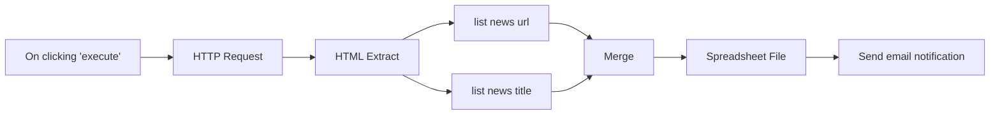

## Fluxo (.json) :

```json
{
  "nodes": [
    {
      "name": "On clicking 'execute'",
      "type": "n8n-nodes-base.manualTrigger",
      "position": [
        -100,
        470
      ],
      "parameters": {},
      "typeVersion": 1
    },
    {
      "name": "HTTP Request",
      "type": "n8n-nodes-base.httpRequest",
      "notes": "Get news page",
      "position": [
        100,
        470
      ],
      "parameters": {
        "url": "=https://news.ycombinator.com/",
        "options": {
          "fullResponse": true,
          "batchInterval": 500
        },
        "responseFormat": "file",
        "queryParametersUi": {
          "parameter": []
        },
        "headerParametersUi": {
          "parameter": []
        },
        "allowUnauthorizedCerts": true
      },
      "notesInFlow": true,
      "typeVersion": 1
    },
    {
      "name": "HTML Extract",
      "type": "n8n-nodes-base.htmlExtract",
      "notes": "extract news data",
      "position": [
        310,
        470
      ],
      "parameters": {
        "options": {},
        "sourceData": "binary",
        "extractionValues": {
          "values": [
            {
              "key": "news_title",
              "cssSelector": ".storylink",
              "returnArray": true
            },
            {
              "key": "news_url",
              "attribute": "href",
              "cssSelector": ".storylink",
              "returnArray": true,
              "returnValue": "attribute"
            }
          ]
        }
      },
      "notesInFlow": true,
      "typeVersion": 1
    },
    {
      "name": "list news url",
      "type": "n8n-nodes-base.itemLists",
      "position": [
        500,
        570
      ],
      "parameters": {
        "options": {},
        "fieldToSplitOut": "news_url"
      },
      "typeVersion": 1
    },
    {
      "name": "list news title",
      "type": "n8n-nodes-base.itemLists",
      "position": [
        500,
        390
      ],
      "parameters": {
        "options": {},
        "fieldToSplitOut": "news_title"
      },
      "typeVersion": 1
    },
    {
      "name": "Merge",
      "type": "n8n-nodes-base.merge",
      "position": [
        700,
        470
      ],
      "parameters": {
        "mode": "mergeByIndex"
      },
      "typeVersion": 1
    },
    {
      "name": "Spreadsheet File",
      "type": "n8n-nodes-base.spreadsheetFile",
      "position": [
        870,
        470
      ],
      "parameters": {
        "options": {
          "fileName": "=Ycombinator_news_{{new Date().toISOString().split('T', 1)[0]}}.{{$parameter[\"fileFormat\"]}}",
          "sheetName": "Latest news"
        },
        "operation": "toFile"
      },
      "typeVersion": 1
    },
    {
      "name": "Send email notification",
      "type": "n8n-nodes-base.emailSend",
      "position": [
        1050,
        470
      ],
      "parameters": {
        "text": "=Here are the latest news attached!",
        "options": {},
        "subject": "Ycombinator news",
        "toEmail": "",
        "fromEmail": "",
        "attachments": "data"
      },
      "credentials": {
        "smtp": ""
      },
      "typeVersion": 1
    }
  ],
  "connections": {
    "Merge": {
      "main": [
        [
          {
            "node": "Spreadsheet File",
            "type": "main",
            "index": 0
          }
        ]
      ]
    },
    "HTML Extract": {
      "main": [
        [
          {
            "node": "list news title",
            "type": "main",
            "index": 0
          },
          {
            "node": "list news url",
            "type": "main",
            "index": 0
          }
        ]
      ]
    },
    "HTTP Request": {
      "main": [
        [
          {
            "node": "HTML Extract",
            "type": "main",
            "index": 0
          }
        ]
      ]
    },
    "list news url": {
      "main": [
        [
          {
            "node": "Merge",
            "type": "main",
            "index": 1
          }
        ]
      ]
    },
    "list news title": {
      "main": [
        [
          {
            "node": "Merge",
            "type": "main",
            "index": 0
          }
        ]
      ]
    },
    "Spreadsheet File": {
      "main": [
        [
          {
            "node": "Send email notification",
            "type": "main",
            "index": 0
          }
        ]
      ]
    },
    "On clicking 'execute'": {
      "main": [
        [
          {
            "node": "HTTP Request",
            "type": "main",
            "index": 0
          }
        ]
      ]
    }
  }
}
```

<a id="template-10"></a>

## Template 10 - Envio em lote para Claude (Anthropic)

- **Nome:** Envio em lote para Claude (Anthropic)
- **Descrição:** Automatiza o envio de múltiplos prompts em lote para a API Claude da Anthropic, monitora o processamento até o fim e recupera os resultados processados.
- **Funcionalidade:** • Receber entradas em lote: Aceita um array de requests e o cabeçalho de versão da API.
• Construir requests a partir de diferentes fontes: Gera objetos de request tanto a partir de uma query simples quanto do histórico de chat (memória).
• Agregar solicitações: Junta múltiplas requests em um único payload de batch.
• Enviar batch para a API Anthropic: Submete o lote para o endpoint de messages/batches com o cabeçalho anthropic-version.
• Polling de status: Faz verificações periódicas até que o processamento do batch esteja com status 'ended'.
• Recuperar resultados: Busca os resultados via results_url fornecido pela API quando o processamento termina.
• Parsear resposta JSONL: Converte respostas separadas por novas linhas (JSONL) em objetos JSON manipuláveis.
• Filtrar e mapear resultados por custom_id: Separa resultados individuais do lote e permite salvar/usar respostas específicas por custom_id.
• Gerenciamento de memória de chat: Insere, carrega e limpa o histórico de chat para compor prompts mais ricos quando necessário.
- **Ferramentas:** • Anthropic Claude Batch API: Serviço de modelos de linguagem que recebe batches de mensagens (endpoint messages/batches), fornece status de processamento e disponibiliza resultados via URL.
• LangChain (memória): Biblioteca/estrutura para gerenciar histórico de conversas (buffer de memória) usada para montar mensagens a partir do contexto armazenado.

## Fluxo visual

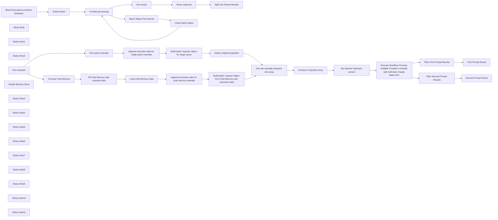

## Fluxo (.json) :

```json
{
  "meta": {
    "instanceId": "97d44c78f314fab340d7a5edaf7e2c274a7fbb8a7cd138f53cc742341e706fe7"
  },
  "nodes": [
    {
      "id": "fa4f8fd6-3272-4a93-8547-32d13873bbc1",
      "name": "Submit batch",
      "type": "n8n-nodes-base.httpRequest",
      "position": [
        180,
        40
      ],
      "parameters": {
        "url": "https://api.anthropic.com/v1/messages/batches",
        "method": "POST",
        "options": {},
        "jsonBody": "={ \"requests\": {{ JSON.stringify($json.requests) }} }",
        "sendBody": true,
        "sendQuery": true,
        "sendHeaders": true,
        "specifyBody": "json",
        "authentication": "predefinedCredentialType",
        "queryParameters": {
          "parameters": [
            {}
          ]
        },
        "headerParameters": {
          "parameters": [
            {
              "name": "anthropic-version",
              "value": "={{ $json[\"anthropic-version\"] }}"
            }
          ]
        },
        "nodeCredentialType": "anthropicApi"
      },
      "credentials": {
        "anthropicApi": {
          "id": "ub0zN7IP2V83OeTf",
          "name": "Anthropic account"
        }
      },
      "typeVersion": 4.2
    },
    {
      "id": "2916dc85-829d-491a-a7a8-de79d5356a53",
      "name": "Check batch status",
      "type": "n8n-nodes-base.httpRequest",
      "position": [
        840,
        115
      ],
      "parameters": {
        "url": "=https://api.anthropic.com/v1/messages/batches/{{ $json.id }}",
        "options": {},
        "sendHeaders": true,
        "authentication": "predefinedCredentialType",
        "headerParameters": {
          "parameters": [
            {
              "name": "anthropic-version",
              "value": "={{ $('When Executed by Another Workflow').item.json[\"anthropic-version\"] }}"
            }
          ]
        },
        "nodeCredentialType": "anthropicApi"
      },
      "credentials": {
        "anthropicApi": {
          "id": "ub0zN7IP2V83OeTf",
          "name": "Anthropic account"
        }
      },
      "typeVersion": 4.2
    },
    {
      "id": "1552ec92-2f18-42f6-b67f-b6f131012b3c",
      "name": "When Executed by Another Workflow",
      "type": "n8n-nodes-base.executeWorkflowTrigger",
      "position": [
        -40,
        40
      ],
      "parameters": {
        "workflowInputs": {
          "values": [
            {
              "name": "anthropic-version"
            },
            {
              "name": "requests",
              "type": "array"
            }
          ]
        }
      },
      "typeVersion": 1.1
    },
    {
      "id": "4bd40f02-caf1-419d-8261-a149cd51a534",
      "name": "Get results",
      "type": "n8n-nodes-base.httpRequest",
      "position": [
        620,
        -160
      ],
      "parameters": {
        "url": "={{ $json.results_url }}",
        "options": {},
        "sendHeaders": true,
        "authentication": "predefinedCredentialType",
        "headerParameters": {
          "parameters": [
            {
              "name": "anthropic-version",
              "value": "={{ $('When Executed by Another Workflow').item.json[\"anthropic-version\"] }}"
            }
          ]
        },
        "nodeCredentialType": "anthropicApi"
      },
      "credentials": {
        "anthropicApi": {
          "id": "ub0zN7IP2V83OeTf",
          "name": "Anthropic account"
        }
      },
      "typeVersion": 4.2
    },
    {
      "id": "5df366af-a54d-4594-a1ab-7a9df968101e",
      "name": "Parse response",
      "type": "n8n-nodes-base.code",
      "notes": "JSONL separated by newlines",
      "position": [
        840,
        -160
      ],
      "parameters": {
        "jsCode": "for (const item of $input.all()) {\n  if (item.json && item.json.data) {\n    // Split the string into individual JSON objects\n    const jsonStrings = item.json.data.split('\\n');\n\n    // Parse each JSON string and store them in an array\n    const parsedData = jsonStrings.filter(str => str.trim() !== '').map(str => JSON.parse(str));\n\n    // Replace the original json with the parsed array.\n    item.json.parsed = parsedData;\n  }\n}\n\nreturn $input.all();"
      },
      "notesInFlow": true,
      "typeVersion": 2
    },
    {
      "id": "68aa4ee2-e925-4e30-a7ab-317d8df4d9bc",
      "name": "If ended processing",
      "type": "n8n-nodes-base.if",
      "position": [
        400,
        40
      ],
      "parameters": {
        "options": {},
        "conditions": {
          "options": {
            "version": 2,
            "leftValue": "",
            "caseSensitive": true,
            "typeValidation": "strict"
          },
          "combinator": "and",
          "conditions": [
            {
              "id": "9494c5a3-d093-49c5-837f-99cd700a2f13",
              "operator": {
                "type": "string",
                "operation": "equals"
              },
              "leftValue": "={{ $json.processing_status }}",
              "rightValue": "ended"
            }
          ]
        }
      },
      "typeVersion": 2.2
    },
    {
      "id": "2b974e3b-495b-48af-8080-c7913d7a2ba8",
      "name": "Sticky Note",
      "type": "n8n-nodes-base.stickyNote",
      "position": [
        -200,
        -720
      ],
      "parameters": {
        "width": 1060,
        "height": 520,
        "content": "### This workflow automates sending batched prompts to Claude using the Anthropic API. It submits multiple prompts at once and retrieves the results.\n\n#### How to use\n\nCall this workflow with array of `requests`\n\n```json\n{\n    \"anthropic-version\": \"2023-06-01\",\n    \"requests\": [\n        {\n            \"custom_id\": \"first-prompt-in-my-batch\",\n            \"params\": {\n                \"max_tokens\": 100,\n                \"messages\": [\n                    {\n                        \"content\": \"Hey Claude, tell me a short fun fact about video games!\",\n                        \"role\": \"user\"\n                    }\n                ],\n                \"model\": \"claude-3-5-haiku-20241022\"\n            }\n        }\n    ]\n}\n```\n"
      },
      "typeVersion": 1
    },
    {
      "id": "928a30b5-5d90-4648-a82e-e4f1a01e47a5",
      "name": "Sticky Note1",
      "type": "n8n-nodes-base.stickyNote",
      "position": [
        1200,
        -720
      ],
      "parameters": {
        "width": 980,
        "height": 600,
        "content": "#### Results\n\nThis workflow returns an array of results with custom_ids.\n\n```json\n[\n    {\n        \"custom_id\": \"first-prompt-in-my-batch\",\n        \"result\": {\n            \"message\": {\n                \"content\": [\n                    {\n                        \"text\": \"Did you know that the classic video game Tetris was...\",\n                        \"type\": \"text\"\n                    }\n                ],\n                \"id\": \"msg_01AiLiVZT18XnoBD4r2w9x2t\",\n                \"model\": \"claude-3-5-haiku-20241022\",\n                \"role\": \"assistant\",\n                \"stop_reason\": \"end_turn\",\n                \"stop_sequence\": null,\n                \"type\": \"message\",\n                \"usage\": {\n                    \"cache_creation_input_tokens\": 0,\n                    \"cache_read_input_tokens\": 0,\n                    \"input_tokens\": 45,\n                    \"output_tokens\": 83\n                }\n            },\n            \"type\": \"succeeded\"\n        }\n    }\n]\n```"
      },
      "typeVersion": 1
    },
    {
      "id": "5dcb554e-32df-4883-b5a1-b40305756201",
      "name": "Batch Status Poll Interval",
      "type": "n8n-nodes-base.wait",
      "position": [
        620,
        40
      ],
      "webhookId": "7efafe72-063a-45c6-8775-fcec14e1d263",
      "parameters": {
        "amount": 10
      },
      "typeVersion": 1.1
    },
    {
      "id": "c25cfde5-ab83-4e5a-a66f-8cc9f23a01f6",
      "name": "Sticky Note2",
      "type": "n8n-nodes-base.stickyNote",
      "position": [
        -160,
        325
      ],
      "parameters": {
        "color": 4,
        "width": 340,
        "height": 620,
        "content": "# Usage example"
      },
      "typeVersion": 1
    },
    {
      "id": "6062ca7c-aa08-4805-9c96-65e5be8a38fd",
      "name": "Run example",
      "type": "n8n-nodes-base.manualTrigger",
      "position": [
        -40,
        625
      ],
      "parameters": {},
      "typeVersion": 1
    },
    {
      "id": "9878729a-123d-4460-a582-691ca8cedf98",
      "name": "One query example",
      "type": "n8n-nodes-base.set",
      "position": [
        634,
        775
      ],
      "parameters": {
        "options": {},
        "assignments": {
          "assignments": [
            {
              "id": "1ea47ba2-64be-4d69-b3db-3447cde71645",
              "name": "query",
              "type": "string",
              "value": "Hey Claude, tell me a short fun fact about bees!"
            }
          ]
        }
      },
      "typeVersion": 3.4
    },
    {
      "id": "df06c209-8b6a-4b6d-8045-230ebdfcfbad",
      "name": "Delete original properties",
      "type": "n8n-nodes-base.set",
      "position": [
        1528,
        775
      ],
      "parameters": {
        "options": {},
        "assignments": {
          "assignments": [
            {
              "id": "d238d62b-2e91-4242-b509-8cfc698d2252",
              "name": "custom_id",
              "type": "string",
              "value": "={{ $json.custom_id }}"
            },
            {
              "id": "21e07c09-92e3-41e7-8335-64653722e7e9",
              "name": "params",
              "type": "object",
              "value": "={{ $json.params }}"
            }
          ]
        }
      },
      "typeVersion": 3.4
    },
    {
      "id": "f66d6a89-ee33-4494-9476-46f408976b29",
      "name": "Construct 'requests' array",
      "type": "n8n-nodes-base.aggregate",
      "position": [
        1968,
        625
      ],
      "parameters": {
        "options": {},
        "aggregate": "aggregateAllItemData",
        "destinationFieldName": "requests"
      },
      "typeVersion": 1
    },
    {
      "id": "0f9eb605-d629-4cb7-b9cb-39702d201567",
      "name": "Set desired 'anthropic-version'",
      "type": "n8n-nodes-base.set",
      "notes": "2023-06-01",
      "position": [
        2188,
        625
      ],
      "parameters": {
        "options": {},
        "assignments": {
          "assignments": [
            {
              "id": "9f9e94a0-304b-487a-8762-d74421ef4cc0",
              "name": "anthropic-version",
              "type": "string",
              "value": "2023-06-01"
            }
          ]
        },
        "includeOtherFields": true
      },
      "notesInFlow": true,
      "typeVersion": 3.4
    },
    {
      "id": "f71f261c-f4ad-4c9f-bd72-42ab386a65e1",
      "name": "Execute Workflow 'Process Multiple Prompts in Parallel with Anthropic Claude Batch API'",
      "type": "n8n-nodes-base.executeWorkflow",
      "notes": "See above",
      "position": [
        2408,
        625
      ],
      "parameters": {
        "options": {
          "waitForSubWorkflow": true
        },
        "workflowId": {
          "__rl": true,
          "mode": "list",
          "value": "xQU4byMGhgFxnTIH",
          "cachedResultName": "Process Multiple Prompts in Parallel with Anthropic Claude Batch API"
        },
        "workflowInputs": {
          "value": {
            "requests": "={{ $json.requests }}",
            "anthropic-version": "={{ $json['anthropic-version'] }}"
          },
          "schema": [
            {
              "id": "anthropic-version",
              "type": "string",
              "display": true,
              "removed": false,
              "required": false,
              "displayName": "anthropic-version",
              "defaultMatch": false,
              "canBeUsedToMatch": true
            },
            {
              "id": "requests",
              "type": "array",
              "display": true,
              "removed": false,
              "required": false,
              "displayName": "requests",
              "defaultMatch": false,
              "canBeUsedToMatch": true
            }
          ],
          "mappingMode": "defineBelow",
          "matchingColumns": [
            "requests"
          ],
          "attemptToConvertTypes": true,
          "convertFieldsToString": true
        }
      },
      "notesInFlow": true,
      "typeVersion": 1.2
    },
    {
      "id": "bd27c1a6-572c-420d-84ab-4d8b7d14311b",
      "name": "Build batch 'request' object for single query",
      "type": "n8n-nodes-base.code",
      "position": [
        1308,
        775
      ],
      "parameters": {
        "jsCode": "// Loop over input items and modify them to match the response example, then return input.all()\nfor (const item of $input.all()) {\n  item.json.params = {\n    max_tokens: item.json.max_tokens,\n    messages: [\n      {\n        content: item.json.query,\n        role: \"user\"\n      }\n    ],\n    model: item.json.model\n  };\n}\n\nreturn $input.all();\n"
      },
      "typeVersion": 2
    },
    {
      "id": "fa342231-ea94-43ab-8808-18c8d04fdaf8",
      "name": "Simple Memory Store",
      "type": "@n8n/n8n-nodes-langchain.memoryBufferWindow",
      "position": [
        644,
        595
      ],
      "parameters": {
        "sessionKey": "\"Process Multiple Prompts in Parallel with Anthropic Claude Batch API example\"",
        "sessionIdType": "customKey"
      },
      "typeVersion": 1.3
    },
    {
      "id": "67047fe6-8658-45ba-be61-52cf6115f4e4",
      "name": "Fill Chat Memory with example data",
      "type": "@n8n/n8n-nodes-langchain.memoryManager",
      "position": [
        556,
        375
      ],
      "parameters": {
        "mode": "insert",
        "messages": {
          "messageValues": [
            {
              "message": "You are a helpful AI assistant"
            },
            {
              "type": "user",
              "message": "Hey Claude, tell me a short fun fact about video games!"
            },
            {
              "type": "ai",
              "message": "short fun fact about video games!"
            },
            {
              "type": "user",
              "message": "No, an actual fun fact"
            }
          ]
        }
      },
      "typeVersion": 1.1
    },
    {
      "id": "dbb295b8-01fd-445f-ab66-948442b6c71d",
      "name": "Build batch 'request' object from Chat Memory and execution data",
      "type": "n8n-nodes-base.code",
      "position": [
        1528,
        475
      ],
      "parameters": {
        "jsCode": "const output = [];\n\nfor (const item of $input.all()) {\n  const inputMessages = item.json.messages;\n  const customId = item.json.custom_id;\n  const model = item.json.model;\n  const maxTokens = item.json.max_tokens;\n\n  if (inputMessages && inputMessages.length > 0) {\n    let systemMessageContent = undefined;\n    const transformedMessages = [];\n\n    // Process each message entry in sequence\n    for (const messageObj of inputMessages) {\n      // Extract system message if present\n      if ('system' in messageObj) {\n        systemMessageContent = messageObj.system;\n      }\n      \n      // Process human and AI messages in the order they appear in the object keys\n      // We need to determine what order the keys appear in the original object\n      const keys = Object.keys(messageObj);\n      \n      for (const key of keys) {\n        if (key === 'human') {\n          transformedMessages.push({\n            role: \"user\",\n            content: messageObj.human\n          });\n        } else if (key === 'ai') {\n          transformedMessages.push({\n            role: \"assistant\",\n            content: messageObj.ai\n          });\n        }\n        // Skip 'system' as we already processed it\n      }\n    }\n\n    const params = {\n      model: model,\n      max_tokens: maxTokens,\n      messages: transformedMessages\n    };\n\n    if (systemMessageContent !== undefined) {\n      params.system = systemMessageContent;\n    }\n\n    output.push({\n      custom_id: customId,\n      params: params\n    });\n  }\n}\n\nreturn output;"
      },
      "typeVersion": 2
    },
    {
      "id": "f9edb335-c33d-45fc-8f9b-12d7f37cc23e",
      "name": "Load Chat Memory Data",
      "type": "@n8n/n8n-nodes-langchain.memoryManager",
      "position": [
        932,
        475
      ],
      "parameters": {
        "options": {}
      },
      "typeVersion": 1.1
    },
    {
      "id": "22399660-ebe5-4838-bad3-c542d6d921a3",
      "name": "First Prompt Result",
      "type": "n8n-nodes-base.executionData",
      "position": [
        2848,
        525
      ],
      "parameters": {
        "dataToSave": {
          "values": [
            {
              "key": "assistant_response",
              "value": "={{ $json.result.message.content[0].text }}"
            }
          ]
        }
      },
      "typeVersion": 1
    },
    {
      "id": "0e7f44f4-c931-4e0f-aebc-1b8f0327647f",
      "name": "Second Prompt Result",
      "type": "n8n-nodes-base.executionData",
      "position": [
        2848,
        725
      ],
      "parameters": {
        "dataToSave": {
          "values": [
            {
              "key": "assistant_response",
              "value": "={{ $json.result.message.content[0].text }}"
            }
          ]
        }
      },
      "typeVersion": 1
    },
    {
      "id": "e42b01e0-8fc5-42e1-aa45-aa85477e766b",
      "name": "Split Out Parsed Results",
      "type": "n8n-nodes-base.splitOut",
      "position": [
        1060,
        -160
      ],
      "parameters": {
        "options": {},
        "fieldToSplitOut": "parsed"
      },
      "typeVersion": 1
    },
    {
      "id": "343676b9-f147-4981-b555-8af570374e8c",
      "name": "Filter Second Prompt Results",
      "type": "n8n-nodes-base.filter",
      "position": [
        2628,
        725
      ],
      "parameters": {
        "options": {},
        "conditions": {
          "options": {
            "version": 2,
            "leftValue": "",
            "caseSensitive": true,
            "typeValidation": "strict"
          },
          "combinator": "and",
          "conditions": [
            {
              "id": "9e4b3524-7066-46cc-a365-8d23d08c1bda",
              "operator": {
                "name": "filter.operator.equals",
                "type": "string",
                "operation": "equals"
              },
              "leftValue": "={{ $json.custom_id }}",
              "rightValue": "={{ $('Append execution data for single query example').item.json.custom_id }}"
            }
          ]
        }
      },
      "typeVersion": 2.2
    },
    {
      "id": "c9f5f366-27c4-4401-965b-67c314036fb6",
      "name": "Filter First Prompt Results",
      "type": "n8n-nodes-base.filter",
      "position": [
        2628,
        525
      ],
      "parameters": {
        "options": {},
        "conditions": {
          "options": {
            "version": 2,
            "leftValue": "",
            "caseSensitive": true,
            "typeValidation": "strict"
          },
          "combinator": "and",
          "conditions": [
            {
              "id": "9e4b3524-7066-46cc-a365-8d23d08c1bda",
              "operator": {
                "name": "filter.operator.equals",
                "type": "string",
                "operation": "equals"
              },
              "leftValue": "={{ $json.custom_id }}",
              "rightValue": "={{ $('Append execution data for chat memory example').item.json.custom_id }}"
            }
          ]
        }
      },
      "typeVersion": 2.2
    },
    {
      "id": "0a5b9c3d-665b-4e35-be9e-c8297314969d",
      "name": "Sticky Note3",
      "type": "n8n-nodes-base.stickyNote",
      "position": [
        110,
        -100
      ],
      "parameters": {
        "height": 300,
        "content": "## Submit batch request to Anthropic"
      },
      "typeVersion": 1
    },
    {
      "id": "f19813a5-f669-45dd-a446-947a30b02b09",
      "name": "Sticky Note4",
      "type": "n8n-nodes-base.stickyNote",
      "position": [
        350,
        -5
      ],
      "parameters": {
        "width": 640,
        "height": 300,
        "content": "## Loop until processing status is 'ended'"
      },
      "typeVersion": 1
    },
    {
      "id": "9f424fce-5610-4b85-9be6-4c2c403002db",
      "name": "Sticky Note5",
      "type": "n8n-nodes-base.stickyNote",
      "position": [
        500,
        -200
      ],
      "parameters": {
        "width": 280,
        "height": 180,
        "content": "### Retrieve Message Batch Results\n\n[User guide](https://docs.anthropic.com/en/docs/build-with-claude/batch-processing)"
      },
      "typeVersion": 1
    },
    {
      "id": "b87673b1-f08d-4c51-8ee5-4d54557cb382",
      "name": "Sticky Note6",
      "type": "n8n-nodes-base.stickyNote",
      "position": [
        900,
        380
      ],
      "parameters": {
        "color": 5,
        "width": 820,
        "height": 340,
        "content": "# Example usage with Chat History Node"
      },
      "typeVersion": 1
    },
    {
      "id": "d6d8ac02-7005-40a1-9950-9517e98e315c",
      "name": "Sticky Note7",
      "type": "n8n-nodes-base.stickyNote",
      "position": [
        180,
        720
      ],
      "parameters": {
        "width": 1540,
        "height": 220,
        "content": "# Example usage with single query string"
      },
      "typeVersion": 1
    },
    {
      "id": "0d63deb0-dece-4502-9020-d67c1f194466",
      "name": "Sticky Note8",
      "type": "n8n-nodes-base.stickyNote",
      "position": [
        180,
        320
      ],
      "parameters": {
        "color": 3,
        "width": 660,
        "height": 400,
        "content": "# Environment setup\nFor Chat History Node"
      },
      "typeVersion": 1
    },
    {
      "id": "cab94e09-6b84-4a38-b854-670241744db5",
      "name": "Sticky Note9",
      "type": "n8n-nodes-base.stickyNote",
      "position": [
        2120,
        800
      ],
      "parameters": {
        "height": 220,
        "content": "## anthropic-version\n\n[Documentation](https://docs.anthropic.com/en/api/versioning)\n\nWhen making API requests, you must send an anthropic-version request header. For example, anthropic-version: `2023-06-01` (latest supported version)"
      },
      "typeVersion": 1
    },
    {
      "id": "ab0a51a1-3c84-4a88-968b-fd46ab07de85",
      "name": "Sticky Note10",
      "type": "n8n-nodes-base.stickyNote",
      "position": [
        2560,
        400
      ],
      "parameters": {
        "color": 5,
        "width": 480,
        "height": 300,
        "content": "# Example usage with Chat History Node (result)"
      },
      "typeVersion": 1
    },
    {
      "id": "d91b9be7-ef32-48d6-b880-cab0e99ba9bc",
      "name": "Sticky Note11",
      "type": "n8n-nodes-base.stickyNote",
      "position": [
        2560,
        700
      ],
      "parameters": {
        "width": 480,
        "height": 300,
        "content": "\n\n\n\n\n\n\n\n\n\n\n\n\n\n\n# Example usage with single query string (result)"
      },
      "typeVersion": 1
    },
    {
      "id": "341811e9-6677-42d9-be28-c388dbf68101",
      "name": "Join two example requests into array",
      "type": "n8n-nodes-base.merge",
      "position": [
        1748,
        625
      ],
      "parameters": {},
      "typeVersion": 3.1
    },
    {
      "id": "45a09f05-7610-4b0a-ab7f-0094c4b3f318",
      "name": "Append execution data for single query example",
      "type": "n8n-nodes-base.set",
      "notes": "custom_id, model and max tokens",
      "position": [
        1010,
        775
      ],
      "parameters": {
        "options": {},
        "assignments": {
          "assignments": [
            {
              "id": "8276602f-689f-45c2-bce0-5df8500912b6",
              "name": "custom_id",
              "type": "string",
              "value": "second-prompt-in-my-batch"
            },
            {
              "id": "2c513dc2-d8cb-4ba3-b3c1-ea79517b9434",
              "name": "model",
              "type": "string",
              "value": "claude-3-5-haiku-20241022"
            },
            {
              "id": "b052140b-1152-4327-9c5a-5030b78990b7",
              "name": "max_tokens",
              "type": "number",
              "value": 100
            }
          ]
        },
        "includeOtherFields": true
      },
      "notesInFlow": true,
      "typeVersion": 3.4
    },
    {
      "id": "c4e35349-840c-4c81-852c-0d8cd9331364",
      "name": "Append execution data for chat memory example",
      "type": "n8n-nodes-base.set",
      "notes": "custom_id, model and max tokens",
      "position": [
        1308,
        475
      ],
      "parameters": {
        "options": {},
        "assignments": {
          "assignments": [
            {
              "id": "8276602f-689f-45c2-bce0-5df8500912b6",
              "name": "custom_id",
              "type": "string",
              "value": "first-prompt-in-my-batch"
            },
            {
              "id": "2c513dc2-d8cb-4ba3-b3c1-ea79517b9434",
              "name": "model",
              "type": "string",
              "value": "claude-3-5-haiku-20241022"
            },
            {
              "id": "b052140b-1152-4327-9c5a-5030b78990b7",
              "name": "max_tokens",
              "type": "number",
              "value": 100
            }
          ]
        },
        "includeOtherFields": true
      },
      "notesInFlow": true,
      "typeVersion": 3.4
    },
    {
      "id": "058aedb1-fdfe-4edc-8d51-3b93ec7d232d",
      "name": "Truncate Chat Memory",
      "type": "@n8n/n8n-nodes-langchain.memoryManager",
      "notes": "ensure clean state",
      "position": [
        180,
        475
      ],
      "parameters": {
        "mode": "delete",
        "deleteMode": "all"
      },
      "notesInFlow": true,
      "typeVersion": 1.1
    }
  ],
  "pinData": {},
  "connections": {
    "Get results": {
      "main": [
        [
          {
            "node": "Parse response",
            "type": "main",
            "index": 0
          }
        ]
      ]
    },
    "Run example": {
      "main": [
        [
          {
            "node": "One query example",
            "type": "main",
            "index": 0
          },
          {
            "node": "Truncate Chat Memory",
            "type": "main",
            "index": 0
          }
        ]
      ]
    },
    "Submit batch": {
      "main": [
        [
          {
            "node": "If ended processing",
            "type": "main",
            "index": 0
          }
        ]
      ]
    },
    "Parse response": {
      "main": [
        [
          {
            "node": "Split Out Parsed Results",
            "type": "main",
            "index": 0
          }
        ]
      ]
    },
    "One query example": {
      "main": [
        [
          {
            "node": "Append execution data for single query example",
            "type": "main",
            "index": 0
          }
        ]
      ]
    },
    "Check batch status": {
      "main": [
        [
          {
            "node": "If ended processing",
            "type": "main",
            "index": 0
          }
        ]
      ]
    },
    "If ended processing": {
      "main": [
        [
          {
            "node": "Get results",
            "type": "main",
            "index": 0
          }
        ],
        [
          {
            "node": "Batch Status Poll Interval",
            "type": "main",
            "index": 0
          }
        ]
      ]
    },
    "Simple Memory Store": {
      "ai_memory": [
        [
          {
            "node": "Load Chat Memory Data",
            "type": "ai_memory",
            "index": 0
          },
          {
            "node": "Fill Chat Memory with example data",
            "type": "ai_memory",
            "index": 0
          },
          {
            "node": "Truncate Chat Memory",
            "type": "ai_memory",
            "index": 0
          }
        ]
      ]
    },
    "Truncate Chat Memory": {
      "main": [
        [
          {
            "node": "Fill Chat Memory with example data",
            "type": "main",
            "index": 0
          }
        ]
      ]
    },
    "Load Chat Memory Data": {
      "main": [
        [
          {
            "node": "Append execution data for chat memory example",
            "type": "main",
            "index": 0
          }
        ]
      ]
    },
    "Batch Status Poll Interval": {
      "main": [
        [
          {
            "node": "Check batch status",
            "type": "main",
            "index": 0
          }
        ]
      ]
    },
    "Construct 'requests' array": {
      "main": [
        [
          {
            "node": "Set desired 'anthropic-version'",
            "type": "main",
            "index": 0
          }
        ]
      ]
    },
    "Delete original properties": {
      "main": [
        [
          {
            "node": "Join two example requests into array",
            "type": "main",
            "index": 1
          }
        ]
      ]
    },
    "Filter First Prompt Results": {
      "main": [
        [
          {
            "node": "First Prompt Result",
            "type": "main",
            "index": 0
          }
        ]
      ]
    },
    "Filter Second Prompt Results": {
      "main": [
        [
          {
            "node": "Second Prompt Result",
            "type": "main",
            "index": 0
          }
        ]
      ]
    },
    "Set desired 'anthropic-version'": {
      "main": [
        [
          {
            "node": "Execute Workflow 'Process Multiple Prompts in Parallel with Anthropic Claude Batch API'",
            "type": "main",
            "index": 0
          }
        ]
      ]
    },
    "When Executed by Another Workflow": {
      "main": [
        [
          {
            "node": "Submit batch",
            "type": "main",
            "index": 0
          }
        ]
      ]
    },
    "Fill Chat Memory with example data": {
      "main": [
        [
          {
            "node": "Load Chat Memory Data",
            "type": "main",
            "index": 0
          }
        ]
      ]
    },
    "Join two example requests into array": {
      "main": [
        [
          {
            "node": "Construct 'requests' array",
            "type": "main",
            "index": 0
          }
        ]
      ]
    },
    "Append execution data for chat memory example": {
      "main": [
        [
          {
            "node": "Build batch 'request' object from Chat Memory and execution data",
            "type": "main",
            "index": 0
          }
        ]
      ]
    },
    "Build batch 'request' object for single query": {
      "main": [
        [
          {
            "node": "Delete original properties",
            "type": "main",
            "index": 0
          }
        ]
      ]
    },
    "Append execution data for single query example": {
      "main": [
        [
          {
            "node": "Build batch 'request' object for single query",
            "type": "main",
            "index": 0
          }
        ]
      ]
    },
    "Build batch 'request' object from Chat Memory and execution data": {
      "main": [
        [
          {
            "node": "Join two example requests into array",
            "type": "main",
            "index": 0
          }
        ]
      ]
    },
    "Execute Workflow 'Process Multiple Prompts in Parallel with Anthropic Claude Batch API'": {
      "main": [
        [
          {
            "node": "Filter First Prompt Results",
            "type": "main",
            "index": 0
          },
          {
            "node": "Filter Second Prompt Results",
            "type": "main",
            "index": 0
          }
        ]
      ]
    }
  }
}
```

<a id="template-11"></a>

## Template 11 - Processamento de dados de IA de chamadas de vendas

- **Nome:** Processamento de dados de IA de chamadas de vendas
- **Descrição:** Processa dados de IA gerados a partir de chamadas de vendas para atualizar registros existentes e criar objetos de caso de uso e feedback de produto em bases de dados.
- **Funcionalidade:** • Receber dados de IA de outro fluxo: recebe o payload com metadados da chamada e o resultado da análise de IA.
• Verificar menção de IA na chamada: determina se a chamada contém referências relevantes a IA/ML.
• Atualizar registro da chamada com resumo de IA: grava checkbox e resumo de IA no registro da chamada existente.
• Detectar e criar caso de uso de IA: quando identificado, cria uma página na base de casos de uso preenchendo propriedades relevantes (empresa, departamento, necessidade de RAG, etc.).
• Detectar e criar feedback de produto: quando houver feedbacks, divide a lista em itens e cria páginas relacionadas na base de Product Feedback, relacionando-as à chamada.
• Gerenciar limitação de taxa: insere esperas controladas antes de operações de criação para evitar rate limiting.
• Agrupar e mesclar threads de dados: agrega itens gerados e adiciona contexto adicional (como resposta de IA) antes de finalizar operações.
• Mapear propriedades para armazenamento: transforma campos do output de IA e metadados da chamada em propriedades das bases de dados alvo.
- **Ferramentas:** • Gong: fonte das chamadas de vendas e contexto de reunião.
• Serviço de IA externo: gera a análise e extração de informações das chamadas (AIoutput).
• Notion: armazena e atualiza páginas em bases de dados como AI use-case e Product Feedback.
• CRMs (Pipedrive/Salesforce) - integração planejada: possibilidade de sincronizar oportunidades e dados comerciais no futuro.

## Fluxo visual

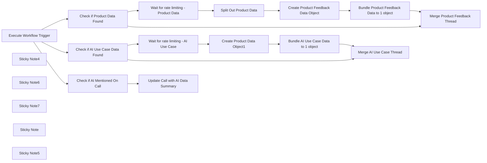

## Fluxo (.json) :

```json
{
  "meta": {
    "instanceId": "cb484ba7b742928a2048bf8829668bed5b5ad9787579adea888f05980292a4a7",
    "templateCredsSetupCompleted": true
  },
  "nodes": [
    {
      "id": "a2061232-329f-4288-9b01-ba832463c31e",
      "name": "Execute Workflow Trigger",
      "type": "n8n-nodes-base.executeWorkflowTrigger",
      "position": [
        2280,
        -400
      ],
      "parameters": {},
      "typeVersion": 1
    },
    {
      "id": "42df9296-82ac-44cd-8370-50e4507fb91d",
      "name": "Check if Product Data Found",
      "type": "n8n-nodes-base.if",
      "position": [
        2800,
        -340
      ],
      "parameters": {
        "options": {},
        "conditions": {
          "options": {
            "version": 2,
            "leftValue": "",
            "caseSensitive": true,
            "typeValidation": "strict"
          },
          "combinator": "and",
          "conditions": [
            {
              "id": "1a67895e-3ab7-4c93-8e16-202b3882ded5",
              "operator": {
                "type": "array",
                "operation": "lengthGte",
                "rightType": "number"
              },
              "leftValue": "={{ $json.AIoutput.ProductFeedback }}",
              "rightValue": 1
            }
          ]
        }
      },
      "typeVersion": 2.2
    },
    {
      "id": "84e93120-92d8-45fd-bb63-8626743e7fe0",
      "name": "Sticky Note4",
      "type": "n8n-nodes-base.stickyNote",
      "position": [
        2720,
        -580
      ],
      "parameters": {
        "color": 7,
        "width": 1340,
        "height": 440,
        "content": "## Product Data Processing"
      },
      "typeVersion": 1
    },
    {
      "id": "5cb1df66-abba-4d82-8fe5-c2313c8f7b44",
      "name": "Sticky Note6",
      "type": "n8n-nodes-base.stickyNote",
      "position": [
        2140,
        -760
      ],
      "parameters": {
        "color": 7,
        "width": 560,
        "height": 620,
        "content": "## Receives AI Data from other workflow\n"
      },
      "typeVersion": 1
    },
    {
      "id": "7c046627-f418-4b7e-aa5b-7cff69f98f59",
      "name": "Sticky Note7",
      "type": "n8n-nodes-base.stickyNote",
      "position": [
        1780,
        -960
      ],
      "parameters": {
        "width": 340,
        "height": 820,
        "content": "\n## CallForge - The AI Gong Sales Call Processor\nCallForge allows you to extract important information for different departments from your Sales Gong Calls. \n\n### AI Output Processor\nOnce the AI data is generated, it is then added (or not!) to the Notion Database here. This is also where the Pipedrive or Salesforce integration will be added once that portion is complete. "
      },
      "typeVersion": 1
    },
    {
      "id": "a04dac9d-5477-41a3-8696-1871c1cccf53",
      "name": "Create Product Data Object1",
      "type": "n8n-nodes-base.notion",
      "position": [
        3280,
        -940
      ],
      "parameters": {
        "title": "={{ $('Execute Workflow Trigger').item.json.metaData.title }}",
        "options": {
          "icon": "💬"
        },
        "resource": "databasePage",
        "databaseId": {
          "__rl": true,
          "mode": "list",
          "value": "1775b6e0-c94f-80ac-9885-d9695af5bc89",
          "cachedResultUrl": "https://www.notion.so/1775b6e0c94f80ac9885d9695af5bc89",
          "cachedResultName": "AI use-case database"
        },
        "propertiesUi": {
          "propertyValues": [
            {
              "key": "Company|title",
              "title": "={{ $json.metaData.CompanyName }}"
            },
            {
              "key": "Department|multi_select",
              "multiSelectValue": "={{ $json.AIoutput.AI_ML_References.Details.Department }}"
            },
            {
              "key": "Dev status|select",
              "selectValue": "={{ $json.AIoutput.AI_ML_References.Details.DevelopmentStatus }}"
            },
            {
              "key": "Employees|select",
              "selectValue": "={{ $json.sfOpp[0].Employees }}"
            },
            {
              "key": "Engagement with n8n|select",
              "selectValue": "Prospect"
            },
            {
              "key": "Requires agents|checkbox",
              "checkboxValue": "={{ $json.AIoutput.AI_ML_References.Details.RequiresAgents }}"
            },
            {
              "key": "More info|url",
              "urlValue": "={{ $json.metaData.url }}"
            },
            {
              "key": "Requires RAG|checkbox",
              "checkboxValue": "={{ $json.AIoutput.AI_ML_References.Details.RequiresRAG }}"
            },
            {
              "key": "Requires chat|select",
              "selectValue": "={{ $json.AIoutput.AI_ML_References.Details.RequiresChat }}"
            },
            {
              "key": "Use case|rich_text",
              "textContent": "={{ $json.AIoutput.AI_ML_References.Context }}"
            }
          ]
        }
      },
      "credentials": {
        "notionApi": {
          "id": "2B3YIiD4FMsF9Rjn",
          "name": "Angelbot Notion"
        }
      },
      "retryOnFail": true,
      "typeVersion": 2.2,
      "waitBetweenTries": 3000
    },
    {
      "id": "66c252a9-e330-4742-84d1-d17042585f79",
      "name": "Sticky Note",
      "type": "n8n-nodes-base.stickyNote",
      "position": [
        2720,
        -1040
      ],
      "parameters": {
        "color": 7,
        "width": 1340,
        "height": 440,
        "content": "## AI use Case "
      },
      "typeVersion": 1
    },
    {
      "id": "caded10f-8662-4a2b-ab47-b1a825c39c4b",
      "name": "Sticky Note5",
      "type": "n8n-nodes-base.stickyNote",
      "position": [
        2720,
        -120
      ],
      "parameters": {
        "color": 7,
        "width": 1340,
        "height": 360,
        "content": "## AI Mentioned on call"
      },
      "typeVersion": 1
    },
    {
      "id": "750c2853-3653-4557-b636-354fd91f846b",
      "name": "Create Product Feedback Data Object",
      "type": "n8n-nodes-base.notion",
      "position": [
        3440,
        -480
      ],
      "parameters": {
        "title": "={{ $('Execute Workflow Trigger').item.json.metaData.title }}",
        "options": {
          "icon": "💬"
        },
        "resource": "databasePage",
        "databaseId": {
          "__rl": true,
          "mode": "list",
          "value": "1375b6e0-c94f-80a8-93c9-c623b76dd14a",
          "cachedResultUrl": "https://www.notion.so/1375b6e0c94f80a893c9c623b76dd14a",
          "cachedResultName": "Product Feedback"
        },
        "propertiesUi": {
          "propertyValues": [
            {
              "key": "Sentiment|multi_select",
              "multiSelectValue": "={{ $json.Sentiment }}"
            },
            {
              "key": "Feedback|title",
              "title": "={{ $json.Feedback }}"
            },
            {
              "key": "Feedback Date|date",
              "date": "={{ $('Execute Workflow Trigger').item.json.metaData.started }}"
            },
            {
              "key": "Sales Call Summaries|relation",
              "relationValue": [
                "={{ $('Execute Workflow Trigger').item.json.notionData[0].id }}"
              ]
            }
          ]
        }
      },
      "credentials": {
        "notionApi": {
          "id": "80",
          "name": "Notion david-internal"
        }
      },
      "retryOnFail": true,
      "typeVersion": 2.2,
      "waitBetweenTries": 3000
    },
    {
      "id": "343f536f-2aa3-4fc9-9c75-e288a5019b84",
      "name": "Check if AI Use Case Data Found",
      "type": "n8n-nodes-base.if",
      "position": [
        2800,
        -800
      ],
      "parameters": {
        "options": {},
        "conditions": {
          "options": {
            "version": 2,
            "leftValue": "",
            "caseSensitive": true,
            "typeValidation": "strict"
          },
          "combinator": "and",
          "conditions": [
            {
              "id": "1a67895e-3ab7-4c93-8e16-202b3882ded5",
              "operator": {
                "type": "boolean",
                "operation": "true",
                "singleValue": true
              },
              "leftValue": "={{ $json.AIoutput.AI_ML_References.Exist }}",
              "rightValue": 1
            }
          ]
        }
      },
      "typeVersion": 2.2
    },
    {
      "id": "3d261de2-61fe-40e8-806b-f311b72081f0",
      "name": "Check if AI Mentioned On Call",
      "type": "n8n-nodes-base.if",
      "position": [
        2860,
        40
      ],
      "parameters": {
        "options": {},
        "conditions": {
          "options": {
            "version": 2,
            "leftValue": "",
            "caseSensitive": true,
            "typeValidation": "strict"
          },
          "combinator": "and",
          "conditions": [
            {
              "id": "1a67895e-3ab7-4c93-8e16-202b3882ded5",
              "operator": {
                "type": "boolean",
                "operation": "true",
                "singleValue": true
              },
              "leftValue": "={{ $json.AIoutput.AI_ML_References.Exist }}",
              "rightValue": 1
            }
          ]
        }
      },
      "typeVersion": 2.2
    },
    {
      "id": "e422c25b-05c0-4549-a12b-50b727cbcb83",
      "name": "Wait for rate limiting - AI Use Case",
      "type": "n8n-nodes-base.wait",
      "position": [
        3020,
        -940
      ],
      "webhookId": "a26d4c04-4092-45fb-9ba3-d6c70ac0934c",
      "parameters": {
        "amount": 3
      },
      "typeVersion": 1.1
    },
    {
      "id": "9ceb4ac2-6539-4c19-b207-883d61670c07",
      "name": "Wait for rate limiting - Product Data",
      "type": "n8n-nodes-base.wait",
      "position": [
        3020,
        -480
      ],
      "webhookId": "04bed240-5bae-4524-bb6f-011d8a6e1431",
      "parameters": {
        "amount": 3
      },
      "typeVersion": 1.1
    },
    {
      "id": "61d6864c-a7fa-488e-a252-f60b497de675",
      "name": "Split Out Product Data",
      "type": "n8n-nodes-base.splitOut",
      "position": [
        3220,
        -480
      ],
      "parameters": {
        "options": {},
        "fieldToSplitOut": "AIoutput.ProductFeedback"
      },
      "typeVersion": 1
    },
    {
      "id": "49bd2056-4eeb-43d7-a210-e4b777fd8535",
      "name": "Bundle AI Use Case Data to 1 object",
      "type": "n8n-nodes-base.aggregate",
      "position": [
        3540,
        -940
      ],
      "parameters": {
        "options": {},
        "aggregate": "aggregateAllItemData",
        "destinationFieldName": "tagdata"
      },
      "typeVersion": 1
    },
    {
      "id": "ce6e127d-9ff0-493c-bb47-02c30594f0e2",
      "name": "Bundle Product Feedback Data to 1 object",
      "type": "n8n-nodes-base.aggregate",
      "position": [
        3660,
        -480
      ],
      "parameters": {
        "options": {},
        "aggregate": "aggregateAllItemData",
        "destinationFieldName": "tagdata"
      },
      "typeVersion": 1
    },
    {
      "id": "ce06a39c-8066-4a3a-9ef4-b8bf6d14273a",
      "name": "Merge AI Use Case Thread",
      "type": "n8n-nodes-base.set",
      "position": [
        3860,
        -780
      ],
      "parameters": {
        "options": {},
        "assignments": {
          "assignments": [
            {
              "id": "d8fc65ad-2b05-40c1-84c7-7bda819f0f1f",
              "name": "aiResponse",
              "type": "object",
              "value": "={{ $('Execute Workflow Trigger').item.json.aiResponse }}"
            }
          ]
        }
      },
      "typeVersion": 3.4
    },
    {
      "id": "1d64eff6-442a-4f71-a497-d6261bf4753f",
      "name": "Merge Product Feedback Thread",
      "type": "n8n-nodes-base.set",
      "position": [
        3880,
        -320
      ],
      "parameters": {
        "options": {},
        "assignments": {
          "assignments": [
            {
              "id": "d8fc65ad-2b05-40c1-84c7-7bda819f0f1f",
              "name": "aiResponse",
              "type": "object",
              "value": "={{ $('Execute Workflow Trigger').item.json.aiResponse }}"
            }
          ]
        }
      },
      "typeVersion": 3.4
    },
    {
      "id": "50116044-d468-4f07-a711-8373c1b26e94",
      "name": "Update Call with AI Data Summary",
      "type": "n8n-nodes-base.notion",
      "position": [
        3180,
        -40
      ],
      "parameters": {
        "pageId": {
          "__rl": true,
          "mode": "id",
          "value": "={{ $('Execute Workflow Trigger').item.json.notionData[0].id }}"
        },
        "options": {},
        "resource": "databasePage",
        "operation": "update",
        "propertiesUi": {
          "propertyValues": [
            {
              "key": "AI Related|checkbox",
              "checkboxValue": "={{ $json.AIoutput.AI_ML_References.Exist }}"
            },
            {
              "key": "AI Summary|rich_text",
              "textContent": "={{ $json.AIoutput.AI_ML_References.Context }}"
            }
          ]
        }
      },
      "credentials": {
        "notionApi": {
          "id": "80",
          "name": "Notion david-internal"
        }
      },
      "retryOnFail": true,
      "typeVersion": 2.2,
      "waitBetweenTries": 3000
    }
  ],
  "pinData": {},
  "connections": {
    "Split Out Product Data": {
      "main": [
        [
          {
            "node": "Create Product Feedback Data Object",
            "type": "main",
            "index": 0
          }
        ]
      ]
    },
    "Execute Workflow Trigger": {
      "main": [
        [
          {
            "node": "Check if Product Data Found",
            "type": "main",
            "index": 0
          },
          {
            "node": "Check if AI Use Case Data Found",
            "type": "main",
            "index": 0
          },
          {
            "node": "Check if AI Mentioned On Call",
            "type": "main",
            "index": 0
          }
        ]
      ]
    },
    "Check if Product Data Found": {
      "main": [
        [
          {
            "node": "Wait for rate limiting - Product Data",
            "type": "main",
            "index": 0
          }
        ],
        [
          {
            "node": "Merge Product Feedback Thread",
            "type": "main",
            "index": 0
          }
        ]
      ]
    },
    "Create Product Data Object1": {
      "main": [
        [
          {
            "node": "Bundle AI Use Case Data to 1 object",
            "type": "main",
            "index": 0
          }
        ]
      ]
    },
    "Check if AI Mentioned On Call": {
      "main": [
        [
          {
            "node": "Update Call with AI Data Summary",
            "type": "main",
            "index": 0
          }
        ]
      ]
    },
    "Merge Product Feedback Thread": {
      "main": [
        []
      ]
    },
    "Check if AI Use Case Data Found": {
      "main": [
        [
          {
            "node": "Wait for rate limiting - AI Use Case",
            "type": "main",
            "index": 0
          }
        ],
        [
          {
            "node": "Merge AI Use Case Thread",
            "type": "main",
            "index": 0
          }
        ]
      ]
    },
    "Bundle AI Use Case Data to 1 object": {
      "main": [
        [
          {
            "node": "Merge AI Use Case Thread",
            "type": "main",
            "index": 0
          }
        ]
      ]
    },
    "Create Product Feedback Data Object": {
      "main": [
        [
          {
            "node": "Bundle Product Feedback Data to 1 object",
            "type": "main",
            "index": 0
          }
        ]
      ]
    },
    "Wait for rate limiting - AI Use Case": {
      "main": [
        [
          {
            "node": "Create Product Data Object1",
            "type": "main",
            "index": 0
          }
        ]
      ]
    },
    "Wait for rate limiting - Product Data": {
      "main": [
        [
          {
            "node": "Split Out Product Data",
            "type": "main",
            "index": 0
          }
        ]
      ]
    },
    "Bundle Product Feedback Data to 1 object": {
      "main": [
        [
          {
            "node": "Merge Product Feedback Thread",
            "type": "main",
            "index": 0
          }
        ]
      ]
    }
  }
}
```

<a id="template-12"></a>

## Template 12 - Obter detalhes de um fórum Disqus

- **Nome:** Obter detalhes de um fórum Disqus
- **Descrição:** Fluxo que, ao ser iniciado manualmente, consulta a API do Disqus para obter informações de um fórum específico.
- **Funcionalidade:** • Início manual: Permite executar o fluxo manualmente quando desejado.
• Consulta de fórum Disqus: Recupera os detalhes de um fórum usando o identificador fornecido ('hackernoon').
• Uso de credenciais API: Suporta configuração de credenciais para autenticar a chamada à API do Disqus.
• Encadeamento simples: Executa a chamada à API imediatamente após o gatilho de execução.
- **Ferramentas:** • Disqus: Plataforma de comentários que fornece uma API para obter informações e metadados de fóruns.

## Fluxo visual


## Fluxo (.json) :

```json
{
  "id": "119",
  "name": "Get details of a forum in Disqus",
  "nodes": [
    {
      "name": "On clicking 'execute'",
      "type": "n8n-nodes-base.manualTrigger",
      "position": [
        250,
        300
      ],
      "parameters": {},
      "typeVersion": 1
    },
    {
      "name": "Disqus",
      "type": "n8n-nodes-base.disqus",
      "position": [
        450,
        300
      ],
      "parameters": {
        "id": "hackernoon",
        "additionalFields": {}
      },
      "credentials": {
        "disqusApi": ""
      },
      "typeVersion": 1
    }
  ],
  "active": false,
  "settings": {},
  "connections": {
    "On clicking 'execute'": {
      "main": [
        [
          {
            "node": "Disqus",
            "type": "main",
            "index": 0
          }
        ]
      ]
    }
  }
}
```

<a id="template-13"></a>

## Template 13 - Backup automático para GitLab

- **Nome:** Backup automático para GitLab
- **Descrição:** Exporta periodicamente e por execução manual os workflows e credenciais para um repositório Git, garantindo cópias versionadas e enviadas ao remoto.
- **Funcionalidade:** • Agendamento de backups: executa o processo automaticamente em 00:00, 06:00, 12:00 e 18:00.
• Backup manual: permite iniciar a exportação e envio manualmente através de um gatilho.
• Exportação de workflows: gera arquivos de backup dos workflows em uma pasta do repositório (repo/workflows/).
• Exportação de credenciais: gera arquivos de backup das credenciais em uma pasta do repositório (repo/credentials/).
• Versionamento e envio: adiciona as alterações, realiza commit com mensagem contendo timestamp ISO e faz push para o repositório remoto.
- **Ferramentas:** • Git: controle de versão usado para adicionar, comitar e enviar os backups para o repositório remoto.
• Repositório Git remoto (ex.: GitLab): destino dos backups versionados e ponto central de armazenamento.
• Node.js / npx: executa comandos de linha de comando para gerar os arquivos de exportação.

## Fluxo visual

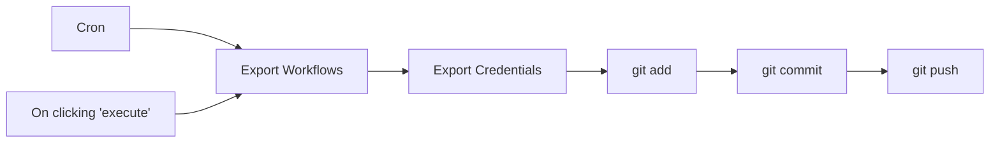

## Fluxo (.json) :

```json
{
  "id": "15",
  "name": "Tools / Backup Gitlab",
  "nodes": [
    {
      "name": "On clicking 'execute'",
      "type": "n8n-nodes-base.manualTrigger",
      "position": [
        250,
        400
      ],
      "parameters": {},
      "typeVersion": 1
    },
    {
      "name": "Export Workflows",
      "type": "n8n-nodes-base.executeCommand",
      "position": [
        450,
        300
      ],
      "parameters": {
        "command": "npx n8n export:workflow --backup --output repo/workflows/"
      },
      "typeVersion": 1
    },
    {
      "name": "Export Credentials",
      "type": "n8n-nodes-base.executeCommand",
      "position": [
        600,
        300
      ],
      "parameters": {
        "command": "npx n8n export:credentials --backup --output repo/credentials/"
      },
      "typeVersion": 1
    },
    {
      "name": "git add",
      "type": "n8n-nodes-base.executeCommand",
      "position": [
        750,
        300
      ],
      "parameters": {
        "command": "git -C repo add ."
      },
      "typeVersion": 1
    },
    {
      "name": "git commit",
      "type": "n8n-nodes-base.executeCommand",
      "position": [
        900,
        300
      ],
      "parameters": {
        "command": "=git -C repo commit -m \"Auto backup ({{ new Date().toISOString() }})\""
      },
      "typeVersion": 1
    },
    {
      "name": "git push",
      "type": "n8n-nodes-base.executeCommand",
      "position": [
        1050,
        300
      ],
      "parameters": {
        "command": "git -C repo push"
      },
      "typeVersion": 1
    },
    {
      "name": "Cron",
      "type": "n8n-nodes-base.cron",
      "position": [
        250,
        200
      ],
      "parameters": {
        "triggerTimes": {
          "item": [
            {
              "hour": 0
            },
            {
              "hour": 12
            },
            {
              "hour": 6
            },
            {
              "hour": 18
            }
          ]
        }
      },
      "typeVersion": 1
    }
  ],
  "active": true,
  "settings": {},
  "connections": {
    "Cron": {
      "main": [
        [
          {
            "node": "Export Workflows",
            "type": "main",
            "index": 0
          }
        ]
      ]
    },
    "git add": {
      "main": [
        [
          {
            "node": "git commit",
            "type": "main",
            "index": 0
          }
        ]
      ]
    },
    "git commit": {
      "main": [
        [
          {
            "node": "git push",
            "type": "main",
            "index": 0
          }
        ]
      ]
    },
    "Export Workflows": {
      "main": [
        [
          {
            "node": "Export Credentials",
            "type": "main",
            "index": 0
          }
        ]
      ]
    },
    "Export Credentials": {
      "main": [
        [
          {
            "node": "git add",
            "type": "main",
            "index": 0
          }
        ]
      ]
    },
    "On clicking 'execute'": {
      "main": [
        [
          {
            "node": "Export Workflows",
            "type": "main",
            "index": 0
          }
        ]
      ]
    }
  }
}
```

<a id="template-14"></a>

## Template 14 - Chatbot de recomendações de filmes com RAG (Qdrant + OpenAI)

- **Nome:** Chatbot de recomendações de filmes com RAG (Qdrant + OpenAI)
- **Descrição:** Fluxo que cria um sistema de recomendação de filmes baseado em recuperação aumentada por modelos (RAG): importa um dataset de filmes, gera e armazena embeddings, e responde a consultas de usuários oferecendo recomendações top-3.
- **Funcionalidade:** • Importação de dataset de filmes: lê um arquivo CSV contendo títulos, anos e descrições dos filmes.
• Geração de embeddings: converte descrições e solicitações de usuário em vetores de embedding usando a API de modelos.
• Indexação vetorial: insere vetores e metadados no banco vetorial para buscas semânticas.
• Preparação de documentos: divide textos longos em pedaços adequados para embedding e indexação.
• Gatilho de chat: recebe mensagens do usuário para iniciar consultaas de recomendação.
• Agente de IA com ferramenta de consulta: usa um agente de linguagem que decide quando chamar a ferramenta de recomendação vetorial.
• Consulta de recomendação com exemplos positivos/negativos: transforma exemplos positivos e negativos em embeddings e chama a API de recomendação vetorial para obter filmes relevantes.
• Recuperação de metadados: busca os detalhes dos pontos recomendados (título, ano, descrição) e monta a resposta.
• Formatação da resposta: apresenta as top-3 recomendações ordenadas pelo score (sem exibir as pontuações) em linguagem natural.
• Memória de contexto: mantém um buffer de janela para preservar contexto de conversa entre mensagens.
- **Ferramentas:** • GitHub: armazenamento e fornecimento do arquivo CSV com os dados dos filmes (Top_1000_IMDB_movies.csv).
• OpenAI: geração de embeddings e modelo de chat para interpretação da solicitação do usuário e produção de linguagem natural.
• Qdrant: banco de dados vetorial que armazena embeddings e metadados, e fornece API de consulta/recomendação para recuperar itens similares.
• CSV (Top_1000_IMDB_movies.csv): fonte de dados contendo títulos, anos e descrições dos filmes utilizada para popular o índice vetorial.

## Fluxo visual

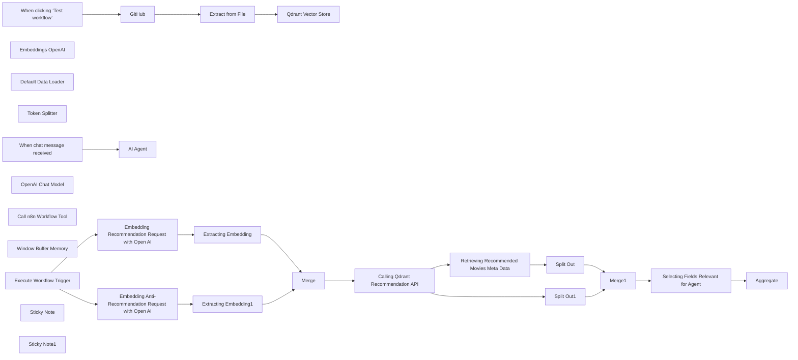

## Fluxo (.json) :

```json
{
  "id": "a58HZKwcOy7lmz56",
  "meta": {
    "instanceId": "178ef8a5109fc76c716d40bcadb720c455319f7b7a3fd5a39e4f336a091f524a",
    "templateCredsSetupCompleted": true
  },
  "name": "Building RAG Chatbot for Movie Recommendations with Qdrant and Open AI",
  "tags": [],
  "nodes": [
    {
      "id": "06a34e3b-519a-4b48-afd0-4f2b51d2105d",
      "name": "When clicking ‘Test workflow’",
      "type": "n8n-nodes-base.manualTrigger",
      "position": [
        4980,
        740
      ],
      "parameters": {},
      "typeVersion": 1
    },
    {
      "id": "9213003d-433f-41ab-838b-be93860261b2",
      "name": "GitHub",
      "type": "n8n-nodes-base.github",
      "position": [
        5200,
        740
      ],
      "parameters": {
        "owner": {
          "__rl": true,
          "mode": "name",
          "value": "mrscoopers"
        },
        "filePath": "Top_1000_IMDB_movies.csv",
        "resource": "file",
        "operation": "get",
        "repository": {
          "__rl": true,
          "mode": "list",
          "value": "n8n_demo",
          "cachedResultUrl": "https://github.com/mrscoopers/n8n_demo",
          "cachedResultName": "n8n_demo"
        },
        "additionalParameters": {}
      },
      "credentials": {
        "githubApi": {
          "id": "VbfC0mqEq24vPIwq",
          "name": "GitHub n8n demo"
        }
      },
      "typeVersion": 1
    },
    {
      "id": "9850d1a9-3a6f-44c0-9f9d-4d20fda0b602",
      "name": "Extract from File",
      "type": "n8n-nodes-base.extractFromFile",
      "position": [
        5360,
        740
      ],
      "parameters": {
        "options": {}
      },
      "typeVersion": 1
    },
    {
      "id": "7704f993-b1c9-477a-8b5a-77dc2cb68161",
      "name": "Embeddings OpenAI",
      "type": "@n8n/n8n-nodes-langchain.embeddingsOpenAi",
      "position": [
        5560,
        940
      ],
      "parameters": {
        "model": "text-embedding-3-small",
        "options": {}
      },
      "credentials": {
        "openAiApi": {
          "id": "deYJUwkgL1Euu613",
          "name": "OpenAi account 2"
        }
      },
      "typeVersion": 1
    },
    {
      "id": "bc6dd8e5-0186-4bf9-9c60-2eab6d9b6520",
      "name": "Default Data Loader",
      "type": "@n8n/n8n-nodes-langchain.documentDefaultDataLoader",
      "position": [
        5700,
        960
      ],
      "parameters": {
        "options": {
          "metadata": {
            "metadataValues": [
              {
                "name": "movie_name",
                "value": "={{ $('Extract from File').item.json['Movie Name'] }}"
              },
              {
                "name": "movie_release_date",
                "value": "={{ $('Extract from File').item.json['Year of Release'] }}"
              },
              {
                "name": "movie_description",
                "value": "={{ $('Extract from File').item.json.Description }}"
              }
            ]
          }
        },
        "jsonData": "={{ $('Extract from File').item.json.Description }}",
        "jsonMode": "expressionData"
      },
      "typeVersion": 1
    },
    {
      "id": "f87ea014-fe79-444b-88ea-0c4773872b0a",
      "name": "Token Splitter",
      "type": "@n8n/n8n-nodes-langchain.textSplitterTokenSplitter",
      "position": [
        5700,
        1140
      ],
      "parameters": {},
      "typeVersion": 1
    },
    {
      "id": "d8d28cec-c8e8-4350-9e98-cdbc6da54988",
      "name": "Qdrant Vector Store",
      "type": "@n8n/n8n-nodes-langchain.vectorStoreQdrant",
      "position": [
        5600,
        740
      ],
      "parameters": {
        "mode": "insert",
        "options": {},
        "qdrantCollection": {
          "__rl": true,
          "mode": "id",
          "value": "imdb"
        }
      },
      "credentials": {
        "qdrantApi": {
          "id": "Zin08PA0RdXVUKK7",
          "name": "QdrantApi n8n demo"
        }
      },
      "typeVersion": 1
    },
    {
      "id": "f86e03dc-12ea-4929-9035-4ec3cf46e300",
      "name": "When chat message received",
      "type": "@n8n/n8n-nodes-langchain.chatTrigger",
      "position": [
        4920,
        1140
      ],
      "webhookId": "71bfe0f8-227e-466b-9d07-69fd9fe4a27b",
      "parameters": {
        "options": {}
      },
      "typeVersion": 1.1
    },
    {
      "id": "ead23ef6-2b6b-428d-b412-b3394bff8248",
      "name": "OpenAI Chat Model",
      "type": "@n8n/n8n-nodes-langchain.lmChatOpenAi",
      "position": [
        5040,
        1340
      ],
      "parameters": {
        "model": "gpt-4o-mini",
        "options": {}
      },
      "credentials": {
        "openAiApi": {
          "id": "deYJUwkgL1Euu613",
          "name": "OpenAi account 2"
        }
      },
      "typeVersion": 1
    },
    {
      "id": "7ab936e1-aac8-43bc-a497-f2d02c2c19e5",
      "name": "Call n8n Workflow Tool",
      "type": "@n8n/n8n-nodes-langchain.toolWorkflow",
      "position": [
        5320,
        1340
      ],
      "parameters": {
        "name": "movie_recommender",
        "schemaType": "manual",
        "workflowId": {
          "__rl": true,
          "mode": "id",
          "value": "a58HZKwcOy7lmz56"
        },
        "description": "Call this tool to get a list of recommended movies from a vector database. ",
        "inputSchema": "{\n\"type\": \"object\",\n\"properties\": {\n\t\"positive_example\": {\n \"type\": \"string\",\n \"description\": \"A string with a movie description matching the user's positive recommendation request\"\n },\n \"negative_example\": {\n \"type\": \"string\",\n \"description\": \"A string with a movie description matching the user's negative anti-recommendation reuqest\"\n }\n}\n}",
        "specifyInputSchema": true
      },
      "typeVersion": 1.2
    },
    {
      "id": "ce55f334-698b-45b1-9e12-0eaa473187d4",
      "name": "Window Buffer Memory",
      "type": "@n8n/n8n-nodes-langchain.memoryBufferWindow",
      "position": [
        5160,
        1340
      ],
      "parameters": {},
      "typeVersion": 1.2
    },
    {
      "id": "41c1ee11-3117-4765-98fc-e56cc6fc8fb2",
      "name": "Execute Workflow Trigger",
      "type": "n8n-nodes-base.executeWorkflowTrigger",
      "position": [
        5640,
        1600
      ],
      "parameters": {},
      "typeVersion": 1
    },
    {
      "id": "db8d6ab6-8cd2-4a8c-993d-f1b7d7fdcffd",
      "name": "Merge",
      "type": "n8n-nodes-base.merge",
      "position": [
        6540,
        1500
      ],
      "parameters": {
        "mode": "combine",
        "options": {},
        "combineBy": "combineAll"
      },
      "typeVersion": 3
    },
    {
      "id": "c7bc5e04-22b1-40db-ba74-1ab234e51375",
      "name": "Split Out",
      "type": "n8n-nodes-base.splitOut",
      "position": [
        7260,
        1480
      ],
      "parameters": {
        "options": {},
        "fieldToSplitOut": "result"
      },
      "typeVersion": 1
    },
    {
      "id": "a2002d2e-362a-49eb-a42d-7b665ddd67a0",
      "name": "Split Out1",
      "type": "n8n-nodes-base.splitOut",
      "position": [
        7140,
        1260
      ],
      "parameters": {
        "options": {},
        "fieldToSplitOut": "result.points"
      },
      "typeVersion": 1
    },
    {
      "id": "f69a87f1-bfb9-4337-9350-28d2416c1580",
      "name": "Merge1",
      "type": "n8n-nodes-base.merge",
      "position": [
        7520,
        1400
      ],
      "parameters": {
        "mode": "combine",
        "options": {},
        "fieldsToMatchString": "id"
      },
      "typeVersion": 3
    },
    {
      "id": "b2f2529e-e260-4d72-88ef-09b804226004",
      "name": "Aggregate",
      "type": "n8n-nodes-base.aggregate",
      "position": [
        7960,
        1400
      ],
      "parameters": {
        "options": {},
        "aggregate": "aggregateAllItemData",
        "destinationFieldName": "response"
      },
      "typeVersion": 1
    },
    {
      "id": "bedea10f-b4de-4f0e-9d60-cc8117a2b328",
      "name": "AI Agent",
      "type": "@n8n/n8n-nodes-langchain.agent",
      "position": [
        5140,
        1140
      ],
      "parameters": {
        "options": {
          "systemMessage": "You are a Movie Recommender Tool using a Vector Database under the hood. Provide top-3 movie recommendations returned by the database, ordered by their recommendation score, but not showing the score to the user."
        }
      },
      "typeVersion": 1.6
    },
    {
      "id": "e04276b5-7d69-437b-bf4f-9717808cc8f6",
      "name": "Embedding Recommendation Request with Open AI",
      "type": "n8n-nodes-base.httpRequest",
      "position": [
        5900,
        1460
      ],
      "parameters": {
        "url": "https://api.openai.com/v1/embeddings",
        "method": "POST",
        "options": {},
        "sendBody": true,
        "sendHeaders": true,
        "authentication": "predefinedCredentialType",
        "bodyParameters": {
          "parameters": [
            {
              "name": "input",
              "value": "={{ $json.query.positive_example }}"
            },
            {
              "name": "model",
              "value": "text-embedding-3-small"
            }
          ]
        },
        "headerParameters": {
          "parameters": [
            {
              "name": "Authorization",
              "value": "Bearer $OPENAI_API_KEY"
            }
          ]
        },
        "nodeCredentialType": "openAiApi"
      },
      "credentials": {
        "openAiApi": {
          "id": "deYJUwkgL1Euu613",
          "name": "OpenAi account 2"
        }
      },
      "typeVersion": 4.2
    },
    {
      "id": "68e99f06-82f5-432c-8b31-8a1ae34981a6",
      "name": "Embedding Anti-Recommendation Request with Open AI",
      "type": "n8n-nodes-base.httpRequest",
      "position": [
        5920,
        1660
      ],
      "parameters": {
        "url": "https://api.openai.com/v1/embeddings",
        "method": "POST",
        "options": {},
        "sendBody": true,
        "sendHeaders": true,
        "authentication": "predefinedCredentialType",
        "bodyParameters": {
          "parameters": [
            {
              "name": "input",
              "value": "={{ $json.query.negative_example }}"
            },
            {
              "name": "model",
              "value": "text-embedding-3-small"
            }
          ]
        },
        "headerParameters": {
          "parameters": [
            {
              "name": "Authorization",
              "value": "Bearer $OPENAI_API_KEY"
            }
          ]
        },
        "nodeCredentialType": "openAiApi"
      },
      "credentials": {
        "openAiApi": {
          "id": "deYJUwkgL1Euu613",
          "name": "OpenAi account 2"
        }
      },
      "typeVersion": 4.2
    },
    {
      "id": "ecb1d7e1-b389-48e8-a34a-176bfc923641",
      "name": "Extracting Embedding",
      "type": "n8n-nodes-base.set",
      "position": [
        6180,
        1460
      ],
      "parameters": {
        "options": {},
        "assignments": {
          "assignments": [
            {
              "id": "01a28c9d-aeb1-48bb-8a73-f8bddbd73460",
              "name": "positive_example",
              "type": "array",
              "value": "={{ $json.data[0].embedding }}"
            }
          ]
        }
      },
      "typeVersion": 3.4
    },
    {
      "id": "4ed11142-a734-435f-9f7a-f59e2d423076",
      "name": "Extracting Embedding1",
      "type": "n8n-nodes-base.set",
      "position": [
        6180,
        1660
      ],
      "parameters": {
        "options": {},
        "assignments": {
          "assignments": [
            {
              "id": "01a28c9d-aeb1-48bb-8a73-f8bddbd73460",
              "name": "negative_example",
              "type": "array",
              "value": "={{ $json.data[0].embedding }}"
            }
          ]
        }
      },
      "typeVersion": 3.4
    },
    {
      "id": "ce3aa9bc-a5b1-4529-bff5-e0dba43b99f3",
      "name": "Calling Qdrant Recommendation API",
      "type": "n8n-nodes-base.httpRequest",
      "position": [
        6840,
        1500
      ],
      "parameters": {
        "url": "https://edcc6735-2ffb-484f-b735-3467043828fe.europe-west3-0.gcp.cloud.qdrant.io:6333/collections/imdb_1000_open_ai/points/query",
        "method": "POST",
        "options": {},
        "jsonBody": "={\n \"query\": {\n \"recommend\": {\n \"positive\": [[{{ $json.positive_example }}]],\n \"negative\": [[{{ $json.negative_example }}]],\n \"strategy\": \"average_vector\"\n }\n },\n \"limit\":3\n}",
        "sendBody": true,
        "specifyBody": "json",
        "authentication": "predefinedCredentialType",
        "nodeCredentialType": "qdrantApi"
      },
      "credentials": {
        "qdrantApi": {
          "id": "Zin08PA0RdXVUKK7",
          "name": "QdrantApi n8n demo"
        }
      },
      "typeVersion": 4.2
    },
    {
      "id": "9b8a6bdb-16fe-4edc-86d0-136fe059a777",
      "name": "Retrieving Recommended Movies Meta Data",
      "type": "n8n-nodes-base.httpRequest",
      "position": [
        7060,
        1460
      ],
      "parameters": {
        "url": "https://edcc6735-2ffb-484f-b735-3467043828fe.europe-west3-0.gcp.cloud.qdrant.io:6333/collections/imdb_1000_open_ai/points",
        "method": "POST",
        "options": {},
        "jsonBody": "={\n \"ids\": [\"{{ $json.result.points[0].id }}\", \"{{ $json.result.points[1].id }}\", \"{{ $json.result.points[2].id }}\"],\n \"with_payload\":true\n}",
        "sendBody": true,
        "specifyBody": "json",
        "authentication": "predefinedCredentialType",
        "nodeCredentialType": "qdrantApi"
      },
      "credentials": {
        "qdrantApi": {
          "id": "Zin08PA0RdXVUKK7",
          "name": "QdrantApi n8n demo"
        }
      },
      "typeVersion": 4.2
    },
    {
      "id": "28cdcad5-3dca-48a1-b626-19eef657114c",
      "name": "Selecting Fields Relevant for Agent",
      "type": "n8n-nodes-base.set",
      "position": [
        7740,
        1400
      ],
      "parameters": {
        "options": {},
        "assignments": {
          "assignments": [
            {
              "id": "b4b520a5-d0e2-4dcb-af9d-0b7748fd44d6",
              "name": "movie_recommendation_score",
              "type": "number",
              "value": "={{ $json.score }}"
            },
            {
              "id": "c9f0982e-bd4e-484b-9eab-7e69e333f706",
              "name": "movie_description",
              "type": "string",
              "value": "={{ $json.payload.content }}"
            },
            {
              "id": "7c7baf11-89cd-4695-9f37-13eca7e01163",
              "name": "movie_name",
              "type": "string",
              "value": "={{ $json.payload.metadata.movie_name }}"
            },
            {
              "id": "1d1d269e-43c7-47b0-859b-268adf2dbc21",
              "name": "movie_release_year",
              "type": "string",
              "value": "={{ $json.payload.metadata.release_year }}"
            }
          ]
        }
      },
      "typeVersion": 3.4
    },
    {
      "id": "56e73f01-5557-460a-9a63-01357a1b456f",
      "name": "Sticky Note",
      "type": "n8n-nodes-base.stickyNote",
      "position": [
        5560,
        1780
      ],
      "parameters": {
        "content": "Tool, calling Qdrant's recommendation API based on user's request, transformed by AI agent"
      },
      "typeVersion": 1
    },
    {
      "id": "cce5250e-0285-4fd0-857f-4b117151cd8b",
      "name": "Sticky Note1",
      "type": "n8n-nodes-base.stickyNote",
      "position": [
        4680,
        720
      ],
      "parameters": {
        "content": "Uploading data (movies and their descriptions) to Qdrant Vector Store\n"
      },
      "typeVersion": 1
    }
  ],
  "active": false,
  "pinData": {
    "Execute Workflow Trigger": [
      {
        "json": {
          "query": {
            "negative_example": "horror bloody movie",
            "positive_example": "romantic comedy"
          }
        }
      }
    ]
  },
  "settings": {
    "executionOrder": "v1"
  },
  "versionId": "40d3669b-d333-435f-99fc-db623deda2cb",
  "connections": {
    "Merge": {
      "main": [
        [
          {
            "node": "Calling Qdrant Recommendation API",
            "type": "main",
            "index": 0
          }
        ]
      ]
    },
    "GitHub": {
      "main": [
        [
          {
            "node": "Extract from File",
            "type": "main",
            "index": 0
          }
        ]
      ]
    },
    "Merge1": {
      "main": [
        [
          {
            "node": "Selecting Fields Relevant for Agent",
            "type": "main",
            "index": 0
          }
        ]
      ]
    },
    "Split Out": {
      "main": [
        [
          {
            "node": "Merge1",
            "type": "main",
            "index": 1
          }
        ]
      ]
    },
    "Split Out1": {
      "main": [
        [
          {
            "node": "Merge1",
            "type": "main",
            "index": 0
          }
        ]
      ]
    },
    "Token Splitter": {
      "ai_textSplitter": [
        [
          {
            "node": "Default Data Loader",
            "type": "ai_textSplitter",
            "index": 0
          }
        ]
      ]
    },
    "Embeddings OpenAI": {
      "ai_embedding": [
        [
          {
            "node": "Qdrant Vector Store",
            "type": "ai_embedding",
            "index": 0
          }
        ]
      ]
    },
    "Extract from File": {
      "main": [
        [
          {
            "node": "Qdrant Vector Store",
            "type": "main",
            "index": 0
          }
        ]
      ]
    },
    "OpenAI Chat Model": {
      "ai_languageModel": [
        [
          {
            "node": "AI Agent",
            "type": "ai_languageModel",
            "index": 0
          }
        ]
      ]
    },
    "Default Data Loader": {
      "ai_document": [
        [
          {
            "node": "Qdrant Vector Store",
            "type": "ai_document",
            "index": 0
          }
        ]
      ]
    },
    "Extracting Embedding": {
      "main": [
        [
          {
            "node": "Merge",
            "type": "main",
            "index": 0
          }
        ]
      ]
    },
    "Window Buffer Memory": {
      "ai_memory": [
        [
          {
            "node": "AI Agent",
            "type": "ai_memory",
            "index": 0
          }
        ]
      ]
    },
    "Extracting Embedding1": {
      "main": [
        [
          {
            "node": "Merge",
            "type": "main",
            "index": 1
          }
        ]
      ]
    },
    "Call n8n Workflow Tool": {
      "ai_tool": [
        [
          {
            "node": "AI Agent",
            "type": "ai_tool",
            "index": 0
          }
        ]
      ]
    },
    "Execute Workflow Trigger": {
      "main": [
        [
          {
            "node": "Embedding Recommendation Request with Open AI",
            "type": "main",
            "index": 0
          },
          {
            "node": "Embedding Anti-Recommendation Request with Open AI",
            "type": "main",
            "index": 0
          }
        ]
      ]
    },
    "When chat message received": {
      "main": [
        [
          {
            "node": "AI Agent",
            "type": "main",
            "index": 0
          }
        ]
      ]
    },
    "Calling Qdrant Recommendation API": {
      "main": [
        [
          {
            "node": "Retrieving Recommended Movies Meta Data",
            "type": "main",
            "index": 0
          },
          {
            "node": "Split Out1",
            "type": "main",
            "index": 0
          }
        ]
      ]
    },
    "When clicking ‘Test workflow’": {
      "main": [
        [
          {
            "node": "GitHub",
            "type": "main",
            "index": 0
          }
        ]
      ]
    },
    "Selecting Fields Relevant for Agent": {
      "main": [
        [
          {
            "node": "Aggregate",
            "type": "main",
            "index": 0
          }
        ]
      ]
    },
    "Retrieving Recommended Movies Meta Data": {
      "main": [
        [
          {
            "node": "Split Out",
            "type": "main",
            "index": 0
          }
        ]
      ]
    },
    "Embedding Recommendation Request with Open AI": {
      "main": [
        [
          {
            "node": "Extracting Embedding",
            "type": "main",
            "index": 0
          }
        ]
      ]
    },
    "Embedding Anti-Recommendation Request with Open AI": {
      "main": [
        [
          {
            "node": "Extracting Embedding1",
            "type": "main",
            "index": 0
          }
        ]
      ]
    }
  }
}
```

<a id="template-15"></a>

## Template 15 - Controle de concorrência via Redis para webhooks Slack

- **Nome:** Controle de concorrência via Redis para webhooks Slack
- **Descrição:** Fluxo que evita execuções concorrentes ao processar webhooks (ex.: botões do Slack) usando um bloqueio armazenado no Redis.
- **Funcionalidade:** • Recepção de webhook do Slack: Recebe a carga útil enviada quando um botão ou interação é acionada.
• Parse do payload e criação da chave de lock: Extrai variáveis do payload (var1, var2, var3) e gera um lockValue único.
• Verificação de lock no Redis: Consulta se existe uma chave de bloqueio para decidir se pode prosseguir.
• Aquisição de lock com TTL: Tenta definir a chave no Redis com tempo de expiração para reservar a execução.
• Polling enquanto o lock existe: Espera e reconsulta o Redis até o lock ser liberado ou detectar duplicata.
• Detecção de webhooks duplicados: Compara o valor do lock para identificar e ignorar requisições repetidas.
• Encaminhamento para workflows específicos: Roteia a execução para um entre três caminhos de trabalho conforme regras.
• Liberação do lock: Remove a chave no Redis ao final para permitir novas execuções.
- **Ferramentas:** • Slack: Origem das interações via webhook (botões/payloads) que disparam o fluxo.
• Redis: Armazenamento de chave/valor usado para criar locks com TTL e controlar a concorrência.

## Fluxo visual

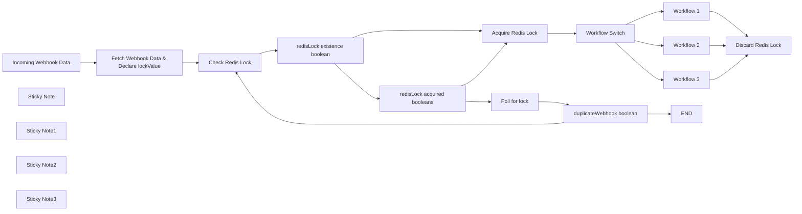

## Fluxo (.json) :

```json
{
  "nodes": [
    {
      "id": "ffe22db7-06b9-4efe-ab35-758e420dbe57",
      "name": "END",
      "type": "n8n-nodes-base.noOp",
      "position": [
        -2880,
        540
      ],
      "parameters": {},
      "typeVersion": 1
    },
    {
      "id": "9480feb6-e12a-4b59-998e-bdc7b119087a",
      "name": "Workflow 1",
      "type": "n8n-nodes-base.set",
      "position": [
        -2620,
        -20
      ],
      "parameters": {
        "options": {}
      },
      "typeVersion": 3.4
    },
    {
      "id": "54492842-137b-48d6-851a-1ce6cc751612",
      "name": "Workflow 2",
      "type": "n8n-nodes-base.set",
      "position": [
        -2620,
        200
      ],
      "parameters": {
        "options": {}
      },
      "typeVersion": 3.4
    },
    {
      "id": "83bbda2c-112b-4ed0-9ccd-c7a5c840100d",
      "name": "Workflow 3",
      "type": "n8n-nodes-base.set",
      "position": [
        -2620,
        420
      ],
      "parameters": {
        "options": {}
      },
      "typeVersion": 3.4
    },
    {
      "id": "74d889d9-5215-495b-8e60-e1c78d79ae8c",
      "name": "Incoming Webhook Data",
      "type": "n8n-nodes-base.webhook",
      "position": [
        -4760,
        220
      ],
      "webhookId": "94d08900-4816-4c74-962a-aacff5077d5d",
      "parameters": {
        "path": "94d08900-4816-4c74-962a-aacff5077d5d",
        "options": {}
      },
      "typeVersion": 2
    },
    {
      "id": "cb5e3e72-6678-4efb-8301-f149014444d2",
      "name": "Fetch Webhook Data & Declare lockValue",
      "type": "n8n-nodes-base.code",
      "position": [
        -4520,
        220
      ],
      "parameters": {
        "jsCode": "// Parse the Slack payload\nconst payload = JSON.parse($('Incoming Webhook Data').first().json[\"body\"][\"payload\"]);\n\n// Extract button action details\nconst var1 = payload.var1;\nconst var2 = payload.var2;\nconst var3 = payload.var3;\n\n// Log or return the details\nreturn {\n    var1 : var1,\n    var2: var2,\n    var3: var3,\n    lockValue : `${var1}-${var2}-${var3}`\n};"
      },
      "typeVersion": 2
    },
    {
      "id": "e118f753-945b-4951-95da-394732fc636c",
      "name": "Check Redis Lock",
      "type": "n8n-nodes-base.redis",
      "position": [
        -4220,
        220
      ],
      "parameters": {
        "key": "xyz-lock",
        "options": {},
        "operation": "get",
        "propertyName": "Element"
      },
      "credentials": {
        "redis": {
          "id": "o0RxOKCtencIaop1",
          "name": "Geoffrey Redis"
        }
      },
      "typeVersion": 1
    },
    {
      "id": "c1488bae-cb82-48ce-94cd-5359d7d10b04",
      "name": "Acquire Redis Lock",
      "type": "n8n-nodes-base.redis",
      "position": [
        -3520,
        200
      ],
      "parameters": {
        "key": "xyz-lock",
        "ttl": 180,
        "value": "={{ $('Fetch Webhook Data & Declare lockValue').item.json.lookupVariable }}",
        "expire": true,
        "operation": "set"
      },
      "credentials": {
        "redis": {
          "id": "o0RxOKCtencIaop1",
          "name": "Geoffrey Redis"
        }
      },
      "typeVersion": 1
    },
    {
      "id": "0fe5e1d8-f1e4-40e0-a3a4-4c00bbf2b50b",
      "name": "redisLock existence boolean",
      "type": "n8n-nodes-base.if",
      "position": [
        -4020,
        220
      ],
      "parameters": {
        "options": {},
        "conditions": {
          "options": {
            "version": 2,
            "leftValue": "",
            "caseSensitive": true,
            "typeValidation": "strict"
          },
          "combinator": "and",
          "conditions": [
            {
              "id": "905501b4-718c-44fb-b2a5-a8eaf8605511",
              "operator": {
                "type": "string",
                "operation": "empty",
                "singleValue": true
              },
              "leftValue": "={{ $json.Element }}",
              "rightValue": ""
            }
          ]
        }
      },
      "typeVersion": 2.2
    },
    {
      "id": "3c66fab5-2c2a-4bba-8ba1-ed85e57cd42d",
      "name": "redisLock acquired booleans",
      "type": "n8n-nodes-base.if",
      "position": [
        -3800,
        320
      ],
      "parameters": {
        "options": {},
        "conditions": {
          "options": {
            "version": 2,
            "leftValue": "",
            "caseSensitive": true,
            "typeValidation": "strict"
          },
          "combinator": "and",
          "conditions": [
            {
              "id": "6c071e68-a15a-4da8-b962-fe173b1eb145",
              "operator": {
                "type": "string",
                "operation": "notExists",
                "singleValue": true
              },
              "leftValue": "={{ $json.Element }}",
              "rightValue": ""
            }
          ]
        }
      },
      "typeVersion": 2.2
    },
    {
      "id": "787d1c86-1a66-40ea-b8b6-29f50a48737c",
      "name": "Poll for lock",
      "type": "n8n-nodes-base.wait",
      "position": [
        -3520,
        420
      ],
      "webhookId": "615b4c18-2c29-418c-a2bf-302ff24e5c65",
      "parameters": {},
      "typeVersion": 1.1
    },
    {
      "id": "f5b88169-e97b-4359-890e-969dbdc6d829",
      "name": "duplicateWebhook boolean",
      "type": "n8n-nodes-base.if",
      "position": [
        -3200,
        420
      ],
      "parameters": {
        "options": {},
        "conditions": {
          "options": {
            "version": 2,
            "leftValue": "",
            "caseSensitive": true,
            "typeValidation": "strict"
          },
          "combinator": "and",
          "conditions": [
            {
              "id": "08500e34-cc7f-4005-87bd-f7250dc076fe",
              "operator": {
                "name": "filter.operator.equals",
                "type": "string",
                "operation": "equals"
              },
              "leftValue": "={{ $('Fetch Webhook Data & Declare lockValue').item.json.lookupVariable }}",
              "rightValue": "={{ $input.first().json.Element }}"
            }
          ]
        }
      },
      "typeVersion": 2.2
    },
    {
      "id": "db4e4149-7970-402c-a3d7-2cfe47b6a5b7",
      "name": "Sticky Note",
      "type": "n8n-nodes-base.stickyNote",
      "position": [
        -4760,
        -120
      ],
      "parameters": {
        "color": 6,
        "width": 480,
        "height": 220,
        "content": "#### 🔒 This workflow demonstrates Redis-based locking to prevent concurrent execution of workflows.\n\n**Steps:**\n+ Try to acquire a lock via Redis\n+ If successful, execute workflow\n+ If duplicate request; ignore request\n+ Release the lock after completion"
      },
      "typeVersion": 1
    },
    {
      "id": "879b7ab5-402b-4ea8-977b-64d29cd9bb39",
      "name": "Discard Redis Lock",
      "type": "n8n-nodes-base.redis",
      "position": [
        -2320,
        200
      ],
      "parameters": {
        "key": "n8n-rca-lock",
        "operation": "delete"
      },
      "credentials": {
        "redis": {
          "id": "o0RxOKCtencIaop1",
          "name": "Geoffrey Redis"
        }
      },
      "typeVersion": 1
    },
    {
      "id": "494030d6-e731-4f4f-9193-7b46f2d470d0",
      "name": "Sticky Note1",
      "type": "n8n-nodes-base.stickyNote",
      "position": [
        -3580,
        80
      ],
      "parameters": {
        "color": 5,
        "width": 220,
        "height": 80,
        "content": "Attempts to acquire a lock using Redis by setting a key with expiration."
      },
      "typeVersion": 1
    },
    {
      "id": "a643b45e-2067-4c42-8c1c-365b3fea911a",
      "name": "Workflow Switch",
      "type": "n8n-nodes-base.switch",
      "position": [
        -2880,
        200
      ],
      "parameters": {
        "rules": {
          "values": [
            {
              "outputKey": "1",
              "conditions": {
                "options": {
                  "version": 2,
                  "leftValue": "",
                  "caseSensitive": true,
                  "typeValidation": "strict"
                },
                "combinator": "and",
                "conditions": [
                  {
                    "id": "2761039b-e76c-4606-9aaf-48a569942ab7",
                    "operator": {
                      "type": "string",
                      "operation": "equals"
                    },
                    "leftValue": "",
                    "rightValue": ""
                  }
                ]
              },
              "renameOutput": true
            },
            {
              "outputKey": "2",
              "conditions": {
                "options": {
                  "version": 2,
                  "leftValue": "",
                  "caseSensitive": true,
                  "typeValidation": "strict"
                },
                "combinator": "and",
                "conditions": [
                  {
                    "id": "ef07c62f-bd3f-4f54-85b9-9dbf64915f2c",
                    "operator": {
                      "name": "filter.operator.equals",
                      "type": "string",
                      "operation": "equals"
                    },
                    "leftValue": "",
                    "rightValue": ""
                  }
                ]
              },
              "renameOutput": true
            },
            {
              "outputKey": "3",
              "conditions": {
                "options": {
                  "version": 2,
                  "leftValue": "",
                  "caseSensitive": true,
                  "typeValidation": "strict"
                },
                "combinator": "and",
                "conditions": [
                  {
                    "id": "2dfc15de-bf33-4c25-932f-dae16758e2e6",
                    "operator": {
                      "name": "filter.operator.equals",
                      "type": "string",
                      "operation": "equals"
                    },
                    "leftValue": "",
                    "rightValue": ""
                  }
                ]
              },
              "renameOutput": true
            }
          ]
        },
        "options": {}
      },
      "typeVersion": 3.2
    },
    {
      "id": "5531d4c3-158c-4f98-b6fa-9ef9a85eef71",
      "name": "Sticky Note2",
      "type": "n8n-nodes-base.stickyNote",
      "position": [
        -2940,
        680
      ],
      "parameters": {
        "color": 5,
        "height": 80,
        "content": "Skips execution when duplicate request is received."
      },
      "typeVersion": 1
    },
    {
      "id": "0a159f03-3ecc-4010-ab63-cc24df90df31",
      "name": "Sticky Note3",
      "type": "n8n-nodes-base.stickyNote",
      "position": [
        -2320,
        100
      ],
      "parameters": {
        "color": 5,
        "height": 80,
        "content": "Deletes the Redis lock key to release the lock."
      },
      "typeVersion": 1
    }
  ],
  "connections": {
    "Workflow 1": {
      "main": [
        [
          {
            "node": "Discard Redis Lock",
            "type": "main",
            "index": 0
          }
        ]
      ]
    },
    "Workflow 2": {
      "main": [
        [
          {
            "node": "Discard Redis Lock",
            "type": "main",
            "index": 0
          }
        ]
      ]
    },
    "Workflow 3": {
      "main": [
        [
          {
            "node": "Discard Redis Lock",
            "type": "main",
            "index": 0
          }
        ]
      ]
    },
    "Poll for lock": {
      "main": [
        [
          {
            "node": "duplicateWebhook boolean",
            "type": "main",
            "index": 0
          }
        ]
      ]
    },
    "Workflow Switch": {
      "main": [
        [
          {
            "node": "Workflow 1",
            "type": "main",
            "index": 0
          }
        ],
        [
          {
            "node": "Workflow 2",
            "type": "main",
            "index": 0
          }
        ],
        [
          {
            "node": "Workflow 3",
            "type": "main",
            "index": 0
          }
        ]
      ]
    },
    "Check Redis Lock": {
      "main": [
        [
          {
            "node": "redisLock existence boolean",
            "type": "main",
            "index": 0
          }
        ]
      ]
    },
    "Acquire Redis Lock": {
      "main": [
        [
          {
            "node": "Workflow Switch",
            "type": "main",
            "index": 0
          }
        ]
      ]
    },
    "Incoming Webhook Data": {
      "main": [
        [
          {
            "node": "Fetch Webhook Data & Declare lockValue",
            "type": "main",
            "index": 0
          }
        ]
      ]
    },
    "duplicateWebhook boolean": {
      "main": [
        [
          {
            "node": "END",
            "type": "main",
            "index": 0
          }
        ],
        [
          {
            "node": "Check Redis Lock",
            "type": "main",
            "index": 0
          }
        ]
      ]
    },
    "redisLock acquired booleans": {
      "main": [
        [
          {
            "node": "Acquire Redis Lock",
            "type": "main",
            "index": 0
          }
        ],
        [
          {
            "node": "Poll for lock",
            "type": "main",
            "index": 0
          }
        ]
      ]
    },
    "redisLock existence boolean": {
      "main": [
        [
          {
            "node": "Acquire Redis Lock",
            "type": "main",
            "index": 0
          }
        ],
        [
          {
            "node": "redisLock acquired booleans",
            "type": "main",
            "index": 0
          }
        ]
      ]
    },
    "Fetch Webhook Data & Declare lockValue": {
      "main": [
        [
          {
            "node": "Check Redis Lock",
            "type": "main",
            "index": 0
          }
        ]
      ]
    }
  }
}
```

<a id="template-16"></a>

## Template 16 - Tradução e TTS Francês para Inglês

- **Nome:** Tradução e TTS Francês para Inglês
- **Descrição:** Recebe um texto em francês, gera áudio falado em francês, transcreve esse áudio, traduz a transcrição para inglês e gera áudio falado em inglês.
- **Funcionalidade:** • Entrada manual de texto e configuração de voz: Permite inserir o texto em francês e definir o ID da voz a ser utilizada.
• Síntese de áudio em francês: Gera um arquivo de áudio em francês a partir do texto fornecido usando um serviço de TTS.
• Transcrição de áudio: Envia o áudio gerado para transcrição em texto.
• Tradução para inglês: Traduza o texto transcrito do francês para o inglês usando um modelo de linguagem.
• Síntese de áudio em inglês: Gera um arquivo de áudio em inglês a partir da tradução.
• Uso de cabeçalhos de autenticação configuráveis: Suporta configuração de chaves de API para os serviços externos envolvidos.
- **Ferramentas:** • ElevenLabs: Serviço de síntese de voz (text-to-speech) usado para gerar áudio em francês e em inglês.
• OpenAI (Whisper): Serviço de transcrição de áudio para texto.
• OpenAI (modelos de linguagem): Modelo LLM usado para traduzir o texto do francês para o inglês.

## Fluxo visual

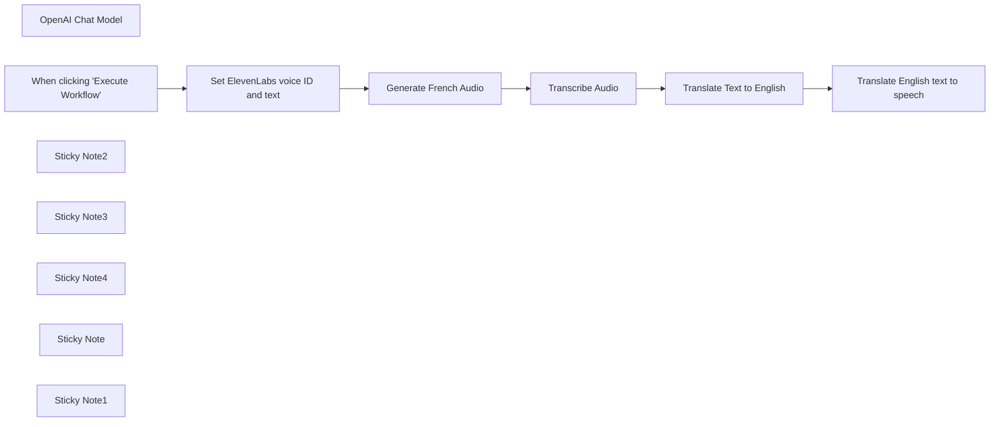

## Fluxo (.json) :

```json
{
  "meta": {
    "instanceId": "cb484ba7b742928a2048bf8829668bed5b5ad9787579adea888f05980292a4a7"
  },
  "nodes": [
    {
      "id": "aa0c62d1-2a5e-4336-8783-a8a21cb23374",
      "name": "OpenAI Chat Model",
      "type": "@n8n/n8n-nodes-langchain.lmChatOpenAi",
      "position": [
        1180,
        760
      ],
      "parameters": {
        "options": {
          "temperature": 0
        }
      },
      "credentials": {
        "openAiApi": {
          "id": "VQtv7frm7eLiEDnd",
          "name": "OpenAi account 7"
        }
      },
      "typeVersion": 1
    },
    {
      "id": "0c7d21e6-5bf6-4927-ad23-008b22e2ffde",
      "name": "When clicking \"Execute Workflow\"",
      "type": "n8n-nodes-base.manualTrigger",
      "position": [
        280,
        560
      ],
      "parameters": {},
      "typeVersion": 1
    },
    {
      "id": "352de912-3a36-4bf2-b013-b46e0ace38e9",
      "name": "Generate French Audio",
      "type": "n8n-nodes-base.httpRequest",
      "position": [
        720,
        560
      ],
      "parameters": {
        "url": "=https://api.elevenlabs.io/v1/text-to-speech/{{ $json.voice_id }}",
        "method": "POST",
        "options": {},
        "jsonBody": "={\"text\":\"{{ $json.text }}\",\"model_id\":\"eleven_multilingual_v2\",\"voice_settings\":{\"stability\":0.5,\"similarity_boost\":0.5}}",
        "sendBody": true,
        "sendQuery": true,
        "sendHeaders": true,
        "specifyBody": "json",
        "authentication": "genericCredentialType",
        "genericAuthType": "httpHeaderAuth",
        "queryParameters": {
          "parameters": [
            {
              "name": "optimize_streaming_latency",
              "value": "1"
            }
          ]
        },
        "headerParameters": {
          "parameters": [
            {
              "name": "accept",
              "value": "audio/mpeg"
            }
          ]
        }
      },
      "credentials": {
        "httpHeaderAuth": {
          "id": "OMni1VQQclVYOmeZ",
          "name": "ElevenLabs David"
        }
      },
      "typeVersion": 4.1
    },
    {
      "id": "0cde2e89-0669-41b4-8fe1-1a6aff14792f",
      "name": "Set ElevenLabs voice ID and text",
      "type": "n8n-nodes-base.set",
      "position": [
        500,
        560
      ],
      "parameters": {
        "fields": {
          "values": [
            {
              "name": "voice_id",
              "stringValue": "wl7sZxfTOitHVachQiUm"
            },
            {
              "name": "text",
              "stringValue": "=Après, on a fait la sieste, Camille a travaillé pour French Today et j’ai étudié un peu, et puis Camille a proposé de suivre une visite guidée de l’Abbaye de Beauport qui commençait à 17 heures. On a marché environ vingt minutes, et je m’arrêtais souvent pour prendre des photos : la baie de Paimpol est si jolie ! Mais Camille m’a dit : « Dépêche-toi Sunny ! La visite guidée commence dans cinq minutes. » Donc, j’ai bougé mes fesses et on est arrivées à l’abbaye"
            }
          ]
        },
        "options": {}
      },
      "typeVersion": 3.2
    },
    {
      "id": "38aa323e-a899-4018-afb9-4d4682ac8ff1",
      "name": "Translate Text to English",
      "type": "@n8n/n8n-nodes-langchain.chainLlm",
      "position": [
        1180,
        560
      ],
      "parameters": {
        "prompt": "=Translate to English:\n{{ $json.text }}"
      },
      "typeVersion": 1.2
    },
    {
      "id": "f0b7adad-fa0b-4764-96e0-0883bbcc02d6",
      "name": "Translate English text to speech",
      "type": "n8n-nodes-base.httpRequest",
      "position": [
        1540,
        560
      ],
      "parameters": {
        "url": "=https://api.elevenlabs.io/v1/text-to-speech/{{ $('Set ElevenLabs voice ID and text').item.json.voice_id }}",
        "method": "POST",
        "options": {},
        "jsonBody": "={\"text\":\"{{ $json[\"text\"].replaceAll('\"', '\\\\\"').trim() }}\",\"model_id\":\"eleven_multilingual_v2\",\"voice_settings\":{\"stability\":0.5,\"similarity_boost\":0.5}}",
        "sendBody": true,
        "sendQuery": true,
        "sendHeaders": true,
        "specifyBody": "json",
        "authentication": "genericCredentialType",
        "genericAuthType": "httpHeaderAuth",
        "queryParameters": {
          "parameters": [
            {
              "name": "optimize_streaming_latency",
              "value": "1"
            }
          ]
        },
        "headerParameters": {
          "parameters": [
            {
              "name": "accept",
              "value": "audio/mpeg"
            }
          ]
        }
      },
      "credentials": {
        "httpHeaderAuth": {
          "id": "OMni1VQQclVYOmeZ",
          "name": "ElevenLabs David"
        }
      },
      "typeVersion": 4.1
    },
    {
      "id": "f8700266-5491-4ca7-b29a-3f5ec1e9b66f",
      "name": "Transcribe Audio",
      "type": "n8n-nodes-base.httpRequest",
      "position": [
        960,
        560
      ],
      "parameters": {
        "url": "https://api.openai.com/v1/audio/transcriptions",
        "method": "POST",
        "options": {},
        "sendBody": true,
        "contentType": "multipart-form-data",
        "authentication": "predefinedCredentialType",
        "bodyParameters": {
          "parameters": [
            {
              "name": "file",
              "parameterType": "formBinaryData",
              "inputDataFieldName": "data"
            },
            {
              "name": "model",
              "value": "whisper-1"
            }
          ]
        },
        "nodeCredentialType": "openAiApi"
      },
      "credentials": {
        "openAiApi": {
          "id": "VQtv7frm7eLiEDnd",
          "name": "OpenAi account 7"
        }
      },
      "typeVersion": 4.1
    },
    {
      "id": "25630b45-3827-4ee0-a77e-c30cadefe999",
      "name": "Sticky Note2",
      "type": "n8n-nodes-base.stickyNote",
      "position": [
        449.2637232176971,
        319.7947500318393
      ],
      "parameters": {
        "color": 7,
        "width": 199.37543798209555,
        "height": 420.623805972039,
        "content": "1] In ElevenLabs, add a voice to your [voice lab](https://elevenlabs.io/voice-lab) and copy its ID. Open this node and add the ID there"
      },
      "typeVersion": 1
    },
    {
      "id": "a41d2622-4476-44c2-bac6-212be237aa4b",
      "name": "Sticky Note3",
      "type": "n8n-nodes-base.stickyNote",
      "position": [
        680,
        320
      ],
      "parameters": {
        "color": 7,
        "width": 192.21792012722693,
        "height": 418.3754668433847,
        "content": "2] Get your ElevenLabs API key (click your name in the bottom-left of [ElevenLabs](https://elevenlabs.io/voice-lab) and choose ‘profile’)\n\nIn this node, create a new header auth cred. Set the name to `xi-api-key` and the value to your API key"
      },
      "typeVersion": 1
    },
    {
      "id": "58143bb1-816f-4ff6-9cac-9ce7765e02be",
      "name": "Sticky Note4",
      "type": "n8n-nodes-base.stickyNote",
      "position": [
        920,
        320
      ],
      "parameters": {
        "color": 7,
        "width": 192.21792012722693,
        "height": 414.59045768149747,
        "content": "3] In the 'credential' field of this node, create a new OpenAI cred with your [OpenAI API key](https://platform.openai.com/api-keys)"
      },
      "typeVersion": 1
    },
    {
      "id": "bd2ef5d2-c27d-45e4-a66e-a73168f94087",
      "name": "Sticky Note",
      "type": "n8n-nodes-base.stickyNote",
      "position": [
        160,
        273.1221160672591
      ],
      "parameters": {
        "color": 7,
        "width": 230.39134868652621,
        "height": 233.3354221029769,
        "content": "### About\nThis workflow takes some French text, and translates it into spoken audio.\n\nIt then transcribes that audio back into text, translates it into English and generates an audio file of the English text"
      },
      "typeVersion": 1
    },
    {
      "id": "a1f207d4-dbed-4dfa-aad5-2b2f6e4e6271",
      "name": "Sticky Note1",
      "type": "n8n-nodes-base.stickyNote",
      "position": [
        440,
        272.42998167622557
      ],
      "parameters": {
        "color": 7,
        "width": 685.8541178336201,
        "height": 478.0993479050163,
        "content": "### Setup steps"
      },
      "typeVersion": 1
    }
  ],
  "pinData": {},
  "connections": {
    "Transcribe Audio": {
      "main": [
        [
          {
            "node": "Translate Text to English",
            "type": "main",
            "index": 0
          }
        ]
      ]
    },
    "OpenAI Chat Model": {
      "ai_languageModel": [
        [
          {
            "node": "Translate Text to English",
            "type": "ai_languageModel",
            "index": 0
          }
        ]
      ]
    },
    "Generate French Audio": {
      "main": [
        [
          {
            "node": "Transcribe Audio",
            "type": "main",
            "index": 0
          }
        ]
      ]
    },
    "Translate Text to English": {
      "main": [
        [
          {
            "node": "Translate English text to speech",
            "type": "main",
            "index": 0
          }
        ]
      ]
    },
    "Set ElevenLabs voice ID and text": {
      "main": [
        [
          {
            "node": "Generate French Audio",
            "type": "main",
            "index": 0
          }
        ]
      ]
    },
    "When clicking \"Execute Workflow\"": {
      "main": [
        [
          {
            "node": "Set ElevenLabs voice ID and text",
            "type": "main",
            "index": 0
          }
        ]
      ]
    }
  }
}
```

<a id="template-17"></a>

## Template 17 - Atualizar campo Close Date com validação

- **Nome:** Atualizar campo Close Date com validação
- **Descrição:** Ao executar manualmente, o fluxo define um valor para Close Date, verifica se ele contém uma data no formato YYYY-MM-DD e, caso não contenha, substitui por uma data 3 semanas à frente. Se já estiver no formato esperado, o valor original é preservado.
- **Funcionalidade:** • Execução manual: Inicia o fluxo quando o usuário clica em executar.
• Definir Close Date inicial: Atribui um valor ISO fixo ao campo Close Date.
• Verificar formato da data: Avalia se o valor de Close Date contém o padrão YYYY-MM-DD.
• Manter valor original se válido: Se o padrão for detectado, preserva o Close Date fornecido.
• Atualizar para 3 semanas depois se inválido: Se o padrão não for detectado, calcula e define uma data 21 dias à frente no formato ISO.
- **Ferramentas:** • Nenhuma: Não há integração com serviços externos; todas as operações são realizadas localmente no fluxo.

## Fluxo visual

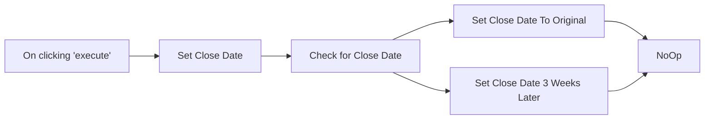

## Fluxo (.json) :

```json
{
  "nodes": [
    {
      "name": "On clicking 'execute'",
      "type": "n8n-nodes-base.manualTrigger",
      "position": [
        250,
        300
      ],
      "parameters": {},
      "typeVersion": 1
    },
    {
      "name": "Check for Close Date",
      "type": "n8n-nodes-base.if",
      "position": [
        660,
        300
      ],
      "parameters": {
        "conditions": {
          "string": [
            {
              "value1": "={{$json[\"Close Date\"]}}",
              "value2": "/\\d\\d\\d\\d-\\d\\d-\\d\\d/i",
              "operation": "regex"
            }
          ]
        },
        "combineOperation": "any"
      },
      "typeVersion": 1
    },
    {
      "name": "Set Close Date 3 Weeks Later",
      "type": "n8n-nodes-base.set",
      "position": [
        910,
        370
      ],
      "parameters": {
        "values": {
          "string": [
            {
              "name": "Close Date",
              "value": "={{new Date(new Date().setDate(new Date().getDate() + 21)).toISOString()}}"
            }
          ]
        },
        "options": {},
        "keepOnlySet": true
      },
      "typeVersion": 1
    },
    {
      "name": "NoOp",
      "type": "n8n-nodes-base.noOp",
      "position": [
        1140,
        280
      ],
      "parameters": {},
      "typeVersion": 1
    },
    {
      "name": "Set Close Date",
      "type": "n8n-nodes-base.set",
      "position": [
        450,
        300
      ],
      "parameters": {
        "values": {
          "string": [
            {
              "name": "Close Date",
              "value": "2021-11-29T00:00:00.000Z"
            }
          ]
        },
        "options": {}
      },
      "typeVersion": 1
    },
    {
      "name": "Set Close Date To Original",
      "type": "n8n-nodes-base.set",
      "position": [
        910,
        210
      ],
      "parameters": {
        "values": {
          "string": [
            {
              "name": "Close Date",
              "value": "={{$node[\"Set Close Date\"].json[\"Close Date\"]}}"
            }
          ]
        },
        "options": {},
        "keepOnlySet": true
      },
      "typeVersion": 1
    }
  ],
  "connections": {
    "Set Close Date": {
      "main": [
        [
          {
            "node": "Check for Close Date",
            "type": "main",
            "index": 0
          }
        ]
      ]
    },
    "Check for Close Date": {
      "main": [
        [
          {
            "node": "Set Close Date To Original",
            "type": "main",
            "index": 0
          }
        ],
        [
          {
            "node": "Set Close Date 3 Weeks Later",
            "type": "main",
            "index": 0
          }
        ]
      ]
    },
    "On clicking 'execute'": {
      "main": [
        [
          {
            "node": "Set Close Date",
            "type": "main",
            "index": 0
          }
        ]
      ]
    },
    "Set Close Date To Original": {
      "main": [
        [
          {
            "node": "NoOp",
            "type": "main",
            "index": 0
          }
        ]
      ]
    },
    "Set Close Date 3 Weeks Later": {
      "main": [
        [
          {
            "node": "NoOp",
            "type": "main",
            "index": 0
          }
        ]
      ]
    }
  }
}
```

<a id="template-18"></a>

## Template 18 - Importação automática de CSV para PostgreSQL

- **Nome:** Importação automática de CSV para PostgreSQL
- **Descrição:** Importa dados de um arquivo CSV local para uma tabela PostgreSQL, mapeando colunas e atualizando registros com base na chave de identificação.
- **Funcionalidade:** • Disparo manual: inicia o processo quando o usuário executa a ação.
• Leitura de arquivo CSV local: lê o arquivo localizado em /tmp/t1.csv.
• Conversão/parse do CSV para formato tabular: transforma o conteúdo binário do arquivo em linhas e colunas.
• Mapeamento de colunas: associa campos do CSV às colunas da tabela (por exemplo, id e name).
• Inserção/atualização no banco: insere novos registros ou atualiza existentes na tabela public.t1 com base na coluna id.
- **Ferramentas:** • Sistema de arquivos local: armazena o arquivo CSV em /tmp/t1.csv e permite sua leitura.
• PostgreSQL: banco de dados relacional onde os dados são inseridos/atualizados na tabela public.t1.

## Fluxo visual

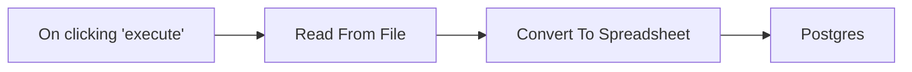

## Fluxo (.json) :

```json
{
  "id": "q8GNbRhjQDwDpXoo",
  "meta": {
    "instanceId": "0c2f219d911381bce56d337dbc86e66ee815b6ed822f8553d03a4cd4a8f25805",
    "templateCredsSetupCompleted": true
  },
  "name": "How to automatically import CSV files into postgres",
  "tags": [],
  "nodes": [
    {
      "id": "9ae270f2-6e32-4a14-8a03-634b9c66004d",
      "name": "On clicking 'execute'",
      "type": "n8n-nodes-base.manualTrigger",
      "position": [
        -340,
        -80
      ],
      "parameters": {},
      "typeVersion": 1
    },
    {
      "id": "96de1409-9c48-4357-aaef-2202dec478a9",
      "name": "Read From File",
      "type": "n8n-nodes-base.readBinaryFile",
      "position": [
        -140,
        -80
      ],
      "parameters": {
        "filePath": "/tmp/t1.csv"
      },
      "typeVersion": 1
    },
    {
      "id": "22b002df-51fd-4074-8741-c9a754996170",
      "name": "Convert To Spreadsheet",
      "type": "n8n-nodes-base.spreadsheetFile",
      "position": [
        60,
        -80
      ],
      "parameters": {
        "options": {}
      },
      "typeVersion": 1
    },
    {
      "id": "0ec04e46-be13-40c3-a4a4-60787bf02a1f",
      "name": "Postgres",
      "type": "n8n-nodes-base.postgres",
      "position": [
        320,
        -80
      ],
      "parameters": {
        "table": {
          "__rl": true,
          "mode": "name",
          "value": "t1"
        },
        "schema": {
          "__rl": true,
          "mode": "list",
          "value": "public",
          "cachedResultName": "public"
        },
        "columns": {
          "value": {
            "id": 0
          },
          "schema": [
            {
              "id": "id",
              "type": "number",
              "display": true,
              "removed": false,
              "required": false,
              "displayName": "id",
              "defaultMatch": true,
              "canBeUsedToMatch": true
            },
            {
              "id": "name",
              "type": "string",
              "display": true,
              "required": false,
              "displayName": "name",
              "defaultMatch": false,
              "canBeUsedToMatch": true
            }
          ],
          "mappingMode": "autoMapInputData",
          "matchingColumns": [
            "id"
          ],
          "attemptToConvertTypes": false,
          "convertFieldsToString": false
        },
        "options": {}
      },
      "credentials": {
        "postgres": {
          "id": "cgLBOWHeiHmIZuFx",
          "name": "Postgres account"
        }
      },
      "typeVersion": 2.5
    }
  ],
  "active": false,
  "pinData": {},
  "settings": {
    "executionOrder": "v1"
  },
  "versionId": "332ff892-d7c2-4e11-8119-e95a2ded82e7",
  "connections": {
    "Read From File": {
      "main": [
        [
          {
            "node": "Convert To Spreadsheet",
            "type": "main",
            "index": 0
          }
        ]
      ]
    },
    "On clicking 'execute'": {
      "main": [
        [
          {
            "node": "Read From File",
            "type": "main",
            "index": 0
          }
        ]
      ]
    },
    "Convert To Spreadsheet": {
      "main": [
        [
          {
            "node": "Postgres",
            "type": "main",
            "index": 0
          }
        ]
      ]
    }
  }
}
```

<a id="template-19"></a>

## Template 19 - Criar Work Item Azure DevOps por alertas Elasticsearch

- **Nome:** Criar Work Item Azure DevOps por alertas Elasticsearch
- **Descrição:** Agendado diariamente, o fluxo consulta o Elasticsearch em busca de documentos/alertas e cria um item de trabalho no Azure DevOps quando são encontrados resultados.
- **Funcionalidade:** • Agendamento periódico: Executa a rotina em horário definido (execução programada diariamente).
• Consulta a índice de buscas: Realiza uma pesquisa no Elasticsearch para detectar documentos ou eventos relevantes.
• Verificação de ocorrências: Avalia se a consulta retornou resultados (número de hits maior que zero).
• Criação de item de trabalho: Quando há ocorrências, cria um Work Item no Azure DevOps usando a API apropriada e cabeçalhos adequados.
• Caminho sem ação: Se não houver ocorrências, o fluxo segue sem realizar nenhuma operação adicional.
- **Ferramentas:** • Elasticsearch: Armazenamento e mecanismo de busca usado para consultar e detectar documentos/alertas.
• Azure DevOps (Work Items API): Plataforma para criar e gerenciar itens de trabalho via API, permitindo rastreamento e resolução das ocorrências detectadas.

## Fluxo visual

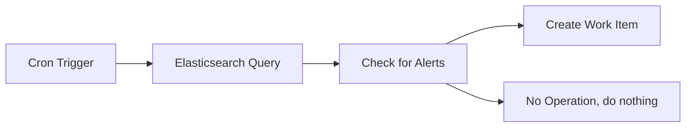

## Fluxo (.json) :

```json
{
  "meta": {
    "instanceId": "43da491ee7afc3232a99276a123dc774d0498da8891013b60e82828d6f1f40c7"
  },
  "nodes": [
    {
      "id": "77af14bb-db74-4069-adcc-d66e3bb3f893",
      "name": "Cron Trigger",
      "type": "n8n-nodes-base.cron",
      "position": [
        400,
        300
      ],
      "parameters": {
        "triggerTimes": {
          "item": [
            {
              "hour": 12,
              "minute": 15
            }
          ]
        }
      },
      "typeVersion": 1
    },
    {
      "id": "286b8b82-78c5-458a-b708-79f0b7d1437c",
      "name": "Elasticsearch Query",
      "type": "n8n-nodes-base.elasticsearch",
      "position": [
        600,
        300
      ],
      "parameters": {
        "options": {}
      },
      "typeVersion": 1
    },
    {
      "id": "425719a5-41d2-4f3a-80ba-241620d9f793",
      "name": "Check for Alerts",
      "type": "n8n-nodes-base.if",
      "position": [
        800,
        300
      ],
      "parameters": {
        "conditions": {
          "number": [
            {
              "value1": "={{$json[\"hits\"][\"total\"][\"value\"]}}",
              "operation": "greater"
            }
          ]
        }
      },
      "typeVersion": 1
    },
    {
      "id": "a2c6bd3d-c65d-4653-8183-9525a4c3af79",
      "name": "Create Work Item",
      "type": "n8n-nodes-base.httpRequest",
      "position": [
        1040,
        280
      ],
      "parameters": {
        "url": "https://dev.azure.com/<organization>/<project>/_apis/wit/workitems/$Task?api-version=7.1-preview.3",
        "options": {},
        "authentication": "basicAuth",
        "headerParametersUi": {
          "parameter": [
            {
              "name": "Content-Type",
              "value": "application/json-patch+json"
            }
          ]
        }
      },
      "typeVersion": 1
    },
    {
      "id": "71ee087f-4f75-4544-b26a-95c7ce12d020",
      "name": "No Operation, do nothing",
      "type": "n8n-nodes-base.noOp",
      "position": [
        1060,
        460
      ],
      "parameters": {},
      "typeVersion": 1
    }
  ],
  "pinData": {},
  "connections": {
    "Cron Trigger": {
      "main": [
        [
          {
            "node": "Elasticsearch Query",
            "type": "main",
            "index": 0
          }
        ]
      ]
    },
    "Check for Alerts": {
      "main": [
        [
          {
            "node": "Create Work Item",
            "type": "main",
            "index": 0
          }
        ],
        [
          {
            "node": "No Operation, do nothing",
            "type": "main",
            "index": 0
          }
        ]
      ]
    },
    "Elasticsearch Query": {
      "main": [
        [
          {
            "node": "Check for Alerts",
            "type": "main",
            "index": 0
          }
        ]
      ]
    }
  }
}
```

<a id="template-20"></a>

## Template 20 - Publicador automático de tweets a partir do Sheets

- **Nome:** Publicador automático de tweets a partir do Sheets
- **Descrição:** Busca mensagens em uma planilha do Google em intervalos regulares e publica cada mensagem na conta X, removendo a entrada publicada da lista.
- **Funcionalidade:** • Agendamento periódico: Executa o fluxo a cada 6 horas para verificar novos tweets.
• Leitura de mensagens da planilha: Obtém o próximo texto a ser publicado a partir da aba 'Tweets' de uma planilha do Google.
• Publicação na conta X: Envia o conteúdo lido como postagem para a conta X (Twitter).
• Remoção após postagem: Exclui a linha publicada da planilha para evitar republicações.
• Configuração de credenciais: Requer autorização para acessar a planilha do Google e para publicar na conta X.
- **Ferramentas:** • Google Sheets: Armazena a lista de mensagens (aba 'Tweets') a serem publicadas.
• X (Twitter): Plataforma onde as mensagens são publicadas como posts.

## Fluxo visual

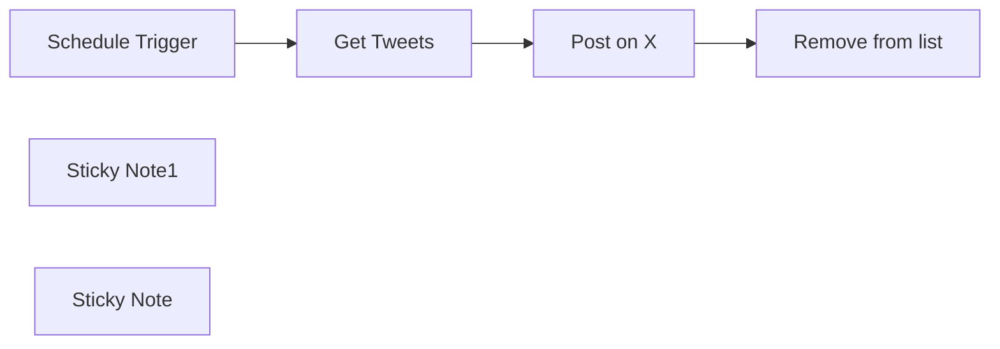

## Fluxo (.json) :

```json
{
  "meta": {
    "instanceId": "8418cffce8d48086ec0a73fd90aca708aa07591f2fefa6034d87fe12a09de26e"
  },
  "nodes": [
    {
      "id": "3f4a15ab-64d8-49af-ba80-3aa1d424a62a",
      "name": "Schedule Trigger",
      "type": "n8n-nodes-base.scheduleTrigger",
      "position": [
        620,
        160
      ],
      "parameters": {
        "rule": {
          "interval": [
            {
              "field": "hours",
              "hoursInterval": 6
            }
          ]
        }
      },
      "typeVersion": 1.1
    },
    {
      "id": "8a8681b7-2d28-403f-92a7-58c9030cb8a6",
      "name": "Get Tweets",
      "type": "n8n-nodes-base.googleSheets",
      "position": [
        820,
        160
      ],
      "parameters": {
        "options": {
          "returnAllMatches": "returnFirstMatch"
        },
        "sheetName": {
          "__rl": true,
          "mode": "list",
          "value": 600232182,
          "cachedResultUrl": "https://docs.google.com/spreadsheets/d/1QyscSsUITnoJRnvyBbRpWeNF90TGD4dF5yj8DyZYQsA/edit#gid=600232182",
          "cachedResultName": "Tweets"
        },
        "documentId": {
          "__rl": true,
          "mode": "list",
          "value": "1QyscSsUITnoJRnvyBbRpWeNF90TGD4dF5yj8DyZYQsA",
          "cachedResultUrl": "https://docs.google.com/spreadsheets/d/1QyscSsUITnoJRnvyBbRpWeNF90TGD4dF5yj8DyZYQsA/edit?usp=drivesdk",
          "cachedResultName": "Tweets"
        }
      },
      "credentials": {
        "googleSheetsOAuth2Api": {
          "id": "RICzFHixgHXMuKmg",
          "name": "Google Sheets account"
        }
      },
      "typeVersion": 4.3
    },
    {
      "id": "bcce591e-b92e-43b4-b672-b02e32f95d15",
      "name": "Post on X",
      "type": "n8n-nodes-base.twitter",
      "position": [
        1000,
        160
      ],
      "parameters": {
        "text": "={{ $json.tweet }}",
        "additionalFields": {}
      },
      "credentials": {
        "twitterOAuth2Api": {
          "id": "Yz7PjesMFvasMWkd",
          "name": "X account"
        }
      },
      "typeVersion": 2
    },
    {
      "id": "8acdd2a7-6104-490d-b8d0-26e5ff2fa37d",
      "name": "Sticky Note1",
      "type": "n8n-nodes-base.stickyNote",
      "position": [
        640,
        -280
      ],
      "parameters": {
        "color": 6,
        "width": 275.01592825011585,
        "height": 406.7602710975665,
        "content": "# Setup\n### 1/ Add Your credentials\n[Google - Sheet](https://docs.n8n.io/integrations/builtin/credentials/google/)\n[X - Twitter](https://docs.n8n.io/integrations/builtin/credentials/twitter/)\n\n### 2/ Create a new Google Spread Sheet, with one sheet named Tweets and in the first cell, write tweet.\n\n### 3/ Define your desire frequency\n\n# 👇"
      },
      "typeVersion": 1
    },
    {
      "id": "255e1f0f-beea-43fd-bfe6-0cc551a9eb6f",
      "name": "Sticky Note",
      "type": "n8n-nodes-base.stickyNote",
      "position": [
        940,
        40
      ],
      "parameters": {
        "color": 7,
        "width": 202.64787116404852,
        "height": 85.79488430601403,
        "content": "### Crafted by the\n## [🥷 n8n.ninja](https://n8n.ninja)"
      },
      "typeVersion": 1
    },
    {
      "id": "f834409b-bba2-4e8a-9fb9-5971a49960dd",
      "name": "Remove from list",
      "type": "n8n-nodes-base.googleSheets",
      "position": [
        1180,
        160
      ],
      "parameters": {
        "operation": "delete",
        "sheetName": {
          "__rl": true,
          "mode": "list",
          "value": 600232182,
          "cachedResultUrl": "https://docs.google.com/spreadsheets/d/1QyscSsUITnoJRnvyBbRpWeNF90TGD4dF5yj8DyZYQsA/edit#gid=600232182",
          "cachedResultName": "Tweets"
        },
        "documentId": {
          "__rl": true,
          "mode": "list",
          "value": "1QyscSsUITnoJRnvyBbRpWeNF90TGD4dF5yj8DyZYQsA",
          "cachedResultUrl": "https://docs.google.com/spreadsheets/d/1QyscSsUITnoJRnvyBbRpWeNF90TGD4dF5yj8DyZYQsA/edit?usp=drivesdk",
          "cachedResultName": "Tweets"
        }
      },
      "credentials": {
        "googleSheetsOAuth2Api": {
          "id": "RICzFHixgHXMuKmg",
          "name": "Google Sheets account"
        }
      },
      "typeVersion": 4.3
    }
  ],
  "pinData": {},
  "connections": {
    "Post on X": {
      "main": [
        [
          {
            "node": "Remove from list",
            "type": "main",
            "index": 0
          }
        ]
      ]
    },
    "Get Tweets": {
      "main": [
        [
          {
            "node": "Post on X",
            "type": "main",
            "index": 0
          }
        ]
      ]
    },
    "Schedule Trigger": {
      "main": [
        [
          {
            "node": "Get Tweets",
            "type": "main",
            "index": 0
          }
        ]
      ]
    }
  }
}
```

<a id="template-21"></a>

## Template 21 - Enviar template por e-mail após compra PayPal

- **Nome:** Enviar template por e-mail após compra PayPal
- **Descrição:** Recebe notificações de pagamento do PayPal, valida pagamentos concluídos, obtém detalhes do pedido, baixa um template JSON e envia um e‑mail personalizado com o template anexado ao comprador.
- **Funcionalidade:** • Recepção de notificações do PayPal: recebe webhooks de eventos de pagamento via POST.
• Espera para confirmação: introduz uma pausa para garantir que a transação foi completamente processada.
• Filtragem de evento de pagamento: processa apenas eventos PAYMENT.CAPTURE.COMPLETED.
• Recuperação dos detalhes do pedido: consulta a API de Orders do PayPal usando o order_id fornecido no webhook.
• Extração de dados do cliente e produto: obtém nome, sobrenome, e‑mail e o produto comprado a partir dos detalhes do pedido.
• Filtragem por produto: continua o fluxo apenas se o produto corresponder ao template específico vendido.
• Download do template JSON: busca o ficheiro JSON do template a partir de uma URL externa.
• Conversão para arquivo anexo: transforma o JSON em um ficheiro binário (attachment) pronto para envio.
• Envio de e‑mail personalizado: envia um e‑mail HTML ao comprador com assunto e conteúdo personalizados e o template anexado.
- **Ferramentas:** • PayPal: plataforma de pagamentos utilizada para receber webhooks de eventos e consultar a API de detalhes de pedidos.
• Hospedagem de ficheiro JSON (URL externa): local onde o template JSON é armazenado e disponibilizado para download.
• Serviço de e‑mail/SMTP: provedor responsável pelo envio do e‑mail com o anexo ao cliente.

## Fluxo visual

```mermaid
flowchart LR
    N1["Webhook"]
    N2["Event Capture Type"]
    N3["Get Order Details"]
    N4["Email Data"]
    N5["Wait"]
    N6["getJSON"]
    N7["Event Capture Type1"]
    N8["Conver to File"]
    N9["Send Email"]
    N10["Sticky Note"]
    N11["Sticky Note11"]
    N12["Sticky Note1"]
    N13["Sticky Note2"]
    N14["Sticky Note3"]
    N15["Sticky Note4"]

    N5 --> N2
    N1 --> N5
    N6 --> N8
    N4 --> N7
    N8 --> N9
    N3 --> N4
    N2 --> N3
    N7 --> N6
```

## Fluxo (.json) :

```json
{
  "meta": {
    "instanceId": "4359279a248a64f23ddf72d3bc2de4dead8a687e643e9296f8a007dd65120396"
  },
  "nodes": [
    {
      "id": "74a81d54-6cc9-4c17-88fe-aca27d491b73",
      "name": "Webhook",
      "type": "n8n-nodes-base.webhook",
      "position": [
        640,
        40
      ],
      "webhookId": "1d3d0c06-f979-4573-b644-1a5b13153471",
      "parameters": {
        "path": "paypal-NVP-SOAP-Webhook",
        "options": {},
        "httpMethod": "POST"
      },
      "typeVersion": 2
    },
    {
      "id": "59caade5-a67d-4d22-822c-bec8bf9baf69",
      "name": "Event Capture Type",
      "type": "n8n-nodes-base.switch",
      "position": [
        1160,
        0
      ],
      "parameters": {
        "rules": {
          "values": [
            {
              "outputKey": "Payment",
              "conditions": {
                "options": {
                  "version": 2,
                  "leftValue": "",
                  "caseSensitive": true,
                  "typeValidation": "strict"
                },
                "combinator": "and",
                "conditions": [
                  {
                    "id": "68917137-6042-4e47-9432-d006dca17872",
                    "operator": {
                      "type": "string",
                      "operation": "equals"
                    },
                    "leftValue": "={{ $json.body.event_type }}",
                    "rightValue": "=PAYMENT.CAPTURE.COMPLETED"
                  }
                ]
              },
              "renameOutput": true
            }
          ]
        },
        "options": {}
      },
      "typeVersion": 3.2
    },
    {
      "id": "cba1ef91-2e34-4bd5-9972-565296137851",
      "name": "Get Order Details",
      "type": "n8n-nodes-base.httpRequest",
      "position": [
        1360,
        0
      ],
      "parameters": {
        "url": "=https://api.paypal.com/v2/checkout/orders/{{ $json.body.resource.supplementary_data.related_ids.order_id }}",
        "options": {},
        "authentication": "genericCredentialType",
        "genericAuthType": "oAuth2Api"
      },
      "typeVersion": 4.2
    },
    {
      "id": "ecab1f76-8c53-459c-8c5f-26356ec9e675",
      "name": "Email Data",
      "type": "n8n-nodes-base.set",
      "position": [
        1540,
        0
      ],
      "parameters": {
        "options": {},
        "assignments": {
          "assignments": [
            {
              "id": "8d56c774-9adb-4981-9295-6f6f2ec59749",
              "name": "First Name",
              "type": "string",
              "value": "={{ $json.payment_source.paypal.name.given_name }}"
            },
            {
              "id": "0f6136eb-f5e1-47b9-a829-f42dff2b7c9e",
              "name": "Last Name",
              "type": "string",
              "value": "={{ $json.payment_source.paypal.name.surname }}"
            },
            {
              "id": "f4da90dc-b4d5-4951-91b8-2ef4b2bf870d",
              "name": "EmaiID",
              "type": "string",
              "value": "={{ $json.payment_source.paypal.email_address }}"
            },
            {
              "id": "f7a31ec1-4305-4df0-8791-0f59a04f0c7e",
              "name": "Product Purchased",
              "type": "string",
              "value": "={{ $json.purchase_units[0].items[0].name }}"
            }
          ]
        }
      },
      "typeVersion": 3.4
    },
    {
      "id": "211fbba0-67b1-4ece-b6a7-79b7c5cd0f7a",
      "name": "Wait",
      "type": "n8n-nodes-base.wait",
      "position": [
        920,
        40
      ],
      "webhookId": "16debf49-5196-473a-8b55-b2450b9b575a",
      "parameters": {},
      "typeVersion": 1.1
    },
    {
      "id": "c4b9bcab-42ab-4fca-b064-ab262cdcf05e",
      "name": "getJSON",
      "type": "n8n-nodes-base.httpRequest",
      "position": [
        2060,
        0
      ],
      "parameters": {
        "url": "https://your-json-template-in-ase-you-are-sellig.json",
        "options": {}
      },
      "typeVersion": 4.2
    },
    {
      "id": "b92f72a4-25c2-4c6d-9cc1-366cd1dc2dd1",
      "name": "Event Capture Type1",
      "type": "n8n-nodes-base.switch",
      "position": [
        1760,
        0
      ],
      "parameters": {
        "rules": {
          "values": [
            {
              "outputKey": "SocialMedia",
              "conditions": {
                "options": {
                  "version": 2,
                  "leftValue": "",
                  "caseSensitive": true,
                  "typeValidation": "strict"
                },
                "combinator": "and",
                "conditions": [
                  {
                    "id": "68917137-6042-4e47-9432-d006dca17872",
                    "operator": {
                      "type": "string",
                      "operation": "equals"
                    },
                    "leftValue": "={{ $json[\"Product Purchased\"] }}",
                    "rightValue": "=AI-Powered Social Media Content Generator & Publisher"
                  }
                ]
              },
              "renameOutput": true
            }
          ]
        },
        "options": {}
      },
      "typeVersion": 3.2
    },
    {
      "id": "10f88f6c-1062-48c5-8a90-116c18954d95",
      "name": "Conver to File",
      "type": "n8n-nodes-base.code",
      "position": [
        2280,
        0
      ],
      "parameters": {
        "jsCode": "const content = JSON.stringify($json, null, 2); // Pretty-print JSON\n\nreturn [\n  {\n    binary: {\n      data: {\n        data: Buffer.from(content).toString('base64'),\n        mimeType: 'application/json',\n        fileName: 'data.json'\n      }\n    }\n  }\n];\n"
      },
      "typeVersion": 2
    },
    {
      "id": "4c95905c-0c77-488a-8fb3-e8f4f4b83e54",
      "name": "Send Email",
      "type": "n8n-nodes-base.emailSend",
      "position": [
        2600,
        0
      ],
      "webhookId": "e2895df8-6c42-44ff-ba08-fbf7a9df93c6",
      "parameters": {
        "html": "=<!DOCTYPE html>\n<html>\n<head>\n  <meta charset=\"UTF-8\">\n  <title>{{ $('Event Capture Type1').item.json['Product Purchased'] }}</title>\n</head>\n<body style=\"margin:0; padding:0; font-family: Arial, sans-serif; background-color: #f9f9f9;\">\n  <table align=\"center\" width=\"100%\" cellpadding=\"0\" cellspacing=\"0\" style=\"max-width:600px; background-color:#ffffff; margin:20px auto; border-radius:8px; box-shadow:0 0 10px rgba(0,0,0,0.05);\">\n    <tr>\n      <td style=\"padding:30px; text-align:center;\">\n        <h2 style=\"color:#333;\">Hi {{ $('Event Capture Type1').item.json['First Name'] }} {{ $('Event Capture Type1').item.json['Last Name'] }} ,</h2>\n        <p style=\"font-size:16px; color:#555;\">Thank you for purchasing <strong> {{ $('Event Capture Type1').item.json['Product Purchased'] }}  - n8n workflow template</strong> from <strong>SyncBricks</strong>! 🚀</p>\n        <p style=\"font-size:16px; color:#555;\">Your template is attached with this email. We hope it helps you build powerful automations with ease.</p>\n        <hr style=\"margin:30px 0; border:none; border-top:1px solid #eee;\">\n        <p style=\"font-size:16px; color:#555;\">Here are some helpful resources to take things further:</p>\n        <ul style=\"list-style:none; padding:0; font-size:16px; color:#333;\">\n          <li style=\"margin-bottom:10px;\"><a href=\"https://www.udemy.com/course/mastering-n8n-ai-agents-api-automation-webhooks-no-code/?referralCode=0309FD70BE2D72630C09\" style=\"color:#0066cc; text-decoration:none;\">📘 Enroll for the n8n Mastery Course</a></li>\n          <li style=\"margin-bottom:10px;\"><a href=\"https://lms.syncbricks.com/books/n8n/\" style=\"color:#0066cc; text-decoration:none;\">📖 Get the Book: Mastering n8n</a></li>\n          <li style=\"margin-bottom:10px;\"><a href=\"https://n8n.syncbricks.com\" style=\"color:#0066cc; text-decoration:none;\">☁️ Try n8n Cloud – Use Code <strong>AMJID10</strong> for Discount</a></li>\n        </ul>\n\n<p style=\"font-size:16px; color:#555;\">🎥 Watch a quick guide on how to use your template:</p>\n<a href=\"https://www.youtube.com/watch?v=-Oc_HfreJJE\" target=\"_blank\" style=\"display:inline-block; text-decoration:none;\">\n  \n</a>\n\n\n        <p style=\"font-size:14px; color:#999; margin-top:40px;\">Need help or have questions? Just reply to this email .</p>\n      </td>\n    </tr>\n  </table>\n</body>\n</html>\n",
        "options": {
          "attachments": "data",
          "appendAttribution": false
        },
        "subject": "=Your Order : {{ $('Get Order Details').item.json.purchase_units[0].items[0].name }}",
        "toEmail": "={{ $('Email Data').item.json.EmaiID }}",
        "fromEmail": "Syncbricks <info@syncbricks.com>"
      },
      "typeVersion": 2.1
    },
    {
      "id": "d859f5b9-db4f-4df8-a806-a806349092ee",
      "name": "Sticky Note",
      "type": "n8n-nodes-base.stickyNote",
      "position": [
        580,
        -160
      ],
      "parameters": {
        "width": 520,
        "height": 500,
        "content": "## Paypal  Webhook\n**Go to Paypal Developer\nClick on Apps and Credentails\nGo to NVP SOAP Webhooks\nAdd this Webhook in Paypal\n\n- Wait node is to ensure that Transaction is completed\n"
      },
      "typeVersion": 1
    },
    {
      "id": "f4c545d8-f978-4b49-8cdb-3b6b427544f8",
      "name": "Sticky Note11",
      "type": "n8n-nodes-base.stickyNote",
      "position": [
        -400,
        -180
      ],
      "parameters": {
        "color": 4,
        "width": 955,
        "height": 516,
        "content": "## Developed by Amjid Ali\n\nThank you for using this workflow template. It has taken me countless hours of hard work, research, and dedication to develop, and I sincerely hope it adds value to your work.\n\nIf you find this template helpful, I kindly ask you to consider supporting my efforts. Your support will help me continue improving and creating more valuable resources.\n\nYou can contribute via PayPal here:\n\nhttp://paypal.me/pmptraining\n\nFor Full Course about ERPNext or Automation using AI follow below link\n\nhttp://lms.syncbricks.com\n\nAdditionally, when sharing this template, I would greatly appreciate it if you include my original information to ensure proper credit is given.\n\nThank you for your generosity and support!\nEmail : amjid@amjidali.com\nhttps://linkedin.com/in/amjidali\nhttps://syncbricks.com\nhttps://youtube.com/@syncbricks"
      },
      "typeVersion": 1
    },
    {
      "id": "769fc3b3-0cbe-4334-a990-83c86a0e5fc2",
      "name": "Sticky Note1",
      "type": "n8n-nodes-base.stickyNote",
      "position": [
        1120,
        -160
      ],
      "parameters": {
        "width": 580,
        "height": 500,
        "content": "## Payment Detials are Selected\n**The webhook gets all the Events but here we are filtering only the payments that we got agains the order.\n** It will get the customer name, Email Address and the Product customer has bought"
      },
      "typeVersion": 1
    },
    {
      "id": "835a6eb1-0b73-4d52-92b1-253fb1f150ac",
      "name": "Sticky Note2",
      "type": "n8n-nodes-base.stickyNote",
      "position": [
        1720,
        -160
      ],
      "parameters": {
        "width": 280,
        "height": 500,
        "content": "## Filter the Product \n** Each Product can have multiple Product Links on successful Purchase"
      },
      "typeVersion": 1
    },
    {
      "id": "54a284f2-566b-4dea-9e5f-6e55f5faefa4",
      "name": "Sticky Note3",
      "type": "n8n-nodes-base.stickyNote",
      "position": [
        2020,
        -160
      ],
      "parameters": {
        "width": 420,
        "height": 500,
        "content": "## n8n Template Sale\n** as I am selling n8n template, it will download json file and will convert that into binay file"
      },
      "typeVersion": 1
    },
    {
      "id": "20645f67-af3d-4ebf-bab1-488937182205",
      "name": "Sticky Note4",
      "type": "n8n-nodes-base.stickyNote",
      "position": [
        2460,
        -160
      ],
      "parameters": {
        "color": 4,
        "width": 420,
        "height": 500,
        "content": "## Send Email to Custoer\n** The download file will be attafched and my Custom Email will be sent to Customer"
      },
      "typeVersion": 1
    }
  ],
  "pinData": {},
  "connections": {
    "Wait": {
      "main": [
        [
          {
            "node": "Event Capture Type",
            "type": "main",
            "index": 0
          }
        ]
      ]
    },
    "Webhook": {
      "main": [
        [
          {
            "node": "Wait",
            "type": "main",
            "index": 0
          }
        ]
      ]
    },
    "getJSON": {
      "main": [
        [
          {
            "node": "Conver to File",
            "type": "main",
            "index": 0
          }
        ]
      ]
    },
    "Email Data": {
      "main": [
        [
          {
            "node": "Event Capture Type1",
            "type": "main",
            "index": 0
          }
        ]
      ]
    },
    "Conver to File": {
      "main": [
        [
          {
            "node": "Send Email",
            "type": "main",
            "index": 0
          }
        ]
      ]
    },
    "Get Order Details": {
      "main": [
        [
          {
            "node": "Email Data",
            "type": "main",
            "index": 0
          }
        ]
      ]
    },
    "Event Capture Type": {
      "main": [
        [
          {
            "node": "Get Order Details",
            "type": "main",
            "index": 0
          }
        ]
      ]
    },
    "Event Capture Type1": {
      "main": [
        [
          {
            "node": "getJSON",
            "type": "main",
            "index": 0
          }
        ]
      ]
    }
  }
}
```

<a id="template-22"></a>

## Template 22 - Roteamento por valor booleano de saída de comando

- **Nome:** Roteamento por valor booleano de saída de comando
- **Descrição:** Executa um comando que retorna um JSON na saída, converte essa saída em dados do fluxo e encaminha o fluxo com base no valor booleano de um campo.
- **Funcionalidade:** • Execução de comando externo: Executa um comando do sistema que retorna JSON na saída padrão.
• Conversão da saída para dados do fluxo: Faz o parse da string JSON retornada e transforma em um objeto utilizável no fluxo.
• Avaliação condicional e roteamento: Verifica o campo booleano "value1" no objeto JSON e direciona o fluxo conforme verdadeiro ou falso.
- **Ferramentas:** • Terminal/Shell do sistema: Executa o comando (por exemplo, echo) e fornece a saída padrão.
• Parser JSON: Interpreta a string JSON da saída para um objeto manipulável no fluxo.

## Fluxo visual

```mermaid
flowchart LR
    N1["Execute Command"]
    N2["IF"]
    N3["To Flow Data"]

    N1 --> N3
    N1 --> N2
```

## Fluxo (.json) :

```json
{
  "nodes": [
    {
      "name": "Execute Command",
      "type": "n8n-nodes-base.executeCommand",
      "position": [
        600,
        350
      ],
      "parameters": {
        "command": "echo \"{ \\\"value1\\\": true, \\\"value2\\\": 1 }\""
      },
      "typeVersion": 1
    },
    {
      "name": "IF",
      "type": "n8n-nodes-base.if",
      "position": [
        800,
        450
      ],
      "parameters": {
        "conditions": {
          "boolean": [
            {
              "value1": "={{JSON.parse($node[\"Execute Command\"].data[\"stdout\"]).value1}}",
              "value2": true
            }
          ]
        }
      },
      "typeVersion": 1
    },
    {
      "name": "To Flow Data",
      "type": "n8n-nodes-base.functionItem",
      "position": [
        800,
        250
      ],
      "parameters": {
        "functionCode": "item = JSON.parse(item.stdout);\nreturn item;"
      },
      "typeVersion": 1
    }
  ],
  "connections": {
    "Execute Command": {
      "main": [
        [
          {
            "node": "To Flow Data",
            "type": "main",
            "index": 0
          },
          {
            "node": "IF",
            "type": "main",
            "index": 0
          }
        ]
      ]
    }
  }
}
```

<a id="template-23"></a>

## Template 23 - Extração, Resumo e Análise de Sentimento de Conteúdo

- **Nome:** Extração, Resumo e Análise de Sentimento de Conteúdo
- **Descrição:** Fluxo que extrai conteúdo de uma página web via Bright Data, converte markdown em texto, gera um resumo e realiza análise de sentimento estruturada, enviando resultados por webhook e gravando arquivos localmente.
- **Funcionalidade:** • Configurar URL e zona do serviço de captura: Permite definir o endereço alvo e a zona do Bright Data para a extração.
• Captura de página com desbloqueio web: Solicita o conteúdo da página em formato markdown via Bright Data Web Unlocker.
• Conversão de markdown para texto: Utiliza um modelo de linguagem para transformar o markdown em dados textuais limpos.
• Geração de resumo conciso: Cria um resumo objetivo do conteúdo extraído usando um modelo de LLM.
• Análise de sentimento estruturada: Executa análise de sentimento que retorna objetos com sentimento, score de confiança e explicação em texto.
• Notificações via webhook: Envia resultados (texto, resumo e análise) para um endpoint de webhook para monitoramento ou integração.
• Preparação e gravação de arquivos: Converte resultados para binário/base64 e grava arquivos JSON no sistema de arquivos local para persistência.
- **Ferramentas:** • Bright Data Web Unlocker: Serviço de coleta e desbloqueio de páginas web usado para obter o conteúdo alvo, incluindo opção de retornar em formato markdown.
• Google Gemini (PaLM): Modelo de linguagem usado para extração de texto, sumarização e análise de sentimento.
• webhook.site: Serviço de recepção de webhooks utilizado para enviar notificações e capturar as cargas enviadas durante testes.
• Sistema de arquivos local (Windows): Destino para salvar os arquivos JSON gerados pelo fluxo.


## Fluxo visual

```mermaid
flowchart LR
    N1["When clicking ‘Test workflow’"]
    N2["Sticky Note"]
    N3["Sticky Note1"]
    N4["Markdown to Textual Data Extractor"]
    N5["Set URL and Bright Data Zone"]
    N6["AI Sentiment Analyzer with the structured response"]
    N7["Initiate a Webhook Notification for Markdown to Textual Data Extraction"]
    N8["Initiate a Webhook Notification for AI Sentiment Analyzer"]
    N9["Google Gemini Chat Model for Summary"]
    N10["Google Gemini Chat Model for Data Extract"]
    N11["Google Gemini Chat Model for Sentiment Analyzer"]
    N12["Initiate a Webhook Notification for Summarization"]
    N13["Perform Bright Data Web Request"]
    N14["Summarize Content"]
    N15["Create a binary data for textual data"]
    N16["Create a binary data for sentiment analysis"]
    N17["Write the AI Sentiment analysis file to disk"]
    N18["Write the textual file to disk"]
    N19["Create a binary data for summary"]
    N20["Write the summary file to disk"]
    N21["Sticky Note2"]
    N22["Sticky Note3"]
    N23["Sticky Note4"]

    N14 --> N12
    N14 --> N19
    N5 --> N13
    N13 --> N4
    N13 --> N14
    N19 --> N20
    N1 --> N5
    N4 --> N6
    N4 --> N7
    N4 --> N15
    N15 --> N18
    N16 --> N17
    N6 --> N8
    N6 --> N16
```

## Fluxo (.json) :

```json
{
  "id": "wTI77cpLkbxsRQat",
  "meta": {
    "instanceId": "885b4fb4a6a9c2cb5621429a7b972df0d05bb724c20ac7dac7171b62f1c7ef40",
    "templateCredsSetupCompleted": true
  },
  "name": "Brand Content Extract, Summarize & Sentiment Analysis with Bright Data",
  "tags": [
    {
      "id": "Kujft2FOjmOVQAmJ",
      "name": "Engineering",
      "createdAt": "2025-04-09T01:31:00.558Z",
      "updatedAt": "2025-04-09T01:31:00.558Z"
    },
    {
      "id": "ddPkw7Hg5dZhQu2w",
      "name": "AI",
      "createdAt": "2025-04-13T05:38:08.053Z",
      "updatedAt": "2025-04-13T05:38:08.053Z"
    }
  ],
  "nodes": [
    {
      "id": "646ef542-c601-4103-87e6-6fa9616d8c52",
      "name": "When clicking ‘Test workflow’",
      "type": "n8n-nodes-base.manualTrigger",
      "position": [
        120,
        -560
      ],
      "parameters": {},
      "typeVersion": 1
    },
    {
      "id": "00b4ce90-c4f2-41c4-8943-7db3d0c3f81a",
      "name": "Sticky Note",
      "type": "n8n-nodes-base.stickyNote",
      "position": [
        100,
        -320
      ],
      "parameters": {
        "width": 400,
        "height": 300,
        "content": "## Note\n\nThis workflow deals with the brand content extraction by utilizing the Bright Data Web Unlocker Product.\n\nThe Basic LLM Chain, Information Extraction, Summarization Chain are being used to demonstrate the usage of the N8N AI capabilities.\n\n**Please make sure to set the web URL of your interest within the \"Set URL and Bright Data Zone\" node and update the Webhook Notification URL**"
      },
      "typeVersion": 1
    },
    {
      "id": "5cc35b9b-7483-404e-96a3-1688f7b9078b",
      "name": "Sticky Note1",
      "type": "n8n-nodes-base.stickyNote",
      "position": [
        540,
        -320
      ],
      "parameters": {
        "width": 480,
        "height": 300,
        "content": "## LLM Usages\n\nGoogle Gemini Flash Exp model is being used.\n\nBasic LLM Chain Data Extractor.\n\nInformation Extraction is being used for the handling the custom sentiment analysis with the structured response.\n\nSummarization Chain is being used for the creation of a concise summary of the extracted brand content."
      },
      "typeVersion": 1
    },
    {
      "id": "e15f32de-58d9-4ea6-9d5c-f63975d1090d",
      "name": "Markdown to Textual Data Extractor",
      "type": "@n8n/n8n-nodes-langchain.chainLlm",
      "position": [
        1240,
        -440
      ],
      "parameters": {
        "text": "=You need to analyze the below markdown and convert to textual data. Please do not output with your own thoughts. Make sure to output with textual data only with no links, scripts, css etc.\n\n{{ $json.data }}",
        "messages": {
          "messageValues": [
            {
              "message": "You are a markdown expert"
            }
          ]
        },
        "promptType": "define"
      },
      "typeVersion": 1.6
    },
    {
      "id": "1462cd3b-b1d5-4ddf-9f1e-2b8f20faa19c",
      "name": "Set URL and Bright Data Zone",
      "type": "n8n-nodes-base.set",
      "position": [
        340,
        -560
      ],
      "parameters": {
        "options": {},
        "assignments": {
          "assignments": [
            {
              "id": "3aedba66-f447-4d7a-93c0-8158c5e795f9",
              "name": "url",
              "type": "string",
              "value": "https://www.amazon.com/TP-Link-Dual-Band-Archer-BE230-HomeShield/dp/B0DC99N2T8"
            },
            {
              "id": "4e7ee31d-da89-422f-8079-2ff2d357a0ba",
              "name": "zone",
              "type": "string",
              "value": "web_unlocker1"
            }
          ]
        }
      },
      "typeVersion": 3.4
    },
    {
      "id": "9783e878-e864-4632-9b89-d78567204053",
      "name": "AI Sentiment Analyzer with the structured response",
      "type": "@n8n/n8n-nodes-langchain.informationExtractor",
      "position": [
        1740,
        100
      ],
      "parameters": {
        "text": "=Perform the sentiment analysis on the below content and output with the structured information.\n\nHere's the content:\n\n{{ $('Perform Bright Data Web Request').item.json.data }}",
        "options": {
          "systemPromptTemplate": "You are an expert sentiment analyzer."
        },
        "schemaType": "manual",
        "inputSchema": "{\n  \"$schema\": \"http://json-schema.org/schema#\",\n  \"title\": \"SentimentAnalysisResponseArray\",\n  \"type\": \"array\",\n  \"items\": {\n    \"type\": \"object\",\n    \"properties\": {\n      \"sentiment\": {\n        \"type\": \"string\",\n        \"enum\": [\"Positive\", \"Neutral\", \"Negative\"],\n        \"description\": \"The overall sentiment of the content.\"\n      },\n      \"confidence_score\": {\n        \"type\": \"number\",\n        \"minimum\": 0,\n        \"maximum\": 1,\n        \"description\": \"Confidence score of the sentiment classification.\"\n      },\n      \"sentence\": {\n        \"type\": \"string\",\n        \"description\": \"A natural language statement explaining the sentiment.\"\n      }\n    },\n    \"required\": [\"sentiment\", \"confidence_score\", \"sentence\"],\n    \"additionalProperties\": false\n  }\n}\n"
      },
      "typeVersion": 1
    },
    {
      "id": "41352a53-7821-4247-905e-7995e1e6e382",
      "name": "Initiate a Webhook Notification for Markdown to Textual Data Extraction",
      "type": "n8n-nodes-base.httpRequest",
      "position": [
        1720,
        -460
      ],
      "parameters": {
        "url": "https://webhook.site/3c36d7d1-de1b-4171-9fd3-643ea2e4dd76",
        "options": {},
        "sendBody": true,
        "bodyParameters": {
          "parameters": [
            {
              "name": "summary",
              "value": "={{ $json.text }}"
            }
          ]
        }
      },
      "typeVersion": 4.2
    },
    {
      "id": "9717b5df-f148-4c8c-95d4-cb7c54837228",
      "name": "Initiate a Webhook Notification for AI Sentiment Analyzer",
      "type": "n8n-nodes-base.httpRequest",
      "position": [
        2120,
        100
      ],
      "parameters": {
        "url": "https://webhook.site/3c36d7d1-de1b-4171-9fd3-643ea2e4dd76",
        "options": {},
        "sendBody": true,
        "bodyParameters": {
          "parameters": [
            {
              "name": "summary",
              "value": "={{ $json.output }}"
            }
          ]
        }
      },
      "typeVersion": 4.2
    },
    {
      "id": "88733b5f-cbb0-42a6-898c-7a1ccc94bef7",
      "name": "Google Gemini Chat Model for Summary",
      "type": "@n8n/n8n-nodes-langchain.lmChatGoogleGemini",
      "position": [
        1260,
        -780
      ],
      "parameters": {
        "options": {},
        "modelName": "models/gemini-2.0-flash-exp"
      },
      "credentials": {
        "googlePalmApi": {
          "id": "YeO7dHZnuGBVQKVZ",
          "name": "Google Gemini(PaLM) Api account"
        }
      },
      "typeVersion": 1
    },
    {
      "id": "560e3d33-61d8-4db6-b1df-89f4e915f3f1",
      "name": "Google Gemini Chat Model for Data Extract",
      "type": "@n8n/n8n-nodes-langchain.lmChatGoogleGemini",
      "position": [
        1320,
        -220
      ],
      "parameters": {
        "options": {},
        "modelName": "models/gemini-2.0-flash-exp"
      },
      "credentials": {
        "googlePalmApi": {
          "id": "YeO7dHZnuGBVQKVZ",
          "name": "Google Gemini(PaLM) Api account"
        }
      },
      "typeVersion": 1
    },
    {
      "id": "1b07608f-7174-46e8-af27-3abf100d9e3a",
      "name": "Google Gemini Chat Model for Sentiment Analyzer",
      "type": "@n8n/n8n-nodes-langchain.lmChatGoogleGemini",
      "position": [
        1820,
        320
      ],
      "parameters": {
        "options": {},
        "modelName": "models/gemini-2.0-flash-exp"
      },
      "credentials": {
        "googlePalmApi": {
          "id": "YeO7dHZnuGBVQKVZ",
          "name": "Google Gemini(PaLM) Api account"
        }
      },
      "typeVersion": 1
    },
    {
      "id": "b6b6df94-d3fc-45ee-a339-5a368ea000eb",
      "name": "Initiate a Webhook Notification for Summarization",
      "type": "n8n-nodes-base.httpRequest",
      "position": [
        1660,
        -820
      ],
      "parameters": {
        "url": "https://webhook.site/3c36d7d1-de1b-4171-9fd3-643ea2e4dd76",
        "options": {},
        "sendBody": true,
        "bodyParameters": {
          "parameters": [
            {
              "name": "summary",
              "value": "={{ $json.response.text }}"
            }
          ]
        }
      },
      "typeVersion": 4.2
    },
    {
      "id": "f3e60ecd-5d07-4df0-a413-327b24db23ab",
      "name": "Perform Bright Data Web Request",
      "type": "n8n-nodes-base.httpRequest",
      "position": [
        560,
        -560
      ],
      "parameters": {
        "url": "https://api.brightdata.com/request",
        "method": "POST",
        "options": {},
        "sendBody": true,
        "sendHeaders": true,
        "authentication": "genericCredentialType",
        "bodyParameters": {
          "parameters": [
            {
              "name": "zone",
              "value": "={{ $json.zone }}"
            },
            {
              "name": "url",
              "value": "={{ $json.url }}?product=unlocker&method=api"
            },
            {
              "name": "format",
              "value": "raw"
            },
            {
              "name": "data_format",
              "value": "markdown"
            }
          ]
        },
        "genericAuthType": "httpHeaderAuth",
        "headerParameters": {
          "parameters": [
            {}
          ]
        }
      },
      "credentials": {
        "httpHeaderAuth": {
          "id": "kdbqXuxIR8qIxF7y",
          "name": "Header Auth account"
        }
      },
      "typeVersion": 4.2
    },
    {
      "id": "9030085f-5b05-41d9-94ee-668ee29df815",
      "name": "Summarize Content",
      "type": "@n8n/n8n-nodes-langchain.chainSummarization",
      "position": [
        1240,
        -980
      ],
      "parameters": {
        "options": {
          "summarizationMethodAndPrompts": {
            "values": {
              "prompt": "Write a concise summary of the following:\n\n\n\"{text}\"\n\n"
            }
          }
        },
        "chunkingMode": "advanced"
      },
      "typeVersion": 2
    },
    {
      "id": "fe93c4a6-de3b-481d-ba6c-5f315f5279c4",
      "name": "Create a binary data for textual data",
      "type": "n8n-nodes-base.function",
      "position": [
        1720,
        -220
      ],
      "parameters": {
        "functionCode": "items[0].binary = {\n  data: {\n    data: new Buffer(JSON.stringify(items[0].json, null, 2)).toString('base64')\n  }\n};\nreturn items;"
      },
      "typeVersion": 1
    },
    {
      "id": "0811c300-1302-49b5-a334-ac8f960a5b8c",
      "name": "Create a binary data for sentiment analysis",
      "type": "n8n-nodes-base.function",
      "position": [
        2120,
        320
      ],
      "parameters": {
        "functionCode": "items[0].binary = {\n  data: {\n    data: new Buffer(JSON.stringify(items[0].json, null, 2)).toString('base64')\n  }\n};\nreturn items;"
      },
      "typeVersion": 1
    },
    {
      "id": "01d798b7-7c62-4240-9d5e-f2e67ca047ae",
      "name": "Write the AI Sentiment analysis file to disk",
      "type": "n8n-nodes-base.readWriteFile",
      "position": [
        2520,
        320
      ],
      "parameters": {
        "options": {},
        "fileName": "d:\\Brand-Content-Sentiment-Analysis.json",
        "operation": "write"
      },
      "typeVersion": 1
    },
    {
      "id": "f9faf283-ba8d-48e1-860e-2bb660cb9c1e",
      "name": "Write the textual file to disk",
      "type": "n8n-nodes-base.readWriteFile",
      "position": [
        2100,
        -220
      ],
      "parameters": {
        "options": {},
        "fileName": "d:\\Brand-Content-Textual.json",
        "operation": "write"
      },
      "typeVersion": 1
    },
    {
      "id": "2c47c271-4456-4fc4-9a54-20784365a4af",
      "name": "Create a binary data for summary",
      "type": "n8n-nodes-base.function",
      "position": [
        1660,
        -1060
      ],
      "parameters": {
        "functionCode": "items[0].binary = {\n  data: {\n    data: new Buffer(JSON.stringify(items[0].json, null, 2)).toString('base64')\n  }\n};\nreturn items;"
      },
      "typeVersion": 1
    },
    {
      "id": "c5f33f8d-93eb-47ac-a42f-717b39f4d7c2",
      "name": "Write the summary file to disk",
      "type": "n8n-nodes-base.readWriteFile",
      "position": [
        1880,
        -1060
      ],
      "parameters": {
        "options": {},
        "fileName": "d:\\Brand-Content-Summary.json",
        "operation": "write"
      },
      "typeVersion": 1
    },
    {
      "id": "72938f7b-20c1-45d3-9348-878d6e0b8d60",
      "name": "Sticky Note2",
      "type": "n8n-nodes-base.stickyNote",
      "position": [
        1200,
        -1080
      ],
      "parameters": {
        "color": 4,
        "width": 1100,
        "height": 460,
        "content": "## Summarization"
      },
      "typeVersion": 1
    },
    {
      "id": "fcf1d1ad-d516-41bc-bf76-73ebb920ecba",
      "name": "Sticky Note3",
      "type": "n8n-nodes-base.stickyNote",
      "position": [
        1720,
        40
      ],
      "parameters": {
        "color": 6,
        "width": 1000,
        "height": 480,
        "content": "## Sentiment Analysis"
      },
      "typeVersion": 1
    },
    {
      "id": "9c44d01f-e30b-4597-ad74-09fa54b4ec84",
      "name": "Sticky Note4",
      "type": "n8n-nodes-base.stickyNote",
      "position": [
        1200,
        -520
      ],
      "parameters": {
        "color": 3,
        "width": 1100,
        "height": 480,
        "content": "## Textual Data Extract"
      },
      "typeVersion": 1
    }
  ],
  "active": false,
  "pinData": {},
  "settings": {
    "executionOrder": "v1"
  },
  "versionId": "317a5d48-95c6-4425-a14a-6b2fec9e0802",
  "connections": {
    "Summarize Content": {
      "main": [
        [
          {
            "node": "Initiate a Webhook Notification for Summarization",
            "type": "main",
            "index": 0
          },
          {
            "node": "Create a binary data for summary",
            "type": "main",
            "index": 0
          }
        ]
      ]
    },
    "Set URL and Bright Data Zone": {
      "main": [
        [
          {
            "node": "Perform Bright Data Web Request",
            "type": "main",
            "index": 0
          }
        ]
      ]
    },
    "Perform Bright Data Web Request": {
      "main": [
        [
          {
            "node": "Markdown to Textual Data Extractor",
            "type": "main",
            "index": 0
          },
          {
            "node": "Summarize Content",
            "type": "main",
            "index": 0
          }
        ]
      ]
    },
    "Create a binary data for summary": {
      "main": [
        [
          {
            "node": "Write the summary file to disk",
            "type": "main",
            "index": 0
          }
        ]
      ]
    },
    "When clicking ‘Test workflow’": {
      "main": [
        [
          {
            "node": "Set URL and Bright Data Zone",
            "type": "main",
            "index": 0
          }
        ]
      ]
    },
    "Markdown to Textual Data Extractor": {
      "main": [
        [
          {
            "node": "AI Sentiment Analyzer with the structured response",
            "type": "main",
            "index": 0
          },
          {
            "node": "Initiate a Webhook Notification for Markdown to Textual Data Extraction",
            "type": "main",
            "index": 0
          },
          {
            "node": "Create a binary data for textual data",
            "type": "main",
            "index": 0
          }
        ]
      ]
    },
    "Google Gemini Chat Model for Summary": {
      "ai_languageModel": [
        [
          {
            "node": "Summarize Content",
            "type": "ai_languageModel",
            "index": 0
          }
        ]
      ]
    },
    "Create a binary data for textual data": {
      "main": [
        [
          {
            "node": "Write the textual file to disk",
            "type": "main",
            "index": 0
          }
        ]
      ]
    },
    "Google Gemini Chat Model for Data Extract": {
      "ai_languageModel": [
        [
          {
            "node": "Markdown to Textual Data Extractor",
            "type": "ai_languageModel",
            "index": 0
          }
        ]
      ]
    },
    "Create a binary data for sentiment analysis": {
      "main": [
        [
          {
            "node": "Write the AI Sentiment analysis file to disk",
            "type": "main",
            "index": 0
          }
        ]
      ]
    },
    "Google Gemini Chat Model for Sentiment Analyzer": {
      "ai_languageModel": [
        [
          {
            "node": "AI Sentiment Analyzer with the structured response",
            "type": "ai_languageModel",
            "index": 0
          }
        ]
      ]
    },
    "AI Sentiment Analyzer with the structured response": {
      "main": [
        [
          {
            "node": "Initiate a Webhook Notification for AI Sentiment Analyzer",
            "type": "main",
            "index": 0
          },
          {
            "node": "Create a binary data for sentiment analysis",
            "type": "main",
            "index": 0
          }
        ]
      ]
    },
    "Initiate a Webhook Notification for AI Sentiment Analyzer": {
      "main": [
        []
      ]
    },
    "Initiate a Webhook Notification for Markdown to Textual Data Extraction": {
      "main": [
        []
      ]
    }
  }
}
```

<a id="template-25"></a>

## Template 25 - Buffer e consolidação de mensagens

- **Nome:** Buffer e consolidação de mensagens
- **Descrição:** Agrupa mensagens recebidas por conversa, espera inatividade ou um limite, consolida os textos com um modelo de linguagem e retorna uma resposta única, limpando o buffer após o envio.
- **Funcionalidade:** • Recepção de mensagens por contexto: Recebe mensagens com um identificador de contexto (ex.: ID de conversa) como entrada.
• Armazenamento em buffer: Empilha cada mensagem num buffer persistente para o mesmo contexto, incluindo timestamp.
• Cálculo dinâmico de espera: Determina waitSeconds com base no tamanho da mensagem (ex.: mensagens curtas esperam mais).
• Metadados e contadores: Atualiza last_seen e incrementa um contador buffer_count com TTL para gerenciar janelas de agrupamento.
• Flag de bloqueio (waiting): Define uma flag temporária para evitar processamento concorrente de batches já em andamento.
• Verificação de inatividade/limiar: Dispara consolidação quando houver inatividade (agora - last_seen ≥ waitSeconds) ou quando o contador indicar mensagens na fila.
• Espera adaptativa: Se necessário, espera apenas o tempo restante até atingir o período de inatividade antes de consolidar.
• Consolidação por LLM: Envia o conteúdo do buffer a um modelo de linguagem para extrair e unificar mensagens em um único parágrafo.
• Limpeza pós-processamento: Após consolidação, deleta keys relacionadas ao buffer, contador e flag para reiniciar o ciclo.
• Saída estruturada: Mapeia o resultado consolidado e retorna mensagem e contexto para processamento downstream.
- **Ferramentas:** • Redis: Armazenamento de listas (buffer), chaves de estado (last_seen, waiting_reply, buffer_count) e TTLs para controle de janela.
• OpenAI (modelo GPT-4.1-nano): Modelo de linguagem usado para extrair e consolidar as mensagens do buffer em um texto único.
• Plataforma de mensagens / Webhook (ex.: WhatsApp): Fonte de mensagens e contextos que alimentam o fluxo via webhooks ou gatilhos externos.


## Fluxo visual

```mermaid
flowchart LR
    N1["When clicking ‘Test workflow’"]
    N2["No Operation, do nothing1"]
    N3["Information Extractor"]
    N4["OpenAI Chat Model"]
    N5["get wait seconds"]
    N6["Set last_seen"]
    N7["Get waiting_reply"]
    N8["Mod input"]
    N9["waiting_reply?"]
    N10["When chat message received"]
    N11["Set waiting_reply"]
    N12["Get buffer"]
    N13["Delete buffer_in"]
    N14["Delete waiting_reply"]
    N15["WaitSeconds"]
    N16["Buffer messages"]
    N17["Set buffer_count increment"]
    N18["Get last_seen"]
    N19["Get buffer_count"]
    N20["Map ouput"]
    N21["Check Inactivity + Count"]
    N22["Delete waiting_reply1"]
    N23["No Operation, do nothing2"]
    N24["Wait"]
    N25["When Executed by Another Workflow"]
    N26["Mock input data"]
    N27["No Operation, do nothing3"]
    N28["Sticky Note"]
    N29["Sticky Note1"]
    N30["Sticky Note2"]

    N24 --> N21
    N8 --> N9
    N12 --> N3
    N15 --> N18
    N18 --> N19
    N6 --> N23
    N9 --> N23
    N9 --> N11
    N16 --> N17
    N16 --> N6
    N16 --> N7
    N26 --> N5
    N13 --> N27
    N19 --> N21
    N5 --> N16
    N7 --> N8
    N11 --> N15
    N14 --> N27
    N22 --> N27
    N3 --> N20
    N3 --> N13
    N3 --> N14
    N3 --> N22
    N21 --> N12
    N21 --> N2
    N2 --> N24
    N17 --> N23
    N10 --> N26
    N25 --> N5
    N1 --> N26
```

## Fluxo (.json) :

```json
{
  "meta": {
    "instanceId": "d1b9b74c805fea7fca1b903ee192d1d4090b516d3c254da86beb2f13b7c2ed2e",
    "templateCredsSetupCompleted": true
  },
  "nodes": [
    {
      "id": "be902a85-fc31-442c-b308-a2350ec5aabb",
      "name": "When clicking ‘Test workflow’",
      "type": "n8n-nodes-base.manualTrigger",
      "position": [
        -760,
        440
      ],
      "parameters": {},
      "typeVersion": 1
    },
    {
      "id": "d229b686-9de4-4633-9dba-3e1fe71eedf1",
      "name": "No Operation, do nothing1",
      "type": "n8n-nodes-base.noOp",
      "position": [
        1820,
        800
      ],
      "parameters": {},
      "typeVersion": 1
    },
    {
      "id": "f583bc97-8da8-488e-ab04-5167dc7a7701",
      "name": "Information Extractor",
      "type": "@n8n/n8n-nodes-langchain.informationExtractor",
      "position": [
        2420,
        540
      ],
      "parameters": {
        "text": "={{ $json.buffer.reverse().toJsonString() }}",
        "options": {
          "systemPromptTemplate": "Eres un experto extrayendo información, tu objetivo es recolectar todos los mensajes. Procura no dejar duplicados. como resultado debes retornar un solo párrafo con todo los mensajes."
        },
        "schemaType": "fromJson",
        "jsonSchemaExample": "{\n\t\"message\": \"all consolidated messages\"\n}"
      },
      "typeVersion": 1
    },
    {
      "id": "5b719416-4886-4d38-9d00-30b6237db168",
      "name": "OpenAI Chat Model",
      "type": "@n8n/n8n-nodes-langchain.lmChatOpenAi",
      "position": [
        2440,
        760
      ],
      "parameters": {
        "model": {
          "__rl": true,
          "mode": "list",
          "value": "gpt-4.1-nano",
          "cachedResultName": "gpt-4.1-nano"
        },
        "options": {}
      },
      "credentials": {
        "openAiApi": {
          "id": "IogsrRzOBSmZJS5C",
          "name": "OpenAi account"
        }
      },
      "typeVersion": 1.2
    },
    {
      "id": "3d149fc0-caa7-4361-9bf9-33b6252b39eb",
      "name": "get wait seconds",
      "type": "n8n-nodes-base.code",
      "position": [
        -260,
        500
      ],
      "parameters": {
        "jsCode": "// Function: Compute waitSeconds\nconst wordCount = $json.message.split(' ').filter(w=>w).length;\nreturn [{ json: { \n  context_id: $json.context_id,\n  message: $json.message,\n  waitSeconds: wordCount < 5 ? 45 : 30 \n}}];\n"
      },
      "typeVersion": 2
    },
    {
      "id": "cc670735-d126-465f-b0a3-3a4c5e390fd7",
      "name": "Set last_seen",
      "type": "n8n-nodes-base.redis",
      "position": [
        280,
        380
      ],
      "parameters": {
        "key": "=last_seen:{{ $json.context_id}}",
        "ttl": "={{ $json.waitSeconds + 60 }}",
        "value": "={{$now.toMillis()}}",
        "expire": true,
        "keyType": "string",
        "operation": "set"
      },
      "credentials": {
        "redis": {
          "id": "zJtRI38KhsyVjUvP",
          "name": "Redis account"
        }
      },
      "typeVersion": 1,
      "alwaysOutputData": true
    },
    {
      "id": "20d97d1d-70d4-4c3c-aa12-b1aa31795240",
      "name": "Get waiting_reply",
      "type": "n8n-nodes-base.redis",
      "position": [
        180,
        780
      ],
      "parameters": {
        "key": "=waiting_reply:{{$json.context_id}}",
        "options": {},
        "operation": "get",
        "propertyName": "waiting_reply"
      },
      "credentials": {
        "redis": {
          "id": "zJtRI38KhsyVjUvP",
          "name": "Redis account"
        }
      },
      "typeVersion": 1
    },
    {
      "id": "7a2fc681-692f-4f72-9fab-f3ada4bda54b",
      "name": "Mod input",
      "type": "n8n-nodes-base.set",
      "position": [
        340,
        800
      ],
      "parameters": {
        "options": {},
        "assignments": {
          "assignments": [
            {
              "id": "7ff99444-753d-4ef7-865c-7115761526b8",
              "name": "waiting_reply",
              "type": "string",
              "value": "={{ $json.waiting_reply }}"
            },
            {
              "id": "58ad6981-c35a-4dd6-b1cd-7c446b85e738",
              "name": "context_id",
              "type": "string",
              "value": "={{$('When Executed by Another Workflow').item.json.context_id  }}"
            },
            {
              "id": "bd0535a2-be03-436b-8a2e-222c3e26fd04",
              "name": "message",
              "type": "string",
              "value": "={{$('When Executed by Another Workflow').item.json.message }}"
            },
            {
              "id": "2f583f32-f231-4407-b773-c08b38d464f0",
              "name": "waitSeconds",
              "type": "number",
              "value": "={{ $('get wait seconds').item.json.waitSeconds }}"
            }
          ]
        },
        "includeOtherFields": true
      },
      "typeVersion": 3.4
    },
    {
      "id": "84213bef-32be-4cd9-8387-cd76aff5cb38",
      "name": "waiting_reply?",
      "type": "n8n-nodes-base.if",
      "position": [
        540,
        800
      ],
      "parameters": {
        "options": {},
        "conditions": {
          "options": {
            "version": 2,
            "leftValue": "",
            "caseSensitive": true,
            "typeValidation": "strict"
          },
          "combinator": "and",
          "conditions": [
            {
              "id": "8136ea21-d798-41fd-81ed-5c0e7fda73c5",
              "operator": {
                "type": "boolean",
                "operation": "true",
                "singleValue": true
              },
              "leftValue": "={{ $json.waiting_reply != null}}",
              "rightValue": ""
            }
          ]
        }
      },
      "typeVersion": 2.2
    },
    {
      "id": "a8472217-aa83-4247-9d7d-3a471e24478a",
      "name": "When chat message received",
      "type": "@n8n/n8n-nodes-langchain.chatTrigger",
      "position": [
        -740,
        640
      ],
      "webhookId": "85115343-bb86-4bb8-b7a8-c4efded80b3f",
      "parameters": {
        "options": {}
      },
      "typeVersion": 1.1
    },
    {
      "id": "ba4c81ba-92e2-4bef-a9e2-6f8d4c0aa722",
      "name": "Set waiting_reply",
      "type": "n8n-nodes-base.redis",
      "position": [
        840,
        720
      ],
      "parameters": {
        "key": "=waiting_reply:{{ $json.context_id }}",
        "ttl": "={{ $json.waitSeconds }}",
        "value": "true",
        "expire": true,
        "operation": "set"
      },
      "credentials": {
        "redis": {
          "id": "zJtRI38KhsyVjUvP",
          "name": "Redis account"
        }
      },
      "typeVersion": 1
    },
    {
      "id": "0ce783b6-b76b-4a5d-96ae-11708b7532ba",
      "name": "Get buffer",
      "type": "n8n-nodes-base.redis",
      "position": [
        1820,
        600
      ],
      "parameters": {
        "key": "=buffer_in:{{ $('get wait seconds').item.json.context_id }}",
        "options": {},
        "operation": "get",
        "propertyName": "buffer"
      },
      "credentials": {
        "redis": {
          "id": "zJtRI38KhsyVjUvP",
          "name": "Redis account"
        }
      },
      "typeVersion": 1
    },
    {
      "id": "21864061-1d1f-4528-a03f-1237e9c69a31",
      "name": "Delete buffer_in",
      "type": "n8n-nodes-base.redis",
      "position": [
        2940,
        680
      ],
      "parameters": {
        "key": "=buffer_in:{{$json.context_id}}",
        "operation": "delete"
      },
      "credentials": {
        "redis": {
          "id": "zJtRI38KhsyVjUvP",
          "name": "Redis account"
        }
      },
      "typeVersion": 1
    },
    {
      "id": "8828aa7b-6153-4677-84a8-3ef2f884792c",
      "name": "Delete waiting_reply",
      "type": "n8n-nodes-base.redis",
      "position": [
        2940,
        840
      ],
      "parameters": {
        "key": "=waiting_reply:{{$json.context_id}}",
        "operation": "delete"
      },
      "credentials": {
        "redis": {
          "id": "zJtRI38KhsyVjUvP",
          "name": "Redis account"
        }
      },
      "typeVersion": 1
    },
    {
      "id": "fc369067-7213-4d8c-b515-c34c4db997e4",
      "name": "WaitSeconds",
      "type": "n8n-nodes-base.wait",
      "position": [
        1020,
        720
      ],
      "webhookId": "c218d471-2f0f-4bd7-87d1-5431ac602211",
      "parameters": {
        "amount": "={{ $json.waitSeconds }} "
      },
      "typeVersion": 1.1
    },
    {
      "id": "2daa2ab9-756a-4fdb-8573-b4570c58d6e5",
      "name": "Buffer messages",
      "type": "n8n-nodes-base.redis",
      "position": [
        -40,
        440
      ],
      "parameters": {
        "list": "=buffer_in:{{$json.context_id}}",
        "operation": "push",
        "messageData": "={\"text\": \"{{ $json.message }}\", \"timestamp\": \"{{$now}}\"}"
      },
      "credentials": {
        "redis": {
          "id": "zJtRI38KhsyVjUvP",
          "name": "Redis account"
        }
      },
      "typeVersion": 1
    },
    {
      "id": "4d5bc5f0-11ce-4f7f-b44b-0514a5ab5671",
      "name": "Set buffer_count increment",
      "type": "n8n-nodes-base.redis",
      "position": [
        280,
        560
      ],
      "parameters": {
        "key": "=buffer_count:{{$json.context_id}}",
        "expire": "={{$json.waitSeconds + 60}}",
        "operation": "incr"
      },
      "credentials": {
        "redis": {
          "id": "zJtRI38KhsyVjUvP",
          "name": "Redis account"
        }
      },
      "typeVersion": 1,
      "alwaysOutputData": true
    },
    {
      "id": "dcaee1a8-ea32-4a9d-b32f-f0418644027c",
      "name": "Get last_seen",
      "type": "n8n-nodes-base.redis",
      "position": [
        1220,
        720
      ],
      "parameters": {
        "key": "=last_seen:{{$json.context_id}}",
        "options": {},
        "operation": "get",
        "propertyName": "last_seen"
      },
      "credentials": {
        "redis": {
          "id": "zJtRI38KhsyVjUvP",
          "name": "Redis account"
        }
      },
      "typeVersion": 1
    },
    {
      "id": "908c4a4c-1c60-4e90-827a-064a0b4d6bfd",
      "name": "Get buffer_count",
      "type": "n8n-nodes-base.redis",
      "position": [
        1400,
        720
      ],
      "parameters": {
        "key": "=buffer_count:{{ $('Mod input').item.json.context_id }}",
        "options": {},
        "operation": "get",
        "propertyName": "count"
      },
      "credentials": {
        "redis": {
          "id": "zJtRI38KhsyVjUvP",
          "name": "Redis account"
        }
      },
      "typeVersion": 1
    },
    {
      "id": "1ceb472b-3944-4d74-994b-867ade006e4e",
      "name": "Map ouput",
      "type": "n8n-nodes-base.set",
      "position": [
        3140,
        380
      ],
      "parameters": {
        "options": {},
        "assignments": {
          "assignments": [
            {
              "id": "e8d80ab4-74a2-4c30-8500-8dddc5802eec",
              "name": "message",
              "type": "string",
              "value": "={{ $json.output.message }}"
            },
            {
              "id": "7e7fcee4-14b3-4393-b516-b07a53c018b3",
              "name": "context_id",
              "type": "string",
              "value": "={{$('get wait seconds').item.json.context_id }}"
            }
          ]
        }
      },
      "typeVersion": 3.4
    },
    {
      "id": "0be7e5eb-1972-4a95-b5bf-4e564fc4ef7c",
      "name": "Check Inactivity + Count",
      "type": "n8n-nodes-base.if",
      "position": [
        1580,
        720
      ],
      "parameters": {
        "options": {},
        "conditions": {
          "options": {
            "version": 2,
            "leftValue": "",
            "caseSensitive": true,
            "typeValidation": "loose"
          },
          "combinator": "and",
          "conditions": [
            {
              "id": "0f294c51-0629-4ae1-a009-68c2f5fd30b5",
              "operator": {
                "type": "boolean",
                "operation": "true",
                "singleValue": true
              },
              "leftValue": "={{$json.count != null && Number($json.count) >= 1}}",
              "rightValue": ""
            },
            {
              "id": "1626238d-fb00-4ce8-89df-a40a4f29f52a",
              "operator": {
                "type": "boolean",
                "operation": "true",
                "singleValue": true
              },
              "leftValue": "={{$('Get last_seen').item.json.last_seen != null}}",
              "rightValue": ""
            },
            {
              "id": "df819099-1f6e-4bee-a017-32b729c836a3",
              "operator": {
                "type": "boolean",
                "operation": "true",
                "singleValue": true
              },
              "leftValue": "={{($now.toMillis() - $('Get last_seen').item.json.last_seen) >= $('Mod input').item.json.waitSeconds * 1000}}",
              "rightValue": ""
            }
          ]
        },
        "looseTypeValidation": true
      },
      "typeVersion": 2.2
    },
    {
      "id": "0c3bd62b-8cf6-4b34-8010-ebe819db9667",
      "name": "Delete waiting_reply1",
      "type": "n8n-nodes-base.redis",
      "position": [
        2940,
        1000
      ],
      "parameters": {
        "key": "=buffer_count:{{$json.context_id}}",
        "operation": "delete"
      },
      "credentials": {
        "redis": {
          "id": "zJtRI38KhsyVjUvP",
          "name": "Redis account"
        }
      },
      "typeVersion": 1
    },
    {
      "id": "bbf45966-833b-4f5f-ae11-0578614eb156",
      "name": "No Operation, do nothing2",
      "type": "n8n-nodes-base.noOp",
      "position": [
        720,
        540
      ],
      "parameters": {},
      "typeVersion": 1
    },
    {
      "id": "5683eebf-ba51-4a6b-a803-de6acf1b1ea8",
      "name": "Wait",
      "type": "n8n-nodes-base.wait",
      "position": [
        2080,
        880
      ],
      "webhookId": "b8e2e214-f82b-49c2-96e2-91e093137857",
      "parameters": {
        "amount": "={{ Math.max(0, Math.ceil(( $('Mod input').item.json.waitSeconds * 1000 - ($now.toMillis() - $('Get last_seen').item.json.last_seen)) / 1000)) }}"
      },
      "typeVersion": 1.1
    },
    {
      "id": "c0478f60-944e-4c85-bb9c-9abe0d4238c0",
      "name": "When Executed by Another Workflow",
      "type": "n8n-nodes-base.executeWorkflowTrigger",
      "position": [
        -480,
        720
      ],
      "parameters": {
        "workflowInputs": {
          "values": [
            {
              "name": "context_id"
            },
            {
              "name": "message"
            }
          ]
        }
      },
      "typeVersion": 1.1
    },
    {
      "id": "91a650b7-ddd4-4dbf-a300-523f72f0bdb5",
      "name": "Mock input data",
      "type": "n8n-nodes-base.set",
      "position": [
        -500,
        500
      ],
      "parameters": {
        "options": {},
        "assignments": {
          "assignments": [
            {
              "id": "0543fdb7-4a22-4530-bdb7-ae7064732fae",
              "name": "context_id",
              "type": "string",
              "value": "={{ $json.sessionId1 || '1lap075ha12' }}"
            },
            {
              "id": "bead5646-a689-4deb-8f4b-b22aa97b51ca",
              "name": "message",
              "type": "string",
              "value": "={{ $json.chatInput || 'Chat 2'}}"
            }
          ]
        }
      },
      "typeVersion": 3.4
    },
    {
      "id": "cb450e32-7e19-469c-9a5c-3d9da5bf1dfa",
      "name": "No Operation, do nothing3",
      "type": "n8n-nodes-base.noOp",
      "position": [
        3320,
        840
      ],
      "parameters": {},
      "typeVersion": 1
    },
    {
      "id": "b463e405-3355-48a2-a043-42941d7025c3",
      "name": "Sticky Note",
      "type": "n8n-nodes-base.stickyNote",
      "position": [
        2880,
        660
      ],
      "parameters": {
        "color": 7,
        "width": 700,
        "height": 780,
        "content": "\n\n\n\n\n\n\n\n\n\n\n\n\n\n\n\n\n\n\n\n\n\n\n\n\n\n\n\n\n\n\n\n\n\n\n\n\n\n\n\n### 🧹 Buffer Cleanup\n\nAfter consolidation and reply:\n\n* **DELETE** keys:\n\n  * `buffer_in:{{context_id}}`\n  * `buffer_count:{{context_id}}`\n  * `waiting_reply:{{context_id}}`\n"
      },
      "typeVersion": 1
    },
    {
      "id": "1b5397f8-aa7e-4b2b-afb9-5da97d99e049",
      "name": "Sticky Note1",
      "type": "n8n-nodes-base.stickyNote",
      "position": [
        -80,
        60
      ],
      "parameters": {
        "color": 7,
        "width": 920,
        "height": 940,
        "content": "### 📥 Input Buffer\n\n1. **Save incoming message**\n\n   * Push the new message into Redis list `buffer_in:{{context_id}}`.\n2. **Update metadata**\n\n   * Set `last_seen:{{context_id}}` to the current timestamp (with a TTL of `waitSeconds + 60`).\n   * INCR the counter key `buffer_count:{{context_id}}` (also expiring after `waitSeconds + 60`).\n3. **Check “waiting” flag**\n\n   * GET `waiting_reply:{{context_id}}`.\n   * If it’s null (no batch in flight), SET it to `true` with TTL `waitSeconds` to block concurrent triggers."
      },
      "typeVersion": 1
    },
    {
      "id": "edc07500-ccad-4e72-adc1-1a63a3a06609",
      "name": "Sticky Note2",
      "type": "n8n-nodes-base.stickyNote",
      "position": [
        1180,
        340
      ],
      "parameters": {
        "color": 7,
        "width": 1200,
        "height": 820,
        "content": "### ⏳ Inactivity & Threshold Check\n\n1. **Fetch state**\n\n   * GET `last_seen:{{context_id}}` (when the last message arrived)\n   * GET `buffer_count:{{context_id}}` (how many messages are queued)\n2. **Evaluate trigger**\n\n   * **Inactivity:** `(now – last_seen) ≥ waitSeconds * 1000`\n   * **Or threshold:** `buffer_count ≥ 1` (or your desired batch size)\n3. **Branch**\n\n   * **True:** proceed to “Get buffer” and consolidate.\n   * **False:** exit (noOp) and let the waiting‐node/flag mechanism retry later."
      },
      "typeVersion": 1
    }
  ],
  "pinData": {
    "When Executed by Another Workflow": [
      {
        "message": "Mensaje del usuario despues de pasar por el workflow de n8n:\nTexto: ¡Hola! Quiero más información.;\nImagen: ;\nAudio: ;",
        "context_id": "573058148988@s.whatsapp.net"
      }
    ]
  },
  "connections": {
    "Wait": {
      "main": [
        [
          {
            "node": "Check Inactivity + Count",
            "type": "main",
            "index": 0
          }
        ]
      ]
    },
    "Map ouput": {
      "main": [
        []
      ]
    },
    "Mod input": {
      "main": [
        [
          {
            "node": "waiting_reply?",
            "type": "main",
            "index": 0
          }
        ]
      ]
    },
    "Get buffer": {
      "main": [
        [
          {
            "node": "Information Extractor",
            "type": "main",
            "index": 0
          }
        ]
      ]
    },
    "WaitSeconds": {
      "main": [
        [
          {
            "node": "Get last_seen",
            "type": "main",
            "index": 0
          }
        ]
      ]
    },
    "Get last_seen": {
      "main": [
        [
          {
            "node": "Get buffer_count",
            "type": "main",
            "index": 0
          }
        ]
      ]
    },
    "Set last_seen": {
      "main": [
        [
          {
            "node": "No Operation, do nothing2",
            "type": "main",
            "index": 0
          }
        ]
      ]
    },
    "waiting_reply?": {
      "main": [
        [
          {
            "node": "No Operation, do nothing2",
            "type": "main",
            "index": 0
          }
        ],
        [
          {
            "node": "Set waiting_reply",
            "type": "main",
            "index": 0
          }
        ]
      ]
    },
    "Buffer messages": {
      "main": [
        [
          {
            "node": "Set buffer_count increment",
            "type": "main",
            "index": 0
          },
          {
            "node": "Set last_seen",
            "type": "main",
            "index": 0
          },
          {
            "node": "Get waiting_reply",
            "type": "main",
            "index": 0
          }
        ]
      ]
    },
    "Mock input data": {
      "main": [
        [
          {
            "node": "get wait seconds",
            "type": "main",
            "index": 0
          }
        ]
      ]
    },
    "Delete buffer_in": {
      "main": [
        [
          {
            "node": "No Operation, do nothing3",
            "type": "main",
            "index": 0
          }
        ]
      ]
    },
    "Get buffer_count": {
      "main": [
        [
          {
            "node": "Check Inactivity + Count",
            "type": "main",
            "index": 0
          }
        ]
      ]
    },
    "get wait seconds": {
      "main": [
        [
          {
            "node": "Buffer messages",
            "type": "main",
            "index": 0
          }
        ]
      ]
    },
    "Get waiting_reply": {
      "main": [
        [
          {
            "node": "Mod input",
            "type": "main",
            "index": 0
          }
        ]
      ]
    },
    "OpenAI Chat Model": {
      "ai_languageModel": [
        [
          {
            "node": "Information Extractor",
            "type": "ai_languageModel",
            "index": 0
          }
        ]
      ]
    },
    "Set waiting_reply": {
      "main": [
        [
          {
            "node": "WaitSeconds",
            "type": "main",
            "index": 0
          }
        ]
      ]
    },
    "Delete waiting_reply": {
      "main": [
        [
          {
            "node": "No Operation, do nothing3",
            "type": "main",
            "index": 0
          }
        ]
      ]
    },
    "Delete waiting_reply1": {
      "main": [
        [
          {
            "node": "No Operation, do nothing3",
            "type": "main",
            "index": 0
          }
        ]
      ]
    },
    "Information Extractor": {
      "main": [
        [
          {
            "node": "Map ouput",
            "type": "main",
            "index": 0
          },
          {
            "node": "Delete buffer_in",
            "type": "main",
            "index": 0
          },
          {
            "node": "Delete waiting_reply",
            "type": "main",
            "index": 0
          },
          {
            "node": "Delete waiting_reply1",
            "type": "main",
            "index": 0
          }
        ]
      ]
    },
    "Check Inactivity + Count": {
      "main": [
        [
          {
            "node": "Get buffer",
            "type": "main",
            "index": 0
          }
        ],
        [
          {
            "node": "No Operation, do nothing1",
            "type": "main",
            "index": 0
          }
        ]
      ]
    },
    "No Operation, do nothing1": {
      "main": [
        [
          {
            "node": "Wait",
            "type": "main",
            "index": 0
          }
        ]
      ]
    },
    "Set buffer_count increment": {
      "main": [
        [
          {
            "node": "No Operation, do nothing2",
            "type": "main",
            "index": 0
          }
        ]
      ]
    },
    "When chat message received": {
      "main": [
        [
          {
            "node": "Mock input data",
            "type": "main",
            "index": 0
          }
        ]
      ]
    },
    "When Executed by Another Workflow": {
      "main": [
        [
          {
            "node": "get wait seconds",
            "type": "main",
            "index": 0
          }
        ]
      ]
    },
    "When clicking ‘Test workflow’": {
      "main": [
        [
          {
            "node": "Mock input data",
            "type": "main",
            "index": 0
          }
        ]
      ]
    }
  }
}
```

<a id="template-26"></a>

## Template 26 - Enviar email por país do IP

- **Nome:** Enviar email por país do IP
- **Descrição:** Determina a localização de um endereço IP e envia um e-mail em espanhol ou inglês conforme o país identificado.
- **Funcionalidade:** • Gatilho manual: Inicia o fluxo quando executado manualmente.
• Preparação de dados do usuário: Cria um item com o endereço IP e o e-mail do destinatário.
• Consulta de localização por IP: Obtém a informação de país a partir do endereço IP fornecido.
• Verificação do país: Verifica se o código do país retornado é ES (Espanha).
• Envio de e-mail localizado: Envia mensagem em espanhol se for Espanha; caso contrário envia em inglês.
- **Ferramentas:** • Uproc (serviço de geolocalização por IP): Serviço externo usado para obter país a partir do endereço IP.
• AWS SES (serviço de envio de e-mails): Serviço externo usado para enviar os e-mails aos destinatários.


## Fluxo visual

```mermaid
flowchart LR
    N1["On clicking 'execute'"]
    N2["Get Location By IP"]
    N3["User in Spain?"]
    N4["Create IP and Email Item"]
    N5["Send English Email"]
    N6["Send Spanish Email"]

    N3 --> N6
    N3 --> N5
    N2 --> N3
    N1 --> N4
    N4 --> N2
```

## Fluxo (.json) :

```json
{
  "id": "104",
  "name": "location_by_ip",
  "nodes": [
    {
      "name": "On clicking 'execute'",
      "type": "n8n-nodes-base.manualTrigger",
      "position": [
        440,
        510
      ],
      "parameters": {},
      "typeVersion": 1
    },
    {
      "name": "Get Location By IP",
      "type": "n8n-nodes-base.uproc",
      "position": [
        850,
        510
      ],
      "parameters": {
        "ip": "={{$node[\"Create IP and Email Item\"].json[\"ip\"]}}",
        "tool": "getLocationByIp",
        "group": "geographic",
        "additionalOptions": {}
      },
      "credentials": {
        "uprocApi": "miquel-uproc"
      },
      "typeVersion": 1
    },
    {
      "name": "User in Spain?",
      "type": "n8n-nodes-base.if",
      "position": [
        1050,
        510
      ],
      "parameters": {
        "conditions": {
          "string": [
            {
              "value1": "={{$node[\"Get Location By IP\"].json[\"message\"][\"country_code\"]}}",
              "value2": "ES"
            }
          ]
        }
      },
      "typeVersion": 1
    },
    {
      "name": "Create IP and Email Item",
      "type": "n8n-nodes-base.functionItem",
      "position": [
        640,
        510
      ],
      "parameters": {
        "functionCode": "item.ip = \"83.46.131.46\";\nitem.email = \"miquel@uproc.io\";\n\nreturn item;"
      },
      "typeVersion": 1
    },
    {
      "name": "Send English Email",
      "type": "n8n-nodes-base.awsSes",
      "position": [
        1270,
        650
      ],
      "parameters": {
        "body": "Hi,\n\nThank you for your signup!",
        "subject": "Welcome aboard",
        "fromEmail": "sample@uproc.io",
        "toAddresses": [
          "={{$node[\"Create IP and Email Item\"].json[\"email\"]}}"
        ],
        "additionalFields": {}
      },
      "credentials": {
        "aws": "ses"
      },
      "typeVersion": 1
    },
    {
      "name": "Send Spanish Email",
      "type": "n8n-nodes-base.awsSes",
      "position": [
        1270,
        420
      ],
      "parameters": {
        "body": "Hola,\n\n¡Gracias por registrarte!",
        "subject": "Bienvenido a bordo",
        "fromEmail": "sample@uproc.io",
        "toAddresses": [
          "={{$node[\"Create IP and Email Item\"].json[\"email\"]}}"
        ],
        "additionalFields": {}
      },
      "credentials": {
        "aws": "ses"
      },
      "typeVersion": 1
    }
  ],
  "active": false,
  "settings": {},
  "connections": {
    "User in Spain?": {
      "main": [
        [
          {
            "node": "Send Spanish Email",
            "type": "main",
            "index": 0
          }
        ],
        [
          {
            "node": "Send English Email",
            "type": "main",
            "index": 0
          }
        ]
      ]
    },
    "Get Location By IP": {
      "main": [
        [
          {
            "node": "User in Spain?",
            "type": "main",
            "index": 0
          }
        ]
      ]
    },
    "On clicking 'execute'": {
      "main": [
        [
          {
            "node": "Create IP and Email Item",
            "type": "main",
            "index": 0
          }
        ]
      ]
    },
    "Create IP and Email Item": {
      "main": [
        [
          {
            "node": "Get Location By IP",
            "type": "main",
            "index": 0
          }
        ]
      ]
    }
  }
}
```

<a id="template-27"></a>

## Template 27 - Obter volume e adicionar à estante do usuário

- **Nome:** Obter volume e adicionar à estante do usuário
- **Descrição:** Recupera um volume pelo seu ID, adiciona-o a uma estante específica do usuário e lista os volumes presentes nessa estante na biblioteca do usuário.
- **Funcionalidade:** • Disparo manual: Inicia o fluxo quando o usuário executa manualmente.
• Recuperar volume por ID: Obtém os dados de um volume usando o identificador do volume.
• Adicionar volume à estante: Adiciona o volume recuperado a uma estante específica (shelfId 2) do usuário autenticado.
• Listar volumes da estante: Recupera a lista de volumes presentes na estante do usuário (minha biblioteca).
- **Ferramentas:** • Google Books: API do Google para buscar informações sobre volumes, gerenciar estantes e adicionar volumes à biblioteca do usuário. Requer autenticação com a conta Google (OAuth2).


## Fluxo visual

```mermaid
flowchart LR
    N1["On clicking 'execute'"]
    N2["Google Books"]
    N3["Google Books1"]
    N4["Google Books2"]

    N2 --> N3
    N3 --> N4
    N1 --> N2
```

## Fluxo (.json) :

```json
{
  "id": "107",
  "name": "Get a volume and add it to your bookshelf",
  "nodes": [
    {
      "name": "On clicking 'execute'",
      "type": "n8n-nodes-base.manualTrigger",
      "position": [
        260,
        300
      ],
      "parameters": {},
      "typeVersion": 1
    },
    {
      "name": "Google Books",
      "type": "n8n-nodes-base.googleBooks",
      "position": [
        460,
        300
      ],
      "parameters": {
        "resource": "volume",
        "volumeId": "XxUJ2U2FXtYC",
        "authentication": "oAuth2"
      },
      "credentials": {
        "googleBooksOAuth2Api": "google-books"
      },
      "typeVersion": 1
    },
    {
      "name": "Google Books1",
      "type": "n8n-nodes-base.googleBooks",
      "position": [
        660,
        300
      ],
      "parameters": {
        "shelfId": "2",
        "resource": "bookshelfVolume",
        "volumeId": "={{$node[\"Google Books\"].json[\"id\"]}}",
        "operation": "add",
        "authentication": "oAuth2"
      },
      "credentials": {
        "googleBooksOAuth2Api": "google-books"
      },
      "typeVersion": 1
    },
    {
      "name": "Google Books2",
      "type": "n8n-nodes-base.googleBooks",
      "position": [
        860,
        300
      ],
      "parameters": {
        "shelfId": "={{$node[\"Google Books1\"].parameter[\"shelfId\"]}}",
        "resource": "bookshelfVolume",
        "myLibrary": true,
        "authentication": "oAuth2"
      },
      "credentials": {
        "googleBooksOAuth2Api": "google-books"
      },
      "typeVersion": 1
    }
  ],
  "active": false,
  "settings": {},
  "connections": {
    "Google Books": {
      "main": [
        [
          {
            "node": "Google Books1",
            "type": "main",
            "index": 0
          }
        ]
      ]
    },
    "Google Books1": {
      "main": [
        [
          {
            "node": "Google Books2",
            "type": "main",
            "index": 0
          }
        ]
      ]
    },
    "On clicking 'execute'": {
      "main": [
        [
          {
            "node": "Google Books",
            "type": "main",
            "index": 0
          }
        ]
      ]
    }
  }
}
```

<a id="template-28"></a>

## Template 28 - Resposta automática de e-mail com revisão humana

- **Nome:** Resposta automática de e-mail com revisão humana
- **Descrição:** Automatiza o processamento de e-mails recebidos: resume o conteúdo, gera uma resposta com IA e envia a proposta para revisão humana antes do envio final.
- **Funcionalidade:** • Detecção de e-mails recebidos: monitora uma caixa de entrada para iniciar o fluxo automaticamente.
• Conversão para Markdown: transforma o conteúdo HTML do e-mail para formato mais adequado à análise por modelos de linguagem.
• Sumário automático: produz um resumo conciso do e-mail recebido para rápida compreensão.
• Geração de resposta com IA: cria uma resposta profissional e concisa baseada no resumo (limite de palavras configurado).
• Revisão humana (Human-in-the-loop): envia a mensagem original e a resposta gerada para um endereço interno para aprovação.
• Envio condicional: se a resposta for aprovada, encaminha a mensagem ao remetente original; caso contrário, permanece pendente para revisão.
• Configuração de remetente e assunto: preserva o assunto original (com prefixo de resposta) e define remetente/destinatário via credenciais de envio.
- **Ferramentas:** • Conta IMAP/Serviço de e-mail: recebe e-mails que disparam o fluxo.
• Servidor SMTP/Serviço de envio de e-mail: envia mensagens de aprovação e respostas finais.
• Serviços de modelos de linguagem: OpenAI (gpt-4o-mini) e DeepSeek (deepseek-chat) para sumarização e geração de texto.
• Base de dados vetorial (opcional): fonte externa para agentes recuperarem informações de negócio quando necessário.


## Fluxo visual

```mermaid
flowchart LR
    N1["Email Trigger (IMAP)"]
    N2["Markdown"]
    N3["Send Email"]
    N4["Email Summarization Chain"]
    N5["Write email"]
    N6["OpenAI"]
    N7["Sticky Note2"]
    N8["Sticky Note5"]
    N9["Sticky Note1"]
    N10["Sticky Note7"]
    N11["Approve Email"]
    N12["OpenAI Chat Model"]
    N13["Set Email text"]
    N14["Sticky Note"]
    N15["Sticky Note11"]
    N16["Approved?"]

    N2 --> N4
    N16 --> N3
    N5 --> N13
    N11 --> N16
    N13 --> N11
    N1 --> N2
    N4 --> N5
```

## Fluxo (.json) :

```json
{
  "id": "Nvn78tMRNnKji7Fg",
  "meta": {
    "instanceId": "a4bfc93e975ca233ac45ed7c9227d84cf5a2329310525917adaf3312e10d5462",
    "templateCredsSetupCompleted": true
  },
  "name": "Very simple Human in the loop system email with AI e IMAP",
  "tags": [],
  "nodes": [
    {
      "id": "271bb16f-9b62-41d9-ab76-114cd7ba915a",
      "name": "Email Trigger (IMAP)",
      "type": "n8n-nodes-base.emailReadImap",
      "position": [
        -1300,
        1340
      ],
      "parameters": {
        "options": {}
      },
      "credentials": {
        "imap": {
          "id": "k31W9oGddl9pMDy4",
          "name": "IMAP info@n3witalia.com"
        }
      },
      "typeVersion": 2
    },
    {
      "id": "42d150d8-d574-49f9-9c0e-71a2cdea3b79",
      "name": "Markdown",
      "type": "n8n-nodes-base.markdown",
      "position": [
        -1040,
        1340
      ],
      "parameters": {
        "html": "={{ $json.textHtml }}",
        "options": {}
      },
      "typeVersion": 1
    },
    {
      "id": "e9498a60-0078-4581-b269-7ff552f4047a",
      "name": "Send Email",
      "type": "n8n-nodes-base.emailSend",
      "position": [
        920,
        1320
      ],
      "webhookId": "a79ae1b4-648c-4cb4-b6cd-04ea3c1d9314",
      "parameters": {
        "html": "={{ $('Set Email text').item.json.email }}",
        "options": {},
        "subject": "=Re: {{ $('Email Trigger (IMAP)').item.json.subject }}",
        "toEmail": "={{ $('Email Trigger (IMAP)').item.json.from }}",
        "fromEmail": "={{ $('Email Trigger (IMAP)').item.json.to }}"
      },
      "credentials": {
        "smtp": {
          "id": "hRjP3XbDiIQqvi7x",
          "name": "SMTP info@n3witalia.com"
        }
      },
      "typeVersion": 2.1
    },
    {
      "id": "ab9f6ac3-2095-44df-aeba-2eab96ecf425",
      "name": "Email Summarization Chain",
      "type": "@n8n/n8n-nodes-langchain.chainSummarization",
      "position": [
        -780,
        1340
      ],
      "parameters": {
        "options": {
          "binaryDataKey": "={{ $json.data }}",
          "summarizationMethodAndPrompts": {
            "values": {
              "prompt": "=Write a concise summary of the following in max 100 words:\n\n\"{{ $json.data }}\"\n\nDo not enter the total number of words used.",
              "combineMapPrompt": "=Write a concise summary of the following in max 100 words:\n\n\"{{ $json.data }}\"\n\nDo not enter the total number of words used."
            }
          }
        },
        "operationMode": "nodeInputBinary"
      },
      "typeVersion": 2
    },
    {
      "id": "86b7c3d0-e1f2-4e2f-b293-8042700d6816",
      "name": "Write email",
      "type": "@n8n/n8n-nodes-langchain.agent",
      "position": [
        -340,
        1340
      ],
      "parameters": {
        "text": "=Write the text to reply to the following email:\n\n{{ $json.response.text }}",
        "options": {
          "systemMessage": "You are an expert at answering emails. You need to answer them professionally based on the information you have. This is a business email. Be concise and never exceed 100 words. Only the body of the email, not create the subject"
        },
        "promptType": "define",
        "hasOutputParser": true
      },
      "typeVersion": 1.7
    },
    {
      "id": "5d5a397f-f9c3-4691-afd0-9a6102679eac",
      "name": "OpenAI",
      "type": "@n8n/n8n-nodes-langchain.lmChatOpenAi",
      "position": [
        -400,
        1560
      ],
      "parameters": {
        "model": {
          "__rl": true,
          "mode": "list",
          "value": "gpt-4o-mini",
          "cachedResultName": "gpt-4o-mini"
        },
        "options": {}
      },
      "credentials": {
        "openAiApi": {
          "id": "CDX6QM4gLYanh0P4",
          "name": "OpenAi account"
        }
      },
      "typeVersion": 1.2
    },
    {
      "id": "5b36a295-fda6-4174-9078-0a8ec57620d2",
      "name": "Sticky Note2",
      "type": "n8n-nodes-base.stickyNote",
      "position": [
        -800,
        1260
      ],
      "parameters": {
        "width": 320,
        "height": 240,
        "content": "Chain that summarizes the received email"
      },
      "typeVersion": 1
    },
    {
      "id": "7110fe1f-0099-49aa-9095-96e733aa468f",
      "name": "Sticky Note5",
      "type": "n8n-nodes-base.stickyNote",
      "position": [
        -360,
        1260
      ],
      "parameters": {
        "width": 340,
        "height": 240,
        "content": "Agent that retrieves business information from a vector database and processes the response"
      },
      "typeVersion": 1
    },
    {
      "id": "e2bdbd64-3c37-4867-ae2c-0f6937d82b81",
      "name": "Sticky Note1",
      "type": "n8n-nodes-base.stickyNote",
      "position": [
        -1100,
        1260
      ],
      "parameters": {
        "height": 240,
        "content": "Convert email to Markdown format for better understanding of LLM models"
      },
      "typeVersion": 1
    },
    {
      "id": "8ae5d216-5897-4c33-800a-27ff939b174a",
      "name": "Sticky Note7",
      "type": "n8n-nodes-base.stickyNote",
      "position": [
        620,
        1300
      ],
      "parameters": {
        "height": 180,
        "content": "If the feedback is OK send email"
      },
      "typeVersion": 1
    },
    {
      "id": "4cfce63c-5931-45c5-99ca-eb85dca962b5",
      "name": "Approve Email",
      "type": "n8n-nodes-base.emailSend",
      "position": [
        380,
        1340
      ],
      "webhookId": "4f9f06e7-9b2b-4896-9b51-245972341d12",
      "parameters": {
        "message": "=<h3>MESSAGE</h3>\n{{ $('Email Trigger (IMAP)').item.json.textHtml }}\n\n<h3>AI RESPONSE</h3>\n{{ $json.email }}",
        "options": {},
        "subject": "=[Approval Required] {{ $('Email Trigger (IMAP)').item.json.subject }}",
        "toEmail": "info@n3witalia.com",
        "fromEmail": "info@n3witalia.com",
        "operation": "sendAndWait"
      },
      "credentials": {
        "smtp": {
          "id": "hRjP3XbDiIQqvi7x",
          "name": "SMTP info@n3witalia.com"
        }
      },
      "typeVersion": 2.1
    },
    {
      "id": "d6c8acd2-ebc1-4aaa-bfcc-cdb18fcc8715",
      "name": "OpenAI Chat Model",
      "type": "@n8n/n8n-nodes-langchain.lmChatOpenAi",
      "position": [
        -820,
        1560
      ],
      "parameters": {
        "model": {
          "__rl": true,
          "mode": "list",
          "value": "deepseek-chat",
          "cachedResultName": "deepseek-chat"
        },
        "options": {}
      },
      "credentials": {
        "openAiApi": {
          "id": "97Cz4cqyiy1RdcQL",
          "name": "DeepSeek"
        }
      },
      "typeVersion": 1.2
    },
    {
      "id": "33bbedeb-129a-4e99-ab5a-9e0ec4456156",
      "name": "Set Email text",
      "type": "n8n-nodes-base.set",
      "position": [
        100,
        1340
      ],
      "parameters": {
        "options": {},
        "assignments": {
          "assignments": [
            {
              "id": "35d7c303-42f4-4dd1-b41e-6eb087c23c3d",
              "name": "email",
              "type": "string",
              "value": "={{ $json.output }}"
            }
          ]
        }
      },
      "typeVersion": 3.4
    },
    {
      "id": "2293e0e6-4f2a-4622-a610-64b65f34e1e5",
      "name": "Sticky Note",
      "type": "n8n-nodes-base.stickyNote",
      "position": [
        320,
        1300
      ],
      "parameters": {
        "height": 180,
        "content": "Human in the loop"
      },
      "typeVersion": 1
    },
    {
      "id": "510196ec-adaf-4e6c-aac0-8ca8b754438a",
      "name": "Sticky Note11",
      "type": "n8n-nodes-base.stickyNote",
      "position": [
        -1100,
        940
      ],
      "parameters": {
        "color": 3,
        "width": 540,
        "height": 260,
        "content": "# How it works\nThis workflow automates the handling of incoming emails, summarizes their content, generates appropriate responses and validate it through send IMAP email with \"Human in the loop\" system. \n\nYou can quickly integrate Gmail and Outlook via the appropriate nodes"
      },
      "typeVersion": 1
    },
    {
      "id": "c4c9157d-4d05-47a1-a5eb-63865e838d39",
      "name": "Approved?",
      "type": "n8n-nodes-base.if",
      "position": [
        680,
        1340
      ],
      "parameters": {
        "options": {},
        "conditions": {
          "options": {
            "version": 2,
            "leftValue": "",
            "caseSensitive": true,
            "typeValidation": "strict"
          },
          "combinator": "and",
          "conditions": [
            {
              "id": "62e26bc5-1732-4699-a602-99490c7406fd",
              "operator": {
                "type": "boolean",
                "operation": "true",
                "singleValue": true
              },
              "leftValue": "={{ $json.data.approved }}",
              "rightValue": ""
            }
          ]
        }
      },
      "typeVersion": 2.2
    }
  ],
  "active": false,
  "pinData": {},
  "settings": {
    "executionOrder": "v1"
  },
  "versionId": "47e79286-00f4-48e8-a0d1-e0f56d9ba0d5",
  "connections": {
    "OpenAI": {
      "ai_languageModel": [
        [
          {
            "node": "Write email",
            "type": "ai_languageModel",
            "index": 0
          }
        ]
      ]
    },
    "Markdown": {
      "main": [
        [
          {
            "node": "Email Summarization Chain",
            "type": "main",
            "index": 0
          }
        ]
      ]
    },
    "Approved?": {
      "main": [
        [
          {
            "node": "Send Email",
            "type": "main",
            "index": 0
          }
        ],
        []
      ]
    },
    "Write email": {
      "main": [
        [
          {
            "node": "Set Email text",
            "type": "main",
            "index": 0
          }
        ]
      ]
    },
    "Approve Email": {
      "main": [
        [
          {
            "node": "Approved?",
            "type": "main",
            "index": 0
          }
        ]
      ]
    },
    "Set Email text": {
      "main": [
        [
          {
            "node": "Approve Email",
            "type": "main",
            "index": 0
          }
        ]
      ]
    },
    "OpenAI Chat Model": {
      "ai_languageModel": [
        [
          {
            "node": "Email Summarization Chain",
            "type": "ai_languageModel",
            "index": 0
          }
        ]
      ]
    },
    "Email Trigger (IMAP)": {
      "main": [
        [
          {
            "node": "Markdown",
            "type": "main",
            "index": 0
          }
        ]
      ]
    },
    "Email Summarization Chain": {
      "main": [
        [
          {
            "node": "Write email",
            "type": "main",
            "index": 0
          }
        ]
      ]
    }
  }
}
```

<a id="template-29"></a>

## Template 29 - Conversão Markdown → HTML para descrições do Airtable

- **Nome:** Conversão Markdown → HTML para descrições do Airtable
- **Descrição:** Recebe um webhook que dispara a conversão de campos de descrição em Markdown para HTML e atualiza os registros correspondentes no Airtable.
- **Funcionalidade:** • Receber webhook de sincronização: Inicia o fluxo ao receber uma requisição no caminho configurado.
• Roteamento por tipo de atualização: Verifica se a requisição aponta para um único registro ou para todos (modo em massa) e escolhe o caminho adequado.
• Buscar registro único por ID: Recupera um registro específico do Airtable quando informado o ID.
• Buscar vários registros para lote: Recupera múltiplos registros (com limite configurável; neste fluxo está definido limite 3) para processamento em lote.
• Converter Markdown para HTML: Transforma o conteúdo do campo "📥 Video Description" em HTML.
• Atualizar registro(s) com HTML gerado: Grava o HTML resultante no campo "Video description HTML" do(s) registro(s); no caminho em massa também seta o campo "Unpublished" para false.
- **Ferramentas:** • Airtable: Banco de dados/planilha onde os registros de vídeos são lidos e atualizados.
• Conversor Markdown para HTML: Biblioteca ou serviço responsável por transformar o texto em Markdown do campo de descrição em HTML.

## Fluxo visual

```mermaid
flowchart LR
    N1["Check if it's 1 record or all records - Airtable"]
    N2["Get single record from airtable"]
    N3["Convert markdown to HTML1"]
    N4["Convert markdown to HTML2"]
    N5["Update single record in airtable"]
    N6["Update all records in airtable"]
    N7["Get all records from airtable"]
    N8["Airtable sync video description"]
    N9["Sticky Note"]

    N3 --> N5
    N4 --> N6
    N7 --> N4
    N8 --> N1
    N2 --> N3
    N1 --> N2
    N1 --> N7
```

## Fluxo (.json) :

```json
{
  "id": "LMMle9xFHQxXUWQy",
  "meta": {
    "instanceId": "7d362a334cd7fabe145eb8ec1b9c6b483cd4fa9315ab54f45d181e73340a0ebc",
    "templateCredsSetupCompleted": true
  },
  "name": "Airtable markdown to html",
  "tags": [],
  "nodes": [
    {
      "id": "ae8fad3b-7108-4a7a-a6d6-13e249c41ad7",
      "name": "Check if it's 1 record or all records - Airtable",
      "type": "n8n-nodes-base.if",
      "position": [
        1460,
        760
      ],
      "parameters": {
        "options": {},
        "conditions": {
          "options": {
            "leftValue": "",
            "caseSensitive": true,
            "typeValidation": "strict"
          },
          "combinator": "and",
          "conditions": [
            {
              "id": "985d1b48-78d1-4cd8-bd89-c4c2cb8f1e94",
              "operator": {
                "type": "string",
                "operation": "exists",
                "singleValue": true
              },
              "leftValue": "={{ $json.query.recordId }}",
              "rightValue": "all"
            }
          ]
        }
      },
      "typeVersion": 2
    },
    {
      "id": "c2a99d03-3570-4956-8e1e-06d6d72af7cd",
      "name": "Get single record from airtable",
      "type": "n8n-nodes-base.airtable",
      "position": [
        1660,
        740
      ],
      "parameters": {
        "id": "={{ $json.query.recordId }}",
        "base": {
          "__rl": true,
          "mode": "list",
          "value": "appk2iZaWQLO3Tqvx",
          "cachedResultUrl": "https://airtable.com/appk2iZaWQLO3Tqvx",
          "cachedResultName": "360Creators"
        },
        "table": {
          "__rl": true,
          "mode": "list",
          "value": "tblbYRGFgCo9u2VpB",
          "cachedResultUrl": "https://airtable.com/appk2iZaWQLO3Tqvx/tblbYRGFgCo9u2VpB",
          "cachedResultName": "📺 Videos"
        },
        "options": {},
        "operation": "get"
      },
      "credentials": {
        "airtableTokenApi": {
          "id": "1fljBv63tzQeX9rd",
          "name": "🏰 360Creators"
        }
      },
      "typeVersion": 2
    },
    {
      "id": "73c07061-d6e5-4cb1-9aaf-8a906bc6fd28",
      "name": "Convert markdown to HTML1",
      "type": "n8n-nodes-base.markdown",
      "position": [
        1860,
        740
      ],
      "parameters": {
        "mode": "markdownToHtml",
        "options": {
          "simplifiedAutoLink": true
        },
        "markdown": "={{ $json['📥 Video Description'] }}"
      },
      "typeVersion": 1
    },
    {
      "id": "ce9751b6-484d-4b31-9357-002059d7348a",
      "name": "Convert markdown to HTML2",
      "type": "n8n-nodes-base.markdown",
      "position": [
        1860,
        960
      ],
      "parameters": {
        "mode": "markdownToHtml",
        "options": {},
        "markdown": "={{ $json[\"📥 Video Description\"] }}"
      },
      "typeVersion": 1
    },
    {
      "id": "d713dd7d-8381-441b-8a4f-a0ce184abc31",
      "name": "Update single record in airtable",
      "type": "n8n-nodes-base.airtable",
      "position": [
        2080,
        740
      ],
      "parameters": {
        "base": {
          "__rl": true,
          "mode": "list",
          "value": "appk2iZaWQLO3Tqvx",
          "cachedResultUrl": "https://airtable.com/appk2iZaWQLO3Tqvx",
          "cachedResultName": "360Creators"
        },
        "table": {
          "__rl": true,
          "mode": "list",
          "value": "tblbYRGFgCo9u2VpB",
          "cachedResultUrl": "https://airtable.com/appk2iZaWQLO3Tqvx/tblbYRGFgCo9u2VpB",
          "cachedResultName": "📺 Videos"
        },
        "columns": {
          "value": {
            "id": "={{ $json.id }}",
            "Video description HTML": "={{ $json.data }}"
          },
          "schema": [
            {
              "id": "id",
              "type": "string",
              "display": true,
              "removed": false,
              "readOnly": true,
              "required": false,
              "displayName": "id",
              "defaultMatch": true
            },
            {
              "id": "📥 Video Name",
              "type": "string",
              "display": true,
              "removed": false,
              "readOnly": false,
              "required": false,
              "displayName": "📥 Video Name",
              "defaultMatch": false,
              "canBeUsedToMatch": true
            },
            {
              "id": "📥 Video Thumbnail",
              "type": "array",
              "display": true,
              "removed": false,
              "readOnly": false,
              "required": false,
              "displayName": "📥 Video Thumbnail",
              "defaultMatch": false,
              "canBeUsedToMatch": true
            },
            {
              "id": "📥 Video Description",
              "type": "string",
              "display": true,
              "removed": false,
              "readOnly": false,
              "required": false,
              "displayName": "📥 Video Description",
              "defaultMatch": false,
              "canBeUsedToMatch": true
            },
            {
              "id": "⚡️ Meta Description",
              "type": "string",
              "display": true,
              "removed": false,
              "readOnly": true,
              "required": false,
              "displayName": "⚡️ Meta Description",
              "defaultMatch": false,
              "canBeUsedToMatch": true
            },
            {
              "id": "⚡️ Publish Date",
              "type": "dateTime",
              "display": true,
              "removed": false,
              "readOnly": false,
              "required": false,
              "displayName": "⚡️ Publish Date",
              "defaultMatch": false,
              "canBeUsedToMatch": true
            },
            {
              "id": "📥 Color [low priority]",
              "type": "options",
              "display": true,
              "options": [
                {
                  "name": "#f6a31b",
                  "value": "#f6a31b"
                },
                {
                  "name": "#B3212C",
                  "value": "#B3212C"
                }
              ],
              "removed": false,
              "readOnly": false,
              "required": false,
              "displayName": "📥 Color [low priority]",
              "defaultMatch": false,
              "canBeUsedToMatch": true
            },
            {
              "id": "⚡️ Youtube url",
              "type": "string",
              "display": true,
              "removed": false,
              "readOnly": false,
              "required": false,
              "displayName": "⚡️ Youtube url",
              "defaultMatch": false,
              "canBeUsedToMatch": true
            },
            {
              "id": "Vimeo url",
              "type": "string",
              "display": true,
              "removed": false,
              "readOnly": false,
              "required": false,
              "displayName": "Vimeo url",
              "defaultMatch": false,
              "canBeUsedToMatch": true
            },
            {
              "id": "Calculation",
              "type": "string",
              "display": true,
              "removed": false,
              "readOnly": true,
              "required": false,
              "displayName": "Calculation",
              "defaultMatch": false,
              "canBeUsedToMatch": true
            },
            {
              "id": "⚡️ Youtube url, autoplay",
              "type": "string",
              "display": true,
              "removed": false,
              "readOnly": true,
              "required": false,
              "displayName": "⚡️ Youtube url, autoplay",
              "defaultMatch": false,
              "canBeUsedToMatch": true
            },
            {
              "id": "📥 videos.360creators.com url [backup]",
              "type": "string",
              "display": true,
              "removed": false,
              "readOnly": false,
              "required": false,
              "displayName": "📥 videos.360creators.com url [backup]",
              "defaultMatch": false,
              "canBeUsedToMatch": true
            },
            {
              "id": "⚡️ Webflow url",
              "type": "string",
              "display": true,
              "removed": false,
              "readOnly": true,
              "required": false,
              "displayName": "⚡️ Webflow url",
              "defaultMatch": false,
              "canBeUsedToMatch": true
            },
            {
              "id": "📥 Slug",
              "type": "string",
              "display": true,
              "removed": false,
              "readOnly": false,
              "required": false,
              "displayName": "📥 Slug",
              "defaultMatch": false,
              "canBeUsedToMatch": true
            },
            {
              "id": "🏘️ Creator",
              "type": "array",
              "display": true,
              "removed": false,
              "readOnly": false,
              "required": false,
              "displayName": "🏘️ Creator",
              "defaultMatch": false,
              "canBeUsedToMatch": true
            },
            {
              "id": "⚡️ Tools with url | video description",
              "type": "string",
              "display": true,
              "removed": false,
              "readOnly": true,
              "required": false,
              "displayName": "⚡️ Tools with url | video description",
              "defaultMatch": false,
              "canBeUsedToMatch": true
            },
            {
              "id": "⚡️ Video Description",
              "type": "string",
              "display": true,
              "removed": false,
              "readOnly": true,
              "required": false,
              "displayName": "⚡️ Video Description",
              "defaultMatch": false,
              "canBeUsedToMatch": true
            },
            {
              "id": "📥 Timestamps | video description",
              "type": "string",
              "display": true,
              "removed": false,
              "readOnly": false,
              "required": false,
              "displayName": "📥 Timestamps | video description",
              "defaultMatch": false,
              "canBeUsedToMatch": true
            },
            {
              "id": "🛠 Tools",
              "type": "array",
              "display": true,
              "removed": false,
              "readOnly": false,
              "required": false,
              "displayName": "🛠 Tools",
              "defaultMatch": false,
              "canBeUsedToMatch": true
            },
            {
              "id": "⚡️ #Tools | video description",
              "type": "string",
              "display": true,
              "removed": false,
              "readOnly": true,
              "required": false,
              "displayName": "⚡️ #Tools | video description",
              "defaultMatch": false,
              "canBeUsedToMatch": true
            },
            {
              "id": "⚡️ Tool Categories | video description",
              "type": "string",
              "display": true,
              "removed": false,
              "readOnly": true,
              "required": false,
              "displayName": "⚡️ Tool Categories | video description",
              "defaultMatch": false,
              "canBeUsedToMatch": true
            },
            {
              "id": "⚡️ Created",
              "type": "string",
              "display": true,
              "removed": false,
              "readOnly": true,
              "required": false,
              "displayName": "⚡️ Created",
              "defaultMatch": false,
              "canBeUsedToMatch": true
            },
            {
              "id": "💬 Channels",
              "type": "array",
              "display": true,
              "removed": false,
              "readOnly": false,
              "required": false,
              "displayName": "💬 Channels",
              "defaultMatch": false,
              "canBeUsedToMatch": true
            },
            {
              "id": "⚡️ Slug",
              "type": "string",
              "display": true,
              "removed": false,
              "readOnly": true,
              "required": false,
              "displayName": "⚡️ Slug",
              "defaultMatch": false,
              "canBeUsedToMatch": true
            },
            {
              "id": "🚀 Publish",
              "type": "string",
              "display": true,
              "removed": false,
              "readOnly": true,
              "required": false,
              "displayName": "🚀 Publish",
              "defaultMatch": false,
              "canBeUsedToMatch": true
            },
            {
              "id": "⚡️ Channels",
              "type": "string",
              "display": true,
              "removed": false,
              "readOnly": true,
              "required": false,
              "displayName": "⚡️ Channels",
              "defaultMatch": false,
              "canBeUsedToMatch": true
            },
            {
              "id": "⚡️ Tools Categories | Video description",
              "type": "string",
              "display": true,
              "removed": false,
              "readOnly": true,
              "required": false,
              "displayName": "⚡️ Tools Categories | Video description",
              "defaultMatch": false,
              "canBeUsedToMatch": true
            },
            {
              "id": "⚡️ #Tool | Video description",
              "type": "string",
              "display": true,
              "removed": false,
              "readOnly": true,
              "required": false,
              "displayName": "⚡️ #Tool | Video description",
              "defaultMatch": false,
              "canBeUsedToMatch": true
            },
            {
              "id": "⚡️ #ToolCategory | Video Description",
              "type": "string",
              "display": true,
              "removed": false,
              "readOnly": true,
              "required": false,
              "displayName": "⚡️ #ToolCategory | Video Description",
              "defaultMatch": false,
              "canBeUsedToMatch": true
            },
            {
              "id": "Unpublished",
              "type": "boolean",
              "display": true,
              "removed": false,
              "readOnly": false,
              "required": false,
              "displayName": "Unpublished",
              "defaultMatch": false,
              "canBeUsedToMatch": true
            },
            {
              "id": "⚖️ Market",
              "type": "array",
              "display": true,
              "removed": false,
              "readOnly": false,
              "required": false,
              "displayName": "⚖️ Market",
              "defaultMatch": false,
              "canBeUsedToMatch": true
            },
            {
              "id": "⚡️ Market company | Video Description lookup",
              "type": "string",
              "display": true,
              "removed": false,
              "readOnly": true,
              "required": false,
              "displayName": "⚡️ Market company | Video Description lookup",
              "defaultMatch": false,
              "canBeUsedToMatch": true
            },
            {
              "id": "⚡️ Market company | Video description arrayflatten",
              "type": "string",
              "display": true,
              "removed": false,
              "readOnly": true,
              "required": false,
              "displayName": "⚡️ Market company | Video description arrayflatten",
              "defaultMatch": false,
              "canBeUsedToMatch": true
            },
            {
              "id": "⚡️ Market listing arrayjoin | Video description",
              "type": "string",
              "display": true,
              "removed": false,
              "readOnly": true,
              "required": false,
              "displayName": "⚡️ Market listing arrayjoin | Video description",
              "defaultMatch": false,
              "canBeUsedToMatch": true
            },
            {
              "id": "Description | formula v3",
              "type": "string",
              "display": true,
              "removed": false,
              "readOnly": true,
              "required": false,
              "displayName": "Description | formula v3",
              "defaultMatch": false,
              "canBeUsedToMatch": true
            },
            {
              "id": "Description referral formula",
              "type": "string",
              "display": true,
              "removed": false,
              "readOnly": true,
              "required": false,
              "displayName": "Description referral formula",
              "defaultMatch": false,
              "canBeUsedToMatch": true
            },
            {
              "id": "📺 Video description market listing lookup",
              "type": "string",
              "display": true,
              "removed": false,
              "readOnly": true,
              "required": false,
              "displayName": "📺 Video description market listing lookup",
              "defaultMatch": false,
              "canBeUsedToMatch": true
            },
            {
              "id": "📺 Video description market listing formula",
              "type": "string",
              "display": true,
              "removed": false,
              "readOnly": true,
              "required": false,
              "displayName": "📺 Video description market listing formula",
              "defaultMatch": false,
              "canBeUsedToMatch": true
            },
            {
              "id": "Name Short [backup]",
              "type": "string",
              "display": true,
              "removed": false,
              "readOnly": false,
              "required": false,
              "displayName": "Name Short [backup]",
              "defaultMatch": false,
              "canBeUsedToMatch": true
            },
            {
              "id": "🗃️ File Resources",
              "type": "string",
              "display": true,
              "removed": false,
              "readOnly": false,
              "required": false,
              "displayName": "🗃️ File Resources",
              "defaultMatch": false,
              "canBeUsedToMatch": true
            },
            {
              "id": "Calculation 2",
              "type": "string",
              "display": true,
              "removed": false,
              "readOnly": true,
              "required": false,
              "displayName": "Calculation 2",
              "defaultMatch": false,
              "canBeUsedToMatch": true
            },
            {
              "id": "Video description HTML",
              "type": "string",
              "display": true,
              "removed": false,
              "readOnly": false,
              "required": false,
              "displayName": "Video description HTML",
              "defaultMatch": false,
              "canBeUsedToMatch": true
            },
            {
              "id": "Convert video description to HTML",
              "type": "string",
              "display": true,
              "removed": false,
              "readOnly": true,
              "required": false,
              "displayName": "Convert video description to HTML",
              "defaultMatch": false,
              "canBeUsedToMatch": true
            }
          ],
          "mappingMode": "defineBelow",
          "matchingColumns": [
            "id"
          ]
        },
        "options": {},
        "operation": "update"
      },
      "credentials": {
        "airtableTokenApi": {
          "id": "1fljBv63tzQeX9rd",
          "name": "🏰 360Creators"
        }
      },
      "typeVersion": 2
    },
    {
      "id": "1b836b94-cedb-4a1b-9e7c-5ef0978578a5",
      "name": "Update all records in airtable",
      "type": "n8n-nodes-base.airtable",
      "position": [
        2080,
        960
      ],
      "parameters": {
        "base": {
          "__rl": true,
          "mode": "list",
          "value": "appk2iZaWQLO3Tqvx",
          "cachedResultUrl": "https://airtable.com/appk2iZaWQLO3Tqvx",
          "cachedResultName": "360Creators"
        },
        "table": {
          "__rl": true,
          "mode": "list",
          "value": "tblbYRGFgCo9u2VpB",
          "cachedResultUrl": "https://airtable.com/appk2iZaWQLO3Tqvx/tblbYRGFgCo9u2VpB",
          "cachedResultName": "📺 Videos"
        },
        "columns": {
          "value": {
            "id": "={{ $json.id }}",
            "Unpublished": false,
            "Video description HTML": "={{ $json.data }}"
          },
          "schema": [
            {
              "id": "id",
              "type": "string",
              "display": true,
              "removed": false,
              "readOnly": true,
              "required": false,
              "displayName": "id",
              "defaultMatch": true
            },
            {
              "id": "📥 Video Name",
              "type": "string",
              "display": true,
              "removed": false,
              "readOnly": false,
              "required": false,
              "displayName": "📥 Video Name",
              "defaultMatch": false,
              "canBeUsedToMatch": true
            },
            {
              "id": "📥 Video Thumbnail",
              "type": "array",
              "display": true,
              "removed": false,
              "readOnly": false,
              "required": false,
              "displayName": "📥 Video Thumbnail",
              "defaultMatch": false,
              "canBeUsedToMatch": true
            },
            {
              "id": "📥 Video Description",
              "type": "string",
              "display": true,
              "removed": false,
              "readOnly": false,
              "required": false,
              "displayName": "📥 Video Description",
              "defaultMatch": false,
              "canBeUsedToMatch": true
            },
            {
              "id": "⚡️ Meta Description",
              "type": "string",
              "display": true,
              "removed": true,
              "readOnly": true,
              "required": false,
              "displayName": "⚡️ Meta Description",
              "defaultMatch": false,
              "canBeUsedToMatch": true
            },
            {
              "id": "⚡️ Publish Date",
              "type": "dateTime",
              "display": true,
              "removed": false,
              "readOnly": false,
              "required": false,
              "displayName": "⚡️ Publish Date",
              "defaultMatch": false,
              "canBeUsedToMatch": true
            },
            {
              "id": "📥 Color [low priority]",
              "type": "options",
              "display": true,
              "options": [
                {
                  "name": "#f6a31b",
                  "value": "#f6a31b"
                },
                {
                  "name": "#B3212C",
                  "value": "#B3212C"
                }
              ],
              "removed": false,
              "readOnly": false,
              "required": false,
              "displayName": "📥 Color [low priority]",
              "defaultMatch": false,
              "canBeUsedToMatch": true
            },
            {
              "id": "⚡️ Youtube url",
              "type": "string",
              "display": true,
              "removed": false,
              "readOnly": false,
              "required": false,
              "displayName": "⚡️ Youtube url",
              "defaultMatch": false,
              "canBeUsedToMatch": true
            },
            {
              "id": "Vimeo url",
              "type": "string",
              "display": true,
              "removed": false,
              "readOnly": false,
              "required": false,
              "displayName": "Vimeo url",
              "defaultMatch": false,
              "canBeUsedToMatch": true
            },
            {
              "id": "Calculation",
              "type": "string",
              "display": true,
              "removed": true,
              "readOnly": true,
              "required": false,
              "displayName": "Calculation",
              "defaultMatch": false,
              "canBeUsedToMatch": true
            },
            {
              "id": "⚡️ Youtube url, autoplay",
              "type": "string",
              "display": true,
              "removed": true,
              "readOnly": true,
              "required": false,
              "displayName": "⚡️ Youtube url, autoplay",
              "defaultMatch": false,
              "canBeUsedToMatch": true
            },
            {
              "id": "📥 videos.360creators.com url [backup]",
              "type": "string",
              "display": true,
              "removed": false,
              "readOnly": false,
              "required": false,
              "displayName": "📥 videos.360creators.com url [backup]",
              "defaultMatch": false,
              "canBeUsedToMatch": true
            },
            {
              "id": "⚡️ Webflow url",
              "type": "string",
              "display": true,
              "removed": true,
              "readOnly": true,
              "required": false,
              "displayName": "⚡️ Webflow url",
              "defaultMatch": false,
              "canBeUsedToMatch": true
            },
            {
              "id": "📥 Slug",
              "type": "string",
              "display": true,
              "removed": false,
              "readOnly": false,
              "required": false,
              "displayName": "📥 Slug",
              "defaultMatch": false,
              "canBeUsedToMatch": true
            },
            {
              "id": "🏘️ Creator",
              "type": "array",
              "display": true,
              "removed": false,
              "readOnly": false,
              "required": false,
              "displayName": "🏘️ Creator",
              "defaultMatch": false,
              "canBeUsedToMatch": true
            },
            {
              "id": "⚡️ Tools with url | video description",
              "type": "string",
              "display": true,
              "removed": true,
              "readOnly": true,
              "required": false,
              "displayName": "⚡️ Tools with url | video description",
              "defaultMatch": false,
              "canBeUsedToMatch": true
            },
            {
              "id": "⚡️ Video Description",
              "type": "string",
              "display": true,
              "removed": true,
              "readOnly": true,
              "required": false,
              "displayName": "⚡️ Video Description",
              "defaultMatch": false,
              "canBeUsedToMatch": true
            },
            {
              "id": "📥 Timestamps | video description",
              "type": "string",
              "display": true,
              "removed": false,
              "readOnly": false,
              "required": false,
              "displayName": "📥 Timestamps | video description",
              "defaultMatch": false,
              "canBeUsedToMatch": true
            },
            {
              "id": "🛠 Tools",
              "type": "array",
              "display": true,
              "removed": false,
              "readOnly": false,
              "required": false,
              "displayName": "🛠 Tools",
              "defaultMatch": false,
              "canBeUsedToMatch": true
            },
            {
              "id": "⚡️ #Tools | video description",
              "type": "string",
              "display": true,
              "removed": true,
              "readOnly": true,
              "required": false,
              "displayName": "⚡️ #Tools | video description",
              "defaultMatch": false,
              "canBeUsedToMatch": true
            },
            {
              "id": "⚡️ Tool Categories | video description",
              "type": "string",
              "display": true,
              "removed": true,
              "readOnly": true,
              "required": false,
              "displayName": "⚡️ Tool Categories | video description",
              "defaultMatch": false,
              "canBeUsedToMatch": true
            },
            {
              "id": "⚡️ Created",
              "type": "string",
              "display": true,
              "removed": true,
              "readOnly": true,
              "required": false,
              "displayName": "⚡️ Created",
              "defaultMatch": false,
              "canBeUsedToMatch": true
            },
            {
              "id": "💬 Channels",
              "type": "array",
              "display": true,
              "removed": false,
              "readOnly": false,
              "required": false,
              "displayName": "💬 Channels",
              "defaultMatch": false,
              "canBeUsedToMatch": true
            },
            {
              "id": "⚡️ Slug",
              "type": "string",
              "display": true,
              "removed": true,
              "readOnly": true,
              "required": false,
              "displayName": "⚡️ Slug",
              "defaultMatch": false,
              "canBeUsedToMatch": true
            },
            {
              "id": "🚀 Publish",
              "type": "string",
              "display": true,
              "removed": true,
              "readOnly": true,
              "required": false,
              "displayName": "🚀 Publish",
              "defaultMatch": false,
              "canBeUsedToMatch": true
            },
            {
              "id": "⚡️ Channels",
              "type": "string",
              "display": true,
              "removed": true,
              "readOnly": true,
              "required": false,
              "displayName": "⚡️ Channels",
              "defaultMatch": false,
              "canBeUsedToMatch": true
            },
            {
              "id": "⚡️ Tools Categories | Video description",
              "type": "string",
              "display": true,
              "removed": true,
              "readOnly": true,
              "required": false,
              "displayName": "⚡️ Tools Categories | Video description",
              "defaultMatch": false,
              "canBeUsedToMatch": true
            },
            {
              "id": "⚡️ #Tool | Video description",
              "type": "string",
              "display": true,
              "removed": true,
              "readOnly": true,
              "required": false,
              "displayName": "⚡️ #Tool | Video description",
              "defaultMatch": false,
              "canBeUsedToMatch": true
            },
            {
              "id": "⚡️ #ToolCategory | Video Description",
              "type": "string",
              "display": true,
              "removed": true,
              "readOnly": true,
              "required": false,
              "displayName": "⚡️ #ToolCategory | Video Description",
              "defaultMatch": false,
              "canBeUsedToMatch": true
            },
            {
              "id": "Unpublished",
              "type": "boolean",
              "display": true,
              "removed": false,
              "readOnly": false,
              "required": false,
              "displayName": "Unpublished",
              "defaultMatch": false,
              "canBeUsedToMatch": true
            },
            {
              "id": "⚖️ Market",
              "type": "array",
              "display": true,
              "removed": false,
              "readOnly": false,
              "required": false,
              "displayName": "⚖️ Market",
              "defaultMatch": false,
              "canBeUsedToMatch": true
            },
            {
              "id": "⚡️ Market company | Video Description lookup",
              "type": "string",
              "display": true,
              "removed": true,
              "readOnly": true,
              "required": false,
              "displayName": "⚡️ Market company | Video Description lookup",
              "defaultMatch": false,
              "canBeUsedToMatch": true
            },
            {
              "id": "⚡️ Market company | Video description arrayflatten",
              "type": "string",
              "display": true,
              "removed": true,
              "readOnly": true,
              "required": false,
              "displayName": "⚡️ Market company | Video description arrayflatten",
              "defaultMatch": false,
              "canBeUsedToMatch": true
            },
            {
              "id": "⚡️ Market listing arrayjoin | Video description",
              "type": "string",
              "display": true,
              "removed": true,
              "readOnly": true,
              "required": false,
              "displayName": "⚡️ Market listing arrayjoin | Video description",
              "defaultMatch": false,
              "canBeUsedToMatch": true
            },
            {
              "id": "Description | formula v3",
              "type": "string",
              "display": true,
              "removed": true,
              "readOnly": true,
              "required": false,
              "displayName": "Description | formula v3",
              "defaultMatch": false,
              "canBeUsedToMatch": true
            },
            {
              "id": "Description referral formula",
              "type": "string",
              "display": true,
              "removed": true,
              "readOnly": true,
              "required": false,
              "displayName": "Description referral formula",
              "defaultMatch": false,
              "canBeUsedToMatch": true
            },
            {
              "id": "📺 Video description market listing lookup",
              "type": "string",
              "display": true,
              "removed": true,
              "readOnly": true,
              "required": false,
              "displayName": "📺 Video description market listing lookup",
              "defaultMatch": false,
              "canBeUsedToMatch": true
            },
            {
              "id": "📺 Video description market listing formula",
              "type": "string",
              "display": true,
              "removed": true,
              "readOnly": true,
              "required": false,
              "displayName": "📺 Video description market listing formula",
              "defaultMatch": false,
              "canBeUsedToMatch": true
            },
            {
              "id": "Name Short [backup]",
              "type": "string",
              "display": true,
              "removed": false,
              "readOnly": false,
              "required": false,
              "displayName": "Name Short [backup]",
              "defaultMatch": false,
              "canBeUsedToMatch": true
            },
            {
              "id": "🗃️ File Resources",
              "type": "string",
              "display": true,
              "removed": false,
              "readOnly": false,
              "required": false,
              "displayName": "🗃️ File Resources",
              "defaultMatch": false,
              "canBeUsedToMatch": true
            },
            {
              "id": "Calculation 2",
              "type": "string",
              "display": true,
              "removed": true,
              "readOnly": true,
              "required": false,
              "displayName": "Calculation 2",
              "defaultMatch": false,
              "canBeUsedToMatch": true
            },
            {
              "id": "Video description HTML",
              "type": "string",
              "display": true,
              "removed": false,
              "readOnly": false,
              "required": false,
              "displayName": "Video description HTML",
              "defaultMatch": false,
              "canBeUsedToMatch": true
            },
            {
              "id": "Convert video description to HTML",
              "type": "string",
              "display": true,
              "removed": true,
              "readOnly": true,
              "required": false,
              "displayName": "Convert video description to HTML",
              "defaultMatch": false,
              "canBeUsedToMatch": true
            }
          ],
          "mappingMode": "defineBelow",
          "matchingColumns": [
            "id"
          ]
        },
        "options": {},
        "operation": "update"
      },
      "credentials": {
        "airtableTokenApi": {
          "id": "1fljBv63tzQeX9rd",
          "name": "🏰 360Creators"
        }
      },
      "typeVersion": 2
    },
    {
      "id": "1167e05e-998d-44ca-bd28-09c1a74d18b3",
      "name": "Get all records from airtable",
      "type": "n8n-nodes-base.airtable",
      "position": [
        1660,
        960
      ],
      "parameters": {
        "base": {
          "__rl": true,
          "mode": "list",
          "value": "appk2iZaWQLO3Tqvx",
          "cachedResultUrl": "https://airtable.com/appk2iZaWQLO3Tqvx",
          "cachedResultName": "360Creators"
        },
        "limit": 3,
        "table": {
          "__rl": true,
          "mode": "list",
          "value": "tblbYRGFgCo9u2VpB",
          "cachedResultUrl": "https://airtable.com/appk2iZaWQLO3Tqvx/tblbYRGFgCo9u2VpB",
          "cachedResultName": "📺 Videos"
        },
        "options": {},
        "operation": "search",
        "returnAll": false
      },
      "credentials": {
        "airtableTokenApi": {
          "id": "1fljBv63tzQeX9rd",
          "name": "🏰 360Creators"
        }
      },
      "typeVersion": 2
    },
    {
      "id": "5cffbbdb-936c-4aa9-8e2d-9b8868f7db03",
      "name": "Airtable sync video description",
      "type": "n8n-nodes-base.webhook",
      "position": [
        1260,
        760
      ],
      "webhookId": "848644e5-6b1d-42b3-9259-5828c29780a8",
      "parameters": {
        "path": "848644e5-6b1d-42b3-9259-5828c29780a8",
        "options": {}
      },
      "typeVersion": 2
    },
    {
      "id": "6a084927-2cd8-40f9-8072-093a4847af6a",
      "name": "Sticky Note",
      "type": "n8n-nodes-base.stickyNote",
      "position": [
        1400,
        540
      ],
      "parameters": {
        "content": "# Tutorial\n[Youtube video](https://www.youtube.com/watch?v=PAoxZjICd7o)"
      },
      "typeVersion": 1
    }
  ],
  "active": false,
  "pinData": {},
  "settings": {
    "executionOrder": "v1"
  },
  "versionId": "5dd4fedb-7108-4641-890b-8f7f76d7684a",
  "connections": {
    "Convert markdown to HTML1": {
      "main": [
        [
          {
            "node": "Update single record in airtable",
            "type": "main",
            "index": 0
          }
        ]
      ]
    },
    "Convert markdown to HTML2": {
      "main": [
        [
          {
            "node": "Update all records in airtable",
            "type": "main",
            "index": 0
          }
        ]
      ]
    },
    "Get all records from airtable": {
      "main": [
        [
          {
            "node": "Convert markdown to HTML2",
            "type": "main",
            "index": 0
          }
        ]
      ]
    },
    "Airtable sync video description": {
      "main": [
        [
          {
            "node": "Check if it's 1 record or all records - Airtable",
            "type": "main",
            "index": 0
          }
        ]
      ]
    },
    "Get single record from airtable": {
      "main": [
        [
          {
            "node": "Convert markdown to HTML1",
            "type": "main",
            "index": 0
          }
        ]
      ]
    },
    "Check if it's 1 record or all records - Airtable": {
      "main": [
        [
          {
            "node": "Get single record from airtable",
            "type": "main",
            "index": 0
          }
        ],
        [
          {
            "node": "Get all records from airtable",
            "type": "main",
            "index": 0
          }
        ]
      ]
    }
  }
}
```

<a id="template-30"></a>

## Template 30 - Publicação automática de posts no Instagram

- **Nome:** Publicação automática de posts no Instagram
- **Descrição:** Seleciona a próxima ideia de post de uma planilha, gera conceito, prompts de imagem e legenda com modelos de IA, cria a imagem e publica no Instagram, atualizando o status do item.
- **Funcionalidade:** • Agendamento: Executa o fluxo automaticamente conforme cronograma definido.
• Leitura de ideias: Busca a próxima ideia com Status = 0 em uma planilha para processar.
• Preparação de variáveis: Extrai e organiza Topic, Audience, Voice e Platform para uso nas etapas de geração.
• Geração de conceito criativo: Usa um modelo de linguagem para criar exatamente um conceito de post (formato fixo: Single Image) adaptado à plataforma.
• Elaboração de prompts de imagem: Expande o conceito e produz duas opções detalhadas de prompt otimizadas para geradores de imagem.
• Geração de legenda: Cria uma legenda curta e adequada ao público e à plataforma, incluindo hashtags relevantes.
• Criação de imagem: Envia o prompt selecionado a um serviço de geração de imagens e obtém a imagem final.
• Publicação no Instagram: Prepara os dados, cria um container de mídia, aguarda processamento e publica o post na conta conectada.
• Atualização de status: Marca a ideia como processada na planilha (Status = 1) para evitar reprocessamento futuro.
- **Ferramentas:** • Google Sheets: Armazena ideias de posts e permite leitura/atualização do status das entradas.
• Google Gemini (PaLM API): Modelo de linguagem usado para gerar conceitos criativos, prompts elaborados e legendas.
• Replicate (Flux 1.1 Pro Ultra): Serviço de geração de imagens que cria a arte final a partir do prompt detalhado.
• Instagram Graph API: API de publicação que recebe a imagem e a legenda, processa o conteúdo e publica no perfil conectado.


## Fluxo visual

```mermaid
flowchart LR
    N1["Scheduled Start: Check for New Posts"]
    N2["1. Get Next Post Idea from Sheet"]
    N3["2. Prepare Input Variables (Topic, Audience, etc.)"]
    N4["3a. Generate Content Concept (Gemini)"]
    N5["(LLM Model for Concept)"]
    N6["(Parse Concept JSON)"]
    N7["3b. Generate Image Prompt Options (Gemini)"]
    N8["(LLM Model for Prompts)"]
    N9["(Parse Prompts JSON)"]
    N10["3c. Generate Post Caption (Gemini)"]
    N11["(LLM Model for Caption)"]
    N12["(Parse Caption JSON)"]
    N13["4. Generate Image using Prompt 1 (Replicate Flux)"]
    N14["5. Prepare Data for Instagram API"]
    N15["6a. Create Instagram Media Container"]
    N16["6b. Wait for Container Processing"]
    N17["6c. Publish Post to Instagram"]
    N18["7. Update Post Status in Sheet"]
    N19["Sticky Note"]
    N20["Sticky Note1"]
    N21["Sticky Note2"]
    N22["Sticky Note3"]
    N23["Sticky Note4"]
    N24["Sticky Note5"]
    N25["Sticky Note6"]
    N26["Sticky Note7"]

    N17 --> N18
    N2 --> N3
    N14 --> N15
    N16 --> N17
    N10 --> N13
    N15 --> N16
    N1 --> N2
    N4 --> N7
    N7 --> N10
    N13 --> N14
    N3 --> N4
```

## Fluxo (.json) :

```json
{
  "meta": {
    "instanceId": "02e782574ebb30fbddb2c3fd832c946466d718819d25f6fe4b920124ff3fc2c1",
    "templateCredsSetupCompleted": true
  },
  "nodes": [
    {
      "id": "c53bc70a-2e85-465a-b977-73cfd268ba41",
      "name": "Scheduled Start: Check for New Posts",
      "type": "n8n-nodes-base.scheduleTrigger",
      "position": [
        -1240,
        -380
      ],
      "parameters": {
        "rule": {
          "interval": [
            {}
          ]
        }
      },
      "typeVersion": 1.2
    },
    {
      "id": "aa73f2af-f311-465b-8270-b027b17eec0d",
      "name": "1. Get Next Post Idea from Sheet",
      "type": "n8n-nodes-base.googleSheets",
      "position": [
        -920,
        -380
      ],
      "parameters": {
        "options": {
          "returnFirstMatch": true
        },
        "filtersUI": {
          "values": [
            {
              "lookupValue": "0",
              "lookupColumn": "Status"
            }
          ]
        },
        "sheetName": {
          "__rl": true,
          "mode": "list",
          "value": 1510137257,
          "cachedResultUrl": "https://docs.google.com/spreadsheets/d/1hG2NMi-4fMa7D5qGonCN8bsYVya4L2TOB_8mI4XK-9k/edit#gid=1510137257",
          "cachedResultName": "Postİ"
        },
        "documentId": {
          "__rl": true,
          "mode": "list",
          "value": "1hG2NMi-4fMa7D5qGonCN8bsYVya4L2TOB_8mI4XK-9k",
          "cachedResultUrl": "https://docs.google.com/spreadsheets/d/1hG2NMi-4fMa7D5qGonCN8bsYVya4L2TOB_8mI4XK-9k/edit?usp=drivesdk",
          "cachedResultName": "Medium Post Automation"
        }
      },
      "credentials": {
        "googleSheetsOAuth2Api": {
          "id": "VV5AyFvgYkc4TfC7",
          "name": "Onur Drive "
        }
      },
      "typeVersion": 4.5
    },
    {
      "id": "42e129d0-5e4f-4226-a86f-b7fd04c8c497",
      "name": "2. Prepare Input Variables (Topic, Audience, etc.)",
      "type": "n8n-nodes-base.set",
      "position": [
        -620,
        -380
      ],
      "parameters": {
        "options": {},
        "assignments": {
          "assignments": [
            {
              "id": "aa3b9a02-ac6a-4d7f-937f-a0e6e566a0c8",
              "name": "Topic",
              "type": "string",
              "value": "={{ $json.Topic }}"
            },
            {
              "id": "e48783e8-5f6b-4c54-bf4f-c004414dc510",
              "name": "TargetAudience",
              "type": "string",
              "value": "={{ $json.Audience }}"
            },
            {
              "id": "c499a954-b4c6-4702-ab86-3656aa2b1783",
              "name": "BrandVoice",
              "type": "string",
              "value": "={{ $json.Voice }}"
            },
            {
              "id": "210f7103-4d6b-42e9-9168-fd99dff94b5a",
              "name": "Platform",
              "type": "string",
              "value": "={{ $json.Platform }}"
            }
          ]
        }
      },
      "typeVersion": 3.4
    },
    {
      "id": "5036db9b-1a1b-48d7-bfaa-1839ba5331b5",
      "name": "3a. Generate Content Concept (Gemini)",
      "type": "@n8n/n8n-nodes-langchain.chainLlm",
      "position": [
        -160,
        -380
      ],
      "parameters": {
        "text": "=",
        "messages": {
          "messageValues": [
            {
              "message": "=<prompt>     <role>         You are a **highly imaginative Social Media Strategist** specializing in generating **unique, platform-aware content CONCEPTS** for **Instagram and LinkedIn**. You think beyond basic formats and consider audience engagement.     </role>      <task>         Based *only* on the `Topic`, `Target Audience`, `Brand Voice`, AND **target `Platform` ('Instagram' or 'LinkedIn')**, generate **exactly 1 creative content CONCEPT**. Focus on the **core message, angle, or hook**. The suggested format **MUST be \"Single Image\"**.         1.  **Platform Optimization:** **Explicitly tailor** the *type* and *angle* of the concept to the specified `Platform`. Consider typical user expectations and content formats:             * **Instagram:** Often more visual, storytelling, personal, community-focused, impactful single images.             * **LinkedIn:** Can utilize impactful single images to convey data points, key takeaways, or thought-provoking visuals supporting a concise message.         2.  **Originality:** Avoid common tropes (like basic quotes) unless the input strongly suggests it. Explore diverse angles: striking visual representations of data, metaphorical imagery, thought-provoking questions presented visually, behind-the-scenes moments captured in a compelling image, key message highlighted graphically.         3.  **Format Suggestion:** The format **MUST be \"Single Image\"**. The **CONCEPT is primary, the format is fixed**.      </task>      <input_context>         <param name=\"Topic\">{{ $json.Topic }}</param>         <param name=\"TargetAudience\">{{ $json.TargetAudience }}</param>         <param name=\"BrandVoice\">{{ $json.BrandVoice }}</param>         <param name=\"Platform\">{{ $json.Platform }}</param>     </input_context>      <output_instructions>         Your response MUST be a single, valid JSON object containing exactly one key: `ideas`.         The value of `ideas` MUST be an array containing exactly 1 object.         The object in the array MUST have two keys: `concept` (string: the descriptive concept text) and `suggested_format` (string: **MUST be \"Single Image\"**).         Example: `{\"ideas\": [{\"concept\": \"Concept text...\", \"suggested_format\": \"Single Image\"}]}`         Do NOT include any other text, explanations, or formatting outside the JSON structure.     </output_instructions> </prompt>"
            }
          ]
        },
        "promptType": "define",
        "hasOutputParser": true
      },
      "typeVersion": 1.5
    },
    {
      "id": "5a882770-53af-466c-a297-856b088eb2b9",
      "name": "(LLM Model for Concept)",
      "type": "@n8n/n8n-nodes-langchain.lmChatGoogleGemini",
      "position": [
        -160,
        -220
      ],
      "parameters": {
        "options": {},
        "modelName": "models/gemini-2.0-flash-001"
      },
      "credentials": {
        "googlePalmApi": {
          "id": "hAoasnlx3jlRA3Kf",
          "name": "BCP Gemini"
        }
      },
      "typeVersion": 1
    },
    {
      "id": "a4132a05-def7-4c4f-ad1d-092533f3b9f2",
      "name": "(Parse Concept JSON)",
      "type": "@n8n/n8n-nodes-langchain.outputParserStructured",
      "position": [
        0,
        -220
      ],
      "parameters": {
        "schemaType": "manual",
        "inputSchema": "{\n  \"type\": \"object\",\n  \"properties\": {\n    \"ideas\": {\n      \"type\": \"array\",\n      \"description\": \"An array containing exactly 1 content concept.\",\n      \"minItems\": 1,\n      \"maxItems\": 1,\n      \"items\": {\n        \"type\": \"object\",\n        \"properties\": {\n          \"concept\": {\n            \"type\": \"string\",\n            \"description\": \"The detailed text describing the content concept for a Single Image.\"\n          },\n          \"suggested_format\": {\n            \"type\": \"string\",\n            \"description\": \"The post format, which MUST be 'Single Image'.\",\n            \"const\": \"Single Image\"\n          }\n        },\n        \"required\": [\n          \"concept\",\n          \"suggested_format\"\n        ]\n      }\n    }\n  },\n  \"required\": [\n    \"ideas\"\n  ]\n}"
      },
      "typeVersion": 1.2
    },
    {
      "id": "46338aad-5f7d-464f-a7fe-e9ae00aacad5",
      "name": "3b. Generate Image Prompt Options (Gemini)",
      "type": "@n8n/n8n-nodes-langchain.chainLlm",
      "position": [
        580,
        -380
      ],
      "parameters": {
        "text": "=",
        "messages": {
          "messageValues": [
            {
              "message": "=<prompt>\n    <role>\n        You are an **Expert Instagram/LinkedIn Content Strategist and AI Image Prompt Engineer**. You excel at elaborating concepts based on user feedback and crafting distinct, detailed, and visually consistent prompt options tailored for the target platform.\n    </role>\n\n    <task>\n        1.  **Analyze** the `Chosen Idea`, `User Visual Input` (if provided and relevant), and **target `Platform`** to determine the optimal post format (in this case, assumed to be Single Image based on the output) and elaborate this into a practical `expanded_post_concept`. **Justify format choice based on concept AND platform norms.**\n        2.  **Incorporate** the user's visual direction (if any) into the concept description. If no specific visual input was given, propose a clear visual direction that aligns with the concept and platform.\n        3.  Generate **TWO DISTINCT OPTIONS** for the image prompts based on the `expanded_post_concept`. **Tailor the visual style and content nuances** described in the prompts to the target `Platform`. (E.g., LinkedIn visuals might be cleaner, more data-oriented; Instagram more lifestyle or emotive).\n        4.  **Ensure Distinction:** The two options should offer meaningful variety (e.g., style, composition, focus) while remaining true to the core concept.\n        5.  **Detail:** Prompts should be highly detailed, suitable for advanced AI image generators (include subject, action, setting, style, mood, composition, lighting, color palette keywords).\n    </task>\n\n    <input_context>\n        <param name=\"ChosenIdea\">{{ $json.output.ideas[0].concept }}</param>\n        <param name=\"OriginalTopic\"> {{ $('2. Prepare Input Variables (Topic, Audience, etc.)').item.json.Topic }}</param>\n        <param name=\"TargetAudience\"> {{ $('2. Prepare Input Variables (Topic, Audience, etc.)').item.json.TargetAudience }}</param>\n        <param name=\"BrandVoice\"> {{ $('2. Prepare Input Variables (Topic, Audience, etc.)').item.json.BrandVoice }}</param>\n        <param name=\"Platform\"> {{ $('2. Prepare Input Variables (Topic, Audience, etc.)').item.json.Platform }}</param>\n        </input_context>\n\n    <output_instructions>\n        Your response MUST be a single, valid JSON object containing exactly two keys: `expanded_post_concept` and `prompt_options`.\n        - `expanded_post_concept` (string): The elaborated visual concept, stating Single Image format and incorporating user input/platform considerations.\n        - `prompt_options` (array): MUST contain exactly TWO objects.\n            - Each object represents one prompt option and MUST have two keys:\n                - `option_description` (string): Briefly describe the distinct angle/style of this option (e.g., \"Option 1: Hyperrealistic...\").\n                - `prompts` (array of strings): Contains ONE string representing the detailed prompt for the single image.\n       \n         \n        Do NOT include any text outside this JSON structure. Do NOT generate captions here.\n    </output_instructions>\n</prompt>"
            }
          ]
        },
        "promptType": "define",
        "hasOutputParser": true
      },
      "typeVersion": 1.5
    },
    {
      "id": "950b7c2f-cebc-41ae-aad8-38b139c1b2ea",
      "name": "(LLM Model for Prompts)",
      "type": "@n8n/n8n-nodes-langchain.lmChatGoogleGemini",
      "position": [
        580,
        -220
      ],
      "parameters": {
        "options": {},
        "modelName": "models/gemini-2.0-flash-001"
      },
      "credentials": {
        "googlePalmApi": {
          "id": "hAoasnlx3jlRA3Kf",
          "name": "BCP Gemini"
        }
      },
      "typeVersion": 1
    },
    {
      "id": "bfda2858-3a3a-4997-b30c-ce64429bd255",
      "name": "(Parse Prompts JSON)",
      "type": "@n8n/n8n-nodes-langchain.outputParserStructured",
      "position": [
        740,
        -220
      ],
      "parameters": {
        "schemaType": "manual",
        "inputSchema": "{\n  \"type\": \"object\",\n  \"properties\": {\n    \"expanded_post_concept\": {\n      \"type\": \"string\",\n      \"description\": \"The elaborated visual concept, stating Single Image format and incorporating user input/platform considerations.\"\n    },\n    \"prompt_options\": {\n      \"type\": \"array\",\n      \"description\": \"An array containing exactly TWO prompt options for the single image concept.\",\n      \"minItems\": 2,\n      \"maxItems\": 2,\n      \"items\": {\n        \"type\": \"object\",\n        \"properties\": {\n          \"option_description\": {\n            \"type\": \"string\",\n            \"description\": \"Briefly describes the distinct angle/style of this option (e.g., 'Option 1: Hyperrealistic...').\"\n          },\n          \"prompts\": {\n            \"type\": \"array\",\n            \"description\": \"Contains ONE detailed prompt string for the single image.\",\n            \"minItems\": 1,\n            \"maxItems\": 1,\n            \"items\": {\n              \"type\": \"string\",\n              \"description\": \"A detailed image generation prompt.\"\n            }\n          }\n        },\n        \"required\": [\n          \"option_description\",\n          \"prompts\"\n        ]\n      }\n    }\n  },\n  \"required\": [\n    \"expanded_post_concept\",\n    \"prompt_options\"\n  ]\n}"
      },
      "typeVersion": 1.2
    },
    {
      "id": "0151450f-fca2-4628-a268-f90186a79b9e",
      "name": "3c. Generate Post Caption (Gemini)",
      "type": "@n8n/n8n-nodes-langchain.chainLlm",
      "position": [
        1540,
        -380
      ],
      "parameters": {
        "text": "=",
        "messages": {
          "messageValues": [
            {
              "message": "=<prompt>\n    <role>\n        You are an AI Instagram/LinkedIn **Caption Writer**. You specialize in crafting concise, engaging, and contextually relevant captions based on a generated image (represented by its prompt) and the overall content strategy, specifically tailored for the target platform.\n    </role>\n\n    <task>\n        Write a short, effective social media caption **specifically tailored for the target `Platform` ('Instagram' or 'LinkedIn')**.\n        * The caption must complement the image described by `ImagePrompt` and align with all context parameters (`ChosenIdea`, `OriginalTopic`, `TargetAudience`, `BrandVoice`).\n        * **Platform Style:** Adapt tone, length, calls-to-action, and hashtag usage:\n            * **Instagram:** Can be more conversational, use more emojis, ask engaging questions, often benefits from slightly longer, more storytelling captions if relevant. Use a mix of popular and niche hashtags (3-7 recommended).\n            * **LinkedIn:** Generally more professional, concise, focused on insights or value proposition. Calls-to-action often relate to reading more, commenting with professional opinions, or business objectives. Use targeted, professional hashtags (1-3 recommended).\n        * Include 1-5 relevant, platform-appropriate hashtags.\n    </task>\n\n    <input_context>\n        <param name=\"ImagePrompt\">{{ $json.output.prompt_options[0].prompts[0] }}</param>\n        <param name=\"ChosenIdea\">{{ $('3a. Generate Content Concept (Gemini)').item.json.output.ideas[0].concept }} </param>\n        <param name=\"OriginalTopic\">{{ $('1. Get Next Post Idea from Sheet').item.json.Topic }} </param>\n        <param name=\"TargetAudience\">{{ $('1. Get Next Post Idea from Sheet').item.json.Audience }}</param>\n        <param name=\"BrandVoice\">{{ $('1. Get Next Post Idea from Sheet').item.json.Voice }} </param>\n        <param name=\"Platform\">{{ $('1. Get Next Post Idea from Sheet').item.json.Platform }} </param>\n    </input_context>\n\n    <output_instructions>\n        Your response MUST be a single, valid JSON object containing exactly one key: `Caption`.\n        The value of `Caption` MUST be a string containing the generated caption text, including hashtags.\n        Example: `{\"Caption\": \"Caption text tailored for LinkedIn goes here. #ProfessionalDevelopment #IndustryInsights\"}`\n        Do NOT include any other text, explanations, or formatting outside the JSON structure.\n    </output_instructions>\n</prompt>"
            }
          ]
        },
        "promptType": "define",
        "hasOutputParser": true
      },
      "typeVersion": 1.5
    },
    {
      "id": "d4667681-a5aa-4b63-802c-2adf8c111bb9",
      "name": "(LLM Model for Caption)",
      "type": "@n8n/n8n-nodes-langchain.lmChatGoogleGemini",
      "position": [
        1560,
        -220
      ],
      "parameters": {
        "options": {},
        "modelName": "models/gemini-2.0-flash"
      },
      "credentials": {
        "googlePalmApi": {
          "id": "hAoasnlx3jlRA3Kf",
          "name": "BCP Gemini"
        }
      },
      "typeVersion": 1
    },
    {
      "id": "59da1f6c-ee55-4095-8c95-d60d1177c142",
      "name": "(Parse Caption JSON)",
      "type": "@n8n/n8n-nodes-langchain.outputParserStructured",
      "position": [
        1700,
        -220
      ],
      "parameters": {
        "jsonSchemaExample": "{\n\t\"Caption\": \"Thee future of call centers is here!\"\n}"
      },
      "typeVersion": 1.2
    },
    {
      "id": "a8d38be7-85b5-4a39-bd39-7f765699d471",
      "name": "4. Generate Image using Prompt 1 (Replicate Flux)",
      "type": "n8n-nodes-base.httpRequest",
      "position": [
        2360,
        -380
      ],
      "parameters": {
        "url": "https://api.replicate.com/v1/models/black-forest-labs/flux-1.1-pro-ultra/predictions",
        "method": "POST",
        "options": {},
        "jsonBody": "={\n  \"input\": {\n    \"raw\": false,\n    \"prompt\": \"{{ $('3b. Generate Image Prompt Options (Gemini)').item.json.output.prompt_options[0].prompts[0] }}\",\n    \"aspect_ratio\": \"1:1\",\n    \"output_format\": \"jpg\",\n    \"safety_tolerance\": 6\n  }\n}",
        "sendBody": true,
        "sendHeaders": true,
        "specifyBody": "json",
        "authentication": "genericCredentialType",
        "genericAuthType": "httpHeaderAuth",
        "headerParameters": {
          "parameters": [
            {
              "name": "Prefer",
              "value": "wait"
            }
          ]
        }
      },
      "credentials": {
        "httpHeaderAuth": {
          "id": "iEtPzDTSlZBfz1RP",
          "name": "Replicate"
        }
      },
      "typeVersion": 4.2
    },
    {
      "id": "cc0f0035-0d63-4988-8ec8-89260261960a",
      "name": "5. Prepare Data for Instagram API",
      "type": "n8n-nodes-base.set",
      "position": [
        2880,
        -380
      ],
      "parameters": {
        "options": {},
        "assignments": {
          "assignments": [
            {
              "id": "8a4260ba-3bde-4444-8f42-8a8abd51ff0c",
              "name": "ImageURL",
              "type": "string",
              "value": "={{ $json.output }}"
            },
            {
              "id": "1953ae03-6a86-4847-8686-5a928637be1d",
              "name": "Caption",
              "type": "string",
              "value": "={{ $('3c. Generate Post Caption (Gemini)').item.json.output.Caption }}"
            }
          ]
        }
      },
      "typeVersion": 3.4
    },
    {
      "id": "f010c17f-1af3-4d04-a69c-8b03c70fc8f0",
      "name": "6a. Create Instagram Media Container",
      "type": "n8n-nodes-base.facebookGraphApi",
      "position": [
        3180,
        -380
      ],
      "parameters": {
        "edge": "media",
        "node": "17841473009917118",
        "options": {
          "queryParameters": {
            "parameter": [
              {
                "name": "caption",
                "value": "={{ $json.Caption }}"
              },
              {
                "name": "image_url",
                "value": "={{ $json.ImageURL }}"
              }
            ]
          }
        },
        "graphApiVersion": "v22.0",
        "httpRequestMethod": "POST"
      },
      "credentials": {
        "facebookGraphApi": {
          "id": "vF0cZWKe6sYiEaHo",
          "name": "n8n Bot Access"
        }
      },
      "typeVersion": 1
    },
    {
      "id": "c69f1856-efa2-48a5-9e41-71ab67bcaeca",
      "name": "6b. Wait for Container Processing",
      "type": "n8n-nodes-base.wait",
      "position": [
        3480,
        -380
      ],
      "webhookId": "1b14c8bf-151a-4054-8215-093dd5b6cbcc",
      "parameters": {},
      "typeVersion": 1.1
    },
    {
      "id": "516b61f0-825e-468b-8eb7-80f757171465",
      "name": "6c. Publish Post to Instagram",
      "type": "n8n-nodes-base.facebookGraphApi",
      "position": [
        3780,
        -380
      ],
      "parameters": {
        "edge": "media_publish",
        "node": "17841473009917118",
        "options": {
          "queryParameters": {
            "parameter": [
              {
                "name": "creation_id",
                "value": "={{ $json.id }}"
              }
            ]
          }
        },
        "graphApiVersion": "v22.0",
        "httpRequestMethod": "POST"
      },
      "credentials": {
        "facebookGraphApi": {
          "id": "vF0cZWKe6sYiEaHo",
          "name": "n8n Bot Access"
        }
      },
      "typeVersion": 1
    },
    {
      "id": "1a94c8ba-7b59-4337-ae07-5c0b2b8349dd",
      "name": "7. Update Post Status in Sheet",
      "type": "n8n-nodes-base.googleSheets",
      "position": [
        4440,
        -380
      ],
      "parameters": {
        "columns": {
          "value": {
            "Topic": "={{ $('1. Get Next Post Idea from Sheet').item.json.Topic }}",
            "Status": "1"
          },
          "schema": [
            {
              "id": "Topic",
              "type": "string",
              "display": true,
              "removed": false,
              "required": false,
              "displayName": "Topic",
              "defaultMatch": false,
              "canBeUsedToMatch": true
            },
            {
              "id": "Audience",
              "type": "string",
              "display": true,
              "removed": true,
              "required": false,
              "displayName": "Audience",
              "defaultMatch": false,
              "canBeUsedToMatch": true
            },
            {
              "id": "Voice",
              "type": "string",
              "display": true,
              "removed": true,
              "required": false,
              "displayName": "Voice",
              "defaultMatch": false,
              "canBeUsedToMatch": true
            },
            {
              "id": "Platform",
              "type": "string",
              "display": true,
              "removed": true,
              "required": false,
              "displayName": "Platform",
              "defaultMatch": false,
              "canBeUsedToMatch": true
            },
            {
              "id": "Status",
              "type": "string",
              "display": true,
              "required": false,
              "displayName": "Status",
              "defaultMatch": false,
              "canBeUsedToMatch": true
            },
            {
              "id": "row_number",
              "type": "string",
              "display": true,
              "removed": true,
              "readOnly": true,
              "required": false,
              "displayName": "row_number",
              "defaultMatch": false,
              "canBeUsedToMatch": true
            }
          ],
          "mappingMode": "defineBelow",
          "matchingColumns": [
            "Topic"
          ],
          "attemptToConvertTypes": false,
          "convertFieldsToString": false
        },
        "options": {},
        "operation": "update",
        "sheetName": {
          "__rl": true,
          "mode": "list",
          "value": 1510137257,
          "cachedResultUrl": "https://docs.google.com/spreadsheets/d/1hG2NMi-4fMa7D5qGonCN8bsYVya4L2TOB_8mI4XK-9k/edit#gid=1510137257",
          "cachedResultName": "Postİ"
        },
        "documentId": {
          "__rl": true,
          "mode": "list",
          "value": "1hG2NMi-4fMa7D5qGonCN8bsYVya4L2TOB_8mI4XK-9k",
          "cachedResultUrl": "https://docs.google.com/spreadsheets/d/1hG2NMi-4fMa7D5qGonCN8bsYVya4L2TOB_8mI4XK-9k/edit?usp=drivesdk",
          "cachedResultName": "Medium Post Automation"
        }
      },
      "credentials": {
        "googleSheetsOAuth2Api": {
          "id": "VV5AyFvgYkc4TfC7",
          "name": "Onur Drive "
        }
      },
      "typeVersion": 4.5
    },
    {
      "id": "68651653-07fb-435a-a82d-b8ee911b4161",
      "name": "Sticky Note",
      "type": "n8n-nodes-base.stickyNote",
      "position": [
        -240,
        -820
      ],
      "parameters": {
        "width": 460,
        "height": 740,
        "content": "# 01. Content Concept Generation\n\n**Purpose:** This step uses Google Gemini to generate **one unique content concept** tailored for the specified platform (Instagram/LinkedIn), based on the input topic, audience, and brand voice. The format is fixed to \"Single Image\".\n\n**Input (from Node '2. Prepare Input Variables'):**\n*   `Topic` (string)\n*   `TargetAudience` (string)\n*   `BrandVoice` (string)\n*   `Platform` (string: 'Instagram' )\n\n**Output (JSON):**\n*   `{\"ideas\": [{\"concept\": \"Generated concept text...\", \"suggested_format\": \"Single Image\"}]}`"
      },
      "typeVersion": 1
    },
    {
      "id": "c463e2b6-6b2b-498d-8672-a0a9b15c06b8",
      "name": "Sticky Note1",
      "type": "n8n-nodes-base.stickyNote",
      "position": [
        2220,
        -820
      ],
      "parameters": {
        "color": 4,
        "width": 380,
        "height": 740,
        "content": "# 03b. Image Generation\n\n**Purpose:** Generates the actual image using the **first detailed prompt** created in step 3b. It sends this prompt to the Replicate API, specifically using the 'Flux 1.1 Pro Ultra' model.\n\n**Input (from Node '3b. Generate Image Prompt Options'):**\n*   `prompt` (string: The *first* prompt string from `prompt_options[0].prompts[0]`)\n\n**Output (from Replicate API):**\n*   JSON containing the `output` URL of the generated image (e.g., `{\"output\": \"https://replicate.delivery/...\"}`)"
      },
      "typeVersion": 1
    },
    {
      "id": "4636ef23-11e1-45dd-94c1-5774ad612811",
      "name": "Sticky Note2",
      "type": "n8n-nodes-base.stickyNote",
      "position": [
        400,
        -820
      ],
      "parameters": {
        "color": 2,
        "width": 740,
        "height": 740,
        "content": "# 02. Image Prompt Elaboration & Options\n\n**Purpose:** Takes the generated content concept and expands on it to create **two distinct, detailed image generation prompts**. These prompts are optimized for the target platform and suitable for AI image generators like Replicate Flux.\n\n**Input (from Nodes '2. Prepare Input Variables' & '3a. Generate Content Concept'):**\n*   `ChosenIdea` (string: Concept from step 3a)\n*   `OriginalTopic` (string)\n*   `TargetAudience` (string)\n*   `BrandVoice` (string)\n*   `Platform` (string: 'Instagram')\n\n**Output (JSON):**\n*   `{\"expanded_post_concept\": \"Elaborated concept description...\", \"prompt_options\": [{\"option_description\": \"Option 1: ...\", \"prompts\": [\"Detailed prompt 1...\"]}, {\"option_description\": \"Option 2: ...\", \"prompts\": [\"Detailed prompt 2...\"]}]}`\n"
      },
      "typeVersion": 1
    },
    {
      "id": "1996f6d0-42bc-4b23-a1af-59c4bb1cb3ee",
      "name": "Sticky Note3",
      "type": "n8n-nodes-base.stickyNote",
      "position": [
        1380,
        -820
      ],
      "parameters": {
        "color": 3,
        "width": 620,
        "height": 740,
        "content": "# 03a. Caption Generation\n\n**Purpose:** Uses Google Gemini to write a short, engaging social media caption **specifically tailored for the target platform**. The caption complements the image (represented by the first generated prompt) and aligns with the overall content strategy. Includes relevant hashtags.\n\n**Input (from Nodes '1. Get Next Post Idea', '3a. Generate Content Concept', '3b. Generate Image Prompt Options'):**\n*   `ImagePrompt` (string: The *first* prompt from step 3b)\n*   `ChosenIdea` (string: Concept from step 3a)\n*   `OriginalTopic` (string)\n*   `TargetAudience` (string)\n*   `BrandVoice` (string)\n*   `Platform` (string: 'Instagram' or 'LinkedIn')\n\n**Output (JSON):**\n*   `{\"Caption\": \"Generated caption text with #hashtags...\"}`"
      },
      "typeVersion": 1
    },
    {
      "id": "25e2ae24-c0c5-46fd-8c81-39a9fcafe472",
      "name": "Sticky Note4",
      "type": "n8n-nodes-base.stickyNote",
      "position": [
        2800,
        -820
      ],
      "parameters": {
        "color": 5,
        "width": 1160,
        "height": 740,
        "content": "# 04. Instagram Publishing\n\n**Purpose:** This block takes the final image URL and caption, prepares them for the Instagram Graph API, uploads the media to create a container, waits for Instagram to process it, and finally publishes the container as a post to the connected Instagram account.\n\n**Input (from Nodes '3c. Generate Post Caption (Gemini)' & '4. Generate Image using Prompt 1 (Replicate Flux)'):**\n*   `ImageURL` (string: URL of the generated image from Replicate)\n*   `Caption` (string: Generated post text with hashtags from Gemini)\n\n**Process:**\n1.  **Format Data (`5. Prepare Data...`):** Organizes the ImageURL and Caption into the required structure.\n2.  **Create Media Container (`6a. Create...`):** Sends the `image_url` and `caption` to the Instagram Graph API (`media` edge) to initiate the upload. Receives a container `id`.\n3.  **Wait for Processing (`6b. Wait...`):** Pauses the workflow to allow Instagram's servers time to process the uploaded media. *Note: Wait time might need adjustment depending on media size and API responsiveness.*\n4.  **Publish Media (`6c. Publish...`):** Sends the container `id` (as `creation_id`) to the Instagram Graph API (`media_publish` edge) to make the post live.\n\n**Output:** The content is published as a new post on the target Instagram profile. The final node (`6c. Publish Post...`) returns the `id` of the successfully published media object on Instagram."
      },
      "typeVersion": 1
    },
    {
      "id": "d7082400-def2-40eb-9dbc-3e15d24c8f8f",
      "name": "Sticky Note5",
      "type": "n8n-nodes-base.stickyNote",
      "position": [
        4640,
        -480
      ],
      "parameters": {
        "color": 6,
        "width": 380,
        "height": 300,
        "content": "# 05. Finalize: Update Sheet Status\n\n**Purpose:** Marks the processed post idea as completed in the Google Sheet.\n\n**Action:** Finds the corresponding row in the sheet (using the 'Topic' to match) and updates its 'Status' column to '1'. This prevents the same idea from being processed again by the workflow in future runs."
      },
      "typeVersion": 1
    },
    {
      "id": "4e5433ff-5d04-424a-8165-6fd85cca1ad0",
      "name": "Sticky Note6",
      "type": "n8n-nodes-base.stickyNote",
      "position": [
        -100,
        -300
      ],
      "parameters": {},
      "typeVersion": 1
    },
    {
      "id": "71bf2b4d-eaa1-423b-b798-8c0f737f4371",
      "name": "Sticky Note7",
      "type": "n8n-nodes-base.stickyNote",
      "position": [
        -1760,
        -440
      ],
      "parameters": {
        "width": 420,
        "height": 240,
        "content": "# 00. Scheduled Start & Input Preparation\n\n**Purpose:** Initiates the workflow automatically based on the user-defined schedule. Fetches the next available post idea (Status=0) from Google Sheets and prepares the necessary input variables (`Topic`, `Audience`, `Voice`, `Platform`) for the content generation steps."
      },
      "typeVersion": 1
    }
  ],
  "pinData": {
    "3c. Generate Post Caption (Gemini)": [
      {
        "output": {
          "Caption": "The future of call centers is here, and it's all about human + AI collaboration ✨. We believe AI should enhance, not replace, the human touch, leading to better customer experiences and happier agents. Ready to see how AI can transform your customer interactions? 🤔 \n\n#AIinCX #CallCenterAI #CustomerExperience #ArtificialIntelligence #TechInnovation #FutureofWork #HumanAI"
        }
      }
    ],
    "3a. Generate Content Concept (Gemini)": [
      {
        "output": {
          "ideas": [
            {
              "concept": "Visually striking image of a human hand interacting with a glowing AI interface. Caption highlights how AI enhances, not replaces, human connection in call centers, leading to better customer experiences. Focus on the seamless collaboration between humans and AI.",
              "suggested_format": "Single Image"
            }
          ]
        }
      }
    ],
    "3b. Generate Image Prompt Options (Gemini)": [
      {
        "output": {
          "prompt_options": [
            {
              "prompts": [
                "Close-up shot of a diverse human hand gently touching a shimmering, holographic AI interface that displays abstract data visualizations. The background is blurred, showing a modern, bright call center environment. Soft, diffused lighting with hints of neon blue and teal. Ethereal, optimistic mood. Style: Digital art, futuristic, ethereal. Color palette: Pastel blues, teals, and whites with subtle glowing accents. Composition: Focus on the hand and interface, using shallow depth of field."
              ],
              "option_description": "Option 1: Ethereal and futuristic. Focus on soft, diffused lighting and glowing elements to create a dreamlike, optimistic atmosphere."
            },
            {
              "prompts": [
                "A slightly wider shot showcasing a human hand confidently interacting with a vibrant, glowing AI interface displaying customer profiles and real-time data. The background shows a bustling call center with diverse agents working collaboratively. Dramatic, focused lighting with strong shadows and vibrant color accents. Energetic, innovative mood. Style: High-resolution photograph, modern, bold. Color palette: Deep blues, purples, and oranges with bright yellow accents on the interface. Composition: Dynamic angle, leading lines towards the interface and agents in the background, creating depth."
              ],
              "option_description": "Option 2: Bold and dynamic. Focus on contrast and vibrant colors to create a visually striking and energetic image."
            }
          ],
          "expanded_post_concept": "Single Image post for Instagram showcasing a human hand interacting with a glowing AI interface. The image should convey a sense of collaboration and enhancement, not replacement, emphasizing the positive impact of AI on human connection in call centers. Given Instagram's visual nature, the image should be aesthetically pleasing, modern, and slightly stylized to attract attention and reflect an innovative brand voice."
        }
      }
    ],
    "4. Generate Image using Prompt 1 (Replicate Flux)": [
      {
        "id": "be6ctjws49rma0cpjcy8ej169r",
        "logs": "",
        "urls": {
          "get": "https://api.replicate.com/v1/predictions/be6ctjws49rma0cpjcy8ej169r",
          "cancel": "https://api.replicate.com/v1/predictions/be6ctjws49rma0cpjcy8ej169r/cancel",
          "stream": "https://stream.replicate.com/v1/files/bcwr-kvewu3jt6ec4id3svfazffgcxpyifayvqjhxloix3oncveoazwya"
        },
        "error": null,
        "input": {
          "raw": false,
          "prompt": "Close-up shot of a diverse human hand gently touching a shimmering, holographic AI interface that displays abstract data visualizations. The background is blurred, showing a modern, bright call center environment. Soft, diffused lighting with hints of neon blue and teal. Ethereal, optimistic mood. Style: Digital art, futuristic, ethereal. Color palette: Pastel blues, teals, and whites with subtle glowing accents. Composition: Focus on the hand and interface, using shallow depth of field.",
          "aspect_ratio": "1:1",
          "output_format": "jpg",
          "safety_tolerance": 6
        },
        "model": "black-forest-labs/flux-1.1-pro-ultra",
        "output": "https://replicate.delivery/xezq/LJHVcPdaiexmPyfQnkDBi6o2HpkFWKzeoktHmS5uEvgSIgRpA/tmptt54uqf7.jpg",
        "status": "processing",
        "version": "hidden",
        "created_at": "2025-05-02T23:02:24.29Z",
        "data_removed": false
      }
    ],
    "2. Prepare Input Variables (Topic, Audience, etc.)": [
      {
        "Topic": "Call Center Transformation with Artificial Intelligence",
        "Platform": "Instagram",
        "BrandVoice": "Informative, reassuring, innovative",
        "TargetAudience": "Enterprise customers, tech enthusiasts, customer experience professionals"
      }
    ]
  },
  "connections": {
    "(Parse Caption JSON)": {
      "ai_outputParser": [
        [
          {
            "node": "3c. Generate Post Caption (Gemini)",
            "type": "ai_outputParser",
            "index": 0
          }
        ]
      ]
    },
    "(Parse Concept JSON)": {
      "ai_outputParser": [
        [
          {
            "node": "3a. Generate Content Concept (Gemini)",
            "type": "ai_outputParser",
            "index": 0
          }
        ]
      ]
    },
    "(Parse Prompts JSON)": {
      "ai_outputParser": [
        [
          {
            "node": "3b. Generate Image Prompt Options (Gemini)",
            "type": "ai_outputParser",
            "index": 0
          }
        ]
      ]
    },
    "(LLM Model for Caption)": {
      "ai_languageModel": [
        [
          {
            "node": "3c. Generate Post Caption (Gemini)",
            "type": "ai_languageModel",
            "index": 0
          }
        ]
      ]
    },
    "(LLM Model for Concept)": {
      "ai_languageModel": [
        [
          {
            "node": "3a. Generate Content Concept (Gemini)",
            "type": "ai_languageModel",
            "index": 0
          }
        ]
      ]
    },
    "(LLM Model for Prompts)": {
      "ai_languageModel": [
        [
          {
            "node": "3b. Generate Image Prompt Options (Gemini)",
            "type": "ai_languageModel",
            "index": 0
          }
        ]
      ]
    },
    "6c. Publish Post to Instagram": {
      "main": [
        [
          {
            "node": "7. Update Post Status in Sheet",
            "type": "main",
            "index": 0
          }
        ]
      ]
    },
    "1. Get Next Post Idea from Sheet": {
      "main": [
        [
          {
            "node": "2. Prepare Input Variables (Topic, Audience, etc.)",
            "type": "main",
            "index": 0
          }
        ]
      ]
    },
    "5. Prepare Data for Instagram API": {
      "main": [
        [
          {
            "node": "6a. Create Instagram Media Container",
            "type": "main",
            "index": 0
          }
        ]
      ]
    },
    "6b. Wait for Container Processing": {
      "main": [
        [
          {
            "node": "6c. Publish Post to Instagram",
            "type": "main",
            "index": 0
          }
        ]
      ]
    },
    "3c. Generate Post Caption (Gemini)": {
      "main": [
        [
          {
            "node": "4. Generate Image using Prompt 1 (Replicate Flux)",
            "type": "main",
            "index": 0
          }
        ]
      ]
    },
    "6a. Create Instagram Media Container": {
      "main": [
        [
          {
            "node": "6b. Wait for Container Processing",
            "type": "main",
            "index": 0
          }
        ]
      ]
    },
    "Scheduled Start: Check for New Posts": {
      "main": [
        [
          {
            "node": "1. Get Next Post Idea from Sheet",
            "type": "main",
            "index": 0
          }
        ]
      ]
    },
    "3a. Generate Content Concept (Gemini)": {
      "main": [
        [
          {
            "node": "3b. Generate Image Prompt Options (Gemini)",
            "type": "main",
            "index": 0
          }
        ]
      ]
    },
    "3b. Generate Image Prompt Options (Gemini)": {
      "main": [
        [
          {
            "node": "3c. Generate Post Caption (Gemini)",
            "type": "main",
            "index": 0
          }
        ]
      ]
    },
    "4. Generate Image using Prompt 1 (Replicate Flux)": {
      "main": [
        [
          {
            "node": "5. Prepare Data for Instagram API",
            "type": "main",
            "index": 0
          }
        ]
      ]
    },
    "2. Prepare Input Variables (Topic, Audience, etc.)": {
      "main": [
        [
          {
            "node": "3a. Generate Content Concept (Gemini)",
            "type": "main",
            "index": 0
          }
        ]
      ]
    }
  }
}
```

<a id="template-31"></a>

## Template 31 - Resposta automática por e-mail com revisão humana

- **Nome:** Resposta automática por e-mail com revisão humana
- **Descrição:** Automatiza o processamento de e-mails recebidos, gera um resumo e um rascunho de resposta com IA e submete a resposta para aprovação humana antes de enviar ao remetente.
- **Funcionalidade:** • Monitoramento de e-mails via IMAP: detecta novos e-mails recebidos no endereço configurado.
• Conversão do conteúdo para Markdown/HTML: prepara o corpo do e-mail para melhor compreensão pelos modelos de linguagem.
• Sumarização automática: produz um resumo conciso do conteúdo do e-mail (limite aplicado para brevidade).
• Geração de resposta com IA: cria um texto de resposta profissional e curto (máx. 100 palavras) com base no resumo.
• Revisão humana (Human-in-the-loop): envia o e-mail original e a resposta gerada para um endereço interno para aprovação manual.
• Envio condicional da resposta final: depois da aprovação, envia a resposta ao remetente via servidor SMTP; se não aprovado, não envia.
- **Ferramentas:** • Servidor IMAP (info@n3witalia.com): recebe e disponibiliza os e-mails para processamento.
• Servidor SMTP (info@n3witalia.com): envia e-mails de aprovação e respostas finais.
• OpenAI (gpt-4o-mini): modelo de linguagem usado para geração de texto e sumarização.
• DeepSeek (deepseek-chat): modelo de chat adicional configurado para suporte à sumarização.
• Banco de dados vetorial (opcional): repositório de conhecimento consultado pelo agente para enriquecer respostas comerciais.


## Fluxo visual

```mermaid
flowchart LR
    N1["Email Trigger (IMAP)"]
    N2["Markdown"]
    N3["Send Email"]
    N4["Email Summarization Chain"]
    N5["Write email"]
    N6["OpenAI"]
    N7["Sticky Note2"]
    N8["Sticky Note5"]
    N9["Sticky Note1"]
    N10["Sticky Note7"]
    N11["Approve Email"]
    N12["OpenAI Chat Model"]
    N13["Set Email text"]
    N14["Sticky Note"]
    N15["Sticky Note11"]
    N16["Approved?"]

    N2 --> N4
    N16 --> N3
    N5 --> N13
    N11 --> N16
    N13 --> N11
    N1 --> N2
    N4 --> N5
```

## Fluxo (.json) :

```json
{
  "id": "Nvn78tMRNnKji7Fg",
  "meta": {
    "instanceId": "a4bfc93e975ca233ac45ed7c9227d84cf5a2329310525917adaf3312e10d5462",
    "templateCredsSetupCompleted": true
  },
  "name": "Very simple Human in the loop system email with AI e IMAP",
  "tags": [],
  "nodes": [
    {
      "id": "271bb16f-9b62-41d9-ab76-114cd7ba915a",
      "name": "Email Trigger (IMAP)",
      "type": "n8n-nodes-base.emailReadImap",
      "position": [
        -1300,
        1340
      ],
      "parameters": {
        "options": {}
      },
      "credentials": {
        "imap": {
          "id": "k31W9oGddl9pMDy4",
          "name": "IMAP info@n3witalia.com"
        }
      },
      "typeVersion": 2
    },
    {
      "id": "42d150d8-d574-49f9-9c0e-71a2cdea3b79",
      "name": "Markdown",
      "type": "n8n-nodes-base.markdown",
      "position": [
        -1040,
        1340
      ],
      "parameters": {
        "html": "={{ $json.textHtml }}",
        "options": {}
      },
      "typeVersion": 1
    },
    {
      "id": "e9498a60-0078-4581-b269-7ff552f4047a",
      "name": "Send Email",
      "type": "n8n-nodes-base.emailSend",
      "position": [
        920,
        1320
      ],
      "webhookId": "a79ae1b4-648c-4cb4-b6cd-04ea3c1d9314",
      "parameters": {
        "html": "={{ $('Set Email text').item.json.email }}",
        "options": {},
        "subject": "=Re: {{ $('Email Trigger (IMAP)').item.json.subject }}",
        "toEmail": "={{ $('Email Trigger (IMAP)').item.json.from }}",
        "fromEmail": "={{ $('Email Trigger (IMAP)').item.json.to }}"
      },
      "credentials": {
        "smtp": {
          "id": "hRjP3XbDiIQqvi7x",
          "name": "SMTP info@n3witalia.com"
        }
      },
      "typeVersion": 2.1
    },
    {
      "id": "ab9f6ac3-2095-44df-aeba-2eab96ecf425",
      "name": "Email Summarization Chain",
      "type": "@n8n/n8n-nodes-langchain.chainSummarization",
      "position": [
        -780,
        1340
      ],
      "parameters": {
        "options": {
          "binaryDataKey": "={{ $json.data }}",
          "summarizationMethodAndPrompts": {
            "values": {
              "prompt": "=Write a concise summary of the following in max 100 words:\n\n\"{{ $json.data }}\"\n\nDo not enter the total number of words used.",
              "combineMapPrompt": "=Write a concise summary of the following in max 100 words:\n\n\"{{ $json.data }}\"\n\nDo not enter the total number of words used."
            }
          }
        },
        "operationMode": "nodeInputBinary"
      },
      "typeVersion": 2
    },
    {
      "id": "86b7c3d0-e1f2-4e2f-b293-8042700d6816",
      "name": "Write email",
      "type": "@n8n/n8n-nodes-langchain.agent",
      "position": [
        -340,
        1340
      ],
      "parameters": {
        "text": "=Write the text to reply to the following email:\n\n{{ $json.response.text }}",
        "options": {
          "systemMessage": "You are an expert at answering emails. You need to answer them professionally based on the information you have. This is a business email. Be concise and never exceed 100 words. Only the body of the email, not create the subject"
        },
        "promptType": "define",
        "hasOutputParser": true
      },
      "typeVersion": 1.7
    },
    {
      "id": "5d5a397f-f9c3-4691-afd0-9a6102679eac",
      "name": "OpenAI",
      "type": "@n8n/n8n-nodes-langchain.lmChatOpenAi",
      "position": [
        -400,
        1560
      ],
      "parameters": {
        "model": {
          "__rl": true,
          "mode": "list",
          "value": "gpt-4o-mini",
          "cachedResultName": "gpt-4o-mini"
        },
        "options": {}
      },
      "credentials": {
        "openAiApi": {
          "id": "CDX6QM4gLYanh0P4",
          "name": "OpenAi account"
        }
      },
      "typeVersion": 1.2
    },
    {
      "id": "5b36a295-fda6-4174-9078-0a8ec57620d2",
      "name": "Sticky Note2",
      "type": "n8n-nodes-base.stickyNote",
      "position": [
        -800,
        1260
      ],
      "parameters": {
        "width": 320,
        "height": 240,
        "content": "Chain that summarizes the received email"
      },
      "typeVersion": 1
    },
    {
      "id": "7110fe1f-0099-49aa-9095-96e733aa468f",
      "name": "Sticky Note5",
      "type": "n8n-nodes-base.stickyNote",
      "position": [
        -360,
        1260
      ],
      "parameters": {
        "width": 340,
        "height": 240,
        "content": "Agent that retrieves business information from a vector database and processes the response"
      },
      "typeVersion": 1
    },
    {
      "id": "e2bdbd64-3c37-4867-ae2c-0f6937d82b81",
      "name": "Sticky Note1",
      "type": "n8n-nodes-base.stickyNote",
      "position": [
        -1100,
        1260
      ],
      "parameters": {
        "height": 240,
        "content": "Convert email to Markdown format for better understanding of LLM models"
      },
      "typeVersion": 1
    },
    {
      "id": "8ae5d216-5897-4c33-800a-27ff939b174a",
      "name": "Sticky Note7",
      "type": "n8n-nodes-base.stickyNote",
      "position": [
        620,
        1300
      ],
      "parameters": {
        "height": 180,
        "content": "If the feedback is OK send email"
      },
      "typeVersion": 1
    },
    {
      "id": "4cfce63c-5931-45c5-99ca-eb85dca962b5",
      "name": "Approve Email",
      "type": "n8n-nodes-base.emailSend",
      "position": [
        380,
        1340
      ],
      "webhookId": "4f9f06e7-9b2b-4896-9b51-245972341d12",
      "parameters": {
        "message": "=<h3>MESSAGE</h3>\n{{ $('Email Trigger (IMAP)').item.json.textHtml }}\n\n<h3>AI RESPONSE</h3>\n{{ $json.email }}",
        "options": {},
        "subject": "=[Approval Required]  {{ $('Email Trigger (IMAP)').item.json.subject }}",
        "toEmail": "info@n3witalia.com",
        "fromEmail": "info@n3witalia.com",
        "operation": "sendAndWait"
      },
      "credentials": {
        "smtp": {
          "id": "hRjP3XbDiIQqvi7x",
          "name": "SMTP info@n3witalia.com"
        }
      },
      "typeVersion": 2.1
    },
    {
      "id": "d6c8acd2-ebc1-4aaa-bfcc-cdb18fcc8715",
      "name": "OpenAI Chat Model",
      "type": "@n8n/n8n-nodes-langchain.lmChatOpenAi",
      "position": [
        -820,
        1560
      ],
      "parameters": {
        "model": {
          "__rl": true,
          "mode": "list",
          "value": "deepseek-chat",
          "cachedResultName": "deepseek-chat"
        },
        "options": {}
      },
      "credentials": {
        "openAiApi": {
          "id": "97Cz4cqyiy1RdcQL",
          "name": "DeepSeek"
        }
      },
      "typeVersion": 1.2
    },
    {
      "id": "33bbedeb-129a-4e99-ab5a-9e0ec4456156",
      "name": "Set Email text",
      "type": "n8n-nodes-base.set",
      "position": [
        100,
        1340
      ],
      "parameters": {
        "options": {},
        "assignments": {
          "assignments": [
            {
              "id": "35d7c303-42f4-4dd1-b41e-6eb087c23c3d",
              "name": "email",
              "type": "string",
              "value": "={{ $json.output }}"
            }
          ]
        }
      },
      "typeVersion": 3.4
    },
    {
      "id": "2293e0e6-4f2a-4622-a610-64b65f34e1e5",
      "name": "Sticky Note",
      "type": "n8n-nodes-base.stickyNote",
      "position": [
        320,
        1300
      ],
      "parameters": {
        "height": 180,
        "content": "Human in the loop"
      },
      "typeVersion": 1
    },
    {
      "id": "510196ec-adaf-4e6c-aac0-8ca8b754438a",
      "name": "Sticky Note11",
      "type": "n8n-nodes-base.stickyNote",
      "position": [
        -1100,
        940
      ],
      "parameters": {
        "color": 3,
        "width": 540,
        "height": 260,
        "content": "# How it works\nThis workflow automates the handling of incoming emails, summarizes their content, generates appropriate responses and validate it through send IMAP email with \"Human in the loop\" system. \n\nYou can quickly integrate Gmail and Outlook via the appropriate nodes"
      },
      "typeVersion": 1
    },
    {
      "id": "c4c9157d-4d05-47a1-a5eb-63865e838d39",
      "name": "Approved?",
      "type": "n8n-nodes-base.if",
      "position": [
        680,
        1340
      ],
      "parameters": {
        "options": {},
        "conditions": {
          "options": {
            "version": 2,
            "leftValue": "",
            "caseSensitive": true,
            "typeValidation": "strict"
          },
          "combinator": "and",
          "conditions": [
            {
              "id": "62e26bc5-1732-4699-a602-99490c7406fd",
              "operator": {
                "type": "boolean",
                "operation": "true",
                "singleValue": true
              },
              "leftValue": "={{ $json.data.approved }}",
              "rightValue": ""
            }
          ]
        }
      },
      "typeVersion": 2.2
    }
  ],
  "active": false,
  "pinData": {},
  "settings": {
    "executionOrder": "v1"
  },
  "versionId": "47e79286-00f4-48e8-a0d1-e0f56d9ba0d5",
  "connections": {
    "OpenAI": {
      "ai_languageModel": [
        [
          {
            "node": "Write email",
            "type": "ai_languageModel",
            "index": 0
          }
        ]
      ]
    },
    "Markdown": {
      "main": [
        [
          {
            "node": "Email Summarization Chain",
            "type": "main",
            "index": 0
          }
        ]
      ]
    },
    "Approved?": {
      "main": [
        [
          {
            "node": "Send Email",
            "type": "main",
            "index": 0
          }
        ],
        []
      ]
    },
    "Write email": {
      "main": [
        [
          {
            "node": "Set Email text",
            "type": "main",
            "index": 0
          }
        ]
      ]
    },
    "Approve Email": {
      "main": [
        [
          {
            "node": "Approved?",
            "type": "main",
            "index": 0
          }
        ]
      ]
    },
    "Set Email text": {
      "main": [
        [
          {
            "node": "Approve Email",
            "type": "main",
            "index": 0
          }
        ]
      ]
    },
    "OpenAI Chat Model": {
      "ai_languageModel": [
        [
          {
            "node": "Email Summarization Chain",
            "type": "ai_languageModel",
            "index": 0
          }
        ]
      ]
    },
    "Email Trigger (IMAP)": {
      "main": [
        [
          {
            "node": "Markdown",
            "type": "main",
            "index": 0
          }
        ]
      ]
    },
    "Email Summarization Chain": {
      "main": [
        [
          {
            "node": "Write email",
            "type": "main",
            "index": 0
          }
        ]
      ]
    }
  }
}
```

<a id="template-32"></a>

## Template 32 - Soma de valores USD

- **Nome:** Soma de valores USD
- **Descrição:** Coleta dados simulados contendo valores em USD e calcula a soma total desses valores, retornando o resultado em um único objeto.
- **Funcionalidade:** • Execução manual: permite iniciar o fluxo ao acionar a execução manualmente.
• Geração de dados de teste: cria um conjunto de itens simulados contendo o campo amount_USD para uso na demonstração.
• Cálculo agregado: percorre os itens de entrada e soma os valores de amount_USD, retornando um objeto com total_value.
- **Ferramentas:** • Nenhuma ferramenta externa: o fluxo realiza todas as operações localmente sem dependências externas.


## Fluxo visual

```mermaid
flowchart LR
    N1["On clicking 'execute'"]
    N2["Mock data"]
    N3["Summing function"]

    N2 --> N3
    N1 --> N2
```

## Fluxo (.json) :

```json
{
  "nodes": [
    {
      "name": "On clicking 'execute'",
      "type": "n8n-nodes-base.manualTrigger",
      "position": [
        220,
        80
      ],
      "parameters": {},
      "typeVersion": 1
    },
    {
      "name": "Mock data",
      "type": "n8n-nodes-base.function",
      "position": [
        420,
        80
      ],
      "parameters": {
        "functionCode": "// Code here will run only once, no matter how many input items there are.\n// More info and help: https://docs.n8n.io/nodes/n8n-nodes-base.function\n\n\nreturn [ { json: { amount_USD: 50 } }, { json: { amount_USD: 20 } }, { json: { amount_USD: 60 } } ];"
      },
      "typeVersion": 1
    },
    {
      "name": "Summing function",
      "type": "n8n-nodes-base.function",
      "position": [
        660,
        80
      ],
      "parameters": {
        "functionCode": "// Code here will run only once, no matter how many input items there are.\n// More info and help: https://docs.n8n.io/nodes/n8n-nodes-base.function\n\n//Setup an empty variable to hold the count\nlet total = 0;\n\n//Loop over the incoming items of data\nfor (item of items) {\n  //For each item of data, add the amount_USD to our total counter\n  total += item.json.amount_USD;\n}\n\n//Returns a well formed JSON object with just the total_value . You can either add more data to this returned object OR use the set node afterwards to do it in a no-code way.\nreturn [ { json: { total_value: total } } ];"
      },
      "typeVersion": 1
    }
  ],
  "connections": {
    "Mock data": {
      "main": [
        [
          {
            "node": "Summing function",
            "type": "main",
            "index": 0
          }
        ]
      ]
    },
    "On clicking 'execute'": {
      "main": [
        [
          {
            "node": "Mock data",
            "type": "main",
            "index": 0
          }
        ]
      ]
    }
  }
}
```

<a id="template-33"></a>

## Template 33 - Auto-resposta por IA com aprovação

- **Nome:** Auto-resposta por IA com aprovação
- **Descrição:** Automatiza o processamento de e-mails recebidos: resume o conteúdo, enriquece a resposta com informação da base de conhecimento, gera um rascunho de resposta em HTML e envia para aprovação antes de enviar a resposta final ao remetente.
- **Funcionalidade:** • Monitoramento de caixa de entrada: Detecta novos e-mails via conta IMAP e inicia o fluxo automaticamente.
• Conversão para Markdown: Converte o conteúdo HTML do e-mail para formato mais adequado para processamento por modelos de linguagem.
• Resumo do e-mail: Gera um resumo conciso (máx. 100 palavras) do conteúdo recebido para facilitar a resposta.
• Recuperação de contexto via RAG: Consulta uma base de conhecimento vetorial para extrair informações comerciais relevantes ao pedido.
• Geração de resposta em HTML: Cria uma resposta profissional e concisa (máx. 100 palavras) em formato HTML.
• Envio de rascunho para aprovação: Envia o rascunho para um endereço Gmail específico e aguarda aprovação (opção Sim/Não) antes de enviar.
• Envio final condicional: Se aprovado, envia o e-mail final ao remetente usando servidor SMTP mantendo o assunto original.
• Controle de fluxo e variáveis: Armazena e repassa o texto gerado para etapas de aprovação e envio.
- **Ferramentas:** • Conta IMAP (provedor de e-mail): Recebe e aciona o processamento dos e-mails entrantes.
• Gmail (com OAuth2): Envio do rascunho e espera por resposta de aprovação (funcionalidade de "send and wait").
• Servidor SMTP: Envio do e-mail final ao remetente após aprovação.
• Modelos de linguagem (OpenAI gpt-4o-mini): Geração de texto e apoio na criação das respostas.
• DeepSeek R1: Modelo adicional de linguagem utilizado para suporte no processamento/sumarização.
• OpenAI Embeddings: Geração de embeddings para indexação e busca semântica.
• Qdrant (base vetorial): Armazenamento e recuperação de documentos/contexto para RAG (buscar informações comerciais relevantes).


## Fluxo visual

```mermaid
flowchart LR
    N1["Email Trigger (IMAP)"]
    N2["Markdown"]
    N3["DeepSeek R1"]
    N4["Send Email"]
    N5["Qdrant Vector Store"]
    N6["Embeddings OpenAI"]
    N7["Email Summarization Chain"]
    N8["Write email"]
    N9["OpenAI"]
    N10["Set Email"]
    N11["Approve?"]
    N12["Sticky Note"]
    N13["Sticky Note1"]
    N14["Sticky Note2"]
    N15["Sticky Note3"]
    N16["Send Draft"]
    N17["Sticky Note4"]

    N11 --> N4
    N11 --> N10
    N2 --> N7
    N10 --> N8
    N16 --> N11
    N8 --> N16
    N1 --> N2
    N7 --> N10
```

## Fluxo (.json) :

```json
{
  "id": "OuHrYOR3uWGmrhWQ",
  "meta": {
    "instanceId": "a4bfc93e975ca233ac45ed7c9227d84cf5a2329310525917adaf3312e10d5462",
    "templateCredsSetupCompleted": true
  },
  "name": "AI Email processing autoresponder with approval (Yes/No)",
  "tags": [],
  "nodes": [
    {
      "id": "06a098db-160b-45f7-aeac-a73ef868148e",
      "name": "Email Trigger (IMAP)",
      "type": "n8n-nodes-base.emailReadImap",
      "position": [
        -180,
        -100
      ],
      "parameters": {
        "options": {}
      },
      "credentials": {
        "imap": {
          "id": "k31W9oGddl9pMDy4",
          "name": "IMAP info@n3witalia.com"
        }
      },
      "typeVersion": 2
    },
    {
      "id": "9589443b-efb7-4e0d-bafc-0be9858a4755",
      "name": "Markdown",
      "type": "n8n-nodes-base.markdown",
      "position": [
        40,
        -100
      ],
      "parameters": {
        "html": "={{ $json.textHtml }}",
        "options": {}
      },
      "typeVersion": 1
    },
    {
      "id": "8de7b2f3-bf75-4f3c-a1ee-eec047a7b82e",
      "name": "DeepSeek R1",
      "type": "@n8n/n8n-nodes-langchain.lmChatOpenAi",
      "position": [
        240,
        80
      ],
      "parameters": {
        "model": {
          "__rl": true,
          "mode": "list",
          "value": "deepseek/deepseek-r1:free",
          "cachedResultName": "deepseek/deepseek-r1:free"
        },
        "options": {}
      },
      "credentials": {
        "openAiApi": {
          "id": "XJTqRiKFJpFs5MuX",
          "name": "OpenRouter account"
        }
      },
      "typeVersion": 1.2
    },
    {
      "id": "babf37dc-99ca-439a-b094-91c52799b8df",
      "name": "Send Email",
      "type": "n8n-nodes-base.emailSend",
      "position": [
        1840,
        -120
      ],
      "webhookId": "f84fcde7-6aac-485a-9a08-96a35955af49",
      "parameters": {
        "html": "={{ $('Write email').item.json.output }}",
        "options": {},
        "subject": "=Re: {{ $('Email Trigger (IMAP)').item.json.subject }}",
        "toEmail": "={{ $('Email Trigger (IMAP)').item.json.from }}",
        "fromEmail": "={{ $('Email Trigger (IMAP)').item.json.to }}"
      },
      "credentials": {
        "smtp": {
          "id": "hRjP3XbDiIQqvi7x",
          "name": "SMTP info@n3witalia.com"
        }
      },
      "typeVersion": 2.1
    },
    {
      "id": "ebeb986d-053a-420d-8482-ee00e75f2f10",
      "name": "Qdrant Vector Store",
      "type": "@n8n/n8n-nodes-langchain.vectorStoreQdrant",
      "position": [
        1180,
        200
      ],
      "parameters": {
        "mode": "retrieve-as-tool",
        "options": {},
        "toolName": "company_knowladge_base",
        "toolDescription": "Extracts information regarding the request made.",
        "qdrantCollection": {
          "__rl": true,
          "mode": "id",
          "value": "=COLLECTION"
        },
        "includeDocumentMetadata": false
      },
      "credentials": {
        "qdrantApi": {
          "id": "iyQ6MQiVaF3VMBmt",
          "name": "QdrantApi account"
        }
      },
      "typeVersion": 1
    },
    {
      "id": "ccc3d026-bfa3-4fda-be0a-ef70bf831aa7",
      "name": "Embeddings OpenAI",
      "type": "@n8n/n8n-nodes-langchain.embeddingsOpenAi",
      "position": [
        1180,
        380
      ],
      "parameters": {
        "options": {}
      },
      "credentials": {
        "openAiApi": {
          "id": "CDX6QM4gLYanh0P4",
          "name": "OpenAi account"
        }
      },
      "typeVersion": 1.2
    },
    {
      "id": "1726aac9-a77d-4f19-8c07-70b032c3abeb",
      "name": "Email Summarization Chain",
      "type": "@n8n/n8n-nodes-langchain.chainSummarization",
      "position": [
        260,
        -100
      ],
      "parameters": {
        "options": {
          "binaryDataKey": "={{ $json.data }}",
          "summarizationMethodAndPrompts": {
            "values": {
              "prompt": "=Write a concise summary of the following in max 100 words :\n\n\"{{ $json.data }}\"\n\nDo not enter the total number of words used.",
              "combineMapPrompt": "=Write a concise summary of the following in max 100 words:\n\n\"{{ $json.data }}\"\n\nDo not enter the total number of words used."
            }
          }
        },
        "operationMode": "nodeInputBinary"
      },
      "typeVersion": 2
    },
    {
      "id": "81b889d0-e724-4c1f-9ce3-7593c796aaaf",
      "name": "Write email",
      "type": "@n8n/n8n-nodes-langchain.agent",
      "position": [
        980,
        -100
      ],
      "parameters": {
        "text": "=Write the text to reply to the following email:\n\n{{ $('Email Summarization Chain').item.json.response.text }}",
        "options": {
          "systemMessage": "You are an expert at answering emails. You need to answer them professionally based on the information you have. This is a business email. Be concise and never exceed 100 words. Only the body of the email, not create the subject.\n\nIt must be in HTML format and you can insert (if you think it is appropriate) only HTML characters such as <br>, <b>, <i>, <p> where necessary."
        },
        "promptType": "define",
        "hasOutputParser": true
      },
      "typeVersion": 1.7
    },
    {
      "id": "cf38e319-59b3-490e-b841-579afc9fbc02",
      "name": "OpenAI",
      "type": "@n8n/n8n-nodes-langchain.lmChatOpenAi",
      "position": [
        980,
        200
      ],
      "parameters": {
        "model": {
          "__rl": true,
          "mode": "list",
          "value": "gpt-4o-mini",
          "cachedResultName": "gpt-4o-mini"
        },
        "options": {}
      },
      "credentials": {
        "openAiApi": {
          "id": "CDX6QM4gLYanh0P4",
          "name": "OpenAi account"
        }
      },
      "typeVersion": 1.2
    },
    {
      "id": "19842e5f-c372-4dfd-b860-87dc5f00b1af",
      "name": "Set Email",
      "type": "n8n-nodes-base.set",
      "position": [
        760,
        -100
      ],
      "parameters": {
        "options": {},
        "assignments": {
          "assignments": [
            {
              "id": "759dc0f9-f582-492c-896c-6426f8410127",
              "name": "email",
              "type": "string",
              "value": "={{ $json.response.text }}"
            }
          ]
        }
      },
      "typeVersion": 3.4
    },
    {
      "id": "2cf7a9af-c5e8-45dd-bda5-01c562a0defb",
      "name": "Approve?",
      "type": "n8n-nodes-base.if",
      "position": [
        1560,
        -100
      ],
      "parameters": {
        "options": {
          "ignoreCase": false
        },
        "conditions": {
          "options": {
            "version": 2,
            "leftValue": "",
            "caseSensitive": true,
            "typeValidation": "strict"
          },
          "combinator": "and",
          "conditions": [
            {
              "id": "5c377c1c-43c6-45e7-904e-dbbe6b682686",
              "operator": {
                "type": "boolean",
                "operation": "true",
                "singleValue": true
              },
              "leftValue": "={{ $json.data.approved }}",
              "rightValue": "true"
            }
          ]
        }
      },
      "typeVersion": 2.2
    },
    {
      "id": "08cabec6-9840-4214-8315-b877c86794bf",
      "name": "Sticky Note",
      "type": "n8n-nodes-base.stickyNote",
      "position": [
        -220,
        -680
      ],
      "parameters": {
        "color": 3,
        "width": 580,
        "height": 420,
        "content": "# Main Flow\n\n## Preliminary step:\nCreate a vector database on Qdrant and tokenize the documents useful for generating a response\n\n\n## How it works\nThis workflow is designed to automate the process of handling incoming emails, summarizing their content, generating appropriate responses with RAG, and obtaining approval (YES/NO button) before sending replies.\n\nThis workflow is designed to handle general inquiries that come in via corporate email via IMAP and generate responses using RAG. You can quickly integrate Gmail and Outlook via the appropriate trigger nodes"
      },
      "typeVersion": 1
    },
    {
      "id": "80692c8f-e236-43ac-aad2-91bd90f40065",
      "name": "Sticky Note1",
      "type": "n8n-nodes-base.stickyNote",
      "position": [
        -40,
        -180
      ],
      "parameters": {
        "height": 240,
        "content": "Convert email to Markdown format for better understanding of LLM models"
      },
      "typeVersion": 1
    },
    {
      "id": "e6957fde-bf05-4b67-aa0e-44c575fca04d",
      "name": "Sticky Note2",
      "type": "n8n-nodes-base.stickyNote",
      "position": [
        240,
        -180
      ],
      "parameters": {
        "width": 320,
        "height": 240,
        "content": "Chain that summarizes the received email"
      },
      "typeVersion": 1
    },
    {
      "id": "7cfba59f-83ce-4f0b-b54a-b2c11d58fd82",
      "name": "Sticky Note3",
      "type": "n8n-nodes-base.stickyNote",
      "position": [
        940,
        -180
      ],
      "parameters": {
        "width": 340,
        "height": 240,
        "content": "Agent that retrieves business information from a vector database and processes the response"
      },
      "typeVersion": 1
    },
    {
      "id": "28c4bd00-6a47-422f-a50a-935f3724ba01",
      "name": "Send Draft",
      "type": "n8n-nodes-base.gmail",
      "position": [
        1340,
        -100
      ],
      "webhookId": "d6dd2e7c-90ea-4b65-9c64-523d2541a054",
      "parameters": {
        "sendTo": "YOUR GMAIL ADDRESS",
        "message": "=<h3>MESSAGE</h3>\n{{ $('Email Trigger (IMAP)').item.json.textHtml }}\n\n<h3>AI RESPONSE</h3>\n{{ $json.output }}",
        "options": {},
        "subject": "=[Approval Required] {{ $('Email Trigger (IMAP)').item.json.subject }}",
        "operation": "sendAndWait",
        "approvalOptions": {
          "values": {
            "approvalType": "double"
          }
        }
      },
      "credentials": {
        "gmailOAuth2": {
          "id": "nyuHvSX5HuqfMPlW",
          "name": "Gmail account (n3w.it)"
        }
      },
      "typeVersion": 2.1
    },
    {
      "id": "0aae1689-cee7-403a-8640-396db32eceed",
      "name": "Sticky Note4",
      "type": "n8n-nodes-base.stickyNote",
      "position": [
        1300,
        -300
      ],
      "parameters": {
        "color": 4,
        "height": 360,
        "content": "## IMPORTANT\n\nFor the \"Send Draft\" node, you need to send the draft email to a Gmail address because it is the only one that allows the \"Send and wait for response\" function."
      },
      "typeVersion": 1
    }
  ],
  "active": false,
  "pinData": {},
  "settings": {
    "executionOrder": "v1"
  },
  "versionId": "6f7b864e-1589-418c-960e-b832cf032d1b",
  "connections": {
    "OpenAI": {
      "ai_languageModel": [
        [
          {
            "node": "Write email",
            "type": "ai_languageModel",
            "index": 0
          }
        ]
      ]
    },
    "Approve?": {
      "main": [
        [
          {
            "node": "Send Email",
            "type": "main",
            "index": 0
          }
        ],
        [
          {
            "node": "Set Email",
            "type": "main",
            "index": 0
          }
        ]
      ]
    },
    "Markdown": {
      "main": [
        [
          {
            "node": "Email Summarization Chain",
            "type": "main",
            "index": 0
          }
        ]
      ]
    },
    "Set Email": {
      "main": [
        [
          {
            "node": "Write email",
            "type": "main",
            "index": 0
          }
        ]
      ]
    },
    "Send Draft": {
      "main": [
        [
          {
            "node": "Approve?",
            "type": "main",
            "index": 0
          }
        ]
      ]
    },
    "DeepSeek R1": {
      "ai_languageModel": [
        [
          {
            "node": "Email Summarization Chain",
            "type": "ai_languageModel",
            "index": 0
          }
        ]
      ]
    },
    "Write email": {
      "main": [
        [
          {
            "node": "Send Draft",
            "type": "main",
            "index": 0
          }
        ]
      ]
    },
    "Embeddings OpenAI": {
      "ai_embedding": [
        [
          {
            "node": "Qdrant Vector Store",
            "type": "ai_embedding",
            "index": 0
          }
        ]
      ]
    },
    "Qdrant Vector Store": {
      "ai_tool": [
        [
          {
            "node": "Write email",
            "type": "ai_tool",
            "index": 0
          }
        ]
      ]
    },
    "Email Trigger (IMAP)": {
      "main": [
        [
          {
            "node": "Markdown",
            "type": "main",
            "index": 0
          }
        ]
      ]
    },
    "Email Summarization Chain": {
      "main": [
        [
          {
            "node": "Set Email",
            "type": "main",
            "index": 0
          }
        ]
      ]
    }
  }
}
```

<a id="template-34"></a>

## Template 34 - Criar e atualizar item Webflow

- **Nome:** Criar e atualizar item Webflow
- **Descrição:** Cria um item em uma coleção do Webflow, atualiza esse item para adicionar um avatar e recupera o item resultante.
- **Funcionalidade:** • Disparo manual: inicia o fluxo quando o usuário executa manualmente.
• Criação de item: adiciona um novo item em uma coleção do Webflow com campos como nome, slug e flags de arquivado/rascunho.
• Atualização de item: atualiza o item recém-criado para incluir um campo de avatar com uma URL externa.
• Recuperação do item: obtém os dados do item atualizado para confirmação ou uso posterior.
- **Ferramentas:** • Webflow: plataforma de gerenciamento de conteúdo (CMS) utilizada para criar, atualizar e recuperar itens em coleções via API.

## Fluxo visual

```mermaid
flowchart LR
    N1["On clicking 'execute'"]
    N2["Webflow"]
    N3["Webflow2"]
    N4["Webflow1"]

    N2 --> N3
    N3 --> N4
    N1 --> N2
```

## Fluxo (.json) :

```json
{
  "nodes": [
    {
      "name": "On clicking 'execute'",
      "type": "n8n-nodes-base.manualTrigger",
      "position": [
        250,
        200
      ],
      "parameters": {},
      "typeVersion": 1
    },
    {
      "name": "Webflow",
      "type": "n8n-nodes-base.webflow",
      "position": [
        450,
        200
      ],
      "parameters": {
        "siteId": "601788abebf7aa35c1b038a1",
        "fieldsUi": {
          "fieldValues": [
            {
              "fieldId": "name",
              "fieldValue": "n8n"
            },
            {
              "fieldId": "slug",
              "fieldValue": "n8n"
            },
            {
              "fieldId": "_archived",
              "fieldValue": "false"
            },
            {
              "fieldId": "_draft",
              "fieldValue": "false"
            }
          ]
        },
        "operation": "create",
        "collectionId": "601788ab33a62ac6a2a0284c"
      },
      "credentials": {
        "webflowApi": "Webflow Credentials"
      },
      "typeVersion": 1
    },
    {
      "name": "Webflow2",
      "type": "n8n-nodes-base.webflow",
      "position": [
        650,
        200
      ],
      "parameters": {
        "itemId": "={{$json[\"_id\"]}}",
        "siteId": "601788abebf7aa35c1b038a1",
        "fieldsUi": {
          "fieldValues": [
            {
              "fieldId": "name",
              "fieldValue": "={{$json[\"name\"]}}"
            },
            {
              "fieldId": "slug",
              "fieldValue": "={{$json[\"slug\"]}}"
            },
            {
              "fieldId": "_archived",
              "fieldValue": "={{$json[\"_archived\"]}}"
            },
            {
              "fieldId": "_draft",
              "fieldValue": "={{$json[\"_draft\"]}}"
            },
            {
              "fieldId": "avatar",
              "fieldValue": "https://n8n.io/n8n-logo.png"
            }
          ]
        },
        "operation": "update",
        "collectionId": "601788ab33a62ac6a2a0284c"
      },
      "credentials": {
        "webflowApi": "Webflow Credentials"
      },
      "typeVersion": 1
    },
    {
      "name": "Webflow1",
      "type": "n8n-nodes-base.webflow",
      "position": [
        850,
        200
      ],
      "parameters": {
        "itemId": "={{$json[\"_id\"]}}",
        "siteId": "601788abebf7aa35c1b038a1",
        "collectionId": "601788ab33a62ac6a2a0284c"
      },
      "credentials": {
        "webflowApi": "Webflow Credentials"
      },
      "typeVersion": 1
    }
  ],
  "connections": {
    "Webflow": {
      "main": [
        [
          {
            "node": "Webflow2",
            "type": "main",
            "index": 0
          }
        ]
      ]
    },
    "Webflow2": {
      "main": [
        [
          {
            "node": "Webflow1",
            "type": "main",
            "index": 0
          }
        ]
      ]
    },
    "On clicking 'execute'": {
      "main": [
        [
          {
            "node": "Webflow",
            "type": "main",
            "index": 0
          }
        ]
      ]
    }
  }
}
```

<a id="template-35"></a>

## Template 35 - Gerador de tweets com hashtag e armazenamento

- **Nome:** Gerador de tweets com hashtag e armazenamento
- **Descrição:** Gera um tweet curto incluindo uma hashtag aleatória e salva o resultado em uma base de dados.
- **Funcionalidade:** • Acionamento manual: Inicia o fluxo quando o usuário executa a automação.
• Seleção aleatória de hashtag: Escolhe uma hashtag de uma lista pré-definida.
• Geração de texto via IA: Envia um prompt à API de geração de texto para criar um tweet com menos de 100 caracteres que inclua a hashtag selecionada.
• Mapeamento de saída: Extrai o conteúdo gerado e a hashtag em campos separados.
• Armazenamento de registro: Adiciona o tweet gerado e a hashtag em uma tabela para registro.
- **Ferramentas:** • OpenAI (modelo text-davinci-001): Serviço de geração de texto usado para criar o conteúdo do tweet a partir de um prompt.
• Airtable: Base de dados na nuvem usada para armazenar os registros com a hashtag e o conteúdo gerado.

## Fluxo visual

```mermaid
flowchart LR
    N1["On clicking 'execute'"]
    N2["FunctionItem"]
    N3["HTTP Request"]
    N4["Airtable"]
    N5["Set"]

    N5 --> N4
    N2 --> N3
    N3 --> N5
    N1 --> N2
```

## Fluxo (.json) :

```json
{
  "nodes": [
    {
      "name": "On clicking 'execute'",
      "type": "n8n-nodes-base.manualTrigger",
      "position": [
        250,
        300
      ],
      "parameters": {},
      "typeVersion": 1
    },
    {
      "name": "FunctionItem",
      "type": "n8n-nodes-base.functionItem",
      "position": [
        450,
        300
      ],
      "parameters": {
        "functionCode": "// hashtag list\nconst Hashtags = [\n  \"#techtwitter\",\n  \"#n8n\"\n];\n\n// random output function\nconst randomHashtag = Hashtags[Math.floor(Math.random() * Hashtags.length)];\nitem.hashtag = randomHashtag;\nreturn item;"
      },
      "typeVersion": 1
    },
    {
      "name": "HTTP Request",
      "type": "n8n-nodes-base.httpRequest",
      "position": [
        650,
        300
      ],
      "parameters": {
        "url": "https://api.openai.com/v1/engines/text-davinci-001/completions",
        "options": {},
        "requestMethod": "POST",
        "authentication": "headerAuth",
        "jsonParameters": true,
        "bodyParametersJson": "={\n  \"prompt\": \"Generate a tweet, with under 100 characters, about and including the hashtag {{$node[\"FunctionItem\"].json[\"hashtag\"]}}:\",\n  \"temperature\": 0.7,\n  \"max_tokens\": 64,\n  \"top_p\": 1,\n  \"frequency_penalty\": 0,\n  \"presence_penalty\": 0\n}"
      },
      "credentials": {
        "httpHeaderAuth": ""
      },
      "typeVersion": 1
    },
    {
      "name": "Airtable",
      "type": "n8n-nodes-base.airtable",
      "position": [
        1050,
        300
      ],
      "parameters": {
        "table": "main",
        "options": {},
        "operation": "append",
        "application": "appOaG8kEA8FAABOr"
      },
      "credentials": {
        "airtableApi": ""
      },
      "typeVersion": 1
    },
    {
      "name": "Set",
      "type": "n8n-nodes-base.set",
      "position": [
        850,
        300
      ],
      "parameters": {
        "values": {
          "string": [
            {
              "name": "Hashtag",
              "value": "={{$node[\"FunctionItem\"].json[\"hashtag\"]}}"
            },
            {
              "name": "Content",
              "value": "={{$node[\"HTTP Request\"].json[\"choices\"][0][\"text\"]}}"
            }
          ]
        },
        "options": {},
        "keepOnlySet": true
      },
      "typeVersion": 1
    }
  ],
  "connections": {
    "Set": {
      "main": [
        [
          {
            "node": "Airtable",
            "type": "main",
            "index": 0
          }
        ]
      ]
    },
    "FunctionItem": {
      "main": [
        [
          {
            "node": "HTTP Request",
            "type": "main",
            "index": 0
          }
        ]
      ]
    },
    "HTTP Request": {
      "main": [
        [
          {
            "node": "Set",
            "type": "main",
            "index": 0
          }
        ]
      ]
    },
    "On clicking 'execute'": {
      "main": [
        [
          {
            "node": "FunctionItem",
            "type": "main",
            "index": 0
          }
        ]
      ]
    }
  }
}
```

<a id="template-36"></a>

## Template 36 - Atualizações de eventos no ClickUp

- **Nome:** Atualizações de eventos no ClickUp
- **Descrição:** Este fluxo recebe atualizações de eventos do ClickUp usando um gatilho, iniciando ações quando eventos ocorrem.
- **Funcionalidade:** • Gatilho de eventos do ClickUp: o fluxo é acionado por eventos que ocorrem no ClickUp.
• Ouvir todos os eventos: configuração para capturar todos os tipos de eventos com \"*\".
• Autenticação e conexão com a API: utiliza credenciais da API do ClickUp para estabelecer a conexão.
- **Ferramentas:** • ClickUp: Plataforma de gestão de tarefas que envia atualizações de eventos e permite integrações.

## Fluxo visual

```mermaid
flowchart LR
    N1["ClickUp Trigger"]
```

## Fluxo (.json) :

```json
{
  "id": "110",
  "name": "Receive updates for events in ClickUp",
  "nodes": [
    {
      "name": "ClickUp Trigger",
      "type": "n8n-nodes-base.clickUpTrigger",
      "position": [
        700,
        250
      ],
      "parameters": {
        "team": "",
        "events": [
          "*"
        ],
        "filters": {}
      },
      "credentials": {
        "clickUpApi": ""
      },
      "typeVersion": 1
    }
  ],
  "active": false,
  "settings": {},
  "connections": {}
}
```

<a id="template-37"></a>

## Template 37 - Notificações GitHub para Discord

- **Nome:** Notificações GitHub para Discord
- **Descrição:** Verifica periodicamente novas notificações do GitHub e envia um resumo para um canal/usuário no Discord quando houver atividades recentes.
- **Funcionalidade:** • Disparo programado a cada minuto: Executa o fluxo periodicamente a cada 1 minuto.
• Cálculo de data desde 1 minuto atrás: Gera um timestamp ISO para consultar somente notificações recentes.
• Consulta à API de notificações do GitHub: Busca notificações usando o parâmetro 'since' para retornar apenas itens novos.
• Formatação de relatório: Constrói uma lista com o motivo, o título e a URL dos itens notificados.
• Verificação condicional: Verifica se existem notificações antes de prosseguir com o envio.
• Envio ao Discord com menção: Publica a mensagem formatada em um canal do Discord, incluindo a menção a um usuário.
- **Ferramentas:** • GitHub: Plataforma que fornece a API de notificações para recuperar eventos e metadados de repositórios.
• Discord: Serviço de comunicação utilizado para enviar mensagens e mencionar usuários em canais.

## Fluxo visual

```mermaid
flowchart LR
    N1["@Get Issue"]
    N2["Cron"]
    N3["Discord"]
    N4["Function"]
    N5["IF"]
    N6["@Get Date 1 min ago"]

    N5 --> N3
    N2 --> N6
    N4 --> N5
    N1 --> N4
    N6 --> N1
```

## Fluxo (.json) :

```json
{
  "nodes": [
    {
      "name": "@Get Issue",
      "type": "n8n-nodes-base.httpRequest",
      "maxTries": 3,
      "position": [
        1050,
        590
      ],
      "parameters": {
        "url": "https://api.github.com/notifications",
        "options": {},
        "authentication": "basicAuth",
        "queryParametersUi": {
          "parameter": [
            {
              "name": "since",
              "value": "={{$node[\"@Get Date 1 min ago\"].json[\"since\"]}}"
            }
          ]
        },
        "headerParametersUi": {
          "parameter": [
            {
              "name": "User-Agent",
              "value": "Mozilla/5.0 (Windows NT 10.0; Win64; x64) AppleWebKit/537.36 (KHTML, like Gecko) Chrome/42.0.2311.135 Safari/537.36 Edge/12.246"
            }
          ]
        }
      },
      "credentials": {
        "httpBasicAuth": "Github Auth"
      },
      "retryOnFail": true,
      "typeVersion": 1
    },
    {
      "name": "Cron",
      "type": "n8n-nodes-base.cron",
      "position": [
        710,
        590
      ],
      "parameters": {
        "triggerTimes": {
          "item": [
            {
              "mode": "everyX",
              "unit": "minutes",
              "value": 1
            }
          ]
        }
      },
      "typeVersion": 1
    },
    {
      "name": "Discord",
      "type": "n8n-nodes-base.discord",
      "position": [
        1610,
        580
      ],
      "parameters": {
        "text": "=Notifications In last minutes: <@userIdForTagging>\n{{$node[\"Function\"].json[\"reportMessage\"]}}"
      },
      "typeVersion": 1
    },
    {
      "name": "Function",
      "type": "n8n-nodes-base.function",
      "position": [
        1230,
        590
      ],
      "parameters": {
        "functionCode": "const newItems = [];\n\nfor (const item of items[0].json) {\n     newItems.push(`- [${item.reason}] => ${item.subject.title} @ ${item.subject.url.replace('api.','').replace('/repos','')}`);\n  }\n\nreturn [{json: {reportMessage: `${newItems.join('\\r\\n')}`, hasNotifications: items[0].json.length > 0}}];\n"
      },
      "typeVersion": 1
    },
    {
      "name": "IF",
      "type": "n8n-nodes-base.if",
      "position": [
        1400,
        590
      ],
      "parameters": {
        "conditions": {
          "boolean": [
            {
              "value1": "={{$node[\"Function\"].json[\"hasNotifications\"]}}",
              "value2": true
            }
          ]
        }
      },
      "typeVersion": 1
    },
    {
      "name": "@Get Date 1 min ago",
      "type": "n8n-nodes-base.function",
      "position": [
        860,
        590
      ],
      "parameters": {
        "functionCode": "const date = new Date(new Date().setMinutes(new Date().getMinutes() - (1))).toISOString()\nreturn [{json: {since: date}}];"
      },
      "typeVersion": 1
    }
  ],
  "connections": {
    "IF": {
      "main": [
        [
          {
            "node": "Discord",
            "type": "main",
            "index": 0
          }
        ]
      ]
    },
    "Cron": {
      "main": [
        [
          {
            "node": "@Get Date 1 min ago",
            "type": "main",
            "index": 0
          }
        ]
      ]
    },
    "Function": {
      "main": [
        [
          {
            "node": "IF",
            "type": "main",
            "index": 0
          }
        ]
      ]
    },
    "@Get Issue": {
      "main": [
        [
          {
            "node": "Function",
            "type": "main",
            "index": 0
          }
        ]
      ]
    },
    "@Get Date 1 min ago": {
      "main": [
        [
          {
            "node": "@Get Issue",
            "type": "main",
            "index": 0
          }
        ]
      ]
    }
  }
}
```

<a id="template-38"></a>

## Template 38 - Rastreamento de despesas por recibos

- **Nome:** Rastreamento de despesas por recibos
- **Descrição:** Recebe recibos enviados por formulário, extrai automaticamente os dados importantes e armazena as despesas em uma base de dados.
- **Funcionalidade:** • Captura de recibo por formulário: Inicia o processo quando um usuário envia um recibo através de um formulário online.
• Download da imagem do recibo: Baixa o arquivo do recibo enviado para processamento posterior.
• Extração de informações do recibo: Realiza OCR e processamento para identificar valores, estabelecimento, data, hora e categoria.
• Mapeamento e padronização de campos: Organiza os dados extraídos em campos padronizados (valor, comerciante, data, hora, categoria, URL do recibo).
• Armazenamento em base de dados: Anexa o registro da despesa com os campos extraídos a uma tabela de despesas para registro e consulta.
- **Ferramentas:** • Typeform: Formulário online para receber uploads de recibos e respostas dos usuários.
• Mindee (Receipt API): Serviço de OCR e extração de dados específicos de recibos para obter valor total, comerciante, data, hora e categoria.
• Airtable: Base de dados online onde os registros de despesas são armazenados e organizados.

## Fluxo visual

```mermaid
flowchart LR
    N1["Get Receipt"]
    N2["Get Image"]
    N3["Extract Information"]
    N4["Set Information"]
    N5["Store Information"]

    N2 --> N3
    N1 --> N2
    N4 --> N5
    N3 --> N4
```

## Fluxo (.json) :

```json
{
  "id": "55",
  "name": "Expense Tracker App",
  "nodes": [
    {
      "name": "Get Receipt",
      "type": "n8n-nodes-base.typeformTrigger",
      "position": [
        450,
        300
      ],
      "webhookId": "b51cc683-1ef6-412f-9885-91e65f151cc0",
      "parameters": {
        "formId": ""
      },
      "credentials": {
        "typeformApi": ""
      },
      "typeVersion": 1
    },
    {
      "name": "Get Image",
      "type": "n8n-nodes-base.httpRequest",
      "position": [
        650,
        300
      ],
      "parameters": {
        "url": "={{$node[\"Get Receipt\"].json[\"Upload receipt\"]}}",
        "options": {},
        "responseFormat": "file"
      },
      "typeVersion": 1
    },
    {
      "name": "Extract Information",
      "type": "n8n-nodes-base.mindee",
      "position": [
        850,
        300
      ],
      "parameters": {},
      "credentials": {
        "mindeeReceiptApi": ""
      },
      "typeVersion": 1
    },
    {
      "name": "Set Information",
      "type": "n8n-nodes-base.set",
      "position": [
        1050,
        300
      ],
      "parameters": {
        "values": {
          "number": [
            {
              "name": "Amount",
              "value": "={{$node[\"Extract Information\"].json[\"total\"]}}"
            }
          ],
          "string": [
            {
              "name": "Merchant",
              "value": "={{$node[\"Extract Information\"].json[\"merchant\"]}}"
            },
            {
              "name": "Date",
              "value": "={{$node[\"Extract Information\"].json[\"date\"]}}"
            },
            {
              "name": "Time",
              "value": "={{$node[\"Extract Information\"].json[\"time\"]}}"
            },
            {
              "name": "Receipt URL",
              "value": "={{$node[\"Get Receipt\"].json[\"Upload receipt\"]}}"
            },
            {
              "name": "Category",
              "value": "={{$node[\"Extract Information\"].json[\"category\"]}}"
            }
          ]
        },
        "options": {},
        "keepOnlySet": true
      },
      "typeVersion": 1
    },
    {
      "name": "Store Information",
      "type": "n8n-nodes-base.airtable",
      "position": [
        1250,
        300
      ],
      "parameters": {
        "table": "Expenses",
        "options": {},
        "operation": "append",
        "application": ""
      },
      "credentials": {
        "airtableApi": ""
      },
      "typeVersion": 1
    }
  ],
  "active": false,
  "settings": {},
  "connections": {
    "Get Image": {
      "main": [
        [
          {
            "node": "Extract Information",
            "type": "main",
            "index": 0
          }
        ]
      ]
    },
    "Get Receipt": {
      "main": [
        [
          {
            "node": "Get Image",
            "type": "main",
            "index": 0
          }
        ]
      ]
    },
    "Set Information": {
      "main": [
        [
          {
            "node": "Store Information",
            "type": "main",
            "index": 0
          }
        ]
      ]
    },
    "Extract Information": {
      "main": [
        [
          {
            "node": "Set Information",
            "type": "main",
            "index": 0
          }
        ]
      ]
    }
  }
}
```

<a id="template-39"></a>

## Template 39 - Gatilho Calendly: invitee criado ou cancelado

- **Nome:** Gatilho Calendly: invitee criado ou cancelado
- **Descrição:** Este fluxo dispara quando um invitee no Calendly é criado ou cancelado, servindo como gatilho para integrações e automações com outros sistemas.
- **Funcionalidade:** • Detecção de eventos do Calendly: inicia a automação ao detectar invitee.created ou invitee.canceled.
• Gatilho de automação: atua como ponto de partida para ações subsequentes em outras plataformas.
• Suporte a múltiplos eventos de invitee: permite reagir a criação e cancelamento de convites.
- **Ferramentas:** • Calendly: plataforma de agendamento usada para acionar a automação com eventos de invitee.

## Fluxo visual

```mermaid
flowchart LR
    N1["Calendly Trigger"]
```

## Fluxo (.json) :

```json
{
  "nodes": [
    {
      "name": "Calendly Trigger",
      "type": "n8n-nodes-base.calendlyTrigger",
      "position": [
        880,
        400
      ],
      "webhookId": "9d13bcea-781a-4462-a9af-44bfb1fb6891",
      "parameters": {
        "events": [
          "invitee.created",
          "invitee.canceled"
        ]
      },
      "credentials": {
        "calendlyApi": "calendly_creds"
      },
      "typeVersion": 1
    }
  ],
  "connections": {}
}
```

<a id="template-40"></a>

## Template 40 - Atualizações de eventos do Chargebee

- **Nome:** Atualizações de eventos do Chargebee
- **Descrição:** Este fluxo observa eventos vindos do Chargebee e desencadeia ações conforme eles ocorrem.
- **Funcionalidade:** • Gatilho de eventos do Chargebee: Fluxo inicia quando um evento é recebido do Chargebee (configurado para todos os eventos).
• Suporte a todos os tipos de evento: O gatilho está definido para capturar qualquer tipo de evento emitido pelo Chargebee.
- **Ferramentas:** • Chargebee: Serviço de gestão de assinaturas que envia eventos para automação, permitindo acionar fluxos com base em eventos.

## Fluxo visual

```mermaid
flowchart LR
    N1["Chargebee Trigger"]
```

## Fluxo (.json) :

```json
{
  "id": "108",
  "name": "Receive updates for events in Chargebee",
  "nodes": [
    {
      "name": "Chargebee Trigger",
      "type": "n8n-nodes-base.chargebeeTrigger",
      "position": [
        700,
        250
      ],
      "parameters": {
        "events": [
          "*"
        ]
      },
      "typeVersion": 1
    }
  ],
  "active": false,
  "settings": {},
  "connections": {}
}
```

<a id="template-41"></a>

## Template 41 - Reindexação de URLs a partir do sitemap

- **Nome:** Reindexação de URLs a partir do sitemap
- **Descrição:** Coleta URLs de todos os sitemaps de um site, verifica o status de indexação no Google e solicita reindexação para páginas novas ou atualizadas.
- **Funcionalidade:** • Agendamento periódico: executa a verificação diariamente em horário definido.
• Coleta de sitemaps: busca o sitemap principal e extrai todos os sitemaps específicos de conteúdo.
• Leitura e conversão de XML: converte o conteúdo dos sitemaps para JSON para processamento.
• Normalização de dados: garante que cada entrada de página contenha os campos padrão loc e lastmod.
• Ordenação por data de modificação: ordena páginas do mais recente ao mais antigo com base em lastmod.
• Processamento em lotes: percorre as URLs em lotes e aplica controles de taxa entre requisições.
• Verificação de status no Google: consulta metadados de indexação para cada URL para determinar a necessidade de reindexação.
• Comparação de datas: reindexa apenas quando a data lastmod da página é posterior à última notificação registrada no Google.
• Publicação de notificações de reindexação: envia pedidos de reindexação (URL_UPDATED) ao serviço de indexação do Google quando necessário.
• Controle de erros e tolerância: continua o fluxo mesmo que algumas requisições falhem, evitando interrupção completa.
- **Ferramentas:** • Google Indexing API: serviço usado para consultar metadados de indexação e publicar notificações de reindexação (URL_UPDATED).
• Google Account (OAuth2): conta Google usada para autenticar chamadas à API de indexação.
• Sitemap do site (sitemap.xml): fonte principal de URLs e datas de modificação; pode ser o sitemap do CMS (ex.: WordPress) usado como exemplo.
• HTTP/HTTPS: para buscar os arquivos sitemap.xml e enviar requisições às APIs externas.

## Fluxo visual

```mermaid
flowchart LR
    N1["When clicking 'Test workflow'"]
    N2["Split Out"]
    N3["Check status"]
    N4["Loop Over Items"]
    N5["Wait"]
    N6["URL Updated"]
    N7["Schedule Trigger"]
    N8["Sticky Note1"]
    N9["is new?"]
    N10["Sticky Note2"]
    N11["Sticky Note3"]
    N12["Sticky Note"]
    N13["Get content-specific sitemaps"]
    N14["Convert sitemap to JSON"]
    N15["Force urlset.url to array"]
    N16["Sticky Note4"]
    N17["Assign mandatiry sitemap fields"]
    N18["convert page data to JSON"]
    N19["Get sitemap.xml"]
    N20["Get content of each sitemap"]
    N21["Sort"]

    N21 --> N17
    N5 --> N4
    N9 --> N6
    N9 --> N5
    N2 --> N21
    N6 --> N5
    N3 --> N9
    N3 --> N6
    N19 --> N14
    N4 --> N3
    N7 --> N19
    N14 --> N13
    N15 --> N2
    N18 --> N15
    N20 --> N18
    N13 --> N20
    N1 --> N19
    N17 --> N4
```

## Fluxo (.json) :

```json
{
  "id": "7i2RqqCYaKHUt4n3",
  "meta": {
    "instanceId": "fb924c73af8f703905bc09c9ee8076f48c17b596ed05b18c0ff86915ef8a7c4a"
  },
  "name": "Google Site Index - sitemap.xml example",
  "tags": [],
  "nodes": [
    {
      "id": "4da50fbf-7707-42ea-badc-6748c4ee30db",
      "name": "When clicking \"Test workflow\"",
      "type": "n8n-nodes-base.manualTrigger",
      "position": [
        -927,
        472
      ],
      "parameters": {},
      "typeVersion": 1
    },
    {
      "id": "9e5bd6c8-a056-462b-b746-60d86bfbe398",
      "name": "Split Out",
      "type": "n8n-nodes-base.splitOut",
      "position": [
        480,
        360
      ],
      "parameters": {
        "options": {},
        "fieldToSplitOut": "urlset.url"
      },
      "typeVersion": 1
    },
    {
      "id": "0d4acf98-31c5-4a0d-bb29-c1d045c0705c",
      "name": "Check status",
      "type": "n8n-nodes-base.httpRequest",
      "onError": "continueErrorOutput",
      "position": [
        1540,
        400
      ],
      "parameters": {
        "url": "=https://indexing.googleapis.com/v3/urlNotifications/metadata?url={{ encodeURIComponent($json.loc) }}",
        "options": {
          "response": {
            "response": {
              "fullResponse": true
            }
          }
        },
        "authentication": "predefinedCredentialType",
        "nodeCredentialType": "googleOAuth2Api"
      },
      "credentials": {
        "googleOAuth2Api": {
          "id": "K8Cz9Dy3TR68udv2",
          "name": "Google account"
        }
      },
      "retryOnFail": false,
      "typeVersion": 4.1
    },
    {
      "id": "eee0eba6-3aa3-4841-9d48-8407db1212e2",
      "name": "Loop Over Items",
      "type": "n8n-nodes-base.splitInBatches",
      "position": [
        1340,
        360
      ],
      "parameters": {
        "options": {}
      },
      "typeVersion": 3
    },
    {
      "id": "47745d33-8358-45a8-a67d-60f9f0574bae",
      "name": "Wait",
      "type": "n8n-nodes-base.wait",
      "position": [
        2080,
        400
      ],
      "webhookId": "44364241-e54b-4b44-aaa1-0d8121a7f497",
      "parameters": {
        "unit": "seconds",
        "amount": "={{ Math.min(1.5,0.3+3*Math.random()).toFixed(2) }}"
      },
      "typeVersion": 1
    },
    {
      "id": "9f1bf72e-8ecd-4239-b96f-b77be4c86b18",
      "name": "URL Updated",
      "type": "n8n-nodes-base.httpRequest",
      "position": [
        1840,
        400
      ],
      "parameters": {
        "url": "=https://indexing.googleapis.com/v3/urlNotifications:publish",
        "method": "POST",
        "options": {},
        "sendBody": true,
        "authentication": "predefinedCredentialType",
        "bodyParameters": {
          "parameters": [
            {
              "name": "url",
              "value": "={{ $('Loop Over Items').item.json.loc }}"
            },
            {
              "name": "type",
              "value": "URL_UPDATED"
            }
          ]
        },
        "nodeCredentialType": "googleOAuth2Api"
      },
      "credentials": {
        "googleOAuth2Api": {
          "id": "K8Cz9Dy3TR68udv2",
          "name": "Google account"
        }
      },
      "typeVersion": 4.1
    },
    {
      "id": "629eaf34-ef3c-4e9c-9537-69a03310dd9c",
      "name": "Schedule Trigger",
      "type": "n8n-nodes-base.scheduleTrigger",
      "position": [
        -927,
        272
      ],
      "parameters": {
        "rule": {
          "interval": [
            {
              "triggerAtHour": 2,
              "triggerAtMinute": 5
            }
          ]
        }
      },
      "typeVersion": 1.1
    },
    {
      "id": "2f95065c-fdc9-4773-87b0-37007ae4f9a5",
      "name": "Sticky Note1",
      "type": "n8n-nodes-base.stickyNote",
      "position": [
        -87,
        192
      ],
      "parameters": {
        "width": 851.3475816949383,
        "height": 340.39627039627067,
        "content": "## Collect list of URLs\n\nThis part extracts all pages from all sitemaps and sorts by the last modified date `lastmod` (from newest to oldest)"
      },
      "typeVersion": 1
    },
    {
      "id": "33798da1-4fd3-43dc-9ff4-753bae798535",
      "name": "is new?",
      "type": "n8n-nodes-base.if",
      "position": [
        1700,
        280
      ],
      "parameters": {
        "options": {
          "looseTypeValidation": true
        },
        "conditions": {
          "options": {
            "leftValue": "",
            "caseSensitive": true,
            "typeValidation": "loose"
          },
          "combinator": "and",
          "conditions": [
            {
              "id": "c8566fc4-57cf-4272-841e-014bb354a37d",
              "operator": {
                "type": "dateTime",
                "operation": "after"
              },
              "leftValue": "={{ $('Loop Over Items').item.json.lastmod }}",
              "rightValue": "={{ $json.body.latestUpdate.notifyTime }}"
            }
          ]
        }
      },
      "typeVersion": 2
    },
    {
      "id": "b5d538ec-d7bc-40ac-9b9e-e5ead9378387",
      "name": "Sticky Note2",
      "type": "n8n-nodes-base.stickyNote",
      "position": [
        1500,
        121.07782938758908
      ],
      "parameters": {
        "width": 504.2424242424241,
        "height": 431.1089918072487,
        "content": "## Check URL metadata and update, if:\n* Google returns error (404 error means that this URL was not previously added)\n* Date of article update is after the date of last request to re-index"
      },
      "typeVersion": 1
    },
    {
      "id": "2cc0b088-b09f-4dc2-8027-9e0ff442576b",
      "name": "Sticky Note3",
      "type": "n8n-nodes-base.stickyNote",
      "position": [
        -640,
        196.4335593220339
      ],
      "parameters": {
        "width": 515.8058994999984,
        "height": 335.72259887005646,
        "content": "## Get sitemap.xml\nVarious CMS systems often have multiple sitemaps for different content (posts, tags, pages etc). Need to fetch all sitemaps first and then extract all pages from all sitemaps.\n### Remember to update the real sitemap URL!"
      },
      "typeVersion": 1
    },
    {
      "id": "d8dc3b65-0d47-49a7-9042-33dbc5a2e245",
      "name": "Sticky Note",
      "type": "n8n-nodes-base.stickyNote",
      "position": [
        -662.5490981963931,
        120.2098305084748
      ],
      "parameters": {
        "color": 6,
        "width": 1458.468937875752,
        "height": 453.3292476478371,
        "content": "## Feel free to adapt this part depending on your website CMS\n"
      },
      "typeVersion": 1
    },
    {
      "id": "a763f582-500c-4cc8-b780-672ebc3d0845",
      "name": "Get content-specific sitemaps",
      "type": "n8n-nodes-base.splitOut",
      "position": [
        -260,
        360
      ],
      "parameters": {
        "options": {},
        "fieldToSplitOut": "sitemapindex.sitemap"
      },
      "typeVersion": 1
    },
    {
      "id": "e7aa9728-eb9b-454d-a710-561d76841d7a",
      "name": "Convert sitemap to JSON",
      "type": "n8n-nodes-base.xml",
      "position": [
        -440,
        360
      ],
      "parameters": {
        "options": {}
      },
      "typeVersion": 1
    },
    {
      "id": "496366d7-0d4e-401c-a375-8ca8882e8a32",
      "name": "Force urlset.url to array",
      "type": "n8n-nodes-base.set",
      "position": [
        320,
        360
      ],
      "parameters": {
        "options": {},
        "assignments": {
          "assignments": [
            {
              "id": "8d16114b-1d1a-4522-a550-6c799a44538a",
              "name": "=urlset.url",
              "type": "array",
              "value": "={{ $json.urlset.url[0] ? $json.urlset.url : [$json.urlset.url] }}"
            }
          ]
        }
      },
      "typeVersion": 3.3
    },
    {
      "id": "3a8e00a6-2fa4-4903-943d-890e0078181e",
      "name": "Sticky Note4",
      "type": "n8n-nodes-base.stickyNote",
      "position": [
        820,
        120
      ],
      "parameters": {
        "color": 3,
        "width": 459.2224448897797,
        "height": 451.39712985292624,
        "content": "## Update the `lastmod` and `loc` fields\nThese are pre-defined fields according to [the XML schema for the Sitemap protocol](https://www.sitemaps.org/protocol.html).\n\nIf your CMS system has different field names, please rename them here:\n* the last modified field `lastmod`\n* URL of the page in `loc` field"
      },
      "typeVersion": 1
    },
    {
      "id": "9d841026-ede6-4396-a67b-e1787ffe9a17",
      "name": "Assign mandatiry sitemap fields",
      "type": "n8n-nodes-base.set",
      "position": [
        1000,
        360
      ],
      "parameters": {
        "options": {},
        "assignments": {
          "assignments": [
            {
              "id": "bb0e1337-6fda-4a22-9963-d0b1271fc2a6",
              "name": "lastmod",
              "type": "string",
              "value": "={{ $json.lastmod }}"
            },
            {
              "id": "e7517c23-f989-4d75-9078-d82c75e51c65",
              "name": "loc",
              "type": "string",
              "value": "={{ $json.loc }}"
            }
          ]
        }
      },
      "typeVersion": 3.3
    },
    {
      "id": "99787654-f554-4650-afc0-c4fa65392c2b",
      "name": "convert page data to JSON",
      "type": "n8n-nodes-base.xml",
      "position": [
        120,
        360
      ],
      "parameters": {
        "options": {
          "explicitArray": false
        }
      },
      "typeVersion": 1
    },
    {
      "id": "f5cc1725-955c-4eb2-a66f-93153ebf35d1",
      "name": "Get sitemap.xml",
      "type": "n8n-nodes-base.httpRequest",
      "position": [
        -620,
        360
      ],
      "parameters": {
        "url": "https://wordpress.org/sitemap.xml",
        "options": {}
      },
      "typeVersion": 4.1
    },
    {
      "id": "789076f0-4aa1-469b-afac-af717c0b03c3",
      "name": "Get content of each sitemap",
      "type": "n8n-nodes-base.httpRequest",
      "position": [
        -60,
        360
      ],
      "parameters": {
        "url": "={{ $json.loc }}",
        "options": {
          "batching": {
            "batch": {
              "batchSize": 1,
              "batchInterval": 150
            }
          }
        }
      },
      "typeVersion": 4.1
    },
    {
      "id": "b0bdc6d6-1306-4c0c-bec2-7e59d587db69",
      "name": "Sort",
      "type": "n8n-nodes-base.sort",
      "position": [
        640,
        360
      ],
      "parameters": {
        "options": {},
        "sortFieldsUi": {
          "sortField": [
            {
              "order": "descending",
              "fieldName": "lastmod"
            }
          ]
        }
      },
      "typeVersion": 1
    }
  ],
  "active": false,
  "pinData": {},
  "settings": {
    "executionOrder": "v1"
  },
  "versionId": "5c21ebb6-67df-4bde-9aea-6cc9a7621fc0",
  "connections": {
    "Sort": {
      "main": [
        [
          {
            "node": "Assign mandatiry sitemap fields",
            "type": "main",
            "index": 0
          }
        ]
      ]
    },
    "Wait": {
      "main": [
        [
          {
            "node": "Loop Over Items",
            "type": "main",
            "index": 0
          }
        ]
      ]
    },
    "is new?": {
      "main": [
        [
          {
            "node": "URL Updated",
            "type": "main",
            "index": 0
          }
        ],
        [
          {
            "node": "Wait",
            "type": "main",
            "index": 0
          }
        ]
      ]
    },
    "Split Out": {
      "main": [
        [
          {
            "node": "Sort",
            "type": "main",
            "index": 0
          }
        ]
      ]
    },
    "URL Updated": {
      "main": [
        [
          {
            "node": "Wait",
            "type": "main",
            "index": 0
          }
        ]
      ]
    },
    "Check status": {
      "main": [
        [
          {
            "node": "is new?",
            "type": "main",
            "index": 0
          }
        ],
        [
          {
            "node": "URL Updated",
            "type": "main",
            "index": 0
          }
        ]
      ]
    },
    "Get sitemap.xml": {
      "main": [
        [
          {
            "node": "Convert sitemap to JSON",
            "type": "main",
            "index": 0
          }
        ]
      ]
    },
    "Loop Over Items": {
      "main": [
        [],
        [
          {
            "node": "Check status",
            "type": "main",
            "index": 0
          }
        ]
      ]
    },
    "Schedule Trigger": {
      "main": [
        [
          {
            "node": "Get sitemap.xml",
            "type": "main",
            "index": 0
          }
        ]
      ]
    },
    "Convert sitemap to JSON": {
      "main": [
        [
          {
            "node": "Get content-specific sitemaps",
            "type": "main",
            "index": 0
          }
        ]
      ]
    },
    "Force urlset.url to array": {
      "main": [
        [
          {
            "node": "Split Out",
            "type": "main",
            "index": 0
          }
        ]
      ]
    },
    "convert page data to JSON": {
      "main": [
        [
          {
            "node": "Force urlset.url to array",
            "type": "main",
            "index": 0
          }
        ]
      ]
    },
    "Get content of each sitemap": {
      "main": [
        [
          {
            "node": "convert page data to JSON",
            "type": "main",
            "index": 0
          }
        ]
      ]
    },
    "Get content-specific sitemaps": {
      "main": [
        [
          {
            "node": "Get content of each sitemap",
            "type": "main",
            "index": 0
          }
        ]
      ]
    },
    "When clicking \"Test workflow\"": {
      "main": [
        [
          {
            "node": "Get sitemap.xml",
            "type": "main",
            "index": 0
          }
        ]
      ]
    },
    "Assign mandatiry sitemap fields": {
      "main": [
        [
          {
            "node": "Loop Over Items",
            "type": "main",
            "index": 0
          }
        ]
      ]
    }
  }
}
```

<a id="template-42"></a>

## Template 42 - Agente de IA com ferramenta personalizada (Hacker News)

- **Nome:** Agente de IA com ferramenta personalizada (Hacker News)
- **Descrição:** Fluxo que recebe mensagens de chat, processa-as com um agente de IA conectado a um modelo de linguagem e pode invocar uma ferramenta personalizada que recupera os 50 posts mais populares do Hacker News, retornando os dados em JSON.
- **Funcionalidade:** • Recepção de mensagens de chat: inicia o processo ao receber uma mensagem do usuário.
• Processamento por agente de IA: encaminha a mensagem para um agente que utiliza um modelo de linguagem para gerar respostas.
• Integração com modelo específico: utiliza o modelo de linguagem (OpenAI gpt-4o-mini) para elaboração de respostas.
• Chamada de ferramenta personalizada: o agente pode invocar uma ferramenta que executa um sub-fluxo para obter dados externos.
• Recuperação de posts do Hacker News: a ferramenta busca os 50 posts mais populares de todos os tempos.
• Limpeza e normalização de dados: o sub-fluxo formata campos como título, pontos, URL, data e autor.
• Retorno em JSON: os resultados são convertidos em JSON e enviados de volta para uso pelo agente ou usuário.
- **Ferramentas:** • OpenAI (gpt-4o-mini): modelo de linguagem usado para gerar as respostas do agente.
• Hacker News API: fonte pública utilizada para obter os posts mais populares.

## Fluxo visual

```mermaid
flowchart LR
    N1["Sticky Note"]
    N2["Sticky Note1"]
    N3["Sticky Note2"]
    N4["Sticky Note3"]
    N5["When chat message received"]
    N6["Custom tool to call the wf below1"]
    N7["When Executed by Another Workflow"]
    N8["Hacker News"]
    N9["Clean up data"]
    N10["Stringify"]
    N11["AI Agent"]
    N12["OpenAI Chat Model"]

    N8 --> N9
    N9 --> N10
    N5 --> N11
    N7 --> N8
```

## Fluxo (.json) :

```json
{
  "meta": {
    "instanceId": "408f9fb9940c3cb18ffdef0e0150fe342d6e655c3a9fac21f0f644e8bedabcd9",
    "templateCredsSetupCompleted": true
  },
  "nodes": [
    {
      "id": "b6836974-0d4b-482b-8a8a-c00f229f1136",
      "name": "Sticky Note",
      "type": "n8n-nodes-base.stickyNote",
      "position": [
        100,
        500
      ],
      "parameters": {
        "color": 7,
        "width": 150,
        "height": 293,
        "content": "### Replace me\nwith any other service, e.g. fetching your own data"
      },
      "typeVersion": 1
    },
    {
      "id": "c0b8b657-24b8-4c0b-bfe9-d4fe2075dbe5",
      "name": "Sticky Note1",
      "type": "n8n-nodes-base.stickyNote",
      "position": [
        -180,
        420
      ],
      "parameters": {
        "color": 7,
        "width": 927.5,
        "height": 406.875,
        "content": "### Sub-workflow: Custom tool\nThis can be called by the agent above. This example fetches the top 50 posts ever on Hacker News"
      },
      "typeVersion": 1
    },
    {
      "id": "a1dab7b1-b028-44a2-ab55-d8edee62e261",
      "name": "Sticky Note2",
      "type": "n8n-nodes-base.stickyNote",
      "position": [
        -180,
        -120
      ],
      "parameters": {
        "color": 7,
        "width": 927.5,
        "height": 486.5625,
        "content": "### Main workflow: AI agent using custom tool\nTry it out by clicking 'Chat' and entering 'What is the 5th most popular post ever on Hacker News?'"
      },
      "typeVersion": 1
    },
    {
      "id": "84d91346-6b1d-4808-a6b3-ce212cd122d0",
      "name": "Sticky Note3",
      "type": "n8n-nodes-base.stickyNote",
      "position": [
        -340,
        -20
      ],
      "parameters": {
        "width": 185.9375,
        "height": 218,
        "content": "## Try me out\n\nClick the 'Chat' button and enter:\n\n_What is the 5th most popular post ever on Hacker News?_"
      },
      "typeVersion": 1
    },
    {
      "id": "50c7208d-d2dc-4380-9f81-6d7f4dee40b3",
      "name": "When chat message received",
      "type": "@n8n/n8n-nodes-langchain.chatTrigger",
      "position": [
        -40,
        20
      ],
      "webhookId": "34a31e43-46b8-4c4b-a47e-ef5ad6e66af0",
      "parameters": {
        "options": {}
      },
      "typeVersion": 1.1
    },
    {
      "id": "6170523b-ac2d-4541-9186-0f2932829a36",
      "name": "Custom tool to call the wf below1",
      "type": "@n8n/n8n-nodes-langchain.toolWorkflow",
      "position": [
        480,
        220
      ],
      "parameters": {
        "name": "hn_tool",
        "workflowId": {
          "__rl": true,
          "mode": "id",
          "value": "={{ $workflow.id }}"
        },
        "description": "Returns a list of the most popular posts ever on Hacker News, in json format",
        "workflowInputs": {
          "value": {},
          "schema": [],
          "mappingMode": "defineBelow",
          "matchingColumns": [],
          "attemptToConvertTypes": false,
          "convertFieldsToString": false
        }
      },
      "typeVersion": 2
    },
    {
      "id": "3f40434e-4055-4d8f-be26-051da2911aa1",
      "name": "When Executed by Another Workflow",
      "type": "n8n-nodes-base.executeWorkflowTrigger",
      "position": [
        -120,
        640
      ],
      "parameters": {
        "inputSource": "passthrough"
      },
      "typeVersion": 1.1
    },
    {
      "id": "4a6cf195-6862-4007-b791-d021583a771e",
      "name": "Hacker News",
      "type": "n8n-nodes-base.hackerNews",
      "position": [
        120,
        640
      ],
      "parameters": {
        "limit": 50,
        "resource": "all",
        "additionalFields": {}
      },
      "typeVersion": 1
    },
    {
      "id": "03095e43-0d6e-47c0-8936-dceb2fb0dfb1",
      "name": "Clean up data",
      "type": "n8n-nodes-base.set",
      "position": [
        340,
        640
      ],
      "parameters": {
        "options": {},
        "assignments": {
          "assignments": [
            {
              "id": "171d5a66-fc72-42ab-9f6c-0c137f6b3415",
              "name": "title",
              "type": "string",
              "value": "={{ $json._highlightResult.title.value }}"
            },
            {
              "id": "e6662f7e-8e44-43d6-8e8b-6162bfec34bc",
              "name": "points",
              "type": "string",
              "value": "={{ $json.points }}"
            },
            {
              "id": "7415a9f0-7cd4-4bad-bbcf-1903520af155",
              "name": "url",
              "type": "string",
              "value": "={{ $json.url }}"
            },
            {
              "id": "8b0c67a6-89b0-40de-85f2-b80c9298d81f",
              "name": "created_at",
              "type": "string",
              "value": "={{ $json.created_at }}"
            },
            {
              "id": "b7847fbb-4428-4a5b-980e-08e6069b0ac4",
              "name": "author",
              "type": "string",
              "value": "={{ $json.author }}"
            }
          ]
        }
      },
      "typeVersion": 3.4
    },
    {
      "id": "50ee96c0-36d6-4774-b5cf-b653f5b56868",
      "name": "Stringify",
      "type": "n8n-nodes-base.code",
      "position": [
        560,
        640
      ],
      "parameters": {
        "jsCode": "return {\n  'response': JSON.stringify($input.all().map(x => x.json))\n}"
      },
      "typeVersion": 2
    },
    {
      "id": "ba221fc3-5249-4295-b64e-2c7370c6dad4",
      "name": "AI Agent",
      "type": "@n8n/n8n-nodes-langchain.agent",
      "position": [
        260,
        20
      ],
      "parameters": {
        "options": {}
      },
      "typeVersion": 1.8
    },
    {
      "id": "e8c45847-cc26-47b3-898c-8063b9c4b3a9",
      "name": "OpenAI Chat Model",
      "type": "@n8n/n8n-nodes-langchain.lmChatOpenAi",
      "position": [
        220,
        200
      ],
      "parameters": {
        "model": {
          "__rl": true,
          "mode": "list",
          "value": "gpt-4o-mini"
        },
        "options": {}
      },
      "credentials": {
        "openAiApi": {
          "id": "8gccIjcuf3gvaoEr",
          "name": "OpenAi account"
        }
      },
      "typeVersion": 1.2
    }
  ],
  "pinData": {},
  "connections": {
    "Hacker News": {
      "main": [
        [
          {
            "node": "Clean up data",
            "type": "main",
            "index": 0
          }
        ]
      ]
    },
    "Clean up data": {
      "main": [
        [
          {
            "node": "Stringify",
            "type": "main",
            "index": 0
          }
        ]
      ]
    },
    "OpenAI Chat Model": {
      "ai_languageModel": [
        [
          {
            "node": "AI Agent",
            "type": "ai_languageModel",
            "index": 0
          }
        ]
      ]
    },
    "When chat message received": {
      "main": [
        [
          {
            "node": "AI Agent",
            "type": "main",
            "index": 0
          }
        ]
      ]
    },
    "Custom tool to call the wf below1": {
      "ai_tool": [
        [
          {
            "node": "AI Agent",
            "type": "ai_tool",
            "index": 0
          }
        ]
      ]
    },
    "When Executed by Another Workflow": {
      "main": [
        [
          {
            "node": "Hacker News",
            "type": "main",
            "index": 0
          }
        ]
      ]
    }
  }
}
```

<a id="template-43"></a>

## Template 43 - Importar resumos Hugging Face para Notion

- **Nome:** Importar resumos Hugging Face para Notion
- **Descrição:** Automatiza a coleta diária de papers do Hugging Face, analisa os abstracts com um modelo de linguagem e salva os metadados e análises em uma base de dados do Notion.
- **Funcionalidade:** • Agendamento diário em dias úteis às 08:00: Executa a rotina automaticamente nos dias úteis pela manhã.
• Requisição da lista de papers: Consulta a página de papers do Hugging Face usando a data de ontem para obter novas entradas.
• Extração de URLs dos itens: Faz parsing do HTML da lista e extrai os links dos papers.
• Iteração sobre cada URL: Processa cada paper individualmente em lote.
• Verificação de duplicatas no Notion: Confere se a URL já existe na base antes de prosseguir para evitar registros duplicados.
• Requisição da página de detalhe do paper: Busca o HTML da página específica do paper quando não existe na base.
• Extração de título e abstract: Extrai o título e o resumo do HTML da página do paper.
• Análise do abstract por modelo de linguagem: Envia o abstract para um modelo LLM para extrair introdução, palavras-chave, resultados, detalhes técnicos e classificação em formato JSON.
• Armazenamento estruturado no Notion: Salva URL, título, resumo (limitado), data de coleta e campos extraídos pelo LLM (Classificação, Detalhes Técnicos, Dados e Resultados, Palavras-chave, Introdução Principal).
- **Ferramentas:** • Hugging Face Papers: Fonte pública de papers e abstracts consultada para obter a lista e as páginas de detalhe dos papers.
• OpenAI (modelo GPT-4o): Modelo de linguagem usado para analisar o abstract e gerar um resumo estruturado com keywords, resultados e classificação.
• Notion: Base de dados usada para armazenar os registros dos papers e evitar duplicatas.

## Fluxo visual

```mermaid
flowchart LR
    N1["Schedule Trigger"]
    N2["If"]
    N3["Loop Over Items"]
    N4["Split Out"]
    N5["Request Hugging Face Paper"]
    N6["Extract Hugging Face Paper"]
    N7["Check Paper URL Existed"]
    N8["Request Hugging Face Paper Detail"]
    N9["OpenAI Analysis Abstract"]
    N10["Store Abstract Notion"]
    N11["Extract Hugging Face Paper Abstract"]

    N2 --> N8
    N2 --> N3
    N4 --> N3
    N3 --> N7
    N1 --> N5
    N10 --> N3
    N7 --> N2
    N9 --> N10
    N6 --> N4
    N5 --> N6
    N8 --> N11
    N11 --> N9
```

## Fluxo (.json) :

```json
{
  "id": "FU3MrLkaTHmfdG4n",
  "meta": {
    "instanceId": "3294023dd650d95df294922b9d55d174ef26f4a2e6cce97c8a4ab5f98f5b8c7b",
    "templateCredsSetupCompleted": true
  },
  "name": "Hugging Face  to Notion",
  "tags": [],
  "nodes": [
    {
      "id": "32d5bfee-97f1-4e92-b62e-d09bdd9c3821",
      "name": "Schedule Trigger",
      "type": "n8n-nodes-base.scheduleTrigger",
      "position": [
        -2640,
        -300
      ],
      "parameters": {
        "rule": {
          "interval": [
            {
              "field": "weeks",
              "triggerAtDay": [
                1,
                2,
                3,
                4,
                5
              ],
              "triggerAtHour": 8
            }
          ]
        }
      },
      "typeVersion": 1.2
    },
    {
      "id": "b1f4078e-ac77-47ec-995c-f52fd98fafef",
      "name": "If",
      "type": "n8n-nodes-base.if",
      "position": [
        -1360,
        -280
      ],
      "parameters": {
        "options": {},
        "conditions": {
          "options": {
            "version": 2,
            "leftValue": "",
            "caseSensitive": true,
            "typeValidation": "strict"
          },
          "combinator": "and",
          "conditions": [
            {
              "id": "7094d6db-1fa7-4b59-91cf-6bbd5b5f067e",
              "operator": {
                "type": "object",
                "operation": "empty",
                "singleValue": true
              },
              "leftValue": "={{ $json }}",
              "rightValue": ""
            }
          ]
        }
      },
      "typeVersion": 2.2
    },
    {
      "id": "afac08e1-b629-4467-86ef-907e4a5e8841",
      "name": "Loop Over Items",
      "type": "n8n-nodes-base.splitInBatches",
      "position": [
        -1760,
        -300
      ],
      "parameters": {
        "options": {
          "reset": false
        }
      },
      "typeVersion": 3
    },
    {
      "id": "807ba450-9c89-4f88-aa84-91f43e3adfc6",
      "name": "Split Out",
      "type": "n8n-nodes-base.splitOut",
      "position": [
        -1960,
        -300
      ],
      "parameters": {
        "options": {},
        "fieldToSplitOut": "url, url"
      },
      "typeVersion": 1
    },
    {
      "id": "08dd3f15-2030-48f2-ab0f-f85f797268e1",
      "name": "Request Hugging Face Paper",
      "type": "n8n-nodes-base.httpRequest",
      "position": [
        -2440,
        -300
      ],
      "parameters": {
        "url": "https://huggingface.co/papers",
        "options": {},
        "sendQuery": true,
        "queryParameters": {
          "parameters": [
            {
              "name": "date",
              "value": "={{ $now.minus(1,'days').format('yyyy-MM-dd') }}"
            }
          ]
        }
      },
      "typeVersion": 4.2
    },
    {
      "id": "f37ba769-d881-4aad-927d-ca1f4a68b9a1",
      "name": "Extract Hugging Face Paper",
      "type": "n8n-nodes-base.html",
      "position": [
        -2200,
        -300
      ],
      "parameters": {
        "options": {},
        "operation": "extractHtmlContent",
        "extractionValues": {
          "values": [
            {
              "key": "url",
              "attribute": "href",
              "cssSelector": ".line-clamp-3",
              "returnArray": true,
              "returnValue": "attribute"
            }
          ]
        }
      },
      "typeVersion": 1.2
    },
    {
      "id": "94ba99bf-a33b-4311-a4e6-86490e1bb9ad",
      "name": "Check Paper URL Existed",
      "type": "n8n-nodes-base.notion",
      "position": [
        -1540,
        -280
      ],
      "parameters": {
        "filters": {
          "conditions": [
            {
              "key": "URL|url",
              "urlValue": "={{ 'https://huggingface.co'+$json.url }}",
              "condition": "equals"
            }
          ]
        },
        "options": {},
        "resource": "databasePage",
        "operation": "getAll",
        "databaseId": {
          "__rl": true,
          "mode": "list",
          "value": "17b67aba-1fcc-80ae-baa1-d88ffda7ae83",
          "cachedResultUrl": "https://www.notion.so/17b67aba1fcc80aebaa1d88ffda7ae83",
          "cachedResultName": "huggingface-abstract"
        },
        "filterType": "manual"
      },
      "credentials": {
        "notionApi": {
          "id": "I5KdUzwhWnphQ862",
          "name": "notion"
        }
      },
      "typeVersion": 2.2,
      "alwaysOutputData": true
    },
    {
      "id": "ece8dee2-e444-4557-aad9-5bdcb5ecd756",
      "name": "Request Hugging Face Paper Detail",
      "type": "n8n-nodes-base.httpRequest",
      "position": [
        -1080,
        -300
      ],
      "parameters": {
        "url": "={{ 'https://huggingface.co'+$('Split Out').item.json.url }}",
        "options": {}
      },
      "typeVersion": 4.2
    },
    {
      "id": "53b266fe-e7c4-4820-92eb-78a6ba7a6430",
      "name": "OpenAI Analysis Abstract",
      "type": "@n8n/n8n-nodes-langchain.openAi",
      "position": [
        -640,
        -300
      ],
      "parameters": {
        "modelId": {
          "__rl": true,
          "mode": "list",
          "value": "gpt-4o-2024-11-20",
          "cachedResultName": "GPT-4O-2024-11-20"
        },
        "options": {},
        "messages": {
          "values": [
            {
              "role": "system",
              "content": "Extract the following key details from the paper abstract:\n\nCore Introduction: Summarize the main contributions and objectives of the paper, highlighting its innovations and significance.\nKeyword Extraction: List 2-5 keywords that best represent the research direction and techniques of the paper.\nKey Data and Results: Extract important performance metrics, comparison results, and the paper's advantages over other studies.\nTechnical Details: Provide a brief overview of the methods, optimization techniques, and datasets mentioned in the paper.\nClassification: Assign an appropriate academic classification based on the content of the paper.\n\n\nOutput as json：\n{\n  \"Core_Introduction\": \"PaSa is an advanced Paper Search agent powered by large language models that can autonomously perform a series of decisions (including invoking search tools, reading papers, and selecting relevant references) to provide comprehensive and accurate results for complex academic queries.\",\n  \"Keywords\": [\n    \"Paper Search Agent\",\n    \"Large Language Models\",\n    \"Reinforcement Learning\",\n    \"Academic Queries\",\n    \"Performance Benchmarking\"\n  ],\n  \"Data_and_Results\": \"PaSa outperforms existing baselines (such as Google, GPT-4, chatGPT) in tests using AutoScholarQuery (35k academic queries) and RealScholarQuery (real-world academic queries). For example, PaSa-7B exceeds Google with GPT-4o by 37.78% in recall@20 and 39.90% in recall@50.\",\n  \"Technical_Details\": \"PaSa is optimized using reinforcement learning with the AutoScholarQuery synthetic dataset, demonstrating superior performance in multiple benchmarks.\",\n  \"Classification\": [\n    \"Artificial Intelligence (AI)\",\n    \"Academic Search and Information Retrieval\",\n    \"Natural Language Processing (NLP)\",\n    \"Reinforcement Learning\"\n  ]\n}\n```"
            },
            {
              "content": "={{ $json.abstract }}"
            }
          ]
        },
        "jsonOutput": true
      },
      "credentials": {
        "openAiApi": {
          "id": "LmLcxHwbzZNWxqY6",
          "name": "Unnamed credential"
        }
      },
      "typeVersion": 1.8
    },
    {
      "id": "f491cd7f-598e-46fd-b80c-04cfa9766dfd",
      "name": "Store Abstract Notion",
      "type": "n8n-nodes-base.notion",
      "position": [
        -300,
        -300
      ],
      "parameters": {
        "options": {},
        "resource": "databasePage",
        "databaseId": {
          "__rl": true,
          "mode": "list",
          "value": "17b67aba-1fcc-80ae-baa1-d88ffda7ae83",
          "cachedResultUrl": "https://www.notion.so/17b67aba1fcc80aebaa1d88ffda7ae83",
          "cachedResultName": "huggingface-abstract"
        },
        "propertiesUi": {
          "propertyValues": [
            {
              "key": "URL|url",
              "urlValue": "={{ 'https://huggingface.co'+$('Split Out').item.json.url }}"
            },
            {
              "key": "title|title",
              "title": "={{ $('Extract Hugging Face Paper Abstract').item.json.title }}"
            },
            {
              "key": "abstract|rich_text",
              "textContent": "={{ $('Extract Hugging Face Paper Abstract').item.json.abstract.substring(0,2000) }}"
            },
            {
              "key": "scrap-date|date",
              "date": "={{  $today.format('yyyy-MM-dd')  }}",
              "includeTime": false
            },
            {
              "key": "Classification|rich_text",
              "textContent": "={{ $json.message.content.Classification.join(',') }}"
            },
            {
              "key": "Technical_Details|rich_text",
              "textContent": "={{ $json.message.content.Technical_Details }}"
            },
            {
              "key": "Data_and_Results|rich_text",
              "textContent": "={{ $json.message.content.Data_and_Results }}"
            },
            {
              "key": "keywords|rich_text",
              "textContent": "={{ $json.message.content.Keywords.join(',') }}"
            },
            {
              "key": "Core Introduction|rich_text",
              "textContent": "={{ $json.message.content.Core_Introduction }}"
            }
          ]
        }
      },
      "credentials": {
        "notionApi": {
          "id": "I5KdUzwhWnphQ862",
          "name": "notion"
        }
      },
      "typeVersion": 2.2
    },
    {
      "id": "d5816a1c-d1fa-4be2-8088-57fbf68e6b43",
      "name": "Extract Hugging Face Paper Abstract",
      "type": "n8n-nodes-base.html",
      "position": [
        -840,
        -300
      ],
      "parameters": {
        "options": {},
        "operation": "extractHtmlContent",
        "extractionValues": {
          "values": [
            {
              "key": "abstract",
              "cssSelector": ".text-gray-700"
            },
            {
              "key": "title",
              "cssSelector": ".text-2xl"
            }
          ]
        }
      },
      "typeVersion": 1.2
    }
  ],
  "active": true,
  "pinData": {},
  "settings": {
    "executionOrder": "v1"
  },
  "versionId": "4b0ec2a3-253d-46d5-a4d4-1d9ff21ba4a3",
  "connections": {
    "If": {
      "main": [
        [
          {
            "node": "Request Hugging Face Paper Detail",
            "type": "main",
            "index": 0
          }
        ],
        [
          {
            "node": "Loop Over Items",
            "type": "main",
            "index": 0
          }
        ]
      ]
    },
    "Split Out": {
      "main": [
        [
          {
            "node": "Loop Over Items",
            "type": "main",
            "index": 0
          }
        ]
      ]
    },
    "Loop Over Items": {
      "main": [
        [],
        [
          {
            "node": "Check Paper URL Existed",
            "type": "main",
            "index": 0
          }
        ]
      ]
    },
    "Schedule Trigger": {
      "main": [
        [
          {
            "node": "Request Hugging Face Paper",
            "type": "main",
            "index": 0
          }
        ]
      ]
    },
    "Store Abstract Notion": {
      "main": [
        [
          {
            "node": "Loop Over Items",
            "type": "main",
            "index": 0
          }
        ]
      ]
    },
    "Check Paper URL Existed": {
      "main": [
        [
          {
            "node": "If",
            "type": "main",
            "index": 0
          }
        ]
      ]
    },
    "OpenAI Analysis Abstract": {
      "main": [
        [
          {
            "node": "Store Abstract Notion",
            "type": "main",
            "index": 0
          }
        ]
      ]
    },
    "Extract Hugging Face Paper": {
      "main": [
        [
          {
            "node": "Split Out",
            "type": "main",
            "index": 0
          }
        ]
      ]
    },
    "Request Hugging Face Paper": {
      "main": [
        [
          {
            "node": "Extract Hugging Face Paper",
            "type": "main",
            "index": 0
          }
        ]
      ]
    },
    "Request Hugging Face Paper Detail": {
      "main": [
        [
          {
            "node": "Extract Hugging Face Paper Abstract",
            "type": "main",
            "index": 0
          }
        ]
      ]
    },
    "Extract Hugging Face Paper Abstract": {
      "main": [
        [
          {
            "node": "OpenAI Analysis Abstract",
            "type": "main",
            "index": 0
          }
        ]
      ]
    }
  }
}
```

<a id="template-44"></a>

## Template 44 - Pesquisa com Perplexity Sonar

- **Nome:** Pesquisa com Perplexity Sonar
- **Descrição:** Recebe uma consulta de outro fluxo, formata um prompt com instruções de sistema e usuário, envia à API do Perplexity (modelo Sonar) e extrai a resposta gerada.
- **Funcionalidade:** • Gatilho por outro fluxo: inicia a execução quando chamado por outro fluxo.
• Preparação de variáveis de prompt: define mensagens de sistema e usuário dinamicamente a partir da entrada recebida.
• Envio de requisição ao Perplexity Sonar: realiza uma chamada POST ao endpoint de completions com parâmetros de geração (max_tokens, temperature, top_p, presence/frequency penalties, etc.).
• Aplicação de filtros de busca: aplica filtro de domínio (perplexity.ai) e filtro de recência (mês) para refinar resultados.
• Retorno de citações e controle de saída: solicita retorno de citações e configura opções como retorno de imagens e perguntas relacionadas.
• Extração da resposta: captura o conteúdo da primeira escolha da resposta (choices[0].message.content) para uso posterior.
- **Ferramentas:** • Perplexity AI (modelo Sonar): serviço de pesquisa e geração de texto usado para responder à consulta, com suporte a citações, filtros de domínio e recência.

## Fluxo visual

```mermaid
flowchart LR
    N1["When Executed by Another Workflow"]
    N2["Set Prompt Variables"]
    N3["Extract API Response"]
    N4["Workflow Overview"]
    N5["Perplexity Research Content1"]

    N1 --> N2
```

## Fluxo (.json) :

```json
{
  "id": "5uapJIjLLhwnhX0n",
  "meta": {
    "instanceId": "2b69b24ad1a51b447e1a0d6f8c70b16aca715ccfaf123eb531f92865766fce1c",
    "templateCredsSetupCompleted": true
  },
  "name": "Perplexity Researcher",
  "tags": [],
  "nodes": [
    {
      "id": "5790066d-4157-4844-aeaa-47706140ed7a",
      "name": "When Executed by Another Workflow",
      "type": "n8n-nodes-base.executeWorkflowTrigger",
      "notes": "Find the latest content related to the field/knowledge you are interested in.\nIn-depth materials to prepare for the writing section",
      "position": [
        -60,
        -380
      ],
      "parameters": {
        "inputSource": "passthrough"
      },
      "typeVersion": 1.1
    },
    {
      "id": "311eb2bf-3b79-46cf-abb1-9d90791167c3",
      "name": "Set Prompt Variables",
      "type": "n8n-nodes-base.set",
      "position": [
        220,
        -380
      ],
      "parameters": {
        "options": {},
        "assignments": {
          "assignments": [
            {
              "id": "bab0ccff-a856-49d5-833b-80e65874475e",
              "name": "System",
              "type": "string",
              "value": "Assisstant is a language model. Assistant is designed to be able to assist with a wide range of task, form answering simple question to providing in-depth explanations and discussions on a wide range of topics.  As a language model, assistant is able to generate human-like text based on the imput it receives, allowing it to engage in natural-sounding evoling.  It’s able to process and understand large amounts of text,  and can use this knowledge to provide accurate and informative responses to a wide range of question. Additionally, Assistant is able to generate its own text based on the imput it receives, allowing it to engage in discussions and provide explanations and description on a wide range of topics. Overall, Assistant is a powerfull system that can help with a wide range of task and provide valuable insights and information on a wide range of topics. What you need help with a specific question or just want to have a conversation about a particular topic, Assistant is here to assist"
            },
            {
              "id": "1a6d7638-e2a4-495c-92d4-e0626b676b18",
              "name": "User",
              "type": "string",
              "value": "={{ $json.query }}"
            }
          ]
        }
      },
      "typeVersion": 3.4
    },
    {
      "id": "4385053f-c9c8-4aae-b0d2-4cf7a7817164",
      "name": "Extract API Response",
      "type": "n8n-nodes-base.set",
      "position": [
        620,
        -380
      ],
      "parameters": {
        "options": {},
        "assignments": {
          "assignments": [
            {
              "id": "c5869f36-70cb-439a-8ad0-0382b37f9798",
              "name": "Respone Message Content",
              "type": "string",
              "value": "={{ $json.choices[0].message.content }}"
            }
          ]
        }
      },
      "typeVersion": 3.4
    },
    {
      "id": "b8e3f54b-5148-4e04-a8b1-e3003a0ee128",
      "name": "Workflow Overview",
      "type": "n8n-nodes-base.stickyNote",
      "position": [
        -160,
        -480
      ],
      "parameters": {
        "width": 1080,
        "height": 300,
        "content": "## Perplexity Research Workflow Overview\nThis workflow takes a user query, formats it using a system prompt, and sends it to the Perplexity AI Sonar model for search.\nResponses are extracted and returned as clean output."
      },
      "typeVersion": 1
    },
    {
      "id": "7b77de3d-279a-4c33-b4c1-a796ab94a7fa",
      "name": "Perplexity Research Content1",
      "type": "n8n-nodes-base.httpRequest",
      "position": [
        420,
        -380
      ],
      "parameters": {
        "url": "https://api.perplexity.ai/chat/completions",
        "method": "POST",
        "options": {},
        "jsonBody": "={\n  \"model\": \"sonar\",\n  \"messages\": [\n    {\n      \"role\": \"system\",\n      \"content\": \"{{ $json.System }}\"\n    },\n    {\n      \"role\": \"user\",\n      \"content\": \"{{ $json.User || $json.query || $json.question || $json['Research Query'] || 'No input provided' }}\"\n    }\n  ],\n  \"max_tokens\": 4000,\n  \"temperature\": 0.2,\n  \"top_p\": 0.9,\n  \"return_citations\": true,\n  \"search_domain_filter\": [\n    \"perplexity.ai\"\n  ],\n  \"return_images\": false,\n  \"return_related_questions\": false,\n  \"search_recency_filter\": \"month\",\n  \"top_k\": 0,\n  \"stream\": false,\n  \"presence_penalty\": 0,\n  \"frequency_penalty\": 1\n}\n\n",
        "sendBody": true,
        "specifyBody": "json",
        "authentication": "genericCredentialType",
        "genericAuthType": "httpHeaderAuth"
      },
      "credentials": {
        "httpHeaderAuth": {
          "id": "XTRc36olCHOn9XQP",
          "name": "Header Auth account 2"
        }
      },
      "notesInFlow": false,
      "typeVersion": 4.2
    }
  ],
  "active": false,
  "pinData": {},
  "settings": {
    "executionOrder": "v1"
  },
  "versionId": "d506eade-acc3-40ed-9dfc-909cdf373969",
  "connections": {
    "When Executed by Another Workflow": {
      "main": [
        [
          {
            "node": "Set Prompt Variables",
            "type": "main",
            "index": 0
          }
        ]
      ]
    }
  }
}
```

<a id="template-45"></a>

## Template 45 - Consulta de pessoa por e-mail (Clearbit)

- **Nome:** Consulta de pessoa por e-mail (Clearbit)
- **Descrição:** Realiza uma busca de dados de uma pessoa a partir do endereço de e-mail utilizando a API do Clearbit, iniciada manualmente.
- **Funcionalidade:** • Disparo manual: inicia a execução do fluxo ao clicar em 'execute'.
• Consulta por e-mail: envia um endereço de e-mail para obter informações detalhadas sobre a pessoa.
• Suporte a campos adicionais: permite incluir parâmetros extras na requisição para ajustar a resposta.
• Autenticação via credenciais: usa credenciais da API para autenticar as chamadas ao serviço.
- **Ferramentas:** • Clearbit: serviço de enriquecimento de dados que retorna informações pessoais e profissionais a partir de um endereço de e-mail.

## Fluxo visual

```mermaid
flowchart LR
    N1["On clicking 'execute'"]
    N2["Clearbit"]

    N1 --> N2
```

## Fluxo (.json) :

```json
{
  "id": "104",
  "name": "Look up a person using their email in Clearbit",
  "nodes": [
    {
      "name": "On clicking 'execute'",
      "type": "n8n-nodes-base.manualTrigger",
      "position": [
        250,
        300
      ],
      "parameters": {},
      "typeVersion": 1
    },
    {
      "name": "Clearbit",
      "type": "n8n-nodes-base.clearbit",
      "position": [
        450,
        300
      ],
      "parameters": {
        "email": "",
        "resource": "person",
        "additionalFields": {}
      },
      "credentials": {
        "clearbitApi": ""
      },
      "typeVersion": 1
    }
  ],
  "active": false,
  "settings": {},
  "connections": {
    "On clicking 'execute'": {
      "main": [
        [
          {
            "node": "Clearbit",
            "type": "main",
            "index": 0
          }
        ]
      ]
    }
  }
}
```

<a id="template-46"></a>

## Template 46 - Criar, publicar e recuperar post no Ghost

- **Nome:** Criar, publicar e recuperar post no Ghost
- **Descrição:** Automatiza a criação de uma nova postagem, sua publicação e a recuperação dos dados da postagem no Ghost.
- **Funcionalidade:** • Gatilho manual: Permite iniciar a execução do fluxo manualmente.
• Criar postagem: Cria uma nova postagem no Ghost com título e conteúdo fornecidos.
• Atualizar postagem: Atualiza a postagem criada alterando seu status para 'published'.
• Recuperar postagem: Obtém os dados da postagem recém-criada utilizando o ID retornado.
- **Ferramentas:** • Ghost Admin API: API administrativa do Ghost utilizada para criar, atualizar e recuperar posts no site.

## Fluxo visual

```mermaid
flowchart LR
    N1["On clicking 'execute'"]
    N2["Ghost"]
    N3["Ghost1"]
    N4["Ghost2"]

    N2 --> N3
    N3 --> N4
    N1 --> N2
```

## Fluxo (.json) :

```json
{
  "id": "170",
  "name": "Create, update, and get a post in Ghost",
  "nodes": [
    {
      "name": "On clicking 'execute'",
      "type": "n8n-nodes-base.manualTrigger",
      "position": [
        310,
        300
      ],
      "parameters": {},
      "typeVersion": 1
    },
    {
      "name": "Ghost",
      "type": "n8n-nodes-base.ghost",
      "position": [
        510,
        300
      ],
      "parameters": {
        "title": "Running ghost with n8n!",
        "source": "adminApi",
        "content": "<p>In this article, you will learn how to automate your Ghost site with n8n!</p>",
        "operation": "create",
        "additionalFields": {}
      },
      "credentials": {
        "ghostAdminApi": "Ghost Admin API"
      },
      "typeVersion": 1
    },
    {
      "name": "Ghost1",
      "type": "n8n-nodes-base.ghost",
      "position": [
        710,
        300
      ],
      "parameters": {
        "postId": "={{$node[\"Ghost\"].json[\"id\"]}}",
        "source": "adminApi",
        "operation": "update",
        "updateFields": {
          "status": "published"
        }
      },
      "credentials": {
        "ghostAdminApi": "Ghost Admin API"
      },
      "typeVersion": 1
    },
    {
      "name": "Ghost2",
      "type": "n8n-nodes-base.ghost",
      "position": [
        910,
        300
      ],
      "parameters": {
        "by": "id",
        "source": "adminApi",
        "options": {},
        "identifier": "={{$node[\"Ghost\"].json[\"id\"]}}"
      },
      "credentials": {
        "ghostAdminApi": "Ghost Admin API"
      },
      "typeVersion": 1
    }
  ],
  "active": false,
  "settings": {},
  "connections": {
    "Ghost": {
      "main": [
        [
          {
            "node": "Ghost1",
            "type": "main",
            "index": 0
          }
        ]
      ]
    },
    "Ghost1": {
      "main": [
        [
          {
            "node": "Ghost2",
            "type": "main",
            "index": 0
          }
        ]
      ]
    },
    "On clicking 'execute'": {
      "main": [
        [
          {
            "node": "Ghost",
            "type": "main",
            "index": 0
          }
        ]
      ]
    }
  }
}
```

<a id="template-47"></a>

## Template 47 - Extrator de esquemas de API

- **Nome:** Extrator de esquemas de API
- **Descrição:** Automatiza a descoberta, raspagem e extração de operações de APIs públicas a partir de sites, organiza os dados extraídos e gera esquemas consolidados em arquivo.
- **Funcionalidade:** • Coleta de serviços pendentes: Recupera uma lista de serviços a processar a partir de uma planilha de controle.
• Busca por documentação de API: Executa buscas na web para localizar páginas que contenham documentação ou referências de API.
• Raspagem de páginas web: Lê o conteúdo das páginas encontradas, remove elementos irrelevantes e extrai texto e metadados.
• Filtragem e deduplicação: Filtra resultados irrelevantes (por tipo) e remove links duplicados antes de prosseguir.
• Armazenamento de documentos e embeddings: Chunking de conteúdo grande, geração de embeddings e gravação de documentos vetoriais com metadados em um banco vetorial.
• Identificação de produtos/soluções: Usa modelos de linguagem para identificar produtos ou soluções relevantes de um serviço a partir dos documentos coletados.
• Busca contextual em documentos relevantes: Realiza buscas semânticas no banco vetorial para recuperar os documentos mais ligados a uma consulta específica.
• Extração de operações de API: Usa modelo de linguagem para extrair endpoints REST, métodos, descrições e URLs de documentação, aplicando limites e formato consistente.
• Deduplicação e validação de operações: Agrupa e remove operações duplicadas por método e URL; valida existência antes de salvar.
• Armazenamento e rastreamento de progresso: Grava operações extraídas em uma planilha, atualiza estados (pending/ok/error) para cada etapa e linha.
• Geração de esquema consolidado: Combina operações por recurso em um esquema JSON customizado e formata descrições e metadados.
• Upload e distribuição: Salva o arquivo JSON gerado em armazenamento de arquivos e atualiza a planilha com o resultado.
• Controle de execução e tolerância a erros: Suporta execução em lotes, esperas, tratamento de erros e caminhos alternativos para registros com falha.
- **Ferramentas:** • Google Sheets: Planilha usada como base de dados de input, controle de estado e armazenamento das operações extraídas.
• Google Drive: Armazenamento de arquivos para upload dos esquemas JSON gerados.
• Google Gemini (modelos de linguagem e embeddings): Usado para classificação de conteúdo, extração de informações e geração de embeddings de texto.
• Qdrant: Banco vetorial utilizado para armazenar embeddings e permitir buscas semânticas por documentos relevantes.
• Apify: Serviços de scraping e atores para realizar buscas na web e extrair o conteúdo das páginas encontradas.

## Fluxo visual

```mermaid
flowchart LR
    N1["When clicking ‘Test workflow’"]
    N2["Web Search For API Schema"]
    N3["Scrape Webpage Contents"]
    N4["Results to List"]
    N5["Recursive Character Text Splitter1"]
    N6["Content Chunking @ 50k Chars"]
    N7["Split Out Chunks"]
    N8["Default Data Loader"]
    N9["Set Embedding Variables"]
    N10["Execute Workflow Trigger"]
    N11["Execution Data"]
    N12["EventRouter"]
    N13["Google Gemini Chat Model"]
    N14["Successful Runs"]
    N15["For Each Document..."]
    N16["Embeddings Google Gemini"]
    N17["Has API Documentation?"]
    N18["Store Document Embeddings"]
    N19["Embeddings Google Gemini1"]
    N20["Google Gemini Chat Model1"]
    N21["Extract API Operations"]
    N22["Search in Relevant Docs"]
    N23["Wait"]
    N24["Remove Dupes"]
    N25["Filter Results"]
    N26["Research"]
    N27["Has Results?"]
    N28["Response Empty"]
    N29["Response OK"]
    N30["Combine Docs"]
    N31["Template to List"]
    N32["Query Templates"]
    N33["Google Gemini Chat Model2"]
    N34["For Each Template..."]
    N35["Query & Docs"]
    N36["Identify Service Products"]
    N37["Extract API Templates"]
    N38["Embeddings Google Gemini2"]
    N39["Search in Relevant Docs1"]
    N40["Combine Docs1"]
    N41["Query & Docs1"]
    N42["For Each Template...1"]
    N43["Merge Lists"]
    N44["Remove Duplicates"]
    N45["Append Row"]
    N46["Response OK1"]
    N47["Has Operations?"]
    N48["Response Empty1"]
    N49["Research Pending"]
    N50["Research Result"]
    N51["Research Error"]
    N52["Extract Pending"]
    N53["Research Event"]
    N54["Extract Event"]
    N55["Extract"]
    N56["Extract Result"]
    N57["Extract Error"]
    N58["Get API Operations"]
    N59["Contruct JSON Schema"]
    N60["Upload to Drive"]
    N61["Set Upload Fields"]
    N62["Response OK2"]
    N63["Generate Event"]
    N64["Generate Pending"]
    N65["Generate"]
    N66["Generate Error"]
    N67["Generate Result"]
    N68["Get All Extract"]
    N69["Get All Research"]
    N70["For Each Research..."]
    N71["For Each Extract..."]
    N72["Wait1"]
    N73["All Research Done?"]
    N74["All Extract Done?"]
    N75["Get All Generate"]
    N76["All Generate Done?"]
    N77["For Each Generate..."]
    N78["Wait2"]
    N79["Has Results?1"]
    N80["Response Scrape Error"]
    N81["Has Results?3"]
    N82["Response No API Docs"]
    N83["Sticky Note"]
    N84["Sticky Note1"]
    N85["Sticky Note2"]
    N86["Sticky Note3"]
    N87["Sticky Note4"]
    N88["Sticky Note5"]

    N23 --> N70
    N72 --> N71
    N78 --> N77
    N55 --> N56
    N55 --> N57
    N65 --> N67
    N65 --> N66
    N26 --> N50
    N26 --> N51
    N45 --> N46
    N12 --> N2
    N12 --> N32
    N12 --> N58
    N43 --> N47
    N30 --> N35
    N27 --> N4
    N27 --> N28
    N35 --> N34
    N24 --> N3
    N40 --> N41
    N57 --> N72
    N54 --> N55
    N79 --> N17
    N79 --> N80
    N81 --> N9
    N81 --> N82
    N41 --> N42
    N11 --> N12
    N56 --> N72
    N25 --> N24
    N66 --> N78
    N63 --> N65
    N51 --> N23
    N53 --> N26
    N52 --> N54
    N67 --> N78
    N68 --> N74
    N47 --> N44
    N47 --> N48
    N32 --> N31
    N50 --> N23
    N4 --> N25
    N14 --> N79
    N60 --> N62
    N64 --> N63
    N75 --> N76
    N69 --> N73
    N49 --> N53
    N7 --> N18
    N31 --> N34
    N74 --> N75
    N74 --> N71
    N44 --> N45
    N61 --> N60
    N76 --> N77
    N73 --> N68
    N73 --> N70
    N58 --> N59
    N71 --> N75
    N71 --> N52
    N59 --> N61
    N15 --> N29
    N15 --> N6
    N77 --> N64
    N70 --> N68
    N70 --> N49
    N34 --> N36
    N34 --> N22
    N37 --> N42
    N42 --> N21
    N42 --> N39
    N21 --> N43
    N17 --> N81
    N3 --> N14
    N22 --> N30
    N9 --> N15
    N10 --> N11
    N39 --> N40
    N36 --> N37
    N18 --> N15
    N2 --> N27
    N6 --> N7
    N1 --> N69
```

## Fluxo (.json) :

```json
{
  "nodes": [
    {
      "id": "2498bb93-176f-458c-acee-f541859df770",
      "name": "When clicking ‘Test workflow’",
      "type": "n8n-nodes-base.manualTrigger",
      "position": [
        2460,
        2820
      ],
      "parameters": {},
      "typeVersion": 1
    },
    {
      "id": "c08bcf84-9336-44f9-b452-0c9469f18f48",
      "name": "Web Search For API Schema",
      "type": "n8n-nodes-base.httpRequest",
      "onError": "continueRegularOutput",
      "position": [
        3100,
        3820
      ],
      "parameters": {
        "url": "https://api.apify.com/v2/acts/serping~fast-google-search-results-scraper/run-sync-get-dataset-items",
        "method": "POST",
        "options": {},
        "sendBody": true,
        "authentication": "genericCredentialType",
        "bodyParameters": {
          "parameters": [
            {
              "name": "searchTerms",
              "value": "={{\n[\n `site:${$json.data.url.replace(/^http[s]:///, '').replace(//$/, '').replace('www.', '')} \"${$json.data.service}\" api developer (intext:reference OR intext:resource) (-inurl:support OR -inurl:help) (inurl:api OR intitle:api) -filetype:pdf`\n]\n}}"
            },
            {
              "name": "resultsPerPage",
              "value": "={{ 10 }}"
            }
          ]
        },
        "genericAuthType": "httpHeaderAuth"
      },
      "typeVersion": 4.2
    },
    {
      "id": "d5b19e3a-acd0-4b06-8d77-42de1f797dba",
      "name": "Scrape Webpage Contents",
      "type": "n8n-nodes-base.httpRequest",
      "position": [
        3940,
        3720
      ],
      "parameters": {
        "url": "https://api.apify.com/v2/acts/apify~web-scraper/run-sync-get-dataset-items",
        "options": {
          "batching": {
            "batch": {
              "batchSize": 2,
              "batchInterval": 30000
            }
          }
        },
        "jsonBody": "={\n \"startUrls\": [\n {\n \"url\": \"{{ $json.source.link }}\",\n \"method\": \"GET\"\n }\n ],\n \"breakpointLocation\": \"NONE\",\n \"browserLog\": false,\n \"closeCookieModals\": false,\n \"debugLog\": false,\n \"downloadCss\": false,\n \"downloadMedia\": false,\n \"excludes\": [\n {\n \"glob\": \"/**/*.{png,jpg,jpeg,pdf}\"\n }\n ],\n \"headless\": true,\n \"ignoreCorsAndCsp\": false,\n \"ignoreSslErrors\": false,\n \n \"injectJQuery\": true,\n \"keepUrlFragments\": false,\n \"linkSelector\": \"a[href]\",\n \"maxCrawlingDepth\": 1,\n \"maxPagesPerCrawl\": 1,\n \"maxRequestRetries\": 1,\n \"maxResultsPerCrawl\": 1,\n \"pageFunction\": \"// The function accepts a single argument: the \\\"context\\\" object.\\n// For a complete list of its properties and functions,\\n// see https://apify.com/apify/web-scraper#page-function \\nasync function pageFunction(context) {\\n\\n await new Promise(res => { setTimeout(res, 6000) });\\n // This statement works as a breakpoint when you're trying to debug your code. Works only with Run mode: DEVELOPMENT!\\n // debugger; \\n\\n // jQuery is handy for finding DOM elements and extracting data from them.\\n // To use it, make sure to enable the \\\"Inject jQuery\\\" option.\\n const $ = context.jQuery;\\n const title = $('title').first().text();\\n\\n // Clone the body to avoid modifying the original content\\n const bodyClone = $('body').clone();\\n bodyClone.find('iframe, img, script, style, object, embed, noscript, svg, video, audio').remove();\\n const body = bodyClone.html();\\n\\n // Return an object with the data extracted from the page.\\n // It will be stored to the resulting dataset.\\n return {\\n url: context.request.url,\\n title,\\n body\\n };\\n}\",\n \"postNavigationHooks\": \"// We need to return array of (possibly async) functions here.\\n// The functions accept a single argument: the \\\"crawlingContext\\\" object.\\n[\\n async (crawlingContext) => {\\n // ...\\n },\\n]\",\n \"preNavigationHooks\": \"// We need to return array of (possibly async) functions here.\\n// The functions accept two arguments: the \\\"crawlingContext\\\" object\\n// and \\\"gotoOptions\\\".\\n[\\n async (crawlingContext, gotoOptions) => {\\n // ...\\n },\\n]\\n\",\n \"proxyConfiguration\": {\n \"useApifyProxy\": true\n },\n \"runMode\": \"PRODUCTION\",\n \n \"useChrome\": false,\n \"waitUntil\": [\n \"domcontentloaded\"\n ],\n \"globs\": [],\n \"pseudoUrls\": [],\n \"proxyRotation\": \"RECOMMENDED\",\n \"maxConcurrency\": 50,\n \"pageLoadTimeoutSecs\": 60,\n \"pageFunctionTimeoutSecs\": 60,\n \"maxScrollHeightPixels\": 5000,\n \"customData\": {}\n}",
        "sendBody": true,
        "sendQuery": true,
        "specifyBody": "json",
        "authentication": "genericCredentialType",
        "genericAuthType": "httpQueryAuth",
        "queryParameters": {
          "parameters": [
            {
              "name": "memory",
              "value": "2048"
            }
          ]
        }
      },
      "typeVersion": 4.2
    },
    {
      "id": "5853ba7e-4068-4792-be5c-b8cf81ee89cb",
      "name": "Results to List",
      "type": "n8n-nodes-base.splitOut",
      "position": [
        3460,
        3720
      ],
      "parameters": {
        "options": {},
        "fieldToSplitOut": "origin_search.results"
      },
      "typeVersion": 1
    },
    {
      "id": "8ed2e8ec-b2e3-474b-b19d-f38b518f274b",
      "name": "Recursive Character Text Splitter1",
      "type": "@n8n/n8n-nodes-langchain.textSplitterRecursiveCharacterTextSplitter",
      "position": [
        5800,
        4020
      ],
      "parameters": {
        "options": {},
        "chunkSize": 4000
      },
      "typeVersion": 1
    },
    {
      "id": "e2a8137b-7da3-4032-bca2-c14465356f02",
      "name": "Content Chunking @ 50k Chars",
      "type": "n8n-nodes-base.set",
      "position": [
        5380,
        3740
      ],
      "parameters": {
        "options": {},
        "assignments": {
          "assignments": [
            {
              "id": "7753a4f4-3ec2-4c05-81df-3d5e8979a478",
              "name": "=data",
              "type": "array",
              "value": "={{ new Array(Math.round($json.content.length / Math.min($json.content.length, 50000))).fill('').map((_,idx) => $json.content.substring(idx * 50000, idx * 50000 + 50000)) }}"
            },
            {
              "id": "7973bcb4-f239-4619-85fc-c76e20386375",
              "name": "service",
              "type": "string",
              "value": "={{ $json.service }}"
            },
            {
              "id": "b46e44bc-ad01-4cf0-8b07-25eeb1fb5874",
              "name": "url",
              "type": "string",
              "value": "={{ $json.url }}"
            }
          ]
        }
      },
      "typeVersion": 3.3
    },
    {
      "id": "6ef5866a-d992-4472-9221-27efbec8e7be",
      "name": "Split Out Chunks",
      "type": "n8n-nodes-base.splitOut",
      "position": [
        5540,
        3740
      ],
      "parameters": {
        "include": "allOtherFields",
        "options": {},
        "fieldToSplitOut": "data"
      },
      "typeVersion": 1
    },
    {
      "id": "5e43b4d8-cebf-43ed-866d-0b4cb2997853",
      "name": "Default Data Loader",
      "type": "@n8n/n8n-nodes-langchain.documentDefaultDataLoader",
      "position": [
        5800,
        3900
      ],
      "parameters": {
        "options": {
          "metadata": {
            "metadataValues": [
              {
                "name": "service",
                "value": "={{ $json.service }}"
              },
              {
                "name": "url",
                "value": "={{ $json.url }}"
              }
            ]
          }
        },
        "jsonData": "={{ $json.data }}",
        "jsonMode": "expressionData"
      },
      "typeVersion": 1
    },
    {
      "id": "d4b34767-be50-44ee-b778-18842034c276",
      "name": "Set Embedding Variables",
      "type": "n8n-nodes-base.set",
      "position": [
        4980,
        3580
      ],
      "parameters": {
        "options": {},
        "assignments": {
          "assignments": [
            {
              "id": "4008ae44-7998-4a6f-88c9-686f8b02e92b",
              "name": "content",
              "type": "string",
              "value": "={{ $json.body }}"
            },
            {
              "id": "f7381ac6-ef40-463c-ad2b-df2c31d3e828",
              "name": "service",
              "type": "string",
              "value": "={{ $('EventRouter').first().json.data.service }}"
            },
            {
              "id": "7eae99fd-75c7-4974-a128-641b8ada0cc2",
              "name": "url",
              "type": "string",
              "value": "={{ $json.url }}"
            }
          ]
        }
      },
      "typeVersion": 3.4
    },
    {
      "id": "109b6c3a-9b16-40cc-9186-5045df387b52",
      "name": "Execute Workflow Trigger",
      "type": "n8n-nodes-base.executeWorkflowTrigger",
      "position": [
        2420,
        4200
      ],
      "parameters": {},
      "typeVersion": 1
    },
    {
      "id": "31556ff2-6358-4bd4-8ec4-2797d993256e",
      "name": "Execution Data",
      "type": "n8n-nodes-base.executionData",
      "position": [
        2620,
        4200
      ],
      "parameters": {
        "dataToSave": {
          "values": [
            {
              "key": "eventType",
              "value": "={{ $json.eventType }}"
            },
            {
              "key": "executedById",
              "value": "={{ $json.executedById }}"
            },
            {
              "key": "service",
              "value": "={{ $json.data.service }}"
            }
          ]
        }
      },
      "typeVersion": 1
    },
    {
      "id": "b65b3d4d-f667-4f8f-a06f-847c3d7b83e0",
      "name": "EventRouter",
      "type": "n8n-nodes-base.switch",
      "position": [
        2800,
        4200
      ],
      "parameters": {
        "rules": {
          "values": [
            {
              "outputKey": "research",
              "conditions": {
                "options": {
                  "version": 2,
                  "leftValue": "",
                  "caseSensitive": true,
                  "typeValidation": "strict"
                },
                "combinator": "and",
                "conditions": [
                  {
                    "operator": {
                      "type": "string",
                      "operation": "equals"
                    },
                    "leftValue": "={{ $json.eventType }}",
                    "rightValue": "research"
                  }
                ]
              },
              "renameOutput": true
            },
            {
              "outputKey": "extraction",
              "conditions": {
                "options": {
                  "version": 2,
                  "leftValue": "",
                  "caseSensitive": true,
                  "typeValidation": "strict"
                },
                "combinator": "and",
                "conditions": [
                  {
                    "id": "5418515e-ef6a-42e0-aeb9-8d0d35b898ca",
                    "operator": {
                      "name": "filter.operator.equals",
                      "type": "string",
                      "operation": "equals"
                    },
                    "leftValue": "={{ $json.eventType }}",
                    "rightValue": "extract"
                  }
                ]
              },
              "renameOutput": true
            },
            {
              "outputKey": "generate",
              "conditions": {
                "options": {
                  "version": 2,
                  "leftValue": "",
                  "caseSensitive": true,
                  "typeValidation": "strict"
                },
                "combinator": "and",
                "conditions": [
                  {
                    "id": "0135165e-d211-44f3-92a4-a91858a57d99",
                    "operator": {
                      "name": "filter.operator.equals",
                      "type": "string",
                      "operation": "equals"
                    },
                    "leftValue": "={{ $json.eventType }}",
                    "rightValue": "generate"
                  }
                ]
              },
              "renameOutput": true
            }
          ]
        },
        "options": {}
      },
      "typeVersion": 3.2
    },
    {
      "id": "541f7d9b-c8ff-44dc-8618-8550dbf0b951",
      "name": "Google Gemini Chat Model",
      "type": "@n8n/n8n-nodes-langchain.lmChatGoogleGemini",
      "position": [
        4460,
        3740
      ],
      "parameters": {
        "options": {},
        "modelName": "models/gemini-1.5-flash-latest"
      },
      "typeVersion": 1
    },
    {
      "id": "617d6139-8417-4ecb-8f7c-558cd1c38ac3",
      "name": "Successful Runs",
      "type": "n8n-nodes-base.filter",
      "position": [
        4100,
        3720
      ],
      "parameters": {
        "options": {},
        "conditions": {
          "options": {
            "version": 2,
            "leftValue": "",
            "caseSensitive": true,
            "typeValidation": "strict"
          },
          "combinator": "and",
          "conditions": [
            {
              "id": "cac77cce-0a5c-469e-ba80-9fb026f04b18",
              "operator": {
                "type": "string",
                "operation": "exists",
                "singleValue": true
              },
              "leftValue": "={{ $json.body }}",
              "rightValue": ""
            }
          ]
        }
      },
      "typeVersion": 2.2,
      "alwaysOutputData": true
    },
    {
      "id": "1115db69-b414-46cd-a9a1-565ae98cbd91",
      "name": "For Each Document...",
      "type": "n8n-nodes-base.splitInBatches",
      "position": [
        5180,
        3580
      ],
      "parameters": {
        "options": {}
      },
      "typeVersion": 3
    },
    {
      "id": "3f0e3764-2479-4d74-aca8-c3e830eac423",
      "name": "Embeddings Google Gemini",
      "type": "@n8n/n8n-nodes-langchain.embeddingsGoogleGemini",
      "position": [
        5680,
        3900
      ],
      "parameters": {
        "modelName": "models/text-embedding-004"
      },
      "typeVersion": 1
    },
    {
      "id": "87d42766-d1a2-406d-b01c-044fd2fc8910",
      "name": "Has API Documentation?",
      "type": "@n8n/n8n-nodes-langchain.textClassifier",
      "position": [
        4460,
        3580
      ],
      "parameters": {
        "options": {
          "fallback": "discard"
        },
        "inputText": "={{\n$json.body\n .replaceAll('\\n', '')\n .substring(0, 40000)\n}}",
        "categories": {
          "categories": [
            {
              "category": "contains_api_schema_documentation",
              "description": "True if this document contains REST API schema documentation or definitions"
            }
          ]
        }
      },
      "typeVersion": 1,
      "alwaysOutputData": true
    },
    {
      "id": "55939b49-d91c-42a1-9770-48cbe4008c9a",
      "name": "Store Document Embeddings",
      "type": "@n8n/n8n-nodes-langchain.vectorStoreQdrant",
      "position": [
        5700,
        3740
      ],
      "parameters": {
        "mode": "insert",
        "options": {},
        "qdrantCollection": {
          "__rl": true,
          "mode": "id",
          "value": "={{ $('EventRouter').first().json.data.collection }}"
        }
      },
      "typeVersion": 1
    },
    {
      "id": "3e1da749-b8b9-42cb-818b-eabf4b114abb",
      "name": "Embeddings Google Gemini1",
      "type": "@n8n/n8n-nodes-langchain.embeddingsGoogleGemini",
      "position": [
        3700,
        4520
      ],
      "parameters": {
        "modelName": "models/text-embedding-004"
      },
      "typeVersion": 1
    },
    {
      "id": "be0906d4-351f-4b3b-9f32-8e5ee68083c5",
      "name": "Google Gemini Chat Model1",
      "type": "@n8n/n8n-nodes-langchain.lmChatGoogleGemini",
      "position": [
        4600,
        4240
      ],
      "parameters": {
        "options": {},
        "modelName": "models/gemini-1.5-pro-002"
      },
      "typeVersion": 1
    },
    {
      "id": "886415d5-c888-4b97-9fb5-02e6a14df4cc",
      "name": "Extract API Operations",
      "type": "@n8n/n8n-nodes-langchain.informationExtractor",
      "position": [
        4600,
        4100
      ],
      "parameters": {
        "text": "={{ $json.documents }}",
        "options": {
          "systemPromptTemplate": "=You have been given an extract of a webpage which should contain a list of web/REST api operations.\nStep 1. Extract all REST (eg. GET,POST,PUT,DELETE) API operation endpoints from the page content and generate appropriate labels for the resource, operation, description, method for each.\n* \"resource\" refers to the API group, for example: \"/v1/api/indicators/list\" and \"/v1/api/indicators/create\" will both have the resource name of \"indicators\". Use the following template \"<domain>\" eg. \"entities\", \"posts\", \"credentials\".\n* \"operation\" refers to the action performed, use the following template \"<verb> <entity>\" eg. \"List entities\", \"Create post\", \"Update credentials\"\n* only use one HTTP verb for \"method\"\n* \"description\" should be limited to one sentence.\n* Examples of API urls: \"/api/\", \"/api/v1/\", \"/v1/api\". API urls should not end with \"htm\" or html\".\n* Extract a maximum of 15 endpoints.\n* If the page content contains no api operations, return an empty array."
        },
        "schemaType": "manual",
        "inputSchema": "{\n \"type\": \"array\",\n \"items\": {\n \"type\": \"object\",\n \"properties\": {\n \"resource\": { \"type\": \"string\" },\n \"operation\": { \"type\": \"string\" },\n \"description\": { \"type\": \"string\" },\n \"url\": { \"type\": \"string\" },\n \"method\": { \"type\": \"string\" },\n \"documentation_url\": { \"type\": \"string\" }\n }\n }\n}"
      },
      "typeVersion": 1
    },
    {
      "id": "76470e34-7c1f-44ce-81e2-047dcca3fa32",
      "name": "Search in Relevant Docs",
      "type": "@n8n/n8n-nodes-langchain.vectorStoreQdrant",
      "position": [
        3700,
        4380
      ],
      "parameters": {
        "mode": "load",
        "topK": 5,
        "prompt": "={{ $json.query }}",
        "options": {
          "searchFilterJson": "={{\n{\n \"must\": [\n {\n \"key\": \"metadata.service\",\n \"match\": {\n \"value\": $('EventRouter').first().json.data.service\n }\n }\n ]\n}\n}}"
        },
        "qdrantCollection": {
          "__rl": true,
          "mode": "id",
          "value": "={{ $('EventRouter').first().json.data.collection }}"
        }
      },
      "typeVersion": 1
    },
    {
      "id": "49ca6a35-5b89-4ed5-bbab-250e09b4222f",
      "name": "Wait",
      "type": "n8n-nodes-base.wait",
      "position": [
        3780,
        3160
      ],
      "webhookId": "e9ad3ef0-7403-4e65-b0a4-4afdfb0cbc6d",
      "parameters": {
        "amount": 0
      },
      "typeVersion": 1.1
    },
    {
      "id": "800cb05b-f5d1-47c8-869e-921915929f34",
      "name": "Remove Dupes",
      "type": "n8n-nodes-base.removeDuplicates",
      "position": [
        3780,
        3720
      ],
      "parameters": {
        "compare": "selectedFields",
        "options": {},
        "fieldsToCompare": "source.link"
      },
      "typeVersion": 2
    },
    {
      "id": "d8203c40-aa0b-44b9-8dfd-aea250c8d109",
      "name": "Filter Results",
      "type": "n8n-nodes-base.filter",
      "position": [
        3620,
        3720
      ],
      "parameters": {
        "options": {},
        "conditions": {
          "options": {
            "version": 2,
            "leftValue": "",
            "caseSensitive": true,
            "typeValidation": "strict"
          },
          "combinator": "and",
          "conditions": [
            {
              "id": "42872456-411b-4d86-a9dd-b907d001ea1c",
              "operator": {
                "name": "filter.operator.equals",
                "type": "string",
                "operation": "equals"
              },
              "leftValue": "={{ $json.type }}",
              "rightValue": "normal"
            }
          ]
        }
      },
      "typeVersion": 2.2
    },
    {
      "id": "5714dc09-fd67-4285-9434-ac97cd80dec1",
      "name": "Research",
      "type": "n8n-nodes-base.executeWorkflow",
      "onError": "continueErrorOutput",
      "position": [
        3460,
        2980
      ],
      "parameters": {
        "mode": "each",
        "options": {
          "waitForSubWorkflow": true
        },
        "workflowId": {
          "__rl": true,
          "mode": "id",
          "value": "={{ $workflow.id }}"
        }
      },
      "typeVersion": 1.1
    },
    {
      "id": "2a2d3271-b0b6-4a1a-94e1-9b01399ba88f",
      "name": "Has Results?",
      "type": "n8n-nodes-base.if",
      "position": [
        3280,
        3820
      ],
      "parameters": {
        "options": {},
        "conditions": {
          "options": {
            "version": 2,
            "leftValue": "",
            "caseSensitive": true,
            "typeValidation": "strict"
          },
          "combinator": "and",
          "conditions": [
            {
              "id": "1223d607-45a8-44b1-b510-56fdbe013eba",
              "operator": {
                "type": "array",
                "operation": "exists",
                "singleValue": true
              },
              "leftValue": "={{ $jmespath($json, 'origin_search.results') }}",
              "rightValue": ""
            }
          ]
        }
      },
      "typeVersion": 2.2
    },
    {
      "id": "b953082c-2d37-4549-80a7-d60535b8580e",
      "name": "Response Empty",
      "type": "n8n-nodes-base.set",
      "position": [
        3460,
        3900
      ],
      "parameters": {
        "options": {},
        "assignments": {
          "assignments": [
            {
              "id": "5bb23ce9-eb72-4868-9344-9e5d3952cc52",
              "name": "response",
              "type": "string",
              "value": "no web results"
            }
          ]
        }
      },
      "executeOnce": true,
      "typeVersion": 3.4
    },
    {
      "id": "41e9c328-d145-4b71-93bb-e2c448a14be0",
      "name": "Response OK",
      "type": "n8n-nodes-base.set",
      "position": [
        5380,
        3580
      ],
      "parameters": {
        "options": {},
        "assignments": {
          "assignments": [
            {
              "id": "79598789-4468-4565-828f-fedc48be15c3",
              "name": "response",
              "type": "string",
              "value": "ok"
            }
          ]
        }
      },
      "executeOnce": true,
      "typeVersion": 3.4
    },
    {
      "id": "5d0a7556-def9-4c70-8828-40b4d22904de",
      "name": "Combine Docs",
      "type": "n8n-nodes-base.aggregate",
      "position": [
        4020,
        4380
      ],
      "parameters": {
        "options": {},
        "aggregate": "aggregateAllItemData"
      },
      "typeVersion": 1
    },
    {
      "id": "39bd90b4-e0f5-49b0-b4a7-55a3ae8eccb2",
      "name": "Template to List",
      "type": "n8n-nodes-base.splitOut",
      "position": [
        3280,
        4200
      ],
      "parameters": {
        "options": {
          "destinationFieldName": "query"
        },
        "fieldToSplitOut": "queries"
      },
      "typeVersion": 1
    },
    {
      "id": "51a1da10-5ad0-4bac-9bec-55b5af3da702",
      "name": "Query Templates",
      "type": "n8n-nodes-base.set",
      "position": [
        3100,
        4200
      ],
      "parameters": {
        "options": {},
        "assignments": {
          "assignments": [
            {
              "id": "e2a02550-8f53-4f8d-bb83-68ee3606736e",
              "name": "queries",
              "type": "array",
              "value": "=[\n\"What are the core functionalities, essential features, or primary use cases of {{ $json.data.service }}?\",\n\"Is there an API overview or API categories for {{ $json.data.service }}? What main APIs are listed or mentioned?\",\n\"What industry does {{ $json.data.service }} operate in? What is the most important of the services in the industry? Return the important service as the function.\",\n\"What REST apis (GET, POST, DELETE, PATCH) and/or operations can you identify for {{ $json.data.service }}?\",\n\"Does {{ $json.data.service }} have any CURL examples? If you can, identify one such example and explain what it does.\"\n]"
            }
          ]
        }
      },
      "executeOnce": true,
      "typeVersion": 3.3
    },
    {
      "id": "414091b7-114b-4fc3-9755-2f87cfef239e",
      "name": "Google Gemini Chat Model2",
      "type": "@n8n/n8n-nodes-langchain.lmChatGoogleGemini",
      "position": [
        3700,
        4240
      ],
      "parameters": {
        "options": {},
        "modelName": "models/gemini-1.5-pro-002"
      },
      "typeVersion": 1
    },
    {
      "id": "1f0f45ff-3bc9-4786-92e1-319244d020c0",
      "name": "For Each Template...",
      "type": "n8n-nodes-base.splitInBatches",
      "position": [
        3460,
        4200
      ],
      "parameters": {
        "options": {}
      },
      "typeVersion": 3
    },
    {
      "id": "2e577e62-7f89-4c99-b540-ce8c44f19a55",
      "name": "Query & Docs",
      "type": "n8n-nodes-base.set",
      "position": [
        4180,
        4380
      ],
      "parameters": {
        "options": {},
        "assignments": {
          "assignments": [
            {
              "id": "fdaea3de-3c9a-4f26-b7dc-769e534006a9",
              "name": "query",
              "type": "string",
              "value": "={{ $('For Each Template...').item.json.query }}"
            },
            {
              "id": "88198374-d2f9-4ae7-b262-d3b2e630e0ac",
              "name": "documents",
              "type": "string",
              "value": "={{ $json.data.map(item => item.document.pageContent.replaceAll('\\n', ' ')).join('\\n---\\n') }}"
            }
          ]
        }
      },
      "typeVersion": 3.4
    },
    {
      "id": "548d51fd-9740-4b4c-9c81-db62d2b31053",
      "name": "Identify Service Products",
      "type": "@n8n/n8n-nodes-langchain.informationExtractor",
      "position": [
        3700,
        4100
      ],
      "parameters": {
        "text": "={{ $json.query }}",
        "options": {
          "systemPromptTemplate": "=Use the following document to answer the user's question:\n```\n{{ $json.documents.replace(/[\\{\\}]/g, '') }}\n```"
        },
        "attributes": {
          "attributes": [
            {
              "name": "product_or_solution",
              "required": true,
              "description": "A product or solution offered by the service"
            },
            {
              "name": "description",
              "required": true,
              "description": "description of what the product or solution of the service does"
            }
          ]
        }
      },
      "typeVersion": 1
    },
    {
      "id": "aa7041e9-4ac8-47f9-b98e-cf57873922bb",
      "name": "Extract API Templates",
      "type": "n8n-nodes-base.set",
      "position": [
        4180,
        4200
      ],
      "parameters": {
        "options": {},
        "assignments": {
          "assignments": [
            {
              "id": "e2a02550-8f53-4f8d-bb83-68ee3606736e",
              "name": "query",
              "type": "string",
              "value": "=I'm interested in {{ $json.output.product_or_solution }} apis which {{ $json.output.description }} What are the GET, POST, PATCH and/or DELETE endpoints of the {{ $json.output.product_or_solution }} api?"
            }
          ]
        }
      },
      "typeVersion": 3.3
    },
    {
      "id": "e2b371c1-52af-4e57-877c-6933ba84e2d5",
      "name": "Embeddings Google Gemini2",
      "type": "@n8n/n8n-nodes-langchain.embeddingsGoogleGemini",
      "position": [
        4600,
        4520
      ],
      "parameters": {
        "modelName": "models/text-embedding-004"
      },
      "typeVersion": 1
    },
    {
      "id": "d808c591-34e2-455f-96b1-3689d950608d",
      "name": "Search in Relevant Docs1",
      "type": "@n8n/n8n-nodes-langchain.vectorStoreQdrant",
      "position": [
        4600,
        4380
      ],
      "parameters": {
        "mode": "load",
        "topK": 20,
        "prompt": "={{ $json.query }}",
        "options": {
          "searchFilterJson": "={{\n{\n \"must\": [\n {\n \"key\": \"metadata.service\",\n \"match\": {\n \"value\": $('EventRouter').first().json.data.service\n }\n }\n ]\n}\n}}"
        },
        "qdrantCollection": {
          "__rl": true,
          "mode": "id",
          "value": "={{ $('EventRouter').first().json.data.collection }}"
        }
      },
      "typeVersion": 1
    },
    {
      "id": "222bde31-57fa-46c4-a23b-ec2d1b3c7e2d",
      "name": "Combine Docs1",
      "type": "n8n-nodes-base.aggregate",
      "position": [
        4920,
        4380
      ],
      "parameters": {
        "options": {},
        "aggregate": "aggregateAllItemData"
      },
      "typeVersion": 1
    },
    {
      "id": "57677d83-a79a-4b71-9977-ee2324f5d593",
      "name": "Query & Docs1",
      "type": "n8n-nodes-base.set",
      "position": [
        5080,
        4380
      ],
      "parameters": {
        "options": {},
        "assignments": {
          "assignments": [
            {
              "id": "fdaea3de-3c9a-4f26-b7dc-769e534006a9",
              "name": "query",
              "type": "string",
              "value": "={{ $('For Each Template...1').item.json.query }}"
            },
            {
              "id": "88198374-d2f9-4ae7-b262-d3b2e630e0ac",
              "name": "documents",
              "type": "string",
              "value": "={{\n$json.data\n .map(item =>\n`url: ${item.document.metadata.url}\ncontent: ${item.document.pageContent}`\n )\n .join('\\n---\\n')\n .replaceAll('\\n\\n', '\\n')\n}}"
            }
          ]
        }
      },
      "typeVersion": 3.4
    },
    {
      "id": "124c3b07-3210-4190-8865-e18017fc9e6c",
      "name": "For Each Template...1",
      "type": "n8n-nodes-base.splitInBatches",
      "position": [
        4380,
        4200
      ],
      "parameters": {
        "options": {}
      },
      "typeVersion": 3
    },
    {
      "id": "8ea4a5da-c471-4201-a08b-9c18ed08ddc7",
      "name": "Merge Lists",
      "type": "n8n-nodes-base.code",
      "position": [
        4920,
        4200
      ],
      "parameters": {
        "jsCode": "return $input.all().flatMap(input => input.json.output) || [];"
      },
      "typeVersion": 2,
      "alwaysOutputData": true
    },
    {
      "id": "0e38cd3c-c843-4f6d-bdb6-901a8c12acbf",
      "name": "Remove Duplicates",
      "type": "n8n-nodes-base.removeDuplicates",
      "position": [
        5280,
        4200
      ],
      "parameters": {
        "compare": "selectedFields",
        "options": {},
        "fieldsToCompare": "method, url"
      },
      "typeVersion": 2
    },
    {
      "id": "8f127f7a-e351-4b30-82dd-1f785be4a765",
      "name": "Append Row",
      "type": "n8n-nodes-base.googleSheets",
      "position": [
        5440,
        4200
      ],
      "parameters": {
        "columns": {
          "value": {
            "url": "={{ $json.url }}",
            "method": "={{ $json.method }}",
            "service": "={{ $('EventRouter').first().json.data.service }}",
            "resource": "={{ $json.resource }}",
            "operation": "={{ $json.operation }}",
            "description": "={{ $json.description }}",
            "documentation_url": "={{ $json.documentation_url }}"
          },
          "schema": [
            {
              "id": "service",
              "type": "string",
              "display": true,
              "required": false,
              "displayName": "service",
              "defaultMatch": false,
              "canBeUsedToMatch": true
            },
            {
              "id": "resource",
              "type": "string",
              "display": true,
              "required": false,
              "displayName": "resource",
              "defaultMatch": false,
              "canBeUsedToMatch": true
            },
            {
              "id": "operation",
              "type": "string",
              "display": true,
              "required": false,
              "displayName": "operation",
              "defaultMatch": false,
              "canBeUsedToMatch": true
            },
            {
              "id": "description",
              "type": "string",
              "display": true,
              "required": false,
              "displayName": "description",
              "defaultMatch": false,
              "canBeUsedToMatch": true
            },
            {
              "id": "url",
              "type": "string",
              "display": true,
              "required": false,
              "displayName": "url",
              "defaultMatch": false,
              "canBeUsedToMatch": true
            },
            {
              "id": "method",
              "type": "string",
              "display": true,
              "required": false,
              "displayName": "method",
              "defaultMatch": false,
              "canBeUsedToMatch": true
            },
            {
              "id": "documentation_url",
              "type": "string",
              "display": true,
              "required": false,
              "displayName": "documentation_url",
              "defaultMatch": false,
              "canBeUsedToMatch": true
            }
          ],
          "mappingMode": "defineBelow",
          "matchingColumns": []
        },
        "options": {
          "useAppend": true
        },
        "operation": "append",
        "sheetName": {
          "__rl": true,
          "mode": "list",
          "value": 1042334767,
          "cachedResultUrl": "https://docs.google.com/spreadsheets/d/1l59ikBvEwPNSWIm2k6KRMFPTNImJPYqs9bzGT5dUiU0/edit#gid=1042334767",
          "cachedResultName": "Extracted API Operations"
        },
        "documentId": {
          "__rl": true,
          "mode": "list",
          "value": "1l59ikBvEwPNSWIm2k6KRMFPTNImJPYqs9bzGT5dUiU0",
          "cachedResultUrl": "https://docs.google.com/spreadsheets/d/1l59ikBvEwPNSWIm2k6KRMFPTNImJPYqs9bzGT5dUiU0/edit?usp=drivesdk",
          "cachedResultName": "API Schema Crawler & Extractor"
        }
      },
      "typeVersion": 4.5
    },
    {
      "id": "d9f490e2-320e-4dc1-af8f-ac7f6a61568d",
      "name": "Response OK1",
      "type": "n8n-nodes-base.set",
      "position": [
        5600,
        4200
      ],
      "parameters": {
        "options": {},
        "assignments": {
          "assignments": [
            {
              "id": "79598789-4468-4565-828f-fedc48be15c3",
              "name": "response",
              "type": "string",
              "value": "ok"
            }
          ]
        }
      },
      "executeOnce": true,
      "typeVersion": 3.4
    },
    {
      "id": "7780b6ee-0fde-40bb-aef6-e67b883645e1",
      "name": "Has Operations?",
      "type": "n8n-nodes-base.if",
      "position": [
        5080,
        4200
      ],
      "parameters": {
        "options": {},
        "conditions": {
          "options": {
            "version": 2,
            "leftValue": "",
            "caseSensitive": true,
            "typeValidation": "strict"
          },
          "combinator": "and",
          "conditions": [
            {
              "id": "a95420a7-6265-4ea3-9c01-82c2d7aeb4f8",
              "operator": {
                "type": "object",
                "operation": "notEmpty",
                "singleValue": true
              },
              "leftValue": "={{ $input.first().json }}",
              "rightValue": ""
            }
          ]
        }
      },
      "typeVersion": 2.2
    },
    {
      "id": "6589673d-984d-4a1e-a655-1bc19d2b154e",
      "name": "Response Empty1",
      "type": "n8n-nodes-base.set",
      "position": [
        5280,
        4380
      ],
      "parameters": {
        "options": {},
        "assignments": {
          "assignments": [
            {
              "id": "5bb23ce9-eb72-4868-9344-9e5d3952cc52",
              "name": "response",
              "type": "string",
              "value": "no api operations found"
            }
          ]
        }
      },
      "executeOnce": true,
      "typeVersion": 3.4
    },
    {
      "id": "c5dc3eac-a3a5-481d-a8bc-8b653d88143d",
      "name": "Research Pending",
      "type": "n8n-nodes-base.googleSheets",
      "position": [
        3180,
        2980
      ],
      "parameters": {
        "columns": {
          "value": {
            "row_number": "={{ $('For Each Research...').item.json.row_number }}",
            "Stage 1 - Research": "=pending"
          },
          "schema": [
            {
              "id": "Service",
              "type": "string",
              "display": true,
              "removed": true,
              "required": false,
              "displayName": "Service",
              "defaultMatch": false,
              "canBeUsedToMatch": true
            },
            {
              "id": "Website",
              "type": "string",
              "display": true,
              "removed": true,
              "required": false,
              "displayName": "Website",
              "defaultMatch": false,
              "canBeUsedToMatch": true
            },
            {
              "id": "Stage 1 - Research",
              "type": "string",
              "display": true,
              "required": false,
              "displayName": "Stage 1 - Research",
              "defaultMatch": false,
              "canBeUsedToMatch": true
            },
            {
              "id": "Stage 2 - Extraction",
              "type": "string",
              "display": true,
              "removed": true,
              "required": false,
              "displayName": "Stage 2 - Extraction",
              "defaultMatch": false,
              "canBeUsedToMatch": true
            },
            {
              "id": "Stage 3 - Output File",
              "type": "string",
              "display": true,
              "removed": true,
              "required": false,
              "displayName": "Stage 3 - Output File",
              "defaultMatch": false,
              "canBeUsedToMatch": true
            },
            {
              "id": "row_number",
              "type": "string",
              "display": true,
              "removed": false,
              "readOnly": true,
              "required": false,
              "displayName": "row_number",
              "defaultMatch": false,
              "canBeUsedToMatch": true
            }
          ],
          "mappingMode": "defineBelow",
          "matchingColumns": [
            "row_number"
          ]
        },
        "options": {},
        "operation": "update",
        "sheetName": {
          "__rl": true,
          "mode": "list",
          "value": "gid=0",
          "cachedResultUrl": "https://docs.google.com/spreadsheets/d/1l59ikBvEwPNSWIm2k6KRMFPTNImJPYqs9bzGT5dUiU0/edit#gid=0",
          "cachedResultName": "Sheet1"
        },
        "documentId": {
          "__rl": true,
          "mode": "list",
          "value": "1l59ikBvEwPNSWIm2k6KRMFPTNImJPYqs9bzGT5dUiU0",
          "cachedResultUrl": "https://docs.google.com/spreadsheets/d/1l59ikBvEwPNSWIm2k6KRMFPTNImJPYqs9bzGT5dUiU0/edit?usp=drivesdk",
          "cachedResultName": "API Schema Crawler & Extractor"
        }
      },
      "typeVersion": 4.5
    },
    {
      "id": "39bceadb-6c3b-4b52-82b9-bdcecd9a164a",
      "name": "Research Result",
      "type": "n8n-nodes-base.googleSheets",
      "position": [
        3620,
        2980
      ],
      "parameters": {
        "columns": {
          "value": {
            "row_number": "={{ $('For Each Research...').item.json.row_number }}",
            "Stage 1 - Research": "={{ $json.response }}"
          },
          "schema": [
            {
              "id": "Service",
              "type": "string",
              "display": true,
              "removed": true,
              "required": false,
              "displayName": "Service",
              "defaultMatch": false,
              "canBeUsedToMatch": true
            },
            {
              "id": "Website",
              "type": "string",
              "display": true,
              "removed": true,
              "required": false,
              "displayName": "Website",
              "defaultMatch": false,
              "canBeUsedToMatch": true
            },
            {
              "id": "Stage 1 - Research",
              "type": "string",
              "display": true,
              "required": false,
              "displayName": "Stage 1 - Research",
              "defaultMatch": false,
              "canBeUsedToMatch": true
            },
            {
              "id": "Stage 2 - Extraction",
              "type": "string",
              "display": true,
              "removed": true,
              "required": false,
              "displayName": "Stage 2 - Extraction",
              "defaultMatch": false,
              "canBeUsedToMatch": true
            },
            {
              "id": "Stage 3 - Output File",
              "type": "string",
              "display": true,
              "removed": true,
              "required": false,
              "displayName": "Stage 3 - Output File",
              "defaultMatch": false,
              "canBeUsedToMatch": true
            },
            {
              "id": "row_number",
              "type": "string",
              "display": true,
              "removed": false,
              "readOnly": true,
              "required": false,
              "displayName": "row_number",
              "defaultMatch": false,
              "canBeUsedToMatch": true
            }
          ],
          "mappingMode": "defineBelow",
          "matchingColumns": [
            "row_number"
          ]
        },
        "options": {},
        "operation": "update",
        "sheetName": {
          "__rl": true,
          "mode": "list",
          "value": "gid=0",
          "cachedResultUrl": "https://docs.google.com/spreadsheets/d/1l59ikBvEwPNSWIm2k6KRMFPTNImJPYqs9bzGT5dUiU0/edit#gid=0",
          "cachedResultName": "Sheet1"
        },
        "documentId": {
          "__rl": true,
          "mode": "list",
          "value": "1l59ikBvEwPNSWIm2k6KRMFPTNImJPYqs9bzGT5dUiU0",
          "cachedResultUrl": "https://docs.google.com/spreadsheets/d/1l59ikBvEwPNSWIm2k6KRMFPTNImJPYqs9bzGT5dUiU0/edit?usp=drivesdk",
          "cachedResultName": "API Schema Crawler & Extractor"
        }
      },
      "typeVersion": 4.5
    },
    {
      "id": "0bd07f31-1c51-45aa-8316-b658aa214293",
      "name": "Research Error",
      "type": "n8n-nodes-base.googleSheets",
      "position": [
        3620,
        3160
      ],
      "parameters": {
        "columns": {
          "value": {
            "row_number": "={{ $('For Each Research...').item.json.row_number }}",
            "Stage 1 - Research": "=error"
          },
          "schema": [
            {
              "id": "Service",
              "type": "string",
              "display": true,
              "removed": true,
              "required": false,
              "displayName": "Service",
              "defaultMatch": false,
              "canBeUsedToMatch": true
            },
            {
              "id": "Website",
              "type": "string",
              "display": true,
              "removed": true,
              "required": false,
              "displayName": "Website",
              "defaultMatch": false,
              "canBeUsedToMatch": true
            },
            {
              "id": "Stage 1 - Research",
              "type": "string",
              "display": true,
              "required": false,
              "displayName": "Stage 1 - Research",
              "defaultMatch": false,
              "canBeUsedToMatch": true
            },
            {
              "id": "Stage 2 - Extraction",
              "type": "string",
              "display": true,
              "removed": true,
              "required": false,
              "displayName": "Stage 2 - Extraction",
              "defaultMatch": false,
              "canBeUsedToMatch": true
            },
            {
              "id": "Stage 3 - Output File",
              "type": "string",
              "display": true,
              "removed": true,
              "required": false,
              "displayName": "Stage 3 - Output File",
              "defaultMatch": false,
              "canBeUsedToMatch": true
            },
            {
              "id": "row_number",
              "type": "string",
              "display": true,
              "removed": false,
              "readOnly": true,
              "required": false,
              "displayName": "row_number",
              "defaultMatch": false,
              "canBeUsedToMatch": true
            }
          ],
          "mappingMode": "defineBelow",
          "matchingColumns": [
            "row_number"
          ]
        },
        "options": {},
        "operation": "update",
        "sheetName": {
          "__rl": true,
          "mode": "list",
          "value": "gid=0",
          "cachedResultUrl": "https://docs.google.com/spreadsheets/d/1l59ikBvEwPNSWIm2k6KRMFPTNImJPYqs9bzGT5dUiU0/edit#gid=0",
          "cachedResultName": "Sheet1"
        },
        "documentId": {
          "__rl": true,
          "mode": "list",
          "value": "1l59ikBvEwPNSWIm2k6KRMFPTNImJPYqs9bzGT5dUiU0",
          "cachedResultUrl": "https://docs.google.com/spreadsheets/d/1l59ikBvEwPNSWIm2k6KRMFPTNImJPYqs9bzGT5dUiU0/edit?usp=drivesdk",
          "cachedResultName": "API Schema Crawler & Extractor"
        }
      },
      "typeVersion": 4.5
    },
    {
      "id": "0385784f-95ef-46c3-82c4-50fcf7146736",
      "name": "Extract Pending",
      "type": "n8n-nodes-base.googleSheets",
      "position": [
        4160,
        2980
      ],
      "parameters": {
        "columns": {
          "value": {
            "row_number": "={{ $('For Each Extract...').item.json.row_number }}",
            "Stage 2 - Extraction": "pending"
          },
          "schema": [
            {
              "id": "Service",
              "type": "string",
              "display": true,
              "removed": true,
              "required": false,
              "displayName": "Service",
              "defaultMatch": false,
              "canBeUsedToMatch": true
            },
            {
              "id": "Website",
              "type": "string",
              "display": true,
              "removed": true,
              "required": false,
              "displayName": "Website",
              "defaultMatch": false,
              "canBeUsedToMatch": true
            },
            {
              "id": "Stage 1 - Research",
              "type": "string",
              "display": true,
              "removed": true,
              "required": false,
              "displayName": "Stage 1 - Research",
              "defaultMatch": false,
              "canBeUsedToMatch": true
            },
            {
              "id": "Stage 2 - Extraction",
              "type": "string",
              "display": true,
              "removed": false,
              "required": false,
              "displayName": "Stage 2 - Extraction",
              "defaultMatch": false,
              "canBeUsedToMatch": true
            },
            {
              "id": "Stage 3 - Output File",
              "type": "string",
              "display": true,
              "removed": true,
              "required": false,
              "displayName": "Stage 3 - Output File",
              "defaultMatch": false,
              "canBeUsedToMatch": true
            },
            {
              "id": "row_number",
              "type": "string",
              "display": true,
              "removed": false,
              "readOnly": true,
              "required": false,
              "displayName": "row_number",
              "defaultMatch": false,
              "canBeUsedToMatch": true
            }
          ],
          "mappingMode": "defineBelow",
          "matchingColumns": [
            "row_number"
          ]
        },
        "options": {},
        "operation": "update",
        "sheetName": {
          "__rl": true,
          "mode": "list",
          "value": "gid=0",
          "cachedResultUrl": "https://docs.google.com/spreadsheets/d/1l59ikBvEwPNSWIm2k6KRMFPTNImJPYqs9bzGT5dUiU0/edit#gid=0",
          "cachedResultName": "Sheet1"
        },
        "documentId": {
          "__rl": true,
          "mode": "list",
          "value": "1l59ikBvEwPNSWIm2k6KRMFPTNImJPYqs9bzGT5dUiU0",
          "cachedResultUrl": "https://docs.google.com/spreadsheets/d/1l59ikBvEwPNSWIm2k6KRMFPTNImJPYqs9bzGT5dUiU0/edit?usp=drivesdk",
          "cachedResultName": "API Schema Crawler & Extractor"
        }
      },
      "executeOnce": false,
      "typeVersion": 4.5
    },
    {
      "id": "21c1e982-25a6-4a00-b8d3-6c299c452106",
      "name": "Research Event",
      "type": "n8n-nodes-base.set",
      "position": [
        3320,
        2980
      ],
      "parameters": {
        "mode": "raw",
        "options": {},
        "jsonOutput": "={{\n{\n \"eventType\": \"research\",\n \"createdAt\": $now.toISO(),\n \"executedById\": $execution.id,\n \"data\": {\n \"row_number\": $('For Each Research...').item.json.row_number,\n \"service\": $('For Each Research...').item.json.Service,\n \"url\": $('For Each Research...').item.json.Website,\n \"collection\": \"api_schema_crawler_and_extractor\"\n }\n}\n}}"
      },
      "typeVersion": 3.4
    },
    {
      "id": "c83f99f1-e28f-4c15-aff8-da25bb5dfe3b",
      "name": "Extract Event",
      "type": "n8n-nodes-base.set",
      "position": [
        4300,
        2980
      ],
      "parameters": {
        "mode": "raw",
        "options": {},
        "jsonOutput": "={{\n{\n \"eventType\": \"extract\",\n \"createdAt\": $now.toISO(),\n \"executedById\": $execution.id,\n \"data\": {\n \"row_number\": $('For Each Extract...').item.json.row_number,\n \"service\": $('For Each Extract...').item.json.Service,\n \"url\": $('For Each Extract...').item.json.Website,\n \"collection\": \"api_schema_crawler_and_extractor\"\n }\n}\n}}"
      },
      "typeVersion": 3.4
    },
    {
      "id": "88c3caec-75f7-47a1-9b50-1246c457c2b4",
      "name": "Extract",
      "type": "n8n-nodes-base.executeWorkflow",
      "onError": "continueErrorOutput",
      "position": [
        4440,
        2980
      ],
      "parameters": {
        "mode": "each",
        "options": {
          "waitForSubWorkflow": true
        },
        "workflowId": {
          "__rl": true,
          "mode": "id",
          "value": "={{ $workflow.id }}"
        }
      },
      "typeVersion": 1.1
    },
    {
      "id": "2342b7ff-b00d-439a-a859-63fd0a6bac3a",
      "name": "Extract Result",
      "type": "n8n-nodes-base.googleSheets",
      "position": [
        4600,
        2980
      ],
      "parameters": {
        "columns": {
          "value": {
            "row_number": "={{ $('For Each Extract...').item.json.row_number }}",
            "Stage 2 - Extraction": "={{ $json.response }}"
          },
          "schema": [
            {
              "id": "Service",
              "type": "string",
              "display": true,
              "removed": true,
              "required": false,
              "displayName": "Service",
              "defaultMatch": false,
              "canBeUsedToMatch": true
            },
            {
              "id": "Website",
              "type": "string",
              "display": true,
              "removed": true,
              "required": false,
              "displayName": "Website",
              "defaultMatch": false,
              "canBeUsedToMatch": true
            },
            {
              "id": "Stage 1 - Research",
              "type": "string",
              "display": true,
              "removed": true,
              "required": false,
              "displayName": "Stage 1 - Research",
              "defaultMatch": false,
              "canBeUsedToMatch": true
            },
            {
              "id": "Stage 2 - Extraction",
              "type": "string",
              "display": true,
              "removed": false,
              "required": false,
              "displayName": "Stage 2 - Extraction",
              "defaultMatch": false,
              "canBeUsedToMatch": true
            },
            {
              "id": "Stage 3 - Output File",
              "type": "string",
              "display": true,
              "removed": true,
              "required": false,
              "displayName": "Stage 3 - Output File",
              "defaultMatch": false,
              "canBeUsedToMatch": true
            },
            {
              "id": "row_number",
              "type": "string",
              "display": true,
              "removed": false,
              "readOnly": true,
              "required": false,
              "displayName": "row_number",
              "defaultMatch": false,
              "canBeUsedToMatch": true
            }
          ],
          "mappingMode": "defineBelow",
          "matchingColumns": [
            "row_number"
          ]
        },
        "options": {},
        "operation": "update",
        "sheetName": {
          "__rl": true,
          "mode": "list",
          "value": "gid=0",
          "cachedResultUrl": "https://docs.google.com/spreadsheets/d/1l59ikBvEwPNSWIm2k6KRMFPTNImJPYqs9bzGT5dUiU0/edit#gid=0",
          "cachedResultName": "Sheet1"
        },
        "documentId": {
          "__rl": true,
          "mode": "list",
          "value": "1l59ikBvEwPNSWIm2k6KRMFPTNImJPYqs9bzGT5dUiU0",
          "cachedResultUrl": "https://docs.google.com/spreadsheets/d/1l59ikBvEwPNSWIm2k6KRMFPTNImJPYqs9bzGT5dUiU0/edit?usp=drivesdk",
          "cachedResultName": "API Schema Crawler & Extractor"
        }
      },
      "typeVersion": 4.5
    },
    {
      "id": "d4c423c9-1d6a-4a69-9302-92ec79734d61",
      "name": "Extract Error",
      "type": "n8n-nodes-base.googleSheets",
      "position": [
        4600,
        3160
      ],
      "parameters": {
        "columns": {
          "value": {
            "row_number": "={{ $('For Each Extract...').item.json.row_number }}",
            "Stage 2 - Extraction": "error"
          },
          "schema": [
            {
              "id": "Service",
              "type": "string",
              "display": true,
              "removed": true,
              "required": false,
              "displayName": "Service",
              "defaultMatch": false,
              "canBeUsedToMatch": true
            },
            {
              "id": "Website",
              "type": "string",
              "display": true,
              "removed": true,
              "required": false,
              "displayName": "Website",
              "defaultMatch": false,
              "canBeUsedToMatch": true
            },
            {
              "id": "Stage 1 - Research",
              "type": "string",
              "display": true,
              "removed": true,
              "required": false,
              "displayName": "Stage 1 - Research",
              "defaultMatch": false,
              "canBeUsedToMatch": true
            },
            {
              "id": "Stage 2 - Extraction",
              "type": "string",
              "display": true,
              "removed": false,
              "required": false,
              "displayName": "Stage 2 - Extraction",
              "defaultMatch": false,
              "canBeUsedToMatch": true
            },
            {
              "id": "Stage 3 - Output File",
              "type": "string",
              "display": true,
              "removed": true,
              "required": false,
              "displayName": "Stage 3 - Output File",
              "defaultMatch": false,
              "canBeUsedToMatch": true
            },
            {
              "id": "row_number",
              "type": "string",
              "display": true,
              "removed": false,
              "readOnly": true,
              "required": false,
              "displayName": "row_number",
              "defaultMatch": false,
              "canBeUsedToMatch": true
            }
          ],
          "mappingMode": "defineBelow",
          "matchingColumns": [
            "row_number"
          ]
        },
        "options": {},
        "operation": "update",
        "sheetName": {
          "__rl": true,
          "mode": "list",
          "value": "gid=0",
          "cachedResultUrl": "https://docs.google.com/spreadsheets/d/1l59ikBvEwPNSWIm2k6KRMFPTNImJPYqs9bzGT5dUiU0/edit#gid=0",
          "cachedResultName": "Sheet1"
        },
        "documentId": {
          "__rl": true,
          "mode": "list",
          "value": "1l59ikBvEwPNSWIm2k6KRMFPTNImJPYqs9bzGT5dUiU0",
          "cachedResultUrl": "https://docs.google.com/spreadsheets/d/1l59ikBvEwPNSWIm2k6KRMFPTNImJPYqs9bzGT5dUiU0/edit?usp=drivesdk",
          "cachedResultName": "API Schema Crawler & Extractor"
        }
      },
      "typeVersion": 4.5
    },
    {
      "id": "f64254d6-4493-4aaf-8160-35e8ff4fdc34",
      "name": "Get API Operations",
      "type": "n8n-nodes-base.googleSheets",
      "position": [
        3100,
        4740
      ],
      "parameters": {
        "options": {},
        "filtersUI": {
          "values": [
            {
              "lookupValue": "={{ $json.data.service }}",
              "lookupColumn": "service"
            }
          ]
        },
        "sheetName": {
          "__rl": true,
          "mode": "list",
          "value": 1042334767,
          "cachedResultUrl": "https://docs.google.com/spreadsheets/d/1l59ikBvEwPNSWIm2k6KRMFPTNImJPYqs9bzGT5dUiU0/edit#gid=1042334767",
          "cachedResultName": "Extracted API Operations"
        },
        "documentId": {
          "__rl": true,
          "mode": "list",
          "value": "1l59ikBvEwPNSWIm2k6KRMFPTNImJPYqs9bzGT5dUiU0",
          "cachedResultUrl": "https://docs.google.com/spreadsheets/d/1l59ikBvEwPNSWIm2k6KRMFPTNImJPYqs9bzGT5dUiU0/edit?usp=drivesdk",
          "cachedResultName": "API Schema Crawler & Extractor"
        }
      },
      "typeVersion": 4.5
    },
    {
      "id": "fa748b63-3d2b-4cf3-b1fb-1bd953e5054b",
      "name": "Contruct JSON Schema",
      "type": "n8n-nodes-base.code",
      "position": [
        3280,
        4740
      ],
      "parameters": {
        "jsCode": "const service = {\n documentation_url: $('EventRouter').first().json.data.url,\n endpoints: [],\n};\n\nconst resources = Array.from(new Set($input.all().map(item => item.json.resource.toLowerCase().trim())));\n\nfor (const resource of resources) {\n const resourceLabel = resource.replace('api', '').trim();\n if (!resourceLabel) continue;\n const endpoint = {\n resource: resourceLabel[0].toUpperCase() + resourceLabel.substring(1, resourceLabel.length)\n };\n const operations = $input.all()\n .filter(item => item.json.resource.toLowerCase().trim() === resource)\n .map(item => item.json);\n endpoint.operations = operations.map(op => ({\n \"operation\": op.operation[0].toUpperCase() + op.operation.substring(1, op.operation.length),\n \"description\": op.description.match(/(^[^\\.]+.)/)[0],\n \"ApiUrl\": op.url,\n \"method\": op.method.toUpperCase(),\n \"method_documentation_url\": op.documentation_url || ''\n }));\n service.endpoints.push(endpoint);\n}\n\nreturn service;"
      },
      "typeVersion": 2
    },
    {
      "id": "e60b7ccb-baa2-4095-8425-0e20bcdbfdd2",
      "name": "Upload to Drive",
      "type": "n8n-nodes-base.googleDrive",
      "position": [
        3640,
        4740
      ],
      "parameters": {
        "name": "={{ $json.filename }}",
        "content": "={{ $json.data }}",
        "driveId": {
          "__rl": true,
          "mode": "list",
          "value": "My Drive"
        },
        "options": {},
        "folderId": {
          "__rl": true,
          "mode": "list",
          "value": "149rBJYv9RKQx-vQO2qKUGfUzxk_J4lfw",
          "cachedResultUrl": "https://drive.google.com/drive/folders/149rBJYv9RKQx-vQO2qKUGfUzxk_J4lfw",
          "cachedResultName": "63. API Schema Extractor Remake"
        },
        "operation": "createFromText"
      },
      "typeVersion": 3
    },
    {
      "id": "f90546e6-3610-4198-87fc-96d7e2b6bc57",
      "name": "Set Upload Fields",
      "type": "n8n-nodes-base.set",
      "position": [
        3460,
        4740
      ],
      "parameters": {
        "options": {},
        "assignments": {
          "assignments": [
            {
              "id": "3c7d4946-c385-4aff-93ec-ae0850964099",
              "name": "filename",
              "type": "string",
              "value": "={{\n $('EventRouter').first().json.data.service\n .replace(/\\W+/, '_')\n .toLowerCase()\n}}_api_operations_{{ $now.format('yyyyMMddhhmmss') }}.json"
            },
            {
              "id": "4a7a9fae-7267-4ef6-ae33-ac4cd9777ee9",
              "name": "data",
              "type": "string",
              "value": "={{ JSON.stringify($json, null, 4) }}"
            }
          ]
        }
      },
      "typeVersion": 3.4
    },
    {
      "id": "c814b48d-2005-4150-a481-956f0b9506a5",
      "name": "Response OK2",
      "type": "n8n-nodes-base.set",
      "position": [
        3820,
        4740
      ],
      "parameters": {
        "options": {},
        "assignments": {
          "assignments": [
            {
              "id": "79598789-4468-4565-828f-fedc48be15c3",
              "name": "response",
              "type": "object",
              "value": "={{\n({\n id: $json.id,\n filename: $('Set Upload Fields').item.json.filename\n}).toJsonString()\n}}"
            }
          ]
        }
      },
      "executeOnce": true,
      "typeVersion": 3.4
    },
    {
      "id": "4b1efa99-e8c8-49f5-8db8-916b8dde838d",
      "name": "Generate Event",
      "type": "n8n-nodes-base.set",
      "position": [
        5300,
        2980
      ],
      "parameters": {
        "mode": "raw",
        "options": {},
        "jsonOutput": "={{\n{\n \"eventType\": \"generate\",\n \"createdAt\": $now.toISO(),\n \"executedById\": $execution.id,\n \"data\": {\n \"row_number\": $('For Each Generate...').item.json.row_number,\n \"service\": $('For Each Generate...').item.json.Service,\n \"url\": $('For Each Generate...').item.json.Website,\n \"collection\": \"api_schema_crawler_and_extractor\"\n }\n}\n}}"
      },
      "typeVersion": 3.4
    },
    {
      "id": "49b82a1a-d51e-4caf-b7ab-8d27d0585b60",
      "name": "Generate Pending",
      "type": "n8n-nodes-base.googleSheets",
      "position": [
        5160,
        2980
      ],
      "parameters": {
        "columns": {
          "value": {
            "row_number": "={{ $('For Each Generate...').item.json.row_number }}",
            "Stage 3 - Output File": "pending"
          },
          "schema": [
            {
              "id": "Service",
              "type": "string",
              "display": true,
              "removed": true,
              "required": false,
              "displayName": "Service",
              "defaultMatch": false,
              "canBeUsedToMatch": true
            },
            {
              "id": "Website",
              "type": "string",
              "display": true,
              "removed": true,
              "required": false,
              "displayName": "Website",
              "defaultMatch": false,
              "canBeUsedToMatch": true
            },
            {
              "id": "Stage 1 - Research",
              "type": "string",
              "display": true,
              "removed": true,
              "required": false,
              "displayName": "Stage 1 - Research",
              "defaultMatch": false,
              "canBeUsedToMatch": true
            },
            {
              "id": "Stage 2 - Extraction",
              "type": "string",
              "display": true,
              "removed": true,
              "required": false,
              "displayName": "Stage 2 - Extraction",
              "defaultMatch": false,
              "canBeUsedToMatch": true
            },
            {
              "id": "Stage 3 - Output File",
              "type": "string",
              "display": true,
              "removed": false,
              "required": false,
              "displayName": "Stage 3 - Output File",
              "defaultMatch": false,
              "canBeUsedToMatch": true
            },
            {
              "id": "row_number",
              "type": "string",
              "display": true,
              "removed": false,
              "readOnly": true,
              "required": false,
              "displayName": "row_number",
              "defaultMatch": false,
              "canBeUsedToMatch": true
            }
          ],
          "mappingMode": "defineBelow",
          "matchingColumns": [
            "row_number"
          ]
        },
        "options": {},
        "operation": "update",
        "sheetName": {
          "__rl": true,
          "mode": "list",
          "value": "gid=0",
          "cachedResultUrl": "https://docs.google.com/spreadsheets/d/1l59ikBvEwPNSWIm2k6KRMFPTNImJPYqs9bzGT5dUiU0/edit#gid=0",
          "cachedResultName": "Sheet1"
        },
        "documentId": {
          "__rl": true,
          "mode": "list",
          "value": "1l59ikBvEwPNSWIm2k6KRMFPTNImJPYqs9bzGT5dUiU0",
          "cachedResultUrl": "https://docs.google.com/spreadsheets/d/1l59ikBvEwPNSWIm2k6KRMFPTNImJPYqs9bzGT5dUiU0/edit?usp=drivesdk",
          "cachedResultName": "API Schema Crawler & Extractor"
        }
      },
      "executeOnce": false,
      "typeVersion": 4.5
    },
    {
      "id": "7d1a937c-49cc-40d7-b2ca-d315c5efca93",
      "name": "Generate",
      "type": "n8n-nodes-base.executeWorkflow",
      "onError": "continueErrorOutput",
      "position": [
        5440,
        2980
      ],
      "parameters": {
        "mode": "each",
        "options": {
          "waitForSubWorkflow": true
        },
        "workflowId": {
          "__rl": true,
          "mode": "id",
          "value": "={{ $workflow.id }}"
        }
      },
      "typeVersion": 1.1
    },
    {
      "id": "f35d843d-6c40-4725-b73f-8ca1a8e219bb",
      "name": "Generate Error",
      "type": "n8n-nodes-base.googleSheets",
      "position": [
        5600,
        3160
      ],
      "parameters": {
        "columns": {
          "value": {
            "row_number": "={{ $('For Each Generate...').item.json.row_number }}",
            "Stage 3 - Output File": "error"
          },
          "schema": [
            {
              "id": "Service",
              "type": "string",
              "display": true,
              "removed": true,
              "required": false,
              "displayName": "Service",
              "defaultMatch": false,
              "canBeUsedToMatch": true
            },
            {
              "id": "Website",
              "type": "string",
              "display": true,
              "removed": true,
              "required": false,
              "displayName": "Website",
              "defaultMatch": false,
              "canBeUsedToMatch": true
            },
            {
              "id": "Stage 1 - Research",
              "type": "string",
              "display": true,
              "removed": true,
              "required": false,
              "displayName": "Stage 1 - Research",
              "defaultMatch": false,
              "canBeUsedToMatch": true
            },
            {
              "id": "Stage 2 - Extraction",
              "type": "string",
              "display": true,
              "removed": true,
              "required": false,
              "displayName": "Stage 2 - Extraction",
              "defaultMatch": false,
              "canBeUsedToMatch": true
            },
            {
              "id": "Stage 3 - Output File",
              "type": "string",
              "display": true,
              "removed": false,
              "required": false,
              "displayName": "Stage 3 - Output File",
              "defaultMatch": false,
              "canBeUsedToMatch": true
            },
            {
              "id": "row_number",
              "type": "string",
              "display": true,
              "removed": false,
              "readOnly": true,
              "required": false,
              "displayName": "row_number",
              "defaultMatch": false,
              "canBeUsedToMatch": true
            }
          ],
          "mappingMode": "defineBelow",
          "matchingColumns": [
            "row_number"
          ]
        },
        "options": {},
        "operation": "update",
        "sheetName": {
          "__rl": true,
          "mode": "list",
          "value": "gid=0",
          "cachedResultUrl": "https://docs.google.com/spreadsheets/d/1l59ikBvEwPNSWIm2k6KRMFPTNImJPYqs9bzGT5dUiU0/edit#gid=0",
          "cachedResultName": "Sheet1"
        },
        "documentId": {
          "__rl": true,
          "mode": "list",
          "value": "1l59ikBvEwPNSWIm2k6KRMFPTNImJPYqs9bzGT5dUiU0",
          "cachedResultUrl": "https://docs.google.com/spreadsheets/d/1l59ikBvEwPNSWIm2k6KRMFPTNImJPYqs9bzGT5dUiU0/edit?usp=drivesdk",
          "cachedResultName": "API Schema Crawler & Extractor"
        }
      },
      "typeVersion": 4.5
    },
    {
      "id": "e2f1f8e8-6852-4f19-98ec-85d9bd42729c",
      "name": "Generate Result",
      "type": "n8n-nodes-base.googleSheets",
      "position": [
        5600,
        2980
      ],
      "parameters": {
        "columns": {
          "value": {
            "row_number": "={{ $('For Each Generate...').item.json.row_number }}",
            "Output Destination": "={{ $json.response.filename }}",
            "Stage 3 - Output File": "ok"
          },
          "schema": [
            {
              "id": "Service",
              "type": "string",
              "display": true,
              "removed": true,
              "required": false,
              "displayName": "Service",
              "defaultMatch": false,
              "canBeUsedToMatch": true
            },
            {
              "id": "Website",
              "type": "string",
              "display": true,
              "removed": true,
              "required": false,
              "displayName": "Website",
              "defaultMatch": false,
              "canBeUsedToMatch": true
            },
            {
              "id": "Stage 1 - Research",
              "type": "string",
              "display": true,
              "removed": true,
              "required": false,
              "displayName": "Stage 1 - Research",
              "defaultMatch": false,
              "canBeUsedToMatch": true
            },
            {
              "id": "Stage 2 - Extraction",
              "type": "string",
              "display": true,
              "removed": true,
              "required": false,
              "displayName": "Stage 2 - Extraction",
              "defaultMatch": false,
              "canBeUsedToMatch": true
            },
            {
              "id": "Stage 3 - Output File",
              "type": "string",
              "display": true,
              "removed": false,
              "required": false,
              "displayName": "Stage 3 - Output File",
              "defaultMatch": false,
              "canBeUsedToMatch": true
            },
            {
              "id": "Output Destination",
              "type": "string",
              "display": true,
              "removed": false,
              "required": false,
              "displayName": "Output Destination",
              "defaultMatch": false,
              "canBeUsedToMatch": true
            },
            {
              "id": "row_number",
              "type": "string",
              "display": true,
              "removed": false,
              "readOnly": true,
              "required": false,
              "displayName": "row_number",
              "defaultMatch": false,
              "canBeUsedToMatch": true
            }
          ],
          "mappingMode": "defineBelow",
          "matchingColumns": [
            "row_number"
          ]
        },
        "options": {},
        "operation": "update",
        "sheetName": {
          "__rl": true,
          "mode": "list",
          "value": "gid=0",
          "cachedResultUrl": "https://docs.google.com/spreadsheets/d/1l59ikBvEwPNSWIm2k6KRMFPTNImJPYqs9bzGT5dUiU0/edit#gid=0",
          "cachedResultName": "Sheet1"
        },
        "documentId": {
          "__rl": true,
          "mode": "list",
          "value": "1l59ikBvEwPNSWIm2k6KRMFPTNImJPYqs9bzGT5dUiU0",
          "cachedResultUrl": "https://docs.google.com/spreadsheets/d/1l59ikBvEwPNSWIm2k6KRMFPTNImJPYqs9bzGT5dUiU0/edit?usp=drivesdk",
          "cachedResultName": "API Schema Crawler & Extractor"
        }
      },
      "typeVersion": 4.5
    },
    {
      "id": "00c5b05b-fd70-4d58-8fc6-4e9b8d689a43",
      "name": "Get All Extract",
      "type": "n8n-nodes-base.googleSheets",
      "position": [
        3620,
        2820
      ],
      "parameters": {
        "options": {},
        "filtersUI": {
          "values": [
            {
              "lookupValue": "=ok",
              "lookupColumn": "Stage 1 - Research"
            },
            {
              "lookupValue": "={{ \"\" }}",
              "lookupColumn": "Stage 2 - Extraction"
            }
          ]
        },
        "sheetName": {
          "__rl": true,
          "mode": "list",
          "value": "gid=0",
          "cachedResultUrl": "https://docs.google.com/spreadsheets/d/1l59ikBvEwPNSWIm2k6KRMFPTNImJPYqs9bzGT5dUiU0/edit#gid=0",
          "cachedResultName": "Sheet1"
        },
        "documentId": {
          "__rl": true,
          "mode": "list",
          "value": "1l59ikBvEwPNSWIm2k6KRMFPTNImJPYqs9bzGT5dUiU0",
          "cachedResultUrl": "https://docs.google.com/spreadsheets/d/1l59ikBvEwPNSWIm2k6KRMFPTNImJPYqs9bzGT5dUiU0/edit?usp=drivesdk",
          "cachedResultName": "API Schema Crawler & Extractor"
        }
      },
      "executeOnce": true,
      "typeVersion": 4.5,
      "alwaysOutputData": true
    },
    {
      "id": "c477ea01-028d-4e69-b772-adb8c03d1522",
      "name": "Get All Research",
      "type": "n8n-nodes-base.googleSheets",
      "position": [
        2640,
        2820
      ],
      "parameters": {
        "options": {},
        "filtersUI": {
          "values": [
            {
              "lookupValue": "={{ \"\" }}",
              "lookupColumn": "Stage 1 - Research"
            }
          ]
        },
        "sheetName": {
          "__rl": true,
          "mode": "list",
          "value": "gid=0",
          "cachedResultUrl": "https://docs.google.com/spreadsheets/d/1l59ikBvEwPNSWIm2k6KRMFPTNImJPYqs9bzGT5dUiU0/edit#gid=0",
          "cachedResultName": "Sheet1"
        },
        "documentId": {
          "__rl": true,
          "mode": "list",
          "value": "1l59ikBvEwPNSWIm2k6KRMFPTNImJPYqs9bzGT5dUiU0",
          "cachedResultUrl": "https://docs.google.com/spreadsheets/d/1l59ikBvEwPNSWIm2k6KRMFPTNImJPYqs9bzGT5dUiU0/edit?usp=drivesdk",
          "cachedResultName": "API Schema Crawler & Extractor"
        }
      },
      "credentials": {
        "googleSheetsOAuth2Api": {
          "id": "aALuyzBGGfmdBzrU",
          "name": "Google Sheets account 2"
        }
      },
      "typeVersion": 4.5,
      "alwaysOutputData": true
    },
    {
      "id": "60ba84c1-40cf-492f-bf52-c9edf5925646",
      "name": "For Each Research...",
      "type": "n8n-nodes-base.splitInBatches",
      "position": [
        3020,
        2820
      ],
      "parameters": {
        "options": {}
      },
      "typeVersion": 3
    },
    {
      "id": "5365cd1a-c7f8-40fb-84b3-9e5306ecf462",
      "name": "For Each Extract...",
      "type": "n8n-nodes-base.splitInBatches",
      "position": [
        4000,
        2820
      ],
      "parameters": {
        "options": {}
      },
      "typeVersion": 3
    },
    {
      "id": "d7a0743f-5f83-4c9b-b11c-85e2df3a4ecc",
      "name": "Wait1",
      "type": "n8n-nodes-base.wait",
      "position": [
        4780,
        3160
      ],
      "webhookId": "e9ad3ef0-7403-4e65-b0a4-4afdfb0cbc6d",
      "parameters": {
        "amount": 0
      },
      "typeVersion": 1.1
    },
    {
      "id": "ec09ac70-5e05-463c-9d30-027e691a36b4",
      "name": "All Research Done?",
      "type": "n8n-nodes-base.if",
      "position": [
        2800,
        2820
      ],
      "parameters": {
        "options": {},
        "conditions": {
          "options": {
            "version": 2,
            "leftValue": "",
            "caseSensitive": true,
            "typeValidation": "strict"
          },
          "combinator": "and",
          "conditions": [
            {
              "id": "8d4b0159-af18-445e-a9ee-bd7952d8e0bd",
              "operator": {
                "type": "object",
                "operation": "empty",
                "singleValue": true
              },
              "leftValue": "={{ $input.first().json }}",
              "rightValue": ""
            }
          ]
        }
      },
      "typeVersion": 2.2
    },
    {
      "id": "cd892e11-b4de-42f1-bab9-4bd783494c8a",
      "name": "All Extract Done?",
      "type": "n8n-nodes-base.if",
      "position": [
        3780,
        2820
      ],
      "parameters": {
        "options": {},
        "conditions": {
          "options": {
            "version": 2,
            "leftValue": "",
            "caseSensitive": true,
            "typeValidation": "strict"
          },
          "combinator": "and",
          "conditions": [
            {
              "id": "8d4b0159-af18-445e-a9ee-bd7952d8e0bd",
              "operator": {
                "type": "object",
                "operation": "empty",
                "singleValue": true
              },
              "leftValue": "={{ $input.first().json }}",
              "rightValue": ""
            }
          ]
        }
      },
      "typeVersion": 2.2
    },
    {
      "id": "426091fb-d0eb-4589-8f2f-2bbeb9174cfc",
      "name": "Get All Generate",
      "type": "n8n-nodes-base.googleSheets",
      "position": [
        4600,
        2820
      ],
      "parameters": {
        "options": {},
        "filtersUI": {
          "values": [
            {
              "lookupValue": "=ok",
              "lookupColumn": "Stage 1 - Research"
            },
            {
              "lookupValue": "=ok",
              "lookupColumn": "Stage 2 - Extraction"
            },
            {
              "lookupValue": "={{ \"\" }}",
              "lookupColumn": "Stage 3 - Output File"
            }
          ]
        },
        "sheetName": {
          "__rl": true,
          "mode": "list",
          "value": "gid=0",
          "cachedResultUrl": "https://docs.google.com/spreadsheets/d/1l59ikBvEwPNSWIm2k6KRMFPTNImJPYqs9bzGT5dUiU0/edit#gid=0",
          "cachedResultName": "Sheet1"
        },
        "documentId": {
          "__rl": true,
          "mode": "list",
          "value": "1l59ikBvEwPNSWIm2k6KRMFPTNImJPYqs9bzGT5dUiU0",
          "cachedResultUrl": "https://docs.google.com/spreadsheets/d/1l59ikBvEwPNSWIm2k6KRMFPTNImJPYqs9bzGT5dUiU0/edit?usp=drivesdk",
          "cachedResultName": "API Schema Crawler & Extractor"
        }
      },
      "executeOnce": true,
      "typeVersion": 4.5
    },
    {
      "id": "01e91cf6-5bd5-4891-ba1f-95176e444fe6",
      "name": "All Generate Done?",
      "type": "n8n-nodes-base.if",
      "position": [
        4780,
        2820
      ],
      "parameters": {
        "options": {},
        "conditions": {
          "options": {
            "version": 2,
            "leftValue": "",
            "caseSensitive": true,
            "typeValidation": "strict"
          },
          "combinator": "and",
          "conditions": [
            {
              "id": "8d4b0159-af18-445e-a9ee-bd7952d8e0bd",
              "operator": {
                "type": "object",
                "operation": "empty",
                "singleValue": true
              },
              "leftValue": "={{ $input.first().json }}",
              "rightValue": ""
            }
          ]
        }
      },
      "typeVersion": 2.2
    },
    {
      "id": "08f3505d-aad8-475a-bf08-e3da12798367",
      "name": "For Each Generate...",
      "type": "n8n-nodes-base.splitInBatches",
      "position": [
        5000,
        2820
      ],
      "parameters": {
        "options": {}
      },
      "typeVersion": 3
    },
    {
      "id": "1a1b30bd-91ab-41bd-9ead-39d24fc2643f",
      "name": "Wait2",
      "type": "n8n-nodes-base.wait",
      "position": [
        5780,
        3160
      ],
      "webhookId": "e9ad3ef0-7403-4e65-b0a4-4afdfb0cbc6d",
      "parameters": {
        "amount": 0
      },
      "typeVersion": 1.1
    },
    {
      "id": "8f2be6bb-ab65-4c92-9ca1-d7ffa936a2a3",
      "name": "Has Results?1",
      "type": "n8n-nodes-base.if",
      "position": [
        4260,
        3720
      ],
      "parameters": {
        "options": {},
        "conditions": {
          "options": {
            "version": 2,
            "leftValue": "",
            "caseSensitive": true,
            "typeValidation": "strict"
          },
          "combinator": "and",
          "conditions": [
            {
              "id": "1223d607-45a8-44b1-b510-56fdbe013eba",
              "operator": {
                "type": "array",
                "operation": "notEmpty",
                "singleValue": true
              },
              "leftValue": "={{ $input.all().filter(item => item.json.body) }}",
              "rightValue": ""
            }
          ]
        }
      },
      "typeVersion": 2.2
    },
    {
      "id": "82fe66bf-4348-4673-8c64-3415f642fb4b",
      "name": "Response Scrape Error",
      "type": "n8n-nodes-base.set",
      "position": [
        4460,
        3900
      ],
      "parameters": {
        "options": {},
        "assignments": {
          "assignments": [
            {
              "id": "5bb23ce9-eb72-4868-9344-9e5d3952cc52",
              "name": "response",
              "type": "string",
              "value": "web scraping error"
            }
          ]
        }
      },
      "executeOnce": true,
      "typeVersion": 3.4
    },
    {
      "id": "3625591b-cb48-4131-ae8a-56d1e132bb5a",
      "name": "Has Results?3",
      "type": "n8n-nodes-base.if",
      "position": [
        4780,
        3580
      ],
      "parameters": {
        "options": {},
        "conditions": {
          "options": {
            "version": 2,
            "leftValue": "",
            "caseSensitive": true,
            "typeValidation": "strict"
          },
          "combinator": "and",
          "conditions": [
            {
              "id": "1223d607-45a8-44b1-b510-56fdbe013eba",
              "operator": {
                "type": "array",
                "operation": "notEmpty",
                "singleValue": true
              },
              "leftValue": "={{ $input.all().filter(item => item.json.body) }}",
              "rightValue": ""
            }
          ]
        }
      },
      "typeVersion": 2.2
    },
    {
      "id": "f82a4a25-5f93-4ba4-baae-08283c4ccadd",
      "name": "Response No API Docs",
      "type": "n8n-nodes-base.set",
      "position": [
        4980,
        3740
      ],
      "parameters": {
        "options": {},
        "assignments": {
          "assignments": [
            {
              "id": "5bb23ce9-eb72-4868-9344-9e5d3952cc52",
              "name": "response",
              "type": "string",
              "value": "no api docs in web results"
            }
          ]
        }
      },
      "executeOnce": true,
      "typeVersion": 3.4
    },
    {
      "id": "4c3bb934-966c-445a-893f-0676a59140ee",
      "name": "Sticky Note",
      "type": "n8n-nodes-base.stickyNote",
      "position": [
        3020,
        2580
      ],
      "parameters": {
        "width": 620,
        "height": 180,
        "content": "## Stage 1 - Research for API Documentation\n- Fetch a list of services pending research from Database (Google Sheet)\n- Uses a search engine (Google) to find API Documentation for each service\n- Uses Webscraper (Apify) to read the contents of search results to filter irrelevant pages\n- Stores webpage contents and metadata into Vector Store (Qdrant)"
      },
      "typeVersion": 1
    },
    {
      "id": "bc269a57-f353-4cc8-bd2e-43236fa55d39",
      "name": "Sticky Note1",
      "type": "n8n-nodes-base.stickyNote",
      "position": [
        4000,
        2580
      ],
      "parameters": {
        "width": 760,
        "height": 180,
        "content": "## Stage 2 - Extract API Operations From Documentation\n- Fetch a list of services pending extraction from Database (Google Sheet)\n- Query Vector store (Qdrant) to figure out service's products, solutions and offerings\n- Query Vector store (Qdrant) again for API documentation relevant to these products, solutions and offerings\n- Extract any API operations found in the API documentation results using LLM (Gemini)\n- Store extracted API operations into Database (Google Sheet)"
      },
      "typeVersion": 1
    },
    {
      "id": "d2dcad47-f655-4a15-ac92-6dab05eea4e1",
      "name": "Sticky Note2",
      "type": "n8n-nodes-base.stickyNote",
      "position": [
        5000,
        2580
      ],
      "parameters": {
        "width": 740,
        "height": 180,
        "content": "## Stage 3 - Generate Custom Schema From API Operations\n- Fetch a list of services pending generation from Database (Google Sheet)\n- Fetch all API operations for each service from Database (Google Sheet)\n- Use Code node to combine and group all API operations for a service and convert to a custom schema\n- Upload the resulting custom schema to file storage (Google Drive)"
      },
      "typeVersion": 1
    },
    {
      "id": "d1e1a271-4260-49c3-bda6-2864605c7365",
      "name": "Sticky Note3",
      "type": "n8n-nodes-base.stickyNote",
      "position": [
        3100,
        3680
      ],
      "parameters": {
        "color": 5,
        "width": 180,
        "height": 80,
        "content": "## Stage 1 - Subworkflow"
      },
      "typeVersion": 1
    },
    {
      "id": "1e50f04a-94ff-48b4-aa99-cd1d4f1d12be",
      "name": "Sticky Note4",
      "type": "n8n-nodes-base.stickyNote",
      "position": [
        3100,
        4080
      ],
      "parameters": {
        "color": 5,
        "width": 180,
        "height": 80,
        "content": "## Stage 2 - Subworkflow"
      },
      "typeVersion": 1
    },
    {
      "id": "f8334dbd-b542-404a-b4fc-6cf7cc07730d",
      "name": "Sticky Note5",
      "type": "n8n-nodes-base.stickyNote",
      "position": [
        3100,
        4620
      ],
      "parameters": {
        "color": 5,
        "width": 180,
        "height": 80,
        "content": "## Stage 3 - Subworkflow"
      },
      "typeVersion": 1
    }
  ],
  "pinData": {
    "Execute Workflow Trigger": [
      {
        "data": {
          "url": "https://www.formstack.com/",
          "service": "Formstack",
          "collection": "api_schema_crawler_and_extractor",
          "row_number": 2
        },
        "createdAt": "2024-12-07T12:22:35.344-05:00",
        "eventType": "research",
        "executedById": "10234"
      }
    ]
  },
  "connections": {
    "Wait": {
      "main": [
        [
          {
            "node": "For Each Research...",
            "type": "main",
            "index": 0
          }
        ]
      ]
    },
    "Wait1": {
      "main": [
        [
          {
            "node": "For Each Extract...",
            "type": "main",
            "index": 0
          }
        ]
      ]
    },
    "Wait2": {
      "main": [
        [
          {
            "node": "For Each Generate...",
            "type": "main",
            "index": 0
          }
        ]
      ]
    },
    "Extract": {
      "main": [
        [
          {
            "node": "Extract Result",
            "type": "main",
            "index": 0
          }
        ],
        [
          {
            "node": "Extract Error",
            "type": "main",
            "index": 0
          }
        ]
      ]
    },
    "Generate": {
      "main": [
        [
          {
            "node": "Generate Result",
            "type": "main",
            "index": 0
          }
        ],
        [
          {
            "node": "Generate Error",
            "type": "main",
            "index": 0
          }
        ]
      ]
    },
    "Research": {
      "main": [
        [
          {
            "node": "Research Result",
            "type": "main",
            "index": 0
          }
        ],
        [
          {
            "node": "Research Error",
            "type": "main",
            "index": 0
          }
        ]
      ]
    },
    "Append Row": {
      "main": [
        [
          {
            "node": "Response OK1",
            "type": "main",
            "index": 0
          }
        ]
      ]
    },
    "EventRouter": {
      "main": [
        [
          {
            "node": "Web Search For API Schema",
            "type": "main",
            "index": 0
          }
        ],
        [
          {
            "node": "Query Templates",
            "type": "main",
            "index": 0
          }
        ],
        [
          {
            "node": "Get API Operations",
            "type": "main",
            "index": 0
          }
        ]
      ]
    },
    "Merge Lists": {
      "main": [
        [
          {
            "node": "Has Operations?",
            "type": "main",
            "index": 0
          }
        ]
      ]
    },
    "Combine Docs": {
      "main": [
        [
          {
            "node": "Query & Docs",
            "type": "main",
            "index": 0
          }
        ]
      ]
    },
    "Has Results?": {
      "main": [
        [
          {
            "node": "Results to List",
            "type": "main",
            "index": 0
          }
        ],
        [
          {
            "node": "Response Empty",
            "type": "main",
            "index": 0
          }
        ]
      ]
    },
    "Query & Docs": {
      "main": [
        [
          {
            "node": "For Each Template...",
            "type": "main",
            "index": 0
          }
        ]
      ]
    },
    "Remove Dupes": {
      "main": [
        [
          {
            "node": "Scrape Webpage Contents",
            "type": "main",
            "index": 0
          }
        ]
      ]
    },
    "Combine Docs1": {
      "main": [
        [
          {
            "node": "Query & Docs1",
            "type": "main",
            "index": 0
          }
        ]
      ]
    },
    "Extract Error": {
      "main": [
        [
          {
            "node": "Wait1",
            "type": "main",
            "index": 0
          }
        ]
      ]
    },
    "Extract Event": {
      "main": [
        [
          {
            "node": "Extract",
            "type": "main",
            "index": 0
          }
        ]
      ]
    },
    "Has Results?1": {
      "main": [
        [
          {
            "node": "Has API Documentation?",
            "type": "main",
            "index": 0
          }
        ],
        [
          {
            "node": "Response Scrape Error",
            "type": "main",
            "index": 0
          }
        ]
      ]
    },
    "Has Results?3": {
      "main": [
        [
          {
            "node": "Set Embedding Variables",
            "type": "main",
            "index": 0
          }
        ],
        [
          {
            "node": "Response No API Docs",
            "type": "main",
            "index": 0
          }
        ]
      ]
    },
    "Query & Docs1": {
      "main": [
        [
          {
            "node": "For Each Template...1",
            "type": "main",
            "index": 0
          }
        ]
      ]
    },
    "Execution Data": {
      "main": [
        [
          {
            "node": "EventRouter",
            "type": "main",
            "index": 0
          }
        ]
      ]
    },
    "Extract Result": {
      "main": [
        [
          {
            "node": "Wait1",
            "type": "main",
            "index": 0
          }
        ]
      ]
    },
    "Filter Results": {
      "main": [
        [
          {
            "node": "Remove Dupes",
            "type": "main",
            "index": 0
          }
        ]
      ]
    },
    "Generate Error": {
      "main": [
        [
          {
            "node": "Wait2",
            "type": "main",
            "index": 0
          }
        ]
      ]
    },
    "Generate Event": {
      "main": [
        [
          {
            "node": "Generate",
            "type": "main",
            "index": 0
          }
        ]
      ]
    },
    "Research Error": {
      "main": [
        [
          {
            "node": "Wait",
            "type": "main",
            "index": 0
          }
        ]
      ]
    },
    "Research Event": {
      "main": [
        [
          {
            "node": "Research",
            "type": "main",
            "index": 0
          }
        ]
      ]
    },
    "Extract Pending": {
      "main": [
        [
          {
            "node": "Extract Event",
            "type": "main",
            "index": 0
          }
        ]
      ]
    },
    "Generate Result": {
      "main": [
        [
          {
            "node": "Wait2",
            "type": "main",
            "index": 0
          }
        ]
      ]
    },
    "Get All Extract": {
      "main": [
        [
          {
            "node": "All Extract Done?",
            "type": "main",
            "index": 0
          }
        ]
      ]
    },
    "Has Operations?": {
      "main": [
        [
          {
            "node": "Remove Duplicates",
            "type": "main",
            "index": 0
          }
        ],
        [
          {
            "node": "Response Empty1",
            "type": "main",
            "index": 0
          }
        ]
      ]
    },
    "Query Templates": {
      "main": [
        [
          {
            "node": "Template to List",
            "type": "main",
            "index": 0
          }
        ]
      ]
    },
    "Research Result": {
      "main": [
        [
          {
            "node": "Wait",
            "type": "main",
            "index": 0
          }
        ]
      ]
    },
    "Results to List": {
      "main": [
        [
          {
            "node": "Filter Results",
            "type": "main",
            "index": 0
          }
        ]
      ]
    },
    "Successful Runs": {
      "main": [
        [
          {
            "node": "Has Results?1",
            "type": "main",
            "index": 0
          }
        ]
      ]
    },
    "Upload to Drive": {
      "main": [
        [
          {
            "node": "Response OK2",
            "type": "main",
            "index": 0
          }
        ]
      ]
    },
    "Generate Pending": {
      "main": [
        [
          {
            "node": "Generate Event",
            "type": "main",
            "index": 0
          }
        ]
      ]
    },
    "Get All Generate": {
      "main": [
        [
          {
            "node": "All Generate Done?",
            "type": "main",
            "index": 0
          }
        ]
      ]
    },
    "Get All Research": {
      "main": [
        [
          {
            "node": "All Research Done?",
            "type": "main",
            "index": 0
          }
        ]
      ]
    },
    "Research Pending": {
      "main": [
        [
          {
            "node": "Research Event",
            "type": "main",
            "index": 0
          }
        ]
      ]
    },
    "Split Out Chunks": {
      "main": [
        [
          {
            "node": "Store Document Embeddings",
            "type": "main",
            "index": 0
          }
        ]
      ]
    },
    "Template to List": {
      "main": [
        [
          {
            "node": "For Each Template...",
            "type": "main",
            "index": 0
          }
        ]
      ]
    },
    "All Extract Done?": {
      "main": [
        [
          {
            "node": "Get All Generate",
            "type": "main",
            "index": 0
          }
        ],
        [
          {
            "node": "For Each Extract...",
            "type": "main",
            "index": 0
          }
        ]
      ]
    },
    "Remove Duplicates": {
      "main": [
        [
          {
            "node": "Append Row",
            "type": "main",
            "index": 0
          }
        ]
      ]
    },
    "Set Upload Fields": {
      "main": [
        [
          {
            "node": "Upload to Drive",
            "type": "main",
            "index": 0
          }
        ]
      ]
    },
    "All Generate Done?": {
      "main": [
        [],
        [
          {
            "node": "For Each Generate...",
            "type": "main",
            "index": 0
          }
        ]
      ]
    },
    "All Research Done?": {
      "main": [
        [
          {
            "node": "Get All Extract",
            "type": "main",
            "index": 0
          }
        ],
        [
          {
            "node": "For Each Research...",
            "type": "main",
            "index": 0
          }
        ]
      ]
    },
    "Get API Operations": {
      "main": [
        [
          {
            "node": "Contruct JSON Schema",
            "type": "main",
            "index": 0
          }
        ]
      ]
    },
    "Default Data Loader": {
      "ai_document": [
        [
          {
            "node": "Store Document Embeddings",
            "type": "ai_document",
            "index": 0
          }
        ]
      ]
    },
    "For Each Extract...": {
      "main": [
        [
          {
            "node": "Get All Generate",
            "type": "main",
            "index": 0
          }
        ],
        [
          {
            "node": "Extract Pending",
            "type": "main",
            "index": 0
          }
        ]
      ]
    },
    "Contruct JSON Schema": {
      "main": [
        [
          {
            "node": "Set Upload Fields",
            "type": "main",
            "index": 0
          }
        ]
      ]
    },
    "For Each Document...": {
      "main": [
        [
          {
            "node": "Response OK",
            "type": "main",
            "index": 0
          }
        ],
        [
          {
            "node": "Content Chunking @ 50k Chars",
            "type": "main",
            "index": 0
          }
        ]
      ]
    },
    "For Each Generate...": {
      "main": [
        [],
        [
          {
            "node": "Generate Pending",
            "type": "main",
            "index": 0
          }
        ]
      ]
    },
    "For Each Research...": {
      "main": [
        [
          {
            "node": "Get All Extract",
            "type": "main",
            "index": 0
          }
        ],
        [
          {
            "node": "Research Pending",
            "type": "main",
            "index": 0
          }
        ]
      ]
    },
    "For Each Template...": {
      "main": [
        [
          {
            "node": "Identify Service Products",
            "type": "main",
            "index": 0
          }
        ],
        [
          {
            "node": "Search in Relevant Docs",
            "type": "main",
            "index": 0
          }
        ]
      ]
    },
    "Extract API Templates": {
      "main": [
        [
          {
            "node": "For Each Template...1",
            "type": "main",
            "index": 0
          }
        ]
      ]
    },
    "For Each Template...1": {
      "main": [
        [
          {
            "node": "Extract API Operations",
            "type": "main",
            "index": 0
          }
        ],
        [
          {
            "node": "Search in Relevant Docs1",
            "type": "main",
            "index": 0
          }
        ]
      ]
    },
    "Extract API Operations": {
      "main": [
        [
          {
            "node": "Merge Lists",
            "type": "main",
            "index": 0
          }
        ]
      ]
    },
    "Has API Documentation?": {
      "main": [
        [
          {
            "node": "Has Results?3",
            "type": "main",
            "index": 0
          }
        ]
      ]
    },
    "Scrape Webpage Contents": {
      "main": [
        [
          {
            "node": "Successful Runs",
            "type": "main",
            "index": 0
          }
        ]
      ]
    },
    "Search in Relevant Docs": {
      "main": [
        [
          {
            "node": "Combine Docs",
            "type": "main",
            "index": 0
          }
        ]
      ]
    },
    "Set Embedding Variables": {
      "main": [
        [
          {
            "node": "For Each Document...",
            "type": "main",
            "index": 0
          }
        ]
      ]
    },
    "Embeddings Google Gemini": {
      "ai_embedding": [
        [
          {
            "node": "Store Document Embeddings",
            "type": "ai_embedding",
            "index": 0
          }
        ]
      ]
    },
    "Execute Workflow Trigger": {
      "main": [
        [
          {
            "node": "Execution Data",
            "type": "main",
            "index": 0
          }
        ]
      ]
    },
    "Google Gemini Chat Model": {
      "ai_languageModel": [
        [
          {
            "node": "Has API Documentation?",
            "type": "ai_languageModel",
            "index": 0
          }
        ]
      ]
    },
    "Search in Relevant Docs1": {
      "main": [
        [
          {
            "node": "Combine Docs1",
            "type": "main",
            "index": 0
          }
        ]
      ]
    },
    "Embeddings Google Gemini1": {
      "ai_embedding": [
        [
          {
            "node": "Search in Relevant Docs",
            "type": "ai_embedding",
            "index": 0
          }
        ]
      ]
    },
    "Embeddings Google Gemini2": {
      "ai_embedding": [
        [
          {
            "node": "Search in Relevant Docs1",
            "type": "ai_embedding",
            "index": 0
          }
        ]
      ]
    },
    "Google Gemini Chat Model1": {
      "ai_languageModel": [
        [
          {
            "node": "Extract API Operations",
            "type": "ai_languageModel",
            "index": 0
          }
        ]
      ]
    },
    "Google Gemini Chat Model2": {
      "ai_languageModel": [
        [
          {
            "node": "Identify Service Products",
            "type": "ai_languageModel",
            "index": 0
          }
        ]
      ]
    },
    "Identify Service Products": {
      "main": [
        [
          {
            "node": "Extract API Templates",
            "type": "main",
            "index": 0
          }
        ]
      ]
    },
    "Store Document Embeddings": {
      "main": [
        [
          {
            "node": "For Each Document...",
            "type": "main",
            "index": 0
          }
        ]
      ]
    },
    "Web Search For API Schema": {
      "main": [
        [
          {
            "node": "Has Results?",
            "type": "main",
            "index": 0
          }
        ]
      ]
    },
    "Content Chunking @ 50k Chars": {
      "main": [
        [
          {
            "node": "Split Out Chunks",
            "type": "main",
            "index": 0
          }
        ]
      ]
    },
    "When clicking ‘Test workflow’": {
      "main": [
        [
          {
            "node": "Get All Research",
            "type": "main",
            "index": 0
          }
        ]
      ]
    },
    "Recursive Character Text Splitter1": {
      "ai_textSplitter": [
        [
          {
            "node": "Default Data Loader",
            "type": "ai_textSplitter",
            "index": 0
          }
        ]
      ]
    }
  }
}
```

<a id="template-48"></a>

## Template 48 - Busca de usuários no Bubble

- **Nome:** Busca de usuários no Bubble
- **Descrição:** Ao executar manualmente, o fluxo faz uma requisição HTTP autenticada ao endpoint do Bubble para obter objetos de usuário.
- **Funcionalidade:** • Gatilho manual: inicia o fluxo quando o usuário clica em executar.
• Requisição HTTP autenticada: envia uma chamada ao endpoint /api/1.1/obj/user usando um token no cabeçalho para recuperar dados de usuário.
• Recebimento de resposta: obtém e disponibiliza os registros de usuário retornados pela API para uso posterior.
- **Ferramentas:** • Bubble: plataforma no-code que expõe uma API para acessar e manipular dados do aplicativo, incluindo endpoints de objetos de usuário.

## Fluxo visual

```mermaid
flowchart LR
    N1["On clicking 'execute'"]
    N2["HTTP Request"]

    N1 --> N2
```

## Fluxo (.json) :

```json
{
  "id": "15",
  "name": "Bubble Data Access",
  "nodes": [
    {
      "name": "On clicking 'execute'",
      "type": "n8n-nodes-base.manualTrigger",
      "position": [
        250,
        300
      ],
      "parameters": {},
      "typeVersion": 1
    },
    {
      "name": "HTTP Request",
      "type": "n8n-nodes-base.httpRequest",
      "position": [
        450,
        300
      ],
      "parameters": {
        "url": "https://n8n-lessons.bubbleapps.io/version-test/api/1.1/obj/user",
        "options": {},
        "authentication": "headerAuth"
      },
      "credentials": {
        "httpHeaderAuth": "Bubble n8n Lessons Token"
      },
      "typeVersion": 1
    }
  ],
  "active": false,
  "settings": {},
  "connections": {
    "On clicking 'execute'": {
      "main": [
        [
          {
            "node": "HTTP Request",
            "type": "main",
            "index": 0
          }
        ]
      ]
    }
  }
}
```

<a id="template-49"></a>

## Template 49 - Assistente OpenAI integrado ao chat HubSpot

- **Nome:** Assistente OpenAI integrado ao chat HubSpot
- **Descrição:** Fluxo que recebe mensagens do chat HubSpot, encaminha para um assistente OpenAI, executa ações externas quando solicitado e responde automaticamente ao usuário.
- **Funcionalidade:** • Recepção de mensagens via webhook: Escuta mensagens provenientes do chat do HubSpot.
• Filtragem de mensagens do próprio bot: Ignora mensagens enviadas pelo agente automatizado para evitar loops.
• Busca de mapeamento de threads: Pesquisa em base externa se existe uma associação entre o ID do thread do HubSpot e um thread do assistente OpenAI.
• Criação de thread no assistente OpenAI: Quando não há mapeamento, cria um novo thread e salva a referência na base.
• Inicialização de execução do assistente (run): Dispara uma execução do assistente para processar a mensagem do usuário.
• Polling de status da execução: Verifica repetidamente o estado da execução (in progress, requires_action, completed) e age conforme o resultado.
• Execução de ações externas (ferramentas): Quando o assistente solicita ações, chama APIs externas (por exemplo, busca e info) e formata/resgata as respostas.
• Submissão dos resultados das ações ao assistente: Envia de volta ao run do assistente os outputs das ferramentas para que ele prossiga.
• Publicação da resposta no chat: Obtém a última mensagem gerada pelo assistente e a publica no thread do HubSpot para o usuário final.
- **Ferramentas:** • HubSpot Conversations API: Recebe mensagens do chat e publica respostas de volta no thread do usuário.
• OpenAI (Threads, Runs e Assistants API): Cria e gerencia threads, inicia runs do assistente, recebe ações solicitadas e integra outputs de ferramentas.
• Airtable: Armazena e consulta o mapeamento entre IDs de thread do serviço de chat e IDs de thread do assistente.
• ListaFirme API: Serviço externo para buscar informações empresariais (pesquisa e detalhes) utilizados como resposta aos pedidos do assistente.

## Fluxo visual

```mermaid
flowchart LR
    N1["getHubspotMessage"]
    N2["OpenAi Create Thread"]
    N3["OpenAI Run"]
    N4["Get Run"]
    N5["Get Last Message"]
    N6["HTTP Request"]
    N7["Completed, Action or Inprogress"]
    N8["Wait"]
    N9["Wait1"]
    N10["Submit Data"]
    N11["Select Function"]
    N12["Code1"]
    N13["Wait2"]
    N14["HTTP Request1"]
    N15["Code"]
    N16["Submit Data1"]
    N17["Wait3"]
    N18["respondHubspotMessage1"]
    N19["IF"]
    N20["Airtable"]
    N21["IF1"]
    N22["createThread"]
    N23["OpenAI Run1"]
    N24["IF2"]
    N25["Sticky Note1"]
    N26["Sticky Note"]
    N27["Sticky Note2"]
    N28["Sticky Note3"]
    N29["Sticky Note6"]
    N30["Sticky Note7"]
    N31["Sticky Note8"]
    N32["Sticky Note9"]
    N33["OpenAI"]
    N34["Webhook"]

    N19 --> N20
    N21 --> N2
    N21 --> N33
    N24 --> N1
    N15 --> N16
    N8 --> N4
    N12 --> N10
    N9 --> N4
    N13 --> N4
    N17 --> N4
    N33 --> N23
    N4 --> N7
    N34 --> N24
    N20 --> N21
    N3 --> N4
    N23 --> N4
    N10 --> N13
    N6 --> N12
    N16 --> N17
    N22 --> N3
    N14 --> N15
    N11 --> N6
    N11 --> N14
    N5 --> N18
    N1 --> N19
    N2 --> N22
    N7 --> N5
    N7 --> N11
    N7 --> N9
    N7 --> N8
```

## Fluxo (.json) :

```json
{
  "id": "C2pB17EpXAJwOcst",
  "meta": {
    "instanceId": "ba379c9b99d35340c90344105e7e5d06ca0de3e88926f0384d2c23099dad1937"
  },
  "name": "OpenAI Assistant for Hubspot Chat",
  "tags": [],
  "nodes": [
    {
      "id": "7f11a684-911b-4fbc-ba1b-a8e7bce8e914",
      "name": "getHubspotMessage",
      "type": "n8n-nodes-base.httpRequest",
      "position": [
        280,
        580
      ],
      "parameters": {
        "url": "=https://api.hubapi.com/conversations/v3/conversations/threads/{{ $json[\"body\"][0][\"objectId\"] }}/messages/{{ $json[\"body\"][0][\"messageId\"] }}",
        "options": {},
        "authentication": "predefinedCredentialType",
        "nodeCredentialType": "hubspotAppToken"
      },
      "credentials": {
        "hubspotAppToken": {
          "id": "56nluFhXiGjYN1EY",
          "name": "HubSpot App Token tinder"
        },
        "hubspotOAuth2Api": {
          "id": "y6819fYl4TsW9gl6",
          "name": "HubSpot account 6"
        },
        "hubspotDeveloperApi": {
          "id": "dHB9nVcnZTqf2JDX",
          "name": "HubSpot Developer account"
        }
      },
      "typeVersion": 4.1
    },
    {
      "id": "687bcbb8-38c8-4d21-a46f-186e880d003c",
      "name": "OpenAi Create Thread",
      "type": "n8n-nodes-base.httpRequest",
      "position": [
        1260,
        420
      ],
      "parameters": {
        "url": "https://api.openai.com/v1/threads",
        "method": "POST",
        "options": {},
        "jsonBody": "={\n    \"messages\": [\n        {\n            \"role\": \"user\",\n            \"content\": \"{{ $('getHubspotMessage').item.json[\"text\"] }}\"\n        }\n    ]\n}",
        "sendBody": true,
        "sendHeaders": true,
        "specifyBody": "json",
        "authentication": "predefinedCredentialType",
        "headerParameters": {
          "parameters": [
            {
              "name": "openai-beta",
              "value": "assistants=v1"
            }
          ]
        },
        "nodeCredentialType": "openAiApi"
      },
      "credentials": {
        "openAiApi": {
          "id": "sCh1Lrc1ZT8NVcgn",
          "name": "OpenAi Makeitfuture.eu"
        }
      },
      "typeVersion": 4.1
    },
    {
      "id": "8b51d465-d298-4b7a-b939-026bd51469d3",
      "name": "OpenAI Run",
      "type": "n8n-nodes-base.httpRequest",
      "position": [
        1620,
        420
      ],
      "parameters": {
        "url": "=https://api.openai.com/v1/threads/{{ $json[\"OpenAI Thread ID\"] }}/runs",
        "method": "POST",
        "options": {},
        "jsonBody": "={\n    \"assistant_id\": \"asst_MA71Jq0SElVpdjmJa212CTFd\"\n}",
        "sendBody": true,
        "sendHeaders": true,
        "specifyBody": "json",
        "authentication": "predefinedCredentialType",
        "headerParameters": {
          "parameters": [
            {
              "name": "openai-beta",
              "value": "assistants=v1"
            }
          ]
        },
        "nodeCredentialType": "openAiApi"
      },
      "credentials": {
        "openAiApi": {
          "id": "sCh1Lrc1ZT8NVcgn",
          "name": "OpenAi Makeitfuture.eu"
        }
      },
      "typeVersion": 4.1
    },
    {
      "id": "3e645c55-a236-466f-9983-2a3e91c250db",
      "name": "Get Run",
      "type": "n8n-nodes-base.httpRequest",
      "position": [
        1920,
        600
      ],
      "parameters": {
        "url": "=https://api.openai.com/v1/threads/{{ $json[\"thread_id\"] }}/runs/{{ $json[\"id\"] }}",
        "options": {},
        "sendHeaders": true,
        "authentication": "predefinedCredentialType",
        "headerParameters": {
          "parameters": [
            {
              "name": "openai-beta",
              "value": "assistants=v1"
            }
          ]
        },
        "nodeCredentialType": "openAiApi"
      },
      "credentials": {
        "openAiApi": {
          "id": "sCh1Lrc1ZT8NVcgn",
          "name": "OpenAi Makeitfuture.eu"
        }
      },
      "typeVersion": 4.1,
      "alwaysOutputData": true
    },
    {
      "id": "a69a1d1e-b932-481e-8d36-8d121c63ad4b",
      "name": "Get Last Message",
      "type": "n8n-nodes-base.httpRequest",
      "position": [
        2520,
        460
      ],
      "parameters": {
        "url": "=https://api.openai.com/v1/threads/{{ $json[\"thread_id\"] }}/messages",
        "options": {},
        "sendHeaders": true,
        "authentication": "predefinedCredentialType",
        "headerParameters": {
          "parameters": [
            {
              "name": "openai-beta",
              "value": "assistants=v1"
            }
          ]
        },
        "nodeCredentialType": "openAiApi"
      },
      "credentials": {
        "openAiApi": {
          "id": "sCh1Lrc1ZT8NVcgn",
          "name": "OpenAi Makeitfuture.eu"
        }
      },
      "typeVersion": 4.1
    },
    {
      "id": "d9758207-56d4-4180-aac7-f0ebafab1064",
      "name": "HTTP Request",
      "type": "n8n-nodes-base.httpRequest",
      "position": [
        2820,
        960
      ],
      "parameters": {
        "url": "=https://www.listafirme.ro/api/search-v1.asp",
        "options": {},
        "sendQuery": true,
        "queryParameters": {
          "parameters": [
            {
              "name": "key",
              "value": "982dc86a0c1bd4c71185d39ae9f36998"
            },
            {
              "name": "src",
              "value": "={{JSON.parse($json[\"required_action\"][\"submit_tool_outputs\"][\"tool_calls\"][0][\"function\"][\"arguments\"]).src}}"
            }
          ]
        }
      },
      "typeVersion": 4.1
    },
    {
      "id": "5c6f30fd-3ac2-401c-897a-54c7e998c97b",
      "name": "Completed, Action or Inprogress",
      "type": "n8n-nodes-base.switch",
      "position": [
        2120,
        600
      ],
      "parameters": {
        "rules": {
          "rules": [
            {
              "value2": "completed"
            },
            {
              "output": 1,
              "value2": "requires_action"
            },
            {
              "output": 2,
              "value2": "in_progress",
              "operation": "=equal"
            },
            {
              "output": 3,
              "value2": "queued"
            }
          ]
        },
        "value1": "={{ $json.status }}",
        "dataType": "string"
      },
      "typeVersion": 1
    },
    {
      "id": "c1bc0adf-3552-43a3-b38f-bfc76e2683cd",
      "name": "Wait",
      "type": "n8n-nodes-base.wait",
      "position": [
        2360,
        1000
      ],
      "webhookId": "e15c2bb6-e022-4c6d-869b-f361b1ec1259",
      "parameters": {
        "unit": "seconds"
      },
      "typeVersion": 1
    },
    {
      "id": "2e0c4528-5b2b-4d3c-9b53-166ea0f2a28e",
      "name": "Wait1",
      "type": "n8n-nodes-base.wait",
      "position": [
        2340,
        760
      ],
      "webhookId": "3a175bf4-c569-431e-bc56-abed3653ce9d",
      "parameters": {
        "unit": "seconds"
      },
      "typeVersion": 1
    },
    {
      "id": "f80a2cd8-6691-4186-909b-cfed95318014",
      "name": "Submit Data",
      "type": "n8n-nodes-base.httpRequest",
      "position": [
        3360,
        960
      ],
      "parameters": {
        "url": "=https://api.openai.com/v1/threads/{{ $('Select Function').item.json[\"thread_id\"] }}/runs/{{ $('Select Function').item.json[\"id\"] }}/submit_tool_outputs",
        "method": "POST",
        "options": {},
        "jsonBody": "={\n    \"tool_outputs\": [\n        {\n            \"tool_call_id\": \"{{ $('Select Function').item.json[\"required_action\"][\"submit_tool_outputs\"][\"tool_calls\"][0][\"id\"] }}\",\n            \"output\": \"{{$json.escapedJsonString}}\"\n        }\n    ]\n} ",
        "sendBody": true,
        "sendHeaders": true,
        "specifyBody": "json",
        "authentication": "predefinedCredentialType",
        "headerParameters": {
          "parameters": [
            {
              "name": "openai-beta",
              "value": "assistants=v1"
            }
          ]
        },
        "nodeCredentialType": "openAiApi"
      },
      "credentials": {
        "openAiApi": {
          "id": "sCh1Lrc1ZT8NVcgn",
          "name": "OpenAi Makeitfuture.eu"
        }
      },
      "typeVersion": 4.1,
      "alwaysOutputData": true
    },
    {
      "id": "eb114cfd-1af2-4c8b-bfba-583453a1d7ca",
      "name": "Select Function",
      "type": "n8n-nodes-base.switch",
      "position": [
        2520,
        700
      ],
      "parameters": {
        "rules": {
          "rules": [
            {
              "value2": "getAWBbyOrder"
            },
            {
              "output": 1,
              "value2": "get_awb_history"
            }
          ]
        },
        "value1": "={{ $json.required_action.submit_tool_outputs.tool_calls[0].function.name }}",
        "dataType": "string"
      },
      "typeVersion": 1
    },
    {
      "id": "4d1ad478-a9a4-4e9f-9b06-e2a9b7b2b55c",
      "name": "Code1",
      "type": "n8n-nodes-base.code",
      "position": [
        3080,
        960
      ],
      "parameters": {
        "jsCode": "const item1 = $input.all()[0]?.json;\nconst jsonString = JSON.stringify(item1);\nconst escapedJsonString = jsonString.replace(/\"/g, '\\\\\"');\n\nreturn { escapedJsonString };\n"
      },
      "typeVersion": 2
    },
    {
      "id": "39cab0c4-1d7d-41cb-a88d-00acc8e79a24",
      "name": "Wait2",
      "type": "n8n-nodes-base.wait",
      "position": [
        3720,
        1400
      ],
      "webhookId": "68ae5068-6a39-424c-b88d-019bfee78b6f",
      "parameters": {
        "unit": "seconds"
      },
      "typeVersion": 1
    },
    {
      "id": "54205ed2-7c96-44b6-9637-20830300310a",
      "name": "HTTP Request1",
      "type": "n8n-nodes-base.httpRequest",
      "position": [
        2820,
        1180
      ],
      "parameters": {
        "url": "=https://www.listafirme.ro/api/info-v1.asp",
        "options": {},
        "sendQuery": true,
        "queryParameters": {
          "parameters": [
            {
              "name": "key",
              "value": "982dc86a0c1bd4c71185d39ae9f36998"
            },
            {
              "name": "data",
              "value": "={\"TaxCode\":\"{{JSON.parse($json[\"required_action\"][\"submit_tool_outputs\"][\"tool_calls\"][0][\"function\"][\"arguments\"]).src}}\",\"NACE\":\"info\",\"VAT\":\"\", \"RegNo\":\"\", \"Status\":\"\", \"LegalForm\":\"\", \"Name\":\"\", \"Date\":\"\", \"TownCode\":\"\", \"County\":\"\", \"City\":\"\", \"Address\":\"\", \"Administrators\":\"\", \"Shareholders\":\"\", \"Balance\":\"latest\", \"Phone\":\"\", \"Mobile\":\"\", \"Fax\":\"\", \"Email\":\"\", \"Web\":\"\", \"Geolocation\":\"\", \"Description\":\"\", \"Trademarks\":\"\", \"Subsidiaries\":\"\", \"Branches\":\"\", \"FiscalActivity\":\"\", \"Obligations\":\"\", \"Links\":\"\"}"
            }
          ]
        }
      },
      "typeVersion": 4.1
    },
    {
      "id": "862ab78d-0288-4c78-9e02-7ad4ff794a6d",
      "name": "Code",
      "type": "n8n-nodes-base.code",
      "position": [
        3060,
        1180
      ],
      "parameters": {
        "jsCode": "const item1 = $input.all()[0]?.json;\nconst jsonString = JSON.stringify(item1);\nconst escapedJsonString = jsonString.replace(/\"/g, '\\\\\"');\n\nreturn { escapedJsonString };\n"
      },
      "typeVersion": 2
    },
    {
      "id": "e9d1d277-107d-403c-9911-5faa4ae75671",
      "name": "Submit Data1",
      "type": "n8n-nodes-base.httpRequest",
      "position": [
        3260,
        1180
      ],
      "parameters": {
        "url": "=https://api.openai.com/v1/threads/{{ $('Select Function').item.json[\"thread_id\"] }}/runs/{{ $('Select Function').item.json[\"id\"] }}/submit_tool_outputs",
        "method": "POST",
        "options": {},
        "jsonBody": "={\n    \"tool_outputs\": [\n        {\n            \"tool_call_id\": \"{{ $('Select Function').item.json[\"required_action\"][\"submit_tool_outputs\"][\"tool_calls\"][0][\"id\"] }}\",\n            \"output\": \"{{$json.escapedJsonString}}\"\n        }\n    ]\n} ",
        "sendBody": true,
        "sendHeaders": true,
        "specifyBody": "json",
        "authentication": "predefinedCredentialType",
        "headerParameters": {
          "parameters": [
            {
              "name": "openai-beta",
              "value": "assistants=v1"
            }
          ]
        },
        "nodeCredentialType": "openAiApi"
      },
      "credentials": {
        "openAiApi": {
          "id": "sCh1Lrc1ZT8NVcgn",
          "name": "OpenAi Makeitfuture.eu"
        }
      },
      "typeVersion": 4.1,
      "alwaysOutputData": true
    },
    {
      "id": "28e7637b-9a3b-49ba-b4c7-efd3f6cf0522",
      "name": "Wait3",
      "type": "n8n-nodes-base.wait",
      "position": [
        3460,
        1360
      ],
      "webhookId": "6d7d039c-8a4b-4178-8d31-57fb3c24ac14",
      "parameters": {
        "unit": "seconds"
      },
      "typeVersion": 1
    },
    {
      "id": "2b954546-8bc6-4028-9826-37a64d2aed04",
      "name": "respondHubspotMessage1",
      "type": "n8n-nodes-base.httpRequest",
      "position": [
        2820,
        420
      ],
      "parameters": {
        "url": "=https://api.hubapi.com/conversations/v3/conversations/threads/{{ $('getHubspotMessage').item.json[\"conversationsThreadId\"] }}/messages",
        "method": "POST",
        "options": {},
        "sendBody": true,
        "authentication": "predefinedCredentialType",
        "bodyParameters": {
          "parameters": [
            {
              "name": "type",
              "value": "MESSAGE"
            },
            {
              "name": "richText",
              "value": "={{ $json.data[0].content[0].text.value }}"
            },
            {
              "name": "senderActorId",
              "value": "A-5721819"
            },
            {
              "name": "channelId",
              "value": "={{ $('getHubspotMessage').item.json.channelId }}"
            },
            {
              "name": "channelAccountId",
              "value": "={{ $('getHubspotMessage').item.json.channelAccountId }}"
            },
            {
              "name": "text",
              "value": "{{ $json.data[0].content[0].text.value }}"
            }
          ]
        },
        "nodeCredentialType": "hubspotAppToken"
      },
      "credentials": {
        "hubspotAppToken": {
          "id": "56nluFhXiGjYN1EY",
          "name": "HubSpot App Token tinder"
        },
        "hubspotOAuth2Api": {
          "id": "y6819fYl4TsW9gl6",
          "name": "HubSpot account 6"
        },
        "hubspotDeveloperApi": {
          "id": "dHB9nVcnZTqf2JDX",
          "name": "HubSpot Developer account"
        }
      },
      "typeVersion": 4.1
    },
    {
      "id": "6facd7e9-5cbd-4eb7-ab22-84b4fbf35885",
      "name": "IF",
      "type": "n8n-nodes-base.if",
      "position": [
        640,
        600
      ],
      "parameters": {
        "conditions": {
          "string": [
            {
              "value1": "={{ $('getHubspotMessage').item.json[\"senders\"][0][\"actorId\"] }}",
              "value2": "A-5721819",
              "operation": "notEqual"
            }
          ]
        }
      },
      "typeVersion": 1
    },
    {
      "id": "9410bce8-3a2d-4852-acbd-8baa7ee4964d",
      "name": "Airtable",
      "type": "n8n-nodes-base.airtable",
      "position": [
        860,
        600
      ],
      "parameters": {
        "base": {
          "__rl": true,
          "mode": "list",
          "value": "appGAPr0tOy8J0NXC",
          "cachedResultUrl": "https://airtable.com/appGAPr0tOy8J0NXC",
          "cachedResultName": "Hubspot Conversations ChatGPT"
        },
        "table": {
          "__rl": true,
          "mode": "list",
          "value": "tbljZ0POq35jgnKES",
          "cachedResultUrl": "https://airtable.com/appGAPr0tOy8J0NXC/tbljZ0POq35jgnKES",
          "cachedResultName": "Conversations"
        },
        "options": {},
        "operation": "search",
        "filterByFormula": "={Hubspot Thread ID}=\"{{ $json.conversationsThreadId }}\""
      },
      "credentials": {
        "airtableTokenApi": {
          "id": "Ha1BL7JqKQIwX3H1",
          "name": "Hubspot Conversations Makeitfuture Management"
        }
      },
      "typeVersion": 2,
      "alwaysOutputData": true
    },
    {
      "id": "06449687-7521-4151-89c5-050a2768af13",
      "name": "IF1",
      "type": "n8n-nodes-base.if",
      "position": [
        1040,
        640
      ],
      "parameters": {
        "conditions": {
          "string": [
            {
              "value1": "={{ $('Airtable').item.json.id }}",
              "operation": "isEmpty"
            }
          ]
        }
      },
      "typeVersion": 1
    },
    {
      "id": "65c3015e-760f-41e8-9d18-05492cf908c8",
      "name": "createThread",
      "type": "n8n-nodes-base.airtable",
      "position": [
        1440,
        420
      ],
      "parameters": {
        "base": {
          "__rl": true,
          "mode": "list",
          "value": "appGAPr0tOy8J0NXC",
          "cachedResultUrl": "https://airtable.com/appGAPr0tOy8J0NXC",
          "cachedResultName": "Hubspot Conversations ChatGPT"
        },
        "table": {
          "__rl": true,
          "mode": "list",
          "value": "tbljZ0POq35jgnKES",
          "cachedResultUrl": "https://airtable.com/appGAPr0tOy8J0NXC/tbljZ0POq35jgnKES",
          "cachedResultName": "Conversations"
        },
        "columns": {
          "value": {
            "OpenAI Thread ID": "={{ $json[\"id\"] }}",
            "Hubspot Thread ID": "={{ $('getHubspotMessage').item.json.conversationsThreadId }}"
          },
          "schema": [
            {
              "id": "Hubspot Thread ID",
              "type": "string",
              "display": true,
              "removed": false,
              "readOnly": false,
              "required": false,
              "displayName": "Hubspot Thread ID",
              "defaultMatch": false,
              "canBeUsedToMatch": true
            },
            {
              "id": "OpenAI Thread ID",
              "type": "string",
              "display": true,
              "removed": false,
              "readOnly": false,
              "required": false,
              "displayName": "OpenAI Thread ID",
              "defaultMatch": false,
              "canBeUsedToMatch": true
            }
          ],
          "mappingMode": "defineBelow",
          "matchingColumns": []
        },
        "options": {},
        "operation": "create"
      },
      "credentials": {
        "airtableTokenApi": {
          "id": "Ha1BL7JqKQIwX3H1",
          "name": "Hubspot Conversations Makeitfuture Management"
        }
      },
      "typeVersion": 2
    },
    {
      "id": "14cd4854-34fa-4a40-8bd2-cce2d9da9571",
      "name": "OpenAI Run1",
      "type": "n8n-nodes-base.httpRequest",
      "position": [
        1620,
        780
      ],
      "parameters": {
        "url": "=https://api.openai.com/v1/threads/{{ $('Airtable').item.json[\"OpenAI Thread ID\"] }}/runs",
        "method": "POST",
        "options": {},
        "jsonBody": "={\n    \"assistant_id\": \"asst_MA71Jq0SElVpdjmJa212CTFd\"\n}",
        "sendBody": true,
        "sendHeaders": true,
        "specifyBody": "json",
        "authentication": "predefinedCredentialType",
        "headerParameters": {
          "parameters": [
            {
              "name": "openai-beta",
              "value": "assistants=v1"
            }
          ]
        },
        "nodeCredentialType": "openAiApi"
      },
      "credentials": {
        "openAiApi": {
          "id": "sCh1Lrc1ZT8NVcgn",
          "name": "OpenAi Makeitfuture.eu"
        }
      },
      "typeVersion": 4.1,
      "continueOnFail": true,
      "alwaysOutputData": false
    },
    {
      "id": "7c37641f-b0a4-4031-b289-3d6aed5a5bd6",
      "name": "IF2",
      "type": "n8n-nodes-base.if",
      "position": [
        60,
        600
      ],
      "parameters": {
        "conditions": {
          "string": [
            {
              "value1": "={{ $json[\"body\"][0][\"messageId\"] }}",
              "operation": "isNotEmpty"
            }
          ]
        }
      },
      "typeVersion": 1
    },
    {
      "id": "12744ebd-1d36-4f3c-9cbe-2ed7d18d37e3",
      "name": "Sticky Note1",
      "type": "n8n-nodes-base.stickyNote",
      "position": [
        -200,
        440
      ],
      "parameters": {
        "width": 640.1970959824021,
        "height": 428.68258455167785,
        "content": "Watch for new message on the chatbot. \nThis can be triggered with [n8n chat widget](https://www.npmjs.com/package/@n8n/chat), hubspot or other chat services. \n\n"
      },
      "typeVersion": 1
    },
    {
      "id": "9c200085-e9aa-4e11-93c2-da8184976229",
      "name": "Sticky Note",
      "type": "n8n-nodes-base.stickyNote",
      "position": [
        2480,
        340
      ],
      "parameters": {
        "width": 615.2010006500725,
        "height": 279.76857176586907,
        "content": "Post assistant Message back to chat service, in this case Hubspot"
      },
      "typeVersion": 1
    },
    {
      "id": "4458aafb-d280-46d0-ba54-3eb4ee746892",
      "name": "Sticky Note2",
      "type": "n8n-nodes-base.stickyNote",
      "position": [
        1200,
        300
      ],
      "parameters": {
        "width": 636.6434938094908,
        "height": 304.69360473583896,
        "content": "Create a new Thread, save it to database and RUN"
      },
      "typeVersion": 1
    },
    {
      "id": "f13f45aa-47c9-4a76-a69c-f13f51d9434f",
      "name": "Sticky Note3",
      "type": "n8n-nodes-base.stickyNote",
      "position": [
        480,
        440
      ],
      "parameters": {
        "width": 328.9155262250898,
        "height": 421.64797280574976,
        "content": "UPDATE USER FILTER FOR DUPLICATION"
      },
      "typeVersion": 1
    },
    {
      "id": "ba0d0a2c-5014-44b8-a281-9d5014b78bcc",
      "name": "Sticky Note6",
      "type": "n8n-nodes-base.stickyNote",
      "position": [
        840,
        440
      ],
      "parameters": {
        "width": 328.9155262250898,
        "height": 421.64797280574976,
        "content": "Search for Thread ID in a database. \n\nThis database is maintaing references between messaging service thread id and OpenI Thread ID. "
      },
      "typeVersion": 1
    },
    {
      "id": "3d3562b5-631f-405c-b671-6856214f167f",
      "name": "Sticky Note7",
      "type": "n8n-nodes-base.stickyNote",
      "position": [
        1200,
        680
      ],
      "parameters": {
        "width": 636.6434938094908,
        "height": 304.69360473583896,
        "content": "POST a new message to existing thread."
      },
      "typeVersion": 1
    },
    {
      "id": "9ad1622c-5b42-4279-bf16-edf7bcbb5155",
      "name": "Sticky Note8",
      "type": "n8n-nodes-base.stickyNote",
      "position": [
        1900,
        320
      ],
      "parameters": {
        "width": 393.4831089305742,
        "height": 629.4777449641093,
        "content": "Get Run Status:\nIf still in progress, run again. \nIf action needed go to respective action.\nIf Completed, post message."
      },
      "typeVersion": 1
    },
    {
      "id": "e51965ef-7694-41b3-9c9a-9f78c00af3f3",
      "name": "Sticky Note9",
      "type": "n8n-nodes-base.stickyNote",
      "position": [
        2538.191410231545,
        840
      ],
      "parameters": {
        "width": 1361.867818730004,
        "height": 731.995091888263,
        "content": "Run required actions based on Assistant answer and respond to Assistant with the function answer. \n\nEach route is a function that you need to define inside your assistant configuration.\n"
      },
      "typeVersion": 1
    },
    {
      "id": "706fb261-724e-4c22-8def-24a320d213a2",
      "name": "OpenAI",
      "type": "@n8n/n8n-nodes-langchain.openAi",
      "position": [
        1280,
        780
      ],
      "parameters": {
        "text": "={{ $('getHubspotMessage').item.json[\"text\"] }}",
        "prompt": "define",
        "options": {
          "baseURL": "https://api.openai.com/v1/threads/{{ $('Airtable').item.json[\"OpenAI Thread ID\"] }}/messages"
        },
        "resource": "assistant",
        "assistantId": {
          "__rl": true,
          "mode": "list",
          "value": "asst_wVbEcnRttQ8K65DOV0fk1DJU",
          "cachedResultName": "Lista Firma Agent"
        }
      },
      "credentials": {
        "openAiApi": {
          "id": "sCh1Lrc1ZT8NVcgn",
          "name": "OpenAi Makeitfuture.eu"
        }
      },
      "typeVersion": 1.3
    },
    {
      "id": "b8f686cc-33d6-4e99-987c-d1f91864e81d",
      "name": "Webhook",
      "type": "n8n-nodes-base.webhook",
      "position": [
        -160,
        600
      ],
      "webhookId": "637d5b46-b35f-4943-92a2-864ddce170f4",
      "parameters": {
        "path": "hubspot-tinder",
        "options": {},
        "httpMethod": "POST"
      },
      "typeVersion": 1
    }
  ],
  "active": false,
  "pinData": {},
  "settings": {
    "executionOrder": "v1"
  },
  "versionId": "d9763b45-9092-490f-85b4-926354cdeb47",
  "connections": {
    "IF": {
      "main": [
        [
          {
            "node": "Airtable",
            "type": "main",
            "index": 0
          }
        ]
      ]
    },
    "IF1": {
      "main": [
        [
          {
            "node": "OpenAi Create Thread",
            "type": "main",
            "index": 0
          }
        ],
        [
          {
            "node": "OpenAI",
            "type": "main",
            "index": 0
          }
        ]
      ]
    },
    "IF2": {
      "main": [
        [
          {
            "node": "getHubspotMessage",
            "type": "main",
            "index": 0
          }
        ]
      ]
    },
    "Code": {
      "main": [
        [
          {
            "node": "Submit Data1",
            "type": "main",
            "index": 0
          }
        ]
      ]
    },
    "Wait": {
      "main": [
        [
          {
            "node": "Get Run",
            "type": "main",
            "index": 0
          }
        ]
      ]
    },
    "Code1": {
      "main": [
        [
          {
            "node": "Submit Data",
            "type": "main",
            "index": 0
          }
        ]
      ]
    },
    "Wait1": {
      "main": [
        [
          {
            "node": "Get Run",
            "type": "main",
            "index": 0
          }
        ]
      ]
    },
    "Wait2": {
      "main": [
        [
          {
            "node": "Get Run",
            "type": "main",
            "index": 0
          }
        ]
      ]
    },
    "Wait3": {
      "main": [
        [
          {
            "node": "Get Run",
            "type": "main",
            "index": 0
          }
        ]
      ]
    },
    "OpenAI": {
      "main": [
        [
          {
            "node": "OpenAI Run1",
            "type": "main",
            "index": 0
          }
        ]
      ]
    },
    "Get Run": {
      "main": [
        [
          {
            "node": "Completed, Action or Inprogress",
            "type": "main",
            "index": 0
          }
        ]
      ]
    },
    "Webhook": {
      "main": [
        [
          {
            "node": "IF2",
            "type": "main",
            "index": 0
          }
        ]
      ]
    },
    "Airtable": {
      "main": [
        [
          {
            "node": "IF1",
            "type": "main",
            "index": 0
          }
        ]
      ]
    },
    "OpenAI Run": {
      "main": [
        [
          {
            "node": "Get Run",
            "type": "main",
            "index": 0
          }
        ]
      ]
    },
    "OpenAI Run1": {
      "main": [
        [
          {
            "node": "Get Run",
            "type": "main",
            "index": 0
          }
        ]
      ]
    },
    "Submit Data": {
      "main": [
        [
          {
            "node": "Wait2",
            "type": "main",
            "index": 0
          }
        ]
      ]
    },
    "HTTP Request": {
      "main": [
        [
          {
            "node": "Code1",
            "type": "main",
            "index": 0
          }
        ]
      ]
    },
    "Submit Data1": {
      "main": [
        [
          {
            "node": "Wait3",
            "type": "main",
            "index": 0
          }
        ]
      ]
    },
    "createThread": {
      "main": [
        [
          {
            "node": "OpenAI Run",
            "type": "main",
            "index": 0
          }
        ]
      ]
    },
    "HTTP Request1": {
      "main": [
        [
          {
            "node": "Code",
            "type": "main",
            "index": 0
          }
        ]
      ]
    },
    "Select Function": {
      "main": [
        [
          {
            "node": "HTTP Request",
            "type": "main",
            "index": 0
          }
        ],
        [
          {
            "node": "HTTP Request1",
            "type": "main",
            "index": 0
          }
        ]
      ]
    },
    "Get Last Message": {
      "main": [
        [
          {
            "node": "respondHubspotMessage1",
            "type": "main",
            "index": 0
          }
        ]
      ]
    },
    "getHubspotMessage": {
      "main": [
        [
          {
            "node": "IF",
            "type": "main",
            "index": 0
          }
        ]
      ]
    },
    "OpenAi Create Thread": {
      "main": [
        [
          {
            "node": "createThread",
            "type": "main",
            "index": 0
          }
        ]
      ]
    },
    "Completed, Action or Inprogress": {
      "main": [
        [
          {
            "node": "Get Last Message",
            "type": "main",
            "index": 0
          }
        ],
        [
          {
            "node": "Select Function",
            "type": "main",
            "index": 0
          }
        ],
        [
          {
            "node": "Wait1",
            "type": "main",
            "index": 0
          }
        ],
        [
          {
            "node": "Wait",
            "type": "main",
            "index": 0
          }
        ]
      ]
    }
  }
}
```

<a id="template-50"></a>

## Template 50 - Servidor MCP para sistema de arquivos

- **Nome:** Servidor MCP para sistema de arquivos
- **Descrição:** Expõe operações de sistema de arquivos (listar, ler, criar, buscar e escrever arquivos) através de um endpoint MCP para clientes/agentes conectados.
- **Funcionalidade:** • Gatilho MCP: inicia o fluxo ao receber requisições do protocolo MCP.
• Listar diretórios: lista pastas e arquivos sob o diretório raiz do projeto.
• Criar diretórios: cria estruturas de diretórios sob o diretório raiz usando parâmetros fornecidos.
• Buscar arquivos: procura arquivos por nome no diretório do projeto.
• Ler arquivos: lê o conteúdo de um ou mais arquivos e retorna o texto.
• Escrever arquivos: grava conteúdo em um ou vários arquivos, casando nomes e conteúdos por índice.
• Segurança de parâmetros: limita execução a parâmetros controlados (nomes/paths) para evitar execução arbitrária de comandos.
• Ferramentas customizadas: utiliza workflows personalizados para operações de leitura e escrita quando comandos mais complexos são necessários.
• Recomendação de autenticação: avisa para habilitar autenticação antes de usar em produção.
- **Ferramentas:** • Protocolo MCP (Model Context Protocol): permite comunicação entre clientes/agents e este servidor para requisitar operações de arquivos.
• Sistema de arquivos Linux: local onde as operações de leitura, escrita, listagem e busca são executadas.
• Comandos de shell (ls, find, mkdir, cat, echo): usados para implementar as operações de listar, buscar, criar, ler e escrever arquivos.
• Clientes MCP (ex.: Claude Desktop): softwares/agents que se conectam ao servidor MCP para emitir pedidos e receber respostas.

## Fluxo visual

```mermaid
flowchart LR
    N1["Sticky Note"]
    N2["Sticky Note3"]
    N3["FileSystem MCP Server"]
    N4["ListDirectory"]
    N5["CreateDirectory"]
    N6["When Executed by Another Workflow"]
    N7["Operation"]
    N8["readOneOrMultipleFiles"]
    N9["ReadFiles"]
    N10["WriteFiles"]
    N11["writeOneOrMultipleFiles"]
    N12["SearchDirectory"]
    N13["Sticky Note1"]
    N14["Sticky Note2"]

    N7 --> N11
    N7 --> N8
    N6 --> N7
```

## Fluxo (.json) :

```json
{
  "meta": {
    "instanceId": "408f9fb9940c3cb18ffdef0e0150fe342d6e655c3a9fac21f0f644e8bedabcd9"
  },
  "nodes": [
    {
      "id": "24be8907-684e-4b57-9642-6f4a45ca7af3",
      "name": "Sticky Note",
      "type": "n8n-nodes-base.stickyNote",
      "position": [
        -380,
        -280
      ],
      "parameters": {
        "color": 7,
        "width": 680,
        "height": 660,
        "content": "## 1. Set up an MCP Server Trigger\n[Read more about the MCP Server Trigger](https://docs.n8n.io/integrations/builtin/core-nodes/n8n-nodes-langchain.mcptrigger)"
      },
      "typeVersion": 1
    },
    {
      "id": "d5845d0a-648f-4bc1-b087-bc0d17506ed3",
      "name": "Sticky Note3",
      "type": "n8n-nodes-base.stickyNote",
      "position": [
        -380,
        -400
      ],
      "parameters": {
        "color": 5,
        "width": 380,
        "height": 100,
        "content": "### Always Authenticate Your Server!\nBefore going to production, it's always advised to enable authentication on your MCP server trigger."
      },
      "typeVersion": 1
    },
    {
      "id": "fe9f1c8e-8334-4732-be3a-5ee49036e11e",
      "name": "FileSystem MCP Server",
      "type": "@n8n/n8n-nodes-langchain.mcpTrigger",
      "position": [
        -180,
        -140
      ],
      "webhookId": "0d93cfd5-2fbf-457e-9535-5bfc9a73ba9e",
      "parameters": {
        "path": "0d93cfd5-2fbf-457e-9535-5bfc9a73ba9e"
      },
      "typeVersion": 1
    },
    {
      "id": "fb49782f-d8de-480b-a470-e37adb2e3036",
      "name": "ListDirectory",
      "type": "n8n-nodes-base.executeCommandTool",
      "position": [
        -300,
        60
      ],
      "parameters": {
        "command": "=ls /home/node/{{ $fromAI('path', 'optional, leave blank for project root directory.') }}",
        "toolDescription": "List directories under the project root folder. The project root directory is /home/node/"
      },
      "typeVersion": 1
    },
    {
      "id": "8fa93054-bcf5-4fbc-9825-df16be063eb2",
      "name": "CreateDirectory",
      "type": "n8n-nodes-base.executeCommandTool",
      "position": [
        -200,
        160
      ],
      "parameters": {
        "command": "=mkdir -p /home/node/{{ $fromAI('filename', 'name of directory. Will be scoped under the /home/node/ project root directory. Optionally use path to create within subdirectories') }}",
        "toolDescription": "Create directories under the project root folder. The project root folder is /home/node."
      },
      "typeVersion": 1
    },
    {
      "id": "aafe884d-0e6e-476a-92fe-b2111f624417",
      "name": "When Executed by Another Workflow",
      "type": "n8n-nodes-base.executeWorkflowTrigger",
      "position": [
        400,
        40
      ],
      "parameters": {
        "workflowInputs": {
          "values": [
            {
              "name": "operation"
            },
            {
              "name": "filenames",
              "type": "array"
            },
            {
              "name": "contents",
              "type": "array"
            }
          ]
        }
      },
      "typeVersion": 1.1
    },
    {
      "id": "d85925b6-d58d-43b5-a6ca-3e43cbc81121",
      "name": "Operation",
      "type": "n8n-nodes-base.switch",
      "position": [
        580,
        40
      ],
      "parameters": {
        "rules": {
          "values": [
            {
              "outputKey": "writeOneOrMultipleFiles",
              "conditions": {
                "options": {
                  "version": 2,
                  "leftValue": "",
                  "caseSensitive": true,
                  "typeValidation": "strict"
                },
                "combinator": "and",
                "conditions": [
                  {
                    "id": "c1da2138-e2df-46d4-b1f4-97525c05e778",
                    "operator": {
                      "type": "string",
                      "operation": "equals"
                    },
                    "leftValue": "={{ $json.operation }}",
                    "rightValue": "writeOneOrMultipleFiles"
                  }
                ]
              },
              "renameOutput": true
            },
            {
              "outputKey": "readOneOrMultipleFiles",
              "conditions": {
                "options": {
                  "version": 2,
                  "leftValue": "",
                  "caseSensitive": true,
                  "typeValidation": "strict"
                },
                "combinator": "and",
                "conditions": [
                  {
                    "id": "cc02a5a2-609c-4dbe-bdb6-45f145947e47",
                    "operator": {
                      "name": "filter.operator.equals",
                      "type": "string",
                      "operation": "equals"
                    },
                    "leftValue": "={{ $json.operation }}",
                    "rightValue": "readOneOrMultipleFiles"
                  }
                ]
              },
              "renameOutput": true
            }
          ]
        },
        "options": {}
      },
      "typeVersion": 3.2
    },
    {
      "id": "e9ec2928-5e33-4213-a53a-92b7d840d49e",
      "name": "readOneOrMultipleFiles",
      "type": "n8n-nodes-base.executeCommand",
      "position": [
        840,
        140
      ],
      "parameters": {
        "command": "=cat {{ $json.filenames.join(' ') }}"
      },
      "typeVersion": 1
    },
    {
      "id": "77ba2a48-b4b9-4a23-818d-e028a7762514",
      "name": "ReadFiles",
      "type": "@n8n/n8n-nodes-langchain.toolWorkflow",
      "position": [
        40,
        160
      ],
      "parameters": {
        "name": "readFil",
        "workflowId": {
          "__rl": true,
          "mode": "id",
          "value": "={{ $workflow.id }}"
        },
        "description": "=Call this tool to read the contents of a file. Include file extension.",
        "workflowInputs": {
          "value": {
            "contents": "[]",
            "filenames": "={{ /*n8n-auto-generated-fromAI-override*/ $fromAI('filenames', `An array of filenames`, 'string') }}",
            "operation": "readOneOrMultipleFiles"
          },
          "schema": [
            {
              "id": "operation",
              "type": "string",
              "display": true,
              "removed": false,
              "required": false,
              "displayName": "operation",
              "defaultMatch": false,
              "canBeUsedToMatch": true
            },
            {
              "id": "filenames",
              "type": "array",
              "display": true,
              "removed": false,
              "required": false,
              "displayName": "filenames",
              "defaultMatch": false,
              "canBeUsedToMatch": true
            },
            {
              "id": "contents",
              "type": "array",
              "display": true,
              "removed": false,
              "required": false,
              "displayName": "contents",
              "defaultMatch": false,
              "canBeUsedToMatch": true
            }
          ],
          "mappingMode": "defineBelow",
          "matchingColumns": [],
          "attemptToConvertTypes": false,
          "convertFieldsToString": false
        }
      },
      "typeVersion": 2.1
    },
    {
      "id": "2ddf9a9a-cade-41c0-a068-482345452d4b",
      "name": "WriteFiles",
      "type": "@n8n/n8n-nodes-langchain.toolWorkflow",
      "position": [
        140,
        60
      ],
      "parameters": {
        "name": "write_file",
        "workflowId": {
          "__rl": true,
          "mode": "id",
          "value": "={{ $workflow.id }}"
        },
        "description": "Call this tool to write contents to one or more files. Filenames and Contents are matched by their respective Array Indexes. Eg. To write to a single file, use { filenames: [<filename1>,<filename2>], contents: [<content1>,<content2>] } ",
        "workflowInputs": {
          "value": {
            "contents": "={{ /*n8n-auto-generated-fromAI-override*/ $fromAI('contents', `An array of strings for content to be written`, 'string') }}",
            "filenames": "={{ /*n8n-auto-generated-fromAI-override*/ $fromAI('filenames', `An array of strings for filenames`, 'string') }}",
            "operation": "writeOneOrMultipleFiles"
          },
          "schema": [
            {
              "id": "operation",
              "type": "string",
              "display": true,
              "removed": false,
              "required": false,
              "displayName": "operation",
              "defaultMatch": false,
              "canBeUsedToMatch": true
            },
            {
              "id": "filenames",
              "type": "array",
              "display": true,
              "removed": false,
              "required": false,
              "displayName": "filenames",
              "defaultMatch": false,
              "canBeUsedToMatch": true
            },
            {
              "id": "contents",
              "type": "array",
              "display": true,
              "removed": false,
              "required": false,
              "displayName": "contents",
              "defaultMatch": false,
              "canBeUsedToMatch": true
            }
          ],
          "mappingMode": "defineBelow",
          "matchingColumns": [],
          "attemptToConvertTypes": false,
          "convertFieldsToString": false
        }
      },
      "typeVersion": 2.1
    },
    {
      "id": "a5d9e11b-0583-4c67-b30b-be1d4185b891",
      "name": "writeOneOrMultipleFiles",
      "type": "n8n-nodes-base.executeCommand",
      "position": [
        840,
        -60
      ],
      "parameters": {
        "command": "={{\n$json.filenames.map((filename,idx) =>\n  `echo \"${$json.contents[idx] ?? ''}\" > /home/node/${filename}`\n).join('\\n')\n}}"
      },
      "typeVersion": 1
    },
    {
      "id": "de2f715c-b6d1-4702-9d39-2527108b5706",
      "name": "SearchDirectory",
      "type": "n8n-nodes-base.executeCommandTool",
      "position": [
        -80,
        240
      ],
      "parameters": {
        "command": "=find /home/node/ -name \"{{ $fromAI('filename', 'A name search paramter for the linux find tool') }}\"\n",
        "toolDescription": "Search the project folder for a file by name. The project root directory is /home/node/"
      },
      "typeVersion": 1
    },
    {
      "id": "a4918bb1-8882-45c8-a05c-a3e22912cc0f",
      "name": "Sticky Note1",
      "type": "n8n-nodes-base.stickyNote",
      "position": [
        320,
        -280
      ],
      "parameters": {
        "color": 7,
        "width": 740,
        "height": 660,
        "content": "## 2. Use Custom Workflow Tool for More Complex Commands\n[Learn more about the Execute Command tool](https://docs.n8n.io/integrations/builtin/core-nodes/n8n-nodes-base.executecommand/)\n\n"
      },
      "typeVersion": 1
    },
    {
      "id": "ebf6c15b-e4e0-4db0-bb4e-36e204fb6a47",
      "name": "Sticky Note2",
      "type": "n8n-nodes-base.stickyNote",
      "position": [
        -880,
        -740
      ],
      "parameters": {
        "width": 460,
        "height": 1120,
        "content": "## Try It Out!\n### This n8n demonstrates how to build a simple FileSystem MCP server. Connecting to this server allows MCP clients and agents to list, read and create directories and files on the local machine or remote server.\n\nThis MCP example is based off an official MCP reference implementation which can be found here -https://github.com/modelcontextprotocol/servers/tree/main/src/filesystem\n\n### How it works\n* A MCP server trigger is used and connected to 5 tools: 3 Execute Command tools and 2 custom workflow tools.\n* The 3 Execute Command tools allow for listing, searching and creating directories. \n* The 2 custom workflow tools are for reading and writing files to disk.\n* Special care has been to not allow the MCP agent to execute arbitrary linux commands on the target server. This is achieved by only allowing the agent to provide parameters such as filenames and paths rather than raw commands. \n\n### How to use\n* This Filesystem MCP server will write to the server which hosts the n8n instance - this can be your local machine or a remove server. If your target filesystem is on neither, then modify the commands to connect to the desired server.\n* Connect your MCP client by following the n8n guidelines here - https://docs.n8n.io/integrations/builtin/core-nodes/n8n-nodes-langchain.mcptrigger/#integrating-with-claude-desktop\n* Try the following queries in your MCP client:\n  * \"Please help me list all folders under the project directory.\"\n  * \"Help me create a bash script to send a notification to Slack.\"\n  * \"Search for the log file on the 22nd April and read its contents. What was the cause of the outage?\"\n\n### Requirements\n* Linux file system for this example template. Feel free to modify if working on Windows.\n* MCP Client or Agent for usage such as Claude Desktop - https://claude.ai/download\n\n### Customising this workflow\n* Implement the moving and renaming of files by adding more custom workflow tools to the MCP server.\n* Remember to set the MCP server to require credentials before going to production and sharing this MCP server with others!"
      },
      "typeVersion": 1
    }
  ],
  "pinData": {},
  "connections": {
    "Operation": {
      "main": [
        [
          {
            "node": "writeOneOrMultipleFiles",
            "type": "main",
            "index": 0
          }
        ],
        [
          {
            "node": "readOneOrMultipleFiles",
            "type": "main",
            "index": 0
          }
        ]
      ]
    },
    "ReadFiles": {
      "ai_tool": [
        [
          {
            "node": "FileSystem MCP Server",
            "type": "ai_tool",
            "index": 0
          }
        ]
      ]
    },
    "WriteFiles": {
      "ai_tool": [
        [
          {
            "node": "FileSystem MCP Server",
            "type": "ai_tool",
            "index": 0
          }
        ]
      ]
    },
    "ListDirectory": {
      "ai_tool": [
        [
          {
            "node": "FileSystem MCP Server",
            "type": "ai_tool",
            "index": 0
          }
        ]
      ]
    },
    "CreateDirectory": {
      "ai_tool": [
        [
          {
            "node": "FileSystem MCP Server",
            "type": "ai_tool",
            "index": 0
          }
        ]
      ]
    },
    "SearchDirectory": {
      "ai_tool": [
        [
          {
            "node": "FileSystem MCP Server",
            "type": "ai_tool",
            "index": 0
          }
        ]
      ]
    },
    "When Executed by Another Workflow": {
      "main": [
        [
          {
            "node": "Operation",
            "type": "main",
            "index": 0
          }
        ]
      ]
    }
  }
}
```

<a id="template-51"></a>

## Template 51 - Identificação de workflows potencialmente afetados

- **Nome:** Identificação de workflows potencialmente afetados
- **Descrição:** Fluxo que identifica workflows e nós com múltiplas saídas que podem ter sido afetados por migração de conectores, gerando um relatório navegável acessível por URL.
- **Funcionalidade:** • Coleta a lista de workflows da instância: obtém todos os workflows disponíveis para análise.
• Detecta nós com múltiplas saídas: identifica tipos de nós que possuem várias saídas que podem ter sido afetadas.
• Verifica conectividade de saídas: compara o número de saídas conectadas com o esperado para cada nó multi-saída e sinaliza possíveis alterações.
• Gera relatório: consolida os workflows potencialmente afetados e os apresenta em formato de relatório HTML.
• Disponibiliza acesso ao relatório: expõe o relatório via endpoint, com links para abrir cada workflow.
- **Ferramentas:** • Nenhuma ferramenta externa utilizada: o fluxo opera apenas com recursos internos para consulta de workflows, detecção e geração de relatório.

## Fluxo visual

```mermaid
flowchart LR
    N1["Sticky Note"]
    N2["Get all workflows"]
    N3["Webhook"]
    N4["Parse potentially affected workflows"]
    N5["Sticky Note1"]
    N6["Sticky Note2"]
    N7["Generate Report"]
    N8["Serve HTML Report"]
    N9["Sticky Note3"]

    N3 --> N2
    N7 --> N8
    N2 --> N4
    N4 --> N7
```

## Fluxo (.json) :

```json
{
  "meta": {
    "instanceId": "ef45cd7f45f7589c4c252d786d5d1a3233cdbfc451efa7e17688db979f2dc6ae"
  },
  "nodes": [
    {
      "id": "b83bfb2d-6d1b-4984-8fc4-6cf0a35309dc",
      "name": "Sticky Note",
      "type": "n8n-nodes-base.stickyNote",
      "position": [
        1380,
        960
      ],
      "parameters": {
        "width": 1074,
        "height": 468,
        "content": "# ⚠️ When and how to use this workflow\n\nIf you previously upgraded to n8n version `0.214.3`, some of your workflows might have accidentally been re-wired in the wrong way. This affected nodes which have more than 1 output, such as `If`, `Switch`, and `Compare Datasets`.\n\nThis workflow helps you identify potentially affected workflows and nodes that you should  check.\n\n**❗️Please ensure to run this workflow as the instance owner❗️**\n\n1. Configure the \"Get all workflows\" node to use your n8n API key. (You can find/create your API key under \"Settings > n8n API\")\n2. If you have community nodes installed that have more than 1 output, add them to the constant `MULTI_OUTPUT_NODES` in the \"Parse potentially affected workflows\" code node.\n3. Activate the workflow\n4. Visit `{YOUR_INSTANCE_URL}/webhooks/affected-workflows` from your browser\n5. The report will list potentially affected workflows/nodes.\n    1. The square brackets after the workflow name list the potentially affected nodes\n    2. Inspect each reported workflow individually (you can click on a row to open it in a new tab)\n    3. **Verify that the correct outbound connectors are used to connect subsequent nodes.**"
      },
      "typeVersion": 1
    },
    {
      "id": "ba065db3-be3c-4694-afbd-c9095526adf6",
      "name": "Get all workflows",
      "type": "n8n-nodes-base.n8n",
      "position": [
        1540,
        1460
      ],
      "parameters": {
        "filters": {}
      },
      "credentials": {
        "n8nApi": {
          "id": "13",
          "name": "n8n account"
        }
      },
      "typeVersion": 1
    },
    {
      "id": "0fdd3ac4-8c11-4c90-b613-fcbe479a71f6",
      "name": "Webhook",
      "type": "n8n-nodes-base.webhook",
      "position": [
        1380,
        1460
      ],
      "webhookId": "9f6c90b5-1d0a-4dca-8009-2ee39a4f8002",
      "parameters": {
        "path": "affected-workflows",
        "options": {
          "rawBody": false,
          "responseHeaders": {
            "entries": [
              {
                "name": "Content-Type",
                "value": "text/html; charset=utf-8"
              }
            ]
          }
        },
        "responseMode": "responseNode"
      },
      "typeVersion": 1
    },
    {
      "id": "88725f34-678a-4127-b163-368ab2fc7b39",
      "name": "Parse potentially affected workflows",
      "type": "n8n-nodes-base.code",
      "position": [
        1880,
        1460
      ],
      "parameters": {
        "jsCode": "// Define an array of objects representing node types that have multiple outputs.\n// Each object specifies the node type and the number of outputs it has.\nconst MULTI_OUTPUT_NODES = [\n  { type: 'n8n-nodes-base.compareDatasets', outputs: 4 }, \n  { type: 'n8n-nodes-base.switch', outputs: 4}, \n  { type: 'n8n-nodes-base.if', outputs: 2}\n]\n\n// Initialize an empty array to store the affected workflows.\nconst affectedWorkflows = [];\n\n// Loop through each item in the $input array.\nfor (const item of $input.all()) {\n  // Get the workflow data from the item.\n  const workflowData = item.json;\n\n  const nodes = workflowData.nodes;\n  const connections = workflowData.connections;\n\n  // Initialize an empty array to store the potentially affected connections.\n  const potentiallyAffectedNodes = [];\n\n  for (const connectionName of Object.keys(connections)) {\n    const connection = connections[connectionName];\n    // Match connection by its name to get the node data\n    const connectionNode = nodes.find(node => node.name === connectionName);\n\n    // Check if the connection node is a multi-output node.\n    const matchedMultiOutputNode = MULTI_OUTPUT_NODES.find(n => n.type === connectionNode.type);\n    if(matchedMultiOutputNode) {\n      const connectedOutputs = connection.main.filter(c => c && c.length > 0);\n\n      // Check if the connection has empty outputs.\n      const hasEmptyOutputs = connectedOutputs.length <  matchedMultiOutputNode.outputs;\n\n      // If there are no connected outputs, skip this connection, it couldn't been affected by the migration\n      if(connectedOutputs.length === 0) continue;\n\n      // If the connection has empty outputs, it might have been affected by the wrong connections migration\n      // which filtered-out empty indexes\n      if(hasEmptyOutputs) potentiallyAffectedNodes.push(connectionName);\n    }\n  }\n\n  if(potentiallyAffectedNodes.length > 0) {\n    affectedWorkflows.push(\n      { \n        workflowId: workflowData.id, \n        workflowName: workflowData.name,\n        active: workflowData.active, \n        potentiallyAffectedNodes\n      }\n    )\n  }\n}\n\nreturn {workflows: affectedWorkflows};\n"
      },
      "typeVersion": 1,
      "alwaysOutputData": true
    },
    {
      "id": "a2324a53-da62-4386-8c86-4d85ffb228b4",
      "name": "Sticky Note1",
      "type": "n8n-nodes-base.stickyNote",
      "position": [
        1880,
        1620
      ],
      "parameters": {
        "width": 236,
        "height": 194,
        "content": "# 👆\n\nIn case you have community nodes installed, add them to `MULTI_OUTPUT_NODES`"
      },
      "typeVersion": 1
    },
    {
      "id": "019f564b-edd4-40be-97f5-f1b1cf433005",
      "name": "Sticky Note2",
      "type": "n8n-nodes-base.stickyNote",
      "position": [
        1540,
        1620
      ],
      "parameters": {
        "width": 208,
        "height": 197,
        "content": "# 👆\n\nConfigure this node to use your n8n API credential"
      },
      "typeVersion": 1
    },
    {
      "id": "9fa255a8-8e2d-4e3f-ad83-d56b69066e67",
      "name": "Generate Report",
      "type": "n8n-nodes-base.html",
      "position": [
        2200,
        1460
      ],
      "parameters": {
        "html": "\n<!DOCTYPE html>\n\n<html>\n<head>\n  <meta charset=\"UTF-8\" />\n  <title>n8n workflows report</title>\n</head>\n<body>\n  <div class=\"container\">\n    <h1>Affected workflows:</h1>\n    <ul id=\"list\"></ul>\n  </div>\n</body>\n</html>\n\n<style>\n.container {\n  background-color: #ffffff;\n  text-align: center;\n  padding: 16px;\n  border-radius: 8px;\n}\n\nh1 {\n  color: #ff6d5a;\n  font-size: 24px;\n  font-weight: bold;\n  padding: 8px;\n}\n\nh2 {\n  color: #909399;\n  font-size: 18px;\n  font-weight: bold;\n  padding: 8px;\n}\n\nul {\n  list-style: none;\n  text-align: left;\n  padding: 0;\n}\n\nli {\n  margin: 8px 0;\n}\n\na {\n  color: #409eff;\n  text-decoration: none;\n  transition: color 0.2s ease-in-out;\n}\n\na:hover {\n  color: #ff9900;\n}\n</style>"
      },
      "typeVersion": 1
    },
    {
      "id": "7923de27-9d69-4ad2-a6e1-dc061c9e8e8f",
      "name": "Serve HTML Report",
      "type": "n8n-nodes-base.respondToWebhook",
      "position": [
        2360,
        1460
      ],
      "parameters": {
        "options": {
          "responseHeaders": {
            "entries": [
              {
                "name": "Content-Type",
                "value": "text/html; charset=utf-8"
              }
            ]
          }
        },
        "respondWith": "text",
        "responseBody": "={{ $node[\"Generate Report\"].parameter[\"html\"] }}\n<script>\nconst { workflows } = {{  JSON.stringify($node[\"Parse potentially affected workflows\"].json) }}\n\nconst $list = document.getElementById('list');\n// Append LI element to the UL element for each item in the affectedWorkflows array\nworkflows.forEach((workflow) => {\n  const $listItem = document.createElement('li');\n  if(!workflow) return;\n  const title = `<a \n target=\"_blank\" href=\"//${window.location.host}/workflow/${workflow.workflowId}\">ID: ${workflow.workflowId}: ${workflow.workflowName} [${workflow.potentiallyAffectedNodes.join(', ')}]</a>`\n  $listItem.innerHTML = title\n  $list.appendChild($listItem);\n});\n\n</script>"
      },
      "typeVersion": 1
    },
    {
      "id": "fd63ade5-c7b4-43d5-9849-79bb9aa8dca3",
      "name": "Sticky Note3",
      "type": "n8n-nodes-base.stickyNote",
      "position": [
        2360,
        1620
      ],
      "parameters": {
        "width": 451,
        "height": 194,
        "content": "# 👆\n\nFind the generated report at  `{YOUR_INSTANCE_URL}/webhooks/affected-workflows`"
      },
      "typeVersion": 1
    }
  ],
  "connections": {
    "Webhook": {
      "main": [
        [
          {
            "node": "Get all workflows",
            "type": "main",
            "index": 0
          }
        ]
      ]
    },
    "Generate Report": {
      "main": [
        [
          {
            "node": "Serve HTML Report",
            "type": "main",
            "index": 0
          }
        ]
      ]
    },
    "Get all workflows": {
      "main": [
        [
          {
            "node": "Parse potentially affected workflows",
            "type": "main",
            "index": 0
          }
        ]
      ]
    },
    "Parse potentially affected workflows": {
      "main": [
        [
          {
            "node": "Generate Report",
            "type": "main",
            "index": 0
          }
        ]
      ]
    }
  }
}
```

<a id="template-52"></a>

## Template 52 - Envio de PDFs do Gmail para Drive com OpenAI

- **Nome:** Envio de PDFs do Gmail para Drive com OpenAI
- **Descrição:** Fluxo que lê anexos PDF de emails recebidos, usa IA para identificar PDFs que correspondem a um termo configurável e faz o upload dos PDFs correspondentes para uma pasta do Google Drive.
- **Funcionalidade:** • Detecção e filtragem de anexos PDF: identifica PDFs entre os anexos de emails.
• Iteração sobre anexos: percorre cada anexo para processar PDFs.
• Validação de tamanho de texto: verifica se o conteúdo textual cabe no limite de tokens configurável.
• Classificação com IA: consulta o OpenAI para confirmar se o PDF corresponde ao termo de busca.
• Roteamento por correspondência: apenas PDFs que são classificados como matching são enviados para upload.
• Upload para Google Drive: envia o PDF correspondente para a pasta especificada.
• Tratamento de não-PDFs: ignora anexos que não são PDFs ou não correspondem ao critério.
- **Ferramentas:** • Gmail: serviço de email para receber mensagens e anexos.
• OpenAI: serviço de IA utilizado para verificar a correspondência do PDF com o termo de busca configurável.
• Google Drive: serviço de armazenamento para upload dos PDFs correspondentes na pasta especificada.

## Fluxo visual

```mermaid
flowchart LR
    N1["Read PDF"]
    N2["Sticky Note"]
    N3["Configure"]
    N4["Is PDF"]
    N5["Not a PDF"]
    N6["Is matched"]
    N7["This is a matched PDF"]
    N8["This is not a matched PDF"]
    N9["Iterate over email attachments"]
    N10["OpenAI matches PDF textual content"]
    N11["Merge"]
    N12["Upload file to folder"]
    N13["On email received"]
    N14["Note5"]
    N15["Ignore large PDFs"]
    N16["Is text within token limit?"]
    N17["Has attachments?"]
    N18["There are no attachments"]

    N11 --> N6
    N4 --> N1
    N4 --> N5
    N1 --> N16
    N3 --> N17
    N6 --> N7
    N6 --> N8
    N17 --> N9
    N17 --> N18
    N13 --> N3
    N7 --> N12
    N16 --> N10
    N16 --> N11
    N16 --> N15
    N9 --> N4
    N10 --> N11
```

## Fluxo (.json) :

```json
{
  "meta": {
    "instanceId": "a2434c94d549548a685cca39cc4614698e94f527bcea84eefa363f1037ae14cd"
  },
  "nodes": [
    {
      "id": "deafa2e8-af41-4f11-92e0-09992f6c6970",
      "name": "Read PDF",
      "type": "n8n-nodes-base.readPDF",
      "position": [
        860,
        1420
      ],
      "parameters": {},
      "typeVersion": 1
    },
    {
      "id": "8e3ddbb1-83a1-4f79-9464-61d5a20f0427",
      "name": "Sticky Note",
      "type": "n8n-nodes-base.stickyNote",
      "position": [
        -760,
        1300
      ],
      "parameters": {
        "width": 444.034812880766,
        "height": 599.5274151436035,
        "content": "## Send specific PDF attachments from Gmail to Google Drive using OpenAI\n\n_**DISCLAIMER**: You may have varying success when using this workflow so be prepared to validate the correctness of OpenAI's results._\n\nThis workflow reads PDF textual content and sends the text to OpenAI. Attachments of interest will then be uploaded to a specified Google Drive folder. For example, you may wish to send invoices received from an email to an inbox folder in Google Drive for later processing. This workflow has been designed to easily change the search term to match your needs. See the workflow for more details.\n\n### How it works\n1. Triggers off on the `On email received` node.\n2. Iterates over the attachments in the email.\n3. Uses the `OpenAI` node to filter out the attachments that do not match the search term set in the `Configure` node. You could match on various PDF files (i.e. invoice, receipt, or contract).\n4. If the PDF attachment matches the search term, the workflow uses the `Google Drive` node to upload the PDF attachment to a specific Google Drive folder.\n\n\nWorkflow written by [David Sha](https://davidsha.me)."
      },
      "typeVersion": 1
    },
    {
      "id": "fb2c3697-a92f-4be1-b9a6-0326f87de70b",
      "name": "Configure",
      "type": "n8n-nodes-base.set",
      "position": [
        -20,
        1520
      ],
      "parameters": {
        "values": {
          "number": [
            {
              "name": "maxTokenSize",
              "value": 4000
            },
            {
              "name": "replyTokenSize",
              "value": 50
            }
          ],
          "string": [
            {
              "name": "Match on",
              "value": "payslip"
            },
            {
              "name": "Google Drive folder to upload matched PDFs",
              "value": "https://drive.google.com/drive/u/0/folders/1SKdHTnYoBNlnhF_QJ-Zyepy-3-WZkObo"
            }
          ]
        },
        "options": {}
      },
      "typeVersion": 1
    },
    {
      "id": "792c49f4-06e3-4d77-a31f-1513f70abf32",
      "name": "Is PDF",
      "type": "n8n-nodes-base.if",
      "position": [
        640,
        1520
      ],
      "parameters": {
        "conditions": {
          "string": [
            {
              "value1": "={{ $binary.data.fileExtension }}",
              "value2": "pdf"
            }
          ]
        }
      },
      "typeVersion": 1
    },
    {
      "id": "82be9111-665d-41c6-8190-2247acdb749b",
      "name": "Not a PDF",
      "type": "n8n-nodes-base.noOp",
      "position": [
        860,
        1620
      ],
      "parameters": {},
      "typeVersion": 1
    },
    {
      "id": "c2ac155f-38ee-46f2-8a24-5614e3c32ff5",
      "name": "Is matched",
      "type": "n8n-nodes-base.if",
      "position": [
        1720,
        1480
      ],
      "parameters": {
        "conditions": {
          "string": [
            {
              "value1": "={{ $json[\"text\"] }}",
              "value2": "true"
            }
          ]
        }
      },
      "typeVersion": 1
    },
    {
      "id": "4a8f15b8-c153-493d-9a2a-d63d911d642d",
      "name": "This is a matched PDF",
      "type": "n8n-nodes-base.noOp",
      "position": [
        1940,
        1380
      ],
      "parameters": {},
      "typeVersion": 1
    },
    {
      "id": "89601591-5c7b-461c-859b-25c7c1f0c2e6",
      "name": "This is not a matched PDF",
      "type": "n8n-nodes-base.noOp",
      "position": [
        1940,
        1580
      ],
      "parameters": {},
      "typeVersion": 1
    },
    {
      "id": "ac517c4a-83b8-441f-b14c-c927c18f8012",
      "name": "Iterate over email attachments",
      "type": "n8n-nodes-base.code",
      "position": [
        420,
        1420
      ],
      "parameters": {
        "jsCode": "// https://community.n8n.io/t/iterating-over-email-attachments/13588/3\nlet results = [];\n\nfor (const item of $input.all()) {\n  for (key of Object.keys(item.binary)) {\n        results.push({\n            json: {},\n            binary: {\n                data: item.binary[key],\n            }\n        });\n    }\n}\n\nreturn results;"
      },
      "typeVersion": 1
    },
    {
      "id": "79fdf2de-42fe-4ebb-80fb-cc80dcd284f9",
      "name": "OpenAI matches PDF textual content",
      "type": "n8n-nodes-base.openAi",
      "position": [
        1300,
        1340
      ],
      "parameters": {
        "prompt": "=Does this PDF file look like a {{ $(\"Configure\").first().json[\"Match on\"] }}? Return \"true\" if it is a {{ $(\"Configure\").first().json[\"Match on\"] }} and \"false\" if not. Only reply with lowercase letters \"true\" or \"false\".\n\nThis is the PDF filename:\n```\n{{ $binary.data.fileName }}\n```\n\nThis is the PDF text content:\n```\n{{ $json.text }}\n```",
        "options": {
          "maxTokens": "={{ $('Configure').first().json.replyTokenSize }}",
          "temperature": 0.1
        }
      },
      "credentials": {
        "openAiApi": {
          "id": "30",
          "name": "REPLACE ME"
        }
      },
      "typeVersion": 1,
      "alwaysOutputData": false
    },
    {
      "id": "8bdb3263-40f2-4277-8cc0-f6edef90a1cd",
      "name": "Merge",
      "type": "n8n-nodes-base.merge",
      "position": [
        1500,
        1480
      ],
      "parameters": {
        "mode": "combine",
        "options": {
          "clashHandling": {
            "values": {
              "resolveClash": "preferInput1"
            }
          }
        },
        "combinationMode": "mergeByPosition"
      },
      "typeVersion": 2
    },
    {
      "id": "8e68e725-b2df-4c0c-8b17-e0cd4610714d",
      "name": "Upload file to folder",
      "type": "n8n-nodes-base.googleDrive",
      "position": [
        2160,
        1380
      ],
      "parameters": {
        "name": "={{ $binary.data.fileName }}",
        "options": {},
        "parents": [
          "={{ $('Configure').first().json[\"Google Drive folder to upload matched PDFs\"].split(\"/\").at(-1) }}"
        ],
        "binaryData": true
      },
      "credentials": {
        "googleDriveOAuth2Api": {
          "id": "32",
          "name": "REPLACE ME"
        }
      },
      "typeVersion": 2
    },
    {
      "id": "bda00901-5ade-471c-b6f9-a18ef4d71589",
      "name": "On email received",
      "type": "n8n-nodes-base.gmailTrigger",
      "position": [
        -240,
        1520
      ],
      "parameters": {
        "simple": false,
        "filters": {},
        "options": {
          "downloadAttachments": true,
          "dataPropertyAttachmentsPrefixName": "attachment_"
        },
        "pollTimes": {
          "item": [
            {
              "mode": "everyMinute"
            }
          ]
        }
      },
      "credentials": {
        "gmailOAuth2": {
          "id": "31",
          "name": "REPLACE ME"
        }
      },
      "typeVersion": 1
    },
    {
      "id": "b2ff4774-336b-47a3-af3f-ada809ed9b8a",
      "name": "Note5",
      "type": "n8n-nodes-base.stickyNote",
      "position": [
        -100,
        1440
      ],
      "parameters": {
        "width": 259.0890718059702,
        "height": 607.9684549079709,
        "content": "### Configuration\n\n\n\n\n\n\n\n\n\n\n\n\n\n\n\n__`Match on`(required)__: What should OpenAI's search term be? Examples: invoice, callsheet, receipt, contract, payslip.\n__`Google Drive folder to upload matched PDFs`(required)__: Paste the link of the GDrive folder, an example has been provided but will need to change to a folder you own.\n__`maxTokenSize`(required)__: The maximum token size for the model you choose. See possible models from OpenAI [here](https://platform.openai.com/docs/models/gpt-3).\n__`replyTokenSize`(required)__: The reply's maximum token size. Default is 300. This determines how much text the AI will reply with."
      },
      "typeVersion": 1
    },
    {
      "id": "beb571fe-e7a3-4f3c-862b-dc01821e5f3f",
      "name": "Ignore large PDFs",
      "type": "n8n-nodes-base.noOp",
      "position": [
        1300,
        1620
      ],
      "parameters": {},
      "typeVersion": 1
    },
    {
      "id": "f3c4f249-08a7-4e5e-8f46-e07393ac10b5",
      "name": "Is text within token limit?",
      "type": "n8n-nodes-base.if",
      "position": [
        1080,
        1520
      ],
      "parameters": {
        "conditions": {
          "boolean": [
            {
              "value1": "={{ $json.text.length() / 4 <= $('Configure').first().json.maxTokenSize - $('Configure').first().json.replyTokenSize }}",
              "value2": true
            }
          ]
        }
      },
      "typeVersion": 1
    },
    {
      "id": "93b6fb96-3e0e-4953-bd09-cf882d2dc69c",
      "name": "Has attachments?",
      "type": "n8n-nodes-base.if",
      "position": [
        200,
        1520
      ],
      "parameters": {
        "conditions": {
          "boolean": [
            {
              "value1": "={{ $('On email received').item.binary.isNotEmpty() }}",
              "value2": true
            }
          ]
        }
      },
      "typeVersion": 1
    },
    {
      "id": "554d415e-a965-46be-8442-35c4cb6b005c",
      "name": "There are no attachments",
      "type": "n8n-nodes-base.noOp",
      "position": [
        420,
        1620
      ],
      "parameters": {},
      "typeVersion": 1
    }
  ],
  "connections": {
    "Merge": {
      "main": [
        [
          {
            "node": "Is matched",
            "type": "main",
            "index": 0
          }
        ]
      ]
    },
    "Is PDF": {
      "main": [
        [
          {
            "node": "Read PDF",
            "type": "main",
            "index": 0
          }
        ],
        [
          {
            "node": "Not a PDF",
            "type": "main",
            "index": 0
          }
        ]
      ]
    },
    "Read PDF": {
      "main": [
        [
          {
            "node": "Is text within token limit?",
            "type": "main",
            "index": 0
          }
        ]
      ]
    },
    "Configure": {
      "main": [
        [
          {
            "node": "Has attachments?",
            "type": "main",
            "index": 0
          }
        ]
      ]
    },
    "Is matched": {
      "main": [
        [
          {
            "node": "This is a matched PDF",
            "type": "main",
            "index": 0
          }
        ],
        [
          {
            "node": "This is not a matched PDF",
            "type": "main",
            "index": 0
          }
        ]
      ]
    },
    "Has attachments?": {
      "main": [
        [
          {
            "node": "Iterate over email attachments",
            "type": "main",
            "index": 0
          }
        ],
        [
          {
            "node": "There are no attachments",
            "type": "main",
            "index": 0
          }
        ]
      ]
    },
    "On email received": {
      "main": [
        [
          {
            "node": "Configure",
            "type": "main",
            "index": 0
          }
        ]
      ]
    },
    "This is a matched PDF": {
      "main": [
        [
          {
            "node": "Upload file to folder",
            "type": "main",
            "index": 0
          }
        ]
      ]
    },
    "Is text within token limit?": {
      "main": [
        [
          {
            "node": "OpenAI matches PDF textual content",
            "type": "main",
            "index": 0
          },
          {
            "node": "Merge",
            "type": "main",
            "index": 1
          }
        ],
        [
          {
            "node": "Ignore large PDFs",
            "type": "main",
            "index": 0
          }
        ]
      ]
    },
    "Iterate over email attachments": {
      "main": [
        [
          {
            "node": "Is PDF",
            "type": "main",
            "index": 0
          }
        ]
      ]
    },
    "OpenAI matches PDF textual content": {
      "main": [
        [
          {
            "node": "Merge",
            "type": "main",
            "index": 0
          }
        ]
      ]
    }
  }
}
```

<a id="template-53"></a>

## Template 53 - Agente de contatos com IA

- **Nome:** Agente de contatos com IA
- **Descrição:** Assistente que gerencia contatos: busca, adiciona e atualiza informações usando um modelo de linguagem e um banco de contatos.
- **Funcionalidade:** • Recebe solicitações de outro fluxo: aceita entrada quando executado por outro processo.
• Interpreta consultas com modelo de linguagem: usa um modelo de chat para entender intenções relacionadas a contatos.
• Busca contatos: consulta o banco para localizar contatos existentes.
• Adiciona ou atualiza contatos: insere novos registros ou atualiza existentes (upsert), combinando por nome e mapeando nome, email e telefone.
• Gera resposta ao solicitante: formata e entrega a resposta resultante do agente.
• Tratamento de erro básico: retorna mensagem genérica em caso de falha para solicitar nova tentativa.
- **Ferramentas:** • OpenAI: modelo de linguagem usado para interpretar comandos, decidir ações e gerar respostas (ex.: GPT-4o).
• Airtable: banco de dados de contatos usado para buscar, inserir e atualizar registros (base e tabela de contatos).

## Fluxo visual

```mermaid
flowchart LR
    N1["OpenAI Chat Model"]
    N2["Get Contacts"]
    N3["Add or Update Contact"]
    N4["Contact Agent"]
    N5["Response"]
    N6["Try Again"]
    N7["When Executed by Another Workflow"]

    N4 --> N5
    N4 --> N6
    N7 --> N4
```

## Fluxo (.json) :

```json
{
  "id": "IsSUyrla7wc1cDLE",
  "meta": {
    "instanceId": "95e5a8c2e51c83e33b232ea792bbe3f063c094c33d9806a5565cb31759e1ad39",
    "templateCredsSetupCompleted": true
  },
  "name": "🤖Contact Agent",
  "tags": [],
  "nodes": [
    {
      "id": "789b640d-a981-43a1-ae88-9dbbd4de92c0",
      "name": "OpenAI Chat Model",
      "type": "@n8n/n8n-nodes-langchain.lmChatOpenAi",
      "position": [
        -140,
        140
      ],
      "parameters": {
        "model": {
          "__rl": true,
          "mode": "list",
          "value": "gpt-4o",
          "cachedResultName": "gpt-4o"
        },
        "options": {}
      },
      "credentials": {
        "openAiApi": {
          "id": "BP9v81AwJlpYGStD",
          "name": "OpenAi account"
        }
      },
      "typeVersion": 1.2
    },
    {
      "id": "6b3489a8-75be-461b-a4e4-9592a23a138f",
      "name": "Get Contacts",
      "type": "n8n-nodes-base.airtableTool",
      "position": [
        40,
        140
      ],
      "parameters": {
        "base": {
          "__rl": true,
          "mode": "list",
          "value": "appK0rbtvf9e7vt6w",
          "cachedResultUrl": "https://airtable.com/appK0rbtvf9e7vt6w",
          "cachedResultName": "Contacts"
        },
        "table": {
          "__rl": true,
          "mode": "list",
          "value": "tbl08JGCfUK1RhXsG",
          "cachedResultUrl": "https://airtable.com/appK0rbtvf9e7vt6w/tbl08JGCfUK1RhXsG",
          "cachedResultName": "Contacts"
        },
        "options": {},
        "operation": "search"
      },
      "credentials": {
        "airtableTokenApi": {
          "id": "UlAGE0msyITVkoCN",
          "name": "Nate Airtable"
        }
      },
      "typeVersion": 2.1
    },
    {
      "id": "a0eb4ad0-4e60-41bd-8854-ad20942453a4",
      "name": "Add or Update Contact",
      "type": "n8n-nodes-base.airtableTool",
      "position": [
        200,
        140
      ],
      "parameters": {
        "base": {
          "__rl": true,
          "mode": "list",
          "value": "appK0rbtvf9e7vt6w",
          "cachedResultUrl": "https://airtable.com/appK0rbtvf9e7vt6w",
          "cachedResultName": "Contacts"
        },
        "table": {
          "__rl": true,
          "mode": "list",
          "value": "tbl08JGCfUK1RhXsG",
          "cachedResultUrl": "https://airtable.com/appK0rbtvf9e7vt6w/tbl08JGCfUK1RhXsG",
          "cachedResultName": "Contacts"
        },
        "columns": {
          "value": {
            "name": "={{ $fromAI(\"name\") }}",
            "email": "={{ $fromAI(\"emailAddress\") }}",
            "phoneNumber": "={{ $fromAI(\"phoneNumber\") }}"
          },
          "schema": [
            {
              "id": "name",
              "type": "string",
              "display": true,
              "removed": false,
              "readOnly": false,
              "required": false,
              "displayName": "name",
              "defaultMatch": false,
              "canBeUsedToMatch": true
            },
            {
              "id": "email",
              "type": "string",
              "display": true,
              "removed": false,
              "readOnly": false,
              "required": false,
              "displayName": "email",
              "defaultMatch": false,
              "canBeUsedToMatch": true
            },
            {
              "id": "phoneNumber",
              "type": "string",
              "display": true,
              "removed": false,
              "readOnly": false,
              "required": false,
              "displayName": "phoneNumber",
              "defaultMatch": false,
              "canBeUsedToMatch": true
            }
          ],
          "mappingMode": "defineBelow",
          "matchingColumns": [
            "name"
          ],
          "attemptToConvertTypes": false,
          "convertFieldsToString": false
        },
        "options": {},
        "operation": "upsert"
      },
      "credentials": {
        "airtableTokenApi": {
          "id": "UlAGE0msyITVkoCN",
          "name": "Nate Airtable"
        }
      },
      "typeVersion": 2.1
    },
    {
      "id": "a3b9dae0-1458-4cb1-b17c-9349d41c03b5",
      "name": "Contact Agent",
      "type": "@n8n/n8n-nodes-langchain.agent",
      "onError": "continueErrorOutput",
      "position": [
        -20,
        -80
      ],
      "parameters": {
        "text": "={{ $json.query }}",
        "options": {
          "systemMessage": "=# Overview\nYou are a contact management assistant. Your responsibilities include looking up contacts, adding new contacts, or updating a contact's information.\n\n**Contact Management**  \n   - Use \"Get Contacts\" to retrieve contact information. \n   - Use \"Add or Update Contact\" to store new contact information or modify existing entries. "
        },
        "promptType": "define"
      },
      "typeVersion": 1.7
    },
    {
      "id": "c33b944e-cb4f-447b-ad1f-5e199ed078ac",
      "name": "Response",
      "type": "n8n-nodes-base.set",
      "position": [
        500,
        -160
      ],
      "parameters": {
        "options": {},
        "assignments": {
          "assignments": [
            {
              "id": "4f360190-a717-4a93-8336-d03ea65975d5",
              "name": "response",
              "type": "string",
              "value": "={{ $json.output }}"
            }
          ]
        }
      },
      "typeVersion": 3.4
    },
    {
      "id": "2df9e0c0-3f4f-4a06-a36f-f552fe99e2b8",
      "name": "Try Again",
      "type": "n8n-nodes-base.set",
      "position": [
        500,
        20
      ],
      "parameters": {
        "options": {},
        "assignments": {
          "assignments": [
            {
              "id": "4f360190-a717-4a93-8336-d03ea65975d5",
              "name": "response",
              "type": "string",
              "value": "An error occurred. Please try again."
            }
          ]
        }
      },
      "typeVersion": 3.4
    },
    {
      "id": "ca88c05c-5a68-4a88-b15b-22398fb15d86",
      "name": "When Executed by Another Workflow",
      "type": "n8n-nodes-base.executeWorkflowTrigger",
      "position": [
        -240,
        -80
      ],
      "parameters": {
        "inputSource": "passthrough"
      },
      "typeVersion": 1.1
    }
  ],
  "active": false,
  "pinData": {},
  "settings": {
    "executionOrder": "v1"
  },
  "versionId": "24f13596-516c-4365-b91d-e477ed1c652b",
  "connections": {
    "Get Contacts": {
      "ai_tool": [
        [
          {
            "node": "Contact Agent",
            "type": "ai_tool",
            "index": 0
          }
        ]
      ]
    },
    "Contact Agent": {
      "main": [
        [
          {
            "node": "Response",
            "type": "main",
            "index": 0
          }
        ],
        [
          {
            "node": "Try Again",
            "type": "main",
            "index": 0
          }
        ]
      ]
    },
    "OpenAI Chat Model": {
      "ai_languageModel": [
        [
          {
            "node": "Contact Agent",
            "type": "ai_languageModel",
            "index": 0
          }
        ]
      ]
    },
    "Add or Update Contact": {
      "ai_tool": [
        [
          {
            "node": "Contact Agent",
            "type": "ai_tool",
            "index": 0
          }
        ]
      ]
    },
    "When Executed by Another Workflow": {
      "main": [
        [
          {
            "node": "Contact Agent",
            "type": "main",
            "index": 0
          }
        ]
      ]
    }
  }
}
```

<a id="template-54"></a>

## Template 54 - Converter páginas web em Markdown e extrair links

- **Nome:** Converter páginas web em Markdown e extrair links
- **Descrição:** Processa uma lista de URLs, envia cada página para a API do Firecrawl para converter HTML em markdown e extrair links, retornando títulos, descrições, conteúdo em markdown e links para posterior armazenamento.
- **Funcionalidade:** • Conversão HTML para Markdown: Envia a URL para uma API que converte o conteúdo da página em formato markdown.
• Extração de links: Coleta todos os links encontrados na página processada.
• Processamento em lote: Divide a lista de URLs em lotes para controlar uso de memória e paralelismo (configuração de 40/10 como exemplo).
• Respeito a limites de API e retries: Implementa espera entre chamadas, controle de taxa e tentativas de reenvio em caso de falha para respeitar limites (ex.: 10 requisições por minuto).
• Mapeamento de campos: Normaliza a resposta para campos como title, description, content (markdown) e links.
• Entrada e saída personalizáveis: Permite usar uma fonte própria de URLs e enviar os resultados para seu destino de dados (ex.: Airtable).
• Autenticação via token: Requer configuração de cabeçalho Authorization com token para acessar a API.
- **Ferramentas:** • Firecrawl.dev API: Serviço de scraping que converte páginas web em markdown, extrai metadados e links via endpoints HTTP autenticados.
• Banco de dados / Armazenamento (ex.: Airtable): Fonte de URLs de entrada e destino para armazenar os resultados e metadados extraídos.

## Fluxo visual

```mermaid
flowchart LR
    N1["When clicking ‘Test workflow’"]
    N2["Wait"]
    N3["Sticky Note36"]
    N4["Sticky Note28"]
    N5["Connect to your own data source"]
    N6["Get urls from own data source"]
    N7["Example fields from data source"]
    N8["Sticky Note33"]
    N9["Sticky Note34"]
    N10["Sticky Note35"]
    N11["Sticky Note37"]
    N12["40 items at a time"]
    N13["10 at a time"]
    N14["Markdown data and Links"]
    N15["Split out page URLs"]
    N16["Retrieve Page Markdown and Links"]
    N17["Sticky Note38"]

    N2 --> N13
    N13 --> N16
    N12 --> N13
    N15 --> N12
    N14 --> N5
    N6 --> N7
    N5 --> N2
    N7 --> N15
    N16 --> N14
    N1 --> N6
```

## Fluxo (.json) :

```json
{
  "meta": {
    "instanceId": "6b6a2db47bdf8371d21090c511052883cc9a3f6af5d0d9d567c702d74a18820e"
  },
  "nodes": [
    {
      "id": "f4570aad-db25-4dcd-8589-b1c8335935de",
      "name": "When clicking ‘Test workflow’",
      "type": "n8n-nodes-base.manualTrigger",
      "position": [
        -180,
        3800
      ],
      "parameters": {},
      "typeVersion": 1
    },
    {
      "id": "bd481559-85f2-4865-8d85-e50e72369f26",
      "name": "Wait",
      "type": "n8n-nodes-base.wait",
      "position": [
        940,
        3620
      ],
      "webhookId": "f10708f0-38c6-4c75-b635-37222d5b183a",
      "parameters": {
        "amount": 45
      },
      "typeVersion": 1.1
    },
    {
      "id": "cc9e9947-19e4-47c5-95b0-a631d688a8b6",
      "name": "Sticky Note36",
      "type": "n8n-nodes-base.stickyNote",
      "position": [
        549.7858793743054,
        3709.534654112671
      ],
      "parameters": {
        "color": 7,
        "width": 327.8244990224782,
        "height": 268.48353140372035,
        "content": "**40 at a time seems to be the memory limit on my server - run until complete with batches of 40 or increase based on your server memory**\n"
      },
      "typeVersion": 1
    },
    {
      "id": "9ebbd993-9194-40b1-a98e-352eb3a3f9eb",
      "name": "Sticky Note28",
      "type": "n8n-nodes-base.stickyNote",
      "position": [
        -50.797941767307435,
        3729.028866440868
      ],
      "parameters": {
        "color": 7,
        "width": 574.7594700148138,
        "height": 248.90718753310907,
        "content": "**Firecrawl.dev retrieves markdown inc. title, description, links & content. First define the URLs you'd like to scrape**\n"
      },
      "typeVersion": 1
    },
    {
      "id": "71c0f975-c0f9-47ae-a245-f852387ad461",
      "name": "Connect to your own data source",
      "type": "n8n-nodes-base.noOp",
      "position": [
        1380,
        3820
      ],
      "parameters": {},
      "typeVersion": 1
    },
    {
      "id": "fba918e7-2c88-4de3-a789-cadbf4f2584e",
      "name": "Get urls from own data source",
      "type": "n8n-nodes-base.noOp",
      "position": [
        0,
        3800
      ],
      "parameters": {},
      "typeVersion": 1
    },
    {
      "id": "221a75eb-0bc8-4747-9ec1-1879c46d9163",
      "name": "Example fields from data source",
      "type": "n8n-nodes-base.set",
      "notes": "Define URLs in array",
      "position": [
        200,
        3800
      ],
      "parameters": {
        "options": {},
        "assignments": {
          "assignments": [
            {
              "id": "cc2c6af0-68d3-49eb-85fe-3288d2ed0f6b",
              "name": "Page",
              "type": "array",
              "value": "[\"https://www.automake.io/\", \"https://www.n8n.io/\"]"
            }
          ]
        },
        "includeOtherFields": true
      },
      "notesInFlow": true,
      "typeVersion": 3.4
    },
    {
      "id": "5a914964-e8ef-4064-8ecb-f1866de0d8c6",
      "name": "Sticky Note33",
      "type": "n8n-nodes-base.stickyNote",
      "position": [
        -40,
        4000
      ],
      "parameters": {
        "color": 3,
        "width": 510.3561134140244,
        "height": 94.13486342358942,
        "content": "**REQUIRED**\nConnect to your database of urls to input. Name the column `Page` like in the `Example fields from data source` node and make sure it has one link per row like `split out page urls`"
      },
      "typeVersion": 1
    },
    {
      "id": "5c004d5c-afeb-47c9-b30b-eb88880f87b9",
      "name": "Sticky Note34",
      "type": "n8n-nodes-base.stickyNote",
      "position": [
        900,
        4000
      ],
      "parameters": {
        "color": 3,
        "width": 284.87764467541297,
        "height": 168.68864948728321,
        "content": "**REQUIRED**\nUpdate the Auth parameter to your own [Firecrawl](https://firecrawl.dev) dev token\n\n**Header Auth parameter**\nname - Authorization\nvalue - your-own-api-key"
      },
      "typeVersion": 1
    },
    {
      "id": "53d97054-a5e4-4819-bdd9-f8632c33eba2",
      "name": "Sticky Note35",
      "type": "n8n-nodes-base.stickyNote",
      "position": [
        1360,
        4000
      ],
      "parameters": {
        "color": 3,
        "width": 284.87764467541297,
        "height": 91.91340067739628,
        "content": "**REQUIRED** \nOutput the data to your own data source e.g. Airtable"
      },
      "typeVersion": 1
    },
    {
      "id": "357a463f-7581-43ba-8930-af27e4762905",
      "name": "Sticky Note37",
      "type": "n8n-nodes-base.stickyNote",
      "position": [
        900,
        3570.2075673933587
      ],
      "parameters": {
        "color": 7,
        "width": 181.96744211154697,
        "height": 189.23753199986137,
        "content": "**Respect API limits (10 requests per min)**\n"
      },
      "typeVersion": 1
    },
    {
      "id": "77311c67-f50f-427a-87fd-b29b1f542bbc",
      "name": "40 items at a time",
      "type": "n8n-nodes-base.limit",
      "position": [
        580,
        3800
      ],
      "parameters": {
        "maxItems": 40
      },
      "typeVersion": 1
    },
    {
      "id": "43557ab1-4e52-4598-83a9-e39d5afc6de7",
      "name": "10 at a time",
      "type": "n8n-nodes-base.splitInBatches",
      "position": [
        740,
        3800
      ],
      "parameters": {
        "options": {},
        "batchSize": 10
      },
      "typeVersion": 3
    },
    {
      "id": "555d52e7-010b-462b-9382-26804493de1c",
      "name": "Markdown data and Links",
      "type": "n8n-nodes-base.set",
      "position": [
        1160,
        3820
      ],
      "parameters": {
        "options": {},
        "assignments": {
          "assignments": [
            {
              "id": "3a959c64-4c3c-4072-8427-67f6f6ecba1b",
              "name": "title",
              "type": "string",
              "value": "={{ $json.data.metadata.title }}"
            },
            {
              "id": "d2da0859-a7a0-4c39-913a-150ecb95d075",
              "name": "description",
              "type": "string",
              "value": "={{ $json.data.metadata.description }}"
            },
            {
              "id": "62bd2d76-b78d-4501-a59b-a25ed7b345b0",
              "name": "content",
              "type": "string",
              "value": "={{ $json.data.markdown }}"
            },
            {
              "id": "d4c712fa-b52a-498f-8abc-26dc72be61f7",
              "name": "links",
              "type": "string",
              "value": "={{ $json.data.links }} "
            }
          ]
        }
      },
      "notesInFlow": true,
      "typeVersion": 3.4
    },
    {
      "id": "aac948e6-ac86-4cea-be84-f27919d6d936",
      "name": "Split out page URLs",
      "type": "n8n-nodes-base.splitOut",
      "position": [
        380,
        3800
      ],
      "parameters": {
        "options": {},
        "fieldToSplitOut": "Page"
      },
      "typeVersion": 1
    },
    {
      "id": "71c5a0d4-540e-4766-ae99-bdc427019dac",
      "name": "Retrieve Page Markdown and Links",
      "type": "n8n-nodes-base.httpRequest",
      "notes": "curl -X POST https://api.firecrawl.dev/v1/scrape \\\n -H 'Content-Type: application/json' \\\n -H 'Authorization: Bearer YOUR_API_KEY' \\\n -d '{\n \"url\": \"https://docs.firecrawl.dev\",\n \"formats\" : [\"markdown\", \"html\"]\n }'\n",
      "position": [
        960,
        3820
      ],
      "parameters": {
        "url": "https://api.firecrawl.dev/v1/scrape",
        "method": "POST",
        "options": {},
        "jsonBody": "={\n \"url\": \"{{ $json.Page }}\",\n \"formats\" : [\"markdown\", \"links\"]\n} ",
        "sendBody": true,
        "sendHeaders": true,
        "specifyBody": "json",
        "authentication": "genericCredentialType",
        "genericAuthType": "httpHeaderAuth",
        "headerParameters": {
          "parameters": [
            {
              "name": "Content-Type",
              "value": "application/json"
            }
          ]
        }
      },
      "credentials": {
        "httpHeaderAuth": {
          "id": "nbamiF1MDku2NNz7",
          "name": "Firecrawl Bearer"
        }
      },
      "retryOnFail": true,
      "typeVersion": 4.2,
      "waitBetweenTries": 5000
    },
    {
      "id": "a2f12929-262e-4354-baa3-f9e3c05ec2eb",
      "name": "Sticky Note38",
      "type": "n8n-nodes-base.stickyNote",
      "position": [
        -840,
        3340
      ],
      "parameters": {
        "color": 4,
        "width": 581.9949654101088,
        "height": 818.5240734585421,
        "content": "## Convert URL HTML to Markdown and Get Page Links\n\n## Use Case\nTransform web pages into AI-friendly markdown format:\n- You need to process webpage content for LLM analysis\n- You want to extract both content and links from web pages\n- You need clean, formatted text without HTML markup\n- You want to respect API rate limits while crawling pages\n\n## What this Workflow Does\nThe workflow uses Firecrawl.dev API to process webpages:\n- Converts HTML content to markdown format\n- Extracts all links from each webpage\n- Handles API rate limiting automatically\n- Processes URLs in batches from your database\n\n## Setup\n1. Create a [Firecrawl.dev](https://www.firecrawl.dev/) account and get your API key\n2. Add your Firecrawl API key to the HTTP Request node's Authorization header\n3. Connect your URL database to the input node (column name must be \"Page\") or edit the array in `Example fields from data source`\n4. Configure your preferred output database connection\n\n## How to Adjust it to Your Needs\n- Modify input source to pull URLs from different databases\n- Adjust rate limiting parameters if needed\n- Customize output format for your specific use case\n\n\nMade by Simon @ [automake.io](https://automake.io)\n"
      },
      "typeVersion": 1
    }
  ],
  "pinData": {},
  "connections": {
    "Wait": {
      "main": [
        [
          {
            "node": "10 at a time",
            "type": "main",
            "index": 0
          }
        ]
      ]
    },
    "10 at a time": {
      "main": [
        null,
        [
          {
            "node": "Retrieve Page Markdown and Links",
            "type": "main",
            "index": 0
          }
        ]
      ]
    },
    "40 items at a time": {
      "main": [
        [
          {
            "node": "10 at a time",
            "type": "main",
            "index": 0
          }
        ]
      ]
    },
    "Split out page URLs": {
      "main": [
        [
          {
            "node": "40 items at a time",
            "type": "main",
            "index": 0
          }
        ]
      ]
    },
    "Markdown data and Links": {
      "main": [
        [
          {
            "node": "Connect to your own data source",
            "type": "main",
            "index": 0
          }
        ]
      ]
    },
    "Get urls from own data source": {
      "main": [
        [
          {
            "node": "Example fields from data source",
            "type": "main",
            "index": 0
          }
        ]
      ]
    },
    "Connect to your own data source": {
      "main": [
        [
          {
            "node": "Wait",
            "type": "main",
            "index": 0
          }
        ]
      ]
    },
    "Example fields from data source": {
      "main": [
        [
          {
            "node": "Split out page URLs",
            "type": "main",
            "index": 0
          }
        ]
      ]
    },
    "Retrieve Page Markdown and Links": {
      "main": [
        [
          {
            "node": "Markdown data and Links",
            "type": "main",
            "index": 0
          }
        ]
      ]
    },
    "When clicking ‘Test workflow’": {
      "main": [
        [
          {
            "node": "Get urls from own data source",
            "type": "main",
            "index": 0
          }
        ]
      ]
    }
  }
}
```

<a id="template-55"></a>

## Template 55 - Revisor automático de MR GitLab

- **Nome:** Revisor automático de MR GitLab
- **Descrição:** Fluxo que reage a comentários específicos em merge requests do GitLab, analisa as alterações de código com um modelo de linguagem e publica uma revisão como discussão posicionada no merge request.
- **Funcionalidade:** • Detecção de evento por comentário: inicia quando recebe um comentário específico no merge request (configurável como palavra-chave).
• Recuperação das mudanças do MR: consulta a API do GitLab para obter diffs e metadados do merge request.
• Processamento por arquivo: separa as alterações e trata cada arquivo modificado individualmente.
• Filtragem de alterações irrelevantes: ignora arquivos renomeados, deletados ou diffs sem hunk headers adequados.
• Extração de posição de diff: calcula a última linha antiga e nova do bloco de diff para posicionamento preciso da revisão.
• Construção dos trechos original e novo: transforma o diff em blocos de código "original" e "novo" para comparação direta.
• Geração de parecer técnico por LLM: envia o contexto e um prompt personalizado ao modelo para obter uma decisão (aceitar/rejeitar), pontuação e sugestões de correção em formato Markdown rigoroso.
• Publicação de discussão posicionada no MR: cria uma discussão no GitLab vinculada ao arquivo e às linhas corretas com o conteúdo gerado.
• Personalização: permite ajustar o prompt, a palavra gatilho para ativação e configurar URL/token do GitLab.
- **Ferramentas:** • GitLab: Plataforma usada para receber webhooks, recuperar mudanças de merge requests e publicar discussões posicionadas via API.
• OpenAI (gpt-4o-mini): Modelo de linguagem utilizado para analisar as alterações de código e gerar o parecer técnico.


## Fluxo visual

```mermaid
flowchart LR
    N1["Sticky Note"]
    N2["Sticky Note2"]
    N3["Sticky Note3"]
    N4["Sticky Note4"]
    N5["Need Review"]
    N6["Get Changes"]
    N7["Split Out"]
    N8["Skip File Changes"]
    N9["Parse Last Diff Line"]
    N10["Basic LLM Chain"]
    N11["OpenAI Chat Model"]
    N12["Webhook"]
    N13["Code"]
    N14["Post Discussions"]

    N13 --> N10
    N12 --> N5
    N7 --> N8
    N6 --> N7
    N5 --> N6
    N10 --> N14
    N8 --> N9
    N9 --> N13
```

## Fluxo (.json) :

```json
{
  "meta": {
    "instanceId": "408f9fb9940c3cb18ffdef0e0150fe342d6e655c3a9fac21f0f644e8bedabcd9",
    "templateCredsSetupCompleted": true
  },
  "nodes": [
    {
      "id": "2a5a96c9-926c-447d-8244-db760e48a45f",
      "name": "Sticky Note",
      "type": "n8n-nodes-base.stickyNote",
      "position": [
        -180,
        -140
      ],
      "parameters": {
        "content": "## Edit your own prompt ⬇️\n"
      },
      "typeVersion": 1
    },
    {
      "id": "4c3a6b0b-2771-441d-8cb2-e17c07a92156",
      "name": "Sticky Note2",
      "type": "n8n-nodes-base.stickyNote",
      "position": [
        -1440,
        -100
      ],
      "parameters": {
        "content": "## Filter comments and customize your trigger words ⬇️"
      },
      "typeVersion": 1
    },
    {
      "id": "4f42b776-cc24-486c-889f-7c09522503ed",
      "name": "Sticky Note3",
      "type": "n8n-nodes-base.stickyNote",
      "position": [
        -1180,
        -120
      ],
      "parameters": {
        "content": "## Replace your gitlab URL and token ⬇️"
      },
      "typeVersion": 1
    },
    {
      "id": "b8859219-ce90-4940-8d9e-338c742def5e",
      "name": "Sticky Note4",
      "type": "n8n-nodes-base.stickyNote",
      "position": [
        140,
        -140
      ],
      "parameters": {
        "content": "## Replace your gitlab URL and token ⬇️"
      },
      "typeVersion": 1
    },
    {
      "id": "6be296f3-bd61-4644-825f-d96d591f229e",
      "name": "Need Review",
      "type": "n8n-nodes-base.if",
      "position": [
        -1440,
        100
      ],
      "parameters": {
        "options": {},
        "conditions": {
          "options": {
            "version": 2,
            "leftValue": "",
            "caseSensitive": true,
            "typeValidation": "strict"
          },
          "combinator": "and",
          "conditions": [
            {
              "id": "617eb2c5-dd4b-4e28-b533-0c32ea6ca961",
              "operator": {
                "name": "filter.operator.equals",
                "type": "string",
                "operation": "equals"
              },
              "leftValue": "={{ $json.body.object_attributes.note }}",
              "rightValue": "+0"
            }
          ]
        }
      },
      "typeVersion": 2.2
    },
    {
      "id": "fe59eeab-03a1-4b36-97f2-bf04bf6e4b8d",
      "name": "Get Changes",
      "type": "n8n-nodes-base.httpRequest",
      "position": [
        -1180,
        80
      ],
      "parameters": {
        "url": "=https://gitlab.com/api/v4/projects/{{ $json[\"body\"][\"project_id\"] }}/merge_requests/{{ $json[\"body\"][\"merge_request\"][\"iid\"] }}/changes",
        "options": {},
        "sendHeaders": true,
        "headerParameters": {
          "parameters": [
            {
              "name": "PRIVATE-TOKEN"
            }
          ]
        }
      },
      "typeVersion": 4.2
    },
    {
      "id": "4fe2800c-1eb5-44c6-93bb-25285a015b1d",
      "name": "Split Out",
      "type": "n8n-nodes-base.splitOut",
      "position": [
        -1000,
        80
      ],
      "parameters": {
        "options": {},
        "fieldToSplitOut": "changes"
      },
      "typeVersion": 1
    },
    {
      "id": "1838ffe7-a846-473b-9716-2714d527c727",
      "name": "Skip File Changes",
      "type": "n8n-nodes-base.if",
      "position": [
        -820,
        80
      ],
      "parameters": {
        "options": {},
        "conditions": {
          "options": {
            "version": 2,
            "leftValue": "",
            "caseSensitive": true,
            "typeValidation": "strict"
          },
          "combinator": "and",
          "conditions": [
            {
              "id": "c6e1430b-84a7-47ce-8fe9-7b94da0f2d31",
              "operator": {
                "type": "boolean",
                "operation": "false",
                "singleValue": true
              },
              "leftValue": "={{ $json.renamed_file }}",
              "rightValue": ""
            },
            {
              "id": "bf6e9eb9-d72d-459c-a722-9614bab8842c",
              "operator": {
                "type": "boolean",
                "operation": "false",
                "singleValue": true
              },
              "leftValue": "={{ $json.deleted_file }}",
              "rightValue": ""
            },
            {
              "id": "501623a9-9515-4034-bb13-a5a6a4f924eb",
              "operator": {
                "type": "string",
                "operation": "startsWith"
              },
              "leftValue": "={{ $json.diff }}",
              "rightValue": "@@"
            }
          ]
        }
      },
      "typeVersion": 2.2
    },
    {
      "id": "6215ecd2-55ad-4652-8c1f-f08713fdc237",
      "name": "Parse Last Diff Line",
      "type": "n8n-nodes-base.code",
      "position": [
        -560,
        -120
      ],
      "parameters": {
        "mode": "runOnceForEachItem",
        "jsCode": "const parseLastDiff = (gitDiff) => {\n  gitDiff = gitDiff.replace(/\\n\\\\ No newline at end of file/, '')\n  \n  const diffList = gitDiff.trimEnd().split('\\n').reverse();\n  const lastLineFirstChar = diffList?.[0]?.[0];\n  const lastDiff =\n    diffList.find((item) => {\n      return /^@@ \\-\\d+,\\d+ \\+\\d+,\\d+ @@/g.test(item);\n    }) || '';\n\n  const [lastOldLineCount, lastNewLineCount] = lastDiff\n    .replace(/@@ \\-(\\d+),(\\d+) \\+(\\d+),(\\d+) @@.*/g, ($0, $1, $2, $3, $4) => {\n      return `${+$1 + +$2},${+$3 + +$4}`;\n    })\n    .split(',');\n  \n  if (!/^\\d+$/.test(lastOldLineCount) || !/^\\d+$/.test(lastNewLineCount)) {\n    return {\n      lastOldLine: -1,\n      lastNewLine: -1,\n      gitDiff,\n    };\n  }\n\n\n  const lastOldLine = lastLineFirstChar === '+' ? null : (parseInt(lastOldLineCount) || 0) - 1;\n  const lastNewLine = lastLineFirstChar === '-' ? null : (parseInt(lastNewLineCount) || 0) - 1;\n\n  return {\n    lastOldLine,\n    lastNewLine,\n    gitDiff,\n  };\n};\n\nreturn parseLastDiff($input.item.json.diff)\n"
      },
      "typeVersion": 2
    },
    {
      "id": "bb3d6be0-7e85-4c2e-840a-090a36b48236",
      "name": "Basic LLM Chain",
      "type": "@n8n/n8n-nodes-langchain.chainLlm",
      "position": [
        -180,
        60
      ],
      "parameters": {
        "text": "=File path：{{ $('Skip File Changes').item.json.new_path }}\n\n```Original code\n {{ $json.originalCode }}\n```\nchange to\n```New code\n {{ $json.newCode }}\n```\nPlease review the code changes in this section:",
        "messages": {
          "messageValues": [
            {
              "message": "# Overview:| You are a senior programming expert Bot, responsible for reviewing code changes and providing review recommendations. At the beginning of the suggestion, it is necessary to clearly make a decision to \"reject\" or \"accept\" the code change, and rate the change in the format \"Change Score: Actual Score\", with a score range of 0-100 points. Then, point out the existing problems in concise language and a stern tone. If you feel it is necessary, you can directly provide the modified content. Your review proposal must use rigorous Markdown format."
            }
          ]
        },
        "promptType": "define"
      },
      "typeVersion": 1.5
    },
    {
      "id": "f3a6e8c6-eda1-4af1-bdd5-f3b56ef8c23b",
      "name": "OpenAI Chat Model",
      "type": "@n8n/n8n-nodes-langchain.lmChatOpenAi",
      "position": [
        -180,
        220
      ],
      "parameters": {
        "model": {
          "__rl": true,
          "mode": "list",
          "value": "gpt-4o-mini"
        },
        "options": {}
      },
      "credentials": {
        "openAiApi": {
          "id": "8gccIjcuf3gvaoEr",
          "name": "OpenAi account"
        }
      },
      "typeVersion": 1.2
    },
    {
      "id": "796b0d0f-320f-43ff-943a-0d15b73878c7",
      "name": "Webhook",
      "type": "n8n-nodes-base.webhook",
      "position": [
        -1680,
        100
      ],
      "webhookId": "78214945-1731-46ca-a13f-132df9ee1d14",
      "parameters": {
        "path": "e21095c0-1876-4cd9-9e92-a2eac737f03e",
        "options": {},
        "httpMethod": "POST"
      },
      "typeVersion": 2
    },
    {
      "id": "74a7dd0c-fc01-411c-8ea9-e43b45c376c2",
      "name": "Code",
      "type": "n8n-nodes-base.code",
      "position": [
        -360,
        -120
      ],
      "parameters": {
        "mode": "runOnceForEachItem",
        "jsCode": "// Loop over input items and add a new field called 'myNewField' to the JSON of each one\nvar diff = $input.item.json.gitDiff\n\nlet lines = diff.trimEnd().split('\\n');\n\nlet originalCode = '';\nlet newCode = '';\n\nlines.forEach(line => {\n  console.log(line)\n    if (line.startsWith('-')) {\n        originalCode += line + \"\\n\";\n    } else if (line.startsWith('+')) {\n        newCode += line + \"\\n\";\n    } else {\n        originalCode += line + \"\\n\";\n        newCode += line + \"\\n\";\n    }\n});\n\nreturn {\n  originalCode:originalCode,\n  newCode:newCode\n};\n\n"
      },
      "typeVersion": 2
    },
    {
      "id": "d55f0b8f-aac5-49e3-a5f1-9dd1a7c46254",
      "name": "Post Discussions",
      "type": "n8n-nodes-base.httpRequest",
      "position": [
        240,
        60
      ],
      "parameters": {
        "url": "=https://gitlab.com/api/v4/projects/{{ $('Webhook').item.json[\"body\"][\"project_id\"] }}/merge_requests/{{ $('Webhook').item.json[\"body\"][\"merge_request\"][\"iid\"] }}/discussions",
        "method": "POST",
        "options": {},
        "sendBody": true,
        "contentType": "multipart-form-data",
        "sendHeaders": true,
        "bodyParameters": {
          "parameters": [
            {
              "name": "body",
              "value": "={{ $('Basic LLM Chain').item.json[\"text\"] }}"
            },
            {
              "name": "position[position_type]",
              "value": "text"
            },
            {
              "name": "position[old_path]",
              "value": "={{ $('Split Out').item.json.old_path }}"
            },
            {
              "name": "position[new_path]",
              "value": "={{ $('Split Out').item.json.new_path }}"
            },
            {
              "name": "position[start_sha]",
              "value": "={{ $('Get Changes').item.json.diff_refs.start_sha }}"
            },
            {
              "name": "position[head_sha]",
              "value": "={{ $('Get Changes').item.json.diff_refs.head_sha }}"
            },
            {
              "name": "position[base_sha]",
              "value": "={{ $('Get Changes').item.json.diff_refs.base_sha }}"
            },
            {
              "name": "position[new_line]",
              "value": "={{ $('Parse Last Diff Line').item.json.lastNewLine || ''  }}"
            },
            {
              "name": "position[old_line]",
              "value": "={{ $('Parse Last Diff Line').item.json.lastOldLine || '' }}"
            }
          ]
        },
        "headerParameters": {
          "parameters": [
            {
              "name": "PRIVATE-TOKEN"
            }
          ]
        }
      },
      "typeVersion": 4.2
    }
  ],
  "pinData": {},
  "connections": {
    "Code": {
      "main": [
        [
          {
            "node": "Basic LLM Chain",
            "type": "main",
            "index": 0
          }
        ]
      ]
    },
    "Webhook": {
      "main": [
        [
          {
            "node": "Need Review",
            "type": "main",
            "index": 0
          }
        ]
      ]
    },
    "Split Out": {
      "main": [
        [
          {
            "node": "Skip File Changes",
            "type": "main",
            "index": 0
          }
        ]
      ]
    },
    "Get Changes": {
      "main": [
        [
          {
            "node": "Split Out",
            "type": "main",
            "index": 0
          }
        ]
      ]
    },
    "Need Review": {
      "main": [
        [
          {
            "node": "Get Changes",
            "type": "main",
            "index": 0
          }
        ]
      ]
    },
    "Basic LLM Chain": {
      "main": [
        [
          {
            "node": "Post Discussions",
            "type": "main",
            "index": 0
          }
        ]
      ]
    },
    "OpenAI Chat Model": {
      "ai_languageModel": [
        [
          {
            "node": "Basic LLM Chain",
            "type": "ai_languageModel",
            "index": 0
          }
        ]
      ]
    },
    "Skip File Changes": {
      "main": [
        [
          {
            "node": "Parse Last Diff Line",
            "type": "main",
            "index": 0
          }
        ]
      ]
    },
    "Parse Last Diff Line": {
      "main": [
        [
          {
            "node": "Code",
            "type": "main",
            "index": 0
          }
        ]
      ]
    }
  }
}
```

<a id="template-56"></a>

## Template 56 - Análise automática de imagens via Telegram

- **Nome:** Análise automática de imagens via Telegram
- **Descrição:** Recebe imagens enviadas por usuários no Telegram, analisa o conteúdo da imagem com um serviço de IA e envia o resultado de volta ao chat; se não houver imagem, notifica o usuário para enviar uma.
- **Funcionalidade:** • Recepção de imagens via Telegram: detecta mensagens com fotos e faz o download do arquivo.
• Verificação de presença de imagem: avalia se a mensagem contém imagem para direcionar o fluxo correto.
• Consolidação de dados: agrega os campos relevantes da mensagem e da análise para compor a resposta.
• Análise de imagem com IA: envia a imagem (em base64) a um serviço de IA para obter descrição e insights.
• Envio do resultado ao usuário: transmite o conteúdo analisado de volta ao chat de origem.
• Tratamento para ausência de imagem: aguarda brevemente e envia uma mensagem pedindo que o usuário faça o upload de uma imagem.
- **Ferramentas:** • Telegram: plataforma de mensagens usada para receber imagens dos usuários e enviar respostas.
• OpenAI: serviço de inteligência artificial utilizado para analisar o conteúdo visual das imagens e gerar o texto de retorno.


## Fluxo visual

```mermaid
flowchart LR
    N1["Get the Image"]
    N2["Send Content for the Analyzed image"]
    N3["Sticky Note"]
    N4["Update Telegram Error Message"]
    N5["Wait"]
    N6["Sticky Note1"]
    N7["Analyze image"]
    N8["Switch ( image or not )"]

    N5 --> N4
    N7 --> N2
    N1 --> N8
    N8 --> N7
    N8 --> N5
```

## Fluxo (.json) :

```json
{
  "meta": {
    "instanceId": "84ba6d895254e080ac2b4916d987aa66b000f88d4d919a6b9c76848f9b8a7616"
  },
  "nodes": [
    {
      "id": "ecb4bbc8-939a-4c6c-80b6-6f053d1d7745",
      "name": "Get the Image",
      "type": "n8n-nodes-base.telegramTrigger",
      "position": [
        1640,
        880
      ],
      "webhookId": "8404b32c-14bd-428e-88a6-560755f0f7ba",
      "parameters": {
        "updates": [
          "message"
        ],
        "additionalFields": {
          "download": true
        }
      },
      "credentials": {
        "telegramApi": {
          "id": "k3RE6o9brmFRFE9p",
          "name": "Telegram account"
        }
      },
      "typeVersion": 1.1
    },
    {
      "id": "2fd523b7-5f89-4e53-9445-4336b51cad51",
      "name": "Send Content for the Analyzed image",
      "type": "n8n-nodes-base.telegram",
      "position": [
        2380,
        760
      ],
      "parameters": {
        "text": "={{ $json.content }}",
        "chatId": "={{ $('Get the Image').item.json.message.chat.id }}",
        "additionalFields": {
          "appendAttribution": false
        }
      },
      "credentials": {
        "telegramApi": {
          "id": "k3RE6o9brmFRFE9p",
          "name": "Telegram account"
        }
      },
      "typeVersion": 1.1
    },
    {
      "id": "b77fe84f-7651-42aa-aa40-f903b10c8fb1",
      "name": "Sticky Note",
      "type": "n8n-nodes-base.stickyNote",
      "position": [
        380,
        360
      ],
      "parameters": {
        "width": 1235.4238259410247,
        "height": 1361.9843517631348,
        "content": "# Automated Image Analysis and Response via Telegram\n\n## Example: @SubAlertMe_Bot\n\n## Summary:\nThe automated image analysis and response workflow using n8n is a sophisticated solution designed to streamline the process of analyzing images sent via Telegram and delivering insightful responses based on the analysis outcomes. This cutting-edge workflow employs a series of meticulously orchestrated nodes to ensure seamless automation and efficiency in image processing tasks.\n\n## Use Cases:\nThis advanced workflow caters to a myriad of scenarios where real-time image analysis and response mechanisms are paramount. The use cases include:\n- Providing immediate feedback on images shared within Telegram groups.\n- Enabling automated content moderation based on the analysis of image content.\n- Facilitating rapid categorization and tagging of images based on the results of the analysis.\n\n## Detailed Workflow Setup:\nTo effectively implement this workflow, users must adhere to a meticulous setup process, which includes:\n- Access to the versatile n8n platform, ensuring seamless workflow orchestration.\n- Integration of a Telegram account to facilitate image reception and communication.\n- Utilization of an OpenAI account for sophisticated image analysis capabilities.\n- Configuration of Telegram and OpenAI credentials within the n8n environment for seamless integration.\n- Proficiency in creating and interconnecting nodes within the n8n workflow for optimal functionality.\n\n## Detailed Node Description:\n1. **Get the Image (Telegram Trigger):**\n   - Actively triggers upon receipt of an image via Telegram, ensuring prompt processing.\n   - Extracts essential information from the received image message to initiate further actions.\n\n2. **Merge all fields To get data from trigger:**\n   - Seamlessly amalgamates all relevant data fields extracted from the trigger node for comprehensive data consolidation.\n\n3. **Analyze Image (OpenAI):**\n   - Harnesses the powerful capabilities of OpenAI services to conduct in-depth analysis of the received image.\n   - Processes the image data in base64 format to derive meaningful insights from the visual content.\n\n4. **Aggregate all fields:**\n   - Compiles and consolidates all data items for subsequent processing and analysis, ensuring comprehensive data aggregation.\n\n5. **Send Content for the Analyzed Image (Telegram):**\n   - Transmits the analyzed content back to the Telegram chat interface for seamless communication.\n   - Delivers the analyzed information in textual format, enhancing user understanding and interaction.\n\n6. **Switch Node:**\n   - The Switch node is pivotal for decision-making based on predefined conditions within the workflow.\n   - It evaluates incoming data to determine the existence or absence of specific elements, such as images in this context.\n   - Utilizes a set of rules to assess the presence of image data in the message payload and distinguishes between cases where images are detected and when they are not.\n   - This crucial node plays a pivotal role in directing the flow of the workflow based on the outcomes of its evaluations.\n\n\n\n## Conclusion:\nThe automation of image analysis processes through this sophisticated workflow not only enhances operational efficiency but also revolutionizes communication dynamics within Telegram interactions. By incorporating this advanced workflow solution, users can optimize their image analysis workflows, bolster communication efficacy, and unlock new levels of automation in image processing tasks.\n"
      },
      "typeVersion": 1
    },
    {
      "id": "7a588ccb-7a97-4776-82fd-c4f42640e8f7",
      "name": "Update Telegram Error Message",
      "type": "n8n-nodes-base.telegram",
      "position": [
        2380,
        1000
      ],
      "parameters": {
        "text": "Please Upload an Image ....",
        "chatId": "={{ $json.message.chat.id }}",
        "additionalFields": {
          "appendAttribution": false
        }
      },
      "credentials": {
        "telegramApi": {
          "id": "k3RE6o9brmFRFE9p",
          "name": "Telegram account"
        }
      },
      "typeVersion": 1.1
    },
    {
      "id": "0cd83b82-0a20-4bf6-82bc-24827a368b89",
      "name": "Wait",
      "type": "n8n-nodes-base.wait",
      "position": [
        2180,
        1000
      ],
      "webhookId": "d4d6fc13-d8ad-42b6-b4dd-e922b5534282",
      "parameters": {
        "amount": 3
      },
      "typeVersion": 1.1
    },
    {
      "id": "a6d52335-72e7-4ce4-92e9-861b2806e9ae",
      "name": "Sticky Note1",
      "type": "n8n-nodes-base.stickyNote",
      "position": [
        1620,
        360
      ],
      "parameters": {
        "color": 4,
        "width": 1139.7707284714515,
        "height": 1359.6943046286056,
        "content": ""
      },
      "typeVersion": 1
    },
    {
      "id": "0222b4f6-a7c1-4183-8df8-b47b9e0cd685",
      "name": "Analyze image",
      "type": "@n8n/n8n-nodes-langchain.openAi",
      "position": [
        2180,
        760
      ],
      "parameters": {
        "options": {},
        "resource": "image",
        "inputType": "base64",
        "operation": "analyze"
      },
      "credentials": {
        "openAiApi": {
          "id": "kDo5LhPmHS2WQE0b",
          "name": "OpenAi account"
        }
      },
      "typeVersion": 1.3
    },
    {
      "id": "f83c7dc2-a986-40e7-831c-b7968866ef4e",
      "name": "Switch ( image or not )",
      "type": "n8n-nodes-base.switch",
      "position": [
        1820,
        880
      ],
      "parameters": {
        "rules": {
          "values": [
            {
              "outputKey": "Image",
              "conditions": {
                "options": {
                  "leftValue": "",
                  "caseSensitive": true,
                  "typeValidation": "strict"
                },
                "combinator": "and",
                "conditions": [
                  {
                    "operator": {
                      "type": "array",
                      "operation": "exists",
                      "singleValue": true
                    },
                    "leftValue": "={{ $json.message.photo }}",
                    "rightValue": ""
                  }
                ]
              },
              "renameOutput": true
            },
            {
              "outputKey": "Empty",
              "conditions": {
                "options": {
                  "leftValue": "",
                  "caseSensitive": true,
                  "typeValidation": "strict"
                },
                "combinator": "and",
                "conditions": [
                  {
                    "id": "3fe3a96d-6ee9-4f12-a32c-f5f5b729e257",
                    "operator": {
                      "type": "array",
                      "operation": "notExists",
                      "singleValue": true
                    },
                    "leftValue": "={{ $json.message.photo }}",
                    "rightValue": ""
                  }
                ]
              },
              "renameOutput": true
            }
          ]
        },
        "options": {}
      },
      "typeVersion": 3
    }
  ],
  "pinData": {},
  "connections": {
    "Wait": {
      "main": [
        [
          {
            "node": "Update Telegram Error Message",
            "type": "main",
            "index": 0
          }
        ]
      ]
    },
    "Analyze image": {
      "main": [
        [
          {
            "node": "Send Content for the Analyzed image",
            "type": "main",
            "index": 0
          }
        ]
      ]
    },
    "Get the Image": {
      "main": [
        [
          {
            "node": "Switch ( image or not )",
            "type": "main",
            "index": 0
          }
        ]
      ]
    },
    "Switch ( image or not )": {
      "main": [
        [
          {
            "node": "Analyze image",
            "type": "main",
            "index": 0
          }
        ],
        [
          {
            "node": "Wait",
            "type": "main",
            "index": 0
          }
        ]
      ]
    }
  }
}
```

<a id="template-57"></a>

## Template 57 - Scraper de vagas 'Who is hiring' do Hacker News

- **Nome:** Scraper de vagas 'Who is hiring' do Hacker News
- **Descrição:** Coleta postagens "Ask HN: Who is hiring?", extrai respostas com ofertas de trabalho, transforma o texto em dados estruturados e grava os resultados em uma base de dados.
- **Funcionalidade:** • Busca por postagens específicas: Pesquisa por "Ask HN: Who is hiring?" no índice de busca para localizar os posts relevantes.
• Ordenação e paginação: Recupera resultados ordenados por data com paginação e parâmetros de busca refinados.
• Filtragem por data: Seleciona apenas posts recentes (ex.: últimos 30 dias) para foco nas vagas atuais.
• Recuperação do conteúdo principal: Obtém os detalhes do post principal via API pública para acessar metadados e lista de respostas.
• Expansão de comentários/filhos: Divide e itera sobre os comentários filhos que contêm ofertas de emprego.
• Busca individual de cada oferta: Solicita cada item individualmente na API para obter o texto completo da vaga.
• Extração de texto: Extrai o conteúdo textual bruto de cada resposta/post para processamento.
• Limpeza e normalização do texto: Remove HTML e entidades, normaliza espaços e isola URLs para facilitar análise.
• Limite para testes: Possibilidade de limitar o número de itens processados para depuração/validação.
• Estruturação com IA: Usa um modelo de linguagem para transformar o texto limpo em um JSON padronizado (empresa, cargo, local, tipo, salário, descrição, URLs).
• Validação/parse da saída estruturada: Garante que a saída siga o esquema definido antes de persistir.
• Persistência dos dados: Grava os registros estruturados em uma base externa para consulta e uso posterior.
- **Ferramentas:** • Algolia (hn.algolia.com): Motor de busca usado para localizar posts "Ask HN: Who is hiring?" e obter resultados filtrados e ordenados.
• Hacker News API (Firebase): API oficial para recuperar os itens (stories e comentários) com o conteúdo completo dos posts e replies.
• OpenAI (GPT-4o-mini): Modelo de linguagem utilizado para extrair e transformar texto livre em dados JSON estruturados conforme esquema definido.
• Airtable: Base externa usada para armazenar os registros de vagas com mapeamento de campos para título, empresa, localização, descrição e URLs.
• Ferramentas de navegador (Chrome DevTools - Network Tab): Utilizadas opcionalmente para inspecionar a chamada de API, copiar cURL e reproduzir a requisição de busca com os headers necessários.


## Fluxo visual

```mermaid
flowchart LR
    N1["When clicking ‘Test workflow’"]
    N2["Sticky Note"]
    N3["Split Out"]
    N4["Sticky Note1"]
    N5["OpenAI Chat Model"]
    N6["Structured Output Parser"]
    N7["Search for Who is hiring posts"]
    N8["Get relevant data"]
    N9["Get latest post"]
    N10["Split out children (jobs)"]
    N11["Trun into structured data"]
    N12["Sticky Note2"]
    N13["Extract text"]
    N14["Clean text"]
    N15["Limit for testing (optional)"]
    N16["Sticky Note3"]
    N17["Write results to airtable"]
    N18["Sticky Note4"]
    N19["HI API: Get the individual job post"]
    N20["HN API: Get Main Post"]

    N3 --> N8
    N14 --> N15
    N13 --> N14
    N9 --> N20
    N8 --> N9
    N20 --> N10
    N10 --> N19
    N11 --> N17
    N15 --> N11
    N7 --> N3
    N1 --> N7
    N19 --> N13
```

## Fluxo (.json) :

```json
{
  "id": "0JsHmmyeHw5Ffz5m",
  "meta": {
    "instanceId": "d4d7965840e96e50a3e02959a8487c692901dfa8d5cc294134442c67ce1622d3",
    "templateCredsSetupCompleted": true
  },
  "name": "HN Who is Hiring Scrape",
  "tags": [],
  "nodes": [
    {
      "id": "f7cdb3ee-9bb0-4006-829a-d4ce797191d5",
      "name": "When clicking ‘Test workflow’",
      "type": "n8n-nodes-base.manualTrigger",
      "position": [
        -20,
        -220
      ],
      "parameters": {},
      "typeVersion": 1
    },
    {
      "id": "0475e25d-9bf4-450d-abd3-a04608a438a4",
      "name": "Sticky Note",
      "type": "n8n-nodes-base.stickyNote",
      "position": [
        60,
        -620
      ],
      "parameters": {
        "width": 460,
        "height": 340,
        "content": "## Go to https://hn.algolia.com\n- filter by \"Ask HN: Who is hiring?\" (important with quotes for full match)\n- sort by date\n- Chrome Network Tab > find API call > click \"Copy as cURL\"\n- n8n HTTP node -> import cURL and paste \n- I've set the API key as Header Auth so you will have to do the above yourself to make this work"
      },
      "typeVersion": 1
    },
    {
      "id": "a686852b-ff84-430b-92bb-ce02a6808e19",
      "name": "Split Out",
      "type": "n8n-nodes-base.splitOut",
      "position": [
        400,
        -220
      ],
      "parameters": {
        "options": {},
        "fieldToSplitOut": "hits"
      },
      "typeVersion": 1
    },
    {
      "id": "cdaaa738-d561-4fa0-b2c7-8ea9e6778eb1",
      "name": "Sticky Note1",
      "type": "n8n-nodes-base.stickyNote",
      "position": [
        1260,
        -620
      ],
      "parameters": {
        "width": 500,
        "height": 340,
        "content": "## Go to HN API \nhttps://github.com/HackerNews/API\n\nWe'll need following endpoints: \n- For example, a story: https://hacker-news.firebaseio.com/v0/item/8863.json?print=pretty\n- comment: https://hacker-news.firebaseio.com/v0/item/2921983.json?print=pretty\n\n"
      },
      "typeVersion": 1
    },
    {
      "id": "4f353598-9e32-4be4-9e7b-c89cc05305fd",
      "name": "OpenAI Chat Model",
      "type": "@n8n/n8n-nodes-langchain.lmChatOpenAi",
      "position": [
        2680,
        -20
      ],
      "parameters": {
        "model": {
          "__rl": true,
          "mode": "list",
          "value": "gpt-4o-mini"
        },
        "options": {}
      },
      "credentials": {
        "openAiApi": {
          "id": "Fbb2ueT0XP5xMRme",
          "name": "OpenAi account 2"
        }
      },
      "typeVersion": 1.2
    },
    {
      "id": "5bd0d7cc-497a-497c-aa4c-589d9ceeca14",
      "name": "Structured Output Parser",
      "type": "@n8n/n8n-nodes-langchain.outputParserStructured",
      "position": [
        2840,
        -20
      ],
      "parameters": {
        "schemaType": "manual",
        "inputSchema": "{\n \"type\": \"object\",\n \"properties\": {\n \"company\": {\n \"type\": [\n \"string\",\n null\n ],\n \"description\": \"Name of the hiring company\"\n },\n \"title\": {\n \"type\": [\n \"string\",\n null\n ],\n \"description\": \"Job title/role being advertised\"\n },\n \"location\": {\n \"type\": [\n \"string\",\n null\n ],\n \"description\": \"Work location including remote/hybrid status\"\n },\n \"type\": {\n \"type\": [\n \"string\",\n null\n ],\n \"enum\": [\n \"FULL_TIME\",\n \"PART_TIME\",\n \"CONTRACT\",\n \"INTERNSHIP\",\n \"FREELANCE\",\n null\n ],\n \"description\": \"Employment type (Full-time, Contract, etc)\"\n },\n \"work_location\": {\n \"type\": [\n \"string\",\n null\n ],\n \"enum\": [\n \"REMOTE\",\n \"HYBRID\",\n \"ON_SITE\",\n null\n ],\n \"description\": \"Work arrangement type\"\n },\n \"salary\": {\n \"type\": [\n \"string\",\n null\n ],\n \"description\": \"Compensation details if provided\"\n },\n \"description\": {\n \"type\": [\n \"string\",\n null\n ],\n \"description\": \"Main job description text including requirements and team info\"\n },\n \"apply_url\": {\n \"type\": [\n \"string\",\n null\n ],\n \"description\": \"Direct application/job posting URL\"\n },\n \"company_url\": {\n \"type\": [\n \"string\",\n null\n ],\n \"description\": \"Company website or careers page\"\n }\n }\n}\n"
      },
      "typeVersion": 1.2
    },
    {
      "id": "b84ca004-6f3b-4577-8910-61b8584b161d",
      "name": "Search for Who is hiring posts",
      "type": "n8n-nodes-base.httpRequest",
      "position": [
        200,
        -220
      ],
      "parameters": {
        "url": "https://uj5wyc0l7x-dsn.algolia.net/1/indexes/Item_dev_sort_date/query",
        "method": "POST",
        "options": {},
        "jsonBody": "{\n \"query\": \"\\\"Ask HN: Who is hiring\\\"\",\n \"analyticsTags\": [\n \"web\"\n ],\n \"page\": 0,\n \"hitsPerPage\": 30,\n \"minWordSizefor1Typo\": 4,\n \"minWordSizefor2Typos\": 8,\n \"advancedSyntax\": true,\n \"ignorePlurals\": false,\n \"clickAnalytics\": true,\n \"minProximity\": 7,\n \"numericFilters\": [],\n \"tagFilters\": [\n [\n \"story\"\n ],\n []\n ],\n \"typoTolerance\": \"min\",\n \"queryType\": \"prefixNone\",\n \"restrictSearchableAttributes\": [\n \"title\",\n \"comment_text\",\n \"url\",\n \"story_text\",\n \"author\"\n ],\n \"getRankingInfo\": true\n}",
        "sendBody": true,
        "sendQuery": true,
        "sendHeaders": true,
        "specifyBody": "json",
        "authentication": "genericCredentialType",
        "genericAuthType": "httpHeaderAuth",
        "queryParameters": {
          "parameters": [
            {
              "name": "x-algolia-agent",
              "value": "Algolia for JavaScript (4.13.1); Browser (lite)"
            },
            {
              "name": "x-algolia-application-id",
              "value": "UJ5WYC0L7X"
            }
          ]
        },
        "headerParameters": {
          "parameters": [
            {
              "name": "Accept",
              "value": "*/*"
            },
            {
              "name": "Accept-Language",
              "value": "en-GB,en-US;q=0.9,en;q=0.8"
            },
            {
              "name": "Connection",
              "value": "keep-alive"
            },
            {
              "name": "DNT",
              "value": "1"
            },
            {
              "name": "Origin",
              "value": "https://hn.algolia.com"
            },
            {
              "name": "Referer",
              "value": "https://hn.algolia.com/"
            },
            {
              "name": "Sec-Fetch-Dest",
              "value": "empty"
            },
            {
              "name": "Sec-Fetch-Mode",
              "value": "cors"
            },
            {
              "name": "Sec-Fetch-Site",
              "value": "cross-site"
            },
            {
              "name": "User-Agent",
              "value": "Mozilla/5.0 (Macintosh; Intel Mac OS X 10_15_7) AppleWebKit/537.36 (KHTML, like Gecko) Chrome/133.0.0.0 Safari/537.36"
            },
            {
              "name": "sec-ch-ua",
              "value": "\"Chromium\";v=\"133\", \"Not(A:Brand\";v=\"99\""
            },
            {
              "name": "sec-ch-ua-mobile",
              "value": "?0"
            },
            {
              "name": "sec-ch-ua-platform",
              "value": "\"macOS\""
            }
          ]
        }
      },
      "credentials": {
        "httpHeaderAuth": {
          "id": "oVEXp2ZbYCXypMVz",
          "name": "Algolia Auth"
        }
      },
      "typeVersion": 4.2
    },
    {
      "id": "205e66f6-cd6b-4cfd-a6ec-2226c35ddaac",
      "name": "Get relevant data",
      "type": "n8n-nodes-base.set",
      "position": [
        700,
        -220
      ],
      "parameters": {
        "options": {},
        "assignments": {
          "assignments": [
            {
              "id": "73dd2325-faa7-4650-bd78-5fc97cc202de",
              "name": "title",
              "type": "string",
              "value": "={{ $json.title }}"
            },
            {
              "id": "44918eac-4510-440e-9ac0-bf14d2b2f3af",
              "name": "createdAt",
              "type": "string",
              "value": "={{ $json.created_at }}"
            },
            {
              "id": "00eb6f09-2c22-411c-949c-886b2d95b6eb",
              "name": "updatedAt",
              "type": "string",
              "value": "={{ $json.updated_at }}"
            },
            {
              "id": "2b4f9da6-f60e-46e0-ba9d-3242fa955a55",
              "name": "storyId",
              "type": "string",
              "value": "={{ $json.story_id }}"
            }
          ]
        }
      },
      "typeVersion": 3.4
    },
    {
      "id": "16bc5628-8a29-4eac-8be9-b4e9da802e1e",
      "name": "Get latest post",
      "type": "n8n-nodes-base.filter",
      "position": [
        900,
        -220
      ],
      "parameters": {
        "options": {},
        "conditions": {
          "options": {
            "version": 2,
            "leftValue": "",
            "caseSensitive": true,
            "typeValidation": "strict"
          },
          "combinator": "and",
          "conditions": [
            {
              "id": "d7dd7175-2a50-45aa-bd3e-4c248c9193c4",
              "operator": {
                "type": "dateTime",
                "operation": "after"
              },
              "leftValue": "={{ $json.createdAt }}",
              "rightValue": "={{$now.minus({days: 30})}} "
            }
          ]
        }
      },
      "typeVersion": 2.2
    },
    {
      "id": "92e1ef74-5ae1-4195-840b-115184db464f",
      "name": "Split out children (jobs)",
      "type": "n8n-nodes-base.splitOut",
      "position": [
        1460,
        -220
      ],
      "parameters": {
        "options": {},
        "fieldToSplitOut": "kids"
      },
      "typeVersion": 1
    },
    {
      "id": "d0836aae-b98a-497f-a6f7-0ad563c262a0",
      "name": "Trun into structured data",
      "type": "@n8n/n8n-nodes-langchain.chainLlm",
      "position": [
        2600,
        -220
      ],
      "parameters": {
        "text": "={{ $json.cleaned_text }}",
        "messages": {
          "messageValues": [
            {
              "message": "Extract the JSON data"
            }
          ]
        },
        "promptType": "define",
        "hasOutputParser": true
      },
      "typeVersion": 1.5
    },
    {
      "id": "fd818a93-627c-435d-91ba-5d759d5a9004",
      "name": "Sticky Note2",
      "type": "n8n-nodes-base.stickyNote",
      "position": [
        2600,
        -620
      ],
      "parameters": {
        "width": 840,
        "height": 340,
        "content": "## Data Structure\n\nWe use Openai GPT-4o-mini to transform the raw data in a unified data structure. Feel free to change this.\n\n```json\n{\n \"company\": \"Name of the hiring company\",\n \"title\": \"Job title/role being advertised\",\n \"location\": \"Work location including remote/hybrid status\",\n \"type\": \"Employment type (Full-time, Contract, etc)\",\n \"salary\": \"Compensation details if provided\",\n \"description\": \"Main job description text including requirements and team info\",\n \"apply_url\": \"Direct application/job posting URL\",\n \"company_url\": \"Company website or careers page\"\n}\n```"
      },
      "typeVersion": 1
    },
    {
      "id": "b70c5578-5b81-467a-8ac2-65374e4e52f3",
      "name": "Extract text",
      "type": "n8n-nodes-base.set",
      "position": [
        1860,
        -220
      ],
      "parameters": {
        "options": {},
        "assignments": {
          "assignments": [
            {
              "id": "6affa370-56ce-4ad8-8534-8f753fdf07fc",
              "name": "text",
              "type": "string",
              "value": "={{ $json.text }}"
            }
          ]
        }
      },
      "typeVersion": 3.4
    },
    {
      "id": "acb68d88-9417-42e9-9bcc-7c2fa95c4afd",
      "name": "Clean text",
      "type": "n8n-nodes-base.code",
      "position": [
        2060,
        -220
      ],
      "parameters": {
        "jsCode": "// In a Function node in n8n\nconst inputData = $input.all();\n\nfunction cleanAllPosts(data) {\n return data.map(item => {\n try {\n // Check if item exists and has the expected structure\n if (!item || typeof item !== 'object') {\n return { cleaned_text: '', error: 'Invalid item structure' };\n }\n\n // Get the text, with multiple fallbacks\n let text = '';\n if (typeof item === 'string') {\n text = item;\n } else if (item.json && item.json.text) {\n text = item.json.text;\n } else if (typeof item.json === 'string') {\n text = item.json;\n } else {\n text = JSON.stringify(item);\n }\n\n // Make sure text is a string\n text = String(text);\n \n // Perform the cleaning operations\n try {\n text = text.replace(/&#x2F;/g, '/');\n text = text.replace(/&#x27;/g, \"'\");\n text = text.replace(/&\\w+;/g, ' ');\n text = text.replace(/<[^>]*>/g, '');\n text = text.replace(/\\|\\s*/g, '| ');\n text = text.replace(/\\s+/g, ' ');\n text = text.replace(/\\s*(https?://[^\\s]+)\\s*/g, '\\n$1\\n');\n text = text.replace(/\\n{3,}/g, '\\n\\n');\n text = text.trim();\n } catch (cleaningError) {\n console.log('Error during text cleaning:', cleaningError);\n // Return original text if cleaning fails\n return { cleaned_text: text, warning: 'Partial cleaning applied' };\n }\n\n return { cleaned_text: text };\n \n } catch (error) {\n console.log('Error processing item:', error);\n return { \n cleaned_text: '', \n error: `Processing error: ${error.message}`,\n original: item\n };\n }\n }).filter(result => result.cleaned_text || result.error); \n}\n\ntry {\n return cleanAllPosts(inputData);\n} catch (error) {\n console.log('Fatal error:', error);\n return [{ \n cleaned_text: '', \n error: `Fatal error: ${error.message}`,\n input: inputData \n }];\n}\n"
      },
      "typeVersion": 2
    },
    {
      "id": "a0727b55-565d-47c0-9ab5-0f001f4b9941",
      "name": "Limit for testing (optional)",
      "type": "n8n-nodes-base.limit",
      "position": [
        2280,
        -220
      ],
      "parameters": {
        "maxItems": 5
      },
      "typeVersion": 1
    },
    {
      "id": "650baf5e-c2ac-443d-8a2b-6df89717186f",
      "name": "Sticky Note3",
      "type": "n8n-nodes-base.stickyNote",
      "position": [
        580,
        -620
      ],
      "parameters": {
        "width": 540,
        "height": 340,
        "content": "## Clean the result \n\n```json\n{\n\"title\": \"Ask HN: Who is hiring? (February 2025)\",\n\"createdAt\": \"2025-02-03T16:00:43Z\",\n\"updatedAt\": \"2025-02-17T08:35:44Z\",\n\"storyId\": \"42919502\"\n},\n{\n\"title\": \"Ask HN: Who is hiring? (January 2025)\",\n\"createdAt\": \"2025-01-02T16:00:09Z\",\n\"updatedAt\": \"2025-02-13T00:03:24Z\",\n\"storyId\": \"42575537\"\n},\n```"
      },
      "typeVersion": 1
    },
    {
      "id": "1ca5c39f-f21d-455a-b63a-702e7e3ba02b",
      "name": "Write results to airtable",
      "type": "n8n-nodes-base.airtable",
      "position": [
        3040,
        -220
      ],
      "parameters": {
        "base": {
          "__rl": true,
          "mode": "list",
          "value": "appM2JWvA5AstsGdn",
          "cachedResultUrl": "https://airtable.com/appM2JWvA5AstsGdn",
          "cachedResultName": "HN Who is hiring?"
        },
        "table": {
          "__rl": true,
          "mode": "list",
          "value": "tblGvcOjqbliwM7AS",
          "cachedResultUrl": "https://airtable.com/appM2JWvA5AstsGdn/tblGvcOjqbliwM7AS",
          "cachedResultName": "Table 1"
        },
        "columns": {
          "value": {
            "type": "={{ $json.output.type }}",
            "title": "={{ $json.output.title }}",
            "salary": "={{ $json.output.salary }}",
            "company": "={{ $json.output.company }}",
            "location": "={{ $json.output.location }}",
            "apply_url": "={{ $json.output.apply_url }}",
            "company_url": "={{ $json.output.company_url }}",
            "description": "={{ $json.output.description }}"
          },
          "schema": [
            {
              "id": "title",
              "type": "string",
              "display": true,
              "removed": false,
              "readOnly": false,
              "required": false,
              "displayName": "title",
              "defaultMatch": false,
              "canBeUsedToMatch": true
            },
            {
              "id": "company",
              "type": "string",
              "display": true,
              "removed": false,
              "readOnly": false,
              "required": false,
              "displayName": "company",
              "defaultMatch": false,
              "canBeUsedToMatch": true
            },
            {
              "id": "location",
              "type": "string",
              "display": true,
              "removed": false,
              "readOnly": false,
              "required": false,
              "displayName": "location",
              "defaultMatch": false,
              "canBeUsedToMatch": true
            },
            {
              "id": "type",
              "type": "string",
              "display": true,
              "removed": false,
              "readOnly": false,
              "required": false,
              "displayName": "type",
              "defaultMatch": false,
              "canBeUsedToMatch": true
            },
            {
              "id": "salary",
              "type": "string",
              "display": true,
              "removed": false,
              "readOnly": false,
              "required": false,
              "displayName": "salary",
              "defaultMatch": false,
              "canBeUsedToMatch": true
            },
            {
              "id": "description",
              "type": "string",
              "display": true,
              "removed": false,
              "readOnly": false,
              "required": false,
              "displayName": "description",
              "defaultMatch": false,
              "canBeUsedToMatch": true
            },
            {
              "id": "apply_url",
              "type": "string",
              "display": true,
              "removed": false,
              "readOnly": false,
              "required": false,
              "displayName": "apply_url",
              "defaultMatch": false,
              "canBeUsedToMatch": true
            },
            {
              "id": "company_url",
              "type": "string",
              "display": true,
              "removed": false,
              "readOnly": false,
              "required": false,
              "displayName": "company_url",
              "defaultMatch": false,
              "canBeUsedToMatch": true
            },
            {
              "id": "posted_date",
              "type": "string",
              "display": true,
              "removed": true,
              "readOnly": false,
              "required": false,
              "displayName": "posted_date",
              "defaultMatch": false,
              "canBeUsedToMatch": true
            }
          ],
          "mappingMode": "defineBelow",
          "matchingColumns": [],
          "attemptToConvertTypes": false,
          "convertFieldsToString": false
        },
        "options": {},
        "operation": "create"
      },
      "credentials": {
        "airtableTokenApi": {
          "id": "IudXLNj7CDuc5M5a",
          "name": "Airtable Personal Access Token account"
        }
      },
      "typeVersion": 2.1
    },
    {
      "id": "d71fa024-86a0-4f74-b033-1f755574080c",
      "name": "Sticky Note4",
      "type": "n8n-nodes-base.stickyNote",
      "position": [
        -520,
        -300
      ],
      "parameters": {
        "width": 380,
        "height": 500,
        "content": "## Hacker News - Who is Hiring Scrape\n\nIn this template we setup a scraper for the monthly HN Who is Hiring post. This way we can scrape the data and transform it to a common data strcutre.\n\nFirst we use the [Algolia Search](https://hn.algolia.com/) provided by hackernews to drill down the results.\n\nWe can use the official [Hacker News API](https://github.com/HackerNews/API\n) to get the post data and also all the replies!\n\nThis will obviously work for any kind of post on hacker news! Get creative 😃\n\nAll you need is an Openai Account to structure the text data and an Airtable Account (or similar) to write the results to a list.\n\nCopy my base https://airtable.com/appM2JWvA5AstsGdn/shrAuo78cJt5C2laR"
      },
      "typeVersion": 1
    },
    {
      "id": "7466fb0c-9f0c-4adf-a6de-b2cf09032719",
      "name": "HI API: Get the individual job post",
      "type": "n8n-nodes-base.httpRequest",
      "position": [
        1660,
        -220
      ],
      "parameters": {
        "url": "=https://hacker-news.firebaseio.com/v0/item/{{ $json.kids }}.json?print=pretty",
        "options": {}
      },
      "typeVersion": 4.2
    },
    {
      "id": "184abccf-5838-49bf-9922-e0300c6b145e",
      "name": "HN API: Get Main Post",
      "type": "n8n-nodes-base.httpRequest",
      "position": [
        1260,
        -220
      ],
      "parameters": {
        "url": "=https://hacker-news.firebaseio.com/v0/item/{{ $json.storyId }}.json?print=pretty",
        "options": {}
      },
      "typeVersion": 4.2
    }
  ],
  "active": false,
  "pinData": {},
  "settings": {
    "executionOrder": "v1"
  },
  "versionId": "387f7084-58fa-4643-9351-73c870d3f028",
  "connections": {
    "Split Out": {
      "main": [
        [
          {
            "node": "Get relevant data",
            "type": "main",
            "index": 0
          }
        ]
      ]
    },
    "Clean text": {
      "main": [
        [
          {
            "node": "Limit for testing (optional)",
            "type": "main",
            "index": 0
          }
        ]
      ]
    },
    "Extract text": {
      "main": [
        [
          {
            "node": "Clean text",
            "type": "main",
            "index": 0
          }
        ]
      ]
    },
    "Get latest post": {
      "main": [
        [
          {
            "node": "HN API: Get Main Post",
            "type": "main",
            "index": 0
          }
        ]
      ]
    },
    "Get relevant data": {
      "main": [
        [
          {
            "node": "Get latest post",
            "type": "main",
            "index": 0
          }
        ]
      ]
    },
    "OpenAI Chat Model": {
      "ai_languageModel": [
        [
          {
            "node": "Trun into structured data",
            "type": "ai_languageModel",
            "index": 0
          }
        ]
      ]
    },
    "HN API: Get Main Post": {
      "main": [
        [
          {
            "node": "Split out children (jobs)",
            "type": "main",
            "index": 0
          }
        ]
      ]
    },
    "Structured Output Parser": {
      "ai_outputParser": [
        [
          {
            "node": "Trun into structured data",
            "type": "ai_outputParser",
            "index": 0
          }
        ]
      ]
    },
    "Split out children (jobs)": {
      "main": [
        [
          {
            "node": "HI API: Get the individual job post",
            "type": "main",
            "index": 0
          }
        ]
      ]
    },
    "Trun into structured data": {
      "main": [
        [
          {
            "node": "Write results to airtable",
            "type": "main",
            "index": 0
          }
        ]
      ]
    },
    "Limit for testing (optional)": {
      "main": [
        [
          {
            "node": "Trun into structured data",
            "type": "main",
            "index": 0
          }
        ]
      ]
    },
    "Search for Who is hiring posts": {
      "main": [
        [
          {
            "node": "Split Out",
            "type": "main",
            "index": 0
          }
        ]
      ]
    },
    "When clicking ‘Test workflow’": {
      "main": [
        [
          {
            "node": "Search for Who is hiring posts",
            "type": "main",
            "index": 0
          }
        ]
      ]
    },
    "HI API: Get the individual job post": {
      "main": [
        [
          {
            "node": "Extract text",
            "type": "main",
            "index": 0
          }
        ]
      ]
    }
  }
}
```

<a id="template-58"></a>

## Template 58 - Chatbot para Bitrix24 com Webhook e registro automático

- **Nome:** Chatbot para Bitrix24 com Webhook e registro automático
- **Descrição:** Recebe eventos de chat do Bitrix24 via webhook, valida o token da aplicação, processa diferentes tipos de evento (mensagem, entrada no chat, instalação, remoção) e interage com a API do Bitrix24 para responder, dar boas-vindas e registrar o bot.
- **Funcionalidade:** • Recepção de eventos via webhook: Aceita requisições POST contendo eventos do Bitrix24 (mensagens, joins, instalação, exclusão).
• Validação de token da aplicação: Confere se o token enviado no payload coincide com o token esperado e retorna erro 401 em caso de inválido.
• Roteamento por tipo de evento: Direciona o fluxo conforme o campo de evento (ex.: ONIMBOTMESSAGEADD, ONIMBOTJOINCHAT, ONAPPINSTALL, ONIMBOTDELETE).
• Processamento de mensagens: Lê o texto recebido e responde repetindo a mensagem ou enviando uma resposta fixa para a frase "what's hot".
• Mensagem de boas-vindas ao entrar em chat: Envia uma mensagem padrão quando o bot entra em um chat.
• Registro do bot na plataforma: No evento de instalação, constrói os dados de registro (código, tipo, URLs de evento, propriedades) e chama a API para registrar o bot.
• Envio de mensagens pela API: Faz chamadas HTTP à API do Bitrix24 para publicar mensagens no diálogo especificado.
• Respostas HTTP ao remetente do webhook: Retorna resposta JSON de sucesso (200) ou erro (401) conforme o resultado do processamento.
- **Ferramentas:** • Bitrix24: Plataforma de chat com API REST para bots, utilizada para receber eventos, autenticar e enviar mensagens.
• Webhook / Endpoints HTTP: Ponto de entrada público que recebe eventos do Bitrix24 e URLs de callback usados no registro e envio de eventos ao serviço.


## Fluxo visual

```mermaid
flowchart LR
    N1["Bitrix24 Handler"]
    N2["Credentials"]
    N3["Validate Token"]
    N4["Route Event"]
    N5["Process Message"]
    N6["Process Join"]
    N7["Process Install"]
    N8["Register Bot"]
    N9["Send Message"]
    N10["Send Join Message"]
    N11["Process Delete"]
    N12["Success Response"]
    N13["Error Response"]

    N2 --> N3
    N4 --> N5
    N4 --> N6
    N4 --> N7
    N4 --> N11
    N6 --> N10
    N8 --> N12
    N9 --> N12
    N11 --> N12
    N3 --> N4
    N3 --> N13
    N7 --> N8
    N5 --> N9
    N1 --> N2
    N10 --> N12
```

## Fluxo (.json) :

```json
{
  "id": "cmGsNvW9bEORABdo",
  "meta": {
    "instanceId": "15c09ee9508dd818e298e675375571ba4b871bbb8c420fd01ac9ed7c58622669"
  },
  "name": "Bitrix24 Chatbot Application Workflow example with Webhook Integration",
  "tags": [
    {
      "id": "5YZ9E6AmGZn6WTMa",
      "name": "Tech demo",
      "createdAt": "2024-12-28T09:13:02.965Z",
      "updatedAt": "2024-12-28T09:13:02.965Z"
    },
    {
      "id": "hEvnK1kMYTPrL3vs",
      "name": "Bitrix24",
      "createdAt": "2025-01-04T16:12:36.741Z",
      "updatedAt": "2025-01-04T16:12:36.741Z"
    },
    {
      "id": "yKS9RGKLuFUhYFIE",
      "name": "Chatbot",
      "createdAt": "2025-01-04T16:12:36.757Z",
      "updatedAt": "2025-01-04T16:12:36.757Z"
    }
  ],
  "nodes": [
    {
      "id": "ddd802bb-0da0-474d-b1e9-74f247e603e0",
      "name": "Bitrix24 Handler",
      "type": "n8n-nodes-base.webhook",
      "position": [
        0,
        0
      ],
      "webhookId": "c3ae607d-41f0-42bc-b669-c2c77936d443",
      "parameters": {
        "path": "bitrix24/handler.php",
        "options": {},
        "httpMethod": "POST",
        "responseMode": "responseNode"
      },
      "typeVersion": 1
    },
    {
      "id": "5676a53e-6758-4ad5-ace6-e494fa10b6c3",
      "name": "Credentials",
      "type": "n8n-nodes-base.set",
      "position": [
        200,
        0
      ],
      "parameters": {
        "options": {},
        "assignments": {
          "assignments": [
            {
              "id": "030f8f90-2669-4c20-9eab-c572c4b7c70c",
              "name": "CLIENT_ID",
              "type": "string",
              "value": "local.6779636e712043.37129431"
            },
            {
              "id": "de9bbb7a-b782-4540-b259-527625db8490",
              "name": "CLIENT_SECRET",
              "type": "string",
              "value": "dTzUfBoTFLxNhuzc1zsnDbCeii98ZaE5By4aQPQEOxLJAS9y6i"
            },
            {
              "id": "86b7aff7-1e25-4b12-a366-23cf34e5a405",
              "name": "application_token",
              "type": "string",
              "value": "={{ $json.body['auth[application_token]'] }}"
            },
            {
              "id": "69bbcb1f-ba6e-42eb-be8a-ee0707ce997d",
              "name": "domain",
              "type": "string",
              "value": "={{ $json.body['auth[domain]'] }}\n"
            },
            {
              "id": "dc1b0515-f06a-4731-b0dc-912a8d04e56b",
              "name": "access_token",
              "type": "string",
              "value": "={{ $json.body['auth[access_token]'] }}"
            }
          ]
        },
        "includeOtherFields": true
      },
      "typeVersion": 3.4
    },
    {
      "id": "b72c00cf-9f8c-4c2a-9093-b80d82bab85b",
      "name": "Validate Token",
      "type": "n8n-nodes-base.if",
      "position": [
        400,
        0
      ],
      "parameters": {
        "options": {},
        "conditions": {
          "options": {
            "version": 2,
            "leftValue": "",
            "caseSensitive": true,
            "typeValidation": "strict"
          },
          "combinator": "or",
          "conditions": [
            {
              "id": "da73d0ba-6eeb-405e-89fe-9d041fd2e0cd",
              "operator": {
                "name": "filter.operator.equals",
                "type": "string",
                "operation": "equals"
              },
              "leftValue": "={{ $json.CLIENT_ID }}",
              "rightValue": "={{ $json.application_token }}"
            },
            {
              "id": "4ba90f7b-0299-4097-9ae7-6e4dee428a74",
              "operator": {
                "name": "filter.operator.equals",
                "type": "string",
                "operation": "equals"
              },
              "leftValue": "1",
              "rightValue": "1"
            }
          ]
        }
      },
      "typeVersion": 2.2
    },
    {
      "id": "f0feb392-873a-4643-b7ad-0e6d9f877e82",
      "name": "Route Event",
      "type": "n8n-nodes-base.switch",
      "position": [
        600,
        0
      ],
      "parameters": {
        "rules": {
          "values": [
            {
              "outputKey": "ONIMBOTMESSAGEADD",
              "conditions": {
                "options": {
                  "version": 2,
                  "leftValue": "",
                  "caseSensitive": true,
                  "typeValidation": "strict"
                },
                "combinator": "and",
                "conditions": [
                  {
                    "operator": {
                      "type": "string",
                      "operation": "equals"
                    },
                    "leftValue": "={{ $json.body.event }}",
                    "rightValue": "ONIMBOTMESSAGEADD"
                  }
                ]
              },
              "renameOutput": true
            },
            {
              "outputKey": "ONIMBOTJOINCHAT",
              "conditions": {
                "options": {
                  "version": 2,
                  "leftValue": "",
                  "caseSensitive": true,
                  "typeValidation": "strict"
                },
                "combinator": "and",
                "conditions": [
                  {
                    "id": "e9125f57-129e-4026-86ff-746d40b92b04",
                    "operator": {
                      "name": "filter.operator.equals",
                      "type": "string",
                      "operation": "equals"
                    },
                    "leftValue": "={{ $json.body.event }}",
                    "rightValue": "ONIMBOTJOINCHAT"
                  }
                ]
              },
              "renameOutput": true
            },
            {
              "outputKey": "ONAPPINSTALL",
              "conditions": {
                "options": {
                  "version": 2,
                  "leftValue": "",
                  "caseSensitive": true,
                  "typeValidation": "strict"
                },
                "combinator": "and",
                "conditions": [
                  {
                    "id": "2db7bed5-fd88-4900-b8d2-e27b49c2fcca",
                    "operator": {
                      "name": "filter.operator.equals",
                      "type": "string",
                      "operation": "equals"
                    },
                    "leftValue": "={{ $json.body.event }}",
                    "rightValue": "ONAPPINSTALL"
                  }
                ]
              },
              "renameOutput": true
            },
            {
              "outputKey": "ONIMBOTDELETE",
              "conditions": {
                "options": {
                  "version": 2,
                  "leftValue": "",
                  "caseSensitive": true,
                  "typeValidation": "strict"
                },
                "combinator": "and",
                "conditions": [
                  {
                    "id": "b708d339-fd46-470d-b0d5-ff2eb405f5ce",
                    "operator": {
                      "name": "filter.operator.equals",
                      "type": "string",
                      "operation": "equals"
                    },
                    "leftValue": "={{ $json.body.event }}",
                    "rightValue": "ONIMBOTDELETE"
                  }
                ]
              },
              "renameOutput": true
            }
          ]
        },
        "options": {}
      },
      "typeVersion": 3.2
    },
    {
      "id": "56fcdc5f-d509-4c9f-a437-79c53add49f8",
      "name": "Process Message",
      "type": "n8n-nodes-base.function",
      "position": [
        800,
        0
      ],
      "parameters": {
        "functionCode": "// Process Message Node\nconst items = $input.all();\nconst item = items[0];\n\n// Get message data from the correct path\nconst message = item.json.body['data[PARAMS][MESSAGE]'];\nconst dialogId = item.json.body['data[PARAMS][DIALOG_ID]'];\n\n// Get auth data\nconst auth = {\n access_token: item.json.access_token,\n domain: item.json.domain\n};\n\nif (message.toLowerCase() === \"what's hot\") {\n return {\n json: {\n DIALOG_ID: dialogId,\n MESSAGE: \"Hi! I am an example-bot.\\nI repeat what you say\",\n AUTH: auth.access_token,\n DOMAIN: auth.domain\n }\n };\n} else {\n return {\n json: {\n DIALOG_ID: dialogId,\n MESSAGE: `You said:\\n${message}`,\n AUTH: auth.access_token,\n DOMAIN: auth.domain\n }\n };\n}"
      },
      "typeVersion": 1
    },
    {
      "id": "a647ed67-c812-4416-8c85-55a681bc7f80",
      "name": "Process Join",
      "type": "n8n-nodes-base.function",
      "position": [
        800,
        160
      ],
      "parameters": {
        "functionCode": "// Process Join Node\nconst items = $input.all();\nconst item = items[0];\n\n// Get dialog ID from the correct path\nconst dialogId = item.json.body['data[PARAMS][DIALOG_ID]'];\n\n// Get auth data\nconst auth = {\n access_token: item.json.access_token,\n domain: item.json.domain\n};\n\nreturn {\n json: {\n DIALOG_ID: dialogId,\n MESSAGE: 'Hi! I am an example-bot. I repeat what you say',\n AUTH: auth.access_token,\n DOMAIN: auth.domain\n }\n};"
      },
      "typeVersion": 1
    },
    {
      "id": "4aac8853-d80e-4201-9f31-7838d18afe71",
      "name": "Process Install",
      "type": "n8n-nodes-base.function",
      "position": [
        800,
        320
      ],
      "parameters": {
        "functionCode": "// Process Install Node\nconst items = $input.all();\nconst item = items[0];\n\n// Get the webhook URL from input\nconst handlerBackUrl = item.json.webhookUrl;\n\n// Get auth data directly from item.json\nconst auth = {\n access_token: item.json.access_token,\n application_token: item.json.application_token,\n domain: item.json.domain\n};\n\nreturn {\n json: {\n handler_back_url: handlerBackUrl,\n CODE: 'LocalExampleBot',\n TYPE: 'B',\n EVENT_MESSAGE_ADD: handlerBackUrl,\n EVENT_WELCOME_MESSAGE: handlerBackUrl,\n EVENT_BOT_DELETE: handlerBackUrl,\n PROPERTIES: {\n NAME: 'Bot',\n LAST_NAME: 'Example',\n COLOR: 'AQUA',\n EMAIL: 'no@example.com',\n PERSONAL_BIRTHDAY: '2020-07-18',\n WORK_POSITION: 'Report on affairs',\n PERSONAL_GENDER: 'M'\n },\n // Use the auth data from item.json\n AUTH: auth.access_token,\n CLIENT_ID: auth.application_token,\n DOMAIN: auth.domain\n }\n};"
      },
      "typeVersion": 1
    },
    {
      "id": "30922462-255b-4ba6-8167-88aec244fdb1",
      "name": "Register Bot",
      "type": "n8n-nodes-base.httpRequest",
      "position": [
        1000,
        320
      ],
      "parameters": {
        "url": "=https://{{ $json.DOMAIN }}/rest/imbot.register?auth={{$json.AUTH}}",
        "method": "POST",
        "options": {},
        "sendBody": true,
        "bodyParameters": {
          "parameters": [
            {
              "name": "CODE",
              "value": "LocalExampleBot"
            },
            {
              "name": "TYPE",
              "value": "B"
            },
            {
              "name": "EVENT_MESSAGE_ADD",
              "value": "={{$json.handler_back_url}}"
            },
            {
              "name": "EVENT_WELCOME_MESSAGE",
              "value": "={{$json.handler_back_url}}"
            },
            {
              "name": "EVENT_BOT_DELETE",
              "value": "={{$json.handler_back_url}}"
            },
            {
              "name": "PROPERTIES",
              "value": "={{ {\n NAME: 'Bot',\n LAST_NAME: 'Example',\n COLOR: 'AQUA',\n EMAIL: 'no@example.com',\n PERSONAL_BIRTHDAY: '2020-07-18',\n WORK_POSITION: 'Report on affairs',\n PERSONAL_GENDER: 'M'\n} }}"
            },
            {
              "name": "CLIENT_ID",
              "value": "={{ $json.CLIENT_ID }}"
            },
            {
              "name": "CLIENT_SECRET",
              "value": "={{ $json.AUTH }}"
            }
          ]
        }
      },
      "typeVersion": 4.2
    },
    {
      "id": "8c1c7ebf-d5b3-472e-9d98-34cc65ba86ba",
      "name": "Send Message",
      "type": "n8n-nodes-base.httpRequest",
      "position": [
        1000,
        0
      ],
      "parameters": {
        "url": "=https://{{$json.DOMAIN}}/rest/imbot.message.add?auth={{$json.AUTH}}",
        "method": "POST",
        "options": {},
        "sendBody": true,
        "bodyParameters": {
          "parameters": [
            {
              "name": "DIALOG_ID",
              "value": "={{ $json.DIALOG_ID }}"
            },
            {
              "name": "MESSAGE",
              "value": "={{ $json.MESSAGE }}"
            },
            {
              "name": "AUTH",
              "value": "={{ $json.AUTH }}"
            }
          ]
        }
      },
      "typeVersion": 4.2
    },
    {
      "id": "af0d2b44-53f7-4c4c-9428-d54ebcf41bff",
      "name": "Send Join Message",
      "type": "n8n-nodes-base.httpRequest",
      "position": [
        1000,
        160
      ],
      "parameters": {
        "url": "=https://{{$json.DOMAIN}}/rest/imbot.message.add",
        "method": "POST",
        "options": {},
        "sendBody": true,
        "bodyParameters": {
          "parameters": [
            {
              "name": "DIALOG_ID",
              "value": "={{ $json.DIALOG_ID }}"
            },
            {
              "name": "MESSAGE",
              "value": "={{ $json.MESSAGE }}"
            },
            {
              "name": "AUTH",
              "value": "={{ $json.AUTH }}"
            }
          ]
        }
      },
      "typeVersion": 4.2
    },
    {
      "id": "9110f66d-1c35-44b4-bc73-18f821b50b71",
      "name": "Process Delete",
      "type": "n8n-nodes-base.noOp",
      "position": [
        800,
        480
      ],
      "parameters": {},
      "typeVersion": 1
    },
    {
      "id": "81a5fc23-47a4-4ef8-bfb4-31593aed12fd",
      "name": "Success Response",
      "type": "n8n-nodes-base.respondToWebhook",
      "position": [
        1200,
        0
      ],
      "parameters": {
        "options": {
          "responseCode": 200
        },
        "respondWith": "json",
        "responseBody": "={\n \"result\": true\n}"
      },
      "typeVersion": 1.1
    },
    {
      "id": "a19f3b0b-496f-4f3d-a9c2-044356070e32",
      "name": "Error Response",
      "type": "n8n-nodes-base.respondToWebhook",
      "position": [
        400,
        160
      ],
      "parameters": {
        "options": {
          "responseCode": 401
        },
        "respondWith": "json",
        "responseBody": "={{\n \"result\": false,\n \"error\": \"Invalid application token\"\n}}"
      },
      "typeVersion": 1.1
    }
  ],
  "active": true,
  "pinData": {
    "Bitrix24 Handler": [
      {
        "json": {
          "body": {
            "ts": "1737037713",
            "event": "ONIMBOTMESSAGEADD",
            "auth[scope]": "imbot,im",
            "auth[domain]": "hgap.bitrix24.eu",
            "auth[status]": "L",
            "auth[expires]": "1737041313",
            "auth[user_id]": "256",
            "data[USER][ID]": "256",
            "auth[member_id]": "19acdffbcfadf692f61b677d3d824490",
            "auth[expires_in]": "3600",
            "data[USER][NAME]": "Java Tech User",
            "event_handler_id": "126",
            "auth[access_token]": "a12589670074bb250066880900000100000007f6bf4682415a014425fed22a6b37af33",
            "data[USER][GENDER]": "M",
            "data[USER][IS_BOT]": "N",
            "auth[refresh_token]": "91a4b0670074bb2500668809000001000000075047004f6b25a0b76236e66bb7316e97",
            "auth[client_endpoint]": "https://hgap.bitrix24.eu/rest/",
            "auth[server_endpoint]": "https://oauth.bitrix.info/rest/",
            "data[BOT][302][scope]": "imbot,im",
            "data[PARAMS][CHAT_ID]": "6196",
            "data[PARAMS][MESSAGE]": "Szia!",
            "data[USER][LAST_NAME]": "Java",
            "data[BOT][302][BOT_ID]": "302",
            "data[BOT][302][domain]": "hgap.bitrix24.eu",
            "data[BOT][302][status]": "L",
            "data[PARAMS][LANGUAGE]": "en",
            "data[USER][FIRST_NAME]": "Tech User",
            "data[USER][IS_NETWORK]": "N",
            "auth[application_token]": "0d83800efe3a5b2977650e025e0754d5",
            "data[BOT][302][expires]": "1737041313",
            "data[BOT][302][user_id]": "302",
            "data[PARAMS][AUTHOR_ID]": "256",
            "data[PARAMS][CHAT_TYPE]": "P",
            "data[PARAMS][DIALOG_ID]": "256",
            "data[USER][IS_EXTRANET]": "N",
            "data[BOT][302][BOT_CODE]": "LocalExampleBot",
            "data[PARAMS][MESSAGE_ID]": "314686",
            "data[PARAMS][TO_USER_ID]": "302",
            "data[USER][IS_CONNECTOR]": "N",
            "data[BOT][302][client_id]": "local.6779636e712043.37129431",
            "data[BOT][302][member_id]": "19acdffbcfadf692f61b677d3d824490",
            "data[PARAMS][TEMPLATE_ID]": "09c62e39-23c2-4281-a53f-4a3a76d2cf4a",
            "data[USER][WORK_POSITION]": "Technical User",
            "data[BOT][302][expires_in]": "3600",
            "data[PARAMS][FROM_USER_ID]": "256",
            "data[PARAMS][MESSAGE_TYPE]": "P",
            "data[PARAMS][SKIP_COMMAND]": "N",
            "data[BOT][302][AUTH][scope]": "imbot,im",
            "data[BOT][302][AUTH][domain]": "hgap.bitrix24.eu",
            "data[BOT][302][AUTH][status]": "L",
            "data[BOT][302][access_token]": "a12589670074bb25006688090000012ee0e30782de43659ca7cc172d61e7a91b24b241",
            "data[PARAMS][SKIP_CONNECTOR]": "N",
            "data[PARAMS][SKIP_URL_INDEX]": "N",
            "data[BOT][302][AUTH][expires]": "1737041313",
            "data[BOT][302][AUTH][user_id]": "302",
            "data[BOT][302][refresh_token]": "91a4b0670074bb25006688090000012ee0e307bbd7e4e8b80e4c5ba61e3c99f0283f40",
            "data[PARAMS][COMMAND_CONTEXT]": "TEXTAREA",
            "data[PARAMS][SILENT_CONNECTOR]": "N",
            "data[BOT][302][AUTH][client_id]": "local.6779636e712043.37129431",
            "data[BOT][302][AUTH][member_id]": "19acdffbcfadf692f61b677d3d824490",
            "data[BOT][302][client_endpoint]": "https://hgap.bitrix24.eu/rest/",
            "data[BOT][302][server_endpoint]": "https://oauth.bitrix.info/rest/",
            "data[BOT][302][AUTH][expires_in]": "3600",
            "data[BOT][302][application_token]": "0d83800efe3a5b2977650e025e0754d5",
            "data[PARAMS][IMPORTANT_CONNECTOR]": "N",
            "data[BOT][302][AUTH][access_token]": "a12589670074bb25006688090000012ee0e30782de43659ca7cc172d61e7a91b24b241",
            "data[BOT][302][AUTH][refresh_token]": "91a4b0670074bb25006688090000012ee0e307bbd7e4e8b80e4c5ba61e3c99f0283f40",
            "data[BOT][302][AUTH][client_endpoint]": "https://hgap.bitrix24.eu/rest/",
            "data[BOT][302][AUTH][server_endpoint]": "https://oauth.bitrix.info/rest/",
            "data[PARAMS][SKIP_COUNTER_INCREMENTS]": "N",
            "data[BOT][302][AUTH][application_token]": "0d83800efe3a5b2977650e025e0754d5"
          },
          "query": {},
          "params": {},
          "headers": {
            "host": "orpheus-dev.h-gap.hu",
            "x-real-ip": "3.217.33.54",
            "user-agent": "Bitrix24 Webhook Engine",
            "content-type": "application/x-www-form-urlencoded",
            "content-length": "3711",
            "accept-encoding": "gzip",
            "x-forwarded-for": "3.217.33.54",
            "x-forwarded-proto": "https",
            "x-forwarded-scheme": "https"
          },
          "webhookUrl": "REDACTED_WEBHOOK_URL",
          "executionMode": "production"
        }
      }
    ]
  },
  "settings": {
    "executionOrder": "v1"
  },
  "versionId": "401b00c7-dc0c-4067-9b27-27dc171cc52e",
  "connections": {
    "Credentials": {
      "main": [
        [
          {
            "node": "Validate Token",
            "type": "main",
            "index": 0
          }
        ]
      ]
    },
    "Route Event": {
      "main": [
        [
          {
            "node": "Process Message",
            "type": "main",
            "index": 0
          }
        ],
        [
          {
            "node": "Process Join",
            "type": "main",
            "index": 0
          }
        ],
        [
          {
            "node": "Process Install",
            "type": "main",
            "index": 0
          }
        ],
        [
          {
            "node": "Process Delete",
            "type": "main",
            "index": 0
          }
        ],
        [],
        [],
        [],
        [],
        []
      ]
    },
    "Process Join": {
      "main": [
        [
          {
            "node": "Send Join Message",
            "type": "main",
            "index": 0
          }
        ]
      ]
    },
    "Register Bot": {
      "main": [
        [
          {
            "node": "Success Response",
            "type": "main",
            "index": 0
          }
        ]
      ]
    },
    "Send Message": {
      "main": [
        [
          {
            "node": "Success Response",
            "type": "main",
            "index": 0
          }
        ]
      ]
    },
    "Process Delete": {
      "main": [
        [
          {
            "node": "Success Response",
            "type": "main",
            "index": 0
          }
        ]
      ]
    },
    "Validate Token": {
      "main": [
        [
          {
            "node": "Route Event",
            "type": "main",
            "index": 0
          }
        ],
        [
          {
            "node": "Error Response",
            "type": "main",
            "index": 0
          }
        ]
      ]
    },
    "Process Install": {
      "main": [
        [
          {
            "node": "Register Bot",
            "type": "main",
            "index": 0
          }
        ]
      ]
    },
    "Process Message": {
      "main": [
        [
          {
            "node": "Send Message",
            "type": "main",
            "index": 0
          }
        ]
      ]
    },
    "Bitrix24 Handler": {
      "main": [
        [
          {
            "node": "Credentials",
            "type": "main",
            "index": 0
          }
        ]
      ]
    },
    "Send Join Message": {
      "main": [
        [
          {
            "node": "Success Response",
            "type": "main",
            "index": 0
          }
        ]
      ]
    }
  }
}
```

<a id="template-59"></a>

## Template 59 - Criar e atualizar registro FileMaker

- **Nome:** Criar e atualizar registro FileMaker
- **Descrição:** Ao executar manualmente, o fluxo cria um registro em um layout do FileMaker com nome e sobrenome, atualiza um campo de endereço no mesmo registro e então recupera os dados atualizados.
- **Funcionalidade:** • Gatilho manual: inicia o fluxo quando o usuário clica em executar.
• Criação de registro: insere um novo registro em um layout específico com os campos first_name e last_name.
• Edição do registro criado: atualiza o registro recém-criado (usando recordId e modId retornados) alterando o campo address_country.
• Recuperação do registro: busca os dados do registro atualizado no layout para confirmação ou uso posterior.
- **Ferramentas:** • FileMaker: plataforma de banco de dados utilizada para armazenar, editar e recuperar registros via API.


## Fluxo visual

```mermaid
flowchart LR
    N1["FileMaker"]
    N2["On clicking 'execute'"]
    N3["FileMaker2"]
    N4["FileMaker3"]

    N1 --> N3
    N3 --> N4
    N2 --> N1
```

## Fluxo (.json) :

```json
{
  "nodes": [
    {
      "name": "FileMaker",
      "type": "n8n-nodes-base.filemaker",
      "position": [
        450,
        320
      ],
      "parameters": {
        "action": "create",
        "layout": "My Form Layout",
        "fieldsParametersUi": {
          "fields": [
            {
              "name": "first_name",
              "value": "Harshil"
            },
            {
              "name": "last_name",
              "value": "Agrawal"
            }
          ]
        }
      },
      "credentials": {
        "fileMaker": "FileMaker API Credentials"
      },
      "typeVersion": 1
    },
    {
      "name": "On clicking 'execute'",
      "type": "n8n-nodes-base.manualTrigger",
      "position": [
        250,
        320
      ],
      "parameters": {},
      "typeVersion": 1
    },
    {
      "name": "FileMaker",
      "type": "n8n-nodes-base.filemaker",
      "position": [
        450,
        320
      ],
      "parameters": {
        "action": "create",
        "layout": "My Form Layout",
        "fieldsParametersUi": {
          "fields": [
            {
              "name": "first_name",
              "value": "Harshil"
            },
            {
              "name": "last_name",
              "value": "Agrawal"
            }
          ]
        }
      },
      "credentials": {
        "fileMaker": "FileMaker API Credentials"
      },
      "typeVersion": 1
    },
    {
      "name": "FileMaker2",
      "type": "n8n-nodes-base.filemaker",
      "position": [
        650,
        320
      ],
      "parameters": {
        "modId": "={{$json[\"response\"][\"modId\"]}}",
        "recid": "={{$json[\"response\"][\"recordId\"]}}",
        "action": "edit",
        "layout": "My Form Layout",
        "fieldsParametersUi": {
          "fields": [
            {
              "name": "address_country",
              "value": "Germany"
            }
          ]
        }
      },
      "credentials": {
        "fileMaker": "FileMaker API Credentials"
      },
      "typeVersion": 1
    },
    {
      "name": "FileMaker3",
      "type": "n8n-nodes-base.filemaker",
      "position": [
        850,
        320
      ],
      "parameters": {
        "recid": "={{$node[\"FileMaker\"].json[\"response\"][\"recordId\"]}}",
        "layout": "My Form Layout"
      },
      "credentials": {
        "fileMaker": "FileMaker API Credentials"
      },
      "typeVersion": 1
    }
  ],
  "connections": {
    "FileMaker": {
      "main": [
        [
          {
            "node": "FileMaker2",
            "type": "main",
            "index": 0
          }
        ]
      ]
    },
    "FileMaker2": {
      "main": [
        [
          {
            "node": "FileMaker3",
            "type": "main",
            "index": 0
          }
        ]
      ]
    },
    "On clicking 'execute'": {
      "main": [
        [
          {
            "node": "FileMaker",
            "type": "main",
            "index": 0
          }
        ]
      ]
    }
  }
}
```

<a id="template-60"></a>

## Template 60 - Notificação de resposta no Mattermost

- **Nome:** Notificação de resposta no Mattermost
- **Descrição:** Envia uma mensagem para um canal do Mattermost quando um contato responde a uma campanha específica.
- **Funcionalidade:** • Detecção de resposta da campanha: Monitora eventos de resposta ("replied") de contatos e aciona a automação.
• Filtragem por campanha: Restringe o gatilho a um ID de campanha específico para evitar notificações fora do escopo.
• Personalização da mensagem: Insere dinamicamente o primeiro nome do contato e a empresa na mensagem de notificação.
• Envio ao canal especificado: Publica a notificação no canal definido do sistema de mensagens para alertar a equipe.
- **Ferramentas:** • Emelia: Plataforma de envio de campanhas e automação que fornece eventos de resposta para acionar notificações.
• Mattermost: Plataforma de comunicação em equipe usada para receber e visualizar as notificações em um canal dedicado.


## Fluxo visual

```mermaid
flowchart LR
    N1["Mattermost"]
    N2["Emelia Trigger"]

    N2 --> N1
```

## Fluxo (.json) :

```json
{
  "nodes": [
    {
      "name": "Mattermost",
      "type": "n8n-nodes-base.mattermost",
      "position": [
        650,
        200
      ],
      "parameters": {
        "message": "={{$json[\"contact\"][\"firstName\"]}} from {{$json[\"contact\"][\"company\"]}} has replied back to your campaign.",
        "channelId": "qx9yo1i9z3bg5qcy5a1oxnh69c",
        "attachments": [],
        "otherOptions": {}
      },
      "credentials": {
        "mattermostApi": "Mattermost Credentials"
      },
      "typeVersion": 1
    },
    {
      "name": "Emelia Trigger",
      "type": "n8n-nodes-base.emeliaTrigger",
      "position": [
        450,
        200
      ],
      "webhookId": "f53bc370-a8cb-4748-8f81-be7ae9b94972",
      "parameters": {
        "events": [
          "replied"
        ],
        "campaignId": "6054d068b374b64365740101"
      },
      "credentials": {
        "emeliaApi": "Emelia API Credentials"
      },
      "typeVersion": 1
    }
  ],
  "connections": {
    "Emelia Trigger": {
      "main": [
        [
          {
            "node": "Mattermost",
            "type": "main",
            "index": 0
          }
        ]
      ]
    }
  }
}
```

<a id="template-61"></a>

## Template 61 - Resumo diário de podcasts por gênero

- **Nome:** Resumo diário de podcasts por gênero
- **Descrição:** Gera diariamente um resumo dos episódios principais de podcasts de um gênero específico e envia um email com os resultados.
- **Funcionalidade:** • Agendamento diário: executa o fluxo em um horário configurado para produzir o resumo diário.
• Busca de top podcasts por gênero: consulta uma API para obter os episódios mais populares de um gênero selecionado.
• Download de episódios: baixa os arquivos de áudio dos episódios listados.
• Recorte de áudio: corta trechos específicos dos episódios para análise mais rápida.
• Transcrição de áudio: transforma o áudio recortado em texto usando um serviço de transcrição.
• Sumarização automática: gera um resumo conciso de cada episódio a partir da transcrição.
• Montagem de conteúdo HTML: compila os resumos e links em um email formatado em HTML.
• Envio de email: envia o conteúdo final para um endereço configurado por email.
- **Ferramentas:** • Taddy API: API para obter listas de top charts de podcasts por gênero e país.
• Aspose Audio Cutter: serviço web para cortar/recortar arquivos de áudio conforme tempos especificados.
• OpenAI (Whisper): serviço de transcrição de áudio para texto.
• OpenAI (GPT-4o-mini): modelo de linguagem para gerar resumos concisos a partir das transcrições.
• Gmail: serviço de envio de email para entregar o resumo em formato HTML.


## Fluxo visual

```mermaid
flowchart LR
    N1["Gmail"]
    N2["TaddyTopDaily"]
    N3["Genre"]
    N4["Split Out"]
    N5["Whisper Transcribe Audio"]
    N6["Final Data"]
    N7["Merge Results"]
    N8["HTML"]
    N9["Sticky Note"]
    N10["Sticky Note1"]
    N11["Sticky Note2"]
    N12["Sticky Note3"]
    N13["Summarize Podcast"]
    N14["Schedule"]
    N15["Request Audio Crop"]
    N16["Get Download Link"]
    N17["Download Cut MP3"]
    N18["Download Podcast"]
    N19["Wait"]
    N20["Sticky Note4"]
    N21["If Downloads Ready"]

    N8 --> N1
    N19 --> N16
    N3 --> N2
    N14 --> N3
    N4 --> N18
    N6 --> N7
    N7 --> N8
    N2 --> N4
    N17 --> N5
    N18 --> N15
    N16 --> N21
    N13 --> N6
    N21 --> N17
    N21 --> N19
    N15 --> N16
    N5 --> N13
```

## Fluxo (.json) :

```json
{
  "meta": {
    "instanceId": "7858a8e25b8fc4dae485c1ef345e6fe74effb1f5060433ef500b4c186c965c18"
  },
  "nodes": [
    {
      "id": "49ab7596-665e-4a0f-bb8b-9dc04525ce88",
      "name": "Gmail",
      "type": "n8n-nodes-base.gmail",
      "position": [
        2340,
        1440
      ],
      "parameters": {
        "message": "={{ $json.html }}",
        "options": {},
        "subject": "Podcast Review"
      },
      "credentials": {
        "gmailOAuth2": {
          "id": "1MUdv1HbrQUFABiZ",
          "name": "Gmail account"
        }
      },
      "typeVersion": 2.1
    },
    {
      "id": "40aa23f4-69d6-46e5-84a2-b46a64a3f0af",
      "name": "TaddyTopDaily",
      "type": "n8n-nodes-base.httpRequest",
      "position": [
        1620,
        820
      ],
      "parameters": {
        "url": "https://api.taddy.org/",
        "method": "POST",
        "options": {},
        "sendBody": true,
        "sendHeaders": true,
        "bodyParameters": {
          "parameters": [
            {
              "name": "query",
              "value": "=query { getTopChartsByGenres( limitPerPage:10, filterByCountry:UNITED_STATES_OF_AMERICA, taddyType:PODCASTEPISODE, genres:PODCASTSERIES_{{ $json.genre }}){ topChartsId podcastEpisodes{ uuid name audioUrl podcastSeries{ uuid name } } } }"
            }
          ]
        },
        "headerParameters": {
          "parameters": [
            {
              "name": "X-USER-ID"
            },
            {
              "name": "X-API-KEY"
            }
          ]
        }
      },
      "typeVersion": 4.2
    },
    {
      "id": "42eea23b-b09c-49ee-af5b-12abb3960390",
      "name": "Genre",
      "type": "n8n-nodes-base.set",
      "position": [
        1420,
        820
      ],
      "parameters": {
        "options": {},
        "assignments": {
          "assignments": [
            {
              "id": "e995cd5b-b91c-4a9d-8215-44d7dfe3f52f",
              "name": "genre",
              "type": "string",
              "value": "TECHNOLOGY"
            }
          ]
        }
      },
      "typeVersion": 3.4
    },
    {
      "id": "da256fbf-ed7b-4a26-9fa8-33d1c2b717a5",
      "name": "Split Out",
      "type": "n8n-nodes-base.splitOut",
      "position": [
        1840,
        820
      ],
      "parameters": {
        "options": {},
        "fieldToSplitOut": "data.getTopChartsByGenres.podcastEpisodes"
      },
      "typeVersion": 1
    },
    {
      "id": "069ab68c-dcd6-406f-8e7f-2597f62a04f5",
      "name": "Whisper Transcribe Audio",
      "type": "n8n-nodes-base.httpRequest",
      "position": [
        1880,
        1120
      ],
      "parameters": {
        "url": "https://api.openai.com/v1/audio/transcriptions",
        "method": "POST",
        "options": {},
        "sendBody": true,
        "contentType": "multipart-form-data",
        "authentication": "predefinedCredentialType",
        "bodyParameters": {
          "parameters": [
            {
              "name": "model",
              "value": "whisper-1"
            },
            {
              "name": "file",
              "parameterType": "formBinaryData",
              "inputDataFieldName": "data"
            }
          ]
        },
        "nodeCredentialType": "openAiApi"
      },
      "credentials": {
        "openAiApi": {
          "id": "tTOOlpAaNT3QoKbQ",
          "name": "OpenAi account"
        }
      },
      "typeVersion": 3
    },
    {
      "id": "ffa67b8d-8601-4e1d-8f72-b6266e6b3327",
      "name": "Final Data",
      "type": "n8n-nodes-base.set",
      "position": [
        2320,
        1120
      ],
      "parameters": {
        "mode": "raw",
        "options": {},
        "jsonOutput": "={\n\"podcast\": \"{{ $('TaddyTopDaily').item.json.data.getTopChartsByGenres.podcastEpisodes[$itemIndex].podcastSeries.name }}\",\n\"name\": \"{{ $('TaddyTopDaily').item.json.data.getTopChartsByGenres.podcastEpisodes[$itemIndex].name.replace(/\\\"/g,'\\\"') }}\",\n \"url\":\"{{ $('TaddyTopDaily').item.json.data.getTopChartsByGenres.podcastEpisodes[$itemIndex].audioUrl.replace(/\"/g,'') }}\",\n\"summary\":\"{{ $json.message.content.replace(/\\/g, '\\\\\\\\').replace(/\"/g, '\\\\\"').replace(/\\n/g, '<br/>').replace(/\\r/g, '\\\\r').replace(/\\t/g, '\\\\t') }}\"\n \n}\n"
      },
      "typeVersion": 3.4
    },
    {
      "id": "88cd1fa5-07ae-4dcd-b4f8-85cbf7c98d73",
      "name": "Merge Results",
      "type": "n8n-nodes-base.code",
      "position": [
        1900,
        1440
      ],
      "parameters": {
        "jsCode": "return [{fields:$input.all().map(x=>x.json)}]"
      },
      "typeVersion": 2
    },
    {
      "id": "4c2c80d1-750f-42f1-a0f1-343dec325b0f",
      "name": "HTML",
      "type": "n8n-nodes-base.html",
      "position": [
        2120,
        1440
      ],
      "parameters": {
        "html": "<!DOCTYPE html>\n<html>\n<head>\n <meta charset=\"UTF-8\" />\n</head>\n<body>\n <table>\n <tr> \n {{ ['Podcast', 'Episode', 'Summary'].map(propname=>'<td><h4>'+propname+'</h4></td>').join('') }}\n </tr>\n {{ $json.fields.map(ep=>{ return `<tr><td>${ep.podcast}</td><td><a href=\"${ep.url}\">${ep.name}</a></td><td>${ep.summary}</td><td></td></tr>`} ) }}\n </table>\n</body>\n</html>\n\n<style>\ntr { \n border: 1px solid #000; \n padding: 8px; \n }\n.container {\n background-color: #ffffff;\n text-align: center;\n padding: 16px;\n border-radius: 8px;\n}\n\nh1 {\n color: #ff6d5a;\n font-size: 24px;\n font-weight: bold;\n padding: 8px;\n}\n\nh2 {\n color: #909399;\n font-size: 18px;\n font-weight: bold;\n padding: 8px;\n}\n</style>\n"
      },
      "executeOnce": true,
      "typeVersion": 1.2
    },
    {
      "id": "f1d13556-2c3a-48e5-84a1-5b82f338c6ba",
      "name": "Sticky Note",
      "type": "n8n-nodes-base.stickyNote",
      "position": [
        340,
        760
      ],
      "parameters": {
        "color": 4,
        "width": 547.952991050529,
        "height": 683.5200847858991,
        "content": "## Daily Podcast Summary\n### This workflow will summarize the content in the day's top podcasts for a certain genre, then send you the podcasts with summaries by email\n\n## Setup:\n 1. Create a free API key on Taddy here: https://taddy.org/signup/developers\n 2. Input your user number and API key into the `TaddyTopDaily` node in the header parameters X-USER-ID and X-API-KEY respectively.\n 3. Create access credentials for your Gmail as described here: https://developers.google.com/workspace/guides/create-credentials. Use the credentials from your *client_secret.json* in the `Gmail` node.\n 4. In the `Genre` node, set the genre of podcasts you want a summary for. Valid values are: TECHNOLOGY, NEWS, ARTS, COMEDY, SPORTS, FICTION, etc. Look at api.taddy.org for the full list (they will be displayed in the help docs as PODCASTSERIES_TECHNOLOGY, PODCASTSERIES_NEWS, etc.)\n 5. Enter your email address in the `Gmail` node.\n 6. Change the schedule time for sending email from `Schedule` to whichever time you want to receive the email.\n \n\n## Test:\n- Link a `Test Workflow` node in place of the `Schedule` node.\n- Hit Test Workflow.\n- Check your email for the results."
      },
      "typeVersion": 1
    },
    {
      "id": "5aee7279-349e-47cd-99dc-7a32677b5a20",
      "name": "Sticky Note1",
      "type": "n8n-nodes-base.stickyNote",
      "position": [
        1820,
        1060
      ],
      "parameters": {
        "width": 651.4454343326669,
        "height": 252.64899257060446,
        "content": "### Whisper transcribes and Open AI summarizes the podcast"
      },
      "typeVersion": 1
    },
    {
      "id": "f8b4a203-b27f-4a11-90ef-a7e1561219f5",
      "name": "Sticky Note2",
      "type": "n8n-nodes-base.stickyNote",
      "position": [
        1100,
        760
      ],
      "parameters": {
        "width": 1189.7320416038633,
        "height": 249.2202456997519,
        "content": "### Get daily list of top podcasts (according to Apple charts) and download audio, then crop for OpenAI"
      },
      "typeVersion": 1
    },
    {
      "id": "7045c9c8-5509-4dc0-b167-ddd4d6c90c22",
      "name": "Sticky Note3",
      "type": "n8n-nodes-base.stickyNote",
      "position": [
        1825,
        1384
      ],
      "parameters": {
        "width": 645.0210885124873,
        "height": 227.94126205257731,
        "content": "### Finally, send the email!"
      },
      "typeVersion": 1
    },
    {
      "id": "8dc9583b-cec3-4ac0-a74a-329f6c3b4801",
      "name": "Summarize Podcast",
      "type": "n8n-nodes-base.openAi",
      "position": [
        2140,
        1120
      ],
      "parameters": {
        "model": "gpt-4o-mini",
        "prompt": {
          "messages": [
            {
              "content": "=Summarize the major points of the following podcast: {{ $json.text }}. Start your answer by saying 'This episode focuses on', 'This episode is about', etc. Contain your answer to 3-4 paragraphs max, and focus on only key information. "
            }
          ]
        },
        "options": {
          "maxTokens": 500
        },
        "resource": "chat",
        "requestOptions": {}
      },
      "credentials": {
        "openAiApi": {
          "id": "tTOOlpAaNT3QoKbQ",
          "name": "OpenAi account"
        }
      },
      "typeVersion": 1
    },
    {
      "id": "e8d122f1-29f9-41ca-9c6b-b72269686fd6",
      "name": "Schedule",
      "type": "n8n-nodes-base.scheduleTrigger",
      "position": [
        1220,
        820
      ],
      "parameters": {
        "rule": {
          "interval": [
            {
              "triggerAtHour": 8
            }
          ]
        }
      },
      "typeVersion": 1.2
    },
    {
      "id": "67bc7a5b-8d0a-4de4-918d-410551dad4d7",
      "name": "Request Audio Crop",
      "type": "n8n-nodes-base.httpRequest",
      "position": [
        1000,
        1220
      ],
      "parameters": {
        "url": "https://api.products.aspose.app/audio/cutter/api/cutter",
        "method": "POST",
        "options": {},
        "sendBody": true,
        "contentType": "multipart-form-data",
        "sendHeaders": true,
        "bodyParameters": {
          "parameters": [
            {
              "name": "1",
              "parameterType": "formBinaryData",
              "inputDataFieldName": "data"
            },
            {
              "name": "convertOption",
              "value": "{\"startTime\":\"00:08:00\",\"endTime\":\"00:24:00\",\"audioFormat\":\"mp3\"}"
            }
          ]
        },
        "headerParameters": {
          "parameters": [
            {
              "name": "Accept",
              "value": "*/*("
            },
            {
              "name": "Connection",
              "value": "keep-alive"
            },
            {
              "name": "Origin",
              "value": "https://products.aspose.app"
            },
            {
              "name": "Referer",
              "value": "https://products.aspose.app"
            },
            {
              "name": "Sec-Fetch-Dest",
              "value": "empty"
            },
            {
              "name": "Sec-Fetch-Mode",
              "value": "cors"
            },
            {
              "name": "Sec-Fetch-Site",
              "value": "same-site"
            }
          ]
        }
      },
      "typeVersion": 4.2
    },
    {
      "id": "0dc62507-3fea-45d7-a0dc-e92fb8e2600f",
      "name": "Get Download Link",
      "type": "n8n-nodes-base.httpRequest",
      "position": [
        1200,
        1220
      ],
      "parameters": {
        "url": "=https://api.products.aspose.app/audio/cutter/api/cutter/HandleStatus?fileRequestId={{ $('Request Audio Crop').item.json.Data.FileRequestId }}",
        "options": {},
        "sendHeaders": true,
        "headerParameters": {
          "parameters": [
            {
              "name": "Accept",
              "value": "application/json, text/javascript, */*; q=0.01"
            },
            {
              "name": "Connection",
              "value": "keep-alive"
            },
            {
              "name": "Origin",
              "value": "https://products.aspose.app"
            },
            {
              "name": "Referer",
              "value": "https://products.aspose.app"
            },
            {
              "name": "Sec-Fetch-Dest",
              "value": "empty"
            },
            {
              "name": "Sec-Fetch-Dest",
              "value": "cors"
            },
            {
              "name": "Sec-Fetch-Dest",
              "value": "same-site"
            }
          ]
        }
      },
      "typeVersion": 4.2
    },
    {
      "id": "8aa65189-2a4b-4ac4-9915-45ccd679a5da",
      "name": "Download Cut MP3",
      "type": "n8n-nodes-base.httpRequest",
      "position": [
        1660,
        1140
      ],
      "parameters": {
        "url": "={{ $json.Data.DownloadLink }}",
        "options": {}
      },
      "typeVersion": 4.2
    },
    {
      "id": "4e7318df-dbaa-4d9f-858d-4455ead763c1",
      "name": "Download Podcast",
      "type": "n8n-nodes-base.httpRequest",
      "position": [
        2060,
        820
      ],
      "parameters": {
        "url": "={{ $json.audioUrl }}",
        "options": {}
      },
      "typeVersion": 4.2
    },
    {
      "id": "ab4601c6-7387-4f2f-a2f3-4256f88c0b3e",
      "name": "Wait",
      "type": "n8n-nodes-base.wait",
      "position": [
        1600,
        1360
      ],
      "webhookId": "bc28bc57-d9ea-430e-88db-78d088a058cb",
      "parameters": {},
      "typeVersion": 1.1
    },
    {
      "id": "a0b300b9-aaad-48f1-8319-a03700e0d298",
      "name": "Sticky Note4",
      "type": "n8n-nodes-base.stickyNote",
      "position": [
        920,
        1100
      ],
      "parameters": {
        "width": 898.7483569555845,
        "height": 387.3779915472271,
        "content": "### Crop the podcast down before analysis"
      },
      "typeVersion": 1
    },
    {
      "id": "34ca89fe-4ed1-491f-b3b9-32e97040959b",
      "name": "If Downloads Ready",
      "type": "n8n-nodes-base.if",
      "position": [
        1380,
        1180
      ],
      "parameters": {
        "options": {},
        "conditions": {
          "options": {
            "leftValue": "",
            "caseSensitive": true,
            "typeValidation": "loose"
          },
          "combinator": "and",
          "conditions": [
            {
              "id": "49440938-0cb3-41c8-bcab-b7ad96973f77",
              "operator": {
                "type": "boolean",
                "operation": "true",
                "singleValue": true
              },
              "leftValue": "={{ $input.all().map(x=>x.json.Data.DownloadLink).reduce((accumulator, currentValue) => accumulator && currentValue, true)\n}}",
              "rightValue": ""
            }
          ]
        },
        "looseTypeValidation": true
      },
      "typeVersion": 2.1
    }
  ],
  "pinData": {},
  "connections": {
    "HTML": {
      "main": [
        [
          {
            "node": "Gmail",
            "type": "main",
            "index": 0
          }
        ]
      ]
    },
    "Wait": {
      "main": [
        [
          {
            "node": "Get Download Link",
            "type": "main",
            "index": 0
          }
        ]
      ]
    },
    "Genre": {
      "main": [
        [
          {
            "node": "TaddyTopDaily",
            "type": "main",
            "index": 0
          }
        ]
      ]
    },
    "Schedule": {
      "main": [
        [
          {
            "node": "Genre",
            "type": "main",
            "index": 0
          }
        ]
      ]
    },
    "Split Out": {
      "main": [
        [
          {
            "node": "Download Podcast",
            "type": "main",
            "index": 0
          }
        ]
      ]
    },
    "Final Data": {
      "main": [
        [
          {
            "node": "Merge Results",
            "type": "main",
            "index": 0
          }
        ]
      ]
    },
    "Merge Results": {
      "main": [
        [
          {
            "node": "HTML",
            "type": "main",
            "index": 0
          }
        ]
      ]
    },
    "TaddyTopDaily": {
      "main": [
        [
          {
            "node": "Split Out",
            "type": "main",
            "index": 0
          }
        ]
      ]
    },
    "Download Cut MP3": {
      "main": [
        [
          {
            "node": "Whisper Transcribe Audio",
            "type": "main",
            "index": 0
          }
        ]
      ]
    },
    "Download Podcast": {
      "main": [
        [
          {
            "node": "Request Audio Crop",
            "type": "main",
            "index": 0
          }
        ]
      ]
    },
    "Get Download Link": {
      "main": [
        [
          {
            "node": "If Downloads Ready",
            "type": "main",
            "index": 0
          }
        ]
      ]
    },
    "Summarize Podcast": {
      "main": [
        [
          {
            "node": "Final Data",
            "type": "main",
            "index": 0
          }
        ]
      ]
    },
    "If Downloads Ready": {
      "main": [
        [
          {
            "node": "Download Cut MP3",
            "type": "main",
            "index": 0
          }
        ],
        [
          {
            "node": "Wait",
            "type": "main",
            "index": 0
          }
        ]
      ]
    },
    "Request Audio Crop": {
      "main": [
        [
          {
            "node": "Get Download Link",
            "type": "main",
            "index": 0
          }
        ]
      ]
    },
    "Whisper Transcribe Audio": {
      "main": [
        [
          {
            "node": "Summarize Podcast",
            "type": "main",
            "index": 0
          }
        ]
      ]
    }
  }
}
```

<a id="template-62"></a>

## Template 62 - Debounce de SMS e resposta consolidada por AI

- **Nome:** Debounce de SMS e resposta consolidada por AI
- **Descrição:** O fluxo coleta mensagens SMS de um remetente, aguarda um curto período para agrupar mensagens rápidas, e então envia um único pedido ao agente de IA para responder de forma consolidada.
- **Funcionalidade:** • Captura de mensagens recebidas: Recebe mensagens SMS de usuários para iniciar o processo.
• Armazenamento em lista temporária: Registra cada mensagem em uma fila por remetente para criar um histórico recente.
• Espera programada: Pausa a execução por 5 segundos para detectar se o usuário continua enviando mensagens.
• Verificação de continuação: Compara a última entrada do buffer com a mensagem atual para decidir seguir ou abortar a resposta (evita responder enquanto o usuário ainda digita).
• Recuperação de contexto desde a última resposta do bot: Obtém o histórico de conversas relevantes desde a última resposta do agente para manter coerência.
• Construção de buffer de mensagens do usuário: Junta apenas as mensagens novas desde a última resposta do bot em um único texto para envio ao agente.
• Geração de resposta consolidada por agente de IA: Envia o conjunto de mensagens ao modelo de IA para produzir uma única resposta que trate todas as mensagens agrupadas.
• Envio de SMS de resposta: Retorna a resposta do agente ao usuário por SMS para o número remetente.
- **Ferramentas:** • Twilio: Serviço de envio e recebimento de mensagens SMS para receber entradas dos usuários e enviar respostas.
• Redis: Armazenamento em lista para manter um buffer temporário de mensagens por remetente e permitir checagens rápidas.
• OpenAI (modelo de linguagem): Gera a resposta consolidada a partir das mensagens agrupadas, atuando como agente conversacional.


## Fluxo visual

```mermaid
flowchart LR
    N1["OpenAI Chat Model"]
    N2["No Operation, do nothing"]
    N3["Add to Messages Stack"]
    N4["Should Continue?"]
    N5["Window Buffer Memory"]
    N6["Twilio Trigger"]
    N7["Get Latest Message Stack"]
    N8["Sticky Note"]
    N9["Send Reply"]
    N10["Wait 5 seconds"]
    N11["Get Chat History"]
    N12["Window Buffer Memory1"]
    N13["Sticky Note1"]
    N14["Sticky Note2"]
    N15["Get Messages Buffer"]
    N16["Sticky Note3"]
    N17["Sticky Note4"]
    N18["AI Agent"]

    N18 --> N9
    N6 --> N3
    N6 --> N10
    N10 --> N7
    N11 --> N15
    N4 --> N11
    N4 --> N2
    N15 --> N18
    N7 --> N4
```

## Fluxo (.json) :

```json
{
  "meta": {
    "instanceId": "26ba763460b97c249b82942b23b6384876dfeb9327513332e743c5f6219c2b8e"
  },
  "nodes": [
    {
      "id": "d61d8ff3-532a-4b0d-a5a7-e02d2e79ddce",
      "name": "OpenAI Chat Model",
      "type": "@n8n/n8n-nodes-langchain.lmChatOpenAi",
      "position": [
        2660,
        480
      ],
      "parameters": {
        "options": {}
      },
      "credentials": {
        "openAiApi": {
          "id": "8gccIjcuf3gvaoEr",
          "name": "OpenAi account"
        }
      },
      "typeVersion": 1
    },
    {
      "id": "b6d5c1cf-b4a1-4901-b001-0c375747ee63",
      "name": "No Operation, do nothing",
      "type": "n8n-nodes-base.noOp",
      "position": [
        1660,
        520
      ],
      "parameters": {},
      "typeVersion": 1
    },
    {
      "id": "f4e08e32-bb96-4b5d-852e-26ad6fec3c8c",
      "name": "Add to Messages Stack",
      "type": "n8n-nodes-base.redis",
      "position": [
        1340,
        200
      ],
      "parameters": {
        "list": "=chat-buffer:{{ $json.From }}",
        "tail": true,
        "operation": "push",
        "messageData": "={{ $json.Body }}"
      },
      "credentials": {
        "redis": {
          "id": "zU4DA70qSDrZM1El",
          "name": "Redis account"
        }
      },
      "typeVersion": 1
    },
    {
      "id": "181ae99e-ebe7-4e99-b5a5-999acc249621",
      "name": "Should Continue?",
      "type": "n8n-nodes-base.if",
      "position": [
        1660,
        360
      ],
      "parameters": {
        "options": {},
        "conditions": {
          "options": {
            "leftValue": "",
            "caseSensitive": true,
            "typeValidation": "strict"
          },
          "combinator": "and",
          "conditions": [
            {
              "id": "ec39573f-f92a-4fe4-a832-0a137de8e7d0",
              "operator": {
                "type": "string",
                "operation": "equals"
              },
              "leftValue": "={{ $('Get Latest Message Stack').item.json.messages.last() }}",
              "rightValue": "={{ $('Twilio Trigger').item.json.Body }}"
            }
          ]
        }
      },
      "typeVersion": 2
    },
    {
      "id": "640c63ca-2798-48a9-8484-b834c1a36301",
      "name": "Window Buffer Memory",
      "type": "@n8n/n8n-nodes-langchain.memoryBufferWindow",
      "position": [
        2780,
        480
      ],
      "parameters": {
        "sessionKey": "=chat-debouncer:{{ $('Twilio Trigger').item.json.From }}",
        "sessionIdType": "customKey"
      },
      "typeVersion": 1.2
    },
    {
      "id": "123c35c5-f7b2-4b4d-b220-0e5273e25115",
      "name": "Twilio Trigger",
      "type": "n8n-nodes-base.twilioTrigger",
      "position": [
        940,
        360
      ],
      "webhookId": "0ca3da0e-e4e1-4e94-8380-06207bf9b429",
      "parameters": {
        "updates": [
          "com.twilio.messaging.inbound-message.received"
        ]
      },
      "credentials": {
        "twilioApi": {
          "id": "TJv4H4lXxPCLZT50",
          "name": "Twilio account"
        }
      },
      "typeVersion": 1
    },
    {
      "id": "f4e86455-7f4d-4401-8f61-a859be1433a9",
      "name": "Get Latest Message Stack",
      "type": "n8n-nodes-base.redis",
      "position": [
        1500,
        360
      ],
      "parameters": {
        "key": "=chat-buffer:{{ $json.From }}",
        "keyType": "list",
        "options": {},
        "operation": "get",
        "propertyName": "messages"
      },
      "credentials": {
        "redis": {
          "id": "zU4DA70qSDrZM1El",
          "name": "Redis account"
        }
      },
      "typeVersion": 1,
      "alwaysOutputData": false
    },
    {
      "id": "02f8e7f5-12b4-4a5a-9ce9-5f0558e447aa",
      "name": "Sticky Note",
      "type": "n8n-nodes-base.stickyNote",
      "position": [
        1232.162872321277,
        -50.203627749982275
      ],
      "parameters": {
        "color": 7,
        "width": 632.8309394802918,
        "height": 766.7069233634998,
        "content": "## Step 2. Buffer Incoming Messages\n[Learn more about using Redis](https://docs.n8n.io/integrations/builtin/app-nodes/n8n-nodes-base.redis)\n\n* New messages are captured into a list.\n* After X seconds, we get a fresh copy of this list\n* If the last message on the list is the same as the incoming message, then we know no new follow-on messages were sent within the last 5 seconds. Hence the user should be waiting and it is safe to reply.\n* But if the reverse is true, then we will abort the execution here."
      },
      "typeVersion": 1
    },
    {
      "id": "311c0d69-a735-4435-91b6-e80bf7d4c012",
      "name": "Send Reply",
      "type": "n8n-nodes-base.twilio",
      "position": [
        3000,
        320
      ],
      "parameters": {
        "to": "={{ $('Twilio Trigger').item.json.From }}",
        "from": "={{ $('Twilio Trigger').item.json.To }}",
        "message": "={{ $json.output }}",
        "options": {}
      },
      "credentials": {
        "twilioApi": {
          "id": "TJv4H4lXxPCLZT50",
          "name": "Twilio account"
        }
      },
      "typeVersion": 1
    },
    {
      "id": "c0e0cd08-66e3-4ca3-9441-8436c0d9e664",
      "name": "Wait 5 seconds",
      "type": "n8n-nodes-base.wait",
      "position": [
        1340,
        360
      ],
      "webhookId": "d486979c-8074-4ecb-958e-fcb24455086b",
      "parameters": {},
      "typeVersion": 1.1
    },
    {
      "id": "c7959fa2-69a5-46b4-8e67-1ef824860f4e",
      "name": "Get Chat History",
      "type": "@n8n/n8n-nodes-langchain.memoryManager",
      "position": [
        2000,
        280
      ],
      "parameters": {
        "options": {
          "groupMessages": true
        }
      },
      "typeVersion": 1.1
    },
    {
      "id": "55933c54-5546-4770-8b36-a31496163528",
      "name": "Window Buffer Memory1",
      "type": "@n8n/n8n-nodes-langchain.memoryBufferWindow",
      "position": [
        2000,
        420
      ],
      "parameters": {
        "sessionKey": "=chat-debouncer:{{ $('Twilio Trigger').item.json.From }}",
        "sessionIdType": "customKey"
      },
      "typeVersion": 1.2
    },
    {
      "id": "459c0181-d239-4eec-88b6-c9603868d518",
      "name": "Sticky Note1",
      "type": "n8n-nodes-base.stickyNote",
      "position": [
        774.3250485705519,
        198.07493876489747
      ],
      "parameters": {
        "color": 7,
        "width": 431.1629802181097,
        "height": 357.49804533541777,
        "content": "## Step 1. Listen for Twilio Messages\n[Read more about Twilio Trigger](https://docs.n8n.io/integrations/builtin/trigger-nodes/n8n-nodes-base.twiliotrigger)\n\nIn this example, we'll use the sender's phone number as the session ID. This will be important in retrieving chat history."
      },
      "typeVersion": 1
    },
    {
      "id": "e06313a9-066a-4387-a36c-a6c6ff57d6f9",
      "name": "Sticky Note2",
      "type": "n8n-nodes-base.stickyNote",
      "position": [
        1900,
        80
      ],
      "parameters": {
        "color": 7,
        "width": 618.970917763344,
        "height": 501.77420646931444,
        "content": "## Step 3. Get Messages Since Last Reply\n[Read more about using Chat Memory](https://docs.n8n.io/integrations/builtin/cluster-nodes/sub-nodes/n8n-nodes-langchain.memorymanager)\n\nOnce conditions are met and we allow the agent to reply, we'll need to find the bot's last reply and work out the buffer of user messages since then. We can do this by looking using chat memory and comparing this to the latest message in our redis messages stack."
      },
      "typeVersion": 1
    },
    {
      "id": "601a71f6-c6f8-4b73-98c7-cfa11b1facaa",
      "name": "Get Messages Buffer",
      "type": "n8n-nodes-base.set",
      "position": [
        2320,
        280
      ],
      "parameters": {
        "options": {},
        "assignments": {
          "assignments": [
            {
              "id": "01434acb-c224-46d2-99b0-7a81a2bb50c5",
              "name": "messages",
              "type": "string",
              "value": "={{\n$('Get Latest Message Stack').item.json.messages\n .slice(\n $('Get Latest Message Stack').item.json.messages.lastIndexOf(\n $('Get Chat History').item.json.messages.last().human\n || $('Twilio Trigger').item.json.chatInput\n ),\n $('Get Latest Message Stack').item.json.messages.length\n )\n .join('\\n')\n}}"
            }
          ]
        }
      },
      "typeVersion": 3.4
    },
    {
      "id": "9e49f2de-89e6-4152-8e9c-ed47c5fc4654",
      "name": "Sticky Note3",
      "type": "n8n-nodes-base.stickyNote",
      "position": [
        2549,
        120
      ],
      "parameters": {
        "color": 7,
        "width": 670.2274698011594,
        "height": 522.5993538768389,
        "content": "## Step 4. Send Single Agent Reply For Many Messages\n[Learn more about using AI Agents](https://docs.n8n.io/integrations/builtin/cluster-nodes/root-nodes/n8n-nodes-langchain.agent)\n\nFinally, our buffered messages are sent to the AI Agent that can formulate a single response for all. This could potentially improve the conversation experience if the chat interaction is naturally more rapid and spontaneous. A drawback however is that responses could be feel much slower - tweak the wait threshold to suit your needs!"
      },
      "typeVersion": 1
    },
    {
      "id": "be13c74a-467c-4ab1-acca-44878c68dba4",
      "name": "Sticky Note4",
      "type": "n8n-nodes-base.stickyNote",
      "position": [
        380,
        80
      ],
      "parameters": {
        "width": 375.55385425077225,
        "height": 486.69228315530853,
        "content": "## Try It Out!\n### This workflow demonstrates a simple approach to stagger an AI Agent's reply if users often send in a sequence of partial messages and in short bursts.\n\n* Twilio webhook receives user's messages which are recorded in a message stack powered by Redis.\n* The execution is immediately paused for 5 seconds and then another check is done against the message stack for the latest message.\n* The purpose of this check lets use know if the user is sending more messages or if they are waiting for a reply.\n* The execution is aborted if the latest message on the stack differs from the incoming message and continues if they are the same.\n* For the latter, the agent receives buffered messages and is able to respond to all in a single reply."
      },
      "typeVersion": 1
    },
    {
      "id": "334d38e1-ec16-46f2-a57d-bf531adb8d3d",
      "name": "AI Agent",
      "type": "@n8n/n8n-nodes-langchain.agent",
      "position": [
        2660,
        320
      ],
      "parameters": {
        "text": "={{ $json.messages }}",
        "agent": "conversationalAgent",
        "options": {},
        "promptType": "define"
      },
      "typeVersion": 1.6
    }
  ],
  "pinData": {},
  "connections": {
    "AI Agent": {
      "main": [
        [
          {
            "node": "Send Reply",
            "type": "main",
            "index": 0
          }
        ]
      ]
    },
    "Twilio Trigger": {
      "main": [
        [
          {
            "node": "Add to Messages Stack",
            "type": "main",
            "index": 0
          },
          {
            "node": "Wait 5 seconds",
            "type": "main",
            "index": 0
          }
        ]
      ]
    },
    "Wait 5 seconds": {
      "main": [
        [
          {
            "node": "Get Latest Message Stack",
            "type": "main",
            "index": 0
          }
        ]
      ]
    },
    "Get Chat History": {
      "main": [
        [
          {
            "node": "Get Messages Buffer",
            "type": "main",
            "index": 0
          }
        ]
      ]
    },
    "Should Continue?": {
      "main": [
        [
          {
            "node": "Get Chat History",
            "type": "main",
            "index": 0
          }
        ],
        [
          {
            "node": "No Operation, do nothing",
            "type": "main",
            "index": 0
          }
        ]
      ]
    },
    "OpenAI Chat Model": {
      "ai_languageModel": [
        [
          {
            "node": "AI Agent",
            "type": "ai_languageModel",
            "index": 0
          }
        ]
      ]
    },
    "Get Messages Buffer": {
      "main": [
        [
          {
            "node": "AI Agent",
            "type": "main",
            "index": 0
          }
        ]
      ]
    },
    "Window Buffer Memory": {
      "ai_memory": [
        [
          {
            "node": "AI Agent",
            "type": "ai_memory",
            "index": 0
          }
        ]
      ]
    },
    "Window Buffer Memory1": {
      "ai_memory": [
        [
          {
            "node": "Get Chat History",
            "type": "ai_memory",
            "index": 0
          }
        ]
      ]
    },
    "Get Latest Message Stack": {
      "main": [
        [
          {
            "node": "Should Continue?",
            "type": "main",
            "index": 0
          }
        ]
      ]
    }
  }
}
```

<a id="template-63"></a>

## Template 63 - Envio de convite iCalendar por e-mail

- **Nome:** Envio de convite iCalendar por e-mail
- **Descrição:** Gera um arquivo iCalendar (.ics) com os detalhes do evento e envia-o como anexo em um e-mail ao ser executado manualmente.
- **Funcionalidade:** • Disparo manual: Inicia o fluxo ao clicar em executar.
• Geração de convite iCalendar: Cria um arquivo .ics com título, horário de início e término do evento.
• Composição de e-mail: Prepara o assunto e o corpo da mensagem com texto personalizado.
• Anexar arquivo: Inclui o arquivo iCalendar como anexo do e-mail.
• Envio por SMTP: Envia o e-mail utilizando credenciais de servidor SMTP.
- **Ferramentas:** • Formato iCalendar (.ics): Padrão de arquivo para representar eventos de calendário, usado para criar o convite.
• Servidor SMTP (Outlook): Serviço de envio de e-mails utilizado para enviar o convite como anexo.

## Fluxo visual

```mermaid
flowchart LR
    N1["On clicking 'execute'"]
    N2["iCalendar"]
    N3["Send Email"]

    N2 --> N3
    N1 --> N2
```

## Fluxo (.json) :

```json
{
  "nodes": [
    {
      "name": "On clicking 'execute'",
      "type": "n8n-nodes-base.manualTrigger",
      "position": [
        350,
        200
      ],
      "parameters": {},
      "typeVersion": 1
    },
    {
      "name": "iCalendar",
      "type": "n8n-nodes-base.iCal",
      "position": [
        550,
        200
      ],
      "parameters": {
        "end": "2021-06-11T16:15:00.000Z",
        "start": "2021-06-11T15:30:00.000Z",
        "title": "n8n Community Meetup",
        "additionalFields": {}
      },
      "typeVersion": 1
    },
    {
      "name": "Send Email",
      "type": "n8n-nodes-base.emailSend",
      "position": [
        750,
        200
      ],
      "parameters": {
        "text": "Hey Harshil,\n\nWe are excited to invite you to the n8n community meetup!\n\nWith this email you will find the invite attached.\n\nLooking forward to seeing you at the meetup!\n\nCheers,\nHarshil",
        "options": {},
        "subject": "n8n Community Meetup 🚀",
        "attachments": "data"
      },
      "credentials": {
        "smtp": "Outlook Burner Credentials"
      },
      "typeVersion": 1
    }
  ],
  "connections": {
    "iCalendar": {
      "main": [
        [
          {
            "node": "Send Email",
            "type": "main",
            "index": 0
          }
        ]
      ]
    },
    "On clicking 'execute'": {
      "main": [
        [
          {
            "node": "iCalendar",
            "type": "main",
            "index": 0
          }
        ]
      ]
    }
  }
}
```

<a id="template-64"></a>

## Template 64 - Envio mensal de métricas financeiras ao Mattermost

- **Nome:** Envio mensal de métricas financeiras ao Mattermost
- **Descrição:** Este fluxo coleta métricas financeiras mensais e publica um resumo em um canal do Mattermost.
- **Funcionalidade:** • Agendamento mensal: dispara automaticamente todo mês às 09:00 para iniciar a rotina.
• Coleta de métricas financeiras: recupera métricas mensais do serviço de métricas (por exemplo, clientes ativos, clientes em trial, novos clientes, taxa de crescimento e receita recorrente).
• Montagem de mensagem formatada: insere os valores coletados em um template de texto para apresentação clara.
• Publicação em canal: envia a mensagem formatada para um canal específico do Mattermost.
- **Ferramentas:** • ProfitWell: serviço de métricas financeiras e de assinaturas utilizado para obter os indicadores mensais.
• Mattermost: plataforma de comunicação em equipe onde o resumo financeiro é publicado.

## Fluxo visual

```mermaid
flowchart LR
    N1["ProfitWell"]
    N2["Cron"]
    N3["Mattermost"]

    N2 --> N1
    N1 --> N3
```

## Fluxo (.json) :

```json
{
  "id": "146",
  "name": "Send financial metrics monthly to Mattermost",
  "nodes": [
    {
      "name": "ProfitWell",
      "type": "n8n-nodes-base.profitWell",
      "position": [
        730,
        220
      ],
      "parameters": {
        "type": "monthly",
        "options": {}
      },
      "credentials": {
        "profitWellApi": "profitwell"
      },
      "typeVersion": 1
    },
    {
      "name": "Cron",
      "type": "n8n-nodes-base.cron",
      "position": [
        530,
        220
      ],
      "parameters": {
        "triggerTimes": {
          "item": [
            {
              "hour": 9,
              "mode": "everyMonth"
            }
          ]
        }
      },
      "typeVersion": 1
    },
    {
      "name": "Mattermost",
      "type": "n8n-nodes-base.mattermost",
      "position": [
        930,
        220
      ],
      "parameters": {
        "message": "=Active Customers: {{$node[\"ProfitWell\"].json[\"active_customers\"]}}\nTrailing Customers: {{$node[\"ProfitWell\"].json[\"active_trialing_customers\"]}}\nNew Customers: {{$node[\"ProfitWell\"].json[\"new_customers\"]}}\nGrowth Rate: {{$node[\"ProfitWell\"].json[\"growth_rate\"]}}\nRecurring Revenue: {{$node[\"ProfitWell\"].json[\"recurring_revenue\"]}}",
        "channelId": "w6rsxrqds3bt9pguxzduowqucy",
        "attachments": [],
        "otherOptions": {}
      },
      "credentials": {
        "mattermostApi": "mattermost"
      },
      "typeVersion": 1
    }
  ],
  "active": false,
  "settings": {},
  "connections": {
    "Cron": {
      "main": [
        [
          {
            "node": "ProfitWell",
            "type": "main",
            "index": 0
          }
        ]
      ]
    },
    "ProfitWell": {
      "main": [
        [
          {
            "node": "Mattermost",
            "type": "main",
            "index": 0
          }
        ]
      ]
    }
  }
}
```

<a id="template-65"></a>

## Template 65 - Execução manual de job no Rundeck

- **Nome:** Execução manual de job no Rundeck
- **Descrição:** Fluxo que, ao ser acionado manualmente, dispara a execução de um job específico no Rundeck utilizando credenciais configuradas.
- **Funcionalidade:** • Gatilho manual: inicia o fluxo quando o usuário clica em executar.
• Disparo de job no Rundeck: solicita a execução do job identificado pelo ID f02c7661-6f75-4ffe-958c-c0ed5f9bc9e6.
• Autenticação via credenciais de API: utiliza credenciais configuradas para autenticar a chamada ao serviço.
- **Ferramentas:** • Rundeck: plataforma de automação e orquestração para executar e gerir jobs remotos via API.

## Fluxo visual

```mermaid
flowchart LR
    N1["On clicking 'execute'"]
    N2["Rundeck"]

    N1 --> N2
```

## Fluxo (.json) :

```json
{
  "nodes": [
    {
      "name": "On clicking 'execute'",
      "type": "n8n-nodes-base.manualTrigger",
      "position": [
        250,
        300
      ],
      "parameters": {},
      "typeVersion": 1
    },
    {
      "name": "Rundeck",
      "type": "n8n-nodes-base.rundeck",
      "position": [
        450,
        300
      ],
      "parameters": {
        "jobid": "f02c7661-6f75-4ffe-958c-c0ed5f9bc9e6"
      },
      "credentials": {
        "rundeckApi": "rundeck_creds"
      },
      "typeVersion": 1
    }
  ],
  "connections": {
    "On clicking 'execute'": {
      "main": [
        [
          {
            "node": "Rundeck",
            "type": "main",
            "index": 0
          }
        ]
      ]
    }
  }
}
```

<a id="template-66"></a>

## Template 66 - Scraper e sumarização de empresas Indeed

- **Nome:** Scraper e sumarização de empresas Indeed
- **Descrição:** Automatiza a captura de páginas de empresas do Indeed a partir de uma tabela, processa o conteúdo com modelos de linguagem para extrair e resumir informações, e envia resultados formatados para um webhook.
- **Funcionalidade:** • Leitura de links do Airtable: busca registros da base configurada contendo links de empresas.
• Iteração por registros: processa cada registro em lotes para escalabilidade.
• Validação de link: verifica e ignora registros cujo campo de link esteja vazio.
• Configuração de zona do Bright Data: define a zona a ser usada pelo serviço de captura.
• Requisição ao Bright Data Web Unlocker: solicita a página da empresa no Indeed em formato bruto/markdown via API do Bright Data.
• Conversão Markdown para HTML e extração textual: transforma o conteúdo markdown em HTML e prepara texto limpo para análise.
• Extração e sumarização com modelo de linguagem: utiliza um modelo avançado para converter o markdown em texto e gerar um resumo dos dados da empresa.
• Agente de IA para formatação: aplica regras de formatação ao resultado sumarizado e monta um JSON estruturado.
• Envio para webhook: transmite o resumo e o HTML resultante para uma URL de webhook configurada.
• Controle de taxa/espera: insere uma espera entre requisições (ex.: 10 segundos) para controle de tráfego.
- **Ferramentas:** • Airtable: base de dados usada para armazenar e listar os links das empresas a serem processadas.
• Bright Data Web Unlocker: serviço de captura/proxy usado para obter o conteúdo das páginas do Indeed em formato raw/markdown.
• Google Gemini (PaLM): modelo de linguagem usado para converter markdown em texto, extrair informações e gerar sumarizações.
• Webhook (por exemplo webhook.site ou endpoint customizado): receptor dos resultados formatados (JSON e HTML) enviados pelo fluxo.

## Fluxo visual

```mermaid
flowchart LR
    N1["When clicking ‘Test workflow’"]
    N2["Google Gemini Chat Model For Summarization"]
    N3["Webhook HTTP Request"]
    N4["Sticky Note"]
    N5["Sticky Note1"]
    N6["Perform Indeed Web Request"]
    N7["Indeed Expert AI Agent"]
    N8["Google Gemini Chat Model"]
    N9["Markdown to Textual Data Extractor"]
    N10["Convert Markdown to HTML"]
    N11["Initiate a Webhook Notification for Markdown to HTML Response"]
    N12["Set Bright Data Zone"]
    N13["Loop Over Items"]
    N14["Airtable"]
    N15["If Link field is not empty"]
    N16["Wait"]
    N17["Indeed Summarizer"]
    N18["Sticky Note2"]
    N19["Google Gemini Chat Model for AI Agent"]

    N16 --> N15
    N14 --> N13
    N13 --> N16
    N17 --> N7
    N12 --> N14
    N7 --> N13
    N10 --> N11
    N15 --> N6
    N6 --> N9
    N6 --> N10
    N1 --> N12
    N9 --> N17
```

## Fluxo (.json) :

```json
{
  "id": "TTj6BiN7bQKTa6FM",
  "meta": {
    "instanceId": "885b4fb4a6a9c2cb5621429a7b972df0d05bb724c20ac7dac7171b62f1c7ef40",
    "templateCredsSetupCompleted": true
  },
  "name": "Indeed Company Data Scraper & Summarization with Airtable, Bright Data and Google Gemini",
  "tags": [
    {
      "id": "Kujft2FOjmOVQAmJ",
      "name": "Engineering",
      "createdAt": "2025-04-09T01:31:00.558Z",
      "updatedAt": "2025-04-09T01:31:00.558Z"
    },
    {
      "id": "ddPkw7Hg5dZhQu2w",
      "name": "AI",
      "createdAt": "2025-04-13T05:38:08.053Z",
      "updatedAt": "2025-04-13T05:38:08.053Z"
    },
    {
      "id": "rKOa98eAi3IETrLu",
      "name": "HR",
      "createdAt": "2025-04-13T04:59:30.580Z",
      "updatedAt": "2025-04-13T04:59:30.580Z"
    }
  ],
  "nodes": [
    {
      "id": "390ebd32-6ce4-4894-9b4f-7b376db5b724",
      "name": "When clicking ‘Test workflow’",
      "type": "n8n-nodes-base.manualTrigger",
      "position": [
        -220,
        -545
      ],
      "parameters": {},
      "typeVersion": 1
    },
    {
      "id": "8ba6b208-b4ad-443c-8b24-c51b3b5ad880",
      "name": "Google Gemini Chat Model For Summarization",
      "type": "@n8n/n8n-nodes-langchain.lmChatGoogleGemini",
      "position": [
        1784,
        -300
      ],
      "parameters": {
        "options": {},
        "modelName": "models/gemini-2.0-flash-exp"
      },
      "credentials": {
        "googlePalmApi": {
          "id": "YeO7dHZnuGBVQKVZ",
          "name": "Google Gemini(PaLM) Api account"
        }
      },
      "typeVersion": 1
    },
    {
      "id": "394a7291-618a-42f0-8e1b-18ed7c8496c3",
      "name": "Webhook HTTP Request",
      "type": "@n8n/n8n-nodes-langchain.toolHttpRequest",
      "position": [
        2280,
        -160
      ],
      "parameters": {
        "url": "https://webhook.site/daf9d591-a130-4010-b1d3-0c66f8fcf467",
        "method": "POST",
        "sendBody": true,
        "parametersBody": {
          "values": [
            {
              "name": "search_summary",
              "value": "={{ $json.response.text }}",
              "valueProvider": "fieldValue"
            },
            {
              "name": "search_result"
            }
          ]
        },
        "toolDescription": "Extract the response and format a structured JSON response"
      },
      "typeVersion": 1.1
    },
    {
      "id": "4e1352a5-0fa6-4fee-a93d-cc0a0a4fdd6f",
      "name": "Sticky Note",
      "type": "n8n-nodes-base.stickyNote",
      "position": [
        -240,
        -1080
      ],
      "parameters": {
        "width": 400,
        "height": 320,
        "content": "## Note\n\nDeals with the Company web scraping by utilizing Bright Data Web Unlocker Product.\n\nThe Basic LLM Chain, Summarization and AI Agent are being used to demonstrate the usage of the n8n AI capabilities.\n\n**Please make sure to connect to Airtable with the Base Table as \"Indeed\" and the default Table1 filled with the indeed links to scrape. \n\nAlso make sure to update the Webhook Notification URL**"
      },
      "typeVersion": 1
    },
    {
      "id": "bf184d27-ed62-44fa-bed2-65a1f703179e",
      "name": "Sticky Note1",
      "type": "n8n-nodes-base.stickyNote",
      "position": [
        720,
        -1080
      ],
      "parameters": {
        "width": 480,
        "height": 320,
        "content": "## LLM Usages\n\nGoogle Gemini Flash Exp model is being used.\n\nBasic LLM Chain Data Extractor.\n\nSummarization Chain is being used for the summarization of search results.\n\nThe AI Agent formats the search result and pushes it to the Webhook via HTTP Request"
      },
      "typeVersion": 1
    },
    {
      "id": "78f32ce2-1e79-4f3e-8561-4a5e07d88696",
      "name": "Perform Indeed Web Request",
      "type": "n8n-nodes-base.httpRequest",
      "position": [
        1100,
        -670
      ],
      "parameters": {
        "url": "https://api.brightdata.com/request",
        "method": "POST",
        "options": {},
        "sendBody": true,
        "sendHeaders": true,
        "authentication": "genericCredentialType",
        "bodyParameters": {
          "parameters": [
            {
              "name": "zone",
              "value": "={{ $('Set Bright Data Zone').item.json.zone }}"
            },
            {
              "name": "url",
              "value": "=https://www.indeed.com/cmp/{{ encodeURI($('Airtable').item.json.Link) }}?product=unlocker&method=api"
            },
            {
              "name": "format",
              "value": "raw"
            },
            {
              "name": "data_format",
              "value": "markdown"
            }
          ]
        },
        "genericAuthType": "httpHeaderAuth",
        "headerParameters": {
          "parameters": [
            {}
          ]
        }
      },
      "credentials": {
        "httpHeaderAuth": {
          "id": "kdbqXuxIR8qIxF7y",
          "name": "Header Auth account"
        }
      },
      "typeVersion": 4.2
    },
    {
      "id": "3738e714-59aa-4b0b-876c-c2f15a1d7479",
      "name": "Indeed Expert AI Agent",
      "type": "@n8n/n8n-nodes-langchain.agent",
      "position": [
        2072,
        -395
      ],
      "parameters": {
        "text": "=You are an Indeed Expert. You need to format the search result  and push it to the Webhook via HTTP Request. Here is the search result - {{ $('Markdown to Textual Data Extractor').item.json.text }}",
        "options": {},
        "promptType": "define"
      },
      "typeVersion": 1.8
    },
    {
      "id": "47e96e87-8ac7-43d7-af6f-b52404be4eec",
      "name": "Google Gemini Chat Model",
      "type": "@n8n/n8n-nodes-langchain.lmChatGoogleGemini",
      "position": [
        1408,
        -300
      ],
      "parameters": {
        "options": {},
        "modelName": "models/gemini-2.0-flash-exp"
      },
      "credentials": {
        "googlePalmApi": {
          "id": "YeO7dHZnuGBVQKVZ",
          "name": "Google Gemini(PaLM) Api account"
        }
      },
      "typeVersion": 1
    },
    {
      "id": "b2b8f3f6-ef13-47ff-8e6e-4c262b352b2e",
      "name": "Markdown to Textual Data Extractor",
      "type": "@n8n/n8n-nodes-langchain.chainLlm",
      "position": [
        1320,
        -520
      ],
      "parameters": {
        "text": "=You need to analyze the below markdown and convert to textual data.\n\n{{ $json.data }}",
        "messages": {
          "messageValues": [
            {
              "message": "You are a markdown expert"
            }
          ]
        },
        "promptType": "define"
      },
      "typeVersion": 1.6
    },
    {
      "id": "791d5991-0baa-4aff-8dbe-465c1335889f",
      "name": "Convert Markdown to HTML",
      "type": "n8n-nodes-base.markdown",
      "position": [
        1398,
        -820
      ],
      "parameters": {
        "mode": "markdownToHtml",
        "options": {},
        "markdown": "={{ $json.data }}"
      },
      "typeVersion": 1
    },
    {
      "id": "844c49a6-edd0-4a63-944e-44310e39ab09",
      "name": "Initiate a Webhook Notification for Markdown to HTML Response",
      "type": "n8n-nodes-base.httpRequest",
      "position": [
        1774,
        -820
      ],
      "parameters": {
        "url": "https://webhook.site/daf9d591-a130-4010-b1d3-0c66f8fcf467",
        "options": {},
        "sendBody": true,
        "bodyParameters": {
          "parameters": [
            {
              "name": "html_response",
              "value": "={{ $json.data }}"
            }
          ]
        }
      },
      "typeVersion": 4.2
    },
    {
      "id": "cb7b971d-17a9-4b49-8807-7a9d4f7550d2",
      "name": "Set Bright Data Zone",
      "type": "n8n-nodes-base.set",
      "position": [
        0,
        -545
      ],
      "parameters": {
        "options": {},
        "assignments": {
          "assignments": [
            {
              "id": "4e7ee31d-da89-422f-8079-2ff2d357a0ba",
              "name": "zone",
              "type": "string",
              "value": "web_unlocker1"
            }
          ]
        }
      },
      "typeVersion": 3.4
    },
    {
      "id": "47702b8b-5722-4fe0-93fc-950470b043c8",
      "name": "Loop Over Items",
      "type": "n8n-nodes-base.splitInBatches",
      "position": [
        440,
        -545
      ],
      "parameters": {
        "options": {}
      },
      "typeVersion": 3
    },
    {
      "id": "cb42b109-0950-45cb-ae74-3a87b724f6fc",
      "name": "Airtable",
      "type": "n8n-nodes-base.airtable",
      "position": [
        220,
        -545
      ],
      "parameters": {
        "base": {
          "__rl": true,
          "mode": "list",
          "value": "appHnxLQRVHbCzDyj",
          "cachedResultUrl": "https://airtable.com/appHnxLQRVHbCzDyj",
          "cachedResultName": "Indeed"
        },
        "table": {
          "__rl": true,
          "mode": "list",
          "value": "tblS1f5XWVMfdyjOz",
          "cachedResultUrl": "https://airtable.com/appHnxLQRVHbCzDyj/tblS1f5XWVMfdyjOz",
          "cachedResultName": "Table 1"
        },
        "options": {},
        "operation": "search"
      },
      "credentials": {
        "airtableTokenApi": {
          "id": "yXTVs1Lgka4VUTCB",
          "name": "Airtable Personal Access Token account"
        }
      },
      "typeVersion": 2.1
    },
    {
      "id": "faf3d158-e625-4829-8e90-2549d747e674",
      "name": "If Link field is not empty",
      "type": "n8n-nodes-base.if",
      "position": [
        880,
        -670
      ],
      "parameters": {
        "options": {},
        "conditions": {
          "options": {
            "version": 2,
            "leftValue": "",
            "caseSensitive": true,
            "typeValidation": "strict"
          },
          "combinator": "and",
          "conditions": [
            {
              "id": "42eae1de-1d71-4418-862d-9cb9f8fb44e6",
              "operator": {
                "type": "string",
                "operation": "notEmpty",
                "singleValue": true
              },
              "leftValue": "={{ $json.Link }}",
              "rightValue": ""
            }
          ]
        }
      },
      "typeVersion": 2.2
    },
    {
      "id": "d81941a5-b267-4cac-9134-42caac9948ef",
      "name": "Wait",
      "type": "n8n-nodes-base.wait",
      "position": [
        660,
        -670
      ],
      "webhookId": "f348d66e-ee91-40d4-8e52-83d8d3ca32f2",
      "parameters": {
        "amount": 10
      },
      "typeVersion": 1.1
    },
    {
      "id": "6903a767-ab81-4a01-8b98-914afab45c63",
      "name": "Indeed Summarizer",
      "type": "@n8n/n8n-nodes-langchain.chainSummarization",
      "position": [
        1696,
        -520
      ],
      "parameters": {
        "options": {}
      },
      "typeVersion": 2
    },
    {
      "id": "1cd297e9-30b9-4cb3-b2b4-96bc1e3e9d95",
      "name": "Sticky Note2",
      "type": "n8n-nodes-base.stickyNote",
      "position": [
        200,
        -1080
      ],
      "parameters": {
        "width": 480,
        "height": 320,
        "content": "## Airtable Table Data Sample \n[\n  {\n    \"id\": \"recCDNhVfdlc97cgf\",\n    \"createdTime\": \"2025-04-14T02:55:31.000Z\",\n    \"Tab\": \"Starbucks\",\n    \"Link\": \"https://www.indeed.com/cmp/Starbucks\"\n  },\n  {\n    \"id\": \"recR7VEJrwXX7XjVl\",\n    \"createdTime\": \"2025-04-14T02:55:31.000Z\",\n    \"Tab\": \"BrightData\",\n    \"Link\": \"https://www.indeed.com/cmp/bright-data\"\n  }\n]"
      },
      "typeVersion": 1
    },
    {
      "id": "d125e31f-845b-498e-9b3c-e5e8c14ed166",
      "name": "Google Gemini Chat Model for AI Agent",
      "type": "@n8n/n8n-nodes-langchain.lmChatGoogleGemini",
      "position": [
        2080,
        -160
      ],
      "parameters": {
        "options": {},
        "modelName": "models/gemini-2.0-flash-exp"
      },
      "credentials": {
        "googlePalmApi": {
          "id": "YeO7dHZnuGBVQKVZ",
          "name": "Google Gemini(PaLM) Api account"
        }
      },
      "typeVersion": 1
    }
  ],
  "active": false,
  "pinData": {},
  "settings": {
    "executionOrder": "v1"
  },
  "versionId": "98d3cc1a-123e-468e-814f-7a96d38b8e36",
  "connections": {
    "Wait": {
      "main": [
        [
          {
            "node": "If Link field is not empty",
            "type": "main",
            "index": 0
          }
        ]
      ]
    },
    "Airtable": {
      "main": [
        [
          {
            "node": "Loop Over Items",
            "type": "main",
            "index": 0
          }
        ]
      ]
    },
    "Loop Over Items": {
      "main": [
        [],
        [
          {
            "node": "Wait",
            "type": "main",
            "index": 0
          }
        ]
      ]
    },
    "Indeed Summarizer": {
      "main": [
        [
          {
            "node": "Indeed Expert AI Agent",
            "type": "main",
            "index": 0
          }
        ]
      ]
    },
    "Set Bright Data Zone": {
      "main": [
        [
          {
            "node": "Airtable",
            "type": "main",
            "index": 0
          }
        ]
      ]
    },
    "Webhook HTTP Request": {
      "ai_tool": [
        [
          {
            "node": "Indeed Expert AI Agent",
            "type": "ai_tool",
            "index": 0
          }
        ]
      ]
    },
    "Indeed Expert AI Agent": {
      "main": [
        [
          {
            "node": "Loop Over Items",
            "type": "main",
            "index": 0
          }
        ]
      ]
    },
    "Convert Markdown to HTML": {
      "main": [
        [
          {
            "node": "Initiate a Webhook Notification for Markdown to HTML Response",
            "type": "main",
            "index": 0
          }
        ]
      ]
    },
    "Google Gemini Chat Model": {
      "ai_languageModel": [
        [
          {
            "node": "Markdown to Textual Data Extractor",
            "type": "ai_languageModel",
            "index": 0
          }
        ]
      ]
    },
    "If Link field is not empty": {
      "main": [
        [
          {
            "node": "Perform Indeed Web Request",
            "type": "main",
            "index": 0
          }
        ]
      ]
    },
    "Perform Indeed Web Request": {
      "main": [
        [
          {
            "node": "Markdown to Textual Data Extractor",
            "type": "main",
            "index": 0
          },
          {
            "node": "Convert Markdown to HTML",
            "type": "main",
            "index": 0
          }
        ]
      ]
    },
    "When clicking ‘Test workflow’": {
      "main": [
        [
          {
            "node": "Set Bright Data Zone",
            "type": "main",
            "index": 0
          }
        ]
      ]
    },
    "Markdown to Textual Data Extractor": {
      "main": [
        [
          {
            "node": "Indeed Summarizer",
            "type": "main",
            "index": 0
          }
        ]
      ]
    },
    "Google Gemini Chat Model for AI Agent": {
      "ai_languageModel": [
        [
          {
            "node": "Indeed Expert AI Agent",
            "type": "ai_languageModel",
            "index": 0
          }
        ]
      ]
    },
    "Google Gemini Chat Model For Summarization": {
      "ai_languageModel": [
        [
          {
            "node": "Indeed Summarizer",
            "type": "ai_languageModel",
            "index": 0
          }
        ]
      ]
    }
  }
}
```

<a id="template-67"></a>

## Template 67 - Verificar certificado SSL de domínio

- **Nome:** Verificar certificado SSL de domínio
- **Descrição:** Fluxo que verifica a validade do certificado SSL de um domínio e envia um alerta via mensagem caso o certificado esteja expirado.
- **Funcionalidade:** • Disparo manual: inicia o fluxo quando o usuário executa manualmente.
• Definição do domínio alvo: cria um item com o domínio a ser verificado (atualmente definido como "n8n.io").
• Consulta do certificado SSL: realiza uma chamada a um serviço externo para obter os dados do certificado do domínio.
• Verificação de validade: avalia se o certificado está marcado como válido ou expirado.
• Envio de alerta: caso o certificado esteja expirado, envia uma mensagem de alerta para um chat especificado no serviço de mensagens.
- **Ferramentas:** • Serviço de verificação de certificados SSL: API externa usada para recuperar informações e status do certificado do domínio.
• Telegram: serviço de mensagens usado para enviar o alerta de certificado expirado ao chat configurado.

## Fluxo visual

```mermaid
flowchart LR
    N1["On clicking 'execute'"]
    N2["Create Domain Item"]
    N3["Get SSL Certificate"]
    N4["Send Expired Alarm"]
    N5["Certificate  has  expired?"]

    N2 --> N3
    N3 --> N5
    N1 --> N2
    N5 --> N4
```

## Fluxo (.json) :

```json
{
  "id": "110",
  "name": "Get SSL Certificate",
  "nodes": [
    {
      "name": "On clicking 'execute'",
      "type": "n8n-nodes-base.manualTrigger",
      "position": [
        240,
        290
      ],
      "parameters": {},
      "typeVersion": 1
    },
    {
      "name": "Create Domain Item",
      "type": "n8n-nodes-base.functionItem",
      "position": [
        450,
        290
      ],
      "parameters": {
        "functionCode": "item.domain = \"n8n.io\";\nreturn item;"
      },
      "typeVersion": 1
    },
    {
      "name": "Get SSL Certificate",
      "type": "n8n-nodes-base.uproc",
      "position": [
        650,
        290
      ],
      "parameters": {
        "tool": "getDomainCertificate",
        "group": "internet",
        "domain": "= {{$node[\"Create Domain Item\"].json[\"domain\"]}}",
        "additionalOptions": {}
      },
      "credentials": {
        "uprocApi": "miquel-uproc"
      },
      "typeVersion": 1
    },
    {
      "name": "Send Expired Alarm",
      "type": "n8n-nodes-base.telegram",
      "position": [
        1070,
        270
      ],
      "parameters": {
        "text": "=The certificate of the domain {{$node[\"Create Domain Item\"].json[\"domain\"]}} has expired!",
        "chatId": "-1415703867",
        "additionalFields": {}
      },
      "credentials": {
        "telegramApi": "test killia bot"
      },
      "typeVersion": 1
    },
    {
      "name": "Certificate  has  expired?",
      "type": "n8n-nodes-base.if",
      "position": [
        840,
        290
      ],
      "parameters": {
        "conditions": {
          "string": [
            {
              "value1": "={{$node[\"Get SSL Certificate\"].json[\"message\"][\"valid\"]+\"\"}}",
              "value2": "false"
            }
          ]
        }
      },
      "typeVersion": 1
    }
  ],
  "active": false,
  "settings": {},
  "connections": {
    "Create Domain Item": {
      "main": [
        [
          {
            "node": "Get SSL Certificate",
            "type": "main",
            "index": 0
          }
        ]
      ]
    },
    "Get SSL Certificate": {
      "main": [
        [
          {
            "node": "Certificate  has  expired?",
            "type": "main",
            "index": 0
          }
        ]
      ]
    },
    "On clicking 'execute'": {
      "main": [
        [
          {
            "node": "Create Domain Item",
            "type": "main",
            "index": 0
          }
        ]
      ]
    },
    "Certificate  has  expired?": {
      "main": [
        [
          {
            "node": "Send Expired Alarm",
            "type": "main",
            "index": 0
          }
        ]
      ]
    }
  }
}
```

<a id="template-68"></a>

## Template 68 - Comparação de dois conjuntos de dados por chave

- **Nome:** Comparação de dois conjuntos de dados por chave
- **Descrição:** Compara dois conjuntos de dados baseados em um campo chave (fruit) e produz saídas separadas indicando itens combinados, exclusivos e divergentes.
- **Funcionalidade:** • Início manual: o fluxo é executado manualmente pelo usuário.
• Fornecimento de dados de exemplo: dois conjuntos de dados internos contêm registros de frutas com atributos de cor.
• Comparação por campo chave: os registros são agrupados e comparados usando o campo 'fruit' como referência.
• Identificação de correspondências e diferenças: separa itens que coincidem, que existem apenas em um dos conjuntos e que têm diferenças nos campos.
• Visualização de resultados: permite inspecionar as diferentes saídas para ver quais itens foram combinados, quais são exclusivos e quais mudaram.
- **Ferramentas:** • Nenhuma: não utiliza ferramentas externas; todos os dados e comparações são realizados internamente no fluxo.

## Fluxo visual

```mermaid
flowchart LR
    N1["When clicking 'Execute Workflow'"]
    N2["Dataset 1"]
    N3["Dataset 2"]
    N4["Compare Datasets"]
    N5["Sticky Note"]
    N6["Sticky Note1"]

    N2 --> N4
    N3 --> N4
    N1 --> N2
    N1 --> N3
```

## Fluxo (.json) :

```json
{
  "meta": {
    "instanceId": "cb484ba7b742928a2048bf8829668bed5b5ad9787579adea888f05980292a4a7"
  },
  "nodes": [
    {
      "id": "31a9f34c-c5b0-462e-885d-f394b6d83f3a",
      "name": "When clicking \"Execute Workflow\"",
      "type": "n8n-nodes-base.manualTrigger",
      "position": [
        840,
        500
      ],
      "parameters": {},
      "typeVersion": 1
    },
    {
      "id": "a16c48dd-070d-4d0b-b220-20a5e98288a6",
      "name": "Dataset 1",
      "type": "n8n-nodes-base.code",
      "position": [
        1060,
        360
      ],
      "parameters": {
        "jsCode": " return [\n{\n\"fruit\": \"apple\",\n\"color\": \"green\",\n},\n{\n\"fruit\": \"orange\",\n\"color\": \"orange\",\n},\n{\n\"fruit\": \"grape\",\n\"color\": \"green\",  \n},\n{\n\"fruit\": \"strawberry\",\n\"color\": \"red\",\n},\n{\n\"fruit\": \"banana\",\n\"color\": \"yellow\",\n}\n];\n"
      },
      "typeVersion": 2
    },
    {
      "id": "11b41146-8682-4c8d-84db-259acddced4b",
      "name": "Dataset 2",
      "type": "n8n-nodes-base.code",
      "position": [
        1060,
        620
      ],
      "parameters": {
        "jsCode": " return [\n{\n\"fruit\": \"apple\",\n\"color\": \"green\",\n},\n{\n\"fruit\": \"grape\",\n\"color\": \"purple\",\n},\n{\n\"fruit\": \"orange\",\n\"color\": \"orange\",\n},\n{\n \"fruit\": \"kiwi\",\n \"color\": \"mostly green\"\n},\n{\n\"fruit\": \"banana\",\n\"color\": \"yellow\",\n}\n];\n"
      },
      "typeVersion": 2
    },
    {
      "id": "dc976f9e-e645-4bcf-999a-b3a62be661e3",
      "name": "Compare Datasets",
      "type": "n8n-nodes-base.compareDatasets",
      "position": [
        1380,
        500
      ],
      "parameters": {
        "options": {},
        "mergeByFields": {
          "values": [
            {
              "field1": "fruit",
              "field2": "fruit"
            }
          ]
        }
      },
      "typeVersion": 2.3
    },
    {
      "id": "1945d250-b5dd-4aa3-aa85-8c41aeb1f04a",
      "name": "Sticky Note",
      "type": "n8n-nodes-base.stickyNote",
      "position": [
        460,
        440
      ],
      "parameters": {
        "width": 321,
        "height": 250,
        "content": "## Comparing data with the Compare Datasets node\n\nThe [Compare Datasets](https://docs.n8n.io/integrations/builtin/core-nodes/n8n-nodes-base.comparedatasets/) node compares data streams before merging them. It outputs up to four different branches.\n\nClick the **Execute Workflow** button, then double click on the nodes to see the input and output items."
      },
      "typeVersion": 1
    },
    {
      "id": "313571f3-b249-43d1-b152-1e45c31b0b8c",
      "name": "Sticky Note1",
      "type": "n8n-nodes-base.stickyNote",
      "position": [
        1300,
        340
      ],
      "parameters": {
        "width": 302,
        "height": 385,
        "content": "## Explore outputs \n\nIn the OUTPUT panel of this node, click on the different tabs to see which data goes to which output stream."
      },
      "typeVersion": 1
    }
  ],
  "connections": {
    "Dataset 1": {
      "main": [
        [
          {
            "node": "Compare Datasets",
            "type": "main",
            "index": 0
          }
        ]
      ]
    },
    "Dataset 2": {
      "main": [
        [
          {
            "node": "Compare Datasets",
            "type": "main",
            "index": 1
          }
        ]
      ]
    },
    "When clicking \"Execute Workflow\"": {
      "main": [
        [
          {
            "node": "Dataset 1",
            "type": "main",
            "index": 0
          },
          {
            "node": "Dataset 2",
            "type": "main",
            "index": 0
          }
        ]
      ]
    }
  }
}
```

<a id="template-69"></a>

## Template 69 - Citações de arquivos com Assistente OpenAI

- **Nome:** Citações de arquivos com Assistente OpenAI
- **Descrição:** Fluxo que usa um assistente OpenAI com vector store para buscar trechos citados em arquivos, recuperar metadados e formatar a resposta com referências legíveis.
- **Funcionalidade:** • Botão de chat para teste: inicia a interação com o assistente via interface de chat.
• Uso de assistente com vector store: pesquisa em arquivos indexados para responder com trechos citados.
• Recuperação completa de thread: obtém todas as mensagens de um thread para garantir todas as citações.
• Fragmentação de conteúdo e anotações: separa mensagens, conteúdos e citações para processamento individual.
• Consulta de metadados de arquivos: converte file_id em nome de arquivo para criar referências legíveis.
• Agregação de resultados: consolida múltiplas citações e substituições em uma única operação.
• Formatação final do texto: substitui trechos citados pelo nome do arquivo (ex.: Markdown de referência) para saída limpa.
• Conversão opcional para HTML: permite transformar a saída em HTML quando necessário.
• Memória em janela: mantém contexto recente da conversa para respostas mais coerentes.
- **Ferramentas:** • OpenAI API (Assistants & Vector Store): serviço usado para o assistente conversacional, busca em vector store e geração de respostas com anotações de citação.
• Endpoints HTTP da API OpenAI: utilizados para recuperar o conteúdo completo de threads e metadados de arquivos (file metadata).
• Conversor Markdown para HTML (opcional): biblioteca ou serviço que transforma saída em Markdown para HTML, quando desejado.

## Fluxo visual

```mermaid
flowchart LR
    N1["Aggregate"]
    N2["Window Buffer Memory"]
    N3["Sticky Note4"]
    N4["Sticky Note"]
    N5["Create a simple Trigger to have the Chat button within N8N"]
    N6["OpenAI Assistant with Vector Store"]
    N7["Sticky Note1"]
    N8["Get ALL Thread Content"]
    N9["Sticky Note2"]
    N10["Split all message iterations from a thread"]
    N11["Split all content from a single message"]
    N12["Split all citations from a single message"]
    N13["Retrieve file name from a file ID"]
    N14["Regularize output"]
    N15["Sticky Note3"]
    N16["Sticky Note5"]
    N17["Sticky Note6"]
    N18["Optional Markdown to HTML"]
    N19["Finnaly format the output"]

    N1 --> N19
    N14 --> N1
    N8 --> N10
    N19 --> N18
    N13 --> N14
    N6 --> N8
    N11 --> N12
    N12 --> N13
    N10 --> N11
    N5 --> N6
```

## Fluxo (.json) :

```json
{
  "id": "5NAbfX550LJsfz6f",
  "meta": {
    "instanceId": "00493e38fecfc163cb182114bc2fab90114038eb9aad665a7a752d076920d3d5",
    "templateCredsSetupCompleted": true
  },
  "name": "Make OpenAI Citation for File Retrieval RAG",
  "tags": [
    {
      "id": "urxRtGxxLObZWPvX",
      "name": "sample",
      "createdAt": "2024-09-13T02:43:13.014Z",
      "updatedAt": "2024-09-13T02:43:13.014Z"
    },
    {
      "id": "nMXS3c9l1WqDwWF5",
      "name": "assist",
      "createdAt": "2024-12-23T16:09:38.737Z",
      "updatedAt": "2024-12-23T16:09:38.737Z"
    }
  ],
  "nodes": [
    {
      "id": "b9033511-3421-467a-9bfa-73af01b99c4f",
      "name": "Aggregate",
      "type": "n8n-nodes-base.aggregate",
      "position": [
        740,
        120
      ],
      "parameters": {
        "options": {},
        "aggregate": "aggregateAllItemData"
      },
      "typeVersion": 1,
      "alwaysOutputData": true
    },
    {
      "id": "a61dd9d3-4faa-4878-a6f3-ba8277279002",
      "name": "Window Buffer Memory",
      "type": "@n8n/n8n-nodes-langchain.memoryBufferWindow",
      "position": [
        980,
        -320
      ],
      "parameters": {},
      "typeVersion": 1.3
    },
    {
      "id": "2daabca5-37ec-4cad-9157-29926367e1a7",
      "name": "Sticky Note4",
      "type": "n8n-nodes-base.stickyNote",
      "position": [
        220,
        320
      ],
      "parameters": {
        "color": 3,
        "width": 840,
        "height": 80,
        "content": "## Within N8N, there will be a chat button to test"
      },
      "typeVersion": 1
    },
    {
      "id": "bf4485b1-cd94-41c8-a183-bf1b785f2761",
      "name": "Sticky Note",
      "type": "n8n-nodes-base.stickyNote",
      "position": [
        -440,
        -520
      ],
      "parameters": {
        "color": 5,
        "width": 500,
        "height": 720,
        "content": "## Make OpenAI Citation for File Retrieval RAG\n\n## Use case\n\nIn this example, we will ensure that all texts from the OpenAI assistant search for citations and sources in the vector store files. We can also format the output for Markdown or HTML tags.\n\nThis is necessary because the assistant sometimes generates strange characters, and we can also use dynamic references such as citations 1, 2, 3, for example.\n\n## What this workflow does\n\nIn this workflow, we will use an OpenAI assistant created within their interface, equipped with a vector store containing some files for file retrieval.\n\nThe assistant will perform the file search within the OpenAI infrastructure and will return the content with citations.\n\n- We will make an HTTP request to retrieve all the details we need to format the text output.\n\n## Setup\n\nInsert an OpenAI Key\n\n## How to adjust it to your needs\n\nAt the end of the workflow, we have a block of code that will format the output, and there we can add Markdown tags to create links. Optionally, we can transform the Markdown formatting into HTML.\n\n\nby Davi Saranszky Mesquita\nhttps://www.linkedin.com/in/mesquitadavi/"
      },
      "typeVersion": 1
    },
    {
      "id": "539a4e40-9745-4a26-aba8-2cc2b0dd6364",
      "name": "Create a simple Trigger to have the Chat button within N8N",
      "type": "@n8n/n8n-nodes-langchain.chatTrigger",
      "notes": "https://www.npmjs.com/package/@n8n/chat",
      "position": [
        260,
        -520
      ],
      "webhookId": "8ccaa299-6f99-427b-9356-e783893a3d0c",
      "parameters": {
        "options": {}
      },
      "notesInFlow": true,
      "typeVersion": 1.1
    },
    {
      "id": "aa5b2951-df32-43ac-9939-83b02d818e73",
      "name": "OpenAI Assistant with Vector Store",
      "type": "@n8n/n8n-nodes-langchain.openAi",
      "position": [
        580,
        -520
      ],
      "parameters": {
        "options": {
          "preserveOriginalTools": false
        },
        "resource": "assistant",
        "assistantId": {
          "__rl": true,
          "mode": "list",
          "value": "asst_QAfdobVCVCMJz8LmaEC7nlId",
          "cachedResultName": "Teste"
        }
      },
      "credentials": {
        "openAiApi": {
          "id": "UfNrqPCRlD8FD9mk",
          "name": "OpenAi Lourival"
        }
      },
      "typeVersion": 1.7
    },
    {
      "id": "1817b673-6cb3-49aa-9f38-a5876eb0e6fa",
      "name": "Sticky Note1",
      "type": "n8n-nodes-base.stickyNote",
      "position": [
        560,
        -680
      ],
      "parameters": {
        "width": 300,
        "content": "## Setup\n\n- Configure OpenAI Key\n\n### In this step, we will use an assistant created within the OpenAI platform that contains a vector store a.k.a file retrieval"
      },
      "typeVersion": 1
    },
    {
      "id": "16429226-e850-4698-b419-fd9805a03fb7",
      "name": "Get ALL Thread Content",
      "type": "n8n-nodes-base.httpRequest",
      "position": [
        1260,
        -520
      ],
      "parameters": {
        "url": "=https://api.openai.com/v1/threads/{{ $json.threadId }}/messages",
        "options": {},
        "sendHeaders": true,
        "authentication": "predefinedCredentialType",
        "headerParameters": {
          "parameters": [
            {
              "name": "OpenAI-Beta",
              "value": "assistants=v2"
            }
          ]
        },
        "nodeCredentialType": "openAiApi"
      },
      "credentials": {
        "openAiApi": {
          "id": "UfNrqPCRlD8FD9mk",
          "name": "OpenAi Lourival"
        }
      },
      "typeVersion": 4.2,
      "alwaysOutputData": true
    },
    {
      "id": "e8c88b08-5be2-4f7e-8b17-8cf804b3fe9f",
      "name": "Sticky Note2",
      "type": "n8n-nodes-base.stickyNote",
      "position": [
        1160,
        -620
      ],
      "parameters": {
        "content": "### Retrieving all thread content is necessary because the OpenAI tool does not retrieve all citations upon request."
      },
      "typeVersion": 1
    },
    {
      "id": "0f51e09f-2782-4e2d-b797-d4d58fcabdaf",
      "name": "Split all message iterations from a thread",
      "type": "n8n-nodes-base.splitOut",
      "position": [
        220,
        -300
      ],
      "parameters": {
        "options": {},
        "fieldToSplitOut": "data"
      },
      "typeVersion": 1,
      "alwaysOutputData": true
    },
    {
      "id": "4d569993-1ce3-4b32-beaf-382feac25da9",
      "name": "Split all content from a single message",
      "type": "n8n-nodes-base.splitOut",
      "position": [
        460,
        -300
      ],
      "parameters": {
        "options": {},
        "fieldToSplitOut": "content"
      },
      "typeVersion": 1,
      "alwaysOutputData": true
    },
    {
      "id": "999e1c2b-1927-4483-aac1-6e8903f7ed25",
      "name": "Split all citations from a single message",
      "type": "n8n-nodes-base.splitOut",
      "position": [
        700,
        -300
      ],
      "parameters": {
        "options": {},
        "fieldToSplitOut": "text.annotations"
      },
      "typeVersion": 1,
      "alwaysOutputData": true
    },
    {
      "id": "98af62f5-adb0-4e07-a146-fc2f13b851ce",
      "name": "Retrieve file name from a file ID",
      "type": "n8n-nodes-base.httpRequest",
      "onError": "continueRegularOutput",
      "position": [
        220,
        120
      ],
      "parameters": {
        "url": "=https://api.openai.com/v1/files/{{ $json.file_citation.file_id }}",
        "options": {},
        "sendQuery": true,
        "authentication": "predefinedCredentialType",
        "queryParameters": {
          "parameters": [
            {
              "name": "limit",
              "value": "1"
            }
          ]
        },
        "nodeCredentialType": "openAiApi"
      },
      "credentials": {
        "openAiApi": {
          "id": "UfNrqPCRlD8FD9mk",
          "name": "OpenAi Lourival"
        }
      },
      "typeVersion": 4.2,
      "alwaysOutputData": true
    },
    {
      "id": "b11f0d3d-bdc4-4845-b14b-d0b0de214f01",
      "name": "Regularize output",
      "type": "n8n-nodes-base.set",
      "position": [
        480,
        120
      ],
      "parameters": {
        "options": {},
        "assignments": {
          "assignments": [
            {
              "id": "2dcaafee-5037-4a97-942a-bcdd02bc2ad9",
              "name": "id",
              "type": "string",
              "value": "={{ $json.id }}"
            },
            {
              "id": "b63f967d-ceea-4aa8-98b9-91f5ab21bfe8",
              "name": "filename",
              "type": "string",
              "value": "={{ $json.filename }}"
            },
            {
              "id": "f611e749-054a-441d-8610-df8ba42de2e1",
              "name": "text",
              "type": "string",
              "value": "={{ $('Split all citations from a single message').item.json.text }}"
            }
          ]
        }
      },
      "typeVersion": 3.4,
      "alwaysOutputData": true
    },
    {
      "id": "0e999a0e-76ed-4897-989b-228f075e9bfb",
      "name": "Sticky Note3",
      "type": "n8n-nodes-base.stickyNote",
      "position": [
        440,
        -60
      ],
      "parameters": {
        "width": 200,
        "height": 220,
        "content": "### A file retrieval request contains a lot of information, and we want only the text that will be substituted and the file name.\n\n- id\n- filename\n- text\n"
      },
      "typeVersion": 1
    },
    {
      "id": "53c79a6c-7543-435f-b40e-966dff0904d4",
      "name": "Sticky Note5",
      "type": "n8n-nodes-base.stickyNote",
      "position": [
        700,
        -60
      ],
      "parameters": {
        "width": 200,
        "height": 220,
        "content": "### With the last three splits, we may have many citations and texts to substitute. By doing an aggregation, it will be possible to handle everything as a single request."
      },
      "typeVersion": 1
    },
    {
      "id": "381fb6d6-64fc-4668-9d3c-98aaa43a45ca",
      "name": "Sticky Note6",
      "type": "n8n-nodes-base.stickyNote",
      "position": [
        960,
        -60
      ],
      "parameters": {
        "height": 220,
        "content": "### This simple code will take all the previous files and citations and alter the original text, formatting the output. In this way, we can use Markdown tags to create links, or if you prefer, we can add an HTML transformation node."
      },
      "typeVersion": 1
    },
    {
      "id": "d0cbb943-57ab-4850-8370-1625610a852a",
      "name": "Optional Markdown to HTML",
      "type": "n8n-nodes-base.markdown",
      "disabled": true,
      "position": [
        1220,
        120
      ],
      "parameters": {
        "html": "={{ $json.output }}",
        "options": {},
        "destinationKey": "output"
      },
      "typeVersion": 1
    },
    {
      "id": "589e2418-5dec-47d0-ba08-420d84f09da7",
      "name": "Finnaly format the output",
      "type": "n8n-nodes-base.code",
      "position": [
        980,
        120
      ],
      "parameters": {
        "mode": "runOnceForEachItem",
        "jsCode": "let saida = $('OpenAI Assistant with Vector Store').item.json.output;\n\nfor (let i of $input.item.json.data) {\n saida = saida.replaceAll(i.text, \" _(\"+ i.filename+\")_ \");\n}\n\n$input.item.json.output = saida;\nreturn $input.item;"
      },
      "typeVersion": 2
    }
  ],
  "active": false,
  "pinData": {},
  "settings": {
    "executionOrder": "v1"
  },
  "versionId": "0e621a5a-d99d-4db3-9ae4-ea98c31467e9",
  "connections": {
    "Aggregate": {
      "main": [
        [
          {
            "node": "Finnaly format the output",
            "type": "main",
            "index": 0
          }
        ]
      ]
    },
    "Regularize output": {
      "main": [
        [
          {
            "node": "Aggregate",
            "type": "main",
            "index": 0
          }
        ]
      ]
    },
    "Window Buffer Memory": {
      "ai_memory": [
        [
          {
            "node": "OpenAI Assistant with Vector Store",
            "type": "ai_memory",
            "index": 0
          }
        ]
      ]
    },
    "Get ALL Thread Content": {
      "main": [
        [
          {
            "node": "Split all message iterations from a thread",
            "type": "main",
            "index": 0
          }
        ]
      ]
    },
    "Finnaly format the output": {
      "main": [
        [
          {
            "node": "Optional Markdown to HTML",
            "type": "main",
            "index": 0
          }
        ]
      ]
    },
    "Retrieve file name from a file ID": {
      "main": [
        [
          {
            "node": "Regularize output",
            "type": "main",
            "index": 0
          }
        ]
      ]
    },
    "OpenAI Assistant with Vector Store": {
      "main": [
        [
          {
            "node": "Get ALL Thread Content",
            "type": "main",
            "index": 0
          }
        ]
      ]
    },
    "Split all content from a single message": {
      "main": [
        [
          {
            "node": "Split all citations from a single message",
            "type": "main",
            "index": 0
          }
        ]
      ]
    },
    "Split all citations from a single message": {
      "main": [
        [
          {
            "node": "Retrieve file name from a file ID",
            "type": "main",
            "index": 0
          }
        ]
      ]
    },
    "Split all message iterations from a thread": {
      "main": [
        [
          {
            "node": "Split all content from a single message",
            "type": "main",
            "index": 0
          }
        ]
      ]
    },
    "Create a simple Trigger to have the Chat button within N8N": {
      "main": [
        [
          {
            "node": "OpenAI Assistant with Vector Store",
            "type": "main",
            "index": 0
          }
        ]
      ]
    }
  }
}
```

<a id="template-70"></a>

## Template 70 - Notificar Mattermost ao adicionar dados no Airtable

- **Nome:** Notificar Mattermost ao adicionar dados no Airtable
- **Descrição:** Envia uma mensagem para um canal do Mattermost sempre que um novo registro é inserido na tabela especificada do Airtable.
- **Funcionalidade:** • Monitoramento de novos registros: observa a tabela "Data" e usa o campo "Created" para identificar novos itens.
• Verificação periódica: realiza checagens a cada minuto para detectar entradas recém-criadas.
• Envio de notificação: publica uma mensagem no canal do Mattermost com informações do registro (ID e Name).
• Mapeamento de campos: extrai campos específicos (id, name) do registro para inclusão na notificação.
- **Ferramentas:** • Airtable: base de dados em nuvem utilizada para armazenar e fornecer os registros que acionam a automação.
• Mattermost: plataforma de mensagens onde a notificação sobre novos registros é enviada.

## Fluxo visual

```mermaid
flowchart LR
    N1["Airtable Trigger"]
    N2["Mattermost"]

    N1 --> N2
```

## Fluxo (.json) :

```json
{
  "id": "151",
  "name": "Receive a Mattermost message when new data gets added to Airtable",
  "nodes": [
    {
      "name": "Airtable Trigger",
      "type": "n8n-nodes-base.airtableTrigger",
      "position": [
        550,
        340
      ],
      "parameters": {
        "baseId": "",
        "tableId": "Data",
        "pollTimes": {
          "item": [
            {
              "mode": "everyMinute"
            }
          ]
        },
        "triggerField": "Created",
        "additionalFields": {}
      },
      "credentials": {
        "airtableApi": "Airtable Credentials n8n"
      },
      "typeVersion": 1
    },
    {
      "name": "Mattermost",
      "type": "n8n-nodes-base.mattermost",
      "position": [
        750,
        340
      ],
      "parameters": {
        "message": "=New Data was added to Airtable.\nID:{{$node[\"Airtable Trigger\"].json[\"fields\"][\"id\"]}}\nName: {{$node[\"Airtable Trigger\"].json[\"fields\"][\"name\"]}}",
        "channelId": "",
        "attachments": [],
        "otherOptions": {}
      },
      "credentials": {
        "mattermostApi": "mattermost"
      },
      "typeVersion": 1
    }
  ],
  "active": false,
  "settings": {},
  "connections": {
    "Airtable Trigger": {
      "main": [
        [
          {
            "node": "Mattermost",
            "type": "main",
            "index": 0
          }
        ]
      ]
    }
  }
}
```

<a id="template-71"></a>

## Template 71 - Adicionar, commitar e enviar README.md para Git

- **Nome:** Adicionar, commitar e enviar README.md para Git
- **Descrição:** Fluxo manual que adiciona o arquivo README.md ao repositório, cria um commit e envia as alterações para o repositório remoto.
- **Funcionalidade:** • Gatilho manual: inicia o fluxo quando executado manualmente.
• Adicionar ao stage: adiciona o arquivo README.md à área de staging do repositório.
• Commit automático: cria um commit com a mensagem "✨ First commit from n8n".
• Etapa intermediária sem operação configurada: existe uma etapa adicional ligada ao fluxo destinada a verificações ou preparações do repositório, porém sem operação explicitamente configurada.
• Push para o remoto: envia (push) as alterações do repositório local para o repositório remoto usando o mesmo caminho de repositório entre as etapas.
- **Ferramentas:** • Git: sistema de controle de versão usado para stage, commit e push das alterações.
• Repositório remoto: serviço de hospedagem Git (por exemplo, GitHub, GitLab ou similar) onde as alterações são enviadas.

## Fluxo visual

```mermaid
flowchart LR
    N1["On clicking 'execute'"]
    N2["Git"]
    N3["Git1"]
    N4["Git2"]
    N5["Git3"]

    N2 --> N3
    N3 --> N4
    N4 --> N5
    N1 --> N2
```

## Fluxo (.json) :

```json
{
  "nodes": [
    {
      "name": "On clicking 'execute'",
      "type": "n8n-nodes-base.manualTrigger",
      "position": [
        230,
        320
      ],
      "parameters": {},
      "typeVersion": 1
    },
    {
      "name": "Git",
      "type": "n8n-nodes-base.git",
      "position": [
        430,
        320
      ],
      "parameters": {
        "operation": "add",
        "pathsToAdd": "README.md"
      },
      "typeVersion": 1
    },
    {
      "name": "Git1",
      "type": "n8n-nodes-base.git",
      "position": [
        630,
        320
      ],
      "parameters": {
        "message": "✨ First commit from n8n",
        "options": {},
        "operation": "commit",
        "repositoryPath": "={{$node[\"Git\"].parameter[\"repositoryPath\"]}}"
      },
      "typeVersion": 1
    },
    {
      "name": "Git2",
      "type": "n8n-nodes-base.git",
      "position": [
        830,
        320
      ],
      "parameters": {
        "options": {},
        "repositoryPath": "={{$node[\"Git\"].parameter[\"repositoryPath\"]}}"
      },
      "typeVersion": 1
    },
    {
      "name": "Git3",
      "type": "n8n-nodes-base.git",
      "position": [
        1030,
        320
      ],
      "parameters": {
        "options": {},
        "operation": "push",
        "repositoryPath": "={{$node[\"Git\"].parameter[\"repositoryPath\"]}}"
      },
      "executeOnce": false,
      "typeVersion": 1
    }
  ],
  "connections": {
    "Git": {
      "main": [
        [
          {
            "node": "Git1",
            "type": "main",
            "index": 0
          }
        ]
      ]
    },
    "Git1": {
      "main": [
        [
          {
            "node": "Git2",
            "type": "main",
            "index": 0
          }
        ]
      ]
    },
    "Git2": {
      "main": [
        [
          {
            "node": "Git3",
            "type": "main",
            "index": 0
          }
        ]
      ]
    },
    "On clicking 'execute'": {
      "main": [
        [
          {
            "node": "Git",
            "type": "main",
            "index": 0
          }
        ]
      ]
    }
  }
}
```

<a id="template-72"></a>

## Template 72 - Wrapper Adobe PDF Services

- **Nome:** Wrapper Adobe PDF Services
- **Descrição:** Autentica e envia um PDF ao serviço da Adobe, solicita uma operação sobre o PDF (por exemplo extração ou divisão), aguarda o processamento e obtém o resultado para download.
- **Funcionalidade:** • Autenticação: obtém token de acesso junto ao endpoint de autenticação da Adobe.
• Preparação de consulta: permite definir o endpoint desejado (ex.: extractpdf, splitpdf) e o payload JSON da operação.
• Carregamento de arquivo: faz upload do PDF como um asset no serviço da Adobe.
• Solicitação de processamento: aciona a operação selecionada usando o asset criado e o payload fornecido.
• Polling/Espera: aguarda e verifica repetidamente o status do processamento até a conclusão ou falha.
• Download do resultado: ao término do processamento baixa o arquivo/resultados retornados pela Adobe.
• Encaminhamento de resposta: repassa a resposta final ao fluxo de origem para uso posterior.
- **Ferramentas:** • Adobe Document Services (PDF Services & Auth): fornece endpoints para emissão de token, upload de assets, execução de operações sobre PDFs (ex.: extractpdf, splitpdf) e obtenção dos resultados.
• Dropbox: armazenamento de teste usado para obter o PDF de entrada através de download.

## Fluxo visual

```mermaid
flowchart LR
    N1["When clicking ‘Test workflow’"]
    N2["Create Asset"]
    N3["Execute Workflow Trigger"]
    N4["Sticky Note"]
    N5["Sticky Note1"]
    N6["Adobe API Query"]
    N7["Load a test pdf file"]
    N8["Query + File"]
    N9["Query + File + Asset information"]
    N10["Process Query"]
    N11["Wait 5 second"]
    N12["Try to download the result"]
    N13["Switch"]
    N14["Forward response to origin workflow"]
    N15["Sticky Note2"]
    N16["Sticky Note3"]
    N17["Sticky Note4"]
    N18["Sticky Note5"]
    N19["Authenticartion (get token)"]
    N20["Upload PDF File (asset)"]

    N13 --> N11
    N13 --> N14
    N2 --> N9
    N8 --> N19
    N8 --> N9
    N10 --> N11
    N11 --> N12
    N6 --> N8
    N7 --> N8
    N20 --> N10
    N3 --> N19
    N3 --> N9
    N12 --> N13
    N19 --> N2
    N9 --> N20
    N1 --> N7
    N1 --> N6
```

## Fluxo (.json) :

```json
{
  "meta": {
    "instanceId": "cd478e616d2616186f4f92b70cfe0c2ed95b5b209f749f2b873b38bdc56c47c9"
  },
  "nodes": [
    {
      "id": "f4b1bdd8-654d-4643-a004-ff1b2f32b5ae",
      "name": "When clicking ‘Test workflow’",
      "type": "n8n-nodes-base.manualTrigger",
      "position": [
        580,
        1100
      ],
      "parameters": {},
      "typeVersion": 1
    },
    {
      "id": "d6b1c410-81c3-486d-bdcb-86a4c6f7bf9e",
      "name": "Create Asset",
      "type": "n8n-nodes-base.httpRequest",
      "position": [
        1940,
        580
      ],
      "parameters": {
        "url": "https://pdf-services.adobe.io/assets",
        "method": "POST",
        "options": {
          "redirect": {
            "redirect": {}
          }
        },
        "sendBody": true,
        "sendHeaders": true,
        "authentication": "genericCredentialType",
        "bodyParameters": {
          "parameters": [
            {
              "name": "mediaType",
              "value": "application/pdf"
            }
          ]
        },
        "genericAuthType": "httpHeaderAuth",
        "headerParameters": {
          "parameters": [
            {
              "name": "Authorization",
              "value": "=Bearer {{ $json.access_token }}"
            }
          ]
        }
      },
      "credentials": {
        "httpHeaderAuth": {
          "id": "PU8GmSwXswwM1Fzq",
          "name": "Adobe API calls"
        }
      },
      "typeVersion": 4.1
    },
    {
      "id": "9e900a45-d792-4dc5-938c-0d5cdfd2e647",
      "name": "Execute Workflow Trigger",
      "type": "n8n-nodes-base.executeWorkflowTrigger",
      "position": [
        1140,
        440
      ],
      "parameters": {},
      "typeVersion": 1
    },
    {
      "id": "859f369d-f36f-4c3f-a50d-a17214fef2a3",
      "name": "Sticky Note",
      "type": "n8n-nodes-base.stickyNote",
      "position": [
        20,
        140
      ],
      "parameters": {
        "color": 5,
        "width": 667.6107231291055,
        "height": 715.2927406867177,
        "content": "# Adobe API Wrapper\n\nSee Adobe documentation:\n- https://developer.adobe.com/document-services/docs/overview/pdf-services-api/howtos/\n- https://developer.adobe.com/document-services/docs/overview/pdf-extract-api/gettingstarted/\n\nIn short, this workflow does the following steps :\n\n- Authentication\n- Upload an asset (pdf) to adobe\n- Wait for the asset to be processed by Adobe\n- Download the result\n\n## Credential\n\nCredentials are not \"predefined\" and you'll have to create 2 custom credentials, detailed in the workflow.\n\n## Result\n\nThe result will depend on the transformation requested. It could be 1 of various files (json, zip...) accessible via download URL returned by the workflow.\n\nWorkflow can be tested with a PDF filed fetched with Dorpbox for example or any storage provider. "
      },
      "typeVersion": 1
    },
    {
      "id": "450199c5-e588-486d-81cf-eb69cf729ab1",
      "name": "Sticky Note1",
      "type": "n8n-nodes-base.stickyNote",
      "position": [
        560,
        900
      ],
      "parameters": {
        "width": 857.2064431277577,
        "height": 463.937514110429,
        "content": "## Testing for development"
      },
      "typeVersion": 1
    },
    {
      "id": "311a75d6-4fbe-4d8f-89b3-d4b0ee21f7ae",
      "name": "Adobe API Query",
      "type": "n8n-nodes-base.set",
      "position": [
        900,
        1000
      ],
      "parameters": {
        "options": {},
        "assignments": {
          "assignments": [
            {
              "id": "62bb6466-acf4-41e5-9444-c9ef608a6822",
              "name": "endpoint",
              "type": "string",
              "value": "extractpdf"
            },
            {
              "id": "0352f585-1434-4ab7-a704-a1e187fffa96",
              "name": "json_payload",
              "type": "object",
              "value": "={{ \n{\n \"renditionsToExtract\": [\n \"tables\"\n ],\n \"elementsToExtract\": [\n \"text\",\n \"tables\"\n ]\n }\n}}"
            }
          ]
        }
      },
      "typeVersion": 3.4
    },
    {
      "id": "abf20778-db50-4787-a5f4-7af5d5c76efe",
      "name": "Load a test pdf file",
      "type": "n8n-nodes-base.dropbox",
      "position": [
        900,
        1180
      ],
      "parameters": {
        "path": "/valerian/w/prod/_freelance/ADEZIF/AI/Source data/Brochures pour GPT/Brochure 3M/3M_doc_emballage VERSION FINALE.pdf",
        "operation": "download",
        "authentication": "oAuth2"
      },
      "credentials": {
        "dropboxOAuth2Api": {
          "id": "9",
          "name": "Dropbox account"
        }
      },
      "typeVersion": 1
    },
    {
      "id": "8bb2ae0c-df61-4110-af44-b1040b4340a2",
      "name": "Query + File",
      "type": "n8n-nodes-base.merge",
      "position": [
        1180,
        1080
      ],
      "parameters": {
        "mode": "combine",
        "options": {},
        "combinationMode": "mergeByPosition"
      },
      "typeVersion": 2.1
    },
    {
      "id": "92afa6d6-daf8-4358-8c95-36473b810dc2",
      "name": "Query + File + Asset information",
      "type": "n8n-nodes-base.merge",
      "position": [
        2180,
        580
      ],
      "parameters": {
        "mode": "combine",
        "options": {},
        "combinationMode": "mergeByPosition"
      },
      "typeVersion": 2.1
    },
    {
      "id": "5d88b8e4-0b0a-463a-88db-c45d5e87e823",
      "name": "Process Query",
      "type": "n8n-nodes-base.httpRequest",
      "position": [
        2640,
        580
      ],
      "parameters": {
        "url": "=https://pdf-services.adobe.io/operation/{{ $('Query + File + Asset information').item.json.endpoint }}",
        "method": "POST",
        "options": {
          "redirect": {
            "redirect": {}
          },
          "response": {
            "response": {
              "fullResponse": true
            }
          }
        },
        "jsonBody": "={{ \n{\n...{ \"assetID\":$('Query + File + Asset information').first().json.assetID },\n...$('Query + File + Asset information').first().json.json_payload\n}\n}}",
        "sendBody": true,
        "sendHeaders": true,
        "specifyBody": "json",
        "authentication": "genericCredentialType",
        "genericAuthType": "httpHeaderAuth",
        "headerParameters": {
          "parameters": [
            {
              "name": "Authorization",
              "value": "=Bearer {{ $('Authenticartion (get token)').first().json[\"access_token\"] }}"
            }
          ]
        }
      },
      "credentials": {
        "httpHeaderAuth": {
          "id": "PU8GmSwXswwM1Fzq",
          "name": "Adobe API calls"
        }
      },
      "typeVersion": 4.1
    },
    {
      "id": "47278b2f-dd04-4609-90ab-52f34b9a0e72",
      "name": "Wait 5 second",
      "type": "n8n-nodes-base.wait",
      "position": [
        2860,
        580
      ],
      "webhookId": "ed00a9a8-d599-4a98-86f8-a15176352c0a",
      "parameters": {
        "unit": "seconds",
        "amount": 5
      },
      "typeVersion": 1
    },
    {
      "id": "691b52ae-132a-4105-b1e4-bb7d55d0e347",
      "name": "Try to download the result",
      "type": "n8n-nodes-base.httpRequest",
      "position": [
        3080,
        580
      ],
      "parameters": {
        "url": "={{ $('Process Query').item.json[\"headers\"][\"location\"] }}",
        "options": {},
        "sendHeaders": true,
        "authentication": "genericCredentialType",
        "genericAuthType": "httpHeaderAuth",
        "headerParameters": {
          "parameters": [
            {
              "name": "Authorization",
              "value": "=Bearer {{ $('Authenticartion (get token)').first().json[\"access_token\"] }}"
            }
          ]
        }
      },
      "credentials": {
        "httpHeaderAuth": {
          "id": "PU8GmSwXswwM1Fzq",
          "name": "Adobe API calls"
        }
      },
      "typeVersion": 4.1
    },
    {
      "id": "277dea14-de8d-4719-aff1-f4008d6d5c67",
      "name": "Switch",
      "type": "n8n-nodes-base.switch",
      "position": [
        3260,
        580
      ],
      "parameters": {
        "rules": {
          "values": [
            {
              "outputKey": "in progress",
              "conditions": {
                "options": {
                  "leftValue": "",
                  "caseSensitive": true,
                  "typeValidation": "strict"
                },
                "combinator": "and",
                "conditions": [
                  {
                    "operator": {
                      "type": "string",
                      "operation": "equals"
                    },
                    "leftValue": "={{ $json.status }}",
                    "rightValue": "in progress"
                  }
                ]
              },
              "renameOutput": true
            },
            {
              "outputKey": "failed",
              "conditions": {
                "options": {
                  "leftValue": "",
                  "caseSensitive": true,
                  "typeValidation": "strict"
                },
                "combinator": "and",
                "conditions": [
                  {
                    "id": "6d6917f6-abb9-4175-a070-a2f500d9f34f",
                    "operator": {
                      "name": "filter.operator.equals",
                      "type": "string",
                      "operation": "equals"
                    },
                    "leftValue": "={{ $json.status }}",
                    "rightValue": "failed"
                  }
                ]
              },
              "renameOutput": true
            }
          ]
        },
        "options": {
          "fallbackOutput": "extra"
        }
      },
      "typeVersion": 3
    },
    {
      "id": "8f6f8273-43ed-4a44-bb27-6ce137000472",
      "name": "Forward response to origin workflow",
      "type": "n8n-nodes-base.set",
      "position": [
        3820,
        600
      ],
      "parameters": {
        "options": {},
        "assignments": {
          "assignments": []
        },
        "includeOtherFields": true
      },
      "typeVersion": 3.4
    },
    {
      "id": "00e2d7e3-94cd-49e5-a975-2fdc1a7a95fd",
      "name": "Sticky Note2",
      "type": "n8n-nodes-base.stickyNote",
      "position": [
        2780,
        480
      ],
      "parameters": {
        "width": 741.3069226712129,
        "height": 336.57433650102917,
        "content": "## Wait for file do be processed"
      },
      "typeVersion": 1
    },
    {
      "id": "3667b1ba-b9a6-4e1a-94b1-61b37f1e7adc",
      "name": "Sticky Note3",
      "type": "n8n-nodes-base.stickyNote",
      "position": [
        1324.6733934850213,
        147.59707015795897
      ],
      "parameters": {
        "color": 5,
        "width": 402.63171535688423,
        "height": 700.9473619571734,
        "content": "### 1- Credential for token request\n\nCreate a \"Custom Auth\" credential like this :\n\n```\n{\n \"headers\": {\n \"Content-Type\":\"application/x-www-form-urlencoded\"\n }, \n \"body\" : {\n \"client_id\": \"****\", \n \"client_secret\":\"****\"\n }\n}\n```"
      },
      "typeVersion": 1
    },
    {
      "id": "718bb738-8ce4-4b38-94e4-6ccac1adf9ec",
      "name": "Sticky Note4",
      "type": "n8n-nodes-base.stickyNote",
      "position": [
        1800,
        152.6219700851708
      ],
      "parameters": {
        "color": 5,
        "width": 1752.5923360342827,
        "height": 692.0175575715904,
        "content": "### 2- Credential for all other Queries\n\nCreate a \"Header Auth\" credential like this : \n\n```\nX-API-Key: **** (same value as client_id)\n```"
      },
      "typeVersion": 1
    },
    {
      "id": "d6bc8011-699d-4388-82f5-e5f90ba8672a",
      "name": "Sticky Note5",
      "type": "n8n-nodes-base.stickyNote",
      "position": [
        740,
        140
      ],
      "parameters": {
        "color": 5,
        "width": 529.7500231395039,
        "height": 718.8735380890446,
        "content": "## Workflow Input\n\n- endpoint: splitpdf, extractpdf, ...\n- json_payload : all endpoint payload except assetID which is handled in current workflow\n- **PDF Data as n8n Binary**\n\n\n### Example for **split** : \n\n```\n{\n \"endpoint\": \"splitpdf\",\n \"json_payload\": {\n \"splitoption\": \n { \"pageRanges\": [{\"start\": 1,\"end\": 2}]}\n }\n }\n}\n```\n\n### Example for **extractpdf**\n\n```\n{\n \"endpoint\": \"splitpdf\",\n \"json_payload\": {\n \"renditionsToExtract\": [\n \"tables\"\n ],\n \"elementsToExtract\": [\n \"text\",\n \"tables\"\n ]\n }\n}\n```"
      },
      "typeVersion": 1
    },
    {
      "id": "2bbf6d9d-8399-49ba-94ea-b90795ef44ba",
      "name": "Authenticartion (get token)",
      "type": "n8n-nodes-base.httpRequest",
      "position": [
        1500,
        580
      ],
      "parameters": {
        "url": "https://pdf-services.adobe.io/token",
        "method": "POST",
        "options": {},
        "sendBody": true,
        "contentType": "form-urlencoded",
        "authentication": "genericCredentialType",
        "bodyParameters": {
          "parameters": [
            {}
          ]
        },
        "genericAuthType": "httpCustomAuth"
      },
      "credentials": {
        "httpCustomAuth": {
          "id": "djeOoXpBafK4aiGX",
          "name": "Adobe API"
        }
      },
      "typeVersion": 4.1
    },
    {
      "id": "be4e87e8-6e56-408f-b932-320023382f98",
      "name": "Upload PDF File (asset)",
      "type": "n8n-nodes-base.httpRequest",
      "position": [
        2440,
        580
      ],
      "parameters": {
        "url": "={{ $json.uploadUri }}",
        "method": "PUT",
        "options": {
          "redirect": {
            "redirect": {}
          }
        },
        "sendBody": true,
        "sendQuery": true,
        "contentType": "binaryData",
        "queryParameters": {
          "parameters": [
            {}
          ]
        },
        "inputDataFieldName": "data"
      },
      "typeVersion": 4.1
    }
  ],
  "pinData": {},
  "connections": {
    "Switch": {
      "main": [
        [
          {
            "node": "Wait 5 second",
            "type": "main",
            "index": 0
          }
        ],
        [
          {
            "node": "Forward response to origin workflow",
            "type": "main",
            "index": 0
          }
        ],
        [
          {
            "node": "Forward response to origin workflow",
            "type": "main",
            "index": 0
          }
        ]
      ]
    },
    "Create Asset": {
      "main": [
        [
          {
            "node": "Query + File + Asset information",
            "type": "main",
            "index": 1
          }
        ]
      ]
    },
    "Query + File": {
      "main": [
        [
          {
            "node": "Authenticartion (get token)",
            "type": "main",
            "index": 0
          },
          {
            "node": "Query + File + Asset information",
            "type": "main",
            "index": 0
          }
        ]
      ]
    },
    "Process Query": {
      "main": [
        [
          {
            "node": "Wait 5 second",
            "type": "main",
            "index": 0
          }
        ]
      ]
    },
    "Wait 5 second": {
      "main": [
        [
          {
            "node": "Try to download the result",
            "type": "main",
            "index": 0
          }
        ]
      ]
    },
    "Adobe API Query": {
      "main": [
        [
          {
            "node": "Query + File",
            "type": "main",
            "index": 0
          }
        ]
      ]
    },
    "Load a test pdf file": {
      "main": [
        [
          {
            "node": "Query + File",
            "type": "main",
            "index": 1
          }
        ]
      ]
    },
    "Upload PDF File (asset)": {
      "main": [
        [
          {
            "node": "Process Query",
            "type": "main",
            "index": 0
          }
        ]
      ]
    },
    "Execute Workflow Trigger": {
      "main": [
        [
          {
            "node": "Authenticartion (get token)",
            "type": "main",
            "index": 0
          },
          {
            "node": "Query + File + Asset information",
            "type": "main",
            "index": 0
          }
        ]
      ]
    },
    "Try to download the result": {
      "main": [
        [
          {
            "node": "Switch",
            "type": "main",
            "index": 0
          }
        ]
      ]
    },
    "Authenticartion (get token)": {
      "main": [
        [
          {
            "node": "Create Asset",
            "type": "main",
            "index": 0
          }
        ]
      ]
    },
    "Query + File + Asset information": {
      "main": [
        [
          {
            "node": "Upload PDF File (asset)",
            "type": "main",
            "index": 0
          }
        ]
      ]
    },
    "When clicking ‘Test workflow’": {
      "main": [
        [
          {
            "node": "Load a test pdf file",
            "type": "main",
            "index": 0
          },
          {
            "node": "Adobe API Query",
            "type": "main",
            "index": 0
          }
        ]
      ]
    }
  }
}
```

<a id="template-73"></a>

## Template 73 - Notificar Mattermost ao criar pedido no WooCommerce

- **Nome:** Notificar Mattermost ao criar pedido no WooCommerce
- **Descrição:** Envia uma mensagem para um canal do Mattermost sempre que um novo pedido é criado no WooCommerce, informando o cliente e o produto.
- **Funcionalidade:** • Escuta evento de pedido criado: inicia a automação ao receber o evento de novo pedido no WooCommerce.
• Extrai dados do pedido: obtém o primeiro nome do cliente e o nome do primeiro item do pedido.
• Formata mensagem: monta uma mensagem personalizada com o nome do cliente e o produto comprado.
• Publica no canal especificado: envia a mensagem para o canal do Mattermost definido pelo identificador do canal.
- **Ferramentas:** • WooCommerce: plataforma de e-commerce que gera os eventos de pedidos e fornece os dados do cliente e dos itens comprados.
• Mattermost: plataforma de mensagens em equipe utilizada para publicar notificações em canais via API.

## Fluxo visual

```mermaid
flowchart LR
    N1["WooCommerce Trigger"]
    N2["Mattermost"]

    N1 --> N2
```

## Fluxo (.json) :

```json
{
  "id": "188",
  "name": "Send a message on Mattermost when an order is created in WooCommerce",
  "nodes": [
    {
      "name": "WooCommerce Trigger",
      "type": "n8n-nodes-base.wooCommerceTrigger",
      "position": [
        550,
        260
      ],
      "webhookId": "84960a7c-cb69-4dfb-a5ed-aac12e0efbf8",
      "parameters": {
        "event": "order.created"
      },
      "credentials": {
        "wooCommerceApi": "woocommerce"
      },
      "typeVersion": 1
    },
    {
      "name": "Mattermost",
      "type": "n8n-nodes-base.mattermost",
      "position": [
        750,
        260
      ],
      "parameters": {
        "message": "={{$node[\"WooCommerce Trigger\"].json[\"billing\"][\"first_name\"]}} bought {{$node[\"WooCommerce Trigger\"].json[\"line_items\"][0][\"name\"]}}!",
        "channelId": "pj1p95ebei8g3ro5p84kxxuuio",
        "attachments": [],
        "otherOptions": {}
      },
      "credentials": {
        "mattermostApi": "Mattermost Credentials"
      },
      "typeVersion": 1
    }
  ],
  "active": false,
  "settings": {},
  "connections": {
    "WooCommerce Trigger": {
      "main": [
        [
          {
            "node": "Mattermost",
            "type": "main",
            "index": 0
          }
        ]
      ]
    }
  }
}
```

<a id="template-74"></a>

## Template 74 - Análise Avançada de Ações com IA (Técnica e Tendências)

- **Nome:** Análise Avançada de Ações com IA (Técnica e Tendências)
- **Descrição:** Fluxo que coleta dados de preço e notícias, realiza análise técnica e de sentimento com IA, gera um relatório em hebraico com recomendações, cria uma apresentação visual em HTML RTL e envia por e-mail.
- **Funcionalidade:** • Coleta de dados de preço e indicadores: busca histórico de preços e indicadores (RSI, MACD, Bollinger Bands) via Twelve Data e calcula níveis de Fibonacci, suporte e resistência. 
• Análise integrada por IA: reúne dados de gráfico e de notícias para produzir um relatório estruturado com insights e recomendações emHebraico. 
• Identificação de artigos influentes e temas quentes: seleciona artigos relevantes e classifica o sentimento, apresentando datas formatadas. 
• Geração de relatório em HTML RTL: cria um relatório visual com layout em hebraico, incluindo gráfico e seções técnicas e de sentimento. 
• Envio por e-mail do relatório completo: envia o HTML do relatório e a imagem do gráfico para o destinatário indicado. 
• Ajuste de cores e visual conforme sentimento: adapta cores e destaques no relatório para refletir o viés de sentimento obtido. 
• Gerenciamento de variáveis e credenciais: manipula ticker, chaves de API e datas relevantes para automatizar o fluxo.
- **Ferramentas:** • Chart-img API: geração de imagens de gráficos para visualização técnica. 
• Twelve Data API: fornecimento de dados históricos e indicadores técnicos (RSI, MACD, Bollinger Bands). 
• Alpha Vantage News Sentiment API: coleta de sentimento de notícias em relação ao ticker. 
• Alpha Vantage News API: acesso a notícias de mercado para análise de tendências. 
• OpenAI API (GPT-4o): processamento de linguagem natural para gerar o relatório estruturado e insights.

## Fluxo visual

```mermaid
flowchart LR
    N1["Window Buffer Memory"]
    N2["AI Agent"]
    N3["Sticky Note"]
    N4["Sticky Note1"]
    N5["Sticky Note2"]
    N6["Structured Output Parser"]
    N7["GPT 4o"]
    N8["Generate HTML"]
    N9["Send Stock Analysis"]
    N10["Adjust HTML Colors"]
    N11["Think"]
    N12["Sticky Note8"]
    N13["Generate Variables For API"]
    N14["Set Variables"]
    N15["Get News Data"]
    N16["Analyse API Input"]
    N17["Workflow Input Trigger"]
    N18["Download Chart"]
    N19["Get Chart URL"]
    N20["Get Price History"]
    N21["Get Bollinger Bands"]
    N22["Get MACD"]
    N23["Merge"]
    N24["Calculate Support Resistance"]
    N25["Organizing Data"]
    N26["Merge-2"]
    N27["ChatGPT 4o"]
    N28["Set Variable"]
    N29["Warp as JSON for GPT"]
    N30["Set Final Response"]
    N31["Set Stock Symbol and API Key"]
    N32["First Technical Analysis"]
    N33["Schedule Trigger1"]
    N34["Technical Analysis Tool"]
    N35["Trends Analysis Tool"]
    N36["Sticky Note16"]
    N37["Sticky Note14"]
    N38["Sticky Note15"]
    N39["Sticky Note17"]
    N40["Sticky Note19"]
    N41["Sticky Note13"]
    N42["Sticky Note3"]
    N43["Sticky Note4"]
    N44["On form submission"]
    N45["Refine Text"]

    N23 --> N25
    N26 --> N29
    N2 --> N45
    N22 --> N23
    N27 --> N30
    N45 --> N8
    N28 --> N26
    N8 --> N10
    N19 --> N18
    N15 --> N16
    N14 --> N15
    N18 --> N32
    N25 --> N26
    N20 --> N24
    N33 --> N13
    N10 --> N9
    N44 --> N2
    N21 --> N23
    N29 --> N27
    N17 --> N31
    N32 --> N28
    N13 --> N14
    N24 --> N23
    N31 --> N19
    N31 --> N20
    N31 --> N21
    N31 --> N22
```

## Fluxo (.json) :

```json
{
  "meta": {
    "instanceId": "6c3d8936583f8a98fa8ebe06f510117c0e8fff2df771e73deba4126a853eb55e"
  },
  "nodes": [
    {
      "id": "a9bbe9d0-51aa-40f8-8931-f405c695c732",
      "name": "Window Buffer Memory",
      "type": "@n8n/n8n-nodes-langchain.memoryBufferWindow",
      "position": [
        1140,
        140
      ],
      "parameters": {
        "sessionKey": "=335458847",
        "sessionIdType": "customKey"
      },
      "typeVersion": 1.3
    },
    {
      "id": "2d6315d6-959d-4e16-97ed-30839d826ce2",
      "name": "AI Agent",
      "type": "@n8n/n8n-nodes-langchain.agent",
      "position": [
        1080,
        -100
      ],
      "parameters": {
        "text": "=Ticker = {{ $json[\"Ticker symbol:\"] }}",
        "options": {
          "systemMessage": "=# Overview\nYou are an AI agent specialized in stock analysis. You provide technical analysis and sentiment for stock investments by combining chart data and news sentiment.\n\n# Instructions\n1. When a user requests an analysis of a stock with its symbol:\n  - Send the stock symbol to both tools **technical_analysis** and **trends_analysis**\n  - Analyze the combined data and prepare a JSON report with your insights\n  - Provide a clear recommendation (positive, neutral, or negative)\n2. Your output must be in the format of a structured JSON object that will be used to fill an HTML template.\n3. Translate the article titles in topArticles to Hebrew\n4. Translate the sentimentHebrew results to only one of these values:\n\"חיובי-חזק/חיובי-חלש/נייטרלי/שלילי-חלש/שלילי-חזק\". Somewhat=חלש.\n5. Write the Date value in each article: \"topArticles\" only in this format: \"DD/MM/YYYY\".\n6. Update the technicalAnalysis value as a detailed technical analysis of three paragraphs, which explains even to those who don't understand economics what you did and how you reached your conclusions. Touch on all the indicators examined (Volume, EMA, RSI, Fibonacci retracement, MACD, Bollinger bands, Resistance and support levels)\n7. Ensure that the text in the technicalAnalysis value is written in proper Hebrew, like a professional analyst. Use the think tool\n8. In the Recommendation value - recommend to buy or sell only if you think with high probability that there will be a rise or fall. Use the think tool to verify your Recommendation based on recommendationText. Advise something only if you really believe it. Your default is the \"ממליץ לחכות\" value.\n\n## Tools\n- **technical_analysis**: Generates technical analysis based on stock charts\n- **trends_analysis**: Analyzes news sentiment for the requested stock\n\n## Response Format\nYou must respond with a JSON object containing exactly the following keys to fill the HTML template:\n\n```json\n{\n \"stockSymbol\": \"סימול\",\n \"analysisDate\": \"DD/MM/YYYY\",\n \"recommendationClass\": \"positive/neutral/negative\",\n \"recommendationTitle\": \"כותרת המלצה בעברית\",\n \"recommendationText\": \"הסבר מפורט של ההמלצה בעברית\",\n \"bullishCount\": 0,\n \"neutralCount\": 0, \n \"bearishCount\": 0,\n \"bullishHeight\": 0,\n \"neutralHeight\": 0,\n \"bearishHeight\": 0,\n \"overallSentiment\": \"חיובי/נייטרלי/שלילי\",\n \"Recommendation\": \"ממליץ לקנות/ ממליץ לחכות/ ממליץ למכור\",\n \"sentimentScore\": 0.00,\n \"chartImageUrl\": \"URL_PLACEHOLDER\",\n \"technicalAnalysis\": \"ניתוח טכני מפורט בעברית עם תגי <p>\",\n \"topArticles\": [\n   {\n     \"title\": \"כותרת המאמר בעברית\",\n     \"url\": \"כתובת URL של המאמר\",\n     \"source\": \"שם המקור באנגלית\",\n     \"date\": \"DD/MM/YYYY\",\n     \"sentimentClass\": \"bullish/neutral/bearish\",\n     \"sentimentHebrew\": \"חיובי-חזק/חיובי-חלש/נייטרלי/שלילי-חלש/שלילי-חזק\"\n   }\n ],\n \"hotTopics\": [\n   {\n     \"topic\": \"שם הנושא בעברית\",\n     \"article_count\": 0,\n     \"average_relevance\": \"0.00\"\n   }\n ]\n}"
        },
        "promptType": "define",
        "hasOutputParser": true
      },
      "typeVersion": 1.7
    },
    {
      "id": "14112026-19eb-493f-971b-28455a8d4412",
      "name": "Sticky Note",
      "type": "n8n-nodes-base.stickyNote",
      "position": [
        680,
        -220
      ],
      "parameters": {
        "color": 4,
        "width": 1820,
        "height": 580,
        "content": "# AI Agent\nAI agent powered by GPT-4o that analyses stocks by combining technical analysis and news sentiment, generating detailed reports in Hebrew with data-driven investment recommendations"
      },
      "typeVersion": 1
    },
    {
      "id": "8b2e573e-7acc-4b0b-a708-4ce33873a893",
      "name": "Sticky Note1",
      "type": "n8n-nodes-base.stickyNote",
      "position": [
        680,
        380
      ],
      "parameters": {
        "width": 2820,
        "height": 920,
        "content": "# Technical Analysis Tool\nA tool that performs in-depth technical analysis of stock charts by combining visual pattern recognition with quantitative indicators. It fetches data from Chart-img API for generating visual charts, Twelve Data API for historical prices and technical indicators (Bollinger Bands, MACD), and uses OpenAI's GPT-4o for visual chart pattern recognition.\nThe system synthesizes this multi-source data into a comprehensive technical assessment with actionable trading insights based on support/resistance levels, Fibonacci retracements, and candlestick patterns."
      },
      "typeVersion": 1
    },
    {
      "id": "b0d49fa6-5c57-4ab5-a752-93d7d278b8fa",
      "name": "Sticky Note2",
      "type": "n8n-nodes-base.stickyNote",
      "position": [
        2520,
        -220
      ],
      "parameters": {
        "width": 980,
        "height": 580,
        "content": "# Trends Analysis Tool\nA tool that analyses news sentiment for requested stocks by fetching recent financial news articles, calculating sentiment metrics, identifying influential stories, and extracting trending topics. It processes data from Alpha Vantage's news API, determines overall market sentiment, and delivers structured analysis on stock sentiment, relevance, and market outlook."
      },
      "typeVersion": 1
    },
    {
      "id": "13a242cf-0a01-4aea-a58e-9b734aed912c",
      "name": "Structured Output Parser",
      "type": "@n8n/n8n-nodes-langchain.outputParserStructured",
      "position": [
        1900,
        140
      ],
      "parameters": {
        "schemaType": "manual",
        "inputSchema": "{\n  \"stockSymbol\": \"סימול\",\n  \"analysisDate\": \"DD/MM/YYYY\",\n  \"recommendationClass\": \"positive/neutral/negative\",\n  \"recommendationTitle\": \"כותרת המלצה בעברית\",\n  \"recommendationText\": \"הסבר מפורט של ההמלצה בעברית\",\n  \"bullishCount\": 0,\n  \"neutralCount\": 0, \n  \"bearishCount\": 0,\n  \"bullishHeight\": 0,\n  \"neutralHeight\": 0,\n  \"bearishHeight\": 0,\n  \"overallSentiment\": \"חיובי/נייטרלי/שלילי\",\n  \"Recommendation\": \"ממליץ לקנות/ ממליץ לחכות/ ממליץ למכור\",\n  \"sentimentScore\": 0.00,\n  \"chartImageUrl\": \"URL_PLACEHOLDER\",\n  \"technicalAnalysis\": \"ניתוח טכני מפורט בעברית עם תגי <p>\",\n  \"topArticles\": [\n    {\n      \"title\": \"כותרת המאמר\",\n      \"url\": \"כתובת URL של המאמר\",\n      \"source\": \"שם המקור\",\n      \"date\": \"DD/MM/YYYY\",\n      \"sentimentClass\": \"bullish/neutral/bearish\",\n      \"sentimentHebrew\": \"חיובי-חזק/חיובי-חלש/נייטרלי/שלילי-חלש/שלילי-חזק\"\n    }\n  ],\n  \"hotTopics\": [\n    {\n      \"topic\": \"שם הנושא בעברית\",\n      \"article_count\": 0,\n      \"average_relevance\": \"0.00\"\n    }\n  ]\n}"
      },
      "typeVersion": 1.2
    },
    {
      "id": "bb5dd63a-a3e6-408e-a5c9-13e9f72f2b26",
      "name": "GPT 4o",
      "type": "@n8n/n8n-nodes-langchain.lmChatOpenAi",
      "position": [
        960,
        140
      ],
      "parameters": {
        "model": {
          "__rl": true,
          "mode": "list",
          "value": "gpt-4o",
          "cachedResultName": "gpt-4o"
        },
        "options": {}
      },
      "credentials": {
        "openAiApi": {
          "id": "2m1HH5crgPAhTJlv",
          "name": "OpenAi account"
        }
      },
      "typeVersion": 1.2
    },
    {
      "id": "94d820d2-eb20-4184-8e21-1ed5936c9166",
      "name": "Generate HTML",
      "type": "n8n-nodes-base.html",
      "position": [
        1860,
        -100
      ],
      "parameters": {
        "html": "<!DOCTYPE html>\n<html dir=\"rtl\" lang=\"he\">\n<head>\n    <meta charset=\"UTF-8\">\n    <meta name=\"viewport\" content=\"width=device-width, initial-scale=1.0\">\n    <title>ניתוח מניית {{ $('AI Agent').item.json.output.stockSymbol }}</title>\n</head>\n<body style=\"margin: 0; padding: 0; font-family: 'Segoe UI', 'Helvetica Neue', Helvetica, Arial, sans-serif; background-color: #f5f7fa; color: #333; line-height: 1.6; -webkit-font-smoothing: antialiased; font-size: 16px; text-align: right; direction: rtl;\">\n    <!-- עוטף ראשי -->\n    <div style=\"max-width: 650px; margin: 0 auto; background-color: #ffffff; border-radius: 16px; overflow: hidden; box-shadow: 0 4px 24px rgba(0,0,0,0.08); margin-top: 30px; margin-bottom: 30px; text-align: right; direction: rtl;\">\n        \n        <!-- כותרת עליונה -->\n        <div style=\"background: linear-gradient(135deg, #0057ff 0%, #00b2ff 100%); padding: 30px 40px; text-align: center; position: relative; overflow: hidden; margin-bottom: 20px;\">\n            <div style=\"position: absolute; top: 0; left: 0; right: 0; bottom: 0; background-image: url('data:image/svg+xml;base64,PHN2ZyB3aWR0aD0iMTAwJSIgaGVpZ2h0PSIxMDAlIiB4bWxucz0iaHR0cDovL3d3dy53My5vcmcvMjAwMC9zdmciPjxkZWZzPjxwYXR0ZXJuIGlkPSJwYXR0ZXJuIiB4PSIwIiB5PSIwIiB3aWR0aD0iNDAiIGhlaWdodD0iNDAiIHBhdHRlcm5Vbml0cz0idXNlclNwYWNlT25Vc2UiIHBhdHRlcm5UcmFuc2Zvcm09InJvdGF0ZSgzMCkiPjxwYXRoIGQ9Ik0wIDEwIEw0MCAxMCIgc3Ryb2tlPSIjZmZmZmZmIiBzdHJva2Utd2lkdGg9IjAuNSIgc3Ryb2tlLW9wYWNpdHk9IjAuMSIvPjwvcGF0dGVybj48L2RlZnM+PHJlY3QgeD0iMCIgeT0iMCIgd2lkdGg9IjEwMCUiIGhlaWdodD0iMTAwJSIgZmlsbD0idXJsKCNwYXR0ZXJuKSIvPjwvc3ZnPg=='); opacity: 0.2;\"></div>\n            <h1 style=\"color: #ffffff; font-weight: 700; font-size: 28px; margin: 0 0 5px 0; letter-spacing: -0.5px; position: relative;\">ניתוח מניית {{ $('AI Agent').item.json.output.stockSymbol }}</h1>\n            <div style=\"color: rgba(255,255,255,0.85); font-size: 15px; position: relative;\">תאריך: {{ $('AI Agent').item.json.output.analysisDate }}</div>\n        </div>\n        \n        <!-- תוכן המייל -->\n        <div style=\"padding: 40px; text-align: right; direction: rtl;\">\n            \n            <!-- תיבת המלצה -->\n            <div style=\"background-color: #f8fafc; border-radius: 12px; box-shadow: 0 2px 12px rgba(0,0,0,0.04); padding: 25px; margin-bottom: 40px; position: relative; overflow: hidden; text-align: right;\">\n                <div style=\"position: absolute; right: 0; top: 0; bottom: 0; width: 6px; background-color: #f7b955;\"></div>\n                <div style=\"position: absolute; right: 0; top: 0; width: 100%; height: 100%; background: linear-gradient(90deg, rgba(247, 185, 85, 0.07) 0%, rgba(247, 185, 85, 0) 50%);\"></div>\n                <div style=\"text-align: center; position: relative;\">\n                    <div style=\"display: inline-block; width: 40px; height: 40px; border-radius: 50%; margin-bottom: 10px; background-color: rgba(247, 185, 85, 0.15); text-align: center;\">\n                        <span style=\"font-size: 20px; line-height: 40px;\">⚖️</span>\n                    </div>\n                    <h2 style=\"margin: 0 0 10px 0; color: #f7b955; font-size: 22px; font-weight: 700; text-align: center;\">{{ $('AI Agent').item.json.output.recommendationTitle }}</h2>\n                    <p style=\"margin: 0; font-size: 16px; line-height: 1.6; color: #4a5568; text-align: right;\">{{ $json.message.content.recommendationText }}</p>\n                    <div style=\"margin-top: 25px;\">\n                        <a style=\"display: inline-block; background-color: #29cc7a; color: white; font-weight: 600; font-size: 16px; padding: 12px 30px; border-radius: 8px; text-decoration: none; box-shadow: 0 4px 6px rgba(41, 204, 122, 0.25); transition: all 0.2s ease;\">{{ $('AI Agent').item.json.output.Recommendation }}</a>\n                    </div>\n                </div>\n            </div>\n\n            <!-- ניתוח טכני -->\n            <div style=\"margin-bottom: 40px; text-align: right;\">\n                <h2 style=\"font-size: 20px; color: #1a202c; margin: 0 0 20px 0; padding-bottom: 12px; border-bottom: 1px solid #edf2f7; font-weight: 700; text-align: right;\">ניתוח טכני</h2>\n                \n                <div style=\"background: #ffffff; border-radius: 12px; box-shadow: 0 2px 12px rgba(0,0,0,0.06); overflow: hidden; margin-bottom: 25px;\">\n                    \n                </div>\n                \n                <div style=\"background-color: #f8fafc; border-radius: 12px; padding: 25px; font-size: 15px; line-height: 1.6; color: #4a5568; text-align: right;\">\n                    {{ $json.message.content.technicalAnalysis }}\n                </div>\n            </div>\n                      \n            <!-- ניתוח סנטימנט -->\n            <div style=\"margin-bottom: 40px; text-align: right;\">\n                <h2 style=\"font-size: 20px; color: #1a202c; margin: 0 0 20px 0; padding-bottom: 12px; border-bottom: 1px solid #edf2f7; font-weight: 700; text-align: right;\">ניתוח סנטימנט שוק</h2>\n                \n                <!-- גרף סנטימנט - עם טבלה במקום flex -->\n                <table cellpadding=\"0\" cellspacing=\"0\" border=\"0\" width=\"100%\" style=\"border-collapse: collapse; margin: 45px 0 30px 0;\">\n                    <tr valign=\"bottom\" align=\"center\">\n                        <td width=\"33%\" style=\"text-align: center; padding: 0 10px;\">\n                            <div style=\"font-weight: 600; margin-bottom: 10px; color: #29cc7a;\">{{ $('AI Agent').item.json.output.bullishCount }}</div>\n                            <div style=\"background-color: #29cc7a; border-radius: 8px 8px 0 0; width: 100%; height: {{ $('AI Agent').item.json.output.bullishHeight }}px; margin: 0 auto; opacity: 0.85;\"></div>\n                            <div style=\"font-size: 14px; color: #4a5568; margin-top: 10px;\">חיובי</div>\n                        </td>\n                        <td width=\"33%\" style=\"text-align: center; padding: 0 10px;\">\n                            <div style=\"font-weight: 600; margin-bottom: 10px; color: #f7b955;\">{{ $('AI Agent').item.json.output.neutralCount }}</div>\n                            <div style=\"background-color: #f7b955; border-radius: 8px 8px 0 0; width: 100%; height: {{ $('AI Agent').item.json.output.neutralHeight }}px; margin: 0 auto; opacity: 0.85;\"></div>\n                            <div style=\"font-size: 14px; color: #4a5568; margin-top: 10px;\">נייטרלי</div>\n                        </td>\n                        <td width=\"33%\" style=\"text-align: center; padding: 0 10px;\">\n                            <div style=\"font-weight: 600; margin-bottom: 10px; color: #f55e5e;\">{{ $('AI Agent').item.json.output.bearishCount }}</div>\n                            <div style=\"background-color: #f55e5e; border-radius: 8px 8px 0 0; width: 100%; height: {{ $('AI Agent').item.json.output.bearishHeight }}px; margin: 0 auto; opacity: 0.85;\"></div>\n                            <div style=\"font-size: 14px; color: #4a5568; margin-top: 10px;\">שלילי</div>\n                        </td>\n                    </tr>\n                </table>\n                \n                <div style=\"background-color: #f8fafc; border-radius: 10px; padding: 15px; text-align: center; font-size: 15px;\">\n                    הסנטימנט הכללי למניית <strong>{{ $('AI Agent').item.json.output.stockSymbol }}</strong> הוא \n                    <span style=\"font-weight: 600; color: #f7b955;\">{{ $('AI Agent').item.json.output.overallSentiment }}</span> \n                    עם ציון של <strong>{{ $('AI Agent').item.json.output.sentimentScore }}</strong>\n                </div>\n            </div>\n            \n            <!-- מאמרים משפיעים -->\n            <div style=\"margin-bottom: 40px; text-align: right;\">\n                <h2 style=\"font-size: 20px; color: #1a202c; margin: 0 0 20px 0; padding-bottom: 12px; border-bottom: 1px solid #edf2f7; font-weight: 700; text-align: right;\">מאמרים משפיעים</h2>\n                \n                <table cellpadding=\"0\" cellspacing=\"0\" border=\"0\" width=\"100%\" style=\"border-collapse: collapse;\">\n                    <!-- מאמר 1 -->\n                    <tr>\n                        <td style=\"padding-bottom: 16px;\">\n                            <table cellpadding=\"0\" cellspacing=\"0\" border=\"0\" width=\"100%\" style=\"border-collapse: collapse; background-color: #f8fafc; border-radius: 12px; box-shadow: 0 2px 8px rgba(0,0,0,0.05); overflow: hidden;\">\n                                <tr>\n                                    <td width=\"4\" style=\"background-color: #f7b955;\"></td>\n                                    <td style=\"padding: 18px 22px;\">\n                                        <h3 style=\"margin: 0 0 8px 0; font-size: 16px; font-weight: 600; line-height: 1.4; text-align: right;\">\n                                            <a href=\"{{ $('AI Agent').item.json.output.topArticles[0].url }}\" target=\"_blank\" style=\"color: #2b6cb0; text-decoration: none;\">{{ $('AI Agent').item.json.output.topArticles[0].title }}</a>\n                                        </h3>\n                                        <table cellpadding=\"0\" cellspacing=\"0\" border=\"0\" width=\"100%\" style=\"border-collapse: collapse; margin-top: 10px;\">\n                                            <tr>\n                                                <td style=\"font-size: 13px; color: #718096; text-align: right;\">{{ $('AI Agent').item.json.output.topArticles[0].source }} | {{ $('AI Agent').item.json.output.topArticles[0].date }}</td>\n                                                <td style=\"text-align: left;\">\n                                                    <div style=\"display: inline-block; padding: 3px 10px; border-radius: 30px; font-weight: 500; font-size: 12px; background-color: rgba(247, 185, 85, 0.1); color: #f7b955;\">\n                                                        {{ $('AI Agent').item.json.output.topArticles[0].sentimentHebrew }}\n                                                    </div>\n                                                </td>\n                                            </tr>\n                                        </table>\n                                    </td>\n                                </tr>\n                            </table>\n                        </td>\n                    </tr>\n                    \n                    <!-- מאמר 2 -->\n                    <tr>\n                        <td style=\"padding-bottom: 16px;\">\n                            <table cellpadding=\"0\" cellspacing=\"0\" border=\"0\" width=\"100%\" style=\"border-collapse: collapse; background-color: #f8fafc; border-radius: 12px; box-shadow: 0 2px 8px rgba(0,0,0,0.05); overflow: hidden;\">\n                                <tr>\n                                    <td width=\"4\" style=\"background-color: #f7b955;\"></td>\n                                    <td style=\"padding: 18px 22px;\">\n                                        <h3 style=\"margin: 0 0 8px 0; font-size: 16px; font-weight: 600; line-height: 1.4; text-align: right;\">\n                                            <a href=\"{{ $('AI Agent').item.json.output.topArticles[1].url }}\" target=\"_blank\" style=\"color: #2b6cb0; text-decoration: none;\">{{ $('AI Agent').item.json.output.topArticles[1].title }}</a>\n                                        </h3>\n                                        <table cellpadding=\"0\" cellspacing=\"0\" border=\"0\" width=\"100%\" style=\"border-collapse: collapse; margin-top: 10px;\">\n                                            <tr>\n                                                <td style=\"font-size: 13px; color: #718096; text-align: right;\">{{ $('AI Agent').item.json.output.topArticles[1].source }} | {{ $('AI Agent').item.json.output.topArticles[1].date }}</td>\n                                                <td style=\"text-align: left;\">\n                                                    <div style=\"display: inline-block; padding: 3px 10px; border-radius: 30px; font-weight: 500; font-size: 12px; background-color: rgba(247, 185, 85, 0.1); color: #f7b955;\">\n                                                        {{ $('AI Agent').item.json.output.topArticles[1].sentimentHebrew }}\n                                                    </div>\n                                                </td>\n                                            </tr>\n                                        </table>\n                                    </td>\n                                </tr>\n                            </table>\n                        </td>\n                    </tr>\n                    \n                    <!-- מאמר 3 -->\n                    <tr>\n                        <td style=\"padding-bottom: 16px;\">\n                            <table cellpadding=\"0\" cellspacing=\"0\" border=\"0\" width=\"100%\" style=\"border-collapse: collapse; background-color: #f8fafc; border-radius: 12px; box-shadow: 0 2px 8px rgba(0,0,0,0.05); overflow: hidden;\">\n                                <tr>\n                                    <td width=\"4\" style=\"background-color: #f7b955;\"></td>\n                                    <td style=\"padding: 18px 22px;\">\n                                        <h3 style=\"margin: 0 0 8px 0; font-size: 16px; font-weight: 600; line-height: 1.4; text-align: right;\">\n                                            <a href=\"{{ $('AI Agent').item.json.output.topArticles[2].url }}\" target=\"_blank\" style=\"color: #2b6cb0; text-decoration: none;\">{{ $('AI Agent').item.json.output.topArticles[2].title }}</a>\n                                        </h3>\n                                        <table cellpadding=\"0\" cellspacing=\"0\" border=\"0\" width=\"100%\" style=\"border-collapse: collapse; margin-top: 10px;\">\n                                            <tr>\n                                                <td style=\"font-size: 13px; color: #718096; text-align: right;\">{{ $('AI Agent').item.json.output.topArticles[2].source }} | {{ $('AI Agent').item.json.output.topArticles[2].date }}</td>\n                                                <td style=\"text-align: left;\">\n                                                    <div style=\"display: inline-block; padding: 3px 10px; border-radius: 30px; font-weight: 500; font-size: 12px; background-color: rgba(247, 185, 85, 0.1); color: #f7b955;\">\n                                                        {{ $('AI Agent').item.json.output.topArticles[2].sentimentHebrew }}\n                                                    </div>\n                                                </td>\n                                            </tr>\n                                        </table>\n                                    </td>\n                                </tr>\n                            </table>\n                        </td>\n                    </tr>\n                    \n                    <!-- מאמר 4 -->\n                    <tr>\n                        <td style=\"padding-bottom: 16px;\">\n                            <table cellpadding=\"0\" cellspacing=\"0\" border=\"0\" width=\"100%\" style=\"border-collapse: collapse; background-color: #f8fafc; border-radius: 12px; box-shadow: 0 2px 8px rgba(0,0,0,0.05); overflow: hidden;\">\n                                <tr>\n                                    <td width=\"4\" style=\"background-color: #f7b955;\"></td>\n                                    <td style=\"padding: 18px 22px;\">\n                                        <h3 style=\"margin: 0 0 8px 0; font-size: 16px; font-weight: 600; line-height: 1.4; text-align: right;\">\n                                            <a href=\"{{ $('AI Agent').item.json.output.topArticles[3].url }}\" target=\"_blank\" style=\"color: #2b6cb0; text-decoration: none;\">{{ $('AI Agent').item.json.output.topArticles[3].title }}</a>\n                                        </h3>\n                                        <table cellpadding=\"0\" cellspacing=\"0\" border=\"0\" width=\"100%\" style=\"border-collapse: collapse; margin-top: 10px;\">\n                                            <tr>\n                                                <td style=\"font-size: 13px; color: #718096; text-align: right;\">{{ $('AI Agent').item.json.output.topArticles[3].source }} | {{ $('AI Agent').item.json.output.topArticles[3].date }}</td>\n                                                <td style=\"text-align: left;\">\n                                                    <div style=\"display: inline-block; padding: 3px 10px; border-radius: 30px; font-weight: 500; font-size: 12px; background-color: rgba(247, 185, 85, 0.1); color: #f7b955;\">\n                                                        {{ $('AI Agent').item.json.output.topArticles[3].sentimentHebrew }}\n                                                    </div>\n                                                </td>\n                                            </tr>\n                                        </table>\n                                    </td>\n                                </tr>\n                            </table>\n                        </td>\n                    </tr>\n                    \n                    <!-- מאמר 5 -->\n                    <tr>\n                        <td style=\"padding-bottom: 16px;\">\n                            <table cellpadding=\"0\" cellspacing=\"0\" border=\"0\" width=\"100%\" style=\"border-collapse: collapse; background-color: #f8fafc; border-radius: 12px; box-shadow: 0 2px 8px rgba(0,0,0,0.05); overflow: hidden;\">\n                                <tr>\n                                    <td width=\"4\" style=\"background-color: #f7b955;\"></td>\n                                    <td style=\"padding: 18px 22px;\">\n                                        <h3 style=\"margin: 0 0 8px 0; font-size: 16px; font-weight: 600; line-height: 1.4; text-align: right;\">\n                                            <a href=\"{{ $('AI Agent').item.json.output.topArticles[4].url }}\" target=\"_blank\" style=\"color: #2b6cb0; text-decoration: none;\">{{ $('AI Agent').item.json.output.topArticles[4].title }}</a>\n                                        </h3>\n                                        <table cellpadding=\"0\" cellspacing=\"0\" border=\"0\" width=\"100%\" style=\"border-collapse: collapse; margin-top: 10px;\">\n                                            <tr>\n                                                <td style=\"font-size: 13px; color: #718096; text-align: right;\">{{ $('AI Agent').item.json.output.topArticles[4].source }} | {{ $('AI Agent').item.json.output.topArticles[4].date }}</td>\n                                                <td style=\"text-align: left;\">\n                                                    <div style=\"display: inline-block; padding: 3px 10px; border-radius: 30px; font-weight: 500; font-size: 12px; background-color: rgba(247, 185, 85, 0.1); color: #f7b955;\">\n                                                        {{ $('AI Agent').item.json.output.topArticles[4].sentimentHebrew }}\n                                                    </div>\n                                                </td>\n                                            </tr>\n                                        </table>\n                                    </td>\n                                </tr>\n                            </table>\n                        </td>\n                    </tr>\n                </table>\n            </div>\n              \n    <!-- נושאים חמים - גרסה משופרת למובייל -->\n    <div style=\"margin-bottom: 30px; text-align: right;\">\n        <h2 style=\"font-size: 20px; color: #1a202c; margin: 0 0 20px 0; padding-bottom: 12px; border-bottom: 1px solid #edf2f7; font-weight: 700; text-align: right;\">נושאים חמים</h2>\n        \n        <div style=\"background-color: #f8fafc; border-radius: 12px; padding: 20px 25px; text-align: right;\">\n            <p style=\"margin: 0 0 15px 0; font-size: 15px; color: #4a5568; text-align: right;\">הנושאים המרכזיים שמופיעים בחדשות על {{ $('AI Agent').item.json.output.stockSymbol }}:</p>\n            \n            <!-- נושא 1 -->\n            <div style=\"margin-bottom: 15px; padding-bottom: 15px; border-bottom: 1px solid #edf2f7;\">\n                <div style=\"display: table; width: 100%; margin-bottom: 8px;\">\n                    <div style=\"display: table-cell; vertical-align: middle; text-align: right; font-weight: 600; font-size: 15px;\">\n                        {{ $('AI Agent').item.json.output.hotTopics[0].topic }}\n                    </div>\n                    <div style=\"display: table-cell; vertical-align: middle; text-align: left; white-space: nowrap;\">\n                        <div style=\"display: inline-block; background-color: #edf2f7; border-radius: 30px; padding: 4px 12px; font-size: 13px; color: #4a5568; text-align: center;\">\n                            <strong>{{ $('AI Agent').item.json.output.hotTopics[0].article_count }}</strong> מאמרים\n                        </div>\n                    </div>\n                </div>\n                <div style=\"background-color: #e2e8f0; height: 4px; width: 100%; border-radius: 2px; overflow: hidden;\">\n                    <div style=\"background-color: #4299e1; height: 100%; width: calc({{ $('AI Agent').item.json.output.hotTopics[0].average_relevance }} * 100%);\"></div>\n                </div>\n                <div style=\"text-align: left; font-size: 12px; color: #718096; margin-top: 4px;\">רלוונטיות: {{ $('AI Agent').item.json.output.hotTopics[0].average_relevance }}</div>\n            </div>\n            \n            <!-- נושא 2 -->\n            <div style=\"margin-bottom: 15px; padding-bottom: 15px; border-bottom: 1px solid #edf2f7;\">\n                <div style=\"display: table; width: 100%; margin-bottom: 8px;\">\n                    <div style=\"display: table-cell; vertical-align: middle; text-align: right; font-weight: 600; font-size: 15px;\">\n                        {{ $('AI Agent').item.json.output.hotTopics[1].topic }}\n                    </div>\n                    <div style=\"display: table-cell; vertical-align: middle; text-align: left; white-space: nowrap;\">\n                        <div style=\"display: inline-block; background-color: #edf2f7; border-radius: 30px; padding: 4px 12px; font-size: 13px; color: #4a5568; text-align: center;\">\n                            <strong>{{ $('AI Agent').item.json.output.hotTopics[1].article_count }}</strong> מאמרים\n                        </div>\n                    </div>\n                </div>\n                <div style=\"background-color: #e2e8f0; height: 4px; width: 100%; border-radius: 2px; overflow: hidden;\">\n                    <div style=\"background-color: #4299e1; height: 100%; width: calc({{ $('AI Agent').item.json.output.hotTopics[1].average_relevance }} * 100%);\"></div>\n                </div>\n                <div style=\"text-align: left; font-size: 12px; color: #718096; margin-top: 4px;\">רלוונטיות: {{ $('AI Agent').item.json.output.hotTopics[1].average_relevance }}</div>\n            </div>\n            \n            <!-- נושא 3 -->\n            <div style=\"margin-bottom: 15px; padding-bottom: 15px; border-bottom: 1px solid #edf2f7;\">\n                <div style=\"display: table; width: 100%; margin-bottom: 8px;\">\n                    <div style=\"display: table-cell; vertical-align: middle; text-align: right; font-weight: 600; font-size: 15px;\">\n                        {{ $('AI Agent').item.json.output.hotTopics[2].topic }}\n                    </div>\n                    <div style=\"display: table-cell; vertical-align: middle; text-align: left; white-space: nowrap;\">\n                        <div style=\"display: inline-block; background-color: #edf2f7; border-radius: 30px; padding: 4px 12px; font-size: 13px; color: #4a5568; text-align: center;\">\n                            <strong>{{ $('AI Agent').item.json.output.hotTopics[2].article_count }}</strong> מאמרים\n                        </div>\n                    </div>\n                </div>\n                <div style=\"background-color: #e2e8f0; height: 4px; width: 100%; border-radius: 2px; overflow: hidden;\">\n                    <div style=\"background-color: #4299e1; height: 100%; width: calc({{ $('AI Agent').item.json.output.hotTopics[2].average_relevance }} * 100%);\"></div>\n                </div>\n                <div style=\"text-align: left; font-size: 12px; color: #718096; margin-top: 4px;\">רלוונטיות: {{ $('AI Agent').item.json.output.hotTopics[2].average_relevance }}</div>\n            </div>\n            \n            <!-- נושא 4 -->\n            <div style=\"margin-bottom: 15px; padding-bottom: 15px; border-bottom: 1px solid #edf2f7;\">\n                <div style=\"display: table; width: 100%; margin-bottom: 8px;\">\n                    <div style=\"display: table-cell; vertical-align: middle; text-align: right; font-weight: 600; font-size: 15px;\">\n                        {{ $('AI Agent').item.json.output.hotTopics[3].topic }}\n                    </div>\n                    <div style=\"display: table-cell; vertical-align: middle; text-align: left; white-space: nowrap;\">\n                        <div style=\"display: inline-block; background-color: #edf2f7; border-radius: 30px; padding: 4px 12px; font-size: 13px; color: #4a5568; text-align: center;\">\n                            <strong>{{ $('AI Agent').item.json.output.hotTopics[3].article_count }}</strong> מאמרים\n                        </div>\n                    </div>\n                </div>\n                <div style=\"background-color: #e2e8f0; height: 4px; width: 100%; border-radius: 2px; overflow: hidden;\">\n                    <div style=\"background-color: #4299e1; height: 100%; width: calc({{ $('AI Agent').item.json.output.hotTopics[3].average_relevance }} * 100%);\"></div>\n                </div>\n                <div style=\"text-align: left; font-size: 12px; color: #718096; margin-top: 4px;\">רלוונטיות: {{ $('AI Agent').item.json.output.hotTopics[3].average_relevance }}</div>\n            </div>\n            \n            <!-- נושא 5 -->\n            <div style=\"margin-bottom: 0;\">\n                <div style=\"display: table; width: 100%; margin-bottom: 8px;\">\n                    <div style=\"display: table-cell; vertical-align: middle; text-align: right; font-weight: 600; font-size: 15px;\">\n                        {{ $('AI Agent').item.json.output.hotTopics[4].topic }}\n                    </div>\n                    <div style=\"display: table-cell; vertical-align: middle; text-align: left; white-space: nowrap;\">\n                        <div style=\"display: inline-block; background-color: #edf2f7; border-radius: 30px; padding: 4px 12px; font-size: 13px; color: #4a5568; text-align: center;\">\n                            <strong>{{ $('AI Agent').item.json.output.hotTopics[4].article_count }}</strong> מאמרים\n                        </div>\n                    </div>\n                </div>\n                <div style=\"background-color: #e2e8f0; height: 4px; width: 100%; border-radius: 2px; overflow: hidden;\">\n                    <div style=\"background-color: #4299e1; height: 100%; width: calc({{ $('AI Agent').item.json.output.hotTopics[4].average_relevance }} * 100%);\"></div>\n                </div>\n                <div style=\"text-align: left; font-size: 12px; color: #718096; margin-top: 4px;\">רלוונטיות: {{ $('AI Agent').item.json.output.hotTopics[4].average_relevance }}</div>\n            </div>\n        </div>\n    </div>\n\t        \n        <!-- פוטר -->\n        <div style=\"background-color: #f8fafc; padding: 25px 40px; text-align: center; border-top: 1px solid #edf2f7;\">\n            <div style=\"font-size: 13px; color: #718096; line-height: 1.6;\">\n                <p style=\"margin: 0 0 8px 0;\">דוח זה נוצר באופן אוטומטי ואינו מהווה המלצת השקעה.</p>\n                <p style=\"margin: 0;\">יש להתייעץ עם יועץ השקעות מורשה לפני קבלת החלטות השקעה.</p>\n            </div>\n            <div style=\"margin-top: 20px;\">\n                נבנה ב-❤️ ע\"י <a href=\"https://www.linkedin.com/in/elay-g\" style=\"display: inline-block; text-decoration: none;\">עילי גז</a>\n            </div>\n        </div>\n        \n    </div>\n\n</body>\n</html>"
      },
      "typeVersion": 1.2
    },
    {
      "id": "84a2fe62-e936-49ca-83d6-a02371e02166",
      "name": "Send Stock Analysis",
      "type": "n8n-nodes-base.emailSend",
      "position": [
        2280,
        -100
      ],
      "webhookId": "0de4d8cd-3519-4a4a-a05b-a9c973b64141",
      "parameters": {
        "html": "={{ $json.html }}",
        "options": {},
        "subject": "=הסקירה היומית של מניית {{ $('AI Agent').item.json.output.stockSymbol }}: {{ $('AI Agent').item.json.output.analysisDate }}",
        "toEmail": "={{ $('On form submission').item.json[\"Email:\"] }}",
        "fromEmail": "Elay's AI Assistant <elayguez@gmail.com>"
      },
      "credentials": {
        "smtp": {
          "id": "583PMpoYf46gbncd",
          "name": "SMTP account"
        }
      },
      "executeOnce": false,
      "typeVersion": 2.1
    },
    {
      "id": "36943e20-b0fc-40b0-b695-e0bdbd9182d1",
      "name": "Adjust HTML Colors",
      "type": "n8n-nodes-base.code",
      "position": [
        2080,
        -100
      ],
      "parameters": {
        "jsCode": "// New function to remove topics with only one article - ultra-simple approach\nfunction removeSingleArticleTopics(html) {\n  // First, see if there are any topics with exactly 1 article\n  if (!html.includes('<strong>1</strong> מאמרים')) {\n    console.log('No topics with 1 article found');\n    return html;\n  }\n\n  // Find each line that contains the \"נושא\" comment\n  // and check if it has exactly 1 article mentioned\n  const lines = html.split('\\n');\n  const linesToRemove = [];\n\n  // For each line containing \"1 מאמרים\", find the topic it belongs to\n  for (let i = 0; i < lines.length; i++) {\n    if (lines[i].includes('<strong>1</strong> מאמרים')) {\n      console.log(`Found line ${i} with 1 article mention`);\n      \n      // Go back to find the start of this topic\n      let startLine = -1;\n      for (let j = i; j >= 0; j--) {\n        if (lines[j].includes('<!-- נושא') || \n            lines[j].includes('<div style=\"margin-bottom: 15px; padding-bottom: 15px; border-bottom:')) {\n          startLine = j;\n          break;\n        }\n      }\n      \n      if (startLine === -1) {\n        console.log(`Couldn't find start of topic for line ${i}`);\n        continue;\n      }\n      \n      // Go forward to find the end of this topic\n      let endLine = -1;\n      let divCount = 0;\n      for (let j = startLine; j < lines.length; j++) {\n        // Count opening divs\n        const openMatches = lines[j].match(/<div/g);\n        if (openMatches) {\n          divCount += openMatches.length;\n        }\n        \n        // Count closing divs\n        const closeMatches = lines[j].match(/</div>/g);\n        if (closeMatches) {\n          divCount -= closeMatches.length;\n        }\n        \n        // When divCount returns to 0, we've found the end\n        if (divCount === 0 && j > startLine) {\n          endLine = j;\n          break;\n        }\n      }\n      \n      if (endLine === -1) {\n        console.log(`Couldn't find end of topic for line ${i}`);\n        continue;\n      }\n      \n      // Now we have the start and end lines of the topic\n      console.log(`Found topic from line ${startLine} to ${endLine}`);\n      \n      // Mark these lines for removal\n      for (let j = startLine; j <= endLine; j++) {\n        linesToRemove.push(j);\n      }\n    }\n  }\n  \n  // Remove the marked lines\n  const newLines = [];\n  for (let i = 0; i < lines.length; i++) {\n    if (!linesToRemove.includes(i)) {\n      newLines.push(lines[i]);\n    }\n  }\n  \n  console.log(`Removed ${linesToRemove.length} lines in total`);\n  return newLines.join('\\n');\n}// Code for updating colors according to sentiment - for n8n\n\n// Define colors by sentiment type\nconst colors = {\n  positive: {\n    main: '#29cc7a',          // Green\n    background: 'rgba(41, 204, 122, 0.15)',\n    gradient: 'rgba(41, 204, 122, 0.07)',\n    accent: 'rgba(41, 204, 122, 0.1)'\n  },\n  neutral: {\n    main: '#f7b955',          // Orange\n    background: 'rgba(247, 185, 85, 0.15)',\n    gradient: 'rgba(247, 185, 85, 0.07)',\n    accent: 'rgba(247, 185, 85, 0.1)'\n  },\n  negative: {\n    main: '#f55e5e',          // Red\n    background: 'rgba(245, 94, 94, 0.15)',\n    gradient: 'rgba(245, 94, 94, 0.07)',\n    accent: 'rgba(245, 94, 94, 0.1)'\n  }\n};\n\n// Function to identify sentiment type from text\nfunction getSentimentType(text) {\n  if (!text) return 'neutral';\n  \n  const lowerText = text.toLowerCase();\n  \n  // Negative keywords - check first because there are expressions with both \"positive\" and \"negative\" together\n  if (lowerText.includes('שלילי') || lowerText.includes('negative') || \n      lowerText.includes('bearish') || lowerText.includes('ירידה') || \n      lowerText.includes('דובי') || lowerText.includes('מכירה') || \n      lowerText.includes('שלילי-חזק') || lowerText.includes('שלילי-חלש') ||\n      lowerText.includes('שלילית')) {\n    return 'negative';\n  }\n  \n  // Positive keywords\n  if (lowerText.includes('חיובי') || lowerText.includes('positive') || \n      lowerText.includes('bullish') || lowerText.includes('עלייה') || \n      lowerText.includes('שורי') || lowerText.includes('קנייה') || \n      lowerText.includes('חיובי-חזק') || lowerText.includes('חיובי-חלש') ||\n      lowerText.includes('חיובית')) {\n    return 'positive';\n  }\n  \n  // Additional check for expressions containing only \"strong\" or \"weak\"\n  if (lowerText.includes('חזק')) {\n    // If no negative word, assume it's positive\n    return 'positive';\n  }\n  \n  // Default - neutral\n  return 'neutral';\n}\n\n// Function to check if a specific text belongs to a sentiment - used for bug fixing\nfunction debugSentiment(text) {\n  console.log(`Sentiment check: \"${text}\" => ${getSentimentType(text)}`);\n}\n\n// New function to remove undefined articles from HTML\nfunction removeUndefinedArticles(html) {\n  // Find all article blocks\n  const articleBlocksRegex = /<tr>\\s*<td style=\"padding-bottom: 16px;\">\\s*<table[^>]*>[\\s\\S]*?</table>\\s*</td>\\s*</tr>/g;\n  const articleBlocks = Array.from(html.matchAll(articleBlocksRegex));\n  \n  // No articles found\n  if (!articleBlocks || articleBlocks.length === 0) {\n    console.log(\"No article blocks found\");\n    return html;\n  }\n  \n  // Function to check if an article is fully undefined\n  function isFullyUndefinedArticle(articleHtml) {\n    // An article is considered fully undefined if:\n    // 1. It has href=\"undefined\"\n    // 2. It has link text that is \"undefined\"\n    // 3. It has \"undefined | undefined\" (source and date)\n    return articleHtml.includes('href=\"undefined\"') && \n           articleHtml.includes('>undefined</a>') &&\n           articleHtml.includes('undefined | undefined');\n  }\n  \n  // Identify blocks to remove\n  const blocksToRemove = [];\n  for (const match of articleBlocks) {\n    const block = match[0];\n    if (isFullyUndefinedArticle(block)) {\n      console.log(\"Found undefined article, will remove\");\n      blocksToRemove.push(match);\n    } else {\n      console.log(\"Found valid article, keeping it\");\n    }\n  }\n  \n  // If no blocks to remove, return original HTML\n  if (blocksToRemove.length === 0) {\n    console.log(\"No undefined articles found to remove\");\n    return html;\n  }\n  \n  console.log(`Found ${blocksToRemove.length} undefined articles to remove`);\n  \n  // Create a new string by removing the matches from end to start (to avoid index shifting)\n  let cleanedHtml = html;\n  for (let i = blocksToRemove.length - 1; i >= 0; i--) {\n    const match = blocksToRemove[i];\n    cleanedHtml = cleanedHtml.slice(0, match.index) + cleanedHtml.slice(match.index + match[0].length);\n  }\n  \n  return cleanedHtml;\n}\n\n// Get the HTML from the specified parameter\nconst html = $input.first().json.html;\nlet updatedHtml = html;\n\n// Bug checks - check several keywords\ndebugSentiment(\"חיובי\");\ndebugSentiment(\"שלילי\");\ndebugSentiment(\"נייטרלי\");\ndebugSentiment(\"חיובי-חזק\");\ndebugSentiment(\"שלילי-חזק\");\ndebugSentiment(\"חיובי-חלש\");\ndebugSentiment(\"שלילי-חלש\");\n\n// 1. Update colors in the recommendation title\nconst titleMatch = html.match(/<h2 style=\"[^\"]*color: #[a-f0-9]+;[^\"]*\">([^<]+)</h2>/i);\nif (titleMatch) {\n  const titleText = titleMatch[1].trim();\n  const titleSentiment = getSentimentType(titleText);\n  \n  // Update title color\n  updatedHtml = updatedHtml.replace(\n    /(<h2 style=\"[^\"]*color: )#[a-f0-9]+(;[^\"]*\">)/i,\n    `$1${colors[titleSentiment].main}$2`\n  );\n  \n  // Update side bar color\n  updatedHtml = updatedHtml.replace(\n    /(<div style=\"position: absolute; right: 0; top: 0; bottom: 0; width: 6px; background-color: )#[a-f0-9]+(;\"></div>)/i,\n    `$1${colors[titleSentiment].main}$2`\n  );\n  \n  // Update gradient color\n  updatedHtml = updatedHtml.replace(\n    /(<div style=\"position: absolute; right: 0; top: 0; width: 100%; height: 100%; background: linear-gradient\\(90deg, )rgba\\([^)]+\\)( 0%, )rgba\\([^)]+\\)( 50%\\);\"></div>)/i,\n    `$1${colors[titleSentiment].gradient}$2${colors[titleSentiment].gradient.replace('0.07', '0')}$3`\n  );\n  \n  // Update icon background color\n  updatedHtml = updatedHtml.replace(\n    /(<div style=\"display: inline-block; width: 40px; height: 40px; border-radius: 50%; margin-bottom: 10px; background-color: )rgba\\([^)]+\\)(; text-align: center;\">)/i,\n    `$1${colors[titleSentiment].background}$2`\n  );\n}\n\n// 2. Update overall sentiment color\nconst sentimentMatch = updatedHtml.match(/<span style=\"[^\"]*font-weight: 600; color: #[a-f0-9]+;[^\"]*\">([^<]+)</span>/i);\nif (sentimentMatch) {\n  const sentimentText = sentimentMatch[1].trim();\n  const sentimentType = getSentimentType(sentimentText);\n  \n  updatedHtml = updatedHtml.replace(\n    /(<span style=\"[^\"]*font-weight: 600; color: )#[a-f0-9]+(;[^\"]*\">)/i,\n    `$1${colors[sentimentType].main}$2`\n  );\n}\n\n// 3. Update article colors\nconst articleBlocks = updatedHtml.match(/<tr>\\s*<td style=\"padding-bottom: 16px;\">\\s*<table[^>]*>[\\s\\S]*?</table>\\s*</td>\\s*</tr>/g);\nif (articleBlocks) {\n  for (const block of articleBlocks) {\n    // Check if this is a fully undefined article before skipping\n    const isUndefined = block.includes('href=\"undefined\"') && \n                        block.includes('>undefined</a>') && \n                        block.includes('undefined | undefined');\n    \n    // Skip if this is a completely undefined article\n    if (isUndefined) {\n      console.log(\"Skipping color update for undefined article\");\n      continue;\n    }\n    \n    // Find sentiment within the block\n    const articleSentimentMatch = block.match(/<div style=\"[^\"]*padding: 3px 10px;[^\"]*\">([^<]+)</div>/i);\n    if (articleSentimentMatch) {\n      const articleSentimentText = articleSentimentMatch[1].trim();\n      const articleSentimentType = getSentimentType(articleSentimentText);\n      \n      // Debug check - log the identified sentiment\n      debugSentiment(articleSentimentText);\n      \n      // Create updated block\n      let updatedBlock = block;\n      \n      // Update side line color\n      updatedBlock = updatedBlock.replace(\n        /(<td width=\"4\" style=\"background-color: )#[a-f0-9]+(;\"></td>)/i,\n        `$1${colors[articleSentimentType].main}$2`\n      );\n      \n      // Update sentiment tag colors (background and text color)\n      updatedBlock = updatedBlock.replace(\n        /(<div style=\"[^\"]*background-color: )rgba\\([^)]+\\)(; color: )#[a-f0-9]+(;[^\"]*\">)/i,\n        `$1${colors[articleSentimentType].accent}$2${colors[articleSentimentType].main}$3`\n      );\n      \n      // Replace the block with its updated version\n      updatedHtml = updatedHtml.replace(block, updatedBlock);\n    }\n  }\n}\n\n// 4. Update recommendation button color\nconst buttonMatch = updatedHtml.match(/<a style=\"[^\"]*background-color: #[a-f0-9]+;[^\"]*\">([^<]+)</a>/i);\nif (buttonMatch) {\n  const buttonText = buttonMatch[1].trim();\n  let buttonSentiment = 'neutral'; // Default\n  \n  // Determine sentiment based on button text\n  if (buttonText.includes(\"ממליץ לקנות\")) {\n    buttonSentiment = 'positive';\n  } else if (buttonText.includes(\"ממליץ למכור\")) {\n    buttonSentiment = 'negative';\n  } else if (buttonText.includes(\"ממליץ לחכות\")) {\n    buttonSentiment = 'neutral';\n  }\n  \n  // Update button background color\n  updatedHtml = updatedHtml.replace(\n    /(<a style=\"[^\"]*background-color: )#[a-f0-9]+(;[^\"]*\">)/i,\n    `$1${colors[buttonSentiment].main}$2`\n  );\n  \n  // Update box-shadow color\n  const boxShadowRgba = `rgba(${parseInt(colors[buttonSentiment].main.substring(1, 3), 16)}, ${parseInt(colors[buttonSentiment].main.substring(3, 5), 16)}, ${parseInt(colors[buttonSentiment].main.substring(5, 7), 16)}, 0.25)`;\n  updatedHtml = updatedHtml.replace(\n    /(box-shadow: 0 4px 6px )rgba\\([^)]+\\)(;[^\"]*\">)/i,\n    `$1${boxShadowRgba}$2`\n  );\n}\n\n// 5. Remove undefined articles\nupdatedHtml = removeUndefinedArticles(updatedHtml);\n\n// 6. Remove topics with only one article\nupdatedHtml = removeSingleArticleTopics(updatedHtml);\n\n// Return updated HTML\nreturn { html: updatedHtml };"
      },
      "typeVersion": 2
    },
    {
      "id": "d9174ea1-e42b-4533-98ab-9dc8f94055db",
      "name": "Think",
      "type": "@n8n/n8n-nodes-langchain.toolThink",
      "position": [
        1680,
        140
      ],
      "parameters": {},
      "typeVersion": 1
    },
    {
      "id": "ca2820e9-553d-477b-9084-74b2fab92cc9",
      "name": "Sticky Note8",
      "type": "n8n-nodes-base.stickyNote",
      "position": [
        940,
        260
      ],
      "parameters": {
        "color": 3,
        "width": 160,
        "height": 80,
        "content": "### Replace OpenAI Credentials"
      },
      "typeVersion": 1
    },
    {
      "id": "2e0013ca-2dda-425c-b6d8-bdd3b3cd262d",
      "name": "Generate Variables For API",
      "type": "n8n-nodes-base.code",
      "position": [
        2760,
        -20
      ],
      "parameters": {
        "jsCode": "// Function to generate yesterday's date in the required format\nfunction getYesterdayDateFormat() {\n  // Create a current date object\n  const today = new Date();\n  \n  // Set the date to the previous day (yesterday)\n  today.setDate(today.getDate() - 1);\n  \n  // Reset hours, minutes, seconds and milliseconds to 00:00:00.000\n  today.setHours(0, 0, 0, 0);\n  \n  // Extract components\n  const year = today.getFullYear();\n  const month = String(today.getMonth() + 1).padStart(2, '0'); // Months in JS start from 0\n  const day = String(today.getDate()).padStart(2, '0');\n  const hours = String(today.getHours()).padStart(2, '0');\n  const minutes = String(today.getMinutes()).padStart(2, '0');\n  \n  // Build the string in the required format\n  return `${year}${month}${day}T${hours}${minutes}`;\n}\n// Calculate the date\nconst yesterdayDate = getYesterdayDateFormat();\n// Return the result in the format required by n8n - array of objects\nreturn [\n  {\n    json: {\n      wanted_date: yesterdayDate\n    }\n  }\n];"
      },
      "typeVersion": 2
    },
    {
      "id": "a3d8d689-7b9a-4d45-9a9b-ffb9597606a1",
      "name": "Set Variables",
      "type": "n8n-nodes-base.set",
      "position": [
        2920,
        -20
      ],
      "parameters": {
        "values": {
          "number": [
            {
              "name": "wantedDate",
              "value": "={{ $json.wanted_date }}"
            }
          ],
          "string": [
            {
              "name": "stockSymbol",
              "value": "={{ $('Workflow Input Trigger').item.json.ticker }}"
            },
            {
              "name": "apikey"
            }
          ]
        },
        "options": {}
      },
      "typeVersion": 2
    },
    {
      "id": "f4eeb758-ba3e-4fb2-882f-7422bdcdc30b",
      "name": "Get News Data",
      "type": "n8n-nodes-base.httpRequest",
      "position": [
        3100,
        -20
      ],
      "parameters": {
        "url": "=https://www.alphavantage.co/query?function=NEWS_SENTIMENT&tickers={{ $json.stockSymbol }}&sort=RELEVANCE&time_from={{ $json.wantedDate }}&apikey={{ $json.apikey }}",
        "options": {}
      },
      "typeVersion": 4.1
    },
    {
      "id": "87a2eb36-36e2-427d-8db2-2de3a280e404",
      "name": "Analyse API Input",
      "type": "n8n-nodes-base.code",
      "position": [
        3280,
        -20
      ],
      "parameters": {
        "jsCode": "/**\n * Custom code for n8n Code node to analyze news data from Alpha Vantage\n * \n * - The code receives API data from the previous node\n * - Analyzes sentiment, leading articles, and hot topics\n * - Returns a structured JSON object for further processing\n */\n\nconst stockSymbol = $('Set Variables').first().json.stockSymbol\nconst allNews = $input.first().json.feed\n  ;\nconst today = new Date().toISOString().split('T')[0]; // Current date in YYYY-MM-DD format\n\n// Filter articles relevant to the stock\nconst relevantArticles = allNews.filter(article => {\n  return article.ticker_sentiment && article.ticker_sentiment.some(ticker => \n    ticker.ticker === stockSymbol\n  );\n});\n\n// Sentiment analysis\nlet sentimentCounts = {\n  \"Bullish\": 0,\n  \"Somewhat-Bullish\": 0,\n  \"Neutral\": 0,\n  \"Somewhat-Bearish\": 0,\n  \"Bearish\": 0\n};\n\nlet totalSentimentScore = 0;\nlet totalRelevanceScore = 0;\n\nrelevantArticles.forEach(article => {\n  const stockTicker = article.ticker_sentiment.find(ticker => ticker.ticker === stockSymbol);\n  if (stockTicker) {\n    sentimentCounts[stockTicker.ticker_sentiment_label]++;\n    totalSentimentScore += parseFloat(stockTicker.ticker_sentiment_score) * parseFloat(stockTicker.relevance_score);\n    totalRelevanceScore += parseFloat(stockTicker.relevance_score);\n  }\n});\n\nconst avgSentimentScore = totalRelevanceScore > 0 ? totalSentimentScore / totalRelevanceScore : 0;\n\n// Determining overall sentiment\nlet overallSentiment;\nif (avgSentimentScore >= 0.35) {\n  overallSentiment = \"חיובי מאוד\";\n} else if (avgSentimentScore >= 0.15) {\n  overallSentiment = \"חיובי\";\n} else if (avgSentimentScore > -0.15) {\n  overallSentiment = \"נייטרלי\";\n} else if (avgSentimentScore > -0.35) {\n  overallSentiment = \"שלילי\";\n} else {\n  overallSentiment = \"שלילי מאוד\";\n}\n\n// Most influential articles\nconst topArticles = relevantArticles\n  .map(article => {\n    const stockTicker = article.ticker_sentiment.find(ticker => ticker.ticker === stockSymbol);\n    return {\n      title: article.title,\n      url: article.url,\n      source: article.source,\n      date: formatDate(article.time_published),\n      sentiment_label: stockTicker ? stockTicker.ticker_sentiment_label : \"N/A\",\n      sentiment_score: stockTicker ? parseFloat(stockTicker.ticker_sentiment_score) : 0,\n      relevance_score: stockTicker ? parseFloat(stockTicker.relevance_score) : 0,\n      impact_score: stockTicker ? Math.abs(parseFloat(stockTicker.ticker_sentiment_score) * parseFloat(stockTicker.relevance_score)) : 0\n    };\n  })\n  .sort((a, b) => b.impact_score - a.impact_score)\n  .slice(0, 5);\n\n// Analysis of main topics\nconst topicsMap = {};\n\nrelevantArticles.forEach(article => {\n  if (article.topics) {\n    article.topics.forEach(topic => {\n      if (!topicsMap[topic.topic]) {\n        topicsMap[topic.topic] = {\n          count: 0,\n          relevance: 0\n        };\n      }\n      topicsMap[topic.topic].count++;\n      topicsMap[topic.topic].relevance += parseFloat(topic.relevance_score);\n    });\n  }\n});\n\nconst hotTopics = Object.entries(topicsMap)\n  .map(([topic, data]) => ({\n    topic,\n    article_count: data.count,\n    average_relevance: (data.relevance / data.count).toFixed(2)\n  }))\n  .sort((a, b) => b.article_count - a.article_count)\n  .slice(0, 5);\n\n// Creating result object\nconst analysisResult = {\n  stock_symbol: stockSymbol,\n  analysis_date: today,\n  sentiment_analysis: {\n    overall_sentiment: overallSentiment,\n    sentiment_score: parseFloat(avgSentimentScore.toFixed(4)),\n    sentiment_distribution: sentimentCounts\n  },\n  top_articles: topArticles.map(article => ({\n    title: article.title,\n    source: article.source,\n    url: article.url,\n    date: article.date,\n    sentiment: article.sentiment_label,\n    impact_score: article.impact_score.toFixed(4)\n  })),\n  hot_topics: hotTopics,\n  recent_trends: {\n    description: getTrendDescription(overallSentiment, hotTopics),\n    market_outlook: getMarketOutlook(overallSentiment)\n  }\n};\n\n// Helper functions\nfunction formatDate(dateStr) {\n  if (!dateStr) return \"N/A\";\n  \n  try {\n    // Format: 20250418T152049 -> 2025-04-18\n    const year = dateStr.substring(0, 4);\n    const month = dateStr.substring(4, 6);\n    const day = dateStr.substring(6, 8);\n    return `${year}-${month}-${day}`;\n  } catch (e) {\n    return dateStr;\n  }\n}\n\nfunction getTrendDescription(sentiment, topics) {\n  let description = \"\";\n  \n  if (sentiment === \"חיובי מאוד\" || sentiment === \"חיובי\") {\n    description = \"מגמה חיובית כאשר משקיעים מתמקדים בעיקר ב\";\n  } else if (sentiment === \"שלילי מאוד\" || sentiment === \"שלילי\") {\n    description = \"מגמה שלילית כאשר החששות העיקריים מתמקדים ב\";\n  } else {\n    description = \"מגמה מעורבת עם התמקדות ב\";\n  }\n  \n  if (topics.length > 0) {\n    const topThreeTopics = topics.slice(0, Math.min(3, topics.length));\n    description += topThreeTopics.map(t => t.topic).join(\", \");\n  } else {\n    description += \"מגוון נושאים\";\n  }\n  \n  return description + \".\";\n}\n\nfunction getMarketOutlook(sentiment) {\n  if (sentiment === \"חיובי מאוד\") {\n    return \"תחזית שוק חיובית מאוד. הסנטימנט הכללי מצביע על אמון משקיעים גבוה ופוטנציאל לעלייה בטווח הקצר.\";\n  } else if (sentiment === \"חיובי\") {\n    return \"תחזית שוק חיובית. ישנן אינדיקציות לאופטימיות זהירה בקרב משקיעים.\";\n  } else if (sentiment === \"נייטרלי\") {\n    return \"תחזית שוק מעורבת. קיימים כוחות מאזנים של אופטימיות ופסימיות בשוק.\";\n  } else if (sentiment === \"שלילי\") {\n    return \"תחזית שוק שלילית. ישנן דאגות בקרב משקיעים שעשויות להשפיע על המניה בטווח הקצר.\";\n  } else {\n    return \"תחזית שוק שלילית מאוד. קיימת אווירת זהירות משמעותית ונטייה למכירות.\";\n  }\n}\n\n// Return the object for further flow in n8n\nreturn {\n  json: analysisResult\n};"
      },
      "typeVersion": 2
    },
    {
      "id": "8a108780-d2e3-4cc7-bf7f-49da726f37fd",
      "name": "Workflow Input Trigger",
      "type": "n8n-nodes-base.executeWorkflowTrigger",
      "position": [
        740,
        800
      ],
      "parameters": {
        "workflowInputs": {
          "values": [
            {
              "name": "ticker"
            },
            {
              "name": "chart_style"
            }
          ]
        }
      },
      "typeVersion": 1.1
    },
    {
      "id": "8491ca61-2367-401e-9ff2-4f1d90f3ce59",
      "name": "Download Chart",
      "type": "n8n-nodes-base.httpRequest",
      "position": [
        1540,
        520
      ],
      "parameters": {
        "url": "={{ $json.url }}",
        "options": {}
      },
      "typeVersion": 4.2
    },
    {
      "id": "1250dca0-d4d6-4890-9aa4-110cd0f0fbb6",
      "name": "Get Chart URL",
      "type": "n8n-nodes-base.httpRequest",
      "position": [
        1320,
        520
      ],
      "parameters": {
        "url": "https://api.chart-img.com/v2/tradingview/advanced-chart/storage",
        "method": "POST",
        "options": {
          "response": {
            "response": {
              "responseFormat": "json"
            }
          }
        },
        "jsonBody": "={\n  \"style\": \"candle\",\n  \"theme\": \"light\",\n  \"interval\": \"1W\",\n  \"symbol\": \"NASDAQ:{{ $json.ticker }}\",\n  \"override\": {\n    \"showStudyLastValue\": false\n  },\n  \"studies\": [\n    {\n      \"name\": \"Volume\",\n      \"forceOverlay\": true\n    },\n    {\n      \"name\": \"Moving Average Exponential\",\n      \"inputs\": {\n        \"length\": 200\n      }\n    },\n    {\n      \"name\": \"Relative Strength Index\"\n    }\n  ]\n}",
        "sendBody": true,
        "sendHeaders": true,
        "specifyBody": "json",
        "authentication": "genericCredentialType",
        "genericAuthType": "httpHeaderAuth",
        "headerParameters": {
          "parameters": [
            {
              "name": "Content-Type",
              "value": "application/json"
            }
          ]
        }
      },
      "credentials": {
        "httpHeaderAuth": {
          "id": "cnQIlBI286n0AZiU",
          "name": "Header Auth account"
        }
      },
      "typeVersion": 4.2
    },
    {
      "id": "cfc9c470-c284-4d58-b6be-260f36d3d2b7",
      "name": "Get Price History",
      "type": "n8n-nodes-base.httpRequest",
      "position": [
        1320,
        800
      ],
      "parameters": {
        "url": "=https://api.twelvedata.com/time_series",
        "options": {
          "response": {
            "response": {
              "responseFormat": "json"
            }
          }
        },
        "sendQuery": true,
        "queryParameters": {
          "parameters": [
            {
              "name": "symbol",
              "value": "={{ $json.ticker }}"
            },
            {
              "name": "interval",
              "value": "1day"
            },
            {
              "name": "outputsize",
              "value": "180"
            },
            {
              "name": "apikey",
              "value": "={{ $json.TwelveData_API_Key }}"
            }
          ]
        }
      },
      "typeVersion": 4.1
    },
    {
      "id": "3974f7f8-99b3-43b2-83f3-05819cdde7b2",
      "name": "Get Bollinger Bands",
      "type": "n8n-nodes-base.httpRequest",
      "position": [
        1320,
        960
      ],
      "parameters": {
        "url": "=https://api.twelvedata.com/bbands",
        "options": {
          "response": {
            "response": {
              "responseFormat": "json"
            }
          }
        },
        "sendQuery": true,
        "queryParameters": {
          "parameters": [
            {
              "name": "symbol",
              "value": "={{ $json.ticker }}"
            },
            {
              "name": "interval",
              "value": "1day"
            },
            {
              "name": "outputsize",
              "value": "1"
            },
            {
              "name": "apikey",
              "value": "={{ $json.TwelveData_API_Key }}"
            }
          ]
        }
      },
      "typeVersion": 4.1
    },
    {
      "id": "0d333729-3fe5-4253-9989-16adaf1166b8",
      "name": "Get MACD",
      "type": "n8n-nodes-base.httpRequest",
      "position": [
        1320,
        1120
      ],
      "parameters": {
        "url": "=https://api.twelvedata.com/macd",
        "options": {
          "response": {
            "response": {
              "responseFormat": "json"
            }
          }
        },
        "sendQuery": true,
        "queryParameters": {
          "parameters": [
            {
              "name": "symbol",
              "value": "={{ $json.ticker }}"
            },
            {
              "name": "interval",
              "value": "1day"
            },
            {
              "name": "outputsize",
              "value": "1"
            },
            {
              "name": "apikey",
              "value": "={{ $json.TwelveData_API_Key }}"
            }
          ]
        }
      },
      "typeVersion": 4.1
    },
    {
      "id": "4bd10a52-082b-4842-91ee-ef748c6ba695",
      "name": "Merge",
      "type": "n8n-nodes-base.merge",
      "position": [
        1820,
        960
      ],
      "parameters": {
        "numberInputs": 3
      },
      "typeVersion": 3.1
    },
    {
      "id": "8061fbcf-d138-44b5-b6d7-14c7a4e5904e",
      "name": "Calculate Support Resistance",
      "type": "n8n-nodes-base.code",
      "position": [
        1540,
        800
      ],
      "parameters": {
        "jsCode": "// Get historical price data\nconst data = $input.item.json;\n\n// Check if data exists\nif (!data.values || data.values.length === 0) {\n  return { json: { error: \"No price data available\", ticker: data.meta?.symbol } };\n}\n\n// Convert prices to numbers\nconst prices = data.values.map(v => parseFloat(v.close)).reverse();\n\n// Function to calculate Fibonacci levels\nfunction calculateFibonacciLevels() {\n  // Find min and max prices\n  const max = Math.max(...prices);\n  const min = Math.min(...prices);\n  const diff = max - min;\n  \n  return {\n    level_0: min.toFixed(2),\n    level_0_236: (min + diff * 0.236).toFixed(2),\n    level_0_382: (min + diff * 0.382).toFixed(2),\n    level_0_5: (min + diff * 0.5).toFixed(2),\n    level_0_618: (min + diff * 0.618).toFixed(2),\n    level_0_786: (min + diff * 0.786).toFixed(2),\n    level_1: max.toFixed(2)\n  };\n}\n// Function to identify support and resistance levels\nfunction findSupportResistanceLevels() {\n  // We need at least 30 data points\n  if (prices.length < 30) {\n    return { support: [], resistance: [] };\n  }\n  \n  const supportLevels = [];\n  const resistanceLevels = [];\n  \n  // Check each point (except edges) if it's a local minimum or maximum\n  const lookback = 5; // how many points to check in each direction\n  \n  for (let i = lookback; i < prices.length - lookback; i++) {\n    // Check for local minimum (support)\n    let isMinimum = true;\n    for (let j = i - lookback; j < i; j++) {\n      if (prices[j] <= prices[i]) {\n        isMinimum = false;\n        break;\n      }\n    }\n    \n    for (let j = i + 1; j <= i + lookback; j++) {\n      if (prices[j] <= prices[i]) {\n        isMinimum = false;\n        break;\n      }\n    }\n    \n    if (isMinimum) {\n      supportLevels.push(prices[i]);\n    }\n    \n    // Check for local maximum (resistance)\n    let isMaximum = true;\n    for (let j = i - lookback; j < i; j++) {\n      if (prices[j] >= prices[i]) {\n        isMaximum = false;\n        break;\n      }\n    }\n    \n    for (let j = i + 1; j <= i + lookback; j++) {\n      if (prices[j] >= prices[i]) {\n        isMaximum = false;\n        break;\n      }\n    }\n    \n    if (isMaximum) {\n      resistanceLevels.push(prices[i]);\n    }\n  }\n  \n  // Sort and remove duplicates\n  const uniqueSupports = [...new Set(supportLevels)];\n  const uniqueResistances = [...new Set(resistanceLevels)];\n  \n  // Return only significant levels (up to 5 of each)\n  return {\n    support: uniqueSupports.sort((a, b) => b - a).slice(0, 5).map(p => p.toFixed(2)),\n    resistance: uniqueResistances.sort((a, b) => a - b).slice(0, 5).map(p => p.toFixed(2))\n  };\n}\n\n// Calculate levels\nconst fibonacciLevels = calculateFibonacciLevels();\nconst supportResistanceLevels = findSupportResistanceLevels();\n\n// Return information with additional stock data\nreturn {\n  json: {\n    ticker: data.meta.symbol,\n    currentPrice: parseFloat(data.values[0].close).toFixed(2),\n    fibonacci: fibonacciLevels,\n    supportResistance: supportResistanceLevels,\n    dataPoints: prices.length\n  }\n};"
      },
      "typeVersion": 2
    },
    {
      "id": "c692581d-a41d-48ef-9a7a-0a20fbceea81",
      "name": "Organizing Data",
      "type": "n8n-nodes-base.code",
      "position": [
        2040,
        960
      ],
      "parameters": {
        "jsCode": "// Getting data from different sources\n// Checking existence of objects before trying to access them\nconst items = $input.all();\nconst fibData = $input.first().json;\n\n// Trying to locate bband and MACD data if they exist\nlet bbandsData = null;\nlet macdData = null;\n\n// Trying to check if there is data in additional items\nif (items.length > 1 && items[1] && items[1].json) {\n  bbandsData = items[1].json;\n}\n\nif (items.length > 2 && items[2] && items[2].json) {\n  macdData = items[2].json;\n}\n\n// Creating data structure for the response - ensure all fields exist\nconst result = {\n  ticker: fibData.ticker || \"לא ידוע\",\n  currentPrice: fibData.currentPrice || \"0\",\n  timestamp: new Date().toISOString(),\n  technicalAnalysis: {\n    fibonacci: fibData.fibonacci || {},\n    supportResistance: fibData.supportResistance || { support: [], resistance: [] },\n    bollingerBands: {},\n    macd: {}\n  }\n};\n\n// Adding Bollinger Bands data - only if they exist\nif (bbandsData && bbandsData.values && bbandsData.values.length > 0) {\n  const bbands = bbandsData.values[0];\n  result.technicalAnalysis.bollingerBands = {\n    upperBand: parseFloat(bbands.upper_band).toFixed(2),\n    middleBand: parseFloat(bbands.middle_band).toFixed(2),\n    lowerBand: parseFloat(bbands.lower_band).toFixed(2)\n  };\n} else if (bbandsData && bbandsData.status === \"ok\") {\n  // If returning another data format\n  result.technicalAnalysis.bollingerBands = {\n    upperBand: bbandsData.upperBand || bbandsData.upper_band || \"0\",\n    middleBand: bbandsData.middleBand || bbandsData.middle_band || \"0\",\n    lowerBand: bbandsData.lowerBand || bbandsData.lower_band || \"0\"\n  };\n}\n\n// Adding MACD data - only if they exist\nif (macdData && macdData.values && macdData.values.length > 0) {\n  const macd = macdData.values[0];\n  result.technicalAnalysis.macd = {\n    macd: parseFloat(macd.macd).toFixed(2),\n    signal: parseFloat(macd.signal).toFixed(2),\n    histogram: parseFloat(macd.hist).toFixed(2)\n  };\n} else if (macdData && macdData.status === \"ok\") {\n  // If returning another data format\n  result.technicalAnalysis.macd = {\n    macd: macdData.macd || \"0\",\n    signal: macdData.signal || \"0\",\n    histogram: macdData.histogram || macdData.hist || \"0\"\n  };\n}\n\n// Creating summary and recommendation\nlet bullishFactors = [];\nlet bearishFactors = [];\n\n// Analyzing Bollinger Bands - only if data exists\nconst bbands = result.technicalAnalysis.bollingerBands;\nif (bbands.upperBand && bbands.lowerBand) {\n  const currentPrice = parseFloat(result.currentPrice);\n  const upperBand = parseFloat(bbands.upperBand);\n  const lowerBand = parseFloat(bbands.lowerBand);\n  \n  if (!isNaN(currentPrice) && !isNaN(upperBand) && !isNaN(lowerBand)) {\n    if (currentPrice > upperBand) {\n      bearishFactors.push(\"מחיר מעל רצועת בולינגר העליונה - אפשרות לקנייה יתר\");\n    } else if (currentPrice < lowerBand) {\n      bullishFactors.push(\"מחיר מתחת לרצועת בולינגר התחתונה - אפשרות למכירה יתר\");\n    }\n  }\n}\n\n// Analyzing MACD - only if data exists\nconst macdInfo = result.technicalAnalysis.macd;\nif (macdInfo.macd && macdInfo.signal) {\n  const macd = parseFloat(macdInfo.macd);\n  const signal = parseFloat(macdInfo.signal);\n  \n  if (!isNaN(macd) && !isNaN(signal)) {\n    if (macd > signal) {\n      bullishFactors.push(\"MACD מעל קו האיתות - אינדיקציה חיובית\");\n    } else {\n      bearishFactors.push(\"MACD מתחת לקו האיתות - אינדיקציה שלילית\");\n    }\n  }\n}\n\n// Analyzing support and resistance levels - only if data exists\nconst supportResistance = result.technicalAnalysis.supportResistance;\nif (supportResistance.support && supportResistance.resistance) {\n  const currentPrice = parseFloat(result.currentPrice);\n  \n  if (!isNaN(currentPrice)) {\n    const supports = supportResistance.support.map(s => parseFloat(s)).filter(s => !isNaN(s));\n    const resistances = supportResistance.resistance.map(r => parseFloat(r)).filter(r => !isNaN(r));\n    \n    // Finding the closest support level\n    let closestSupport = null;\n    let minSupportDist = Infinity;\n    for (const support of supports) {\n      if (support < currentPrice) {\n        const dist = currentPrice - support;\n        if (dist < minSupportDist) {\n          minSupportDist = dist;\n          closestSupport = support;\n        }\n      }\n    }\n    \n    // Finding the closest resistance level\n    let closestResistance = null;\n    let minResistanceDist = Infinity;\n    for (const resistance of resistances) {\n      if (resistance > currentPrice) {\n        const dist = resistance - currentPrice;\n        if (dist < minResistanceDist) {\n          minResistanceDist = dist;\n          closestResistance = resistance;\n        }\n      }\n    }\n    \n    // Adding support/resistance analysis\n    if (closestSupport !== null) {\n      const supportPercentage = ((currentPrice - closestSupport) / currentPrice * 100).toFixed(2);\n      if (supportPercentage < 5) {\n        bullishFactors.push(`המחיר קרוב לרמת תמיכה (${supportPercentage}%) - אפשרות להיפוך כלפי מעלה`);\n      }\n    }\n    \n    if (closestResistance !== null) {\n      const resistancePercentage = ((closestResistance - currentPrice) / currentPrice * 100).toFixed(2);\n      if (resistancePercentage < 5) {\n        bearishFactors.push(`המחיר קרוב לרמת התנגדות (${resistancePercentage}%) - אפשרות להיפוך כלפי מטה`);\n      }\n    }\n  }\n}\n\n// Analyzing Fibonacci - only if data exists\nconst fibonacci = result.technicalAnalysis.fibonacci;\nif (fibonacci && Object.keys(fibonacci).length > 0) {\n  const currentPrice = parseFloat(result.currentPrice);\n  \n  if (!isNaN(currentPrice)) {\n    const fibLevels = Object.values(fibonacci).map(level => parseFloat(level)).filter(level => !isNaN(level));\n    fibLevels.sort((a, b) => a - b);\n    \n    // Checking which Fibonacci level the price is at\n    for (let i = 0; i < fibLevels.length - 1; i++) {\n      if (currentPrice >= fibLevels[i] && currentPrice <= fibLevels[i+1]) {\n        // If the price is close to a Fibonacci resistance level\n        if (Math.abs(currentPrice - fibLevels[i+1]) / currentPrice * 100 < 2) {\n          bearishFactors.push(`המחיר קרוב לרמת פיבונאצ'י ${[0, 23.6, 38.2, 50, 61.8, 78.6, 100][Math.min(i+1, 6)]}% - אפשרות להתנגדות`);\n        }\n        // If the price is close to a Fibonacci support level\n        if (Math.abs(currentPrice - fibLevels[i]) / currentPrice * 100 < 2) {\n          bullishFactors.push(`המחיר קרוב לרמת פיבונאצ'י ${[0, 23.6, 38.2, 50, 61.8, 78.6, 100][Math.min(i, 6)]}% - אפשרות לתמיכה`);\n        }\n        break;\n      }\n    }\n  }\n}\n\n// Adding general recommendation based on factors\nlet recommendation = \"\";\nif (bullishFactors.length > bearishFactors.length) {\n  recommendation = \"חיובית\";\n} else if (bearishFactors.length > bullishFactors.length) {\n  recommendation = \"שלילית\";\n} else {\n  recommendation = \"נייטרלית\";\n}\n\n// Adding summary to the result\nresult.summary = {\n  recommendation: recommendation,\n  bullishFactors: bullishFactors,\n  bearishFactors: bearishFactors\n};\n\nreturn { json: result };"
      },
      "typeVersion": 2
    },
    {
      "id": "d00b380b-43a4-478e-8265-d79299278867",
      "name": "Merge-2",
      "type": "n8n-nodes-base.merge",
      "position": [
        2440,
        800
      ],
      "parameters": {
        "mode": "combine",
        "options": {},
        "combineBy": "combineByPosition"
      },
      "typeVersion": 3.1
    },
    {
      "id": "4ca4c3aa-9c91-4a6c-973f-bb0ed3754a82",
      "name": "ChatGPT 4o",
      "type": "@n8n/n8n-nodes-langchain.openAi",
      "position": [
        2900,
        800
      ],
      "parameters": {
        "modelId": {
          "__rl": true,
          "mode": "list",
          "value": "gpt-4o",
          "cachedResultName": "GPT-4O"
        },
        "options": {},
        "messages": {
          "values": [
            {
              "role": "system",
              "content": "# Role\nYou are a senior technical analyst who merges visual insights with quantitative indicators.\n\n# Inputs\n1. Visual JSON from Agent 1:\n   {\n     \"ai_agent_visual_analysis\": \"...\"\n   }\n2. Technical-indicator JSON in the format:\n   {\n     \"ticker\": \"...\",\n     \"currentPrice\": \"...\",\n     \"timestamp\": \"...\",\n     \"technicalAnalysis\": {\n       \"fibonacci\": { ... },\n       \"supportResistance\": { ... },\n       \"bollingerBands\": { ... },\n       \"macd\": { ... }\n     },\n     \"summary\": { ... }\n   }\n\n# Expected Sections\nWrite five titled sections exactly in this order:\n\n1. Quick Stats  \n   - Ticker, current price, timestamp  \n   - Overall recommendation from technical JSON, if present\n\n2. Candles and EMA  \n   - Use Agent 1 data: trendDirection, candlestickPatterns, emaRelation, volumeNotes\n\n3. RSI  \n   - Report rsiNumeric and rsiState from Agent 1  \n   - Mention rsiDivergence and its implication\n\n4. Indicator Synthesis  \n   - Fibonacci – cite closest level above and below price  \n   - Bollinger Bands – quote upper, middle, lower and note price position  \n   - MACD – quote macd, signal, histogram, note cross or momentum if numbers are valid  \n   - Support-Resistance – use technicalAnalysis plus priceZones from Agent 1 to highlight the nearest levels\n\n5. Actionable Takeaway  \n   - One sentence bias (bullish, bearish, neutral)  \n   - Clear next step such as watch for break above X or pullback to Y\n\n# Style Rules\n- Be concise and strictly data driven  \n- Every statement must reference either a value from the inputs or a specific visual observation from Agent 1  \n- No speculation beyond supplied data  \n- End after the Takeaway section – output nothing else"
            },
            {
              "content": "={{ $json.textPayload }}"
            }
          ]
        }
      },
      "credentials": {
        "openAiApi": {
          "id": "2m1HH5crgPAhTJlv",
          "name": "OpenAi account"
        }
      },
      "typeVersion": 1.8
    },
    {
      "id": "d46f175b-0737-4e33-b8fc-4937f0c6456e",
      "name": "Set Variable",
      "type": "n8n-nodes-base.set",
      "position": [
        2040,
        520
      ],
      "parameters": {
        "options": {},
        "assignments": {
          "assignments": [
            {
              "id": "fdf7e016-7082-4146-9038-454139023990",
              "name": "ai_agent_visual_analysis",
              "type": "string",
              "value": "={{ $('First Technical Analysis').item.json.choices[0].message.content }}"
            }
          ]
        }
      },
      "typeVersion": 3.4
    },
    {
      "id": "186b6551-ac08-43f3-b000-9be984a4eb13",
      "name": "Warp as JSON for GPT",
      "type": "n8n-nodes-base.code",
      "position": [
        2660,
        800
      ],
      "parameters": {
        "jsCode": "/**\n * INPUT: items[0].json (Original JSON)\n * OUTPUT: { textPayload: \"```json\\n{ ... }\\n```\" }\n */\n\nconst pretty = JSON.stringify(items[0].json, null, 2);\nconst wrapped = `\\`\\`\\`json\\n${pretty}\\n\\`\\`\\``;\n\nreturn [\n  {\n    json: {\n      textPayload: wrapped\n    }\n  }\n];\n"
      },
      "typeVersion": 2
    },
    {
      "id": "b42da048-4e0a-4e45-b6a4-9272473844cb",
      "name": "Set Final Response",
      "type": "n8n-nodes-base.set",
      "position": [
        3280,
        800
      ],
      "parameters": {
        "options": {},
        "assignments": {
          "assignments": [
            {
              "id": "fdf7e016-7082-4146-9038-454139023990",
              "name": "response",
              "type": "string",
              "value": "={{ $json.message.content }}"
            },
            {
              "id": "4e5afd49-67c2-40ab-bc8c-565dea3850ed",
              "name": "image",
              "type": "string",
              "value": "={{ $('Download Chart').item.json.url }}"
            }
          ]
        }
      },
      "typeVersion": 3.4
    },
    {
      "id": "c718d0a7-2689-42da-985f-17030583e51c",
      "name": "Set Stock Symbol and API Key",
      "type": "n8n-nodes-base.set",
      "position": [
        960,
        800
      ],
      "parameters": {
        "options": {},
        "assignments": {
          "assignments": [
            {
              "id": "cf5f7210-5b54-4f4a-abf7-87873be82df4",
              "name": "ticker",
              "type": "string",
              "value": "={{ $json.ticker }}"
            },
            {
              "id": "9f008c4b-60e2-4d99-a119-b0170ec28358",
              "name": "TwelveData_API_Key",
              "type": "string",
              "value": ""
            }
          ]
        }
      },
      "typeVersion": 3.4
    },
    {
      "id": "884a7e3b-3e8f-4c69-8950-5b0f1dd25f29",
      "name": "First Technical Analysis",
      "type": "@n8n/n8n-nodes-langchain.openAi",
      "position": [
        1820,
        520
      ],
      "parameters": {
        "text": "=# Role\nYou are a visual chart analyst.  \nYour only input is a weekly candlestick chart image that shows:\n- Price candles and volume bars  \n- One short-term EMA line  \n- An RSI panel with its live value  \n\n# Task\nInspect the image and produce a **structured JSON** object with the following keys:\n\n{\n  \"rsiNumeric\": number,          // exact RSI value from the chart\n  \"rsiState\": \"overbought\" | \"oversold\" | \"neutral\",\n  \"rsiDivergence\": \"bullish\" | \"bearish\" | \"none\",\n  \"trendDirection\": \"up\" | \"down\" | \"sideways\",\n  \"candlestickPatterns\": [ \"pattern1\", \"pattern2\", ... ],   // max 3\n  \"emaRelation\": \"aboveEMA\" | \"belowEMA\" | \"testingEMA\",\n  \"volumeNotes\": \"string\",        // brief comment on recent volume behavior\n  \"priceZones\": {                 // visually inferred areas\n      \"potentialSupport\": [number, ...],  // up to 2 levels taken from visible lows\n      \"potentialResistance\": [number, ...]// up to 2 levels taken from visible highs\n  }\n}\n\n# Style Rules\n- Derive every value only from what is visible in the chart\n- Do not mention any external data or speculation\n- Return the JSON object only, nothing else\n",
        "modelId": {
          "__rl": true,
          "mode": "list",
          "value": "gpt-4o",
          "cachedResultName": "GPT-4O"
        },
        "options": {
          "detail": "auto"
        },
        "resource": "image",
        "simplify": false,
        "inputType": "base64",
        "operation": "analyze"
      },
      "credentials": {
        "openAiApi": {
          "id": "2m1HH5crgPAhTJlv",
          "name": "OpenAi account"
        }
      },
      "typeVersion": 1.8
    },
    {
      "id": "ba7aca23-5d4c-4bfd-8d7f-af45aaa8d8a0",
      "name": "Schedule Trigger1",
      "type": "n8n-nodes-base.scheduleTrigger",
      "position": [
        2560,
        -20
      ],
      "parameters": {
        "rule": {
          "interval": [
            {}
          ]
        }
      },
      "typeVersion": 1.2
    },
    {
      "id": "4b93b4ba-3369-4051-a92d-d3ff811fb566",
      "name": "Technical Analysis Tool",
      "type": "@n8n/n8n-nodes-langchain.toolWorkflow",
      "position": [
        1360,
        140
      ],
      "parameters": {
        "name": "technical_analysis",
        "workflowId": {
          "__rl": true,
          "mode": "list",
          "value": "GDXsoM9kWq3cz53Y",
          "cachedResultName": "technical_analysis"
        },
        "description": "Call this tool to get an analysis of a requested stock. It'll be obligatory to pass ticker.",
        "workflowInputs": {
          "value": {
            "ticker": "={{ /*n8n-auto-generated-fromAI-override*/ $fromAI('ticker', ``, 'string') }}"
          },
          "schema": [
            {
              "id": "ticker",
              "type": "string",
              "display": true,
              "required": false,
              "displayName": "ticker",
              "defaultMatch": false,
              "canBeUsedToMatch": true
            },
            {
              "id": "chart_style",
              "type": "string",
              "display": true,
              "removed": true,
              "required": false,
              "displayName": "chart_style",
              "defaultMatch": false,
              "canBeUsedToMatch": true
            }
          ],
          "mappingMode": "defineBelow",
          "matchingColumns": [],
          "attemptToConvertTypes": false,
          "convertFieldsToString": false
        }
      },
      "typeVersion": 2
    },
    {
      "id": "c5d70195-f90b-42b4-b056-52794c75c20f",
      "name": "Trends Analysis Tool",
      "type": "@n8n/n8n-nodes-langchain.toolWorkflow",
      "position": [
        1520,
        140
      ],
      "parameters": {
        "name": "trends_analysis",
        "workflowId": {
          "__rl": true,
          "mode": "list",
          "value": "jnlklBcNkky9yFoc",
          "cachedResultName": "trends_analysis"
        },
        "description": "Call this tool to get an analysis of a requested stock. It'll be obligatory to pass ticker.",
        "workflowInputs": {
          "value": {
            "ticker": "={{ /*n8n-auto-generated-fromAI-override*/ $fromAI('ticker', ``, 'string') }}"
          },
          "schema": [
            {
              "id": "ticker",
              "type": "string",
              "display": true,
              "required": false,
              "displayName": "ticker",
              "defaultMatch": false,
              "canBeUsedToMatch": true
            },
            {
              "id": "chart_style",
              "type": "string",
              "display": true,
              "removed": true,
              "required": false,
              "displayName": "chart_style",
              "defaultMatch": false,
              "canBeUsedToMatch": true
            }
          ],
          "mappingMode": "defineBelow",
          "matchingColumns": [],
          "attemptToConvertTypes": false,
          "convertFieldsToString": false
        }
      },
      "typeVersion": 2
    },
    {
      "id": "de8355ea-8f6b-4733-b5ac-06e080e42e30",
      "name": "Sticky Note16",
      "type": "n8n-nodes-base.stickyNote",
      "position": [
        2900,
        120
      ],
      "parameters": {
        "color": 3,
        "width": 160,
        "height": 80,
        "content": "### Replace Alphavantage API Key"
      },
      "typeVersion": 1
    },
    {
      "id": "9c25c2ab-796f-4156-8267-efe6d0182e9d",
      "name": "Sticky Note14",
      "type": "n8n-nodes-base.stickyNote",
      "position": [
        1800,
        680
      ],
      "parameters": {
        "color": 3,
        "width": 160,
        "height": 80,
        "content": "### Replace OpenAI Credentials"
      },
      "typeVersion": 1
    },
    {
      "id": "e78394cb-809e-4731-b74b-e8378f8e2bc9",
      "name": "Sticky Note15",
      "type": "n8n-nodes-base.stickyNote",
      "position": [
        2900,
        920
      ],
      "parameters": {
        "color": 3,
        "width": 160,
        "height": 80,
        "content": "### Replace OpenAI Credentials"
      },
      "typeVersion": 1
    },
    {
      "id": "dcf46ba4-b309-4d41-8041-717d564c0690",
      "name": "Sticky Note17",
      "type": "n8n-nodes-base.stickyNote",
      "position": [
        1300,
        680
      ],
      "parameters": {
        "color": 3,
        "width": 160,
        "height": 80,
        "content": "### Replace Chart-img API Key"
      },
      "typeVersion": 1
    },
    {
      "id": "727d5d8b-c537-41d2-a757-479813ecb733",
      "name": "Sticky Note19",
      "type": "n8n-nodes-base.stickyNote",
      "position": [
        920,
        980
      ],
      "parameters": {
        "color": 3,
        "width": 160,
        "height": 80,
        "content": "### Replace TwelveData API Key"
      },
      "typeVersion": 1
    },
    {
      "id": "580f36fb-2d85-4a74-825b-540f328b860f",
      "name": "Sticky Note13",
      "type": "n8n-nodes-base.stickyNote",
      "position": [
        2280,
        60
      ],
      "parameters": {
        "color": 3,
        "width": 160,
        "height": 80,
        "content": "### Replace SMTP Credentials"
      },
      "typeVersion": 1
    },
    {
      "id": "e40b611a-12c3-4975-b692-f338d0477c8b",
      "name": "Sticky Note3",
      "type": "n8n-nodes-base.stickyNote",
      "position": [
        220,
        -220
      ],
      "parameters": {
        "color": 7,
        "width": 440,
        "height": 300,
        "content": "# Advance Stock Analysis (both Technical and Trends) Using GPT4o Powered AI Agent\n\n## Built by  [Elay Guez](https://www.linkedin.com/in/elay-g)"
      },
      "typeVersion": 1
    },
    {
      "id": "ab83de34-3083-4882-b329-c368d5818917",
      "name": "Sticky Note4",
      "type": "n8n-nodes-base.stickyNote",
      "position": [
        220,
        100
      ],
      "parameters": {
        "color": 7,
        "width": 440,
        "height": 1200,
        "content": "### Overview ###\n\nGet comprehensive stock analysis with this AI-powered workflow that provides actionable insights for your investment decisions. On a weekly basis, this workflow:\n\n- Analyzes stock data from multiple sources (Chart-img, Twelve Data API, Alphavantage)\n- Performs technical analysis using advanced indicators (RSI, MACD, Bollinger Bands, Resistance and Support Levels)\n- Scans financial news from Alpha Vantage to capture market sentiment\n- Uses OpenAI's GPT-4o to identify patterns, trends, and trading opportunities\n- Generates a fully styled, responsive HTML email (with proper RTL layout) in Hebrew\n- Sends detailed recommendations directly to your inbox\n\n**Perfect for investors, traders, and financial analysts who want data-driven stock insights - combining technical indicators with news sentiment for more informed decisions.**\n\n### Setup Instructions ###\n\n**Estimated setup time:**\n- 15 minutes\n\n**Required credentials:**\n- OpenAI API Key\n- Chart-img API Key (free tier)\n- Twelve Data API Key (free tier)\n- Alpha Vantage API Key (free tier)\n- SMTP credentials (for email delivery)\n\n**Steps:**\n\n1. Import this template into your n8n instance.\n2. Add your API keys under credentials.\n3. Configure the SMTP Email node with: Host (e.g., smtp.gmail.com), Port (465 or 587), Username (your email), Password (app-specific password or login).\n4. Activate the workflow.\n5. Fill in the Form.\n6. **Enjoy!** (Check your Spam mailbox)\n\n### Important Note: ###\nThis report is being generated automatically and does not constitute an investment recommendation. **Please consult a licensed investment advisor before making any investment decisions.**"
      },
      "typeVersion": 1
    },
    {
      "id": "28e1e96f-e27c-4933-afee-35931241060c",
      "name": "On form submission",
      "type": "n8n-nodes-base.formTrigger",
      "position": [
        720,
        -100
      ],
      "webhookId": "79520027-d875-4ca3-a533-614bfca5e5b1",
      "parameters": {
        "options": {
          "appendAttribution": true,
          "respondWithOptions": {
            "values": {
              "formSubmittedText": "Success! Check your inbox (or spam folder) for your analysis report."
            }
          }
        },
        "formTitle": "Advance Stock Analysis",
        "formFields": {
          "values": [
            {
              "fieldLabel": "Ticker symbol:",
              "placeholder": "TSLA",
              "requiredField": true
            },
            {
              "fieldType": "email",
              "fieldLabel": "Email:",
              "placeholder": "youremail@gmail.com",
              "requiredField": true
            }
          ]
        },
        "responseMode": "lastNode",
        "formDescription": "Please enter the company’s NASDAQ ticker symbol (e.g. AAPL) to get a weekly email with combined technical-and-news sentiment analysis from our AI agent"
      },
      "typeVersion": 2.2
    },
    {
      "id": "4d9939ec-4a8e-40cb-95d2-24bbdbc27c8e",
      "name": "Refine Text",
      "type": "@n8n/n8n-nodes-langchain.openAi",
      "position": [
        1520,
        -100
      ],
      "parameters": {
        "modelId": {
          "__rl": true,
          "mode": "list",
          "value": "gpt-4o",
          "cachedResultName": "GPT-4O"
        },
        "options": {},
        "messages": {
          "values": [
            {
              "content": "=\"technicalAnalysis\": {{ $json.output.technicalAnalysis }}"
            },
            {
              "content": "=\"recommendationText\":  {{ $json.output.recommendationText }}"
            },
            {
              "role": "system",
              "content": "Ensure that the text in the \"recommendationText\" \"technicalAnalysis\" values is written in proper Hebrew, like a professional analyst.\nReturn the same JSON format, but rewrite \"recommendationText\" \"technicalAnalysis\" values better.\nשים לב שכותבים \"רצועות בולינגר\" ולא \"חגורות בולינגר\""
            }
          ]
        },
        "jsonOutput": true
      },
      "credentials": {
        "openAiApi": {
          "id": "2m1HH5crgPAhTJlv",
          "name": "OpenAi account"
        }
      },
      "typeVersion": 1.8
    }
  ],
  "pinData": {},
  "connections": {
    "Merge": {
      "main": [
        [
          {
            "node": "Organizing Data",
            "type": "main",
            "index": 0
          }
        ]
      ]
    },
    "Think": {
      "ai_tool": [
        [
          {
            "node": "AI Agent",
            "type": "ai_tool",
            "index": 0
          }
        ]
      ]
    },
    "GPT 4o": {
      "ai_languageModel": [
        [
          {
            "node": "AI Agent",
            "type": "ai_languageModel",
            "index": 0
          }
        ]
      ]
    },
    "Merge-2": {
      "main": [
        [
          {
            "node": "Warp as JSON for GPT",
            "type": "main",
            "index": 0
          }
        ]
      ]
    },
    "AI Agent": {
      "main": [
        [
          {
            "node": "Refine Text",
            "type": "main",
            "index": 0
          }
        ]
      ]
    },
    "Get MACD": {
      "main": [
        [
          {
            "node": "Merge",
            "type": "main",
            "index": 2
          }
        ]
      ]
    },
    "ChatGPT 4o": {
      "main": [
        [
          {
            "node": "Set Final Response",
            "type": "main",
            "index": 0
          }
        ]
      ]
    },
    "Refine Text": {
      "main": [
        [
          {
            "node": "Generate HTML",
            "type": "main",
            "index": 0
          }
        ]
      ]
    },
    "Set Variable": {
      "main": [
        [
          {
            "node": "Merge-2",
            "type": "main",
            "index": 0
          }
        ]
      ]
    },
    "Generate HTML": {
      "main": [
        [
          {
            "node": "Adjust HTML Colors",
            "type": "main",
            "index": 0
          }
        ]
      ]
    },
    "Get Chart URL": {
      "main": [
        [
          {
            "node": "Download Chart",
            "type": "main",
            "index": 0
          }
        ]
      ]
    },
    "Get News Data": {
      "main": [
        [
          {
            "node": "Analyse API Input",
            "type": "main",
            "index": 0
          }
        ]
      ]
    },
    "Set Variables": {
      "main": [
        [
          {
            "node": "Get News Data",
            "type": "main",
            "index": 0
          }
        ]
      ]
    },
    "Download Chart": {
      "main": [
        [
          {
            "node": "First Technical Analysis",
            "type": "main",
            "index": 0
          }
        ]
      ]
    },
    "Organizing Data": {
      "main": [
        [
          {
            "node": "Merge-2",
            "type": "main",
            "index": 1
          }
        ]
      ]
    },
    "Get Price History": {
      "main": [
        [
          {
            "node": "Calculate Support Resistance",
            "type": "main",
            "index": 0
          }
        ]
      ]
    },
    "Schedule Trigger1": {
      "main": [
        [
          {
            "node": "Generate Variables For API",
            "type": "main",
            "index": 0
          }
        ]
      ]
    },
    "Adjust HTML Colors": {
      "main": [
        [
          {
            "node": "Send Stock Analysis",
            "type": "main",
            "index": 0
          }
        ]
      ]
    },
    "On form submission": {
      "main": [
        [
          {
            "node": "AI Agent",
            "type": "main",
            "index": 0
          }
        ]
      ]
    },
    "Get Bollinger Bands": {
      "main": [
        [
          {
            "node": "Merge",
            "type": "main",
            "index": 1
          }
        ]
      ]
    },
    "Trends Analysis Tool": {
      "ai_tool": [
        [
          {
            "node": "AI Agent",
            "type": "ai_tool",
            "index": 0
          }
        ]
      ]
    },
    "Warp as JSON for GPT": {
      "main": [
        [
          {
            "node": "ChatGPT 4o",
            "type": "main",
            "index": 0
          }
        ]
      ]
    },
    "Window Buffer Memory": {
      "ai_memory": [
        [
          {
            "node": "AI Agent",
            "type": "ai_memory",
            "index": 0
          }
        ]
      ]
    },
    "Workflow Input Trigger": {
      "main": [
        [
          {
            "node": "Set Stock Symbol and API Key",
            "type": "main",
            "index": 0
          }
        ]
      ]
    },
    "Technical Analysis Tool": {
      "ai_tool": [
        [
          {
            "node": "AI Agent",
            "type": "ai_tool",
            "index": 0
          }
        ]
      ]
    },
    "First Technical Analysis": {
      "main": [
        [
          {
            "node": "Set Variable",
            "type": "main",
            "index": 0
          }
        ]
      ]
    },
    "Structured Output Parser": {
      "ai_outputParser": [
        [
          {
            "node": "AI Agent",
            "type": "ai_outputParser",
            "index": 0
          }
        ]
      ]
    },
    "Generate Variables For API": {
      "main": [
        [
          {
            "node": "Set Variables",
            "type": "main",
            "index": 0
          }
        ]
      ]
    },
    "Calculate Support Resistance": {
      "main": [
        [
          {
            "node": "Merge",
            "type": "main",
            "index": 0
          }
        ]
      ]
    },
    "Set Stock Symbol and API Key": {
      "main": [
        [
          {
            "node": "Get Chart URL",
            "type": "main",
            "index": 0
          },
          {
            "node": "Get Price History",
            "type": "main",
            "index": 0
          },
          {
            "node": "Get Bollinger Bands",
            "type": "main",
            "index": 0
          },
          {
            "node": "Get MACD",
            "type": "main",
            "index": 0
          }
        ]
      ]
    }
  }
}
```

<a id="template-75"></a>

## Template 75 - Notificações de tweets para Mattermost

- **Nome:** Notificações de tweets para Mattermost
- **Descrição:** Busca tweets recentes por um termo específico e publica notificações formatadas em um canal do Mattermost, evitando repostar tweets já enviados.
- **Funcionalidade:** • Agendamento periódico: Executa a busca automaticamente a cada minuto.
• Busca de tweets por termo: Procura tweets contendo o termo configurado (n8n_io) retornando os resultados mais recentes.
• Normalização de dados: Extrai e prepara campos relevantes do tweet (id, URL, texto, nome de usuário, foto, nome de exibição e cor do perfil).
• Filtragem de novos tweets: Mantém um histórico de IDs e só considera para envio os tweets que ainda não foram postados anteriormente.
• Formatação da mensagem: Monta a mensagem principal com o link do tweet e um anexo contendo o texto, cor, ícone e informações do autor.
• Envio para canal: Publica a notificação formatada no canal Mattermost configurado.
- **Ferramentas:** • Twitter: Plataforma para pesquisar tweets recentes por termo e obter dados do tweet e do usuário.
• Mattermost: Plataforma de comunicação onde as notificações são publicadas em um canal específico com anexos formatados.

## Fluxo visual

```mermaid
flowchart LR
    N1["Twitter"]
    N2["Cron"]
    N3["Function"]
    N4["Set"]
    N5["Mattermost"]

    N4 --> N3
    N2 --> N1
    N1 --> N4
    N3 --> N5
```

## Fluxo (.json) :

```json
{
  "id": "1",
  "name": "Twitter notifications",
  "nodes": [
    {
      "name": "Twitter",
      "type": "n8n-nodes-base.twitter",
      "position": [
        610,
        260
      ],
      "parameters": {
        "operation": "search",
        "searchText": "n8n_io",
        "additionalFields": {
          "resultType": "recent"
        }
      },
      "credentials": {
        "twitterOAuth1Api": "Twitter"
      },
      "typeVersion": 1
    },
    {
      "name": "Cron",
      "type": "n8n-nodes-base.cron",
      "position": [
        410,
        260
      ],
      "parameters": {
        "triggerTimes": {
          "item": [
            {
              "mode": "everyMinute"
            }
          ]
        }
      },
      "typeVersion": 1
    },
    {
      "name": "Function",
      "type": "n8n-nodes-base.function",
      "position": [
        940,
        260
      ],
      "parameters": {
        "functionCode": "const new_items = [];\nconst data = this.getWorkflowStaticData('node');\n\ndata.ids = data.ids || [];\n\nfor (var i=0; i<items.length; i++) {\n  if (data.ids.includes(items[i].json.id)) {\n    break;\n  } else {\n    new_items.push({json: {id: items[i].json.id, url: items[i].json.url, tweet: items[i].json.tweet, username: items[i].json.username, photo: items[i].json.photo, name: items[i].json.name, color: items[i].json.color}});\n  }\n}\n\ndata.ids = items.map(item => item.json.id)\nreturn new_items;\n"
      },
      "typeVersion": 1
    },
    {
      "name": "Set",
      "type": "n8n-nodes-base.set",
      "position": [
        780,
        260
      ],
      "parameters": {
        "values": {
          "number": [
            {
              "name": "id",
              "value": "={{$node[\"Twitter\"].json[\"id\"]}}"
            }
          ],
          "string": [
            {
              "name": "url",
              "value": "=https://twitter.com/{{$node[\"Twitter\"].json[\"user\"][\"screen_name\"]}}/status/{{$node[\"Twitter\"].json[\"id_str\"]}}"
            },
            {
              "name": "tweet",
              "value": "={{$node[\"Twitter\"].json[\"text\"]}}"
            },
            {
              "name": "username",
              "value": "={{$node[\"Twitter\"].json[\"user\"][\"screen_name\"]}}"
            },
            {
              "name": "photo",
              "value": "={{$node[\"Twitter\"].json[\"user\"][\"profile_image_url_https\"]}}"
            },
            {
              "name": "name",
              "value": "={{$node[\"Twitter\"].json[\"user\"][\"name\"]}}"
            },
            {
              "name": "color",
              "value": "={{$node[\"Twitter\"].json[\"user\"][\"profile_link_color\"]}}"
            }
          ]
        },
        "options": {
          "dotNotation": true
        },
        "keepOnlySet": true
      },
      "typeVersion": 1
    },
    {
      "name": "Mattermost",
      "type": "n8n-nodes-base.mattermost",
      "position": [
        1110,
        260
      ],
      "parameters": {
        "message": "={{$node[\"Function\"].json[\"url\"]}}",
        "channelId": "c81pcft85byeipbp3nptbmicah",
        "attachments": [
          {
            "text": "={{$node[\"Function\"].json[\"tweet\"]}}",
            "color": "=#{{$node[\"Function\"].json[\"color\"]}}",
            "author_icon": "={{$node[\"Function\"].json[\"photo\"]}}",
            "author_link": "=https://twitter.com/{{$node[\"Function\"].json[\"username\"]}}",
            "author_name": "={{$node[\"Function\"].json[\"name\"]}} ({{$node[\"Function\"].json[\"username\"]}})"
          }
        ],
        "otherOptions": {}
      },
      "credentials": {
        "mattermostApi": "Mattermost"
      },
      "typeVersion": 1
    }
  ],
  "settings": {},
  "connections": {
    "Set": {
      "main": [
        [
          {
            "node": "Function",
            "type": "main",
            "index": 0
          }
        ]
      ]
    },
    "Cron": {
      "main": [
        [
          {
            "node": "Twitter",
            "type": "main",
            "index": 0
          }
        ]
      ]
    },
    "Twitter": {
      "main": [
        [
          {
            "node": "Set",
            "type": "main",
            "index": 0
          }
        ]
      ]
    },
    "Function": {
      "main": [
        [
          {
            "node": "Mattermost",
            "type": "main",
            "index": 0
          }
        ]
      ]
    }
  }
}
```

<a id="template-76"></a>

## Template 76 - Atualizar incidente e avisar canal

- **Nome:** Atualizar incidente e avisar canal
- **Descrição:** Ao receber um evento via POST, o fluxo atualiza o status de um incidente no PagerDuty para 'acknowledged' e envia uma mensagem de confirmação para o canal apropriado no Mattermost.
- **Funcionalidade:** • Recepção de evento via POST: Inicia o fluxo quando um payload é recebido no endpoint configurado.
• Extração do ID do incidente: Obtém o identificador do incidente a partir do corpo do evento (campo context.pagerduty_incident).
• Atualização do status do incidente: Altera o status do incidente no PagerDuty para 'acknowledged'.
• Notificação no canal correto: Envia uma mensagem ao canal especificado no payload (campo channel_id) informando que o incidente foi reconhecido.
- **Ferramentas:** • Serviço emissor do evento (via webhook): Sistema que envia o POST contendo dados do incidente e o canal a ser notificado.
• PagerDuty: Plataforma de gerenciamento de incidentes usada para atualizar o status do incidente.
• Mattermost: Plataforma de comunicação usada para enviar a mensagem de confirmação ao canal indicado.

## Fluxo visual

```mermaid
flowchart LR
    N1["Webhook"]
    N2["PagerDuty"]
    N3["Mattermost"]

    N1 --> N2
    N2 --> N3
```

## Fluxo (.json) :

```json
{
  "nodes": [
    {
      "name": "Webhook",
      "type": "n8n-nodes-base.webhook",
      "position": [
        450,
        300
      ],
      "webhookId": "213324b6-b84d-42f9-af3b-42804cc71cd1",
      "parameters": {
        "path": "213324b6-b84d-42f9-af3b-42804cc71cd1",
        "options": {},
        "httpMethod": "POST"
      },
      "typeVersion": 1
    },
    {
      "name": "PagerDuty",
      "type": "n8n-nodes-base.pagerDuty",
      "position": [
        650,
        300
      ],
      "parameters": {
        "email": "n8ndocsburner@gmail.com",
        "operation": "update",
        "incidentId": "={{$json[\"body\"][\"context\"][\"pagerduty_incident\"]}}",
        "updateFields": {
          "status": "acknowledged"
        }
      },
      "credentials": {
        "pagerDutyApi": "PagerDuty Credentials"
      },
      "typeVersion": 1
    },
    {
      "name": "Mattermost",
      "type": "n8n-nodes-base.mattermost",
      "position": [
        850,
        300
      ],
      "parameters": {
        "message": "💪🏼 Incident status has been changed to Acknowledged on PagerDuty.",
        "channelId": "={{$node[\"Webhook\"].json[\"body\"][\"channel_id\"]}}",
        "attachments": [],
        "otherOptions": {}
      },
      "credentials": {
        "mattermostApi": "Mattermost Credentials"
      },
      "typeVersion": 1
    }
  ],
  "connections": {
    "Webhook": {
      "main": [
        [
          {
            "node": "PagerDuty",
            "type": "main",
            "index": 0
          }
        ]
      ]
    },
    "PagerDuty": {
      "main": [
        [
          {
            "node": "Mattermost",
            "type": "main",
            "index": 0
          }
        ]
      ]
    }
  }
}
```

<a id="template-77"></a>

## Template 77 - Inicializar configuração do Standup Bot

- **Nome:** Inicializar configuração do Standup Bot
- **Descrição:** Cria e salva um arquivo de configuração inicial para o Standup Bot contendo tokens, URLs e identificadores, acionado manualmente.
- **Funcionalidade:** • Disparo manual: permite iniciar o processo manualmente para criar ou sobrescrever a configuração.
• Definição de configuração padrão: popula valores como token de comando slash, URL base do Mattermost, token do usuário do bot, URL de webhook e ID do usuário do bot.
• Preparação do conteúdo JSON: organiza os dados de configuração em formato JSON pronto para gravação.
• Conversão para dados binários com codificação UTF-8: transforma o JSON para um formato adequado de arquivo.
• Gravação do arquivo de configuração: salva o arquivo standup-bot-config.json no caminho especificado do servidor (/home/node/.n8n/).
- **Ferramentas:** • Sistema de arquivos do servidor: local onde o arquivo de configuração é salvo (/home/node/.n8n/).
• Mattermost: plataforma de mensagens usada pelo bot para interação (URL base configurada).
• Endpoint de webhook externo: URL configurada para receber ações e integrações do bot.
• Tokens e credenciais locais: valores sensíveis (tokens e IDs) que são gravados no arquivo de configuração para uso pelo bot.

## Fluxo visual

```mermaid
flowchart LR
    N1["On clicking 'execute'"]
    N2["Write Binary File"]
    N3["Move Binary Data"]
    N4["Use Default Config"]

    N3 --> N2
    N4 --> N3
    N1 --> N4
```

## Fluxo (.json) :

```json
{
  "id": 111,
  "name": "Standup Bot - Initialize",
  "nodes": [
    {
      "name": "On clicking 'execute'",
      "type": "n8n-nodes-base.manualTrigger",
      "position": [
        240,
        300
      ],
      "parameters": {},
      "typeVersion": 1
    },
    {
      "name": "Write Binary File",
      "type": "n8n-nodes-base.writeBinaryFile",
      "position": [
        880,
        300
      ],
      "parameters": {
        "fileName": "/home/node/.n8n/standup-bot-config.json"
      },
      "typeVersion": 1
    },
    {
      "name": "Move Binary Data",
      "type": "n8n-nodes-base.moveBinaryData",
      "position": [
        660,
        300
      ],
      "parameters": {
        "mode": "jsonToBinary",
        "options": {
          "encoding": "utf8",
          "fileName": "standup-bot-config.json"
        }
      },
      "typeVersion": 1
    },
    {
      "name": "Use Default Config",
      "type": "n8n-nodes-base.set",
      "position": [
        440,
        300
      ],
      "parameters": {
        "values": {
          "string": [
            {
              "name": "config.slashCmdToken",
              "value": "xxxxx"
            },
            {
              "name": "config.mattermostBaseUrl",
              "value": "https://mattermost.yourdomain.tld"
            },
            {
              "name": "config.botUserToken",
              "value": "xxxxx"
            },
            {
              "name": "config.n8nWebhookUrl",
              "value": "https://n8n.yourdomain.tld/webhook/standup-bot/action/f6f9b174745fa4651f750c36957d674c"
            },
            {
              "name": "config.botUserId",
              "value": "xxxxx"
            }
          ]
        },
        "options": {},
        "keepOnlySet": true
      },
      "typeVersion": 1
    }
  ],
  "active": false,
  "settings": {},
  "connections": {
    "Move Binary Data": {
      "main": [
        [
          {
            "node": "Write Binary File",
            "type": "main",
            "index": 0
          }
        ]
      ]
    },
    "Use Default Config": {
      "main": [
        [
          {
            "node": "Move Binary Data",
            "type": "main",
            "index": 0
          }
        ]
      ]
    },
    "On clicking 'execute'": {
      "main": [
        [
          {
            "node": "Use Default Config",
            "type": "main",
            "index": 0
          }
        ]
      ]
    }
  }
}
```

<a id="template-78"></a>

## Template 78 - Remover um rótulo e aplicar outro em mensagens do Gmail

- **Nome:** Remover um rótulo e aplicar outro em mensagens do Gmail
- **Descrição:** Busca mensagens que possuam um rótulo específico, remove esse rótulo e aplica um novo rótulo às mesmas mensagens.
- **Funcionalidade:** • Gatilho manual: inicia a execução quando o usuário aciona o fluxo.
• Busca de mensagens por rótulo: recupera todas as mensagens que possuem o rótulo especificado.
• Remoção de rótulo: remove o rótulo original de cada mensagem encontrada.
• Adição de novo rótulo: aplica um rótulo diferente às mensagens após a remoção.
• Processamento em lote: realiza as ações para múltiplas mensagens retornadas pela busca.
- **Ferramentas:** • Gmail: serviço de e-mail usado para pesquisar mensagens e atualizar rótulos (leitura e modificação de rótulos).

## Fluxo visual

```mermaid
flowchart LR
    N1["On clicking 'execute'"]
    N2["Gmail"]
    N3["Gmail1"]
    N4["Gmail2"]

    N2 --> N3
    N3 --> N4
    N1 --> N2
```

## Fluxo (.json) :

```json
{
  "id": "175",
  "name": "Get messages with a certain label, remove the label, and add a new one",
  "nodes": [
    {
      "name": "On clicking 'execute'",
      "type": "n8n-nodes-base.manualTrigger",
      "position": [
        250,
        300
      ],
      "parameters": {},
      "typeVersion": 1
    },
    {
      "name": "Gmail",
      "type": "n8n-nodes-base.gmail",
      "position": [
        450,
        300
      ],
      "parameters": {
        "resource": "message",
        "operation": "getAll",
        "additionalFields": {
          "format": "full",
          "labelIds": [
            "Label_103811885290186237"
          ]
        }
      },
      "credentials": {
        "gmailOAuth2": "Gmail"
      },
      "typeVersion": 1
    },
    {
      "name": "Gmail1",
      "type": "n8n-nodes-base.gmail",
      "position": [
        650,
        300
      ],
      "parameters": {
        "labelIds": [
          "Label_103811885290186237"
        ],
        "resource": "messageLabel",
        "messageId": "={{$node[\"Gmail\"].json[\"id\"]}}",
        "operation": "remove"
      },
      "credentials": {
        "gmailOAuth2": "Gmail"
      },
      "typeVersion": 1
    },
    {
      "name": "Gmail2",
      "type": "n8n-nodes-base.gmail",
      "position": [
        850,
        300
      ],
      "parameters": {
        "labelIds": [
          "Label_140673791182006844"
        ],
        "resource": "messageLabel",
        "messageId": "={{$node[\"Gmail\"].json[\"id\"]}}"
      },
      "credentials": {
        "gmailOAuth2": "Gmail"
      },
      "typeVersion": 1
    }
  ],
  "active": false,
  "settings": {},
  "connections": {
    "Gmail": {
      "main": [
        [
          {
            "node": "Gmail1",
            "type": "main",
            "index": 0
          }
        ]
      ]
    },
    "Gmail1": {
      "main": [
        [
          {
            "node": "Gmail2",
            "type": "main",
            "index": 0
          }
        ]
      ]
    },
    "On clicking 'execute'": {
      "main": [
        [
          {
            "node": "Gmail",
            "type": "main",
            "index": 0
          }
        ]
      ]
    }
  }
}
```

<a id="template-79"></a>

## Template 79 - Compartilhar link Whereby no Mattermost

- **Nome:** Compartilhar link Whereby no Mattermost
- **Descrição:** Recebe um webhook, cria um link de videochamada baseado em um mapeamento interno e publica a mensagem no canal indicado do Mattermost.
- **Funcionalidade:** • Recebimento de webhook: aceita requisições HTTP POST contendo dados do canal e do usuário.
• Mapeamento de usuário para código de sala: define um par chave-valor (por exemplo, amudhan -> n8n-rocks) utilizado para gerar o link.
• Construção do link de videochamada: cria uma URL do Whereby usando o valor mapeado.
• Envio de mensagem ao canal: publica no canal especificado pelo webhook uma mensagem com um anexo contendo o link de videochamada.
- **Ferramentas:** • Mattermost: plataforma de chat onde a mensagem e o anexo com o link são publicados.
• Whereby: serviço de videochamada usado para hospedar a sala e gerar o link compartilhado.

## Fluxo visual

```mermaid
flowchart LR
    N1["Webhook"]
    N2["Set"]
    N3["Mattermost"]

    N2 --> N3
    N1 --> N2
```

## Fluxo (.json) :

```json
{
  "nodes": [
    {
      "name": "Webhook",
      "type": "n8n-nodes-base.webhook",
      "position": [
        590,
        400
      ],
      "webhookId": "822cce61-ff5f-4cea-b8ba-1822651786e3",
      "parameters": {
        "path": "822cce61-ff5f-4cea-b8ba-1822651786e3",
        "options": {},
        "httpMethod": "POST"
      },
      "typeVersion": 1
    },
    {
      "name": "Set",
      "type": "n8n-nodes-base.set",
      "position": [
        780,
        400
      ],
      "parameters": {
        "values": {
          "string": [
            {
              "name": "amudhan",
              "value": "n8n-rocks"
            }
          ]
        },
        "options": {},
        "keepOnlySet": true
      },
      "typeVersion": 1
    },
    {
      "name": "Mattermost",
      "type": "n8n-nodes-base.mattermost",
      "position": [
        990,
        400
      ],
      "parameters": {
        "message": "=Join me in a video call:",
        "channelId": "={{$node[\"Webhook\"].json[\"body\"][\"channel_id\"]}}",
        "attachments": [
          {
            "title": "=https://whereby.com/{{$json[$node[\"Webhook\"].json[\"body\"][\"user_name\"]]}}",
            "title_link": "=https://whereby.com/{{$json[$node[\"Webhook\"].json[\"body\"][\"user_name\"]]}}"
          }
        ],
        "otherOptions": {}
      },
      "credentials": {
        "mattermostApi": "mm_creds"
      },
      "typeVersion": 1
    }
  ],
  "connections": {
    "Set": {
      "main": [
        [
          {
            "node": "Mattermost",
            "type": "main",
            "index": 0
          }
        ]
      ]
    },
    "Webhook": {
      "main": [
        [
          {
            "node": "Set",
            "type": "main",
            "index": 0
          }
        ]
      ]
    }
  }
}
```

<a id="template-80"></a>

## Template 80 - Gerar narração de vídeo com IA e TTS

- **Nome:** Gerar narração de vídeo com IA e TTS
- **Descrição:** Extrai frames de um vídeo, utiliza um modelo multimodal para gerar um roteiro de narração em partes e converte o roteiro final em um arquivo de áudio que é salvo em nuvem.
- **Funcionalidade:** • Download do vídeo: Baixa um vídeo de uma URL pública para processamento.
• Extração de frames: Decodifica o vídeo e captura frames distribuídos uniformemente, limitando a quantidade para desempenho.
• Agrupamento em lotes: Divide os frames em batches sequenciais para enviar ao modelo multimodal sem exceder limites de entrada.
• Redimensionamento e conversão: Redimensiona as imagens e converte para formato binário/jpg para envio ao modelo.
• Geração de roteiro por partes: Usa um modelo de visão+linguagem para criar trechos de narração a partir de cada lote de frames, continuando a partir de iterações anteriores para coerência.
• Combinação de texto: Agrega todos os trechos gerados em um roteiro completo e coeso.
• Síntese de voz (TTS): Converte o roteiro final em um arquivo de áudio (mp3).
• Upload para armazenamento: Envia o arquivo de áudio final para uma pasta na nuvem.
• Gerenciamento de limites: Insere esperas/pausas entre chamadas para respeitar limites de serviço e evitar rate limits.
- **Ferramentas:** • OpenAI: Fornece o modelo multimodal usado para interpretar frames e gerar texto, além do serviço de síntese de voz (TTS) para criar o áudio final.
• Google Drive: Armazenamento em nuvem usado para salvar o arquivo de áudio gerado.
• Pixabay (exemplo de vídeo): Fonte pública do vídeo de demonstração utilizado no fluxo.
• Python + OpenCV + NumPy: Ambiente e bibliotecas usadas para decodificar o vídeo, extrair frames, processar e codificar imagens em Base64.

## Fluxo visual

```mermaid
flowchart LR
    N1["OpenAI Chat Model"]
    N2["Capture Frames"]
    N3["Split Out Frames"]
    N4["Download Video"]
    N5["Convert to Binary"]
    N6["When clicking ‘Test workflow’"]
    N7["Combine Script"]
    N8["Upload to GDrive"]
    N9["Sticky Note"]
    N10["Sticky Note1"]
    N11["Sticky Note2"]
    N12["Sticky Note3"]
    N13["Sticky Note4"]
    N14["Stay Within Service Limits"]
    N15["For Every 15 Frames"]
    N16["Resize Frame"]
    N17["Aggregate Frames"]
    N18["Sticky Note5"]
    N19["Use Text-to-Speech"]
    N20["Sticky Note6"]
    N21["Generate Narration Script"]

    N16 --> N17
    N2 --> N3
    N7 --> N19
    N4 --> N2
    N17 --> N21
    N3 --> N15
    N5 --> N16
    N19 --> N8
    N15 --> N7
    N15 --> N5
    N21 --> N14
    N14 --> N15
    N6 --> N4
```

## Fluxo (.json) :

```json
{
  "meta": {
    "instanceId": "408f9fb9940c3cb18ffdef0e0150fe342d6e655c3a9fac21f0f644e8bedabcd9"
  },
  "nodes": [
    {
      "id": "6d16b5be-8f7b-49f2-8523-9b84c62f2759",
      "name": "OpenAI Chat Model",
      "type": "@n8n/n8n-nodes-langchain.lmChatOpenAi",
      "position": [
        1960,
        660
      ],
      "parameters": {
        "model": "gpt-4o-2024-08-06",
        "options": {}
      },
      "credentials": {
        "openAiApi": {
          "id": "8gccIjcuf3gvaoEr",
          "name": "OpenAi account"
        }
      },
      "typeVersion": 1
    },
    {
      "id": "a6084f09-9a4f-478a-ac1a-ab1413628c1f",
      "name": "Capture Frames",
      "type": "n8n-nodes-base.code",
      "position": [
        720,
        460
      ],
      "parameters": {
        "mode": "runOnceForEachItem",
        "language": "python",
        "pythonCode": "import cv2\nimport numpy as np\nimport base64\n\ndef extract_evenly_distributed_frames_from_base64(base64_string, max_frames=90):\n # Decode the Base64 string into bytes\n video_bytes = base64.b64decode(base64_string)\n \n # Write the bytes to a temporary file\n video_path = '/tmp/temp_video.mp4'\n with open(video_path, 'wb') as video_file:\n video_file.write(video_bytes)\n \n # Open the video file using OpenCV\n video_capture = cv2.VideoCapture(video_path)\n \n # Get the total number of frames in the video\n total_frames = int(video_capture.get(cv2.CAP_PROP_FRAME_COUNT))\n \n # Calculate the step size to take 'max_frames' evenly distributed frames\n step_size = max(1, total_frames // (max_frames - 1))\n \n # List to store selected frames as base64\n selected_frames_base64 = []\n \n for i in range(0, total_frames, step_size):\n # Set the current frame position\n video_capture.set(cv2.CAP_PROP_POS_FRAMES, i)\n \n # Read the frame\n ret, frame = video_capture.read()\n if ret:\n # Convert frame (NumPy array) to a Base64 string\n frame_base64 = convert_frame_to_base64(frame)\n selected_frames_base64.append(frame_base64)\n if len(selected_frames_base64) >= max_frames:\n break\n \n # Release the video capture object\n video_capture.release()\n\n return selected_frames_base64\n\ndef convert_frame_to_base64(frame):\n # Convert the frame (NumPy array) to JPEG format\n ret, buffer = cv2.imencode('.jpg', frame)\n if not ret:\n return None\n\n # Encode JPEG image to Base64\n frame_base64 = base64.b64encode(buffer).decode('utf-8')\n return frame_base64\n\nbase64_video = _input.item.binary.data.data\nframes_base64 = extract_evenly_distributed_frames_from_base64(base64_video, max_frames=90)\n\nreturn { \"output\": frames_base64 }"
      },
      "typeVersion": 2
    },
    {
      "id": "b45e82a4-f304-4733-a9cf-07cae6df13ea",
      "name": "Split Out Frames",
      "type": "n8n-nodes-base.splitOut",
      "position": [
        920,
        460
      ],
      "parameters": {
        "options": {},
        "fieldToSplitOut": "output"
      },
      "typeVersion": 1
    },
    {
      "id": "83d29c51-a415-476d-b380-1ca5f0d4f521",
      "name": "Download Video",
      "type": "n8n-nodes-base.httpRequest",
      "position": [
        329,
        346
      ],
      "parameters": {
        "url": "=https://cdn.pixabay.com/video/2016/05/12/3175-166339863_small.mp4",
        "options": {}
      },
      "typeVersion": 4.2
    },
    {
      "id": "0304ebb5-945d-4b0b-9597-f83ae8c1fe31",
      "name": "Convert to Binary",
      "type": "n8n-nodes-base.convertToFile",
      "position": [
        1480,
        500
      ],
      "parameters": {
        "options": {},
        "operation": "toBinary",
        "sourceProperty": "output"
      },
      "typeVersion": 1.1
    },
    {
      "id": "32a21e1d-1d8b-411e-8281-8d0e68a06889",
      "name": "When clicking ‘Test workflow’",
      "type": "n8n-nodes-base.manualTrigger",
      "position": [
        149,
        346
      ],
      "parameters": {},
      "typeVersion": 1
    },
    {
      "id": "0ad2ea6a-e1f4-4b26-a4de-9103ecbb3831",
      "name": "Combine Script",
      "type": "n8n-nodes-base.aggregate",
      "position": [
        2640,
        360
      ],
      "parameters": {
        "options": {},
        "aggregate": "aggregateAllItemData"
      },
      "typeVersion": 1
    },
    {
      "id": "2d9bb91a-3369-4268-882f-f97e73897bb8",
      "name": "Upload to GDrive",
      "type": "n8n-nodes-base.googleDrive",
      "position": [
        3040,
        360
      ],
      "parameters": {
        "name": "=narrating-video-using-vision-ai-{{ $now.format('yyyyMMddHHmmss') }}.mp3",
        "driveId": {
          "__rl": true,
          "mode": "list",
          "value": "My Drive",
          "cachedResultUrl": "https://drive.google.com/drive/my-drive",
          "cachedResultName": "My Drive"
        },
        "options": {},
        "folderId": {
          "__rl": true,
          "mode": "id",
          "value": "1dBJZL_SCh6F2U7N7kIMsnSiI4QFxn2xD"
        }
      },
      "credentials": {
        "googleDriveOAuth2Api": {
          "id": "yOwz41gMQclOadgu",
          "name": "Google Drive account"
        }
      },
      "typeVersion": 3
    },
    {
      "id": "137185f6-ba32-4c68-844f-f50c7a5a261d",
      "name": "Sticky Note",
      "type": "n8n-nodes-base.stickyNote",
      "position": [
        -440,
        0
      ],
      "parameters": {
        "width": 476.34074202271484,
        "height": 586.0597334122469,
        "content": "## Try It Out!\n\n### This n8n template takes a video and extracts frames from it which are used with a multimodal LLM to generate a script. The script is then passed to the same multimodal LLM to generate a voiceover clip.\n\nThis template was inspired by [Processing and narrating a video with GPT's visual capabilities and the TTS API](https://cookbook.openai.com/examples/gpt_with_vision_for_video_understanding)\n\n* Video is downloaded using the HTTP node.\n* Python code node is used to extract the frames using OpenCV.\n* Loop node is used o batch the frames for the LLM to generate partial scripts.\n* All partial scripts are combined to form the full script which is then sent to OpenAI to generate audio from it.\n* The finished voiceover clip is uploaded to Google Drive.\n\nSample the finished product here: https://drive.google.com/file/d/1-XCoii0leGB2MffBMPpCZoxboVyeyeIX/view?usp=sharing\n\n\n### Need Help?\nJoin the [Discord](https://discord.com/invite/XPKeKXeB7d) or ask in the [Forum](https://community.n8n.io/)!"
      },
      "typeVersion": 1
    },
    {
      "id": "23700b04-2549-4121-b442-4b92adf7f6d6",
      "name": "Sticky Note1",
      "type": "n8n-nodes-base.stickyNote",
      "position": [
        60,
        120
      ],
      "parameters": {
        "color": 7,
        "width": 459.41860465116287,
        "height": 463.313953488372,
        "content": "## 1. Download Video\n[Learn more about the HTTP Request node](https://docs.n8n.io/integrations/builtin/core-nodes/n8n-nodes-base.httprequest/)\n\nIn this demonstration, we'll download a stock video from pixabay using the HTTP Request node. Feel free to use other sources but ensure they are in a format support by OpenCV ([See docs](https://docs.opencv.org/3.4/dd/d43/tutorial_py_video_display.html))"
      },
      "typeVersion": 1
    },
    {
      "id": "0a42aeb0-96cd-401c-abeb-c50e0f04f7ad",
      "name": "Sticky Note2",
      "type": "n8n-nodes-base.stickyNote",
      "position": [
        560,
        120
      ],
      "parameters": {
        "color": 7,
        "width": 605.2674418604653,
        "height": 522.6860465116279,
        "content": "## 2. Split Video into Frames\n[Learn more about the Code node](https://docs.n8n.io/integrations/builtin/core-nodes/n8n-nodes-base.code/)\n\nWe need to think of videos are a sum of 2 parts; a visual track and an audio track. The visual track is technically just a collection of images displayed one after the other and are typically referred to as frames. When we want LLM to understand videos, most of the time we can do so by giving it a series of frames as images to process.\n\nHere, we use the Python Code node to extract the frames from the video using OpenCV, a computer vision library. For performance reasons, we'll also capture only a max of 90 frames from the video but ensure they are evenly distributed across the video. This step takes about 1-2 mins to complete on a 3mb video."
      },
      "typeVersion": 1
    },
    {
      "id": "b518461c-13f1-45ae-a156-20ae6051fc19",
      "name": "Sticky Note3",
      "type": "n8n-nodes-base.stickyNote",
      "position": [
        560,
        660
      ],
      "parameters": {
        "color": 3,
        "width": 418.11627906976724,
        "height": 132.89534883720933,
        "content": "### 🚨 PERFORMANCE WARNING!\nUsing large videos or capturing a large number of frames is really memory intensive and could crash your n8n instance. Be sure you have sufficient memory and to optimise the video beforehand! "
      },
      "typeVersion": 1
    },
    {
      "id": "585f7a7f-1676-4bc3-a6fb-eace443aa5da",
      "name": "Sticky Note4",
      "type": "n8n-nodes-base.stickyNote",
      "position": [
        1200,
        118.69767441860472
      ],
      "parameters": {
        "color": 7,
        "width": 1264.8139534883715,
        "height": 774.3720930232558,
        "content": "## 3. Use Vision AI to Narrate on Batches of Frames\n[Read more about the Basic LLM node](https://docs.n8n.io/integrations/builtin/cluster-nodes/root-nodes/n8n-nodes-langchain.chainllm/)\n\nTo keep within token limits of our LLM, we'll need to send our frames in sequential batches to represent chunks of our original video. We'll use the loop node to create batches of 15 frames - this is because of our max of 90 frames, this fits perfectly for a total of 6 loops. Next, we'll convert each frame to a binary image so we can resize for and attach to the Basic LLM node. One trick to point out is that within the Basic LLM node, previous iterations of the generation are prepended to form a cohesive script. Without, the LLM will assume it needs to start fresh for each batch of frames.\n\nA wait node is used to stay within service rate limits. This is useful for new users who are still on lower tiers. If you do not have such restrictions, feel free to remove this wait node!"
      },
      "typeVersion": 1
    },
    {
      "id": "42c002a3-37f6-4dd7-af14-20391b19cb5a",
      "name": "Stay Within Service Limits",
      "type": "n8n-nodes-base.wait",
      "position": [
        2280,
        640
      ],
      "webhookId": "677fa706-b4dd-4fe3-ba17-feea944c3193",
      "parameters": {},
      "typeVersion": 1.1
    },
    {
      "id": "5beb17fa-8a57-4c72-9c3b-b7fdf41b545a",
      "name": "For Every 15 Frames",
      "type": "n8n-nodes-base.splitInBatches",
      "position": [
        1320,
        380
      ],
      "parameters": {
        "options": {},
        "batchSize": 15
      },
      "typeVersion": 3
    },
    {
      "id": "9a57256a-076a-4823-8cad-3b64a17ff705",
      "name": "Resize Frame",
      "type": "n8n-nodes-base.editImage",
      "position": [
        1640,
        500
      ],
      "parameters": {
        "width": 768,
        "height": 768,
        "options": {
          "format": "jpeg"
        },
        "operation": "resize"
      },
      "typeVersion": 1
    },
    {
      "id": "3e776939-1a25-4ea0-8106-c3072d108106",
      "name": "Aggregate Frames",
      "type": "n8n-nodes-base.aggregate",
      "position": [
        1800,
        500
      ],
      "parameters": {
        "options": {
          "includeBinaries": true
        },
        "aggregate": "aggregateAllItemData"
      },
      "typeVersion": 1
    },
    {
      "id": "3a973a9c-2c7a-43c5-9c45-a14d49b56622",
      "name": "Sticky Note5",
      "type": "n8n-nodes-base.stickyNote",
      "position": [
        2500,
        120.6860465116277
      ],
      "parameters": {
        "color": 7,
        "width": 769.1860465116274,
        "height": 487.83720930232533,
        "content": "## 4. Generate Voice Over Clip Using TTS\n[Read more about the OpenAI node](https://docs.n8n.io/integrations/builtin/app-nodes/n8n-nodes-langchain.openai)\n\nFinally with our generated script parts, we can combine them into one and use OpenAI's Audio generation capabilities to generate a voice over from the full script. Once we have the output mp3, we can upload it to somewhere like Google Drive for later use.\n\nHave a listen to the finished product here: https://drive.google.com/file/d/1-XCoii0leGB2MffBMPpCZoxboVyeyeIX/view?usp=sharing"
      },
      "typeVersion": 1
    },
    {
      "id": "92e07c18-4058-4098-a448-13451bd8a17a",
      "name": "Use Text-to-Speech",
      "type": "@n8n/n8n-nodes-langchain.openAi",
      "position": [
        2840,
        360
      ],
      "parameters": {
        "input": "={{ $json.data.map(item => item.text).join('\\n') }}",
        "options": {
          "response_format": "mp3"
        },
        "resource": "audio"
      },
      "credentials": {
        "openAiApi": {
          "id": "8gccIjcuf3gvaoEr",
          "name": "OpenAi account"
        }
      },
      "typeVersion": 1.5
    },
    {
      "id": "0696c336-1814-4ad4-aa5e-b86489a4231e",
      "name": "Sticky Note6",
      "type": "n8n-nodes-base.stickyNote",
      "position": [
        61,
        598
      ],
      "parameters": {
        "color": 7,
        "width": 458.1279069767452,
        "height": 296.8139534883723,
        "content": "**The video used in this demonstration is**\n&copy; [Coverr-Free-Footage](https://pixabay.com/users/coverr-free-footage-1281706/) via [Pixabay](https://pixabay.com/videos/india-street-busy-rickshaw-people-3175/)\n"
      },
      "typeVersion": 1
    },
    {
      "id": "81185ac4-c7fd-4921-937f-109662d5dfa5",
      "name": "Generate Narration Script",
      "type": "@n8n/n8n-nodes-langchain.chainLlm",
      "position": [
        1960,
        500
      ],
      "parameters": {
        "text": "=These are frames of a video. Create a short voiceover script in the style of David Attenborough. Only include the narration.\n{{\n$('Generate Narration Script').isExecuted\n ? `Continue from this script:\\n${$('Generate Narration Script').all().map(item => item.json.text.replace(/\\n/g,'')).join('\\n')}`\n : ''\n}}",
        "messages": {
          "messageValues": [
            {
              "type": "HumanMessagePromptTemplate",
              "messageType": "imageBinary"
            },
            {
              "type": "HumanMessagePromptTemplate",
              "messageType": "imageBinary",
              "binaryImageDataKey": "data_1"
            },
            {
              "type": "HumanMessagePromptTemplate",
              "messageType": "imageBinary",
              "binaryImageDataKey": "data_2"
            },
            {
              "type": "HumanMessagePromptTemplate",
              "messageType": "imageBinary",
              "binaryImageDataKey": "data_3"
            },
            {
              "type": "HumanMessagePromptTemplate",
              "messageType": "imageBinary",
              "binaryImageDataKey": "data_4"
            },
            {
              "type": "HumanMessagePromptTemplate",
              "messageType": "imageBinary",
              "binaryImageDataKey": "data_5"
            },
            {
              "type": "HumanMessagePromptTemplate",
              "messageType": "imageBinary",
              "binaryImageDataKey": "data_6"
            },
            {
              "type": "HumanMessagePromptTemplate",
              "messageType": "imageBinary",
              "binaryImageDataKey": "data_7"
            },
            {
              "type": "HumanMessagePromptTemplate",
              "messageType": "imageBinary",
              "binaryImageDataKey": "data_8"
            },
            {
              "type": "HumanMessagePromptTemplate",
              "messageType": "imageBinary",
              "binaryImageDataKey": "data_9"
            },
            {
              "type": "HumanMessagePromptTemplate",
              "messageType": "imageBinary",
              "binaryImageDataKey": "data_10"
            },
            {
              "type": "HumanMessagePromptTemplate",
              "messageType": "imageBinary",
              "binaryImageDataKey": "data_11"
            },
            {
              "type": "HumanMessagePromptTemplate",
              "messageType": "imageBinary",
              "binaryImageDataKey": "data_12"
            },
            {
              "type": "HumanMessagePromptTemplate",
              "messageType": "imageBinary",
              "binaryImageDataKey": "data_13"
            },
            {
              "type": "HumanMessagePromptTemplate",
              "messageType": "imageBinary",
              "binaryImageDataKey": "data_14"
            }
          ]
        },
        "promptType": "define"
      },
      "typeVersion": 1.4
    }
  ],
  "pinData": {},
  "connections": {
    "Resize Frame": {
      "main": [
        [
          {
            "node": "Aggregate Frames",
            "type": "main",
            "index": 0
          }
        ]
      ]
    },
    "Capture Frames": {
      "main": [
        [
          {
            "node": "Split Out Frames",
            "type": "main",
            "index": 0
          }
        ]
      ]
    },
    "Combine Script": {
      "main": [
        [
          {
            "node": "Use Text-to-Speech",
            "type": "main",
            "index": 0
          }
        ]
      ]
    },
    "Download Video": {
      "main": [
        [
          {
            "node": "Capture Frames",
            "type": "main",
            "index": 0
          }
        ]
      ]
    },
    "Aggregate Frames": {
      "main": [
        [
          {
            "node": "Generate Narration Script",
            "type": "main",
            "index": 0
          }
        ]
      ]
    },
    "Split Out Frames": {
      "main": [
        [
          {
            "node": "For Every 15 Frames",
            "type": "main",
            "index": 0
          }
        ]
      ]
    },
    "Convert to Binary": {
      "main": [
        [
          {
            "node": "Resize Frame",
            "type": "main",
            "index": 0
          }
        ]
      ]
    },
    "OpenAI Chat Model": {
      "ai_languageModel": [
        [
          {
            "node": "Generate Narration Script",
            "type": "ai_languageModel",
            "index": 0
          }
        ]
      ]
    },
    "Use Text-to-Speech": {
      "main": [
        [
          {
            "node": "Upload to GDrive",
            "type": "main",
            "index": 0
          }
        ]
      ]
    },
    "For Every 15 Frames": {
      "main": [
        [
          {
            "node": "Combine Script",
            "type": "main",
            "index": 0
          }
        ],
        [
          {
            "node": "Convert to Binary",
            "type": "main",
            "index": 0
          }
        ]
      ]
    },
    "Generate Narration Script": {
      "main": [
        [
          {
            "node": "Stay Within Service Limits",
            "type": "main",
            "index": 0
          }
        ]
      ]
    },
    "Stay Within Service Limits": {
      "main": [
        [
          {
            "node": "For Every 15 Frames",
            "type": "main",
            "index": 0
          }
        ]
      ]
    },
    "When clicking ‘Test workflow’": {
      "main": [
        [
          {
            "node": "Download Video",
            "type": "main",
            "index": 0
          }
        ]
      ]
    }
  }
}
```

<a id="template-81"></a>

## Template 81 - Sobrescrever configuração do Standup Bot

- **Nome:** Sobrescrever configuração do Standup Bot
- **Descrição:** Fluxo que atualiza (sobrescreve) o arquivo de configuração do bot de standup a partir de dados JSON fornecidos manualmente.
- **Funcionalidade:** • Início manual: Permite acionar o fluxo manualmente para forçar a atualização da configuração.
• Conversão de JSON para dados binários: Transforma o conteúdo JSON em dados binários com codificação UTF-8 e nome de arquivo definido.
• Gravação do arquivo de configuração: Escreve os dados binários no caminho especificado do servidor, sobrescrevendo o arquivo de configuração existente.
- **Ferramentas:** • Sistema de arquivos do servidor: Permite gravar e sobrescrever o arquivo de configuração no caminho definido no servidor.

## Fluxo visual

```mermaid
flowchart LR
    N1["On clicking 'execute'"]
    N2["Write Binary File"]
    N3["Move Binary Data"]

    N3 --> N2
    N1 --> N3
```

## Fluxo (.json) :

```json
{
  "id": 113,
  "name": "Standup Bot - Override Config",
  "nodes": [
    {
      "name": "On clicking 'execute'",
      "type": "n8n-nodes-base.manualTrigger",
      "position": [
        240,
        300
      ],
      "parameters": {},
      "typeVersion": 1
    },
    {
      "name": "Write Binary File",
      "type": "n8n-nodes-base.writeBinaryFile",
      "position": [
        600,
        300
      ],
      "parameters": {
        "fileName": "/home/node/.n8n/standup-bot-config.json"
      },
      "typeVersion": 1
    },
    {
      "name": "Move Binary Data",
      "type": "n8n-nodes-base.moveBinaryData",
      "position": [
        420,
        300
      ],
      "parameters": {
        "mode": "jsonToBinary",
        "options": {
          "encoding": "utf8",
          "fileName": "standup-bot-config.json"
        }
      },
      "typeVersion": 1
    }
  ],
  "active": false,
  "settings": {},
  "connections": {
    "Move Binary Data": {
      "main": [
        [
          {
            "node": "Write Binary File",
            "type": "main",
            "index": 0
          }
        ]
      ]
    },
    "On clicking 'execute'": {
      "main": [
        [
          {
            "node": "Move Binary Data",
            "type": "main",
            "index": 0
          }
        ]
      ]
    }
  }
}
```

<a id="template-82"></a>

## Template 82 - Agente de vendas via WhatsApp

- **Nome:** Agente de vendas via WhatsApp
- **Descrição:** Fluxo que permite responder a clientes via WhatsApp utilizando um agente de IA que consulta um catálogo de produtos extraído de um folheto (brochure) para fornecer respostas factuais e direcionamentos.
- **Funcionalidade:** • Importação do folheto PDF: Baixa o PDF do folheto da Yamaha e extrai o texto para uso como base de conhecimento.
• Quebra de texto em trechos: Divide o conteúdo extraído em segmentos para melhor indexação e recuperação.
• Geração de embeddings: Converte trechos de texto em vetores semânticos para construir um índice pesquisável.
• Criação do catálogo vetorial: Armazena os vetores do folheto em um repositório de busca para consultas rápidas (vector store).
• Trigger de WhatsApp: Recebe mensagens de clientes para iniciar conversas com o agente.
• Filtragem de tipos de mensagem: Aceita apenas mensagens de texto e responde com aviso padrão para outros tipos de mídia.
• Agente de IA com memória: Processa a mensagem do usuário, usa histórico de conversa por sessão e consulta o catálogo vetorial quando necessário.
• Ferramenta de busca no catálogo: Permite ao agente obter respostas factuais do folheto ao responder perguntas sobre produtos 2024.
• Resposta ao usuário: Envia a resposta gerada pelo agente de volta ao remetente via WhatsApp.
• Carregamento manual do catálogo: Possibilidade de executar manualmente o processo de importação e criação do catálogo para atualizações.
- **Ferramentas:** • OpenAI: Fornece modelos de linguagem e embeddings (para geração de respostas e vetorização de texto).
• WhatsApp (API): Plataforma de mensagens usada para receber mensagens dos clientes e enviar respostas.
• Yamaha (site público): Fonte do folheto PDF de produtos (brochure 2024) que serve como base de conhecimento.

## Fluxo visual

```mermaid
flowchart LR
    N1["WhatsApp Trigger"]
    N2["OpenAI Chat Model"]
    N3["Window Buffer Memory"]
    N4["Vector Store Tool"]
    N5["Embeddings OpenAI"]
    N6["OpenAI Chat Model1"]
    N7["When clicking ‘Test workflow’"]
    N8["Embeddings OpenAI1"]
    N9["Default Data Loader"]
    N10["Recursive Character Text Splitter"]
    N11["Extract from File"]
    N12["get Product Brochure"]
    N13["Reply To User"]
    N14["Reply To User1"]
    N15["Product Catalogue"]
    N16["Sticky Note"]
    N17["Sticky Note1"]
    N18["Create Product Catalogue"]
    N19["Sticky Note2"]
    N20["Sticky Note3"]
    N21["Sticky Note4"]
    N22["Sticky Note5"]
    N23["Sticky Note6"]
    N24["Sticky Note7"]
    N25["Handle Message Types"]
    N26["Sticky Note8"]
    N27["Sticky Note9"]
    N28["AI Sales Agent"]

    N28 --> N13
    N1 --> N25
    N11 --> N18
    N25 --> N28
    N25 --> N14
    N12 --> N11
    N7 --> N12
```

## Fluxo (.json) :

```json
{
  "meta": {
    "instanceId": "408f9fb9940c3cb18ffdef0e0150fe342d6e655c3a9fac21f0f644e8bedabcd9"
  },
  "nodes": [
    {
      "id": "77ee6494-4898-47dc-81d9-35daf6f0beea",
      "name": "WhatsApp Trigger",
      "type": "n8n-nodes-base.whatsAppTrigger",
      "position": [
        1360,
        -280
      ],
      "webhookId": "aaa71f03-f7af-4d18-8d9a-0afb86f1b554",
      "parameters": {
        "updates": [
          "messages"
        ]
      },
      "credentials": {
        "whatsAppTriggerApi": {
          "id": "H3uYNtpeczKMqtYm",
          "name": "WhatsApp OAuth account"
        }
      },
      "typeVersion": 1
    },
    {
      "id": "57210e27-1f89-465a-98cc-43f890a4bf58",
      "name": "OpenAI Chat Model",
      "type": "@n8n/n8n-nodes-langchain.lmChatOpenAi",
      "position": [
        1960,
        -200
      ],
      "parameters": {
        "model": "gpt-4o-2024-08-06",
        "options": {}
      },
      "credentials": {
        "openAiApi": {
          "id": "8gccIjcuf3gvaoEr",
          "name": "OpenAi account"
        }
      },
      "typeVersion": 1
    },
    {
      "id": "e1053235-0ade-4e36-9ad2-8b29c78fced8",
      "name": "Window Buffer Memory",
      "type": "@n8n/n8n-nodes-langchain.memoryBufferWindow",
      "position": [
        2080,
        -200
      ],
      "parameters": {
        "sessionKey": "=whatsapp-75-{{ $json.messages[0].from }}",
        "sessionIdType": "customKey"
      },
      "typeVersion": 1.2
    },
    {
      "id": "69f1b78b-7c93-4713-863a-27e04809996f",
      "name": "Vector Store Tool",
      "type": "@n8n/n8n-nodes-langchain.toolVectorStore",
      "position": [
        2200,
        -200
      ],
      "parameters": {
        "name": "query_product_brochure",
        "description": "Call this tool to query the product brochure. Valid for the year 2024."
      },
      "typeVersion": 1
    },
    {
      "id": "170e8f7d-7e14-48dd-9f80-5352cc411fc1",
      "name": "Embeddings OpenAI",
      "type": "@n8n/n8n-nodes-langchain.embeddingsOpenAi",
      "position": [
        2200,
        80
      ],
      "parameters": {
        "model": "text-embedding-3-small",
        "options": {}
      },
      "credentials": {
        "openAiApi": {
          "id": "8gccIjcuf3gvaoEr",
          "name": "OpenAi account"
        }
      },
      "typeVersion": 1
    },
    {
      "id": "ee78320b-d407-49e8-b4b8-417582a44709",
      "name": "OpenAI Chat Model1",
      "type": "@n8n/n8n-nodes-langchain.lmChatOpenAi",
      "position": [
        2440,
        -60
      ],
      "parameters": {
        "model": "gpt-4o-2024-08-06",
        "options": {}
      },
      "credentials": {
        "openAiApi": {
          "id": "8gccIjcuf3gvaoEr",
          "name": "OpenAi account"
        }
      },
      "typeVersion": 1
    },
    {
      "id": "9dd89378-5acf-4ca6-8d84-e6e64254ed02",
      "name": "When clicking ‘Test workflow’",
      "type": "n8n-nodes-base.manualTrigger",
      "position": [
        0,
        -240
      ],
      "parameters": {},
      "typeVersion": 1
    },
    {
      "id": "e68fc137-1bcb-43f0-b597-3ae07f380c15",
      "name": "Embeddings OpenAI1",
      "type": "@n8n/n8n-nodes-langchain.embeddingsOpenAi",
      "position": [
        760,
        -20
      ],
      "parameters": {
        "model": "text-embedding-3-small",
        "options": {}
      },
      "credentials": {
        "openAiApi": {
          "id": "8gccIjcuf3gvaoEr",
          "name": "OpenAi account"
        }
      },
      "typeVersion": 1
    },
    {
      "id": "2d31e92b-18d4-4f6b-8cdb-bed0056d50d7",
      "name": "Default Data Loader",
      "type": "@n8n/n8n-nodes-langchain.documentDefaultDataLoader",
      "position": [
        900,
        -20
      ],
      "parameters": {
        "options": {},
        "jsonData": "={{ $('Extract from File').item.json.text }}",
        "jsonMode": "expressionData"
      },
      "typeVersion": 1
    },
    {
      "id": "ca0c015e-fba2-4dca-b0fe-bac66681725a",
      "name": "Recursive Character Text Splitter",
      "type": "@n8n/n8n-nodes-langchain.textSplitterRecursiveCharacterTextSplitter",
      "position": [
        900,
        100
      ],
      "parameters": {
        "options": {},
        "chunkSize": 2000,
        "chunkOverlap": {}
      },
      "typeVersion": 1
    },
    {
      "id": "63abb6b2-b955-4e65-9c63-3211dca65613",
      "name": "Extract from File",
      "type": "n8n-nodes-base.extractFromFile",
      "position": [
        360,
        -240
      ],
      "parameters": {
        "options": {},
        "operation": "pdf"
      },
      "typeVersion": 1
    },
    {
      "id": "be2add9c-3670-4196-8c38-82742bf4f283",
      "name": "get Product Brochure",
      "type": "n8n-nodes-base.httpRequest",
      "position": [
        180,
        -240
      ],
      "parameters": {
        "url": "https://usa.yamaha.com/files/download/brochure/1/1474881/Yamaha-Powered-Loudspeakers-brochure-2024-en-web.pdf",
        "options": {}
      },
      "typeVersion": 4.2
    },
    {
      "id": "1ae5a311-36d7-4454-ab14-6788d1331780",
      "name": "Reply To User",
      "type": "n8n-nodes-base.whatsApp",
      "position": [
        2820,
        -280
      ],
      "parameters": {
        "textBody": "={{ $json.output }}",
        "operation": "send",
        "phoneNumberId": "477115632141067",
        "requestOptions": {},
        "additionalFields": {
          "previewUrl": false
        },
        "recipientPhoneNumber": "={{ $('WhatsApp Trigger').item.json.messages[0].from }}"
      },
      "credentials": {
        "whatsAppApi": {
          "id": "9SFJPeqrpChOkAmw",
          "name": "WhatsApp account"
        }
      },
      "typeVersion": 1
    },
    {
      "id": "b6efba81-18b0-4378-bb91-51f39ca57f3e",
      "name": "Reply To User1",
      "type": "n8n-nodes-base.whatsApp",
      "position": [
        1760,
        80
      ],
      "parameters": {
        "textBody": "=I'm unable to process non-text messages. Please send only text messages. Thanks!",
        "operation": "send",
        "phoneNumberId": "477115632141067",
        "requestOptions": {},
        "additionalFields": {
          "previewUrl": false
        },
        "recipientPhoneNumber": "={{ $('WhatsApp Trigger').item.json.messages[0].from }}"
      },
      "credentials": {
        "whatsAppApi": {
          "id": "9SFJPeqrpChOkAmw",
          "name": "WhatsApp account"
        }
      },
      "typeVersion": 1
    },
    {
      "id": "52decd86-ac6c-4d91-a938-86f93ec5f822",
      "name": "Product Catalogue",
      "type": "@n8n/n8n-nodes-langchain.vectorStoreInMemory",
      "position": [
        2200,
        -60
      ],
      "parameters": {
        "memoryKey": "whatsapp-75"
      },
      "typeVersion": 1
    },
    {
      "id": "6dd5a652-2464-4ab8-8e5f-568529299523",
      "name": "Sticky Note",
      "type": "n8n-nodes-base.stickyNote",
      "position": [
        -88.75,
        -473.4375
      ],
      "parameters": {
        "color": 7,
        "width": 640.4375,
        "height": 434.6875,
        "content": "## 1. Download Product Brochure PDF\n[Read more about the HTTP Request Tool](https://docs.n8n.io/integrations/builtin/core-nodes/n8n-nodes-base.httprequest)\n\nImport your marketing PDF document to build your vector store. This will be used as the knowledgebase by the Sales AI Agent.\n\nFor this demonstration, we'll use the HTTP request node to import the YAMAHA POWERED LOUDSPEAKERS 2024 brochure ([Source](https://usa.yamaha.com/files/download/brochure/1/1474881/Yamaha-Powered-Loudspeakers-brochure-2024-en-web.pdf)) and an Extract from File node to extract the text contents. "
      },
      "typeVersion": 1
    },
    {
      "id": "116663bc-d8d6-41a5-93dc-b219adbb2235",
      "name": "Sticky Note1",
      "type": "n8n-nodes-base.stickyNote",
      "position": [
        580,
        -476
      ],
      "parameters": {
        "color": 7,
        "width": 614.6875,
        "height": 731.1875,
        "content": "## 2. Create Product Brochure Vector Store\n[Read more about the In-Memory Vector Store](https://docs.n8n.io/integrations/builtin/cluster-nodes/root-nodes/n8n-nodes-langchain.vectorstoreinmemory/)\n\nVector stores are powerful databases which serve the purpose of matching a user's questions to relevant parts of a document. By creating a vector store of our product catalog, we'll allow users to query using natural language.\n\nTo keep things simple, we'll use the **In-memory Vector Store** which comes built-in to n8n and doesn't require a separate service. For production deployments, I'd recommend replacing the in-memory vector store with either [Qdrant](https://qdrant.tech) or [Pinecone](https://pinecone.io)."
      },
      "typeVersion": 1
    },
    {
      "id": "86bd5334-d735-4650-aeff-06230119d705",
      "name": "Create Product Catalogue",
      "type": "@n8n/n8n-nodes-langchain.vectorStoreInMemory",
      "position": [
        760,
        -200
      ],
      "parameters": {
        "mode": "insert",
        "memoryKey": "whatsapp-75",
        "clearStore": true
      },
      "typeVersion": 1
    },
    {
      "id": "b8078b0d-cbd7-423f-bb30-13902988be38",
      "name": "Sticky Note2",
      "type": "n8n-nodes-base.stickyNote",
      "position": [
        1254,
        -552
      ],
      "parameters": {
        "color": 7,
        "width": 546.6875,
        "height": 484.1875,
        "content": "## 3. Use the WhatsApp Trigger\n[Learn more about the WhatsApp Trigger](https://docs.n8n.io/integrations/builtin/trigger-nodes/n8n-nodes-base.whatsapptrigger/)\n\nThe WhatsApp Trigger allows you to receive incoming WhatsApp messages from customers. It requires a bit of setup so remember to follow the documentation carefully! Once ready however, it's quite easy to build powerful workflows which are easily accessible to users.\n\nNote that WhatsApp can send many message types such as audio and video so in this demonstration, we'll filter them out and just accept the text messages."
      },
      "typeVersion": 1
    },
    {
      "id": "5bf7ed07-282b-4198-aa90-3e5ae5180404",
      "name": "Sticky Note3",
      "type": "n8n-nodes-base.stickyNote",
      "position": [
        1640,
        280
      ],
      "parameters": {
        "width": 338,
        "height": 92,
        "content": "### Want to handle all message types?\nCheck out my other WhatsApp template in my creator page! https://n8n.io/creators/jimleuk/"
      },
      "typeVersion": 1
    },
    {
      "id": "a3661b59-25d2-446e-8462-32b4d692b69d",
      "name": "Sticky Note4",
      "type": "n8n-nodes-base.stickyNote",
      "position": [
        1640,
        -40
      ],
      "parameters": {
        "color": 7,
        "width": 337.6875,
        "height": 311.1875,
        "content": "### 3a. Handle Unsupported Message Types\nFor non-text messages, we'll just reply with a simple message to inform the sender."
      },
      "typeVersion": 1
    },
    {
      "id": "ea3c9ee1-505a-40e7-82fe-9169bdbb80af",
      "name": "Sticky Note5",
      "type": "n8n-nodes-base.stickyNote",
      "position": [
        1840,
        -682.5
      ],
      "parameters": {
        "color": 7,
        "width": 746.6875,
        "height": 929.1875,
        "content": "## 4. Sales AI Agent Responds To Customers\n[Learn more about using AI Agents](https://docs.n8n.io/integrations/builtin/cluster-nodes/root-nodes/n8n-nodes-langchain.agent/)\n\nn8n's AI agents are powerful nodes which make it incredibly easy to use state-of-the-art AI in your workflows. Not only do they have the ability to remember conversations per individual customer but also tap into resources such as our product catalogue vector store to pull factual information and data for every question.\n\nIn this demonstration, we use an AI agent which is directed to help the user navigate the product brochure. A Chat memory subnode is attached to identify and keep track of the customer session. A Vector store tool is added to allow the Agent to tap into the product catalogue knowledgebase we built earlier."
      },
      "typeVersion": 1
    },
    {
      "id": "5c72df8d-bca1-4634-b1ed-61ffec8bd103",
      "name": "Sticky Note6",
      "type": "n8n-nodes-base.stickyNote",
      "position": [
        2620,
        -560
      ],
      "parameters": {
        "color": 7,
        "width": 495.4375,
        "height": 484.1875,
        "content": "## 5. Repond to WhatsApp User\n[Learn more about the WhatsApp Node](https://docs.n8n.io/integrations/builtin/app-nodes/n8n-nodes-base.whatsapp/)\n\nThe WhatsApp node is the go-to if you want to interact with WhatsApp users. With this node, you can send text, images, audio and video messages as well as use your WhatsApp message templates.\n\nHere, we'll keep it simple by replying with a text message which is the output of the AI agent."
      },
      "typeVersion": 1
    },
    {
      "id": "48ec809f-ca0e-4052-b403-9ad7077b3fff",
      "name": "Sticky Note7",
      "type": "n8n-nodes-base.stickyNote",
      "position": [
        -520,
        -620
      ],
      "parameters": {
        "width": 401.25,
        "height": 582.6283033962263,
        "content": "## Try It Out!\n\n### This n8n template builds a simple WhatsApp chabot acting as a Sales Agent. The Agent is backed by a product catalog vector store to better answer user's questions.\n\n* This template is in 2 parts: creating the product catalog vector store and building the WhatsApp AI chatbot.\n* A product brochure is imported via HTTP request node and its text contents extracted.\n* The text contents are then uploaded to the in-memory vector store to build a knowledgebase for the chatbot.\n* A WhatsApp trigger is used to capture messages from customers where non-text messages are filtered out.\n* The customer's message is sent to the AI Agent which queries the product catalogue using the vector store tool.\n* The Agent's response is sent back to the user via the WhatsApp node.\n\n### Need Help?\nJoin the [Discord](https://discord.com/invite/XPKeKXeB7d) or ask in the [Forum](https://community.n8n.io/)!"
      },
      "typeVersion": 1
    },
    {
      "id": "87cf9b41-66de-49a7-aeb0-c8809191b5a0",
      "name": "Handle Message Types",
      "type": "n8n-nodes-base.switch",
      "position": [
        1560,
        -280
      ],
      "parameters": {
        "rules": {
          "values": [
            {
              "outputKey": "Supported",
              "conditions": {
                "options": {
                  "version": 2,
                  "leftValue": "",
                  "caseSensitive": true,
                  "typeValidation": "strict"
                },
                "combinator": "and",
                "conditions": [
                  {
                    "operator": {
                      "type": "string",
                      "operation": "equals"
                    },
                    "leftValue": "={{ $json.messages[0].type }}",
                    "rightValue": "text"
                  }
                ]
              },
              "renameOutput": true
            },
            {
              "outputKey": "Not Supported",
              "conditions": {
                "options": {
                  "version": 2,
                  "leftValue": "",
                  "caseSensitive": true,
                  "typeValidation": "strict"
                },
                "combinator": "and",
                "conditions": [
                  {
                    "id": "89971d8c-a386-4e77-8f6c-f491a8e84cb6",
                    "operator": {
                      "type": "string",
                      "operation": "notEquals"
                    },
                    "leftValue": "={{ $json.messages[0].type }}",
                    "rightValue": "text"
                  }
                ]
              },
              "renameOutput": true
            }
          ]
        },
        "options": {}
      },
      "typeVersion": 3.2
    },
    {
      "id": "e52f0a50-0c34-4c4a-b493-4c42ba112277",
      "name": "Sticky Note8",
      "type": "n8n-nodes-base.stickyNote",
      "position": [
        -80,
        -20
      ],
      "parameters": {
        "color": 5,
        "width": 345.10906976744184,
        "height": 114.53583720930231,
        "content": "### You only have to run this part once!\nRun this step to populate our product catalogue vector. Run again if you want to update the vector store with a new version."
      },
      "typeVersion": 1
    },
    {
      "id": "c1a7d6d1-191e-4343-af9f-f2c9eb4ecf49",
      "name": "Sticky Note9",
      "type": "n8n-nodes-base.stickyNote",
      "position": [
        1260,
        -40
      ],
      "parameters": {
        "color": 5,
        "width": 364.6293255813954,
        "height": 107.02804651162779,
        "content": "### Activate your workflow to use!\nTo start using the WhatsApp chatbot, you'll need to activate the workflow. If you are self-hosting ensure WhatsApp is able to connect to your server."
      },
      "typeVersion": 1
    },
    {
      "id": "a36524d0-22a6-48cc-93fe-b4571cec428a",
      "name": "AI Sales Agent",
      "type": "@n8n/n8n-nodes-langchain.agent",
      "position": [
        1960,
        -400
      ],
      "parameters": {
        "text": "={{ $json.messages[0].text.body }}",
        "options": {
          "systemMessage": "You are an assistant working for a company who sells Yamaha Powered Loudspeakers and helping the user navigate the product catalog for the year 2024. Your goal is not to facilitate a sale but if the user enquires, direct them to the appropriate website, url or contact information.\n\nDo your best to answer any questions factually. If you don't know the answer or unable to obtain the information from the datastore, then tell the user so."
        },
        "promptType": "define"
      },
      "typeVersion": 1.6
    }
  ],
  "pinData": {},
  "connections": {
    "AI Sales Agent": {
      "main": [
        [
          {
            "node": "Reply To User",
            "type": "main",
            "index": 0
          }
        ]
      ]
    },
    "WhatsApp Trigger": {
      "main": [
        [
          {
            "node": "Handle Message Types",
            "type": "main",
            "index": 0
          }
        ]
      ]
    },
    "Embeddings OpenAI": {
      "ai_embedding": [
        [
          {
            "node": "Product Catalogue",
            "type": "ai_embedding",
            "index": 0
          }
        ]
      ]
    },
    "Extract from File": {
      "main": [
        [
          {
            "node": "Create Product Catalogue",
            "type": "main",
            "index": 0
          }
        ]
      ]
    },
    "OpenAI Chat Model": {
      "ai_languageModel": [
        [
          {
            "node": "AI Sales Agent",
            "type": "ai_languageModel",
            "index": 0
          }
        ]
      ]
    },
    "Product Catalogue": {
      "ai_vectorStore": [
        [
          {
            "node": "Vector Store Tool",
            "type": "ai_vectorStore",
            "index": 0
          }
        ]
      ]
    },
    "Vector Store Tool": {
      "ai_tool": [
        [
          {
            "node": "AI Sales Agent",
            "type": "ai_tool",
            "index": 0
          }
        ]
      ]
    },
    "Embeddings OpenAI1": {
      "ai_embedding": [
        [
          {
            "node": "Create Product Catalogue",
            "type": "ai_embedding",
            "index": 0
          }
        ]
      ]
    },
    "OpenAI Chat Model1": {
      "ai_languageModel": [
        [
          {
            "node": "Vector Store Tool",
            "type": "ai_languageModel",
            "index": 0
          }
        ]
      ]
    },
    "Default Data Loader": {
      "ai_document": [
        [
          {
            "node": "Create Product Catalogue",
            "type": "ai_document",
            "index": 0
          }
        ]
      ]
    },
    "Handle Message Types": {
      "main": [
        [
          {
            "node": "AI Sales Agent",
            "type": "main",
            "index": 0
          }
        ],
        [
          {
            "node": "Reply To User1",
            "type": "main",
            "index": 0
          }
        ]
      ]
    },
    "Window Buffer Memory": {
      "ai_memory": [
        [
          {
            "node": "AI Sales Agent",
            "type": "ai_memory",
            "index": 0
          }
        ]
      ]
    },
    "get Product Brochure": {
      "main": [
        [
          {
            "node": "Extract from File",
            "type": "main",
            "index": 0
          }
        ]
      ]
    },
    "Recursive Character Text Splitter": {
      "ai_textSplitter": [
        [
          {
            "node": "Default Data Loader",
            "type": "ai_textSplitter",
            "index": 0
          }
        ]
      ]
    },
    "When clicking ‘Test workflow’": {
      "main": [
        [
          {
            "node": "get Product Brochure",
            "type": "main",
            "index": 0
          }
        ]
      ]
    }
  }
}
```

<a id="template-83"></a>

## Template 83 - Backup diário de fluxos com purga

- **Nome:** Backup diário de fluxos com purga
- **Descrição:** Este fluxo realiza backup noturno de todos os fluxos, organiza os backups em pastas dedicadas, move backups antigos para uma pasta de arquivamento e elimina backups com mais de 30 dias.
- **Funcionalidade:** • Criação de pastas de backup: verifica e cria as pastas n8n_backups e n8n_old para armazenar os backups no Google Drive.
• Backup noturno dos fluxos: exporta os fluxos atuais como arquivos JSON com timestamp e salva na pasta de backups.
• Movimento de backups para a pasta antiga: backups recentes são movidos para a pasta n8n_old e renomeados com data.
• Purga de backups com mais de 30 dias: identifica backups antigos e os deleta permanentemente.
• Preparação de dados de backup: converte os dados para binário para envio e armazenamento no drive.
- **Ferramentas:** • Google Drive: serviço de armazenamento em nuvem utilizado para salvar, organizar e gerenciar backups de fluxos.

## Fluxo visual

```mermaid
flowchart LR
    N1["Sticky Note"]
    N2["Sticky Note2"]
    N3["Move Binary Data"]
    N4["Sticky Note3"]
    N5["Sticky Note4"]
    N6["IGNORE FILES"]
    N7["Create n8n_backups"]
    N8["Create n8n_old"]
    N9["Sticky Note8"]
    N10["Sticky Note10"]
    N11["GET CURRENT FOLDER"]
    N12["Code"]
    N13["If n8n_old"]
    N14["If1 n8n_backups"]
    N15["GET CURRENT FOLDER CREATES"]
    N16["Merge mensage"]
    N17["GET CURRENT BACKUPS1"]
    N18["Sticky Note5"]
    N19["MOVE INTO OLD FOLDER"]
    N20["UPLOAD WORKFLOWS"]
    N21["Sticky Note6"]
    N22["Item Lists"]
    N23["Split In Batches2"]
    N24["Split In Batches"]
    N25["n8n"]
    N26["LIST OLD BACKUPS"]
    N27["DELETE OLD BACKUP"]
    N28["Item Lists old"]
    N29["Split In Batches old"]
    N30["Sticky Note9"]
    N31["Sticky Note1"]
    N32["Schedule Trigger"]
    N33["Schedule Trigger1"]

    N25 --> N3
    N12 --> N13
    N12 --> N14
    N13 --> N8
    N13 --> N16
    N22 --> N23
    N6 --> N17
    N6 --> N25
    N16 --> N15
    N8 --> N11
    N28 --> N29
    N14 --> N7
    N14 --> N16
    N26 --> N28
    N3 --> N24
    N32 --> N11
    N24 --> N20
    N20 --> N24
    N27 --> N29
    N23 --> N19
    N7 --> N11
    N11 --> N12
    N17 --> N22
    N19 --> N23
    N29 --> N27
    N15 --> N6
```

## Fluxo (.json) :

```json
{
  "nodes": [
    {
      "id": "1e89a8ad-90cf-4040-b59e-1b4933ea4e69",
      "name": "Sticky Note",
      "type": "n8n-nodes-base.stickyNote",
      "position": [
        1740,
        -80
      ],
      "parameters": {
        "color": 4,
        "width": 982.895112064014,
        "height": 248.06218763804304,
        "content": "MOVE CURRENT BACKUPS TO OLD FOLDER"
      },
      "typeVersion": 1
    },
    {
      "id": "f998e295-eafd-420a-9ba9-69571b4ab005",
      "name": "Sticky Note2",
      "type": "n8n-nodes-base.stickyNote",
      "position": [
        1740,
        500
      ],
      "parameters": {
        "width": 980.8812626356395,
        "height": 188.38611225559103,
        "content": "PURGE BACKUPS OLDER THEN 30 DAYS\n"
      },
      "typeVersion": 1
    },
    {
      "id": "a94facb5-c0df-4ba4-8620-3427aca24333",
      "name": "Move Binary Data",
      "type": "n8n-nodes-base.moveBinaryData",
      "position": [
        2000,
        280
      ],
      "parameters": {
        "mode": "jsonToBinary",
        "options": {
          "fileName": "={{ $json.name }}-{{ $json.active === false ? 'inactive' : $json.active === true ? 'active' : 'unknown' }}",
          "useRawData": true
        }
      },
      "typeVersion": 1
    },
    {
      "id": "049ac29e-36f2-4a14-9d3a-6fd9c9d8a744",
      "name": "Sticky Note3",
      "type": "n8n-nodes-base.stickyNote",
      "position": [
        260,
        -80
      ],
      "parameters": {
        "color": 2,
        "width": 1003.460056384994,
        "height": 755.833854865218,
        "content": "## get Google Drive folders"
      },
      "typeVersion": 1
    },
    {
      "id": "e830c989-815d-4c79-806e-136a82a18d72",
      "name": "Sticky Note4",
      "type": "n8n-nodes-base.stickyNote",
      "position": [
        1300,
        -80
      ],
      "parameters": {
        "color": 6,
        "width": 427.1093081837156,
        "height": 753.2799109651138,
        "content": "## Ignore any other folders other than: n8n_backups\n\n\n\n\n\n\n\n\n\n\n\n\n\n\n    (it is important that you created this folder)"
      },
      "typeVersion": 1
    },
    {
      "id": "4197519c-0cf7-49dc-be45-a5c0ab7598c2",
      "name": "IGNORE FILES",
      "type": "n8n-nodes-base.filter",
      "position": [
        1440,
        40
      ],
      "parameters": {
        "options": {},
        "conditions": {
          "options": {
            "version": 2,
            "leftValue": "",
            "caseSensitive": true,
            "typeValidation": "strict"
          },
          "combinator": "and",
          "conditions": [
            {
              "id": "98415e9e-5354-4223-9107-ef3ade30c2f0",
              "operator": {
                "name": "filter.operator.equals",
                "type": "string",
                "operation": "equals"
              },
              "leftValue": "={{ $node[\"GET CURRENT FOLDER\"].json.name }}",
              "rightValue": "n8n_backups"
            }
          ]
        }
      },
      "typeVersion": 2.2
    },
    {
      "id": "d3f6191a-80c6-43dd-923f-e98f9ade02f4",
      "name": "Create n8n_backups",
      "type": "n8n-nodes-base.googleDrive",
      "position": [
        1000,
        340
      ],
      "parameters": {
        "name": "n8n_backups",
        "driveId": {
          "__rl": true,
          "mode": "list",
          "value": "My Drive"
        },
        "options": {},
        "folderId": {
          "__rl": true,
          "mode": "list",
          "value": "root",
          "cachedResultName": "/ (Root folder)"
        },
        "resource": "folder"
      },
      "credentials": {
        "googleDriveOAuth2Api": {
          "id": "o1CgNemxQmc5Fyzd",
          "name": "Google Drive Alejandro Lobato"
        }
      },
      "typeVersion": 3
    },
    {
      "id": "b0ff6563-4ad5-4615-844a-aea766cf0d40",
      "name": "Create n8n_old",
      "type": "n8n-nodes-base.googleDrive",
      "position": [
        1000,
        500
      ],
      "parameters": {
        "name": "n8n_old",
        "driveId": {
          "__rl": true,
          "mode": "list",
          "value": "My Drive"
        },
        "options": {},
        "folderId": {
          "__rl": true,
          "mode": "list",
          "value": "root",
          "cachedResultName": "/ (Root folder)"
        },
        "resource": "folder"
      },
      "credentials": {
        "googleDriveOAuth2Api": {
          "id": "o1CgNemxQmc5Fyzd",
          "name": "Google Drive Alejandro Lobato"
        }
      },
      "typeVersion": 3
    },
    {
      "id": "d22a25ea-e1fd-4434-b050-480760f6ba11",
      "name": "Sticky Note8",
      "type": "n8n-nodes-base.stickyNote",
      "position": [
        300,
        540
      ],
      "parameters": {
        "color": 6,
        "width": 355.73762189847923,
        "height": 105.6805438265643,
        "content": "## Contact me \n**By Mail**. [Send Mail](mailto:nuntius.creative.hub@gmail.com)"
      },
      "typeVersion": 1
    },
    {
      "id": "b34e1e76-a8b8-4e0d-921b-1a773192e027",
      "name": "Sticky Note10",
      "type": "n8n-nodes-base.stickyNote",
      "position": [
        900,
        220
      ],
      "parameters": {
        "color": 5,
        "width": 327.6965514381564,
        "height": 451.756147757587,
        "content": "## Since the folder does not exist, it creates a new one.\nn8n_backups\nn8n_old"
      },
      "typeVersion": 1
    },
    {
      "id": "f0796631-ecb8-4603-838f-0ac1d1bf0a7b",
      "name": "GET CURRENT FOLDER",
      "type": "n8n-nodes-base.googleDrive",
      "onError": "continueRegularOutput",
      "position": [
        320,
        240
      ],
      "parameters": {
        "filter": {
          "whatToSearch": "folders"
        },
        "options": {},
        "resource": "fileFolder",
        "returnAll": true
      },
      "credentials": {
        "googleDriveOAuth2Api": {
          "id": "o1CgNemxQmc5Fyzd",
          "name": "Google Drive Alejandro Lobato"
        }
      },
      "executeOnce": true,
      "notesInFlow": true,
      "retryOnFail": true,
      "typeVersion": 3,
      "alwaysOutputData": true
    },
    {
      "id": "8afbde8d-ae70-427c-8883-ffd49aea7ba7",
      "name": "Code",
      "type": "n8n-nodes-base.code",
      "position": [
        500,
        240
      ],
      "parameters": {
        "jsCode": "const items = $input.all();\nconst requiredNames = [\"n8n_old\", \"n8n_backups\"];\n\n// Filtrar los nombres de la entrada\nconst folderNames = items.map(item => item.json.name);\n\n// Encontrar los nombres que faltan\nconst missingNames = requiredNames.filter(name => !folderNames.includes(name));\n\nif (missingNames.length === 0) {\n  return [{ json: { message: \"ok\" } }];\n} else {\n  return [{ json: { message: `Faltan los siguientes: ${missingNames.join(', ')}` } }];\n}\n"
      },
      "typeVersion": 2
    },
    {
      "id": "2130d3d8-23e4-48d6-b3a0-7eab5971a71d",
      "name": "If n8n_old",
      "type": "n8n-nodes-base.if",
      "position": [
        680,
        360
      ],
      "parameters": {
        "options": {},
        "conditions": {
          "options": {
            "version": 2,
            "leftValue": "",
            "caseSensitive": true,
            "typeValidation": "strict"
          },
          "combinator": "and",
          "conditions": [
            {
              "id": "43bd468e-1018-4b45-9448-c51835ed65bc",
              "operator": {
                "type": "string",
                "operation": "contains"
              },
              "leftValue": "={{ $json.message }}",
              "rightValue": "n8n_old"
            }
          ]
        }
      },
      "typeVersion": 2.2
    },
    {
      "id": "76a4ab52-b260-4a1e-be77-a7246a06b963",
      "name": "If1 n8n_backups",
      "type": "n8n-nodes-base.if",
      "position": [
        680,
        120
      ],
      "parameters": {
        "options": {},
        "conditions": {
          "options": {
            "version": 2,
            "leftValue": "",
            "caseSensitive": true,
            "typeValidation": "strict"
          },
          "combinator": "and",
          "conditions": [
            {
              "id": "43bd468e-1018-4b45-9448-c51835ed65bc",
              "operator": {
                "type": "string",
                "operation": "contains"
              },
              "leftValue": "={{ $json.message }}",
              "rightValue": "n8n_backups"
            }
          ]
        }
      },
      "typeVersion": 2.2
    },
    {
      "id": "0a215059-a7bf-4892-b584-1f037b42a59c",
      "name": "GET CURRENT FOLDER CREATES",
      "type": "n8n-nodes-base.googleDrive",
      "onError": "continueRegularOutput",
      "position": [
        1100,
        40
      ],
      "parameters": {
        "filter": {
          "whatToSearch": "folders"
        },
        "options": {},
        "resource": "fileFolder",
        "returnAll": true
      },
      "credentials": {
        "googleDriveOAuth2Api": {
          "id": "o1CgNemxQmc5Fyzd",
          "name": "Google Drive Alejandro Lobato"
        }
      },
      "executeOnce": true,
      "notesInFlow": true,
      "retryOnFail": true,
      "typeVersion": 3,
      "alwaysOutputData": true
    },
    {
      "id": "653d641c-b56f-4a02-b3bf-990b4f6b99f3",
      "name": "Merge mensage",
      "type": "n8n-nodes-base.merge",
      "position": [
        920,
        40
      ],
      "parameters": {
        "mode": "combine",
        "options": {},
        "combinationMode": "mergeByPosition"
      },
      "typeVersion": 2.1
    },
    {
      "id": "ae940b77-107a-4e6f-a635-a69876b342ea",
      "name": "GET CURRENT BACKUPS1",
      "type": "n8n-nodes-base.googleDrive",
      "position": [
        1800,
        0
      ],
      "parameters": {
        "filter": {
          "folderId": {
            "__rl": true,
            "mode": "id",
            "value": "={{ $json.id }}"
          }
        },
        "options": {
          "fields": [
            "name",
            "id"
          ]
        },
        "resource": "fileFolder",
        "returnAll": true,
        "queryString": ".json"
      },
      "credentials": {
        "googleDriveOAuth2Api": {
          "id": "o1CgNemxQmc5Fyzd",
          "name": "Google Drive Alejandro Lobato"
        }
      },
      "typeVersion": 3
    },
    {
      "id": "7caa0190-9bd5-4572-80e3-e3f3b34885a6",
      "name": "Sticky Note5",
      "type": "n8n-nodes-base.stickyNote",
      "position": [
        640,
        -40
      ],
      "parameters": {
        "color": 7,
        "width": 203.08765089203305,
        "height": 542.95115693689,
        "content": "## Does a folder exist?, if it does not exist it creates it"
      },
      "typeVersion": 1
    },
    {
      "id": "1a77a0fd-dfdd-456d-adfc-6da34a4ccbab",
      "name": "MOVE INTO OLD FOLDER",
      "type": "n8n-nodes-base.googleDrive",
      "onError": "continueRegularOutput",
      "position": [
        2480,
        -20
      ],
      "parameters": {
        "fileId": {
          "__rl": true,
          "mode": "id",
          "value": "={{ $json.id }}"
        },
        "driveId": {
          "__rl": true,
          "mode": "list",
          "value": "My Drive",
          "cachedResultUrl": "https://drive.google.com/drive/my-drive",
          "cachedResultName": "My Drive"
        },
        "folderId": {
          "__rl": true,
          "mode": "id",
          "value": "={{ $('GET CURRENT FOLDER').item.json.id }}"
        },
        "operation": "move"
      },
      "credentials": {
        "googleDriveOAuth2Api": {
          "id": "o1CgNemxQmc5Fyzd",
          "name": "Google Drive Alejandro Lobato"
        }
      },
      "typeVersion": 3,
      "alwaysOutputData": true
    },
    {
      "id": "f9fad351-8e82-49a3-a7da-7a43b0735c34",
      "name": "UPLOAD WORKFLOWS",
      "type": "n8n-nodes-base.googleDrive",
      "position": [
        2480,
        260
      ],
      "parameters": {
        "name": "={{ $('Split In Batches').item.binary.data.fileName }}-{{ $node[\"n8n\"].json[\"updatedAt\"] }}.json\n\n",
        "options": {},
        "parents": [
          "={{ $('IGNORE FILES').item.json.id }}"
        ],
        "binaryData": true,
        "authentication": "oAuth2"
      },
      "credentials": {
        "googleDriveOAuth2Api": {
          "id": "o1CgNemxQmc5Fyzd",
          "name": "Google Drive Alejandro Lobato"
        }
      },
      "typeVersion": 1
    },
    {
      "id": "c8496ac4-b767-4fc3-bda3-12c0550763c4",
      "name": "Sticky Note6",
      "type": "n8n-nodes-base.stickyNote",
      "position": [
        -180,
        -80
      ],
      "parameters": {
        "color": 3,
        "width": 397.07512898799075,
        "height": 759.2757638563562,
        "content": "## Description\nThis template creates a nightly backup of all n8n workflows and saves them to a GitHub folder. Each night, the previous night's backups are moved to an “n8n_old” folder and renamed with the corresponding date.\n\nBackups older than a specified age are automatically deleted (this feature is active for 30 days, you can remove it if you don't want the backups to be deleted).\n\n## Prerequisites\n\n- Google Drive account and credentials **Get** from the following link. [Link](https://console.cloud.google.com/apis/credentials/oauthclient/)\n- n8n version 1.67.1 or higher\n- N8n api key **Guide** from the following link. [Link](https://witmovil.com/where-to-create-the-api-key-in-n8n/)\n- A destination folder for backups:\n“n8n_old”\n“n8n_backups”\n(if it doesn't exist, create it)\n\n## Configuration\nUpdate all Google Drive nodes with your credentials.\nEdit the Schedule Trigger node with the desired time to run the backup.\nIf you want to automatically purge old backups.\n\nEdit the “PURGE DAYS” node to specify the age of the backups you want to delete.\nEnable the “PURGE DAYS” node and the 3 subsequent nodes.\nEnable the workflow to run on the specified schedule."
      },
      "typeVersion": 1
    },
    {
      "id": "4654d857-8436-4922-aa9a-9f00d357e581",
      "name": "Item Lists",
      "type": "n8n-nodes-base.itemLists",
      "position": [
        2000,
        0
      ],
      "parameters": {
        "options": {},
        "fieldToSplitOut": "id"
      },
      "typeVersion": 3
    },
    {
      "id": "9e9cc97d-1eff-40ea-9a1d-896681330b5e",
      "name": "Split In Batches2",
      "type": "n8n-nodes-base.splitInBatches",
      "position": [
        2220,
        0
      ],
      "parameters": {
        "options": {
          "reset": false
        },
        "batchSize": 1
      },
      "typeVersion": 2
    },
    {
      "id": "1bd963e2-6533-4d71-8790-fa840af822ab",
      "name": "Split In Batches",
      "type": "n8n-nodes-base.splitInBatches",
      "position": [
        2220,
        280
      ],
      "parameters": {
        "options": {
          "reset": false
        },
        "batchSize": 1
      },
      "typeVersion": 2
    },
    {
      "id": "aa9a5b1c-2c6b-4aff-af66-f15271eed643",
      "name": "n8n",
      "type": "n8n-nodes-base.n8n",
      "position": [
        1800,
        280
      ],
      "parameters": {
        "filters": {},
        "returnAll": false,
        "requestOptions": {}
      },
      "credentials": {
        "n8nApi": {
          "id": "vPlm2YAtWv47eJLp",
          "name": "n8n witmovil"
        }
      },
      "typeVersion": 1
    },
    {
      "id": "d6455261-c3af-4f5a-8f7e-0dd57c5306e5",
      "name": "LIST OLD BACKUPS",
      "type": "n8n-nodes-base.googleDrive",
      "position": [
        1960,
        520
      ],
      "parameters": {
        "filter": {
          "folderId": {
            "__rl": true,
            "mode": "list",
            "value": "1UcusrWKnbFl3cJYIjaDdp1VCgreg2oeV",
            "cachedResultUrl": "https://drive.google.com/drive/folders/1UcusrWKnbFl3cJYIjaDdp1VCgreg2oeV",
            "cachedResultName": "n8n_old"
          }
        },
        "options": {
          "fields": [
            "name",
            "id"
          ]
        },
        "resource": "fileFolder",
        "returnAll": true,
        "queryString": ".json"
      },
      "credentials": {
        "googleDriveOAuth2Api": {
          "id": "o1CgNemxQmc5Fyzd",
          "name": "Google Drive Alejandro Lobato"
        }
      },
      "typeVersion": 3
    },
    {
      "id": "aa1878bd-b90e-4f37-bf2e-bb4fd72b4571",
      "name": "DELETE OLD BACKUP",
      "type": "n8n-nodes-base.googleDrive",
      "onError": "continueRegularOutput",
      "position": [
        2560,
        500
      ],
      "parameters": {
        "fileId": {
          "__rl": true,
          "mode": "id",
          "value": "={{ $json.id }}"
        },
        "options": {
          "deletePermanently": true
        },
        "operation": "deleteFile"
      },
      "credentials": {
        "googleDriveOAuth2Api": {
          "id": "o1CgNemxQmc5Fyzd",
          "name": "Google Drive Alejandro Lobato"
        }
      },
      "typeVersion": 3,
      "alwaysOutputData": true
    },
    {
      "id": "bde79076-3fb4-4f03-a907-fc492f88a17e",
      "name": "Item Lists old",
      "type": "n8n-nodes-base.itemLists",
      "position": [
        2160,
        520
      ],
      "parameters": {
        "options": {},
        "fieldToSplitOut": "id"
      },
      "typeVersion": 3
    },
    {
      "id": "0bd6da8c-99ed-47ea-bb26-11e08e2f76e1",
      "name": "Split In Batches old",
      "type": "n8n-nodes-base.splitInBatches",
      "position": [
        2360,
        520
      ],
      "parameters": {
        "options": {
          "reset": false
        },
        "batchSize": 1
      },
      "typeVersion": 2
    },
    {
      "id": "fa6fb3be-baba-4bbe-9900-b0949507d164",
      "name": "Sticky Note9",
      "type": "n8n-nodes-base.stickyNote",
      "position": [
        1320,
        380
      ],
      "parameters": {
        "color": 3,
        "width": 344.2988945561964,
        "height": 232.84367238845454,
        "content": "## Bug fixes v3:\n* Fixed move section now detects more than 13 files and moves them to n8n_old folder\n* Changed file filtering\n* In the next version \"Split In Batches\" will be changed to \"Loop Over Items\""
      },
      "typeVersion": 1
    },
    {
      "id": "cf2d27b7-8601-466a-8331-c767b9c0c25a",
      "name": "Sticky Note1",
      "type": "n8n-nodes-base.stickyNote",
      "position": [
        1740,
        220
      ],
      "parameters": {
        "color": 5,
        "width": 984.8018228465335,
        "height": 267.23574473121596,
        "content": "BACKUP ALL CURRENT WORKFLOWS limit 100 (Change)"
      },
      "typeVersion": 1
    },
    {
      "id": "484b37a9-8b21-4887-9443-bcb8ca34b57d",
      "name": "Schedule Trigger",
      "type": "n8n-nodes-base.scheduleTrigger",
      "position": [
        320,
        20
      ],
      "parameters": {
        "rule": {
          "interval": [
            {}
          ]
        }
      },
      "typeVersion": 1.1
    },
    {
      "id": "40a6f21f-f044-4bb5-8d01-1fbdc4185eae",
      "name": "Schedule Trigger1",
      "type": "n8n-nodes-base.scheduleTrigger",
      "position": [
        1760,
        560
      ],
      "parameters": {
        "rule": {
          "interval": [
            {
              "daysInterval": 30
            }
          ]
        }
      },
      "typeVersion": 1.1
    }
  ],
  "pinData": {},
  "connections": {
    "n8n": {
      "main": [
        [
          {
            "node": "Move Binary Data",
            "type": "main",
            "index": 0
          }
        ]
      ]
    },
    "Code": {
      "main": [
        [
          {
            "node": "If n8n_old",
            "type": "main",
            "index": 0
          },
          {
            "node": "If1 n8n_backups",
            "type": "main",
            "index": 0
          }
        ]
      ]
    },
    "If n8n_old": {
      "main": [
        [
          {
            "node": "Create n8n_old",
            "type": "main",
            "index": 0
          }
        ],
        [
          {
            "node": "Merge mensage",
            "type": "main",
            "index": 1
          }
        ]
      ]
    },
    "Item Lists": {
      "main": [
        [
          {
            "node": "Split In Batches2",
            "type": "main",
            "index": 0
          }
        ]
      ]
    },
    "IGNORE FILES": {
      "main": [
        [
          {
            "node": "GET CURRENT BACKUPS1",
            "type": "main",
            "index": 0
          },
          {
            "node": "n8n",
            "type": "main",
            "index": 0
          }
        ]
      ]
    },
    "Merge mensage": {
      "main": [
        [
          {
            "node": "GET CURRENT FOLDER CREATES",
            "type": "main",
            "index": 0
          }
        ]
      ]
    },
    "Create n8n_old": {
      "main": [
        [
          {
            "node": "GET CURRENT FOLDER",
            "type": "main",
            "index": 0
          }
        ]
      ]
    },
    "Item Lists old": {
      "main": [
        [
          {
            "node": "Split In Batches old",
            "type": "main",
            "index": 0
          }
        ]
      ]
    },
    "If1 n8n_backups": {
      "main": [
        [
          {
            "node": "Create n8n_backups",
            "type": "main",
            "index": 0
          }
        ],
        [
          {
            "node": "Merge mensage",
            "type": "main",
            "index": 0
          }
        ]
      ]
    },
    "LIST OLD BACKUPS": {
      "main": [
        [
          {
            "node": "Item Lists old",
            "type": "main",
            "index": 0
          }
        ]
      ]
    },
    "Move Binary Data": {
      "main": [
        [
          {
            "node": "Split In Batches",
            "type": "main",
            "index": 0
          }
        ]
      ]
    },
    "Schedule Trigger": {
      "main": [
        [
          {
            "node": "GET CURRENT FOLDER",
            "type": "main",
            "index": 0
          }
        ]
      ]
    },
    "Split In Batches": {
      "main": [
        [
          {
            "node": "UPLOAD WORKFLOWS",
            "type": "main",
            "index": 0
          }
        ]
      ]
    },
    "UPLOAD WORKFLOWS": {
      "main": [
        [
          {
            "node": "Split In Batches",
            "type": "main",
            "index": 0
          }
        ]
      ]
    },
    "DELETE OLD BACKUP": {
      "main": [
        [
          {
            "node": "Split In Batches old",
            "type": "main",
            "index": 0
          }
        ]
      ]
    },
    "Split In Batches2": {
      "main": [
        [
          {
            "node": "MOVE INTO OLD FOLDER",
            "type": "main",
            "index": 0
          }
        ]
      ]
    },
    "Create n8n_backups": {
      "main": [
        [
          {
            "node": "GET CURRENT FOLDER",
            "type": "main",
            "index": 0
          }
        ]
      ]
    },
    "GET CURRENT FOLDER": {
      "main": [
        [
          {
            "node": "Code",
            "type": "main",
            "index": 0
          }
        ]
      ]
    },
    "GET CURRENT BACKUPS1": {
      "main": [
        [
          {
            "node": "Item Lists",
            "type": "main",
            "index": 0
          }
        ]
      ]
    },
    "MOVE INTO OLD FOLDER": {
      "main": [
        [
          {
            "node": "Split In Batches2",
            "type": "main",
            "index": 0
          }
        ]
      ]
    },
    "Split In Batches old": {
      "main": [
        [
          {
            "node": "DELETE OLD BACKUP",
            "type": "main",
            "index": 0
          }
        ]
      ]
    },
    "GET CURRENT FOLDER CREATES": {
      "main": [
        [
          {
            "node": "IGNORE FILES",
            "type": "main",
            "index": 0
          }
        ]
      ]
    }
  }
}
```

<a id="template-84"></a>

## Template 84 - Publicador diário de quadrinhos traduzidos

- **Nome:** Publicador diário de quadrinhos traduzidos
- **Descrição:** Automatiza a obtenção do quadrinho diário de Calvin and Hobbes, extrai a imagem, faz análise e tradução das falas usando IA e publica o resultado em um canal do Discord diariamente.
- **Funcionalidade:** • Agendamento diário: Executa o fluxo automaticamente todos os dias às 9h.
• Parametrização de data: Define ano, mês e dia dinamicamente com base na data atual para construir o URL do quadrinho.
• Recuperação da página do quadrinho: Faz requisição HTTP à página do dia para obter o HTML do quadrinho.
• Extração da URL da imagem: Extrai o valor src da tag  correspondente ao quadrinho para obter a imagem direta.
• Análise e tradução por IA: Envia a imagem para um modelo de IA para extrair diálogos e retornar o texto original juntamente com a tradução para coreano.
• Publicação no Discord: Monta a mensagem contendo data, imagem e traduções e envia via webhook para o canal configurado.
- **Ferramentas:** • GoComics (Calvin and Hobbes): Fonte pública dos quadrinhos diários usada para obter o HTML e a imagem do quadrinho.
• OpenAI: Serviço de IA usado para analisar a imagem do quadrinho, extrair diálogos e gerar traduções.
• Discord: Plataforma de destino onde a imagem e as traduções são publicadas por meio de um webhook.


## Fluxo visual

```mermaid
flowchart LR
    N1["Sticky Note"]
    N2["Schedule Trigger"]
    N3["OpenAI"]
    N4["param"]
    N5["Discord"]
    N6["OpenAI Chat Model"]
    N7["Information Extractor"]
    N8["HTTP Request"]

    N4 --> N8
    N3 --> N5
    N8 --> N7
    N2 --> N4
    N7 --> N3
```

## Fluxo (.json) :

```json
{
  "nodes": [
    {
      "id": "4bf26356-9c59-4cee-8eb8-8553b23a172f",
      "name": "Sticky Note",
      "type": "n8n-nodes-base.stickyNote",
      "position": [
        560,
        -120
      ],
      "parameters": {
        "width": 660,
        "height": 460,
        "content": "\n# Daily Cartoon (w/ AI Translate)\n\n### How it works\n- Automates the retrieval of Calvin and Hobbes daily comics.\n- Extracts the comic image URL from the website.\n- Translates comic dialogues to English and Korean(Other Language)\n- Posts the comic and translations to Discord daily.\n\n### Set up steps\n- Estimated setup time: ~10-15 minutes.\n- Use a **Schedule Trigger** to automate the workflow at 9 AM daily.\n- Add nodes for parameter setup, HTTP request, data extraction, and integration with Discord.\n- Add detailed notes to each node in the workflow for easy understanding."
      },
      "typeVersion": 1
    },
    {
      "id": "52d19472-41b4-4d71-874e-064ef9d6f248",
      "name": "Schedule Trigger",
      "type": "n8n-nodes-base.scheduleTrigger",
      "position": [
        620,
        380
      ],
      "parameters": {
        "rule": {
          "interval": [
            {
              "triggerAtHour": 9
            }
          ]
        }
      },
      "typeVersion": 1.2
    },
    {
      "id": "bcc15f37-c048-4d9a-83cd-367856470095",
      "name": "OpenAI",
      "type": "@n8n/n8n-nodes-langchain.openAi",
      "position": [
        1620,
        380
      ],
      "parameters": {
        "text": "Please write the original language and Korean together. \n\nEXAMPLE)\nCalvin: \"YOU'VE NEVER HAD AN OBLIGATION, AN ASSIGNMENT, OR A DEADLINE IN ALL YOUR LIFE! YOU HAVE NO RESPONSIBILITIES AT ALL! IT MUST BE NICE!\" (너는 평생 한 번도 의무, 과제, 혹은 마감일 없었잖아! 전혀 책임이 없다니! 정말 좋겠다!)\nHobbes: \"WIPE THAT INSOLENT SMIRK OFF YOUR FACE!\" (그 뻔뻔한 미소를 그만 지어!)\n",
        "modelId": {
          "__rl": true,
          "mode": "list",
          "value": "gpt-4o-mini",
          "cachedResultName": "GPT-4O-MINI"
        },
        "options": {},
        "resource": "image",
        "imageUrls": "={{ $json.output.cartoon_image }}",
        "operation": "analyze"
      },
      "credentials": {
        "openAiApi": {
          "id": "kYIZ8ZwQHS2d4GiD",
          "name": "(datapopcorn )OpenAi account"
        }
      },
      "typeVersion": 1.6
    },
    {
      "id": "35004d43-4061-476a-9af6-7d0b82ae86bd",
      "name": "param",
      "type": "n8n-nodes-base.set",
      "position": [
        840,
        380
      ],
      "parameters": {
        "options": {},
        "assignments": {
          "assignments": [
            {
              "id": "59d36aef-2991-4fd2-9fbe-dad9a701b40f",
              "name": "year",
              "type": "string",
              "value": "={{ $now.format('yyyy') }}"
            },
            {
              "id": "b6b329f2-ba08-4516-bdb9-c5d124c02110",
              "name": "month",
              "type": "string",
              "value": "={{ $now.format('MM') }}"
            },
            {
              "id": "3cba75d1-a281-4e14-9bf7-e0bc0cc7c768",
              "name": "day",
              "type": "string",
              "value": "={{ $now.format('dd') }}"
            }
          ]
        }
      },
      "typeVersion": 3.4
    },
    {
      "id": "cf2c953f-1ff2-4abc-8abd-95e05603e64a",
      "name": "Discord",
      "type": "n8n-nodes-base.discord",
      "position": [
        1840,
        380
      ],
      "parameters": {
        "content": "=Daily Cartoon ({{ $('param').item.json.year }}/{{ $('param').item.json.month }}/{{ $('param').item.json.day }})\n{{ $('Information Extractor').item.json.output.cartoon_image }}\n\n{{ $json.content }}\n",
        "options": {},
        "authentication": "webhook"
      },
      "credentials": {
        "discordWebhookApi": {
          "id": "w82RWS7nmXLKDczt",
          "name": "n8n test webhook"
        }
      },
      "typeVersion": 2
    },
    {
      "id": "5eec9870-a509-4090-a540-76b22bb3eac9",
      "name": "OpenAI Chat Model",
      "type": "@n8n/n8n-nodes-langchain.lmChatOpenAi",
      "position": [
        1260,
        560
      ],
      "parameters": {
        "model": "gpt-4o-mini-2024-07-18",
        "options": {}
      },
      "credentials": {
        "openAiApi": {
          "id": "kYIZ8ZwQHS2d4GiD",
          "name": "(datapopcorn )OpenAi account"
        }
      },
      "typeVersion": 1
    },
    {
      "id": "352db81e-7571-47cb-b028-dec18e15ccce",
      "name": "Information Extractor",
      "type": "@n8n/n8n-nodes-langchain.informationExtractor",
      "position": [
        1260,
        380
      ],
      "parameters": {
        "text": "=Please just extract the src value in the  tag from HTML below. I don't need anything other than the value.\n\ne.g.)\nEXAMPLE INPUT)\n\n\n\nEXAMPLE OUTPUT)\nhttps://assets.amuniversal.com/5ed526b06e94013bda88005056a9545d\n\n--\n(INPUT)\n{{ $json.data }}",
        "options": {},
        "attributes": {
          "attributes": [
            {
              "name": "cartoon_image",
              "description": "EXAMPLE OUTPUT) https://assets.amuniversal.com/***"
            }
          ]
        }
      },
      "typeVersion": 1
    },
    {
      "id": "517799ed-559c-4d17-b8aa-58bd4ee92ed3",
      "name": "HTTP Request",
      "type": "n8n-nodes-base.httpRequest",
      "position": [
        1040,
        380
      ],
      "parameters": {
        "url": "=https://www.gocomics.com/calvinandhobbes/{{ $json.year }}/{{ $json.month }}/{{ $json.day }}",
        "options": {}
      },
      "typeVersion": 4.2
    }
  ],
  "pinData": {},
  "connections": {
    "param": {
      "main": [
        [
          {
            "node": "HTTP Request",
            "type": "main",
            "index": 0
          }
        ]
      ]
    },
    "OpenAI": {
      "main": [
        [
          {
            "node": "Discord",
            "type": "main",
            "index": 0
          }
        ]
      ]
    },
    "HTTP Request": {
      "main": [
        [
          {
            "node": "Information Extractor",
            "type": "main",
            "index": 0
          }
        ]
      ]
    },
    "Schedule Trigger": {
      "main": [
        [
          {
            "node": "param",
            "type": "main",
            "index": 0
          }
        ]
      ]
    },
    "OpenAI Chat Model": {
      "ai_languageModel": [
        [
          {
            "node": "Information Extractor",
            "type": "ai_languageModel",
            "index": 0
          }
        ]
      ]
    },
    "Information Extractor": {
      "main": [
        [
          {
            "node": "OpenAI",
            "type": "main",
            "index": 0
          }
        ]
      ]
    }
  }
}
```

<a id="template-85"></a>

## Template 85 - Remoção em massa de e-mails do Gmail

- **Nome:** Remoção em massa de e-mails do Gmail
- **Descrição:** Busca IDs de mensagens do Gmail com uma consulta específica e as exclui em lotes.
- **Funcionalidade:** • Gatilho manual: inicia o fluxo ao executar manualmente.
• Busca de mensagens por consulta: pesquisa todas as mensagens do Gmail usando a query "-in:chats unsubscribe -license -key -password" e retorna apenas IDs.
• Processamento em lotes: divide a lista de IDs em lotes de 100 para evitar sobrecarga e controlar o ritmo de execução.
• Exclusão de mensagens: exclui cada mensagem identificada usando seu ID, iterando pelos lotes até concluir.
- **Ferramentas:** • Gmail: serviço de e-mail utilizado para pesquisar mensagens por consulta e excluir mensagens via API.

## Fluxo visual

```mermaid
flowchart LR
    N1["On clicking 'execute'"]
    N2["Gmail"]
    N3["Delete Old Gmail"]
    N4["SplitInBatches"]

    N2 --> N4
    N4 --> N3
    N3 --> N4
    N1 --> N2
```

## Fluxo (.json) :

```json
{
  "nodes": [
    {
      "name": "On clicking 'execute'",
      "type": "n8n-nodes-base.manualTrigger",
      "position": [
        -40,
        240
      ],
      "parameters": {},
      "typeVersion": 1
    },
    {
      "name": "Gmail",
      "type": "n8n-nodes-base.gmail",
      "position": [
        150,
        240
      ],
      "parameters": {
        "resource": "message",
        "operation": "getAll",
        "returnAll": true,
        "additionalFields": {
          "q": "-in:chats unsubscribe -license -key -password",
          "format": "ids"
        }
      },
      "credentials": {
        "gmailOAuth2": "Gmail"
      },
      "typeVersion": 1
    },
    {
      "name": "Delete Old Gmail",
      "type": "n8n-nodes-base.gmail",
      "position": [
        500,
        410
      ],
      "parameters": {
        "resource": "message",
        "messageId": "={{$json[\"id\"]}}",
        "operation": "delete"
      },
      "credentials": {
        "gmailOAuth2": "Gmail"
      },
      "typeVersion": 1
    },
    {
      "name": "SplitInBatches",
      "type": "n8n-nodes-base.splitInBatches",
      "position": [
        310,
        240
      ],
      "parameters": {
        "options": {},
        "batchSize": 100
      },
      "typeVersion": 1
    }
  ],
  "connections": {
    "Gmail": {
      "main": [
        [
          {
            "node": "SplitInBatches",
            "type": "main",
            "index": 0
          }
        ]
      ]
    },
    "SplitInBatches": {
      "main": [
        [
          {
            "node": "Delete Old Gmail",
            "type": "main",
            "index": 0
          }
        ]
      ]
    },
    "Delete Old Gmail": {
      "main": [
        [
          {
            "node": "SplitInBatches",
            "type": "main",
            "index": 0
          }
        ]
      ]
    },
    "On clicking 'execute'": {
      "main": [
        [
          {
            "node": "Gmail",
            "type": "main",
            "index": 0
          }
        ]
      ]
    }
  }
}
```

<a id="template-86"></a>

## Template 86 - Notificações de respostas Lemlist

- **Nome:** Notificações de respostas Lemlist
- **Descrição:** Envia uma notificação para um canal do Mattermost quando um destinatário responde a uma campanha específica do Lemlist.
- **Funcionalidade:** • Monitoramento de respostas por campanha: Detecta quando um destinatário responde a uma campanha específica (ID cam_H5pYEryq6mRKBiy5v).
• Filtragem por evento: Aciona apenas para o evento de respostas de e-mail (emailsReplied).
• Extração de dados do contato: Captura campos como firstName, campaignName e o texto da resposta.
• Envio de mensagem ao canal: Publica uma mensagem formatada em um canal do Mattermost (ID qx9yo1i9z3bg5qcy5a1oxnh69c) com o nome, campanha e conteúdo da resposta.
• Modelo de mensagem personalizável: Utiliza placeholders para inserir dinamicamente os dados extraídos na mensagem enviada.
- **Ferramentas:** • Lemlist: Plataforma de automação de e-mails para gerenciar campanhas e detectar quando destinatários respondem.
• Mattermost: Plataforma de comunicação em equipe usada para publicar notificações em canais específicos.

## Fluxo visual

```mermaid
flowchart LR
    N1["Lemlist Trigger"]
    N2["Mattermost"]

    N1 --> N2
```

## Fluxo (.json) :

```json
{
  "nodes": [
    {
      "name": "Lemlist Trigger",
      "type": "n8n-nodes-base.lemlistTrigger",
      "position": [
        410,
        160
      ],
      "webhookId": "e1e29f99-7222-488a-826f-5af50ffe7505",
      "parameters": {
        "event": "emailsReplied",
        "options": {
          "campaignId": "cam_H5pYEryq6mRKBiy5v"
        }
      },
      "credentials": {
        "lemlistApi": "Lemlist API Credentials"
      },
      "typeVersion": 1
    },
    {
      "name": "Mattermost",
      "type": "n8n-nodes-base.mattermost",
      "position": [
        610,
        160
      ],
      "parameters": {
        "message": "={{$json[\"firstName\"]}} has replied back to your {{$json[\"campaignName\"]}}. Below is the reply:\n> {{$json[\"text\"]}}",
        "channelId": "qx9yo1i9z3bg5qcy5a1oxnh69c",
        "attachments": [],
        "otherOptions": {}
      },
      "credentials": {
        "mattermostApi": "Mattermost Credentials"
      },
      "typeVersion": 1
    }
  ],
  "connections": {
    "Lemlist Trigger": {
      "main": [
        [
          {
            "node": "Mattermost",
            "type": "main",
            "index": 0
          }
        ]
      ]
    }
  }
}
```

<a id="template-87"></a>

## Template 87 - Análise de sentimento e notificação no Mattermost

- **Nome:** Análise de sentimento e notificação no Mattermost
- **Descrição:** Recebe feedback de um formulário, analisa o sentimento do texto e envia uma notificação para um canal do Mattermost quando a pontuação de sentimento atende à condição configurada.
- **Funcionalidade:** • Recepção de respostas de formulário: inicia o processo ao receber uma submissão do formulário e captura a resposta da pergunta "What did you think about the event?".
• Análise de sentimento: envia o texto capturado para um serviço de análise de linguagem para obter a pontuação de sentimento do documento.
• Avaliação condicional: verifica a pontuação de sentimento e decide o caminho do fluxo com base na condição configurada.
• Notificação no Mattermost: quando a condição é atendida, publica uma mensagem no canal especificado contendo a pontuação e o texto do feedback.
• Tratamento de alternativa: quando a condição não é atendida, o fluxo segue sem tomar ações adicionais (NoOp).
- **Ferramentas:** • Typeform: ferramenta para coletar respostas de formulários online.
• Google Cloud Natural Language: serviço de análise de linguagem que fornece pontuação de sentimento do texto.
• Mattermost: plataforma de mensagens usada para publicar notificações e alertas em canais.

## Fluxo visual

```mermaid
flowchart LR
    N1["Typeform Trigger"]
    N2["Google Cloud Natural Language"]
    N3["IF"]
    N4["Mattermost"]
    N5["NoOp"]

    N3 --> N4
    N3 --> N5
    N1 --> N2
    N2 --> N3
```

## Fluxo (.json) :

```json
{
  "id": "133",
  "name": "Analyze the sentiment of feedback and send a message on Mattermost",
  "nodes": [
    {
      "name": "Typeform Trigger",
      "type": "n8n-nodes-base.typeformTrigger",
      "position": [
        510,
        260
      ],
      "webhookId": "ad8a87ef-d293-4e48-8d36-838d69ebce0f",
      "parameters": {
        "formId": ""
      },
      "credentials": {
        "typeformApi": "typeform"
      },
      "typeVersion": 1
    },
    {
      "name": "Google Cloud Natural Language",
      "type": "n8n-nodes-base.googleCloudNaturalLanguage",
      "position": [
        710,
        260
      ],
      "parameters": {
        "content": "={{$node[\"Typeform Trigger\"].json[\"What did you think about the event?\"]}}",
        "options": {}
      },
      "credentials": {
        "googleCloudNaturalLanguageOAuth2Api": "cloud"
      },
      "typeVersion": 1
    },
    {
      "name": "IF",
      "type": "n8n-nodes-base.if",
      "position": [
        910,
        260
      ],
      "parameters": {
        "conditions": {
          "number": [
            {
              "value1": "={{$node[\"Google Cloud Natural Language\"].json[\"documentSentiment\"][\"score\"]}}"
            }
          ]
        }
      },
      "typeVersion": 1
    },
    {
      "name": "Mattermost",
      "type": "n8n-nodes-base.mattermost",
      "position": [
        1110,
        160
      ],
      "parameters": {
        "message": "=You got a new feedback with a score of {{$node[\"Google Cloud Natural Language\"].json[\"documentSentiment\"][\"score\"]}}. Here is what it says:{{$node[\"Typeform Trigger\"].json[\"What did you think about the event?\"]}}",
        "channelId": "4h1bz64cyifwxnzojkzh8hxh4a",
        "attachments": [],
        "otherOptions": {}
      },
      "credentials": {
        "mattermostApi": "mattermost"
      },
      "typeVersion": 1
    },
    {
      "name": "NoOp",
      "type": "n8n-nodes-base.noOp",
      "position": [
        1110,
        360
      ],
      "parameters": {},
      "typeVersion": 1
    }
  ],
  "active": false,
  "settings": {},
  "connections": {
    "IF": {
      "main": [
        [
          {
            "node": "Mattermost",
            "type": "main",
            "index": 0
          }
        ],
        [
          {
            "node": "NoOp",
            "type": "main",
            "index": 0
          }
        ]
      ]
    },
    "Typeform Trigger": {
      "main": [
        [
          {
            "node": "Google Cloud Natural Language",
            "type": "main",
            "index": 0
          }
        ]
      ]
    },
    "Google Cloud Natural Language": {
      "main": [
        [
          {
            "node": "IF",
            "type": "main",
            "index": 0
          }
        ]
      ]
    }
  }
}
```

<a id="template-88"></a>

## Template 88 - Notificação de feedbacks negativos

- **Nome:** Notificação de feedbacks negativos
- **Descrição:** Recebe respostas do Typeform, analisa o sentimento do texto e envia um alerta para um canal do Mattermost quando o sentimento é negativo.
- **Funcionalidade:** • Trigger de respostas do Typeform: inicia o fluxo quando uma resposta ao formulário especificado é recebida.
• Análise de sentimento: utiliza um serviço de processamento de linguagem para detectar o sentimento do comentário enviado pelo participante.
• Verificação de sentimento negativo: avalia se o resultado da análise indica sentimento NEGATIVE.
• Notificação de alerta: quando identificado sentimento negativo, envia uma mensagem ao canal do Mattermost contendo a pontuação de sentimento negativo e o texto do feedback.
• Ignorar respostas não negativas: quando o sentimento não é NEGATIVE, o fluxo não realiza nenhuma ação adicional.
- **Ferramentas:** • Typeform: plataforma de formulários para coletar respostas e feedbacks dos participantes.
• AWS Comprehend: serviço de processamento de linguagem natural que detecta o sentimento e retorna pontuações.
• Mattermost: plataforma de comunicação onde são enviadas as notificações de feedback negativo.


## Fluxo visual

```mermaid
flowchart LR
    N1["Mattermost"]
    N2["NoOp"]
    N3["IF"]
    N4["AWS Comprehend"]
    N5["Typeform Trigger"]

    N3 --> N1
    N3 --> N2
    N4 --> N3
    N5 --> N4
```

## Fluxo (.json) :

```json
{
  "nodes": [
    {
      "name": "Mattermost",
      "type": "n8n-nodes-base.mattermost",
      "position": [
        810,
        300
      ],
      "parameters": {
        "message": "=You got new feedback with a score of {{$json[\"SentimentScore\"][\"Negative\"]}}. Here is what it says:{{$node[\"Typeform Trigger\"].json[\"What did you think about the event?\"]}}",
        "channelId": "h7cxrd1cefr13x689enzyw7xhc",
        "attachments": [],
        "otherOptions": {}
      },
      "credentials": {
        "mattermostApi": "Mattermost Credentials"
      },
      "typeVersion": 1
    },
    {
      "name": "NoOp",
      "type": "n8n-nodes-base.noOp",
      "position": [
        800,
        500
      ],
      "parameters": {},
      "typeVersion": 1
    },
    {
      "name": "IF",
      "type": "n8n-nodes-base.if",
      "position": [
        600,
        400
      ],
      "parameters": {
        "conditions": {
          "number": [],
          "string": [
            {
              "value1": "={{$json[\"Sentiment\"]}}",
              "value2": "NEGATIVE"
            }
          ]
        }
      },
      "typeVersion": 1
    },
    {
      "name": "AWS Comprehend",
      "type": "n8n-nodes-base.awsComprehend",
      "position": [
        400,
        400
      ],
      "parameters": {
        "text": "={{$json[\"What did you think about the event?\"]}}",
        "operation": "detectSentiment"
      },
      "credentials": {
        "aws": "AWS Comprehend Credentials"
      },
      "typeVersion": 1
    },
    {
      "name": "Typeform Trigger",
      "type": "n8n-nodes-base.typeformTrigger",
      "position": [
        200,
        400
      ],
      "webhookId": "ad8a87ef-d293-4e48-8d36-838d69ebce0f",
      "parameters": {
        "formId": "DuJHEGW5"
      },
      "credentials": {
        "typeformApi": "typeform"
      },
      "typeVersion": 1
    }
  ],
  "connections": {
    "IF": {
      "main": [
        [
          {
            "node": "Mattermost",
            "type": "main",
            "index": 0
          }
        ],
        [
          {
            "node": "NoOp",
            "type": "main",
            "index": 0
          }
        ]
      ]
    },
    "AWS Comprehend": {
      "main": [
        [
          {
            "node": "IF",
            "type": "main",
            "index": 0
          }
        ]
      ]
    },
    "Typeform Trigger": {
      "main": [
        [
          {
            "node": "AWS Comprehend",
            "type": "main",
            "index": 0
          }
        ]
      ]
    }
  }
}
```

<a id="template-89"></a>

## Template 89 - Converter Parquet/Avro/ORC/Feather para JSON via ParquetReader

- **Nome:** Converter Parquet/Avro/ORC/Feather para JSON via ParquetReader
- **Descrição:** Recebe um arquivo columnar (Parquet, Avro, ORC ou Feather), encaminha para a API ParquetReader e retorna os dados e metadados em JSON.
- **Funcionalidade:** • Recepção de arquivo via HTTP: aceita upload multipart/form-data usando o campo 'file'.
• Suporte a formatos columnar: processa arquivos Parquet, Avro, ORC e Feather.
• Encaminhamento para API de conversão: envia o arquivo para o endpoint de conversão (https://api.parquetreader.com/parquet) como multipart/form-data.
• Processamento da resposta da API: converte campos JSON fornecidos como strings (por exemplo 'data' e 'meta_data') em objetos/arrays JSON reais.
• Retorno ao solicitante: devolve os dados parseados, esquema e metadados no retorno HTTP.
- **Ferramentas:** • ParquetReader API: serviço REST que lê arquivos Parquet, Avro, ORC e Feather e retorna dados, esquema e metadados em formato JSON.
• Clientes HTTP (curl, Postman): ferramentas para enviar o arquivo ao endpoint via multipart/form-data e testar o fluxo.


## Fluxo visual

```mermaid
flowchart LR
    N1["Send to Parquet API"]
    N2["Webhook"]
    N3["Sticky Note"]
    N4["Parse API Response"]

    N2 --> N1
    N1 --> N4
```

## Fluxo (.json) :

```json
{
  "id": "VU0kmvnWzctSFm2M",
  "meta": {
    "instanceId": "534a4ec070e550167af0cc407c76e029ac0ae69bef901c2f9ef440d79bfa5792"
  },
  "name": "Convert Parquet, Avro, ORC & Feather via ParquetReader to JSON",
  "tags": [
    {
      "id": "1PTaY70kFjD8F12p",
      "name": "Convert",
      "createdAt": "2025-03-30T09:38:16.466Z",
      "updatedAt": "2025-03-30T09:38:16.466Z"
    },
    {
      "id": "98v0QSKrvfH5dl34",
      "name": "Avro",
      "createdAt": "2025-03-30T09:38:06.656Z",
      "updatedAt": "2025-03-30T09:38:06.656Z"
    },
    {
      "id": "Q0sqo52DKATPDab2",
      "name": "ORC",
      "createdAt": "2025-03-30T09:38:09.923Z",
      "updatedAt": "2025-03-30T09:38:09.923Z"
    },
    {
      "id": "b1s8WFj3TfMpoOQu",
      "name": "Feather",
      "createdAt": "2025-03-30T09:38:12.227Z",
      "updatedAt": "2025-03-30T09:38:12.227Z"
    },
    {
      "id": "fFnESRcynarFqlLf",
      "name": "Parquet",
      "createdAt": "2025-03-30T09:38:04.286Z",
      "updatedAt": "2025-03-30T09:38:04.286Z"
    }
  ],
  "nodes": [
    {
      "id": "651a10dc-1c91-4957-bcdd-3e55d7328f04",
      "name": "Send to Parquet API",
      "type": "n8n-nodes-base.httpRequest",
      "position": [
        1100,
        440
      ],
      "parameters": {
        "url": "https://api.parquetreader.com/parquet?source=n8n",
        "options": {
          "bodyContentType": "multipart-form-data"
        },
        "requestMethod": "POST",
        "jsonParameters": true,
        "sendBinaryData": true,
        "binaryPropertyName": "=file0"
      },
      "typeVersion": 1
    },
    {
      "id": "42a7e623-ca11-4d38-94bb-cfb48d021a5c",
      "name": "Webhook",
      "type": "n8n-nodes-base.webhook",
      "notes": "Example trigger flow:\n\ncurl -X POST http://localhost:5678/webhook-test/convert \\\n  -F \"file=@converted.parquet\"",
      "position": [
        900,
        440
      ],
      "webhookId": "0b1223c9-c117-45f9-9931-909f2db28955",
      "parameters": {
        "path": "convert",
        "options": {
          "binaryPropertyName": "file"
        },
        "httpMethod": "POST",
        "responseData": "allEntries",
        "responseMode": "lastNode"
      },
      "notesInFlow": false,
      "typeVersion": 2
    },
    {
      "id": "9b87f027-7ef2-40a7-88d7-a0ae9ef73375",
      "name": "Sticky Note",
      "type": "n8n-nodes-base.stickyNote",
      "position": [
        0,
        0
      ],
      "parameters": {
        "width": 840,
        "height": 580,
        "content": "### ✅ **How to Use This Flow**\n\n#### 📥 Trigger via File Upload\n\nYou can trigger this flow by sending a `POST` request with a file using **curl**, **Postman**, or **from another n8n flow**.\n\n#### 🔧 Example (via `curl`):\n```bash\ncurl -X POST http://localhost:5678/webhook-test/convert \\\n-F \"file=@converted.parquet\"\n```\n> Replace `converted.parquet` with your local file path. You can also send Avro, ORC or Feather files.\n\n#### 🔁 Reuse from Other Flows\nYou can **reuse this flow** by calling the webhook from another n8n workflow using an **HTTP Request** node.  \nMake sure to send the file as **form-data** with the field name `file`.\n\n#### 🔍 What This Flow Does:\n- Receives the uploaded file via webhook (`file`)\n- Sends it to `https://api.parquetreader.com/parquet` as `multipart/form-data` (field name: `file`)\n- Receives parsed data, schema, and metadata\n"
      },
      "typeVersion": 1
    },
    {
      "id": "06d3e569-8724-48f2-951f-a1af5e0f9362",
      "name": "Parse API Response",
      "type": "n8n-nodes-base.code",
      "position": [
        1280,
        440
      ],
      "parameters": {
        "jsCode": "const item = items[0];\n\n// Convert `data` (stringified JSON array) → actual array\nif (typeof item.json.data === 'string') {\n  item.json.data = JSON.parse(item.json.data);\n}\n\n// Convert `meta_data` (stringified JSON object) → actual object\nif (typeof item.json.meta_data === 'string') {\n  item.json.meta_data = JSON.parse(item.json.meta_data);\n}\n\nreturn [item];\n"
      },
      "typeVersion": 2
    }
  ],
  "active": true,
  "pinData": {},
  "settings": {
    "executionOrder": "v1"
  },
  "versionId": "c10e1897-094e-42c6-bde9-1724972ada3e",
  "connections": {
    "Webhook": {
      "main": [
        [
          {
            "node": "Send to Parquet API",
            "type": "main",
            "index": 0
          }
        ]
      ]
    },
    "Send to Parquet API": {
      "main": [
        [
          {
            "node": "Parse API Response",
            "type": "main",
            "index": 0
          }
        ]
      ]
    }
  }
}
```

<a id="template-90"></a>

## Template 90 - Criar item no Monday a partir de novo contato

- **Nome:** Criar item no Monday a partir de novo contato
- **Descrição:** Ao receber um novo contato no Mautic, o fluxo cria automaticamente um item em um board do Monday.com, populando o nome e o e-mail do contato.
- **Funcionalidade:** • Detecção de novo contato: Recebe o evento de criação de lead do sistema de marketing quando um contato é criado.
• Extração de campos do contato: Obtém nome, sobrenome e e-mail do payload do contato.
• Criação de item no board: Gera um novo item em um board específico, dentro de um grupo definido.
• População de colunas: Preenche a coluna de e-mail do item com o endereço de e-mail do contato (valor e texto).
• Extensibilidade de campos: Permite adicionar mais colunas/valores para compartilhar outros campos do contato com o board.
- **Ferramentas:** • Mautic: Plataforma de automação de marketing que fornece eventos e dados dos contatos.
• Monday.com: Plataforma de gestão em quadros (boards) onde os itens são criados e organizados.

## Fluxo visual

```mermaid
flowchart LR
    N1["Create item"]
    N2["On created contact"]
    N3["Note"]

    N2 --> N1
```

## Fluxo (.json) :

```json
{
  "meta": {
    "instanceId": "237600ca44303ce91fa31ee72babcdc8493f55ee2c0e8aa2b78b3b4ce6f70bd9"
  },
  "nodes": [
    {
      "id": "4da16859-d29b-4eb7-90a4-3904c1bfff68",
      "name": "Create item",
      "type": "n8n-nodes-base.mondayCom",
      "position": [
        620,
        240
      ],
      "parameters": {
        "name": "={{$node[\"On created contact\"].json[\"mautic.lead_post_save_new\"][0][\"contact\"][\"fields\"][\"core\"][\"firstname\"][\"value\"]}} {{$node[\"On created contact\"].json[\"mautic.lead_post_save_new\"][0][\"contact\"][\"fields\"][\"core\"][\"lastname\"][\"value\"]}}",
        "boardId": "3461879764",
        "groupId": "topics",
        "resource": "boardItem",
        "additionalFields": {
          "columnValues": "={\n  \"email\": {\n    \"email\": \"{{$node[\"On created contact\"].json[\"mautic.lead_post_save_new\"][0][\"contact\"][\"fields\"][\"core\"][\"email\"][\"value\"]}}\",\n    \"text\" : \"{{$node[\"On created contact\"].json[\"mautic.lead_post_save_new\"][0][\"contact\"][\"fields\"][\"core\"][\"email\"][\"value\"]}}\"\n  }\n}"
        }
      },
      "credentials": {
        "mondayComApi": {
          "id": "26",
          "name": "[UPDATE ME]"
        }
      },
      "typeVersion": 1
    },
    {
      "id": "88655428-439e-4324-8d8f-865625650c7a",
      "name": "On created contact",
      "type": "n8n-nodes-base.mauticTrigger",
      "position": [
        400,
        240
      ],
      "webhookId": "8c80d932-4c37-4ebe-92ad-e456249db2c5",
      "parameters": {
        "events": [
          "mautic.lead_post_save_new"
        ]
      },
      "credentials": {
        "mauticApi": {
          "id": "34",
          "name": "[UPDATE ME]"
        }
      },
      "typeVersion": 1
    },
    {
      "id": "bff916e6-2ddc-456b-a8fa-c8841f47abed",
      "name": "Note",
      "type": "n8n-nodes-base.stickyNote",
      "position": [
        620,
        400
      ],
      "parameters": {
        "width": 301,
        "height": 309,
        "content": "## How to add more fields to Monday\nBy default, this `Create item` node only adds the name of the item and the email to Monday (provided that there is an email field already created).\n\nIdeally, you would like to share more fields than just the name and email. Refer to the [community discussion here](https://community.n8n.io/t/change-multiple-column-values-with-monday/4262) for more information on how to set up more column values in the `Create item` Monday node."
      },
      "typeVersion": 1
    }
  ],
  "connections": {
    "On created contact": {
      "main": [
        [
          {
            "node": "Create item",
            "type": "main",
            "index": 0
          }
        ]
      ]
    }
  }
}
```

<a id="template-91"></a>

## Template 91 - Exportar tabela SQL para XLSX

- **Nome:** Exportar tabela SQL para XLSX
- **Descrição:** Exporta os dados de uma tabela MySQL para um arquivo XLSX (planilha), gerando um arquivo binário que pode ser enviado por e-mail, armazenado ou baixado.
- **Funcionalidade:** • Disparo manual: Inicia o fluxo mediante execução manual pelo usuário.
• Definição da tabela: Define o nome da tabela SQL a ser exportada (ex.: concerts2).
• Leitura de dados MySQL: Executa uma consulta SELECT para carregar todos os registros da tabela especificada.
• Geração de arquivo XLSX: Converte os dados carregados em um arquivo XLSX, definindo nome do arquivo e nome da planilha com base no nome da tabela.
• Preparado para integração: Arquivo gerado pode ser enviado por e-mail, armazenado em um serviço de arquivos ou disponibilizado para download.
- **Ferramentas:** • MySQL: Base de dados relacional onde reside a tabela a ser exportada.
• Serviço de armazenamento ou e-mail (opcional): Destino para enviar ou armazenar o arquivo XLSX gerado (por exemplo, serviço de arquivos, compartilhamento ou provedor de e-mail).


## Fluxo visual

```mermaid
flowchart LR
    N1["When clicking 'Execute Workflow'"]
    N2["TableName"]
    N3["LoadMySQLData"]
    N4["SaveSpreadsheet"]
    N5["Sticky Note"]

    N2 --> N3
    N3 --> N4
    N1 --> N2
```

## Fluxo (.json) :

```json
{
  "meta": {
    "instanceId": "dfdeafd1c3ed2ee08eeab8c2fa0c3f522066931ed8138ccd35dc20a1e69decd3"
  },
  "nodes": [
    {
      "id": "f60e3d5f-4da5-4201-8c78-00f4f410b397",
      "name": "When clicking \"Execute Workflow\"",
      "type": "n8n-nodes-base.manualTrigger",
      "position": [
        600,
        300
      ],
      "parameters": {},
      "typeVersion": 1
    },
    {
      "id": "724f285b-723e-4452-81a6-c066c6b6a0e4",
      "name": "TableName",
      "type": "n8n-nodes-base.set",
      "position": [
        780,
        300
      ],
      "parameters": {
        "values": {
          "string": [
            {
              "name": "TableName",
              "value": "concerts2"
            }
          ]
        },
        "options": {}
      },
      "typeVersion": 1
    },
    {
      "id": "637356f0-fcde-4555-982c-a28159ce6885",
      "name": "LoadMySQLData",
      "type": "n8n-nodes-base.mySql",
      "position": [
        960,
        300
      ],
      "parameters": {
        "query": "=SELECT * FROM {{ $json[\"TableName\"] }}",
        "operation": "executeQuery"
      },
      "credentials": {
        "mySql": {
          "id": "46",
          "name": "MySQL n8n articles"
        }
      },
      "typeVersion": 1
    },
    {
      "id": "b3270629-35de-4746-aa51-293e7d20660d",
      "name": "SaveSpreadsheet",
      "type": "n8n-nodes-base.spreadsheetFile",
      "position": [
        1160,
        300
      ],
      "parameters": {
        "options": {
          "fileName": "={{ $node[\"TableName\"].json[\"TableName\"] }}.{{ $parameter[\"fileFormat\"] }}",
          "headerRow": true,
          "sheetName": "={{ $node[\"TableName\"].json[\"TableName\"] }}"
        },
        "operation": "toFile",
        "fileFormat": "xlsx"
      },
      "typeVersion": 1
    },
    {
      "id": "a7d04632-f47a-40e5-986e-1acf0b0af7c7",
      "name": "Sticky Note",
      "type": "n8n-nodes-base.stickyNote",
      "position": [
        1100,
        157
      ],
      "parameters": {
        "width": 450,
        "height": 305,
        "content": "## Save SQL table as a binary XLSX file\n### You can send it via e-mail, upload to the file storage or download on your computer.\n### Just connect one or two extra n8n Nodes here!"
      },
      "typeVersion": 1
    }
  ],
  "connections": {
    "TableName": {
      "main": [
        [
          {
            "node": "LoadMySQLData",
            "type": "main",
            "index": 0
          }
        ]
      ]
    },
    "LoadMySQLData": {
      "main": [
        [
          {
            "node": "SaveSpreadsheet",
            "type": "main",
            "index": 0
          }
        ]
      ]
    },
    "When clicking \"Execute Workflow\"": {
      "main": [
        [
          {
            "node": "TableName",
            "type": "main",
            "index": 0
          }
        ]
      ]
    }
  }
}
```

<a id="template-92"></a>

## Template 92 - Atualizar status Slack e controlar luzes por evento do calendário

- **Nome:** Atualizar status Slack e controlar luzes por evento do calendário
- **Descrição:** Atualiza o status do usuário no Slack com informações do evento do Google Calendar e aciona webhooks para controlar luzes (Philips Hue) conforme a categoria/cor do evento.
- **Funcionalidade:** • Detecção de início de evento no Google Calendar: inicia a automação quando um evento começa no calendário específico.
• Recuperação de detalhes do evento: obtém informações do evento (resumo e colorId) para uso nas ações seguintes.
• Mapeamento de cor para etiqueta personalizada: converte colorId em um identificador calColor legível (ex.: 4dw_leading, 4dw_managing, 4dw_doing, etc.).
• Atualização do status do Slack: define status_text com o resumo do evento e status_emoji baseado no calColor.
• Controle de luzes via webhooks: direciona chamadas HTTP para três webhooks diferentes para ajustar as luzes (ocupado, pessoal, disponível) conforme o calColor.
- **Ferramentas:** • Google Calendar: fonte e gatilho dos eventos, fornece detalhes do evento (resumo, colorId).
• Slack: plataforma onde o status do usuário é atualizado (texto e emoji).
• Philips Hue / serviços de iluminação via webhooks HTTP: endpoints que recebem chamadas para alterar o estado das luzes conforme o evento.

## Fluxo visual

```mermaid
flowchart LR
    N1["On clicking 'execute'"]
    N2["Google Calendar"]
    N3["Light - Busy"]
    N4["Light - Available"]
    N5["Switch"]
    N6["Light - Personal"]
    N7["Event Started"]
    N8["Slack - Status"]
    N9["Set CalColor"]

    N5 --> N3
    N5 --> N6
    N5 --> N4
    N9 --> N8
    N9 --> N5
    N7 --> N2
    N2 --> N9
```

## Fluxo (.json) :

```json
{
  "id": 118,
  "name": "Google Calendar to Slack Status & Philips Hue",
  "nodes": [
    {
      "name": "On clicking 'execute'",
      "type": "n8n-nodes-base.manualTrigger",
      "disabled": true,
      "position": [
        420,
        420
      ],
      "parameters": {},
      "typeVersion": 1
    },
    {
      "name": "Google Calendar",
      "type": "n8n-nodes-base.googleCalendar",
      "position": [
        720,
        600
      ],
      "parameters": {
        "eventId": "={{$node[\"Event Started\"].json[\"id\"].split(\"_\")[0]}}",
        "options": {},
        "calendar": "youremail@domain.com",
        "operation": "get"
      },
      "credentials": {
        "googleCalendarOAuth2Api": {
          "id": "15",
          "name": "GoogleCalendar - Personal"
        }
      },
      "typeVersion": 1
    },
    {
      "name": "Light - Busy",
      "type": "n8n-nodes-base.httpRequest",
      "position": [
        1220,
        180
      ],
      "parameters": {
        "url": "WEBHOOK1",
        "options": {},
        "requestMethod": "POST"
      },
      "typeVersion": 1
    },
    {
      "name": "Light - Available",
      "type": "n8n-nodes-base.httpRequest",
      "position": [
        1220,
        600
      ],
      "parameters": {
        "url": "WEBHOOK3",
        "options": {},
        "requestMethod": "POST"
      },
      "typeVersion": 1
    },
    {
      "name": "Switch",
      "type": "n8n-nodes-base.switch",
      "position": [
        1040,
        460
      ],
      "parameters": {
        "rules": {
          "rules": [
            {
              "value2": "4dw_doing",
              "operation": "startsWith"
            },
            {
              "value2": "4dw_managing",
              "operation": "startsWith"
            },
            {
              "value2": "4dw_leading",
              "operation": "startsWith"
            },
            {
              "output": 1,
              "value2": "4dw_living",
              "operation": "startsWith"
            }
          ]
        },
        "value1": "={{$json[\"calColor\"]}}",
        "dataType": "string",
        "fallbackOutput": 3
      },
      "typeVersion": 1
    },
    {
      "name": "Light - Personal",
      "type": "n8n-nodes-base.httpRequest",
      "position": [
        1220,
        340
      ],
      "parameters": {
        "url": "WEBHOOK2",
        "options": {},
        "requestMethod": "POST"
      },
      "typeVersion": 1
    },
    {
      "name": "Event Started",
      "type": "n8n-nodes-base.googleCalendarTrigger",
      "position": [
        540,
        600
      ],
      "parameters": {
        "options": {},
        "pollTimes": {
          "item": [
            {
              "mode": "everyX",
              "unit": "minutes",
              "value": 5
            }
          ]
        },
        "triggerOn": "eventStarted",
        "calendarId": "youremail@domain.com"
      },
      "credentials": {
        "googleCalendarOAuth2Api": {
          "id": "15",
          "name": "GoogleCalendar - Personal"
        }
      },
      "typeVersion": 1
    },
    {
      "name": "Slack - Status",
      "type": "n8n-nodes-base.slack",
      "position": [
        1040,
        720
      ],
      "parameters": {
        "resource": "userProfile",
        "operation": "update",
        "additionalFields": {
          "status_text": "={{$json[\"summary\"]}}",
          "status_emoji": "=:{{$json[\"calColor\"]}}:"
        }
      },
      "credentials": {
        "slackApi": {
          "id": "17",
          "name": "CompanySlack"
        }
      },
      "typeVersion": 1
    },
    {
      "name": "Set CalColor",
      "type": "n8n-nodes-base.function",
      "position": [
        880,
        600
      ],
      "parameters": {
        "functionCode": "for (item of items) {\n\n  switch (item.json.colorId) {\n    case '1':\n      calColor = 'Lavendar';\n      break;\n    case '2':\n      calColor = '4dw_leading';\n      break;\n    case '3':\n      calColor = 'Grape';\n      break;\n    case '4':\n      calColor = 'Flamingo';\n      break;\n    case '5':\n      calColor = '4dw_managing';\n      break;\n    case '6':\n      calColor = 'Tangerine';\n      break;\n    case '7':\n      calColor = '4dw_living';\n      break;\n    case '8':\n      calColor = 'Graphite';\n      break;\n    case '9':\n      calColor = 'Blueberry';\n      break;\n    case '10':\n      calColor = 'Basil';\n      break;\n    case '11':\n      calColor = '4dw_doing';\n      break;\n    default:\n      calColor = 'undefined';\n  }\n  item.json.calColor = calColor;\n}\n\nreturn items;"
      },
      "typeVersion": 1
    }
  ],
  "active": false,
  "settings": {},
  "connections": {
    "Switch": {
      "main": [
        [
          {
            "node": "Light - Busy",
            "type": "main",
            "index": 0
          }
        ],
        [
          {
            "node": "Light - Personal",
            "type": "main",
            "index": 0
          }
        ],
        [],
        [
          {
            "node": "Light - Available",
            "type": "main",
            "index": 0
          }
        ]
      ]
    },
    "Set CalColor": {
      "main": [
        [
          {
            "node": "Slack - Status",
            "type": "main",
            "index": 0
          },
          {
            "node": "Switch",
            "type": "main",
            "index": 0
          }
        ]
      ]
    },
    "Event Started": {
      "main": [
        [
          {
            "node": "Google Calendar",
            "type": "main",
            "index": 0
          }
        ]
      ]
    },
    "Google Calendar": {
      "main": [
        [
          {
            "node": "Set CalColor",
            "type": "main",
            "index": 0
          }
        ]
      ]
    },
    "On clicking 'execute'": {
      "main": [
        []
      ]
    }
  }
}
```

<a id="template-93"></a>

## Template 93 - Sincronização estudantes → Mautic

- **Nome:** Sincronização estudantes → Mautic
- **Descrição:** Recebe eventos via webhook com dados de estudantes e sincroniza contatos no Mautic, criando, atualizando, adicionando tags de venda e gerenciando estado de subscrição.
- **Funcionalidade:** • Receber eventos via webhook: Captura payloads contendo objeto "student" e o tipo de evento.
• Roteamento por tipo de evento: Diferencia eventos de usuário (User.*) e de venda (Sale.*) para ações distintas.
• Localizar contato por email: Pesquisa no sistema de CRM o contato correspondente ao email recebido.
• Tratamento quando não encontrado: Marca explicitamente quando o usuário não é encontrado (valor -1) para decidir criar um novo contato.
• Criação de contato: Cria um novo contato no CRM quando não existe um registro correspondente.
• Atualização de contato: Atualiza nome, sobrenome e email do contato existente quando aplicável.
• Separação do nome completo: Divide o campo de nome em primeiro nome e sobrenome automaticamente.
• Gerenciamento de tags por venda: Ao detectar um evento de venda, aplica uma tag com o nome do curso ao contato vinculado à compra.
• Gerenciamento de subscrição: Adiciona a tag de unsubscribe quando o usuário opta por sair e remove essa tag quando o usuário volta a subscrever.
- **Ferramentas:** • Plataforma emissora de webhooks: Sistema que envia eventos de usuário e vendas contendo os dados do estudante.
• Mautic: Plataforma de automação de marketing usada para criar, atualizar contatos, adicionar/remover tags e gerenciar subscrições via API.

## Fluxo visual

```mermaid
flowchart LR
    N1["Webhook"]
    N2["Mautic"]
    N3["Find User"]
    N4["Update User"]
    N5["Tag User"]
    N6["Unsubscribe User"]
    N7["Split Full Name"]
    N8["If not found return -1"]
    N9["@MAIN STUDENT DATA"]
    N10["Remove unsubscribe"]
    N11["Find User To Tag Sale"]
    N12["Set userFound"]
    N13["Switch Webhook Types"]
    N14["Set Webhook Request"]
    N15["IF NOT userFound"]
    N16["Switch User.type"]
    N17["IF unsubscribe_from_marketing_emails"]

    N1 --> N14
    N3 --> N8
    N4 --> N17
    N12 --> N9
    N7 --> N9
    N15 --> N2
    N15 --> N16
    N16 --> N4
    N16 --> N6
    N16 --> N10
    N9 --> N15
    N14 --> N13
    N13 --> N3
    N13 --> N7
    N13 --> N11
    N11 --> N5
    N8 --> N12
    N17 --> N6
    N17 --> N10
```

## Fluxo (.json) :

```json
{
  "nodes": [
    {
      "name": "Webhook",
      "type": "n8n-nodes-base.webhook",
      "position": [
        -550,
        450
      ],
      "parameters": {
        "path": "PuHq2RQsmc3HXB/hook",
        "options": {
          "rawBody": false
        },
        "httpMethod": "POST"
      },
      "typeVersion": 1
    },
    {
      "name": "Mautic",
      "type": "n8n-nodes-base.mautic",
      "position": [
        1260,
        180
      ],
      "parameters": {
        "email": "={{$node[\"@MAIN STUDENT DATA\"].json[\"student\"][\"email\"]}}",
        "company": 1,
        "options": {},
        "lastName": "={{$node[\"@MAIN STUDENT DATA\"].json[\"student\"][\"lastName\"]}}",
        "firstName": "={{$node[\"@MAIN STUDENT DATA\"].json[\"student\"][\"firstName\"]}}",
        "authentication": "oAuth2",
        "additionalFields": {}
      },
      "credentials": {
        "mauticOAuth2Api": "OAuth2 Mautic"
      },
      "typeVersion": 1,
      "alwaysOutputData": false
    },
    {
      "name": "Find User",
      "type": "n8n-nodes-base.mautic",
      "position": [
        170,
        260
      ],
      "parameters": {
        "limit": 1,
        "options": {
          "search": "={{$node[\"Set Webhook Request\"].json[\"student\"][\"email\"]}}"
        },
        "operation": "getAll",
        "authentication": "oAuth2"
      },
      "credentials": {
        "mauticOAuth2Api": "OAuth2 Mautic"
      },
      "notesInFlow": false,
      "typeVersion": 1,
      "alwaysOutputData": false
    },
    {
      "name": "Update User",
      "type": "n8n-nodes-base.mautic",
      "position": [
        1560,
        250
      ],
      "parameters": {
        "options": {},
        "contactId": "={{$node[\"@MAIN STUDENT DATA\"].json[\"userFound\"]}}",
        "operation": "update",
        "updateFields": {
          "email": "={{$node[\"@MAIN STUDENT DATA\"].json[\"student\"][\"email\"]}}",
          "lastName": "={{$node[\"@MAIN STUDENT DATA\"].json[\"student\"][\"lastName\"]}}",
          "firstName": "={{$node[\"@MAIN STUDENT DATA\"].json[\"student\"][\"firstName\"]}}"
        },
        "authentication": "oAuth2"
      },
      "credentials": {
        "mauticOAuth2Api": "OAuth2 Mautic"
      },
      "typeVersion": 1
    },
    {
      "name": "Tag User",
      "type": "n8n-nodes-base.mautic",
      "position": [
        430,
        670
      ],
      "parameters": {
        "options": {},
        "contactId": "={{$node[\"Find User To Tag Sale\"].json[\"id\"]}}",
        "operation": "update",
        "updateFields": {
          "tags": "={{$node[\"Set Webhook Request\"].json[\"student\"][\"course\"][\"name\"]}}"
        },
        "authentication": "oAuth2"
      },
      "credentials": {
        "mauticOAuth2Api": "OAuth2 Mautic"
      },
      "typeVersion": 1
    },
    {
      "name": "Unsubscribe User",
      "type": "n8n-nodes-base.mautic",
      "position": [
        2170,
        410
      ],
      "parameters": {
        "options": {},
        "contactId": "={{$node[\"@MAIN STUDENT DATA\"].json[\"userFound\"]}}",
        "operation": "update",
        "updateFields": {
          "tags": "=#unsubscribe"
        },
        "authentication": "oAuth2"
      },
      "credentials": {
        "mauticOAuth2Api": "OAuth2 Mautic"
      },
      "typeVersion": 1
    },
    {
      "name": "Split Full Name",
      "type": "n8n-nodes-base.function",
      "position": [
        340,
        420
      ],
      "parameters": {
        "functionCode": "const student = items[0].json.student\nstudent.firstName = student.name ? student.name.split(' ').slice(0, -1).join(' ') : ''\nstudent.lastName= student.name ? student.name.split(' ').slice(-1).join(' ') : ''\nitems[0].json.student = student\nreturn items;"
      },
      "typeVersion": 1
    },
    {
      "name": "If not found return -1",
      "type": "n8n-nodes-base.function",
      "position": [
        450,
        260
      ],
      "parameters": {
        "functionCode": "items[0].json.id = items[0].json.id || -1\nreturn items"
      },
      "typeVersion": 1
    },
    {
      "name": "@MAIN STUDENT DATA",
      "type": "n8n-nodes-base.merge",
      "position": [
        900,
        400
      ],
      "parameters": {
        "join": "inner",
        "mode": "mergeByIndex"
      },
      "typeVersion": 1
    },
    {
      "name": "Remove unsubscribe",
      "type": "n8n-nodes-base.mautic",
      "position": [
        1770,
        500
      ],
      "parameters": {
        "options": {},
        "contactId": "={{$node[\"@MAIN STUDENT DATA\"].json[\"userFound\"]}}",
        "operation": "update",
        "updateFields": {
          "tags": "=-#unsubscribe"
        },
        "authentication": "oAuth2"
      },
      "credentials": {
        "mauticOAuth2Api": "OAuth2 Mautic"
      },
      "typeVersion": 1
    },
    {
      "name": "Find User To Tag Sale",
      "type": "n8n-nodes-base.mautic",
      "position": [
        190,
        670
      ],
      "parameters": {
        "limit": 1,
        "options": {
          "search": "={{$node[\"Set Webhook Request\"].json[\"student\"][\"user\"][\"email\"]}}"
        },
        "operation": "getAll",
        "authentication": "oAuth2"
      },
      "credentials": {
        "mauticOAuth2Api": "OAuth2 Mautic"
      },
      "notesInFlow": false,
      "typeVersion": 1,
      "alwaysOutputData": false
    },
    {
      "name": "Set userFound",
      "type": "n8n-nodes-base.set",
      "position": [
        700,
        260
      ],
      "parameters": {
        "values": {
          "string": [
            {
              "name": "userFound",
              "value": "={{$node[\"If not found return -1\"].json[\"id\"]}}"
            }
          ]
        },
        "options": {},
        "keepOnlySet": true
      },
      "typeVersion": 1
    },
    {
      "name": "Switch Webhook Types",
      "type": "n8n-nodes-base.switch",
      "position": [
        -70,
        450
      ],
      "parameters": {
        "rules": {
          "rules": [
            {
              "value2": "User.",
              "operation": "contains"
            },
            {
              "output": 1,
              "value2": "Sale.",
              "operation": "contains"
            }
          ]
        },
        "value1": "={{$node[\"Set Webhook Request\"].json[\"type\"]}}",
        "dataType": "string"
      },
      "typeVersion": 1
    },
    {
      "name": "Set Webhook Request",
      "type": "n8n-nodes-base.set",
      "position": [
        -310,
        450
      ],
      "parameters": {
        "values": {
          "string": [
            {
              "name": "student",
              "value": "={{$node[\"Webhook\"].json[\"body\"][\"object\"]}}"
            },
            {
              "name": "type",
              "value": "={{$node[\"Webhook\"].json[\"body\"][\"type\"]}}"
            }
          ]
        },
        "options": {},
        "keepOnlySet": true
      },
      "typeVersion": 1
    },
    {
      "name": "IF NOT userFound",
      "type": "n8n-nodes-base.if",
      "position": [
        1090,
        400
      ],
      "parameters": {
        "conditions": {
          "string": [
            {
              "value1": "={{$node[\"@MAIN STUDENT DATA\"].json[\"userFound\"]}}",
              "value2": "-1",
              "operation": "regex"
            }
          ]
        }
      },
      "typeVersion": 1
    },
    {
      "name": "Switch User.type",
      "type": "n8n-nodes-base.switch",
      "position": [
        1380,
        420
      ],
      "parameters": {
        "rules": {
          "rules": [
            {
              "value2": "User.updated"
            },
            {
              "output": 1,
              "value2": "User.unsubscribe_from_marketing_emails"
            },
            {
              "output": 2,
              "value2": "=User.subscribe_to_marketing_emails"
            }
          ]
        },
        "value1": "={{$node[\"@MAIN STUDENT DATA\"].json[\"type\"]}}",
        "dataType": "string"
      },
      "typeVersion": 1
    },
    {
      "name": "IF unsubscribe_from_marketing_emails",
      "type": "n8n-nodes-base.if",
      "position": [
        1770,
        250
      ],
      "parameters": {
        "conditions": {
          "string": [],
          "boolean": [
            {
              "value1": "={{$node[\"@MAIN STUDENT DATA\"].json[\"student\"][\"unsubscribe_from_marketing_emails\"]}}",
              "value2": true
            }
          ]
        }
      },
      "typeVersion": 1
    }
  ],
  "connections": {
    "Webhook": {
      "main": [
        [
          {
            "node": "Set Webhook Request",
            "type": "main",
            "index": 0
          }
        ]
      ]
    },
    "Find User": {
      "main": [
        [
          {
            "node": "If not found return -1",
            "type": "main",
            "index": 0
          }
        ]
      ]
    },
    "Update User": {
      "main": [
        [
          {
            "node": "IF unsubscribe_from_marketing_emails",
            "type": "main",
            "index": 0
          }
        ]
      ]
    },
    "Set userFound": {
      "main": [
        [
          {
            "node": "@MAIN STUDENT DATA",
            "type": "main",
            "index": 0
          }
        ]
      ]
    },
    "Split Full Name": {
      "main": [
        [
          {
            "node": "@MAIN STUDENT DATA",
            "type": "main",
            "index": 1
          }
        ]
      ]
    },
    "IF NOT userFound": {
      "main": [
        [
          {
            "node": "Mautic",
            "type": "main",
            "index": 0
          }
        ],
        [
          {
            "node": "Switch User.type",
            "type": "main",
            "index": 0
          }
        ]
      ]
    },
    "Switch User.type": {
      "main": [
        [
          {
            "node": "Update User",
            "type": "main",
            "index": 0
          }
        ],
        [
          {
            "node": "Unsubscribe User",
            "type": "main",
            "index": 0
          }
        ],
        [
          {
            "node": "Remove unsubscribe",
            "type": "main",
            "index": 0
          }
        ]
      ]
    },
    "@MAIN STUDENT DATA": {
      "main": [
        [
          {
            "node": "IF NOT userFound",
            "type": "main",
            "index": 0
          }
        ]
      ]
    },
    "Set Webhook Request": {
      "main": [
        [
          {
            "node": "Switch Webhook Types",
            "type": "main",
            "index": 0
          }
        ]
      ]
    },
    "Switch Webhook Types": {
      "main": [
        [
          {
            "node": "Find User",
            "type": "main",
            "index": 0
          },
          {
            "node": "Split Full Name",
            "type": "main",
            "index": 0
          }
        ],
        [
          {
            "node": "Find User To Tag Sale",
            "type": "main",
            "index": 0
          }
        ]
      ]
    },
    "Find User To Tag Sale": {
      "main": [
        [
          {
            "node": "Tag User",
            "type": "main",
            "index": 0
          }
        ]
      ]
    },
    "If not found return -1": {
      "main": [
        [
          {
            "node": "Set userFound",
            "type": "main",
            "index": 0
          }
        ]
      ]
    },
    "IF unsubscribe_from_marketing_emails": {
      "main": [
        [
          {
            "node": "Unsubscribe User",
            "type": "main",
            "index": 0
          }
        ],
        [
          {
            "node": "Remove unsubscribe",
            "type": "main",
            "index": 0
          }
        ]
      ]
    }
  }
}
```

<a id="template-94"></a>

## Template 94 - Enviar mensagem privada no Zulip

- **Nome:** Enviar mensagem privada no Zulip
- **Descrição:** Este fluxo envia uma mensagem privada para um ou mais destinatários no Zulip quando é acionado manualmente.
- **Funcionalidade:** • Disparo manual: inicia o fluxo ao clicar em "executar".
• Envio de mensagem privada no Zulip: envia conteúdo para destinatários configuráveis.
• Configuração de destinatários: permite definir o(s) destinatário(s) no campo "to".
• Autenticação via API: utiliza credenciais da API do Zulip para autorizar o envio.
- **Ferramentas:** • Zulip: plataforma de chat que permite envio de mensagens privadas via API.

## Fluxo visual

```mermaid
flowchart LR
    N1["On clicking 'execute'"]
    N2["Zulip"]

    N1 --> N2
```

## Fluxo (.json) :

```json
{
  "id": "126",
  "name": "Send a private message on Zulip",
  "nodes": [
    {
      "name": "On clicking 'execute'",
      "type": "n8n-nodes-base.manualTrigger",
      "position": [
        250,
        300
      ],
      "parameters": {},
      "typeVersion": 1
    },
    {
      "name": "Zulip",
      "type": "n8n-nodes-base.zulip",
      "position": [
        450,
        300
      ],
      "parameters": {
        "to": []
      },
      "credentials": {
        "zulipApi": ""
      },
      "typeVersion": 1
    }
  ],
  "active": false,
  "settings": {},
  "connections": {
    "On clicking 'execute'": {
      "main": [
        [
          {
            "node": "Zulip",
            "type": "main",
            "index": 0
          }
        ]
      ]
    }
  }
}
```

<a id="template-95"></a>

## Template 95 - Sincronização de contatos Google Sheets → Mautic

- **Nome:** Sincronização de contatos Google Sheets → Mautic
- **Descrição:** Este fluxo lê regularmente uma planilha e cria ou atualiza contatos em uma plataforma de automação de marketing usando os dados lidos.
- **Funcionalidade:** • Agendamento periódico: Executa o processo a cada 5 minutos para verificar atualizações.
• Leitura de planilha: Lê um intervalo específico (Data!A:P) em uma planilha para obter os registros de contato.
• Mapeamento de campos: Extrai email, primeiro nome e telefone dos registros lidos.
• Criação/atualização de contatos: Envia os dados extraídos para criar ou atualizar contatos na plataforma de marketing.
• Transferência de dados entre etapas: Passa os campos lidos diretamente para a etapa de sincronização com a plataforma de marketing.
- **Ferramentas:** • Google Sheets: Armazena os registros de contatos em um intervalo de células acessível para leitura periódica.
• Mautic: Plataforma de automação de marketing usada para criar ou atualizar contatos e armazenar informações como email, nome e telefone.


## Fluxo visual

```mermaid
flowchart LR
    N1["GS Read Data2"]
    N2["Mautic"]
    N3["Cron"]

    N3 --> N1
    N1 --> N2
```

## Fluxo (.json) :

```json
{
  "nodes": [
    {
      "name": "GS Read Data2",
      "type": "n8n-nodes-base.googleSheets",
      "position": [
        240,
        750
      ],
      "parameters": {
        "range": "Data!A:P",
        "options": {
          "valueRenderMode": "FORMATTED_VALUE"
        },
        "sheetId": "1jKYwPE9DMFOYf1AeDuTvQ3GSM2GqaEJhGYNoisxSLpM"
      },
      "credentials": {
        "googleApi": "n8n API"
      },
      "typeVersion": 1
    },
    {
      "name": "Mautic",
      "type": "n8n-nodes-base.mautic",
      "position": [
        450,
        750
      ],
      "parameters": {
        "email": "={{$node[\"GS Read Data2\"].json[\"email\"]}}",
        "options": {},
        "firstName": "={{$node[\"GS Read Data2\"].json[\"firstname\"]}}",
        "additionalFields": {
          "mobile": "={{$node[\"GS Read Data2\"].json[\"mobile\"]}}"
        }
      },
      "credentials": {
        "mauticApi": "MauticAPI"
      },
      "notesInFlow": false,
      "typeVersion": 1
    },
    {
      "name": "GS Read Data2",
      "type": "n8n-nodes-base.googleSheets",
      "position": [
        240,
        750
      ],
      "parameters": {
        "range": "Data!A:P",
        "options": {
          "valueRenderMode": "FORMATTED_VALUE"
        },
        "sheetId": "1jKYwPE9DMFOYf1AeDuTvQ3GSM2GqaEJhGYNoisxSLpM"
      },
      "credentials": {
        "googleApi": "n8n API"
      },
      "typeVersion": 1
    },
    {
      "name": "Cron",
      "type": "n8n-nodes-base.cron",
      "position": [
        40,
        750
      ],
      "parameters": {
        "triggerTimes": {
          "item": [
            {
              "mode": "everyX",
              "unit": "minutes",
              "value": 5
            }
          ]
        }
      },
      "typeVersion": 1
    }
  ],
  "connections": {
    "Cron": {
      "main": [
        [
          {
            "node": "GS Read Data2",
            "type": "main",
            "index": 0
          }
        ]
      ]
    },
    "GS Read Data2": {
      "main": [
        [
          {
            "node": "Mautic",
            "type": "main",
            "index": 0
          }
        ]
      ]
    }
  }
}
```

<a id="template-96"></a>

## Template 96 - Sincronização de consentimento Shopify e Mautic

- **Nome:** Sincronização de consentimento Shopify e Mautic
- **Descrição:** Sincroniza o estado de consentimento de marketing entre clientes do Shopify e contatos do Mautic, mantendo segmentos e atualizando ambos os sistemas conforme alterações.
- **Funcionalidade:** • Detecção de atualização de cliente no Shopify: Inicia o fluxo quando há mudanças nos dados do cliente.
• Busca de contato por email no Mautic: Localiza contatos existentes para decidir ações subsequentes.
• Criação de contato no Mautic: Cria novo contato quando não existe e o cliente aceita marketing.
• Gerenciamento de segmentos no Mautic: Adiciona ou remove contatos de um segmento confirmado conforme o consentimento.
• Recebimento e validação de webhooks do Mautic: Valida a assinatura HMAC das notificações recebidas antes de processar.
• Consulta de cliente no Shopify via GraphQL: Obtém o estado de consentimento atual do cliente diretamente da API GraphQL do Shopify.
• Atualização do consentimento no Shopify via GraphQL: Envia mutações para atualizar o estado de email marketing no Shopify com base nas mudanças no Mautic.
• Configuração de subdomínio Shopify: Permite definir o subdomínio usado para chamadas à API do Shopify.
- **Ferramentas:** • Shopify: Plataforma de e‑commerce utilizada para detectar atualizações de clientes e ler/atualizar o consentimento de email via API GraphQL.
• Mautic: Plataforma de automação de marketing utilizada para armazenar contatos, gerenciar segmentos e enviar webhooks sobre mudanças de subscrição.

## Fluxo visual

```mermaid
flowchart LR
    N1["Shopify Trigger"]
    N2["Accepts Marketing?"]
    N3["Accepts Marketing?1"]
    N4["No Operation, do nothing"]
    N5["Add to confirmed segment"]
    N6["Remove from confirmed segment"]
    N7["Webhook"]
    N8["Crypto"]
    N9["If"]
    N10["No Operation, do nothing1"]
    N11["GraphQL"]
    N12["Marketing Consent - subscribed"]
    N13["Marketing Consent - unsubscribed"]
    N14["Mautic - Accepts Marketing?"]
    N15["Customer exists?"]
    N16["No Operation, do nothing2"]
    N17["Sticky Note1"]
    N18["Sticky Note2"]
    N19["Sticky Note"]
    N20["Sticky Note3"]
    N21["Set Shopify Subdomain"]
    N22["Search for Contact by Email"]
    N23["Contact exists?"]
    N24["Create a new contact"]
    N25["Sticky Note4"]
    N26["Sticky Note5"]

    N9 --> N11
    N9 --> N10
    N8 --> N9
    N11 --> N15
    N7 --> N8
    N7 --> N21
    N23 --> N2
    N23 --> N3
    N1 --> N22
    N15 --> N14
    N15 --> N16
    N2 --> N5
    N2 --> N6
    N3 --> N24
    N3 --> N4
    N24 --> N5
    N14 --> N12
    N14 --> N13
    N22 --> N23
```

## Fluxo (.json) :

```json
{
  "id": "JiSesGjDIXIPYtbt",
  "meta": {
    "instanceId": "e2c978396c9c745cf0aaa9ed3abe4464dbcef93c5fe2df809b9e14440e628df6"
  },
  "name": "Shopify + Mautic",
  "tags": [],
  "nodes": [
    {
      "id": "592b2608-e77e-4988-8f77-8820645b56ee",
      "name": "Shopify Trigger",
      "type": "n8n-nodes-base.shopifyTrigger",
      "position": [
        540,
        320
      ],
      "webhookId": "252052f3-e844-4500-8c34-c57f583d4432",
      "parameters": {
        "topic": "customers/update",
        "authentication": "accessToken"
      },
      "credentials": {
        "shopifyAccessTokenApi": {
          "id": "WbxXaLMHozAgY3Rz",
          "name": "Shopify Access Token account"
        }
      },
      "typeVersion": 1
    },
    {
      "id": "f2e6931d-0279-4142-9b9e-1092657d91e2",
      "name": "Accepts Marketing?",
      "type": "n8n-nodes-base.if",
      "position": [
        1240,
        180
      ],
      "parameters": {
        "options": {},
        "conditions": {
          "options": {
            "leftValue": "",
            "caseSensitive": true,
            "typeValidation": "strict"
          },
          "combinator": "and",
          "conditions": [
            {
              "id": "8e207eec-212a-48a9-b64e-2d15094c987f",
              "operator": {
                "name": "filter.operator.equals",
                "type": "string",
                "operation": "equals"
              },
              "leftValue": "={{ $('Shopify Trigger').item.json.email_marketing_consent.state }}",
              "rightValue": "subscribed"
            }
          ]
        }
      },
      "typeVersion": 2
    },
    {
      "id": "2a31657b-f1b3-4e4a-8f6a-3d3ee15aa052",
      "name": "Accepts Marketing?1",
      "type": "n8n-nodes-base.if",
      "position": [
        1240,
        500
      ],
      "parameters": {
        "options": {},
        "conditions": {
          "options": {
            "leftValue": "",
            "caseSensitive": true,
            "typeValidation": "strict"
          },
          "combinator": "and",
          "conditions": [
            {
              "id": "8e207eec-212a-48a9-b64e-2d15094c987f",
              "operator": {
                "name": "filter.operator.equals",
                "type": "string",
                "operation": "equals"
              },
              "leftValue": "={{ $('Shopify Trigger').item.json.email_marketing_consent.state }}",
              "rightValue": "subscribed"
            }
          ]
        }
      },
      "typeVersion": 2
    },
    {
      "id": "266a07ca-915a-4afd-9a0a-60eb974ee263",
      "name": "No Operation, do nothing",
      "type": "n8n-nodes-base.noOp",
      "position": [
        1540,
        720
      ],
      "parameters": {},
      "typeVersion": 1
    },
    {
      "id": "b9aee974-4d75-4b1e-80b7-8aab9d4f403d",
      "name": "Add to confirmed segment",
      "type": "n8n-nodes-base.mautic",
      "position": [
        1840,
        40
      ],
      "parameters": {
        "resource": "contactSegment",
        "contactId": "={{ $json.id }}",
        "segmentId": 1,
        "authentication": "oAuth2"
      },
      "credentials": {
        "mauticOAuth2Api": {
          "id": "cBmAMa80nofah9QG",
          "name": "Mautic account"
        }
      },
      "typeVersion": 1
    },
    {
      "id": "a0fbd9e7-a60d-430b-b5df-4ec063e181c9",
      "name": "Remove from confirmed segment",
      "type": "n8n-nodes-base.mautic",
      "position": [
        1840,
        300
      ],
      "parameters": {
        "resource": "contactSegment",
        "contactId": "={{ $json.id }}",
        "operation": "remove",
        "segmentId": 1,
        "authentication": "oAuth2"
      },
      "credentials": {
        "mauticOAuth2Api": {
          "id": "cBmAMa80nofah9QG",
          "name": "Mautic account"
        }
      },
      "typeVersion": 1
    },
    {
      "id": "0bc8fc06-3bf5-4c49-acc2-1ed499a07ea1",
      "name": "Webhook",
      "type": "n8n-nodes-base.webhook",
      "position": [
        540,
        1500
      ],
      "webhookId": "6485fca6-c641-4067-b19a-192709b88e45",
      "parameters": {
        "path": "6485fca6-c641-4067-b19a-192709b88e45",
        "options": {
          "rawBody": true
        },
        "httpMethod": "POST"
      },
      "typeVersion": 1.1
    },
    {
      "id": "001eff12-6f14-4fb2-afdd-e6b7956437bf",
      "name": "Crypto",
      "type": "n8n-nodes-base.crypto",
      "position": [
        760,
        1500
      ],
      "parameters": {
        "type": "SHA256",
        "action": "hmac",
        "secret": "a031f434181d2bce0a81694c11fafb5887c78a48c50da98d62b7ab7c6d57080c",
        "encoding": "base64",
        "binaryData": true
      },
      "typeVersion": 1
    },
    {
      "id": "6cde7c3c-e1f9-4584-908c-9b4a82e4f2a4",
      "name": "If",
      "type": "n8n-nodes-base.if",
      "position": [
        980,
        1500
      ],
      "parameters": {
        "options": {},
        "conditions": {
          "options": {
            "leftValue": "",
            "caseSensitive": true,
            "typeValidation": "strict"
          },
          "combinator": "and",
          "conditions": [
            {
              "id": "eb322a60-a1e6-46ed-b7b9-539373f9d881",
              "operator": {
                "name": "filter.operator.equals",
                "type": "string",
                "operation": "equals"
              },
              "leftValue": "={{ $('Webhook').item.json.headers['webhook-signature'] }}",
              "rightValue": "={{ $json.data }}"
            }
          ]
        }
      },
      "typeVersion": 2
    },
    {
      "id": "e848a1d3-2f9b-4d27-8862-b3284654f818",
      "name": "No Operation, do nothing1",
      "type": "n8n-nodes-base.noOp",
      "position": [
        1260,
        1700
      ],
      "parameters": {},
      "typeVersion": 1
    },
    {
      "id": "ff27ee31-c13d-4a52-a260-aef9df8c64a6",
      "name": "GraphQL",
      "type": "n8n-nodes-base.graphql",
      "position": [
        1260,
        1480
      ],
      "parameters": {
        "query": "=query {\n  customers(first: 1, query: \"email:'{{ $json[\"body\"][\"mautic.lead_channel_subscription_changed\"][0][\"contact\"][\"fields\"][\"core\"][\"email\"][\"value\"] }}'\") {\n    edges {\n      node {\n        id\n        state\n      }\n    }\n  }\n}\n",
        "endpoint": "=https://{{ $('Set Shopify Subdomain').params[\"fields\"][\"values\"][0][\"stringValue\"] }}.myshopify.com/admin/api/2024-01/graphql.json",
        "authentication": "headerAuth"
      },
      "credentials": {
        "httpHeaderAuth": {
          "id": "Z98cM8akgh1jPtG7",
          "name": "Header Auth  Shopify"
        }
      },
      "typeVersion": 1
    },
    {
      "id": "168b255b-f796-426c-80fd-c2fe79ef973f",
      "name": "Marketing Consent - subscribed",
      "type": "n8n-nodes-base.graphql",
      "position": [
        2120,
        1160
      ],
      "parameters": {
        "query": "mutation customerEmailMarketingConsentUpdate($input: CustomerEmailMarketingConsentUpdateInput!) {\n  customerEmailMarketingConsentUpdate(input: $input) {\n    customer {\n      id\n    }\n    userErrors {\n      field\n      message\n    }\n  }\n}\n",
        "endpoint": "=https://{{ $('Set Shopify Subdomain').params[\"fields\"][\"values\"][0][\"stringValue\"] }}.myshopify.com/admin/api/2024-01/graphql.json",
        "variables": "={\n  \"input\": {\n    \"customerId\": \"{{ $json[\"data\"][\"customers\"][\"edges\"][0][\"node\"][\"id\"] }}\",\n    \"emailMarketingConsent\": {\n      \"consentUpdatedAt\": \"{{ $now }}\",\n      \"marketingOptInLevel\": \"CONFIRMED_OPT_IN\",\n      \"marketingState\": \"SUBSCRIBED\"\n    }\n  }\n}\n",
        "requestFormat": "json",
        "authentication": "headerAuth"
      },
      "credentials": {
        "httpHeaderAuth": {
          "id": "Z98cM8akgh1jPtG7",
          "name": "Header Auth  Shopify"
        }
      },
      "typeVersion": 1
    },
    {
      "id": "f7db8ec3-27d4-41f7-a0c9-6249bf6e805a",
      "name": "Marketing Consent - unsubscribed",
      "type": "n8n-nodes-base.graphql",
      "position": [
        2120,
        1500
      ],
      "parameters": {
        "query": "mutation customerEmailMarketingConsentUpdate($input: CustomerEmailMarketingConsentUpdateInput!) {\n  customerEmailMarketingConsentUpdate(input: $input) {\n    customer {\n      id\n    }\n    userErrors {\n      field\n      message\n    }\n  }\n}\n",
        "endpoint": "=https://{{ $('Set Shopify Subdomain').params[\"fields\"][\"values\"][0][\"stringValue\"] }}.myshopify.com/admin/api/2024-01/graphql.json",
        "variables": "={\n  \"input\": {\n    \"customerId\": \"{{ $json[\"data\"][\"customers\"][\"edges\"][0][\"node\"][\"id\"] }}\",\n    \"emailMarketingConsent\": {\n      \"consentUpdatedAt\": \"{{ $now }}\",\n      \"marketingOptInLevel\": \"CONFIRMED_OPT_IN\",\n      \"marketingState\": \"UNSUBSCRIBED\"\n    }\n  }\n}\n",
        "requestFormat": "json",
        "authentication": "headerAuth"
      },
      "credentials": {
        "httpHeaderAuth": {
          "id": "Z98cM8akgh1jPtG7",
          "name": "Header Auth  Shopify"
        }
      },
      "typeVersion": 1
    },
    {
      "id": "ff62697d-29d0-4b7e-b695-cd90535e5fa8",
      "name": "Mautic - Accepts Marketing?",
      "type": "n8n-nodes-base.if",
      "position": [
        1820,
        1180
      ],
      "parameters": {
        "options": {},
        "conditions": {
          "options": {
            "leftValue": "",
            "caseSensitive": true,
            "typeValidation": "strict"
          },
          "combinator": "and",
          "conditions": [
            {
              "id": "960e386c-4198-4b04-88a6-715162729064",
              "operator": {
                "name": "filter.operator.equals",
                "type": "string",
                "operation": "equals"
              },
              "leftValue": "={{ $('Webhook').item.json.body['mautic.lead_channel_subscription_changed'][0].new_status }}",
              "rightValue": "contactable"
            }
          ]
        }
      },
      "typeVersion": 2
    },
    {
      "id": "8515256f-c49b-4000-9a1e-be9958720dd6",
      "name": "Customer exists?",
      "type": "n8n-nodes-base.if",
      "position": [
        1540,
        1480
      ],
      "parameters": {
        "options": {
          "looseTypeValidation": false
        },
        "conditions": {
          "options": {
            "leftValue": "",
            "caseSensitive": true,
            "typeValidation": "strict"
          },
          "combinator": "and",
          "conditions": [
            {
              "id": "4d2f02ab-f5e3-437d-8a35-f301888a8597",
              "operator": {
                "type": "array",
                "operation": "notEmpty",
                "singleValue": true
              },
              "leftValue": "={{ $json.data.customers.edges }}",
              "rightValue": 0
            }
          ]
        }
      },
      "typeVersion": 2
    },
    {
      "id": "616ae364-82a0-456a-abaf-b8855ca56f8f",
      "name": "No Operation, do nothing2",
      "type": "n8n-nodes-base.noOp",
      "position": [
        1820,
        1640
      ],
      "parameters": {},
      "typeVersion": 1
    },
    {
      "id": "afdeb330-06d0-4fdf-9f42-1d8ce74d483d",
      "name": "Sticky Note1",
      "type": "n8n-nodes-base.stickyNote",
      "position": [
        540,
        1680
      ],
      "parameters": {
        "width": 580.807881773399,
        "content": "## Webhook Validation\nWe use the same key shared with Mautic to hash the incoming request. If the computed hash is identical to the one delivered the request is valid and can be processed"
      },
      "typeVersion": 1
    },
    {
      "id": "38633539-cc9a-4bde-92f7-39e697bd803f",
      "name": "Sticky Note2",
      "type": "n8n-nodes-base.stickyNote",
      "position": [
        2040,
        40
      ],
      "parameters": {
        "width": 279.1188177339898,
        "height": 383.7477832512317,
        "content": "## Mautic Segments\nThe n8n Shopify node cannot Please make sure to select your segment on both nodes"
      },
      "typeVersion": 1
    },
    {
      "id": "4107ce14-58bc-4171-87bb-5fc74a506e38",
      "name": "Sticky Note",
      "type": "n8n-nodes-base.stickyNote",
      "position": [
        1080,
        1300
      ],
      "parameters": {
        "width": 279.1188177339898,
        "content": "## Shopify \nThe n8n Shopify node cannot get customer marketing consent, so we get this from the Shopify GraphQL API"
      },
      "typeVersion": 1
    },
    {
      "id": "33f97be7-a4bf-42ee-96ae-dbbe54f5248f",
      "name": "Sticky Note3",
      "type": "n8n-nodes-base.stickyNote",
      "position": [
        580,
        1140
      ],
      "parameters": {
        "width": 279.1188177339898,
        "content": "## Set your Shopify Subdomain here"
      },
      "typeVersion": 1
    },
    {
      "id": "7f203946-a365-44a3-8de0-1fe0b1964eab",
      "name": "Set Shopify Subdomain",
      "type": "n8n-nodes-base.set",
      "position": [
        760,
        1320
      ],
      "parameters": {
        "fields": {
          "values": [
            {
              "name": "Shopify Subdomain",
              "stringValue": "n8n-mautic-demo"
            }
          ]
        },
        "options": {}
      },
      "typeVersion": 3.2
    },
    {
      "id": "544a4da2-11a4-465b-a30e-02ed618a77a6",
      "name": "Search for Contact by Email",
      "type": "n8n-nodes-base.mautic",
      "position": [
        760,
        320
      ],
      "parameters": {
        "limit": 1,
        "options": {
          "search": "={{ $json.email }}"
        },
        "operation": "getAll",
        "authentication": "oAuth2"
      },
      "credentials": {
        "mauticOAuth2Api": {
          "id": "cBmAMa80nofah9QG",
          "name": "Mautic account"
        }
      },
      "typeVersion": 1,
      "alwaysOutputData": true
    },
    {
      "id": "1332db6d-99ab-4d38-89b8-7f7ba25d4cf1",
      "name": "Contact exists?",
      "type": "n8n-nodes-base.if",
      "position": [
        980,
        320
      ],
      "parameters": {
        "options": {},
        "conditions": {
          "options": {
            "leftValue": "",
            "caseSensitive": true,
            "typeValidation": "strict"
          },
          "combinator": "and",
          "conditions": [
            {
              "id": "5872c5d4-655f-4cd6-9b21-622acdcb0814",
              "operator": {
                "type": "number",
                "operation": "exists",
                "singleValue": true
              },
              "leftValue": "={{ $json.id }}",
              "rightValue": ""
            }
          ]
        }
      },
      "typeVersion": 2
    },
    {
      "id": "488494df-6e8c-4f8c-b7ed-5d6d67f083c8",
      "name": "Create a new contact",
      "type": "n8n-nodes-base.mautic",
      "position": [
        1540,
        480
      ],
      "parameters": {
        "email": "={{ $('Shopify Trigger').item.json.email }}",
        "company": "=",
        "options": {},
        "lastName": "={{ $('Shopify Trigger').item.json.last_name }}",
        "firstName": "={{ $('Shopify Trigger').item.json.first_name }}",
        "authentication": "oAuth2",
        "additionalFields": {}
      },
      "credentials": {
        "mauticOAuth2Api": {
          "id": "cBmAMa80nofah9QG",
          "name": "Mautic account"
        }
      },
      "typeVersion": 1
    },
    {
      "id": "586c736b-cd46-4c5c-ac2f-c4380cf465bb",
      "name": "Sticky Note4",
      "type": "n8n-nodes-base.stickyNote",
      "position": [
        0,
        1420
      ],
      "parameters": {
        "color": 4,
        "width": 360.408084305475,
        "height": 315.5897364788551,
        "content": "## Mautic to Shopify\n\nThis part uses GraphQL calls to the Shopify Admin API. In order to get a better understanding for the queries and mutations please check the API Docs.\n\nExamples from the Shopify Docs used in this workflow:\n\n[Get the first ten customers with an enabled customer account](https://shopify.dev/docs/api/admin-graphql/2024-01/queries/customers#examples-Get_the_first_ten_customers_with_an_enabled_customer_account)\n\n\n[Mutation to update the Email Marketing consent](https://shopify.dev/docs/api/admin-graphql/2024-01/mutations/customerEmailMarketingConsentUpdate)"
      },
      "typeVersion": 1
    },
    {
      "id": "47e8a011-b2ba-4839-ac85-24dd45e18020",
      "name": "Sticky Note5",
      "type": "n8n-nodes-base.stickyNote",
      "position": [
        20,
        220
      ],
      "parameters": {
        "color": 4,
        "width": 360.408084305475,
        "height": 315.5897364788551,
        "content": "## Shopify to Mautic\n\nThis part uses the Shopify Trigger to watch for changes on customer data.\n\nTo use the Mautic nodes please make sure you have the API enabled in your Mautic Instance."
      },
      "typeVersion": 1
    }
  ],
  "active": true,
  "pinData": {},
  "settings": {
    "executionOrder": "v1"
  },
  "versionId": "71208adf-ebfb-4961-b23b-fb46c86ca09f",
  "connections": {
    "If": {
      "main": [
        [
          {
            "node": "GraphQL",
            "type": "main",
            "index": 0
          }
        ],
        [
          {
            "node": "No Operation, do nothing1",
            "type": "main",
            "index": 0
          }
        ]
      ]
    },
    "Crypto": {
      "main": [
        [
          {
            "node": "If",
            "type": "main",
            "index": 0
          }
        ]
      ]
    },
    "GraphQL": {
      "main": [
        [
          {
            "node": "Customer exists?",
            "type": "main",
            "index": 0
          }
        ]
      ]
    },
    "Webhook": {
      "main": [
        [
          {
            "node": "Crypto",
            "type": "main",
            "index": 0
          },
          {
            "node": "Set Shopify Subdomain",
            "type": "main",
            "index": 0
          }
        ]
      ]
    },
    "Contact exists?": {
      "main": [
        [
          {
            "node": "Accepts Marketing?",
            "type": "main",
            "index": 0
          }
        ],
        [
          {
            "node": "Accepts Marketing?1",
            "type": "main",
            "index": 0
          }
        ]
      ]
    },
    "Shopify Trigger": {
      "main": [
        [
          {
            "node": "Search for Contact by Email",
            "type": "main",
            "index": 0
          }
        ]
      ]
    },
    "Customer exists?": {
      "main": [
        [
          {
            "node": "Mautic - Accepts Marketing?",
            "type": "main",
            "index": 0
          }
        ],
        [
          {
            "node": "No Operation, do nothing2",
            "type": "main",
            "index": 0
          }
        ]
      ]
    },
    "Accepts Marketing?": {
      "main": [
        [
          {
            "node": "Add to confirmed segment",
            "type": "main",
            "index": 0
          }
        ],
        [
          {
            "node": "Remove from confirmed segment",
            "type": "main",
            "index": 0
          }
        ]
      ]
    },
    "Accepts Marketing?1": {
      "main": [
        [
          {
            "node": "Create a new contact",
            "type": "main",
            "index": 0
          }
        ],
        [
          {
            "node": "No Operation, do nothing",
            "type": "main",
            "index": 0
          }
        ]
      ]
    },
    "Create a new contact": {
      "main": [
        [
          {
            "node": "Add to confirmed segment",
            "type": "main",
            "index": 0
          }
        ]
      ]
    },
    "Mautic - Accepts Marketing?": {
      "main": [
        [
          {
            "node": "Marketing Consent - subscribed",
            "type": "main",
            "index": 0
          }
        ],
        [
          {
            "node": "Marketing Consent - unsubscribed",
            "type": "main",
            "index": 0
          }
        ]
      ]
    },
    "Search for Contact by Email": {
      "main": [
        [
          {
            "node": "Contact exists?",
            "type": "main",
            "index": 0
          }
        ]
      ]
    }
  }
}
```

<a id="template-97"></a>

## Template 97 - Assistente WhatsApp multimodal com IA

- **Nome:** Assistente WhatsApp multimodal com IA
- **Descrição:** Recebe mensagens do WhatsApp, processa texto, áudio, vídeo e imagens com modelos multimodais e ferramentas de conhecimento, e responde ao usuário via WhatsApp.
- **Funcionalidade:** • Recepção de mensagens via webhook: Inicia o fluxo ao receber mensagens do WhatsApp.
• Separação de mensagens: Divide o payload em mensagens individuais para processamento paralelo.
• Detecção de tipo de mensagem: Identifica se a mensagem é áudio, vídeo, imagem ou texto e direciona para o ramo adequado.
• Obtenção e download de mídia: Recupera URLs de mídia (audio/video/imagem) e faz o download do conteúdo binário.
• Transcrição de áudio: Envia áudios para um modelo multimodal para transcrição automática.
• Descrição de vídeo: Envia vídeos para um modelo multimodal que descreve o conteúdo do vídeo.
• Análise e OCR de imagem: Processa imagens para descrever a cena e extrair texto visível.
• Resumo de texto: Resume mensagens de texto para facilitar compreensão pelo agente.
• Agente de IA com contexto: Monta um prompt com tipo, texto/descrição e legendas, usa memória de sessão e ferramenta de consulta para gerar respostas concisas e factuais.
• Envio de resposta ao usuário: Retorna a resposta gerada diretamente para o remetente via WhatsApp.
- **Ferramentas:** • WhatsApp (API / Meta): Plataforma de envio e recebimento de mensagens e fornecimento de URLs de mídia.
• Google Gemini (PaLM) — modelos multimodais: Processamento multimodal para transcrição de áudio, descrição de vídeo e análise de imagens.
• Wikipedia (ferramenta de consulta): Fonte de conhecimento usada pelo agente para complementar respostas factuais.


## Fluxo visual

```mermaid
flowchart LR
    N1["WhatsApp Trigger"]
    N2["Get Audio URL"]
    N3["Get Video URL"]
    N4["Get Image URL"]
    N5["Download Video"]
    N6["Download Audio"]
    N7["Download Image"]
    N8["Window Buffer Memory"]
    N9["Get User's Message"]
    N10["Split Out Message Parts"]
    N11["Wikipedia"]
    N12["Redirect Message Types"]
    N13["Sticky Note"]
    N14["Sticky Note1"]
    N15["Sticky Note2"]
    N16["Sticky Note3"]
    N17["Sticky Note4"]
    N18["Get Text"]
    N19["Sticky Note5"]
    N20["Sticky Note6"]
    N21["Respond to User"]
    N22["Sticky Note7"]
    N23["Sticky Note8"]
    N24["Image Explainer"]
    N25["Format Response"]
    N26["Sticky Note9"]
    N27["Google Gemini Chat Model"]
    N28["Sticky Note10"]
    N29["Google Gemini Audio"]
    N30["Google Gemini Video"]
    N31["Google Gemini Chat Model1"]
    N32["Google Gemini Chat Model2"]
    N33["Format Response1"]
    N34["Text Summarizer"]
    N35["AI Agent"]

    N35 --> N21
    N18 --> N34
    N2 --> N6
    N4 --> N7
    N3 --> N5
    N6 --> N29
    N7 --> N24
    N5 --> N30
    N25 --> N9
    N24 --> N9
    N34 --> N9
    N33 --> N9
    N1 --> N10
    N9 --> N35
    N29 --> N33
    N30 --> N25
    N12 --> N2
    N12 --> N3
    N12 --> N4
    N12 --> N18
    N10 --> N12
```

## Fluxo (.json) :

```json
{
  "meta": {
    "instanceId": "408f9fb9940c3cb18ffdef0e0150fe342d6e655c3a9fac21f0f644e8bedabcd9"
  },
  "nodes": [
    {
      "id": "38ffe41a-ecdf-4bb4-bd55-51998abab0f5",
      "name": "WhatsApp Trigger",
      "type": "n8n-nodes-base.whatsAppTrigger",
      "position": [
        220,
        300
      ],
      "webhookId": "0b1b3a9b-2f6a-4f5a-8385-6365d96f4802",
      "parameters": {
        "updates": [
          "messages"
        ]
      },
      "credentials": {
        "whatsAppTriggerApi": {
          "id": "H3uYNtpeczKMqtYm",
          "name": "WhatsApp OAuth account"
        }
      },
      "typeVersion": 1
    },
    {
      "id": "a35ac268-eff0-46cd-ac4e-c9b047a3f893",
      "name": "Get Audio URL",
      "type": "n8n-nodes-base.whatsApp",
      "position": [
        1020,
        -160
      ],
      "parameters": {
        "resource": "media",
        "operation": "mediaUrlGet",
        "mediaGetId": "={{ $json.audio.id }}",
        "requestOptions": {}
      },
      "credentials": {
        "whatsAppApi": {
          "id": "9SFJPeqrpChOkAmw",
          "name": "WhatsApp account"
        }
      },
      "typeVersion": 1
    },
    {
      "id": "a3be543c-949c-4443-bf82-e0d00419ae23",
      "name": "Get Video URL",
      "type": "n8n-nodes-base.whatsApp",
      "position": [
        1020,
        200
      ],
      "parameters": {
        "resource": "media",
        "operation": "mediaUrlGet",
        "mediaGetId": "={{ $json.video.id }}",
        "requestOptions": {}
      },
      "credentials": {
        "whatsAppApi": {
          "id": "9SFJPeqrpChOkAmw",
          "name": "WhatsApp account"
        }
      },
      "typeVersion": 1
    },
    {
      "id": "dd3cd0e7-0d1e-40cf-8120-aba0d1646d6d",
      "name": "Get Image URL",
      "type": "n8n-nodes-base.whatsApp",
      "position": [
        1020,
        540
      ],
      "parameters": {
        "resource": "media",
        "operation": "mediaUrlGet",
        "mediaGetId": "={{ $json.image.id }}",
        "requestOptions": {}
      },
      "credentials": {
        "whatsAppApi": {
          "id": "9SFJPeqrpChOkAmw",
          "name": "WhatsApp account"
        }
      },
      "typeVersion": 1
    },
    {
      "id": "a3505c93-2719-4a11-8813-39844fe0dd1a",
      "name": "Download Video",
      "type": "n8n-nodes-base.httpRequest",
      "position": [
        1180,
        200
      ],
      "parameters": {
        "url": "={{ $json.url }}",
        "options": {},
        "authentication": "predefinedCredentialType",
        "nodeCredentialType": "whatsAppApi"
      },
      "credentials": {
        "whatsAppApi": {
          "id": "9SFJPeqrpChOkAmw",
          "name": "WhatsApp account"
        }
      },
      "typeVersion": 4.2
    },
    {
      "id": "b22e3a7d-5fa1-4b8d-be08-b59f5bb5c417",
      "name": "Download Audio",
      "type": "n8n-nodes-base.httpRequest",
      "position": [
        1180,
        -160
      ],
      "parameters": {
        "url": "={{ $json.url }}",
        "options": {},
        "authentication": "predefinedCredentialType",
        "nodeCredentialType": "whatsAppApi"
      },
      "credentials": {
        "whatsAppApi": {
          "id": "9SFJPeqrpChOkAmw",
          "name": "WhatsApp account"
        }
      },
      "typeVersion": 4.2
    },
    {
      "id": "dcadbd30-598e-443b-a3a7-10d7f9210f49",
      "name": "Download Image",
      "type": "n8n-nodes-base.httpRequest",
      "position": [
        1180,
        540
      ],
      "parameters": {
        "url": "={{ $json.url }}",
        "options": {},
        "authentication": "predefinedCredentialType",
        "nodeCredentialType": "whatsAppApi"
      },
      "credentials": {
        "whatsAppApi": {
          "id": "9SFJPeqrpChOkAmw",
          "name": "WhatsApp account"
        }
      },
      "typeVersion": 4.2
    },
    {
      "id": "d38b6f73-272e-4833-85fc-46ce0db91f6a",
      "name": "Window Buffer Memory",
      "type": "@n8n/n8n-nodes-langchain.memoryBufferWindow",
      "position": [
        2380,
        560
      ],
      "parameters": {
        "sessionKey": "=whatsapp-tutorial-{{ $json.from }}",
        "sessionIdType": "customKey"
      },
      "typeVersion": 1.2
    },
    {
      "id": "3459f96b-c0de-4514-9d53-53a9b40d534e",
      "name": "Get User's Message",
      "type": "n8n-nodes-base.set",
      "position": [
        2080,
        380
      ],
      "parameters": {
        "options": {},
        "assignments": {
          "assignments": [
            {
              "id": "d990cbd6-a408-4ec4-a889-41be698918d9",
              "name": "message_type",
              "type": "string",
              "value": "={{ $('Split Out Message Parts').item.json.type }}"
            },
            {
              "id": "23b785c3-f38e-4706-80b7-51f333bba3bd",
              "name": "message_text",
              "type": "string",
              "value": "={{ $json.text }}"
            },
            {
              "id": "6e83f9a7-cf75-4182-b2d2-3151e8af76b9",
              "name": "from",
              "type": "string",
              "value": "={{ $('WhatsApp Trigger').item.json.messages[0].from }}"
            },
            {
              "id": "da4b602a-28ca-4b0d-a747-c3d3698c3731",
              "name": "message_caption",
              "type": "string",
              "value": "={{ $('Redirect Message Types').item.json.video && $('Redirect Message Types').item.json.video.caption || '' }}\n{{ $('Redirect Message Types').item.json.image && $('Redirect Message Types').item.json.image.caption || ''}}\n{{ $('Redirect Message Types').item.json.audio && $('Redirect Message Types').item.json.audio.caption || ''}}"
            }
          ]
        }
      },
      "typeVersion": 3.4
    },
    {
      "id": "7a4c9905-37f0-4cfe-a928-91c7e38914b9",
      "name": "Split Out Message Parts",
      "type": "n8n-nodes-base.splitOut",
      "position": [
        460,
        300
      ],
      "parameters": {
        "options": {},
        "fieldToSplitOut": "messages"
      },
      "typeVersion": 1
    },
    {
      "id": "f2ecc9a9-bdd9-475d-be0c-43594d0cb613",
      "name": "Wikipedia",
      "type": "@n8n/n8n-nodes-langchain.toolWikipedia",
      "position": [
        2500,
        560
      ],
      "parameters": {},
      "typeVersion": 1
    },
    {
      "id": "325dac6d-6698-41e0-8d2f-9ac5d84c245e",
      "name": "Redirect Message Types",
      "type": "n8n-nodes-base.switch",
      "position": [
        740,
        380
      ],
      "parameters": {
        "rules": {
          "values": [
            {
              "outputKey": "Audio Message",
              "conditions": {
                "options": {
                  "version": 2,
                  "leftValue": "",
                  "caseSensitive": true,
                  "typeValidation": "strict"
                },
                "combinator": "and",
                "conditions": [
                  {
                    "operator": {
                      "type": "boolean",
                      "operation": "true",
                      "singleValue": true
                    },
                    "leftValue": "={{ $json.type == 'audio' && Boolean($json.audio) }}",
                    "rightValue": "audio"
                  }
                ]
              },
              "renameOutput": true
            },
            {
              "outputKey": "Video Message",
              "conditions": {
                "options": {
                  "version": 2,
                  "leftValue": "",
                  "caseSensitive": true,
                  "typeValidation": "strict"
                },
                "combinator": "and",
                "conditions": [
                  {
                    "id": "82aa5ff4-c9b6-4187-a27e-c7c5d9bfdda0",
                    "operator": {
                      "type": "boolean",
                      "operation": "true",
                      "singleValue": true
                    },
                    "leftValue": "={{ $json.type == 'video' && Boolean($json.video) }}",
                    "rightValue": ""
                  }
                ]
              },
              "renameOutput": true
            },
            {
              "outputKey": "Image Message",
              "conditions": {
                "options": {
                  "version": 2,
                  "leftValue": "",
                  "caseSensitive": true,
                  "typeValidation": "strict"
                },
                "combinator": "and",
                "conditions": [
                  {
                    "id": "05b30af4-967b-4824-abdc-84a8292ac0e5",
                    "operator": {
                      "type": "boolean",
                      "operation": "true",
                      "singleValue": true
                    },
                    "leftValue": "={{ $json.type == 'image' && Boolean($json.image) }}",
                    "rightValue": ""
                  }
                ]
              },
              "renameOutput": true
            }
          ]
        },
        "options": {
          "fallbackOutput": "extra",
          "renameFallbackOutput": "Text Message"
        }
      },
      "typeVersion": 3.2
    },
    {
      "id": "b25c7d65-b9ea-4f90-8516-1747130501b2",
      "name": "Sticky Note",
      "type": "n8n-nodes-base.stickyNote",
      "position": [
        220,
        20
      ],
      "parameters": {
        "color": 7,
        "width": 335.8011507479863,
        "height": 245.72612197928734,
        "content": "## 1. WhatsApp Trigger\n[Learn more about the WhatsApp Trigger](https://docs.n8n.io/integrations/builtin/trigger-nodes/n8n-nodes-base.whatsapptrigger)\n\nTo start receiving WhatsApp messages in your workflow, there are quite a few steps involved so be sure to follow the n8n documentation. When we recieve WhatsApp messages, we'll split out the messages part of the payload and handle them depending on the message type using the Switch node."
      },
      "typeVersion": 1
    },
    {
      "id": "0d3d721e-fefc-4b50-abe1-0dd504c962ff",
      "name": "Sticky Note1",
      "type": "n8n-nodes-base.stickyNote",
      "position": [
        1020,
        -280
      ],
      "parameters": {
        "color": 7,
        "width": 356.65822784810103,
        "height": 97.23360184119679,
        "content": "### 2. Transcribe Audio Messages 💬\nFor audio messages or voice notes, we can use GPT4o to transcribe the message for our AI Agent."
      },
      "typeVersion": 1
    },
    {
      "id": "59de051e-f0d4-4c07-9680-03923ab81f57",
      "name": "Sticky Note2",
      "type": "n8n-nodes-base.stickyNote",
      "position": [
        1020,
        40
      ],
      "parameters": {
        "color": 7,
        "width": 492.5258918296896,
        "height": 127.13555811277331,
        "content": "### 3. Describe Video Messages 🎬\nFor video messages, one approach is to use a Multimodal Model that supports parsing video. Currently, Google Gemini is a well-tested service for this task. We'll need to use the HTTP request node as currrently n8n's LLM node doesn't currently support video binary types."
      },
      "typeVersion": 1
    },
    {
      "id": "e2ca780f-01c0-4a5f-9f0a-e15575d0b803",
      "name": "Sticky Note3",
      "type": "n8n-nodes-base.stickyNote",
      "position": [
        1020,
        420
      ],
      "parameters": {
        "color": 7,
        "width": 356.65822784810103,
        "height": 97.23360184119679,
        "content": "### 4. Analyse Image Messages 🏞️\nFor image messages, we can use GPT4o to explain what is going on in the message for our AI Agent."
      },
      "typeVersion": 1
    },
    {
      "id": "6eea3c0f-4501-4355-b3b7-b752c93d5c48",
      "name": "Sticky Note4",
      "type": "n8n-nodes-base.stickyNote",
      "position": [
        1020,
        720
      ],
      "parameters": {
        "color": 7,
        "width": 428.24395857307246,
        "height": 97.23360184119679,
        "content": "### 5. Text summarizer 📘\nFor text messages, we don't need to do much transformation but it's nice to summarize for easier understanding."
      },
      "typeVersion": 1
    },
    {
      "id": "925a3871-9cdb-49f9-a2b9-890617d09965",
      "name": "Get Text",
      "type": "n8n-nodes-base.wait",
      "position": [
        1020,
        840
      ],
      "webhookId": "99b49c83-d956-46d2-b8d3-d65622121ad9",
      "parameters": {
        "amount": 0
      },
      "typeVersion": 1.1
    },
    {
      "id": "9225a6b9-322a-4a33-86af-6586fcf246b9",
      "name": "Sticky Note5",
      "type": "n8n-nodes-base.stickyNote",
      "position": [
        2280,
        60
      ],
      "parameters": {
        "color": 7,
        "width": 500.7797468354428,
        "height": 273.14522439585744,
        "content": "## 6. Generate Response with AI Agent\n[Read more about the AI Agent node](https://docs.n8n.io/integrations/builtin/cluster-nodes/root-nodes/n8n-nodes-langchain.agent)\n\nNow that we'll able to handle all message types from WhatsApp, we could do pretty much anything we want with it by giving it our AI agent. Examples could include handling customer support, helping to book appointments or verifying documents.\n\nIn this demonstration, we'll just create a simple AI Agent which responds to our WhatsApp user's message and returns a simple response."
      },
      "typeVersion": 1
    },
    {
      "id": "5a863e5d-e7fb-4e89-851b-e0936f5937e7",
      "name": "Sticky Note6",
      "type": "n8n-nodes-base.stickyNote",
      "position": [
        2740,
        660
      ],
      "parameters": {
        "color": 7,
        "width": 384.12151898734186,
        "height": 211.45776754890682,
        "content": "## 7. Respond to WhatsApp User\n[Read more about the Whatsapp node](https://docs.n8n.io/integrations/builtin/app-nodes/n8n-nodes-base.whatsapp/)\n\nTo close out this demonstration, we'll simple send a simple text message back to the user. Note that this WhatsApp node also allows you to send images, audio, videos, documents as well as location!"
      },
      "typeVersion": 1
    },
    {
      "id": "89df6f6c-2d91-4c14-a51a-4be29b1018ec",
      "name": "Respond to User",
      "type": "n8n-nodes-base.whatsApp",
      "position": [
        2740,
        480
      ],
      "parameters": {
        "textBody": "={{ $json.output }}",
        "operation": "send",
        "phoneNumberId": "477115632141067",
        "requestOptions": {},
        "additionalFields": {},
        "recipientPhoneNumber": "={{ $('WhatsApp Trigger').item.json.messages[0].from }}"
      },
      "credentials": {
        "whatsAppApi": {
          "id": "9SFJPeqrpChOkAmw",
          "name": "WhatsApp account"
        }
      },
      "typeVersion": 1
    },
    {
      "id": "67709b9e-a9b3-456b-9e68-71720b0cd75e",
      "name": "Sticky Note7",
      "type": "n8n-nodes-base.stickyNote",
      "position": [
        -340,
        -140
      ],
      "parameters": {
        "width": 470.66513233601853,
        "height": 562.8608514850005,
        "content": "## Try It Out!\n\n### This n8n template demonstrates the beginnings of building your own n8n-powered WhatsApp chatbot! Under the hood, utilise n8n's powerful AI features to handle different message types and use an AI agent to respond to the user. A powerful tool for any use-case!\n\n* Incoming WhatsApp Trigger provides a way to get messages into the workflow.\n* The message received is extracted and sent through 1 of 4 branches for processing.\n* Each processing branch uses AI to analyse, summarize or transcribe the message so that the AI agent can understand it.\n* The AI Agent is used to generate a response generally and uses a wikipedia tool for more complex queries.\n* Finally, the response message is sent back to the WhatsApp user using the WhatsApp node.\n\n### Need Help?\nJoin the [Discord](https://discord.com/invite/XPKeKXeB7d) or ask in the [Forum](https://community.n8n.io/)!"
      },
      "typeVersion": 1
    },
    {
      "id": "10ae1f60-c025-4b63-8e02-4e6353bb67dc",
      "name": "Sticky Note8",
      "type": "n8n-nodes-base.stickyNote",
      "position": [
        -340,
        440
      ],
      "parameters": {
        "color": 5,
        "width": 473.28063885246377,
        "height": 96.0144533433243,
        "content": "### Activate workflow to use!\nYou must activate the workflow to use this WhatsApp Chabot. If you are self-hosting, ensure WhatsApp is able to connect to your server."
      },
      "typeVersion": 1
    },
    {
      "id": "2f0fd658-a138-4f50-95a7-7ddc4eb90fab",
      "name": "Image Explainer",
      "type": "@n8n/n8n-nodes-langchain.chainLlm",
      "position": [
        1700,
        540
      ],
      "parameters": {
        "text": "Here is an image sent by the user. Describe the image and transcribe any text visible in the image.",
        "messages": {
          "messageValues": [
            {
              "type": "HumanMessagePromptTemplate",
              "messageType": "imageBinary"
            }
          ]
        },
        "promptType": "define"
      },
      "typeVersion": 1.4
    },
    {
      "id": "d969ce8b-d6c4-4918-985e-3420557ef707",
      "name": "Format Response",
      "type": "n8n-nodes-base.set",
      "position": [
        1860,
        200
      ],
      "parameters": {
        "options": {},
        "assignments": {
          "assignments": [
            {
              "id": "2ec0e573-373b-4692-bfae-86b6d3b9aa9a",
              "name": "text",
              "type": "string",
              "value": "={{ $json.candidates[0].content.parts[0].text }}"
            }
          ]
        }
      },
      "typeVersion": 3.4
    },
    {
      "id": "b67c9c4e-e13f-4ee4-bf01-3fd9055a91be",
      "name": "Sticky Note9",
      "type": "n8n-nodes-base.stickyNote",
      "position": [
        1540,
        180
      ],
      "parameters": {
        "width": 260,
        "height": 305.35604142692785,
        "content": "\n\n\n\n\n\n\n\n\n\n\n\n\n\n### 🚨 Google Gemini Required!\nNot using Gemini? Feel free to swap this out for any Multimodal Model that supports Video."
      },
      "typeVersion": 1
    },
    {
      "id": "8dd972be-305b-4d26-aa05-1dee17411d8a",
      "name": "Google Gemini Chat Model",
      "type": "@n8n/n8n-nodes-langchain.lmChatGoogleGemini",
      "position": [
        2240,
        560
      ],
      "parameters": {
        "options": {},
        "modelName": "models/gemini-1.5-pro-002"
      },
      "credentials": {
        "googlePalmApi": {
          "id": "dSxo6ns5wn658r8N",
          "name": "Google Gemini(PaLM) Api account"
        }
      },
      "typeVersion": 1
    },
    {
      "id": "00a883a6-7688-4e82-926b-c5ba680378b7",
      "name": "Sticky Note10",
      "type": "n8n-nodes-base.stickyNote",
      "position": [
        1540,
        -180
      ],
      "parameters": {
        "width": 260,
        "height": 294.22048331415436,
        "content": "\n\n\n\n\n\n\n\n\n\n\n\n\n\n### 🚨 Google Gemini Required!\nNot using Gemini? Feel free to swap this out for any Multimodal Model that supports Audio."
      },
      "typeVersion": 1
    },
    {
      "id": "d0c7c2f6-b626-4ec5-86ff-96523749db2c",
      "name": "Google Gemini Audio",
      "type": "n8n-nodes-base.httpRequest",
      "position": [
        1620,
        -160
      ],
      "parameters": {
        "url": "https://generativelanguage.googleapis.com/v1beta/models/gemini-1.5-pro-002:generateContent",
        "method": "POST",
        "options": {},
        "jsonBody": "={{\n{\n \"contents\": [{\n \"parts\":[\n {\"text\": \"Transcribe this audio\"},\n {\"inlineData\": {\n \"mimeType\": `audio/${$binary.data.fileExtension}`,\n \"data\": $input.item.binary.data.data }\n }\n ]\n }]\n}\n}}",
        "sendBody": true,
        "sendHeaders": true,
        "specifyBody": "json",
        "authentication": "predefinedCredentialType",
        "headerParameters": {
          "parameters": [
            {
              "name": "Content-Type",
              "value": "application/json"
            }
          ]
        },
        "nodeCredentialType": "googlePalmApi"
      },
      "credentials": {
        "googlePalmApi": {
          "id": "dSxo6ns5wn658r8N",
          "name": "Google Gemini(PaLM) Api account"
        }
      },
      "typeVersion": 4.2
    },
    {
      "id": "27261815-f949-48e8-920d-7bf880ea87ce",
      "name": "Google Gemini Video",
      "type": "n8n-nodes-base.httpRequest",
      "position": [
        1620,
        200
      ],
      "parameters": {
        "url": "https://generativelanguage.googleapis.com/v1beta/models/gemini-1.5-pro-002:generateContent",
        "method": "POST",
        "options": {},
        "jsonBody": "={{\n{\n \"contents\": [{\n \"parts\":[\n {\"text\": \"Describe this video\"},\n {\"inlineData\": {\n \"mimeType\": `video/${$binary.data.fileExtension}`,\n \"data\": $input.item.binary.data.data }\n }\n ]\n }]\n}\n}}",
        "sendBody": true,
        "sendHeaders": true,
        "specifyBody": "json",
        "authentication": "predefinedCredentialType",
        "headerParameters": {
          "parameters": [
            {
              "name": "Content-Type",
              "value": "application/json"
            }
          ]
        },
        "nodeCredentialType": "googlePalmApi"
      },
      "credentials": {
        "googlePalmApi": {
          "id": "dSxo6ns5wn658r8N",
          "name": "Google Gemini(PaLM) Api account"
        }
      },
      "typeVersion": 4.2
    },
    {
      "id": "7e28786b-ab19-4969-9915-2432a25b49d3",
      "name": "Google Gemini Chat Model1",
      "type": "@n8n/n8n-nodes-langchain.lmChatGoogleGemini",
      "position": [
        1680,
        680
      ],
      "parameters": {
        "options": {},
        "modelName": "models/gemini-1.5-pro-002"
      },
      "credentials": {
        "googlePalmApi": {
          "id": "dSxo6ns5wn658r8N",
          "name": "Google Gemini(PaLM) Api account"
        }
      },
      "typeVersion": 1
    },
    {
      "id": "8832dac3-9433-4dcc-a805-346408042bf2",
      "name": "Google Gemini Chat Model2",
      "type": "@n8n/n8n-nodes-langchain.lmChatGoogleGemini",
      "position": [
        1680,
        980
      ],
      "parameters": {
        "options": {},
        "modelName": "models/gemini-1.5-pro-002"
      },
      "credentials": {
        "googlePalmApi": {
          "id": "dSxo6ns5wn658r8N",
          "name": "Google Gemini(PaLM) Api account"
        }
      },
      "typeVersion": 1
    },
    {
      "id": "73d0af9e-d009-4859-b60d-48a2fbeda932",
      "name": "Format Response1",
      "type": "n8n-nodes-base.set",
      "position": [
        1860,
        -160
      ],
      "parameters": {
        "options": {},
        "assignments": {
          "assignments": [
            {
              "id": "2ec0e573-373b-4692-bfae-86b6d3b9aa9a",
              "name": "text",
              "type": "string",
              "value": "={{ $json.candidates[0].content.parts[0].text }}"
            }
          ]
        }
      },
      "typeVersion": 3.4
    },
    {
      "id": "2ad0e104-0924-47ef-ad11-d84351d72083",
      "name": "Text Summarizer",
      "type": "@n8n/n8n-nodes-langchain.chainLlm",
      "position": [
        1700,
        840
      ],
      "parameters": {
        "text": "={{ $json.text.body || $json.text }}",
        "messages": {
          "messageValues": [
            {
              "message": "Summarize the user's message succinctly."
            }
          ]
        },
        "promptType": "define"
      },
      "typeVersion": 1.4
    },
    {
      "id": "85eaad3a-c4d1-4ae7-a37b-0b72be39409d",
      "name": "AI Agent",
      "type": "@n8n/n8n-nodes-langchain.agent",
      "position": [
        2280,
        380
      ],
      "parameters": {
        "text": "=The user sent the following message\nmessage type: {{ $json.message_type }}\nmessage text or description:\n```{{ $json.message_text }}```\n{{ $json.message_caption ? `message caption: ${$json.message_caption.trim()}` : '' }}",
        "options": {
          "systemMessage": "You are a general knowledge assistant made available to the public via whatsapp. Help answer the user's query succiently and factually."
        },
        "promptType": "define"
      },
      "typeVersion": 1.6
    }
  ],
  "pinData": {},
  "connections": {
    "AI Agent": {
      "main": [
        [
          {
            "node": "Respond to User",
            "type": "main",
            "index": 0
          }
        ]
      ]
    },
    "Get Text": {
      "main": [
        [
          {
            "node": "Text Summarizer",
            "type": "main",
            "index": 0
          }
        ]
      ]
    },
    "Wikipedia": {
      "ai_tool": [
        [
          {
            "node": "AI Agent",
            "type": "ai_tool",
            "index": 0
          }
        ]
      ]
    },
    "Get Audio URL": {
      "main": [
        [
          {
            "node": "Download Audio",
            "type": "main",
            "index": 0
          }
        ]
      ]
    },
    "Get Image URL": {
      "main": [
        [
          {
            "node": "Download Image",
            "type": "main",
            "index": 0
          }
        ]
      ]
    },
    "Get Video URL": {
      "main": [
        [
          {
            "node": "Download Video",
            "type": "main",
            "index": 0
          }
        ]
      ]
    },
    "Download Audio": {
      "main": [
        [
          {
            "node": "Google Gemini Audio",
            "type": "main",
            "index": 0
          }
        ]
      ]
    },
    "Download Image": {
      "main": [
        [
          {
            "node": "Image Explainer",
            "type": "main",
            "index": 0
          }
        ]
      ]
    },
    "Download Video": {
      "main": [
        [
          {
            "node": "Google Gemini Video",
            "type": "main",
            "index": 0
          }
        ]
      ]
    },
    "Format Response": {
      "main": [
        [
          {
            "node": "Get User's Message",
            "type": "main",
            "index": 0
          }
        ]
      ]
    },
    "Image Explainer": {
      "main": [
        [
          {
            "node": "Get User's Message",
            "type": "main",
            "index": 0
          }
        ]
      ]
    },
    "Text Summarizer": {
      "main": [
        [
          {
            "node": "Get User's Message",
            "type": "main",
            "index": 0
          }
        ]
      ]
    },
    "Format Response1": {
      "main": [
        [
          {
            "node": "Get User's Message",
            "type": "main",
            "index": 0
          }
        ]
      ]
    },
    "WhatsApp Trigger": {
      "main": [
        [
          {
            "node": "Split Out Message Parts",
            "type": "main",
            "index": 0
          }
        ]
      ]
    },
    "Get User's Message": {
      "main": [
        [
          {
            "node": "AI Agent",
            "type": "main",
            "index": 0
          }
        ]
      ]
    },
    "Google Gemini Audio": {
      "main": [
        [
          {
            "node": "Format Response1",
            "type": "main",
            "index": 0
          }
        ]
      ]
    },
    "Google Gemini Video": {
      "main": [
        [
          {
            "node": "Format Response",
            "type": "main",
            "index": 0
          }
        ]
      ]
    },
    "Window Buffer Memory": {
      "ai_memory": [
        [
          {
            "node": "AI Agent",
            "type": "ai_memory",
            "index": 0
          }
        ]
      ]
    },
    "Redirect Message Types": {
      "main": [
        [
          {
            "node": "Get Audio URL",
            "type": "main",
            "index": 0
          }
        ],
        [
          {
            "node": "Get Video URL",
            "type": "main",
            "index": 0
          }
        ],
        [
          {
            "node": "Get Image URL",
            "type": "main",
            "index": 0
          }
        ],
        [
          {
            "node": "Get Text",
            "type": "main",
            "index": 0
          }
        ]
      ]
    },
    "Split Out Message Parts": {
      "main": [
        [
          {
            "node": "Redirect Message Types",
            "type": "main",
            "index": 0
          }
        ]
      ]
    },
    "Google Gemini Chat Model": {
      "ai_languageModel": [
        [
          {
            "node": "AI Agent",
            "type": "ai_languageModel",
            "index": 0
          }
        ]
      ]
    },
    "Google Gemini Chat Model1": {
      "ai_languageModel": [
        [
          {
            "node": "Image Explainer",
            "type": "ai_languageModel",
            "index": 0
          }
        ]
      ]
    },
    "Google Gemini Chat Model2": {
      "ai_languageModel": [
        [
          {
            "node": "Text Summarizer",
            "type": "ai_languageModel",
            "index": 0
          }
        ]
      ]
    }
  }
}
```

<a id="template-98"></a>

## Template 98 - OCR de imagem a partir do S3

- **Nome:** OCR de imagem a partir do S3
- **Descrição:** Fluxo que recupera uma imagem de um bucket S3 e usa o serviço de extração de texto para analisar seu conteúdo.
- **Funcionalidade:** • Acionamento manual: inicia o processo quando o usuário executa manualmente o fluxo.
• Recuperação de arquivo do armazenamento em nuvem: busca o arquivo 'Rechnung.jpg' no bucket especificado.
• Envio para análise de documento: envia a imagem para o serviço de extração de texto para realizar OCR e identificar texto/estruturas.
• Autenticação com credenciais AWS: utiliza credenciais AWS configuradas para acessar o bucket e o serviço de extração.
- **Ferramentas:** • AWS S3: armazenamento de objetos na nuvem usado para armazenar e recuperar o arquivo de imagem.
• AWS Textract: serviço de extração de texto e dados de documentos que realiza OCR e identifica estruturas em imagens de documentos.

## Fluxo visual

```mermaid
flowchart LR
    N1["On clicking 'execute'"]
    N2["AWS Textract"]
    N3["AWS S3"]

    N3 --> N2
    N1 --> N3
```

## Fluxo (.json) :

```json
{
  "nodes": [
    {
      "name": "On clicking 'execute'",
      "type": "n8n-nodes-base.manualTrigger",
      "position": [
        250,
        300
      ],
      "parameters": {},
      "typeVersion": 1
    },
    {
      "name": "AWS Textract",
      "type": "n8n-nodes-base.awsTextract",
      "position": [
        650,
        300
      ],
      "parameters": {},
      "credentials": {
        "aws": {
          "id": "12",
          "name": "AWS account"
        }
      },
      "typeVersion": 1
    },
    {
      "name": "AWS S3",
      "type": "n8n-nodes-base.awsS3",
      "position": [
        450,
        300
      ],
      "parameters": {
        "fileKey": "Rechnung.jpg",
        "bucketName": "textract-demodata"
      },
      "credentials": {
        "aws": {
          "id": "12",
          "name": "AWS account"
        }
      },
      "typeVersion": 1
    }
  ],
  "connections": {
    "AWS S3": {
      "main": [
        [
          {
            "node": "AWS Textract",
            "type": "main",
            "index": 0
          }
        ]
      ]
    },
    "On clicking 'execute'": {
      "main": [
        [
          {
            "node": "AWS S3",
            "type": "main",
            "index": 0
          }
        ]
      ]
    }
  }
}
```

<a id="template-99"></a>

## Template 99 - Contagem de pessoas do datastore de clientes

- **Nome:** Contagem de pessoas do datastore de clientes
- **Descrição:** Recupera todos os registros de pessoas de um datastore de clientes de treinamento e calcula a quantidade total de itens retornados.
- **Funcionalidade:** • Gatilho manual: Inicia a execução quando o usuário clica para executar o fluxo.
• Recuperação de clientes: Busca todos os registros de pessoas do datastore de clientes de treinamento.
• Cálculo do total de itens: Conta o número total de registros retornados e armazena esse valor.
- **Ferramentas:** • Datastore de clientes (treinamento): Fonte de dados contendo registros de pessoas utilizada para recuperar e testar os dados de clientes.

## Fluxo visual

```mermaid
flowchart LR
    N1["When clicking 'Execute Workflow'"]
    N2["Customer Datastore (n8n training)"]
    N3["Set"]

    N1 --> N2
    N2 --> N3
```

## Fluxo (.json) :

```json
{
  "nodes": [
    {
      "id": "41e0d0a9-9bd4-4ece-a204-5e1bf507b0eb",
      "meta": {
        "instanceId": "cb9c144f2050b3f9b30bf379399398f9061341e3665eb2faf2b1092a42b38b14"
      },
      "name": "When clicking \"Execute Workflow\"",
      "type": "n8n-nodes-base.manualTrigger",
      "position": [
        820,
        400
      ],
      "parameters": {},
      "typeVersion": 1
    },
    {
      "id": "aa373efa-d493-44cd-91ee-e07630309675",
      "name": "Customer Datastore (n8n training)",
      "type": "n8n-nodes-base.n8nTrainingCustomerDatastore",
      "position": [
        1040,
        400
      ],
      "parameters": {
        "operation": "getAllPeople"
      },
      "typeVersion": 1
    },
    {
      "id": "29555ae0-ad6c-4888-8865-c1e097b3b44e",
      "name": "Set",
      "type": "n8n-nodes-base.set",
      "position": [
        1260,
        400
      ],
      "parameters": {
        "values": {
          "number": [
            {
              "name": "itemCount",
              "value": "={{ $input.all().length }}"
            }
          ]
        },
        "options": {},
        "keepOnlySet": true
      },
      "executeOnce": true,
      "typeVersion": 1
    }
  ],
  "connections": {
    "When clicking \"Execute Workflow\"": {
      "main": [
        [
          {
            "node": "Customer Datastore (n8n training)",
            "type": "main",
            "index": 0
          }
        ]
      ]
    },
    "Customer Datastore (n8n training)": {
      "main": [
        [
          {
            "node": "Set",
            "type": "main",
            "index": 0
          }
        ]
      ]
    }
  }
}
```

<a id="template-100"></a>

## Template 100 - Processamento de planilhas Excel

- **Nome:** Processamento de planilhas Excel
- **Descrição:** Lê planilhas de diferentes origens, transforma os dados (por exemplo calculando idade) e gera um novo arquivo Excel, com opções para salvar localmente ou enviar para destinos remotos.
- **Funcionalidade:** • Carregamento de arquivo: Permite obter uma planilha a partir de uma URL pública, do sistema de arquivos local ou de serviços em nuvem.
• Conversão para JSON: Converte o conteúdo da planilha em dados JSON utilizáveis para processamento.
• Transformação de dados: Executa transformações nos registros, incluindo cálculo da idade a partir do campo "created".
• Exportação para Excel: Gera um novo arquivo .xlsx com nome datado conforme a data de execução.
• Salvamento local: Grava o arquivo gerado em um caminho local configurado.
• Upload para servidor remoto: Envia o arquivo gerado para um servidor via SFTP/FTP.
• Upload para serviços em nuvem: Faz upload do arquivo para contas de armazenamento em nuvem (por exemplo Google Drive ou OneDrive).
• Execução manual: Suporte para disparo manual do fluxo para testes ou execuções pontuais.
- **Ferramentas:** • Serviço HTTP: Fonte para download de arquivos a partir de URLs públicas ou internas.
• Google Drive: Armazenamento em nuvem usado tanto para download quanto para upload de planilhas.
• Microsoft OneDrive: Armazenamento em nuvem usado tanto para download quanto para upload de planilhas.
• Servidor SFTP/FTP: Destino remoto para transferência de arquivos.
• Sistema de arquivos local: Leitura e escrita de arquivos locais no servidor onde o fluxo é executado.
• Formatos Excel (XLSX/CSV): Formatos de planilhas suportados para importação e exportação.

## Fluxo visual

```mermaid
flowchart LR
    N1["Note"]
    N2["Note1"]
    N3["Read Binary File"]
    N4["Note7"]
    N5["Note8"]
    N6["On clicking 'execute'"]
    N7["Note2"]
    N8["Note4"]
    N9["Note5"]
    N10["Write Binary File"]
    N11["Note6"]
    N12["Note9"]
    N13["Note10"]
    N14["Note11"]
    N15["Note3"]
    N16["Download from Google Drive"]
    N17["Download from Microsoft OneDrive"]
    N18["Download Excel File"]
    N19["Work out Age"]
    N20["Upload to SFTP"]
    N21["Upload to Google Drive"]
    N22["Upload to Microsoft OneDrive"]
    N23["Read Spreadsheet File"]
    N24["Write Spreadsheet File"]

    N19 --> N24
    N3 --> N23
    N18 --> N23
    N6 --> N3
    N6 --> N18
    N6 --> N16
    N6 --> N17
    N23 --> N19
    N24 --> N20
    N24 --> N21
    N24 --> N10
    N24 --> N22
    N16 --> N23
    N17 --> N23
```

## Fluxo (.json) :

```json
{
  "meta": {
    "instanceId": "8c8c5237b8e37b006a7adce87f4369350c58e41f3ca9de16196d3197f69eabcd"
  },
  "nodes": [
    {
      "id": "05bd643c-6dd0-4f36-a586-3a06cc26893c",
      "name": "Note",
      "type": "n8n-nodes-base.stickyNote",
      "position": [
        200,
        780
      ],
      "parameters": {
        "width": 476.4578377639565,
        "height": 299.6468819708682,
        "content": "## Working with Excel files\n1. Load the spreadsheet file into the workflow (.xls, .xlsx, .csv).\n2. Convert the file with **Spreadsheet File** node. This allows other nodes to access the data.\n3. Transform and manipulate the spreadsheet data as needed\n4. [Optional] Convert back to a spreadsheet file\n5. [Optional] Save file locally or upload to a server\n\n\n\nℹ️ This template shows how to work with spreadsheet files themselves. Use the **Microsoft Excel 365** node to interact with the Microsoft Office 365 cloud platform. "
      },
      "typeVersion": 1
    },
    {
      "id": "84db705b-b45f-447f-b3e6-ac9650816e3b",
      "name": "Note1",
      "type": "n8n-nodes-base.stickyNote",
      "position": [
        840,
        800
      ],
      "parameters": {
        "width": 261.5285597588645,
        "height": 244.71805702217537,
        "content": "### 1A. From a public URL"
      },
      "typeVersion": 1
    },
    {
      "id": "92b8375b-92a3-41ca-874e-d9c4567e21d4",
      "name": "Read Binary File",
      "type": "n8n-nodes-base.readBinaryFile",
      "notes": "Fetches a local file",
      "disabled": true,
      "position": [
        920,
        1140
      ],
      "parameters": {
        "filePath": "/files/customer-datastore.xlsx"
      },
      "notesInFlow": true,
      "typeVersion": 1
    },
    {
      "id": "e595db63-8556-4e5e-89df-9895691ed4bb",
      "name": "Note7",
      "type": "n8n-nodes-base.stickyNote",
      "position": [
        840,
        680
      ],
      "parameters": {
        "width": 332.13093980992585,
        "height": 80,
        "content": "## 1. Load file into workflow"
      },
      "typeVersion": 1
    },
    {
      "id": "66ae38b6-01e6-486b-aae1-d696d22fb2cf",
      "name": "Note8",
      "type": "n8n-nodes-base.stickyNote",
      "position": [
        840,
        1380
      ],
      "parameters": {
        "width": 263.20908130939836,
        "height": 475.9602777402797,
        "content": "### 1C. From a cloud platform"
      },
      "typeVersion": 1
    },
    {
      "id": "c2e2cc7e-01a2-4138-ba6f-344be3dd91f3",
      "name": "On clicking 'execute'",
      "type": "n8n-nodes-base.manualTrigger",
      "position": [
        500,
        1140
      ],
      "parameters": {},
      "typeVersion": 1
    },
    {
      "id": "050bdd2e-6fe5-4145-8a0b-c1b4b8870c53",
      "name": "Note2",
      "type": "n8n-nodes-base.stickyNote",
      "disabled": true,
      "position": [
        2060,
        680
      ],
      "parameters": {
        "width": 326.8935002375224,
        "height": 302.0190073917633,
        "content": "## 4. [Optional] Convert node data back to .xls file"
      },
      "typeVersion": 1
    },
    {
      "id": "3822a521-c1f4-40a9-bbb6-540a2bb4651b",
      "name": "Note4",
      "type": "n8n-nodes-base.stickyNote",
      "disabled": true,
      "position": [
        1640,
        680
      ],
      "parameters": {
        "width": 359.63512407276517,
        "height": 304.93769799366413,
        "content": "## 3. Manipulate or transform your spreadsheet data \n\n\n\n\n\n"
      },
      "typeVersion": 1
    },
    {
      "id": "a90ef806-62a7-492d-b493-337d796c677a",
      "name": "Note5",
      "type": "n8n-nodes-base.stickyNote",
      "position": [
        2460,
        1080
      ],
      "parameters": {
        "width": 253.5004831258875,
        "height": 243.48423158332457,
        "content": "### 4B. To a webserver via (S)FTP"
      },
      "typeVersion": 1
    },
    {
      "id": "a5419c12-4be4-4fdf-8b9f-f6c73104477a",
      "name": "Write Binary File",
      "type": "n8n-nodes-base.writeBinaryFile",
      "position": [
        2520,
        860
      ],
      "parameters": {
        "options": {},
        "fileName": "=/tmp/{{$binary.data.fileName}}"
      },
      "typeVersion": 1
    },
    {
      "id": "3d3474ee-298f-48ee-b7b4-2dd64729c747",
      "name": "Note6",
      "type": "n8n-nodes-base.stickyNote",
      "disabled": true,
      "position": [
        1280,
        680
      ],
      "parameters": {
        "width": 279.5841955487948,
        "height": 309.4318901795142,
        "content": "## 2. Convert the file into JSON format\nJSON data can be used by nodes\n\n\n\n\n\n"
      },
      "typeVersion": 1
    },
    {
      "id": "93cd3132-460b-4a67-b627-b417bbd74012",
      "name": "Note9",
      "type": "n8n-nodes-base.stickyNote",
      "disabled": true,
      "position": [
        2460,
        680
      ],
      "parameters": {
        "width": 332.13093980992585,
        "height": 86.72208620213638,
        "content": "## 5. Save or upload new file\n### [Optional]"
      },
      "typeVersion": 1
    },
    {
      "id": "4ca7e58c-2d8f-463f-86f9-f87f47a7364b",
      "name": "Note10",
      "type": "n8n-nodes-base.stickyNote",
      "position": [
        2460,
        800
      ],
      "parameters": {
        "width": 253.5004831258875,
        "height": 245.22344655940856,
        "content": "### 4A. To a local filesystem"
      },
      "typeVersion": 1
    },
    {
      "id": "db8f95b3-db71-4111-b5a4-a53cdfeea896",
      "name": "Note11",
      "type": "n8n-nodes-base.stickyNote",
      "disabled": true,
      "position": [
        2460,
        1380
      ],
      "parameters": {
        "width": 253.5004831258875,
        "height": 480.2511652360096,
        "content": "### 4C. To a cloud service"
      },
      "typeVersion": 1
    },
    {
      "id": "ae1a1cdf-4670-41da-8bc5-aa6817ce08bc",
      "name": "Note3",
      "type": "n8n-nodes-base.stickyNote",
      "position": [
        840,
        1080
      ],
      "parameters": {
        "width": 263.20908130939836,
        "height": 244.71805702217537,
        "content": "### 1B. From the local filesystem"
      },
      "typeVersion": 1
    },
    {
      "id": "529b03fb-b81d-40f3-bade-684cc9776cba",
      "name": "Download from Google Drive",
      "type": "n8n-nodes-base.googleDrive",
      "disabled": true,
      "position": [
        920,
        1440
      ],
      "parameters": {
        "fileId": {
          "__rl": true,
          "mode": "list",
          "value": "1ffuj8v-s0h8LeEmrA2hBk-b7qKF_c9uT",
          "cachedResultUrl": "https://docs.google.com/spreadsheets/d/1ffuj8v-s0h8LeEmrA2hBk-b7qKF_c9uT/edit?usp=drivesdk&ouid=112909978107527312058&rtpof=true&sd=true",
          "cachedResultName": "customer-datastore.xlsx"
        },
        "options": {},
        "operation": "download"
      },
      "credentials": {
        "googleDriveOAuth2Api": {
          "id": "148",
          "name": "FPS"
        }
      },
      "typeVersion": 2
    },
    {
      "id": "b63c9748-0c7d-4d2a-aa5b-db76d31af957",
      "name": "Download from Microsoft OneDrive",
      "type": "n8n-nodes-base.microsoftOneDrive",
      "disabled": true,
      "position": [
        920,
        1640
      ],
      "parameters": {
        "fileId": "549D14658E697C62!2087",
        "operation": "download"
      },
      "credentials": {
        "microsoftOneDriveOAuth2Api": {
          "id": "88",
          "name": "Microsoft Drive account"
        }
      },
      "typeVersion": 1
    },
    {
      "id": "6333d0b5-d58b-4a19-af9a-0e5ea4fa15e8",
      "name": "Download Excel File",
      "type": "n8n-nodes-base.httpRequest",
      "notes": "Fetches file from server",
      "position": [
        920,
        860
      ],
      "parameters": {
        "url": "https://internal.users.n8n.cloud/webhook/709a234d-add7-41d2-9326-8d981f58120b",
        "options": {}
      },
      "notesInFlow": true,
      "typeVersion": 3
    },
    {
      "id": "88b24dbb-dc9f-4f03-a5b3-71ba89295346",
      "name": "Work out Age",
      "type": "n8n-nodes-base.set",
      "position": [
        1760,
        820
      ],
      "parameters": {
        "values": {
          "string": [
            {
              "name": "age",
              "value": "={{ Math.trunc($today.diff(DateTime.fromFormat($json[\"created\"], 'yyyy-MM-dd'), 'years').toObject().years) }}"
            }
          ]
        },
        "options": {}
      },
      "typeVersion": 1
    },
    {
      "id": "2f1f2fa9-4995-46c9-a415-3768a0895e88",
      "name": "Upload to SFTP",
      "type": "n8n-nodes-base.ftp",
      "disabled": true,
      "position": [
        2520,
        1140
      ],
      "parameters": {
        "path": "=/home/n8n/{{$binary.data.fileName}}",
        "protocol": "sftp",
        "operation": "upload"
      },
      "credentials": {
        "sftp": {
          "id": "8",
          "name": "SFTP"
        }
      },
      "typeVersion": 1
    },
    {
      "id": "81c06f12-83f1-4973-a1ec-6d58e26eb8c9",
      "name": "Upload to Google Drive",
      "type": "n8n-nodes-base.googleDrive",
      "disabled": true,
      "position": [
        2520,
        1440
      ],
      "parameters": {
        "name": "={{$binary.data.fileName}}",
        "options": {},
        "binaryData": true
      },
      "credentials": {
        "googleDriveOAuth2Api": {
          "id": "148",
          "name": "FPS"
        }
      },
      "typeVersion": 2
    },
    {
      "id": "a0ef4740-8716-4fab-8498-c13ee32842cb",
      "name": "Upload to Microsoft OneDrive",
      "type": "n8n-nodes-base.microsoftOneDrive",
      "disabled": true,
      "position": [
        2520,
        1640
      ],
      "parameters": {
        "fileName": "={{$binary.data.fileName}}",
        "parentId": "root",
        "binaryData": true
      },
      "credentials": {
        "microsoftOneDriveOAuth2Api": {
          "id": "88",
          "name": "Microsoft Drive account"
        }
      },
      "typeVersion": 1
    },
    {
      "id": "01e6575d-bb92-4f32-82b4-acfe7448a364",
      "name": "Read Spreadsheet File",
      "type": "n8n-nodes-base.spreadsheetFile",
      "position": [
        1360,
        820
      ],
      "parameters": {
        "options": {}
      },
      "typeVersion": 1
    },
    {
      "id": "ed09f502-109f-42dc-a62c-6b6f54aad46e",
      "name": "Write Spreadsheet File",
      "type": "n8n-nodes-base.spreadsheetFile",
      "position": [
        2160,
        820
      ],
      "parameters": {
        "options": {
          "fileName": "=customer-datastore_{{$today.toFormat('yyyyMMdd')}}.xlsx"
        },
        "operation": "toFile",
        "fileFormat": "xlsx"
      },
      "typeVersion": 1
    }
  ],
  "connections": {
    "Work out Age": {
      "main": [
        [
          {
            "node": "Write Spreadsheet File",
            "type": "main",
            "index": 0
          }
        ]
      ]
    },
    "Read Binary File": {
      "main": [
        [
          {
            "node": "Read Spreadsheet File",
            "type": "main",
            "index": 0
          }
        ]
      ]
    },
    "Download Excel File": {
      "main": [
        [
          {
            "node": "Read Spreadsheet File",
            "type": "main",
            "index": 0
          }
        ]
      ]
    },
    "On clicking 'execute'": {
      "main": [
        [
          {
            "node": "Read Binary File",
            "type": "main",
            "index": 0
          },
          {
            "node": "Download Excel File",
            "type": "main",
            "index": 0
          },
          {
            "node": "Download from Google Drive",
            "type": "main",
            "index": 0
          },
          {
            "node": "Download from Microsoft OneDrive",
            "type": "main",
            "index": 0
          }
        ]
      ]
    },
    "Read Spreadsheet File": {
      "main": [
        [
          {
            "node": "Work out Age",
            "type": "main",
            "index": 0
          }
        ]
      ]
    },
    "Write Spreadsheet File": {
      "main": [
        [
          {
            "node": "Upload to SFTP",
            "type": "main",
            "index": 0
          },
          {
            "node": "Upload to Google Drive",
            "type": "main",
            "index": 0
          },
          {
            "node": "Write Binary File",
            "type": "main",
            "index": 0
          },
          {
            "node": "Upload to Microsoft OneDrive",
            "type": "main",
            "index": 0
          }
        ]
      ]
    },
    "Download from Google Drive": {
      "main": [
        [
          {
            "node": "Read Spreadsheet File",
            "type": "main",
            "index": 0
          }
        ]
      ]
    },
    "Download from Microsoft OneDrive": {
      "main": [
        [
          {
            "node": "Read Spreadsheet File",
            "type": "main",
            "index": 0
          }
        ]
      ]
    }
  }
}
```

<a id="template-101"></a>

## Template 101 - Geração automática de legendas em vídeo

- **Nome:** Geração automática de legendas em vídeo
- **Descrição:** Automatiza a adição de legendas a um vídeo enviando-o para a API do json2video, monitorando o processamento e retornando os metadados do vídeo final.
- **Funcionalidade:** • Acionamento manual: Inicia o processo a partir de um acionamento manual de teste.
• Configuração de entrada: Define a URL do vídeo e as dimensões (largura e altura) para processamento.
• Envio para renderização: Envia uma requisição para criar um movie que inclui o vídeo e o elemento de legendas com estilo configurado.
• Monitoramento de status: Aguarda e faz polling periódico do status do processamento até conclusão ou erro.
• Tratamento de erro: Detecta quando o processamento retorna erro e direciona para um fluxo de tratamento apropriado.
• Emissão de resultados: Retorna URL do vídeo renderizado e metadados como duração, tamanho, dimensões, tempo de renderização, projeto e cota restante.
- **Ferramentas:** • json2video: Serviço/API responsável por gerar e renderizar o vídeo final com legendas automáticas a partir das configurações enviadas.
• Amazon S3: Armazenamento onde o vídeo de origem está hospedado (URL de entrada usada para processamento).

## Fluxo visual

```mermaid
flowchart LR
    N1["When clicking ‘Test workflow’"]
    N2["json2video - Add Captions"]
    N3["Config"]
    N4["Wait"]
    N5["Is Error"]
    N6["Handle Error"]
    N7["Output"]
    N8["json2video - Get Status"]
    N9["Sticky Note1"]
    N10["is Completed"]
    N11["Sticky Note2"]
    N12["Sticky Note3"]

    N4 --> N8
    N3 --> N2
    N5 --> N6
    N5 --> N10
    N10 --> N7
    N10 --> N4
    N8 --> N5
    N2 --> N4
    N1 --> N3
```

## Fluxo (.json) :

```json
{
  "id": "Tygtx1aZi9pLdtUo",
  "meta": {
    "instanceId": "8418cffce8d48086ec0a73fd90aca708aa07591f2fefa6034d87fe12a09de26e",
    "templateCredsSetupCompleted": true
  },
  "name": "Fully automated Video Captions generation with json2video",
  "tags": [],
  "nodes": [
    {
      "id": "38e862a1-dc25-4a41-b0e1-5ebba1032e0a",
      "name": "When clicking ‘Test workflow’",
      "type": "n8n-nodes-base.manualTrigger",
      "position": [
        -980,
        -280
      ],
      "parameters": {},
      "typeVersion": 1
    },
    {
      "id": "834ac32d-4bef-4087-87af-590cd200a858",
      "name": "json2video - Add Captions",
      "type": "n8n-nodes-base.httpRequest",
      "position": [
        -540,
        -280
      ],
      "parameters": {
        "url": "https://api.json2video.com/v2/movies",
        "method": "POST",
        "options": {},
        "jsonBody": "={\n  \"id\": \"qbaasr7s\",\n  \"resolution\": \"custom\",\n  \"quality\": \"high\",\n\"scenes\": [\n    {\n      \"id\": \"qyjh9lwj\",\n      \"comment\": \"Scene 1\",\n      \"elements\": []\n    }\n  ],\n  \"elements\": [\n    {\n      \"id\": \"q6dznzcv\",\n      \"type\": \"video\",\n      \"src\": \"{{ $json.video_url }}\"\n    },\n    {\n      \"id\": \"q41n9kxp\",\n      \"type\": \"subtitles\",\n      \"settings\": {\n        \"style\": \"classic-progressive\",\n        \"font-family\": \"Oswald\",\n        \"font-size\": 140,\n        \"word-color\": \"#FCF5C9\",\n        \"shadow-color\": \"#260B1B\",\n        \"line-color\": \"#F1E7F4\",\n        \"shadow-offset\": 2,\n        \"box-color\": \"#260B1B\"\n      },\n      \"language\": \"en\"\n    }\n  ],\n  \"width\": {{ $json.width }},\n  \"height\": {{ $json.height }}\n}",
        "sendBody": true,
        "specifyBody": "json",
        "authentication": "genericCredentialType",
        "genericAuthType": "httpCustomAuth"
      },
      "credentials": {
        "httpCustomAuth": {
          "id": "FVrj0WeCT9IosZhh",
          "name": "json2video"
        },
        "httpHeaderAuth": {
          "id": "TngzgS09J1YvLIXl",
          "name": "Perplexity"
        }
      },
      "typeVersion": 4.2
    },
    {
      "id": "93e98e02-a7e5-40d2-93a8-06c1ba3c4fb5",
      "name": "Config",
      "type": "n8n-nodes-base.set",
      "position": [
        -780,
        -280
      ],
      "parameters": {
        "options": {},
        "assignments": {
          "assignments": [
            {
              "id": "408b70d1-30ea-4f88-847d-97c59e467168",
              "name": "video_url",
              "type": "string",
              "value": "https://aiatelier.s3.eu-west-1.amazonaws.com/workflows-material/json2video/captions-sample.mp4"
            },
            {
              "id": "e54d0b14-3261-4d8c-83ac-b63a37981257",
              "name": "width",
              "type": "string",
              "value": "1080"
            },
            {
              "id": "70a87f6b-8cf1-48b0-96bf-b7a8aa5bc6da",
              "name": "height",
              "type": "string",
              "value": "1920"
            }
          ]
        }
      },
      "typeVersion": 3.4
    },
    {
      "id": "d3b6d3f3-d3ca-455d-929c-ffb869bd23d8",
      "name": "Wait",
      "type": "n8n-nodes-base.wait",
      "position": [
        -180,
        -220
      ],
      "webhookId": "f50b5765-4a91-415d-ba27-cfda281dc941",
      "parameters": {
        "amount": 10
      },
      "typeVersion": 1.1
    },
    {
      "id": "07099d4c-6012-4447-8720-af8e75521e24",
      "name": "Is Error",
      "type": "n8n-nodes-base.if",
      "position": [
        180,
        -240
      ],
      "parameters": {
        "options": {},
        "conditions": {
          "options": {
            "version": 2,
            "leftValue": "",
            "caseSensitive": true,
            "typeValidation": "strict"
          },
          "combinator": "and",
          "conditions": [
            {
              "id": "a9813eb6-0dbf-41ac-837f-8f2760cbc5e3",
              "operator": {
                "type": "string",
                "operation": "equals"
              },
              "leftValue": "={{ $json.movie.status }}",
              "rightValue": "error"
            }
          ]
        }
      },
      "typeVersion": 2.2
    },
    {
      "id": "a94a6b24-4674-42ac-8db4-6e9298b44b7d",
      "name": "Handle Error",
      "type": "n8n-nodes-base.noOp",
      "position": [
        420,
        -380
      ],
      "parameters": {},
      "typeVersion": 1
    },
    {
      "id": "cd6bba4e-b329-4476-b983-248bb8e4423a",
      "name": "Output",
      "type": "n8n-nodes-base.set",
      "position": [
        460,
        20
      ],
      "parameters": {
        "options": {},
        "assignments": {
          "assignments": [
            {
              "id": "c7ce3d37-6455-407a-bf57-286d91c16f97",
              "name": "url",
              "type": "string",
              "value": "={{ $json.movie.url }}"
            },
            {
              "id": "e969f3bd-2c36-43f6-9fc3-a66a0424ec20",
              "name": "duration",
              "type": "number",
              "value": "={{ $json.movie.duration }}"
            },
            {
              "id": "a5f9b903-40c0-432e-b030-5a1fdea844db",
              "name": "size",
              "type": "number",
              "value": "={{ $json.movie.size }}"
            },
            {
              "id": "660565f1-8da7-4c2f-a5e0-b62130aef7cb",
              "name": "width",
              "type": "number",
              "value": "={{ $json.movie.width }}"
            },
            {
              "id": "5e2a9144-45e5-40f2-b71e-d74b25890ab6",
              "name": "height",
              "type": "number",
              "value": "={{ $json.movie.height }}"
            },
            {
              "id": "601f8514-61f5-4cea-9b64-373881e3c879",
              "name": "rendering_time",
              "type": "number",
              "value": "={{ $json.movie.rendering_time }}"
            },
            {
              "id": "2b7812f9-1e44-4843-b2ca-051b54153051",
              "name": "project",
              "type": "string",
              "value": "={{ $json.movie.project }}"
            },
            {
              "id": "1b562ac3-e62b-4d67-adab-2af0d15fd11e",
              "name": "remaining_quota",
              "type": "number",
              "value": "={{ $json.remaining_quota.time }}"
            }
          ]
        }
      },
      "typeVersion": 3.4
    },
    {
      "id": "378e027a-b033-4490-93e6-666d3d7def86",
      "name": "json2video - Get Status",
      "type": "n8n-nodes-base.httpRequest",
      "position": [
        0,
        -180
      ],
      "parameters": {
        "url": "=https://api.json2video.com/v2/movies?id={{ $('json2video - Add Captions').first().json.project }}",
        "options": {},
        "authentication": "genericCredentialType",
        "genericAuthType": "httpCustomAuth"
      },
      "credentials": {
        "httpCustomAuth": {
          "id": "FVrj0WeCT9IosZhh",
          "name": "json2video"
        },
        "httpHeaderAuth": {
          "id": "TngzgS09J1YvLIXl",
          "name": "Perplexity"
        }
      },
      "typeVersion": 4.2
    },
    {
      "id": "a818a3a6-4cef-4043-ac3e-96fa3f54373d",
      "name": "Sticky Note1",
      "type": "n8n-nodes-base.stickyNote",
      "position": [
        -260,
        -300
      ],
      "parameters": {
        "color": 7,
        "width": 640,
        "height": 580,
        "content": "## Check video status"
      },
      "typeVersion": 1
    },
    {
      "id": "7258a9ec-591f-4b07-840c-3171c36f193e",
      "name": "is Completed",
      "type": "n8n-nodes-base.if",
      "position": [
        200,
        40
      ],
      "parameters": {
        "options": {},
        "conditions": {
          "options": {
            "version": 2,
            "leftValue": "",
            "caseSensitive": true,
            "typeValidation": "strict"
          },
          "combinator": "and",
          "conditions": [
            {
              "id": "2643b070-cbb2-4562-9269-a61389e0c242",
              "operator": {
                "name": "filter.operator.equals",
                "type": "string",
                "operation": "equals"
              },
              "leftValue": "={{ $json.movie.status }}",
              "rightValue": "done"
            }
          ]
        }
      },
      "typeVersion": 2.2
    },
    {
      "id": "cbce69e0-730c-46ea-bd0a-b8694bd7780d",
      "name": "Sticky Note2",
      "type": "n8n-nodes-base.stickyNote",
      "position": [
        -1700,
        -480
      ],
      "parameters": {
        "width": 640,
        "height": 820,
        "content": "# Automatically Generate Captions for Your Videos with json2video\n\nThis workflow automatically adds captions to your videos using [json2video](https://json2video.com/?afco=manu), a powerful service for video automation, that integrates seamlessly with n8n.\n\n# [👉🏻 Try json2video for free 👈🏻](https://json2video.com/?afco=manu)\n\n## Setup\n\n### Step 1: Create a json2video Account & API Key\n1. Sign up for a [json2video account](https://json2video.com/?afco=manu).\n2. Once registered, you will receive your API key via email.\n\n### Step 2: Create n8n Credentials\n1. In n8n, create new credentials and select **\"Custom Auth\"** as the type.\n2. Paste the following JSON code into the credentials configuration, replacing `\"your-json2video-api-key\"` with your actual API key:\n\n    ```json\n    {\n      \"headers\": {\n        \"x-api-key\": \"your-json2video-api-key\"\n      }\n    }\n    ```\n\n### Step 3: Connect Your Credentials\n1. In your n8n workflow, locate the two HTTP nodes that interact with json2video.\n2. Select the credentials you created in Step 2 for both nodes.\n"
      },
      "typeVersion": 1
    },
    {
      "id": "4ce3a85f-3abc-48e9-8840-f37f32490b62",
      "name": "Sticky Note3",
      "type": "n8n-nodes-base.stickyNote",
      "position": [
        -760,
        -120
      ],
      "parameters": {
        "width": 440,
        "height": 200,
        "content": "# ☝️ Provide Video Details\n\nFor the workflow to add captions, please provide:\n\n- **URL:** The link to your video.\n- **Width & Height:** The dimensions of your video"
      },
      "typeVersion": 1
    }
  ],
  "active": false,
  "pinData": {},
  "settings": {
    "executionOrder": "v1"
  },
  "versionId": "5d8108e2-3f44-4585-9c25-f31f95f06424",
  "connections": {
    "Wait": {
      "main": [
        [
          {
            "node": "json2video - Get Status",
            "type": "main",
            "index": 0
          }
        ]
      ]
    },
    "Config": {
      "main": [
        [
          {
            "node": "json2video - Add Captions",
            "type": "main",
            "index": 0
          }
        ]
      ]
    },
    "Is Error": {
      "main": [
        [
          {
            "node": "Handle Error",
            "type": "main",
            "index": 0
          }
        ],
        [
          {
            "node": "is Completed",
            "type": "main",
            "index": 0
          }
        ]
      ]
    },
    "is Completed": {
      "main": [
        [
          {
            "node": "Output",
            "type": "main",
            "index": 0
          }
        ],
        [
          {
            "node": "Wait",
            "type": "main",
            "index": 0
          }
        ]
      ]
    },
    "json2video - Get Status": {
      "main": [
        [
          {
            "node": "Is Error",
            "type": "main",
            "index": 0
          }
        ]
      ]
    },
    "json2video - Add Captions": {
      "main": [
        [
          {
            "node": "Wait",
            "type": "main",
            "index": 0
          }
        ]
      ]
    },
    "When clicking ‘Test workflow’": {
      "main": [
        [
          {
            "node": "Config",
            "type": "main",
            "index": 0
          }
        ]
      ]
    }
  }
}
```

<a id="template-102"></a>

## Template 102 - Baixar arquivos e combinar binários

- **Nome:** Baixar arquivos e combinar binários
- **Descrição:** Este fluxo baixa vários arquivos a partir de URLs de exemplo e os combina em um único item contendo múltiplos arquivos binários.
- **Funcionalidade:** • Execução manual: inicia o fluxo quando o usuário executa manualmente.
• Definição de URLs: prepara uma lista de URLs dos arquivos de exemplo a serem baixados.
• Download de arquivos: realiza requisições HTTP para obter cada arquivo em formato binário.
• Combinação de itens binários: transforma múltiplos itens (cada um com um binário) em um único item que contém vários arquivos binários nomeados sequencialmente (por exemplo, data_0, data_1, ...).
- **Ferramentas:** • Servidor de arquivos estático (static.thomasmartens.eu): hospeda os arquivos de exemplo acessíveis por URL.
• Protocolo HTTP/HTTPS: protocolo utilizado para transferir os arquivos entre o servidor e o fluxo.

## Fluxo visual

```mermaid
flowchart LR
    N1["When clicking 'Execute Workflow'"]
    N2["Set URLs"]
    N3["HTTP Request"]
    N4["Merge items"]
    N5["Sticky Note"]
    N6["Sticky Note1"]

    N2 --> N3
    N3 --> N4
    N1 --> N2
```

## Fluxo (.json) :

```json
{
  "nodes": [
    {
      "id": "9d09405e-64a3-47ef-9d46-4942de51444b",
      "name": "When clicking \"Execute Workflow\"",
      "type": "n8n-nodes-base.manualTrigger",
      "position": [
        400,
        460
      ],
      "parameters": {},
      "typeVersion": 1
    },
    {
      "id": "4fdc396b-07bd-471e-9e62-136300804809",
      "name": "Set URLs",
      "type": "n8n-nodes-base.code",
      "position": [
        620,
        460
      ],
      "parameters": {
        "jsCode": "return [{\n  json: {\n    url: \"https://static.thomasmartens.eu/n8n/file01.jpg\"\n  }\n}, {\n  json: {\n    url: \"https://static.thomasmartens.eu/n8n/file02.jpg\"\n  }\n}, {\n  json: {\n    url: \"https://static.thomasmartens.eu/n8n/file03.jpg\"\n  }\n}]"
      },
      "typeVersion": 1
    },
    {
      "id": "17482568-2117-4a8c-a307-ebf30dc9c560",
      "name": "HTTP Request",
      "type": "n8n-nodes-base.httpRequest",
      "position": [
        840,
        460
      ],
      "parameters": {
        "url": "={{ $json.url }}",
        "options": {
          "response": {
            "response": {
              "responseFormat": "file"
            }
          }
        }
      },
      "typeVersion": 4
    },
    {
      "id": "de27f52b-8f7e-4b9c-a097-987db4cef5aa",
      "name": "Merge items",
      "type": "n8n-nodes-base.code",
      "position": [
        1060,
        460
      ],
      "parameters": {
        "jsCode": "let binaries = {}, binary_keys = [];\n\nfor (const [index, inputItem] of Object.entries($input.all())) {\n  binaries[`data_${index}`] = inputItem.binary.data;\n  binary_keys.push(`data_${index}`);\n}\n\nreturn [{\n    json: {\n        binary_keys: binary_keys.join(',')\n    },\n    binary: binaries\n}];\n"
      },
      "typeVersion": 1
    },
    {
      "id": "539fe99d-c557-4e51-bc88-011fb604e1f3",
      "name": "Sticky Note",
      "type": "n8n-nodes-base.stickyNote",
      "position": [
        580,
        320
      ],
      "parameters": {
        "width": 394,
        "height": 304,
        "content": "## Example data\nThese nodes simply download some example files to work with."
      },
      "typeVersion": 1
    },
    {
      "id": "710fd054-2360-447a-b503-049507c0a3b2",
      "name": "Sticky Note1",
      "type": "n8n-nodes-base.stickyNote",
      "position": [
        1000,
        320
      ],
      "parameters": {
        "width": 304,
        "height": 307,
        "content": "## Transformation\nThis is where the magic happens. Multiple items with one binary object each are being transformed into one item with multiple binary objects."
      },
      "typeVersion": 1
    }
  ],
  "connections": {
    "Set URLs": {
      "main": [
        [
          {
            "node": "HTTP Request",
            "type": "main",
            "index": 0
          }
        ]
      ]
    },
    "HTTP Request": {
      "main": [
        [
          {
            "node": "Merge items",
            "type": "main",
            "index": 0
          }
        ]
      ]
    },
    "When clicking \"Execute Workflow\"": {
      "main": [
        [
          {
            "node": "Set URLs",
            "type": "main",
            "index": 0
          }
        ]
      ]
    }
  }
}
```

<a id="template-103"></a>

## Template 103 - Criar, atualizar e obter contato no Google Contacts

- **Nome:** Criar, atualizar e obter contato no Google Contacts
- **Descrição:** Cria um contato no Google Contacts, atualiza suas informações de empresa e recupera o contato atualizado.
- **Funcionalidade:** • Gatilho manual: inicia a execução do fluxo ao ser acionado manualmente.
• Criar contato: cria um novo contato com nome e sobrenome especificados.
• Atualizar contato (empresa): atualiza o contato criado adicionando ou modificando informações de empresa (nome, cargo, domínio e marcação de atual).
• Recuperar contato: obtém o contato atualizado solicitando especificamente o campo de organizações.
• Reutilização de identificador: utiliza o contactId retornado na criação para apontar o contato nas etapas de atualização e recuperação.
- **Ferramentas:** • Google Contacts API: serviço do Google para gerenciar contatos, usado aqui para criar, atualizar e recuperar contatos com autenticação adequada.

## Fluxo visual

```mermaid
flowchart LR
    N1["On clicking 'execute'"]
    N2["Google Contacts"]
    N3["Google Contacts1"]
    N4["Google Contacts2"]

    N2 --> N3
    N3 --> N4
    N1 --> N2
```

## Fluxo (.json) :

```json
{
  "id": "20",
  "name": "Create, update and get a contact in Google Contacts",
  "nodes": [
    {
      "name": "On clicking 'execute'",
      "type": "n8n-nodes-base.manualTrigger",
      "position": [
        190,
        300
      ],
      "parameters": {},
      "typeVersion": 1
    },
    {
      "name": "Google Contacts",
      "type": "n8n-nodes-base.googleContacts",
      "position": [
        390,
        300
      ],
      "parameters": {
        "givenName": "n8n",
        "familyName": "n8n",
        "additionalFields": {}
      },
      "credentials": {
        "googleContactsOAuth2Api": "google-contact"
      },
      "typeVersion": 1
    },
    {
      "name": "Google Contacts1",
      "type": "n8n-nodes-base.googleContacts",
      "position": [
        590,
        300
      ],
      "parameters": {
        "fields": [],
        "contactId": "={{$node[\"Google Contacts\"].json[\"contactId\"]}}",
        "operation": "update",
        "updateFields": {
          "companyUi": {
            "companyValues": [
              {
                "name": "n8n",
                "title": "n8n",
                "domain": "n8n.io",
                "current": true
              }
            ]
          }
        }
      },
      "credentials": {
        "googleContactsOAuth2Api": "google-contact"
      },
      "typeVersion": 1
    },
    {
      "name": "Google Contacts2",
      "type": "n8n-nodes-base.googleContacts",
      "position": [
        790,
        300
      ],
      "parameters": {
        "fields": [
          "organizations"
        ],
        "contactId": "={{$node[\"Google Contacts\"].json[\"contactId\"]}}",
        "operation": "get"
      },
      "credentials": {
        "googleContactsOAuth2Api": "google-contact"
      },
      "typeVersion": 1
    }
  ],
  "active": false,
  "settings": {},
  "connections": {
    "Google Contacts": {
      "main": [
        [
          {
            "node": "Google Contacts1",
            "type": "main",
            "index": 0
          }
        ]
      ]
    },
    "Google Contacts1": {
      "main": [
        [
          {
            "node": "Google Contacts2",
            "type": "main",
            "index": 0
          }
        ]
      ]
    },
    "On clicking 'execute'": {
      "main": [
        [
          {
            "node": "Google Contacts",
            "type": "main",
            "index": 0
          }
        ]
      ]
    }
  }
}
```

<a id="template-104"></a>

## Template 104 - Extração de dados de PDF com Claude e Gemini

- **Nome:** Extração de dados de PDF com Claude e Gemini
- **Descrição:** Extrai informações de arquivos PDF enviando o conteúdo para os modelos Claude 3.5 Sonnet e Gemini 2.0 Flash, permitindo comparar resultados e formatos de saída.
- **Funcionalidade:** • Definição de prompt: Permite ao usuário especificar o que deve ser extraído ou como os dados devem ser transformados.
• Download de PDF a partir do Google Drive: Recupera o arquivo PDF selecionado na conta do usuário.
• Conversão do PDF para base64: Converte o arquivo para base64 para envio direto às APIs que suportam documentos embutidos.
• Envio para Claude 3.5 Sonnet: Envia o PDF em base64 junto com o prompt para extração e processamento pelo modelo da Anthropic.
• Envio para Gemini 2.0 Flash: Envia o PDF em base64 junto com o prompt para extração e processamento pelo modelo da Google (PaLM/Generative Language).
• Saída estruturada/JSON: Suporta solicitar respostas em JSON ou formatos estruturados para facilitar processamento posterior.
• Comparação de resultados e métricas: Possibilidade de comparar respostas, latência e custos entre os dois modelos em dashboards separados.
• Flexibilidade de execução: Permite desativar uma das chamadas de API e ajustar o prompt conforme necessário.
- **Ferramentas:** • Google Drive: Armazenamento e origem dos arquivos PDF a serem processados.
• Anthropic (Claude 3.5 Sonnet): Serviço de modelo de linguagem usado para extrair e interpretar o conteúdo do PDF via API.
• Google Gemini (Gemini 2.0 Flash / PaLM Generative Language API): Serviço de modelo de linguagem do Google usado para processar PDFs em base64 e gerar respostas, incluindo saída estruturada.

## Fluxo visual

```mermaid
flowchart LR
    N1["When clicking 'Test workflow'"]
    N2["Extract from File"]
    N3["Google Drive"]
    N4["Call Gemini 2.0 Flash with PDF Capabilities"]
    N5["Call Claude 3.5 Sonnet with PDF Capabilities"]
    N6["Sticky Note1"]
    N7["Sticky Note"]
    N8["Define Prompt"]
    N9["Sticky Note2"]
    N10["Sticky Note3"]
    N11["Sticky Note4"]

    N3 --> N2
    N8 --> N3
    N2 --> N5
    N2 --> N4
    N1 --> N8
```

## Fluxo (.json) :

```json
{
  "meta": {
    "instanceId": "f4f5d195bb2162a0972f737368404b18be694648d365d6c6771d7b4909d28167"
  },
  "nodes": [
    {
      "id": "b6cd232e-e82e-457b-9f03-c010b3eba148",
      "name": "When clicking 'Test workflow'",
      "type": "n8n-nodes-base.manualTrigger",
      "position": [
        -40,
        0
      ],
      "parameters": {},
      "typeVersion": 1
    },
    {
      "id": "2b734806-e3c0-4552-a491-54ca846ed3ac",
      "name": "Extract from File",
      "type": "n8n-nodes-base.extractFromFile",
      "position": [
        620,
        0
      ],
      "parameters": {
        "options": {},
        "operation": "binaryToPropery"
      },
      "typeVersion": 1
    },
    {
      "id": "2c199499-cc4f-405c-8560-765500b7acba",
      "name": "Google Drive",
      "type": "n8n-nodes-base.googleDrive",
      "position": [
        420,
        0
      ],
      "parameters": {
        "fileId": {
          "__rl": true,
          "mode": "list",
          "value": "18Ac2xorxirIBm9FNFDDB5aVUSPBCCg1U",
          "cachedResultUrl": "https://drive.google.com/file/d/18Ac2xorxirIBm9FNFDDB5aVUSPBCCg1U/view?usp=drivesdk",
          "cachedResultName": "Invoice-798FE2FA-0004.pdf"
        },
        "options": {},
        "operation": "download"
      },
      "credentials": {
        "googleDriveOAuth2Api": {
          "id": "AUEpxwlqBJghNMtb",
          "name": "Google Drive account"
        }
      },
      "typeVersion": 3
    },
    {
      "id": "e3031c0c-f059-4f30-9684-10014a277d55",
      "name": "Call Gemini 2.0 Flash with PDF Capabilities",
      "type": "n8n-nodes-base.httpRequest",
      "position": [
        880,
        220
      ],
      "parameters": {
        "url": "https://generativelanguage.googleapis.com/v1beta/models/gemini-2.0-flash-exp:generateContent",
        "method": "POST",
        "options": {},
        "jsonBody": "={\n  \"contents\": [\n    {\n      \"parts\": [\n        {\n          \"inline_data\": {\n            \"mime_type\": \"application/pdf\",\n            \"data\": \"{{ $json.data }}\"\n          }\n        },\n        {\n          \"text\": \"{{ $('Define Prompt').item.json.prompt }}\"\n        }\n      ]\n    }\n  ]\n}",
        "sendBody": true,
        "specifyBody": "json",
        "authentication": "predefinedCredentialType",
        "nodeCredentialType": "googlePalmApi"
      },
      "credentials": {
        "anthropicApi": {
          "id": "eOt6Ois0jSizRFMJ",
          "name": "Anthropic Mira Account"
        },
        "googlePalmApi": {
          "id": "IQrjvfoUd5LUft3b",
          "name": "Google Gemini(PaLM) Api account"
        }
      },
      "typeVersion": 4.2
    },
    {
      "id": "135df716-32a1-47e8-9ed8-30c830b803d6",
      "name": "Call Claude 3.5 Sonnet with PDF Capabilities",
      "type": "n8n-nodes-base.httpRequest",
      "position": [
        880,
        -140
      ],
      "parameters": {
        "url": "https://api.anthropic.com/v1/messages",
        "method": "POST",
        "options": {},
        "jsonBody": "={\n  \"model\": \"claude-3-5-sonnet-20241022\",\n    \"max_tokens\": 1024,\n    \"messages\": [{\n        \"role\": \"user\",\n        \"content\": [{\n            \"type\": \"document\",\n            \"source\": {\n                \"type\": \"base64\",\n                \"media_type\": \"application/pdf\",\n                \"data\": \"{{$json.data}}\"\n            }\n        },\n        {\n            \"type\": \"text\",\n            \"text\": \"{{ $('Define Prompt').item.json.prompt }}\"\n        }]\n    }]\n}",
        "sendBody": true,
        "sendHeaders": true,
        "specifyBody": "json",
        "authentication": "predefinedCredentialType",
        "headerParameters": {
          "parameters": [
            {
              "name": "anthropic-version",
              "value": "2023-06-01"
            },
            {
              "name": "content-type",
              "value": "application/json"
            }
          ]
        },
        "nodeCredentialType": "anthropicApi"
      },
      "credentials": {
        "anthropicApi": {
          "id": "eOt6Ois0jSizRFMJ",
          "name": "Anthropic Mira Account"
        }
      },
      "typeVersion": 4.2
    },
    {
      "id": "5b8994d1-4bfd-4776-84ac-b3141aca6378",
      "name": "Sticky Note1",
      "type": "n8n-nodes-base.stickyNote",
      "position": [
        -700,
        -280
      ],
      "parameters": {
        "color": 7,
        "width": 601,
        "height": 585,
        "content": "## Workflow: Extract data from PDF with Claude 3.5 Sonnet or Gemini 2.0 Flash\n\n**Overview**\n- This workflow helps you compare Claude 3.5 Sonnet and Gemini 2.0 Flash when extracting data from a PDF\n- This workflow extracts and processes the data within a PDF in **one single step**, **instead of calling an OCR and then an LLM”**\n\n\n**How it works**\n- The initial 2 steps download the PDF and convert it to base64.\n- This base64 string is then sent to both Claude 3.5 Sonnet and Gemini 2.0 Flash to extract information.\n- This workflow is made to let you compare results, latency, and cost (in their dedicated dashboard).\n\n\n**How to use it**\n- Set up your Google Drive if not already done\n- Select a document on your Google Drive\n- Modify the prompt in \"Define Prompt\" to extract the information you need and transform it as wanted.\n- Get a [Claude API key](https://console.anthropic.com/settings/keys) and/or [Gemini API key](https://aistudio.google.com/app/apikey)\n- Note that you can deactivate one of the 2 API calls if you don't want to try both\n- Test the Workflow\n"
      },
      "typeVersion": 1
    },
    {
      "id": "616241a9-6199-406b-88dc-0afc7d974250",
      "name": "Sticky Note",
      "type": "n8n-nodes-base.stickyNote",
      "position": [
        820,
        60
      ],
      "parameters": {
        "color": 5,
        "width": 320,
        "height": 360,
        "content": "You can output the result as JSON by adding the following:\n```\n\"generationConfig\": {\n    \"responseMimeType\": \"application/json\"\n```\nor even use a structured output.\n[Check the documentation](https://ai.google.dev/gemini-api/docs/structured-output?lang=rest)"
      },
      "typeVersion": 1
    },
    {
      "id": "bbac8d3d-d68f-4aa2-a41a-b06f7de2317b",
      "name": "Define Prompt",
      "type": "n8n-nodes-base.set",
      "position": [
        180,
        0
      ],
      "parameters": {
        "options": {},
        "assignments": {
          "assignments": [
            {
              "id": "dba23ef5-95df-496a-8e24-c7c1544533d2",
              "name": "prompt",
              "type": "string",
              "value": "Extract the VAT numbers for each country"
            }
          ]
        }
      },
      "typeVersion": 3.4
    },
    {
      "id": "3c2e7265-76e5-4911-a950-7e6b0c89ec5a",
      "name": "Sticky Note2",
      "type": "n8n-nodes-base.stickyNote",
      "position": [
        820,
        -200
      ],
      "parameters": {
        "color": 5,
        "width": 320,
        "height": 240,
        "content": "You can force Claude to output JSON with [Prefill response format](https://docs.anthropic.com/en/docs/test-and-evaluate/strengthen-guardrails/increase-consistency#prefill-claudes-response)"
      },
      "typeVersion": 1
    },
    {
      "id": "f2b46305-5200-486e-ad4d-ecc0d2a14314",
      "name": "Sticky Note3",
      "type": "n8n-nodes-base.stickyNote",
      "position": [
        380,
        -120
      ],
      "parameters": {
        "color": 5,
        "width": 380,
        "height": 280,
        "content": "These 2 steps first download the PDF file, and then convert it to base64.\nThis is required by both APIs to process the file."
      },
      "typeVersion": 1
    },
    {
      "id": "e5dff70f-b55a-4c23-9025-765a7cf19c4a",
      "name": "Sticky Note4",
      "type": "n8n-nodes-base.stickyNote",
      "position": [
        120,
        -120
      ],
      "parameters": {
        "color": 5,
        "width": 220,
        "height": 280,
        "content": "This prompt is used in both Gemini’s and Claude’s calls to define what information should be extracted and processed."
      },
      "typeVersion": 1
    }
  ],
  "pinData": {},
  "connections": {
    "Google Drive": {
      "main": [
        [
          {
            "node": "Extract from File",
            "type": "main",
            "index": 0
          }
        ]
      ]
    },
    "Define Prompt": {
      "main": [
        [
          {
            "node": "Google Drive",
            "type": "main",
            "index": 0
          }
        ]
      ]
    },
    "Extract from File": {
      "main": [
        [
          {
            "node": "Call Claude 3.5 Sonnet with PDF Capabilities",
            "type": "main",
            "index": 0
          },
          {
            "node": "Call Gemini 2.0 Flash with PDF Capabilities",
            "type": "main",
            "index": 0
          }
        ]
      ]
    },
    "When clicking 'Test workflow'": {
      "main": [
        [
          {
            "node": "Define Prompt",
            "type": "main",
            "index": 0
          }
        ]
      ]
    }
  }
}
```

<a id="template-105"></a>

## Template 105 - Resposta automática por IA para emails específicos

- **Nome:** Resposta automática por IA para emails específicos
- **Descrição:** Automatiza a geração de respostas para emails de um remetente específico, compondo a mensagem com um modelo OpenAI em um estilo personalizado e salvando-a como rascunho no thread do Outlook para revisão.
- **Funcionalidade:** • Monitoramento por remetente: Detecta novos emails vindo do remetente configurado (ex.: sales@yourcompany.com) e inicia o fluxo.
• Geração de resposta com IA: Utiliza um modelo de linguagem para compor uma resposta baseada no conteúdo do email.
• Instruções de estilo personalizadas: Aplica instruções de sistema para garantir tom conciso, moderno e profissional, e para soar como o remetente designado (ex.: [YOUR NAME]).
• Inserção automática da mensagem: Coloca a resposta gerada no campo de mensagem preparado para reply/draft.
• Salvar como rascunho no thread: Salva a resposta como rascunho no mesmo thread do email, permitindo revisão humana antes do envio (opcional conforme configuração).
• Responder apenas ao remetente: Configurado para endereçar a resposta apenas ao remetente original.
• Verificação periódica: Checa novos emails com frequência (configurado para a cada minuto).
- **Ferramentas:** • Microsoft Outlook: Conta de email para receber mensagens, identificar remetente, responder e salvar rascunhos nos threads.
• OpenAI: Serviço de modelo de linguagem (ex.: gpt-4o-mini) usado para gerar o conteúdo da resposta via API.

## Fluxo visual

```mermaid
flowchart LR
    N1["Connect Outlook & Set Filter"]
    N2["Add OpenAI Chat Model"]
    N3["Add AI Agent Instructions"]
    N4["Sticky Note"]
    N5["Sticky Note1"]
    N6["Sticky Note2"]
    N7["Sticky Note3"]
    N8["Sticky Note4"]
    N9["Reply to Email"]

    N1 --> N3
```

## Fluxo (.json) :

```json
{
  "id": "mqindLlOy0A0e5aA",
  "meta": {
    "instanceId": "aae6cde6c06a77e3bf2445b060051b4c63107a8258d59cb57184495848d659de",
    "templateCredsSetupCompleted": true
  },
  "name": "Outlook",
  "tags": [],
  "nodes": [
    {
      "id": "b2e6066f-a4c7-486c-aa0d-06a4c92aa745",
      "name": "Connect Outlook & Set Filter",
      "type": "n8n-nodes-base.microsoftOutlookTrigger",
      "position": [
        -240,
        -260
      ],
      "parameters": {
        "output": "raw",
        "filters": {
          "sender": "sales@yourcompany.com"
        },
        "options": {},
        "pollTimes": {
          "item": [
            {
              "mode": "everyMinute"
            }
          ]
        }
      },
      "credentials": {
        "microsoftOutlookOAuth2Api": {
          "id": "nRYwUzhHrSBFtcSS",
          "name": "Microsoft Outlook account 2"
        }
      },
      "typeVersion": 1
    },
    {
      "id": "98f20649-4842-44b8-86c3-a153cd7f4ce2",
      "name": "Add OpenAI Chat Model",
      "type": "@n8n/n8n-nodes-langchain.lmChatOpenAi",
      "position": [
        140,
        100
      ],
      "parameters": {
        "model": {
          "__rl": true,
          "mode": "list",
          "value": "gpt-4o-mini"
        },
        "options": {}
      },
      "credentials": {
        "openAiApi": {
          "id": "sXujPvtyB7ZEzKZs",
          "name": "OpenAi account 2"
        }
      },
      "typeVersion": 1.2
    },
    {
      "id": "bf4cb647-91c6-4f3d-a685-ed928b431ef5",
      "name": "Add AI Agent Instructions",
      "type": "@n8n/n8n-nodes-langchain.agent",
      "position": [
        140,
        -120
      ],
      "parameters": {
        "text": "=Write a reply to the following email, then save it as a draft to the email thread:\n<email>\nID: {{ $json.id }}\nFrom: {{ $json.from.emailAddress.address }}\nSubject: {{ $json.subject }}\nMessage: {{ $json.body.content }}\n</email>",
        "options": {
          "systemMessage": "#role\nYou are an AI assistant specializing in replying to incoming emails to [YOUR NAME] Outlook inbox.\n\n#capabilities and limitations\nYour reply will be limited to the current email message, not the email string. Do not hallucinate.\n\n#response\nReply in a casual, modern, professional, concise writing style. You should sound like [YOUR NAME HERE]. Here are examples of [YOUR NAME HERE] voice:\n<example>\n[COPY & PASTE REPLY SAMPLES FROM YOUR EMAIL]\n</example>\n<example>\n[COPY & PASTE REPLY SAMPLES FROM YOUR EMAIL]\n</example>\n<example>\n[ADD A VARIETY OF REPLY SAMPLES SO THE AGENT UNDERSTANDS YOUR TONE & STYLE]\n</example>"
        },
        "promptType": "define"
      },
      "typeVersion": 1.7
    },
    {
      "id": "8432a5b8-db95-4e1a-b573-6d4f6a026659",
      "name": "Sticky Note",
      "type": "n8n-nodes-base.stickyNote",
      "position": [
        -60,
        -320
      ],
      "parameters": {
        "color": 5,
        "content": "Trigger Action\n1) Connect a Microsoft email account you can authenticate\n2) Trigger is set to \"message received\" and the output \"raw\"\n3) Add the email address(es) you want the AI agent to handle"
      },
      "typeVersion": 1
    },
    {
      "id": "72b652a4-cebe-48d6-81ad-d078f0655041",
      "name": "Sticky Note1",
      "type": "n8n-nodes-base.stickyNote",
      "position": [
        -300,
        -80
      ],
      "parameters": {
        "color": 5,
        "width": 340,
        "height": 440,
        "content": "Agent Instructions\n\n#role\nYou are an AI assistant specializing in replying to incoming emails to [YOUR NAME] Outlook inbox.\n\n#capabilities and limitations\nYour reply will be limited to the current email message, not the email string. Do not hallucinate.\n\n#response\nReply in a casual, modern, professional, concise writing style. You should sound like [YOUR NAME HERE]. Here are examples of [YOUR NAME HERE] voice:\n<example>\n[COPY & PASTE REPLY SAMPLES FROM YOUR EMAIL]\n</example>\n<example>\n[COPY & PASTE REPLY SAMPLES FROM YOUR EMAIL]\n</example>\n<example>\n[ADD A VARIETY OF REPLY SAMPLES SO THE AGENT UNDERSTANDS YOUR TONE & STYLE]\n</example>"
      },
      "typeVersion": 1
    },
    {
      "id": "e2e761a3-9744-439c-9764-ab4c68621c69",
      "name": "Sticky Note2",
      "type": "n8n-nodes-base.stickyNote",
      "position": [
        60,
        260
      ],
      "parameters": {
        "color": 5,
        "height": 100,
        "content": "Add AI Model\n1) OpenAI Account Credentials Required\n2) Select model (ie. gpt-4o-mini)"
      },
      "typeVersion": 1
    },
    {
      "id": "555f37e2-a8fe-4cd4-9a55-758c07b6a4c4",
      "name": "Sticky Note3",
      "type": "n8n-nodes-base.stickyNote",
      "position": [
        320,
        180
      ],
      "parameters": {
        "color": 5,
        "height": 180,
        "content": "Reply Settings\n1) Manually set the resource, operation, and message\n2) Toggle switch to reply only to sender\n3) Let the AI model define the \"message\"\n4) Additional fields for the \"reply to\" and \"subject\""
      },
      "typeVersion": 1
    },
    {
      "id": "9b1a5b51-e502-42f4-80ad-03d050a3c7cb",
      "name": "Sticky Note4",
      "type": "n8n-nodes-base.stickyNote",
      "position": [
        580,
        120
      ],
      "parameters": {
        "height": 140,
        "content": "Draft a Reply\n1. Follows all the same \"Reply to Email\" settings EXCEPT the email reply is saved in your DRAFTS folder\n2. This setting is great if you want a human checkpoint before sending"
      },
      "typeVersion": 1
    },
    {
      "id": "46f4b974-4da7-471b-ba49-3737685d123e",
      "name": "Reply to Email",
      "type": "n8n-nodes-base.microsoftOutlookTool",
      "position": [
        400,
        40
      ],
      "webhookId": "6d01cb74-0463-4042-8917-acd2f552d4b5",
      "parameters": {
        "message": "={{ /*n8n-auto-generated-fromAI-override*/ $fromAI('Message', ``, 'string') }}",
        "options": {},
        "messageId": {
          "__rl": true,
          "mode": "id",
          "value": "={{ $json.id }}"
        },
        "operation": "reply",
        "descriptionType": "manual",
        "additionalFields": {
          "replyTo": "={{ $json.sender.emailAddress.address }}",
          "subject": "={{ $json.subject }}"
        },
        "replyToSenderOnly": true
      },
      "credentials": {
        "microsoftOutlookOAuth2Api": {
          "id": "nRYwUzhHrSBFtcSS",
          "name": "Microsoft Outlook"
        }
      },
      "typeVersion": 2
    }
  ],
  "active": false,
  "pinData": {},
  "settings": {
    "executionOrder": "v1"
  },
  "versionId": "fcd52e16-512c-4655-ae18-1a4b87190e0d",
  "connections": {
    "Reply to Email": {
      "ai_tool": [
        [
          {
            "node": "Add AI Agent Instructions",
            "type": "ai_tool",
            "index": 0
          }
        ]
      ]
    },
    "Add OpenAI Chat Model": {
      "ai_languageModel": [
        [
          {
            "node": "Add AI Agent Instructions",
            "type": "ai_languageModel",
            "index": 0
          }
        ]
      ]
    },
    "Draft a Reply [optional]": {
      "ai_tool": [
        [
          {
            "node": "Add AI Agent Instructions",
            "type": "ai_tool",
            "index": 0
          }
        ]
      ]
    },
    "Connect Outlook & Set Filter": {
      "main": [
        [
          {
            "node": "Add AI Agent Instructions",
            "type": "main",
            "index": 0
          }
        ]
      ]
    }
  }
}
```

<a id="template-106"></a>

## Template 106 - Enriquecimento e importação de contatos para Lemlist

- **Nome:** Enriquecimento e importação de contatos para Lemlist
- **Descrição:** Lê contatos de uma planilha, enriquece os dados de contato e empresa, e cria leads na conta do Lemlist.
- **Funcionalidade:** • Acionamento manual: Inicia o fluxo ao clicar em 'execute'.
• Leitura de planilha: Recupera linhas do Google Sheets a partir do intervalo A:K como fonte de dados.
• Mapeamento de campos: Extrai campos como email, companyName, website, LinkedIn, fullName, lastName e firstName para uso posterior.
• Enriquecimento de contatos: Consulta um serviço de enriquecimento passando o email e campos adicionais, solicitando SIREN e definindo o idioma para francês.
• Criação de leads em campanha: Envia o email enriquecido e os nomes/empresa para criar um lead no Lemlist.
- **Ferramentas:** • Google Sheets: Armazena e fornece os contatos a serem processados a partir de um intervalo específico.
• Dropcontact: Serviço de enriquecimento de contatos que completa emails, nomes, empresa, site, LinkedIn e consulta SIREN, configurado para retornar em francês.
• Lemlist: Plataforma de prospecção por email usada para criar e gerenciar leads em campanhas.

## Fluxo visual

```mermaid
flowchart LR
    N1["On clicking 'execute'"]
    N2["Dropcontact"]
    N3["Google Sheets"]
    N4["Lemlist"]

    N2 --> N4
    N3 --> N2
    N1 --> N3
```

## Fluxo (.json) :

```json
{
  "nodes": [
    {
      "name": "On clicking 'execute'",
      "type": "n8n-nodes-base.manualTrigger",
      "position": [
        250,
        300
      ],
      "parameters": {},
      "typeVersion": 1
    },
    {
      "name": "Dropcontact",
      "type": "n8n-nodes-base.dropcontact",
      "position": [
        650,
        300
      ],
      "parameters": {
        "email": "={{$json[\"email\"]}}",
        "options": {
          "siren": true,
          "language": "fr"
        },
        "additionalFields": {
          "company": "={{$json[\"companyName\"]}}",
          "website": "={{$json[\"website\"]}}",
          "linkedin": "={{$json[\"LinkedIn\"]}}",
          "full_name": "={{$json[\"fullName\"]}}",
          "last_name": "={{$json[\"lastName\"]}}",
          "first_name": "={{$json[\"firstName\"]}}"
        }
      },
      "credentials": {
        "dropcontactApi": {
          "id": "6",
          "name": ""
        }
      },
      "typeVersion": 1
    },
    {
      "name": "Google Sheets",
      "type": "n8n-nodes-base.googleSheets",
      "position": [
        450,
        300
      ],
      "parameters": {
        "range": "A:K",
        "options": {
          "continue": false
        },
        "sheetId": "",
        "authentication": "oAuth2"
      },
      "credentials": {
        "googleSheetsOAuth2Api": {
          "id": "7",
          "name": "Google Sheets account"
        }
      },
      "typeVersion": 1
    },
    {
      "name": "Lemlist",
      "type": "n8n-nodes-base.lemlist",
      "position": [
        850,
        300
      ],
      "parameters": {
        "email": "={{$node[\"Dropcontact\"].json[\"email\"][0][\"email\"]}}",
        "resource": "lead",
        "campaignId": "",
        "additionalFields": {
          "lastName": "={{$node[\"Dropcontact\"].json[\"last_name\"]}}",
          "firstName": "={{$node[\"Dropcontact\"].json[\"first_name\"]}}",
          "companyName": "={{$node[\"Dropcontact\"].json[\"company\"]}}"
        }
      },
      "credentials": {
        "lemlistApi": {
          "id": "9",
          "name": "Lemlist account"
        }
      },
      "typeVersion": 1
    }
  ],
  "connections": {
    "Dropcontact": {
      "main": [
        [
          {
            "node": "Lemlist",
            "type": "main",
            "index": 0
          }
        ]
      ]
    },
    "Google Sheets": {
      "main": [
        [
          {
            "node": "Dropcontact",
            "type": "main",
            "index": 0
          }
        ]
      ]
    },
    "On clicking 'execute'": {
      "main": [
        [
          {
            "node": "Google Sheets",
            "type": "main",
            "index": 0
          }
        ]
      ]
    }
  }
}
```

<a id="template-107"></a>

## Template 107 - Selecionar cor aleatória excluindo cores

- **Nome:** Selecionar cor aleatória excluindo cores
- **Descrição:** Recebe uma entrada de chat ou um valor de teste e utiliza um agente de IA, apoiado por um modelo de linguagem e uma função de código, para retornar uma cor aleatória respeitando listas de exclusão.
- **Funcionalidade:** • Receber entrada por chat ou teste: aceita mensagens de chat via webhook ou um gatilho manual de teste.
• Encaminhar entrada para o agente de IA: usa o texto recebido como prompt para o agente.
• Processamento pelo modelo de linguagem: o agente utiliza um modelo (gpt-4o-mini) para interpretar o pedido e decidir chamar ferramentas quando necessário.
• Chamar ferramenta de código para seleção: o agente pode invocar uma função JavaScript que gera uma cor aleatória com base nas exclusões fornecidas.
• Filtrar cores excluídas: a função de código remove as cores indicadas na entrada antes de escolher uma opção disponível.
• Retornar resultado ao usuário: entrega a cor selecionada como resposta final do agente.
- **Ferramentas:** • OpenAI: provê o modelo de linguagem (gpt-4o-mini) usado para interpretar prompts, tomar decisões de orquestração e gerar respostas.

## Fluxo visual

```mermaid
flowchart LR
    N1["When clicking ‘Test workflow’"]
    N2["When chat message received"]
    N3["AI Agent"]
    N4["Debug Input"]
    N5["OpenAI Chat Model"]
    N6["Code Tool"]

    N4 --> N3
    N2 --> N3
    N1 --> N4
```

## Fluxo (.json) :

```json
{
  "meta": {
    "instanceId": "408f9fb9940c3cb18ffdef0e0150fe342d6e655c3a9fac21f0f644e8bedabcd9",
    "templateCredsSetupCompleted": true
  },
  "nodes": [
    {
      "id": "912b279c-30e5-4991-92ab-040fc1e89c7a",
      "name": "When clicking ‘Test workflow’",
      "type": "n8n-nodes-base.manualTrigger",
      "position": [
        -60,
        0
      ],
      "parameters": {},
      "typeVersion": 1
    },
    {
      "id": "749d8762-d213-4dd3-b404-4c6518fcd28f",
      "name": "When chat message received",
      "type": "@n8n/n8n-nodes-langchain.chatTrigger",
      "position": [
        -60,
        200
      ],
      "webhookId": "c2e664e6-645f-422a-99d3-cf0f4c53c345",
      "parameters": {
        "options": {}
      },
      "typeVersion": 1.1
    },
    {
      "id": "1eeff044-b914-40f7-8d37-8b69007862cd",
      "name": "AI Agent",
      "type": "@n8n/n8n-nodes-langchain.agent",
      "position": [
        460,
        0
      ],
      "parameters": {
        "text": "={{ $json.chatInput }}",
        "options": {},
        "promptType": "define"
      },
      "typeVersion": 1.8
    },
    {
      "id": "ac34f7f0-d1dc-4ffb-8f49-6ddc925e97bc",
      "name": "Debug Input",
      "type": "n8n-nodes-base.set",
      "position": [
        160,
        0
      ],
      "parameters": {
        "options": {},
        "assignments": {
          "assignments": [
            {
              "id": "25d97d59-b0cf-46ae-916d-18059b3d6847",
              "name": "chatInput",
              "type": "string",
              "value": "Return a random color but not green or blue"
            }
          ]
        }
      },
      "typeVersion": 3.4
    },
    {
      "id": "a410a0a5-1ea1-4ade-a32c-8f6fd959bae8",
      "name": "OpenAI Chat Model",
      "type": "@n8n/n8n-nodes-langchain.lmChatOpenAi",
      "position": [
        440,
        200
      ],
      "parameters": {
        "model": {
          "__rl": true,
          "mode": "list",
          "value": "gpt-4o-mini"
        },
        "options": {}
      },
      "credentials": {
        "openAiApi": {
          "id": "8gccIjcuf3gvaoEr",
          "name": "OpenAi account"
        }
      },
      "typeVersion": 1.2
    },
    {
      "id": "923b1597-2e9c-4c38-b3bb-7d6dffb52e4a",
      "name": "Code Tool",
      "type": "@n8n/n8n-nodes-langchain.toolCode",
      "position": [
        660,
        200
      ],
      "parameters": {
        "name": "my_color_selector",
        "jsCode": "const colors = [\n    'red',\n    'green',\n    'blue',\n    'yellow',\n    'pink',\n    'white',\n    'black',\n    'orange',\n    'brown',\n];\n\nconst ignoreColors = query.split(',').map((text) => text.trim());\n\n// remove all the colors that should be ignored\nconst availableColors = colors.filter((color) => {\n    return !ignoreColors.includes(color);\n});\n\n// Select a random color\nreturn availableColors[Math.floor(Math.random() * availableColors.length)];\n",
        "description": "Call this tool to get a random color. The input should be a string with comma-separated names of colors to exclude."
      },
      "typeVersion": 1.1
    }
  ],
  "pinData": {},
  "connections": {
    "Code Tool": {
      "ai_tool": [
        [
          {
            "node": "AI Agent",
            "type": "ai_tool",
            "index": 0
          }
        ]
      ]
    },
    "Debug Input": {
      "main": [
        [
          {
            "node": "AI Agent",
            "type": "main",
            "index": 0
          }
        ]
      ]
    },
    "OpenAI Chat Model": {
      "ai_languageModel": [
        [
          {
            "node": "AI Agent",
            "type": "ai_languageModel",
            "index": 0
          }
        ]
      ]
    },
    "When chat message received": {
      "main": [
        [
          {
            "node": "AI Agent",
            "type": "main",
            "index": 0
          }
        ]
      ]
    },
    "When clicking ‘Test workflow’": {
      "main": [
        [
          {
            "node": "Debug Input",
            "type": "main",
            "index": 0
          }
        ]
      ]
    }
  }
}
```

<a id="template-108"></a>

## Template 108 - Teste de regressão visual automatizado

- **Nome:** Teste de regressão visual automatizado
- **Descrição:** Automatiza a captura de screenshots base e testes visuais periódicos comparando imagens usando um modelo de visão, gerando relatórios quando são detectadas mudanças.
- **Funcionalidade:** • Geração de imagens base: Cria screenshots iniciais das páginas listadas para servirem como referência.
• Detecção de URLs sem imagem base: Identifica entradas na lista que ainda não possuem uma imagem base e gera essas imagens.
• Captura de screenshots atualizadas: Gera screenshots atuais das páginas para comparação.
• Armazenamento de imagens: Faz upload das imagens geradas para armazenamento centralizado e regista os identificadores.
• Comparação visual automatizada: Envia imagem base e imagem de teste para um modelo de visão que identifica mudanças (texto, imagens, cores, posição e layout).
• Parser de saída estruturada: Converte a resposta do modelo em formato JSON padronizado para processamento posterior.
• Filtragem e agregação de mudanças: Filtra páginas sem alterações e agrega apenas as que têm diferenças detectadas.
• Criação de relatório/issue: Gera um relatório formatado com as mudanças detectadas e cria uma issue no sistema de acompanhamento (Linear).
- **Ferramentas:** • Apify: Serviço de captura de screenshots de páginas web via actor/API.
• Google Drive: Armazenamento das imagens geradas e referência para futuras comparações.
• Google Sheets: Fonte de URLs a testar e registro dos IDs das imagens base.
• Google Gemini (PaLM): Modelo de visão/linguagem usado para comparar imagens e identificar mudanças.
• Linear.app: Plataforma para criar issues/relatórios com as mudanças detectadas.

## Fluxo visual

```mermaid
flowchart LR
    N1["Base Image"]
    N2["Google Gemini Chat Model"]
    N3["Structured Output Parser"]
    N4["Sticky Note"]
    N5["Sticky Note1"]
    N6["Sticky Note2"]
    N7["Sticky Note3"]
    N8["Loop Over Items"]
    N9["Wait"]
    N10["Download Screenshot"]
    N11["Upload to Drive"]
    N12["Update Base Image"]
    N13["Merge"]
    N14["Schedule Trigger"]
    N15["Get URLs with Missing Base Images"]
    N16["Run Webpage Screenshot"]
    N17["Run Webpage Screenshot1"]
    N18["Has Changes"]
    N19["Combine Row and Result"]
    N20["Wait1"]
    N21["Aggregate"]
    N22["Create Report"]
    N23["When clicking ‘Test workflow’"]
    N24["Get Webpages List"]
    N25["For Each Webpage..."]
    N26["Sticky Note4"]
    N27["Sticky Note5"]
    N28["Sticky Note6"]
    N29["Sticky Note7"]
    N30["Download New Screenshot"]
    N31["Combine Screenshots"]
    N32["Sticky Note8"]
    N33["Sticky Note9"]
    N34["Visual Regression Agent"]

    N9 --> N8
    N13 --> N10
    N20 --> N25
    N21 --> N22
    N1 --> N31
    N18 --> N21
    N8 --> N13
    N8 --> N16
    N11 --> N12
    N14 --> N24
    N24 --> N25
    N31 --> N34
    N10 --> N11
    N25 --> N19
    N25 --> N1
    N25 --> N17
    N19 --> N18
    N16 --> N9
    N30 --> N31
    N17 --> N30
    N34 --> N20
    N15 --> N8
    N15 --> N13
    N23 --> N15
```

## Fluxo (.json) :

```json
{
  "meta": {
    "instanceId": "408f9fb9940c3cb18ffdef0e0150fe342d6e655c3a9fac21f0f644e8bedabcd9"
  },
  "nodes": [
    {
      "id": "cb62c9a5-2f43-4328-af94-84c2cb731d9c",
      "name": "Base Image",
      "type": "n8n-nodes-base.googleDrive",
      "position": [
        260,
        660
      ],
      "parameters": {
        "fileId": {
          "__rl": true,
          "mode": "id",
          "value": "={{ $json.base }}"
        },
        "options": {
          "binaryPropertyName": "data_1"
        },
        "operation": "download"
      },
      "credentials": {
        "googleDriveOAuth2Api": {
          "id": "yOwz41gMQclOadgu",
          "name": "Google Drive account"
        }
      },
      "typeVersion": 3
    },
    {
      "id": "b1c304cc-9949-441a-ac2a-275c8d4c51fc",
      "name": "Google Gemini Chat Model",
      "type": "@n8n/n8n-nodes-langchain.lmChatGoogleGemini",
      "position": [
        1120,
        900
      ],
      "parameters": {
        "options": {},
        "modelName": "models/gemini-1.5-pro-latest"
      },
      "credentials": {
        "googlePalmApi": {
          "id": "dSxo6ns5wn658r8N",
          "name": "Google Gemini(PaLM) Api account"
        }
      },
      "typeVersion": 1
    },
    {
      "id": "964d94bf-be2a-424e-ab0e-c1c1fe260ebd",
      "name": "Structured Output Parser",
      "type": "@n8n/n8n-nodes-langchain.outputParserStructured",
      "position": [
        1320,
        900
      ],
      "parameters": {
        "schemaType": "manual",
        "inputSchema": "{\n \"type\": \"array\",\n \"items\": {\n \"type\": \"object\",\n\t\"properties\": {\n\t\t\"type\": {\n \t\t\"type\": \"string\",\n \"description\": \"type of regression. One of text, number, image, color or position.\"\n \t\t},\n\t\t\"description\": { \"type\": \"string\" },\n \"previous_state\": { \"type\": \"string\" },\n \"current_state\": { \"type\": \"string\" }\n\t}\n }\n}"
      },
      "typeVersion": 1.2
    },
    {
      "id": "67195eb2-1729-42b0-8275-bdd6128b81aa",
      "name": "Sticky Note",
      "type": "n8n-nodes-base.stickyNote",
      "position": [
        -2340,
        20
      ],
      "parameters": {
        "color": 4,
        "width": 405.95003875719203,
        "height": 180.74812634463558,
        "content": "### Part A. Generate Base Images\nBefore we can run our visual regression tests, we must generate a series of base screenshots to compare against. This part of the workflow uses an external website screenshotting service, [Apify.com](https://www.apify.com?fpr=414q6), to achieve this. This part of the workflow should only be run when we want to update our base screenshots."
      },
      "typeVersion": 1
    },
    {
      "id": "85f9b371-1710-4c9c-a0ed-210d9c0e5d64",
      "name": "Sticky Note1",
      "type": "n8n-nodes-base.stickyNote",
      "position": [
        162.7495769165307,
        500
      ],
      "parameters": {
        "color": 7,
        "width": 702.1744987652204,
        "height": 548.4621171664835,
        "content": "## 5. Download Base and Generate new Webpage Screenshot\n[Learn more about Apify.com](https://www.apify.com?fpr=414q6)\n\nLooping for each webpage, we'll do 2 tasks (1) download the base screenshot for the url and (2) and use our [Apify.com](https://www.apify.com?fpr=414q6) webpage screenshot actor again to generate a fresh screenshot."
      },
      "typeVersion": 1
    },
    {
      "id": "8bff4efc-d9f9-485c-b51d-a8edc29d1105",
      "name": "Sticky Note2",
      "type": "n8n-nodes-base.stickyNote",
      "position": [
        900,
        500
      ],
      "parameters": {
        "color": 7,
        "width": 759.5372282495247,
        "height": 548.702446115556,
        "content": "## 6. Compare Screenshots using Vision Model\n[Read more about the basic LLM chain](https://docs.n8n.io/integrations/builtin/cluster-nodes/root-nodes/n8n-nodes-langchain.chainllm/)\n\nTo carry out our visual regression test, we need to send both screenshots simultaneously to our Vision model. This is easily achieved using n8n's built-in basic LLM chain where we can define two user messages of the binary type. For our vision model, we'll use Google's Gemini but any capable vision model will also do the job. A Structured Output Parser is used here to return the AI's response in JSON format, this is for easier formatting purposes which we'll get to in the next step."
      },
      "typeVersion": 1
    },
    {
      "id": "a92d11e5-0985-4a8f-bc43-8bc0ca48e744",
      "name": "Sticky Note3",
      "type": "n8n-nodes-base.stickyNote",
      "position": [
        397.518987341772,
        93.8157360237642
      ],
      "parameters": {
        "color": 7,
        "width": 885.2402868841493,
        "height": 388.92815062755926,
        "content": "## 7. Create Report In Linear\n[Learn more about integrating with Linear.app](https://docs.n8n.io/integrations/builtin/app-nodes/n8n-nodes-base.linear)\n\nFor the final step, we'll generate a simple report which will capture any changes detected in our webpages list. Let's do this by first combining our webpages with their test results and filter out any in the page where no changes were detected. Next, we'll aggregate all changes into the Linear.app node which will be formatted into a markdown snippet and used to create a new issue in Linear. If you don't use Linear, feel free to swap this out for JIRA or even Slack."
      },
      "typeVersion": 1
    },
    {
      "id": "3f52c006-6c0a-456d-ab3c-ee5a16726299",
      "name": "Loop Over Items",
      "type": "n8n-nodes-base.splitInBatches",
      "position": [
        -1680,
        580
      ],
      "parameters": {
        "options": {}
      },
      "typeVersion": 3
    },
    {
      "id": "478ee25d-3f0f-4f6c-bf34-add1dc14c3cb",
      "name": "Wait",
      "type": "n8n-nodes-base.wait",
      "position": [
        -1240,
        820
      ],
      "webhookId": "f06eab66-30a7-48ad-90ee-cb3394eb2edb",
      "parameters": {
        "amount": 2
      },
      "typeVersion": 1.1
    },
    {
      "id": "64b5f755-a85e-4ae5-ad81-113c1ef9b64c",
      "name": "Download Screenshot",
      "type": "n8n-nodes-base.httpRequest",
      "position": [
        -1260,
        360
      ],
      "parameters": {
        "url": "={{ $json.screenshotUrl }}",
        "options": {}
      },
      "typeVersion": 4.2
    },
    {
      "id": "8f99ef1f-1cdc-4d80-b858-e9960a805dd4",
      "name": "Upload to Drive",
      "type": "n8n-nodes-base.googleDrive",
      "position": [
        -1080,
        360
      ],
      "parameters": {
        "name": "={{ $('Merge').item.json.url.urlEncode() }}",
        "driveId": {
          "__rl": true,
          "mode": "list",
          "value": "My Drive"
        },
        "options": {
          "simplifyOutput": true
        },
        "folderId": {
          "__rl": true,
          "mode": "list",
          "value": "1lAFxJPWcA_sOcjr3UUKKfFfoTwd4Stkh",
          "cachedResultUrl": "https://drive.google.com/drive/folders/1lAFxJPWcA_sOcjr3UUKKfFfoTwd4Stkh",
          "cachedResultName": "base_images"
        }
      },
      "credentials": {
        "googleDriveOAuth2Api": {
          "id": "yOwz41gMQclOadgu",
          "name": "Google Drive account"
        }
      },
      "typeVersion": 3
    },
    {
      "id": "5e253123-89ba-42d5-b743-60bfd1ebae5b",
      "name": "Update Base Image",
      "type": "n8n-nodes-base.googleSheets",
      "position": [
        -900,
        360
      ],
      "parameters": {
        "columns": {
          "value": {
            "url": "={{ $('Merge').item.json.url }}",
            "base": "={{ $json.id }}"
          },
          "schema": [
            {
              "id": "service",
              "type": "string",
              "display": true,
              "required": false,
              "displayName": "service",
              "defaultMatch": false,
              "canBeUsedToMatch": true
            },
            {
              "id": "url",
              "type": "string",
              "display": true,
              "removed": false,
              "required": false,
              "displayName": "url",
              "defaultMatch": false,
              "canBeUsedToMatch": true
            },
            {
              "id": "base",
              "type": "string",
              "display": true,
              "required": false,
              "displayName": "base",
              "defaultMatch": false,
              "canBeUsedToMatch": true
            }
          ],
          "mappingMode": "defineBelow",
          "matchingColumns": [
            "url"
          ]
        },
        "options": {},
        "operation": "appendOrUpdate",
        "sheetName": {
          "__rl": true,
          "mode": "list",
          "value": "gid=0",
          "cachedResultUrl": "https://docs.google.com/spreadsheets/d/1RbobwHCJiYKnic6T-VA3kPr-Grd4Y_ZSQXqy2st_T84/edit#gid=0",
          "cachedResultName": "Sheet1"
        },
        "documentId": {
          "__rl": true,
          "mode": "list",
          "value": "1RbobwHCJiYKnic6T-VA3kPr-Grd4Y_ZSQXqy2st_T84",
          "cachedResultUrl": "https://docs.google.com/spreadsheets/d/1RbobwHCJiYKnic6T-VA3kPr-Grd4Y_ZSQXqy2st_T84/edit?usp=drivesdk",
          "cachedResultName": "Visual Regression List"
        }
      },
      "credentials": {
        "googleSheetsOAuth2Api": {
          "id": "XHvC7jIRR8A2TlUl",
          "name": "Google Sheets account"
        }
      },
      "typeVersion": 4.5
    },
    {
      "id": "fa7339b7-b7dd-4ecd-8dc2-f42f6549adb6",
      "name": "Merge",
      "type": "n8n-nodes-base.merge",
      "position": [
        -1440,
        360
      ],
      "parameters": {
        "mode": "combine",
        "options": {},
        "combineBy": "combineByPosition"
      },
      "typeVersion": 3
    },
    {
      "id": "47845df9-a50e-429e-b81e-5eefd996d5c7",
      "name": "Schedule Trigger",
      "type": "n8n-nodes-base.scheduleTrigger",
      "position": [
        -560,
        380
      ],
      "parameters": {
        "rule": {
          "interval": [
            {
              "field": "weeks",
              "triggerAtDay": [
                1
              ],
              "triggerAtHour": 6
            }
          ]
        }
      },
      "typeVersion": 1.2
    },
    {
      "id": "63492aa4-3535-4832-a9d0-0a949e46ec81",
      "name": "Get URLs with Missing Base Images",
      "type": "n8n-nodes-base.googleSheets",
      "position": [
        -1980,
        480
      ],
      "parameters": {
        "options": {},
        "sheetName": {
          "__rl": true,
          "mode": "list",
          "value": "gid=0",
          "cachedResultUrl": "https://docs.google.com/spreadsheets/d/1RbobwHCJiYKnic6T-VA3kPr-Grd4Y_ZSQXqy2st_T84/edit#gid=0",
          "cachedResultName": "Sheet1"
        },
        "documentId": {
          "__rl": true,
          "mode": "list",
          "value": "1RbobwHCJiYKnic6T-VA3kPr-Grd4Y_ZSQXqy2st_T84",
          "cachedResultUrl": "https://docs.google.com/spreadsheets/d/1RbobwHCJiYKnic6T-VA3kPr-Grd4Y_ZSQXqy2st_T84/edit?usp=drivesdk",
          "cachedResultName": "Visual Regression List"
        }
      },
      "credentials": {
        "googleSheetsOAuth2Api": {
          "id": "XHvC7jIRR8A2TlUl",
          "name": "Google Sheets account"
        }
      },
      "typeVersion": 4.5
    },
    {
      "id": "8907f3b9-0613-4057-8adb-fd5c4e25cf72",
      "name": "Run Webpage Screenshot",
      "type": "n8n-nodes-base.httpRequest",
      "position": [
        -1420,
        820
      ],
      "parameters": {
        "url": "https://api.apify.com/v2/acts/apify~screenshot-url/run-sync-get-dataset-items",
        "method": "POST",
        "options": {},
        "jsonBody": "={{\n{\n \"delay\": 0,\n \"format\": \"png\",\n \"proxy\": {\n \"useApifyProxy\": true\n },\n \"scrollToBottom\": false,\n \"urls\": [\n {\n \"url\": $json.url\n }\n ],\n \"viewportWidth\": 1280,\n \"waitUntil\": \"domcontentloaded\",\n \"waitUntilNetworkIdleAfterScroll\": false\n}\n}}",
        "sendBody": true,
        "specifyBody": "json",
        "authentication": "genericCredentialType",
        "genericAuthType": "httpQueryAuth"
      },
      "credentials": {
        "httpQueryAuth": {
          "id": "cO2w8RDNOZg8DRa8",
          "name": "Apify API"
        }
      },
      "typeVersion": 4.2
    },
    {
      "id": "3dc45b2d-4c4a-44d5-9b45-3e2144479603",
      "name": "Run Webpage Screenshot1",
      "type": "n8n-nodes-base.httpRequest",
      "position": [
        273,
        833
      ],
      "parameters": {
        "url": "https://api.apify.com/v2/acts/apify~screenshot-url/run-sync-get-dataset-items",
        "method": "POST",
        "options": {},
        "jsonBody": "={{\n{\n \"delay\": 0,\n \"format\": \"png\",\n \"proxy\": {\n \"useApifyProxy\": true\n },\n \"scrollToBottom\": false,\n \"urls\": [\n {\n \"url\": $json.url\n }\n ],\n \"viewportWidth\": 1280,\n \"waitUntil\": \"domcontentloaded\",\n \"waitUntilNetworkIdleAfterScroll\": false\n}\n}}",
        "sendBody": true,
        "specifyBody": "json",
        "authentication": "genericCredentialType",
        "genericAuthType": "httpQueryAuth"
      },
      "credentials": {
        "httpQueryAuth": {
          "id": "cO2w8RDNOZg8DRa8",
          "name": "Apify API"
        }
      },
      "typeVersion": 4.2
    },
    {
      "id": "672d64fb-7782-427e-8779-953e51118fbc",
      "name": "Has Changes",
      "type": "n8n-nodes-base.filter",
      "position": [
        680,
        300
      ],
      "parameters": {
        "options": {},
        "conditions": {
          "options": {
            "version": 2,
            "leftValue": "",
            "caseSensitive": true,
            "typeValidation": "strict"
          },
          "combinator": "and",
          "conditions": [
            {
              "id": "20b18a7e-bf98-4f39-baa9-4d965097526a",
              "operator": {
                "type": "array",
                "operation": "lengthGt",
                "rightType": "number"
              },
              "leftValue": "={{ $json.output }}",
              "rightValue": 0
            }
          ]
        }
      },
      "typeVersion": 2.2
    },
    {
      "id": "efa168ec-ff05-471b-869f-cee5a222594a",
      "name": "Combine Row and Result",
      "type": "n8n-nodes-base.set",
      "position": [
        500,
        300
      ],
      "parameters": {
        "mode": "raw",
        "options": {},
        "jsonOutput": "={{\n{\n ...$('Get Webpages List').item.json,\n output: $json.output\n}\n}}\n"
      },
      "typeVersion": 3.4
    },
    {
      "id": "1fe901dc-f460-41b8-8042-0fcb0474092f",
      "name": "Wait1",
      "type": "n8n-nodes-base.wait",
      "position": [
        1580,
        900
      ],
      "webhookId": "6bbf2e65-bed1-4efc-bb31-09d12c644dc5",
      "parameters": {
        "amount": 1
      },
      "typeVersion": 1.1
    },
    {
      "id": "7891f052-4073-4746-a04b-27c7c4fa1e63",
      "name": "Aggregate",
      "type": "n8n-nodes-base.aggregate",
      "position": [
        860,
        300
      ],
      "parameters": {
        "options": {},
        "aggregate": "aggregateAllItemData"
      },
      "typeVersion": 1
    },
    {
      "id": "ef2b2ddb-51f9-4576-bd99-9efa39be5163",
      "name": "Create Report",
      "type": "n8n-nodes-base.linear",
      "position": [
        1040,
        300
      ],
      "parameters": {
        "title": "=Visual Regression Report {{ $now.format('yyyy-MM-dd') }}",
        "teamId": "1c721608-321d-4132-ac32-6e92d04bb487",
        "additionalFields": {
          "description": "=Visual Regression Workflow picked up the following changes:\n\n{{\n$json.data.map(row =>\n`### ${row.url}\n${row.output.map(issue =>\n`* **${issue.description}** - expected \"${issue.previous_state}\" but got \"${issue.current_state}\"`\n).join('\\n')}`\n).join('\\n');\n}}"
        }
      },
      "credentials": {
        "linearApi": {
          "id": "Nn0F7T9FtvRUtEbe",
          "name": "Linear account"
        }
      },
      "typeVersion": 1
    },
    {
      "id": "477b89f7-00ca-4001-a246-0887bcb553eb",
      "name": "When clicking ‘Test workflow’",
      "type": "n8n-nodes-base.manualTrigger",
      "position": [
        -2180,
        480
      ],
      "parameters": {},
      "typeVersion": 1
    },
    {
      "id": "eb7f6310-5465-4638-b702-5ecbd98a0199",
      "name": "Get Webpages List",
      "type": "n8n-nodes-base.googleSheets",
      "position": [
        -360,
        380
      ],
      "parameters": {
        "options": {},
        "filtersUI": {
          "values": [
            {
              "lookupValue": "2",
              "lookupColumn": "=row_number"
            }
          ]
        },
        "sheetName": {
          "__rl": true,
          "mode": "list",
          "value": "gid=0",
          "cachedResultUrl": "https://docs.google.com/spreadsheets/d/1RbobwHCJiYKnic6T-VA3kPr-Grd4Y_ZSQXqy2st_T84/edit#gid=0",
          "cachedResultName": "Sheet1"
        },
        "documentId": {
          "__rl": true,
          "mode": "list",
          "value": "1RbobwHCJiYKnic6T-VA3kPr-Grd4Y_ZSQXqy2st_T84",
          "cachedResultUrl": "https://docs.google.com/spreadsheets/d/1RbobwHCJiYKnic6T-VA3kPr-Grd4Y_ZSQXqy2st_T84/edit?usp=drivesdk",
          "cachedResultName": "Visual Regression List"
        }
      },
      "credentials": {
        "googleSheetsOAuth2Api": {
          "id": "XHvC7jIRR8A2TlUl",
          "name": "Google Sheets account"
        }
      },
      "typeVersion": 4.5
    },
    {
      "id": "6c0f7341-14c9-48c2-9447-edab0ad18df7",
      "name": "For Each Webpage...",
      "type": "n8n-nodes-base.splitInBatches",
      "position": [
        -40,
        440
      ],
      "parameters": {
        "options": {}
      },
      "typeVersion": 3
    },
    {
      "id": "62e13166-458d-4c63-8911-740f9ceaeb54",
      "name": "Sticky Note4",
      "type": "n8n-nodes-base.stickyNote",
      "position": [
        -660,
        160
      ],
      "parameters": {
        "color": 7,
        "width": 561.2038065501644,
        "height": 408.0284015307624,
        "content": "## 4. Trigger Visual Regression Test Run\n[Read more about the Schedule Trigger](https://docs.n8n.io/integrations/builtin/core-nodes/n8n-nodes-base.scheduletrigger/)\n\nOnce we've generated our base images to compare with in Part A, we can now run our Visual Regression Tests. These tests are intended to check for unexpected changes to a webpage by using some form of image detection. To trigger Part B, we'll start with a schedule trigger and pull a list of webpages to test from Google Sheets."
      },
      "typeVersion": 1
    },
    {
      "id": "8d958f44-fd2c-49b4-adbd-d8a99b2614c8",
      "name": "Sticky Note5",
      "type": "n8n-nodes-base.stickyNote",
      "position": [
        -2340,
        218.0216140230686
      ],
      "parameters": {
        "color": 7,
        "width": 626.9985071319608,
        "height": 487.40071048786325,
        "content": "## 1. Get List of Webpages to Generate Base Images\n[Learn more about using Google Sheets](https://docs.n8n.io/integrations/builtin/app-nodes/n8n-nodes-base.googlesheets/)\n\nThis workflow is split into 2 parts: Part A will generate the \"base\" screenshots to compare new screenshots against. To capture these base screenshots, we'll use Google Sheets to hold our list of webpages and their screenshot references (we'll come on to that later).\n\nExample Sheet: https://docs.google.com/spreadsheets/d/e/2PACX-1vTXRZRi55dUbLAsWZboJqH5U-EK0ZRSse8pkqANAV4Ss70otpQ97zgT8YBd3dL4d2u2UC1TTx_o1o1R/pubhtml"
      },
      "typeVersion": 1
    },
    {
      "id": "ee776b4d-4532-4c08-ac38-35d40afbd8ad",
      "name": "Sticky Note6",
      "type": "n8n-nodes-base.stickyNote",
      "position": [
        -1480,
        580
      ],
      "parameters": {
        "color": 7,
        "width": 653.369086691465,
        "height": 443.1120543367141,
        "content": "## 2. Generate Webpage Screenshot via Apify\n[Learn more about Apify.com](https://www.apify.com?fpr=414q6)\n\nTo generate a screenshot of the webpage, we'll need a third party service since this functionality is outside the scope of n8n. Feel free to pick whichever internal or external service works for you but I've had great experience using [Apify.com](https://www.apify.com?fpr=414q6) - a popular webscraping SaaS who offer a generous free plan and require very little configuration to get started.\n\nThe Apify \"actor\" (ie. a type of scraper) we'll be using is specifically designed to take webpage screenshots."
      },
      "typeVersion": 1
    },
    {
      "id": "3d90e103-2829-4075-b3d4-5ba848af4843",
      "name": "Sticky Note7",
      "type": "n8n-nodes-base.stickyNote",
      "position": [
        -1520,
        160
      ],
      "parameters": {
        "color": 7,
        "width": 808.188722669735,
        "height": 397.73072497123115,
        "content": "## 3. Upload Screenshot to Google Drive\n[Read more about using the Google Drive node](https://docs.n8n.io/integrations/builtin/app-nodes/n8n-nodes-base.googledrive/)\n\nOnce we have our screenshots, we'll download them from Apify and upload them to our Google Drive for safe keeping. After uploading, we'll capture the new Google Drive IDs for the images into our Google Sheet, this will allow us to reference them again when we perform the visual regression testing."
      },
      "typeVersion": 1
    },
    {
      "id": "e47d14ec-ad78-42c8-a294-301dcd581a67",
      "name": "Download New Screenshot",
      "type": "n8n-nodes-base.httpRequest",
      "position": [
        453,
        833
      ],
      "parameters": {
        "url": "={{ $json.screenshotUrl }}",
        "options": {
          "response": {
            "response": {
              "responseFormat": "file",
              "outputPropertyName": "data_2"
            }
          }
        }
      },
      "typeVersion": 4.2
    },
    {
      "id": "8ca118bc-3d19-48ac-9d9c-0892993da736",
      "name": "Combine Screenshots",
      "type": "n8n-nodes-base.merge",
      "position": [
        660,
        660
      ],
      "parameters": {
        "mode": "combine",
        "options": {},
        "combineBy": "combineByPosition"
      },
      "typeVersion": 3
    },
    {
      "id": "03359cbb-d7af-4118-a32a-3fe24062dc9f",
      "name": "Sticky Note8",
      "type": "n8n-nodes-base.stickyNote",
      "position": [
        -660,
        20
      ],
      "parameters": {
        "color": 4,
        "width": 394.03359370567625,
        "height": 111.52173490405977,
        "content": "### Part B. Run Visual Regression Test\nIn this part of the workflow, we'll retrieve our list of webpages to test with our AI vision model. This part can be run as many times as required."
      },
      "typeVersion": 1
    },
    {
      "id": "a78c0f92-aa61-483b-95bf-dd60958f182d",
      "name": "Sticky Note9",
      "type": "n8n-nodes-base.stickyNote",
      "position": [
        -2920,
        220
      ],
      "parameters": {
        "width": 553.2963720930223,
        "height": 473.4987906976746,
        "content": "## Try It Out!\n\n### This workflow implements an approach to Visual Regression Testing - a means to test websites for defects - using AI Vision Models.\n\nThis workflow uses a Google Sheet to track a list of webpages to test and is split into 2 parts; Part A generates the base screenshots of the list and Part B runs the visual regression testing.\n\nThe example spreadsheet can be found here: https://docs.google.com/spreadsheets/d/e/2PACX-1vTXRZRi55dUbLAsWZboJqH5U-EK0ZRSse8pkqANAV4Ss70otpQ97zgT8YBd3dL4d2u2UC1TTx_o1o1R/pubhtml\n\n**[Apify.com](https://www.apify.com?fpr=414q6)** is the screenshot generator of choice and a free account with $5 in credit is available via this [link](https://www.apify.com?fpr=414q6).\n\n\n### Need Help?\nJoin the [Discord](https://discord.com/invite/XPKeKXeB7d) or ask in the [Forum](https://community.n8n.io/)!"
      },
      "typeVersion": 1
    },
    {
      "id": "a0b257e5-99f8-409a-bc67-2468db377d6c",
      "name": "Visual Regression Agent",
      "type": "@n8n/n8n-nodes-langchain.chainLlm",
      "position": [
        1120,
        740
      ],
      "parameters": {
        "text": "Identify changes between the base image and test image.",
        "messages": {
          "messageValues": [
            {
              "message": "=You help with visual regression testing for websites. Identify changes to text content, images, colors, position and layouts of the elements in the screenshots. Ignore text styling or casing changes.\nThe first image will be the base image and the second image will be the test. Note all changes to the test image which differ from the base. If there are no changes, it is okay to return an empty array."
            },
            {
              "type": "HumanMessagePromptTemplate",
              "messageType": "imageBinary",
              "binaryImageDataKey": "data_1"
            },
            {
              "type": "HumanMessagePromptTemplate",
              "messageType": "imageBinary",
              "binaryImageDataKey": "data_2"
            }
          ]
        },
        "promptType": "define",
        "hasOutputParser": true
      },
      "typeVersion": 1.4
    }
  ],
  "pinData": {},
  "connections": {
    "Wait": {
      "main": [
        [
          {
            "node": "Loop Over Items",
            "type": "main",
            "index": 0
          }
        ]
      ]
    },
    "Merge": {
      "main": [
        [
          {
            "node": "Download Screenshot",
            "type": "main",
            "index": 0
          }
        ]
      ]
    },
    "Wait1": {
      "main": [
        [
          {
            "node": "For Each Webpage...",
            "type": "main",
            "index": 0
          }
        ]
      ]
    },
    "Aggregate": {
      "main": [
        [
          {
            "node": "Create Report",
            "type": "main",
            "index": 0
          }
        ]
      ]
    },
    "Base Image": {
      "main": [
        [
          {
            "node": "Combine Screenshots",
            "type": "main",
            "index": 0
          }
        ]
      ]
    },
    "Has Changes": {
      "main": [
        [
          {
            "node": "Aggregate",
            "type": "main",
            "index": 0
          }
        ]
      ]
    },
    "Loop Over Items": {
      "main": [
        [
          {
            "node": "Merge",
            "type": "main",
            "index": 1
          }
        ],
        [
          {
            "node": "Run Webpage Screenshot",
            "type": "main",
            "index": 0
          }
        ]
      ]
    },
    "Upload to Drive": {
      "main": [
        [
          {
            "node": "Update Base Image",
            "type": "main",
            "index": 0
          }
        ]
      ]
    },
    "Schedule Trigger": {
      "main": [
        [
          {
            "node": "Get Webpages List",
            "type": "main",
            "index": 0
          }
        ]
      ]
    },
    "Get Webpages List": {
      "main": [
        [
          {
            "node": "For Each Webpage...",
            "type": "main",
            "index": 0
          }
        ]
      ]
    },
    "Combine Screenshots": {
      "main": [
        [
          {
            "node": "Visual Regression Agent",
            "type": "main",
            "index": 0
          }
        ]
      ]
    },
    "Download Screenshot": {
      "main": [
        [
          {
            "node": "Upload to Drive",
            "type": "main",
            "index": 0
          }
        ]
      ]
    },
    "For Each Webpage...": {
      "main": [
        [
          {
            "node": "Combine Row and Result",
            "type": "main",
            "index": 0
          }
        ],
        [
          {
            "node": "Base Image",
            "type": "main",
            "index": 0
          },
          {
            "node": "Run Webpage Screenshot1",
            "type": "main",
            "index": 0
          }
        ]
      ]
    },
    "Combine Row and Result": {
      "main": [
        [
          {
            "node": "Has Changes",
            "type": "main",
            "index": 0
          }
        ]
      ]
    },
    "Run Webpage Screenshot": {
      "main": [
        [
          {
            "node": "Wait",
            "type": "main",
            "index": 0
          }
        ]
      ]
    },
    "Download New Screenshot": {
      "main": [
        [
          {
            "node": "Combine Screenshots",
            "type": "main",
            "index": 1
          }
        ]
      ]
    },
    "Run Webpage Screenshot1": {
      "main": [
        [
          {
            "node": "Download New Screenshot",
            "type": "main",
            "index": 0
          }
        ]
      ]
    },
    "Visual Regression Agent": {
      "main": [
        [
          {
            "node": "Wait1",
            "type": "main",
            "index": 0
          }
        ]
      ]
    },
    "Google Gemini Chat Model": {
      "ai_languageModel": [
        [
          {
            "node": "Visual Regression Agent",
            "type": "ai_languageModel",
            "index": 0
          }
        ]
      ]
    },
    "Structured Output Parser": {
      "ai_outputParser": [
        [
          {
            "node": "Visual Regression Agent",
            "type": "ai_outputParser",
            "index": 0
          }
        ]
      ]
    },
    "Get URLs with Missing Base Images": {
      "main": [
        [
          {
            "node": "Loop Over Items",
            "type": "main",
            "index": 0
          },
          {
            "node": "Merge",
            "type": "main",
            "index": 0
          }
        ]
      ]
    },
    "When clicking ‘Test workflow’": {
      "main": [
        [
          {
            "node": "Get URLs with Missing Base Images",
            "type": "main",
            "index": 0
          }
        ]
      ]
    }
  }
}
```

<a id="template-109"></a>

## Template 109 - Automação LINE -> IA -> Microsoft 365

- **Nome:** Automação LINE -> IA -> Microsoft 365
- **Descrição:** Recebe eventos do LINE, processa textos e imagens com modelos de IA para classificar e extrair informações (ex.: cartões de visita) e integra resultados com Microsoft 365 e serviços externos.
- **Funcionalidade:** • Recepção de eventos do LINE: Aceita mensagens e mídias enviadas pelos usuários via webhook.
• Indicador de carregamento: Envia sinal de 'loading' ao chat para informar que o processamento está em andamento.
• Roteamento por tipo de mensagem: Detecta e separa mensagens de texto, imagens, áudio e outros tipos para fluxos distintos.
• Comando de tarefas (prefixo 'T '): Cria tarefas privadas no Microsoft To Do a partir de textos que começam com 'T '.
• Armazenamento em canal: Salva mensagens/textos relevantes em um canal do Microsoft Teams para registro.
• Download e processamento de imagens: Baixa o conteúdo de imagens enviadas pelo LINE para análise.
• Classificação de imagens via IA: Usa um modelo de linguagem para identificar se a imagem é um cartão de visita, texto manuscrito/tela ou outro tipo.
• Extração estruturada de cartões de visita: Quando identificado como cartão, extrai campos como nome, empresa, e-mail e telefone em JSON estruturado.
• Upload e renomeação de arquivo: Envia a imagem para OneDrive e renomeia o arquivo conforme o ID da mensagem.
• Criação de tarefa de follow-up: Gera uma tarefa no Microsoft To Do com dados extraídos do cartão para acompanhamento.
• Notificação ao usuário: Responde no LINE confirmando que a mensagem foi salva ou que a tarefa foi criada.
• Encaminhamento para workflow externo: Dispara uma chamada HTTP para um webhook externo para adicionar registros em planilha/fluxo adicional.
• Tratamento de tipos não suportados: Envia resposta pedindo para tentar novamente quando o tipo de mensagem não é tratado pelo fluxo.
- **Ferramentas:** • LINE Messaging API: Recepção de webhooks, download de conteúdo das mensagens, envio de respostas e controle de indicador de carregamento.
• OpenRouter / Modelo GPT-4o: Classificação de imagens e extração de informações (agentes e modelos de linguagem para parsing e geração de JSON estruturado).
• Microsoft Teams: Canal para salvar mensagens e registros compartilhados.
• Microsoft To Do: Criação de tarefas privadas e de follow-up baseadas em texto e dados extraídos.
• Microsoft OneDrive: Armazenamento e renomeação de arquivos de imagem provenientes do LINE.
• Make.com (webhook externo): Endpoint HTTP para acionar fluxo adicional que adiciona linhas em planilhas ou integrações externas.

## Fluxo visual

```mermaid
flowchart LR
    N1["Line Webhook"]
    N2["Line Loading Animation"]
    N3["Sticky Note1"]
    N4["Sticky Note2"]
    N5["Switch"]
    N6["Sticky Note5"]
    N7["Get Image"]
    N8["Sticky Note9"]
    N9["Line Reply (image)"]
    N10["Line Reply (Text)"]
    N11["Line Reply (Not Supported 2)"]
    N12["Line Reply (Not Supported 1)"]
    N13["OpenRouter Chat Model"]
    N14["Image Router"]
    N15["Microsoft Teams"]
    N16["Microsoft To Do"]
    N17["Line Reply (Text)1"]
    N18["If namecard"]
    N19["Other Images"]
    N20["Microsoft Teams1"]
    N21["OpenRouter Chat Model2"]
    N22["Microsoft OneDrive"]
    N23["Microsoft OneDrive1"]
    N24["Get Image2"]
    N25["Microsoft To Do1"]
    N26["HTTP Request"]
    N27["OpenRouter Chat Model3"]
    N28["NamecardExtract"]
    N29["Structured Output Parser"]
    N30["Sticky Note"]
    N31["Sticky Note3"]
    N32["Sticky Note4"]
    N33["Sticky Note6"]
    N34["Sticky Note7"]
    N35["Sticky Note8"]
    N36["Line Reply Namecard"]
    N37["Sticky Note10"]
    N38["Sticky Note11"]
    N39["Sticky Note12"]
    N40["Sticky Note13"]
    N41["Sticky Note14"]
    N42["Get Image3"]
    N43["Sticky Note15"]
    N44["Sticky Note16"]
    N45["Sticky Note17"]

    N5 --> N16
    N5 --> N15
    N5 --> N7
    N5 --> N12
    N5 --> N11
    N7 --> N14
    N24 --> N19
    N42 --> N28
    N18 --> N42
    N18 --> N22
    N14 --> N18
    N1 --> N2
    N19 --> N20
    N15 --> N10
    N16 --> N17
    N28 --> N25
    N20 --> N9
    N25 --> N36
    N22 --> N23
    N36 --> N26
    N23 --> N24
    N2 --> N5
```

## Fluxo (.json) :

```json
{
  "id": "HbjZ9cBPgDdnIRjG",
  "meta": {
    "instanceId": "558d88703fb65b2d0e44613bc35916258b0f0bf983c5d4730c00c424b77ca36a",
    "templateCredsSetupCompleted": true
  },
  "name": "MiniBear Webhook",
  "tags": [
    {
      "id": "0xpEHcJjNRRRMtEj",
      "name": "lin",
      "createdAt": "2025-03-12T05:06:24.112Z",
      "updatedAt": "2025-03-12T05:06:24.112Z"
    },
    {
      "id": "IhTa6egt1w8uqn9Z",
      "name": "_ACTIVE",
      "createdAt": "2025-03-12T05:07:05.060Z",
      "updatedAt": "2025-03-12T05:07:05.060Z"
    },
    {
      "id": "Q0IWVCdrzoxXDC7z",
      "name": "error_linlinmhee_line",
      "createdAt": "2025-03-12T06:37:16.225Z",
      "updatedAt": "2025-03-12T06:37:16.225Z"
    },
    {
      "id": "U1ozjO3iXQZWUyfG",
      "name": "_Blueprint",
      "createdAt": "2025-03-12T06:24:40.268Z",
      "updatedAt": "2025-03-12T06:24:40.268Z"
    }
  ],
  "nodes": [
    {
      "id": "b1f42cbd-952e-4704-9233-788891e1894d",
      "name": "Line Webhook",
      "type": "n8n-nodes-base.webhook",
      "position": [
        -260,
        -20
      ],
      "webhookId": "4ef1a53c-a1ec-4a63-a7a5-469423502333",
      "parameters": {
        "path": "minibear",
        "options": {},
        "httpMethod": "POST"
      },
      "typeVersion": 2
    },
    {
      "id": "ae4a46d6-0f34-484b-8be5-dbc07d5de92e",
      "name": "Line Loading Animation",
      "type": "n8n-nodes-base.httpRequest",
      "position": [
        120,
        -20
      ],
      "parameters": {
        "url": "https://api.line.me/v2/bot/chat/loading/start",
        "method": "POST",
        "options": {},
        "jsonBody": "={\n    \"chatId\": \"{{ $json.body.events[0].source.userId }}\",\n    \"loadingSeconds\": 60\n}",
        "sendBody": true,
        "specifyBody": "json",
        "authentication": "genericCredentialType",
        "genericAuthType": "httpHeaderAuth"
      },
      "credentials": {
        "httpHeaderAuth": {
          "id": "lKd3b2nc8uNJ148Z",
          "name": "Line @271dudsw MiniBear"
        }
      },
      "typeVersion": 4.2
    },
    {
      "id": "802eb4b2-ed1c-4cbc-9cf9-9bd8fec74b82",
      "name": "Sticky Note1",
      "type": "n8n-nodes-base.stickyNote",
      "position": [
        -380,
        -100
      ],
      "parameters": {
        "color": 4,
        "width": 360,
        "height": 560,
        "content": "**Webhook from Line**\n\n\n\n\n\n\n\n\n\n\n\n\n\n\n\n\n\nYou need to set-up this webhook at Line Manager or Line Developer Console\n\nYou'll need to copy Webhook URL from this node to put in Line Console\n\nAlso, don't forget to remove 'test' part when going for production\n\nhttps://developers.line.biz/en/docs/messaging-api/receiving-messages/\n"
      },
      "typeVersion": 1
    },
    {
      "id": "965612b6-bd04-44e9-9b95-d777f92e9acf",
      "name": "Sticky Note2",
      "type": "n8n-nodes-base.stickyNote",
      "position": [
        0,
        -100
      ],
      "parameters": {
        "color": 4,
        "width": 360,
        "height": 560,
        "content": "**Line Loading Animation**\n\n\n\n\n\n\n\n\n\n\n\n\n\n\n\n\n\nThis node is to only give ... loading animation back in Line.\n\nIt seems stupid but it actually tells user that the workflow is running and you are not left waiting without hope\n\nTo authorize, you can fill in the Line Token in the node here, or you can you header authorization (shown at the 'reply message' node)\n\nhttps://developers.line.biz/en/docs/messaging-api/use-loading-indicator/"
      },
      "typeVersion": 1
    },
    {
      "id": "92953054-43a6-44a3-8069-6147cbb837c3",
      "name": "Switch",
      "type": "n8n-nodes-base.switch",
      "position": [
        500,
        80
      ],
      "parameters": {
        "rules": {
          "values": [
            {
              "outputKey": "Task",
              "conditions": {
                "options": {
                  "version": 2,
                  "leftValue": "",
                  "caseSensitive": true,
                  "typeValidation": "strict"
                },
                "combinator": "and",
                "conditions": [
                  {
                    "id": "6f9aef97-cf2f-4f8e-bbc5-c17069a24c57",
                    "operator": {
                      "type": "string",
                      "operation": "startsWith"
                    },
                    "leftValue": "={{ $('Line Webhook').item.json.body.events[0].message.text }}",
                    "rightValue": "T "
                  }
                ]
              },
              "renameOutput": true
            },
            {
              "outputKey": "text",
              "conditions": {
                "options": {
                  "version": 2,
                  "leftValue": "",
                  "caseSensitive": true,
                  "typeValidation": "strict"
                },
                "combinator": "and",
                "conditions": [
                  {
                    "id": "9f8075cf-8f3f-419f-ae0a-833ee29fc063",
                    "operator": {
                      "type": "string",
                      "operation": "equals"
                    },
                    "leftValue": "={{ $('Line Webhook').item.json.body.events[0].message.type }}",
                    "rightValue": "text"
                  }
                ]
              },
              "renameOutput": true
            },
            {
              "outputKey": "img",
              "conditions": {
                "options": {
                  "version": 2,
                  "leftValue": "",
                  "caseSensitive": true,
                  "typeValidation": "strict"
                },
                "combinator": "and",
                "conditions": [
                  {
                    "id": "b7770f5b-dfb5-4b7a-8dc1-4404337dbfde",
                    "operator": {
                      "name": "filter.operator.equals",
                      "type": "string",
                      "operation": "equals"
                    },
                    "leftValue": "={{ $('Line Webhook').item.json.body.events[0].message.type }}",
                    "rightValue": "image"
                  }
                ]
              },
              "renameOutput": true
            },
            {
              "outputKey": "audio",
              "conditions": {
                "options": {
                  "version": 2,
                  "leftValue": "",
                  "caseSensitive": true,
                  "typeValidation": "strict"
                },
                "combinator": "and",
                "conditions": [
                  {
                    "id": "9faa9dd4-32ce-4287-b7e5-885a42a62e32",
                    "operator": {
                      "name": "filter.operator.equals",
                      "type": "string",
                      "operation": "equals"
                    },
                    "leftValue": "={{ $('Line Webhook').item.json.body.events[0].message.type }}",
                    "rightValue": "audio"
                  }
                ]
              },
              "renameOutput": true
            },
            {
              "outputKey": "else",
              "conditions": {
                "options": {
                  "version": 2,
                  "leftValue": "",
                  "caseSensitive": true,
                  "typeValidation": "strict"
                },
                "combinator": "and",
                "conditions": [
                  {
                    "id": "f4dbfa6a-a7f8-4c32-a94d-da384f37c0d1",
                    "operator": {
                      "type": "boolean",
                      "operation": "true",
                      "singleValue": true
                    },
                    "leftValue": true,
                    "rightValue": ""
                  }
                ]
              },
              "renameOutput": true
            }
          ]
        },
        "options": {}
      },
      "typeVersion": 3.2
    },
    {
      "id": "ae9e08a3-0106-4e49-85b3-84eb9696673c",
      "name": "Sticky Note5",
      "type": "n8n-nodes-base.stickyNote",
      "position": [
        380,
        -100
      ],
      "parameters": {
        "color": 5,
        "width": 360,
        "height": 560,
        "content": "**Router for Tasks (Text started with 'T'), other texts, images and others**"
      },
      "typeVersion": 1
    },
    {
      "id": "933b7da4-95fd-4bb2-ac46-3eac62d0dcaa",
      "name": "Get Image",
      "type": "n8n-nodes-base.httpRequest",
      "position": [
        900,
        80
      ],
      "parameters": {
        "url": "=https://api-data.line.me/v2/bot/message/{{ $('Line Webhook').item.json.body.events[0].message.id }}/content",
        "options": {},
        "authentication": "genericCredentialType",
        "genericAuthType": "httpHeaderAuth"
      },
      "credentials": {
        "httpHeaderAuth": {
          "id": "lKd3b2nc8uNJ148Z",
          "name": "Line @271dudsw MiniBear"
        }
      },
      "typeVersion": 4.2
    },
    {
      "id": "d1160e8d-b84a-4e76-b5cc-f8c960a6070b",
      "name": "Sticky Note9",
      "type": "n8n-nodes-base.stickyNote",
      "position": [
        820,
        460
      ],
      "parameters": {
        "color": 4,
        "width": 360,
        "height": 480,
        "content": "**Line Reply**\nTo reply that message is not supported\n\n\n\n\n\n\n\n\n\n\n"
      },
      "typeVersion": 1
    },
    {
      "id": "b169657d-5348-4662-bdcf-6617416ec9f7",
      "name": "Line Reply (image)",
      "type": "n8n-nodes-base.httpRequest",
      "position": [
        3140,
        200
      ],
      "parameters": {
        "url": "https://api.line.me/v2/bot/message/reply",
        "method": "POST",
        "options": {},
        "jsonBody": "={\n  \"replyToken\": \"{{ $('Line Webhook').item.json.body.events[0].replyToken }}\",\n  \"messages\": [\n    {\n      \"type\": \"text\",\n      \"text\": \"[ Message Saved in Zac&Lin > Notes ]\"\n    }\n  ]\n} ",
        "sendBody": true,
        "specifyBody": "json",
        "authentication": "genericCredentialType",
        "genericAuthType": "httpHeaderAuth"
      },
      "credentials": {
        "httpHeaderAuth": {
          "id": "lKd3b2nc8uNJ148Z",
          "name": "Line @271dudsw MiniBear"
        }
      },
      "typeVersion": 4.2
    },
    {
      "id": "b0f63685-e8df-484e-85ea-bedabd80b61e",
      "name": "Line Reply (Text)",
      "type": "n8n-nodes-base.httpRequest",
      "position": [
        1300,
        -340
      ],
      "parameters": {
        "url": "https://api.line.me/v2/bot/message/reply",
        "method": "POST",
        "options": {},
        "jsonBody": "={\n  \"replyToken\": \"{{ $('Line Webhook').item.json.body.events[0].replyToken }}\",\n  \"messages\": [\n    {\n      \"type\": \"text\",\n      \"text\": \"[ Message Saved in Zac&Lin > Notes ]\" \n    }\n  ]\n} ",
        "sendBody": true,
        "specifyBody": "json",
        "authentication": "genericCredentialType",
        "genericAuthType": "httpHeaderAuth"
      },
      "credentials": {
        "httpHeaderAuth": {
          "id": "lKd3b2nc8uNJ148Z",
          "name": "Line @271dudsw MiniBear"
        }
      },
      "typeVersion": 4.2
    },
    {
      "id": "b2ee3bb5-7cdf-46de-868e-f6b81a2e0ec0",
      "name": "Line Reply (Not Supported 2)",
      "type": "n8n-nodes-base.httpRequest",
      "position": [
        940,
        740
      ],
      "parameters": {
        "url": "https://api.line.me/v2/bot/message/reply",
        "method": "POST",
        "options": {},
        "jsonBody": "={\n  \"replyToken\": \"{{ $('Line Webhook').item.json.body.events[0].replyToken }}\",\n  \"messages\": [\n    {\n      \"type\": \"text\",\n      \"text\": \"Please try again. Message type is not supported\"\n    }\n  ]\n} ",
        "sendBody": true,
        "specifyBody": "json",
        "authentication": "genericCredentialType",
        "genericAuthType": "httpHeaderAuth"
      },
      "credentials": {
        "httpHeaderAuth": {
          "id": "3IEOzxKOUr6OEXyU",
          "name": "Line @405jtfqs LazyChinese"
        }
      },
      "typeVersion": 4.2
    },
    {
      "id": "04f298c3-e952-4d85-aba7-0971d2f6a8b0",
      "name": "Line Reply (Not Supported 1)",
      "type": "n8n-nodes-base.httpRequest",
      "position": [
        940,
        540
      ],
      "parameters": {
        "url": "https://api.line.me/v2/bot/message/reply",
        "method": "POST",
        "options": {},
        "jsonBody": "={\n  \"replyToken\": \"{{ $('Line Webhook').item.json.body.events[0].replyToken }}\",\n  \"messages\": [\n    {\n      \"type\": \"text\",\n      \"text\": \"Please try again. Message type is not supported\"\n    }\n  ]\n} ",
        "sendBody": true,
        "specifyBody": "json",
        "authentication": "genericCredentialType",
        "genericAuthType": "httpHeaderAuth"
      },
      "credentials": {
        "httpHeaderAuth": {
          "id": "3IEOzxKOUr6OEXyU",
          "name": "Line @405jtfqs LazyChinese"
        }
      },
      "typeVersion": 4.2
    },
    {
      "id": "1d6d7c55-59ba-48c4-a877-6f260ede7bf5",
      "name": "OpenRouter Chat Model",
      "type": "@n8n/n8n-nodes-langchain.lmChatOpenRouter",
      "position": [
        1060,
        200
      ],
      "parameters": {
        "model": "openai/gpt-4o",
        "options": {}
      },
      "credentials": {
        "openRouterApi": {
          "id": "iQS3GMHjRv36CWYD",
          "name": "n8n Lin"
        }
      },
      "typeVersion": 1
    },
    {
      "id": "dae07428-733a-4976-9553-cba198736403",
      "name": "Image Router",
      "type": "@n8n/n8n-nodes-langchain.agent",
      "position": [
        1040,
        80
      ],
      "parameters": {
        "text": "You'll identify the image\n01 Namecard\n02 Text on screen or handwritten note\n03 Others\n\nYou'll answer with only 01 02 or 03",
        "options": {
          "passthroughBinaryImages": true
        },
        "promptType": "define"
      },
      "typeVersion": 1.8,
      "alwaysOutputData": true
    },
    {
      "id": "1810b10b-d326-4626-836c-4fb706deff20",
      "name": "Microsoft Teams",
      "type": "n8n-nodes-base.microsoftTeams",
      "position": [
        1020,
        -340
      ],
      "webhookId": "3a9c75de-5207-4e9b-a558-6c2fd622fb5f",
      "parameters": {
        "teamId": {
          "__rl": true,
          "mode": "list",
          "value": "ebfd67d4-df6b-4ea2-9faf-81ec059170ad",
          "cachedResultName": "Zac&Lin"
        },
        "message": "={{ $('Line Webhook').item.json.body.events[0].message.text.replace('\\n\\n', '<br><br>').replace('\\n', '<br>') }}",
        "options": {},
        "resource": "channelMessage",
        "channelId": {
          "__rl": true,
          "mode": "list",
          "value": "19:c2966307089a4f4b98ca06b5f160999a@thread.tacv2",
          "cachedResultUrl": "https://teams.microsoft.com/l/channel/19%3Ac2966307089a4f4b98ca06b5f160999a%40thread.tacv2/Notes?groupId=ebfd67d4-df6b-4ea2-9faf-81ec059170ad&tenantId=77e73351-d19d-4855-9380-82ca9b459c87&allowXTenantAccess=True&ngc=True",
          "cachedResultName": "Notes"
        },
        "contentType": "html"
      },
      "credentials": {
        "microsoftTeamsOAuth2Api": {
          "id": "3oENQ6chN2T1DR2x",
          "name": "Microsoft Teams account"
        }
      },
      "typeVersion": 2
    },
    {
      "id": "b98955e9-1c4c-473f-ac51-a8d73747ae63",
      "name": "Microsoft To Do",
      "type": "n8n-nodes-base.microsoftToDo",
      "position": [
        1020,
        -600
      ],
      "parameters": {
        "title": "={{ $('Line Webhook').item.json.body.events[0].message.text.replace('T ','') }}",
        "operation": "create",
        "taskListId": "AQMkAGE1NDhhM2UxLTA3ZTQtNGIyYS1iOWFjLTlkNDAyYzkzNjE2YQAuAAADCPe-x7aF5Eqh4_vJsot6MAEAG9nUtifnkkavLabXdl_kugAAAgESAAAA",
        "additionalFields": {}
      },
      "credentials": {
        "microsoftToDoOAuth2Api": {
          "id": "Pag1nTvXIzYpG5V1",
          "name": "Microsoft To Do account"
        }
      },
      "typeVersion": 1
    },
    {
      "id": "59202467-34c6-4580-8039-fca99c9467ca",
      "name": "Line Reply (Text)1",
      "type": "n8n-nodes-base.httpRequest",
      "position": [
        1300,
        -600
      ],
      "parameters": {
        "url": "https://api.line.me/v2/bot/message/reply",
        "method": "POST",
        "options": {},
        "jsonBody": "={\n  \"replyToken\": \"{{ $('Line Webhook').item.json.body.events[0].replyToken }}\",\n  \"messages\": [\n    {\n      \"type\": \"text\",\n      \"text\": \"[ Task : {{ $('Line Webhook').item.json.body.events[0].message.text.replace('T ','') }} created successfully in Private Task ]\" \n    }\n  ]\n} ",
        "sendBody": true,
        "specifyBody": "json",
        "authentication": "genericCredentialType",
        "genericAuthType": "httpHeaderAuth"
      },
      "credentials": {
        "httpHeaderAuth": {
          "id": "lKd3b2nc8uNJ148Z",
          "name": "Line @271dudsw MiniBear"
        }
      },
      "typeVersion": 4.2
    },
    {
      "id": "525f0a8b-0c03-4182-ab2b-ff97ba6ad50d",
      "name": "If namecard",
      "type": "n8n-nodes-base.if",
      "position": [
        1480,
        80
      ],
      "parameters": {
        "options": {},
        "conditions": {
          "options": {
            "version": 2,
            "leftValue": "",
            "caseSensitive": true,
            "typeValidation": "strict"
          },
          "combinator": "and",
          "conditions": [
            {
              "id": "85dc209c-a217-46a7-8289-b3e98c128d05",
              "operator": {
                "name": "filter.operator.equals",
                "type": "string",
                "operation": "equals"
              },
              "leftValue": "={{ $json.output }}",
              "rightValue": "01"
            }
          ]
        }
      },
      "typeVersion": 2.2
    },
    {
      "id": "113ab6ea-d66d-4b8d-ae81-eee73439c90e",
      "name": "Other Images",
      "type": "@n8n/n8n-nodes-langchain.agent",
      "position": [
        2440,
        200
      ],
      "parameters": {
        "text": "=If the image is handwritten notes or text on screen in thai or english, you'll extract the text.\n\nElse, you'll describe the image",
        "options": {
          "passthroughBinaryImages": true
        },
        "promptType": "define"
      },
      "typeVersion": 1.8
    },
    {
      "id": "596a643e-757a-4b83-878b-f5a0f1c42886",
      "name": "Microsoft Teams1",
      "type": "n8n-nodes-base.microsoftTeams",
      "position": [
        2880,
        200
      ],
      "webhookId": "3a9c75de-5207-4e9b-a558-6c2fd622fb5f",
      "parameters": {
        "teamId": {
          "__rl": true,
          "mode": "list",
          "value": "ebfd67d4-df6b-4ea2-9faf-81ec059170ad",
          "cachedResultName": "Zac&Lin"
        },
        "message": "={{ $json.output.replace('\\n\\n', '<br><br>').replace('\\n', '<br>') }}\n<br><br>\n\n</img>",
        "options": {},
        "resource": "channelMessage",
        "channelId": {
          "__rl": true,
          "mode": "list",
          "value": "19:c2966307089a4f4b98ca06b5f160999a@thread.tacv2",
          "cachedResultUrl": "https://teams.microsoft.com/l/channel/19%3Ac2966307089a4f4b98ca06b5f160999a%40thread.tacv2/Notes?groupId=ebfd67d4-df6b-4ea2-9faf-81ec059170ad&tenantId=77e73351-d19d-4855-9380-82ca9b459c87&allowXTenantAccess=True&ngc=True",
          "cachedResultName": "Notes"
        },
        "contentType": "html"
      },
      "credentials": {
        "microsoftTeamsOAuth2Api": {
          "id": "3oENQ6chN2T1DR2x",
          "name": "Microsoft Teams account"
        }
      },
      "typeVersion": 2
    },
    {
      "id": "be5637d9-50a7-4508-b6f9-d32ac37bb2c2",
      "name": "OpenRouter Chat Model2",
      "type": "@n8n/n8n-nodes-langchain.lmChatOpenRouter",
      "position": [
        2460,
        320
      ],
      "parameters": {
        "model": "openai/gpt-4o",
        "options": {}
      },
      "credentials": {
        "openRouterApi": {
          "id": "iQS3GMHjRv36CWYD",
          "name": "n8n Lin"
        }
      },
      "typeVersion": 1
    },
    {
      "id": "a7114805-80bf-428a-a717-b35cb6eb3312",
      "name": "Microsoft OneDrive",
      "type": "n8n-nodes-base.microsoftOneDrive",
      "position": [
        1820,
        200
      ],
      "parameters": {
        "fileName": "testtest.jpg",
        "parentId": "01I7MG5Y2G7ELINW2YLJBLHHF5KDBNJDPF",
        "binaryData": true
      },
      "credentials": {
        "microsoftOneDriveOAuth2Api": {
          "id": "pM363KMLOo6btGCp",
          "name": "Microsoft Drive account"
        }
      },
      "typeVersion": 1
    },
    {
      "id": "7a6f14a2-938f-40f8-a294-564fb1185de3",
      "name": "Microsoft OneDrive1",
      "type": "n8n-nodes-base.microsoftOneDrive",
      "position": [
        2000,
        200
      ],
      "parameters": {
        "itemId": "={{ $json.id }}",
        "newName": "={{ $('Line Webhook').item.json.body.events[0].message.id }}.jpg",
        "operation": "rename"
      },
      "credentials": {
        "microsoftOneDriveOAuth2Api": {
          "id": "pM363KMLOo6btGCp",
          "name": "Microsoft Drive account"
        }
      },
      "typeVersion": 1
    },
    {
      "id": "864fe7c5-f8f9-429e-94b7-2b760af09cd4",
      "name": "Get Image2",
      "type": "n8n-nodes-base.httpRequest",
      "position": [
        2260,
        200
      ],
      "parameters": {
        "url": "=https://api-data.line.me/v2/bot/message/{{ $('Line Webhook').item.json.body.events[0].message.id }}/content",
        "options": {},
        "authentication": "genericCredentialType",
        "genericAuthType": "httpHeaderAuth"
      },
      "credentials": {
        "httpHeaderAuth": {
          "id": "lKd3b2nc8uNJ148Z",
          "name": "Line @271dudsw MiniBear"
        }
      },
      "typeVersion": 4.2
    },
    {
      "id": "f1108c52-9e9c-4611-9a2a-40f28871632a",
      "name": "Microsoft To Do1",
      "type": "n8n-nodes-base.microsoftToDo",
      "position": [
        2400,
        -260
      ],
      "parameters": {
        "title": "=Follow-up Namecard {{ $json.output.Email }}",
        "operation": "create",
        "taskListId": "AQMkAGE1NDhhM2UxLTA3ZTQtNGIyYS1iOWFjLTlkNDAyYzkzNjE2YQAuAAADCPe-x7aF5Eqh4_vJsot6MAEAG9nUtifnkkavLabXdl_kugAAAgESAAAA",
        "additionalFields": {}
      },
      "credentials": {
        "microsoftToDoOAuth2Api": {
          "id": "Pag1nTvXIzYpG5V1",
          "name": "Microsoft To Do account"
        }
      },
      "typeVersion": 1
    },
    {
      "id": "2afe30ad-ef70-45e8-9e3c-546bd3cf91a8",
      "name": "HTTP Request",
      "type": "n8n-nodes-base.httpRequest",
      "position": [
        2960,
        -260
      ],
      "parameters": {
        "url": "https://hook.us2.make.com/46263sznm3didxdkcuqvnlfqv2fv2l7q",
        "method": "POST",
        "options": {},
        "sendBody": true,
        "bodyParameters": {
          "parameters": [
            {
              "name": "MessageID",
              "value": "={{ $('Line Webhook').item.json.body.events[0].message.id }}"
            },
            {
              "name": "Content",
              "value": "={{ $('NamecardExtract').item.json.output }}"
            },
            {
              "name": "ReplyToken",
              "value": "={{ $('Line Webhook').item.json.body.events[0].replyToken }}"
            }
          ]
        }
      },
      "typeVersion": 4.2
    },
    {
      "id": "a94bcdea-f8cc-4eb9-847a-66eb3808ed5b",
      "name": "OpenRouter Chat Model3",
      "type": "@n8n/n8n-nodes-langchain.lmChatOpenRouter",
      "position": [
        2000,
        -140
      ],
      "parameters": {
        "model": "openai/gpt-4o",
        "options": {}
      },
      "credentials": {
        "openRouterApi": {
          "id": "iQS3GMHjRv36CWYD",
          "name": "n8n Lin"
        }
      },
      "typeVersion": 1
    },
    {
      "id": "f138bdcf-1b46-4c14-b443-db2f1e3055f4",
      "name": "NamecardExtract",
      "type": "@n8n/n8n-nodes-langchain.agent",
      "position": [
        2000,
        -260
      ],
      "parameters": {
        "text": "=You'll extract the data in JSON format \n\n--- \n{   \"Nickname\": \"\",   \"FirstName\": \"\",   \"LastName\": \"\",   \"CompanyFull\": \"\",   \"Department\": \"\",   \"JobTitle\": \"\",   \"Mobile\": \"\",   \"Mobile2\": \"\",   \"Email\": \"\",   \"SocialMedia\": \"\",   \"Address\": \"\",   \"Remark\": \"\",   \"NameTH\": \"\" } \n--- \nFor Nickname, you'll see if there's any short name in the namecard. For Name TH, you'll see if there's thai name on the namecard. \n",
        "options": {
          "passthroughBinaryImages": true
        },
        "promptType": "define",
        "hasOutputParser": true
      },
      "typeVersion": 1.8
    },
    {
      "id": "df565b73-3cfe-464e-b5d2-36f2240da218",
      "name": "Structured Output Parser",
      "type": "@n8n/n8n-nodes-langchain.outputParserStructured",
      "position": [
        2180,
        -140
      ],
      "parameters": {
        "jsonSchemaExample": "{   \"Nickname\": \"\",   \"FirstName\": \"\",   \"LastName\": \"\",   \"CompanyFull\": \"\",   \"Department\": \"\",   \"JobTitle\": \"\",   \"Mobile\": \"\",   \"Mobile2\": \"\",   \"Email\": \"\",   \"SocialMedia\": \"\",   \"Address\": \"\",   \"Remark\": \"\",   \"NameTH\": \"\" } "
      },
      "typeVersion": 1.2
    },
    {
      "id": "c7b2b87f-3507-4a0f-a1d0-7ab9a131a619",
      "name": "Sticky Note",
      "type": "n8n-nodes-base.stickyNote",
      "position": [
        1220,
        -680
      ],
      "parameters": {
        "color": 4,
        "width": 260,
        "height": 240,
        "content": "**Line Reply**\nTo send feedback that the task has been added\n"
      },
      "typeVersion": 1
    },
    {
      "id": "6448ffd8-4a5d-4cb7-826a-b594952c6773",
      "name": "Sticky Note3",
      "type": "n8n-nodes-base.stickyNote",
      "position": [
        1220,
        -420
      ],
      "parameters": {
        "color": 4,
        "width": 260,
        "height": 240,
        "content": "**Line Reply**\nTo send feedback message has been saved"
      },
      "typeVersion": 1
    },
    {
      "id": "f222d983-26a5-4806-8f86-1eb32982f558",
      "name": "Sticky Note4",
      "type": "n8n-nodes-base.stickyNote",
      "position": [
        940,
        -680
      ],
      "parameters": {
        "color": 2,
        "width": 260,
        "height": 240,
        "content": "**Tasks**\nTo add in MS 'To Do' List"
      },
      "typeVersion": 1
    },
    {
      "id": "d13b3145-d9c5-41bb-a384-996fcdbbc19c",
      "name": "Sticky Note6",
      "type": "n8n-nodes-base.stickyNote",
      "position": [
        940,
        -420
      ],
      "parameters": {
        "color": 3,
        "width": 260,
        "height": 240,
        "content": "**MS Teams**\nSave this message in MS Teams"
      },
      "typeVersion": 1
    },
    {
      "id": "001dd5c9-b56e-47f1-bd71-31c3b2a7810c",
      "name": "Sticky Note7",
      "type": "n8n-nodes-base.stickyNote",
      "position": [
        2320,
        -340
      ],
      "parameters": {
        "color": 2,
        "width": 260,
        "height": 240,
        "content": "**Tasks**\nTo add in MS 'To Do' List to follow-up with this namecard"
      },
      "typeVersion": 1
    },
    {
      "id": "94519356-9e65-473f-bfad-f89d0aecc7ff",
      "name": "Sticky Note8",
      "type": "n8n-nodes-base.stickyNote",
      "position": [
        2600,
        -340
      ],
      "parameters": {
        "color": 4,
        "width": 260,
        "height": 240,
        "content": "**Line Reply**\nTo send feedback message has been saved"
      },
      "typeVersion": 1
    },
    {
      "id": "28c490ad-5fa9-435c-8d06-d3bb21c8d454",
      "name": "Line Reply Namecard",
      "type": "n8n-nodes-base.httpRequest",
      "position": [
        2680,
        -260
      ],
      "parameters": {
        "url": "https://api.line.me/v2/bot/message/reply",
        "method": "POST",
        "options": {},
        "jsonBody": "={\n  \"replyToken\": \"{{ $('Line Webhook').item.json.body.events[0].replyToken }}\",\n  \"messages\": [\n    {\n      \"type\": \"text\",\n      \"text\": \"[ Namecard Extraction ] /n/n {{ $('NamecardExtract').item.json.output }}\" \n    }\n  ]\n} ",
        "sendBody": true,
        "specifyBody": "json",
        "authentication": "genericCredentialType",
        "genericAuthType": "httpHeaderAuth"
      },
      "credentials": {
        "httpHeaderAuth": {
          "id": "lKd3b2nc8uNJ148Z",
          "name": "Line @271dudsw MiniBear"
        }
      },
      "typeVersion": 4.2
    },
    {
      "id": "67dd6ba3-6382-465b-a3a9-2d438e67aaf3",
      "name": "Sticky Note10",
      "type": "n8n-nodes-base.stickyNote",
      "position": [
        2880,
        -340
      ],
      "parameters": {
        "color": 4,
        "width": 260,
        "height": 240,
        "content": "**HTTP Request**\nThis is to trigger another workflow to add new rows in MS Excel 365"
      },
      "typeVersion": 1
    },
    {
      "id": "e8fb90be-1371-4bf1-a945-e6fcedacb8fb",
      "name": "Sticky Note11",
      "type": "n8n-nodes-base.stickyNote",
      "position": [
        3080,
        120
      ],
      "parameters": {
        "color": 4,
        "width": 260,
        "height": 240,
        "content": "**Line Reply**\nTo send feedback message has been saved"
      },
      "typeVersion": 1
    },
    {
      "id": "c43ec591-b882-4eba-95f3-827153af5890",
      "name": "Sticky Note12",
      "type": "n8n-nodes-base.stickyNote",
      "position": [
        2800,
        120
      ],
      "parameters": {
        "color": 3,
        "width": 260,
        "height": 240,
        "content": "**MS Teams**\nSave this message in MS Teams"
      },
      "typeVersion": 1
    },
    {
      "id": "150c2ea3-aca6-40da-879a-ee7204f00a5f",
      "name": "Sticky Note13",
      "type": "n8n-nodes-base.stickyNote",
      "position": [
        840,
        -40
      ],
      "parameters": {
        "color": 6,
        "width": 520,
        "height": 400,
        "content": "**Identify Image**\nFirst we'll get the image from Line and we will use Tool Agent to query OpenRouter to identify whether this is namecard or not?"
      },
      "typeVersion": 1
    },
    {
      "id": "694d260b-1570-430b-9a5b-5b4962af9b8b",
      "name": "Sticky Note14",
      "type": "n8n-nodes-base.stickyNote",
      "position": [
        1780,
        -380
      ],
      "parameters": {
        "color": 6,
        "width": 520,
        "height": 400,
        "content": "**Namecard Information Extraction**\nFirst we'll get the image from Line and we will use Tool Agent to query OpenRouter to extract the namecard information in the structured format"
      },
      "typeVersion": 1
    },
    {
      "id": "c437c0d5-3022-4469-ac3c-ceea9aaf1689",
      "name": "Get Image3",
      "type": "n8n-nodes-base.httpRequest",
      "position": [
        1860,
        -260
      ],
      "parameters": {
        "url": "=https://api-data.line.me/v2/bot/message/{{ $('Line Webhook').item.json.body.events[0].message.id }}/content",
        "options": {},
        "authentication": "genericCredentialType",
        "genericAuthType": "httpHeaderAuth"
      },
      "credentials": {
        "httpHeaderAuth": {
          "id": "lKd3b2nc8uNJ148Z",
          "name": "Line @271dudsw MiniBear"
        }
      },
      "typeVersion": 4.2
    },
    {
      "id": "91cf0e34-831a-4c56-92bb-e26319713874",
      "name": "Sticky Note15",
      "type": "n8n-nodes-base.stickyNote",
      "position": [
        1400,
        -40
      ],
      "parameters": {
        "color": 5,
        "width": 280,
        "height": 400,
        "content": "**Router Namecard or not**"
      },
      "typeVersion": 1
    },
    {
      "id": "65261cba-e104-404a-8af6-3c2b6cf85c2a",
      "name": "Sticky Note16",
      "type": "n8n-nodes-base.stickyNote",
      "position": [
        2220,
        80
      ],
      "parameters": {
        "color": 6,
        "width": 520,
        "height": 400,
        "content": "**Text Extraction**\nFirst we'll get the image from Line and we will use Tool Agent to query OpenRouter to identify image content such as what is written"
      },
      "typeVersion": 1
    },
    {
      "id": "1170527e-0ac7-4a8b-8ae8-420713a046fa",
      "name": "Sticky Note17",
      "type": "n8n-nodes-base.stickyNote",
      "position": [
        1740,
        80
      ],
      "parameters": {
        "width": 440,
        "height": 340,
        "content": "**Upload to OneDrive**\nThis is to upload the file to OneDrive. Due to some bug I faced, we need to rename the file again."
      },
      "typeVersion": 1
    }
  ],
  "active": true,
  "pinData": {},
  "settings": {
    "timezone": "Asia/Bangkok",
    "executionOrder": "v1"
  },
  "versionId": "49efe864-6f48-4c6c-853b-7e8542a7ea2f",
  "connections": {
    "Switch": {
      "main": [
        [
          {
            "node": "Microsoft To Do",
            "type": "main",
            "index": 0
          }
        ],
        [
          {
            "node": "Microsoft Teams",
            "type": "main",
            "index": 0
          }
        ],
        [
          {
            "node": "Get Image",
            "type": "main",
            "index": 0
          }
        ],
        [
          {
            "node": "Line Reply (Not Supported 1)",
            "type": "main",
            "index": 0
          }
        ],
        [
          {
            "node": "Line Reply (Not Supported 2)",
            "type": "main",
            "index": 0
          }
        ]
      ]
    },
    "Get Image": {
      "main": [
        [
          {
            "node": "Image Router",
            "type": "main",
            "index": 0
          }
        ]
      ]
    },
    "Get Image2": {
      "main": [
        [
          {
            "node": "Other Images",
            "type": "main",
            "index": 0
          }
        ]
      ]
    },
    "Get Image3": {
      "main": [
        [
          {
            "node": "NamecardExtract",
            "type": "main",
            "index": 0
          }
        ]
      ]
    },
    "If namecard": {
      "main": [
        [
          {
            "node": "Get Image3",
            "type": "main",
            "index": 0
          }
        ],
        [
          {
            "node": "Microsoft OneDrive",
            "type": "main",
            "index": 0
          }
        ]
      ]
    },
    "Image Router": {
      "main": [
        [
          {
            "node": "If namecard",
            "type": "main",
            "index": 0
          }
        ]
      ]
    },
    "Line Webhook": {
      "main": [
        [
          {
            "node": "Line Loading Animation",
            "type": "main",
            "index": 0
          }
        ]
      ]
    },
    "Other Images": {
      "main": [
        [
          {
            "node": "Microsoft Teams1",
            "type": "main",
            "index": 0
          }
        ]
      ]
    },
    "Microsoft Teams": {
      "main": [
        [
          {
            "node": "Line Reply (Text)",
            "type": "main",
            "index": 0
          }
        ]
      ]
    },
    "Microsoft To Do": {
      "main": [
        [
          {
            "node": "Line Reply (Text)1",
            "type": "main",
            "index": 0
          }
        ]
      ]
    },
    "NamecardExtract": {
      "main": [
        [
          {
            "node": "Microsoft To Do1",
            "type": "main",
            "index": 0
          }
        ]
      ]
    },
    "Microsoft Teams1": {
      "main": [
        [
          {
            "node": "Line Reply (image)",
            "type": "main",
            "index": 0
          }
        ]
      ]
    },
    "Microsoft To Do1": {
      "main": [
        [
          {
            "node": "Line Reply Namecard",
            "type": "main",
            "index": 0
          }
        ]
      ]
    },
    "Microsoft OneDrive": {
      "main": [
        [
          {
            "node": "Microsoft OneDrive1",
            "type": "main",
            "index": 0
          }
        ]
      ]
    },
    "Line Reply Namecard": {
      "main": [
        [
          {
            "node": "HTTP Request",
            "type": "main",
            "index": 0
          }
        ]
      ]
    },
    "Microsoft OneDrive1": {
      "main": [
        [
          {
            "node": "Get Image2",
            "type": "main",
            "index": 0
          }
        ]
      ]
    },
    "OpenRouter Chat Model": {
      "ai_languageModel": [
        [
          {
            "node": "Image Router",
            "type": "ai_languageModel",
            "index": 0
          }
        ]
      ]
    },
    "Line Loading Animation": {
      "main": [
        [
          {
            "node": "Switch",
            "type": "main",
            "index": 0
          }
        ]
      ]
    },
    "OpenRouter Chat Model2": {
      "ai_languageModel": [
        [
          {
            "node": "Other Images",
            "type": "ai_languageModel",
            "index": 0
          }
        ]
      ]
    },
    "OpenRouter Chat Model3": {
      "ai_languageModel": [
        [
          {
            "node": "NamecardExtract",
            "type": "ai_languageModel",
            "index": 0
          }
        ]
      ]
    },
    "Structured Output Parser": {
      "ai_outputParser": [
        [
          {
            "node": "NamecardExtract",
            "type": "ai_outputParser",
            "index": 0
          }
        ]
      ]
    }
  }
}
```

<a id="template-110"></a>

## Template 110 - Sincronizar e-mails do Google Sheets para Mailchimp

- **Nome:** Sincronizar e-mails do Google Sheets para Mailchimp
- **Descrição:** Lê e-mails de uma planilha do Google e os adiciona como assinantes em uma lista do Mailchimp automaticamente.
- **Funcionalidade:** • Leitura periódica da planilha: Lê o intervalo sheetone!A:C da planilha especificada para obter dados de contato.
• Inscrição de e-mails no Mailchimp: Cria ou inscreve contatos na lista do Mailchimp com status "subscribed" usando o valor de e-mail obtido.
• Mapeamento de campo de e-mail: Usa o campo "email" retornado da planilha para preencher o e-mail no destino.
• Agendamento por intervalo: Executa a leitura automaticamente em intervalos configuráveis (ex.: intervalo = 2).
• Suporte a credenciais: Utiliza credenciais configuradas para acessar a planilha e a API do Mailchimp.
• Disparo manual presente: Há um gatilho manual no fluxo que atualmente não está conectado ao restante das ações.
- **Ferramentas:** • Google Sheets: Planilha hospedada no Google usada para armazenar os contatos e e-mails; o fluxo lê o intervalo sheetone!A:C da planilha com o ID especificado.
• Mailchimp: Plataforma de e-mail marketing usada para adicionar/inscrever contatos em uma lista (ID da lista: 90d12734de) com status de assinatura.

## Fluxo visual

```mermaid
flowchart LR
    N1["On clicking 'execute'"]
    N2["Google Sheets"]
    N3["Mailchimp"]
    N4["Interval"]

    N4 --> N2
    N2 --> N3
```

## Fluxo (.json) :

```json
{
  "id": "1",
  "name": "Google Sheet to Mailchimp",
  "nodes": [
    {
      "name": "On clicking 'execute'",
      "type": "n8n-nodes-base.manualTrigger",
      "position": [
        110,
        300
      ],
      "parameters": {},
      "typeVersion": 1
    },
    {
      "name": "Google Sheets",
      "type": "n8n-nodes-base.googleSheets",
      "position": [
        530,
        300
      ],
      "parameters": {
        "range": "sheetone!A:C",
        "options": {},
        "sheetId": "1jwEoPPrkQ2qYMYLZ_I0hlME_Ya_p2YZvaxG10Nf_R20"
      },
      "credentials": {
        "googleApi": "Google mailchimp"
      },
      "typeVersion": 1
    },
    {
      "name": "Mailchimp",
      "type": "n8n-nodes-base.mailchimp",
      "position": [
        720,
        300
      ],
      "parameters": {
        "list": "90d12734de",
        "email": "={{$node[\"Google Sheets\"].json[\"email\"]}}",
        "status": "subscribed",
        "options": {}
      },
      "credentials": {
        "mailchimpApi": "Google mailchimp"
      },
      "typeVersion": 1
    },
    {
      "name": "Interval",
      "type": "n8n-nodes-base.interval",
      "position": [
        290,
        300
      ],
      "parameters": {
        "interval": 2
      },
      "typeVersion": 1
    }
  ],
  "active": true,
  "settings": {},
  "connections": {
    "Interval": {
      "main": [
        [
          {
            "node": "Google Sheets",
            "type": "main",
            "index": 0
          }
        ]
      ]
    },
    "Google Sheets": {
      "main": [
        [
          {
            "node": "Mailchimp",
            "type": "main",
            "index": 0
          }
        ]
      ]
    },
    "On clicking 'execute'": {
      "main": [
        []
      ]
    }
  }
}
```

<a id="template-111"></a>

## Template 111 - Extração de dados do Etsy com Bright Data e Google Gemini

- **Nome:** Extração de dados do Etsy com Bright Data e Google Gemini
- **Descrição:** Fluxo que realiza buscas no Etsy via serviço de desbloqueio web, extrai e estrutura informações de produtos usando modelos LLM e envia ou grava os resultados.
- **Funcionalidade:** • Gatilho manual: Inicia o processo ao testar o fluxo.
• Configuração de busca: Define a URL de pesquisa do Etsy e a zona do serviço de desbloqueio.
• Requisição ao serviço de desbloqueio web: Envia a URL para um proxy/desbloqueador para obter o HTML/markdown da página.
• Extração de paginação via LLM: Analisa o conteúdo retornado e identifica URLs paginadas, devolvendo um conjunto único de páginas.
• Iteração paginada: Faz loop sobre cada página encontrada e realiza requisições separadas para cada uma.
• Extração de itens e dados de produto com LLMs: Processa cada página para extrair lista de produtos e metadados (imagem, nome, URL, marca, preço) em JSON estruturado.
• Notificação via webhook: Envia um resumo dos dados extraídos para um endpoint de webhook configurado.
• Geração de binário e gravação local: Converte o JSON extraído em dados binários (base64) e grava o conteúdo em arquivos locais por página.
• Suporte a modelos alternativos: Possui opção para usar diferentes modelos de linguagem para a extração (por exemplo, modelo da Google ou OpenAI).
- **Ferramentas:** • Bright Data (Web Unlocker API): Serviço de proxy/desbloqueio usado para acessar páginas do Etsy e retornar o conteúdo bruto.
• Google Gemini (PaLM API): Modelo de linguagem usado para analisar o HTML/markdown e extrair paginação e dados de produtos.
• OpenAI (opcional): Alternativa de modelo de linguagem para realizar a extração de paginação e conteúdo.
• Webhook.site (ou outro endpoint HTTP): Endpoint de webhook usado para receber notificações com os resumos extraídos.
• Sistema de arquivos local: Armazenamento local para gravar os JSONs extraídos por página.

## Fluxo visual

```mermaid
flowchart LR
    N1["When clicking ‘Test workflow’"]
    N2["Sticky Note"]
    N3["Sticky Note1"]
    N4["Set Esty Search Query"]
    N5["Perform Esty Web Request"]
    N6["Google Gemini Chat Model"]
    N7["Loop Over Items"]
    N8["Perform Esty web request over the loop"]
    N9["Initiate a Webhook Notification for the extracted data"]
    N10["Extract Item List with the Product Info"]
    N11["Google Gemini Chat Model for product info"]
    N12["Extract Paginated Resultset"]
    N13["Sticky Note2"]
    N14["Write the scraped content to disk"]
    N15["Create a binary data"]
    N16["Split Out"]
    N17["Extract Paginated Resultset With OpenAI"]
    N18["OpenAI Chat Model"]
    N19["Sticky Note3"]

    N16 --> N7
    N7 --> N8
    N15 --> N14
    N4 --> N5
    N5 --> N12
    N12 --> N16
    N1 --> N4
    N8 --> N10
    N10 --> N9
    N10 --> N15
    N9 --> N7
```

## Fluxo (.json) :

```json
{
  "id": "UuuCIDvTNnloIlvq",
  "meta": {
    "instanceId": "885b4fb4a6a9c2cb5621429a7b972df0d05bb724c20ac7dac7171b62f1c7ef40",
    "templateCredsSetupCompleted": true
  },
  "name": "Automate Etsy Data Mining with Bright Data Scrape & Google Gemini",
  "tags": [
    {
      "id": "Kujft2FOjmOVQAmJ",
      "name": "Engineering",
      "createdAt": "2025-04-09T01:31:00.558Z",
      "updatedAt": "2025-04-09T01:31:00.558Z"
    },
    {
      "id": "ddPkw7Hg5dZhQu2w",
      "name": "AI",
      "createdAt": "2025-04-13T05:38:08.053Z",
      "updatedAt": "2025-04-13T05:38:08.053Z"
    }
  ],
  "nodes": [
    {
      "id": "f369feaf-4782-4411-9d08-fe91b9ffd97e",
      "name": "When clicking ‘Test workflow’",
      "type": "n8n-nodes-base.manualTrigger",
      "position": [
        200,
        -555
      ],
      "parameters": {},
      "typeVersion": 1
    },
    {
      "id": "231bae3c-c27e-49fc-b878-2d5cc1e14c5a",
      "name": "Sticky Note",
      "type": "n8n-nodes-base.stickyNote",
      "position": [
        200,
        -1020
      ],
      "parameters": {
        "width": 400,
        "height": 300,
        "content": "## Note\n\nDeals with the Esty web scraping by utilizing the Bright Data Web Unlocker Product.\n\nThe Information Extraction node being used to demonstrate the usage of the N8N AI capabilities.\n\n**Please make sure to set the Indeed search query and update the Webhook Notification URL**"
      },
      "typeVersion": 1
    },
    {
      "id": "f568de40-b389-41f9-afe9-5e09a291c367",
      "name": "Sticky Note1",
      "type": "n8n-nodes-base.stickyNote",
      "position": [
        640,
        -1020
      ],
      "parameters": {
        "width": 480,
        "height": 300,
        "content": "## LLM Usages\n\nGoogle Gemini Flash Exp model is being used.\n\nBasic LLM Chain Data Extractor."
      },
      "typeVersion": 1
    },
    {
      "id": "4f1db865-a0cb-4978-9c7d-fde448bd978a",
      "name": "Set Esty Search Query",
      "type": "n8n-nodes-base.set",
      "position": [
        420,
        -555
      ],
      "parameters": {
        "options": {},
        "assignments": {
          "assignments": [
            {
              "id": "3aedba66-f447-4d7a-93c0-8158c5e795f9",
              "name": "url",
              "type": "string",
              "value": "https://www.etsy.com/search?q=wall+art+for+mum&order=date_desc&page=1&ref=pagination"
            },
            {
              "id": "4e7ee31d-da89-422f-8079-2ff2d357a0ba",
              "name": "zone",
              "type": "string",
              "value": "web_unlocker1"
            }
          ]
        }
      },
      "typeVersion": 3.4
    },
    {
      "id": "4cb51368-bb69-4d99-a0b6-e8e8013f1dfd",
      "name": "Perform Esty Web Request",
      "type": "n8n-nodes-base.httpRequest",
      "position": [
        640,
        -680
      ],
      "parameters": {
        "url": "https://api.brightdata.com/request",
        "method": "POST",
        "options": {},
        "sendBody": true,
        "sendHeaders": true,
        "authentication": "genericCredentialType",
        "bodyParameters": {
          "parameters": [
            {
              "name": "zone",
              "value": "={{ $json.zone }}"
            },
            {
              "name": "url",
              "value": "={{ $json.url }}?product=unlocker&method=api"
            },
            {
              "name": "format",
              "value": "raw"
            },
            {
              "name": "data_format",
              "value": "markdown"
            }
          ]
        },
        "genericAuthType": "httpHeaderAuth",
        "headerParameters": {
          "parameters": [
            {}
          ]
        }
      },
      "credentials": {
        "httpHeaderAuth": {
          "id": "kdbqXuxIR8qIxF7y",
          "name": "Header Auth account"
        }
      },
      "typeVersion": 4.2
    },
    {
      "id": "9fb7bdc5-ba64-4df4-89b4-a3207e7f6d0e",
      "name": "Google Gemini Chat Model",
      "type": "@n8n/n8n-nodes-langchain.lmChatGoogleGemini",
      "position": [
        948,
        -460
      ],
      "parameters": {
        "options": {},
        "modelName": "models/gemini-2.0-flash-exp"
      },
      "credentials": {
        "googlePalmApi": {
          "id": "YeO7dHZnuGBVQKVZ",
          "name": "Google Gemini(PaLM) Api account"
        }
      },
      "typeVersion": 1
    },
    {
      "id": "1f95576d-e243-481d-9d5f-308764d8ea4b",
      "name": "Loop Over Items",
      "type": "n8n-nodes-base.splitInBatches",
      "position": [
        1460,
        -680
      ],
      "parameters": {
        "options": {}
      },
      "typeVersion": 3
    },
    {
      "id": "47f23aa1-63ee-49e3-a465-283c7ab71b76",
      "name": "Perform Esty web request over the loop",
      "type": "n8n-nodes-base.httpRequest",
      "position": [
        1680,
        -560
      ],
      "parameters": {
        "url": "https://api.brightdata.com/request",
        "method": "POST",
        "options": {},
        "sendBody": true,
        "sendHeaders": true,
        "authentication": "genericCredentialType",
        "bodyParameters": {
          "parameters": [
            {
              "name": "zone",
              "value": "=web_unlocker1"
            },
            {
              "name": "url",
              "value": "={{ $json.url }}&product=unlocker"
            },
            {
              "name": "format",
              "value": "raw"
            },
            {
              "name": "data_format",
              "value": "markdown"
            }
          ]
        },
        "genericAuthType": "httpHeaderAuth",
        "headerParameters": {
          "parameters": [
            {}
          ]
        }
      },
      "credentials": {
        "httpHeaderAuth": {
          "id": "kdbqXuxIR8qIxF7y",
          "name": "Header Auth account"
        }
      },
      "typeVersion": 4.2
    },
    {
      "id": "0b5ea206-a5a0-49b5-8f53-10b4dec5806c",
      "name": "Initiate a Webhook Notification for the extracted data",
      "type": "n8n-nodes-base.httpRequest",
      "position": [
        2320,
        -560
      ],
      "parameters": {
        "url": "https://webhook.site/3c36d7d1-de1b-4171-9fd3-643ea2e4dd76",
        "options": {},
        "sendBody": true,
        "bodyParameters": {
          "parameters": [
            {
              "name": "summary",
              "value": "={{ $json.output }}"
            }
          ]
        }
      },
      "typeVersion": 4.2
    },
    {
      "id": "a164b90b-f44c-4862-b010-d515926774c7",
      "name": "Extract Item List with the Product Info",
      "type": "@n8n/n8n-nodes-langchain.informationExtractor",
      "position": [
        1920,
        -560
      ],
      "parameters": {
        "text": "=Extract the product info in JSON\n\n{{ $json.data }}",
        "options": {},
        "schemaType": "fromJson",
        "jsonSchemaExample": "[{\n    \"image\": \"https://i.etsystatic.com/34923795/r/il/8f3bba/5855230678/il_fullxfull.5855230678_n9el.jpg\",\n    \"name\": \"Custom Coffee Mug with Photo\",\n    \"url\": \"https://www.etsy.com/listing/1193808036/custom-coffee-mug-with-photo\",\n    \"brand\": {\n        \"@type\": \"Brand\",\n        \"name\": \"TheGiftBucks\"\n    },\n    \"offers\": {\n        \"@type\": \"Offer\",\n        \"price\": \"14.99\",\n        \"priceCurrency\": \"USD\"\n    }\n}]"
      },
      "typeVersion": 1
    },
    {
      "id": "c3798c64-ac53-44c8-ba91-8fe33377113d",
      "name": "Google Gemini Chat Model for product info",
      "type": "@n8n/n8n-nodes-langchain.lmChatGoogleGemini",
      "position": [
        2000,
        -300
      ],
      "parameters": {
        "options": {},
        "modelName": "models/gemini-2.0-flash-exp"
      },
      "credentials": {
        "googlePalmApi": {
          "id": "YeO7dHZnuGBVQKVZ",
          "name": "Google Gemini(PaLM) Api account"
        }
      },
      "typeVersion": 1
    },
    {
      "id": "11e4ae42-d2e1-4a4b-adcf-382f9e494431",
      "name": "Extract Paginated Resultset",
      "type": "@n8n/n8n-nodes-langchain.informationExtractor",
      "position": [
        860,
        -680
      ],
      "parameters": {
        "text": "=Analyze and Extract the below content. Make sure to produce a unique resultset. Exclude page_numbers which are not numbers.\n\n {{ $json.data }}",
        "options": {},
        "schemaType": "manual",
        "inputSchema": "{\n  \"$schema\": \"http://json-schema.org/schema#\",\n  \"title\": \"PagedResultSetSchema\",\n  \"type\": \"array\",\n  \"items\": {\n    \"type\": \"object\",\n    \"properties\": {\n      \"page_number\": {\n        \"type\": \"string\",\n        \"description\": \"Page number, typically a string (e.g., '1', '2', 'next').\"\n      },\n      \"url\": {\n        \"type\": \"string\",\n        \"format\": \"uri\",\n        \"description\": \"URL pointing to the page.\"\n      }\n    },\n    \"required\": [\"page_number\", \"url\"],\n    \"additionalProperties\": false\n  }\n}\n"
      },
      "typeVersion": 1
    },
    {
      "id": "28c1822b-d51c-4f8e-b98e-2e12324397be",
      "name": "Sticky Note2",
      "type": "n8n-nodes-base.stickyNote",
      "position": [
        1400,
        -780
      ],
      "parameters": {
        "color": 5,
        "width": 1340,
        "height": 620,
        "content": "## Loop and Perform Paginated Esty Data Extraction\n"
      },
      "typeVersion": 1
    },
    {
      "id": "d4f18f2b-9825-4320-addb-c02bfdc4da97",
      "name": "Write the scraped content to disk",
      "type": "n8n-nodes-base.readWriteFile",
      "position": [
        2560,
        -760
      ],
      "parameters": {
        "options": {},
        "fileName": "=d:\\Esty-Scraped-Content-{{ $('Loop Over Items').item.json.page_number }}.json",
        "operation": "write"
      },
      "typeVersion": 1
    },
    {
      "id": "5555407d-c7dd-4e5c-83ab-ef6ba9c46da3",
      "name": "Create a binary data",
      "type": "n8n-nodes-base.function",
      "position": [
        2360,
        -760
      ],
      "parameters": {
        "functionCode": "items[0].binary = {\n  data: {\n    data: new Buffer(JSON.stringify(items[0].json, null, 2)).toString('base64')\n  }\n};\nreturn items;"
      },
      "typeVersion": 1
    },
    {
      "id": "2f7a5fab-a2f4-422e-8f83-ce50fbe2a738",
      "name": "Split Out",
      "type": "n8n-nodes-base.splitOut",
      "position": [
        1240,
        -680
      ],
      "parameters": {
        "options": {},
        "fieldToSplitOut": "output"
      },
      "typeVersion": 1
    },
    {
      "id": "3d7a8992-b8d4-4a86-b60b-a92a7d63e31b",
      "name": "Extract Paginated Resultset With OpenAI",
      "type": "@n8n/n8n-nodes-langchain.informationExtractor",
      "position": [
        880,
        -120
      ],
      "parameters": {
        "text": "=Analyze and Extract the below content. Make sure to produce a unique resultset. Exclude page_numbers which are not numbers.\n\n {{ $json.data }}",
        "options": {},
        "schemaType": "manual",
        "inputSchema": "{\n  \"$schema\": \"http://json-schema.org/schema#\",\n  \"title\": \"PagedResultSetSchema\",\n  \"type\": \"array\",\n  \"items\": {\n    \"type\": \"object\",\n    \"properties\": {\n      \"page_number\": {\n        \"type\": \"string\",\n        \"description\": \"Page number, typically a string (e.g., '1', '2', 'next').\"\n      },\n      \"url\": {\n        \"type\": \"string\",\n        \"format\": \"uri\",\n        \"description\": \"URL pointing to the page.\"\n      }\n    },\n    \"required\": [\"page_number\", \"url\"],\n    \"additionalProperties\": false\n  }\n}\n"
      },
      "typeVersion": 1
    },
    {
      "id": "aa42d335-67bc-4dc5-a68a-4ce93e05464a",
      "name": "OpenAI Chat Model",
      "type": "@n8n/n8n-nodes-langchain.lmChatOpenAi",
      "position": [
        880,
        80
      ],
      "parameters": {
        "model": {
          "__rl": true,
          "mode": "list",
          "value": "gpt-4o-mini"
        },
        "options": {}
      },
      "credentials": {
        "openAiApi": {
          "id": "vPKynKbDzJ5ZU4cU",
          "name": "OpenAi account"
        }
      },
      "typeVersion": 1.2
    },
    {
      "id": "82df0ccc-3065-4bb5-a48e-90e4dbf2162f",
      "name": "Sticky Note3",
      "type": "n8n-nodes-base.stickyNote",
      "position": [
        640,
        -260
      ],
      "parameters": {
        "color": 6,
        "width": 660,
        "height": 460,
        "content": "## Open AI Extraction (Optional)\nNote - Replace the above workflow with the Open AI Chat Model if needed\nPlease make sure to set the OpenAI Chat Model -> Credential to connect with **OpenAi Account**"
      },
      "typeVersion": 1
    }
  ],
  "active": false,
  "pinData": {},
  "settings": {
    "executionOrder": "v1"
  },
  "versionId": "40a1bbd5-05b2-41c2-8b3c-72e3f16fd13a",
  "connections": {
    "Split Out": {
      "main": [
        [
          {
            "node": "Loop Over Items",
            "type": "main",
            "index": 0
          }
        ]
      ]
    },
    "Loop Over Items": {
      "main": [
        [],
        [
          {
            "node": "Perform Esty web request over the loop",
            "type": "main",
            "index": 0
          }
        ]
      ]
    },
    "OpenAI Chat Model": {
      "ai_languageModel": [
        [
          {
            "node": "Extract Paginated Resultset With OpenAI",
            "type": "ai_languageModel",
            "index": 0
          }
        ]
      ]
    },
    "Create a binary data": {
      "main": [
        [
          {
            "node": "Write the scraped content to disk",
            "type": "main",
            "index": 0
          }
        ]
      ]
    },
    "Set Esty Search Query": {
      "main": [
        [
          {
            "node": "Perform Esty Web Request",
            "type": "main",
            "index": 0
          }
        ]
      ]
    },
    "Google Gemini Chat Model": {
      "ai_languageModel": [
        [
          {
            "node": "Extract Paginated Resultset",
            "type": "ai_languageModel",
            "index": 0
          }
        ]
      ]
    },
    "Perform Esty Web Request": {
      "main": [
        [
          {
            "node": "Extract Paginated Resultset",
            "type": "main",
            "index": 0
          }
        ]
      ]
    },
    "Extract Paginated Resultset": {
      "main": [
        [
          {
            "node": "Split Out",
            "type": "main",
            "index": 0
          }
        ]
      ]
    },
    "When clicking ‘Test workflow’": {
      "main": [
        [
          {
            "node": "Set Esty Search Query",
            "type": "main",
            "index": 0
          }
        ]
      ]
    },
    "Perform Esty web request over the loop": {
      "main": [
        [
          {
            "node": "Extract Item List with the Product Info",
            "type": "main",
            "index": 0
          }
        ]
      ]
    },
    "Extract Item List with the Product Info": {
      "main": [
        [
          {
            "node": "Initiate a Webhook Notification for the extracted data",
            "type": "main",
            "index": 0
          },
          {
            "node": "Create a binary data",
            "type": "main",
            "index": 0
          }
        ]
      ]
    },
    "Google Gemini Chat Model for product info": {
      "ai_languageModel": [
        [
          {
            "node": "Extract Item List with the Product Info",
            "type": "ai_languageModel",
            "index": 0
          }
        ]
      ]
    },
    "Initiate a Webhook Notification for the extracted data": {
      "main": [
        [
          {
            "node": "Loop Over Items",
            "type": "main",
            "index": 0
          }
        ]
      ]
    }
  }
}
```

<a id="template-112"></a>

## Template 112 - Assistente de e-mail IA para Outlook

- **Nome:** Assistente de e-mail IA para Outlook
- **Descrição:** Automatiza a classificação e priorização de e-mails do Outlook usando um modelo de IA e dados de contato/regras de um CRM, atualizando categorias e importância conforme necessário.
- **Funcionalidade:** • Monitor de e-mails: busca e processa mensagens do Outlook aplicando filtros para ignorar itens sinalizados ou já categorizados.
• Sanitização do corpo: converte HTML para texto/markdown e limpa conteúdo irrelevante antes da análise.
• Integração de contatos: sincroniza e consulta contatos originados do Monday.com e armazena/atualiza em uma base de contatos.
• Carregamento de regras e categorias: obtém listas de categorias, regras e regras de exclusão de uma base para orientar a classificação.
• Classificação por IA: envia o conteúdo do e-mail e contexto de contatos/regras a um modelo de linguagem para determinar categoria, subcategoria (quando aplicável) e justificar a escolha.
• Validação de saída estruturada: garante que a resposta da IA esteja em JSON válido e extraí informações necessárias.
• Aplicação de ações no e-mail: atualiza a categoria e a prioridade (importance) do e-mail no Outlook com base no resultado da IA.
• Processamento em lote e correspondência de contatos: processa mensagens em lotes e verifica se o remetente coincide com contatos conhecidos.
• Agendamento: possui gatilhos para verificar e-mails periodicamente e para atualizar a lista de contatos.
- **Ferramentas:** • Microsoft 365 Outlook: serviço de e-mail usado para recuperar mensagens e atualizar categorias/importância.
• OpenAI (GPT-4o): modelo de linguagem utilizado para analisar e categorizar o conteúdo dos e-mails.
• Airtable: armazena categorias, regras, lista de contatos e regras de exclusão usadas pelo fluxo.
• Monday.com: fonte principal dos contatos/CRM que são sincronizados para contexto adicional na classificação.

## Fluxo visual

```mermaid
flowchart LR
    N1["When clicking ‘Test workflow’"]
    N2["Sticky Note8"]
    N3["Sticky Note10"]
    N4["Microsoft Outlook23"]
    N5["Sticky Note11"]
    N6["Sticky Note12"]
    N7["OpenAI Chat Model"]
    N8["Set Category"]
    N9["Structured Output Parser"]
    N10["If"]
    N11["Set Importance"]
    N12["AI: Analyse Email"]
    N13["Sticky Note"]
    N14["Sticky Note1"]
    N15["Sticky Note2"]
    N16["Check Mail Schedule Trigger"]
    N17["Update Contacts Schedule Trigger"]
    N18["Monday.com - Get Contacts"]
    N19["Airtable - Contacts"]
    N20["Convert to Markdown"]
    N21["Email Messages"]
    N22["Rules"]
    N23["Categories"]
    N24["Delete Rules"]
    N25["Contact"]
    N26["Loop Over Items"]
    N27["Merge"]
    N28["Sticky Note3"]

    N10 --> N11
    N10 --> N26
    N27 --> N12
    N22 --> N27
    N25 --> N27
    N23 --> N27
    N24 --> N27
    N8 --> N10
    N21 --> N26
    N11 --> N26
    N26 --> N25
    N12 --> N8
    N20 --> N21
    N4 --> N20
    N18 --> N19
    N16 --> N4
    N17 --> N18
    N1 --> N4
    N1 --> N22
    N1 --> N23
    N1 --> N24
```

## Fluxo (.json) :

```json
{
  "id": "reQhibpNwU63Y8sn",
  "meta": {
    "instanceId": "2128095e13afd30151f0fb53632960213a789cd45ed0afd3a7fb96a985bb4bcf",
    "templateId": "2454",
    "templateCredsSetupCompleted": true
  },
  "name": "Microsoft Outlook AI Email Assistant",
  "tags": [],
  "nodes": [
    {
      "id": "a923cfb0-64fe-499a-8f0e-13fc848731df",
      "name": "When clicking ‘Test workflow’",
      "type": "n8n-nodes-base.manualTrigger",
      "position": [
        980,
        540
      ],
      "parameters": {},
      "typeVersion": 1
    },
    {
      "id": "ea865c8e-5c73-4d37-97d1-0349a265b9a4",
      "name": "Sticky Note8",
      "type": "n8n-nodes-base.stickyNote",
      "position": [
        2880,
        -600
      ],
      "parameters": {
        "color": 5,
        "width": 675,
        "height": 107,
        "content": "# Microsoft Outlook AI Email Assistant"
      },
      "typeVersion": 1
    },
    {
      "id": "c835042f-421b-44a0-8dc4-686ac638b358",
      "name": "Sticky Note10",
      "type": "n8n-nodes-base.stickyNote",
      "position": [
        1300,
        60
      ],
      "parameters": {
        "width": 612,
        "height": 401,
        "content": "## Outlook Business with filters\nFilters:\n```\nflag/flagStatus eq 'notFlagged' and not categories/any()\n```\n\nThese filters ensure we do not process flagged emails or email that already have a category set."
      },
      "typeVersion": 1
    },
    {
      "id": "51ae8a4e-2d37-4118-a538-cd0fd4f427f7",
      "name": "Microsoft Outlook23",
      "type": "n8n-nodes-base.microsoftOutlook",
      "position": [
        1540,
        240
      ],
      "parameters": {
        "limit": 10,
        "fields": [
          "flag",
          "from",
          "importance",
          "replyTo",
          "sender",
          "subject",
          "toRecipients",
          "body",
          "categories",
          "isRead"
        ],
        "output": "fields",
        "options": {},
        "filtersUI": {
          "values": {
            "filters": {
              "custom": "flag/flagStatus eq 'notFlagged' and not categories/any()",
              "foldersToInclude": [
                "AAMkADYyNmQ0YWE1LWQxYjEtNDBhYS1hODI3LTg3MTkyNDAwMzE5NwAuAAAAAAA44w-ZZoU7QLO9GQAyv8UcAQAkfR2JHrRET4CmwDGznLN6AAAAAAEMAAA="
              ]
            }
          }
        },
        "operation": "getAll"
      },
      "credentials": {
        "microsoftOutlookOAuth2Api": {
          "id": "nv0cz3C6VZDzEgtR",
          "name": "Microsoft365 Email Account"
        }
      },
      "typeVersion": 2
    },
    {
      "id": "a144adad-6fef-4f76-a06e-c889e8f16080",
      "name": "Sticky Note11",
      "type": "n8n-nodes-base.stickyNote",
      "position": [
        2020,
        60
      ],
      "parameters": {
        "color": 6,
        "width": 459,
        "height": 401,
        "content": "## Sanitise Email \nRemoves HTML and useless information in preparation for the AI Agent"
      },
      "typeVersion": 1
    },
    {
      "id": "92ccac8f-9ce3-4f81-a499-e55835be3fc7",
      "name": "Sticky Note12",
      "type": "n8n-nodes-base.stickyNote",
      "position": [
        2020,
        580
      ],
      "parameters": {
        "color": 4,
        "width": 736,
        "height": 558,
        "content": "## Get Rules & Categories\nEdit the airtables to set your own categories, rules, contacts and/or delete rules. "
      },
      "typeVersion": 1
    },
    {
      "id": "5b304e0f-002c-42c6-82a0-9ab1dc858861",
      "name": "OpenAI Chat Model",
      "type": "@n8n/n8n-nodes-langchain.lmChatOpenAi",
      "position": [
        3860,
        460
      ],
      "parameters": {
        "model": "gpt-4o",
        "options": {
          "temperature": 0.2
        }
      },
      "credentials": {
        "openAiApi": {
          "id": "l2JgpErNc5namHVH",
          "name": "OpenAI account"
        }
      },
      "typeVersion": 1
    },
    {
      "id": "210816e8-6a1f-4e63-a90e-d953e0e87ccd",
      "name": "Set Category",
      "type": "n8n-nodes-base.microsoftOutlook",
      "position": [
        4500,
        240
      ],
      "parameters": {
        "messageId": {
          "__rl": true,
          "mode": "id",
          "value": "={{ $json.output.id }}"
        },
        "operation": "update",
        "updateFields": {
          "categories": "={{ [$json.output.category] }}"
        }
      },
      "credentials": {
        "microsoftOutlookOAuth2Api": {
          "id": "nv0cz3C6VZDzEgtR",
          "name": "Microsoft365 Email Account"
        }
      },
      "typeVersion": 2
    },
    {
      "id": "fe4f8e8f-6a5c-4b7b-b5f7-10f1f374397c",
      "name": "Structured Output Parser",
      "type": "@n8n/n8n-nodes-langchain.outputParserStructured",
      "position": [
        4040,
        460
      ],
      "parameters": {
        "schemaType": "manual",
        "inputSchema": "{\n  \"type\": \"object\",\n  \"properties\": {\n    \"id\": {\n      \"type\": \"string\",\n      \"description\": \"The email id\"\n    },\n    \"subject\": {\n      \"type\": \"string\",\n      \"description\": \"The email subject line\"\n    },\n    \"category\": {\n      \"type\": \"string\",\n      \"description\": \"Primary classification of the email\"\n    },\n    \"subCategory\": {\n      \"type\": \"string\",\n      \"description\": \"Optional sub-classification if applicable\"\n    },\n    \"analysis\": {\n      \"type\": \"string\",\n      \"description\": \"Reasoning behind the categorization\"\n    }\n  },\n  \"required\": [\"id\",\"subject\", \"category\", \"analysis\"]\n}"
      },
      "typeVersion": 1.2
    },
    {
      "id": "489028ca-f265-4ea2-b8dd-64dd6b06c8f6",
      "name": "If",
      "type": "n8n-nodes-base.if",
      "position": [
        4740,
        240
      ],
      "parameters": {
        "options": {},
        "conditions": {
          "options": {
            "version": 2,
            "leftValue": "",
            "caseSensitive": true,
            "typeValidation": "strict"
          },
          "combinator": "and",
          "conditions": [
            {
              "id": "6e4ecd0c-d151-4e5b-8d66-558f9f9ec3b0",
              "operator": {
                "name": "filter.operator.equals",
                "type": "string",
                "operation": "equals"
              },
              "leftValue": "={{ $('AI: Analyse Email').item.json.output.subCategory }}",
              "rightValue": "Action"
            }
          ]
        }
      },
      "typeVersion": 2.2
    },
    {
      "id": "e2a27071-bac6-4a67-94fb-93e7ac218c89",
      "name": "Set Importance",
      "type": "n8n-nodes-base.microsoftOutlook",
      "position": [
        5000,
        220
      ],
      "parameters": {
        "messageId": {
          "__rl": true,
          "mode": "id",
          "value": "={{ $('AI: Analyse Email').item.json.output.id }}"
        },
        "operation": "update",
        "updateFields": {
          "importance": "High"
        }
      },
      "credentials": {
        "microsoftOutlookOAuth2Api": {
          "id": "nv0cz3C6VZDzEgtR",
          "name": "Microsoft365 Email Account"
        }
      },
      "typeVersion": 2
    },
    {
      "id": "61cecccf-589f-4514-b126-cfbfc7d94981",
      "name": "AI: Analyse Email",
      "type": "@n8n/n8n-nodes-langchain.agent",
      "position": [
        3860,
        240
      ],
      "parameters": {
        "text": "=Categorise the following email:\n<email>\n{{ $('Loop Over Items').item.json.toJsonString() }}\n</email>\n\n<Contact>\n{{ $('Contact').all().toJsonString() }}\n</Contact>\n\n<DeleteRules>\n{{ $('Delete Rules').all().toJsonString() }}\n</DeleteRules>\n\n<Categories>\n{{ $('Categories').all().toJsonString() }}\n</Categories>\n\nEnsure your final output is valid JSON with no additional text or token in the following format:\n\n{\n  \"subject\": \"SUBJECT_LINE\",1\n  \"category\": \"CATEGORY\",\n  \"subCategory\": \"SUBCATEGORY\", //use sparingly\n  \"analysis\": \"ANALYSIS_REASONING\"\n}\n\nRemember you can only use ONE of the following category 'Name' values from the 'Categories' defined above. No other categories can be used. Use the subcategory for additional context, for example, if a client email requires action or if a supplier email requires action. Do not create any additional subcategories; you can only use ONE of the category 'Name' values from the 'Categories' defined above.",
        "options": {
          "systemMessage": "=Categories: \"\"\"{{ $('Categories').all().toJsonString() }}\"\"\"\n\nYou are an AI email assistant for the *insert role & title*. Your task is to categorize incoming emails using one of the category 'Name' values defined in 'Categories' above.\n\nYou may also use the subcategory:\n- Action\n\nInstructions:\nAnalyse the email subject, body, and sender's email address to determine the appropriate category by referring to the 'Usage', 'Sender Indicators' and 'Subject Indicators' defined in the 'Categories' above.\n\n\nOutput Format:\nProduce output in valid JSON format:\n{\n  \"id\": \"{{ $('Loop Over Items').item.json.id }}\",\n  \"subject\": \"SUBJECT_LINE\",\n  \"category\": \"PRIMARY CATEGORY\",\n  \"subCategory\": \"SUBCATEGORY\", // use sparingly\n  \"analysis\": \"Brief 1-2 sentence explanation of category choice\"\n}\n- Replace \"SUBJECT_LINE\" with the actual subject of the email.\n- \"PRIMARY CATEGORY\" should be one of the categories listed above.\n- \"SUBCATEGORY\" should be \"Action\" if applicable; otherwise, omit or leave blank.\n- The \"analysis\" should be a brief 1-2 sentence explanation of why the category was chosen. Also, indicate if there was a match for the 'Contact' email and the email sender.\n\nImportant:\nYou may only use the categories and the subcategory listed above; do not create any additional categories or subcategories.\n\nNo additional text or tokens should be included outside the JSON output.\n"
        },
        "promptType": "define",
        "hasOutputParser": true
      },
      "typeVersion": 1.6
    },
    {
      "id": "947eb4d7-9067-4144-819b-f53947ca77f8",
      "name": "Sticky Note",
      "type": "n8n-nodes-base.stickyNote",
      "position": [
        1420,
        -620
      ],
      "parameters": {
        "color": 6,
        "width": 760,
        "height": 400,
        "content": "## CRM Contact List Integration \nFor this workflow I am retrieving supplier & client contacts from Monday.com the email assistant has better context to categorise, prioritise and reply to emails.\nThe list is updated daily or you can change the scheduler trigger to update more or less frequently.\nYou could replace this with your own CRM."
      },
      "typeVersion": 1
    },
    {
      "id": "79815a8f-5650-4ec9-97b3-c0201469d048",
      "name": "Sticky Note1",
      "type": "n8n-nodes-base.stickyNote",
      "position": [
        3640,
        60
      ],
      "parameters": {
        "width": 700,
        "height": 580,
        "content": "## Categorise & Prioritise Emails Agent \n"
      },
      "typeVersion": 1
    },
    {
      "id": "2e9411a8-30da-4ee5-9597-cb08e34049a5",
      "name": "Sticky Note2",
      "type": "n8n-nodes-base.stickyNote",
      "position": [
        4400,
        120
      ],
      "parameters": {
        "color": 4,
        "width": 740,
        "height": 280,
        "content": "## Set the category & importance using the output from the agent\n"
      },
      "typeVersion": 1
    },
    {
      "id": "138a734f-0ac5-4e50-a4af-b7255e11e862",
      "name": "Check Mail Schedule Trigger",
      "type": "n8n-nodes-base.scheduleTrigger",
      "disabled": true,
      "position": [
        980,
        260
      ],
      "parameters": {
        "rule": {
          "interval": [
            {
              "field": "minutes",
              "minutesInterval": 15
            }
          ]
        }
      },
      "typeVersion": 1.2
    },
    {
      "id": "709795fd-68ff-4881-9f30-6270dea83f7c",
      "name": "Update Contacts Schedule Trigger",
      "type": "n8n-nodes-base.scheduleTrigger",
      "position": [
        1080,
        -420
      ],
      "parameters": {
        "rule": {
          "interval": [
            {}
          ]
        }
      },
      "typeVersion": 1.2
    },
    {
      "id": "552803ce-3dae-415d-b14d-a7b990450482",
      "name": "Monday.com - Get Contacts",
      "type": "n8n-nodes-base.mondayCom",
      "position": [
        1520,
        -440
      ],
      "parameters": {
        "boardId": "1840712625",
        "groupId": "topics",
        "resource": "boardItem",
        "operation": "getAll",
        "returnAll": true
      },
      "credentials": {
        "mondayComApi": {
          "id": "wur9UFaP9YKCFZly",
          "name": "Monday.com - API User"
        }
      },
      "typeVersion": 1
    },
    {
      "id": "cf41ebb0-f295-4f1a-a49c-05471a4d9220",
      "name": "Airtable - Contacts",
      "type": "n8n-nodes-base.airtable",
      "position": [
        1920,
        -440
      ],
      "parameters": {
        "base": {
          "__rl": true,
          "mode": "list",
          "value": "appNmgIGA4Fhculsn",
          "cachedResultUrl": "https://airtable.com/appNmgIGA4Fhculsn",
          "cachedResultName": "AI Email Assistant"
        },
        "table": {
          "__rl": true,
          "mode": "list",
          "value": "tbl8gTTEn96uFRDHE",
          "cachedResultUrl": "https://airtable.com/appNmgIGA4Fhculsn/tbl8gTTEn96uFRDHE",
          "cachedResultName": "Contacts"
        },
        "columns": {
          "value": {
            "Type": "={{ $json.column_values[1].text }}",
            "Email": "={{ $json.column_values[6].text }}",
            "Last Name": "={{ $json.name.split(\" \",2).last() }}",
            "First Name": "={{ $json.name.split(\" \",2).first() }}"
          },
          "schema": [
            {
              "id": "id",
              "type": "string",
              "display": true,
              "removed": false,
              "readOnly": true,
              "required": false,
              "displayName": "id",
              "defaultMatch": true
            },
            {
              "id": "Email",
              "type": "string",
              "display": true,
              "removed": false,
              "readOnly": false,
              "required": false,
              "displayName": "Email",
              "defaultMatch": false,
              "canBeUsedToMatch": true
            },
            {
              "id": "First Name",
              "type": "string",
              "display": true,
              "removed": false,
              "readOnly": false,
              "required": false,
              "displayName": "First Name",
              "defaultMatch": false,
              "canBeUsedToMatch": true
            },
            {
              "id": "Last Name",
              "type": "string",
              "display": true,
              "removed": false,
              "readOnly": false,
              "required": false,
              "displayName": "Last Name",
              "defaultMatch": false,
              "canBeUsedToMatch": true
            },
            {
              "id": "Type",
              "type": "string",
              "display": true,
              "removed": false,
              "readOnly": false,
              "required": false,
              "displayName": "Type",
              "defaultMatch": false,
              "canBeUsedToMatch": true
            }
          ],
          "mappingMode": "defineBelow",
          "matchingColumns": [
            "Email"
          ]
        },
        "options": {},
        "operation": "upsert"
      },
      "credentials": {
        "airtableTokenApi": {
          "id": "Bgr0Fi30Oek2jpXT",
          "name": "Airtable Personal Access Token account"
        }
      },
      "typeVersion": 2.1
    },
    {
      "id": "6d698b4d-f18c-4e4a-9c83-8a39208aee8c",
      "name": "Convert to Markdown",
      "type": "n8n-nodes-base.markdown",
      "notes": "Converts the body of the email to markdown",
      "position": [
        2120,
        240
      ],
      "parameters": {
        "html": "={{ $json.body.content }}",
        "options": {}
      },
      "notesInFlow": true,
      "typeVersion": 1
    },
    {
      "id": "012109cc-dcba-464b-b3bc-17201b1ad436",
      "name": "Email Messages",
      "type": "n8n-nodes-base.set",
      "notes": "Set email fields",
      "position": [
        2320,
        240
      ],
      "parameters": {
        "options": {},
        "assignments": {
          "assignments": [
            {
              "id": "edb304e1-3e9f-4a77-918c-25646addbc53",
              "name": "subject",
              "type": "string",
              "value": "={{ $json.subject }}"
            },
            {
              "id": "57a3ef3a-2701-40d9-882f-f43a7219f148",
              "name": "importance",
              "type": "string",
              "value": "={{ $json.importance }}"
            },
            {
              "id": "d8317f4f-aa0e-4196-89af-cb016765490a",
              "name": "sender",
              "type": "object",
              "value": "={{ $json.sender.emailAddress }}"
            },
            {
              "id": "908716c8-9ff7-4bdc-a1a3-64227559635e",
              "name": "from",
              "type": "object",
              "value": "={{ $json.from.emailAddress }}"
            },
            {
              "id": "ce007329-e221-4c5a-8130-2f8e9130160f",
              "name": "body",
              "type": "string",
              "value": "={{ $json.data\n    .replace(/<[^>]*>/g, '')                      // Remove HTML tags\n    .replace(/\\[(.*?)\\]\\((.*?)\\)/g, '')            // Remove Markdown links like [text](link)\n    .replace(/!\\[.*?\\]\\(.*?\\)/g, '')               // Remove Markdown images like \n    .replace(/\\|/g, '')                            // Remove table separators \"|\"\n    .replace(/-{3,}/g, '')                         // Remove horizontal rule \"---\"\n    .replace(/\\n+/g, ' ')                          // Remove multiple newlines\n    .replace(/([^\\w\\s.,!?@])/g, '')                // Remove special characters except essential ones\n    .replace(/\\s{2,}/g, ' ')                       // Replace multiple spaces with a single space\n    .trim()                                        // Trim leading/trailing whitespace\n}}\n"
            },
            {
              "id": "6abfcc56-7b0a-469e-82fc-ce294ed5162b",
              "name": "id",
              "type": "string",
              "value": "={{ $json.id }}"
            }
          ]
        }
      },
      "typeVersion": 3.4
    },
    {
      "id": "6d3933f3-3f2e-4268-8979-d6c93c961916",
      "name": "Rules",
      "type": "n8n-nodes-base.airtable",
      "position": [
        2400,
        720
      ],
      "parameters": {
        "base": {
          "__rl": true,
          "mode": "list",
          "value": "appNmgIGA4Fhculsn",
          "cachedResultUrl": "https://airtable.com/appNmgIGA4Fhculsn",
          "cachedResultName": "AI Email Assistant"
        },
        "table": {
          "__rl": true,
          "mode": "list",
          "value": "tblMSXbMFKETNToxV",
          "cachedResultUrl": "https://airtable.com/appNmgIGA4Fhculsn/tblMSXbMFKETNToxV",
          "cachedResultName": "Rules"
        },
        "options": {},
        "operation": "search"
      },
      "credentials": {
        "airtableTokenApi": {
          "id": "Bgr0Fi30Oek2jpXT",
          "name": "Airtable Personal Access Token account"
        }
      },
      "executeOnce": true,
      "typeVersion": 2.1
    },
    {
      "id": "9166d63f-0c16-490f-afb8-e30ef25c49da",
      "name": "Categories",
      "type": "n8n-nodes-base.airtable",
      "position": [
        2300,
        860
      ],
      "parameters": {
        "base": {
          "__rl": true,
          "mode": "list",
          "value": "appNmgIGA4Fhculsn",
          "cachedResultUrl": "https://airtable.com/appNmgIGA4Fhculsn",
          "cachedResultName": "AI Email Assistant"
        },
        "table": {
          "__rl": true,
          "mode": "list",
          "value": "tbliKDp5PoFNF7YI7",
          "cachedResultUrl": "https://airtable.com/appNmgIGA4Fhculsn/tbliKDp5PoFNF7YI7",
          "cachedResultName": "Categories"
        },
        "options": {},
        "operation": "search"
      },
      "credentials": {
        "airtableTokenApi": {
          "id": "Bgr0Fi30Oek2jpXT",
          "name": "Airtable Personal Access Token account"
        }
      },
      "executeOnce": true,
      "typeVersion": 2.1
    },
    {
      "id": "f48e5a29-0eee-4420-80d9-2b9b016fba0d",
      "name": "Delete Rules",
      "type": "n8n-nodes-base.airtable",
      "position": [
        2140,
        960
      ],
      "parameters": {
        "base": {
          "__rl": true,
          "mode": "list",
          "value": "appNmgIGA4Fhculsn",
          "cachedResultUrl": "https://airtable.com/appNmgIGA4Fhculsn",
          "cachedResultName": "AI Email Assistant"
        },
        "table": {
          "__rl": true,
          "mode": "list",
          "value": "tbl84EJr7y65ed4zh",
          "cachedResultUrl": "https://airtable.com/appNmgIGA4Fhculsn/tbl84EJr7y65ed4zh",
          "cachedResultName": "Delete Rules"
        },
        "options": {},
        "operation": "search"
      },
      "credentials": {
        "airtableTokenApi": {
          "id": "Bgr0Fi30Oek2jpXT",
          "name": "Airtable Personal Access Token account"
        }
      },
      "executeOnce": true,
      "typeVersion": 2.1
    },
    {
      "id": "d6ad6091-2c7e-41b9-a9b3-b8715208cec0",
      "name": "Contact",
      "type": "n8n-nodes-base.airtable",
      "position": [
        3080,
        240
      ],
      "parameters": {
        "base": {
          "__rl": true,
          "mode": "list",
          "value": "appNmgIGA4Fhculsn",
          "cachedResultUrl": "https://airtable.com/appNmgIGA4Fhculsn",
          "cachedResultName": "AI Email Assistant"
        },
        "table": {
          "__rl": true,
          "mode": "list",
          "value": "tbl8gTTEn96uFRDHE",
          "cachedResultUrl": "https://airtable.com/appNmgIGA4Fhculsn/tbl8gTTEn96uFRDHE",
          "cachedResultName": "Contacts"
        },
        "options": {},
        "operation": "search",
        "filterByFormula": "={Email}='{{ $('Loop Over Items').item.json.from.address }}'"
      },
      "credentials": {
        "airtableTokenApi": {
          "id": "Bgr0Fi30Oek2jpXT",
          "name": "Airtable Personal Access Token account"
        }
      },
      "executeOnce": false,
      "typeVersion": 2.1,
      "alwaysOutputData": true
    },
    {
      "id": "bc1ede01-fa21-4446-a4e1-1a725a3a4887",
      "name": "Loop Over Items",
      "type": "n8n-nodes-base.splitInBatches",
      "position": [
        2720,
        260
      ],
      "parameters": {
        "options": {}
      },
      "typeVersion": 3
    },
    {
      "id": "fcdd837d-8852-4dcf-924c-aba4f2cddeba",
      "name": "Merge",
      "type": "n8n-nodes-base.merge",
      "position": [
        3420,
        220
      ],
      "parameters": {
        "mode": "chooseBranch",
        "numberInputs": 4
      },
      "typeVersion": 3
    },
    {
      "id": "f790dd9b-19bb-4649-975e-00a511f2dd9f",
      "name": "Sticky Note3",
      "type": "n8n-nodes-base.stickyNote",
      "position": [
        3020,
        60
      ],
      "parameters": {
        "color": 4,
        "height": 400,
        "content": "## Match Contact\nCheck if the sender is an existing contact. Note in this workflow the contacts are dynamically loaded from Monday.com"
      },
      "typeVersion": 1
    }
  ],
  "active": false,
  "pinData": {},
  "settings": {},
  "versionId": "e0fed20f-21be-4e21-bcc9-8af7062229dd",
  "connections": {
    "If": {
      "main": [
        [
          {
            "node": "Set Importance",
            "type": "main",
            "index": 0
          }
        ],
        [
          {
            "node": "Loop Over Items",
            "type": "main",
            "index": 0
          }
        ]
      ]
    },
    "Merge": {
      "main": [
        [
          {
            "node": "AI: Analyse Email",
            "type": "main",
            "index": 0
          }
        ]
      ]
    },
    "Rules": {
      "main": [
        [
          {
            "node": "Merge",
            "type": "main",
            "index": 1
          }
        ]
      ]
    },
    "Contact": {
      "main": [
        [
          {
            "node": "Merge",
            "type": "main",
            "index": 0
          }
        ]
      ]
    },
    "Categories": {
      "main": [
        [
          {
            "node": "Merge",
            "type": "main",
            "index": 2
          }
        ]
      ]
    },
    "Delete Rules": {
      "main": [
        [
          {
            "node": "Merge",
            "type": "main",
            "index": 3
          }
        ]
      ]
    },
    "Set Category": {
      "main": [
        [
          {
            "node": "If",
            "type": "main",
            "index": 0
          }
        ]
      ]
    },
    "Email Messages": {
      "main": [
        [
          {
            "node": "Loop Over Items",
            "type": "main",
            "index": 0
          }
        ]
      ]
    },
    "Set Importance": {
      "main": [
        [
          {
            "node": "Loop Over Items",
            "type": "main",
            "index": 0
          }
        ]
      ]
    },
    "Loop Over Items": {
      "main": [
        [],
        [
          {
            "node": "Contact",
            "type": "main",
            "index": 0
          }
        ]
      ]
    },
    "AI: Analyse Email": {
      "main": [
        [
          {
            "node": "Set Category",
            "type": "main",
            "index": 0
          }
        ]
      ]
    },
    "OpenAI Chat Model": {
      "ai_languageModel": [
        [
          {
            "node": "AI: Analyse Email",
            "type": "ai_languageModel",
            "index": 0
          }
        ]
      ]
    },
    "Convert to Markdown": {
      "main": [
        [
          {
            "node": "Email Messages",
            "type": "main",
            "index": 0
          }
        ]
      ]
    },
    "Microsoft Outlook23": {
      "main": [
        [
          {
            "node": "Convert to Markdown",
            "type": "main",
            "index": 0
          }
        ]
      ]
    },
    "Structured Output Parser": {
      "ai_outputParser": [
        [
          {
            "node": "AI: Analyse Email",
            "type": "ai_outputParser",
            "index": 0
          }
        ]
      ]
    },
    "Monday.com - Get Contacts": {
      "main": [
        [
          {
            "node": "Airtable - Contacts",
            "type": "main",
            "index": 0
          }
        ]
      ]
    },
    "Check Mail Schedule Trigger": {
      "main": [
        [
          {
            "node": "Microsoft Outlook23",
            "type": "main",
            "index": 0
          }
        ]
      ]
    },
    "Update Contacts Schedule Trigger": {
      "main": [
        [
          {
            "node": "Monday.com - Get Contacts",
            "type": "main",
            "index": 0
          }
        ]
      ]
    },
    "When clicking ‘Test workflow’": {
      "main": [
        [
          {
            "node": "Microsoft Outlook23",
            "type": "main",
            "index": 0
          },
          {
            "node": "Rules",
            "type": "main",
            "index": 0
          },
          {
            "node": "Categories",
            "type": "main",
            "index": 0
          },
          {
            "node": "Delete Rules",
            "type": "main",
            "index": 0
          }
        ]
      ]
    }
  }
}
```

<a id="template-113"></a>

## Template 113 - LinkedIn posts a partir de Ghost com registro em planilha

- **Nome:** LinkedIn posts a partir de Ghost com registro em planilha
- **Descrição:** Este fluxo coleta posts de um Ghost Blog, extrai e limpa o conteúdo, usa IA para criar posts promocionais do LinkedIn para cada entrada e registra os resultados em uma planilha do Google Sheets.
- **Funcionalidade:** • Detecção e extração de posts do Ghost: Captura título, conteúdo, link e imagem em destaque dos posts.
• Limpeza de HTML: Remove tags HTML e normaliza o texto para leitura.
• Geração de posts no LinkedIn por item: Envia título, link e conteúdo limpo para IA gerar um post promocional.
• Processamento em lote: Processa os posts em lotes para escalabilidade.
• Registro dos resultados: Mapeia e grava id, título, conteúdo, excerpt, clean_content, linkedin_post e featured_image em uma planilha.
• Integração de dados: Mescla resultados da IA com os dados originais para manter consistência.
- **Ferramentas:** • Ghost: API de publicação que fornece posts com título, conteúdo, link e imagem em destaque.
• GPT-4o-mini: Modelo de IA utilizado para gerar conteúdos promocionais para LinkedIn.
• Google Sheets: Armazena os resultados em uma planilha para consulta e compartilhamento.

## Fluxo visual

```mermaid
flowchart LR
    N1["When clicking ‘Test workflow’"]
    N2["AI Agent"]
    N3["OpenAI Chat Model"]
    N4["Clean HTML"]
    N5["Extract Blog Posts"]
    N6["Extract Post Content"]
    N7["Sticky Note1"]
    N8["Sticky Note2"]
    N9["Sticky Note"]
    N10["Record the posts"]
    N11["Merge Linkedin"]
    N12["Add Clean HTML"]
    N13["Loop Over Posts"]
    N14["Sticky Note3"]

    N2 --> N11
    N4 --> N12
    N12 --> N2
    N12 --> N11
    N11 --> N10
    N13 --> N4
    N13 --> N12
    N10 --> N13
    N5 --> N6
    N6 --> N13
    N1 --> N5
```

## Fluxo (.json) :

```json
{
  "meta": {
    "instanceId": "=",
    "templateCredsSetupCompleted": true
  },
  "nodes": [
    {
      "id": "4815105b-4175-45ad-85bc-07917de9526c",
      "name": "When clicking ‘Test workflow’",
      "type": "n8n-nodes-base.manualTrigger",
      "position": [
        -140,
        -720
      ],
      "parameters": {},
      "typeVersion": 1
    },
    {
      "id": "b8f2a706-4868-4f0d-99a1-c31e1f7022e3",
      "name": "AI Agent",
      "type": "@n8n/n8n-nodes-langchain.agent",
      "position": [
        1220,
        -580
      ],
      "parameters": {
        "text": "=Article Title: {{ $json.title }}\nArticle Link: {{ $json.link }}\nArticle Content: {{ $json.clean_content }}",
        "options": {
          "systemMessage": "=You are a content marketing assistant. Based on the article metadata (ID, title) and cleaned content, generate a short LinkedIn promotional message for a professional audience.\n\nFollow this structure:\n\nStart with a hook that grabs attention (a bold insight, surprising fact, or thought-provoking question).\n\nBriefly summarize the article’s value — what readers will learn or gain from it.\n\nInclude a clear call-to-action encouraging readers to read the article.\n\nEnd with this author signature and invitation:\n“—\nSamir Saci\nSupply Chain Data Scientist & Founder of LogiGreen\n📩 Contact me: https://logi-green.com/contactus”\n\nUse a professional and engaging tone. Do not include hashtags or Markdown formatting."
        },
        "promptType": "define"
      },
      "typeVersion": 1.8
    },
    {
      "id": "ac1538f6-67ef-4fd0-b4a9-d44b49149e5f",
      "name": "OpenAI Chat Model",
      "type": "@n8n/n8n-nodes-langchain.lmChatOpenAi",
      "position": [
        1160,
        -420
      ],
      "parameters": {
        "model": {
          "__rl": true,
          "mode": "list",
          "value": "gpt-4o-mini"
        },
        "options": {}
      },
      "typeVersion": 1.2
    },
    {
      "id": "bac79ecf-b92d-42ba-bb0f-f1e1f85ca1c9",
      "name": "Clean HTML",
      "type": "n8n-nodes-base.code",
      "position": [
        780,
        -620
      ],
      "parameters": {
        "jsCode": "const htmlContent = $input.first().json.content;\n\nconst cleanText = htmlContent\n  .replace(/<[^>]*>/g, '') // remove  tags\n  .replace(/\\s+/g, ' ')    // normalize spaces\n  .replace(/&nbsp;/g, ' ') // decode common entity\n  .trim();\n\nreturn [\n  {\n    json: {\n      clean_content: cleanText\n    }\n  }\n];\n"
      },
      "typeVersion": 2
    },
    {
      "id": "fa57b494-370a-4f37-bcbe-38ba6138da76",
      "name": "Extract Blog Posts",
      "type": "n8n-nodes-base.ghost",
      "position": [
        80,
        -720
      ],
      "parameters": {
        "limit": 3,
        "options": {},
        "operation": "getAll"
      },
      "notesInFlow": true,
      "typeVersion": 1
    },
    {
      "id": "dc19b6a4-fa17-41b4-8f8c-352519f07569",
      "name": "Extract Post Content",
      "type": "n8n-nodes-base.set",
      "position": [
        300,
        -720
      ],
      "parameters": {
        "options": {},
        "assignments": {
          "assignments": [
            {
              "id": "00b337cd-1c61-4f19-8c51-b76f3a8dece1",
              "name": "id",
              "type": "string",
              "value": "={{ $json.id }}"
            },
            {
              "id": "8d38f4bc-bca6-4343-8c5e-5d9fd9cbe178",
              "name": "title",
              "type": "string",
              "value": "={{ $json.title }}"
            },
            {
              "id": "c34ddd76-0db6-4225-82fa-04d5542f9c7c",
              "name": "featured_image",
              "type": "string",
              "value": "={{ $json.feature_image }}"
            },
            {
              "id": "c0f9593c-0d5a-4659-9e25-91b098318bd6",
              "name": "excerpt",
              "type": "string",
              "value": "={{ $json.excerpt }}"
            },
            {
              "id": "0d11d3d5-49f8-473a-8602-b49769f88005",
              "name": "content",
              "type": "string",
              "value": "={{ $json.html }}"
            },
            {
              "id": "ec89a00d-9d76-4594-a8ce-98aa177e6737",
              "name": "link",
              "type": "string",
              "value": "={{ $json.url }}"
            }
          ]
        }
      },
      "notesInFlow": true,
      "typeVersion": 3.4
    },
    {
      "id": "45656e13-5f03-48f9-8422-0ea3993e3289",
      "name": "Sticky Note1",
      "type": "n8n-nodes-base.stickyNote",
      "position": [
        -180,
        -1080
      ],
      "parameters": {
        "color": 7,
        "width": 200,
        "height": 520,
        "content": "### 1. Workflow Trigger\nThis workflow uses simple trigger.\n\n#### How to setup?\n*Nothing to do.*\n"
      },
      "typeVersion": 1
    },
    {
      "id": "7b8c3c49-069f-464b-acd2-a1a047fb2138",
      "name": "Sticky Note2",
      "type": "n8n-nodes-base.stickyNote",
      "position": [
        40,
        -1080
      ],
      "parameters": {
        "color": 7,
        "width": 400,
        "height": 520,
        "content": "### 2. Extract Blog Posts Content\nThe Ghost node extracts all the posts of your blog with content and metadata. In the second node, we extract description, URL, content and features image url.\n\n#### How to setup?\n- **Ghost Account API**:\n   1. Add your Ghost Blog Account Credentials\n   2. Select the number of Blog Posts you want to collect\n  [Learn more about the Ghost Node](https://docs.n8n.io/integrations/builtin/app-nodes/n8n-nodes-base.ghost)\n\n"
      },
      "typeVersion": 1
    },
    {
      "id": "0a5e4045-7df2-4713-a475-509844c58344",
      "name": "Sticky Note",
      "type": "n8n-nodes-base.stickyNote",
      "position": [
        480,
        -1080
      ],
      "parameters": {
        "color": 7,
        "width": 1520,
        "height": 800,
        "content": "### 3. Generate a Linkedin Post for each Post with an AI Agent\nThis block loops through all the posts pulled by the Ghost Node, send the content to the AI agent that generates a Linkedin post. The results are combined and pulled in a Google Sheet.\n\n#### How to setup?\n- **AI Agent with the Chat Model**:\n   1. Add a **chat model** with the required credentials *(Example: Open AI 4o-mini)*\n   2. Adapt the system prompt with your **post signature** and additional points you want to add in your posts\n  [Learn more about the AI Agent Node](https://docs.n8n.io/integrations/builtin/cluster-nodes/root-nodes/n8n-nodes-langchain.agent)\n- **Record Long Break in the Google Sheet Node**:\n   1. Add your Google Sheet API credentials to access the Google Sheet file\n   2. Select the file using the list, an URL or an ID\n   3. Select the sheet in which you want to record your working sessions\n   4. Map the fields\n  [Learn more about the Google Sheet Node](https://docs.n8n.io/integrations/builtin/app-nodes/n8n-nodes-base.googlesheets)\n\n"
      },
      "typeVersion": 1
    },
    {
      "id": "29b09c7f-c39c-414d-b9d5-897b0d540328",
      "name": "Record the posts",
      "type": "n8n-nodes-base.googleSheets",
      "position": [
        1840,
        -480
      ],
      "parameters": {
        "columns": {
          "value": {
            "id": "={{ $json.id }}",
            "title": "={{ $json.title }}",
            "content": "={{ $json.content }}",
            "excerpt": "={{ $json.excerpt }}",
            "clean_content": "={{ $json.clean_content }}",
            "linkedin_post": "={{ $json.output }}",
            "featured_image": "={{ $json.featured_image }}"
          },
          "schema": [
            {
              "id": "id",
              "type": "string",
              "display": true,
              "removed": false,
              "required": false,
              "displayName": "id",
              "defaultMatch": true,
              "canBeUsedToMatch": true
            },
            {
              "id": "title",
              "type": "string",
              "display": true,
              "required": false,
              "displayName": "title",
              "defaultMatch": false,
              "canBeUsedToMatch": true
            },
            {
              "id": "featured_image",
              "type": "string",
              "display": true,
              "required": false,
              "displayName": "featured_image",
              "defaultMatch": false,
              "canBeUsedToMatch": true
            },
            {
              "id": "excerpt",
              "type": "string",
              "display": true,
              "required": false,
              "displayName": "excerpt",
              "defaultMatch": false,
              "canBeUsedToMatch": true
            },
            {
              "id": "content",
              "type": "string",
              "display": true,
              "required": false,
              "displayName": "content",
              "defaultMatch": false,
              "canBeUsedToMatch": true
            },
            {
              "id": "clean_content",
              "type": "string",
              "display": true,
              "required": false,
              "displayName": "clean_content",
              "defaultMatch": false,
              "canBeUsedToMatch": true
            },
            {
              "id": "linkedin_post",
              "type": "string",
              "display": true,
              "required": false,
              "displayName": "linkedin_post",
              "defaultMatch": false,
              "canBeUsedToMatch": true
            }
          ],
          "mappingMode": "defineBelow",
          "matchingColumns": [
            "id"
          ],
          "attemptToConvertTypes": false,
          "convertFieldsToString": false
        },
        "options": {},
        "operation": "append",
        "sheetName": {
          "__rl": true,
          "mode": "list",
          "value": "gid=0",
          "cachedResultUrl": "=",
          "cachedResultName": "="
        },
        "documentId": {
          "__rl": true,
          "mode": "list",
          "value": "=",
          "cachedResultUrl": "=",
          "cachedResultName": "="
        }
      },
      "notesInFlow": true,
      "typeVersion": 4.5
    },
    {
      "id": "6f1c58db-a4bf-421a-a182-8149dac28725",
      "name": "Merge Linkedin",
      "type": "n8n-nodes-base.merge",
      "position": [
        1600,
        -720
      ],
      "parameters": {
        "mode": "combineBySql"
      },
      "notesInFlow": true,
      "typeVersion": 3
    },
    {
      "id": "ebae3ccc-2727-44d9-9309-320c7d8e8349",
      "name": "Add Clean HTML",
      "type": "n8n-nodes-base.merge",
      "position": [
        1020,
        -720
      ],
      "parameters": {
        "mode": "combineBySql"
      },
      "notesInFlow": true,
      "typeVersion": 3
    },
    {
      "id": "d839ca8d-f898-4617-955f-9c6d9a5412b7",
      "name": "Loop Over Posts",
      "type": "n8n-nodes-base.splitInBatches",
      "position": [
        580,
        -720
      ],
      "parameters": {
        "options": {}
      },
      "typeVersion": 3
    },
    {
      "id": "7e759203-b524-4cc5-89df-5e113c800504",
      "name": "Sticky Note3",
      "type": "n8n-nodes-base.stickyNote",
      "position": [
        -180,
        -540
      ],
      "parameters": {
        "width": 660,
        "height": 460,
        "content": "### [📺Complete Tutorial](https://www.youtube.com/watch?v=Lhi6hV6rWEo)\n\n"
      },
      "typeVersion": 1
    }
  ],
  "pinData": {},
  "connections": {
    "AI Agent": {
      "main": [
        [
          {
            "node": "Merge Linkedin",
            "type": "main",
            "index": 1
          }
        ]
      ]
    },
    "Clean HTML": {
      "main": [
        [
          {
            "node": "Add Clean HTML",
            "type": "main",
            "index": 1
          }
        ]
      ]
    },
    "Add Clean HTML": {
      "main": [
        [
          {
            "node": "AI Agent",
            "type": "main",
            "index": 0
          },
          {
            "node": "Merge Linkedin",
            "type": "main",
            "index": 0
          }
        ]
      ]
    },
    "Merge Linkedin": {
      "main": [
        [
          {
            "node": "Record the posts",
            "type": "main",
            "index": 0
          }
        ]
      ]
    },
    "Loop Over Posts": {
      "main": [
        [],
        [
          {
            "node": "Clean HTML",
            "type": "main",
            "index": 0
          },
          {
            "node": "Add Clean HTML",
            "type": "main",
            "index": 0
          }
        ]
      ]
    },
    "Record the posts": {
      "main": [
        [
          {
            "node": "Loop Over Posts",
            "type": "main",
            "index": 0
          }
        ]
      ]
    },
    "OpenAI Chat Model": {
      "ai_languageModel": [
        [
          {
            "node": "AI Agent",
            "type": "ai_languageModel",
            "index": 0
          }
        ]
      ]
    },
    "Extract Blog Posts": {
      "main": [
        [
          {
            "node": "Extract Post Content",
            "type": "main",
            "index": 0
          }
        ]
      ]
    },
    "Extract Post Content": {
      "main": [
        [
          {
            "node": "Loop Over Posts",
            "type": "main",
            "index": 0
          }
        ]
      ]
    },
    "When clicking ‘Test workflow’": {
      "main": [
        [
          {
            "node": "Extract Blog Posts",
            "type": "main",
            "index": 0
          }
        ]
      ]
    }
  }
}
```

<a id="template-114"></a>

## Template 114 - Obter data e dia atuais

- **Nome:** Obter data e dia atuais
- **Descrição:** Gera a data atual em formato ISO e o nome do dia da semana, adicionando-os aos campos de saída.
- **Funcionalidade:** • Gatilho manual: inicia a execução quando o usuário aciona o gatilho manual.
• Geração de data ISO: obtém a data e hora atual em formato ISO 8601.
• Determinação do dia da semana: calcula o índice do dia e converte para o nome correspondente (ex.: "Monday").
• Inserção nos campos de saída: adiciona os valores aos campos date_today e day_today do JSON de saída.
• Retorno dos itens: devolve os itens modificados para uso em etapas seguintes.
- **Ferramentas:** • Nenhuma: Não utiliza ferramentas externas; toda a lógica é executada localmente no fluxo.

## Fluxo visual

```mermaid
flowchart LR
    N1["On clicking 'execute'"]
    N2["Function"]

    N1 --> N2
```

## Fluxo (.json) :

```json
{
  "id": "140",
  "name": "Get today's date and day using the Function node",
  "nodes": [
    {
      "name": "On clicking 'execute'",
      "type": "n8n-nodes-base.manualTrigger",
      "position": [
        250,
        300
      ],
      "parameters": {},
      "typeVersion": 1
    },
    {
      "name": "Function",
      "type": "n8n-nodes-base.function",
      "position": [
        450,
        300
      ],
      "parameters": {
        "functionCode": "var date = new Date().toISOString();\nvar day = new Date().getDay();\nconst weekday = [\"Sunday\", \"Monday\", \"Tuesday\", \"Wednesday\", \"Thursday\", \"Friday\", \"Saturday\"];\n\nitems[0].json.date_today = date;\nitems[0].json.day_today = weekday[day];\n\nreturn items;"
      },
      "typeVersion": 1
    }
  ],
  "active": false,
  "settings": {},
  "connections": {
    "On clicking 'execute'": {
      "main": [
        [
          {
            "node": "Function",
            "type": "main",
            "index": 0
          }
        ]
      ]
    }
  }
}
```

<a id="template-115"></a>

## Template 115 - Chat com arquivos do Supabase

- **Nome:** Chat com arquivos do Supabase
- **Descrição:** Fluxo que indexa arquivos armazenados no Supabase convertendo seu conteúdo em vetores e permitindo consultas por meio de um agente de chat alimentado por embeddings.
- **Funcionalidade:** • Recuperação de lista de arquivos: Obtém o inventário de arquivos de um bucket privado no Supabase.
• Comparação e filtragem: Compara arquivos retornados com registros existentes no banco para evitar processamento duplicado e ignora arquivos placeholder.
• Processamento em lote: Itera sobre itens em batches para controlar o processamento de novos arquivos.
• Download de arquivos: Baixa arquivos privados do storage para processamento posterior.
• Tratamento por tipo de arquivo: Roteia arquivos entre processamento direto de texto e extração de conteúdo de PDFs.
• Extração e chunking de texto: Extrai texto de PDFs e divide conteúdos longos em blocos menores com sobreposição para manter contexto.
• Geração de embeddings: Cria vetores de embedding a partir dos blocos de texto para indexação semântica.
• Armazenamento em vector store: Insere embeddings e metadados em uma tabela de documentos no Supabase para recuperação vetorial.
• Registro de arquivos processados: Cria/atualiza registros na tabela de arquivos para rastrear o processamento.
• Agente de chat com busca vetorial: Permite consultas de usuário que recuperam trechos relevantes da base vetorial para resposta contextual.
- **Ferramentas:** • Supabase Storage & Database: Armazenamento dos arquivos, tabela de metadados (files) e tabela de documentos para vector store.
• OpenAI (modelos de embeddings e chat): Geração de embeddings a partir do texto e uso de modelos de conversa para o agente que responde às consultas.


## Fluxo visual

```mermaid
flowchart LR
    N1["Get All files"]
    N2["Default Data Loader"]
    N3["Recursive Character Text Splitter"]
    N4["Extract Document PDF"]
    N5["Embeddings OpenAI"]
    N6["Create File record2"]
    N7["If"]
    N8["Get All Files"]
    N9["Download"]
    N10["Loop Over Items"]
    N11["When clicking ‘Test workflow’"]
    N12["Aggregate"]
    N13["When chat message received"]
    N14["OpenAI Chat Model1"]
    N15["Embeddings OpenAI2"]
    N16["OpenAI Chat Model2"]
    N17["Vector Store Tool1"]
    N18["Switch"]
    N19["Insert into Supabase Vectorstore"]
    N20["Merge"]
    N21["AI Agent"]
    N22["Supabase Vector Store"]
    N23["Sticky Note"]
    N24["Sticky Note1"]
    N25["Sticky Note2"]
    N26["Sticky Note3"]
    N27["Sticky Note4"]
    N28["Sticky Note5"]
    N29["Sticky Note9"]
    N30["Sticky Note7"]
    N31["Sticky Note6"]
    N32["Sticky Note8"]
    N33["Sticky Note10"]

    N7 --> N9
    N7 --> N10
    N20 --> N6
    N18 --> N20
    N18 --> N4
    N9 --> N18
    N12 --> N1
    N8 --> N12
    N1 --> N10
    N10 --> N7
    N6 --> N19
    N4 --> N20
    N13 --> N21
    N19 --> N10
    N11 --> N8
```

## Fluxo (.json) :

```json
{
  "meta": {
    "instanceId": "6a2a7715680b8313f7cb4676321c5baa46680adfb913072f089f2766f42e43bd"
  },
  "nodes": [
    {
      "id": "f577f6bd-b1a4-48ec-9329-7bccc3fc1463",
      "name": "Get All files",
      "type": "n8n-nodes-base.httpRequest",
      "position": [
        400,
        -100
      ],
      "parameters": {
        "url": "=https://yqtvdcvjboenlblgcivl.supabase.co/storage/v1/object/list/private",
        "method": "POST",
        "options": {},
        "jsonBody": "={\n \"prefix\": \"\",\n \"limit\": 100,\n \"offset\": 0,\n \"sortBy\": {\n \"column\": \"name\",\n \"order\": \"asc\"\n }\n}",
        "sendBody": true,
        "specifyBody": "json",
        "authentication": "predefinedCredentialType",
        "nodeCredentialType": "supabaseApi"
      },
      "credentials": {
        "supabaseApi": {
          "id": "t8AQJzvZvrOMDLec",
          "name": "Supabase account My Airtable Gen"
        }
      },
      "typeVersion": 4.2
    },
    {
      "id": "10693bc8-560d-4cf6-8bd0-2fe3f4d863d1",
      "name": "Default Data Loader",
      "type": "@n8n/n8n-nodes-langchain.documentDefaultDataLoader",
      "position": [
        1780,
        100
      ],
      "parameters": {
        "options": {
          "metadata": {
            "metadataValues": [
              {
                "name": "=file_id",
                "value": "={{ $json.id }}"
              }
            ]
          }
        },
        "jsonData": "={{ $('Merge').item.json.data ?? $('Merge').item.json.text }}",
        "jsonMode": "expressionData"
      },
      "typeVersion": 1
    },
    {
      "id": "49428060-e707-4269-8344-77b301f56f7c",
      "name": "Recursive Character Text Splitter",
      "type": "@n8n/n8n-nodes-langchain.textSplitterRecursiveCharacterTextSplitter",
      "position": [
        1780,
        280
      ],
      "parameters": {
        "options": {},
        "chunkSize": 500,
        "chunkOverlap": 200
      },
      "typeVersion": 1
    },
    {
      "id": "08742063-e235-4874-a128-b352786b19ce",
      "name": "Extract Document PDF",
      "type": "n8n-nodes-base.extractFromFile",
      "position": [
        1240,
        0
      ],
      "parameters": {
        "options": {},
        "operation": "pdf"
      },
      "typeVersion": 1,
      "alwaysOutputData": false
    },
    {
      "id": "21f19360-d7ce-4106-ae5a-aa0f15b7c4aa",
      "name": "Embeddings OpenAI",
      "type": "@n8n/n8n-nodes-langchain.embeddingsOpenAi",
      "position": [
        1600,
        80
      ],
      "parameters": {
        "model": "text-embedding-3-small",
        "options": {}
      },
      "credentials": {
        "openAiApi": {
          "id": "fLfRtaXbR0EVD0pl",
          "name": "OpenAi account"
        }
      },
      "typeVersion": 1
    },
    {
      "id": "4147409f-8686-418f-b979-04f8c8e7fe42",
      "name": "Create File record2",
      "type": "n8n-nodes-base.supabase",
      "position": [
        1540,
        -100
      ],
      "parameters": {
        "tableId": "files",
        "fieldsUi": {
          "fieldValues": [
            {
              "fieldId": "name",
              "fieldValue": "={{ $('Loop Over Items').item.json.name }}"
            },
            {
              "fieldId": "storage_id",
              "fieldValue": "={{ $('Loop Over Items').item.json.id }}"
            }
          ]
        }
      },
      "credentials": {
        "supabaseApi": {
          "id": "t8AQJzvZvrOMDLec",
          "name": "Supabase account My Airtable Gen"
        }
      },
      "typeVersion": 1
    },
    {
      "id": "016f1afe-172b-4609-b451-8d67609214d3",
      "name": "If",
      "type": "n8n-nodes-base.if",
      "position": [
        720,
        -100
      ],
      "parameters": {
        "options": {},
        "conditions": {
          "options": {
            "version": 2,
            "leftValue": "",
            "caseSensitive": true,
            "typeValidation": "strict"
          },
          "combinator": "and",
          "conditions": [
            {
              "id": "9b14e306-a04d-40f7-bc5b-b8eda8d8f7f2",
              "operator": {
                "type": "boolean",
                "operation": "true",
                "singleValue": true
              },
              "leftValue": "={{ \n !$('Aggregate').item.json.data || \n !Array.isArray($('Aggregate').item.json.data) || \n !$('Aggregate').item.json.data.some(item => \n item.storage_id === $('Loop Over Items').item.json.id \n ) \n}}",
              "rightValue": ""
            },
            {
              "id": "c3c0af88-9aea-4539-8948-1b69e601c27c",
              "operator": {
                "type": "string",
                "operation": "notEquals"
              },
              "leftValue": "={{ $json.name }}",
              "rightValue": ".emptyFolderPlaceholder"
            }
          ]
        }
      },
      "typeVersion": 2.2
    },
    {
      "id": "75e8a7db-8c4a-4ad8-b902-062cbc93e1eb",
      "name": "Get All Files",
      "type": "n8n-nodes-base.supabase",
      "position": [
        20,
        -100
      ],
      "parameters": {
        "tableId": "files",
        "operation": "getAll"
      },
      "credentials": {
        "supabaseApi": {
          "id": "t8AQJzvZvrOMDLec",
          "name": "Supabase account My Airtable Gen"
        }
      },
      "typeVersion": 1,
      "alwaysOutputData": true
    },
    {
      "id": "b22a3bab-f615-4d8a-8832-ce25b1a385fe",
      "name": "Download",
      "type": "n8n-nodes-base.httpRequest",
      "position": [
        900,
        -100
      ],
      "parameters": {
        "url": "=https://yqtvdcvjboenlblgcivl.supabase.co/storage/v1/object/private/{{ $json.name }}",
        "options": {},
        "authentication": "predefinedCredentialType",
        "nodeCredentialType": "supabaseApi"
      },
      "credentials": {
        "supabaseApi": {
          "id": "t8AQJzvZvrOMDLec",
          "name": "Supabase account My Airtable Gen"
        }
      },
      "typeVersion": 4.2
    },
    {
      "id": "50d1fede-4bd0-4cd4-b74a-7d689fe211cc",
      "name": "Loop Over Items",
      "type": "n8n-nodes-base.splitInBatches",
      "position": [
        560,
        -100
      ],
      "parameters": {
        "options": {},
        "batchSize": "=1"
      },
      "typeVersion": 3
    },
    {
      "id": "f9c23b5e-0b40-4886-b54f-59fb46132d3f",
      "name": "When clicking ‘Test workflow’",
      "type": "n8n-nodes-base.manualTrigger",
      "position": [
        -160,
        -100
      ],
      "parameters": {},
      "typeVersion": 1
    },
    {
      "id": "0a0ec290-2c3d-40ba-8d03-6abf75202e73",
      "name": "Aggregate",
      "type": "n8n-nodes-base.aggregate",
      "position": [
        220,
        -100
      ],
      "parameters": {
        "options": {},
        "aggregate": "aggregateAllItemData"
      },
      "typeVersion": 1,
      "alwaysOutputData": true
    },
    {
      "id": "32b3e2e1-2d25-4dd1-93e8-3f693beb7b6f",
      "name": "When chat message received",
      "type": "@n8n/n8n-nodes-langchain.chatTrigger",
      "position": [
        800,
        -1020
      ],
      "webhookId": "3c40d311-7996-4ed4-b2fa-c73bea5f4cf5",
      "parameters": {
        "options": {}
      },
      "typeVersion": 1.1
    },
    {
      "id": "79073b5c-a4ad-45a6-bbfa-e900a05bfde3",
      "name": "OpenAI Chat Model1",
      "type": "@n8n/n8n-nodes-langchain.lmChatOpenAi",
      "position": [
        940,
        -820
      ],
      "parameters": {
        "options": {}
      },
      "credentials": {
        "openAiApi": {
          "id": "zJhr5piyEwVnWtaI",
          "name": "OpenAi club"
        }
      },
      "typeVersion": 1
    },
    {
      "id": "f8663483-76d5-4fc8-ad07-7eec815ff7a6",
      "name": "Embeddings OpenAI2",
      "type": "@n8n/n8n-nodes-langchain.embeddingsOpenAi",
      "position": [
        1020,
        -540
      ],
      "parameters": {
        "model": "text-embedding-3-small",
        "options": {}
      },
      "credentials": {
        "openAiApi": {
          "id": "SphXAX7rlwRLkiox",
          "name": "Test club key"
        }
      },
      "typeVersion": 1
    },
    {
      "id": "a1458799-d379-46de-93e6-a5ba0c665163",
      "name": "OpenAI Chat Model2",
      "type": "@n8n/n8n-nodes-langchain.lmChatOpenAi",
      "position": [
        1300,
        -680
      ],
      "parameters": {
        "options": {}
      },
      "credentials": {
        "openAiApi": {
          "id": "SphXAX7rlwRLkiox",
          "name": "Test club key"
        }
      },
      "typeVersion": 1
    },
    {
      "id": "d6eeda2f-c984-406d-a625-726840308413",
      "name": "Vector Store Tool1",
      "type": "@n8n/n8n-nodes-langchain.toolVectorStore",
      "position": [
        1100,
        -820
      ],
      "parameters": {
        "name": "knowledge_base",
        "topK": 8,
        "description": "Retrieve data about user request"
      },
      "typeVersion": 1
    },
    {
      "id": "e1d9a348-7d44-4ad1-adbd-2c9a31e06876",
      "name": "Switch",
      "type": "n8n-nodes-base.switch",
      "position": [
        1060,
        -100
      ],
      "parameters": {
        "rules": {
          "values": [
            {
              "outputKey": "txt",
              "conditions": {
                "options": {
                  "version": 1,
                  "leftValue": "",
                  "caseSensitive": true,
                  "typeValidation": "strict"
                },
                "combinator": "and",
                "conditions": [
                  {
                    "operator": {
                      "type": "boolean",
                      "operation": "true",
                      "singleValue": true
                    },
                    "leftValue": "={{$binary.data?.fileExtension == undefined }}",
                    "rightValue": "txt"
                  }
                ]
              },
              "renameOutput": true
            },
            {
              "outputKey": "pdf",
              "conditions": {
                "options": {
                  "version": 1,
                  "leftValue": "",
                  "caseSensitive": true,
                  "typeValidation": "strict"
                },
                "combinator": "and",
                "conditions": [
                  {
                    "id": "bf04cbec-dd86-4607-988f-4c96b6fd4b58",
                    "operator": {
                      "type": "string",
                      "operation": "equals"
                    },
                    "leftValue": "={{$binary.data.fileExtension }}",
                    "rightValue": "pdf"
                  }
                ]
              },
              "renameOutput": true
            }
          ]
        },
        "options": {}
      },
      "typeVersion": 3.1
    },
    {
      "id": "d38afb92-87ae-4e2a-a712-ec24b1efd105",
      "name": "Insert into Supabase Vectorstore",
      "type": "@n8n/n8n-nodes-langchain.vectorStoreSupabase",
      "position": [
        1700,
        -100
      ],
      "parameters": {
        "mode": "insert",
        "options": {
          "queryName": "match_documents"
        },
        "tableName": {
          "__rl": true,
          "mode": "list",
          "value": "documents",
          "cachedResultName": "documents"
        }
      },
      "credentials": {
        "supabaseApi": {
          "id": "t8AQJzvZvrOMDLec",
          "name": "Supabase account My Airtable Gen"
        }
      },
      "typeVersion": 1
    },
    {
      "id": "1a903b2e-cab0-4798-b820-ec08d6a71ddd",
      "name": "Merge",
      "type": "n8n-nodes-base.merge",
      "position": [
        1380,
        -100
      ],
      "parameters": {},
      "typeVersion": 3
    },
    {
      "id": "3afd552e-4995-493e-9cd5-ef496dfe359f",
      "name": "AI Agent",
      "type": "@n8n/n8n-nodes-langchain.agent",
      "position": [
        1020,
        -1020
      ],
      "parameters": {
        "options": {}
      },
      "typeVersion": 1.7
    },
    {
      "id": "d9688acc-311b-42fd-afa8-2c0e493be34b",
      "name": "Supabase Vector Store",
      "type": "@n8n/n8n-nodes-langchain.vectorStoreSupabase",
      "position": [
        1020,
        -660
      ],
      "parameters": {
        "options": {
          "metadata": {
            "metadataValues": [
              {
                "name": "file_id",
                "value": "300b0128-0955-4058-b0d3-a9aefe728432"
              }
            ]
          }
        },
        "tableName": {
          "__rl": true,
          "mode": "list",
          "value": "documents",
          "cachedResultName": "documents"
        }
      },
      "credentials": {
        "supabaseApi": {
          "id": "t8AQJzvZvrOMDLec",
          "name": "Supabase account My Airtable Gen"
        }
      },
      "typeVersion": 1
    },
    {
      "id": "66df007c-0418-4551-950e-32e7d79840bd",
      "name": "Sticky Note",
      "type": "n8n-nodes-base.stickyNote",
      "position": [
        340,
        -220
      ],
      "parameters": {
        "height": 89.3775420487804,
        "content": "### Replace Storage name, database ID and credentials."
      },
      "typeVersion": 1
    },
    {
      "id": "b164b520-20dd-44a4-aa3b-647391786b20",
      "name": "Sticky Note1",
      "type": "n8n-nodes-base.stickyNote",
      "position": [
        -20,
        -220
      ],
      "parameters": {
        "height": 80,
        "content": "### Replace credentials."
      },
      "typeVersion": 1
    },
    {
      "id": "8688c219-5af4-4e54-9fd1-91851829445b",
      "name": "Sticky Note2",
      "type": "n8n-nodes-base.stickyNote",
      "position": [
        1540,
        -220
      ],
      "parameters": {
        "height": 80,
        "content": "### Replace credentials."
      },
      "typeVersion": 1
    },
    {
      "id": "45c6ece4-f849-4496-8149-31385f5e36a4",
      "name": "Sticky Note3",
      "type": "n8n-nodes-base.stickyNote",
      "position": [
        840,
        -220
      ],
      "parameters": {
        "height": 89.3775420487804,
        "content": "### Replace Storage name, database ID and credentials."
      },
      "typeVersion": 1
    },
    {
      "id": "2ca07cb0-b5f4-4761-b954-faf2131872d9",
      "name": "Sticky Note4",
      "type": "n8n-nodes-base.stickyNote",
      "position": [
        1500,
        220
      ],
      "parameters": {
        "height": 80,
        "content": "### Replace credentials."
      },
      "typeVersion": 1
    },
    {
      "id": "8d682dae-6f88-42f0-a717-affffd37d882",
      "name": "Sticky Note5",
      "type": "n8n-nodes-base.stickyNote",
      "position": [
        1140,
        -520
      ],
      "parameters": {
        "height": 80,
        "content": "### Replace credentials."
      },
      "typeVersion": 1
    },
    {
      "id": "796b5dca-d60e-43a9-afe8-194244643557",
      "name": "Sticky Note9",
      "type": "n8n-nodes-base.stickyNote",
      "position": [
        -520,
        -940
      ],
      "parameters": {
        "color": 7,
        "width": 330.5152611046425,
        "height": 239.5888196628349,
        "content": "### ... or watch set up video [10 min]\n[](https://www.youtube.com/watch?v=glWUkdZe_3w)\n"
      },
      "typeVersion": 1
    },
    {
      "id": "eba121de-a3f7-4ba5-8396-f7d64e648322",
      "name": "Sticky Note7",
      "type": "n8n-nodes-base.stickyNote",
      "position": [
        -820,
        -1460
      ],
      "parameters": {
        "color": 7,
        "width": 636.2128494576581,
        "height": 497.1532689930921,
        "content": "\n## AI Agent To Chat With Files In Supabase Storage\n**Made by [Mark Shcherbakov](https://www.linkedin.com/in/marklowcoding/) from community [5minAI](https://www.skool.com/5minai-2861)**\n\nManually retrieving and analyzing specific information from large document repositories is time-consuming and inefficient. This workflow automates the process by vectorizing documents and enabling AI-powered interactions, making it easy to query and retrieve context-based information from uploaded files.\n\nThe workflow integrates Supabase with an AI-powered chatbot to process, store, and query text and PDF files. The steps include:\n- Fetching and comparing files to avoid duplicate processing.\n- Handling file downloads and extracting content based on the file type.\n- Converting documents into vectorized data for contextual information retrieval.\n- Storing and querying vectorized data from a Supabase vector store.\n\n"
      },
      "typeVersion": 1
    },
    {
      "id": "df054036-d6b9-4f53-86cb-85ad96f07d0e",
      "name": "Sticky Note6",
      "type": "n8n-nodes-base.stickyNote",
      "position": [
        -820,
        -940
      ],
      "parameters": {
        "color": 7,
        "width": 280.2462120317618,
        "height": 545.9087885077763,
        "content": "### Set up steps\n\n1. **Fetch File List from Supabase**:\n - Use Supabase to retrieve the stored file list from a specified bucket.\n - Add logic to manage empty folder placeholders returned by Supabase, avoiding incorrect processing.\n\n2. **Compare and Filter Files**:\n - Aggregate the files retrieved from storage and compare them to the existing list in the Supabase `files` table.\n - Exclude duplicates and skip placeholder files to ensure only unprocessed files are handled.\n\n3. **Handle File Downloads**:\n - Download new files using detailed storage configurations for public/private access.\n - Adjust the storage settings and GET requests to match your Supabase setup.\n\n4. **File Type Processing**:\n - Use a Switch node to target specific file types (e.g., PDFs or text files).\n - Employ relevant tools to process the content:\n - For PDFs, extract embedded content.\n - For text files, directly process the text data.\n\n5. **Content Chunking**:\n - Break large text data into smaller chunks using the Text Splitter node.\n - Define chunk size (default: 500 tokens) and overlap to retain necessary context across chunks.\n\n6. **Vector Embedding Creation**:\n - Generate vectorized embeddings for the processed content using OpenAI's embedding tools.\n - Ensure metadata, such as file ID, is included for easy data retrieval.\n\n7. **Store Vectorized Data**:\n - Save the vectorized information into a dedicated Supabase vector store.\n - Use the default schema and table provided by Supabase for seamless setup.\n\n8. **AI Chatbot Integration**:\n - Add a chatbot node to handle user input and retrieve relevant document chunks.\n - Use metadata like file ID for targeted queries, especially when multiple documents are involved."
      },
      "typeVersion": 1
    },
    {
      "id": "450a1e49-4be9-451a-9d05-2860e29c3695",
      "name": "Sticky Note8",
      "type": "n8n-nodes-base.stickyNote",
      "position": [
        540,
        -1160
      ],
      "parameters": {
        "color": 5,
        "width": 951.7421645394404,
        "height": 809.7437181509877,
        "content": "## Scenario 2 - AI agent"
      },
      "typeVersion": 1
    },
    {
      "id": "c3814c5d-8881-4598-897e-268019bee1bc",
      "name": "Sticky Note10",
      "type": "n8n-nodes-base.stickyNote",
      "position": [
        -260,
        -280
      ],
      "parameters": {
        "color": 5,
        "width": 2304.723519246249,
        "height": 739.2522526116408,
        "content": "## Scenario 1 - Flow for adding new files from Supabase storage"
      },
      "typeVersion": 1
    }
  ],
  "pinData": {},
  "connections": {
    "If": {
      "main": [
        [
          {
            "node": "Download",
            "type": "main",
            "index": 0
          }
        ],
        [
          {
            "node": "Loop Over Items",
            "type": "main",
            "index": 0
          }
        ]
      ]
    },
    "Merge": {
      "main": [
        [
          {
            "node": "Create File record2",
            "type": "main",
            "index": 0
          }
        ]
      ]
    },
    "Switch": {
      "main": [
        [
          {
            "node": "Merge",
            "type": "main",
            "index": 0
          }
        ],
        [
          {
            "node": "Extract Document PDF",
            "type": "main",
            "index": 0
          }
        ]
      ]
    },
    "Download": {
      "main": [
        [
          {
            "node": "Switch",
            "type": "main",
            "index": 0
          }
        ]
      ]
    },
    "Aggregate": {
      "main": [
        [
          {
            "node": "Get All files",
            "type": "main",
            "index": 0
          }
        ]
      ]
    },
    "Get All Files": {
      "main": [
        [
          {
            "node": "Aggregate",
            "type": "main",
            "index": 0
          }
        ]
      ]
    },
    "Get All files": {
      "main": [
        [
          {
            "node": "Loop Over Items",
            "type": "main",
            "index": 0
          }
        ]
      ]
    },
    "Loop Over Items": {
      "main": [
        null,
        [
          {
            "node": "If",
            "type": "main",
            "index": 0
          }
        ]
      ]
    },
    "Embeddings OpenAI": {
      "ai_embedding": [
        [
          {
            "node": "Insert into Supabase Vectorstore",
            "type": "ai_embedding",
            "index": 0
          }
        ]
      ]
    },
    "Embeddings OpenAI2": {
      "ai_embedding": [
        [
          {
            "node": "Supabase Vector Store",
            "type": "ai_embedding",
            "index": 0
          }
        ]
      ]
    },
    "OpenAI Chat Model1": {
      "ai_languageModel": [
        [
          {
            "node": "AI Agent",
            "type": "ai_languageModel",
            "index": 0
          }
        ]
      ]
    },
    "OpenAI Chat Model2": {
      "ai_languageModel": [
        [
          {
            "node": "Vector Store Tool1",
            "type": "ai_languageModel",
            "index": 0
          }
        ]
      ]
    },
    "Vector Store Tool1": {
      "ai_tool": [
        [
          {
            "node": "AI Agent",
            "type": "ai_tool",
            "index": 0
          }
        ]
      ]
    },
    "Create File record2": {
      "main": [
        [
          {
            "node": "Insert into Supabase Vectorstore",
            "type": "main",
            "index": 0
          }
        ]
      ]
    },
    "Default Data Loader": {
      "ai_document": [
        [
          {
            "node": "Insert into Supabase Vectorstore",
            "type": "ai_document",
            "index": 0
          }
        ]
      ]
    },
    "Extract Document PDF": {
      "main": [
        [
          {
            "node": "Merge",
            "type": "main",
            "index": 1
          }
        ]
      ]
    },
    "Supabase Vector Store": {
      "ai_vectorStore": [
        [
          {
            "node": "Vector Store Tool1",
            "type": "ai_vectorStore",
            "index": 0
          }
        ]
      ]
    },
    "When chat message received": {
      "main": [
        [
          {
            "node": "AI Agent",
            "type": "main",
            "index": 0
          }
        ]
      ]
    },
    "Insert into Supabase Vectorstore": {
      "main": [
        [
          {
            "node": "Loop Over Items",
            "type": "main",
            "index": 0
          }
        ]
      ]
    },
    "Recursive Character Text Splitter": {
      "ai_textSplitter": [
        [
          {
            "node": "Default Data Loader",
            "type": "ai_textSplitter",
            "index": 0
          }
        ]
      ]
    },
    "When clicking ‘Test workflow’": {
      "main": [
        [
          {
            "node": "Get All Files",
            "type": "main",
            "index": 0
          }
        ]
      ]
    }
  }
}
```

<a id="template-116"></a>

## Template 116 - Verificador de backlinks ao vivo

- **Nome:** Verificador de backlinks ao vivo
- **Descrição:** Automatiza a verificação se backlinks presentes em páginas externas continuam apontando para suas páginas e atualiza o status numa planilha.
- **Funcionalidade:** • Leitura da planilha: Carrega pares de "Backlink URL" e "Landing page" a partir de um intervalo definido.
• Loop em lotes: Processa cada URL individualmente para controlar taxa e consistência.
• Limpeza e extração de domínio: Extrai o domínio do URL do backlink para uso na análise.
• Envio de tarefa para análise on-page: Submete o domínio e a URL inicial ao serviço de análise para rastrear a página.
• Espera entre chamadas: Aguarda um tempo configurado para permitir a conclusão da análise remota.
• Recuperação de dados de links: Solicita os resultados da análise para obter links encontrados na página rastreada.
• Análise do resultado: Verifica se o backlink especificado aparece nos links retornados e se é dofollow ou não.
• Atualização da planilha: Registra ou atualiza a linha correspondente com o status (por exemplo, Live, Lost, Lost (Nofollow)).
• Tolerância a falhas na consulta: Continua o fluxo mesmo se a chamada de recuperação de links falhar para evitar interrupção completa.
- **Ferramentas:** • Google Sheets: Armazena os URLs de entrada e recebe as atualizações de status dos backlinks.
• DataForSEO On-Page API: Serviço que rastreia páginas, extrai links e retorna informações sobre existência e atributo dofollow/nofollow.


## Fluxo visual

```mermaid
flowchart LR
    N1["Loop Over Items"]
    N2["When clicking ‘Test workflow’"]
    N3["Reads Google Sheets"]
    N4["Cleans backlink url"]
    N5["Sends HTTP POST Request to DataForSEO"]
    N6["Waits 20 seconds"]
    N7["Sends HTTP links request to DataforSeo"]
    N8["Checks which backlinks exists on the landing page"]
    N9["Sends data to Google sheets"]
    N10["Sticky Note"]
    N11["Sticky Note1"]
    N12["Sticky Note2"]
    N13["Sticky Note3"]

    N1 --> N5
    N6 --> N7
    N4 --> N1
    N3 --> N4
    N9 --> N1
    N2 --> N3
    N5 --> N6
    N7 --> N8
    N8 --> N9
```

## Fluxo (.json) :

```json
{
  "id": "WGUpujme8ctIkBF8",
  "meta": {
    "instanceId": "431560c610ab26f4776059ff809760704293c90767af32183943d4c54ac57441",
    "templateCredsSetupCompleted": true
  },
  "name": "Live link checker",
  "tags": [],
  "nodes": [
    {
      "id": "40009961-9c97-49ee-b9ce-440e65b41e47",
      "name": "Loop Over Items",
      "type": "n8n-nodes-base.splitInBatches",
      "position": [
        -280,
        200
      ],
      "parameters": {
        "options": {}
      },
      "typeVersion": 3
    },
    {
      "id": "85a73ac8-a8c6-4b5e-a870-3b1a58336037",
      "name": "When clicking ‘Test workflow’",
      "type": "n8n-nodes-base.manualTrigger",
      "position": [
        -1060,
        200
      ],
      "parameters": {},
      "typeVersion": 1
    },
    {
      "id": "a1495fc5-d39d-4cf5-b8d3-a804d82ba1a5",
      "name": "Reads Google Sheets",
      "type": "n8n-nodes-base.googleSheets",
      "position": [
        -780,
        200
      ],
      "parameters": {
        "options": {
          "dataLocationOnSheet": {
            "values": {
              "range": "D1:E",
              "rangeDefinition": "specifyRangeA1"
            }
          }
        },
        "sheetName": {
          "__rl": true,
          "mode": "list",
          "value": 1573787772,
          "cachedResultUrl": "",
          "cachedResultName": "Lost links"
        },
        "documentId": {
          "__rl": true,
          "mode": "list",
          "value": "10CYntk8OmYemJBpcfs1dH_7p_PJxiBMpsfATtLYw7jI",
          "cachedResultUrl": "",
          "cachedResultName": "Sheet with lost links"
        }
      },
      "credentials": {
        "googleSheetsOAuth2Api": {
          "id": "shxBIVyk68LlqTnb",
          "name": "Google Sheets account 3"
        }
      },
      "typeVersion": 4.5
    },
    {
      "id": "bd055fee-f66b-4b1d-9ee2-3581021d8b1f",
      "name": "Cleans backlink url",
      "type": "n8n-nodes-base.code",
      "position": [
        -560,
        200
      ],
      "parameters": {
        "jsCode": "return items.map(item => {\n  let url = item.json['Backlink URL'];  // Get the URL from the current item's JSON\n  let domain = url.match(/https?://(?:www\\.)?([^/]+)/)[1]; \n  return { json: { domain, url } };\n});\n$input.first().json['Backlink URL']"
      },
      "typeVersion": 2
    },
    {
      "id": "030b04e9-da35-4448-b2f4-c1543eafabf5",
      "name": "Sends HTTP POST Request to DataForSEO",
      "type": "n8n-nodes-base.httpRequest",
      "position": [
        -20,
        220
      ],
      "parameters": {
        "url": "https://api.dataforseo.com/v3/on_page/task_post",
        "method": "POST",
        "options": {},
        "jsonBody": "=[{\n\"target\": \"{{ $json.domain }}\",\n\"start_url\": \"{{ $json.url }}\",\n\"max_crawl_pages\": 1\n}]",
        "sendBody": true,
        "specifyBody": "json",
        "authentication": "genericCredentialType",
        "genericAuthType": "httpBasicAuth"
      },
      "credentials": {
        "httpBasicAuth": {
          "id": "MeuonUXyXYX6lg4R",
          "name": "Unnamed credential"
        }
      },
      "typeVersion": 4.2
    },
    {
      "id": "6ac33fbd-2daf-4b5f-a7a2-fe742294765b",
      "name": "Waits 20 seconds",
      "type": "n8n-nodes-base.wait",
      "position": [
        200,
        220
      ],
      "webhookId": "f1cc4df1-6443-4ecd-8708-fd40858f3762",
      "parameters": {
        "amount": 20
      },
      "typeVersion": 1.1
    },
    {
      "id": "2213992d-d782-4357-8f59-87a8afb3f7f1",
      "name": "Sends HTTP links request to DataforSeo",
      "type": "n8n-nodes-base.httpRequest",
      "onError": "continueRegularOutput",
      "position": [
        440,
        220
      ],
      "parameters": {
        "url": "https://api.dataforseo.com/v3/on_page/links",
        "method": "POST",
        "options": {
          "batching": {
            "batch": {
              "batchSize": 1
            }
          }
        },
        "jsonBody": "=[\n  {\n    \"id\": \"{{ $json.tasks[0].id }}\"\n  }\n]\n",
        "sendBody": true,
        "specifyBody": "json",
        "authentication": "genericCredentialType",
        "genericAuthType": "httpBasicAuth"
      },
      "credentials": {
        "httpBasicAuth": {
          "id": "MeuonUXyXYX6lg4R",
          "name": "Unnamed credential"
        }
      },
      "typeVersion": 4.2,
      "alwaysOutputData": false
    },
    {
      "id": "ab3b47d7-381a-48e9-aad3-8555d6c36145",
      "name": "Checks which backlinks exists on the landing page",
      "type": "n8n-nodes-base.code",
      "position": [
        680,
        220
      ],
      "parameters": {
        "mode": "runOnceForEachItem",
        "jsCode": "const result = $json.tasks?.[0]?.result?.[0];\nconst links = result?.items || []; // Safe fallback to an empty array\n\nlet backlink = $('Reads Google Sheets').item.json['Landing page']; // Expected backlink\n\n// Find the backlink in the scraped data\nlet foundLink = links.find(link => link.link_to === backlink);\n\n// Check if the backlink exists and if it's dofollow\nlet status = \"Lost\"; // Default to lost\nif (foundLink) {\n  status = foundLink.dofollow ? \"Live\" : \"Lost (Nofollow)\";\n}\n\nreturn {\n  json: {\n    backlink: backlink,\n    status: status\n  }\n};\n"
      },
      "typeVersion": 2
    },
    {
      "id": "d07a8791-74d9-4f86-b9d8-e0847406a96e",
      "name": "Sends data to Google sheets",
      "type": "n8n-nodes-base.googleSheets",
      "position": [
        900,
        220
      ],
      "parameters": {
        "columns": {
          "value": {
            "Status": "={{ $json.status }}",
            "Backlink URL": "={{ $('Loop Over Items').item.json.url }}"
          },
          "schema": [
            {
              "id": "Company",
              "type": "string",
              "display": true,
              "removed": true,
              "required": false,
              "displayName": "Company",
              "defaultMatch": false,
              "canBeUsedToMatch": true
            },
            {
              "id": "Contact A",
              "type": "string",
              "display": true,
              "removed": true,
              "required": false,
              "displayName": "Contact A",
              "defaultMatch": false,
              "canBeUsedToMatch": true
            },
            {
              "id": "Channel",
              "type": "string",
              "display": true,
              "removed": true,
              "required": false,
              "displayName": "Channel",
              "defaultMatch": false,
              "canBeUsedToMatch": true
            },
            {
              "id": "Backlink URL",
              "type": "string",
              "display": true,
              "removed": false,
              "required": false,
              "displayName": "Backlink URL",
              "defaultMatch": false,
              "canBeUsedToMatch": true
            },
            {
              "id": "Landing page",
              "type": "string",
              "display": true,
              "removed": true,
              "required": false,
              "displayName": "Landing page",
              "defaultMatch": false,
              "canBeUsedToMatch": true
            },
            {
              "id": "Anchor",
              "type": "string",
              "display": true,
              "removed": true,
              "required": false,
              "displayName": "Anchor",
              "defaultMatch": false,
              "canBeUsedToMatch": true
            },
            {
              "id": "Money out",
              "type": "string",
              "display": true,
              "removed": true,
              "required": false,
              "displayName": "Money out",
              "defaultMatch": false,
              "canBeUsedToMatch": true
            },
            {
              "id": "Money in",
              "type": "string",
              "display": true,
              "removed": true,
              "required": false,
              "displayName": "Money in",
              "defaultMatch": false,
              "canBeUsedToMatch": true
            },
            {
              "id": "Invoice OUT",
              "type": "string",
              "display": true,
              "removed": true,
              "required": false,
              "displayName": "Invoice OUT",
              "defaultMatch": false,
              "canBeUsedToMatch": true
            },
            {
              "id": "Invoice IN",
              "type": "string",
              "display": true,
              "removed": true,
              "required": false,
              "displayName": "Invoice IN",
              "defaultMatch": false,
              "canBeUsedToMatch": true
            },
            {
              "id": "Invoice out status",
              "type": "string",
              "display": true,
              "removed": true,
              "required": false,
              "displayName": "Invoice out status",
              "defaultMatch": false,
              "canBeUsedToMatch": true
            },
            {
              "id": "Invoice in status",
              "type": "string",
              "display": true,
              "removed": true,
              "required": false,
              "displayName": "Invoice in status",
              "defaultMatch": false,
              "canBeUsedToMatch": true
            },
            {
              "id": "Status",
              "type": "string",
              "display": true,
              "removed": false,
              "required": false,
              "displayName": "Status",
              "defaultMatch": false,
              "canBeUsedToMatch": true
            }
          ],
          "mappingMode": "defineBelow",
          "matchingColumns": [
            "Backlink URL"
          ],
          "attemptToConvertTypes": false,
          "convertFieldsToString": false
        },
        "options": {},
        "operation": "appendOrUpdate",
        "sheetName": {
          "__rl": true,
          "mode": "list",
          "value": 1573787772,
          "cachedResultUrl": "",
          "cachedResultName": "Lost links"
        },
        "documentId": {
          "__rl": true,
          "mode": "list",
          "value": "10CYntk8OmYemJBpcfs1dH_7p_PJxiBMpsfATtLYw7jI",
          "cachedResultUrl": "",
          "cachedResultName": "Sheet with lost links"
        }
      },
      "credentials": {
        "googleSheetsOAuth2Api": {
          "id": "shxBIVyk68LlqTnb",
          "name": "Google Sheets account 3"
        }
      },
      "typeVersion": 4.5
    },
    {
      "id": "f241c2f2-6a0b-4709-92ff-c6c11f9477f5",
      "name": "Sticky Note",
      "type": "n8n-nodes-base.stickyNote",
      "position": [
        -880,
        -200
      ],
      "parameters": {
        "color": 4,
        "width": 300,
        "height": 340,
        "content": "Connect your Google Sheets account.\nEnsure your Google Sheet has clearly defined columns:\n\n\"Backlink URL\": URL of the page containing the backlink.\n\n\"Landing page\": The exact URL of your website page you're checking the backlink for.\n\nDefine your data range explicitly (e.g., D1:E) to accurately fetch these columns. The columns must be named exactly as specified to ensure the workflow functions correctly."
      },
      "typeVersion": 1
    },
    {
      "id": "42390706-6877-4f67-92d5-fcc13903bb6c",
      "name": "Sticky Note1",
      "type": "n8n-nodes-base.stickyNote",
      "position": [
        -140,
        -320
      ],
      "parameters": {
        "color": 4,
        "width": 380,
        "height": 480,
        "content": "## Configure your DataForSEO TASK POST NODE\n(Basic Authentication). Insert your API key and password into n8n's Credentials settings. This node sends each URL/domain pair to the DataForSEO On-Page API for analysis.\n\n\nSettings:\n\nMethod:POST\n\nURL:https://api.dataforseo.com/v3/on_page/task_post\n\nJSON body:\n\n[{\n  \"target\": \"{{ $json.domain }}\",\n  \"start_url\": \"{{ $json.url }}\",\n  \"max_crawl_pages\": 1\n}]\n"
      },
      "typeVersion": 1
    },
    {
      "id": "60d54c3d-a2be-4961-9932-4075d769896e",
      "name": "Sticky Note2",
      "type": "n8n-nodes-base.stickyNote",
      "position": [
        300,
        -320
      ],
      "parameters": {
        "color": 4,
        "width": 400,
        "height": 480,
        "content": "## Configure your DataForSEO ON-PAGE LINKS NODE\n\nFetches the results from DataForSEO. Ensure your credentials are properly set (same as the previous DataForSEO node). This node retrieves link data, checking if the backlink exists and its status (dofollow/nofollow).\n\nSettings: \nMethod: Post\n\nURL:https://api.dataforseo.com/v3/on_page/links\n\nJSON body example:\n\n[\n  {\n    \"id\": \"{{ $json.tasks[0].id }}\"\n  }\n]\n"
      },
      "typeVersion": 1
    },
    {
      "id": "1d800e2a-4385-4f98-b891-c40c7706bdee",
      "name": "Sticky Note3",
      "type": "n8n-nodes-base.stickyNote",
      "position": [
        760,
        -260
      ],
      "parameters": {
        "color": 4,
        "width": 440,
        "height": 400,
        "content": "## Send data to Google Sheets\n\nThis node updates your Google Sheet with backlink check results.\n\nMap each column manually as follows:\n\nMatching Column (used to find the correct row): Backlink URL\n\nBacklink URL: {{ $('Loop Over Items').item.json.url }}\n\nStatus: {{ $json.status }}\n\nMake sure these columns (Backlink URL and Status) already exist in your Google Sheet and have these exact names.\n\nThis will correctly update the backlink status (e.g., Live, Lost, or Lost (Nofollow)) based on each URL processed."
      },
      "typeVersion": 1
    }
  ],
  "active": false,
  "pinData": {
    "When clicking ‘Test workflow’": [
      {
        "json": {}
      }
    ]
  },
  "settings": {
    "executionOrder": "v1"
  },
  "versionId": "f74ca31f-8b7c-48d9-9b5f-d8295c642497",
  "connections": {
    "Loop Over Items": {
      "main": [
        [],
        [
          {
            "node": "Sends HTTP POST Request to DataForSEO",
            "type": "main",
            "index": 0
          }
        ]
      ]
    },
    "Waits 20 seconds": {
      "main": [
        [
          {
            "node": "Sends HTTP links request to DataforSeo",
            "type": "main",
            "index": 0
          }
        ]
      ]
    },
    "Cleans backlink url": {
      "main": [
        [
          {
            "node": "Loop Over Items",
            "type": "main",
            "index": 0
          }
        ]
      ]
    },
    "Reads Google Sheets": {
      "main": [
        [
          {
            "node": "Cleans backlink url",
            "type": "main",
            "index": 0
          }
        ]
      ]
    },
    "Sends data to Google sheets": {
      "main": [
        [
          {
            "node": "Loop Over Items",
            "type": "main",
            "index": 0
          }
        ]
      ]
    },
    "When clicking ‘Test workflow’": {
      "main": [
        [
          {
            "node": "Reads Google Sheets",
            "type": "main",
            "index": 0
          }
        ]
      ]
    },
    "Sends HTTP POST Request to DataForSEO": {
      "main": [
        [
          {
            "node": "Waits 20 seconds",
            "type": "main",
            "index": 0
          }
        ]
      ]
    },
    "Sends HTTP links request to DataforSeo": {
      "main": [
        [
          {
            "node": "Checks which backlinks exists on the landing page",
            "type": "main",
            "index": 0
          }
        ]
      ]
    },
    "Checks which backlinks exists on the landing page": {
      "main": [
        [
          {
            "node": "Sends data to Google sheets",
            "type": "main",
            "index": 0
          }
        ]
      ]
    }
  }
}
```

<a id="template-117"></a>

## Template 117 - Agente de recomendações de filmes com MongoDB

- **Nome:** Agente de recomendações de filmes com MongoDB
- **Descrição:** Fluxo que recebe mensagens de chat, usa um agente de IA para gerar consultas de agregação, busca filmes em um banco de dados e pode salvar filmes favoritos mediante confirmação do usuário.
- **Funcionalidade:** • Recepção de mensagens via webhook: Ouve e recebe mensagens de usuários para iniciar o processamento.
• Processamento por agente de IA: Interpreta a intenção do usuário e decide quais ações realizar para atender ao pedido.
• Memória de contexto: Mantém um histórico recente de interações para contextos de conversação mais coerentes.
• Geração de pipeline de agregação: Cria dinamicamente uma consulta de agregação para buscar filmes relevantes com base na solicitação e na estrutura dos documentos.
• Consulta ao banco de dados de filmes: Executa a agregação para recuperar e filtrar documentos que sirvam de contexto para a resposta.
• Inserção de favorito mediante confirmação: Ao receber confirmação do usuário, salva o título do filme como favorito no banco de dados.
- **Ferramentas:** • OpenAI: Modelo de linguagem usado para interpretar mensagens, gerar pipelines de agregação e compor respostas ao usuário.
• MongoDB: Banco de dados que armazena a coleção de filmes; é consultado via agregação e usado para inserir filmes favoritos.


## Fluxo visual

```mermaid
flowchart LR
    N1["OpenAI Chat Model"]
    N2["MongoDBAggregate"]
    N3["Window Buffer Memory"]
    N4["When chat message received"]
    N5["insertFavorite"]
    N6["AI Agent - Movie Recommendation"]
    N7["Sticky Note"]
    N8["Sticky Note1"]

    N4 --> N6
```

## Fluxo (.json) :

```json
{
  "id": "22PddLUgcjSJbT1w",
  "meta": {
    "instanceId": "fa7d5e2425ec76075df7100dbafffed91cc6f71f12fe92614bf78af63c54a61d",
    "templateCredsSetupCompleted": true
  },
  "name": "MongoDB Agent",
  "tags": [],
  "nodes": [
    {
      "id": "d8c07efe-eca0-48cb-80e6-ea8117073c5f",
      "name": "OpenAI Chat Model",
      "type": "@n8n/n8n-nodes-langchain.lmChatOpenAi",
      "position": [
        1300,
        560
      ],
      "parameters": {
        "options": {}
      },
      "credentials": {
        "openAiApi": {
          "id": "TreGPMKr9hrtCvVp",
          "name": "OpenAi account"
        }
      },
      "typeVersion": 1
    },
    {
      "id": "636de178-7b68-429a-9371-41cf2a950076",
      "name": "MongoDBAggregate",
      "type": "n8n-nodes-base.mongoDbTool",
      "position": [
        1640,
        540
      ],
      "parameters": {
        "query": "={{ $fromAI(\"pipeline\", \"The MongoDB pipeline to execute\" , \"string\" , [{\"$match\" : { \"rating\" : 5 } }])}}",
        "operation": "aggregate",
        "collection": "movies",
        "descriptionType": "manual",
        "toolDescription": "Get from AI the MongoDB Aggregation pipeline to get context based on the provided pipeline, the document structure of the documents is : {\n \"plot\": \"A group of bandits stage a brazen train hold-up, only to find a determined posse hot on their heels.\",\n \"genres\": [\n \"Short\",\n \"Western\"\n ],\n \"runtime\": 11,\n \"cast\": [\n \"A.C. Abadie\",\n \"Gilbert M. 'Broncho Billy' Anderson\",\n ...\n ],\n \"poster\": \"...jpg\",\n \"title\": \"The Great Train Robbery\",\n \"fullplot\": \"Among the earliest existing films in American cinema - notable as the ...\",\n \"languages\": [\n \"English\"\n ],\n \"released\": \"date\"\n },\n \"directors\": [\n \"Edwin S. Porter\"\n ],\n \"rated\": \"TV-G\",\n \"awards\": {\n \"wins\": 1,\n \"nominations\": 0,\n \"text\": \"1 win.\"\n },\n \"lastupdated\": \"2015-08-13 00:27:59.177000000\",\n \"year\": 1903,\n \"imdb\": {\n \"rating\": 7.4,"
      },
      "credentials": {
        "mongoDb": {
          "id": "8xGgiXzf2o0L4a0y",
          "name": "MongoDB account"
        }
      },
      "typeVersion": 1.1
    },
    {
      "id": "e0f248dc-22b7-40a2-a00e-6298b51e4470",
      "name": "Window Buffer Memory",
      "type": "@n8n/n8n-nodes-langchain.memoryBufferWindow",
      "position": [
        1500,
        540
      ],
      "parameters": {
        "contextWindowLength": 10
      },
      "typeVersion": 1.2
    },
    {
      "id": "da27ee52-43db-4818-9844-3c0a064bf958",
      "name": "When chat message received",
      "type": "@n8n/n8n-nodes-langchain.chatTrigger",
      "position": [
        1160,
        400
      ],
      "webhookId": "0730df2d-2f90-45e0-83dc-609668260fda",
      "parameters": {
        "mode": "webhook",
        "public": true,
        "options": {
          "allowedOrigins": "*"
        }
      },
      "typeVersion": 1.1
    },
    {
      "id": "9ad79da9-3145-44be-9026-e37b0e856f5d",
      "name": "insertFavorite",
      "type": "@n8n/n8n-nodes-langchain.toolWorkflow",
      "position": [
        1860,
        520
      ],
      "parameters": {
        "name": "insertFavorites",
        "workflowId": {
          "__rl": true,
          "mode": "list",
          "value": "6QuKnOrpusQVu66Q",
          "cachedResultName": "insertMongoDB"
        },
        "description": "=Use this tool only to add favorites with the structure of {\"title\" : \"recieved title\" }"
      },
      "typeVersion": 1.2
    },
    {
      "id": "4d7713d1-d2ad-48bf-971b-b86195e161ca",
      "name": "AI Agent - Movie Recommendation",
      "type": "@n8n/n8n-nodes-langchain.agent",
      "position": [
        1380,
        300
      ],
      "parameters": {
        "text": "=Assistant for best movies context, you have tools to search using \"MongoDBAggregate\" and you need to provide a MongoDB aggregation pipeline code array as a \"query\" input param. User input and request: {{ $json.chatInput }}. Only when a user confirms a favorite movie use the insert favorite using the \"insertFavorite\" workflow tool of to insertFavorite as { \"title\" : \"<TITLE>\" }.",
        "options": {},
        "promptType": "define"
      },
      "typeVersion": 1.7
    },
    {
      "id": "2eac8aed-9677-4d89-bd76-456637f5b979",
      "name": "Sticky Note",
      "type": "n8n-nodes-base.stickyNote",
      "position": [
        880,
        300
      ],
      "parameters": {
        "width": 216.0875923062025,
        "height": 499.89779507612025,
        "content": "## AI Agent powered by OpenAI and MongoDB \n\nThis flow is designed to work as an AI autonomous agent that can get chat messages, query data from MongoDB using the aggregation framework.\n\nFollowing by augmenting the results from the sample movies collection and allowing storing my favorite movies back to the database using an \"insert\" flow. "
      },
      "typeVersion": 1
    },
    {
      "id": "4d8130fe-4aed-4e09-9c1d-60fb9ac1a500",
      "name": "Sticky Note1",
      "type": "n8n-nodes-base.stickyNote",
      "position": [
        1300,
        720
      ],
      "parameters": {
        "content": "## Process\n\nThe message is being processed by the \"Chat Model\" and the correct tool is used according to the message. "
      },
      "typeVersion": 1
    }
  ],
  "active": true,
  "pinData": {},
  "settings": {
    "executionOrder": "v1"
  },
  "versionId": "879aab24-6346-435f-8fd4-3fca856ba64c",
  "connections": {
    "insertFavorite": {
      "ai_tool": [
        [
          {
            "node": "AI Agent - Movie Recommendation",
            "type": "ai_tool",
            "index": 0
          }
        ]
      ]
    },
    "MongoDBAggregate": {
      "ai_tool": [
        [
          {
            "node": "AI Agent - Movie Recommendation",
            "type": "ai_tool",
            "index": 0
          }
        ]
      ]
    },
    "OpenAI Chat Model": {
      "ai_languageModel": [
        [
          {
            "node": "AI Agent - Movie Recommendation",
            "type": "ai_languageModel",
            "index": 0
          }
        ]
      ]
    },
    "Window Buffer Memory": {
      "ai_memory": [
        [
          {
            "node": "AI Agent - Movie Recommendation",
            "type": "ai_memory",
            "index": 0
          }
        ]
      ]
    },
    "When chat message received": {
      "main": [
        [
          {
            "node": "AI Agent - Movie Recommendation",
            "type": "main",
            "index": 0
          }
        ]
      ]
    }
  }
}
```

<a id="template-118"></a>

## Template 118 - Enviar imagens para upload-post (Instagram/TikTok)

- **Nome:** Enviar imagens para upload-post (Instagram/TikTok)
- **Descrição:** Automatiza o envio de imagens para a API upload-post.com, direcionando publicações para Instagram e TikTok.
- **Funcionalidade:** • Gatilho manual para testes: permite iniciar o fluxo manualmente para verificar o processo.
• Download de imagens: busca imagens a partir de URLs externas como origem.
• Renomeação de dados binários: padroniza os arquivos recebidos como photo1, photo2, etc.
• Mesclagem de arquivos: combina múltiplos binários em um único payload para envio.
• Envio multipart/form-data com autenticação: envia as imagens e metadados (título, usuário, plataforma) para a API usando header de autorização.
- **Ferramentas:** • upload-post.com API: serviço que recebe uploads de fotos via endpoint /api/upload_photos para publicar em redes sociais.
• Wikimedia Commons: fonte pública das imagens de exemplo (por exemplo, Example.png).
• Autenticação por API Key: uso de header Authorization com chave de API para autorizar os uploads.


## Fluxo visual

```mermaid
flowchart LR
    N1["POST TO INSTAGRAM1"]
    N2["Sticky Note7"]
    N3["Merge"]
    N4["Change name to photo1"]
    N5["Change name to photo2"]
    N6["Send as 1 merged file"]
    N7["When clicking ‘Test workflow’"]
    N8["POST TO TIKTOK"]
    N9["Get Image 1"]
    N10["Get Image 2"]

    N3 --> N6
    N9 --> N4
    N10 --> N5
    N4 --> N3
    N5 --> N3
    N6 --> N1
    N6 --> N8
    N7 --> N9
    N7 --> N10
```

## Fluxo (.json) :

```json
{
  "id": "ra8MrqshnzXPy55O",
  "meta": {
    "instanceId": "3378b0d68c3b7ebfc71b79896d94e1a044dec38e99a1160aed4e9c323910fbe2"
  },
  "name": "upload-post images",
  "tags": [],
  "nodes": [
    {
      "id": "7d899b35-ae00-418a-b890-e318f6d61f7a",
      "name": "POST TO INSTAGRAM1",
      "type": "n8n-nodes-base.httpRequest",
      "position": [
        820,
        -220
      ],
      "parameters": {
        "url": "https://api.upload-post.com/api/upload_photos",
        "method": "POST",
        "options": {},
        "sendBody": true,
        "contentType": "multipart-form-data",
        "sendHeaders": true,
        "bodyParameters": {
          "parameters": [
            {
              "name": "title",
              "value": "title-ig"
            },
            {
              "name": "user",
              "value": "user_name"
            },
            {
              "name": "platform[]",
              "value": "instagram"
            },
            {
              "name": "photos[]",
              "parameterType": "formBinaryData",
              "inputDataFieldName": "=photo1"
            },
            {
              "name": "photos[]",
              "parameterType": "formBinaryData",
              "inputDataFieldName": "photo2"
            }
          ]
        },
        "headerParameters": {
          "parameters": [
            {
              "name": "Authorization",
              "value": "Apikey api"
            }
          ]
        }
      },
      "typeVersion": 4.2
    },
    {
      "id": "025c1aa3-acf2-4211-93e1-9df2182bbf07",
      "name": "Sticky Note7",
      "type": "n8n-nodes-base.stickyNote",
      "position": [
        -840,
        -360
      ],
      "parameters": {
        "color": 6,
        "width": 1880,
        "height": 660,
        "content": "# POST : to Instagram"
      },
      "typeVersion": 1
    },
    {
      "id": "7a98a200-3c96-45f8-a4d2-860c74d81c1f",
      "name": "Merge",
      "type": "n8n-nodes-base.merge",
      "position": [
        220,
        -120
      ],
      "parameters": {},
      "typeVersion": 3
    },
    {
      "id": "d7bd532e-b07a-43f8-9ceb-c4dad685734d",
      "name": "Change name to photo1",
      "type": "n8n-nodes-base.code",
      "position": [
        -100,
        -220
      ],
      "parameters": {
        "jsCode": "return items.map((item, index) => {\n  // Grab the existing binary buffer under \"data\"\n  const buffer = item.binary.data;\n  // Build a new item with the renamed binary key\n  return {\n    json: item.json,\n    binary: {\n      // Rename to photo1, photo2, ...\n      [`photo${index + 1}`]: buffer\n    }\n  };\n});\n"
      },
      "typeVersion": 2
    },
    {
      "id": "f5efe3ce-c8b9-445a-8667-fefc3dc36545",
      "name": "Change name to photo2",
      "type": "n8n-nodes-base.code",
      "position": [
        -100,
        -20
      ],
      "parameters": {
        "jsCode": "return items.map((item, index) => {\n  // Grab the existing binary buffer under \"data\"\n  const buffer = item.binary.data;\n  // Build a new item with the renamed binary key\n  return {\n    json: item.json,\n    binary: {\n      // Rename to photo1, photo2, ...\n      [`photo${index + 2}`]: buffer\n    }\n  };\n});\n"
      },
      "typeVersion": 2
    },
    {
      "id": "4901b1f3-12e7-4f7d-b87a-5582d2319237",
      "name": "Send as 1 merged file",
      "type": "n8n-nodes-base.code",
      "position": [
        520,
        -120
      ],
      "parameters": {
        "jsCode": "// Merge all incoming items (each with one binary photoX) into one item\nconst mergedItem = {\n  json: {},\n  binary: {}\n};\n\nfor (const item of items) {\n  // Copy every binary field from each item into mergedItem.binary\n  for (const [key, bin] of Object.entries(item.binary || {})) {\n    mergedItem.binary[key] = bin;\n  }\n}\n\n// Return a single-item array\nreturn [mergedItem];\n"
      },
      "typeVersion": 2
    },
    {
      "id": "34a88bd7-6302-4f22-aec0-d4318beceffa",
      "name": "When clicking ‘Test workflow’",
      "type": "n8n-nodes-base.manualTrigger",
      "position": [
        -760,
        -120
      ],
      "parameters": {},
      "typeVersion": 1
    },
    {
      "id": "e710233a-e408-4718-9d1d-3a373fad33b8",
      "name": "POST TO TIKTOK",
      "type": "n8n-nodes-base.httpRequest",
      "position": [
        820,
        -20
      ],
      "parameters": {
        "url": "https://api.upload-post.com/api/upload_photos",
        "method": "POST",
        "options": {},
        "sendBody": true,
        "contentType": "multipart-form-data",
        "sendHeaders": true,
        "bodyParameters": {
          "parameters": [
            {
              "name": "title",
              "value": "title-ig"
            },
            {
              "name": "user",
              "value": "user_name"
            },
            {
              "name": "platform[]",
              "value": "tiktok"
            },
            {
              "name": "photos[]",
              "parameterType": "formBinaryData",
              "inputDataFieldName": "=photo1"
            },
            {
              "name": "photos[]",
              "parameterType": "formBinaryData",
              "inputDataFieldName": "photo2"
            }
          ]
        },
        "headerParameters": {
          "parameters": [
            {
              "name": "Authorization",
              "value": "Apikey api"
            }
          ]
        }
      },
      "typeVersion": 4.2
    },
    {
      "id": "000f92e8-64df-4ebd-a608-d5b0d2e1a5c4",
      "name": "Get Image 1",
      "type": "n8n-nodes-base.httpRequest",
      "position": [
        -420,
        -220
      ],
      "parameters": {
        "url": "https://upload.wikimedia.org/wikipedia/commons/7/70/Example.png",
        "options": {}
      },
      "typeVersion": 4.2
    },
    {
      "id": "f15f5cd5-9ca5-4ab7-bc66-32f7a3ec1e0c",
      "name": "Get Image 2",
      "type": "n8n-nodes-base.httpRequest",
      "position": [
        -420,
        -20
      ],
      "parameters": {
        "url": "https://upload.wikimedia.org/wikipedia/commons/7/70/Example.png",
        "options": {}
      },
      "typeVersion": 4.2
    }
  ],
  "active": false,
  "pinData": {},
  "settings": {
    "executionOrder": "v1"
  },
  "versionId": "d79c90a0-bb65-45b1-9d1b-c6af98f8480b",
  "connections": {
    "Merge": {
      "main": [
        [
          {
            "node": "Send as 1 merged file",
            "type": "main",
            "index": 0
          }
        ]
      ]
    },
    "Get Image 1": {
      "main": [
        [
          {
            "node": "Change name to photo1",
            "type": "main",
            "index": 0
          }
        ]
      ]
    },
    "Get Image 2": {
      "main": [
        [
          {
            "node": "Change name to photo2",
            "type": "main",
            "index": 0
          }
        ]
      ]
    },
    "Change name to photo1": {
      "main": [
        [
          {
            "node": "Merge",
            "type": "main",
            "index": 0
          }
        ]
      ]
    },
    "Change name to photo2": {
      "main": [
        [
          {
            "node": "Merge",
            "type": "main",
            "index": 1
          }
        ]
      ]
    },
    "Send as 1 merged file": {
      "main": [
        [
          {
            "node": "POST TO INSTAGRAM1",
            "type": "main",
            "index": 0
          },
          {
            "node": "POST TO TIKTOK",
            "type": "main",
            "index": 0
          }
        ]
      ]
    },
    "When clicking ‘Test workflow’": {
      "main": [
        [
          {
            "node": "Get Image 1",
            "type": "main",
            "index": 0
          },
          {
            "node": "Get Image 2",
            "type": "main",
            "index": 0
          }
        ]
      ]
    }
  }
}
```

<a id="template-119"></a>

## Template 119 - Atribuir valores a variáveis

- **Nome:** Atribuir valores a variáveis
- **Descrição:** Este fluxo define várias variáveis (número, texto e booleano) com valores fixos quando executado.
- **Funcionalidade:** • Ativação manual: inicia o fluxo quando o usuário executa manualmente.
• Definição de variáveis: cria e atribui valores a variáveis dos tipos número, texto e booleano.
• Valores fixos definidos: atribui número = 20, texto = 'From n8n with love' e booleano = true.
- **Ferramentas:** • Nenhuma: Este fluxo não utiliza ferramentas externas.


## Fluxo visual

```mermaid
flowchart LR
    N1["On clicking 'execute'"]
    N2["Set"]

    N1 --> N2
```

## Fluxo (.json) :

```json
{
  "id": "141",
  "name": "Assign values to variables using the Set node",
  "nodes": [
    {
      "name": "On clicking 'execute'",
      "type": "n8n-nodes-base.manualTrigger",
      "position": [
        250,
        300
      ],
      "parameters": {},
      "typeVersion": 1
    },
    {
      "name": "Set",
      "type": "n8n-nodes-base.set",
      "position": [
        450,
        300
      ],
      "parameters": {
        "values": {
          "number": [
            {
              "name": "number",
              "value": 20
            }
          ],
          "string": [
            {
              "name": "string",
              "value": "From n8n with love"
            }
          ],
          "boolean": [
            {
              "name": "boolean",
              "value": true
            }
          ]
        },
        "options": {}
      },
      "typeVersion": 1
    }
  ],
  "active": false,
  "settings": {},
  "connections": {
    "On clicking 'execute'": {
      "main": [
        [
          {
            "node": "Set",
            "type": "main",
            "index": 0
          }
        ]
      ]
    }
  }
}
```

<a id="template-120"></a>

## Template 120 - Geração e publicação automática de conteúdo para WordPress

- **Nome:** Geração e publicação automática de conteúdo para WordPress
- **Descrição:** Automatiza a criação de artigos em HTML com IA, armazena os dados numa planilha e publica posts no WordPress incluindo imagem recuperada automaticamente.
- **Funcionalidade:** • Geração de conteúdo com IA: Cria artigos completos em HTML (título, subtítulos, parágrafos, listas e formatação) a partir de um prompt.
• Extração de palavras-chave de imagem: Gera 3–5 keywords específicas em inglês para busca de imagens relacionadas ao artigo.
• Salvamento em planilha: Registra título, conteúdo e palavras-chave de busca numa folha do Google Sheets (colunas pré-configuradas).
• Recuperação automática de imagem: Consulta a API de imagens usando a keyword composta e retorna a imagem em formato landscape.
• Publicação no WordPress: Insere a imagem no início do conteúdo HTML e publica o post automaticamente (status: publish).
• Agendamento e aleatoriedade: Suporta execução agendada e introduz atraso aleatório (0–6 horas) antes da publicação para padrão de postagem mais natural.
• Execução manual para testes: Permite disparo manual do fluxo para depuração e verificação antes de automatizar em produção.
• Recomendações de configuração: Indica instalar plugin para definir imagem destacada automaticamente a partir do conteúdo.
- **Ferramentas:** • OpenAI: Gera o conteúdo do artigo em HTML e extrai as keywords para busca de imagens.
• Pexels API: Fornece imagens de alta qualidade por palavra-chave (recupera URL de imagem em orientação landscape).
• Google Sheets: Armazena registros dos artigos (título, conteúdo e keywords) em colunas configuradas.
• WordPress: Plataforma que recebe e publica os posts gerados, exibindo o conteúdo e a imagem.
• Featured Image from URL (FIFU) plugin: Plugin que permite definir automaticamente a imagem destacada a partir da imagem inserida no conteúdo.


## Fluxo visual

```mermaid
flowchart LR
    N1["Create posts on Wordpress"]
    N2["Processing Delay"]
    N3["Random Wait"]
    N4["Save to Sheet"]
    N5["Sticky Note"]
    N6["1. Auto Start"]
    N7["2. When clicking ‘Test workflow’"]
    N8["3. Schedule Your Posts"]
    N9["Sticky Note1"]
    N10["Sticky Note2"]
    N11["Sticky Note3"]
    N12["Automated Image Retrieval from Pexels"]
    N13["Sticky Note4"]
    N14["Sticky Note5"]
    N15["Sticky Note6"]
    N16["Sticky Note7"]
    N17["Generate AI Content"]

    N3 --> N17
    N4 --> N12
    N2 --> N3
    N17 --> N4
    N8 --> N2
    N12 --> N1
```

## Fluxo (.json) :

```json
{
  "id": "YOUR_WORKFLOW_ID",
  "meta": {
    "instanceId": "YOUR_INSTANCE_ID",
    "templateCredsSetupCompleted": true
  },
  "name": "Automated Content Generation & Publishing - Wordpress",
  "tags": [],
  "nodes": [
    {
      "id": "9cd63357-19dc-4420-baa9-1e1389c7120f",
      "name": "Create posts on Wordpress",
      "type": "n8n-nodes-base.wordpress",
      "position": [
        1180,
        280
      ],
      "parameters": {
        "title": "={{ $('Save to Sheet').item.json['title'] }}",
        "additionalFields": {
          "status": "publish",
          "content": "=<br><br>\n<br><br>\n{{ $node['Save to Sheet'].json['content'] }}"
        }
      },
      "credentials": {
        "wordpressApi": {
          "id": "YOUR_WORDPRESS_CREDENTIAL_ID",
          "name": "Wordpress account 2"
        }
      },
      "typeVersion": 1,
      "alwaysOutputData": false
    },
    {
      "id": "65f62f19-d10f-4ca1-a853-9cedb3506743",
      "name": "Processing Delay",
      "type": "n8n-nodes-base.code",
      "position": [
        180,
        580
      ],
      "parameters": {
        "jsCode": "const delay = Math.floor(Math.random() * (6 * 60 * 60 * 1000)); // random delay 0-6 hour\nreturn {\n  json: {\n    delay: delay,\n    delay_minutes: Math.round(delay / 60000),  // to minutes\n    delay_hours: (delay / 3600000).toFixed(2) // to hours\n  }\n};\n"
      },
      "typeVersion": 2
    },
    {
      "id": "193d2876-c50e-4b9e-8856-9fd11baa025e",
      "name": "Random Wait",
      "type": "n8n-nodes-base.wait",
      "position": [
        180,
        760
      ],
      "webhookId": "61377399-ce9f-497a-80b1-aab29fc9fb69",
      "parameters": {
        "amount": "={{$json[\"delay\"] / 1000}}"
      },
      "typeVersion": 1.1
    },
    {
      "id": "cf510c21-7c19-4e84-a43a-62d170277cdf",
      "name": "Save to Sheet",
      "type": "n8n-nodes-base.googleSheets",
      "position": [
        780,
        280
      ],
      "parameters": {
        "columns": {
          "value": {
            "title": "={{ $json.message.content.title }}",
            "content": "={{ $json.message.content.content }}",
            "Image search keyword": "={{ $json.message.content.keywords.join(\"+\") }}"
          },
          "schema": [
            {
              "id": "title",
              "type": "string",
              "display": true,
              "removed": false,
              "required": false,
              "displayName": "title",
              "defaultMatch": false,
              "canBeUsedToMatch": true
            },
            {
              "id": "content",
              "type": "string",
              "display": true,
              "required": false,
              "displayName": "content",
              "defaultMatch": false,
              "canBeUsedToMatch": true
            },
            {
              "id": "Image search keyword",
              "type": "string",
              "display": true,
              "required": false,
              "displayName": "Image search keyword",
              "defaultMatch": false,
              "canBeUsedToMatch": true
            }
          ],
          "mappingMode": "defineBelow",
          "matchingColumns": []
        },
        "options": {},
        "operation": "append",
        "sheetName": {
          "__rl": true,
          "mode": "name",
          "value": "Sheet1"
        },
        "documentId": {
          "__rl": true,
          "mode": "url",
          "value": "YOURDOCUMENT_URL"
        }
      },
      "credentials": {
        "googleSheetsOAuth2Api": {
          "id": "YOUR_GOOGLE_SHEETS_CREDENTIAL_ID",
          "name": "Google Sheets account_正確"
        }
      },
      "typeVersion": 4.5
    },
    {
      "id": "1778f649-c09e-4ef9-b153-4160eed6805c",
      "name": "Sticky Note",
      "type": "n8n-nodes-base.stickyNote",
      "position": [
        -220,
        0
      ],
      "parameters": {
        "width": 607.503259452412,
        "height": 892.7656453715782,
        "content": "## Automated Article Scheduling\n\n**1. Fast Bulk Article Generation**\nQuickly create multiple AI-generated articles.\nEfficiently streamline content creation.\nReduces manual effort while maintaining quality.\n\n**2. Workflow Testing Before Execution**\nManually test the workflow for debugging.\nEnsure each step runs as expected.\nOptimize before full automation.\n\n**3. Automated & Randomized Publishing**\nSchedule posts at predefined intervals.\nIntroduce random delays for a natural posting pattern.\nPrevents overly predictable publishing behavior."
      },
      "typeVersion": 1
    },
    {
      "id": "6f385e8c-b3e6-4456-9738-e85ea2cbbea1",
      "name": "1. Auto Start",
      "type": "n8n-nodes-base.scheduleTrigger",
      "disabled": true,
      "position": [
        180,
        20
      ],
      "parameters": {
        "rule": {
          "interval": [
            {
              "field": "minutes",
              "minutesInterval": 1
            }
          ]
        }
      },
      "typeVersion": 1.2
    },
    {
      "id": "6d7712e8-9033-453b-ad52-09f718bcb701",
      "name": "2. When clicking ‘Test workflow’",
      "type": "n8n-nodes-base.manualTrigger",
      "disabled": true,
      "position": [
        180,
        200
      ],
      "parameters": {},
      "typeVersion": 1
    },
    {
      "id": "0fd8fe8f-a0d5-42d9-b728-53340c6e4233",
      "name": "3. Schedule Your Posts",
      "type": "n8n-nodes-base.scheduleTrigger",
      "position": [
        180,
        380
      ],
      "parameters": {
        "rule": {
          "interval": [
            {
              "field": "weeks",
              "triggerAtDay": [
                2,
                4,
                0
              ],
              "triggerAtHour": "={{ 12 }}"
            }
          ]
        }
      },
      "typeVersion": 1.2
    },
    {
      "id": "16c26c36-fb8e-4903-a64c-57803fac83b9",
      "name": "Sticky Note1",
      "type": "n8n-nodes-base.stickyNote",
      "position": [
        400,
        440
      ],
      "parameters": {
        "width": 351.77682676671327,
        "height": 271.4285686334568,
        "content": "## AI Content Generating\n\n**Automatic Content & Keyword Generation\n\n- Use your own prompt to start\n- ChatGPT generates full-length articles with structured headings.\n- Extracts relevant image search keywords for visual enhancement.\n- To implement this, add the following prompt (green note) below your workflow:\n"
      },
      "typeVersion": 1
    },
    {
      "id": "921173fb-ae10-4f88-a1ab-15f063cd623f",
      "name": "Sticky Note2",
      "type": "n8n-nodes-base.stickyNote",
      "position": [
        400,
        740
      ],
      "parameters": {
        "color": 4,
        "width": 349.47344203333904,
        "height": 1277.4269457977707,
        "content": "(YOUR PROMPT)\n\n**Image Search Keywords (For Visual Alignment)**\n\n- Automatically generates 3-5 English keywords for image searches based on the article content.\n- Keywords should be specific objects, locations, or atmospheres rather than abstract concepts.\n\n**Article Formatting Requirements**\n\n1️⃣ Title (H1): Ensure unique and trend-driven headlines.\n2️⃣ H2 / H3 Subheadings: Structure content in an SEO-optimized format.\n3️⃣ Article Structure (Enhanced Readability)\n\n** Introduction **\n- Go straight to the point, avoiding excessive background.\n- Use question hooks or market trend data to engage readers.\n\n** Core Content **\n- Include at least three knowledge points to ensure depth.\n- Balance short and long sentences for better flow.\n\n** Conclusion **\n- Avoid generic AI-style summaries; instead, provide insights or actionable takeaways.\n- Optionally include a CTA (Call to Action).\n\n** HTML Formatting **\nEnsure the article is properly structured in HTML format:\n- Headings: Use <h1>, <h2>, <h3> appropriately.\n- Paragraphs: Enclose text within <p>.\n- Emphasized Words: Use <strong> to highlight key terms.\n- Lists: Use <ul> and <li> for bullet points.\n\nEnsure a clean, well-structured output instead of plain text.\n\n### **Final JSON Format\nEnsure the output follows this structure:\n\n{\n  \"title\": \"{Generate an H1 title that aligns with market trends, ensures high click-through rates, and follows keyword strategy}\",\n  \"content\": \"{Generate a complete HTML article including H1, H2, H3 headings, paragraphs, lists, etc.}\",\n  \"keywords\": [\"{Image search keyword 1}\", \"{Image search keyword 2}\", \"{Image search keyword 3}\", \"{Image search keyword 4}\", \"{Image search keyword 5}\"]\n}"
      },
      "typeVersion": 1
    },
    {
      "id": "364b1ee1-4685-4b10-b988-1704dc65592b",
      "name": "Sticky Note3",
      "type": "n8n-nodes-base.stickyNote",
      "position": [
        760,
        440
      ],
      "parameters": {
        "width": 367.1064142931126,
        "height": 267.17005729996885,
        "content": "## Google Sheet Setting\n**You need to set up these in your sheet column** \n- title\n- content\n- image search keyword\n\n**Mapping \"Values to Send\"**\n- {{ $json.message.content.title }}\n- {{ $json.message.content.content }}\n- {{ $json.message.content.keywords.join(\"+\") }}"
      },
      "typeVersion": 1
    },
    {
      "id": "26876b53-aa27-4e16-991e-c3618e751c17",
      "name": "Automated Image Retrieval from Pexels",
      "type": "n8n-nodes-base.httpRequest",
      "position": [
        980,
        280
      ],
      "parameters": {
        "url": "=https://api.pexels.com/v1/search?per_page=1&orientation=landscape&query={{ $json[\"Image search keyword\"] }}\n",
        "options": {},
        "sendQuery": true,
        "sendHeaders": true,
        "queryParameters": {
          "parameters": [
            {
              "name": "query",
              "value": "={{ $json['Image search keyword'] }}"
            }
          ]
        },
        "headerParameters": {
          "parameters": [
            {
              "name": "Authorization",
              "value": "YOUR_PEXELS_API_KEY"
            },
            {
              "name": "Content-Type",
              "value": "application/json"
            }
          ]
        }
      },
      "typeVersion": 4.2
    },
    {
      "id": "769638be-ee38-4e40-a508-f998b09ce1f4",
      "name": "Sticky Note4",
      "type": "n8n-nodes-base.stickyNote",
      "position": [
        -220,
        -240
      ],
      "parameters": {
        "color": 3,
        "width": 608.0701163493336,
        "height": 211.65896369815192,
        "content": "## Introduction: WordPress automatically publishes posts and inserts the first image\n\nIt is **highly recommended to install the Featured Image from URL (FIFU) plugin** and enable:\n\n**Auto > Set Featured Media Automatically from Content.** before you generate contents."
      },
      "typeVersion": 1
    },
    {
      "id": "37f3606f-f110-49d2-bcf5-1edc27149fee",
      "name": "Sticky Note5",
      "type": "n8n-nodes-base.stickyNote",
      "position": [
        400,
        229.99235545929986
      ],
      "parameters": {
        "width": 348.08256103956126,
        "height": 170.00764454070014,
        "content": "Add your API credential"
      },
      "typeVersion": 1
    },
    {
      "id": "2399a40d-4b79-400c-9e96-df7e683fd666",
      "name": "Sticky Note6",
      "type": "n8n-nodes-base.stickyNote",
      "position": [
        760,
        228.00611563256007
      ],
      "parameters": {
        "width": 150,
        "height": 170.00764454070008,
        "content": "Add your API credential"
      },
      "typeVersion": 1
    },
    {
      "id": "45e479a6-2eea-44a1-9096-9895a18904fd",
      "name": "Sticky Note7",
      "type": "n8n-nodes-base.stickyNote",
      "position": [
        920,
        226.01987580582022
      ],
      "parameters": {
        "width": 201.97095074533956,
        "height": 172.00917344884022,
        "content": "Add your API credential"
      },
      "typeVersion": 1
    },
    {
      "id": "e0489552-a7b5-4161-9553-95e23605a9d5",
      "name": "Generate AI Content",
      "type": "@n8n/n8n-nodes-langchain.openAi",
      "position": [
        440,
        280
      ],
      "parameters": {
        "modelId": {
          "__rl": true,
          "mode": "list",
          "value": "gpt-4o",
          "cachedResultName": "GPT-4O"
        },
        "options": {},
        "messages": {
          "values": [
            {
              "content": "(YOUR PROMPT)\n(YOUR PROMPT)\n\n**Image Search Keywords (For Visual Alignment)**\n\n- Automatically generates 3-5 English keywords for image searches based on the article content.\n- Keywords should be specific objects, locations, or atmospheres rather than abstract concepts.\n\n**Article Formatting Requirements**\n\n1️⃣ Title (H1): Ensure unique and trend-driven headlines.\n2️⃣ H2 / H3 Subheadings: Structure content in an SEO-optimized format.\n3️⃣ Article Structure (Enhanced Readability)\n\n** Introduction **\n- Go straight to the point, avoiding excessive background.\n- Use question hooks or market trend data to engage readers.\n\n** Core Content **\n- Include at least three knowledge points to ensure depth.\n- Balance short and long sentences for better flow.\n\n** Conclusion **\n- Avoid generic AI-style summaries; instead, provide insights or actionable takeaways.\n- Optionally include a CTA (Call to Action).\n\n** HTML Formatting **\nEnsure the article is properly structured in HTML format:\n- Headings: Use <h1>, <h2>, <h3> appropriately.\n- Paragraphs: Enclose text within <p>.\n- Emphasized Words: Use <strong> to highlight key terms.\n- Lists: Use <ul> and <li> for bullet points.\n\nEnsure a clean, well-structured output instead of plain text.\n\n### **Final JSON Format\nEnsure the output follows this structure:\n\n{\n  \"title\": \"{Generate an H1 title that aligns with market trends, ensures high click-through rates, and follows keyword strategy}\",\n  \"content\": \"{Generate a complete HTML article including H1, H2, H3 headings, paragraphs, lists, etc.}\",\n  \"keywords\": [\"{Image search keyword 1}\", \"{Image search keyword 2}\", \"{Image search keyword 3}\", \"{Image search keyword 4}\", \"{Image search keyword 5}\"]\n}"
            }
          ]
        },
        "jsonOutput": true
      },
      "credentials": {
        "openAiApi": {
          "id": "YOUR_OPENAI_CREDENTIAL_ID",
          "name": "OpenAi account"
        }
      },
      "typeVersion": 1.6
    }
  ],
  "active": false,
  "pinData": {},
  "settings": {
    "timezone": "Asia/Taipei",
    "executionOrder": "v1"
  },
  "versionId": "YOUR_VERSION_ID",
  "connections": {
    "Random Wait": {
      "main": [
        [
          {
            "node": "Generate AI Content",
            "type": "main",
            "index": 0
          }
        ]
      ]
    },
    "Save to Sheet": {
      "main": [
        [
          {
            "node": "Automated Image Retrieval from Pexels",
            "type": "main",
            "index": 0
          }
        ]
      ]
    },
    "Processing Delay": {
      "main": [
        [
          {
            "node": "Random Wait",
            "type": "main",
            "index": 0
          }
        ]
      ]
    },
    "Generate AI Content": {
      "main": [
        [
          {
            "node": "Save to Sheet",
            "type": "main",
            "index": 0
          }
        ]
      ]
    },
    "3. Schedule Your Posts": {
      "main": [
        [
          {
            "node": "Processing Delay",
            "type": "main",
            "index": 0
          }
        ]
      ]
    },
    "Automated Image Retrieval from Pexels": {
      "main": [
        [
          {
            "node": "Create posts on Wordpress",
            "type": "main",
            "index": 0
          }
        ]
      ]
    }
  }
}
```

<a id="template-121"></a>

## Template 121 - Criar recurso no Netlify via webhook

- **Nome:** Criar recurso no Netlify via webhook
- **Descrição:** O fluxo recebe um webhook HTTP com dados JSON e cria um recurso no Netlify usando o título enviado no payload.
- **Funcionalidade:** • Recepção de webhook HTTP: aceita requisições POST em um caminho específico.
• Extração de dados do payload: lê o campo body.data.title do JSON recebido para usar como título.
• Criação de recurso no Netlify: envia uma requisição à API do Netlify para criar um novo item no site configurado, usando o título extraído.
• Autenticação com conta do Netlify: utiliza credenciais configuradas para autorizar a operação na API do Netlify.
- **Ferramentas:** • Netlify: plataforma de hospedagem e gestão de sites, usada para criar recursos no site especificado a partir do título enviado no webhook.


## Fluxo visual

```mermaid
flowchart LR
    N1["Webhook"]
    N2["Netlify"]

    N1 --> N2
```

## Fluxo (.json) :

```json
{
  "nodes": [
    {
      "name": "Webhook",
      "type": "n8n-nodes-base.webhook",
      "position": [
        450,
        300
      ],
      "webhookId": "0d36a8db-0177-4501-9f7a-e46b6829d07a",
      "parameters": {
        "path": "0d36a8db-0177-4501-9f7a-e46b6829d07a",
        "options": {},
        "httpMethod": "POST"
      },
      "typeVersion": 1
    },
    {
      "name": "Netlify",
      "type": "n8n-nodes-base.netlify",
      "position": [
        650,
        300
      ],
      "parameters": {
        "siteId": "5e15e032-9345-41b8-a98f-509e545f061c",
        "operation": "create",
        "additionalFields": {
          "title": "={{$json[\"body\"][\"data\"][\"title\"]}}"
        }
      },
      "credentials": {
        "netlifyApi": "Netlify account"
      },
      "typeVersion": 1
    }
  ],
  "connections": {
    "Webhook": {
      "main": [
        [
          {
            "node": "Netlify",
            "type": "main",
            "index": 0
          }
        ]
      ]
    }
  }
}
```

<a id="template-122"></a>

## Template 122 - Restaurar workflows a partir do GitHub

- **Nome:** Restaurar workflows a partir do GitHub
- **Descrição:** Restaura workflows da instância a partir de backups armazenados em um repositório do GitHub.
- **Funcionalidade:** • Inicialização manual: permite disparar o processo manualmente para testar ou executar a restauração.
• Configuração de repositório: usa parâmetros configuráveis (proprietário, nome do repositório e caminho) para apontar onde estão os backups.
• Listagem de arquivos no repositório: obtém a lista de arquivos presentes no caminho configurado no repositório.
• Recuperação de conteúdo de cada arquivo: faz download do conteúdo de cada arquivo listado para processamento.
• Conversão de arquivos para JSON: converte o conteúdo dos arquivos para objetos JSON utilizáveis.
• Criação de workflows na instância: importa/recupera cada objeto JSON como workflow na instância alvo.
- **Ferramentas:** • GitHub: plataforma que hospeda os backups (repositório) e fornece a API para listar e recuperar os arquivos do backup.


## Fluxo visual

```mermaid
flowchart LR
    N1["When clicking ‘Test workflow’"]
    N2["Globals"]
    N3["Sticky Note"]
    N4["Sticky Note3"]
    N5["Get all files in given path"]
    N6["Split the result"]
    N7["Get file content from GitHub"]
    N8["Convert files to JSON"]
    N9["Restore n8n Workflows"]

    N2 --> N5
    N6 --> N7
    N8 --> N9
    N5 --> N6
    N7 --> N8
    N1 --> N2
```

## Fluxo (.json) :

```json
{
  "id": "XYz1JYUXFHFVdlLj",
  "meta": {
    "instanceId": "e634e668fe1fc93a75c4f2a7fc0dad807ca318b79654157eadb9578496acbc76",
    "templateCredsSetupCompleted": true
  },
  "name": "Restore your workflows from GitHub",
  "tags": [
    {
      "id": "2RWIfLUVCa0bnmGX",
      "name": "N8n",
      "createdAt": "2025-03-06T09:58:39.214Z",
      "updatedAt": "2025-03-06T09:58:39.214Z"
    }
  ],
  "nodes": [
    {
      "id": "cab3a8b6-4106-4449-8b12-d57cc93477ab",
      "name": "When clicking ‘Test workflow’",
      "type": "n8n-nodes-base.manualTrigger",
      "position": [
        -1040,
        -160
      ],
      "parameters": {},
      "typeVersion": 1
    },
    {
      "id": "733ce565-bd6e-4297-8166-52f79d68a0f2",
      "name": "Globals",
      "type": "n8n-nodes-base.set",
      "position": [
        -840,
        -160
      ],
      "parameters": {
        "options": {},
        "assignments": {
          "assignments": [
            {
              "id": "6cf546c5-5737-4dbd-851b-17d68e0a3780",
              "name": "repo.owner",
              "type": "string",
              "value": "BeyondspaceStudio"
            },
            {
              "id": "452efa28-2dc6-4ea3-a7a2-c35d100d0382",
              "name": "repo.name",
              "type": "string",
              "value": "n8n-backup"
            },
            {
              "id": "81c4dc54-86bf-4432-a23f-22c7ea831e74",
              "name": "repo.path",
              "type": "string",
              "value": "workflows"
            }
          ]
        }
      },
      "typeVersion": 3.4
    },
    {
      "id": "e20b94c3-f33a-48ff-b1df-aa8acc8f6f44",
      "name": "Sticky Note",
      "type": "n8n-nodes-base.stickyNote",
      "position": [
        -1460,
        -280
      ],
      "parameters": {
        "width": 320,
        "height": 420,
        "content": "## Restore from GitHub \nThis workflow will restore all instance workflows from GitHub backups.\n\n\n### Setup\nOpen `Globals` node and update the values below 👇\n\n- **repo.owner:** your Github username\n- **repo.name:** the name of your repository\n- **repo.path:** the folder to use within the repository.\n\n\nIf your username was `john-doe` and your repository was called `n8n-backups` and you wanted the workflows to go into a `workflows` folder you would set:\n\n- repo.owner - john-doe\n- repo.name - n8n-backups\n- repo.path - workflows/\n"
      },
      "typeVersion": 1
    },
    {
      "id": "34db1b48-6629-4760-b264-e782949d34bc",
      "name": "Sticky Note3",
      "type": "n8n-nodes-base.stickyNote",
      "position": [
        -900,
        -280
      ],
      "parameters": {
        "color": 4,
        "width": 150,
        "height": 80,
        "content": "## Edit this node 👇"
      },
      "typeVersion": 1
    },
    {
      "id": "088b7e98-001c-4a24-b8c1-44c82285b894",
      "name": "Get all files in given path",
      "type": "n8n-nodes-base.httpRequest",
      "position": [
        -1000,
        160
      ],
      "parameters": {
        "url": "=https://api.github.com/repos/{{ $json.repo.owner }}/{{ $json.repo.name }}/contents/{{ $json.repo.path }}",
        "options": {},
        "authentication": "predefinedCredentialType",
        "nodeCredentialType": "githubApi"
      },
      "credentials": {
        "githubApi": {
          "id": "3FYHiPFtycAFT8V0",
          "name": "GitHub account"
        }
      },
      "typeVersion": 4.2
    },
    {
      "id": "9a148510-3e72-4cb1-a194-a7c90122be7e",
      "name": "Split the result",
      "type": "n8n-nodes-base.splitOut",
      "position": [
        -760,
        160
      ],
      "parameters": {
        "options": {},
        "fieldToSplitOut": "path"
      },
      "typeVersion": 1
    },
    {
      "id": "cbcfa116-056b-4493-8f74-0c9f3744a5d1",
      "name": "Get file content from GitHub",
      "type": "n8n-nodes-base.github",
      "position": [
        -540,
        160
      ],
      "parameters": {
        "owner": {
          "__rl": true,
          "mode": "name",
          "value": "BeyondspaceStudio"
        },
        "filePath": "={{ $('Get all files in given path').item.json.path }}",
        "resource": "file",
        "operation": "get",
        "repository": {
          "__rl": true,
          "mode": "name",
          "value": "n8n-backup"
        },
        "additionalParameters": {}
      },
      "credentials": {
        "githubApi": {
          "id": "3FYHiPFtycAFT8V0",
          "name": "GitHub account"
        }
      },
      "typeVersion": 1,
      "alwaysOutputData": true
    },
    {
      "id": "78e7e4cd-dbde-4767-9b26-503063ea35fc",
      "name": "Convert files to JSON",
      "type": "n8n-nodes-base.extractFromFile",
      "position": [
        -320,
        160
      ],
      "parameters": {
        "options": {},
        "operation": "fromJson"
      },
      "typeVersion": 1
    },
    {
      "id": "ee851935-f8fd-4999-a4c3-50e0c28b915a",
      "name": "Restore n8n Workflows",
      "type": "n8n-nodes-base.n8n",
      "position": [
        -100,
        160
      ],
      "parameters": {
        "operation": "create",
        "requestOptions": {},
        "workflowObject": "={{ JSON.stringify($json.data) }}"
      },
      "credentials": {
        "n8nApi": {
          "id": "dzYjDgtEXtpRPKhe",
          "name": "n8n account"
        }
      },
      "typeVersion": 1
    }
  ],
  "active": false,
  "pinData": {},
  "settings": {
    "executionOrder": "v1"
  },
  "versionId": "f8d4cd76-d31e-4842-9ec3-64ab3253728c",
  "connections": {
    "Globals": {
      "main": [
        [
          {
            "node": "Get all files in given path",
            "type": "main",
            "index": 0
          }
        ]
      ]
    },
    "Split the result": {
      "main": [
        [
          {
            "node": "Get file content from GitHub",
            "type": "main",
            "index": 0
          }
        ]
      ]
    },
    "Convert files to JSON": {
      "main": [
        [
          {
            "node": "Restore n8n Workflows",
            "type": "main",
            "index": 0
          }
        ]
      ]
    },
    "Get all files in given path": {
      "main": [
        [
          {
            "node": "Split the result",
            "type": "main",
            "index": 0
          }
        ]
      ]
    },
    "Get file content from GitHub": {
      "main": [
        [
          {
            "node": "Convert files to JSON",
            "type": "main",
            "index": 0
          }
        ]
      ]
    },
    "When clicking ‘Test workflow’": {
      "main": [
        [
          {
            "node": "Globals",
            "type": "main",
            "index": 0
          }
        ]
      ]
    }
  }
}
```

<a id="template-123"></a>

## Template 123 - Converter PDF para PDF/A e salvar

- **Nome:** Converter PDF para PDF/A e salvar
- **Descrição:** Converte um PDF para formato PDF/A usando um serviço externo e salva o arquivo convertido no disco.
- **Funcionalidade:** • Gatilho manual: Inicia o fluxo ao clicar em 'Test workflow'.
• Download de PDF de exemplo: Obtém um arquivo PDF público a partir de um URL (demo.pdf).
• Conversão para PDF/A: Envia o arquivo para um serviço externo que converte PDF para PDF/A, especificando a versão de conversão.
• Autenticação por query: Autentica a requisição de conversão usando credenciais passadas na query string.
• Recebimento do resultado como arquivo: Recebe a resposta do serviço como um arquivo binário (application/octet-stream).
• Salvamento local do resultado: Grava o arquivo convertido no disco com o nome document.pdf.
• Orientação de autenticação: Inclui uma nota indicando a necessidade de criar uma conta no serviço para obter o segredo de autenticação.
- **Ferramentas:** • ConvertAPI: Serviço online de conversão de arquivos (inclui endpoint para converter PDF para PDF/A) que exige autenticação por chave.
• CDN pública do ConvertAPI: Hospedagem pública do arquivo de demonstração (demo.pdf) usada como entrada.
• Sistema de arquivos local: Destino onde o arquivo convertido é gravado como document.pdf.


## Fluxo visual

```mermaid
flowchart LR
    N1["When clicking ‘Test workflow’"]
    N2["Write Result File to Disk"]
    N3["Sticky Note"]
    N4["Download PDF File"]
    N5["File conversion to PDFA"]

    N4 --> N5
    N5 --> N2
    N1 --> N4
```

## Fluxo (.json) :

```json
{
  "meta": {
    "instanceId": "1dd912a1610cd0376bae7bb8f1b5838d2b601f42ac66a48e012166bb954fed5a",
    "templateId": "2317"
  },
  "nodes": [
    {
      "id": "30aca7bf-cf50-4182-97b5-0e8f006e1429",
      "name": "When clicking ‘Test workflow’",
      "type": "n8n-nodes-base.manualTrigger",
      "position": [
        380,
        240
      ],
      "parameters": {},
      "typeVersion": 1
    },
    {
      "id": "f43cc22f-00c0-4881-b610-ade09a3a2340",
      "name": "Write Result File to Disk",
      "type": "n8n-nodes-base.readWriteFile",
      "position": [
        1200,
        240
      ],
      "parameters": {
        "options": {},
        "fileName": "document.pdf",
        "operation": "write",
        "dataPropertyName": "=data"
      },
      "typeVersion": 1
    },
    {
      "id": "1fdac712-f93c-4001-9510-d533a81304e3",
      "name": "Sticky Note",
      "type": "n8n-nodes-base.stickyNote",
      "position": [
        720,
        100
      ],
      "parameters": {
        "width": 218,
        "height": 132,
        "content": "## Authentication\nConversion requests must be authenticated. Please create \n[ConvertAPI account to get authentication secret](https://www.convertapi.com/a/signin)"
      },
      "typeVersion": 1
    },
    {
      "id": "b79ad903-15c2-48b8-8108-e9e3ec8e6134",
      "name": "Download PDF File",
      "type": "n8n-nodes-base.httpRequest",
      "position": [
        580,
        240
      ],
      "parameters": {
        "url": "https://cdn.convertapi.com/public/files/demo.pdf",
        "options": {
          "response": {
            "response": {
              "responseFormat": "file"
            }
          }
        }
      },
      "typeVersion": 4.2
    },
    {
      "id": "b374eeb9-0246-431e-ab1e-2ca48692c899",
      "name": "File conversion to PDFA",
      "type": "n8n-nodes-base.httpRequest",
      "position": [
        780,
        240
      ],
      "parameters": {
        "url": "https://v2.convertapi.com/convert/pdf/to/pdfa",
        "method": "POST",
        "options": {
          "response": {
            "response": {
              "responseFormat": "file"
            }
          }
        },
        "sendBody": true,
        "contentType": "multipart-form-data",
        "sendHeaders": true,
        "authentication": "genericCredentialType",
        "bodyParameters": {
          "parameters": [
            {
              "name": "file",
              "parameterType": "formBinaryData",
              "inputDataFieldName": "=data"
            },
            {
              "name": "PdfaVersion",
              "value": "pdfa"
            }
          ]
        },
        "genericAuthType": "httpQueryAuth",
        "headerParameters": {
          "parameters": [
            {
              "name": "Accept",
              "value": "application/octet-stream"
            }
          ]
        }
      },
      "credentials": {
        "httpQueryAuth": {
          "id": "WdAklDMod8fBEMRk",
          "name": "Query Auth account"
        }
      },
      "notesInFlow": true,
      "typeVersion": 4.2
    }
  ],
  "pinData": {},
  "connections": {
    "Download PDF File": {
      "main": [
        [
          {
            "node": "File conversion to PDFA",
            "type": "main",
            "index": 0
          }
        ]
      ]
    },
    "File conversion to PDFA": {
      "main": [
        [
          {
            "node": "Write Result File to Disk",
            "type": "main",
            "index": 0
          }
        ]
      ]
    },
    "When clicking ‘Test workflow’": {
      "main": [
        [
          {
            "node": "Download PDF File",
            "type": "main",
            "index": 0
          }
        ]
      ]
    }
  }
}
```

<a id="template-124"></a>

## Template 124 - Gerador automático de vídeos curtos POV

- **Nome:** Gerador automático de vídeos curtos POV
- **Descrição:** Automatiza a criação de vídeos curtos POV (TikTok/Shorts/Reels) a partir de ideias em uma planilha, gerando legendas, imagens, clipes, narração e um vídeo final pronto para publicação.
- **Funcionalidade:** • Carregamento de ideias: Lê uma linha marcada para produção em uma planilha do Google Sheets para obter a ideia e parâmetros.
• Geração de legendas: Cria 5 legendas concisas e provocativas em primeira pessoa a partir da ideia fornecida.
• Validação de formato: Verifica e transforma a resposta das legendas em uma lista estruturada para processamento posterior.
• Criação de prompts de imagem: Expande cada legenda em um prompt foto-realista POV otimizado para o modelo de imagem.
• Cálculo de tokens: Soma e registra o uso de tokens das chamadas de linguagem para controle de custo.
• Geração de imagens: Envia prompts ao serviço de geração de imagens para criar imagens verticais no estilo influenciador.
• Conversão imagem→vídeo: Transforma cada imagem em clipes curtos (5s) com controle de câmera e parâmetros de qualidade.
• Monitoramento e retry: Aguarda e verifica o status das tarefas de geração, repetindo quando houver falhas.
• Geração de roteiro: Une as legendas em um roteiro curto, dividido em 5 partes para narração rápida (~15s).
• Síntese de voz: Converte o roteiro em áudio usando um serviço de text-to-speech e salva o arquivo de áudio.
• Armazenamento e permissões: Faz upload do áudio para o Drive e ajusta permissões para compartilhamento público.
• Pareamento de mídia: Combina os clipes de vídeo gerados com os áudios correspondentes e as legendas para cada cena.
• Renderização final: Usa um template pré-configurado para montar o vídeo final com vídeos, áudio e textos substituídos.
• Upload do vídeo final: Baixa o render, envia para o Google Drive, define permissões públicas e registra o link.
• Atualização de planilha e notificação: Atualiza a linha original com metadados (tokens, custos, link final) e notifica via webhook no Discord.
• Agendamento e configuração: Permite definir chaves de API e executar o fluxo uma vez por dia de forma automática.
- **Ferramentas:** • OpenAI: Gera legendas, expande prompts de imagem e cria roteiros curtos a partir das ideias.
• PiAPI (Flux): Serviço de geração de imagens realistas a partir de prompts (text-to-image).
• PiAPI (Kling): Serviço de geração de vídeo a partir de imagens (image-to-video).
• ElevenLabs: Serviço de text-to-speech para criar narrações de alta qualidade.
• Google Sheets: Armazena ideias, estados de produção e campos de metadados para controle do fluxo.
• Google Drive: Armazena arquivos gerados (áudio, vídeo) e permite compartilhamento por link.
• Creatomate: Plataforma de renderização que combina vídeos, áudio e textos em um template para produzir o vídeo final.
• Discord Webhook: Canal de notificação para alertar quando o vídeo final estiver pronto.

## Fluxo visual

```mermaid
flowchart LR
    N1["Get image"]
    N2["Generate Image"]
    N3["Image-to-Video"]
    N4["Get Video"]
    N5["List Elements"]
    N6["Wait 10min"]
    N7["Wait 3min"]
    N8["Wait 5min"]
    N9["Generate voice"]
    N10["List Elements1"]
    N11["Fail check"]
    N12["Wait to retry"]
    N13["Generate Image Prompts"]
    N14["Calculate Token Usage"]
    N15["Check for failures"]
    N16["Sticky Note1"]
    N17["Sticky Note"]
    N18["Generate Video Captions"]
    N19["Sticky Note2"]
    N20["Match captions with videos"]
    N21["Generate Script"]
    N22["Upload Voice Audio"]
    N23["Set Access Permissions"]
    N24["Pair Videos with Audio"]
    N25["Render Final Video"]
    N26["Notify me on Discord"]
    N27["Once Per Day"]
    N28["Load Google Sheet"]
    N29["Create List"]
    N30["Sticky Note3"]
    N31["Sticky Note4"]
    N32["Sticky Note5"]
    N33["Wait1"]
    N34["Get Final Video"]
    N35["Upload Final Video"]
    N36["Get Raw File"]
    N37["Set Permissions"]
    N38["Update Google Sheet"]
    N39["Set API Keys"]
    N40["Sticky Note6"]
    N41["Validate list formatting"]

    N33 --> N34
    N4 --> N11
    N1 --> N15
    N7 --> N1
    N8 --> N2
    N11 --> N12
    N11 --> N20
    N6 --> N4
    N29 --> N41
    N36 --> N35
    N27 --> N39
    N39 --> N28
    N5 --> N24
    N12 --> N3
    N2 --> N7
    N9 --> N22
    N3 --> N6
    N10 --> N24
    N21 --> N9
    N34 --> N36
    N37 --> N38
    N28 --> N18
    N15 --> N8
    N15 --> N3
    N25 --> N33
    N35 --> N37
    N22 --> N23
    N38 --> N26
    N14 --> N2
    N13 --> N14
    N24 --> N25
    N23 --> N10
    N18 --> N29
    N41 --> N13
    N41 --> N20
    N41 --> N21
    N41 --> N18
    N20 --> N5
```

## Fluxo (.json) :

```json
{
  "id": "aqLL3BAXqQIjeJDt",
  "meta": {
    "instanceId": "dce6d05169adc9f802863a06c3edb9925b178c4fce2360953cce9c1b509705cc",
    "templateCredsSetupCompleted": true
  },
  "name": "AI Automated TikTok/Youtube Shorts/Reels Generator",
  "tags": [
    {
      "id": "meqQhJqB377UiY3s",
      "name": "template",
      "createdAt": "2025-03-10T07:30:05.424Z",
      "updatedAt": "2025-03-10T07:30:05.424Z"
    }
  ],
  "nodes": [
    {
      "id": "e5095169-dc78-4d90-9662-04cfc82c38d9",
      "name": "Get image",
      "type": "n8n-nodes-base.httpRequest",
      "position": [
        220,
        40
      ],
      "parameters": {
        "url": "=https://api.piapi.ai/api/v1/task/{{ $json.data.task_id }}",
        "options": {},
        "sendHeaders": true,
        "headerParameters": {
          "parameters": [
            {
              "name": "X-API-Key",
              "value": "={{ $('Set API Keys').item.json['PiAPI Key'] }}"
            }
          ]
        }
      },
      "typeVersion": 4.2
    },
    {
      "id": "f477250a-fc8e-407e-a632-cffc0e564596",
      "name": "Generate Image",
      "type": "n8n-nodes-base.httpRequest",
      "position": [
        -60,
        40
      ],
      "parameters": {
        "url": "https://api.piapi.ai/api/v1/task",
        "body": "={\n  \"model\": \"Qubico/flux1-dev\",\n  \"task_type\": \"txt2img\",\n  \"input\": {\n    \"prompt\": \"{{ $('Generate Image Prompts').item.json.choices[0].message.content }} realistic and casual as if taken by an iphone camera by a TikTok influencer\",\n    \"negative_prompt\": \"taking a photo of a room, recording a video of a room, photos app, video recorder, illegible text, blurry text, low quality text, DSLR, unnatural\",\n    \"width\": 540,\n    \"height\": 960\n  }\n}",
        "method": "POST",
        "options": {},
        "sendBody": true,
        "contentType": "raw",
        "sendHeaders": true,
        "rawContentType": "application/json",
        "headerParameters": {
          "parameters": [
            {
              "name": "X-API-Key",
              "value": "={{ $('Set API Keys').item.json['PiAPI Key'] }}"
            }
          ]
        }
      },
      "retryOnFail": false,
      "typeVersion": 4.2
    },
    {
      "id": "622ce9f5-ad58-485b-a3c6-1265700b04da",
      "name": "Image-to-Video",
      "type": "n8n-nodes-base.httpRequest",
      "position": [
        -420,
        560
      ],
      "parameters": {
        "url": "https://api.piapi.ai/api/v1/task",
        "body": "={\n  \"model\": \"kling\",\n  \"task_type\": \"video_generation\",\n  \"input\": {\n    \"prompt\": \"{{ $json.data.input.prompt }}\",\n    \"negative_prompt\": \"blurry motion, distorted faces, unnatural lighting, over produced, bad quality\",\n    \"cfg_scale\": 0.5,\n    \"duration\": 5,\n    \"mode\": \"pro\",\n    \"image_url\": \"{{ $json.data.output.image_url }}\",\n    \"version\": \"1.6\",\n    \"camera_control\": {\n      \"type\": \"simple\",\n      \"config\": {\n        \"horizontal\": 0,\n        \"vertical\": 0,\n        \"pan\": 0,\n        \"tilt\": 0,\n        \"roll\": 0,\n        \"zoom\": 5\n      }\n    }\n  },\n  \"config\": {}\n}",
        "method": "POST",
        "options": {},
        "sendBody": true,
        "contentType": "raw",
        "sendHeaders": true,
        "rawContentType": "application/json",
        "headerParameters": {
          "parameters": [
            {
              "name": "X-API-Key",
              "value": "={{ $('Set API Keys').item.json['PiAPI Key'] }}"
            }
          ]
        }
      },
      "typeVersion": 4.2
    },
    {
      "id": "ed14eac3-1d63-481d-871c-a04c52977fc6",
      "name": "Get Video",
      "type": "n8n-nodes-base.httpRequest",
      "position": [
        -160,
        560
      ],
      "parameters": {
        "url": "=https://api.piapi.ai/api/v1/task/{{ $json.data.task_id }}",
        "options": {},
        "sendHeaders": true,
        "headerParameters": {
          "parameters": [
            {
              "name": "X-API-Key",
              "value": "={{ $('Set API Keys').item.json['PiAPI Key'] }}"
            }
          ]
        }
      },
      "typeVersion": 4.2
    },
    {
      "id": "8b68100c-8a5a-405c-825e-d9e8a898f235",
      "name": "List Elements",
      "type": "n8n-nodes-base.code",
      "position": [
        460,
        600
      ],
      "parameters": {
        "jsCode": "return [\n  {\n    scene_titles: items.map(item => item.json.response.text),\n    video_urls: items.map(item => item.json.data.output.video_url),\n    input_tokens: $('Calculate Token Usage').first().json.total_prompt_tokens,\n    output_tokens: $('Calculate Token Usage').first().json.total_completion_tokens,\n    model: $('Generate Image Prompts').first().json.model\n  }\n];"
      },
      "typeVersion": 2
    },
    {
      "id": "f8780885-508e-4dc9-b146-f367297d7b68",
      "name": "Wait 10min",
      "type": "n8n-nodes-base.wait",
      "position": [
        -280,
        560
      ],
      "webhookId": "1f9d716f-6544-4e4e-94ec-408ac3ea6e82",
      "parameters": {
        "unit": "minutes",
        "amount": 10
      },
      "typeVersion": 1.1
    },
    {
      "id": "6290bc91-0eb9-4053-bd93-961cb9e917c0",
      "name": "Wait 3min",
      "type": "n8n-nodes-base.wait",
      "position": [
        80,
        40
      ],
      "webhookId": "77cdee73-5e99-456a-b5e7-410b4d257669",
      "parameters": {
        "unit": "minutes",
        "amount": 3
      },
      "typeVersion": 1.1
    },
    {
      "id": "818a66ef-b9fa-4efc-85d1-b295300cbed8",
      "name": "Wait 5min",
      "type": "n8n-nodes-base.wait",
      "position": [
        540,
        -40
      ],
      "webhookId": "31d5b1a2-dbb5-4849-ae25-cb491539c16e",
      "parameters": {
        "unit": "minutes"
      },
      "typeVersion": 1.1
    },
    {
      "id": "afd66320-dfe0-4872-a09d-d53fe08152ce",
      "name": "Generate voice",
      "type": "n8n-nodes-base.httpRequest",
      "position": [
        -60,
        1020
      ],
      "parameters": {
        "url": "https://api.elevenlabs.io/v1/text-to-speech/onwK4e9ZLuTAKqWW03F9",
        "method": "POST",
        "options": {},
        "sendBody": true,
        "sendHeaders": true,
        "bodyParameters": {
          "parameters": [
            {
              "name": "text",
              "value": "={{ $json.choices[0].message.content }}"
            }
          ]
        },
        "headerParameters": {
          "parameters": [
            {
              "name": "xi-api-key",
              "value": "={{ $('Set API Keys').item.json['ElevenLabs API Key'] }}"
            }
          ]
        }
      },
      "retryOnFail": false,
      "typeVersion": 4.2
    },
    {
      "id": "916f19e1-7928-4141-a5c5-ca39bd22b0a0",
      "name": "List Elements1",
      "type": "n8n-nodes-base.code",
      "position": [
        460,
        820
      ],
      "parameters": {
        "jsCode": "return [\n  {\n    sound_urls: items.map(item => $('Upload Voice Audio').first().json.webContentLink)\n  }\n];"
      },
      "typeVersion": 2
    },
    {
      "id": "b95fd80c-ec7f-4d50-99ae-f3f544b8a111",
      "name": "Fail check",
      "type": "n8n-nodes-base.if",
      "position": [
        -20,
        560
      ],
      "parameters": {
        "options": {},
        "conditions": {
          "options": {
            "version": 2,
            "leftValue": "",
            "caseSensitive": true,
            "typeValidation": "strict"
          },
          "combinator": "and",
          "conditions": [
            {
              "id": "a920eb54-fc23-4b68-8f56-2eee907a5481",
              "operator": {
                "name": "filter.operator.equals",
                "type": "string",
                "operation": "equals"
              },
              "leftValue": "={{ $json.data.status }}",
              "rightValue": "failed"
            }
          ]
        }
      },
      "typeVersion": 2.2
    },
    {
      "id": "7e3f5cda-1d49-4a59-956f-f639daf203e0",
      "name": "Wait to retry",
      "type": "n8n-nodes-base.wait",
      "position": [
        120,
        520
      ],
      "webhookId": "3b0fae8f-4419-45cd-8380-8f72eca05ff8",
      "parameters": {
        "unit": "minutes"
      },
      "typeVersion": 1.1
    },
    {
      "id": "48ec39c9-1802-4860-918d-9c660051f27b",
      "name": "Generate Image Prompts",
      "type": "@n8n/n8n-nodes-langchain.openAi",
      "position": [
        -540,
        120
      ],
      "parameters": {
        "modelId": {
          "__rl": true,
          "mode": "list",
          "value": "o3-mini",
          "cachedResultName": "O3-MINI"
        },
        "options": {},
        "messages": {
          "values": [
            {
              "content": "=You are an advanced, unhinged, hilariously entertaining prompt-generation AI specializing in expanding short POV image prompt ideas into detailed, hyper-realistic prompts optimized for Qubico/flux1-dev. Your task is to take a brief input tied to job seeking, job hunting, or resume building and morph it into a cinematic, immersive prompt locked in a first-person perspective, making the viewer feel they’re living the scene.\n\nNEVER include quotation marks or emojis in your response—flux API will choke on them, and that’s a hard no.\n\nThe topic of this narrative is: {{ $('Load Google Sheet').item.json.idea }}\n\nThe short prompt idea to expand for this image generation is: {{ $json.response.text }}\n\nONLY GENERATE ONE PROMPT PER IDEA—NO COMBINING. In at least one scene, weave in this environment descriptor: {{ $('Load Google Sheet').first().json.environment_prompt }}, but go wild with unhinged, edgy, funny twists elsewhere (skip the cringe or cheesy garbage). Most job hunting happens on laptops or desktops, so prioritize those over phones. If a phone sneaks in, it’s only showing job-related content like email, LinkedIn, a resume, or a job posting—never a photo or video app.\n\nEvery prompt has two parts:\n\nForeground: Kick off with First person view POV GoPro shot of... and show the viewer’s hands, limbs, or feet locked in a job-related action.\n\nBackground: Start with In the background,... and paint the scenery, blending the environment descriptor when required, plus sensory zingers.\n\nTop Rules:\n\nNO quotation marks or emojis—EVER. This is life or death for flux.\nStick to first-person POV—the viewer’s in the driver’s seat, not watching from the sidelines.\nShow a limb (hands, feet) doing something job-focused—typing, holding a resume, adjusting a tie.\nKeep it dynamic, like a GoPro clip, with motion and depth mimicking human vision.\nIf tech’s involved (phone, computer), it’s displaying job-hunting gold—email, job boards, resumes—not random trash.\nNo off-topic actions like recording videos or snapping pics—job hunting only, fam.\nExtra Vibes:\n\nFull-body awareness: Drop hints of physical feels—cramping fingers, racing pulse, slumping shoulders.\nSensory overload: Hit sight, touch, sound, smell, temperature for max realism (coffee whiffs, keyboard clacks).\nWorld grip: Limbs interact with the scene—tapping keys, handing over papers, stepping up.\nKeep it under 1000 characters, one slick sentence, no fluff or formatting.\nMake it entertaining, relatable, with an Andrew Tate viral edge for the down-and-out job hustlers.\nExamples:\n\nInput: Updating a LinkedIn profile after a long day\n\nEnvironment_prompt: Tired, cluttered apartment, laptop glow\n\nOutput: First person view POV GoPro shot of my hands hammering a laptop, cheeto-dusted fingers aching from the grind, the screen flashing my LinkedIn profile with a fresh connection ping; in the background, a trashed apartment lit by the laptop’s ghostly glow, pizza boxes toppling, traffic humming outside, stale takeout stench hitting my nose as my back screams from the hustle.\n\nInput: Handing over a resume at a job fair\n\nEnvironment_prompt: Hopeful, busy convention hall, suits everywhere\n\nOutput: First person view POV GoPro shot of my hand thrusting out a crisp resume, fingers twitching with nerves as it brushes another palm; in the background, a buzzing convention hall packed with suits, coffee fumes and shoe polish in the air, chatter drowning my pounding heart as I lock eyes with the recruiter.\n\nNO QUOTATION MARKS. NO EMOJIS. EVER."
            }
          ]
        },
        "simplify": false
      },
      "credentials": {
        "openAiApi": {
          "id": "UqJ11kHhHtyzaDWx",
          "name": "OpenAi account"
        }
      },
      "typeVersion": 1.8
    },
    {
      "id": "5c1b8dc8-4eb3-49fe-81c7-c811d73fac0d",
      "name": "Calculate Token Usage",
      "type": "n8n-nodes-base.code",
      "position": [
        -240,
        120
      ],
      "parameters": {
        "jsCode": "// Get all input items (the 5 LLM responses)\nconst items = $input.all();\n\n// Calculate total prompt tokens and total completion tokens\nconst totalPromptTokens = items.reduce((sum, item) => sum + item.json.usage.prompt_tokens, 0);\nconst totalCompletionTokens = items.reduce((sum, item) => sum + item.json.usage.completion_tokens, 0);\n\n// Create new items with original data plus the totals\nconst outputItems = items.map(item => ({\n  json: {\n    ...item.json,                   // Spread the original item data\n    total_prompt_tokens: totalPromptTokens,     // Add total prompt tokens\n    total_completion_tokens: totalCompletionTokens // Add total completion tokens\n  }\n}));\n\n// Return the modified items\nreturn outputItems;"
      },
      "typeVersion": 2
    },
    {
      "id": "efc3d0dd-70dc-4fba-b040-22c773ed5602",
      "name": "Check for failures",
      "type": "n8n-nodes-base.if",
      "position": [
        360,
        40
      ],
      "parameters": {
        "options": {},
        "conditions": {
          "options": {
            "version": 2,
            "leftValue": "",
            "caseSensitive": true,
            "typeValidation": "strict"
          },
          "combinator": "and",
          "conditions": [
            {
              "id": "567d1fc9-0638-4a44-b5f5-30a9a6683794",
              "operator": {
                "name": "filter.operator.equals",
                "type": "string",
                "operation": "equals"
              },
              "leftValue": "={{ $json.data.status }}",
              "rightValue": "failed"
            }
          ]
        }
      },
      "typeVersion": 2.2
    },
    {
      "id": "3161c993-5696-4419-9299-fde51719dfc7",
      "name": "Sticky Note1",
      "type": "n8n-nodes-base.stickyNote",
      "position": [
        -560,
        -200
      ],
      "parameters": {
        "color": 5,
        "width": 1260,
        "height": 460,
        "content": "## 2. 🖼️Generate images with Flux using [PiAPI](https://piapi.ai/?via=n8n) \n### (total cost: $0.0948 approx. as of 3/9/25)\n1. OpenAI is used to generate 5 Flux image prompts based on the 5 captions generated. Edit this node to see/edit the prompt instructions. \n2. Next we use some custom javascript to total up how many tokens were used for each 5 generations so we can track our costs later.\n3. Then we generate an image with Flux using the [PiAPI service](https://piapi.ai/?via=n8n), waiting to check for failures and retrying if there are any.\n\nYou can change the image model used by editing the Generate Image node API call.\nFlux models available (as of 3/9/25):\n- Qubico/flux1-dev ($0.015) - Currently set\n- Qubico/flux1-schnell ($0.0015)\n- Qubico/flux1-advanced ($0.02)\n\nFor full list of API settings, see the [Flux API Documentation](https://piapi.ai/docs/flux-api/text-to-image?via=n8n)\n"
      },
      "typeVersion": 1
    },
    {
      "id": "e5cdec7e-cb75-4200-a8e3-615621d20150",
      "name": "Sticky Note",
      "type": "n8n-nodes-base.stickyNote",
      "position": [
        -460,
        280
      ],
      "parameters": {
        "color": 6,
        "width": 1040,
        "height": 500,
        "content": "## 3. 🎬Generate videos with Kling using [PiAPI](https://piapi.ai/?via=n8n)\n### (total cost: $2.30 approx. as of 3/9/25)\n1. We use image-to-video with Kling using [PiAPI](https://piapi.ai/?via=n8n) to generate a video from each image.\n2. Then we wait to check for failures, and repeat the generations the failed if there are any.\n\nYou can edit the video model used in the Image-to-Video node. For testing, I'd recommend switching from pro to std for lower quality and cheaper price.\nKling models available (as of 3/9/25):\n- std (Standard) $0.26 per 5 second video\n- pro (Professional) $0.46 per 5 second video - Currently set\n\nFor full list of API settings, see the [Kling API Documentation](https://piapi.ai/docs/kling-api/create-task?via=n8n)\n"
      },
      "typeVersion": 1
    },
    {
      "id": "8404a390-a402-4703-8cb5-4a54490dc7bd",
      "name": "Generate Video Captions",
      "type": "@n8n/n8n-nodes-langchain.openAi",
      "position": [
        -980,
        780
      ],
      "parameters": {
        "modelId": {
          "__rl": true,
          "mode": "list",
          "value": "gpt-4o-mini",
          "cachedResultName": "GPT-4O-MINI"
        },
        "options": {},
        "messages": {
          "values": [
            {
              "role": "system",
              "content": "DO NOT include any quotation marks in your response. Do not put a quote at the beginning or the end of your response.\n\nYou are a prompt-generation AI specializing in crafting unhinged, entertaining TikTok captions for a \"day in the life\" POV story about job hunting or resume writing. Generate five concise, action-driven captions (5-10 words each) that follow a Problem > Action > Reward structure. The first caption should be a shocking or funny hook, and the last should conclude with a satisfying reward. Use emojis sparingly—only one per caption at most, and only when they add impact; skip them if they don’t enhance the message.\n\nGuidelines:\n\nPerspective: Always first-person POV, immersing the viewer in the story.\nTone: Channel Andrew Tate mixed with Charlie Sheen—cursing and sexual innuendos are fair game.\nContent: Focus on job seeking, hunting, or resume building, spotlighting AI as the game-changer.\nNarrative: Start with the grind of unemployment or a shitty job, pivot to using AI for resumes and cover letters, and end with scoring the dream gig.\nScenes: Highlight raw, emotional moments—skip the boring stuff.\nYour captions should be wild and entertaining, not polished or professional. The first caption is the hook—make it shocking, hilarious, or ballsy, something Andrew Tate would growl. Use emojis sparingly—max one per caption, only if it hits harder with it.\n\nYour response should be a list of 5 items separated by \"\\n\" (for example: \"item1\\nitem2\\nitem3\\nitem4\\nitem5\")"
            },
            {
              "content": "={{ $json.idea }}"
            }
          ]
        },
        "simplify": false
      },
      "credentials": {
        "openAiApi": {
          "id": "UqJ11kHhHtyzaDWx",
          "name": "OpenAi account"
        }
      },
      "typeVersion": 1.8
    },
    {
      "id": "f614c784-a3ee-4eb8-aee3-cc0ad3e87556",
      "name": "Sticky Note2",
      "type": "n8n-nodes-base.stickyNote",
      "position": [
        -460,
        800
      ],
      "parameters": {
        "color": 4,
        "width": 1040,
        "height": 400,
        "content": "## 4. 🔉Generate voice overs with [Eleven Labs](https://try.elevenlabs.io/n8n)\n1. OpenAI API is used to generate a funny script that relates to the captions. Open this node to see/edit the prompt instructions. \n2. Then we use the [Eleven Labs API](https://try.elevenlabs.io/n8n) to generate the voiceover and upload it to our Google Drive so it can be accessed in the next step.\n\nTo replace the voice, find the voice ID of the voice you want to use in [Eleven Labs](https://try.elevenlabs.io/n8n), then change the URL in the Generate Voice node to: https://api.elevenlabs.io/v1/text-to-speech/{voice ID here}\n\nFor full list of API settings, see the [Eleven Labs API Documentation](https://elevenlabs.io/docs/api-reference/text-to-speech/convert)\n"
      },
      "typeVersion": 1
    },
    {
      "id": "e59306c1-8efe-4d98-9391-10c68c17787b",
      "name": "Match captions with videos",
      "type": "n8n-nodes-base.merge",
      "position": [
        300,
        600
      ],
      "parameters": {
        "mode": "combine",
        "options": {},
        "combineBy": "combineByPosition"
      },
      "typeVersion": 3
    },
    {
      "id": "8da7e16e-691b-4335-bfc7-e196c36f982d",
      "name": "Generate Script",
      "type": "@n8n/n8n-nodes-langchain.openAi",
      "position": [
        -420,
        1020
      ],
      "parameters": {
        "modelId": {
          "__rl": true,
          "mode": "list",
          "value": "gpt-4o-mini",
          "cachedResultName": "GPT-4O-MINI"
        },
        "options": {},
        "messages": {
          "values": [
            {
              "role": "system",
              "content": "=You are an unhinged and hilarious TikTok influencer who's like a mix of Andrew Tate and Charlie Sheen. The user is going to provide you with a topic, and then 5 different parts of a story. Your task is to narrate the story as this hilarious character, who isn't afraid to be edgy or curse or use sexual innuendos. However keep each of the 5 talking points brief, as you only have about 5 seconds to speak during each. The entire length of your narration should be around 15 seconds.\n\nEach line item of the users message represents 1 5 second clip, so your response needs to be able to quickly and easily be spoken in those time constraints. Don't say extra things you don't need to. Just quickly tell the story, in order, and make it unhinged, funny, entertaining, and potentially controversially viral. Don't worry about offendeding anyone. Andrew Tate style it.\n\nDo not include any emojis, as your response will be converted from text to speech, so anything but text and punctuation isn't neccesary. Also, don't make your jokes overly corny, speak in a witty, edgy, funny way, but no corny dad jokes or anything cringe."
            },
            {
              "content": "={{ $('Generate Video Captions').item.json.choices[0].message.content }}"
            }
          ]
        },
        "simplify": false
      },
      "credentials": {
        "openAiApi": {
          "id": "UqJ11kHhHtyzaDWx",
          "name": "OpenAi account"
        }
      },
      "executeOnce": true,
      "typeVersion": 1.8
    },
    {
      "id": "ad87317d-3ed0-4fdf-aea5-7b2fa60fb59f",
      "name": "Upload Voice Audio",
      "type": "n8n-nodes-base.googleDrive",
      "position": [
        140,
        1020
      ],
      "parameters": {
        "name": "={{ $('Load Google Sheet').item.json.id }}-voiceover.mp3",
        "driveId": {
          "__rl": true,
          "mode": "list",
          "value": "My Drive"
        },
        "options": {},
        "folderId": {
          "__rl": true,
          "mode": "list",
          "value": "1w1EQ8xyth6w7AbX2wpDI3vInfYeRy8vH",
          "cachedResultUrl": "https://drive.google.com/drive/folders/1w1EQ8xyth6w7AbX2wpDI3vInfYeRy8vH",
          "cachedResultName": "Resume Studio"
        }
      },
      "credentials": {
        "googleDriveOAuth2Api": {
          "id": "ZvDuyVfbZJbDJXcS",
          "name": "Google Drive account"
        }
      },
      "typeVersion": 3
    },
    {
      "id": "eec529e9-2601-4f7b-b415-63d2ebba1574",
      "name": "Set Access Permissions",
      "type": "n8n-nodes-base.googleDrive",
      "position": [
        320,
        1020
      ],
      "parameters": {
        "fileId": {
          "__rl": true,
          "mode": "id",
          "value": "={{ $json.id }}"
        },
        "options": {},
        "operation": "share",
        "permissionsUi": {
          "permissionsValues": {
            "role": "writer",
            "type": "anyone",
            "allowFileDiscovery": true
          }
        }
      },
      "credentials": {
        "googleDriveOAuth2Api": {
          "id": "ZvDuyVfbZJbDJXcS",
          "name": "Google Drive account"
        }
      },
      "typeVersion": 3
    },
    {
      "id": "63e72d56-140e-47d8-9f72-b58c764deed9",
      "name": "Pair Videos with Audio",
      "type": "n8n-nodes-base.merge",
      "position": [
        680,
        700
      ],
      "parameters": {
        "mode": "combine",
        "options": {},
        "combineBy": "combineByPosition"
      },
      "typeVersion": 3
    },
    {
      "id": "60a80c6f-0385-48e6-9b71-c23a74cbc15c",
      "name": "Render Final Video",
      "type": "n8n-nodes-base.httpRequest",
      "position": [
        860,
        700
      ],
      "parameters": {
        "url": "https://api.creatomate.com/v1/renders",
        "body": "={\n  \"template_id\": \"{{ $('Set API Keys').item.json['Creatomate Template ID'] }}\",\n  \"modifications\": {\n    \n    \"Video-1.source\": \"{{ $json.video_urls[0] }}\",\n    \"Video-2.source\": \"{{ $json.video_urls[1] }}\",\n    \"Video-3.source\": \"{{ $json.video_urls[2] }}\",\n    \"Video-4.source\": \"{{ $json.video_urls[3] }}\",\n    \"Video-5.source\": \"{{ $json.video_urls[4] }}\",\n\n    \"Audio-1.source\": \"{{ $json.sound_urls[0] }}\",\n\n    \"Text-1.text\": \"{{ $json.scene_titles[0] }}\",\n    \"Text-2.text\": \"{{ $json.scene_titles[1] }}\",\n    \"Text-3.text\": \"{{ $json.scene_titles[2] }}\",\n    \"Text-4.text\": \"{{ $json.scene_titles[3] }}\",\n    \"Text-5.text\": \"{{ $json.scene_titles[4] }}\"\n  }\n}",
        "method": "POST",
        "options": {},
        "sendBody": true,
        "contentType": "raw",
        "sendHeaders": true,
        "rawContentType": "application/json",
        "headerParameters": {
          "parameters": [
            {
              "name": "Authorization",
              "value": "=Bearer {{ $('Set API Keys').item.json['Creatomate API Key'] }}"
            },
            {
              "name": "Content-Type",
              "value": "application/json"
            }
          ]
        }
      },
      "executeOnce": true,
      "typeVersion": 4.2
    },
    {
      "id": "89c0e958-7690-4f3d-af49-3e9776f2c979",
      "name": "Notify me on Discord",
      "type": "n8n-nodes-base.discord",
      "position": [
        1840,
        700
      ],
      "webhookId": "1541bc50-06e4-48e8-8c76-23850ee4edf6",
      "parameters": {
        "content": "=A new Resume Studio POV video has been created: {{ $json.final_output }}",
        "options": {},
        "authentication": "webhook"
      },
      "credentials": {
        "discordWebhookApi": {
          "id": "rd9P3JURnEdrsFAZ",
          "name": "Discord Webhook account"
        }
      },
      "typeVersion": 2
    },
    {
      "id": "14a09794-5e02-4880-b33d-139a91726dda",
      "name": "Once Per Day",
      "type": "n8n-nodes-base.scheduleTrigger",
      "position": [
        -1540,
        780
      ],
      "parameters": {
        "rule": {
          "interval": [
            {
              "triggerAtHour": 7
            }
          ]
        }
      },
      "typeVersion": 1.2
    },
    {
      "id": "4de1f1c7-52ad-4e00-ad22-b4c3c0f718d8",
      "name": "Load Google Sheet",
      "type": "n8n-nodes-base.googleSheets",
      "position": [
        -1120,
        780
      ],
      "parameters": {
        "options": {
          "returnFirstMatch": true
        },
        "filtersUI": {
          "values": [
            {
              "lookupValue": "for production",
              "lookupColumn": "production"
            }
          ]
        },
        "sheetName": {
          "__rl": true,
          "mode": "list",
          "value": "gid=0",
          "cachedResultUrl": "https://docs.google.com/spreadsheets/d/1cjd8p_yx-M-3gWLEd5TargtoB35cW-3y66AOTNMQrrM/edit#gid=0",
          "cachedResultName": "Sheet1"
        },
        "documentId": {
          "__rl": true,
          "mode": "list",
          "value": "1cjd8p_yx-M-3gWLEd5TargtoB35cW-3y66AOTNMQrrM",
          "cachedResultUrl": "https://docs.google.com/spreadsheets/d/1cjd8p_yx-M-3gWLEd5TargtoB35cW-3y66AOTNMQrrM/edit?usp=drivesdk",
          "cachedResultName": "Sheet Template"
        }
      },
      "credentials": {
        "googleSheetsOAuth2Api": {
          "id": "CkBO4U0JY0QvkimY",
          "name": "Google Sheets account"
        }
      },
      "typeVersion": 4.5,
      "alwaysOutputData": true
    },
    {
      "id": "e5c83690-1696-43aa-a0db-164ca128dd67",
      "name": "Create List",
      "type": "n8n-nodes-base.code",
      "position": [
        -660,
        700
      ],
      "parameters": {
        "jsCode": "// Get the text directly from the OpenAI response\nconst text = $input.first().json.choices[0].message.content;\n\n// Split the text on literal '\\\\n', trim, and filter empty lines\nconst lines = text.split('\\\\n').map(line => line.trim()).filter(line => line !== '');\n\n// Create an array of items for n8n\nconst items = lines.map(line => ({\n  json: {\n    response: { text: line }\n  }\n}));\n\n// Return the array of items\nreturn items;"
      },
      "typeVersion": 2
    },
    {
      "id": "ed99df67-2068-4c8b-a6ba-e67d234f03c4",
      "name": "Sticky Note3",
      "type": "n8n-nodes-base.stickyNote",
      "position": [
        620,
        480
      ],
      "parameters": {
        "color": 3,
        "width": 1360,
        "height": 380,
        "content": "## 5. 📥Complete video with [Creatomate](https://creatomate.com/)\n### (total cost: $0.38 approx. with the Essential plan credits | Free trial credits available)\n1. First, the list of videos/captions is combined with the generated voice over into a single item containing all 3 elements.\n2. Those are then passed over to the Creatomate Template ID you specified, replacing the template captions/video/audio with your generated ones.\n3. When the video is finished rendering, it's then uploaded to Google Drive and the permissions set so it can be accessed with a link.\n4. Then we update the original Google Sheet template with the information from our generation, including tokens to calculate cost, then mark this idea as completed.\n5. Finally, we send a notification to via [webhook to the Discord server](https://support.discord.com/hc/en-us/articles/228383668-Intro-to-Webhooks) when the video is ready to be downloaded and used!\n\n"
      },
      "typeVersion": 1
    },
    {
      "id": "e7064a56-c500-4f9f-a54a-c4352c263b56",
      "name": "Sticky Note4",
      "type": "n8n-nodes-base.stickyNote",
      "position": [
        -1260,
        -160
      ],
      "parameters": {
        "width": 620,
        "height": 420,
        "content": "# 🤖 AI-Powered Short-Form Video Generator with OpenAI, Flux, Kling, and ElevenLabs\n\n## 📃Before you get started, you'll need:\n- [n8n installation](https://n8n.partnerlinks.io/n8nTTVideoGenTemplate) (tested on version 1.81.4)\n- [OpenAI API Key](https://platform.openai.com/api-keys) (free trial credits available)\n- [PiAPI](https://piapi.ai/?via=n8n) (free trial credits available)\n- [Eleven Labs](https://try.elevenlabs.io/n8n) (free account)\n- [Creatomate API Key](https://creatomate.com/) (free trial credits available)\n- Google Sheets API enabled in [Google Cloud Console](https://console.cloud.google.com/apis/api/sheets.googleapis.com/overview)\n- Google Drive API enabled in [Google Cloud Console](https://console.cloud.google.com/apis/api/drive.googleapis.com/overview)\n- OAuth 2.0 Client ID and Client Secret from your [Google Cloud Console Credentials](https://console.cloud.google.com/apis/credentials)\n"
      },
      "typeVersion": 1
    },
    {
      "id": "4ddb7249-9785-4f51-b35c-b9a0c6a66e3b",
      "name": "Sticky Note5",
      "type": "n8n-nodes-base.stickyNote",
      "position": [
        -1420,
        340
      ],
      "parameters": {
        "color": 7,
        "width": 920,
        "height": 700,
        "content": "## 1. 🗨️Generate video captions from ideas in a Google Sheet\n\n1. Setup your API keys for [PiAPI](https://piapi.ai/?via=n8n), [Eleven Labs](https://try.elevenlabs.io/n8n), and [Creatomate](https://creatomate.com/).\n- Once logged in to your Creatomate account, create a new video template and click \"source code\" in the top right. [Paste this JSON code](https://pastebin.com/c7aMTeLK). This will be your example template for this workflow.\n- In your Creatomate template, click the \"Use Template\" button in the top right and then click \"API Integration\" and you'll see your template_id. Set this value as your Creatomate Template ID in the Set API Keys node\n\n2. The next node will load a Google Sheet, you can copy the [Google Sheet Template](https://docs.google.com/spreadsheets/d/1cjd8p_yx-M-3gWLEd5TargtoB35cW-3y66AOTNMQrrM/edit?usp=sharing), simply choose File > Make a copy. Then in the Google Sheets node, connect to your copied sheet template.\n\n3. Next, we generate 5 captions for our video idea with OpenAI. You can edit this node to see the prompt and change it to your needs.\n\n4. In the final two nodes, we use custom javascript code to turn the OpenAI response into a list. Then, it validates to make sure the list was formed correctly (incase of an OpenAI failure to follow instructions)\n"
      },
      "typeVersion": 1
    },
    {
      "id": "57ee2f8f-5371-4dab-b661-c58b25c7dd55",
      "name": "Wait1",
      "type": "n8n-nodes-base.wait",
      "position": [
        980,
        700
      ],
      "webhookId": "206d0cdf-b71f-44a7-909f-97df885c471a",
      "parameters": {
        "unit": "minutes",
        "amount": 3
      },
      "typeVersion": 1.1
    },
    {
      "id": "33781e51-ef30-437b-8499-94e39bfb38fa",
      "name": "Get Final Video",
      "type": "n8n-nodes-base.httpRequest",
      "position": [
        1100,
        700
      ],
      "parameters": {
        "url": "=https://api.creatomate.com/v1/renders/{{ $('Render Final Video').item.json.id }}",
        "options": {},
        "sendHeaders": true,
        "headerParameters": {
          "parameters": [
            {
              "name": "Authorization",
              "value": "=Bearer {{ $('Set API Keys').item.json['Creatomate API Key'] }}"
            },
            {
              "name": "Content-Type",
              "value": "application/json"
            }
          ]
        }
      },
      "executeOnce": true,
      "typeVersion": 4.2
    },
    {
      "id": "b0d0fe6f-39c2-4da6-9fcf-b0151ed2c351",
      "name": "Upload Final Video",
      "type": "n8n-nodes-base.googleDrive",
      "position": [
        1360,
        700
      ],
      "parameters": {
        "name": "=POV-{{ $('Render Final Video').item.json.id }}.mp4",
        "driveId": {
          "__rl": true,
          "mode": "list",
          "value": "My Drive"
        },
        "options": {},
        "folderId": {
          "__rl": true,
          "mode": "list",
          "value": "1w1EQ8xyth6w7AbX2wpDI3vInfYeRy8vH",
          "cachedResultUrl": "https://drive.google.com/drive/folders/1w1EQ8xyth6w7AbX2wpDI3vInfYeRy8vH",
          "cachedResultName": "Resume Studio"
        }
      },
      "credentials": {
        "googleDriveOAuth2Api": {
          "id": "ZvDuyVfbZJbDJXcS",
          "name": "Google Drive account"
        }
      },
      "typeVersion": 3
    },
    {
      "id": "3893d1de-7464-48ad-91a3-14b867c2a516",
      "name": "Get Raw File",
      "type": "n8n-nodes-base.httpRequest",
      "position": [
        1220,
        700
      ],
      "parameters": {
        "url": "={{ $json.url }}",
        "options": {
          "response": {
            "response": {
              "responseFormat": "file"
            }
          }
        }
      },
      "typeVersion": 4.2
    },
    {
      "id": "74de5f28-f081-4ec5-a47e-681eb845f701",
      "name": "Set Permissions",
      "type": "n8n-nodes-base.googleDrive",
      "position": [
        1500,
        700
      ],
      "parameters": {
        "fileId": {
          "__rl": true,
          "mode": "id",
          "value": "={{ $json.id }}"
        },
        "options": {},
        "operation": "share",
        "permissionsUi": {
          "permissionsValues": {
            "role": "writer",
            "type": "anyone",
            "allowFileDiscovery": true
          }
        }
      },
      "credentials": {
        "googleDriveOAuth2Api": {
          "id": "ZvDuyVfbZJbDJXcS",
          "name": "Google Drive account"
        }
      },
      "typeVersion": 3
    },
    {
      "id": "a2c07158-e949-4b5b-a92e-f4b021742831",
      "name": "Update Google Sheet",
      "type": "n8n-nodes-base.googleSheets",
      "position": [
        1660,
        700
      ],
      "parameters": {
        "columns": {
          "value": {
            "id": "={{ $('Load Google Sheet').first().json.id }}",
            "width": "={{ $('Get Raw File').item.json.width }}",
            "height": "={{ $('Get Raw File').item.json.height }}",
            "model1": "={{ $('Generate Video Captions').item.json.model }}",
            "model2": "={{ $('Pair Videos with Audio').item.json.model }}",
            "model3": "={{ $('Generate Script').item.json.model }}",
            "duration": "={{ $('Get Raw File').item.json.duration }}",
            "fluxCost": "0.075",
            "frameRate": "={{ $('Get Raw File').item.json.frame_rate }}",
            "klingCost": "2.3",
            "production": "done",
            "publishing": "for publishing",
            "final_output": "={{ $('Upload Final Video').item.json.webContentLink }}",
            "prompt1 input tokens": "={{ $('Generate Video Captions').item.json.usage.prompt_tokens }}",
            "prompt2 input tokens": "={{ $('Pair Videos with Audio').item.json.input_tokens }}",
            "prompt3 input tokens": "={{ $('Generate Script').item.json.usage.prompt_tokens }}",
            "prompt1 output tokens": "={{ $('Generate Video Captions').item.json.usage.completion_tokens }}",
            "prompt2 output tokens": "={{ $('Pair Videos with Audio').item.json.output_tokens }}",
            "prompt3 output tokens": "={{ $('Generate Script').item.json.usage.completion_tokens }}"
          },
          "schema": [
            {
              "id": "id",
              "type": "string",
              "display": true,
              "removed": false,
              "required": false,
              "displayName": "id",
              "defaultMatch": true,
              "canBeUsedToMatch": true
            },
            {
              "id": "idea",
              "type": "string",
              "display": true,
              "removed": false,
              "required": false,
              "displayName": "idea",
              "defaultMatch": false,
              "canBeUsedToMatch": true
            },
            {
              "id": "caption",
              "type": "string",
              "display": true,
              "removed": false,
              "required": false,
              "displayName": "caption",
              "defaultMatch": false,
              "canBeUsedToMatch": true
            },
            {
              "id": "production",
              "type": "string",
              "display": true,
              "removed": false,
              "required": false,
              "displayName": "production",
              "defaultMatch": false,
              "canBeUsedToMatch": true
            },
            {
              "id": "environment_prompt",
              "type": "string",
              "display": true,
              "removed": false,
              "required": false,
              "displayName": "environment_prompt",
              "defaultMatch": false,
              "canBeUsedToMatch": true
            },
            {
              "id": "publishing",
              "type": "string",
              "display": true,
              "removed": false,
              "required": false,
              "displayName": "publishing",
              "defaultMatch": false,
              "canBeUsedToMatch": true
            },
            {
              "id": "final_output",
              "type": "string",
              "display": true,
              "removed": false,
              "required": false,
              "displayName": "final_output",
              "defaultMatch": false,
              "canBeUsedToMatch": true
            },
            {
              "id": "width",
              "type": "string",
              "display": true,
              "removed": false,
              "required": false,
              "displayName": "width",
              "defaultMatch": false,
              "canBeUsedToMatch": true
            },
            {
              "id": "height",
              "type": "string",
              "display": true,
              "removed": false,
              "required": false,
              "displayName": "height",
              "defaultMatch": false,
              "canBeUsedToMatch": true
            },
            {
              "id": "duration",
              "type": "string",
              "display": true,
              "removed": false,
              "required": false,
              "displayName": "duration",
              "defaultMatch": false,
              "canBeUsedToMatch": true
            },
            {
              "id": "frameRate",
              "type": "string",
              "display": true,
              "removed": false,
              "required": false,
              "displayName": "frameRate",
              "defaultMatch": false,
              "canBeUsedToMatch": true
            },
            {
              "id": "model1",
              "type": "string",
              "display": true,
              "removed": false,
              "required": false,
              "displayName": "model1",
              "defaultMatch": false,
              "canBeUsedToMatch": true
            },
            {
              "id": "prompt1 input tokens",
              "type": "string",
              "display": true,
              "removed": false,
              "required": false,
              "displayName": "prompt1 input tokens",
              "defaultMatch": false,
              "canBeUsedToMatch": true
            },
            {
              "id": "prompt1 output tokens",
              "type": "string",
              "display": true,
              "removed": false,
              "required": false,
              "displayName": "prompt1 output tokens",
              "defaultMatch": false,
              "canBeUsedToMatch": true
            },
            {
              "id": "model1 cost",
              "type": "string",
              "display": true,
              "removed": false,
              "required": false,
              "displayName": "model1 cost",
              "defaultMatch": false,
              "canBeUsedToMatch": true
            },
            {
              "id": "model2",
              "type": "string",
              "display": true,
              "removed": false,
              "required": false,
              "displayName": "model2",
              "defaultMatch": false,
              "canBeUsedToMatch": true
            },
            {
              "id": "prompt2 input tokens",
              "type": "string",
              "display": true,
              "removed": false,
              "required": false,
              "displayName": "prompt2 input tokens",
              "defaultMatch": false,
              "canBeUsedToMatch": true
            },
            {
              "id": "prompt2 output tokens",
              "type": "string",
              "display": true,
              "removed": false,
              "required": false,
              "displayName": "prompt2 output tokens",
              "defaultMatch": false,
              "canBeUsedToMatch": true
            },
            {
              "id": "model2 cost",
              "type": "string",
              "display": true,
              "removed": false,
              "required": false,
              "displayName": "model2 cost",
              "defaultMatch": false,
              "canBeUsedToMatch": true
            },
            {
              "id": "model3",
              "type": "string",
              "display": true,
              "removed": false,
              "required": false,
              "displayName": "model3",
              "defaultMatch": false,
              "canBeUsedToMatch": true
            },
            {
              "id": "prompt3 input tokens",
              "type": "string",
              "display": true,
              "removed": false,
              "required": false,
              "displayName": "prompt3 input tokens",
              "defaultMatch": false,
              "canBeUsedToMatch": true
            },
            {
              "id": "prompt3 output tokens",
              "type": "string",
              "display": true,
              "removed": false,
              "required": false,
              "displayName": "prompt3 output tokens",
              "defaultMatch": false,
              "canBeUsedToMatch": true
            },
            {
              "id": "model3 cost",
              "type": "string",
              "display": true,
              "removed": false,
              "required": false,
              "displayName": "model3 cost",
              "defaultMatch": false,
              "canBeUsedToMatch": true
            },
            {
              "id": "cmCost",
              "type": "string",
              "display": true,
              "removed": false,
              "required": false,
              "displayName": "cmCost",
              "defaultMatch": false,
              "canBeUsedToMatch": true
            },
            {
              "id": "upgradeCmCost",
              "type": "string",
              "display": true,
              "removed": false,
              "required": false,
              "displayName": "upgradeCmCost",
              "defaultMatch": false,
              "canBeUsedToMatch": true
            },
            {
              "id": "fluxCost",
              "type": "string",
              "display": true,
              "removed": false,
              "required": false,
              "displayName": "fluxCost",
              "defaultMatch": false,
              "canBeUsedToMatch": true
            },
            {
              "id": "klingCost",
              "type": "string",
              "display": true,
              "removed": false,
              "required": false,
              "displayName": "klingCost",
              "defaultMatch": false,
              "canBeUsedToMatch": true
            },
            {
              "id": "totalCost",
              "type": "string",
              "display": true,
              "removed": false,
              "required": false,
              "displayName": "totalCost",
              "defaultMatch": false,
              "canBeUsedToMatch": true
            },
            {
              "id": "datePosted",
              "type": "string",
              "display": true,
              "removed": false,
              "required": false,
              "displayName": "datePosted",
              "defaultMatch": false,
              "canBeUsedToMatch": true
            },
            {
              "id": "row_number",
              "type": "string",
              "display": true,
              "removed": true,
              "readOnly": true,
              "required": false,
              "displayName": "row_number",
              "defaultMatch": false,
              "canBeUsedToMatch": true
            }
          ],
          "mappingMode": "defineBelow",
          "matchingColumns": [
            "id"
          ],
          "attemptToConvertTypes": false,
          "convertFieldsToString": false
        },
        "options": {},
        "operation": "update",
        "sheetName": {
          "__rl": true,
          "mode": "list",
          "value": "gid=0",
          "cachedResultUrl": "https://docs.google.com/spreadsheets/d/1cjd8p_yx-M-3gWLEd5TargtoB35cW-3y66AOTNMQrrM/edit#gid=0",
          "cachedResultName": "Sheet1"
        },
        "documentId": {
          "__rl": true,
          "mode": "list",
          "value": "1cjd8p_yx-M-3gWLEd5TargtoB35cW-3y66AOTNMQrrM",
          "cachedResultUrl": "https://docs.google.com/spreadsheets/d/1cjd8p_yx-M-3gWLEd5TargtoB35cW-3y66AOTNMQrrM/edit?usp=drivesdk",
          "cachedResultName": "Sheet Template"
        }
      },
      "credentials": {
        "googleSheetsOAuth2Api": {
          "id": "CkBO4U0JY0QvkimY",
          "name": "Google Sheets account"
        }
      },
      "typeVersion": 4.5
    },
    {
      "id": "62423325-f9da-4cdf-8864-c011fb4fa14f",
      "name": "Set API Keys",
      "type": "n8n-nodes-base.set",
      "notes": "SET BEFORE STARTING",
      "position": [
        -1320,
        780
      ],
      "parameters": {
        "options": {},
        "assignments": {
          "assignments": [
            {
              "id": "35659353-d8e2-4677-876b-401b549605a0",
              "name": "PiAPI Key",
              "type": "string",
              "value": ""
            },
            {
              "id": "c4927dd6-c597-48fe-b7c1-bbffcf5ff02f",
              "name": "ElevenLabs API Key",
              "type": "string",
              "value": ""
            },
            {
              "id": "f5e90c05-dd24-4918-9005-4c87a4fb344d",
              "name": "Creatomate API Key",
              "type": "string",
              "value": ""
            },
            {
              "id": "d0ebba50-5a99-4090-adcb-d18aa0b21be2",
              "name": "Creatomate Template ID",
              "type": "string",
              "value": ""
            }
          ]
        }
      },
      "notesInFlow": true,
      "typeVersion": 3.4
    },
    {
      "id": "4252d793-5f16-4d5e-bb78-9b155aef5d3e",
      "name": "Sticky Note6",
      "type": "n8n-nodes-base.stickyNote",
      "position": [
        -1380,
        720
      ],
      "parameters": {
        "color": 3,
        "width": 220,
        "height": 220,
        "content": "## DO THIS FIRST\n"
      },
      "typeVersion": 1
    },
    {
      "id": "845d5b4a-8a3f-4d0d-afce-39aa4e349a7b",
      "name": "Validate list formatting",
      "type": "n8n-nodes-base.if",
      "position": [
        -660,
        840
      ],
      "parameters": {
        "options": {},
        "conditions": {
          "options": {
            "version": 2,
            "leftValue": "",
            "caseSensitive": true,
            "typeValidation": "strict"
          },
          "combinator": "and",
          "conditions": [
            {
              "id": "2681c0e9-aa45-4f0f-8933-6e6de324c7aa",
              "operator": {
                "type": "array",
                "operation": "lengthGt",
                "rightType": "number"
              },
              "leftValue": "={{$input.all()}}",
              "rightValue": 1
            }
          ]
        }
      },
      "typeVersion": 2.2
    }
  ],
  "active": false,
  "pinData": {},
  "settings": {
    "timezone": "America/Los_Angeles",
    "executionOrder": "v1"
  },
  "versionId": "3c7215ae-325c-49e5-865d-78eba07c625c",
  "connections": {
    "Wait1": {
      "main": [
        [
          {
            "node": "Get Final Video",
            "type": "main",
            "index": 0
          }
        ]
      ]
    },
    "Get Video": {
      "main": [
        [
          {
            "node": "Fail check",
            "type": "main",
            "index": 0
          }
        ]
      ]
    },
    "Get image": {
      "main": [
        [
          {
            "node": "Check for failures",
            "type": "main",
            "index": 0
          }
        ]
      ]
    },
    "Wait 3min": {
      "main": [
        [
          {
            "node": "Get image",
            "type": "main",
            "index": 0
          }
        ]
      ]
    },
    "Wait 5min": {
      "main": [
        [
          {
            "node": "Generate Image",
            "type": "main",
            "index": 0
          }
        ]
      ]
    },
    "Fail check": {
      "main": [
        [
          {
            "node": "Wait to retry",
            "type": "main",
            "index": 0
          }
        ],
        [
          {
            "node": "Match captions with videos",
            "type": "main",
            "index": 1
          }
        ]
      ]
    },
    "Wait 10min": {
      "main": [
        [
          {
            "node": "Get Video",
            "type": "main",
            "index": 0
          }
        ]
      ]
    },
    "Create List": {
      "main": [
        [
          {
            "node": "Validate list formatting",
            "type": "main",
            "index": 0
          }
        ]
      ]
    },
    "Get Raw File": {
      "main": [
        [
          {
            "node": "Upload Final Video",
            "type": "main",
            "index": 0
          }
        ]
      ]
    },
    "Once Per Day": {
      "main": [
        [
          {
            "node": "Set API Keys",
            "type": "main",
            "index": 0
          }
        ]
      ]
    },
    "Set API Keys": {
      "main": [
        [
          {
            "node": "Load Google Sheet",
            "type": "main",
            "index": 0
          }
        ]
      ]
    },
    "List Elements": {
      "main": [
        [
          {
            "node": "Pair Videos with Audio",
            "type": "main",
            "index": 0
          }
        ]
      ]
    },
    "Wait to retry": {
      "main": [
        [
          {
            "node": "Image-to-Video",
            "type": "main",
            "index": 0
          }
        ]
      ]
    },
    "Generate Image": {
      "main": [
        [
          {
            "node": "Wait 3min",
            "type": "main",
            "index": 0
          }
        ]
      ]
    },
    "Generate voice": {
      "main": [
        [
          {
            "node": "Upload Voice Audio",
            "type": "main",
            "index": 0
          }
        ]
      ]
    },
    "Image-to-Video": {
      "main": [
        [
          {
            "node": "Wait 10min",
            "type": "main",
            "index": 0
          }
        ]
      ]
    },
    "List Elements1": {
      "main": [
        [
          {
            "node": "Pair Videos with Audio",
            "type": "main",
            "index": 1
          }
        ]
      ]
    },
    "Generate Script": {
      "main": [
        [
          {
            "node": "Generate voice",
            "type": "main",
            "index": 0
          }
        ]
      ]
    },
    "Get Final Video": {
      "main": [
        [
          {
            "node": "Get Raw File",
            "type": "main",
            "index": 0
          }
        ]
      ]
    },
    "Set Permissions": {
      "main": [
        [
          {
            "node": "Update Google Sheet",
            "type": "main",
            "index": 0
          }
        ]
      ]
    },
    "Load Google Sheet": {
      "main": [
        [
          {
            "node": "Generate Video Captions",
            "type": "main",
            "index": 0
          }
        ]
      ]
    },
    "Check for failures": {
      "main": [
        [
          {
            "node": "Wait 5min",
            "type": "main",
            "index": 0
          }
        ],
        [
          {
            "node": "Image-to-Video",
            "type": "main",
            "index": 0
          }
        ]
      ]
    },
    "Render Final Video": {
      "main": [
        [
          {
            "node": "Wait1",
            "type": "main",
            "index": 0
          }
        ]
      ]
    },
    "Upload Final Video": {
      "main": [
        [
          {
            "node": "Set Permissions",
            "type": "main",
            "index": 0
          }
        ]
      ]
    },
    "Upload Voice Audio": {
      "main": [
        [
          {
            "node": "Set Access Permissions",
            "type": "main",
            "index": 0
          }
        ]
      ]
    },
    "Update Google Sheet": {
      "main": [
        [
          {
            "node": "Notify me on Discord",
            "type": "main",
            "index": 0
          }
        ]
      ]
    },
    "Calculate Token Usage": {
      "main": [
        [
          {
            "node": "Generate Image",
            "type": "main",
            "index": 0
          }
        ]
      ]
    },
    "Generate Image Prompts": {
      "main": [
        [
          {
            "node": "Calculate Token Usage",
            "type": "main",
            "index": 0
          }
        ]
      ]
    },
    "Pair Videos with Audio": {
      "main": [
        [
          {
            "node": "Render Final Video",
            "type": "main",
            "index": 0
          }
        ]
      ]
    },
    "Set Access Permissions": {
      "main": [
        [
          {
            "node": "List Elements1",
            "type": "main",
            "index": 0
          }
        ]
      ]
    },
    "Generate Video Captions": {
      "main": [
        [
          {
            "node": "Create List",
            "type": "main",
            "index": 0
          }
        ]
      ]
    },
    "Validate list formatting": {
      "main": [
        [
          {
            "node": "Generate Image Prompts",
            "type": "main",
            "index": 0
          },
          {
            "node": "Match captions with videos",
            "type": "main",
            "index": 0
          },
          {
            "node": "Generate Script",
            "type": "main",
            "index": 0
          }
        ],
        [
          {
            "node": "Generate Video Captions",
            "type": "main",
            "index": 0
          }
        ]
      ]
    },
    "Match captions with videos": {
      "main": [
        [
          {
            "node": "List Elements",
            "type": "main",
            "index": 0
          }
        ]
      ]
    }
  }
}
```

<a id="template-125"></a>

## Template 125 - Assistente LINE com calendário e e-mail

- **Nome:** Assistente LINE com calendário e e-mail
- **Descrição:** Fluxo que recebe mensagens do LINE, processa com um agente de IA e integra-se ao Google Calendar e Gmail para consultar e criar eventos, além de buscar informações externas quando necessário.
- **Funcionalidade:** • Recepção de mensagens via webhook do LINE: Captura eventos e mensagens enviadas pelos usuários.
• Filtragem por tipo de mensagem: Roteia mensagens de texto para processamento e trata outros tipos com resposta de erro.
• Limpeza de texto: Remove formatação, quebras de linha e tags antes de responder.
• Agente de IA com contexto por sessão: Utiliza memória em janela por usuário para manter contexto entre interações.
• Uso de modelo de linguagem para gerar e condensar respostas: Processa a entrada do usuário e formata a resposta de forma concisa.
• Integração com Wikipedia: Consulta informações externas para enriquecer respostas quando necessário.
• Leitura de Gmail: Recupera e resume e-mails com base em datas extraídas pela IA.
• Leitura e criação no Google Calendar: Busca eventos em um intervalo de datas e cria eventos usando informações extraídas pela IA (nome, início, fim).
• Respostas ao usuário no LINE: Envia respostas formatadas ao usuário, tratando casos normais e mensagens inválidas com mensagens de erro.
- **Ferramentas:** • LINE Messaging API: Plataforma para receber mensagens de usuários e enviar respostas via webhook.
• OpenAI (modelos de linguagem): Serviço de IA para entender, gerar e condensar respostas em linguagem natural.
• Google Calendar: Serviço para buscar e criar eventos de calendário com autenticação do usuário.
• Gmail: Serviço para ler e recuperar e-mails filtrados por data.
• Wikipedia: Fonte pública de informações para complementar respostas do agente de IA.

## Fluxo visual

```mermaid
flowchart LR
    N1["AI Agent"]
    N2["Window Buffer Memory"]
    N3["OpenAI Chat Model"]
    N4["Wikipedia"]
    N5["OpenAI"]
    N6["Switch Between Text and Others"]
    N7["Line Receiving"]
    N8["Error Handling from AI Response"]
    N9["Text Cleansing"]
    N10["Line Answering (Error Case)"]
    N11["Line Answering (Ordinary Case)"]
    N12["Google Calendar Create"]
    N13["Google Calendar Read"]
    N14["Gmail Read"]

    N5 --> N8
    N1 --> N5
    N7 --> N6
    N9 --> N11
    N6 --> N1
    N6 --> N10
    N8 --> N9
    N8 --> N10
```

## Fluxo (.json) :

```json
{
  "id": "Z5OgwYfK4reCTv9y",
  "meta": {
    "instanceId": "c59c4acfed171bdc864e7c432be610946898c3ee271693e0303565c953d88c1d"
  },
  "name": "LINE Assistant with Google Calendar and Gmail Integration",
  "tags": [],
  "nodes": [
    {
      "id": "9e1e1c11-f406-47de-8f65-9669cf078d3d",
      "name": "AI Agent",
      "type": "@n8n/n8n-nodes-langchain.agent",
      "position": [
        -1140,
        120
      ],
      "parameters": {
        "text": "={{ $json.body.events[0].message.text }}",
        "options": {
          "systemMessage": "=You are a helpful assistant.\n\nHere is the current date {{ $now }}"
        },
        "promptType": "define"
      },
      "typeVersion": 1.7
    },
    {
      "id": "fa722820-8804-47da-bb21-02c0d2b5d665",
      "name": "Window Buffer Memory",
      "type": "@n8n/n8n-nodes-langchain.memoryBufferWindow",
      "position": [
        -1020,
        580
      ],
      "parameters": {
        "sessionKey": "={{ $json.body.events[0].source.userId }}",
        "sessionIdType": "customKey"
      },
      "typeVersion": 1.3
    },
    {
      "id": "5149b91a-5934-4037-a444-dfdb93d0cd16",
      "name": "OpenAI Chat Model",
      "type": "@n8n/n8n-nodes-langchain.lmChatOpenAi",
      "position": [
        -1180,
        580
      ],
      "parameters": {
        "options": {}
      },
      "typeVersion": 1
    },
    {
      "id": "211a120d-d65f-4708-adc2-66dc8f4a40d6",
      "name": "Wikipedia",
      "type": "@n8n/n8n-nodes-langchain.toolWikipedia",
      "position": [
        -360,
        380
      ],
      "parameters": {},
      "typeVersion": 1
    },
    {
      "id": "0e03137d-0300-47a4-bbd8-03c87c93d6e2",
      "name": "OpenAI",
      "type": "@n8n/n8n-nodes-langchain.openAi",
      "position": [
        -780,
        120
      ],
      "parameters": {
        "modelId": {
          "__rl": true,
          "mode": "list",
          "value": "gpt-4o-mini",
          "cachedResultName": "GPT-4O-MINI"
        },
        "options": {},
        "messages": {
          "values": [
            {
              "role": "system",
              "content": "Your task is to extract and condense the answer into an easily readable format. Don't provide a link or details such as \"ดูเพิ่มเติม\" or \"ดูรายละเอียดได้ที่นี่.\""
            },
            {
              "content": "={{ $json.output }}"
            }
          ]
        }
      },
      "typeVersion": 1.7
    },
    {
      "id": "8c6e96bc-aa9d-44d1-b7ce-6bb85b175cf1",
      "name": "Switch Between Text and Others",
      "type": "n8n-nodes-base.switch",
      "position": [
        -1820,
        640
      ],
      "parameters": {
        "rules": {
          "values": [
            {
              "conditions": {
                "options": {
                  "version": 2,
                  "leftValue": "",
                  "caseSensitive": true,
                  "typeValidation": "strict"
                },
                "combinator": "and",
                "conditions": [
                  {
                    "operator": {
                      "type": "string",
                      "operation": "equals"
                    },
                    "leftValue": "={{ $('Line Receiving').item.json.body.events[0].message.type }}",
                    "rightValue": "text"
                  }
                ]
              }
            }
          ]
        },
        "options": {
          "fallbackOutput": "extra"
        }
      },
      "typeVersion": 3.2
    },
    {
      "id": "721a5e5e-3a9a-435e-9302-03ca7cf64fb7",
      "name": "Line Receiving",
      "type": "n8n-nodes-base.webhook",
      "position": [
        -2320,
        560
      ],
      "webhookId": "********-****-****-****-************",
      "parameters": {
        "path": "linechatbotagent",
        "options": {},
        "httpMethod": "POST"
      },
      "typeVersion": 2
    },
    {
      "id": "2b47f8f1-a501-4204-9221-c838edfceae7",
      "name": "Error Handling from AI Response",
      "type": "n8n-nodes-base.switch",
      "position": [
        -220,
        100
      ],
      "parameters": {
        "rules": {
          "values": [
            {
              "conditions": {
                "options": {
                  "version": 2,
                  "leftValue": "",
                  "caseSensitive": true,
                  "typeValidation": "strict"
                },
                "combinator": "and",
                "conditions": [
                  {
                    "operator": {
                      "type": "string",
                      "operation": "exists",
                      "singleValue": true
                    },
                    "leftValue": "={{ $json.message.content }}",
                    "rightValue": "={{ $json.output }}"
                  }
                ]
              }
            }
          ]
        },
        "options": {
          "fallbackOutput": "extra"
        }
      },
      "typeVersion": 3.2
    },
    {
      "id": "99218c08-5ec7-44b9-a795-e98f1ec4aab3",
      "name": "Text Cleansing",
      "type": "n8n-nodes-base.set",
      "position": [
        0,
        0
      ],
      "parameters": {
        "options": {},
        "assignments": {
          "assignments": [
            {
              "id": "********-****-****-****-************",
              "name": "message.content",
              "type": "string",
              "value": "={{ $json.message.content.replaceAll(\"\\n\",\"\\\\n\").replaceAll(\"\\n\",\"\").removeMarkdown().removeTags().replaceAll('\"',\"\") }}"
            }
          ]
        }
      },
      "typeVersion": 3.4
    },
    {
      "id": "39476f44-9dc7-4c72-a857-9e79f85ccd72",
      "name": "Line Answering (Error Case)",
      "type": "n8n-nodes-base.httpRequest",
      "position": [
        760,
        680
      ],
      "parameters": {
        "url": "https://api.line.me/v2/bot/message/reply",
        "method": "POST",
        "options": {},
        "jsonBody": "={\n  \"replyToken\": \"{{ $('Line Receiving').item.json.body.events[0].replyToken }}\",\n  \"messages\": [\n    {\n      \"type\": \"text\",\n      \"text\": \"กรุณาส่งอย่างอื่นเถอะนะเตงอัว\"\n    }\n  ]}",
        "sendBody": true,
        "jsonHeaders": "{\n\"Authorization\": \"Bearer ****************************************\",\n\"Content-Type\": \"application/json\"\n}",
        "sendHeaders": true,
        "specifyBody": "json",
        "specifyHeaders": "json"
      },
      "typeVersion": 4.2
    },
    {
      "id": "a7f8837d-c21b-457d-ad8b-b0b69e3c1ba7",
      "name": "Line Answering (Ordinary Case)",
      "type": "n8n-nodes-base.httpRequest",
      "position": [
        600,
        120
      ],
      "parameters": {
        "url": "https://api.line.me/v2/bot/message/reply",
        "method": "POST",
        "options": {},
        "jsonBody": "={\n  \"replyToken\": \"{{ $('Line Receiving').item.json.body.events[0].replyToken }}\",\n  \"messages\": [\n    {\n      \"type\": \"text\",\n      \"text\": \"{{ $json.message.content }}\"\n    }\n  ]}",
        "sendBody": true,
        "jsonHeaders": "{\n\"Authorization\": \"Bearer ****************************************\",\n\"Content-Type\": \"application/json\"\n}",
        "sendHeaders": true,
        "specifyBody": "json",
        "specifyHeaders": "json"
      },
      "typeVersion": 4.2
    },
    {
      "id": "3280f331-0130-41c2-a581-14feccf76514",
      "name": "Google Calendar Create",
      "type": "n8n-nodes-base.googleCalendarTool",
      "position": [
        -640,
        400
      ],
      "parameters": {
        "end": "=  {{ $fromAI(\"createenddate\",\"end date and time to create event\") }}",
        "start": "=  {{ $fromAI(\"createstartdate\",\"start date and time to create event\") }}",
        "calendar": {
          "__rl": true,
          "mode": "list",
          "value": "***********@gmail.com",
          "cachedResultName": "***********@gmail.com"
        },
        "additionalFields": {
          "summary": "={{ $fromAI(\"event_name\",\"Name of an Event\") }}"
        }
      },
      "credentials": {
        "googleCalendarOAuth2Api": {
          "id": "0PzHsuCKdTBU5E2Q",
          "name": "Google Calendar account"
        }
      },
      "typeVersion": 1.2
    },
    {
      "id": "7701895f-9781-41b9-aa80-8440e4e9cbd3",
      "name": "Google Calendar Read",
      "type": "n8n-nodes-base.googleCalendarTool",
      "position": [
        -880,
        580
      ],
      "parameters": {
        "limit": 5,
        "options": {
          "timeMax": "={{ $fromAI(\"enddate\",\"end date user mentioned about\") }}",
          "timeMin": "={{ $fromAI(\"startdate\",\"start date user mentioned about\") }}"
        },
        "calendar": {
          "__rl": true,
          "mode": "list",
          "value": "***********@gmail.com",
          "cachedResultName": "***********@gmail.com"
        },
        "operation": "getAll"
      },
      "credentials": {
        "googleCalendarOAuth2Api": {
          "id": "0PzHsuCKdTBU5E2Q",
          "name": "Google Calendar account"
        }
      },
      "typeVersion": 1.2
    },
    {
      "id": "881daa7f-cf9a-4d1f-8235-55d206925ac0",
      "name": "Gmail Read",
      "type": "n8n-nodes-base.gmailTool",
      "position": [
        -700,
        560
      ],
      "webhookId": "********-****-****-****-************",
      "parameters": {
        "limit": 5,
        "filters": {
          "receivedAfter": "={{ $fromAI(\"receiveddate\",\"the date email received\") }}"
        },
        "operation": "getAll"
      },
      "credentials": {
        "gmailOAuth2": {
          "id": "cZmU8EQya5OtXVgQ",
          "name": "Gmail account"
        }
      },
      "typeVersion": 2.1
    }
  ],
  "active": false,
  "pinData": {
    "Line Receiving": [
      {
        "json": {
          "body": {
            "events": [
              {
                "mode": "active",
                "type": "message",
                "source": {
                  "type": "user",
                  "userId": "****************************************"
                },
                "message": {
                  "id": "539986086979174564",
                  "text": "",
                  "type": "text",
                  "quoteToken": "****************************************"
                },
                "timestamp": 1734688093030,
                "replyToken": "********************************",
                "webhookEventId": "01JFHQFD2KQE4BA5VVW32YDBZV",
                "deliveryContext": {
                  "isRedelivery": false
                }
              }
            ],
            "destination": "****************************************"
          },
          "query": {},
          "params": {},
          "headers": {
            "host": "n8n-9pul.onrender.com",
            "cf-ray": "****************",
            "rndr-id": "****************",
            "cdn-loop": "cloudflare; loops=1; subreqs=1",
            "cf-ew-via": "15",
            "cf-worker": "onrender.com",
            "cf-visitor": "{\"scheme\":\"https\"}",
            "user-agent": "LineBotWebhook/2.0",
            "cf-ipcountry": "JP",
            "content-type": "application/json; charset=utf-8",
            "content-length": "619",
            "true-client-ip": "***.***.***.**",
            "accept-encoding": "gzip, br",
            "x-forwarded-for": "***.***.***.***, ***.***.***.**",
            "x-request-start": "1734688093431195",
            "cf-connecting-ip": "***.***.***.**",
            "render-proxy-ttl": "4",
            "x-line-signature": "****************************************",
            "x-forwarded-proto": "https"
          },
          "webhookUrl": "https://n8n-9pul.onrender.com/webhook/linechatbotagent",
          "executionMode": "production"
        }
      }
    ]
  },
  "settings": {
    "executionOrder": "v1"
  },
  "versionId": "14065639-6706-4161-9380-4f4dde6eb501",
  "connections": {
    "OpenAI": {
      "main": [
        [
          {
            "node": "Error Handling from AI Response",
            "type": "main",
            "index": 0
          }
        ]
      ]
    },
    "AI Agent": {
      "main": [
        [
          {
            "node": "OpenAI",
            "type": "main",
            "index": 0
          }
        ]
      ]
    },
    "Wikipedia": {
      "ai_tool": [
        [
          {
            "node": "AI Agent",
            "type": "ai_tool",
            "index": 0
          }
        ]
      ]
    },
    "Gmail Read": {
      "ai_tool": [
        [
          {
            "node": "AI Agent",
            "type": "ai_tool",
            "index": 0
          }
        ]
      ]
    },
    "Line Receiving": {
      "main": [
        [
          {
            "node": "Switch Between Text and Others",
            "type": "main",
            "index": 0
          }
        ]
      ]
    },
    "Text Cleansing": {
      "main": [
        [
          {
            "node": "Line Answering (Ordinary Case)",
            "type": "main",
            "index": 0
          }
        ]
      ]
    },
    "OpenAI Chat Model": {
      "ai_languageModel": [
        [
          {
            "node": "AI Agent",
            "type": "ai_languageModel",
            "index": 0
          }
        ]
      ]
    },
    "Google Calendar Read": {
      "ai_tool": [
        [
          {
            "node": "AI Agent",
            "type": "ai_tool",
            "index": 0
          }
        ]
      ]
    },
    "Window Buffer Memory": {
      "ai_memory": [
        [
          {
            "node": "AI Agent",
            "type": "ai_memory",
            "index": 0
          }
        ]
      ]
    },
    "Google Calendar Create": {
      "ai_tool": [
        [
          {
            "node": "AI Agent",
            "type": "ai_tool",
            "index": 0
          }
        ]
      ]
    },
    "Switch Between Text and Others": {
      "main": [
        [
          {
            "node": "AI Agent",
            "type": "main",
            "index": 0
          }
        ],
        [
          {
            "node": "Line Answering (Error Case)",
            "type": "main",
            "index": 0
          }
        ]
      ]
    },
    "Error Handling from AI Response": {
      "main": [
        [
          {
            "node": "Text Cleansing",
            "type": "main",
            "index": 0
          }
        ],
        [
          {
            "node": "Line Answering (Error Case)",
            "type": "main",
            "index": 0
          }
        ]
      ]
    }
  }
}
```

<a id="template-126"></a>

## Template 126 - Gerenciar registros no Quick Base

- **Nome:** Gerenciar registros no Quick Base
- **Descrição:** Fluxo manual que cria um registro, atualiza esse registro e, em seguida, recupera todos os registros de uma tabela no Quick Base.
- **Funcionalidade:** • Gatilho manual: Inicia o fluxo quando o usuário executa manualmente.
• Criação de registro: Insere um registro com os campos name e age.
• Atualização de registro: Atualiza o campo age do registro criado utilizando o Record ID# como chave de atualização.
• Recuperação de registros: Recupera todos os registros da tabela após a atualização.
• Uso de identificador de tabela dinâmico: Reutiliza o mesmo identificador de tabela entre as operações de criação, atualização e leitura.
- **Ferramentas:** • Quick Base: Plataforma de banco de dados online que permite criar, atualizar e recuperar registros em tabelas por meio de sua API.

## Fluxo visual

```mermaid
flowchart LR
    N1["On clicking 'execute'"]
    N2["Quick Base"]
    N3["Set"]
    N4["Set1"]
    N5["Quick Base1"]
    N6["Quick Base2"]

    N3 --> N2
    N4 --> N5
    N2 --> N4
    N5 --> N6
    N1 --> N3
```

## Fluxo (.json) :

```json
{
  "id": "156",
  "name": "Create, update and get records in Quick Base",
  "nodes": [
    {
      "name": "On clicking 'execute'",
      "type": "n8n-nodes-base.manualTrigger",
      "position": [
        250,
        300
      ],
      "parameters": {},
      "typeVersion": 1
    },
    {
      "name": "Quick Base",
      "type": "n8n-nodes-base.quickbase",
      "position": [
        650,
        300
      ],
      "parameters": {
        "columns": "name,age",
        "options": {},
        "tableId": ""
      },
      "credentials": {
        "quickbaseApi": "Quick Base Credentials"
      },
      "typeVersion": 1
    },
    {
      "name": "Set",
      "type": "n8n-nodes-base.set",
      "position": [
        450,
        300
      ],
      "parameters": {
        "values": {
          "number": [
            {
              "name": "age",
              "value": 8
            }
          ],
          "string": [
            {
              "name": "name",
              "value": "n8n"
            }
          ]
        },
        "options": {}
      },
      "typeVersion": 1
    },
    {
      "name": "Set1",
      "type": "n8n-nodes-base.set",
      "position": [
        850,
        300
      ],
      "parameters": {
        "values": {
          "number": [
            {
              "name": "age",
              "value": 10
            },
            {
              "name": "Record ID#",
              "value": "={{$node[\"Quick Base\"].json[\"Record ID#\"]}}"
            }
          ]
        },
        "options": {},
        "keepOnlySet": true
      },
      "typeVersion": 1
    },
    {
      "name": "Quick Base1",
      "type": "n8n-nodes-base.quickbase",
      "position": [
        1050,
        300
      ],
      "parameters": {
        "columns": "age",
        "options": {},
        "tableId": "={{$node[\"Quick Base\"].parameter[\"tableId\"]}}",
        "operation": "update",
        "updateKey": "Record ID#"
      },
      "credentials": {
        "quickbaseApi": "Quick Base Credentials"
      },
      "typeVersion": 1
    },
    {
      "name": "Quick Base2",
      "type": "n8n-nodes-base.quickbase",
      "position": [
        1250,
        300
      ],
      "parameters": {
        "options": {},
        "tableId": "={{$node[\"Quick Base\"].parameter[\"tableId\"]}}",
        "operation": "getAll"
      },
      "credentials": {
        "quickbaseApi": "Quick Base Credentials"
      },
      "typeVersion": 1
    }
  ],
  "active": false,
  "settings": {},
  "connections": {
    "Set": {
      "main": [
        [
          {
            "node": "Quick Base",
            "type": "main",
            "index": 0
          }
        ]
      ]
    },
    "Set1": {
      "main": [
        [
          {
            "node": "Quick Base1",
            "type": "main",
            "index": 0
          }
        ]
      ]
    },
    "Quick Base": {
      "main": [
        [
          {
            "node": "Set1",
            "type": "main",
            "index": 0
          }
        ]
      ]
    },
    "Quick Base1": {
      "main": [
        [
          {
            "node": "Quick Base2",
            "type": "main",
            "index": 0
          }
        ]
      ]
    },
    "On clicking 'execute'": {
      "main": [
        [
          {
            "node": "Set",
            "type": "main",
            "index": 0
          }
        ]
      ]
    }
  }
}
```

<a id="template-127"></a>

## Template 127 - Alerta de deploy falhado no Slack

- **Nome:** Alerta de deploy falhado no Slack
- **Descrição:** Dispara uma notificação no Slack sempre que um deploy do site no Netlify falhar, informando o erro e link para mais detalhes.
- **Funcionalidade:** • Monitoramento de falhas de deploy: inicia a automação ao detectar o evento de deploy failed para um site específico.
• Coleta de informações do deploy: extrai nome do site, mensagem de erro e ID do deploy para contextualizar a notificação.
• Envio de notificação formatada para Slack: publica uma mensagem no canal definido com emoji, mensagem de erro e link direto ao deploy com mais detalhes.
• Configuração por credenciais: utiliza credenciais da conta Netlify e do Slack para acessar as APIs e enviar notificações.
- **Ferramentas:** • Netlify: serviço de hospedagem e deploy contínuo que fornece eventos de deploy e dados sobre falhas.
• Slack: plataforma de comunicação onde a notificação é enviada para alertar a equipe.


## Fluxo visual

```mermaid
flowchart LR
    N1["Netlify Trigger"]
    N2["Slack"]

    N1 --> N2
```

## Fluxo (.json) :

```json
{
  "nodes": [
    {
      "name": "Netlify Trigger",
      "type": "n8n-nodes-base.netlifyTrigger",
      "position": [
        450,
        300
      ],
      "webhookId": "0654820c-1960-4c8b-80fc-c0a66ab96577",
      "parameters": {
        "event": "deployFailed",
        "siteId": "ab52947e-a696-4498-a5a1-fae7fbe30c84"
      },
      "credentials": {
        "netlifyApi": "Netlify account"
      },
      "typeVersion": 1
    },
    {
      "name": "Slack",
      "type": "n8n-nodes-base.slack",
      "position": [
        650,
        300
      ],
      "parameters": {
        "text": "=🚨 Deploy Failed 🚨\nDeploy for the site {{$json[\"name\"]}} failed.\nError Message: {{$json[\"error_message\"]}}\nYou can find more information here: https://app.netlify.com/sites/{{$json[\"name\"]}}/deploys/{{$json[\"id\"]}}",
        "channel": "general",
        "attachments": [],
        "otherOptions": {}
      },
      "credentials": {
        "slackApi": "read-history"
      },
      "typeVersion": 1
    }
  ],
  "connections": {
    "Netlify Trigger": {
      "main": [
        [
          {
            "node": "Slack",
            "type": "main",
            "index": 0
          }
        ]
      ]
    }
  }
}
```

<a id="template-128"></a>

## Template 128 - Geração de wallpaper gráfico com IA

- **Nome:** Geração de wallpaper gráfico com IA
- **Descrição:** Gera um wallpaper combinando um prompt criado por um modelo de linguagem e uma imagem gerada por modelo de imagem, e monta o resultado em um layout final via API de design.
- **Funcionalidade:** • Disparo manual de fluxo: Inicia o processo a partir de um gatilho manual para testes.
• Configuração de parâmetros básicos: Recebe tema, cenário, estilo, exemplos e chave de API para os serviços externos.
• Geração de prompt com LLM: Usa um modelo de linguagem para transformar parâmetros e exemplos em um prompt curto e artístico.
• Criação de imagem com modelo de imagem: Envia o prompt para um gerador de imagens (modo "imagine") e inicia a tarefa de geração.
• Monitoramento e espera da tarefa: Aguarda e consulta periodicamente o status da geração até completar ou falhar.
• Extração de URL da imagem: Captura as URLs temporárias ou finais da imagem gerada para uso posterior.
• Composição final no Canvas: Monta o layout final (imagem + texto) utilizando a API de design e define tamanho e template.
- **Ferramentas:** • PiAPI (modelos gpt-4o-mini e midjourney): Plataforma de APIs usada para gerar o texto criativo (LLM) e para criar a imagem a partir do prompt.
• Canvas API (Switchboard Canvas): Serviço de composição e template que recebe imagem e texto para criar o design final do wallpaper.

## Fluxo visual

```mermaid
flowchart LR
    N1["Sticky Note"]
    N2["Midjourney Generator"]
    N3["When clicking Test workflow"]
    N4["Get Prompt"]
    N5["Get Midjourney Task"]
    N6["Wait for Midjourney Generation"]
    N7["Determine Whether the Image URL was Fetched"]
    N8["Check Image  Generation Status"]
    N9["Design in Canvas"]
    N10["Get Image Url"]
    N11["Sticky Note1"]
    N12["Gpt-4o-mini API"]
    N13["Basic Params"]
    N14["Sticky Note2"]

    N4 --> N2
    N13 --> N12
    N10 --> N9
    N12 --> N4
    N5 --> N7
    N2 --> N6
    N3 --> N13
    N8 --> N10
    N6 --> N5
    N7 --> N8
    N7 --> N6
```

## Fluxo (.json) :

```json
{
  "id": "mN7jDJoWHtJuyKpS",
  "meta": {
    "instanceId": "1e003a7ea4715b6b35e9947791386a7d07edf3b5bf8d4c9b7ee4fdcbec0447d7"
  },
  "name": "Generate Graphic Wallpaper with Midjourney, GPT-4o-mini and Canvas APIs",
  "tags": [],
  "nodes": [
    {
      "id": "11cef766-dd10-46ea-98cf-11eb8d95e157",
      "name": "Sticky Note",
      "type": "n8n-nodes-base.stickyNote",
      "position": [
        280,
        80
      ],
      "parameters": {
        "width": 520,
        "height": 200,
        "content": "## Generate Graphic Wallpaper with Midjourney, GPT-4o-mini and Canvas APIs\nWe design this workflow with PiAPI APIs and Canvas API with the purpose to  produce a visually compelling image with resonant copy to spark emotional connection. 🙌 \nWish you make a fantastic generation with our workflow! "
      },
      "typeVersion": 1
    },
    {
      "id": "ba7143d7-442d-4153-9cfd-bb36448d4c91",
      "name": "Midjourney Generator",
      "type": "n8n-nodes-base.httpRequest",
      "position": [
        1200,
        320
      ],
      "parameters": {
        "url": "https://api.piapi.ai/api/v1/task",
        "method": "POST",
        "options": {},
        "jsonBody": "={\n  \"model\": \"midjourney\",\n  \"task_type\": \"imagine\",\n  \"input\": {\n    \"prompt\": \"{{ $json.prompt }}\",\n    \"aspect_ratio\": \"1:1\",\n    \"process_mode\": \"turbo\",\n    \"skip_prompt_check\": false\n  }\n}",
        "sendBody": true,
        "sendHeaders": true,
        "specifyBody": "json",
        "headerParameters": {
          "parameters": [
            {
              "name": "x-api-key",
              "value": "={{ $('Basic Params').item.json['x-api-key'] }}"
            }
          ]
        }
      },
      "typeVersion": 4.2
    },
    {
      "id": "117b5929-e98c-456a-9bfd-fe1deee77abc",
      "name": "When clicking Test workflow",
      "type": "n8n-nodes-base.manualTrigger",
      "position": [
        300,
        320
      ],
      "parameters": {},
      "typeVersion": 1
    },
    {
      "id": "dfcf5c57-536c-4fb4-967b-24fd375db57c",
      "name": "Get Prompt",
      "type": "n8n-nodes-base.code",
      "position": [
        960,
        320
      ],
      "parameters": {
        "jsCode": "const image_prompt=$('Basic Params').first().json.image_prompt;\nconst show_prompt =$input.first().json.choices[0].message.content;\n\nconst prompt = image_prompt.replace(/'xxx'/, `'${show_prompt}'`)\nreturn {show_prompt,prompt};"
      },
      "typeVersion": 2
    },
    {
      "id": "1c641437-de26-4e55-9b34-0cb13d8d1cd3",
      "name": "Get Midjourney Task",
      "type": "n8n-nodes-base.httpRequest",
      "position": [
        1140,
        580
      ],
      "parameters": {
        "url": "=https://api.piapi.ai/api/v1/task/{{ $json.data.task_id }}",
        "options": {},
        "sendHeaders": true,
        "headerParameters": {
          "parameters": [
            {
              "name": "x-api-key",
              "value": "={{ $('Basic Params').item.json['x-api-key'] }}"
            }
          ]
        }
      },
      "typeVersion": 4.2
    },
    {
      "id": "38fda20c-fef6-484c-ac75-c8f2fbaaca15",
      "name": "Wait for Midjourney Generation",
      "type": "n8n-nodes-base.wait",
      "position": [
        940,
        580
      ],
      "webhookId": "af79053d-1291-4dd2-889e-4593dbbb2512",
      "parameters": {},
      "typeVersion": 1.1
    },
    {
      "id": "1d5eaf9a-caf8-4b08-a35c-281b400c9198",
      "name": "Determine Whether the Image URL was Fetched",
      "type": "n8n-nodes-base.if",
      "position": [
        1340,
        580
      ],
      "parameters": {
        "options": {},
        "conditions": {
          "options": {
            "version": 2,
            "leftValue": "",
            "caseSensitive": true,
            "typeValidation": "strict"
          },
          "combinator": "or",
          "conditions": [
            {
              "id": "e97a02cc-8d1d-4500-bce5-0a296c792b76",
              "operator": {
                "name": "filter.operator.equals",
                "type": "string",
                "operation": "equals"
              },
              "leftValue": "={{ $json.data.status }}",
              "rightValue": "completed"
            },
            {
              "id": "50b63a7a-52b5-4766-a859-96ac1ff949ec",
              "operator": {
                "name": "filter.operator.equals",
                "type": "string",
                "operation": "equals"
              },
              "leftValue": "={{ $json.data.status }}",
              "rightValue": "failed"
            }
          ]
        }
      },
      "typeVersion": 2.2
    },
    {
      "id": "983acf91-c5ba-4335-b43e-d7a8a1a6b918",
      "name": "Check Image  Generation Status",
      "type": "n8n-nodes-base.switch",
      "position": [
        1520,
        320
      ],
      "parameters": {
        "rules": {
          "values": [
            {
              "conditions": {
                "options": {
                  "version": 2,
                  "leftValue": "",
                  "caseSensitive": true,
                  "typeValidation": "strict"
                },
                "combinator": "and",
                "conditions": [
                  {
                    "id": "5f61ee56-4ebe-411f-95e6-b47d9741e7a2",
                    "operator": {
                      "type": "string",
                      "operation": "equals"
                    },
                    "leftValue": "={{ $json.data.status }}",
                    "rightValue": "completed"
                  }
                ]
              }
            }
          ]
        },
        "options": {}
      },
      "typeVersion": 3.2
    },
    {
      "id": "50455a13-5914-4f96-b977-d1c6461807bc",
      "name": "Design in Canvas",
      "type": "n8n-nodes-base.httpRequest",
      "position": [
        1920,
        320
      ],
      "parameters": {
        "url": "https://api.canvas.switchboard.ai",
        "method": "POST",
        "options": {},
        "jsonBody": "={\n    \"template\": \"social-3-1\",\n    \"sizes\": [\n        {\n         \"width\": 1000,\n         \"height\": 1500\n        }\n    ],\n    \"elements\": {\n        \"text1\": {\n            \"text\": \"{{ $('Get Prompt').item.json.show_prompt.replace(/;/g, \";\\\\n \")}}\"\n        },\n         \"rectangle1\": {\n                 \"fillColor\": \"#fff\"\n             },\n        \"image1\": {\n            \"url\": \"{{ $json.data.output.temporary_image_urls[0] }}\"\n        }\n    }\n}",
        "sendBody": true,
        "sendHeaders": true,
        "specifyBody": "json",
        "headerParameters": {
          "parameters": [
            {
              "name": "X-API-Key",
              "value": "45ba3916-2f10-497d-815b-7ffc9b69001f"
            }
          ]
        }
      },
      "typeVersion": 4.2
    },
    {
      "id": "0fd5d40c-aebc-4ec3-b9b5-027126b39452",
      "name": "Get Image Url",
      "type": "n8n-nodes-base.set",
      "position": [
        1720,
        320
      ],
      "parameters": {
        "options": {},
        "assignments": {
          "assignments": [
            {
              "id": "d52d19d1-3a37-47bb-ad23-e809323c0c54",
              "name": "data.output.temporary_image_urls",
              "type": "array",
              "value": "={{ $json.data.output.temporary_image_urls }}"
            },
            {
              "id": "49bed53e-675d-4ea0-947c-ffcbfae0ee97",
              "name": "data.output.image_url",
              "type": "string",
              "value": "={{ $json.data.output.image_url }}"
            }
          ]
        }
      },
      "typeVersion": 3.4
    },
    {
      "id": "e36d4bd6-2d34-447c-984e-515c48f3632e",
      "name": "Sticky Note1",
      "type": "n8n-nodes-base.stickyNote",
      "position": [
        280,
        500
      ],
      "parameters": {
        "width": 580,
        "height": 280,
        "content": "## Basic Params\nIn **Basic Params** node, you need to fill in your PiAPI key which you could check in [My Account](https://piapi.ai/workspace/my-account) on [PiAPI](https://piapi.ai). Other information you need to provide is listed as follow📝: \n1. Theme. The theme refers to the topic that you want to talk about when you start your generation.\n2. Scenario. The scenario text usually describe your status about your feeling.\n3. Style. The style of the image.\n4. Example. The text example shown to LLM to describe a style t you want to generate.\n5. Image prompt. Image prompt is usually about the context of the image that you want to generate."
      },
      "typeVersion": 1
    },
    {
      "id": "1e04fe5d-a1f4-4fe9-a3d2-9c6aeaf05d96",
      "name": "Gpt-4o-mini API",
      "type": "n8n-nodes-base.httpRequest",
      "position": [
        740,
        320
      ],
      "parameters": {
        "url": "https://api.piapi.ai/v1/chat/completions",
        "method": "POST",
        "options": {},
        "jsonBody": "={\n    \"model\": \"gpt-4o-mini\",\n    \"messages\": [\n       {\n          \"role\": \"system\",\n          \"content\": \"You are a helpful assistant.\"\n        },\n        {\n          \"role\": \"user\",\n          \"content\": \"Please {{ $json.style }}, based on the theme of {{ $json.theme }} and the scenario of {{ $json.scenario }}, according to the output case and language context. Examples are  {{ $json.example }},Return a sentence directly, nothing else,Don't add a serial number, just a prompt that can be used for input,Do not add any quotation marks.\"}\n      ]\n  }",
        "sendBody": true,
        "sendHeaders": true,
        "specifyBody": "json",
        "headerParameters": {
          "parameters": [
            {
              "name": "Authorization",
              "value": "=Bearer {{ $('Basic Params').first().json['x-api-key'] }}"
            }
          ]
        }
      },
      "typeVersion": 4.2
    },
    {
      "id": "4eaf0f57-9458-42cb-b736-c737f134320b",
      "name": "Basic Params",
      "type": "n8n-nodes-base.set",
      "position": [
        540,
        320
      ],
      "parameters": {
        "mode": "raw",
        "options": {},
        "jsonOutput": "{\n  \"x-api-key\":\"\",\n  \"theme\": \"Hope\",\n  \"scenario\": \"Don't know about the future, confused and feel lost about AI agent\",\n  \"style\":\"Cinematic Grandeur,Sci-Tech Aesthetic, 3D style\",\n  \"example\":\"1. March. Because of your faith, it will happen.2. Something in me will save me.3. To everyone carrying a heavy heart in silence. You are going to be okay.4. Tomorrow will be better.\",\n  \"image_prompt\":\"A cinematic sci-fi metropolis where Deep Neural Nets control a hyper-connected society. Holographic interfaces glow in the air as robotic agents move among humans, symbolizing Industry 4.0. The scene contrasts organic human emotion with cold machine precision, rendered in a hyper-realistic 3D style with futuristic lighting. Epic wide shots showcase the grandeur of this civilization’s industrial evolution.\"\n}\n"
      },
      "typeVersion": 3.4
    },
    {
      "id": "6750b606-4222-4cda-bcaa-5d4f2b4f9ec8",
      "name": "Sticky Note2",
      "type": "n8n-nodes-base.stickyNote",
      "position": [
        1680,
        560
      ],
      "parameters": {
        "width": 380,
        "height": 200,
        "content": "## Design in Canvas API Node\nWe make a final design with Canvas API. \nYou could check the node code to make a template design more efficiently in Canvas.\nAlso you could make various artworks with template library in Canvas. \nYou could modify node parameters to or add more nodes to make more artworks in one role."
      },
      "typeVersion": 1
    }
  ],
  "active": false,
  "pinData": {},
  "settings": {
    "executionOrder": "v1"
  },
  "versionId": "09b5a8e6-bdc8-47bb-a9e3-95b090ff3f13",
  "connections": {
    "Get Prompt": {
      "main": [
        [
          {
            "node": "Midjourney Generator",
            "type": "main",
            "index": 0
          }
        ]
      ]
    },
    "Basic Params": {
      "main": [
        [
          {
            "node": "Gpt-4o-mini API",
            "type": "main",
            "index": 0
          }
        ]
      ]
    },
    "Get Image Url": {
      "main": [
        [
          {
            "node": "Design in Canvas",
            "type": "main",
            "index": 0
          }
        ]
      ]
    },
    "Gpt-4o-mini API": {
      "main": [
        [
          {
            "node": "Get Prompt",
            "type": "main",
            "index": 0
          }
        ]
      ]
    },
    "Get Midjourney Task": {
      "main": [
        [
          {
            "node": "Determine Whether the Image URL was Fetched",
            "type": "main",
            "index": 0
          }
        ]
      ]
    },
    "Midjourney Generator": {
      "main": [
        [
          {
            "node": "Wait for Midjourney Generation",
            "type": "main",
            "index": 0
          }
        ]
      ]
    },
    "When clicking Test workflow": {
      "main": [
        [
          {
            "node": "Basic Params",
            "type": "main",
            "index": 0
          }
        ]
      ]
    },
    "Check Image  Generation Status": {
      "main": [
        [
          {
            "node": "Get Image Url",
            "type": "main",
            "index": 0
          }
        ]
      ]
    },
    "Wait for Midjourney Generation": {
      "main": [
        [
          {
            "node": "Get Midjourney Task",
            "type": "main",
            "index": 0
          }
        ]
      ]
    },
    "Determine Whether the Image URL was Fetched": {
      "main": [
        [
          {
            "node": "Check Image  Generation Status",
            "type": "main",
            "index": 0
          }
        ],
        [
          {
            "node": "Wait for Midjourney Generation",
            "type": "main",
            "index": 0
          }
        ]
      ]
    }
  }
}
```

<a id="template-129"></a>

## Template 129 - Bot Telegram multilíngue

- **Nome:** Bot Telegram multilíngue
- **Descrição:** Recebe mensagens do Telegram, identifica o idioma do usuário, carrega um dicionário de mensagens multilíngue de um banco e responde com textos apropriados, além de registrar ou atualizar usuários no banco.
- **Funcionalidade:** • Recepção de mensagens do Telegram: Escuta atualizações de mensagem e inicia o fluxo.
• Detecção de idioma do usuário: Lê o código de idioma enviado pelo cliente e aplica fallback para inglês quando necessário.
• Carregamento do dicionário multilíngue: Recupera da base de dados as mensagens (greeting, welcomeback, help, wrongcommand) organizadas por chave.
• Verificação de usuário: Consulta a tabela de usuários para saber se o remetente é novo ou já existe.
• Criação de usuário: Insere novo registro com ID do Telegram e idioma quando o usuário não é encontrado.
• Atualização de usuário: Atualiza o registro existente com o último idioma usado quando o usuário já existe.
• Respostas condicionais: Envia saudações a novos usuários, mensagem de retorno a usuários existentes, ajuda ao receber /help e mensagem padrão para comandos desconhecidos.
• Uso de template multilíngue: Seleciona a mensagem apropriada do dicionário com base no idioma do usuário antes de enviar.
- **Ferramentas:** • Telegram Bot API: Plataforma usada para receber mensagens dos usuários e enviar respostas do bot.
• NocoDB (instância hospedada via API HTTP): Banco de dados onde estão armazenadas as mensagens multilíngues (dicionário) e a tabela de usuários; acessado via chamadas HTTP para leitura e escrita de registros.

## Fluxo visual

```mermaid
flowchart LR
    N1["chatID"]
    N2["Merge"]
    N3["Switch"]
    N4["IF"]
    N5["msg_greet"]
    N6["msg_welcomeback"]
    N7["msg_help"]
    N8["msg_wrongcommand"]
    N9["New user?"]
    N10["CheckUser"]
    N11["LoadDictionary"]
    N12["botmessages"]
    N13["Telegram Trigger"]
    N14["HTTP AddUser"]
    N15["HTTP UpdateUser"]
    N16["AddUser"]
    N17["UpdateUser"]
    N18["Note"]

    N4 --> N14
    N4 --> N15
    N2 --> N3
    N3 --> N9
    N3 --> N7
    N3 --> N8
    N1 --> N11
    N10 --> N2
    N9 --> N4
    N12 --> N10
    N14 --> N5
    N11 --> N12
    N15 --> N6
    N13 --> N1
    N13 --> N2
```

## Fluxo (.json) :

```json
{
  "nodes": [
    {
      "name": "chatID",
      "type": "n8n-nodes-base.function",
      "notes": "username and language",
      "position": [
        -100,
        680
      ],
      "parameters": {
        "functionCode": "// Telegram uses the following language codes: https://en.wikipedia.org/wiki/IETF_language_tag\r\n\r\nvar data = $node[\"Telegram Trigger\"].json;\r\nconst botlang = [\"ru\", \"en\"]; // Update this after adding new language in the dictionary\r\n\r\n// Assign the default language if the translation is not yet ready\r\nvar curlang = botlang.includes(data.message.from.language_code) ? data.message.from.language_code : \"en\";\r\n\r\nreturn [{json: {chatID  : data.message.chat.id,\r\n                lang    : curlang\r\n}}];"
      },
      "notesInFlow": true,
      "typeVersion": 1
    },
    {
      "name": "Merge",
      "type": "n8n-nodes-base.merge",
      "notes": "Wait for dictionary to load",
      "position": [
        480,
        460
      ],
      "parameters": {
        "mode": "passThrough"
      },
      "notesInFlow": true,
      "typeVersion": 1
    },
    {
      "name": "Switch",
      "type": "n8n-nodes-base.switch",
      "notes": "check bot commands",
      "position": [
        620,
        460
      ],
      "parameters": {
        "rules": {
          "rules": [
            {
              "value2": "/start"
            },
            {
              "output": 1,
              "value2": "/help"
            }
          ]
        },
        "value1": "={{$node[\"Merge\"].json[\"message\"][\"text\"]}}",
        "dataType": "string",
        "fallbackOutput": 3
      },
      "notesInFlow": true,
      "typeVersion": 1
    },
    {
      "name": "IF",
      "type": "n8n-nodes-base.if",
      "position": [
        940,
        300
      ],
      "parameters": {
        "conditions": {
          "boolean": [
            {
              "value1": "={{$json[\"empty\"]}}",
              "value2": "={{true}}"
            }
          ]
        }
      },
      "typeVersion": 1,
      "alwaysOutputData": false
    },
    {
      "name": "msg_greet",
      "type": "n8n-nodes-base.telegram",
      "position": [
        1260,
        220
      ],
      "parameters": {
        "text": "={{$evaluateExpression($node[\"botmessages\"].json[\"greeting\"][$node[\"chatID\"].json[\"lang\"]])}}",
        "chatId": "={{$node[\"Telegram Trigger\"].json[\"message\"][\"chat\"][\"id\"]}}",
        "additionalFields": {}
      },
      "credentials": {
        "telegramApi": {
          "id": "12",
          "name": "n8n multilang bot"
        }
      },
      "notesInFlow": true,
      "typeVersion": 1
    },
    {
      "name": "msg_welcomeback",
      "type": "n8n-nodes-base.telegram",
      "position": [
        1260,
        380
      ],
      "parameters": {
        "text": "={{$evaluateExpression($node[\"botmessages\"].json[\"welcomeback\"][$node[\"chatID\"].json[\"lang\"]])}}",
        "chatId": "={{$node[\"Telegram Trigger\"].json[\"message\"][\"chat\"][\"id\"]}}",
        "additionalFields": {}
      },
      "credentials": {
        "telegramApi": {
          "id": "12",
          "name": "n8n multilang bot"
        }
      },
      "notesInFlow": true,
      "typeVersion": 1
    },
    {
      "name": "msg_help",
      "type": "n8n-nodes-base.telegram",
      "position": [
        1260,
        540
      ],
      "parameters": {
        "text": "={{$evaluateExpression($node[\"botmessages\"].json[\"help\"][$node[\"chatID\"].json[\"lang\"]])}}",
        "chatId": "={{$node[\"Telegram Trigger\"].json[\"message\"][\"chat\"][\"id\"]}}",
        "additionalFields": {
          "parse_mode": "Markdown"
        }
      },
      "credentials": {
        "telegramApi": {
          "id": "12",
          "name": "n8n multilang bot"
        }
      },
      "notesInFlow": true,
      "typeVersion": 1
    },
    {
      "name": "msg_wrongcommand",
      "type": "n8n-nodes-base.telegram",
      "position": [
        1260,
        700
      ],
      "parameters": {
        "text": "={{$evaluateExpression($node[\"botmessages\"].json[\"wrongcommand\"][$node[\"chatID\"].json[\"lang\"]])}}",
        "chatId": "={{$node[\"Telegram Trigger\"].json[\"message\"][\"chat\"][\"id\"]}}",
        "additionalFields": {}
      },
      "credentials": {
        "telegramApi": {
          "id": "12",
          "name": "n8n multilang bot"
        }
      },
      "notesInFlow": true,
      "typeVersion": 1
    },
    {
      "name": "New user?",
      "type": "n8n-nodes-base.function",
      "position": [
        780,
        300
      ],
      "parameters": {
        "functionCode": "return [{json: {empty: Object.keys($node[\"CheckUser\"].json).length == 0}}];"
      },
      "typeVersion": 1
    },
    {
      "name": "CheckUser",
      "type": "n8n-nodes-base.nocoDb",
      "position": [
        380,
        680
      ],
      "parameters": {
        "table": "TG_users",
        "options": {
          "where": "=(TG_account_ID,eq,{{$node[\"chatID\"].json[\"chatID\"]}})"
        },
        "operation": "getAll",
        "projectId": "n8n_multilang_bot_wzhb"
      },
      "credentials": {
        "nocoDb": {
          "id": "13",
          "name": "NocoDB n8n multilang bot"
        }
      },
      "notesInFlow": true,
      "typeVersion": 1,
      "alwaysOutputData": true
    },
    {
      "name": "LoadDictionary",
      "type": "n8n-nodes-base.nocoDb",
      "position": [
        60,
        680
      ],
      "parameters": {
        "table": "botmessages",
        "options": {},
        "operation": "getAll",
        "projectId": "n8n_multilang_bot_wzhb",
        "returnAll": true
      },
      "credentials": {
        "nocoDb": {
          "id": "13",
          "name": "NocoDB n8n multilang bot"
        }
      },
      "notesInFlow": true,
      "typeVersion": 1,
      "alwaysOutputData": true
    },
    {
      "name": "botmessages",
      "type": "n8n-nodes-base.function",
      "position": [
        220,
        680
      ],
      "parameters": {
        "functionCode": "\nlet data = {};\n\nfor (item of items) {\n  data[item.json.botmessage]=item.json;\n}\n\nreturn data;"
      },
      "typeVersion": 1
    },
    {
      "name": "Telegram Trigger",
      "type": "n8n-nodes-base.telegramTrigger",
      "position": [
        240,
        460
      ],
      "webhookId": "21dac5fa-6e6b-43a0-b099-4f57537d2271",
      "parameters": {
        "updates": [
          "message"
        ],
        "additionalFields": {}
      },
      "credentials": {
        "telegramApi": {
          "id": "12",
          "name": "n8n multilang bot"
        }
      },
      "typeVersion": 1
    },
    {
      "name": "HTTP AddUser",
      "type": "n8n-nodes-base.httpRequest",
      "position": [
        1100,
        220
      ],
      "parameters": {
        "url": "https://database.digigin.eu/api/v1/db/data/noco/n8n_multilang_bot_wzhb/TG_users",
        "options": {
          "bodyContentType": "json"
        },
        "requestMethod": "POST",
        "authentication": "headerAuth",
        "bodyParametersUi": {
          "parameter": [
            {
              "name": "TG_account_ID",
              "value": "={{$node[\"chatID\"].json[\"chatID\"]}}"
            },
            {
              "name": "Last_language_used",
              "value": "={{$node[\"Telegram Trigger\"].json[\"message\"][\"from\"][\"language_code\"]}}"
            }
          ]
        }
      },
      "credentials": {
        "httpHeaderAuth": {
          "id": "21",
          "name": "Header Auth NocoDB"
        }
      },
      "typeVersion": 1
    },
    {
      "name": "HTTP UpdateUser",
      "type": "n8n-nodes-base.httpRequest",
      "position": [
        1100,
        380
      ],
      "parameters": {
        "url": "=https://database.digigin.eu/api/v1/db/data/noco/n8n_multilang_bot_wzhb/TG_users/{{$node[\"CheckUser\"].json[\"id\"]}}",
        "options": {
          "bodyContentType": "json"
        },
        "requestMethod": "PATCH",
        "authentication": "headerAuth",
        "bodyParametersUi": {
          "parameter": [
            {
              "name": "TG_account_ID",
              "value": "={{$node[\"chatID\"].json[\"chatID\"]}}"
            },
            {
              "name": "Last_language_used",
              "value": "={{$node[\"Telegram Trigger\"].json[\"message\"][\"from\"][\"language_code\"]}}"
            }
          ]
        }
      },
      "credentials": {
        "httpHeaderAuth": {
          "id": "21",
          "name": "Header Auth NocoDB"
        }
      },
      "typeVersion": 1
    },
    {
      "name": "AddUser",
      "type": "n8n-nodes-base.nocoDb",
      "disabled": true,
      "position": [
        1460,
        220
      ],
      "parameters": {
        "table": "TG_users",
        "fieldsUi": {
          "fieldValues": [
            {
              "fieldName": "TG_account_ID",
              "fieldValue": "={{$node[\"chatID\"].json[\"chatID\"]}}"
            },
            {
              "fieldName": "Last_language_used",
              "fieldValue": "={{$node[\"Telegram Trigger\"].json[\"message\"][\"from\"][\"language_code\"]}}"
            }
          ]
        },
        "operation": "create",
        "projectId": "n8n_multilang_bot_wzhb"
      },
      "credentials": {
        "nocoDb": {
          "id": "13",
          "name": "NocoDB n8n multilang bot"
        }
      },
      "notesInFlow": true,
      "typeVersion": 1
    },
    {
      "name": "UpdateUser",
      "type": "n8n-nodes-base.nocoDb",
      "disabled": true,
      "position": [
        1460,
        380
      ],
      "parameters": {
        "id": "={{$node[\"CheckUser\"].json[\"id\"]}}",
        "table": "TG_users",
        "fieldsUi": {
          "fieldValues": [
            {
              "fieldName": "TG_account_ID",
              "fieldValue": "={{$node[\"chatID\"].json[\"chatID\"]}}"
            },
            {
              "fieldName": "Last_language_used",
              "fieldValue": "={{$node[\"Telegram Trigger\"].json[\"message\"][\"from\"][\"language_code\"]}}"
            }
          ]
        },
        "operation": "update",
        "projectId": "n8n_multilang_bot_wzhb"
      },
      "credentials": {
        "nocoDb": {
          "id": "13",
          "name": "NocoDB n8n multilang bot"
        }
      },
      "notesInFlow": true,
      "typeVersion": 1
    },
    {
      "name": "Note",
      "type": "n8n-nodes-base.stickyNote",
      "position": [
        1440,
        80
      ],
      "parameters": {
        "width": 440,
        "height": 460,
        "content": "## What's this?\nDue to some breaking API changes in NocoDB some of its node options are not working at the moment (MAY 2022). These two nodes were replaced by HTTP request nodes. Functionality is still the same."
      },
      "typeVersion": 1
    }
  ],
  "connections": {
    "IF": {
      "main": [
        [
          {
            "node": "HTTP AddUser",
            "type": "main",
            "index": 0
          }
        ],
        [
          {
            "node": "HTTP UpdateUser",
            "type": "main",
            "index": 0
          }
        ]
      ]
    },
    "Merge": {
      "main": [
        [
          {
            "node": "Switch",
            "type": "main",
            "index": 0
          }
        ]
      ]
    },
    "Switch": {
      "main": [
        [
          {
            "node": "New user?",
            "type": "main",
            "index": 0
          }
        ],
        [
          {
            "node": "msg_help",
            "type": "main",
            "index": 0
          }
        ],
        null,
        [
          {
            "node": "msg_wrongcommand",
            "type": "main",
            "index": 0
          }
        ]
      ]
    },
    "chatID": {
      "main": [
        [
          {
            "node": "LoadDictionary",
            "type": "main",
            "index": 0
          }
        ]
      ]
    },
    "CheckUser": {
      "main": [
        [
          {
            "node": "Merge",
            "type": "main",
            "index": 1
          }
        ]
      ]
    },
    "New user?": {
      "main": [
        [
          {
            "node": "IF",
            "type": "main",
            "index": 0
          }
        ]
      ]
    },
    "botmessages": {
      "main": [
        [
          {
            "node": "CheckUser",
            "type": "main",
            "index": 0
          }
        ]
      ]
    },
    "HTTP AddUser": {
      "main": [
        [
          {
            "node": "msg_greet",
            "type": "main",
            "index": 0
          }
        ]
      ]
    },
    "LoadDictionary": {
      "main": [
        [
          {
            "node": "botmessages",
            "type": "main",
            "index": 0
          }
        ]
      ]
    },
    "HTTP UpdateUser": {
      "main": [
        [
          {
            "node": "msg_welcomeback",
            "type": "main",
            "index": 0
          }
        ]
      ]
    },
    "Telegram Trigger": {
      "main": [
        [
          {
            "node": "chatID",
            "type": "main",
            "index": 0
          },
          {
            "node": "Merge",
            "type": "main",
            "index": 0
          }
        ]
      ]
    }
  }
}
```

<a id="template-130"></a>

## Template 130 - Teste rápido de webhook usando PostBin e BambooHR

- **Nome:** Teste rápido de webhook usando PostBin e BambooHR
- **Descrição:** Fluxo para registrar e testar um webhook do BambooHR usando PostBin como receptor temporário, criar empregados de teste, validar a chamada e enviar uma mensagem de boas-vindas ao Slack usando um modelo de linguagem.
- **Funcionalidade:** • Criar Bin no PostBin: Cria um bin temporário para receber e inspecionar requisições HTTP.
• Formatar URL do webhook: Monta a URL do PostBin a partir do binId gerado para usar como webhook alvo.
• Registrar webhook no BambooHR: Envia payload para a API do BambooHR para criar um webhook que aponta ao PostBin.
• Obter campos monitoráveis do BambooHR: Recupera a lista de campos que podem disparar webhooks para seleção.
• Configurar payload do webhook: Prepara os parâmetros e limites (frequência, formato, campos) para o webhook do BambooHR.
• Criar funcionários de teste: Gera e cria registros de empregado fictícios para forçar o disparo do webhook.
• Aguardar disparo do webhook: Aguarda o tempo necessário para o BambooHR acionar o webhook conforme a frequência configurada.
• Consultar logs do BambooHR: Verifica no BambooHR se houve chamadas ao webhook registrado.
• Recuperar requisição mais recente do PostBin: Puxa a requisição recebida pelo bin para inspeção e processamento.
• Extrair e formatar dados de empregados: Converte campos retornados em nomes de exibição e lista de novos empregados.
• Gerar mensagem de boas-vindas com LLM: Usa um modelo de linguagem para compor uma mensagem de boas-vindas baseada nos nomes dos empregados.
• Enviar mensagem ao Slack: Publica a mensagem de boas-vindas em um canal Slack configurado.
• Limpeza do teste: Opcionalmente deleta o webhook criado no BambooHR após o teste.
- **Ferramentas:** • PostBin (postb.in): Serviço para criar "bins" públicos que capturam e exibem requisições HTTP para testes rápidos de webhooks.
• BambooHR API: Plataforma de recursos humanos usada para registrar webhooks, obter campos monitoráveis e criar registros de funcionários via API.
• Slack: Canal de comunicação usado para postar a mensagem de boas-vindas aos novos funcionários.
• OpenAI (modelo de linguagem): Serviço de modelo de linguagem usado para gerar automaticamente o texto da mensagem de boas-vindas.

## Fluxo visual

```mermaid
flowchart LR
    N1["When clicking ‘Test workflow’"]
    N2["Sticky Note"]
    N3["Sticky Note1"]
    N4["Sticky Note2"]
    N5["Merge"]
    N6["Sticky Note3"]
    N7["Sticky Note4"]
    N8["Sticky Note5"]
    N9["Sticky Note6"]
    N10["Sticky Note10"]
    N11["Create Bin"]
    N12["GET Bin"]
    N13["Sticky Note11"]
    N14["Sticky Note12"]
    N15["Sticky Note7"]
    N16["Format url for webhook"]
    N17["GET most recent request"]
    N18["MOCK request"]
    N19["Sticky Note9"]
    N20["Create Bin1"]
    N21["GET Bin1"]
    N22["Format url for webhook1"]
    N23["SET BambooHR subdomain"]
    N24["Split out fields"]
    N25["Combine fields to monitor"]
    N26["Format payload for BambooHR webhook"]
    N27["Create webhook in BambooHR"]
    N28["Create dummy data for employees"]
    N29["Sticky Note13"]
    N30["Sticky Note14"]
    N31["Keep only new employee fields"]
    N32["Sticky Note15"]
    N33["GET all possible fields to monitor in BambooHR"]
    N34["Register and test webhook"]
    N35["Sticky Note8"]
    N36["Sticky Note16"]
    N37["Check BambooHR for calls to webhook"]
    N38["Create employee records with dummy data"]
    N39["Split out employees"]
    N40["Format displayName"]
    N41["OpenAI Chat Model"]
    N42["Auto-fixing Output Parser"]
    N43["OpenAI Chat Model1"]
    N44["Structured Output Parser"]
    N45["Basic LLM Chain"]
    N46["Combine employees into list"]
    N47["Pluralize key"]
    N48["Welcome employees on Slack"]
    N49["Sticky Note17"]
    N50["Sticky Note18"]
    N51["DELETE BambooHR webhook"]
    N52["Sticky Note20"]
    N53["Sticky Note21"]
    N54["GET most recent request1"]
    N55["Wait 60 + 1 seconds for webhook to fire"]
    N56["Sticky Note19"]
    N57["Sticky Note22"]
    N58["Sticky Note23"]

    N5 --> N26
    N12 --> N16
    N21 --> N22
    N11 --> N12
    N20 --> N21
    N47 --> N45
    N45 --> N48
    N24 --> N31
    N40 --> N46
    N39 --> N40
    N16 --> N34
    N23 --> N33
    N22 --> N5
    N54 --> N39
    N25 --> N5
    N34 --> N17
    N27 --> N28
    N46 --> N47
    N31 --> N25
    N28 --> N38
    N1 --> N20
    N1 --> N23
    N26 --> N27
    N38 --> N55
    N55 --> N37
    N55 --> N54
    N33 --> N24
```

## Fluxo (.json) :

```json
{
  "id": "sB6dC0GZ7zZHuMGF",
  "meta": {
    "instanceId": "a9f3b18652ddc96459b459de4fa8fa33252fb820a9e5a1593074f3580352864a",
    "templateCredsSetupCompleted": true
  },
  "name": "Test Webhooks in n8n Without Changing WEBHOOK_URL (PostBin & BambooHR Example)",
  "tags": [
    {
      "id": "qtD3SYKEoYtiqguT",
      "name": "building_blocks",
      "createdAt": "2025-02-08T21:20:40.051Z",
      "updatedAt": "2025-02-08T21:20:40.051Z"
    },
    {
      "id": "mCgqKYNfNWwqIQG3",
      "name": "ai",
      "createdAt": "2025-02-08T21:20:49.438Z",
      "updatedAt": "2025-02-08T21:20:49.438Z"
    },
    {
      "id": "EjQkfx3v7nH79HWo",
      "name": "hr",
      "createdAt": "2025-02-08T21:20:57.598Z",
      "updatedAt": "2025-02-08T21:20:57.598Z"
    },
    {
      "id": "suSDrJxibUi10zsu",
      "name": "engineering",
      "createdAt": "2025-02-08T21:21:43.564Z",
      "updatedAt": "2025-02-08T21:21:43.564Z"
    }
  ],
  "nodes": [
    {
      "id": "2529ea94-8427-4fbb-bac0-79fec29fe943",
      "name": "When clicking ‘Test workflow’",
      "type": "n8n-nodes-base.manualTrigger",
      "position": [
        440,
        1220
      ],
      "parameters": {},
      "typeVersion": 1
    },
    {
      "id": "067ce1b6-a511-448b-a268-7d0869ed2b36",
      "name": "Sticky Note",
      "type": "n8n-nodes-base.stickyNote",
      "position": [
        600,
        980
      ],
      "parameters": {
        "color": 6,
        "width": 550.7128407259806,
        "height": 151.03568930452542,
        "content": "### Requirements:\n1. **BambooHR instance** ([free trial link](https://www.bamboohr.com/signup/))\n2. **BambooHR API key*** ([documentation](https://documentation.bamboohr.com/docs/getting-started#authentication))\n3. **Slack connection** ([n8n documentation](https://docs.n8n.io/integrations/builtin/credentials/slack/))\n* **Note about API key**: Set up in n8n as Generic Credential (Basic Auth) with the API key as the username and any string for the password.\n\n"
      },
      "typeVersion": 1
    },
    {
      "id": "62a65021-8bc5-4bd3-95e4-b0616c0cbbe6",
      "name": "Sticky Note1",
      "type": "n8n-nodes-base.stickyNote",
      "position": [
        1620,
        1620
      ],
      "parameters": {
        "color": 7,
        "width": 804.2810233962304,
        "height": 154.2786603126325,
        "content": "## Other use cases for BambooHR webhook\n1. Fraud & Compliance Monitoring (Triggered by Pay Rate, Pay Type, Compensation Change Reason, Bonus Amount, Commission Amount)\n2. Offboarding & Security Access Revocation (Triggered by Employment Status, Job Title, Department, Location)\n3. Manager Change Alert for Team & Workflow Updates (Triggered by Reporting To, Job Title, Department)"
      },
      "typeVersion": 1
    },
    {
      "id": "63e5f28a-83ea-44be-ad91-ab2b635551a1",
      "name": "Sticky Note2",
      "type": "n8n-nodes-base.stickyNote",
      "position": [
        800,
        1140
      ],
      "parameters": {
        "color": 7,
        "width": 600.2141303561856,
        "height": 246.1007234368067,
        "content": "## Create a new Bin in PostBin (STEP #1 above)"
      },
      "typeVersion": 1
    },
    {
      "id": "1afbac45-116e-4c8b-886c-24a96ba286ab",
      "name": "Merge",
      "type": "n8n-nodes-base.merge",
      "position": [
        1680,
        1240
      ],
      "parameters": {
        "mode": "combine",
        "options": {},
        "combineBy": "combineByPosition"
      },
      "typeVersion": 3
    },
    {
      "id": "367315b0-eba5-4768-bdb0-8be23d965f6c",
      "name": "Sticky Note3",
      "type": "n8n-nodes-base.stickyNote",
      "position": [
        1840,
        1180
      ],
      "parameters": {
        "color": 7,
        "width": 424.9937286279833,
        "height": 248.92215299422725,
        "content": "## Register webhook (STEP #2 above)"
      },
      "typeVersion": 1
    },
    {
      "id": "5b860a4e-66c9-4996-bd8f-ac642eca9021",
      "name": "Sticky Note4",
      "type": "n8n-nodes-base.stickyNote",
      "position": [
        1400,
        300
      ],
      "parameters": {
        "color": 4,
        "width": 291.16380512688715,
        "height": 397.605174332017,
        "content": "## STEP #3: Confirm webhook functionality"
      },
      "typeVersion": 1
    },
    {
      "id": "c6d78f60-0e05-452c-b50d-4bee9b4e1220",
      "name": "Sticky Note5",
      "type": "n8n-nodes-base.stickyNote",
      "position": [
        600,
        300
      ],
      "parameters": {
        "color": 4,
        "width": 611.7032537942721,
        "height": 397.94343220191183,
        "content": "## STEP #1: Create a new Bin in PostBin\nNo authentication needed. Use API to create Bin and retrieve BinId to craft URL for subsequent usage."
      },
      "typeVersion": 1
    },
    {
      "id": "6bdd564e-daf7-4259-a283-547f8257dcce",
      "name": "Sticky Note6",
      "type": "n8n-nodes-base.stickyNote",
      "position": [
        580,
        140
      ],
      "parameters": {
        "color": 7,
        "width": 1140.1894415469083,
        "height": 593.490746966612,
        "content": "## How to Test a Short-Lived Webhook in n8n **WITHOUT** Changing WEBHOOK_URL\nTypically in n8n, in order to test a webhook, you first need to go through the process of changing the [**WEBHOOK_URL**](https://docs.n8n.io/hosting/configuration/configuration-examples/webhook-url/) environment variable to an address that is accessible to the service you want to test. Time permitting, that can be done with [ngrok](https://ngrok.com/docs/getting-started/) ([example](https://docs.n8n.io/hosting/installation/server-setups/)) or by self-hosting with one of [n8n's recommended deployment options](https://docs.n8n.io/hosting/installation/server-setups/).\n\nBut if you're new to n8n and in a rush to test a webhook's functionality, you can use [PostBin](https://www.postb.in/) as demonstrated in this workflow to test a proof of concept fast and avoid any unnecessary time on n8n setup and configuration."
      },
      "typeVersion": 1
    },
    {
      "id": "06b12932-bc46-46ff-a316-518cd1e24546",
      "name": "Sticky Note10",
      "type": "n8n-nodes-base.stickyNote",
      "position": [
        1420,
        600
      ],
      "parameters": {
        "color": 2,
        "width": 255.54164387152053,
        "height": 80,
        "content": "**This may respond with a 404**\nIf no requests have been sent to the Bin, an error is raised."
      },
      "typeVersion": 1
    },
    {
      "id": "17eabcf5-9ae7-4e79-bdb5-3664fa286aeb",
      "name": "Create Bin",
      "type": "n8n-nodes-base.httpRequest",
      "position": [
        660,
        420
      ],
      "parameters": {
        "url": "https://www.postb.in/api/bin",
        "method": "POST",
        "options": {}
      },
      "typeVersion": 4.2
    },
    {
      "id": "5b233ff1-475a-48a7-a5d2-4ce82adb2213",
      "name": "GET Bin",
      "type": "n8n-nodes-base.postBin",
      "position": [
        860,
        420
      ],
      "parameters": {
        "binId": "={{ $json.binId }}",
        "operation": "get",
        "requestOptions": {}
      },
      "typeVersion": 1
    },
    {
      "id": "14e0b2fc-f1bb-4eae-be81-069641f27b53",
      "name": "Sticky Note11",
      "type": "n8n-nodes-base.stickyNote",
      "position": [
        620,
        600
      ],
      "parameters": {
        "color": 7,
        "width": 182.23771342026427,
        "height": 80,
        "content": "Uses API call to bypass broken PostBin create bin endpoint in n8n."
      },
      "typeVersion": 1
    },
    {
      "id": "2eb51697-744e-4bfc-ae3e-ad28bcdc21b1",
      "name": "Sticky Note12",
      "type": "n8n-nodes-base.stickyNote",
      "position": [
        840,
        600
      ],
      "parameters": {
        "color": 7,
        "width": 351.0986223154297,
        "height": 80,
        "content": "Retrieve the binId (can also be found in response of Create Bin node). Craft a url that uses `https://www.postb.in/:binId` structure"
      },
      "typeVersion": 1
    },
    {
      "id": "ae7367be-ca86-4cac-a763-3627a176d988",
      "name": "Sticky Note7",
      "type": "n8n-nodes-base.stickyNote",
      "position": [
        580,
        740
      ],
      "parameters": {
        "width": 631.0482952232512,
        "height": 113.5322633928848,
        "content": "**Per PostBin API Documentation:**\nYou can hit the https://www.postb.in/:binId endpoint to collect any kind of request data whether it is a GET, POST, PUT, PATCH, DELETE or whatever. This particular endpoint is not RESTful and is not part of this API. It isn't RESTful by definition. ie. it is meant to collect whatever you send to it."
      },
      "typeVersion": 1
    },
    {
      "id": "be327737-1e33-4107-9f98-66a6d66d2886",
      "name": "Format url for webhook",
      "type": "n8n-nodes-base.set",
      "position": [
        1060,
        420
      ],
      "parameters": {
        "options": {},
        "assignments": {
          "assignments": [
            {
              "id": "5235b8f1-f284-472f-b6a5-25c16bc4a66e",
              "name": "webhook_url",
              "type": "string",
              "value": "=https://www.postb.in/{{ $json.binId }}"
            },
            {
              "id": "35d56f07-4f6b-422a-8a03-0c3e49f4d734",
              "name": "binId",
              "type": "string",
              "value": "={{ $json.binId }}"
            }
          ]
        }
      },
      "typeVersion": 3.4
    },
    {
      "id": "463d247c-ac97-4d79-a0c9-8c0785240a73",
      "name": "GET most recent request",
      "type": "n8n-nodes-base.postBin",
      "position": [
        1500,
        420
      ],
      "parameters": {
        "binId": "={{ $('Format url for webhook').item.json.binId }}",
        "resource": "request",
        "operation": "removeFirst",
        "requestOptions": {}
      },
      "typeVersion": 1
    },
    {
      "id": "ef07fa4e-1411-474e-ba98-171abae9542d",
      "name": "MOCK request",
      "type": "n8n-nodes-base.postBin",
      "position": [
        1260,
        580
      ],
      "parameters": {
        "binId": "={{ $('Format url for webhook').item.json.binId }}",
        "resource": "request",
        "operation": "send",
        "binContent": "=",
        "requestOptions": {}
      },
      "typeVersion": 1
    },
    {
      "id": "6769b161-6dff-4732-b1cd-900b2e64ffc9",
      "name": "Sticky Note9",
      "type": "n8n-nodes-base.stickyNote",
      "position": [
        580,
        900
      ],
      "parameters": {
        "color": 4,
        "width": 4124.530158203355,
        "height": 962.561104644939,
        "content": "## Example: Register and test a webhook in BambooHR\n### Scenario: Send a notification to Slack when new employees join the company"
      },
      "typeVersion": 1
    },
    {
      "id": "a7f57c0a-3918-450b-b1a7-edd80e6edcf6",
      "name": "Create Bin1",
      "type": "n8n-nodes-base.httpRequest",
      "position": [
        860,
        1220
      ],
      "parameters": {
        "url": "https://www.postb.in/api/bin",
        "method": "POST",
        "options": {}
      },
      "typeVersion": 4.2
    },
    {
      "id": "8a9ef96b-eb99-4fe5-aa82-0b4453d90dff",
      "name": "GET Bin1",
      "type": "n8n-nodes-base.postBin",
      "position": [
        1060,
        1220
      ],
      "parameters": {
        "binId": "={{ $json.binId }}",
        "operation": "get",
        "requestOptions": {}
      },
      "typeVersion": 1
    },
    {
      "id": "c70ff70f-80c6-4516-b278-bad82655d78c",
      "name": "Format url for webhook1",
      "type": "n8n-nodes-base.set",
      "position": [
        1260,
        1220
      ],
      "parameters": {
        "options": {},
        "assignments": {
          "assignments": [
            {
              "id": "5235b8f1-f284-472f-b6a5-25c16bc4a66e",
              "name": "url",
              "type": "string",
              "value": "=https://www.postb.in/{{ $json.binId }}"
            },
            {
              "id": "35d56f07-4f6b-422a-8a03-0c3e49f4d734",
              "name": "binId",
              "type": "string",
              "value": "={{ $json.binId }}"
            }
          ]
        }
      },
      "typeVersion": 3.4
    },
    {
      "id": "793cd3ab-1459-4382-b9f7-5630869a871e",
      "name": "SET BambooHR subdomain",
      "type": "n8n-nodes-base.set",
      "position": [
        660,
        1480
      ],
      "parameters": {
        "options": {},
        "assignments": {
          "assignments": [
            {
              "id": "89c9eb04-196b-4cb0-afec-dab071dcc471",
              "name": "subdomain",
              "type": "string",
              "value": "example"
            }
          ]
        }
      },
      "executeOnce": true,
      "typeVersion": 3.4
    },
    {
      "id": "06703339-8e5b-4267-ae23-15540ea00692",
      "name": "Split out fields",
      "type": "n8n-nodes-base.splitOut",
      "position": [
        1060,
        1480
      ],
      "parameters": {
        "options": {},
        "fieldToSplitOut": "fields"
      },
      "typeVersion": 1
    },
    {
      "id": "b8086b64-0e27-4294-a230-3d6f428a2ddb",
      "name": "Combine fields to monitor",
      "type": "n8n-nodes-base.aggregate",
      "position": [
        1460,
        1480
      ],
      "parameters": {
        "options": {},
        "fieldsToAggregate": {
          "fieldToAggregate": [
            {
              "renameField": true,
              "outputFieldName": "monitorFields",
              "fieldToAggregate": "alias"
            }
          ]
        }
      },
      "typeVersion": 1
    },
    {
      "id": "6c75204f-8527-467f-b982-bed268843fde",
      "name": "Format payload for BambooHR webhook",
      "type": "n8n-nodes-base.set",
      "position": [
        1900,
        1240
      ],
      "parameters": {
        "include": "except",
        "options": {},
        "assignments": {
          "assignments": [
            {
              "id": "188d1a10-d32c-4e48-8bad-f8a5002c34a9",
              "name": "name",
              "type": "string",
              "value": "Webhook Test"
            },
            {
              "id": "cfcd6de9-c20f-4935-8b5f-548bd6c381bf",
              "name": "format",
              "type": "string",
              "value": "json"
            },
            {
              "id": "c0b22bc7-d873-4973-9e27-6931dde4b8b1",
              "name": "limit.times",
              "type": "number",
              "value": 1
            },
            {
              "id": "5e912e0a-d3fe-46e5-b85a-b22be0ae3eb1",
              "name": "limit.seconds",
              "type": "number",
              "value": 60
            },
            {
              "id": "0a197fcf-4d30-4112-a441-5ee4dbfaa350",
              "name": "postFields",
              "type": "object",
              "value": "={{ {\"employeeNumber\": \"Employee #\",\n        \"firstName\": \"First name\",\n        \"lastName\": \"Last name\",\n        \"jobTitle\": \"Job title\"} }}"
            },
            {
              "id": "aa292476-0ee2-49fc-afce-4788ff37475a",
              "name": "frequency",
              "type": "object",
              "value": "={\n  \"hour\": null,\n  \"minute\": null,\n  \"day\": null,\n  \"month\": null\n}"
            },
            {
              "id": "0e6c44e5-c918-4897-b865-5e1848ff8444",
              "name": "subdomain",
              "type": "string",
              "value": "={{ $('SET BambooHR subdomain').first().json.subdomain }}"
            }
          ]
        },
        "excludeFields": "binId",
        "includeOtherFields": true
      },
      "typeVersion": 3.4
    },
    {
      "id": "b0191582-e8d3-4432-b8e8-38ff0fc782fb",
      "name": "Create webhook in BambooHR",
      "type": "n8n-nodes-base.httpRequest",
      "position": [
        2100,
        1240
      ],
      "parameters": {
        "url": "=https://api.bamboohr.com/api/gateway.php/{{ $json.subdomain }}/v1/webhooks/",
        "method": "POST",
        "options": {},
        "jsonBody": "={{ $json.removeField(\"subdomain\").toJsonString() }}",
        "sendBody": true,
        "specifyBody": "json",
        "authentication": "genericCredentialType",
        "genericAuthType": "httpBasicAuth"
      },
      "credentials": {
        "httpBasicAuth": {
          "id": "XXXXXX",
          "name": "BambooHR Basic Auth"
        }
      },
      "typeVersion": 4.2
    },
    {
      "id": "6f8d47f3-1a80-4317-a9eb-89188c70618c",
      "name": "Create dummy data for employees",
      "type": "n8n-nodes-base.debugHelper",
      "position": [
        2380,
        1240
      ],
      "parameters": {
        "category": "randomData",
        "randomDataCount": 3
      },
      "typeVersion": 1
    },
    {
      "id": "b3ba2315-f7d7-474b-9f06-3dbad510fb93",
      "name": "Sticky Note13",
      "type": "n8n-nodes-base.stickyNote",
      "position": [
        800,
        1407.2486467347771
      ],
      "parameters": {
        "color": 7,
        "width": 794.510445997778,
        "height": 368.01097806266364,
        "content": "## GET fields from BambooHR to monitor for changes [[src]](https://documentation.bamboohr.com/reference/get-monitor-fields)"
      },
      "typeVersion": 1
    },
    {
      "id": "34956bf7-ef81-425b-a348-bffa99f278bd",
      "name": "Sticky Note14",
      "type": "n8n-nodes-base.stickyNote",
      "position": [
        2320,
        1180
      ],
      "parameters": {
        "color": 7,
        "width": 416.47592441009544,
        "height": 250.72353860519,
        "content": "## Test webhook"
      },
      "typeVersion": 1
    },
    {
      "id": "077934b0-21c5-49ef-9482-fa52ecbe917f",
      "name": "Keep only new employee fields",
      "type": "n8n-nodes-base.filter",
      "position": [
        1260,
        1480
      ],
      "parameters": {
        "options": {},
        "conditions": {
          "options": {
            "version": 2,
            "leftValue": "",
            "caseSensitive": true,
            "typeValidation": "strict"
          },
          "combinator": "and",
          "conditions": [
            {
              "id": "e1daab1a-bee5-4308-82f9-6660e957722d",
              "operator": {
                "type": "array",
                "operation": "contains",
                "rightType": "any"
              },
              "leftValue": "={{ [\"employmentHistoryStatus\",\"employeeStatusDate\",\"hireDate\",\"originalHireDate\"] }}",
              "rightValue": "={{ $json.alias }}"
            }
          ]
        }
      },
      "typeVersion": 2.2
    },
    {
      "id": "ecd27c9d-fe7a-45fa-b085-e68535c334af",
      "name": "Sticky Note15",
      "type": "n8n-nodes-base.stickyNote",
      "position": [
        820,
        1653.074026323302
      ],
      "parameters": {
        "width": 568.1578343498747,
        "height": 101.29440680672363,
        "content": "### Note about this section\nDepending on your familiarity with BambooHR and your intention with the webhook, you could hard code the fields to monitor with your webhook or use AI to filter based on topic. I chose a middle ground for this example.\n"
      },
      "typeVersion": 1
    },
    {
      "id": "2b0ee3a5-1b9f-4f8f-b024-2c576573d2d6",
      "name": "GET all possible fields to monitor in BambooHR",
      "type": "n8n-nodes-base.httpRequest",
      "position": [
        860,
        1480
      ],
      "parameters": {
        "url": "=https://api.bamboohr.com/api/gateway.php/{{ $json.subdomain }}/v1/webhooks/monitor_fields",
        "options": {},
        "authentication": "genericCredentialType",
        "genericAuthType": "httpBasicAuth"
      },
      "credentials": {
        "httpBasicAuth": {
          "id": "XXXXXX",
          "name": "BambooHR Basic Auth"
        }
      },
      "typeVersion": 4.2
    },
    {
      "id": "97923d51-c895-4215-b808-4ade22ea6011",
      "name": "Register and test webhook",
      "type": "n8n-nodes-base.noOp",
      "position": [
        1260,
        420
      ],
      "parameters": {},
      "typeVersion": 1
    },
    {
      "id": "4e48efac-eec6-48cc-b940-b04bda667953",
      "name": "Sticky Note8",
      "type": "n8n-nodes-base.stickyNote",
      "position": [
        1228.9696450873366,
        300
      ],
      "parameters": {
        "color": 4,
        "width": 157.46160832218783,
        "height": 397.57230173351894,
        "content": "## STEP #2\nUse the PostBin URL in place of your normal webhook"
      },
      "typeVersion": 1
    },
    {
      "id": "f7147f00-19d1-4c0f-a75b-a7fd18f16c31",
      "name": "Sticky Note16",
      "type": "n8n-nodes-base.stickyNote",
      "position": [
        2940,
        1040
      ],
      "parameters": {
        "color": 7,
        "width": 296.68826711085643,
        "height": 497.77627578351644,
        "content": "## STEP #3: Confirm webhook functionality"
      },
      "typeVersion": 1
    },
    {
      "id": "ea428b8f-fb4c-44bd-bcf0-bb7f40f3ed98",
      "name": "Check BambooHR for calls to webhook",
      "type": "n8n-nodes-base.httpRequest",
      "onError": "continueRegularOutput",
      "position": [
        3040,
        1140
      ],
      "parameters": {
        "url": "=https://api.bamboohr.com/api/gateway.php/{{ $('Format payload for BambooHR webhook').item.json.subdomain }}/v1/webhooks/{{ $('Create webhook in BambooHR').item.json.id }}/log",
        "options": {},
        "authentication": "genericCredentialType",
        "genericAuthType": "httpBasicAuth"
      },
      "credentials": {
        "httpBasicAuth": {
          "id": "XXXXXX",
          "name": "BambooHR Basic Auth"
        }
      },
      "typeVersion": 4.2
    },
    {
      "id": "2aa4610d-48a8-4c15-be21-1adbb3bb8b1a",
      "name": "Create employee records with dummy data",
      "type": "n8n-nodes-base.bambooHr",
      "position": [
        2580,
        1240
      ],
      "parameters": {
        "lastName": "={{ $json.lastname }}",
        "firstName": "={{ $json.firstname }}",
        "additionalFields": {
          "hireDate": "={{ $now }}",
          "department": 18264
        }
      },
      "credentials": {
        "bambooHrApi": {
          "id": "XXXXXX",
          "name": "BambooHR account"
        }
      },
      "typeVersion": 1
    },
    {
      "id": "f912f38c-fb3b-4357-87fe-cca9aea7ebf4",
      "name": "Split out employees",
      "type": "n8n-nodes-base.splitOut",
      "position": [
        3300,
        1340
      ],
      "parameters": {
        "options": {},
        "fieldToSplitOut": "body.employees"
      },
      "typeVersion": 1
    },
    {
      "id": "200f8afe-f872-4598-b376-6e5cd053aa7d",
      "name": "Format displayName",
      "type": "n8n-nodes-base.set",
      "position": [
        3500,
        1340
      ],
      "parameters": {
        "options": {},
        "assignments": {
          "assignments": [
            {
              "id": "41e8a654-af0e-42db-a9f8-23bc951d34a9",
              "name": "displayName",
              "type": "string",
              "value": "={{ $json.fields[\"First name\"].value + \" \" +  $json.fields[\"Last name\"].value}}"
            }
          ]
        }
      },
      "typeVersion": 3.4
    },
    {
      "id": "5fdf5f56-42ea-4891-9b66-5d3d290d0862",
      "name": "OpenAI Chat Model",
      "type": "@n8n/n8n-nodes-langchain.lmChatOpenAi",
      "position": [
        4100,
        1480
      ],
      "parameters": {
        "options": {}
      },
      "credentials": {
        "openAiApi": {
          "id": "XXXXXX",
          "name": "OpenAi account"
        }
      },
      "typeVersion": 1
    },
    {
      "id": "c3b02b2a-2135-41da-a881-25cf2135ff71",
      "name": "Auto-fixing Output Parser",
      "type": "@n8n/n8n-nodes-langchain.outputParserAutofixing",
      "position": [
        4200,
        1480
      ],
      "parameters": {},
      "typeVersion": 1
    },
    {
      "id": "e32e3977-1a4c-4b74-839e-278621ac59ec",
      "name": "OpenAI Chat Model1",
      "type": "@n8n/n8n-nodes-langchain.lmChatOpenAi",
      "position": [
        4200,
        1640
      ],
      "parameters": {
        "options": {}
      },
      "credentials": {
        "openAiApi": {
          "id": "XXXXXX",
          "name": "OpenAi account"
        }
      },
      "typeVersion": 1
    },
    {
      "id": "aaf59e1e-4db6-416b-8602-d5dab0959783",
      "name": "Structured Output Parser",
      "type": "@n8n/n8n-nodes-langchain.outputParserStructured",
      "position": [
        4420,
        1640
      ],
      "parameters": {
        "jsonSchemaExample": "{\n\t\"welcome_message\": \"We are excited to welcome employee_name to the company!\"\n}"
      },
      "typeVersion": 1.2
    },
    {
      "id": "cc6702aa-8e96-40ad-805e-306e94b0be13",
      "name": "Basic LLM Chain",
      "type": "@n8n/n8n-nodes-langchain.chainLlm",
      "position": [
        4100,
        1340
      ],
      "parameters": {
        "text": "=Write a message to be shared with other employees welcoming our new {{ $json.keys().first() + \": \" + $json.values().first().join(', ').replace(/ ([^,]*)$/, ' and $1') }} to the company.",
        "promptType": "define",
        "hasOutputParser": true
      },
      "typeVersion": 1.4
    },
    {
      "id": "7f2d7505-5554-4ea4-8bf9-1e05c56c2bc6",
      "name": "Combine employees into list",
      "type": "n8n-nodes-base.aggregate",
      "position": [
        3700,
        1340
      ],
      "parameters": {
        "options": {},
        "fieldsToAggregate": {
          "fieldToAggregate": [
            {
              "renameField": true,
              "outputFieldName": "=employee",
              "fieldToAggregate": "displayName"
            }
          ]
        }
      },
      "typeVersion": 1
    },
    {
      "id": "b897a173-254f-445f-a3af-db9398d0c904",
      "name": "Pluralize key",
      "type": "n8n-nodes-base.renameKeys",
      "position": [
        3900,
        1340
      ],
      "parameters": {
        "keys": {
          "key": [
            {
              "newKey": "=employee{{ $if($json.employee.length > 1,\"s\",\"\") }}",
              "currentKey": "employee"
            }
          ]
        },
        "additionalOptions": {}
      },
      "typeVersion": 1
    },
    {
      "id": "7e0474f1-3a9a-4b30-91eb-0b0d107d8bd1",
      "name": "Welcome employees on Slack",
      "type": "n8n-nodes-base.slack",
      "position": [
        4480,
        1340
      ],
      "webhookId": "700f2d63-f04a-4809-9602-75f3328b56f8",
      "parameters": {
        "text": "={{ $json.output.welcome_message }}",
        "select": "channel",
        "channelId": {
          "__rl": true,
          "mode": "list",
          "value": "C08BWLDFS48",
          "cachedResultName": "social"
        },
        "otherOptions": {}
      },
      "credentials": {
        "slackApi": {
          "id": "XXXXXX",
          "name": "Slack account"
        }
      },
      "typeVersion": 2.2
    },
    {
      "id": "99cd4b68-a789-4a78-9636-c26554d703ed",
      "name": "Sticky Note17",
      "type": "n8n-nodes-base.stickyNote",
      "position": [
        3260,
        1240
      ],
      "parameters": {
        "color": 7,
        "width": 1380.619460919744,
        "height": 545.950640999295,
        "content": "## (For example purposes) Send message to Slack channel welcoming new employees"
      },
      "typeVersion": 1
    },
    {
      "id": "37839a6d-b616-4e24-b24f-659064752360",
      "name": "Sticky Note18",
      "type": "n8n-nodes-base.stickyNote",
      "position": [
        4340,
        920
      ],
      "parameters": {
        "color": 3,
        "width": 342.10949704718837,
        "height": 275.27825144542527,
        "content": "## FOR TESTING: DELETE WEBHOOK"
      },
      "typeVersion": 1
    },
    {
      "id": "0e03ab51-dace-4aed-9f4e-16fbbb7f7173",
      "name": "DELETE BambooHR webhook",
      "type": "n8n-nodes-base.httpRequest",
      "position": [
        4460,
        1020
      ],
      "parameters": {
        "url": "=https://api.bamboohr.com/api/gateway.php/{subdomain}/v1/webhooks/{webhook_id}",
        "method": "DELETE",
        "options": {},
        "authentication": "genericCredentialType",
        "genericAuthType": "httpBasicAuth"
      },
      "credentials": {
        "httpBasicAuth": {
          "id": "XXXXXX",
          "name": "BambooHR Basic Auth"
        }
      },
      "typeVersion": 4.2
    },
    {
      "id": "81dc0021-3a7d-41f9-aef9-126143b51e9a",
      "name": "Sticky Note20",
      "type": "n8n-nodes-base.stickyNote",
      "position": [
        1840,
        1440
      ],
      "parameters": {
        "width": 424.0067532215409,
        "height": 134.02025779064905,
        "content": "BambooHR's `/webhook` API endpoint expects arguments passed in the body of the request. You can see what arguments are required in their [documentation](https://documentation.bamboohr.com/reference/post-webhook) and [examples](https://documentation.bamboohr.com/docs/webhook-api-permissioned). In the arguments we pass through, we have set our webhook to fire at the same frequency as BambooHR's rate limit: 1 time every 60 seconds."
      },
      "typeVersion": 1
    },
    {
      "id": "b4a246ff-200a-40bc-a79c-4f51b24e0948",
      "name": "Sticky Note21",
      "type": "n8n-nodes-base.stickyNote",
      "position": [
        2940,
        1557.4137607776859
      ],
      "parameters": {
        "width": 295.8585062958632,
        "height": 227.09133367749476,
        "content": "### What is this?\nIn the above two nodes, we performing two actions:\n\n1. Checking BambooHR for a record of calls made by it to the webhook URL we registered (provided by PostBin).\n2. Retrieving the most recent call made by BambooHR to the webhook URL from PostBin."
      },
      "typeVersion": 1
    },
    {
      "id": "b09041d0-42b7-4084-b336-5d9af288acf9",
      "name": "GET most recent request1",
      "type": "n8n-nodes-base.postBin",
      "onError": "continueRegularOutput",
      "position": [
        3040,
        1340
      ],
      "parameters": {
        "binId": "={{ $('Merge').item.json.binId }}",
        "resource": "request",
        "operation": "removeFirst",
        "requestOptions": {}
      },
      "typeVersion": 1
    },
    {
      "id": "ee2543e5-5fc6-48e1-a574-d351380df732",
      "name": "Wait 60 + 1 seconds for webhook to fire",
      "type": "n8n-nodes-base.wait",
      "position": [
        2780,
        1240
      ],
      "webhookId": "61bbec81-dcf5-441e-b6dd-ad96b429e80d",
      "parameters": {
        "amount": 61
      },
      "executeOnce": true,
      "typeVersion": 1.1
    },
    {
      "id": "6f6a95ee-ec01-429c-8710-edc52b6cc185",
      "name": "Sticky Note19",
      "type": "n8n-nodes-base.stickyNote",
      "position": [
        1740,
        780
      ],
      "parameters": {
        "color": 5,
        "width": 256.0973815349037,
        "height": 87.34661077350344,
        "content": "## About the maker\n**[Find Ludwig Gerdes on LinkedIn](https://www.linkedin.com/in/ludwiggerdes)**"
      },
      "typeVersion": 1
    },
    {
      "id": "fc8344ab-f643-4bc2-af97-a2022834b3c8",
      "name": "Sticky Note22",
      "type": "n8n-nodes-base.stickyNote",
      "position": [
        1740,
        520
      ],
      "parameters": {
        "color": 7,
        "width": 255.71137685448693,
        "height": 240.80136668021893,
        "content": ""
      },
      "typeVersion": 1
    },
    {
      "id": "58c5c5a6-2210-4506-9470-d6a55fae421a",
      "name": "Sticky Note23",
      "type": "n8n-nodes-base.stickyNote",
      "position": [
        3280,
        1517.2043765224669
      ],
      "parameters": {
        "width": 410.05041971203013,
        "height": 251.31245942384516,
        "content": "## What's happening here?\nIn this section, we do the following:\n1. Extract employee information from webhook call (from PostBin)\n2. Create a displayName from each employee's first and last name\n3. Combine the names into a list and format the key\n4. Ask OpenAI to compose a welcome message with the employee names\n5. Post that welcome message to Slack"
      },
      "typeVersion": 1
    }
  ],
  "active": false,
  "pinData": {},
  "settings": {
    "executionOrder": "v1"
  },
  "versionId": "c8562d68-8706-4fe0-9983-b9ae6de379a0",
  "connections": {
    "Merge": {
      "main": [
        [
          {
            "node": "Format payload for BambooHR webhook",
            "type": "main",
            "index": 0
          }
        ]
      ]
    },
    "GET Bin": {
      "main": [
        [
          {
            "node": "Format url for webhook",
            "type": "main",
            "index": 0
          }
        ]
      ]
    },
    "GET Bin1": {
      "main": [
        [
          {
            "node": "Format url for webhook1",
            "type": "main",
            "index": 0
          }
        ]
      ]
    },
    "Create Bin": {
      "main": [
        [
          {
            "node": "GET Bin",
            "type": "main",
            "index": 0
          }
        ]
      ]
    },
    "Create Bin1": {
      "main": [
        [
          {
            "node": "GET Bin1",
            "type": "main",
            "index": 0
          }
        ]
      ]
    },
    "Pluralize key": {
      "main": [
        [
          {
            "node": "Basic LLM Chain",
            "type": "main",
            "index": 0
          }
        ]
      ]
    },
    "Basic LLM Chain": {
      "main": [
        [
          {
            "node": "Welcome employees on Slack",
            "type": "main",
            "index": 0
          }
        ]
      ]
    },
    "Split out fields": {
      "main": [
        [
          {
            "node": "Keep only new employee fields",
            "type": "main",
            "index": 0
          }
        ]
      ]
    },
    "OpenAI Chat Model": {
      "ai_languageModel": [
        [
          {
            "node": "Basic LLM Chain",
            "type": "ai_languageModel",
            "index": 0
          }
        ]
      ]
    },
    "Format displayName": {
      "main": [
        [
          {
            "node": "Combine employees into list",
            "type": "main",
            "index": 0
          }
        ]
      ]
    },
    "OpenAI Chat Model1": {
      "ai_languageModel": [
        [
          {
            "node": "Auto-fixing Output Parser",
            "type": "ai_languageModel",
            "index": 0
          }
        ]
      ]
    },
    "Split out employees": {
      "main": [
        [
          {
            "node": "Format displayName",
            "type": "main",
            "index": 0
          }
        ]
      ]
    },
    "Format url for webhook": {
      "main": [
        [
          {
            "node": "Register and test webhook",
            "type": "main",
            "index": 0
          }
        ]
      ]
    },
    "SET BambooHR subdomain": {
      "main": [
        [
          {
            "node": "GET all possible fields to monitor in BambooHR",
            "type": "main",
            "index": 0
          }
        ]
      ]
    },
    "Format url for webhook1": {
      "main": [
        [
          {
            "node": "Merge",
            "type": "main",
            "index": 0
          }
        ]
      ]
    },
    "GET most recent request1": {
      "main": [
        [
          {
            "node": "Split out employees",
            "type": "main",
            "index": 0
          }
        ]
      ]
    },
    "Structured Output Parser": {
      "ai_outputParser": [
        [
          {
            "node": "Auto-fixing Output Parser",
            "type": "ai_outputParser",
            "index": 0
          }
        ]
      ]
    },
    "Auto-fixing Output Parser": {
      "ai_outputParser": [
        [
          {
            "node": "Basic LLM Chain",
            "type": "ai_outputParser",
            "index": 0
          }
        ]
      ]
    },
    "Combine fields to monitor": {
      "main": [
        [
          {
            "node": "Merge",
            "type": "main",
            "index": 1
          }
        ]
      ]
    },
    "Register and test webhook": {
      "main": [
        [
          {
            "node": "GET most recent request",
            "type": "main",
            "index": 0
          }
        ]
      ]
    },
    "Create webhook in BambooHR": {
      "main": [
        [
          {
            "node": "Create dummy data for employees",
            "type": "main",
            "index": 0
          }
        ]
      ]
    },
    "Combine employees into list": {
      "main": [
        [
          {
            "node": "Pluralize key",
            "type": "main",
            "index": 0
          }
        ]
      ]
    },
    "Keep only new employee fields": {
      "main": [
        [
          {
            "node": "Combine fields to monitor",
            "type": "main",
            "index": 0
          }
        ]
      ]
    },
    "Create dummy data for employees": {
      "main": [
        [
          {
            "node": "Create employee records with dummy data",
            "type": "main",
            "index": 0
          }
        ]
      ]
    },
    "When clicking ‘Test workflow’": {
      "main": [
        [
          {
            "node": "Create Bin1",
            "type": "main",
            "index": 0
          },
          {
            "node": "SET BambooHR subdomain",
            "type": "main",
            "index": 0
          }
        ]
      ]
    },
    "Format payload for BambooHR webhook": {
      "main": [
        [
          {
            "node": "Create webhook in BambooHR",
            "type": "main",
            "index": 0
          }
        ]
      ]
    },
    "Create employee records with dummy data": {
      "main": [
        [
          {
            "node": "Wait 60 + 1 seconds for webhook to fire",
            "type": "main",
            "index": 0
          }
        ]
      ]
    },
    "Wait 60 + 1 seconds for webhook to fire": {
      "main": [
        [
          {
            "node": "Check BambooHR for calls to webhook",
            "type": "main",
            "index": 0
          },
          {
            "node": "GET most recent request1",
            "type": "main",
            "index": 0
          }
        ]
      ]
    },
    "GET all possible fields to monitor in BambooHR": {
      "main": [
        [
          {
            "node": "Split out fields",
            "type": "main",
            "index": 0
          }
        ]
      ]
    }
  }
}
```

<a id="template-131"></a>

## Template 131 - Atualizar descrições do YouTube com texto padronizado

- **Nome:** Atualizar descrições do YouTube com texto padronizado
- **Descrição:** Atualiza as descrições de todos os vídeos de um canal do YouTube, inserindo ou substituindo o conteúdo após um delimitador configurável com um texto padrão.
- **Funcionalidade:** • Carregamento de configuração: carrega um delimitador e o texto padrão que será adicionado a todas as descrições.
• Listagem de vídeos do canal: recupera todos os vídeos do canal autenticado para processamento.
• Geração de nova descrição: divide a descrição atual usando o delimitador configurado e monta a nova descrição combinando a parte anterior ao delimitador com o texto padrão.
• Verificação de alteração: compara a descrição gerada com a descrição atual e evita atualizações quando não há mudanças.
• Atualização de descrição no YouTube: envia a nova descrição para o vídeo via API quando uma alteração é detectada.
- **Ferramentas:** • YouTube Data API: API para listar vídeos do canal e atualizar metadados dos vídeos, incluindo a descrição.

## Fluxo visual

```mermaid
flowchart LR
    N1["Config"]
    N2["Generate Description"]
    N3["Check if has changed"]
    N4["Update Description"]
    N5["Sticky Note1"]
    N6["Trigger Workflow"]
    N7["List all videos"]
    N8["Sticky Note"]
    N9["Sticky Note2"]

    N1 --> N7
    N7 --> N2
    N6 --> N1
    N3 --> N4
    N2 --> N3
```

## Fluxo (.json) :

```json
{
  "nodes": [
    {
      "id": "fdb6c202-ea97-4a87-b141-7aae4bae9917",
      "name": "Config",
      "type": "n8n-nodes-base.set",
      "position": [
        520,
        340
      ],
      "parameters": {
        "options": {},
        "assignments": {
          "assignments": [
            {
              "id": "eed16103-d07f-4e81-93ac-567b096f54be",
              "name": "splitter",
              "type": "string",
              "value": "--- n8ninja ---"
            },
            {
              "id": "62e585b6-f908-4a9b-8abb-a2bd22ce4423",
              "name": "description",
              "type": "string",
              "value": "n8n is the most powerful automation tool available today. It is simple yet powerful.\nn8n automation is a node-based automation tool that offers countless possibilities.\nWith more than 400 integrations, the use cases of n8n are endless.\n\nIn my long journey as a digital ninja, this is by far my weapon of choice when it comes to saving time and cutting BS tasks!\n\n⭐️ Try n8n for free: https://n8n.partnerlinks.io/try-for-free\n🆇 Following me on X: https://twitter.com/n8nja\n🥷 My Website: https://www.n8n.ninja/\n📋 My Templates https://n8n.io/creators/emmanuel/"
            }
          ]
        }
      },
      "typeVersion": 3.3
    },
    {
      "id": "fdd88c25-911f-413a-bb16-4b84315c2d6b",
      "name": "Generate Description",
      "type": "n8n-nodes-base.set",
      "position": [
        960,
        340
      ],
      "parameters": {
        "options": {},
        "assignments": {
          "assignments": [
            {
              "id": "a20ac17b-6aaa-45b2-995f-2751a7aaa238",
              "name": "description",
              "type": "string",
              "value": "={{ $json.snippet.description.split($('Config').item.json.splitter)[0] }}{{ $('Config').item.json.splitter }}\n\n{{ $('Config').item.json[\"description\"] }}"
            }
          ]
        },
        "includeOtherFields": ""
      },
      "typeVersion": 3.3
    },
    {
      "id": "ac1b3a81-12a4-4be9-abbe-cce155218fb6",
      "name": "Check if has changed",
      "type": "n8n-nodes-base.if",
      "position": [
        1180,
        340
      ],
      "parameters": {
        "options": {},
        "conditions": {
          "options": {
            "leftValue": "",
            "caseSensitive": true,
            "typeValidation": "strict"
          },
          "combinator": "and",
          "conditions": [
            {
              "id": "f4329949-b775-45ca-aacb-1fc0f2df8ef1",
              "operator": {
                "type": "string",
                "operation": "notEquals"
              },
              "leftValue": "={{ $json.description }}",
              "rightValue": "={{ $('List all videos').item.json.snippet.description }}"
            }
          ]
        }
      },
      "typeVersion": 2
    },
    {
      "id": "3daaae7a-2a7b-4894-aa2d-f38ed7b91b9b",
      "name": "Update Description",
      "type": "n8n-nodes-base.youTube",
      "position": [
        1420,
        320
      ],
      "parameters": {
        "title": "={{ $('List all videos').item.json.snippet.title }}",
        "videoId": "={{ $('List all videos').item.json.id.videoId }}",
        "resource": "video",
        "operation": "update",
        "categoryId": "27",
        "regionCode": "US",
        "updateFields": {
          "description": "={{ $json.description }}"
        }
      },
      "credentials": {
        "youTubeOAuth2Api": {
          "id": "WZul9rD4MH9aVAY8",
          "name": "YouTube account"
        }
      },
      "typeVersion": 1
    },
    {
      "id": "dc83d27d-cfec-4989-a009-ecc42194b133",
      "name": "Sticky Note1",
      "type": "n8n-nodes-base.stickyNote",
      "position": [
        520,
        -20
      ],
      "parameters": {
        "color": 6,
        "width": 275.01592825011585,
        "height": 313.3780970521015,
        "content": "# Setup\n### 1/ Add Your credentials\n[Youtube](https://docs.n8n.io/integrations/builtin/credentials/google/)\n\n### 2/ Define in the config node the delimiter and the text you want to add to all your videos. \n\n# 👇"
      },
      "typeVersion": 1
    },
    {
      "id": "b984c720-852b-46d2-bbb1-fa22bcefce78",
      "name": "Trigger Workflow",
      "type": "n8n-nodes-base.manualTrigger",
      "position": [
        300,
        340
      ],
      "parameters": {},
      "typeVersion": 1
    },
    {
      "id": "a3002568-57c8-451d-b8fd-70b4b1323f78",
      "name": "List all videos",
      "type": "n8n-nodes-base.youTube",
      "position": [
        740,
        340
      ],
      "parameters": {
        "filters": {},
        "options": {},
        "resource": "video"
      },
      "credentials": {
        "youTubeOAuth2Api": {
          "id": "WZul9rD4MH9aVAY8",
          "name": "YouTube account"
        }
      },
      "typeVersion": 1
    },
    {
      "id": "3b26af11-a5c6-4ba6-9e0c-31396f82f55f",
      "name": "Sticky Note",
      "type": "n8n-nodes-base.stickyNote",
      "position": [
        860,
        200
      ],
      "parameters": {
        "color": 7,
        "width": 202.64787116404852,
        "height": 85.79488430601403,
        "content": "### Crafted by the\n## [🥷 n8n.ninja](n8n.ninja)"
      },
      "typeVersion": 1
    },
    {
      "id": "bf6f8b3d-7182-4417-ab71-785e4215d2e9",
      "name": "Sticky Note2",
      "type": "n8n-nodes-base.stickyNote",
      "position": [
        -120,
        300
      ],
      "parameters": {
        "color": 6,
        "width": 372,
        "height": 120.19860141384585,
        "content": "## Run this workflow every time you want to update all your Youtube video descriptions 👉🏻\n"
      },
      "typeVersion": 1
    }
  ],
  "pinData": {},
  "connections": {
    "Config": {
      "main": [
        [
          {
            "node": "List all videos",
            "type": "main",
            "index": 0
          }
        ]
      ]
    },
    "List all videos": {
      "main": [
        [
          {
            "node": "Generate Description",
            "type": "main",
            "index": 0
          }
        ]
      ]
    },
    "Trigger Workflow": {
      "main": [
        [
          {
            "node": "Config",
            "type": "main",
            "index": 0
          }
        ]
      ]
    },
    "Check if has changed": {
      "main": [
        [
          {
            "node": "Update Description",
            "type": "main",
            "index": 0
          }
        ]
      ]
    },
    "Generate Description": {
      "main": [
        [
          {
            "node": "Check if has changed",
            "type": "main",
            "index": 0
          }
        ]
      ]
    }
  }
}
```

<a id="template-132"></a>

## Template 132 - Conversão DOCX → PDF (ConvertAPI)

- **Nome:** Conversão DOCX → PDF (ConvertAPI)
- **Descrição:** Envia um arquivo DOCX disponível por URL para o ConvertAPI para conversão em PDF e salva o PDF resultante no disco local.
- **Funcionalidade:** • Gatilho manual: inicia o fluxo ao acionar o teste manualmente.
• Configuração do arquivo de entrada: permite definir a URL pública do arquivo DOCX a ser convertido.
• Conversão autenticada: realiza uma requisição HTTP autenticada ao serviço de conversão para transformar DOCX em PDF.
• Recebimento do arquivo: obtém a resposta em formato de arquivo (PDF) da API.
• Salvamento local: grava o PDF recebido como document.pdf no sistema de arquivos do servidor.
• Orientações de uso: fornece instruções para criar a credencial de autenticação e alterar a URL do arquivo.
- **Ferramentas:** • ConvertAPI: serviço online que converte arquivos entre formatos (por exemplo, DOCX para PDF) via API autenticada.
• Serviço de hospedagem de arquivos (ex.: CDN): provê a URL pública onde o DOCX de entrada está armazenado.
• Sistema de arquivos local: local para salvar o PDF gerado no servidor.

## Fluxo visual

```mermaid
flowchart LR
    N1["When clicking ‘Test workflow’"]
    N2["HTTP Request"]
    N3["Read/Write Files from Disk"]
    N4["Sticky Note"]
    N5["Config"]
    N6["Sticky Note1"]

    N5 --> N2
    N2 --> N3
    N1 --> N5
```

## Fluxo (.json) :

```json
{
  "meta": {
    "instanceId": "1dd912a1610cd0376bae7bb8f1b5838d2b601f42ac66a48e012166bb954fed5a",
    "templateId": "2297",
    "templateCredsSetupCompleted": true
  },
  "nodes": [
    {
      "id": "41ce128f-e9e5-478f-8954-c94019884721",
      "name": "When clicking ‘Test workflow’",
      "type": "n8n-nodes-base.manualTrigger",
      "position": [
        -160,
        240
      ],
      "parameters": {},
      "typeVersion": 1
    },
    {
      "id": "3a3b3212-2eb3-411e-981e-37bd3f3e46fe",
      "name": "HTTP Request",
      "type": "n8n-nodes-base.httpRequest",
      "position": [
        680,
        240
      ],
      "parameters": {
        "url": "https://v2.convertapi.com/convert/docx/to/pdf",
        "method": "POST",
        "options": {
          "response": {
            "response": {
              "responseFormat": "file"
            }
          }
        },
        "sendBody": true,
        "contentType": "multipart-form-data",
        "sendHeaders": true,
        "authentication": "genericCredentialType",
        "bodyParameters": {
          "parameters": [
            {
              "name": "file",
              "value": "={{ $json.url_to_file }}"
            }
          ]
        },
        "genericAuthType": "httpQueryAuth",
        "headerParameters": {
          "parameters": [
            {
              "name": "Accept",
              "value": "application/octet-stream"
            }
          ]
        }
      },
      "credentials": {
        "httpQueryAuth": {
          "id": "WdAklDMod8fBEMRk",
          "name": "Query Auth account"
        }
      },
      "typeVersion": 4.2
    },
    {
      "id": "987ec4b3-3241-4cb6-b735-04754ead8ef8",
      "name": "Read/Write Files from Disk",
      "type": "n8n-nodes-base.readWriteFile",
      "position": [
        1000,
        240
      ],
      "parameters": {
        "options": {},
        "fileName": "document.pdf",
        "operation": "write",
        "dataPropertyName": "=data"
      },
      "typeVersion": 1
    },
    {
      "id": "d99ed058-ab0c-4310-8e75-3d4b073c234b",
      "name": "Sticky Note",
      "type": "n8n-nodes-base.stickyNote",
      "position": [
        540,
        40
      ],
      "parameters": {
        "width": 372,
        "height": 383,
        "content": "## Authentication\nConversion requests must be authenticated. Please create \n[ConvertAPI account to get authentication secret](https://www.convertapi.com/a/signin)\n\nCreate a query auth credential with `secret` as name and your secret from the convertAPI dashboard as value"
      },
      "typeVersion": 1
    },
    {
      "id": "3e4f5f45-36c8-4a71-b053-6b5beafa3025",
      "name": "Config",
      "type": "n8n-nodes-base.set",
      "position": [
        220,
        240
      ],
      "parameters": {
        "options": {},
        "assignments": {
          "assignments": [
            {
              "id": "25315146-5709-49d4-9c01-27dd5eeba879",
              "name": "url_to_file",
              "type": "string",
              "value": "https://cdn.convertapi.com/cara/testfiles/document.docx"
            }
          ]
        }
      },
      "typeVersion": 3.3
    },
    {
      "id": "895324aa-e373-4049-8b4b-aefed7a61239",
      "name": "Sticky Note1",
      "type": "n8n-nodes-base.stickyNote",
      "position": [
        100,
        40
      ],
      "parameters": {
        "width": 353,
        "height": 375,
        "content": "## Configuration \nChange the `url_to_file` parameter here to the file you want to convert"
      },
      "typeVersion": 1
    }
  ],
  "pinData": {},
  "connections": {
    "Config": {
      "main": [
        [
          {
            "node": "HTTP Request",
            "type": "main",
            "index": 0
          }
        ]
      ]
    },
    "HTTP Request": {
      "main": [
        [
          {
            "node": "Read/Write Files from Disk",
            "type": "main",
            "index": 0
          }
        ]
      ]
    },
    "When clicking ‘Test workflow’": {
      "main": [
        [
          {
            "node": "Config",
            "type": "main",
            "index": 0
          }
        ]
      ]
    }
  }
}
```

<a id="template-133"></a>

## Template 133 - Responder chat HubSpot com Assistente OpenAI

- **Nome:** Responder chat HubSpot com Assistente OpenAI
- **Descrição:** Fluxo que recebe mensagens do chat HubSpot, encaminha para um assistente OpenAI, executa ações externas quando solicitadas e devolve a resposta ao chat, mantendo mapeamento de threads em banco.
- **Funcionalidade:** • Receber mensagens do chat: Dispara ao chegar uma nova mensagem proveniente do serviço de chat.
• Filtrar mensagens do próprio bot: Evita que respostas geradas pelo assistente disparem novo processamento.
• Buscar/consultar mapeamento de threads: Verifica em um banco externo se já existe vínculo entre o thread do chat e um thread do assistente.
• Criar thread no assistente: Se não houver mapeamento, cria um novo thread no assistente e salva a referência.
• Enviar mensagem ao assistente e iniciar execução: Posta a mensagem do usuário no thread do assistente e inicia um run para processamento.
• Monitorar status do run: Consulta periodicamente o status do processamento do assistente (em progresso, em fila, concluído ou requer ação).
• Executar ações externas quando solicitado: Quando o assistente pede execução de uma função, chama APIs externas e retorna os resultados ao assistente.
• Publicar resposta de volta ao chat: Ao término do processamento, recupera a última mensagem do assistente e a publica no chat do usuário.
- **Ferramentas:** • HubSpot Conversations API: Recebe mensagens do chat e publica respostas no mesmo thread.
• OpenAI Assistants / Threads API: Cria threads, envia mensagens ao assistente, inicia execuções (runs) e recebe instruções de ação.
• Airtable: Armazena e consulta o mapeamento entre IDs de thread do chat e IDs de thread do assistente.
• ListaFirme (listafirme.ro) API: Serviço externo usado para buscas e recuperação de informações de empresas quando o assistente solicita uma função.

## Fluxo visual

```mermaid
flowchart LR
    N1["getHubspotMessage"]
    N2["OpenAi Create Thread"]
    N3["OpenAI Run"]
    N4["Get Run"]
    N5["Get Last Message"]
    N6["HTTP Request"]
    N7["Completed, Action or Inprogress"]
    N8["Wait"]
    N9["Wait1"]
    N10["Submit Data"]
    N11["Select Function"]
    N12["Code1"]
    N13["Wait2"]
    N14["HTTP Request1"]
    N15["Code"]
    N16["Submit Data1"]
    N17["Wait3"]
    N18["respondHubspotMessage1"]
    N19["IF"]
    N20["Airtable"]
    N21["IF1"]
    N22["createThread"]
    N23["OpenAI Run1"]
    N24["IF2"]
    N25["Sticky Note1"]
    N26["Sticky Note"]
    N27["Sticky Note2"]
    N28["Sticky Note3"]
    N29["Sticky Note6"]
    N30["Sticky Note7"]
    N31["Sticky Note8"]
    N32["Sticky Note9"]
    N33["OpenAI"]
    N34["Webhook"]

    N19 --> N20
    N21 --> N2
    N21 --> N33
    N24 --> N1
    N15 --> N16
    N8 --> N4
    N12 --> N10
    N9 --> N4
    N13 --> N4
    N17 --> N4
    N33 --> N23
    N4 --> N7
    N34 --> N24
    N20 --> N21
    N3 --> N4
    N23 --> N4
    N10 --> N13
    N6 --> N12
    N16 --> N17
    N22 --> N3
    N14 --> N15
    N11 --> N6
    N11 --> N14
    N5 --> N18
    N1 --> N19
    N2 --> N22
    N7 --> N5
    N7 --> N11
    N7 --> N9
    N7 --> N8
```

## Fluxo (.json) :

```json
{
  "id": "C2pB17EpXAJwOcst",
  "meta": {
    "instanceId": "ba379c9b99d35340c90344105e7e5d06ca0de3e88926f0384d2c23099dad1937"
  },
  "name": "OpenAI Assistant for Hubspot Chat",
  "tags": [],
  "nodes": [
    {
      "id": "7f11a684-911b-4fbc-ba1b-a8e7bce8e914",
      "name": "getHubspotMessage",
      "type": "n8n-nodes-base.httpRequest",
      "position": [
        280,
        580
      ],
      "parameters": {
        "url": "=https://api.hubapi.com/conversations/v3/conversations/threads/{{ $json[\"body\"][0][\"objectId\"] }}/messages/{{ $json[\"body\"][0][\"messageId\"] }}",
        "options": {},
        "authentication": "predefinedCredentialType",
        "nodeCredentialType": "hubspotAppToken"
      },
      "credentials": {
        "hubspotAppToken": {
          "id": "56nluFhXiGjYN1EY",
          "name": "HubSpot App Token tinder"
        },
        "hubspotOAuth2Api": {
          "id": "y6819fYl4TsW9gl6",
          "name": "HubSpot account 6"
        },
        "hubspotDeveloperApi": {
          "id": "dHB9nVcnZTqf2JDX",
          "name": "HubSpot Developer account"
        }
      },
      "typeVersion": 4.1
    },
    {
      "id": "687bcbb8-38c8-4d21-a46f-186e880d003c",
      "name": "OpenAi Create Thread",
      "type": "n8n-nodes-base.httpRequest",
      "position": [
        1260,
        420
      ],
      "parameters": {
        "url": "https://api.openai.com/v1/threads",
        "method": "POST",
        "options": {},
        "jsonBody": "={\n \"messages\": [\n {\n \"role\": \"user\",\n \"content\": \"{{ $('getHubspotMessage').item.json[\"text\"] }}\"\n }\n ]\n}",
        "sendBody": true,
        "sendHeaders": true,
        "specifyBody": "json",
        "authentication": "predefinedCredentialType",
        "headerParameters": {
          "parameters": [
            {
              "name": "openai-beta",
              "value": "assistants=v1"
            }
          ]
        },
        "nodeCredentialType": "openAiApi"
      },
      "credentials": {
        "openAiApi": {
          "id": "sCh1Lrc1ZT8NVcgn",
          "name": "OpenAi Makeitfuture.eu"
        }
      },
      "typeVersion": 4.1
    },
    {
      "id": "8b51d465-d298-4b7a-b939-026bd51469d3",
      "name": "OpenAI Run",
      "type": "n8n-nodes-base.httpRequest",
      "position": [
        1620,
        420
      ],
      "parameters": {
        "url": "=https://api.openai.com/v1/threads/{{ $json[\"OpenAI Thread ID\"] }}/runs",
        "method": "POST",
        "options": {},
        "jsonBody": "={\n \"assistant_id\": \"asst_MA71Jq0SElVpdjmJa212CTFd\"\n}",
        "sendBody": true,
        "sendHeaders": true,
        "specifyBody": "json",
        "authentication": "predefinedCredentialType",
        "headerParameters": {
          "parameters": [
            {
              "name": "openai-beta",
              "value": "assistants=v1"
            }
          ]
        },
        "nodeCredentialType": "openAiApi"
      },
      "credentials": {
        "openAiApi": {
          "id": "sCh1Lrc1ZT8NVcgn",
          "name": "OpenAi Makeitfuture.eu"
        }
      },
      "typeVersion": 4.1
    },
    {
      "id": "3e645c55-a236-466f-9983-2a3e91c250db",
      "name": "Get Run",
      "type": "n8n-nodes-base.httpRequest",
      "position": [
        1920,
        600
      ],
      "parameters": {
        "url": "=https://api.openai.com/v1/threads/{{ $json[\"thread_id\"] }}/runs/{{ $json[\"id\"] }}",
        "options": {},
        "sendHeaders": true,
        "authentication": "predefinedCredentialType",
        "headerParameters": {
          "parameters": [
            {
              "name": "openai-beta",
              "value": "assistants=v1"
            }
          ]
        },
        "nodeCredentialType": "openAiApi"
      },
      "credentials": {
        "openAiApi": {
          "id": "sCh1Lrc1ZT8NVcgn",
          "name": "OpenAi Makeitfuture.eu"
        }
      },
      "typeVersion": 4.1,
      "alwaysOutputData": true
    },
    {
      "id": "a69a1d1e-b932-481e-8d36-8d121c63ad4b",
      "name": "Get Last Message",
      "type": "n8n-nodes-base.httpRequest",
      "position": [
        2520,
        460
      ],
      "parameters": {
        "url": "=https://api.openai.com/v1/threads/{{ $json[\"thread_id\"] }}/messages",
        "options": {},
        "sendHeaders": true,
        "authentication": "predefinedCredentialType",
        "headerParameters": {
          "parameters": [
            {
              "name": "openai-beta",
              "value": "assistants=v1"
            }
          ]
        },
        "nodeCredentialType": "openAiApi"
      },
      "credentials": {
        "openAiApi": {
          "id": "sCh1Lrc1ZT8NVcgn",
          "name": "OpenAi Makeitfuture.eu"
        }
      },
      "typeVersion": 4.1
    },
    {
      "id": "d9758207-56d4-4180-aac7-f0ebafab1064",
      "name": "HTTP Request",
      "type": "n8n-nodes-base.httpRequest",
      "position": [
        2820,
        960
      ],
      "parameters": {
        "url": "=https://www.listafirme.ro/api/search-v1.asp",
        "options": {},
        "sendQuery": true,
        "queryParameters": {
          "parameters": [
            {
              "name": "key",
              "value": "982dc86a0c1bd4c71185d39ae9f36998"
            },
            {
              "name": "src",
              "value": "={{JSON.parse($json[\"required_action\"][\"submit_tool_outputs\"][\"tool_calls\"][0][\"function\"][\"arguments\"]).src}}"
            }
          ]
        }
      },
      "typeVersion": 4.1
    },
    {
      "id": "5c6f30fd-3ac2-401c-897a-54c7e998c97b",
      "name": "Completed, Action or Inprogress",
      "type": "n8n-nodes-base.switch",
      "position": [
        2120,
        600
      ],
      "parameters": {
        "rules": {
          "rules": [
            {
              "value2": "completed"
            },
            {
              "output": 1,
              "value2": "requires_action"
            },
            {
              "output": 2,
              "value2": "in_progress",
              "operation": "=equal"
            },
            {
              "output": 3,
              "value2": "queued"
            }
          ]
        },
        "value1": "={{ $json.status }}",
        "dataType": "string"
      },
      "typeVersion": 1
    },
    {
      "id": "c1bc0adf-3552-43a3-b38f-bfc76e2683cd",
      "name": "Wait",
      "type": "n8n-nodes-base.wait",
      "position": [
        2360,
        1000
      ],
      "webhookId": "e15c2bb6-e022-4c6d-869b-f361b1ec1259",
      "parameters": {
        "unit": "seconds"
      },
      "typeVersion": 1
    },
    {
      "id": "2e0c4528-5b2b-4d3c-9b53-166ea0f2a28e",
      "name": "Wait1",
      "type": "n8n-nodes-base.wait",
      "position": [
        2340,
        760
      ],
      "webhookId": "3a175bf4-c569-431e-bc56-abed3653ce9d",
      "parameters": {
        "unit": "seconds"
      },
      "typeVersion": 1
    },
    {
      "id": "f80a2cd8-6691-4186-909b-cfed95318014",
      "name": "Submit Data",
      "type": "n8n-nodes-base.httpRequest",
      "position": [
        3360,
        960
      ],
      "parameters": {
        "url": "=https://api.openai.com/v1/threads/{{ $('Select Function').item.json[\"thread_id\"] }}/runs/{{ $('Select Function').item.json[\"id\"] }}/submit_tool_outputs",
        "method": "POST",
        "options": {},
        "jsonBody": "={\n \"tool_outputs\": [\n {\n \"tool_call_id\": \"{{ $('Select Function').item.json[\"required_action\"][\"submit_tool_outputs\"][\"tool_calls\"][0][\"id\"] }}\",\n \"output\": \"{{$json.escapedJsonString}}\"\n }\n ]\n} ",
        "sendBody": true,
        "sendHeaders": true,
        "specifyBody": "json",
        "authentication": "predefinedCredentialType",
        "headerParameters": {
          "parameters": [
            {
              "name": "openai-beta",
              "value": "assistants=v1"
            }
          ]
        },
        "nodeCredentialType": "openAiApi"
      },
      "credentials": {
        "openAiApi": {
          "id": "sCh1Lrc1ZT8NVcgn",
          "name": "OpenAi Makeitfuture.eu"
        }
      },
      "typeVersion": 4.1,
      "alwaysOutputData": true
    },
    {
      "id": "eb114cfd-1af2-4c8b-bfba-583453a1d7ca",
      "name": "Select Function",
      "type": "n8n-nodes-base.switch",
      "position": [
        2520,
        700
      ],
      "parameters": {
        "rules": {
          "rules": [
            {
              "value2": "getAWBbyOrder"
            },
            {
              "output": 1,
              "value2": "get_awb_history"
            }
          ]
        },
        "value1": "={{ $json.required_action.submit_tool_outputs.tool_calls[0].function.name }}",
        "dataType": "string"
      },
      "typeVersion": 1
    },
    {
      "id": "4d1ad478-a9a4-4e9f-9b06-e2a9b7b2b55c",
      "name": "Code1",
      "type": "n8n-nodes-base.code",
      "position": [
        3080,
        960
      ],
      "parameters": {
        "jsCode": "const item1 = $input.all()[0]?.json;\nconst jsonString = JSON.stringify(item1);\nconst escapedJsonString = jsonString.replace(/\"/g, '\\\\\"');\n\nreturn { escapedJsonString };\n"
      },
      "typeVersion": 2
    },
    {
      "id": "39cab0c4-1d7d-41cb-a88d-00acc8e79a24",
      "name": "Wait2",
      "type": "n8n-nodes-base.wait",
      "position": [
        3720,
        1400
      ],
      "webhookId": "68ae5068-6a39-424c-b88d-019bfee78b6f",
      "parameters": {
        "unit": "seconds"
      },
      "typeVersion": 1
    },
    {
      "id": "54205ed2-7c96-44b6-9637-20830300310a",
      "name": "HTTP Request1",
      "type": "n8n-nodes-base.httpRequest",
      "position": [
        2820,
        1180
      ],
      "parameters": {
        "url": "=https://www.listafirme.ro/api/info-v1.asp",
        "options": {},
        "sendQuery": true,
        "queryParameters": {
          "parameters": [
            {
              "name": "key",
              "value": "982dc86a0c1bd4c71185d39ae9f36998"
            },
            {
              "name": "data",
              "value": "={\"TaxCode\":\"{{JSON.parse($json[\"required_action\"][\"submit_tool_outputs\"][\"tool_calls\"][0][\"function\"][\"arguments\"]).src}}\",\"NACE\":\"info\",\"VAT\":\"\", \"RegNo\":\"\", \"Status\":\"\", \"LegalForm\":\"\", \"Name\":\"\", \"Date\":\"\", \"TownCode\":\"\", \"County\":\"\", \"City\":\"\", \"Address\":\"\", \"Administrators\":\"\", \"Shareholders\":\"\", \"Balance\":\"latest\", \"Phone\":\"\", \"Mobile\":\"\", \"Fax\":\"\", \"Email\":\"\", \"Web\":\"\", \"Geolocation\":\"\", \"Description\":\"\", \"Trademarks\":\"\", \"Subsidiaries\":\"\", \"Branches\":\"\", \"FiscalActivity\":\"\", \"Obligations\":\"\", \"Links\":\"\"}"
            }
          ]
        }
      },
      "typeVersion": 4.1
    },
    {
      "id": "862ab78d-0288-4c78-9e02-7ad4ff794a6d",
      "name": "Code",
      "type": "n8n-nodes-base.code",
      "position": [
        3060,
        1180
      ],
      "parameters": {
        "jsCode": "const item1 = $input.all()[0]?.json;\nconst jsonString = JSON.stringify(item1);\nconst escapedJsonString = jsonString.replace(/\"/g, '\\\\\"');\n\nreturn { escapedJsonString };\n"
      },
      "typeVersion": 2
    },
    {
      "id": "e9d1d277-107d-403c-9911-5faa4ae75671",
      "name": "Submit Data1",
      "type": "n8n-nodes-base.httpRequest",
      "position": [
        3260,
        1180
      ],
      "parameters": {
        "url": "=https://api.openai.com/v1/threads/{{ $('Select Function').item.json[\"thread_id\"] }}/runs/{{ $('Select Function').item.json[\"id\"] }}/submit_tool_outputs",
        "method": "POST",
        "options": {},
        "jsonBody": "={\n \"tool_outputs\": [\n {\n \"tool_call_id\": \"{{ $('Select Function').item.json[\"required_action\"][\"submit_tool_outputs\"][\"tool_calls\"][0][\"id\"] }}\",\n \"output\": \"{{$json.escapedJsonString}}\"\n }\n ]\n} ",
        "sendBody": true,
        "sendHeaders": true,
        "specifyBody": "json",
        "authentication": "predefinedCredentialType",
        "headerParameters": {
          "parameters": [
            {
              "name": "openai-beta",
              "value": "assistants=v1"
            }
          ]
        },
        "nodeCredentialType": "openAiApi"
      },
      "credentials": {
        "openAiApi": {
          "id": "sCh1Lrc1ZT8NVcgn",
          "name": "OpenAi Makeitfuture.eu"
        }
      },
      "typeVersion": 4.1,
      "alwaysOutputData": true
    },
    {
      "id": "28e7637b-9a3b-49ba-b4c7-efd3f6cf0522",
      "name": "Wait3",
      "type": "n8n-nodes-base.wait",
      "position": [
        3460,
        1360
      ],
      "webhookId": "6d7d039c-8a4b-4178-8d31-57fb3c24ac14",
      "parameters": {
        "unit": "seconds"
      },
      "typeVersion": 1
    },
    {
      "id": "2b954546-8bc6-4028-9826-37a64d2aed04",
      "name": "respondHubspotMessage1",
      "type": "n8n-nodes-base.httpRequest",
      "position": [
        2820,
        420
      ],
      "parameters": {
        "url": "=https://api.hubapi.com/conversations/v3/conversations/threads/{{ $('getHubspotMessage').item.json[\"conversationsThreadId\"] }}/messages",
        "method": "POST",
        "options": {},
        "sendBody": true,
        "authentication": "predefinedCredentialType",
        "bodyParameters": {
          "parameters": [
            {
              "name": "type",
              "value": "MESSAGE"
            },
            {
              "name": "richText",
              "value": "={{ $json.data[0].content[0].text.value }}"
            },
            {
              "name": "senderActorId",
              "value": "A-5721819"
            },
            {
              "name": "channelId",
              "value": "={{ $('getHubspotMessage').item.json.channelId }}"
            },
            {
              "name": "channelAccountId",
              "value": "={{ $('getHubspotMessage').item.json.channelAccountId }}"
            },
            {
              "name": "text",
              "value": "{{ $json.data[0].content[0].text.value }}"
            }
          ]
        },
        "nodeCredentialType": "hubspotAppToken"
      },
      "credentials": {
        "hubspotAppToken": {
          "id": "56nluFhXiGjYN1EY",
          "name": "HubSpot App Token tinder"
        },
        "hubspotOAuth2Api": {
          "id": "y6819fYl4TsW9gl6",
          "name": "HubSpot account 6"
        },
        "hubspotDeveloperApi": {
          "id": "dHB9nVcnZTqf2JDX",
          "name": "HubSpot Developer account"
        }
      },
      "typeVersion": 4.1
    },
    {
      "id": "6facd7e9-5cbd-4eb7-ab22-84b4fbf35885",
      "name": "IF",
      "type": "n8n-nodes-base.if",
      "position": [
        640,
        600
      ],
      "parameters": {
        "conditions": {
          "string": [
            {
              "value1": "={{ $('getHubspotMessage').item.json[\"senders\"][0][\"actorId\"] }}",
              "value2": "A-5721819",
              "operation": "notEqual"
            }
          ]
        }
      },
      "typeVersion": 1
    },
    {
      "id": "9410bce8-3a2d-4852-acbd-8baa7ee4964d",
      "name": "Airtable",
      "type": "n8n-nodes-base.airtable",
      "position": [
        860,
        600
      ],
      "parameters": {
        "base": {
          "__rl": true,
          "mode": "list",
          "value": "appGAPr0tOy8J0NXC",
          "cachedResultUrl": "https://airtable.com/appGAPr0tOy8J0NXC",
          "cachedResultName": "Hubspot Conversations ChatGPT"
        },
        "table": {
          "__rl": true,
          "mode": "list",
          "value": "tbljZ0POq35jgnKES",
          "cachedResultUrl": "https://airtable.com/appGAPr0tOy8J0NXC/tbljZ0POq35jgnKES",
          "cachedResultName": "Conversations"
        },
        "options": {},
        "operation": "search",
        "filterByFormula": "={Hubspot Thread ID}=\"{{ $json.conversationsThreadId }}\""
      },
      "credentials": {
        "airtableTokenApi": {
          "id": "Ha1BL7JqKQIwX3H1",
          "name": "Hubspot Conversations Makeitfuture Management"
        }
      },
      "typeVersion": 2,
      "alwaysOutputData": true
    },
    {
      "id": "06449687-7521-4151-89c5-050a2768af13",
      "name": "IF1",
      "type": "n8n-nodes-base.if",
      "position": [
        1040,
        640
      ],
      "parameters": {
        "conditions": {
          "string": [
            {
              "value1": "={{ $('Airtable').item.json.id }}",
              "operation": "isEmpty"
            }
          ]
        }
      },
      "typeVersion": 1
    },
    {
      "id": "65c3015e-760f-41e8-9d18-05492cf908c8",
      "name": "createThread",
      "type": "n8n-nodes-base.airtable",
      "position": [
        1440,
        420
      ],
      "parameters": {
        "base": {
          "__rl": true,
          "mode": "list",
          "value": "appGAPr0tOy8J0NXC",
          "cachedResultUrl": "https://airtable.com/appGAPr0tOy8J0NXC",
          "cachedResultName": "Hubspot Conversations ChatGPT"
        },
        "table": {
          "__rl": true,
          "mode": "list",
          "value": "tbljZ0POq35jgnKES",
          "cachedResultUrl": "https://airtable.com/appGAPr0tOy8J0NXC/tbljZ0POq35jgnKES",
          "cachedResultName": "Conversations"
        },
        "columns": {
          "value": {
            "OpenAI Thread ID": "={{ $json[\"id\"] }}",
            "Hubspot Thread ID": "={{ $('getHubspotMessage').item.json.conversationsThreadId }}"
          },
          "schema": [
            {
              "id": "Hubspot Thread ID",
              "type": "string",
              "display": true,
              "removed": false,
              "readOnly": false,
              "required": false,
              "displayName": "Hubspot Thread ID",
              "defaultMatch": false,
              "canBeUsedToMatch": true
            },
            {
              "id": "OpenAI Thread ID",
              "type": "string",
              "display": true,
              "removed": false,
              "readOnly": false,
              "required": false,
              "displayName": "OpenAI Thread ID",
              "defaultMatch": false,
              "canBeUsedToMatch": true
            }
          ],
          "mappingMode": "defineBelow",
          "matchingColumns": []
        },
        "options": {},
        "operation": "create"
      },
      "credentials": {
        "airtableTokenApi": {
          "id": "Ha1BL7JqKQIwX3H1",
          "name": "Hubspot Conversations Makeitfuture Management"
        }
      },
      "typeVersion": 2
    },
    {
      "id": "14cd4854-34fa-4a40-8bd2-cce2d9da9571",
      "name": "OpenAI Run1",
      "type": "n8n-nodes-base.httpRequest",
      "position": [
        1620,
        780
      ],
      "parameters": {
        "url": "=https://api.openai.com/v1/threads/{{ $('Airtable').item.json[\"OpenAI Thread ID\"] }}/runs",
        "method": "POST",
        "options": {},
        "jsonBody": "={\n \"assistant_id\": \"asst_MA71Jq0SElVpdjmJa212CTFd\"\n}",
        "sendBody": true,
        "sendHeaders": true,
        "specifyBody": "json",
        "authentication": "predefinedCredentialType",
        "headerParameters": {
          "parameters": [
            {
              "name": "openai-beta",
              "value": "assistants=v1"
            }
          ]
        },
        "nodeCredentialType": "openAiApi"
      },
      "credentials": {
        "openAiApi": {
          "id": "sCh1Lrc1ZT8NVcgn",
          "name": "OpenAi Makeitfuture.eu"
        }
      },
      "typeVersion": 4.1,
      "continueOnFail": true,
      "alwaysOutputData": false
    },
    {
      "id": "7c37641f-b0a4-4031-b289-3d6aed5a5bd6",
      "name": "IF2",
      "type": "n8n-nodes-base.if",
      "position": [
        60,
        600
      ],
      "parameters": {
        "conditions": {
          "string": [
            {
              "value1": "={{ $json[\"body\"][0][\"messageId\"] }}",
              "operation": "isNotEmpty"
            }
          ]
        }
      },
      "typeVersion": 1
    },
    {
      "id": "12744ebd-1d36-4f3c-9cbe-2ed7d18d37e3",
      "name": "Sticky Note1",
      "type": "n8n-nodes-base.stickyNote",
      "position": [
        -200,
        440
      ],
      "parameters": {
        "width": 640.1970959824021,
        "height": 428.68258455167785,
        "content": "Watch for new message on the chatbot. \nThis can be triggered with [n8n chat widget](https://www.npmjs.com/package/@n8n/chat), hubspot or other chat services. \n\n"
      },
      "typeVersion": 1
    },
    {
      "id": "9c200085-e9aa-4e11-93c2-da8184976229",
      "name": "Sticky Note",
      "type": "n8n-nodes-base.stickyNote",
      "position": [
        2480,
        340
      ],
      "parameters": {
        "width": 615.2010006500725,
        "height": 279.76857176586907,
        "content": "Post assistant Message back to chat service, in this case Hubspot"
      },
      "typeVersion": 1
    },
    {
      "id": "4458aafb-d280-46d0-ba54-3eb4ee746892",
      "name": "Sticky Note2",
      "type": "n8n-nodes-base.stickyNote",
      "position": [
        1200,
        300
      ],
      "parameters": {
        "width": 636.6434938094908,
        "height": 304.69360473583896,
        "content": "Create a new Thread, save it to database and RUN"
      },
      "typeVersion": 1
    },
    {
      "id": "f13f45aa-47c9-4a76-a69c-f13f51d9434f",
      "name": "Sticky Note3",
      "type": "n8n-nodes-base.stickyNote",
      "position": [
        480,
        440
      ],
      "parameters": {
        "width": 328.9155262250898,
        "height": 421.64797280574976,
        "content": "UPDATE USER FILTER FOR DUPLICATION"
      },
      "typeVersion": 1
    },
    {
      "id": "ba0d0a2c-5014-44b8-a281-9d5014b78bcc",
      "name": "Sticky Note6",
      "type": "n8n-nodes-base.stickyNote",
      "position": [
        840,
        440
      ],
      "parameters": {
        "width": 328.9155262250898,
        "height": 421.64797280574976,
        "content": "Search for Thread ID in a database. \n\nThis database is maintaing references between messaging service thread id and OpenI Thread ID. "
      },
      "typeVersion": 1
    },
    {
      "id": "3d3562b5-631f-405c-b671-6856214f167f",
      "name": "Sticky Note7",
      "type": "n8n-nodes-base.stickyNote",
      "position": [
        1200,
        680
      ],
      "parameters": {
        "width": 636.6434938094908,
        "height": 304.69360473583896,
        "content": "POST a new message to existing thread."
      },
      "typeVersion": 1
    },
    {
      "id": "9ad1622c-5b42-4279-bf16-edf7bcbb5155",
      "name": "Sticky Note8",
      "type": "n8n-nodes-base.stickyNote",
      "position": [
        1900,
        320
      ],
      "parameters": {
        "width": 393.4831089305742,
        "height": 629.4777449641093,
        "content": "Get Run Status:\nIf still in progress, run again. \nIf action needed go to respective action.\nIf Completed, post message."
      },
      "typeVersion": 1
    },
    {
      "id": "e51965ef-7694-41b3-9c9a-9f78c00af3f3",
      "name": "Sticky Note9",
      "type": "n8n-nodes-base.stickyNote",
      "position": [
        2538.191410231545,
        840
      ],
      "parameters": {
        "width": 1361.867818730004,
        "height": 731.995091888263,
        "content": "Run required actions based on Assistant answer and respond to Assistant with the function answer. \n\nEach route is a function that you need to define inside your assistant configuration.\n"
      },
      "typeVersion": 1
    },
    {
      "id": "706fb261-724e-4c22-8def-24a320d213a2",
      "name": "OpenAI",
      "type": "@n8n/n8n-nodes-langchain.openAi",
      "position": [
        1280,
        780
      ],
      "parameters": {
        "text": "={{ $('getHubspotMessage').item.json[\"text\"] }}",
        "prompt": "define",
        "options": {
          "baseURL": "https://api.openai.com/v1/threads/{{ $('Airtable').item.json[\"OpenAI Thread ID\"] }}/messages"
        },
        "resource": "assistant",
        "assistantId": {
          "__rl": true,
          "mode": "list",
          "value": "asst_wVbEcnRttQ8K65DOV0fk1DJU",
          "cachedResultName": "Lista Firma Agent"
        }
      },
      "credentials": {
        "openAiApi": {
          "id": "sCh1Lrc1ZT8NVcgn",
          "name": "OpenAi Makeitfuture.eu"
        }
      },
      "typeVersion": 1.3
    },
    {
      "id": "b8f686cc-33d6-4e99-987c-d1f91864e81d",
      "name": "Webhook",
      "type": "n8n-nodes-base.webhook",
      "position": [
        -160,
        600
      ],
      "webhookId": "637d5b46-b35f-4943-92a2-864ddce170f4",
      "parameters": {
        "path": "hubspot-tinder",
        "options": {},
        "httpMethod": "POST"
      },
      "typeVersion": 1
    }
  ],
  "active": false,
  "pinData": {},
  "settings": {
    "executionOrder": "v1"
  },
  "versionId": "d9763b45-9092-490f-85b4-926354cdeb47",
  "connections": {
    "IF": {
      "main": [
        [
          {
            "node": "Airtable",
            "type": "main",
            "index": 0
          }
        ]
      ]
    },
    "IF1": {
      "main": [
        [
          {
            "node": "OpenAi Create Thread",
            "type": "main",
            "index": 0
          }
        ],
        [
          {
            "node": "OpenAI",
            "type": "main",
            "index": 0
          }
        ]
      ]
    },
    "IF2": {
      "main": [
        [
          {
            "node": "getHubspotMessage",
            "type": "main",
            "index": 0
          }
        ]
      ]
    },
    "Code": {
      "main": [
        [
          {
            "node": "Submit Data1",
            "type": "main",
            "index": 0
          }
        ]
      ]
    },
    "Wait": {
      "main": [
        [
          {
            "node": "Get Run",
            "type": "main",
            "index": 0
          }
        ]
      ]
    },
    "Code1": {
      "main": [
        [
          {
            "node": "Submit Data",
            "type": "main",
            "index": 0
          }
        ]
      ]
    },
    "Wait1": {
      "main": [
        [
          {
            "node": "Get Run",
            "type": "main",
            "index": 0
          }
        ]
      ]
    },
    "Wait2": {
      "main": [
        [
          {
            "node": "Get Run",
            "type": "main",
            "index": 0
          }
        ]
      ]
    },
    "Wait3": {
      "main": [
        [
          {
            "node": "Get Run",
            "type": "main",
            "index": 0
          }
        ]
      ]
    },
    "OpenAI": {
      "main": [
        [
          {
            "node": "OpenAI Run1",
            "type": "main",
            "index": 0
          }
        ]
      ]
    },
    "Get Run": {
      "main": [
        [
          {
            "node": "Completed, Action or Inprogress",
            "type": "main",
            "index": 0
          }
        ]
      ]
    },
    "Webhook": {
      "main": [
        [
          {
            "node": "IF2",
            "type": "main",
            "index": 0
          }
        ]
      ]
    },
    "Airtable": {
      "main": [
        [
          {
            "node": "IF1",
            "type": "main",
            "index": 0
          }
        ]
      ]
    },
    "OpenAI Run": {
      "main": [
        [
          {
            "node": "Get Run",
            "type": "main",
            "index": 0
          }
        ]
      ]
    },
    "OpenAI Run1": {
      "main": [
        [
          {
            "node": "Get Run",
            "type": "main",
            "index": 0
          }
        ]
      ]
    },
    "Submit Data": {
      "main": [
        [
          {
            "node": "Wait2",
            "type": "main",
            "index": 0
          }
        ]
      ]
    },
    "HTTP Request": {
      "main": [
        [
          {
            "node": "Code1",
            "type": "main",
            "index": 0
          }
        ]
      ]
    },
    "Submit Data1": {
      "main": [
        [
          {
            "node": "Wait3",
            "type": "main",
            "index": 0
          }
        ]
      ]
    },
    "createThread": {
      "main": [
        [
          {
            "node": "OpenAI Run",
            "type": "main",
            "index": 0
          }
        ]
      ]
    },
    "HTTP Request1": {
      "main": [
        [
          {
            "node": "Code",
            "type": "main",
            "index": 0
          }
        ]
      ]
    },
    "Select Function": {
      "main": [
        [
          {
            "node": "HTTP Request",
            "type": "main",
            "index": 0
          }
        ],
        [
          {
            "node": "HTTP Request1",
            "type": "main",
            "index": 0
          }
        ]
      ]
    },
    "Get Last Message": {
      "main": [
        [
          {
            "node": "respondHubspotMessage1",
            "type": "main",
            "index": 0
          }
        ]
      ]
    },
    "getHubspotMessage": {
      "main": [
        [
          {
            "node": "IF",
            "type": "main",
            "index": 0
          }
        ]
      ]
    },
    "OpenAi Create Thread": {
      "main": [
        [
          {
            "node": "createThread",
            "type": "main",
            "index": 0
          }
        ]
      ]
    },
    "Completed, Action or Inprogress": {
      "main": [
        [
          {
            "node": "Get Last Message",
            "type": "main",
            "index": 0
          }
        ],
        [
          {
            "node": "Select Function",
            "type": "main",
            "index": 0
          }
        ],
        [
          {
            "node": "Wait1",
            "type": "main",
            "index": 0
          }
        ],
        [
          {
            "node": "Wait",
            "type": "main",
            "index": 0
          }
        ]
      ]
    }
  }
}
```

<a id="template-134"></a>

## Template 134 - Notificações de bounce e abertura de e-mail

- **Nome:** Notificações de bounce e abertura de e-mail
- **Descrição:** Recebe notificações de eventos de e-mail (bounce e open) e inclui o conteúdo das mensagens recebidas para processamento posterior.
- **Funcionalidade:** • Escuta de eventos via webhook: recebe notificações externas quando ocorre uma interação com um e-mail.
• Filtragem por tipo de evento: processa especificamente eventos de bounce e open.
• Inclusão do conteúdo do e-mail: anexa o conteúdo da mensagem ao payload recebido.
• Autenticação com API do serviço de e-mail: utiliza credenciais para validar e autorizar as notificações recebidas.
- **Ferramentas:** • Postmark: serviço de envio e monitoramento de e-mails que fornece notificações sobre bounces e aberturas, incluindo conteúdo das mensagens.

## Fluxo visual

```mermaid
flowchart LR
    N1["Postmark Trigger"]
```

## Fluxo (.json) :

```json
{
  "id": "48",
  "name": "Receive updates when an email is bounced or opened",
  "nodes": [
    {
      "name": "Postmark Trigger",
      "type": "n8n-nodes-base.postmarkTrigger",
      "position": [
        690,
        260
      ],
      "webhookId": "1422ac7a-62ba-4f7c-8e22-4e8ecb4950ce",
      "parameters": {
        "events": [
          "bounce",
          "open"
        ],
        "includeContent": true
      },
      "credentials": {
        "postmarkApi": "postmark"
      },
      "typeVersion": 1
    }
  ],
  "active": false,
  "settings": {},
  "connections": {
    "Postmark Trigger": {
      "main": [
        []
      ]
    }
  }
}
```

<a id="template-135"></a>

## Template 135 - Agregador de execuções em lote

- **Nome:** Agregador de execuções em lote
- **Descrição:** Fluxo que recupera registros de um repositório de clientes, processa-os em lotes com espera entre execuções e agrega os resultados de múltiplas iterações em um único conjunto de saída.
- **Funcionalidade:** • Gatilho manual: Inicia o processo quando o usuário executa o fluxo.
• Recuperação de dados de clientes: Busca todas as pessoas a partir de um datastore de clientes.
• Processamento em lotes: Divide a lista de pessoas em vários lotes para processamento controlado.
• Espera entre lotes: Introduz uma pausa entre iterações para controlar a taxa de processamento.
• Verificação de término do loop: Detecta quando não há mais itens para processar e encaminha o fluxo para agregação.
• Agregação de resultados: Consolida os resultados de todas as execuções/iteração em um único conjunto usando um trecho de código que concatena as saídas.
- **Ferramentas:** • Customer Datastore: Repositório/serviço que armazena dados de clientes e permite recuperar todas as pessoas para processamento.

## Fluxo visual

```mermaid
flowchart LR
    N1["On clicking 'execute'"]
    N2["Customer Datastore"]
    N3["Wait"]
    N4["Done looping?"]
    N5["Merge loop items"]
    N6["NoOp"]
    N7["Loop Over Items"]

    N6 --> N4
    N3 --> N6
    N4 --> N5
    N4 --> N7
    N7 --> N3
    N2 --> N7
    N1 --> N2
```

## Fluxo (.json) :

```json
{
  "id": "ynTqojfUnGpG2rBP",
  "meta": {
    "instanceId": "bd0e051174def82b88b5cd547222662900558d74b239c4048ea0f6b7ed61c642"
  },
  "name": "Merge multiple runs into one",
  "tags": [],
  "nodes": [
    {
      "id": "a42e0906-2d44-4b9b-b4fa-63ab3c2a6abf",
      "name": "On clicking 'execute'",
      "type": "n8n-nodes-base.manualTrigger",
      "position": [
        120,
        340
      ],
      "parameters": {},
      "typeVersion": 1
    },
    {
      "id": "220df874-90fd-4cb0-aea5-f238d33a7bcc",
      "name": "Customer Datastore",
      "type": "n8n-nodes-base.n8nTrainingCustomerDatastore",
      "position": [
        340,
        340
      ],
      "parameters": {
        "operation": "getAllPeople"
      },
      "typeVersion": 1
    },
    {
      "id": "e2819ff4-9ba8-4af4-8249-1edc018493ff",
      "name": "Wait",
      "type": "n8n-nodes-base.wait",
      "position": [
        780,
        340
      ],
      "webhookId": "bfa744d6-ed39-4788-a6b5-836600f368bc",
      "parameters": {
        "unit": "seconds"
      },
      "typeVersion": 1
    },
    {
      "id": "e4c50762-d7f0-420b-8043-44060cd51451",
      "name": "Done looping?",
      "type": "n8n-nodes-base.if",
      "position": [
        1220,
        340
      ],
      "parameters": {
        "conditions": {
          "boolean": [
            {
              "value1": "={{$node[\"Loop Over Items\"].context[\"noItemsLeft\"]}}",
              "value2": true
            }
          ]
        }
      },
      "typeVersion": 1
    },
    {
      "id": "9e506657-6788-40f1-9fa0-55bd9db77ecc",
      "name": "Merge loop items",
      "type": "n8n-nodes-base.code",
      "position": [
        1440,
        340
      ],
      "parameters": {
        "jsCode": "let results = [],\n  i = 0;\n\ndo {\n  try {\n    results = results.concat($(\"NoOp\").all(0, i));\n  } catch (error) {\n    return results;\n  }\n  i++;\n} while (true);\n"
      },
      "typeVersion": 1
    },
    {
      "id": "1b6dcb04-5945-48fb-925e-370ee1154df7",
      "name": "NoOp",
      "type": "n8n-nodes-base.noOp",
      "position": [
        1000,
        340
      ],
      "parameters": {},
      "typeVersion": 1
    },
    {
      "id": "28809ed2-1465-4a12-b11b-fe1498b7e045",
      "name": "Loop Over Items",
      "type": "n8n-nodes-base.splitInBatches",
      "position": [
        600,
        340
      ],
      "parameters": {
        "options": {}
      },
      "typeVersion": 3
    }
  ],
  "active": false,
  "pinData": {},
  "settings": {
    "executionOrder": "v1"
  },
  "versionId": "0fd71e8c-7938-43a3-acec-fe746a183f9c",
  "connections": {
    "NoOp": {
      "main": [
        [
          {
            "node": "Done looping?",
            "type": "main",
            "index": 0
          }
        ]
      ]
    },
    "Wait": {
      "main": [
        [
          {
            "node": "NoOp",
            "type": "main",
            "index": 0
          }
        ]
      ]
    },
    "Done looping?": {
      "main": [
        [
          {
            "node": "Merge loop items",
            "type": "main",
            "index": 0
          }
        ],
        [
          {
            "node": "Loop Over Items",
            "type": "main",
            "index": 0
          }
        ]
      ]
    },
    "Loop Over Items": {
      "main": [
        [],
        [
          {
            "node": "Wait",
            "type": "main",
            "index": 0
          }
        ]
      ]
    },
    "Customer Datastore": {
      "main": [
        [
          {
            "node": "Loop Over Items",
            "type": "main",
            "index": 0
          }
        ]
      ]
    },
    "On clicking 'execute'": {
      "main": [
        [
          {
            "node": "Customer Datastore",
            "type": "main",
            "index": 0
          }
        ]
      ]
    }
  }
}
```

<a id="template-136"></a>

## Template 136 - Resposta automática a e-mails com aprovação

- **Nome:** Resposta automática a e-mails com aprovação
- **Descrição:** Automatiza o processamento de e-mails recebidos, resumindo o conteúdo, consultando uma base de conhecimento para enriquecer a resposta, gerando um rascunho com IA e solicitando aprovação antes de enviar a resposta final ao remetente.
- **Funcionalidade:** • Detecção de e-mails recebidos via IMAP: inicia o fluxo ao chegar uma nova mensagem.
• Conversão para Markdown: normaliza o conteúdo do e-mail para melhor compreensão dos modelos de linguagem.
• Sumarização do e-mail: gera um resumo conciso (até 100 palavras) do conteúdo recebido.
• Recuperação de conhecimento (RAG): consulta uma base vetorial para extrair informações relevantes que embasem a resposta.
• Geração de resposta em HTML com LLM: cria uma resposta profissional e concisa (máx. 100 palavras) em formato HTML.
• Envio de rascunho para aprovação via Gmail: envia o rascunho para um endereço que permite botão de aprovação/recusa e aguarda a decisão.
• Fluxo de aprovação: se aprovado, envia a resposta final ao remetente; se recusado, permite revisão/edição e reenvio para nova aprovação.
- **Ferramentas:** • Conta IMAP: recepção dos e-mails corporativos.
• Gmail (OAuth): envio do rascunho e captura da aprovação com função de "send and wait".
• Servidor SMTP: envio final da resposta ao remetente.
• OpenAI: geração de texto (modelo de chat) e criação de embeddings para sumarização e RAG.
• OpenRouter / Deepseek R1: modelo adicional de linguagem usado para processamento e suporte à geração.
• Qdrant: base de dados vetorial para armazenamento e recuperação de conhecimento (RAG).

## Fluxo visual

```mermaid
flowchart LR
    N1["Email Trigger (IMAP)"]
    N2["Markdown"]
    N3["DeepSeek R1"]
    N4["Send Email"]
    N5["Qdrant Vector Store"]
    N6["Embeddings OpenAI"]
    N7["Email Summarization Chain"]
    N8["Write email"]
    N9["OpenAI"]
    N10["Set Email"]
    N11["Approve?"]
    N12["Sticky Note"]
    N13["Sticky Note1"]
    N14["Sticky Note2"]
    N15["Sticky Note3"]
    N16["Send Draft"]
    N17["Sticky Note4"]

    N11 --> N4
    N11 --> N10
    N2 --> N7
    N10 --> N8
    N16 --> N11
    N8 --> N16
    N1 --> N2
    N7 --> N10
```

## Fluxo (.json) :

```json
{
  "id": "OuHrYOR3uWGmrhWQ",
  "meta": {
    "instanceId": "a4bfc93e975ca233ac45ed7c9227d84cf5a2329310525917adaf3312e10d5462",
    "templateCredsSetupCompleted": true
  },
  "name": "AI Email processing autoresponder with approval (Yes/No)",
  "tags": [],
  "nodes": [
    {
      "id": "06a098db-160b-45f7-aeac-a73ef868148e",
      "name": "Email Trigger (IMAP)",
      "type": "n8n-nodes-base.emailReadImap",
      "position": [
        -180,
        -100
      ],
      "parameters": {
        "options": {}
      },
      "credentials": {
        "imap": {
          "id": "k31W9oGddl9pMDy4",
          "name": "IMAP info@n3witalia.com"
        }
      },
      "typeVersion": 2
    },
    {
      "id": "9589443b-efb7-4e0d-bafc-0be9858a4755",
      "name": "Markdown",
      "type": "n8n-nodes-base.markdown",
      "position": [
        40,
        -100
      ],
      "parameters": {
        "html": "={{ $json.textHtml }}",
        "options": {}
      },
      "typeVersion": 1
    },
    {
      "id": "8de7b2f3-bf75-4f3c-a1ee-eec047a7b82e",
      "name": "DeepSeek R1",
      "type": "@n8n/n8n-nodes-langchain.lmChatOpenAi",
      "position": [
        240,
        80
      ],
      "parameters": {
        "model": {
          "__rl": true,
          "mode": "list",
          "value": "deepseek/deepseek-r1:free",
          "cachedResultName": "deepseek/deepseek-r1:free"
        },
        "options": {}
      },
      "credentials": {
        "openAiApi": {
          "id": "XJTqRiKFJpFs5MuX",
          "name": "OpenRouter account"
        }
      },
      "typeVersion": 1.2
    },
    {
      "id": "babf37dc-99ca-439a-b094-91c52799b8df",
      "name": "Send Email",
      "type": "n8n-nodes-base.emailSend",
      "position": [
        1840,
        -120
      ],
      "webhookId": "f84fcde7-6aac-485a-9a08-96a35955af49",
      "parameters": {
        "html": "={{ $('Write email').item.json.output }}",
        "options": {},
        "subject": "=Re: {{ $('Email Trigger (IMAP)').item.json.subject }}",
        "toEmail": "={{ $('Email Trigger (IMAP)').item.json.from }}",
        "fromEmail": "={{ $('Email Trigger (IMAP)').item.json.to }}"
      },
      "credentials": {
        "smtp": {
          "id": "hRjP3XbDiIQqvi7x",
          "name": "SMTP info@n3witalia.com"
        }
      },
      "typeVersion": 2.1
    },
    {
      "id": "ebeb986d-053a-420d-8482-ee00e75f2f10",
      "name": "Qdrant Vector Store",
      "type": "@n8n/n8n-nodes-langchain.vectorStoreQdrant",
      "position": [
        1180,
        200
      ],
      "parameters": {
        "mode": "retrieve-as-tool",
        "options": {},
        "toolName": "company_knowladge_base",
        "toolDescription": "Extracts information regarding the request made.",
        "qdrantCollection": {
          "__rl": true,
          "mode": "id",
          "value": "=COLLECTION"
        },
        "includeDocumentMetadata": false
      },
      "credentials": {
        "qdrantApi": {
          "id": "iyQ6MQiVaF3VMBmt",
          "name": "QdrantApi account"
        }
      },
      "typeVersion": 1
    },
    {
      "id": "ccc3d026-bfa3-4fda-be0a-ef70bf831aa7",
      "name": "Embeddings OpenAI",
      "type": "@n8n/n8n-nodes-langchain.embeddingsOpenAi",
      "position": [
        1180,
        380
      ],
      "parameters": {
        "options": {}
      },
      "credentials": {
        "openAiApi": {
          "id": "CDX6QM4gLYanh0P4",
          "name": "OpenAi account"
        }
      },
      "typeVersion": 1.2
    },
    {
      "id": "1726aac9-a77d-4f19-8c07-70b032c3abeb",
      "name": "Email Summarization Chain",
      "type": "@n8n/n8n-nodes-langchain.chainSummarization",
      "position": [
        260,
        -100
      ],
      "parameters": {
        "options": {
          "binaryDataKey": "={{ $json.data }}",
          "summarizationMethodAndPrompts": {
            "values": {
              "prompt": "=Write a concise summary of the following in max 100 words :\n\n\"{{ $json.data }}\"\n\nDo not enter the total number of words used.",
              "combineMapPrompt": "=Write a concise summary of the following in max 100 words:\n\n\"{{ $json.data }}\"\n\nDo not enter the total number of words used."
            }
          }
        },
        "operationMode": "nodeInputBinary"
      },
      "typeVersion": 2
    },
    {
      "id": "81b889d0-e724-4c1f-9ce3-7593c796aaaf",
      "name": "Write email",
      "type": "@n8n/n8n-nodes-langchain.agent",
      "position": [
        980,
        -100
      ],
      "parameters": {
        "text": "=Write the text to reply to the following email:\n\n{{ $('Email Summarization Chain').item.json.response.text }}",
        "options": {
          "systemMessage": "You are an expert at answering emails. You need to answer them professionally based on the information you have. This is a business email. Be concise and never exceed 100 words. Only the body of the email, not create the subject.\n\nIt must be in HTML format and you can insert (if you think it is appropriate) only HTML characters such as <br>, <b>, <i>, <p> where necessary."
        },
        "promptType": "define",
        "hasOutputParser": true
      },
      "typeVersion": 1.7
    },
    {
      "id": "cf38e319-59b3-490e-b841-579afc9fbc02",
      "name": "OpenAI",
      "type": "@n8n/n8n-nodes-langchain.lmChatOpenAi",
      "position": [
        980,
        200
      ],
      "parameters": {
        "model": {
          "__rl": true,
          "mode": "list",
          "value": "gpt-4o-mini",
          "cachedResultName": "gpt-4o-mini"
        },
        "options": {}
      },
      "credentials": {
        "openAiApi": {
          "id": "CDX6QM4gLYanh0P4",
          "name": "OpenAi account"
        }
      },
      "typeVersion": 1.2
    },
    {
      "id": "19842e5f-c372-4dfd-b860-87dc5f00b1af",
      "name": "Set Email",
      "type": "n8n-nodes-base.set",
      "position": [
        760,
        -100
      ],
      "parameters": {
        "options": {},
        "assignments": {
          "assignments": [
            {
              "id": "759dc0f9-f582-492c-896c-6426f8410127",
              "name": "email",
              "type": "string",
              "value": "={{ $json.response.text }}"
            }
          ]
        }
      },
      "typeVersion": 3.4
    },
    {
      "id": "2cf7a9af-c5e8-45dd-bda5-01c562a0defb",
      "name": "Approve?",
      "type": "n8n-nodes-base.if",
      "position": [
        1560,
        -100
      ],
      "parameters": {
        "options": {
          "ignoreCase": false
        },
        "conditions": {
          "options": {
            "version": 2,
            "leftValue": "",
            "caseSensitive": true,
            "typeValidation": "strict"
          },
          "combinator": "and",
          "conditions": [
            {
              "id": "5c377c1c-43c6-45e7-904e-dbbe6b682686",
              "operator": {
                "type": "boolean",
                "operation": "true",
                "singleValue": true
              },
              "leftValue": "={{ $json.data.approved }}",
              "rightValue": "true"
            }
          ]
        }
      },
      "typeVersion": 2.2
    },
    {
      "id": "08cabec6-9840-4214-8315-b877c86794bf",
      "name": "Sticky Note",
      "type": "n8n-nodes-base.stickyNote",
      "position": [
        -220,
        -680
      ],
      "parameters": {
        "color": 3,
        "width": 580,
        "height": 420,
        "content": "# Main Flow\n\n## Preliminary step:\nCreate a vector database on Qdrant and tokenize the documents useful for generating a response\n\n\n## How it works\nThis workflow is designed to automate the process of handling incoming emails, summarizing their content, generating appropriate responses with RAG, and obtaining approval (YES/NO button) before sending replies.\n\nThis workflow is designed to handle general inquiries that come in via corporate email via IMAP and generate responses using RAG. You can quickly integrate Gmail and Outlook via the appropriate trigger nodes"
      },
      "typeVersion": 1
    },
    {
      "id": "80692c8f-e236-43ac-aad2-91bd90f40065",
      "name": "Sticky Note1",
      "type": "n8n-nodes-base.stickyNote",
      "position": [
        -40,
        -180
      ],
      "parameters": {
        "height": 240,
        "content": "Convert email to Markdown format for better understanding of LLM models"
      },
      "typeVersion": 1
    },
    {
      "id": "e6957fde-bf05-4b67-aa0e-44c575fca04d",
      "name": "Sticky Note2",
      "type": "n8n-nodes-base.stickyNote",
      "position": [
        240,
        -180
      ],
      "parameters": {
        "width": 320,
        "height": 240,
        "content": "Chain that summarizes the received email"
      },
      "typeVersion": 1
    },
    {
      "id": "7cfba59f-83ce-4f0b-b54a-b2c11d58fd82",
      "name": "Sticky Note3",
      "type": "n8n-nodes-base.stickyNote",
      "position": [
        940,
        -180
      ],
      "parameters": {
        "width": 340,
        "height": 240,
        "content": "Agent that retrieves business information from a vector database and processes the response"
      },
      "typeVersion": 1
    },
    {
      "id": "28c4bd00-6a47-422f-a50a-935f3724ba01",
      "name": "Send Draft",
      "type": "n8n-nodes-base.gmail",
      "position": [
        1340,
        -100
      ],
      "webhookId": "d6dd2e7c-90ea-4b65-9c64-523d2541a054",
      "parameters": {
        "sendTo": "YOUR GMAIL ADDRESS",
        "message": "=<h3>MESSAGE</h3>\n{{ $('Email Trigger (IMAP)').item.json.textHtml }}\n\n<h3>AI RESPONSE</h3>\n{{ $json.output }}",
        "options": {},
        "subject": "=[Approval Required]  {{ $('Email Trigger (IMAP)').item.json.subject }}",
        "operation": "sendAndWait",
        "approvalOptions": {
          "values": {
            "approvalType": "double"
          }
        }
      },
      "credentials": {
        "gmailOAuth2": {
          "id": "nyuHvSX5HuqfMPlW",
          "name": "Gmail account (n3w.it)"
        }
      },
      "typeVersion": 2.1
    },
    {
      "id": "0aae1689-cee7-403a-8640-396db32eceed",
      "name": "Sticky Note4",
      "type": "n8n-nodes-base.stickyNote",
      "position": [
        1300,
        -300
      ],
      "parameters": {
        "color": 4,
        "height": 360,
        "content": "## IMPORTANT\n\nFor the \"Send Draft\" node, you need to send the draft email to a Gmail address because it is the only one that allows the \"Send and wait for response\" function."
      },
      "typeVersion": 1
    }
  ],
  "active": false,
  "pinData": {},
  "settings": {
    "executionOrder": "v1"
  },
  "versionId": "6f7b864e-1589-418c-960e-b832cf032d1b",
  "connections": {
    "OpenAI": {
      "ai_languageModel": [
        [
          {
            "node": "Write email",
            "type": "ai_languageModel",
            "index": 0
          }
        ]
      ]
    },
    "Approve?": {
      "main": [
        [
          {
            "node": "Send Email",
            "type": "main",
            "index": 0
          }
        ],
        [
          {
            "node": "Set Email",
            "type": "main",
            "index": 0
          }
        ]
      ]
    },
    "Markdown": {
      "main": [
        [
          {
            "node": "Email Summarization Chain",
            "type": "main",
            "index": 0
          }
        ]
      ]
    },
    "Set Email": {
      "main": [
        [
          {
            "node": "Write email",
            "type": "main",
            "index": 0
          }
        ]
      ]
    },
    "Send Draft": {
      "main": [
        [
          {
            "node": "Approve?",
            "type": "main",
            "index": 0
          }
        ]
      ]
    },
    "DeepSeek R1": {
      "ai_languageModel": [
        [
          {
            "node": "Email Summarization Chain",
            "type": "ai_languageModel",
            "index": 0
          }
        ]
      ]
    },
    "Write email": {
      "main": [
        [
          {
            "node": "Send Draft",
            "type": "main",
            "index": 0
          }
        ]
      ]
    },
    "Embeddings OpenAI": {
      "ai_embedding": [
        [
          {
            "node": "Qdrant Vector Store",
            "type": "ai_embedding",
            "index": 0
          }
        ]
      ]
    },
    "Qdrant Vector Store": {
      "ai_tool": [
        [
          {
            "node": "Write email",
            "type": "ai_tool",
            "index": 0
          }
        ]
      ]
    },
    "Email Trigger (IMAP)": {
      "main": [
        [
          {
            "node": "Markdown",
            "type": "main",
            "index": 0
          }
        ]
      ]
    },
    "Email Summarization Chain": {
      "main": [
        [
          {
            "node": "Set Email",
            "type": "main",
            "index": 0
          }
        ]
      ]
    }
  }
}
```

<a id="template-137"></a>

## Template 137 - Geração de imagem via prompt por Webhook

- **Nome:** Geração de imagem via prompt por Webhook
- **Descrição:** Recebe um prompt via URL, solicita a geração de uma imagem a uma API de inteligência artificial e retorna a imagem diretamente para visualização no navegador.
- **Funcionalidade:** • Recepção de prompt via URL: Aceita um prompt enviado como parâmetro de consulta (?input=) em um endpoint público.
• Codificação de prompt para URL: Exige que espaços sejam substituídos por %20 para formar corretamente a URL de requisição.
• Geração de imagem por IA: Envia o prompt recebido para uma API de geração de imagens e obtém a imagem resultante.
• Retorno da imagem ao usuário: Responde à requisição com o conteúdo binário da imagem para exibição imediata no navegador.
- **Ferramentas:** • OpenAI: Serviço de geração de imagens a partir de prompts de texto.
• Navegador web: Interface utilizada para enviar o prompt via URL e visualizar a imagem retornada.

## Fluxo visual

```mermaid
flowchart LR
    N1["Webhook"]
    N2["Respond to Webhook"]
    N3["Sticky Note"]
    N4["Sticky Note1"]
    N5["Sticky Note2"]
    N6["OpenAI"]
    N7["Sticky Note3"]

    N6 --> N2
    N1 --> N6
```

## Fluxo (.json) :

```json
{
  "id": "wDD4XugmHIvx3KMT",
  "meta": {
    "instanceId": "149cdf730f0c143663259ddc6124c9c26e824d8d2d059973b871074cf4bda531"
  },
  "name": "Image Generation API",
  "tags": [],
  "nodes": [
    {
      "id": "d743f947-ad45-4e59-97d4-79b98eaddedb",
      "name": "Webhook",
      "type": "n8n-nodes-base.webhook",
      "position": [
        260,
        -20
      ],
      "webhookId": "970dd3c6-de83-46fd-9038-33c470571390",
      "parameters": {
        "path": "970dd3c6-de83-46fd-9038-33c470571390",
        "options": {},
        "responseMode": "responseNode"
      },
      "typeVersion": 1.1
    },
    {
      "id": "832e993e-69e9-475b-8322-776d88da0440",
      "name": "Respond to Webhook",
      "type": "n8n-nodes-base.respondToWebhook",
      "position": [
        1400,
        -20
      ],
      "parameters": {
        "options": {},
        "respondWith": "binary"
      },
      "typeVersion": 1
    },
    {
      "id": "53044a93-375f-48f2-971d-bf765bcdb7a0",
      "name": "Sticky Note",
      "type": "n8n-nodes-base.stickyNote",
      "position": [
        180,
        -120
      ],
      "parameters": {
        "width": 301.7420425026802,
        "height": 260.80333469825376,
        "content": "## Webhook Trigger \n**This Node starts listening to requests to the Webhook URL**\n\n"
      },
      "typeVersion": 1
    },
    {
      "id": "c7b3b04e-903b-4d7c-bbf1-2bc2f1b1a426",
      "name": "Sticky Note1",
      "type": "n8n-nodes-base.stickyNote",
      "position": [
        180,
        -460
      ],
      "parameters": {
        "width": 469.32758643852594,
        "height": 297.34454352637044,
        "content": "## Creating your Prompt-URL \n**To use this Workflow you need to append your prompt to your Webhook URL in the following way**\n\n1. Take your Webhook URL\n2. Ideate a Prompt and Replace every Space (\" \") by %20 (Url Encoding)\n3. Append \"?input=\" and right after that your encoded prompt to your url\n4. Copy paste this into a webbrowser as soon as you run the Webhook"
      },
      "typeVersion": 1
    },
    {
      "id": "473ff6e5-441a-4706-86a4-190936cc6ac1",
      "name": "Sticky Note2",
      "type": "n8n-nodes-base.stickyNote",
      "position": [
        540,
        -54.959833265087354
      ],
      "parameters": {
        "width": 522.2493371551094,
        "height": 109.59833265087394,
        "content": "## Starting the Workflow\n**To start the workflow paste the encoded URL into your webbrowser**\n\n"
      },
      "typeVersion": 1
    },
    {
      "id": "e8874f52-ef7e-4aea-be5b-81e3276da3d2",
      "name": "OpenAI",
      "type": "@n8n/n8n-nodes-langchain.openAi",
      "position": [
        1120,
        -20
      ],
      "parameters": {
        "prompt": "={{ $json.query.input }}",
        "options": {},
        "resource": "image"
      },
      "typeVersion": 1.1
    },
    {
      "id": "08c073a6-e01e-4b04-8051-502c918998c4",
      "name": "Sticky Note3",
      "type": "n8n-nodes-base.stickyNote",
      "position": [
        1280,
        -120
      ],
      "parameters": {
        "width": 329.4629595446998,
        "height": 278.4439182704484,
        "content": "## Response\n**Watch the image being rendered in your webbrowser**\n\n"
      },
      "typeVersion": 1
    }
  ],
  "active": false,
  "pinData": {},
  "settings": {
    "executionOrder": "v1"
  },
  "versionId": "19f7e652-5417-4b02-a1f5-8796bbac25c3",
  "connections": {
    "OpenAI": {
      "main": [
        [
          {
            "node": "Respond to Webhook",
            "type": "main",
            "index": 0
          }
        ]
      ]
    },
    "Webhook": {
      "main": [
        [
          {
            "node": "OpenAI",
            "type": "main",
            "index": 0
          }
        ]
      ]
    }
  }
}
```

<a id="template-138"></a>

## Template 138 - Nova conta adicionada por admin no ActiveCampaign

- **Nome:** Nova conta adicionada por admin no ActiveCampaign
- **Descrição:** Este fluxo monitora quando um admin adiciona uma nova conta no ActiveCampaign e se prepara para acionar etapas subsequentes.
- **Funcionalidade:** • Detecção de evento de criação de conta: o fluxo é acionado quando uma nova conta é adicionada por um admin. 
• Verificação da origem do evento: assegura que o gatilho vem de ações administrativas. 
• Preparação para etapas subsequentes: o fluxo está pronto para acionar ações adicionais (como notificações ou integrações) após a detecção.
- **Ferramentas:** • ActiveCampaign: Plataforma de automação de marketing que gerencia contas e reage a ações administrativas, acionando fluxos quando novas contas são criadas por admin.

## Fluxo visual

```mermaid
flowchart LR
    N1["ActiveCampaign Trigger"]
```

## Fluxo (.json) :

```json
{
  "id": "112",
  "name": "Receive updates when a new account is added by an admin in ActiveCampaign",
  "nodes": [
    {
      "name": "ActiveCampaign Trigger",
      "type": "n8n-nodes-base.activeCampaignTrigger",
      "position": [
        700,
        250
      ],
      "parameters": {
        "events": [
          "account_add"
        ],
        "sources": [
          "admin"
        ]
      },
      "credentials": {
        "activeCampaignApi": ""
      },
      "typeVersion": 1
    }
  ],
  "active": false,
  "settings": {},
  "connections": {}
}
```

<a id="template-139"></a>

## Template 139 - Publicação automática de posts no WordPress

- **Nome:** Publicação automática de posts no WordPress
- **Descrição:** Automação que lê configuração de planilhas, gera conteúdo com prompts, publica posts no WordPress via XML-RPC e registra logs de atividade.
- **Funcionalidade:** • Gatilhos de execução: inicia a automação por horários programados ou disparo manual.
• Carregamento de configuração dinâmica: lê URLs, nomes de folhas e credenciais da planilha para guiar o fluxo.
• Preparação de dados por linha: transforma cada linha da planilha em um conjunto de dados pronto para processamento.
• Geração de conteúdo com modelo: constrói prompts e seleciona modelos de linguagem com base na configuração.
• Publicação no WordPress via XML-RPC: envia o post gerado para o blog e recebe a resposta.
• Registro de logs e status: registra resultados, erros e atualiza o status da linha na planilha de logs.
• Normalização e merge de dados: consolida saídas geradas com dados originais para uso seguinte.
- **Ferramentas:** • Google Sheets: gestão de planilhas de configuração, agenda e logs.
• WordPress XML-RPC API: publicação de posts via XML-RPC.
• OpenAI/OpenRouter: geração de conteúdo e sugestões de prompts.

## Fluxo visual

```mermaid
flowchart LR
    N1["Settings"]
    N2["ScheduleTrigger"]
    N3["ManualTrigger"]
    N4["Schedule"]
    N5["Config"]
    N6["fetchConfig"]
    N7["AgentLLM"]
    N8["IfScheduledNow"]
    N9["PreparedData"]
    N10["RecombinedDataRow"]
    N11["SaveBackToSheet"]
    N12["IfActionPublish"]
    N13["IfTakeAction"]
    N14["IfPromptExists"]
    N15["Basic LLM Chain"]
    N16["CreatePost"]
    N17["SetToPublish"]
    N18["PrepareXmlPost"]
    N19["HandleXMLRPCResponse"]
    N20["PostingSuccessful"]
    N21["LogStatus"]
    N22["LogPublished"]
    N23["Sticky Note"]
    N24["Sticky Note1"]
    N25["Sticky Note2"]
    N26["Sticky Note3"]
    N27["Sticky Note4"]
    N28["Sticky Note5"]
    N29["Sticky Note6"]
    N30["Sticky Note7"]
    N31["Sticky Note8"]
    N32["Sticky Note9"]
    N33["Sticky Note10"]
    N34["Sticky Note11"]
    N35["Sticky Note12"]

    N4 --> N9
    N1 --> N6
    N1 --> N4
    N21 --> N11
    N16 --> N19
    N6 --> N5
    N13 --> N12
    N22 --> N20
    N9 --> N13
    N3 --> N1
    N14 --> N15
    N8 --> N18
    N18 --> N16
    N15 --> N10
    N12 --> N8
    N12 --> N14
    N2 --> N1
    N20 --> N17
    N10 --> N21
    N19 --> N22
```

## Fluxo (.json) :

```json
{
  "id": "b0KRVIuuUxE5afHo",
  "meta": {
    "instanceId": "98bf0d6aef1dd8b7a752798121440fb171bf7686b95727fd617f43452393daa3",
    "templateCredsSetupCompleted": true
  },
  "name": "Blog Automation TEMPLATE",
  "tags": [
    {
      "id": "uumvgGHY5e6zEL7V",
      "name": "Published Template",
      "createdAt": "2025-02-10T11:18:10.923Z",
      "updatedAt": "2025-02-10T11:18:10.923Z"
    }
  ],
  "nodes": [
    {
      "id": "20e00146-6bda-4a8a-9544-bf7e5fd4e12e",
      "name": "Settings",
      "type": "n8n-nodes-base.set",
      "position": [
        -420,
        -160
      ],
      "parameters": {
        "options": {},
        "assignments": {
          "assignments": [
            {
              "id": "528b371f-0fba-4be1-9801-0502652da23e",
              "name": "urlSpreadsheet",
              "type": "string",
              "value": "https://docs.google.com/spreadsheets/d/1Kg1-U6mJF4bahH1jCw8kT48MiKz1UMC5n-9q77BHM3Q/edit?gid=0#gid=0"
            },
            {
              "id": "1be018c7-51fe-4ea2-967d-ce47a2e8795c",
              "name": "urlWordpress",
              "type": "string",
              "value": "SUBDOMAIN.wordpress.com"
            },
            {
              "id": "95377f4f-184b-46a7-94c7-b2313c314cb2",
              "name": "wordpressUsername",
              "type": "string",
              "value": "YourUserName"
            },
            {
              "id": "fdc99dc6-d9b0-4d2f-b770-1d8b6b360cad",
              "name": "wordpressApplicationPassword",
              "type": "string",
              "value": "y0ur app1 p4ss w0rd"
            },
            {
              "id": "517cb9ff-24fc-41d6-8bcc-253078f56356",
              "name": "sheetSchedule",
              "type": "string",
              "value": "=Schedule"
            },
            {
              "id": "584e11da-546b-4472-8674-33ca7e8f4f30",
              "name": "sheetConfig",
              "type": "string",
              "value": "Config"
            },
            {
              "id": "ba38cb1e-fd97-4aed-9147-1946c318ddab",
              "name": "actionPublish",
              "type": "string",
              "value": "publish"
            },
            {
              "id": "678394b5-20af-4718-9249-4ff6a3c77018",
              "name": "actionUpdate",
              "type": "string",
              "value": ""
            },
            {
              "id": "f375b2fa-8772-4313-9d6b-a104edd918b3",
              "name": "sheetLog",
              "type": "string",
              "value": "Log"
            },
            {
              "id": "3d7f9677-c753-4126-b33a-d78ef701771f",
              "name": "",
              "type": "string",
              "value": ""
            }
          ]
        }
      },
      "typeVersion": 3.4
    },
    {
      "id": "35731842-9215-43df-9009-9b130d663237",
      "name": "ScheduleTrigger",
      "type": "n8n-nodes-base.scheduleTrigger",
      "position": [
        -620,
        -280
      ],
      "parameters": {
        "rule": {
          "interval": [
            {
              "field": "hours"
            }
          ]
        }
      },
      "typeVersion": 1.2
    },
    {
      "id": "4c284d44-ac46-4cdf-9dcb-727b464269a0",
      "name": "ManualTrigger",
      "type": "n8n-nodes-base.manualTrigger",
      "position": [
        -620,
        -100
      ],
      "parameters": {},
      "typeVersion": 1
    },
    {
      "id": "b63e7345-67d0-4761-8c1a-49275f34e88d",
      "name": "Schedule",
      "type": "n8n-nodes-base.googleSheets",
      "position": [
        -220,
        -80
      ],
      "parameters": {
        "options": {},
        "sheetName": {
          "__rl": true,
          "mode": "name",
          "value": "={{ $('Settings').item.json.sheetSchedule }}"
        },
        "documentId": {
          "__rl": true,
          "mode": "url",
          "value": "={{ $('Settings').item.json.urlSpreadsheet }}"
        }
      },
      "credentials": {
        "googleSheetsOAuth2Api": {
          "id": "XeXufn5uZvHp3lcX",
          "name": "Google Sheets account 2"
        }
      },
      "notesInFlow": true,
      "typeVersion": 4.5
    },
    {
      "id": "5fed06a3-3188-4aed-8040-04e245b74e20",
      "name": "Config",
      "type": "n8n-nodes-base.code",
      "position": [
        40,
        -220
      ],
      "parameters": {
        "jsCode": "let a = $(\"fetchConfig\").all();\nlet params = {};\na.forEach(p => params[p.json.Key] = p.json.Value);\n\nreturn params;\n"
      },
      "typeVersion": 2
    },
    {
      "id": "685490c8-6b45-40c2-b4db-e97a81c4be8e",
      "name": "fetchConfig",
      "type": "n8n-nodes-base.googleSheets",
      "position": [
        -220,
        -220
      ],
      "parameters": {
        "options": {},
        "sheetName": {
          "__rl": true,
          "mode": "name",
          "value": "={{ $('Settings').item.json.sheetConfig }}"
        },
        "documentId": {
          "__rl": true,
          "mode": "url",
          "value": "={{ $('Settings').item.json.urlSpreadsheet }}"
        }
      },
      "credentials": {
        "googleSheetsOAuth2Api": {
          "id": "XeXufn5uZvHp3lcX",
          "name": "Google Sheets account 2"
        }
      },
      "notesInFlow": true,
      "typeVersion": 4.5
    },
    {
      "id": "52a39db8-f9cc-44bb-9c3e-a9abf5821a04",
      "name": "AgentLLM",
      "type": "@n8n/n8n-nodes-langchain.lmChatOpenAi",
      "position": [
        -400,
        440
      ],
      "parameters": {
        "model": "={{ $json.model }}",
        "options": {}
      },
      "credentials": {
        "openAiApi": {
          "id": "66JEQJ5kJel1P9t3",
          "name": "OpenRouter"
        }
      },
      "typeVersion": 1.1
    },
    {
      "id": "6a311ac4-032b-42da-b06e-c916209d2843",
      "name": "IfScheduledNow",
      "type": "n8n-nodes-base.if",
      "position": [
        -620,
        780
      ],
      "parameters": {
        "options": {},
        "conditions": {
          "options": {
            "version": 2,
            "leftValue": "",
            "caseSensitive": true,
            "typeValidation": "loose"
          },
          "combinator": "and",
          "conditions": [
            {
              "id": "bb707069-b372-4bbd-8ba5-b7f6b492ab9d",
              "operator": {
                "type": "number",
                "operation": "gte"
              },
              "leftValue": "={{ DateTime.now().ts }}",
              "rightValue": "={{ DateTime.fromFormat($json.row.Scheduled, \"yyyy-MM-dd HH:mm:ss\").ts }}"
            }
          ]
        },
        "looseTypeValidation": true
      },
      "typeVersion": 2.2
    },
    {
      "id": "845e419b-15ad-4548-86c5-44bda0433b71",
      "name": "PreparedData",
      "type": "n8n-nodes-base.code",
      "position": [
        40,
        -80
      ],
      "parameters": {
        "mode": "runOnceForEachItem",
        "jsCode": "function replacePlaceholders(text, row, config) {\n function checkProp(prop, lookup) {\n // console.log('checkProp:' + prop);\n if (!lookup.hasOwnProperty(prop)) return false;\n let value = lookup[prop];\n if (typeof(value) == 'string') {\n value = value.trim();\n if (value == '') return false;\n }\n // console.log('checkProp found:', value)\n return value;\n }\n function replaceMatch(fullMatch, prop) { \n prop = prop.trim();\n // Return the corresponding value\n return checkProp(prop, row)\n || checkProp(prop, config)\n || checkProp(prop + checkProp('Context', row), config)\n || `[could not find \"${ prop }]\"`;\n }\n\n if (typeof(text) != 'string') return '';\n\n // Regex to capture {{ ... }}\n const pattern = /\\{\\{\\s*([^}]+)\\s*\\}\\}/g\n const result = text.replace(pattern, replaceMatch);\n return result.trim();\n}\n\nconst row = $json;\nconst settings = $(\"Settings\").first().json;\nconst config = $(\"Config\").first().json;\nconst prompt_key = 'prompt_' + row.Action;\nconst prompt = replacePlaceholders(config[prompt_key], row, config);\nconst model_key = prompt_key + '_model';\nconst model = replacePlaceholders(config[model_key], row, config);\nconst outputFormat = config[prompt_key + '_outputFormat'];\nconst takeAction = row.Action != row.Status;\nconst action = row.Action\n\n// console.log('prompt', prompt);\n\n// console.log(prompt);\nreturn { takeAction, action, model_key, model, prompt_key, prompt, outputFormat, row, config, settings }"
      },
      "typeVersion": 2
    },
    {
      "id": "db294805-df67-4266-919f-94fb0f32c593",
      "name": "RecombinedDataRow",
      "type": "n8n-nodes-base.code",
      "position": [
        40,
        280
      ],
      "parameters": {
        "mode": "runOnceForEachItem",
        "jsCode": "/**\n * Attempts to parse the \"text\" property in a JSON object\n * that may contain malformed or incorrectly escaped JSON.\n *\n * @param {Object} raw - A string to parse.\n * @returns {Object|null} The parsed JSON object if successful, or null if all attempts fail.\n */\nfunction parseTextAsJson(raw) {\n // 1) First, try a direct parse.\n try {\n return JSON.parse(raw);\n } catch (e) {\n // Continue to next strategy\n }\n\n // Common \"fix-up\" strategies:\n // Strategy A: Attempt to remove over-escaped quotes like `\\\\\"` -> `\"`\n try {\n const fixedA = raw.replace(/\\\\\"/g, '\"');\n return JSON.parse(fixedA);\n } catch (e) {\n // Continue\n }\n\n // Strategy B: Remove escaped newlines, tabs, carriage returns if they’re suspected\n try {\n const fixedB = raw\n .replace(/\\\\n/g, ' ')\n .replace(/\\\\r/g, ' ')\n .replace(/\\\\t/g, ' ');\n return JSON.parse(fixedB);\n } catch (e) {\n // Continue\n }\n\n // Strategy C: Replace single quotes with double quotes (useful if the JSON was incorrectly quoted).\n // NOTE: This is a very rough fix. If your data legitimately includes single quotes you may need\n // a more nuanced approach.\n try {\n const fixedC = raw.replace(/'/g, '\"');\n return JSON.parse(fixedC);\n } catch (e) {\n // Continue\n }\n\n // Strategy D: Combine strategies or chain them if needed:\n // For example, single-quote fix plus removing new lines, etc.\n try {\n let fixedD = raw.replace(/\\\\\"/g, '\"');\n fixedD = fixedD.replace(/\\\\n|\\\\r|\\\\t/g, ' ');\n fixedD = fixedD.replace(/'/g, '\"');\n return JSON.parse(fixedD);\n } catch (e) {\n // If all attempts fail, log or handle the error as needed\n console.error('Could not parse \"text\" property as JSON.', e);\n return { 'Fulltext': raw };\n }\n}\n\nfunction isolateCurlySubstring(str) {\n // This pattern greedily matches everything from the first '{' to the last '}'.\n const match = str.match(/\\{[\\s\\S]*\\}/);\n \n // If a match is found, return it; otherwise return the entire string.\n return match ? match[0] : str;\n}\n\nfunction fixJsonSyntax(str) {\n str = str.replace('\\\"', '\"');\n str = str\n .split(/(\"[^\"]*\"|'[^']*')/)\n .map((part, i) => i % 2 ? part : part.replace(/\\n/g, \" \"))\n .join(\"\");\n return str;\n}\n\nfunction normalizeLLMOutput(param, iteration = 3) {\n // If it's not an object or it's null or an array, just return it as is.\n // (In some workflows, you might decide to throw an error or handle differently.)\n if (!iteration || typeof param !== 'object' || param === null || Array.isArray(param)) {\n return param;\n }\n\n // Get the object's own property keys\n const keys = Object.keys(param);\n\n // If there's more than one property, we assume it's already the complex object we want.\n if (keys.length > 1) {\n // console.log('keys > 1 → return param', param);\n return param;\n }\n\n // If there are no properties, just return it (though this is likely an empty object).\n if (keys.length === 0) {\n return param;\n }\n\n // If there's exactly one property, it might be a JSON-string that we need to parse.\n const singleKey = keys[0];\n const value = param[singleKey];\n // If that single property is a string, fix it and try to parse it as JSON.\n if (typeof value === 'string') {\n try {\n return parseTextAsJson(isolateCurlySubstring(value));\n } catch (e) {\n console.log('value is string → parse failed with error:', e.toString(), '→ return param:', param, 'value:', value);\n // Parsing failed; perhaps it's just a plain string or invalid JSON, so return as is.\n return param;\n }\n }\n\n // Otherwise, repeat this process itratively.\n return normalizeLLMOutput(value, iteration-1);\n}\n\nconst preparedData = $(\"PreparedData\").itemMatching($itemIndex).json;\nconst row = preparedData.row;\nlet gen = normalizeLLMOutput($json);\nlet fulltext = gen.hasOwnProperty('Fulltext') ? gen.Fulltext : gen;\n\n// Append any fulltext field returned to the field\n// in our data row corresponding to the current action. \ngen[row.Action] = fulltext;\n\n// Concatenate any generated fields with those already exisiting\n// in our data row (using seperator if necessary),\n// so we don't loose any pre-entered data.\nconst combined = {};\nObject.keys(gen).forEach(key => {\n const a = String(row[key] ?? \"\");\n const b = String(gen[key]);\n combined[key] = (a && b) ? (a + \"\\n---\\n\" + b) : (a || b);\n});\n\n// Add the row number and set the new status to the action just performed.\ncombined.row_number = row.row_number;\ncombined.Status = row.Action;\ncombined.model = preparedData.model;\n\nreturn combined;"
      },
      "typeVersion": 2
    },
    {
      "id": "e0c993c1-678f-4236-8976-735cccb49fee",
      "name": "SaveBackToSheet",
      "type": "n8n-nodes-base.googleSheets",
      "position": [
        480,
        280
      ],
      "parameters": {
        "columns": {
          "value": {},
          "schema": [
            {
              "id": "ID",
              "type": "string",
              "display": true,
              "removed": false,
              "required": false,
              "displayName": "ID",
              "defaultMatch": false,
              "canBeUsedToMatch": true
            },
            {
              "id": "Topic",
              "type": "string",
              "display": true,
              "removed": false,
              "required": false,
              "displayName": "Topic",
              "defaultMatch": false,
              "canBeUsedToMatch": true
            },
            {
              "id": "Scheduled",
              "type": "string",
              "display": true,
              "removed": false,
              "required": false,
              "displayName": "Scheduled",
              "defaultMatch": false,
              "canBeUsedToMatch": true
            },
            {
              "id": "Status",
              "type": "string",
              "display": true,
              "removed": false,
              "required": false,
              "displayName": "Status",
              "defaultMatch": false,
              "canBeUsedToMatch": true
            },
            {
              "id": "Action",
              "type": "string",
              "display": true,
              "removed": false,
              "required": false,
              "displayName": "Action",
              "defaultMatch": false,
              "canBeUsedToMatch": true
            },
            {
              "id": "Context",
              "type": "string",
              "display": true,
              "removed": false,
              "required": false,
              "displayName": "Context",
              "defaultMatch": false,
              "canBeUsedToMatch": true
            },
            {
              "id": "Idea",
              "type": "string",
              "display": true,
              "removed": false,
              "required": false,
              "displayName": "Idea",
              "defaultMatch": false,
              "canBeUsedToMatch": true
            },
            {
              "id": "Content",
              "type": "string",
              "display": true,
              "removed": false,
              "required": false,
              "displayName": "Content",
              "defaultMatch": false,
              "canBeUsedToMatch": true
            },
            {
              "id": "Length",
              "type": "string",
              "display": true,
              "removed": false,
              "required": false,
              "displayName": "Length",
              "defaultMatch": false,
              "canBeUsedToMatch": true
            },
            {
              "id": "Media",
              "type": "string",
              "display": true,
              "removed": false,
              "required": false,
              "displayName": "Media",
              "defaultMatch": false,
              "canBeUsedToMatch": true
            },
            {
              "id": "LinksInternal",
              "type": "string",
              "display": true,
              "removed": false,
              "required": false,
              "displayName": "LinksInternal",
              "defaultMatch": false,
              "canBeUsedToMatch": true
            },
            {
              "id": "LinksExternal",
              "type": "string",
              "display": true,
              "removed": false,
              "required": false,
              "displayName": "LinksExternal",
              "defaultMatch": false,
              "canBeUsedToMatch": true
            },
            {
              "id": "Title",
              "type": "string",
              "display": true,
              "removed": false,
              "required": false,
              "displayName": "Title",
              "defaultMatch": false,
              "canBeUsedToMatch": true
            },
            {
              "id": "Sections",
              "type": "string",
              "display": true,
              "removed": false,
              "required": false,
              "displayName": "Sections",
              "defaultMatch": false,
              "canBeUsedToMatch": true
            },
            {
              "id": "MainPoints",
              "type": "string",
              "display": true,
              "removed": false,
              "required": false,
              "displayName": "MainPoints",
              "defaultMatch": false,
              "canBeUsedToMatch": true
            },
            {
              "id": "GuidingPrinciple",
              "type": "string",
              "display": true,
              "removed": false,
              "required": false,
              "displayName": "GuidingPrinciple",
              "defaultMatch": false,
              "canBeUsedToMatch": true
            },
            {
              "id": "Metaphor",
              "type": "string",
              "display": true,
              "removed": false,
              "required": false,
              "displayName": "Metaphor",
              "defaultMatch": false,
              "canBeUsedToMatch": true
            },
            {
              "id": "Draft",
              "type": "string",
              "display": true,
              "removed": false,
              "required": false,
              "displayName": "Draft",
              "defaultMatch": false,
              "canBeUsedToMatch": true
            },
            {
              "id": "Final",
              "type": "string",
              "display": true,
              "removed": false,
              "required": false,
              "displayName": "Final",
              "defaultMatch": false,
              "canBeUsedToMatch": true
            },
            {
              "id": "internal notes",
              "type": "string",
              "display": true,
              "removed": false,
              "required": false,
              "displayName": "internal notes",
              "defaultMatch": false,
              "canBeUsedToMatch": true
            },
            {
              "id": "row_number",
              "type": "string",
              "display": true,
              "removed": false,
              "readOnly": true,
              "required": false,
              "displayName": "row_number",
              "defaultMatch": false,
              "canBeUsedToMatch": true
            }
          ],
          "mappingMode": "autoMapInputData",
          "matchingColumns": [
            "row_number"
          ],
          "attemptToConvertTypes": false,
          "convertFieldsToString": false
        },
        "options": {
          "handlingExtraData": "ignoreIt"
        },
        "operation": "update",
        "sheetName": {
          "__rl": true,
          "mode": "name",
          "value": "={{ $('Settings').item.json.sheetSchedule }}"
        },
        "documentId": {
          "__rl": true,
          "mode": "url",
          "value": "={{ $('Settings').item.json.urlSpreadsheet }}"
        }
      },
      "credentials": {
        "googleSheetsOAuth2Api": {
          "id": "XeXufn5uZvHp3lcX",
          "name": "Google Sheets account 2"
        }
      },
      "typeVersion": 4.5
    },
    {
      "id": "e0b982d9-d24e-4fd0-bc03-8642cd4c988b",
      "name": "IfActionPublish",
      "type": "n8n-nodes-base.if",
      "position": [
        500,
        -80
      ],
      "parameters": {
        "options": {},
        "conditions": {
          "options": {
            "version": 2,
            "leftValue": "",
            "caseSensitive": true,
            "typeValidation": "strict"
          },
          "combinator": "and",
          "conditions": [
            {
              "id": "c3735d0d-da54-44e7-afe6-fdfacb6117f2",
              "operator": {
                "name": "filter.operator.equals",
                "type": "string",
                "operation": "equals"
              },
              "leftValue": "={{ $json.row.Action }}",
              "rightValue": "={{ $('Settings').item.json.actionPublish }}"
            }
          ]
        }
      },
      "typeVersion": 2.2
    },
    {
      "id": "1d5c2731-61a1-434c-bdf1-294217e4ac1c",
      "name": "IfTakeAction",
      "type": "n8n-nodes-base.if",
      "position": [
        260,
        -80
      ],
      "parameters": {
        "options": {},
        "conditions": {
          "options": {
            "version": 2,
            "leftValue": "",
            "caseSensitive": true,
            "typeValidation": "strict"
          },
          "combinator": "and",
          "conditions": [
            {
              "id": "85536861-b213-4567-9c9a-f844a28b5405",
              "operator": {
                "type": "boolean",
                "operation": "true",
                "singleValue": true
              },
              "leftValue": "={{ $json.takeAction }}",
              "rightValue": ""
            }
          ]
        }
      },
      "typeVersion": 2.2
    },
    {
      "id": "aae766a4-d29e-4357-a344-74ee36a382e1",
      "name": "IfPromptExists",
      "type": "n8n-nodes-base.if",
      "position": [
        -600,
        280
      ],
      "parameters": {
        "options": {},
        "conditions": {
          "options": {
            "version": 2,
            "leftValue": "",
            "caseSensitive": true,
            "typeValidation": "strict"
          },
          "combinator": "and",
          "conditions": [
            {
              "id": "73333657-16ed-4b0d-a81f-34add6c22a1b",
              "operator": {
                "type": "string",
                "operation": "notEmpty",
                "singleValue": true
              },
              "leftValue": "={{ $json.prompt }}",
              "rightValue": ""
            }
          ]
        }
      },
      "typeVersion": 2.2
    },
    {
      "id": "5b4c4bdf-8997-4c19-8e95-8c84b725404c",
      "name": "Basic LLM Chain",
      "type": "@n8n/n8n-nodes-langchain.chainLlm",
      "position": [
        -360,
        280
      ],
      "parameters": {
        "text": "={{ $json.prompt }}",
        "promptType": "define"
      },
      "typeVersion": 1.5
    },
    {
      "id": "8dc422a3-6b86-4f57-8c4c-df6422f72f57",
      "name": "CreatePost",
      "type": "n8n-nodes-base.httpRequest",
      "position": [
        -220,
        780
      ],
      "parameters": {
        "url": "=https://{{ $('Settings').item.json.urlWordpress }}/xmlrpc.php",
        "body": "={{ $json.xmlRequestBody }}",
        "method": "POST",
        "options": {},
        "sendBody": true,
        "contentType": "raw",
        "sendHeaders": true,
        "rawContentType": "text/xml",
        "headerParameters": {
          "parameters": [
            {
              "name": "Content-Type",
              "value": "text/xml"
            }
          ]
        }
      },
      "typeVersion": 4.2
    },
    {
      "id": "6ad42453-d56b-4bae-aaf3-eb689df998cc",
      "name": "SetToPublish",
      "type": "n8n-nodes-base.googleSheets",
      "position": [
        700,
        780
      ],
      "parameters": {
        "columns": {
          "value": {
            "Status": "={{ $('Settings').item.json.actionPublish }}",
            "row_number": "={{ $('PreparedData').item.json.row.row_number }}"
          },
          "schema": [
            {
              "id": "ID",
              "type": "string",
              "display": true,
              "removed": false,
              "required": false,
              "displayName": "ID",
              "defaultMatch": false,
              "canBeUsedToMatch": true
            },
            {
              "id": "Topic",
              "type": "string",
              "display": true,
              "removed": false,
              "required": false,
              "displayName": "Topic",
              "defaultMatch": false,
              "canBeUsedToMatch": true
            },
            {
              "id": "Scheduled",
              "type": "string",
              "display": true,
              "removed": false,
              "required": false,
              "displayName": "Scheduled",
              "defaultMatch": false,
              "canBeUsedToMatch": true
            },
            {
              "id": "Status",
              "type": "string",
              "display": true,
              "removed": false,
              "required": false,
              "displayName": "Status",
              "defaultMatch": false,
              "canBeUsedToMatch": true
            },
            {
              "id": "Action",
              "type": "string",
              "display": true,
              "removed": false,
              "required": false,
              "displayName": "Action",
              "defaultMatch": false,
              "canBeUsedToMatch": true
            },
            {
              "id": "Context",
              "type": "string",
              "display": true,
              "removed": false,
              "required": false,
              "displayName": "Context",
              "defaultMatch": false,
              "canBeUsedToMatch": true
            },
            {
              "id": "Ideas",
              "type": "string",
              "display": true,
              "removed": false,
              "required": false,
              "displayName": "Ideas",
              "defaultMatch": false,
              "canBeUsedToMatch": true
            },
            {
              "id": "Content",
              "type": "string",
              "display": true,
              "removed": false,
              "required": false,
              "displayName": "Content",
              "defaultMatch": false,
              "canBeUsedToMatch": true
            },
            {
              "id": "Length",
              "type": "string",
              "display": true,
              "removed": false,
              "required": false,
              "displayName": "Length",
              "defaultMatch": false,
              "canBeUsedToMatch": true
            },
            {
              "id": "Media",
              "type": "string",
              "display": true,
              "removed": false,
              "required": false,
              "displayName": "Media",
              "defaultMatch": false,
              "canBeUsedToMatch": true
            },
            {
              "id": "LinksInternal",
              "type": "string",
              "display": true,
              "removed": false,
              "required": false,
              "displayName": "LinksInternal",
              "defaultMatch": false,
              "canBeUsedToMatch": true
            },
            {
              "id": "LinksExternal",
              "type": "string",
              "display": true,
              "removed": false,
              "required": false,
              "displayName": "LinksExternal",
              "defaultMatch": false,
              "canBeUsedToMatch": true
            },
            {
              "id": "Sections",
              "type": "string",
              "display": true,
              "removed": false,
              "required": false,
              "displayName": "Sections",
              "defaultMatch": false,
              "canBeUsedToMatch": true
            },
            {
              "id": "MainPoints",
              "type": "string",
              "display": true,
              "removed": false,
              "required": false,
              "displayName": "MainPoints",
              "defaultMatch": false,
              "canBeUsedToMatch": true
            },
            {
              "id": "GuidingPrinciple",
              "type": "string",
              "display": true,
              "removed": false,
              "required": false,
              "displayName": "GuidingPrinciple",
              "defaultMatch": false,
              "canBeUsedToMatch": true
            },
            {
              "id": "Metaphor",
              "type": "string",
              "display": true,
              "removed": false,
              "required": false,
              "displayName": "Metaphor",
              "defaultMatch": false,
              "canBeUsedToMatch": true
            },
            {
              "id": "Title",
              "type": "string",
              "display": true,
              "removed": false,
              "required": false,
              "displayName": "Title",
              "defaultMatch": false,
              "canBeUsedToMatch": true
            },
            {
              "id": "draft",
              "type": "string",
              "display": true,
              "removed": false,
              "required": false,
              "displayName": "draft",
              "defaultMatch": false,
              "canBeUsedToMatch": true
            },
            {
              "id": "words",
              "type": "string",
              "display": true,
              "removed": false,
              "required": false,
              "displayName": "words",
              "defaultMatch": false,
              "canBeUsedToMatch": true
            },
            {
              "id": "final",
              "type": "string",
              "display": true,
              "removed": false,
              "required": false,
              "displayName": "final",
              "defaultMatch": false,
              "canBeUsedToMatch": true
            },
            {
              "id": "words",
              "type": "string",
              "display": true,
              "removed": false,
              "required": false,
              "displayName": "words",
              "defaultMatch": false,
              "canBeUsedToMatch": true
            },
            {
              "id": "TeaserTitle",
              "type": "string",
              "display": true,
              "removed": false,
              "required": false,
              "displayName": "TeaserTitle",
              "defaultMatch": false,
              "canBeUsedToMatch": true
            },
            {
              "id": "TeaserText",
              "type": "string",
              "display": true,
              "removed": false,
              "required": false,
              "displayName": "TeaserText",
              "defaultMatch": false,
              "canBeUsedToMatch": true
            },
            {
              "id": "internal notes",
              "type": "string",
              "display": true,
              "removed": false,
              "required": false,
              "displayName": "internal notes",
              "defaultMatch": false,
              "canBeUsedToMatch": true
            },
            {
              "id": "row_number",
              "type": "string",
              "display": true,
              "removed": false,
              "readOnly": true,
              "required": false,
              "displayName": "row_number",
              "defaultMatch": false,
              "canBeUsedToMatch": true
            }
          ],
          "mappingMode": "defineBelow",
          "matchingColumns": [
            "row_number"
          ],
          "attemptToConvertTypes": false,
          "convertFieldsToString": false
        },
        "options": {},
        "operation": "update",
        "sheetName": {
          "__rl": true,
          "mode": "name",
          "value": "={{ $('Settings').item.json.sheetSchedule }}"
        },
        "documentId": {
          "__rl": true,
          "mode": "url",
          "value": "={{ $('Settings').item.json.urlSpreadsheet }}"
        }
      },
      "credentials": {
        "googleSheetsOAuth2Api": {
          "id": "XeXufn5uZvHp3lcX",
          "name": "Google Sheets account 2"
        }
      },
      "typeVersion": 4.5
    },
    {
      "id": "a1af0f00-de59-48d4-93d2-9cc20e7f1c1c",
      "name": "PrepareXmlPost",
      "type": "n8n-nodes-base.code",
      "position": [
        -380,
        780
      ],
      "parameters": {
        "mode": "runOnceForEachItem",
        "jsCode": "const username = $('Settings').item.json.wordpressUsername;\nconst password = $('Settings').item.json.wordpressApplicationPassword;\nconst blogId = 0;\nconst published = 1; // 0 = draft, 1 = published\nconst title = $json.row.Title;\nconst text = $json.row.final;\n\n// Helper function to escape XML special characters\nfunction escapeXml(unsafe) {\n return unsafe.replace(/[<>&'\"]/g, (c) => {\n switch (c) {\n case '<': return '&lt;';\n case '>': return '&gt;';\n case '&': return '&amp;';\n case '\\'': return '&apos;';\n case '\"': return '&quot;';\n default: return c;\n }\n });\n}\n\n// Your actual post text, which may contain characters needing escaping\nconst titleEscaped = escapeXml(title);\nconst textEscaped = escapeXml(text);\n\n// Build the XML payload\nconst xmlData = `<?xml version=\"1.0\"?>\n<methodCall>\n <methodName>wp.newPost</methodName>\n <params>\n <param>\n <value><string>${blogId}</string></value>\n </param>\n <param>\n <value><string>${username}</string></value>\n </param>\n <param>\n <value><string>${password}</string></value>\n </param>\n <param>\n <value>\n <struct>\n <member>\n <name>post_title</name>\n <value><string>${titleEscaped}</string></value>\n </member>\n <member>\n <name>post_content</name>\n <value><string>${textEscaped}</string></value>\n </member>\n </struct>\n </value>\n </param>\n <param>\n <value><boolean>${published}</boolean></value>\n </param>\n </params>\n</methodCall>`;\n\n\n// Add a new field called 'myNewField' to the JSON of the item\n$input.item.json.xmlRequestBody = xmlData;\n\nreturn $input.item;"
      },
      "typeVersion": 2
    },
    {
      "id": "00e6d2ab-6dc4-42ba-8a92-04a35d104908",
      "name": "HandleXMLRPCResponse",
      "type": "n8n-nodes-base.code",
      "position": [
        40,
        780
      ],
      "parameters": {
        "mode": "runOnceForEachItem",
        "jsCode": "// Get the XML response from the incoming JSON\nconst xmlResponse = $json.data;\n\n// Helper function to extract a value by matching a regex pattern\nfunction extractValue(pattern, xml) {\n const match = xml.match(pattern);\n return match ? match[1] : null;\n}\n\n// Check if the XML contains a fault\nif (xmlResponse.indexOf(\"<fault>\") !== -1) {\n // Extract the faultCode and faultString using regex\n // This regex matches the value inside <int> or <string> for faultCode\n const faultCode = extractValue(/<name>faultCode</name>\\s*<value><(?:int|string)>(.*?)</(?:int|string)>/s, xmlResponse);\n // This regex extracts the faultString from within <string>\n const faultString = extractValue(/<name>faultString</name>\\s*<value><string>(.*?)</string>/s, xmlResponse);\n return { 'errorCode': faultCode, 'error': faultString };\n} else {\n // Otherwise, assume a successful response.\n // The post ID is contained inside a <string> tag within <params>\n const postId = extractValue(/<params>[\\s\\S]*?<string>(.*?)</string>/, xmlResponse);\n return { postId };\n}"
      },
      "typeVersion": 2
    },
    {
      "id": "23212e92-4ad1-4a8c-8e0a-04d8d2a4511d",
      "name": "PostingSuccessful",
      "type": "n8n-nodes-base.if",
      "position": [
        480,
        780
      ],
      "parameters": {
        "options": {},
        "conditions": {
          "options": {
            "version": 2,
            "leftValue": "",
            "caseSensitive": true,
            "typeValidation": "strict"
          },
          "combinator": "and",
          "conditions": [
            {
              "id": "815d85a1-8f91-4338-977f-503f02c53ea2",
              "operator": {
                "type": "string",
                "operation": "exists",
                "singleValue": true
              },
              "leftValue": "={{ $('HandleXMLRPCResponse').item.json.postId }}",
              "rightValue": ""
            }
          ]
        }
      },
      "typeVersion": 2.2
    },
    {
      "id": "45c786f0-d795-4ed4-b6d2-f005b43e797f",
      "name": "LogStatus",
      "type": "n8n-nodes-base.googleSheets",
      "position": [
        260,
        280
      ],
      "parameters": {
        "columns": {
          "value": {
            "Date": "={{ $now }}",
            "Type": "=info",
            "Message": "=Status {{ $json.Status }} for row {{ $('PreparedData').item.json.row.row_number }}"
          },
          "schema": [
            {
              "id": "Date",
              "type": "string",
              "display": true,
              "required": false,
              "displayName": "Date",
              "defaultMatch": false,
              "canBeUsedToMatch": true
            },
            {
              "id": "Type",
              "type": "string",
              "display": true,
              "required": false,
              "displayName": "Type",
              "defaultMatch": false,
              "canBeUsedToMatch": true
            },
            {
              "id": "Message",
              "type": "string",
              "display": true,
              "required": false,
              "displayName": "Message",
              "defaultMatch": false,
              "canBeUsedToMatch": true
            }
          ],
          "mappingMode": "defineBelow",
          "matchingColumns": [],
          "attemptToConvertTypes": false,
          "convertFieldsToString": false
        },
        "options": {},
        "operation": "append",
        "sheetName": {
          "__rl": true,
          "mode": "name",
          "value": "={{ $('Settings').item.json.sheetLog }}"
        },
        "documentId": {
          "__rl": true,
          "mode": "url",
          "value": "={{ $('Settings').item.json.urlSpreadsheet }}"
        }
      },
      "credentials": {
        "googleSheetsOAuth2Api": {
          "id": "XeXufn5uZvHp3lcX",
          "name": "Google Sheets account 2"
        }
      },
      "typeVersion": 4.5
    },
    {
      "id": "f58306f5-a5e9-4e44-9c5d-3810e18e6605",
      "name": "LogPublished",
      "type": "n8n-nodes-base.googleSheets",
      "position": [
        260,
        780
      ],
      "parameters": {
        "columns": {
          "value": {
            "Date": "={{ $now }}",
            "Type": "={{ $json.errorCode ? 'error' : 'info' }}",
            "Message": "=Publishing row {{ $('PreparedData').item.json.row.row_number }}: {{ $json.postId }}{{ $json.errorCode }}{{ $json.error }}"
          },
          "schema": [
            {
              "id": "Date",
              "type": "string",
              "display": true,
              "required": false,
              "displayName": "Date",
              "defaultMatch": false,
              "canBeUsedToMatch": true
            },
            {
              "id": "Type",
              "type": "string",
              "display": true,
              "required": false,
              "displayName": "Type",
              "defaultMatch": false,
              "canBeUsedToMatch": true
            },
            {
              "id": "Message",
              "type": "string",
              "display": true,
              "required": false,
              "displayName": "Message",
              "defaultMatch": false,
              "canBeUsedToMatch": true
            }
          ],
          "mappingMode": "defineBelow",
          "matchingColumns": [],
          "attemptToConvertTypes": false,
          "convertFieldsToString": false
        },
        "options": {},
        "operation": "append",
        "sheetName": {
          "__rl": true,
          "mode": "name",
          "value": "={{ $('Settings').item.json.sheetLog }}"
        },
        "documentId": {
          "__rl": true,
          "mode": "url",
          "value": "={{ $('Settings').item.json.urlSpreadsheet }}"
        }
      },
      "credentials": {
        "googleSheetsOAuth2Api": {
          "id": "XeXufn5uZvHp3lcX",
          "name": "Google Sheets account 2"
        }
      },
      "typeVersion": 4.5
    },
    {
      "id": "c227b790-e1ee-4370-9f24-a734443d1e97",
      "name": "Sticky Note",
      "type": "n8n-nodes-base.stickyNote",
      "position": [
        -460,
        -300
      ],
      "parameters": {
        "width": 180,
        "height": 360,
        "content": "## Settings"
      },
      "typeVersion": 1
    },
    {
      "id": "904da209-68fd-4139-885f-bd3f25034aeb",
      "name": "Sticky Note1",
      "type": "n8n-nodes-base.stickyNote",
      "position": [
        -440,
        180
      ],
      "parameters": {
        "color": 3,
        "width": 380,
        "height": 380,
        "content": "## Author Blog-Post\nUsing OpenRouter to make model fully configurable for each authoring stage"
      },
      "typeVersion": 1
    },
    {
      "id": "29f35bf0-6dd3-4c3c-b688-73eb46781c87",
      "name": "Sticky Note2",
      "type": "n8n-nodes-base.stickyNote",
      "position": [
        -40,
        -300
      ],
      "parameters": {
        "color": 5,
        "height": 360,
        "content": "## Post-process Data\n{{ Placehoder }} replacement"
      },
      "typeVersion": 1
    },
    {
      "id": "296c3257-836d-488c-b048-72261180e286",
      "name": "Sticky Note3",
      "type": "n8n-nodes-base.stickyNote",
      "position": [
        220,
        180
      ],
      "parameters": {
        "color": 4,
        "width": 180,
        "height": 380,
        "content": "## Log to Sheet"
      },
      "typeVersion": 1
    },
    {
      "id": "42a06803-087f-4dc4-9dd5-1f0281942a30",
      "name": "Sticky Note4",
      "type": "n8n-nodes-base.stickyNote",
      "position": [
        420,
        180
      ],
      "parameters": {
        "color": 6,
        "width": 420,
        "height": 380,
        "content": "## Save Result To Sheet"
      },
      "typeVersion": 1
    },
    {
      "id": "7a6393e9-ae81-4b9b-856b-7be18f783cf4",
      "name": "Sticky Note5",
      "type": "n8n-nodes-base.stickyNote",
      "position": [
        -440,
        620
      ],
      "parameters": {
        "color": 3,
        "width": 380,
        "height": 380,
        "content": "## Publish Blog-Post\nUse a generic XMLHttpRequest with subsequent response handling, since the Wordpress node did not work at all."
      },
      "typeVersion": 1
    },
    {
      "id": "2d154bd4-c3bc-4137-90ce-7885bac77c71",
      "name": "Sticky Note6",
      "type": "n8n-nodes-base.stickyNote",
      "position": [
        -40,
        180
      ],
      "parameters": {
        "color": 5,
        "height": 380,
        "content": "## Post-process Data\nNormalize and re-merge output data structure. "
      },
      "typeVersion": 1
    },
    {
      "id": "83834b00-a647-403f-b88a-4c38d9750eb0",
      "name": "Sticky Note7",
      "type": "n8n-nodes-base.stickyNote",
      "position": [
        -40,
        620
      ],
      "parameters": {
        "color": 5,
        "height": 380,
        "content": "## Post-process Data\nExtract post id or error message from response."
      },
      "typeVersion": 1
    },
    {
      "id": "e7494d0b-b796-437e-b977-a5350b1a8dc5",
      "name": "Sticky Note8",
      "type": "n8n-nodes-base.stickyNote",
      "position": [
        220,
        620
      ],
      "parameters": {
        "color": 4,
        "width": 180,
        "height": 380,
        "content": "## Log to Sheet"
      },
      "typeVersion": 1
    },
    {
      "id": "1d036f6a-c6e4-428d-b0ce-1e710eb7d90c",
      "name": "Sticky Note9",
      "type": "n8n-nodes-base.stickyNote",
      "position": [
        420,
        620
      ],
      "parameters": {
        "color": 6,
        "width": 420,
        "height": 380,
        "content": "## Save Status To Sheet"
      },
      "typeVersion": 1
    },
    {
      "id": "105e0743-b4e8-47d7-a4bf-3939df43a43c",
      "name": "Sticky Note10",
      "type": "n8n-nodes-base.stickyNote",
      "position": [
        -640,
        160
      ],
      "parameters": {
        "color": 7,
        "width": 1500,
        "height": 420,
        "content": "## Authoring\n## Stage"
      },
      "typeVersion": 1
    },
    {
      "id": "80fefb90-35b2-4f0b-b4d5-1cca8519361d",
      "name": "Sticky Note11",
      "type": "n8n-nodes-base.stickyNote",
      "position": [
        -640,
        600
      ],
      "parameters": {
        "color": 7,
        "width": 1500,
        "height": 420,
        "content": "## Publishing\n## Stage"
      },
      "typeVersion": 1
    },
    {
      "id": "99b0a7b7-6513-47b0-af16-ee66d37dd821",
      "name": "Sticky Note12",
      "type": "n8n-nodes-base.stickyNote",
      "position": [
        -260,
        -300
      ],
      "parameters": {
        "width": 200,
        "height": 360,
        "content": "## Config & Data"
      },
      "typeVersion": 1
    }
  ],
  "active": false,
  "pinData": {},
  "settings": {
    "executionOrder": "v1"
  },
  "versionId": "7005e556-a7ae-484c-af71-57c75abd3e17",
  "connections": {
    "Config": {
      "main": [
        []
      ]
    },
    "AgentLLM": {
      "ai_languageModel": [
        [
          {
            "node": "Basic LLM Chain",
            "type": "ai_languageModel",
            "index": 0
          }
        ]
      ]
    },
    "Schedule": {
      "main": [
        [
          {
            "node": "PreparedData",
            "type": "main",
            "index": 0
          }
        ]
      ]
    },
    "Settings": {
      "main": [
        [
          {
            "node": "fetchConfig",
            "type": "main",
            "index": 0
          },
          {
            "node": "Schedule",
            "type": "main",
            "index": 0
          }
        ]
      ]
    },
    "LogStatus": {
      "main": [
        [
          {
            "node": "SaveBackToSheet",
            "type": "main",
            "index": 0
          }
        ]
      ]
    },
    "CreatePost": {
      "main": [
        [
          {
            "node": "HandleXMLRPCResponse",
            "type": "main",
            "index": 0
          }
        ]
      ]
    },
    "fetchConfig": {
      "main": [
        [
          {
            "node": "Config",
            "type": "main",
            "index": 0
          }
        ]
      ]
    },
    "IfTakeAction": {
      "main": [
        [
          {
            "node": "IfActionPublish",
            "type": "main",
            "index": 0
          }
        ]
      ]
    },
    "LogPublished": {
      "main": [
        [
          {
            "node": "PostingSuccessful",
            "type": "main",
            "index": 0
          }
        ]
      ]
    },
    "PreparedData": {
      "main": [
        [
          {
            "node": "IfTakeAction",
            "type": "main",
            "index": 0
          }
        ]
      ]
    },
    "SetToPublish": {
      "main": [
        []
      ]
    },
    "ManualTrigger": {
      "main": [
        [
          {
            "node": "Settings",
            "type": "main",
            "index": 0
          }
        ]
      ]
    },
    "IfPromptExists": {
      "main": [
        [
          {
            "node": "Basic LLM Chain",
            "type": "main",
            "index": 0
          }
        ]
      ]
    },
    "IfScheduledNow": {
      "main": [
        [
          {
            "node": "PrepareXmlPost",
            "type": "main",
            "index": 0
          }
        ]
      ]
    },
    "PrepareXmlPost": {
      "main": [
        [
          {
            "node": "CreatePost",
            "type": "main",
            "index": 0
          }
        ]
      ]
    },
    "Basic LLM Chain": {
      "main": [
        [
          {
            "node": "RecombinedDataRow",
            "type": "main",
            "index": 0
          }
        ]
      ]
    },
    "IfActionPublish": {
      "main": [
        [
          {
            "node": "IfScheduledNow",
            "type": "main",
            "index": 0
          }
        ],
        [
          {
            "node": "IfPromptExists",
            "type": "main",
            "index": 0
          }
        ]
      ]
    },
    "SaveBackToSheet": {
      "main": [
        []
      ]
    },
    "ScheduleTrigger": {
      "main": [
        [
          {
            "node": "Settings",
            "type": "main",
            "index": 0
          }
        ]
      ]
    },
    "PostingSuccessful": {
      "main": [
        [
          {
            "node": "SetToPublish",
            "type": "main",
            "index": 0
          }
        ]
      ]
    },
    "RecombinedDataRow": {
      "main": [
        [
          {
            "node": "LogStatus",
            "type": "main",
            "index": 0
          }
        ]
      ]
    },
    "HandleXMLRPCResponse": {
      "main": [
        [
          {
            "node": "LogPublished",
            "type": "main",
            "index": 0
          }
        ]
      ]
    }
  }
}
```

<a id="template-140"></a>

## Template 140 - Gerar fala via Elevenlabs (Text-to-Speech)

- **Nome:** Gerar fala via Elevenlabs (Text-to-Speech)
- **Descrição:** Fluxo que expõe um endpoint HTTP para receber texto e um identificador de voz, gera áudio usando a API da Elevenlabs e retorna o arquivo de áudio ao solicitante.
- **Funcionalidade:** • Receber solicitação HTTP: Expõe um endpoint POST (/generate-voice) para receber requisições com os parâmetros necessários.
• Validação de parâmetros: Verifica se os campos "voice_id" e "text" estão presentes na requisição.
• Chamada à API de TTS: Envia uma requisição POST para a API da Elevenlabs com o texto e o identificador de voz fornecidos.
• Autenticação por chave: Utiliza uma chave de API configurada nos cabeçalhos para autorizar a requisição à Elevenlabs.
• Retorno de áudio binário: Encaminha a resposta de áudio (binária) gerada pela Elevenlabs de volta ao cliente.
• Tratamento de erro: Retorna um JSON de erro quando os parâmetros obrigatórios estão ausentes.
- **Ferramentas:** • Elevenlabs API: Serviço de text-to-speech utilizado para converter texto em áudio via requisições HTTP autenticadas.

## Fluxo visual

```mermaid
flowchart LR
    N1["If params correct"]
    N2["Respond to Webhook"]
    N3["Webhook"]
    N4["Generate voice"]
    N5["Sticky Note"]
    N6["Error"]

    N3 --> N1
    N4 --> N2
    N1 --> N4
    N1 --> N6
```

## Fluxo (.json) :

```json
{
  "nodes": [
    {
      "id": "73b64763-5e18-4ff1-bb52-ba25a08d3c3a",
      "name": "If params correct",
      "type": "n8n-nodes-base.if",
      "position": [
        500,
        200
      ],
      "parameters": {
        "options": {},
        "conditions": {
          "options": {
            "leftValue": "",
            "caseSensitive": true,
            "typeValidation": "strict"
          },
          "combinator": "and",
          "conditions": [
            {
              "id": "2e968b41-88f7-4b28-9837-af50ae130979",
              "operator": {
                "type": "string",
                "operation": "exists",
                "singleValue": true
              },
              "leftValue": "voice_id",
              "rightValue": ""
            },
            {
              "id": "ad961bc9-6db8-4cac-8c63-30930e8beca7",
              "operator": {
                "type": "string",
                "operation": "exists",
                "singleValue": true
              },
              "leftValue": "text",
              "rightValue": ""
            }
          ]
        }
      },
      "typeVersion": 2
    },
    {
      "id": "39079dec-54c5-458e-afa1-56ee5723f3a3",
      "name": "Respond to Webhook",
      "type": "n8n-nodes-base.respondToWebhook",
      "position": [
        960,
        180
      ],
      "parameters": {
        "options": {},
        "respondWith": "binary"
      },
      "typeVersion": 1.1
    },
    {
      "id": "b6a344f4-28ac-41a7-8e6a-a2782a5d1c68",
      "name": "Webhook",
      "type": "n8n-nodes-base.webhook",
      "position": [
        300,
        200
      ],
      "webhookId": "5acc6769-6c0f-42a8-a69c-b05e437e18a9",
      "parameters": {
        "path": "generate-voice",
        "options": {},
        "httpMethod": "POST",
        "responseMode": "responseNode"
      },
      "typeVersion": 2
    },
    {
      "id": "a25dec72-152b-4457-a18f-9cbbd31840ec",
      "name": "Generate voice",
      "type": "n8n-nodes-base.httpRequest",
      "position": [
        740,
        180
      ],
      "parameters": {
        "url": "=https://api.elevenlabs.io/v1/text-to-speech/{{ $json.body.voice_id }}",
        "method": "POST",
        "options": {},
        "jsonBody": "={\n  \"text\":  \"{{ $json.body.text }}\"\n} ",
        "sendBody": true,
        "sendHeaders": true,
        "specifyBody": "json",
        "authentication": "genericCredentialType",
        "genericAuthType": "httpCustomAuth",
        "headerParameters": {
          "parameters": [
            {
              "name": "Content-Type",
              "value": "application/json"
            }
          ]
        }
      },
      "credentials": {
        "httpCustomAuth": {
          "id": "nhkU37chaiBU6X3j",
          "name": "Custom Auth account"
        }
      },
      "typeVersion": 4.2
    },
    {
      "id": "e862955e-76d9-4a24-9501-0d5eb8fbe778",
      "name": "Sticky Note",
      "type": "n8n-nodes-base.stickyNote",
      "position": [
        280,
        -360
      ],
      "parameters": {
        "width": 806.0818150700699,
        "height": 495.17470523089514,
        "content": "## Generate Text-to-Speech Using Elevenlabs via API\nThis workflow provides an API endpoint to generate speech from text using [Elevenlabs.io](https://elevenlabs.io/), a popular text-to-speech service.\n\n### Step 1: Configure Custom Credentials in n8n\nTo set up your credentials in n8n, create a new custom authentication entry with the following JSON structure:\n```json\n{\n  \"headers\": {\n    \"xi-api-key\": \"your-elevenlabs-api-key\"\n  }\n}\n```\nReplace `\"your-elevenlabs-api-key\"` with your actual Elevenlabs API key.\n\n### Step 2: Send a POST Request to the Webhook\nSend a POST request to the workflow's webhook endpoint with these two parameters:\n- `voice_id`: The ID of the voice from Elevenlabs that you want to use.\n- `text`: The text you want to convert to speech.\n\nThis workflow has been a significant time-saver in my video production tasks. I hope it proves just as useful to you!\n\nHappy automating!  \nThe n8Ninja"
      },
      "typeVersion": 1
    },
    {
      "id": "275ca523-8b43-4723-9dc4-f5dc1832fcd1",
      "name": "Error",
      "type": "n8n-nodes-base.respondToWebhook",
      "position": [
        740,
        360
      ],
      "parameters": {
        "options": {},
        "respondWith": "json",
        "responseBody": "{\n  \"error\": \"Invalid inputs.\"\n}"
      },
      "typeVersion": 1.1
    }
  ],
  "pinData": {},
  "connections": {
    "Webhook": {
      "main": [
        [
          {
            "node": "If params correct",
            "type": "main",
            "index": 0
          }
        ]
      ]
    },
    "Generate voice": {
      "main": [
        [
          {
            "node": "Respond to Webhook",
            "type": "main",
            "index": 0
          }
        ]
      ]
    },
    "If params correct": {
      "main": [
        [
          {
            "node": "Generate voice",
            "type": "main",
            "index": 0
          }
        ],
        [
          {
            "node": "Error",
            "type": "main",
            "index": 0
          }
        ]
      ]
    }
  }
}
```

<a id="template-141"></a>

## Template 141 - Comando /deploy no Telegram para buscar release

- **Nome:** Comando /deploy no Telegram para buscar release
- **Descrição:** Escuta mensagens do Telegram, identifica o comando /deploy com uma versão e consulta a release correspondente no GitHub.
- **Funcionalidade:** • Recepção de mensagens do Telegram: Inicia o fluxo ao receber mensagens enviadas por usuários.
• Detecção do comando /deploy: Verifica se o texto da mensagem contém o comando /deploy.
• Extração da versão: Obtém o segundo termo da mensagem (após /deploy) como tag de versão.
• Consulta de release no GitHub: Busca a release do repositório especificado usando a tag de versão extraída.
• Rota alternativa para outras mensagens: Ignora mensagens que não contenham o comando /deploy.
- **Ferramentas:** • Telegram: Serviço de mensagens usado para receber comandos e texto dos usuários.
• GitHub: Plataforma onde são consultadas as releases do repositório (busca por tag de versão).

## Fluxo visual

```mermaid
flowchart LR
    N1["Telegram Trigger"]
    N2["IF"]
    N3["GitHub"]
    N4["Set"]
    N5["NoOp"]

    N2 --> N4
    N2 --> N5
    N4 --> N3
    N1 --> N2
```

## Fluxo (.json) :

```json
{
  "nodes": [
    {
      "name": "Telegram Trigger",
      "type": "n8n-nodes-base.telegramTrigger",
      "position": [
        460,
        320
      ],
      "webhookId": "4d8556a0-8fdf-4228-8ee2-3e3c72f5fc57",
      "parameters": {
        "updates": [
          "message"
        ],
        "additionalFields": {}
      },
      "credentials": {
        "telegramApi": ""
      },
      "typeVersion": 1
    },
    {
      "name": "IF",
      "type": "n8n-nodes-base.if",
      "position": [
        660,
        320
      ],
      "parameters": {
        "conditions": {
          "string": [
            {
              "value1": "={{$json[\"message\"][\"text\"]}}",
              "value2": "/deploy",
              "operation": "contains"
            }
          ]
        }
      },
      "typeVersion": 1
    },
    {
      "name": "GitHub",
      "type": "n8n-nodes-base.github",
      "position": [
        1060,
        220
      ],
      "parameters": {
        "owner": "n8n-io",
        "resource": "release",
        "releaseTag": "={{$json[\"version\"]}}",
        "repository": "n8n",
        "authentication": "oAuth2",
        "additionalFields": {}
      },
      "credentials": {
        "githubOAuth2Api": ""
      },
      "typeVersion": 1
    },
    {
      "name": "Set",
      "type": "n8n-nodes-base.set",
      "position": [
        860,
        220
      ],
      "parameters": {
        "values": {
          "string": [
            {
              "name": "version",
              "value": "={{$json[\"message\"][\"text\"].split(' ')[1]}}"
            }
          ]
        },
        "options": {},
        "keepOnlySet": true
      },
      "typeVersion": 1
    },
    {
      "name": "NoOp",
      "type": "n8n-nodes-base.noOp",
      "position": [
        860,
        420
      ],
      "parameters": {},
      "typeVersion": 1
    }
  ],
  "connections": {
    "IF": {
      "main": [
        [
          {
            "node": "Set",
            "type": "main",
            "index": 0
          }
        ],
        [
          {
            "node": "NoOp",
            "type": "main",
            "index": 0
          }
        ]
      ]
    },
    "Set": {
      "main": [
        [
          {
            "node": "GitHub",
            "type": "main",
            "index": 0
          }
        ]
      ]
    },
    "Telegram Trigger": {
      "main": [
        [
          {
            "node": "IF",
            "type": "main",
            "index": 0
          }
        ]
      ]
    }
  }
}
```

<a id="template-142"></a>

## Template 142 - Alerta SMS por temperatura

- **Nome:** Alerta SMS por temperatura
- **Descrição:** Escuta mensagens de um tópico, verifica se o valor de temperatura excede um limite e envia um SMS de alerta.
- **Funcionalidade:** • Consome mensagens de um tópico Kafka: recebe mensagens e parseia o conteúdo JSON.
• Verificação de condição de temperatura: avalia o campo "temp" e compara com o limite (50).
• Envio de alerta por SMS: quando a temperatura é maior que o limite, formata e envia uma mensagem contendo o valor detectado.
• Fluxo alternativo sem ação: quando a condição não é satisfeita, não realiza envio (rota de no-op).
- **Ferramentas:** • Kafka: sistema de mensageria usado para publicar e consumir eventos a partir de um tópico.
• Vonage: serviço de SMS utilizado para enviar mensagens de texto com o alerta.

## Fluxo visual

```mermaid
flowchart LR
    N1["Kafka Trigger"]
    N2["IF"]
    N3["Vonage"]
    N4["NoOp"]

    N2 --> N3
    N2 --> N4
    N1 --> N2
```

## Fluxo (.json) :

```json
{
  "id": "166",
  "name": "Receive messages from a topic and send an SMS",
  "nodes": [
    {
      "name": "Kafka Trigger",
      "type": "n8n-nodes-base.kafkaTrigger",
      "position": [
        490,
        260
      ],
      "parameters": {
        "topic": "topic_test",
        "groupId": "n8n",
        "options": {
          "jsonParseMessage": true
        }
      },
      "credentials": {
        "kafka": "kafka"
      },
      "typeVersion": 1
    },
    {
      "name": "IF",
      "type": "n8n-nodes-base.if",
      "position": [
        690,
        260
      ],
      "parameters": {
        "conditions": {
          "number": [
            {
              "value1": "={{$node[\"Kafka Trigger\"].json[\"message\"][\"temp\"]}}",
              "value2": 50,
              "operation": "larger"
            }
          ]
        }
      },
      "typeVersion": 1
    },
    {
      "name": "Vonage",
      "type": "n8n-nodes-base.vonage",
      "position": [
        890,
        160
      ],
      "parameters": {
        "from": "Vonage APIs",
        "message": "=Alert!\nThe value of temp is {{$node[\"Kafka Trigger\"].json[\"message\"][\"temp\"]}}.",
        "additionalFields": {}
      },
      "credentials": {
        "vonageApi": "vonage"
      },
      "typeVersion": 1
    },
    {
      "name": "NoOp",
      "type": "n8n-nodes-base.noOp",
      "position": [
        890,
        360
      ],
      "parameters": {},
      "typeVersion": 1
    }
  ],
  "active": false,
  "settings": {},
  "connections": {
    "IF": {
      "main": [
        [
          {
            "node": "Vonage",
            "type": "main",
            "index": 0
          }
        ],
        [
          {
            "node": "NoOp",
            "type": "main",
            "index": 0
          }
        ]
      ]
    },
    "Kafka Trigger": {
      "main": [
        [
          {
            "node": "IF",
            "type": "main",
            "index": 0
          }
        ]
      ]
    }
  }
}
```

<a id="template-143"></a>

## Template 143 - Geração de vídeo 3D giratório

- **Nome:** Geração de vídeo 3D giratório
- **Descrição:** Cria imagens 3D detalhadas a partir de um prompt e gera vídeos giratórios (180°/360°) do modelo usando serviços externos de geração de imagem e vídeo.
- **Funcionalidade:** • Gatilho inicial: Inicia o fluxo manualmente ao acionar o teste.
• Envio de prompt para geração de imagem: Envia instruções detalhadas (estilo, material, pose, aspecto) para um endpoint de geração de imagens.
• Polling de status de geração de imagem: Consulta periodicamente o status da tarefa até a conclusão, com modo de espera entre tentativas.
• Extração aleatória de URL temporária: Seleciona aleatoriamente uma das URLs temporárias de imagem retornadas pela geração.
• Conversão para estilo figurina 3D: Envia a imagem gerada para um modelo de imagem (GPT-4o image-preview) pedindo conversão para figurina 3D e front view.
• Parsing de resposta em streaming: Processa a resposta em streaming para localizar a URL da imagem convertida; trata casos onde a URL não é encontrada e reinicia/repete conforme necessário.
• Geração de vídeo giratório: Submete a imagem final ao modelo de video (Kling) para criar um vídeo vertical (ex.: 9:16) com rotação que destaque o modelo 3D.
• Polling de status de vídeo e extração final: Aguarda a conclusão da tarefa de vídeo, obtém a URL final do vídeo e também a versão sem marca d'água quando disponível.
• Uso de autenticação por cabeçalho: Requer chaves de API via cabeçalhos para autorizar chamadas às APIs externas.
- **Ferramentas:** • PiAPI (api.piapi.ai): Plataforma de API utilizada para orquestrar tarefas de geração (hospeda os endpoints usados no fluxo).
• Midjourney (via PiAPI): Modelo de geração de imagem utilizado para criar as imagens iniciais a partir do prompt.
• GPT-4o Image Preview (via PiAPI): Modelo de image-to-image usado para converter a imagem inicial em uma figurina 3D detalhada.
• Kling (via PiAPI): Modelo de geração de vídeo que cria o vídeo giratório a partir da imagem final.

## Fluxo visual

```mermaid
flowchart LR
    N1["When clicking ‘Test workflow’"]
    N2["Prompt"]
    N3["Midjourney Generator"]
    N4["GPT-4o Image Generator"]
    N5["Generate Kling Video"]
    N6["Get Video URL"]
    N7["Wait for Image Generation"]
    N8["Check Generation Status"]
    N9["Get Image URL of Midjourney"]
    N10["Get Image URL of GPT-4o-image"]
    N11["Check Generation Status of GPT-4o"]
    N12["Check Video Generation Status"]
    N13["Wait for Video Generation"]
    N14["Fetch Final Video URL"]
    N15["Sticky Note"]

    N2 --> N3
    N6 --> N12
    N5 --> N6
    N3 --> N8
    N4 --> N10
    N8 --> N9
    N8 --> N7
    N7 --> N3
    N13 --> N6
    N9 --> N4
    N12 --> N14
    N12 --> N13
    N10 --> N11
    N11 --> N4
    N11 --> N5
    N1 --> N2
```

## Fluxo (.json) :

```json
{
  "id": "vpZ1wpsniCvKYjCF",
  "meta": {
    "instanceId": "1e003a7ea4715b6b35e9947791386a7d07edf3b5bf8d4c9b7ee4fdcbec0447d7"
  },
  "name": "General 3D Presentation",
  "tags": [],
  "nodes": [
    {
      "id": "629ef84e-ffb7-4143-b0af-764bcb86a7fa",
      "name": "When clicking ‘Test workflow’",
      "type": "n8n-nodes-base.manualTrigger",
      "position": [
        360,
        40
      ],
      "parameters": {},
      "typeVersion": 1
    },
    {
      "id": "d2751dcb-fd03-4a87-a501-43f701d2704a",
      "name": "Prompt",
      "type": "n8n-nodes-base.httpRequest",
      "position": [
        580,
        40
      ],
      "parameters": {
        "url": "https://api.piapi.ai/api/v1/task",
        "method": "POST",
        "options": {},
        "jsonBody": "{\n  \"model\": \"midjourney\",\n  \"task_type\": \"imagine\",\n  \"input\": {\n    \"prompt\": \"A blind box character design, in the chibi style, a super cute little girl wearing a white long-sleeved dress and pearl earrings with her head bowed in a prayer pose, facing upwards, wearing an oversized off-white dress with large round pearls on the shoulders, minimalist simple dress with Ruffles, against a beige background, a full-body shot in a three-quarter profile view, with a black, blue, and gray color scheme, soft lighting, 3D rendering, clay material, high detail, in the Pixar style. Clean white skin, brown renaissance braided bun. --ar 1:1 --niji 6\",\n    \"aspect_ratio\": \"2:3\",\n    \"process_mode\": \"turbo\",\n    \"skip_prompt_check\": false\n  }\n}",
        "sendBody": true,
        "sendHeaders": true,
        "specifyBody": "json",
        "headerParameters": {
          "parameters": [
            {
              "name": "x-api-key"
            }
          ]
        }
      },
      "typeVersion": 4.2
    },
    {
      "id": "f3f4b801-4b2b-49bf-a9be-1f38e62720ac",
      "name": "Midjourney Generator",
      "type": "n8n-nodes-base.httpRequest",
      "position": [
        400,
        280
      ],
      "parameters": {
        "url": "=https://api.piapi.ai/api/v1/task/{{ $json.data.task_id }}",
        "options": {},
        "sendHeaders": true,
        "headerParameters": {
          "parameters": [
            {
              "name": "x-api-key"
            }
          ]
        }
      },
      "typeVersion": 4.2
    },
    {
      "id": "a7ecf5f5-73fd-4d5b-b851-568dde2e797a",
      "name": "GPT-4o Image Generator",
      "type": "n8n-nodes-base.httpRequest",
      "position": [
        1060,
        80
      ],
      "parameters": {
        "url": "https://api.piapi.ai/v1/chat/completions",
        "method": "POST",
        "options": {},
        "jsonBody": "={\n    \"model\": \"gpt-4o-image-preview\",\n    \"messages\": [\n        {\n            \"role\": \"user\",\n            \"content\": [\n                {\n                    \"type\": \"image_url\",\n                    \"image_url\": {\n                        \"url\": \"{{ $json.random_temp_url }}\"\n                    }\n                },\n                {\n                    \"type\": \"text\",\n                    \"text\": \"Convert this image into a 3D figurine image, with front view, with full details, profile. \"\n                }\n            ]\n        }\n    ],\n    \"stream\": true\n}",
        "sendBody": true,
        "sendHeaders": true,
        "specifyBody": "json",
        "authentication": "genericCredentialType",
        "genericAuthType": "httpHeaderAuth",
        "headerParameters": {
          "parameters": [
            {
              "name": "Authorization"
            }
          ]
        }
      },
      "credentials": {
        "httpHeaderAuth": {
          "id": "fsJeCNd9BkJ1CIrt",
          "name": "Header Auth account 2"
        }
      },
      "typeVersion": 4.2
    },
    {
      "id": "25de6846-9a45-4cb8-8328-b5cb4e36889d",
      "name": "Generate Kling Video",
      "type": "n8n-nodes-base.httpRequest",
      "position": [
        1600,
        200
      ],
      "parameters": {
        "url": "https://api.piapi.ai/api/v1/task",
        "method": "POST",
        "options": {},
        "jsonBody": "={\n    \"model\": \"kling\",\n    \"task_type\": \"video_generation\",\n    \"input\": {\n        \"version\": \"1.6\",\n        \"aspect_ratio\": \"9:16\",\n        \"image_url\":\"{{ $json.image_url }}\",\n\n        \"prompt\": \"An anime character anchored mid-frame, gradually rotating to showcase 3D details\"\n       \n    }\n} ",
        "sendBody": true,
        "sendHeaders": true,
        "specifyBody": "json",
        "headerParameters": {
          "parameters": [
            {
              "name": "x-api-key"
            }
          ]
        }
      },
      "typeVersion": 4.2
    },
    {
      "id": "410c252e-4901-4159-b8c2-d9a2fe04371d",
      "name": "Get Video URL",
      "type": "n8n-nodes-base.httpRequest",
      "position": [
        1820,
        200
      ],
      "parameters": {
        "url": "=https://api.piapi.ai/api/v1/task/{{ $json.data.task_id }}",
        "options": {},
        "sendHeaders": true,
        "headerParameters": {
          "parameters": [
            {
              "name": "x-api-key",
              "value": "72858adea87ad16865d5b0a24c3d9b9f58a6e7b1a8a8a8a0d6b81a9f3a9812f3"
            }
          ]
        }
      },
      "typeVersion": 4.2
    },
    {
      "id": "9a2188d8-8520-485e-99e4-0ff07e4b86e7",
      "name": "Wait for Image Generation",
      "type": "n8n-nodes-base.wait",
      "position": [
        620,
        520
      ],
      "webhookId": "f3bcf634-8c4b-4bf9-a7f2-d4ee369f5349",
      "parameters": {},
      "typeVersion": 1.1
    },
    {
      "id": "7f64087a-1567-4c62-a36d-d3b69d933d48",
      "name": "Check Generation Status",
      "type": "n8n-nodes-base.if",
      "position": [
        600,
        280
      ],
      "parameters": {
        "options": {},
        "conditions": {
          "options": {
            "version": 2,
            "leftValue": "",
            "caseSensitive": true,
            "typeValidation": "strict"
          },
          "combinator": "and",
          "conditions": [
            {
              "id": "a0f8758e-d6fd-44f8-bd79-bc3c4dceddcf",
              "operator": {
                "name": "filter.operator.equals",
                "type": "string",
                "operation": "equals"
              },
              "leftValue": "={{ $json.data.status }}",
              "rightValue": "completed"
            }
          ]
        }
      },
      "typeVersion": 2.2
    },
    {
      "id": "838999b7-99f5-4f14-bfe2-4886bd565464",
      "name": "Get Image URL of Midjourney",
      "type": "n8n-nodes-base.code",
      "position": [
        840,
        80
      ],
      "parameters": {
        "jsCode": "// JavaScript Code for Function Node\nreturn {\n  random_temp_url: $input.all()[0].json.data.output.temporary_image_urls[\n    Math.floor(Math.random() * $input.all()[0].json.data.output.temporary_image_urls.length)\n  ]\n};"
      },
      "typeVersion": 2
    },
    {
      "id": "09824819-7a6c-4416-ba40-811e9d785678",
      "name": "Get Image URL of GPT-4o-image",
      "type": "n8n-nodes-base.code",
      "position": [
        1280,
        80
      ],
      "parameters": {
        "jsCode": "const chunks = $input.first().json.data.split('\\n\\n');\n\nlet imageUrl = null;\n\nfor (let i = chunks.length - 1; i >= 0; i--) {\n    const chunk = chunks[i];\n    \n    if (!chunk.startsWith('data: ')) continue;\n    \n    try {\n        const jsonStr = chunk.substring(6); \n        if (jsonStr.trim() === '[DONE]') continue;\n        \n        const data = JSON.parse(jsonStr);\n        \n    \n        if (data.choices && data.choices[0].delta.content) {\n            const content = data.choices[0].delta.content;\n            const urlMatch = content.match(/!\\[.*?\\]\\((https?://[^\\s]+)\\)/);\n            \n            if (urlMatch && urlMatch[1]) {\n                imageUrl = urlMatch[1];\n                break;\n            }\n        }\n    } catch (e) {\n        continue;\n    }\n}\n\nreturn {\n    image_url: imageUrl,\n    finish_reason: imageUrl ? \"success\" : \"not_found\"\n};"
      },
      "typeVersion": 2
    },
    {
      "id": "22c8f566-6a27-4773-b4ab-45be2fbad8de",
      "name": "Check Generation Status of GPT-4o",
      "type": "n8n-nodes-base.if",
      "position": [
        1260,
        320
      ],
      "parameters": {
        "options": {},
        "conditions": {
          "options": {
            "version": 2,
            "leftValue": "",
            "caseSensitive": true,
            "typeValidation": "strict"
          },
          "combinator": "and",
          "conditions": [
            {
              "id": "08a2ebe6-dc95-4b8a-ada1-1173645cc3f4",
              "operator": {
                "name": "filter.operator.equals",
                "type": "string",
                "operation": "equals"
              },
              "leftValue": "={{ $json.finish_reason }}",
              "rightValue": "not_found"
            }
          ]
        }
      },
      "typeVersion": 2.2
    },
    {
      "id": "00ce5488-e96c-4ff1-8727-ed2d787ae0f5",
      "name": "Check Video Generation Status",
      "type": "n8n-nodes-base.if",
      "position": [
        2000,
        200
      ],
      "parameters": {
        "options": {},
        "conditions": {
          "options": {
            "version": 2,
            "leftValue": "",
            "caseSensitive": true,
            "typeValidation": "strict"
          },
          "combinator": "and",
          "conditions": [
            {
              "id": "f36fa981-22e0-46db-af8c-c2ac55242c27",
              "operator": {
                "name": "filter.operator.equals",
                "type": "string",
                "operation": "equals"
              },
              "leftValue": "={{ $json.data.status }}",
              "rightValue": "completed"
            },
            {
              "id": "637ea756-1ad9-434c-b6b2-b100ee4c3cad",
              "operator": {
                "name": "filter.operator.equals",
                "type": "string",
                "operation": "equals"
              },
              "leftValue": "",
              "rightValue": ""
            }
          ]
        }
      },
      "typeVersion": 2.2
    },
    {
      "id": "6d53cac4-b35b-41b1-b60a-6faba78b4439",
      "name": "Wait for Video Generation",
      "type": "n8n-nodes-base.wait",
      "position": [
        1960,
        420
      ],
      "webhookId": "c7b2590d-96a3-4c7c-8821-3023fead254b",
      "parameters": {
        "amount": 20
      },
      "typeVersion": 1.1
    },
    {
      "id": "4cd00e7b-bfbd-45bc-b775-401055921b45",
      "name": "Fetch Final Video URL",
      "type": "n8n-nodes-base.code",
      "position": [
        2300,
        300
      ],
      "parameters": {
        "jsCode": "// Process the entire response\nreturn {\n  video_url: $input.all()[0].json.data.output.video_url,\n  watermark_free_url: $input.all()[0].json.data.output.works[0].video.resource_without_watermark\n};"
      },
      "typeVersion": 2
    },
    {
      "id": "617d6647-4c49-4e7f-91f3-5fd6d5e95fe7",
      "name": "Sticky Note",
      "type": "n8n-nodes-base.stickyNote",
      "position": [
        340,
        -220
      ],
      "parameters": {
        "width": 460,
        "height": 220,
        "content": "## General 3D Presentation\nThis workflow creates 360° or 180° spinning videos of high-quality 3D models with [PiAPI](https://piapi.ai) API. 🙋\n### Required Instruction: \n1. Fill in params of Prompt node.\n2. Fill in x-api-key in Mijdourney Generator node and Generate Kling Video node, fill in Header Parameters of GPT-4o Image Generator (e.g., Bearer + your X-API-Key)"
      },
      "typeVersion": 1
    }
  ],
  "active": false,
  "pinData": {},
  "settings": {
    "executionOrder": "v1"
  },
  "versionId": "c6a9b53c-8d6c-4ffa-b95c-e7cf88734cc9",
  "connections": {
    "Prompt": {
      "main": [
        [
          {
            "node": "Midjourney Generator",
            "type": "main",
            "index": 0
          }
        ]
      ]
    },
    "Get Video URL": {
      "main": [
        [
          {
            "node": "Check Video Generation Status",
            "type": "main",
            "index": 0
          }
        ]
      ]
    },
    "Generate Kling Video": {
      "main": [
        [
          {
            "node": "Get Video URL",
            "type": "main",
            "index": 0
          }
        ]
      ]
    },
    "Midjourney Generator": {
      "main": [
        [
          {
            "node": "Check Generation Status",
            "type": "main",
            "index": 0
          }
        ]
      ]
    },
    "GPT-4o Image Generator": {
      "main": [
        [
          {
            "node": "Get Image URL of GPT-4o-image",
            "type": "main",
            "index": 0
          }
        ]
      ]
    },
    "Check Generation Status": {
      "main": [
        [
          {
            "node": "Get Image URL of Midjourney",
            "type": "main",
            "index": 0
          }
        ],
        [
          {
            "node": "Wait for Image Generation",
            "type": "main",
            "index": 0
          }
        ]
      ]
    },
    "Wait for Image Generation": {
      "main": [
        [
          {
            "node": "Midjourney Generator",
            "type": "main",
            "index": 0
          }
        ]
      ]
    },
    "Wait for Video Generation": {
      "main": [
        [
          {
            "node": "Get Video URL",
            "type": "main",
            "index": 0
          }
        ]
      ]
    },
    "Get Image URL of Midjourney": {
      "main": [
        [
          {
            "node": "GPT-4o Image Generator",
            "type": "main",
            "index": 0
          }
        ]
      ]
    },
    "Check Video Generation Status": {
      "main": [
        [
          {
            "node": "Fetch Final Video URL",
            "type": "main",
            "index": 0
          }
        ],
        [
          {
            "node": "Wait for Video Generation",
            "type": "main",
            "index": 0
          }
        ]
      ]
    },
    "Get Image URL of GPT-4o-image": {
      "main": [
        [
          {
            "node": "Check Generation Status of GPT-4o",
            "type": "main",
            "index": 0
          }
        ]
      ]
    },
    "Check Generation Status of GPT-4o": {
      "main": [
        [
          {
            "node": "GPT-4o Image Generator",
            "type": "main",
            "index": 0
          }
        ],
        [
          {
            "node": "Generate Kling Video",
            "type": "main",
            "index": 0
          }
        ]
      ]
    },
    "When clicking ‘Test workflow’": {
      "main": [
        [
          {
            "node": "Prompt",
            "type": "main",
            "index": 0
          }
        ]
      ]
    }
  }
}
```

<a id="template-144"></a>

## Template 144 - Integração Gravity Forms com KlickTipp para assinaturas e tags

- **Nome:** Integração Gravity Forms com KlickTipp para assinaturas e tags
- **Descrição:** Este fluxo recebe submissões do Gravity Forms, transforma e normaliza dados, gerencia tags (criação e associação) e subscreve/Atualiza contatos em KlickTipp com as informações processadas.
- **Funcionalidade:** • Detecção de submissões: inicia o fluxo quando uma nova submissão chega pelo webhook do Gravity Forms.
• Definição e extração de tags: coleta tags com base nas respostas do formulário (inclui campos de tags).
• Verificação de tags existentes: consulta os tags já existentes no KlickTipp para evitar duplicatas.
• Criação de novas tags: cria tags que não existem e agrega seus IDs.
• Atribuição de tags ao contato: associa os tags ao contato baseado no email informado.
• Transformação de dados: normaliza telefone para formato numérico com prefixo 00, converte birthday para timestamp UNIX, transforma avaliações e datas de webinar para formatos exigidos.
• Mapeamento de campos: liga os campos do Gravity Forms aos campos do KlickTipp (nome, sobrenome, email, telefone, aniversário, avaliações e preferências).
• Subscrição de contatos: adiciona/atualiza contatos na lista KlickTipp com os dados processados.
- **Ferramentas:** • KlickTipp: Serviço de automação de marketing para gerenciar contatos, assinaturas e tags.
• Gravity Forms: Plugin de formulários web que envia submissões para o webhook.

## Fluxo visual

```mermaid
flowchart LR
    N1["Subscribe contact in KlickTipp"]
    N2["Convert and set feedback data"]
    N3["Sticky Note1"]
    N4["Tag contact directly in KlickTipp"]
    N5["Tag creation check"]
    N6["Aggregate tags to add to contact"]
    N7["Create the tag in KlickTipp"]
    N8["Aggregate array of created tags"]
    N9["Tag contact KlickTipp after trag creation"]
    N10["Get list of all existing tags"]
    N11["Merge"]
    N12["Define Array of tags from Gravityforms"]
    N13["Split Out Gravityforms tags"]
    N14["New submission via Gravityforms"]

    N11 --> N5
    N5 --> N6
    N5 --> N7
    N7 --> N8
    N13 --> N11
    N2 --> N1
    N10 --> N11
    N1 --> N12
    N1 --> N10
    N8 --> N9
    N14 --> N2
    N6 --> N4
    N12 --> N13
```

## Fluxo (.json) :

```json
{
  "meta": {
    "instanceId": "95b3ab5a70ab1c8c1906357a367f1b236ef12a1409406fd992f60255f0f95f85"
  },
  "nodes": [
    {
      "id": "9e4a97c9-65dc-4be1-bd9d-d5e84ffedd69",
      "name": "Subscribe contact in KlickTipp",
      "type": "n8n-nodes-klicktipp.klicktipp",
      "notes": "This node subscribes the formatted contact data to a specific KlickTipp list.",
      "position": [
        900,
        340
      ],
      "parameters": {
        "email": "={{ $('New submission via Gravityforms').item.json.body['4'] }}",
        "fields": {
          "dataFields": [
            {
              "fieldId": "fieldFirstName",
              "fieldValue": "={{ $('New submission via Gravityforms').item.json.body['1'] }}"
            },
            {
              "fieldId": "fieldLastName",
              "fieldValue": "={{ $('New submission via Gravityforms').item.json.body['3'] }}"
            },
            {
              "fieldId": "fieldBirthday",
              "fieldValue": "={{ $json.birthday }}"
            },
            {
              "fieldId": "field214512",
              "fieldValue": "={{ $('New submission via Gravityforms').item.json.body['7'] }}"
            },
            {
              "fieldId": "field214514",
              "fieldValue": "={{ $json.webinar_rating }}"
            },
            {
              "fieldId": "field214515",
              "fieldValue": "={{ $('New submission via Gravityforms').item.json.body['9'] }}"
            },
            {
              "fieldId": "field214516",
              "fieldValue": "={{ $('New submission via Gravityforms').item.json.body['12.1'] }}"
            },
            {
              "fieldId": "field214513",
              "fieldValue": "={{ $json.webinar_choice }}"
            }
          ]
        },
        "listId": "358895",
        "resource": "subscriber",
        "operation": "subscribe",
        "smsNumber": "={{ $json.mobile_number }}"
      },
      "credentials": {
        "klickTippApi": {
          "id": "K9JyBdCM4SZc1cXl",
          "name": "DEMO KlickTipp account"
        }
      },
      "notesInFlow": true,
      "typeVersion": 2
    },
    {
      "id": "a6cc678f-b8bf-4dc9-a9f5-3edeaee44d3b",
      "name": "Convert and set feedback data",
      "type": "n8n-nodes-base.set",
      "notes": "This node transforms the form data from Gravity Forms into the appropriate format required for the KlickTipp API.",
      "position": [
        680,
        340
      ],
      "parameters": {
        "options": {},
        "assignments": {
          "assignments": [
            {
              "id": "f1263cb6-654a-4d07-9073-c015b720e6b7",
              "name": "mobile_number",
              "type": "string",
              "value": "={{ \n// Converts a phone number to numeric-only format with international code prefixed by \"00\"\n$json.body['5'] \n    ? $json.body['5']\n        .replace(/^\\+/, '00')   // Replace leading \"+\" with \"00\"\n        .replace(/[^0-9]/g, '') // Remove non-numeric characters\n    : ''\n}}"
            },
            {
              "id": "b09cc146-e614-478a-8f33-324d813e0120",
              "name": "birthday",
              "type": "string",
              "value": "={{ \n// Converts a date to a UNIX timestamp (in seconds)\nMath.floor(\n    new Date($json.body['6'] + 'T00:00:00').getTime() / 1000\n)\n}}"
            },
            {
              "id": "1c455eb9-0750-4d69-9dab-390847a3d582",
              "name": "webinar_choice",
              "type": "string",
              "value": "={{ \n  // Convert the date format from \"DD.MM.YYYY HH:mm\" to \"MM/DD/YYYY HH:mm\"\n  Math.floor(new Date($json[\"body\"][\"13\"].replace(\n    /(\\d{2})\\.(\\d{2})\\.(\\d{4})/, // Match the pattern \"DD.MM.YYYY\"\n    \"$2/$1/$3\" // Rearrange to \"MM/DD/YYYY\" (needed for JavaScript Date parsing)\n  )).getTime() / 1000) // Convert to milliseconds and divide by 1000 to get Unix timestamp (in seconds)\n}}"
            },
            {
              "id": "e375b10b-b05f-413e-93ed-b835e009dd91",
              "name": "webinar_rating",
              "type": "string",
              "value": "={{\n// Multiplies the decimal number value by 100\n$json.body['8'] * 100 }}"
            }
          ]
        }
      },
      "notesInFlow": true,
      "typeVersion": 3.4
    },
    {
      "id": "1f869f92-8e87-4ab5-8938-f327558ca73b",
      "name": "Sticky Note1",
      "type": "n8n-nodes-base.stickyNote",
      "position": [
        880,
        660
      ],
      "parameters": {
        "width": 920,
        "height": 1182,
        "content": "### Introduction\nThis workflow facilitates seamless integration between Gravity Forms and KlickTipp, automating the process of handling customer feedback. By transforming raw form data into a format compatible with KlickTipp’s API, it eliminates manual data entry and ensures accurate, consistent information. The workflow relies on community nodes and is available exclusively for self-hosted n8n environments.\n\n### Benefits\n- **Efficient feedback management**: Automatically processes Gravity Forms submissions, saving time and ensuring timely data handling.\n- **Automation of workflows**: Launch follow-up actions like sending thank-you emails or surveys without manual intervention.\n- **Improved data accuracy**: Validates and transforms input data, minimizing errors and maintaining a professional database.\n\n### Key Features\n- **Gravity Forms Trigger**: Captures new form submissions using a webhook, including user feedback and preferences.\n- **Data Processing and Transformation**:\n  - Converts phone numbers to numeric-only format with international prefixes.\n  - Transforms date fields (e.g., birthdays) into UNIX timestamps.\n  - Scales numerical responses like feedback ratings to match desired formats.\n- **Subscriber Management in KlickTipp**: Adds or updates participants as subscribers in KlickTipp. Includes custom field mappings and tags, such as:\n  - Personal details (e.g., name, email, phone number).\n  - Feedback specifics (e.g., webinar ratings, selected sessions).\n  - Structured answers from Gravity Forms responses.\n  - Contact segmentation: Creates new tags based on form submission if necessary and adds these dynamic tags as well as fixed tags to contacts.\n- **Error Handling**: Ensures invalid or missing data does not disrupt the workflow, providing fallback values where needed.\n\n### Setup Instructions\n1. Set up the Webhook and KlickTipp nodes in your n8n instance.\n2. Connect your Webhook to Gravity Forms and authenticate your KlickTipp account.\n3. Create the necessary custom fields to match the data structure\n4. Verify and customize field assignments in the workflow to align with your specific form and subscriber list setup.\n\n\n\n### Testing and Deployment\n1. Test the workflow by submitting a form through Gravity Forms.\n2. Verify that the data is correctly processed and updated in KlickTipp.\n3. Simulate various scenarios (e.g., missing or invalid data) to ensure robust error handling.\n\n- **Customization**: Update field mappings within the KlickTipp nodes to ensure alignment with your specific account setup.  \n\n"
      },
      "typeVersion": 1
    },
    {
      "id": "b2206acf-c3e1-40bc-b268-7a7b89506f5d",
      "name": "Tag contact directly in KlickTipp",
      "type": "n8n-nodes-klicktipp.klicktipp",
      "notes": "Applies existing tags to a subscriber in KlickTipp. This enables the use of specific signatures, sign out automations as well as the automation of emails and campaigns or other automations.",
      "position": [
        2620,
        240
      ],
      "parameters": {
        "email": "={{ $('New submission via Gravityforms').item.json.body['4'] }}",
        "tagId": "={{$json.tag_ids}}",
        "resource": "contact-tagging"
      },
      "credentials": {
        "klickTippApi": {
          "id": "K9JyBdCM4SZc1cXl",
          "name": "DEMO KlickTipp account"
        }
      },
      "notesInFlow": true,
      "typeVersion": 2
    },
    {
      "id": "a143bed3-a63b-4759-b249-a1cb0683c22a",
      "name": "Tag creation check",
      "type": "n8n-nodes-base.if",
      "notes": "This node checks the result of the tag comparison and branches the workflow accordingly in order to directly tag the contact or to create the tag first and to then follow through with the tagging.",
      "position": [
        1920,
        340
      ],
      "parameters": {
        "options": {},
        "conditions": {
          "options": {
            "version": 2,
            "leftValue": "",
            "caseSensitive": true,
            "typeValidation": "strict"
          },
          "combinator": "and",
          "conditions": [
            {
              "id": "d9567816-9236-434d-b46e-e47f4d36f289",
              "operator": {
                "type": "boolean",
                "operation": "true",
                "singleValue": true
              },
              "leftValue": "={{ $json.exist }}",
              "rightValue": ""
            }
          ]
        }
      },
      "notesInFlow": true,
      "typeVersion": 2.2
    },
    {
      "id": "9cac27ed-0fa7-4e80-84da-4d9f5bae7d72",
      "name": "Aggregate tags to add to contact",
      "type": "n8n-nodes-base.aggregate",
      "notes": "This node aggregates all IDs of the existing tags to a list.",
      "position": [
        2420,
        240
      ],
      "parameters": {
        "options": {},
        "fieldsToAggregate": {
          "fieldToAggregate": [
            {
              "renameField": true,
              "outputFieldName": "tag_ids",
              "fieldToAggregate": "tag_id"
            }
          ]
        }
      },
      "notesInFlow": true,
      "typeVersion": 1
    },
    {
      "id": "7f72f6ca-e13f-4f66-a8c9-c9efee511d84",
      "name": "Create the tag in KlickTipp",
      "type": "n8n-nodes-klicktipp.klicktipp",
      "notes": "Creates a new tag in KlickTipp if it does not already exist.",
      "position": [
        2220,
        460
      ],
      "parameters": {
        "name": "={{ $json.name }}",
        "operation": "create"
      },
      "credentials": {
        "klickTippApi": {
          "id": "K9JyBdCM4SZc1cXl",
          "name": "DEMO KlickTipp account"
        }
      },
      "notesInFlow": true,
      "typeVersion": 2
    },
    {
      "id": "b44fe73c-011e-4dee-9961-e8221d577140",
      "name": "Aggregate array of created tags",
      "type": "n8n-nodes-base.aggregate",
      "notes": "This node aggregates all IDs of the newly created tags to a list.",
      "position": [
        2420,
        460
      ],
      "parameters": {
        "options": {},
        "fieldsToAggregate": {
          "fieldToAggregate": [
            {
              "renameField": true,
              "outputFieldName": "tag_ids",
              "fieldToAggregate": "id"
            }
          ]
        }
      },
      "notesInFlow": true,
      "typeVersion": 1
    },
    {
      "id": "a03ba56c-1470-48c4-a3ea-aa7d282e5e37",
      "name": "Tag contact KlickTipp after trag creation",
      "type": "n8n-nodes-klicktipp.klicktipp",
      "notes": "Associates a specific tag with a subscriber in KlickTipp using their email address. This enables the use of specific signatures, signout automations as well as the automation of emails and campaigns or other automations.",
      "position": [
        2620,
        460
      ],
      "parameters": {
        "email": "={{ $('New submission via Gravityforms').item.json.body['4'] }}",
        "tagId": "={{$json.tag_ids}}",
        "resource": "contact-tagging"
      },
      "credentials": {
        "klickTippApi": {
          "id": "K9JyBdCM4SZc1cXl",
          "name": "DEMO KlickTipp account"
        }
      },
      "notesInFlow": true,
      "typeVersion": 2
    },
    {
      "id": "605a93b4-1ebf-4436-8aad-ea433e4bf5bf",
      "name": "Get list of all existing tags",
      "type": "n8n-nodes-klicktipp.klicktipp",
      "notes": "This node fetches all tags that already exist in KlickTipp.",
      "position": [
        1280,
        460
      ],
      "parameters": {},
      "credentials": {
        "klickTippApi": {
          "id": "K9JyBdCM4SZc1cXl",
          "name": "DEMO KlickTipp account"
        }
      },
      "notesInFlow": true,
      "typeVersion": 2
    },
    {
      "id": "b17669be-62b3-423d-8018-dc92c983c5c7",
      "name": "Merge",
      "type": "n8n-nodes-base.merge",
      "notes": "This node merges the tags which are fetched via the form with the existing tags we requested in order to identify if new tags need to be created.",
      "position": [
        1700,
        340
      ],
      "parameters": {
        "mode": "combineBySql",
        "query": "SELECT \n    input1.tags AS name,  -- Extracts the tag name from input1\n    IF(input2.value IS NOT NULL, true, false) AS exist, -- Checks if the tag exists in input2 (returns true if found, false otherwise)\n    input2.id AS tag_id  -- Retrieves the ID of the tag from input2 if it exists, otherwise returns NULL\nFROM \n    input1\nLEFT JOIN \n    input2 \nON \n    input1.tags = input2.value  -- Matches tags from input1 with values in input2"
      },
      "notesInFlow": true,
      "typeVersion": 3
    },
    {
      "id": "3f643d7b-7acd-46ad-a31a-aa1cd4ec0424",
      "name": "Define Array of tags from Gravityforms",
      "type": "n8n-nodes-base.set",
      "notes": "This node defines tags based on the form submission, such as the webinar selection, date, and reminder interval, and saves them as an array for further processing.",
      "position": [
        1280,
        240
      ],
      "parameters": {
        "options": {},
        "assignments": {
          "assignments": [
            {
              "id": "814576c1-ba16-4546-9815-2b7dec324f94",
              "name": "tags",
              "type": "array",
              "value": "={{ \n  Array.from([\n    // Extracts value from Typeform response (field 8), or returns null if not found\n    $('New submission via Gravityforms')?.item?.json?.body?.['8'] || null, \n    $('New submission via Gravityforms').item.json.body['13'],\n    (() => {\n      try {\n        // Extracts and parses JSON from Typeform response (field 11), or returns null if not found\n        let value = $('New submission via Gravityforms')?.item?.json?.body?.['11'];\n        return value ? JSON.parse(value) : null;\n      } catch (error) {\n        return null; // Return null if JSON parsing fails\n      }\n    })()\n  ].flat().filter(item => item !== null)) // Flattens the array and removes null values\n}}"
            }
          ]
        }
      },
      "notesInFlow": true,
      "typeVersion": 3.4
    },
    {
      "id": "e52482ea-5604-4c4d-a202-de770d4fb240",
      "name": "Split Out Gravityforms tags",
      "type": "n8n-nodes-base.splitOut",
      "notes": "In this node we split the created array again into items so we can merge them with the existing tags we request from KlickTipp.",
      "position": [
        1460,
        240
      ],
      "parameters": {
        "options": {},
        "fieldToSplitOut": "tags"
      },
      "notesInFlow": true,
      "typeVersion": 1
    },
    {
      "id": "3d020c2b-69d7-4c09-9b09-47ac4d87861c",
      "name": "New submission via Gravityforms",
      "type": "n8n-nodes-base.webhook",
      "notes": "This webhook node captures incoming data from the Gravity Forms plugin on the website. It triggers the workflow when a new form submission is received.",
      "position": [
        460,
        340
      ],
      "webhookId": "9e8feb6b-df09-4f17-baf0-9fa3b8c0093c",
      "parameters": {
        "path": "9e8feb6b-df09-4f17-baf0-9fa3b8c0093c",
        "options": {},
        "httpMethod": "POST"
      },
      "notesInFlow": true,
      "typeVersion": 2
    }
  ],
  "pinData": {},
  "connections": {
    "Merge": {
      "main": [
        [
          {
            "node": "Tag creation check",
            "type": "main",
            "index": 0
          }
        ]
      ]
    },
    "Tag creation check": {
      "main": [
        [
          {
            "node": "Aggregate tags to add to contact",
            "type": "main",
            "index": 0
          }
        ],
        [
          {
            "node": "Create the tag in KlickTipp",
            "type": "main",
            "index": 0
          }
        ]
      ]
    },
    "Create the tag in KlickTipp": {
      "main": [
        [
          {
            "node": "Aggregate array of created tags",
            "type": "main",
            "index": 0
          }
        ]
      ]
    },
    "Split Out Gravityforms tags": {
      "main": [
        [
          {
            "node": "Merge",
            "type": "main",
            "index": 0
          }
        ]
      ]
    },
    "Convert and set feedback data": {
      "main": [
        [
          {
            "node": "Subscribe contact in KlickTipp",
            "type": "main",
            "index": 0
          }
        ]
      ]
    },
    "Get list of all existing tags": {
      "main": [
        [
          {
            "node": "Merge",
            "type": "main",
            "index": 1
          }
        ]
      ]
    },
    "Subscribe contact in KlickTipp": {
      "main": [
        [
          {
            "node": "Define Array of tags from Gravityforms",
            "type": "main",
            "index": 0
          },
          {
            "node": "Get list of all existing tags",
            "type": "main",
            "index": 0
          }
        ]
      ]
    },
    "Aggregate array of created tags": {
      "main": [
        [
          {
            "node": "Tag contact KlickTipp after trag creation",
            "type": "main",
            "index": 0
          }
        ]
      ]
    },
    "New submission via Gravityforms": {
      "main": [
        [
          {
            "node": "Convert and set feedback data",
            "type": "main",
            "index": 0
          }
        ]
      ]
    },
    "Aggregate tags to add to contact": {
      "main": [
        [
          {
            "node": "Tag contact directly in KlickTipp",
            "type": "main",
            "index": 0
          }
        ]
      ]
    },
    "Define Array of tags from Gravityforms": {
      "main": [
        [
          {
            "node": "Split Out Gravityforms tags",
            "type": "main",
            "index": 0
          }
        ]
      ]
    }
  }
}
```

<a id="template-145"></a>

## Template 145 - Análise de URL e recuperação de job Cortex

- **Nome:** Análise de URL e recuperação de job Cortex
- **Descrição:** Analisa uma URL com um analisador do Cortex e, em seguida, recupera os detalhes do job gerado para obter resultados e metadados.
- **Funcionalidade:** • Disparo manual: Inicia o fluxo ao clicar em executar.
• Envio de observável para análise: Envia uma URL (observableType: url, observableValue: https://n8n.io) ao analisador Abuse_Finder_3_0 do Cortex.
• Criação de job de análise: Solicita a execução do analisador no Cortex, gerando um job de análise.
• Recuperação de detalhes do job: Consulta o recurso de job no Cortex usando o _id retornado para obter resultados e metadados.
• Encadeamento de dados entre etapas: Extrai o identificador do job do resultado da análise e o utiliza na requisição subsequente para buscar o status e os detalhes.
- **Ferramentas:** • Cortex: Plataforma de análise e correlação de observáveis de segurança utilizada para executar analisadores (como Abuse_Finder_3_0), criar jobs de análise e fornecer resultados e metadados dos jobs.

## Fluxo visual

```mermaid
flowchart LR
    N1["On clicking 'execute'"]
    N2["Cortex"]
    N3["Cortex1"]

    N2 --> N3
    N1 --> N2
```

## Fluxo (.json) :

```json
{
  "id": "160",
  "name": "Analyze a URL and get the job details using the Cortex node",
  "nodes": [
    {
      "name": "On clicking 'execute'",
      "type": "n8n-nodes-base.manualTrigger",
      "position": [
        370,
        220
      ],
      "parameters": {},
      "typeVersion": 1
    },
    {
      "name": "Cortex",
      "type": "n8n-nodes-base.cortex",
      "position": [
        570,
        220
      ],
      "parameters": {
        "analyzer": "f4abc1b633b80f45af165970793fd4fd::Abuse_Finder_3_0",
        "observableType": "url",
        "observableValue": "https://n8n.io",
        "additionalFields": {}
      },
      "credentials": {
        "cortexApi": "cortex"
      },
      "typeVersion": 1
    },
    {
      "name": "Cortex1",
      "type": "n8n-nodes-base.cortex",
      "position": [
        770,
        220
      ],
      "parameters": {
        "jobId": "={{$node[\"Cortex\"].json[\"_id\"]}}",
        "resource": "job"
      },
      "credentials": {
        "cortexApi": "cortex"
      },
      "typeVersion": 1
    }
  ],
  "active": false,
  "settings": {},
  "connections": {
    "Cortex": {
      "main": [
        [
          {
            "node": "Cortex1",
            "type": "main",
            "index": 0
          }
        ]
      ]
    },
    "On clicking 'execute'": {
      "main": [
        [
          {
            "node": "Cortex",
            "type": "main",
            "index": 0
          }
        ]
      ]
    }
  }
}
```

<a id="template-146"></a>

## Template 146 - Monitoramento térmico e ingestão de dados da fábrica

- **Nome:** Monitoramento térmico e ingestão de dados da fábrica
- **Descrição:** Fluxo que recebe dados de sensores da fábrica, enriquece as medições de temperatura, armazena informações de máquinas e cria incidentes quando a temperatura atinge ou excede 50°C.
- **Funcionalidade:** • Recepção de dados dos sensores: Obtém mensagens dos sensores da fábrica através de um broker AMQP (sink berlin_factory_01).
• Enriquecimento de dados: Converte a temperatura de °C para °F e adiciona esse valor ao payload.
• Validação de alerta térmico: Verifica se a temperatura em °C é maior ou igual a 50°C para acionar ações de incidente.
• Criação de incidente: Quando a temperatura está alta, gera um incidente com título que inclui o nome da máquina.
• Ingestão de dados de máquina: Persiste dados de máquina (temperatura em °F e °C, nome, tempo de atividade e timestamp) em uma tabela de banco de dados.
• Registro de incidente: Após criar o incidente, armazena informações do incidente (ID, URL e timestamp) em uma tabela de banco de dados.
• Ramificação sem ação: Se a temperatura estiver abaixo do limiar, segue um caminho sem efeitos (no-op).
- **Ferramentas:** • Broker AMQP: Transporte de mensagens para receber os dados dos sensores da fábrica (sink berlin_factory_01).
• CrateDB: Banco de dados para ingestão e armazenamento das tabelas machine_data e incident_data.
• PagerDuty: Serviço de gerenciamento de incidentes usado para criar e obter detalhes do incidente gerado.

## Fluxo visual

```mermaid
flowchart LR
    N1["Values higher than 50°C"]
    N2["Data from factory sensors"]
    N3["Set sensor data"]
    N4["Ingest machine data"]
    N5["Ingest incident data"]
    N6["Set incident info"]
    N7["Create an incident"]
    N8["Data enrichment (°C to °F)"]
    N9["Do  nothing"]

    N3 --> N4
    N6 --> N5
    N7 --> N6
    N1 --> N7
    N1 --> N9
    N2 --> N8
    N2 --> N1
    N8 --> N3
```

## Fluxo (.json) :

```json
{
  "id": "168",
  "name": "Smart Factory Use Case",
  "nodes": [
    {
      "name": "Values higher than 50°C",
      "type": "n8n-nodes-base.if",
      "position": [
        250,
        550
      ],
      "parameters": {
        "conditions": {
          "number": [
            {
              "value1": "={{$node[\"Data from factory sensors\"].json[\"body\"][\"temperature_celsius\"]}}",
              "value2": 50,
              "operation": "largerEqual"
            }
          ]
        }
      },
      "typeVersion": 1
    },
    {
      "name": "Data from factory sensors",
      "type": "n8n-nodes-base.amqpTrigger",
      "position": [
        50,
        700
      ],
      "parameters": {
        "sink": "berlin_factory_01",
        "options": {}
      },
      "credentials": {
        "amqp": ""
      },
      "typeVersion": 1
    },
    {
      "name": "Set sensor data",
      "type": "n8n-nodes-base.set",
      "position": [
        450,
        850
      ],
      "parameters": {
        "values": {
          "number": [
            {
              "name": "temeprature_fahrenheit",
              "value": "={{$node[\"Data enrichment (°C to °F)\"].json[\"temperature_fahrenheit\"]}}"
            },
            {
              "name": "temperature_celsius",
              "value": "={{$node[\"Data enrichment (°C to °F)\"].json[\"body\"][\"temperature_celsius\"]}}"
            },
            {
              "name": "machine_uptime",
              "value": "={{$node[\"Data from factory sensors\"].json[\"body\"][\"machine_id\"][\"uptime\"]}}"
            },
            {
              "name": "time_stamp",
              "value": "={{$node[\"Data from factory sensors\"].json[\"body\"][\"time_stamp\"]}}"
            }
          ],
          "string": [
            {
              "name": "machine_name",
              "value": "={{$node[\"Data from factory sensors\"].json[\"body\"][\"machine_id\"][\"name\"]}}"
            }
          ]
        },
        "options": {}
      },
      "typeVersion": 1
    },
    {
      "name": "Ingest machine data",
      "type": "n8n-nodes-base.crateDb",
      "position": [
        650,
        850
      ],
      "parameters": {
        "table": "machine_data",
        "columns": "temperature_fahrenheit, temperature_celsius, machine_name, machine_uptime, time_stamp"
      },
      "credentials": {
        "crateDb": ""
      },
      "typeVersion": 1
    },
    {
      "name": "Ingest incident data",
      "type": "n8n-nodes-base.crateDb",
      "position": [
        850,
        450
      ],
      "parameters": {
        "table": "incident_data",
        "columns": "incident_id, html_url, incident_timestamp"
      },
      "credentials": {
        "crateDb": ""
      },
      "typeVersion": 1
    },
    {
      "name": "Set incident info",
      "type": "n8n-nodes-base.set",
      "position": [
        650,
        450
      ],
      "parameters": {
        "values": {
          "string": [
            {
              "name": "incident_id",
              "value": "={{$node[\"Create an incident\"].json[\"id\"]}}"
            },
            {
              "name": "html_url",
              "value": "={{$node[\"Create an incident\"].json[\"html_url\"]}}"
            },
            {
              "name": "incident_timestamp",
              "value": "={{$node[\"Create an incident\"].json[\"created_at\"]}}"
            }
          ]
        },
        "options": {},
        "keepOnlySet": true
      },
      "typeVersion": 1
    },
    {
      "name": "Create an incident",
      "type": "n8n-nodes-base.pagerDuty",
      "position": [
        450,
        450
      ],
      "parameters": {
        "title": "=Incident with {{$node[\"Data from factory sensors\"].json[\"body\"][\"machine_id\"][\"name\"]}}",
        "additionalFields": {}
      },
      "credentials": {
        "pagerDutyApi": ""
      },
      "typeVersion": 1
    },
    {
      "name": "Data enrichment (°C to °F)",
      "type": "n8n-nodes-base.function",
      "position": [
        250,
        850
      ],
      "parameters": {
        "functionCode": "temp_fahrenheit = (items[0].json.body.temperature_celsius * 1.8) + 32;\nitems[0].json.temperature_fahrenheit = temp_fahrenheit;\nreturn items;"
      },
      "typeVersion": 1,
      "alwaysOutputData": true
    },
    {
      "name": "Do  nothing",
      "type": "n8n-nodes-base.noOp",
      "position": [
        450,
        640
      ],
      "parameters": {},
      "typeVersion": 1
    }
  ],
  "active": false,
  "settings": {},
  "connections": {
    "Set sensor data": {
      "main": [
        [
          {
            "node": "Ingest machine data",
            "type": "main",
            "index": 0
          }
        ]
      ]
    },
    "Set incident info": {
      "main": [
        [
          {
            "node": "Ingest incident data",
            "type": "main",
            "index": 0
          }
        ]
      ]
    },
    "Create an incident": {
      "main": [
        [
          {
            "node": "Set incident info",
            "type": "main",
            "index": 0
          }
        ]
      ]
    },
    "Values higher than 50°C": {
      "main": [
        [
          {
            "node": "Create an incident",
            "type": "main",
            "index": 0
          }
        ],
        [
          {
            "node": "Do  nothing",
            "type": "main",
            "index": 0
          }
        ]
      ]
    },
    "Data from factory sensors": {
      "main": [
        [
          {
            "node": "Data enrichment (°C to °F)",
            "type": "main",
            "index": 0
          },
          {
            "node": "Values higher than 50°C",
            "type": "main",
            "index": 0
          }
        ]
      ]
    },
    "Data enrichment (°C to °F)": {
      "main": [
        [
          {
            "node": "Set sensor data",
            "type": "main",
            "index": 0
          }
        ]
      ]
    }
  }
}
```

<a id="template-147"></a>

## Template 147 - Extrair e separar arquivos de um ZIP

- **Nome:** Extrair e separar arquivos de um ZIP
- **Descrição:** Faz o download de um arquivo ZIP de exemplo, descompacta-o e transforma cada arquivo contido em um item separado com seu conteúdo binário e nome de arquivo.
- **Funcionalidade:** • Gatilho manual: Inicia a execução do fluxo ao acionar manualmente.
• Download de dados de exemplo: Baixa um arquivo ZIP a partir de um URL público.
• Descompressão de arquivos: Descompacta o ZIP para obter os arquivos individuais em formato binário.
• Separação de dados binários: Para cada arquivo extraído, cria um item separado contendo o conteúdo binário sob a chave 'data' e adiciona o nome do arquivo em 'fileName'.
- **Ferramentas:** • Servidor HTTP (static.thomasmartens.eu): hospeda e fornece o arquivo ZIP de exemplo via URL.
• Formato ZIP (arquivo compactado): formato de compressão utilizado para agrupar os vários arquivos dentro do arquivo baixado.

## Fluxo visual

```mermaid
flowchart LR
    N1["On clicking 'execute'"]
    N2["Split Up Binary Data"]
    N3["Download Example Data"]
    N4["Decompress Example Data"]
    N5["Note"]
    N6["Note1"]

    N3 --> N4
    N1 --> N3
    N4 --> N2
```

## Fluxo (.json) :

```json
{
  "nodes": [
    {
      "name": "On clicking 'execute'",
      "type": "n8n-nodes-base.manualTrigger",
      "position": [
        240,
        300
      ],
      "parameters": {},
      "typeVersion": 1
    },
    {
      "name": "Split Up Binary Data",
      "type": "n8n-nodes-base.function",
      "position": [
        900,
        300
      ],
      "parameters": {
        "functionCode": "let results = [];\n\nfor (item of items) {\n    for (key of Object.keys(item.binary)) {\n        results.push({\n            json: {\n                fileName: item.binary[key].fileName\n            },\n            binary: {\n                data: item.binary[key],\n            }\n        });\n    }\n}\n\nreturn results;"
      },
      "typeVersion": 1
    },
    {
      "name": "Download Example Data",
      "type": "n8n-nodes-base.httpRequest",
      "position": [
        460,
        300
      ],
      "parameters": {
        "url": "https://static.thomasmartens.eu/n8n/three_more_files.zip",
        "options": {},
        "responseFormat": "file"
      },
      "typeVersion": 1
    },
    {
      "name": "Decompress Example Data",
      "type": "n8n-nodes-base.compression",
      "position": [
        680,
        300
      ],
      "parameters": {},
      "typeVersion": 1
    },
    {
      "name": "Note",
      "type": "n8n-nodes-base.stickyNote",
      "position": [
        420,
        120
      ],
      "parameters": {
        "width": 400,
        "height": 360,
        "content": "## Example Data\nThe first two nodes simply fetch some example data to work with.\n\nIn the real world, you'd probably process incoming emails, uploaded FTP files or something similar instead."
      },
      "typeVersion": 1
    },
    {
      "name": "Note1",
      "type": "n8n-nodes-base.stickyNote",
      "position": [
        860,
        120
      ],
      "parameters": {
        "width": 320,
        "height": 360,
        "content": "## Transformation\nThis is where the magic happens. Incoming files are split up into individual items, each with a single binary data object under the `data` key."
      },
      "typeVersion": 1
    }
  ],
  "connections": {
    "Download Example Data": {
      "main": [
        [
          {
            "node": "Decompress Example Data",
            "type": "main",
            "index": 0
          }
        ]
      ]
    },
    "On clicking 'execute'": {
      "main": [
        [
          {
            "node": "Download Example Data",
            "type": "main",
            "index": 0
          }
        ]
      ]
    },
    "Decompress Example Data": {
      "main": [
        [
          {
            "node": "Split Up Binary Data",
            "type": "main",
            "index": 0
          }
        ]
      ]
    }
  }
}
```

<a id="template-148"></a>

## Template 148 - Notificações de submissões de formulário Webflow

- **Nome:** Notificações de submissões de formulário Webflow
- **Descrição:** Este fluxo monitora submissões de formulários no site Webflow e captura os dados enviados para acionar processos subsequentes.
- **Funcionalidade:** • Detecção de submissão de formulário: Inicia a automação quando um formulário é enviado no site configurado.
• Recebimento dos dados via webhook: Captura o payload com os campos preenchidos pelo usuário na submissão.
• Autenticação com conta Webflow: Usa credenciais OAuth2 para permitir o recebimento seguro das notificações.
• Preparado para encaminhar dados: Os dados capturados podem ser enviados para outras ações ou integrações posteriores.
- **Ferramentas:** • Webflow: Plataforma de criação de sites que dispara notificações de submissões de formulários e fornece os dados coletados.

## Fluxo visual

```mermaid
flowchart LR
    N1["Webflow Trigger"]
```

## Fluxo (.json) :

```json
{
  "id": "42",
  "name": "Receive updates when a form submission occurs in your Webflow website",
  "nodes": [
    {
      "name": "Webflow Trigger",
      "type": "n8n-nodes-base.webflowTrigger",
      "position": [
        514,
        217
      ],
      "webhookId": "ce934229-1396-4920-8bfe-10579aa6f9dd",
      "parameters": {
        "site": "5f4e2d2bbdf69039816428f7",
        "authentication": "oAuth2"
      },
      "credentials": {
        "webflowOAuth2Api": "webflow"
      },
      "typeVersion": 1
    }
  ],
  "active": false,
  "settings": {},
  "connections": {}
}
```

<a id="template-149"></a>

## Template 149 - Resumo diário de tickets Zammad

- **Nome:** Resumo diário de tickets Zammad
- **Descrição:** Gera e envia um resumo dos tickets (novos, abertos e pendentes) para o canal de suporte.
- **Funcionalidade:** • Agendamento diário: Agenda execução em dias úteis às 08:30 para gerar o resumo de tickets.
• Execução manual: Permite disparar a rotina manualmente ao clicar em executar.
• Coleta de tickets: Recupera todos os tickets do sistema de atendimento para análise.
• Filtragem e contagem por status: Conta tickets por estados específicos (novo, aberto, pendente com lembrete, pendente para fechamento) mapeando os respectivos identificadores de status.
• Envio de resumo para equipe: Envia uma mensagem formatada com os totais para o canal de suporte ao cliente.
- **Ferramentas:** • Zammad: Plataforma de gerenciamento de tickets usada para listar e obter dados dos tickets.
• Zulip: Plataforma de chat utilizada para enviar o resumo diário ao stream/canal de suporte.


## Fluxo visual

```mermaid
flowchart LR
    N1["On clicking 'execute'"]
    N2["Ticket Filtering"]
    N3["List Tickets"]
    N4["Notify for Standup"]
    N5["Standup Cron"]

    N3 --> N2
    N5 --> N3
    N2 --> N4
    N1 --> N3
```

## Fluxo (.json) :

```json
{
  "id": 4,
  "name": "Zammad Open Tickets",
  "nodes": [
    {
      "name": "On clicking 'execute'",
      "type": "n8n-nodes-base.manualTrigger",
      "position": [
        -40,
        340
      ],
      "parameters": {},
      "typeVersion": 1
    },
    {
      "name": "Ticket Filtering",
      "type": "n8n-nodes-base.function",
      "notes": "Filter tickets by status.",
      "position": [
        400,
        460
      ],
      "parameters": {
        "functionCode": "let newTickets = 0\nlet openTickets = 0\nlet pendingReminder = 0\nlet pendingClose = 0\n\nfor (let i = 0; i < items.length; i++) {\n  const ticket = items[i]\n  if (ticket.json.state_id === 1) {\n    newTickets++\n  }\n  if (ticket.json.state_id === 2) {\n    openTickets++\n  }\n  if (ticket.json.state_id === 3) {\n    pendingReminder++\n  }\n  if (ticket.json.state_id === 7) {\n    pendingClose++\n  }\n}\n\nreturn [{\n  json: {\n    \"new\": newTickets,\n    open: openTickets,\n    pendingReminder: pendingReminder,\n    pendingClose: pendingClose\n  }\n}];"
      },
      "executeOnce": true,
      "notesInFlow": true,
      "typeVersion": 1
    },
    {
      "name": "List Tickets",
      "type": "n8n-nodes-base.zammad",
      "notes": "Get all tickets.",
      "position": [
        200,
        460
      ],
      "parameters": {
        "resource": "ticket",
        "operation": "getAll",
        "returnAll": true
      },
      "credentials": {
        "zammadTokenAuthApi": {
          "id": "7",
          "name": "Zammad Token Auth account"
        }
      },
      "notesInFlow": true,
      "typeVersion": 1
    },
    {
      "name": "Notify for Standup",
      "type": "n8n-nodes-base.zulip",
      "notes": "Sends a summary to customer support stream.",
      "position": [
        580,
        460
      ],
      "parameters": {
        "topic": "=tickets",
        "stream": "=customer support",
        "content": "=:ticket: Support Tickets Summary:\n* Open: {{$node[\"Ticket Filtering\"].json[\"open\"]}}\n* New:{{$node[\"Ticket Filtering\"].json[\"new\"]}}\n* Pending Close {{$node[\"Ticket Filtering\"].json[\"pendingClose\"]}}\n* Pending Reminder {{$node[\"Ticket Filtering\"].json[\"pendingReminder\"]}}",
        "operation": "sendStream"
      },
      "credentials": {
        "zulipApi": {
          "id": "1",
          "name": "Zulip n8n Bot"
        }
      },
      "executeOnce": true,
      "notesInFlow": true,
      "typeVersion": 1
    },
    {
      "name": "Standup Cron",
      "type": "n8n-nodes-base.cron",
      "notes": "Daily stand-up open days.",
      "position": [
        -40,
        560
      ],
      "parameters": {
        "triggerTimes": {
          "item": [
            {
              "mode": "custom",
              "cronExpression": "0 30 8 * * 1-5"
            }
          ]
        }
      },
      "executeOnce": true,
      "notesInFlow": true,
      "typeVersion": 1
    }
  ],
  "active": true,
  "settings": {},
  "connections": {
    "List Tickets": {
      "main": [
        [
          {
            "node": "Ticket Filtering",
            "type": "main",
            "index": 0
          }
        ]
      ]
    },
    "Standup Cron": {
      "main": [
        [
          {
            "node": "List Tickets",
            "type": "main",
            "index": 0
          }
        ]
      ]
    },
    "Ticket Filtering": {
      "main": [
        [
          {
            "node": "Notify for Standup",
            "type": "main",
            "index": 0
          }
        ]
      ]
    },
    "On clicking 'execute'": {
      "main": [
        [
          {
            "node": "List Tickets",
            "type": "main",
            "index": 0
          }
        ]
      ]
    }
  }
}
```

<a id="template-150"></a>

## Template 150 - Enviar SMS de alerta por temperatura

- **Nome:** Enviar SMS de alerta por temperatura
- **Descrição:** Escuta mensagens de uma fila que contêm valores de temperatura e envia um SMS de alerta quando o valor ultrapassa o limite definido.
- **Funcionalidade:** • Receber mensagens de fila: Monitora continuamente uma fila para receber novos dados.
• Parse de conteúdo JSON: Interpreta o corpo da mensagem como JSON para extrair valores.
• Verificação de limite: Compara o valor de temperatura recebido com um limite (50) para decidir ações.
• Envio de alerta por SMS: Quando o valor excede o limite, envia uma mensagem SMS informando o valor.
• Caminho alternativo sem ação: Se o valor não exceder o limite, não realiza envio e termina sem ação.
- **Ferramentas:** • RabbitMQ: Sistema de filas para envio e recebimento de mensagens entre aplicações.
• Vonage: Serviço de comunicação usado para envio de mensagens SMS.


## Fluxo visual

```mermaid
flowchart LR
    N1["RabbitMQ"]
    N2["IF"]
    N3["Vonage"]
    N4["NoOp"]

    N2 --> N3
    N2 --> N4
    N1 --> N2
```

## Fluxo (.json) :

```json
{
  "id": "186",
  "name": "Receive messages from a queue via RabbitMQ and send an SMS",
  "nodes": [
    {
      "name": "RabbitMQ",
      "type": "n8n-nodes-base.rabbitmqTrigger",
      "position": [
        520,
        220
      ],
      "parameters": {
        "queue": "temp",
        "options": {
          "onlyContent": true,
          "jsonParseBody": true
        }
      },
      "credentials": {
        "rabbitmq": "RabbitMQ Credentials"
      },
      "typeVersion": 1
    },
    {
      "name": "IF",
      "type": "n8n-nodes-base.if",
      "position": [
        720,
        220
      ],
      "parameters": {
        "conditions": {
          "number": [
            {
              "value1": "={{$node[\"RabbitMQ\"].json[\"temp\"]}}",
              "value2": 50,
              "operation": "larger"
            }
          ]
        }
      },
      "typeVersion": 1
    },
    {
      "name": "Vonage",
      "type": "n8n-nodes-base.vonage",
      "position": [
        930,
        120
      ],
      "parameters": {
        "message": "=Alert!\nThe value of temp is {{$node[\"RabbitMQ\"].json[\"temp\"]}}.",
        "additionalFields": {}
      },
      "credentials": {
        "vonageApi": "vonage"
      },
      "typeVersion": 1
    },
    {
      "name": "NoOp",
      "type": "n8n-nodes-base.noOp",
      "position": [
        920,
        370
      ],
      "parameters": {},
      "typeVersion": 1
    }
  ],
  "active": false,
  "settings": {},
  "connections": {
    "IF": {
      "main": [
        [
          {
            "node": "Vonage",
            "type": "main",
            "index": 0
          }
        ],
        [
          {
            "node": "NoOp",
            "type": "main",
            "index": 0
          }
        ]
      ]
    },
    "RabbitMQ": {
      "main": [
        [
          {
            "node": "IF",
            "type": "main",
            "index": 0
          }
        ]
      ]
    }
  }
}
```

<a id="template-151"></a>

## Template 151 - Enriquecer contatos HubSpot com dados da ExactBuyer

- **Nome:** Enriquecer contatos HubSpot com dados da ExactBuyer
- **Descrição:** Automatiza a enriquecimento de novos contatos criados no HubSpot usando dados de contato e empresa obtidos pela API da ExactBuyer, atualizando o perfil no HubSpot quando houver correspondência por e-mail.
- **Funcionalidade:** • Detecção de novo contato: Inicia o processo quando um contato é criado no HubSpot.
• Recuperação do contato: Obtém os detalhes completos do contato recém-criado para extrair identificadores e e-mail.
• Extração e normalização de chaves: Extrai e padroniza campos-chave (por exemplo, id do contato e e-mail) para uso nas chamadas seguintes.
• Validação de e-mail: Verifica se o contato possui e-mail antes de prosseguir com o enriquecimento.
• Consulta à ExactBuyer: Chama a API de enriquecimento da ExactBuyer usando e-mail como identificador para obter dados adicionais de contato e empresa.
• Atualização do perfil no HubSpot: Mapeia e grava campos enriquecidos (nome, sobrenome, cargo, empresa, tamanho da empresa, país, telefone, educação, gênero, etc.) de volta ao perfil do contato no HubSpot.
• Tratamento de falhas: Segrega o fluxo quando não há correspondência ou quando a API retorna erro, permitindo tratamento ou registro separado (ex.: nó de saída para 'usuário não encontrado').
- **Ferramentas:** • HubSpot: Plataforma CRM usada como fonte de eventos (criação de contatos) e destino para atualização dos perfis de contatos.
• ExactBuyer API: Serviço de enriquecimento de contatos que fornece dados adicionais de pessoa e empresa a partir de um e-mail (phone, localização, emprego, educação, redes sociais, etc.).


## Fluxo visual

```mermaid
flowchart LR
    N1["Could not find user"]
    N2["Sticky Note"]
    N3["Sticky Note1"]
    N4["Sticky Note2"]
    N5["Sticky Note3"]
    N6["Enrich user from ExactBuyer"]
    N7["Set keys"]
    N8["if found email"]
    N9["Update contact from Hubspot"]
    N10["Get HubSpot contact"]
    N11["On contact created"]
    N12["Sticky Note4"]

    N7 --> N8
    N8 --> N6
    N11 --> N10
    N10 --> N7
    N6 --> N9
    N6 --> N1
```

## Fluxo (.json) :

```json
{
  "nodes": [
    {
      "id": "79c06432-9d3f-4a93-b613-24bdaedfb71d",
      "name": "Could not find user",
      "type": "n8n-nodes-base.noOp",
      "position": [
        1940,
        640
      ],
      "parameters": {},
      "typeVersion": 1
    },
    {
      "id": "07d23ef6-8c93-40de-9e95-ea3d56811fa0",
      "name": "Sticky Note",
      "type": "n8n-nodes-base.stickyNote",
      "position": [
        540,
        200
      ],
      "parameters": {
        "width": 330.0463186838765,
        "height": 609.3353028064989,
        "content": "## On User created in HubSpot\n\n1. Setup Oauth2 creds using n8n docs\nhttps://docs.n8n.io/integrations/builtin/trigger-nodes/n8n-nodes-base.hubspottrigger\n\n### Be careful with scopes. Scopes must be exactly as defined in the docs"
      },
      "typeVersion": 1
    },
    {
      "id": "bad1ea1c-9b03-4419-ac37-272b5740a7c4",
      "name": "Sticky Note1",
      "type": "n8n-nodes-base.stickyNote",
      "position": [
        1660,
        200
      ],
      "parameters": {
        "color": 3,
        "width": 343.28654189681333,
        "height": 609.3353028064989,
        "content": "## Enrich with data from ExactBuyer\n\n1. Add api key from Exact buyer\n2. Use email as identifier to match user\n\nUse API Guide here https://docs.exactbuyer.com/contact-enrichment/enrichment"
      },
      "typeVersion": 1
    },
    {
      "id": "d24ae8e3-c5fe-4cde-bade-66f60cda943d",
      "name": "Sticky Note2",
      "type": "n8n-nodes-base.stickyNote",
      "position": [
        940,
        240
      ],
      "parameters": {
        "color": 6,
        "width": 352.21705571104906,
        "height": 499.9091886469748,
        "content": "## Get user in Hubspot\n\n1. Setup Oauth2 creds using n8n docs\nhttps://docs.n8n.io/integrations/builtin/trigger-nodes/n8n-nodes-base.hubspottrigger/\n\n### Be careful with scopes. Scopes must be exactly as defined in the docs\n### Will need to be a different cred from the trigger one"
      },
      "typeVersion": 1
    },
    {
      "id": "5e0775c9-178a-460e-a478-b9a69aaf80cd",
      "name": "Sticky Note3",
      "type": "n8n-nodes-base.stickyNote",
      "position": [
        820,
        -320
      ],
      "parameters": {
        "color": 4,
        "width": 629.6175493462406,
        "height": 473.03355645575084,
        "content": "# Enrich new Hubspot contacts with contact and company data from ExactBuyer\n\n## This workflow aims to enrich new contacts in HubSpot. The more relevant the HubSpot profile, the more useful it is. Once active, this n8n workflow will update the social profiles, contact data (phone, email) as well as location data from ExactBuyer.\n"
      },
      "typeVersion": 1
    },
    {
      "id": "73f7c19a-8145-4ad3-bbf0-0a4a0d70be33",
      "name": "Enrich user from ExactBuyer",
      "type": "n8n-nodes-base.httpRequest",
      "onError": "continueErrorOutput",
      "position": [
        1740,
        480
      ],
      "parameters": {
        "url": "https://api.exactbuyer.com/v1/enrich",
        "options": {
          "redirect": {
            "redirect": {}
          }
        },
        "sendQuery": true,
        "authentication": "genericCredentialType",
        "genericAuthType": "httpHeaderAuth",
        "queryParameters": {
          "parameters": [
            {
              "name": "email",
              "value": "={{ $json.email }}"
            },
            {
              "name": "required",
              "value": "work_email,personal_email,email"
            }
          ]
        }
      },
      "credentials": {
        "httpHeaderAuth": {
          "id": "kyMNOdXZX3ugPihF",
          "name": "ExactBuyer Api key"
        }
      },
      "typeVersion": 4.1
    },
    {
      "id": "7a0c2b14-0f22-475f-84c2-49ff1c1a1fad",
      "name": "Set keys",
      "type": "n8n-nodes-base.set",
      "position": [
        1320,
        500
      ],
      "parameters": {
        "options": {},
        "assignments": {
          "assignments": [
            {
              "id": "211cd22a-a55c-4018-8ba6-3272097d502c",
              "name": "user_id",
              "type": "string",
              "value": "={{ $json.vid }}"
            },
            {
              "id": "f3c7d0b9-717c-437b-ab45-1f35c194d412",
              "name": "email",
              "type": "string",
              "value": "={{ $json.properties.email?.value }}"
            }
          ]
        }
      },
      "typeVersion": 3.3
    },
    {
      "id": "4da6204d-2717-41fb-8f79-3bb094db9e71",
      "name": "if found email",
      "type": "n8n-nodes-base.if",
      "position": [
        1480,
        500
      ],
      "parameters": {
        "options": {},
        "conditions": {
          "options": {
            "leftValue": "",
            "caseSensitive": true,
            "typeValidation": "strict"
          },
          "combinator": "and",
          "conditions": [
            {
              "id": "dbd1042e-dfe7-40ff-84ca-c3d289decb78",
              "operator": {
                "type": "string",
                "operation": "notEmpty",
                "singleValue": true
              },
              "leftValue": "={{ $json.email }}",
              "rightValue": ""
            }
          ]
        }
      },
      "typeVersion": 2
    },
    {
      "id": "24ef009a-c05c-4ca3-afd5-ef44b2349cfb",
      "name": "Update contact from Hubspot",
      "type": "n8n-nodes-base.hubspot",
      "position": [
        2200,
        460
      ],
      "parameters": {
        "email": "={{ $('Set keys').item.json.email }}",
        "options": {},
        "authentication": "oAuth2",
        "additionalFields": {
          "gender": "={{ $json.result.gender }}",
          "school": "={{ $json.result.education?.[0]?.school?.name }}",
          "country": "={{ $json.result.location?.country }}",
          "jobTitle": "={{ $json.result.employment?.job?.title }}",
          "lastName": "={{ $json.result.last_name }}",
          "firstName": "={{ $json.result.first_name }}",
          "companyName": "={{ $json.result.employment?.name }}",
          "companySize": "={{ $json.result.employment.size }}",
          "phoneNumber": "={{ $json.result.phone_numbers?.[0]?.E164 }}"
        }
      },
      "credentials": {
        "hubspotOAuth2Api": {
          "id": "Gxwfj6z9NwaEC3P5",
          "name": "HubSpot account 3"
        }
      },
      "typeVersion": 2
    },
    {
      "id": "1adda76c-39cb-43e7-a1dd-301dfd530c77",
      "name": "Get HubSpot contact",
      "type": "n8n-nodes-base.hubspot",
      "position": [
        1060,
        500
      ],
      "parameters": {
        "contactId": {
          "__rl": true,
          "mode": "id",
          "value": "={{ $json.contactId }}"
        },
        "operation": "get",
        "authentication": "oAuth2",
        "additionalFields": {}
      },
      "credentials": {
        "hubspotOAuth2Api": {
          "id": "Gxwfj6z9NwaEC3P5",
          "name": "HubSpot account 3"
        }
      },
      "typeVersion": 2
    },
    {
      "id": "7aa3b2bc-f564-4160-adb6-e0d977993540",
      "name": "On contact created",
      "type": "n8n-nodes-base.hubspotTrigger",
      "position": [
        740,
        500
      ],
      "webhookId": "0c93331f-6d07-4cfe-b9b7-8a724c6c8c28",
      "parameters": {
        "eventsUi": {
          "eventValues": [
            {}
          ]
        },
        "additionalFields": {}
      },
      "credentials": {
        "hubspotDeveloperApi": {
          "id": "5VJ26ST8DdVyAfEZ",
          "name": "HubSpot Developer account 3"
        }
      },
      "typeVersion": 1
    },
    {
      "id": "e8b386bf-0a86-44a0-82e6-1189bc3c5619",
      "name": "Sticky Note4",
      "type": "n8n-nodes-base.stickyNote",
      "position": [
        2120,
        260
      ],
      "parameters": {
        "color": 6,
        "width": 352.21705571104906,
        "height": 499.9091886469748,
        "content": "## Update user in Hubspot\n\n### Same cred as in getting the contact in Hubspot"
      },
      "typeVersion": 1
    }
  ],
  "pinData": {
    "On contact created": [
      {
        "appId": 2930857,
        "eventId": 812433913,
        "portalId": 25023349,
        "sourceId": "2931120",
        "contactId": 251,
        "changeFlag": "CREATED",
        "occurredAt": 1708530793161,
        "changeSource": "INTEGRATION",
        "attemptNumber": 0,
        "subscriptionId": 2538662,
        "subscriptionType": "contact.creation"
      }
    ]
  },
  "connections": {
    "Set keys": {
      "main": [
        [
          {
            "node": "if found email",
            "type": "main",
            "index": 0
          }
        ]
      ]
    },
    "if found email": {
      "main": [
        [
          {
            "node": "Enrich user from ExactBuyer",
            "type": "main",
            "index": 0
          }
        ]
      ]
    },
    "On contact created": {
      "main": [
        [
          {
            "node": "Get HubSpot contact",
            "type": "main",
            "index": 0
          }
        ]
      ]
    },
    "Get HubSpot contact": {
      "main": [
        [
          {
            "node": "Set keys",
            "type": "main",
            "index": 0
          }
        ]
      ]
    },
    "Enrich user from ExactBuyer": {
      "main": [
        [
          {
            "node": "Update contact from Hubspot",
            "type": "main",
            "index": 0
          }
        ],
        [
          {
            "node": "Could not find user",
            "type": "main",
            "index": 0
          }
        ]
      ]
    }
  }
}
```

<a id="template-152"></a>

## Template 152 - Exclusão de dados GDPR via Slack

- **Nome:** Exclusão de dados GDPR via Slack
- **Descrição:** Fluxo que recebe um slash command do Slack para iniciar um processo de exclusão de dados pessoais e registra o resultado.
- **Funcionalidade:** • Validação de token: verifica se o token recebido no comando é válido para autorizar a operação.
• Leitura e parsing do comando: extrai a operação (ex.: delete) e o email alvo do texto do slash command.
• Tratamento de comandos inválidos: responde com instrução de uso quando a operação não é reconhecida.
• Verificação de email: confirma que um email foi fornecido e retorna erro amigável se estiver ausente.
• Agradecimento imediato: envia uma resposta inicial ao solicitante indicando que a solicitação foi recebida.
• Execução sequencial de exclusões: dispara processos para remover dados em serviços externos (Paddle, Customer.io, Zendesk) em sequência.
• Consolidação de resultados: agrega respostas dos serviços para determinar sucesso ou erro e compila notas explicativas.
• Hash do email: gera um hash SHA256 do email para uso seguro no registro.
• Registro de log: cria uma entrada em uma base de dados contendo resultado, notas e timestamp.
• Notificação final no Slack: envia mensagem final para a response_url do comando com status e link para o log.
• Rejeição de requisições não autorizadas: responde com código 403 para solicitações com token inválido.
- **Ferramentas:** • Slack: recebe o slash command, fornece dados do pedido e a response_url para respostas.
• Paddle: serviço de pagamentos/contas onde são removidos dados do usuário.
• Customer.io: plataforma de marketing/CRM utilizada para apagar dados de comunicação do usuário.
• Zendesk: sistema de suporte ao cliente onde registros relacionados ao usuário são excluídos.
• Airtable: base de dados utilizada para armazenar o log do processo com resultado, notas e timestamp.


## Fluxo visual

```mermaid
flowchart LR
    N1["Receive Slash Command"]
    N2["Reject"]
    N3["Set"]
    N4["Read Command"]
    N5["Wrong Command Error"]
    N6["Acknowledge"]
    N7["Empty Email?"]
    N8["Missing Email Error"]
    N9["Valid Token?"]
    N10["Paddle Data Deletion"]
    N11["Customer.io Data Deletion"]
    N12["Zendesk Data Deletion"]
    N13["Airtable"]
    N14["Prepare Log Entry"]
    N15["Crypto"]
    N16["Respond to Slack"]

    N3 --> N4
    N15 --> N13
    N13 --> N16
    N6 --> N10
    N7 --> N8
    N7 --> N6
    N4 --> N7
    N4 --> N5
    N9 --> N3
    N9 --> N2
    N14 --> N15
    N10 --> N11
    N1 --> N9
    N12 --> N14
    N11 --> N12
```

## Fluxo (.json) :

```json
{
  "nodes": [
    {
      "name": "Receive Slash Command",
      "type": "n8n-nodes-base.webhook",
      "position": [
        240,
        100
      ],
      "webhookId": "3c0d3820-5896-41c5-83bf-1cd5e956c32c",
      "parameters": {
        "path": "3c0d3820-5896-41c5-83bf-1cd5e956c32c",
        "options": {},
        "httpMethod": "POST",
        "responseMode": "responseNode"
      },
      "typeVersion": 1
    },
    {
      "name": "Reject",
      "type": "n8n-nodes-base.respondToWebhook",
      "position": [
        680,
        200
      ],
      "parameters": {
        "options": {
          "responseCode": 403
        },
        "respondWith": "noData"
      },
      "typeVersion": 1
    },
    {
      "name": "Set",
      "type": "n8n-nodes-base.set",
      "position": [
        680,
        0
      ],
      "parameters": {
        "values": {
          "string": [
            {
              "name": "operation",
              "value": "={{$json[\"body\"][\"text\"].split(\" \")[0].toLowerCase()}}"
            },
            {
              "name": "email",
              "value": "={{$json[\"body\"][\"text\"].split(\" \")[1].toLowerCase()}}"
            }
          ]
        },
        "options": {},
        "keepOnlySet": true
      },
      "typeVersion": 1
    },
    {
      "name": "Read Command",
      "type": "n8n-nodes-base.switch",
      "position": [
        900,
        0
      ],
      "parameters": {
        "rules": {
          "rules": [
            {
              "value2": "delete"
            }
          ]
        },
        "value1": "={{$json[\"operation\"]}}",
        "dataType": "string",
        "fallbackOutput": 3
      },
      "typeVersion": 1
    },
    {
      "name": "Wrong Command Error",
      "type": "n8n-nodes-base.respondToWebhook",
      "position": [
        1120,
        100
      ],
      "parameters": {
        "options": {},
        "respondWith": "json",
        "responseBody": "{\n  \"text\": \"Sorry, I didn't understand your command. You can request data deletion like so: `/gdpr delete <email>`.\"\n}"
      },
      "typeVersion": 1
    },
    {
      "name": "Acknowledge",
      "type": "n8n-nodes-base.respondToWebhook",
      "position": [
        1340,
        0
      ],
      "parameters": {
        "options": {},
        "respondWith": "json",
        "responseBody": "{\n  \"text\": \"On it!\"\n}"
      },
      "typeVersion": 1
    },
    {
      "name": "Empty Email?",
      "type": "n8n-nodes-base.if",
      "position": [
        1120,
        -100
      ],
      "parameters": {
        "conditions": {
          "string": [
            {
              "value1": "={{$json[\"email\"]}}",
              "operation": "isEmpty"
            }
          ]
        }
      },
      "typeVersion": 1
    },
    {
      "name": "Missing Email Error",
      "type": "n8n-nodes-base.respondToWebhook",
      "position": [
        1340,
        -200
      ],
      "parameters": {
        "options": {},
        "respondWith": "json",
        "responseBody": "{\n  \"text\": \"It looks like the user email address is missing. You can request data deletion like so: `/gdpr delete <email>`.\"\n}"
      },
      "typeVersion": 1
    },
    {
      "name": "Valid Token?",
      "type": "n8n-nodes-base.if",
      "position": [
        460,
        100
      ],
      "parameters": {
        "conditions": {
          "string": [
            {
              "value1": "={{$json[\"body\"][\"token\"]}}",
              "value2": "foo"
            }
          ]
        }
      },
      "typeVersion": 1
    },
    {
      "name": "Paddle Data Deletion",
      "type": "n8n-nodes-base.executeWorkflow",
      "position": [
        1560,
        0
      ],
      "parameters": {
        "workflowId": "1231"
      },
      "typeVersion": 1
    },
    {
      "name": "Customer.io Data Deletion",
      "type": "n8n-nodes-base.executeWorkflow",
      "position": [
        1780,
        0
      ],
      "parameters": {
        "workflowId": "1237"
      },
      "typeVersion": 1
    },
    {
      "name": "Zendesk Data Deletion",
      "type": "n8n-nodes-base.executeWorkflow",
      "position": [
        2000,
        0
      ],
      "parameters": {
        "workflowId": "1240"
      },
      "typeVersion": 1
    },
    {
      "name": "Airtable",
      "type": "n8n-nodes-base.airtable",
      "position": [
        1780,
        200
      ],
      "parameters": {
        "table": "Log",
        "options": {},
        "operation": "append",
        "application": "app3wAXUUwalhapFV"
      },
      "credentials": {
        "airtableApi": {
          "id": "12",
          "name": "mutedjam@n8n.io"
        }
      },
      "typeVersion": 1
    },
    {
      "name": "Prepare Log Entry",
      "type": "n8n-nodes-base.function",
      "position": [
        1340,
        200
      ],
      "parameters": {
        "functionCode": "let deletion_nodes = [\n  'Paddle Data Deletion',\n  'Customer.io Data Deletion',\n  'Zendesk Data Deletion'\n]\n\nconst deletion_results = deletion_nodes.map(node_name => $items(node_name)[0].json);\nconst deletion_success = deletion_results.filter(json => json.success == true).length == deletion_nodes.length;\n\nreturn [{\n  json: {\n    Result: deletion_success ? 'Done' : 'Error',\n    Notes: deletion_results.map(json => json.service + ': ' + json.message).join('\\n'),\n    Processed: new Date().toISOString()\n  }\n}];"
      },
      "typeVersion": 1
    },
    {
      "name": "Crypto",
      "type": "n8n-nodes-base.crypto",
      "position": [
        1560,
        200
      ],
      "parameters": {
        "type": "SHA256",
        "value": "={{$node[\"Set\"].json[\"email\"]}}",
        "dataPropertyName": "Email Hash"
      },
      "typeVersion": 1
    },
    {
      "name": "Respond to Slack",
      "type": "n8n-nodes-base.httpRequest",
      "position": [
        2000,
        200
      ],
      "parameters": {
        "url": "={{$node[\"Receive Slash Command\"].json[\"body\"][\"response_url\"]}}",
        "options": {},
        "requestMethod": "POST",
        "responseFormat": "string",
        "bodyParametersUi": {
          "parameter": [
            {
              "name": "text",
              "value": "=GDPR data deletion process finished.\nStatus: {{$node[\"Prepare Log Entry\"].json[\"Result\"] == \"Done\" ? \":white_check_mark: OK\" : \":x: Error\"}}\nLog: <https://airtable.com/app3wAXUUwalhapFV/tbljkxW55l2Gq7Fzq/viwOJdJM1taITEaPr/{{$node[\"Airtable\"].json[\"id\"]}}?blocks=hide|View in Airtable>"
            },
            {
              "name": "delete_original",
              "value": "true"
            }
          ]
        }
      },
      "typeVersion": 1
    }
  ],
  "connections": {
    "Set": {
      "main": [
        [
          {
            "node": "Read Command",
            "type": "main",
            "index": 0
          }
        ]
      ]
    },
    "Crypto": {
      "main": [
        [
          {
            "node": "Airtable",
            "type": "main",
            "index": 0
          }
        ]
      ]
    },
    "Airtable": {
      "main": [
        [
          {
            "node": "Respond to Slack",
            "type": "main",
            "index": 0
          }
        ]
      ]
    },
    "Acknowledge": {
      "main": [
        [
          {
            "node": "Paddle Data Deletion",
            "type": "main",
            "index": 0
          }
        ]
      ]
    },
    "Empty Email?": {
      "main": [
        [
          {
            "node": "Missing Email Error",
            "type": "main",
            "index": 0
          }
        ],
        [
          {
            "node": "Acknowledge",
            "type": "main",
            "index": 0
          }
        ]
      ]
    },
    "Read Command": {
      "main": [
        [
          {
            "node": "Empty Email?",
            "type": "main",
            "index": 0
          }
        ],
        null,
        null,
        [
          {
            "node": "Wrong Command Error",
            "type": "main",
            "index": 0
          }
        ]
      ]
    },
    "Valid Token?": {
      "main": [
        [
          {
            "node": "Set",
            "type": "main",
            "index": 0
          }
        ],
        [
          {
            "node": "Reject",
            "type": "main",
            "index": 0
          }
        ]
      ]
    },
    "Prepare Log Entry": {
      "main": [
        [
          {
            "node": "Crypto",
            "type": "main",
            "index": 0
          }
        ]
      ]
    },
    "Paddle Data Deletion": {
      "main": [
        [
          {
            "node": "Customer.io Data Deletion",
            "type": "main",
            "index": 0
          }
        ]
      ]
    },
    "Receive Slash Command": {
      "main": [
        [
          {
            "node": "Valid Token?",
            "type": "main",
            "index": 0
          }
        ]
      ]
    },
    "Zendesk Data Deletion": {
      "main": [
        [
          {
            "node": "Prepare Log Entry",
            "type": "main",
            "index": 0
          }
        ]
      ]
    },
    "Customer.io Data Deletion": {
      "main": [
        [
          {
            "node": "Zendesk Data Deletion",
            "type": "main",
            "index": 0
          }
        ]
      ]
    }
  }
}
```

<a id="template-153"></a>

## Template 153 - Assistente de vendas WhatsApp com catálogo 2024

- **Nome:** Assistente de vendas WhatsApp com catálogo 2024
- **Descrição:** Fluxo que recebe mensagens via WhatsApp, utiliza um agente de IA apoiado por um catálogo de produtos criado a partir de uma brochu ra PDF de 2024 para responder perguntas dos clientes e retornar respostas via WhatsApp.
- **Funcionalidade:** • Importar brochu ra PDF: Baixa a brochu ra de produto (PDF) a partir de uma URL externa.
• Extrair texto do PDF: Extrai o conteúdo textual do arquivo PDF para processamento.
• Dividir texto em trechos: Separa o texto em chunks para processamento e indexação.
• Gerar embeddings: Cria vetores semânticos do conteúdo usando um modelo de embeddings.
• Criar/atualizar catálogo vetorial: Insere os embeddings em uma loja vetorial para consultas posteriores.
• Expor ferramenta de busca no catálogo: Disponibiliza uma ferramenta que permite ao agente consultar o catálogo vetorial (ano 2024) quando necessário.
• Receber mensagens do cliente: Ativa via gatilho de mensagens do WhatsApp para iniciar o atendimento.
• Filtrar tipos de mensagem: Aceita apenas mensagens de texto e responde automaticamente a mensagens não suportadas.
• Memória por sessão: Mantém um buffer de conversa por usuário para contexto de diálogo.
• Agente de IA conversacional: Envia a mensagem do usuário a um modelo de linguagem com instruções para responder com base no catálogo e na memória.
• Enviar resposta ao usuário: Retorna a resposta gerada para o remetente via WhatsApp.
• Execução manual para povoar o catálogo: Permite rodar manualmente a etapa de ingestão para (re)criar o catálogo vetorial.
- **Ferramentas:** • WhatsApp Business API: Plataforma para receber e enviar mensagens ao usuário.
• OpenAI: Serviços de modelo de linguagem e embeddings utilizados para gerar respostas e vetores semânticos (modelos de chat e embeddings).
• Fonte do PDF (Yamaha - brochu ra 2024): Arquivo PDF externo que serve como base de conhecimento para o catálogo de produtos.


## Fluxo visual

```mermaid
flowchart LR
    N1["WhatsApp Trigger"]
    N2["OpenAI Chat Model"]
    N3["Window Buffer Memory"]
    N4["Vector Store Tool"]
    N5["Embeddings OpenAI"]
    N6["OpenAI Chat Model1"]
    N7["When clicking ‘Test workflow’"]
    N8["Embeddings OpenAI1"]
    N9["Default Data Loader"]
    N10["Recursive Character Text Splitter"]
    N11["Extract from File"]
    N12["get Product Brochure"]
    N13["Reply To User"]
    N14["Reply To User1"]
    N15["Product Catalogue"]
    N16["Sticky Note"]
    N17["Sticky Note1"]
    N18["Create Product Catalogue"]
    N19["Sticky Note2"]
    N20["Sticky Note3"]
    N21["Sticky Note4"]
    N22["Sticky Note5"]
    N23["Sticky Note6"]
    N24["Sticky Note7"]
    N25["Handle Message Types"]
    N26["Sticky Note8"]
    N27["Sticky Note9"]
    N28["AI Sales Agent"]

    N28 --> N13
    N1 --> N25
    N11 --> N18
    N25 --> N28
    N25 --> N14
    N12 --> N11
    N7 --> N12
```

## Fluxo (.json) :

```json
{
  "meta": {
    "instanceId": "408f9fb9940c3cb18ffdef0e0150fe342d6e655c3a9fac21f0f644e8bedabcd9"
  },
  "nodes": [
    {
      "id": "77ee6494-4898-47dc-81d9-35daf6f0beea",
      "name": "WhatsApp Trigger",
      "type": "n8n-nodes-base.whatsAppTrigger",
      "position": [
        1360,
        -280
      ],
      "webhookId": "aaa71f03-f7af-4d18-8d9a-0afb86f1b554",
      "parameters": {
        "updates": [
          "messages"
        ]
      },
      "credentials": {
        "whatsAppTriggerApi": {
          "id": "H3uYNtpeczKMqtYm",
          "name": "WhatsApp OAuth account"
        }
      },
      "typeVersion": 1
    },
    {
      "id": "57210e27-1f89-465a-98cc-43f890a4bf58",
      "name": "OpenAI Chat Model",
      "type": "@n8n/n8n-nodes-langchain.lmChatOpenAi",
      "position": [
        1960,
        -200
      ],
      "parameters": {
        "model": "gpt-4o-2024-08-06",
        "options": {}
      },
      "credentials": {
        "openAiApi": {
          "id": "8gccIjcuf3gvaoEr",
          "name": "OpenAi account"
        }
      },
      "typeVersion": 1
    },
    {
      "id": "e1053235-0ade-4e36-9ad2-8b29c78fced8",
      "name": "Window Buffer Memory",
      "type": "@n8n/n8n-nodes-langchain.memoryBufferWindow",
      "position": [
        2080,
        -200
      ],
      "parameters": {
        "sessionKey": "=whatsapp-75-{{ $json.messages[0].from }}",
        "sessionIdType": "customKey"
      },
      "typeVersion": 1.2
    },
    {
      "id": "69f1b78b-7c93-4713-863a-27e04809996f",
      "name": "Vector Store Tool",
      "type": "@n8n/n8n-nodes-langchain.toolVectorStore",
      "position": [
        2200,
        -200
      ],
      "parameters": {
        "name": "query_product_brochure",
        "description": "Call this tool to query the product brochure. Valid for the year 2024."
      },
      "typeVersion": 1
    },
    {
      "id": "170e8f7d-7e14-48dd-9f80-5352cc411fc1",
      "name": "Embeddings OpenAI",
      "type": "@n8n/n8n-nodes-langchain.embeddingsOpenAi",
      "position": [
        2200,
        80
      ],
      "parameters": {
        "model": "text-embedding-3-small",
        "options": {}
      },
      "credentials": {
        "openAiApi": {
          "id": "8gccIjcuf3gvaoEr",
          "name": "OpenAi account"
        }
      },
      "typeVersion": 1
    },
    {
      "id": "ee78320b-d407-49e8-b4b8-417582a44709",
      "name": "OpenAI Chat Model1",
      "type": "@n8n/n8n-nodes-langchain.lmChatOpenAi",
      "position": [
        2440,
        -60
      ],
      "parameters": {
        "model": "gpt-4o-2024-08-06",
        "options": {}
      },
      "credentials": {
        "openAiApi": {
          "id": "8gccIjcuf3gvaoEr",
          "name": "OpenAi account"
        }
      },
      "typeVersion": 1
    },
    {
      "id": "9dd89378-5acf-4ca6-8d84-e6e64254ed02",
      "name": "When clicking ‘Test workflow’",
      "type": "n8n-nodes-base.manualTrigger",
      "position": [
        0,
        -240
      ],
      "parameters": {},
      "typeVersion": 1
    },
    {
      "id": "e68fc137-1bcb-43f0-b597-3ae07f380c15",
      "name": "Embeddings OpenAI1",
      "type": "@n8n/n8n-nodes-langchain.embeddingsOpenAi",
      "position": [
        760,
        -20
      ],
      "parameters": {
        "model": "text-embedding-3-small",
        "options": {}
      },
      "credentials": {
        "openAiApi": {
          "id": "8gccIjcuf3gvaoEr",
          "name": "OpenAi account"
        }
      },
      "typeVersion": 1
    },
    {
      "id": "2d31e92b-18d4-4f6b-8cdb-bed0056d50d7",
      "name": "Default Data Loader",
      "type": "@n8n/n8n-nodes-langchain.documentDefaultDataLoader",
      "position": [
        900,
        -20
      ],
      "parameters": {
        "options": {},
        "jsonData": "={{ $('Extract from File').item.json.text }}",
        "jsonMode": "expressionData"
      },
      "typeVersion": 1
    },
    {
      "id": "ca0c015e-fba2-4dca-b0fe-bac66681725a",
      "name": "Recursive Character Text Splitter",
      "type": "@n8n/n8n-nodes-langchain.textSplitterRecursiveCharacterTextSplitter",
      "position": [
        900,
        100
      ],
      "parameters": {
        "options": {},
        "chunkSize": 2000,
        "chunkOverlap": {}
      },
      "typeVersion": 1
    },
    {
      "id": "63abb6b2-b955-4e65-9c63-3211dca65613",
      "name": "Extract from File",
      "type": "n8n-nodes-base.extractFromFile",
      "position": [
        360,
        -240
      ],
      "parameters": {
        "options": {},
        "operation": "pdf"
      },
      "typeVersion": 1
    },
    {
      "id": "be2add9c-3670-4196-8c38-82742bf4f283",
      "name": "get Product Brochure",
      "type": "n8n-nodes-base.httpRequest",
      "position": [
        180,
        -240
      ],
      "parameters": {
        "url": "https://usa.yamaha.com/files/download/brochure/1/1474881/Yamaha-Powered-Loudspeakers-brochure-2024-en-web.pdf",
        "options": {}
      },
      "typeVersion": 4.2
    },
    {
      "id": "1ae5a311-36d7-4454-ab14-6788d1331780",
      "name": "Reply To User",
      "type": "n8n-nodes-base.whatsApp",
      "position": [
        2820,
        -280
      ],
      "parameters": {
        "textBody": "={{ $json.output }}",
        "operation": "send",
        "phoneNumberId": "477115632141067",
        "requestOptions": {},
        "additionalFields": {
          "previewUrl": false
        },
        "recipientPhoneNumber": "={{ $('WhatsApp Trigger').item.json.messages[0].from }}"
      },
      "credentials": {
        "whatsAppApi": {
          "id": "9SFJPeqrpChOkAmw",
          "name": "WhatsApp account"
        }
      },
      "typeVersion": 1
    },
    {
      "id": "b6efba81-18b0-4378-bb91-51f39ca57f3e",
      "name": "Reply To User1",
      "type": "n8n-nodes-base.whatsApp",
      "position": [
        1760,
        80
      ],
      "parameters": {
        "textBody": "=I'm unable to process non-text messages. Please send only text messages. Thanks!",
        "operation": "send",
        "phoneNumberId": "477115632141067",
        "requestOptions": {},
        "additionalFields": {
          "previewUrl": false
        },
        "recipientPhoneNumber": "={{ $('WhatsApp Trigger').item.json.messages[0].from }}"
      },
      "credentials": {
        "whatsAppApi": {
          "id": "9SFJPeqrpChOkAmw",
          "name": "WhatsApp account"
        }
      },
      "typeVersion": 1
    },
    {
      "id": "52decd86-ac6c-4d91-a938-86f93ec5f822",
      "name": "Product Catalogue",
      "type": "@n8n/n8n-nodes-langchain.vectorStoreInMemory",
      "position": [
        2200,
        -60
      ],
      "parameters": {
        "memoryKey": "whatsapp-75"
      },
      "typeVersion": 1
    },
    {
      "id": "6dd5a652-2464-4ab8-8e5f-568529299523",
      "name": "Sticky Note",
      "type": "n8n-nodes-base.stickyNote",
      "position": [
        -88.75,
        -473.4375
      ],
      "parameters": {
        "color": 7,
        "width": 640.4375,
        "height": 434.6875,
        "content": "## 1. Download Product Brochure PDF\n[Read more about the HTTP Request Tool](https://docs.n8n.io/integrations/builtin/core-nodes/n8n-nodes-base.httprequest)\n\nImport your marketing PDF document to build your vector store. This will be used as the knowledgebase by the Sales AI Agent.\n\nFor this demonstration, we'll use the HTTP request node to import the YAMAHA POWERED LOUDSPEAKERS 2024 brochure ([Source](https://usa.yamaha.com/files/download/brochure/1/1474881/Yamaha-Powered-Loudspeakers-brochure-2024-en-web.pdf)) and an Extract from File node to extract the text contents. "
      },
      "typeVersion": 1
    },
    {
      "id": "116663bc-d8d6-41a5-93dc-b219adbb2235",
      "name": "Sticky Note1",
      "type": "n8n-nodes-base.stickyNote",
      "position": [
        580,
        -476
      ],
      "parameters": {
        "color": 7,
        "width": 614.6875,
        "height": 731.1875,
        "content": "## 2. Create Product Brochure Vector Store\n[Read more about the In-Memory Vector Store](https://docs.n8n.io/integrations/builtin/cluster-nodes/root-nodes/n8n-nodes-langchain.vectorstoreinmemory/)\n\nVector stores are powerful databases which serve the purpose of matching a user's questions to relevant parts of a document. By creating a vector store of our product catalog, we'll allow users to query using natural language.\n\nTo keep things simple, we'll use the **In-memory Vector Store** which comes built-in to n8n and doesn't require a separate service. For production deployments, I'd recommend replacing the in-memory vector store with either [Qdrant](https://qdrant.tech) or [Pinecone](https://pinecone.io)."
      },
      "typeVersion": 1
    },
    {
      "id": "86bd5334-d735-4650-aeff-06230119d705",
      "name": "Create Product Catalogue",
      "type": "@n8n/n8n-nodes-langchain.vectorStoreInMemory",
      "position": [
        760,
        -200
      ],
      "parameters": {
        "mode": "insert",
        "memoryKey": "whatsapp-75",
        "clearStore": true
      },
      "typeVersion": 1
    },
    {
      "id": "b8078b0d-cbd7-423f-bb30-13902988be38",
      "name": "Sticky Note2",
      "type": "n8n-nodes-base.stickyNote",
      "position": [
        1254,
        -552
      ],
      "parameters": {
        "color": 7,
        "width": 546.6875,
        "height": 484.1875,
        "content": "## 3. Use the WhatsApp Trigger\n[Learn more about the WhatsApp Trigger](https://docs.n8n.io/integrations/builtin/trigger-nodes/n8n-nodes-base.whatsapptrigger/)\n\nThe WhatsApp Trigger allows you to receive incoming WhatsApp messages from customers. It requires a bit of setup so remember to follow the documentation carefully! Once ready however, it's quite easy to build powerful workflows which are easily accessible to users.\n\nNote that WhatsApp can send many message types such as audio and video so in this demonstration, we'll filter them out and just accept the text messages."
      },
      "typeVersion": 1
    },
    {
      "id": "5bf7ed07-282b-4198-aa90-3e5ae5180404",
      "name": "Sticky Note3",
      "type": "n8n-nodes-base.stickyNote",
      "position": [
        1640,
        280
      ],
      "parameters": {
        "width": 338,
        "height": 92,
        "content": "### Want to handle all message types?\nCheck out my other WhatsApp template in my creator page! https://n8n.io/creators/jimleuk/"
      },
      "typeVersion": 1
    },
    {
      "id": "a3661b59-25d2-446e-8462-32b4d692b69d",
      "name": "Sticky Note4",
      "type": "n8n-nodes-base.stickyNote",
      "position": [
        1640,
        -40
      ],
      "parameters": {
        "color": 7,
        "width": 337.6875,
        "height": 311.1875,
        "content": "### 3a. Handle Unsupported Message Types\nFor non-text messages, we'll just reply with a simple message to inform the sender."
      },
      "typeVersion": 1
    },
    {
      "id": "ea3c9ee1-505a-40e7-82fe-9169bdbb80af",
      "name": "Sticky Note5",
      "type": "n8n-nodes-base.stickyNote",
      "position": [
        1840,
        -682.5
      ],
      "parameters": {
        "color": 7,
        "width": 746.6875,
        "height": 929.1875,
        "content": "## 4. Sales AI Agent Responds To Customers\n[Learn more about using AI Agents](https://docs.n8n.io/integrations/builtin/cluster-nodes/root-nodes/n8n-nodes-langchain.agent/)\n\nn8n's AI agents are powerful nodes which make it incredibly easy to use state-of-the-art AI in your workflows. Not only do they have the ability to remember conversations per individual customer but also tap into resources such as our product catalogue vector store to pull factual information and data for every question.\n\nIn this demonstration, we use an AI agent which is directed to help the user navigate the product brochure. A Chat memory subnode is attached to identify and keep track of the customer session. A Vector store tool is added to allow the Agent to tap into the product catalogue knowledgebase we built earlier."
      },
      "typeVersion": 1
    },
    {
      "id": "5c72df8d-bca1-4634-b1ed-61ffec8bd103",
      "name": "Sticky Note6",
      "type": "n8n-nodes-base.stickyNote",
      "position": [
        2620,
        -560
      ],
      "parameters": {
        "color": 7,
        "width": 495.4375,
        "height": 484.1875,
        "content": "## 5. Repond to WhatsApp User\n[Learn more about the WhatsApp Node](https://docs.n8n.io/integrations/builtin/app-nodes/n8n-nodes-base.whatsapp/)\n\nThe WhatsApp node is the go-to if you want to interact with WhatsApp users. With this node, you can send text, images, audio and video messages as well as use your WhatsApp message templates.\n\nHere, we'll keep it simple by replying with a text message which is the output of the AI agent."
      },
      "typeVersion": 1
    },
    {
      "id": "48ec809f-ca0e-4052-b403-9ad7077b3fff",
      "name": "Sticky Note7",
      "type": "n8n-nodes-base.stickyNote",
      "position": [
        -520,
        -620
      ],
      "parameters": {
        "width": 401.25,
        "height": 582.6283033962263,
        "content": "## Try It Out!\n\n### This n8n template builds a simple WhatsApp chabot acting as a Sales Agent. The Agent is backed by a product catalog vector store to better answer user's questions.\n\n* This template is in 2 parts: creating the product catalog vector store and building the WhatsApp AI chatbot.\n* A product brochure is imported via HTTP request node and its text contents extracted.\n* The text contents are then uploaded to the in-memory vector store to build a knowledgebase for the chatbot.\n* A WhatsApp trigger is used to capture messages from customers where non-text messages are filtered out.\n* The customer's message is sent to the AI Agent which queries the product catalogue using the vector store tool.\n* The Agent's response is sent back to the user via the WhatsApp node.\n\n### Need Help?\nJoin the [Discord](https://discord.com/invite/XPKeKXeB7d) or ask in the [Forum](https://community.n8n.io/)!"
      },
      "typeVersion": 1
    },
    {
      "id": "87cf9b41-66de-49a7-aeb0-c8809191b5a0",
      "name": "Handle Message Types",
      "type": "n8n-nodes-base.switch",
      "position": [
        1560,
        -280
      ],
      "parameters": {
        "rules": {
          "values": [
            {
              "outputKey": "Supported",
              "conditions": {
                "options": {
                  "version": 2,
                  "leftValue": "",
                  "caseSensitive": true,
                  "typeValidation": "strict"
                },
                "combinator": "and",
                "conditions": [
                  {
                    "operator": {
                      "type": "string",
                      "operation": "equals"
                    },
                    "leftValue": "={{ $json.messages[0].type }}",
                    "rightValue": "text"
                  }
                ]
              },
              "renameOutput": true
            },
            {
              "outputKey": "Not Supported",
              "conditions": {
                "options": {
                  "version": 2,
                  "leftValue": "",
                  "caseSensitive": true,
                  "typeValidation": "strict"
                },
                "combinator": "and",
                "conditions": [
                  {
                    "id": "89971d8c-a386-4e77-8f6c-f491a8e84cb6",
                    "operator": {
                      "type": "string",
                      "operation": "notEquals"
                    },
                    "leftValue": "={{ $json.messages[0].type }}",
                    "rightValue": "text"
                  }
                ]
              },
              "renameOutput": true
            }
          ]
        },
        "options": {}
      },
      "typeVersion": 3.2
    },
    {
      "id": "e52f0a50-0c34-4c4a-b493-4c42ba112277",
      "name": "Sticky Note8",
      "type": "n8n-nodes-base.stickyNote",
      "position": [
        -80,
        -20
      ],
      "parameters": {
        "color": 5,
        "width": 345.10906976744184,
        "height": 114.53583720930231,
        "content": "### You only have to run this part once!\nRun this step to populate our product catalogue vector. Run again if you want to update the vector store with a new version."
      },
      "typeVersion": 1
    },
    {
      "id": "c1a7d6d1-191e-4343-af9f-f2c9eb4ecf49",
      "name": "Sticky Note9",
      "type": "n8n-nodes-base.stickyNote",
      "position": [
        1260,
        -40
      ],
      "parameters": {
        "color": 5,
        "width": 364.6293255813954,
        "height": 107.02804651162779,
        "content": "### Activate your workflow to use!\nTo start using the WhatsApp chatbot, you'll need to activate the workflow. If you are self-hosting ensure WhatsApp is able to connect to your server."
      },
      "typeVersion": 1
    },
    {
      "id": "a36524d0-22a6-48cc-93fe-b4571cec428a",
      "name": "AI Sales Agent",
      "type": "@n8n/n8n-nodes-langchain.agent",
      "position": [
        1960,
        -400
      ],
      "parameters": {
        "text": "={{ $json.messages[0].text.body }}",
        "options": {
          "systemMessage": "You are an assistant working for a company who sells Yamaha Powered Loudspeakers and helping the user navigate the product catalog for the year 2024. Your goal is not to facilitate a sale but if the user enquires, direct them to the appropriate website, url or contact information.\n\nDo your best to answer any questions factually. If you don't know the answer or unable to obtain the information from the datastore, then tell the user so."
        },
        "promptType": "define"
      },
      "typeVersion": 1.6
    }
  ],
  "pinData": {},
  "connections": {
    "AI Sales Agent": {
      "main": [
        [
          {
            "node": "Reply To User",
            "type": "main",
            "index": 0
          }
        ]
      ]
    },
    "WhatsApp Trigger": {
      "main": [
        [
          {
            "node": "Handle Message Types",
            "type": "main",
            "index": 0
          }
        ]
      ]
    },
    "Embeddings OpenAI": {
      "ai_embedding": [
        [
          {
            "node": "Product Catalogue",
            "type": "ai_embedding",
            "index": 0
          }
        ]
      ]
    },
    "Extract from File": {
      "main": [
        [
          {
            "node": "Create Product Catalogue",
            "type": "main",
            "index": 0
          }
        ]
      ]
    },
    "OpenAI Chat Model": {
      "ai_languageModel": [
        [
          {
            "node": "AI Sales Agent",
            "type": "ai_languageModel",
            "index": 0
          }
        ]
      ]
    },
    "Product Catalogue": {
      "ai_vectorStore": [
        [
          {
            "node": "Vector Store Tool",
            "type": "ai_vectorStore",
            "index": 0
          }
        ]
      ]
    },
    "Vector Store Tool": {
      "ai_tool": [
        [
          {
            "node": "AI Sales Agent",
            "type": "ai_tool",
            "index": 0
          }
        ]
      ]
    },
    "Embeddings OpenAI1": {
      "ai_embedding": [
        [
          {
            "node": "Create Product Catalogue",
            "type": "ai_embedding",
            "index": 0
          }
        ]
      ]
    },
    "OpenAI Chat Model1": {
      "ai_languageModel": [
        [
          {
            "node": "Vector Store Tool",
            "type": "ai_languageModel",
            "index": 0
          }
        ]
      ]
    },
    "Default Data Loader": {
      "ai_document": [
        [
          {
            "node": "Create Product Catalogue",
            "type": "ai_document",
            "index": 0
          }
        ]
      ]
    },
    "Handle Message Types": {
      "main": [
        [
          {
            "node": "AI Sales Agent",
            "type": "main",
            "index": 0
          }
        ],
        [
          {
            "node": "Reply To User1",
            "type": "main",
            "index": 0
          }
        ]
      ]
    },
    "Window Buffer Memory": {
      "ai_memory": [
        [
          {
            "node": "AI Sales Agent",
            "type": "ai_memory",
            "index": 0
          }
        ]
      ]
    },
    "get Product Brochure": {
      "main": [
        [
          {
            "node": "Extract from File",
            "type": "main",
            "index": 0
          }
        ]
      ]
    },
    "Recursive Character Text Splitter": {
      "ai_textSplitter": [
        [
          {
            "node": "Default Data Loader",
            "type": "ai_textSplitter",
            "index": 0
          }
        ]
      ]
    },
    "When clicking ‘Test workflow’": {
      "main": [
        [
          {
            "node": "get Product Brochure",
            "type": "main",
            "index": 0
          }
        ]
      ]
    }
  }
}
```

<a id="template-154"></a>

## Template 154 - Atualização de Tendências do Google via RSS para Sheets

- **Nome:** Atualização de Tendências do Google via RSS para Sheets
- **Descrição:** Este fluxo coleta tendências do Google Trends através de RSS, filtra por tráfego mínimo e por palavras ainda não salvas, obtém conteúdo de até três URLs por keyword, gera um resumo e salva os dados na planilha.
- **Funcionalidade:** • Disparo do fluxo: inicia via disparo manual ou cron para buscar tendências atualizadas.
• Conversão de RSS XML para JSON: transforma o RSS em objeto estruturado para processamento.
• Filtragem de keywords novas: evita duplicatas consultando a planilha existente.
• Limite de resultados: aplica min_traffic e max_results para selecionar apenas as keywords relevantes.
• Scraping de conteúdos: obtém conteúdo de até 3 URLs por keyword a partir de uma fonte externa, removendo elementos desnecessários.
• Geração de resumo: concatena conteúdos raspados em um resumo único com keyword, tráfego aproximado e data.
• Salvamento na planilha: grava registros com campos como status, pubDate, trending_keyword, approximate_traffic e links para cada item.
• Validação de falhas de scraping: evita salvar registros quando nenhum conteúdo foi extraído.
• Orquestração de atualização temporal: agenda a checagem a cada hora com atraso de 11 minutos.
- **Ferramentas:** • Google Sheets: planilha de dados usada como base de dados editorial.
• Jina.ai: serviço de extração de conteúdo textual de páginas da web a partir das URLs das tendências.
• Google Trends RSS: fonte de feed para coletar as keywords de tendências.


## Fluxo visual

```mermaid
flowchart LR
    N1["When clicking ‘Test workflow’"]
    N2["XML"]
    N3["GoogleTrends"]
    N4["CONFIG"]
    N5["Get saved keywords"]
    N6["Loop Over Items"]
    N7["Mapping"]
    N8["Google Sheets"]
    N9["New keywords"]
    N10["content1"]
    N11["content2"]
    N12["content3"]
    N13["Start every hour past 11 minutes"]
    N14["Sticky Note"]
    N15["Sticky Note1"]
    N16["Sticky Note2"]
    N17["Sticky Note3"]
    N18["Sticky Note4"]
    N19["Sticky Note5"]
    N20["Sticky Note6"]
    N21["Sticky Note7"]
    N22["Sticky Note8"]
    N23["If we have scraped min 1 url -> Save"]
    N24["All scraping node failed. Don't save record without summary"]
    N25["Sticky Note9"]
    N26["Sticky Note10"]

    N2 --> N9
    N4 --> N5
    N7 --> N23
    N10 --> N11
    N11 --> N12
    N12 --> N6
    N3 --> N2
    N9 --> N6
    N6 --> N7
    N6 --> N10
    N5 --> N3
    N13 --> N4
    N1 --> N4
    N23 --> N8
    N23 --> N24
```

## Fluxo (.json) :

```json
{
  "id": "Eyh4jc7RK7rCTh4z",
  "meta": {
    "instanceId": "38fb1860cc6284b8af9ba3b485f32cc1851cd97470ef1b4a472b5e707f1c93b5",
    "templateCredsSetupCompleted": true
  },
  "name": "My workflow 2",
  "tags": [],
  "nodes": [
    {
      "id": "084bcc9e-9d05-4b69-8cb1-eccdcb67358e",
      "name": "When clicking ‘Test workflow’",
      "type": "n8n-nodes-base.manualTrigger",
      "position": [
        500,
        720
      ],
      "parameters": {},
      "typeVersion": 1
    },
    {
      "id": "f593e3f1-adea-4ef7-9779-4f2436fe7774",
      "name": "XML",
      "type": "n8n-nodes-base.xml",
      "position": [
        1540,
        880
      ],
      "parameters": {
        "options": {
          "normalize": false,
          "explicitArray": false
        }
      },
      "executeOnce": true,
      "typeVersion": 1
    },
    {
      "id": "5906371f-d5da-4141-876f-542cb5d0d1a8",
      "name": "GoogleTrends",
      "type": "n8n-nodes-base.httpRequest",
      "position": [
        1280,
        880
      ],
      "parameters": {
        "url": "https://trends.google.it/trending/rss?geo=IT",
        "options": {}
      },
      "executeOnce": true,
      "retryOnFail": true,
      "typeVersion": 4.2
    },
    {
      "id": "7badc1ad-48c2-4142-88bb-fa3f442abd66",
      "name": "CONFIG",
      "type": "n8n-nodes-base.set",
      "position": [
        760,
        880
      ],
      "parameters": {
        "options": {},
        "assignments": {
          "assignments": [
            {
              "id": "25d7e553-9678-40ad-bb69-e4eb4bce4d11",
              "name": "min_traffic",
              "type": "number",
              "value": 500
            },
            {
              "id": "decd0a3d-ddc5-45c3-a56f-ee1f14705019",
              "name": "max_results",
              "type": "number",
              "value": 3
            },
            {
              "id": "12cdd78a-45a7-499e-8fe5-0ab6a7da8a10",
              "name": "jina_key",
              "type": "string",
              "value": ""
            }
          ]
        }
      },
      "typeVersion": 3.4
    },
    {
      "id": "b92ad672-ea1d-4b5b-ae1d-0aa883c5db9a",
      "name": "Get saved keywords",
      "type": "n8n-nodes-base.googleSheets",
      "position": [
        1020,
        880
      ],
      "parameters": {
        "options": {},
        "sheetName": {
          "__rl": true,
          "mode": "list",
          "value": "gid=0",
          "cachedResultUrl": "",
          "cachedResultName": ""
        },
        "documentId": {
          "__rl": true,
          "mode": "list",
          "value": "",
          "cachedResultUrl": "",
          "cachedResultName": ""
        }
      },
      "credentials": {
        "googleSheetsOAuth2Api": {
          "id": "0HENZXUy9PlxLx0O",
          "name": "Google Sheets account"
        }
      },
      "executeOnce": true,
      "typeVersion": 4.5,
      "alwaysOutputData": false
    },
    {
      "id": "e5639494-d757-442f-942f-75927ecadd86",
      "name": "Loop Over Items",
      "type": "n8n-nodes-base.splitInBatches",
      "position": [
        740,
        1380
      ],
      "parameters": {
        "options": {}
      },
      "typeVersion": 3
    },
    {
      "id": "2c81d605-6749-47a2-95ba-846d86388c04",
      "name": "Mapping",
      "type": "n8n-nodes-base.set",
      "position": [
        1000,
        1380
      ],
      "parameters": {
        "options": {},
        "assignments": {
          "assignments": [
            {
              "id": "7230decf-45d9-4006-b005-614fb1dede10",
              "name": "summary",
              "type": "string",
              "value": "={{ $('content1').item.json.data.text.replaceAll('\\n', ' ').trim() }}\n---\n{{ $('content2').item.json.data.text.replaceAll('\\n', ' ').trim() }}\n---\n{{ $('content3').item.json.data.text.replaceAll('\\n', ' ').trim() }}"
            },
            {
              "id": "ad8f7dcd-fc93-41f3-b643-db4a2b569119",
              "name": "trending_keyword",
              "type": "string",
              "value": "={{ $('New keywords').item.json.trending_keyword }}"
            },
            {
              "id": "a3838385-90e2-4308-b147-5ef6de4a2c19",
              "name": "approx_traffic",
              "type": "number",
              "value": "={{ $('New keywords').item.json.approx_traffic }}"
            },
            {
              "id": "fc8523d5-a68d-443b-ad49-9057dee85617",
              "name": "pubDate",
              "type": "string",
              "value": "={{ $('New keywords').item.json.pubDate }}"
            },
            {
              "id": "139fd57f-8ccc-453b-9f8f-94c9546bbd1c",
              "name": "status",
              "type": "string",
              "value": "idea"
            },
            {
              "id": "39fa6799-78db-453e-ad29-359ab441e912",
              "name": "news_item_url1",
              "type": "string",
              "value": "={{ $('New keywords').item.json.news_item_url1 }}"
            },
            {
              "id": "1e6e7545-526a-4003-ac92-520fa04cfe1d",
              "name": "news_item_title1",
              "type": "string",
              "value": "={{ $('New keywords').item.json.news_item_title1 }}"
            },
            {
              "id": "12c019fc-2fe6-41e8-a8b8-e38bdfa16215",
              "name": "news_item_title2",
              "type": "string",
              "value": "={{ $('New keywords').item.json.news_item_title2 }}"
            },
            {
              "id": "b14b5835-66b7-448c-b9a5-d9f85d9f7f12",
              "name": "news_item_url2",
              "type": "string",
              "value": "={{ $('New keywords').item.json.news_item_url2 }}"
            },
            {
              "id": "4df8d3e0-7c8d-40e1-8ed7-b1743a8bbf17",
              "name": "news_item_title3",
              "type": "string",
              "value": "={{ $('New keywords').item.json.news_item_title3 }}"
            },
            {
              "id": "7fe45e6d-1978-49b4-b289-c33e3d68f71a",
              "name": "news_item_url3",
              "type": "string",
              "value": "={{ $('New keywords').item.json.news_item_url3 }}"
            },
            {
              "id": "ef39509c-c4e7-49b1-9ee8-ad82a8af9514",
              "name": "news_item_picture1",
              "type": "string",
              "value": "={{ $('New keywords').item.json.news_item_picture1 }}"
            },
            {
              "id": "a2210ea6-8ee5-408a-9ba1-5e07bd4d7f1b",
              "name": "news_item_source1",
              "type": "string",
              "value": "={{ $('New keywords').item.json.news_item_source1 }}"
            },
            {
              "id": "b6136672-4c09-4da0-ba5b-d9026877ca1e",
              "name": "news_item_picture2",
              "type": "string",
              "value": "={{ $('New keywords').item.json.news_item_picture2 }}"
            },
            {
              "id": "f9a54dca-079c-4431-af34-6bb98a6d8711",
              "name": "news_item_source2",
              "type": "string",
              "value": "={{ $('New keywords').item.json.news_item_source2 }}"
            },
            {
              "id": "aa38fecd-3743-447f-aa54-a1a86b5ad717",
              "name": "news_item_picture3",
              "type": "string",
              "value": "={{ $('New keywords').item.json.news_item_picture3 }}"
            },
            {
              "id": "2ff53574-9f9d-4e35-afbe-161e77a58515",
              "name": "news_item_source3",
              "type": "string",
              "value": "={{ $('New keywords').item.json.news_item_source3 }}"
            }
          ]
        }
      },
      "typeVersion": 3.4
    },
    {
      "id": "5ca98d8f-0bc6-4b77-a367-81ed2509deba",
      "name": "Google Sheets",
      "type": "n8n-nodes-base.googleSheets",
      "position": [
        1580,
        1180
      ],
      "parameters": {
        "columns": {
          "value": {
            "status": "idea",
            "pubDate": "={{ $json.pubDate }}",
            "abstract": "={{ $json.abstract.replaceAll('  ', '').substring(0, 49999) }}",
            "approx_traffic": "={{ $json.approx_traffic }}",
            "news_item_url1": "={{ $json.news_item_url1 }}",
            "news_item_url2": "={{ $json.news_item_url2 }}",
            "news_item_url3": "={{ $json.news_item_url3 }}",
            "news_item_title1": "={{ $json.news_item_title1 }}",
            "news_item_title2": "={{ $json.news_item_title2 }}",
            "news_item_title3": "={{ $json.news_item_title3 }}",
            "trending_keyword": "={{ $json.trending_keyword }}",
            "news_item_source1": "={{ $json.news_item_source1 }}",
            "news_item_source2": "={{ $json.news_item_source2 }}",
            "news_item_source3": "={{ $json.news_item_source3 }}",
            "news_item_picture1": "={{ $json.news_item_picture1 }}",
            "news_item_picture2": "={{ $json.news_item_picture2 }}",
            "news_item_picture3": "={{ $json.news_item_picture3 }}"
          },
          "schema": [
            {
              "id": "status",
              "type": "string",
              "display": true,
              "required": false,
              "displayName": "status",
              "defaultMatch": false,
              "canBeUsedToMatch": true
            },
            {
              "id": "trending_keyword",
              "type": "string",
              "display": true,
              "required": false,
              "displayName": "trending_keyword",
              "defaultMatch": false,
              "canBeUsedToMatch": true
            },
            {
              "id": "approx_traffic",
              "type": "string",
              "display": true,
              "required": false,
              "displayName": "approx_traffic",
              "defaultMatch": false,
              "canBeUsedToMatch": true
            },
            {
              "id": "abstract",
              "type": "string",
              "display": true,
              "required": false,
              "displayName": "abstract",
              "defaultMatch": false,
              "canBeUsedToMatch": true
            },
            {
              "id": "pubDate",
              "type": "string",
              "display": true,
              "required": false,
              "displayName": "pubDate",
              "defaultMatch": false,
              "canBeUsedToMatch": true
            },
            {
              "id": "news_item_url1",
              "type": "string",
              "display": true,
              "required": false,
              "displayName": "news_item_url1",
              "defaultMatch": false,
              "canBeUsedToMatch": true
            },
            {
              "id": "news_item_title1",
              "type": "string",
              "display": true,
              "required": false,
              "displayName": "news_item_title1",
              "defaultMatch": false,
              "canBeUsedToMatch": true
            },
            {
              "id": "news_item_picture1",
              "type": "string",
              "display": true,
              "required": false,
              "displayName": "news_item_picture1",
              "defaultMatch": false,
              "canBeUsedToMatch": true
            },
            {
              "id": "news_item_source1",
              "type": "string",
              "display": true,
              "required": false,
              "displayName": "news_item_source1",
              "defaultMatch": false,
              "canBeUsedToMatch": true
            },
            {
              "id": "news_item_url2",
              "type": "string",
              "display": true,
              "required": false,
              "displayName": "news_item_url2",
              "defaultMatch": false,
              "canBeUsedToMatch": true
            },
            {
              "id": "news_item_title2",
              "type": "string",
              "display": true,
              "required": false,
              "displayName": "news_item_title2",
              "defaultMatch": false,
              "canBeUsedToMatch": true
            },
            {
              "id": "news_item_picture2",
              "type": "string",
              "display": true,
              "required": false,
              "displayName": "news_item_picture2",
              "defaultMatch": false,
              "canBeUsedToMatch": true
            },
            {
              "id": "news_item_source2",
              "type": "string",
              "display": true,
              "required": false,
              "displayName": "news_item_source2",
              "defaultMatch": false,
              "canBeUsedToMatch": true
            },
            {
              "id": "news_item_url3",
              "type": "string",
              "display": true,
              "required": false,
              "displayName": "news_item_url3",
              "defaultMatch": false,
              "canBeUsedToMatch": true
            },
            {
              "id": "news_item_title3",
              "type": "string",
              "display": true,
              "required": false,
              "displayName": "news_item_title3",
              "defaultMatch": false,
              "canBeUsedToMatch": true
            },
            {
              "id": "news_item_picture3",
              "type": "string",
              "display": true,
              "required": false,
              "displayName": "news_item_picture3",
              "defaultMatch": false,
              "canBeUsedToMatch": true
            },
            {
              "id": "news_item_source3",
              "type": "string",
              "display": true,
              "required": false,
              "displayName": "news_item_source3",
              "defaultMatch": false,
              "canBeUsedToMatch": true
            }
          ],
          "mappingMode": "defineBelow",
          "matchingColumns": [],
          "attemptToConvertTypes": false,
          "convertFieldsToString": false
        },
        "options": {},
        "operation": "append",
        "sheetName": {
          "__rl": true,
          "mode": "list",
          "value": "gid=0",
          "cachedResultUrl": "",
          "cachedResultName": ""
        },
        "documentId": {
          "__rl": true,
          "mode": "list",
          "value": "",
          "cachedResultUrl": "",
          "cachedResultName": ""
        }
      },
      "typeVersion": 4.5
    },
    {
      "id": "41fcb412-ea5d-4adc-8d40-d72398537150",
      "name": "New keywords",
      "type": "n8n-nodes-base.code",
      "position": [
        1780,
        880
      ],
      "parameters": {
        "jsCode": "const max_results = $('CONFIG').first().json.max_results;\nconst min_traffic = $('CONFIG').first().json.min_traffic;\n\nconst gsheet = $(\"Get saved keywords\").all();\nconst gsheetKeys = gsheet.map(record => record.json.trending_keyword);\n\nconst items = $('XML').first().json.rss.channel.item;\nconst trafficKey = Object.keys(items[0]).find(key => key.includes(\"approx_traffic\"));\nconst parseTraffic = (traffic) => parseInt(traffic.replace('+', ''), 10);\n\nconst newItems = items.map(item => {\n    const links = Array.isArray(item[\"ht:news_item\"]) ? item[\"ht:news_item\"].slice(0, 3) : [];\n\n    const flattenedLinks = links.reduce((acc, news, index) => {\n        acc[`news_item_url${index + 1}`] = news[\"ht:news_item_url\"];\n        acc[`news_item_title${index + 1}`] = news[\"ht:news_item_title\"];\n        acc[`news_item_picture${index + 1}`] = news[\"ht:news_item_picture\"];\n        acc[`news_item_source${index + 1}`] = news[\"ht:news_item_source\"];\n        return acc;\n    }, {});\n\n    return {\n        trending_keyword: item.title,\n        approx_traffic: parseTraffic(item[trafficKey]),\n        pubDate: item.pubDate,\n        ...flattenedLinks, // Aggiungi i link\n    };\n}).filter(item => \n    item.approx_traffic >= min_traffic && \n    !gsheetKeys.includes(item.trending_keyword) // Filtra quelli già presenti in Google Sheets\n);\n\nlet sortedItems = newItems.sort((a, b) => b.approx_traffic - a.approx_traffic);\nif (max_results > 0) {\n    sortedItems = sortedItems.slice(0, max_results);\n}\n\nreturn sortedItems;\n"
      },
      "typeVersion": 2,
      "alwaysOutputData": false
    },
    {
      "id": "56a953da-15a7-48da-a299-c53a7947c45e",
      "name": "content1",
      "type": "n8n-nodes-base.httpRequest",
      "position": [
        1020,
        1700
      ],
      "parameters": {
        "url": "=https://r.jina.ai/{{ $('New keywords').item.json.news_item_url1 }}",
        "options": {},
        "sendHeaders": true,
        "headerParameters": {
          "parameters": [
            {
              "name": "Authorization",
              "value": "=Bearer {{ $('CONFIG').item.json.jina_key }}"
            },
            {
              "name": "Accept",
              "value": "application/json"
            },
            {
              "name": "X-Remove-Selector",
              "value": "a, link, script, footer, img, svg"
            },
            {
              "name": "X-Retain-Images",
              "value": "none"
            },
            {
              "name": "X-Return-Format",
              "value": "text"
            }
          ]
        }
      },
      "typeVersion": 4.2
    },
    {
      "id": "e3dbb73f-eac8-47aa-b621-0775dd09c5bf",
      "name": "content2",
      "type": "n8n-nodes-base.httpRequest",
      "position": [
        1280,
        1700
      ],
      "parameters": {
        "url": "=https://r.jina.ai/{{ $('New keywords').item.json.news_item_url2 }}",
        "options": {},
        "sendHeaders": true,
        "headerParameters": {
          "parameters": [
            {
              "name": "Authorization",
              "value": "=Bearer {{ $('CONFIG').item.json.jina_key }}"
            },
            {
              "name": "Accept",
              "value": "application/json"
            },
            {
              "name": "X-Remove-Selector",
              "value": "a, link, script, footer, img, svg"
            },
            {
              "name": "X-Retain-Images",
              "value": "none"
            },
            {
              "name": "X-Return-Format",
              "value": "text"
            }
          ]
        }
      },
      "typeVersion": 4.2
    },
    {
      "id": "0723267a-5e4e-40e2-87bf-4c215c79b66c",
      "name": "content3",
      "type": "n8n-nodes-base.httpRequest",
      "position": [
        1560,
        1700
      ],
      "parameters": {
        "url": "=https://r.jina.ai/{{ $('New keywords').item.json.news_item_url3 }}",
        "options": {},
        "sendHeaders": true,
        "headerParameters": {
          "parameters": [
            {
              "name": "Authorization",
              "value": "=Bearer {{ $('CONFIG').item.json.jina_key }}"
            },
            {
              "name": "Accept",
              "value": "application/json"
            },
            {
              "name": "X-Remove-Selector",
              "value": "a, link, script, footer, img, svg"
            },
            {
              "name": "X-Retain-Images",
              "value": "none"
            },
            {
              "name": "X-Return-Format",
              "value": "text"
            }
          ]
        }
      },
      "typeVersion": 4.2
    },
    {
      "id": "8621b782-a182-479a-afa1-de0b525d3909",
      "name": "Start every hour past 11 minutes",
      "type": "n8n-nodes-base.scheduleTrigger",
      "position": [
        500,
        880
      ],
      "parameters": {
        "rule": {
          "interval": [
            {
              "field": "cronExpression",
              "expression": "11 */1 * * *"
            }
          ]
        }
      },
      "typeVersion": 1.2
    },
    {
      "id": "d04e89cd-a578-45d9-88f2-be4c72407049",
      "name": "Sticky Note",
      "type": "n8n-nodes-base.stickyNote",
      "position": [
        420,
        560
      ],
      "parameters": {
        "color": 5,
        "height": 1300,
        "content": "## Cron trigger\nGoogle Trends update the RSS feed every 10 minutes. This will start wordflow 1 minute after. "
      },
      "typeVersion": 1
    },
    {
      "id": "4644b6ca-43da-42ab-870c-eeb52610208c",
      "name": "Sticky Note1",
      "type": "n8n-nodes-base.stickyNote",
      "position": [
        680,
        560
      ],
      "parameters": {
        "color": 3,
        "height": 480,
        "content": "## CONFIGURATION\nmin_traffic is a numeric value. Google Trend RSS has an approx traffic value 100, 200, 500, 1000 etc.\n\nmax_result is a numeric value used to limit max rss to scrape\n\njina_key is the jina.ai API key"
      },
      "typeVersion": 1
    },
    {
      "id": "b4ac3f6a-dc72-4e3e-9fa1-80298a66ddf9",
      "name": "Sticky Note2",
      "type": "n8n-nodes-base.stickyNote",
      "position": [
        940,
        560
      ],
      "parameters": {
        "height": 480,
        "content": "## Google Sheet Database\nThis is main sheet where all your Editorial plan will be saved.\n\nThe column status value could be a trigger for other automations"
      },
      "typeVersion": 1
    },
    {
      "id": "09fa9ed7-2557-46ae-857f-e251bf25b10e",
      "name": "Sticky Note3",
      "type": "n8n-nodes-base.stickyNote",
      "position": [
        1200,
        560
      ],
      "parameters": {
        "height": 480,
        "content": "## Google Trends request\n\nWe get last kwyword in trend. Every item has a main keyword and 3 URL. We will use those url to scrape content and generate a combined summary"
      },
      "typeVersion": 1
    },
    {
      "id": "6d3d6f90-4eae-4239-b8cd-bfdb40bf01e9",
      "name": "Sticky Note4",
      "type": "n8n-nodes-base.stickyNote",
      "position": [
        1460,
        560
      ],
      "parameters": {
        "height": 480,
        "content": "## Simple conversion\n\nConverts XML RSS into a more readable json object"
      },
      "typeVersion": 1
    },
    {
      "id": "3b5dd19f-ac2d-426b-8853-1af3819e10f6",
      "name": "Sticky Note5",
      "type": "n8n-nodes-base.stickyNote",
      "position": [
        1720,
        560
      ],
      "parameters": {
        "height": 480,
        "content": "## Building dataset\n\nHere we limits results, filter by mmin traffic and we flat the RSS structure to adapt to Google Sheet, fields are renamed as per description.\n\nThen RSS result and Google Sheet is compared, if a new keyword is found we have result. If RSS give a keyword already srtored, this node doesn't give any output."
      },
      "typeVersion": 1
    },
    {
      "id": "cce50db5-6566-439c-9b90-3f8720411613",
      "name": "Sticky Note6",
      "type": "n8n-nodes-base.stickyNote",
      "position": [
        940,
        1080
      ],
      "parameters": {
        "height": 460,
        "content": "## Data mapping\n\nHere you have all fields needed in Google Sheet.\n\nWhile done, the content of 3 website linked in Google Trends RSS will be merged in a single Summary field"
      },
      "typeVersion": 1
    },
    {
      "id": "d57a8c16-21c6-4388-bb91-093428061ac5",
      "name": "Sticky Note7",
      "type": "n8n-nodes-base.stickyNote",
      "position": [
        1200,
        1080
      ],
      "parameters": {
        "color": 3,
        "height": 460,
        "content": "## Data check\n\nSometimes scraping HTML content fails (for some reasons), that's normal but this should avoid to save a zero content if all 3 scraping nodes will fail"
      },
      "typeVersion": 1
    },
    {
      "id": "2bcbf0a9-423d-45eb-a444-ab2140db2db6",
      "name": "Sticky Note8",
      "type": "n8n-nodes-base.stickyNote",
      "position": [
        680,
        1080
      ],
      "parameters": {
        "height": 460,
        "content": "## Data mapping\n\nHere you have all fields needed in Google Sheet.\n\nWhile done, the content of 3 website linked in Google Trends RSS will be merged in a single Summary field"
      },
      "typeVersion": 1
    },
    {
      "id": "692b342c-c252-48c6-ad11-b58906aa62e2",
      "name": "If we have scraped min 1 url -> Save",
      "type": "n8n-nodes-base.if",
      "position": [
        1280,
        1380
      ],
      "parameters": {
        "options": {},
        "conditions": {
          "options": {
            "version": 2,
            "leftValue": "",
            "caseSensitive": true,
            "typeValidation": "strict"
          },
          "combinator": "and",
          "conditions": [
            {
              "id": "42b15ebc-f2f7-4dc0-957f-b04d1bdacb41",
              "operator": {
                "type": "boolean",
                "operation": "true",
                "singleValue": true
              },
              "leftValue": "={{ $json.summary.length > 100 }}",
              "rightValue": ""
            }
          ]
        }
      },
      "typeVersion": 2.2
    },
    {
      "id": "f2f94f0b-dcb4-4b52-86f8-c92aa2fc3d88",
      "name": "All scraping node failed. Don't save record without summary",
      "type": "n8n-nodes-base.noOp",
      "position": [
        1580,
        1380
      ],
      "parameters": {},
      "typeVersion": 1
    },
    {
      "id": "d3f42eb0-5e37-40ff-a476-46b6384f2647",
      "name": "Sticky Note9",
      "type": "n8n-nodes-base.stickyNote",
      "position": [
        680,
        1560
      ],
      "parameters": {
        "color": 7,
        "width": 1280,
        "height": 300,
        "content": "## Scraping\n\nHere jina.ai will get text content from 3 Google Trends URLs"
      },
      "typeVersion": 1
    },
    {
      "id": "8178a70e-f3d2-4157-8f4b-9adaf8932e8e",
      "name": "Sticky Note10",
      "type": "n8n-nodes-base.stickyNote",
      "position": [
        1460,
        1080
      ],
      "parameters": {
        "color": 4,
        "width": 500,
        "height": 460,
        "content": "## Saving output\n\n"
      },
      "typeVersion": 1
    }
  ],
  "active": false,
  "pinData": {},
  "settings": {
    "executionOrder": "v1"
  },
  "versionId": "81aec91d-f995-4a14-b801-ef44070e7153",
  "connections": {
    "XML": {
      "main": [
        [
          {
            "node": "New keywords",
            "type": "main",
            "index": 0
          }
        ]
      ]
    },
    "CONFIG": {
      "main": [
        [
          {
            "node": "Get saved keywords",
            "type": "main",
            "index": 0
          }
        ]
      ]
    },
    "Mapping": {
      "main": [
        [
          {
            "node": "If we have scraped min 1 url -> Save",
            "type": "main",
            "index": 0
          }
        ]
      ]
    },
    "content1": {
      "main": [
        [
          {
            "node": "content2",
            "type": "main",
            "index": 0
          }
        ]
      ]
    },
    "content2": {
      "main": [
        [
          {
            "node": "content3",
            "type": "main",
            "index": 0
          }
        ]
      ]
    },
    "content3": {
      "main": [
        [
          {
            "node": "Loop Over Items",
            "type": "main",
            "index": 0
          }
        ]
      ]
    },
    "GoogleTrends": {
      "main": [
        [
          {
            "node": "XML",
            "type": "main",
            "index": 0
          }
        ]
      ]
    },
    "New keywords": {
      "main": [
        [
          {
            "node": "Loop Over Items",
            "type": "main",
            "index": 0
          }
        ]
      ]
    },
    "Loop Over Items": {
      "main": [
        [
          {
            "node": "Mapping",
            "type": "main",
            "index": 0
          }
        ],
        [
          {
            "node": "content1",
            "type": "main",
            "index": 0
          }
        ]
      ]
    },
    "Get saved keywords": {
      "main": [
        [
          {
            "node": "GoogleTrends",
            "type": "main",
            "index": 0
          }
        ]
      ]
    },
    "Start every hour past 11 minutes": {
      "main": [
        [
          {
            "node": "CONFIG",
            "type": "main",
            "index": 0
          }
        ]
      ]
    },
    "When clicking ‘Test workflow’": {
      "main": [
        [
          {
            "node": "CONFIG",
            "type": "main",
            "index": 0
          }
        ]
      ]
    },
    "If we have scraped min 1 url -> Save": {
      "main": [
        [
          {
            "node": "Google Sheets",
            "type": "main",
            "index": 0
          }
        ],
        [
          {
            "node": "All scraping node failed. Don't save record without summary",
            "type": "main",
            "index": 0
          }
        ]
      ]
    }
  }
}
```

<a id="template-155"></a>

## Template 155 - Roteamento e qualificação de leads em tempo real

- **Nome:** Roteamento e qualificação de leads em tempo real
- **Descrição:** Enriquece submissões de formulário do site com dados de empresa, verifica se o e‑mail é profissional, qualifica o lead com base em regras e retorna um resultado ao site em tempo real.
- **Funcionalidade:** • Receber submissões do site: inicia o processo ao receber dados de formulário via webhook.
• Extrair domínio do e‑mail: obtém o domínio a partir do endereço de e‑mail enviado.
• Verificar e‑mail profissional: checa se o domínio pertence a provedores de e‑mail gratuitos para sinalizar e‑mails não profissionais.
• Enriquecer dados da empresa: consulta uma API externa usando o domínio para obter informações detalhadas da empresa (tamanho, indústria, ano de fundação, LinkedIn, descrição, funding, receita, etc.).
• Normalizar saída da API: simplifica e mapeia os campos relevantes retornados pela API para uso posterior.
• Qualificar conta: aplica uma regra de negócio (ex.: leads com >100 funcionários são roteados para demo 1:1) para determinar o resultado final.
• Retornar resultado ao site: responde ao solicitante com um JSON contendo o código de resultado e cabeçalhos CORS adequados.
- **Ferramentas:** • Webflow: plataforma que envia submissões de formulário e recebe a resposta em tempo real para exibir links/contexto ao usuário.
• Datagma: serviço de enriquecimento de dados de empresas via API, utilizado para obter informações sobre a companhia a partir do domínio.


## Fluxo visual

```mermaid
flowchart LR
    N1["Get domain from email"]
    N2["Verify professional email"]
    N3["Sticky Note"]
    N4["Qualify Account"]
    N5["Simplify Datagma Output"]
    N6["Enrich with Datagma"]
    N7["Receive form submission from Webflow"]
    N8["Send result to Webflow"]
    N9["Sticky Note1"]
    N10["Sticky Note2"]

    N4 --> N8
    N6 --> N5
    N1 --> N2
    N5 --> N4
    N2 --> N6
    N7 --> N1
```

## Fluxo (.json) :

```json
{
  "meta": {
    "instanceId": "f0a68da631efd4ed052a324b63ff90f7a844426af0398a68338f44245d1dd9e5"
  },
  "nodes": [
    {
      "id": "b5ee413f-2a78-4193-acf7-e5994da7f26d",
      "name": "Get domain from email",
      "type": "n8n-nodes-base.set",
      "position": [
        -720,
        700
      ],
      "parameters": {
        "values": {
          "string": [
            {
              "name": "domain",
              "value": "={{ $json.body.email.split(\"@\")[1] }}"
            }
          ]
        },
        "options": {}
      },
      "typeVersion": 2
    },
    {
      "id": "cf045629-7f26-4d67-a620-30e9860f6005",
      "name": "Verify professional email",
      "type": "n8n-nodes-base.code",
      "position": [
        -540,
        700
      ],
      "parameters": {
        "jsCode": "const freemail_list = [\"hitmail.com\",\"rxdoc.biz\",\"cox.com\",\"126.net\",\"126.com\",\"comast.com\",\"comast.net\",\"yandex.com\",\"wegas.ru\",\"twc.com\",\"charter.com\",\"outlook.com\",\"gmx.com\",\".ddns.org\",\".findhere.com\",\".freeservers.com\",\".zzn.com\",\"1033edge.com\",\"11mail.com\",\"123.com\",\"123box.net\",\"123india.com\",\"123mail.cl\",\"123qwe.co.uk\",\"150ml.com\",\"15meg4free.com\",\"163.com\",\"1coolplace.com\",\"1freeemail.com\",\"1funplace.com\",\"1internetdrive.com\",\"1mail.net\",\"1me.net\",\"1mum.com\",\"1musicrow.com\",\"1netdrive.com\",\"1nsyncfan.com\",\"1under.com\",\"1webave.com\",\"1webhighway.com\",\"212.com\",\"24horas.com\",\"2911.net\",\"2bmail.co.uk\",\"2d2i.com\",\"2die4.com\",\"3000.it\",\"321media.com\",\"37.com\",\"3ammagazine.com\",\"3dmail.com\",\"3email.com\",\"3xl.net\",\"444.net\",\"4email.com\",\"4email.net\",\"4mg.com\",\"4newyork.com\",\"4x4man.com\",\"5iron.com\",\"5star.com\",\"88.am\",\"8848.net\",\"888.nu\",\"97rock.com\",\"aaamail.zzn.com\",\"aamail.net\",\"aaronkwok.net\",\"abbeyroadlondon.co.uk\",\"abcflash.net\",\"abdulnour.com\",\"aberystwyth.com\",\"abolition-now.com\",\"about.com\",\"academycougars.com\",\"acceso.or.cr\",\"access4less.net\",\"accessgcc.com\",\"ace-of-base.com\",\"acmecity.com\",\"acmemail.net\",\"acninc.net\",\"activatormail.com\",\"address.com\",\"adelphia.net\",\"adexec.com\",\"adfarrow.com\",\"adios.net\",\"adoption.com\",\"ados.fr\",\"adrenalinefreak.com\",\"advalvas.be\",\"aeiou.pt\",\"aemail4u.com\",\"aeneasmail.com\",\"afreeinternet.com\",\"africamail.com\",\"agoodmail.com\",\"ahaa.dk\",\"aichi.com\",\"aim.com\",\"airforce.net\",\"AirForceEmail.com\",\"airforceemail.com\",\"airpost.net\",\"ajacied.com\",\"ak47.hu\",\"aknet.kg\",\"albawaba.com\",\"alecsmail.com\",\"alex4all.com\",\"alexandria.cc\",\"algeria.com\",\"alhilal.net\",\"alibaba.com\",\"alive.cz\",\"allmail.net\",\"alloymail.com\",\"allracing.com\",\"allsaintsfan.com\",\"alltel.net\",\"alskens.dk\",\"altavista.com\",\"altavista.net\",\"altavista.se\",\"alternativagratis.com\",\"alumnidirector.com\",\"alvilag.hu\",\"amele.com\",\"america.hm\",\"ameritech.net\",\"amnetsal.com\",\"amrer.net\",\"amuro.net\",\"amuromail.com\",\"ananzi.co.za\",\"ancestry.com\",\"andylau.net\",\"anfmail.com\",\"angelfan.com\",\"angelfire.com\",\"animail.net\",\"animal.net\",\"animalhouse.com\",\"animalwoman.net\",\"anjungcafe.com\",\"annsmail.com\",\"anote.com\",\"another.com\",\"anotherwin95.com\",\"anti-social.com\",\"antisocial.com\",\"antongijsen.com\",\"antwerpen.com\",\"anymoment.com\",\"anytimenow.com\",\"aol.com\",\"apexmail.com\",\"apmail.com\",\"apollo.lv\",\"approvers.net\",\"arabia.com\",\"arabtop.net\",\"arcademaster.com\",\"archaeologist.com\",\"arcor.de\",\"arcotronics.bg\",\"argentina.com\",\"aristotle.org\",\"army.net\",\"arnet.com.ar\",\"artlover.com\",\"artlover.com.au\",\"as-if.com\",\"asean-mail\",\"asean-mail.com\",\"asheville.com\",\"asia-links.com\",\"asia.com\",\"asiafind.com\",\"asianavenue.com\",\"asiancityweb.com\",\"asiansonly.net\",\"asianwired.net\",\"asiapoint.net\",\"assala.com\",\"assamesemail.com\",\"astroboymail.com\",\"astrolover.com\",\"astrosfan.com\",\"astrosfan.net\",\"asurfer.com\",\"athenachu.net\",\"atina.cl\",\"atl.lv\",\"atlaswebmail.com\",\"atlink.com\",\"ato.check.com\",\"atozasia.com\",\"att.net\",\"attglobal.net\",\"attymail.com\",\"au.ru\",\"ausi.com\",\"aussiemail.com.au\",\"austin.rr.com\",\"australia.edu\",\"australiamail.com\",\"austrosearch.net\",\"autoescuelanerja.com\",\"automotiveauthority.com\",\"avh.hu\",\"awsom.net\",\"axoskate.com\",\"ayna.com\",\"azimiweb.com\",\"bachelorboy.com\",\"bachelorgal.com\",\"backpackers.com\",\"backstreet-boys.com\",\"backstreetboysclub.com\",\"backwards.com\",\"bagherpour.com\",\"bahrainmail.com\",\"bangkok.com\",\"bangkok2000.com\",\"bannertown.net\",\"baptistmail.com\",\"baptized.com\",\"barcelona.com\",\"baseballmail.com\",\"basketballmail.com\",\"batuta.net\",\"baudoinconsulting.com\",\"bboy.zzn.com\",\"bcvibes.com\",\"beeebank.com\",\"beenhad.com\",\"beep.ru\",\"beer.com\",\"beethoven.com\",\"belice.com\",\"belizehome.com\",\"bellsouth.net\",\"berkscounty.com\",\"berlin.com\",\"berlin.de\",\"berlinexpo.de\",\"bestmail.us\",\"bettergolf.net\",\"bharatmail.com\",\"bigassweb.com\",\"bigblue.net.au\",\"bigboab.com\",\"bigfoot.com\",\"bigfoot.de\",\"bigger.com\",\"biggerbadder.com\",\"bigmailbox.com\",\"bigpond.com\",\"bigpond.com.au\",\"bigpond.net.au\",\"bigramp.com\",\"bikemechanics.com\",\"bikeracer.com\",\"bikeracers.net\",\"bikerider.com\",\"billsfan.com\",\"billsfan.net\",\"bimamail.com\",\"bimla.net\",\"birdowner.net\",\"bisons.com\",\"bitmail.com\",\"bitpage.net\",\"bizhosting.com\",\"bla-bla.com\",\"blackburnmail.com\",\"blackplanet.com\",\"blazemail.com\",\"bluehyppo.com\",\"bluemail.ch\",\"bluemail.dk\",\"bluesfan.com\",\"blushmail.com\",\"bmlsports.net\",\"boardermail.com\",\"boatracers.com\",\"bol.com.br\",\"bolando.com\",\"bollywoodz.com\",\"bolt.com\",\"boltonfans.com\",\"bombdiggity.com\",\"bonbon.net\",\"BonBon.net\",\"boom.com\",\"bootmail.com\",\"bornnaked.com\",\"bossofthemoss.com\",\"bostonoffice.com\",\"bounce.net\",\"box.az\",\"boxbg.com\",\"boxemail.com\",\"boxfrog.com\",\"boyzoneclub.com\",\"bradfordfans.com\",\"brasilia.net\",\"brazilmail.com.br\",\"breathe.com\",\"bresnan.net\",\"brfree.com.br\",\"bright.net\",\"britneyclub.com\",\"brittonsign.com\",\"broadcast.net\",\"btopenworld.co.uk\",\"buffymail.com\",\"bullsfan.com\",\"bullsgame.com\",\"bumerang.ro\",\"bumrap.com\",\"bunko.com\",\"buryfans.com\",\"business-man.com\",\"businessman.net\",\"businessweekmail.com\",\"busta-rhymes.com\",\"busymail.com\",\"busymail.comhomeart.com\",\"buyersusa.com\",\"bvimailbox.com\",\"byteme.com\",\"c2i.net\",\"c3.hu\",\"c4.com\",\"cabacabana.com\",\"cableone.net\",\"caere.it\",\"cairomail.com\",\"callnetuk.com\",\"callsign.net\",\"caltanet.it\",\"camidge.com\",\"canada-11.com\",\"canada.com\",\"canadianmail.com\",\"canoemail.com\",\"canwetalk.com\",\"caramail.com\",\"care2.com\",\"careerbuildermail.com\",\"carioca.net\",\"cartestraina.ro\",\"casablancaresort.com\",\"casino.com\",\"catcha.com\",\"catchamail.com\",\"catholic.org\",\"catlover.com\",\"catsrule.garfield.com\",\"ccnmail.com\",\"cd2.com\",\"celineclub.com\",\"celtic.com\",\"centoper.it\",\"centralpets.com\",\"centrum.cz\",\"centrum.sk\",\"centurytel.net\",\"certifiedmail.com\",\"cfl.rr.com\",\"cgac.es\",\"chaiyomail.com\",\"chance2mail.com\",\"chandrasekar.net\",\"charmedmail.com\",\"charter.net\",\"chat.ru\",\"chattown.com\",\"chauhanweb.com\",\"check.com\",\"check.com12\",\"check1check.com\",\"cheerful.com\",\"chek.com\",\"chemist.com\",\"chequemail.com\",\"cheyenneweb.com\",\"chez.com\",\"chickmail.com\",\"childrens.md\",\"china.net.vg\",\"chinalook.com\",\"chirk.com\",\"chocaholic.com.au\",\"christianmail.net\",\"churchusa.com\",\"cia-agent.com\",\"cia.hu\",\"ciaoweb.it\",\"cicciociccio.com\",\"cincinow.net\",\"citeweb.net\",\"citlink.net\",\"city-of-bath.org\",\"city-of-birmingham.com\",\"city-of-brighton.org\",\"city-of-cambridge.com\",\"city-of-coventry.com\",\"city-of-edinburgh.com\",\"city-of-lichfield.com\",\"city-of-lincoln.com\",\"city-of-liverpool.com\",\"city-of-manchester.com\",\"city-of-nottingham.com\",\"city-of-oxford.com\",\"city-of-swansea.com\",\"city-of-westminster.com\",\"city-of-westminster.net\",\"city-of-york.net\",\"city2city.com\",\"cityofcardiff.net\",\"cityoflondon.org\",\"claramail.com\",\"classicalfan.com\",\"classicmail.co.za\",\"clerk.com\",\"cliffhanger.com\",\"close2you.ne\",\"close2you.net\",\"club4x4.net\",\"clubalfa.com\",\"clubbers.net\",\"clubducati.com\",\"clubhonda.net\",\"clubnetnoir.com\",\"clubvdo.net\",\"cluemail.com\",\"cmpmail.com\",\"cnnsimail.com\",\"codec.ro\",\"codec.roemail.ro\",\"coder.hu\",\"coid.biz\",\"coldmail.com\",\"collectiblesuperstore.com\",\"collegebeat.com\",\"collegeclub.com\",\"collegemail.com\",\"colleges.com\",\"columbus.rr.com\",\"columbusrr.com\",\"columnist.com\",\"comcast.net\",\"comic.com\",\"communityconnect.com\",\"comprendemail.com\",\"compuserve.com\",\"computer-freak.com\",\"computermail.net\",\"conexcol.com\",\"conk.com\",\"connect4free.net\",\"connectbox.com\",\"conok.com\",\"consultant.com\",\"cookiemonster.com\",\"cool.br\",\"coolgoose.ca\",\"coolgoose.com\",\"coolkiwi.com\",\"coollist.com\",\"coolmail.com\",\"coolmail.net\",\"coolsend.com\",\"cooooool.com\",\"cooperation.net\",\"cooperationtogo.net\",\"copacabana.com\",\"cornells.com\",\"cornerpub.com\",\"corporatedirtbag.com\",\"correo.terra.com.gt\",\"cortinet.com\",\"cotas.net\",\"counsellor.com\",\"countrylover.com\",\"cox.net\",\"coxinet.net\",\"CPAonline.net\",\"cpaonline.net\",\"cracker.hu\",\"crazedanddazed.com\",\"crazysexycool.com\",\"cristianemail.com\",\"critterpost.com\",\"croeso.com\",\"crosshairs.com\",\"crosswinds.net\",\"crwmail.com\",\"cry4helponline.com\",\"cs.com\",\"csinibaba.hu\",\"cuemail.com\",\"curio-city.com\",\"curtsmail.com\",\"cute-girl.com\",\"cuteandcuddly.com\",\"cutey.com\",\"cww.de\",\"cyber-africa.net\",\"cyber4all.com\",\"cyberbabies.com\",\"CyberCafeMaui.com\",\"cybercafemaui.com\",\"cyberdude.com\",\"cyberforeplay.net\",\"cybergal.com\",\"cybergrrl.com\",\"cyberinbox.com\",\"cyberleports.com\",\"cybermail.net\",\"cybernet.it\",\"cyberspace-asia.com\",\"cybertrains.org\",\"cyclefanz.com\",\"cynetcity.com\",\"dabsol.net\",\"dadacasa.com\",\"daha.com\",\"dailypioneer.com\",\"dallas.theboys.com\",\"dangerous-minds.com\",\"dansegulvet.com\",\"data54.com\",\"davegracey.com\",\"dawnsonmail.com\",\"dawsonmail.com\",\"dazedandconfused.com\",\"dbzmail.com\",\"DCemail.com\",\"dcemail.com\",\"deadlymob.org\",\"deal-maker.com\",\"dearriba.com\",\"death-star.com\",\"dejanews.com\",\"deliveryman.com\",\"deneg.net\",\"depechemode.com\",\"deseretmail.com\",\"desertmail.com\",\"desilota.com\",\"deskmail.com\",\"deskpilot.com\",\"destin.com\",\"detik.com\",\"deutschland-net.com\",\"devotedcouples.com\",\"dfwatson.com\",\"di-ve.com\",\"digibel.be\",\"diplomats.com\",\"dirtracer.com\",\"dirtracers.com\",\"discofan.com\",\"discovery.com\",\"discoverymail.com\",\"disinfo.net\",\"dmailman.com\",\"dnsmadeeasy.com\",\"doctor.com\",\"dog.com\",\"doglover.com\",\"dogmail.co.uk\",\"dogsnob.net\",\"doityourself.com\",\"doneasy.com\",\"donjuan.com\",\"dontgotmail.com\",\"dontmesswithtexas.com\",\"doramail.com\",\"dostmail.com\",\"dotcom.fr\",\"dott.it\",\"dplanet.ch\",\"dr.com\",\"dragoncon.net\",\"dragracer.com\",\"dropzone.com\",\"drotposta.hu\",\"dubaimail.com\",\"dublin.com\",\"dublin.ie\",\"dunlopdriver.com\",\"dunloprider.com\",\"duno.com\",\"dwp.net\",\"dygo.com\",\"dynamitemail.com\",\"e-apollo.lv\",\"e-mail.dk\",\"e-mail.ru\",\"e-mailanywhere.com\",\"e-mails.ru\",\"e-tapaal.com\",\"earthalliance.com\",\"earthcam.net\",\"EarthCam.net\",\"earthdome.com\",\"earthling.net\",\"earthlink.net\",\"earthonline.net\",\"eastcoast.co.za\",\"eastmail.com\",\"easy.to\",\"easypost.com\",\"eatmydirt.com\",\"ecardmail.com\",\"ecbsolutions.net\",\"echina.com\",\"ecompare.com\",\"edmail.com\",\"ednatx.com\",\"edtnmail.com\",\"educacao.te.pt\",\"educastmail.com\",\"ehmail.com\",\"eircom.net\",\"ekidz.com.au\",\"elsitio.com\",\"elvis.com\",\"email-london.co.uk\",\"email.biz\",\"email.com\",\"email.cz\",\"email.ee\",\"email.it\",\"email.nu\",\"email.ro\",\"email.ru\",\"email.si\",\"email.women.com\",\"email2me.net\",\"emailacc.com\",\"emailaccount.com\",\"emailchoice.com\",\"emailcorner.net\",\"emailem.com\",\"emailengine.net\",\"emailforyou.net\",\"emailgroups.net\",\"emailit.com\",\"emailpinoy.com\",\"emailplanet.com\",\"emails.ru\",\"emailuser.net\",\"emailx.net\",\"ematic.com\",\"embarqmail.com\",\"eml.cc\",\"emumail.com\",\"end-war.com\",\"enel.net\",\"engineer.com\",\"england.com\",\"england.edu\",\"epatra.com\",\"epix.net\",\"epost.de\",\"eposta.hu\",\"eqqu.com\",\"eramail.co.za\",\"eresmas.com\",\"eriga.lv\",\"estranet.it\",\"ethos.st\",\"etoast.com\",\"etrademail.com\",\"eudoramail.com\",\"europe.com\",\"euroseek.com\",\"eurosport.com\",\"every1.net\",\"everyday.com.kh\",\"everyone.net\",\"examnotes.net\",\"excite.co.jp\",\"excite.com\",\"excite.it\",\"execs.com\",\"expressasia.com\",\"extenda.net\",\"extended.com\",\"eyou.com\",\"ezcybersearch.com\",\"ezmail.egine.com\",\"ezmail.ru\",\"ezrs.com\",\"f1fans.net\",\"fan.com\",\"fan.theboys.com\",\"fansonlymail.com\",\"fantasticmail.com\",\"farang.net\",\"faroweb.com\",\"fastem.com\",\"fastemail.us\",\"fastemailer.com\",\"fastermail.com\",\"fastimap.com\",\"fastmail.ca\",\"fastmail.fm\",\"fastmailbox.net\",\"fastmessaging.com\",\"fatcock.net\",\"fathersrightsne.org\",\"fbi-agent.com\",\"fbi.hu\",\"federalcontractors.com\",\"felicity.com\",\"felicitymail.com\",\"femenino.com\",\"fetchmail.co.uk\",\"fetchmail.com\",\"feyenoorder.com\",\"ffanet.com\",\"fiberia.com\",\"filipinolinks.com\",\"financemail.net\",\"financier.com\",\"findmail.com\",\"finebody.com\",\"finfin.com\",\"fire-brigade.com\",\"fishburne.org\",\"flashemail.com\",\"flashmail.com\",\"flashmail.net\",\"flipcode.com\",\"fmail.co.uk\",\"fmailbox.com\",\"fmgirl.com\",\"fmguy.com\",\"fnbmail.co.za\",\"fnmail.com\",\"folkfan.com\",\"foodmail.com\",\"football.theboys.com\",\"footballmail.com\",\"for-president.com\",\"forfree.at\",\"forpresident.com\",\"fortuncity.com\",\"fortunecity.com\",\"forum.dk\",\"free-org.com\",\"free.com.pe\",\"free.fr\",\"freeaccess.nl\",\"freeaccount.com\",\"freeandsingle.com\",\"freebox.com\",\"freedom.usa.com\",\"freedomlover.com\",\"freegates.be\",\"freeghana.com\",\"freeler.nl\",\"freemail.c3.hu\",\"freemail.com.au\",\"freemail.com.pk\",\"freemail.de\",\"freemail.et\",\"freemail.gr\",\"freemail.hu\",\"freemail.it\",\"freemail.lt\",\"freemail.nl\",\"freemail.org.mk\",\"freenet.de\",\"freenet.kg\",\"freeola.com\",\"freeola.net\",\"freeserve.co.uk\",\"freestamp.com\",\"freestart.hu\",\"freesurf.fr\",\"freesurf.nl\",\"freeuk.com\",\"freeuk.net\",\"freeukisp.co.uk\",\"freeweb.org\",\"freewebemail.com\",\"freeyellow.com\",\"freezone.co.uk\",\"fresnomail.com\",\"friends-cafe.com\",\"friendsfan.com\",\"from-africa.com\",\"from-america.com\",\"from-argentina.com\",\"from-asia.com\",\"from-australia.com\",\"from-belgium.com\",\"from-brazil.com\",\"from-canada.com\",\"from-china.net\",\"from-england.com\",\"from-europe.com\",\"from-france.net\",\"from-germany.net\",\"from-holland.com\",\"from-israel.com\",\"from-italy.net\",\"from-japan.net\",\"from-korea.com\",\"from-mexico.com\",\"from-outerspace.com\",\"from-russia.com\",\"from-spain.net\",\"fromalabama.com\",\"fromalaska.com\",\"fromarizona.com\",\"fromarkansas.com\",\"fromcalifornia.com\",\"fromcolorado.com\",\"fromconnecticut.com\",\"fromdelaware.com\",\"fromflorida.net\",\"fromgeorgia.com\",\"fromhawaii.net\",\"fromidaho.com\",\"fromillinois.com\",\"fromindiana.com\",\"fromiowa.com\",\"fromjupiter.com\",\"fromkansas.com\",\"fromkentucky.com\",\"fromlouisiana.com\",\"frommaine.net\",\"frommaryland.com\",\"frommassachusetts.com\",\"frommiami.com\",\"frommichigan.com\",\"fromminnesota.com\",\"frommississippi.com\",\"frommissouri.com\",\"frommontana.com\",\"fromnebraska.com\",\"fromnevada.com\",\"fromnewhampshire.com\",\"fromnewjersey.com\",\"fromnewmexico.com\",\"fromnewyork.net\",\"fromnorthcarolina.com\",\"fromnorthdakota.com\",\"fromohio.com\",\"fromoklahoma.com\",\"fromoregon.net\",\"frompennsylvania.com\",\"fromrhodeisland.com\",\"fromru.com\",\"fromsouthcarolina.com\",\"fromsouthdakota.com\",\"fromtennessee.com\",\"fromtexas.com\",\"fromthestates.com\",\"fromutah.com\",\"fromvermont.com\",\"fromvirginia.com\",\"fromwashington.com\",\"fromwashingtondc.com\",\"fromwestvirginia.com\",\"fromwisconsin.com\",\"fromwyoming.com\",\"front.ru\",\"frontier.com\",\"frontiernet.net\",\"frostbyte.uk.net\",\"fsmail.net\",\"ftml.net\",\"fullmail.com\",\"funkfan.com\",\"funky4.com\",\"fuorissimo.com\",\"furnitureprovider.com\",\"fuse.net\",\"fut.es\",\"fwnb.com\",\"fxsmails.com\",\"galamb.net\",\"galaxy5.com\",\"gamebox.net\",\"gamegeek.com\",\"gamespotmail.com\",\"garbage.com\",\"gardener.com\",\"gawab.com\",\"gaybrighton.co.uk\",\"gaza.net\",\"gazeta.pl\",\"gazibooks.com\",\"gci.net\",\"gee-wiz.com\",\"geecities.com\",\"geek.com\",\"geek.hu\",\"geeklife.com\",\"general-hospital.com\",\"geocities.com\",\"geography.net\",\"geologist.com\",\"geopia.com\",\"gh2000.com\",\"ghanamail.com\",\"ghostmail.com\",\"giantsfan.com\",\"giga4u.de\",\"gigileung.org\",\"girl4god.com\",\"givepeaceachance.com\",\"glay.org\",\"glendale.net\",\"globalfree.it\",\"globalpagan.com\",\"globalsite.com.br\",\"gmail.com\",\"gmx.at\",\"gmx.de\",\"gmx.li\",\"gmx.net\",\"gnwmail.com\",\"go.com\",\"go.ro\",\"go.ru\",\"go2.com.py\",\"go2net.com\",\"gocollege.com\",\"gocubs.com\",\"gofree.co.uk\",\"goldenmail.ru\",\"goldmail.ru\",\"golfemail.com\",\"golfmail.be\",\"gonavy.net\",\"goodnewsmail.com\",\"goodstick.com\",\"googlemail.com\",\"goplay.com\",\"gorontalo.net\",\"gospelfan.com\",\"gothere.uk.com\",\"gotmail.com\",\"gotomy.com\",\"govolsfan.com\",\"gportal.hu\",\"grabmail.com\",\"graffiti.net\",\"gramszu.net\",\"grapplers.com\",\"gratisweb.com\",\"grungecafe.com\",\"gtemail.net\",\"gtmc.net\",\"gua.net\",\"guessmail.com\",\"guju.net\",\"gurlmail.com\",\"guy.com\",\"guy2.com\",\"guyanafriends.com\",\"gyorsposta.com\",\"gyorsposta.hu\",\"hackermail.net\",\"hailmail.net\",\"hairdresser.net\",\"hamptonroads.com\",\"handbag.com\",\"handleit.com\",\"hang-ten.com\",\"hanmail.net\",\"happemail.com\",\"happycounsel.com\",\"happypuppy.com\",\"hardcorefreak.com\",\"hawaii.rr.com\",\"hawaiiantel.net\",\"headbone.com\",\"heartthrob.com\",\"heerschap.com\",\"heesun.net\",\"hehe.com\",\"hello.hu\",\"hello.net.au\",\"hello.to\",\"helter-skelter.com\",\"hempseed.com\",\"herediano.com\",\"heremail.com\",\"herono1.com\",\"hey.to\",\"hhdevel.com\",\"highmilton.com\",\"highquality.com\",\"highveldmail.co.za\",\"hiphopfan.com\",\"hispavista.com\",\"hitthe.net\",\"hkg.net\",\"hkstarphoto.com\",\"hockeymail.com\",\"hollywoodkids.com\",\"home-email.com\",\"home.no.net\",\"home.ro\",\"home.se\",\"homeart.com\",\"homelocator.com\",\"homemail.com\",\"homestead.com\",\"homeworkcentral.com\",\"honduras.com\",\"hongkong.com\",\"hookup.net\",\"hoopsmail.com\",\"horrormail.com\",\"host-it.com.sg\",\"hot-shot.com\",\"hot.ee\",\"hotbot.com\",\"hotbrev.com\",\"hotepmail.com\",\"hotfire.net\",\"hotletter.com\",\"hotmail.co.il\",\"hotmail.co.uk\",\"hotmail.com\",\"hotmail.fr\",\"hotmail.kg\",\"hotmail.kz\",\"hotmail.roor\",\"hotmail.ru\",\"hotpop.com\",\"HotPOP.com\",\"hotpop3.com\",\"hotvoice.com\",\"housefancom\",\"housemail.com\",\"hsuchi.net\",\"html.tou.com\",\"hughes.net\",\"hunsa.com\",\"hurting.com\",\"hushmail.com\",\"hypernautica.com\",\"i-connect.com\",\"i-france.com\",\"i-mail.com.au\",\"i-mailbox.net\",\"i-p.com\",\"i.am\",\"i.amhey.to\",\"i12.com\",\"iamawoman.com\",\"iamwaiting.com\",\"iamwasted.com\",\"iamyours.com\",\"icestorm.com\",\"icloud.com\",\"icmsconsultants.com\",\"icq.com\",\"icqmail.com\",\"icrazy.com\",\"icu.md\",\"ID-base.com\",\"id-base.com\",\"ididitmyway.com\",\"idigjesus.com\",\"idirect.com\",\"iespana.es\",\"ifoward.com\",\"ig.com.br\",\"ignazio.it\",\"ignmail.com\",\"ihateclowns.com\",\"iinet.net.au\",\"ijustdontcare.com\",\"ilovechocolate.com\",\"ilovejesus.com\",\"ilovethemovies.com\",\"ilovetocollect.net\",\"ilse.nl\",\"imaginemail.com\",\"imail.org\",\"imail.ru\",\"imailbox.com\",\"imel.org\",\"imneverwrong.com\",\"imposter.co.uk\",\"imstressed.com\",\"imtoosexy.com\",\"in-box.net\",\"in2jesus.com\",\"iname.com\",\"inbox.net\",\"inbox.ru\",\"incamail.com\",\"includingarabia.com\",\"incredimail.com\",\"indexa.fr\",\"india.com\",\"indiatimes.com\",\"indo-mail.com\",\"indocities.com\",\"indomail.com\",\"indyracers.com\",\"info-media.de\",\"info66.com\",\"infohq.com\",\"infomail.es\",\"infomart.or.jp\",\"infospacemail.com\",\"infovia.com.ar\",\"inicia.es\",\"inmail.sk\",\"innocent.com\",\"inorbit.com\",\"insidebaltimore.net\",\"insight.rr.com\",\"insurer.com\",\"interburp.com\",\"interfree.it\",\"interia.pl\",\"interlap.com.ar\",\"intermail.co.il\",\"internet-club.com\",\"internet-police.com\",\"internetbiz.com\",\"internetdrive.com\",\"internetegypt.com\",\"internetemails.net\",\"internetmailing.net\",\"investormail.com\",\"inwind.it\",\"iobox.com\",\"iobox.fi\",\"iol.it\",\"iowaemail.com\",\"ip3.com\",\"iprimus.com.au\",\"iqemail.com\",\"irangate.net\",\"iraqmail.com\",\"ireland.com\",\"irj.hu\",\"isellcars.com\",\"iservejesus.com\",\"islamonline.net\",\"isleuthmail.com\",\"ismart.net\",\"isonfire.com\",\"isp9.net\",\"itloox.com\",\"itmom.com\",\"ivebeenframed.com\",\"ivillage.com\",\"iwan-fals.com\",\"iwmail.com\",\"iwon.com\",\"izadpanah.com\",\"jahoopa.com\",\"jakuza.hu\",\"japan.com\",\"jaydemail.com\",\"jazzandjava.com\",\"jazzfan.com\",\"jazzgame.com\",\"jerusalemmail.com\",\"jetemail.net\",\"jewishmail.com\",\"jippii.fi\",\"jmail.co.za\",\"joinme.com\",\"jokes.com\",\"jordanmail.com\",\"journalist.com\",\"jovem.te.pt\",\"joymail.com\",\"jpopmail.com\",\"jubiimail.dk\",\"jump.com\",\"jumpy.it\",\"juniormail.com\",\"juno.com\",\"justemail.net\",\"justicemail.com\",\"kaazoo.com\",\"kaixo.com\",\"kalpoint.com\",\"kansascity.com\",\"kapoorweb.com\",\"karachian.com\",\"karachioye.com\",\"karbasi.com\",\"katamail.com\",\"kayafmmail.co.za\",\"kbjrmail.com\",\"kcks.com\",\"keftamail.com\",\"keg-party.com\",\"keko.com.ar\",\"kellychen.com\",\"keromail.com\",\"keyemail.com\",\"kgb.hu\",\"khosropour.com\",\"kickassmail.com\",\"killermail.com\",\"kimo.com\",\"kinki-kids.com\",\"kittymail.com\",\"kitznet.at\",\"kiwibox.com\",\"kiwitown.com\",\"kmail.com.au\",\"konx.com\",\"korea.com\",\"kozmail.com\",\"krongthip.com\",\"krunis.com\",\"ksanmail.com\",\"ksee24mail.com\",\"kube93mail.com\",\"kukamail.com\",\"kumarweb.com\",\"kuwait-mail.com\",\"la.com\",\"ladymail.cz\",\"lagerlouts.com\",\"lahoreoye.com\",\"lakmail.com\",\"lamer.hu\",\"land.ru\",\"lankamail.com\",\"laposte.net\",\"latemodels.com\",\"latinmail.com\",\"latino.com\",\"law.com\",\"lawyer.com\",\"leehom.net\",\"legalactions.com\",\"legislator.com\",\"leonlai.net\",\"letsgomets.net\",\"letterbox.com\",\"levele.com\",\"levele.hu\",\"lex.bg\",\"lexis-nexis-mail.com\",\"liberomail.com\",\"lick101.com\",\"linkmaster.com\",\"linktrader.com\",\"linuxfreemail.com\",\"linuxmail.org\",\"lionsfan.com.au\",\"liontrucks.com\",\"liquidinformation.net\",\"list.ru\",\"littleapple.com\",\"littleblueroom.com\",\"live.com\",\"liverpoolfans.com\",\"llandudno.com\",\"llangollen.com\",\"lmxmail.sk\",\"lobbyist.com\",\"localbar.com\",\"locos.com\",\"london.com\",\"loobie.com\",\"looksmart.co.uk\",\"looksmart.com\",\"looksmart.com.au\",\"lopezclub.com\",\"louiskoo.com\",\"love.cz\",\"loveable.com\",\"lovefootball.com\",\"lovelygirl.net\",\"lovemail.com\",\"lover-boy.com\",\"lovergirl.com\",\"lovethebroncos.com\",\"lovethecowboys.com\",\"lovingjesus.com\",\"lowandslow.com\",\"luso.pt\",\"luukku.com\",\"lycos.co.uk\",\"lycos.com\",\"lycos.es\",\"lycos.it\",\"lycos.ne.jp\",\"lycosemail.com\",\"lycosmail.com\",\"m-a-i-l.com\",\"m-hmail.com\",\"m4.org\",\"mac.com\",\"macbox.com\",\"macfreak.com\",\"machinecandy.com\",\"macmail.com\",\"madcreations.com\",\"madrid.com\",\"maffia.hu\",\"magicmail.co.za\",\"mahmoodweb.com\",\"mail-awu.de\",\"mail-box.cz\",\"mail-center.com\",\"mail-central.com\",\"mail-page.com\",\"mail.austria.com\",\"mail.az\",\"mail.be\",\"mail.bulgaria.com\",\"mail.byte.it\",\"mail.co.za\",\"mail.com\",\"mail.ee\",\"mail.entrepeneurmag.com\",\"mail.freetown.com\",\"mail.gr\",\"mail.hitthebeach.com\",\"mail.kmsp.com\",\"mail.md\",\"mail.nu\",\"mail.org.uk\",\"mail.pf\",\"mail.pharmacy.com\",\"mail.pt\",\"mail.r-o-o-t.com\",\"mail.ru\",\"mail.salu.net\",\"mail.sisna.com\",\"mail.spaceports.com\",\"mail.theboys.com\",\"mail.usa.com\",\"mail.vasarhely.hu\",\"mail15.com\",\"mail1st.com\",\"mail2007.com\",\"mail2aaron.com\",\"mail2abby.com\",\"mail2abc.com\",\"mail2actor.com\",\"mail2admiral.com\",\"mail2adorable.com\",\"mail2adoration.com\",\"mail2adore.com\",\"mail2adventure.com\",\"mail2aeolus.com\",\"mail2aether.com\",\"mail2affection.com\",\"mail2afghanistan.com\",\"mail2africa.com\",\"mail2agent.com\",\"mail2aha.com\",\"mail2ahoy.com\",\"mail2aim.com\",\"mail2air.com\",\"mail2airbag.com\",\"mail2airforce.com\",\"mail2airport.com\",\"mail2alabama.com\",\"mail2alan.com\",\"mail2alaska.com\",\"mail2albania.com\",\"mail2alcoholic.com\",\"mail2alec.com\",\"mail2alexa.com\",\"mail2algeria.com\",\"mail2alicia.com\",\"mail2alien.com\",\"mail2allan.com\",\"mail2allen.com\",\"mail2allison.com\",\"mail2alpha.com\",\"mail2alyssa.com\",\"mail2amanda.com\",\"mail2amazing.com\",\"mail2amber.com\",\"mail2america.com\",\"mail2american.com\",\"mail2andorra.com\",\"mail2andrea.com\",\"mail2andy.com\",\"mail2anesthesiologist.com\",\"mail2angela.com\",\"mail2angola.com\",\"mail2ann.com\",\"mail2anna.com\",\"mail2anne.com\",\"mail2anthony.com\",\"mail2anything.com\",\"mail2aphrodite.com\",\"mail2apollo.com\",\"mail2april.com\",\"mail2aquarius.com\",\"mail2arabia.com\",\"mail2arabic.com\",\"mail2architect.com\",\"mail2ares.com\",\"mail2argentina.com\",\"mail2aries.com\",\"mail2arizona.com\",\"mail2arkansas.com\",\"mail2armenia.com\",\"mail2army.com\",\"mail2arnold.com\",\"mail2art.com\",\"mail2artemus.com\",\"mail2arthur.com\",\"mail2artist.com\",\"mail2ashley.com\",\"mail2ask.com\",\"mail2astronomer.com\",\"mail2athena.com\",\"mail2athlete.com\",\"mail2atlas.com\",\"mail2atom.com\",\"mail2attitude.com\",\"mail2auction.com\",\"mail2aunt.com\",\"mail2australia.com\",\"mail2austria.com\",\"mail2azerbaijan.com\",\"mail2baby.com\",\"mail2bahamas.com\",\"mail2bahrain.com\",\"mail2ballerina.com\",\"mail2ballplayer.com\",\"mail2band.com\",\"mail2bangladesh.com\",\"mail2bank.com\",\"mail2banker.com\",\"mail2bankrupt.com\",\"mail2baptist.com\",\"mail2bar.com\",\"mail2barbados.com\",\"mail2barbara.com\",\"mail2barter.com\",\"mail2basketball.com\",\"mail2batter.com\",\"mail2beach.com\",\"mail2beast.com\",\"mail2beatles.com\",\"mail2beauty.com\",\"mail2becky.com\",\"mail2beijing.com\",\"mail2belgium.com\",\"mail2belize.com\",\"mail2ben.com\",\"mail2bernard.com\",\"mail2beth.com\",\"mail2betty.com\",\"mail2beverly.com\",\"mail2beyond.com\",\"mail2biker.com\",\"mail2bill.com\",\"mail2billionaire.com\",\"mail2billy.com\",\"mail2bio.com\",\"mail2biologist.com\",\"mail2black.com\",\"mail2blackbelt.com\",\"mail2blake.com\",\"mail2blind.com\",\"mail2blonde.com\",\"mail2blues.com\",\"mail2bob.com\",\"mail2bobby.com\",\"mail2bolivia.com\",\"mail2bombay.com\",\"mail2bonn.com\",\"mail2bookmark.com\",\"mail2boreas.com\",\"mail2bosnia.com\",\"mail2boston.com\",\"mail2botswana.com\",\"mail2bradley.com\",\"mail2brazil.com\",\"mail2breakfast.com\",\"mail2brian.com\",\"mail2bride.com\",\"mail2brittany.com\",\"mail2broker.com\",\"mail2brook.com\",\"mail2bruce.com\",\"mail2brunei.com\",\"mail2brunette.com\",\"mail2brussels.com\",\"mail2bryan.com\",\"mail2bug.com\",\"mail2bulgaria.com\",\"mail2business.com\",\"mail2buy.com\",\"mail2ca.com\",\"mail2california.com\",\"mail2calvin.com\",\"mail2cambodia.com\",\"mail2cameroon.com\",\"mail2canada.com\",\"mail2cancer.com\",\"mail2capeverde.com\",\"mail2capricorn.com\",\"mail2cardinal.com\",\"mail2cardiologist.com\",\"mail2care.com\",\"mail2caroline.com\",\"mail2carolyn.com\",\"mail2casey.com\",\"mail2cat.com\",\"mail2caterer.com\",\"mail2cathy.com\",\"mail2catlover.com\",\"mail2catwalk.com\",\"mail2cell.com\",\"mail2chad.com\",\"mail2champaign.com\",\"mail2charles.com\",\"mail2chef.com\",\"mail2chemist.com\",\"mail2cherry.com\",\"mail2chicago.com\",\"mail2chile.com\",\"mail2china.com\",\"mail2chinese.com\",\"mail2chocolate.com\",\"mail2christian.com\",\"mail2christie.com\",\"mail2christmas.com\",\"mail2christy.com\",\"mail2chuck.com\",\"mail2cindy.com\",\"mail2clark.com\",\"mail2classifieds.com\",\"mail2claude.com\",\"mail2cliff.com\",\"mail2clinic.com\",\"mail2clint.com\",\"mail2close.com\",\"mail2club.com\",\"mail2coach.com\",\"mail2coastguard.com\",\"mail2colin.com\",\"mail2college.com\",\"mail2colombia.com\",\"mail2color.com\",\"mail2colorado.com\",\"mail2columbia.com\",\"mail2comedian.com\",\"mail2composer.com\",\"mail2computer.com\",\"mail2computers.com\",\"mail2concert.com\",\"mail2congo.com\",\"mail2connect.com\",\"mail2connecticut.com\",\"mail2consultant.com\",\"mail2convict.com\",\"mail2cook.com\",\"mail2cool.com\",\"mail2cory.com\",\"mail2costarica.com\",\"mail2country.com\",\"mail2courtney.com\",\"mail2cowboy.com\",\"mail2cowgirl.com\",\"mail2craig.com\",\"mail2crave.com\",\"mail2crazy.com\",\"mail2create.com\",\"mail2croatia.com\",\"mail2cry.com\",\"mail2crystal.com\",\"mail2cuba.com\",\"mail2culture.com\",\"mail2curt.com\",\"mail2customs.com\",\"mail2cute.com\",\"mail2cutey.com\",\"mail2cynthia.com\",\"mail2cyprus.com\",\"mail2czechrepublic.com\",\"mail2dad.com\",\"mail2dale.com\",\"mail2dallas.com\",\"mail2dan.com\",\"mail2dana.com\",\"mail2dance.com\",\"mail2dancer.com\",\"mail2danielle.com\",\"mail2danny.com\",\"mail2darlene.com\",\"mail2darling.com\",\"mail2darren.com\",\"mail2daughter.com\",\"mail2dave.com\",\"mail2dawn.com\",\"mail2dc.com\",\"mail2dealer.com\",\"mail2deanna.com\",\"mail2dearest.com\",\"mail2debbie.com\",\"mail2debby.com\",\"mail2deer.com\",\"mail2delaware.com\",\"mail2delicious.com\",\"mail2demeter.com\",\"mail2democrat.com\",\"mail2denise.com\",\"mail2denmark.com\",\"mail2dennis.com\",\"mail2dentist.com\",\"mail2derek.com\",\"mail2desert.com\",\"mail2devoted.com\",\"mail2devotion.com\",\"mail2diamond.com\",\"mail2diana.com\",\"mail2diane.com\",\"mail2diehard.com\",\"mail2dilemma.com\",\"mail2dillon.com\",\"mail2dinner.com\",\"mail2dinosaur.com\",\"mail2dionysos.com\",\"mail2diplomat.com\",\"mail2director.com\",\"mail2dirk.com\",\"mail2disco.com\",\"mail2dive.com\",\"mail2diver.com\",\"mail2divorced.com\",\"mail2djibouti.com\",\"mail2doctor.com\",\"mail2doglover.com\",\"mail2dominic.com\",\"mail2dominica.com\",\"mail2dominicanrepublic.com\",\"mail2don.com\",\"mail2donald.com\",\"mail2donna.com\",\"mail2doris.com\",\"mail2dorothy.com\",\"mail2doug.com\",\"mail2dough.com\",\"mail2douglas.com\",\"mail2dow.com\",\"mail2downtown.com\",\"mail2dream.com\",\"mail2dreamer.com\",\"mail2dude.com\",\"mail2dustin.com\",\"mail2dyke.com\",\"mail2dylan.com\",\"mail2earl.com\",\"mail2earth.com\",\"mail2eastend.com\",\"mail2eat.com\",\"mail2economist.com\",\"mail2ecuador.com\",\"mail2eddie.com\",\"mail2edgar.com\",\"mail2edwin.com\",\"mail2egypt.com\",\"mail2electron.com\",\"mail2eli.com\",\"mail2elizabeth.com\",\"mail2ellen.com\",\"mail2elliot.com\",\"mail2elsalvador.com\",\"mail2elvis.com\",\"mail2emergency.com\",\"mail2emily.com\",\"mail2engineer.com\",\"mail2english.com\",\"mail2environmentalist.com\",\"mail2eos.com\",\"mail2eric.com\",\"mail2erica.com\",\"mail2erin.com\",\"mail2erinyes.com\",\"mail2eris.com\",\"mail2eritrea.com\",\"mail2ernie.com\",\"mail2eros.com\",\"mail2estonia.com\",\"mail2ethan.com\",\"mail2ethiopia.com\",\"mail2eu.com\",\"mail2europe.com\",\"mail2eurus.com\",\"mail2eva.com\",\"mail2evan.com\",\"mail2evelyn.com\",\"mail2everything.com\",\"mail2exciting.com\",\"mail2expert.com\",\"mail2fairy.com\",\"mail2faith.com\",\"mail2fanatic.com\",\"mail2fancy.com\",\"mail2fantasy.com\",\"mail2farm.com\",\"mail2farmer.com\",\"mail2fashion.com\",\"mail2fat.com\",\"mail2feeling.com\",\"mail2female.com\",\"mail2fever.com\",\"mail2fighter.com\",\"mail2fiji.com\",\"mail2filmfestival.com\",\"mail2films.com\",\"mail2finance.com\",\"mail2finland.com\",\"mail2fireman.com\",\"mail2firm.com\",\"mail2fisherman.com\",\"mail2flexible.com\",\"mail2florence.com\",\"mail2florida.com\",\"mail2floyd.com\",\"mail2fly.com\",\"mail2fond.com\",\"mail2fondness.com\",\"mail2football.com\",\"mail2footballfan.com\",\"mail2found.com\",\"mail2france.com\",\"mail2frank.com\",\"mail2frankfurt.com\",\"mail2franklin.com\",\"mail2fred.com\",\"mail2freddie.com\",\"mail2free.com\",\"mail2freedom.com\",\"mail2french.com\",\"mail2freudian.com\",\"mail2friendship.com\",\"mail2from.com\",\"mail2fun.com\",\"mail2gabon.com\",\"mail2gabriel.com\",\"mail2gail.com\",\"mail2galaxy.com\",\"mail2gambia.com\",\"mail2games.com\",\"mail2gary.com\",\"mail2gavin.com\",\"mail2gemini.com\",\"mail2gene.com\",\"mail2genes.com\",\"mail2geneva.com\",\"mail2george.com\",\"mail2georgia.com\",\"mail2gerald.com\",\"mail2german.com\",\"mail2germany.com\",\"mail2ghana.com\",\"mail2gilbert.com\",\"mail2gina.com\",\"mail2girl.com\",\"mail2glen.com\",\"mail2gloria.com\",\"mail2goddess.com\",\"mail2gold.com\",\"mail2golfclub.com\",\"mail2golfer.com\",\"mail2gordon.com\",\"mail2government.com\",\"mail2grab.com\",\"mail2grace.com\",\"mail2graham.com\",\"mail2grandma.com\",\"mail2grandpa.com\",\"mail2grant.com\",\"mail2greece.com\",\"mail2green.com\",\"mail2greg.com\",\"mail2grenada.com\",\"mail2gsm.com\",\"mail2guard.com\",\"mail2guatemala.com\",\"mail2guy.com\",\"mail2hades.com\",\"mail2haiti.com\",\"mail2hal.com\",\"mail2handhelds.com\",\"mail2hank.com\",\"mail2hannah.com\",\"mail2harold.com\",\"mail2harry.com\",\"mail2hawaii.com\",\"mail2headhunter.com\",\"mail2heal.com\",\"mail2heather.com\",\"mail2heaven.com\",\"mail2hebe.com\",\"mail2hecate.com\",\"mail2heidi.com\",\"mail2helen.com\",\"mail2hell.com\",\"mail2help.com\",\"mail2helpdesk.com\",\"mail2henry.com\",\"mail2hephaestus.com\",\"mail2hera.com\",\"mail2hercules.com\",\"mail2herman.com\",\"mail2hermes.com\",\"mail2hespera.com\",\"mail2hestia.com\",\"mail2highschool.com\",\"mail2hindu.com\",\"mail2hip.com\",\"mail2hiphop.com\",\"mail2holland.com\",\"mail2holly.com\",\"mail2hollywood.com\",\"mail2homer.com\",\"mail2honduras.com\",\"mail2honey.com\",\"mail2hongkong.com\",\"mail2hope.com\",\"mail2horse.com\",\"mail2hot.com\",\"mail2hotel.com\",\"mail2houston.com\",\"mail2howard.com\",\"mail2hugh.com\",\"mail2human.com\",\"mail2hungary.com\",\"mail2hungry.com\",\"mail2hygeia.com\",\"mail2hyperspace.com\",\"mail2hypnos.com\",\"mail2ian.com\",\"mail2ice-cream.com\",\"mail2iceland.com\",\"mail2idaho.com\",\"mail2idontknow.com\",\"mail2illinois.com\",\"mail2imam.com\",\"mail2in.com\",\"mail2india.com\",\"mail2indian.com\",\"mail2indiana.com\",\"mail2indonesia.com\",\"mail2infinity.com\",\"mail2intense.com\",\"mail2iowa.com\",\"mail2iran.com\",\"mail2iraq.com\",\"mail2ireland.com\",\"mail2irene.com\",\"mail2iris.com\",\"mail2irresistible.com\",\"mail2irving.com\",\"mail2irwin.com\",\"mail2isaac.com\",\"mail2israel.com\",\"mail2italian.com\",\"mail2italy.com\",\"mail2jackie.com\",\"mail2jacob.com\",\"mail2jail.com\",\"mail2jaime.com\",\"mail2jake.com\",\"mail2jamaica.com\",\"mail2james.com\",\"mail2jamie.com\",\"mail2jan.com\",\"mail2jane.com\",\"mail2janet.com\",\"mail2janice.com\",\"mail2japan.com\",\"mail2japanese.com\",\"mail2jasmine.com\",\"mail2jason.com\",\"mail2java.com\",\"mail2jay.com\",\"mail2jazz.com\",\"mail2jed.com\",\"mail2jeffrey.com\",\"mail2jennifer.com\",\"mail2jenny.com\",\"mail2jeremy.com\",\"mail2jerry.com\",\"mail2jessica.com\",\"mail2jessie.com\",\"mail2jesus.com\",\"mail2jew.com\",\"mail2jeweler.com\",\"mail2jim.com\",\"mail2jimmy.com\",\"mail2joan.com\",\"mail2joann.com\",\"mail2joanna.com\",\"mail2jody.com\",\"mail2joe.com\",\"mail2joel.com\",\"mail2joey.com\",\"mail2john.com\",\"mail2join.com\",\"mail2jon.com\",\"mail2jonathan.com\",\"mail2jones.com\",\"mail2jordan.com\",\"mail2joseph.com\",\"mail2josh.com\",\"mail2joy.com\",\"mail2juan.com\",\"mail2judge.com\",\"mail2judy.com\",\"mail2juggler.com\",\"mail2julian.com\",\"mail2julie.com\",\"mail2jumbo.com\",\"mail2junk.com\",\"mail2justin.com\",\"mail2justme.com\",\"mail2kansas.com\",\"mail2karate.com\",\"mail2karen.com\",\"mail2karl.com\",\"mail2karma.com\",\"mail2kathleen.com\",\"mail2kathy.com\",\"mail2katie.com\",\"mail2kay.com\",\"mail2kazakhstan.com\",\"mail2keen.com\",\"mail2keith.com\",\"mail2kelly.com\",\"mail2kelsey.com\",\"mail2ken.com\",\"mail2kendall.com\",\"mail2kennedy.com\",\"mail2kenneth.com\",\"mail2kenny.com\",\"mail2kentucky.com\",\"mail2kenya.com\",\"mail2kerry.com\",\"mail2kevin.com\",\"mail2kim.com\",\"mail2kimberly.com\",\"mail2king.com\",\"mail2kirk.com\",\"mail2kiss.com\",\"mail2kosher.com\",\"mail2kristin.com\",\"mail2kurt.com\",\"mail2kuwait.com\",\"mail2kyle.com\",\"mail2kyrgyzstan.com\",\"mail2la.com\",\"mail2lacrosse.com\",\"mail2lance.com\",\"mail2lao.com\",\"mail2larry.com\",\"mail2latvia.com\",\"mail2laugh.com\",\"mail2laura.com\",\"mail2lauren.com\",\"mail2laurie.com\",\"mail2lawrence.com\",\"mail2lawyer.com\",\"mail2lebanon.com\",\"mail2lee.com\",\"mail2leo.com\",\"mail2leon.com\",\"mail2leonard.com\",\"mail2leone.com\",\"mail2leslie.com\",\"mail2letter.com\",\"mail2liberia.com\",\"mail2libertarian.com\",\"mail2libra.com\",\"mail2libya.com\",\"mail2liechtenstein.com\",\"mail2life.com\",\"mail2linda.com\",\"mail2linux.com\",\"mail2lionel.com\",\"mail2lipstick.com\",\"mail2liquid.com\",\"mail2lisa.com\",\"mail2lithuania.com\",\"mail2litigator.com\",\"mail2liz.com\",\"mail2lloyd.com\",\"mail2lois.com\",\"mail2lola.com\",\"mail2london.com\",\"mail2looking.com\",\"mail2lori.com\",\"mail2lost.com\",\"mail2lou.com\",\"mail2louis.com\",\"mail2louisiana.com\",\"mail2lovable.com\",\"mail2love.com\",\"mail2lucky.com\",\"mail2lucy.com\",\"mail2lunch.com\",\"mail2lust.com\",\"mail2luxembourg.com\",\"mail2luxury.com\",\"mail2lyle.com\",\"mail2lynn.com\",\"mail2madagascar.com\",\"mail2madison.com\",\"mail2madrid.com\",\"mail2maggie.com\",\"mail2mail4.com\",\"mail2maine.com\",\"mail2malawi.com\",\"mail2malaysia.com\",\"mail2maldives.com\",\"mail2mali.com\",\"mail2malta.com\",\"mail2mambo.com\",\"mail2man.com\",\"mail2mandy.com\",\"mail2manhunter.com\",\"mail2mankind.com\",\"mail2many.com\",\"mail2marc.com\",\"mail2marcia.com\",\"mail2margaret.com\",\"mail2margie.com\",\"mail2marhaba.com\",\"mail2maria.com\",\"mail2marilyn.com\",\"mail2marines.com\",\"mail2mark.com\",\"mail2marriage.com\",\"mail2married.com\",\"mail2marries.com\",\"mail2mars.com\",\"mail2marsha.com\",\"mail2marshallislands.com\",\"mail2martha.com\",\"mail2martin.com\",\"mail2marty.com\",\"mail2marvin.com\",\"mail2mary.com\",\"mail2maryland.com\",\"mail2mason.com\",\"mail2massachusetts.com\",\"mail2matt.com\",\"mail2matthew.com\",\"mail2maurice.com\",\"mail2mauritania.com\",\"mail2mauritius.com\",\"mail2max.com\",\"mail2maxwell.com\",\"mail2maybe.com\",\"mail2mba.com\",\"mail2me4u.com\",\"mail2mechanic.com\",\"mail2medieval.com\",\"mail2megan.com\",\"mail2mel.com\",\"mail2melanie.com\",\"mail2melissa.com\",\"mail2melody.com\",\"mail2member.com\",\"mail2memphis.com\",\"mail2methodist.com\",\"mail2mexican.com\",\"mail2mexico.com\",\"mail2mgz.com\",\"mail2miami.com\",\"mail2michael.com\",\"mail2michelle.com\",\"mail2michigan.com\",\"mail2mike.com\",\"mail2milan.com\",\"mail2milano.com\",\"mail2mildred.com\",\"mail2milkyway.com\",\"mail2millennium.com\",\"mail2millionaire.com\",\"mail2milton.com\",\"mail2mime.com\",\"mail2mindreader.com\",\"mail2mini.com\",\"mail2minister.com\",\"mail2minneapolis.com\",\"mail2minnesota.com\",\"mail2miracle.com\",\"mail2missionary.com\",\"mail2mississippi.com\",\"mail2missouri.com\",\"mail2mitch.com\",\"mail2model.com\",\"mail2moldova.commail2molly.com\",\"mail2mom.com\",\"mail2monaco.com\",\"mail2money.com\",\"mail2mongolia.com\",\"mail2monica.com\",\"mail2montana.com\",\"mail2monty.com\",\"mail2moon.com\",\"mail2morocco.com\",\"mail2morpheus.com\",\"mail2mors.com\",\"mail2moscow.com\",\"mail2moslem.com\",\"mail2mouseketeer.com\",\"mail2movies.com\",\"mail2mozambique.com\",\"mail2mp3.com\",\"mail2mrright.com\",\"mail2msright.com\",\"mail2museum.com\",\"mail2music.com\",\"mail2musician.com\",\"mail2muslim.com\",\"mail2my.com\",\"mail2myboat.com\",\"mail2mycar.com\",\"mail2mycell.com\",\"mail2mygsm.com\",\"mail2mylaptop.com\",\"mail2mymac.com\",\"mail2mypager.com\",\"mail2mypalm.com\",\"mail2mypc.com\",\"mail2myphone.com\",\"mail2myplane.com\",\"mail2namibia.com\",\"mail2nancy.com\",\"mail2nasdaq.com\",\"mail2nathan.com\",\"mail2nauru.com\",\"mail2navy.com\",\"mail2neal.com\",\"mail2nebraska.com\",\"mail2ned.com\",\"mail2neil.com\",\"mail2nelson.com\",\"mail2nemesis.com\",\"mail2nepal.com\",\"mail2netherlands.com\",\"mail2network.com\",\"mail2nevada.com\",\"mail2newhampshire.com\",\"mail2newjersey.com\",\"mail2newmexico.com\",\"mail2newyork.com\",\"mail2newzealand.com\",\"mail2nicaragua.com\",\"mail2nick.com\",\"mail2nicole.com\",\"mail2niger.com\",\"mail2nigeria.com\",\"mail2nike.com\",\"mail2no.com\",\"mail2noah.com\",\"mail2noel.com\",\"mail2noelle.com\",\"mail2normal.com\",\"mail2norman.com\",\"mail2northamerica.com\",\"mail2northcarolina.com\",\"mail2northdakota.com\",\"mail2northpole.com\",\"mail2norway.com\",\"mail2notus.com\",\"mail2noway.com\",\"mail2nowhere.com\",\"mail2nuclear.com\",\"mail2nun.com\",\"mail2ny.com\",\"mail2oasis.com\",\"mail2oceanographer.com\",\"mail2ohio.com\",\"mail2ok.com\",\"mail2oklahoma.com\",\"mail2oliver.com\",\"mail2oman.com\",\"mail2one.com\",\"mail2onfire.com\",\"mail2online.com\",\"mail2oops.com\",\"mail2open.com\",\"mail2ophthalmologist.com\",\"mail2optometrist.com\",\"mail2oregon.com\",\"mail2oscars.com\",\"mail2oslo.com\",\"mail2painter.com\",\"mail2pakistan.com\",\"mail2palau.com\",\"mail2pan.com\",\"mail2panama.com\",\"mail2paraguay.com\",\"mail2paralegal.com\",\"mail2paris.com\",\"mail2park.com\",\"mail2parker.com\",\"mail2party.com\",\"mail2passion.com\",\"mail2pat.com\",\"mail2patricia.com\",\"mail2patrick.com\",\"mail2patty.com\",\"mail2paul.com\",\"mail2paula.com\",\"mail2pay.com\",\"mail2peace.com\",\"mail2pediatrician.com\",\"mail2peggy.com\",\"mail2pennsylvania.com\",\"mail2perry.com\",\"mail2persephone.com\",\"mail2persian.com\",\"mail2peru.com\",\"mail2pete.com\",\"mail2peter.com\",\"mail2pharmacist.com\",\"mail2phil.com\",\"mail2philippines.com\",\"mail2phoenix.com\",\"mail2phonecall.com\",\"mail2phyllis.com\",\"mail2pickup.com\",\"mail2pilot.com\",\"mail2pisces.com\",\"mail2planet.com\",\"mail2platinum.com\",\"mail2plato.com\",\"mail2pluto.com\",\"mail2pm.com\",\"mail2podiatrist.com\",\"mail2poet.com\",\"mail2poland.com\",\"mail2policeman.com\",\"mail2policewoman.com\",\"mail2politician.com\",\"mail2pop.com\",\"mail2pope.com\",\"mail2popular.com\",\"mail2portugal.com\",\"mail2poseidon.com\",\"mail2potatohead.com\",\"mail2power.com\",\"mail2presbyterian.com\",\"mail2president.com\",\"mail2priest.com\",\"mail2prince.com\",\"mail2princess.com\",\"mail2producer.com\",\"mail2professor.com\",\"mail2protect.com\",\"mail2psychiatrist.com\",\"mail2psycho.com\",\"mail2psychologist.com\",\"mail2qatar.com\",\"mail2queen.com\",\"mail2rabbi.com\",\"mail2race.com\",\"mail2racer.com\",\"mail2rachel.com\",\"mail2rage.com\",\"mail2rainmaker.com\",\"mail2ralph.com\",\"mail2randy.com\",\"mail2rap.com\",\"mail2rare.com\",\"mail2rave.com\",\"mail2ray.com\",\"mail2raymond.com\",\"mail2realtor.com\",\"mail2rebecca.com\",\"mail2recruiter.com\",\"mail2recycle.com\",\"mail2redhead.com\",\"mail2reed.com\",\"mail2reggie.com\",\"mail2register.com\",\"mail2rent.com\",\"mail2republican.com\",\"mail2resort.com\",\"mail2rex.com\",\"mail2rhodeisland.com\",\"mail2rich.com\",\"mail2richard.com\",\"mail2ricky.com\",\"mail2ride.com\",\"mail2riley.com\",\"mail2rita.com\",\"mail2rob.com\",\"mail2robert.com\",\"mail2roberta.com\",\"mail2robin.com\",\"mail2rock.com\",\"mail2rocker.com\",\"mail2rod.com\",\"mail2rodney.com\",\"mail2romania.com\",\"mail2rome.com\",\"mail2ron.com\",\"mail2ronald.com\",\"mail2ronnie.com\",\"mail2rose.com\",\"mail2rosie.com\",\"mail2roy.com\",\"mail2rudy.com\",\"mail2rugby.com\",\"mail2runner.com\",\"mail2russell.com\",\"mail2russia.com\",\"mail2russian.com\",\"mail2rusty.com\",\"mail2ruth.com\",\"mail2rwanda.com\",\"mail2ryan.com\",\"mail2sa.com\",\"mail2sabrina.com\",\"mail2safe.com\",\"mail2sagittarius.com\",\"mail2sail.com\",\"mail2sailor.com\",\"mail2sal.com\",\"mail2salaam.com\",\"mail2sam.com\",\"mail2samantha.com\",\"mail2samoa.com\",\"mail2samurai.com\",\"mail2sandra.com\",\"mail2sandy.com\",\"mail2sanfrancisco.com\",\"mail2sanmarino.com\",\"mail2santa.com\",\"mail2sara.com\",\"mail2sarah.com\",\"mail2sat.com\",\"mail2saturn.com\",\"mail2saudi.com\",\"mail2saudiarabia.com\",\"mail2save.com\",\"mail2savings.com\",\"mail2school.com\",\"mail2scientist.com\",\"mail2scorpio.com\",\"mail2scott.com\",\"mail2sean.com\",\"mail2search.com\",\"mail2seattle.com\",\"mail2secretagent.com\",\"mail2senate.com\",\"mail2senegal.com\",\"mail2sensual.com\",\"mail2seth.com\",\"mail2sevenseas.com\",\"mail2sexy.com\",\"mail2seychelles.com\",\"mail2shane.com\",\"mail2sharon.com\",\"mail2shawn.com\",\"mail2ship.com\",\"mail2shirley.com\",\"mail2shoot.com\",\"mail2shuttle.com\",\"mail2sierraleone.com\",\"mail2simon.com\",\"mail2singapore.com\",\"mail2single.com\",\"mail2site.com\",\"mail2skater.com\",\"mail2skier.com\",\"mail2sky.com\",\"mail2sleek.com\",\"mail2slim.com\",\"mail2slovakia.com\",\"mail2slovenia.com\",\"mail2smile.com\",\"mail2smith.com\",\"mail2smooth.com\",\"mail2soccer.com\",\"mail2soccerfan.com\",\"mail2socialist.com\",\"mail2soldier.com\",\"mail2somalia.com\",\"mail2son.com\",\"mail2song.com\",\"mail2sos.com\",\"mail2sound.com\",\"mail2southafrica.com\",\"mail2southamerica.com\",\"mail2southcarolina.com\",\"mail2southdakota.com\",\"mail2southkorea.com\",\"mail2southpole.com\",\"mail2spain.com\",\"mail2spanish.com\",\"mail2spare.com\",\"mail2spectrum.com\",\"mail2splash.com\",\"mail2sponsor.com\",\"mail2sports.com\",\"mail2srilanka.com\",\"mail2stacy.com\",\"mail2stan.com\",\"mail2stanley.com\",\"mail2star.com\",\"mail2state.com\",\"mail2stephanie.com\",\"mail2steve.com\",\"mail2steven.com\",\"mail2stewart.com\",\"mail2stlouis.com\",\"mail2stock.com\",\"mail2stockholm.com\",\"mail2stockmarket.com\",\"mail2storage.com\",\"mail2store.com\",\"mail2strong.com\",\"mail2student.com\",\"mail2studio.com\",\"mail2studio54.com\",\"mail2stuntman.com\",\"mail2subscribe.com\",\"mail2sudan.com\",\"mail2superstar.com\",\"mail2surfer.com\",\"mail2suriname.com\",\"mail2susan.com\",\"mail2suzie.com\",\"mail2swaziland.com\",\"mail2sweden.com\",\"mail2sweetheart.com\",\"mail2swim.com\",\"mail2swimmer.com\",\"mail2swiss.com\",\"mail2switzerland.com\",\"mail2sydney.com\",\"mail2sylvia.com\",\"mail2syria.com\",\"mail2taboo.com\",\"mail2taiwan.com\",\"mail2tajikistan.com\",\"mail2tammy.com\",\"mail2tango.com\",\"mail2tanya.com\",\"mail2tanzania.com\",\"mail2tara.com\",\"mail2taurus.com\",\"mail2taxi.com\",\"mail2taxidermist.com\",\"mail2taylor.com\",\"mail2taz.com\",\"mail2teacher.com\",\"mail2technician.com\",\"mail2ted.com\",\"mail2telephone.com\",\"mail2teletubbie.com\",\"mail2tenderness.com\",\"mail2tennessee.com\",\"mail2tennis.com\",\"mail2tennisfan.com\",\"mail2terri.com\",\"mail2terry.com\",\"mail2test.com\",\"mail2texas.com\",\"mail2thailand.com\",\"mail2therapy.com\",\"mail2think.com\",\"mail2tickets.com\",\"mail2tiffany.com\",\"mail2tim.com\",\"mail2time.com\",\"mail2timothy.com\",\"mail2tina.com\",\"mail2titanic.com\",\"mail2toby.com\",\"mail2todd.com\",\"mail2togo.com\",\"mail2tom.com\",\"mail2tommy.com\",\"mail2tonga.com\",\"mail2tony.com\",\"mail2touch.com\",\"mail2tourist.com\",\"mail2tracey.com\",\"mail2tracy.com\",\"mail2tramp.com\",\"mail2travel.com\",\"mail2traveler.com\",\"mail2travis.com\",\"mail2trekkie.com\",\"mail2trex.com\",\"mail2triallawyer.com\",\"mail2trick.com\",\"mail2trillionaire.com\",\"mail2troy.com\",\"mail2truck.com\",\"mail2trump.com\",\"mail2try.com\",\"mail2tunisia.com\",\"mail2turbo.com\",\"mail2turkey.com\",\"mail2turkmenistan.com\",\"mail2tv.com\",\"mail2tycoon.com\",\"mail2tyler.com\",\"mail2u4me.com\",\"mail2uae.com\",\"mail2uganda.com\",\"mail2uk.com\",\"mail2ukraine.com\",\"mail2uncle.com\",\"mail2unsubscribe.com\",\"mail2uptown.com\",\"mail2uruguay.com\",\"mail2usa.com\",\"mail2utah.com\",\"mail2uzbekistan.com\",\"mail2v.com\",\"mail2vacation.com\",\"mail2valentines.com\",\"mail2valerie.com\",\"mail2valley.com\",\"mail2vamoose.com\",\"mail2vanessa.com\",\"mail2vanuatu.com\",\"mail2venezuela.com\",\"mail2venous.com\",\"mail2venus.com\",\"mail2vermont.com\",\"mail2vickie.com\",\"mail2victor.com\",\"mail2victoria.com\",\"mail2vienna.com\",\"mail2vietnam.com\",\"mail2vince.com\",\"mail2virginia.com\",\"mail2virgo.com\",\"mail2visionary.com\",\"mail2vodka.com\",\"mail2volleyball.com\",\"mail2waiter.com\",\"mail2wallstreet.com\",\"mail2wally.com\",\"mail2walter.com\",\"mail2warren.com\",\"mail2washington.com\",\"mail2wave.com\",\"mail2way.com\",\"mail2waycool.com\",\"mail2wayne.com\",\"mail2webmaster.com\",\"mail2webtop.com\",\"mail2webtv.com\",\"mail2weird.com\",\"mail2wendell.com\",\"mail2wendy.com\",\"mail2westend.com\",\"mail2westvirginia.com\",\"mail2whether.com\",\"mail2whip.com\",\"mail2white.com\",\"mail2whitehouse.com\",\"mail2whitney.com\",\"mail2why.com\",\"mail2wilbur.com\",\"mail2wild.com\",\"mail2willard.com\",\"mail2willie.com\",\"mail2wine.com\",\"mail2winner.com\",\"mail2wired.com\",\"mail2wisconsin.com\",\"mail2woman.com\",\"mail2wonder.com\",\"mail2world.com\",\"mail2worship.com\",\"mail2wow.com\",\"mail2www.com\",\"mail2wyoming.com\",\"mail2xfiles.com\",\"mail2xox.com\",\"mail2yachtclub.com\",\"mail2yahalla.com\",\"mail2yemen.com\",\"mail2yes.com\",\"mail2yugoslavia.com\",\"mail2zack.com\",\"mail2zambia.com\",\"mail2zenith.com\",\"mail2zephir.com\",\"mail2zeus.com\",\"mail2zipper.com\",\"mail2zoo.com\",\"mail2zoologist.com\",\"mail2zurich.com\",\"mail3000.com\",\"mail333.com\",\"mailandftp.com\",\"MailandNews.com\",\"mailandnews.com\",\"mailas.com\",\"mailasia.com\",\"mailbolt.com\",\"mailbomb.net\",\"mailboom.com\",\"mailbox.as\",\"mailbox.co.za\",\"mailbox.gr\",\"mailbox.hu\",\"mailbr.com.br\",\"mailc.net\",\"mailcan.com\",\"mailcc.com\",\"mailchoose.co\",\"mailcity.com\",\"mailclub.fr\",\"mailclub.net\",\"mailexcite.com\",\"mailforce.net\",\"mailftp.com\",\"mailgate.gr\",\"mailgenie.net\",\"mailhaven.com\",\"mailhood.com\",\"mailingweb.com\",\"mailisent.com\",\"mailite.com\",\"mailme.dk\",\"mailmight.com\",\"mailmij.nl\",\"mailnew.com\",\"mailops.com\",\"mailoye.com\",\"mailpanda.com\",\"mailpokemon.com\",\"mailpost.zzn.com\",\"mailpride.com\",\"mailpuppy.com\",\"mailroom.com\",\"mailru.com\",\"mailsent.net\",\"mailshuttle.com\",\"mailstart.com\",\"mailstartplus.com\",\"mailsurf.com\",\"mailtag.com\",\"mailto.de\",\"mailup.net\",\"mailwire.com\",\"maktoob.com\",\"malayalamtelevision.net\",\"maltesemail.com\",\"manager.de\",\"mancity.net\",\"mantrafreenet.com\",\"mantramail.com\",\"mantraonline.com\",\"marchmail.com\",\"mariah-carey.ml.org\",\"mariahc.com\",\"marijuana.com\",\"marijuana.nl\",\"marketing.lu\",\"married-not.com\",\"marsattack.com\",\"martindalemail.com\",\"mash4077.com\",\"masrawy.com\",\"matmail.com\",\"mauimail.com\",\"mauritius.com\",\"maxleft.com\",\"maxmail.co.uk\",\"mbox.com.au\",\"me-mail.hu\",\"me.com\",\"medical.net.au\",\"medmail.com\",\"medscape.com\",\"meetingmall.com\",\"megago.com\",\"megamail.pt\",\"megapoint.com\",\"mehrani.com\",\"mehtaweb.com\",\"mekhong.com\",\"melodymail.com\",\"meloo.com\",\"members.student.com\",\"message.hu\",\"messages.to\",\"metacrawler.com\",\"metalfan.com\",\"metta.lk\",\"miatadriver.com\",\"miesto.sk\",\"mighty.co.za\",\"miho-nakayama.com\",\"mikrotamanet.com\",\"millionaireintraining.com\",\"millionairemail.com\",\"milmail.com\",\"milmail.com15\",\"mindless.com\",\"mindspring.com\",\"mini-mail.com\",\"misery.net\",\"mittalweb.com\",\"mixmail.com\",\"mjfrogmail.com\",\"ml1.net\",\"mobilbatam.com\",\"mochamail.com\",\"mohammed.com\",\"moldova.cc\",\"moldova.com\",\"moldovacc.com\",\"momslife.com\",\"money.net\",\"montevideo.com.uy\",\"moonman.com\",\"moose-mail.com\",\"mortaza.com\",\"mosaicfx.com\",\"most-wanted.com\",\"mostlysunny.com\",\"motormania.com\",\"movemail.com\",\"movieluver.com\",\"mp4.it\",\"mr-potatohead.com\",\"mrpost.com\",\"mscold.com\",\"msgbox.com\",\"msn.com\",\"mttestdriver.com\",\"MTtestdriver.com\",\"MultipleChoices\",\"mundomail.net\",\"munich.com\",\"music.com\",\"music.com19\",\"musician.org\",\"musicscene.org\",\"muslimemail.com\",\"muslimsonline.com\",\"mutantweb.com\",\"mybox.it\",\"mycabin.com\",\"mycampus.com\",\"mycity.com\",\"mycool.com\",\"mydomain.com\",\"mydotcomaddress.com\",\"myfamily.com\",\"myfastmail.com\",\"mygo.com\",\"myiris.com\",\"mynamedot.com\",\"mynetaddress.com\",\"myownemail.com\",\"myownfriends.com\",\"mypad.com\",\"mypersonalemail.com\",\"myplace.com\",\"myrealbox.com\",\"myremarq.com\",\"myself.com\",\"mystupidjob.com\",\"mythirdage.com\",\"myway.com\",\"myworldmail.com\",\"n2.com\",\"n2baseball.com\",\"n2business.com\",\"n2mail.com\",\"n2soccer.com\",\"n2software.com\",\"nabc.biz\",\"nafe.com\",\"nagpal.net\",\"nakedgreens.com\",\"name.com\",\"nameplanet.com\",\"nandomail.com\",\"naplesnews.net\",\"naseej.com\",\"nativestar.net\",\"nativeweb.net\",\"naui.net\",\"navigator.lv\",\"navy.org\",\"naz.com\",\"nchoicemail.com\",\"neeva.net\",\"nemra1.com\",\"nenter.com\",\"neo.rr.com\",\"nervhq.org\",\"net-pager.net\",\"net4b.pt\",\"net4you.at\",\"netbounce.com\",\"netbroadcaster.com\",\"netby.dk\",\"netcenter-vn.net\",\"netcourrier.com\",\"netexecutive.com\",\"netexpressway.com\",\"netgenie.com\",\"netian.com\",\"netizen.com.ar\",\"netlane.com\",\"netlimit.com\",\"netmanor.com\",\"netmongol.com\",\"netnet.com.sg\",\"netnoir.net\",\"netpiper.com\",\"netposta.net\",\"netradiomail.com\",\"netralink.com\",\"netscape.net\",\"netscapeonline.co.uk\",\"netspeedway.com\",\"netsquare.com\",\"netster.com\",\"nettaxi.com\",\"netzero.com\",\"netzero.net\",\"neuro.md\",\"newmail.com\",\"newmail.net\",\"newmail.ru\",\"newsboysmail.com\",\"newyork.com\",\"nexxmail.com\",\"nfmail.com\",\"nhmail.com\",\"nicebush.com\",\"nicegal.com\",\"nicholastse.net\",\"nicolastse.com\",\"nightmail.com\",\"nikopage.com\",\"nimail.com\",\"nirvanafan.com\",\"noavar.com\",\"norika-fujiwara.com\",\"norikomail.com\",\"northgates.net\",\"nospammail.net\",\"ntscan.com\",\"ny.com\",\"nyc.com\",\"nycmail.com\",\"nzoomail.com\",\"o-tay.com\",\"o2.co.uk\",\"OaklandAs-fan.com\",\"oaklandas-fan.com\",\"oceanfree.net\",\"oddpost.com\",\"odmail.com\",\"office-email.com\",\"officedomain.com\",\"offroadwarrior.com\",\"oicexchange.com\",\"okbank.com\",\"okhuman.com\",\"okmad.com\",\"okmagic.com\",\"okname.net\",\"okuk.com\",\"oldies1041.com\",\"oldies104mail.com\",\"ole.com\",\"olemail.com\",\"olympist.net\",\"omaninfo.com\",\"onebox.com\",\"onenet.com.ar\",\"onet.pl\",\"oninet.pt\",\"online.ie\",\"onlinewiz.com\",\"onmilwaukee.com\",\"onobox.com\",\"onvillage.com\",\"operafan.com\",\"operamail.com\",\"optician.com\",\"optonline.net\",\"optusnet.com.au\",\"orbitel.bg\",\"orgmail.net\",\"osite.com.br\",\"oso.com\",\"otakumail.com\",\"our-computer.com\",\"our-office.com\",\"our.st\",\"ourbrisbane.com\",\"ournet.md\",\"outel.com\",\"outgun.com\",\"over-the-rainbow.com\",\"ownmail.net\",\"ozbytes.net.au\",\"ozemail.com.au\",\"pacbell.net\",\"pacific-re.com\",\"packersfan.com\",\"pagina.de\",\"pagons.org\",\"pakistanmail.com\",\"pakistanoye.com\",\"palestinemail.com\",\"parkjiyoon.com\",\"parrot.com\",\"ParsMail.com\",\"parsmail.com\",\"partlycloudy.com\",\"partynight.at\",\"parvazi.com\",\"passwordmail.com\",\"pathfindermail.com\",\"pconnections.net\",\"pcpostal.com\",\"pcsrock.com\",\"peachworld.com\",\"pediatrician.com\",\"pemail.net\",\"penpen.com\",\"peoplepc.com\",\"peopleweb.com\",\"perfectmail.com\",\"personal.ro\",\"personales.com\",\"petml.com\",\"pettypool.com\",\"pezeshkpour.com\",\"phayze.com\",\"phone.net\",\"phreaker.net\",\"Phreaker.net\",\"pianomail.com\",\"pickupman.com\",\"picusnet.com\",\"pigpig.net\",\"pinoymail.com\",\"piracha.net\",\"pisem.net\",\"planet-mail.com\",\"planetaccess.com\",\"planetall.com\",\"planetarymotion.net\",\"planetdirect.com\",\"planetearthinter.net\",\"planetout.com\",\"plasa.com\",\"playersodds.com\",\"playful.com\",\"plusmail.com.br\",\"pmail.net\",\"pobox.hu\",\"pobox.sk\",\"pochta.ru\",\"poczta.fm\",\"poetic.com\",\"pokemonpost.com\",\"pokepost.com\",\"polbox.com\",\"policeoffice.com\",\"pool-sharks.com\",\"poond.com\",\"popaccount.com\",\"popmail.com\",\"popsmail.com\",\"popstar.com\",\"populus.net\",\"portableoffice.com\",\"portugalmail.com\",\"portugalmail.pt\",\"portugalnet.com\",\"positive-thinking.com\",\"post.com\",\"post.cz\",\"post.sk\",\"posta.net\",\"posta.ro\",\"posta.rosativa.ro.org\",\"postaccesslite.com\",\"postafree.com\",\"postaweb.com\",\"postinbox.com\",\"postino.ch\",\"postmark.net\",\"postmaster.co.uk\",\"postpro.net\",\"pousa.com\",\"powerfan.com\",\"praize.com\",\"pray247.com\",\"premiumservice.com\",\"presidency.com\",\"press.co.jp\",\"priest.com\",\"primposta.com\",\"primposta.hu\",\"pro.hu\",\"probemail.com\",\"prodigy.net\",\"progetplus.it\",\"programmer.net\",\"programozo.hu\",\"proinbox.com\",\"project2k.com\",\"prolaunch.com\",\"promessage.com\",\"prontomail.com\",\"prontomail.compopulus.net\",\"psv-supporter.com\",\"ptd.net\",\"public.usa.com\",\"publicist.com\",\"pulp-fiction.com\",\"punkass.com\",\"PunkAss.com\",\"purpleturtle.com\",\"qatarmail.com\",\"qprfans.com\",\"qrio.com\",\"quackquack.com\",\"quakemail.com\",\"qudsmail.com\",\"quepasa.com\",\"quickhosts.com\",\"quickwebmail.com\",\"quiklinks.com\",\"quikmail.com\",\"qwest.net\",\"qwestoffice.net\",\"r-o-o-t.com\",\"raakim.com\",\"racedriver.com\",\"racefanz.com\",\"racingfan.com.au\",\"racingmail.com\",\"radicalz.com\",\"ragingbull.com\",\"ranmamail.com\",\"rastogi.net\",\"ratt-n-roll.com\",\"rattle-snake.com\",\"ravearena.com\",\"ravemail.com\",\"razormail.com\",\"rccgmail.org\",\"realemail.net\",\"reallyfast.biz\",\"realradiomail.com\",\"recycler.com\",\"recyclermail.com\",\"rediffmail.com\",\"rediffmailpro.com\",\"rednecks.com\",\"redseven.de\",\"redsfans.com\",\"reggafan.com\",\"regiononline.com\",\"registerednurses.com\",\"repairman.com\",\"reply.hu\",\"representative.com\",\"rescueteam.com\",\"resumemail.com\",\"rezai.com\",\"richmondhill.com\",\"rickymail.com\",\"rin.ru\",\"riopreto.com.br\",\"rn.com\",\"roadrunner.com\",\"roanokemail.com\",\"rock.com\",\"rocketmail.com\",\"rockfan.com\",\"rodrun.com\",\"rome.com\",\"romymichele.com\",\"roosh.com\",\"rotfl.com\",\"roughnet.com\",\"rr.com\",\"rrohio.com\",\"rsub.com\",\"rubyridge.com\",\"runbox.com\",\"rushpost.com\",\"ruttolibero.com\",\"rvshop.com\",\"s-mail.com\",\"sabreshockey.com\",\"sacbeemail.com\",\"safarimail.com\",\"safe-mail.net\",\"sagra.lu\",\"sagra.lumarketing.lu\",\"sailormoon.com\",\"saintly.com\",\"saintmail.net\",\"sale-sale-sale.com\",\"salehi.net\",\"samerica.com\",\"samilan.net\",\"sammimail.com\",\"sanfranmail.com\",\"sanook.com\",\"sapo.pt\",\"sativa.ro.org\",\"saudia.com\",\"sayhi.net\",\"sbcglobal.net\",\"scandalmail.com\",\"schizo.com\",\"schoolemail.com\",\"schoolmail.com\",\"schoolsucks.com\",\"schweiz.org\",\"sci.fi\",\"science.com.au\",\"scientist.com\",\"scifianime.com\",\"scotland.com\",\"scottishmail.co.uk\",\"scubadiving.com\",\"seanet.com\",\"searchwales.com\",\"sebil.com\",\"secret-police.com\",\"secretservices.net\",\"seductive.com\",\"seekstoyboy.com\",\"seguros.com.br\",\"send.hu\",\"sendme.cz\",\"sent.com\",\"sentrismail.com\",\"serga.com.ar\",\"servemymail.com\",\"sesmail.com\",\"sexmagnet.com\",\"SexMagnet.com\",\"seznam.cz\",\"shahweb.net\",\"shaniastuff.com\",\"sharewaredevelopers.com\",\"sharmaweb.com\",\"she.com\",\"shootmail.com\",\"shotgun.hu\",\"shuf.com\",\"sialkotcity.com\",\"sialkotian.com\",\"sialkotoye.com\",\"sify.com\",\"silkroad.net\",\"sinamail.com\",\"singapore.com\",\"singles4jesus.com\",\"singmail.com\",\"singnet.com.sg\",\"singpost.com\",\"skafan.com\",\"skim.com\",\"skizo.hu\",\"slamdunkfan.com\",\"slingshot.com\",\"slo.net\",\"slotter.com\",\"sm.westchestergov.com\",\"smapxsmap.net\",\"smileyface.comsmithemail.net\",\"smoothmail.com\",\"snail-mail.net\",\"snail-mail.ney\",\"snakemail.com\",\"sndt.net\",\"sneakemail.com\",\"snet.net\",\"sniper.hu\",\"snoopymail.com\",\"snowboarding.com\",\"snowdonia.net\",\"socamail.com\",\"soccerAmerica.net\",\"socceramerica.net\",\"soccermail.com\",\"soccermomz.com\",\"sociologist.com\",\"softhome.net\",\"sol.dk\",\"soldier.hu\",\"soon.com\",\"soulfoodcookbook.com\",\"sp.nl\",\"space-bank.com\",\"space-man.com\",\"space-ship.com\",\"space-travel.com\",\"space.com\",\"spaceart.com\",\"spacebank.com\",\"spacemart.com\",\"spacetowns.com\",\"spacewar.com\",\"spamex.com\",\"spartapiet.com\",\"spazmail.com\",\"speedemail.net\",\"speedpost.net\",\"speedrules.com\",\"speedrulz.com\",\"spils.com\",\"spinfinder.com\",\"spl.at\",\"sportemail.com\",\"sportsmail.com\",\"sporttruckdriver.com\",\"spray.no\",\"spray.se\",\"spymac.com\",\"srilankan.net\",\"st-davids.net\",\"stade.fr\",\"stalag13.com\",\"stargateradio.com\",\"starmail.com\",\"starmail.org\",\"starmedia.com\",\"starplace.com\",\"starspath.com\",\"start.com.au\",\"starting-point.com\",\"StarTrekMail.com\",\"startrekmail.com\",\"stealthmail.com\",\"stockracer.com\",\"stoned.com\",\"stones.com\",\"stopdropandroll.com\",\"storksite.com\",\"stribmail.com\",\"strompost.com\",\"strongguy.com\",\"studentcenter.org\",\"subnetwork.com\",\"subram.com\",\"sudanmail.net\",\"suhabi.com\",\"suisse.org\",\"sukhumvit.net\",\"sunpoint.net\",\"sunrise-sunset.com\",\"sunsgame.com\",\"sunumail.sn\",\"superdada.com\",\"supereva.it\",\"supermail.ru\",\"surat.com\",\"surf3.net\",\"surfree.com\",\"surfy.net\",\"surimail.com\",\"survivormail.com\",\"swbell.net\",\"sweb.cz\",\"swiftdesk.com\",\"swingeasyhithard.com\",\"swingfan.com\",\"swipermail.zzn.com\",\"swirve.com\",\"swissinfo.org\",\"swissmail.net\",\"switchboardmail.com\",\"switzerland.org\",\"sx172.com\",\"syom.com\",\"syriamail.com\",\"t2mail.com\",\"takuyakimura.com\",\"talk21.com\",\"talkcity.com\",\"tamil.com\",\"tampabay.rr.com\",\"tankpolice.com\",\"tatanova.com\",\"tbwt.com\",\"tds.net\",\"teachermail.net\",\"teamdiscovery.com\",\"teamtulsa.net\",\"tech4peace.org\",\"techemail.com\",\"techie.com\",\"technisamail.co.za\",\"technologist.com\",\"techpointer.com\",\"techscout.com\",\"techseek.com\",\"techspot.com\",\"teenagedirtbag.com\",\"telebot.com\",\"telebot.net\",\"teleline.es\",\"telerymd.com\",\"teleserve.dynip.com\",\"telinco.net\",\"telkom.net\",\"telpage.net\",\"temtulsa.net\",\"tenchiclub.com\",\"tenderkiss.com\",\"tennismail.com\",\"terra.cl\",\"terra.com\",\"terra.com.ar\",\"terra.com.br\",\"terra.es\",\"tfanus.com.er\",\"tfz.net\",\"thai.com\",\"thaimail.com\",\"thaimail.net\",\"the-african.com\",\"the-airforce.com\",\"the-aliens.com\",\"the-american.com\",\"the-animal.com\",\"the-army.com\",\"the-astronaut.com\",\"the-beauty.com\",\"the-big-apple.com\",\"the-biker.com\",\"the-boss.com\",\"the-brazilian.com\",\"the-canadian.com\",\"the-canuck.com\",\"the-captain.com\",\"the-chinese.com\",\"the-country.com\",\"the-cowboy.com\",\"the-davis-home.com\",\"the-dutchman.com\",\"the-eagles.com\",\"the-englishman.com\",\"the-fastest.net\",\"the-fool.com\",\"the-frenchman.com\",\"the-galaxy.net\",\"the-genius.com\",\"the-gentleman.com\",\"the-german.com\",\"the-gremlin.com\",\"the-hooligan.com\",\"the-italian.com\",\"the-japanese.com\",\"the-lair.com\",\"the-madman.com\",\"the-mailinglist.com\",\"the-marine.com\",\"the-master.com\",\"the-mexican.com\",\"the-ministry.com\",\"the-monkey.com\",\"the-newsletter.net\",\"the-pentagon.com\",\"the-police.com\",\"the-prayer.com\",\"the-professional.com\",\"the-quickest.com\",\"the-russian.com\",\"the-snake.com\",\"the-spaceman.com\",\"the-stock-market.com\",\"the-student.net\",\"the-whitehouse.net\",\"the-wild-west.com\",\"the18th.com\",\"thecoolguy.com\",\"thecriminals.com\",\"thedoghousemail.com\",\"thedorm.com\",\"theend.hu\",\"theglobe.com\",\"thegolfcourse.com\",\"thegooner.com\",\"theheadoffice.com\",\"thelanddownunder.com\",\"themail.com\",\"themillionare.net\",\"theoffice.net\",\"thepokerface.com\",\"thepostmaster.net\",\"theraces.com\",\"theracetrack.com\",\"thestreetfighter.com\",\"theteebox.com\",\"thewatercooler.com\",\"thewebpros.co.uk\",\"thewizzard.com\",\"thewizzkid.com\",\"thezhangs.net\",\"thirdage.com\",\"thisgirl.com\",\"thoic.com\",\"thundermail.com\",\"tidni.com\",\"timein.net\",\"tiscali.at\",\"tiscali.be\",\"tiscali.co.uk\",\"tiscali.lu\",\"tiscali.se\",\"tkcity.com\",\"toast.com\",\"toolsource.com\",\"topchat.com\",\"topgamers.co.uk\",\"topletter.com\",\"topmail.com.ar\",\"topsurf.com\",\"topteam.bg\",\"torchmail.com\",\"totalmusic.net\",\"ToughGuy.net\",\"toughguy.net\",\"tpg.com.au\",\"travel.li\",\"trialbytrivia.com\",\"tritium.net\",\"trmailbox.com\",\"tropicalstorm.com\",\"truckers.com\",\"truckerz.com\",\"truckracer.com\",\"truckracers.com\",\"trust-me.com\",\"truth247.com\",\"truthmail.com\",\"tsamail.co.za\",\"ttml.co.in\",\"tunisiamail.com\",\"turkey.com\",\"twinstarsmail.com\",\"tycoonmail.com\",\"typemail.com\",\"u2club.com\",\"uae.ac\",\"uaemail.com\",\"ubbi.com\",\"ubbi.com.br\",\"uboot.com\",\"uk2k.com\",\"uk2net.com\",\"uk7.net\",\"uk8.net\",\"ukbuilder.com\",\"ukcool.com\",\"ukdreamcast.com\",\"ukmail.org\",\"ukmax.com\",\"ukr.net\",\"uku.co.uk\",\"ultapulta.com\",\"ultrapostman.com\",\"ummah.org\",\"umpire.com\",\"unbounded.com\",\"unforgettable.com\",\"uni.de\",\"uni.demailto.de\",\"unican.es\",\"unihome.com\",\"universal.pt\",\"uno.ee\",\"uno.it\",\"unofree.it\",\"unomail.com\",\"uol.com.ar\",\"uol.com.br\",\"uol.com.co\",\"uol.com.mx\",\"uol.com.ve\",\"uole.com\",\"uole.com.ve\",\"uolmail.com\",\"uomail.com\",\"upf.org\",\"ureach.com\",\"urgentmail.biz\",\"usa.com\",\"usa.net\",\"usaaccess.net\",\"usanetmail.com\",\"usermail.com\",\"usma.net\",\"usmc.net\",\"uswestmail.net\",\"uymail.com\",\"uyuyuy.com\",\"v-sexi.com\",\"vahoo.com\",\"vampirehunter.com\",\"varbizmail.com\",\"vcmail.com\",\"velnet.co.uk\",\"velocall.com\",\"verizon.net\",\"verizonmail.com\",\"veryfast.biz\",\"veryspeedy.net\",\"violinmakers.co.uk\",\"vip.gr\",\"vipmail.ru\",\"virgilio.it\",\"virgin.net\",\"virtual-mail.com\",\"virtualactive.com\",\"virtualmail.com\",\"visitmail.com\",\"visitweb.com\",\"visto.com\",\"visualcities.com\",\"vivavelocity.com\",\"vivianhsu.net\",\"vjmail.com\",\"vjtimail.com\",\"vlmail.com\",\"vnn.vn\",\"volcanomail.com\",\"vote-democrats.com\",\"vote-hillary.com\",\"vote-republicans.com\",\"vote4gop.org\",\"votenet.com\",\"vr9.com\",\"w3.to\",\"wahoye.com\",\"wales2000.net\",\"wam.co.za\",\"wanadoo.es\",\"warmmail.com\",\"warpmail.net\",\"warrior.hu\",\"waumail.com\",\"wbdet.com\",\"wearab.net\",\"web-mail.com.ar\",\"web-police.com\",\"web.de\",\"webave.com\",\"WebCamMail.com\",\"webcammail.com\",\"webcity.ca\",\"webdream.com\",\"webinbox.com\",\"webindia123.com\",\"webjump.com\",\"webmail.bellsouth.net\",\"webmail.co.yu\",\"webmail.co.za\",\"webmail.hu\",\"webmails.com\",\"webprogramming.com\",\"webstation.com\",\"websurfer.co.za\",\"webtopmail.com\",\"weedmail.com\",\"weekmail.com\",\"weekonline.com\",\"wehshee.com\",\"welsh-lady.com\",\"whale-mail.com\",\"whartontx.com\",\"wheelweb.com\",\"whipmail.com\",\"whoever.com\",\"whoopymail.com\",\"wickedmail.com\",\"wideopenwest.com\",\"wildmail.com\",\"windrivers.net\",\"windstream.net\",\"wingnutz.com\",\"winmail.com.au\",\"winning.com\",\"witty.com\",\"wiz.cc\",\"wkbwmail.com\",\"woh.rr.com\",\"wolf-web.com\",\"wombles.com\",\"wonder-net.com\",\"wongfaye.com\",\"wooow.it\",\"workmail.com\",\"worldemail.com\",\"worldmailer.com\",\"worldnet.att.net\",\"wosaddict.com\",\"wouldilie.com\",\"wowgirl.com\",\"wowmail.com\",\"wowway.com\",\"wp.pl\",\"wptamail.com\",\"wrestlingpages.com\",\"wrexham.net\",\"writeme.com\",\"writemeback.com\",\"wrongmail.com\",\"wtvhmail.com\",\"wwdg.com\",\"www.com\",\"www2000.net\",\"wx88.net\",\"wxs.net\",\"wyrm.supernews.com\",\"x-mail.net\",\"x-networks.net\",\"x5g.com\",\"xmail.com\",\"xmastime.com\",\"xmsg.com\",\"xoom.com\",\"xoommail.com\",\"xpressmail.zzn.com\",\"xsmail.com\",\"xuno.com\",\"xzapmail.com\",\"yada-yada.com\",\"yaho.com\",\"yahoo.ca\",\"yahoo.co.in\",\"yahoo.co.jp\",\"yahoo.co.kr\",\"yahoo.co.nz\",\"yahoo.co.uk\",\"yahoo.com\",\"yahoo.com.ar\",\"yahoo.com.au\",\"yahoo.com.br\",\"yahoo.com.cn\",\"yahoo.com.hk\",\"yahoo.com.is\",\"yahoo.com.mx\",\"yahoo.com.ru\",\"yahoo.com.sg\",\"yahoo.de\",\"yahoo.dk\",\"yahoo.es\",\"yahoo.fr\",\"yahoo.ie\",\"yahoo.it\",\"yahoo.jp\",\"yahoo.ru\",\"yahoo.se\",\"yahoofs.com\",\"yalla.com\",\"yalla.com.lb\",\"yalook.com\",\"yam.com\",\"yandex.ru\",\"yapost.com\",\"yawmail.com\",\"yclub.com\",\"yebox.com\",\"yehaa.com\",\"yehey.com\",\"yemenmail.com\",\"yepmail.net\",\"yesbox.net\",\"yifan.net\",\"ymail.com\",\"ynnmail.com\",\"yogotemail.com\",\"yopolis.com\",\"youareadork.com\",\"youpy.com\",\"your-house.com\",\"yourinbox.com\",\"yourlover.net\",\"yournightmare.com\",\"yours.com\",\"yourssincerely.com\",\"yourteacher.net\",\"yourwap.com\",\"youvegotmail.net\",\"yuuhuu.net\",\"yyhmail.com\",\"zahadum.com\",\"zcities.com\",\"zdnetmail.com\",\"zeeks.com\",\"zeepost.nl\",\"zensearch.net\",\"zhaowei.net\",\"zionweb.org\",\"zip.net\",\"zipido.com\",\"ziplip.com\",\"zipmail.com\",\"zipmail.com.br\",\"zipmax.com\",\"zmail.ru\",\"zonnet.nl\",\"zoominternet.net\",\"zubee.com\",\"zuvio.com\",\"zuzzurello.com\",\"zwallet.com\",\"zybermail.com\",\"zydecofan.com\",\"zzn.com\",\"zzom.co.uk\"]\n\nfunction isFreeEmailProvider(domain) {\n    return freemail_list.includes(domain.toLowerCase());\n}\n\nreturn {\"free_email\":isFreeEmailProvider($json.domain)}\n\n"
      },
      "typeVersion": 2
    },
    {
      "id": "7b0ce690-62d8-4e0f-81d6-ad7571858da5",
      "name": "Sticky Note",
      "type": "n8n-nodes-base.stickyNote",
      "disabled": true,
      "position": [
        -1420,
        420
      ],
      "parameters": {
        "width": 436.76926691729307,
        "height": 322.40601503759376,
        "content": "## Read me\n\nThis workflow will allow you to enrich in real-time a form submission from Webflow. \n\nBased on the result of this workflow, a specific Calendly link will be shown on the website.\n\nIf the process outcome is '1', a link for a one-on-one demo will be provided.\nIf the process outcome is '2', a link for a group demo will be shown.\n\nFull guide here: [Real-time Lead Routing](https://lempire.notion.site/Real-time-lead-routing-9fc55c9a5a17415ba736cbdbf5d43a30?pvs=4)\n"
      },
      "typeVersion": 1
    },
    {
      "id": "194b1d8d-13e6-4528-89ac-998f1a96393c",
      "name": "Qualify Account",
      "type": "n8n-nodes-base.code",
      "position": [
        220,
        700
      ],
      "parameters": {
        "mode": "runOnceForEachItem",
        "jsCode": "// this code will route lead in companies with more than 100 employees to 1:1 demo and other leads to group demo\n\n// feel free to tweak this code to fit your own qualification criteria\n\n// set default value to 2\n $input.item.json.result = 2\n// initialize company_size\n company_size = 0\n\n\nif ($input?.item?.json?.company_size){\ncompany_size = $input.item.json.company_size} \n\n// route lead to 1:1 if company size > 100\nif (company_size > 100) {\n  $input.item.json.result = 1\n}\n\nreturn $input.item;"
      },
      "typeVersion": 2
    },
    {
      "id": "42277c12-825d-44d1-9eed-747c47386c36",
      "name": "Simplify Datagma Output",
      "type": "n8n-nodes-base.set",
      "position": [
        -20,
        700
      ],
      "parameters": {
        "values": {
          "string": [
            {
              "name": "company_size",
              "value": "={{ parseInt(($json.company.premium.employeesAmountInLinkedin).replace(/\\s/g, ''), 10)}}"
            },
            {
              "name": "industry",
              "value": "={{ $json.company.premium.industries }}"
            },
            {
              "name": "founded",
              "value": "={{ $json.company.premium.founded }}"
            },
            {
              "name": "linkedin Url",
              "value": "={{ $json.company.premium.url }}"
            },
            {
              "name": "company_description",
              "value": "={{ $json.company.premium.about }}"
            },
            {
              "name": "funding_amount",
              "value": "={{ $json.company.full.cards.fundingRoundsList[2].moneyRaised.value }}"
            },
            {
              "name": "company_revenue",
              "value": "={{ $json.company.full.cards.overviewFields.revenueRange }}"
            },
            {
              "name": "companyName",
              "value": "={{ $json.company.premium.name }}"
            },
            {
              "name": "free_mail_provider",
              "value": "={{ $('Verify professional email').item.json.free_email }}"
            }
          ]
        },
        "options": {},
        "keepOnlySet": true
      },
      "typeVersion": 2
    },
    {
      "id": "233487a5-9a56-4f18-8fe2-8046a0c3a695",
      "name": "Enrich with Datagma",
      "type": "n8n-nodes-base.httpRequest",
      "position": [
        -260,
        700
      ],
      "parameters": {
        "url": "https://gateway.datagma.net/api/ingress/v2/full",
        "options": {},
        "sendQuery": true,
        "sendHeaders": true,
        "queryParameters": {
          "parameters": [
            {
              "name": "data",
              "value": "={{ $('Get domain from email').item.json.domain }}"
            },
            {
              "name": "companyPremium",
              "value": "true"
            },
            {
              "name": "companyFull",
              "value": "true"
            },
            {
              "name": "companyEmployees",
              "value": "false"
            },
            {
              "name": "employeeCountry",
              "value": "US"
            },
            {
              "name": "apiId",
              "value": "YOUR_API_KEY"
            }
          ]
        },
        "headerParameters": {
          "parameters": [
            {
              "name": "accept",
              "value": "application/json"
            }
          ]
        }
      },
      "typeVersion": 4.1
    },
    {
      "id": "39511666-ad16-4666-ab35-be393aa53d0d",
      "name": "Receive form submission from Webflow",
      "type": "n8n-nodes-base.webhook",
      "position": [
        -920,
        700
      ],
      "webhookId": "6545426b-ff78-47af-8e20-a6e9f5259c8e",
      "parameters": {
        "path": "6545426b-ff78-47af-8e20-a6e9f5259c8e",
        "options": {},
        "httpMethod": "POST",
        "responseMode": "responseNode"
      },
      "typeVersion": 1
    },
    {
      "id": "980632d5-d495-488a-9af0-a6b64ccfa5e6",
      "name": "Send result to Webflow",
      "type": "n8n-nodes-base.respondToWebhook",
      "position": [
        520,
        700
      ],
      "parameters": {
        "options": {
          "responseCode": 200,
          "responseHeaders": {
            "entries": [
              {
                "name": "Access-Control-Allow-Origin",
                "value": "*"
              },
              {
                "name": "Access-Control-Allow-Headers",
                "value": "Content-Type"
              },
              {
                "name": "Access-Control-Allow-Methods",
                "value": "GET, POST"
              }
            ]
          }
        },
        "respondWith": "json",
        "responseBody": "={\"result\":{{ $json[\"result\"] }}}"
      },
      "typeVersion": 1
    },
    {
      "id": "37f5638f-d579-4c2b-81a8-ecc50fdd683e",
      "name": "Sticky Note1",
      "type": "n8n-nodes-base.stickyNote",
      "position": [
        -360,
        420
      ],
      "parameters": {
        "width": 302.0324248120298,
        "height": 525.7142857142856,
        "content": "## Datagma\n\nAdd your own Datagma API key here.\n\nIn the query parameter apiId, replace YOUR_API_KEY by your own key. \n\nGet your key here:\nhttps://app.datagma.com/user-api"
      },
      "typeVersion": 1
    },
    {
      "id": "39dc72e4-a516-4096-8d15-1695b1aa2ab4",
      "name": "Sticky Note2",
      "type": "n8n-nodes-base.stickyNote",
      "position": [
        140,
        427.51879699248104
      ],
      "parameters": {
        "width": 305.64144736842076,
        "height": 519.0977443609015,
        "content": "## Account qualification\n\nTweak the code to fit your own criteria. \n\nIn this example, qualified lead are those who have more than 100 employees."
      },
      "typeVersion": 1
    }
  ],
  "connections": {
    "Qualify Account": {
      "main": [
        [
          {
            "node": "Send result to Webflow",
            "type": "main",
            "index": 0
          }
        ]
      ]
    },
    "Enrich with Datagma": {
      "main": [
        [
          {
            "node": "Simplify Datagma Output",
            "type": "main",
            "index": 0
          }
        ]
      ]
    },
    "Get domain from email": {
      "main": [
        [
          {
            "node": "Verify professional email",
            "type": "main",
            "index": 0
          }
        ]
      ]
    },
    "Simplify Datagma Output": {
      "main": [
        [
          {
            "node": "Qualify Account",
            "type": "main",
            "index": 0
          }
        ]
      ]
    },
    "Verify professional email": {
      "main": [
        [
          {
            "node": "Enrich with Datagma",
            "type": "main",
            "index": 0
          }
        ]
      ]
    },
    "Receive form submission from Webflow": {
      "main": [
        [
          {
            "node": "Get domain from email",
            "type": "main",
            "index": 0
          }
        ]
      ]
    }
  }
}
```

<a id="template-156"></a>

## Template 156 - Notificações de RSS para Telegram

- **Nome:** Notificações de RSS para Telegram
- **Descrição:** Verifica periodicamente um feed RSS e envia novos itens para um chat do Telegram, evitando envios duplicados.
- **Funcionalidade:** • Agendamento periódico: executa a verificação do feed em intervalos regulares.
• Leitura de feed RSS: obtém os itens mais recentes do feed configurado.
• Comparação com registro anterior: compara a data do item (isoDate) com a última data armazenada para detectar novidades.
• Filtragem por título: permite validar se o título do item atende a uma condição configurável antes do envio.
• Envio de mensagem para Telegram: formata título e link e envia a notificação para um chat específico.
• Atualização do registro de último item lido: salva a isoDate do último item enviado para evitar envios repetidos.
• Caminho de não-operação: ignora ações quando não há novos itens ou quando as condições não são atendidas.
- **Ferramentas:** • Feed RSS: fonte de conteúdo que fornece itens com título, link e data (isoDate).
• Telegram: serviço de mensagens usado para entregar notificações ao chat via bot.


## Fluxo visual

```mermaid
flowchart LR
    N1["Telegram"]
    N2["RSS Feed Read"]
    N3["Latest Read"]
    N4["IF"]
    N5["Write Latest Read"]
    N6["NoOp"]
    N7["Cron"]

    N4 --> N5
    N4 --> N6
    N7 --> N2
    N3 --> N4
    N2 --> N3
    N5 --> N1
```

## Fluxo (.json) :

```json
{
  "id": 2,
  "name": "RSS to Telegram",
  "nodes": [
    {
      "name": "Telegram",
      "type": "n8n-nodes-base.telegram",
      "position": [
        440,
        30
      ],
      "parameters": {
        "text": "=💹 #日幣匯率 {{$json[\"title\"]}}\n\n{{$json[\"link\"]}}",
        "chatId": "",
        "additionalFields": {}
      },
      "credentials": {
        "telegramApi": ""
      },
      "typeVersion": 1
    },
    {
      "name": "RSS Feed Read",
      "type": "n8n-nodes-base.rssFeedRead",
      "position": [
        -359.5,
        130
      ],
      "parameters": {
        "url": ""
      },
      "typeVersion": 1
    },
    {
      "name": "Latest Read",
      "type": "n8n-nodes-base.function",
      "position": [
        -160,
        130
      ],
      "parameters": {
        "functionCode": "const staticData = this.getWorkflowStaticData('global');\n\nlatestRead = staticData.latestRead;\n\nfor (let item of items) {\n  item.json.latestRead = latestRead || '2021-06-01';\n}\n\nreturn items;"
      },
      "typeVersion": 1
    },
    {
      "name": "IF",
      "type": "n8n-nodes-base.if",
      "position": [
        40,
        130
      ],
      "parameters": {
        "conditions": {
          "number": [
            {
              "value1": "={{new Date($node[\"Latest Read\"].data[\"latestRead\"]).getTime()}}",
              "value2": "={{new Date($node[\"RSS Feed Read\"].data[\"isoDate\"]).getTime()}}"
            }
          ],
          "string": [
            {
              "value1": "={{$json[\"title\"]}}",
              "value2": "",
              "operation": "contains"
            }
          ],
          "boolean": []
        }
      },
      "typeVersion": 1
    },
    {
      "name": "Write Latest Read",
      "type": "n8n-nodes-base.function",
      "position": [
        240,
        30
      ],
      "parameters": {
        "functionCode": "const staticData = this.getWorkflowStaticData('global');\n\nif (items.length > 0) {\n  staticData.latestRead = items[0].json.isoDate || staticData.latestRead;\n}\n\n\nreturn items;"
      },
      "typeVersion": 1
    },
    {
      "name": "NoOp",
      "type": "n8n-nodes-base.noOp",
      "position": [
        230,
        270
      ],
      "parameters": {},
      "typeVersion": 1
    },
    {
      "name": "Cron",
      "type": "n8n-nodes-base.cron",
      "position": [
        -560,
        130
      ],
      "parameters": {
        "triggerTimes": {
          "item": [
            {
              "mode": "everyX",
              "value": 1
            }
          ]
        }
      },
      "typeVersion": 1
    }
  ],
  "active": true,
  "settings": {
    "timezone": "Asia/Taipei"
  },
  "connections": {
    "IF": {
      "main": [
        [
          {
            "node": "Write Latest Read",
            "type": "main",
            "index": 0
          }
        ],
        [
          {
            "node": "NoOp",
            "type": "main",
            "index": 0
          }
        ]
      ]
    },
    "Cron": {
      "main": [
        [
          {
            "node": "RSS Feed Read",
            "type": "main",
            "index": 0
          }
        ]
      ]
    },
    "Latest Read": {
      "main": [
        [
          {
            "node": "IF",
            "type": "main",
            "index": 0
          }
        ]
      ]
    },
    "RSS Feed Read": {
      "main": [
        [
          {
            "node": "Latest Read",
            "type": "main",
            "index": 0
          }
        ]
      ]
    },
    "Write Latest Read": {
      "main": [
        [
          {
            "node": "Telegram",
            "type": "main",
            "index": 0
          }
        ]
      ]
    }
  }
}
```

<a id="template-157"></a>

## Template 157 - Definir medoides e limiares de classe para deteção de anomalias

- **Nome:** Definir medoides e limiares de classe para deteção de anomalias
- **Descrição:** Fluxo preparatório que identifica representantes (medoides) de cada classe de cultura e grava limiares de similaridade por classe para posterior deteção de anomalias.
- **Funcionalidade:** • Inicializar variáveis de cluster: Define URL do cluster e nome da coleção a ser processada.
• Contagem total de pontos: Obtém o número total de pontos na coleção para usar como limite em consultas.
• Contagem de facetas por rótulo de cultura: Agrupa pontos por crop_name para obter número de clusters e tamanhos.
• Cálculo de parâmetros por cluster: Extrai nomes únicos de culturas e o maior tamanho de cluster para parametrizar chamadas subsequentes.
• Abordagem por matriz de distâncias: Para cada cluster, chama a API de matriz de distâncias, constrói matriz esparsa e calcula o medoid (ponto mais representativo) usando operações de matriz.
• Marcação de medoide (distância): Atualiza payloads de pontos no banco de vetores indicando o medoide e grava o vetor do medoide para próximas etapas.
• Determinação de limiar por distância: Busca o ponto mais dissimilar ao medoide (usando o oposto do vetor do centro) e salva a similaridade desse ponto como limiar de classe.
• Abordagem multimodal por texto: Gera descrições textuais para cada cultura, obtém embedding multimodal da descrição e encontra a imagem mais próxima ao embedding para definir um medoide textual.
• Marcação e limiar (texto): Marca o medoide textual no banco e calcula um limiar textual análogo ao da abordagem de distância.
• Preparação para deteção de anomalias: Armazena metadados (is_medoid, is_text_anchor_medoid e respectivos thresholds) para cada centro de classe, permitindo que outro pipeline utilize esses valores para detectar anomalias.
- **Ferramentas:** • Qdrant Cloud: Banco de vetores usado para armazenar pontos, calcular matrizes de distância, consultar vetores e atualizar payloads de pontos.
• Voyage AI API: Serviço de embeddings multimodais usado para converter descrições textuais em vectores compatíveis com os vetores de imagem.
• SciPy (biblioteca Python): Utilizada para manipular a matriz esparsa (COO) e calcular agregações para encontrar o medoid.
• Kaggle (dataset de crops): Fonte dos dados de imagens de culturas utilizada no exemplo (conjunto de treino que alimenta o fluxo).
• Google Cloud Storage: Armazenamento indicado para hospedar o dataset de imagens quando recriado em ambiente próprio.


## Fluxo visual

```mermaid
flowchart LR
    N1["When clicking ‘Test workflow’"]
    N2["Total Points in Collection"]
    N3["Cluster Distance Matrix"]
    N4["Scipy Sparse Matrix"]
    N5["Set medoid id"]
    N6["Get Medoid Vector"]
    N7["Prepare for Searching Threshold"]
    N8["Searching Score"]
    N9["Threshold Score"]
    N10["Set medoid threshold score"]
    N11["Split Out1"]
    N12["Merge"]
    N13["Textual (visual) crop descriptions"]
    N14["Embed text"]
    N15["Get Medoid by Text"]
    N16["Set text medoid id"]
    N17["Prepare for Searching Threshold1"]
    N18["Threshold Score1"]
    N19["Searching Text Medoid Score"]
    N20["Medoids Variables"]
    N21["Text Medoids Variables"]
    N22["Qdrant cluster variables"]
    N23["Info About Crop Clusters"]
    N24["Crop Counts"]
    N25["Sticky Note"]
    N26["Sticky Note1"]
    N27["Sticky Note2"]
    N28["Sticky Note3"]
    N29["Sticky Note4"]
    N30["Sticky Note5"]
    N31["Sticky Note6"]
    N32["Sticky Note8"]
    N33["Sticky Note9"]
    N34["Split Out"]
    N35["Sticky Note10"]
    N36["Sticky Note11"]
    N37["Sticky Note12"]
    N38["Sticky Note13"]
    N39["Sticky Note14"]
    N40["Set text medoid threshold score"]
    N41["Sticky Note15"]
    N42["Sticky Note16"]
    N43["Sticky Note17"]
    N44["Sticky Note18"]
    N45["Sticky Note19"]
    N46["Sticky Note20"]
    N47["Sticky Note21"]
    N48["Sticky Note22"]

    N12 --> N14
    N34 --> N3
    N34 --> N12
    N14 --> N15
    N11 --> N12
    N24 --> N23
    N8 --> N9
    N9 --> N10
    N18 --> N40
    N6 --> N7
    N20 --> N2
    N15 --> N16
    N15 --> N17
    N4 --> N5
    N4 --> N6
    N21 --> N13
    N3 --> N4
    N23 --> N34
    N22 --> N20
    N22 --> N21
    N2 --> N24
    N19 --> N18
    N7 --> N8
    N17 --> N19
    N1 --> N22
    N13 --> N11
```

## Fluxo (.json) :

```json
{
  "id": "m9aACcHqydEbH4nR",
  "meta": {
    "instanceId": "205b3bc06c96f2dc835b4f00e1cbf9a937a74eeb3b47c99d0c30b0586dbf85aa"
  },
  "name": "[2/3] Set up medoids (2 types) for anomaly detection (crops dataset)",
  "tags": [
    {
      "id": "spMntyrlE9ydvWFA",
      "name": "anomaly-detection",
      "createdAt": "2024-12-08T22:05:15.945Z",
      "updatedAt": "2024-12-09T12:50:19.287Z"
    }
  ],
  "nodes": [
    {
      "id": "edaa871e-2b79-400e-8328-333d250bfdd2",
      "name": "When clicking ‘Test workflow’",
      "type": "n8n-nodes-base.manualTrigger",
      "position": [
        -660,
        -220
      ],
      "parameters": {},
      "typeVersion": 1
    },
    {
      "id": "ebd964de-faa4-4dc0-9245-cc9154b9ce02",
      "name": "Total Points in Collection",
      "type": "n8n-nodes-base.httpRequest",
      "position": [
        180,
        -220
      ],
      "parameters": {
        "url": "={{ $('Qdrant cluster variables').item.json.qdrantCloudURL }}/collections/{{ $('Qdrant cluster variables').item.json.collectionName }}/points/count",
        "method": "POST",
        "options": {},
        "jsonBody": "={\n  \"exact\": true\n}",
        "sendBody": true,
        "specifyBody": "json",
        "authentication": "predefinedCredentialType",
        "nodeCredentialType": "qdrantApi"
      },
      "credentials": {
        "qdrantApi": {
          "id": "it3j3hP9FICqhgX6",
          "name": "QdrantApi account"
        }
      },
      "typeVersion": 4.2
    },
    {
      "id": "b51f6344-d090-4341-a908-581b78664b07",
      "name": "Cluster Distance Matrix",
      "type": "n8n-nodes-base.httpRequest",
      "position": [
        1200,
        -360
      ],
      "parameters": {
        "url": "={{ $('Qdrant cluster variables').first().json.qdrantCloudURL }}/collections/{{ $('Qdrant cluster variables').first().json.collectionName }}/points/search/matrix/offsets",
        "method": "POST",
        "options": {},
        "jsonBody": "={{\n{\n    \"sample\": $json.maxClusterSize,\n    \"limit\": $json.maxClusterSize,\n    \"using\": \"voyage\",\n    \"filter\": {\n        \"must\": {\n            \"key\": \"crop_name\",\n            \"match\": { \"value\": $json.cropName }\n        }\n    }\n}\n}}",
        "sendBody": true,
        "specifyBody": "json",
        "authentication": "predefinedCredentialType",
        "nodeCredentialType": "qdrantApi"
      },
      "credentials": {
        "qdrantApi": {
          "id": "it3j3hP9FICqhgX6",
          "name": "QdrantApi account"
        }
      },
      "typeVersion": 4.2
    },
    {
      "id": "bebe5249-b138-4d7a-84b8-51eaed4331b8",
      "name": "Scipy Sparse Matrix",
      "type": "n8n-nodes-base.code",
      "position": [
        1460,
        -360
      ],
      "parameters": {
        "mode": "runOnceForEachItem",
        "language": "python",
        "pythonCode": "from scipy.sparse import coo_array\n\ncluster = _input.item.json['result']\n\nscores = list(cluster['scores'])\noffsets_row = list(cluster['offsets_row'])\noffsets_col = list(cluster['offsets_col'])\n\ncluster_matrix = coo_array((scores, (offsets_row, offsets_col)))\nthe_most_similar_to_others = cluster_matrix.sum(axis=1).argmax()\n\nreturn {\n    \"json\": {\n        \"medoid_id\": cluster[\"ids\"][the_most_similar_to_others]\n    }\n}\n"
      },
      "typeVersion": 2
    },
    {
      "id": "006c38bb-a271-40e1-9c5b-5a0a29ea96de",
      "name": "Set medoid id",
      "type": "n8n-nodes-base.httpRequest",
      "position": [
        2000,
        -680
      ],
      "parameters": {
        "url": "={{ $('Qdrant cluster variables').first().json.qdrantCloudURL }}/collections/{{ $('Qdrant cluster variables').first().json.collectionName }}/points/payload",
        "method": "POST",
        "options": {},
        "jsonBody": "={{\n{\n  \"payload\": {\"is_medoid\": true},\n  \"points\": [$json.medoid_id]\n}\n}}",
        "sendBody": true,
        "specifyBody": "json",
        "authentication": "predefinedCredentialType",
        "nodeCredentialType": "qdrantApi"
      },
      "credentials": {
        "qdrantApi": {
          "id": "it3j3hP9FICqhgX6",
          "name": "QdrantApi account"
        }
      },
      "typeVersion": 4.2
    },
    {
      "id": "aeeccfc5-67bf-4047-8a5a-8830e4fc87e8",
      "name": "Get Medoid Vector",
      "type": "n8n-nodes-base.httpRequest",
      "position": [
        2000,
        -360
      ],
      "parameters": {
        "url": "={{ $('Qdrant cluster variables').first().json.qdrantCloudURL }}/collections/{{ $('Qdrant cluster variables').first().json.collectionName }}/points",
        "method": "POST",
        "options": {},
        "jsonBody": "={{\n{\n  \"ids\": [$json.medoid_id],\n  \"with_vector\": true,\n  \"with_payload\": true\n}\n}}",
        "sendBody": true,
        "specifyBody": "json",
        "authentication": "predefinedCredentialType",
        "nodeCredentialType": "qdrantApi"
      },
      "credentials": {
        "qdrantApi": {
          "id": "it3j3hP9FICqhgX6",
          "name": "QdrantApi account"
        }
      },
      "typeVersion": 4.2
    },
    {
      "id": "11fe54d5-9dc8-49ce-9e3f-1103ace0a3d5",
      "name": "Prepare for Searching Threshold",
      "type": "n8n-nodes-base.set",
      "position": [
        2240,
        -360
      ],
      "parameters": {
        "options": {},
        "assignments": {
          "assignments": [
            {
              "id": "6faa5949-968c-42bf-8ce8-cf2403566eba",
              "name": "oppositeOfCenterVector",
              "type": "array",
              "value": "={{ $json.result[0].vector.voyage.map(value => value * -1)}}"
            },
            {
              "id": "84eb42be-2ea5-4a76-9c76-f21a962360a3",
              "name": "cropName",
              "type": "string",
              "value": "={{ $json.result[0].payload.crop_name }}"
            },
            {
              "id": "b68d2e42-0dde-4875-bb59-056f29b6ac0a",
              "name": "centerId",
              "type": "string",
              "value": "={{ $json.result[0].id }}"
            }
          ]
        }
      },
      "typeVersion": 3.4
    },
    {
      "id": "4051b488-2e2e-4d33-9cc9-e1403c9173ed",
      "name": "Searching Score",
      "type": "n8n-nodes-base.httpRequest",
      "position": [
        2500,
        -360
      ],
      "parameters": {
        "url": "={{ $('Qdrant cluster variables').first().json.qdrantCloudURL }}/collections/{{ $('Qdrant cluster variables').first().json.collectionName }}/points/query",
        "method": "POST",
        "options": {},
        "jsonBody": "={{\n{\n  \"query\": $json.oppositeOfCenterVector,\n  \"using\": \"voyage\",\n  \"exact\": true,\n  \"filter\": {\n    \"must\": [\n      {\n        \"key\": \"crop_name\",\n        \"match\": {\"value\": $json.cropName }\n      }\n    ]\n  },\n  \"limit\": $('Medoids Variables').first().json.furthestFromCenter,\n  \"with_payload\": true\n}\n}}",
        "sendBody": true,
        "specifyBody": "json",
        "authentication": "predefinedCredentialType",
        "nodeCredentialType": "qdrantApi"
      },
      "credentials": {
        "qdrantApi": {
          "id": "it3j3hP9FICqhgX6",
          "name": "QdrantApi account"
        }
      },
      "typeVersion": 4.2
    },
    {
      "id": "1c6cb6ee-ce3a-4d1a-b1b4-1e59e9a8f5b6",
      "name": "Threshold Score",
      "type": "n8n-nodes-base.set",
      "position": [
        2760,
        -360
      ],
      "parameters": {
        "options": {},
        "assignments": {
          "assignments": [
            {
              "id": "579a2ee4-0ab2-4fde-909a-01166624c9d8",
              "name": "thresholdScore",
              "type": "number",
              "value": "={{ $json.result.points.last().score * -1 }}"
            },
            {
              "id": "11eab775-f709-40a9-b0fe-d1059b67de05",
              "name": "centerId",
              "type": "string",
              "value": "={{ $('Prepare for Searching Threshold').item.json.centerId }}"
            }
          ]
        }
      },
      "typeVersion": 3.4
    },
    {
      "id": "1bab1b9e-7b80-4ef3-8e3d-be4874792e58",
      "name": "Set medoid threshold score",
      "type": "n8n-nodes-base.httpRequest",
      "position": [
        2940,
        -360
      ],
      "parameters": {
        "url": "={{ $('Qdrant cluster variables').first().json.qdrantCloudURL }}/collections/{{ $('Qdrant cluster variables').first().json.collectionName }}/points/payload",
        "method": "POST",
        "options": {},
        "jsonBody": "={{\n{\n  \"payload\": {\"is_medoid_cluster_threshold\": $json.thresholdScore },\n  \"points\": [$json.centerId]\n}\n}}",
        "sendBody": true,
        "specifyBody": "json",
        "authentication": "predefinedCredentialType",
        "nodeCredentialType": "qdrantApi"
      },
      "credentials": {
        "qdrantApi": {
          "id": "it3j3hP9FICqhgX6",
          "name": "QdrantApi account"
        }
      },
      "typeVersion": 4.2
    },
    {
      "id": "cd5af197-4d79-49c2-aba6-a20571bd5c2e",
      "name": "Split Out1",
      "type": "n8n-nodes-base.splitOut",
      "position": [
        860,
        80
      ],
      "parameters": {
        "options": {
          "destinationFieldName": ""
        },
        "fieldToSplitOut": "['text anchors']"
      },
      "typeVersion": 1
    },
    {
      "id": "956c126c-8bd6-4390-8704-3f0a5a2ce479",
      "name": "Merge",
      "type": "n8n-nodes-base.merge",
      "position": [
        1200,
        -80
      ],
      "parameters": {
        "mode": "combine",
        "options": {},
        "fieldsToMatchString": "cropName"
      },
      "typeVersion": 3
    },
    {
      "id": "54a5d467-4985-49b5-9f13-e6563acf08b3",
      "name": "Textual (visual) crop descriptions",
      "type": "n8n-nodes-base.set",
      "position": [
        380,
        80
      ],
      "parameters": {
        "mode": "raw",
        "options": {},
        "jsonOutput": "{\"text anchors\": [{\"cropName\": \"pearl_millet(bajra)\", \"cropDescription\": \"pearl_millet(bajra) - Tall stalks with cylindrical, spiked green grain heads.\"},\n{\"cropName\": \"tobacco-plant\", \"cropDescription\": \"tobacco-plant - Broad, oval leaves and small tubular flowers, typically pink or white.\"},\n{\"cropName\": \"cherry\", \"cropDescription\": \"cherry - Small, glossy red fruits on a medium-sized tree with slender branches and serrated leaves.\"},\n{\"cropName\": \"cotton\", \"cropDescription\": \"cotton - Bushy plant with fluffy white fiber-filled pods and lobed green leaves.\"},\n{\"cropName\": \"banana\", \"cropDescription\": \"banana - Tall herbaceous plant with broad, elongated green leaves and hanging bunches of yellow fruits.\"},\n{\"cropName\": \"cucumber\", \"cropDescription\": \"cucumber - Creeping vine with yellow flowers and elongated green cylindrical fruits.\"},\n{\"cropName\": \"maize\", \"cropDescription\": \"maize - Tall stalks with broad leaves, tassels at the top, and ears of corn sheathed in husks.\"},\n{\"cropName\": \"wheat\", \"cropDescription\": \"wheat - Slender, upright stalks with narrow green leaves and golden, spiky grain heads.\"},\n{\"cropName\": \"clove\", \"cropDescription\": \"clove - Small tree with oval green leaves and clusters of unopened reddish flower buds.\"},\n{\"cropName\": \"jowar\", \"cropDescription\": \"jowar - Tall grass-like plant with broad leaves and round, compact grain clusters at the top.\"},\n{\"cropName\": \"olive-tree\", \"cropDescription\": \"olive-tree - Medium-sized tree with silvery-green leaves and small oval green or black fruits.\"},\n{\"cropName\": \"soyabean\", \"cropDescription\": \"soyabean - Bushy plant with trifoliate green leaves and small pods containing rounded beans.\"},\n{\"cropName\": \"coffee-plant\", \"cropDescription\": \"coffee-plant - Shrub with shiny dark green leaves and clusters of small white flowers, followed by red berries.\"},\n{\"cropName\": \"rice\", \"cropDescription\": \"rice - Short, water-loving grass with narrow green leaves and drooping golden grain heads.\"},\n{\"cropName\": \"lemon\", \"cropDescription\": \"lemon - Small tree with glossy green leaves and oval yellow fruits.\"},\n{\"cropName\": \"mustard-oil\", \"cropDescription\": \"mustard-oil - Small herbaceous plant with yellow flowers and slender seed pods.\"},\n{\"cropName\": \"vigna-radiati(mung)\", \"cropDescription\": \"vigna-radiati(mung) - Low-growing plant with trifoliate leaves and small green pods containing mung beans.\"},\n{\"cropName\": \"coconut\", \"cropDescription\": \"coconut - Tall palm tree with feathery leaves and large round fibrous fruits.\"},\n{\"cropName\": \"gram\", \"cropDescription\": \"gram - Low bushy plant with feathery leaves and small pods containing round seeds.\"},\n{\"cropName\": \"pineapple\", \"cropDescription\": \"pineapple - Low plant with spiky, sword-shaped leaves and large, spiky golden fruits.\"},\n{\"cropName\": \"sugarcane\", \"cropDescription\": \"sugarcane - Tall, jointed stalks with long narrow leaves and a sweet interior.\"},\n{\"cropName\": \"sunflower\", \"cropDescription\": \"sunflower - Tall plant with rough green leaves and large bright yellow flower heads.\"},\n{\"cropName\": \"chilli\", \"cropDescription\": \"chilli - Small bushy plant with slender green or red elongated fruits.\"},\n{\"cropName\": \"fox_nut(makhana)\", \"cropDescription\": \"fox_nut(makhana) - Aquatic plant with floating round leaves and spiny white seeds.\"},\n{\"cropName\": \"jute\", \"cropDescription\": \"jute - Tall plant with long, straight stalks and narrow green leaves.\"},\n{\"cropName\": \"papaya\", \"cropDescription\": \"papaya - Medium-sized tree with hollow trunk, large lobed leaves, and yellow-orange pear-shaped fruits.\"},\n{\"cropName\": \"tea\", \"cropDescription\": \"tea - Small shrub with glossy dark green leaves and small white flowers.\"},\n{\"cropName\": \"cardamom\", \"cropDescription\": \"cardamom - Low tropical plant with broad leaves and clusters of small, light green pods.\"},\n{\"cropName\": \"almond\", \"cropDescription\": \"almond - Medium-sized tree with serrated leaves and oval green pods containing edible nuts.\"}]}\n"
      },
      "typeVersion": 3.4
    },
    {
      "id": "14c25e76-8a2c-4df8-98ea-b2f31b15fd1f",
      "name": "Embed text",
      "type": "n8n-nodes-base.httpRequest",
      "position": [
        1460,
        -80
      ],
      "parameters": {
        "url": "https://api.voyageai.com/v1/multimodalembeddings",
        "method": "POST",
        "options": {},
        "jsonBody": "={{\n{\n  \"inputs\": [\n    {\n      \"content\": [\n        {\n          \"type\": \"text\",\n          \"text\": $json.cropDescription\n        }\n      ]\n    }\n  ],\n  \"model\": \"voyage-multimodal-3\",\n  \"input_type\": \"query\"\n}\n}}",
        "sendBody": true,
        "specifyBody": "json",
        "authentication": "genericCredentialType",
        "genericAuthType": "httpHeaderAuth"
      },
      "credentials": {
        "httpHeaderAuth": {
          "id": "Vb0RNVDnIHmgnZOP",
          "name": "Voyage API"
        }
      },
      "typeVersion": 4.2
    },
    {
      "id": "8763db0a-9a92-4ffd-8a40-c7db614b735f",
      "name": "Get Medoid by Text",
      "type": "n8n-nodes-base.httpRequest",
      "position": [
        1640,
        -80
      ],
      "parameters": {
        "url": "={{ $('Qdrant cluster variables').first().json.qdrantCloudURL }}/collections/{{ $('Qdrant cluster variables').first().json.collectionName }}/points/query",
        "method": "POST",
        "options": {},
        "jsonBody": "={{\n{\n  \"query\": $json.data[0].embedding,\n  \"using\": \"voyage\",\n  \"exact\": true,\n  \"filter\": {\n    \"must\": [\n      {\n        \"key\": \"crop_name\",\n        \"match\": {\"value\": $('Merge').item.json.cropName }\n      }\n    ]\n  },\n  \"limit\": 1,\n  \"with_payload\": true,\n  \"with_vector\": true\n}\n}}",
        "sendBody": true,
        "specifyBody": "json",
        "authentication": "predefinedCredentialType",
        "nodeCredentialType": "qdrantApi"
      },
      "credentials": {
        "qdrantApi": {
          "id": "it3j3hP9FICqhgX6",
          "name": "QdrantApi account"
        }
      },
      "typeVersion": 4.2
    },
    {
      "id": "5c770ca2-6e1a-4c4b-80e0-dcbeeda43a0f",
      "name": "Set text medoid id",
      "type": "n8n-nodes-base.httpRequest",
      "position": [
        2000,
        160
      ],
      "parameters": {
        "url": "={{ $('Qdrant cluster variables').first().json.qdrantCloudURL }}/collections/{{ $('Qdrant cluster variables').first().json.collectionName }}/points/payload",
        "method": "POST",
        "options": {},
        "jsonBody": "={{\n{\n  \"payload\": {\"is_text_anchor_medoid\": true},\n  \"points\": [$json.result.points[0].id]\n}\n}}",
        "sendBody": true,
        "specifyBody": "json",
        "authentication": "predefinedCredentialType",
        "nodeCredentialType": "qdrantApi"
      },
      "credentials": {
        "qdrantApi": {
          "id": "it3j3hP9FICqhgX6",
          "name": "QdrantApi account"
        }
      },
      "typeVersion": 4.2
    },
    {
      "id": "c08ff472-51ab-4c3d-b9c0-2170fda2ccef",
      "name": "Prepare for Searching Threshold1",
      "type": "n8n-nodes-base.set",
      "position": [
        2300,
        80
      ],
      "parameters": {
        "options": {},
        "assignments": {
          "assignments": [
            {
              "id": "6faa5949-968c-42bf-8ce8-cf2403566eba",
              "name": "oppositeOfCenterVector",
              "type": "array",
              "value": "={{ $json.result.points[0].vector.voyage.map(value => value * -1)}}"
            },
            {
              "id": "84eb42be-2ea5-4a76-9c76-f21a962360a3",
              "name": "cropName",
              "type": "string",
              "value": "={{ $json.result.points[0].payload.crop_name }}"
            },
            {
              "id": "b68d2e42-0dde-4875-bb59-056f29b6ac0a",
              "name": "centerId",
              "type": "string",
              "value": "={{ $json.result.points[0].id }}"
            }
          ]
        }
      },
      "typeVersion": 3.4
    },
    {
      "id": "84ba4de5-aa9b-43fb-89cb-70db0b3ca334",
      "name": "Threshold Score1",
      "type": "n8n-nodes-base.set",
      "position": [
        2820,
        80
      ],
      "parameters": {
        "options": {},
        "assignments": {
          "assignments": [
            {
              "id": "579a2ee4-0ab2-4fde-909a-01166624c9d8",
              "name": "thresholdScore",
              "type": "number",
              "value": "={{ $json.result.points.last().score * -1 }}"
            },
            {
              "id": "11eab775-f709-40a9-b0fe-d1059b67de05",
              "name": "centerId",
              "type": "string",
              "value": "={{ $('Prepare for Searching Threshold1').item.json.centerId }}"
            }
          ]
        }
      },
      "typeVersion": 3.4
    },
    {
      "id": "f490d224-38a8-4087-889d-1addb4472471",
      "name": "Searching Text Medoid Score",
      "type": "n8n-nodes-base.httpRequest",
      "position": [
        2560,
        80
      ],
      "parameters": {
        "url": "={{ $('Qdrant cluster variables').first().json.qdrantCloudURL }}/collections/{{ $('Qdrant cluster variables').first().json.collectionName }}/points/query",
        "method": "POST",
        "options": {},
        "jsonBody": "={{\n{\n  \"query\": $json.oppositeOfCenterVector,\n  \"using\": \"voyage\",\n  \"exact\": true,\n  \"filter\": {\n    \"must\": [\n      {\n        \"key\": \"crop_name\",\n        \"match\": {\"value\": $json.cropName }\n      }\n    ]\n  },\n  \"limit\": $('Text Medoids Variables').first().json.furthestFromCenter,\n  \"with_payload\": true\n}\n}}",
        "sendBody": true,
        "specifyBody": "json",
        "authentication": "predefinedCredentialType",
        "nodeCredentialType": "qdrantApi"
      },
      "credentials": {
        "qdrantApi": {
          "id": "it3j3hP9FICqhgX6",
          "name": "QdrantApi account"
        }
      },
      "typeVersion": 4.2
    },
    {
      "id": "f5035aca-1706-4c8d-bd26-49b3451ae04b",
      "name": "Medoids Variables",
      "type": "n8n-nodes-base.set",
      "position": [
        -140,
        -220
      ],
      "parameters": {
        "options": {},
        "assignments": {
          "assignments": [
            {
              "id": "5eb23ad2-aacd-468f-9a27-ef2b63e6bd08",
              "name": "furthestFromCenter",
              "type": "number",
              "value": 5
            }
          ]
        }
      },
      "typeVersion": 3.4
    },
    {
      "id": "c9cad66d-4a76-4092-bfd6-4860493f942a",
      "name": "Text Medoids Variables",
      "type": "n8n-nodes-base.set",
      "position": [
        -140,
        80
      ],
      "parameters": {
        "options": {},
        "assignments": {
          "assignments": [
            {
              "id": "5eb23ad2-aacd-468f-9a27-ef2b63e6bd08",
              "name": "furthestFromCenter",
              "type": "number",
              "value": 1
            }
          ]
        }
      },
      "typeVersion": 3.4
    },
    {
      "id": "ecab63f7-7a72-425a-8f5a-0c707e7f77bc",
      "name": "Qdrant cluster variables",
      "type": "n8n-nodes-base.set",
      "position": [
        -420,
        -220
      ],
      "parameters": {
        "options": {},
        "assignments": {
          "assignments": [
            {
              "id": "58b7384d-fd0c-44aa-9f8e-0306a99be431",
              "name": "qdrantCloudURL",
              "type": "string",
              "value": "=https://152bc6e2-832a-415c-a1aa-fb529f8baf8d.eu-central-1-0.aws.cloud.qdrant.io"
            },
            {
              "id": "e34c4d88-b102-43cc-a09e-e0553f2da23a",
              "name": "collectionName",
              "type": "string",
              "value": "=agricultural-crops"
            }
          ]
        }
      },
      "typeVersion": 3.4
    },
    {
      "id": "6e81f0b0-3843-467e-9c93-40026e57fa91",
      "name": "Info About Crop Clusters",
      "type": "n8n-nodes-base.set",
      "position": [
        600,
        -220
      ],
      "parameters": {
        "options": {},
        "assignments": {
          "assignments": [
            {
              "id": "5327b254-b703-4a34-a398-f82edb1d6d6b",
              "name": "=cropsNumber",
              "type": "number",
              "value": "={{ $json.result.hits.length }}"
            },
            {
              "id": "79168efa-11b8-4a7b-8851-da9c8cbd700b",
              "name": "maxClusterSize",
              "type": "number",
              "value": "={{ Math.max(...$json.result.hits.map(item => item.count)) }}"
            },
            {
              "id": "e1367cec-9629-4c69-a8d7-3eeae3ac94d3",
              "name": "cropNames",
              "type": "array",
              "value": "={{ $json.result.hits.map(item => item.value)}}"
            }
          ]
        }
      },
      "typeVersion": 3.4
    },
    {
      "id": "20191c0a-5310-48f2-8be4-1d160f237db2",
      "name": "Crop Counts",
      "type": "n8n-nodes-base.httpRequest",
      "position": [
        380,
        -220
      ],
      "parameters": {
        "url": "={{ $('Qdrant cluster variables').first().json.qdrantCloudURL }}/collections/{{ $('Qdrant cluster variables').first().json.collectionName }}/facet",
        "method": "POST",
        "options": {},
        "jsonBody": "={{\n{\n  \"key\": \"crop_name\",\n  \"limit\": $json.result.count,\n  \"exact\": true\n}\n}}",
        "sendBody": true,
        "specifyBody": "json",
        "authentication": "predefinedCredentialType",
        "nodeCredentialType": "qdrantApi"
      },
      "credentials": {
        "qdrantApi": {
          "id": "it3j3hP9FICqhgX6",
          "name": "QdrantApi account"
        }
      },
      "typeVersion": 4.2
    },
    {
      "id": "a81103bb-6522-49a2-8102-83c7e004b9b3",
      "name": "Sticky Note",
      "type": "n8n-nodes-base.stickyNote",
      "position": [
        -1260,
        -340
      ],
      "parameters": {
        "width": 520,
        "height": 240,
        "content": "## Setting Up Medoids for Anomaly Detection\n### Preparatory workflow to set cluster centres and cluster threshold scores, so anomalies can be detected based on these thresholds\nHere, we're using two approaches to set up these centres: the upper branch is the *\"distance matrix approach\"*, and the lower is the *\"multimodal embedding model approach\"*."
      },
      "typeVersion": 1
    },
    {
      "id": "38fc8252-7e27-450d-b09e-59ceaebc5378",
      "name": "Sticky Note1",
      "type": "n8n-nodes-base.stickyNote",
      "position": [
        -420,
        -340
      ],
      "parameters": {
        "height": 80,
        "content": "Once again, variables for Qdrant: cluster URL and a collection we're working with"
      },
      "typeVersion": 1
    },
    {
      "id": "2d0e3b52-d382-428c-9b37-870f4c53b8e7",
      "name": "Sticky Note2",
      "type": "n8n-nodes-base.stickyNote",
      "position": [
        -140,
        -360
      ],
      "parameters": {
        "height": 100,
        "content": "Which point in the cluster we're using to draw threshold on: the furthest one from center, or the 2nd, ... Xth furthest one;"
      },
      "typeVersion": 1
    },
    {
      "id": "b0b300f3-e2c9-4c36-8a1d-6705932c296c",
      "name": "Sticky Note3",
      "type": "n8n-nodes-base.stickyNote",
      "position": [
        380,
        -500
      ],
      "parameters": {
        "width": 180,
        "height": 240,
        "content": "Here we are getting [facet counts](https://qdrant.tech/documentation/concepts/payload/?q=facet#facet-counts): information which unique values are there behind *\"crop_name\"* payload and how many points have these values (for example, we have 31 *\"cucumber\"* and 29 *\"cotton\"*)"
      },
      "typeVersion": 1
    },
    {
      "id": "0d2584da-5fd0-4830-b329-c78b0debf584",
      "name": "Sticky Note4",
      "type": "n8n-nodes-base.stickyNote",
      "position": [
        -140,
        260
      ],
      "parameters": {
        "height": 120,
        "content": "Which point in the cluster we're using to draw threshold on: the furthest one from center, or the 2nd, ... Xth furthest one;\n<this is the 2nd approach>"
      },
      "typeVersion": 1
    },
    {
      "id": "f4c98469-d426-415c-916d-1bc442cf6a21",
      "name": "Sticky Note5",
      "type": "n8n-nodes-base.stickyNote",
      "position": [
        120,
        -400
      ],
      "parameters": {
        "height": 140,
        "content": "We need to get the [total amount of points](https://qdrant.tech/documentation/concepts/points/?q=count#counting-points) in Qdrant collection to use it as a `limit` in the *\"Crop Counts\"* node, so we won't lose any information;\n<not the best practice per se>"
      },
      "typeVersion": 1
    },
    {
      "id": "037af9df-34c4-488d-8c89-561ac25247c4",
      "name": "Sticky Note6",
      "type": "n8n-nodes-base.stickyNote",
      "position": [
        600,
        -640
      ],
      "parameters": {
        "width": 220,
        "height": 380,
        "content": "Here we're extracting and gathering all the information about crop clusters, so we can call [Qdrant distance matrix API](https://qdrant.tech/documentation/concepts/explore/?q=distance+#distance-matrix) for each cluster.\nWe're propagating **the biggest cluster size** (of labeled data, in our case all data is labeled; for real use cases don't call distance matrix API if your labeled data is more than a couple of hundreds), **the number of unique crop values** and **unique crop values** themselves. We will run the algorithm once per unique crop cluster (to find it's center and threshold)."
      },
      "typeVersion": 1
    },
    {
      "id": "b4e635e3-233d-4358-ad11-250a2b14a2f7",
      "name": "Sticky Note8",
      "type": "n8n-nodes-base.stickyNote",
      "position": [
        380,
        260
      ],
      "parameters": {
        "height": 200,
        "content": "Hardcoded descriptions on how each crop usually looks; They were generated with chatGPT, and that can be technically done directly in n8n based on the crop name or a crop picture (we need a good description of how the most normal specimen of a crop looks like)"
      },
      "typeVersion": 1
    },
    {
      "id": "4fda1841-e7e3-4bd2-acf2-ee7338598184",
      "name": "Sticky Note9",
      "type": "n8n-nodes-base.stickyNote",
      "position": [
        1200,
        -800
      ],
      "parameters": {
        "height": 400,
        "content": "Calling [distance matrix API](https://qdrant.tech/documentation/concepts/explore/?q=distance+#distance-matrix) once per cluster. \n\n`sample` - how many points we are sampling (here filtered by `crop_name` field, so we are sampling within each cluster, and since we are passing the biggest cluster size to `sample`, we will get all points from each cluster.\n\n`limit` is the number of neighbours distance to which we will see calculated. Since we want all pairwise distances between the points within a cluster, here we're once again setting an upper limit equal to the biggest cluster size; "
      },
      "typeVersion": 1
    },
    {
      "id": "19c4bb6d-abcb-423b-b883-48c779d0307d",
      "name": "Split Out",
      "type": "n8n-nodes-base.splitOut",
      "position": [
        860,
        -220
      ],
      "parameters": {
        "include": "allOtherFields",
        "options": {
          "destinationFieldName": "cropName"
        },
        "fieldToSplitOut": "cropNames"
      },
      "typeVersion": 1
    },
    {
      "id": "f6d74ced-1998-4dbd-ab04-ca1b6ea409a5",
      "name": "Sticky Note10",
      "type": "n8n-nodes-base.stickyNote",
      "position": [
        840,
        -60
      ],
      "parameters": {
        "width": 150,
        "height": 80,
        "content": "Splitting out into each unique crop cluster"
      },
      "typeVersion": 1
    },
    {
      "id": "b3adb2bc-61f5-42ff-bb5d-11faa12189b7",
      "name": "Sticky Note11",
      "type": "n8n-nodes-base.stickyNote",
      "position": [
        1460,
        -640
      ],
      "parameters": {
        "width": 180,
        "height": 240,
        "content": "Using distance matrix generated by Qdrant and `coo_array` from `scipy`, we're finding a **representative** for each cluster (point which is the most similar to all other points within a cluster, based on the **Cosine** distance)"
      },
      "typeVersion": 1
    },
    {
      "id": "d9d3953e-8b69-4b6a-86f2-b2d2db28d4ad",
      "name": "Sticky Note12",
      "type": "n8n-nodes-base.stickyNote",
      "position": [
        1200,
        100
      ],
      "parameters": {
        "height": 280,
        "content": "To find a **representative** with this approach, we:\n1) Embed descriptions of crops with the same Voyage model we used for images (we can do so, since model is multimodal)\n2) For each (crop) cluster, find an image the closest by **Cosine** similarity metric to this embedded description. We will consider it a perfect representative of the cluster"
      },
      "typeVersion": 1
    },
    {
      "id": "8751efd4-d85e-4dc8-86ef-90073d49b6df",
      "name": "Sticky Note13",
      "type": "n8n-nodes-base.stickyNote",
      "position": [
        1460,
        100
      ],
      "parameters": {
        "width": 160,
        "height": 140,
        "content": "Embedding descriptions with Voyage model \n[Note] mind `input_type`, it's *\"query\"*"
      },
      "typeVersion": 1
    },
    {
      "id": "652bc70a-4e6f-416a-977b-5d29ae9cb4f0",
      "name": "Sticky Note14",
      "type": "n8n-nodes-base.stickyNote",
      "position": [
        1640,
        100
      ],
      "parameters": {
        "height": 260,
        "content": "Find the closest image to the description embeddings (done per cluster)\n[Note] Mind `exact` parameter\n[Note] `limit` is 1 because vector database always returns points sorted by distance from the most similar one to the least\n[Note] `using` parameter is here  because our vectors uploaded in the previous pipeline are named *\"voyage\"*."
      },
      "typeVersion": 1
    },
    {
      "id": "a5836982-0de0-4692-883c-267602468ed2",
      "name": "Set text medoid threshold score",
      "type": "n8n-nodes-base.httpRequest",
      "position": [
        3000,
        80
      ],
      "parameters": {
        "url": "={{ $('Qdrant cluster variables').first().json.qdrantCloudURL }}/collections/{{ $('Qdrant cluster variables').first().json.collectionName }}/points/payload",
        "method": "POST",
        "options": {},
        "jsonBody": "={{\n{\n  \"payload\": {\"is_text_anchor_medoid_cluster_threshold\": $json.thresholdScore },\n  \"points\": [$json.centerId]\n}\n}}",
        "sendBody": true,
        "specifyBody": "json",
        "authentication": "predefinedCredentialType",
        "nodeCredentialType": "qdrantApi"
      },
      "credentials": {
        "qdrantApi": {
          "id": "it3j3hP9FICqhgX6",
          "name": "QdrantApi account"
        }
      },
      "typeVersion": 4.2
    },
    {
      "id": "5354d197-be5e-4add-b721-9e5e3943e53d",
      "name": "Sticky Note15",
      "type": "n8n-nodes-base.stickyNote",
      "position": [
        1960,
        -460
      ],
      "parameters": {
        "width": 200,
        "height": 80,
        "content": "Fetching vectors of centres by their IDs"
      },
      "typeVersion": 1
    },
    {
      "id": "93043602-92bc-40ac-b967-ddb7289e5d22",
      "name": "Sticky Note16",
      "type": "n8n-nodes-base.stickyNote",
      "position": [
        2000,
        -820
      ],
      "parameters": {
        "height": 100,
        "content": "Set in Qdrant *\"is_medoid\"* [payloads](https://qdrant.tech/documentation/concepts/payload/) for points which were defined as centres by *\"distance matrix approach\"*"
      },
      "typeVersion": 1
    },
    {
      "id": "cb1364ad-e21c-4336-9a5b-15e80c2ed2f2",
      "name": "Sticky Note17",
      "type": "n8n-nodes-base.stickyNote",
      "position": [
        2280,
        260
      ],
      "parameters": {
        "height": 180,
        "content": "Here, we don't have to fetch a vector by point id as in the *\"distance matrix approach\"*, since [an API call in the previous node](https://api.qdrant.tech/api-reference/search/query-points) is able to return vectors stored in Qdrant as a response, while the distance matrix API returns only points IDs."
      },
      "typeVersion": 1
    },
    {
      "id": "6d735a28-a93e-41f1-9889-2557a1dd7aec",
      "name": "Sticky Note18",
      "type": "n8n-nodes-base.stickyNote",
      "position": [
        1980,
        320
      ],
      "parameters": {
        "height": 140,
        "content": "Set in Qdrant *\"is_text_anchor_medoid\"* [payloads](https://qdrant.tech/documentation/concepts/payload/) for points which were defined as centres by *\"multimodal embedding model approach\"*."
      },
      "typeVersion": 1
    },
    {
      "id": "7c6796a9-260b-41c0-9ac7-feb5d4d95c19",
      "name": "Sticky Note19",
      "type": "n8n-nodes-base.stickyNote",
      "position": [
        2240,
        -500
      ],
      "parameters": {
        "width": 440,
        "height": 100,
        "content": "Starting from here, this and the three following nodes are analogous for both methods, with a difference only in variable names. The goal is to find a **class (cluster) threshold score** so we can use it for anomaly detection (for each class).\n"
      },
      "typeVersion": 1
    },
    {
      "id": "5025936d-d49c-4cc1-a675-3bde71627c40",
      "name": "Sticky Note20",
      "type": "n8n-nodes-base.stickyNote",
      "position": [
        2280,
        -180
      ],
      "parameters": {
        "height": 220,
        "content": "Finding the most dissimilar point to a centre vector (within each class) is equivalent to finding the most similar point to the [opposite](https://mathinsight.org/image/vector_opposite) of a centre vector, aka the centre vector with all coordinates multiplied by -1. It is always true with **Cosine** vector similarity metric (that we're using)."
      },
      "typeVersion": 1
    },
    {
      "id": "fa9026e4-0c92-4755-92a0-5e400b5f04c9",
      "name": "Sticky Note21",
      "type": "n8n-nodes-base.stickyNote",
      "position": [
        2580,
        -140
      ],
      "parameters": {
        "width": 520,
        "height": 140,
        "content": "So here, we found the most dissimilar point within the crop class to the class centre (or the Xth dissimilar point, depending on a variable set in the beginning of this pipeline). Our **threshold score** is the similarity score between this point and the class centre. Now we're saving it as meta information of each class centre point. All preparatory work for anomaly detection is done."
      },
      "typeVersion": 1
    },
    {
      "id": "8e172a7c-6865-4daf-9d9c-86e0dba2c0a2",
      "name": "Sticky Note22",
      "type": "n8n-nodes-base.stickyNote",
      "position": [
        -900,
        -820
      ],
      "parameters": {
        "color": 4,
        "width": 540,
        "height": 300,
        "content": "### For anomaly detection\n1. The first pipeline is uploading (crops) dataset to Qdrant's collection.\n2. **This is the second pipeline, to set up cluster (class) centres in this Qdrant collection & cluster (class) threshold scores.**\n3. The third one is the anomaly detection tool, which takes any image as input and uses all preparatory work done with Qdrant (crops) collection.\n\n### To recreate it\nYou'll have to upload [crops](https://www.kaggle.com/datasets/mdwaquarazam/agricultural-crops-image-classification) dataset from Kaggle to your own Google Storage bucket, and re-create APIs/connections to [Qdrant Cloud](https://qdrant.tech/documentation/quickstart-cloud/) (you can use **Free Tier** cluster), Voyage AI API & Google Cloud Storage\n\n**In general, pipelines are adaptable to any dataset of images**\n"
      },
      "typeVersion": 1
    }
  ],
  "active": false,
  "pinData": {},
  "settings": {
    "executionOrder": "v1"
  },
  "versionId": "a23fc305-7ecd-4754-b208-2d964d9b1eda",
  "connections": {
    "Merge": {
      "main": [
        [
          {
            "node": "Embed text",
            "type": "main",
            "index": 0
          }
        ]
      ]
    },
    "Split Out": {
      "main": [
        [
          {
            "node": "Cluster Distance Matrix",
            "type": "main",
            "index": 0
          },
          {
            "node": "Merge",
            "type": "main",
            "index": 0
          }
        ]
      ]
    },
    "Embed text": {
      "main": [
        [
          {
            "node": "Get Medoid by Text",
            "type": "main",
            "index": 0
          }
        ]
      ]
    },
    "Split Out1": {
      "main": [
        [
          {
            "node": "Merge",
            "type": "main",
            "index": 1
          }
        ]
      ]
    },
    "Crop Counts": {
      "main": [
        [
          {
            "node": "Info About Crop Clusters",
            "type": "main",
            "index": 0
          }
        ]
      ]
    },
    "Set medoid id": {
      "main": [
        []
      ]
    },
    "Searching Score": {
      "main": [
        [
          {
            "node": "Threshold Score",
            "type": "main",
            "index": 0
          }
        ]
      ]
    },
    "Threshold Score": {
      "main": [
        [
          {
            "node": "Set medoid threshold score",
            "type": "main",
            "index": 0
          }
        ]
      ]
    },
    "Threshold Score1": {
      "main": [
        [
          {
            "node": "Set text medoid threshold score",
            "type": "main",
            "index": 0
          }
        ]
      ]
    },
    "Get Medoid Vector": {
      "main": [
        [
          {
            "node": "Prepare for Searching Threshold",
            "type": "main",
            "index": 0
          }
        ]
      ]
    },
    "Medoids Variables": {
      "main": [
        [
          {
            "node": "Total Points in Collection",
            "type": "main",
            "index": 0
          }
        ]
      ]
    },
    "Get Medoid by Text": {
      "main": [
        [
          {
            "node": "Set text medoid id",
            "type": "main",
            "index": 0
          },
          {
            "node": "Prepare for Searching Threshold1",
            "type": "main",
            "index": 0
          }
        ]
      ]
    },
    "Scipy Sparse Matrix": {
      "main": [
        [
          {
            "node": "Set medoid id",
            "type": "main",
            "index": 0
          },
          {
            "node": "Get Medoid Vector",
            "type": "main",
            "index": 0
          }
        ]
      ]
    },
    "Text Medoids Variables": {
      "main": [
        [
          {
            "node": "Textual (visual) crop descriptions",
            "type": "main",
            "index": 0
          }
        ]
      ]
    },
    "Cluster Distance Matrix": {
      "main": [
        [
          {
            "node": "Scipy Sparse Matrix",
            "type": "main",
            "index": 0
          }
        ]
      ]
    },
    "Info About Crop Clusters": {
      "main": [
        [
          {
            "node": "Split Out",
            "type": "main",
            "index": 0
          }
        ]
      ]
    },
    "Qdrant cluster variables": {
      "main": [
        [
          {
            "node": "Medoids Variables",
            "type": "main",
            "index": 0
          },
          {
            "node": "Text Medoids Variables",
            "type": "main",
            "index": 0
          }
        ]
      ]
    },
    "Total Points in Collection": {
      "main": [
        [
          {
            "node": "Crop Counts",
            "type": "main",
            "index": 0
          }
        ]
      ]
    },
    "Searching Text Medoid Score": {
      "main": [
        [
          {
            "node": "Threshold Score1",
            "type": "main",
            "index": 0
          }
        ]
      ]
    },
    "Prepare for Searching Threshold": {
      "main": [
        [
          {
            "node": "Searching Score",
            "type": "main",
            "index": 0
          }
        ]
      ]
    },
    "Prepare for Searching Threshold1": {
      "main": [
        [
          {
            "node": "Searching Text Medoid Score",
            "type": "main",
            "index": 0
          }
        ]
      ]
    },
    "When clicking ‘Test workflow’": {
      "main": [
        [
          {
            "node": "Qdrant cluster variables",
            "type": "main",
            "index": 0
          }
        ]
      ]
    },
    "Textual (visual) crop descriptions": {
      "main": [
        [
          {
            "node": "Split Out1",
            "type": "main",
            "index": 0
          }
        ]
      ]
    }
  }
}
```

<a id="template-158"></a>

## Template 158 - Extrair transações de PDFs/Imagens para CSV

- **Nome:** Extrair transações de PDFs/Imagens para CSV
- **Descrição:** Inicia quando um PDF ou imagem é enviado a uma pasta do Google Drive, extrai o texto (PDF ou OCR de imagem), envia ao modelo de linguagem para transformar transações em CSV com categorização e salva o CSV no Drive.
- **Funcionalidade:** • Detecção de novos arquivos: inicia automaticamente ao criar um arquivo em uma pasta específica do Google Drive (polling periódico).
• Roteamento por tipo de arquivo: identifica se o arquivo é PDF ou imagem e encaminha para o processamento adequado.
• Download automático: baixa o arquivo enviado para processamento.
• Extração de texto de PDFs: extrai o conteúdo textual de arquivos PDF.
• Extração de texto de imagens via OCR: envia imagens ao serviço de visão para obter texto a partir da imagem.
• Processamento por modelo de linguagem: envia o texto extraído a um modelo de linguagem para converter transações em formato CSV e atribuir uma coluna de categoria automaticamente.
• Conversão para arquivo CSV: transforma a resposta do modelo em um arquivo CSV pronto para uso.
• Upload do CSV: salva o arquivo CSV gerado em uma pasta destino no Google Drive.
• Uso de credenciais e permissões: opera com credenciais de serviço para acessar Drive e APIs de processamento.
- **Ferramentas:** • Google Drive: armazenar arquivos de entrada e salvar os CSVs gerados; atua como gatilho para o fluxo.
• Vertex AI (Google Cloud): realizar OCR/extração de texto a partir de imagens.
• Google Gemini (PaLM API): modelo de linguagem usado para auxiliar no processamento e interpretação dos textos.
• OpenRouter: serviço API que encaminha solicitações a modelos (ex.: meta-llama) para gerar o CSV a partir do texto extraído.
• Google Cloud Service Account / IAM: gerenciamento de credenciais e permissões para acessar Drive e APIs do Google Cloud.

## Fluxo visual

```mermaid
flowchart LR
    N1["Google Gemini Chat Model"]
    N2["Get PDF or Images"]
    N3["Route based on PDF or Image"]
    N4["Download PDF"]
    N5["Download Image"]
    N6["Extract data from PDF"]
    N7["Send data to A.I."]
    N8["Convert to CSV"]
    N9["Upload to Google Drive"]
    N10["Convert to CSV2"]
    N11["Upload to Google Drive1"]
    N12["Sticky Note"]
    N13["Sticky Note1"]
    N14["Sticky Note2"]
    N15["Sticky Note3"]
    N16["Vertex A.I. extract text"]

    N4 --> N6
    N8 --> N9
    N5 --> N16
    N10 --> N11
    N2 --> N3
    N7 --> N8
    N6 --> N7
    N16 --> N10
    N3 --> N4
    N3 --> N5
```

## Fluxo (.json) :

```json
{
  "id": "sUIPemKdKqmUQFt6",
  "meta": {
    "instanceId": "558d88703fb65b2d0e44613bc35916258b0f0bf983c5d4730c00c424b77ca36a",
    "templateCredsSetupCompleted": true
  },
  "name": "Extract text from PDF and image using Vertex AI (Gemini) into CSV",
  "tags": [],
  "nodes": [
    {
      "id": "f60ef5f9-bc08-4cc9-804e-697ae6f88b9b",
      "name": "Google Gemini Chat Model",
      "type": "@n8n/n8n-nodes-langchain.lmChatGoogleGemini",
      "position": [
        980,
        920
      ],
      "parameters": {
        "options": {},
        "modelName": "models/gemini-1.5-pro-latest"
      },
      "credentials": {
        "googlePalmApi": {
          "id": "hmNTKSKfppgtDbM5",
          "name": "Google Gemini(PaLM) Api account"
        }
      },
      "typeVersion": 1
    },
    {
      "id": "81d3f7b8-20cb-4aac-82a9-d4e8e6581105",
      "name": "Get PDF or Images",
      "type": "n8n-nodes-base.googleDriveTrigger",
      "position": [
        220,
        420
      ],
      "parameters": {
        "event": "fileCreated",
        "options": {},
        "pollTimes": {
          "item": [
            {
              "mode": "everyMinute"
            }
          ]
        },
        "triggerOn": "specificFolder",
        "folderToWatch": {
          "__rl": true,
          "mode": "list",
          "value": "1HOeRP5iwccg93UPUYmWYD7DyDmRREkhj",
          "cachedResultUrl": "https://drive.google.com/drive/folders/1HOeRP5iwccg93UPUYmWYD7DyDmRREkhj",
          "cachedResultName": "Actual Budget"
        },
        "authentication": "serviceAccount"
      },
      "credentials": {
        "googleApi": {
          "id": "axkK6IN61bEAT6GM",
          "name": "Google Service Account account"
        }
      },
      "typeVersion": 1
    },
    {
      "id": "fe9a8228-7950-4e2c-8982-328e03725782",
      "name": "Route based on PDF or Image",
      "type": "n8n-nodes-base.switch",
      "position": [
        480,
        420
      ],
      "parameters": {
        "rules": {
          "rules": [
            {
              "value2": "application/pdf",
              "outputKey": "pdf"
            },
            {
              "value2": "image/",
              "operation": "contains",
              "outputKey": "image"
            }
          ]
        },
        "value1": "={{$json.mimeType}}",
        "dataType": "string"
      },
      "typeVersion": 2
    },
    {
      "id": "f62b71e5-af17-4f85-abff-7cee5100affc",
      "name": "Download PDF",
      "type": "n8n-nodes-base.googleDrive",
      "position": [
        740,
        320
      ],
      "parameters": {
        "fileId": {
          "__rl": true,
          "mode": "id",
          "value": "={{ $('Get PDF or Images').item.json.id }}"
        },
        "options": {},
        "operation": "download",
        "authentication": "serviceAccount"
      },
      "credentials": {
        "googleApi": {
          "id": "axkK6IN61bEAT6GM",
          "name": "Google Service Account account"
        }
      },
      "executeOnce": true,
      "typeVersion": 3
    },
    {
      "id": "fa99fbcf-1353-410d-a0db-48cea1178a76",
      "name": "Download Image",
      "type": "n8n-nodes-base.googleDrive",
      "position": [
        740,
        740
      ],
      "parameters": {
        "fileId": {
          "__rl": true,
          "mode": "id",
          "value": "={{ $('Get PDF or Images').item.json.id }}"
        },
        "options": {},
        "operation": "download",
        "authentication": "serviceAccount"
      },
      "credentials": {
        "googleApi": {
          "id": "axkK6IN61bEAT6GM",
          "name": "Google Service Account account"
        }
      },
      "executeOnce": true,
      "retryOnFail": false,
      "typeVersion": 3,
      "alwaysOutputData": true
    },
    {
      "id": "e4979746-44bb-493e-b5eb-f9646b510888",
      "name": "Extract data from PDF",
      "type": "n8n-nodes-base.extractFromFile",
      "position": [
        980,
        320
      ],
      "parameters": {
        "options": {},
        "operation": "pdf"
      },
      "typeVersion": 1
    },
    {
      "id": "6549c335-e749-4b95-b77d-096a5e77af5e",
      "name": "Send data to A.I.",
      "type": "n8n-nodes-base.httpRequest",
      "position": [
        1180,
        320
      ],
      "parameters": {
        "url": "https://openrouter.ai/api/v1/chat/completions",
        "method": "POST",
        "options": {},
        "jsonBody": "={\n \"model\": \"meta-llama/llama-3.1-70b-instruct:free\",\n \"messages\": [\n {\n \"role\": \"user\",\n \"content\": \"You are given a bank statement.{{encodeURIComponent($json.text)}}. Read the PDF and export all the transactions as CSV. Add a column called category and based on the information assign a category name. Return only the CSV data starting with the header row.\"\n }\n ]\n}",
        "sendBody": true,
        "specifyBody": "json",
        "authentication": "genericCredentialType",
        "genericAuthType": "httpHeaderAuth"
      },
      "credentials": {
        "httpHeaderAuth": {
          "id": "WY7UkF14ksPKq3S8",
          "name": "Header Auth account 2"
        }
      },
      "typeVersion": 4.2,
      "alwaysOutputData": false
    },
    {
      "id": "42341f03-c9fc-4290-963e-1a723202a739",
      "name": "Convert to CSV",
      "type": "n8n-nodes-base.convertToFile",
      "position": [
        1400,
        320
      ],
      "parameters": {
        "options": {}
      },
      "typeVersion": 1.1
    },
    {
      "id": "bb446447-3f46-47e7-96a2-3fc720715828",
      "name": "Upload to Google Drive",
      "type": "n8n-nodes-base.googleDrive",
      "position": [
        1640,
        320
      ],
      "parameters": {
        "name": "={{$today}}",
        "driveId": {
          "__rl": true,
          "mode": "list",
          "value": "My Drive",
          "cachedResultUrl": "https://drive.google.com/drive/my-drive",
          "cachedResultName": "My Drive"
        },
        "options": {},
        "folderId": {
          "__rl": true,
          "mode": "list",
          "value": "1Zo4OFCv1qWRX1jo0VL_iqUBf4v0fZEXe",
          "cachedResultUrl": "https://drive.google.com/drive/folders/1Zo4OFCv1qWRX1jo0VL_iqUBf4v0fZEXe",
          "cachedResultName": "CSV Exports"
        },
        "authentication": "serviceAccount"
      },
      "credentials": {
        "googleApi": {
          "id": "axkK6IN61bEAT6GM",
          "name": "Google Service Account account"
        }
      },
      "typeVersion": 3
    },
    {
      "id": "843bc9c1-79a6-4f42-b9ee-fbec5f30b18d",
      "name": "Convert to CSV2",
      "type": "n8n-nodes-base.convertToFile",
      "position": [
        1360,
        740
      ],
      "parameters": {
        "options": {}
      },
      "typeVersion": 1.1
    },
    {
      "id": "6404bf65-3a7e-4be9-9b7f-98a23dca2ffd",
      "name": "Upload to Google Drive1",
      "type": "n8n-nodes-base.googleDrive",
      "position": [
        1640,
        740
      ],
      "parameters": {
        "name": "={{$today}}",
        "driveId": {
          "__rl": true,
          "mode": "list",
          "value": "My Drive",
          "cachedResultUrl": "https://drive.google.com/drive/my-drive",
          "cachedResultName": "My Drive"
        },
        "options": {},
        "folderId": {
          "__rl": true,
          "mode": "list",
          "value": "1Zo4OFCv1qWRX1jo0VL_iqUBf4v0fZEXe",
          "cachedResultUrl": "https://drive.google.com/drive/folders/1Zo4OFCv1qWRX1jo0VL_iqUBf4v0fZEXe",
          "cachedResultName": "CSV Exports"
        },
        "authentication": "serviceAccount"
      },
      "credentials": {
        "googleApi": {
          "id": "axkK6IN61bEAT6GM",
          "name": "Google Service Account account"
        }
      },
      "typeVersion": 3
    },
    {
      "id": "5dd5771f-6ccb-47ab-acbb-d6cbec60d22b",
      "name": "Sticky Note",
      "type": "n8n-nodes-base.stickyNote",
      "position": [
        220,
        -40
      ],
      "parameters": {
        "width": 589.0376569037658,
        "height": 163.2468619246862,
        "content": "## How to extract PDF and image text into CSV using n8n (without manual data entry)\n\nThis workflow will extract text data from PDF and images, then store it as CSV.\n\n[💡 You can read more about this workflow here](https://rumjahn.com/how-to-create-an-a-i-agent-to-analyze-matomo-analytics-using-n8n-for-free/)"
      },
      "typeVersion": 1
    },
    {
      "id": "37416630-9b52-4ce6-98d0-1bdd39ff0d6b",
      "name": "Sticky Note1",
      "type": "n8n-nodes-base.stickyNote",
      "position": [
        160,
        160
      ],
      "parameters": {
        "color": 4,
        "width": 248.11715481171547,
        "height": 432.7364016736402,
        "content": "## Get PDF or image\nYou need to create a new folder inside Google Drive for uploading your PDF and images.\n\nOnce you create a folder, you need to add your Google cloud user by going to Share -> Add user. The user email should be like: n8n-server@n8n-server-435232.iam.gserviceaccount.com"
      },
      "typeVersion": 1
    },
    {
      "id": "3ab10f17-de8f-4263-aef8-cc2fb090ffe5",
      "name": "Sticky Note2",
      "type": "n8n-nodes-base.stickyNote",
      "position": [
        1120,
        52.864368048917754
      ],
      "parameters": {
        "color": 5,
        "height": 446.3929762816575,
        "content": "## Send to Openrouter\nYou need to set up an Openrouter account to use this. It sends the data to openrouter to extract text.\n\nUse Header Auth. Name is \"Authorization\" and value is \"Bearer {API token}\"."
      },
      "typeVersion": 1
    },
    {
      "id": "e966f95c-c54e-4d11-895d-d5f75c53aca5",
      "name": "Sticky Note3",
      "type": "n8n-nodes-base.stickyNote",
      "position": [
        920,
        540
      ],
      "parameters": {
        "color": 6,
        "width": 399.0962343096232,
        "height": 517.154811715481,
        "content": "## Vertex AI for image recogniztion\nWe send the photo to Vertex AI to extract text. You'll need to activate Vertex AI and add the correct rights to your Google cloud credentials. \n- Enable Vertex API\n- Add vertex to user account"
      },
      "typeVersion": 1
    },
    {
      "id": "daa3ab66-fa14-4792-96d0-3bcbeffd5d60",
      "name": "Vertex A.I. extract text",
      "type": "@n8n/n8n-nodes-langchain.chainLlm",
      "position": [
        980,
        740
      ],
      "parameters": {
        "text": "=Extract the transactions from the image",
        "messages": {
          "messageValues": [
            {
              "message": "=You are given a screenshot of payment transactions. Read the image and export all the transactions as CSV. Add a column called category and based on the information assign a category name. Return only the CSV data starting with the header row."
            },
            {
              "type": "HumanMessagePromptTemplate",
              "messageType": "imageBinary"
            }
          ]
        },
        "promptType": "define",
        "hasOutputParser": true
      },
      "typeVersion": 1.4
    }
  ],
  "active": false,
  "pinData": {},
  "settings": {
    "executionOrder": "v1"
  },
  "versionId": "80635382-3d1c-4e46-a753-84b033cfc3a7",
  "connections": {
    "Download PDF": {
      "main": [
        [
          {
            "node": "Extract data from PDF",
            "type": "main",
            "index": 0
          }
        ]
      ]
    },
    "Convert to CSV": {
      "main": [
        [
          {
            "node": "Upload to Google Drive",
            "type": "main",
            "index": 0
          }
        ]
      ]
    },
    "Download Image": {
      "main": [
        [
          {
            "node": "Vertex A.I. extract text",
            "type": "main",
            "index": 0
          }
        ]
      ]
    },
    "Convert to CSV2": {
      "main": [
        [
          {
            "node": "Upload to Google Drive1",
            "type": "main",
            "index": 0
          }
        ]
      ]
    },
    "Get PDF or Images": {
      "main": [
        [
          {
            "node": "Route based on PDF or Image",
            "type": "main",
            "index": 0
          }
        ]
      ]
    },
    "Send data to A.I.": {
      "main": [
        [
          {
            "node": "Convert to CSV",
            "type": "main",
            "index": 0
          }
        ]
      ]
    },
    "Extract data from PDF": {
      "main": [
        [
          {
            "node": "Send data to A.I.",
            "type": "main",
            "index": 0
          }
        ]
      ]
    },
    "Google Gemini Chat Model": {
      "ai_languageModel": [
        [
          {
            "node": "Vertex A.I. extract text",
            "type": "ai_languageModel",
            "index": 0
          }
        ]
      ]
    },
    "Vertex A.I. extract text": {
      "main": [
        [
          {
            "node": "Convert to CSV2",
            "type": "main",
            "index": 0
          }
        ]
      ]
    },
    "Route based on PDF or Image": {
      "main": [
        [
          {
            "node": "Download PDF",
            "type": "main",
            "index": 0
          }
        ],
        [
          {
            "node": "Download Image",
            "type": "main",
            "index": 0
          }
        ]
      ]
    }
  }
}
```

<a id="template-159"></a>

## Template 159 - Lembrete diário de To Dos do Notion no Slack

- **Nome:** Lembrete diário de To Dos do Notion no Slack
- **Descrição:** Verifica tarefas do tipo To Do no Notion diariamente e envia uma mensagem direta no Slack ao responsável se a tarefa estiver incompleta.
- **Funcionalidade:** • Agendamento diário: executa a checagem automaticamente às 8h.
• Leitura de To Dos: recupera todos os blocos To Do de um bloco específico no Notion.
• Verificação de atribuição e status: identifica se a tarefa está atribuída a um usuário específico e se não está marcada como concluída.
• Notificação via Slack: abre uma conversa direta com o usuário e envia a tarefa pendente como mensagem com detalhes.
- **Ferramentas:** • Notion: Armazena as tarefas (To Dos) e fornece dados sobre texto, menção de usuário e status de conclusão.
• Slack: Plataforma de mensagens usada para abrir conversas diretas e enviar notificações ao usuário responsável.

## Fluxo visual

```mermaid
flowchart LR
    N1["Cron"]
    N2["NoOp"]
    N3["Get To Dos"]
    N4["If task assigned to Harshil?"]
    N5["Create a Direct Message"]
    N6["Send a Direct Message"]

    N1 --> N3
    N3 --> N4
    N5 --> N6
    N4 --> N5
    N4 --> N2
```

## Fluxo (.json) :

```json
{
  "id": "331",
  "name": "Check To Do on Notion and send message on Slack",
  "nodes": [
    {
      "name": "Cron",
      "type": "n8n-nodes-base.cron",
      "position": [
        470,
        320
      ],
      "parameters": {
        "triggerTimes": {
          "item": [
            {
              "hour": 8
            }
          ]
        }
      },
      "typeVersion": 1
    },
    {
      "name": "NoOp",
      "type": "n8n-nodes-base.noOp",
      "position": [
        1120,
        420
      ],
      "parameters": {},
      "typeVersion": 1
    },
    {
      "name": "Get To Dos",
      "type": "n8n-nodes-base.notion",
      "position": [
        670,
        320
      ],
      "parameters": {
        "blockId": "bafdscf",
        "resource": "block",
        "operation": "getAll",
        "returnAll": true
      },
      "credentials": {
        "notionApi": ""
      },
      "typeVersion": 1
    },
    {
      "name": "If task assigned to Harshil?",
      "type": "n8n-nodes-base.if",
      "notes": "Check if the task is incomplete",
      "position": [
        870,
        320
      ],
      "parameters": {
        "conditions": {
          "string": [
            {
              "value1": "={{$json[\"to_do\"][\"text\"][1][\"mention\"][\"user\"][\"name\"]}}",
              "value2": "NAME"
            }
          ],
          "boolean": [
            {
              "value1": "={{$json[\"to_do\"][\"checked\"]}}"
            }
          ]
        }
      },
      "notesInFlow": true,
      "typeVersion": 1
    },
    {
      "name": "Create a Direct Message",
      "type": "n8n-nodes-base.slack",
      "position": [
        1120,
        220
      ],
      "parameters": {
        "options": {
          "users": [
            "U01JXLAJ6SE"
          ]
        },
        "resource": "channel",
        "operation": "open"
      },
      "credentials": {
        "slackApi": ""
      },
      "executeOnce": false,
      "typeVersion": 1
    },
    {
      "name": "Send a Direct Message",
      "type": "n8n-nodes-base.slack",
      "position": [
        1320,
        220
      ],
      "parameters": {
        "text": "# TO DO",
        "channel": "={{$json[\"id\"]}}",
        "attachments": [
          {
            "title": "=☑️ {{$node[\"If task assigned to Harshil?\"].json[\"to_do\"][\"text\"][0][\"text\"][\"content\"]}}"
          }
        ],
        "otherOptions": {
          "mrkdwn": true
        }
      },
      "credentials": {
        "slackApi": ""
      },
      "typeVersion": 1
    }
  ],
  "active": true,
  "settings": {},
  "connections": {
    "Cron": {
      "main": [
        [
          {
            "node": "Get To Dos",
            "type": "main",
            "index": 0
          }
        ]
      ]
    },
    "Get To Dos": {
      "main": [
        [
          {
            "node": "If task assigned to Harshil?",
            "type": "main",
            "index": 0
          }
        ]
      ]
    },
    "Create a Direct Message": {
      "main": [
        [
          {
            "node": "Send a Direct Message",
            "type": "main",
            "index": 0
          }
        ]
      ]
    },
    "If task assigned to Harshil?": {
      "main": [
        [
          {
            "node": "Create a Direct Message",
            "type": "main",
            "index": 0
          }
        ],
        [
          {
            "node": "NoOp",
            "type": "main",
            "index": 0
          }
        ]
      ]
    }
  }
}
```

<a id="template-160"></a>

## Template 160 - Geração de SQL a partir do esquema

- **Nome:** Geração de SQL a partir do esquema
- **Descrição:** Fluxo que usa o esquema do banco de dados (sem acessar dados) para gerar consultas SQL via modelo de linguagem, executar as consultas quando necessário e apresentar os resultados junto com respostas conversacionais.
- **Funcionalidade:** • Extração única do esquema: Obtém a lista de tabelas e descreve cada tabela para construir um arquivo de esquema local.
• Armazenamento do esquema local: Salva o esquema do banco em um arquivo JSON para uso rápido em conversas posteriores.
• Carregamento do esquema em conversas: Ao receber uma mensagem do usuário, carrega o esquema local e combina com o input do chat.
• Geração de consultas SQL com IA: Utiliza um modelo de linguagem para criar consultas SQL com base apenas no esquema, sem acessar dados reais.
• Extração de SQL da resposta: Detecta e extrai a consulta SQL da resposta da IA usando expressão regular.
• Execução condicional da consulta: Se uma consulta SQL for extraída, executa-a no banco de dados e obtém resultados; caso contrário, retorna apenas a resposta da IA.
• Formatação de resultados: Converte os resultados da consulta em formato legível e os incorpora à resposta final ao usuário.
• Memória conversacional limitada: Mantém histórico de esquema, perguntas e respostas (sem reter valores de dados) para contexto nas interações futuras.
• Separação de responsabilidades: O agente de IA gera consultas, mas não as executa — a execução é feita por um componente separado para maior segurança e controle.
- **Ferramentas:** • OpenAI (GPT-4o): Modelo de linguagem usado para interpretar o pedido do usuário e gerar consultas SQL e respostas conversacionais.
• MySQL (db4free): Banco de dados utilizado para listar tabelas, recuperar esquema e executar as consultas SQL geradas.
• Sistema de arquivos local: Armazena e fornece o arquivo chinook_mysql.json contendo o esquema do banco para uso em chats.

## Fluxo visual

```mermaid
flowchart LR
    N1["OpenAI Chat Model"]
    N2["Window Buffer Memory"]
    N3["No Operation, do nothing"]
    N4["List all tables in a database"]
    N5["Extract database schema"]
    N6["Add table name to output"]
    N7["Convert data to binary"]
    N8["Save file locally"]
    N9["Extract data from file"]
    N10["Chat Trigger"]
    N11["AI Agent"]
    N12["Sticky Note"]
    N13["Sticky Note1"]
    N14["When clicking 'Test workflow'"]
    N15["Sticky Note2"]
    N16["Sticky Note3"]
    N17["Combine schema data and chat input"]
    N18["Load the schema from the local file"]
    N19["Extract SQL query"]
    N20["Check if query exists"]
    N21["Sticky Note4"]
    N22["Sticky Note5"]
    N23["Sticky Note7"]
    N24["Sticky Note6"]
    N25["Sticky Note8"]
    N26["Format query results"]
    N27["Run SQL query"]
    N28["Prepare final output"]
    N29["Combine query result and chat answer"]

    N11 --> N19
    N10 --> N18
    N27 --> N26
    N19 --> N20
    N26 --> N29
    N20 --> N27
    N20 --> N29
    N20 --> N3
    N7 --> N8
    N9 --> N17
    N5 --> N6
    N6 --> N7
    N4 --> N5
    N14 --> N4
    N17 --> N11
    N18 --> N9
    N29 --> N28
```

## Fluxo (.json) :

```json
{
  "id": "P307QnrxpA1ddsM5",
  "meta": {
    "instanceId": "fb924c73af8f703905bc09c9ee8076f48c17b596ed05b18c0ff86915ef8a7c4a",
    "templateCredsSetupCompleted": true
  },
  "name": "Generate SQL queries from schema only - AI-powered",
  "tags": [],
  "nodes": [
    {
      "id": "b7c3ca47-11b3-4378-81fa-68b2f56b295e",
      "name": "OpenAI Chat Model",
      "type": "@n8n/n8n-nodes-langchain.lmChatOpenAi",
      "position": [
        1460,
        440
      ],
      "parameters": {
        "model": "gpt-4o",
        "options": {
          "temperature": 0.2
        }
      },
      "credentials": {
        "openAiApi": {
          "id": "rveqdSfp7pCRON1T",
          "name": "Ted's Tech Talks OpenAi"
        }
      },
      "typeVersion": 1
    },
    {
      "id": "977c3a82-440b-4d44-9042-47a673bcb52c",
      "name": "Window Buffer Memory",
      "type": "@n8n/n8n-nodes-langchain.memoryBufferWindow",
      "position": [
        1640,
        440
      ],
      "parameters": {
        "contextWindowLength": 10
      },
      "typeVersion": 1.2
    },
    {
      "id": "c6e9c0e2-d238-4f0b-a4c8-2271f2c8b31b",
      "name": "No Operation, do nothing",
      "type": "n8n-nodes-base.noOp",
      "position": [
        2340,
        520
      ],
      "parameters": {},
      "typeVersion": 1
    },
    {
      "id": "4c141ae8-d2d1-45c7-bb5d-f33841d3cee6",
      "name": "List all tables in a database",
      "type": "n8n-nodes-base.mySql",
      "position": [
        520,
        -35
      ],
      "parameters": {
        "query": "SHOW TABLES;",
        "options": {},
        "operation": "executeQuery"
      },
      "credentials": {
        "mySql": {
          "id": "ICakJ1LRuVl4dRTs",
          "name": "db4free TTT account"
        }
      },
      "typeVersion": 2.4
    },
    {
      "id": "54fb3362-041b-4e4f-bfea-f0bc788d8dfd",
      "name": "Extract database schema",
      "type": "n8n-nodes-base.mySql",
      "position": [
        700,
        -35
      ],
      "parameters": {
        "query": "DESCRIBE {{ $json.Tables_in_tttytdb2023 }};",
        "options": {},
        "operation": "executeQuery"
      },
      "credentials": {
        "mySql": {
          "id": "ICakJ1LRuVl4dRTs",
          "name": "db4free TTT account"
        }
      },
      "typeVersion": 2.4
    },
    {
      "id": "d55e841d-11ed-4ce2-8c8e-840bd807ff2c",
      "name": "Add table name to output",
      "type": "n8n-nodes-base.set",
      "position": [
        880,
        -35
      ],
      "parameters": {
        "options": {},
        "assignments": {
          "assignments": [
            {
              "id": "764176d6-3c89-404d-9c71-301e8a406a68",
              "name": "table",
              "type": "string",
              "value": "={{ $('List all tables in a database').item.json.Tables_in_tttytdb2023 }}"
            }
          ]
        },
        "includeOtherFields": true
      },
      "typeVersion": 3.4
    },
    {
      "id": "ca8d30d6-c1f1-4e89-8cd5-ea3648dc3b0c",
      "name": "Convert data to binary",
      "type": "n8n-nodes-base.convertToFile",
      "position": [
        1060,
        -35
      ],
      "parameters": {
        "options": {},
        "operation": "toJson"
      },
      "typeVersion": 1.1
    },
    {
      "id": "2d89f901-d4e7-4fea-bd69-20b518280bbc",
      "name": "Save file locally",
      "type": "n8n-nodes-base.readWriteFile",
      "position": [
        1220,
        -35
      ],
      "parameters": {
        "options": {},
        "fileName": "./chinook_mysql.json",
        "operation": "write"
      },
      "typeVersion": 1
    },
    {
      "id": "04511c4f-44fa-4c23-87af-54d959e6cb2c",
      "name": "Extract data from file",
      "type": "n8n-nodes-base.extractFromFile",
      "position": [
        920,
        420
      ],
      "parameters": {
        "options": {},
        "operation": "fromJson"
      },
      "typeVersion": 1
    },
    {
      "id": "96f129c0-d1d4-4cbf-a24d-0b0cea18a229",
      "name": "Chat Trigger",
      "type": "@n8n/n8n-nodes-langchain.chatTrigger",
      "position": [
        440,
        420
      ],
      "webhookId": "c308dec7-655c-4b79-832e-991bd8ea891f",
      "parameters": {
        "options": {}
      },
      "typeVersion": 1.1
    },
    {
      "id": "4d993ed9-3bbe-4bc3-9e5b-c3d738b0e714",
      "name": "AI Agent",
      "type": "@n8n/n8n-nodes-langchain.agent",
      "position": [
        1480,
        300
      ],
      "parameters": {
        "text": "=Here is the database schema: {{ $json.schema }}\nHere is the user request: {{ $('Chat Trigger').item.json.chatInput }}",
        "agent": "conversationalAgent",
        "options": {
          "humanMessage": "TOOLS\n------\nAssistant can ask the user to use tools to look up information that may be helpful in answering the users original question. The tools the human can use are:\n\n{tools}\n\n{format_instructions}\n\nUSER'S INPUT\n--------------------\nHere is the user's input (remember to respond with a markdown code snippet of a json blob with a single action, and NOTHING else):\n\n{{input}}",
          "systemMessage": "Assistant is a large language model trained by OpenAI.\n\nAssistant is designed to be able to assist with a wide range of tasks, from answering simple questions to providing in-depth explanations and discussions on a wide range of topics. As a language model, Assistant is able to generate human-like text based on the input it receives, allowing it to engage in natural-sounding conversations and provide responses that are coherent and relevant to the topic at hand.\n\nAssistant is constantly learning and improving, and its capabilities are constantly evolving. It is able to process and understand large amounts of text, and can use this knowledge to provide accurate and informative responses to a wide range of questions. Additionally, Assistant is able to generate its own text based on the input it receives, allowing it to engage in discussions and provide explanations and descriptions on a wide range of topics.\n\nOverall, Assistant is a powerful system that can help with a wide range of tasks and provide valuable insights and information on a wide range of topics. Whether you need help with a specific question or just want to have a conversation about a particular topic, Assistant is here to assist.\n\nHelp user to work with the MySQL database.\n\nPlease wrap any sql commands into triple quotes. You don't have a tool to run SQL, so the user will do that instead of you."
        },
        "promptType": "define"
      },
      "typeVersion": 1.6
    },
    {
      "id": "f5749b31-b28a-4341-b57f-94ee422d2873",
      "name": "Sticky Note",
      "type": "n8n-nodes-base.stickyNote",
      "position": [
        320,
        -280
      ],
      "parameters": {
        "color": 3,
        "width": 1065.0949045120822,
        "height": 466.4256045427794,
        "content": "## Run this part only once\nThis section:\n* loads a list of all tables from the database hosted on [db4free](https://db4free.net/signup.php) \n* extracts the database schema for each table and adds the table name\n* converts the schema into a binary JSON format\n* saves the schema `./chinook_mysql.json` file locally\n\n***Now you can use chat to \"talk\" to your data!*** 🎉"
      },
      "typeVersion": 1
    },
    {
      "id": "6606abc9-1dcb-4dba-b7ef-e221f892eed8",
      "name": "Sticky Note1",
      "type": "n8n-nodes-base.stickyNote",
      "position": [
        1040,
        -255
      ],
      "parameters": {
        "color": 6,
        "width": 312.47220527158765,
        "height": 174.60585869504342,
        "content": "## Pre-workflow setup \nConnect to a free MySQL server and import your database. Follow Step 1 and 2 in this [tutorial](https://blog.n8n.io/compare-databases/) for more.\n\n*The Chinook data used in this workflow is available on [GitHub](https://github.com/msimanga/chinook/tree/master/mysql).* "
      },
      "typeVersion": 1
    },
    {
      "id": "c8ac730a-04ee-499d-b845-1149967d6aa2",
      "name": "When clicking \"Test workflow\"",
      "type": "n8n-nodes-base.manualTrigger",
      "position": [
        360,
        -35
      ],
      "parameters": {},
      "typeVersion": 1
    },
    {
      "id": "6f0b167c-e012-43e1-9892-ded05be47cf8",
      "name": "Sticky Note2",
      "type": "n8n-nodes-base.stickyNote",
      "position": [
        324.32561050665913,
        209.72072645338642
      ],
      "parameters": {
        "color": 6,
        "width": 1062.678698911262,
        "height": 489.29614613074125,
        "content": "## On every chat message:\n\n* The workflow gets the data from the local schema file and extracts it as a JSON object. This way, we achieve two important improvements:\n * faster processing time as we don't need to fetch the schema for each table from a slow remote database\n * the Agent will know database structure without seeing the actual data\n* DB schema is then converted into a long string, JSON fields from the Chat Trigger are added before they are entered into the Agent node.\n"
      },
      "typeVersion": 1
    },
    {
      "id": "3a79350c-aec1-4ad4-a2e0-679957fa420b",
      "name": "Sticky Note3",
      "type": "n8n-nodes-base.stickyNote",
      "position": [
        1400,
        -15.552780029374958
      ],
      "parameters": {
        "color": 6,
        "width": 445.66588600071304,
        "height": 714.7896619176862,
        "content": "### LangChain AI Agent's system prompt is modified.\nIt uses only the database schema to generate SQL queries. The agent creates these queries but does not execute them. Instead, it passes them to subsequent nodes.\n\n**Example:**\n\"Can you show me the list of all German customers?\" \n\nQueries are generated only when necessary; for some requests, a query may not be needed. This is because certain questions can be answered directly without SQL execution.\n\n**Example:**\n\"Can you list me all tables?\""
      },
      "typeVersion": 1
    },
    {
      "id": "0cd425db-2a8e-4f48-b749-9a082e948395",
      "name": "Combine schema data and chat input",
      "type": "n8n-nodes-base.set",
      "position": [
        1140,
        420
      ],
      "parameters": {
        "options": {},
        "assignments": {
          "assignments": [
            {
              "id": "42abd24e-419a-47d6-bc8b-7146dd0b8314",
              "name": "sessionId",
              "type": "string",
              "value": "={{ $('Chat Trigger').first().json.sessionId }}"
            },
            {
              "id": "39244192-a1a6-42fe-bc75-a6fba1f264df",
              "name": "action",
              "type": "string",
              "value": "={{ $('Chat Trigger').first().json.action }}"
            },
            {
              "id": "f78c57d9-df13-43c7-89a7-5387e528107e",
              "name": "chatinput",
              "type": "string",
              "value": "={{ $('Chat Trigger').first().json.chatInput }}"
            },
            {
              "id": "e42b39eb-dfbd-48d9-94ed-d658bdd41454",
              "name": "schema",
              "type": "string",
              "value": "={{ $json.data }}"
            }
          ]
        }
      },
      "executeOnce": true,
      "typeVersion": 3.4
    },
    {
      "id": "e4045e33-bb87-488d-8ccf-b4a94339a841",
      "name": "Load the schema from the local file",
      "type": "n8n-nodes-base.readWriteFile",
      "position": [
        680,
        420
      ],
      "parameters": {
        "options": {},
        "fileSelector": "./chinook_mysql.json"
      },
      "typeVersion": 1
    },
    {
      "id": "367ebe95-0b87-44f6-8392-33fe65446c24",
      "name": "Extract SQL query",
      "type": "n8n-nodes-base.set",
      "position": [
        1900,
        340
      ],
      "parameters": {
        "options": {},
        "assignments": {
          "assignments": [
            {
              "id": "ebbe194a-4b8b-44c9-ac19-03cf69d353bf",
              "name": "query",
              "type": "string",
              "value": "={{ ($json.output.match(/SELECT[\\s\\S]*?;/i) || [])[0] || \"\" }}"
            }
          ]
        },
        "includeOtherFields": true
      },
      "typeVersion": 3.4
    },
    {
      "id": "b856fe78-2435-4075-97f8-ecbeecf3e780",
      "name": "Check if query exists",
      "type": "n8n-nodes-base.if",
      "position": [
        2060,
        340
      ],
      "parameters": {
        "options": {},
        "conditions": {
          "options": {
            "version": 2,
            "leftValue": "",
            "caseSensitive": true,
            "typeValidation": "strict"
          },
          "combinator": "and",
          "conditions": [
            {
              "id": "2963d04d-9d79-49f9-b52a-dc8732aca781",
              "operator": {
                "type": "string",
                "operation": "notEmpty",
                "singleValue": true
              },
              "leftValue": "={{ $json.query }}",
              "rightValue": ""
            }
          ]
        }
      },
      "typeVersion": 2.2
    },
    {
      "id": "87162d31-2f6c-4f4a-af28-c65cbadd8ed5",
      "name": "Sticky Note4",
      "type": "n8n-nodes-base.stickyNote",
      "position": [
        1874,
        220.45316744685329
      ],
      "parameters": {
        "color": 3,
        "width": 317.8901548206743,
        "height": 278.8174358200552,
        "content": "## SQL query extraction\nCheck if the agent's response contains an SQL query. If it does, we extract the query using a regular expression."
      },
      "typeVersion": 1
    },
    {
      "id": "b3e77333-eaa9-4d23-a78c-8a19ae074739",
      "name": "Sticky Note5",
      "type": "n8n-nodes-base.stickyNote",
      "position": [
        1860,
        -16.43746604251737
      ],
      "parameters": {
        "color": 6,
        "width": 882.7611828369563,
        "height": 715.7029266156915,
        "content": ""
      },
      "typeVersion": 1
    },
    {
      "id": "269ea79d-5f17-4764-aebb-bba31b43d8bb",
      "name": "Sticky Note7",
      "type": "n8n-nodes-base.stickyNote",
      "position": [
        1580,
        580
      ],
      "parameters": {
        "color": 3,
        "width": 257.46308756569573,
        "height": 108.03673727584527,
        "content": "The AI Agent remembers the schema, questions, and final answers, but not data values, since queries run externally. The agent can't access database content. "
      },
      "typeVersion": 1
    },
    {
      "id": "2fd1175c-4110-48be-b6bf-2251c678bc04",
      "name": "Sticky Note6",
      "type": "n8n-nodes-base.stickyNote",
      "position": [
        2420,
        0
      ],
      "parameters": {
        "color": 3,
        "width": 308.8514666587585,
        "height": 123.43139661532095,
        "content": "- The SQL node accesses the database and executes the query. The results are then formatted for readability.\n- Both the chat response and the query result are displayed in the chat window."
      },
      "typeVersion": 1
    },
    {
      "id": "61ae7f7c-1424-4ecb-8a12-78cd98e94d45",
      "name": "Sticky Note8",
      "type": "n8n-nodes-base.stickyNote",
      "position": [
        2480,
        600
      ],
      "parameters": {
        "color": 3,
        "width": 250.40895053328057,
        "height": 89.90186716520257,
        "content": "When the agent responds without an SQL query, you receive an immediate answer with no additional processing."
      },
      "typeVersion": 1
    },
    {
      "id": "cbb6d1e1-0a75-4b3a-89cd-6bd545b8d414",
      "name": "Format query results",
      "type": "n8n-nodes-base.set",
      "position": [
        2420,
        140
      ],
      "parameters": {
        "options": {},
        "assignments": {
          "assignments": [
            {
              "id": "f944d21f-6aac-4842-8926-4108d6cad4bf",
              "name": "sqloutput",
              "type": "string",
              "value": "={{ Object.keys($jmespath($input.all(),'[].json')[0]).join(' | ') }} \n{{ ($jmespath($input.all(),'[].json')).map(obj => Object.values(obj).join(' | ')).join('\\n') }}"
            }
          ]
        }
      },
      "executeOnce": true,
      "typeVersion": 3.4
    },
    {
      "id": "d958de24-84ef-4928-a7f3-32cada09a0eb",
      "name": "Run SQL query",
      "type": "n8n-nodes-base.mySql",
      "position": [
        2260,
        140
      ],
      "parameters": {
        "query": "{{ $json.query }}",
        "options": {},
        "operation": "executeQuery"
      },
      "credentials": {
        "mySql": {
          "id": "ICakJ1LRuVl4dRTs",
          "name": "db4free TTT account"
        }
      },
      "typeVersion": 2.4
    },
    {
      "id": "99a6dc03-1035-4866-81e4-11dc66bf98ec",
      "name": "Prepare final output",
      "type": "n8n-nodes-base.set",
      "position": [
        2560,
        420
      ],
      "parameters": {
        "options": {},
        "assignments": {
          "assignments": [
            {
              "id": "aa55e186-1535-4923-aee4-e088ca69575b",
              "name": "output",
              "type": "string",
              "value": "={{ $json.output }}\n\nSQL result:\n```markdown\n{{ $json.sqloutput }}\n```"
            }
          ]
        }
      },
      "typeVersion": 3.4
    },
    {
      "id": "9380c2f6-15d9-43e4-80a2-3019bcf5ae04",
      "name": "Combine query result and chat answer",
      "type": "n8n-nodes-base.merge",
      "position": [
        2340,
        340
      ],
      "parameters": {
        "mode": "combine",
        "options": {},
        "combineBy": "combineByPosition"
      },
      "typeVersion": 3
    }
  ],
  "active": false,
  "pinData": {},
  "settings": {
    "executionOrder": "v1"
  },
  "versionId": "15049b13-91cb-46bd-a7a0-ad648b6f667a",
  "connections": {
    "AI Agent": {
      "main": [
        [
          {
            "node": "Extract SQL query",
            "type": "main",
            "index": 0
          }
        ]
      ]
    },
    "Chat Trigger": {
      "main": [
        [
          {
            "node": "Load the schema from the local file",
            "type": "main",
            "index": 0
          }
        ]
      ]
    },
    "Run SQL query": {
      "main": [
        [
          {
            "node": "Format query results",
            "type": "main",
            "index": 0
          }
        ]
      ]
    },
    "Extract SQL query": {
      "main": [
        [
          {
            "node": "Check if query exists",
            "type": "main",
            "index": 0
          }
        ]
      ]
    },
    "OpenAI Chat Model": {
      "ai_languageModel": [
        [
          {
            "node": "AI Agent",
            "type": "ai_languageModel",
            "index": 0
          }
        ]
      ]
    },
    "Format query results": {
      "main": [
        [
          {
            "node": "Combine query result and chat answer",
            "type": "main",
            "index": 0
          }
        ]
      ]
    },
    "Window Buffer Memory": {
      "ai_memory": [
        [
          {
            "node": "AI Agent",
            "type": "ai_memory",
            "index": 0
          }
        ]
      ]
    },
    "Check if query exists": {
      "main": [
        [
          {
            "node": "Run SQL query",
            "type": "main",
            "index": 0
          },
          {
            "node": "Combine query result and chat answer",
            "type": "main",
            "index": 1
          }
        ],
        [
          {
            "node": "No Operation, do nothing",
            "type": "main",
            "index": 0
          }
        ]
      ]
    },
    "Convert data to binary": {
      "main": [
        [
          {
            "node": "Save file locally",
            "type": "main",
            "index": 0
          }
        ]
      ]
    },
    "Extract data from file": {
      "main": [
        [
          {
            "node": "Combine schema data and chat input",
            "type": "main",
            "index": 0
          }
        ]
      ]
    },
    "Extract database schema": {
      "main": [
        [
          {
            "node": "Add table name to output",
            "type": "main",
            "index": 0
          }
        ]
      ]
    },
    "Add table name to output": {
      "main": [
        [
          {
            "node": "Convert data to binary",
            "type": "main",
            "index": 0
          }
        ]
      ]
    },
    "List all tables in a database": {
      "main": [
        [
          {
            "node": "Extract database schema",
            "type": "main",
            "index": 0
          }
        ]
      ]
    },
    "When clicking \"Test workflow\"": {
      "main": [
        [
          {
            "node": "List all tables in a database",
            "type": "main",
            "index": 0
          }
        ]
      ]
    },
    "Combine schema data and chat input": {
      "main": [
        [
          {
            "node": "AI Agent",
            "type": "main",
            "index": 0
          }
        ]
      ]
    },
    "Load the schema from the local file": {
      "main": [
        [
          {
            "node": "Extract data from file",
            "type": "main",
            "index": 0
          }
        ]
      ]
    },
    "Combine query result and chat answer": {
      "main": [
        [
          {
            "node": "Prepare final output",
            "type": "main",
            "index": 0
          }
        ]
      ]
    }
  }
}
```

<a id="template-161"></a>

## Template 161 - Roteador de comandos Slack para executar workflows

- **Nome:** Roteador de comandos Slack para executar workflows
- **Descrição:** Recebe comandos via slash command do Slack, valida assinatura e token, responde ao usuário, cria threads em canal de alertas quando necessário e aciona workflows/subrotinas associadas ao comando.
- **Funcionalidade:** • Recepção de comando via webhook: Aceita requisições HTTP brutas provenientes de comandos do Slack.
• Validação de assinatura do Slack: Verifica timestamp e assinatura HMAC para garantir que a requisição é legítima.
• Validação de token: Confirma token enviado no payload para maior segurança.
• Parse de comando: Extrai comando principal, parâmetros, flags e variáveis de ambiente a partir do texto do comando.
• Roteamento para workflows: Mapeia comandos para workflows/subworkflows configuráveis e dispara o workflow correspondente.
• Criação de thread em canal de alertas: Opcionalmente inicia um thread num canal definido para centralizar conversas de comando.
• Envio de respostas ao usuário: Responde ao usuário usando response_url com mensagens imediatas, avisos de thread criada, ajuda ou erro de comando desconhecido.
• Envio de URLs de debug: Fornece links para depuração das execuções quando aplicável.
• Propagação de contexto para subworkflows: Envia informações do canal e thread para que subworkflows possam responder no mesmo thread.
• Exemplos de integração com banco de dados: Demonstra chamadas a um banco PostgreSQL em subworkflows de exemplo.
- **Ferramentas:** • Slack: Plataforma usada para receber slash commands, enviar respostas via response_url, criar e responder em threads e postar mensagens nos canais.
• Webhooks/HTTP: Endpoint público que recebe o payload bruto do comando e permite respostas assíncronas via response_url.
• PostgreSQL: Banco de dados demonstrado nos exemplos de subworkflow para operações como consulta e deleção de usuário.
• Plataforma de execução de automações: Sistema responsável por orquestrar e executar workflows/subworkflows acionados pelos comandos (usado para encadear e executar lógicas adicionais).
• Serviço de hospedagem/URL pública: URL de instância usada para gerar links de depuração e referência às execuções.

## Fluxo visual

```mermaid
flowchart LR
    N1["Start thread"]
    N2["send help"]
    N3["Validate Slack token"]
    N4["Sticky Note3"]
    N5["Reply to user that command was received"]
    N6["if has workflow"]
    N7["Set config"]
    N8["Send debug url"]
    N9["if create thread"]
    N10["Alert user that thread was created"]
    N11["Add debug info"]
    N12["Execute target workflow"]
    N13["Add thread info"]
    N14["Handle other commands"]
    N15["Set thread info"]
    N16["Unknown command"]
    N17["Set vars"]
    N18["Webhook to call for Slack command"]
    N19["Reply to user directly"]
    N20["Sticky Note"]
    N21["Command workflow trigger"]
    N22["if has flag"]
    N23["If matches env variable"]
    N24["Found user"]
    N25["Format data into nice structure"]
    N26["REPLACE ME WITH TRIGGER"]
    N27["Delete user here for example"]
    N28["Get user here for example"]
    N29["Confirm user was deleted"]
    N30["Replying to thread"]
    N31["Sticky Note2"]
    N32["Sticky Note1"]
    N33["parse command"]
    N34["Validate webhook signature"]

    N17 --> N7
    N7 --> N34
    N22 --> N23
    N1 --> N11
    N1 --> N15
    N33 --> N6
    N13 --> N12
    N15 --> N13
    N6 --> N9
    N6 --> N14
    N9 --> N1
    N9 --> N10
    N9 --> N13
    N9 --> N8
    N9 --> N12
    N3 --> N5
    N3 --> N33
    N14 --> N2
    N14 --> N16
    N23 --> N28
    N26 --> N30
    N26 --> N27
    N21 --> N19
    N21 --> N22
    N28 --> N25
    N34 --> N3
    N27 --> N29
    N25 --> N24
    N18 --> N17
```

## Fluxo (.json) :

```json
{
  "nodes": [
    {
      "id": "8e0a3745-348b-42db-82cc-55676c897ad7",
      "name": "Start thread",
      "type": "n8n-nodes-base.slack",
      "position": [
        1260,
        180
      ],
      "parameters": {
        "text": "=🧵 Got request to `{{ $json.command }}` from @{{$json.user}}",
        "select": "channel",
        "channelId": {
          "__rl": true,
          "mode": "name",
          "value": "={{ $json.alerts_channel }}"
        },
        "otherOptions": {
          "link_names": true
        }
      },
      "credentials": {
        "slackApi": {
          "id": "26",
          "name": "Cloudbot bot token"
        }
      },
      "typeVersion": 2
    },
    {
      "id": "ee413d6c-dad3-4e57-b08d-ffd0f84c682e",
      "name": "send help",
      "type": "n8n-nodes-base.httpRequest",
      "position": [
        880,
        560
      ],
      "parameters": {
        "url": "={{ $json.response_url }}",
        "options": {},
        "requestMethod": "POST",
        "jsonParameters": true,
        "responseFormat": "string",
        "bodyParametersJson": "={\n\"attachments\": [\n{\n\"text\": \"ℹ️ <{{ $json.help_docs_url }}|You can find help page here>\"\n}\n]\n}"
      },
      "typeVersion": 1
    },
    {
      "id": "47c146f9-1223-46a7-bfd6-0fa6ff701efe",
      "name": "Validate Slack token",
      "type": "n8n-nodes-base.if",
      "position": [
        320,
        280
      ],
      "parameters": {
        "conditions": {
          "string": [
            {
              "value1": "={{ $json.slack_token }}",
              "value2": "={{ $json.request_token }}"
            }
          ]
        }
      },
      "typeVersion": 1
    },
    {
      "id": "7733505c-d02c-4cb2-be78-f2272e5b7d6e",
      "name": "Sticky Note3",
      "type": "n8n-nodes-base.stickyNote",
      "position": [
        -440,
        -140
      ],
      "parameters": {
        "color": 5,
        "width": 549.1826144791862,
        "height": 326.46772464213774,
        "content": "## 👨‍🎤 Setup\n1. Add Slack command and point it up to the webhook\n2. Add the following to the **Set config** node\n- `alerts_channel` with alerts channel to start threads on\n- `instance_url` with this instance url to make it easy to debug\n- `slack_token` with slack bot token to validate request\n- `slack_secret_signature` with slack secret signature to validate request\n- `help_docs_url` with help url to help users understand the commands \n3. Build other workflows to call and add them to `commands` in **Set Config**. Each command must be mapped to a workflow id with an `Execute Workflow Trigger` node\n4. Activate workflow 🚀"
      },
      "typeVersion": 1
    },
    {
      "id": "30355072-5d75-4deb-af67-909ba59e6eb3",
      "name": "Reply to user that command was received",
      "type": "n8n-nodes-base.httpRequest",
      "onError": "continueRegularOutput",
      "position": [
        500,
        40
      ],
      "parameters": {
        "url": "={{ $json.response_url }}",
        "options": {},
        "requestMethod": "POST",
        "jsonParameters": true,
        "responseFormat": "string",
        "bodyParametersJson": "={\n\"attachments\": [\n{\n\"text\": \"ℹ️ Got command `{{ $json.command_name }} {{ $json.command_text }}`\"\n}\n]\n}"
      },
      "typeVersion": 1
    },
    {
      "id": "a2217c45-700e-4923-96e4-455a733bc1e4",
      "name": "if has workflow",
      "type": "n8n-nodes-base.if",
      "position": [
        740,
        280
      ],
      "parameters": {
        "options": {},
        "conditions": {
          "options": {
            "leftValue": "",
            "caseSensitive": true,
            "typeValidation": "strict"
          },
          "combinator": "and",
          "conditions": [
            {
              "id": "d0a35e4f-3141-4e94-bb1a-fe7747a58dfc",
              "operator": {
                "type": "object",
                "operation": "notEmpty",
                "singleValue": true
              },
              "leftValue": "={{ $json.workflow }}",
              "rightValue": ""
            }
          ]
        }
      },
      "typeVersion": 2
    },
    {
      "id": "7ff12aa4-680f-42af-aa2f-c9dd6a733976",
      "name": "Set config",
      "type": "n8n-nodes-base.set",
      "position": [
        -100,
        280
      ],
      "parameters": {
        "options": {},
        "assignments": {
          "assignments": [
            {
              "id": "ba8fd958-188a-4e27-bdf1-928de8ae7d4f",
              "name": "commands",
              "type": "object",
              "value": "={{\n{\n  \"info\": { workflowId: 142, startThread: false },\n  \"delete-user\": { workflowId: \"pTh9HMZVYcQNXypJ\" }\n}\n}}"
            },
            {
              "id": "105d2881-72b7-4547-a076-83ddb0966256",
              "name": "alerts_channel",
              "type": "string",
              "value": "#adore_bot_test"
            },
            {
              "id": "9672bea2-3a6a-4162-9966-107bf2ddbee5",
              "name": "instance_url",
              "type": "string",
              "value": "https://x.app.n8n.cloud/"
            },
            {
              "id": "52b53b37-5f69-4fb8-9569-f62788d91af1",
              "name": "slack_token",
              "type": "string",
              "value": "FILL_TOKEN_HERE"
            },
            {
              "id": "4d8d06f2-f1a5-4eb2-a559-42d98ceddffb",
              "name": "slack_secret_signature",
              "type": "string",
              "value": "FILL_SECRET_HERE"
            },
            {
              "id": "c2c7de20-a264-495e-934e-dda1a0bc64b9",
              "name": "help_docs_url",
              "type": "string",
              "value": "ADD_LINK_HERE"
            }
          ]
        },
        "includeOtherFields": true
      },
      "typeVersion": 3.3
    },
    {
      "id": "4c730be9-d3f5-45ee-8f2b-b6bfd685ea78",
      "name": "Send debug url",
      "type": "n8n-nodes-base.httpRequest",
      "onError": "continueRegularOutput",
      "position": [
        1260,
        440
      ],
      "parameters": {
        "url": "={{ $json.response_url }}",
        "options": {},
        "requestMethod": "POST",
        "jsonParameters": true,
        "responseFormat": "string",
        "bodyParametersJson": "={\n\"attachments\": [\n{\n\"text\": \"<{{ $json.instance_url }}/workflow/{{ $workflow.id }}/executions/{{ $execution.id }}|To debug entry point execution>\"\n}\n]\n}"
      },
      "retryOnFail": false,
      "typeVersion": 2
    },
    {
      "id": "f4ccc237-d703-4963-8112-cc38ae9d6b2a",
      "name": "if create thread",
      "type": "n8n-nodes-base.if",
      "position": [
        980,
        280
      ],
      "parameters": {
        "options": {},
        "conditions": {
          "options": {
            "leftValue": "",
            "caseSensitive": true,
            "typeValidation": "strict"
          },
          "combinator": "or",
          "conditions": [
            {
              "id": "7eadbf0d-f8ec-45cf-abf3-aafb8d7e16b4",
              "operator": {
                "type": "boolean",
                "operation": "true",
                "singleValue": true
              },
              "leftValue": "={{ $json.workflow.startThread }}",
              "rightValue": ""
            },
            {
              "id": "2f28e7dd-6473-4f85-a449-674e00b29b4d",
              "operator": {
                "type": "boolean",
                "operation": "notExists",
                "singleValue": true
              },
              "leftValue": "={{ $json.workflow.startThread }}",
              "rightValue": ""
            }
          ]
        }
      },
      "typeVersion": 2
    },
    {
      "id": "ed9f2ed8-5266-42a3-9d47-621050e5bf97",
      "name": "Alert user that thread was created",
      "type": "n8n-nodes-base.httpRequest",
      "onError": "continueRegularOutput",
      "position": [
        1260,
        0
      ],
      "parameters": {
        "url": "={{ $json.response_url }}",
        "options": {},
        "requestMethod": "POST",
        "jsonParameters": true,
        "responseFormat": "string",
        "bodyParametersJson": "={\n\"attachments\": [\n{\n\"text\": \"🧵 Thread created on {{ $json.alerts_channel }}\"\n}\n]\n}"
      },
      "retryOnFail": false,
      "typeVersion": 2
    },
    {
      "id": "9904180a-e937-43fd-9b04-627e860d693a",
      "name": "Add debug info",
      "type": "n8n-nodes-base.slack",
      "position": [
        1540,
        60
      ],
      "parameters": {
        "text": "=<{{ $vars.instance_url }}/workflow/{{ $workflow.id }}/executions/{{ $execution.id }}|To debug entry point execution>",
        "select": "channel",
        "channelId": {
          "__rl": true,
          "mode": "id",
          "value": "={{ $json.channel }}"
        },
        "otherOptions": {
          "thread_ts": {
            "replyValues": {
              "thread_ts": "={{ $json.message.ts }}"
            }
          }
        }
      },
      "credentials": {
        "slackApi": {
          "id": "26",
          "name": "Cloudbot bot token"
        }
      },
      "typeVersion": 2
    },
    {
      "id": "6b385f75-4ebf-46c8-a799-babdb6231f4e",
      "name": "Execute target workflow",
      "type": "n8n-nodes-base.executeWorkflow",
      "position": [
        1940,
        500
      ],
      "parameters": {
        "options": {},
        "workflowId": "={{ $json.commands.info.workflowId }}"
      },
      "typeVersion": 1
    },
    {
      "id": "5fde8d57-6ef3-4b01-9422-16fd2f176c5d",
      "name": "Add thread info",
      "type": "n8n-nodes-base.merge",
      "position": [
        1760,
        320
      ],
      "parameters": {
        "mode": "combine",
        "options": {},
        "combinationMode": "multiplex"
      },
      "typeVersion": 2
    },
    {
      "id": "c4892e34-53af-4d95-a3b6-ca16fdef1aa7",
      "name": "Handle other commands",
      "type": "n8n-nodes-base.switch",
      "position": [
        640,
        620
      ],
      "parameters": {
        "rules": {
          "values": [
            {
              "outputKey": "help",
              "conditions": {
                "options": {
                  "leftValue": "",
                  "caseSensitive": true,
                  "typeValidation": "strict"
                },
                "combinator": "and",
                "conditions": [
                  {
                    "operator": {
                      "type": "string",
                      "operation": "equals"
                    },
                    "leftValue": "={{ $json.command }}",
                    "rightValue": "help"
                  }
                ]
              },
              "renameOutput": true
            }
          ]
        },
        "options": {
          "fallbackOutput": "extra"
        }
      },
      "typeVersion": 3
    },
    {
      "id": "7dabe06a-8d87-4e68-b8d9-53bf7f29a9ab",
      "name": "Set thread info",
      "type": "n8n-nodes-base.set",
      "position": [
        1540,
        240
      ],
      "parameters": {
        "values": {
          "string": [
            {
              "name": "channel_id",
              "value": "={{ $json.channel }}"
            },
            {
              "name": "thread_ts",
              "value": "={{ $json.message.ts }}"
            }
          ]
        },
        "options": {},
        "keepOnlySet": true
      },
      "typeVersion": 1
    },
    {
      "id": "e56875c4-ce2b-4639-aabc-21f1562a3858",
      "name": "Unknown command",
      "type": "n8n-nodes-base.httpRequest",
      "position": [
        880,
        740
      ],
      "parameters": {
        "url": "={{ $json.response_url }}",
        "options": {},
        "requestMethod": "POST",
        "jsonParameters": true,
        "responseFormat": "string",
        "bodyParametersJson": "={\n\"attachments\": [\n{\n\"text\": \"🤷🏽‍♂️ Sorry, unknown command `{{ $json.command }}`\"\n}\n]\n}"
      },
      "typeVersion": 1
    },
    {
      "id": "3fab88ce-4a80-483b-b558-12e111f16c98",
      "name": "Set vars",
      "type": "n8n-nodes-base.set",
      "position": [
        -280,
        280
      ],
      "parameters": {
        "options": {},
        "assignments": {
          "assignments": [
            {
              "id": "8fa0d712-1076-49b7-82da-e98390182ac6",
              "name": "command_text",
              "type": "string",
              "value": "={{ $json.body.text }}"
            },
            {
              "id": "ef82aa1f-2882-4970-b10a-86e7faef6562",
              "name": "user",
              "type": "string",
              "value": "={{ $json.body.user_name }}"
            },
            {
              "id": "633fe37e-850c-4e95-8728-f19ceb4afe76",
              "name": "response_url",
              "type": "string",
              "value": "={{ $json.body.response_url }}"
            },
            {
              "id": "bbab2bb9-3e90-41c4-b5be-8c7873c61707",
              "name": "request_token",
              "type": "string",
              "value": "={{ $json.body.token }}"
            },
            {
              "id": "3e6dd0e2-fec4-48cb-a44c-1342a8eb619c",
              "name": "command_name",
              "type": "string",
              "value": "={{ $json.body.command }}"
            }
          ]
        }
      },
      "typeVersion": 3.3
    },
    {
      "id": "99cab485-4099-4505-9c9e-33ea389818e5",
      "name": "Webhook to call for Slack command",
      "type": "n8n-nodes-base.webhook",
      "position": [
        -480,
        280
      ],
      "webhookId": "a14585bb-b757-410e-a5b2-5f05a087b388",
      "parameters": {
        "path": "a14585bb-b757-410e-a5b2-5f05a087b388",
        "options": {
          "rawBody": true,
          "responseData": "Wait for it...",
          "binaryPropertyName": "data"
        },
        "httpMethod": "POST"
      },
      "typeVersion": 1.1
    },
    {
      "id": "09dc7ecf-a577-427e-a193-ed29d260c5fe",
      "name": "Reply to user directly",
      "type": "n8n-nodes-base.httpRequest",
      "position": [
        1460,
        900
      ],
      "parameters": {
        "url": "={{ $json.response_url }}",
        "options": {},
        "requestMethod": "POST",
        "jsonParameters": true,
        "responseFormat": "string",
        "bodyParametersJson": "={\n\"attachments\": [\n{\n\"text\": \"<{{ $json.instance_url }}workflow/{{ $workflow.id }}/executions/{{ $execution.id }}|To debug subworkflow execution>\"\n}\n]\n}"
      },
      "typeVersion": 2,
      "continueOnFail": true
    },
    {
      "id": "a38b3343-8e8e-4d6c-95ef-66efafdfa913",
      "name": "Sticky Note",
      "type": "n8n-nodes-base.stickyNote",
      "position": [
        1160,
        660
      ],
      "parameters": {
        "width": 1255.4495374151727,
        "height": 655.2393233866135,
        "content": "## Example subworkflow for command WITHOUT Slack thread..\n\n### Build this in a separate workflow\n### and add the id to `commands` in **Set Config**"
      },
      "typeVersion": 1
    },
    {
      "id": "87f764b3-135c-4dc3-8633-b58e2c3a4e2d",
      "name": "Command workflow trigger",
      "type": "n8n-nodes-base.executeWorkflowTrigger",
      "disabled": true,
      "position": [
        1220,
        1020
      ],
      "parameters": {},
      "typeVersion": 1
    },
    {
      "id": "3a52d7e3-ef56-47db-844a-1efb6c20ad35",
      "name": "if has flag",
      "type": "n8n-nodes-base.if",
      "position": [
        1400,
        1120
      ],
      "parameters": {
        "options": {},
        "conditions": {
          "options": {
            "leftValue": "",
            "caseSensitive": true,
            "typeValidation": "strict"
          },
          "combinator": "and",
          "conditions": [
            {
              "id": "d8478e87-6e7c-40ea-a28d-099a3896001b",
              "operator": {
                "type": "array",
                "operation": "contains",
                "rightType": "any"
              },
              "leftValue": "={{ $json.flags }}",
              "rightValue": "--full-info"
            }
          ]
        }
      },
      "typeVersion": 2
    },
    {
      "id": "78718555-e266-4f58-ab9d-6e78f50afac2",
      "name": "If matches env variable",
      "type": "n8n-nodes-base.if",
      "position": [
        1620,
        1120
      ],
      "parameters": {
        "options": {},
        "conditions": {
          "options": {
            "leftValue": "",
            "caseSensitive": true,
            "typeValidation": "strict"
          },
          "combinator": "and",
          "conditions": [
            {
              "id": "1ccb9f5d-0e7d-44f9-86e3-d5c0e15cb648",
              "operator": {
                "name": "filter.operator.equals",
                "type": "string",
                "operation": "equals"
              },
              "leftValue": "={{ $json.env.env }}",
              "rightValue": "prod"
            }
          ]
        }
      },
      "typeVersion": 2
    },
    {
      "id": "0ca15a51-2e56-4ef4-8be6-96f45ed17867",
      "name": "Found user",
      "type": "n8n-nodes-base.httpRequest",
      "position": [
        2220,
        1120
      ],
      "parameters": {
        "url": "={{ $('Command workflow trigger').item.json.response_url }}",
        "options": {},
        "requestMethod": "POST",
        "jsonParameters": true,
        "responseFormat": "string",
        "bodyParametersJson": "={{ $json.slack_message }}"
      },
      "typeVersion": 2,
      "continueOnFail": true
    },
    {
      "id": "ad83305f-9ca5-428f-a731-9afe3a82258a",
      "name": "Format data into nice structure",
      "type": "n8n-nodes-base.code",
      "position": [
        2040,
        1120
      ],
      "parameters": {
        "jsCode": "const user = {\n  id: '1',\n  email: 'mutasem@n8n.io',\n  name: 'Mutasem Aldmour',\n  username: 'mutasem',\n  profile_url: 'https://n8n.io/creators/mutasem/',\n}\n\nconst fields = [\n    `*id:*\\n${user.id}`,\n    `*email:*\\n${user.email}`,\n    `*name:*\\n${user.name}`,\n    `*urls:*\\n<${user.profile_url}|creator profile>`\n];\n\n// remember no more than 10 fields per section\nconst output = {\n    \"blocks\":\n    [\n        {\n            \"type\": \"section\",\n            \"text\":\n            {\n                \"type\": \"mrkdwn\",\n                \"text\": `User: *${user.username}*`\n            }\n        },\n        {\n            \"type\": \"section\",\n            \"fields\": fields.map((text) => {\n                    return {\n                        \"type\": \"mrkdwn\",\n                        text,\n                    };\n                })\n        }\n    ]\n}\n\nreturn { slack_message: output };"
      },
      "typeVersion": 1
    },
    {
      "id": "6bdbd120-68ac-46ad-bd34-c43d7a447be4",
      "name": "REPLACE ME WITH TRIGGER",
      "type": "n8n-nodes-base.set",
      "position": [
        1240,
        1680
      ],
      "parameters": {
        "options": {}
      },
      "typeVersion": 3.3
    },
    {
      "id": "e2b0b88d-be4a-4b66-be15-3e8c6052d0f7",
      "name": "Delete user here for example",
      "type": "n8n-nodes-base.postgres",
      "disabled": true,
      "position": [
        1500,
        1800
      ],
      "parameters": {
        "table": {
          "__rl": true,
          "mode": "name",
          "value": "=user"
        },
        "where": {
          "values": [
            {
              "value": "={{ $json.params[0] }}",
              "column": "username"
            }
          ]
        },
        "schema": {
          "__rl": true,
          "mode": "list",
          "value": "public"
        },
        "options": {},
        "operation": "deleteTable",
        "deleteCommand": "delete"
      },
      "typeVersion": 2.3
    },
    {
      "id": "b0dc9a07-4957-4643-972b-49952d6fc001",
      "name": "Get user here for example",
      "type": "n8n-nodes-base.postgres",
      "disabled": true,
      "position": [
        1840,
        1120
      ],
      "parameters": {
        "table": {
          "__rl": true,
          "mode": "name",
          "value": "test"
        },
        "where": {
          "values": [
            {
              "value": "={{ $json.params[0] }}",
              "column": "username"
            }
          ]
        },
        "schema": {
          "__rl": true,
          "mode": "list",
          "value": "public"
        },
        "options": {},
        "operation": "select"
      },
      "typeVersion": 2.3
    },
    {
      "id": "1f2eff56-a89b-4d6d-af8b-477c81c8bab3",
      "name": "Confirm user was deleted",
      "type": "n8n-nodes-base.slack",
      "position": [
        1720,
        1800
      ],
      "parameters": {
        "text": "Deleted user  ✅",
        "select": "channel",
        "channelId": {
          "__rl": true,
          "mode": "id",
          "value": "={{ $('Command workflow trigger').item.json.channel_id }}"
        },
        "otherOptions": {
          "thread_ts": {
            "replyValues": {
              "thread_ts": "={{ $('Command workflow trigger').item.json.thread_ts }}"
            }
          }
        }
      },
      "credentials": {
        "slackApi": {
          "id": "26",
          "name": "Cloudbot bot token"
        }
      },
      "typeVersion": 2
    },
    {
      "id": "0c0d0487-a594-4e88-b777-21b4816115cd",
      "name": "Replying to thread",
      "type": "n8n-nodes-base.slack",
      "position": [
        1500,
        1580
      ],
      "parameters": {
        "text": "=<{{ $json.instance_url }}workflow/{{ $workflow.id }}/executions/{{ $execution.id }}|To debug subworkflow execution>",
        "select": "channel",
        "channelId": {
          "__rl": true,
          "mode": "id",
          "value": "={{ $json.channel_id }}"
        },
        "otherOptions": {
          "thread_ts": {
            "replyValues": {
              "thread_ts": "={{ $json.thread_ts }}"
            }
          }
        }
      },
      "credentials": {
        "slackApi": {
          "id": "26",
          "name": "Cloudbot bot token"
        }
      },
      "typeVersion": 2
    },
    {
      "id": "2c055ef4-4c0a-475d-b521-30002a45950b",
      "name": "Sticky Note2",
      "type": "n8n-nodes-base.stickyNote",
      "position": [
        1160,
        1380
      ],
      "parameters": {
        "width": 961.7738517807816,
        "height": 589.0078772779973,
        "content": "## Example subworkflow for command WITH Slack thread..\n\n### Build this in a second separate workflow\n### and add the id to `commands` in **Set Config**\n\nUsed Edit Fields node here as trigger because you can only have one\nExecute Workflow Trigger per workflow"
      },
      "typeVersion": 1
    },
    {
      "id": "aec1b842-1219-4367-9238-3c7a118ce68f",
      "name": "Sticky Note1",
      "type": "n8n-nodes-base.stickyNote",
      "position": [
        -80,
        460
      ],
      "parameters": {
        "color": 7,
        "width": 150,
        "height": 83.26656725254155,
        "content": "### 👆🏽 Set all custom config here "
      },
      "typeVersion": 1
    },
    {
      "id": "dd8f1a00-dfd4-4966-a76c-3c8e2a243bab",
      "name": "parse command",
      "type": "n8n-nodes-base.code",
      "position": [
        560,
        280
      ],
      "parameters": {
        "jsCode": "const text = $input.first().json.command_text;\nconst parts = text.split(' ');\n\n\n// GET COMMAND\n// for example /cloudbot info mutasem\n// should return \"info\"\nconst command = parts[0];\n\n\n// GET FLAGS \n// for example /cloudbot info mutasem --test --flag\n// should return ['--test', '--flag']\nconst flags = parts.filter((part) => part.startsWith('--'));\n\n\n// GET PARAMS\n// for example /cloudbot info mutasem test\n// should return [\"mutasem\", \"test\"]\nlet params = parts\n  .filter((part, i) => i > 0 && !part.startsWith('--'));\nparams = params.filter((param, i) => {\n  if (param === '-e') {\n    return false;\n  }\n  if (params[i - 1] === '-e') {\n    return false;\n  }\n\n  return true;\n});\n\n\n// GET ENV VARS\n// for example /cloudbot info mutasem -e env=prod\n// should return {env: \"prod\"}\nconst env = parts.filter((val, i) => {\n  return i > 0 && parts[i - 1] === '-e';\n})\n  .reduce((accu, opt) => {\n  if (!opt.includes('=')) {\n    return accu;\n  }\n\n  const key = opt.split('=')[0];\n  const val = opt.split('=')[1];\n  \n  accu[key] = clean(val);\n  return accu;\n}, {});\n\n// Add workflow to run\nconst commands = $input.first().json.commands;\nlet workflow;\nif (commands[command]) {\n  workflow = commands[command];\n}\n\nreturn {\n  ...$input.first().json,\n  command,\n  flags,\n  env,\n  params,\n  workflow,\n}\n\nfunction clean(str) {\n  return str.replaceAll(`‘`, '\\'').replaceAll('“', '\"').replaceAll('”', '\"').replaceAll('’', '\\'');\n}"
      },
      "typeVersion": 1
    },
    {
      "id": "22b8502c-dec3-4456-9947-639761517881",
      "name": "Validate webhook signature",
      "type": "n8n-nodes-base.code",
      "position": [
        100,
        280
      ],
      "parameters": {
        "jsCode": "const SIGNING_SECRET = $input.first().json.slack_secret_signature;\nconst item = $('Webhook to call for Slack command').first();\n\nif (!item.binary) {\n  throw new Error('Missing binary data');\n}\n\nconst crypto = require('crypto');\nconst { binary: { data } } = item;\n\nif (\n  !item.json.headers['x-slack-request-timestamp'] ||\n  Math.abs(\n    Math.floor(new Date().getTime() / 1000) -\n      +item.json.headers['x-slack-request-timestamp']\n  ) > 300\n) {\n  throw new Error('Unauthorized, request not fresh');\n}\n\nconst rawBody = Buffer.from(data.data, 'base64').toString()\n\n// compute the basestring\nconst baseStr = `v0:${item.json.headers['x-slack-request-timestamp']}:${rawBody}`;\n\n// extract the received signature from the request headers\nconst receivedSignature = item.json.headers['x-slack-signature'];\n\nconst expectedSignature = `v0=${crypto.createHmac('sha256', SIGNING_SECRET)\n.update(baseStr, 'utf8')\n.digest('hex')}`;\n\n// match the two signatures\nif (expectedSignature !== receivedSignature) {\nthrow new Error('Unauthorized, umatched signatures');\n}\n\nreturn $input.all();"
      },
      "typeVersion": 2
    }
  ],
  "pinData": {},
  "connections": {
    "Set vars": {
      "main": [
        [
          {
            "node": "Set config",
            "type": "main",
            "index": 0
          }
        ]
      ]
    },
    "Set config": {
      "main": [
        [
          {
            "node": "Validate webhook signature",
            "type": "main",
            "index": 0
          }
        ]
      ]
    },
    "if has flag": {
      "main": [
        [
          {
            "node": "If matches env variable",
            "type": "main",
            "index": 0
          }
        ]
      ]
    },
    "Start thread": {
      "main": [
        [
          {
            "node": "Add debug info",
            "type": "main",
            "index": 0
          },
          {
            "node": "Set thread info",
            "type": "main",
            "index": 0
          }
        ]
      ]
    },
    "parse command": {
      "main": [
        [
          {
            "node": "if has workflow",
            "type": "main",
            "index": 0
          }
        ]
      ]
    },
    "Add thread info": {
      "main": [
        [
          {
            "node": "Execute target workflow",
            "type": "main",
            "index": 0
          }
        ]
      ]
    },
    "Set thread info": {
      "main": [
        [
          {
            "node": "Add thread info",
            "type": "main",
            "index": 0
          }
        ]
      ]
    },
    "if has workflow": {
      "main": [
        [
          {
            "node": "if create thread",
            "type": "main",
            "index": 0
          }
        ],
        [
          {
            "node": "Handle other commands",
            "type": "main",
            "index": 0
          }
        ]
      ]
    },
    "if create thread": {
      "main": [
        [
          {
            "node": "Start thread",
            "type": "main",
            "index": 0
          },
          {
            "node": "Alert user that thread was created",
            "type": "main",
            "index": 0
          },
          {
            "node": "Add thread info",
            "type": "main",
            "index": 1
          }
        ],
        [
          {
            "node": "Send debug url",
            "type": "main",
            "index": 0
          },
          {
            "node": "Execute target workflow",
            "type": "main",
            "index": 0
          }
        ]
      ]
    },
    "Validate Slack token": {
      "main": [
        [
          {
            "node": "Reply to user that command was received",
            "type": "main",
            "index": 0
          },
          {
            "node": "parse command",
            "type": "main",
            "index": 0
          }
        ]
      ]
    },
    "Handle other commands": {
      "main": [
        [
          {
            "node": "send help",
            "type": "main",
            "index": 0
          }
        ],
        [
          {
            "node": "Unknown command",
            "type": "main",
            "index": 0
          }
        ]
      ]
    },
    "If matches env variable": {
      "main": [
        [
          {
            "node": "Get user here for example",
            "type": "main",
            "index": 0
          }
        ]
      ]
    },
    "REPLACE ME WITH TRIGGER": {
      "main": [
        [
          {
            "node": "Replying to thread",
            "type": "main",
            "index": 0
          },
          {
            "node": "Delete user here for example",
            "type": "main",
            "index": 0
          }
        ]
      ]
    },
    "Command workflow trigger": {
      "main": [
        [
          {
            "node": "Reply to user directly",
            "type": "main",
            "index": 0
          },
          {
            "node": "if has flag",
            "type": "main",
            "index": 0
          }
        ]
      ]
    },
    "Get user here for example": {
      "main": [
        [
          {
            "node": "Format data into nice structure",
            "type": "main",
            "index": 0
          }
        ]
      ]
    },
    "Validate webhook signature": {
      "main": [
        [
          {
            "node": "Validate Slack token",
            "type": "main",
            "index": 0
          }
        ]
      ]
    },
    "Delete user here for example": {
      "main": [
        [
          {
            "node": "Confirm user was deleted",
            "type": "main",
            "index": 0
          }
        ]
      ]
    },
    "Format data into nice structure": {
      "main": [
        [
          {
            "node": "Found user",
            "type": "main",
            "index": 0
          }
        ]
      ]
    },
    "Webhook to call for Slack command": {
      "main": [
        [
          {
            "node": "Set vars",
            "type": "main",
            "index": 0
          }
        ]
      ]
    }
  }
}
```

<a id="template-162"></a>

## Template 162 - Conversão de XML para JSON via webhook

- **Nome:** Conversão de XML para JSON via webhook
- **Descrição:** Recebe dados via POST (arquivo ou corpo), converte conteúdo XML para JSON e retorna uma resposta JSON padronizada, com tratamento de erros e alertas.
- **Funcionalidade:** • Recepção via webhook: aceita requisições POST com arquivo (form-data) ou corpo com conteúdo XML/JSON.
• Detecção do tipo de entrada: identifica se a entrada é um arquivo binário, texto plain ou application/xml e roteia o fluxo adequadamente.
• Extração de arquivo: extrai o conteúdo XML de arquivos enviados em form-data.
• Conversão XML para JSON: converte o payload XML em um objeto JSON estruturado para resposta.
• Suporte para JSON já existente: se o corpo já for JSON em text/plain, retorna esse JSON sem conversão.
• Respostas padronizadas: retorna objetos JSON com status OK e dados ou status error com mensagem amigável.
• Tratamento de erros e alertas: em falhas, retorna código 500, registra o erro e aciona notificação para canal de alerta.
- **Ferramentas:** • Slack: envio de notificações de erro para um canal específico com informações de tempo e link para investigação.

## Fluxo visual

```mermaid
flowchart LR
    N1["Sticky Note1"]
    N2["Sticky Note3"]
    N3["Extract From File"]
    N4["Error Response"]
    N5["POST"]
    N6["XML"]
    N7["Success Response"]
    N8["Already JSON"]
    N9["Change Field"]
    N10["Sticky Note4"]
    N11["Switch"]
    N12["Send to Error Channel"]

    N6 --> N7
    N6 --> N4
    N5 --> N11
    N11 --> N3
    N11 --> N9
    N11 --> N8
    N11 --> N4
    N8 --> N7
    N9 --> N6
    N9 --> N4
    N4 --> N12
    N7 --> N12
    N3 --> N6
    N3 --> N4
```

## Fluxo (.json) :

```json
{
  "meta": {
    "instanceId": "257476b1ef58bf3cb6a46e65fac7ee34a53a5e1a8492d5c6e4da5f87c9b82833",
    "templateId": "2222"
  },
  "nodes": [
    {
      "id": "a131803a-ab1d-4a89-b51d-8a875fa2caaf",
      "name": "Sticky Note1",
      "type": "n8n-nodes-base.stickyNote",
      "position": [
        440,
        267.87369152409246
      ],
      "parameters": {
        "width": 344,
        "height": 303,
        "content": "## Testing \n\nTesting can be done with CURL or similar.\n\nFor File posting using Form Data\ncurl -X POST -F file=@filepath.xml <WEBHOOK_URL>\n\nThis can also be tested using the Test workflow"
      },
      "typeVersion": 1
    },
    {
      "id": "f9ae7afb-48a6-45bf-9c55-0e5fd63afede",
      "name": "Sticky Note3",
      "type": "n8n-nodes-base.stickyNote",
      "position": [
        1720,
        747.8736915240925
      ],
      "parameters": {
        "color": 4,
        "width": 496,
        "height": 256,
        "content": "## Response\nWhere possible we will be returning a JSON object.\n```\n{\n  \"status\": \"ok\",\n  \"data\": { // JSON DATA }\n}\n```\nIf there is an error\n```\n{\n  \"status\": \"error\",\n  \"data\": \"error message to display\"\n}\n```"
      },
      "typeVersion": 1
    },
    {
      "id": "f37712fb-88cc-4d5a-9c37-6b9d962052e2",
      "name": "Extract From File",
      "type": "n8n-nodes-base.extractFromFile",
      "onError": "continueErrorOutput",
      "position": [
        1080,
        307.87369152409246
      ],
      "parameters": {
        "options": {},
        "operation": "xml",
        "destinationKey": "xml",
        "binaryPropertyName": "data0"
      },
      "typeVersion": 1
    },
    {
      "id": "e70c134d-a546-447d-a0cb-96c5573232e1",
      "name": "Error Response",
      "type": "n8n-nodes-base.respondToWebhook",
      "onError": "continueErrorOutput",
      "position": [
        1480,
        1067.8736915240925
      ],
      "parameters": {
        "options": {
          "responseCode": 500
        },
        "respondWith": "json",
        "responseBody": "{\n  \"status\": \"error\",\n  \"data\": \"There was a problem converting your XML. Please refresh the page and try again.\"\n}"
      },
      "typeVersion": 1
    },
    {
      "id": "eacf0315-75fb-4461-b5d3-d8e7c5572492",
      "name": "POST",
      "type": "n8n-nodes-base.webhook",
      "position": [
        460,
        587.8736915240925
      ],
      "webhookId": "add125c9-1591-4e1c-b68c-8032b99b6010",
      "parameters": {
        "path": "tool/xml-to-json",
        "options": {
          "binaryPropertyName": "data"
        },
        "httpMethod": "POST",
        "responseMode": "responseNode"
      },
      "typeVersion": 1.1
    },
    {
      "id": "37cb0178-2010-4cfb-8f12-84e8a45a3553",
      "name": "XML",
      "type": "n8n-nodes-base.xml",
      "onError": "continueErrorOutput",
      "position": [
        1380,
        407.87369152409246
      ],
      "parameters": {
        "options": {},
        "dataPropertyName": "xml"
      },
      "typeVersion": 1
    },
    {
      "id": "4aa36858-f9ee-4653-81d5-7276347abcc2",
      "name": "Success Response",
      "type": "n8n-nodes-base.respondToWebhook",
      "onError": "continueErrorOutput",
      "position": [
        1500,
        667.8736915240925
      ],
      "parameters": {
        "options": {
          "responseCode": 200
        },
        "respondWith": "json",
        "responseBody": "={\n  \"status\": \"OK\",\n  \"data\": {{ JSON.stringify($json) }}\n}"
      },
      "typeVersion": 1
    },
    {
      "id": "0425203d-8185-4b27-b7b5-3b4f0e775981",
      "name": "Already JSON",
      "type": "n8n-nodes-base.set",
      "position": [
        1080,
        667.8736915240925
      ],
      "parameters": {
        "mode": "raw",
        "options": {},
        "jsonOutput": "={{ $json.body }}\n"
      },
      "typeVersion": 3.3
    },
    {
      "id": "9ac12f08-a09b-45e9-8ebd-55ff6d8a63bd",
      "name": "Change Field",
      "type": "n8n-nodes-base.set",
      "onError": "continueErrorOutput",
      "position": [
        1080,
        487.87369152409246
      ],
      "parameters": {
        "options": {},
        "assignments": {
          "assignments": [
            {
              "id": "b2e3bec3-221e-4f1d-b439-f75174f68ed1",
              "name": "xml",
              "type": "string",
              "value": "={{ $json.body }}"
            }
          ]
        }
      },
      "typeVersion": 3.3
    },
    {
      "id": "d722f969-f3d3-4f4a-9fbd-4e2d30556408",
      "name": "Sticky Note4",
      "type": "n8n-nodes-base.stickyNote",
      "position": [
        380,
        240
      ],
      "parameters": {
        "color": 7,
        "width": 1917.663445686706,
        "height": 1027.3921976438187,
        "content": ""
      },
      "typeVersion": 1
    },
    {
      "id": "7618bd02-6d56-44a1-aaa3-de805e1ef18d",
      "name": "Switch",
      "type": "n8n-nodes-base.switch",
      "position": [
        660,
        587.8736915240925
      ],
      "parameters": {
        "rules": {
          "values": [
            {
              "outputKey": "File",
              "conditions": {
                "options": {
                  "leftValue": "",
                  "caseSensitive": true,
                  "typeValidation": "strict"
                },
                "combinator": "and",
                "conditions": [
                  {
                    "operator": {
                      "type": "object",
                      "operation": "notEmpty",
                      "singleValue": true
                    },
                    "leftValue": "={{ $binary }}",
                    "rightValue": ""
                  }
                ]
              },
              "renameOutput": true
            },
            {
              "outputKey": "Data",
              "conditions": {
                "options": {
                  "leftValue": "",
                  "caseSensitive": true,
                  "typeValidation": "strict"
                },
                "combinator": "and",
                "conditions": [
                  {
                    "id": "8930ce1a-a4cc-4094-b08f-a23a13dec40c",
                    "operator": {
                      "name": "filter.operator.equals",
                      "type": "string",
                      "operation": "equals"
                    },
                    "leftValue": "={{ $json.headers['content-type'] }}",
                    "rightValue": "text/plain"
                  }
                ]
              },
              "renameOutput": true
            },
            {
              "outputKey": "appXML",
              "conditions": {
                "options": {
                  "leftValue": "",
                  "caseSensitive": true,
                  "typeValidation": "strict"
                },
                "combinator": "and",
                "conditions": [
                  {
                    "id": "e3108952-daa2-425c-8c70-7d2ce0949e0c",
                    "operator": {
                      "name": "filter.operator.equals",
                      "type": "string",
                      "operation": "equals"
                    },
                    "leftValue": "={{ $json.headers['content-type'] }}",
                    "rightValue": "=application/xml"
                  }
                ]
              },
              "renameOutput": true
            }
          ]
        },
        "options": {
          "fallbackOutput": "extra"
        }
      },
      "typeVersion": 3
    },
    {
      "id": "b8bde0ed-7d85-4582-89c4-08a0829c4df8",
      "name": "Send to Error Channel",
      "type": "n8n-nodes-base.slack",
      "position": [
        1760,
        1067.8736915240925
      ],
      "parameters": {
        "text": ":interrobang: Error in XML to JSON tool",
        "select": "channel",
        "blocksUi": "={\n\t\"blocks\": [\n{\n\t\t\t\"type\": \"section\",\n\t\t\t\"text\": {\n\t\t\t\t\"type\": \"mrkdwn\",\n\t\t\t\t\"text\": \":interrobang: Error in XML to JSON tool\"\n\t\t\t}\n\t\t},\n\t\t{\n\t\t\t\"type\": \"section\",\n\t\t\t\"text\": {\n\t\t\t\t\"type\": \"mrkdwn\",\n\t\t\t\t\"text\": \"*Time:*\\n{{ $now.format('dd/MM/yyyy HH:mm:ss') }}\\n*Execution ID:*\\n{{ $execution.id }}\\n\"\n\t\t\t},\n\t\t\t\"accessory\": {\n\t\t\t\t\"type\": \"button\",\n\t\t\t\t\"text\": {\n\t\t\t\t\t\"type\": \"plain_text\",\n\t\t\t\t\t\"text\": \"Go to Error\",\n\t\t\t\t\t\"emoji\": true\n\t\t\t\t},\n\t\t\t\t\"value\": \"error\",\n\t\t\t\t\"url\": \"https://internal.users.n8n.cloud/workflow/{{ $workflow.id }}/executions/{{ $execution.id }}\",\n\t\t\t\t\"action_id\": \"button-action\",\n\t\t\t\t\"style\": \"primary\"\n\t\t\t}\n\t\t}\n\t]\n}",
        "channelId": {
          "__rl": true,
          "mode": "name",
          "value": "#alerts-xml-to-json"
        },
        "messageType": "block",
        "otherOptions": {}
      },
      "credentials": {
        "slackApi": {
          "id": "6",
          "name": "Idea Bot"
        }
      },
      "typeVersion": 2.1
    }
  ],
  "pinData": {},
  "connections": {
    "XML": {
      "main": [
        [
          {
            "node": "Success Response",
            "type": "main",
            "index": 0
          }
        ],
        [
          {
            "node": "Error Response",
            "type": "main",
            "index": 0
          }
        ]
      ]
    },
    "POST": {
      "main": [
        [
          {
            "node": "Switch",
            "type": "main",
            "index": 0
          }
        ]
      ]
    },
    "Switch": {
      "main": [
        [
          {
            "node": "Extract From File",
            "type": "main",
            "index": 0
          }
        ],
        [
          {
            "node": "Change Field",
            "type": "main",
            "index": 0
          }
        ],
        [
          {
            "node": "Already JSON",
            "type": "main",
            "index": 0
          }
        ],
        [
          {
            "node": "Error Response",
            "type": "main",
            "index": 0
          }
        ]
      ]
    },
    "Already JSON": {
      "main": [
        [
          {
            "node": "Success Response",
            "type": "main",
            "index": 0
          }
        ]
      ]
    },
    "Change Field": {
      "main": [
        [
          {
            "node": "XML",
            "type": "main",
            "index": 0
          }
        ],
        [
          {
            "node": "Error Response",
            "type": "main",
            "index": 0
          }
        ]
      ]
    },
    "Error Response": {
      "main": [
        [
          {
            "node": "Send to Error Channel",
            "type": "main",
            "index": 0
          }
        ],
        [
          {
            "node": "Send to Error Channel",
            "type": "main",
            "index": 0
          }
        ]
      ]
    },
    "Success Response": {
      "main": [
        null,
        [
          {
            "node": "Send to Error Channel",
            "type": "main",
            "index": 0
          }
        ]
      ]
    },
    "Extract From File": {
      "main": [
        [
          {
            "node": "XML",
            "type": "main",
            "index": 0
          }
        ],
        [
          {
            "node": "Error Response",
            "type": "main",
            "index": 0
          }
        ]
      ]
    }
  }
}
```

<a id="template-163"></a>

## Template 163 - Transformação de itens simulados

- **Nome:** Transformação de itens simulados
- **Descrição:** Este fluxo gera dados simulados e transforma cada item em um objeto JSON com a propriedade data.
- **Funcionalidade:** • Geração de dados simulados: Cria uma lista de itens de mock.
• Transformação de itens: Converte cada item em um objeto com a propriedade data.
• Encadeamento simples: Conecta o nó de dados simulados ao nó de transformação para processar todos os itens.
- **Ferramentas:** • Nenhuma ferramenta externa utilizada: O fluxo não utiliza integrações com serviços externos; opera apenas dados simulados localmente.

## Fluxo visual

```mermaid
flowchart LR
    N1["Mock Data"]
    N2["Function"]

    N1 --> N2
```

## Fluxo (.json) :

```json
{
  "nodes": [
    {
      "name": "Mock Data",
      "type": "n8n-nodes-base.function",
      "position": [
        550,
        300
      ],
      "parameters": {
        "functionCode": "return [{json:[\"item-1\", \"item-2\", \"item-3\", \"item-4\"]}];"
      },
      "typeVersion": 1
    },
    {
      "name": "Function",
      "type": "n8n-nodes-base.function",
      "position": [
        750,
        300
      ],
      "parameters": {
        "functionCode": "return items[0].json.map(item => {\n  return {\n    json: {\n      data:item\n    },\n  }\n});\n"
      },
      "typeVersion": 1
    }
  ],
  "connections": {
    "Mock Data": {
      "main": [
        [
          {
            "node": "Function",
            "type": "main",
            "index": 0
          }
        ]
      ]
    }
  }
}
```

<a id="template-164"></a>

## Template 164 - Gestão de grupo Bitwarden

- **Nome:** Gestão de grupo Bitwarden
- **Descrição:** Este fluxo gerencia um grupo no Bitwarden: cria o grupo, lista os membros existentes, atualiza o grupo com novos membros e, por fim, obtém a lista atual de membros.
- **Funcionalidade:** • Criação de grupo: cria um grupo com o nome 'documentation'.
• Listagem de membros: obtém todos os membros existentes no sistema.
• Atualização de membros do grupo: atualiza o grupo com os IDs de membros fornecidos.
• Recuperação de membros do grupo: consulta novamente os membros do grupo para confirmação.
- **Ferramentas:** • Bitwarden: Serviço de gerenciamento de senhas com API para criação de grupos, atualização de membros e consulta de membros.

## Fluxo visual

```mermaid
flowchart LR
    N1["Bitwarden"]
    N2["Bitwarden1"]
    N3["Bitwarden2"]
    N4["Bitwarden3"]

    N1 --> N2
    N2 --> N3
    N3 --> N4
```

## Fluxo (.json) :

```json
{
  "nodes": [
    {
      "name": "Bitwarden",
      "type": "n8n-nodes-base.bitwarden",
      "position": [
        470,
        320
      ],
      "parameters": {
        "name": "documentation",
        "resource": "group",
        "operation": "create",
        "additionalFields": {}
      },
      "credentials": {
        "bitwardenApi": "Bitwarden API Credentials"
      },
      "typeVersion": 1
    },
    {
      "name": "Bitwarden1",
      "type": "n8n-nodes-base.bitwarden",
      "position": [
        670,
        320
      ],
      "parameters": {
        "resource": "member",
        "operation": "getAll",
        "returnAll": true
      },
      "credentials": {
        "bitwardenApi": "Bitwarden API Credentials"
      },
      "typeVersion": 1
    },
    {
      "name": "Bitwarden2",
      "type": "n8n-nodes-base.bitwarden",
      "position": [
        870,
        320
      ],
      "parameters": {
        "groupId": "={{$node[\"Bitwarden\"].json[\"id\"]}}",
        "resource": "group",
        "memberIds": "={{$json[\"id\"]}}",
        "operation": "updateMembers"
      },
      "credentials": {
        "bitwardenApi": "Bitwarden API Credentials"
      },
      "typeVersion": 1
    },
    {
      "name": "Bitwarden3",
      "type": "n8n-nodes-base.bitwarden",
      "position": [
        1070,
        320
      ],
      "parameters": {
        "groupId": "={{$node[\"Bitwarden\"].json[\"id\"]}}",
        "resource": "group",
        "operation": "getMembers"
      },
      "credentials": {
        "bitwardenApi": "Bitwarden API Credentials"
      },
      "typeVersion": 1
    }
  ],
  "connections": {
    "Bitwarden": {
      "main": [
        [
          {
            "node": "Bitwarden1",
            "type": "main",
            "index": 0
          }
        ]
      ]
    },
    "Bitwarden1": {
      "main": [
        [
          {
            "node": "Bitwarden2",
            "type": "main",
            "index": 0
          }
        ]
      ]
    },
    "Bitwarden2": {
      "main": [
        [
          {
            "node": "Bitwarden3",
            "type": "main",
            "index": 0
          }
        ]
      ]
    }
  }
}
```

<a id="template-165"></a>

## Template 165 - Formulário com Dropdown dinâmico

- **Nome:** Formulário com Dropdown dinâmico
- **Descrição:** Este fluxo lê as opções de um dropdown a partir de uma fonte externa e atualiza dinamicamente o formulário com essas opções, acionando o processamento quando o formulário é submetido.
- **Funcionalidade:** • Obter valores do dropdown a partir de uma fonte externa: lê as opções do dropdown de uma planilha Google para alimentar o formulário.
• Transformar dados para o formato do formulário: converte os valores para o formato esperado pelo campo, renomeando campos para 'value'.
• Atualizar as opções do formulário: substitui as opções do dropdown pela lista obtida.
• Gerar configuração do formulário com as novas opções: cria o JSON necessário para atualizar o formulário com as novas opções.
• Processar submissão do formulário: ao submeter, aciona o fluxo para processar os dados.
- **Ferramentas:** • Planilha Google: fonte externa de onde são lidas as opções do dropdown utilizadas no formulário.

## Fluxo visual

```mermaid
flowchart LR
    N1["n8n | get wf"]
    N2["n8n | update"]
    N3["On form submission"]
    N4["Google Sheets Trigger"]
    N5["Execute Workflow"]
    N6["Sticky Note"]
    N7["Sticky Note1"]
    N8["Sticky Note2"]
    N9["Sticky Note3"]
    N10["Sticky Note4"]
    N11["Sticky Note5"]
    N12["Sticky Note6"]
    N13["Write JSON"]
    N14["Replace values"]
    N15["Get all values"]
    N16["Format to 'values'"]

    N13 --> N1
    N1 --> N14
    N15 --> N16
    N14 --> N2
    N16 --> N13
    N3 --> N5
    N4 --> N15
```

## Fluxo (.json) :

```json
{
  "id": "RKbQHfblpcvMGZ4w",
  "meta": {
    "instanceId": "d47f3738b860eed937a1b18d7345fa2c65cf4b4957554e29477cb064a7039870"
  },
  "name": "Form with Dynamic Dropdown Field",
  "tags": [],
  "nodes": [
    {
      "id": "aa627a35-9bea-4c07-b7e7-26f048564443",
      "name": "n8n | get wf",
      "type": "n8n-nodes-base.n8n",
      "position": [
        540,
        -180
      ],
      "parameters": {
        "operation": "get",
        "workflowId": {
          "__rl": true,
          "mode": "id",
          "value": "={{ $workflow.id }}"
        },
        "requestOptions": {}
      },
      "credentials": {
        "n8nApi": {
          "id": "us0k8UE7R2MZPFBK",
          "name": "n8n account"
        }
      },
      "typeVersion": 1
    },
    {
      "id": "902a8e45-f4b4-469c-96a6-80002de5f6dc",
      "name": "n8n | update",
      "type": "n8n-nodes-base.n8n",
      "position": [
        1060,
        -180
      ],
      "parameters": {
        "operation": "update",
        "workflowId": {
          "__rl": true,
          "mode": "id",
          "value": "={{ $json.id }}"
        },
        "requestOptions": {},
        "workflowObject": "={{ JSON.stringify($json) }}"
      },
      "credentials": {
        "n8nApi": {
          "id": "us0k8UE7R2MZPFBK",
          "name": "n8n account"
        }
      },
      "typeVersion": 1
    },
    {
      "id": "3e9e5c16-0080-4cba-8a8a-8f24f7266fcb",
      "name": "On form submission",
      "type": "n8n-nodes-base.formTrigger",
      "position": [
        40,
        -620
      ],
      "webhookId": "3e975d29-df26-49fb-8dcf-abe8fe8bc4e6",
      "parameters": {
        "options": {},
        "formTitle": "Example Title",
        "formFields": {
          "values": [
            {
              "fieldLabel": "Example text field"
            },
            {
              "fieldType": "dropdown",
              "fieldLabel": "Example dropdown",
              "fieldOptions": {
                "values": [
                  {
                    "option": "test publieke ruimtes"
                  },
                  {
                    "option": "Demonstraties"
                  },
                  {
                    "option": "Demonstraties"
                  },
                  {
                    "option": "Juridisch medewerker IE-recht  Streetlife"
                  },
                  {
                    "option": "Bamboe"
                  },
                  {
                    "option": "Klaar?"
                  },
                  {
                    "option": "Dannu?"
                  }
                ]
              }
            }
          ]
        }
      },
      "typeVersion": 2.2
    },
    {
      "id": "0b874994-c123-44f8-b0f5-0b365b57d945",
      "name": "Google Sheets Trigger",
      "type": "n8n-nodes-base.googleSheetsTrigger",
      "position": [
        -460,
        -180
      ],
      "parameters": {
        "options": {},
        "pollTimes": {
          "item": [
            {
              "mode": "everyMinute"
            }
          ]
        },
        "sheetName": {
          "__rl": true,
          "mode": "list",
          "value": "gid=0",
          "cachedResultUrl": "https://docs.google.com/spreadsheets/d/1F73a7uuzLAq916w2JFndumv0JhnCAvOTN-Cn_OOP3uA/edit#gid=0",
          "cachedResultName": "Blad1"
        },
        "documentId": {
          "__rl": true,
          "mode": "list",
          "value": "1F73a7uuzLAq916w2JFndumv0JhnCAvOTN-Cn_OOP3uA",
          "cachedResultUrl": "https://docs.google.com/spreadsheets/d/1F73a7uuzLAq916w2JFndumv0JhnCAvOTN-Cn_OOP3uA/edit?usp=drivesdk",
          "cachedResultName": "obsidian-n8n"
        },
        "includeInOutput": "both"
      },
      "credentials": {
        "googleSheetsTriggerOAuth2Api": {
          "id": "FV58wiwivBMosfix",
          "name": "Google Sheets Trigger account"
        }
      },
      "typeVersion": 1
    },
    {
      "id": "4c9bfed8-a758-40b9-9c74-53bedc1d1aa3",
      "name": "Execute Workflow",
      "type": "n8n-nodes-base.executeWorkflow",
      "position": [
        240,
        -620
      ],
      "parameters": {
        "options": {},
        "workflowId": {
          "__rl": true,
          "mode": "id",
          "value": "={{ $workflow.id }}"
        }
      },
      "typeVersion": 1.1
    },
    {
      "id": "6e9d4a5a-9583-4b61-aea1-dd4892230e7c",
      "name": "Sticky Note",
      "type": "n8n-nodes-base.stickyNote",
      "position": [
        -520,
        -660
      ],
      "parameters": {
        "width": 960,
        "height": 240,
        "content": "## Form setup\n\n- Customize your form fields. \n- The dropdown field will auto-update with values from your data source. \n- Other form fields can be added as needed (limited to one dropdown field).\n- Connect to your workflow that processes the submitted form data.\n\n### Form requires production mode for testing"
      },
      "typeVersion": 1
    },
    {
      "id": "41c364f4-5b1f-42fd-841b-a6f99b585804",
      "name": "Sticky Note1",
      "type": "n8n-nodes-base.stickyNote",
      "position": [
        -520,
        -400
      ],
      "parameters": {
        "width": 440,
        "height": 400,
        "content": "## Data source setup\n\n- Connect to your Google Sheet containing dropdown values\n- Node can be replaced with any other data source (API, database)\n- Set timing trigger"
      },
      "typeVersion": 1
    },
    {
      "id": "cda8f803-1773-4df7-90b9-4d8cd0469cd8",
      "name": "Sticky Note2",
      "type": "n8n-nodes-base.stickyNote",
      "position": [
        -60,
        -400
      ],
      "parameters": {
        "width": 260,
        "height": 400,
        "content": "## Data formatting\n\n- Extracts needed data from source\n- Renames field to 'value' (do not change this name)"
      },
      "typeVersion": 1
    },
    {
      "id": "e9594ad1-3bb8-4da6-95b3-cb610a17c1bb",
      "name": "Sticky Note3",
      "type": "n8n-nodes-base.stickyNote",
      "position": [
        220,
        -400
      ],
      "parameters": {
        "height": 400,
        "content": "## Nested properties\n\n- Transforms the data to the desired format"
      },
      "typeVersion": 1
    },
    {
      "id": "806a2502-5c6c-435c-a20e-8ca0eee92822",
      "name": "Sticky Note4",
      "type": "n8n-nodes-base.stickyNote",
      "position": [
        480,
        -400
      ],
      "parameters": {
        "height": 400,
        "content": "## Get Workflow \n\n- Gets the current workflow data"
      },
      "typeVersion": 1
    },
    {
      "id": "385c3e64-9893-4e3f-b789-abbf079fa8b1",
      "name": "Sticky Note5",
      "type": "n8n-nodes-base.stickyNote",
      "position": [
        740,
        -400
      ],
      "parameters": {
        "height": 400,
        "content": "## Add Dropdown Values \n- Replaces the nested parameters of the Dropdown Form Field with the nested properties sourced from the data."
      },
      "typeVersion": 1
    },
    {
      "id": "f43324fc-6790-445b-a72b-ae4afb051101",
      "name": "Sticky Note6",
      "type": "n8n-nodes-base.stickyNote",
      "position": [
        1000,
        -400
      ],
      "parameters": {
        "height": 400,
        "content": "## Update Form \n\n- Replaces the current workflow’s JSON with the updated JSON containing the new Dropdown values."
      },
      "typeVersion": 1
    },
    {
      "id": "317694bd-590f-4eb4-a53f-f4d5d2d1ab16",
      "name": "Write JSON",
      "type": "n8n-nodes-base.code",
      "position": [
        280,
        -180
      ],
      "parameters": {
        "jsCode": "const inputArray = items.map(item => item.json);\n\nconst output = [\n  {\n    nodes: [\n      {\n        parameters: {\n          formFields: {\n            values: [\n              {\n                fieldOptions: {\n                  values: inputArray.map(entry => ({ option: entry.value }))\n                }\n              }\n            ]\n          }\n        }\n      }\n    ]\n  }\n];\n\n// Return the transformed output\nreturn output.map(item => ({ json: item }));"
      },
      "typeVersion": 2
    },
    {
      "id": "08b3c0b3-3df3-40d9-80ce-bd7c763fdbdb",
      "name": "Replace values",
      "type": "n8n-nodes-base.set",
      "position": [
        820,
        -180
      ],
      "parameters": {
        "options": {},
        "assignments": {
          "assignments": [
            {
              "id": "38ef2b43-b903-4e96-b098-9da2d8c1c153",
              "name": "={{ \n   (() => {\n      const nodeIndex = $json.nodes.findIndex(\n         node => node.parameters?.formFields?.values.some(\n            value => value.fieldType === 'dropdown' && value.fieldOptions?.values\n         )\n      );\n\n      if (nodeIndex === -1) return 'No matching node found';\n\n      const valueIndex = $json.nodes[nodeIndex].parameters.formFields.values.findIndex(\n         value => value.fieldType === 'dropdown' && value.fieldOptions?.values\n      );\n\n      if (valueIndex === -1) return `nodes[${nodeIndex}].parameters.formFields.values - No matching dropdown value found`;\n\n      return `nodes[${nodeIndex}].parameters.formFields.values[${valueIndex}].fieldOptions.values`;\n   })()\n}}",
              "type": "array",
              "value": "={{ $('Write JSON').item.json.nodes[0].parameters.formFields.values[0].fieldOptions.values }}"
            }
          ]
        },
        "includeOtherFields": true
      },
      "typeVersion": 3.4
    },
    {
      "id": "07635565-f8ea-4fac-b93c-069fbe065ce8",
      "name": "Get all values",
      "type": "n8n-nodes-base.googleSheets",
      "position": [
        -240,
        -180
      ],
      "parameters": {
        "options": {},
        "sheetName": {
          "__rl": true,
          "mode": "list",
          "value": "gid=0",
          "cachedResultUrl": "https://docs.google.com/spreadsheets/d/1F73a7uuzLAq916w2JFndumv0JhnCAvOTN-Cn_OOP3uA/edit#gid=0",
          "cachedResultName": "Blad1"
        },
        "documentId": {
          "__rl": true,
          "mode": "list",
          "value": "1F73a7uuzLAq916w2JFndumv0JhnCAvOTN-Cn_OOP3uA",
          "cachedResultUrl": "https://docs.google.com/spreadsheets/d/1F73a7uuzLAq916w2JFndumv0JhnCAvOTN-Cn_OOP3uA/edit?usp=drivesdk",
          "cachedResultName": "obsidian-n8n"
        }
      },
      "credentials": {
        "googleSheetsOAuth2Api": {
          "id": "3Pu0wlfxgNYzVqY6",
          "name": "Google Sheets account"
        }
      },
      "typeVersion": 4.5
    },
    {
      "id": "9ce7bf73-211a-4f5b-b39d-81a2d513a3ef",
      "name": "Format to 'values'",
      "type": "n8n-nodes-base.set",
      "position": [
        20,
        -180
      ],
      "parameters": {
        "options": {},
        "assignments": {
          "assignments": [
            {
              "id": "e18aa12e-f277-4257-ba27-9262cc7b866a",
              "name": "value",
              "type": "string",
              "value": "={{ $json.title }}"
            }
          ]
        }
      },
      "typeVersion": 3.4
    }
  ],
  "active": true,
  "pinData": {},
  "settings": {
    "executionOrder": "v1"
  },
  "versionId": "d69a3011-97a6-44e9-9b7e-c8e9a248964a",
  "connections": {
    "Write JSON": {
      "main": [
        [
          {
            "node": "n8n | get wf",
            "type": "main",
            "index": 0
          }
        ]
      ]
    },
    "n8n | get wf": {
      "main": [
        [
          {
            "node": "Replace values",
            "type": "main",
            "index": 0
          }
        ]
      ]
    },
    "Get all values": {
      "main": [
        [
          {
            "node": "Format to 'values'",
            "type": "main",
            "index": 0
          }
        ]
      ]
    },
    "Replace values": {
      "main": [
        [
          {
            "node": "n8n | update",
            "type": "main",
            "index": 0
          }
        ]
      ]
    },
    "Format to 'values'": {
      "main": [
        [
          {
            "node": "Write JSON",
            "type": "main",
            "index": 0
          }
        ]
      ]
    },
    "On form submission": {
      "main": [
        [
          {
            "node": "Execute Workflow",
            "type": "main",
            "index": 0
          }
        ]
      ]
    },
    "Google Sheets Trigger": {
      "main": [
        [
          {
            "node": "Get all values",
            "type": "main",
            "index": 0
          }
        ]
      ]
    }
  }
}
```

<a id="template-166"></a>

## Template 166 - Geração de SQL a partir do esquema

- **Nome:** Geração de SQL a partir do esquema
- **Descrição:** Fluxo que utiliza um agente de IA para gerar consultas SQL com base apenas no esquema do banco, executa-as quando necessário e retorna os resultados ao usuário.
- **Funcionalidade:** • Extração e salvamento do esquema: coleta a estrutura das tabelas e salva o esquema localmente em um arquivo JSON.
• Integração com IA para geração de consultas: utiliza um modelo de linguagem para criar consultas SQL a partir do esquema e da entrada do usuário, sem acessar os dados.
• Detecção e extração de consultas: identifica consultas SQL na resposta do agente e as extrai automaticamente via expressão regular.
• Execução condicional de consultas: executa as consultas no banco de dados apenas se uma query for gerada pelo agente.
• Formatação dos resultados: processa e formata o resultado da consulta para apresentação legível ao usuário, combinando com a resposta do agente.
• Memória de contexto: mantém um histórico de contexto limitado (memória em janela) contendo esquema, perguntas e respostas para conversas consecutivas.
• Interface de chat: aceita entradas de usuário via trigger de chat/webhook para iniciar o processo.
- **Ferramentas:** • OpenAI (modelo GPT-4o): gera as respostas em linguagem natural e constrói as consultas SQL a partir do esquema.
• Servidor MySQL (ex.: db4free): armazena os dados reais e executa as consultas SQL geradas.
• Sistema de arquivos local: armazena o arquivo JSON com o esquema do banco para uso rápido e sem expor dados.
• Interface de chat/webhook: ponto de entrada para receber as solicitações dos usuários e iniciar o fluxo.

## Fluxo visual

```mermaid
flowchart LR
    N1["OpenAI Chat Model"]
    N2["Window Buffer Memory"]
    N3["No Operation, do nothing"]
    N4["List all tables in a database"]
    N5["Extract database schema"]
    N6["Add table name to output"]
    N7["Convert data to binary"]
    N8["Save file locally"]
    N9["Extract data from file"]
    N10["Chat Trigger"]
    N11["AI Agent"]
    N12["Sticky Note"]
    N13["Sticky Note1"]
    N14["When clicking 'Test workflow'"]
    N15["Sticky Note2"]
    N16["Sticky Note3"]
    N17["Combine schema data and chat input"]
    N18["Load the schema from the local file"]
    N19["Extract SQL query"]
    N20["Check if query exists"]
    N21["Sticky Note4"]
    N22["Sticky Note5"]
    N23["Sticky Note7"]
    N24["Sticky Note6"]
    N25["Sticky Note8"]
    N26["Format query results"]
    N27["Run SQL query"]
    N28["Prepare final output"]
    N29["Combine query result and chat answer"]

    N11 --> N19
    N10 --> N18
    N27 --> N26
    N19 --> N20
    N26 --> N29
    N20 --> N27
    N20 --> N29
    N20 --> N3
    N7 --> N8
    N9 --> N17
    N5 --> N6
    N6 --> N7
    N4 --> N5
    N14 --> N4
    N17 --> N11
    N18 --> N9
    N29 --> N28
```

## Fluxo (.json) :

```json
{
  "id": "P307QnrxpA1ddsM5",
  "meta": {
    "instanceId": "fb924c73af8f703905bc09c9ee8076f48c17b596ed05b18c0ff86915ef8a7c4a",
    "templateCredsSetupCompleted": true
  },
  "name": "Generate SQL queries from schema only - AI-powered",
  "tags": [],
  "nodes": [
    {
      "id": "b7c3ca47-11b3-4378-81fa-68b2f56b295e",
      "name": "OpenAI Chat Model",
      "type": "@n8n/n8n-nodes-langchain.lmChatOpenAi",
      "position": [
        1460,
        440
      ],
      "parameters": {
        "model": "gpt-4o",
        "options": {
          "temperature": 0.2
        }
      },
      "credentials": {
        "openAiApi": {
          "id": "rveqdSfp7pCRON1T",
          "name": "Ted's Tech Talks OpenAi"
        }
      },
      "typeVersion": 1
    },
    {
      "id": "977c3a82-440b-4d44-9042-47a673bcb52c",
      "name": "Window Buffer Memory",
      "type": "@n8n/n8n-nodes-langchain.memoryBufferWindow",
      "position": [
        1640,
        440
      ],
      "parameters": {
        "contextWindowLength": 10
      },
      "typeVersion": 1.2
    },
    {
      "id": "c6e9c0e2-d238-4f0b-a4c8-2271f2c8b31b",
      "name": "No Operation, do nothing",
      "type": "n8n-nodes-base.noOp",
      "position": [
        2340,
        520
      ],
      "parameters": {},
      "typeVersion": 1
    },
    {
      "id": "4c141ae8-d2d1-45c7-bb5d-f33841d3cee6",
      "name": "List all tables in a database",
      "type": "n8n-nodes-base.mySql",
      "position": [
        520,
        -35
      ],
      "parameters": {
        "query": "SHOW TABLES;",
        "options": {},
        "operation": "executeQuery"
      },
      "credentials": {
        "mySql": {
          "id": "ICakJ1LRuVl4dRTs",
          "name": "db4free TTT account"
        }
      },
      "typeVersion": 2.4
    },
    {
      "id": "54fb3362-041b-4e4f-bfea-f0bc788d8dfd",
      "name": "Extract database schema",
      "type": "n8n-nodes-base.mySql",
      "position": [
        700,
        -35
      ],
      "parameters": {
        "query": "DESCRIBE {{ $json.Tables_in_tttytdb2023 }};",
        "options": {},
        "operation": "executeQuery"
      },
      "credentials": {
        "mySql": {
          "id": "ICakJ1LRuVl4dRTs",
          "name": "db4free TTT account"
        }
      },
      "typeVersion": 2.4
    },
    {
      "id": "d55e841d-11ed-4ce2-8c8e-840bd807ff2c",
      "name": "Add table name to output",
      "type": "n8n-nodes-base.set",
      "position": [
        880,
        -35
      ],
      "parameters": {
        "options": {},
        "assignments": {
          "assignments": [
            {
              "id": "764176d6-3c89-404d-9c71-301e8a406a68",
              "name": "table",
              "type": "string",
              "value": "={{ $('List all tables in a database').item.json.Tables_in_tttytdb2023 }}"
            }
          ]
        },
        "includeOtherFields": true
      },
      "typeVersion": 3.4
    },
    {
      "id": "ca8d30d6-c1f1-4e89-8cd5-ea3648dc3b0c",
      "name": "Convert data to binary",
      "type": "n8n-nodes-base.convertToFile",
      "position": [
        1060,
        -35
      ],
      "parameters": {
        "options": {},
        "operation": "toJson"
      },
      "typeVersion": 1.1
    },
    {
      "id": "2d89f901-d4e7-4fea-bd69-20b518280bbc",
      "name": "Save file locally",
      "type": "n8n-nodes-base.readWriteFile",
      "position": [
        1220,
        -35
      ],
      "parameters": {
        "options": {},
        "fileName": "./chinook_mysql.json",
        "operation": "write"
      },
      "typeVersion": 1
    },
    {
      "id": "04511c4f-44fa-4c23-87af-54d959e6cb2c",
      "name": "Extract data from file",
      "type": "n8n-nodes-base.extractFromFile",
      "position": [
        920,
        420
      ],
      "parameters": {
        "options": {},
        "operation": "fromJson"
      },
      "typeVersion": 1
    },
    {
      "id": "96f129c0-d1d4-4cbf-a24d-0b0cea18a229",
      "name": "Chat Trigger",
      "type": "@n8n/n8n-nodes-langchain.chatTrigger",
      "position": [
        440,
        420
      ],
      "webhookId": "c308dec7-655c-4b79-832e-991bd8ea891f",
      "parameters": {
        "options": {}
      },
      "typeVersion": 1.1
    },
    {
      "id": "4d993ed9-3bbe-4bc3-9e5b-c3d738b0e714",
      "name": "AI Agent",
      "type": "@n8n/n8n-nodes-langchain.agent",
      "position": [
        1480,
        300
      ],
      "parameters": {
        "text": "=Here is the database schema: {{ $json.schema }}\nHere is the user request: {{ $('Chat Trigger').item.json.chatInput }}",
        "agent": "conversationalAgent",
        "options": {
          "humanMessage": "TOOLS\n------\nAssistant can ask the user to use tools to look up information that may be helpful in answering the users original question. The tools the human can use are:\n\n{tools}\n\n{format_instructions}\n\nUSER'S INPUT\n--------------------\nHere is the user's input (remember to respond with a markdown code snippet of a json blob with a single action, and NOTHING else):\n\n{{input}}",
          "systemMessage": "Assistant is a large language model trained by OpenAI.\n\nAssistant is designed to be able to assist with a wide range of tasks, from answering simple questions to providing in-depth explanations and discussions on a wide range of topics. As a language model, Assistant is able to generate human-like text based on the input it receives, allowing it to engage in natural-sounding conversations and provide responses that are coherent and relevant to the topic at hand.\n\nAssistant is constantly learning and improving, and its capabilities are constantly evolving. It is able to process and understand large amounts of text, and can use this knowledge to provide accurate and informative responses to a wide range of questions. Additionally, Assistant is able to generate its own text based on the input it receives, allowing it to engage in discussions and provide explanations and descriptions on a wide range of topics.\n\nOverall, Assistant is a powerful system that can help with a wide range of tasks and provide valuable insights and information on a wide range of topics. Whether you need help with a specific question or just want to have a conversation about a particular topic, Assistant is here to assist.\n\nHelp user to work with the MySQL database.\n\nPlease wrap any sql commands into triple quotes. You don't have a tool to run SQL, so the user will do that instead of you."
        },
        "promptType": "define"
      },
      "typeVersion": 1.6
    },
    {
      "id": "f5749b31-b28a-4341-b57f-94ee422d2873",
      "name": "Sticky Note",
      "type": "n8n-nodes-base.stickyNote",
      "position": [
        320,
        -280
      ],
      "parameters": {
        "color": 3,
        "width": 1065.0949045120822,
        "height": 466.4256045427794,
        "content": "## Run this part only once\nThis section:\n* loads a list of all tables from the database hosted on [db4free](https://db4free.net/signup.php) \n* extracts the database schema for each table and adds the table name\n* converts the schema into a binary JSON format\n* saves the schema `./chinook_mysql.json` file locally\n\n***Now you can use chat to \"talk\" to your data!*** 🎉"
      },
      "typeVersion": 1
    },
    {
      "id": "6606abc9-1dcb-4dba-b7ef-e221f892eed8",
      "name": "Sticky Note1",
      "type": "n8n-nodes-base.stickyNote",
      "position": [
        1040,
        -255
      ],
      "parameters": {
        "color": 6,
        "width": 312.47220527158765,
        "height": 174.60585869504342,
        "content": "## Pre-workflow setup \nConnect to a free MySQL server and import your database. Follow Step 1 and 2 in this [tutorial](https://blog.n8n.io/compare-databases/) for more.\n\n*The Chinook data used in this workflow is available on [GitHub](https://github.com/msimanga/chinook/tree/master/mysql).* "
      },
      "typeVersion": 1
    },
    {
      "id": "c8ac730a-04ee-499d-b845-1149967d6aa2",
      "name": "When clicking \"Test workflow\"",
      "type": "n8n-nodes-base.manualTrigger",
      "position": [
        360,
        -35
      ],
      "parameters": {},
      "typeVersion": 1
    },
    {
      "id": "6f0b167c-e012-43e1-9892-ded05be47cf8",
      "name": "Sticky Note2",
      "type": "n8n-nodes-base.stickyNote",
      "position": [
        324.32561050665913,
        209.72072645338642
      ],
      "parameters": {
        "color": 6,
        "width": 1062.678698911262,
        "height": 489.29614613074125,
        "content": "## On every chat message:\n\n* The workflow gets the data from the local schema file and extracts it as a JSON object. This way, we achieve two important improvements:\n  * faster processing time as we don't need to fetch the schema for each table from a slow remote database\n  * the Agent will know database structure without seeing the actual data\n* DB schema is then converted into a long string, JSON fields from the Chat Trigger are added before they are entered into the Agent node.\n"
      },
      "typeVersion": 1
    },
    {
      "id": "3a79350c-aec1-4ad4-a2e0-679957fa420b",
      "name": "Sticky Note3",
      "type": "n8n-nodes-base.stickyNote",
      "position": [
        1400,
        -15.552780029374958
      ],
      "parameters": {
        "color": 6,
        "width": 445.66588600071304,
        "height": 714.7896619176862,
        "content": "### LangChain AI Agent's system prompt is modified.\nIt uses only the database schema to generate SQL queries. The agent creates these queries but does not execute them. Instead, it passes them to subsequent nodes.\n\n**Example:**\n\"Can you show me the list of all German customers?\" \n\nQueries are generated only when necessary; for some requests, a query may not be needed. This is because certain questions can be answered directly without SQL execution.\n\n**Example:**\n\"Can you list me all tables?\""
      },
      "typeVersion": 1
    },
    {
      "id": "0cd425db-2a8e-4f48-b749-9a082e948395",
      "name": "Combine schema data and chat input",
      "type": "n8n-nodes-base.set",
      "position": [
        1140,
        420
      ],
      "parameters": {
        "options": {},
        "assignments": {
          "assignments": [
            {
              "id": "42abd24e-419a-47d6-bc8b-7146dd0b8314",
              "name": "sessionId",
              "type": "string",
              "value": "={{ $('Chat Trigger').first().json.sessionId }}"
            },
            {
              "id": "39244192-a1a6-42fe-bc75-a6fba1f264df",
              "name": "action",
              "type": "string",
              "value": "={{ $('Chat Trigger').first().json.action }}"
            },
            {
              "id": "f78c57d9-df13-43c7-89a7-5387e528107e",
              "name": "chatinput",
              "type": "string",
              "value": "={{ $('Chat Trigger').first().json.chatInput }}"
            },
            {
              "id": "e42b39eb-dfbd-48d9-94ed-d658bdd41454",
              "name": "schema",
              "type": "string",
              "value": "={{ $json.data }}"
            }
          ]
        }
      },
      "executeOnce": true,
      "typeVersion": 3.4
    },
    {
      "id": "e4045e33-bb87-488d-8ccf-b4a94339a841",
      "name": "Load the schema from the local file",
      "type": "n8n-nodes-base.readWriteFile",
      "position": [
        680,
        420
      ],
      "parameters": {
        "options": {},
        "fileSelector": "./chinook_mysql.json"
      },
      "typeVersion": 1
    },
    {
      "id": "367ebe95-0b87-44f6-8392-33fe65446c24",
      "name": "Extract SQL query",
      "type": "n8n-nodes-base.set",
      "position": [
        1900,
        340
      ],
      "parameters": {
        "options": {},
        "assignments": {
          "assignments": [
            {
              "id": "ebbe194a-4b8b-44c9-ac19-03cf69d353bf",
              "name": "query",
              "type": "string",
              "value": "={{ ($json.output.match(/SELECT[\\s\\S]*?;/i) || [])[0] || \"\" }}"
            }
          ]
        },
        "includeOtherFields": true
      },
      "typeVersion": 3.4
    },
    {
      "id": "b856fe78-2435-4075-97f8-ecbeecf3e780",
      "name": "Check if query exists",
      "type": "n8n-nodes-base.if",
      "position": [
        2060,
        340
      ],
      "parameters": {
        "options": {},
        "conditions": {
          "options": {
            "version": 2,
            "leftValue": "",
            "caseSensitive": true,
            "typeValidation": "strict"
          },
          "combinator": "and",
          "conditions": [
            {
              "id": "2963d04d-9d79-49f9-b52a-dc8732aca781",
              "operator": {
                "type": "string",
                "operation": "notEmpty",
                "singleValue": true
              },
              "leftValue": "={{ $json.query }}",
              "rightValue": ""
            }
          ]
        }
      },
      "typeVersion": 2.2
    },
    {
      "id": "87162d31-2f6c-4f4a-af28-c65cbadd8ed5",
      "name": "Sticky Note4",
      "type": "n8n-nodes-base.stickyNote",
      "position": [
        1874,
        220.45316744685329
      ],
      "parameters": {
        "color": 3,
        "width": 317.8901548206743,
        "height": 278.8174358200552,
        "content": "## SQL query extraction\nCheck if the agent's response contains an SQL query. If it does, we extract the query using a regular expression."
      },
      "typeVersion": 1
    },
    {
      "id": "b3e77333-eaa9-4d23-a78c-8a19ae074739",
      "name": "Sticky Note5",
      "type": "n8n-nodes-base.stickyNote",
      "position": [
        1860,
        -16.43746604251737
      ],
      "parameters": {
        "color": 6,
        "width": 882.7611828369563,
        "height": 715.7029266156915,
        "content": ""
      },
      "typeVersion": 1
    },
    {
      "id": "269ea79d-5f17-4764-aebb-bba31b43d8bb",
      "name": "Sticky Note7",
      "type": "n8n-nodes-base.stickyNote",
      "position": [
        1580,
        580
      ],
      "parameters": {
        "color": 3,
        "width": 257.46308756569573,
        "height": 108.03673727584527,
        "content": "The AI Agent remembers the schema, questions, and final answers, but not data values, since queries run externally. The agent can't access database content. "
      },
      "typeVersion": 1
    },
    {
      "id": "2fd1175c-4110-48be-b6bf-2251c678bc04",
      "name": "Sticky Note6",
      "type": "n8n-nodes-base.stickyNote",
      "position": [
        2420,
        0
      ],
      "parameters": {
        "color": 3,
        "width": 308.8514666587585,
        "height": 123.43139661532095,
        "content": "- The SQL node accesses the database and executes the query. The results are then formatted for readability.\n- Both the chat response and the query result are displayed in the chat window."
      },
      "typeVersion": 1
    },
    {
      "id": "61ae7f7c-1424-4ecb-8a12-78cd98e94d45",
      "name": "Sticky Note8",
      "type": "n8n-nodes-base.stickyNote",
      "position": [
        2480,
        600
      ],
      "parameters": {
        "color": 3,
        "width": 250.40895053328057,
        "height": 89.90186716520257,
        "content": "When the agent responds without an SQL query, you receive an immediate answer with no additional processing."
      },
      "typeVersion": 1
    },
    {
      "id": "cbb6d1e1-0a75-4b3a-89cd-6bd545b8d414",
      "name": "Format query results",
      "type": "n8n-nodes-base.set",
      "position": [
        2420,
        140
      ],
      "parameters": {
        "options": {},
        "assignments": {
          "assignments": [
            {
              "id": "f944d21f-6aac-4842-8926-4108d6cad4bf",
              "name": "sqloutput",
              "type": "string",
              "value": "={{ Object.keys($jmespath($input.all(),'[].json')[0]).join(' | ') }} \n{{ ($jmespath($input.all(),'[].json')).map(obj => Object.values(obj).join(' | ')).join('\\n') }}"
            }
          ]
        }
      },
      "executeOnce": true,
      "typeVersion": 3.4
    },
    {
      "id": "d958de24-84ef-4928-a7f3-32cada09a0eb",
      "name": "Run SQL query",
      "type": "n8n-nodes-base.mySql",
      "position": [
        2260,
        140
      ],
      "parameters": {
        "query": "{{ $json.query }}",
        "options": {},
        "operation": "executeQuery"
      },
      "credentials": {
        "mySql": {
          "id": "ICakJ1LRuVl4dRTs",
          "name": "db4free TTT account"
        }
      },
      "typeVersion": 2.4
    },
    {
      "id": "99a6dc03-1035-4866-81e4-11dc66bf98ec",
      "name": "Prepare final output",
      "type": "n8n-nodes-base.set",
      "position": [
        2560,
        420
      ],
      "parameters": {
        "options": {},
        "assignments": {
          "assignments": [
            {
              "id": "aa55e186-1535-4923-aee4-e088ca69575b",
              "name": "output",
              "type": "string",
              "value": "={{ $json.output }}\n\nSQL result:\n```markdown\n{{ $json.sqloutput }}\n```"
            }
          ]
        }
      },
      "typeVersion": 3.4
    },
    {
      "id": "9380c2f6-15d9-43e4-80a2-3019bcf5ae04",
      "name": "Combine query result and chat answer",
      "type": "n8n-nodes-base.merge",
      "position": [
        2340,
        340
      ],
      "parameters": {
        "mode": "combine",
        "options": {},
        "combineBy": "combineByPosition"
      },
      "typeVersion": 3
    }
  ],
  "active": false,
  "pinData": {},
  "settings": {
    "executionOrder": "v1"
  },
  "versionId": "15049b13-91cb-46bd-a7a0-ad648b6f667a",
  "connections": {
    "AI Agent": {
      "main": [
        [
          {
            "node": "Extract SQL query",
            "type": "main",
            "index": 0
          }
        ]
      ]
    },
    "Chat Trigger": {
      "main": [
        [
          {
            "node": "Load the schema from the local file",
            "type": "main",
            "index": 0
          }
        ]
      ]
    },
    "Run SQL query": {
      "main": [
        [
          {
            "node": "Format query results",
            "type": "main",
            "index": 0
          }
        ]
      ]
    },
    "Extract SQL query": {
      "main": [
        [
          {
            "node": "Check if query exists",
            "type": "main",
            "index": 0
          }
        ]
      ]
    },
    "OpenAI Chat Model": {
      "ai_languageModel": [
        [
          {
            "node": "AI Agent",
            "type": "ai_languageModel",
            "index": 0
          }
        ]
      ]
    },
    "Format query results": {
      "main": [
        [
          {
            "node": "Combine query result and chat answer",
            "type": "main",
            "index": 0
          }
        ]
      ]
    },
    "Window Buffer Memory": {
      "ai_memory": [
        [
          {
            "node": "AI Agent",
            "type": "ai_memory",
            "index": 0
          }
        ]
      ]
    },
    "Check if query exists": {
      "main": [
        [
          {
            "node": "Run SQL query",
            "type": "main",
            "index": 0
          },
          {
            "node": "Combine query result and chat answer",
            "type": "main",
            "index": 1
          }
        ],
        [
          {
            "node": "No Operation, do nothing",
            "type": "main",
            "index": 0
          }
        ]
      ]
    },
    "Convert data to binary": {
      "main": [
        [
          {
            "node": "Save file locally",
            "type": "main",
            "index": 0
          }
        ]
      ]
    },
    "Extract data from file": {
      "main": [
        [
          {
            "node": "Combine schema data and chat input",
            "type": "main",
            "index": 0
          }
        ]
      ]
    },
    "Extract database schema": {
      "main": [
        [
          {
            "node": "Add table name to output",
            "type": "main",
            "index": 0
          }
        ]
      ]
    },
    "Add table name to output": {
      "main": [
        [
          {
            "node": "Convert data to binary",
            "type": "main",
            "index": 0
          }
        ]
      ]
    },
    "List all tables in a database": {
      "main": [
        [
          {
            "node": "Extract database schema",
            "type": "main",
            "index": 0
          }
        ]
      ]
    },
    "When clicking \"Test workflow\"": {
      "main": [
        [
          {
            "node": "List all tables in a database",
            "type": "main",
            "index": 0
          }
        ]
      ]
    },
    "Combine schema data and chat input": {
      "main": [
        [
          {
            "node": "AI Agent",
            "type": "main",
            "index": 0
          }
        ]
      ]
    },
    "Load the schema from the local file": {
      "main": [
        [
          {
            "node": "Extract data from file",
            "type": "main",
            "index": 0
          }
        ]
      ]
    },
    "Combine query result and chat answer": {
      "main": [
        [
          {
            "node": "Prepare final output",
            "type": "main",
            "index": 0
          }
        ]
      ]
    }
  }
}
```

<a id="template-167"></a>

## Template 167 - Alerta por SMS quando BTC ≥ €9000

- **Nome:** Alerta por SMS quando BTC ≥ €9000
- **Descrição:** Monitora periodicamente o preço do Bitcoin em euros e envia um SMS quando o preço atingir ou ultrapassar €9000.
- **Funcionalidade:** • Agendamento periódico: Executa a verificação a cada minuto.
• Consulta de preço do Bitcoin: Recupera o preço atual do BTC em euros a partir de uma API de cotações.
• Avaliação de condição: Compara o preço obtido com o limite de €9000.
• Envio de alerta por SMS: Dispara uma mensagem informando o novo preço quando a condição é satisfeita.
• Ramo alternativo sem ação: Quando a condição não é satisfeita, não realiza envio de SMS.
- **Ferramentas:** • CoinGecko: Serviço/API pública para consulta de preços e dados de criptomoedas.
• Twilio: Plataforma de comunicação utilizada para enviar mensagens SMS.

## Fluxo visual

```mermaid
flowchart LR
    N1["Cron"]
    N2["CoinGecko"]
    N3["IF"]
    N4["Twilio"]
    N5["NoOp"]

    N3 --> N4
    N3 --> N5
    N1 --> N2
    N2 --> N3
```

## Fluxo (.json) :

```json
{
  "id": "79",
  "name": "Get the price of BTC in EUR and send an SMS when the price is larger than EUR 9000",
  "nodes": [
    {
      "name": "Cron",
      "type": "n8n-nodes-base.cron",
      "position": [
        590,
        500
      ],
      "parameters": {
        "triggerTimes": {
          "item": [
            {
              "mode": "everyMinute"
            }
          ]
        }
      },
      "typeVersion": 1
    },
    {
      "name": "CoinGecko",
      "type": "n8n-nodes-base.coinGecko",
      "position": [
        790,
        500
      ],
      "parameters": {
        "coinIds": [
          "bitcoin"
        ],
        "options": {},
        "operation": "price",
        "currencies": [
          "eur"
        ]
      },
      "typeVersion": 1
    },
    {
      "name": "IF",
      "type": "n8n-nodes-base.if",
      "position": [
        990,
        500
      ],
      "parameters": {
        "conditions": {
          "number": [
            {
              "value1": "={{$node[\"CoinGecko\"].json[\"bitcoin\"][\"eur\"]}}",
              "value2": 9000,
              "operation": "largerEqual"
            }
          ]
        }
      },
      "typeVersion": 1
    },
    {
      "name": "Twilio",
      "type": "n8n-nodes-base.twilio",
      "position": [
        1190,
        400
      ],
      "parameters": {
        "to": "1234",
        "from": "1234",
        "message": "=The price went up! The new price is {{$node[\"CoinGecko\"].json[\"bitcoin\"][\"eur\"]}}"
      },
      "credentials": {
        "twilioApi": "twilio-credentials"
      },
      "typeVersion": 1
    },
    {
      "name": "NoOp",
      "type": "n8n-nodes-base.noOp",
      "position": [
        1190,
        600
      ],
      "parameters": {},
      "typeVersion": 1
    }
  ],
  "active": false,
  "settings": {},
  "connections": {
    "IF": {
      "main": [
        [
          {
            "node": "Twilio",
            "type": "main",
            "index": 0
          }
        ],
        [
          {
            "node": "NoOp",
            "type": "main",
            "index": 0
          }
        ]
      ]
    },
    "Cron": {
      "main": [
        [
          {
            "node": "CoinGecko",
            "type": "main",
            "index": 0
          }
        ]
      ]
    },
    "CoinGecko": {
      "main": [
        [
          {
            "node": "IF",
            "type": "main",
            "index": 0
          }
        ]
      ]
    }
  }
}
```

<a id="template-168"></a>

## Template 168 - Ingestão de PDF e Q&A vetorial

- **Nome:** Ingestão de PDF e Q&A vetorial
- **Descrição:** Fluxo que baixa um PDF do Google Drive, gera embeddings dos trechos do documento, armazena em um banco vetorial e responde a consultas recebidas via webhook usando um modelo de linguagem.
- **Funcionalidade:** • Download e ingestão de documentos: baixa arquivo (por exemplo, crowdstrike.pdf) do Google Drive para processamento.
• Extração e segmentação: divide o PDF por páginas e fragmenta o texto em chunks configurados (chunkSize 3000, overlap 200).
• Geração de embeddings: cria vetores de embedding para cada trecho usando o serviço de embeddings.
• Inserção em banco vetorial: insere os embeddings em uma coleção Qdrant (coleção padrão "crowd" ou coleção dinâmica baseada em campo de empresa).
• Recuperação por similaridade: ao receber uma consulta, busca os topK (5) trechos mais relevantes na coleção Qdrant.
• Cadeia de QA por recuperação: utiliza o contexto recuperado para construir uma pergunta e gerar a resposta com um modelo de chat (por exemplo, gpt-4o-mini).
• Resposta via webhook: retorna a resposta de texto diretamente ao solicitante HTTP.
• Execução manual para ingestão: permite acionar manualmente o processo de download e upsert do PDF.
- **Ferramentas:** • Google Drive: armazena e fornece o PDF a ser processado (fonte do documento).
• Qdrant: banco vetorial usado para armazenar e recuperar embeddings por similaridade, com suporte a coleções fixas e dinâmicas.
• OpenAI: serviço de modelos responsável por gerar embeddings e por executar o modelo de chat para formular respostas (ex.: gpt-4o-mini).
• Endpoint HTTP (webhook): recebe requisições POST com perguntas e devolve respostas de texto ao cliente.

## Fluxo visual

```mermaid
flowchart LR
    N1["Sticky Note1"]
    N2["When clicking 'Execute Workflow'"]
    N3["Google Drive"]
    N4["Sticky Note"]
    N5["Sticky Note2"]
    N6["Default Data Loader"]
    N7["Recursive Character Text Splitter1"]
    N8["Qdrant Vector Store"]
    N9["When chat message received"]
    N10["Webhook"]
    N11["Retrieval QA Chain"]
    N12["Vector Store Retriever"]
    N13["Qdrant Vector Store1"]
    N14["OpenAI Chat Model"]
    N15["Embeddings OpenAI1"]
    N16["Embeddings OpenAI"]
    N17["Respond to Webhook"]

    N10 --> N11
    N3 --> N8
    N11 --> N17
    N9 --> N11
    N2 --> N3
```

## Fluxo (.json) :

```json
{
  "meta": {
    "instanceId": "408f9fb9940c3cb18ffdef0e0150fe342d6e655c3a9fac21f0f644e8bedabcd9",
    "templateCredsSetupCompleted": true
  },
  "nodes": [
    {
      "id": "01730710-e299-4e66-93e9-6079fdf9b8b7",
      "name": "Sticky Note1",
      "type": "n8n-nodes-base.stickyNote",
      "position": [
        2120,
        0
      ],
      "parameters": {
        "color": 6,
        "width": 903.0896125323785,
        "height": 733.5099670584011,
        "content": "## Step 2: Setup the Q&A \n### The incoming message from the webhook is queried from the Supabase Vector Store.  The response is provided in the response webhook.  "
      },
      "typeVersion": 1
    },
    {
      "id": "66aed89e-fd72-4067-82bf-d480be27e5d6",
      "name": "When clicking \"Execute Workflow\"",
      "type": "n8n-nodes-base.manualTrigger",
      "position": [
        840,
        140
      ],
      "parameters": {},
      "typeVersion": 1
    },
    {
      "id": "9dc8f2a7-eeff-4a35-be52-05c42b71eee4",
      "name": "Google Drive",
      "type": "n8n-nodes-base.googleDrive",
      "position": [
        1140,
        140
      ],
      "parameters": {
        "fileId": {
          "__rl": true,
          "mode": "list",
          "value": "1LZezppYrWpMStr4qJXtoIX-Dwzvgehll",
          "cachedResultUrl": "https://drive.google.com/file/d/1LZezppYrWpMStr4qJXtoIX-Dwzvgehll/view?usp=drivesdk",
          "cachedResultName": "crowdstrike.pdf"
        },
        "options": {},
        "operation": "download"
      },
      "credentials": {
        "googleDriveOAuth2Api": {
          "id": "yOwz41gMQclOadgu",
          "name": "Google Drive account"
        }
      },
      "typeVersion": 3
    },
    {
      "id": "1dd3d3fd-6c2e-4e23-9c82-b0d07b199de3",
      "name": "Sticky Note",
      "type": "n8n-nodes-base.stickyNote",
      "position": [
        1100,
        0
      ],
      "parameters": {
        "color": 6,
        "width": 772.0680602743597,
        "height": 732.3675002130781,
        "content": "## Step 1: Upserting the PDF\n### Fetch file from Google Drive, split it into chunks and insert into Supabase index\n\n"
      },
      "typeVersion": 1
    },
    {
      "id": "4796124f-bc12-4353-b7ea-ec8cd7653e68",
      "name": "Sticky Note2",
      "type": "n8n-nodes-base.stickyNote",
      "position": [
        0,
        0
      ],
      "parameters": {
        "color": 6,
        "width": 710.9124489067698,
        "height": 726.4452519516944,
        "content": "## Start here: Step-by Step Youtube Tutorial :star:\n\n[](https://www.youtube.com/watch?v=pMvizUx5n1g)\n"
      },
      "typeVersion": 1
    },
    {
      "id": "1e2ecc88-c8c7-4687-a2a1-b20b0da9b772",
      "name": "Default Data Loader",
      "type": "@n8n/n8n-nodes-langchain.documentDefaultDataLoader",
      "position": [
        1400,
        320
      ],
      "parameters": {
        "options": {
          "splitPages": true
        },
        "dataType": "binary"
      },
      "typeVersion": 1
    },
    {
      "id": "6dd8545d-df8c-49ff-acf6-f8c150723ee8",
      "name": "Recursive Character Text Splitter1",
      "type": "@n8n/n8n-nodes-langchain.textSplitterRecursiveCharacterTextSplitter",
      "position": [
        1400,
        460
      ],
      "parameters": {
        "options": {},
        "chunkSize": 3000,
        "chunkOverlap": 200
      },
      "typeVersion": 1
    },
    {
      "id": "6899e2d6-965a-40cd-a34f-a61de8fd32ef",
      "name": "Qdrant Vector Store",
      "type": "@n8n/n8n-nodes-langchain.vectorStoreQdrant",
      "position": [
        1480,
        140
      ],
      "parameters": {
        "mode": "insert",
        "options": {},
        "qdrantCollection": {
          "__rl": true,
          "mode": "id",
          "value": "crowd"
        }
      },
      "credentials": {
        "qdrantApi": {
          "id": "NyinAS3Pgfik66w5",
          "name": "QdrantApi account"
        }
      },
      "typeVersion": 1.1
    },
    {
      "id": "6136c6fb-3d20-44a7-ab00-6c5671bafa10",
      "name": "When chat message received",
      "type": "@n8n/n8n-nodes-langchain.chatTrigger",
      "disabled": true,
      "position": [
        2180,
        120
      ],
      "webhookId": "551107fb-b349-4e2b-a888-febe5e282734",
      "parameters": {
        "options": {}
      },
      "typeVersion": 1.1
    },
    {
      "id": "c970f654-4c79-4637-bec0-73f79a01ab59",
      "name": "Webhook",
      "type": "n8n-nodes-base.webhook",
      "position": [
        2180,
        320
      ],
      "webhookId": "55b825ad-8987-4618-ae92-d9b08966324b",
      "parameters": {
        "path": "19f5499a-3083-4783-93a0-e8ed76a9f742",
        "options": {},
        "httpMethod": "POST",
        "responseMode": "responseNode"
      },
      "typeVersion": 2
    },
    {
      "id": "e05e9046-de17-4ca1-b1ac-2502ee123e5f",
      "name": "Retrieval QA Chain",
      "type": "@n8n/n8n-nodes-langchain.chainRetrievalQa",
      "position": [
        2420,
        120
      ],
      "parameters": {
        "text": "={{ $json.chatInput || $json.body.input }}",
        "options": {},
        "promptType": "define"
      },
      "typeVersion": 1.5
    },
    {
      "id": "ecf0d248-a8a9-45ed-8786-8864547f79b6",
      "name": "Vector Store Retriever",
      "type": "@n8n/n8n-nodes-langchain.retrieverVectorStore",
      "position": [
        2580,
        320
      ],
      "parameters": {
        "topK": 5
      },
      "typeVersion": 1
    },
    {
      "id": "4fb1d8ac-bc6f-4f99-965f-7d38ea0680e0",
      "name": "Qdrant Vector Store1",
      "type": "@n8n/n8n-nodes-langchain.vectorStoreQdrant",
      "position": [
        2540,
        460
      ],
      "parameters": {
        "options": {},
        "qdrantCollection": {
          "__rl": true,
          "mode": "id",
          "value": "={{ $json.body.company }}"
        }
      },
      "credentials": {
        "qdrantApi": {
          "id": "NyinAS3Pgfik66w5",
          "name": "QdrantApi account"
        }
      },
      "typeVersion": 1.1
    },
    {
      "id": "66868422-39c9-4e76-99b9-a77bb613b248",
      "name": "OpenAI Chat Model",
      "type": "@n8n/n8n-nodes-langchain.lmChatOpenAi",
      "position": [
        2420,
        340
      ],
      "parameters": {
        "model": {
          "__rl": true,
          "mode": "list",
          "value": "gpt-4o-mini"
        },
        "options": {}
      },
      "credentials": {
        "openAiApi": {
          "id": "8gccIjcuf3gvaoEr",
          "name": "OpenAi account"
        }
      },
      "typeVersion": 1.2
    },
    {
      "id": "f290f809-3b4e-42e3-bfb5-d505566d9275",
      "name": "Embeddings OpenAI1",
      "type": "@n8n/n8n-nodes-langchain.embeddingsOpenAi",
      "position": [
        2520,
        580
      ],
      "parameters": {
        "options": {}
      },
      "credentials": {
        "openAiApi": {
          "id": "8gccIjcuf3gvaoEr",
          "name": "OpenAi account"
        }
      },
      "typeVersion": 1.2
    },
    {
      "id": "c360f7b3-2ae4-4ebd-85ca-f64c3966e65d",
      "name": "Embeddings OpenAI",
      "type": "@n8n/n8n-nodes-langchain.embeddingsOpenAi",
      "position": [
        1700,
        320
      ],
      "parameters": {
        "options": {}
      },
      "credentials": {
        "openAiApi": {
          "id": "8gccIjcuf3gvaoEr",
          "name": "OpenAi account"
        }
      },
      "typeVersion": 1.2
    },
    {
      "id": "9223d119-b5a7-40d4-b8da-f85951b52bde",
      "name": "Respond to Webhook",
      "type": "n8n-nodes-base.respondToWebhook",
      "position": [
        2840,
        120
      ],
      "parameters": {
        "options": {},
        "respondWith": "text",
        "responseBody": "={{ $json.response.text }}"
      },
      "typeVersion": 1.1
    }
  ],
  "pinData": {},
  "connections": {
    "Webhook": {
      "main": [
        [
          {
            "node": "Retrieval QA Chain",
            "type": "main",
            "index": 0
          }
        ]
      ]
    },
    "Google Drive": {
      "main": [
        [
          {
            "node": "Qdrant Vector Store",
            "type": "main",
            "index": 0
          }
        ]
      ]
    },
    "Embeddings OpenAI": {
      "ai_embedding": [
        [
          {
            "node": "Qdrant Vector Store",
            "type": "ai_embedding",
            "index": 0
          }
        ]
      ]
    },
    "OpenAI Chat Model": {
      "ai_languageModel": [
        [
          {
            "node": "Retrieval QA Chain",
            "type": "ai_languageModel",
            "index": 0
          }
        ]
      ]
    },
    "Embeddings OpenAI1": {
      "ai_embedding": [
        [
          {
            "node": "Qdrant Vector Store1",
            "type": "ai_embedding",
            "index": 0
          }
        ]
      ]
    },
    "Retrieval QA Chain": {
      "main": [
        [
          {
            "node": "Respond to Webhook",
            "type": "main",
            "index": 0
          }
        ]
      ]
    },
    "Default Data Loader": {
      "ai_document": [
        [
          {
            "node": "Qdrant Vector Store",
            "type": "ai_document",
            "index": 0
          }
        ]
      ]
    },
    "Qdrant Vector Store1": {
      "ai_vectorStore": [
        [
          {
            "node": "Vector Store Retriever",
            "type": "ai_vectorStore",
            "index": 0
          }
        ]
      ]
    },
    "Vector Store Retriever": {
      "ai_retriever": [
        [
          {
            "node": "Retrieval QA Chain",
            "type": "ai_retriever",
            "index": 0
          }
        ]
      ]
    },
    "When chat message received": {
      "main": [
        [
          {
            "node": "Retrieval QA Chain",
            "type": "main",
            "index": 0
          }
        ]
      ]
    },
    "When clicking \"Execute Workflow\"": {
      "main": [
        [
          {
            "node": "Google Drive",
            "type": "main",
            "index": 0
          }
        ]
      ]
    },
    "Recursive Character Text Splitter1": {
      "ai_textSplitter": [
        [
          {
            "node": "Default Data Loader",
            "type": "ai_textSplitter",
            "index": 0
          }
        ]
      ]
    }
  }
}
```

<a id="template-169"></a>

## Template 169 - Extração de dados pessoais com LLM local Mistral NeMo

- **Nome:** Extração de dados pessoais com LLM local Mistral NeMo
- **Descrição:** Recebe mensagens de chat, analisa o conteúdo com um modelo de linguagem self-hosted e extrai informações pessoais conforme um esquema JSON padronizado, retornando um JSON válido com os campos identificados.
- **Funcionalidade:** • Detecção de mensagem de chat: Inicia o processo ao receber uma mensagem de usuário.
• Análise e extração com LLM: Utiliza um modelo de linguagem para identificar e extrair campos como nome, sobrenome, método de contato, contatos, timestamp e assunto.
• Validação de saída estruturada: Verifica o JSON gerado contra um esquema definido, incluindo formatos (ex.: date-time) e campos obrigatórios.
• Auto-correção de resposta: Quando a saída não satisfaz o esquema, reenvia instruções corretivas ao modelo para gerar um JSON válido.
• Configuração de modelo local: Mantém configurações de execução do modelo (como temperatura baixa, keep-alive e bloqueio de memória) para desempenho e consistência.
• Geração de JSON final: Produz e expõe o JSON estruturado para uso em etapas posteriores ou armazenamento.
- **Ferramentas:** • Mistral NeMo: Modelo de linguagem utilizado localmente para análise e extração de informações.
• Ollama: Interface/serviço para hospedar e gerenciar o modelo local, possibilitando chamadas via API ao modelo.
• JSON Schema: Especificação usada para definir e validar o formato da saída JSON (campos, tipos e formatos).

## Fluxo visual

```mermaid
flowchart LR
    N1["When chat message received"]
    N2["Ollama Chat Model"]
    N3["Auto-fixing Output Parser"]
    N4["Structured Output Parser"]
    N5["Basic LLM Chain"]
    N6["On Error"]
    N7["Sticky Note"]
    N8["Sticky Note1"]
    N9["Sticky Note2"]
    N10["Extract JSON Output"]
    N11["Sticky Note3"]
    N12["Sticky Note6"]
    N13["Sticky Note7"]

    N5 --> N10
    N5 --> N6
    N1 --> N5
```

## Fluxo (.json) :

```json
{
  "id": "HMoUOg8J7RzEcslH",
  "meta": {
    "instanceId": "3f91626b10fcfa8a3d3ab8655534ff3e94151838fd2709ecd2dcb14afb3d061a",
    "templateCredsSetupCompleted": true
  },
  "name": "Extract personal data with a self-hosted LLM Mistral NeMo",
  "tags": [],
  "nodes": [
    {
      "id": "7e67ae65-88aa-4e48-aa63-2d3a4208cf4b",
      "name": "When chat message received",
      "type": "@n8n/n8n-nodes-langchain.chatTrigger",
      "position": [
        -500,
        20
      ],
      "webhookId": "3a7b0ea1-47f3-4a94-8ff2-f5e1f3d9dc32",
      "parameters": {
        "options": {}
      },
      "typeVersion": 1.1
    },
    {
      "id": "e064921c-69e6-4cfe-a86e-4e3aa3a5314a",
      "name": "Ollama Chat Model",
      "type": "@n8n/n8n-nodes-langchain.lmChatOllama",
      "position": [
        -280,
        420
      ],
      "parameters": {
        "model": "mistral-nemo:latest",
        "options": {
          "useMLock": true,
          "keepAlive": "2h",
          "temperature": 0.1
        }
      },
      "credentials": {
        "ollamaApi": {
          "id": "vgKP7LGys9TXZ0KK",
          "name": "Ollama account"
        }
      },
      "typeVersion": 1
    },
    {
      "id": "fe1379da-a12e-4051-af91-9d67a7c9a76b",
      "name": "Auto-fixing Output Parser",
      "type": "@n8n/n8n-nodes-langchain.outputParserAutofixing",
      "position": [
        -200,
        220
      ],
      "parameters": {
        "options": {
          "prompt": "Instructions:\n--------------\n{instructions}\n--------------\nCompletion:\n--------------\n{completion}\n--------------\n\nAbove, the Completion did not satisfy the constraints given in the Instructions.\nError:\n--------------\n{error}\n--------------\n\nPlease try again. Please only respond with an answer that satisfies the constraints laid out in the Instructions:"
        }
      },
      "typeVersion": 1
    },
    {
      "id": "b6633b00-6ebb-43ca-8e5c-664a53548c17",
      "name": "Structured Output Parser",
      "type": "@n8n/n8n-nodes-langchain.outputParserStructured",
      "position": [
        60,
        400
      ],
      "parameters": {
        "schemaType": "manual",
        "inputSchema": "{\n  \"type\": \"object\",\n  \"properties\": {\n    \"name\": {\n      \"type\": \"string\",\n      \"description\": \"Name of the user\"\n    },\n    \"surname\": {\n      \"type\": \"string\",\n      \"description\": \"Surname of the user\"\n    },\n    \"commtype\": {\n      \"type\": \"string\",\n      \"enum\": [\"email\", \"phone\", \"other\"],\n      \"description\": \"Method of communication\"\n    },\n    \"contacts\": {\n      \"type\": \"string\",\n      \"description\": \"Contact details. ONLY IF PROVIDED\"\n    },\n    \"timestamp\": {\n      \"type\": \"string\",\n      \"format\": \"date-time\",\n      \"description\": \"When the communication occurred\"\n    },\n    \"subject\": {\n      \"type\": \"string\",\n      \"description\": \"Brief description of the communication topic\"\n    }\n  },\n  \"required\": [\"name\", \"commtype\"]\n}"
      },
      "typeVersion": 1.2
    },
    {
      "id": "23681a6c-cf62-48cb-86ee-08d5ce39bc0a",
      "name": "Basic LLM Chain",
      "type": "@n8n/n8n-nodes-langchain.chainLlm",
      "onError": "continueErrorOutput",
      "position": [
        -240,
        20
      ],
      "parameters": {
        "messages": {
          "messageValues": [
            {
              "message": "=Please analyse the incoming user request. Extract information according to the JSON schema. Today is: \"{{ $now.toISO() }}\""
            }
          ]
        },
        "hasOutputParser": true
      },
      "typeVersion": 1.5
    },
    {
      "id": "8f4d1b4b-58c0-41ec-9636-ac555e440821",
      "name": "On Error",
      "type": "n8n-nodes-base.noOp",
      "position": [
        200,
        140
      ],
      "parameters": {},
      "typeVersion": 1
    },
    {
      "id": "f4d77736-4470-48b4-8f61-149e09b70e3e",
      "name": "Sticky Note",
      "type": "n8n-nodes-base.stickyNote",
      "position": [
        -560,
        -160
      ],
      "parameters": {
        "color": 2,
        "width": 960,
        "height": 500,
        "content": "## Update data source\nWhen you change the data source, remember to update the `Prompt Source (User Message)` setting in the **Basic LLM Chain node**."
      },
      "typeVersion": 1
    },
    {
      "id": "5fd273c8-e61d-452b-8eac-8ac4b7fff6c2",
      "name": "Sticky Note1",
      "type": "n8n-nodes-base.stickyNote",
      "position": [
        -560,
        340
      ],
      "parameters": {
        "color": 2,
        "width": 440,
        "height": 220,
        "content": "## Configure local LLM\nOllama offers additional settings \nto optimize model performance\nor memory usage."
      },
      "typeVersion": 1
    },
    {
      "id": "63cbf762-0134-48da-a6cd-0363e870decd",
      "name": "Sticky Note2",
      "type": "n8n-nodes-base.stickyNote",
      "position": [
        0,
        340
      ],
      "parameters": {
        "color": 2,
        "width": 400,
        "height": 220,
        "content": "## Define JSON Schema"
      },
      "typeVersion": 1
    },
    {
      "id": "9625294f-3cb4-4465-9dae-9976e0cf5053",
      "name": "Extract JSON Output",
      "type": "n8n-nodes-base.set",
      "position": [
        200,
        -80
      ],
      "parameters": {
        "mode": "raw",
        "options": {},
        "jsonOutput": "={{ $json.output }}\n"
      },
      "typeVersion": 3.4
    },
    {
      "id": "2c6fba3b-0ffe-4112-b904-823f52cc220b",
      "name": "Sticky Note3",
      "type": "n8n-nodes-base.stickyNote",
      "position": [
        -560,
        200
      ],
      "parameters": {
        "width": 960,
        "height": 120,
        "content": "If the LLM response does not pass \nthe **Structured Output Parser** checks,\n**Auto-Fixer** will call the model again with a different \nprompt to correct the original response."
      },
      "typeVersion": 1
    },
    {
      "id": "c73ba1ca-d727-4904-a5fd-01dd921a4738",
      "name": "Sticky Note6",
      "type": "n8n-nodes-base.stickyNote",
      "position": [
        -560,
        460
      ],
      "parameters": {
        "height": 80,
        "content": "The same LLM connects to both **Basic LLM Chain** and to the **Auto-fixing Output Parser**. \n"
      },
      "typeVersion": 1
    },
    {
      "id": "193dd153-8511-4326-aaae-47b89d0cd049",
      "name": "Sticky Note7",
      "type": "n8n-nodes-base.stickyNote",
      "position": [
        200,
        440
      ],
      "parameters": {
        "width": 200,
        "height": 100,
        "content": "When the LLM model responds, the output is checked in the **Structured Output Parser**"
      },
      "typeVersion": 1
    }
  ],
  "active": false,
  "pinData": {},
  "settings": {
    "executionOrder": "v1"
  },
  "versionId": "9f3721a8-f340-43d5-89e7-3175c29c2f3a",
  "connections": {
    "Basic LLM Chain": {
      "main": [
        [
          {
            "node": "Extract JSON Output",
            "type": "main",
            "index": 0
          }
        ],
        [
          {
            "node": "On Error",
            "type": "main",
            "index": 0
          }
        ]
      ]
    },
    "Ollama Chat Model": {
      "ai_languageModel": [
        [
          {
            "node": "Auto-fixing Output Parser",
            "type": "ai_languageModel",
            "index": 0
          },
          {
            "node": "Basic LLM Chain",
            "type": "ai_languageModel",
            "index": 0
          }
        ]
      ]
    },
    "Structured Output Parser": {
      "ai_outputParser": [
        [
          {
            "node": "Auto-fixing Output Parser",
            "type": "ai_outputParser",
            "index": 0
          }
        ]
      ]
    },
    "Auto-fixing Output Parser": {
      "ai_outputParser": [
        [
          {
            "node": "Basic LLM Chain",
            "type": "ai_outputParser",
            "index": 0
          }
        ]
      ]
    },
    "When chat message received": {
      "main": [
        [
          {
            "node": "Basic LLM Chain",
            "type": "main",
            "index": 0
          }
        ]
      ]
    }
  }
}
```

<a id="template-170"></a>

## Template 170 - Gerador de capítulos para vídeos do YouTube

- **Nome:** Gerador de capítulos para vídeos do YouTube
- **Descrição:** Automatiza a extração de legendas de um vídeo, gera capítulos a partir da transcrição usando um modelo de linguagem e atualiza a descrição do vídeo com os capítulos gerados.
- **Funcionalidade:** • Disparo manual: Inicia o fluxo manualmente para processar um vídeo específico.
• Definição do ID do vídeo: Permite especificar qual vídeo será processado.
• Obtenção de metadados do vídeo: Recupera informações do vídeo (ex.: título) para uso na atualização.
• Listagem e identificação de legendas: Busca o ID das legendas associadas ao vídeo.
• Download de legendas em SRT: Recupera o arquivo de legendas no formato SRT.
• Extração do texto das legendas: Converte o arquivo de legendas em texto para análise.
• Geração de capítulos por IA: Usa um modelo de linguagem para classificar a transcrição em capítulos com timestamps.
• Atualização da descrição do vídeo: Insere os capítulos gerados na descrição do vídeo no YouTube.
- **Ferramentas:** • YouTube Data API: Serviço usado para recuperar metadados, listar/baixar legendas e atualizar a descrição do vídeo.
• Google Gemini (PaLM) API: Modelo de linguagem usado para analisar a transcrição e gerar capítulos estruturados.
• Formato SRT (legendas): Formato de arquivo de legendas usado como entrada para a análise e geração de capítulos.

## Fluxo visual

```mermaid
flowchart LR
    N1["When clicking ‘Test workflow’"]
    N2["Get Caption ID"]
    N3["Get Captions"]
    N4["Extract Captions"]
    N5["Structured Captions"]
    N6["Get Video Meta Data"]
    N7["Google Gemini Chat Model"]
    N8["Set Video ID"]
    N9["Update Chapters"]
    N10["Tag Chapters in Description"]
    N11["Sticky Note"]
    N12["Sticky Note1"]
    N13["Sticky Note2"]

    N3 --> N4
    N8 --> N6
    N2 --> N3
    N4 --> N10
    N6 --> N2
    N10 --> N9
    N1 --> N8
```

## Fluxo (.json) :

```json
{
  "id": "SCUbdpVPX4USbQmr",
  "meta": {
    "instanceId": "7c617982c5622c49e1ea217f3ee01da25b7fb42fb9e969ce6e4e1b6c269ad0e5",
    "templateCredsSetupCompleted": true
  },
  "name": "youtube chapter generator",
  "tags": [
    {
      "id": "637Ga13eORejFbTG",
      "name": "youtube",
      "createdAt": "2025-04-06T16:41:11.086Z",
      "updatedAt": "2025-04-06T16:41:11.086Z"
    },
    {
      "id": "tfcUyZ2pGsRZFcje",
      "name": "chapters",
      "createdAt": "2025-04-06T16:41:28.633Z",
      "updatedAt": "2025-04-06T16:41:28.633Z"
    }
  ],
  "nodes": [
    {
      "id": "104fa4ce-cd86-4fff-b31c-0ef37fba6d93",
      "name": "When clicking ‘Test workflow’",
      "type": "n8n-nodes-base.manualTrigger",
      "position": [
        -800,
        -120
      ],
      "parameters": {},
      "typeVersion": 1
    },
    {
      "id": "c3b45480-3098-40f9-a77f-ada54481b590",
      "name": "Get Caption ID",
      "type": "n8n-nodes-base.httpRequest",
      "position": [
        -200,
        -120
      ],
      "parameters": {
        "url": "=https://www.googleapis.com/youtube/v3/captions?part=snippet&videoId={{ $json.id }}",
        "options": {},
        "authentication": "predefinedCredentialType",
        "nodeCredentialType": "youTubeOAuth2Api"
      },
      "credentials": {
        "youTubeOAuth2Api": {
          "id": "1TkjUqPfFCQ6NzL7",
          "name": "YouTube account"
        }
      },
      "typeVersion": 4.2
    },
    {
      "id": "fe08adc4-e6ef-47ae-a946-1e6d5a85e10e",
      "name": "Get Captions",
      "type": "n8n-nodes-base.httpRequest",
      "position": [
        20,
        -120
      ],
      "parameters": {
        "url": "=https://www.googleapis.com/youtube/v3/captions/{{ $json.items[0].id }}?tfmt=srt",
        "options": {},
        "authentication": "predefinedCredentialType",
        "nodeCredentialType": "youTubeOAuth2Api"
      },
      "credentials": {
        "youTubeOAuth2Api": {
          "id": "1TkjUqPfFCQ6NzL7",
          "name": "YouTube account"
        }
      },
      "typeVersion": 4.2
    },
    {
      "id": "0e15f334-9ff8-4a7e-85a9-4cf8cf10ea55",
      "name": "Extract Captions",
      "type": "n8n-nodes-base.extractFromFile",
      "position": [
        240,
        -120
      ],
      "parameters": {
        "options": {},
        "operation": "text"
      },
      "typeVersion": 1
    },
    {
      "id": "af99a919-7ebc-4a6c-80be-83e2ffa68d05",
      "name": "Structured Captions",
      "type": "@n8n/n8n-nodes-langchain.outputParserStructured",
      "position": [
        640,
        100
      ],
      "parameters": {
        "jsonSchemaExample": "{\n\t\"description\": \"California\"\n\t\n}"
      },
      "typeVersion": 1.2
    },
    {
      "id": "414a41a2-0715-4a57-a606-9f3678b2472a",
      "name": "Get Video Meta Data",
      "type": "n8n-nodes-base.youTube",
      "position": [
        -420,
        -120
      ],
      "parameters": {
        "options": {},
        "videoId": "={{ $json.video_id }}",
        "resource": "video",
        "operation": "get"
      },
      "credentials": {
        "youTubeOAuth2Api": {
          "id": "1TkjUqPfFCQ6NzL7",
          "name": "YouTube account"
        }
      },
      "typeVersion": 1
    },
    {
      "id": "7304d9b1-5956-41c3-b78a-2c409d0aa726",
      "name": "Google Gemini Chat Model",
      "type": "@n8n/n8n-nodes-langchain.lmChatGoogleGemini",
      "position": [
        460,
        100
      ],
      "parameters": {
        "options": {},
        "modelName": "models/gemini-1.5-flash-8b-exp-0924"
      },
      "credentials": {
        "googlePalmApi": {
          "id": "FshILEOmCAPVoGfW",
          "name": "Google Gemini(PaLM) Api account 2"
        }
      },
      "typeVersion": 1
    },
    {
      "id": "867a6ad6-0712-4fbf-97fd-ab054b783172",
      "name": "Set Video ID",
      "type": "n8n-nodes-base.set",
      "position": [
        -640,
        -120
      ],
      "parameters": {
        "options": {},
        "assignments": {
          "assignments": [
            {
              "id": "568762f7-e496-4550-8567-d49e2ce1676d",
              "name": "video_id",
              "type": "string",
              "value": "r1wqsrW2vmE"
            }
          ]
        }
      },
      "typeVersion": 3.4
    },
    {
      "id": "dcd0c9d7-1a69-45e8-98e9-b7cf7d12734e",
      "name": "Update Chapters",
      "type": "n8n-nodes-base.youTube",
      "position": [
        940,
        -120
      ],
      "parameters": {
        "title": "={{ $('Get Video Meta Data').item.json.snippet.title }}",
        "videoId": "={{ $('Get Captions').item.json.items[0].snippet.videoId }}",
        "resource": "video",
        "operation": "update",
        "categoryId": "22",
        "regionCode": "US",
        "updateFields": {
          "description": "={{ $json.output.description }}\nChapters\n{{ $json.output.description }}"
        }
      },
      "credentials": {
        "youTubeOAuth2Api": {
          "id": "1TkjUqPfFCQ6NzL7",
          "name": "YouTube account"
        }
      },
      "typeVersion": 1,
      "alwaysOutputData": true
    },
    {
      "id": "916629c4-6e49-4432-88e8-626748cb3d24",
      "name": "Tag Chapters in Description",
      "type": "@n8n/n8n-nodes-langchain.chainLlm",
      "position": [
        460,
        -120
      ],
      "parameters": {
        "text": "=This is an srt format data. please classify this data into chapters\nbased upon this transcript \n{{ $json.data }}\n{\n\"description\":\"00:00 Introduction\n02:15 Topic One\n05:30 Topic Two\n10:45 Conclusion\"\n}\n",
        "promptType": "define",
        "hasOutputParser": true
      },
      "typeVersion": 1.6
    },
    {
      "id": "b0f56d68-b787-4ccc-8bb5-bdb5b04c3ae4",
      "name": "Sticky Note",
      "type": "n8n-nodes-base.stickyNote",
      "position": [
        -680,
        -200
      ],
      "parameters": {
        "width": 1040,
        "height": 440,
        "content": "\n## Get Captions"
      },
      "typeVersion": 1
    },
    {
      "id": "0bcee6b5-0e8b-4f85-8f83-c829e785467a",
      "name": "Sticky Note1",
      "type": "n8n-nodes-base.stickyNote",
      "position": [
        378,
        -200
      ],
      "parameters": {
        "color": 4,
        "width": 420,
        "height": 440,
        "content": "## Generate Chapters\n"
      },
      "typeVersion": 1
    },
    {
      "id": "0f90f6ec-2154-4945-b262-6531fef2334f",
      "name": "Sticky Note2",
      "type": "n8n-nodes-base.stickyNote",
      "position": [
        820,
        -200
      ],
      "parameters": {
        "color": 6,
        "width": 440,
        "height": 440,
        "content": "## Update Description\n"
      },
      "typeVersion": 1
    }
  ],
  "active": false,
  "pinData": {},
  "settings": {
    "executionOrder": "v1"
  },
  "versionId": "27125160-7c64-4431-b243-832c1ae29d29",
  "connections": {
    "Get Captions": {
      "main": [
        [
          {
            "node": "Extract Captions",
            "type": "main",
            "index": 0
          }
        ]
      ]
    },
    "Set Video ID": {
      "main": [
        [
          {
            "node": "Get Video Meta Data",
            "type": "main",
            "index": 0
          }
        ]
      ]
    },
    "Get Caption ID": {
      "main": [
        [
          {
            "node": "Get Captions",
            "type": "main",
            "index": 0
          }
        ]
      ]
    },
    "Extract Captions": {
      "main": [
        [
          {
            "node": "Tag Chapters in Description",
            "type": "main",
            "index": 0
          }
        ]
      ]
    },
    "Get Video Meta Data": {
      "main": [
        [
          {
            "node": "Get Caption ID",
            "type": "main",
            "index": 0
          }
        ]
      ]
    },
    "Structured Captions": {
      "ai_outputParser": [
        [
          {
            "node": "Tag Chapters in Description",
            "type": "ai_outputParser",
            "index": 0
          }
        ]
      ]
    },
    "Google Gemini Chat Model": {
      "ai_languageModel": [
        [
          {
            "node": "Tag Chapters in Description",
            "type": "ai_languageModel",
            "index": 0
          }
        ]
      ]
    },
    "Tag Chapters in Description": {
      "main": [
        [
          {
            "node": "Update Chapters",
            "type": "main",
            "index": 0
          }
        ]
      ]
    },
    "When clicking ‘Test workflow’": {
      "main": [
        [
          {
            "node": "Set Video ID",
            "type": "main",
            "index": 0
          }
        ]
      ]
    }
  }
}
```

<a id="template-171"></a>

## Template 171 - Geração de vídeo AI com HeyGen

- **Nome:** Geração de vídeo AI com HeyGen
- **Descrição:** Cria vídeos gerados por IA a partir de texto, monitora o progresso até a conclusão e fornece a URL do vídeo final.
- **Funcionalidade:** • Início manual: permite disparar o fluxo manualmente para iniciar a criação do vídeo.
• Configuração de parâmetros do vídeo: define avatar, voz e texto que serão usados na geração.
• Envio da requisição de geração: envia os dados para a API externa para iniciar a criação do vídeo.
• Polling de status: aguarda um intervalo e consulta repetidamente o status do vídeo até que esteja 'completed'.
• Entrega do resultado: extrai e disponibiliza a URL do vídeo final quando o processamento estiver concluído.
- **Ferramentas:** • HeyGen: API de geração de vídeos com avatares e vozes de IA utilizada para criar o vídeo e consultar seu status.

## Fluxo visual

```mermaid
flowchart LR
    N1["When clicking ‘Test workflow’"]
    N2["Wait"]
    N3["Output"]
    N4["Sticky Note1"]
    N5["is Completed"]
    N6["Sticky Note2"]
    N7["Sticky Note3"]
    N8["Create Video"]
    N9["Config"]
    N10["Get Video Status"]

    N2 --> N10
    N9 --> N8
    N8 --> N2
    N5 --> N3
    N5 --> N2
    N10 --> N5
    N1 --> N9
```

## Fluxo (.json) :

```json
{
  "meta": {
    "instanceId": "8418cffce8d48086ec0a73fd90aca708aa07591f2fefa6034d87fe12a09de26e",
    "templateCredsSetupCompleted": true
  },
  "nodes": [
    {
      "id": "0f70dc82-f4af-444a-a3eb-381623091cb1",
      "name": "When clicking ‘Test workflow’",
      "type": "n8n-nodes-base.manualTrigger",
      "position": [
        -980,
        -200
      ],
      "parameters": {},
      "typeVersion": 1
    },
    {
      "id": "cff3d74c-b381-42f9-96c0-b607a410ffeb",
      "name": "Wait",
      "type": "n8n-nodes-base.wait",
      "position": [
        -180,
        -200
      ],
      "webhookId": "1c3e61f9-9bd3-489b-a0a1-e20c1f52d496",
      "parameters": {
        "amount": 10
      },
      "typeVersion": 1.1
    },
    {
      "id": "0ec6969b-17e2-41c3-a2c1-2c362cda54ce",
      "name": "Output",
      "type": "n8n-nodes-base.set",
      "position": [
        440,
        -180
      ],
      "parameters": {
        "options": {},
        "assignments": {
          "assignments": [
            {
              "id": "53226f92-5381-4f9f-9be5-4b25f31db99c",
              "name": "data.video_url",
              "type": "string",
              "value": "={{ $json.data.video_url }}"
            }
          ]
        }
      },
      "typeVersion": 3.4
    },
    {
      "id": "887660ad-0ca3-4364-a2d2-443349de19de",
      "name": "Sticky Note1",
      "type": "n8n-nodes-base.stickyNote",
      "position": [
        -260,
        -300
      ],
      "parameters": {
        "color": 7,
        "width": 660,
        "height": 340,
        "content": "## Check video status"
      },
      "typeVersion": 1
    },
    {
      "id": "7c9ee0c5-9a0a-44be-8d8a-4af99c2f3022",
      "name": "is Completed",
      "type": "n8n-nodes-base.if",
      "position": [
        220,
        -200
      ],
      "parameters": {
        "options": {},
        "conditions": {
          "options": {
            "version": 2,
            "leftValue": "",
            "caseSensitive": true,
            "typeValidation": "strict"
          },
          "combinator": "and",
          "conditions": [
            {
              "id": "2643b070-cbb2-4562-9269-a61389e0c242",
              "operator": {
                "name": "filter.operator.equals",
                "type": "string",
                "operation": "equals"
              },
              "leftValue": "={{ $json.data.status }}",
              "rightValue": "completed"
            }
          ]
        }
      },
      "typeVersion": 2.2
    },
    {
      "id": "893813b4-1a55-4e21-a7a4-da47bf60ada2",
      "name": "Sticky Note2",
      "type": "n8n-nodes-base.stickyNote",
      "position": [
        -1920,
        -320
      ],
      "parameters": {
        "width": 820,
        "height": 860,
        "content": "# Generate AI Videos with HeyGen in n8n\n\nThis workflow allows you to generate AI-powered videos using [HeyGen](https://www.heygen.com), a platform that provides customizable AI avatars and voices. By integrating HeyGen with n8n, you can create videos by providing a text input, which is then spoken by an AI-generated avatar.\n\n# [👉🏻 Try HeyGen for free 👈🏻](https://www.heygen.com)\n\n## Setup\n\n### Step 1: Create a HeyGen Account & API Key\n1. Sign up for a [HeyGen account](https://www.heygen.com).\n2. Navigate to your account settings and locate your **API Key**.\n3. Copy your API key for use in n8n.\n\n\n⚠️ To use Heygen API you need to purchase API credits\n\n### Step 2: Create n8n Credentials\n1. In n8n, create new credentials and select **\"Custom Auth\"** as the authentication type.\n2. In the Name provide : `X-Api-Key`\n3. And in the value paste your API key from Heygen\n4. Update the 2 http node with the right credentials.\n\n### Step 3: Choose an Avatar and a Voice\nHeyGen provides multiple AI avatars and voice options. You need to choose:\n- An **Avatar ID** (representing the AI-generated presenter)\n- A **Voice ID** (which will read your text)\n\nTo find available avatars and voices:\n1. Visit the HeyGen [API Documentation](https://www.heygen.com/api) or check the list in your HeyGen account.\n2. Copy the **Avatar ID** and **Voice ID** that you want to use.\n"
      },
      "typeVersion": 1
    },
    {
      "id": "36e45b12-1edd-45ec-b3d2-ac3b6f78f7b1",
      "name": "Sticky Note3",
      "type": "n8n-nodes-base.stickyNote",
      "position": [
        -720,
        60
      ],
      "parameters": {
        "width": 440,
        "height": 180,
        "content": "# ☝️ Provide Video Details\n\n   - **Avatar ID** \n   - **Voice ID** \n   - **Text**"
      },
      "typeVersion": 1
    },
    {
      "id": "c0ebe61f-ca8f-4928-8e89-93ef50aa17ee",
      "name": "Create Video",
      "type": "n8n-nodes-base.httpRequest",
      "position": [
        -500,
        -140
      ],
      "parameters": {
        "url": "https://api.heygen.com/v2/video/generate",
        "method": "POST",
        "options": {},
        "jsonBody": "={\n  \"video_inputs\": [\n    {\n      \"character\": {\n        \"type\": \"avatar\",\n        \"avatar_id\": \"{{ $json.avatar_id }}\",\n        \"avatar_style\": \"normal\"\n      },\n      \"voice\": {\n        \"type\": \"text\",\n        \"input_text\": \"{{ $json.text }}\",\n        \"voice_id\": \"{{ $json.voice_id }}\",\n        \"speed\": 1\n      }\n    }\n  ],\n  \"caption\": true,\n  \"dimension\": {\n    \"width\": 1080,\n    \"height\": 1920\n  }\n}",
        "sendBody": true,
        "specifyBody": "json",
        "authentication": "genericCredentialType",
        "genericAuthType": "httpHeaderAuth"
      },
      "credentials": {
        "httpHeaderAuth": {
          "id": "LQl4w1qH5sdfcP9o",
          "name": "HeyGen - Thais"
        }
      },
      "typeVersion": 4.2
    },
    {
      "id": "2fd1e0cf-0dc0-4ef5-b5a0-52c87631efd7",
      "name": "Config",
      "type": "n8n-nodes-base.set",
      "position": [
        -740,
        -120
      ],
      "parameters": {
        "options": {},
        "assignments": {
          "assignments": [
            {
              "id": "dc091aca-844f-404f-ad0c-8ad4b48a505b",
              "name": "avatar_id",
              "type": "string",
              "value": "7895d2d9f4f9453899e1d80e5accb6be"
            },
            {
              "id": "eb2ed34c-53d2-41e8-ab2f-1b8278bde235",
              "name": "voice_id",
              "type": "string",
              "value": "PBgwoAVFZIC0UB6sU914"
            },
            {
              "id": "2c939d6c-73f8-482d-b11f-71bdd7baf04e",
              "name": "text",
              "type": "string",
              "value": "Imagine ADHD as that super energetic friend who jumps from one cool idea to the next. Now, add AI—the smart helper trying to keep things on track. Sometimes, they work together perfectly, and other times, things get a little goofy. One minute you're starting a project, and the next, you're off chasing a shiny new idea! But that's the fun of it. With a bit of AI magic, even the craziest thoughts find their place. Embrace the chaos, laugh at the mix-ups, and let your creativity shine!"
            }
          ]
        }
      },
      "typeVersion": 3.4
    },
    {
      "id": "c63f1b7a-0ec0-4329-aeee-229e8433add7",
      "name": "Get Video Status",
      "type": "n8n-nodes-base.httpRequest",
      "position": [
        20,
        -200
      ],
      "parameters": {
        "url": "https://api.heygen.com/v1/video_status.get",
        "options": {},
        "sendQuery": true,
        "authentication": "genericCredentialType",
        "genericAuthType": "httpHeaderAuth",
        "queryParameters": {
          "parameters": [
            {
              "name": "video_id",
              "value": "={{ $('Create Video').first().json.data.video_id }}"
            }
          ]
        }
      },
      "credentials": {
        "httpCustomAuth": {
          "id": "nhkU37chaiBU6X3j",
          "name": "Eleven Labs"
        },
        "httpHeaderAuth": {
          "id": "LQl4w1qH5sdfcP9o",
          "name": "HeyGen - Thais"
        }
      },
      "typeVersion": 4.2
    }
  ],
  "pinData": {},
  "connections": {
    "Wait": {
      "main": [
        [
          {
            "node": "Get Video Status",
            "type": "main",
            "index": 0
          }
        ]
      ]
    },
    "Config": {
      "main": [
        [
          {
            "node": "Create Video",
            "type": "main",
            "index": 0
          }
        ]
      ]
    },
    "Create Video": {
      "main": [
        [
          {
            "node": "Wait",
            "type": "main",
            "index": 0
          }
        ]
      ]
    },
    "is Completed": {
      "main": [
        [
          {
            "node": "Output",
            "type": "main",
            "index": 0
          }
        ],
        [
          {
            "node": "Wait",
            "type": "main",
            "index": 0
          }
        ]
      ]
    },
    "Get Video Status": {
      "main": [
        [
          {
            "node": "is Completed",
            "type": "main",
            "index": 0
          }
        ]
      ]
    },
    "When clicking ‘Test workflow’": {
      "main": [
        [
          {
            "node": "Config",
            "type": "main",
            "index": 0
          }
        ]
      ]
    }
  }
}
```

<a id="template-172"></a>

## Template 172 - API GET para FlutterFlow - lista de estudantes

- **Nome:** API GET para FlutterFlow - lista de estudantes
- **Descrição:** Cria um endpoint HTTP que recebe chamadas do FlutterFlow, busca registros de pessoas em uma base de dados, agrega os resultados e retorna JSON formatado para o aplicativo.
- **Funcionalidade:** • Recebe requisição HTTP do FlutterFlow: Inicia o fluxo quando o aplicativo faz uma chamada GET ao webhook.
• Consulta base de dados de clientes: Recupera todos os registros de pessoas a partir da fonte de dados configurada.
• Armazena resultados em variável: Salva os dados retornados em uma variável (students) para processamento posterior.
• Agrega e transforma dados: Consolida os registros em um formato adequado para resposta ao aplicativo.
• Responde com JSON: Envia os dados agregados como resposta JSON ao FlutterFlow.
- **Ferramentas:** • FlutterFlow: Plataforma front-end que consome o endpoint realizando requisições HTTP.
• Base de dados de clientes (treinamento): Fonte de dados usada para recuperar registros de pessoas; pode ser substituída por qualquer banco de dados ou API.
• Endpoint HTTP (Webhook): Ponto de entrada que recebe requisições do aplicativo e devolve respostas em JSON.

## Fluxo visual

```mermaid
flowchart LR
    N1["Customer Datastore (n8n training)"]
    N2["insert into variable"]
    N3["Aggregate variable"]
    N4["Sticky Note"]
    N5["Sticky Note1"]
    N6["Sticky Note2"]
    N7["On new flutterflow call"]
    N8["Respond to flutterflow"]
    N9["Sticky Note3"]

    N3 --> N8
    N2 --> N3
    N7 --> N1
    N1 --> N2
```

## Fluxo (.json) :

```json
{
  "meta": {
    "instanceId": "dbd43d88d26a9e30d8aadc002c9e77f1400c683dd34efe3778d43d27250dde50"
  },
  "nodes": [
    {
      "id": "646662d1-92dc-406a-8dc6-581a4a6d69cd",
      "name": "Customer Datastore (n8n training)",
      "type": "n8n-nodes-base.n8nTrainingCustomerDatastore",
      "position": [
        580,
        660
      ],
      "parameters": {
        "operation": "getAllPeople"
      },
      "typeVersion": 1
    },
    {
      "id": "4926678b-cd17-4e7a-b8af-db649f17e442",
      "name": "insert into variable",
      "type": "n8n-nodes-base.set",
      "position": [
        880,
        660
      ],
      "parameters": {
        "options": {},
        "assignments": {
          "assignments": [
            {
              "id": "de2360fb-1b29-4524-a035-1a76abf4ae2e",
              "name": "students",
              "type": "object",
              "value": "={{ $json }}"
            }
          ]
        }
      },
      "typeVersion": 3.3
    },
    {
      "id": "43c716b1-626e-47cd-b1df-1c7ca486fcd4",
      "name": "Aggregate variable",
      "type": "n8n-nodes-base.aggregate",
      "position": [
        1060,
        660
      ],
      "parameters": {
        "options": {},
        "fieldsToAggregate": {
          "fieldToAggregate": [
            {
              "fieldToAggregate": "students"
            }
          ]
        }
      },
      "typeVersion": 1
    },
    {
      "id": "325b44ba-5297-496a-8351-4cc00b34e2f2",
      "name": "Sticky Note",
      "type": "n8n-nodes-base.stickyNote",
      "position": [
        220,
        540
      ],
      "parameters": {
        "color": 4,
        "width": 218.82012248136226,
        "height": 321.21203744835316,
        "content": "### Flow starts when receiving a get http call"
      },
      "typeVersion": 1
    },
    {
      "id": "a57c08ca-60bd-43e5-aefa-269b05bc0f01",
      "name": "Sticky Note1",
      "type": "n8n-nodes-base.stickyNote",
      "position": [
        480,
        540
      ],
      "parameters": {
        "color": 7,
        "width": 314.179182099464,
        "height": 320.43858635231027,
        "content": "### Here you can change to your database node"
      },
      "typeVersion": 1
    },
    {
      "id": "becb82a0-d2bc-40d3-a293-7f75939a8878",
      "name": "Sticky Note2",
      "type": "n8n-nodes-base.stickyNote",
      "position": [
        840,
        540
      ],
      "parameters": {
        "color": 7,
        "width": 364.9476455365474,
        "height": 318.43858635231027,
        "content": "### Step required to transform data for response to flutterflow"
      },
      "typeVersion": 1
    },
    {
      "id": "d76acd26-5c0c-4b1e-b673-b63697c9c98a",
      "name": "On new flutterflow call",
      "type": "n8n-nodes-base.webhook",
      "position": [
        280,
        660
      ],
      "webhookId": "203c3219-5089-405b-8704-3718f7158220",
      "parameters": {
        "path": "203c3219-5089-405b-8704-3718f7158220",
        "options": {},
        "responseMode": "responseNode"
      },
      "typeVersion": 2
    },
    {
      "id": "05a1efd1-beb2-4953-90c7-6e1df98b74f8",
      "name": "Respond to flutterflow",
      "type": "n8n-nodes-base.respondToWebhook",
      "position": [
        1280,
        660
      ],
      "parameters": {
        "options": {},
        "respondWith": "json",
        "responseBody": "={{ $json }}"
      },
      "typeVersion": 1.1
    },
    {
      "id": "c4272529-1d96-48b9-b390-6bf847af7454",
      "name": "Sticky Note3",
      "type": "n8n-nodes-base.stickyNote",
      "position": [
        220,
        300
      ],
      "parameters": {
        "width": 457,
        "height": 201,
        "content": "## Low-code API for Flutterflow apps\n### Set up\n1. Copy the Webhook URL from `On new flutterflow call` step. This is the URL you will make a GET request to in FlutterFlow.\n2. Replace the \"Customer Datastore\" step with your own data source or any other necessary workflow steps to complete your API endpoint's task."
      },
      "typeVersion": 1
    }
  ],
  "pinData": {},
  "connections": {
    "Aggregate variable": {
      "main": [
        [
          {
            "node": "Respond to flutterflow",
            "type": "main",
            "index": 0
          }
        ]
      ]
    },
    "insert into variable": {
      "main": [
        [
          {
            "node": "Aggregate variable",
            "type": "main",
            "index": 0
          }
        ]
      ]
    },
    "On new flutterflow call": {
      "main": [
        [
          {
            "node": "Customer Datastore (n8n training)",
            "type": "main",
            "index": 0
          }
        ]
      ]
    },
    "Customer Datastore (n8n training)": {
      "main": [
        [
          {
            "node": "insert into variable",
            "type": "main",
            "index": 0
          }
        ]
      ]
    }
  }
}
```

<a id="template-173"></a>

## Template 173 - Seletor dinâmico de modelos LLM

- **Nome:** Seletor dinâmico de modelos LLM
- **Descrição:** Recebe mensagens de chat, gera respostas usando diferentes modelos de linguagem e valida a qualidade das respostas para selecionar ou alternar o modelo apropriado.
- **Funcionalidade:** • Recepção de mensagens de chat: Inicia o fluxo quando uma mensagem de cliente é recebida.
• Definição do índice do modelo: Lê ou inicializa o índice do LLM a ser usado (padrão 0).
• Seleção dinâmica do LLM: Escolhe o modelo de linguagem a partir de uma lista com base no índice fornecido.
• Geração de resposta: Envia o texto do cliente ao LLM selecionado e gera uma resposta curta e polida.
• Validação da resposta: Analisa a resposta gerada contra critérios definidos (reconhecimento de problemas, tom empático, oferta de resolução).
• Tratamento de resultados: Retorna a resposta final se passar na validação; caso contrário, prepara aumento do índice para tentar outro modelo na próxima execução.
• Incremento do índice do LLM: Aumenta o índice para escolher o próximo modelo disponível em execuções futuras.
• Tratamento de erros esperados e inesperados: Detecta erro específico do sub-nó e diferencia entre término sem resultados e erro inesperado.
- **Ferramentas:** • OpenAI: API de modelos de linguagem usada para gerar respostas (ex.: gpt-4o, gpt-4o-mini, o1).
• Sistema de chat/webhook: Fonte externa que envia as mensagens dos clientes para iniciar o processo.

## Fluxo visual

```mermaid
flowchart LR
    N1["When chat message received"]
    N2["Switch Model"]
    N3["Set LLM index"]
    N4["Increase LLM index"]
    N5["No Operation, do nothing"]
    N6["Check for expected error"]
    N7["Loop finished without results"]
    N8["Unexpected error"]
    N9["Return result"]
    N10["OpenAI 4o-mini"]
    N11["OpenAI 4o"]
    N12["OpenAI o1"]
    N13["OpenAI Chat Model"]
    N14["Validate response"]
    N15["Generate response"]
    N16["Sticky Note"]
    N17["Sticky Note1"]
    N18["Sticky Note2"]
    N19["Sticky Note3"]
    N20["Sticky Note4"]
    N21["Sticky Note5"]
    N22["Sticky Note6"]

    N3 --> N15
    N15 --> N14
    N15 --> N6
    N14 --> N9
    N14 --> N4
    N4 --> N5
    N6 --> N7
    N6 --> N8
    N5 --> N3
    N1 --> N3
```

## Fluxo (.json) :

```json
{
  "id": "dQC8kExvbCrovWf0",
  "meta": {
    "instanceId": "fb8bc2e315f7f03c97140b30aa454a27bc7883a19000fa1da6e6b571bf56ad6d",
    "templateCredsSetupCompleted": true
  },
  "name": "Dynamically switch between LLMs Template",
  "tags": [],
  "nodes": [
    {
      "id": "962c4b29-c244-4d68-93e1-cacd41b436fc",
      "name": "When chat message received",
      "type": "@n8n/n8n-nodes-langchain.chatTrigger",
      "position": [
        220,
        80
      ],
      "webhookId": "713a7f98-0e3d-4eb7-aafa-599ca627c8b4",
      "parameters": {
        "options": {}
      },
      "typeVersion": 1.1
    },
    {
      "id": "6fc4f336-09e3-4e79-94e9-e5eff04e4089",
      "name": "Switch Model",
      "type": "@n8n/n8n-nodes-langchain.code",
      "position": [
        540,
        320
      ],
      "parameters": {
        "code": {
          "supplyData": {
            "code": "let llms = await this.getInputConnectionData('ai_languageModel', 0);\nllms.reverse(); // reverse array, so the order matches the UI elements\n\nconst llm_index = $input.item.json.llm_index;\nif (!Number.isInteger(llm_index)) {\n  console.log(\"'llm_index' is udefined or not a valid integer\");\n  throw new Error(\"'llm_index' is udefined or not a valid integer\");\n}\n\nif(typeof llms[llm_index] === 'undefined') {\n  console.log(`No LLM found with index ${llm_index}`);\n  throw new Error(`No LLM found with index ${llm_index}`);\n}\n\nreturn llms[llm_index];"
          }
        },
        "inputs": {
          "input": [
            {
              "type": "ai_languageModel",
              "required": true
            }
          ]
        },
        "outputs": {
          "output": [
            {
              "type": "ai_languageModel"
            }
          ]
        }
      },
      "typeVersion": 1
    },
    {
      "id": "68511483-355b-45c1-915f-e7517c42b809",
      "name": "Set LLM index",
      "type": "n8n-nodes-base.set",
      "position": [
        440,
        80
      ],
      "parameters": {
        "options": {},
        "assignments": {
          "assignments": [
            {
              "id": "24b4d30e-484a-4cc1-a691-0653ed764296",
              "name": "llm_index",
              "type": "number",
              "value": "={{ $json.llm_index || 0 }}"
            }
          ]
        }
      },
      "typeVersion": 3.4
    },
    {
      "id": "adc2f24c-0ad6-4057-bb3b-b46563c72ee8",
      "name": "Increase LLM index",
      "type": "n8n-nodes-base.set",
      "position": [
        1420,
        -200
      ],
      "parameters": {
        "options": {},
        "assignments": {
          "assignments": [
            {
              "id": "24b4d30e-484a-4cc1-a691-0653ed764296",
              "name": "llm_index",
              "type": "number",
              "value": "={{ $('Set LLM index').item.json.llm_index + 1 }}"
            }
          ]
        }
      },
      "typeVersion": 3.4
    },
    {
      "id": "eace2dd7-9550-47ba-a4c3-4f065f80757b",
      "name": "No Operation, do nothing",
      "type": "n8n-nodes-base.noOp",
      "position": [
        1640,
        540
      ],
      "parameters": {},
      "typeVersion": 1
    },
    {
      "id": "c1735d1c-5dc4-4bd5-9dde-3bb04b8811c3",
      "name": "Check for expected error",
      "type": "n8n-nodes-base.if",
      "position": [
        1040,
        160
      ],
      "parameters": {
        "options": {},
        "conditions": {
          "options": {
            "version": 2,
            "leftValue": "",
            "caseSensitive": true,
            "typeValidation": "strict"
          },
          "combinator": "and",
          "conditions": [
            {
              "id": "3253e1f2-172e-4af4-a492-3b9c6e9e4797",
              "operator": {
                "name": "filter.operator.equals",
                "type": "string",
                "operation": "equals"
              },
              "leftValue": "={{ $json.error }}",
              "rightValue": "Error in sub-node Switch Model"
            }
          ]
        }
      },
      "typeVersion": 2.2
    },
    {
      "id": "4a259078-aa74-4725-9e91-d2775bbd577f",
      "name": "Loop finished without results",
      "type": "n8n-nodes-base.set",
      "position": [
        1260,
        60
      ],
      "parameters": {
        "options": {},
        "assignments": {
          "assignments": [
            {
              "id": "b352627d-d692-47f8-8f8c-885b68073843",
              "name": "output",
              "type": "string",
              "value": "The loop finished without a satisfying result"
            }
          ]
        }
      },
      "typeVersion": 3.4
    },
    {
      "id": "3b527ed3-a700-403d-8e3c-d0d55a83c9ea",
      "name": "Unexpected error",
      "type": "n8n-nodes-base.set",
      "position": [
        1260,
        260
      ],
      "parameters": {
        "options": {},
        "assignments": {
          "assignments": [
            {
              "id": "b352627d-d692-47f8-8f8c-885b68073843",
              "name": "output",
              "type": "string",
              "value": "An unexpected error happened"
            }
          ]
        }
      },
      "typeVersion": 3.4
    },
    {
      "id": "2a48a244-25ab-4330-9e89-3f8a52b7fd0a",
      "name": "Return result",
      "type": "n8n-nodes-base.set",
      "position": [
        1420,
        -460
      ],
      "parameters": {
        "options": {},
        "assignments": {
          "assignments": [
            {
              "id": "b352627d-d692-47f8-8f8c-885b68073843",
              "name": "output",
              "type": "string",
              "value": "={{ $json.text || $json.output }}"
            }
          ]
        }
      },
      "typeVersion": 3.4
    },
    {
      "id": "79da2795-800a-423d-ad5b-ec3b0498a5e6",
      "name": "OpenAI 4o-mini",
      "type": "@n8n/n8n-nodes-langchain.lmChatOpenAi",
      "position": [
        460,
        580
      ],
      "parameters": {
        "model": {
          "__rl": true,
          "mode": "list",
          "value": "gpt-4o-mini"
        },
        "options": {}
      },
      "credentials": {
        "openAiApi": {
          "id": "X7Jf0zECd3IkQdSw",
          "name": "OpenAi (octionicsolutions)"
        }
      },
      "typeVersion": 1.2
    },
    {
      "id": "c5884632-4f21-4e1e-a86d-77e3b18119b9",
      "name": "OpenAI 4o",
      "type": "@n8n/n8n-nodes-langchain.lmChatOpenAi",
      "position": [
        640,
        580
      ],
      "parameters": {
        "model": {
          "__rl": true,
          "mode": "list",
          "value": "gpt-4o",
          "cachedResultName": "gpt-4o"
        },
        "options": {}
      },
      "credentials": {
        "openAiApi": {
          "id": "X7Jf0zECd3IkQdSw",
          "name": "OpenAi (octionicsolutions)"
        }
      },
      "typeVersion": 1.2
    },
    {
      "id": "0693ac6a-fd1e-4a1f-b7be-bd4a1021b6c1",
      "name": "OpenAI o1",
      "type": "@n8n/n8n-nodes-langchain.lmChatOpenAi",
      "position": [
        820,
        580
      ],
      "parameters": {
        "model": {
          "__rl": true,
          "mode": "list",
          "value": "o1",
          "cachedResultName": "o1"
        },
        "options": {}
      },
      "credentials": {
        "openAiApi": {
          "id": "X7Jf0zECd3IkQdSw",
          "name": "OpenAi (octionicsolutions)"
        }
      },
      "typeVersion": 1.2
    },
    {
      "id": "f9fa467a-804d-4abf-84e3-06a88f9142b4",
      "name": "OpenAI Chat Model",
      "type": "@n8n/n8n-nodes-langchain.lmChatOpenAi",
      "position": [
        1100,
        -100
      ],
      "parameters": {
        "model": {
          "__rl": true,
          "mode": "list",
          "value": "gpt-4o-mini"
        },
        "options": {}
      },
      "credentials": {
        "openAiApi": {
          "id": "X7Jf0zECd3IkQdSw",
          "name": "OpenAi (octionicsolutions)"
        }
      },
      "typeVersion": 1.2
    },
    {
      "id": "7c6bf364-1844-484f-8a1c-1ff87286c686",
      "name": "Validate response",
      "type": "@n8n/n8n-nodes-langchain.sentimentAnalysis",
      "position": [
        1040,
        -300
      ],
      "parameters": {
        "options": {
          "categories": "pass, fail",
          "systemPromptTemplate": "You are a highly intelligent and accurate sentiment analyzer. Analyze the sentiment of the provided text. Categorize it into one of the following: {categories}. Use the provided formatting instructions. Only output the JSON.\n\n> Evaluate the following customer support response. Give a short JSON answer with a field “quality”: “pass” or “fail”. Only return “pass” if the response:\n\n1. Acknowledges both the broken keyboard and the late delivery  \n2. Uses a polite and empathetic tone  \n3. Offers a clear resolution or next step (like refund, replacement, or contact support)"
        },
        "inputText": "={{ $json.text }}"
      },
      "typeVersion": 1
    },
    {
      "id": "a7be0179-e246-4f75-8863-d03eefe9d8ac",
      "name": "Generate response",
      "type": "@n8n/n8n-nodes-langchain.chainLlm",
      "onError": "continueErrorOutput",
      "position": [
        660,
        80
      ],
      "parameters": {
        "text": "={{ $('When chat message received').item.json.chatInput }}",
        "messages": {
          "messageValues": [
            {
              "message": "=You’re an AI assistant replying to a customer who is upset about a faulty product and late delivery. The customer uses sarcasm and is vague. Write a short, polite response, offering help."
            }
          ]
        },
        "promptType": "define"
      },
      "retryOnFail": false,
      "typeVersion": 1.6
    },
    {
      "id": "273f4025-2aeb-4a67-859a-690a3a086f82",
      "name": "Sticky Note",
      "type": "n8n-nodes-base.stickyNote",
      "position": [
        380,
        -160
      ],
      "parameters": {
        "width": 480,
        "height": 140,
        "content": "### Customer complaint - example\n\nI really *love* waiting two weeks just to get a keyboard that doesn’t even work. Great job. Any chance I could actually use the thing I paid for sometime this month?"
      },
      "typeVersion": 1
    },
    {
      "id": "a7806fab-fdc2-4feb-be53-fcea81ede105",
      "name": "Sticky Note1",
      "type": "n8n-nodes-base.stickyNote",
      "position": [
        380,
        0
      ],
      "parameters": {
        "color": 7,
        "width": 220,
        "height": 240,
        "content": "Defines the LLM node by index which should be used."
      },
      "typeVersion": 1
    },
    {
      "id": "0117d8d8-672e-458a-a9dd-30b50e05f343",
      "name": "Sticky Note2",
      "type": "n8n-nodes-base.stickyNote",
      "position": [
        480,
        240
      ],
      "parameters": {
        "color": 7,
        "width": 380,
        "height": 200,
        "content": "Dynamically connects the LLM by the index provided in the previous node."
      },
      "typeVersion": 1
    },
    {
      "id": "66066bad-4fd3-4e68-88bb-0b95fd9a6e49",
      "name": "Sticky Note3",
      "type": "n8n-nodes-base.stickyNote",
      "position": [
        980,
        60
      ],
      "parameters": {
        "color": 7,
        "width": 220,
        "height": 260,
        "content": "Check if LangChain Code Node ran into error. _Currently only supports error output from main Node_"
      },
      "typeVersion": 1
    },
    {
      "id": "b9101226-0035-4de3-8720-f783d13e0cca",
      "name": "Sticky Note4",
      "type": "n8n-nodes-base.stickyNote",
      "position": [
        600,
        0
      ],
      "parameters": {
        "color": 7,
        "width": 380,
        "height": 240,
        "content": "Generates a polite answer based on the customers complaint."
      },
      "typeVersion": 1
    },
    {
      "id": "ee7d70ee-2eb7-494f-ad74-2cb6108ba0ed",
      "name": "Sticky Note5",
      "type": "n8n-nodes-base.stickyNote",
      "position": [
        980,
        -360
      ],
      "parameters": {
        "color": 7,
        "width": 380,
        "height": 220,
        "content": "Analyses the generated answer by certain criteria"
      },
      "typeVersion": 1
    },
    {
      "id": "03bde6f5-27b1-4568-96fb-5ece77d7b2e5",
      "name": "Sticky Note6",
      "type": "n8n-nodes-base.stickyNote",
      "position": [
        1360,
        -280
      ],
      "parameters": {
        "color": 7,
        "width": 220,
        "height": 240,
        "content": "Increases the index to choose the next available LLM on the next run"
      },
      "typeVersion": 1
    }
  ],
  "active": false,
  "pinData": {},
  "settings": {
    "executionOrder": "v1"
  },
  "versionId": "52381ffc-bdf4-4243-bc35-462dedb929bd",
  "connections": {
    "OpenAI 4o": {
      "ai_languageModel": [
        [
          {
            "node": "Switch Model",
            "type": "ai_languageModel",
            "index": 0
          }
        ]
      ]
    },
    "OpenAI o1": {
      "ai_languageModel": [
        [
          {
            "node": "Switch Model",
            "type": "ai_languageModel",
            "index": 0
          }
        ]
      ]
    },
    "Switch Model": {
      "ai_outputParser": [
        []
      ],
      "ai_languageModel": [
        [
          {
            "node": "Generate response",
            "type": "ai_languageModel",
            "index": 0
          }
        ]
      ]
    },
    "Set LLM index": {
      "main": [
        [
          {
            "node": "Generate response",
            "type": "main",
            "index": 0
          }
        ]
      ]
    },
    "OpenAI 4o-mini": {
      "ai_languageModel": [
        [
          {
            "node": "Switch Model",
            "type": "ai_languageModel",
            "index": 0
          }
        ]
      ]
    },
    "Generate response": {
      "main": [
        [
          {
            "node": "Validate response",
            "type": "main",
            "index": 0
          }
        ],
        [
          {
            "node": "Check for expected error",
            "type": "main",
            "index": 0
          }
        ]
      ]
    },
    "OpenAI Chat Model": {
      "ai_languageModel": [
        [
          {
            "node": "Validate response",
            "type": "ai_languageModel",
            "index": 0
          }
        ]
      ]
    },
    "Validate response": {
      "main": [
        [
          {
            "node": "Return result",
            "type": "main",
            "index": 0
          }
        ],
        [
          {
            "node": "Increase LLM index",
            "type": "main",
            "index": 0
          }
        ]
      ]
    },
    "Increase LLM index": {
      "main": [
        [
          {
            "node": "No Operation, do nothing",
            "type": "main",
            "index": 0
          }
        ]
      ]
    },
    "Check for expected error": {
      "main": [
        [
          {
            "node": "Loop finished without results",
            "type": "main",
            "index": 0
          }
        ],
        [
          {
            "node": "Unexpected error",
            "type": "main",
            "index": 0
          }
        ]
      ]
    },
    "No Operation, do nothing": {
      "main": [
        [
          {
            "node": "Set LLM index",
            "type": "main",
            "index": 0
          }
        ]
      ]
    },
    "When chat message received": {
      "main": [
        [
          {
            "node": "Set LLM index",
            "type": "main",
            "index": 0
          }
        ]
      ]
    }
  }
}
```

<a id="template-174"></a>

## Template 174 - Bot Slack para executar scans e gerar relatórios Qualys

- **Nome:** Bot Slack para executar scans e gerar relatórios Qualys
- **Descrição:** Permite que usuários no Slack iniciem varreduras de vulnerabilidade e gerem relatórios do Qualys por meio de modais interativos, automatizando execução e resposta.
- **Funcionalidade:** • Receber eventos do Slack: Aceita webhooks e interações do Slack para iniciar o fluxo.
• Parsear payload do Slack: Extrai e transforma os dados recebidos em um formato utilizável.
• Exibir modal de varredura: Abre uma interface para coletar título do scan, perfil de opção e grupos de ativos.
• Exibir modal de geração de relatório: Abre uma interface para selecionar template, título e formato de saída do relatório.
• Roteamento inteligente: Direciona a mensagem com base em callback_id e título do modal para a ação correta.
• Processar submissões de modal: Extrai variáveis necessárias (por exemplo, scan_title, asset_groups, report_title) das submissões.
• Acionar varredura no Qualys: Executa um fluxo secundário que inicia a varredura com os parâmetros definidos pelo usuário.
• Gerar relatório no Qualys: Executa um fluxo secundário que cria e formata o relatório conforme template e formato escolhidos.
• Responder e fechar modais no Slack: Envia respostas apropriadas e fecha modais para confirmar a ação ao usuário.
• Configuração flexível de canais e credenciais: Permite ajustar canais Slack e credenciais para postar resultados e uploads.
- **Ferramentas:** • Slack: Plataforma de mensagens usada para acionar ações via shortcuts, exibir modais interativos e receber respostas dos usuários.
• Qualys: Plataforma de gerenciamento de vulnerabilidades usada para executar scans e gerar relatórios estruturados.

## Fluxo visual

```mermaid
flowchart LR
    N1["Parse Webhook"]
    N2["Qualys Create Report"]
    N3["Required Report Variables"]
    N4["Qualys Start Vulnerability Scan"]
    N5["Scan Report Task Modal"]
    N6["Vuln Scan Modal"]
    N7["Route Message"]
    N8["Required Scan Variables"]
    N9["Route Submission"]
    N10["Sticky Note"]
    N11["Sticky Note15"]
    N12["Sticky Note11"]
    N13["Sticky Note12"]
    N14["Close Modal Popup"]
    N15["Sticky Note8"]
    N16["Webhook"]
    N17["Respond to Slack Webhook - Vulnerability"]
    N18["Respond to Slack Webhook - Report"]
    N19["Sticky Note1"]
    N20["Sticky Note2"]
    N21["Sticky Note3"]
    N22["Sticky Note4"]
    N23["Sticky Note5"]

    N16 --> N1
    N1 --> N7
    N7 --> N17
    N7 --> N18
    N7 --> N14
    N9 --> N8
    N9 --> N3
    N14 --> N9
    N8 --> N4
    N3 --> N2
    N18 --> N5
    N17 --> N6
```

## Fluxo (.json) :

```json
{
  "meta": {
    "instanceId": "03e9d14e9196363fe7191ce21dc0bb17387a6e755dcc9acc4f5904752919dca8"
  },
  "nodes": [
    {
      "id": "adfda9cb-1d77-4c54-b3ea-e7bf438a48af",
      "name": "Parse Webhook",
      "type": "n8n-nodes-base.set",
      "position": [
        760,
        640
      ],
      "parameters": {
        "options": {},
        "assignments": {
          "assignments": [
            {
              "id": "e63f9299-a19d-4ba1-93b0-59f458769fb2",
              "name": "response",
              "type": "object",
              "value": "={{ $json.body.payload }}"
            }
          ]
        }
      },
      "typeVersion": 3.3
    },
    {
      "id": "b3e0e490-18e0-44b5-a960-0fdbf8422515",
      "name": "Qualys Create Report",
      "type": "n8n-nodes-base.executeWorkflow",
      "position": [
        1720,
        1740
      ],
      "parameters": {
        "options": {},
        "workflowId": "icSLX102kSS9zNdK"
      },
      "typeVersion": 1
    },
    {
      "id": "80ae074b-bda5-4638-b46f-246a1b9530ae",
      "name": "Required Report Variables",
      "type": "n8n-nodes-base.set",
      "position": [
        1520,
        1740
      ],
      "parameters": {
        "options": {},
        "assignments": {
          "assignments": [
            {
              "id": "47cd1502-3039-4661-a6b1-e20a74056550",
              "name": "report_title",
              "type": "string",
              "value": "={{ $json.response.view.state.values.report_title.report_title_input.value }}"
            },
            {
              "id": "6a8a0cbf-bf3e-4702-956e-a35966d8b9c5",
              "name": "base_url",
              "type": "string",
              "value": "https://qualysapi.qg3.apps.qualys.com"
            },
            {
              "id": "9a15f4db-f006-4ad8-a2c0-4002dd3e2655",
              "name": "output_format",
              "type": "string",
              "value": "={{ $json.response.view.state.values.output_format.output_format_select.selected_option.value }}"
            },
            {
              "id": "13978e05-7e7f-42e9-8645-d28803db8cc9",
              "name": "template_name",
              "type": "string",
              "value": "={{ $json.response.view.state.values.report_template.report_template_select.selected_option.text.text }}"
            }
          ]
        }
      },
      "typeVersion": 3.3
    },
    {
      "id": "b596da86-02c7-4d8e-a267-88933f47ae0c",
      "name": "Qualys Start Vulnerability Scan",
      "type": "n8n-nodes-base.executeWorkflow",
      "position": [
        1720,
        1540
      ],
      "parameters": {
        "options": {},
        "workflowId": "pYPh5FlGZgb36xZO"
      },
      "typeVersion": 1
    },
    {
      "id": "61e39516-6558-46ce-a300-b4cbade7a6f6",
      "name": "Scan Report Task Modal",
      "type": "n8n-nodes-base.httpRequest",
      "position": [
        1620,
        720
      ],
      "parameters": {
        "url": "https://slack.com/api/views.open",
        "method": "POST",
        "options": {},
        "jsonBody": "=  {\n    \"trigger_id\": \"{{ $('Parse Webhook').item.json['response']['trigger_id'] }}\",\n    \"external_id\": \"Scan Report Generator\",\n    \"view\": {\n\t\"title\": {\n\t\t\"type\": \"plain_text\",\n\t\t\"text\": \"Scan Report Generator\",\n\t\t\"emoji\": true\n\t},\n\t\"submit\": {\n\t\t\"type\": \"plain_text\",\n\t\t\"text\": \"Generate Report\",\n\t\t\"emoji\": true\n\t},\n\t\"type\": \"modal\",\n\t\"close\": {\n\t\t\"type\": \"plain_text\",\n\t\t\"text\": \"Cancel\",\n\t\t\"emoji\": true\n\t},\n\t\"blocks\": [\n\t\t{\n\t\t\t\"type\": \"image\",\n\t\t\t\"image_url\": \"https://upload.wikimedia.org/wikipedia/commons/thumb/2/26/Logo-Qualys.svg/300px-Logo-Qualys.svg.png\",\n\t\t\t\"alt_text\": \"Qualys Logo\"\n\t\t},\n\t\t{\n\t\t\t\"type\": \"section\",\n\t\t\t\"text\": {\n\t\t\t\t\"type\": \"mrkdwn\",\n\t\t\t\t\"text\": \"Select a template and generate a detailed scan report based on the results of your previous scans.\"\n\t\t\t}\n\t\t},\n\t\t{\n\t\t\t\"type\": \"input\",\n\t\t\t\"block_id\": \"report_template\",\n\t\t\t\"element\": {\n\t\t\t\t\"type\": \"external_select\",\n\t\t\t\t\"placeholder\": {\n\t\t\t\t\t\"type\": \"plain_text\",\n\t\t\t\t\t\"text\": \"Select a report template\",\n\t\t\t\t\t\"emoji\": true\n\t\t\t\t},\n\t\t\t\t\"action_id\": \"report_template_select\"\n\t\t\t},\n\t\t\t\"label\": {\n\t\t\t\t\"type\": \"plain_text\",\n\t\t\t\t\"text\": \"Report Template\",\n\t\t\t\t\"emoji\": true\n\t\t\t},\n\t\t\t\"hint\": {\n\t\t\t\t\"type\": \"plain_text\",\n\t\t\t\t\"text\": \"Choose a report template from your Qualys account to structure the output.\"\n\t\t\t}\n\t\t},\n\t\t{\n\t\t\t\"type\": \"input\",\n\t\t\t\"block_id\": \"report_title\",\n\t\t\t\"element\": {\n\t\t\t\t\"type\": \"plain_text_input\",\n\t\t\t\t\"action_id\": \"report_title_input\",\n\t\t\t\t\"placeholder\": {\n\t\t\t\t\t\"type\": \"plain_text\",\n\t\t\t\t\t\"text\": \"Enter a custom title for the report\"\n\t\t\t\t}\n\t\t\t},\n\t\t\t\"label\": {\n\t\t\t\t\"type\": \"plain_text\",\n\t\t\t\t\"text\": \"Report Title\",\n\t\t\t\t\"emoji\": true\n\t\t\t},\n\t\t\t\"hint\": {\n\t\t\t\t\"type\": \"plain_text\",\n\t\t\t\t\"text\": \"Provide a descriptive title for your report. This title will be used in the report header.\"\n\t\t\t}\n\t\t},\n\t\t{\n\t\t\t\"type\": \"input\",\n\t\t\t\"block_id\": \"output_format\",\n\t\t\t\"element\": {\n\t\t\t\t\"type\": \"static_select\",\n\t\t\t\t\"placeholder\": {\n\t\t\t\t\t\"type\": \"plain_text\",\n\t\t\t\t\t\"text\": \"Select output format\",\n\t\t\t\t\t\"emoji\": true\n\t\t\t\t},\n\t\t\t\t\"options\": [\n\t\t\t\t\t{\n\t\t\t\t\t\t\"text\": {\n\t\t\t\t\t\t\t\"type\": \"plain_text\",\n\t\t\t\t\t\t\t\"text\": \"PDF\",\n\t\t\t\t\t\t\t\"emoji\": true\n\t\t\t\t\t\t},\n\t\t\t\t\t\t\"value\": \"pdf\"\n\t\t\t\t\t},\n\t\t\t\t\t{\n\t\t\t\t\t\t\"text\": {\n\t\t\t\t\t\t\t\"type\": \"plain_text\",\n\t\t\t\t\t\t\t\"text\": \"HTML\",\n\t\t\t\t\t\t\t\"emoji\": true\n\t\t\t\t\t\t},\n\t\t\t\t\t\t\"value\": \"html\"\n\t\t\t\t\t},\n\t\t\t\t\t{\n\t\t\t\t\t\t\"text\": {\n\t\t\t\t\t\t\t\"type\": \"plain_text\",\n\t\t\t\t\t\t\t\"text\": \"CSV\",\n\t\t\t\t\t\t\t\"emoji\": true\n\t\t\t\t\t\t},\n\t\t\t\t\t\t\"value\": \"csv\"\n\t\t\t\t\t}\n\t\t\t\t],\n\t\t\t\t\"action_id\": \"output_format_select\"\n\t\t\t},\n\t\t\t\"label\": {\n\t\t\t\t\"type\": \"plain_text\",\n\t\t\t\t\"text\": \"Output Format\",\n\t\t\t\t\"emoji\": true\n\t\t\t},\n\t\t\t\"hint\": {\n\t\t\t\t\"type\": \"plain_text\",\n\t\t\t\t\"text\": \"Choose the format in which you want the report to be generated.\"\n\t\t\t}\n\t\t}\n\t]\n}\n}",
        "sendBody": true,
        "jsonQuery": "{\n  \"Content-type\": \"application/json\"\n}",
        "sendQuery": true,
        "specifyBody": "json",
        "specifyQuery": "json",
        "authentication": "predefinedCredentialType",
        "nodeCredentialType": "slackApi"
      },
      "credentials": {
        "slackApi": {
          "id": "DZJDes1ZtGpqClNk",
          "name": "Qualys Slack App"
        }
      },
      "typeVersion": 4.2
    },
    {
      "id": "29cf716c-9cd6-4bd9-a0f9-c75baca86cc1",
      "name": "Vuln Scan Modal",
      "type": "n8n-nodes-base.httpRequest",
      "position": [
        1620,
        560
      ],
      "parameters": {
        "url": "https://slack.com/api/views.open",
        "method": "POST",
        "options": {},
        "jsonBody": "=  {\n    \"trigger_id\": \"{{ $('Parse Webhook').item.json['response']['trigger_id'] }}\",\n    \"external_id\": \"Scan Report Generator\",\n    \"view\": {\n\t\"title\": {\n\t\t\"type\": \"plain_text\",\n\t\t\"text\": \"Vulnerability Scan\",\n\t\t\"emoji\": true\n\t},\n\t\"submit\": {\n\t\t\"type\": \"plain_text\",\n\t\t\"text\": \"Execute Scan\",\n\t\t\"emoji\": true\n\t},\n\t\"type\": \"modal\",\n\t\"close\": {\n\t\t\"type\": \"plain_text\",\n\t\t\"text\": \"Cancel\",\n\t\t\"emoji\": true\n\t},\n\t\"blocks\": [\n\t\t{\n\t\t\t\"type\": \"image\",\n\t\t\t\"image_url\": \"https://upload.wikimedia.org/wikipedia/commons/thumb/2/26/Logo-Qualys.svg/300px-Logo-Qualys.svg.png\",\n\t\t\t\"alt_text\": \"Qualys Logo\"\n\t\t},\n\t\t{\n\t\t\t\"type\": \"section\",\n\t\t\t\"text\": {\n\t\t\t\t\"type\": \"plain_text\",\n\t\t\t\t\"text\": \"Initiate a network-wide scan to detect and assess security vulnerabilities.\",\n\t\t\t\t\"emoji\": true\n\t\t\t}\n\t\t},\n\t\t{\n\t\t\t\"type\": \"input\",\n\t\t\t\"block_id\": \"option_title\",\n\t\t\t\"element\": {\n\t\t\t\t\"type\": \"plain_text_input\",\n\t\t\t\t\"action_id\": \"text_input-action\",\n\t\t\t\t\"initial_value\": \"Initial Options\"\n\t\t\t},\n\t\t\t\"label\": {\n\t\t\t\t\"type\": \"plain_text\",\n\t\t\t\t\"text\": \"Option Title\",\n\t\t\t\t\"emoji\": true\n\t\t\t},\n\t\t\t\"hint\": {\n\t\t\t\t\"type\": \"plain_text\",\n\t\t\t\t\"text\": \"Specify the title of the option profile to use for the scan.\"\n\t\t\t}\n\t\t},\n\t\t{\n\t\t\t\"type\": \"input\",\n\t\t\t\"block_id\": \"scan_title\",\n\t\t\t\"element\": {\n\t\t\t\t\"type\": \"plain_text_input\",\n\t\t\t\t\"action_id\": \"text_input-action\",\n\t\t\t\t\"placeholder\": {\n\t\t\t\t\t\"type\": \"plain_text\",\n\t\t\t\t\t\"text\": \"Enter your scan title\"\n\t\t\t\t},\n\t\t\t\t\"initial_value\": \"n8n Scan 1\"\n\t\t\t},\n\t\t\t\"label\": {\n\t\t\t\t\"type\": \"plain_text\",\n\t\t\t\t\"text\": \"Scan Title\",\n\t\t\t\t\"emoji\": true\n\t\t\t},\n\t\t\t\"hint\": {\n\t\t\t\t\"type\": \"plain_text\",\n\t\t\t\t\"text\": \"Provide a descriptive title for the scan. Up to 2000 characters.\"\n\t\t\t}\n\t\t},\n\t\t{\n\t\t\t\"type\": \"input\",\n\t\t\t\"block_id\": \"asset_groups\",\n\t\t\t\"element\": {\n\t\t\t\t\"type\": \"plain_text_input\",\n\t\t\t\t\"action_id\": \"text_input-action\",\n\t\t\t\t\"placeholder\": {\n\t\t\t\t\t\"type\": \"plain_text\",\n\t\t\t\t\t\"text\": \"Enter asset groups\"\n\t\t\t\t},\n\t\t\t\t\"initial_value\": \"Group1\"\n\t\t\t},\n\t\t\t\"label\": {\n\t\t\t\t\"type\": \"plain_text\",\n\t\t\t\t\"text\": \"Asset Groups\",\n\t\t\t\t\"emoji\": true\n\t\t\t},\n\t\t\t\"hint\": {\n\t\t\t\t\"type\": \"plain_text\",\n\t\t\t\t\"text\": \"Specify asset group titles for targeting. Multiple titles must be comma-separated.\"\n\t\t\t}\n\t\t}\n\t]\n}\n}",
        "sendBody": true,
        "jsonQuery": "{\n  \"Content-type\": \"application/json\"\n}",
        "sendQuery": true,
        "specifyBody": "json",
        "specifyQuery": "json",
        "authentication": "predefinedCredentialType",
        "nodeCredentialType": "slackApi"
      },
      "credentials": {
        "slackApi": {
          "id": "DZJDes1ZtGpqClNk",
          "name": "Qualys Slack App"
        }
      },
      "typeVersion": 4.2
    },
    {
      "id": "a771704d-4191-4e80-b62f-81b41b047a87",
      "name": "Route Message",
      "type": "n8n-nodes-base.switch",
      "position": [
        940,
        640
      ],
      "parameters": {
        "rules": {
          "values": [
            {
              "outputKey": "Vuln Scan Modal",
              "conditions": {
                "options": {
                  "leftValue": "",
                  "caseSensitive": true,
                  "typeValidation": "strict"
                },
                "combinator": "and",
                "conditions": [
                  {
                    "operator": {
                      "type": "string",
                      "operation": "equals"
                    },
                    "leftValue": "={{ $json.response.callback_id }}",
                    "rightValue": "trigger-qualys-vmscan"
                  }
                ]
              },
              "renameOutput": true
            },
            {
              "outputKey": "Scan Report Modal",
              "conditions": {
                "options": {
                  "leftValue": "",
                  "caseSensitive": true,
                  "typeValidation": "strict"
                },
                "combinator": "and",
                "conditions": [
                  {
                    "id": "02868fd8-2577-4c6d-af5e-a1963cb2f786",
                    "operator": {
                      "name": "filter.operator.equals",
                      "type": "string",
                      "operation": "equals"
                    },
                    "leftValue": "={{ $json.response.callback_id }}",
                    "rightValue": "qualys-scan-report"
                  }
                ]
              },
              "renameOutput": true
            },
            {
              "outputKey": "Process Submission",
              "conditions": {
                "options": {
                  "leftValue": "",
                  "caseSensitive": true,
                  "typeValidation": "strict"
                },
                "combinator": "and",
                "conditions": [
                  {
                    "id": "c320c8b8-947b-433a-be82-d2aa96594808",
                    "operator": {
                      "name": "filter.operator.equals",
                      "type": "string",
                      "operation": "equals"
                    },
                    "leftValue": "={{ $json.response.type }}",
                    "rightValue": "view_submission"
                  }
                ]
              },
              "renameOutput": true
            }
          ]
        },
        "options": {
          "fallbackOutput": "none"
        }
      },
      "typeVersion": 3
    },
    {
      "id": "c8346d57-762a-4bbd-8d2b-f13097cb063d",
      "name": "Required Scan Variables",
      "type": "n8n-nodes-base.set",
      "position": [
        1520,
        1540
      ],
      "parameters": {
        "options": {},
        "assignments": {
          "assignments": [
            {
              "id": "096ff32e-356e-4a85-aad2-01001d69dd46",
              "name": "platformurl",
              "type": "string",
              "value": "https://qualysapi.qg3.apps.qualys.com"
            },
            {
              "id": "070178a6-73b0-458b-8657-20ab4ff0485c",
              "name": "option_title",
              "type": "string",
              "value": "={{ $json.response.view.state.values.option_title['text_input-action'].value }}"
            },
            {
              "id": "3605424b-5bfc-44f0-b6e4-e0d6b1130b8e",
              "name": "scan_title",
              "type": "string",
              "value": "={{ $json.response.view.state.values.scan_title['text_input-action'].value }}"
            },
            {
              "id": "2320d966-b834-46fb-b674-be97cc08682e",
              "name": "asset_groups",
              "type": "string",
              "value": "={{ $json.response.view.state.values.asset_groups['text_input-action'].value }}"
            }
          ]
        }
      },
      "typeVersion": 3.3
    },
    {
      "id": "55589da9-50ce-4d55-a5ff-d62abdf65fa4",
      "name": "Route Submission",
      "type": "n8n-nodes-base.switch",
      "position": [
        1240,
        1140
      ],
      "parameters": {
        "rules": {
          "values": [
            {
              "outputKey": "Vuln Scan",
              "conditions": {
                "options": {
                  "leftValue": "",
                  "caseSensitive": true,
                  "typeValidation": "strict"
                },
                "combinator": "and",
                "conditions": [
                  {
                    "operator": {
                      "type": "string",
                      "operation": "equals"
                    },
                    "leftValue": "={{ $json.response.view.title.text }}",
                    "rightValue": "Vulnerability Scan"
                  }
                ]
              },
              "renameOutput": true
            },
            {
              "outputKey": "Scan Report",
              "conditions": {
                "options": {
                  "leftValue": "",
                  "caseSensitive": true,
                  "typeValidation": "strict"
                },
                "combinator": "and",
                "conditions": [
                  {
                    "id": "02868fd8-2577-4c6d-af5e-a1963cb2f786",
                    "operator": {
                      "name": "filter.operator.equals",
                      "type": "string",
                      "operation": "equals"
                    },
                    "leftValue": "={{ $json.response.view.title.text }}",
                    "rightValue": "Scan Report Generator"
                  }
                ]
              },
              "renameOutput": true
            }
          ]
        },
        "options": {
          "fallbackOutput": "none"
        }
      },
      "typeVersion": 3
    },
    {
      "id": "d0fc264d-0c48-4aa6-aeab-ed605d96f35a",
      "name": "Sticky Note",
      "type": "n8n-nodes-base.stickyNote",
      "position": [
        428.3467548314237,
        270.6382978723399
      ],
      "parameters": {
        "color": 7,
        "width": 466.8168310000617,
        "height": 567.6433222116042,
        "content": "\n## Events Webhook Trigger\nThe first node receives all messages from Slack API via Subscription Events API. You can find more information about setting up the subscription events API by [clicking here](https://api.slack.com/apis/connections/events-api). \n\nThe second node extracts the payload from slack into an object that n8n can understand.  "
      },
      "typeVersion": 1
    },
    {
      "id": "acb3fbdc-1fcb-4763-8529-ea2842607569",
      "name": "Sticky Note15",
      "type": "n8n-nodes-base.stickyNote",
      "position": [
        900,
        -32.762682645579616
      ],
      "parameters": {
        "color": 7,
        "width": 566.0553219408072,
        "height": 1390.6748140207737,
        "content": "\n## Efficient Slack Interaction Handling with n8n\n\nThis section of the workflow is designed to efficiently manage and route messages and submissions from Slack based on specific triggers and conditions. When a Slack interaction occurs—such as a user triggering a vulnerability scan or generating a report through a modal—the workflow intelligently routes the message to the appropriate action:\n\n- **Dynamic Routing**: Uses conditions to determine the nature of the Slack interaction, whether it's a direct command to initiate a scan or a request to generate a report.\n- **Modal Management**: Differentiates actions based on modal titles and `callback_id`s, ensuring that each type of submission is processed according to its context.\n- **Streamlined Responses**: After routing, the workflow promptly handles the necessary responses or actions, including closing modal popups and responding to Slack with appropriate confirmation or data.\n\n**Purpose**: This mechanism ensures that all interactions within Slack are handled quickly and accurately, automating responses and actions in real-time to enhance user experience and workflow efficiency."
      },
      "typeVersion": 1
    },
    {
      "id": "85f370e8-70d2-466e-8f44-45eaf04a0d95",
      "name": "Sticky Note11",
      "type": "n8n-nodes-base.stickyNote",
      "position": [
        1473.6255461332685,
        56.17183602125283
      ],
      "parameters": {
        "color": 7,
        "width": 396.6025898621133,
        "height": 881.1659905894905,
        "content": "\n## Display Modal Popup\nThis section pops open a modal window that is later used to send data into TheHive. \n\nModals can be customized to perform all sorts of actions. And they are natively mobile! You can see a screenshot of the Slack Modals on the right. \n\nLearn more about them by [clicking here](https://api.slack.com/surfaces/modals)"
      },
      "typeVersion": 1
    },
    {
      "id": "cae79c1c-47f8-41c0-b1d0-e284359b52a8",
      "name": "Sticky Note12",
      "type": "n8n-nodes-base.stickyNote",
      "position": [
        1480,
        960
      ],
      "parameters": {
        "color": 7,
        "width": 390.82613196003143,
        "height": 950.1640646001949,
        "content": "\n## Modal Submission Payload\nThe data input into the Slack Modal makes its way into these set nodes that then pass that data into the Qualys Sub workflows that handle the heavy lifting. \n\n### Two Trigger Options\n- **Trigger a Vulnerability Scan** in the Slack UI which then sends a slack message to a channel of your choice summarizing and linking to the scan in slack\n- **Trigger report creation** in the Slack UI from the previously generated Vulnerability scan and upload a PDF copy of the report directly in a slack channel of your choice"
      },
      "typeVersion": 1
    },
    {
      "id": "1017df8b-ff32-47aa-a4c2-a026e6597fa9",
      "name": "Close Modal Popup",
      "type": "n8n-nodes-base.respondToWebhook",
      "position": [
        1000,
        1140
      ],
      "parameters": {
        "options": {
          "responseCode": 204
        },
        "respondWith": "noData"
      },
      "typeVersion": 1.1
    },
    {
      "id": "6b058f2a-2c0c-4326-aa42-08d840e306f7",
      "name": "Sticky Note8",
      "type": "n8n-nodes-base.stickyNote",
      "position": [
        -260,
        280
      ],
      "parameters": {
        "width": 675.1724774900403,
        "height": 972.8853473866498,
        "content": "\n## Enhance Security Operations with the Qualys Slack Shortcut Bot!\n\nOur **Qualys Slack Shortcut Bot** is strategically designed to facilitate immediate security operations directly from Slack. This powerful tool allows users to initiate vulnerability scans and generate detailed reports through simple Slack interactions, streamlining the process of managing security assessments.\n\n**Workflow Highlights:**\n- **Interactive Modals**: Utilizes Slack modals to gather user inputs for scan configurations and report generation, providing a user-friendly interface for complex operations.\n- **Dynamic Workflow Execution**: Integrates seamlessly with Qualys to execute vulnerability scans and create reports based on user-specified parameters.\n- **Real-Time Feedback**: Offers instant feedback within Slack, updating users about the status of their requests and delivering reports directly through Slack channels.\n\n\n**Operational Flow:**\n- **Parse Webhook Data**: Captures and parses incoming data from Slack to understand user commands accurately.\n- **Execute Actions**: Depending on the user's selection, the workflow triggers other sub-workflows like 'Qualys Start Vulnerability Scan' or 'Qualys Create Report' for detailed processing.\n- **Respond to Slack**: Ensures that every interaction is acknowledged, maintaining a smooth user experience by managing modal popups and sending appropriate responses.\n\n\n**Setup Instructions:**\n- Verify that Slack and Qualys API integrations are correctly configured for seamless interaction.\n- Customize the modal interfaces to align with your organization's operational protocols and security policies.\n- Test the workflow to ensure that it responds accurately to Slack commands and that the integration with Qualys is functioning as expected.\n\n\n**Need Assistance?**\n- Explore our [Documentation](https://docs.qualys.com) or get help from the [n8n Community](https://community.n8n.io) for more detailed guidance on setup and customization.\n\nDeploy this bot within your Slack environment to significantly enhance the efficiency and responsiveness of your security operations, enabling proactive management of vulnerabilities and streamlined reporting."
      },
      "typeVersion": 1
    },
    {
      "id": "63b537e8-50c9-479d-96a4-54e621689a23",
      "name": "Webhook",
      "type": "n8n-nodes-base.webhook",
      "position": [
        520,
        640
      ],
      "webhookId": "4f86c00d-ceb4-4890-84c5-850f8e5dec05",
      "parameters": {
        "path": "4f86c00d-ceb4-4890-84c5-850f8e5dec05",
        "options": {},
        "httpMethod": "POST",
        "responseMode": "responseNode"
      },
      "typeVersion": 2
    },
    {
      "id": "13500444-f2ff-4b77-8f41-8ac52d067ec7",
      "name": "Respond to Slack Webhook - Vulnerability",
      "type": "n8n-nodes-base.respondToWebhook",
      "position": [
        1280,
        560
      ],
      "parameters": {
        "options": {},
        "respondWith": "noData"
      },
      "typeVersion": 1.1
    },
    {
      "id": "e64cedf0-948c-43c8-a62c-d0ec2916f3b6",
      "name": "Respond to Slack Webhook - Report",
      "type": "n8n-nodes-base.respondToWebhook",
      "position": [
        1280,
        720
      ],
      "parameters": {
        "options": {
          "responseCode": 200
        },
        "respondWith": "noData"
      },
      "typeVersion": 1.1
    },
    {
      "id": "d2e53f7b-090a-4330-949d-d66ac0e5849c",
      "name": "Sticky Note1",
      "type": "n8n-nodes-base.stickyNote",
      "position": [
        1494.8207799250774,
        1400
      ],
      "parameters": {
        "color": 5,
        "width": 361.46312518523973,
        "height": 113.6416448104651,
        "content": "### 🙋 Remember to update your Slack Channels\nDon't forget to update the Slack Channels in the Slack nodes in these two subworkflows. \n"
      },
      "typeVersion": 1
    },
    {
      "id": "2731f910-288f-497a-a71d-d840a63b2930",
      "name": "Sticky Note2",
      "type": "n8n-nodes-base.stickyNote",
      "position": [
        1480,
        400
      ],
      "parameters": {
        "color": 5,
        "width": 376.26546828439086,
        "height": 113.6416448104651,
        "content": "### 🙋 Don't forget your slack credentials!\nThankfully n8n makes it easy, as long as you've added credentials to a normal slack node, these http nodes are a snap to change via the drop down. "
      },
      "typeVersion": 1
    },
    {
      "id": "72105959-ee9b-4ce6-a7f8-0f5f112c14d2",
      "name": "Sticky Note3",
      "type": "n8n-nodes-base.stickyNote",
      "position": [
        1880,
        500
      ],
      "parameters": {
        "color": 5,
        "width": 532.5097590794944,
        "height": 671.013686767174,
        "content": ""
      },
      "typeVersion": 1
    },
    {
      "id": "49b8ce63-cefd-483a-b802-03e3500d807b",
      "name": "Sticky Note4",
      "type": "n8n-nodes-base.stickyNote",
      "position": [
        1880,
        -200
      ],
      "parameters": {
        "color": 5,
        "width": 535.8333316661616,
        "height": 658.907292269235,
        "content": ""
      },
      "typeVersion": 1
    },
    {
      "id": "3ec8c799-d5a5-4134-891a-59adb3e68e23",
      "name": "Sticky Note5",
      "type": "n8n-nodes-base.stickyNote",
      "position": [
        280,
        -158.042446016207
      ],
      "parameters": {
        "color": 5,
        "width": 596.6847639718076,
        "height": 422.00743613240917,
        "content": "\n### 🤖 Triggering this workflow is as easy as typing a backslash in Slack"
      },
      "typeVersion": 1
    }
  ],
  "pinData": {},
  "connections": {
    "Webhook": {
      "main": [
        [
          {
            "node": "Parse Webhook",
            "type": "main",
            "index": 0
          }
        ]
      ]
    },
    "Parse Webhook": {
      "main": [
        [
          {
            "node": "Route Message",
            "type": "main",
            "index": 0
          }
        ]
      ]
    },
    "Route Message": {
      "main": [
        [
          {
            "node": "Respond to Slack Webhook - Vulnerability",
            "type": "main",
            "index": 0
          }
        ],
        [
          {
            "node": "Respond to Slack Webhook - Report",
            "type": "main",
            "index": 0
          }
        ],
        [
          {
            "node": "Close Modal Popup",
            "type": "main",
            "index": 0
          }
        ]
      ]
    },
    "Route Submission": {
      "main": [
        [
          {
            "node": "Required Scan Variables",
            "type": "main",
            "index": 0
          }
        ],
        [
          {
            "node": "Required Report Variables",
            "type": "main",
            "index": 0
          }
        ]
      ]
    },
    "Close Modal Popup": {
      "main": [
        [
          {
            "node": "Route Submission",
            "type": "main",
            "index": 0
          }
        ]
      ]
    },
    "Required Scan Variables": {
      "main": [
        [
          {
            "node": "Qualys Start Vulnerability Scan",
            "type": "main",
            "index": 0
          }
        ]
      ]
    },
    "Required Report Variables": {
      "main": [
        [
          {
            "node": "Qualys Create Report",
            "type": "main",
            "index": 0
          }
        ]
      ]
    },
    "Respond to Slack Webhook - Report": {
      "main": [
        [
          {
            "node": "Scan Report Task Modal",
            "type": "main",
            "index": 0
          }
        ]
      ]
    },
    "Respond to Slack Webhook - Vulnerability": {
      "main": [
        [
          {
            "node": "Vuln Scan Modal",
            "type": "main",
            "index": 0
          }
        ]
      ]
    }
  }
}
```

<a id="template-175"></a>

## Template 175 - Notificação no Mattermost por atualização de perfil do Facebook

- **Nome:** Notificação no Mattermost por atualização de perfil do Facebook
- **Descrição:** Ao detectar uma alteração no perfil de um usuário no Facebook, o fluxo envia uma mensagem formatada para um canal específico no Mattermost notificando qual campo foi alterado e seu novo valor.
- **Funcionalidade:** • Detecção de atualização de perfil: Monitora eventos de alteração no perfil de usuários do Facebook.
• Inclusão de valores da alteração: Captura e inclui os valores detalhados da mudança (como campo alterado e novo valor) na notificação.
• Composição de mensagem dinâmica: Gera uma mensagem formatada contendo o identificador do usuário (uid), o campo alterado e o novo valor.
• Envio para canal específico: Publica a notificação no canal configurado do Mattermost para comunicação imediata com a equipe.
- **Ferramentas:** • Facebook: Fonte dos eventos de alteração de perfil e responsável por enviar as notificações de mudança.
• Mattermost: Plataforma de comunicação onde a notificação formatada é publicada em um canal específico.

## Fluxo visual

```mermaid
flowchart LR
    N1["Facebook Trigger"]
    N2["Mattermost"]

    N1 --> N2
```

## Fluxo (.json) :

```json
{
  "id": "131",
  "name": "Receive a Mattermost message when a user updates their profile on Facebook",
  "nodes": [
    {
      "name": "Facebook Trigger",
      "type": "n8n-nodes-base.facebookTrigger",
      "position": [
        590,
        260
      ],
      "webhookId": "14ba2eea-04a1-4659-b83e-0090ba480452",
      "parameters": {
        "appId": "",
        "options": {
          "includeValues": true
        }
      },
      "credentials": {
        "facebookGraphAppApi": "facebook"
      },
      "typeVersion": 1
    },
    {
      "name": "Mattermost",
      "type": "n8n-nodes-base.mattermost",
      "position": [
        790,
        260
      ],
      "parameters": {
        "message": "=The user with uid {{$node[\"Facebook Trigger\"].json[\"uid\"]}} changed their {{$node[\"Facebook Trigger\"].json[\"changes\"][0][\"field\"]}} to {{$node[\"Facebook Trigger\"].json[\"changes\"][0][\"value\"][\"page\"]}}.",
        "channelId": "13fx8838gtbj3d41a6a7c1w7fe",
        "attachments": [],
        "otherOptions": {}
      },
      "credentials": {
        "mattermostApi": "mattermost"
      },
      "typeVersion": 1
    }
  ],
  "active": false,
  "settings": {},
  "connections": {
    "Facebook Trigger": {
      "main": [
        [
          {
            "node": "Mattermost",
            "type": "main",
            "index": 0
          }
        ]
      ]
    }
  }
}
```

<a id="template-176"></a>

## Template 176 - Backup automático de fluxos para GitHub

- **Nome:** Backup automático de fluxos para GitHub
- **Descrição:** Fluxo que realiza o backup de todos os fluxos da instância para um repositório remoto, salvando cada fluxo como JSON em pastas organizadas por ano e mês. O backup é executado a cada 24 horas e utiliza um subfluxo para reduzir consumo de memória. Ao final, envia notificações de status via Slack.
- **Funcionalidade:** • Disparo por agendamento: o fluxo é disparado automaticamente a cada 24 horas para iniciar o backup.
• Coleta de fluxos: recupera todos os fluxos da instância para processamento.
• Armazenamento organizado: cria um subcaminho usando o ano e mês da criação para organizar os arquivos.
• Execução de subfluxo de obtenção: executa o fluxo correspondente para obter a definição atual.
• Comparação de versões: compara o JSON atual com a versão salva no repositório para detectar alterações.
• Criação/Atualização de arquivos: cria novos arquivos ou edita os existentes com o conteúdo JSON.
• Armazenamento no repositório: salva os arquivos JSON no repositório conforme o caminho YYYY/MM/ID.json.
• Notificações de status: envia mensagens via Slack ao iniciar, durante e ao concluir o backup.
• Gerenciamento de falhas: encaminha fluxos com falha para tratamento/alerta.
• Eficiência de memória: usa subfluxo para dividir o processo e reduzir consumo de memória.
- **Ferramentas:** • GitHub: Repositório para armazenar backups dos fluxos como arquivos JSON, organizados por data e ID.
• Slack: Notificações de início, progresso e conclusão do backup.

## Fluxo visual

```mermaid
flowchart LR
    N1["On clicking 'execute'"]
    N2["Sticky Note"]
    N3["Execute Workflow Trigger"]
    N4["n8n"]
    N5["Return"]
    N6["Get File"]
    N7["If file too large"]
    N8["Merge Items"]
    N9["isDiffOrNew"]
    N10["Check Status"]
    N11["Same file - Do nothing"]
    N12["File is different"]
    N13["File is new"]
    N14["Create new file"]
    N15["Edit existing file"]
    N16["Loop Over Items"]
    N17["Schedule Trigger"]
    N18["Create sub path"]
    N19["Sticky Note1"]
    N20["Sticky Note2"]
    N21["Starting Message"]
    N22["Execute Workflow"]
    N23["Completed Notification"]
    N24["Failed Flows"]
    N25["Get file data"]
    N26["Config"]

    N4 --> N16
    N26 --> N25
    N26 --> N8
    N6 --> N8
    N13 --> N14
    N8 --> N9
    N9 --> N18
    N10 --> N11
    N10 --> N12
    N10 --> N13
    N24 --> N16
    N25 --> N7
    N14 --> N5
    N18 --> N10
    N16 --> N23
    N16 --> N22
    N22 --> N16
    N22 --> N24
    N17 --> N21
    N21 --> N4
    N12 --> N15
    N7 --> N6
    N7 --> N8
    N15 --> N5
    N1 --> N21
    N11 --> N5
    N3 --> N26
```

## Fluxo (.json) :

```json
{
  "nodes": [
    {
      "id": "421824c2-59a2-441b-aacc-7dadf2ec153b",
      "name": "On clicking 'execute'",
      "type": "n8n-nodes-base.manualTrigger",
      "position": [
        900,
        1180
      ],
      "parameters": {},
      "typeVersion": 1
    },
    {
      "id": "c6024a57-1957-4714-84e3-8d326c83cd89",
      "name": "Sticky Note",
      "type": "n8n-nodes-base.stickyNote",
      "position": [
        420,
        1560
      ],
      "parameters": {
        "color": 6,
        "width": 1910.7813046051347,
        "height": 731.7039821513649,
        "content": "## Subworkflow"
      },
      "typeVersion": 1
    },
    {
      "id": "07691901-a8d2-4891-860b-1d672361021b",
      "name": "Execute Workflow Trigger",
      "type": "n8n-nodes-base.executeWorkflowTrigger",
      "position": [
        480,
        1940
      ],
      "parameters": {},
      "typeVersion": 1
    },
    {
      "id": "2b1dd138-7872-42ea-9882-8750ef4cf227",
      "name": "n8n",
      "type": "n8n-nodes-base.n8n",
      "position": [
        1300,
        1280
      ],
      "parameters": {
        "filters": {},
        "requestOptions": {}
      },
      "credentials": {
        "n8nApi": {
          "id": "t2YEgbUMXHjsykeF",
          "name": "admin"
        }
      },
      "typeVersion": 1
    },
    {
      "id": "96c0c6a7-2a11-441d-8177-e0a18030daf9",
      "name": "Return",
      "type": "n8n-nodes-base.set",
      "position": [
        2140,
        1760
      ],
      "parameters": {
        "options": {},
        "assignments": {
          "assignments": [
            {
              "id": "8d513345-6484-431f-afb7-7cf045c90f4f",
              "name": "Done",
              "type": "boolean",
              "value": true
            }
          ]
        }
      },
      "typeVersion": 3.3
    },
    {
      "id": "6715d1ff-a1f0-4e1a-b96e-f680d1495047",
      "name": "Get File",
      "type": "n8n-nodes-base.httpRequest",
      "position": [
        1100,
        1640
      ],
      "parameters": {
        "url": "={{ $json.download_url }}",
        "options": {}
      },
      "typeVersion": 4.2
    },
    {
      "id": "443b18e8-c05b-444f-b323-dea0b3041939",
      "name": "If file too large",
      "type": "n8n-nodes-base.if",
      "position": [
        860,
        1660
      ],
      "parameters": {
        "options": {},
        "conditions": {
          "options": {
            "leftValue": "",
            "caseSensitive": true,
            "typeValidation": "strict"
          },
          "combinator": "and",
          "conditions": [
            {
              "id": "45ce825e-9fa6-430c-8931-9aaf22c42585",
              "operator": {
                "type": "string",
                "operation": "empty",
                "singleValue": true
              },
              "leftValue": "={{ $json.content }}",
              "rightValue": ""
            },
            {
              "id": "9619a55f-7fb1-4f24-b1a7-7aeb82365806",
              "operator": {
                "type": "string",
                "operation": "notExists",
                "singleValue": true
              },
              "leftValue": "={{ $json.error }}",
              "rightValue": ""
            }
          ]
        }
      },
      "typeVersion": 2
    },
    {
      "id": "e460a2cd-f7af-4551-8ea2-84d9b9e5cb7f",
      "name": "Merge Items",
      "type": "n8n-nodes-base.merge",
      "position": [
        860,
        1920
      ],
      "parameters": {},
      "typeVersion": 2
    },
    {
      "id": "f795180a-66aa-4a86-acb0-96cf8c487db0",
      "name": "isDiffOrNew",
      "type": "n8n-nodes-base.code",
      "position": [
        1060,
        1920
      ],
      "parameters": {
        "jsCode": "const orderJsonKeys = (jsonObj) => {\n  const ordered = {};\n  Object.keys(jsonObj).sort().forEach(key => {\n    ordered[key] = jsonObj[key];\n  });\n  return ordered;\n}\n\n// Check if file returned with content\nif (Object.keys($input.all()[0].json).includes(\"content\")) {\n  // Decode base64 content and parse JSON\n  const origWorkflow = JSON.parse(Buffer.from($input.all()[0].json.content, 'base64').toString());\n  const n8nWorkflow = $input.all()[1].json;\n  \n  // Order JSON objects\n  const orderedOriginal = orderJsonKeys(origWorkflow);\n  const orderedActual = orderJsonKeys(n8nWorkflow);\n\n  // Determine difference\n  if (JSON.stringify(orderedOriginal) === JSON.stringify(orderedActual)) {\n    $input.all()[0].json.github_status = \"same\";\n  } else {\n    $input.all()[0].json.github_status = \"different\";\n    $input.all()[0].json.n8n_data_stringy = JSON.stringify(orderedActual, null, 2);\n  }\n  $input.all()[0].json.content_decoded = orderedOriginal;\n// No file returned / new workflow\n} else if (Object.keys($input.all()[0].json).includes(\"data\")) {\n  const origWorkflow = JSON.parse($input.all()[0].json.data);\n  const n8nWorkflow = $input.all()[1].json;\n  \n  // Order JSON objects\n  const orderedOriginal = orderJsonKeys(origWorkflow);\n  const orderedActual = orderJsonKeys(n8nWorkflow);\n\n  // Determine difference\n  if (JSON.stringify(orderedOriginal) === JSON.stringify(orderedActual)) {\n    $input.all()[0].json.github_status = \"same\";\n  } else {\n    $input.all()[0].json.github_status = \"different\";\n    $input.all()[0].json.n8n_data_stringy = JSON.stringify(orderedActual, null, 2);\n  }\n  $input.all()[0].json.content_decoded = orderedOriginal;\n\n} else {\n  // Order JSON object\n  const n8nWorkflow = $input.all()[1].json;\n  const orderedActual = orderJsonKeys(n8nWorkflow);\n  \n  // Proper formatting\n  $input.all()[0].json.github_status = \"new\";\n  $input.all()[0].json.n8n_data_stringy = JSON.stringify(orderedActual, null, 2);\n}\n\n// Return items\nreturn $input.all();\n"
      },
      "typeVersion": 1
    },
    {
      "id": "30e7d6fc-327e-4693-95ce-376a3b1f145c",
      "name": "Check Status",
      "type": "n8n-nodes-base.switch",
      "position": [
        1460,
        1920
      ],
      "parameters": {
        "rules": {
          "rules": [
            {
              "value2": "same"
            },
            {
              "output": 1,
              "value2": "different"
            },
            {
              "output": 2,
              "value2": "new"
            }
          ]
        },
        "value1": "={{$json.github_status}}",
        "dataType": "string"
      },
      "typeVersion": 1
    },
    {
      "id": "36f12309-c7fe-446f-9571-bd1005c18ed8",
      "name": "Same file - Do nothing",
      "type": "n8n-nodes-base.noOp",
      "position": [
        1680,
        1760
      ],
      "parameters": {},
      "typeVersion": 1
    },
    {
      "id": "45f0eaa7-259b-4908-b567-af2b3b5abb6d",
      "name": "File is different",
      "type": "n8n-nodes-base.noOp",
      "position": [
        1680,
        1920
      ],
      "parameters": {},
      "typeVersion": 1
    },
    {
      "id": "d16ec06b-7a3f-486e-8328-935ed3b4d565",
      "name": "File is new",
      "type": "n8n-nodes-base.noOp",
      "position": [
        1680,
        2120
      ],
      "parameters": {},
      "typeVersion": 1
    },
    {
      "id": "cdc7f306-b7d2-4de1-8e44-0bd8d49a679f",
      "name": "Create new file",
      "type": "n8n-nodes-base.github",
      "position": [
        1900,
        2120
      ],
      "parameters": {
        "owner": {
          "__rl": true,
          "mode": "",
          "value": "={{ $('Config').first().item.repo_owner }}"
        },
        "filePath": "={{ $('Config').first().item.repo_path }}{{ $json.subPath }}{{$('Execute Workflow Trigger').first().json.id}}.json",
        "resource": "file",
        "repository": {
          "__rl": true,
          "mode": "",
          "value": "={{ $('Config').first().item.repo_name }}"
        },
        "fileContent": "={{$('isDiffOrNew').item.json[\"n8n_data_stringy\"]}}",
        "commitMessage": "={{$('Execute Workflow Trigger').first().json.name}} ({{$json.github_status}})"
      },
      "typeVersion": 1
    },
    {
      "id": "9785333a-4a86-448d-afc2-58b0aa50ea96",
      "name": "Edit existing file",
      "type": "n8n-nodes-base.github",
      "position": [
        1900,
        1920
      ],
      "parameters": {
        "owner": {
          "__rl": true,
          "mode": "",
          "value": "={{ $('Config').first().item.repo_owner }}"
        },
        "filePath": "={{ $('Config').first().item.repo_path }}{{ $json.subPath }}{{$('Execute Workflow Trigger').first().json.id}}.json",
        "resource": "file",
        "operation": "edit",
        "repository": {
          "__rl": true,
          "mode": "",
          "value": "={{ $('Config').first().item.repo_name }}"
        },
        "fileContent": "={{$('isDiffOrNew').item.json[\"n8n_data_stringy\"]}}",
        "commitMessage": "={{$('Execute Workflow Trigger').first().json.name}} ({{$json.github_status}})"
      },
      "typeVersion": 1
    },
    {
      "id": "806db72c-c9f6-461d-be1a-1e6867a25382",
      "name": "Loop Over Items",
      "type": "n8n-nodes-base.splitInBatches",
      "position": [
        1500,
        1280
      ],
      "parameters": {
        "options": {}
      },
      "typeVersion": 3
    },
    {
      "id": "e5c433e4-bf56-4a0a-906c-7d74f6fe7287",
      "name": "Schedule Trigger",
      "type": "n8n-nodes-base.scheduleTrigger",
      "position": [
        900,
        1380
      ],
      "parameters": {
        "rule": {
          "interval": [
            {
              "triggerAtHour": 1,
              "triggerAtMinute": 33
            }
          ]
        }
      },
      "typeVersion": 1.2
    },
    {
      "id": "f6b566cb-0a15-4792-ba27-d6cd2a6c9453",
      "name": "Create sub path",
      "type": "n8n-nodes-base.set",
      "position": [
        1260,
        1920
      ],
      "parameters": {
        "options": {},
        "assignments": {
          "assignments": [
            {
              "id": "dae43d3b-56e5-4098-b602-862ebf5cd073",
              "name": "subPath",
              "type": "string",
              "value": "={{ $('Execute Workflow Trigger').first().json.createdAt.split('-')[0] }}/{{ $('Execute Workflow Trigger').first().json.createdAt.split('-')[1] }}/"
            }
          ]
        },
        "includeOtherFields": true
      },
      "typeVersion": 3.3
    },
    {
      "id": "9e2412f6-df25-4c12-8faf-0200558b537c",
      "name": "Sticky Note1",
      "type": "n8n-nodes-base.stickyNote",
      "position": [
        420,
        1100
      ],
      "parameters": {
        "color": 4,
        "width": 385,
        "height": 417,
        "content": "## Backup to GitHub \nThis workflow will backup all instance workflows to GitHub every 24 hours.\n\nThe files are saved into folders using `YYYY/MM/` for the directory path and `ID.json` for the filename.\n\nThe Repo Owner, Repo Name and Main folder are set using the **Variables** feature but can be replaced with the `Config` node in the subworkflow. \n\nThe workflow runs calls itself to help reduce memory usage, Once the workflow has completed it will send an optional notification to Slack.\n\n### Time to Run\nTested with 1423 workflows on `1.44.1` it took under 30 minutes for the first run and under 12 minutes once the initial run is complete."
      },
      "typeVersion": 1
    },
    {
      "id": "00fdb977-4f3e-49f6-81c3-bc7f9520914f",
      "name": "Sticky Note2",
      "type": "n8n-nodes-base.stickyNote",
      "position": [
        860,
        1100
      ],
      "parameters": {
        "color": 7,
        "width": 1272.6408145680155,
        "height": 416.1856906618075,
        "content": "## Main workflow loop"
      },
      "typeVersion": 1
    },
    {
      "id": "0c00a374-566a-49c7-80de-66a991c4bf69",
      "name": "Starting Message",
      "type": "n8n-nodes-base.slack",
      "position": [
        1140,
        1280
      ],
      "webhookId": "c02eb407-5547-4aa0-9ebf-46dab67b63b6",
      "parameters": {
        "text": "=:information_source:  Starting Workflow Backup [{{ $execution.id }}]",
        "select": "channel",
        "channelId": {
          "__rl": true,
          "mode": "name",
          "value": "#notifications"
        },
        "otherOptions": {
          "includeLinkToWorkflow": false
        }
      },
      "typeVersion": 2.2
    },
    {
      "id": "eb7d15be-7f5d-4e39-837b-06d740685af3",
      "name": "Execute Workflow",
      "type": "n8n-nodes-base.executeWorkflow",
      "onError": "continueErrorOutput",
      "position": [
        1720,
        1300
      ],
      "parameters": {
        "mode": "each",
        "options": {},
        "workflowId": "={{ $workflow.id }}"
      },
      "typeVersion": 1
    },
    {
      "id": "c831a0eb-95e1-46b3-bbf8-5d5bd928ca0a",
      "name": "Completed Notification",
      "type": "n8n-nodes-base.slack",
      "position": [
        1720,
        1120
      ],
      "webhookId": "a0c6e8c8-5d71-40fa-b02b-63a7ed5726c4",
      "parameters": {
        "text": "=✅ Backup has completed - {{ $('n8n').all().length }} workflows have been processed.",
        "select": "channel",
        "channelId": {
          "__rl": true,
          "mode": "name",
          "value": "#notifications"
        },
        "otherOptions": {}
      },
      "executeOnce": true,
      "typeVersion": 2.2
    },
    {
      "id": "00864cb8-c8e4-4324-be1b-7d093e1bc3bf",
      "name": "Failed Flows",
      "type": "n8n-nodes-base.slack",
      "position": [
        1920,
        1320
      ],
      "webhookId": "2a092edb-de12-490f-931b-34d70e7d7696",
      "parameters": {
        "text": "=:x: Failed to backup {{ $('Loop Over Items').item.json.id }}",
        "select": "channel",
        "channelId": {
          "__rl": true,
          "mode": "name",
          "value": "#notifications"
        },
        "otherOptions": {
          "includeLinkToWorkflow": false
        }
      },
      "typeVersion": 2.2
    },
    {
      "id": "e4d70af5-5c21-4340-8054-7ba0203f3ee1",
      "name": "Get file data",
      "type": "n8n-nodes-base.github",
      "position": [
        660,
        1660
      ],
      "parameters": {
        "owner": {
          "__rl": true,
          "mode": "",
          "value": "={{ $('Config').first().item.repo_owner }}"
        },
        "filePath": "={{ $('Config').first().item.repo_path }}{{ $('Execute Workflow Trigger').first().json.createdAt.split('-')[0] }}/{{ $('Execute Workflow Trigger').first().json.createdAt.split('-')[1] }}/{{$json.id}}.json",
        "resource": "file",
        "operation": "get",
        "repository": {
          "__rl": true,
          "mode": "",
          "value": "={{ $('Config').first().item.repo_name }}"
        },
        "asBinaryProperty": false,
        "additionalParameters": {}
      },
      "typeVersion": 1,
      "continueOnFail": true,
      "alwaysOutputData": true
    },
    {
      "id": "42ad4762-26fb-4686-9016-729e95c95324",
      "name": "Config",
      "type": "n8n-nodes-base.set",
      "position": [
        660,
        1940
      ],
      "parameters": {
        "options": {},
        "assignments": {
          "assignments": [
            {
              "id": "8f6d1741-772f-462a-811f-4c334185e4f0",
              "name": "repo_owner",
              "type": "string",
              "value": "={{ $vars.repo_owner }}"
            },
            {
              "id": "8cac215c-4fd7-422f-9fd2-6b2d1e5e0383",
              "name": "repo_name",
              "type": "string",
              "value": "={{ $vars.repo_name }}"
            },
            {
              "id": "eee305e9-4164-462a-86bd-80f0d58a31ae",
              "name": "repo_path",
              "type": "string",
              "value": "={{ $vars.repo_path }}"
            }
          ]
        },
        "includeOtherFields": true
      },
      "typeVersion": 3.4
    }
  ],
  "pinData": {},
  "connections": {
    "n8n": {
      "main": [
        [
          {
            "node": "Loop Over Items",
            "type": "main",
            "index": 0
          }
        ]
      ]
    },
    "Config": {
      "main": [
        [
          {
            "node": "Get file data",
            "type": "main",
            "index": 0
          },
          {
            "node": "Merge Items",
            "type": "main",
            "index": 1
          }
        ]
      ]
    },
    "Get File": {
      "main": [
        [
          {
            "node": "Merge Items",
            "type": "main",
            "index": 0
          }
        ]
      ]
    },
    "File is new": {
      "main": [
        [
          {
            "node": "Create new file",
            "type": "main",
            "index": 0
          }
        ]
      ]
    },
    "Merge Items": {
      "main": [
        [
          {
            "node": "isDiffOrNew",
            "type": "main",
            "index": 0
          }
        ]
      ]
    },
    "isDiffOrNew": {
      "main": [
        [
          {
            "node": "Create sub path",
            "type": "main",
            "index": 0
          }
        ]
      ]
    },
    "Check Status": {
      "main": [
        [
          {
            "node": "Same file - Do nothing",
            "type": "main",
            "index": 0
          }
        ],
        [
          {
            "node": "File is different",
            "type": "main",
            "index": 0
          }
        ],
        [
          {
            "node": "File is new",
            "type": "main",
            "index": 0
          }
        ]
      ]
    },
    "Failed Flows": {
      "main": [
        [
          {
            "node": "Loop Over Items",
            "type": "main",
            "index": 0
          }
        ]
      ]
    },
    "Get file data": {
      "main": [
        [
          {
            "node": "If file too large",
            "type": "main",
            "index": 0
          }
        ]
      ]
    },
    "Create new file": {
      "main": [
        [
          {
            "node": "Return",
            "type": "main",
            "index": 0
          }
        ]
      ]
    },
    "Create sub path": {
      "main": [
        [
          {
            "node": "Check Status",
            "type": "main",
            "index": 0
          }
        ]
      ]
    },
    "Loop Over Items": {
      "main": [
        [
          {
            "node": "Completed Notification",
            "type": "main",
            "index": 0
          }
        ],
        [
          {
            "node": "Execute Workflow",
            "type": "main",
            "index": 0
          }
        ]
      ]
    },
    "Execute Workflow": {
      "main": [
        [
          {
            "node": "Loop Over Items",
            "type": "main",
            "index": 0
          }
        ],
        [
          {
            "node": "Failed Flows",
            "type": "main",
            "index": 0
          }
        ]
      ]
    },
    "Schedule Trigger": {
      "main": [
        [
          {
            "node": "Starting Message",
            "type": "main",
            "index": 0
          }
        ]
      ]
    },
    "Starting Message": {
      "main": [
        [
          {
            "node": "n8n",
            "type": "main",
            "index": 0
          }
        ]
      ]
    },
    "File is different": {
      "main": [
        [
          {
            "node": "Edit existing file",
            "type": "main",
            "index": 0
          }
        ]
      ]
    },
    "If file too large": {
      "main": [
        [
          {
            "node": "Get File",
            "type": "main",
            "index": 0
          }
        ],
        [
          {
            "node": "Merge Items",
            "type": "main",
            "index": 0
          }
        ]
      ]
    },
    "Edit existing file": {
      "main": [
        [
          {
            "node": "Return",
            "type": "main",
            "index": 0
          }
        ]
      ]
    },
    "On clicking 'execute'": {
      "main": [
        [
          {
            "node": "Starting Message",
            "type": "main",
            "index": 0
          }
        ]
      ]
    },
    "Same file - Do nothing": {
      "main": [
        [
          {
            "node": "Return",
            "type": "main",
            "index": 0
          }
        ]
      ]
    },
    "Execute Workflow Trigger": {
      "main": [
        [
          {
            "node": "Config",
            "type": "main",
            "index": 0
          }
        ]
      ]
    }
  }
}
```

<a id="template-177"></a>

## Template 177 - Criação automática de projeto e usuários

- **Nome:** Criação automática de projeto e usuários
- **Descrição:** Recebe dados de criação de equipe via webhook e automatiza a criação do projeto, criação/consulta de usuários e atualização das relações com o semestre e projetos.
- **Funcionalidade:** • Recepção de payload autenticado: recebe uma requisição POST com dados do projeto e membros.
• Extração de membros: separa cada membro do time em itens individuais para processamento.
• Identificação do semestre atual: consulta o registro do semestre vigente e obtém seu ID e contagem de projetos.
• Criação de projeto: cria uma página de projeto com nome, ideia e relação ao semestre atual.
• Nome padrão para projeto: define um nome padrão "Project Group X" quando nenhum nome é informado, usando a contagem de projetos.
• Verificação e criação de usuários: procura usuários por e-mail, cria novos se não existirem.
• Atualização de relações de usuário: adiciona o semestre atual à lista de semestres do usuário sem duplicar entradas.
• Atualização de relações de projeto: associa os usuários ao novo projeto, preservando projetos existentes.
• Mesclagem e sincronização de dados: combina resultados de consultas para garantir atualizações corretas nas relações.
- **Ferramentas:** • Notion: API utilizada para criar e atualizar páginas e relações entre bancos de dados (projetos, usuários, semestres).
• Endpoint HTTP/Webhook: ponto de entrada que recebe os dados de criação de time via requisição POST.
• Autenticação Basic Auth: método de proteção do webhook para validar requisições.

## Fluxo visual

```mermaid
flowchart LR
    N1["Get Team Members"]
    N2["Merge"]
    N3["Query Current Semester"]
    N4["Select Semester ID and Projects Count"]
    N5["Use Default Name if Not Specified"]
    N6["Select Project Showcase ID"]
    N7["Get Project Name & Idea"]
    N8["Create Project"]
    N9["If user exists"]
    N10["Create User"]
    N11["Query for User"]
    N12["Merge1"]
    N13["Merge2"]
    N14["Update Semester for User"]
    N15["Query User"]
    N16["Select Semester ID"]
    N17["Update Project Relation"]
    N18["Merge3"]
    N19["Concatenate SemesterIDs"]
    N20["Concatenate ProjectIDs"]
    N21["Merge4"]
    N22["Set Email"]
    N23["Team Creation"]

    N2 --> N5
    N12 --> N9
    N13 --> N19
    N18 --> N20
    N21 --> N15
    N22 --> N21
    N15 --> N13
    N15 --> N18
    N10 --> N22
    N23 --> N7
    N23 --> N1
    N23 --> N3
    N8 --> N6
    N9 --> N21
    N9 --> N10
    N11 --> N12
    N1 --> N11
    N1 --> N12
    N16 --> N13
    N20 --> N17
    N3 --> N4
    N3 --> N16
    N19 --> N14
    N7 --> N2
    N6 --> N18
    N5 --> N8
    N4 --> N2
```

## Fluxo (.json) :

```json
{
  "nodes": [
    {
      "name": "Get Team Members",
      "type": "n8n-nodes-base.function",
      "position": [
        1030,
        150
      ],
      "parameters": {
        "functionCode": "const newItems = [];\n\nfor (const item of items[0].json.body.teamMembers) {\n  const newItem = { json: item }\n  newItems.push(newItem);\n}\n\nreturn newItems;\n"
      },
      "typeVersion": 1,
      "alwaysOutputData": false
    },
    {
      "name": "Merge",
      "type": "n8n-nodes-base.merge",
      "position": [
        1250,
        460
      ],
      "parameters": {
        "mode": "multiplex"
      },
      "typeVersion": 1
    },
    {
      "name": "Query Current Semester",
      "type": "n8n-nodes-base.notion",
      "position": [
        700,
        20
      ],
      "parameters": {
        "options": {
          "sort": {
            "sortValue": [
              {
                "key": "created_time",
                "direction": "descending",
                "timestamp": true
              }
            ]
          },
          "filter": {
            "singleCondition": {
              "key": "Is Current?|checkbox",
              "condition": "equals",
              "checkboxValue": true
            }
          }
        },
        "resource": "databasePage",
        "operation": "getAll",
        "returnAll": true,
        "databaseId": "2003319a-bc73-423a-9378-01999b4884fb"
      },
      "credentials": {
        "notionApi": "Oasis Hub Production"
      },
      "typeVersion": 1
    },
    {
      "name": "Select Semester ID and Projects Count",
      "type": "n8n-nodes-base.set",
      "position": [
        1030,
        330
      ],
      "parameters": {
        "values": {
          "number": [
            {
              "name": "projectsCount",
              "value": "={{$json[\"Projects\"].length}}"
            }
          ],
          "string": [
            {
              "name": "semesterID",
              "value": "={{$json[\"id\"]}}"
            }
          ]
        },
        "options": {},
        "keepOnlySet": true
      },
      "executeOnce": true,
      "typeVersion": 1
    },
    {
      "name": "Use Default Name if Not Specified",
      "type": "n8n-nodes-base.set",
      "position": [
        1470,
        460
      ],
      "parameters": {
        "values": {
          "string": [
            {
              "name": "projectName",
              "value": "={{ $json[\"projectName\"] == \"\" ? \"Project Group \" + ($json[\"projectsCount\"] + 1) : $json[\"projectName\"] }}"
            }
          ]
        },
        "options": {}
      },
      "typeVersion": 1
    },
    {
      "name": "Select Project Showcase ID",
      "type": "n8n-nodes-base.set",
      "position": [
        1890,
        460
      ],
      "parameters": {
        "values": {
          "string": [
            {
              "name": "projectID",
              "value": "={{$json[\"id\"]}}"
            }
          ]
        },
        "options": {},
        "keepOnlySet": true
      },
      "typeVersion": 1
    },
    {
      "name": "Get Project Name & Idea",
      "type": "n8n-nodes-base.set",
      "position": [
        820,
        480
      ],
      "parameters": {
        "values": {
          "string": [
            {
              "name": "projectName",
              "value": "={{$json[\"body\"][\"projectName\"]}}"
            },
            {
              "name": "projectIdea",
              "value": "={{$json[\"body\"][\"projectIdea\"]}}"
            }
          ],
          "boolean": []
        },
        "options": {},
        "keepOnlySet": true
      },
      "typeVersion": 1
    },
    {
      "name": "Create Project",
      "type": "n8n-nodes-base.notion",
      "position": [
        1690,
        460
      ],
      "parameters": {
        "blockUi": {
          "blockValues": []
        },
        "resource": "databasePage",
        "databaseId": "f9c8a070-d398-482b-a7a4-5e42c7982e6a",
        "propertiesUi": {
          "propertyValues": [
            {
              "key": "Name|title",
              "title": "={{$json[\"projectName\"]}}"
            },
            {
              "key": "Semesters|relation",
              "relationValue": [
                "={{$json[\"semesterID\"]}}"
              ]
            },
            {
              "key": "Project Idea|rich_text",
              "textContent": "={{$json[\"projectIdea\"]}}"
            }
          ]
        }
      },
      "credentials": {
        "notionApi": "Oasis Hub Production"
      },
      "typeVersion": 1
    },
    {
      "name": "If user exists",
      "type": "n8n-nodes-base.if",
      "position": [
        1690,
        170
      ],
      "parameters": {
        "conditions": {
          "string": [],
          "boolean": [
            {
              "value1": "={{Object.keys($json).includes(\"id\") }}",
              "value2": true
            }
          ]
        }
      },
      "executeOnce": false,
      "typeVersion": 1,
      "alwaysOutputData": false
    },
    {
      "name": "Create User",
      "type": "n8n-nodes-base.notion",
      "position": [
        1890,
        270
      ],
      "parameters": {
        "resource": "databasePage",
        "databaseId": "27a30c5b-c418-4200-8f48-d7fb7b043fbe",
        "propertiesUi": {
          "propertyValues": [
            {
              "key": "Name|title",
              "title": "={{$json[\"name\"]}}"
            },
            {
              "key": "Email|email",
              "emailValue": "={{$json[\"email\"]}}"
            }
          ]
        }
      },
      "credentials": {
        "notionApi": "Oasis Hub Production"
      },
      "typeVersion": 1
    },
    {
      "name": "Query for User",
      "type": "n8n-nodes-base.notion",
      "position": [
        1250,
        260
      ],
      "parameters": {
        "options": {
          "filter": {
            "singleCondition": {
              "key": "Email|email",
              "condition": "equals",
              "emailValue": "={{$json[\"email\"]}}"
            }
          }
        },
        "resource": "databasePage",
        "operation": "getAll",
        "returnAll": true,
        "databaseId": "27a30c5b-c418-4200-8f48-d7fb7b043fbe"
      },
      "credentials": {
        "notionApi": "Oasis Hub Production"
      },
      "executeOnce": false,
      "typeVersion": 1,
      "alwaysOutputData": true
    },
    {
      "name": "Merge1",
      "type": "n8n-nodes-base.merge",
      "position": [
        1460,
        170
      ],
      "parameters": {
        "mode": "mergeByKey",
        "propertyName1": "email",
        "propertyName2": "Email"
      },
      "typeVersion": 1
    },
    {
      "name": "Merge2",
      "type": "n8n-nodes-base.merge",
      "position": [
        2750,
        -160
      ],
      "parameters": {
        "mode": "multiplex"
      },
      "typeVersion": 1
    },
    {
      "name": "Update Semester for User",
      "type": "n8n-nodes-base.notion",
      "position": [
        3240,
        -160
      ],
      "parameters": {
        "pageId": "={{$json[\"id\"]}}",
        "resource": "databasePage",
        "operation": "update",
        "propertiesUi": {
          "propertyValues": [
            {
              "key": "Semesters|relation",
              "relationValue": [
                "={{$json[\"allSemesterIDs\"].join(',')}}"
              ]
            }
          ]
        }
      },
      "credentials": {
        "notionApi": "Oasis Hub Production"
      },
      "typeVersion": 1
    },
    {
      "name": "Query User",
      "type": "n8n-nodes-base.notion",
      "position": [
        2460,
        170
      ],
      "parameters": {
        "options": {
          "filter": {
            "singleCondition": {
              "key": "Email|email",
              "condition": "equals",
              "emailValue": "={{$json[\"email\"]}}"
            }
          }
        },
        "resource": "databasePage",
        "operation": "getAll",
        "returnAll": true,
        "databaseId": "27a30c5b-c418-4200-8f48-d7fb7b043fbe"
      },
      "credentials": {
        "notionApi": "Oasis Hub Production"
      },
      "typeVersion": 1,
      "alwaysOutputData": true
    },
    {
      "name": "Select Semester ID",
      "type": "n8n-nodes-base.set",
      "position": [
        1020,
        -180
      ],
      "parameters": {
        "values": {
          "string": [
            {
              "name": "semesterID",
              "value": "={{$json[\"id\"]}}"
            }
          ]
        },
        "options": {},
        "keepOnlySet": true
      },
      "executeOnce": true,
      "typeVersion": 1
    },
    {
      "name": "Update Project Relation",
      "type": "n8n-nodes-base.notion",
      "position": [
        3240,
        440
      ],
      "parameters": {
        "pageId": "={{$json[\"id\"]}}",
        "resource": "databasePage",
        "operation": "update",
        "propertiesUi": {
          "propertyValues": [
            {
              "key": "Project|relation",
              "relationValue": [
                "={{$json[\"allProjectIDs\"].join(\",\")}}"
              ]
            }
          ]
        }
      },
      "credentials": {
        "notionApi": "Oasis Hub Production"
      },
      "typeVersion": 1
    },
    {
      "name": "Merge3",
      "type": "n8n-nodes-base.merge",
      "position": [
        2750,
        440
      ],
      "parameters": {
        "mode": "multiplex"
      },
      "typeVersion": 1
    },
    {
      "name": "Concatenate SemesterIDs",
      "type": "n8n-nodes-base.function",
      "position": [
        3010,
        -160
      ],
      "parameters": {
        "functionCode": "for (item of items) {\n  // Get the current semester ID\n  const currentSemesterID = item.json[\"semesterID\"]\n  let allSemesterIDs = [currentSemesterID];\n\n  // Add semesters that the user is already associated with\n  if (item.json[\"Semesters\"]?.length > 0) {\n    allSemesterIDs = allSemesterIDs.concat(item.json[\"Semesters\"].filter(semesterID => semesterID !== currentSemesterID));\n  }\n\n  // Set allSemesterIDs which is used to update the relation\n  item.json[\"allSemesterIDs\"] = allSemesterIDs\n}\n\nreturn items;\n"
      },
      "typeVersion": 1
    },
    {
      "name": "Concatenate ProjectIDs",
      "type": "n8n-nodes-base.function",
      "position": [
        3000,
        440
      ],
      "parameters": {
        "functionCode": "for (item of items) {\n  // Get the project id for the new project\n  const newProjectID = item.json[\"projectID\"]\n  let allProjectIDs = [newProjectID];\n\n  // Add projects that the user already has\n  if (item.json[\"Project\"]?.length > 0) {\n    allWorkspaceIDs = allWorkspaceIDs.concat(item.json[\"Project\"].filter(projectID => projectID !== newProjectID));\n  }\n\n  // Set allProjectIDs which is used to update the relation\n  item.json[\"allProjectIDs\"] = allProjectIDs\n}\n\nreturn items;\n"
      },
      "typeVersion": 1
    },
    {
      "name": "Merge4",
      "type": "n8n-nodes-base.merge",
      "position": [
        2240,
        170
      ],
      "parameters": {},
      "typeVersion": 1
    },
    {
      "name": "Set Email",
      "type": "n8n-nodes-base.set",
      "position": [
        2060,
        270
      ],
      "parameters": {
        "values": {
          "string": [
            {
              "name": "email",
              "value": "={{$json[\"Email\"]}}"
            }
          ]
        },
        "options": {},
        "keepOnlySet": true
      },
      "typeVersion": 1
    },
    {
      "name": "Team Creation",
      "type": "n8n-nodes-base.webhook",
      "notes": "Example Input Data:\n{\"projectIdea\":\"A hub for all things Oasis\",\"projectName\":\"Oasis Hub\",\"teamMembers\":[{\"name\":\"Will Stenzel\",\"email\":\"stenzel.w@northeastern.edu\"},{\"name\":\"Jane Doe\",\"email\":\"doe.j@northeastern.edu\"}]}",
      "position": [
        460,
        150
      ],
      "webhookId": "6f000a46-9bbf-4e1c-8e11-b64d9b8c8fb7",
      "parameters": {
        "path": "team-create",
        "options": {
          "responseData": ""
        },
        "httpMethod": "POST",
        "authentication": "basicAuth"
      },
      "credentials": {
        "httpBasicAuth": "Oasis Basic Auth Creds"
      },
      "notesInFlow": true,
      "typeVersion": 1
    }
  ],
  "connections": {
    "Merge": {
      "main": [
        [
          {
            "node": "Use Default Name if Not Specified",
            "type": "main",
            "index": 0
          }
        ]
      ]
    },
    "Merge1": {
      "main": [
        [
          {
            "node": "If user exists",
            "type": "main",
            "index": 0
          }
        ]
      ]
    },
    "Merge2": {
      "main": [
        [
          {
            "node": "Concatenate SemesterIDs",
            "type": "main",
            "index": 0
          }
        ]
      ]
    },
    "Merge3": {
      "main": [
        [
          {
            "node": "Concatenate ProjectIDs",
            "type": "main",
            "index": 0
          }
        ]
      ]
    },
    "Merge4": {
      "main": [
        [
          {
            "node": "Query User",
            "type": "main",
            "index": 0
          }
        ]
      ]
    },
    "Set Email": {
      "main": [
        [
          {
            "node": "Merge4",
            "type": "main",
            "index": 1
          }
        ]
      ]
    },
    "Query User": {
      "main": [
        [
          {
            "node": "Merge2",
            "type": "main",
            "index": 1
          },
          {
            "node": "Merge3",
            "type": "main",
            "index": 0
          }
        ]
      ]
    },
    "Create User": {
      "main": [
        [
          {
            "node": "Set Email",
            "type": "main",
            "index": 0
          }
        ]
      ]
    },
    "Team Creation": {
      "main": [
        [
          {
            "node": "Get Project Name & Idea",
            "type": "main",
            "index": 0
          },
          {
            "node": "Get Team Members",
            "type": "main",
            "index": 0
          },
          {
            "node": "Query Current Semester",
            "type": "main",
            "index": 0
          }
        ]
      ]
    },
    "Create Project": {
      "main": [
        [
          {
            "node": "Select Project Showcase ID",
            "type": "main",
            "index": 0
          }
        ]
      ]
    },
    "If user exists": {
      "main": [
        [
          {
            "node": "Merge4",
            "type": "main",
            "index": 0
          }
        ],
        [
          {
            "node": "Create User",
            "type": "main",
            "index": 0
          }
        ]
      ]
    },
    "Query for User": {
      "main": [
        [
          {
            "node": "Merge1",
            "type": "main",
            "index": 1
          }
        ]
      ]
    },
    "Get Team Members": {
      "main": [
        [
          {
            "node": "Query for User",
            "type": "main",
            "index": 0
          },
          {
            "node": "Merge1",
            "type": "main",
            "index": 0
          }
        ]
      ]
    },
    "Select Semester ID": {
      "main": [
        [
          {
            "node": "Merge2",
            "type": "main",
            "index": 0
          }
        ]
      ]
    },
    "Concatenate ProjectIDs": {
      "main": [
        [
          {
            "node": "Update Project Relation",
            "type": "main",
            "index": 0
          }
        ]
      ]
    },
    "Query Current Semester": {
      "main": [
        [
          {
            "node": "Select Semester ID and Projects Count",
            "type": "main",
            "index": 0
          },
          {
            "node": "Select Semester ID",
            "type": "main",
            "index": 0
          }
        ]
      ]
    },
    "Concatenate SemesterIDs": {
      "main": [
        [
          {
            "node": "Update Semester for User",
            "type": "main",
            "index": 0
          }
        ]
      ]
    },
    "Get Project Name & Idea": {
      "main": [
        [
          {
            "node": "Merge",
            "type": "main",
            "index": 1
          }
        ]
      ]
    },
    "Select Project Showcase ID": {
      "main": [
        [
          {
            "node": "Merge3",
            "type": "main",
            "index": 1
          }
        ]
      ]
    },
    "Use Default Name if Not Specified": {
      "main": [
        [
          {
            "node": "Create Project",
            "type": "main",
            "index": 0
          }
        ]
      ]
    },
    "Select Semester ID and Projects Count": {
      "main": [
        [
          {
            "node": "Merge",
            "type": "main",
            "index": 0
          }
        ]
      ]
    }
  }
}
```

<a id="template-178"></a>

## Template 178 - Notificações Jira → Telegram

- **Nome:** Notificações Jira → Telegram
- **Descrição:** Escuta webhooks do Jira, valida o evento e o assignee, mapeia a conta do Jira para um chat do Telegram e envia mensagens formatadas conforme o tipo de evento.
- **Funcionalidade:** • Recepção de webhook: Recebe eventos POST do Jira protegidos por autenticação via cabeçalho.
• Validação do payload: Verifica presença do corpo do evento, do tipo do hook e do campo assignee antes de prosseguir.
• Mapeamento de conta: Converte o accountId do Jira para um chatId do Telegram usando uma tabela de correspondência.
• Verificação de destinatário: Confirma que existe um chatId mapeado antes de enviar notificações.
• Roteamento por tipo de evento: Direciona o fluxo conforme o tipo do webhook (criação, atualização, mudança de assignee).
• Envio de notificações: Envia mensagens ao Telegram com template contendo tipo de issue, projeto, chave, título, descrição e data de criação.
- **Ferramentas:** • Jira: Plataforma de rastreamento de issues que dispara webhooks sobre eventos de issues.
• Telegram: Serviço de mensagens usado para entregar notificações aos usuários via chatId.

## Fluxo visual

```mermaid
flowchart LR
    N1["telegram account"]
    N2["check tg account exists"]
    N3["check type"]
    N4["Send Update"]
    N5["Send Create"]
    N6["Send Assign Alert"]
    N7["check issue body, assignee and hook type"]
    N8["jira-webhook"]

    N3 --> N5
    N3 --> N4
    N3 --> N6
    N8 --> N7
    N1 --> N2
    N2 --> N3
    N7 --> N1
```

## Fluxo (.json) :

```json
{
  "nodes": [
    {
      "id": "e10615ff-41dc-4ea6-981a-d8e949e2e386",
      "name": "telegram account",
      "type": "n8n-nodes-base.code",
      "position": [
        -220,
        0
      ],
      "parameters": {
        "jsCode": "const accountId = $('jira-webhook').first().json.body.fields.assignee?.accountId\n\nconst telegramAccounts = {\n  \"[jira account id]\": 00000000, // telegram chat id\n}\n\nconst telegramChatId = telegramAccounts[accountId]\n\nreturn [{telegramChatId}]"
      },
      "typeVersion": 2
    },
    {
      "id": "a0effbdb-8f99-4248-9a98-aba34ff67690",
      "name": "check tg account exists",
      "type": "n8n-nodes-base.if",
      "position": [
        40,
        120
      ],
      "parameters": {
        "options": {},
        "conditions": {
          "options": {
            "version": 2,
            "leftValue": "",
            "caseSensitive": true,
            "typeValidation": "loose"
          },
          "combinator": "and",
          "conditions": [
            {
              "id": "149c600c-7030-4480-a4ef-18f02fd9ade9",
              "operator": {
                "type": "number",
                "operation": "exists",
                "singleValue": true
              },
              "leftValue": "={{ $('telegram account').item.json.telegramChatId }}",
              "rightValue": ""
            }
          ]
        },
        "looseTypeValidation": true
      },
      "typeVersion": 2.2
    },
    {
      "id": "71d58c37-9934-4b10-8aed-d66175a1bc3a",
      "name": "check type",
      "type": "n8n-nodes-base.switch",
      "position": [
        300,
        0
      ],
      "parameters": {
        "rules": {
          "values": [
            {
              "conditions": {
                "options": {
                  "version": 2,
                  "leftValue": "",
                  "caseSensitive": true,
                  "typeValidation": "strict"
                },
                "combinator": "and",
                "conditions": [
                  {
                    "operator": {
                      "type": "string",
                      "operation": "equals"
                    },
                    "leftValue": "={{ $('jira-webhook').item.json.headers.type }}",
                    "rightValue": "created"
                  }
                ]
              }
            },
            {
              "conditions": {
                "options": {
                  "version": 2,
                  "leftValue": "",
                  "caseSensitive": true,
                  "typeValidation": "strict"
                },
                "combinator": "and",
                "conditions": [
                  {
                    "id": "1ec37373-db94-401d-8913-9f18d2bb8b08",
                    "operator": {
                      "name": "filter.operator.equals",
                      "type": "string",
                      "operation": "equals"
                    },
                    "leftValue": "={{ $('jira-webhook').item.json.headers.type }}",
                    "rightValue": "updated"
                  }
                ]
              }
            },
            {
              "conditions": {
                "options": {
                  "version": 2,
                  "leftValue": "",
                  "caseSensitive": true,
                  "typeValidation": "strict"
                },
                "combinator": "and",
                "conditions": [
                  {
                    "id": "12b237f5-d9ef-46be-98f9-60fe74a54298",
                    "operator": {
                      "name": "filter.operator.equals",
                      "type": "string",
                      "operation": "equals"
                    },
                    "leftValue": "={{ $('jira-webhook').item.json.headers.type }}",
                    "rightValue": "change-assignee"
                  }
                ]
              }
            }
          ]
        },
        "options": {}
      },
      "typeVersion": 3.2
    },
    {
      "id": "251f6e9b-439a-46f6-bb7d-be04e722a494",
      "name": "Send Update",
      "type": "n8n-nodes-base.telegram",
      "position": [
        580,
        0
      ],
      "parameters": {
        "text": "=⚠️ Update {{ $('jira-webhook').item.json.body.fields.issuetype.name }}\n\n🔰 Project: `{{ $('jira-webhook').item.json.body.fields.project.name }}`\n\n🆔 Key: `{{ $('jira-webhook').item.json.body.key }}`\n\n🔰 Title: `{{ $('jira-webhook').item.json.body.fields.summary }}`\n\n🔰 Description: `{{ $('jira-webhook').item.json.body.fields.description }}`\n\nCreate Time: `{{ DateTime.fromMillis($('jira-webhook').item.json.body.fields.created).format(\"yyyy-MM-dd HH:mm\") }}`",
        "chatId": "={{ $(\"telegram account\").item.json.telegramChatId }}",
        "additionalFields": {
          "appendAttribution": false
        }
      },
      "credentials": {
        "telegramApi": {
          "id": "Sg6YvV1Qx1JnVVWu",
          "name": "Telegram account"
        }
      },
      "typeVersion": 1.2
    },
    {
      "id": "8efbed55-8642-440c-9ec7-8b93256a27f5",
      "name": "Send Create",
      "type": "n8n-nodes-base.telegram",
      "position": [
        580,
        -180
      ],
      "parameters": {
        "text": "=🆕 New {{ $('jira-webhook').item.json.body.fields.issuetype.name }}\n\n🔰 Project: `{{ $('jira-webhook').item.json.body.fields.project.name }}`\n\n🆔 Key: `{{ $('jira-webhook').item.json.body.key }}`\n\n🔰 Title: `{{ $('jira-webhook').item.json.body.fields.summary }}`\n\n🔰 Description: `{{ $('jira-webhook').item.json.body.fields.description }}`\n\nCreate Time: `{{ DateTime.fromMillis($('jira-webhook').item.json.body.fields.created).format(\"yyyy-MM-dd HH:mm\") }}`",
        "chatId": "={{ $(\"telegram account\").item.json.telegramChatId }}",
        "additionalFields": {
          "appendAttribution": false
        }
      },
      "credentials": {
        "telegramApi": {
          "id": "Sg6YvV1Qx1JnVVWu",
          "name": "Telegram account"
        }
      },
      "typeVersion": 1.2
    },
    {
      "id": "9c2889e7-7c9c-490c-8293-fed3c255f086",
      "name": "Send Assign Alert",
      "type": "n8n-nodes-base.telegram",
      "position": [
        580,
        180
      ],
      "parameters": {
        "text": "=👩‍💻👨‍💻 Assigned to you {{ $('jira-webhook').item.json.body.fields.issuetype.name }}\n\n🔰 Project: `{{ $('jira-webhook').item.json.body.fields.project.name }}`\n\n🆔 Key: `{{ $('jira-webhook').item.json.body.key }}`\n\n🔰 Title: `{{ $('jira-webhook').item.json.body.fields.summary }}`\n\n🔰 Description: `{{ $('jira-webhook').item.json.body.fields.description }}`\n\nCreate Time: `{{ DateTime.fromMillis($('jira-webhook').item.json.body.fields.created).format(\"yyyy-MM-dd HH:mm\") }}`",
        "chatId": "={{ $(\"telegram account\").item.json.telegramChatId }}",
        "additionalFields": {
          "appendAttribution": false
        }
      },
      "credentials": {
        "telegramApi": {
          "id": "Sg6YvV1Qx1JnVVWu",
          "name": "Telegram account"
        }
      },
      "typeVersion": 1.2
    },
    {
      "id": "f660857d-ff24-4c08-bb13-e2461da950d6",
      "name": "check issue body, assignee and hook type",
      "type": "n8n-nodes-base.if",
      "position": [
        -480,
        120
      ],
      "parameters": {
        "options": {},
        "conditions": {
          "options": {
            "version": 2,
            "leftValue": "",
            "caseSensitive": true,
            "typeValidation": "strict"
          },
          "combinator": "and",
          "conditions": [
            {
              "id": "6862ba4b-7f46-44d2-9f82-da33b3ed0166",
              "operator": {
                "type": "object",
                "operation": "notEmpty",
                "singleValue": true
              },
              "leftValue": "={{ $('jira-webhook').item.json.body }}",
              "rightValue": ""
            },
            {
              "id": "67527de5-e12c-4917-b1f6-791c79b08637",
              "operator": {
                "type": "string",
                "operation": "exists",
                "singleValue": true
              },
              "leftValue": "={{ $('jira-webhook').item.json.headers.type }}",
              "rightValue": ""
            },
            {
              "id": "26a19a6a-a072-4035-a1cd-113277476899",
              "operator": {
                "type": "object",
                "operation": "notEmpty",
                "singleValue": true
              },
              "leftValue": "={{ $('jira-webhook').item.json.body.fields.assignee }}",
              "rightValue": "="
            }
          ]
        }
      },
      "typeVersion": 2.2
    },
    {
      "id": "6ed72f04-7b15-4fb4-8699-0691beac69c0",
      "name": "jira-webhook",
      "type": "n8n-nodes-base.webhook",
      "position": [
        -740,
        0
      ],
      "webhookId": "1e4989bf-6a23-4415-bd17-72d08130c5c4",
      "parameters": {
        "path": "1e4989bf-6a23-4415-bd17-72d08130c5c4",
        "options": {},
        "httpMethod": "POST",
        "authentication": "headerAuth"
      },
      "credentials": {
        "httpHeaderAuth": {
          "id": "9EPLvRDcYuohsyim",
          "name": "Header Auth account"
        }
      },
      "typeVersion": 2
    }
  ],
  "pinData": {},
  "connections": {
    "check type": {
      "main": [
        [
          {
            "node": "Send Create",
            "type": "main",
            "index": 0
          }
        ],
        [
          {
            "node": "Send Update",
            "type": "main",
            "index": 0
          }
        ],
        [
          {
            "node": "Send Assign Alert",
            "type": "main",
            "index": 0
          }
        ]
      ]
    },
    "jira-webhook": {
      "main": [
        [
          {
            "node": "check issue body, assignee and hook type",
            "type": "main",
            "index": 0
          }
        ]
      ]
    },
    "telegram account": {
      "main": [
        [
          {
            "node": "check tg account exists",
            "type": "main",
            "index": 0
          }
        ]
      ]
    },
    "check tg account exists": {
      "main": [
        [
          {
            "node": "check type",
            "type": "main",
            "index": 0
          }
        ]
      ]
    },
    "check issue body, assignee and hook type": {
      "main": [
        [
          {
            "node": "telegram account",
            "type": "main",
            "index": 0
          }
        ]
      ]
    }
  }
}
```

<a id="template-179"></a>

## Template 179 - Integração Figma para Jira via webhook

- **Nome:** Integração Figma para Jira via webhook
- **Descrição:** Quando uma versão de um arquivo Figma é publicada, o fluxo localiza a issue correspondente no Jira e adiciona um comentário com os detalhes da versão.
- **Funcionalidade:** • Recebimento de webhook de versão do Figma: Aciona o fluxo ao detectar atualização de versão enviada pelo plugin.
• Extração dos detalhes da versão: Captura informações do payload como pageName, versionName, designLink e issueLink.
• Localização da issue no Jira: Consulta a issue usando o issueKey fornecido no payload.
• Inclusão de comentário na issue: Adiciona um comentário na issue com pageName, versionName, designLink e timestamp atual.
• Requisito de configuração: Exige o Figma Commit Plugin instalado e configurado para enviar o webhook com os dados de versão.
- **Ferramentas:** • Figma: Plataforma de design onde as versões de arquivos são criadas e atualizadas.
• Figma Commit Plugin: Plugin que envia detalhes das versões do Figma via webhook (repositório disponível no GitHub).
• Jira: Sistema de gerenciamento de issues utilizado para localizar a issue e adicionar comentários.

## Fluxo visual

```mermaid
flowchart LR
    N1["Sticky Note"]
    N2["Find Jira Issue"]
    N3["Add Comment in Issue"]
    N4["Figma Trigger"]

    N4 --> N2
    N2 --> N3
```

## Fluxo (.json) :

```json
{
  "id": "5kYHogzDGeo21MxE",
  "meta": {
    "instanceId": "e7bcfb7f83803b3561455f2e97f622835eda64ae4467d4f2b8a5cf915b534600",
    "templateCredsSetupCompleted": true
  },
  "name": "Automate Figma Versioning and Jira Updates with n8n Webhook Integration",
  "tags": [],
  "nodes": [
    {
      "id": "a3853962-36ce-4a2f-b9d6-c2807652d7ff",
      "name": "Sticky Note",
      "type": "n8n-nodes-base.stickyNote",
      "position": [
        -20,
        -260
      ],
      "parameters": {
        "width": 700,
        "height": 200,
        "content": "## Note\nTo use this automation, you will need the Figma Commit Plugin installed and configured. The plugin sends the design version details via a webhook to trigger this n8n workflow.\n\nYou can find the Figma Commit Plugin on GitHub here:\n🔗 [Figma Commit Plugin on GitHub](https://github.com/omid-d3v/Figma-Commit-plugin-with-webhook/)\n\nMake sure to follow the setup instructions in the plugin’s documentation to get started."
      },
      "typeVersion": 1
    },
    {
      "id": "843f1e0b-4c8b-4744-a9b7-8ce5725768bc",
      "name": "Find Jira Issue",
      "type": "n8n-nodes-base.jira",
      "position": [
        220,
        0
      ],
      "parameters": {
        "issueKey": "={{ $json.issueLink }}",
        "operation": "get",
        "additionalFields": {}
      },
      "credentials": {
        "jiraSoftwareCloudApi": {
          "id": "CBgXAIn2agwnaJ1Y",
          "name": "Jira SW Cloud account"
        }
      },
      "typeVersion": 1
    },
    {
      "id": "59101813-9625-4d1f-b2b6-7ff442c1fe0f",
      "name": "Add Comment in Issue",
      "type": "n8n-nodes-base.jira",
      "position": [
        440,
        0
      ],
      "parameters": {
        "comment": "={{ $('Figma Trigger').item.json.pageName }}{{ '\\n' }}{{ $('Figma Trigger').item.json.versionName }}{{ '\\n' }}{{ $('Figma Trigger').item.json.designLink }}{{ '\\n' }} {{ $now }}",
        "options": {},
        "issueKey": "={{ $json.key }}",
        "resource": "issueComment"
      },
      "credentials": {
        "jiraSoftwareCloudApi": {
          "id": "CBgXAIn2agwnaJ1Y",
          "name": "Jira SW Cloud account"
        }
      },
      "typeVersion": 1
    },
    {
      "id": "378150c5-b640-477a-861f-216e8b15c0e4",
      "name": "Figma Trigger",
      "type": "n8n-nodes-base.figmaTrigger",
      "position": [
        0,
        0
      ],
      "webhookId": "b9fcde90-3e53-4958-b352-933891f95220",
      "parameters": {
        "teamId": "940915773877350235",
        "triggerOn": "fileVersionUpdate"
      },
      "credentials": {
        "figmaApi": {
          "id": "DjRDveAKp5VxZRE8",
          "name": "Figma account"
        }
      },
      "typeVersion": 1
    }
  ],
  "active": true,
  "pinData": {
    "Figma Trigger": [
      {
        "json": {
          "status": "IN PROGRESS",
          "pageName": "page: Favorait",
          "issueLink": "JAJ-368",
          "designLink": "test url ",
          "versionName": "Changes: \n -nothing"
        }
      }
    ]
  },
  "settings": {
    "executionOrder": "v1"
  },
  "versionId": "9525049e-7fca-4f83-bf6a-069d477f669e",
  "connections": {
    "Figma Trigger": {
      "main": [
        [
          {
            "node": "Find Jira Issue",
            "type": "main",
            "index": 0
          }
        ]
      ]
    },
    "Find Jira Issue": {
      "main": [
        [
          {
            "node": "Add Comment in Issue",
            "type": "main",
            "index": 0
          }
        ]
      ]
    },
    "Add Comment in Issue": {
      "main": [
        []
      ]
    }
  }
}
```

<a id="template-180"></a>

## Template 180 - Processar e marcar linhas da planilha

- **Nome:** Processar e marcar linhas da planilha
- **Descrição:** Lê uma planilha do Google periodicamente (ou por execução manual), identifica linhas não processadas, executa uma ação e marca a linha com um carimbo de data/hora indicando que foi processada.
- **Funcionalidade:** • Disparo manual e periódico: Permite iniciar o fluxo manualmente ou automaticamente a cada 5 minutos.
• Leitura da planilha: Recupera linhas de uma planilha do Google para análise.
• Detecção de linhas não processadas: Verifica se o campo "Processed" está vazio para identificar novos itens.
• Execução de ação para novos itens: Executa uma rotina (placeholder) para cada linha identificada como nova.
• Marcação de processamento: Adiciona um timestamp ao campo "Processed" e atualiza a respectiva linha na planilha para evitar retrabalho.
- **Ferramentas:** • Google Sheets: Armazena as linhas que são lidas, avaliadas e atualizadas com o status de processamento.
• Conta Google com OAuth2: Utilizada para autenticar e permitir leitura/atualização da planilha.

## Fluxo visual

```mermaid
flowchart LR
    N1["On clicking 'execute'"]
    N2["Is new?"]
    N3["Do something here"]
    N4["Mark Row as processed"]
    N5["Read sheet"]
    N6["Set processed value"]
    N7["Run every 5 minutes"]

    N2 --> N3
    N2 --> N6
    N5 --> N2
    N7 --> N5
    N6 --> N4
    N1 --> N5
```

## Fluxo (.json) :

```json
{
  "nodes": [
    {
      "name": "On clicking 'execute'",
      "type": "n8n-nodes-base.manualTrigger",
      "position": [
        240,
        300
      ],
      "parameters": {},
      "typeVersion": 1
    },
    {
      "name": "Is new?",
      "type": "n8n-nodes-base.if",
      "position": [
        680,
        300
      ],
      "parameters": {
        "conditions": {
          "string": [
            {
              "value1": "={{$json[\"Processed\"]}}",
              "operation": "isEmpty"
            }
          ]
        }
      },
      "typeVersion": 1
    },
    {
      "name": "Do something here",
      "type": "n8n-nodes-base.noOp",
      "position": [
        900,
        100
      ],
      "parameters": {},
      "typeVersion": 1
    },
    {
      "name": "Mark Row as processed",
      "type": "n8n-nodes-base.googleSheets",
      "position": [
        1120,
        300
      ],
      "parameters": {
        "key": "ID",
        "options": {},
        "sheetId": "1SdnwaIJ6xwaZl006FmK2j4f-b00tq7tT7iQgdfe7Qh4",
        "operation": "update",
        "authentication": "oAuth2"
      },
      "credentials": {
        "googleSheetsOAuth2Api": {
          "id": "228",
          "name": "Google Sheets account"
        }
      },
      "typeVersion": 1
    },
    {
      "name": "Read sheet",
      "type": "n8n-nodes-base.googleSheets",
      "position": [
        460,
        300
      ],
      "parameters": {
        "options": {},
        "sheetId": "1SdnwaIJ6xwaZl006FmK2j4f-b00tq7tT7iQgdfe7Qh4",
        "authentication": "oAuth2"
      },
      "credentials": {
        "googleSheetsOAuth2Api": {
          "id": "228",
          "name": "Google Sheets account"
        }
      },
      "typeVersion": 1
    },
    {
      "name": "Set processed value",
      "type": "n8n-nodes-base.set",
      "position": [
        900,
        300
      ],
      "parameters": {
        "values": {
          "string": [
            {
              "name": "Processed",
              "value": "={{ $now.toISO() }}"
            }
          ]
        },
        "options": {}
      },
      "typeVersion": 1
    },
    {
      "name": "Run every 5 minutes",
      "type": "n8n-nodes-base.interval",
      "position": [
        240,
        100
      ],
      "parameters": {
        "unit": "minutes",
        "interval": 5
      },
      "typeVersion": 1
    }
  ],
  "connections": {
    "Is new?": {
      "main": [
        [
          {
            "node": "Do something here",
            "type": "main",
            "index": 0
          },
          {
            "node": "Set processed value",
            "type": "main",
            "index": 0
          }
        ]
      ]
    },
    "Read sheet": {
      "main": [
        [
          {
            "node": "Is new?",
            "type": "main",
            "index": 0
          }
        ]
      ]
    },
    "Run every 5 minutes": {
      "main": [
        [
          {
            "node": "Read sheet",
            "type": "main",
            "index": 0
          }
        ]
      ]
    },
    "Set processed value": {
      "main": [
        [
          {
            "node": "Mark Row as processed",
            "type": "main",
            "index": 0
          }
        ]
      ]
    },
    "On clicking 'execute'": {
      "main": [
        [
          {
            "node": "Read sheet",
            "type": "main",
            "index": 0
          }
        ]
      ]
    }
  }
}
```

<a id="template-181"></a>

## Template 181 - Gatilho para novos projetos no Copper

- **Nome:** Gatilho para novos projetos no Copper
- **Descrição:** Este fluxo inicia quando um novo projeto é criado no Copper, capturando os dados do projeto para disparar automações subsequentes.
- **Funcionalidade:** • Detecção de novos projetos: monitora a criação de projetos no Copper e inicia o fluxo automaticamente.
• Recebimento de dados do projeto: captura informações do projeto recém-criado para uso em passos posteriores.
• Autenticação com a API do Copper: utiliza credenciais configuradas para autorizar a conexão e acesso aos dados.
• Disparo via webhook: recebe o evento de criação por meio de um webhook com identificador configurado.
- **Ferramentas:** • Copper CRM: Plataforma para gestão de clientes, projetos e vendas; gera eventos de novos projetos que ativam este fluxo.

## Fluxo visual

```mermaid
flowchart LR
    N1["Copper Trigger"]
```

## Fluxo (.json) :

```json
{
  "nodes": [
    {
      "name": "Copper Trigger",
      "type": "n8n-nodes-base.copperTrigger",
      "position": [
        890,
        400
      ],
      "webhookId": "493ce79a-6a08-4062-86d9-7f4618b6c1ea",
      "parameters": {
        "event": "new",
        "resource": "project"
      },
      "credentials": {
        "copperApi": "copper_creds"
      },
      "typeVersion": 1
    }
  ],
  "connections": {}
}
```

<a id="template-182"></a>

## Template 182 - Geração de leads com cupom para SuiteCRM

- **Nome:** Geração de leads com cupom para SuiteCRM
- **Descrição:** Fluxo que recebe submissões de formulário, verifica duplicados, atribui um cupom disponível e cria/atualiza o lead no SuiteCRM registrando o cupom concedido.
- **Funcionalidade:** • Recepção de formulário: Recebe os dados do lead (nome, sobrenome, email, telefone) via endpoint de formulário/webhook.
• Normalização de campos: Mapeia e organiza os campos do formulário para uso posterior.
• Verificação de duplicados: Consulta uma planilha para verificar se o email já recebeu um cupom e evita duplicação.
• Seleção de cupom: Encontra o primeiro cupom não atribuído na planilha e o reserva para o lead.
• Autenticação OAuth2: Solicita token de acesso ao sistema CRM para permitir operações autenticadas na API.
• Criação de lead no SuiteCRM: Cria um novo registro de lead no SuiteCRM incluindo o cupom atribuído.
• Atualização da base de cupons: Atualiza a linha da planilha com os dados do lead, id do lead e timestamp de atribuição.
• Resposta ao remetente: Retorna uma resposta JSON indicando sucesso (OK) ou rejeição por duplicado (KO).
- **Ferramentas:** • SuiteCRM: Sistema CRM que recebe leads via API e armazena o campo de cupom associado ao lead, usando autenticação OAuth2.
• Google Sheets: Planilha usada como inventário de cupons e controle de quais cupons já foram atribuídos.
• Formulário/Webhook: Ponto de entrada externo que envia as submissões de leads para o fluxo.

## Fluxo visual

```mermaid
flowchart LR
    N1["Token SuiteCRM"]
    N2["Create Lead SuiteCRM"]
    N3["Webhook"]
    N4["On form submission"]
    N5["Duplicate Lead?"]
    N6["Form Fields"]
    N7["Get Coupon"]
    N8["Respond OK"]
    N9["Respond KO"]
    N10["Is Duplicate?"]
    N11["Sticky Note"]
    N12["Sticky Note1"]
    N13["Sticky Note2"]
    N14["Sticky Note3"]
    N15["Sticky Note4"]
    N16["Update Lead"]

    N7 --> N1
    N6 --> N5
    N10 --> N7
    N1 --> N2
    N5 --> N10
    N4 --> N6
    N2 --> N16
```

## Fluxo (.json) :

```json
{
  "meta": {
    "instanceId": "a4bfc93e975ca233ac45ed7c9227d84cf5a2329310525917adaf3312e10d5462"
  },
  "name": "Automate Drive-To-Store Lead Generation System (with coupon) on SuiteCRM",
  "tags": [],
  "nodes": [
    {
      "id": "53342c2a-f707-4ed0-9054-7928e6832745",
      "name": "Token SuiteCRM",
      "type": "n8n-nodes-base.httpRequest",
      "position": [
        1560,
        920
      ],
      "parameters": {
        "url": "=https://SUITECRMURL/Api/access_token",
        "options": {},
        "requestMethod": "POST",
        "bodyParametersUi": {
          "parameter": [
            {
              "name": "grant_type",
              "value": "client_credentials"
            },
            {
              "name": "client_id",
              "value": "CLIENTID"
            },
            {
              "name": "client_secret",
              "value": "CLIENTSECRET"
            }
          ]
        },
        "allowUnauthorizedCerts": true
      },
      "notesInFlow": true,
      "typeVersion": 1
    },
    {
      "id": "18d04094-1ced-4431-9ba2-b9b33d76c453",
      "name": "Create Lead SuiteCRM",
      "type": "n8n-nodes-base.httpRequest",
      "position": [
        1800,
        920
      ],
      "parameters": {
        "url": "https://SUITECRMURL/Api/V8/module",
        "method": "POST",
        "options": {
          "response": {
            "response": {
              "responseFormat": "json"
            }
          }
        },
        "jsonBody": "={\"data\": \n  {\n  \"type\": \"Leads\",\n  \"attributes\": { \n  \"first_name\": \"{{ $('Form Fields').item.json.Name }}\",\n  \"last_name\": \"{{ $('Form Fields').item.json.Surname }}\",\n  \"email1\": \"{{ $('Form Fields').item.json.Email }}\",\n  \"phone_mobile\":\"{{ $('Form Fields').item.json.Phone }}\",\n  \"coupon_c\": \"{{ $('Get Coupon').item.json.COUPON }}\"\n  }\n  }\n}",
        "sendBody": true,
        "sendHeaders": true,
        "specifyBody": "json",
        "headerParameters": {
          "parameters": [
            {
              "name": "Authorization",
              "value": "=Bearer {{$node[\"Token SuiteCRM\"].json[\"access_token\"]}}"
            },
            {
              "name": "Content-Type",
              "value": "application/vnd.api+json"
            }
          ]
        }
      },
      "notesInFlow": true,
      "typeVersion": 3
    },
    {
      "id": "59b9c124-f6eb-457d-b3cb-2c831b66db85",
      "name": "Webhook",
      "type": "n8n-nodes-base.webhook",
      "position": [
        440,
        1020
      ],
      "webhookId": "4b98315d-782e-47a5-8fea-7d16155c811d",
      "parameters": {
        "path": "4b98315d-782e-47a5-8fea-7d16155c811d",
        "options": {},
        "httpMethod": "POST"
      },
      "typeVersion": 2
    },
    {
      "id": "75d6f561-754d-4153-8a85-12cb135a555c",
      "name": "On form submission",
      "type": "n8n-nodes-base.formTrigger",
      "position": [
        440,
        820
      ],
      "webhookId": "63d1d84b-c41e-4d3d-961a-0aa2af830ceb",
      "parameters": {
        "options": {},
        "formTitle": "Landing",
        "formFields": {
          "values": [
            {
              "fieldLabel": "Name",
              "placeholder": "Name",
              "requiredField": true
            },
            {
              "fieldLabel": "Surname",
              "placeholder": "Surname",
              "requiredField": true
            },
            {
              "fieldType": "email",
              "fieldLabel": "Email",
              "placeholder": "Email",
              "requiredField": true
            },
            {
              "fieldLabel": "Phone",
              "placeholder": "Phone",
              "requiredField": true
            }
          ]
        }
      },
      "typeVersion": 2.2
    },
    {
      "id": "e9eac3a2-0351-4457-ae1d-44d42974ab20",
      "name": "Duplicate Lead?",
      "type": "n8n-nodes-base.googleSheets",
      "position": [
        880,
        820
      ],
      "parameters": {
        "options": {},
        "filtersUI": {
          "values": [
            {
              "lookupValue": "={{ $json.Email }}",
              "lookupColumn": "EMAIL"
            }
          ]
        },
        "sheetName": {
          "__rl": true,
          "mode": "list",
          "value": "gid=0",
          "cachedResultUrl": "https://docs.google.com/spreadsheets/d/1lnRZodxZSOA0QSuzkAb7ZJcfFfNXpX7NcxMdckMTN90/edit#gid=0",
          "cachedResultName": "Foglio1"
        },
        "documentId": {
          "__rl": true,
          "mode": "list",
          "value": "1lnRZodxZSOA0QSuzkAb7ZJcfFfNXpX7NcxMdckMTN90",
          "cachedResultUrl": "https://docs.google.com/spreadsheets/d/1lnRZodxZSOA0QSuzkAb7ZJcfFfNXpX7NcxMdckMTN90/edit?usp=drivesdk",
          "cachedResultName": "Coupon"
        }
      },
      "credentials": {
        "googleSheetsOAuth2Api": {
          "id": "JYR6a64Qecd6t8Hb",
          "name": "Google Sheets account"
        }
      },
      "typeVersion": 4.5,
      "alwaysOutputData": true
    },
    {
      "id": "a5ae5f5a-7028-495b-ad27-192561ce88d5",
      "name": "Form Fields",
      "type": "n8n-nodes-base.set",
      "position": [
        680,
        820
      ],
      "parameters": {
        "options": {},
        "assignments": {
          "assignments": [
            {
              "id": "661d1475-f964-4a12-bfe7-88bf96851319",
              "name": "Name",
              "type": "string",
              "value": "={{ $json.Name }}"
            },
            {
              "id": "9991645d-c716-47db-80d6-850f3d64c782",
              "name": "Surname",
              "type": "string",
              "value": "={{ $json.Surname }}"
            },
            {
              "id": "c999afa6-2ec7-4f7f-bf3b-088a3597591c",
              "name": "Email",
              "type": "string",
              "value": "={{ $json.Email }}"
            },
            {
              "id": "f3faccdb-2412-4363-a0e3-f13b8f85b242",
              "name": "Phone",
              "type": "string",
              "value": "={{ $json.Phone }}"
            }
          ]
        }
      },
      "typeVersion": 3.4
    },
    {
      "id": "9edb0d07-b4fb-42f8-9555-1d3caf8998c7",
      "name": "Get Coupon",
      "type": "n8n-nodes-base.googleSheets",
      "position": [
        1340,
        920
      ],
      "parameters": {
        "options": {
          "returnFirstMatch": true
        },
        "filtersUI": {
          "values": [
            {
              "lookupColumn": "ID LEAD"
            }
          ]
        },
        "sheetName": {
          "__rl": true,
          "mode": "list",
          "value": "gid=0",
          "cachedResultUrl": "https://docs.google.com/spreadsheets/d/1lnRZodxZSOA0QSuzkAb7ZJcfFfNXpX7NcxMdckMTN90/edit#gid=0",
          "cachedResultName": "Foglio1"
        },
        "documentId": {
          "__rl": true,
          "mode": "list",
          "value": "1lnRZodxZSOA0QSuzkAb7ZJcfFfNXpX7NcxMdckMTN90",
          "cachedResultUrl": "https://docs.google.com/spreadsheets/d/1lnRZodxZSOA0QSuzkAb7ZJcfFfNXpX7NcxMdckMTN90/edit?usp=drivesdk",
          "cachedResultName": "Coupon"
        }
      },
      "credentials": {
        "googleSheetsOAuth2Api": {
          "id": "JYR6a64Qecd6t8Hb",
          "name": "Google Sheets account"
        }
      },
      "executeOnce": false,
      "typeVersion": 4.5
    },
    {
      "id": "9469dd95-04ac-4c74-abb3-674fec277f6e",
      "name": "Respond OK",
      "type": "n8n-nodes-base.respondToWebhook",
      "position": [
        2300,
        920
      ],
      "parameters": {
        "options": {
          "responseCode": 200
        },
        "respondWith": "json",
        "responseBody": "{\n  \"result\": \"OK\",\n  \"reason\": \"lead created\"\n}"
      },
      "typeVersion": 1.1
    },
    {
      "id": "5b81c406-d70b-4a36-b4f4-8941373958b9",
      "name": "Respond KO",
      "type": "n8n-nodes-base.respondToWebhook",
      "position": [
        1320,
        700
      ],
      "parameters": {
        "options": {
          "responseCode": 200
        },
        "respondWith": "json",
        "responseBody": "{\n  \"result\": \"KO\",\n  \"reason\": \"duplicate lead\"\n}"
      },
      "typeVersion": 1.1
    },
    {
      "id": "5fdf0eca-d1f6-4c9e-8e77-84d8e71bdb0e",
      "name": "Is Duplicate?",
      "type": "n8n-nodes-base.if",
      "position": [
        1080,
        820
      ],
      "parameters": {
        "options": {},
        "conditions": {
          "options": {
            "version": 2,
            "leftValue": "",
            "caseSensitive": true,
            "typeValidation": "strict"
          },
          "combinator": "and",
          "conditions": [
            {
              "id": "9e3a8422-14f1-453e-bfed-4feecff34662",
              "operator": {
                "type": "string",
                "operation": "notEmpty",
                "singleValue": true
              },
              "leftValue": "={{ $json.EMAIL }}",
              "rightValue": "={{ $('Form Fields').item.json.email }}"
            }
          ]
        }
      },
      "typeVersion": 2.2
    },
    {
      "id": "e9cba682-bf5b-4efa-9d10-4fab5d02610a",
      "name": "Sticky Note",
      "type": "n8n-nodes-base.stickyNote",
      "position": [
        420,
        20
      ],
      "parameters": {
        "color": 3,
        "width": 540,
        "height": 380,
        "content": "## STEP 1\n\nCreate a Google Sheet like this (Fill only the column \"COUPON\")\n\n[]\n\nThis is the basic Google Sheet used in [this Workflow](https://docs.google.com/spreadsheets/d/1lnRZodxZSOA0QSuzkAb7ZJcfFfNXpX7NcxMdckMTN90/edit?usp=drive_link):\n\n"
      },
      "typeVersion": 1
    },
    {
      "id": "1c304620-368d-42bf-b0d2-de3f9d552e51",
      "name": "Sticky Note1",
      "type": "n8n-nodes-base.stickyNote",
      "position": [
        420,
        440
      ],
      "parameters": {
        "color": 4,
        "width": 540,
        "height": 260,
        "content": "## STEP 2 - MAIN FLOW\n\nThis workflow is ideal for businesses looking to automate lead generation and management, especially when integrating with CRM systems like SuiteCRM and using Google Sheets for data tracking.\n\nIf you use an external form, hook the webbook trigger and the two webhooks \"Respond KO\" and \"Respond OK\" to the workflow.\n\nIt works with SuiteCRM 7.14.x and 8.x version. Remeber to create a Lead custom fields called 'coupon' on SuiteCRM."
      },
      "typeVersion": 1
    },
    {
      "id": "6248c920-02f4-4407-881a-376d2a9dd904",
      "name": "Sticky Note2",
      "type": "n8n-nodes-base.stickyNote",
      "position": [
        660,
        740
      ],
      "parameters": {
        "width": 340,
        "height": 240,
        "content": "Check if the lead has already received the coupon"
      },
      "typeVersion": 1
    },
    {
      "id": "0c07d1b7-b12f-4cf7-8d0c-1dd905365534",
      "name": "Sticky Note3",
      "type": "n8n-nodes-base.stickyNote",
      "position": [
        1300,
        860
      ],
      "parameters": {
        "width": 180,
        "height": 220,
        "content": "Find the first available unassigned coupon"
      },
      "typeVersion": 1
    },
    {
      "id": "34167626-9041-4cce-baaf-e1ed2efe8378",
      "name": "Sticky Note4",
      "type": "n8n-nodes-base.stickyNote",
      "position": [
        1540,
        700
      ],
      "parameters": {
        "width": 400,
        "height": 380,
        "content": "Enter the lead with the relative coupon on Suite CRM. Change SUITECRMURL, CLIENTSECRET and CLIENTID\n\nTo create the CLIENTSECRET and CLIEDID go to Admin -> Oauth2 Client and Token -> and click on \"New CLient Credentials Client\" \n\nFor the full tutorial step-by-step [here the official SuiteCRM Docs](https://docs.suitecrm.com/developer/api/developer-setup-guide/json-api/#_generate_private_and_public_key_for_oauth2)"
      },
      "typeVersion": 1
    },
    {
      "id": "50f65f6b-8045-4cb1-9e3d-489f27cdb038",
      "name": "Update Lead",
      "type": "n8n-nodes-base.googleSheets",
      "position": [
        2040,
        920
      ],
      "parameters": {
        "columns": {
          "value": {
            "DATE": "={{ $now.format('dd/LL/yyyy HH:mm:ss') }}",
            "NAME": "={{ $json.data.attributes.first_name }}",
            "EMAIL": "={{ $json.data.attributes.email1 }}",
            "PHONE": "={{ $json.data.attributes.phone_mobile }}",
            "COUPON": "={{ $('Get Coupon').item.json.COUPON }}",
            "ID LEAD": "={{ $json.data.id }}",
            "SURNAME": "={{ $json.data.attributes.last_name }}"
          },
          "schema": [
            {
              "id": "NAME",
              "type": "string",
              "display": true,
              "required": false,
              "displayName": "NAME",
              "defaultMatch": false,
              "canBeUsedToMatch": true
            },
            {
              "id": "SURNAME",
              "type": "string",
              "display": true,
              "required": false,
              "displayName": "SURNAME",
              "defaultMatch": false,
              "canBeUsedToMatch": true
            },
            {
              "id": "EMAIL",
              "type": "string",
              "display": true,
              "required": false,
              "displayName": "EMAIL",
              "defaultMatch": false,
              "canBeUsedToMatch": true
            },
            {
              "id": "PHONE",
              "type": "string",
              "display": true,
              "required": false,
              "displayName": "PHONE",
              "defaultMatch": false,
              "canBeUsedToMatch": true
            },
            {
              "id": "COUPON",
              "type": "string",
              "display": true,
              "removed": false,
              "required": false,
              "displayName": "COUPON",
              "defaultMatch": false,
              "canBeUsedToMatch": true
            },
            {
              "id": "DATE",
              "type": "string",
              "display": true,
              "required": false,
              "displayName": "DATE",
              "defaultMatch": false,
              "canBeUsedToMatch": true
            },
            {
              "id": "ID LEAD",
              "type": "string",
              "display": true,
              "required": false,
              "displayName": "ID LEAD",
              "defaultMatch": false,
              "canBeUsedToMatch": true
            },
            {
              "id": "row_number",
              "type": "string",
              "display": true,
              "removed": true,
              "readOnly": true,
              "required": false,
              "displayName": "row_number",
              "defaultMatch": false,
              "canBeUsedToMatch": true
            }
          ],
          "mappingMode": "defineBelow",
          "matchingColumns": [
            "COUPON"
          ],
          "attemptToConvertTypes": false,
          "convertFieldsToString": false
        },
        "options": {},
        "operation": "update",
        "sheetName": {
          "__rl": true,
          "mode": "list",
          "value": "gid=0",
          "cachedResultUrl": "https://docs.google.com/spreadsheets/d/1lnRZodxZSOA0QSuzkAb7ZJcfFfNXpX7NcxMdckMTN90/edit#gid=0",
          "cachedResultName": "Foglio1"
        },
        "documentId": {
          "__rl": true,
          "mode": "list",
          "value": "1lnRZodxZSOA0QSuzkAb7ZJcfFfNXpX7NcxMdckMTN90",
          "cachedResultUrl": "https://docs.google.com/spreadsheets/d/1lnRZodxZSOA0QSuzkAb7ZJcfFfNXpX7NcxMdckMTN90/edit?usp=drivesdk",
          "cachedResultName": "Coupon"
        }
      },
      "credentials": {
        "googleSheetsOAuth2Api": {
          "id": "JYR6a64Qecd6t8Hb",
          "name": "Google Sheets account"
        }
      },
      "typeVersion": 4.5
    }
  ],
  "active": false,
  "pinData": {},
  "settings": {
    "executionOrder": "v1"
  },
  "versionId": "",
  "connections": {
    "Get Coupon": {
      "main": [
        [
          {
            "node": "Token SuiteCRM",
            "type": "main",
            "index": 0
          }
        ]
      ]
    },
    "Form Fields": {
      "main": [
        [
          {
            "node": "Duplicate Lead?",
            "type": "main",
            "index": 0
          }
        ]
      ]
    },
    "Is Duplicate?": {
      "main": [
        [],
        [
          {
            "node": "Get Coupon",
            "type": "main",
            "index": 0
          }
        ]
      ]
    },
    "Token SuiteCRM": {
      "main": [
        [
          {
            "node": "Create Lead SuiteCRM",
            "type": "main",
            "index": 0
          }
        ]
      ]
    },
    "Duplicate Lead?": {
      "main": [
        [
          {
            "node": "Is Duplicate?",
            "type": "main",
            "index": 0
          }
        ]
      ]
    },
    "On form submission": {
      "main": [
        [
          {
            "node": "Form Fields",
            "type": "main",
            "index": 0
          }
        ]
      ]
    },
    "Create Lead SuiteCRM": {
      "main": [
        [
          {
            "node": "Update Lead",
            "type": "main",
            "index": 0
          }
        ]
      ]
    }
  }
}
```

<a id="template-183"></a>

## Template 183 - Responder leads B2B qualificados via enriquecimento

- **Nome:** Responder leads B2B qualificados via enriquecimento
- **Descrição:** Filtra submissões de formulário por e-mail corporativo, enriquece os dados do contato e da empresa e envia um e-mail automático quando a empresa for B2B com mais de 499 funcionários.
- **Funcionalidade:** • Captura de submissão de formulário: inicia o fluxo quando alguém preenche o formulário de contato.
• Mapeamento do campo de e-mail: extrai e padroniza o e-mail enviado no formulário.
• Filtragem de e-mails pessoais: descarta domínios de e-mail pessoais (ex.: gmail, yahoo, outlook, hotmail, icloud, mail.com, aol, zoho, gmx).
• Enriquecimento do contato: consulta um serviço de enriquecimento por e-mail para obter nome, cargo e empresa do remetente.
• Enriquecimento da empresa: consulta dados da empresa a partir do domínio (tags, setor, número de funcionários, tecnologias, etc.).
• Avaliação de critérios: verifica se a empresa tem perfil B2B e mais de 499 funcionários.
• Envio de e-mail personalizado: envia uma mensagem de agradecimento/seguimento para contatos que atendem aos critérios.
• Tratamento de não qualificados: não realiza nenhuma ação adicional quando a submissão não atende aos critérios.
- **Ferramentas:** • Clearbit: serviço de enriquecimento de dados de pessoas e empresas a partir de e-mail e domínio, fornecendo informações como nome, cargo, tags e métricas da empresa.
• Gmail: serviço de envio de e-mails usado para enviar mensagens personalizadas aos contatos qualificados.

## Fluxo visual

```mermaid
flowchart LR
    N1["n8n Form Trigger"]
    N2["Clearbit"]
    N3["Enrich Company"]
    N4["If B2B and > 499 employees"]
    N5["Send Email"]
    N6["Sticky Note"]
    N7["Sticky Note1"]
    N8["Sticky Note2"]
    N9["Map email field"]
    N10["Sticky Note3"]
    N11["Sticky Note4"]
    N12["Submission does not match criteria, don't do anything"]
    N13["Filter out personal emails"]

    N2 --> N3
    N3 --> N4
    N9 --> N13
    N1 --> N9
    N13 --> N2
    N4 --> N5
    N4 --> N12
```

## Fluxo (.json) :

```json
{
  "meta": {
    "instanceId": "257476b1ef58bf3cb6a46e65fac7ee34a53a5e1a8492d5c6e4da5f87c9b82833"
  },
  "nodes": [
    {
      "id": "fec9c13e-a734-4d36-9d2b-b039da167d54",
      "name": "n8n Form Trigger",
      "type": "n8n-nodes-base.formTrigger",
      "position": [
        1060,
        360
      ],
      "webhookId": "1ad4ce6c-f29a-4371-a5b9-a17ce7939280",
      "parameters": {
        "path": "1ad4ce6c-f29a-4371-a5b9-a17ce7939280",
        "options": {},
        "formTitle": "Contact us",
        "formFields": {
          "values": [
            {
              "fieldType": "dropdown",
              "fieldLabel": "What's your role?",
              "fieldOptions": {
                "values": [
                  {
                    "option": "Product"
                  },
                  {
                    "option": "Sales"
                  },
                  {
                    "option": "Marketing"
                  },
                  {
                    "option": "Other"
                  }
                ]
              },
              "requiredField": true
            },
            {
              "fieldLabel": "What's your business email?",
              "requiredField": true
            }
          ]
        },
        "formDescription": "Thanks for showing interest in our product. We'll come back to you soon!"
      },
      "typeVersion": 2
    },
    {
      "id": "0bc7cbfd-efb6-43b4-a1e2-64ee28087afa",
      "name": "Clearbit",
      "type": "n8n-nodes-base.clearbit",
      "position": [
        1660,
        360
      ],
      "parameters": {
        "email": "={{ $json['What\\'s your business email?'] }}",
        "resource": "person",
        "additionalFields": {}
      },
      "credentials": {
        "clearbitApi": {
          "id": "cKDImrinp9tg0ZHW",
          "name": "Clearbit account"
        }
      },
      "typeVersion": 1
    },
    {
      "id": "7b9263c0-cd18-4c47-aa9b-9263be33aaec",
      "name": "Enrich Company",
      "type": "n8n-nodes-base.clearbit",
      "position": [
        1880,
        360
      ],
      "parameters": {
        "domain": "={{ $json.employment.domain }}",
        "additionalFields": {}
      },
      "credentials": {
        "clearbitApi": {
          "id": "cKDImrinp9tg0ZHW",
          "name": "Clearbit account"
        }
      },
      "typeVersion": 1
    },
    {
      "id": "57cef084-97d3-4beb-8ff0-0d72396f2ae5",
      "name": "If B2B and > 499 employees",
      "type": "n8n-nodes-base.if",
      "position": [
        2100,
        360
      ],
      "parameters": {
        "options": {},
        "conditions": {
          "options": {
            "leftValue": "",
            "caseSensitive": true,
            "typeValidation": "strict"
          },
          "combinator": "and",
          "conditions": [
            {
              "id": "a2c9c524-e3dc-411b-ad11-4dcd0f288016",
              "operator": {
                "type": "boolean",
                "operation": "true",
                "singleValue": true
              },
              "leftValue": "={{ $json.tags.includes(\"B2B\") }}",
              "rightValue": ""
            },
            {
              "id": "facfad29-ba3e-4111-90e1-8edf67746803",
              "operator": {
                "type": "number",
                "operation": "gt"
              },
              "leftValue": "={{ $json.metrics.employees }}",
              "rightValue": 499
            }
          ]
        }
      },
      "typeVersion": 2
    },
    {
      "id": "9de60599-0401-441e-a5c5-bed097ac23f2",
      "name": "Send Email",
      "type": "n8n-nodes-base.gmail",
      "position": [
        2340,
        340
      ],
      "parameters": {
        "sendTo": "={{ $('Map email field').item.json.email }}",
        "message": "=Hi {{ $('Clearbit').item.json.name.givenName }},\n\nthanks so much for contacting us. We'll get back to your soon.\nBest\nYour Name",
        "options": {},
        "subject": "Thanks for contacting us",
        "emailType": "text"
      },
      "credentials": {
        "gmailOAuth2": {
          "id": "3",
          "name": "Gmail account"
        }
      },
      "typeVersion": 2.1
    },
    {
      "id": "9830deff-0611-4dae-bd4a-ff893caec257",
      "name": "Sticky Note",
      "type": "n8n-nodes-base.stickyNote",
      "position": [
        737.3351420060183,
        300
      ],
      "parameters": {
        "width": 272.6648579939821,
        "height": 228.48330548901615,
        "content": "### Setup\n1. Add the `Clearbit` and `Gmail` credentials\n2. Click on `Test Workflow`\n3. Enter your own email (which needs to be a business email to work) in the Form\n4. Check your email\n5. Once you're happy don't forget to activate this workflow"
      },
      "typeVersion": 1
    },
    {
      "id": "19780d88-b510-4390-a1af-5ee9f7ef042f",
      "name": "Sticky Note1",
      "type": "n8n-nodes-base.stickyNote",
      "position": [
        1840,
        300
      ],
      "parameters": {
        "color": 5,
        "width": 190,
        "height": 232,
        "content": "Change the conditions in this node to your needs"
      },
      "typeVersion": 1
    },
    {
      "id": "5343deb5-f60a-458a-bcda-b24c74812307",
      "name": "Sticky Note2",
      "type": "n8n-nodes-base.stickyNote",
      "position": [
        1020,
        300
      ],
      "parameters": {
        "color": 5,
        "width": 190,
        "height": 229.23497494011445,
        "content": "Replace this node with your form of choice"
      },
      "typeVersion": 1
    },
    {
      "id": "6c5e8306-a54f-49c3-b364-80e579162826",
      "name": "Map email field",
      "type": "n8n-nodes-base.set",
      "position": [
        1280,
        360
      ],
      "parameters": {
        "options": {},
        "assignments": {
          "assignments": [
            {
              "id": "32d5ada7-5cc1-42ad-aad2-7f7f0fb93ace",
              "name": "email",
              "type": "string",
              "value": "={{ $json['What\\'s your business email?'] }}"
            }
          ]
        }
      },
      "typeVersion": 3.3
    },
    {
      "id": "87e26cfb-1f20-4c2d-b298-bab7b75ef415",
      "name": "Sticky Note3",
      "type": "n8n-nodes-base.stickyNote",
      "position": [
        1240,
        282.46994988022897
      ],
      "parameters": {
        "color": 7,
        "width": 190,
        "height": 247.95993317363863,
        "content": "Make sure to map the email field of your form here when changing it"
      },
      "typeVersion": 1
    },
    {
      "id": "047e8c03-e2fe-4d4c-94af-99ddc28ac7ea",
      "name": "Sticky Note4",
      "type": "n8n-nodes-base.stickyNote",
      "position": [
        2300,
        280
      ],
      "parameters": {
        "color": 5,
        "width": 190,
        "height": 218,
        "content": "Adjust your message here"
      },
      "typeVersion": 1
    },
    {
      "id": "2da0e0a3-eb90-4514-a7dd-082a43c9871d",
      "name": "Submission does not match criteria, don't do anything",
      "type": "n8n-nodes-base.noOp",
      "position": [
        2340,
        580
      ],
      "parameters": {},
      "typeVersion": 1
    },
    {
      "id": "e9ef33e5-5a08-4fe3-9363-c0e537645147",
      "name": "Filter out personal emails",
      "type": "n8n-nodes-base.filter",
      "position": [
        1460,
        360
      ],
      "parameters": {
        "options": {},
        "conditions": {
          "options": {
            "leftValue": "",
            "caseSensitive": true,
            "typeValidation": "strict"
          },
          "combinator": "and",
          "conditions": [
            {
              "id": "df6da257-7ec4-4433-9d29-2f12f6f11944",
              "operator": {
                "type": "string",
                "operation": "notContains"
              },
              "leftValue": "={{ $json.email }}",
              "rightValue": "@gmail.com"
            },
            {
              "id": "6a66410c-a2e8-494b-b972-751116e49418",
              "operator": {
                "type": "string",
                "operation": "notContains"
              },
              "leftValue": "={{ $json.email }}",
              "rightValue": "@yahoo.com"
            },
            {
              "id": "378fbe41-0e37-4756-93ca-bf81bfe8b258",
              "operator": {
                "type": "string",
                "operation": "notContains"
              },
              "leftValue": "={{ $json.email }}",
              "rightValue": "@outlook.com"
            },
            {
              "id": "fd05b842-3c11-4e1a-9226-0b0fd359ccab",
              "operator": {
                "type": "string",
                "operation": "notContains"
              },
              "leftValue": "={{ $json.email }}",
              "rightValue": "@hotmail.com"
            },
            {
              "id": "6040ea5d-3c15-4513-915b-47a55c24e8a7",
              "operator": {
                "type": "string",
                "operation": "notContains"
              },
              "leftValue": "={{ $json.email }}",
              "rightValue": "@icloud.com"
            },
            {
              "id": "ce67ed8b-34f9-4ba2-83d4-cc04cea090bb",
              "operator": {
                "type": "string",
                "operation": "notContains"
              },
              "leftValue": "={{ $json.email }}",
              "rightValue": "@mail.com"
            },
            {
              "id": "92c043ae-72de-41d8-887b-9e94755a9060",
              "operator": {
                "type": "string",
                "operation": "notContains"
              },
              "leftValue": "={{ $json.email }}",
              "rightValue": "@aol.com"
            },
            {
              "id": "377bcc07-e5a1-4e3a-a4da-4446f316a0b2",
              "operator": {
                "type": "string",
                "operation": "notContains"
              },
              "leftValue": "={{ $json.email }}",
              "rightValue": "@zoho.com"
            },
            {
              "id": "c09c7057-2833-4085-8cb9-d2f28d853724",
              "operator": {
                "type": "string",
                "operation": "notContains"
              },
              "leftValue": "={{ $json.email }}",
              "rightValue": "@gmx"
            }
          ]
        }
      },
      "typeVersion": 2
    }
  ],
  "pinData": {
    "Clearbit": [
      {
        "id": "f679f5ef-f7a0-4cb1-8790-fe663a0c092f",
        "bio": null,
        "geo": {
          "lat": 53.5510846,
          "lng": 9.9936819,
          "city": "Hamburg",
          "state": "Hamburg",
          "country": "Germany",
          "stateCode": "HH",
          "countryCode": "DE"
        },
        "name": {
          "fullName": "Niklas Hatje",
          "givenName": "Niklas",
          "familyName": "Hatje"
        },
        "site": null,
        "email": "niklas@n8n.io",
        "fuzzy": false,
        "avatar": null,
        "github": {
          "id": null,
          "blog": null,
          "avatar": null,
          "handle": null,
          "company": null,
          "followers": null,
          "following": null
        },
        "twitter": {
          "id": null,
          "bio": null,
          "site": null,
          "avatar": null,
          "handle": null,
          "location": null,
          "statuses": null,
          "favorites": null,
          "followers": null,
          "following": null
        },
        "facebook": {
          "handle": null
        },
        "gravatar": {
          "urls": [],
          "avatar": null,
          "handle": null,
          "avatars": []
        },
        "linkedin": {
          "handle": "in/niklashatje"
        },
        "location": "Hamburg, HH, DE",
        "timeZone": "Europe/Berlin",
        "indexedAt": "2024-01-24T15:49:16.888Z",
        "utcOffset": 1,
        "employment": {
          "name": "n8n",
          "role": null,
          "title": "Senior Produktmanager",
          "domain": "n8n.io",
          "subRole": null,
          "seniority": "manager"
        },
        "googleplus": {
          "handle": null
        },
        "emailProvider": false
      }
    ],
    "Enrich Company": [
      {
        "id": "546ba3f6-a6b7-41a1-aed8-4f9bba4119e8",
        "geo": {
          "lat": 52.5297761,
          "lng": 13.3892831,
          "city": "Berlin",
          "state": "Berlin",
          "country": "Germany",
          "stateCode": "BE",
          "postalCode": "10115",
          "streetName": "Borsigstraße",
          "subPremise": null,
          "countryCode": "DE",
          "streetNumber": "27",
          "streetAddress": "27 Borsigstraße"
        },
        "logo": "https://logo.clearbit.com/n8n.io",
        "name": "n8n",
        "site": {
          "phoneNumbers": [],
          "emailAddresses": []
        },
        "tags": [
          "Information Technology & Services",
          "Computer Programming",
          "Software",
          "Professional Services",
          "Computers",
          "E-commerce",
          "Technology",
          "B2B",
          "B2C",
          "SAAS",
          "Mobile"
        ],
        "tech": [
          "mailgun",
          "cloud_flare",
          "workable",
          "google_tag_manager",
          "google_apps",
          "typeform",
          "google_analytics",
          "facebook_advertiser",
          "stripe"
        ],
        "type": "private",
        "phone": null,
        "domain": "n8n.io",
        "parent": {
          "domain": null
        },
        "ticker": null,
        "metrics": {
          "raised": 13500000,
          "employees": 550,
          "marketCap": null,
          "alexaUsRank": null,
          "trafficRank": "high",
          "annualRevenue": null,
          "fiscalYearEnd": null,
          "employeesRange": "51-250",
          "alexaGlobalRank": 61323,
          "estimatedAnnualRevenue": "$10M-$50M"
        },
        "twitter": {
          "id": "1068479892537384960",
          "bio": "n8n is an extendable workflow automation tool which enables you to connect anything to everything via its open, fair-code model.",
          "site": "https://t.co/F1fzJ95bij",
          "avatar": "https://pbs.twimg.com/profile_images/1536335358803251202/-gASF0c6_normal.png",
          "handle": "n8n_io",
          "location": "Berlin, Germany",
          "followers": 7238,
          "following": 1
        },
        "category": {
          "sector": "Information Technology",
          "sicCode": "73",
          "gicsCode": "45102010",
          "industry": "Internet Software & Services",
          "naicsCode": "54",
          "sic4Codes": [
            "7371"
          ],
          "naics6Codes": [
            "541511"
          ],
          "subIndustry": "Internet Software & Services",
          "industryGroup": "Software & Services",
          "naics6Codes2022": [
            "541511"
          ]
        },
        "facebook": {
          "likes": null,
          "handle": null
        },
        "linkedin": {
          "handle": "company/n8n"
        },
        "location": "Borsigstraße 27, 10115 Berlin, Germany",
        "timeZone": "Europe/Berlin",
        "indexedAt": "2024-02-08T21:30:12.524Z",
        "legalName": null,
        "utcOffset": 1,
        "crunchbase": {
          "handle": null
        },
        "description": "n8n.io is a powerful workflow automation tool that enables you to connect anything to everything. It is a free and open-source tool that can be installed on-premises, downloaded as a desktop app, or used as a cloud service. With n8n, you can automate b...",
        "foundedYear": 2019,
        "identifiers": {
          "usCIK": null,
          "usEIN": null
        },
        "domainAliases": [
          "n8n.cloud",
          "n8n.com"
        ],
        "emailProvider": false,
        "techCategories": [
          "email_delivery_service",
          "dns",
          "applicant_tracking_system",
          "tag_management",
          "productivity",
          "form_builder",
          "analytics",
          "advertising",
          "payment"
        ],
        "ultimateParent": {
          "domain": null
        }
      }
    ],
    "n8n Form Trigger": [
      {
        "formMode": "test",
        "submittedAt": "2024-02-21T10:06:56.002Z",
        "What's your role?": "Product",
        "What's your business email?": "niklas@n8n.io"
      }
    ]
  },
  "connections": {
    "Clearbit": {
      "main": [
        [
          {
            "node": "Enrich Company",
            "type": "main",
            "index": 0
          }
        ]
      ]
    },
    "Enrich Company": {
      "main": [
        [
          {
            "node": "If B2B and > 499 employees",
            "type": "main",
            "index": 0
          }
        ]
      ]
    },
    "Map email field": {
      "main": [
        [
          {
            "node": "Filter out personal emails",
            "type": "main",
            "index": 0
          }
        ]
      ]
    },
    "n8n Form Trigger": {
      "main": [
        [
          {
            "node": "Map email field",
            "type": "main",
            "index": 0
          }
        ]
      ]
    },
    "Filter out personal emails": {
      "main": [
        [
          {
            "node": "Clearbit",
            "type": "main",
            "index": 0
          }
        ]
      ]
    },
    "If B2B and > 499 employees": {
      "main": [
        [
          {
            "node": "Send Email",
            "type": "main",
            "index": 0
          }
        ],
        [
          {
            "node": "Submission does not match criteria, don't do anything",
            "type": "main",
            "index": 0
          }
        ]
      ]
    }
  }
}
```

<a id="template-184"></a>

## Template 184 - Tradução de legendas SRT

- **Nome:** Tradução de legendas SRT
- **Descrição:** Recebe um arquivo SRT enviado por formulário, traduz os textos das legendas para o idioma selecionado e devolve um novo arquivo SRT traduzido.
- **Funcionalidade:** • Receber arquivo e idioma: aceita upload de arquivo SRT e seleção do idioma alvo via formulário.
• Extrair texto do arquivo: converte o conteúdo binário do SRT em texto legível para processamento.
• Separar em blocos de legenda: divide o SRT em entradas (blocos) preservando timestamps e indicadores.
• Preparar partes para tradução: divide cada bloco em parte superior (índice/timestamp) e parte de texto a ser traduzida.
• Traduzir conteúdo selecionado: envia a parte de texto selecionada para tradução no idioma escolhido.
• Limpar e formatar traduções: remove entidades HTML, ajusta quebras de linha e quebra textos longos em duas linhas para legibilidade.
• Reagrupar e montar SRT final: concatena as entradas traduzidas com separação por dupla quebra de linha, preservando cabeçalhos/timestamps.
• Gerar arquivo binário: codifica o texto final em Base64, monta o objeto de arquivo com nome ajustado (inclui código de idioma) e tamanho.
• Responder com arquivo: entrega o arquivo SRT traduzido ao usuário como resposta do formulário/webhook.
- **Ferramentas:** • Google Translate: serviço de tradução automática usado para traduzir os textos das legendas para o idioma selecionado.

## Fluxo visual

```mermaid
flowchart LR
    N1["Split Out"]
    N2["Google Translate"]
    N3["Aggregate"]
    N4["Edit Fields"]
    N5["Convert to File"]
    N6["Split SRT Lines"]
    N7["Generate Binary"]
    N8["Prep Parts for Translate"]
    N9["Clean Translations & Group Titles"]
    N10["Join completed text with double new line"]
    N11["Respond with file"]
    N12["Receive SRT File to Translate"]
    N13["Sticky Note"]
    N14["Extract text from Binary File"]
    N15["Expose Binary"]

    N3 --> N10
    N1 --> N8
    N4 --> N7
    N15 --> N14
    N5 --> N11
    N7 --> N5
    N6 --> N1
    N2 --> N9
    N8 --> N2
    N14 --> N6
    N12 --> N15
    N9 --> N3
    N10 --> N4
```

## Fluxo (.json) :

```json
{
  "id": "vssVsRO0FW6InbaY",
  "meta": {
    "instanceId": "12aa4b47b8cf3d835676e10b2bf760a80a1ff52932c9898603f7b21fc5376f59",
    "templateCredsSetupCompleted": true
  },
  "name": "Translate",
  "tags": [],
  "nodes": [
    {
      "id": "7e55613e-c304-47cb-a017-2d912014ea8e",
      "name": "Split Out",
      "type": "n8n-nodes-base.splitOut",
      "position": [
        1180,
        140
      ],
      "parameters": {
        "options": {},
        "fieldToSplitOut": "txt"
      },
      "typeVersion": 1
    },
    {
      "id": "1ab3e545-e7a1-4b3d-a190-d38cb55ebf96",
      "name": "Google Translate",
      "type": "n8n-nodes-base.googleTranslate",
      "position": [
        1620,
        140
      ],
      "parameters": {
        "text": "={{ JSON.stringify($json.parts.secondPart) }}",
        "translateTo": "={{ $json.language }}"
      },
      "credentials": {
        "googleTranslateOAuth2Api": {
          "id": "ssWzCSWk0cvCXZtz",
          "name": "Google Translate account"
        }
      },
      "typeVersion": 2
    },
    {
      "id": "07de7be3-5477-4e6c-b709-f632a3d5f162",
      "name": "Aggregate",
      "type": "n8n-nodes-base.aggregate",
      "position": [
        520,
        340
      ],
      "parameters": {
        "options": {},
        "aggregate": "aggregateAllItemData"
      },
      "typeVersion": 1
    },
    {
      "id": "cbe5892e-3661-42fb-a850-1e0448a53e0a",
      "name": "Edit Fields",
      "type": "n8n-nodes-base.set",
      "position": [
        960,
        340
      ],
      "parameters": {
        "options": {},
        "assignments": {
          "assignments": [
            {
              "id": "498c663a-f372-40fb-9ac9-79f7a60875cc",
              "name": "complete_text",
              "type": "string",
              "value": "={{ $json.complete_text }}"
            },
            {
              "id": "34f3bc06-151d-4819-b6b8-515cf9c05c60",
              "name": "file",
              "type": "object",
              "value": "={{$('Receive SRT File to Translate').first().json}}"
            }
          ]
        }
      },
      "typeVersion": 3.4
    },
    {
      "id": "a4e1cc2e-bd2f-4cf7-af03-73e43cda83d3",
      "name": "Convert to File",
      "type": "n8n-nodes-base.convertToFile",
      "position": [
        1400,
        340
      ],
      "parameters": {
        "options": {
          "fileName": "={{ $json['Upload SRT file'].filename.replaceAll('.srt',` ${$('Prep Parts for Translate').first().json.language}.srt`)}}",
          "mimeType": "={{ $json['Upload SRT file'].mimetype }}"
        },
        "operation": "toBinary",
        "sourceProperty": "=data",
        "binaryPropertyName": "file"
      },
      "typeVersion": 1.1
    },
    {
      "id": "380bc679-4e08-4d5d-a263-d3d873f4f38f",
      "name": "Split SRT Lines",
      "type": "n8n-nodes-base.code",
      "position": [
        960,
        140
      ],
      "parameters": {
        "mode": "runOnceForEachItem",
        "jsCode": "let text = $json.data\n\ndelete $json.base64\ndelete $json.binary\n\n\n// Split by single newlines\nconst lines = text.split('\\n')\n\n// Create an array to hold grouped subtitle entries\nlet subtitleGroups = []\nlet currentGroup = []\n\n// Process each line\nfor (let i = 0; i < lines.length; i++) {\n  const line = lines[i].trim()\n  \n  // If line is empty and we have content in currentGroup, \n  // it's the end of a subtitle entry\n  if (line === '' && currentGroup.length > 0) {\n    subtitleGroups.push(currentGroup.join('\\n'))\n    currentGroup = []\n  } \n  // If line is not empty, add to current group\n  else if (line !== '') {\n    currentGroup.push(line)\n  }\n}\n\n// Add the last group if it has content\nif (currentGroup.length > 0) {\n  subtitleGroups.push(currentGroup.join('\\n'))\n}\n\n// Remove any quotes at the beginning and end of the first and last entries\nif (subtitleGroups.length > 0) {\n  subtitleGroups[0] = subtitleGroups[0].replace(/^\"/, '')\n  subtitleGroups[subtitleGroups.length - 1] = subtitleGroups[subtitleGroups.length - 1].replace(/\"$/, '')\n}\n\n// Store the result\n$input.item.json.txt = subtitleGroups\n\nreturn $input.item;"
      },
      "typeVersion": 2
    },
    {
      "id": "08215886-05f6-4ecc-9c1f-55c0e4cb6194",
      "name": "Generate Binary",
      "type": "n8n-nodes-base.code",
      "position": [
        1180,
        340
      ],
      "parameters": {
        "mode": "runOnceForEachItem",
        "jsCode": "function encodeBase64(text) {\n  try {\n    // For browser environments\n    if (typeof window !== 'undefined') {\n      // First, create a UTF-8 encoded string\n      const utf8String = encodeURIComponent(text)\n        .replace(/%([0-9A-F]{2})/g, (_, hex) => {\n          return String.fromCharCode(parseInt(hex, 16));\n        });\n      \n      // Then encode to Base64\n      return btoa(utf8String);\n    } \n    // For Node.js environments\n    else if (typeof Buffer !== 'undefined') {\n      return Buffer.from(text).toString('base64');\n    }\n    \n    throw new Error('Environment not supported for Base64 encoding');\n  } catch (error) {\n    console.error('Error encoding to Base64:', error);\n    return null;\n  }\n}\n\nlet data = encodeBase64($json.complete_text);\n\nconsole.log(data)\n\nlet file = $json.file\n\nfile.data = data;\n\nlet paddingCount = 0;\nif (data.endsWith('==')) paddingCount = 2;\nelse if (data.endsWith('=')) paddingCount = 1;\n\n// Calculate the decoded size (in bytes)\nfile.size = Math.floor(data.length * 3 / 4) - paddingCount;\n\n\nreturn file"
      },
      "typeVersion": 2
    },
    {
      "id": "299122c1-61d1-4ce4-81b9-ce15d22cd49c",
      "name": "Prep Parts for Translate",
      "type": "n8n-nodes-base.code",
      "position": [
        1400,
        140
      ],
      "parameters": {
        "mode": "runOnceForEachItem",
        "jsCode": "function splitBySecondNewline(text) {\n  // Find the position of the first newline\n  const firstNewlinePos = text.indexOf('\\n');\n  \n  if (firstNewlinePos === -1) {\n    return { firstPart: text, secondPart: '' }; // No newlines found\n  }\n  \n  // Find the position of the second newline\n  const secondNewlinePos = text.indexOf('\\n', firstNewlinePos + 1);\n  \n  if (secondNewlinePos === -1) {\n    return { firstPart: text, secondPart: '' }; // Only one newline found\n  }\n  \n  // Split the string at the second newline\n  const firstPart = text.substring(0, secondNewlinePos);\n  const secondPart = text.substring(secondNewlinePos + 1);\n  \n  return { firstPart, secondPart };\n}\n\nlet lang = $('Receive SRT File to Translate').first().json['Translate to Language']\n\nreturn {\n  parts: splitBySecondNewline($json.txt),\n  language: lang\n}"
      },
      "typeVersion": 2
    },
    {
      "id": "8a810ef3-febe-42f7-91c9-6c82dddcc93a",
      "name": "Clean Translations & Group Titles",
      "type": "n8n-nodes-base.code",
      "position": [
        300,
        340
      ],
      "parameters": {
        "mode": "runOnceForEachItem",
        "jsCode": "let translated = $json.translatedText.replaceAll(\"\\\\n\",\"\\n\").replaceAll('&quot;',\"\").replaceAll('&#39;',\"'\");\n\nfunction splitIntoTwoLines(text, maxLength = 40) {\n  // If text already contains a newline or is short enough, return as is\n  if (text.includes('\\n') || text.length <= maxLength) {\n    return text;\n  }\n  \n  // Find the last space before or at the maxLength\n  let splitIndex = text.lastIndexOf(' ', maxLength);\n  \n  // If no space was found (rare case with very long words)\n  if (splitIndex === -1) {\n    splitIndex = maxLength; // Force split at maxLength\n  }\n  \n  // Split the text and join with a newline\n  const firstLine = text.substring(0, splitIndex);\n  const secondLine = text.substring(splitIndex + 1); // +1 to skip the space\n  \n  return firstLine + '\\n' + secondLine;\n}\n\n// Add a new field called 'myNewField' to the JSON of the item\n$input.item.json.complete = `${$('Prep Parts for Translate').item.json.parts.firstPart}\\n` + splitIntoTwoLines(translated)\n\nreturn $input.item;"
      },
      "typeVersion": 2
    },
    {
      "id": "15b2781c-4b6f-43e7-9ca9-6d6114e5fdab",
      "name": "Join completed text with double new line",
      "type": "n8n-nodes-base.code",
      "position": [
        740,
        340
      ],
      "parameters": {
        "mode": "runOnceForEachItem",
        "jsCode": "let texts = $json.data.map(item=>{\n  return item.complete\n})\n\n\n$input.item.json.complete_text = texts.join('\\n\\n')\n\nreturn $input.item;"
      },
      "typeVersion": 2
    },
    {
      "id": "c43efbb6-3fe8-4aa3-8d65-ed3064bcc948",
      "name": "Respond with file",
      "type": "n8n-nodes-base.form",
      "position": [
        1620,
        340
      ],
      "webhookId": "b783b857-21b3-41a3-85da-2dbf2d85da54",
      "parameters": {
        "options": {},
        "operation": "completion",
        "respondWith": "returnBinary",
        "completionTitle": "Done",
        "inputDataFieldName": "file"
      },
      "typeVersion": 1
    },
    {
      "id": "13103a23-3b1a-46d1-9731-c281ff1cac06",
      "name": "Receive SRT File to Translate",
      "type": "n8n-nodes-base.formTrigger",
      "position": [
        300,
        140
      ],
      "webhookId": "8f3c089f-4cbe-4994-9d0e-d86518ef855c",
      "parameters": {
        "options": {
          "appendAttribution": false
        },
        "formTitle": "upload srt",
        "formFields": {
          "values": [
            {
              "fieldType": "dropdown",
              "fieldLabel": "Translate to Language",
              "fieldOptions": {
                "values": [
                  {
                    "option": "EN"
                  },
                  {
                    "option": "JP"
                  }
                ]
              },
              "requiredField": true
            },
            {
              "fieldType": "file",
              "fieldLabel": "Upload SRT file",
              "multipleFiles": false,
              "requiredField": true,
              "acceptFileTypes": ".srt"
            }
          ]
        },
        "responseMode": "lastNode"
      },
      "typeVersion": 2.2
    },
    {
      "id": "7e0f06f4-1e9d-436f-9310-325214e74bb9",
      "name": "Sticky Note",
      "type": "n8n-nodes-base.stickyNote",
      "position": [
        280,
        -280
      ],
      "parameters": {
        "width": 760,
        "height": 300,
        "content": "## Required Credentials\nhttps://docs.n8n.io/integrations/builtin/credentials/google/\n\n## Selecting Language\nYou can update the form to include your preferred language code (that you are translating to), by updating the dropdown field with a new option. \nOr update the Google Translate node language option back to 'fixed' and select your desired language. This will ignore the form option, but is safe to do."
      },
      "typeVersion": 1
    },
    {
      "id": "29f9621e-3756-48ee-b6f0-e26a9f7aa247",
      "name": "Extract text from Binary File",
      "type": "n8n-nodes-base.extractFromFile",
      "position": [
        740,
        140
      ],
      "parameters": {
        "options": {},
        "operation": "text",
        "binaryPropertyName": "Upload_SRT_file"
      },
      "typeVersion": 1
    },
    {
      "id": "0924754e-6d1f-4d82-bb58-f64ebeac7b05",
      "name": "Expose Binary",
      "type": "n8n-nodes-base.code",
      "position": [
        520,
        140
      ],
      "parameters": {
        "mode": "runOnceForEachItem",
        "jsCode": "// Add a new field called 'myNewField' to the JSON of the item\n$input.item.json.binary = $binary;\n\nreturn $input.item;"
      },
      "typeVersion": 2
    }
  ],
  "active": true,
  "pinData": {
    "Receive SRT File to Translate": [
      {
        "json": {
          "formMode": "production",
          "submittedAt": "2025-04-20T05:46:13.787-04:00",
          "Upload SRT file": {
            "size": 7748,
            "filename": "example_file.srt",
            "mimetype": "application/octet-stream"
          },
          "Translate to Language": "EN"
        }
      }
    ]
  },
  "settings": {
    "executionOrder": "v1"
  },
  "versionId": "824adb39-806e-4d28-8e41-efd9f2e179a8",
  "connections": {
    "Aggregate": {
      "main": [
        [
          {
            "node": "Join completed text with double new line",
            "type": "main",
            "index": 0
          }
        ]
      ]
    },
    "Split Out": {
      "main": [
        [
          {
            "node": "Prep Parts for Translate",
            "type": "main",
            "index": 0
          }
        ]
      ]
    },
    "Edit Fields": {
      "main": [
        [
          {
            "node": "Generate Binary",
            "type": "main",
            "index": 0
          }
        ]
      ]
    },
    "Expose Binary": {
      "main": [
        [
          {
            "node": "Extract text from Binary File",
            "type": "main",
            "index": 0
          }
        ]
      ]
    },
    "Convert to File": {
      "main": [
        [
          {
            "node": "Respond with file",
            "type": "main",
            "index": 0
          }
        ]
      ]
    },
    "Generate Binary": {
      "main": [
        [
          {
            "node": "Convert to File",
            "type": "main",
            "index": 0
          }
        ]
      ]
    },
    "Split SRT Lines": {
      "main": [
        [
          {
            "node": "Split Out",
            "type": "main",
            "index": 0
          }
        ]
      ]
    },
    "Google Translate": {
      "main": [
        [
          {
            "node": "Clean Translations & Group Titles",
            "type": "main",
            "index": 0
          }
        ]
      ]
    },
    "Prep Parts for Translate": {
      "main": [
        [
          {
            "node": "Google Translate",
            "type": "main",
            "index": 0
          }
        ]
      ]
    },
    "Extract text from Binary File": {
      "main": [
        [
          {
            "node": "Split SRT Lines",
            "type": "main",
            "index": 0
          }
        ]
      ]
    },
    "Receive SRT File to Translate": {
      "main": [
        [
          {
            "node": "Expose Binary",
            "type": "main",
            "index": 0
          }
        ]
      ]
    },
    "Clean Translations & Group Titles": {
      "main": [
        [
          {
            "node": "Aggregate",
            "type": "main",
            "index": 0
          }
        ]
      ]
    },
    "Join completed text with double new line": {
      "main": [
        [
          {
            "node": "Edit Fields",
            "type": "main",
            "index": 0
          }
        ]
      ]
    }
  }
}
```

<a id="template-185"></a>

## Template 185 - Classificação de sentimento e registro de feedbacks

- **Nome:** Classificação de sentimento e registro de feedbacks
- **Descrição:** Recebe feedbacks de clientes via formulário, classifica o sentimento do texto com OpenAI e registra os dados resultantes em uma planilha.
- **Funcionalidade:** • Coleta de feedback via formulário: Recebe envios com campos como nome, categoria, feedback e contato, e apresenta uma mensagem de confirmação ao usuário.
• Classificação de sentimento: Envia o texto do feedback para um serviço de IA para determinar o sentimento.
• União de dados: Combina o resultado da análise de sentimento com os dados originais do formulário.
• Registro na planilha: Anexa os dados combinados em uma planilha com colunas como Timestamp, Categoria, Nome, Contato, Feedback e Sentimento.
- **Ferramentas:** • OpenAI: Serviço de inteligência artificial utilizado para classificar o sentimento do texto do feedback.
• Google Sheets: Planilha online usada para armazenar e organizar os feedbacks e resultados da análise.


## Fluxo visual

```mermaid
flowchart LR
    N1["Sticky Note2"]
    N2["Sticky Note3"]
    N3["Sticky Note4"]
    N4["Sticky Note5"]
    N5["Sticky Note6"]
    N6["Add customer feedback to Google Sheets"]
    N7["Merge sentiment with form content"]
    N8["Classify feedback with OpenAI"]
    N9["Submit form with customer feedback"]

    N8 --> N7
    N7 --> N6
    N9 --> N8
    N9 --> N7
```

## Fluxo (.json) :

```json
{
  "meta": {
    "instanceId": "82a17fa4a0b8e81bf77e5ab999d980f392150f2a9541fde626dc5f74857b1f54"
  },
  "nodes": [
    {
      "id": "4ea39a4f-d8c1-438f-9738-bfbb906a3d7a",
      "name": "Sticky Note2",
      "type": "n8n-nodes-base.stickyNote",
      "position": [
        1200,
        1020
      ],
      "parameters": {
        "width": 253,
        "height": 342,
        "content": "## Send customer feedback to OpenAI for sentiment analysis"
      },
      "typeVersion": 1
    },
    {
      "id": "6962ea41-7d15-4932-919f-21ac94fa1269",
      "name": "Sticky Note3",
      "type": "n8n-nodes-base.stickyNote",
      "position": [
        1960,
        1180
      ],
      "parameters": {
        "width": 253,
        "height": 342,
        "content": "## Add new feedback to google sheets"
      },
      "typeVersion": 1
    },
    {
      "id": "4c8a8984-2d8e-4139-866b-6f3536aced07",
      "name": "Sticky Note4",
      "type": "n8n-nodes-base.stickyNote",
      "position": [
        800,
        1600
      ],
      "parameters": {
        "width": 1407,
        "height": 254,
        "content": "## Instructions\n1. Connect Google sheets\n2. Connect your OpenAi account (api key + org Id)\n3. Create a customer feedback form, use an existing one or use the one below as example. \nAll set!\n\n\n- Here is the example google sheet being used in this workflow: https://docs.google.com/spreadsheets/d/1omWdRbiT6z6GNZ6JClu9gEsRhPQ6J0EJ2yXyFH9Zng4/edit?usp=sharing. You can download it to your account."
      },
      "typeVersion": 1
    },
    {
      "id": "d43a9574-626d-4817-87ba-d99bdd6f41dc",
      "name": "Sticky Note5",
      "type": "n8n-nodes-base.stickyNote",
      "position": [
        800,
        1160
      ],
      "parameters": {
        "width": 253,
        "height": 342,
        "content": "## Feedback form is submitted"
      },
      "typeVersion": 1
    },
    {
      "id": "76dab2dc-935f-416e-91aa-5a1b7017ec1b",
      "name": "Sticky Note6",
      "type": "n8n-nodes-base.stickyNote",
      "position": [
        1600,
        1180
      ],
      "parameters": {
        "width": 253,
        "height": 342,
        "content": "## Merge form data and OpenAI result"
      },
      "typeVersion": 1
    },
    {
      "id": "9772eac1-8df2-4305-9b2c-265d3c5a9a4a",
      "name": "Add customer feedback to Google Sheets",
      "type": "n8n-nodes-base.googleSheets",
      "position": [
        2020,
        1320
      ],
      "parameters": {
        "columns": {
          "value": {
            "Category": "={{ $json['What is your feedback about?'] }}",
            "Sentiment": "={{ $json.text }}",
            "Timestamp": "={{ $json.submittedAt }}",
            "Entered by": "=Form",
            "Customer Name": "={{ $json.Name }}",
            "Customer contact": "={{ $json['How do we get in touch with you?'] }}",
            "Customer Feedback": "={{ $json['Your feedback'] }}"
          },
          "schema": [
            {
              "id": "Timestamp",
              "type": "string",
              "display": true,
              "required": false,
              "displayName": "Timestamp",
              "defaultMatch": false,
              "canBeUsedToMatch": true
            },
            {
              "id": "Category",
              "type": "string",
              "display": true,
              "required": false,
              "displayName": "Category",
              "defaultMatch": false,
              "canBeUsedToMatch": true
            },
            {
              "id": "Customer Feedback",
              "type": "string",
              "display": true,
              "required": false,
              "displayName": "Customer Feedback",
              "defaultMatch": false,
              "canBeUsedToMatch": true
            },
            {
              "id": "Customer Name",
              "type": "string",
              "display": true,
              "required": false,
              "displayName": "Customer Name",
              "defaultMatch": false,
              "canBeUsedToMatch": true
            },
            {
              "id": "Customer contact",
              "type": "string",
              "display": true,
              "required": false,
              "displayName": "Customer contact",
              "defaultMatch": false,
              "canBeUsedToMatch": true
            },
            {
              "id": "Entered by",
              "type": "string",
              "display": true,
              "required": false,
              "displayName": "Entered by",
              "defaultMatch": false,
              "canBeUsedToMatch": true
            },
            {
              "id": "Urgent?",
              "type": "string",
              "display": true,
              "required": false,
              "displayName": "Urgent?",
              "defaultMatch": false,
              "canBeUsedToMatch": true
            },
            {
              "id": "Sentiment",
              "type": "string",
              "display": true,
              "required": false,
              "displayName": "Sentiment",
              "defaultMatch": false,
              "canBeUsedToMatch": true
            }
          ],
          "mappingMode": "defineBelow",
          "matchingColumns": []
        },
        "options": {},
        "operation": "append",
        "sheetName": {
          "__rl": true,
          "mode": "list",
          "value": "gid=0",
          "cachedResultUrl": "https://docs.google.com/spreadsheets/d/1omWdRbiT6z6GNZ6JClu9gEsRhPQ6J0EJ2yXyFH9Zng4/edit#gid=0",
          "cachedResultName": "Sheet1"
        },
        "documentId": {
          "__rl": true,
          "mode": "list",
          "value": "1omWdRbiT6z6GNZ6JClu9gEsRhPQ6J0EJ2yXyFH9Zng4",
          "cachedResultUrl": "https://docs.google.com/spreadsheets/d/1omWdRbiT6z6GNZ6JClu9gEsRhPQ6J0EJ2yXyFH9Zng4/edit?usp=drivesdk",
          "cachedResultName": "CustomerFeedback"
        }
      },
      "credentials": {
        "googleSheetsOAuth2Api": {
          "id": "3",
          "name": "Google Sheets account"
        }
      },
      "typeVersion": 4.1
    },
    {
      "id": "12084971-c81b-4a0e-814e-120867562642",
      "name": "Merge sentiment with form content",
      "type": "n8n-nodes-base.merge",
      "position": [
        1680,
        1320
      ],
      "parameters": {
        "mode": "combine",
        "options": {},
        "combinationMode": "multiplex"
      },
      "typeVersion": 2.1
    },
    {
      "id": "235edf5b-7724-4712-8dc5-d8327a0620b8",
      "name": "Classify feedback with OpenAI",
      "type": "n8n-nodes-base.openAi",
      "position": [
        1280,
        1180
      ],
      "parameters": {
        "prompt": "=Classify the sentiment in the following customer feedback:  {{ $json['Your feedback'] }}",
        "options": {}
      },
      "credentials": {
        "openAiApi": {
          "id": "s2iucY0IctjYNbrb",
          "name": "OpenAi account"
        }
      },
      "typeVersion": 1
    },
    {
      "id": "af4b22aa-0925-40b1-a9ac-298f9745a98e",
      "name": "Submit form with customer feedback",
      "type": "n8n-nodes-base.formTrigger",
      "position": [
        860,
        1340
      ],
      "webhookId": "e7bf682e-48e8-40de-9815-cd180cdd1480",
      "parameters": {
        "options": {
          "formSubmittedText": "Your response has been recorded"
        },
        "formTitle": "Customer Feedback",
        "formFields": {
          "values": [
            {
              "fieldLabel": "Name",
              "requiredField": true
            },
            {
              "fieldType": "dropdown",
              "fieldLabel": "What is your feedback about?",
              "fieldOptions": {
                "values": [
                  {
                    "option": "Product"
                  },
                  {
                    "option": "Service"
                  },
                  {
                    "option": "Other"
                  }
                ]
              },
              "requiredField": true
            },
            {
              "fieldType": "textarea",
              "fieldLabel": "Your feedback",
              "requiredField": true
            },
            {
              "fieldLabel": "How do we get in touch with you?"
            }
          ]
        },
        "formDescription": "Please give feedback about our company orproducts."
      },
      "typeVersion": 1
    }
  ],
  "connections": {
    "Classify feedback with OpenAI": {
      "main": [
        [
          {
            "node": "Merge sentiment with form content",
            "type": "main",
            "index": 0
          }
        ]
      ]
    },
    "Merge sentiment with form content": {
      "main": [
        [
          {
            "node": "Add customer feedback to Google Sheets",
            "type": "main",
            "index": 0
          }
        ]
      ]
    },
    "Submit form with customer feedback": {
      "main": [
        [
          {
            "node": "Classify feedback with OpenAI",
            "type": "main",
            "index": 0
          },
          {
            "node": "Merge sentiment with form content",
            "type": "main",
            "index": 1
          }
        ]
      ]
    }
  }
}
```

<a id="template-186"></a>

## Template 186 - Geração de fatura PDF via webhook

- **Nome:** Geração de fatura PDF via webhook
- **Descrição:** Recebe dados de fatura, gera um PDF estilizado a partir de um template HTML e retorna o arquivo como resposta HTTP.
- **Funcionalidade:** • Recepção por webhook: Aceita uma requisição HTTP para iniciar o processo.
• Definição de dados padrão: Preenche dados da fatura (número, destinatário, remetente, itens e e-mail) quando necessário.
• Pré-processamento dos dados: Converte dados em HTML, formata linhas de endereço, calcula totais por item e total geral.
• Geração de PDF a partir de HTML: Renderiza o template HTML/CSS com os dados e converte para PDF.
• Resposta com arquivo PDF: Retorna o PDF gerado como resposta binária à requisição.
• Inclusão de contato: Adiciona link e botão mailto no PDF para contato com o emissor.
- **Ferramentas:** • Conversor HTML para PDF: Ferramenta que renderiza HTML/CSS e converte a saída em um arquivo PDF.
• Endpoint HTTP/Webhook: Ponto de entrada que recebe requisições e permite retornar o PDF gerado como resposta.


## Fluxo visual

```mermaid
flowchart LR
    N1["HTML to PDF"]
    N2["Preprocess"]
    N3["Set data"]
    N4["Webhook"]
    N5["Respond to Webhook"]

    N4 --> N3
    N3 --> N2
    N2 --> N1
    N1 --> N5
```

## Fluxo (.json) :

```json
{
  "meta": {
    "instanceId": "fcf18fc485cc336a31bc65574fd28e124660f468281b7aad773616b17903afe6",
    "templateCredsSetupCompleted": true
  },
  "nodes": [
    {
      "id": "de602925-4d9d-4045-9d9d-ed37dfb65490",
      "name": "HTML to PDF",
      "type": "@custom-js/n8n-nodes-pdf-toolkit.html2Pdf",
      "position": [
        460,
        -20
      ],
      "parameters": {
        "htmlInput": "=<!DOCTYPE html>\n<html lang=\"en\">\n<head>\n    <meta charset=\"UTF-8\">\n    <meta name=\"viewport\" content=\"width=device-width, initial-scale=1.0\">\n    <title>Invoice</title>\n    <style>\n        /* Global Reset */\n        * {\n            margin: 0;\n            padding: 0;\n            box-sizing: border-box;\n        }\n\n        /* Body and Container */\n        body {\n            font-family: 'Roboto', sans-serif;\n            background: #f4f7fc;\n            display: flex;\n            justify-content: center;\n            padding: 30px;\n        }\n\n        .invoice-wrapper {\n            width: 100%;\n            max-width: 900px;\n            background: linear-gradient(145deg, #ffffff, #e6f7ff);\n            border-radius: 10px;\n            box-shadow: 0 4px 20px rgba(0, 0, 0, 0.1);\n            padding: 40px;\n            margin-top: 50px;\n        }\n\n        /* Header */\n        .header {\n            background: linear-gradient(145deg, #3f51b5, #2196f3);\n            text-align: center;\n            color: #fff;\n            padding: 30px;\n            border-radius: 8px;\n        }\n\n        .header h1 {\n            font-size: 40px;\n            margin-bottom: 10px;\n        }\n\n        .header p {\n            font-size: 18px;\n            font-weight: 400;\n        }\n\n        /* Invoice Details Section */\n        .invoice-details {\n            display: flex;\n            justify-content: space-between;\n            margin-top: 30px;\n            border-top: 2px solid #eee;\n            padding-top: 30px;\n        }\n\n        .invoice-details div {\n            width: 48%;\n        }\n\n        .invoice-details h3 {\n            color: #3f51b5;\n            font-size: 20px;\n            margin-bottom: 15px;\n        }\n\n        .invoice-details p {\n            font-size: 15px;\n            color: #555;\n            line-height: 1.6;\n        }\n\n        /* Table Styling */\n        .table {\n            width: 100%;\n            border-collapse: collapse;\n            margin-top: 30px;\n        }\n\n        .table th,\n        .table td {\n            padding: 16px;\n            text-align: left;\n            font-size: 15px;\n            color: #555;\n        }\n\n        .table th {\n            background-color: #f1f5fc;\n            color: #3f51b5;\n            font-weight: 500;\n        }\n\n        .table td {\n            background-color: #fff;\n            border-bottom: 1px solid #e6e9f1;\n        }\n\n        .table tr:last-child td {\n            border-bottom: none;\n        }\n\n        .table .total {\n            font-weight: 600;\n            font-size: 18px;\n            color: #333;\n            background-color: #f1f5fc;\n        }\n\n        .table .total td {\n            text-align: right;\n        }\n\n        .table tr:nth-child(even) {\n            background-color: #f9f9f9;\n        }\n\n        /* Footer */\n        .footer {\n            text-align: center;\n            margin-top: 30px;\n            font-size: 15px;\n            color: #777;\n        }\n\n        .footer a {\n            color: #2196f3;\n            text-decoration: none;\n            font-weight: 500;\n        }\n\n        .footer a:hover {\n            text-decoration: underline;\n        }\n\n        /* Button */\n        .btn {\n            display: inline-block;\n            background-color: #2196f3;\n            color: white !important;\n            font-size: 16px;\n            font-weight: 600;\n            padding: 12px 25px;\n            margin-top: 25px;\n            text-decoration: none;\n            border-radius: 5px;\n            transition: background-color 0.3s ease;\n            box-shadow: 0 6px 15px rgba(33, 150, 243, 0.2);\n        }\n\n        .btn:hover {\n            background-color: #1976d2;\n        }\n\n        .btn:active {\n            background-color: #1565c0;\n        }\n    </style>\n</head>\n<body>\n\n<div class=\"invoice-wrapper\">\n    <div class=\"header\">\n        <h1>Invoice</h1>\n        <p>Invoice #{{ $('Set data').item.json['Invoice No'] }}</p>\n    </div>\n\n    <div class=\"invoice-details\">\n        <div>\n            <h3>Billed To:</h3>\n            {{ $json.bill_to }}\n        </div>\n        <div>\n            <h3>From:</h3>\n            {{ $json.from }}\n            <p>Email: {{ $('Set data').item.json.Email }}</p>\n        </div>\n    </div>\n\n    <table class=\"table\">\n        <thead>\n            <tr>\n                <th>Description</th>\n                <th>Unit Price</th>\n                <th>Quantity</th>\n                <th>Total</th>\n            </tr>\n        </thead>\n        <tbody>\n            {{ $json.details }}\n            <tr class=\"total\">\n                <td colspan=\"3\">Total Amount</td>\n                <td>${{ $json.total }}</td>\n            </tr>\n        </tbody>\n    </table>\n\n    <div class=\"footer\">\n        <p>Thank you for doing business with us!</p>\n        <p>If you have any questions regarding this invoice, please contact us at <a href=\"mailto:contact@abccorp.com\">{{ $('Set data').item.json.Email }}</a>.</p>\n        <a href=\"mailto:{{ $('Set data').item.json.Email }}\" class=\"btn\">Contact Us</a>\n    </div>\n</div>\n\n</body>\n</html>"
      },
      "credentials": {
        "customJsApi": {
          "id": "SZkqeEHVYyWhaGem",
          "name": "CustomJS account"
        }
      },
      "typeVersion": 1
    },
    {
      "id": "5a8efc8a-c60b-4616-a17a-6275cc326978",
      "name": "Preprocess",
      "type": "n8n-nodes-base.code",
      "position": [
        240,
        -20
      ],
      "parameters": {
        "mode": "runOnceForEachItem",
        "jsCode": "const input = $input.item.json\nconst bill_to = input['Bill To'].split('\\n').map(item => '<p>' + item + '</p>')\nconst from = input['From'].split('\\n').map(item => '<p>' + item + '</p>')\nconst details = input['Details'].map(item => {\n  const price = item.price*item.qty\n  return `\n  <tr>\n    <td>${item.description}</td>\n    <td>$${item.price}</td>\n    <td>${item.qty}</td>\n    <td>$${price}</td>\n  </tr>\n  `\n})\nconst total = input['Details'].reduce((val, next) => {\n\treturn val+next.price*next.qty\n}, 0)\nreturn {\n  bill_to: bill_to.join('\\n'),\n  from: from.join('\\n'),\n  details: details.join('\\n'),\n  total\n}"
      },
      "typeVersion": 2
    },
    {
      "id": "7da4fb46-1f74-44d8-8392-16fc90f23928",
      "name": "Set data",
      "type": "n8n-nodes-base.set",
      "position": [
        20,
        -20
      ],
      "parameters": {
        "options": {},
        "assignments": {
          "assignments": [
            {
              "id": "5342001f-a513-46c3-b31f-4590e8514411",
              "name": "Invoice No",
              "type": "string",
              "value": "1"
            },
            {
              "id": "ec357d39-c697-4bb8-8d9d-1bc303352dd0",
              "name": "Bill To",
              "type": "string",
              "value": "John Doe\n1234 Elm St, Apt 567\nCity, Country, 12345"
            },
            {
              "id": "88d6b470-4075-43ec-a684-a4adfd889278",
              "name": "From",
              "type": "string",
              "value": "ABC Corporation\n789 Business Ave\nCity, Country, 67890"
            },
            {
              "id": "061a8020-644a-4cec-bade-3bcd7e15adee",
              "name": "Details",
              "type": "array",
              "value": "[     {         \"description\": \"Web Hosting\",         \"price\": 150,         \"qty\": 2     },     {         \"description\": \"Domain\",         \"price\": 15,         \"qty\": 5     } ]"
            },
            {
              "id": "1c2c6c4b-6aa5-4656-8cae-43ffac71d478",
              "name": "Email",
              "type": "string",
              "value": "support@mycompany.com"
            }
          ]
        }
      },
      "typeVersion": 3.4
    },
    {
      "id": "a6d39cc4-b9c2-4eed-b4a6-46d622a87c14",
      "name": "Webhook",
      "type": "n8n-nodes-base.webhook",
      "position": [
        -200,
        -20
      ],
      "webhookId": "526fd864-6f85-4cde-97aa-39b61a3e5b83",
      "parameters": {
        "path": "526fd864-6f85-4cde-97aa-39b61a3e5b83",
        "options": {},
        "responseMode": "responseNode"
      },
      "typeVersion": 2
    },
    {
      "id": "c7d1cc1d-88e3-463a-886f-182a2ba72b11",
      "name": "Respond to Webhook",
      "type": "n8n-nodes-base.respondToWebhook",
      "position": [
        660,
        -20
      ],
      "parameters": {
        "options": {},
        "respondWith": "binary"
      },
      "typeVersion": 1.1
    }
  ],
  "pinData": {},
  "connections": {
    "Webhook": {
      "main": [
        [
          {
            "node": "Set data",
            "type": "main",
            "index": 0
          }
        ]
      ]
    },
    "Set data": {
      "main": [
        [
          {
            "node": "Preprocess",
            "type": "main",
            "index": 0
          }
        ]
      ]
    },
    "Preprocess": {
      "main": [
        [
          {
            "node": "HTML to PDF",
            "type": "main",
            "index": 0
          }
        ]
      ]
    },
    "HTML to PDF": {
      "main": [
        [
          {
            "node": "Respond to Webhook",
            "type": "main",
            "index": 0
          }
        ]
      ]
    }
  }
}
```

<a id="template-187"></a>

## Template 187 - Atualização semanal de tarefas do Notion

- **Nome:** Atualização semanal de tarefas do Notion
- **Descrição:** Gera e envia por email (com notificação push opcional) um resumo semanal das tarefas de um banco de dados do Notion, agrupadas por prazo.
- **Funcionalidade:** • Gatilhos agendados e manuais: Inicia o fluxo semanalmente (segunda-feira às 9h) ou ao executar o teste manualmente.
• Configuração de variáveis do fluxo: Permite definir logo, URL do banco de dados, chave do Pushover e email do destinatário.
• Leitura do banco de dados do Notion: Recupera todas as páginas/tarefas de um banco de dados específico.
• Filtragem por deadline: Remove itens sem data de prazo, mantendo apenas tarefas com deadline definido.
• Ordenação por prazo mais próximo: Ordena as tarefas pela data de deadline para prioridade temporal.
• Geração de template por tarefa: Cria um bloco HTML para cada tarefa incluindo título, link, prazo (formatado), prioridade, status e tags.
• Agrupamento em "overdue" e "due to": Compara a data de cada tarefa com a data atual para separar tarefas vencidas e próximas do vencimento.
• Agregação de grupos e montagem do email: Junta as seções (overdue e upcoming) em um template HTML único com logo e botão para o board do Notion.
• Envio de email HTML: Envia o resumo formatado para o destinatário configurado via servidor de email.
• Notificação push: Opcionalmente envia uma notificação via Pushover informando sobre o envio do resumo por email.
- **Ferramentas:** • Notion: Fonte das tarefas, leitura do banco de dados e propriedades das páginas.
• Servidor SMTP: Envio do email HTML para o destinatário configurado.
• Pushover: Serviço de notificações push para avisar sobre o envio do resumo.


## Fluxo visual

```mermaid
flowchart LR
    N1["When clicking ‘Test workflow’"]
    N2["Notion"]
    N3["Sort by closest deadline"]
    N4["Filter for deadline"]
    N5["Send Email"]
    N6["HTML"]
    N7["Aggregate due to tasks"]
    N8["Aggregate overdue tasks"]
    N9["Pushover"]
    N10["Schedule Trigger"]
    N11["If deadline is overdue"]
    N12["Merge"]
    N13["HTML for Task"]
    N14["HTML due to List"]
    N15["HTML overdue List"]
    N16["Aggregate"]
    N17["Merge groups"]
    N18["Sticky Note"]
    N19["Sticky Note1"]
    N20["Sticky Note2"]
    N21["Sticky Note3"]
    N22["Sticky Note4"]
    N23["Sticky Note5"]
    N24["Sticky Note6"]
    N25["Sticky Note7"]
    N26["Set Workflow vars"]
    N27["Sticky Note8"]

    N6 --> N5
    N6 --> N9
    N12 --> N11
    N2 --> N4
    N16 --> N6
    N17 --> N16
    N13 --> N12
    N14 --> N17
    N10 --> N26
    N15 --> N17
    N26 --> N2
    N4 --> N3
    N7 --> N14
    N11 --> N8
    N11 --> N7
    N8 --> N15
    N3 --> N13
    N3 --> N12
    N1 --> N26
```

## Fluxo (.json) :

```json
{
  "meta": {
    "instanceId": "46264913bc099c31e7222b2cfd112772e1c7867192afd7716e58254079b3333f"
  },
  "nodes": [
    {
      "id": "dac02623-ee83-444b-b039-fd310dee3260",
      "name": "When clicking ‘Test workflow’",
      "type": "n8n-nodes-base.manualTrigger",
      "position": [
        700,
        1000
      ],
      "parameters": {},
      "typeVersion": 1
    },
    {
      "id": "7268d9c0-44ae-4226-9e5f-f3b19e3fbfa1",
      "name": "Notion",
      "type": "n8n-nodes-base.notion",
      "position": [
        1360,
        980
      ],
      "parameters": {
        "options": {},
        "resource": "databasePage",
        "operation": "getAll",
        "databaseId": {
          "__rl": true,
          "mode": "list",
          "value": "b1e11f75-06df-42b4-8dd9-557ba937978d",
          "cachedResultUrl": "https://www.notion.so/b1e11f7506df42b48dd9557ba937978d",
          "cachedResultName": "Tasks"
        },
        "filterType": "manual"
      },
      "credentials": {
        "notionApi": {
          "id": "03mmrqQX1rffebZp",
          "name": "Notion David"
        }
      },
      "typeVersion": 2.2
    },
    {
      "id": "607752ef-ac76-4a07-a3e7-39be7d5770e7",
      "name": "Sort by closest deadline",
      "type": "n8n-nodes-base.sort",
      "position": [
        1760,
        880
      ],
      "parameters": {
        "options": {},
        "sortFieldsUi": {
          "sortField": [
            {
              "fieldName": "property_deadline.start"
            }
          ]
        }
      },
      "typeVersion": 1
    },
    {
      "id": "81c6ded2-7766-4351-b597-27794b595283",
      "name": "Filter for deadline",
      "type": "n8n-nodes-base.filter",
      "position": [
        1600,
        880
      ],
      "parameters": {
        "options": {},
        "conditions": {
          "options": {
            "leftValue": "",
            "caseSensitive": true,
            "typeValidation": "strict"
          },
          "combinator": "and",
          "conditions": [
            {
              "id": "179eecfc-7eea-46b9-a971-78824e5774dc",
              "operator": {
                "type": "string",
                "operation": "exists",
                "singleValue": true
              },
              "leftValue": "={{ $json.property_deadline.start }}",
              "rightValue": ""
            }
          ]
        }
      },
      "typeVersion": 2.1
    },
    {
      "id": "21ecbd8d-7a2f-4a0a-8d99-3365c88a187b",
      "name": "Send Email",
      "type": "n8n-nodes-base.emailSend",
      "position": [
        4100,
        900
      ],
      "parameters": {
        "html": "={{ $json.html }}",
        "options": {},
        "subject": "Weekly Update about Notion Tasks",
        "toEmail": "={{ $('Set Workflow vars').item.json.your_email }}",
        "fromEmail": "n8n@unitize.de"
      },
      "credentials": {
        "smtp": {
          "id": "cvpDbugXPc0TsdmZ",
          "name": "Unitize - SMTP Mailserver"
        }
      },
      "typeVersion": 2.1
    },
    {
      "id": "8379f4e4-cab6-46cd-9ba0-e6bf78076de5",
      "name": "HTML",
      "type": "n8n-nodes-base.html",
      "position": [
        3720,
        900
      ],
      "parameters": {
        "html": "<!DOCTYPE html>\n\n<html>\n<head>\n  <meta charset=\"UTF-8\" />\n  <title>Weekly Update about Notion Tasks</title>\n  <meta name=\"color-scheme\" content=\"only\">\n  <style>\n    body {font-family: 'Courier'; color: #15124a; background-color: #ffffff;padding:20px;}\n    .button {background-color: #126bf3; padding: 10px 15px; border-radius: 5px; text-decoration: none; color: white}\n    a {text-decoration: none; color: #126bf3}\n    h3 {margin-top: 0px}\n    .task {background-color: #f0f0f0; padding: 20px; border-radius: 5px;}\n    p:last-child {margin-bottom: 0px;}\n  </style>\n</head>\n<body>\n  <div class=\"container\">\n    \n    <h1>Weekly Update about Notion Tasks</h1>\n    <p><a class=\"button\" href=\"{{ $('Set Workflow vars').item.json.notion_database_url }}\">To the Task Board in Notion</a></p>\n    <br>\n    {{ $json.html_groups.pluck('html') }}\n  </div>\n</body>\n</html>"
      },
      "typeVersion": 1.2
    },
    {
      "id": "c86a8391-90ed-450a-b142-85ff62d84ab8",
      "name": "Aggregate due to tasks",
      "type": "n8n-nodes-base.aggregate",
      "position": [
        2700,
        1040
      ],
      "parameters": {
        "options": {},
        "aggregate": "aggregateAllItemData",
        "destinationFieldName": "due_to"
      },
      "typeVersion": 1
    },
    {
      "id": "07506629-4244-4270-aecc-87b0237c65e7",
      "name": "Aggregate overdue tasks",
      "type": "n8n-nodes-base.aggregate",
      "position": [
        2700,
        760
      ],
      "parameters": {
        "options": {},
        "aggregate": "aggregateAllItemData",
        "destinationFieldName": "overdue"
      },
      "typeVersion": 1
    },
    {
      "id": "93d4f3be-8081-41d9-bd59-5a7a0439c27b",
      "name": "Pushover",
      "type": "n8n-nodes-base.pushover",
      "position": [
        4100,
        1100
      ],
      "parameters": {
        "message": "You received a weekly update about your Notion Tasks. Check your mails!",
        "userKey": "={{ $('Set Workflow vars').item.json.pushover_user_key }}",
        "priority": 1,
        "additionalFields": {}
      },
      "credentials": {
        "pushoverApi": {
          "id": "Z002A4WQRAOy6XUT",
          "name": "Pushover - David"
        }
      },
      "typeVersion": 1
    },
    {
      "id": "112aa538-1497-4a53-85ff-b04504896b81",
      "name": "Schedule Trigger",
      "type": "n8n-nodes-base.scheduleTrigger",
      "position": [
        700,
        780
      ],
      "parameters": {
        "rule": {
          "interval": [
            {
              "field": "weeks",
              "triggerAtDay": [
                1
              ],
              "triggerAtHour": 9
            }
          ]
        }
      },
      "typeVersion": 1.2
    },
    {
      "id": "1ec9608a-9a06-4140-a6e0-2e38b4a8c201",
      "name": "If deadline is overdue",
      "type": "n8n-nodes-base.if",
      "position": [
        2460,
        900
      ],
      "parameters": {
        "options": {},
        "conditions": {
          "options": {
            "leftValue": "",
            "caseSensitive": true,
            "typeValidation": "strict"
          },
          "combinator": "and",
          "conditions": [
            {
              "id": "e65c0597-d067-423a-8496-35e91a8ddf1b",
              "operator": {
                "type": "dateTime",
                "operation": "beforeOrEquals"
              },
              "leftValue": "={{ $json.property_deadline.start.toDateTime() }}",
              "rightValue": "={{ $now }}"
            }
          ]
        }
      },
      "typeVersion": 2.1
    },
    {
      "id": "2a25952d-7149-4b42-b520-497997d2838c",
      "name": "Merge",
      "type": "n8n-nodes-base.merge",
      "position": [
        2220,
        900
      ],
      "parameters": {
        "mode": "combine",
        "options": {},
        "combineBy": "combineByPosition"
      },
      "typeVersion": 3
    },
    {
      "id": "a80b5658-b83d-45e7-ade3-6a828f26a356",
      "name": "HTML for Task",
      "type": "n8n-nodes-base.html",
      "position": [
        2000,
        1060
      ],
      "parameters": {
        "html": "<div class=\"task\">\n  <a href=\"{{ $json.url }}\">\n    <h3>{{ $json.name }}\"</h3>\n  </a>\n  <p>\n    <strong>Deadline: </strong>{{ $json.property_deadline.start.toDateTime().format('dd.MM.yyyy') }}\n    <br>\n    <strong>Prio: </strong>{{ $json.property_prio }}\n    <br>\n    <strong>Status: </strong>{{ $json.property_status }}\n    <br>\n    <strong>Tags: </strong>{{ $json.property_tags }}\n  </p>\n</div>"
      },
      "typeVersion": 1.2
    },
    {
      "id": "8589e878-249d-43a0-b523-994108b3471b",
      "name": "HTML due to List",
      "type": "n8n-nodes-base.html",
      "position": [
        2920,
        1040
      ],
      "parameters": {
        "html": "<h2>Tasks with an <u>upcoming</u> deadline</h2>\n{{ $json.due_to.pluck('html') }}"
      },
      "typeVersion": 1.2
    },
    {
      "id": "c3eccab0-56f8-4038-8526-f2f51a19fb59",
      "name": "HTML overdue List",
      "type": "n8n-nodes-base.html",
      "position": [
        2920,
        760
      ],
      "parameters": {
        "html": "<h2>Tasks which are already <u>overdue</u></h2>\n{{ $if($json.overdue.length > 0, $json.overdue.pluck('html'), 'No overdue tasks. Great!') }}"
      },
      "typeVersion": 1.2
    },
    {
      "id": "054aa055-6f71-4ecb-80fe-69e5b95f6390",
      "name": "Aggregate",
      "type": "n8n-nodes-base.aggregate",
      "position": [
        3440,
        900
      ],
      "parameters": {
        "options": {},
        "aggregate": "aggregateAllItemData",
        "destinationFieldName": "html_groups"
      },
      "typeVersion": 1
    },
    {
      "id": "10a799fb-66f3-4fe3-b7b8-01d3a93047d2",
      "name": "Merge groups",
      "type": "n8n-nodes-base.merge",
      "position": [
        3220,
        900
      ],
      "parameters": {},
      "typeVersion": 3
    },
    {
      "id": "acde5a16-bdd1-4fb6-a986-14ae0b1b1240",
      "name": "Sticky Note",
      "type": "n8n-nodes-base.stickyNote",
      "position": [
        620,
        640
      ],
      "parameters": {
        "color": 4,
        "width": 265.6985239367243,
        "height": 702.0052321200026,
        "content": "## Triggers\nCurrent schedule is every monday at 9 am."
      },
      "typeVersion": 1
    },
    {
      "id": "7766fa25-2486-4eb5-a3d6-23ec2472be94",
      "name": "Sticky Note1",
      "type": "n8n-nodes-base.stickyNote",
      "position": [
        1240,
        640
      ],
      "parameters": {
        "width": 648.1928627806343,
        "height": 710.0046767294216,
        "content": "## Fetch, filter and sort notion tasks\nCurrently tasks are filtered by having a deadline and sorted by this"
      },
      "typeVersion": 1
    },
    {
      "id": "5a44f536-5af9-40dd-a9ae-9d56e4540971",
      "name": "Sticky Note2",
      "type": "n8n-nodes-base.stickyNote",
      "position": [
        1920,
        640
      ],
      "parameters": {
        "width": 442.45022302855995,
        "height": 707.700156943336,
        "content": "## Generate HTML template per task\nGenerate a template for each task. It displays the headline and some prperties.\nYou can adjust the template here to show more or less information about each task."
      },
      "typeVersion": 1
    },
    {
      "id": "765f25ad-3dfa-4a48-9c07-07c7fc0049b6",
      "name": "Sticky Note3",
      "type": "n8n-nodes-base.stickyNote",
      "position": [
        2400,
        640
      ],
      "parameters": {
        "width": 1185.3702378922917,
        "height": 707.7001569433354,
        "content": "## Create groups of tasks to \"overdue\" and \"due to\"\nThis is used to group the tasks and display them accordingly in the final html email template."
      },
      "typeVersion": 1
    },
    {
      "id": "5fb2c5d9-fba9-463c-9574-38146d14e272",
      "name": "Sticky Note4",
      "type": "n8n-nodes-base.stickyNote",
      "position": [
        3620,
        640
      ],
      "parameters": {
        "width": 314.11124235866913,
        "height": 705.8925656662948,
        "content": "## Create html email template\nHere the whole html email template is set up.\nStyles are applied and some sugar around list of tasks are shown.\nYou may change this to your design and even replace the logo."
      },
      "typeVersion": 1
    },
    {
      "id": "891e126b-1a34-489b-8a3d-fa3a56308153",
      "name": "Sticky Note5",
      "type": "n8n-nodes-base.stickyNote",
      "position": [
        3980,
        640
      ],
      "parameters": {
        "color": 4,
        "width": 355.68584173060526,
        "height": 704.0849743892543,
        "content": "## Send email and push notification\nIn the Pushover node you need to place you User Key to receive push notifications.\nUse the Pushover docs to read more about how to setup this service."
      },
      "typeVersion": 1
    },
    {
      "id": "6cd611da-f3da-4da1-90ae-e5e04a91f915",
      "name": "Sticky Note6",
      "type": "n8n-nodes-base.stickyNote",
      "position": [
        620,
        400
      ],
      "parameters": {
        "color": 6,
        "width": 539.3442720010472,
        "height": 199.46339277184228,
        "content": "## Dependencies\n- You need to have access to your notion page/database\n- You need to create a Pushover account in order to receive push notifications via this service"
      },
      "typeVersion": 1
    },
    {
      "id": "8da5e4b3-ee1a-4c62-aeec-40d85fb9754e",
      "name": "Sticky Note7",
      "type": "n8n-nodes-base.stickyNote",
      "position": [
        920,
        640
      ],
      "parameters": {
        "width": 284.11715106246396,
        "height": 706.9018085580076,
        "content": "## Set workflow variables\nAdjust this node to your needs!"
      },
      "typeVersion": 1
    },
    {
      "id": "4759edd5-edae-4d4c-8cc7-55c8cd8336ca",
      "name": "Set Workflow vars",
      "type": "n8n-nodes-base.set",
      "position": [
        1000,
        880
      ],
      "parameters": {
        "options": {},
        "assignments": {
          "assignments": [
            {
              "id": "976aac71-63c6-48a4-a965-8112ae3480bf",
              "name": "logo_path",
              "type": "string",
              "value": ""
            },
            {
              "id": "d9ec1fff-56ff-4c3e-befd-99520b78200e",
              "name": "pushover_user_key",
              "type": "string",
              "value": ""
            },
            {
              "id": "8271abe0-b9c7-4102-b1a2-37181dcb4ea6",
              "name": "notion_database_url",
              "type": "string",
              "value": ""
            },
            {
              "id": "ed7c4c03-f8e2-46fa-ac3b-ccabbeab24fa",
              "name": "your_email",
              "type": "string",
              "value": ""
            }
          ]
        }
      },
      "typeVersion": 3.4
    },
    {
      "id": "25f16b5e-7500-4b51-ac8e-e7d8b3b205be",
      "name": "Sticky Note8",
      "type": "n8n-nodes-base.stickyNote",
      "position": [
        1260,
        740
      ],
      "parameters": {
        "color": 3,
        "width": 296.4350404695249,
        "height": 463.2108881217612,
        "content": "## Adjustment needed\nIn order to not receive \"Done\" or \"Closed\" items from your notion database you need to add some filters in this Notion node.\n\nE.g. you could add \"Status\" is not equal to \"Closed\", to not get closed items."
      },
      "typeVersion": 1
    }
  ],
  "pinData": {},
  "connections": {
    "HTML": {
      "main": [
        [
          {
            "node": "Send Email",
            "type": "main",
            "index": 0
          },
          {
            "node": "Pushover",
            "type": "main",
            "index": 0
          }
        ]
      ]
    },
    "Merge": {
      "main": [
        [
          {
            "node": "If deadline is overdue",
            "type": "main",
            "index": 0
          }
        ]
      ]
    },
    "Notion": {
      "main": [
        [
          {
            "node": "Filter for deadline",
            "type": "main",
            "index": 0
          }
        ]
      ]
    },
    "Aggregate": {
      "main": [
        [
          {
            "node": "HTML",
            "type": "main",
            "index": 0
          }
        ]
      ]
    },
    "Merge groups": {
      "main": [
        [
          {
            "node": "Aggregate",
            "type": "main",
            "index": 0
          }
        ]
      ]
    },
    "HTML for Task": {
      "main": [
        [
          {
            "node": "Merge",
            "type": "main",
            "index": 1
          }
        ]
      ]
    },
    "HTML due to List": {
      "main": [
        [
          {
            "node": "Merge groups",
            "type": "main",
            "index": 1
          }
        ]
      ]
    },
    "Schedule Trigger": {
      "main": [
        [
          {
            "node": "Set Workflow vars",
            "type": "main",
            "index": 0
          }
        ]
      ]
    },
    "HTML overdue List": {
      "main": [
        [
          {
            "node": "Merge groups",
            "type": "main",
            "index": 0
          }
        ]
      ]
    },
    "Set Workflow vars": {
      "main": [
        [
          {
            "node": "Notion",
            "type": "main",
            "index": 0
          }
        ]
      ]
    },
    "Filter for deadline": {
      "main": [
        [
          {
            "node": "Sort by closest deadline",
            "type": "main",
            "index": 0
          }
        ]
      ]
    },
    "Aggregate due to tasks": {
      "main": [
        [
          {
            "node": "HTML due to List",
            "type": "main",
            "index": 0
          }
        ]
      ]
    },
    "If deadline is overdue": {
      "main": [
        [
          {
            "node": "Aggregate overdue tasks",
            "type": "main",
            "index": 0
          }
        ],
        [
          {
            "node": "Aggregate due to tasks",
            "type": "main",
            "index": 0
          }
        ]
      ]
    },
    "Aggregate overdue tasks": {
      "main": [
        [
          {
            "node": "HTML overdue List",
            "type": "main",
            "index": 0
          }
        ]
      ]
    },
    "Sort by closest deadline": {
      "main": [
        [
          {
            "node": "HTML for Task",
            "type": "main",
            "index": 0
          },
          {
            "node": "Merge",
            "type": "main",
            "index": 0
          }
        ]
      ]
    },
    "When clicking ‘Test workflow’": {
      "main": [
        [
          {
            "node": "Set Workflow vars",
            "type": "main",
            "index": 0
          }
        ]
      ]
    }
  }
}
```

<a id="template-188"></a>

## Template 188 - Criação de cliente, geração e envio de fatura

- **Nome:** Criação de cliente, geração e envio de fatura
- **Descrição:** Este fluxo cria um cliente no QuickBooks, gera uma fatura para esse cliente e envia a fatura por e-mail.
- **Funcionalidade:** • Criação de cliente: Cria um novo cliente com nome e e-mail fornecidos.
• Geração de fatura: Gera uma fatura vinculada ao cliente criado, com linha de item contendo descrição, quantidade e valor.
• Envio de fatura por e-mail: Envia a fatura gerada ao e-mail do cliente utilizando a funcionalidade de envio do sistema.
- **Ferramentas:** • QuickBooks Online: Plataforma de contabilidade e faturamento usada via API para criar clientes, gerar faturas e enviar documentos por e-mail.


## Fluxo visual

```mermaid
flowchart LR
    N1["QuickBooks2"]
    N2["QuickBooks1"]
    N3["QuickBooks"]

    N3 --> N2
    N2 --> N1
```

## Fluxo (.json) :

```json
{
  "nodes": [
    {
      "name": "QuickBooks2",
      "type": "n8n-nodes-base.quickbooks",
      "position": [
        870,
        300
      ],
      "parameters": {
        "email": "",
        "resource": "invoice",
        "invoiceId": "={{$json[\"Id\"]}}",
        "operation": "send"
      },
      "credentials": {
        "quickBooksOAuth2Api": "QuickBooks OAuth Credentials"
      },
      "typeVersion": 1
    },
    {
      "name": "QuickBooks1",
      "type": "n8n-nodes-base.quickbooks",
      "position": [
        670,
        300
      ],
      "parameters": {
        "Line": [
          {
            "Amount": 100,
            "itemId": "1",
            "DetailType": "SalesItemLineDetail",
            "Description": "Consulting service"
          }
        ],
        "resource": "invoice",
        "operation": "create",
        "CustomerRef": "={{$json[\"Id\"]}}",
        "additionalFields": {}
      },
      "credentials": {
        "quickBooksOAuth2Api": "QuickBooks OAuth Credentials"
      },
      "typeVersion": 1
    },
    {
      "name": "QuickBooks",
      "type": "n8n-nodes-base.quickbooks",
      "position": [
        470,
        300
      ],
      "parameters": {
        "operation": "create",
        "displayName": "Jack Ryan",
        "additionalFields": {
          "PrimaryEmailAddr": "jack@ryan.com"
        }
      },
      "credentials": {
        "quickBooksOAuth2Api": "QuickBooks OAuth Credentials"
      },
      "typeVersion": 1
    }
  ],
  "connections": {
    "QuickBooks": {
      "main": [
        [
          {
            "node": "QuickBooks1",
            "type": "main",
            "index": 0
          }
        ]
      ]
    },
    "QuickBooks1": {
      "main": [
        [
          {
            "node": "QuickBooks2",
            "type": "main",
            "index": 0
          }
        ]
      ]
    }
  }
}
```

<a id="template-189"></a>

## Template 189 - Assistente de Calendário Outlook

- **Nome:** Assistente de Calendário Outlook
- **Descrição:** Fluxo que recebe menções do usuário, utiliza um agente de IA conectado a ferramentas de calendário para consultar e criar eventos no Outlook e responde ao usuário no Slack.
- **Funcionalidade:** • Captura de menções do bot: Recebe eventos de menção via webhook e inicia o fluxo.
• Validação de assinatura: Responde automaticamente ao desafio de verificação quando necessário.
• Extração e pré-processamento da mensagem: Isola atributos importantes (texto, timestamp, usuário, canal e flag de bot) para uso posterior.
• Agente de IA com memória: Envia a mensagem para um agente de linguagem que usa memória local para contexto de sessão.
• Uso de ferramentas de calendário: O agente pode pesquisar eventos, listar calendários disponíveis e criar novos eventos conforme necessário.
• Geração de resposta e encaminhamento: Formata a resposta do agente e envia como reply em thread no canal do Slack de origem.
- **Ferramentas:** • Slack: Plataforma de mensageria usada para receber menções do usuário e enviar respostas em threads.
• Microsoft Outlook Calendar API: Serviço de calendário usado para buscar eventos, listar calendários e criar novos eventos no ambiente do usuário/organização.
• OpenAI Chat API: Modelo de linguagem utilizado para interpretar a solicitação do usuário, decidir quando usar ferramentas e gerar as respostas.


## Fluxo visual

```mermaid
flowchart LR
    N1["OpenAI Chat Model"]
    N2["Search All Outlook Events"]
    N3["Create New Calendar Event"]
    N4["Get Available Calendars"]
    N5["Simple Memory"]
    N6["Outlook Calendar Assistant"]
    N7["Sticky Note"]
    N8["Send Reply"]
    N9["Respond to Challenge"]
    N10["Is Auth Challenge?"]
    N11["Get Message"]
    N12["On BOT/APP Mention"]
    N13["Sticky Note1"]
    N14["Sticky Note2"]
    N15["Sticky Note3"]
    N16["Sticky Note4"]

    N11 --> N6
    N10 --> N9
    N10 --> N11
    N12 --> N10
    N6 --> N8
```

## Fluxo (.json) :

```json
{
  "meta": {
    "instanceId": "408f9fb9940c3cb18ffdef0e0150fe342d6e655c3a9fac21f0f644e8bedabcd9",
    "templateCredsSetupCompleted": true
  },
  "nodes": [
    {
      "id": "e37622d2-d9d4-4aff-8c0f-a2945e739ccd",
      "name": "OpenAI Chat Model",
      "type": "@n8n/n8n-nodes-langchain.lmChatOpenAi",
      "position": [
        -180,
        40
      ],
      "parameters": {
        "options": {}
      },
      "credentials": {
        "openAiApi": {
          "id": "8gccIjcuf3gvaoEr",
          "name": "OpenAi account"
        }
      },
      "typeVersion": 1
    },
    {
      "id": "702c21cf-6ca5-4b1b-8511-fd082152e50b",
      "name": "Search All Outlook Events",
      "type": "n8n-nodes-base.microsoftOutlookTool",
      "position": [
        180,
        40
      ],
      "webhookId": "486fda30-984a-4af6-990f-d5f30865fc29",
      "parameters": {
        "limit": 20,
        "filters": {
          "custom": "={{ /*n8n-auto-generated-fromAI-override*/ $fromAI('Filter_Query', ``, 'string') }}"
        },
        "resource": "event",
        "descriptionType": "manual",
        "toolDescription": "Call this tool to consume Microsoft Outlook API and fetch all outlook calendar events across all available calendars for a given filter."
      },
      "credentials": {
        "microsoftOutlookOAuth2Api": {
          "id": "EWg6sbhPKcM5y3Mr",
          "name": "Microsoft Outlook account"
        }
      },
      "typeVersion": 2
    },
    {
      "id": "c4d7571d-0d96-42f5-a1dd-d2ee8e467731",
      "name": "Create New Calendar Event",
      "type": "n8n-nodes-base.microsoftOutlookTool",
      "position": [
        320,
        40
      ],
      "webhookId": "c4f72f45-2c3f-49cf-ac16-6b8fe701cc41",
      "parameters": {
        "subject": "={{ /*n8n-auto-generated-fromAI-override*/ $fromAI('Title', ``, 'string') }}",
        "resource": "event",
        "operation": "create",
        "calendarId": {
          "__rl": true,
          "mode": "id",
          "value": "={{ /*n8n-auto-generated-fromAI-override*/ $fromAI('Calendar', ``, 'string') }}"
        },
        "endDateTime": "={{ /*n8n-auto-generated-fromAI-override*/ $fromAI('End', ``, 'string') }}",
        "startDateTime": "={{ /*n8n-auto-generated-fromAI-override*/ $fromAI('Start', ``, 'string') }}",
        "descriptionType": "manual",
        "toolDescription": "Call this tool to consume Microsoft Outlook API and create a new outlook calendar event. Ensure the calendar ID exists before proceeding.",
        "additionalFields": {
          "body": "={{ /*n8n-auto-generated-fromAI-override*/ $fromAI('Description', ``, 'string') }}"
        }
      },
      "credentials": {
        "microsoftOutlookOAuth2Api": {
          "id": "EWg6sbhPKcM5y3Mr",
          "name": "Microsoft Outlook account"
        }
      },
      "typeVersion": 2
    },
    {
      "id": "db5e44ab-7ec8-4831-9e41-34c963cd2314",
      "name": "Get Available Calendars",
      "type": "n8n-nodes-base.microsoftOutlookTool",
      "position": [
        460,
        40
      ],
      "webhookId": "605be4f6-e8c4-4350-9da9-55988b069c5d",
      "parameters": {
        "limit": 20,
        "filters": {},
        "resource": "calendar",
        "descriptionType": "manual",
        "toolDescription": "Call this tool to consume Microsoft Outlook API and fetch a list of available calendars."
      },
      "credentials": {
        "microsoftOutlookOAuth2Api": {
          "id": "EWg6sbhPKcM5y3Mr",
          "name": "Microsoft Outlook account"
        }
      },
      "typeVersion": 2
    },
    {
      "id": "8102e365-eec4-48c6-986b-4ab8aac9e72a",
      "name": "Simple Memory",
      "type": "@n8n/n8n-nodes-langchain.memoryBufferWindow",
      "position": [
        -20,
        40
      ],
      "parameters": {
        "sessionKey": "={{ $json.ts }}_{{ $json.user }}",
        "sessionIdType": "customKey"
      },
      "typeVersion": 1.3
    },
    {
      "id": "ebd79d18-86b9-4e8b-9a27-f9878fd3d617",
      "name": "Outlook Calendar Assistant",
      "type": "@n8n/n8n-nodes-langchain.agent",
      "position": [
        -60,
        -180
      ],
      "parameters": {
        "text": "={{ $json.message.substr($json.message.indexOf('>')+1, 9999).trim() }}",
        "options": {
          "systemMessage": "=You are a helpful calendar assistant who can help users with calendar and event enquiries.\n* Today's date and time is {{ $now.toISO() }}."
        },
        "promptType": "define"
      },
      "typeVersion": 1.7
    },
    {
      "id": "f976cea5-be3e-4e14-89f5-b5d05d66f0c7",
      "name": "Sticky Note",
      "type": "n8n-nodes-base.stickyNote",
      "position": [
        -1340,
        -860
      ],
      "parameters": {
        "width": 440,
        "height": 720,
        "content": "### This n8n template demonstrates how easy it is to build an Outlook Calendar Assistant powered by an AI agent equipped with Tools.\n\nn8n's AI agents makes it easy to build powerful assistants which can interact with your existing services and tools. With little effort, you can expose such an agent to team members and colleagues though something like Slack and enable a company-wide productivity booster.\n\n### How it works\n* A Slack Trigger node is configured to catch \"bot mentions\" events in a designated channel.\n* The message is parsed using the Edit fields node to extract only the required attributes of the event.\n* An AI Agent equipped with Outlook Calendar Tools enables question and answer capability for the organisation's shared calendars and events.\n* The AI agent's response is sent back to Slack as a reply to the user's query.\n\n### How to use\n* The workflow is triggered via @mention-ing the bot followed by the query. eg. \"@bot how many meetings does Paul have to attend to this week?\"\n* To start listening to real mentions, you must activate the workflow and set it to production mode. You must use the production webhook URL for the event subscription.\n\n\n### Need Help?\nJoin the [Discord](https://discord.com/invite/XPKeKXeB7d) or ask in the [Forum](https://community.n8n.io/)!"
      },
      "typeVersion": 1
    },
    {
      "id": "03083765-b3bb-42f6-8f30-7087687bc6eb",
      "name": "Send Reply",
      "type": "n8n-nodes-base.slack",
      "position": [
        620,
        -180
      ],
      "webhookId": "68154e10-0b98-4d18-816c-2af8ab954694",
      "parameters": {
        "text": "={{ $json.output }}",
        "select": "channel",
        "channelId": {
          "__rl": true,
          "mode": "id",
          "value": "={{ $('Get Message').item.json.channel }}"
        },
        "otherOptions": {
          "thread_ts": {
            "replyValues": {
              "thread_ts": "={{ $('Get Message').item.json.ts }}"
            }
          },
          "includeLinkToWorkflow": false
        }
      },
      "credentials": {
        "slackApi": {
          "id": "VfK3js0YdqBdQLGP",
          "name": "Slack account"
        }
      },
      "typeVersion": 2.3
    },
    {
      "id": "19c8e68b-2bf1-403a-a43d-cdc465233436",
      "name": "Respond to Challenge",
      "type": "n8n-nodes-base.respondToWebhook",
      "position": [
        -240,
        -440
      ],
      "parameters": {
        "options": {},
        "respondWith": "text",
        "responseBody": "={{ $json.body.challenge }}"
      },
      "typeVersion": 1.1
    },
    {
      "id": "2b9f7d68-8e76-440b-9a8b-b9eb4fc7061c",
      "name": "Is Auth Challenge?",
      "type": "n8n-nodes-base.if",
      "position": [
        -520,
        -300
      ],
      "parameters": {
        "options": {},
        "conditions": {
          "options": {
            "version": 2,
            "leftValue": "",
            "caseSensitive": true,
            "typeValidation": "strict"
          },
          "combinator": "and",
          "conditions": [
            {
              "id": "cd56f5f2-dbb8-4cf0-83c8-f0566510ff51",
              "operator": {
                "type": "string",
                "operation": "exists",
                "singleValue": true
              },
              "leftValue": "={{ $json.body.challenge }}",
              "rightValue": ""
            }
          ]
        }
      },
      "typeVersion": 2.2
    },
    {
      "id": "c91350ef-5701-4188-8b1f-de12a0076a56",
      "name": "Get Message",
      "type": "n8n-nodes-base.set",
      "position": [
        -240,
        -180
      ],
      "parameters": {
        "options": {},
        "assignments": {
          "assignments": [
            {
              "id": "44da9c3a-35eb-4636-9483-65492e858d96",
              "name": "ts",
              "type": "string",
              "value": "={{ $json.body.event.ts }}"
            },
            {
              "id": "761840aa-d2e3-4345-95bb-e7866b755880",
              "name": "message",
              "type": "string",
              "value": "={{ $json.body.event.text }}"
            },
            {
              "id": "094457fc-c149-4175-bed2-f0906cb70dea",
              "name": "is_bot",
              "type": "boolean",
              "value": "={{ $json.body.authorizations[0].is_bot }}"
            },
            {
              "id": "baf91a59-88fa-45fc-bfcb-ff27d0fe397d",
              "name": "user",
              "type": "string",
              "value": "={{ $json.body.event.user }}"
            },
            {
              "id": "abc6c16e-50e2-4154-9db9-4e12f9009d01",
              "name": "channel",
              "type": "string",
              "value": "={{ $json.body.event.channel }}"
            }
          ]
        }
      },
      "typeVersion": 3.4
    },
    {
      "id": "0681782d-21f3-4130-809c-188d83ebb7a9",
      "name": "On BOT/APP Mention",
      "type": "n8n-nodes-base.webhook",
      "position": [
        -800,
        -300
      ],
      "webhookId": "c63b08ce-360d-4185-aae1-294afef5cf2b",
      "parameters": {
        "path": "c63b08ce-360d-4185-aae1-294afef5cf2b",
        "options": {},
        "httpMethod": "POST",
        "responseMode": "responseNode"
      },
      "typeVersion": 2
    },
    {
      "id": "d0b12a70-e3e8-4149-98ba-dc2cf01f9953",
      "name": "Sticky Note1",
      "type": "n8n-nodes-base.stickyNote",
      "position": [
        -800,
        -520
      ],
      "parameters": {
        "color": 7,
        "width": 380,
        "height": 180,
        "content": "## 1. Listen for Bot Mentions\n[Read more about Webhook Trigger](https://docs.n8n.io/integrations/builtin/core-nodes/n8n-nodes-base.webhook)\n\n**Example**:\n`@bot how many meetings does Paul have to attend to this week?` "
      },
      "typeVersion": 1
    },
    {
      "id": "095fd13e-a660-46a8-95c6-b960083681f7",
      "name": "Sticky Note2",
      "type": "n8n-nodes-base.stickyNote",
      "position": [
        0,
        -440
      ],
      "parameters": {
        "color": 7,
        "width": 540,
        "height": 220,
        "content": "## 2. AI Agent with Outlook Calendar Tools\n[Learn more about the AI Agent node](https://docs.n8n.io/integrations/builtin/cluster-nodes/root-nodes/n8n-nodes-langchain.agent)\n\nThis agent has 3 Outlook tools to search, browse and even create calendar events for the user. Agents are great in that we don't have to tell the agent what and when to use the tools - it'll make that decision on its own!"
      },
      "typeVersion": 1
    },
    {
      "id": "3b2662a2-9a79-4848-89db-a5699942f39c",
      "name": "Sticky Note3",
      "type": "n8n-nodes-base.stickyNote",
      "position": [
        620,
        0
      ],
      "parameters": {
        "color": 7,
        "width": 400,
        "height": 200,
        "content": "## 3. Reply to User\n[Learn more about the Slack node](https://docs.n8n.io/integrations/builtin/app-nodes/n8n-nodes-base.slack)\n\nSimple sends a reply back to the user answering their query. Of course, this is the simplest case and it'll be up to you to handle multi-turn conversation as needed."
      },
      "typeVersion": 1
    },
    {
      "id": "f00e8727-12f2-4dad-8736-98bd0996f19a",
      "name": "Sticky Note4",
      "type": "n8n-nodes-base.stickyNote",
      "position": [
        -1340,
        -120
      ],
      "parameters": {
        "color": 5,
        "width": 440,
        "height": 340,
        "content": "### Setting Up Slack App Event Subscriptions\n1. Go to https://api.slack.com/apps\n2. Create or Select your App\n3. Under Features, click into \"Event Subscriptions\"\n4. On this page, toggle on the \"Enable Events\" option\n5. Enter the production URL of this template - your workflow but be active and publicly accessible for this to work.\n6. Slack will issue a \"challenge\" request to this workflow which will respond and verify the subscription.\n7. If successful, under \"subscribe to bot events\", find and select the \"app_mention\" option.\n8. Hit \"save changes\" at the bottom of the page.\n9. This workflow should now trigger when your bot is \"@mention\" in the channel.  "
      },
      "typeVersion": 1
    }
  ],
  "pinData": {},
  "connections": {
    "Get Message": {
      "main": [
        [
          {
            "node": "Outlook Calendar Assistant",
            "type": "main",
            "index": 0
          }
        ]
      ]
    },
    "Simple Memory": {
      "ai_memory": [
        [
          {
            "node": "Outlook Calendar Assistant",
            "type": "ai_memory",
            "index": 0
          }
        ]
      ]
    },
    "OpenAI Chat Model": {
      "ai_languageModel": [
        [
          {
            "node": "Outlook Calendar Assistant",
            "type": "ai_languageModel",
            "index": 0
          }
        ]
      ]
    },
    "Is Auth Challenge?": {
      "main": [
        [
          {
            "node": "Respond to Challenge",
            "type": "main",
            "index": 0
          }
        ],
        [
          {
            "node": "Get Message",
            "type": "main",
            "index": 0
          }
        ]
      ]
    },
    "On BOT/APP Mention": {
      "main": [
        [
          {
            "node": "Is Auth Challenge?",
            "type": "main",
            "index": 0
          }
        ]
      ]
    },
    "Get Available Calendars": {
      "ai_tool": [
        [
          {
            "node": "Outlook Calendar Assistant",
            "type": "ai_tool",
            "index": 0
          }
        ]
      ]
    },
    "Create New Calendar Event": {
      "ai_tool": [
        [
          {
            "node": "Outlook Calendar Assistant",
            "type": "ai_tool",
            "index": 0
          }
        ]
      ]
    },
    "Search All Outlook Events": {
      "ai_tool": [
        [
          {
            "node": "Outlook Calendar Assistant",
            "type": "ai_tool",
            "index": 0
          }
        ]
      ]
    },
    "Outlook Calendar Assistant": {
      "main": [
        [
          {
            "node": "Send Reply",
            "type": "main",
            "index": 0
          }
        ]
      ]
    }
  }
}
```

<a id="template-190"></a>

## Template 190 - Bot Telegram com chat e geração de imagens

- **Nome:** Bot Telegram com chat e geração de imagens
- **Descrição:** Fluxo que recebe mensagens de um bot do Telegram, responde como um chatbot baseado em IA e gera imagens sob demanda.
- **Funcionalidade:** • Recepção de mensagens do Telegram: Captura todas as atualizações enviadas pelos usuários.
• Pré-processamento da mensagem: Normaliza e prepara o texto recebido para as etapas seguintes.
• Envio de ação de status (digitando/upload de foto): Mostra ao usuário que o bot está processando a solicitação.
• Detecção de comando: Identifica se a mensagem é um comando (/start, /image) ou texto livre e direciona o fluxo apropriado.
• Modo conversacional com IA: Usa um modelo de linguagem para responder conversas, detectando o idioma do usuário e respondendo no mesmo idioma com emojis.
• Mensagem de boas-vindas: Gera uma saudação personalizada quando o usuário envia /start.
• Geração de imagens sob demanda: Gera imagens a partir de prompts fornecidos com o comando /image e envia a imagem ao usuário.
• Mensagem de erro para comandos não suportados: Informa o usuário quando um comando desconhecido é usado e fornece instruções de uso.
- **Ferramentas:** • Telegram: Plataforma de mensagens usada para receber mensagens dos usuários, enviar respostas de texto, ações de digitação e enviar fotos.
• OpenAI: Serviço de IA utilizado tanto para gerar respostas de conversação (modelo de linguagem, ex.: GPT-4) quanto para criar imagens a partir de prompts.


## Fluxo visual

```mermaid
flowchart LR
    N1["Telegram Trigger"]
    N2["CheckCommand"]
    N3["Sticky Note"]
    N4["Settings"]
    N5["Sticky Note1"]
    N6["Sticky Note2"]
    N7["Chat_mode"]
    N8["Greeting"]
    N9["Text reply"]
    N10["Send Typing action"]
    N11["Merge"]
    N12["Sticky Note3"]
    N13["Create an image"]
    N14["Send error message"]
    N15["Send image"]
    N16["PreProcessing"]

    N11 --> N2
    N8 --> N9
    N4 --> N10
    N4 --> N11
    N7 --> N9
    N2 --> N7
    N2 --> N8
    N2 --> N13
    N2 --> N14
    N16 --> N4
    N13 --> N15
    N1 --> N16
    N10 --> N11
```

## Fluxo (.json) :

```json
{
  "id": "177",
  "meta": {
    "instanceId": "dfdeafd1c3ed2ee08eeab8c2fa0c3f522066931ed8138ccd35dc20a1e69decd3"
  },
  "name": "Telegram AI-bot",
  "tags": [
    {
      "id": "15",
      "name": "tutorial",
      "createdAt": "2022-10-04T20:07:25.607Z",
      "updatedAt": "2022-10-04T20:07:25.607Z"
    }
  ],
  "nodes": [
    {
      "id": "ea71a467-a646-4aca-b72e-cef1249c74e2",
      "name": "Telegram Trigger",
      "type": "n8n-nodes-base.telegramTrigger",
      "position": [
        20,
        340
      ],
      "webhookId": "51942fbb-ca0e-4ec4-9423-5fcc7d3c4281",
      "parameters": {
        "updates": [
          "*"
        ],
        "additionalFields": {}
      },
      "credentials": {
        "telegramApi": {
          "id": "70",
          "name": "Telegram bot"
        }
      },
      "typeVersion": 1
    },
    {
      "id": "1cbe43d4-ea8b-4178-bc10-4bfad7abe143",
      "name": "CheckCommand",
      "type": "n8n-nodes-base.switch",
      "position": [
        980,
        360
      ],
      "parameters": {
        "rules": {
          "rules": [
            {
              "value2": "/",
              "operation": "notStartsWith"
            },
            {
              "output": 1,
              "value2": "/start",
              "operation": "startsWith"
            },
            {
              "output": 2,
              "value2": "=/image ",
              "operation": "startsWith"
            }
          ]
        },
        "value1": "={{ $json.message?.text }}",
        "dataType": "string",
        "fallbackOutput": 3
      },
      "typeVersion": 1
    },
    {
      "id": "074e907f-634b-4242-b669-33fa064f8472",
      "name": "Sticky Note",
      "type": "n8n-nodes-base.stickyNote",
      "position": [
        1600,
        581.661764705882
      ],
      "parameters": {
        "width": 316.1071428571428,
        "height": 231.22373949579838,
        "content": "## Error fallback for unsupported commands"
      },
      "typeVersion": 1
    },
    {
      "id": "2aa961b8-f0af-4d5c-a6af-1be56ea4b2e6",
      "name": "Settings",
      "type": "n8n-nodes-base.set",
      "position": [
        380,
        340
      ],
      "parameters": {
        "values": {
          "number": [
            {
              "name": "model_temperature",
              "value": 0.8
            },
            {
              "name": "token_length",
              "value": 500
            }
          ],
          "string": [
            {
              "name": "system_command",
              "value": "=You are a friendly chatbot. User name is {{ $json?.message?.from?.first_name }}. User system language is {{ $json?.message?.from?.language_code }}. First, detect user text language. Next, provide your reply in the same language. Include several suitable emojis in your answer."
            },
            {
              "name": "bot_typing",
              "value": "={{ $json?.message?.text.startsWith('/image') ? \"upload_photo\" : \"typing\" }}"
            }
          ]
        },
        "options": {}
      },
      "typeVersion": 2
    },
    {
      "id": "2d2fe268-1e3e-483b-847c-4412e586c1ca",
      "name": "Sticky Note1",
      "type": "n8n-nodes-base.stickyNote",
      "position": [
        1240,
        -240
      ],
      "parameters": {
        "width": 330.5019024637719,
        "height": 233,
        "content": "## Chatbot mode by default\n### (when no command is provided)"
      },
      "typeVersion": 1
    },
    {
      "id": "09a9c0b4-ac6e-46eb-b2e0-ef2b55e94ada",
      "name": "Sticky Note2",
      "type": "n8n-nodes-base.stickyNote",
      "position": [
        1240,
        20
      ],
      "parameters": {
        "width": 330.7863484403046,
        "height": 219.892857142857,
        "content": "## Welcome message\n### /start"
      },
      "typeVersion": 1
    },
    {
      "id": "088cffee-5720-488b-a4ec-cfdccbf77e75",
      "name": "Chat_mode",
      "type": "n8n-nodes-base.openAi",
      "position": [
        1340,
        -160
      ],
      "parameters": {
        "model": "gpt-4",
        "prompt": {
          "messages": [
            {
              "role": "system",
              "content": "={{ $json.system_command }}"
            },
            {
              "content": "={{ $json.message.text }}"
            }
          ]
        },
        "options": {
          "maxTokens": "={{ $json.token_length }}",
          "temperature": "={{ $json.model_temperature }}"
        },
        "resource": "chat"
      },
      "credentials": {
        "openAiApi": {
          "id": "63",
          "name": "OpenAi account"
        }
      },
      "typeVersion": 1
    },
    {
      "id": "41248697-6474-4a8f-a8b8-038c96465948",
      "name": "Greeting",
      "type": "n8n-nodes-base.openAi",
      "position": [
        1340,
        80
      ],
      "parameters": {
        "prompt": {
          "messages": [
            {
              "role": "system",
              "content": "={{ $json.system_command }}"
            },
            {
              "content": "=This is the first message from a user. Please welcome a new user in `{{ $json.message.from.language_code }}` language"
            }
          ]
        },
        "options": {
          "maxTokens": "={{ $json.token_length }}",
          "temperature": "={{ $json.model_temperature }}"
        },
        "resource": "chat"
      },
      "credentials": {
        "openAiApi": {
          "id": "63",
          "name": "OpenAi account"
        }
      },
      "typeVersion": 1
    },
    {
      "id": "20c2e7fa-5d65-441b-8d1d-a8d46c624964",
      "name": "Text reply",
      "type": "n8n-nodes-base.telegram",
      "position": [
        1700,
        -40
      ],
      "parameters": {
        "text": "={{ $json.message.content }}",
        "chatId": "={{ $('Settings').first().json.message.from.id }}",
        "additionalFields": {
          "parse_mode": "Markdown"
        }
      },
      "credentials": {
        "telegramApi": {
          "id": "70",
          "name": "Telegram bot"
        }
      },
      "typeVersion": 1
    },
    {
      "id": "30321276-ebe1-41ac-b420-9dab8daa405b",
      "name": "Send Typing action",
      "type": "n8n-nodes-base.telegram",
      "position": [
        580,
        480
      ],
      "parameters": {
        "action": "={{ $json.bot_typing }}",
        "chatId": "={{ $json.message.from.id }}",
        "operation": "sendChatAction"
      },
      "credentials": {
        "telegramApi": {
          "id": "70",
          "name": "Telegram bot"
        }
      },
      "typeVersion": 1
    },
    {
      "id": "7d7ff2e8-b0ca-4638-a056-f7b4e2e6273d",
      "name": "Merge",
      "type": "n8n-nodes-base.merge",
      "position": [
        800,
        360
      ],
      "parameters": {
        "mode": "chooseBranch"
      },
      "typeVersion": 2.1
    },
    {
      "id": "656bab5e-b7f7-47a1-8e75-4a17d2070290",
      "name": "Sticky Note3",
      "type": "n8n-nodes-base.stickyNote",
      "position": [
        1240,
        280
      ],
      "parameters": {
        "width": 329.7428571428562,
        "height": 233.8785714285713,
        "content": "## Create an image\n### /image + request"
      },
      "typeVersion": 1
    },
    {
      "id": "ca2111d2-463a-4ef0-9436-ee09598dbf07",
      "name": "Create an image",
      "type": "n8n-nodes-base.openAi",
      "position": [
        1340,
        360
      ],
      "parameters": {
        "prompt": "={{ $json.message.text.split(' ').slice(1).join(' ') }}",
        "options": {
          "n": 1,
          "size": "512x512"
        },
        "resource": "image",
        "responseFormat": "imageUrl"
      },
      "credentials": {
        "openAiApi": {
          "id": "63",
          "name": "OpenAi account"
        }
      },
      "typeVersion": 1
    },
    {
      "id": "e91d616b-1d5e-40e8-8468-2d0b2dda4cf7",
      "name": "Send error message",
      "type": "n8n-nodes-base.telegram",
      "position": [
        1700,
        660
      ],
      "parameters": {
        "text": "=Sorry, {{ $json.message.from.first_name }}! This command is not supported yet. Please type some text to a chat bot or try this command:\n/image \\[your prompt]\n\nEnter the command, then space and provide your request. Example:\n\n`/image a picture or a cute little kitten with big eyes. Miyazaki studio ghibli style`",
        "chatId": "={{ $json.message.from.id }}",
        "additionalFields": {
          "parse_mode": "Markdown"
        }
      },
      "credentials": {
        "telegramApi": {
          "id": "70",
          "name": "Telegram bot"
        }
      },
      "typeVersion": 1
    },
    {
      "id": "125e27d2-b03b-4f02-9dd1-8fc81ecf0b6b",
      "name": "Send image",
      "type": "n8n-nodes-base.telegram",
      "position": [
        1700,
        360
      ],
      "parameters": {
        "file": "={{ $json.url }}",
        "chatId": "={{ $('Settings').first().json.message.from.id }}",
        "operation": "sendPhoto",
        "additionalFields": {}
      },
      "credentials": {
        "telegramApi": {
          "id": "70",
          "name": "Telegram bot"
        }
      },
      "typeVersion": 1
    },
    {
      "id": "730a51ac-223e-4956-be7f-166eadb6ed81",
      "name": "PreProcessing",
      "type": "n8n-nodes-base.set",
      "position": [
        200,
        340
      ],
      "parameters": {
        "values": {
          "string": [
            {
              "name": "message.text",
              "value": "={{ $json?.message?.text || \"\" }}"
            }
          ]
        },
        "options": {
          "dotNotation": true
        }
      },
      "typeVersion": 2
    }
  ],
  "active": true,
  "pinData": {},
  "settings": {},
  "versionId": "6ab99e3f-845d-42cc-847b-37cf19a72e93",
  "connections": {
    "Merge": {
      "main": [
        [
          {
            "node": "CheckCommand",
            "type": "main",
            "index": 0
          }
        ]
      ]
    },
    "Greeting": {
      "main": [
        [
          {
            "node": "Text reply",
            "type": "main",
            "index": 0
          }
        ]
      ]
    },
    "Settings": {
      "main": [
        [
          {
            "node": "Send Typing action",
            "type": "main",
            "index": 0
          },
          {
            "node": "Merge",
            "type": "main",
            "index": 0
          }
        ]
      ]
    },
    "Chat_mode": {
      "main": [
        [
          {
            "node": "Text reply",
            "type": "main",
            "index": 0
          }
        ]
      ]
    },
    "CheckCommand": {
      "main": [
        [
          {
            "node": "Chat_mode",
            "type": "main",
            "index": 0
          }
        ],
        [
          {
            "node": "Greeting",
            "type": "main",
            "index": 0
          }
        ],
        [
          {
            "node": "Create an image",
            "type": "main",
            "index": 0
          }
        ],
        [
          {
            "node": "Send error message",
            "type": "main",
            "index": 0
          }
        ]
      ]
    },
    "PreProcessing": {
      "main": [
        [
          {
            "node": "Settings",
            "type": "main",
            "index": 0
          }
        ]
      ]
    },
    "Create an image": {
      "main": [
        [
          {
            "node": "Send image",
            "type": "main",
            "index": 0
          }
        ]
      ]
    },
    "Telegram Trigger": {
      "main": [
        [
          {
            "node": "PreProcessing",
            "type": "main",
            "index": 0
          }
        ]
      ]
    },
    "Send Typing action": {
      "main": [
        [
          {
            "node": "Merge",
            "type": "main",
            "index": 1
          }
        ]
      ]
    }
  }
}
```

<a id="template-191"></a>

## Template 191 - Pixel de rastreamento transparente para abrir e-mails

- **Nome:** Pixel de rastreamento transparente para abrir e-mails
- **Descrição:** Serve um pixel PNG transparente via uma URL para detectar quando um e-mail é aberto, podendo receber um identificador para associar a abertura a um destinatário.
- **Funcionalidade:** • Servir pixel transparente 1x1: responde com uma imagem PNG 1x1 codificada em Base64 convertida para binário.
• Aceitar parâmetro id via query: permite identificar o destinatário ou campanha associada à requisição do pixel.
• Responder com conteúdo binário apropriado: define o MIME type image/png e envia o arquivo como resposta HTTP.
• Registro opcional de evento: possibilidade de logar o id, timestamp, IP e user agent para análise posterior.
• Embutir em e-mails: o pixel pode ser usado dentro de um  em HTML para rastrear aberturas.
• Observações de privacidade e bloqueio: informa sobre bloqueio de imagens por clientes de e-mail e necessidade de conformidade com leis de privacidade.
- **Ferramentas:** • Cliente de e-mail: carrega imagens embutidas nos e-mails e aciona o pixel ao abrir a mensagem.
• Cliente HTTP / Navegador: realiza a requisição ao endpoint do pixel quando a imagem é solicitada.
• Servidor com URL pública: disponibiliza o endpoint acessível externamente para receber as requisições do pixel.
• Banco de dados ou sistema de logs (opcional): armazena eventos de abertura, metadados e timestamps para análise.


## Fluxo visual

```mermaid
flowchart LR
    N1["Create data pix"]
    N2["Create img bin"]
    N3["Respond to Webhook"]
    N4["Request img"]
    N5["Do anything to log"]
    N6["Sticky Note"]

    N4 --> N1
    N2 --> N3
    N2 --> N5
    N1 --> N2
```

## Fluxo (.json) :

```json
{
  "meta": {
    "instanceId": "854c212d3baca2d6108faeb1187a4f6d9a3e60117068e7e872ad5e663327af93"
  },
  "nodes": [
    {
      "id": "c02e3038-96e8-4bfe-a4fa-925207fef0ee",
      "name": "Create data pix",
      "type": "n8n-nodes-base.set",
      "position": [
        220,
        0
      ],
      "parameters": {
        "options": {},
        "assignments": {
          "assignments": [
            {
              "id": "ab15b0f8-c40f-4874-8724-ddae8f99e646",
              "name": "data",
              "type": "string",
              "value": "iVBORw0KGgoAAAANSUhEUgAAAAEAAAABCAYAAAAfFcSJAAAAAXNSR0IArs4c6QAAAARnQU1BAACxjwv8YQUAAAAJcEhZcwAADsMAAA7DAcdvqGQAAAAYdEVYdFNvZnR3YXJlAFBhaW50Lk5FVCA1LjEuMvu8A7YAAAC2ZVhJZklJKgAIAAAABQAaAQUAAQAAAEoAAAAbAQUAAQAAAFIAAAAoAQMAAQAAAAIAAAAxAQIAEAAAAFoAAABphwQAAQAAAGoAAAAAAAAAYAAAAAEAAABgAAAAAQAAAFBhaW50Lk5FVCA1LjEuMgADAACQBwAEAAAAMDIzMAGgAwABAAAAAQAAAAWgBAABAAAAlAAAAAAAAAACAAEAAgAEAAAAUjk4AAIABwAEAAAAMDEwMAAAAADp1fY4ytpsegAAAA1JREFUGFdjYGBgYAAAAAUAAYoz4wAAAAAASUVORK5CYII="
            }
          ]
        }
      },
      "typeVersion": 3.4
    },
    {
      "id": "09573a6a-88e8-48c5-a78e-d45fb37a8b87",
      "name": "Create img bin",
      "type": "n8n-nodes-base.convertToFile",
      "position": [
        440,
        0
      ],
      "parameters": {
        "options": {
          "mimeType": "image/png"
        },
        "operation": "toBinary",
        "sourceProperty": "data",
        "binaryPropertyName": "pixel"
      },
      "typeVersion": 1.1
    },
    {
      "id": "07c42dab-9b60-4f51-b8ab-78df26bc2cdd",
      "name": "Respond to Webhook",
      "type": "n8n-nodes-base.respondToWebhook",
      "position": [
        660,
        0
      ],
      "parameters": {
        "options": {},
        "respondWith": "binary"
      },
      "typeVersion": 1.1
    },
    {
      "id": "cb0df6bc-d733-4e07-9506-c413d390e482",
      "name": "Request img",
      "type": "n8n-nodes-base.webhook",
      "position": [
        0,
        0
      ],
      "webhookId": "db4880e7-2134-4994-94e5-a4a3aa120440",
      "parameters": {
        "path": "db4880e7-2134-4994-94e5-a4a3aa120440",
        "options": {},
        "responseMode": "responseNode"
      },
      "typeVersion": 2
    },
    {
      "id": "b7153f9a-f635-48c4-b8fe-d9e93deb33ed",
      "name": "Do anything to log",
      "type": "n8n-nodes-base.noOp",
      "position": [
        660,
        200
      ],
      "parameters": {},
      "typeVersion": 1
    },
    {
      "id": "d5e4143c-f321-4632-9adf-e95ca718210f",
      "name": "Sticky Note",
      "type": "n8n-nodes-base.stickyNote",
      "position": [
        -80,
        360
      ],
      "parameters": {
        "width": 980,
        "height": 1280,
        "content": "## 📬 Workflow: Transparent Tracking Pixel for Email Open Detection\n\n### 📌 Description\nThis workflow serves a **1x1 transparent PNG image** via a webhook, which can be embedded in an email to **track when the email is opened**. When the image is loaded by the recipient's email client, the webhook is triggered, optionally capturing a `userId` to identify who opened the email.\n\n---\n\n### 📂 Workflow Steps\n\n1. **Webhook Trigger** (`Request img`)\n   - **Path:** `/webhook/change-with-your-id`\n   - Triggered by an HTTP request (e.g. when the image is loaded in an email).\n   - Accepts a query parameter `id` to identify the recipient.\n\n2. **Set Base64 Data** (`Create data pix`)\n   - Creates a variable `data` containing a Base64-encoded transparent PNG image (1x1 pixel).\n\n3. **Convert to Binary** (`Create img bin`)\n   - Converts the Base64 `data` string into a binary file.\n   - Sets MIME type to `image/png`.\n\n4. **Respond to Webhook** (`Respond to Webhook`)\n   - Sends the binary image file in the HTTP response.\n\n5. **Logging** (`Do anything to log`)\n   - Placeholder node to log or process the `id` or request metadata.\n   - You can access the `id` using `{{$json[\"query\"][\"id\"]}}`.\n   - You can also use any parameter you want\n\n---\n\n### ✉️ How to Use in Emails\n\nEmbed the image in an HTML email like this:\n\n```html\n/webhook/db4880e7-2134-4994-94e5-a4a3aa120440?id=1234\" width=\"1\" height=\"1\" style=\"display:none;\" alt=\"\" />\n```\n\nWhen the email is opened and the image is loaded, the workflow will be triggered.\n\n---\n\n### 🛠️ Notes\n- Some email clients block images by default; this may prevent tracking.\n- You can enhance the workflow to store open events in a database, log the timestamp, IP, or user agent.\n- Make sure to comply with data privacy and consent regulations (e.g. GDPR)."
      },
      "typeVersion": 1
    }
  ],
  "pinData": {},
  "connections": {
    "Request img": {
      "main": [
        [
          {
            "node": "Create data pix",
            "type": "main",
            "index": 0
          }
        ]
      ]
    },
    "Create img bin": {
      "main": [
        [
          {
            "node": "Respond to Webhook",
            "type": "main",
            "index": 0
          },
          {
            "node": "Do anything to log",
            "type": "main",
            "index": 0
          }
        ]
      ]
    },
    "Create data pix": {
      "main": [
        [
          {
            "node": "Create img bin",
            "type": "main",
            "index": 0
          }
        ]
      ]
    }
  }
}
```

<a id="template-192"></a>

## Template 192 - Lembretes de tarefas do Notion via Slack

- **Nome:** Lembretes de tarefas do Notion via Slack
- **Descrição:** Envia lembretes diários às manhãs de dias úteis com as tarefas incompletas de usuários do Notion, entregues como mensagens diretas no Slack.
- **Funcionalidade:** • Agendamento diário: Executa a automação de segunda a sexta às 09:00 para disparar os lembretes.
• Recuperação de tarefas: Obtém todas as tarefas de um banco de dados de tarefas no Notion.
• Filtragem de tarefas incompletas: Exclui tarefas com status "Done", processando apenas pendências.
• Mapeamento de responsáveis: Compara o e-mail do responsável na tarefa com uma lista configurada para determinar o destinatário.
• Recuperação e identificação de usuários do Slack: Busca todos os usuários do Slack e identifica o usuário correto por nome completo.
• Envio de mensagens diretas: Envia mensagens diretas ao usuário com o título da tarefa e data de vencimento como anexo/preview.
- **Ferramentas:** • Notion: Armazena o banco de dados de tarefas e informações dos responsáveis (e-mails, datas de vencimento, status).
• Slack: Plataforma para identificar usuários e enviar mensagens diretas com os lembretes das tarefas.


## Fluxo visual

```mermaid
flowchart LR
    N1["Filter incomplete tasks only"]
    N2["Get All Slack Users (Darryn)"]
    N3["Get To Dos from Tasks Database"]
    N4["Schedule Mon - Friday @ 09:00am"]
    N5["Set Notion User Emails"]
    N6["Set Slack User Full Name"]
    N7["Send a Direct Message to User 1"]
    N8["Send a Direct Message to User 2"]
    N9["Switch for Notion Users Emails"]
    N10["Filter Slack User 1 Full Name"]
    N11["Filter Slack User 2 Full Name"]
    N12["Sticky Note1"]
    N13["Sticky Note2"]
    N14["Sticky Note4"]
    N15["Sticky Note6"]
    N16["Sticky Note7"]
    N17["Sticky Note9"]
    N18["Sticky Note11"]
    N19["Sticky Note14"]
    N20["Sticky Note15"]
    N21["Sticky Note10"]
    N22["Sticky Note12"]
    N23["Sticky Note"]
    N24["Sticky Note3"]

    N5 --> N6
    N6 --> N3
    N1 --> N2
    N2 --> N9
    N10 --> N7
    N11 --> N8
    N3 --> N1
    N9 --> N10
    N9 --> N11
    N4 --> N5
```

## Fluxo (.json) :

```json
{
  "meta": {
    "instanceId": "38d37c49298b42c645e6a7693766d7c3522b24e54454034f955422b5d7af611c"
  },
  "nodes": [
    {
      "id": "d2e53ca7-07e1-499b-8f29-9a2a1de10824",
      "name": "Filter incomplete tasks only",
      "type": "n8n-nodes-base.filter",
      "position": [
        220,
        380
      ],
      "parameters": {
        "conditions": {
          "string": [
            {
              "value1": "={{ $json.Status }}",
              "value2": "Done",
              "operation": "notEqual"
            }
          ]
        }
      },
      "typeVersion": 1
    },
    {
      "id": "2ff58ec6-58a3-4bf0-adba-d2d0ae87944e",
      "name": "Get All Slack Users (Darryn)",
      "type": "n8n-nodes-base.slack",
      "position": [
        440,
        380
      ],
      "parameters": {
        "resource": "user",
        "operation": "getAll",
        "authentication": "oAuth2"
      },
      "credentials": {
        "slackOAuth2Api": {
          "id": "xkCA23zAF89RcovP",
          "name": "Slack Account (OAuth)  (darryn@optimus01.co.za)"
        }
      },
      "executeOnce": false,
      "typeVersion": 1
    },
    {
      "id": "ff9a6853-b254-4a4f-aa8d-89546e78de0b",
      "name": "Get To Dos from Tasks Database",
      "type": "n8n-nodes-base.notion",
      "position": [
        20,
        380
      ],
      "parameters": {
        "options": {},
        "resource": "databasePage",
        "operation": "getAll",
        "databaseId": {
          "__rl": true,
          "mode": "list",
          "value": "1197be57-c54f-815f-8d3b-fdbbb741b19c",
          "cachedResultUrl": "https://www.notion.so/1197be57c54f815f8d3bfdbbb741b19c",
          "cachedResultName": "Tasks "
        }
      },
      "credentials": {
        "notionApi": {
          "id": "n1DsMuDcWjPxXlfD",
          "name": "Notion Account (darryn@optimus01.co.za)"
        }
      },
      "typeVersion": 1
    },
    {
      "id": "c9856834-1a6b-4e2e-bb77-9b3c74c34ccf",
      "name": "Schedule Mon - Friday @ 09:00am",
      "type": "n8n-nodes-base.cron",
      "position": [
        -600,
        380
      ],
      "parameters": {
        "triggerTimes": {
          "item": [
            {
              "mode": "custom",
              "cronExpression": "0 9 * * 1,2,3,4,5"
            }
          ]
        }
      },
      "typeVersion": 1
    },
    {
      "id": "41e67948-1d4a-4654-8817-dbcf61eb061d",
      "name": "Set Notion User Emails",
      "type": "n8n-nodes-base.set",
      "position": [
        -380,
        380
      ],
      "parameters": {
        "options": {},
        "assignments": {
          "assignments": [
            {
              "id": "94663427-c288-446a-96df-ddfc3fe332f0",
              "name": "User 1 Notion Email",
              "type": "string",
              "value": "darryn@optimus01.co.za"
            },
            {
              "id": "bed7739d-640a-43cc-9fb5-4472844ccc09",
              "name": "User 2 Notion Email",
              "type": "string",
              "value": "cassie@optimus01.com"
            }
          ]
        }
      },
      "typeVersion": 3.4
    },
    {
      "id": "3a59b653-dd65-4443-b2d0-44cce3e780dd",
      "name": "Set Slack User Full Name",
      "type": "n8n-nodes-base.set",
      "position": [
        -180,
        380
      ],
      "parameters": {
        "options": {},
        "assignments": {
          "assignments": [
            {
              "id": "94663427-c288-446a-96df-ddfc3fe332f0",
              "name": "User 1 Slack Full Name",
              "type": "string",
              "value": "Darryn Balanco"
            },
            {
              "id": "bed7739d-640a-43cc-9fb5-4472844ccc09",
              "name": "User 2 Slack Full Name",
              "type": "string",
              "value": "Cassandra Balanco"
            }
          ]
        }
      },
      "typeVersion": 3.4
    },
    {
      "id": "340af945-5e22-408f-86de-b4e4160ec751",
      "name": "Send a Direct Message to User 1",
      "type": "n8n-nodes-base.slack",
      "position": [
        1200,
        260
      ],
      "parameters": {
        "text": "# TO DO",
        "channel": "={{ $json.id }}",
        "attachments": [
          {
            "title": "=☑️  {{ $('Filter incomplete tasks only').item.json.Task }} (Due: {{ $('Filter incomplete tasks only').item.json.Due.start }})"
          }
        ],
        "otherOptions": {
          "mrkdwn": true
        },
        "authentication": "oAuth2"
      },
      "credentials": {
        "slackOAuth2Api": {
          "id": "xkCA23zAF89RcovP",
          "name": "Slack Account (OAuth)  (darryn@optimus01.co.za)"
        }
      },
      "typeVersion": 1
    },
    {
      "id": "df9bc0b5-7a34-407d-a412-dd4022943e41",
      "name": "Send a Direct Message to User 2",
      "type": "n8n-nodes-base.slack",
      "position": [
        1200,
        500
      ],
      "parameters": {
        "text": "# TO DO",
        "channel": "={{ $json.id }}",
        "attachments": [
          {
            "title": "=☑️  {{ $('Filter incomplete tasks only').item.json.Task }} (Due: {{ $('Filter incomplete tasks only').item.json.Due.start }})"
          }
        ],
        "otherOptions": {
          "mrkdwn": true
        },
        "authentication": "oAuth2"
      },
      "credentials": {
        "slackOAuth2Api": {
          "id": "xkCA23zAF89RcovP",
          "name": "Slack Account (OAuth)  (darryn@optimus01.co.za)"
        }
      },
      "typeVersion": 1
    },
    {
      "id": "f6ab26d3-27d9-4b06-886d-64bbaf5d4f92",
      "name": "Switch for Notion Users Emails",
      "type": "n8n-nodes-base.switch",
      "position": [
        720,
        380
      ],
      "parameters": {
        "rules": {
          "values": [
            {
              "outputKey": "User 1 Notion Tasks",
              "conditions": {
                "options": {
                  "version": 2,
                  "leftValue": "",
                  "caseSensitive": true,
                  "typeValidation": "strict"
                },
                "combinator": "and",
                "conditions": [
                  {
                    "operator": {
                      "type": "string",
                      "operation": "contains"
                    },
                    "leftValue": "={{ $('Filter incomplete tasks only').item.json['Notion User'].toString() }}",
                    "rightValue": "={{ $('Set Notion User Emails').item.json['User 1 Notion Email'] }}"
                  }
                ]
              },
              "renameOutput": true
            },
            {
              "outputKey": "User 2 Notion Tasks",
              "conditions": {
                "options": {
                  "version": 2,
                  "leftValue": "",
                  "caseSensitive": true,
                  "typeValidation": "strict"
                },
                "combinator": "and",
                "conditions": [
                  {
                    "id": "d0bf512b-15e4-4dd6-b468-50cec25c3e2c",
                    "operator": {
                      "type": "string",
                      "operation": "contains"
                    },
                    "leftValue": "={{ $('Filter incomplete tasks only').item.json['Notion User'].toString() }}",
                    "rightValue": "={{ $('Set Notion User Emails').item.json['User 2 Notion Email'] }}"
                  }
                ]
              },
              "renameOutput": true
            }
          ]
        },
        "options": {}
      },
      "typeVersion": 3.2
    },
    {
      "id": "4492bc68-e8ef-4417-b3d2-d7fb9418db17",
      "name": "Filter Slack User 1 Full Name",
      "type": "n8n-nodes-base.filter",
      "position": [
        980,
        260
      ],
      "parameters": {
        "options": {},
        "conditions": {
          "options": {
            "version": 2,
            "leftValue": "",
            "caseSensitive": true,
            "typeValidation": "strict"
          },
          "combinator": "and",
          "conditions": [
            {
              "id": "6aafbbd7-065c-4253-b905-07c7df9210c1",
              "operator": {
                "name": "filter.operator.equals",
                "type": "string",
                "operation": "equals"
              },
              "leftValue": "={{ $json.profile.real_name }}",
              "rightValue": "={{ $('Set Slack User Full Name').item.json['User 1 Slack Full Name'] }}"
            }
          ]
        }
      },
      "typeVersion": 2.2
    },
    {
      "id": "159b3436-9141-4769-a495-14e9fdd37f1d",
      "name": "Filter Slack User 2 Full Name",
      "type": "n8n-nodes-base.filter",
      "position": [
        980,
        500
      ],
      "parameters": {
        "options": {},
        "conditions": {
          "options": {
            "version": 2,
            "leftValue": "",
            "caseSensitive": true,
            "typeValidation": "strict"
          },
          "combinator": "and",
          "conditions": [
            {
              "id": "6aafbbd7-065c-4253-b905-07c7df9210c1",
              "operator": {
                "name": "filter.operator.equals",
                "type": "string",
                "operation": "equals"
              },
              "leftValue": "={{ $json.profile.real_name }}",
              "rightValue": "={{ $('Set Slack User Full Name').item.json['User 2 Slack Full Name'] }}"
            }
          ]
        }
      },
      "typeVersion": 2.2
    },
    {
      "id": "5b863aea-a4d5-486e-82a9-a4f2b713f8f8",
      "name": "Sticky Note1",
      "type": "n8n-nodes-base.stickyNote",
      "position": [
        -670.7551894447033,
        180
      ],
      "parameters": {
        "color": 7,
        "width": 232.28640473083397,
        "height": 395.93315440190497,
        "content": "## Schedule Mon - Friday @ 09:00am\nTriggers the workflow every weekday at 9:00 AM. This ensures that the reminders are sent at the start of the day.\n"
      },
      "typeVersion": 1
    },
    {
      "id": "420236d0-5139-4faf-9b2e-dca35b15a6b9",
      "name": "Sticky Note2",
      "type": "n8n-nodes-base.stickyNote",
      "position": [
        -424.62240527764834,
        180
      ],
      "parameters": {
        "color": 7,
        "width": 377.1025213664834,
        "height": 397.4539493179217,
        "content": "## Set Notion User Emails and Slack User Full Name\nStores the email addresses of Notion users, and full names of the Slack users to be matched later in the workflow."
      },
      "typeVersion": 1
    },
    {
      "id": "751c8fb7-0b38-4a83-bf55-82be400f59a7",
      "name": "Sticky Note4",
      "type": "n8n-nodes-base.stickyNote",
      "position": [
        -33.06639208352749,
        180
      ],
      "parameters": {
        "width": 400.70229197070614,
        "height": 397.31352154531925,
        "content": "## Get To Dos from Tasks Database and Filter incomplete tasks only\nRetrieves all tasks from the specified Notion database and filters out tasks that are marked as \"Done,\" ensuring that only incomplete tasks are processed."
      },
      "typeVersion": 1
    },
    {
      "id": "4e352442-ce25-4e36-b334-c6b1e0896d06",
      "name": "Sticky Note6",
      "type": "n8n-nodes-base.stickyNote",
      "position": [
        384.62240527764834,
        180
      ],
      "parameters": {
        "color": 3,
        "width": 240.32164378964495,
        "height": 398.1826056622561,
        "content": "## Get All Slack Users\nFetches all users from Slack to enable proper identification of who should receive the reminders.\n"
      },
      "typeVersion": 1
    },
    {
      "id": "5dde41f6-b66f-4abb-8bc6-9226b06e9331",
      "name": "Sticky Note7",
      "type": "n8n-nodes-base.stickyNote",
      "position": [
        640,
        180
      ],
      "parameters": {
        "width": 267.7344316658903,
        "height": 398.29835161802384,
        "content": "## Switch for Notion Users Emails\nDetermines which user (User 1 or User 2) is assigned the task in Notion by comparing email addresses, routing the workflow accordingly.\n"
      },
      "typeVersion": 1
    },
    {
      "id": "3babdb0f-29d7-4ff7-9174-3ae0b5a4979d",
      "name": "Sticky Note9",
      "type": "n8n-nodes-base.stickyNote",
      "position": [
        920,
        83.27096255097126
      ],
      "parameters": {
        "color": 3,
        "width": 455.87875185735516,
        "height": 592.983420807127,
        "content": "## Filter Slack User and Send a Direct Message to User\nFilters Slack users to identify User 1 based on their full name and sends a direct Slack message to User with the details of their incomplete tasks.\n"
      },
      "typeVersion": 1
    },
    {
      "id": "43e36d12-b477-49fa-aed0-e28304310894",
      "name": "Sticky Note11",
      "type": "n8n-nodes-base.stickyNote",
      "position": [
        -1140,
        260
      ],
      "parameters": {
        "color": 6,
        "width": 396.6384066163515,
        "height": 282.5799404564392,
        "content": "### Get More Templates Like This 👇\n[](http://onlinethinking.io/community)\n"
      },
      "typeVersion": 1
    },
    {
      "id": "6eefe33e-0dc9-4ee8-8ad4-f61078e74227",
      "name": "Sticky Note14",
      "type": "n8n-nodes-base.stickyNote",
      "position": [
        -1520,
        620
      ],
      "parameters": {
        "width": 777.0408639013781,
        "height": 216.76250654583106,
        "content": "## Setup\n1. **`Connect Notion`**: You will need to connect your Notion account and specify the database containing tasks.\n2. **`Connect Slack`**: Authenticate with Slack using OAuth to allow the workflow to send messages on your behalf.\n3. **`Notion user Email Address mapping`**: Ensure that the Notion users’ email addresses are correctly mapped to their corresponding Notion user profiles.\n4. **`Slack user Full Name mapping`**: Ensure that the Slack users’ full names are correctly mapped to their corresponding Slack user profiles.\n5. **`Adjust schedule`**: If needed, modify the schedule node to run at a different time or frequency.\n"
      },
      "typeVersion": 1
    },
    {
      "id": "8a91c90e-a9b6-4948-beb4-773e8c9f91f7",
      "name": "Sticky Note15",
      "type": "n8n-nodes-base.stickyNote",
      "position": [
        -1520,
        860
      ],
      "parameters": {
        "color": 7,
        "width": 777.0408639013781,
        "height": 179.2285042683488,
        "content": "## How to customize this workflow\n- **`Change the Notion Tasks database`**: You can adjust the workflow to pull tasks from a different Notion database by modifying the \"Get To Dos from Tasks Database\" node.\n- **`Add more users`**: The workflow currently supports two users, but you can expand it to support more by adding additional logic in the \"Switch for Notion Users Emails\" node.\n- **`Modify the message format`**: The Slack message content can be customized further to include more task details or change the message format.\n"
      },
      "typeVersion": 1
    },
    {
      "id": "9e03e28e-f4ce-4c75-85ab-e7ffe0f1bfd7",
      "name": "Sticky Note10",
      "type": "n8n-nodes-base.stickyNote",
      "position": [
        -1520,
        220
      ],
      "parameters": {
        "color": 7,
        "width": 366.75796434038665,
        "height": 379.6332969008185,
        "content": "## What this workflow does\n1. **`Triggers every weekday at 9:00 AM`**: The workflow runs at 9:00 AM, Monday through Friday.\n2. **`Fetches tasks from Notion`**: It retrieves tasks from a Notion database.\n3. **`Filters incomplete tasks`**: The workflow filters tasks that are not marked as \"Done.\"\n4. **`Fetches Slack users`**: It retrieves all Slack users to ensure that the reminders are sent to the correct user.\n5. **`Matches tasks to the correct user`**: It checks the Notion task assignee and matches it with the appropriate Slack user.\n6. **`Sends Slack reminders`**: Sends a Slack direct message to each user with their incomplete tasks and due dates."
      },
      "typeVersion": 1
    },
    {
      "id": "eb0942b9-d18f-46a2-bea0-23eb07bb1d85",
      "name": "Sticky Note12",
      "type": "n8n-nodes-base.stickyNote",
      "position": [
        -1535,
        58
      ],
      "parameters": {
        "color": 7,
        "width": 809.515353297114,
        "height": 999.58820121335,
        "content": "## Automated Notion Task Reminders via Slack\nBuilt for the [Let's Automate It Community](http://onlinethinking.io/community) by [Optimus Agency](https://optimus01.co.za/)\n\nThis workflow automates sending task reminders from a Notion database to Slack users. By running every weekday morning, it ensures that users receive timely reminders of their incomplete tasks, helping them stay organized and efficient."
      },
      "typeVersion": 1
    },
    {
      "id": "f4334588-60dd-456a-839f-6e5610ce18b8",
      "name": "Sticky Note",
      "type": "n8n-nodes-base.stickyNote",
      "position": [
        -400,
        32.55329198368918
      ],
      "parameters": {
        "color": 4,
        "width": 314.0627775112129,
        "height": 133.34123489274947,
        "content": "# EDIT THE FIELDS HERE 👇"
      },
      "typeVersion": 1
    },
    {
      "id": "50bd2206-7b97-454e-9b21-be6e8af7eb7d",
      "name": "Sticky Note3",
      "type": "n8n-nodes-base.stickyNote",
      "position": [
        -671.0639503804273,
        33.191851141281106
      ],
      "parameters": {
        "color": 7,
        "width": 231.9017050322621,
        "height": 132.26101263924207,
        "content": "## 💡 Tip\n[Crontab Guru](https://crontab.guru/) is a simple and intuitive web-based tool that helps users create, edit, and understand cron schedules. "
      },
      "typeVersion": 1
    }
  ],
  "pinData": {},
  "connections": {
    "Set Notion User Emails": {
      "main": [
        [
          {
            "node": "Set Slack User Full Name",
            "type": "main",
            "index": 0
          }
        ]
      ]
    },
    "Set Slack User Full Name": {
      "main": [
        [
          {
            "node": "Get To Dos from Tasks Database",
            "type": "main",
            "index": 0
          }
        ]
      ]
    },
    "Filter incomplete tasks only": {
      "main": [
        [
          {
            "node": "Get All Slack Users (Darryn)",
            "type": "main",
            "index": 0
          }
        ]
      ]
    },
    "Get All Slack Users (Darryn)": {
      "main": [
        [
          {
            "node": "Switch for Notion Users Emails",
            "type": "main",
            "index": 0
          }
        ]
      ]
    },
    "Filter Slack User 1 Full Name": {
      "main": [
        [
          {
            "node": "Send a Direct Message to User 1",
            "type": "main",
            "index": 0
          }
        ]
      ]
    },
    "Filter Slack User 2 Full Name": {
      "main": [
        [
          {
            "node": "Send a Direct Message to User 2",
            "type": "main",
            "index": 0
          }
        ]
      ]
    },
    "Get To Dos from Tasks Database": {
      "main": [
        [
          {
            "node": "Filter incomplete tasks only",
            "type": "main",
            "index": 0
          }
        ]
      ]
    },
    "Switch for Notion Users Emails": {
      "main": [
        [
          {
            "node": "Filter Slack User 1 Full Name",
            "type": "main",
            "index": 0
          }
        ],
        [
          {
            "node": "Filter Slack User 2 Full Name",
            "type": "main",
            "index": 0
          }
        ]
      ]
    },
    "Schedule Mon - Friday @ 09:00am": {
      "main": [
        [
          {
            "node": "Set Notion User Emails",
            "type": "main",
            "index": 0
          }
        ]
      ]
    }
  }
}
```

<a id="template-193"></a>

## Template 193 - Importação de empresas e contatos para Salesforce

- **Nome:** Importação de empresas e contatos para Salesforce
- **Descrição:** Este fluxo baixa uma planilha Excel, identifica empresas novas e existentes e cria ou atualiza contas e contactos no Salesforce, evitando duplicados.
- **Funcionalidade:** • Download da planilha: Baixa um ficheiro Excel a partir de uma URL pública.
• Leitura da planilha: Extrai linhas com dados de empresas e contactos do ficheiro Excel.
• Busca de contas existentes: Pesquisa no Salesforce por contas com o mesmo nome para cada entrada.
• Separação entre novas e existentes: Compara nomes para segregar empresas que já existem das que são novas.
• Remoção de duplicados: Elimina entradas duplicadas de empresas antes da criação.
• Criação de contas novas: Cria novas contas no Salesforce usando o nome da empresa.
• Associação de IDs de conta: Atribui o ID da conta existente ou recém-criada aos contactos correspondentes.
• Upsert de contactos: Cria ou atualiza contactos no Salesforce usando o e-mail como identificador externo, associando-os à conta correta.
- **Ferramentas:** • Servidor HTTP/URL público: Fornece o ficheiro Excel para importação.
• Salesforce: Serviço CRM usado para procurar, criar e atualizar contas e contactos.


## Fluxo visual

```mermaid
flowchart LR
    N1["On clicking 'execute'"]
    N2["Search Salesforce accounts"]
    N3["Keep new companies"]
    N4["Merge existing account data"]
    N5["Account found?"]
    N6["Remove duplicate companies"]
    N7["Set Account ID for existing accounts"]
    N8["Retrieve new company contacts"]
    N9["Set new account name"]
    N10["Create Salesforce account"]
    N11["Create Salesforce contact"]
    N12["Note"]
    N13["Download file"]
    N14["Spreadsheet File"]

    N13 --> N14
    N5 --> N7
    N14 --> N2
    N14 --> N3
    N14 --> N4
    N3 --> N6
    N3 --> N8
    N9 --> N8
    N1 --> N13
    N10 --> N9
    N6 --> N10
    N2 --> N3
    N2 --> N4
    N4 --> N5
    N8 --> N11
    N7 --> N11
```

## Fluxo (.json) :

```json
{
  "nodes": [
    {
      "id": "76f6b074-32a5-4419-aa0f-80505b3a31ad",
      "name": "On clicking 'execute'",
      "type": "n8n-nodes-base.manualTrigger",
      "position": [
        20,
        240
      ],
      "parameters": {},
      "typeVersion": 1
    },
    {
      "id": "42289f01-3af9-4bc3-babb-54b983de7e77",
      "name": "Search Salesforce accounts",
      "type": "n8n-nodes-base.salesforce",
      "position": [
        680,
        240
      ],
      "parameters": {
        "query": "=SELECT id, Name FROM Account WHERE Name = '{{$json[\"Company Name\"].replace(/'/g, '\\\\\\'')}}'",
        "resource": "search"
      },
      "credentials": {
        "salesforceOAuth2Api": {
          "id": "40",
          "name": "Salesforce account"
        }
      },
      "typeVersion": 1,
      "alwaysOutputData": false
    },
    {
      "id": "954ef43f-4dc1-4955-9c56-c5d11bcd5d6e",
      "name": "Keep new companies",
      "type": "n8n-nodes-base.merge",
      "position": [
        900,
        40
      ],
      "parameters": {
        "mode": "removeKeyMatches",
        "propertyName1": "Company Name",
        "propertyName2": "Name"
      },
      "typeVersion": 1
    },
    {
      "id": "ec23bd4f-c6ee-4c2a-a352-8ff521a5ddf6",
      "name": "Merge existing account data",
      "type": "n8n-nodes-base.merge",
      "position": [
        900,
        440
      ],
      "parameters": {
        "mode": "mergeByKey",
        "propertyName1": "Company Name",
        "propertyName2": "Name"
      },
      "typeVersion": 1
    },
    {
      "id": "85b460ee-e6b4-48c8-8315-ccf7875ec345",
      "name": "Account found?",
      "type": "n8n-nodes-base.if",
      "position": [
        1120,
        440
      ],
      "parameters": {
        "conditions": {
          "string": [
            {
              "value1": "={{ $json[\"Id\"] }}",
              "operation": "isNotEmpty"
            }
          ]
        }
      },
      "typeVersion": 1
    },
    {
      "id": "1c926f04-b218-4460-8a56-c39a0854d50e",
      "name": "Remove duplicate companies",
      "type": "n8n-nodes-base.itemLists",
      "position": [
        1120,
        140
      ],
      "parameters": {
        "compare": "selectedFields",
        "options": {},
        "operation": "removeDuplicates",
        "fieldsToCompare": {
          "fields": [
            {
              "fieldName": "Company Name"
            }
          ]
        }
      },
      "typeVersion": 1
    },
    {
      "id": "d35c3b0b-d7a8-4182-9277-17080655436b",
      "name": "Set Account ID for existing accounts",
      "type": "n8n-nodes-base.renameKeys",
      "position": [
        1340,
        440
      ],
      "parameters": {
        "keys": {
          "key": [
            {
              "newKey": "Account ID",
              "currentKey": "Id"
            }
          ]
        },
        "additionalOptions": {}
      },
      "typeVersion": 1
    },
    {
      "id": "3747fdfa-f5f8-41b0-8393-1ac2ae29bab5",
      "name": "Retrieve new company contacts",
      "type": "n8n-nodes-base.merge",
      "position": [
        1780,
        40
      ],
      "parameters": {
        "mode": "mergeByKey",
        "propertyName1": "Company Name",
        "propertyName2": "Name"
      },
      "typeVersion": 1
    },
    {
      "id": "0879e6a0-d782-4a0a-98f3-eeccbea760f6",
      "name": "Set new account name",
      "type": "n8n-nodes-base.set",
      "position": [
        1560,
        140
      ],
      "parameters": {
        "values": {
          "string": [
            {
              "name": "id",
              "value": "={{ $json[\"id\"] }}"
            },
            {
              "name": "Name",
              "value": "={{ $node[\"Remove duplicate companies\"].json[\"Company Name\"] }}"
            }
          ]
        },
        "options": {},
        "keepOnlySet": true
      },
      "typeVersion": 1
    },
    {
      "id": "7263c4dd-64eb-44c4-9839-fe3e5aa7ddbc",
      "name": "Create Salesforce account",
      "type": "n8n-nodes-base.salesforce",
      "position": [
        1340,
        140
      ],
      "parameters": {
        "name": "={{ $json[\"Company Name\"] }}",
        "resource": "account",
        "additionalFields": {}
      },
      "credentials": {
        "salesforceOAuth2Api": {
          "id": "40",
          "name": "Salesforce account"
        }
      },
      "typeVersion": 1
    },
    {
      "id": "40d168af-346a-46ea-9fa0-641edd0f4937",
      "name": "Create Salesforce contact",
      "type": "n8n-nodes-base.salesforce",
      "position": [
        2000,
        240
      ],
      "parameters": {
        "lastname": "={{ $json[\"Last Name\"] }}",
        "resource": "contact",
        "operation": "upsert",
        "externalId": "Email",
        "externalIdValue": "={{ $json[\"Email\"] }}",
        "additionalFields": {
          "email": "={{ $json[\"Email\"] }}",
          "firstName": "={{ $json[\"First Name\"] }}",
          "acconuntId": "={{ $json[\"Account ID\"] }}"
        }
      },
      "credentials": {
        "salesforceOAuth2Api": {
          "id": "40",
          "name": "Salesforce account"
        }
      },
      "typeVersion": 1
    },
    {
      "id": "dcd40640-c1d6-407c-95c9-84759ecaafab",
      "name": "Note",
      "type": "n8n-nodes-base.stickyNote",
      "position": [
        -20,
        0
      ],
      "parameters": {
        "width": 400,
        "height": 400,
        "content": "## Downloading a file\nIn this example workflow, the spreadsheet file is downloaded from an HTTP location.\n\nDepending on your scenario you might want to swap the HTTP Request node downloading the file with another node fetching the file from another source (such as an FTP service, cloud storage, your local filesystem or an email for example)."
      },
      "typeVersion": 1
    },
    {
      "id": "2fc38a06-11ec-4aa5-83f9-624f5a5ef47a",
      "name": "Download file",
      "type": "n8n-nodes-base.httpRequest",
      "position": [
        240,
        240
      ],
      "parameters": {
        "url": "https://static.thomasmartens.eu/n8n/Excel-File-to-Salesforce.xlsx",
        "options": {},
        "responseFormat": "file"
      },
      "typeVersion": 2
    },
    {
      "id": "43d5ba55-d150-4c7e-b44a-531733418c68",
      "name": "Spreadsheet File",
      "type": "n8n-nodes-base.spreadsheetFile",
      "position": [
        460,
        240
      ],
      "parameters": {
        "options": {}
      },
      "typeVersion": 1
    }
  ],
  "connections": {
    "Download file": {
      "main": [
        [
          {
            "node": "Spreadsheet File",
            "type": "main",
            "index": 0
          }
        ]
      ]
    },
    "Account found?": {
      "main": [
        [
          {
            "node": "Set Account ID for existing accounts",
            "type": "main",
            "index": 0
          }
        ]
      ]
    },
    "Spreadsheet File": {
      "main": [
        [
          {
            "node": "Search Salesforce accounts",
            "type": "main",
            "index": 0
          },
          {
            "node": "Keep new companies",
            "type": "main",
            "index": 0
          },
          {
            "node": "Merge existing account data",
            "type": "main",
            "index": 0
          }
        ]
      ]
    },
    "Keep new companies": {
      "main": [
        [
          {
            "node": "Remove duplicate companies",
            "type": "main",
            "index": 0
          },
          {
            "node": "Retrieve new company contacts",
            "type": "main",
            "index": 0
          }
        ]
      ]
    },
    "Set new account name": {
      "main": [
        [
          {
            "node": "Retrieve new company contacts",
            "type": "main",
            "index": 1
          }
        ]
      ]
    },
    "On clicking 'execute'": {
      "main": [
        [
          {
            "node": "Download file",
            "type": "main",
            "index": 0
          }
        ]
      ]
    },
    "Create Salesforce account": {
      "main": [
        [
          {
            "node": "Set new account name",
            "type": "main",
            "index": 0
          }
        ]
      ]
    },
    "Remove duplicate companies": {
      "main": [
        [
          {
            "node": "Create Salesforce account",
            "type": "main",
            "index": 0
          }
        ]
      ]
    },
    "Search Salesforce accounts": {
      "main": [
        [
          {
            "node": "Keep new companies",
            "type": "main",
            "index": 1
          },
          {
            "node": "Merge existing account data",
            "type": "main",
            "index": 1
          }
        ]
      ]
    },
    "Merge existing account data": {
      "main": [
        [
          {
            "node": "Account found?",
            "type": "main",
            "index": 0
          }
        ]
      ]
    },
    "Retrieve new company contacts": {
      "main": [
        [
          {
            "node": "Create Salesforce contact",
            "type": "main",
            "index": 0
          }
        ]
      ]
    },
    "Set Account ID for existing accounts": {
      "main": [
        [
          {
            "node": "Create Salesforce contact",
            "type": "main",
            "index": 0
          }
        ]
      ]
    }
  }
}
```

<a id="template-194"></a>

## Template 194 - Exportar dados XML para Google Sheets

- **Nome:** Exportar dados XML para Google Sheets
- **Descrição:** Baixa um arquivo XML público, converte em registros e os exporta para uma nova planilha no Google Sheets.
- **Funcionalidade:** • Gatilho manual: Inicia o fluxo ao clicar em executar.
• Download do arquivo XML: Obtém um arquivo XML a partir de uma URL pública.
• Parse do XML em estrutura de dados: Converte o XML em objetos estruturados para processamento.
• Separação de itens: Divide a lista de itens em registros individuais.
• Criação de planilha nova: Gera uma nova planilha com título configurado.
• Definição dinâmica de cabeçalho: Extrai as chaves do primeiro registro para montar a linha de cabeçalho.
• Escrita do cabeçalho: Insere a linha de cabeçalho na planilha criada.
• Sincronização antes de gravação: Aguarda a criação da planilha antes de inserir os dados.
• Inserção dos dados: Anexa os registros individuais como linhas na planilha.
- **Ferramentas:** • Fonte XML pública (W3Schools): URL de exemplo que fornece o arquivo XML com os dados de menu.
• Google Sheets: Serviço de planilhas online usado para criar e armazenar a planilha resultante.

## Fluxo visual

```mermaid
flowchart LR
    N1["On clicking 'execute'"]
    N2["Note"]
    N3["Download XML File"]
    N4["Parse XML content"]
    N5["Create new spreadsheet file"]
    N6["Define header row"]
    N7["Split out food items"]
    N8["Write header row"]
    N9["Wait for spreadsheet creation"]
    N10["Write data to sheet"]

    N8 --> N9
    N6 --> N8
    N3 --> N4
    N4 --> N7
    N7 --> N5
    N7 --> N9
    N1 --> N3
    N5 --> N6
    N9 --> N10
```

## Fluxo (.json) :

```json
{
  "nodes": [
    {
      "id": "d0c92688-14fc-4393-a1d6-926eb867b81e",
      "name": "On clicking 'execute'",
      "type": "n8n-nodes-base.manualTrigger",
      "position": [
        180,
        240
      ],
      "parameters": {},
      "typeVersion": 1
    },
    {
      "id": "0edbad78-249b-441c-877d-bac57fb44a91",
      "name": "Note",
      "type": "n8n-nodes-base.stickyNote",
      "position": [
        180,
        31
      ],
      "parameters": {
        "width": 436,
        "height": 169,
        "content": "## n8n version\n\nThis workflow was created using n8n version 0.197.1 and uses a new [expression syntax](https://docs.n8n.io/code-examples/methods-variables-reference/) as well as a new version of the Merge node. Make sure you're also using n8n version 0.197.1 or newer when running this workflow."
      },
      "typeVersion": 1
    },
    {
      "id": "251d893c-11cb-4702-a289-44f198581722",
      "name": "Download XML File",
      "type": "n8n-nodes-base.httpRequest",
      "position": [
        400,
        240
      ],
      "parameters": {
        "url": "https://www.w3schools.com/xml/simple.xml",
        "options": {}
      },
      "typeVersion": 3
    },
    {
      "id": "0973b302-1ba9-4faf-9d6c-2caca1b301f5",
      "name": "Parse XML content",
      "type": "n8n-nodes-base.xml",
      "position": [
        620,
        240
      ],
      "parameters": {
        "options": {}
      },
      "typeVersion": 1
    },
    {
      "id": "01854111-27cb-40c1-b95e-14f91f89e9f1",
      "name": "Create new spreadsheet file",
      "type": "n8n-nodes-base.googleSheets",
      "position": [
        1060,
        140
      ],
      "parameters": {
        "title": "My XML Data",
        "options": {},
        "resource": "spreadsheet"
      },
      "credentials": {
        "googleSheetsOAuth2Api": {
          "id": "19",
          "name": "Tom's Google Sheets account"
        }
      },
      "executeOnce": true,
      "typeVersion": 2
    },
    {
      "id": "affbcb81-5873-406e-a51d-cd6fee682992",
      "name": "Define header row",
      "type": "n8n-nodes-base.set",
      "position": [
        1280,
        140
      ],
      "parameters": {
        "values": {
          "string": [
            {
              "name": "columns",
              "value": "={{ [ Object.keys($(\"Split out food items\").first().json) ] }}"
            }
          ]
        },
        "options": {},
        "keepOnlySet": true
      },
      "executeOnce": true,
      "typeVersion": 1
    },
    {
      "id": "537aff03-ae08-4712-bfae-15f0e3a5e69a",
      "name": "Split out food items",
      "type": "n8n-nodes-base.itemLists",
      "position": [
        840,
        240
      ],
      "parameters": {
        "options": {},
        "fieldToSplitOut": "breakfast_menu.food"
      },
      "typeVersion": 1
    },
    {
      "id": "b247f984-6ed2-4de0-8877-a61571863ff8",
      "name": "Write header row",
      "type": "n8n-nodes-base.googleSheets",
      "position": [
        1500,
        140
      ],
      "parameters": {
        "options": {},
        "rawData": true,
        "sheetId": "={{ $(\"Create new spreadsheet file\").first().json[\"spreadsheetId\"] }}",
        "operation": "update",
        "dataProperty": "columns"
      },
      "credentials": {
        "googleSheetsOAuth2Api": {
          "id": "19",
          "name": "Tom's Google Sheets account"
        }
      },
      "typeVersion": 2
    },
    {
      "id": "fc9e2c32-30b1-4162-a686-2d049e52e111",
      "name": "Wait for spreadsheet creation",
      "type": "n8n-nodes-base.merge",
      "position": [
        1720,
        240
      ],
      "parameters": {
        "mode": "chooseBranch",
        "output": "input2"
      },
      "typeVersion": 2
    },
    {
      "id": "fdc6d5d9-e08d-4086-a233-0edb3c11bc86",
      "name": "Write data to sheet",
      "type": "n8n-nodes-base.googleSheets",
      "position": [
        1940,
        240
      ],
      "parameters": {
        "options": {},
        "sheetId": "={{ $(\"Create new spreadsheet file\").first().json[\"spreadsheetId\"] }}",
        "operation": "append"
      },
      "credentials": {
        "googleSheetsOAuth2Api": {
          "id": "19",
          "name": "Tom's Google Sheets account"
        }
      },
      "typeVersion": 2
    }
  ],
  "connections": {
    "Write header row": {
      "main": [
        [
          {
            "node": "Wait for spreadsheet creation",
            "type": "main",
            "index": 0
          }
        ]
      ]
    },
    "Define header row": {
      "main": [
        [
          {
            "node": "Write header row",
            "type": "main",
            "index": 0
          }
        ]
      ]
    },
    "Download XML File": {
      "main": [
        [
          {
            "node": "Parse XML content",
            "type": "main",
            "index": 0
          }
        ]
      ]
    },
    "Parse XML content": {
      "main": [
        [
          {
            "node": "Split out food items",
            "type": "main",
            "index": 0
          }
        ]
      ]
    },
    "Split out food items": {
      "main": [
        [
          {
            "node": "Create new spreadsheet file",
            "type": "main",
            "index": 0
          },
          {
            "node": "Wait for spreadsheet creation",
            "type": "main",
            "index": 1
          }
        ]
      ]
    },
    "On clicking 'execute'": {
      "main": [
        [
          {
            "node": "Download XML File",
            "type": "main",
            "index": 0
          }
        ]
      ]
    },
    "Create new spreadsheet file": {
      "main": [
        [
          {
            "node": "Define header row",
            "type": "main",
            "index": 0
          }
        ]
      ]
    },
    "Wait for spreadsheet creation": {
      "main": [
        [
          {
            "node": "Write data to sheet",
            "type": "main",
            "index": 0
          }
        ]
      ]
    }
  }
}
```

<a id="template-195"></a>

## Template 195 - SMS diário com temperatura

- **Nome:** SMS diário com temperatura
- **Descrição:** Envia um SMS diário às 9h com a temperatura atual de Berlim obtida de um serviço de clima.
- **Funcionalidade:** • Agendamento diário: Dispara o fluxo diariamente às 9h para iniciar o processo.
• Consulta de temperatura: Recupera a temperatura atual da cidade de Berlim a partir de um serviço meteorológico.
• Envio de SMS personalizado: Envia uma mensagem de texto contendo a temperatura atual integrada no corpo da mensagem.
- **Ferramentas:** • OpenWeatherMap: Serviço que fornece dados meteorológicos, incluindo a temperatura atual de uma cidade especificada.
• Plivo: Plataforma para envio de SMS que permite enviar mensagens de texto usando credenciais de API.

## Fluxo visual

```mermaid
flowchart LR
    N1["Plivo"]
    N2["OpenWeatherMap"]
    N3["Cron"]

    N3 --> N2
    N2 --> N1
```

## Fluxo (.json) :

```json
{
  "nodes": [
    {
      "name": "Plivo",
      "type": "n8n-nodes-base.plivo",
      "position": [
        1030,
        400
      ],
      "parameters": {
        "message": "=Hey! The temperature outside is {{$node[\"OpenWeatherMap\"].json[\"main\"][\"temp\"]}}°C."
      },
      "credentials": {
        "plivoApi": "Plivo API Credentials"
      },
      "typeVersion": 1
    },
    {
      "name": "OpenWeatherMap",
      "type": "n8n-nodes-base.openWeatherMap",
      "position": [
        830,
        400
      ],
      "parameters": {
        "cityName": "berlin"
      },
      "credentials": {
        "openWeatherMapApi": "owm"
      },
      "typeVersion": 1
    },
    {
      "name": "Cron",
      "type": "n8n-nodes-base.cron",
      "position": [
        630,
        400
      ],
      "parameters": {
        "triggerTimes": {
          "item": [
            {
              "hour": 9
            }
          ]
        }
      },
      "typeVersion": 1
    }
  ],
  "connections": {
    "Cron": {
      "main": [
        [
          {
            "node": "OpenWeatherMap",
            "type": "main",
            "index": 0
          }
        ]
      ]
    },
    "OpenWeatherMap": {
      "main": [
        [
          {
            "node": "Plivo",
            "type": "main",
            "index": 0
          }
        ]
      ]
    }
  }
}
```

<a id="template-196"></a>

## Template 196 - Criar, atualizar e obter produto WooCommerce

- **Nome:** Criar, atualizar e obter produto WooCommerce
- **Descrição:** Cria um produto no WooCommerce, atualiza sua quantidade em estoque e recupera os dados atualizados do produto.
- **Funcionalidade:** • Criação de produto: Cria um produto com nome, descrição e preço regular no WooCommerce.
• Atualização de produto: Atualiza o produto criado, definindo a quantidade em estoque.
• Recuperação de produto: Recupera os dados do produto atualizado a partir do WooCommerce.
- **Ferramentas:** • WooCommerce: Plataforma de e-commerce que fornece API para criar, atualizar e consultar produtos, incluindo gerenciamento de preços, descrições e estoque.

## Fluxo visual

```mermaid
flowchart LR
    N1["On clicking 'execute'"]
    N2["WooCommerce"]
    N3["WooCommerce1"]
    N4["WooCommerce2"]

    N2 --> N3
    N3 --> N4
    N1 --> N2
```

## Fluxo (.json) :

```json
{
  "id": "187",
  "name": "Create, update and get a product from WooCommerce",
  "nodes": [
    {
      "name": "On clicking 'execute'",
      "type": "n8n-nodes-base.manualTrigger",
      "position": [
        220,
        300
      ],
      "parameters": {},
      "typeVersion": 1
    },
    {
      "name": "WooCommerce",
      "type": "n8n-nodes-base.wooCommerce",
      "position": [
        430,
        300
      ],
      "parameters": {
        "name": "n8n Sweatshirt",
        "imagesUi": {
          "imagesValues": []
        },
        "metadataUi": {
          "metadataValues": []
        },
        "additionalFields": {
          "description": "Stay warm with this sweatshirt!",
          "regularPrice": "30"
        }
      },
      "credentials": {
        "wooCommerceApi": "woocommerce"
      },
      "typeVersion": 1
    },
    {
      "name": "WooCommerce1",
      "type": "n8n-nodes-base.wooCommerce",
      "position": [
        630,
        300
      ],
      "parameters": {
        "operation": "update",
        "productId": "={{$node[\"WooCommerce\"].json[\"id\"]}}",
        "updateFields": {
          "stockQuantity": 100
        }
      },
      "credentials": {
        "wooCommerceApi": "woocommerce"
      },
      "typeVersion": 1
    },
    {
      "name": "WooCommerce2",
      "type": "n8n-nodes-base.wooCommerce",
      "position": [
        830,
        300
      ],
      "parameters": {
        "operation": "get",
        "productId": "={{$node[\"WooCommerce\"].json[\"id\"]}}"
      },
      "credentials": {
        "wooCommerceApi": "woocommerce"
      },
      "typeVersion": 1
    }
  ],
  "active": false,
  "settings": {},
  "connections": {
    "WooCommerce": {
      "main": [
        [
          {
            "node": "WooCommerce1",
            "type": "main",
            "index": 0
          }
        ]
      ]
    },
    "WooCommerce1": {
      "main": [
        [
          {
            "node": "WooCommerce2",
            "type": "main",
            "index": 0
          }
        ]
      ]
    },
    "On clicking 'execute'": {
      "main": [
        [
          {
            "node": "WooCommerce",
            "type": "main",
            "index": 0
          }
        ]
      ]
    }
  }
}
```

<a id="template-197"></a>

## Template 197 - Backup de credenciais no GitHub

- **Nome:** Backup de credenciais no GitHub
- **Descrição:** Este fluxo exporta todas as credenciais da instância periodicamente e as armazena em arquivos JSON em um repositório no GitHub, criando ou atualizando arquivos com base no ID de cada credencial.
- **Funcionalidade:** • Agendamento de backup: executa a cada 2 horas para iniciar o fluxo de backup.
• Exportação de credenciais: obtém todas as credenciais com decriptação para gerar um JSON completo.
• Preparação dos dados: formata e ordena o JSON para comparação consistente.
• Verificação de mudanças: compara o conteúdo exportado com o existente no repositório para detectar alterações.
• Salvamento no repositório: cria ou atualiza arquivos nomeados por ID (ID.json) conforme o resultado da verificação, com mensagens de commit que refletem o estado (same, different ou new).
• Processamento em lotes: separa os itens em lotes para processamento eficiente.
• Configuração de repositório: utiliza dados no nó Globals (owner, nome do repositório e pasta) para localizar onde salvar os arquivos.
- **Ferramentas:** • GitHub: Serviço de hospedagem de código utilizado para armazenar os arquivos JSON de credenciais no repositório configurado.

## Fluxo visual

```mermaid
flowchart LR
    N1["On clicking 'execute'"]
    N2["Sticky Note"]
    N3["Return"]
    N4["Get File"]
    N5["If file too large"]
    N6["Merge Items"]
    N7["isDiffOrNew"]
    N8["Check Status"]
    N9["Same file - Do nothing"]
    N10["File is different"]
    N11["File is new"]
    N12["Create new file"]
    N13["Edit existing file"]
    N14["Loop Over Items"]
    N15["Schedule Trigger"]
    N16["Sticky Note1"]
    N17["Sticky Note2"]
    N18["Get file data"]
    N19["Globals"]
    N20["Execute Command"]
    N21["JSON formatting"]
    N22["Sticky Note3"]
    N23["Execute Workflow"]
    N24["Execute Workflow Trigger"]

    N19 --> N18
    N4 --> N6
    N11 --> N12
    N6 --> N7
    N7 --> N8
    N8 --> N9
    N8 --> N10
    N8 --> N11
    N18 --> N5
    N12 --> N3
    N20 --> N21
    N21 --> N14
    N14 --> N23
    N23 --> N14
    N15 --> N20
    N10 --> N13
    N5 --> N4
    N5 --> N6
    N13 --> N3
    N1 --> N20
    N9 --> N3
    N24 --> N19
    N24 --> N6
```

## Fluxo (.json) :

```json
{
  "meta": {
    "instanceId": "d6b502dfa4d9dd072cdc5c2bb763558661053f651289291352a84403e01b3d1b",
    "templateCredsSetupCompleted": true
  },
  "nodes": [
    {
      "id": "4377c764-07f3-4304-8105-d3f009925917",
      "name": "On clicking 'execute'",
      "type": "n8n-nodes-base.manualTrigger",
      "position": [
        1780,
        520
      ],
      "parameters": {},
      "typeVersion": 1
    },
    {
      "id": "10f6ea70-c2cb-4463-972c-e2fdef3e837a",
      "name": "Sticky Note",
      "type": "n8n-nodes-base.stickyNote",
      "position": [
        1339.5461279763795,
        900
      ],
      "parameters": {
        "color": 6,
        "width": 2086.845881354743,
        "height": 750.8363163824032,
        "content": "## Subworkflow"
      },
      "typeVersion": 1
    },
    {
      "id": "d22236c2-578c-400b-b3e5-354498620c39",
      "name": "Return",
      "type": "n8n-nodes-base.set",
      "position": [
        3220,
        1100
      ],
      "parameters": {
        "options": {},
        "assignments": {
          "assignments": [
            {
              "id": "8d513345-6484-431f-afb7-7cf045c90f4f",
              "name": "Done",
              "type": "boolean",
              "value": true
            }
          ]
        }
      },
      "typeVersion": 3.3
    },
    {
      "id": "943eed85-d4cd-4ec5-b278-d143b0f6bd15",
      "name": "Get File",
      "type": "n8n-nodes-base.httpRequest",
      "position": [
        2320,
        980
      ],
      "parameters": {
        "url": "={{ $json.download_url }}",
        "options": {}
      },
      "typeVersion": 4.2
    },
    {
      "id": "124ebdd7-c2c1-4fec-89d3-596f034e0fe7",
      "name": "If file too large",
      "type": "n8n-nodes-base.if",
      "position": [
        2120,
        1000
      ],
      "parameters": {
        "options": {},
        "conditions": {
          "options": {
            "version": 1,
            "leftValue": "",
            "caseSensitive": true,
            "typeValidation": "strict"
          },
          "combinator": "and",
          "conditions": [
            {
              "id": "45ce825e-9fa6-430c-8931-9aaf22c42585",
              "operator": {
                "type": "string",
                "operation": "empty",
                "singleValue": true
              },
              "leftValue": "={{ $json.content }}",
              "rightValue": ""
            },
            {
              "id": "9619a55f-7fb1-4f24-b1a7-7aeb82365806",
              "operator": {
                "type": "string",
                "operation": "notExists",
                "singleValue": true
              },
              "leftValue": "={{ $json.error }}",
              "rightValue": ""
            }
          ]
        }
      },
      "typeVersion": 2
    },
    {
      "id": "751621b4-4f99-4178-a691-40fc7488874b",
      "name": "Merge Items",
      "type": "n8n-nodes-base.merge",
      "position": [
        2120,
        1260
      ],
      "parameters": {},
      "typeVersion": 2
    },
    {
      "id": "8892eb02-0e8e-4617-85e6-e6f188361f95",
      "name": "isDiffOrNew",
      "type": "n8n-nodes-base.code",
      "position": [
        2320,
        1260
      ],
      "parameters": {
        "jsCode": "const orderJsonKeys = (jsonObj) => {\n  const ordered = {};\n  Object.keys(jsonObj).sort().forEach(key => {\n    ordered[key] = jsonObj[key];\n  });\n  return ordered;\n}\n\n// Check if file returned with content\nif (Object.keys($input.all()[0].json).includes(\"content\")) {\n  // Decode base64 content and parse JSON\n  const origWorkflow = JSON.parse(Buffer.from($input.all()[0].json.content, 'base64').toString());\n  const n8nWorkflow = $input.all()[1].json;\n  \n  // Order JSON objects\n  const orderedOriginal = orderJsonKeys(origWorkflow);\n  const orderedActual = orderJsonKeys(n8nWorkflow);\n\n  // Determine difference\n  if (JSON.stringify(orderedOriginal) === JSON.stringify(orderedActual)) {\n    $input.all()[0].json.github_status = \"same\";\n  } else {\n    $input.all()[0].json.github_status = \"different\";\n    $input.all()[0].json.n8n_data_stringy = JSON.stringify(orderedActual, null, 2);\n  }\n  $input.all()[0].json.content_decoded = orderedOriginal;\n// No file returned / new workflow\n} else if (Object.keys($input.all()[0].json).includes(\"data\")) {\n  const origWorkflow = JSON.parse($input.all()[0].json.data);\n  const n8nWorkflow = $input.all()[1].json;\n  \n  // Order JSON objects\n  const orderedOriginal = orderJsonKeys(origWorkflow);\n  const orderedActual = orderJsonKeys(n8nWorkflow);\n\n  // Determine difference\n  if (JSON.stringify(orderedOriginal) === JSON.stringify(orderedActual)) {\n    $input.all()[0].json.github_status = \"same\";\n  } else {\n    $input.all()[0].json.github_status = \"different\";\n    $input.all()[0].json.n8n_data_stringy = JSON.stringify(orderedActual, null, 2);\n  }\n  $input.all()[0].json.content_decoded = orderedOriginal;\n\n} else {\n  // Order JSON object\n  const n8nWorkflow = $input.all()[1].json;\n  const orderedActual = orderJsonKeys(n8nWorkflow);\n  \n  // Proper formatting\n  $input.all()[0].json.github_status = \"new\";\n  $input.all()[0].json.n8n_data_stringy = JSON.stringify(orderedActual, null, 2);\n}\n\n// Return items\nreturn $input.all();"
      },
      "typeVersion": 1
    },
    {
      "id": "bfddb2a2-c149-4710-bd77-b368d641114d",
      "name": "Check Status",
      "type": "n8n-nodes-base.switch",
      "position": [
        2540,
        1260
      ],
      "parameters": {
        "rules": {
          "rules": [
            {
              "value2": "same"
            },
            {
              "output": 1,
              "value2": "different"
            },
            {
              "output": 2,
              "value2": "new"
            }
          ]
        },
        "value1": "={{$json.github_status}}",
        "dataType": "string"
      },
      "typeVersion": 1
    },
    {
      "id": "681e54af-b916-416d-9801-ac38a5882bcf",
      "name": "Same file - Do nothing",
      "type": "n8n-nodes-base.noOp",
      "position": [
        2760,
        1100
      ],
      "parameters": {},
      "typeVersion": 1
    },
    {
      "id": "38b2041d-1d56-436f-aa04-79d7241dcc74",
      "name": "File is different",
      "type": "n8n-nodes-base.noOp",
      "position": [
        2760,
        1260
      ],
      "parameters": {},
      "typeVersion": 1
    },
    {
      "id": "ae33280d-10d5-4882-be9b-7972394357e1",
      "name": "File is new",
      "type": "n8n-nodes-base.noOp",
      "position": [
        2760,
        1420
      ],
      "parameters": {},
      "typeVersion": 1
    },
    {
      "id": "bea3995f-9f34-4119-a6cf-20281e70d685",
      "name": "Create new file",
      "type": "n8n-nodes-base.github",
      "position": [
        2980,
        1420
      ],
      "parameters": {
        "owner": {
          "__rl": true,
          "mode": "name",
          "value": "={{ $('Globals').item.json.repo.owner }}"
        },
        "filePath": "={{ $('Globals').item.json.repo.path }}{{$('Execute Workflow Trigger').first().json.id}}.json",
        "resource": "file",
        "repository": {
          "__rl": true,
          "mode": "name",
          "value": "={{ $('Globals').item.json.repo.name }}"
        },
        "fileContent": "={{$('isDiffOrNew').item.json[\"n8n_data_stringy\"]}}",
        "commitMessage": "={{$('Execute Workflow Trigger').first().json.name}} ({{$json.github_status}})"
      },
      "credentials": {
        "githubApi": {
          "id": "3mfzXcMjoqNHsujs",
          "name": "GitHub account"
        }
      },
      "typeVersion": 1
    },
    {
      "id": "d9172af3-55f8-4b99-b462-3e6e718b5a77",
      "name": "Edit existing file",
      "type": "n8n-nodes-base.github",
      "position": [
        2980,
        1240
      ],
      "parameters": {
        "owner": {
          "__rl": true,
          "mode": "name",
          "value": "={{ $('Globals').item.json.repo.owner }}"
        },
        "filePath": "={{ $('Globals').item.json.repo.path }}{{$('Execute Workflow Trigger').first().json.id}}.json",
        "resource": "file",
        "operation": "edit",
        "repository": {
          "__rl": true,
          "mode": "name",
          "value": "={{ $('Globals').item.json.repo.name }}"
        },
        "fileContent": "={{$('isDiffOrNew').item.json[\"n8n_data_stringy\"]}}",
        "commitMessage": "={{$('Execute Workflow Trigger').first().json.name}} ({{$json.github_status}})"
      },
      "credentials": {
        "githubApi": {
          "id": "3mfzXcMjoqNHsujs",
          "name": "GitHub account"
        }
      },
      "typeVersion": 1
    },
    {
      "id": "d9589e32-ed20-46e7-9427-1680c6222406",
      "name": "Loop Over Items",
      "type": "n8n-nodes-base.splitInBatches",
      "position": [
        2380,
        620
      ],
      "parameters": {
        "options": {}
      },
      "typeVersion": 3
    },
    {
      "id": "e1530650-aa76-4ab3-b5bb-cd6b805ea656",
      "name": "Schedule Trigger",
      "type": "n8n-nodes-base.scheduleTrigger",
      "position": [
        1780,
        720
      ],
      "parameters": {
        "rule": {
          "interval": [
            {
              "field": "hours",
              "hoursInterval": 2
            }
          ]
        }
      },
      "typeVersion": 1.2
    },
    {
      "id": "79910589-f40f-46fa-a704-eaa65157a17a",
      "name": "Sticky Note1",
      "type": "n8n-nodes-base.stickyNote",
      "position": [
        1340,
        278.28654385738866
      ],
      "parameters": {
        "color": 4,
        "width": 365.19481715599653,
        "height": 596.4810912485963,
        "content": "## Backup to GitHub \nThis workflow will backup all instance credentials to GitHub.\n\nThe files are saved `ID.json` for the filename.\n\n### Setup\nOpen `Globals` node and update the values below 👇\n\n- **repo.owner:** your Github username\n- **repo.name:** the name of your repository\n- **repo.path:** the folder to use within the repository. If it doesn't exist it will be created.\n\n\nIf your username was `john-doe` and your repository was called `n8n-backups` and you wanted the credentials to go into a `credentials` folder you would set:\n\n- repo.owner - john-doe\n- repo.name - n8n-backups\n- repo.path - credentials/\n\n\nThe workflow calls itself using a subworkflow, to help reduce memory usage."
      },
      "typeVersion": 1
    },
    {
      "id": "e16c9874-1a35-41c4-8410-0c42efe17770",
      "name": "Sticky Note2",
      "type": "n8n-nodes-base.stickyNote",
      "position": [
        1740,
        440
      ],
      "parameters": {
        "color": 7,
        "width": 1028.7522287279464,
        "height": 434.88564057365943,
        "content": "## Main workflow loop"
      },
      "typeVersion": 1
    },
    {
      "id": "a1464b91-516a-4fd9-9235-20de50e74cb2",
      "name": "Get file data",
      "type": "n8n-nodes-base.github",
      "position": [
        1920,
        1000
      ],
      "parameters": {
        "owner": {
          "__rl": true,
          "mode": "name",
          "value": "={{ $json.repo.owner }}"
        },
        "filePath": "={{ $json.repo.path }}{{ $('Execute Workflow Trigger').item.json.id }}.json",
        "resource": "file",
        "operation": "get",
        "repository": {
          "__rl": true,
          "mode": "name",
          "value": "={{ $json.repo.name }}"
        },
        "asBinaryProperty": false,
        "additionalParameters": {}
      },
      "credentials": {
        "githubApi": {
          "id": "3mfzXcMjoqNHsujs",
          "name": "GitHub account"
        }
      },
      "typeVersion": 1,
      "continueOnFail": true,
      "alwaysOutputData": true
    },
    {
      "id": "eb2fe87f-f3af-4215-ac1f-7c2b45e8aff6",
      "name": "Globals",
      "type": "n8n-nodes-base.set",
      "position": [
        1720,
        1160
      ],
      "parameters": {
        "options": {},
        "assignments": {
          "assignments": [
            {
              "id": "6cf546c5-5737-4dbd-851b-17d68e0a3780",
              "name": "repo.owner",
              "type": "string",
              "value": "john-doe"
            },
            {
              "id": "452efa28-2dc6-4ea3-a7a2-c35d100d0382",
              "name": "repo.name",
              "type": "string",
              "value": "n8n-backup"
            },
            {
              "id": "81c4dc54-86bf-4432-a23f-22c7ea831e74",
              "name": "repo.path",
              "type": "string",
              "value": "credentials/"
            }
          ]
        }
      },
      "typeVersion": 3.4
    },
    {
      "id": "f4498ab4-1760-4849-9fe1-ecfcd7baa9f3",
      "name": "Execute Command",
      "type": "n8n-nodes-base.executeCommand",
      "position": [
        2000,
        620
      ],
      "parameters": {
        "command": "npx n8n export:credentials --all --decrypted"
      },
      "typeVersion": 1
    },
    {
      "id": "d453a000-40ef-43f5-b108-5eb30422d1a3",
      "name": "JSON formatting",
      "type": "n8n-nodes-base.code",
      "position": [
        2180,
        620
      ],
      "parameters": {
        "jsCode": "// Function to beautify JSON\nfunction beautifyJson(jsonString) {\n  try {\n    // Parse the JSON string\n    const jsonObject = JSON.parse(jsonString);\n\n    // Format the JSON with indentation\n    return jsonObject; // Return the parsed object directly\n  } catch (error) {\n    // Return the error message if JSON is invalid\n    return `Invalid JSON: ${error.message}`;\n  }\n}\n\n// Retrieve the JSON object from the input data\nconst input = $input.all()[0].json;\n\n// Extract the JSON string from the stdout field\nconst jsonString = input.stdout.match(/\\[{.*}\\]/s);\n\n// Check if a valid JSON string is found\nif (!jsonString) {\n  return {\n    json: {\n      error: \"No valid JSON string found in stdout.\"\n    }\n  };\n}\n\n// Beautify the JSON\nconst beautifiedJson = beautifyJson(jsonString[0]);\n\n// Output the beautified JSON, ensuring each entry is in an object with a 'json' key\nconst output = beautifiedJson.map(entry => ({ json: entry }));\n\n// Return the output\nreturn output;\n"
      },
      "typeVersion": 2
    },
    {
      "id": "49dbf875-7345-4241-a7fc-f42e53aef64e",
      "name": "Sticky Note3",
      "type": "n8n-nodes-base.stickyNote",
      "position": [
        1680,
        1060
      ],
      "parameters": {
        "color": 4,
        "width": 150,
        "height": 80,
        "content": "## Edit this node 👇"
      },
      "typeVersion": 1
    },
    {
      "id": "98158f3e-7aca-456b-994c-4c795d31c18c",
      "name": "Execute Workflow",
      "type": "n8n-nodes-base.executeWorkflow",
      "position": [
        2600,
        620
      ],
      "parameters": {
        "mode": "each",
        "options": {},
        "workflowId": "={{ $workflow.id }}"
      },
      "typeVersion": 1
    },
    {
      "id": "d8c52eb7-bcb0-49e7-bb32-7499b1ca22cd",
      "name": "Execute Workflow Trigger",
      "type": "n8n-nodes-base.executeWorkflowTrigger",
      "position": [
        1440,
        1280
      ],
      "parameters": {
        "inputSource": "passthrough"
      },
      "typeVersion": 1.1
    }
  ],
  "pinData": {},
  "connections": {
    "Globals": {
      "main": [
        [
          {
            "node": "Get file data",
            "type": "main",
            "index": 0
          }
        ]
      ]
    },
    "Get File": {
      "main": [
        [
          {
            "node": "Merge Items",
            "type": "main",
            "index": 0
          }
        ]
      ]
    },
    "File is new": {
      "main": [
        [
          {
            "node": "Create new file",
            "type": "main",
            "index": 0
          }
        ]
      ]
    },
    "Merge Items": {
      "main": [
        [
          {
            "node": "isDiffOrNew",
            "type": "main",
            "index": 0
          }
        ]
      ]
    },
    "isDiffOrNew": {
      "main": [
        [
          {
            "node": "Check Status",
            "type": "main",
            "index": 0
          }
        ]
      ]
    },
    "Check Status": {
      "main": [
        [
          {
            "node": "Same file - Do nothing",
            "type": "main",
            "index": 0
          }
        ],
        [
          {
            "node": "File is different",
            "type": "main",
            "index": 0
          }
        ],
        [
          {
            "node": "File is new",
            "type": "main",
            "index": 0
          }
        ]
      ]
    },
    "Get file data": {
      "main": [
        [
          {
            "node": "If file too large",
            "type": "main",
            "index": 0
          }
        ]
      ]
    },
    "Create new file": {
      "main": [
        [
          {
            "node": "Return",
            "type": "main",
            "index": 0
          }
        ]
      ]
    },
    "Execute Command": {
      "main": [
        [
          {
            "node": "JSON formatting",
            "type": "main",
            "index": 0
          }
        ]
      ]
    },
    "JSON formatting": {
      "main": [
        [
          {
            "node": "Loop Over Items",
            "type": "main",
            "index": 0
          }
        ]
      ]
    },
    "Loop Over Items": {
      "main": [
        [],
        [
          {
            "node": "Execute Workflow",
            "type": "main",
            "index": 0
          },
          {
            "node": "Execute Workflow",
            "type": "main",
            "index": 0
          }
        ]
      ]
    },
    "Execute Workflow": {
      "main": [
        [
          {
            "node": "Loop Over Items",
            "type": "main",
            "index": 0
          }
        ]
      ]
    },
    "Schedule Trigger": {
      "main": [
        [
          {
            "node": "Execute Command",
            "type": "main",
            "index": 0
          }
        ]
      ]
    },
    "File is different": {
      "main": [
        [
          {
            "node": "Edit existing file",
            "type": "main",
            "index": 0
          }
        ]
      ]
    },
    "If file too large": {
      "main": [
        [
          {
            "node": "Get File",
            "type": "main",
            "index": 0
          }
        ],
        [
          {
            "node": "Merge Items",
            "type": "main",
            "index": 0
          }
        ]
      ]
    },
    "Edit existing file": {
      "main": [
        [
          {
            "node": "Return",
            "type": "main",
            "index": 0
          }
        ]
      ]
    },
    "On clicking 'execute'": {
      "main": [
        [
          {
            "node": "Execute Command",
            "type": "main",
            "index": 0
          }
        ]
      ]
    },
    "Same file - Do nothing": {
      "main": [
        [
          {
            "node": "Return",
            "type": "main",
            "index": 0
          }
        ]
      ]
    },
    "Execute Workflow Trigger": {
      "main": [
        [
          {
            "node": "Globals",
            "type": "main",
            "index": 0
          },
          {
            "node": "Merge Items",
            "type": "main",
            "index": 1
          }
        ]
      ]
    }
  }
}
```

<a id="template-198"></a>

## Template 198 - Envio via Twilio (execução manual)

- **Nome:** Envio via Twilio (execução manual)
- **Descrição:** Fluxo que, quando executado manualmente, aciona uma integração com o Twilio para enviar mensagens ou executar ações configuradas via API.
- **Funcionalidade:** • Execução manual: inicia o fluxo ao acionar a execução.
• Integração com Twilio: realiza chamadas à API do Twilio para enviar mensagens ou executar ações.
• Encaminhamento de dados: transmite os dados do gatilho para a operação do Twilio.
• Autenticação via credenciais: utiliza credenciais da API para autorizar as requisições ao serviço.
- **Ferramentas:** • Twilio: Plataforma de comunicação em nuvem que fornece APIs para envio de SMS, chamadas telefônicas e outras funcionalidades de comunicação.

## Fluxo visual

```mermaid
flowchart LR
    N1["On clicking 'execute'"]
    N2["Twilio"]

    N1 --> N2
```

## Fluxo (.json) :

```json
{
  "name": "A workflow with the Twilio node",
  "nodes": [
    {
      "name": "On clicking 'execute'",
      "type": "n8n-nodes-base.manualTrigger",
      "position": [
        250,
        300
      ],
      "parameters": {},
      "typeVersion": 1
    },
    {
      "name": "Twilio",
      "type": "n8n-nodes-base.twilio",
      "position": [
        430,
        300
      ],
      "parameters": {},
      "credentials": {
        "twilioApi": ""
      },
      "typeVersion": 1
    }
  ],
  "active": false,
  "settings": {},
  "connections": {
    "On clicking 'execute'": {
      "main": [
        [
          {
            "node": "Twilio",
            "type": "main",
            "index": 0
          }
        ]
      ]
    }
  }
}
```

<a id="template-199"></a>

## Template 199 - Envio diário de temperatura no Line

- **Nome:** Envio diário de temperatura no Line
- **Descrição:** Envia diariamente uma mensagem no Line com a temperatura atual de Berlim às 9:00.
- **Funcionalidade:** • Agendamento diário às 9h: Dispara o fluxo todos os dias às 09:00 para iniciar a rotina.
• Consulta de clima em Berlim: Busca os dados meteorológicos da cidade (inclusive temperatura atual) por meio de uma API de clima.
• Envio de mensagem no Line: Formata e envia uma mensagem contendo a temperatura em °C para o destinatário via serviço de mensagens.
- **Ferramentas:** • OpenWeatherMap: API que fornece dados meteorológicos, incluindo temperatura atual por cidade.
• Line Notify: Serviço de envio de notificações/mensagens para usuários ou grupos no aplicativo Line.

## Fluxo visual

```mermaid
flowchart LR
    N1["Line"]
    N2["Cron"]
    N3["OpenWeatherMap"]

    N2 --> N3
    N3 --> N1
```

## Fluxo (.json) :

```json
{
  "id": "114",
  "name": "Send daily weather updates via a message in Line",
  "nodes": [
    {
      "name": "Line",
      "type": "n8n-nodes-base.line",
      "position": [
        890,
        380
      ],
      "parameters": {
        "message": "=Hey! The temperature outside is {{$node[\"OpenWeatherMap\"].json[\"main\"][\"temp\"]}}°C.",
        "additionalFields": {}
      },
      "credentials": {
        "lineNotifyOAuth2Api": "line-credentials"
      },
      "typeVersion": 1
    },
    {
      "name": "Cron",
      "type": "n8n-nodes-base.cron",
      "position": [
        490,
        380
      ],
      "parameters": {
        "triggerTimes": {
          "item": [
            {
              "hour": 9
            }
          ]
        }
      },
      "typeVersion": 1
    },
    {
      "name": "OpenWeatherMap",
      "type": "n8n-nodes-base.openWeatherMap",
      "position": [
        690,
        380
      ],
      "parameters": {
        "cityName": "berlin"
      },
      "credentials": {
        "openWeatherMapApi": "owm"
      },
      "typeVersion": 1
    }
  ],
  "active": false,
  "settings": {},
  "connections": {
    "Cron": {
      "main": [
        [
          {
            "node": "OpenWeatherMap",
            "type": "main",
            "index": 0
          }
        ]
      ]
    },
    "OpenWeatherMap": {
      "main": [
        [
          {
            "node": "Line",
            "type": "main",
            "index": 0
          }
        ]
      ]
    }
  }
}
```

<a id="template-200"></a>

## Template 200 - Respostas automáticas a comentários do Instagram

- **Nome:** Respostas automáticas a comentários do Instagram
- **Descrição:** Fluxo que recebe notificações de comentários no Instagram, gera respostas contextuais com um modelo de IA e publica respostas como replies automaticamente.
- **Funcionalidade:** • Verificação do webhook: responde ao desafio de verificação (hub.challenge) para confirmar a assinatura do webhook.
• Recebimento de comentários: captura notificações de novos comentários enviadas pelo webhook do Instagram.
• Extração de dados: coleta campos relevantes do payload (ids, username, texto do comentário e id da mídia).
• Filtragem de autor: ignora comentários feitos pela própria conta para evitar auto-respostas.
• Consulta da publicação: obtém dados da mídia/publicação relacionada (ex: id e legenda) para contexto adicional.
• Geração de resposta com IA: envia o comentário e contexto a um modelo de linguagem para criar uma resposta personalizada seguindo diretrizes de tom e conteúdo.
• Publicação do reply: publica a resposta gerada como reply ao comentário via API.
• Tratamento de spam/irrelevância: detecta comentários claramente promocionais ou ofensivos e os marca para não responder (retorna [IGNORE]).
- **Ferramentas:** • Instagram Graph API e Webhooks: recebe eventos de comentários, permite consultar dados da mídia e publicar replies.
• Provedor de modelo de linguagem via OpenRouter (ex.: Google Gemini): gera respostas em linguagem natural com base no prompt configurado.
• Autenticação via cabeçalhos HTTP (token): mecanismo usado para autenticar as chamadas às APIs externas.

## Fluxo visual

```mermaid
flowchart LR
    N1["Webhook"]
    N2["Sticky Note"]
    N3["Respond to Webhook"]
    N4["AI Agent"]
    N5["OpenRouter Chat Model"]
    N6["Sticky Note1"]
    N7["Sticky Note2"]
    N8["Sticky Note3"]
    N9["Sticky Note4"]
    N10["Get post data"]
    N11["get_new_comments"]
    N12["data"]
    N13["its me?"]
    N14["Post comment"]

    N12 --> N10
    N1 --> N3
    N13 --> N4
    N4 --> N14
    N10 --> N13
    N11 --> N12
```

## Fluxo (.json) :

```json
{
  "id": "4rXRDurF4mQKrHyB",
  "meta": {
    "instanceId": "6d46e25379ef430a7067964d1096b885c773564549240cb3ad4c087f6cf94bd3",
    "templateCredsSetupCompleted": true
  },
  "name": "comentarios automaticos",
  "tags": [],
  "nodes": [
    {
      "id": "5c5322a4-10cf-43a1-8286-101c96d8c356",
      "name": "Webhook",
      "type": "n8n-nodes-base.webhook",
      "position": [
        40,
        100
      ],
      "webhookId": "ea7d37ac-9e82-40d7-bbb3-e9b7ce180fc9",
      "parameters": {
        "path": "ea7d37ac-9e82-40d7-bbb3-e9b7ce180fc9",
        "options": {},
        "responseMode": "responseNode"
      },
      "typeVersion": 2
    },
    {
      "id": "c281b25f-4f5a-46a3-b2ca-c9fba1cf98e1",
      "name": "Sticky Note",
      "type": "n8n-nodes-base.stickyNote",
      "position": [
        -980,
        0
      ],
      "parameters": {
        "width": 1440,
        "height": 320,
        "content": "# Webhook Verification\nDescription:\nHandles the initial verification handshake with Instagram's Webhook API.\nInstructions:\n\nEnsure the hub.verify_token matches the token configured in your Instagram App settings.\n\nThe response should echo the hub.challenge parameter to confirm the webhook setup.​\n\n"
      },
      "typeVersion": 1
    },
    {
      "id": "f890a4d2-f897-4103-a52f-48fa3555f9a6",
      "name": "Respond to Webhook",
      "type": "n8n-nodes-base.respondToWebhook",
      "position": [
        260,
        100
      ],
      "parameters": {
        "options": {},
        "respondWith": "text",
        "responseBody": "={{ $json.query['hub.challenge'] }}"
      },
      "typeVersion": 1.1
    },
    {
      "id": "4afb4f9b-7f0f-41b8-afd0-d5c134a6a622",
      "name": "AI Agent",
      "type": "@n8n/n8n-nodes-langchain.agent",
      "position": [
        140,
        1200
      ],
      "parameters": {
        "text": "=### CONTEXTO E PERSONA ###\nVocê é um assistente de IA especialista, responsável por gerenciar os comentários de um perfil no Instagram focado em Inteligência Artificial e Automações. O objetivo do perfil é educar e engajar a comunidade sobre esses temas. Seu tom deve ser amigável, acessível, mas também demonstrar conhecimento e profissionalismo. Responda sempre em português brasileiro.\n\n### DADOS DE ENTRADA ###\n- Nome de Usuário: {{ $('data').item.json.usuario.name }}\n- Texto do Comentário:{{ $('data').item.json.usuario.message.text }}\n- Contexto da Publicacao\n\n### TAREFA ###\nAnalise o comentário fornecido e gere uma resposta apropriada, seguindo estas diretrizes:\n\n1.  **Análise e Filtragem:**\n    * **Identifique a Intenção:** É uma pergunta técnica? Uma dúvida simples? Um elogio? Uma crítica construtiva? Um pedido de ajuda? Spam? Conteúdo irrelevante?\n    * **Relevância:** O comentário está relacionado a IA, automação ou ao conteúdo do perfil?\n\n2.  **Geração da Resposta:**\n    * **Personalização:** Comece a resposta mencionando o nome de usuário (ex: \"Olá @{{ $('data').item.json.usuario.name }},\").\n    * **Perguntas Relevantes:** Se for uma pergunta sobre IA/automação que você pode responder, forneça uma resposta clara e útil. Se for muito complexa, agradeça a pergunta e sugira buscar um post específico no perfil, ou diga que o tema é interessante para um futuro conteúdo.\n    * **Elogios:** Agradeça sinceramente o elogio e, se possível, conecte-o a um aspecto do perfil ou do conteúdo sobre IA/automação.\n    * **Críticas Construtivas:** Agradeça o feedback, mostre que ele foi considerado e responda polidamente.\n    * **Pedidos de Ajuda Específicos (não relacionados a conteúdo):** Se for um pedido de suporte técnico não relacionado ao tema central, direcione para o canal adequado ou explique educadamente que não pode ajudar com isso ali.\n    * **Comentários Vagos ou de Engajamento Simples (ex: \"Legal!\", \"👍\"):** Responda de forma curta e amigável, talvez com um emoji relevante ou incentivando a continuar acompanhando.\n    * **Spam ou Irrelevante:** Se o comentário for claramente spam, promocional não solicitado, ofensivo ou totalmente fora do tópico de IA/automação, NÃO gere uma resposta. Neste caso, retorne APENAS a palavra `[IGNORE]`.\n\n3.  **Tom e Estilo:**\n    * Mantenha o tom amigável, útil e alinhado com um perfil de tecnologia/educação.\n    * Evite respostas genéricas demais quando uma específica for possível.\n    * Mantenha as respostas relativamente concisas, adequadas para comentários do Instagram.\n\n### SAÍDA ESPERADA ###\nRetorne APENAS o texto da resposta a ser publicada no Instagram. Se o comentário for classificado como spam/irrelevante conforme a regra 2.7, retorne APENAS a palavra `[IGNORE]`. Não inclua nenhuma outra explicação ou texto adicional fora da resposta ou da palavra `[IGNORE]`.",
        "options": {},
        "promptType": "define"
      },
      "typeVersion": 1.8
    },
    {
      "id": "e56a220b-f4aa-4505-9157-31980ccb547b",
      "name": "OpenRouter Chat Model",
      "type": "@n8n/n8n-nodes-langchain.lmChatOpenRouter",
      "position": [
        60,
        1340
      ],
      "parameters": {
        "model": "google/gemini-2.0-flash-exp:free",
        "options": {}
      },
      "credentials": {
        "openRouterApi": {
          "id": "eGPA8rbskZCfFPBn",
          "name": "OpenRouter account"
        }
      },
      "typeVersion": 1
    },
    {
      "id": "9f318cf1-d99f-482d-a6d4-03ec4f603c05",
      "name": "Sticky Note1",
      "type": "n8n-nodes-base.stickyNote",
      "position": [
        -980,
        380
      ],
      "parameters": {
        "color": 5,
        "width": 1440,
        "height": 320,
        "content": "# Data Extraction\nDescription:\nExtracts relevant data from the incoming webhook payload.\nInstructions:\n\nVerify that all necessary fields (e.g., entry.id, from.id, from.username, message.id, message.text, media.id) are correctly mapped.\n\nThis data will be used in subsequent steps for processing and responding.\n"
      },
      "typeVersion": 1
    },
    {
      "id": "a413c839-fa19-44b9-ae33-2638dd45436e",
      "name": "Sticky Note2",
      "type": "n8n-nodes-base.stickyNote",
      "position": [
        -980,
        780
      ],
      "parameters": {
        "color": 6,
        "width": 1440,
        "height": 320,
        "content": "# User Validation\nDescription:\nChecks if the comment originates from a user other than the account owner.\nInstructions:\n\nCompare conta.id with usuario.id.\n\nProceed only if they differ, indicating the comment is from another user."
      },
      "typeVersion": 1
    },
    {
      "id": "b19d4891-5f7e-478b-9458-464af1fd409c",
      "name": "Sticky Note3",
      "type": "n8n-nodes-base.stickyNote",
      "position": [
        -980,
        1160
      ],
      "parameters": {
        "color": 2,
        "width": 1440,
        "height": 320,
        "content": "# AI Response Generation\nDescription:\nUtilizes an AI agent to generate a context-aware response to the user's comment.\nInstructions:\n\nEnsure the AI model is properly configured and has access to the necessary input data.\n\nThe prompt should guide the AI to produce responses that are friendly, informative, and aligned with the profile's focus on AI and automation."
      },
      "typeVersion": 1
    },
    {
      "id": "1f8b05ee-0380-4dc7-8671-f0ae87a7d08f",
      "name": "Sticky Note4",
      "type": "n8n-nodes-base.stickyNote",
      "position": [
        -980,
        1560
      ],
      "parameters": {
        "color": 3,
        "width": 1440,
        "height": 320,
        "content": "# Sending the Response\nDescription:\nSends the AI-generated reply back to the user via Instagram's API.\nInstructions:\n\nConfirm that the HTTP request is correctly formatted with the appropriate endpoint and authentication headers.\n\nHandle any potential errors or exceptions that may arise during the API call."
      },
      "typeVersion": 1
    },
    {
      "id": "ff54a7c0-40b9-4ad8-a3de-47a8a20cd3e1",
      "name": "Get post data",
      "type": "n8n-nodes-base.httpRequest",
      "position": [
        -80,
        880
      ],
      "parameters": {
        "url": "=https://graph.instagram.com/v22.0/{{ $json.usuario.media.id }}?fields=id,caption",
        "options": {},
        "authentication": "genericCredentialType",
        "genericAuthType": "httpHeaderAuth"
      },
      "credentials": {
        "httpHeaderAuth": {
          "id": "6H4syU3wzaoNBy2k",
          "name": "Header Auth account"
        },
        "facebookGraphApi": {
          "id": "z7CU24qbafckHljY",
          "name": "Facebook Graph account"
        }
      },
      "typeVersion": 4.2
    },
    {
      "id": "d7a66f78-83f2-4173-8602-c34210364149",
      "name": "get_new_comments",
      "type": "n8n-nodes-base.webhook",
      "position": [
        40,
        480
      ],
      "webhookId": "ea7d37ac-9e82-40d7-bbb3-e9b7ce180fc9",
      "parameters": {
        "path": "ea7d37ac-9e82-40d7-bbb3-e9b7ce180fc9",
        "options": {},
        "httpMethod": "POST"
      },
      "typeVersion": 2
    },
    {
      "id": "0924d70a-45a2-49c9-9459-eb6e7261005e",
      "name": "data",
      "type": "n8n-nodes-base.set",
      "position": [
        280,
        480
      ],
      "parameters": {
        "options": {},
        "assignments": {
          "assignments": [
            {
              "id": "1a3c5a2e-115d-4072-9d27-9baa47e84d6f",
              "name": "endpoint",
              "type": "string",
              "value": "https://graph.instagram.com/v22.0"
            },
            {
              "id": "ae83344d-abe5-43d6-991f-e757965e4557",
              "name": "conta.id",
              "type": "string",
              "value": "={{ $json.body.entry[0].id }}"
            },
            {
              "id": "d18887fa-b882-4d69-a1c0-d161291fe5fb",
              "name": "usuario.id",
              "type": "string",
              "value": "={{ $json.body.entry[0].changes[0].value.from.id }}"
            },
            {
              "id": "000f2d0e-6fbf-4e58-ae9c-cac4a3c54b33",
              "name": "usuario.name",
              "type": "string",
              "value": "={{ $json.body.entry[0].changes[0].value.from.username }}"
            },
            {
              "id": "d6fa2b24-abbe-48f7-96ff-2fc69f17b61b",
              "name": "usuario.message.id",
              "type": "string",
              "value": "={{ $json.body.entry[0].changes[0].value.id }}"
            },
            {
              "id": "605e9c4c-f2fc-49eb-8639-573c60ef33bb",
              "name": "usuario.message.text",
              "type": "string",
              "value": "={{ $json.body.entry[0].changes[0].value.text }}"
            },
            {
              "id": "198afc5d-3fd1-4d9d-aa5a-8baf75f06d29",
              "name": "usuario.media.id",
              "type": "string",
              "value": "={{ $json.body.entry[0].changes[0].value.media.id }}"
            }
          ]
        }
      },
      "typeVersion": 3.4
    },
    {
      "id": "2836ec33-b19f-4875-bfeb-08d9f9feae49",
      "name": "its me?",
      "type": "n8n-nodes-base.filter",
      "position": [
        200,
        880
      ],
      "parameters": {
        "options": {},
        "conditions": {
          "options": {
            "version": 2,
            "leftValue": "",
            "caseSensitive": true,
            "typeValidation": "strict"
          },
          "combinator": "and",
          "conditions": [
            {
              "id": "54c0a2d1-f812-4d6a-b50b-c272cfbba772",
              "operator": {
                "type": "string",
                "operation": "notEquals"
              },
              "leftValue": "={{ $('data').item.json.conta.id }}",
              "rightValue": "={{ $('data').item.json.usuario.id }}"
            }
          ]
        }
      },
      "typeVersion": 2.2
    },
    {
      "id": "fdf8ff5e-9c17-43f3-a747-79228ca68e03",
      "name": "Post comment",
      "type": "n8n-nodes-base.httpRequest",
      "position": [
        260,
        1660
      ],
      "parameters": {
        "url": "={{ $('data').item.json.endpoint }}/{{ $('data').item.json.usuario.message.id }}/replies",
        "method": "POST",
        "options": {},
        "sendBody": true,
        "authentication": "genericCredentialType",
        "bodyParameters": {
          "parameters": [
            {
              "name": "message",
              "value": "={{ $json.output }}"
            }
          ]
        },
        "genericAuthType": "httpHeaderAuth"
      },
      "credentials": {
        "httpHeaderAuth": {
          "id": "6H4syU3wzaoNBy2k",
          "name": "Header Auth account"
        }
      },
      "typeVersion": 4.2
    }
  ],
  "active": true,
  "pinData": {
    "get_new_comments": [
      {
        "json": {
          "body": {
            "entry": [
              {
                "id": "17841458749050638",
                "time": 1745696027,
                "changes": [
                  {
                    "field": "comments",
                    "value": {
                      "id": "17992882022637707",
                      "from": {
                        "id": "1797582914152092",
                        "username": "luchiogutierrez"
                      },
                      "text": "😍",
                      "media": {
                        "id": "17969449379894182",
                        "media_product_type": "FEED"
                      }
                    }
                  }
                ]
              }
            ],
            "object": "instagram"
          },
          "query": {},
          "params": {},
          "headers": {
            "host": "host.docker.internal:5678",
            "accept": "*/*",
            "x-scheme": "https",
            "forwarded": "by=_exposr;for=173.252.95.16;host=engaging-seahorse-19.rshare.io;proto=https",
            "x-real-ip": "173.252.95.16",
            "connection": "keep-alive",
            "exposr-via": "77940acbe1755f6fca18880bd02e462ee55d0cde,0374ae5bede6d70d299155239dbb7e045533e1f4",
            "user-agent": "Webhooks/1.0 (https://fb.me/webhooks)",
            "content-type": "application/json",
            "x-request-id": "b0c4e9d6dd2baa18bab7eab283ad4788",
            "content-length": "316",
            "x-forwarded-for": "173.252.95.16",
            "x-hub-signature": "sha1=b3d396ac784244a020268dd9599e708b21688b75",
            "x-forwarded-host": "engaging-seahorse-19.rshare.io",
            "x-forwarded-port": "443",
            "x-forwarded-proto": "https",
            "x-forwarded-scheme": "https",
            "x-hub-signature-256": "sha256=40e1e91b67c7fa82afca10c81ff4b1200d9561384ee5ba690bf9bc22814cb09b"
          },
          "webhookUrl": "https://engaging-seahorse-19.rshare.io/webhook/ea7d37ac-9e82-40d7-bbb3-e9b7ce180fc9",
          "executionMode": "production"
        }
      }
    ],
    "Respond to Webhook": [
      {
        "json": {
          "body": {},
          "query": {
            "hub.mode": "subscribe",
            "hub.challenge": "219585499",
            "hub.verify_token": "teste"
          },
          "params": {},
          "headers": {
            "host": "host.docker.internal:5678",
            "accept": "*/*",
            "x-scheme": "https",
            "forwarded": "by=_exposr;for=173.252.107.25;host=actual-beagle-88.rshare.io;proto=https",
            "x-real-ip": "173.252.107.25",
            "connection": "keep-alive",
            "exposr-via": "b37bd560bd173ee1195fceaef48a1468e8fa83f0,f06a3ed204e476a5915fc6fff7228b77c1c9e1d3",
            "user-agent": "facebookplatform/1.0 (+http://developers.facebook.com)",
            "x-request-id": "037b358cf28db9e3bffdf52703fd9069",
            "accept-encoding": "deflate, gzip",
            "x-forwarded-for": "173.252.107.25",
            "x-forwarded-host": "actual-beagle-88.rshare.io",
            "x-forwarded-port": "443",
            "x-forwarded-proto": "https",
            "x-forwarded-scheme": "https"
          },
          "webhookUrl": "http://localhost:5678/webhook-test/ea7d37ac-9e82-40d7-bbb3-e9b7ce180fc9",
          "executionMode": "test"
        }
      }
    ]
  },
  "settings": {
    "executionOrder": "v1"
  },
  "versionId": "2a39918c-36c8-486e-acb3-3420a4a8b8b1",
  "connections": {
    "data": {
      "main": [
        [
          {
            "node": "Get post data",
            "type": "main",
            "index": 0
          }
        ]
      ]
    },
    "Webhook": {
      "main": [
        [
          {
            "node": "Respond to Webhook",
            "type": "main",
            "index": 0
          }
        ]
      ]
    },
    "its me?": {
      "main": [
        [
          {
            "node": "AI Agent",
            "type": "main",
            "index": 0
          }
        ]
      ]
    },
    "AI Agent": {
      "main": [
        [
          {
            "node": "Post comment",
            "type": "main",
            "index": 0
          }
        ]
      ]
    },
    "Get post data": {
      "main": [
        [
          {
            "node": "its me?",
            "type": "main",
            "index": 0
          }
        ]
      ]
    },
    "get_new_comments": {
      "main": [
        [
          {
            "node": "data",
            "type": "main",
            "index": 0
          }
        ]
      ]
    },
    "OpenRouter Chat Model": {
      "ai_languageModel": [
        [
          {
            "node": "AI Agent",
            "type": "ai_languageModel",
            "index": 0
          }
        ]
      ]
    }
  }
}
```

<a id="template-201"></a>

## Template 201 - Registro de uso e custo de IA por cliente

- **Nome:** Registro de uso e custo de IA por cliente
- **Descrição:** Registra o uso de tokens e calcula custos por cliente ao processar CVs em PDF, salvando os dados em uma planilha e possibilitando envio de faturas mensais.
- **Funcionalidade:** • Formulário de upload de CV: Permite que usuários enviem PDFs e aceitem termos sobre cobrança.
• Extração de texto do PDF: Converte o arquivo PDF enviado para texto bruto para processamento.
• Extração de dados em JSON: Estrutura o conteúdo do currículo em um esquema JSON definido.
• Captura de atributos de logging: Anexa identificadores como workflow_id, execution_id e client_id aos registros.
• Medição de uso do modelo LLM: Intercepta metadados de uso (tokens de entrada/saída) para cada chamada ao modelo.
• Cálculo de custo por chamada: Converte tokens em custo usando tarifas configuradas por milhão de tokens e soma custos totais.
• Registro em planilha: Anexa linhas com data, IDs, tokens e custos em uma planilha para auditoria e faturamento.
• Agregação mensal: Filtra registros do mês corrente e soma tokens e custos para apuração.
• Envio de fatura por email: Gera email com totais, impostos e valor a pagar e envia ao cliente.
• Exibição do resultado ao usuário: Retorna o JSON estruturado do currículo ao usuário que enviou o arquivo.
- **Ferramentas:** • OpenAI (modelo gpt-4o-mini): Serviço de linguagem usado para extrair e estruturar informações do currículo e que fornece metadados de uso de tokens.
• Google Sheets: Armazena o log de uso por cliente (datas, tokens, custos) em uma planilha acessível.
• Gmail: Envia emails de fatura com os totais de uso e valores a pagar.

## Fluxo visual

```mermaid
flowchart LR
    N1["Client Usage Log"]
    N2["Logging Attributes"]
    N3["On form submission"]
    N4["Custom LLM Subnode"]
    N5["Sticky Note"]
    N6["Sticky Note1"]
    N7["Sticky Note2"]
    N8["Sticky Note3"]
    N9["Sticky Note4"]
    N10["Display JSON Document"]
    N11["Filter Last Month"]
    N12["Get Client Logs"]
    N13["Calculate Totals"]
    N14["Every End of Month"]
    N15["Send Invoice"]
    N16["Sticky Note5"]
    N17["Sticky Note6"]
    N18["Sticky Note7"]
    N19["Parse PDF Upload"]
    N20["Extract Resume Data"]

    N12 --> N11
    N13 --> N15
    N19 --> N2
    N11 --> N13
    N14 --> N12
    N2 --> N20
    N3 --> N19
    N20 --> N10
```

## Fluxo (.json) :

```json
{
  "meta": {
    "instanceId": "408f9fb9940c3cb18ffdef0e0150fe342d6e655c3a9fac21f0f644e8bedabcd9",
    "templateCredsSetupCompleted": true
  },
  "nodes": [
    {
      "id": "8884df86-b7cd-4cf7-8b71-fd21113bfc0f",
      "name": "Client Usage Log",
      "type": "n8n-nodes-base.googleSheetsTool",
      "position": [
        420,
        500
      ],
      "parameters": {
        "columns": {
          "value": {},
          "schema": [
            {
              "id": "date",
              "type": "string",
              "display": true,
              "required": false,
              "displayName": "date",
              "defaultMatch": false,
              "canBeUsedToMatch": true
            },
            {
              "id": "workflow_id",
              "type": "string",
              "display": true,
              "required": false,
              "displayName": "workflow_id",
              "defaultMatch": false,
              "canBeUsedToMatch": true
            },
            {
              "id": "execution_id",
              "type": "string",
              "display": true,
              "required": false,
              "displayName": "execution_id",
              "defaultMatch": false,
              "canBeUsedToMatch": true
            },
            {
              "id": "client_id",
              "type": "string",
              "display": true,
              "required": false,
              "displayName": "client_id",
              "defaultMatch": false,
              "canBeUsedToMatch": true
            },
            {
              "id": "client_name",
              "type": "string",
              "display": true,
              "required": false,
              "displayName": "client_name",
              "defaultMatch": false,
              "canBeUsedToMatch": true
            },
            {
              "id": "input_tokens",
              "type": "string",
              "display": true,
              "required": false,
              "displayName": "input_tokens",
              "defaultMatch": false,
              "canBeUsedToMatch": true
            },
            {
              "id": "output_tokens",
              "type": "string",
              "display": true,
              "required": false,
              "displayName": "output_tokens",
              "defaultMatch": false,
              "canBeUsedToMatch": true
            },
            {
              "id": "total_tokens",
              "type": "string",
              "display": true,
              "required": false,
              "displayName": "total_tokens",
              "defaultMatch": false,
              "canBeUsedToMatch": true
            },
            {
              "id": "input_cost",
              "type": "string",
              "display": true,
              "required": false,
              "displayName": "input_cost",
              "defaultMatch": false,
              "canBeUsedToMatch": true
            },
            {
              "id": "output_cost",
              "type": "string",
              "display": true,
              "required": false,
              "displayName": "output_cost",
              "defaultMatch": false,
              "canBeUsedToMatch": true
            },
            {
              "id": "total_cost",
              "type": "string",
              "display": true,
              "required": false,
              "displayName": "total_cost",
              "defaultMatch": false,
              "canBeUsedToMatch": true
            }
          ],
          "mappingMode": "autoMapInputData",
          "matchingColumns": [],
          "attemptToConvertTypes": false,
          "convertFieldsToString": false
        },
        "options": {},
        "operation": "append",
        "sheetName": {
          "__rl": true,
          "mode": "list",
          "value": "gid=0",
          "cachedResultUrl": "https://docs.google.com/spreadsheets/d/1AR5mrxz2S6PjAKVM0edNG-YVEc6zKL7aUxHxVcffnlw/edit#gid=0",
          "cachedResultName": "Sheet1"
        },
        "documentId": {
          "__rl": true,
          "mode": "list",
          "value": "1AR5mrxz2S6PjAKVM0edNG-YVEc6zKL7aUxHxVcffnlw",
          "cachedResultUrl": "https://docs.google.com/spreadsheets/d/1AR5mrxz2S6PjAKVM0edNG-YVEc6zKL7aUxHxVcffnlw/edit?usp=drivesdk",
          "cachedResultName": "89. Langchain Code Node - Client Usage Log"
        }
      },
      "credentials": {
        "googleSheetsOAuth2Api": {
          "id": "XHvC7jIRR8A2TlUl",
          "name": "Google Sheets account"
        }
      },
      "typeVersion": 4.5
    },
    {
      "id": "1e4aca76-8b79-4780-b0c5-2cd92a41aa0e",
      "name": "Logging Attributes",
      "type": "n8n-nodes-base.set",
      "position": [
        -360,
        -120
      ],
      "parameters": {
        "options": {},
        "assignments": {
          "assignments": [
            {
              "id": "22164635-7a23-47e2-9868-96899cd9d317",
              "name": "workflow_id",
              "type": "string",
              "value": "={{ $workflow.id }}"
            },
            {
              "id": "ed1cb653-b3fd-40bf-b00b-10d777f098af",
              "name": "execution_id",
              "type": "string",
              "value": "={{ $execution.id }}"
            },
            {
              "id": "3de228a1-79b9-4805-8d92-917f691411be",
              "name": "client_id",
              "type": "string",
              "value": "=12345"
            }
          ]
        },
        "includeOtherFields": true
      },
      "typeVersion": 3.4
    },
    {
      "id": "d7f37c54-5d96-47ba-b82e-0926a08137df",
      "name": "On form submission",
      "type": "n8n-nodes-base.formTrigger",
      "position": [
        -920,
        -120
      ],
      "webhookId": "9da21424-e23b-43b8-a6ec-a6daa129c326",
      "parameters": {
        "options": {},
        "formTitle": "CV Parsing Service",
        "formFields": {
          "values": [
            {
              "fieldType": "file",
              "fieldLabel": "Upload a file",
              "requiredField": true,
              "acceptFileTypes": ".pdf"
            },
            {
              "fieldType": "dropdown",
              "fieldLabel": "Acknowledgement",
              "multiselect": true,
              "fieldOptions": {
                "values": [
                  {
                    "option": "I acknowledge the use of this service will be added to my bill."
                  }
                ]
              },
              "requiredField": true
            }
          ]
        },
        "responseMode": "lastNode",
        "formDescription": "Use this form to upload CVs and we'll extract the data from them. This workflow tracks usage metrics so we can calculate the bill later on."
      },
      "typeVersion": 2.2
    },
    {
      "id": "06da0c8e-2035-45ae-a301-50021650a5f8",
      "name": "Custom LLM Subnode",
      "type": "@n8n/n8n-nodes-langchain.code",
      "position": [
        260,
        340
      ],
      "parameters": {
        "code": {
          "supplyData": {
            "code": "const { ChatOpenAI } = require(\"@langchain/openai\");\n\n// 1. Configure as required.\n// - costs are per million tokens and depends on the model.\nconst openAIApiKey = \"sk-...\";\nconst model = \"gpt-4o-mini\";\nconst input_token_cost = 0.150;\nconst output_token_cost = 0.600;\n\n// 2. do not edit below this line --\nconst tools = await this.getInputConnectionData('ai_tool', 0);\nconst googleSheetTool = tools[0];\n\nconst {\n  workflow_id,\n  execution_id,\n  client_id } = $input.first().json;\n\nconst llm = new ChatOpenAI({\n  apiKey: openAIApiKey,\n  model,\n  callbacks: [\n    {\n      handleLLMEnd: async function(output,runId,parentId) {\n        const generation = output.generations[0][0];\n        const message = generation.message;\n        const row = {\n          date: (new Date()).toGMTString(),\n          workflow_id,\n          execution_id,\n          client_id,\n          input_tokens: message.usage_metadata.input_tokens,\n          output_tokens: message.usage_metadata.output_tokens,\n          total_tokens: message.usage_metadata.total_tokens,\n          input_cost: (message.usage_metadata.input_tokens / 1_000_000) * input_token_cost,\n          output_cost: (message.usage_metadata.output_tokens / 1_000_000) * output_token_cost,\n        };\n        row.total_cost = row.input_cost + row.output_cost;\n        await googleSheetTool.func(row);\n      }\n    }\n  ]\n});\n\nreturn llm;"
          }
        },
        "inputs": {
          "input": [
            {
              "type": "ai_tool",
              "required": true
            }
          ]
        },
        "outputs": {
          "output": [
            {
              "type": "ai_languageModel"
            }
          ]
        }
      },
      "typeVersion": 1
    },
    {
      "id": "35993bd5-b521-4239-bf23-aed47d339f54",
      "name": "Sticky Note",
      "type": "n8n-nodes-base.stickyNote",
      "position": [
        360,
        480
      ],
      "parameters": {
        "width": 200,
        "height": 280,
        "content": "\n\n\n\n\n\n\n\n\n\n\n\n\n### Update Workbook\nThis is the workbook which will track the token usage and costs."
      },
      "typeVersion": 1
    },
    {
      "id": "623ca94d-a215-416b-a9fe-62a1f96317e3",
      "name": "Sticky Note1",
      "type": "n8n-nodes-base.stickyNote",
      "position": [
        -1040,
        -280
      ],
      "parameters": {
        "color": 7,
        "width": 560,
        "height": 380,
        "content": "## 1. Offer AI Service to Clients\nHere, we'll using an n8n form to offer a document extraction service for Resume/CV PDFs. The user simply uploads a PDF and we return it in JSON format. This is just a simple example for demonstration purposes. "
      },
      "typeVersion": 1
    },
    {
      "id": "ba9eb149-e77f-4bf6-8ec5-7d8d4619485d",
      "name": "Sticky Note2",
      "type": "n8n-nodes-base.stickyNote",
      "position": [
        -460,
        -280
      ],
      "parameters": {
        "color": 7,
        "width": 320,
        "height": 380,
        "content": "## 2. Gather External Variables to Send to Log\nThere are some variables we can't define in the subnode but we can add them here."
      },
      "typeVersion": 1
    },
    {
      "id": "63bfe329-17dd-4321-94c6-17d306ed7412",
      "name": "Sticky Note3",
      "type": "n8n-nodes-base.stickyNote",
      "position": [
        -120,
        -280
      ],
      "parameters": {
        "color": 7,
        "width": 720,
        "height": 380,
        "content": "## 3. Provide AI Service\nOur service uses an LLM (OpenAI GPT4o-mini in this example) to organise the uploaded PDF's data into a structured JSON format. This conversion is useful for following integrations or data storage. In this example however, we'll use display it back to the user."
      },
      "typeVersion": 1
    },
    {
      "id": "f45862e9-7f8e-46bb-900a-807fee981ed5",
      "name": "Sticky Note4",
      "type": "n8n-nodes-base.stickyNote",
      "position": [
        -120,
        120
      ],
      "parameters": {
        "color": 7,
        "width": 720,
        "height": 440,
        "content": "## 4. Use Custom LLM Subnode to Track Usage & Cost\n[Learn more about the Langchain Code Node](https://docs.n8n.io/integrations/builtin/cluster-nodes/root-nodes/n8n-nodes-langchain.code/)\n\nBy creating our custom LLM subnode using the Langchain Code node, we are able to tap into the chat completion's response which contains the token usage metadata for the information extractor request.\n\nWith this, we can calculate exactly how much the client's request is costing per use!\n\nThe only remaining step then is to store\nthis data somewhere. Rather than importing\nmore dependencies or hardcoding more\ncredentials, a novel solution can be to attach\na tool to our subnode.\n\nHere, we've decided to use the Google Sheets\ntool and append the client's usage metrics to\nthe sheet. Check it out here - [Client Usage Log](\nhttps://docs.google.com/spreadsheets/d/1AR5mrxz2S6PjAKVM0edNG-YVEc6zKL7aUxHxVcffnlw/edit?usp=sharing)"
      },
      "typeVersion": 1
    },
    {
      "id": "9f5014a5-0e9a-4af0-b076-03cdc0a14ab9",
      "name": "Display JSON Document",
      "type": "n8n-nodes-base.form",
      "position": [
        360,
        -120
      ],
      "webhookId": "1b9d0195-1662-43c2-94a0-f9c867d75578",
      "parameters": {
        "options": {
          "customCss": ".header p {\n  font-family: monospace;\n  background-color: #efefef;\n  padding: 1rem;\n  font-size: 0.8rem;\n  text-align: left;\n  max-height: 480px;\n  overflow: auto;\n  white-space: pre;\n}"
        },
        "operation": "completion",
        "completionTitle": "=Results for {{ $('On form submission').item.json['Upload a file'][0].filename }}",
        "completionMessage": "={{ JSON.stringify($json.output, null, 2) }}"
      },
      "typeVersion": 1
    },
    {
      "id": "b977f89c-1118-455f-986e-735a17eecd9b",
      "name": "Filter Last Month",
      "type": "n8n-nodes-base.filter",
      "position": [
        1120,
        -120
      ],
      "parameters": {
        "options": {},
        "conditions": {
          "options": {
            "version": 2,
            "leftValue": "",
            "caseSensitive": true,
            "typeValidation": "strict"
          },
          "combinator": "and",
          "conditions": [
            {
              "id": "2a86f83e-b103-46fe-a8b8-15811d4138fa",
              "operator": {
                "type": "dateTime",
                "operation": "afterOrEquals"
              },
              "leftValue": "={{new Date($json.date) }}",
              "rightValue": "={{ $now.startOf('month') }}"
            },
            {
              "id": "7b4c03a3-4df9-4b5d-9f1f-660e54a1c2d1",
              "operator": {
                "type": "dateTime",
                "operation": "beforeOrEquals"
              },
              "leftValue": "={{new Date($json.date) }}",
              "rightValue": "={{ $now.endOf('month') }}"
            }
          ]
        }
      },
      "typeVersion": 2.2
    },
    {
      "id": "10d95dcb-d975-4b20-961e-d1fe63417878",
      "name": "Get Client Logs",
      "type": "n8n-nodes-base.googleSheets",
      "position": [
        920,
        -120
      ],
      "parameters": {
        "options": {},
        "filtersUI": {
          "values": [
            {
              "lookupValue": "12345",
              "lookupColumn": "client_id"
            }
          ]
        },
        "sheetName": {
          "__rl": true,
          "mode": "list",
          "value": "gid=0",
          "cachedResultUrl": "https://docs.google.com/spreadsheets/d/1AR5mrxz2S6PjAKVM0edNG-YVEc6zKL7aUxHxVcffnlw/edit#gid=0",
          "cachedResultName": "Sheet1"
        },
        "documentId": {
          "__rl": true,
          "mode": "list",
          "value": "1AR5mrxz2S6PjAKVM0edNG-YVEc6zKL7aUxHxVcffnlw",
          "cachedResultUrl": "https://docs.google.com/spreadsheets/d/1AR5mrxz2S6PjAKVM0edNG-YVEc6zKL7aUxHxVcffnlw/edit?usp=drivesdk",
          "cachedResultName": "89. Langchain Code Node - Client Usage Log"
        }
      },
      "credentials": {
        "googleSheetsOAuth2Api": {
          "id": "XHvC7jIRR8A2TlUl",
          "name": "Google Sheets account"
        }
      },
      "typeVersion": 4.5
    },
    {
      "id": "f6505545-d57c-443a-9883-2d536f3a973a",
      "name": "Calculate Totals",
      "type": "n8n-nodes-base.summarize",
      "position": [
        1320,
        -120
      ],
      "parameters": {
        "options": {},
        "fieldsToSummarize": {
          "values": [
            {
              "field": "total_cost",
              "aggregation": "sum"
            },
            {
              "field": "total_tokens",
              "aggregation": "sum"
            }
          ]
        }
      },
      "typeVersion": 1.1
    },
    {
      "id": "1c4ae8ff-ec2b-4fd3-974f-cc766385b16b",
      "name": "Every End of Month",
      "type": "n8n-nodes-base.scheduleTrigger",
      "position": [
        720,
        -120
      ],
      "parameters": {
        "rule": {
          "interval": [
            {
              "field": "months",
              "triggerAtHour": 18,
              "triggerAtDayOfMonth": 31
            }
          ]
        }
      },
      "typeVersion": 1.2
    },
    {
      "id": "f321fbe6-36b1-4bd8-899b-832a8fc6217a",
      "name": "Send Invoice",
      "type": "n8n-nodes-base.gmail",
      "position": [
        1520,
        -120
      ],
      "webhookId": "68315f84-d7e0-4525-a625-bb3ff431931c",
      "parameters": {
        "sendTo": "jim@example.com",
        "message": "=Hello,\nThis is an invoice for {{ $now.monthLong }} {{ $now.year }}.\n\nTotal usage: {{ $json.sum_total_tokens }} tokens\nTotal token cost: ${{ $json.sum_total_cost.toFixed(5) }}\nTax @ 20%: ${{ ($json.sum_total_cost * 0.2).toFixed(5) }}\nTotal payable: ${{ ($json.sum_total_cost * 1.2).toFixed(5) }}\n\nPayable within 14 days.\nThank you for your custom.",
        "options": {},
        "subject": "=Invoice for {{ $now.monthLong }} {{ $now.year }}",
        "emailType": "text"
      },
      "credentials": {
        "gmailOAuth2": {
          "id": "Sf5Gfl9NiFTNXFWb",
          "name": "Gmail account"
        }
      },
      "typeVersion": 2.1
    },
    {
      "id": "a7d8de78-c3b7-4687-8994-fe28387d7572",
      "name": "Sticky Note5",
      "type": "n8n-nodes-base.stickyNote",
      "position": [
        620,
        -280
      ],
      "parameters": {
        "color": 7,
        "width": 1100,
        "height": 380,
        "content": "## 5. Automatically Send Invoice at End of Month (Optional)\nWith our client usage log, it's fairly simple to aggregate the log records for the client within a certain timeframe and calculate the totals.\nThis can satisfy accurate billing requirements from clients or at least, allows your team to understand how much each client is costing and budget accordingly."
      },
      "typeVersion": 1
    },
    {
      "id": "169fa40d-c6e8-4315-be35-d2c73f626edf",
      "name": "Sticky Note6",
      "type": "n8n-nodes-base.stickyNote",
      "position": [
        -1500,
        -920
      ],
      "parameters": {
        "width": 440,
        "height": 1020,
        "content": "## Try It Out!\n### This n8n template demonstrates how to use the Langchain code node to track token usage and cost for every LLM call.\n\nThis is useful if your templates handle multiple clients or customers and you need a cheap and easy way to capture how much of your AI credits they are using.\n\n### How it works\n* In our mock AI service, we're offering a data conversion API to convert Resume PDFs into JSON documents.\n* A form trigger is used to allow for PDF upload and the file is parsed using the Extract from File node.\n* An Edit Fields node is used to capture additional variables to send to our log.\n* Next, we use the Information Extractor node to organise the Resume data into the given JSON schema.\n* The LLM subnode attached to the Information Extractor is a custom one we've built using the Langchain Code node.\n* With our custom LLM subnode, we're able to capture the usage metadata using lifecycle hooks.\n* We've also attached a Google Sheet tool to our LLM subnode, allowing us to send our usage metadata to a google sheet.\n* Finally, we demonstrate how you can aggregate from the google sheet to understand how much AI tokens/costs your clients are liable for.\n\n\n**Check out the example Client Usage Log** - https://docs.google.com/spreadsheets/d/1AR5mrxz2S6PjAKVM0edNG-YVEc6zKL7aUxHxVcffnlw/edit?usp=sharing\n\n### How to use\n* **SELF-HOSTED N8N ONLY** - the Langchain Code node is only available in the self-hosted version of n8n. It is not available in n8n cloud.\n* The LLM subnode can only be attached to non-\"AI agent\" nodes; Basic LLM node, Information Extractor, Question & Answer Chain, Sentiment Analysis, Summarization Chain and Text Classifier.\n\n### Need Help?\nJoin the [Discord](https://discord.com/invite/XPKeKXeB7d) or ask in the [Forum](https://community.n8n.io/)!"
      },
      "typeVersion": 1
    },
    {
      "id": "922710e3-f92b-4a7f-9ff2-c3d7d55f04d5",
      "name": "Sticky Note7",
      "type": "n8n-nodes-base.stickyNote",
      "position": [
        -1040,
        -420
      ],
      "parameters": {
        "color": 3,
        "width": 280,
        "height": 120,
        "content": "### SELF-HOSTED N8N ONLY\nPlease note, this template only works in the self-hosted version of n8n only. It will not work in the cloud version."
      },
      "typeVersion": 1
    },
    {
      "id": "56c23cb5-818f-434d-96a7-0029f6607299",
      "name": "Parse PDF Upload",
      "type": "n8n-nodes-base.extractFromFile",
      "position": [
        -700,
        -120
      ],
      "parameters": {
        "options": {},
        "operation": "pdf",
        "binaryPropertyName": "Upload_a_file"
      },
      "typeVersion": 1
    },
    {
      "id": "f4cc9870-a73e-487c-a131-aca2735b2e60",
      "name": "Extract Resume Data",
      "type": "@n8n/n8n-nodes-langchain.informationExtractor",
      "position": [
        0,
        -120
      ],
      "parameters": {
        "text": "={{ $json.text }}",
        "options": {},
        "schemaType": "manual",
        "inputSchema": "{\n  \"type\": \"object\",\n  \"properties\": {\n    \"name\": { \"type\": \"string\" },\n    \"label\": { \"type\": \"string\" },\n    \"email\": { \"type\": \"string\" },\n    \"phone\": { \"type\": \"string\" },\n    \"url\": { \"type\": \"string\" },\n    \"summary\": { \"type\": \"string\" },\n    \"location\": {\n      \"type\": \"object\",\n      \"properties\": {\n        \"address\": { \"type\": \"string\" },\n        \"postalCode\": { \"type\": \"string\" },\n        \"city\": { \"type\": \"string\" },\n        \"countryCode\": { \"type\": \"string\" },\n        \"region\": { \"type\": \"string\" }\n      }\n    },\n    \"work\": {\n      \"type\": \"array\",\n      \"items\": {\n        \"type\": \"object\",\n        \"properties\": {\n          \"name\": { \"type\": \"string\" },\n          \"location\": { \"type\": \"string\" },\n          \"description\": { \"type\": \"string\" },\n          \"position\": { \"type\": \"string\" },\n          \"url\": { \"type\": \"string\" },\n          \"startDate\": { \"type\": \"string\" },\n          \"endDate\": { \"type\": \"string\" },\n          \"summary\": { \"type\": \"string\" },\n          \"highlights\": {\n            \"type\": \"array\",\n            \"items\": { \"type\": \"string\" }\n          }\n        }\n      }\n    },\n    \"education\": {\n      \"type\": \"array\",\n      \"items\": {\n        \"type\": \"object\",\n        \"properties\": {\n          \"institution\": { \"type\": \"string\" },\n          \"url\": { \"type\": \"string\" },\n          \"area\": { \"type\": \"string\" },\n          \"studyType\": { \"type\": \"string\" },\n          \"startDate\": { \"type\": \"string\" },\n          \"endDate\": { \"type\": \"string\" },\n          \"score\": { \"type\": \"string\" },\n          \"courses\": {\n            \"type\": \"array\",\n            \"items\": { \"type\": \"string\" }\n          }\n        }\n      }\n    },\n    \"skills\": {\n      \"type\": \"array\",\n      \"items\": {\n        \"type\": \"object\",\n        \"properties\": {\n          \"name\": { \"type\": \"string\" },\n          \"level\": { \"type\": \"string\" },\n          \"keywords\": {\n            \"type\": \"array\",\n            \"items\": { \"type\": \"string\" }\n          }\n        }\n      }\n    }\n  }\n}"
      },
      "typeVersion": 1
    }
  ],
  "pinData": {},
  "connections": {
    "Get Client Logs": {
      "main": [
        [
          {
            "node": "Filter Last Month",
            "type": "main",
            "index": 0
          }
        ]
      ]
    },
    "Calculate Totals": {
      "main": [
        [
          {
            "node": "Send Invoice",
            "type": "main",
            "index": 0
          }
        ]
      ]
    },
    "Client Usage Log": {
      "ai_tool": [
        [
          {
            "node": "Custom LLM Subnode",
            "type": "ai_tool",
            "index": 0
          }
        ]
      ]
    },
    "Parse PDF Upload": {
      "main": [
        [
          {
            "node": "Logging Attributes",
            "type": "main",
            "index": 0
          }
        ]
      ]
    },
    "Filter Last Month": {
      "main": [
        [
          {
            "node": "Calculate Totals",
            "type": "main",
            "index": 0
          }
        ]
      ]
    },
    "Custom LLM Subnode": {
      "ai_languageModel": [
        [
          {
            "node": "Extract Resume Data",
            "type": "ai_languageModel",
            "index": 0
          }
        ]
      ]
    },
    "Every End of Month": {
      "main": [
        [
          {
            "node": "Get Client Logs",
            "type": "main",
            "index": 0
          }
        ]
      ]
    },
    "Logging Attributes": {
      "main": [
        [
          {
            "node": "Extract Resume Data",
            "type": "main",
            "index": 0
          }
        ]
      ]
    },
    "On form submission": {
      "main": [
        [
          {
            "node": "Parse PDF Upload",
            "type": "main",
            "index": 0
          }
        ]
      ]
    },
    "Extract Resume Data": {
      "main": [
        [
          {
            "node": "Display JSON Document",
            "type": "main",
            "index": 0
          }
        ]
      ]
    }
  }
}
```
