# PACK 1999 TEMPLATES PARTE 01 - Bloco 1

Templates neste bloco: 20

## Sumário

- [Template 1 - Atualizar papéis de usuário via Excel](#template-1)
- [Template 2 - Automação de fine-tuning e uso de modelo OpenAI](#template-2)
- [Template 3 - Verificação periódica de site com notificação](#template-3)
- [Template 4 - Transformar artigos do Hacker News em vídeos sociais](#template-4)
- [Template 5 - Sincronizar playlist Spotify → YouTube](#template-5)
- [Template 6 - Publicador social automático a partir do WordPress](#template-6)
- [Template 7 - Curadoria automática de projetos GitHub do Hacker News](#template-7)
- [Template 8 - Salvar ideias do Slack no Notion](#template-8)
- [Template 9 - Exportar notícias YCombinator para planilha e enviar por email](#template-9)
- [Template 10 - Envio em lote para Claude (Anthropic)](#template-10)
- [Template 11 - Processamento de dados de IA de chamadas de vendas](#template-11)
- [Template 12 - Obter detalhes de um fórum Disqus](#template-12)
- [Template 13 - Backup automático para GitLab](#template-13)
- [Template 14 - Chatbot de recomendações de filmes com RAG (Qdrant + OpenAI)](#template-14)
- [Template 15 - Controle de concorrência via Redis para webhooks Slack](#template-15)
- [Template 16 - Tradução e TTS Francês para Inglês](#template-16)
- [Template 17 - Atualizar campo Close Date com validação](#template-17)
- [Template 18 - Importação automática de CSV para PostgreSQL](#template-18)
- [Template 19 - Criar Work Item Azure DevOps por alertas Elasticsearch](#template-19)
- [Template 20 - Publicador automático de tweets a partir do Sheets](#template-20)

---

<a id="template-1"></a>

## Template 1 - Atualizar papéis de usuário via Excel

- **Nome:** Atualizar papéis de usuário via Excel
- **Descrição:** Atualiza os papéis (roles) de usuários em uma instância Zammad com base em dados contidos em um arquivo Excel hospedado por URL.
- **Funcionalidade:** • Definição de variáveis básicas: Configura URL base do Zammad e fonte do arquivo Excel.
• Download do arquivo Excel via URL: Recupera o arquivo de origem hospedado por HTTP.
• Extração de dados do Excel: Lê e transforma o conteúdo do arquivo em registros utilizáveis.
• Normalização para objeto de usuário: Mapeia colunas do Excel para um objeto universal contendo email e role_ids.
• Busca de usuário por email na plataforma: Consulta a API do Zammad para localizar o usuário correspondente ao email.
• Mesclagem de dados locais com resultados da busca: Combina informações do Excel com os dados retornados pela API para preparar atualização.
• Atualização de papéis via API: Envia requisição PUT para atualizar o campo role_ids do usuário no Zammad.
• Tratamento de erros controlado: Continua execução quando atualização falha, permitindo registros com problemas sem interromper todo o fluxo.
- **Ferramentas:** • Zammad: Instância de gestão de tickets/usuários cuja API é usada para buscar e atualizar usuários.
• Servidor HTTP com arquivo Excel: Local onde o arquivo Excel (Users.txt/xlsx) está hospedado e é baixado via URL.

## Fluxo visual

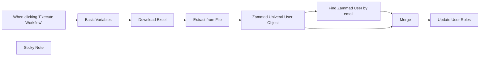

## Fluxo (.json) :

```json
{
  "id": "xzKlhjcc6QEzA98Z",
  "meta": {
    "instanceId": "494d0146a0f47676ad70a44a32086b466621f62da855e3eaf0ee51dee1f76753",
    "templateId": "2041",
    "templateCredsSetupCompleted": true
  },
  "name": "Update Roles by Excel",
  "tags": [],
  "nodes": [
    {
      "id": "580d8a47-32cc-4976-a464-793523ae3d1e",
      "name": "When clicking \"Execute Workflow\"",
      "type": "n8n-nodes-base.manualTrigger",
      "position": [
        80,
        140
      ],
      "parameters": {},
      "typeVersion": 1
    },
    {
      "id": "f37ea772-a953-4b5b-8e54-c76e42938544",
      "name": "Extract from File",
      "type": "n8n-nodes-base.extractFromFile",
      "position": [
        760,
        140
      ],
      "parameters": {
        "options": {},
        "operation": "xlsx"
      },
      "typeVersion": 1
    },
    {
      "id": "60ab7913-d421-41cd-af04-ccec2ed6838e",
      "name": "Merge",
      "type": "n8n-nodes-base.merge",
      "position": [
        1700,
        120
      ],
      "parameters": {
        "mode": "combine",
        "options": {},
        "fieldsToMatchString": "email"
      },
      "typeVersion": 3
    },
    {
      "id": "ad6719b4-95dc-419e-94cb-97039014be62",
      "name": "Basic Variables",
      "type": "n8n-nodes-base.set",
      "position": [
        320,
        140
      ],
      "parameters": {
        "options": {},
        "assignments": {
          "assignments": [
            {
              "id": "68b32087-5e23-4590-8042-0061234ce479",
              "name": "zammad_base_url",
              "type": "string",
              "value": "https://zammad.sirhexalot.de/"
            },
            {
              "id": "240f4dc5-a070-4623-96e7-1e0750dbeba5",
              "name": "excel_source_url",
              "type": "string",
              "value": "http://zammad.sirhexalot.de/Users.txt"
            }
          ]
        }
      },
      "typeVersion": 3.4
    },
    {
      "id": "8f18e493-5dbe-4447-a422-450c610e9585",
      "name": "Zammad Univeral User Object",
      "type": "n8n-nodes-base.set",
      "position": [
        1020,
        140
      ],
      "parameters": {
        "values": {
          "string": [
            {
              "name": "email",
              "value": "={{ $json.email }}"
            },
            {
              "name": "role_ids",
              "value": "={{ $json.role_ids }}\n"
            }
          ]
        },
        "options": {},
        "keepOnlySet": true
      },
      "typeVersion": 1
    },
    {
      "id": "5bc0a423-91bc-4b52-af05-2869223bbbff",
      "name": "Download Excel",
      "type": "n8n-nodes-base.httpRequest",
      "position": [
        540,
        140
      ],
      "parameters": {
        "url": "={{ $json.excel_source_url }}",
        "options": {
          "response": {
            "response": {
              "responseFormat": "file"
            }
          }
        }
      },
      "typeVersion": 4.1
    },
    {
      "id": "b5962a7b-27d3-45f1-adc4-1abff5d1c990",
      "name": "Find Zammad User by email",
      "type": "n8n-nodes-base.httpRequest",
      "position": [
        1360,
        -60
      ],
      "parameters": {
        "url": "={{ $('Basic Variables').item.json.zammad_base_url }}api/v1/users/search?query=email:{{ $json.email }}",
        "options": {},
        "authentication": "genericCredentialType",
        "genericAuthType": "httpHeaderAuth"
      },
      "credentials": {
        "httpHeaderAuth": {
          "id": "GJ7tG0KxDpEUv3DS",
          "name": "zammad.sirhexalot.de"
        }
      },
      "executeOnce": false,
      "typeVersion": 4.2,
      "alwaysOutputData": false
    },
    {
      "id": "0b8f5007-d28d-4406-a7ec-aa69d2b865d5",
      "name": "Update User Roles",
      "type": "n8n-nodes-base.httpRequest",
      "onError": "continueErrorOutput",
      "position": [
        2020,
        120
      ],
      "parameters": {
        "url": "={{ $('Basic Variables').item.json.zammad_base_url }}/api/v1/users/{{ $json.id }}",
        "method": "PUT",
        "options": {},
        "jsonBody": "={\n  \"role_ids\": [\n  {{ $json.role_ids }}\n  ]\n} ",
        "sendBody": true,
        "specifyBody": "json",
        "authentication": "genericCredentialType",
        "genericAuthType": "httpHeaderAuth"
      },
      "credentials": {
        "httpHeaderAuth": {
          "id": "GJ7tG0KxDpEUv3DS",
          "name": "zammad.sirhexalot.de"
        }
      },
      "typeVersion": 4.2
    },
    {
      "id": "7724e271-0beb-4fc3-a9dd-4e55bcf033a1",
      "name": "Sticky Note",
      "type": "n8n-nodes-base.stickyNote",
      "position": [
        60,
        -500
      ],
      "parameters": {
        "width": 577.5890410958907,
        "height": 253.58904109589045,
        "content": "## Authentication for Zammad\n\nCreate in the Node Find Zammad User by email a Header Auth Authentication\n\nUse:\n\nName: Authorization\nValue: Bearer - put here your zammad api token - \n"
      },
      "typeVersion": 1
    }
  ],
  "active": false,
  "pinData": {},
  "settings": {
    "executionOrder": "v1"
  },
  "versionId": "2e34f31f-cb00-43e1-8709-6405ea8521ac",
  "connections": {
    "Merge": {
      "main": [
        [
          {
            "node": "Update User Roles",
            "type": "main",
            "index": 0
          }
        ]
      ]
    },
    "Download Excel": {
      "main": [
        [
          {
            "node": "Extract from File",
            "type": "main",
            "index": 0
          }
        ]
      ]
    },
    "Basic Variables": {
      "main": [
        [
          {
            "node": "Download Excel",
            "type": "main",
            "index": 0
          }
        ]
      ]
    },
    "Extract from File": {
      "main": [
        [
          {
            "node": "Zammad Univeral User Object",
            "type": "main",
            "index": 0
          }
        ]
      ]
    },
    "Find Zammad User by email": {
      "main": [
        [
          {
            "node": "Merge",
            "type": "main",
            "index": 0
          }
        ]
      ]
    },
    "Zammad Univeral User Object": {
      "main": [
        [
          {
            "node": "Merge",
            "type": "main",
            "index": 1
          },
          {
            "node": "Find Zammad User by email",
            "type": "main",
            "index": 0
          }
        ]
      ]
    },
    "When clicking \"Execute Workflow\"": {
      "main": [
        [
          {
            "node": "Basic Variables",
            "type": "main",
            "index": 0
          }
        ]
      ]
    }
  }
}
```

<a id="template-2"></a>

## Template 2 - Automação de fine-tuning e uso de modelo OpenAI

- **Nome:** Automação de fine-tuning e uso de modelo OpenAI
- **Descrição:** Fluxo que baixa um arquivo de treinamento, envia para a plataforma OpenAI para fine-tuning e utiliza o modelo resultante para responder mensagens de chat.
- **Funcionalidade:** • Download do arquivo de treinamento: Baixa um arquivo .jsonl armazenado no Google Drive, com opção de conversão de documentos.
• Upload do arquivo para treinamento: Envia o arquivo baixado para a plataforma OpenAI com o propósito de fine-tune.
• Criação do job de fine-tuning: Inicia um job de fine-tuning na API da OpenAI especificando o arquivo de treinamento e o modelo base.
• Utilização do modelo customizado em chat: Encaminha mensagens de chat para o modelo fine-tuned (identificador ft:...) para gerar respostas.
• Gatilhos de execução: Permite iniciar o processo manualmente para testes e receber mensagens via webhook para atendimento em tempo real.
- **Ferramentas:** • Google Drive: Armazenamento e fornecimento do arquivo de treinamento (.jsonl) e possibilidade de conversão de documentos.
• OpenAI (API / Plataforma): Recebe o arquivo (upload), executa o fine-tuning (jobs) e disponibiliza o modelo customizado para uso em chamadas de chat.

## Fluxo visual

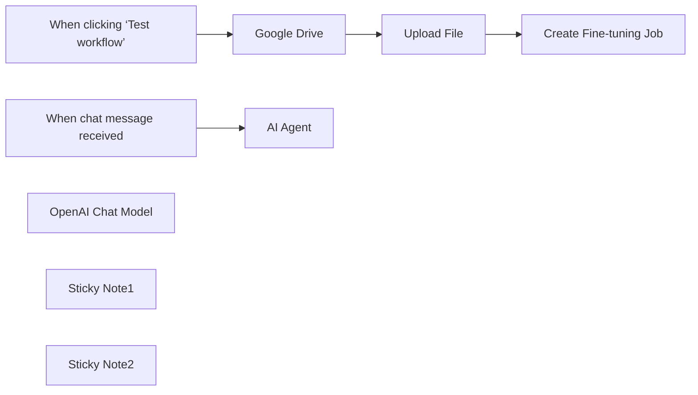

## Fluxo (.json) :

```json
{
  "id": "gAzsjTGbfWuvAObi",
  "meta": {
    "instanceId": "a4bfc93e975ca233ac45ed7c9227d84cf5a2329310525917adaf3312e10d5462",
    "templateCredsSetupCompleted": true
  },
  "name": "Fine-tuning with OpenAI models",
  "tags": [
    {
      "id": "2VG6RbmUdJ2VZbrj",
      "name": "Google Drive",
      "createdAt": "2024-12-04T16:50:56.177Z",
      "updatedAt": "2024-12-04T16:50:56.177Z"
    },
    {
      "id": "paTcf5QZDJsC2vKY",
      "name": "OpenAI",
      "createdAt": "2024-12-04T16:52:10.768Z",
      "updatedAt": "2024-12-04T16:52:10.768Z"
    }
  ],
  "nodes": [
    {
      "id": "ff65c2db-6a94-4e56-a10c-2538c9617df6",
      "name": "When clicking ‘Test workflow’",
      "type": "n8n-nodes-base.manualTrigger",
      "position": [
        220,
        320
      ],
      "parameters": {},
      "typeVersion": 1
    },
    {
      "id": "208fc618-0543-4552-bd65-9c808c879d88",
      "name": "Google Drive",
      "type": "n8n-nodes-base.googleDrive",
      "position": [
        440,
        320
      ],
      "parameters": {
        "fileId": {
          "__rl": true,
          "mode": "list",
          "value": "1wvlEcbxFIENvqL-bACzlLEfy5gA6uF9J",
          "cachedResultUrl": "https://drive.google.com/file/d/1wvlEcbxFIENvqL-bACzlLEfy5gA6uF9J/view?usp=drivesdk",
          "cachedResultName": "test_fine_tuning.jsonl"
        },
        "options": {
          "binaryPropertyName": "data.jsonl",
          "googleFileConversion": {
            "conversion": {
              "docsToFormat": "application/pdf"
            }
          }
        },
        "operation": "download"
      },
      "credentials": {
        "googleDriveOAuth2Api": {
          "id": "HEy5EuZkgPZVEa9w",
          "name": "Google Drive account"
        }
      },
      "typeVersion": 3
    },
    {
      "id": "3580d925-c8c9-446f-bfa4-faae5ed3f44a",
      "name": "AI Agent",
      "type": "@n8n/n8n-nodes-langchain.agent",
      "position": [
        500,
        800
      ],
      "parameters": {
        "options": {}
      },
      "typeVersion": 1.7
    },
    {
      "id": "d309da46-c44e-47b7-bb46-5ee6fe7e6964",
      "name": "When chat message received",
      "type": "@n8n/n8n-nodes-langchain.chatTrigger",
      "position": [
        220,
        800
      ],
      "webhookId": "88151d03-e7f5-4c9a-8190-7cff8e849ca2",
      "parameters": {
        "options": {}
      },
      "typeVersion": 1.1
    },
    {
      "id": "84b896f7-d1dd-4485-a088-3c7f8154a406",
      "name": "OpenAI Chat Model",
      "type": "@n8n/n8n-nodes-langchain.lmChatOpenAi",
      "position": [
        380,
        1000
      ],
      "parameters": {
        "model": "ft:gpt-4o-mini-2024-07-18:n3w-italia::AsVfsl7B",
        "options": {}
      },
      "credentials": {
        "openAiApi": {
          "id": "CDX6QM4gLYanh0P4",
          "name": "OpenAi account"
        }
      },
      "typeVersion": 1.1
    },
    {
      "id": "3bff93e4-70c3-48c7-b0b3-d2a9881689c4",
      "name": "Sticky Note1",
      "type": "n8n-nodes-base.stickyNote",
      "position": [
        220,
        560
      ],
      "parameters": {
        "width": 556.5145228215765,
        "height": 211.35269709543567,
        "content": "# Step 2\n\nOnce the .jsonl file for training is uploaded (See the entire process here.: https://platform.openai.com/finetune/), a \"new model\" will be created and made available via your API. OpenAI will automatically train it based on the uploaded .jsonl file. If the training is successful, the new model will be accessible via API.\n\neg. ft:gpt-4o-mini-2024-07-18:n3w-italia::XXXXX7B"
      },
      "typeVersion": 1
    },
    {
      "id": "ea67edd7-986d-47cd-bc1a-5df49851e27b",
      "name": "Sticky Note2",
      "type": "n8n-nodes-base.stickyNote",
      "position": [
        220,
        -5.676348547717737
      ],
      "parameters": {
        "width": 777.3941908713687,
        "height": 265.161825726141,
        "content": "# Step 1\n\nCreate the training file .jsonl with the following syntax and upload it to Drive.\n\n{\"messages\": [{\"role\": \"system\", \"content\": \"You are an experienced and helpful travel assistant.\"}, {\"role\": \"user\", \"content\": \"What documents are needed to travel to the United States?\"}, {\"role\": \"assistant\", \"content\": \"To travel to the United States, you will need a valid passport and an ESTA authorization, which you can apply for online. Make sure to check the specific requirements based on your nationality.\"}]}\n....\n\nThe file will be uploaded here: https://platform.openai.com/storage/files\n\n"
      },
      "typeVersion": 1
    },
    {
      "id": "87df3b85-01ac-41db-b5b6-a236871fa4e2",
      "name": "Upload File",
      "type": "@n8n/n8n-nodes-langchain.openAi",
      "position": [
        660,
        320
      ],
      "parameters": {
        "options": {
          "purpose": "fine-tune"
        },
        "resource": "file",
        "binaryPropertyName": "data.jsonl"
      },
      "credentials": {
        "openAiApi": {
          "id": "CDX6QM4gLYanh0P4",
          "name": "OpenAi account"
        }
      },
      "typeVersion": 1.8
    },
    {
      "id": "c8ec10d4-ff83-461f-94ac-45b68d298276",
      "name": "Create Fine-tuning Job",
      "type": "n8n-nodes-base.httpRequest",
      "position": [
        900,
        320
      ],
      "parameters": {
        "url": "https://api.openai.com/v1/fine_tuning/jobs",
        "method": "POST",
        "options": {},
        "jsonBody": "={\n  \"training_file\": \"{{ $json.id }}\",\n  \"model\": \"gpt-4o-mini-2024-07-18\"\n} ",
        "sendBody": true,
        "sendHeaders": true,
        "specifyBody": "json",
        "authentication": "genericCredentialType",
        "genericAuthType": "httpHeaderAuth",
        "headerParameters": {
          "parameters": [
            {
              "name": "Content-Type",
              "value": "application/json"
            }
          ]
        }
      },
      "credentials": {
        "httpHeaderAuth": {
          "id": "0WeSLPyZXOxqMuzn",
          "name": "OpenAI API"
        }
      },
      "typeVersion": 4.2
    }
  ],
  "active": false,
  "pinData": {},
  "settings": {
    "executionOrder": "v1"
  },
  "versionId": "a4aa95f5-132b-4aa3-a7f5-3bb316e00133",
  "connections": {
    "Upload File": {
      "main": [
        [
          {
            "node": "Create Fine-tuning Job",
            "type": "main",
            "index": 0
          }
        ]
      ]
    },
    "Google Drive": {
      "main": [
        [
          {
            "node": "Upload File",
            "type": "main",
            "index": 0
          }
        ]
      ]
    },
    "OpenAI Chat Model": {
      "ai_languageModel": [
        [
          {
            "node": "AI Agent",
            "type": "ai_languageModel",
            "index": 0
          }
        ]
      ]
    },
    "When chat message received": {
      "main": [
        [
          {
            "node": "AI Agent",
            "type": "main",
            "index": 0
          }
        ]
      ]
    },
    "When clicking ‘Test workflow’": {
      "main": [
        [
          {
            "node": "Google Drive",
            "type": "main",
            "index": 0
          }
        ]
      ]
    }
  }
}
```

<a id="template-3"></a>

## Template 3 - Verificação periódica de site com notificação

- **Nome:** Verificação periódica de site com notificação
- **Descrição:** Verifica periodicamente o conteúdo de uma página web e envia uma notificação via Discord quando a string monitorada não é encontrada.
- **Funcionalidade:** • Agendamento periódicos: executa a verificação a cada hora.
• Requisição HTTP ao site alvo: busca o conteúdo da página configurada.
• Verificação de conteúdo: procura pela string "Out Of Stock" na resposta.
• Notificação condicional: quando a resposta NÃO contém "Out Of Stock", envia uma mensagem "value not found" para um webhook do Discord.
• Notificação positiva configurada (inativa): existe uma mensagem "value found" preparada para envio, porém o fluxo dessa ação não está conectado.
- **Ferramentas:** • Site alvo (HTTP): página web monitorada para verificação de conteúdo.
• Discord: canal para envio de notificações via webhook.

## Fluxo visual

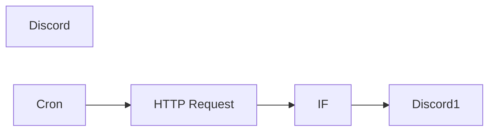

## Fluxo (.json) :

```json
{
  "id": "1",
  "name": "Website check",
  "nodes": [
    {
      "name": "HTTP Request",
      "type": "n8n-nodes-base.httpRequest",
      "position": [
        400,
        300
      ],
      "parameters": {
        "url": "",
        "options": {},
        "responseFormat": "string"
      },
      "typeVersion": 1
    },
    {
      "name": "IF",
      "type": "n8n-nodes-base.if",
      "position": [
        550,
        300
      ],
      "parameters": {
        "conditions": {
          "string": [
            {
              "value1": "={{$node[\"HTTP Request\"].json[\"data\"]}}",
              "value2": "Out Of Stock",
              "operation": "contains"
            }
          ]
        }
      },
      "typeVersion": 1
    },
    {
      "name": "Discord",
      "type": "n8n-nodes-base.discord",
      "position": [
        700,
        300
      ],
      "parameters": {
        "text": "value found",
        "webhookUri": ""
      },
      "typeVersion": 1
    },
    {
      "name": "Discord1",
      "type": "n8n-nodes-base.discord",
      "position": [
        700,
        450
      ],
      "parameters": {
        "text": "value not found",
        "webhookUri": ""
      },
      "typeVersion": 1
    },
    {
      "name": "Cron",
      "type": "n8n-nodes-base.cron",
      "position": [
        210,
        300
      ],
      "parameters": {
        "triggerTimes": {
          "item": [
            {
              "mode": "everyHour"
            }
          ]
        }
      },
      "typeVersion": 1
    }
  ],
  "active": false,
  "settings": {
    "timezone": "America/Los_Angeles"
  },
  "connections": {
    "IF": {
      "main": [
        [],
        [
          {
            "node": "Discord1",
            "type": "main",
            "index": 0
          }
        ]
      ]
    },
    "Cron": {
      "main": [
        [
          {
            "node": "HTTP Request",
            "type": "main",
            "index": 0
          }
        ]
      ]
    },
    "HTTP Request": {
      "main": [
        [
          {
            "node": "IF",
            "type": "main",
            "index": 0
          }
        ]
      ]
    }
  }
}
```

<a id="template-4"></a>

## Template 4 - Transformar artigos do Hacker News em vídeos sociais

- **Nome:** Transformar artigos do Hacker News em vídeos sociais
- **Descrição:** Este fluxo busca artigos do Hacker News, identifica os relacionados a IA/automação, gera resumos, imagens e vídeos e publica/armazen a mídia resultante.
- **Funcionalidade:** • Coleta de artigos: obtém itens do Hacker News e limita a quantidade a processar.
• Análise de relevância: determina se o artigo é sobre IA ou automação e extrai um resumo e URL de imagem.
• Preparação de conteúdo: cria título curto, blurb para newsletter, dois resumos curtos e prompts de imagem otimizados.
• Geração de imagens: melhora prompts e gera imagens a partir dos prompts fornecidos.
• Geração de vídeos a partir de imagens: converte imagens em clipes de vídeo utilizando modelos de geração de vídeo.
• Edição e montagem: combina vídeos, imagens, legendas e vozes (TTS) em uma composição final para publicação.
• Análise de imagem: valida e descreve imagens geradas para garantir relevância ao conteúdo.
• Gerenciamento assíncrono: usa esperas e checagens para tratar jobs longos de geração e evitar rate limits.
• Armazenamento de ativos: faz upload dos arquivos gerados para armazenamento em nuvem/objeto.
• Publicação em redes sociais: prepara e encaminha os vídeos para plataformas sociais e serviços de nuvem para distribuição.
- **Ferramentas:** • Hacker News: fonte pública de artigos e links para processamento.
• OpenAI: geração e análise de texto, criação de blurbs e uso de modelos multimodais (análise de imagem e TTS).
• Leonardo.ai: melhoria de prompts e geração de imagens a partir de prompts.
• RunwayML: conversão de imagens em vídeos (image-to-video) usando modelos de vídeo.
• Creatomate: montagem e renderização final do vídeo com cenas, legendas e áudio.
• Minio/S3: armazenamento de objetos para guardar os ativos gerados.
• Dropbox: opção para armazenar ou sincronizar arquivos gerados.
• Google Drive: opção de armazenamento e atualização de arquivos na nuvem.
• Microsoft OneDrive: opção adicional de armazenamento em nuvem.
• YouTube: plataforma de hospedagem e publicação de vídeos.
• X (Twitter): plataforma social para compartilhamento dos vídeos.
• Instagram: plataforma social para compartilhamento visual.
• LinkedIn: plataforma social para publicação profissional e distribuição do conteúdo.

## Fluxo visual

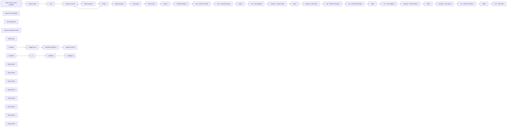

## Fluxo (.json) :

```json
{
  "id": "744G7emgZe0pXaPB",
  "meta": {
    "instanceId": "d868e3d040e7bda892c81b17cf446053ea25d2556fcef89cbe19dd61a3e876e9"
  },
  "name": "Hacker News to Video Template - AlexK1919",
  "tags": [
    {
      "id": "04PL2irdWYmF2Dg3",
      "name": "RunwayML",
      "createdAt": "2024-11-15T05:55:30.783Z",
      "updatedAt": "2024-11-15T05:55:30.783Z"
    },
    {
      "id": "yrY6updwSCXMsT0z",
      "name": "Video",
      "createdAt": "2024-11-15T05:55:34.333Z",
      "updatedAt": "2024-11-15T05:55:34.333Z"
    },
    {
      "id": "QsH2EXuw2e7YCv0K",
      "name": "OpenAI",
      "createdAt": "2024-11-15T04:05:20.872Z",
      "updatedAt": "2024-11-15T04:05:20.872Z"
    },
    {
      "id": "lvPj9rYRsKOHCi4J",
      "name": "Creatomate",
      "createdAt": "2024-11-19T15:59:16.134Z",
      "updatedAt": "2024-11-19T15:59:16.134Z"
    },
    {
      "id": "9LXACqpQLNtrM6or",
      "name": "Leonardo",
      "createdAt": "2024-11-19T15:59:21.368Z",
      "updatedAt": "2024-11-19T15:59:21.368Z"
    }
  ],
  "nodes": [
    {
      "id": "c777c41b-842d-4504-a1a0-ccbb034a0fdd",
      "name": "When clicking ‘Test workflow’",
      "type": "n8n-nodes-base.manualTrigger",
      "position": [
        -320,
        300
      ],
      "parameters": {},
      "typeVersion": 1
    },
    {
      "id": "74fafd7c-55a4-46ec-b4a8-33d46f2b5b54",
      "name": "Hacker News",
      "type": "n8n-nodes-base.hackerNews",
      "position": [
        -20,
        300
      ],
      "parameters": {
        "resource": "all",
        "additionalFields": {}
      },
      "typeVersion": 1
    },
    {
      "id": "9cd87fd2-6a38-463a-a22e-e0c34910818f",
      "name": "Loop Over Items",
      "type": "n8n-nodes-base.splitInBatches",
      "position": [
        440,
        300
      ],
      "parameters": {
        "options": {}
      },
      "typeVersion": 3
    },
    {
      "id": "611b24cd-558b-4025-a0a8-ea355ba61988",
      "name": "OpenAI Chat Model3",
      "type": "@n8n/n8n-nodes-langchain.lmChatOpenAi",
      "position": [
        720,
        580
      ],
      "parameters": {
        "options": {}
      },
      "typeVersion": 1
    },
    {
      "id": "f814682c-cf6f-49a8-8ea0-48fbc64a3ebe",
      "name": "HTTP Request1",
      "type": "@n8n/n8n-nodes-langchain.toolHttpRequest",
      "position": [
        900,
        580
      ],
      "parameters": {
        "url": "={{ $json.url }}",
        "toolDescription": "grab the article for the ai agent to use"
      },
      "typeVersion": 1.1
    },
    {
      "id": "2a4bcf69-23f0-440d-a3b0-c8261e153c62",
      "name": "Structured Output Parser",
      "type": "@n8n/n8n-nodes-langchain.outputParserStructured",
      "position": [
        1080,
        580
      ],
      "parameters": {
        "schemaType": "manual",
        "inputSchema": "{\n\t\"type\": \"object\",\n\t\"properties\": {\n\t\t\"summary\": {\n\t\t\t\"type\": \"string\"\n\t\t},\n\t\t\"related\": {\n\t\t\t\"type\": \"string\"\n\t\t},\n \"image urls\": {\n\t\t\t\"type\": \"string\"\n }\n\t}\n}"
      },
      "typeVersion": 1.2
    },
    {
      "id": "83c3b8f0-8d67-48a2-a5ce-b777ea1d7b32",
      "name": "Upload to Minio",
      "type": "n8n-nodes-base.s3",
      "position": [
        4240,
        1080
      ],
      "parameters": {
        "operation": "upload",
        "bucketName": "=",
        "additionalFields": {
          "grantRead": true,
          "parentFolderKey": "="
        }
      },
      "typeVersion": 1
    },
    {
      "id": "05b972ff-ccab-415b-8787-aafabb3b7292",
      "name": "News1",
      "type": "n8n-nodes-base.set",
      "position": [
        2180,
        320
      ],
      "parameters": {
        "options": {},
        "assignments": {
          "assignments": [
            {
              "id": "ec8013d5-84b5-43c8-abcb-6986ef15939d",
              "name": "property_name",
              "type": "string",
              "value": "={{ $json.message.content['Article Title'] }}"
            },
            {
              "id": "4d91c4fc-12a2-4fe2-a58e-02284314e1de",
              "name": "property_text",
              "type": "string",
              "value": "={{ $json.message.content['Article Blurb'] }}"
            },
            {
              "id": "cad2b795-8b71-415f-a100-700d9ec62bbd",
              "name": "property_image_url",
              "type": "string",
              "value": "={{ $('If Topic').item.json.output['image urls'] }}"
            }
          ]
        }
      },
      "typeVersion": 3.4
    },
    {
      "id": "d175d366-e672-4452-b78e-a06336ef242b",
      "name": "Leo - Improve Prompt",
      "type": "n8n-nodes-base.httpRequest",
      "position": [
        2720,
        100
      ],
      "parameters": {
        "url": "https://cloud.leonardo.ai/api/rest/v1/prompt/improve",
        "method": "POST",
        "options": {
          "response": {
            "response": {
              "fullResponse": true
            }
          }
        },
        "jsonBody": "={\n \"prompt\": \"{{ $('Article Prep').item.json.message.content['Image Prompt 1'] }}\"\n}",
        "sendBody": true,
        "sendHeaders": true,
        "specifyBody": "json",
        "authentication": "genericCredentialType",
        "genericAuthType": "httpCustomAuth",
        "headerParameters": {
          "parameters": [
            {
              "name": "accept",
              "value": "application/json"
            }
          ]
        }
      },
      "typeVersion": 4.2
    },
    {
      "id": "d8da7879-1a67-4da1-86db-f70e50b4e9da",
      "name": "Leo - Get imageId",
      "type": "n8n-nodes-base.httpRequest",
      "position": [
        3320,
        100
      ],
      "parameters": {
        "url": "=https://cloud.leonardo.ai/api/rest/v1/generations/{{ $json.body.sdGenerationJob.generationId }}",
        "options": {
          "response": {
            "response": {
              "fullResponse": true
            }
          }
        },
        "sendHeaders": true,
        "authentication": "genericCredentialType",
        "genericAuthType": "httpCustomAuth",
        "headerParameters": {
          "parameters": [
            {
              "name": "content-type",
              "value": "application/json"
            }
          ]
        }
      },
      "typeVersion": 4.2
    },
    {
      "id": "faf80246-3b1a-49c6-a277-0152428e46e1",
      "name": "Runway - Create Video",
      "type": "n8n-nodes-base.httpRequest",
      "position": [
        2520,
        300
      ],
      "parameters": {
        "url": "https://api.dev.runwayml.com/v1/image_to_video",
        "method": "POST",
        "options": {},
        "sendBody": true,
        "sendHeaders": true,
        "authentication": "genericCredentialType",
        "bodyParameters": {
          "parameters": [
            {
              "name": "promptImage",
              "value": "={{ $json.body.generations_by_pk.generated_images[0].url }}"
            },
            {
              "name": "promptText",
              "value": "string"
            },
            {
              "name": "model",
              "value": "gen3a_turbo"
            }
          ]
        },
        "genericAuthType": "httpCustomAuth",
        "headerParameters": {
          "parameters": [
            {
              "name": "X-Runway-Version",
              "value": "2024-11-06"
            }
          ]
        }
      },
      "typeVersion": 4.2
    },
    {
      "id": "e91c1f01-7870-4063-9557-24a6ba1d3db3",
      "name": "Runway - Get Video",
      "type": "n8n-nodes-base.httpRequest",
      "position": [
        2920,
        300
      ],
      "parameters": {
        "url": "=https://api.dev.runwayml.com/v1/tasks/{{ $json.id }}",
        "options": {},
        "sendHeaders": true,
        "authentication": "genericCredentialType",
        "genericAuthType": "httpCustomAuth",
        "headerParameters": {
          "parameters": [
            {
              "name": "X-Runway-Version",
              "value": "2024-11-06"
            }
          ]
        }
      },
      "typeVersion": 4.2
    },
    {
      "id": "41ee2665-e1aa-4d48-ade6-e37af568f211",
      "name": "Wait2",
      "type": "n8n-nodes-base.wait",
      "position": [
        2720,
        300
      ],
      "webhookId": "ddca5833-a40b-404a-9140-686cd4fa26cb",
      "parameters": {
        "unit": "minutes",
        "amount": 3
      },
      "typeVersion": 1.1
    },
    {
      "id": "091e9e07-89ba-4fe3-9fc5-278fc333dbff",
      "name": "Sticky Note",
      "type": "n8n-nodes-base.stickyNote",
      "position": [
        -160,
        -40
      ],
      "parameters": {
        "color": 5,
        "width": 341,
        "height": 951,
        "content": "# Choose your data source \n## This can be swapped for any other data source of your choosing."
      },
      "typeVersion": 1
    },
    {
      "id": "9660a593-9966-4ebe-bfd7-f884dc185d56",
      "name": "If Topic",
      "type": "n8n-nodes-base.if",
      "position": [
        1100,
        320
      ],
      "parameters": {
        "options": {},
        "conditions": {
          "options": {
            "version": 2,
            "leftValue": "",
            "caseSensitive": true,
            "typeValidation": "strict"
          },
          "combinator": "and",
          "conditions": [
            {
              "id": "56219de5-244d-4b7f-a511-f3061572cf93",
              "operator": {
                "name": "filter.operator.equals",
                "type": "string",
                "operation": "equals"
              },
              "leftValue": "={{ $json.output.related }}",
              "rightValue": "yes"
            }
          ]
        }
      },
      "typeVersion": 2.2
    },
    {
      "id": "e47140ac-20cc-417b-a6cd-30f780dc8289",
      "name": "Get Image",
      "type": "n8n-nodes-base.httpRequest",
      "position": [
        1500,
        320
      ],
      "parameters": {
        "url": "={{ $('Article Analysis').first().json.output['image urls'] }}",
        "options": {
          "response": {
            "response": {
              "fullResponse": true
            }
          }
        }
      },
      "typeVersion": 4.2
    },
    {
      "id": "26f80f71-2c3a-46fe-a960-21cdbc18ce34",
      "name": "Prompt Settings1",
      "type": "n8n-nodes-base.set",
      "position": [
        2520,
        100
      ],
      "parameters": {
        "options": {},
        "assignments": {
          "assignments": [
            {
              "id": "56c8f20d-d9d9-4be7-ac2a-38df6ffdd722",
              "name": "model",
              "type": "string",
              "value": "6b645e3a-d64f-4341-a6d8-7a3690fbf042"
            }
          ]
        },
        "includeOtherFields": true
      },
      "typeVersion": 3.4
    },
    {
      "id": "ce697f6f-f8fc-4ba7-b776-17bbc2e870b7",
      "name": "Leo - Generate Image",
      "type": "n8n-nodes-base.httpRequest",
      "position": [
        2920,
        100
      ],
      "parameters": {
        "url": "https://cloud.leonardo.ai/api/rest/v1/generations",
        "method": "POST",
        "options": {
          "response": {
            "response": {
              "fullResponse": true
            }
          }
        },
        "jsonBody": "={\n \"alchemy\": true,\n \"width\": 1024,\n \"height\": 768,\n \"modelId\": \"6b645e3a-d64f-4341-a6d8-7a3690fbf042\",\n \"num_images\": 1,\n \"presetStyle\": \"MONOCHROME\",\n \"prompt\": \"{{ $json.body.promptGeneration.prompt }}; Use the rule of thirds, leading lines, & balance. DO NOT INCLUDE ANY WORDS OR LABELS.\",\n \"guidance_scale\": 7,\n \"highResolution\": true,\n \"promptMagic\": false,\n \"promptMagicStrength\": 0.5,\n \"promptMagicVersion\": \"v3\",\n \"public\": false,\n \"ultra\": false,\n \"photoReal\": false,\n \"negative_prompt\": \"\"\n} ",
        "sendBody": true,
        "sendHeaders": true,
        "specifyBody": "json",
        "authentication": "genericCredentialType",
        "genericAuthType": "httpCustomAuth",
        "headerParameters": {
          "parameters": [
            {
              "name": "accept",
              "value": "application/json"
            }
          ]
        }
      },
      "typeVersion": 4.2
    },
    {
      "id": "e2067fe5-3fae-4f97-97c0-879967efd9b8",
      "name": "Wait1",
      "type": "n8n-nodes-base.wait",
      "position": [
        3120,
        100
      ],
      "webhookId": "256c3814-6a52-4eb1-969a-30f9f3b8e04e",
      "parameters": {
        "amount": 30
      },
      "typeVersion": 1.1
    },
    {
      "id": "f0ba57a5-1d27-4c75-a422-4bc0e2cead9d",
      "name": "Limit",
      "type": "n8n-nodes-base.limit",
      "position": [
        240,
        300
      ],
      "parameters": {
        "keep": "lastItems",
        "maxItems": 50
      },
      "typeVersion": 1
    },
    {
      "id": "e01152aa-961b-4e33-a1e3-186d47d81c55",
      "name": "Image Analysis",
      "type": "@n8n/n8n-nodes-langchain.openAi",
      "position": [
        1300,
        320
      ],
      "parameters": {
        "modelId": {
          "__rl": true,
          "mode": "list",
          "value": "gpt-4o-mini",
          "cachedResultName": "GPT-4O-MINI"
        },
        "options": {
          "detail": "auto"
        },
        "resource": "image",
        "imageUrls": "={{ $json.output['image urls'] }}",
        "operation": "analyze"
      },
      "credentials": {
        "openAiApi": {
          "id": "ysxujEYFiY5ozRTS",
          "name": "AlexK OpenAi Key"
        }
      },
      "typeVersion": 1.6
    },
    {
      "id": "ab346129-c3d5-4f51-af5e-5d63cd154981",
      "name": "Wait3",
      "type": "n8n-nodes-base.wait",
      "disabled": true,
      "position": [
        3080,
        1020
      ],
      "webhookId": "6e4a0b8d-6c31-4a98-8ec3-2509aa2087e8",
      "parameters": {
        "unit": "minutes"
      },
      "typeVersion": 1.1
    },
    {
      "id": "872c35a3-bdd5-4eec-9bac-0959f3ff78e7",
      "name": "Article Analysis",
      "type": "@n8n/n8n-nodes-langchain.agent",
      "onError": "continueErrorOutput",
      "position": [
        740,
        300
      ],
      "parameters": {
        "text": "=Can you tell me if the article at {{ $json.url }} is related to automation or ai? \n\nthen, create a 250 word summary of the article\n\nAlso, list any image url's related to the article content from the url. Limit to 1 image url.",
        "options": {
          "systemMessage": "You are a helpful assistant in summarizing and identifying articles related to automation and ai. \nOutput the results as:\nsummary: \nrelated: yes or no\nimage urls: "
        },
        "promptType": "define",
        "hasOutputParser": true
      },
      "typeVersion": 1.7
    },
    {
      "id": "31c3a90e-10ee-4217-9b08-ff57bf17ea10",
      "name": "Dropbox",
      "type": "n8n-nodes-base.dropbox",
      "position": [
        3640,
        1080
      ],
      "parameters": {},
      "typeVersion": 1
    },
    {
      "id": "22ccd0a0-f7f6-40ca-bd09-40ed4a7fcde1",
      "name": "Google Drive",
      "type": "n8n-nodes-base.googleDrive",
      "position": [
        3840,
        1080
      ],
      "parameters": {
        "fileId": {
          "__rl": true,
          "mode": "list",
          "value": ""
        },
        "options": {},
        "operation": "update"
      },
      "credentials": {
        "googleDriveOAuth2Api": {
          "id": "m8K1mbAUn7yuiEwl",
          "name": "AlexK1919 Google Drive account"
        }
      },
      "typeVersion": 3
    },
    {
      "id": "ea75931d-c1ee-4139-9bdc-7901056ba016",
      "name": "Microsoft OneDrive",
      "type": "n8n-nodes-base.microsoftOneDrive",
      "position": [
        4040,
        1080
      ],
      "parameters": {},
      "typeVersion": 1
    },
    {
      "id": "38888521-3087-4e0a-81d6-cf4b9a5dd3dd",
      "name": "YouTube",
      "type": "n8n-nodes-base.youTube",
      "position": [
        3640,
        1500
      ],
      "parameters": {
        "options": {},
        "resource": "video",
        "operation": "upload"
      },
      "typeVersion": 1
    },
    {
      "id": "55f3decc-f952-4d2a-804d-2aec44fb2755",
      "name": "X",
      "type": "n8n-nodes-base.twitter",
      "position": [
        3840,
        1500
      ],
      "parameters": {
        "additionalFields": {}
      },
      "typeVersion": 2
    },
    {
      "id": "54c8b762-444d-4790-97a9-a2f84518492f",
      "name": "Instagram",
      "type": "n8n-nodes-base.httpRequest",
      "position": [
        4240,
        1500
      ],
      "parameters": {
        "options": {}
      },
      "typeVersion": 4.2
    },
    {
      "id": "90040f15-95c0-4ebb-818f-dde508eb0689",
      "name": "LinkedIn",
      "type": "n8n-nodes-base.linkedIn",
      "position": [
        4040,
        1500
      ],
      "parameters": {
        "additionalFields": {}
      },
      "typeVersion": 1
    },
    {
      "id": "691eb779-5fae-4f65-89eb-b1b8e5488809",
      "name": "Leo - Improve Prompt2",
      "type": "n8n-nodes-base.httpRequest",
      "position": [
        2720,
        500
      ],
      "parameters": {
        "url": "https://cloud.leonardo.ai/api/rest/v1/prompt/improve",
        "method": "POST",
        "options": {
          "response": {
            "response": {
              "fullResponse": true
            }
          }
        },
        "jsonBody": "={\n \"prompt\": \"{{ $('Article Prep').item.json.message.content['Image Prompt 2'] }}\"\n}",
        "sendBody": true,
        "sendHeaders": true,
        "specifyBody": "json",
        "authentication": "genericCredentialType",
        "genericAuthType": "httpCustomAuth",
        "headerParameters": {
          "parameters": [
            {
              "name": "accept",
              "value": "application/json"
            }
          ]
        }
      },
      "credentials": {
        "httpCustomAuth": {
          "id": "hIzUsjbtHLmIe6uM",
          "name": "RunwayML Custom Auth"
        }
      },
      "typeVersion": 4.2
    },
    {
      "id": "076a745a-055b-459c-8af9-fa7b6740dc6f",
      "name": "Wait4",
      "type": "n8n-nodes-base.wait",
      "position": [
        2720,
        700
      ],
      "webhookId": "89b31515-b403-4644-a2c1-970e5e774008",
      "parameters": {
        "unit": "minutes",
        "amount": 3
      },
      "typeVersion": 1.1
    },
    {
      "id": "adc2c993-3f89-40df-96fc-eb3ff5eafb1c",
      "name": "Wait6",
      "type": "n8n-nodes-base.wait",
      "position": [
        3120,
        500
      ],
      "webhookId": "2efb873f-bcbd-41d9-99da-b2b57ef5ad93",
      "parameters": {
        "amount": 30
      },
      "typeVersion": 1.1
    },
    {
      "id": "156f5735-bc20-46a9-871c-143b0772ca45",
      "name": "Leo - Generate Image2",
      "type": "n8n-nodes-base.httpRequest",
      "position": [
        2920,
        500
      ],
      "parameters": {
        "url": "https://cloud.leonardo.ai/api/rest/v1/generations",
        "method": "POST",
        "options": {
          "response": {
            "response": {
              "fullResponse": true
            }
          }
        },
        "jsonBody": "={\n \"alchemy\": true,\n \"width\": 1024,\n \"height\": 768,\n \"modelId\": \"6b645e3a-d64f-4341-a6d8-7a3690fbf042\",\n \"num_images\": 1,\n \"presetStyle\": \"MONOCHROME\",\n \"prompt\": \"{{ $json.body.promptGeneration.prompt }}; Use the rule of thirds, leading lines, & balance. DO NOT INCLUDE ANY WORDS OR LABELS.\",\n \"guidance_scale\": 7,\n \"highResolution\": true,\n \"promptMagic\": false,\n \"promptMagicStrength\": 0.5,\n \"promptMagicVersion\": \"v3\",\n \"public\": false,\n \"ultra\": false,\n \"photoReal\": false,\n \"negative_prompt\": \"\"\n} ",
        "sendBody": true,
        "sendHeaders": true,
        "specifyBody": "json",
        "authentication": "genericCredentialType",
        "genericAuthType": "httpCustomAuth",
        "headerParameters": {
          "parameters": [
            {
              "name": "accept",
              "value": "application/json"
            }
          ]
        }
      },
      "typeVersion": 4.2
    },
    {
      "id": "4f270fa8-4da2-44f0-927f-3509fd9f8f7d",
      "name": "Leo - Get imageId2",
      "type": "n8n-nodes-base.httpRequest",
      "position": [
        3320,
        500
      ],
      "parameters": {
        "url": "=https://cloud.leonardo.ai/api/rest/v1/generations/{{ $json.body.sdGenerationJob.generationId }}",
        "options": {
          "response": {
            "response": {
              "fullResponse": true
            }
          }
        },
        "sendHeaders": true,
        "authentication": "genericCredentialType",
        "genericAuthType": "httpCustomAuth",
        "headerParameters": {
          "parameters": [
            {
              "name": "content-type",
              "value": "application/json"
            }
          ]
        }
      },
      "typeVersion": 4.2
    },
    {
      "id": "49c0e7ba-bf9c-4819-b479-61aa099ab9ab",
      "name": "Runway - Create Video2",
      "type": "n8n-nodes-base.httpRequest",
      "position": [
        2520,
        700
      ],
      "parameters": {
        "url": "https://api.dev.runwayml.com/v1/image_to_video",
        "method": "POST",
        "options": {},
        "sendBody": true,
        "sendHeaders": true,
        "authentication": "genericCredentialType",
        "bodyParameters": {
          "parameters": [
            {
              "name": "promptImage",
              "value": "={{ $json.body.generations_by_pk.generated_images[0].url }}"
            },
            {
              "name": "promptText",
              "value": "string"
            },
            {
              "name": "model",
              "value": "gen3a_turbo"
            }
          ]
        },
        "genericAuthType": "httpCustomAuth",
        "headerParameters": {
          "parameters": [
            {
              "name": "X-Runway-Version",
              "value": "2024-11-06"
            }
          ]
        }
      },
      "credentials": {
        "httpCustomAuth": {
          "id": "hIzUsjbtHLmIe6uM",
          "name": "RunwayML Custom Auth"
        }
      },
      "typeVersion": 4.2
    },
    {
      "id": "d03eb190-5fc0-4b7e-ad65-88ece3ab833d",
      "name": "Runway - Get Video2",
      "type": "n8n-nodes-base.httpRequest",
      "position": [
        2920,
        700
      ],
      "parameters": {
        "url": "=https://api.dev.runwayml.com/v1/tasks/{{ $json.id }}",
        "options": {},
        "sendHeaders": true,
        "authentication": "genericCredentialType",
        "genericAuthType": "httpCustomAuth",
        "headerParameters": {
          "parameters": [
            {
              "name": "X-Runway-Version",
              "value": "2024-11-06"
            }
          ]
        }
      },
      "typeVersion": 4.2
    },
    {
      "id": "0072563d-b87d-47c5-80fd-ed3c051b3287",
      "name": "Sticky Note1",
      "type": "n8n-nodes-base.stickyNote",
      "position": [
        3580,
        940
      ],
      "parameters": {
        "color": 6,
        "width": 882,
        "height": 372,
        "content": "# Upload Assets\nYou can extend this workflow further by uploading the generated assets to your storage option of choice."
      },
      "typeVersion": 1
    },
    {
      "id": "a0b2377e-57ea-47e9-83c9-3e58372610e5",
      "name": "Sticky Note2",
      "type": "n8n-nodes-base.stickyNote",
      "position": [
        3580,
        1360
      ],
      "parameters": {
        "color": 6,
        "width": 882,
        "height": 372,
        "content": "# Post to Social Media\nYou can extend this workflow further by posting the generated assets to social media."
      },
      "typeVersion": 1
    },
    {
      "id": "708fe6a0-4899-462b-9a08-fadea7c7e195",
      "name": "Sticky Note3",
      "type": "n8n-nodes-base.stickyNote",
      "position": [
        2420,
        -40
      ],
      "parameters": {
        "color": 4,
        "width": 1114,
        "height": 943,
        "content": "# Generate Images and Videos"
      },
      "typeVersion": 1
    },
    {
      "id": "5bbb6552-ec3a-42ea-a911-993f67a6c8dc",
      "name": "Sticky Note4",
      "type": "n8n-nodes-base.stickyNote",
      "position": [
        2420,
        940
      ],
      "parameters": {
        "color": 5,
        "width": 1114,
        "height": 372,
        "content": "# Stitch it all together"
      },
      "typeVersion": 1
    },
    {
      "id": "25f4cc09-fbff-4c10-b706-30df5840b794",
      "name": "Cre - Generate Video1",
      "type": "n8n-nodes-base.httpRequest",
      "position": [
        2880,
        1020
      ],
      "parameters": {
        "url": "https://api.creatomate.com/v1/renders",
        "method": "POST",
        "options": {
          "response": {
            "response": {
              "fullResponse": true
            }
          }
        },
        "jsonBody": "={\n \"max_width\": 480,\n \"template_id\": \"enterTemplateID\",\n \"modifications\": {\n \"Scenes.elements\": [\n {\n \"name\": \"Intro Comp\",\n \"type\": \"composition\",\n \"track\": 1,\n \"elements\": [\n {\n \"name\": \"Image-1\",\n \"type\": \"image\",\n \"source\": \"{{ $('Leo - Get imageId').item.json.body.generations_by_pk.generated_images[0].url }}\"\n },\n {\n \"name\": \"Subtitles-1\",\n \"type\": \"text\",\n \"transcript_source\": \"Voiceover-1\",\n \"width\": \"86.66%\",\n \"height\": \"37.71%\",\n \"x_alignment\": \"50%\",\n \"y_alignment\": \"50%\",\n \"fill_color\": \"#ffffff\",\n \"stroke_color\": \"#333333\",\n \"stroke_width\": \"1.05 vmin\",\n \"font_family\": \"Inter\",\n \"font_weight\": \"700\",\n \"font_size\": \"8 vmin\",\n \"background_color\": \"rgba(255,255,255,0.2)\",\n \"background_x_padding\": \"26%\",\n \"background_y_padding\": \"7%\",\n \"background_border_radius\": \"28%\",\n \"transcript_effect\": \"highlight\",\n \"transcript_color\": \"#ff5900\"\n },\n {\n \"name\": \"Voiceover-1\",\n \"type\": \"audio\",\n \"source\": \"{{ $('News1').item.json.property_name }}\",\n \"provider\": \"openai model=tts-1 voice=onyx\"\n }\n ]\n },\n {\n \"name\": \"Auto Scene Comp\",\n \"type\": \"composition\",\n \"track\": 1,\n \"elements\": [\n {\n \"name\": \"Video-2\",\n \"type\": \"video\",\n \"source\": \"{{ $('Runway - Get Video').first().json.output[0] }}\",\n \"loop\": true\n },\n {\n \"name\": \"Subtitles-2\",\n \"type\": \"text\",\n \"transcript_source\": \"Voiceover-2\",\n \"y\": \"78.2173%\",\n \"width\": \"86.66%\",\n \"height\": \"37.71%\",\n \"x_alignment\": \"50%\",\n \"y_alignment\": \"50%\",\n \"fill_color\": \"#ffffff\",\n \"stroke_color\": \"#333333\",\n \"stroke_width\": \"1.05 vmin\",\n \"font_family\": \"Inter\",\n \"font_weight\": \"700\",\n \"font_size\": \"8 vmin\",\n \"background_color\": \"rgba(255,255,255,0.2)\",\n \"background_x_padding\": \"26%\",\n \"background_y_padding\": \"7%\",\n \"background_border_radius\": \"28%\",\n \"transcript_effect\": \"highlight\",\n \"transcript_color\": \"#ff5900\"\n },\n {\n \"name\": \"Voiceover-2\",\n \"type\": \"audio\",\n \"source\": \"{{ $('Article Prep').item.json.message.content['Summary Blurb 1'] }}\",\n \"provider\": \"openai model=tts-1 voice=onyx\"\n }\n ]\n },\n {\n \"name\": \"Auto Scene Comp\",\n \"type\": \"composition\",\n \"track\": 1,\n \"elements\": [\n {\n \"name\": \"Video-3\",\n \"type\": \"video\",\n \"source\": \"{{ $('Runway - Get Video2').first().json.output[0] }}\",\n \"loop\": true\n },\n {\n \"name\": \"Subtitles-3\",\n \"type\": \"text\",\n \"transcript_source\": \"Voiceover-3\",\n \"y\": \"78.2173%\",\n \"width\": \"86.66%\",\n \"height\": \"37.71%\",\n \"x_alignment\": \"50%\",\n \"y_alignment\": \"50%\",\n \"fill_color\": \"#ffffff\",\n \"stroke_color\": \"#333333\",\n \"stroke_width\": \"1.05 vmin\",\n \"font_family\": \"Inter\",\n \"font_weight\": \"700\",\n \"font_size\": \"8 vmin\",\n \"background_color\": \"rgba(255,89,0,0.5)\",\n \"background_x_padding\": \"26%\",\n \"background_y_padding\": \"7%\",\n \"background_border_radius\": \"28%\",\n \"transcript_effect\": \"highlight\",\n \"transcript_color\": \"#ff0040\"\n },\n {\n \"name\": \"Voiceover-3\",\n \"type\": \"audio\",\n \"source\": \"{{ $('Article Prep').item.json.message.content['Summary Blurb 2'] }}\",\n \"provider\": \"openai model=tts-1 voice=onyx\"\n }\n ]\n }\n ]\n }\n}",
        "sendBody": true,
        "specifyBody": "json",
        "authentication": "genericCredentialType",
        "genericAuthType": "httpCustomAuth"
      },
      "credentials": {
        "httpCustomAuth": {
          "id": "hIzUsjbtHLmIe6uM",
          "name": "RunwayML Custom Auth"
        }
      },
      "typeVersion": 4.2
    },
    {
      "id": "7093de7b-a4e3-4363-8038-1002f7b20fbc",
      "name": "Cre - Get Video",
      "type": "n8n-nodes-base.httpRequest",
      "position": [
        3280,
        1020
      ],
      "parameters": {
        "url": "=https://api.creatomate.com/v1/renders/{{ $json.body.body[0].id }}",
        "options": {
          "response": {
            "response": {
              "fullResponse": true
            }
          }
        },
        "authentication": "genericCredentialType",
        "genericAuthType": "httpCustomAuth"
      },
      "credentials": {
        "httpCustomAuth": {
          "id": "hIzUsjbtHLmIe6uM",
          "name": "RunwayML Custom Auth"
        }
      },
      "typeVersion": 4.2
    },
    {
      "id": "a57b719f-b299-431e-9c85-fa333e38b6a7",
      "name": "Sticky Note6",
      "type": "n8n-nodes-base.stickyNote",
      "position": [
        660,
        -40
      ],
      "parameters": {
        "color": 3,
        "width": 1033,
        "height": 951,
        "content": "# Article Analysis - Is it the right topic?"
      },
      "typeVersion": 1
    },
    {
      "id": "60b879a0-8b7f-40f1-ae70-ac94e4675b38",
      "name": "Sticky Note7",
      "type": "n8n-nodes-base.stickyNote",
      "position": [
        1740,
        -40
      ],
      "parameters": {
        "color": 3,
        "width": 630,
        "height": 947,
        "content": "# Prepare the article for content generation"
      },
      "typeVersion": 1
    },
    {
      "id": "afaf8437-ee52-434b-a267-8dbaff0e1922",
      "name": "Article Prep",
      "type": "@n8n/n8n-nodes-langchain.openAi",
      "position": [
        1820,
        320
      ],
      "parameters": {
        "modelId": {
          "__rl": true,
          "mode": "list",
          "value": "gpt-4o-mini",
          "cachedResultName": "GPT-4O-MINI"
        },
        "options": {},
        "messages": {
          "values": [
            {
              "content": "=prepare the following summary for a newsletter where the article will be 1 of several presented in the newsletter:\n\n{{ $('Article Analysis').first().json.output.summary }}\n\nMake sure the Article Blurb lenght is less than 15 words.\n\nThen, create 2 Summary Blurbs, making sure each is less than 15 words.\n\nAlso create 2 image prompts that is less than 15 words long for each Summary Blurb"
            },
            {
              "role": "system",
              "content": "Output in markdown format\nArticle Title\nArticle Blurb\nSummary Blurb 1\nSummary Blurb 2\nArticle Image\nImage Prompt 1\nImage Prompt 2"
            }
          ]
        },
        "jsonOutput": true
      },
      "credentials": {
        "openAiApi": {
          "id": "ysxujEYFiY5ozRTS",
          "name": "AlexK OpenAi Key"
        }
      },
      "typeVersion": 1.6
    },
    {
      "id": "e7c95d56-86e1-4456-a6d3-9c8b9fc3a53c",
      "name": "Sticky Note5",
      "type": "n8n-nodes-base.stickyNote",
      "position": [
        -620,
        -40
      ],
      "parameters": {
        "color": 6,
        "width": 252,
        "height": 946,
        "content": "# AlexK1919 \n\n\n#### I’m Alex Kim, an AI-Native Workflow Automation Architect Building Solutions to Optimize your Personal and Professional Life.\n\n### Workflow Overview Video\nhttps://youtu.be/XaKybLDUlLk\n\n### About Me\nhttps://beacons.ai/alexk1919\n\n### Product Used \n[Leonardo.ai](https://leonardo.ai)\n[RunwayML](https://runwayml.com/)\n[Creatomate](https://creatomate.com/)\n"
      },
      "typeVersion": 1
    },
    {
      "id": "32e2803e-bf7c-4da4-a4ae-c9b6fa5ae226",
      "name": "Sticky Note8",
      "type": "n8n-nodes-base.stickyNote",
      "position": [
        3280,
        1180
      ],
      "parameters": {
        "color": 7,
        "width": 180,
        "height": 100,
        "content": "Don't forget to connect this last node to the loop to process additional items"
      },
      "typeVersion": 1
    }
  ],
  "active": false,
  "pinData": {},
  "settings": {
    "executionOrder": "v1"
  },
  "versionId": "c7ab1ecd-50cb-4e4b-b2f7-aade804bbd63",
  "connections": {
    "X": {
      "main": [
        [
          {
            "node": "LinkedIn",
            "type": "main",
            "index": 0
          }
        ]
      ]
    },
    "Limit": {
      "main": [
        [
          {
            "node": "Loop Over Items",
            "type": "main",
            "index": 0
          }
        ]
      ]
    },
    "News1": {
      "main": [
        [
          {
            "node": "Prompt Settings1",
            "type": "main",
            "index": 0
          }
        ]
      ]
    },
    "Wait1": {
      "main": [
        [
          {
            "node": "Leo - Get imageId",
            "type": "main",
            "index": 0
          }
        ]
      ]
    },
    "Wait2": {
      "main": [
        [
          {
            "node": "Runway - Get Video",
            "type": "main",
            "index": 0
          }
        ]
      ]
    },
    "Wait3": {
      "main": [
        [
          {
            "node": "Cre - Get Video",
            "type": "main",
            "index": 0
          }
        ]
      ]
    },
    "Wait4": {
      "main": [
        [
          {
            "node": "Runway - Get Video2",
            "type": "main",
            "index": 0
          }
        ]
      ]
    },
    "Wait6": {
      "main": [
        [
          {
            "node": "Leo - Get imageId2",
            "type": "main",
            "index": 0
          }
        ]
      ]
    },
    "Dropbox": {
      "main": [
        [
          {
            "node": "Google Drive",
            "type": "main",
            "index": 0
          }
        ]
      ]
    },
    "YouTube": {
      "main": [
        [
          {
            "node": "X",
            "type": "main",
            "index": 0
          }
        ]
      ]
    },
    "If Topic": {
      "main": [
        [
          {
            "node": "Image Analysis",
            "type": "main",
            "index": 0
          }
        ],
        [
          {
            "node": "Loop Over Items",
            "type": "main",
            "index": 0
          }
        ]
      ]
    },
    "LinkedIn": {
      "main": [
        [
          {
            "node": "Instagram",
            "type": "main",
            "index": 0
          }
        ]
      ]
    },
    "Get Image": {
      "main": [
        [
          {
            "node": "Article Prep",
            "type": "main",
            "index": 0
          }
        ]
      ]
    },
    "Hacker News": {
      "main": [
        [
          {
            "node": "Limit",
            "type": "main",
            "index": 0
          }
        ]
      ]
    },
    "Article Prep": {
      "main": [
        [
          {
            "node": "News1",
            "type": "main",
            "index": 0
          }
        ]
      ]
    },
    "Google Drive": {
      "main": [
        [
          {
            "node": "Microsoft OneDrive",
            "type": "main",
            "index": 0
          }
        ]
      ]
    },
    "HTTP Request1": {
      "ai_tool": [
        [
          {
            "node": "Article Analysis",
            "type": "ai_tool",
            "index": 0
          }
        ]
      ]
    },
    "Image Analysis": {
      "main": [
        [
          {
            "node": "Get Image",
            "type": "main",
            "index": 0
          }
        ]
      ]
    },
    "Loop Over Items": {
      "main": [
        [],
        [
          {
            "node": "Article Analysis",
            "type": "main",
            "index": 0
          }
        ]
      ]
    },
    "Article Analysis": {
      "main": [
        [
          {
            "node": "If Topic",
            "type": "main",
            "index": 0
          }
        ],
        [
          {
            "node": "Loop Over Items",
            "type": "main",
            "index": 0
          }
        ]
      ]
    },
    "Prompt Settings1": {
      "main": [
        [
          {
            "node": "Leo - Improve Prompt",
            "type": "main",
            "index": 0
          }
        ]
      ]
    },
    "Leo - Get imageId": {
      "main": [
        [
          {
            "node": "Runway - Create Video",
            "type": "main",
            "index": 0
          }
        ]
      ]
    },
    "Leo - Get imageId2": {
      "main": [
        [
          {
            "node": "Runway - Create Video2",
            "type": "main",
            "index": 0
          }
        ]
      ]
    },
    "Microsoft OneDrive": {
      "main": [
        [
          {
            "node": "Upload to Minio",
            "type": "main",
            "index": 0
          }
        ]
      ]
    },
    "OpenAI Chat Model3": {
      "ai_languageModel": [
        [
          {
            "node": "Article Analysis",
            "type": "ai_languageModel",
            "index": 0
          }
        ]
      ]
    },
    "Runway - Get Video": {
      "main": [
        [
          {
            "node": "Leo - Improve Prompt2",
            "type": "main",
            "index": 0
          }
        ]
      ]
    },
    "Runway - Get Video2": {
      "main": [
        [
          {
            "node": "Cre - Generate Video1",
            "type": "main",
            "index": 0
          }
        ]
      ]
    },
    "Leo - Generate Image": {
      "main": [
        [
          {
            "node": "Wait1",
            "type": "main",
            "index": 0
          }
        ]
      ]
    },
    "Leo - Improve Prompt": {
      "main": [
        [
          {
            "node": "Leo - Generate Image",
            "type": "main",
            "index": 0
          }
        ]
      ]
    },
    "Cre - Generate Video1": {
      "main": [
        [
          {
            "node": "Wait3",
            "type": "main",
            "index": 0
          }
        ]
      ]
    },
    "Leo - Generate Image2": {
      "main": [
        [
          {
            "node": "Wait6",
            "type": "main",
            "index": 0
          }
        ]
      ]
    },
    "Leo - Improve Prompt2": {
      "main": [
        [
          {
            "node": "Leo - Generate Image2",
            "type": "main",
            "index": 0
          }
        ]
      ]
    },
    "Runway - Create Video": {
      "main": [
        [
          {
            "node": "Wait2",
            "type": "main",
            "index": 0
          }
        ]
      ]
    },
    "Runway - Create Video2": {
      "main": [
        [
          {
            "node": "Wait4",
            "type": "main",
            "index": 0
          }
        ]
      ]
    },
    "Structured Output Parser": {
      "ai_outputParser": [
        [
          {
            "node": "Article Analysis",
            "type": "ai_outputParser",
            "index": 0
          }
        ]
      ]
    },
    "When clicking ‘Test workflow’": {
      "main": [
        [
          {
            "node": "Hacker News",
            "type": "main",
            "index": 0
          }
        ]
      ]
    }
  }
}
```

<a id="template-5"></a>

## Template 5 - Sincronizar playlist Spotify → YouTube

- **Nome:** Sincronizar playlist Spotify → YouTube
- **Descrição:** Mantém uma playlist do YouTube sincronizada com uma playlist do Spotify, usando armazenamento persistente para rastrear faixas e correspondências de vídeos.
- **Funcionalidade:** • Detecção de alterações na playlist do Spotify: Verifica se houve mudanças usando snapshot_id antes de processar.
• Sincronização unidirecional: Propaga adições e remoções da playlist Spotify para a playlist do YouTube.
• Importação para banco persistente: Adiciona faixas novas ao banco de dados com título, artista e duração.
• Marcação para exclusão: Marca entradas do banco com to_delete quando removidas da playlist Spotify.
• Busca inteligente no YouTube: Pesquisa vídeos usando título e artista e avalia os top resultados com base na duração (tolerância configurada).
• Adição automática ao YouTube: Adiciona o vídeo correspondente à playlist do YouTube e grava o ID do vídeo no banco.
• Marcação NOTFOUND: Sinaliza faixas sem correspondência encontrada para tentativas futuras.
• Verificação e recuperação: Detecta vídeos removidos do YouTube, limpa o ID no banco para re-pesquisar e permite re-tentativas periódicas.
• Exclusão condicional do banco: Remove registros marcados para exclusão quando apropriado.
• Agendamentos múltiplos: Executa verificações periódicas (hora a hora, diariamente e mensalmente) e inclui um processo de espera para checagens repetidas.
• Notificações opcionais: Envia notificações sobre correspondências falhadas ou adições bem-sucedidas via webhook.
- **Ferramentas:** • Spotify API: Fonte das faixas e metadados da playlist (snapshot_id, título, artista, duração).
• YouTube Data API v3 / YouTube Playlist: Pesquisa de vídeos, obtenção de metadados (duração) e gerenciamento da playlist de destino.
• Supabase (Postgres): Armazenamento persistente das faixas, IDs de vídeos e flags de estado (youtube_video_id, to_delete).
• Discord Webhook: Envio de notificações sobre correspondências ou falhas.

## Fluxo visual

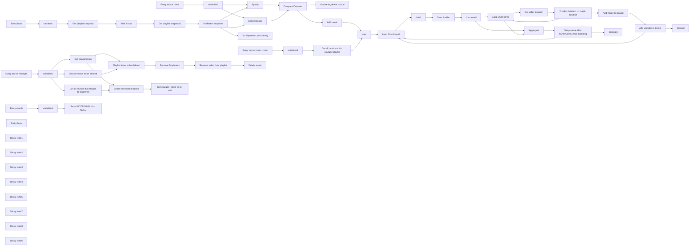

## Fluxo (.json) :

```json
{
  "meta": {
    "instanceId": "173bb893d2008dedab0ccfa3d7dba2c858a9076afa8f7dce6ebaa9c817262edf"
  },
  "nodes": [
    {
      "id": "c9e46f43-b159-42ca-945d-7aa8546e5fa2",
      "name": "Get playlist snapshot",
      "type": "n8n-nodes-base.spotify",
      "position": [
        380,
        1580
      ],
      "parameters": {
        "id": "={{ $json.spotify_playlist_id }}",
        "resource": "playlist",
        "operation": "get"
      },
      "typeVersion": 1
    },
    {
      "id": "73c2303e-24c2-4026-95f6-825e5d08baa4",
      "name": "Get playlist snapshot1",
      "type": "n8n-nodes-base.spotify",
      "position": [
        720,
        1580
      ],
      "parameters": {
        "id": "={{ $('variables').item.json.spotify_playlist_id }}",
        "resource": "playlist",
        "operation": "get"
      },
      "typeVersion": 1
    },
    {
      "id": "bb71003b-0945-4333-91d3-662290dfb42d",
      "name": "If different snapshot",
      "type": "n8n-nodes-base.if",
      "position": [
        900,
        1580
      ],
      "parameters": {
        "options": {},
        "conditions": {
          "options": {
            "version": 1,
            "leftValue": "",
            "caseSensitive": true,
            "typeValidation": "strict"
          },
          "combinator": "and",
          "conditions": [
            {
              "id": "2606c811-7c92-4c61-b99e-be2aaced10dd",
              "operator": {
                "type": "string",
                "operation": "notEquals"
              },
              "leftValue": "={{ $('Get playlist snapshot').item.json.snapshot_id }}",
              "rightValue": "={{ $json.snapshot_id }}"
            }
          ]
        }
      },
      "typeVersion": 2
    },
    {
      "id": "4894d2a7-dda9-430f-849a-d2368daa0aab",
      "name": "Get all musics",
      "type": "n8n-nodes-base.supabase",
      "position": [
        1220,
        1600
      ],
      "parameters": {
        "tableId": "={{ (() => { try { return $('variables').item.json.supabase_table_name } catch(e) {} try { return $('variables2').item.json.supabase_table_name } catch(e) {} return undefined; })() }}",
        "operation": "getAll",
        "returnAll": true
      },
      "typeVersion": 1
    },
    {
      "id": "e854147b-a5fa-400d-8440-bda25a0226b2",
      "name": "Update to_delete to true",
      "type": "n8n-nodes-base.supabase",
      "position": [
        1700,
        1620
      ],
      "parameters": {
        "filters": {
          "conditions": [
            {
              "keyName": "id",
              "keyValue": "={{ $json.id }}",
              "condition": "eq"
            }
          ]
        },
        "tableId": "={{ (() => { try { return $('variables').item.json.supabase_table_name } catch(e) {} try { return $('variables2').item.json.supabase_table_name } catch(e) {} return undefined; })() }}",
        "fieldsUi": {
          "fieldValues": [
            {
              "fieldId": "to_delete",
              "fieldValue": "TRUE"
            }
          ]
        },
        "operation": "update"
      },
      "typeVersion": 1
    },
    {
      "id": "2425db39-487b-4b61-9b61-9ae00067bbca",
      "name": "Add music",
      "type": "n8n-nodes-base.supabase",
      "position": [
        1700,
        1400
      ],
      "parameters": {
        "tableId": "={{ (() => { try { return $('variables').item.json.supabase_table_name } catch(e) {} try { return $('variables2').item.json.supabase_table_name } catch(e) {} return undefined; })() }}\n",
        "fieldsUi": {
          "fieldValues": [
            {
              "fieldId": "id",
              "fieldValue": "={{ $json.track.id }}"
            },
            {
              "fieldId": "title",
              "fieldValue": "={{ $json.track.name }}"
            },
            {
              "fieldId": "artist",
              "fieldValue": "={{ $json.track.artists[0].name }}"
            },
            {
              "fieldId": "duration",
              "fieldValue": "={{ $json.track.duration_ms }}"
            }
          ]
        }
      },
      "typeVersion": 1,
      "alwaysOutputData": false
    },
    {
      "id": "1c28ae15-9049-4ac7-9a7f-dcd094a60ace",
      "name": "Compare Datasets",
      "type": "n8n-nodes-base.compareDatasets",
      "position": [
        1460,
        1540
      ],
      "parameters": {
        "options": {
          "skipFields": "title, artists, duration, youtube_video_id, added_at, added_by, is_local, primary_color, video_thumbnail,"
        },
        "mergeByFields": {
          "values": [
            {
              "field1": "track.id",
              "field2": "id"
            }
          ]
        }
      },
      "typeVersion": 2.3
    },
    {
      "id": "af89d454-1071-42c1-9455-d64e02ae14b7",
      "name": "Spotify",
      "type": "n8n-nodes-base.spotify",
      "position": [
        1220,
        1440
      ],
      "parameters": {
        "id": "={{ (() => { try { return $('variables').item.json.spotify_playlist_id } catch(e) {} try { return $('variables2').item.json.spotify_playlist_id } catch(e) {} return undefined; })() }}",
        "resource": "playlist",
        "operation": "getTracks",
        "returnAll": true
      },
      "typeVersion": 1
    },
    {
      "id": "b924ad92-b1f2-41d5-b662-1e64ad0cc6dc",
      "name": "No Operation, do nothing",
      "type": "n8n-nodes-base.noOp",
      "position": [
        1220,
        1800
      ],
      "parameters": {},
      "typeVersion": 1
    },
    {
      "id": "2665982e-68ac-4a83-988d-78d07a0d6c75",
      "name": "Get all musics not in youtube playlist",
      "type": "n8n-nodes-base.supabase",
      "position": [
        400,
        960
      ],
      "parameters": {
        "filters": {
          "conditions": [
            {
              "keyName": "youtube_video_id",
              "keyValue": "null",
              "condition": "is"
            },
            {
              "keyName": "to_delete",
              "keyValue": "FALSE",
              "condition": "is"
            }
          ]
        },
        "tableId": "={{ $json.supabase_table_name }}",
        "matchType": "allFilters",
        "operation": "getAll",
        "returnAll": true
      },
      "typeVersion": 1
    },
    {
      "id": "6ea4ae11-9889-4ae2-904f-614ca4118b8a",
      "name": "Every day at noon",
      "type": "n8n-nodes-base.scheduleTrigger",
      "position": [
        20,
        1220
      ],
      "parameters": {
        "rule": {
          "interval": [
            {
              "triggerAtHour": 12
            }
          ]
        }
      },
      "typeVersion": 1.2
    },
    {
      "id": "8e4b14f4-a7ec-45dd-9b24-8c86889fd135",
      "name": "Every day at noon + 1mn",
      "type": "n8n-nodes-base.scheduleTrigger",
      "position": [
        20,
        960
      ],
      "parameters": {
        "rule": {
          "interval": [
            {
              "triggerAtHour": 12,
              "triggerAtMinute": 1
            }
          ]
        }
      },
      "typeVersion": 1.2
    },
    {
      "id": "16242250-5f3f-49f9-b6cb-7302bc11765a",
      "name": "Every hour",
      "type": "n8n-nodes-base.scheduleTrigger",
      "position": [
        20,
        1580
      ],
      "parameters": {
        "rule": {
          "interval": [
            {
              "field": "hours"
            }
          ]
        }
      },
      "typeVersion": 1.2
    },
    {
      "id": "6b6784ce-e236-40ca-b85c-1b0f0abdd7a5",
      "name": "Wait 1 hour",
      "type": "n8n-nodes-base.wait",
      "position": [
        560,
        1580
      ],
      "webhookId": "7d71bd21-a70a-47d5-bde5-299299fdb84e",
      "parameters": {
        "unit": "hours",
        "amount": 1
      },
      "typeVersion": 1.1
    },
    {
      "id": "746e7e33-00ba-4e92-a877-3619e14fa718",
      "name": "variables",
      "type": "n8n-nodes-base.set",
      "position": [
        200,
        1580
      ],
      "parameters": {
        "options": {},
        "assignments": {
          "assignments": [
            {
              "id": "89615f0d-1f93-4416-bab4-1c69479e135e",
              "name": "spotify_playlist_id",
              "type": "string",
              "value": "4fjIxvQt8aQrQZs4XqvsmR"
            },
            {
              "id": "be22a9a9-58be-4275-aac5-c0d95ba91cfd",
              "name": "youtube_playlist_id",
              "type": "string",
              "value": "PLjmwnzu1gWRsnW6icKeUyvbaK9-Cs8oom"
            },
            {
              "id": "3536712c-8881-4089-98aa-e25516fea624",
              "name": "supabase_table_name",
              "type": "string",
              "value": "musics"
            }
          ]
        }
      },
      "typeVersion": 3.4
    },
    {
      "id": "0006e12a-fea6-408d-bcf5-6d0a726322b1",
      "name": "Search video",
      "type": "n8n-nodes-base.youTube",
      "position": [
        2500,
        1420
      ],
      "parameters": {
        "limit": 5,
        "filters": {
          "q": "={{ $json.title }} {{ '-' }} {{ $json.artist }}"
        },
        "options": {},
        "resource": "video"
      },
      "typeVersion": 1,
      "alwaysOutputData": true
    },
    {
      "id": "24f5a360-fa93-4942-baea-baf134dd40a3",
      "name": "Get video duration",
      "type": "n8n-nodes-base.youTube",
      "position": [
        3020,
        1420
      ],
      "parameters": {
        "part": [
          "contentDetails",
          "snippet"
        ],
        "options": {},
        "videoId": "={{ $json.id.videoId }}",
        "resource": "video",
        "operation": "get"
      },
      "typeVersion": 1
    },
    {
      "id": "2027d659-01d6-4dd0-bfdc-c92f65b021bc",
      "name": "Loop Over Items",
      "type": "n8n-nodes-base.splitInBatches",
      "position": [
        2840,
        1420
      ],
      "parameters": {
        "options": {}
      },
      "typeVersion": 3
    },
    {
      "id": "3e843f70-bc17-4749-86ba-11f5a0e98e7d",
      "name": "If video duration ~= music duration",
      "type": "n8n-nodes-base.if",
      "position": [
        3240,
        1420
      ],
      "parameters": {
        "options": {},
        "conditions": {
          "options": {
            "version": 1,
            "leftValue": "",
            "caseSensitive": true,
            "typeValidation": "strict"
          },
          "combinator": "and",
          "conditions": [
            {
              "id": "e8ed16f1-f0c6-4ef4-bf09-8ecb6fbf44cb",
              "operator": {
                "type": "number",
                "operation": "gt"
              },
              "leftValue": "={{ $json.contentDetails.duration.match(/(\\d+)(?=[MHS])/g).reduce((acc, time, i) => acc + time * [60000, 1000, 1][i], 0) }}",
              "rightValue": "={{ $('data1').first().json.duration - 5000}}"
            },
            {
              "id": "c4317b05-69bb-4244-ac8a-4cc51113a63b",
              "operator": {
                "type": "number",
                "operation": "lt"
              },
              "leftValue": "={{ $json.contentDetails.duration.match(/(\\d+)(?=[MHS])/g).reduce((acc, time, i) => acc + time * [60000, 1000, 1][i], 0) }}",
              "rightValue": "={{ $('data1').first().json.duration + 20000}}"
            }
          ]
        }
      },
      "typeVersion": 2
    },
    {
      "id": "a21e462c-72c9-4e77-99dc-1046acbaa998",
      "name": "Add music to playlist",
      "type": "n8n-nodes-base.youTube",
      "position": [
        3460,
        1400
      ],
      "parameters": {
        "options": {},
        "videoId": "={{ $('Get video duration').item.json.id }}",
        "resource": "playlistItem",
        "playlistId": "PLjmwnzu1gWRsnW6icKeUyvbaK9-Cs8oom"
      },
      "typeVersion": 1
    },
    {
      "id": "68fc1180-ce51-496a-909f-a652bb43febc",
      "name": "Add youtube id to row",
      "type": "n8n-nodes-base.supabase",
      "position": [
        3640,
        1400
      ],
      "parameters": {
        "filters": {
          "conditions": [
            {
              "keyName": "id",
              "keyValue": "={{ $('data1').first().json.id }}",
              "condition": "eq"
            }
          ]
        },
        "tableId": "={{ $('data1').first().json.supabase_table_name }}",
        "fieldsUi": {
          "fieldValues": [
            {
              "fieldId": "youtube_video_id",
              "fieldValue": "={{ $json.snippet.resourceId.videoId }}"
            }
          ]
        },
        "operation": "update"
      },
      "typeVersion": 1
    },
    {
      "id": "3611f50e-3000-46e9-b145-109251c3a12d",
      "name": "Discord",
      "type": "n8n-nodes-base.discord",
      "position": [
        4040,
        1400
      ],
      "parameters": {
        "content": "=Added : {{ $json.title }} (https://www.youtube.com/watch?v={{ $json.youtube_video_id }})",
        "options": {},
        "authentication": "webhook"
      },
      "typeVersion": 2
    },
    {
      "id": "bd6438b2-8628-4bb9-be34-03785458f194",
      "name": "Discord1",
      "type": "n8n-nodes-base.discord",
      "position": [
        4040,
        1020
      ],
      "parameters": {
        "content": "=No match for : {{ $('data1').first().json.title }}",
        "options": {},
        "authentication": "webhook"
      },
      "typeVersion": 2
    },
    {
      "id": "97ea9e76-96a5-48de-afe3-f81dbe7e431b",
      "name": "Set youtube id to NOTFOUND if no matching",
      "type": "n8n-nodes-base.supabase",
      "position": [
        3320,
        1020
      ],
      "parameters": {
        "filters": {
          "conditions": [
            {
              "keyName": "id",
              "keyValue": "={{ $('data1').first().json.id }}",
              "condition": "eq"
            }
          ]
        },
        "tableId": "={{ $('data1').first().json.supabase_table_name }}",
        "fieldsUi": {
          "fieldValues": [
            {
              "fieldId": "youtube_video_id",
              "fieldValue": "NOTFOUND"
            }
          ]
        },
        "matchType": "allFilters",
        "operation": "update"
      },
      "typeVersion": 1
    },
    {
      "id": "acb1e31e-5f17-4092-b357-b0b255a4d15f",
      "name": "Aggregate",
      "type": "n8n-nodes-base.aggregate",
      "position": [
        3060,
        1220
      ],
      "parameters": {
        "options": {},
        "aggregate": "aggregateAllItemData"
      },
      "typeVersion": 1
    },
    {
      "id": "2db8c163-bf26-445f-9339-9e387cf22286",
      "name": "If no result",
      "type": "n8n-nodes-base.if",
      "position": [
        2660,
        1420
      ],
      "parameters": {
        "options": {},
        "conditions": {
          "options": {
            "version": 1,
            "leftValue": "",
            "caseSensitive": true,
            "typeValidation": "strict"
          },
          "combinator": "and",
          "conditions": [
            {
              "id": "49a188bb-3cc8-4a8d-babf-f591c2e72094",
              "operator": {
                "type": "object",
                "operation": "empty",
                "singleValue": true
              },
              "leftValue": "={{ $json }}",
              "rightValue": ""
            }
          ]
        }
      },
      "typeVersion": 2
    },
    {
      "id": "5eea12d7-c313-4176-b85a-54f631e3a98f",
      "name": "data",
      "type": "n8n-nodes-base.set",
      "position": [
        1900,
        1340
      ],
      "parameters": {
        "options": {},
        "assignments": {
          "assignments": [
            {
              "id": "3622fecd-9a77-4cd4-ab02-6997cd83362d",
              "name": "title",
              "type": "string",
              "value": "={{ $json.title }}"
            },
            {
              "id": "76232c1e-f4de-41c4-837f-d20bd2bcfca2",
              "name": "artist",
              "type": "string",
              "value": "={{ $json.artist }}"
            },
            {
              "id": "01c3e160-f1ce-42e9-9010-a8ac806bb029",
              "name": "duration",
              "type": "number",
              "value": "={{ $json.duration }}"
            },
            {
              "id": "65f29ba5-28b4-4b50-8d38-540236229312",
              "name": "id",
              "type": "string",
              "value": "={{ $json.id }}"
            },
            {
              "id": "d6b26130-454c-4625-bdf2-688498d61321",
              "name": "supabase_table_name",
              "type": "string",
              "value": "={{ (() => { try { return $('variables').item.json.supabase_table_name } catch(e) {} try { return $('variables1').item.json.supabase_table_name } catch(e) {} try { return $('variables2').item.json.supabase_table_name } catch(e) {} return undefined; })() }}\n"
            },
            {
              "id": "9d82b3d1-b9f9-4dc1-9e7f-ec2a3c97bfe1",
              "name": "youtube_playlist_id",
              "type": "string",
              "value": "={{ (() => { try { return $('variables').item.json.youtube_playlist_id } catch(e) {} try { return $('variables1').item.json.youtube_playlist_id } catch(e) {} try { return $('variables2').item.json.youtube_playlist_id } catch(e) {} return undefined; })() }}\n"
            }
          ]
        }
      },
      "typeVersion": 3.4
    },
    {
      "id": "73055f49-c804-4b54-a16f-c795f1295069",
      "name": "variables2",
      "type": "n8n-nodes-base.set",
      "position": [
        560,
        1220
      ],
      "parameters": {
        "options": {},
        "assignments": {
          "assignments": [
            {
              "id": "89615f0d-1f93-4416-bab4-1c69479e135e",
              "name": "spotify_playlist_id",
              "type": "string",
              "value": "4fjIxvQt8aQrQZs4XqvsmR"
            },
            {
              "id": "be22a9a9-58be-4275-aac5-c0d95ba91cfd",
              "name": "youtube_playlist_id",
              "type": "string",
              "value": "PLjmwnzu1gWRsnW6icKeUyvbaK9-Cs8oom"
            },
            {
              "id": "3536712c-8881-4089-98aa-e25516fea624",
              "name": "supabase_table_name",
              "type": "string",
              "value": "musics"
            }
          ]
        }
      },
      "typeVersion": 3.4
    },
    {
      "id": "4f7da7fb-5b18-4b44-9aad-d24c2e1409cc",
      "name": "variables1",
      "type": "n8n-nodes-base.set",
      "position": [
        200,
        960
      ],
      "parameters": {
        "options": {},
        "assignments": {
          "assignments": [
            {
              "id": "89615f0d-1f93-4416-bab4-1c69479e135e",
              "name": "spotify_playlist_id",
              "type": "string",
              "value": "4fjIxvQt8aQrQZs4XqvsmR"
            },
            {
              "id": "be22a9a9-58be-4275-aac5-c0d95ba91cfd",
              "name": "youtube_playlist_id",
              "type": "string",
              "value": "PLjmwnzu1gWRsnW6icKeUyvbaK9-Cs8oom"
            },
            {
              "id": "3536712c-8881-4089-98aa-e25516fea624",
              "name": "supabase_table_name",
              "type": "string",
              "value": "musics"
            }
          ]
        }
      },
      "typeVersion": 3.4
    },
    {
      "id": "a814763e-d073-4984-986f-7c627bbe2269",
      "name": "Loop Over Items1",
      "type": "n8n-nodes-base.splitInBatches",
      "position": [
        2120,
        1400
      ],
      "parameters": {
        "options": {}
      },
      "typeVersion": 3
    },
    {
      "id": "5329c838-56bd-4d85-a789-7ded3a128d87",
      "name": "data1",
      "type": "n8n-nodes-base.set",
      "position": [
        2320,
        1420
      ],
      "parameters": {
        "options": {},
        "assignments": {
          "assignments": [
            {
              "id": "3622fecd-9a77-4cd4-ab02-6997cd83362d",
              "name": "title",
              "type": "string",
              "value": "={{ $json.title }}"
            },
            {
              "id": "76232c1e-f4de-41c4-837f-d20bd2bcfca2",
              "name": "artist",
              "type": "string",
              "value": "={{ $json.artist }}"
            },
            {
              "id": "01c3e160-f1ce-42e9-9010-a8ac806bb029",
              "name": "duration",
              "type": "number",
              "value": "={{ $json.duration }}"
            },
            {
              "id": "65f29ba5-28b4-4b50-8d38-540236229312",
              "name": "id",
              "type": "string",
              "value": "={{ $json.id }}"
            },
            {
              "id": "d6b26130-454c-4625-bdf2-688498d61321",
              "name": "supabase_table_name",
              "type": "string",
              "value": "={{ $json.supabase_table_name }}"
            },
            {
              "id": "9d82b3d1-b9f9-4dc1-9e7f-ec2a3c97bfe1",
              "name": "youtube_playlist_id",
              "type": "string",
              "value": "={{ $json.youtube_playlist_id }}"
            }
          ]
        }
      },
      "typeVersion": 3.4
    },
    {
      "id": "01039cab-f822-4cfc-996f-0e88923f9c14",
      "name": "Get playlist items",
      "type": "n8n-nodes-base.youTube",
      "position": [
        540,
        2600
      ],
      "parameters": {
        "options": {},
        "resource": "playlistItem",
        "operation": "getAll",
        "returnAll": true,
        "playlistId": "={{ $json.youtube_playlist_id }}"
      },
      "typeVersion": 1
    },
    {
      "id": "c12fb59f-ad15-4456-b827-f749a22f2f0c",
      "name": "Playlist items to be deleted",
      "type": "n8n-nodes-base.compareDatasets",
      "position": [
        840,
        2700
      ],
      "parameters": {
        "options": {
          "skipFields": "kind, etag, snippet, thumbnails, channelTitle, position, resourceId, contentDetails, status"
        },
        "mergeByFields": {
          "values": [
            {
              "field1": "snippet.resourceId.videoId",
              "field2": "youtube_video_id"
            }
          ]
        }
      },
      "typeVersion": 2.3
    },
    {
      "id": "57172162-a766-4c51-8249-e6e0632d1312",
      "name": "Get all musics that should be in playlist",
      "type": "n8n-nodes-base.supabase",
      "position": [
        540,
        2400
      ],
      "parameters": {
        "filters": {
          "conditions": [
            {
              "keyName": "youtube_video_id",
              "keyValue": "={{ null }}",
              "condition": "neq"
            },
            {
              "keyName": "youtube_video_id",
              "keyValue": "NOTFOUND",
              "condition": "neq"
            }
          ]
        },
        "tableId": "={{ $json.supabase_table_name }}",
        "matchType": "allFilters",
        "operation": "getAll",
        "returnAll": true
      },
      "typeVersion": 1
    },
    {
      "id": "88f01cff-33a2-4184-af92-80cf7dd6d28b",
      "name": "Remove Duplicates",
      "type": "n8n-nodes-base.removeDuplicates",
      "position": [
        1080,
        2700
      ],
      "parameters": {
        "compare": "selectedFields",
        "options": {},
        "fieldsToCompare": "different.youtube_video_id.inputB"
      },
      "typeVersion": 1.1
    },
    {
      "id": "e25d78cd-d3a9-4b24-8663-84344b6f0b68",
      "name": "Remove video from playlist",
      "type": "n8n-nodes-base.youTube",
      "position": [
        1240,
        2700
      ],
      "parameters": {
        "options": {},
        "resource": "playlistItem",
        "operation": "delete",
        "playlistItemId": "={{ $json.different.id.inputA }}"
      },
      "typeVersion": 1
    },
    {
      "id": "1420795b-fac4-47ac-8449-96ae39541c22",
      "name": "Check for deleted videos",
      "type": "n8n-nodes-base.compareDatasets",
      "position": [
        820,
        2480
      ],
      "parameters": {
        "options": {
          "skipFields": "kind, etag, snippet, thumbnails, channelTitle, position, resourceId, contentDetails, status"
        },
        "mergeByFields": {
          "values": [
            {
              "field1": "youtube_video_id",
              "field2": "contentDetails.videoId"
            }
          ]
        }
      },
      "typeVersion": 2.3
    },
    {
      "id": "fc2e2908-c491-4d45-87e4-a572a2f3e72a",
      "name": "Set youtube_video_id to null",
      "type": "n8n-nodes-base.supabase",
      "onError": "continueRegularOutput",
      "position": [
        1080,
        2440
      ],
      "parameters": {
        "filters": {
          "conditions": [
            {
              "keyName": "id",
              "keyValue": "={{ $json.id }}",
              "condition": "eq"
            },
            {
              "keyName": "youtube_video_id",
              "keyValue": "NOTFOUND",
              "condition": "neq"
            }
          ]
        },
        "tableId": "={{ $('variables3').item.json.supabase_table_name }}",
        "fieldsUi": {
          "fieldValues": [
            {
              "fieldId": "youtube_video_id",
              "fieldValue": "={{ null }}"
            }
          ]
        },
        "matchType": "allFilters",
        "operation": "update"
      },
      "typeVersion": 1
    },
    {
      "id": "52523569-4347-477f-abe3-718b0177324a",
      "name": "Get all musics to be deleted",
      "type": "n8n-nodes-base.supabase",
      "position": [
        540,
        2820
      ],
      "parameters": {
        "filters": {
          "conditions": [
            {
              "keyName": "to_delete",
              "keyValue": "TRUE",
              "condition": "is"
            },
            {
              "keyName": "youtube_video_id",
              "keyValue": "NOTFOUND",
              "condition": "neq"
            }
          ]
        },
        "tableId": "={{ $json.supabase_table_name }}",
        "matchType": "allFilters",
        "operation": "getAll",
        "returnAll": true
      },
      "typeVersion": 1
    },
    {
      "id": "c1306c1e-07aa-46f9-970c-3e9ecb01638a",
      "name": "Delete music",
      "type": "n8n-nodes-base.supabase",
      "position": [
        1400,
        2700
      ],
      "parameters": {
        "filters": {
          "conditions": [
            {
              "keyName": "youtube_video_id",
              "keyValue": "={{ $('Get all musics to be deleted').item.json.youtube_video_id }}",
              "condition": "eq"
            },
            {
              "keyName": "to_delete",
              "keyValue": "true",
              "condition": "is"
            }
          ]
        },
        "tableId": "={{ $('variables3').item.json.supabase_table_name }}",
        "matchType": "allFilters",
        "operation": "delete"
      },
      "typeVersion": 1
    },
    {
      "id": "770083fa-6ac1-4dd9-929e-e30e933bbd95",
      "name": "Every day at midnight",
      "type": "n8n-nodes-base.scheduleTrigger",
      "position": [
        40,
        2620
      ],
      "parameters": {
        "rule": {
          "interval": [
            {}
          ]
        }
      },
      "typeVersion": 1.2
    },
    {
      "id": "92e5e851-0c66-476e-bec8-a46fc96915ab",
      "name": "variables3",
      "type": "n8n-nodes-base.set",
      "position": [
        240,
        2620
      ],
      "parameters": {
        "options": {},
        "assignments": {
          "assignments": [
            {
              "id": "89615f0d-1f93-4416-bab4-1c69479e135e",
              "name": "spotify_playlist_id",
              "type": "string",
              "value": "4fjIxvQt8aQrQZs4XqvsmR"
            },
            {
              "id": "be22a9a9-58be-4275-aac5-c0d95ba91cfd",
              "name": "youtube_playlist_id",
              "type": "string",
              "value": "PLjmwnzu1gWRsnW6icKeUyvbaK9-Cs8oom"
            },
            {
              "id": "3536712c-8881-4089-98aa-e25516fea624",
              "name": "supabase_table_name",
              "type": "string",
              "value": "musics"
            }
          ]
        }
      },
      "typeVersion": 3.4
    },
    {
      "id": "acde16fc-3fe3-453b-bffe-ead681e97046",
      "name": "Reset NOTFOUND id to NULL",
      "type": "n8n-nodes-base.supabase",
      "position": [
        420,
        3280
      ],
      "parameters": {
        "filters": {
          "conditions": [
            {
              "keyName": "youtube_video_id",
              "keyValue": "NOTFOUND",
              "condition": "eq"
            }
          ]
        },
        "tableId": "={{ $json.supabase_table_name }}",
        "fieldsUi": {
          "fieldValues": [
            {
              "fieldId": "youtube_video_id",
              "fieldValue": "={{ null }}"
            }
          ]
        },
        "operation": "update"
      },
      "typeVersion": 1
    },
    {
      "id": "62053829-3253-4a7c-b70f-ba6075df034b",
      "name": "variables4",
      "type": "n8n-nodes-base.set",
      "position": [
        220,
        3280
      ],
      "parameters": {
        "options": {},
        "assignments": {
          "assignments": [
            {
              "id": "89615f0d-1f93-4416-bab4-1c69479e135e",
              "name": "spotify_playlist_id",
              "type": "string",
              "value": "4fjIxvQt8aQrQZs4XqvsmR"
            },
            {
              "id": "be22a9a9-58be-4275-aac5-c0d95ba91cfd",
              "name": "youtube_playlist_id",
              "type": "string",
              "value": "PLjmwnzu1gWRsnW6icKeUyvbaK9-Cs8oom"
            },
            {
              "id": "3536712c-8881-4089-98aa-e25516fea624",
              "name": "supabase_table_name",
              "type": "string",
              "value": "musics"
            }
          ]
        }
      },
      "typeVersion": 3.4
    },
    {
      "id": "9a205a87-f32a-49c1-8282-469777c83c9c",
      "name": "Every month",
      "type": "n8n-nodes-base.scheduleTrigger",
      "position": [
        40,
        3280
      ],
      "parameters": {
        "rule": {
          "interval": [
            {
              "field": "months"
            }
          ]
        }
      },
      "typeVersion": 1.2
    },
    {
      "id": "a40fa87c-71ae-4045-8285-91235f0cf1f0",
      "name": "Sticky Note",
      "type": "n8n-nodes-base.stickyNote",
      "position": [
        2040,
        780
      ],
      "parameters": {
        "color": 6,
        "width": 1780,
        "height": 980,
        "content": "# Match Spotify Tracks to YouTube Videos  \n\n## This part finds the best YouTube video for a Spotify track using the YouTube Data API v3. It searches with the track title and artist, retrieves the top 5 videos, and selects the first one with a duration within ±10% of the Spotify track length. The matched video is added to a YouTube playlist, and its ID is saved in the database.  \n\n## Operation:\n- ## Uses Spotify data (title + artist) for search.\n- ## Ensures duration accuracy (±10% tolerance).  \n- ## Automates playlist updates and database storage."
      },
      "typeVersion": 1
    },
    {
      "id": "b850a168-7fa4-417c-980c-da8fcf558cfb",
      "name": "Sticky Note1",
      "type": "n8n-nodes-base.stickyNote",
      "position": [
        -20,
        1440
      ],
      "parameters": {
        "color": 4,
        "width": 1100,
        "height": 420,
        "content": "## Check for any modification in the spotify playlist with snapshot_id\n### If you want to change the checking interval, make sure to change the trigger AND the wait node\n"
      },
      "typeVersion": 1
    },
    {
      "id": "fe2aaa9f-e4de-4000-b535-3e351a643d01",
      "name": "Sticky Note2",
      "type": "n8n-nodes-base.stickyNote",
      "position": [
        -1360,
        1120
      ],
      "parameters": {
        "color": 3,
        "width": 960,
        "height": 1340,
        "content": "# Spotify to YouTube Playlist Synchronization\n## A workflow that maintains a YouTube playlist in sync with a Spotify playlist, featuring smart video matching and persistent synchronization.\n\n## Key Features\n- **One-way Sync**: Spotify playlist → YouTube playlist (additions and deletions\n- **Continuous Monitoring**: Automatic synchronization (every hour by default, but you can put any time you want)\n- **Smart Video Matching**: Considers video length and content relevance\n- **Auto-Recovery**: Automatically handles deleted YouTube videos\n- **Database Backup**: Persistent storage using Supabase\n\n## Prerequisites\n\n1. Supabase project with the following table structure:\n```sql\nCREATE TABLE IF NOT EXISTS musics (\n    id TEXT PRIMARY KEY,\n    title TEXT NOT NULL,\n    artist TEXT NOT NULL,\n    duration INT8 NOT NULL,\n    youtube_video_id TEXT,\n    to_delete BOOLEAN DEFAULT FALSE\n);\n```\n2. Empty YouTube playlist (recommended as duplicates are not handled)\n3. Configured credentials for YouTube, Spotify, and Supabase APIs\n4. Properly set variables in all \"variables\" nodes (variables, variables1, variables2, variables3, variables4 (all the same))\n5. Activate the workflow !\n\n## Workflow Components\n\n### Workflow 1: Main Sync Process\n1. **Change Detection**\n   - Monitors Spotify playlist for changes\n   - Compares database state with current playlist\n\n2. **Video Matching**\n   - Searches YouTube based on title, artist, and duration\n   - Evaluates top 5 results for best match\n   - Marks unmatched tracks with \"NOTFOUND\"\n   - Notifies user of successful matches and failures\n\n### Workflow 2: YouTube Maintenance\n- Monitors YouTube playlist for removed videos\n- Flags removed videos for re-search\n- Handles deletion of marked videos\n\n### Workflow 3: Recovery Process\n- Clears \"NOTFOUND\" flags periodically to re-search previously unmatched tracks\n\n## Implementation Notes\n- Workflows can be separated into different files for better monitoring\n- Recovery process ensures long-term playlist maintenance\n\n"
      },
      "typeVersion": 1
    },
    {
      "id": "a86748bf-e52a-4d14-b940-d66a62de802e",
      "name": "Sticky Note3",
      "type": "n8n-nodes-base.stickyNote",
      "position": [
        1100,
        700
      ],
      "parameters": {
        "color": 5,
        "width": 920,
        "height": 1260,
        "content": "# Spotify-Database Synchronization\n\n## Operation:\n- ## Compares Spotify playlist tracks against database entries\n- ## Adds missing tracks to database\n- ## Marks database entries for deletion when removed from Spotify playlist"
      },
      "typeVersion": 1
    },
    {
      "id": "c58d3233-7059-4095-bae7-c0b451748c2f",
      "name": "Sticky Note4",
      "type": "n8n-nodes-base.stickyNote",
      "position": [
        -20,
        620
      ],
      "parameters": {
        "width": 800,
        "height": 800,
        "content": "# Daily Force Check\n\n## Forces daily comparison between Spotify playlist and database state, bypassing playlist modification checks. Essential for:\n- ## Initial setup of large playlists (manages YouTube API limits)\n- ## Processing pending tracks when playlist hasn't changed\n- ## Continuing sync attempts for unmatched tracks"
      },
      "typeVersion": 1
    },
    {
      "id": "cfea38bb-d8b2-48aa-9718-e5d2d36f52c7",
      "name": "Sticky Note5",
      "type": "n8n-nodes-base.stickyNote",
      "position": [
        3840,
        780
      ],
      "parameters": {
        "color": 2,
        "width": 460,
        "height": 980,
        "content": "## Optional notifications (you can use the chat of your choice)\n"
      },
      "typeVersion": 1
    },
    {
      "id": "fb6fa7af-a434-463a-a2d7-e78d0328033c",
      "name": "Sticky Note7",
      "type": "n8n-nodes-base.stickyNote",
      "position": [
        -40,
        120
      ],
      "parameters": {
        "color": 7,
        "width": 4400,
        "height": 1880,
        "content": "# Workflow 1: Main Sync Process\n# 1. **Change Detection**\n   - ## Monitors Spotify playlist for changes\n   - ## Compares database state with current playlist\n\n# 2. **Video Matching**\n   - ## Searches YouTube based on title, artist, and duration\n   - ## Evaluates top 5 results for best match\n   - ## Marks unmatched tracks with \"NOTFOUND\"\n   - ## Notifies user of successful matches and failures"
      },
      "typeVersion": 1
    },
    {
      "id": "03e20125-37c8-4e40-98fd-9b4617eaab70",
      "name": "Sticky Note8",
      "type": "n8n-nodes-base.stickyNote",
      "position": [
        -40,
        2200
      ],
      "parameters": {
        "color": 7,
        "width": 1740,
        "height": 800,
        "content": "# Workflow 2: YouTube Maintenance\n- ## Monitors YouTube playlist for removed videos\n- ## Flags removed videos for re-search\n- ## Handles deletion of marked videos\n"
      },
      "typeVersion": 1
    },
    {
      "id": "031c2984-96b1-4c60-9e24-a125619b204a",
      "name": "Sticky Note6",
      "type": "n8n-nodes-base.stickyNote",
      "position": [
        -40,
        3080
      ],
      "parameters": {
        "color": 7,
        "width": 760,
        "height": 360,
        "content": "# Workflow 3: Recovery Process\n- ## Clears \"NOTFOUND\" flags periodically to re-search previously unmatched tracks"
      },
      "typeVersion": 1
    }
  ],
  "pinData": {},
  "connections": {
    "data": {
      "main": [
        [
          {
            "node": "Loop Over Items1",
            "type": "main",
            "index": 0
          }
        ]
      ]
    },
    "data1": {
      "main": [
        [
          {
            "node": "Search video",
            "type": "main",
            "index": 0
          }
        ]
      ]
    },
    "Spotify": {
      "main": [
        [
          {
            "node": "Compare Datasets",
            "type": "main",
            "index": 0
          }
        ]
      ]
    },
    "Add music": {
      "main": [
        [
          {
            "node": "data",
            "type": "main",
            "index": 0
          }
        ]
      ]
    },
    "Aggregate": {
      "main": [
        [
          {
            "node": "Set youtube id to NOTFOUND if no matching",
            "type": "main",
            "index": 0
          }
        ]
      ]
    },
    "variables": {
      "main": [
        [
          {
            "node": "Get playlist snapshot",
            "type": "main",
            "index": 0
          }
        ]
      ]
    },
    "Every hour": {
      "main": [
        [
          {
            "node": "variables",
            "type": "main",
            "index": 0
          }
        ]
      ]
    },
    "variables1": {
      "main": [
        [
          {
            "node": "Get all musics not in youtube playlist",
            "type": "main",
            "index": 0
          }
        ]
      ]
    },
    "variables2": {
      "main": [
        [
          {
            "node": "Spotify",
            "type": "main",
            "index": 0
          },
          {
            "node": "Get all musics",
            "type": "main",
            "index": 0
          }
        ]
      ]
    },
    "variables3": {
      "main": [
        [
          {
            "node": "Get all musics that should be in playlist",
            "type": "main",
            "index": 0
          },
          {
            "node": "Get playlist items",
            "type": "main",
            "index": 0
          },
          {
            "node": "Get all musics to be deleted",
            "type": "main",
            "index": 0
          }
        ]
      ]
    },
    "variables4": {
      "main": [
        [
          {
            "node": "Reset NOTFOUND id to NULL",
            "type": "main",
            "index": 0
          }
        ]
      ]
    },
    "Every month": {
      "main": [
        [
          {
            "node": "variables4",
            "type": "main",
            "index": 0
          }
        ]
      ]
    },
    "Wait 1 hour": {
      "main": [
        [
          {
            "node": "Get playlist snapshot1",
            "type": "main",
            "index": 0
          }
        ]
      ]
    },
    "If no result": {
      "main": [
        [
          {
            "node": "Aggregate",
            "type": "main",
            "index": 0
          }
        ],
        [
          {
            "node": "Loop Over Items",
            "type": "main",
            "index": 0
          }
        ]
      ]
    },
    "Search video": {
      "main": [
        [
          {
            "node": "If no result",
            "type": "main",
            "index": 0
          }
        ]
      ]
    },
    "Get all musics": {
      "main": [
        [
          {
            "node": "Compare Datasets",
            "type": "main",
            "index": 1
          }
        ]
      ]
    },
    "Loop Over Items": {
      "main": [
        [
          {
            "node": "Aggregate",
            "type": "main",
            "index": 0
          }
        ],
        [
          {
            "node": "Get video duration",
            "type": "main",
            "index": 0
          }
        ]
      ]
    },
    "Compare Datasets": {
      "main": [
        [
          {
            "node": "Add music",
            "type": "main",
            "index": 0
          }
        ],
        [],
        [],
        [
          {
            "node": "Update to_delete to true",
            "type": "main",
            "index": 0
          }
        ]
      ]
    },
    "Loop Over Items1": {
      "main": [
        [],
        [
          {
            "node": "data1",
            "type": "main",
            "index": 0
          }
        ]
      ]
    },
    "Every day at noon": {
      "main": [
        [
          {
            "node": "variables2",
            "type": "main",
            "index": 0
          }
        ]
      ]
    },
    "Remove Duplicates": {
      "main": [
        [
          {
            "node": "Remove video from playlist",
            "type": "main",
            "index": 0
          }
        ]
      ]
    },
    "Get playlist items": {
      "main": [
        [
          {
            "node": "Playlist items to be deleted",
            "type": "main",
            "index": 0
          },
          {
            "node": "Check for deleted videos",
            "type": "main",
            "index": 1
          }
        ]
      ]
    },
    "Get video duration": {
      "main": [
        [
          {
            "node": "If video duration ~= music duration",
            "type": "main",
            "index": 0
          }
        ]
      ]
    },
    "Add music to playlist": {
      "main": [
        [
          {
            "node": "Add youtube id to row",
            "type": "main",
            "index": 0
          }
        ]
      ]
    },
    "Add youtube id to row": {
      "main": [
        [
          {
            "node": "Loop Over Items1",
            "type": "main",
            "index": 0
          },
          {
            "node": "Discord",
            "type": "main",
            "index": 0
          }
        ]
      ]
    },
    "Every day at midnight": {
      "main": [
        [
          {
            "node": "variables3",
            "type": "main",
            "index": 0
          }
        ]
      ]
    },
    "Get playlist snapshot": {
      "main": [
        [
          {
            "node": "Wait 1 hour",
            "type": "main",
            "index": 0
          }
        ]
      ]
    },
    "If different snapshot": {
      "main": [
        [
          {
            "node": "Spotify",
            "type": "main",
            "index": 0
          },
          {
            "node": "Get all musics",
            "type": "main",
            "index": 0
          }
        ],
        [
          {
            "node": "No Operation, do nothing",
            "type": "main",
            "index": 0
          }
        ]
      ]
    },
    "Get playlist snapshot1": {
      "main": [
        [
          {
            "node": "If different snapshot",
            "type": "main",
            "index": 0
          }
        ]
      ]
    },
    "Every day at noon + 1mn": {
      "main": [
        [
          {
            "node": "variables1",
            "type": "main",
            "index": 0
          }
        ]
      ]
    },
    "Check for deleted videos": {
      "main": [
        [
          {
            "node": "Set youtube_video_id to null",
            "type": "main",
            "index": 0
          }
        ]
      ]
    },
    "Remove video from playlist": {
      "main": [
        [
          {
            "node": "Delete music",
            "type": "main",
            "index": 0
          }
        ]
      ]
    },
    "Get all musics to be deleted": {
      "main": [
        [
          {
            "node": "Playlist items to be deleted",
            "type": "main",
            "index": 1
          }
        ]
      ]
    },
    "Playlist items to be deleted": {
      "main": [
        [],
        [],
        [
          {
            "node": "Remove Duplicates",
            "type": "main",
            "index": 0
          }
        ]
      ]
    },
    "If video duration ~= music duration": {
      "main": [
        [
          {
            "node": "Add music to playlist",
            "type": "main",
            "index": 0
          }
        ],
        [
          {
            "node": "Loop Over Items",
            "type": "main",
            "index": 0
          }
        ]
      ]
    },
    "Get all musics not in youtube playlist": {
      "main": [
        [
          {
            "node": "data",
            "type": "main",
            "index": 0
          }
        ]
      ]
    },
    "Get all musics that should be in playlist": {
      "main": [
        [
          {
            "node": "Check for deleted videos",
            "type": "main",
            "index": 0
          }
        ]
      ]
    },
    "Set youtube id to NOTFOUND if no matching": {
      "main": [
        [
          {
            "node": "Loop Over Items1",
            "type": "main",
            "index": 0
          },
          {
            "node": "Discord1",
            "type": "main",
            "index": 0
          }
        ]
      ]
    }
  }
}
```

<a id="template-6"></a>

## Template 6 - Publicador social automático a partir do WordPress

- **Nome:** Publicador social automático a partir do WordPress
- **Descrição:** Automatiza a criação e publicação de legendas e imagens para múltiplas redes sociais com base no conteúdo de um post do WordPress, usando modelos de IA e integração com APIs de redes sociais e planilha.
- **Funcionalidade:** • Leitura de planilha Google Sheets: Busca o ID do post do WordPress para processar.
• Recuperação do post do WordPress: Obtém título, conteúdo e link do artigo especificado.
• Geração de legendas por IA: Cria textos otimizados e adaptados para LinkedIn, Instagram, Facebook e Twitter (X), respeitando tom e limite de cada plataforma.
• Parser de saída estruturada: Transforma a resposta do modelo de IA em campos separados por plataforma.
• Geração de imagens por IA: Cria imagens específicas para Instagram e para Facebook/LinkedIn com tamanhos apropriados.
• Publicação automática: Envia posts com texto e imagens para X, LinkedIn, Facebook e Instagram via suas APIs.
• Atualização da planilha: Marca, por linha, quais plataformas foram publicadas com sucesso.
- **Ferramentas:** • WordPress: CMS de onde o conteúdo do post é recuperado para criação das publicações.
• Google Sheets: Planilha usada para fornecer IDs de posts e registrar o status das publicações.
• OpenRouter (modelo de linguagem): Serviço de modelo de linguagem usado para gerar as legendas adaptadas a cada plataforma.
• OpenAI (geração de imagens): Serviço de geração de imagens usado para criar ativos visuais para as publicações.
• X (Twitter): Rede social para publicação de posts concisos e engajadores.
• Facebook Graph / Instagram API: APIs usadas para publicar fotos e legendas no Facebook e no Instagram.
• LinkedIn: Rede social profissional usada para publicar conteúdo com tom mais formal e direcionado a negócios.

## Fluxo visual

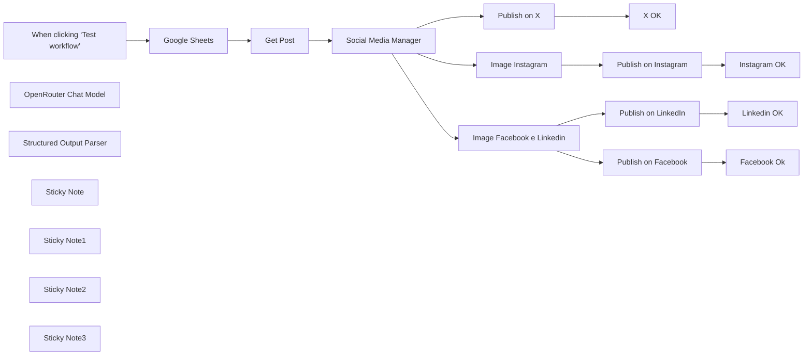

## Fluxo (.json) :

```json
{
  "id": "U9RofpXSIIUg12f9",
  "meta": {
    "instanceId": "a4bfc93e975ca233ac45ed7c9227d84cf5a2329310525917adaf3312e10d5462",
    "templateCredsSetupCompleted": true
  },
  "name": "AI Social Media Publisher from WordPress",
  "tags": [
    {
      "id": "2VG6RbmUdJ2VZbrj",
      "name": "Google Drive",
      "createdAt": "2024-12-04T16:50:56.177Z",
      "updatedAt": "2024-12-04T16:50:56.177Z"
    },
    {
      "id": "EtObDwELrdVvzOcI",
      "name": "OpenRouter",
      "createdAt": "2024-12-04T16:53:26.886Z",
      "updatedAt": "2024-12-04T16:53:26.886Z"
    },
    {
      "id": "OVXRgoTzbRrrYmBB",
      "name": "X",
      "createdAt": "2025-02-24T15:47:38.855Z",
      "updatedAt": "2025-02-24T15:47:38.855Z"
    },
    {
      "id": "PLbmcn8OyqnoHrYE",
      "name": "Instagram",
      "createdAt": "2025-02-24T15:47:48.325Z",
      "updatedAt": "2025-02-24T15:47:48.325Z"
    },
    {
      "id": "QsjuqQbwRJaxuGB4",
      "name": "Facebook",
      "createdAt": "2025-02-24T15:47:42.574Z",
      "updatedAt": "2025-02-24T15:47:42.574Z"
    },
    {
      "id": "oK8zaSe2Q5RG7qNe",
      "name": "Linkedin",
      "createdAt": "2025-02-24T15:47:45.129Z",
      "updatedAt": "2025-02-24T15:47:45.129Z"
    },
    {
      "id": "paTcf5QZDJsC2vKY",
      "name": "OpenAI",
      "createdAt": "2024-12-04T16:52:10.768Z",
      "updatedAt": "2024-12-04T16:52:10.768Z"
    }
  ],
  "nodes": [
    {
      "id": "f5bb7898-44eb-45bf-b199-2146c8e901f6",
      "name": "When clicking ‘Test workflow’",
      "type": "n8n-nodes-base.manualTrigger",
      "position": [
        -220,
        -80
      ],
      "parameters": {},
      "typeVersion": 1
    },
    {
      "id": "b1977304-fbbf-4bb5-924a-e5db036bca91",
      "name": "Google Sheets",
      "type": "n8n-nodes-base.googleSheets",
      "position": [
        0,
        -80
      ],
      "parameters": {
        "options": {
          "returnFirstMatch": true
        },
        "filtersUI": {
          "values": [
            {
              "lookupColumn": "TWITTER"
            }
          ]
        },
        "sheetName": {
          "__rl": true,
          "mode": "list",
          "value": "gid=0",
          "cachedResultUrl": "https://docs.google.com/spreadsheets/d/1suPQNdgoAzrklleN4ok2mZnsq0GK1dt59oIHv8JWX5U/edit#gid=0",
          "cachedResultName": "Foglio1"
        },
        "documentId": {
          "__rl": true,
          "mode": "list",
          "value": "1suPQNdgoAzrklleN4ok2mZnsq0GK1dt59oIHv8JWX5U",
          "cachedResultUrl": "https://docs.google.com/spreadsheets/d/1suPQNdgoAzrklleN4ok2mZnsq0GK1dt59oIHv8JWX5U/edit?usp=drivesdk",
          "cachedResultName": "Social Media post"
        }
      },
      "credentials": {
        "googleSheetsOAuth2Api": {
          "id": "JYR6a64Qecd6t8Hb",
          "name": "Google Sheets account"
        }
      },
      "typeVersion": 4.5
    },
    {
      "id": "1451692d-8e8d-4da7-be3e-b4dd20319c7a",
      "name": "OpenRouter Chat Model",
      "type": "@n8n/n8n-nodes-langchain.lmChatOpenRouter",
      "position": [
        400,
        140
      ],
      "parameters": {
        "model": "google/gemini-2.0-flash-exp:free",
        "options": {}
      },
      "credentials": {
        "openRouterApi": {
          "id": "pb06rfB4xmxzVe3Q",
          "name": "OpenRouter"
        }
      },
      "typeVersion": 1
    },
    {
      "id": "6768f867-666d-4c41-b77a-1bfb389b0329",
      "name": "Structured Output Parser",
      "type": "@n8n/n8n-nodes-langchain.outputParserStructured",
      "position": [
        620,
        140
      ],
      "parameters": {
        "schemaType": "manual",
        "inputSchema": "{\n\t\"type\": \"object\",\n\t\"properties\": {\n\t\t\"twitter\": {\n\t\t\t\"type\": \"string\"\n\t\t},\n\t\t\"facebook\": {\n\t\t\t\"type\": \"string\"\n\t\t},\n        \"linkedin\": {\n\t\t\t\"type\": \"string\"\n\t\t},\n        \"instagram\": {\n\t\t\t\"type\": \"string\"\n\t\t}\n\t}\n}"
      },
      "typeVersion": 1.2
    },
    {
      "id": "05cf81ec-bb25-447a-9c54-183132b8804c",
      "name": "Image Instagram",
      "type": "@n8n/n8n-nodes-langchain.openAi",
      "position": [
        940,
        280
      ],
      "parameters": {
        "prompt": "={{ $json.output.instagram }}",
        "options": {
          "size": "1024x1024",
          "returnImageUrls": true
        },
        "resource": "image"
      },
      "credentials": {
        "openAiApi": {
          "id": "CDX6QM4gLYanh0P4",
          "name": "OpenAi account"
        }
      },
      "typeVersion": 1.8
    },
    {
      "id": "2ae8be2c-28a3-4f55-aee3-2fff3517b149",
      "name": "Image Facebook e Linkedin",
      "type": "@n8n/n8n-nodes-langchain.openAi",
      "position": [
        940,
        -140
      ],
      "parameters": {
        "prompt": "={{ $json.output.facebook }}",
        "options": {
          "size": "1792x1024",
          "returnImageUrls": false
        },
        "resource": "image"
      },
      "credentials": {
        "openAiApi": {
          "id": "CDX6QM4gLYanh0P4",
          "name": "OpenAi account"
        }
      },
      "typeVersion": 1.8
    },
    {
      "id": "583a8459-3574-44e6-85bf-a33b9a4bf9f4",
      "name": "Social Media Manager",
      "type": "@n8n/n8n-nodes-langchain.chainLlm",
      "position": [
        440,
        -80
      ],
      "parameters": {
        "text": "=Generate social content from the following text with title \"{{ $json.title.rendered }}\" (in the same language):\n\n'''\n{{ $json.content.rendered }}\n'''",
        "messages": {
          "messageValues": [
            {
              "message": "=Your goal is to create engaging and informative content for LinkedIn, Instagram, Facebook, Twitter (X) while ensuring each post aligns with the platform’s audience, tone, and style. Content should reflect the company’s expertise, providing value-driven insights, tutorials, reviews, and discussions that resonate with tech professionals, enthusiasts, and businesses.\n\nEach post should be optimized for engagement, using platform-specific hashtags to improve reach and SEO. Maintain a professional yet approachable tone that promotes trust and authority in the tech space.\n\nContent Creation Best Practices:\nPost Optimization: Adapt content format, style, and hashtags based on each social media platform’s algorithm and audience engagement patterns.\nSEO & Hashtags: Use a balanced mix of general hashtags and platform-specific trending hashtags to maximize reach.\nEngagement-driven content: Focus on tech tutorials, IT industry updates, comparisons, reviews, and in-depth discussions that spark engagement.\nConsistency: Maintain a consistent tone and visual identity across all platforms, while tailoring content to each audience.\nData-driven trends: Regularly analyze post performance and adjust your hashtag strategy to reflect trending discussions within your topic. High-quality, relevant, and engaging copy that appeals to professionals, businesses, and enthusiasts of your topic must be provided.\n\n### Platform-specific requirements:\n1. **LinkedIn**:\n- Style: Professional and informative.\n- Tone: Focus on business results, employee gratitude, and community impact.\n- Content length: 3-4 sentences, detailed and insightful.\n- Hashtags: Create hashtags that are compatible with your topic.\n- Call to action: Engage businesses and professionals by encouraging comments or visits to Al Ansari's website.\n\n2. **Instagram**:\n- Style: Visual storytelling.\n- Tone: Inspiring and engaging.\n- Content length: 2-3 sentences, paired with creative captions and emojis.\n- Images: Highlight events, giveaways, and milestones (e.g., 50th anniversary keychains, eco-friendly tote bags).\n- Call to action: Use phrases like “Swipe to see more,” “Tag your coworkers,” or “Celebrate with us!”\n- Hashtags: Create hashtags that resonate with your topic\n\n3. **Facebook**:\n- Style: Friendly and relevant.\n- Tone: Community-focused, sharing employee stories, accomplishments, or event updates.\n- Content length: 2-3 sentences, slightly informal but still reflective of your company’s values.\n- Call to Action: Encourage likes, shares, and comments from connected families and communities\n\n4. **Twitter (X)**:\n- Style: Concise and impactful.\n- Tone: Crisp, engaging, and catchy.\n- Content Length: 150 characters or less, including hashtags.\n- Create hashtags that are compatible with the topic being discussed\n- Call to Action: Focus on rapid engagement through retweets, likes, and replies.\n\nWith this guide, generate posts for all platforms for the inputs below by inserting them into the specified json structure;"
            }
          ]
        },
        "promptType": "define",
        "hasOutputParser": true
      },
      "typeVersion": 1.5
    },
    {
      "id": "634af127-cd08-4beb-99a8-daa626793736",
      "name": "Sticky Note",
      "type": "n8n-nodes-base.stickyNote",
      "position": [
        -60,
        -160
      ],
      "parameters": {
        "width": 420,
        "height": 260,
        "content": "Get the Post ID of the Wordpress article on which you want to generate the caption for social media"
      },
      "typeVersion": 1
    },
    {
      "id": "dbdb39dc-02b2-4fe6-8b70-f38b86c9d9e3",
      "name": "Linkedin OK",
      "type": "n8n-nodes-base.googleSheets",
      "position": [
        1480,
        -260
      ],
      "parameters": {
        "columns": {
          "value": {
            "LINKEDIN": "x",
            "row_number": "={{ $('Google Sheets').item.json.row_number }}"
          },
          "schema": [
            {
              "id": "POST ID",
              "type": "string",
              "display": true,
              "required": false,
              "displayName": "POST ID",
              "defaultMatch": false,
              "canBeUsedToMatch": true
            },
            {
              "id": "TESTO",
              "type": "string",
              "display": true,
              "required": false,
              "displayName": "TESTO",
              "defaultMatch": false,
              "canBeUsedToMatch": true
            },
            {
              "id": "TWITTER",
              "type": "string",
              "display": true,
              "required": false,
              "displayName": "TWITTER",
              "defaultMatch": false,
              "canBeUsedToMatch": true
            },
            {
              "id": "FACEBOOK",
              "type": "string",
              "display": true,
              "removed": false,
              "required": false,
              "displayName": "FACEBOOK",
              "defaultMatch": false,
              "canBeUsedToMatch": true
            },
            {
              "id": "INSTAGRAM",
              "type": "string",
              "display": true,
              "removed": false,
              "required": false,
              "displayName": "INSTAGRAM",
              "defaultMatch": false,
              "canBeUsedToMatch": true
            },
            {
              "id": "LINKEDIN",
              "type": "string",
              "display": true,
              "removed": false,
              "required": false,
              "displayName": "LINKEDIN",
              "defaultMatch": false,
              "canBeUsedToMatch": true
            },
            {
              "id": "row_number",
              "type": "string",
              "display": true,
              "removed": false,
              "readOnly": true,
              "required": false,
              "displayName": "row_number",
              "defaultMatch": false,
              "canBeUsedToMatch": true
            }
          ],
          "mappingMode": "defineBelow",
          "matchingColumns": [
            "row_number"
          ],
          "attemptToConvertTypes": false,
          "convertFieldsToString": false
        },
        "options": {},
        "operation": "update",
        "sheetName": {
          "__rl": true,
          "mode": "list",
          "value": "gid=0",
          "cachedResultUrl": "https://docs.google.com/spreadsheets/d/1suPQNdgoAzrklleN4ok2mZnsq0GK1dt59oIHv8JWX5U/edit#gid=0",
          "cachedResultName": "Foglio1"
        },
        "documentId": {
          "__rl": true,
          "mode": "list",
          "value": "1suPQNdgoAzrklleN4ok2mZnsq0GK1dt59oIHv8JWX5U",
          "cachedResultUrl": "https://docs.google.com/spreadsheets/d/1suPQNdgoAzrklleN4ok2mZnsq0GK1dt59oIHv8JWX5U/edit?usp=drivesdk",
          "cachedResultName": "Social Media post"
        }
      },
      "credentials": {
        "googleSheetsOAuth2Api": {
          "id": "JYR6a64Qecd6t8Hb",
          "name": "Google Sheets account"
        }
      },
      "typeVersion": 4.5
    },
    {
      "id": "07aba718-fb10-48d4-bedb-0c19315acfe1",
      "name": "Facebook Ok",
      "type": "n8n-nodes-base.googleSheets",
      "position": [
        1480,
        0
      ],
      "parameters": {
        "columns": {
          "value": {
            "FACEBOOK": "x",
            "row_number": "={{ $('Google Sheets').item.json.row_number }}"
          },
          "schema": [
            {
              "id": "POST ID",
              "type": "string",
              "display": true,
              "required": false,
              "displayName": "POST ID",
              "defaultMatch": false,
              "canBeUsedToMatch": true
            },
            {
              "id": "TESTO",
              "type": "string",
              "display": true,
              "required": false,
              "displayName": "TESTO",
              "defaultMatch": false,
              "canBeUsedToMatch": true
            },
            {
              "id": "TWITTER",
              "type": "string",
              "display": true,
              "required": false,
              "displayName": "TWITTER",
              "defaultMatch": false,
              "canBeUsedToMatch": true
            },
            {
              "id": "FACEBOOK",
              "type": "string",
              "display": true,
              "removed": false,
              "required": false,
              "displayName": "FACEBOOK",
              "defaultMatch": false,
              "canBeUsedToMatch": true
            },
            {
              "id": "INSTAGRAM",
              "type": "string",
              "display": true,
              "removed": false,
              "required": false,
              "displayName": "INSTAGRAM",
              "defaultMatch": false,
              "canBeUsedToMatch": true
            },
            {
              "id": "LINKEDIN",
              "type": "string",
              "display": true,
              "removed": false,
              "required": false,
              "displayName": "LINKEDIN",
              "defaultMatch": false,
              "canBeUsedToMatch": true
            },
            {
              "id": "row_number",
              "type": "string",
              "display": true,
              "removed": false,
              "readOnly": true,
              "required": false,
              "displayName": "row_number",
              "defaultMatch": false,
              "canBeUsedToMatch": true
            }
          ],
          "mappingMode": "defineBelow",
          "matchingColumns": [
            "row_number"
          ],
          "attemptToConvertTypes": false,
          "convertFieldsToString": false
        },
        "options": {},
        "operation": "update",
        "sheetName": {
          "__rl": true,
          "mode": "list",
          "value": "gid=0",
          "cachedResultUrl": "https://docs.google.com/spreadsheets/d/1suPQNdgoAzrklleN4ok2mZnsq0GK1dt59oIHv8JWX5U/edit#gid=0",
          "cachedResultName": "Foglio1"
        },
        "documentId": {
          "__rl": true,
          "mode": "list",
          "value": "1suPQNdgoAzrklleN4ok2mZnsq0GK1dt59oIHv8JWX5U",
          "cachedResultUrl": "https://docs.google.com/spreadsheets/d/1suPQNdgoAzrklleN4ok2mZnsq0GK1dt59oIHv8JWX5U/edit?usp=drivesdk",
          "cachedResultName": "Social Media post"
        }
      },
      "credentials": {
        "googleSheetsOAuth2Api": {
          "id": "JYR6a64Qecd6t8Hb",
          "name": "Google Sheets account"
        }
      },
      "typeVersion": 4.5
    },
    {
      "id": "7fda8841-4b46-4f3b-9ba0-aa728ba7943f",
      "name": "Instagram OK",
      "type": "n8n-nodes-base.googleSheets",
      "position": [
        1480,
        280
      ],
      "parameters": {
        "columns": {
          "value": {
            "INSTAGRAM": "x",
            "row_number": "={{ $('Google Sheets').item.json.row_number }}"
          },
          "schema": [
            {
              "id": "POST ID",
              "type": "string",
              "display": true,
              "required": false,
              "displayName": "POST ID",
              "defaultMatch": false,
              "canBeUsedToMatch": true
            },
            {
              "id": "TESTO",
              "type": "string",
              "display": true,
              "required": false,
              "displayName": "TESTO",
              "defaultMatch": false,
              "canBeUsedToMatch": true
            },
            {
              "id": "TWITTER",
              "type": "string",
              "display": true,
              "required": false,
              "displayName": "TWITTER",
              "defaultMatch": false,
              "canBeUsedToMatch": true
            },
            {
              "id": "FACEBOOK",
              "type": "string",
              "display": true,
              "removed": false,
              "required": false,
              "displayName": "FACEBOOK",
              "defaultMatch": false,
              "canBeUsedToMatch": true
            },
            {
              "id": "INSTAGRAM",
              "type": "string",
              "display": true,
              "removed": false,
              "required": false,
              "displayName": "INSTAGRAM",
              "defaultMatch": false,
              "canBeUsedToMatch": true
            },
            {
              "id": "LINKEDIN",
              "type": "string",
              "display": true,
              "removed": false,
              "required": false,
              "displayName": "LINKEDIN",
              "defaultMatch": false,
              "canBeUsedToMatch": true
            },
            {
              "id": "row_number",
              "type": "string",
              "display": true,
              "removed": false,
              "readOnly": true,
              "required": false,
              "displayName": "row_number",
              "defaultMatch": false,
              "canBeUsedToMatch": true
            }
          ],
          "mappingMode": "defineBelow",
          "matchingColumns": [
            "row_number"
          ],
          "attemptToConvertTypes": false,
          "convertFieldsToString": false
        },
        "options": {},
        "operation": "update",
        "sheetName": {
          "__rl": true,
          "mode": "list",
          "value": "gid=0",
          "cachedResultUrl": "https://docs.google.com/spreadsheets/d/1suPQNdgoAzrklleN4ok2mZnsq0GK1dt59oIHv8JWX5U/edit#gid=0",
          "cachedResultName": "Foglio1"
        },
        "documentId": {
          "__rl": true,
          "mode": "list",
          "value": "1suPQNdgoAzrklleN4ok2mZnsq0GK1dt59oIHv8JWX5U",
          "cachedResultUrl": "https://docs.google.com/spreadsheets/d/1suPQNdgoAzrklleN4ok2mZnsq0GK1dt59oIHv8JWX5U/edit?usp=drivesdk",
          "cachedResultName": "Social Media post"
        }
      },
      "credentials": {
        "googleSheetsOAuth2Api": {
          "id": "JYR6a64Qecd6t8Hb",
          "name": "Google Sheets account"
        }
      },
      "typeVersion": 4.5
    },
    {
      "id": "fe599e8f-ff45-4aec-b70e-f0dc75b929d5",
      "name": "Get Post",
      "type": "n8n-nodes-base.wordpress",
      "position": [
        220,
        -80
      ],
      "parameters": {
        "postId": "={{ $json['POST ID'] }}",
        "options": {},
        "operation": "get"
      },
      "credentials": {
        "wordpressApi": {
          "id": "OE4AgquSkMWydRqn",
          "name": "Wordpress (wp.test.7hype.com)"
        }
      },
      "typeVersion": 1
    },
    {
      "id": "09059725-47dd-44ff-bcbd-f83d3bb3941d",
      "name": "Sticky Note1",
      "type": "n8n-nodes-base.stickyNote",
      "position": [
        380,
        -160
      ],
      "parameters": {
        "width": 360,
        "height": 260,
        "content": "The SMM Chain analyses the content of the post and creates the most suitable caption based on the destination social network.\n"
      },
      "typeVersion": 1
    },
    {
      "id": "89a0deab-b55a-4eb6-8251-538f5f216d56",
      "name": "Publish on X",
      "type": "n8n-nodes-base.twitter",
      "position": [
        1220,
        -500
      ],
      "parameters": {
        "text": "={{ $json.output.twitter }}",
        "additionalFields": {}
      },
      "credentials": {
        "twitterOAuth2Api": {
          "id": "qex5DVfLnCShvOC4",
          "name": "X account"
        }
      },
      "typeVersion": 2
    },
    {
      "id": "d0a618f3-48e0-4ba1-9525-e15663b38d9f",
      "name": "X OK",
      "type": "n8n-nodes-base.googleSheets",
      "position": [
        1480,
        -500
      ],
      "parameters": {
        "columns": {
          "value": {
            "TWITTER": "x",
            "row_number": "={{ $('Google Sheets').item.json.row_number }}"
          },
          "schema": [
            {
              "id": "POST ID",
              "type": "string",
              "display": true,
              "required": false,
              "displayName": "POST ID",
              "defaultMatch": false,
              "canBeUsedToMatch": true
            },
            {
              "id": "TESTO",
              "type": "string",
              "display": true,
              "required": false,
              "displayName": "TESTO",
              "defaultMatch": false,
              "canBeUsedToMatch": true
            },
            {
              "id": "TWITTER",
              "type": "string",
              "display": true,
              "required": false,
              "displayName": "TWITTER",
              "defaultMatch": false,
              "canBeUsedToMatch": true
            },
            {
              "id": "FACEBOOK",
              "type": "string",
              "display": true,
              "removed": false,
              "required": false,
              "displayName": "FACEBOOK",
              "defaultMatch": false,
              "canBeUsedToMatch": true
            },
            {
              "id": "INSTAGRAM",
              "type": "string",
              "display": true,
              "removed": false,
              "required": false,
              "displayName": "INSTAGRAM",
              "defaultMatch": false,
              "canBeUsedToMatch": true
            },
            {
              "id": "LINKEDIN",
              "type": "string",
              "display": true,
              "removed": false,
              "required": false,
              "displayName": "LINKEDIN",
              "defaultMatch": false,
              "canBeUsedToMatch": true
            },
            {
              "id": "row_number",
              "type": "string",
              "display": true,
              "removed": false,
              "readOnly": true,
              "required": false,
              "displayName": "row_number",
              "defaultMatch": false,
              "canBeUsedToMatch": true
            }
          ],
          "mappingMode": "defineBelow",
          "matchingColumns": [
            "row_number"
          ],
          "attemptToConvertTypes": false,
          "convertFieldsToString": false
        },
        "options": {},
        "operation": "update",
        "sheetName": {
          "__rl": true,
          "mode": "list",
          "value": "gid=0",
          "cachedResultUrl": "https://docs.google.com/spreadsheets/d/1suPQNdgoAzrklleN4ok2mZnsq0GK1dt59oIHv8JWX5U/edit#gid=0",
          "cachedResultName": "Foglio1"
        },
        "documentId": {
          "__rl": true,
          "mode": "list",
          "value": "1suPQNdgoAzrklleN4ok2mZnsq0GK1dt59oIHv8JWX5U",
          "cachedResultUrl": "https://docs.google.com/spreadsheets/d/1suPQNdgoAzrklleN4ok2mZnsq0GK1dt59oIHv8JWX5U/edit?usp=drivesdk",
          "cachedResultName": "Social Media post"
        }
      },
      "credentials": {
        "googleSheetsOAuth2Api": {
          "id": "JYR6a64Qecd6t8Hb",
          "name": "Google Sheets account"
        }
      },
      "typeVersion": 4.5
    },
    {
      "id": "8f19c32b-ab02-4098-a165-a3c9c6ff05c4",
      "name": "Publish on LinkedIn",
      "type": "n8n-nodes-base.linkedIn",
      "position": [
        1220,
        -260
      ],
      "parameters": {
        "text": "={{ $('Social Media Manager').item.json.output.linkedin }}",
        "postAs": "organization",
        "organization": "xxxxxxx",
        "additionalFields": {},
        "shareMediaCategory": "IMAGE"
      },
      "credentials": {
        "linkedInOAuth2Api": {
          "id": "K5XMG4dK4jY43PJ3",
          "name": "LinkedIn account"
        }
      },
      "typeVersion": 1
    },
    {
      "id": "69324bfa-ce6e-42e7-9598-13d8dbd13ae7",
      "name": "Publish on Facebook",
      "type": "n8n-nodes-base.facebookGraphApi",
      "position": [
        1220,
        0
      ],
      "parameters": {
        "edge": "photos",
        "node": "433770813646235",
        "options": {
          "queryParameters": {
            "parameter": [
              {
                "name": "message",
                "value": "={{ $('Social Media Manager').item.json.output.facebook }}"
              },
              {
                "name": "link",
                "value": "={{ $('Get Post').item.json.link }}"
              }
            ]
          }
        },
        "sendBinaryData": true,
        "graphApiVersion": "v21.0",
        "httpRequestMethod": "POST",
        "binaryPropertyName": "data"
      },
      "credentials": {
        "facebookGraphApi": {
          "id": "q5gZW6hdEvqTFPup",
          "name": "Facebook Graph account (Fantaera)"
        }
      },
      "typeVersion": 1
    },
    {
      "id": "ccc7bb23-2a26-42c6-9ac4-16a2cce77f66",
      "name": "Publish on Instagram",
      "type": "n8n-nodes-base.httpRequest",
      "position": [
        1220,
        280
      ],
      "parameters": {
        "url": "https://graph.facebook.com/v20.0/433770813646235/media",
        "method": "POST",
        "options": {},
        "sendQuery": true,
        "authentication": "predefinedCredentialType",
        "queryParameters": {
          "parameters": [
            {
              "name": "image_url",
              "value": "={{ $json.url }}"
            },
            {
              "name": "caption",
              "value": "={{ $('Social Media Manager').item.json.output.instagram }}"
            }
          ]
        },
        "nodeCredentialType": "facebookGraphApi"
      },
      "credentials": {
        "facebookGraphApi": {
          "id": "q5gZW6hdEvqTFPup",
          "name": "Facebook Graph account (Fantaera)"
        }
      },
      "typeVersion": 4.2
    },
    {
      "id": "687cf808-1355-4bec-aad3-2395efd5a41c",
      "name": "Sticky Note2",
      "type": "n8n-nodes-base.stickyNote",
      "position": [
        -220,
        -680
      ],
      "parameters": {
        "color": 3,
        "width": 960,
        "height": 320,
        "content": "## STEP 1\n\nThis workflow automates the process of creating and publishing social media posts across multiple platforms (Twitter/X, Facebook, LinkedIn, and Instagram) based on content from a WordPress post. It uses AI models to generate platform-specific captions and images, and integrates with Google Sheets, WordPress, and various social media APIs.\n\nGet the API Keys of the social networks you want to publish on\n- [X (Twitter)](https://docs.x.com/x-api/getting-started/getting-access)\n- [Linkedin](https://learn.microsoft.com/en-us/linkedin/marketing/community-management/shares/posts-api?view=li-lms-2025-02&tabs=http)\n- [Facebook](https://developers.facebook.com/docs/facebook-login/guides/access-tokens#portabletokens)\n- [Instagram](https://developers.facebook.com/docs/instagram-platform/instagram-api-with-facebook-login/content-publishing/)\n\nAuthenticate on social media nodes with the access tokens obtained"
      },
      "typeVersion": 1
    },
    {
      "id": "f74d071d-cb55-48f0-8cea-1cc24fa34061",
      "name": "Sticky Note3",
      "type": "n8n-nodes-base.stickyNote",
      "position": [
        -220,
        -320
      ],
      "parameters": {
        "color": 3,
        "width": 960,
        "height": 100,
        "content": "## STEP 2\nClone [this Sheet](https://docs.google.com/spreadsheets/d/1suPQNdgoAzrklleN4ok2mZnsq0GK1dt59oIHv8JWX5U/edit?usp=sharing) and set ONLY the WordPress Post ID id in the right column\n"
      },
      "typeVersion": 1
    }
  ],
  "active": false,
  "pinData": {},
  "settings": {
    "executionOrder": "v1"
  },
  "versionId": "31616cbf-fe93-445c-8224-ea0b3afc4696",
  "connections": {
    "Get Post": {
      "main": [
        [
          {
            "node": "Social Media Manager",
            "type": "main",
            "index": 0
          }
        ]
      ]
    },
    "Publish on X": {
      "main": [
        [
          {
            "node": "X OK",
            "type": "main",
            "index": 0
          }
        ]
      ]
    },
    "Google Sheets": {
      "main": [
        [
          {
            "node": "Get Post",
            "type": "main",
            "index": 0
          }
        ]
      ]
    },
    "Image Instagram": {
      "main": [
        [
          {
            "node": "Publish on Instagram",
            "type": "main",
            "index": 0
          }
        ]
      ]
    },
    "Publish on Facebook": {
      "main": [
        [
          {
            "node": "Facebook Ok",
            "type": "main",
            "index": 0
          }
        ]
      ]
    },
    "Publish on LinkedIn": {
      "main": [
        [
          {
            "node": "Linkedin OK",
            "type": "main",
            "index": 0
          }
        ]
      ]
    },
    "Publish on Instagram": {
      "main": [
        [
          {
            "node": "Instagram OK",
            "type": "main",
            "index": 0
          }
        ]
      ]
    },
    "Social Media Manager": {
      "main": [
        [
          {
            "node": "Image Instagram",
            "type": "main",
            "index": 0
          },
          {
            "node": "Image Facebook e Linkedin",
            "type": "main",
            "index": 0
          },
          {
            "node": "Publish on X",
            "type": "main",
            "index": 0
          }
        ]
      ]
    },
    "OpenRouter Chat Model": {
      "ai_languageModel": [
        [
          {
            "node": "Social Media Manager",
            "type": "ai_languageModel",
            "index": 0
          }
        ]
      ]
    },
    "Structured Output Parser": {
      "ai_outputParser": [
        [
          {
            "node": "Social Media Manager",
            "type": "ai_outputParser",
            "index": 0
          }
        ]
      ]
    },
    "Image Facebook e Linkedin": {
      "main": [
        [
          {
            "node": "Publish on LinkedIn",
            "type": "main",
            "index": 0
          },
          {
            "node": "Publish on Facebook",
            "type": "main",
            "index": 0
          }
        ]
      ]
    },
    "When clicking ‘Test workflow’": {
      "main": [
        [
          {
            "node": "Google Sheets",
            "type": "main",
            "index": 0
          }
        ]
      ]
    }
  }
}
```

<a id="template-7"></a>

## Template 7 - Curadoria automática de projetos GitHub do Hacker News

- **Nome:** Curadoria automática de projetos GitHub do Hacker News
- **Descrição:** Automatiza a descoberta de links GitHub em posts do Hacker News, extrai informações dos repositórios, gera posts para Twitter e LinkedIn usando IA, armazena registros e notifica o responsável antes da publicação.
- **Funcionalidade:** • Rastreamento agendado: Periodicamente verifica a página inicial do Hacker News em busca de novos posts.
• Extração de meta: Identifica e filtra links do GitHub e coleta metadados dos posts (título, autor, score, comentários).
• Verificação de duplicatas: Consulta uma base para evitar republicar o mesmo conteúdo.
• Visita ao repositório: Abre a página do GitHub para obter mais contexto e conteúdo do projeto.
• Conversão de conteúdo: Transforma o HTML da página em markdown para facilitar análise.
• Geração de conteúdo com IA: Usa um modelo de linguagem para criar textos formatados para Twitter e LinkedIn com regras específicas (CTA, comprimento, tom).
• Validação de conteúdo: Verifica se os textos gerados atendem ao formato esperado antes de prosseguir.
• Registro em base de dados: Cria/atualiza registros na base (controle de que foi preparado/postado).
• Notificação e espera: Envia a mensagem pronta ao responsável via Telegram e aguarda um intervalo antes da publicação final.
• Publicação em redes: Publica a postagem no X (Twitter) e no LinkedIn e atualiza o status no sistema após o envio.
• Tratamento de erros: Filtra itens com erro para evitar publicações incorretas ou incompletas.
- **Ferramentas:** • Hacker News (news.ycombinator.com): Fonte pública para descobrir links e discussões relevantes.
• GitHub: Repositórios-fonte referenciados pelo Hacker News e fonte de conteúdo do projeto.
• OpenAI (modelo GPT-4o-mini): Geração de textos para Twitter e LinkedIn com regras específicas de estilo e formato.
• Airtable: Armazenamento e controle de itens processados, evitando duplicação e registrando status de publicação.
• X (Twitter): Plataforma para publicar posts curtos gerados automaticamente.
• LinkedIn: Plataforma para publicar posts mais longos e orientados a narrativa profissional.
• Telegram: Canal de notificação para alertar o responsável e permitir revisão antes da publicação.

## Fluxo visual

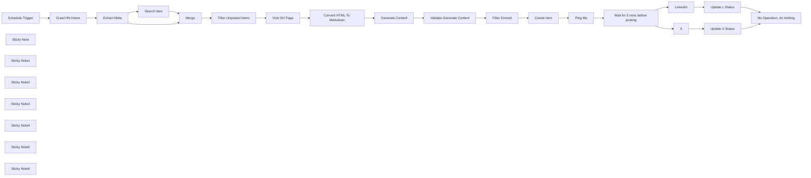

## Fluxo (.json) :

```json
{
  "id": "ZeSJSbwXI593H1Qj",
  "meta": {
    "instanceId": "8e1a7e3413df437923cda0e92c098469371d84f7001856e525beaff17be8b941",
    "templateCredsSetupCompleted": true
  },
  "name": "Social Media AI Agent - Telegram",
  "tags": [],
  "nodes": [
    {
      "id": "814303e0-5fe9-474e-a4ed-e4a728fd4acf",
      "name": "Crawl HN Home",
      "type": "n8n-nodes-base.httpRequest",
      "position": [
        -1540,
        1640
      ],
      "parameters": {
        "url": "https://news.ycombinator.com/",
        "options": {
          "response": {
            "response": {
              "neverError": true,
              "fullResponse": true
            }
          }
        }
      },
      "executeOnce": true,
      "typeVersion": 4.2,
      "alwaysOutputData": true
    },
    {
      "id": "32e20b1d-b3f1-4ed2-acbf-4d5bd56b0d8b",
      "name": "Extract Meta",
      "type": "n8n-nodes-base.code",
      "position": [
        -1260,
        1720
      ],
      "parameters": {
        "language": "python",
        "pythonCode": "# Import necessary modules\nimport asyncio\nimport micropip\n\n# Define an asynchronous function to install packages\nasync def install_packages():\n    await micropip.install(\"beautifulsoup4\")\n    await micropip.install(\"simplejson\")\n\n# Run the asynchronous package installation\nasyncio.get_event_loop().run_until_complete(install_packages())\n\n# Now, import the installed packages\nimport simplejson as json\nfrom bs4 import BeautifulSoup\n\n# Retrieve the HTML content from the first item in the input\n# Assuming n8n passes data as a list of items, each with a 'json' key\nhtml_content = items[0].get('json', {}).get('data', '')\n\n# Initialize BeautifulSoup with the HTML content\nsoup = BeautifulSoup(html_content, 'html.parser')\n\n# Initialize a list to store metadata of GitHub posts\ngithub_posts = []\n\n# Find all 'tr' elements with class 'athing submission'\nposts = soup.find_all('tr', class_='athing submission')\n\nfor post in posts:\n    post_id = post.get('id')\n    title_line = post.find('span', class_='titleline')\n    if not title_line:\n        continue  # Skip if titleline is not found\n\n    # Extract the title and URL\n    title_tag = title_line.find('a')\n    if not title_tag:\n        continue  # Skip if title tag is not found\n\n    title = title_tag.get_text(strip=True)\n    url = title_tag.get('href', '')\n\n    # Check if the URL is a GitHub link\n    if 'github.com' not in url.lower():\n        continue  # Skip if not a GitHub link\n\n    # Extract the site domain (e.g., github.com/username/repo)\n    site_bit = title_line.find('span', class_='sitebit comhead')\n    site = site_bit.find('span', class_='sitestr').get_text(strip=True) if site_bit else ''\n\n    # The subtext is in the next 'tr' element\n    subtext_tr = post.find_next_sibling('tr')\n    if not subtext_tr:\n        continue  # Skip if subtext row is not found\n\n    subtext_td = subtext_tr.find('td', class_='subtext')\n    if not subtext_td:\n        continue  # Skip if subtext td is not found\n\n    # Extract score\n    score_span = subtext_td.find('span', class_='score')\n    score = score_span.get_text(strip=True) if score_span else '0 points'\n\n    # Extract author\n    author_a = subtext_td.find('a', class_='hnuser')\n    author = author_a.get_text(strip=True) if author_a else 'unknown'\n\n    # Extract age\n    age_span = subtext_td.find('span', class_='age')\n    age_a = age_span.find('a') if age_span else None\n    age = age_a.get_text(strip=True) if age_a else 'unknown'\n\n    # Extract comments\n    comments_a = subtext_td.find_all('a')[-1] if subtext_td.find_all('a') else None\n    comments_text = comments_a.get_text(strip=True) if comments_a else '0 comments'\n\n    # Construct the Hacker News URL\n    hn_url = f\"https://news.ycombinator.com/item?id={post_id}\"\n\n    # Compile the metadata\n    post_metadata = {\n        'Post': post_id,\n        'title': title,\n        'url': url,\n        'site': site,\n        'score': score,\n        'author': author,\n        'age': age,\n        'comments': comments_text,\n        'hn_url': hn_url\n    }\n\n    # Append to the list of GitHub posts\n    github_posts.append(post_metadata)\n\n# Prepare the output for n8n\noutput = [{'json': post} for post in github_posts]\n\n# Return the output\nreturn output\n"
      },
      "executeOnce": true,
      "typeVersion": 2,
      "alwaysOutputData": true
    },
    {
      "id": "b54cf663-b823-4613-a812-764942b95b9d",
      "name": "Filter Unposted Items",
      "type": "n8n-nodes-base.code",
      "position": [
        -680,
        1640
      ],
      "parameters": {
        "jsCode": "const items = [];\n\n// Step 1: Collect all Post IDs from input1 items (those with 'id')\nconst processedPosts = new Set(\n  $input.all()\n    .filter(item => item.json.id)\n    .map(item => item.json.Post)\n);\n\n// Step 2: Iterate over all items and filter out duplicates\nfor (const item of $input.all()) {\n  \n  // Only process items without 'id' (input2 items)\n  if(!item.json.id){\n    \n    // Check if the Post ID is already processed\n    if(!processedPosts.has(item.json.Post) && item.json.Post!=undefined){\n      items.push(item);\n    }\n  }\n}\n\nreturn items;\n"
      },
      "typeVersion": 2
    },
    {
      "id": "d7ac7121-8da7-4e45-9b74-daf07fbf15fb",
      "name": "Visit GH Page",
      "type": "n8n-nodes-base.httpRequest",
      "position": [
        -420,
        1420
      ],
      "parameters": {
        "url": "={{ $json.url }}",
        "options": {}
      },
      "typeVersion": 4.2
    },
    {
      "id": "f156ca8e-7963-42b9-9612-9ab5efc53be4",
      "name": "Convert HTML To Markdown",
      "type": "n8n-nodes-base.markdown",
      "position": [
        -240,
        1700
      ],
      "parameters": {
        "html": "={{ $json.data }}",
        "options": {}
      },
      "typeVersion": 1,
      "alwaysOutputData": true
    },
    {
      "id": "86221ed0-29fa-4775-ba36-8ffdf614977c",
      "name": "Filter Errored",
      "type": "n8n-nodes-base.filter",
      "position": [
        380,
        1440
      ],
      "parameters": {
        "options": {},
        "conditions": {
          "options": {
            "version": 2,
            "leftValue": "",
            "caseSensitive": true,
            "typeValidation": "strict"
          },
          "combinator": "and",
          "conditions": [
            {
              "id": "7776cb97-e02d-418e-a168-612bf92d4160",
              "operator": {
                "type": "string",
                "operation": "empty",
                "singleValue": true
              },
              "leftValue": "={{ $json.error }}",
              "rightValue": ""
            }
          ]
        }
      },
      "typeVersion": 2.2
    },
    {
      "id": "f08c4f61-17a5-4899-ab3d-4e3ff5d1b8b7",
      "name": "No Operation, do nothing",
      "type": "n8n-nodes-base.noOp",
      "position": [
        1760,
        1540
      ],
      "parameters": {},
      "typeVersion": 1
    },
    {
      "id": "48856b3b-a951-4e7f-a0b8-410a71e9b0a7",
      "name": "Update X Status",
      "type": "n8n-nodes-base.airtable",
      "position": [
        1500,
        1400
      ],
      "parameters": {
        "base": {
          "__rl": true,
          "mode": "list",
          "value": "app7fh2kmMzPKS4RZ",
          "cachedResultUrl": "https://airtable.com/app7fh2kmMzPKS4RZ",
          "cachedResultName": "Twitter Agent"
        },
        "table": {
          "__rl": true,
          "mode": "list",
          "value": "tblf0cODJFdvDj7vU",
          "cachedResultUrl": "https://airtable.com/app7fh2kmMzPKS4RZ/tblf0cODJFdvDj7vU",
          "cachedResultName": "My Tweets"
        },
        "columns": {
          "value": {
            "id": "={{ $('Create Item').item.json.id }}",
            "TDone": true
          },
          "schema": [
            {
              "id": "id",
              "type": "string",
              "display": true,
              "removed": false,
              "readOnly": true,
              "required": false,
              "displayName": "id",
              "defaultMatch": true
            },
            {
              "id": "Post",
              "type": "string",
              "display": true,
              "removed": true,
              "readOnly": false,
              "required": false,
              "displayName": "Post",
              "defaultMatch": false,
              "canBeUsedToMatch": true
            },
            {
              "id": "Title",
              "type": "string",
              "display": true,
              "removed": true,
              "readOnly": false,
              "required": false,
              "displayName": "Title",
              "defaultMatch": false,
              "canBeUsedToMatch": true
            },
            {
              "id": "Url",
              "type": "string",
              "display": true,
              "removed": true,
              "readOnly": false,
              "required": false,
              "displayName": "Url",
              "defaultMatch": false,
              "canBeUsedToMatch": true
            },
            {
              "id": "Tweet",
              "type": "string",
              "display": true,
              "removed": true,
              "readOnly": false,
              "required": false,
              "displayName": "Tweet",
              "defaultMatch": false,
              "canBeUsedToMatch": true
            },
            {
              "id": "LinkedIn",
              "type": "string",
              "display": true,
              "removed": true,
              "readOnly": false,
              "required": false,
              "displayName": "LinkedIn",
              "defaultMatch": false,
              "canBeUsedToMatch": true
            },
            {
              "id": "Date",
              "type": "string",
              "display": true,
              "removed": true,
              "readOnly": true,
              "required": false,
              "displayName": "Date",
              "defaultMatch": false,
              "canBeUsedToMatch": true
            },
            {
              "id": "Last Modified",
              "type": "string",
              "display": true,
              "removed": true,
              "readOnly": true,
              "required": false,
              "displayName": "Last Modified",
              "defaultMatch": false,
              "canBeUsedToMatch": true
            },
            {
              "id": "TDone",
              "type": "boolean",
              "display": true,
              "removed": false,
              "readOnly": false,
              "required": false,
              "displayName": "TDone",
              "defaultMatch": false,
              "canBeUsedToMatch": true
            },
            {
              "id": "LDone",
              "type": "boolean",
              "display": true,
              "removed": true,
              "readOnly": false,
              "required": false,
              "displayName": "LDone",
              "defaultMatch": false,
              "canBeUsedToMatch": true
            }
          ],
          "mappingMode": "defineBelow",
          "matchingColumns": [
            "id"
          ]
        },
        "options": {
          "typecast": true
        },
        "operation": "update"
      },
      "credentials": {
        "airtableTokenApi": {
          "id": "BxLldDZTAZvuWVbr",
          "name": "Airtable Personal Access Token account"
        }
      },
      "typeVersion": 2.1
    },
    {
      "id": "c31bb906-2a0d-406a-a7cd-6fc4adfcb67b",
      "name": "LinkedIn",
      "type": "n8n-nodes-base.linkedIn",
      "position": [
        1200,
        1820
      ],
      "parameters": {
        "text": "={{ $('Filter Errored').item.json.message.content.linkedin }}",
        "person": "afi4Hy9wlI",
        "additionalFields": {}
      },
      "credentials": {
        "linkedInOAuth2Api": {
          "id": "S7G2oyLAmzhWuYFQ",
          "name": "LinkedIn account"
        }
      },
      "typeVersion": 1
    },
    {
      "id": "4aab4cc2-4a51-432a-aa21-ba469c027ac6",
      "name": "Update L Status",
      "type": "n8n-nodes-base.airtable",
      "position": [
        1520,
        1680
      ],
      "parameters": {
        "base": {
          "__rl": true,
          "mode": "list",
          "value": "app7fh2kmMzPKS4RZ",
          "cachedResultUrl": "https://airtable.com/app7fh2kmMzPKS4RZ",
          "cachedResultName": "Twitter Agent"
        },
        "table": {
          "__rl": true,
          "mode": "list",
          "value": "tblf0cODJFdvDj7vU",
          "cachedResultUrl": "https://airtable.com/app7fh2kmMzPKS4RZ/tblf0cODJFdvDj7vU",
          "cachedResultName": "My Tweets"
        },
        "columns": {
          "value": {
            "id": "={{ $('Create Item').item.json.id }}",
            "LDone": true
          },
          "schema": [
            {
              "id": "id",
              "type": "string",
              "display": true,
              "removed": false,
              "readOnly": true,
              "required": false,
              "displayName": "id",
              "defaultMatch": true
            },
            {
              "id": "Post",
              "type": "string",
              "display": true,
              "removed": true,
              "readOnly": false,
              "required": false,
              "displayName": "Post",
              "defaultMatch": false,
              "canBeUsedToMatch": true
            },
            {
              "id": "Title",
              "type": "string",
              "display": true,
              "removed": true,
              "readOnly": false,
              "required": false,
              "displayName": "Title",
              "defaultMatch": false,
              "canBeUsedToMatch": true
            },
            {
              "id": "Url",
              "type": "string",
              "display": true,
              "removed": true,
              "readOnly": false,
              "required": false,
              "displayName": "Url",
              "defaultMatch": false,
              "canBeUsedToMatch": true
            },
            {
              "id": "Tweet",
              "type": "string",
              "display": true,
              "removed": true,
              "readOnly": false,
              "required": false,
              "displayName": "Tweet",
              "defaultMatch": false,
              "canBeUsedToMatch": true
            },
            {
              "id": "LinkedIn",
              "type": "string",
              "display": true,
              "removed": true,
              "readOnly": false,
              "required": false,
              "displayName": "LinkedIn",
              "defaultMatch": false,
              "canBeUsedToMatch": true
            },
            {
              "id": "Date",
              "type": "string",
              "display": true,
              "removed": true,
              "readOnly": true,
              "required": false,
              "displayName": "Date",
              "defaultMatch": false,
              "canBeUsedToMatch": true
            },
            {
              "id": "Last Modified",
              "type": "string",
              "display": true,
              "removed": true,
              "readOnly": true,
              "required": false,
              "displayName": "Last Modified",
              "defaultMatch": false,
              "canBeUsedToMatch": true
            },
            {
              "id": "TDone",
              "type": "boolean",
              "display": true,
              "removed": true,
              "readOnly": false,
              "required": false,
              "displayName": "TDone",
              "defaultMatch": false,
              "canBeUsedToMatch": true
            },
            {
              "id": "LDone",
              "type": "boolean",
              "display": true,
              "removed": false,
              "readOnly": false,
              "required": false,
              "displayName": "LDone",
              "defaultMatch": false,
              "canBeUsedToMatch": true
            }
          ],
          "mappingMode": "defineBelow",
          "matchingColumns": [
            "id"
          ]
        },
        "options": {
          "typecast": true
        },
        "operation": "update"
      },
      "credentials": {
        "airtableTokenApi": {
          "id": "BxLldDZTAZvuWVbr",
          "name": "Airtable Personal Access Token account"
        }
      },
      "typeVersion": 2.1
    },
    {
      "id": "72dd9714-c11d-4417-8710-89e416ac44c9",
      "name": "Search Item",
      "type": "n8n-nodes-base.airtable",
      "position": [
        -1100,
        1240
      ],
      "parameters": {
        "base": {
          "__rl": true,
          "mode": "list",
          "value": "app7fh2kmMzPKS4RZ",
          "cachedResultUrl": "https://airtable.com/app7fh2kmMzPKS4RZ",
          "cachedResultName": "Twitter Agent"
        },
        "table": {
          "__rl": true,
          "mode": "list",
          "value": "tblf0cODJFdvDj7vU",
          "cachedResultUrl": "https://airtable.com/app7fh2kmMzPKS4RZ/tblf0cODJFdvDj7vU",
          "cachedResultName": "My Tweets"
        },
        "options": {
          "fields": [
            "Title",
            "Url",
            "Tweet",
            "Date",
            "Post"
          ]
        },
        "operation": "search",
        "filterByFormula": "={Post}= {{ $json.Post }}"
      },
      "credentials": {
        "airtableTokenApi": {
          "id": "BxLldDZTAZvuWVbr",
          "name": "Airtable Personal Access Token account"
        }
      },
      "typeVersion": 2.1,
      "alwaysOutputData": true
    },
    {
      "id": "f89fbada-0e53-44f0-a09b-119869fabd10",
      "name": "Create Item",
      "type": "n8n-nodes-base.airtable",
      "position": [
        580,
        1660
      ],
      "parameters": {
        "base": {
          "__rl": true,
          "mode": "list",
          "value": "app7fh2kmMzPKS4RZ",
          "cachedResultUrl": "https://airtable.com/app7fh2kmMzPKS4RZ",
          "cachedResultName": "Twitter Agent"
        },
        "table": {
          "__rl": true,
          "mode": "list",
          "value": "tblf0cODJFdvDj7vU",
          "cachedResultUrl": "https://airtable.com/app7fh2kmMzPKS4RZ/tblf0cODJFdvDj7vU",
          "cachedResultName": "My Tweets"
        },
        "columns": {
          "value": {
            "Url": "={{ $('Filter Unposted Items').item.json.url }}",
            "Post": "={{ $('Filter Unposted Items').item.json.Post }}",
            "Title": "={{ $('Filter Unposted Items').item.json.title }}",
            "Tweet": "={{ $json.message.content.twitter }}",
            "LinkedIn": "={{ $json.message.content.linkedin }}"
          },
          "schema": [
            {
              "id": "Post",
              "type": "string",
              "display": true,
              "removed": false,
              "readOnly": false,
              "required": false,
              "displayName": "Post",
              "defaultMatch": false,
              "canBeUsedToMatch": true
            },
            {
              "id": "Title",
              "type": "string",
              "display": true,
              "removed": false,
              "readOnly": false,
              "required": false,
              "displayName": "Title",
              "defaultMatch": false,
              "canBeUsedToMatch": true
            },
            {
              "id": "Url",
              "type": "string",
              "display": true,
              "removed": false,
              "readOnly": false,
              "required": false,
              "displayName": "Url",
              "defaultMatch": false,
              "canBeUsedToMatch": true
            },
            {
              "id": "Tweet",
              "type": "string",
              "display": true,
              "removed": false,
              "readOnly": false,
              "required": false,
              "displayName": "Tweet",
              "defaultMatch": false,
              "canBeUsedToMatch": true
            },
            {
              "id": "LinkedIn",
              "type": "string",
              "display": true,
              "removed": false,
              "readOnly": false,
              "required": false,
              "displayName": "LinkedIn",
              "defaultMatch": false,
              "canBeUsedToMatch": true
            },
            {
              "id": "Date",
              "type": "string",
              "display": true,
              "removed": false,
              "readOnly": true,
              "required": false,
              "displayName": "Date",
              "defaultMatch": false,
              "canBeUsedToMatch": true
            }
          ],
          "mappingMode": "defineBelow",
          "matchingColumns": []
        },
        "options": {},
        "operation": "create"
      },
      "credentials": {
        "airtableTokenApi": {
          "id": "BxLldDZTAZvuWVbr",
          "name": "Airtable Personal Access Token account"
        }
      },
      "typeVersion": 2.1
    },
    {
      "id": "51a2c3d3-3e75-4375-b2b6-4bb86fa71855",
      "name": "X",
      "type": "n8n-nodes-base.twitter",
      "onError": "continueRegularOutput",
      "position": [
        1180,
        1380
      ],
      "parameters": {
        "text": "={{ $('Filter Errored').item.json.message.content.twitter }}",
        "additionalFields": {}
      },
      "credentials": {
        "twitterOAuth2Api": {
          "id": "YQyS9lQTpZtZkefS",
          "name": "X account"
        }
      },
      "executeOnce": false,
      "typeVersion": 2
    },
    {
      "id": "58869c5b-9fb2-4f76-8788-68056cda45b0",
      "name": "Validate Generate Content",
      "type": "n8n-nodes-base.code",
      "onError": "continueRegularOutput",
      "position": [
        180,
        1680
      ],
      "parameters": {
        "mode": "runOnceForEachItem",
        "jsCode": "if ($json.message.content.twitter && $json.message.content.linkedin) {\n  \n  return $json;\n} else {\n\n  const parsedContent = JSON.parse($json.message.content);\n  if ($json.message.content.twitter && $json.message.content.linkedin) {\n    return parsedContent;\n  }\n\n  console.log(\"Invalid formatting\")\n  return {}\n}"
      },
      "typeVersion": 2
    },
    {
      "id": "527fd640-8bc8-4043-92a6-52fbea8de63f",
      "name": "Schedule Trigger",
      "type": "n8n-nodes-base.scheduleTrigger",
      "position": [
        -1780,
        1640
      ],
      "parameters": {
        "rule": {
          "interval": [
            {
              "field": "hours",
              "hoursInterval": 6
            }
          ]
        }
      },
      "typeVersion": 1.2
    },
    {
      "id": "f00c1de5-d5bd-4d78-8717-d26dd739adc7",
      "name": "Merge",
      "type": "n8n-nodes-base.merge",
      "position": [
        -840,
        1420
      ],
      "parameters": {},
      "typeVersion": 3,
      "alwaysOutputData": true
    },
    {
      "id": "3529fba4-173c-4378-ae69-43a3bae0813f",
      "name": "Generate Content",
      "type": "@n8n/n8n-nodes-langchain.openAi",
      "position": [
        -120,
        1440
      ],
      "parameters": {
        "modelId": {
          "__rl": true,
          "mode": "list",
          "value": "gpt-4o-mini",
          "cachedResultName": "GPT-4O-MINI"
        },
        "options": {},
        "messages": {
          "values": [
            {
              "role": "system",
              "content": "You are an AI-powered social media assistant specialized in crafting short-form, engaging posts for Twitter and LinkedIn. Your tone should blend the enthusiasm of a Tech Evangelist with the narrative depth of a Storyteller. The goal is to highlight technological and open-source projects in a friendly, forward-thinking manner, connecting them to real-world use cases. \n\nGuidelines:\n1. Output must be in JSON with separate fields for “twitter” and “linkedin.”\n2. Do not include emojis or marketing buzzwords (“cutting-edge,” “disruptive,” etc.).\n3. Write naturally and concisely. Avoid overly formal or robotic language.\n4. Twitter posts must be under 280 characters (including spaces and URL).\n5. LinkedIn posts should be slightly longer, yet still succinct, and focus on storytelling and real-world applications.\n6. Provide a single call-to-action in each post.\n7. Do not imply ownership of the project unless explicitly stated.\n8. Maintain a professional yet approachable tone in both outputs.\n"
            },
            {
              "content": "=Using the following details, generate two posts—one for Twitter and one for LinkedIn—incorporating an enthusiastic yet narrative-driven style:\n\nTitle: {{ $('Filter Unposted Items').item.json.title }}\nDetails in markdown: {{ $json.data }}\nRepository Link: {{ $('Filter Unposted Items').item.json.url }}  (this is the actual link you want to be inserted)\n\nConstraints:\n- No emojis.\n- Keep the Twitter post under 280 characters (including the link).\n- Use a friendly, forward-thinking tone that weaves in a short narrative where possible.\n- Highlight how the project solves a real problem or benefits the user.\n- End each post with one clear CTA (e.g., “Check it out!” or “Learn more.”).\n- **Ensure the tone is neutral and does not imply personal involvement** (e.g., avoid phrases like \"my journey\" or \"I found it fascinating\").\n- **LinkedIn post should be more detailed**: Provide context, explain the key features, highlight how it can be useful to different audiences, and elaborate on the problem it solves or the impact it can have.\n- Output your response in JSON with the structure:\n```json\n{\n  \"twitter\": \"Your Twitter post here\",\n  \"linkedin\": \"Your LinkedIn post here\"\n}\n"
            }
          ]
        },
        "jsonOutput": true
      },
      "credentials": {
        "openAiApi": {
          "id": "IfJo4dG8AUORk6f0",
          "name": "OpenAi account"
        }
      },
      "typeVersion": 1.7,
      "alwaysOutputData": true
    },
    {
      "id": "2dfd7849-877c-4bd3-b248-94140a1fe209",
      "name": "Sticky Note",
      "type": "n8n-nodes-base.stickyNote",
      "position": [
        -320,
        960
      ],
      "parameters": {
        "width": 619.8433261701165,
        "height": 97.20332107671479,
        "content": "Automate the curation and sharing of trending GitHub discussions from Hacker News to Twitter and LinkedIn. This workflow leverages AI to generate engaging posts, streamlining your social media content creation and distribution.\n\n"
      },
      "typeVersion": 1
    },
    {
      "id": "20704a99-1234-46dc-b8c8-860b051b3b85",
      "name": "Sticky Note1",
      "type": "n8n-nodes-base.stickyNote",
      "position": [
        -1620,
        1520
      ],
      "parameters": {
        "color": 5,
        "width": 524.8824946275869,
        "height": 420.37647358435385,
        "content": "I crawl Hacker News and extract Github links."
      },
      "typeVersion": 1
    },
    {
      "id": "5cfa2c30-6c88-429a-8b5f-0034d2352cc2",
      "name": "Sticky Note2",
      "type": "n8n-nodes-base.stickyNote",
      "position": [
        -480,
        1280
      ],
      "parameters": {
        "color": 5,
        "width": 828.144505037599,
        "height": 670.031562962293,
        "content": "This is where the magic happens. I use the Github url extracted earlier and visit Github page to get more insights in the project being shared. Then I ask Chat GPT very nicely to help me get a Tweet and a LinkedIn post"
      },
      "typeVersion": 1
    },
    {
      "id": "caec3df6-ddcc-4959-94e1-18163cf3128f",
      "name": "Sticky Note3",
      "type": "n8n-nodes-base.stickyNote",
      "position": [
        1100,
        1280
      ],
      "parameters": {
        "color": 5,
        "width": 285.9487894560623,
        "height": 751.2077576680031,
        "content": "One last magic trick, Send the generated Tweet and the post to the respective platforms."
      },
      "typeVersion": 1
    },
    {
      "id": "89c8472d-3329-4f94-a656-2539e061eeb0",
      "name": "Ping Me",
      "type": "n8n-nodes-base.telegram",
      "position": [
        720,
        1420
      ],
      "parameters": {
        "text": "=Hi There, here is your readymade tweet - \n\n {{ $json.fields.Tweet }}\n\nAnd your readymade LinkedIn post -\n\n {{ $json.fields.LinkedIn }}\n\n",
        "chatId": "1297549992",
        "additionalFields": {}
      },
      "credentials": {
        "telegramApi": {
          "id": "1RZApQ3BwJxFn9jp",
          "name": "Telegram account"
        }
      },
      "typeVersion": 1.2
    },
    {
      "id": "b1444e6d-0cab-4082-af42-a8decc97d9b4",
      "name": "Sticky Note4",
      "type": "n8n-nodes-base.stickyNote",
      "position": [
        640,
        1300
      ],
      "parameters": {
        "color": 5,
        "width": 264.5060210432334,
        "height": 307.03612625939974,
        "content": "Just pinging the owner that something is about to be posted and wait for 5 mins before final posting."
      },
      "typeVersion": 1
    },
    {
      "id": "01c2f7ff-ff6c-4a60-9581-f8c5f3985792",
      "name": "Wait for 5 mins before posting",
      "type": "n8n-nodes-base.wait",
      "position": [
        880,
        1660
      ],
      "webhookId": "0c7ee388-30cf-4a99-9bb0-0fd85171c794",
      "parameters": {
        "unit": "minutes"
      },
      "typeVersion": 1.1
    },
    {
      "id": "909c7e7d-ea84-4612-a322-b1fa889b2efb",
      "name": "Sticky Note5",
      "type": "n8n-nodes-base.stickyNote",
      "position": [
        -920,
        1380
      ],
      "parameters": {
        "width": 400.8207630962184,
        "height": 392.80719991071624,
        "content": "CHORE"
      },
      "typeVersion": 1
    },
    {
      "id": "04ab5b63-8def-4d49-9360-596261eb051c",
      "name": "Sticky Note6",
      "type": "n8n-nodes-base.stickyNote",
      "position": [
        -1140,
        1140
      ],
      "parameters": {
        "color": 5,
        "width": 195.58283685913963,
        "height": 285.5933578465706,
        "content": "Make sure we don't post the same content again."
      },
      "typeVersion": 1
    }
  ],
  "active": true,
  "pinData": {
    "Schedule Trigger": [
      {
        "json": {
          "Hour": "18",
          "Year": "2024",
          "Month": "December",
          "Minute": "00",
          "Second": "17",
          "Timezone": "America/New_York (UTC-05:00)",
          "timestamp": "2024-12-27T18:00:17.035-05:00",
          "Day of week": "Friday",
          "Day of month": "27",
          "Readable date": "December 27th 2024, 6:00:17 pm",
          "Readable time": "6:00:17 pm"
        }
      }
    ]
  },
  "settings": {
    "executionOrder": "v1"
  },
  "versionId": "4c28d47d-811e-4b89-adeb-47da12abd378",
  "connections": {
    "X": {
      "main": [
        [
          {
            "node": "Update X Status",
            "type": "main",
            "index": 0
          }
        ]
      ]
    },
    "Merge": {
      "main": [
        [
          {
            "node": "Filter Unposted Items",
            "type": "main",
            "index": 0
          }
        ]
      ]
    },
    "Ping Me": {
      "main": [
        [
          {
            "node": "Wait for 5 mins before posting",
            "type": "main",
            "index": 0
          }
        ]
      ]
    },
    "LinkedIn": {
      "main": [
        [
          {
            "node": "Update L Status",
            "type": "main",
            "index": 0
          }
        ]
      ]
    },
    "Create Item": {
      "main": [
        [
          {
            "node": "Ping Me",
            "type": "main",
            "index": 0
          }
        ]
      ]
    },
    "Search Item": {
      "main": [
        [
          {
            "node": "Merge",
            "type": "main",
            "index": 0
          }
        ]
      ]
    },
    "Extract Meta": {
      "main": [
        [
          {
            "node": "Search Item",
            "type": "main",
            "index": 0
          },
          {
            "node": "Merge",
            "type": "main",
            "index": 1
          }
        ]
      ]
    },
    "Crawl HN Home": {
      "main": [
        [
          {
            "node": "Extract Meta",
            "type": "main",
            "index": 0
          }
        ]
      ]
    },
    "Visit GH Page": {
      "main": [
        [
          {
            "node": "Convert HTML To Markdown",
            "type": "main",
            "index": 0
          }
        ]
      ]
    },
    "Filter Errored": {
      "main": [
        [
          {
            "node": "Create Item",
            "type": "main",
            "index": 0
          }
        ]
      ]
    },
    "Update L Status": {
      "main": [
        [
          {
            "node": "No Operation, do nothing",
            "type": "main",
            "index": 0
          }
        ]
      ]
    },
    "Update X Status": {
      "main": [
        [
          {
            "node": "No Operation, do nothing",
            "type": "main",
            "index": 0
          }
        ]
      ]
    },
    "Generate Content": {
      "main": [
        [
          {
            "node": "Validate Generate Content",
            "type": "main",
            "index": 0
          }
        ]
      ]
    },
    "Schedule Trigger": {
      "main": [
        [
          {
            "node": "Crawl HN Home",
            "type": "main",
            "index": 0
          }
        ]
      ]
    },
    "Filter Unposted Items": {
      "main": [
        [
          {
            "node": "Visit GH Page",
            "type": "main",
            "index": 0
          }
        ]
      ]
    },
    "Convert HTML To Markdown": {
      "main": [
        [
          {
            "node": "Generate Content",
            "type": "main",
            "index": 0
          }
        ]
      ]
    },
    "Validate Generate Content": {
      "main": [
        [
          {
            "node": "Filter Errored",
            "type": "main",
            "index": 0
          }
        ]
      ]
    },
    "Wait for 5 mins before posting": {
      "main": [
        [
          {
            "node": "X",
            "type": "main",
            "index": 0
          },
          {
            "node": "LinkedIn",
            "type": "main",
            "index": 0
          }
        ]
      ]
    }
  }
}
```

<a id="template-8"></a>

## Template 8 - Salvar ideias do Slack no Notion

- **Nome:** Salvar ideias do Slack no Notion
- **Descrição:** Recebe comandos slash do Slack e cria páginas em um banco de dados do Notion, notificando o autor para adicionar mais detalhes.
- **Funcionalidade:** • Receber comando slash do Slack: Aceita POST do comando /idea e extrai texto, usuário e response_url.
• Roteamento por comando: Identifica o comando recebido e permite suportar diferentes comandos (ex.: /idea, /bug) via regras.
• Criar página no Notion: Insere uma nova página no database usando o texto do comando como título e registra o criador no campo Creator.
• Enviar mensagem de confirmação para Slack: Publica uma resposta ao usuário via response_url, menciona o autor e fornece um link para adicionar detalhes e hipóteses.
• Configuração centralizada: Usa um campo configurável com a URL do database do Notion para facilitar o setup e reuso.
- **Ferramentas:** • Slack: Plataforma que envia o comando slash (/idea), fornece dados do usuário e disponibiliza um response_url para respostas.
• Notion: Banco de dados onde são criadas páginas com as ideias, armazenando título e informação do criador.

## Fluxo visual

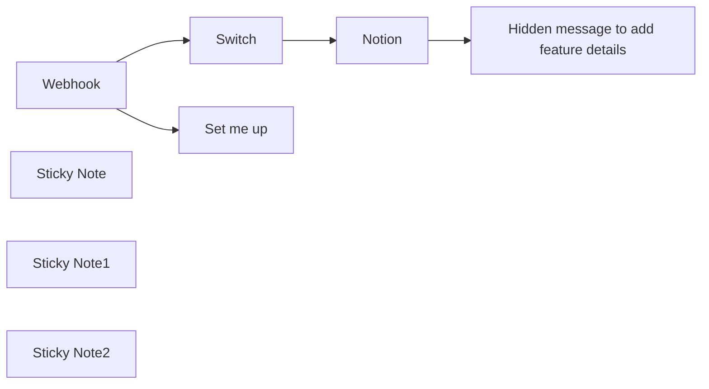

## Fluxo (.json) :

```json
{
  "meta": {
    "instanceId": "cb484ba7b742928a2048bf8829668bed5b5ad9787579adea888f05980292a4a7"
  },
  "nodes": [
    {
      "id": "1f506d0f-e999-409c-8456-d77d1771a2f3",
      "name": "Webhook",
      "type": "n8n-nodes-base.webhook",
      "position": [
        740,
        120
      ],
      "webhookId": "a8877bd7-8364-4868-9f88-d9080cce0cb1",
      "parameters": {
        "path": "slack-trigger",
        "options": {},
        "httpMethod": "POST"
      },
      "typeVersion": 1
    },
    {
      "id": "d5bdebab-cb97-44b5-8f85-e2bc71c0b7fb",
      "name": "Sticky Note",
      "type": "n8n-nodes-base.stickyNote",
      "position": [
        220,
        -100
      ],
      "parameters": {
        "color": 7,
        "width": 446,
        "height": 321,
        "content": "## Needed pre-work: Add a Slack App\n1. Visit https://api.slack.com/apps, click on `New App` and choose a name and workspace.\n2. Click on `OAuth & Permissions` and scroll down to Scopes -> Bot token Scopes\n3. Add the `chat:write` scope\n4. Head over to `Slash Commands` and click on `Create New Command`\n5. Use `/idea` as the command\n6. Copy the test URL from the **Webhook** node into `Request URL`\n7. Add whatever feels best to the description and usage hint\n8. Go to `Install app` and click install"
      },
      "typeVersion": 1
    },
    {
      "id": "fa0734a5-6794-4ba8-9675-b54ba9ddf6e8",
      "name": "Notion",
      "type": "n8n-nodes-base.notion",
      "position": [
        1620,
        20
      ],
      "parameters": {
        "title": "={{ $json.body.text }}",
        "options": {},
        "resource": "databasePage",
        "databaseId": {
          "__rl": true,
          "mode": "url",
          "value": "={{ $('Set me up').first().json['Notion URL'] }}"
        },
        "propertiesUi": {
          "propertyValues": [
            {
              "key": "Creator|rich_text",
              "textContent": "={{ $json.body.user_name }}"
            }
          ]
        }
      },
      "credentials": {
        "notionApi": {
          "id": "1exvaAn7wzyBgkXZ",
          "name": "Nik's Notion Cred"
        }
      },
      "typeVersion": 2.1
    },
    {
      "id": "28116568-f19c-47b3-9cd2-e08032db4dd5",
      "name": "Switch",
      "type": "n8n-nodes-base.switch",
      "position": [
        1360,
        120
      ],
      "parameters": {
        "rules": {
          "values": [
            {
              "outputKey": "New idea",
              "conditions": {
                "options": {
                  "leftValue": "",
                  "caseSensitive": true,
                  "typeValidation": "strict"
                },
                "combinator": "and",
                "conditions": [
                  {
                    "operator": {
                      "type": "string",
                      "operation": "equals"
                    },
                    "leftValue": "={{ $json.body.command }}",
                    "rightValue": "/idea"
                  }
                ]
              },
              "renameOutput": true
            },
            {
              "outputKey": "Add more here",
              "conditions": {
                "options": {
                  "leftValue": "",
                  "caseSensitive": true,
                  "typeValidation": "strict"
                },
                "combinator": "and",
                "conditions": [
                  {
                    "id": "25221a2c-18e9-47f6-a112-0edc85b63cda",
                    "operator": {
                      "name": "filter.operator.equals",
                      "type": "string",
                      "operation": "equals"
                    },
                    "leftValue": "={{ $json.body.command }}",
                    "rightValue": "/some-other-command"
                  }
                ]
              },
              "renameOutput": true
            }
          ]
        },
        "options": {}
      },
      "typeVersion": 3
    },
    {
      "id": "8a153fab-dd1a-4108-8522-766b09b4caf3",
      "name": "Hidden message to add feature details",
      "type": "n8n-nodes-base.httpRequest",
      "position": [
        1840,
        20
      ],
      "parameters": {
        "url": "={{ $('Webhook').item.json.body.response_url }}",
        "method": "POST",
        "options": {},
        "sendBody": true,
        "bodyParameters": {
          "parameters": [
            {
              "name": "text",
              "value": "=Thanks for adding the idea `{{ $('Webhook').item.json[\"body\"][\"text\"] }}` <@{{$('Webhook').item.json[\"body\"][\"user_id\"]}}> :rocket: Please make sure to add some details and a hypothesis to it to make it easier for us to work with it.\n\n:point_right: <{{$json[\"url\"]}}|Add your details here>"
            }
          ]
        }
      },
      "typeVersion": 3
    },
    {
      "id": "68d6136b-291f-4e17-b07f-da3672b6622f",
      "name": "Sticky Note1",
      "type": "n8n-nodes-base.stickyNote",
      "position": [
        920,
        -315
      ],
      "parameters": {
        "color": 5,
        "width": 331,
        "height": 422.85671270290686,
        "content": "## Setup\n1. Add a Database in Notion with the columns `Name` and `Creator`\n2. Add your Notion credentials and add the integration to your Notion page.\n3. Fill the setup node below\n4. Create your slack app (*see other sticky*)\n5. Click `Test` workflow and use the `/idea` comment in Slack\n6. Activate the workflow and exchange the Request URL with the production URL from the webhook"
      },
      "typeVersion": 1
    },
    {
      "id": "4a2d6224-352a-4625-b4ae-bc856b2602fd",
      "name": "Set me up",
      "type": "n8n-nodes-base.set",
      "position": [
        1020,
        -40
      ],
      "parameters": {
        "options": {},
        "assignments": {
          "assignments": [
            {
              "id": "9bcc3fa7-a09e-48f0-b4ff-2c78264dec2d",
              "name": "Notion URL",
              "type": "string",
              "value": "https://www.notion.so/n8n/12f1bb41e54345f6bdbe85085a67a5a9?v=72d337e995204017a24aa648edb5e7cc"
            }
          ]
        }
      },
      "typeVersion": 3.3
    },
    {
      "id": "89dc4c0d-7fab-4a6f-b8e9-65a0701c7d49",
      "name": "Sticky Note2",
      "type": "n8n-nodes-base.stickyNote",
      "position": [
        1300,
        40
      ],
      "parameters": {
        "color": 7,
        "height": 237.2740046838409,
        "content": "You can easily support more commands, like `/bug` or `/pain` here"
      },
      "typeVersion": 1
    }
  ],
  "pinData": {
    "Webhook": [
      {
        "body": {
          "text": "Some name",
          "token": "OROQZiopO3NiQVLFg0muEISq",
          "command": "/idea",
          "team_id": "TG9695PUK",
          "user_id": "U047V1J0E7J",
          "user_name": "niklas",
          "api_app_id": "A06MQ8S7QM6",
          "channel_id": "C04KYPACRJA",
          "trigger_id": "6718698191332.553213193971.2b472ec4e6e0fb9094507f09a98d01e7",
          "team_domain": "n8nio",
          "channel_name": "nik-wf-testing",
          "response_url": "https://hooks.slack.com/commands/TG9695PUK/6701685292247/8Q0IUAqaVcycw4skTzdYLSx3",
          "is_enterprise_install": "false"
        },
        "query": {},
        "params": {},
        "headers": {
          "host": "internal.users.n8n.cloud",
          "accept": "application/json,*/*",
          "x-real-ip": "10.255.0.2",
          "user-agent": "Slackbot 1.0 (+https://api.slack.com/robots)",
          "content-type": "application/x-www-form-urlencoded",
          "content-length": "420",
          "accept-encoding": "gzip,deflate",
          "x-forwarded-for": "10.255.0.2",
          "x-forwarded-host": "internal.users.n8n.cloud",
          "x-forwarded-port": "443",
          "x-forwarded-proto": "https",
          "x-slack-signature": "v0=9fb3ff0c0b84fd7ec95a0847b38c365124c8294b451dd29941d8fcd85fbd0eb9",
          "x-forwarded-server": "3d9f11a36e52",
          "x-slack-request-timestamp": "1709130534"
        }
      }
    ]
  },
  "connections": {
    "Notion": {
      "main": [
        [
          {
            "node": "Hidden message to add feature details",
            "type": "main",
            "index": 0
          }
        ]
      ]
    },
    "Switch": {
      "main": [
        [
          {
            "node": "Notion",
            "type": "main",
            "index": 0
          }
        ]
      ]
    },
    "Webhook": {
      "main": [
        [
          {
            "node": "Set me up",
            "type": "main",
            "index": 0
          },
          {
            "node": "Switch",
            "type": "main",
            "index": 0
          }
        ]
      ]
    }
  }
}
```

<a id="template-9"></a>

## Template 9 - Exportar notícias YCombinator para planilha e enviar por email

- **Nome:** Exportar notícias YCombinator para planilha e enviar por email
- **Descrição:** Busca a página principal do Y Combinator (Hacker News), extrai títulos e URLs das notícias, gera uma planilha com os resultados e envia por email como anexo.
- **Funcionalidade:** • Gatilho manual: inicia o fluxo quando o usuário aciona a execução.
• Requisição HTTP à página de notícias: obtém o HTML da página principal do Y Combinator (Hacker News).
• Extração de HTML: captura títulos e links das notícias usando seletores CSS (.storylink).
• Separação de listas: transforma os arrays de títulos e de URLs em listas de itens individuais.
• União por índice: combina cada título com seu respectivo URL, mantendo a correspondência por posição.
• Geração de arquivo de planilha: cria um arquivo de planilha nomeado com a data atual (ex: Ycombinator_news_YYYY-MM-DD) com a aba "Latest news" contendo os pares título/URL.
• Envio por email com anexo: envia a planilha gerada por email usando credenciais SMTP.
- **Ferramentas:** • Hacker News (news.ycombinator.com): fonte pública das notícias a serem extraídas.
• Servidor SMTP/Serviço de email: entrega do arquivo de planilha por email como anexo.
• Formato de planilha (XLSX/CSV): formato de saída utilizado para armazenar e compartilhar as notícias.

## Fluxo visual

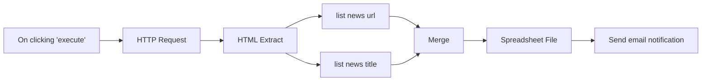

## Fluxo (.json) :

```json
{
  "nodes": [
    {
      "name": "On clicking 'execute'",
      "type": "n8n-nodes-base.manualTrigger",
      "position": [
        -100,
        470
      ],
      "parameters": {},
      "typeVersion": 1
    },
    {
      "name": "HTTP Request",
      "type": "n8n-nodes-base.httpRequest",
      "notes": "Get news page",
      "position": [
        100,
        470
      ],
      "parameters": {
        "url": "=https://news.ycombinator.com/",
        "options": {
          "fullResponse": true,
          "batchInterval": 500
        },
        "responseFormat": "file",
        "queryParametersUi": {
          "parameter": []
        },
        "headerParametersUi": {
          "parameter": []
        },
        "allowUnauthorizedCerts": true
      },
      "notesInFlow": true,
      "typeVersion": 1
    },
    {
      "name": "HTML Extract",
      "type": "n8n-nodes-base.htmlExtract",
      "notes": "extract news data",
      "position": [
        310,
        470
      ],
      "parameters": {
        "options": {},
        "sourceData": "binary",
        "extractionValues": {
          "values": [
            {
              "key": "news_title",
              "cssSelector": ".storylink",
              "returnArray": true
            },
            {
              "key": "news_url",
              "attribute": "href",
              "cssSelector": ".storylink",
              "returnArray": true,
              "returnValue": "attribute"
            }
          ]
        }
      },
      "notesInFlow": true,
      "typeVersion": 1
    },
    {
      "name": "list news url",
      "type": "n8n-nodes-base.itemLists",
      "position": [
        500,
        570
      ],
      "parameters": {
        "options": {},
        "fieldToSplitOut": "news_url"
      },
      "typeVersion": 1
    },
    {
      "name": "list news title",
      "type": "n8n-nodes-base.itemLists",
      "position": [
        500,
        390
      ],
      "parameters": {
        "options": {},
        "fieldToSplitOut": "news_title"
      },
      "typeVersion": 1
    },
    {
      "name": "Merge",
      "type": "n8n-nodes-base.merge",
      "position": [
        700,
        470
      ],
      "parameters": {
        "mode": "mergeByIndex"
      },
      "typeVersion": 1
    },
    {
      "name": "Spreadsheet File",
      "type": "n8n-nodes-base.spreadsheetFile",
      "position": [
        870,
        470
      ],
      "parameters": {
        "options": {
          "fileName": "=Ycombinator_news_{{new Date().toISOString().split('T', 1)[0]}}.{{$parameter[\"fileFormat\"]}}",
          "sheetName": "Latest news"
        },
        "operation": "toFile"
      },
      "typeVersion": 1
    },
    {
      "name": "Send email notification",
      "type": "n8n-nodes-base.emailSend",
      "position": [
        1050,
        470
      ],
      "parameters": {
        "text": "=Here are the latest news attached!",
        "options": {},
        "subject": "Ycombinator news",
        "toEmail": "",
        "fromEmail": "",
        "attachments": "data"
      },
      "credentials": {
        "smtp": ""
      },
      "typeVersion": 1
    }
  ],
  "connections": {
    "Merge": {
      "main": [
        [
          {
            "node": "Spreadsheet File",
            "type": "main",
            "index": 0
          }
        ]
      ]
    },
    "HTML Extract": {
      "main": [
        [
          {
            "node": "list news title",
            "type": "main",
            "index": 0
          },
          {
            "node": "list news url",
            "type": "main",
            "index": 0
          }
        ]
      ]
    },
    "HTTP Request": {
      "main": [
        [
          {
            "node": "HTML Extract",
            "type": "main",
            "index": 0
          }
        ]
      ]
    },
    "list news url": {
      "main": [
        [
          {
            "node": "Merge",
            "type": "main",
            "index": 1
          }
        ]
      ]
    },
    "list news title": {
      "main": [
        [
          {
            "node": "Merge",
            "type": "main",
            "index": 0
          }
        ]
      ]
    },
    "Spreadsheet File": {
      "main": [
        [
          {
            "node": "Send email notification",
            "type": "main",
            "index": 0
          }
        ]
      ]
    },
    "On clicking 'execute'": {
      "main": [
        [
          {
            "node": "HTTP Request",
            "type": "main",
            "index": 0
          }
        ]
      ]
    }
  }
}
```

<a id="template-10"></a>

## Template 10 - Envio em lote para Claude (Anthropic)

- **Nome:** Envio em lote para Claude (Anthropic)
- **Descrição:** Automatiza o envio de múltiplos prompts em lote para a API Claude da Anthropic, monitora o processamento até o fim e recupera os resultados processados.
- **Funcionalidade:** • Receber entradas em lote: Aceita um array de requests e o cabeçalho de versão da API.
• Construir requests a partir de diferentes fontes: Gera objetos de request tanto a partir de uma query simples quanto do histórico de chat (memória).
• Agregar solicitações: Junta múltiplas requests em um único payload de batch.
• Enviar batch para a API Anthropic: Submete o lote para o endpoint de messages/batches com o cabeçalho anthropic-version.
• Polling de status: Faz verificações periódicas até que o processamento do batch esteja com status 'ended'.
• Recuperar resultados: Busca os resultados via results_url fornecido pela API quando o processamento termina.
• Parsear resposta JSONL: Converte respostas separadas por novas linhas (JSONL) em objetos JSON manipuláveis.
• Filtrar e mapear resultados por custom_id: Separa resultados individuais do lote e permite salvar/usar respostas específicas por custom_id.
• Gerenciamento de memória de chat: Insere, carrega e limpa o histórico de chat para compor prompts mais ricos quando necessário.
- **Ferramentas:** • Anthropic Claude Batch API: Serviço de modelos de linguagem que recebe batches de mensagens (endpoint messages/batches), fornece status de processamento e disponibiliza resultados via URL.
• LangChain (memória): Biblioteca/estrutura para gerenciar histórico de conversas (buffer de memória) usada para montar mensagens a partir do contexto armazenado.

## Fluxo visual

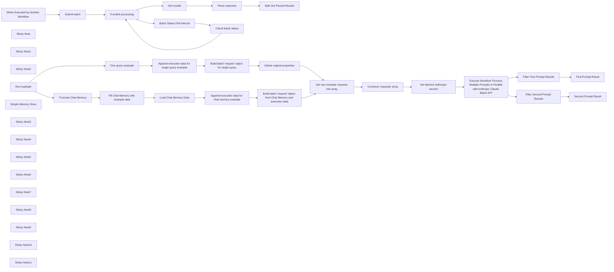

## Fluxo (.json) :

```json
{
  "meta": {
    "instanceId": "97d44c78f314fab340d7a5edaf7e2c274a7fbb8a7cd138f53cc742341e706fe7"
  },
  "nodes": [
    {
      "id": "fa4f8fd6-3272-4a93-8547-32d13873bbc1",
      "name": "Submit batch",
      "type": "n8n-nodes-base.httpRequest",
      "position": [
        180,
        40
      ],
      "parameters": {
        "url": "https://api.anthropic.com/v1/messages/batches",
        "method": "POST",
        "options": {},
        "jsonBody": "={ \"requests\": {{ JSON.stringify($json.requests) }} }",
        "sendBody": true,
        "sendQuery": true,
        "sendHeaders": true,
        "specifyBody": "json",
        "authentication": "predefinedCredentialType",
        "queryParameters": {
          "parameters": [
            {}
          ]
        },
        "headerParameters": {
          "parameters": [
            {
              "name": "anthropic-version",
              "value": "={{ $json[\"anthropic-version\"] }}"
            }
          ]
        },
        "nodeCredentialType": "anthropicApi"
      },
      "credentials": {
        "anthropicApi": {
          "id": "ub0zN7IP2V83OeTf",
          "name": "Anthropic account"
        }
      },
      "typeVersion": 4.2
    },
    {
      "id": "2916dc85-829d-491a-a7a8-de79d5356a53",
      "name": "Check batch status",
      "type": "n8n-nodes-base.httpRequest",
      "position": [
        840,
        115
      ],
      "parameters": {
        "url": "=https://api.anthropic.com/v1/messages/batches/{{ $json.id }}",
        "options": {},
        "sendHeaders": true,
        "authentication": "predefinedCredentialType",
        "headerParameters": {
          "parameters": [
            {
              "name": "anthropic-version",
              "value": "={{ $('When Executed by Another Workflow').item.json[\"anthropic-version\"] }}"
            }
          ]
        },
        "nodeCredentialType": "anthropicApi"
      },
      "credentials": {
        "anthropicApi": {
          "id": "ub0zN7IP2V83OeTf",
          "name": "Anthropic account"
        }
      },
      "typeVersion": 4.2
    },
    {
      "id": "1552ec92-2f18-42f6-b67f-b6f131012b3c",
      "name": "When Executed by Another Workflow",
      "type": "n8n-nodes-base.executeWorkflowTrigger",
      "position": [
        -40,
        40
      ],
      "parameters": {
        "workflowInputs": {
          "values": [
            {
              "name": "anthropic-version"
            },
            {
              "name": "requests",
              "type": "array"
            }
          ]
        }
      },
      "typeVersion": 1.1
    },
    {
      "id": "4bd40f02-caf1-419d-8261-a149cd51a534",
      "name": "Get results",
      "type": "n8n-nodes-base.httpRequest",
      "position": [
        620,
        -160
      ],
      "parameters": {
        "url": "={{ $json.results_url }}",
        "options": {},
        "sendHeaders": true,
        "authentication": "predefinedCredentialType",
        "headerParameters": {
          "parameters": [
            {
              "name": "anthropic-version",
              "value": "={{ $('When Executed by Another Workflow').item.json[\"anthropic-version\"] }}"
            }
          ]
        },
        "nodeCredentialType": "anthropicApi"
      },
      "credentials": {
        "anthropicApi": {
          "id": "ub0zN7IP2V83OeTf",
          "name": "Anthropic account"
        }
      },
      "typeVersion": 4.2
    },
    {
      "id": "5df366af-a54d-4594-a1ab-7a9df968101e",
      "name": "Parse response",
      "type": "n8n-nodes-base.code",
      "notes": "JSONL separated by newlines",
      "position": [
        840,
        -160
      ],
      "parameters": {
        "jsCode": "for (const item of $input.all()) {\n  if (item.json && item.json.data) {\n    // Split the string into individual JSON objects\n    const jsonStrings = item.json.data.split('\\n');\n\n    // Parse each JSON string and store them in an array\n    const parsedData = jsonStrings.filter(str => str.trim() !== '').map(str => JSON.parse(str));\n\n    // Replace the original json with the parsed array.\n    item.json.parsed = parsedData;\n  }\n}\n\nreturn $input.all();"
      },
      "notesInFlow": true,
      "typeVersion": 2
    },
    {
      "id": "68aa4ee2-e925-4e30-a7ab-317d8df4d9bc",
      "name": "If ended processing",
      "type": "n8n-nodes-base.if",
      "position": [
        400,
        40
      ],
      "parameters": {
        "options": {},
        "conditions": {
          "options": {
            "version": 2,
            "leftValue": "",
            "caseSensitive": true,
            "typeValidation": "strict"
          },
          "combinator": "and",
          "conditions": [
            {
              "id": "9494c5a3-d093-49c5-837f-99cd700a2f13",
              "operator": {
                "type": "string",
                "operation": "equals"
              },
              "leftValue": "={{ $json.processing_status }}",
              "rightValue": "ended"
            }
          ]
        }
      },
      "typeVersion": 2.2
    },
    {
      "id": "2b974e3b-495b-48af-8080-c7913d7a2ba8",
      "name": "Sticky Note",
      "type": "n8n-nodes-base.stickyNote",
      "position": [
        -200,
        -720
      ],
      "parameters": {
        "width": 1060,
        "height": 520,
        "content": "### This workflow automates sending batched prompts to Claude using the Anthropic API. It submits multiple prompts at once and retrieves the results.\n\n#### How to use\n\nCall this workflow with array of `requests`\n\n```json\n{\n    \"anthropic-version\": \"2023-06-01\",\n    \"requests\": [\n        {\n            \"custom_id\": \"first-prompt-in-my-batch\",\n            \"params\": {\n                \"max_tokens\": 100,\n                \"messages\": [\n                    {\n                        \"content\": \"Hey Claude, tell me a short fun fact about video games!\",\n                        \"role\": \"user\"\n                    }\n                ],\n                \"model\": \"claude-3-5-haiku-20241022\"\n            }\n        }\n    ]\n}\n```\n"
      },
      "typeVersion": 1
    },
    {
      "id": "928a30b5-5d90-4648-a82e-e4f1a01e47a5",
      "name": "Sticky Note1",
      "type": "n8n-nodes-base.stickyNote",
      "position": [
        1200,
        -720
      ],
      "parameters": {
        "width": 980,
        "height": 600,
        "content": "#### Results\n\nThis workflow returns an array of results with custom_ids.\n\n```json\n[\n    {\n        \"custom_id\": \"first-prompt-in-my-batch\",\n        \"result\": {\n            \"message\": {\n                \"content\": [\n                    {\n                        \"text\": \"Did you know that the classic video game Tetris was...\",\n                        \"type\": \"text\"\n                    }\n                ],\n                \"id\": \"msg_01AiLiVZT18XnoBD4r2w9x2t\",\n                \"model\": \"claude-3-5-haiku-20241022\",\n                \"role\": \"assistant\",\n                \"stop_reason\": \"end_turn\",\n                \"stop_sequence\": null,\n                \"type\": \"message\",\n                \"usage\": {\n                    \"cache_creation_input_tokens\": 0,\n                    \"cache_read_input_tokens\": 0,\n                    \"input_tokens\": 45,\n                    \"output_tokens\": 83\n                }\n            },\n            \"type\": \"succeeded\"\n        }\n    }\n]\n```"
      },
      "typeVersion": 1
    },
    {
      "id": "5dcb554e-32df-4883-b5a1-b40305756201",
      "name": "Batch Status Poll Interval",
      "type": "n8n-nodes-base.wait",
      "position": [
        620,
        40
      ],
      "webhookId": "7efafe72-063a-45c6-8775-fcec14e1d263",
      "parameters": {
        "amount": 10
      },
      "typeVersion": 1.1
    },
    {
      "id": "c25cfde5-ab83-4e5a-a66f-8cc9f23a01f6",
      "name": "Sticky Note2",
      "type": "n8n-nodes-base.stickyNote",
      "position": [
        -160,
        325
      ],
      "parameters": {
        "color": 4,
        "width": 340,
        "height": 620,
        "content": "# Usage example"
      },
      "typeVersion": 1
    },
    {
      "id": "6062ca7c-aa08-4805-9c96-65e5be8a38fd",
      "name": "Run example",
      "type": "n8n-nodes-base.manualTrigger",
      "position": [
        -40,
        625
      ],
      "parameters": {},
      "typeVersion": 1
    },
    {
      "id": "9878729a-123d-4460-a582-691ca8cedf98",
      "name": "One query example",
      "type": "n8n-nodes-base.set",
      "position": [
        634,
        775
      ],
      "parameters": {
        "options": {},
        "assignments": {
          "assignments": [
            {
              "id": "1ea47ba2-64be-4d69-b3db-3447cde71645",
              "name": "query",
              "type": "string",
              "value": "Hey Claude, tell me a short fun fact about bees!"
            }
          ]
        }
      },
      "typeVersion": 3.4
    },
    {
      "id": "df06c209-8b6a-4b6d-8045-230ebdfcfbad",
      "name": "Delete original properties",
      "type": "n8n-nodes-base.set",
      "position": [
        1528,
        775
      ],
      "parameters": {
        "options": {},
        "assignments": {
          "assignments": [
            {
              "id": "d238d62b-2e91-4242-b509-8cfc698d2252",
              "name": "custom_id",
              "type": "string",
              "value": "={{ $json.custom_id }}"
            },
            {
              "id": "21e07c09-92e3-41e7-8335-64653722e7e9",
              "name": "params",
              "type": "object",
              "value": "={{ $json.params }}"
            }
          ]
        }
      },
      "typeVersion": 3.4
    },
    {
      "id": "f66d6a89-ee33-4494-9476-46f408976b29",
      "name": "Construct 'requests' array",
      "type": "n8n-nodes-base.aggregate",
      "position": [
        1968,
        625
      ],
      "parameters": {
        "options": {},
        "aggregate": "aggregateAllItemData",
        "destinationFieldName": "requests"
      },
      "typeVersion": 1
    },
    {
      "id": "0f9eb605-d629-4cb7-b9cb-39702d201567",
      "name": "Set desired 'anthropic-version'",
      "type": "n8n-nodes-base.set",
      "notes": "2023-06-01",
      "position": [
        2188,
        625
      ],
      "parameters": {
        "options": {},
        "assignments": {
          "assignments": [
            {
              "id": "9f9e94a0-304b-487a-8762-d74421ef4cc0",
              "name": "anthropic-version",
              "type": "string",
              "value": "2023-06-01"
            }
          ]
        },
        "includeOtherFields": true
      },
      "notesInFlow": true,
      "typeVersion": 3.4
    },
    {
      "id": "f71f261c-f4ad-4c9f-bd72-42ab386a65e1",
      "name": "Execute Workflow 'Process Multiple Prompts in Parallel with Anthropic Claude Batch API'",
      "type": "n8n-nodes-base.executeWorkflow",
      "notes": "See above",
      "position": [
        2408,
        625
      ],
      "parameters": {
        "options": {
          "waitForSubWorkflow": true
        },
        "workflowId": {
          "__rl": true,
          "mode": "list",
          "value": "xQU4byMGhgFxnTIH",
          "cachedResultName": "Process Multiple Prompts in Parallel with Anthropic Claude Batch API"
        },
        "workflowInputs": {
          "value": {
            "requests": "={{ $json.requests }}",
            "anthropic-version": "={{ $json['anthropic-version'] }}"
          },
          "schema": [
            {
              "id": "anthropic-version",
              "type": "string",
              "display": true,
              "removed": false,
              "required": false,
              "displayName": "anthropic-version",
              "defaultMatch": false,
              "canBeUsedToMatch": true
            },
            {
              "id": "requests",
              "type": "array",
              "display": true,
              "removed": false,
              "required": false,
              "displayName": "requests",
              "defaultMatch": false,
              "canBeUsedToMatch": true
            }
          ],
          "mappingMode": "defineBelow",
          "matchingColumns": [
            "requests"
          ],
          "attemptToConvertTypes": true,
          "convertFieldsToString": true
        }
      },
      "notesInFlow": true,
      "typeVersion": 1.2
    },
    {
      "id": "bd27c1a6-572c-420d-84ab-4d8b7d14311b",
      "name": "Build batch 'request' object for single query",
      "type": "n8n-nodes-base.code",
      "position": [
        1308,
        775
      ],
      "parameters": {
        "jsCode": "// Loop over input items and modify them to match the response example, then return input.all()\nfor (const item of $input.all()) {\n  item.json.params = {\n    max_tokens: item.json.max_tokens,\n    messages: [\n      {\n        content: item.json.query,\n        role: \"user\"\n      }\n    ],\n    model: item.json.model\n  };\n}\n\nreturn $input.all();\n"
      },
      "typeVersion": 2
    },
    {
      "id": "fa342231-ea94-43ab-8808-18c8d04fdaf8",
      "name": "Simple Memory Store",
      "type": "@n8n/n8n-nodes-langchain.memoryBufferWindow",
      "position": [
        644,
        595
      ],
      "parameters": {
        "sessionKey": "\"Process Multiple Prompts in Parallel with Anthropic Claude Batch API example\"",
        "sessionIdType": "customKey"
      },
      "typeVersion": 1.3
    },
    {
      "id": "67047fe6-8658-45ba-be61-52cf6115f4e4",
      "name": "Fill Chat Memory with example data",
      "type": "@n8n/n8n-nodes-langchain.memoryManager",
      "position": [
        556,
        375
      ],
      "parameters": {
        "mode": "insert",
        "messages": {
          "messageValues": [
            {
              "message": "You are a helpful AI assistant"
            },
            {
              "type": "user",
              "message": "Hey Claude, tell me a short fun fact about video games!"
            },
            {
              "type": "ai",
              "message": "short fun fact about video games!"
            },
            {
              "type": "user",
              "message": "No, an actual fun fact"
            }
          ]
        }
      },
      "typeVersion": 1.1
    },
    {
      "id": "dbb295b8-01fd-445f-ab66-948442b6c71d",
      "name": "Build batch 'request' object from Chat Memory and execution data",
      "type": "n8n-nodes-base.code",
      "position": [
        1528,
        475
      ],
      "parameters": {
        "jsCode": "const output = [];\n\nfor (const item of $input.all()) {\n  const inputMessages = item.json.messages;\n  const customId = item.json.custom_id;\n  const model = item.json.model;\n  const maxTokens = item.json.max_tokens;\n\n  if (inputMessages && inputMessages.length > 0) {\n    let systemMessageContent = undefined;\n    const transformedMessages = [];\n\n    // Process each message entry in sequence\n    for (const messageObj of inputMessages) {\n      // Extract system message if present\n      if ('system' in messageObj) {\n        systemMessageContent = messageObj.system;\n      }\n      \n      // Process human and AI messages in the order they appear in the object keys\n      // We need to determine what order the keys appear in the original object\n      const keys = Object.keys(messageObj);\n      \n      for (const key of keys) {\n        if (key === 'human') {\n          transformedMessages.push({\n            role: \"user\",\n            content: messageObj.human\n          });\n        } else if (key === 'ai') {\n          transformedMessages.push({\n            role: \"assistant\",\n            content: messageObj.ai\n          });\n        }\n        // Skip 'system' as we already processed it\n      }\n    }\n\n    const params = {\n      model: model,\n      max_tokens: maxTokens,\n      messages: transformedMessages\n    };\n\n    if (systemMessageContent !== undefined) {\n      params.system = systemMessageContent;\n    }\n\n    output.push({\n      custom_id: customId,\n      params: params\n    });\n  }\n}\n\nreturn output;"
      },
      "typeVersion": 2
    },
    {
      "id": "f9edb335-c33d-45fc-8f9b-12d7f37cc23e",
      "name": "Load Chat Memory Data",
      "type": "@n8n/n8n-nodes-langchain.memoryManager",
      "position": [
        932,
        475
      ],
      "parameters": {
        "options": {}
      },
      "typeVersion": 1.1
    },
    {
      "id": "22399660-ebe5-4838-bad3-c542d6d921a3",
      "name": "First Prompt Result",
      "type": "n8n-nodes-base.executionData",
      "position": [
        2848,
        525
      ],
      "parameters": {
        "dataToSave": {
          "values": [
            {
              "key": "assistant_response",
              "value": "={{ $json.result.message.content[0].text }}"
            }
          ]
        }
      },
      "typeVersion": 1
    },
    {
      "id": "0e7f44f4-c931-4e0f-aebc-1b8f0327647f",
      "name": "Second Prompt Result",
      "type": "n8n-nodes-base.executionData",
      "position": [
        2848,
        725
      ],
      "parameters": {
        "dataToSave": {
          "values": [
            {
              "key": "assistant_response",
              "value": "={{ $json.result.message.content[0].text }}"
            }
          ]
        }
      },
      "typeVersion": 1
    },
    {
      "id": "e42b01e0-8fc5-42e1-aa45-aa85477e766b",
      "name": "Split Out Parsed Results",
      "type": "n8n-nodes-base.splitOut",
      "position": [
        1060,
        -160
      ],
      "parameters": {
        "options": {},
        "fieldToSplitOut": "parsed"
      },
      "typeVersion": 1
    },
    {
      "id": "343676b9-f147-4981-b555-8af570374e8c",
      "name": "Filter Second Prompt Results",
      "type": "n8n-nodes-base.filter",
      "position": [
        2628,
        725
      ],
      "parameters": {
        "options": {},
        "conditions": {
          "options": {
            "version": 2,
            "leftValue": "",
            "caseSensitive": true,
            "typeValidation": "strict"
          },
          "combinator": "and",
          "conditions": [
            {
              "id": "9e4b3524-7066-46cc-a365-8d23d08c1bda",
              "operator": {
                "name": "filter.operator.equals",
                "type": "string",
                "operation": "equals"
              },
              "leftValue": "={{ $json.custom_id }}",
              "rightValue": "={{ $('Append execution data for single query example').item.json.custom_id }}"
            }
          ]
        }
      },
      "typeVersion": 2.2
    },
    {
      "id": "c9f5f366-27c4-4401-965b-67c314036fb6",
      "name": "Filter First Prompt Results",
      "type": "n8n-nodes-base.filter",
      "position": [
        2628,
        525
      ],
      "parameters": {
        "options": {},
        "conditions": {
          "options": {
            "version": 2,
            "leftValue": "",
            "caseSensitive": true,
            "typeValidation": "strict"
          },
          "combinator": "and",
          "conditions": [
            {
              "id": "9e4b3524-7066-46cc-a365-8d23d08c1bda",
              "operator": {
                "name": "filter.operator.equals",
                "type": "string",
                "operation": "equals"
              },
              "leftValue": "={{ $json.custom_id }}",
              "rightValue": "={{ $('Append execution data for chat memory example').item.json.custom_id }}"
            }
          ]
        }
      },
      "typeVersion": 2.2
    },
    {
      "id": "0a5b9c3d-665b-4e35-be9e-c8297314969d",
      "name": "Sticky Note3",
      "type": "n8n-nodes-base.stickyNote",
      "position": [
        110,
        -100
      ],
      "parameters": {
        "height": 300,
        "content": "## Submit batch request to Anthropic"
      },
      "typeVersion": 1
    },
    {
      "id": "f19813a5-f669-45dd-a446-947a30b02b09",
      "name": "Sticky Note4",
      "type": "n8n-nodes-base.stickyNote",
      "position": [
        350,
        -5
      ],
      "parameters": {
        "width": 640,
        "height": 300,
        "content": "## Loop until processing status is 'ended'"
      },
      "typeVersion": 1
    },
    {
      "id": "9f424fce-5610-4b85-9be6-4c2c403002db",
      "name": "Sticky Note5",
      "type": "n8n-nodes-base.stickyNote",
      "position": [
        500,
        -200
      ],
      "parameters": {
        "width": 280,
        "height": 180,
        "content": "### Retrieve Message Batch Results\n\n[User guide](https://docs.anthropic.com/en/docs/build-with-claude/batch-processing)"
      },
      "typeVersion": 1
    },
    {
      "id": "b87673b1-f08d-4c51-8ee5-4d54557cb382",
      "name": "Sticky Note6",
      "type": "n8n-nodes-base.stickyNote",
      "position": [
        900,
        380
      ],
      "parameters": {
        "color": 5,
        "width": 820,
        "height": 340,
        "content": "# Example usage with Chat History Node"
      },
      "typeVersion": 1
    },
    {
      "id": "d6d8ac02-7005-40a1-9950-9517e98e315c",
      "name": "Sticky Note7",
      "type": "n8n-nodes-base.stickyNote",
      "position": [
        180,
        720
      ],
      "parameters": {
        "width": 1540,
        "height": 220,
        "content": "# Example usage with single query string"
      },
      "typeVersion": 1
    },
    {
      "id": "0d63deb0-dece-4502-9020-d67c1f194466",
      "name": "Sticky Note8",
      "type": "n8n-nodes-base.stickyNote",
      "position": [
        180,
        320
      ],
      "parameters": {
        "color": 3,
        "width": 660,
        "height": 400,
        "content": "# Environment setup\nFor Chat History Node"
      },
      "typeVersion": 1
    },
    {
      "id": "cab94e09-6b84-4a38-b854-670241744db5",
      "name": "Sticky Note9",
      "type": "n8n-nodes-base.stickyNote",
      "position": [
        2120,
        800
      ],
      "parameters": {
        "height": 220,
        "content": "## anthropic-version\n\n[Documentation](https://docs.anthropic.com/en/api/versioning)\n\nWhen making API requests, you must send an anthropic-version request header. For example, anthropic-version: `2023-06-01` (latest supported version)"
      },
      "typeVersion": 1
    },
    {
      "id": "ab0a51a1-3c84-4a88-968b-fd46ab07de85",
      "name": "Sticky Note10",
      "type": "n8n-nodes-base.stickyNote",
      "position": [
        2560,
        400
      ],
      "parameters": {
        "color": 5,
        "width": 480,
        "height": 300,
        "content": "# Example usage with Chat History Node (result)"
      },
      "typeVersion": 1
    },
    {
      "id": "d91b9be7-ef32-48d6-b880-cab0e99ba9bc",
      "name": "Sticky Note11",
      "type": "n8n-nodes-base.stickyNote",
      "position": [
        2560,
        700
      ],
      "parameters": {
        "width": 480,
        "height": 300,
        "content": "\n\n\n\n\n\n\n\n\n\n\n\n\n\n\n# Example usage with single query string (result)"
      },
      "typeVersion": 1
    },
    {
      "id": "341811e9-6677-42d9-be28-c388dbf68101",
      "name": "Join two example requests into array",
      "type": "n8n-nodes-base.merge",
      "position": [
        1748,
        625
      ],
      "parameters": {},
      "typeVersion": 3.1
    },
    {
      "id": "45a09f05-7610-4b0a-ab7f-0094c4b3f318",
      "name": "Append execution data for single query example",
      "type": "n8n-nodes-base.set",
      "notes": "custom_id, model and max tokens",
      "position": [
        1010,
        775
      ],
      "parameters": {
        "options": {},
        "assignments": {
          "assignments": [
            {
              "id": "8276602f-689f-45c2-bce0-5df8500912b6",
              "name": "custom_id",
              "type": "string",
              "value": "second-prompt-in-my-batch"
            },
            {
              "id": "2c513dc2-d8cb-4ba3-b3c1-ea79517b9434",
              "name": "model",
              "type": "string",
              "value": "claude-3-5-haiku-20241022"
            },
            {
              "id": "b052140b-1152-4327-9c5a-5030b78990b7",
              "name": "max_tokens",
              "type": "number",
              "value": 100
            }
          ]
        },
        "includeOtherFields": true
      },
      "notesInFlow": true,
      "typeVersion": 3.4
    },
    {
      "id": "c4e35349-840c-4c81-852c-0d8cd9331364",
      "name": "Append execution data for chat memory example",
      "type": "n8n-nodes-base.set",
      "notes": "custom_id, model and max tokens",
      "position": [
        1308,
        475
      ],
      "parameters": {
        "options": {},
        "assignments": {
          "assignments": [
            {
              "id": "8276602f-689f-45c2-bce0-5df8500912b6",
              "name": "custom_id",
              "type": "string",
              "value": "first-prompt-in-my-batch"
            },
            {
              "id": "2c513dc2-d8cb-4ba3-b3c1-ea79517b9434",
              "name": "model",
              "type": "string",
              "value": "claude-3-5-haiku-20241022"
            },
            {
              "id": "b052140b-1152-4327-9c5a-5030b78990b7",
              "name": "max_tokens",
              "type": "number",
              "value": 100
            }
          ]
        },
        "includeOtherFields": true
      },
      "notesInFlow": true,
      "typeVersion": 3.4
    },
    {
      "id": "058aedb1-fdfe-4edc-8d51-3b93ec7d232d",
      "name": "Truncate Chat Memory",
      "type": "@n8n/n8n-nodes-langchain.memoryManager",
      "notes": "ensure clean state",
      "position": [
        180,
        475
      ],
      "parameters": {
        "mode": "delete",
        "deleteMode": "all"
      },
      "notesInFlow": true,
      "typeVersion": 1.1
    }
  ],
  "pinData": {},
  "connections": {
    "Get results": {
      "main": [
        [
          {
            "node": "Parse response",
            "type": "main",
            "index": 0
          }
        ]
      ]
    },
    "Run example": {
      "main": [
        [
          {
            "node": "One query example",
            "type": "main",
            "index": 0
          },
          {
            "node": "Truncate Chat Memory",
            "type": "main",
            "index": 0
          }
        ]
      ]
    },
    "Submit batch": {
      "main": [
        [
          {
            "node": "If ended processing",
            "type": "main",
            "index": 0
          }
        ]
      ]
    },
    "Parse response": {
      "main": [
        [
          {
            "node": "Split Out Parsed Results",
            "type": "main",
            "index": 0
          }
        ]
      ]
    },
    "One query example": {
      "main": [
        [
          {
            "node": "Append execution data for single query example",
            "type": "main",
            "index": 0
          }
        ]
      ]
    },
    "Check batch status": {
      "main": [
        [
          {
            "node": "If ended processing",
            "type": "main",
            "index": 0
          }
        ]
      ]
    },
    "If ended processing": {
      "main": [
        [
          {
            "node": "Get results",
            "type": "main",
            "index": 0
          }
        ],
        [
          {
            "node": "Batch Status Poll Interval",
            "type": "main",
            "index": 0
          }
        ]
      ]
    },
    "Simple Memory Store": {
      "ai_memory": [
        [
          {
            "node": "Load Chat Memory Data",
            "type": "ai_memory",
            "index": 0
          },
          {
            "node": "Fill Chat Memory with example data",
            "type": "ai_memory",
            "index": 0
          },
          {
            "node": "Truncate Chat Memory",
            "type": "ai_memory",
            "index": 0
          }
        ]
      ]
    },
    "Truncate Chat Memory": {
      "main": [
        [
          {
            "node": "Fill Chat Memory with example data",
            "type": "main",
            "index": 0
          }
        ]
      ]
    },
    "Load Chat Memory Data": {
      "main": [
        [
          {
            "node": "Append execution data for chat memory example",
            "type": "main",
            "index": 0
          }
        ]
      ]
    },
    "Batch Status Poll Interval": {
      "main": [
        [
          {
            "node": "Check batch status",
            "type": "main",
            "index": 0
          }
        ]
      ]
    },
    "Construct 'requests' array": {
      "main": [
        [
          {
            "node": "Set desired 'anthropic-version'",
            "type": "main",
            "index": 0
          }
        ]
      ]
    },
    "Delete original properties": {
      "main": [
        [
          {
            "node": "Join two example requests into array",
            "type": "main",
            "index": 1
          }
        ]
      ]
    },
    "Filter First Prompt Results": {
      "main": [
        [
          {
            "node": "First Prompt Result",
            "type": "main",
            "index": 0
          }
        ]
      ]
    },
    "Filter Second Prompt Results": {
      "main": [
        [
          {
            "node": "Second Prompt Result",
            "type": "main",
            "index": 0
          }
        ]
      ]
    },
    "Set desired 'anthropic-version'": {
      "main": [
        [
          {
            "node": "Execute Workflow 'Process Multiple Prompts in Parallel with Anthropic Claude Batch API'",
            "type": "main",
            "index": 0
          }
        ]
      ]
    },
    "When Executed by Another Workflow": {
      "main": [
        [
          {
            "node": "Submit batch",
            "type": "main",
            "index": 0
          }
        ]
      ]
    },
    "Fill Chat Memory with example data": {
      "main": [
        [
          {
            "node": "Load Chat Memory Data",
            "type": "main",
            "index": 0
          }
        ]
      ]
    },
    "Join two example requests into array": {
      "main": [
        [
          {
            "node": "Construct 'requests' array",
            "type": "main",
            "index": 0
          }
        ]
      ]
    },
    "Append execution data for chat memory example": {
      "main": [
        [
          {
            "node": "Build batch 'request' object from Chat Memory and execution data",
            "type": "main",
            "index": 0
          }
        ]
      ]
    },
    "Build batch 'request' object for single query": {
      "main": [
        [
          {
            "node": "Delete original properties",
            "type": "main",
            "index": 0
          }
        ]
      ]
    },
    "Append execution data for single query example": {
      "main": [
        [
          {
            "node": "Build batch 'request' object for single query",
            "type": "main",
            "index": 0
          }
        ]
      ]
    },
    "Build batch 'request' object from Chat Memory and execution data": {
      "main": [
        [
          {
            "node": "Join two example requests into array",
            "type": "main",
            "index": 0
          }
        ]
      ]
    },
    "Execute Workflow 'Process Multiple Prompts in Parallel with Anthropic Claude Batch API'": {
      "main": [
        [
          {
            "node": "Filter First Prompt Results",
            "type": "main",
            "index": 0
          },
          {
            "node": "Filter Second Prompt Results",
            "type": "main",
            "index": 0
          }
        ]
      ]
    }
  }
}
```

<a id="template-11"></a>

## Template 11 - Processamento de dados de IA de chamadas de vendas

- **Nome:** Processamento de dados de IA de chamadas de vendas
- **Descrição:** Processa dados de IA gerados a partir de chamadas de vendas para atualizar registros existentes e criar objetos de caso de uso e feedback de produto em bases de dados.
- **Funcionalidade:** • Receber dados de IA de outro fluxo: recebe o payload com metadados da chamada e o resultado da análise de IA.
• Verificar menção de IA na chamada: determina se a chamada contém referências relevantes a IA/ML.
• Atualizar registro da chamada com resumo de IA: grava checkbox e resumo de IA no registro da chamada existente.
• Detectar e criar caso de uso de IA: quando identificado, cria uma página na base de casos de uso preenchendo propriedades relevantes (empresa, departamento, necessidade de RAG, etc.).
• Detectar e criar feedback de produto: quando houver feedbacks, divide a lista em itens e cria páginas relacionadas na base de Product Feedback, relacionando-as à chamada.
• Gerenciar limitação de taxa: insere esperas controladas antes de operações de criação para evitar rate limiting.
• Agrupar e mesclar threads de dados: agrega itens gerados e adiciona contexto adicional (como resposta de IA) antes de finalizar operações.
• Mapear propriedades para armazenamento: transforma campos do output de IA e metadados da chamada em propriedades das bases de dados alvo.
- **Ferramentas:** • Gong: fonte das chamadas de vendas e contexto de reunião.
• Serviço de IA externo: gera a análise e extração de informações das chamadas (AIoutput).
• Notion: armazena e atualiza páginas em bases de dados como AI use-case e Product Feedback.
• CRMs (Pipedrive/Salesforce) - integração planejada: possibilidade de sincronizar oportunidades e dados comerciais no futuro.

## Fluxo visual

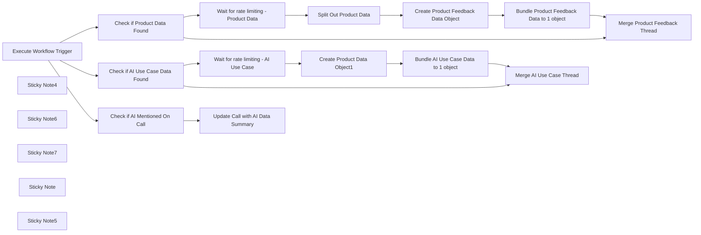

## Fluxo (.json) :

```json
{
  "meta": {
    "instanceId": "cb484ba7b742928a2048bf8829668bed5b5ad9787579adea888f05980292a4a7",
    "templateCredsSetupCompleted": true
  },
  "nodes": [
    {
      "id": "a2061232-329f-4288-9b01-ba832463c31e",
      "name": "Execute Workflow Trigger",
      "type": "n8n-nodes-base.executeWorkflowTrigger",
      "position": [
        2280,
        -400
      ],
      "parameters": {},
      "typeVersion": 1
    },
    {
      "id": "42df9296-82ac-44cd-8370-50e4507fb91d",
      "name": "Check if Product Data Found",
      "type": "n8n-nodes-base.if",
      "position": [
        2800,
        -340
      ],
      "parameters": {
        "options": {},
        "conditions": {
          "options": {
            "version": 2,
            "leftValue": "",
            "caseSensitive": true,
            "typeValidation": "strict"
          },
          "combinator": "and",
          "conditions": [
            {
              "id": "1a67895e-3ab7-4c93-8e16-202b3882ded5",
              "operator": {
                "type": "array",
                "operation": "lengthGte",
                "rightType": "number"
              },
              "leftValue": "={{ $json.AIoutput.ProductFeedback }}",
              "rightValue": 1
            }
          ]
        }
      },
      "typeVersion": 2.2
    },
    {
      "id": "84e93120-92d8-45fd-bb63-8626743e7fe0",
      "name": "Sticky Note4",
      "type": "n8n-nodes-base.stickyNote",
      "position": [
        2720,
        -580
      ],
      "parameters": {
        "color": 7,
        "width": 1340,
        "height": 440,
        "content": "## Product Data Processing"
      },
      "typeVersion": 1
    },
    {
      "id": "5cb1df66-abba-4d82-8fe5-c2313c8f7b44",
      "name": "Sticky Note6",
      "type": "n8n-nodes-base.stickyNote",
      "position": [
        2140,
        -760
      ],
      "parameters": {
        "color": 7,
        "width": 560,
        "height": 620,
        "content": "## Receives AI Data from other workflow\n"
      },
      "typeVersion": 1
    },
    {
      "id": "7c046627-f418-4b7e-aa5b-7cff69f98f59",
      "name": "Sticky Note7",
      "type": "n8n-nodes-base.stickyNote",
      "position": [
        1780,
        -960
      ],
      "parameters": {
        "width": 340,
        "height": 820,
        "content": "\n## CallForge - The AI Gong Sales Call Processor\nCallForge allows you to extract important information for different departments from your Sales Gong Calls. \n\n### AI Output Processor\nOnce the AI data is generated, it is then added (or not!) to the Notion Database here. This is also where the Pipedrive or Salesforce integration will be added once that portion is complete. "
      },
      "typeVersion": 1
    },
    {
      "id": "a04dac9d-5477-41a3-8696-1871c1cccf53",
      "name": "Create Product Data Object1",
      "type": "n8n-nodes-base.notion",
      "position": [
        3280,
        -940
      ],
      "parameters": {
        "title": "={{ $('Execute Workflow Trigger').item.json.metaData.title }}",
        "options": {
          "icon": "💬"
        },
        "resource": "databasePage",
        "databaseId": {
          "__rl": true,
          "mode": "list",
          "value": "1775b6e0-c94f-80ac-9885-d9695af5bc89",
          "cachedResultUrl": "https://www.notion.so/1775b6e0c94f80ac9885d9695af5bc89",
          "cachedResultName": "AI use-case database"
        },
        "propertiesUi": {
          "propertyValues": [
            {
              "key": "Company|title",
              "title": "={{ $json.metaData.CompanyName }}"
            },
            {
              "key": "Department|multi_select",
              "multiSelectValue": "={{ $json.AIoutput.AI_ML_References.Details.Department }}"
            },
            {
              "key": "Dev status|select",
              "selectValue": "={{ $json.AIoutput.AI_ML_References.Details.DevelopmentStatus }}"
            },
            {
              "key": "Employees|select",
              "selectValue": "={{ $json.sfOpp[0].Employees }}"
            },
            {
              "key": "Engagement with n8n|select",
              "selectValue": "Prospect"
            },
            {
              "key": "Requires agents|checkbox",
              "checkboxValue": "={{ $json.AIoutput.AI_ML_References.Details.RequiresAgents }}"
            },
            {
              "key": "More info|url",
              "urlValue": "={{ $json.metaData.url }}"
            },
            {
              "key": "Requires RAG|checkbox",
              "checkboxValue": "={{ $json.AIoutput.AI_ML_References.Details.RequiresRAG }}"
            },
            {
              "key": "Requires chat|select",
              "selectValue": "={{ $json.AIoutput.AI_ML_References.Details.RequiresChat }}"
            },
            {
              "key": "Use case|rich_text",
              "textContent": "={{ $json.AIoutput.AI_ML_References.Context }}"
            }
          ]
        }
      },
      "credentials": {
        "notionApi": {
          "id": "2B3YIiD4FMsF9Rjn",
          "name": "Angelbot Notion"
        }
      },
      "retryOnFail": true,
      "typeVersion": 2.2,
      "waitBetweenTries": 3000
    },
    {
      "id": "66c252a9-e330-4742-84d1-d17042585f79",
      "name": "Sticky Note",
      "type": "n8n-nodes-base.stickyNote",
      "position": [
        2720,
        -1040
      ],
      "parameters": {
        "color": 7,
        "width": 1340,
        "height": 440,
        "content": "## AI use Case "
      },
      "typeVersion": 1
    },
    {
      "id": "caded10f-8662-4a2b-ab47-b1a825c39c4b",
      "name": "Sticky Note5",
      "type": "n8n-nodes-base.stickyNote",
      "position": [
        2720,
        -120
      ],
      "parameters": {
        "color": 7,
        "width": 1340,
        "height": 360,
        "content": "## AI Mentioned on call"
      },
      "typeVersion": 1
    },
    {
      "id": "750c2853-3653-4557-b636-354fd91f846b",
      "name": "Create Product Feedback Data Object",
      "type": "n8n-nodes-base.notion",
      "position": [
        3440,
        -480
      ],
      "parameters": {
        "title": "={{ $('Execute Workflow Trigger').item.json.metaData.title }}",
        "options": {
          "icon": "💬"
        },
        "resource": "databasePage",
        "databaseId": {
          "__rl": true,
          "mode": "list",
          "value": "1375b6e0-c94f-80a8-93c9-c623b76dd14a",
          "cachedResultUrl": "https://www.notion.so/1375b6e0c94f80a893c9c623b76dd14a",
          "cachedResultName": "Product Feedback"
        },
        "propertiesUi": {
          "propertyValues": [
            {
              "key": "Sentiment|multi_select",
              "multiSelectValue": "={{ $json.Sentiment }}"
            },
            {
              "key": "Feedback|title",
              "title": "={{ $json.Feedback }}"
            },
            {
              "key": "Feedback Date|date",
              "date": "={{ $('Execute Workflow Trigger').item.json.metaData.started }}"
            },
            {
              "key": "Sales Call Summaries|relation",
              "relationValue": [
                "={{ $('Execute Workflow Trigger').item.json.notionData[0].id }}"
              ]
            }
          ]
        }
      },
      "credentials": {
        "notionApi": {
          "id": "80",
          "name": "Notion david-internal"
        }
      },
      "retryOnFail": true,
      "typeVersion": 2.2,
      "waitBetweenTries": 3000
    },
    {
      "id": "343f536f-2aa3-4fc9-9c75-e288a5019b84",
      "name": "Check if AI Use Case Data Found",
      "type": "n8n-nodes-base.if",
      "position": [
        2800,
        -800
      ],
      "parameters": {
        "options": {},
        "conditions": {
          "options": {
            "version": 2,
            "leftValue": "",
            "caseSensitive": true,
            "typeValidation": "strict"
          },
          "combinator": "and",
          "conditions": [
            {
              "id": "1a67895e-3ab7-4c93-8e16-202b3882ded5",
              "operator": {
                "type": "boolean",
                "operation": "true",
                "singleValue": true
              },
              "leftValue": "={{ $json.AIoutput.AI_ML_References.Exist }}",
              "rightValue": 1
            }
          ]
        }
      },
      "typeVersion": 2.2
    },
    {
      "id": "3d261de2-61fe-40e8-806b-f311b72081f0",
      "name": "Check if AI Mentioned On Call",
      "type": "n8n-nodes-base.if",
      "position": [
        2860,
        40
      ],
      "parameters": {
        "options": {},
        "conditions": {
          "options": {
            "version": 2,
            "leftValue": "",
            "caseSensitive": true,
            "typeValidation": "strict"
          },
          "combinator": "and",
          "conditions": [
            {
              "id": "1a67895e-3ab7-4c93-8e16-202b3882ded5",
              "operator": {
                "type": "boolean",
                "operation": "true",
                "singleValue": true
              },
              "leftValue": "={{ $json.AIoutput.AI_ML_References.Exist }}",
              "rightValue": 1
            }
          ]
        }
      },
      "typeVersion": 2.2
    },
    {
      "id": "e422c25b-05c0-4549-a12b-50b727cbcb83",
      "name": "Wait for rate limiting - AI Use Case",
      "type": "n8n-nodes-base.wait",
      "position": [
        3020,
        -940
      ],
      "webhookId": "a26d4c04-4092-45fb-9ba3-d6c70ac0934c",
      "parameters": {
        "amount": 3
      },
      "typeVersion": 1.1
    },
    {
      "id": "9ceb4ac2-6539-4c19-b207-883d61670c07",
      "name": "Wait for rate limiting - Product Data",
      "type": "n8n-nodes-base.wait",
      "position": [
        3020,
        -480
      ],
      "webhookId": "04bed240-5bae-4524-bb6f-011d8a6e1431",
      "parameters": {
        "amount": 3
      },
      "typeVersion": 1.1
    },
    {
      "id": "61d6864c-a7fa-488e-a252-f60b497de675",
      "name": "Split Out Product Data",
      "type": "n8n-nodes-base.splitOut",
      "position": [
        3220,
        -480
      ],
      "parameters": {
        "options": {},
        "fieldToSplitOut": "AIoutput.ProductFeedback"
      },
      "typeVersion": 1
    },
    {
      "id": "49bd2056-4eeb-43d7-a210-e4b777fd8535",
      "name": "Bundle AI Use Case Data to 1 object",
      "type": "n8n-nodes-base.aggregate",
      "position": [
        3540,
        -940
      ],
      "parameters": {
        "options": {},
        "aggregate": "aggregateAllItemData",
        "destinationFieldName": "tagdata"
      },
      "typeVersion": 1
    },
    {
      "id": "ce6e127d-9ff0-493c-bb47-02c30594f0e2",
      "name": "Bundle Product Feedback Data to 1 object",
      "type": "n8n-nodes-base.aggregate",
      "position": [
        3660,
        -480
      ],
      "parameters": {
        "options": {},
        "aggregate": "aggregateAllItemData",
        "destinationFieldName": "tagdata"
      },
      "typeVersion": 1
    },
    {
      "id": "ce06a39c-8066-4a3a-9ef4-b8bf6d14273a",
      "name": "Merge AI Use Case Thread",
      "type": "n8n-nodes-base.set",
      "position": [
        3860,
        -780
      ],
      "parameters": {
        "options": {},
        "assignments": {
          "assignments": [
            {
              "id": "d8fc65ad-2b05-40c1-84c7-7bda819f0f1f",
              "name": "aiResponse",
              "type": "object",
              "value": "={{ $('Execute Workflow Trigger').item.json.aiResponse }}"
            }
          ]
        }
      },
      "typeVersion": 3.4
    },
    {
      "id": "1d64eff6-442a-4f71-a497-d6261bf4753f",
      "name": "Merge Product Feedback Thread",
      "type": "n8n-nodes-base.set",
      "position": [
        3880,
        -320
      ],
      "parameters": {
        "options": {},
        "assignments": {
          "assignments": [
            {
              "id": "d8fc65ad-2b05-40c1-84c7-7bda819f0f1f",
              "name": "aiResponse",
              "type": "object",
              "value": "={{ $('Execute Workflow Trigger').item.json.aiResponse }}"
            }
          ]
        }
      },
      "typeVersion": 3.4
    },
    {
      "id": "50116044-d468-4f07-a711-8373c1b26e94",
      "name": "Update Call with AI Data Summary",
      "type": "n8n-nodes-base.notion",
      "position": [
        3180,
        -40
      ],
      "parameters": {
        "pageId": {
          "__rl": true,
          "mode": "id",
          "value": "={{ $('Execute Workflow Trigger').item.json.notionData[0].id }}"
        },
        "options": {},
        "resource": "databasePage",
        "operation": "update",
        "propertiesUi": {
          "propertyValues": [
            {
              "key": "AI Related|checkbox",
              "checkboxValue": "={{ $json.AIoutput.AI_ML_References.Exist }}"
            },
            {
              "key": "AI Summary|rich_text",
              "textContent": "={{ $json.AIoutput.AI_ML_References.Context }}"
            }
          ]
        }
      },
      "credentials": {
        "notionApi": {
          "id": "80",
          "name": "Notion david-internal"
        }
      },
      "retryOnFail": true,
      "typeVersion": 2.2,
      "waitBetweenTries": 3000
    }
  ],
  "pinData": {},
  "connections": {
    "Split Out Product Data": {
      "main": [
        [
          {
            "node": "Create Product Feedback Data Object",
            "type": "main",
            "index": 0
          }
        ]
      ]
    },
    "Execute Workflow Trigger": {
      "main": [
        [
          {
            "node": "Check if Product Data Found",
            "type": "main",
            "index": 0
          },
          {
            "node": "Check if AI Use Case Data Found",
            "type": "main",
            "index": 0
          },
          {
            "node": "Check if AI Mentioned On Call",
            "type": "main",
            "index": 0
          }
        ]
      ]
    },
    "Check if Product Data Found": {
      "main": [
        [
          {
            "node": "Wait for rate limiting - Product Data",
            "type": "main",
            "index": 0
          }
        ],
        [
          {
            "node": "Merge Product Feedback Thread",
            "type": "main",
            "index": 0
          }
        ]
      ]
    },
    "Create Product Data Object1": {
      "main": [
        [
          {
            "node": "Bundle AI Use Case Data to 1 object",
            "type": "main",
            "index": 0
          }
        ]
      ]
    },
    "Check if AI Mentioned On Call": {
      "main": [
        [
          {
            "node": "Update Call with AI Data Summary",
            "type": "main",
            "index": 0
          }
        ]
      ]
    },
    "Merge Product Feedback Thread": {
      "main": [
        []
      ]
    },
    "Check if AI Use Case Data Found": {
      "main": [
        [
          {
            "node": "Wait for rate limiting - AI Use Case",
            "type": "main",
            "index": 0
          }
        ],
        [
          {
            "node": "Merge AI Use Case Thread",
            "type": "main",
            "index": 0
          }
        ]
      ]
    },
    "Bundle AI Use Case Data to 1 object": {
      "main": [
        [
          {
            "node": "Merge AI Use Case Thread",
            "type": "main",
            "index": 0
          }
        ]
      ]
    },
    "Create Product Feedback Data Object": {
      "main": [
        [
          {
            "node": "Bundle Product Feedback Data to 1 object",
            "type": "main",
            "index": 0
          }
        ]
      ]
    },
    "Wait for rate limiting - AI Use Case": {
      "main": [
        [
          {
            "node": "Create Product Data Object1",
            "type": "main",
            "index": 0
          }
        ]
      ]
    },
    "Wait for rate limiting - Product Data": {
      "main": [
        [
          {
            "node": "Split Out Product Data",
            "type": "main",
            "index": 0
          }
        ]
      ]
    },
    "Bundle Product Feedback Data to 1 object": {
      "main": [
        [
          {
            "node": "Merge Product Feedback Thread",
            "type": "main",
            "index": 0
          }
        ]
      ]
    }
  }
}
```

<a id="template-12"></a>

## Template 12 - Obter detalhes de um fórum Disqus

- **Nome:** Obter detalhes de um fórum Disqus
- **Descrição:** Fluxo que, ao ser iniciado manualmente, consulta a API do Disqus para obter informações de um fórum específico.
- **Funcionalidade:** • Início manual: Permite executar o fluxo manualmente quando desejado.
• Consulta de fórum Disqus: Recupera os detalhes de um fórum usando o identificador fornecido ('hackernoon').
• Uso de credenciais API: Suporta configuração de credenciais para autenticar a chamada à API do Disqus.
• Encadeamento simples: Executa a chamada à API imediatamente após o gatilho de execução.
- **Ferramentas:** • Disqus: Plataforma de comentários que fornece uma API para obter informações e metadados de fóruns.

## Fluxo visual


## Fluxo (.json) :

```json
{
  "id": "119",
  "name": "Get details of a forum in Disqus",
  "nodes": [
    {
      "name": "On clicking 'execute'",
      "type": "n8n-nodes-base.manualTrigger",
      "position": [
        250,
        300
      ],
      "parameters": {},
      "typeVersion": 1
    },
    {
      "name": "Disqus",
      "type": "n8n-nodes-base.disqus",
      "position": [
        450,
        300
      ],
      "parameters": {
        "id": "hackernoon",
        "additionalFields": {}
      },
      "credentials": {
        "disqusApi": ""
      },
      "typeVersion": 1
    }
  ],
  "active": false,
  "settings": {},
  "connections": {
    "On clicking 'execute'": {
      "main": [
        [
          {
            "node": "Disqus",
            "type": "main",
            "index": 0
          }
        ]
      ]
    }
  }
}
```

<a id="template-13"></a>

## Template 13 - Backup automático para GitLab

- **Nome:** Backup automático para GitLab
- **Descrição:** Exporta periodicamente e por execução manual os workflows e credenciais para um repositório Git, garantindo cópias versionadas e enviadas ao remoto.
- **Funcionalidade:** • Agendamento de backups: executa o processo automaticamente em 00:00, 06:00, 12:00 e 18:00.
• Backup manual: permite iniciar a exportação e envio manualmente através de um gatilho.
• Exportação de workflows: gera arquivos de backup dos workflows em uma pasta do repositório (repo/workflows/).
• Exportação de credenciais: gera arquivos de backup das credenciais em uma pasta do repositório (repo/credentials/).
• Versionamento e envio: adiciona as alterações, realiza commit com mensagem contendo timestamp ISO e faz push para o repositório remoto.
- **Ferramentas:** • Git: controle de versão usado para adicionar, comitar e enviar os backups para o repositório remoto.
• Repositório Git remoto (ex.: GitLab): destino dos backups versionados e ponto central de armazenamento.
• Node.js / npx: executa comandos de linha de comando para gerar os arquivos de exportação.

## Fluxo visual

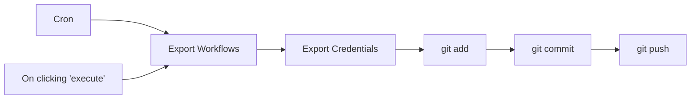

## Fluxo (.json) :

```json
{
  "id": "15",
  "name": "Tools / Backup Gitlab",
  "nodes": [
    {
      "name": "On clicking 'execute'",
      "type": "n8n-nodes-base.manualTrigger",
      "position": [
        250,
        400
      ],
      "parameters": {},
      "typeVersion": 1
    },
    {
      "name": "Export Workflows",
      "type": "n8n-nodes-base.executeCommand",
      "position": [
        450,
        300
      ],
      "parameters": {
        "command": "npx n8n export:workflow --backup --output repo/workflows/"
      },
      "typeVersion": 1
    },
    {
      "name": "Export Credentials",
      "type": "n8n-nodes-base.executeCommand",
      "position": [
        600,
        300
      ],
      "parameters": {
        "command": "npx n8n export:credentials --backup --output repo/credentials/"
      },
      "typeVersion": 1
    },
    {
      "name": "git add",
      "type": "n8n-nodes-base.executeCommand",
      "position": [
        750,
        300
      ],
      "parameters": {
        "command": "git -C repo add ."
      },
      "typeVersion": 1
    },
    {
      "name": "git commit",
      "type": "n8n-nodes-base.executeCommand",
      "position": [
        900,
        300
      ],
      "parameters": {
        "command": "=git -C repo commit -m \"Auto backup ({{ new Date().toISOString() }})\""
      },
      "typeVersion": 1
    },
    {
      "name": "git push",
      "type": "n8n-nodes-base.executeCommand",
      "position": [
        1050,
        300
      ],
      "parameters": {
        "command": "git -C repo push"
      },
      "typeVersion": 1
    },
    {
      "name": "Cron",
      "type": "n8n-nodes-base.cron",
      "position": [
        250,
        200
      ],
      "parameters": {
        "triggerTimes": {
          "item": [
            {
              "hour": 0
            },
            {
              "hour": 12
            },
            {
              "hour": 6
            },
            {
              "hour": 18
            }
          ]
        }
      },
      "typeVersion": 1
    }
  ],
  "active": true,
  "settings": {},
  "connections": {
    "Cron": {
      "main": [
        [
          {
            "node": "Export Workflows",
            "type": "main",
            "index": 0
          }
        ]
      ]
    },
    "git add": {
      "main": [
        [
          {
            "node": "git commit",
            "type": "main",
            "index": 0
          }
        ]
      ]
    },
    "git commit": {
      "main": [
        [
          {
            "node": "git push",
            "type": "main",
            "index": 0
          }
        ]
      ]
    },
    "Export Workflows": {
      "main": [
        [
          {
            "node": "Export Credentials",
            "type": "main",
            "index": 0
          }
        ]
      ]
    },
    "Export Credentials": {
      "main": [
        [
          {
            "node": "git add",
            "type": "main",
            "index": 0
          }
        ]
      ]
    },
    "On clicking 'execute'": {
      "main": [
        [
          {
            "node": "Export Workflows",
            "type": "main",
            "index": 0
          }
        ]
      ]
    }
  }
}
```

<a id="template-14"></a>

## Template 14 - Chatbot de recomendações de filmes com RAG (Qdrant + OpenAI)

- **Nome:** Chatbot de recomendações de filmes com RAG (Qdrant + OpenAI)
- **Descrição:** Fluxo que cria um sistema de recomendação de filmes baseado em recuperação aumentada por modelos (RAG): importa um dataset de filmes, gera e armazena embeddings, e responde a consultas de usuários oferecendo recomendações top-3.
- **Funcionalidade:** • Importação de dataset de filmes: lê um arquivo CSV contendo títulos, anos e descrições dos filmes.
• Geração de embeddings: converte descrições e solicitações de usuário em vetores de embedding usando a API de modelos.
• Indexação vetorial: insere vetores e metadados no banco vetorial para buscas semânticas.
• Preparação de documentos: divide textos longos em pedaços adequados para embedding e indexação.
• Gatilho de chat: recebe mensagens do usuário para iniciar consultaas de recomendação.
• Agente de IA com ferramenta de consulta: usa um agente de linguagem que decide quando chamar a ferramenta de recomendação vetorial.
• Consulta de recomendação com exemplos positivos/negativos: transforma exemplos positivos e negativos em embeddings e chama a API de recomendação vetorial para obter filmes relevantes.
• Recuperação de metadados: busca os detalhes dos pontos recomendados (título, ano, descrição) e monta a resposta.
• Formatação da resposta: apresenta as top-3 recomendações ordenadas pelo score (sem exibir as pontuações) em linguagem natural.
• Memória de contexto: mantém um buffer de janela para preservar contexto de conversa entre mensagens.
- **Ferramentas:** • GitHub: armazenamento e fornecimento do arquivo CSV com os dados dos filmes (Top_1000_IMDB_movies.csv).
• OpenAI: geração de embeddings e modelo de chat para interpretação da solicitação do usuário e produção de linguagem natural.
• Qdrant: banco de dados vetorial que armazena embeddings e metadados, e fornece API de consulta/recomendação para recuperar itens similares.
• CSV (Top_1000_IMDB_movies.csv): fonte de dados contendo títulos, anos e descrições dos filmes utilizada para popular o índice vetorial.

## Fluxo visual

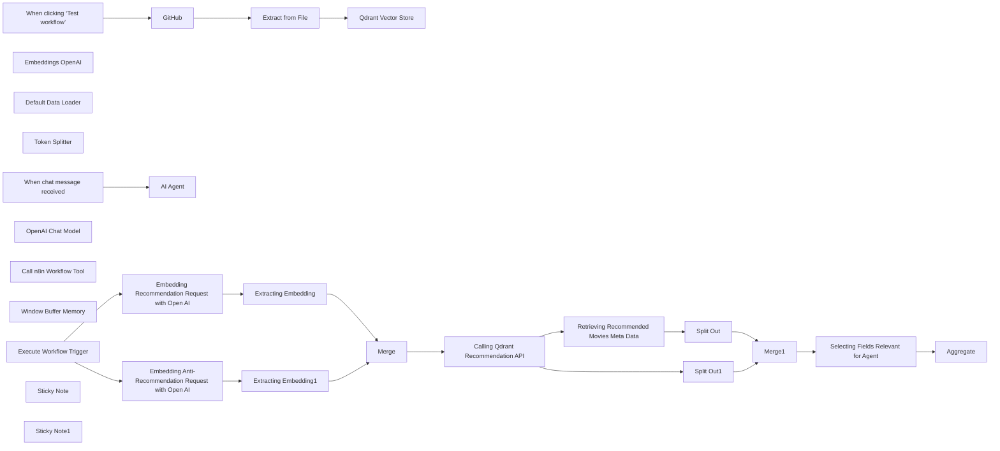

## Fluxo (.json) :

```json
{
  "id": "a58HZKwcOy7lmz56",
  "meta": {
    "instanceId": "178ef8a5109fc76c716d40bcadb720c455319f7b7a3fd5a39e4f336a091f524a",
    "templateCredsSetupCompleted": true
  },
  "name": "Building RAG Chatbot for Movie Recommendations with Qdrant and Open AI",
  "tags": [],
  "nodes": [
    {
      "id": "06a34e3b-519a-4b48-afd0-4f2b51d2105d",
      "name": "When clicking ‘Test workflow’",
      "type": "n8n-nodes-base.manualTrigger",
      "position": [
        4980,
        740
      ],
      "parameters": {},
      "typeVersion": 1
    },
    {
      "id": "9213003d-433f-41ab-838b-be93860261b2",
      "name": "GitHub",
      "type": "n8n-nodes-base.github",
      "position": [
        5200,
        740
      ],
      "parameters": {
        "owner": {
          "__rl": true,
          "mode": "name",
          "value": "mrscoopers"
        },
        "filePath": "Top_1000_IMDB_movies.csv",
        "resource": "file",
        "operation": "get",
        "repository": {
          "__rl": true,
          "mode": "list",
          "value": "n8n_demo",
          "cachedResultUrl": "https://github.com/mrscoopers/n8n_demo",
          "cachedResultName": "n8n_demo"
        },
        "additionalParameters": {}
      },
      "credentials": {
        "githubApi": {
          "id": "VbfC0mqEq24vPIwq",
          "name": "GitHub n8n demo"
        }
      },
      "typeVersion": 1
    },
    {
      "id": "9850d1a9-3a6f-44c0-9f9d-4d20fda0b602",
      "name": "Extract from File",
      "type": "n8n-nodes-base.extractFromFile",
      "position": [
        5360,
        740
      ],
      "parameters": {
        "options": {}
      },
      "typeVersion": 1
    },
    {
      "id": "7704f993-b1c9-477a-8b5a-77dc2cb68161",
      "name": "Embeddings OpenAI",
      "type": "@n8n/n8n-nodes-langchain.embeddingsOpenAi",
      "position": [
        5560,
        940
      ],
      "parameters": {
        "model": "text-embedding-3-small",
        "options": {}
      },
      "credentials": {
        "openAiApi": {
          "id": "deYJUwkgL1Euu613",
          "name": "OpenAi account 2"
        }
      },
      "typeVersion": 1
    },
    {
      "id": "bc6dd8e5-0186-4bf9-9c60-2eab6d9b6520",
      "name": "Default Data Loader",
      "type": "@n8n/n8n-nodes-langchain.documentDefaultDataLoader",
      "position": [
        5700,
        960
      ],
      "parameters": {
        "options": {
          "metadata": {
            "metadataValues": [
              {
                "name": "movie_name",
                "value": "={{ $('Extract from File').item.json['Movie Name'] }}"
              },
              {
                "name": "movie_release_date",
                "value": "={{ $('Extract from File').item.json['Year of Release'] }}"
              },
              {
                "name": "movie_description",
                "value": "={{ $('Extract from File').item.json.Description }}"
              }
            ]
          }
        },
        "jsonData": "={{ $('Extract from File').item.json.Description }}",
        "jsonMode": "expressionData"
      },
      "typeVersion": 1
    },
    {
      "id": "f87ea014-fe79-444b-88ea-0c4773872b0a",
      "name": "Token Splitter",
      "type": "@n8n/n8n-nodes-langchain.textSplitterTokenSplitter",
      "position": [
        5700,
        1140
      ],
      "parameters": {},
      "typeVersion": 1
    },
    {
      "id": "d8d28cec-c8e8-4350-9e98-cdbc6da54988",
      "name": "Qdrant Vector Store",
      "type": "@n8n/n8n-nodes-langchain.vectorStoreQdrant",
      "position": [
        5600,
        740
      ],
      "parameters": {
        "mode": "insert",
        "options": {},
        "qdrantCollection": {
          "__rl": true,
          "mode": "id",
          "value": "imdb"
        }
      },
      "credentials": {
        "qdrantApi": {
          "id": "Zin08PA0RdXVUKK7",
          "name": "QdrantApi n8n demo"
        }
      },
      "typeVersion": 1
    },
    {
      "id": "f86e03dc-12ea-4929-9035-4ec3cf46e300",
      "name": "When chat message received",
      "type": "@n8n/n8n-nodes-langchain.chatTrigger",
      "position": [
        4920,
        1140
      ],
      "webhookId": "71bfe0f8-227e-466b-9d07-69fd9fe4a27b",
      "parameters": {
        "options": {}
      },
      "typeVersion": 1.1
    },
    {
      "id": "ead23ef6-2b6b-428d-b412-b3394bff8248",
      "name": "OpenAI Chat Model",
      "type": "@n8n/n8n-nodes-langchain.lmChatOpenAi",
      "position": [
        5040,
        1340
      ],
      "parameters": {
        "model": "gpt-4o-mini",
        "options": {}
      },
      "credentials": {
        "openAiApi": {
          "id": "deYJUwkgL1Euu613",
          "name": "OpenAi account 2"
        }
      },
      "typeVersion": 1
    },
    {
      "id": "7ab936e1-aac8-43bc-a497-f2d02c2c19e5",
      "name": "Call n8n Workflow Tool",
      "type": "@n8n/n8n-nodes-langchain.toolWorkflow",
      "position": [
        5320,
        1340
      ],
      "parameters": {
        "name": "movie_recommender",
        "schemaType": "manual",
        "workflowId": {
          "__rl": true,
          "mode": "id",
          "value": "a58HZKwcOy7lmz56"
        },
        "description": "Call this tool to get a list of recommended movies from a vector database. ",
        "inputSchema": "{\n\"type\": \"object\",\n\"properties\": {\n\t\"positive_example\": {\n \"type\": \"string\",\n \"description\": \"A string with a movie description matching the user's positive recommendation request\"\n },\n \"negative_example\": {\n \"type\": \"string\",\n \"description\": \"A string with a movie description matching the user's negative anti-recommendation reuqest\"\n }\n}\n}",
        "specifyInputSchema": true
      },
      "typeVersion": 1.2
    },
    {
      "id": "ce55f334-698b-45b1-9e12-0eaa473187d4",
      "name": "Window Buffer Memory",
      "type": "@n8n/n8n-nodes-langchain.memoryBufferWindow",
      "position": [
        5160,
        1340
      ],
      "parameters": {},
      "typeVersion": 1.2
    },
    {
      "id": "41c1ee11-3117-4765-98fc-e56cc6fc8fb2",
      "name": "Execute Workflow Trigger",
      "type": "n8n-nodes-base.executeWorkflowTrigger",
      "position": [
        5640,
        1600
      ],
      "parameters": {},
      "typeVersion": 1
    },
    {
      "id": "db8d6ab6-8cd2-4a8c-993d-f1b7d7fdcffd",
      "name": "Merge",
      "type": "n8n-nodes-base.merge",
      "position": [
        6540,
        1500
      ],
      "parameters": {
        "mode": "combine",
        "options": {},
        "combineBy": "combineAll"
      },
      "typeVersion": 3
    },
    {
      "id": "c7bc5e04-22b1-40db-ba74-1ab234e51375",
      "name": "Split Out",
      "type": "n8n-nodes-base.splitOut",
      "position": [
        7260,
        1480
      ],
      "parameters": {
        "options": {},
        "fieldToSplitOut": "result"
      },
      "typeVersion": 1
    },
    {
      "id": "a2002d2e-362a-49eb-a42d-7b665ddd67a0",
      "name": "Split Out1",
      "type": "n8n-nodes-base.splitOut",
      "position": [
        7140,
        1260
      ],
      "parameters": {
        "options": {},
        "fieldToSplitOut": "result.points"
      },
      "typeVersion": 1
    },
    {
      "id": "f69a87f1-bfb9-4337-9350-28d2416c1580",
      "name": "Merge1",
      "type": "n8n-nodes-base.merge",
      "position": [
        7520,
        1400
      ],
      "parameters": {
        "mode": "combine",
        "options": {},
        "fieldsToMatchString": "id"
      },
      "typeVersion": 3
    },
    {
      "id": "b2f2529e-e260-4d72-88ef-09b804226004",
      "name": "Aggregate",
      "type": "n8n-nodes-base.aggregate",
      "position": [
        7960,
        1400
      ],
      "parameters": {
        "options": {},
        "aggregate": "aggregateAllItemData",
        "destinationFieldName": "response"
      },
      "typeVersion": 1
    },
    {
      "id": "bedea10f-b4de-4f0e-9d60-cc8117a2b328",
      "name": "AI Agent",
      "type": "@n8n/n8n-nodes-langchain.agent",
      "position": [
        5140,
        1140
      ],
      "parameters": {
        "options": {
          "systemMessage": "You are a Movie Recommender Tool using a Vector Database under the hood. Provide top-3 movie recommendations returned by the database, ordered by their recommendation score, but not showing the score to the user."
        }
      },
      "typeVersion": 1.6
    },
    {
      "id": "e04276b5-7d69-437b-bf4f-9717808cc8f6",
      "name": "Embedding Recommendation Request with Open AI",
      "type": "n8n-nodes-base.httpRequest",
      "position": [
        5900,
        1460
      ],
      "parameters": {
        "url": "https://api.openai.com/v1/embeddings",
        "method": "POST",
        "options": {},
        "sendBody": true,
        "sendHeaders": true,
        "authentication": "predefinedCredentialType",
        "bodyParameters": {
          "parameters": [
            {
              "name": "input",
              "value": "={{ $json.query.positive_example }}"
            },
            {
              "name": "model",
              "value": "text-embedding-3-small"
            }
          ]
        },
        "headerParameters": {
          "parameters": [
            {
              "name": "Authorization",
              "value": "Bearer $OPENAI_API_KEY"
            }
          ]
        },
        "nodeCredentialType": "openAiApi"
      },
      "credentials": {
        "openAiApi": {
          "id": "deYJUwkgL1Euu613",
          "name": "OpenAi account 2"
        }
      },
      "typeVersion": 4.2
    },
    {
      "id": "68e99f06-82f5-432c-8b31-8a1ae34981a6",
      "name": "Embedding Anti-Recommendation Request with Open AI",
      "type": "n8n-nodes-base.httpRequest",
      "position": [
        5920,
        1660
      ],
      "parameters": {
        "url": "https://api.openai.com/v1/embeddings",
        "method": "POST",
        "options": {},
        "sendBody": true,
        "sendHeaders": true,
        "authentication": "predefinedCredentialType",
        "bodyParameters": {
          "parameters": [
            {
              "name": "input",
              "value": "={{ $json.query.negative_example }}"
            },
            {
              "name": "model",
              "value": "text-embedding-3-small"
            }
          ]
        },
        "headerParameters": {
          "parameters": [
            {
              "name": "Authorization",
              "value": "Bearer $OPENAI_API_KEY"
            }
          ]
        },
        "nodeCredentialType": "openAiApi"
      },
      "credentials": {
        "openAiApi": {
          "id": "deYJUwkgL1Euu613",
          "name": "OpenAi account 2"
        }
      },
      "typeVersion": 4.2
    },
    {
      "id": "ecb1d7e1-b389-48e8-a34a-176bfc923641",
      "name": "Extracting Embedding",
      "type": "n8n-nodes-base.set",
      "position": [
        6180,
        1460
      ],
      "parameters": {
        "options": {},
        "assignments": {
          "assignments": [
            {
              "id": "01a28c9d-aeb1-48bb-8a73-f8bddbd73460",
              "name": "positive_example",
              "type": "array",
              "value": "={{ $json.data[0].embedding }}"
            }
          ]
        }
      },
      "typeVersion": 3.4
    },
    {
      "id": "4ed11142-a734-435f-9f7a-f59e2d423076",
      "name": "Extracting Embedding1",
      "type": "n8n-nodes-base.set",
      "position": [
        6180,
        1660
      ],
      "parameters": {
        "options": {},
        "assignments": {
          "assignments": [
            {
              "id": "01a28c9d-aeb1-48bb-8a73-f8bddbd73460",
              "name": "negative_example",
              "type": "array",
              "value": "={{ $json.data[0].embedding }}"
            }
          ]
        }
      },
      "typeVersion": 3.4
    },
    {
      "id": "ce3aa9bc-a5b1-4529-bff5-e0dba43b99f3",
      "name": "Calling Qdrant Recommendation API",
      "type": "n8n-nodes-base.httpRequest",
      "position": [
        6840,
        1500
      ],
      "parameters": {
        "url": "https://edcc6735-2ffb-484f-b735-3467043828fe.europe-west3-0.gcp.cloud.qdrant.io:6333/collections/imdb_1000_open_ai/points/query",
        "method": "POST",
        "options": {},
        "jsonBody": "={\n \"query\": {\n \"recommend\": {\n \"positive\": [[{{ $json.positive_example }}]],\n \"negative\": [[{{ $json.negative_example }}]],\n \"strategy\": \"average_vector\"\n }\n },\n \"limit\":3\n}",
        "sendBody": true,
        "specifyBody": "json",
        "authentication": "predefinedCredentialType",
        "nodeCredentialType": "qdrantApi"
      },
      "credentials": {
        "qdrantApi": {
          "id": "Zin08PA0RdXVUKK7",
          "name": "QdrantApi n8n demo"
        }
      },
      "typeVersion": 4.2
    },
    {
      "id": "9b8a6bdb-16fe-4edc-86d0-136fe059a777",
      "name": "Retrieving Recommended Movies Meta Data",
      "type": "n8n-nodes-base.httpRequest",
      "position": [
        7060,
        1460
      ],
      "parameters": {
        "url": "https://edcc6735-2ffb-484f-b735-3467043828fe.europe-west3-0.gcp.cloud.qdrant.io:6333/collections/imdb_1000_open_ai/points",
        "method": "POST",
        "options": {},
        "jsonBody": "={\n \"ids\": [\"{{ $json.result.points[0].id }}\", \"{{ $json.result.points[1].id }}\", \"{{ $json.result.points[2].id }}\"],\n \"with_payload\":true\n}",
        "sendBody": true,
        "specifyBody": "json",
        "authentication": "predefinedCredentialType",
        "nodeCredentialType": "qdrantApi"
      },
      "credentials": {
        "qdrantApi": {
          "id": "Zin08PA0RdXVUKK7",
          "name": "QdrantApi n8n demo"
        }
      },
      "typeVersion": 4.2
    },
    {
      "id": "28cdcad5-3dca-48a1-b626-19eef657114c",
      "name": "Selecting Fields Relevant for Agent",
      "type": "n8n-nodes-base.set",
      "position": [
        7740,
        1400
      ],
      "parameters": {
        "options": {},
        "assignments": {
          "assignments": [
            {
              "id": "b4b520a5-d0e2-4dcb-af9d-0b7748fd44d6",
              "name": "movie_recommendation_score",
              "type": "number",
              "value": "={{ $json.score }}"
            },
            {
              "id": "c9f0982e-bd4e-484b-9eab-7e69e333f706",
              "name": "movie_description",
              "type": "string",
              "value": "={{ $json.payload.content }}"
            },
            {
              "id": "7c7baf11-89cd-4695-9f37-13eca7e01163",
              "name": "movie_name",
              "type": "string",
              "value": "={{ $json.payload.metadata.movie_name }}"
            },
            {
              "id": "1d1d269e-43c7-47b0-859b-268adf2dbc21",
              "name": "movie_release_year",
              "type": "string",
              "value": "={{ $json.payload.metadata.release_year }}"
            }
          ]
        }
      },
      "typeVersion": 3.4
    },
    {
      "id": "56e73f01-5557-460a-9a63-01357a1b456f",
      "name": "Sticky Note",
      "type": "n8n-nodes-base.stickyNote",
      "position": [
        5560,
        1780
      ],
      "parameters": {
        "content": "Tool, calling Qdrant's recommendation API based on user's request, transformed by AI agent"
      },
      "typeVersion": 1
    },
    {
      "id": "cce5250e-0285-4fd0-857f-4b117151cd8b",
      "name": "Sticky Note1",
      "type": "n8n-nodes-base.stickyNote",
      "position": [
        4680,
        720
      ],
      "parameters": {
        "content": "Uploading data (movies and their descriptions) to Qdrant Vector Store\n"
      },
      "typeVersion": 1
    }
  ],
  "active": false,
  "pinData": {
    "Execute Workflow Trigger": [
      {
        "json": {
          "query": {
            "negative_example": "horror bloody movie",
            "positive_example": "romantic comedy"
          }
        }
      }
    ]
  },
  "settings": {
    "executionOrder": "v1"
  },
  "versionId": "40d3669b-d333-435f-99fc-db623deda2cb",
  "connections": {
    "Merge": {
      "main": [
        [
          {
            "node": "Calling Qdrant Recommendation API",
            "type": "main",
            "index": 0
          }
        ]
      ]
    },
    "GitHub": {
      "main": [
        [
          {
            "node": "Extract from File",
            "type": "main",
            "index": 0
          }
        ]
      ]
    },
    "Merge1": {
      "main": [
        [
          {
            "node": "Selecting Fields Relevant for Agent",
            "type": "main",
            "index": 0
          }
        ]
      ]
    },
    "Split Out": {
      "main": [
        [
          {
            "node": "Merge1",
            "type": "main",
            "index": 1
          }
        ]
      ]
    },
    "Split Out1": {
      "main": [
        [
          {
            "node": "Merge1",
            "type": "main",
            "index": 0
          }
        ]
      ]
    },
    "Token Splitter": {
      "ai_textSplitter": [
        [
          {
            "node": "Default Data Loader",
            "type": "ai_textSplitter",
            "index": 0
          }
        ]
      ]
    },
    "Embeddings OpenAI": {
      "ai_embedding": [
        [
          {
            "node": "Qdrant Vector Store",
            "type": "ai_embedding",
            "index": 0
          }
        ]
      ]
    },
    "Extract from File": {
      "main": [
        [
          {
            "node": "Qdrant Vector Store",
            "type": "main",
            "index": 0
          }
        ]
      ]
    },
    "OpenAI Chat Model": {
      "ai_languageModel": [
        [
          {
            "node": "AI Agent",
            "type": "ai_languageModel",
            "index": 0
          }
        ]
      ]
    },
    "Default Data Loader": {
      "ai_document": [
        [
          {
            "node": "Qdrant Vector Store",
            "type": "ai_document",
            "index": 0
          }
        ]
      ]
    },
    "Extracting Embedding": {
      "main": [
        [
          {
            "node": "Merge",
            "type": "main",
            "index": 0
          }
        ]
      ]
    },
    "Window Buffer Memory": {
      "ai_memory": [
        [
          {
            "node": "AI Agent",
            "type": "ai_memory",
            "index": 0
          }
        ]
      ]
    },
    "Extracting Embedding1": {
      "main": [
        [
          {
            "node": "Merge",
            "type": "main",
            "index": 1
          }
        ]
      ]
    },
    "Call n8n Workflow Tool": {
      "ai_tool": [
        [
          {
            "node": "AI Agent",
            "type": "ai_tool",
            "index": 0
          }
        ]
      ]
    },
    "Execute Workflow Trigger": {
      "main": [
        [
          {
            "node": "Embedding Recommendation Request with Open AI",
            "type": "main",
            "index": 0
          },
          {
            "node": "Embedding Anti-Recommendation Request with Open AI",
            "type": "main",
            "index": 0
          }
        ]
      ]
    },
    "When chat message received": {
      "main": [
        [
          {
            "node": "AI Agent",
            "type": "main",
            "index": 0
          }
        ]
      ]
    },
    "Calling Qdrant Recommendation API": {
      "main": [
        [
          {
            "node": "Retrieving Recommended Movies Meta Data",
            "type": "main",
            "index": 0
          },
          {
            "node": "Split Out1",
            "type": "main",
            "index": 0
          }
        ]
      ]
    },
    "When clicking ‘Test workflow’": {
      "main": [
        [
          {
            "node": "GitHub",
            "type": "main",
            "index": 0
          }
        ]
      ]
    },
    "Selecting Fields Relevant for Agent": {
      "main": [
        [
          {
            "node": "Aggregate",
            "type": "main",
            "index": 0
          }
        ]
      ]
    },
    "Retrieving Recommended Movies Meta Data": {
      "main": [
        [
          {
            "node": "Split Out",
            "type": "main",
            "index": 0
          }
        ]
      ]
    },
    "Embedding Recommendation Request with Open AI": {
      "main": [
        [
          {
            "node": "Extracting Embedding",
            "type": "main",
            "index": 0
          }
        ]
      ]
    },
    "Embedding Anti-Recommendation Request with Open AI": {
      "main": [
        [
          {
            "node": "Extracting Embedding1",
            "type": "main",
            "index": 0
          }
        ]
      ]
    }
  }
}
```

<a id="template-15"></a>

## Template 15 - Controle de concorrência via Redis para webhooks Slack

- **Nome:** Controle de concorrência via Redis para webhooks Slack
- **Descrição:** Fluxo que evita execuções concorrentes ao processar webhooks (ex.: botões do Slack) usando um bloqueio armazenado no Redis.
- **Funcionalidade:** • Recepção de webhook do Slack: Recebe a carga útil enviada quando um botão ou interação é acionada.
• Parse do payload e criação da chave de lock: Extrai variáveis do payload (var1, var2, var3) e gera um lockValue único.
• Verificação de lock no Redis: Consulta se existe uma chave de bloqueio para decidir se pode prosseguir.
• Aquisição de lock com TTL: Tenta definir a chave no Redis com tempo de expiração para reservar a execução.
• Polling enquanto o lock existe: Espera e reconsulta o Redis até o lock ser liberado ou detectar duplicata.
• Detecção de webhooks duplicados: Compara o valor do lock para identificar e ignorar requisições repetidas.
• Encaminhamento para workflows específicos: Roteia a execução para um entre três caminhos de trabalho conforme regras.
• Liberação do lock: Remove a chave no Redis ao final para permitir novas execuções.
- **Ferramentas:** • Slack: Origem das interações via webhook (botões/payloads) que disparam o fluxo.
• Redis: Armazenamento de chave/valor usado para criar locks com TTL e controlar a concorrência.

## Fluxo visual

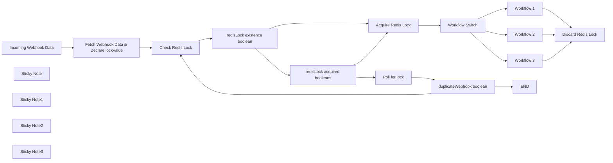

## Fluxo (.json) :

```json
{
  "nodes": [
    {
      "id": "ffe22db7-06b9-4efe-ab35-758e420dbe57",
      "name": "END",
      "type": "n8n-nodes-base.noOp",
      "position": [
        -2880,
        540
      ],
      "parameters": {},
      "typeVersion": 1
    },
    {
      "id": "9480feb6-e12a-4b59-998e-bdc7b119087a",
      "name": "Workflow 1",
      "type": "n8n-nodes-base.set",
      "position": [
        -2620,
        -20
      ],
      "parameters": {
        "options": {}
      },
      "typeVersion": 3.4
    },
    {
      "id": "54492842-137b-48d6-851a-1ce6cc751612",
      "name": "Workflow 2",
      "type": "n8n-nodes-base.set",
      "position": [
        -2620,
        200
      ],
      "parameters": {
        "options": {}
      },
      "typeVersion": 3.4
    },
    {
      "id": "83bbda2c-112b-4ed0-9ccd-c7a5c840100d",
      "name": "Workflow 3",
      "type": "n8n-nodes-base.set",
      "position": [
        -2620,
        420
      ],
      "parameters": {
        "options": {}
      },
      "typeVersion": 3.4
    },
    {
      "id": "74d889d9-5215-495b-8e60-e1c78d79ae8c",
      "name": "Incoming Webhook Data",
      "type": "n8n-nodes-base.webhook",
      "position": [
        -4760,
        220
      ],
      "webhookId": "94d08900-4816-4c74-962a-aacff5077d5d",
      "parameters": {
        "path": "94d08900-4816-4c74-962a-aacff5077d5d",
        "options": {}
      },
      "typeVersion": 2
    },
    {
      "id": "cb5e3e72-6678-4efb-8301-f149014444d2",
      "name": "Fetch Webhook Data & Declare lockValue",
      "type": "n8n-nodes-base.code",
      "position": [
        -4520,
        220
      ],
      "parameters": {
        "jsCode": "// Parse the Slack payload\nconst payload = JSON.parse($('Incoming Webhook Data').first().json[\"body\"][\"payload\"]);\n\n// Extract button action details\nconst var1 = payload.var1;\nconst var2 = payload.var2;\nconst var3 = payload.var3;\n\n// Log or return the details\nreturn {\n    var1 : var1,\n    var2: var2,\n    var3: var3,\n    lockValue : `${var1}-${var2}-${var3}`\n};"
      },
      "typeVersion": 2
    },
    {
      "id": "e118f753-945b-4951-95da-394732fc636c",
      "name": "Check Redis Lock",
      "type": "n8n-nodes-base.redis",
      "position": [
        -4220,
        220
      ],
      "parameters": {
        "key": "xyz-lock",
        "options": {},
        "operation": "get",
        "propertyName": "Element"
      },
      "credentials": {
        "redis": {
          "id": "o0RxOKCtencIaop1",
          "name": "Geoffrey Redis"
        }
      },
      "typeVersion": 1
    },
    {
      "id": "c1488bae-cb82-48ce-94cd-5359d7d10b04",
      "name": "Acquire Redis Lock",
      "type": "n8n-nodes-base.redis",
      "position": [
        -3520,
        200
      ],
      "parameters": {
        "key": "xyz-lock",
        "ttl": 180,
        "value": "={{ $('Fetch Webhook Data & Declare lockValue').item.json.lookupVariable }}",
        "expire": true,
        "operation": "set"
      },
      "credentials": {
        "redis": {
          "id": "o0RxOKCtencIaop1",
          "name": "Geoffrey Redis"
        }
      },
      "typeVersion": 1
    },
    {
      "id": "0fe5e1d8-f1e4-40e0-a3a4-4c00bbf2b50b",
      "name": "redisLock existence boolean",
      "type": "n8n-nodes-base.if",
      "position": [
        -4020,
        220
      ],
      "parameters": {
        "options": {},
        "conditions": {
          "options": {
            "version": 2,
            "leftValue": "",
            "caseSensitive": true,
            "typeValidation": "strict"
          },
          "combinator": "and",
          "conditions": [
            {
              "id": "905501b4-718c-44fb-b2a5-a8eaf8605511",
              "operator": {
                "type": "string",
                "operation": "empty",
                "singleValue": true
              },
              "leftValue": "={{ $json.Element }}",
              "rightValue": ""
            }
          ]
        }
      },
      "typeVersion": 2.2
    },
    {
      "id": "3c66fab5-2c2a-4bba-8ba1-ed85e57cd42d",
      "name": "redisLock acquired booleans",
      "type": "n8n-nodes-base.if",
      "position": [
        -3800,
        320
      ],
      "parameters": {
        "options": {},
        "conditions": {
          "options": {
            "version": 2,
            "leftValue": "",
            "caseSensitive": true,
            "typeValidation": "strict"
          },
          "combinator": "and",
          "conditions": [
            {
              "id": "6c071e68-a15a-4da8-b962-fe173b1eb145",
              "operator": {
                "type": "string",
                "operation": "notExists",
                "singleValue": true
              },
              "leftValue": "={{ $json.Element }}",
              "rightValue": ""
            }
          ]
        }
      },
      "typeVersion": 2.2
    },
    {
      "id": "787d1c86-1a66-40ea-b8b6-29f50a48737c",
      "name": "Poll for lock",
      "type": "n8n-nodes-base.wait",
      "position": [
        -3520,
        420
      ],
      "webhookId": "615b4c18-2c29-418c-a2bf-302ff24e5c65",
      "parameters": {},
      "typeVersion": 1.1
    },
    {
      "id": "f5b88169-e97b-4359-890e-969dbdc6d829",
      "name": "duplicateWebhook boolean",
      "type": "n8n-nodes-base.if",
      "position": [
        -3200,
        420
      ],
      "parameters": {
        "options": {},
        "conditions": {
          "options": {
            "version": 2,
            "leftValue": "",
            "caseSensitive": true,
            "typeValidation": "strict"
          },
          "combinator": "and",
          "conditions": [
            {
              "id": "08500e34-cc7f-4005-87bd-f7250dc076fe",
              "operator": {
                "name": "filter.operator.equals",
                "type": "string",
                "operation": "equals"
              },
              "leftValue": "={{ $('Fetch Webhook Data & Declare lockValue').item.json.lookupVariable }}",
              "rightValue": "={{ $input.first().json.Element }}"
            }
          ]
        }
      },
      "typeVersion": 2.2
    },
    {
      "id": "db4e4149-7970-402c-a3d7-2cfe47b6a5b7",
      "name": "Sticky Note",
      "type": "n8n-nodes-base.stickyNote",
      "position": [
        -4760,
        -120
      ],
      "parameters": {
        "color": 6,
        "width": 480,
        "height": 220,
        "content": "#### 🔒 This workflow demonstrates Redis-based locking to prevent concurrent execution of workflows.\n\n**Steps:**\n+ Try to acquire a lock via Redis\n+ If successful, execute workflow\n+ If duplicate request; ignore request\n+ Release the lock after completion"
      },
      "typeVersion": 1
    },
    {
      "id": "879b7ab5-402b-4ea8-977b-64d29cd9bb39",
      "name": "Discard Redis Lock",
      "type": "n8n-nodes-base.redis",
      "position": [
        -2320,
        200
      ],
      "parameters": {
        "key": "n8n-rca-lock",
        "operation": "delete"
      },
      "credentials": {
        "redis": {
          "id": "o0RxOKCtencIaop1",
          "name": "Geoffrey Redis"
        }
      },
      "typeVersion": 1
    },
    {
      "id": "494030d6-e731-4f4f-9193-7b46f2d470d0",
      "name": "Sticky Note1",
      "type": "n8n-nodes-base.stickyNote",
      "position": [
        -3580,
        80
      ],
      "parameters": {
        "color": 5,
        "width": 220,
        "height": 80,
        "content": "Attempts to acquire a lock using Redis by setting a key with expiration."
      },
      "typeVersion": 1
    },
    {
      "id": "a643b45e-2067-4c42-8c1c-365b3fea911a",
      "name": "Workflow Switch",
      "type": "n8n-nodes-base.switch",
      "position": [
        -2880,
        200
      ],
      "parameters": {
        "rules": {
          "values": [
            {
              "outputKey": "1",
              "conditions": {
                "options": {
                  "version": 2,
                  "leftValue": "",
                  "caseSensitive": true,
                  "typeValidation": "strict"
                },
                "combinator": "and",
                "conditions": [
                  {
                    "id": "2761039b-e76c-4606-9aaf-48a569942ab7",
                    "operator": {
                      "type": "string",
                      "operation": "equals"
                    },
                    "leftValue": "",
                    "rightValue": ""
                  }
                ]
              },
              "renameOutput": true
            },
            {
              "outputKey": "2",
              "conditions": {
                "options": {
                  "version": 2,
                  "leftValue": "",
                  "caseSensitive": true,
                  "typeValidation": "strict"
                },
                "combinator": "and",
                "conditions": [
                  {
                    "id": "ef07c62f-bd3f-4f54-85b9-9dbf64915f2c",
                    "operator": {
                      "name": "filter.operator.equals",
                      "type": "string",
                      "operation": "equals"
                    },
                    "leftValue": "",
                    "rightValue": ""
                  }
                ]
              },
              "renameOutput": true
            },
            {
              "outputKey": "3",
              "conditions": {
                "options": {
                  "version": 2,
                  "leftValue": "",
                  "caseSensitive": true,
                  "typeValidation": "strict"
                },
                "combinator": "and",
                "conditions": [
                  {
                    "id": "2dfc15de-bf33-4c25-932f-dae16758e2e6",
                    "operator": {
                      "name": "filter.operator.equals",
                      "type": "string",
                      "operation": "equals"
                    },
                    "leftValue": "",
                    "rightValue": ""
                  }
                ]
              },
              "renameOutput": true
            }
          ]
        },
        "options": {}
      },
      "typeVersion": 3.2
    },
    {
      "id": "5531d4c3-158c-4f98-b6fa-9ef9a85eef71",
      "name": "Sticky Note2",
      "type": "n8n-nodes-base.stickyNote",
      "position": [
        -2940,
        680
      ],
      "parameters": {
        "color": 5,
        "height": 80,
        "content": "Skips execution when duplicate request is received."
      },
      "typeVersion": 1
    },
    {
      "id": "0a159f03-3ecc-4010-ab63-cc24df90df31",
      "name": "Sticky Note3",
      "type": "n8n-nodes-base.stickyNote",
      "position": [
        -2320,
        100
      ],
      "parameters": {
        "color": 5,
        "height": 80,
        "content": "Deletes the Redis lock key to release the lock."
      },
      "typeVersion": 1
    }
  ],
  "connections": {
    "Workflow 1": {
      "main": [
        [
          {
            "node": "Discard Redis Lock",
            "type": "main",
            "index": 0
          }
        ]
      ]
    },
    "Workflow 2": {
      "main": [
        [
          {
            "node": "Discard Redis Lock",
            "type": "main",
            "index": 0
          }
        ]
      ]
    },
    "Workflow 3": {
      "main": [
        [
          {
            "node": "Discard Redis Lock",
            "type": "main",
            "index": 0
          }
        ]
      ]
    },
    "Poll for lock": {
      "main": [
        [
          {
            "node": "duplicateWebhook boolean",
            "type": "main",
            "index": 0
          }
        ]
      ]
    },
    "Workflow Switch": {
      "main": [
        [
          {
            "node": "Workflow 1",
            "type": "main",
            "index": 0
          }
        ],
        [
          {
            "node": "Workflow 2",
            "type": "main",
            "index": 0
          }
        ],
        [
          {
            "node": "Workflow 3",
            "type": "main",
            "index": 0
          }
        ]
      ]
    },
    "Check Redis Lock": {
      "main": [
        [
          {
            "node": "redisLock existence boolean",
            "type": "main",
            "index": 0
          }
        ]
      ]
    },
    "Acquire Redis Lock": {
      "main": [
        [
          {
            "node": "Workflow Switch",
            "type": "main",
            "index": 0
          }
        ]
      ]
    },
    "Incoming Webhook Data": {
      "main": [
        [
          {
            "node": "Fetch Webhook Data & Declare lockValue",
            "type": "main",
            "index": 0
          }
        ]
      ]
    },
    "duplicateWebhook boolean": {
      "main": [
        [
          {
            "node": "END",
            "type": "main",
            "index": 0
          }
        ],
        [
          {
            "node": "Check Redis Lock",
            "type": "main",
            "index": 0
          }
        ]
      ]
    },
    "redisLock acquired booleans": {
      "main": [
        [
          {
            "node": "Acquire Redis Lock",
            "type": "main",
            "index": 0
          }
        ],
        [
          {
            "node": "Poll for lock",
            "type": "main",
            "index": 0
          }
        ]
      ]
    },
    "redisLock existence boolean": {
      "main": [
        [
          {
            "node": "Acquire Redis Lock",
            "type": "main",
            "index": 0
          }
        ],
        [
          {
            "node": "redisLock acquired booleans",
            "type": "main",
            "index": 0
          }
        ]
      ]
    },
    "Fetch Webhook Data & Declare lockValue": {
      "main": [
        [
          {
            "node": "Check Redis Lock",
            "type": "main",
            "index": 0
          }
        ]
      ]
    }
  }
}
```

<a id="template-16"></a>

## Template 16 - Tradução e TTS Francês para Inglês

- **Nome:** Tradução e TTS Francês para Inglês
- **Descrição:** Recebe um texto em francês, gera áudio falado em francês, transcreve esse áudio, traduz a transcrição para inglês e gera áudio falado em inglês.
- **Funcionalidade:** • Entrada manual de texto e configuração de voz: Permite inserir o texto em francês e definir o ID da voz a ser utilizada.
• Síntese de áudio em francês: Gera um arquivo de áudio em francês a partir do texto fornecido usando um serviço de TTS.
• Transcrição de áudio: Envia o áudio gerado para transcrição em texto.
• Tradução para inglês: Traduza o texto transcrito do francês para o inglês usando um modelo de linguagem.
• Síntese de áudio em inglês: Gera um arquivo de áudio em inglês a partir da tradução.
• Uso de cabeçalhos de autenticação configuráveis: Suporta configuração de chaves de API para os serviços externos envolvidos.
- **Ferramentas:** • ElevenLabs: Serviço de síntese de voz (text-to-speech) usado para gerar áudio em francês e em inglês.
• OpenAI (Whisper): Serviço de transcrição de áudio para texto.
• OpenAI (modelos de linguagem): Modelo LLM usado para traduzir o texto do francês para o inglês.

## Fluxo visual

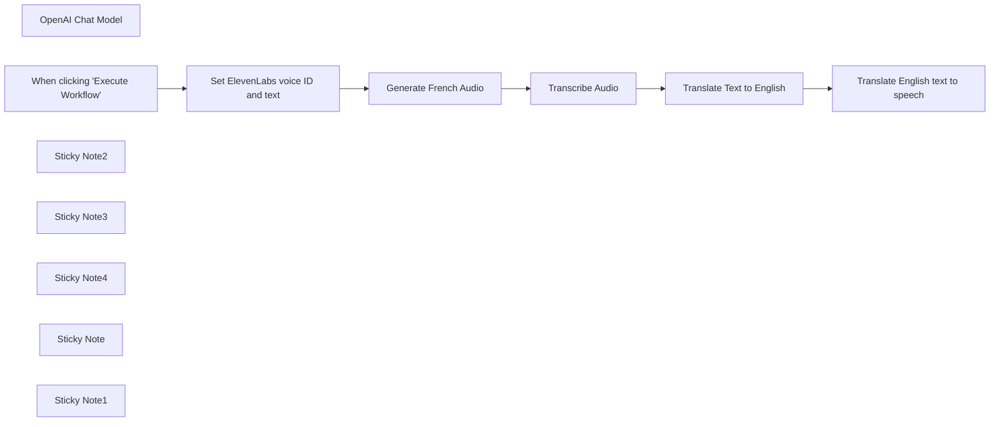

## Fluxo (.json) :

```json
{
  "meta": {
    "instanceId": "cb484ba7b742928a2048bf8829668bed5b5ad9787579adea888f05980292a4a7"
  },
  "nodes": [
    {
      "id": "aa0c62d1-2a5e-4336-8783-a8a21cb23374",
      "name": "OpenAI Chat Model",
      "type": "@n8n/n8n-nodes-langchain.lmChatOpenAi",
      "position": [
        1180,
        760
      ],
      "parameters": {
        "options": {
          "temperature": 0
        }
      },
      "credentials": {
        "openAiApi": {
          "id": "VQtv7frm7eLiEDnd",
          "name": "OpenAi account 7"
        }
      },
      "typeVersion": 1
    },
    {
      "id": "0c7d21e6-5bf6-4927-ad23-008b22e2ffde",
      "name": "When clicking \"Execute Workflow\"",
      "type": "n8n-nodes-base.manualTrigger",
      "position": [
        280,
        560
      ],
      "parameters": {},
      "typeVersion": 1
    },
    {
      "id": "352de912-3a36-4bf2-b013-b46e0ace38e9",
      "name": "Generate French Audio",
      "type": "n8n-nodes-base.httpRequest",
      "position": [
        720,
        560
      ],
      "parameters": {
        "url": "=https://api.elevenlabs.io/v1/text-to-speech/{{ $json.voice_id }}",
        "method": "POST",
        "options": {},
        "jsonBody": "={\"text\":\"{{ $json.text }}\",\"model_id\":\"eleven_multilingual_v2\",\"voice_settings\":{\"stability\":0.5,\"similarity_boost\":0.5}}",
        "sendBody": true,
        "sendQuery": true,
        "sendHeaders": true,
        "specifyBody": "json",
        "authentication": "genericCredentialType",
        "genericAuthType": "httpHeaderAuth",
        "queryParameters": {
          "parameters": [
            {
              "name": "optimize_streaming_latency",
              "value": "1"
            }
          ]
        },
        "headerParameters": {
          "parameters": [
            {
              "name": "accept",
              "value": "audio/mpeg"
            }
          ]
        }
      },
      "credentials": {
        "httpHeaderAuth": {
          "id": "OMni1VQQclVYOmeZ",
          "name": "ElevenLabs David"
        }
      },
      "typeVersion": 4.1
    },
    {
      "id": "0cde2e89-0669-41b4-8fe1-1a6aff14792f",
      "name": "Set ElevenLabs voice ID and text",
      "type": "n8n-nodes-base.set",
      "position": [
        500,
        560
      ],
      "parameters": {
        "fields": {
          "values": [
            {
              "name": "voice_id",
              "stringValue": "wl7sZxfTOitHVachQiUm"
            },
            {
              "name": "text",
              "stringValue": "=Après, on a fait la sieste, Camille a travaillé pour French Today et j’ai étudié un peu, et puis Camille a proposé de suivre une visite guidée de l’Abbaye de Beauport qui commençait à 17 heures. On a marché environ vingt minutes, et je m’arrêtais souvent pour prendre des photos : la baie de Paimpol est si jolie ! Mais Camille m’a dit : « Dépêche-toi Sunny ! La visite guidée commence dans cinq minutes. » Donc, j’ai bougé mes fesses et on est arrivées à l’abbaye"
            }
          ]
        },
        "options": {}
      },
      "typeVersion": 3.2
    },
    {
      "id": "38aa323e-a899-4018-afb9-4d4682ac8ff1",
      "name": "Translate Text to English",
      "type": "@n8n/n8n-nodes-langchain.chainLlm",
      "position": [
        1180,
        560
      ],
      "parameters": {
        "prompt": "=Translate to English:\n{{ $json.text }}"
      },
      "typeVersion": 1.2
    },
    {
      "id": "f0b7adad-fa0b-4764-96e0-0883bbcc02d6",
      "name": "Translate English text to speech",
      "type": "n8n-nodes-base.httpRequest",
      "position": [
        1540,
        560
      ],
      "parameters": {
        "url": "=https://api.elevenlabs.io/v1/text-to-speech/{{ $('Set ElevenLabs voice ID and text').item.json.voice_id }}",
        "method": "POST",
        "options": {},
        "jsonBody": "={\"text\":\"{{ $json[\"text\"].replaceAll('\"', '\\\\\"').trim() }}\",\"model_id\":\"eleven_multilingual_v2\",\"voice_settings\":{\"stability\":0.5,\"similarity_boost\":0.5}}",
        "sendBody": true,
        "sendQuery": true,
        "sendHeaders": true,
        "specifyBody": "json",
        "authentication": "genericCredentialType",
        "genericAuthType": "httpHeaderAuth",
        "queryParameters": {
          "parameters": [
            {
              "name": "optimize_streaming_latency",
              "value": "1"
            }
          ]
        },
        "headerParameters": {
          "parameters": [
            {
              "name": "accept",
              "value": "audio/mpeg"
            }
          ]
        }
      },
      "credentials": {
        "httpHeaderAuth": {
          "id": "OMni1VQQclVYOmeZ",
          "name": "ElevenLabs David"
        }
      },
      "typeVersion": 4.1
    },
    {
      "id": "f8700266-5491-4ca7-b29a-3f5ec1e9b66f",
      "name": "Transcribe Audio",
      "type": "n8n-nodes-base.httpRequest",
      "position": [
        960,
        560
      ],
      "parameters": {
        "url": "https://api.openai.com/v1/audio/transcriptions",
        "method": "POST",
        "options": {},
        "sendBody": true,
        "contentType": "multipart-form-data",
        "authentication": "predefinedCredentialType",
        "bodyParameters": {
          "parameters": [
            {
              "name": "file",
              "parameterType": "formBinaryData",
              "inputDataFieldName": "data"
            },
            {
              "name": "model",
              "value": "whisper-1"
            }
          ]
        },
        "nodeCredentialType": "openAiApi"
      },
      "credentials": {
        "openAiApi": {
          "id": "VQtv7frm7eLiEDnd",
          "name": "OpenAi account 7"
        }
      },
      "typeVersion": 4.1
    },
    {
      "id": "25630b45-3827-4ee0-a77e-c30cadefe999",
      "name": "Sticky Note2",
      "type": "n8n-nodes-base.stickyNote",
      "position": [
        449.2637232176971,
        319.7947500318393
      ],
      "parameters": {
        "color": 7,
        "width": 199.37543798209555,
        "height": 420.623805972039,
        "content": "1] In ElevenLabs, add a voice to your [voice lab](https://elevenlabs.io/voice-lab) and copy its ID. Open this node and add the ID there"
      },
      "typeVersion": 1
    },
    {
      "id": "a41d2622-4476-44c2-bac6-212be237aa4b",
      "name": "Sticky Note3",
      "type": "n8n-nodes-base.stickyNote",
      "position": [
        680,
        320
      ],
      "parameters": {
        "color": 7,
        "width": 192.21792012722693,
        "height": 418.3754668433847,
        "content": "2] Get your ElevenLabs API key (click your name in the bottom-left of [ElevenLabs](https://elevenlabs.io/voice-lab) and choose ‘profile’)\n\nIn this node, create a new header auth cred. Set the name to `xi-api-key` and the value to your API key"
      },
      "typeVersion": 1
    },
    {
      "id": "58143bb1-816f-4ff6-9cac-9ce7765e02be",
      "name": "Sticky Note4",
      "type": "n8n-nodes-base.stickyNote",
      "position": [
        920,
        320
      ],
      "parameters": {
        "color": 7,
        "width": 192.21792012722693,
        "height": 414.59045768149747,
        "content": "3] In the 'credential' field of this node, create a new OpenAI cred with your [OpenAI API key](https://platform.openai.com/api-keys)"
      },
      "typeVersion": 1
    },
    {
      "id": "bd2ef5d2-c27d-45e4-a66e-a73168f94087",
      "name": "Sticky Note",
      "type": "n8n-nodes-base.stickyNote",
      "position": [
        160,
        273.1221160672591
      ],
      "parameters": {
        "color": 7,
        "width": 230.39134868652621,
        "height": 233.3354221029769,
        "content": "### About\nThis workflow takes some French text, and translates it into spoken audio.\n\nIt then transcribes that audio back into text, translates it into English and generates an audio file of the English text"
      },
      "typeVersion": 1
    },
    {
      "id": "a1f207d4-dbed-4dfa-aad5-2b2f6e4e6271",
      "name": "Sticky Note1",
      "type": "n8n-nodes-base.stickyNote",
      "position": [
        440,
        272.42998167622557
      ],
      "parameters": {
        "color": 7,
        "width": 685.8541178336201,
        "height": 478.0993479050163,
        "content": "### Setup steps"
      },
      "typeVersion": 1
    }
  ],
  "pinData": {},
  "connections": {
    "Transcribe Audio": {
      "main": [
        [
          {
            "node": "Translate Text to English",
            "type": "main",
            "index": 0
          }
        ]
      ]
    },
    "OpenAI Chat Model": {
      "ai_languageModel": [
        [
          {
            "node": "Translate Text to English",
            "type": "ai_languageModel",
            "index": 0
          }
        ]
      ]
    },
    "Generate French Audio": {
      "main": [
        [
          {
            "node": "Transcribe Audio",
            "type": "main",
            "index": 0
          }
        ]
      ]
    },
    "Translate Text to English": {
      "main": [
        [
          {
            "node": "Translate English text to speech",
            "type": "main",
            "index": 0
          }
        ]
      ]
    },
    "Set ElevenLabs voice ID and text": {
      "main": [
        [
          {
            "node": "Generate French Audio",
            "type": "main",
            "index": 0
          }
        ]
      ]
    },
    "When clicking \"Execute Workflow\"": {
      "main": [
        [
          {
            "node": "Set ElevenLabs voice ID and text",
            "type": "main",
            "index": 0
          }
        ]
      ]
    }
  }
}
```

<a id="template-17"></a>

## Template 17 - Atualizar campo Close Date com validação

- **Nome:** Atualizar campo Close Date com validação
- **Descrição:** Ao executar manualmente, o fluxo define um valor para Close Date, verifica se ele contém uma data no formato YYYY-MM-DD e, caso não contenha, substitui por uma data 3 semanas à frente. Se já estiver no formato esperado, o valor original é preservado.
- **Funcionalidade:** • Execução manual: Inicia o fluxo quando o usuário clica em executar.
• Definir Close Date inicial: Atribui um valor ISO fixo ao campo Close Date.
• Verificar formato da data: Avalia se o valor de Close Date contém o padrão YYYY-MM-DD.
• Manter valor original se válido: Se o padrão for detectado, preserva o Close Date fornecido.
• Atualizar para 3 semanas depois se inválido: Se o padrão não for detectado, calcula e define uma data 21 dias à frente no formato ISO.
- **Ferramentas:** • Nenhuma: Não há integração com serviços externos; todas as operações são realizadas localmente no fluxo.

## Fluxo visual

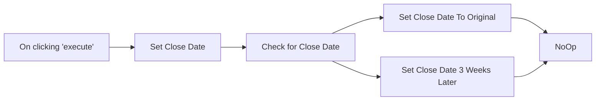

## Fluxo (.json) :

```json
{
  "nodes": [
    {
      "name": "On clicking 'execute'",
      "type": "n8n-nodes-base.manualTrigger",
      "position": [
        250,
        300
      ],
      "parameters": {},
      "typeVersion": 1
    },
    {
      "name": "Check for Close Date",
      "type": "n8n-nodes-base.if",
      "position": [
        660,
        300
      ],
      "parameters": {
        "conditions": {
          "string": [
            {
              "value1": "={{$json[\"Close Date\"]}}",
              "value2": "/\\d\\d\\d\\d-\\d\\d-\\d\\d/i",
              "operation": "regex"
            }
          ]
        },
        "combineOperation": "any"
      },
      "typeVersion": 1
    },
    {
      "name": "Set Close Date 3 Weeks Later",
      "type": "n8n-nodes-base.set",
      "position": [
        910,
        370
      ],
      "parameters": {
        "values": {
          "string": [
            {
              "name": "Close Date",
              "value": "={{new Date(new Date().setDate(new Date().getDate() + 21)).toISOString()}}"
            }
          ]
        },
        "options": {},
        "keepOnlySet": true
      },
      "typeVersion": 1
    },
    {
      "name": "NoOp",
      "type": "n8n-nodes-base.noOp",
      "position": [
        1140,
        280
      ],
      "parameters": {},
      "typeVersion": 1
    },
    {
      "name": "Set Close Date",
      "type": "n8n-nodes-base.set",
      "position": [
        450,
        300
      ],
      "parameters": {
        "values": {
          "string": [
            {
              "name": "Close Date",
              "value": "2021-11-29T00:00:00.000Z"
            }
          ]
        },
        "options": {}
      },
      "typeVersion": 1
    },
    {
      "name": "Set Close Date To Original",
      "type": "n8n-nodes-base.set",
      "position": [
        910,
        210
      ],
      "parameters": {
        "values": {
          "string": [
            {
              "name": "Close Date",
              "value": "={{$node[\"Set Close Date\"].json[\"Close Date\"]}}"
            }
          ]
        },
        "options": {},
        "keepOnlySet": true
      },
      "typeVersion": 1
    }
  ],
  "connections": {
    "Set Close Date": {
      "main": [
        [
          {
            "node": "Check for Close Date",
            "type": "main",
            "index": 0
          }
        ]
      ]
    },
    "Check for Close Date": {
      "main": [
        [
          {
            "node": "Set Close Date To Original",
            "type": "main",
            "index": 0
          }
        ],
        [
          {
            "node": "Set Close Date 3 Weeks Later",
            "type": "main",
            "index": 0
          }
        ]
      ]
    },
    "On clicking 'execute'": {
      "main": [
        [
          {
            "node": "Set Close Date",
            "type": "main",
            "index": 0
          }
        ]
      ]
    },
    "Set Close Date To Original": {
      "main": [
        [
          {
            "node": "NoOp",
            "type": "main",
            "index": 0
          }
        ]
      ]
    },
    "Set Close Date 3 Weeks Later": {
      "main": [
        [
          {
            "node": "NoOp",
            "type": "main",
            "index": 0
          }
        ]
      ]
    }
  }
}
```

<a id="template-18"></a>

## Template 18 - Importação automática de CSV para PostgreSQL

- **Nome:** Importação automática de CSV para PostgreSQL
- **Descrição:** Importa dados de um arquivo CSV local para uma tabela PostgreSQL, mapeando colunas e atualizando registros com base na chave de identificação.
- **Funcionalidade:** • Disparo manual: inicia o processo quando o usuário executa a ação.
• Leitura de arquivo CSV local: lê o arquivo localizado em /tmp/t1.csv.
• Conversão/parse do CSV para formato tabular: transforma o conteúdo binário do arquivo em linhas e colunas.
• Mapeamento de colunas: associa campos do CSV às colunas da tabela (por exemplo, id e name).
• Inserção/atualização no banco: insere novos registros ou atualiza existentes na tabela public.t1 com base na coluna id.
- **Ferramentas:** • Sistema de arquivos local: armazena o arquivo CSV em /tmp/t1.csv e permite sua leitura.
• PostgreSQL: banco de dados relacional onde os dados são inseridos/atualizados na tabela public.t1.

## Fluxo visual

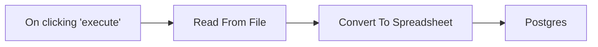

## Fluxo (.json) :

```json
{
  "id": "q8GNbRhjQDwDpXoo",
  "meta": {
    "instanceId": "0c2f219d911381bce56d337dbc86e66ee815b6ed822f8553d03a4cd4a8f25805",
    "templateCredsSetupCompleted": true
  },
  "name": "How to automatically import CSV files into postgres",
  "tags": [],
  "nodes": [
    {
      "id": "9ae270f2-6e32-4a14-8a03-634b9c66004d",
      "name": "On clicking 'execute'",
      "type": "n8n-nodes-base.manualTrigger",
      "position": [
        -340,
        -80
      ],
      "parameters": {},
      "typeVersion": 1
    },
    {
      "id": "96de1409-9c48-4357-aaef-2202dec478a9",
      "name": "Read From File",
      "type": "n8n-nodes-base.readBinaryFile",
      "position": [
        -140,
        -80
      ],
      "parameters": {
        "filePath": "/tmp/t1.csv"
      },
      "typeVersion": 1
    },
    {
      "id": "22b002df-51fd-4074-8741-c9a754996170",
      "name": "Convert To Spreadsheet",
      "type": "n8n-nodes-base.spreadsheetFile",
      "position": [
        60,
        -80
      ],
      "parameters": {
        "options": {}
      },
      "typeVersion": 1
    },
    {
      "id": "0ec04e46-be13-40c3-a4a4-60787bf02a1f",
      "name": "Postgres",
      "type": "n8n-nodes-base.postgres",
      "position": [
        320,
        -80
      ],
      "parameters": {
        "table": {
          "__rl": true,
          "mode": "name",
          "value": "t1"
        },
        "schema": {
          "__rl": true,
          "mode": "list",
          "value": "public",
          "cachedResultName": "public"
        },
        "columns": {
          "value": {
            "id": 0
          },
          "schema": [
            {
              "id": "id",
              "type": "number",
              "display": true,
              "removed": false,
              "required": false,
              "displayName": "id",
              "defaultMatch": true,
              "canBeUsedToMatch": true
            },
            {
              "id": "name",
              "type": "string",
              "display": true,
              "required": false,
              "displayName": "name",
              "defaultMatch": false,
              "canBeUsedToMatch": true
            }
          ],
          "mappingMode": "autoMapInputData",
          "matchingColumns": [
            "id"
          ],
          "attemptToConvertTypes": false,
          "convertFieldsToString": false
        },
        "options": {}
      },
      "credentials": {
        "postgres": {
          "id": "cgLBOWHeiHmIZuFx",
          "name": "Postgres account"
        }
      },
      "typeVersion": 2.5
    }
  ],
  "active": false,
  "pinData": {},
  "settings": {
    "executionOrder": "v1"
  },
  "versionId": "332ff892-d7c2-4e11-8119-e95a2ded82e7",
  "connections": {
    "Read From File": {
      "main": [
        [
          {
            "node": "Convert To Spreadsheet",
            "type": "main",
            "index": 0
          }
        ]
      ]
    },
    "On clicking 'execute'": {
      "main": [
        [
          {
            "node": "Read From File",
            "type": "main",
            "index": 0
          }
        ]
      ]
    },
    "Convert To Spreadsheet": {
      "main": [
        [
          {
            "node": "Postgres",
            "type": "main",
            "index": 0
          }
        ]
      ]
    }
  }
}
```

<a id="template-19"></a>

## Template 19 - Criar Work Item Azure DevOps por alertas Elasticsearch

- **Nome:** Criar Work Item Azure DevOps por alertas Elasticsearch
- **Descrição:** Agendado diariamente, o fluxo consulta o Elasticsearch em busca de documentos/alertas e cria um item de trabalho no Azure DevOps quando são encontrados resultados.
- **Funcionalidade:** • Agendamento periódico: Executa a rotina em horário definido (execução programada diariamente).
• Consulta a índice de buscas: Realiza uma pesquisa no Elasticsearch para detectar documentos ou eventos relevantes.
• Verificação de ocorrências: Avalia se a consulta retornou resultados (número de hits maior que zero).
• Criação de item de trabalho: Quando há ocorrências, cria um Work Item no Azure DevOps usando a API apropriada e cabeçalhos adequados.
• Caminho sem ação: Se não houver ocorrências, o fluxo segue sem realizar nenhuma operação adicional.
- **Ferramentas:** • Elasticsearch: Armazenamento e mecanismo de busca usado para consultar e detectar documentos/alertas.
• Azure DevOps (Work Items API): Plataforma para criar e gerenciar itens de trabalho via API, permitindo rastreamento e resolução das ocorrências detectadas.

## Fluxo visual

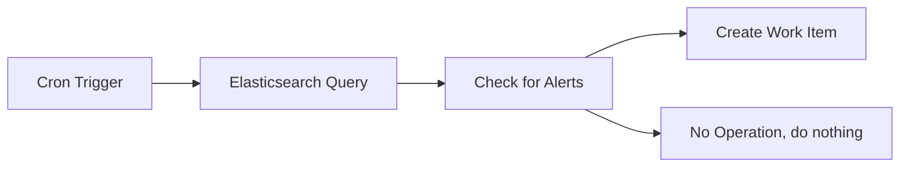

## Fluxo (.json) :

```json
{
  "meta": {
    "instanceId": "43da491ee7afc3232a99276a123dc774d0498da8891013b60e82828d6f1f40c7"
  },
  "nodes": [
    {
      "id": "77af14bb-db74-4069-adcc-d66e3bb3f893",
      "name": "Cron Trigger",
      "type": "n8n-nodes-base.cron",
      "position": [
        400,
        300
      ],
      "parameters": {
        "triggerTimes": {
          "item": [
            {
              "hour": 12,
              "minute": 15
            }
          ]
        }
      },
      "typeVersion": 1
    },
    {
      "id": "286b8b82-78c5-458a-b708-79f0b7d1437c",
      "name": "Elasticsearch Query",
      "type": "n8n-nodes-base.elasticsearch",
      "position": [
        600,
        300
      ],
      "parameters": {
        "options": {}
      },
      "typeVersion": 1
    },
    {
      "id": "425719a5-41d2-4f3a-80ba-241620d9f793",
      "name": "Check for Alerts",
      "type": "n8n-nodes-base.if",
      "position": [
        800,
        300
      ],
      "parameters": {
        "conditions": {
          "number": [
            {
              "value1": "={{$json[\"hits\"][\"total\"][\"value\"]}}",
              "operation": "greater"
            }
          ]
        }
      },
      "typeVersion": 1
    },
    {
      "id": "a2c6bd3d-c65d-4653-8183-9525a4c3af79",
      "name": "Create Work Item",
      "type": "n8n-nodes-base.httpRequest",
      "position": [
        1040,
        280
      ],
      "parameters": {
        "url": "https://dev.azure.com/<organization>/<project>/_apis/wit/workitems/$Task?api-version=7.1-preview.3",
        "options": {},
        "authentication": "basicAuth",
        "headerParametersUi": {
          "parameter": [
            {
              "name": "Content-Type",
              "value": "application/json-patch+json"
            }
          ]
        }
      },
      "typeVersion": 1
    },
    {
      "id": "71ee087f-4f75-4544-b26a-95c7ce12d020",
      "name": "No Operation, do nothing",
      "type": "n8n-nodes-base.noOp",
      "position": [
        1060,
        460
      ],
      "parameters": {},
      "typeVersion": 1
    }
  ],
  "pinData": {},
  "connections": {
    "Cron Trigger": {
      "main": [
        [
          {
            "node": "Elasticsearch Query",
            "type": "main",
            "index": 0
          }
        ]
      ]
    },
    "Check for Alerts": {
      "main": [
        [
          {
            "node": "Create Work Item",
            "type": "main",
            "index": 0
          }
        ],
        [
          {
            "node": "No Operation, do nothing",
            "type": "main",
            "index": 0
          }
        ]
      ]
    },
    "Elasticsearch Query": {
      "main": [
        [
          {
            "node": "Check for Alerts",
            "type": "main",
            "index": 0
          }
        ]
      ]
    }
  }
}
```

<a id="template-20"></a>

## Template 20 - Publicador automático de tweets a partir do Sheets

- **Nome:** Publicador automático de tweets a partir do Sheets
- **Descrição:** Busca mensagens em uma planilha do Google em intervalos regulares e publica cada mensagem na conta X, removendo a entrada publicada da lista.
- **Funcionalidade:** • Agendamento periódico: Executa o fluxo a cada 6 horas para verificar novos tweets.
• Leitura de mensagens da planilha: Obtém o próximo texto a ser publicado a partir da aba 'Tweets' de uma planilha do Google.
• Publicação na conta X: Envia o conteúdo lido como postagem para a conta X (Twitter).
• Remoção após postagem: Exclui a linha publicada da planilha para evitar republicações.
• Configuração de credenciais: Requer autorização para acessar a planilha do Google e para publicar na conta X.
- **Ferramentas:** • Google Sheets: Armazena a lista de mensagens (aba 'Tweets') a serem publicadas.
• X (Twitter): Plataforma onde as mensagens são publicadas como posts.

## Fluxo visual

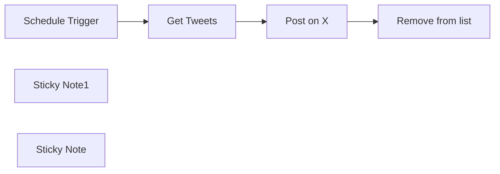

## Fluxo (.json) :

```json
{
  "meta": {
    "instanceId": "8418cffce8d48086ec0a73fd90aca708aa07591f2fefa6034d87fe12a09de26e"
  },
  "nodes": [
    {
      "id": "3f4a15ab-64d8-49af-ba80-3aa1d424a62a",
      "name": "Schedule Trigger",
      "type": "n8n-nodes-base.scheduleTrigger",
      "position": [
        620,
        160
      ],
      "parameters": {
        "rule": {
          "interval": [
            {
              "field": "hours",
              "hoursInterval": 6
            }
          ]
        }
      },
      "typeVersion": 1.1
    },
    {
      "id": "8a8681b7-2d28-403f-92a7-58c9030cb8a6",
      "name": "Get Tweets",
      "type": "n8n-nodes-base.googleSheets",
      "position": [
        820,
        160
      ],
      "parameters": {
        "options": {
          "returnAllMatches": "returnFirstMatch"
        },
        "sheetName": {
          "__rl": true,
          "mode": "list",
          "value": 600232182,
          "cachedResultUrl": "https://docs.google.com/spreadsheets/d/1QyscSsUITnoJRnvyBbRpWeNF90TGD4dF5yj8DyZYQsA/edit#gid=600232182",
          "cachedResultName": "Tweets"
        },
        "documentId": {
          "__rl": true,
          "mode": "list",
          "value": "1QyscSsUITnoJRnvyBbRpWeNF90TGD4dF5yj8DyZYQsA",
          "cachedResultUrl": "https://docs.google.com/spreadsheets/d/1QyscSsUITnoJRnvyBbRpWeNF90TGD4dF5yj8DyZYQsA/edit?usp=drivesdk",
          "cachedResultName": "Tweets"
        }
      },
      "credentials": {
        "googleSheetsOAuth2Api": {
          "id": "RICzFHixgHXMuKmg",
          "name": "Google Sheets account"
        }
      },
      "typeVersion": 4.3
    },
    {
      "id": "bcce591e-b92e-43b4-b672-b02e32f95d15",
      "name": "Post on X",
      "type": "n8n-nodes-base.twitter",
      "position": [
        1000,
        160
      ],
      "parameters": {
        "text": "={{ $json.tweet }}",
        "additionalFields": {}
      },
      "credentials": {
        "twitterOAuth2Api": {
          "id": "Yz7PjesMFvasMWkd",
          "name": "X account"
        }
      },
      "typeVersion": 2
    },
    {
      "id": "8acdd2a7-6104-490d-b8d0-26e5ff2fa37d",
      "name": "Sticky Note1",
      "type": "n8n-nodes-base.stickyNote",
      "position": [
        640,
        -280
      ],
      "parameters": {
        "color": 6,
        "width": 275.01592825011585,
        "height": 406.7602710975665,
        "content": "# Setup\n### 1/ Add Your credentials\n[Google - Sheet](https://docs.n8n.io/integrations/builtin/credentials/google/)\n[X - Twitter](https://docs.n8n.io/integrations/builtin/credentials/twitter/)\n\n### 2/ Create a new Google Spread Sheet, with one sheet named Tweets and in the first cell, write tweet.\n\n### 3/ Define your desire frequency\n\n# 👇"
      },
      "typeVersion": 1
    },
    {
      "id": "255e1f0f-beea-43fd-bfe6-0cc551a9eb6f",
      "name": "Sticky Note",
      "type": "n8n-nodes-base.stickyNote",
      "position": [
        940,
        40
      ],
      "parameters": {
        "color": 7,
        "width": 202.64787116404852,
        "height": 85.79488430601403,
        "content": "### Crafted by the\n## [🥷 n8n.ninja](https://n8n.ninja)"
      },
      "typeVersion": 1
    },
    {
      "id": "f834409b-bba2-4e8a-9fb9-5971a49960dd",
      "name": "Remove from list",
      "type": "n8n-nodes-base.googleSheets",
      "position": [
        1180,
        160
      ],
      "parameters": {
        "operation": "delete",
        "sheetName": {
          "__rl": true,
          "mode": "list",
          "value": 600232182,
          "cachedResultUrl": "https://docs.google.com/spreadsheets/d/1QyscSsUITnoJRnvyBbRpWeNF90TGD4dF5yj8DyZYQsA/edit#gid=600232182",
          "cachedResultName": "Tweets"
        },
        "documentId": {
          "__rl": true,
          "mode": "list",
          "value": "1QyscSsUITnoJRnvyBbRpWeNF90TGD4dF5yj8DyZYQsA",
          "cachedResultUrl": "https://docs.google.com/spreadsheets/d/1QyscSsUITnoJRnvyBbRpWeNF90TGD4dF5yj8DyZYQsA/edit?usp=drivesdk",
          "cachedResultName": "Tweets"
        }
      },
      "credentials": {
        "googleSheetsOAuth2Api": {
          "id": "RICzFHixgHXMuKmg",
          "name": "Google Sheets account"
        }
      },
      "typeVersion": 4.3
    }
  ],
  "pinData": {},
  "connections": {
    "Post on X": {
      "main": [
        [
          {
            "node": "Remove from list",
            "type": "main",
            "index": 0
          }
        ]
      ]
    },
    "Get Tweets": {
      "main": [
        [
          {
            "node": "Post on X",
            "type": "main",
            "index": 0
          }
        ]
      ]
    },
    "Schedule Trigger": {
      "main": [
        [
          {
            "node": "Get Tweets",
            "type": "main",
            "index": 0
          }
        ]
      ]
    }
  }
}
```
