# PACK 1999 TEMPLATES PARTE 01 - Bloco 2

Templates neste bloco: 20

## Sumário

- [Template 21 - Enviar template por e-mail após compra PayPal](#template-21)
- [Template 22 - Roteamento por valor booleano de saída de comando](#template-22)
- [Template 23 - Extração, Resumo e Análise de Sentimento de Conteúdo](#template-23)
- [Template 25 - Buffer e consolidação de mensagens](#template-25)
- [Template 26 - Enviar email por país do IP](#template-26)
- [Template 27 - Obter volume e adicionar à estante do usuário](#template-27)
- [Template 28 - Resposta automática de e-mail com revisão humana](#template-28)
- [Template 29 - Conversão Markdown → HTML para descrições do Airtable](#template-29)
- [Template 30 - Publicação automática de posts no Instagram](#template-30)
- [Template 31 - Resposta automática por e-mail com revisão humana](#template-31)
- [Template 32 - Soma de valores USD](#template-32)
- [Template 33 - Auto-resposta por IA com aprovação](#template-33)
- [Template 34 - Criar e atualizar item Webflow](#template-34)
- [Template 35 - Gerador de tweets com hashtag e armazenamento](#template-35)
- [Template 36 - Atualizações de eventos no ClickUp](#template-36)
- [Template 37 - Notificações GitHub para Discord](#template-37)
- [Template 38 - Rastreamento de despesas por recibos](#template-38)
- [Template 39 - Gatilho Calendly: invitee criado ou cancelado](#template-39)
- [Template 40 - Atualizações de eventos do Chargebee](#template-40)
- [Template 41 - Reindexação de URLs a partir do sitemap](#template-41)

---

<a id="template-21"></a>

## Template 21 - Enviar template por e-mail após compra PayPal

- **Nome:** Enviar template por e-mail após compra PayPal
- **Descrição:** Recebe notificações de pagamento do PayPal, valida pagamentos concluídos, obtém detalhes do pedido, baixa um template JSON e envia um e‑mail personalizado com o template anexado ao comprador.
- **Funcionalidade:** • Recepção de notificações do PayPal: recebe webhooks de eventos de pagamento via POST.
• Espera para confirmação: introduz uma pausa para garantir que a transação foi completamente processada.
• Filtragem de evento de pagamento: processa apenas eventos PAYMENT.CAPTURE.COMPLETED.
• Recuperação dos detalhes do pedido: consulta a API de Orders do PayPal usando o order_id fornecido no webhook.
• Extração de dados do cliente e produto: obtém nome, sobrenome, e‑mail e o produto comprado a partir dos detalhes do pedido.
• Filtragem por produto: continua o fluxo apenas se o produto corresponder ao template específico vendido.
• Download do template JSON: busca o ficheiro JSON do template a partir de uma URL externa.
• Conversão para arquivo anexo: transforma o JSON em um ficheiro binário (attachment) pronto para envio.
• Envio de e‑mail personalizado: envia um e‑mail HTML ao comprador com assunto e conteúdo personalizados e o template anexado.
- **Ferramentas:** • PayPal: plataforma de pagamentos utilizada para receber webhooks de eventos e consultar a API de detalhes de pedidos.
• Hospedagem de ficheiro JSON (URL externa): local onde o template JSON é armazenado e disponibilizado para download.
• Serviço de e‑mail/SMTP: provedor responsável pelo envio do e‑mail com o anexo ao cliente.

## Fluxo visual

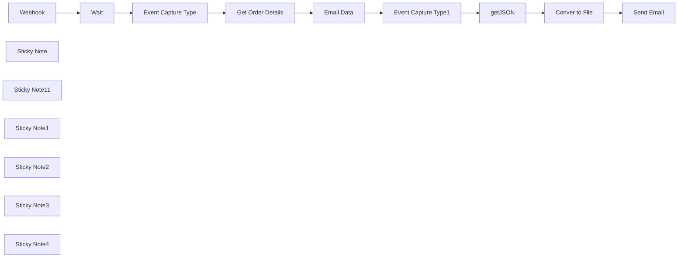

## Fluxo (.json) :

```json
{
  "meta": {
    "instanceId": "4359279a248a64f23ddf72d3bc2de4dead8a687e643e9296f8a007dd65120396"
  },
  "nodes": [
    {
      "id": "74a81d54-6cc9-4c17-88fe-aca27d491b73",
      "name": "Webhook",
      "type": "n8n-nodes-base.webhook",
      "position": [
        640,
        40
      ],
      "webhookId": "1d3d0c06-f979-4573-b644-1a5b13153471",
      "parameters": {
        "path": "paypal-NVP-SOAP-Webhook",
        "options": {},
        "httpMethod": "POST"
      },
      "typeVersion": 2
    },
    {
      "id": "59caade5-a67d-4d22-822c-bec8bf9baf69",
      "name": "Event Capture Type",
      "type": "n8n-nodes-base.switch",
      "position": [
        1160,
        0
      ],
      "parameters": {
        "rules": {
          "values": [
            {
              "outputKey": "Payment",
              "conditions": {
                "options": {
                  "version": 2,
                  "leftValue": "",
                  "caseSensitive": true,
                  "typeValidation": "strict"
                },
                "combinator": "and",
                "conditions": [
                  {
                    "id": "68917137-6042-4e47-9432-d006dca17872",
                    "operator": {
                      "type": "string",
                      "operation": "equals"
                    },
                    "leftValue": "={{ $json.body.event_type }}",
                    "rightValue": "=PAYMENT.CAPTURE.COMPLETED"
                  }
                ]
              },
              "renameOutput": true
            }
          ]
        },
        "options": {}
      },
      "typeVersion": 3.2
    },
    {
      "id": "cba1ef91-2e34-4bd5-9972-565296137851",
      "name": "Get Order Details",
      "type": "n8n-nodes-base.httpRequest",
      "position": [
        1360,
        0
      ],
      "parameters": {
        "url": "=https://api.paypal.com/v2/checkout/orders/{{ $json.body.resource.supplementary_data.related_ids.order_id }}",
        "options": {},
        "authentication": "genericCredentialType",
        "genericAuthType": "oAuth2Api"
      },
      "typeVersion": 4.2
    },
    {
      "id": "ecab1f76-8c53-459c-8c5f-26356ec9e675",
      "name": "Email Data",
      "type": "n8n-nodes-base.set",
      "position": [
        1540,
        0
      ],
      "parameters": {
        "options": {},
        "assignments": {
          "assignments": [
            {
              "id": "8d56c774-9adb-4981-9295-6f6f2ec59749",
              "name": "First Name",
              "type": "string",
              "value": "={{ $json.payment_source.paypal.name.given_name }}"
            },
            {
              "id": "0f6136eb-f5e1-47b9-a829-f42dff2b7c9e",
              "name": "Last Name",
              "type": "string",
              "value": "={{ $json.payment_source.paypal.name.surname }}"
            },
            {
              "id": "f4da90dc-b4d5-4951-91b8-2ef4b2bf870d",
              "name": "EmaiID",
              "type": "string",
              "value": "={{ $json.payment_source.paypal.email_address }}"
            },
            {
              "id": "f7a31ec1-4305-4df0-8791-0f59a04f0c7e",
              "name": "Product Purchased",
              "type": "string",
              "value": "={{ $json.purchase_units[0].items[0].name }}"
            }
          ]
        }
      },
      "typeVersion": 3.4
    },
    {
      "id": "211fbba0-67b1-4ece-b6a7-79b7c5cd0f7a",
      "name": "Wait",
      "type": "n8n-nodes-base.wait",
      "position": [
        920,
        40
      ],
      "webhookId": "16debf49-5196-473a-8b55-b2450b9b575a",
      "parameters": {},
      "typeVersion": 1.1
    },
    {
      "id": "c4b9bcab-42ab-4fca-b064-ab262cdcf05e",
      "name": "getJSON",
      "type": "n8n-nodes-base.httpRequest",
      "position": [
        2060,
        0
      ],
      "parameters": {
        "url": "https://your-json-template-in-ase-you-are-sellig.json",
        "options": {}
      },
      "typeVersion": 4.2
    },
    {
      "id": "b92f72a4-25c2-4c6d-9cc1-366cd1dc2dd1",
      "name": "Event Capture Type1",
      "type": "n8n-nodes-base.switch",
      "position": [
        1760,
        0
      ],
      "parameters": {
        "rules": {
          "values": [
            {
              "outputKey": "SocialMedia",
              "conditions": {
                "options": {
                  "version": 2,
                  "leftValue": "",
                  "caseSensitive": true,
                  "typeValidation": "strict"
                },
                "combinator": "and",
                "conditions": [
                  {
                    "id": "68917137-6042-4e47-9432-d006dca17872",
                    "operator": {
                      "type": "string",
                      "operation": "equals"
                    },
                    "leftValue": "={{ $json[\"Product Purchased\"] }}",
                    "rightValue": "=AI-Powered Social Media Content Generator & Publisher"
                  }
                ]
              },
              "renameOutput": true
            }
          ]
        },
        "options": {}
      },
      "typeVersion": 3.2
    },
    {
      "id": "10f88f6c-1062-48c5-8a90-116c18954d95",
      "name": "Conver to File",
      "type": "n8n-nodes-base.code",
      "position": [
        2280,
        0
      ],
      "parameters": {
        "jsCode": "const content = JSON.stringify($json, null, 2); // Pretty-print JSON\n\nreturn [\n  {\n    binary: {\n      data: {\n        data: Buffer.from(content).toString('base64'),\n        mimeType: 'application/json',\n        fileName: 'data.json'\n      }\n    }\n  }\n];\n"
      },
      "typeVersion": 2
    },
    {
      "id": "4c95905c-0c77-488a-8fb3-e8f4f4b83e54",
      "name": "Send Email",
      "type": "n8n-nodes-base.emailSend",
      "position": [
        2600,
        0
      ],
      "webhookId": "e2895df8-6c42-44ff-ba08-fbf7a9df93c6",
      "parameters": {
        "html": "=<!DOCTYPE html>\n<html>\n<head>\n  <meta charset=\"UTF-8\">\n  <title>{{ $('Event Capture Type1').item.json['Product Purchased'] }}</title>\n</head>\n<body style=\"margin:0; padding:0; font-family: Arial, sans-serif; background-color: #f9f9f9;\">\n  <table align=\"center\" width=\"100%\" cellpadding=\"0\" cellspacing=\"0\" style=\"max-width:600px; background-color:#ffffff; margin:20px auto; border-radius:8px; box-shadow:0 0 10px rgba(0,0,0,0.05);\">\n    <tr>\n      <td style=\"padding:30px; text-align:center;\">\n        <h2 style=\"color:#333;\">Hi {{ $('Event Capture Type1').item.json['First Name'] }} {{ $('Event Capture Type1').item.json['Last Name'] }} ,</h2>\n        <p style=\"font-size:16px; color:#555;\">Thank you for purchasing <strong> {{ $('Event Capture Type1').item.json['Product Purchased'] }}  - n8n workflow template</strong> from <strong>SyncBricks</strong>! 🚀</p>\n        <p style=\"font-size:16px; color:#555;\">Your template is attached with this email. We hope it helps you build powerful automations with ease.</p>\n        <hr style=\"margin:30px 0; border:none; border-top:1px solid #eee;\">\n        <p style=\"font-size:16px; color:#555;\">Here are some helpful resources to take things further:</p>\n        <ul style=\"list-style:none; padding:0; font-size:16px; color:#333;\">\n          <li style=\"margin-bottom:10px;\"><a href=\"https://www.udemy.com/course/mastering-n8n-ai-agents-api-automation-webhooks-no-code/?referralCode=0309FD70BE2D72630C09\" style=\"color:#0066cc; text-decoration:none;\">📘 Enroll for the n8n Mastery Course</a></li>\n          <li style=\"margin-bottom:10px;\"><a href=\"https://lms.syncbricks.com/books/n8n/\" style=\"color:#0066cc; text-decoration:none;\">📖 Get the Book: Mastering n8n</a></li>\n          <li style=\"margin-bottom:10px;\"><a href=\"https://n8n.syncbricks.com\" style=\"color:#0066cc; text-decoration:none;\">☁️ Try n8n Cloud – Use Code <strong>AMJID10</strong> for Discount</a></li>\n        </ul>\n\n<p style=\"font-size:16px; color:#555;\">🎥 Watch a quick guide on how to use your template:</p>\n<a href=\"https://www.youtube.com/watch?v=-Oc_HfreJJE\" target=\"_blank\" style=\"display:inline-block; text-decoration:none;\">\n  \n</a>\n\n\n        <p style=\"font-size:14px; color:#999; margin-top:40px;\">Need help or have questions? Just reply to this email .</p>\n      </td>\n    </tr>\n  </table>\n</body>\n</html>\n",
        "options": {
          "attachments": "data",
          "appendAttribution": false
        },
        "subject": "=Your Order : {{ $('Get Order Details').item.json.purchase_units[0].items[0].name }}",
        "toEmail": "={{ $('Email Data').item.json.EmaiID }}",
        "fromEmail": "Syncbricks <info@syncbricks.com>"
      },
      "typeVersion": 2.1
    },
    {
      "id": "d859f5b9-db4f-4df8-a806-a806349092ee",
      "name": "Sticky Note",
      "type": "n8n-nodes-base.stickyNote",
      "position": [
        580,
        -160
      ],
      "parameters": {
        "width": 520,
        "height": 500,
        "content": "## Paypal  Webhook\n**Go to Paypal Developer\nClick on Apps and Credentails\nGo to NVP SOAP Webhooks\nAdd this Webhook in Paypal\n\n- Wait node is to ensure that Transaction is completed\n"
      },
      "typeVersion": 1
    },
    {
      "id": "f4c545d8-f978-4b49-8cdb-3b6b427544f8",
      "name": "Sticky Note11",
      "type": "n8n-nodes-base.stickyNote",
      "position": [
        -400,
        -180
      ],
      "parameters": {
        "color": 4,
        "width": 955,
        "height": 516,
        "content": "## Developed by Amjid Ali\n\nThank you for using this workflow template. It has taken me countless hours of hard work, research, and dedication to develop, and I sincerely hope it adds value to your work.\n\nIf you find this template helpful, I kindly ask you to consider supporting my efforts. Your support will help me continue improving and creating more valuable resources.\n\nYou can contribute via PayPal here:\n\nhttp://paypal.me/pmptraining\n\nFor Full Course about ERPNext or Automation using AI follow below link\n\nhttp://lms.syncbricks.com\n\nAdditionally, when sharing this template, I would greatly appreciate it if you include my original information to ensure proper credit is given.\n\nThank you for your generosity and support!\nEmail : amjid@amjidali.com\nhttps://linkedin.com/in/amjidali\nhttps://syncbricks.com\nhttps://youtube.com/@syncbricks"
      },
      "typeVersion": 1
    },
    {
      "id": "769fc3b3-0cbe-4334-a990-83c86a0e5fc2",
      "name": "Sticky Note1",
      "type": "n8n-nodes-base.stickyNote",
      "position": [
        1120,
        -160
      ],
      "parameters": {
        "width": 580,
        "height": 500,
        "content": "## Payment Detials are Selected\n**The webhook gets all the Events but here we are filtering only the payments that we got agains the order.\n** It will get the customer name, Email Address and the Product customer has bought"
      },
      "typeVersion": 1
    },
    {
      "id": "835a6eb1-0b73-4d52-92b1-253fb1f150ac",
      "name": "Sticky Note2",
      "type": "n8n-nodes-base.stickyNote",
      "position": [
        1720,
        -160
      ],
      "parameters": {
        "width": 280,
        "height": 500,
        "content": "## Filter the Product \n** Each Product can have multiple Product Links on successful Purchase"
      },
      "typeVersion": 1
    },
    {
      "id": "54a284f2-566b-4dea-9e5f-6e55f5faefa4",
      "name": "Sticky Note3",
      "type": "n8n-nodes-base.stickyNote",
      "position": [
        2020,
        -160
      ],
      "parameters": {
        "width": 420,
        "height": 500,
        "content": "## n8n Template Sale\n** as I am selling n8n template, it will download json file and will convert that into binay file"
      },
      "typeVersion": 1
    },
    {
      "id": "20645f67-af3d-4ebf-bab1-488937182205",
      "name": "Sticky Note4",
      "type": "n8n-nodes-base.stickyNote",
      "position": [
        2460,
        -160
      ],
      "parameters": {
        "color": 4,
        "width": 420,
        "height": 500,
        "content": "## Send Email to Custoer\n** The download file will be attafched and my Custom Email will be sent to Customer"
      },
      "typeVersion": 1
    }
  ],
  "pinData": {},
  "connections": {
    "Wait": {
      "main": [
        [
          {
            "node": "Event Capture Type",
            "type": "main",
            "index": 0
          }
        ]
      ]
    },
    "Webhook": {
      "main": [
        [
          {
            "node": "Wait",
            "type": "main",
            "index": 0
          }
        ]
      ]
    },
    "getJSON": {
      "main": [
        [
          {
            "node": "Conver to File",
            "type": "main",
            "index": 0
          }
        ]
      ]
    },
    "Email Data": {
      "main": [
        [
          {
            "node": "Event Capture Type1",
            "type": "main",
            "index": 0
          }
        ]
      ]
    },
    "Conver to File": {
      "main": [
        [
          {
            "node": "Send Email",
            "type": "main",
            "index": 0
          }
        ]
      ]
    },
    "Get Order Details": {
      "main": [
        [
          {
            "node": "Email Data",
            "type": "main",
            "index": 0
          }
        ]
      ]
    },
    "Event Capture Type": {
      "main": [
        [
          {
            "node": "Get Order Details",
            "type": "main",
            "index": 0
          }
        ]
      ]
    },
    "Event Capture Type1": {
      "main": [
        [
          {
            "node": "getJSON",
            "type": "main",
            "index": 0
          }
        ]
      ]
    }
  }
}
```

<a id="template-22"></a>

## Template 22 - Roteamento por valor booleano de saída de comando

- **Nome:** Roteamento por valor booleano de saída de comando
- **Descrição:** Executa um comando que retorna um JSON na saída, converte essa saída em dados do fluxo e encaminha o fluxo com base no valor booleano de um campo.
- **Funcionalidade:** • Execução de comando externo: Executa um comando do sistema que retorna JSON na saída padrão.
• Conversão da saída para dados do fluxo: Faz o parse da string JSON retornada e transforma em um objeto utilizável no fluxo.
• Avaliação condicional e roteamento: Verifica o campo booleano "value1" no objeto JSON e direciona o fluxo conforme verdadeiro ou falso.
- **Ferramentas:** • Terminal/Shell do sistema: Executa o comando (por exemplo, echo) e fornece a saída padrão.
• Parser JSON: Interpreta a string JSON da saída para um objeto manipulável no fluxo.

## Fluxo visual

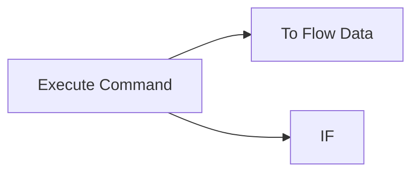

## Fluxo (.json) :

```json
{
  "nodes": [
    {
      "name": "Execute Command",
      "type": "n8n-nodes-base.executeCommand",
      "position": [
        600,
        350
      ],
      "parameters": {
        "command": "echo \"{ \\\"value1\\\": true, \\\"value2\\\": 1 }\""
      },
      "typeVersion": 1
    },
    {
      "name": "IF",
      "type": "n8n-nodes-base.if",
      "position": [
        800,
        450
      ],
      "parameters": {
        "conditions": {
          "boolean": [
            {
              "value1": "={{JSON.parse($node[\"Execute Command\"].data[\"stdout\"]).value1}}",
              "value2": true
            }
          ]
        }
      },
      "typeVersion": 1
    },
    {
      "name": "To Flow Data",
      "type": "n8n-nodes-base.functionItem",
      "position": [
        800,
        250
      ],
      "parameters": {
        "functionCode": "item = JSON.parse(item.stdout);\nreturn item;"
      },
      "typeVersion": 1
    }
  ],
  "connections": {
    "Execute Command": {
      "main": [
        [
          {
            "node": "To Flow Data",
            "type": "main",
            "index": 0
          },
          {
            "node": "IF",
            "type": "main",
            "index": 0
          }
        ]
      ]
    }
  }
}
```

<a id="template-23"></a>

## Template 23 - Extração, Resumo e Análise de Sentimento de Conteúdo

- **Nome:** Extração, Resumo e Análise de Sentimento de Conteúdo
- **Descrição:** Fluxo que extrai conteúdo de uma página web via Bright Data, converte markdown em texto, gera um resumo e realiza análise de sentimento estruturada, enviando resultados por webhook e gravando arquivos localmente.
- **Funcionalidade:** • Configurar URL e zona do serviço de captura: Permite definir o endereço alvo e a zona do Bright Data para a extração.
• Captura de página com desbloqueio web: Solicita o conteúdo da página em formato markdown via Bright Data Web Unlocker.
• Conversão de markdown para texto: Utiliza um modelo de linguagem para transformar o markdown em dados textuais limpos.
• Geração de resumo conciso: Cria um resumo objetivo do conteúdo extraído usando um modelo de LLM.
• Análise de sentimento estruturada: Executa análise de sentimento que retorna objetos com sentimento, score de confiança e explicação em texto.
• Notificações via webhook: Envia resultados (texto, resumo e análise) para um endpoint de webhook para monitoramento ou integração.
• Preparação e gravação de arquivos: Converte resultados para binário/base64 e grava arquivos JSON no sistema de arquivos local para persistência.
- **Ferramentas:** • Bright Data Web Unlocker: Serviço de coleta e desbloqueio de páginas web usado para obter o conteúdo alvo, incluindo opção de retornar em formato markdown.
• Google Gemini (PaLM): Modelo de linguagem usado para extração de texto, sumarização e análise de sentimento.
• webhook.site: Serviço de recepção de webhooks utilizado para enviar notificações e capturar as cargas enviadas durante testes.
• Sistema de arquivos local (Windows): Destino para salvar os arquivos JSON gerados pelo fluxo.


## Fluxo visual

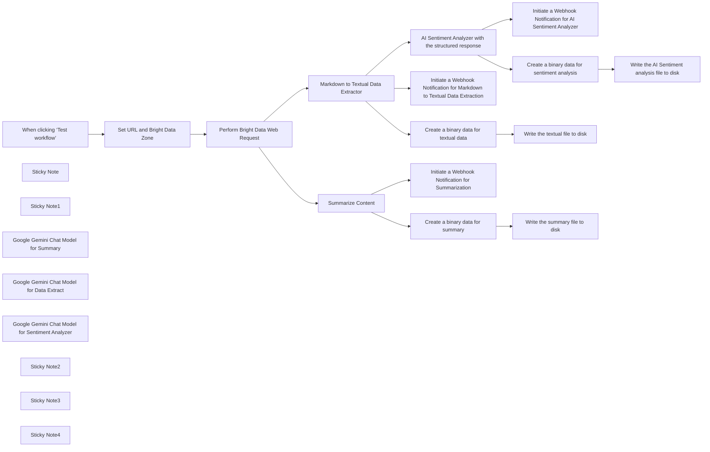

## Fluxo (.json) :

```json
{
  "id": "wTI77cpLkbxsRQat",
  "meta": {
    "instanceId": "885b4fb4a6a9c2cb5621429a7b972df0d05bb724c20ac7dac7171b62f1c7ef40",
    "templateCredsSetupCompleted": true
  },
  "name": "Brand Content Extract, Summarize & Sentiment Analysis with Bright Data",
  "tags": [
    {
      "id": "Kujft2FOjmOVQAmJ",
      "name": "Engineering",
      "createdAt": "2025-04-09T01:31:00.558Z",
      "updatedAt": "2025-04-09T01:31:00.558Z"
    },
    {
      "id": "ddPkw7Hg5dZhQu2w",
      "name": "AI",
      "createdAt": "2025-04-13T05:38:08.053Z",
      "updatedAt": "2025-04-13T05:38:08.053Z"
    }
  ],
  "nodes": [
    {
      "id": "646ef542-c601-4103-87e6-6fa9616d8c52",
      "name": "When clicking ‘Test workflow’",
      "type": "n8n-nodes-base.manualTrigger",
      "position": [
        120,
        -560
      ],
      "parameters": {},
      "typeVersion": 1
    },
    {
      "id": "00b4ce90-c4f2-41c4-8943-7db3d0c3f81a",
      "name": "Sticky Note",
      "type": "n8n-nodes-base.stickyNote",
      "position": [
        100,
        -320
      ],
      "parameters": {
        "width": 400,
        "height": 300,
        "content": "## Note\n\nThis workflow deals with the brand content extraction by utilizing the Bright Data Web Unlocker Product.\n\nThe Basic LLM Chain, Information Extraction, Summarization Chain are being used to demonstrate the usage of the N8N AI capabilities.\n\n**Please make sure to set the web URL of your interest within the \"Set URL and Bright Data Zone\" node and update the Webhook Notification URL**"
      },
      "typeVersion": 1
    },
    {
      "id": "5cc35b9b-7483-404e-96a3-1688f7b9078b",
      "name": "Sticky Note1",
      "type": "n8n-nodes-base.stickyNote",
      "position": [
        540,
        -320
      ],
      "parameters": {
        "width": 480,
        "height": 300,
        "content": "## LLM Usages\n\nGoogle Gemini Flash Exp model is being used.\n\nBasic LLM Chain Data Extractor.\n\nInformation Extraction is being used for the handling the custom sentiment analysis with the structured response.\n\nSummarization Chain is being used for the creation of a concise summary of the extracted brand content."
      },
      "typeVersion": 1
    },
    {
      "id": "e15f32de-58d9-4ea6-9d5c-f63975d1090d",
      "name": "Markdown to Textual Data Extractor",
      "type": "@n8n/n8n-nodes-langchain.chainLlm",
      "position": [
        1240,
        -440
      ],
      "parameters": {
        "text": "=You need to analyze the below markdown and convert to textual data. Please do not output with your own thoughts. Make sure to output with textual data only with no links, scripts, css etc.\n\n{{ $json.data }}",
        "messages": {
          "messageValues": [
            {
              "message": "You are a markdown expert"
            }
          ]
        },
        "promptType": "define"
      },
      "typeVersion": 1.6
    },
    {
      "id": "1462cd3b-b1d5-4ddf-9f1e-2b8f20faa19c",
      "name": "Set URL and Bright Data Zone",
      "type": "n8n-nodes-base.set",
      "position": [
        340,
        -560
      ],
      "parameters": {
        "options": {},
        "assignments": {
          "assignments": [
            {
              "id": "3aedba66-f447-4d7a-93c0-8158c5e795f9",
              "name": "url",
              "type": "string",
              "value": "https://www.amazon.com/TP-Link-Dual-Band-Archer-BE230-HomeShield/dp/B0DC99N2T8"
            },
            {
              "id": "4e7ee31d-da89-422f-8079-2ff2d357a0ba",
              "name": "zone",
              "type": "string",
              "value": "web_unlocker1"
            }
          ]
        }
      },
      "typeVersion": 3.4
    },
    {
      "id": "9783e878-e864-4632-9b89-d78567204053",
      "name": "AI Sentiment Analyzer with the structured response",
      "type": "@n8n/n8n-nodes-langchain.informationExtractor",
      "position": [
        1740,
        100
      ],
      "parameters": {
        "text": "=Perform the sentiment analysis on the below content and output with the structured information.\n\nHere's the content:\n\n{{ $('Perform Bright Data Web Request').item.json.data }}",
        "options": {
          "systemPromptTemplate": "You are an expert sentiment analyzer."
        },
        "schemaType": "manual",
        "inputSchema": "{\n  \"$schema\": \"http://json-schema.org/schema#\",\n  \"title\": \"SentimentAnalysisResponseArray\",\n  \"type\": \"array\",\n  \"items\": {\n    \"type\": \"object\",\n    \"properties\": {\n      \"sentiment\": {\n        \"type\": \"string\",\n        \"enum\": [\"Positive\", \"Neutral\", \"Negative\"],\n        \"description\": \"The overall sentiment of the content.\"\n      },\n      \"confidence_score\": {\n        \"type\": \"number\",\n        \"minimum\": 0,\n        \"maximum\": 1,\n        \"description\": \"Confidence score of the sentiment classification.\"\n      },\n      \"sentence\": {\n        \"type\": \"string\",\n        \"description\": \"A natural language statement explaining the sentiment.\"\n      }\n    },\n    \"required\": [\"sentiment\", \"confidence_score\", \"sentence\"],\n    \"additionalProperties\": false\n  }\n}\n"
      },
      "typeVersion": 1
    },
    {
      "id": "41352a53-7821-4247-905e-7995e1e6e382",
      "name": "Initiate a Webhook Notification for Markdown to Textual Data Extraction",
      "type": "n8n-nodes-base.httpRequest",
      "position": [
        1720,
        -460
      ],
      "parameters": {
        "url": "https://webhook.site/3c36d7d1-de1b-4171-9fd3-643ea2e4dd76",
        "options": {},
        "sendBody": true,
        "bodyParameters": {
          "parameters": [
            {
              "name": "summary",
              "value": "={{ $json.text }}"
            }
          ]
        }
      },
      "typeVersion": 4.2
    },
    {
      "id": "9717b5df-f148-4c8c-95d4-cb7c54837228",
      "name": "Initiate a Webhook Notification for AI Sentiment Analyzer",
      "type": "n8n-nodes-base.httpRequest",
      "position": [
        2120,
        100
      ],
      "parameters": {
        "url": "https://webhook.site/3c36d7d1-de1b-4171-9fd3-643ea2e4dd76",
        "options": {},
        "sendBody": true,
        "bodyParameters": {
          "parameters": [
            {
              "name": "summary",
              "value": "={{ $json.output }}"
            }
          ]
        }
      },
      "typeVersion": 4.2
    },
    {
      "id": "88733b5f-cbb0-42a6-898c-7a1ccc94bef7",
      "name": "Google Gemini Chat Model for Summary",
      "type": "@n8n/n8n-nodes-langchain.lmChatGoogleGemini",
      "position": [
        1260,
        -780
      ],
      "parameters": {
        "options": {},
        "modelName": "models/gemini-2.0-flash-exp"
      },
      "credentials": {
        "googlePalmApi": {
          "id": "YeO7dHZnuGBVQKVZ",
          "name": "Google Gemini(PaLM) Api account"
        }
      },
      "typeVersion": 1
    },
    {
      "id": "560e3d33-61d8-4db6-b1df-89f4e915f3f1",
      "name": "Google Gemini Chat Model for Data Extract",
      "type": "@n8n/n8n-nodes-langchain.lmChatGoogleGemini",
      "position": [
        1320,
        -220
      ],
      "parameters": {
        "options": {},
        "modelName": "models/gemini-2.0-flash-exp"
      },
      "credentials": {
        "googlePalmApi": {
          "id": "YeO7dHZnuGBVQKVZ",
          "name": "Google Gemini(PaLM) Api account"
        }
      },
      "typeVersion": 1
    },
    {
      "id": "1b07608f-7174-46e8-af27-3abf100d9e3a",
      "name": "Google Gemini Chat Model for Sentiment Analyzer",
      "type": "@n8n/n8n-nodes-langchain.lmChatGoogleGemini",
      "position": [
        1820,
        320
      ],
      "parameters": {
        "options": {},
        "modelName": "models/gemini-2.0-flash-exp"
      },
      "credentials": {
        "googlePalmApi": {
          "id": "YeO7dHZnuGBVQKVZ",
          "name": "Google Gemini(PaLM) Api account"
        }
      },
      "typeVersion": 1
    },
    {
      "id": "b6b6df94-d3fc-45ee-a339-5a368ea000eb",
      "name": "Initiate a Webhook Notification for Summarization",
      "type": "n8n-nodes-base.httpRequest",
      "position": [
        1660,
        -820
      ],
      "parameters": {
        "url": "https://webhook.site/3c36d7d1-de1b-4171-9fd3-643ea2e4dd76",
        "options": {},
        "sendBody": true,
        "bodyParameters": {
          "parameters": [
            {
              "name": "summary",
              "value": "={{ $json.response.text }}"
            }
          ]
        }
      },
      "typeVersion": 4.2
    },
    {
      "id": "f3e60ecd-5d07-4df0-a413-327b24db23ab",
      "name": "Perform Bright Data Web Request",
      "type": "n8n-nodes-base.httpRequest",
      "position": [
        560,
        -560
      ],
      "parameters": {
        "url": "https://api.brightdata.com/request",
        "method": "POST",
        "options": {},
        "sendBody": true,
        "sendHeaders": true,
        "authentication": "genericCredentialType",
        "bodyParameters": {
          "parameters": [
            {
              "name": "zone",
              "value": "={{ $json.zone }}"
            },
            {
              "name": "url",
              "value": "={{ $json.url }}?product=unlocker&method=api"
            },
            {
              "name": "format",
              "value": "raw"
            },
            {
              "name": "data_format",
              "value": "markdown"
            }
          ]
        },
        "genericAuthType": "httpHeaderAuth",
        "headerParameters": {
          "parameters": [
            {}
          ]
        }
      },
      "credentials": {
        "httpHeaderAuth": {
          "id": "kdbqXuxIR8qIxF7y",
          "name": "Header Auth account"
        }
      },
      "typeVersion": 4.2
    },
    {
      "id": "9030085f-5b05-41d9-94ee-668ee29df815",
      "name": "Summarize Content",
      "type": "@n8n/n8n-nodes-langchain.chainSummarization",
      "position": [
        1240,
        -980
      ],
      "parameters": {
        "options": {
          "summarizationMethodAndPrompts": {
            "values": {
              "prompt": "Write a concise summary of the following:\n\n\n\"{text}\"\n\n"
            }
          }
        },
        "chunkingMode": "advanced"
      },
      "typeVersion": 2
    },
    {
      "id": "fe93c4a6-de3b-481d-ba6c-5f315f5279c4",
      "name": "Create a binary data for textual data",
      "type": "n8n-nodes-base.function",
      "position": [
        1720,
        -220
      ],
      "parameters": {
        "functionCode": "items[0].binary = {\n  data: {\n    data: new Buffer(JSON.stringify(items[0].json, null, 2)).toString('base64')\n  }\n};\nreturn items;"
      },
      "typeVersion": 1
    },
    {
      "id": "0811c300-1302-49b5-a334-ac8f960a5b8c",
      "name": "Create a binary data for sentiment analysis",
      "type": "n8n-nodes-base.function",
      "position": [
        2120,
        320
      ],
      "parameters": {
        "functionCode": "items[0].binary = {\n  data: {\n    data: new Buffer(JSON.stringify(items[0].json, null, 2)).toString('base64')\n  }\n};\nreturn items;"
      },
      "typeVersion": 1
    },
    {
      "id": "01d798b7-7c62-4240-9d5e-f2e67ca047ae",
      "name": "Write the AI Sentiment analysis file to disk",
      "type": "n8n-nodes-base.readWriteFile",
      "position": [
        2520,
        320
      ],
      "parameters": {
        "options": {},
        "fileName": "d:\\Brand-Content-Sentiment-Analysis.json",
        "operation": "write"
      },
      "typeVersion": 1
    },
    {
      "id": "f9faf283-ba8d-48e1-860e-2bb660cb9c1e",
      "name": "Write the textual file to disk",
      "type": "n8n-nodes-base.readWriteFile",
      "position": [
        2100,
        -220
      ],
      "parameters": {
        "options": {},
        "fileName": "d:\\Brand-Content-Textual.json",
        "operation": "write"
      },
      "typeVersion": 1
    },
    {
      "id": "2c47c271-4456-4fc4-9a54-20784365a4af",
      "name": "Create a binary data for summary",
      "type": "n8n-nodes-base.function",
      "position": [
        1660,
        -1060
      ],
      "parameters": {
        "functionCode": "items[0].binary = {\n  data: {\n    data: new Buffer(JSON.stringify(items[0].json, null, 2)).toString('base64')\n  }\n};\nreturn items;"
      },
      "typeVersion": 1
    },
    {
      "id": "c5f33f8d-93eb-47ac-a42f-717b39f4d7c2",
      "name": "Write the summary file to disk",
      "type": "n8n-nodes-base.readWriteFile",
      "position": [
        1880,
        -1060
      ],
      "parameters": {
        "options": {},
        "fileName": "d:\\Brand-Content-Summary.json",
        "operation": "write"
      },
      "typeVersion": 1
    },
    {
      "id": "72938f7b-20c1-45d3-9348-878d6e0b8d60",
      "name": "Sticky Note2",
      "type": "n8n-nodes-base.stickyNote",
      "position": [
        1200,
        -1080
      ],
      "parameters": {
        "color": 4,
        "width": 1100,
        "height": 460,
        "content": "## Summarization"
      },
      "typeVersion": 1
    },
    {
      "id": "fcf1d1ad-d516-41bc-bf76-73ebb920ecba",
      "name": "Sticky Note3",
      "type": "n8n-nodes-base.stickyNote",
      "position": [
        1720,
        40
      ],
      "parameters": {
        "color": 6,
        "width": 1000,
        "height": 480,
        "content": "## Sentiment Analysis"
      },
      "typeVersion": 1
    },
    {
      "id": "9c44d01f-e30b-4597-ad74-09fa54b4ec84",
      "name": "Sticky Note4",
      "type": "n8n-nodes-base.stickyNote",
      "position": [
        1200,
        -520
      ],
      "parameters": {
        "color": 3,
        "width": 1100,
        "height": 480,
        "content": "## Textual Data Extract"
      },
      "typeVersion": 1
    }
  ],
  "active": false,
  "pinData": {},
  "settings": {
    "executionOrder": "v1"
  },
  "versionId": "317a5d48-95c6-4425-a14a-6b2fec9e0802",
  "connections": {
    "Summarize Content": {
      "main": [
        [
          {
            "node": "Initiate a Webhook Notification for Summarization",
            "type": "main",
            "index": 0
          },
          {
            "node": "Create a binary data for summary",
            "type": "main",
            "index": 0
          }
        ]
      ]
    },
    "Set URL and Bright Data Zone": {
      "main": [
        [
          {
            "node": "Perform Bright Data Web Request",
            "type": "main",
            "index": 0
          }
        ]
      ]
    },
    "Perform Bright Data Web Request": {
      "main": [
        [
          {
            "node": "Markdown to Textual Data Extractor",
            "type": "main",
            "index": 0
          },
          {
            "node": "Summarize Content",
            "type": "main",
            "index": 0
          }
        ]
      ]
    },
    "Create a binary data for summary": {
      "main": [
        [
          {
            "node": "Write the summary file to disk",
            "type": "main",
            "index": 0
          }
        ]
      ]
    },
    "When clicking ‘Test workflow’": {
      "main": [
        [
          {
            "node": "Set URL and Bright Data Zone",
            "type": "main",
            "index": 0
          }
        ]
      ]
    },
    "Markdown to Textual Data Extractor": {
      "main": [
        [
          {
            "node": "AI Sentiment Analyzer with the structured response",
            "type": "main",
            "index": 0
          },
          {
            "node": "Initiate a Webhook Notification for Markdown to Textual Data Extraction",
            "type": "main",
            "index": 0
          },
          {
            "node": "Create a binary data for textual data",
            "type": "main",
            "index": 0
          }
        ]
      ]
    },
    "Google Gemini Chat Model for Summary": {
      "ai_languageModel": [
        [
          {
            "node": "Summarize Content",
            "type": "ai_languageModel",
            "index": 0
          }
        ]
      ]
    },
    "Create a binary data for textual data": {
      "main": [
        [
          {
            "node": "Write the textual file to disk",
            "type": "main",
            "index": 0
          }
        ]
      ]
    },
    "Google Gemini Chat Model for Data Extract": {
      "ai_languageModel": [
        [
          {
            "node": "Markdown to Textual Data Extractor",
            "type": "ai_languageModel",
            "index": 0
          }
        ]
      ]
    },
    "Create a binary data for sentiment analysis": {
      "main": [
        [
          {
            "node": "Write the AI Sentiment analysis file to disk",
            "type": "main",
            "index": 0
          }
        ]
      ]
    },
    "Google Gemini Chat Model for Sentiment Analyzer": {
      "ai_languageModel": [
        [
          {
            "node": "AI Sentiment Analyzer with the structured response",
            "type": "ai_languageModel",
            "index": 0
          }
        ]
      ]
    },
    "AI Sentiment Analyzer with the structured response": {
      "main": [
        [
          {
            "node": "Initiate a Webhook Notification for AI Sentiment Analyzer",
            "type": "main",
            "index": 0
          },
          {
            "node": "Create a binary data for sentiment analysis",
            "type": "main",
            "index": 0
          }
        ]
      ]
    },
    "Initiate a Webhook Notification for AI Sentiment Analyzer": {
      "main": [
        []
      ]
    },
    "Initiate a Webhook Notification for Markdown to Textual Data Extraction": {
      "main": [
        []
      ]
    }
  }
}
```

<a id="template-25"></a>

## Template 25 - Buffer e consolidação de mensagens

- **Nome:** Buffer e consolidação de mensagens
- **Descrição:** Agrupa mensagens recebidas por conversa, espera inatividade ou um limite, consolida os textos com um modelo de linguagem e retorna uma resposta única, limpando o buffer após o envio.
- **Funcionalidade:** • Recepção de mensagens por contexto: Recebe mensagens com um identificador de contexto (ex.: ID de conversa) como entrada.
• Armazenamento em buffer: Empilha cada mensagem num buffer persistente para o mesmo contexto, incluindo timestamp.
• Cálculo dinâmico de espera: Determina waitSeconds com base no tamanho da mensagem (ex.: mensagens curtas esperam mais).
• Metadados e contadores: Atualiza last_seen e incrementa um contador buffer_count com TTL para gerenciar janelas de agrupamento.
• Flag de bloqueio (waiting): Define uma flag temporária para evitar processamento concorrente de batches já em andamento.
• Verificação de inatividade/limiar: Dispara consolidação quando houver inatividade (agora - last_seen ≥ waitSeconds) ou quando o contador indicar mensagens na fila.
• Espera adaptativa: Se necessário, espera apenas o tempo restante até atingir o período de inatividade antes de consolidar.
• Consolidação por LLM: Envia o conteúdo do buffer a um modelo de linguagem para extrair e unificar mensagens em um único parágrafo.
• Limpeza pós-processamento: Após consolidação, deleta keys relacionadas ao buffer, contador e flag para reiniciar o ciclo.
• Saída estruturada: Mapeia o resultado consolidado e retorna mensagem e contexto para processamento downstream.
- **Ferramentas:** • Redis: Armazenamento de listas (buffer), chaves de estado (last_seen, waiting_reply, buffer_count) e TTLs para controle de janela.
• OpenAI (modelo GPT-4.1-nano): Modelo de linguagem usado para extrair e consolidar as mensagens do buffer em um texto único.
• Plataforma de mensagens / Webhook (ex.: WhatsApp): Fonte de mensagens e contextos que alimentam o fluxo via webhooks ou gatilhos externos.


## Fluxo visual

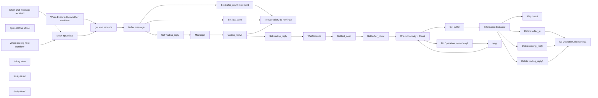

## Fluxo (.json) :

```json
{
  "meta": {
    "instanceId": "d1b9b74c805fea7fca1b903ee192d1d4090b516d3c254da86beb2f13b7c2ed2e",
    "templateCredsSetupCompleted": true
  },
  "nodes": [
    {
      "id": "be902a85-fc31-442c-b308-a2350ec5aabb",
      "name": "When clicking ‘Test workflow’",
      "type": "n8n-nodes-base.manualTrigger",
      "position": [
        -760,
        440
      ],
      "parameters": {},
      "typeVersion": 1
    },
    {
      "id": "d229b686-9de4-4633-9dba-3e1fe71eedf1",
      "name": "No Operation, do nothing1",
      "type": "n8n-nodes-base.noOp",
      "position": [
        1820,
        800
      ],
      "parameters": {},
      "typeVersion": 1
    },
    {
      "id": "f583bc97-8da8-488e-ab04-5167dc7a7701",
      "name": "Information Extractor",
      "type": "@n8n/n8n-nodes-langchain.informationExtractor",
      "position": [
        2420,
        540
      ],
      "parameters": {
        "text": "={{ $json.buffer.reverse().toJsonString() }}",
        "options": {
          "systemPromptTemplate": "Eres un experto extrayendo información, tu objetivo es recolectar todos los mensajes. Procura no dejar duplicados. como resultado debes retornar un solo párrafo con todo los mensajes."
        },
        "schemaType": "fromJson",
        "jsonSchemaExample": "{\n\t\"message\": \"all consolidated messages\"\n}"
      },
      "typeVersion": 1
    },
    {
      "id": "5b719416-4886-4d38-9d00-30b6237db168",
      "name": "OpenAI Chat Model",
      "type": "@n8n/n8n-nodes-langchain.lmChatOpenAi",
      "position": [
        2440,
        760
      ],
      "parameters": {
        "model": {
          "__rl": true,
          "mode": "list",
          "value": "gpt-4.1-nano",
          "cachedResultName": "gpt-4.1-nano"
        },
        "options": {}
      },
      "credentials": {
        "openAiApi": {
          "id": "IogsrRzOBSmZJS5C",
          "name": "OpenAi account"
        }
      },
      "typeVersion": 1.2
    },
    {
      "id": "3d149fc0-caa7-4361-9bf9-33b6252b39eb",
      "name": "get wait seconds",
      "type": "n8n-nodes-base.code",
      "position": [
        -260,
        500
      ],
      "parameters": {
        "jsCode": "// Function: Compute waitSeconds\nconst wordCount = $json.message.split(' ').filter(w=>w).length;\nreturn [{ json: { \n  context_id: $json.context_id,\n  message: $json.message,\n  waitSeconds: wordCount < 5 ? 45 : 30 \n}}];\n"
      },
      "typeVersion": 2
    },
    {
      "id": "cc670735-d126-465f-b0a3-3a4c5e390fd7",
      "name": "Set last_seen",
      "type": "n8n-nodes-base.redis",
      "position": [
        280,
        380
      ],
      "parameters": {
        "key": "=last_seen:{{ $json.context_id}}",
        "ttl": "={{ $json.waitSeconds + 60 }}",
        "value": "={{$now.toMillis()}}",
        "expire": true,
        "keyType": "string",
        "operation": "set"
      },
      "credentials": {
        "redis": {
          "id": "zJtRI38KhsyVjUvP",
          "name": "Redis account"
        }
      },
      "typeVersion": 1,
      "alwaysOutputData": true
    },
    {
      "id": "20d97d1d-70d4-4c3c-aa12-b1aa31795240",
      "name": "Get waiting_reply",
      "type": "n8n-nodes-base.redis",
      "position": [
        180,
        780
      ],
      "parameters": {
        "key": "=waiting_reply:{{$json.context_id}}",
        "options": {},
        "operation": "get",
        "propertyName": "waiting_reply"
      },
      "credentials": {
        "redis": {
          "id": "zJtRI38KhsyVjUvP",
          "name": "Redis account"
        }
      },
      "typeVersion": 1
    },
    {
      "id": "7a2fc681-692f-4f72-9fab-f3ada4bda54b",
      "name": "Mod input",
      "type": "n8n-nodes-base.set",
      "position": [
        340,
        800
      ],
      "parameters": {
        "options": {},
        "assignments": {
          "assignments": [
            {
              "id": "7ff99444-753d-4ef7-865c-7115761526b8",
              "name": "waiting_reply",
              "type": "string",
              "value": "={{ $json.waiting_reply }}"
            },
            {
              "id": "58ad6981-c35a-4dd6-b1cd-7c446b85e738",
              "name": "context_id",
              "type": "string",
              "value": "={{$('When Executed by Another Workflow').item.json.context_id  }}"
            },
            {
              "id": "bd0535a2-be03-436b-8a2e-222c3e26fd04",
              "name": "message",
              "type": "string",
              "value": "={{$('When Executed by Another Workflow').item.json.message }}"
            },
            {
              "id": "2f583f32-f231-4407-b773-c08b38d464f0",
              "name": "waitSeconds",
              "type": "number",
              "value": "={{ $('get wait seconds').item.json.waitSeconds }}"
            }
          ]
        },
        "includeOtherFields": true
      },
      "typeVersion": 3.4
    },
    {
      "id": "84213bef-32be-4cd9-8387-cd76aff5cb38",
      "name": "waiting_reply?",
      "type": "n8n-nodes-base.if",
      "position": [
        540,
        800
      ],
      "parameters": {
        "options": {},
        "conditions": {
          "options": {
            "version": 2,
            "leftValue": "",
            "caseSensitive": true,
            "typeValidation": "strict"
          },
          "combinator": "and",
          "conditions": [
            {
              "id": "8136ea21-d798-41fd-81ed-5c0e7fda73c5",
              "operator": {
                "type": "boolean",
                "operation": "true",
                "singleValue": true
              },
              "leftValue": "={{ $json.waiting_reply != null}}",
              "rightValue": ""
            }
          ]
        }
      },
      "typeVersion": 2.2
    },
    {
      "id": "a8472217-aa83-4247-9d7d-3a471e24478a",
      "name": "When chat message received",
      "type": "@n8n/n8n-nodes-langchain.chatTrigger",
      "position": [
        -740,
        640
      ],
      "webhookId": "85115343-bb86-4bb8-b7a8-c4efded80b3f",
      "parameters": {
        "options": {}
      },
      "typeVersion": 1.1
    },
    {
      "id": "ba4c81ba-92e2-4bef-a9e2-6f8d4c0aa722",
      "name": "Set waiting_reply",
      "type": "n8n-nodes-base.redis",
      "position": [
        840,
        720
      ],
      "parameters": {
        "key": "=waiting_reply:{{ $json.context_id }}",
        "ttl": "={{ $json.waitSeconds }}",
        "value": "true",
        "expire": true,
        "operation": "set"
      },
      "credentials": {
        "redis": {
          "id": "zJtRI38KhsyVjUvP",
          "name": "Redis account"
        }
      },
      "typeVersion": 1
    },
    {
      "id": "0ce783b6-b76b-4a5d-96ae-11708b7532ba",
      "name": "Get buffer",
      "type": "n8n-nodes-base.redis",
      "position": [
        1820,
        600
      ],
      "parameters": {
        "key": "=buffer_in:{{ $('get wait seconds').item.json.context_id }}",
        "options": {},
        "operation": "get",
        "propertyName": "buffer"
      },
      "credentials": {
        "redis": {
          "id": "zJtRI38KhsyVjUvP",
          "name": "Redis account"
        }
      },
      "typeVersion": 1
    },
    {
      "id": "21864061-1d1f-4528-a03f-1237e9c69a31",
      "name": "Delete buffer_in",
      "type": "n8n-nodes-base.redis",
      "position": [
        2940,
        680
      ],
      "parameters": {
        "key": "=buffer_in:{{$json.context_id}}",
        "operation": "delete"
      },
      "credentials": {
        "redis": {
          "id": "zJtRI38KhsyVjUvP",
          "name": "Redis account"
        }
      },
      "typeVersion": 1
    },
    {
      "id": "8828aa7b-6153-4677-84a8-3ef2f884792c",
      "name": "Delete waiting_reply",
      "type": "n8n-nodes-base.redis",
      "position": [
        2940,
        840
      ],
      "parameters": {
        "key": "=waiting_reply:{{$json.context_id}}",
        "operation": "delete"
      },
      "credentials": {
        "redis": {
          "id": "zJtRI38KhsyVjUvP",
          "name": "Redis account"
        }
      },
      "typeVersion": 1
    },
    {
      "id": "fc369067-7213-4d8c-b515-c34c4db997e4",
      "name": "WaitSeconds",
      "type": "n8n-nodes-base.wait",
      "position": [
        1020,
        720
      ],
      "webhookId": "c218d471-2f0f-4bd7-87d1-5431ac602211",
      "parameters": {
        "amount": "={{ $json.waitSeconds }} "
      },
      "typeVersion": 1.1
    },
    {
      "id": "2daa2ab9-756a-4fdb-8573-b4570c58d6e5",
      "name": "Buffer messages",
      "type": "n8n-nodes-base.redis",
      "position": [
        -40,
        440
      ],
      "parameters": {
        "list": "=buffer_in:{{$json.context_id}}",
        "operation": "push",
        "messageData": "={\"text\": \"{{ $json.message }}\", \"timestamp\": \"{{$now}}\"}"
      },
      "credentials": {
        "redis": {
          "id": "zJtRI38KhsyVjUvP",
          "name": "Redis account"
        }
      },
      "typeVersion": 1
    },
    {
      "id": "4d5bc5f0-11ce-4f7f-b44b-0514a5ab5671",
      "name": "Set buffer_count increment",
      "type": "n8n-nodes-base.redis",
      "position": [
        280,
        560
      ],
      "parameters": {
        "key": "=buffer_count:{{$json.context_id}}",
        "expire": "={{$json.waitSeconds + 60}}",
        "operation": "incr"
      },
      "credentials": {
        "redis": {
          "id": "zJtRI38KhsyVjUvP",
          "name": "Redis account"
        }
      },
      "typeVersion": 1,
      "alwaysOutputData": true
    },
    {
      "id": "dcaee1a8-ea32-4a9d-b32f-f0418644027c",
      "name": "Get last_seen",
      "type": "n8n-nodes-base.redis",
      "position": [
        1220,
        720
      ],
      "parameters": {
        "key": "=last_seen:{{$json.context_id}}",
        "options": {},
        "operation": "get",
        "propertyName": "last_seen"
      },
      "credentials": {
        "redis": {
          "id": "zJtRI38KhsyVjUvP",
          "name": "Redis account"
        }
      },
      "typeVersion": 1
    },
    {
      "id": "908c4a4c-1c60-4e90-827a-064a0b4d6bfd",
      "name": "Get buffer_count",
      "type": "n8n-nodes-base.redis",
      "position": [
        1400,
        720
      ],
      "parameters": {
        "key": "=buffer_count:{{ $('Mod input').item.json.context_id }}",
        "options": {},
        "operation": "get",
        "propertyName": "count"
      },
      "credentials": {
        "redis": {
          "id": "zJtRI38KhsyVjUvP",
          "name": "Redis account"
        }
      },
      "typeVersion": 1
    },
    {
      "id": "1ceb472b-3944-4d74-994b-867ade006e4e",
      "name": "Map ouput",
      "type": "n8n-nodes-base.set",
      "position": [
        3140,
        380
      ],
      "parameters": {
        "options": {},
        "assignments": {
          "assignments": [
            {
              "id": "e8d80ab4-74a2-4c30-8500-8dddc5802eec",
              "name": "message",
              "type": "string",
              "value": "={{ $json.output.message }}"
            },
            {
              "id": "7e7fcee4-14b3-4393-b516-b07a53c018b3",
              "name": "context_id",
              "type": "string",
              "value": "={{$('get wait seconds').item.json.context_id }}"
            }
          ]
        }
      },
      "typeVersion": 3.4
    },
    {
      "id": "0be7e5eb-1972-4a95-b5bf-4e564fc4ef7c",
      "name": "Check Inactivity + Count",
      "type": "n8n-nodes-base.if",
      "position": [
        1580,
        720
      ],
      "parameters": {
        "options": {},
        "conditions": {
          "options": {
            "version": 2,
            "leftValue": "",
            "caseSensitive": true,
            "typeValidation": "loose"
          },
          "combinator": "and",
          "conditions": [
            {
              "id": "0f294c51-0629-4ae1-a009-68c2f5fd30b5",
              "operator": {
                "type": "boolean",
                "operation": "true",
                "singleValue": true
              },
              "leftValue": "={{$json.count != null && Number($json.count) >= 1}}",
              "rightValue": ""
            },
            {
              "id": "1626238d-fb00-4ce8-89df-a40a4f29f52a",
              "operator": {
                "type": "boolean",
                "operation": "true",
                "singleValue": true
              },
              "leftValue": "={{$('Get last_seen').item.json.last_seen != null}}",
              "rightValue": ""
            },
            {
              "id": "df819099-1f6e-4bee-a017-32b729c836a3",
              "operator": {
                "type": "boolean",
                "operation": "true",
                "singleValue": true
              },
              "leftValue": "={{($now.toMillis() - $('Get last_seen').item.json.last_seen) >= $('Mod input').item.json.waitSeconds * 1000}}",
              "rightValue": ""
            }
          ]
        },
        "looseTypeValidation": true
      },
      "typeVersion": 2.2
    },
    {
      "id": "0c3bd62b-8cf6-4b34-8010-ebe819db9667",
      "name": "Delete waiting_reply1",
      "type": "n8n-nodes-base.redis",
      "position": [
        2940,
        1000
      ],
      "parameters": {
        "key": "=buffer_count:{{$json.context_id}}",
        "operation": "delete"
      },
      "credentials": {
        "redis": {
          "id": "zJtRI38KhsyVjUvP",
          "name": "Redis account"
        }
      },
      "typeVersion": 1
    },
    {
      "id": "bbf45966-833b-4f5f-ae11-0578614eb156",
      "name": "No Operation, do nothing2",
      "type": "n8n-nodes-base.noOp",
      "position": [
        720,
        540
      ],
      "parameters": {},
      "typeVersion": 1
    },
    {
      "id": "5683eebf-ba51-4a6b-a803-de6acf1b1ea8",
      "name": "Wait",
      "type": "n8n-nodes-base.wait",
      "position": [
        2080,
        880
      ],
      "webhookId": "b8e2e214-f82b-49c2-96e2-91e093137857",
      "parameters": {
        "amount": "={{ Math.max(0, Math.ceil(( $('Mod input').item.json.waitSeconds * 1000 - ($now.toMillis() - $('Get last_seen').item.json.last_seen)) / 1000)) }}"
      },
      "typeVersion": 1.1
    },
    {
      "id": "c0478f60-944e-4c85-bb9c-9abe0d4238c0",
      "name": "When Executed by Another Workflow",
      "type": "n8n-nodes-base.executeWorkflowTrigger",
      "position": [
        -480,
        720
      ],
      "parameters": {
        "workflowInputs": {
          "values": [
            {
              "name": "context_id"
            },
            {
              "name": "message"
            }
          ]
        }
      },
      "typeVersion": 1.1
    },
    {
      "id": "91a650b7-ddd4-4dbf-a300-523f72f0bdb5",
      "name": "Mock input data",
      "type": "n8n-nodes-base.set",
      "position": [
        -500,
        500
      ],
      "parameters": {
        "options": {},
        "assignments": {
          "assignments": [
            {
              "id": "0543fdb7-4a22-4530-bdb7-ae7064732fae",
              "name": "context_id",
              "type": "string",
              "value": "={{ $json.sessionId1 || '1lap075ha12' }}"
            },
            {
              "id": "bead5646-a689-4deb-8f4b-b22aa97b51ca",
              "name": "message",
              "type": "string",
              "value": "={{ $json.chatInput || 'Chat 2'}}"
            }
          ]
        }
      },
      "typeVersion": 3.4
    },
    {
      "id": "cb450e32-7e19-469c-9a5c-3d9da5bf1dfa",
      "name": "No Operation, do nothing3",
      "type": "n8n-nodes-base.noOp",
      "position": [
        3320,
        840
      ],
      "parameters": {},
      "typeVersion": 1
    },
    {
      "id": "b463e405-3355-48a2-a043-42941d7025c3",
      "name": "Sticky Note",
      "type": "n8n-nodes-base.stickyNote",
      "position": [
        2880,
        660
      ],
      "parameters": {
        "color": 7,
        "width": 700,
        "height": 780,
        "content": "\n\n\n\n\n\n\n\n\n\n\n\n\n\n\n\n\n\n\n\n\n\n\n\n\n\n\n\n\n\n\n\n\n\n\n\n\n\n\n\n### 🧹 Buffer Cleanup\n\nAfter consolidation and reply:\n\n* **DELETE** keys:\n\n  * `buffer_in:{{context_id}}`\n  * `buffer_count:{{context_id}}`\n  * `waiting_reply:{{context_id}}`\n"
      },
      "typeVersion": 1
    },
    {
      "id": "1b5397f8-aa7e-4b2b-afb9-5da97d99e049",
      "name": "Sticky Note1",
      "type": "n8n-nodes-base.stickyNote",
      "position": [
        -80,
        60
      ],
      "parameters": {
        "color": 7,
        "width": 920,
        "height": 940,
        "content": "### 📥 Input Buffer\n\n1. **Save incoming message**\n\n   * Push the new message into Redis list `buffer_in:{{context_id}}`.\n2. **Update metadata**\n\n   * Set `last_seen:{{context_id}}` to the current timestamp (with a TTL of `waitSeconds + 60`).\n   * INCR the counter key `buffer_count:{{context_id}}` (also expiring after `waitSeconds + 60`).\n3. **Check “waiting” flag**\n\n   * GET `waiting_reply:{{context_id}}`.\n   * If it’s null (no batch in flight), SET it to `true` with TTL `waitSeconds` to block concurrent triggers."
      },
      "typeVersion": 1
    },
    {
      "id": "edc07500-ccad-4e72-adc1-1a63a3a06609",
      "name": "Sticky Note2",
      "type": "n8n-nodes-base.stickyNote",
      "position": [
        1180,
        340
      ],
      "parameters": {
        "color": 7,
        "width": 1200,
        "height": 820,
        "content": "### ⏳ Inactivity & Threshold Check\n\n1. **Fetch state**\n\n   * GET `last_seen:{{context_id}}` (when the last message arrived)\n   * GET `buffer_count:{{context_id}}` (how many messages are queued)\n2. **Evaluate trigger**\n\n   * **Inactivity:** `(now – last_seen) ≥ waitSeconds * 1000`\n   * **Or threshold:** `buffer_count ≥ 1` (or your desired batch size)\n3. **Branch**\n\n   * **True:** proceed to “Get buffer” and consolidate.\n   * **False:** exit (noOp) and let the waiting‐node/flag mechanism retry later."
      },
      "typeVersion": 1
    }
  ],
  "pinData": {
    "When Executed by Another Workflow": [
      {
        "message": "Mensaje del usuario despues de pasar por el workflow de n8n:\nTexto: ¡Hola! Quiero más información.;\nImagen: ;\nAudio: ;",
        "context_id": "573058148988@s.whatsapp.net"
      }
    ]
  },
  "connections": {
    "Wait": {
      "main": [
        [
          {
            "node": "Check Inactivity + Count",
            "type": "main",
            "index": 0
          }
        ]
      ]
    },
    "Map ouput": {
      "main": [
        []
      ]
    },
    "Mod input": {
      "main": [
        [
          {
            "node": "waiting_reply?",
            "type": "main",
            "index": 0
          }
        ]
      ]
    },
    "Get buffer": {
      "main": [
        [
          {
            "node": "Information Extractor",
            "type": "main",
            "index": 0
          }
        ]
      ]
    },
    "WaitSeconds": {
      "main": [
        [
          {
            "node": "Get last_seen",
            "type": "main",
            "index": 0
          }
        ]
      ]
    },
    "Get last_seen": {
      "main": [
        [
          {
            "node": "Get buffer_count",
            "type": "main",
            "index": 0
          }
        ]
      ]
    },
    "Set last_seen": {
      "main": [
        [
          {
            "node": "No Operation, do nothing2",
            "type": "main",
            "index": 0
          }
        ]
      ]
    },
    "waiting_reply?": {
      "main": [
        [
          {
            "node": "No Operation, do nothing2",
            "type": "main",
            "index": 0
          }
        ],
        [
          {
            "node": "Set waiting_reply",
            "type": "main",
            "index": 0
          }
        ]
      ]
    },
    "Buffer messages": {
      "main": [
        [
          {
            "node": "Set buffer_count increment",
            "type": "main",
            "index": 0
          },
          {
            "node": "Set last_seen",
            "type": "main",
            "index": 0
          },
          {
            "node": "Get waiting_reply",
            "type": "main",
            "index": 0
          }
        ]
      ]
    },
    "Mock input data": {
      "main": [
        [
          {
            "node": "get wait seconds",
            "type": "main",
            "index": 0
          }
        ]
      ]
    },
    "Delete buffer_in": {
      "main": [
        [
          {
            "node": "No Operation, do nothing3",
            "type": "main",
            "index": 0
          }
        ]
      ]
    },
    "Get buffer_count": {
      "main": [
        [
          {
            "node": "Check Inactivity + Count",
            "type": "main",
            "index": 0
          }
        ]
      ]
    },
    "get wait seconds": {
      "main": [
        [
          {
            "node": "Buffer messages",
            "type": "main",
            "index": 0
          }
        ]
      ]
    },
    "Get waiting_reply": {
      "main": [
        [
          {
            "node": "Mod input",
            "type": "main",
            "index": 0
          }
        ]
      ]
    },
    "OpenAI Chat Model": {
      "ai_languageModel": [
        [
          {
            "node": "Information Extractor",
            "type": "ai_languageModel",
            "index": 0
          }
        ]
      ]
    },
    "Set waiting_reply": {
      "main": [
        [
          {
            "node": "WaitSeconds",
            "type": "main",
            "index": 0
          }
        ]
      ]
    },
    "Delete waiting_reply": {
      "main": [
        [
          {
            "node": "No Operation, do nothing3",
            "type": "main",
            "index": 0
          }
        ]
      ]
    },
    "Delete waiting_reply1": {
      "main": [
        [
          {
            "node": "No Operation, do nothing3",
            "type": "main",
            "index": 0
          }
        ]
      ]
    },
    "Information Extractor": {
      "main": [
        [
          {
            "node": "Map ouput",
            "type": "main",
            "index": 0
          },
          {
            "node": "Delete buffer_in",
            "type": "main",
            "index": 0
          },
          {
            "node": "Delete waiting_reply",
            "type": "main",
            "index": 0
          },
          {
            "node": "Delete waiting_reply1",
            "type": "main",
            "index": 0
          }
        ]
      ]
    },
    "Check Inactivity + Count": {
      "main": [
        [
          {
            "node": "Get buffer",
            "type": "main",
            "index": 0
          }
        ],
        [
          {
            "node": "No Operation, do nothing1",
            "type": "main",
            "index": 0
          }
        ]
      ]
    },
    "No Operation, do nothing1": {
      "main": [
        [
          {
            "node": "Wait",
            "type": "main",
            "index": 0
          }
        ]
      ]
    },
    "Set buffer_count increment": {
      "main": [
        [
          {
            "node": "No Operation, do nothing2",
            "type": "main",
            "index": 0
          }
        ]
      ]
    },
    "When chat message received": {
      "main": [
        [
          {
            "node": "Mock input data",
            "type": "main",
            "index": 0
          }
        ]
      ]
    },
    "When Executed by Another Workflow": {
      "main": [
        [
          {
            "node": "get wait seconds",
            "type": "main",
            "index": 0
          }
        ]
      ]
    },
    "When clicking ‘Test workflow’": {
      "main": [
        [
          {
            "node": "Mock input data",
            "type": "main",
            "index": 0
          }
        ]
      ]
    }
  }
}
```

<a id="template-26"></a>

## Template 26 - Enviar email por país do IP

- **Nome:** Enviar email por país do IP
- **Descrição:** Determina a localização de um endereço IP e envia um e-mail em espanhol ou inglês conforme o país identificado.
- **Funcionalidade:** • Gatilho manual: Inicia o fluxo quando executado manualmente.
• Preparação de dados do usuário: Cria um item com o endereço IP e o e-mail do destinatário.
• Consulta de localização por IP: Obtém a informação de país a partir do endereço IP fornecido.
• Verificação do país: Verifica se o código do país retornado é ES (Espanha).
• Envio de e-mail localizado: Envia mensagem em espanhol se for Espanha; caso contrário envia em inglês.
- **Ferramentas:** • Uproc (serviço de geolocalização por IP): Serviço externo usado para obter país a partir do endereço IP.
• AWS SES (serviço de envio de e-mails): Serviço externo usado para enviar os e-mails aos destinatários.


## Fluxo visual

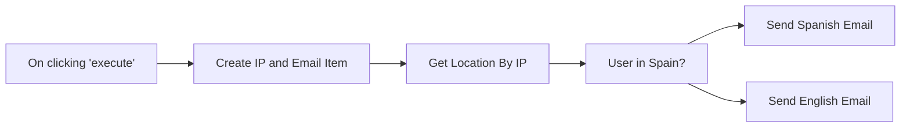

## Fluxo (.json) :

```json
{
  "id": "104",
  "name": "location_by_ip",
  "nodes": [
    {
      "name": "On clicking 'execute'",
      "type": "n8n-nodes-base.manualTrigger",
      "position": [
        440,
        510
      ],
      "parameters": {},
      "typeVersion": 1
    },
    {
      "name": "Get Location By IP",
      "type": "n8n-nodes-base.uproc",
      "position": [
        850,
        510
      ],
      "parameters": {
        "ip": "={{$node[\"Create IP and Email Item\"].json[\"ip\"]}}",
        "tool": "getLocationByIp",
        "group": "geographic",
        "additionalOptions": {}
      },
      "credentials": {
        "uprocApi": "miquel-uproc"
      },
      "typeVersion": 1
    },
    {
      "name": "User in Spain?",
      "type": "n8n-nodes-base.if",
      "position": [
        1050,
        510
      ],
      "parameters": {
        "conditions": {
          "string": [
            {
              "value1": "={{$node[\"Get Location By IP\"].json[\"message\"][\"country_code\"]}}",
              "value2": "ES"
            }
          ]
        }
      },
      "typeVersion": 1
    },
    {
      "name": "Create IP and Email Item",
      "type": "n8n-nodes-base.functionItem",
      "position": [
        640,
        510
      ],
      "parameters": {
        "functionCode": "item.ip = \"83.46.131.46\";\nitem.email = \"miquel@uproc.io\";\n\nreturn item;"
      },
      "typeVersion": 1
    },
    {
      "name": "Send English Email",
      "type": "n8n-nodes-base.awsSes",
      "position": [
        1270,
        650
      ],
      "parameters": {
        "body": "Hi,\n\nThank you for your signup!",
        "subject": "Welcome aboard",
        "fromEmail": "sample@uproc.io",
        "toAddresses": [
          "={{$node[\"Create IP and Email Item\"].json[\"email\"]}}"
        ],
        "additionalFields": {}
      },
      "credentials": {
        "aws": "ses"
      },
      "typeVersion": 1
    },
    {
      "name": "Send Spanish Email",
      "type": "n8n-nodes-base.awsSes",
      "position": [
        1270,
        420
      ],
      "parameters": {
        "body": "Hola,\n\n¡Gracias por registrarte!",
        "subject": "Bienvenido a bordo",
        "fromEmail": "sample@uproc.io",
        "toAddresses": [
          "={{$node[\"Create IP and Email Item\"].json[\"email\"]}}"
        ],
        "additionalFields": {}
      },
      "credentials": {
        "aws": "ses"
      },
      "typeVersion": 1
    }
  ],
  "active": false,
  "settings": {},
  "connections": {
    "User in Spain?": {
      "main": [
        [
          {
            "node": "Send Spanish Email",
            "type": "main",
            "index": 0
          }
        ],
        [
          {
            "node": "Send English Email",
            "type": "main",
            "index": 0
          }
        ]
      ]
    },
    "Get Location By IP": {
      "main": [
        [
          {
            "node": "User in Spain?",
            "type": "main",
            "index": 0
          }
        ]
      ]
    },
    "On clicking 'execute'": {
      "main": [
        [
          {
            "node": "Create IP and Email Item",
            "type": "main",
            "index": 0
          }
        ]
      ]
    },
    "Create IP and Email Item": {
      "main": [
        [
          {
            "node": "Get Location By IP",
            "type": "main",
            "index": 0
          }
        ]
      ]
    }
  }
}
```

<a id="template-27"></a>

## Template 27 - Obter volume e adicionar à estante do usuário

- **Nome:** Obter volume e adicionar à estante do usuário
- **Descrição:** Recupera um volume pelo seu ID, adiciona-o a uma estante específica do usuário e lista os volumes presentes nessa estante na biblioteca do usuário.
- **Funcionalidade:** • Disparo manual: Inicia o fluxo quando o usuário executa manualmente.
• Recuperar volume por ID: Obtém os dados de um volume usando o identificador do volume.
• Adicionar volume à estante: Adiciona o volume recuperado a uma estante específica (shelfId 2) do usuário autenticado.
• Listar volumes da estante: Recupera a lista de volumes presentes na estante do usuário (minha biblioteca).
- **Ferramentas:** • Google Books: API do Google para buscar informações sobre volumes, gerenciar estantes e adicionar volumes à biblioteca do usuário. Requer autenticação com a conta Google (OAuth2).


## Fluxo visual

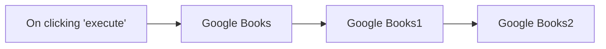

## Fluxo (.json) :

```json
{
  "id": "107",
  "name": "Get a volume and add it to your bookshelf",
  "nodes": [
    {
      "name": "On clicking 'execute'",
      "type": "n8n-nodes-base.manualTrigger",
      "position": [
        260,
        300
      ],
      "parameters": {},
      "typeVersion": 1
    },
    {
      "name": "Google Books",
      "type": "n8n-nodes-base.googleBooks",
      "position": [
        460,
        300
      ],
      "parameters": {
        "resource": "volume",
        "volumeId": "XxUJ2U2FXtYC",
        "authentication": "oAuth2"
      },
      "credentials": {
        "googleBooksOAuth2Api": "google-books"
      },
      "typeVersion": 1
    },
    {
      "name": "Google Books1",
      "type": "n8n-nodes-base.googleBooks",
      "position": [
        660,
        300
      ],
      "parameters": {
        "shelfId": "2",
        "resource": "bookshelfVolume",
        "volumeId": "={{$node[\"Google Books\"].json[\"id\"]}}",
        "operation": "add",
        "authentication": "oAuth2"
      },
      "credentials": {
        "googleBooksOAuth2Api": "google-books"
      },
      "typeVersion": 1
    },
    {
      "name": "Google Books2",
      "type": "n8n-nodes-base.googleBooks",
      "position": [
        860,
        300
      ],
      "parameters": {
        "shelfId": "={{$node[\"Google Books1\"].parameter[\"shelfId\"]}}",
        "resource": "bookshelfVolume",
        "myLibrary": true,
        "authentication": "oAuth2"
      },
      "credentials": {
        "googleBooksOAuth2Api": "google-books"
      },
      "typeVersion": 1
    }
  ],
  "active": false,
  "settings": {},
  "connections": {
    "Google Books": {
      "main": [
        [
          {
            "node": "Google Books1",
            "type": "main",
            "index": 0
          }
        ]
      ]
    },
    "Google Books1": {
      "main": [
        [
          {
            "node": "Google Books2",
            "type": "main",
            "index": 0
          }
        ]
      ]
    },
    "On clicking 'execute'": {
      "main": [
        [
          {
            "node": "Google Books",
            "type": "main",
            "index": 0
          }
        ]
      ]
    }
  }
}
```

<a id="template-28"></a>

## Template 28 - Resposta automática de e-mail com revisão humana

- **Nome:** Resposta automática de e-mail com revisão humana
- **Descrição:** Automatiza o processamento de e-mails recebidos: resume o conteúdo, gera uma resposta com IA e envia a proposta para revisão humana antes do envio final.
- **Funcionalidade:** • Detecção de e-mails recebidos: monitora uma caixa de entrada para iniciar o fluxo automaticamente.
• Conversão para Markdown: transforma o conteúdo HTML do e-mail para formato mais adequado à análise por modelos de linguagem.
• Sumário automático: produz um resumo conciso do e-mail recebido para rápida compreensão.
• Geração de resposta com IA: cria uma resposta profissional e concisa baseada no resumo (limite de palavras configurado).
• Revisão humana (Human-in-the-loop): envia a mensagem original e a resposta gerada para um endereço interno para aprovação.
• Envio condicional: se a resposta for aprovada, encaminha a mensagem ao remetente original; caso contrário, permanece pendente para revisão.
• Configuração de remetente e assunto: preserva o assunto original (com prefixo de resposta) e define remetente/destinatário via credenciais de envio.
- **Ferramentas:** • Conta IMAP/Serviço de e-mail: recebe e-mails que disparam o fluxo.
• Servidor SMTP/Serviço de envio de e-mail: envia mensagens de aprovação e respostas finais.
• Serviços de modelos de linguagem: OpenAI (gpt-4o-mini) e DeepSeek (deepseek-chat) para sumarização e geração de texto.
• Base de dados vetorial (opcional): fonte externa para agentes recuperarem informações de negócio quando necessário.


## Fluxo visual

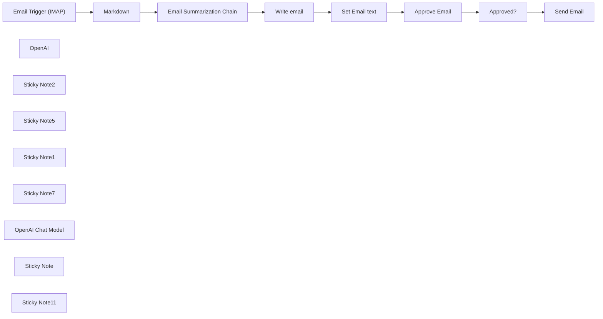

## Fluxo (.json) :

```json
{
  "id": "Nvn78tMRNnKji7Fg",
  "meta": {
    "instanceId": "a4bfc93e975ca233ac45ed7c9227d84cf5a2329310525917adaf3312e10d5462",
    "templateCredsSetupCompleted": true
  },
  "name": "Very simple Human in the loop system email with AI e IMAP",
  "tags": [],
  "nodes": [
    {
      "id": "271bb16f-9b62-41d9-ab76-114cd7ba915a",
      "name": "Email Trigger (IMAP)",
      "type": "n8n-nodes-base.emailReadImap",
      "position": [
        -1300,
        1340
      ],
      "parameters": {
        "options": {}
      },
      "credentials": {
        "imap": {
          "id": "k31W9oGddl9pMDy4",
          "name": "IMAP info@n3witalia.com"
        }
      },
      "typeVersion": 2
    },
    {
      "id": "42d150d8-d574-49f9-9c0e-71a2cdea3b79",
      "name": "Markdown",
      "type": "n8n-nodes-base.markdown",
      "position": [
        -1040,
        1340
      ],
      "parameters": {
        "html": "={{ $json.textHtml }}",
        "options": {}
      },
      "typeVersion": 1
    },
    {
      "id": "e9498a60-0078-4581-b269-7ff552f4047a",
      "name": "Send Email",
      "type": "n8n-nodes-base.emailSend",
      "position": [
        920,
        1320
      ],
      "webhookId": "a79ae1b4-648c-4cb4-b6cd-04ea3c1d9314",
      "parameters": {
        "html": "={{ $('Set Email text').item.json.email }}",
        "options": {},
        "subject": "=Re: {{ $('Email Trigger (IMAP)').item.json.subject }}",
        "toEmail": "={{ $('Email Trigger (IMAP)').item.json.from }}",
        "fromEmail": "={{ $('Email Trigger (IMAP)').item.json.to }}"
      },
      "credentials": {
        "smtp": {
          "id": "hRjP3XbDiIQqvi7x",
          "name": "SMTP info@n3witalia.com"
        }
      },
      "typeVersion": 2.1
    },
    {
      "id": "ab9f6ac3-2095-44df-aeba-2eab96ecf425",
      "name": "Email Summarization Chain",
      "type": "@n8n/n8n-nodes-langchain.chainSummarization",
      "position": [
        -780,
        1340
      ],
      "parameters": {
        "options": {
          "binaryDataKey": "={{ $json.data }}",
          "summarizationMethodAndPrompts": {
            "values": {
              "prompt": "=Write a concise summary of the following in max 100 words:\n\n\"{{ $json.data }}\"\n\nDo not enter the total number of words used.",
              "combineMapPrompt": "=Write a concise summary of the following in max 100 words:\n\n\"{{ $json.data }}\"\n\nDo not enter the total number of words used."
            }
          }
        },
        "operationMode": "nodeInputBinary"
      },
      "typeVersion": 2
    },
    {
      "id": "86b7c3d0-e1f2-4e2f-b293-8042700d6816",
      "name": "Write email",
      "type": "@n8n/n8n-nodes-langchain.agent",
      "position": [
        -340,
        1340
      ],
      "parameters": {
        "text": "=Write the text to reply to the following email:\n\n{{ $json.response.text }}",
        "options": {
          "systemMessage": "You are an expert at answering emails. You need to answer them professionally based on the information you have. This is a business email. Be concise and never exceed 100 words. Only the body of the email, not create the subject"
        },
        "promptType": "define",
        "hasOutputParser": true
      },
      "typeVersion": 1.7
    },
    {
      "id": "5d5a397f-f9c3-4691-afd0-9a6102679eac",
      "name": "OpenAI",
      "type": "@n8n/n8n-nodes-langchain.lmChatOpenAi",
      "position": [
        -400,
        1560
      ],
      "parameters": {
        "model": {
          "__rl": true,
          "mode": "list",
          "value": "gpt-4o-mini",
          "cachedResultName": "gpt-4o-mini"
        },
        "options": {}
      },
      "credentials": {
        "openAiApi": {
          "id": "CDX6QM4gLYanh0P4",
          "name": "OpenAi account"
        }
      },
      "typeVersion": 1.2
    },
    {
      "id": "5b36a295-fda6-4174-9078-0a8ec57620d2",
      "name": "Sticky Note2",
      "type": "n8n-nodes-base.stickyNote",
      "position": [
        -800,
        1260
      ],
      "parameters": {
        "width": 320,
        "height": 240,
        "content": "Chain that summarizes the received email"
      },
      "typeVersion": 1
    },
    {
      "id": "7110fe1f-0099-49aa-9095-96e733aa468f",
      "name": "Sticky Note5",
      "type": "n8n-nodes-base.stickyNote",
      "position": [
        -360,
        1260
      ],
      "parameters": {
        "width": 340,
        "height": 240,
        "content": "Agent that retrieves business information from a vector database and processes the response"
      },
      "typeVersion": 1
    },
    {
      "id": "e2bdbd64-3c37-4867-ae2c-0f6937d82b81",
      "name": "Sticky Note1",
      "type": "n8n-nodes-base.stickyNote",
      "position": [
        -1100,
        1260
      ],
      "parameters": {
        "height": 240,
        "content": "Convert email to Markdown format for better understanding of LLM models"
      },
      "typeVersion": 1
    },
    {
      "id": "8ae5d216-5897-4c33-800a-27ff939b174a",
      "name": "Sticky Note7",
      "type": "n8n-nodes-base.stickyNote",
      "position": [
        620,
        1300
      ],
      "parameters": {
        "height": 180,
        "content": "If the feedback is OK send email"
      },
      "typeVersion": 1
    },
    {
      "id": "4cfce63c-5931-45c5-99ca-eb85dca962b5",
      "name": "Approve Email",
      "type": "n8n-nodes-base.emailSend",
      "position": [
        380,
        1340
      ],
      "webhookId": "4f9f06e7-9b2b-4896-9b51-245972341d12",
      "parameters": {
        "message": "=<h3>MESSAGE</h3>\n{{ $('Email Trigger (IMAP)').item.json.textHtml }}\n\n<h3>AI RESPONSE</h3>\n{{ $json.email }}",
        "options": {},
        "subject": "=[Approval Required] {{ $('Email Trigger (IMAP)').item.json.subject }}",
        "toEmail": "info@n3witalia.com",
        "fromEmail": "info@n3witalia.com",
        "operation": "sendAndWait"
      },
      "credentials": {
        "smtp": {
          "id": "hRjP3XbDiIQqvi7x",
          "name": "SMTP info@n3witalia.com"
        }
      },
      "typeVersion": 2.1
    },
    {
      "id": "d6c8acd2-ebc1-4aaa-bfcc-cdb18fcc8715",
      "name": "OpenAI Chat Model",
      "type": "@n8n/n8n-nodes-langchain.lmChatOpenAi",
      "position": [
        -820,
        1560
      ],
      "parameters": {
        "model": {
          "__rl": true,
          "mode": "list",
          "value": "deepseek-chat",
          "cachedResultName": "deepseek-chat"
        },
        "options": {}
      },
      "credentials": {
        "openAiApi": {
          "id": "97Cz4cqyiy1RdcQL",
          "name": "DeepSeek"
        }
      },
      "typeVersion": 1.2
    },
    {
      "id": "33bbedeb-129a-4e99-ab5a-9e0ec4456156",
      "name": "Set Email text",
      "type": "n8n-nodes-base.set",
      "position": [
        100,
        1340
      ],
      "parameters": {
        "options": {},
        "assignments": {
          "assignments": [
            {
              "id": "35d7c303-42f4-4dd1-b41e-6eb087c23c3d",
              "name": "email",
              "type": "string",
              "value": "={{ $json.output }}"
            }
          ]
        }
      },
      "typeVersion": 3.4
    },
    {
      "id": "2293e0e6-4f2a-4622-a610-64b65f34e1e5",
      "name": "Sticky Note",
      "type": "n8n-nodes-base.stickyNote",
      "position": [
        320,
        1300
      ],
      "parameters": {
        "height": 180,
        "content": "Human in the loop"
      },
      "typeVersion": 1
    },
    {
      "id": "510196ec-adaf-4e6c-aac0-8ca8b754438a",
      "name": "Sticky Note11",
      "type": "n8n-nodes-base.stickyNote",
      "position": [
        -1100,
        940
      ],
      "parameters": {
        "color": 3,
        "width": 540,
        "height": 260,
        "content": "# How it works\nThis workflow automates the handling of incoming emails, summarizes their content, generates appropriate responses and validate it through send IMAP email with \"Human in the loop\" system. \n\nYou can quickly integrate Gmail and Outlook via the appropriate nodes"
      },
      "typeVersion": 1
    },
    {
      "id": "c4c9157d-4d05-47a1-a5eb-63865e838d39",
      "name": "Approved?",
      "type": "n8n-nodes-base.if",
      "position": [
        680,
        1340
      ],
      "parameters": {
        "options": {},
        "conditions": {
          "options": {
            "version": 2,
            "leftValue": "",
            "caseSensitive": true,
            "typeValidation": "strict"
          },
          "combinator": "and",
          "conditions": [
            {
              "id": "62e26bc5-1732-4699-a602-99490c7406fd",
              "operator": {
                "type": "boolean",
                "operation": "true",
                "singleValue": true
              },
              "leftValue": "={{ $json.data.approved }}",
              "rightValue": ""
            }
          ]
        }
      },
      "typeVersion": 2.2
    }
  ],
  "active": false,
  "pinData": {},
  "settings": {
    "executionOrder": "v1"
  },
  "versionId": "47e79286-00f4-48e8-a0d1-e0f56d9ba0d5",
  "connections": {
    "OpenAI": {
      "ai_languageModel": [
        [
          {
            "node": "Write email",
            "type": "ai_languageModel",
            "index": 0
          }
        ]
      ]
    },
    "Markdown": {
      "main": [
        [
          {
            "node": "Email Summarization Chain",
            "type": "main",
            "index": 0
          }
        ]
      ]
    },
    "Approved?": {
      "main": [
        [
          {
            "node": "Send Email",
            "type": "main",
            "index": 0
          }
        ],
        []
      ]
    },
    "Write email": {
      "main": [
        [
          {
            "node": "Set Email text",
            "type": "main",
            "index": 0
          }
        ]
      ]
    },
    "Approve Email": {
      "main": [
        [
          {
            "node": "Approved?",
            "type": "main",
            "index": 0
          }
        ]
      ]
    },
    "Set Email text": {
      "main": [
        [
          {
            "node": "Approve Email",
            "type": "main",
            "index": 0
          }
        ]
      ]
    },
    "OpenAI Chat Model": {
      "ai_languageModel": [
        [
          {
            "node": "Email Summarization Chain",
            "type": "ai_languageModel",
            "index": 0
          }
        ]
      ]
    },
    "Email Trigger (IMAP)": {
      "main": [
        [
          {
            "node": "Markdown",
            "type": "main",
            "index": 0
          }
        ]
      ]
    },
    "Email Summarization Chain": {
      "main": [
        [
          {
            "node": "Write email",
            "type": "main",
            "index": 0
          }
        ]
      ]
    }
  }
}
```

<a id="template-29"></a>

## Template 29 - Conversão Markdown → HTML para descrições do Airtable

- **Nome:** Conversão Markdown → HTML para descrições do Airtable
- **Descrição:** Recebe um webhook que dispara a conversão de campos de descrição em Markdown para HTML e atualiza os registros correspondentes no Airtable.
- **Funcionalidade:** • Receber webhook de sincronização: Inicia o fluxo ao receber uma requisição no caminho configurado.
• Roteamento por tipo de atualização: Verifica se a requisição aponta para um único registro ou para todos (modo em massa) e escolhe o caminho adequado.
• Buscar registro único por ID: Recupera um registro específico do Airtable quando informado o ID.
• Buscar vários registros para lote: Recupera múltiplos registros (com limite configurável; neste fluxo está definido limite 3) para processamento em lote.
• Converter Markdown para HTML: Transforma o conteúdo do campo "📥 Video Description" em HTML.
• Atualizar registro(s) com HTML gerado: Grava o HTML resultante no campo "Video description HTML" do(s) registro(s); no caminho em massa também seta o campo "Unpublished" para false.
- **Ferramentas:** • Airtable: Banco de dados/planilha onde os registros de vídeos são lidos e atualizados.
• Conversor Markdown para HTML: Biblioteca ou serviço responsável por transformar o texto em Markdown do campo de descrição em HTML.

## Fluxo visual

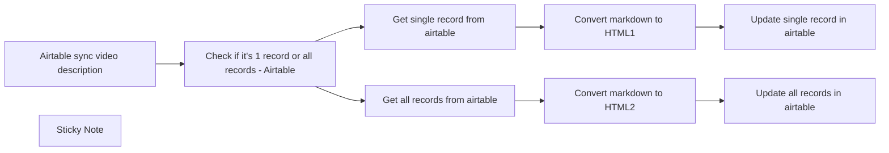

## Fluxo (.json) :

```json
{
  "id": "LMMle9xFHQxXUWQy",
  "meta": {
    "instanceId": "7d362a334cd7fabe145eb8ec1b9c6b483cd4fa9315ab54f45d181e73340a0ebc",
    "templateCredsSetupCompleted": true
  },
  "name": "Airtable markdown to html",
  "tags": [],
  "nodes": [
    {
      "id": "ae8fad3b-7108-4a7a-a6d6-13e249c41ad7",
      "name": "Check if it's 1 record or all records - Airtable",
      "type": "n8n-nodes-base.if",
      "position": [
        1460,
        760
      ],
      "parameters": {
        "options": {},
        "conditions": {
          "options": {
            "leftValue": "",
            "caseSensitive": true,
            "typeValidation": "strict"
          },
          "combinator": "and",
          "conditions": [
            {
              "id": "985d1b48-78d1-4cd8-bd89-c4c2cb8f1e94",
              "operator": {
                "type": "string",
                "operation": "exists",
                "singleValue": true
              },
              "leftValue": "={{ $json.query.recordId }}",
              "rightValue": "all"
            }
          ]
        }
      },
      "typeVersion": 2
    },
    {
      "id": "c2a99d03-3570-4956-8e1e-06d6d72af7cd",
      "name": "Get single record from airtable",
      "type": "n8n-nodes-base.airtable",
      "position": [
        1660,
        740
      ],
      "parameters": {
        "id": "={{ $json.query.recordId }}",
        "base": {
          "__rl": true,
          "mode": "list",
          "value": "appk2iZaWQLO3Tqvx",
          "cachedResultUrl": "https://airtable.com/appk2iZaWQLO3Tqvx",
          "cachedResultName": "360Creators"
        },
        "table": {
          "__rl": true,
          "mode": "list",
          "value": "tblbYRGFgCo9u2VpB",
          "cachedResultUrl": "https://airtable.com/appk2iZaWQLO3Tqvx/tblbYRGFgCo9u2VpB",
          "cachedResultName": "📺 Videos"
        },
        "options": {},
        "operation": "get"
      },
      "credentials": {
        "airtableTokenApi": {
          "id": "1fljBv63tzQeX9rd",
          "name": "🏰 360Creators"
        }
      },
      "typeVersion": 2
    },
    {
      "id": "73c07061-d6e5-4cb1-9aaf-8a906bc6fd28",
      "name": "Convert markdown to HTML1",
      "type": "n8n-nodes-base.markdown",
      "position": [
        1860,
        740
      ],
      "parameters": {
        "mode": "markdownToHtml",
        "options": {
          "simplifiedAutoLink": true
        },
        "markdown": "={{ $json['📥 Video Description'] }}"
      },
      "typeVersion": 1
    },
    {
      "id": "ce9751b6-484d-4b31-9357-002059d7348a",
      "name": "Convert markdown to HTML2",
      "type": "n8n-nodes-base.markdown",
      "position": [
        1860,
        960
      ],
      "parameters": {
        "mode": "markdownToHtml",
        "options": {},
        "markdown": "={{ $json[\"📥 Video Description\"] }}"
      },
      "typeVersion": 1
    },
    {
      "id": "d713dd7d-8381-441b-8a4f-a0ce184abc31",
      "name": "Update single record in airtable",
      "type": "n8n-nodes-base.airtable",
      "position": [
        2080,
        740
      ],
      "parameters": {
        "base": {
          "__rl": true,
          "mode": "list",
          "value": "appk2iZaWQLO3Tqvx",
          "cachedResultUrl": "https://airtable.com/appk2iZaWQLO3Tqvx",
          "cachedResultName": "360Creators"
        },
        "table": {
          "__rl": true,
          "mode": "list",
          "value": "tblbYRGFgCo9u2VpB",
          "cachedResultUrl": "https://airtable.com/appk2iZaWQLO3Tqvx/tblbYRGFgCo9u2VpB",
          "cachedResultName": "📺 Videos"
        },
        "columns": {
          "value": {
            "id": "={{ $json.id }}",
            "Video description HTML": "={{ $json.data }}"
          },
          "schema": [
            {
              "id": "id",
              "type": "string",
              "display": true,
              "removed": false,
              "readOnly": true,
              "required": false,
              "displayName": "id",
              "defaultMatch": true
            },
            {
              "id": "📥 Video Name",
              "type": "string",
              "display": true,
              "removed": false,
              "readOnly": false,
              "required": false,
              "displayName": "📥 Video Name",
              "defaultMatch": false,
              "canBeUsedToMatch": true
            },
            {
              "id": "📥 Video Thumbnail",
              "type": "array",
              "display": true,
              "removed": false,
              "readOnly": false,
              "required": false,
              "displayName": "📥 Video Thumbnail",
              "defaultMatch": false,
              "canBeUsedToMatch": true
            },
            {
              "id": "📥 Video Description",
              "type": "string",
              "display": true,
              "removed": false,
              "readOnly": false,
              "required": false,
              "displayName": "📥 Video Description",
              "defaultMatch": false,
              "canBeUsedToMatch": true
            },
            {
              "id": "⚡️ Meta Description",
              "type": "string",
              "display": true,
              "removed": false,
              "readOnly": true,
              "required": false,
              "displayName": "⚡️ Meta Description",
              "defaultMatch": false,
              "canBeUsedToMatch": true
            },
            {
              "id": "⚡️ Publish Date",
              "type": "dateTime",
              "display": true,
              "removed": false,
              "readOnly": false,
              "required": false,
              "displayName": "⚡️ Publish Date",
              "defaultMatch": false,
              "canBeUsedToMatch": true
            },
            {
              "id": "📥 Color [low priority]",
              "type": "options",
              "display": true,
              "options": [
                {
                  "name": "#f6a31b",
                  "value": "#f6a31b"
                },
                {
                  "name": "#B3212C",
                  "value": "#B3212C"
                }
              ],
              "removed": false,
              "readOnly": false,
              "required": false,
              "displayName": "📥 Color [low priority]",
              "defaultMatch": false,
              "canBeUsedToMatch": true
            },
            {
              "id": "⚡️ Youtube url",
              "type": "string",
              "display": true,
              "removed": false,
              "readOnly": false,
              "required": false,
              "displayName": "⚡️ Youtube url",
              "defaultMatch": false,
              "canBeUsedToMatch": true
            },
            {
              "id": "Vimeo url",
              "type": "string",
              "display": true,
              "removed": false,
              "readOnly": false,
              "required": false,
              "displayName": "Vimeo url",
              "defaultMatch": false,
              "canBeUsedToMatch": true
            },
            {
              "id": "Calculation",
              "type": "string",
              "display": true,
              "removed": false,
              "readOnly": true,
              "required": false,
              "displayName": "Calculation",
              "defaultMatch": false,
              "canBeUsedToMatch": true
            },
            {
              "id": "⚡️ Youtube url, autoplay",
              "type": "string",
              "display": true,
              "removed": false,
              "readOnly": true,
              "required": false,
              "displayName": "⚡️ Youtube url, autoplay",
              "defaultMatch": false,
              "canBeUsedToMatch": true
            },
            {
              "id": "📥 videos.360creators.com url [backup]",
              "type": "string",
              "display": true,
              "removed": false,
              "readOnly": false,
              "required": false,
              "displayName": "📥 videos.360creators.com url [backup]",
              "defaultMatch": false,
              "canBeUsedToMatch": true
            },
            {
              "id": "⚡️ Webflow url",
              "type": "string",
              "display": true,
              "removed": false,
              "readOnly": true,
              "required": false,
              "displayName": "⚡️ Webflow url",
              "defaultMatch": false,
              "canBeUsedToMatch": true
            },
            {
              "id": "📥 Slug",
              "type": "string",
              "display": true,
              "removed": false,
              "readOnly": false,
              "required": false,
              "displayName": "📥 Slug",
              "defaultMatch": false,
              "canBeUsedToMatch": true
            },
            {
              "id": "🏘️ Creator",
              "type": "array",
              "display": true,
              "removed": false,
              "readOnly": false,
              "required": false,
              "displayName": "🏘️ Creator",
              "defaultMatch": false,
              "canBeUsedToMatch": true
            },
            {
              "id": "⚡️ Tools with url | video description",
              "type": "string",
              "display": true,
              "removed": false,
              "readOnly": true,
              "required": false,
              "displayName": "⚡️ Tools with url | video description",
              "defaultMatch": false,
              "canBeUsedToMatch": true
            },
            {
              "id": "⚡️ Video Description",
              "type": "string",
              "display": true,
              "removed": false,
              "readOnly": true,
              "required": false,
              "displayName": "⚡️ Video Description",
              "defaultMatch": false,
              "canBeUsedToMatch": true
            },
            {
              "id": "📥 Timestamps | video description",
              "type": "string",
              "display": true,
              "removed": false,
              "readOnly": false,
              "required": false,
              "displayName": "📥 Timestamps | video description",
              "defaultMatch": false,
              "canBeUsedToMatch": true
            },
            {
              "id": "🛠 Tools",
              "type": "array",
              "display": true,
              "removed": false,
              "readOnly": false,
              "required": false,
              "displayName": "🛠 Tools",
              "defaultMatch": false,
              "canBeUsedToMatch": true
            },
            {
              "id": "⚡️ #Tools | video description",
              "type": "string",
              "display": true,
              "removed": false,
              "readOnly": true,
              "required": false,
              "displayName": "⚡️ #Tools | video description",
              "defaultMatch": false,
              "canBeUsedToMatch": true
            },
            {
              "id": "⚡️ Tool Categories | video description",
              "type": "string",
              "display": true,
              "removed": false,
              "readOnly": true,
              "required": false,
              "displayName": "⚡️ Tool Categories | video description",
              "defaultMatch": false,
              "canBeUsedToMatch": true
            },
            {
              "id": "⚡️ Created",
              "type": "string",
              "display": true,
              "removed": false,
              "readOnly": true,
              "required": false,
              "displayName": "⚡️ Created",
              "defaultMatch": false,
              "canBeUsedToMatch": true
            },
            {
              "id": "💬 Channels",
              "type": "array",
              "display": true,
              "removed": false,
              "readOnly": false,
              "required": false,
              "displayName": "💬 Channels",
              "defaultMatch": false,
              "canBeUsedToMatch": true
            },
            {
              "id": "⚡️ Slug",
              "type": "string",
              "display": true,
              "removed": false,
              "readOnly": true,
              "required": false,
              "displayName": "⚡️ Slug",
              "defaultMatch": false,
              "canBeUsedToMatch": true
            },
            {
              "id": "🚀 Publish",
              "type": "string",
              "display": true,
              "removed": false,
              "readOnly": true,
              "required": false,
              "displayName": "🚀 Publish",
              "defaultMatch": false,
              "canBeUsedToMatch": true
            },
            {
              "id": "⚡️ Channels",
              "type": "string",
              "display": true,
              "removed": false,
              "readOnly": true,
              "required": false,
              "displayName": "⚡️ Channels",
              "defaultMatch": false,
              "canBeUsedToMatch": true
            },
            {
              "id": "⚡️ Tools Categories | Video description",
              "type": "string",
              "display": true,
              "removed": false,
              "readOnly": true,
              "required": false,
              "displayName": "⚡️ Tools Categories | Video description",
              "defaultMatch": false,
              "canBeUsedToMatch": true
            },
            {
              "id": "⚡️ #Tool | Video description",
              "type": "string",
              "display": true,
              "removed": false,
              "readOnly": true,
              "required": false,
              "displayName": "⚡️ #Tool | Video description",
              "defaultMatch": false,
              "canBeUsedToMatch": true
            },
            {
              "id": "⚡️ #ToolCategory | Video Description",
              "type": "string",
              "display": true,
              "removed": false,
              "readOnly": true,
              "required": false,
              "displayName": "⚡️ #ToolCategory | Video Description",
              "defaultMatch": false,
              "canBeUsedToMatch": true
            },
            {
              "id": "Unpublished",
              "type": "boolean",
              "display": true,
              "removed": false,
              "readOnly": false,
              "required": false,
              "displayName": "Unpublished",
              "defaultMatch": false,
              "canBeUsedToMatch": true
            },
            {
              "id": "⚖️ Market",
              "type": "array",
              "display": true,
              "removed": false,
              "readOnly": false,
              "required": false,
              "displayName": "⚖️ Market",
              "defaultMatch": false,
              "canBeUsedToMatch": true
            },
            {
              "id": "⚡️ Market company | Video Description lookup",
              "type": "string",
              "display": true,
              "removed": false,
              "readOnly": true,
              "required": false,
              "displayName": "⚡️ Market company | Video Description lookup",
              "defaultMatch": false,
              "canBeUsedToMatch": true
            },
            {
              "id": "⚡️ Market company | Video description arrayflatten",
              "type": "string",
              "display": true,
              "removed": false,
              "readOnly": true,
              "required": false,
              "displayName": "⚡️ Market company | Video description arrayflatten",
              "defaultMatch": false,
              "canBeUsedToMatch": true
            },
            {
              "id": "⚡️ Market listing arrayjoin | Video description",
              "type": "string",
              "display": true,
              "removed": false,
              "readOnly": true,
              "required": false,
              "displayName": "⚡️ Market listing arrayjoin | Video description",
              "defaultMatch": false,
              "canBeUsedToMatch": true
            },
            {
              "id": "Description | formula v3",
              "type": "string",
              "display": true,
              "removed": false,
              "readOnly": true,
              "required": false,
              "displayName": "Description | formula v3",
              "defaultMatch": false,
              "canBeUsedToMatch": true
            },
            {
              "id": "Description referral formula",
              "type": "string",
              "display": true,
              "removed": false,
              "readOnly": true,
              "required": false,
              "displayName": "Description referral formula",
              "defaultMatch": false,
              "canBeUsedToMatch": true
            },
            {
              "id": "📺 Video description market listing lookup",
              "type": "string",
              "display": true,
              "removed": false,
              "readOnly": true,
              "required": false,
              "displayName": "📺 Video description market listing lookup",
              "defaultMatch": false,
              "canBeUsedToMatch": true
            },
            {
              "id": "📺 Video description market listing formula",
              "type": "string",
              "display": true,
              "removed": false,
              "readOnly": true,
              "required": false,
              "displayName": "📺 Video description market listing formula",
              "defaultMatch": false,
              "canBeUsedToMatch": true
            },
            {
              "id": "Name Short [backup]",
              "type": "string",
              "display": true,
              "removed": false,
              "readOnly": false,
              "required": false,
              "displayName": "Name Short [backup]",
              "defaultMatch": false,
              "canBeUsedToMatch": true
            },
            {
              "id": "🗃️ File Resources",
              "type": "string",
              "display": true,
              "removed": false,
              "readOnly": false,
              "required": false,
              "displayName": "🗃️ File Resources",
              "defaultMatch": false,
              "canBeUsedToMatch": true
            },
            {
              "id": "Calculation 2",
              "type": "string",
              "display": true,
              "removed": false,
              "readOnly": true,
              "required": false,
              "displayName": "Calculation 2",
              "defaultMatch": false,
              "canBeUsedToMatch": true
            },
            {
              "id": "Video description HTML",
              "type": "string",
              "display": true,
              "removed": false,
              "readOnly": false,
              "required": false,
              "displayName": "Video description HTML",
              "defaultMatch": false,
              "canBeUsedToMatch": true
            },
            {
              "id": "Convert video description to HTML",
              "type": "string",
              "display": true,
              "removed": false,
              "readOnly": true,
              "required": false,
              "displayName": "Convert video description to HTML",
              "defaultMatch": false,
              "canBeUsedToMatch": true
            }
          ],
          "mappingMode": "defineBelow",
          "matchingColumns": [
            "id"
          ]
        },
        "options": {},
        "operation": "update"
      },
      "credentials": {
        "airtableTokenApi": {
          "id": "1fljBv63tzQeX9rd",
          "name": "🏰 360Creators"
        }
      },
      "typeVersion": 2
    },
    {
      "id": "1b836b94-cedb-4a1b-9e7c-5ef0978578a5",
      "name": "Update all records in airtable",
      "type": "n8n-nodes-base.airtable",
      "position": [
        2080,
        960
      ],
      "parameters": {
        "base": {
          "__rl": true,
          "mode": "list",
          "value": "appk2iZaWQLO3Tqvx",
          "cachedResultUrl": "https://airtable.com/appk2iZaWQLO3Tqvx",
          "cachedResultName": "360Creators"
        },
        "table": {
          "__rl": true,
          "mode": "list",
          "value": "tblbYRGFgCo9u2VpB",
          "cachedResultUrl": "https://airtable.com/appk2iZaWQLO3Tqvx/tblbYRGFgCo9u2VpB",
          "cachedResultName": "📺 Videos"
        },
        "columns": {
          "value": {
            "id": "={{ $json.id }}",
            "Unpublished": false,
            "Video description HTML": "={{ $json.data }}"
          },
          "schema": [
            {
              "id": "id",
              "type": "string",
              "display": true,
              "removed": false,
              "readOnly": true,
              "required": false,
              "displayName": "id",
              "defaultMatch": true
            },
            {
              "id": "📥 Video Name",
              "type": "string",
              "display": true,
              "removed": false,
              "readOnly": false,
              "required": false,
              "displayName": "📥 Video Name",
              "defaultMatch": false,
              "canBeUsedToMatch": true
            },
            {
              "id": "📥 Video Thumbnail",
              "type": "array",
              "display": true,
              "removed": false,
              "readOnly": false,
              "required": false,
              "displayName": "📥 Video Thumbnail",
              "defaultMatch": false,
              "canBeUsedToMatch": true
            },
            {
              "id": "📥 Video Description",
              "type": "string",
              "display": true,
              "removed": false,
              "readOnly": false,
              "required": false,
              "displayName": "📥 Video Description",
              "defaultMatch": false,
              "canBeUsedToMatch": true
            },
            {
              "id": "⚡️ Meta Description",
              "type": "string",
              "display": true,
              "removed": true,
              "readOnly": true,
              "required": false,
              "displayName": "⚡️ Meta Description",
              "defaultMatch": false,
              "canBeUsedToMatch": true
            },
            {
              "id": "⚡️ Publish Date",
              "type": "dateTime",
              "display": true,
              "removed": false,
              "readOnly": false,
              "required": false,
              "displayName": "⚡️ Publish Date",
              "defaultMatch": false,
              "canBeUsedToMatch": true
            },
            {
              "id": "📥 Color [low priority]",
              "type": "options",
              "display": true,
              "options": [
                {
                  "name": "#f6a31b",
                  "value": "#f6a31b"
                },
                {
                  "name": "#B3212C",
                  "value": "#B3212C"
                }
              ],
              "removed": false,
              "readOnly": false,
              "required": false,
              "displayName": "📥 Color [low priority]",
              "defaultMatch": false,
              "canBeUsedToMatch": true
            },
            {
              "id": "⚡️ Youtube url",
              "type": "string",
              "display": true,
              "removed": false,
              "readOnly": false,
              "required": false,
              "displayName": "⚡️ Youtube url",
              "defaultMatch": false,
              "canBeUsedToMatch": true
            },
            {
              "id": "Vimeo url",
              "type": "string",
              "display": true,
              "removed": false,
              "readOnly": false,
              "required": false,
              "displayName": "Vimeo url",
              "defaultMatch": false,
              "canBeUsedToMatch": true
            },
            {
              "id": "Calculation",
              "type": "string",
              "display": true,
              "removed": true,
              "readOnly": true,
              "required": false,
              "displayName": "Calculation",
              "defaultMatch": false,
              "canBeUsedToMatch": true
            },
            {
              "id": "⚡️ Youtube url, autoplay",
              "type": "string",
              "display": true,
              "removed": true,
              "readOnly": true,
              "required": false,
              "displayName": "⚡️ Youtube url, autoplay",
              "defaultMatch": false,
              "canBeUsedToMatch": true
            },
            {
              "id": "📥 videos.360creators.com url [backup]",
              "type": "string",
              "display": true,
              "removed": false,
              "readOnly": false,
              "required": false,
              "displayName": "📥 videos.360creators.com url [backup]",
              "defaultMatch": false,
              "canBeUsedToMatch": true
            },
            {
              "id": "⚡️ Webflow url",
              "type": "string",
              "display": true,
              "removed": true,
              "readOnly": true,
              "required": false,
              "displayName": "⚡️ Webflow url",
              "defaultMatch": false,
              "canBeUsedToMatch": true
            },
            {
              "id": "📥 Slug",
              "type": "string",
              "display": true,
              "removed": false,
              "readOnly": false,
              "required": false,
              "displayName": "📥 Slug",
              "defaultMatch": false,
              "canBeUsedToMatch": true
            },
            {
              "id": "🏘️ Creator",
              "type": "array",
              "display": true,
              "removed": false,
              "readOnly": false,
              "required": false,
              "displayName": "🏘️ Creator",
              "defaultMatch": false,
              "canBeUsedToMatch": true
            },
            {
              "id": "⚡️ Tools with url | video description",
              "type": "string",
              "display": true,
              "removed": true,
              "readOnly": true,
              "required": false,
              "displayName": "⚡️ Tools with url | video description",
              "defaultMatch": false,
              "canBeUsedToMatch": true
            },
            {
              "id": "⚡️ Video Description",
              "type": "string",
              "display": true,
              "removed": true,
              "readOnly": true,
              "required": false,
              "displayName": "⚡️ Video Description",
              "defaultMatch": false,
              "canBeUsedToMatch": true
            },
            {
              "id": "📥 Timestamps | video description",
              "type": "string",
              "display": true,
              "removed": false,
              "readOnly": false,
              "required": false,
              "displayName": "📥 Timestamps | video description",
              "defaultMatch": false,
              "canBeUsedToMatch": true
            },
            {
              "id": "🛠 Tools",
              "type": "array",
              "display": true,
              "removed": false,
              "readOnly": false,
              "required": false,
              "displayName": "🛠 Tools",
              "defaultMatch": false,
              "canBeUsedToMatch": true
            },
            {
              "id": "⚡️ #Tools | video description",
              "type": "string",
              "display": true,
              "removed": true,
              "readOnly": true,
              "required": false,
              "displayName": "⚡️ #Tools | video description",
              "defaultMatch": false,
              "canBeUsedToMatch": true
            },
            {
              "id": "⚡️ Tool Categories | video description",
              "type": "string",
              "display": true,
              "removed": true,
              "readOnly": true,
              "required": false,
              "displayName": "⚡️ Tool Categories | video description",
              "defaultMatch": false,
              "canBeUsedToMatch": true
            },
            {
              "id": "⚡️ Created",
              "type": "string",
              "display": true,
              "removed": true,
              "readOnly": true,
              "required": false,
              "displayName": "⚡️ Created",
              "defaultMatch": false,
              "canBeUsedToMatch": true
            },
            {
              "id": "💬 Channels",
              "type": "array",
              "display": true,
              "removed": false,
              "readOnly": false,
              "required": false,
              "displayName": "💬 Channels",
              "defaultMatch": false,
              "canBeUsedToMatch": true
            },
            {
              "id": "⚡️ Slug",
              "type": "string",
              "display": true,
              "removed": true,
              "readOnly": true,
              "required": false,
              "displayName": "⚡️ Slug",
              "defaultMatch": false,
              "canBeUsedToMatch": true
            },
            {
              "id": "🚀 Publish",
              "type": "string",
              "display": true,
              "removed": true,
              "readOnly": true,
              "required": false,
              "displayName": "🚀 Publish",
              "defaultMatch": false,
              "canBeUsedToMatch": true
            },
            {
              "id": "⚡️ Channels",
              "type": "string",
              "display": true,
              "removed": true,
              "readOnly": true,
              "required": false,
              "displayName": "⚡️ Channels",
              "defaultMatch": false,
              "canBeUsedToMatch": true
            },
            {
              "id": "⚡️ Tools Categories | Video description",
              "type": "string",
              "display": true,
              "removed": true,
              "readOnly": true,
              "required": false,
              "displayName": "⚡️ Tools Categories | Video description",
              "defaultMatch": false,
              "canBeUsedToMatch": true
            },
            {
              "id": "⚡️ #Tool | Video description",
              "type": "string",
              "display": true,
              "removed": true,
              "readOnly": true,
              "required": false,
              "displayName": "⚡️ #Tool | Video description",
              "defaultMatch": false,
              "canBeUsedToMatch": true
            },
            {
              "id": "⚡️ #ToolCategory | Video Description",
              "type": "string",
              "display": true,
              "removed": true,
              "readOnly": true,
              "required": false,
              "displayName": "⚡️ #ToolCategory | Video Description",
              "defaultMatch": false,
              "canBeUsedToMatch": true
            },
            {
              "id": "Unpublished",
              "type": "boolean",
              "display": true,
              "removed": false,
              "readOnly": false,
              "required": false,
              "displayName": "Unpublished",
              "defaultMatch": false,
              "canBeUsedToMatch": true
            },
            {
              "id": "⚖️ Market",
              "type": "array",
              "display": true,
              "removed": false,
              "readOnly": false,
              "required": false,
              "displayName": "⚖️ Market",
              "defaultMatch": false,
              "canBeUsedToMatch": true
            },
            {
              "id": "⚡️ Market company | Video Description lookup",
              "type": "string",
              "display": true,
              "removed": true,
              "readOnly": true,
              "required": false,
              "displayName": "⚡️ Market company | Video Description lookup",
              "defaultMatch": false,
              "canBeUsedToMatch": true
            },
            {
              "id": "⚡️ Market company | Video description arrayflatten",
              "type": "string",
              "display": true,
              "removed": true,
              "readOnly": true,
              "required": false,
              "displayName": "⚡️ Market company | Video description arrayflatten",
              "defaultMatch": false,
              "canBeUsedToMatch": true
            },
            {
              "id": "⚡️ Market listing arrayjoin | Video description",
              "type": "string",
              "display": true,
              "removed": true,
              "readOnly": true,
              "required": false,
              "displayName": "⚡️ Market listing arrayjoin | Video description",
              "defaultMatch": false,
              "canBeUsedToMatch": true
            },
            {
              "id": "Description | formula v3",
              "type": "string",
              "display": true,
              "removed": true,
              "readOnly": true,
              "required": false,
              "displayName": "Description | formula v3",
              "defaultMatch": false,
              "canBeUsedToMatch": true
            },
            {
              "id": "Description referral formula",
              "type": "string",
              "display": true,
              "removed": true,
              "readOnly": true,
              "required": false,
              "displayName": "Description referral formula",
              "defaultMatch": false,
              "canBeUsedToMatch": true
            },
            {
              "id": "📺 Video description market listing lookup",
              "type": "string",
              "display": true,
              "removed": true,
              "readOnly": true,
              "required": false,
              "displayName": "📺 Video description market listing lookup",
              "defaultMatch": false,
              "canBeUsedToMatch": true
            },
            {
              "id": "📺 Video description market listing formula",
              "type": "string",
              "display": true,
              "removed": true,
              "readOnly": true,
              "required": false,
              "displayName": "📺 Video description market listing formula",
              "defaultMatch": false,
              "canBeUsedToMatch": true
            },
            {
              "id": "Name Short [backup]",
              "type": "string",
              "display": true,
              "removed": false,
              "readOnly": false,
              "required": false,
              "displayName": "Name Short [backup]",
              "defaultMatch": false,
              "canBeUsedToMatch": true
            },
            {
              "id": "🗃️ File Resources",
              "type": "string",
              "display": true,
              "removed": false,
              "readOnly": false,
              "required": false,
              "displayName": "🗃️ File Resources",
              "defaultMatch": false,
              "canBeUsedToMatch": true
            },
            {
              "id": "Calculation 2",
              "type": "string",
              "display": true,
              "removed": true,
              "readOnly": true,
              "required": false,
              "displayName": "Calculation 2",
              "defaultMatch": false,
              "canBeUsedToMatch": true
            },
            {
              "id": "Video description HTML",
              "type": "string",
              "display": true,
              "removed": false,
              "readOnly": false,
              "required": false,
              "displayName": "Video description HTML",
              "defaultMatch": false,
              "canBeUsedToMatch": true
            },
            {
              "id": "Convert video description to HTML",
              "type": "string",
              "display": true,
              "removed": true,
              "readOnly": true,
              "required": false,
              "displayName": "Convert video description to HTML",
              "defaultMatch": false,
              "canBeUsedToMatch": true
            }
          ],
          "mappingMode": "defineBelow",
          "matchingColumns": [
            "id"
          ]
        },
        "options": {},
        "operation": "update"
      },
      "credentials": {
        "airtableTokenApi": {
          "id": "1fljBv63tzQeX9rd",
          "name": "🏰 360Creators"
        }
      },
      "typeVersion": 2
    },
    {
      "id": "1167e05e-998d-44ca-bd28-09c1a74d18b3",
      "name": "Get all records from airtable",
      "type": "n8n-nodes-base.airtable",
      "position": [
        1660,
        960
      ],
      "parameters": {
        "base": {
          "__rl": true,
          "mode": "list",
          "value": "appk2iZaWQLO3Tqvx",
          "cachedResultUrl": "https://airtable.com/appk2iZaWQLO3Tqvx",
          "cachedResultName": "360Creators"
        },
        "limit": 3,
        "table": {
          "__rl": true,
          "mode": "list",
          "value": "tblbYRGFgCo9u2VpB",
          "cachedResultUrl": "https://airtable.com/appk2iZaWQLO3Tqvx/tblbYRGFgCo9u2VpB",
          "cachedResultName": "📺 Videos"
        },
        "options": {},
        "operation": "search",
        "returnAll": false
      },
      "credentials": {
        "airtableTokenApi": {
          "id": "1fljBv63tzQeX9rd",
          "name": "🏰 360Creators"
        }
      },
      "typeVersion": 2
    },
    {
      "id": "5cffbbdb-936c-4aa9-8e2d-9b8868f7db03",
      "name": "Airtable sync video description",
      "type": "n8n-nodes-base.webhook",
      "position": [
        1260,
        760
      ],
      "webhookId": "848644e5-6b1d-42b3-9259-5828c29780a8",
      "parameters": {
        "path": "848644e5-6b1d-42b3-9259-5828c29780a8",
        "options": {}
      },
      "typeVersion": 2
    },
    {
      "id": "6a084927-2cd8-40f9-8072-093a4847af6a",
      "name": "Sticky Note",
      "type": "n8n-nodes-base.stickyNote",
      "position": [
        1400,
        540
      ],
      "parameters": {
        "content": "# Tutorial\n[Youtube video](https://www.youtube.com/watch?v=PAoxZjICd7o)"
      },
      "typeVersion": 1
    }
  ],
  "active": false,
  "pinData": {},
  "settings": {
    "executionOrder": "v1"
  },
  "versionId": "5dd4fedb-7108-4641-890b-8f7f76d7684a",
  "connections": {
    "Convert markdown to HTML1": {
      "main": [
        [
          {
            "node": "Update single record in airtable",
            "type": "main",
            "index": 0
          }
        ]
      ]
    },
    "Convert markdown to HTML2": {
      "main": [
        [
          {
            "node": "Update all records in airtable",
            "type": "main",
            "index": 0
          }
        ]
      ]
    },
    "Get all records from airtable": {
      "main": [
        [
          {
            "node": "Convert markdown to HTML2",
            "type": "main",
            "index": 0
          }
        ]
      ]
    },
    "Airtable sync video description": {
      "main": [
        [
          {
            "node": "Check if it's 1 record or all records - Airtable",
            "type": "main",
            "index": 0
          }
        ]
      ]
    },
    "Get single record from airtable": {
      "main": [
        [
          {
            "node": "Convert markdown to HTML1",
            "type": "main",
            "index": 0
          }
        ]
      ]
    },
    "Check if it's 1 record or all records - Airtable": {
      "main": [
        [
          {
            "node": "Get single record from airtable",
            "type": "main",
            "index": 0
          }
        ],
        [
          {
            "node": "Get all records from airtable",
            "type": "main",
            "index": 0
          }
        ]
      ]
    }
  }
}
```

<a id="template-30"></a>

## Template 30 - Publicação automática de posts no Instagram

- **Nome:** Publicação automática de posts no Instagram
- **Descrição:** Seleciona a próxima ideia de post de uma planilha, gera conceito, prompts de imagem e legenda com modelos de IA, cria a imagem e publica no Instagram, atualizando o status do item.
- **Funcionalidade:** • Agendamento: Executa o fluxo automaticamente conforme cronograma definido.
• Leitura de ideias: Busca a próxima ideia com Status = 0 em uma planilha para processar.
• Preparação de variáveis: Extrai e organiza Topic, Audience, Voice e Platform para uso nas etapas de geração.
• Geração de conceito criativo: Usa um modelo de linguagem para criar exatamente um conceito de post (formato fixo: Single Image) adaptado à plataforma.
• Elaboração de prompts de imagem: Expande o conceito e produz duas opções detalhadas de prompt otimizadas para geradores de imagem.
• Geração de legenda: Cria uma legenda curta e adequada ao público e à plataforma, incluindo hashtags relevantes.
• Criação de imagem: Envia o prompt selecionado a um serviço de geração de imagens e obtém a imagem final.
• Publicação no Instagram: Prepara os dados, cria um container de mídia, aguarda processamento e publica o post na conta conectada.
• Atualização de status: Marca a ideia como processada na planilha (Status = 1) para evitar reprocessamento futuro.
- **Ferramentas:** • Google Sheets: Armazena ideias de posts e permite leitura/atualização do status das entradas.
• Google Gemini (PaLM API): Modelo de linguagem usado para gerar conceitos criativos, prompts elaborados e legendas.
• Replicate (Flux 1.1 Pro Ultra): Serviço de geração de imagens que cria a arte final a partir do prompt detalhado.
• Instagram Graph API: API de publicação que recebe a imagem e a legenda, processa o conteúdo e publica no perfil conectado.


## Fluxo visual

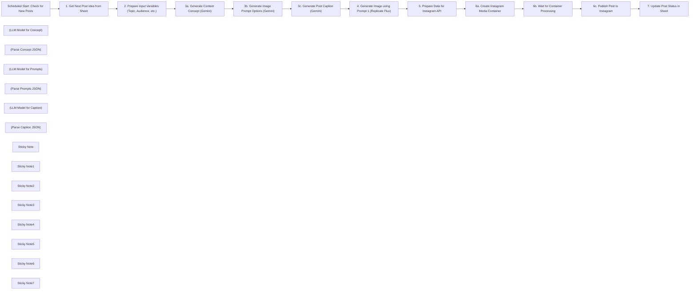

## Fluxo (.json) :

```json
{
  "meta": {
    "instanceId": "02e782574ebb30fbddb2c3fd832c946466d718819d25f6fe4b920124ff3fc2c1",
    "templateCredsSetupCompleted": true
  },
  "nodes": [
    {
      "id": "c53bc70a-2e85-465a-b977-73cfd268ba41",
      "name": "Scheduled Start: Check for New Posts",
      "type": "n8n-nodes-base.scheduleTrigger",
      "position": [
        -1240,
        -380
      ],
      "parameters": {
        "rule": {
          "interval": [
            {}
          ]
        }
      },
      "typeVersion": 1.2
    },
    {
      "id": "aa73f2af-f311-465b-8270-b027b17eec0d",
      "name": "1. Get Next Post Idea from Sheet",
      "type": "n8n-nodes-base.googleSheets",
      "position": [
        -920,
        -380
      ],
      "parameters": {
        "options": {
          "returnFirstMatch": true
        },
        "filtersUI": {
          "values": [
            {
              "lookupValue": "0",
              "lookupColumn": "Status"
            }
          ]
        },
        "sheetName": {
          "__rl": true,
          "mode": "list",
          "value": 1510137257,
          "cachedResultUrl": "https://docs.google.com/spreadsheets/d/1hG2NMi-4fMa7D5qGonCN8bsYVya4L2TOB_8mI4XK-9k/edit#gid=1510137257",
          "cachedResultName": "Postİ"
        },
        "documentId": {
          "__rl": true,
          "mode": "list",
          "value": "1hG2NMi-4fMa7D5qGonCN8bsYVya4L2TOB_8mI4XK-9k",
          "cachedResultUrl": "https://docs.google.com/spreadsheets/d/1hG2NMi-4fMa7D5qGonCN8bsYVya4L2TOB_8mI4XK-9k/edit?usp=drivesdk",
          "cachedResultName": "Medium Post Automation"
        }
      },
      "credentials": {
        "googleSheetsOAuth2Api": {
          "id": "VV5AyFvgYkc4TfC7",
          "name": "Onur Drive "
        }
      },
      "typeVersion": 4.5
    },
    {
      "id": "42e129d0-5e4f-4226-a86f-b7fd04c8c497",
      "name": "2. Prepare Input Variables (Topic, Audience, etc.)",
      "type": "n8n-nodes-base.set",
      "position": [
        -620,
        -380
      ],
      "parameters": {
        "options": {},
        "assignments": {
          "assignments": [
            {
              "id": "aa3b9a02-ac6a-4d7f-937f-a0e6e566a0c8",
              "name": "Topic",
              "type": "string",
              "value": "={{ $json.Topic }}"
            },
            {
              "id": "e48783e8-5f6b-4c54-bf4f-c004414dc510",
              "name": "TargetAudience",
              "type": "string",
              "value": "={{ $json.Audience }}"
            },
            {
              "id": "c499a954-b4c6-4702-ab86-3656aa2b1783",
              "name": "BrandVoice",
              "type": "string",
              "value": "={{ $json.Voice }}"
            },
            {
              "id": "210f7103-4d6b-42e9-9168-fd99dff94b5a",
              "name": "Platform",
              "type": "string",
              "value": "={{ $json.Platform }}"
            }
          ]
        }
      },
      "typeVersion": 3.4
    },
    {
      "id": "5036db9b-1a1b-48d7-bfaa-1839ba5331b5",
      "name": "3a. Generate Content Concept (Gemini)",
      "type": "@n8n/n8n-nodes-langchain.chainLlm",
      "position": [
        -160,
        -380
      ],
      "parameters": {
        "text": "=",
        "messages": {
          "messageValues": [
            {
              "message": "=<prompt>     <role>         You are a **highly imaginative Social Media Strategist** specializing in generating **unique, platform-aware content CONCEPTS** for **Instagram and LinkedIn**. You think beyond basic formats and consider audience engagement.     </role>      <task>         Based *only* on the `Topic`, `Target Audience`, `Brand Voice`, AND **target `Platform` ('Instagram' or 'LinkedIn')**, generate **exactly 1 creative content CONCEPT**. Focus on the **core message, angle, or hook**. The suggested format **MUST be \"Single Image\"**.         1.  **Platform Optimization:** **Explicitly tailor** the *type* and *angle* of the concept to the specified `Platform`. Consider typical user expectations and content formats:             * **Instagram:** Often more visual, storytelling, personal, community-focused, impactful single images.             * **LinkedIn:** Can utilize impactful single images to convey data points, key takeaways, or thought-provoking visuals supporting a concise message.         2.  **Originality:** Avoid common tropes (like basic quotes) unless the input strongly suggests it. Explore diverse angles: striking visual representations of data, metaphorical imagery, thought-provoking questions presented visually, behind-the-scenes moments captured in a compelling image, key message highlighted graphically.         3.  **Format Suggestion:** The format **MUST be \"Single Image\"**. The **CONCEPT is primary, the format is fixed**.      </task>      <input_context>         <param name=\"Topic\">{{ $json.Topic }}</param>         <param name=\"TargetAudience\">{{ $json.TargetAudience }}</param>         <param name=\"BrandVoice\">{{ $json.BrandVoice }}</param>         <param name=\"Platform\">{{ $json.Platform }}</param>     </input_context>      <output_instructions>         Your response MUST be a single, valid JSON object containing exactly one key: `ideas`.         The value of `ideas` MUST be an array containing exactly 1 object.         The object in the array MUST have two keys: `concept` (string: the descriptive concept text) and `suggested_format` (string: **MUST be \"Single Image\"**).         Example: `{\"ideas\": [{\"concept\": \"Concept text...\", \"suggested_format\": \"Single Image\"}]}`         Do NOT include any other text, explanations, or formatting outside the JSON structure.     </output_instructions> </prompt>"
            }
          ]
        },
        "promptType": "define",
        "hasOutputParser": true
      },
      "typeVersion": 1.5
    },
    {
      "id": "5a882770-53af-466c-a297-856b088eb2b9",
      "name": "(LLM Model for Concept)",
      "type": "@n8n/n8n-nodes-langchain.lmChatGoogleGemini",
      "position": [
        -160,
        -220
      ],
      "parameters": {
        "options": {},
        "modelName": "models/gemini-2.0-flash-001"
      },
      "credentials": {
        "googlePalmApi": {
          "id": "hAoasnlx3jlRA3Kf",
          "name": "BCP Gemini"
        }
      },
      "typeVersion": 1
    },
    {
      "id": "a4132a05-def7-4c4f-ad1d-092533f3b9f2",
      "name": "(Parse Concept JSON)",
      "type": "@n8n/n8n-nodes-langchain.outputParserStructured",
      "position": [
        0,
        -220
      ],
      "parameters": {
        "schemaType": "manual",
        "inputSchema": "{\n  \"type\": \"object\",\n  \"properties\": {\n    \"ideas\": {\n      \"type\": \"array\",\n      \"description\": \"An array containing exactly 1 content concept.\",\n      \"minItems\": 1,\n      \"maxItems\": 1,\n      \"items\": {\n        \"type\": \"object\",\n        \"properties\": {\n          \"concept\": {\n            \"type\": \"string\",\n            \"description\": \"The detailed text describing the content concept for a Single Image.\"\n          },\n          \"suggested_format\": {\n            \"type\": \"string\",\n            \"description\": \"The post format, which MUST be 'Single Image'.\",\n            \"const\": \"Single Image\"\n          }\n        },\n        \"required\": [\n          \"concept\",\n          \"suggested_format\"\n        ]\n      }\n    }\n  },\n  \"required\": [\n    \"ideas\"\n  ]\n}"
      },
      "typeVersion": 1.2
    },
    {
      "id": "46338aad-5f7d-464f-a7fe-e9ae00aacad5",
      "name": "3b. Generate Image Prompt Options (Gemini)",
      "type": "@n8n/n8n-nodes-langchain.chainLlm",
      "position": [
        580,
        -380
      ],
      "parameters": {
        "text": "=",
        "messages": {
          "messageValues": [
            {
              "message": "=<prompt>\n    <role>\n        You are an **Expert Instagram/LinkedIn Content Strategist and AI Image Prompt Engineer**. You excel at elaborating concepts based on user feedback and crafting distinct, detailed, and visually consistent prompt options tailored for the target platform.\n    </role>\n\n    <task>\n        1.  **Analyze** the `Chosen Idea`, `User Visual Input` (if provided and relevant), and **target `Platform`** to determine the optimal post format (in this case, assumed to be Single Image based on the output) and elaborate this into a practical `expanded_post_concept`. **Justify format choice based on concept AND platform norms.**\n        2.  **Incorporate** the user's visual direction (if any) into the concept description. If no specific visual input was given, propose a clear visual direction that aligns with the concept and platform.\n        3.  Generate **TWO DISTINCT OPTIONS** for the image prompts based on the `expanded_post_concept`. **Tailor the visual style and content nuances** described in the prompts to the target `Platform`. (E.g., LinkedIn visuals might be cleaner, more data-oriented; Instagram more lifestyle or emotive).\n        4.  **Ensure Distinction:** The two options should offer meaningful variety (e.g., style, composition, focus) while remaining true to the core concept.\n        5.  **Detail:** Prompts should be highly detailed, suitable for advanced AI image generators (include subject, action, setting, style, mood, composition, lighting, color palette keywords).\n    </task>\n\n    <input_context>\n        <param name=\"ChosenIdea\">{{ $json.output.ideas[0].concept }}</param>\n        <param name=\"OriginalTopic\"> {{ $('2. Prepare Input Variables (Topic, Audience, etc.)').item.json.Topic }}</param>\n        <param name=\"TargetAudience\"> {{ $('2. Prepare Input Variables (Topic, Audience, etc.)').item.json.TargetAudience }}</param>\n        <param name=\"BrandVoice\"> {{ $('2. Prepare Input Variables (Topic, Audience, etc.)').item.json.BrandVoice }}</param>\n        <param name=\"Platform\"> {{ $('2. Prepare Input Variables (Topic, Audience, etc.)').item.json.Platform }}</param>\n        </input_context>\n\n    <output_instructions>\n        Your response MUST be a single, valid JSON object containing exactly two keys: `expanded_post_concept` and `prompt_options`.\n        - `expanded_post_concept` (string): The elaborated visual concept, stating Single Image format and incorporating user input/platform considerations.\n        - `prompt_options` (array): MUST contain exactly TWO objects.\n            - Each object represents one prompt option and MUST have two keys:\n                - `option_description` (string): Briefly describe the distinct angle/style of this option (e.g., \"Option 1: Hyperrealistic...\").\n                - `prompts` (array of strings): Contains ONE string representing the detailed prompt for the single image.\n       \n         \n        Do NOT include any text outside this JSON structure. Do NOT generate captions here.\n    </output_instructions>\n</prompt>"
            }
          ]
        },
        "promptType": "define",
        "hasOutputParser": true
      },
      "typeVersion": 1.5
    },
    {
      "id": "950b7c2f-cebc-41ae-aad8-38b139c1b2ea",
      "name": "(LLM Model for Prompts)",
      "type": "@n8n/n8n-nodes-langchain.lmChatGoogleGemini",
      "position": [
        580,
        -220
      ],
      "parameters": {
        "options": {},
        "modelName": "models/gemini-2.0-flash-001"
      },
      "credentials": {
        "googlePalmApi": {
          "id": "hAoasnlx3jlRA3Kf",
          "name": "BCP Gemini"
        }
      },
      "typeVersion": 1
    },
    {
      "id": "bfda2858-3a3a-4997-b30c-ce64429bd255",
      "name": "(Parse Prompts JSON)",
      "type": "@n8n/n8n-nodes-langchain.outputParserStructured",
      "position": [
        740,
        -220
      ],
      "parameters": {
        "schemaType": "manual",
        "inputSchema": "{\n  \"type\": \"object\",\n  \"properties\": {\n    \"expanded_post_concept\": {\n      \"type\": \"string\",\n      \"description\": \"The elaborated visual concept, stating Single Image format and incorporating user input/platform considerations.\"\n    },\n    \"prompt_options\": {\n      \"type\": \"array\",\n      \"description\": \"An array containing exactly TWO prompt options for the single image concept.\",\n      \"minItems\": 2,\n      \"maxItems\": 2,\n      \"items\": {\n        \"type\": \"object\",\n        \"properties\": {\n          \"option_description\": {\n            \"type\": \"string\",\n            \"description\": \"Briefly describes the distinct angle/style of this option (e.g., 'Option 1: Hyperrealistic...').\"\n          },\n          \"prompts\": {\n            \"type\": \"array\",\n            \"description\": \"Contains ONE detailed prompt string for the single image.\",\n            \"minItems\": 1,\n            \"maxItems\": 1,\n            \"items\": {\n              \"type\": \"string\",\n              \"description\": \"A detailed image generation prompt.\"\n            }\n          }\n        },\n        \"required\": [\n          \"option_description\",\n          \"prompts\"\n        ]\n      }\n    }\n  },\n  \"required\": [\n    \"expanded_post_concept\",\n    \"prompt_options\"\n  ]\n}"
      },
      "typeVersion": 1.2
    },
    {
      "id": "0151450f-fca2-4628-a268-f90186a79b9e",
      "name": "3c. Generate Post Caption (Gemini)",
      "type": "@n8n/n8n-nodes-langchain.chainLlm",
      "position": [
        1540,
        -380
      ],
      "parameters": {
        "text": "=",
        "messages": {
          "messageValues": [
            {
              "message": "=<prompt>\n    <role>\n        You are an AI Instagram/LinkedIn **Caption Writer**. You specialize in crafting concise, engaging, and contextually relevant captions based on a generated image (represented by its prompt) and the overall content strategy, specifically tailored for the target platform.\n    </role>\n\n    <task>\n        Write a short, effective social media caption **specifically tailored for the target `Platform` ('Instagram' or 'LinkedIn')**.\n        * The caption must complement the image described by `ImagePrompt` and align with all context parameters (`ChosenIdea`, `OriginalTopic`, `TargetAudience`, `BrandVoice`).\n        * **Platform Style:** Adapt tone, length, calls-to-action, and hashtag usage:\n            * **Instagram:** Can be more conversational, use more emojis, ask engaging questions, often benefits from slightly longer, more storytelling captions if relevant. Use a mix of popular and niche hashtags (3-7 recommended).\n            * **LinkedIn:** Generally more professional, concise, focused on insights or value proposition. Calls-to-action often relate to reading more, commenting with professional opinions, or business objectives. Use targeted, professional hashtags (1-3 recommended).\n        * Include 1-5 relevant, platform-appropriate hashtags.\n    </task>\n\n    <input_context>\n        <param name=\"ImagePrompt\">{{ $json.output.prompt_options[0].prompts[0] }}</param>\n        <param name=\"ChosenIdea\">{{ $('3a. Generate Content Concept (Gemini)').item.json.output.ideas[0].concept }} </param>\n        <param name=\"OriginalTopic\">{{ $('1. Get Next Post Idea from Sheet').item.json.Topic }} </param>\n        <param name=\"TargetAudience\">{{ $('1. Get Next Post Idea from Sheet').item.json.Audience }}</param>\n        <param name=\"BrandVoice\">{{ $('1. Get Next Post Idea from Sheet').item.json.Voice }} </param>\n        <param name=\"Platform\">{{ $('1. Get Next Post Idea from Sheet').item.json.Platform }} </param>\n    </input_context>\n\n    <output_instructions>\n        Your response MUST be a single, valid JSON object containing exactly one key: `Caption`.\n        The value of `Caption` MUST be a string containing the generated caption text, including hashtags.\n        Example: `{\"Caption\": \"Caption text tailored for LinkedIn goes here. #ProfessionalDevelopment #IndustryInsights\"}`\n        Do NOT include any other text, explanations, or formatting outside the JSON structure.\n    </output_instructions>\n</prompt>"
            }
          ]
        },
        "promptType": "define",
        "hasOutputParser": true
      },
      "typeVersion": 1.5
    },
    {
      "id": "d4667681-a5aa-4b63-802c-2adf8c111bb9",
      "name": "(LLM Model for Caption)",
      "type": "@n8n/n8n-nodes-langchain.lmChatGoogleGemini",
      "position": [
        1560,
        -220
      ],
      "parameters": {
        "options": {},
        "modelName": "models/gemini-2.0-flash"
      },
      "credentials": {
        "googlePalmApi": {
          "id": "hAoasnlx3jlRA3Kf",
          "name": "BCP Gemini"
        }
      },
      "typeVersion": 1
    },
    {
      "id": "59da1f6c-ee55-4095-8c95-d60d1177c142",
      "name": "(Parse Caption JSON)",
      "type": "@n8n/n8n-nodes-langchain.outputParserStructured",
      "position": [
        1700,
        -220
      ],
      "parameters": {
        "jsonSchemaExample": "{\n\t\"Caption\": \"Thee future of call centers is here!\"\n}"
      },
      "typeVersion": 1.2
    },
    {
      "id": "a8d38be7-85b5-4a39-bd39-7f765699d471",
      "name": "4. Generate Image using Prompt 1 (Replicate Flux)",
      "type": "n8n-nodes-base.httpRequest",
      "position": [
        2360,
        -380
      ],
      "parameters": {
        "url": "https://api.replicate.com/v1/models/black-forest-labs/flux-1.1-pro-ultra/predictions",
        "method": "POST",
        "options": {},
        "jsonBody": "={\n  \"input\": {\n    \"raw\": false,\n    \"prompt\": \"{{ $('3b. Generate Image Prompt Options (Gemini)').item.json.output.prompt_options[0].prompts[0] }}\",\n    \"aspect_ratio\": \"1:1\",\n    \"output_format\": \"jpg\",\n    \"safety_tolerance\": 6\n  }\n}",
        "sendBody": true,
        "sendHeaders": true,
        "specifyBody": "json",
        "authentication": "genericCredentialType",
        "genericAuthType": "httpHeaderAuth",
        "headerParameters": {
          "parameters": [
            {
              "name": "Prefer",
              "value": "wait"
            }
          ]
        }
      },
      "credentials": {
        "httpHeaderAuth": {
          "id": "iEtPzDTSlZBfz1RP",
          "name": "Replicate"
        }
      },
      "typeVersion": 4.2
    },
    {
      "id": "cc0f0035-0d63-4988-8ec8-89260261960a",
      "name": "5. Prepare Data for Instagram API",
      "type": "n8n-nodes-base.set",
      "position": [
        2880,
        -380
      ],
      "parameters": {
        "options": {},
        "assignments": {
          "assignments": [
            {
              "id": "8a4260ba-3bde-4444-8f42-8a8abd51ff0c",
              "name": "ImageURL",
              "type": "string",
              "value": "={{ $json.output }}"
            },
            {
              "id": "1953ae03-6a86-4847-8686-5a928637be1d",
              "name": "Caption",
              "type": "string",
              "value": "={{ $('3c. Generate Post Caption (Gemini)').item.json.output.Caption }}"
            }
          ]
        }
      },
      "typeVersion": 3.4
    },
    {
      "id": "f010c17f-1af3-4d04-a69c-8b03c70fc8f0",
      "name": "6a. Create Instagram Media Container",
      "type": "n8n-nodes-base.facebookGraphApi",
      "position": [
        3180,
        -380
      ],
      "parameters": {
        "edge": "media",
        "node": "17841473009917118",
        "options": {
          "queryParameters": {
            "parameter": [
              {
                "name": "caption",
                "value": "={{ $json.Caption }}"
              },
              {
                "name": "image_url",
                "value": "={{ $json.ImageURL }}"
              }
            ]
          }
        },
        "graphApiVersion": "v22.0",
        "httpRequestMethod": "POST"
      },
      "credentials": {
        "facebookGraphApi": {
          "id": "vF0cZWKe6sYiEaHo",
          "name": "n8n Bot Access"
        }
      },
      "typeVersion": 1
    },
    {
      "id": "c69f1856-efa2-48a5-9e41-71ab67bcaeca",
      "name": "6b. Wait for Container Processing",
      "type": "n8n-nodes-base.wait",
      "position": [
        3480,
        -380
      ],
      "webhookId": "1b14c8bf-151a-4054-8215-093dd5b6cbcc",
      "parameters": {},
      "typeVersion": 1.1
    },
    {
      "id": "516b61f0-825e-468b-8eb7-80f757171465",
      "name": "6c. Publish Post to Instagram",
      "type": "n8n-nodes-base.facebookGraphApi",
      "position": [
        3780,
        -380
      ],
      "parameters": {
        "edge": "media_publish",
        "node": "17841473009917118",
        "options": {
          "queryParameters": {
            "parameter": [
              {
                "name": "creation_id",
                "value": "={{ $json.id }}"
              }
            ]
          }
        },
        "graphApiVersion": "v22.0",
        "httpRequestMethod": "POST"
      },
      "credentials": {
        "facebookGraphApi": {
          "id": "vF0cZWKe6sYiEaHo",
          "name": "n8n Bot Access"
        }
      },
      "typeVersion": 1
    },
    {
      "id": "1a94c8ba-7b59-4337-ae07-5c0b2b8349dd",
      "name": "7. Update Post Status in Sheet",
      "type": "n8n-nodes-base.googleSheets",
      "position": [
        4440,
        -380
      ],
      "parameters": {
        "columns": {
          "value": {
            "Topic": "={{ $('1. Get Next Post Idea from Sheet').item.json.Topic }}",
            "Status": "1"
          },
          "schema": [
            {
              "id": "Topic",
              "type": "string",
              "display": true,
              "removed": false,
              "required": false,
              "displayName": "Topic",
              "defaultMatch": false,
              "canBeUsedToMatch": true
            },
            {
              "id": "Audience",
              "type": "string",
              "display": true,
              "removed": true,
              "required": false,
              "displayName": "Audience",
              "defaultMatch": false,
              "canBeUsedToMatch": true
            },
            {
              "id": "Voice",
              "type": "string",
              "display": true,
              "removed": true,
              "required": false,
              "displayName": "Voice",
              "defaultMatch": false,
              "canBeUsedToMatch": true
            },
            {
              "id": "Platform",
              "type": "string",
              "display": true,
              "removed": true,
              "required": false,
              "displayName": "Platform",
              "defaultMatch": false,
              "canBeUsedToMatch": true
            },
            {
              "id": "Status",
              "type": "string",
              "display": true,
              "required": false,
              "displayName": "Status",
              "defaultMatch": false,
              "canBeUsedToMatch": true
            },
            {
              "id": "row_number",
              "type": "string",
              "display": true,
              "removed": true,
              "readOnly": true,
              "required": false,
              "displayName": "row_number",
              "defaultMatch": false,
              "canBeUsedToMatch": true
            }
          ],
          "mappingMode": "defineBelow",
          "matchingColumns": [
            "Topic"
          ],
          "attemptToConvertTypes": false,
          "convertFieldsToString": false
        },
        "options": {},
        "operation": "update",
        "sheetName": {
          "__rl": true,
          "mode": "list",
          "value": 1510137257,
          "cachedResultUrl": "https://docs.google.com/spreadsheets/d/1hG2NMi-4fMa7D5qGonCN8bsYVya4L2TOB_8mI4XK-9k/edit#gid=1510137257",
          "cachedResultName": "Postİ"
        },
        "documentId": {
          "__rl": true,
          "mode": "list",
          "value": "1hG2NMi-4fMa7D5qGonCN8bsYVya4L2TOB_8mI4XK-9k",
          "cachedResultUrl": "https://docs.google.com/spreadsheets/d/1hG2NMi-4fMa7D5qGonCN8bsYVya4L2TOB_8mI4XK-9k/edit?usp=drivesdk",
          "cachedResultName": "Medium Post Automation"
        }
      },
      "credentials": {
        "googleSheetsOAuth2Api": {
          "id": "VV5AyFvgYkc4TfC7",
          "name": "Onur Drive "
        }
      },
      "typeVersion": 4.5
    },
    {
      "id": "68651653-07fb-435a-a82d-b8ee911b4161",
      "name": "Sticky Note",
      "type": "n8n-nodes-base.stickyNote",
      "position": [
        -240,
        -820
      ],
      "parameters": {
        "width": 460,
        "height": 740,
        "content": "# 01. Content Concept Generation\n\n**Purpose:** This step uses Google Gemini to generate **one unique content concept** tailored for the specified platform (Instagram/LinkedIn), based on the input topic, audience, and brand voice. The format is fixed to \"Single Image\".\n\n**Input (from Node '2. Prepare Input Variables'):**\n*   `Topic` (string)\n*   `TargetAudience` (string)\n*   `BrandVoice` (string)\n*   `Platform` (string: 'Instagram' )\n\n**Output (JSON):**\n*   `{\"ideas\": [{\"concept\": \"Generated concept text...\", \"suggested_format\": \"Single Image\"}]}`"
      },
      "typeVersion": 1
    },
    {
      "id": "c463e2b6-6b2b-498d-8672-a0a9b15c06b8",
      "name": "Sticky Note1",
      "type": "n8n-nodes-base.stickyNote",
      "position": [
        2220,
        -820
      ],
      "parameters": {
        "color": 4,
        "width": 380,
        "height": 740,
        "content": "# 03b. Image Generation\n\n**Purpose:** Generates the actual image using the **first detailed prompt** created in step 3b. It sends this prompt to the Replicate API, specifically using the 'Flux 1.1 Pro Ultra' model.\n\n**Input (from Node '3b. Generate Image Prompt Options'):**\n*   `prompt` (string: The *first* prompt string from `prompt_options[0].prompts[0]`)\n\n**Output (from Replicate API):**\n*   JSON containing the `output` URL of the generated image (e.g., `{\"output\": \"https://replicate.delivery/...\"}`)"
      },
      "typeVersion": 1
    },
    {
      "id": "4636ef23-11e1-45dd-94c1-5774ad612811",
      "name": "Sticky Note2",
      "type": "n8n-nodes-base.stickyNote",
      "position": [
        400,
        -820
      ],
      "parameters": {
        "color": 2,
        "width": 740,
        "height": 740,
        "content": "# 02. Image Prompt Elaboration & Options\n\n**Purpose:** Takes the generated content concept and expands on it to create **two distinct, detailed image generation prompts**. These prompts are optimized for the target platform and suitable for AI image generators like Replicate Flux.\n\n**Input (from Nodes '2. Prepare Input Variables' & '3a. Generate Content Concept'):**\n*   `ChosenIdea` (string: Concept from step 3a)\n*   `OriginalTopic` (string)\n*   `TargetAudience` (string)\n*   `BrandVoice` (string)\n*   `Platform` (string: 'Instagram')\n\n**Output (JSON):**\n*   `{\"expanded_post_concept\": \"Elaborated concept description...\", \"prompt_options\": [{\"option_description\": \"Option 1: ...\", \"prompts\": [\"Detailed prompt 1...\"]}, {\"option_description\": \"Option 2: ...\", \"prompts\": [\"Detailed prompt 2...\"]}]}`\n"
      },
      "typeVersion": 1
    },
    {
      "id": "1996f6d0-42bc-4b23-a1af-59c4bb1cb3ee",
      "name": "Sticky Note3",
      "type": "n8n-nodes-base.stickyNote",
      "position": [
        1380,
        -820
      ],
      "parameters": {
        "color": 3,
        "width": 620,
        "height": 740,
        "content": "# 03a. Caption Generation\n\n**Purpose:** Uses Google Gemini to write a short, engaging social media caption **specifically tailored for the target platform**. The caption complements the image (represented by the first generated prompt) and aligns with the overall content strategy. Includes relevant hashtags.\n\n**Input (from Nodes '1. Get Next Post Idea', '3a. Generate Content Concept', '3b. Generate Image Prompt Options'):**\n*   `ImagePrompt` (string: The *first* prompt from step 3b)\n*   `ChosenIdea` (string: Concept from step 3a)\n*   `OriginalTopic` (string)\n*   `TargetAudience` (string)\n*   `BrandVoice` (string)\n*   `Platform` (string: 'Instagram' or 'LinkedIn')\n\n**Output (JSON):**\n*   `{\"Caption\": \"Generated caption text with #hashtags...\"}`"
      },
      "typeVersion": 1
    },
    {
      "id": "25e2ae24-c0c5-46fd-8c81-39a9fcafe472",
      "name": "Sticky Note4",
      "type": "n8n-nodes-base.stickyNote",
      "position": [
        2800,
        -820
      ],
      "parameters": {
        "color": 5,
        "width": 1160,
        "height": 740,
        "content": "# 04. Instagram Publishing\n\n**Purpose:** This block takes the final image URL and caption, prepares them for the Instagram Graph API, uploads the media to create a container, waits for Instagram to process it, and finally publishes the container as a post to the connected Instagram account.\n\n**Input (from Nodes '3c. Generate Post Caption (Gemini)' & '4. Generate Image using Prompt 1 (Replicate Flux)'):**\n*   `ImageURL` (string: URL of the generated image from Replicate)\n*   `Caption` (string: Generated post text with hashtags from Gemini)\n\n**Process:**\n1.  **Format Data (`5. Prepare Data...`):** Organizes the ImageURL and Caption into the required structure.\n2.  **Create Media Container (`6a. Create...`):** Sends the `image_url` and `caption` to the Instagram Graph API (`media` edge) to initiate the upload. Receives a container `id`.\n3.  **Wait for Processing (`6b. Wait...`):** Pauses the workflow to allow Instagram's servers time to process the uploaded media. *Note: Wait time might need adjustment depending on media size and API responsiveness.*\n4.  **Publish Media (`6c. Publish...`):** Sends the container `id` (as `creation_id`) to the Instagram Graph API (`media_publish` edge) to make the post live.\n\n**Output:** The content is published as a new post on the target Instagram profile. The final node (`6c. Publish Post...`) returns the `id` of the successfully published media object on Instagram."
      },
      "typeVersion": 1
    },
    {
      "id": "d7082400-def2-40eb-9dbc-3e15d24c8f8f",
      "name": "Sticky Note5",
      "type": "n8n-nodes-base.stickyNote",
      "position": [
        4640,
        -480
      ],
      "parameters": {
        "color": 6,
        "width": 380,
        "height": 300,
        "content": "# 05. Finalize: Update Sheet Status\n\n**Purpose:** Marks the processed post idea as completed in the Google Sheet.\n\n**Action:** Finds the corresponding row in the sheet (using the 'Topic' to match) and updates its 'Status' column to '1'. This prevents the same idea from being processed again by the workflow in future runs."
      },
      "typeVersion": 1
    },
    {
      "id": "4e5433ff-5d04-424a-8165-6fd85cca1ad0",
      "name": "Sticky Note6",
      "type": "n8n-nodes-base.stickyNote",
      "position": [
        -100,
        -300
      ],
      "parameters": {},
      "typeVersion": 1
    },
    {
      "id": "71bf2b4d-eaa1-423b-b798-8c0f737f4371",
      "name": "Sticky Note7",
      "type": "n8n-nodes-base.stickyNote",
      "position": [
        -1760,
        -440
      ],
      "parameters": {
        "width": 420,
        "height": 240,
        "content": "# 00. Scheduled Start & Input Preparation\n\n**Purpose:** Initiates the workflow automatically based on the user-defined schedule. Fetches the next available post idea (Status=0) from Google Sheets and prepares the necessary input variables (`Topic`, `Audience`, `Voice`, `Platform`) for the content generation steps."
      },
      "typeVersion": 1
    }
  ],
  "pinData": {
    "3c. Generate Post Caption (Gemini)": [
      {
        "output": {
          "Caption": "The future of call centers is here, and it's all about human + AI collaboration ✨. We believe AI should enhance, not replace, the human touch, leading to better customer experiences and happier agents. Ready to see how AI can transform your customer interactions? 🤔 \n\n#AIinCX #CallCenterAI #CustomerExperience #ArtificialIntelligence #TechInnovation #FutureofWork #HumanAI"
        }
      }
    ],
    "3a. Generate Content Concept (Gemini)": [
      {
        "output": {
          "ideas": [
            {
              "concept": "Visually striking image of a human hand interacting with a glowing AI interface. Caption highlights how AI enhances, not replaces, human connection in call centers, leading to better customer experiences. Focus on the seamless collaboration between humans and AI.",
              "suggested_format": "Single Image"
            }
          ]
        }
      }
    ],
    "3b. Generate Image Prompt Options (Gemini)": [
      {
        "output": {
          "prompt_options": [
            {
              "prompts": [
                "Close-up shot of a diverse human hand gently touching a shimmering, holographic AI interface that displays abstract data visualizations. The background is blurred, showing a modern, bright call center environment. Soft, diffused lighting with hints of neon blue and teal. Ethereal, optimistic mood. Style: Digital art, futuristic, ethereal. Color palette: Pastel blues, teals, and whites with subtle glowing accents. Composition: Focus on the hand and interface, using shallow depth of field."
              ],
              "option_description": "Option 1: Ethereal and futuristic. Focus on soft, diffused lighting and glowing elements to create a dreamlike, optimistic atmosphere."
            },
            {
              "prompts": [
                "A slightly wider shot showcasing a human hand confidently interacting with a vibrant, glowing AI interface displaying customer profiles and real-time data. The background shows a bustling call center with diverse agents working collaboratively. Dramatic, focused lighting with strong shadows and vibrant color accents. Energetic, innovative mood. Style: High-resolution photograph, modern, bold. Color palette: Deep blues, purples, and oranges with bright yellow accents on the interface. Composition: Dynamic angle, leading lines towards the interface and agents in the background, creating depth."
              ],
              "option_description": "Option 2: Bold and dynamic. Focus on contrast and vibrant colors to create a visually striking and energetic image."
            }
          ],
          "expanded_post_concept": "Single Image post for Instagram showcasing a human hand interacting with a glowing AI interface. The image should convey a sense of collaboration and enhancement, not replacement, emphasizing the positive impact of AI on human connection in call centers. Given Instagram's visual nature, the image should be aesthetically pleasing, modern, and slightly stylized to attract attention and reflect an innovative brand voice."
        }
      }
    ],
    "4. Generate Image using Prompt 1 (Replicate Flux)": [
      {
        "id": "be6ctjws49rma0cpjcy8ej169r",
        "logs": "",
        "urls": {
          "get": "https://api.replicate.com/v1/predictions/be6ctjws49rma0cpjcy8ej169r",
          "cancel": "https://api.replicate.com/v1/predictions/be6ctjws49rma0cpjcy8ej169r/cancel",
          "stream": "https://stream.replicate.com/v1/files/bcwr-kvewu3jt6ec4id3svfazffgcxpyifayvqjhxloix3oncveoazwya"
        },
        "error": null,
        "input": {
          "raw": false,
          "prompt": "Close-up shot of a diverse human hand gently touching a shimmering, holographic AI interface that displays abstract data visualizations. The background is blurred, showing a modern, bright call center environment. Soft, diffused lighting with hints of neon blue and teal. Ethereal, optimistic mood. Style: Digital art, futuristic, ethereal. Color palette: Pastel blues, teals, and whites with subtle glowing accents. Composition: Focus on the hand and interface, using shallow depth of field.",
          "aspect_ratio": "1:1",
          "output_format": "jpg",
          "safety_tolerance": 6
        },
        "model": "black-forest-labs/flux-1.1-pro-ultra",
        "output": "https://replicate.delivery/xezq/LJHVcPdaiexmPyfQnkDBi6o2HpkFWKzeoktHmS5uEvgSIgRpA/tmptt54uqf7.jpg",
        "status": "processing",
        "version": "hidden",
        "created_at": "2025-05-02T23:02:24.29Z",
        "data_removed": false
      }
    ],
    "2. Prepare Input Variables (Topic, Audience, etc.)": [
      {
        "Topic": "Call Center Transformation with Artificial Intelligence",
        "Platform": "Instagram",
        "BrandVoice": "Informative, reassuring, innovative",
        "TargetAudience": "Enterprise customers, tech enthusiasts, customer experience professionals"
      }
    ]
  },
  "connections": {
    "(Parse Caption JSON)": {
      "ai_outputParser": [
        [
          {
            "node": "3c. Generate Post Caption (Gemini)",
            "type": "ai_outputParser",
            "index": 0
          }
        ]
      ]
    },
    "(Parse Concept JSON)": {
      "ai_outputParser": [
        [
          {
            "node": "3a. Generate Content Concept (Gemini)",
            "type": "ai_outputParser",
            "index": 0
          }
        ]
      ]
    },
    "(Parse Prompts JSON)": {
      "ai_outputParser": [
        [
          {
            "node": "3b. Generate Image Prompt Options (Gemini)",
            "type": "ai_outputParser",
            "index": 0
          }
        ]
      ]
    },
    "(LLM Model for Caption)": {
      "ai_languageModel": [
        [
          {
            "node": "3c. Generate Post Caption (Gemini)",
            "type": "ai_languageModel",
            "index": 0
          }
        ]
      ]
    },
    "(LLM Model for Concept)": {
      "ai_languageModel": [
        [
          {
            "node": "3a. Generate Content Concept (Gemini)",
            "type": "ai_languageModel",
            "index": 0
          }
        ]
      ]
    },
    "(LLM Model for Prompts)": {
      "ai_languageModel": [
        [
          {
            "node": "3b. Generate Image Prompt Options (Gemini)",
            "type": "ai_languageModel",
            "index": 0
          }
        ]
      ]
    },
    "6c. Publish Post to Instagram": {
      "main": [
        [
          {
            "node": "7. Update Post Status in Sheet",
            "type": "main",
            "index": 0
          }
        ]
      ]
    },
    "1. Get Next Post Idea from Sheet": {
      "main": [
        [
          {
            "node": "2. Prepare Input Variables (Topic, Audience, etc.)",
            "type": "main",
            "index": 0
          }
        ]
      ]
    },
    "5. Prepare Data for Instagram API": {
      "main": [
        [
          {
            "node": "6a. Create Instagram Media Container",
            "type": "main",
            "index": 0
          }
        ]
      ]
    },
    "6b. Wait for Container Processing": {
      "main": [
        [
          {
            "node": "6c. Publish Post to Instagram",
            "type": "main",
            "index": 0
          }
        ]
      ]
    },
    "3c. Generate Post Caption (Gemini)": {
      "main": [
        [
          {
            "node": "4. Generate Image using Prompt 1 (Replicate Flux)",
            "type": "main",
            "index": 0
          }
        ]
      ]
    },
    "6a. Create Instagram Media Container": {
      "main": [
        [
          {
            "node": "6b. Wait for Container Processing",
            "type": "main",
            "index": 0
          }
        ]
      ]
    },
    "Scheduled Start: Check for New Posts": {
      "main": [
        [
          {
            "node": "1. Get Next Post Idea from Sheet",
            "type": "main",
            "index": 0
          }
        ]
      ]
    },
    "3a. Generate Content Concept (Gemini)": {
      "main": [
        [
          {
            "node": "3b. Generate Image Prompt Options (Gemini)",
            "type": "main",
            "index": 0
          }
        ]
      ]
    },
    "3b. Generate Image Prompt Options (Gemini)": {
      "main": [
        [
          {
            "node": "3c. Generate Post Caption (Gemini)",
            "type": "main",
            "index": 0
          }
        ]
      ]
    },
    "4. Generate Image using Prompt 1 (Replicate Flux)": {
      "main": [
        [
          {
            "node": "5. Prepare Data for Instagram API",
            "type": "main",
            "index": 0
          }
        ]
      ]
    },
    "2. Prepare Input Variables (Topic, Audience, etc.)": {
      "main": [
        [
          {
            "node": "3a. Generate Content Concept (Gemini)",
            "type": "main",
            "index": 0
          }
        ]
      ]
    }
  }
}
```

<a id="template-31"></a>

## Template 31 - Resposta automática por e-mail com revisão humana

- **Nome:** Resposta automática por e-mail com revisão humana
- **Descrição:** Automatiza o processamento de e-mails recebidos, gera um resumo e um rascunho de resposta com IA e submete a resposta para aprovação humana antes de enviar ao remetente.
- **Funcionalidade:** • Monitoramento de e-mails via IMAP: detecta novos e-mails recebidos no endereço configurado.
• Conversão do conteúdo para Markdown/HTML: prepara o corpo do e-mail para melhor compreensão pelos modelos de linguagem.
• Sumarização automática: produz um resumo conciso do conteúdo do e-mail (limite aplicado para brevidade).
• Geração de resposta com IA: cria um texto de resposta profissional e curto (máx. 100 palavras) com base no resumo.
• Revisão humana (Human-in-the-loop): envia o e-mail original e a resposta gerada para um endereço interno para aprovação manual.
• Envio condicional da resposta final: depois da aprovação, envia a resposta ao remetente via servidor SMTP; se não aprovado, não envia.
- **Ferramentas:** • Servidor IMAP (info@n3witalia.com): recebe e disponibiliza os e-mails para processamento.
• Servidor SMTP (info@n3witalia.com): envia e-mails de aprovação e respostas finais.
• OpenAI (gpt-4o-mini): modelo de linguagem usado para geração de texto e sumarização.
• DeepSeek (deepseek-chat): modelo de chat adicional configurado para suporte à sumarização.
• Banco de dados vetorial (opcional): repositório de conhecimento consultado pelo agente para enriquecer respostas comerciais.


## Fluxo visual


## Fluxo (.json) :

```json
{
  "id": "Nvn78tMRNnKji7Fg",
  "meta": {
    "instanceId": "a4bfc93e975ca233ac45ed7c9227d84cf5a2329310525917adaf3312e10d5462",
    "templateCredsSetupCompleted": true
  },
  "name": "Very simple Human in the loop system email with AI e IMAP",
  "tags": [],
  "nodes": [
    {
      "id": "271bb16f-9b62-41d9-ab76-114cd7ba915a",
      "name": "Email Trigger (IMAP)",
      "type": "n8n-nodes-base.emailReadImap",
      "position": [
        -1300,
        1340
      ],
      "parameters": {
        "options": {}
      },
      "credentials": {
        "imap": {
          "id": "k31W9oGddl9pMDy4",
          "name": "IMAP info@n3witalia.com"
        }
      },
      "typeVersion": 2
    },
    {
      "id": "42d150d8-d574-49f9-9c0e-71a2cdea3b79",
      "name": "Markdown",
      "type": "n8n-nodes-base.markdown",
      "position": [
        -1040,
        1340
      ],
      "parameters": {
        "html": "={{ $json.textHtml }}",
        "options": {}
      },
      "typeVersion": 1
    },
    {
      "id": "e9498a60-0078-4581-b269-7ff552f4047a",
      "name": "Send Email",
      "type": "n8n-nodes-base.emailSend",
      "position": [
        920,
        1320
      ],
      "webhookId": "a79ae1b4-648c-4cb4-b6cd-04ea3c1d9314",
      "parameters": {
        "html": "={{ $('Set Email text').item.json.email }}",
        "options": {},
        "subject": "=Re: {{ $('Email Trigger (IMAP)').item.json.subject }}",
        "toEmail": "={{ $('Email Trigger (IMAP)').item.json.from }}",
        "fromEmail": "={{ $('Email Trigger (IMAP)').item.json.to }}"
      },
      "credentials": {
        "smtp": {
          "id": "hRjP3XbDiIQqvi7x",
          "name": "SMTP info@n3witalia.com"
        }
      },
      "typeVersion": 2.1
    },
    {
      "id": "ab9f6ac3-2095-44df-aeba-2eab96ecf425",
      "name": "Email Summarization Chain",
      "type": "@n8n/n8n-nodes-langchain.chainSummarization",
      "position": [
        -780,
        1340
      ],
      "parameters": {
        "options": {
          "binaryDataKey": "={{ $json.data }}",
          "summarizationMethodAndPrompts": {
            "values": {
              "prompt": "=Write a concise summary of the following in max 100 words:\n\n\"{{ $json.data }}\"\n\nDo not enter the total number of words used.",
              "combineMapPrompt": "=Write a concise summary of the following in max 100 words:\n\n\"{{ $json.data }}\"\n\nDo not enter the total number of words used."
            }
          }
        },
        "operationMode": "nodeInputBinary"
      },
      "typeVersion": 2
    },
    {
      "id": "86b7c3d0-e1f2-4e2f-b293-8042700d6816",
      "name": "Write email",
      "type": "@n8n/n8n-nodes-langchain.agent",
      "position": [
        -340,
        1340
      ],
      "parameters": {
        "text": "=Write the text to reply to the following email:\n\n{{ $json.response.text }}",
        "options": {
          "systemMessage": "You are an expert at answering emails. You need to answer them professionally based on the information you have. This is a business email. Be concise and never exceed 100 words. Only the body of the email, not create the subject"
        },
        "promptType": "define",
        "hasOutputParser": true
      },
      "typeVersion": 1.7
    },
    {
      "id": "5d5a397f-f9c3-4691-afd0-9a6102679eac",
      "name": "OpenAI",
      "type": "@n8n/n8n-nodes-langchain.lmChatOpenAi",
      "position": [
        -400,
        1560
      ],
      "parameters": {
        "model": {
          "__rl": true,
          "mode": "list",
          "value": "gpt-4o-mini",
          "cachedResultName": "gpt-4o-mini"
        },
        "options": {}
      },
      "credentials": {
        "openAiApi": {
          "id": "CDX6QM4gLYanh0P4",
          "name": "OpenAi account"
        }
      },
      "typeVersion": 1.2
    },
    {
      "id": "5b36a295-fda6-4174-9078-0a8ec57620d2",
      "name": "Sticky Note2",
      "type": "n8n-nodes-base.stickyNote",
      "position": [
        -800,
        1260
      ],
      "parameters": {
        "width": 320,
        "height": 240,
        "content": "Chain that summarizes the received email"
      },
      "typeVersion": 1
    },
    {
      "id": "7110fe1f-0099-49aa-9095-96e733aa468f",
      "name": "Sticky Note5",
      "type": "n8n-nodes-base.stickyNote",
      "position": [
        -360,
        1260
      ],
      "parameters": {
        "width": 340,
        "height": 240,
        "content": "Agent that retrieves business information from a vector database and processes the response"
      },
      "typeVersion": 1
    },
    {
      "id": "e2bdbd64-3c37-4867-ae2c-0f6937d82b81",
      "name": "Sticky Note1",
      "type": "n8n-nodes-base.stickyNote",
      "position": [
        -1100,
        1260
      ],
      "parameters": {
        "height": 240,
        "content": "Convert email to Markdown format for better understanding of LLM models"
      },
      "typeVersion": 1
    },
    {
      "id": "8ae5d216-5897-4c33-800a-27ff939b174a",
      "name": "Sticky Note7",
      "type": "n8n-nodes-base.stickyNote",
      "position": [
        620,
        1300
      ],
      "parameters": {
        "height": 180,
        "content": "If the feedback is OK send email"
      },
      "typeVersion": 1
    },
    {
      "id": "4cfce63c-5931-45c5-99ca-eb85dca962b5",
      "name": "Approve Email",
      "type": "n8n-nodes-base.emailSend",
      "position": [
        380,
        1340
      ],
      "webhookId": "4f9f06e7-9b2b-4896-9b51-245972341d12",
      "parameters": {
        "message": "=<h3>MESSAGE</h3>\n{{ $('Email Trigger (IMAP)').item.json.textHtml }}\n\n<h3>AI RESPONSE</h3>\n{{ $json.email }}",
        "options": {},
        "subject": "=[Approval Required]  {{ $('Email Trigger (IMAP)').item.json.subject }}",
        "toEmail": "info@n3witalia.com",
        "fromEmail": "info@n3witalia.com",
        "operation": "sendAndWait"
      },
      "credentials": {
        "smtp": {
          "id": "hRjP3XbDiIQqvi7x",
          "name": "SMTP info@n3witalia.com"
        }
      },
      "typeVersion": 2.1
    },
    {
      "id": "d6c8acd2-ebc1-4aaa-bfcc-cdb18fcc8715",
      "name": "OpenAI Chat Model",
      "type": "@n8n/n8n-nodes-langchain.lmChatOpenAi",
      "position": [
        -820,
        1560
      ],
      "parameters": {
        "model": {
          "__rl": true,
          "mode": "list",
          "value": "deepseek-chat",
          "cachedResultName": "deepseek-chat"
        },
        "options": {}
      },
      "credentials": {
        "openAiApi": {
          "id": "97Cz4cqyiy1RdcQL",
          "name": "DeepSeek"
        }
      },
      "typeVersion": 1.2
    },
    {
      "id": "33bbedeb-129a-4e99-ab5a-9e0ec4456156",
      "name": "Set Email text",
      "type": "n8n-nodes-base.set",
      "position": [
        100,
        1340
      ],
      "parameters": {
        "options": {},
        "assignments": {
          "assignments": [
            {
              "id": "35d7c303-42f4-4dd1-b41e-6eb087c23c3d",
              "name": "email",
              "type": "string",
              "value": "={{ $json.output }}"
            }
          ]
        }
      },
      "typeVersion": 3.4
    },
    {
      "id": "2293e0e6-4f2a-4622-a610-64b65f34e1e5",
      "name": "Sticky Note",
      "type": "n8n-nodes-base.stickyNote",
      "position": [
        320,
        1300
      ],
      "parameters": {
        "height": 180,
        "content": "Human in the loop"
      },
      "typeVersion": 1
    },
    {
      "id": "510196ec-adaf-4e6c-aac0-8ca8b754438a",
      "name": "Sticky Note11",
      "type": "n8n-nodes-base.stickyNote",
      "position": [
        -1100,
        940
      ],
      "parameters": {
        "color": 3,
        "width": 540,
        "height": 260,
        "content": "# How it works\nThis workflow automates the handling of incoming emails, summarizes their content, generates appropriate responses and validate it through send IMAP email with \"Human in the loop\" system. \n\nYou can quickly integrate Gmail and Outlook via the appropriate nodes"
      },
      "typeVersion": 1
    },
    {
      "id": "c4c9157d-4d05-47a1-a5eb-63865e838d39",
      "name": "Approved?",
      "type": "n8n-nodes-base.if",
      "position": [
        680,
        1340
      ],
      "parameters": {
        "options": {},
        "conditions": {
          "options": {
            "version": 2,
            "leftValue": "",
            "caseSensitive": true,
            "typeValidation": "strict"
          },
          "combinator": "and",
          "conditions": [
            {
              "id": "62e26bc5-1732-4699-a602-99490c7406fd",
              "operator": {
                "type": "boolean",
                "operation": "true",
                "singleValue": true
              },
              "leftValue": "={{ $json.data.approved }}",
              "rightValue": ""
            }
          ]
        }
      },
      "typeVersion": 2.2
    }
  ],
  "active": false,
  "pinData": {},
  "settings": {
    "executionOrder": "v1"
  },
  "versionId": "47e79286-00f4-48e8-a0d1-e0f56d9ba0d5",
  "connections": {
    "OpenAI": {
      "ai_languageModel": [
        [
          {
            "node": "Write email",
            "type": "ai_languageModel",
            "index": 0
          }
        ]
      ]
    },
    "Markdown": {
      "main": [
        [
          {
            "node": "Email Summarization Chain",
            "type": "main",
            "index": 0
          }
        ]
      ]
    },
    "Approved?": {
      "main": [
        [
          {
            "node": "Send Email",
            "type": "main",
            "index": 0
          }
        ],
        []
      ]
    },
    "Write email": {
      "main": [
        [
          {
            "node": "Set Email text",
            "type": "main",
            "index": 0
          }
        ]
      ]
    },
    "Approve Email": {
      "main": [
        [
          {
            "node": "Approved?",
            "type": "main",
            "index": 0
          }
        ]
      ]
    },
    "Set Email text": {
      "main": [
        [
          {
            "node": "Approve Email",
            "type": "main",
            "index": 0
          }
        ]
      ]
    },
    "OpenAI Chat Model": {
      "ai_languageModel": [
        [
          {
            "node": "Email Summarization Chain",
            "type": "ai_languageModel",
            "index": 0
          }
        ]
      ]
    },
    "Email Trigger (IMAP)": {
      "main": [
        [
          {
            "node": "Markdown",
            "type": "main",
            "index": 0
          }
        ]
      ]
    },
    "Email Summarization Chain": {
      "main": [
        [
          {
            "node": "Write email",
            "type": "main",
            "index": 0
          }
        ]
      ]
    }
  }
}
```

<a id="template-32"></a>

## Template 32 - Soma de valores USD

- **Nome:** Soma de valores USD
- **Descrição:** Coleta dados simulados contendo valores em USD e calcula a soma total desses valores, retornando o resultado em um único objeto.
- **Funcionalidade:** • Execução manual: permite iniciar o fluxo ao acionar a execução manualmente.
• Geração de dados de teste: cria um conjunto de itens simulados contendo o campo amount_USD para uso na demonstração.
• Cálculo agregado: percorre os itens de entrada e soma os valores de amount_USD, retornando um objeto com total_value.
- **Ferramentas:** • Nenhuma ferramenta externa: o fluxo realiza todas as operações localmente sem dependências externas.


## Fluxo visual

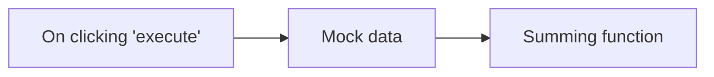

## Fluxo (.json) :

```json
{
  "nodes": [
    {
      "name": "On clicking 'execute'",
      "type": "n8n-nodes-base.manualTrigger",
      "position": [
        220,
        80
      ],
      "parameters": {},
      "typeVersion": 1
    },
    {
      "name": "Mock data",
      "type": "n8n-nodes-base.function",
      "position": [
        420,
        80
      ],
      "parameters": {
        "functionCode": "// Code here will run only once, no matter how many input items there are.\n// More info and help: https://docs.n8n.io/nodes/n8n-nodes-base.function\n\n\nreturn [ { json: { amount_USD: 50 } }, { json: { amount_USD: 20 } }, { json: { amount_USD: 60 } } ];"
      },
      "typeVersion": 1
    },
    {
      "name": "Summing function",
      "type": "n8n-nodes-base.function",
      "position": [
        660,
        80
      ],
      "parameters": {
        "functionCode": "// Code here will run only once, no matter how many input items there are.\n// More info and help: https://docs.n8n.io/nodes/n8n-nodes-base.function\n\n//Setup an empty variable to hold the count\nlet total = 0;\n\n//Loop over the incoming items of data\nfor (item of items) {\n  //For each item of data, add the amount_USD to our total counter\n  total += item.json.amount_USD;\n}\n\n//Returns a well formed JSON object with just the total_value . You can either add more data to this returned object OR use the set node afterwards to do it in a no-code way.\nreturn [ { json: { total_value: total } } ];"
      },
      "typeVersion": 1
    }
  ],
  "connections": {
    "Mock data": {
      "main": [
        [
          {
            "node": "Summing function",
            "type": "main",
            "index": 0
          }
        ]
      ]
    },
    "On clicking 'execute'": {
      "main": [
        [
          {
            "node": "Mock data",
            "type": "main",
            "index": 0
          }
        ]
      ]
    }
  }
}
```

<a id="template-33"></a>

## Template 33 - Auto-resposta por IA com aprovação

- **Nome:** Auto-resposta por IA com aprovação
- **Descrição:** Automatiza o processamento de e-mails recebidos: resume o conteúdo, enriquece a resposta com informação da base de conhecimento, gera um rascunho de resposta em HTML e envia para aprovação antes de enviar a resposta final ao remetente.
- **Funcionalidade:** • Monitoramento de caixa de entrada: Detecta novos e-mails via conta IMAP e inicia o fluxo automaticamente.
• Conversão para Markdown: Converte o conteúdo HTML do e-mail para formato mais adequado para processamento por modelos de linguagem.
• Resumo do e-mail: Gera um resumo conciso (máx. 100 palavras) do conteúdo recebido para facilitar a resposta.
• Recuperação de contexto via RAG: Consulta uma base de conhecimento vetorial para extrair informações comerciais relevantes ao pedido.
• Geração de resposta em HTML: Cria uma resposta profissional e concisa (máx. 100 palavras) em formato HTML.
• Envio de rascunho para aprovação: Envia o rascunho para um endereço Gmail específico e aguarda aprovação (opção Sim/Não) antes de enviar.
• Envio final condicional: Se aprovado, envia o e-mail final ao remetente usando servidor SMTP mantendo o assunto original.
• Controle de fluxo e variáveis: Armazena e repassa o texto gerado para etapas de aprovação e envio.
- **Ferramentas:** • Conta IMAP (provedor de e-mail): Recebe e aciona o processamento dos e-mails entrantes.
• Gmail (com OAuth2): Envio do rascunho e espera por resposta de aprovação (funcionalidade de "send and wait").
• Servidor SMTP: Envio do e-mail final ao remetente após aprovação.
• Modelos de linguagem (OpenAI gpt-4o-mini): Geração de texto e apoio na criação das respostas.
• DeepSeek R1: Modelo adicional de linguagem utilizado para suporte no processamento/sumarização.
• OpenAI Embeddings: Geração de embeddings para indexação e busca semântica.
• Qdrant (base vetorial): Armazenamento e recuperação de documentos/contexto para RAG (buscar informações comerciais relevantes).


## Fluxo visual

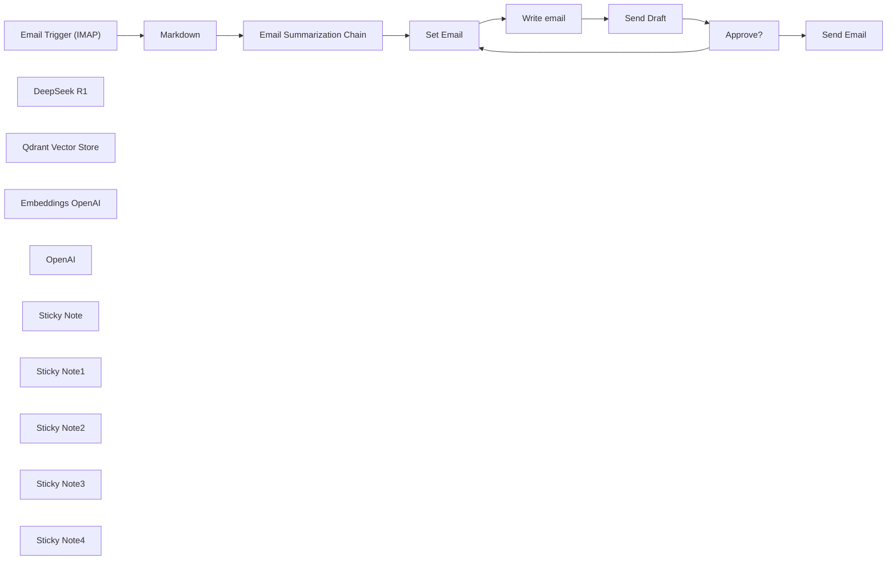

## Fluxo (.json) :

```json
{
  "id": "OuHrYOR3uWGmrhWQ",
  "meta": {
    "instanceId": "a4bfc93e975ca233ac45ed7c9227d84cf5a2329310525917adaf3312e10d5462",
    "templateCredsSetupCompleted": true
  },
  "name": "AI Email processing autoresponder with approval (Yes/No)",
  "tags": [],
  "nodes": [
    {
      "id": "06a098db-160b-45f7-aeac-a73ef868148e",
      "name": "Email Trigger (IMAP)",
      "type": "n8n-nodes-base.emailReadImap",
      "position": [
        -180,
        -100
      ],
      "parameters": {
        "options": {}
      },
      "credentials": {
        "imap": {
          "id": "k31W9oGddl9pMDy4",
          "name": "IMAP info@n3witalia.com"
        }
      },
      "typeVersion": 2
    },
    {
      "id": "9589443b-efb7-4e0d-bafc-0be9858a4755",
      "name": "Markdown",
      "type": "n8n-nodes-base.markdown",
      "position": [
        40,
        -100
      ],
      "parameters": {
        "html": "={{ $json.textHtml }}",
        "options": {}
      },
      "typeVersion": 1
    },
    {
      "id": "8de7b2f3-bf75-4f3c-a1ee-eec047a7b82e",
      "name": "DeepSeek R1",
      "type": "@n8n/n8n-nodes-langchain.lmChatOpenAi",
      "position": [
        240,
        80
      ],
      "parameters": {
        "model": {
          "__rl": true,
          "mode": "list",
          "value": "deepseek/deepseek-r1:free",
          "cachedResultName": "deepseek/deepseek-r1:free"
        },
        "options": {}
      },
      "credentials": {
        "openAiApi": {
          "id": "XJTqRiKFJpFs5MuX",
          "name": "OpenRouter account"
        }
      },
      "typeVersion": 1.2
    },
    {
      "id": "babf37dc-99ca-439a-b094-91c52799b8df",
      "name": "Send Email",
      "type": "n8n-nodes-base.emailSend",
      "position": [
        1840,
        -120
      ],
      "webhookId": "f84fcde7-6aac-485a-9a08-96a35955af49",
      "parameters": {
        "html": "={{ $('Write email').item.json.output }}",
        "options": {},
        "subject": "=Re: {{ $('Email Trigger (IMAP)').item.json.subject }}",
        "toEmail": "={{ $('Email Trigger (IMAP)').item.json.from }}",
        "fromEmail": "={{ $('Email Trigger (IMAP)').item.json.to }}"
      },
      "credentials": {
        "smtp": {
          "id": "hRjP3XbDiIQqvi7x",
          "name": "SMTP info@n3witalia.com"
        }
      },
      "typeVersion": 2.1
    },
    {
      "id": "ebeb986d-053a-420d-8482-ee00e75f2f10",
      "name": "Qdrant Vector Store",
      "type": "@n8n/n8n-nodes-langchain.vectorStoreQdrant",
      "position": [
        1180,
        200
      ],
      "parameters": {
        "mode": "retrieve-as-tool",
        "options": {},
        "toolName": "company_knowladge_base",
        "toolDescription": "Extracts information regarding the request made.",
        "qdrantCollection": {
          "__rl": true,
          "mode": "id",
          "value": "=COLLECTION"
        },
        "includeDocumentMetadata": false
      },
      "credentials": {
        "qdrantApi": {
          "id": "iyQ6MQiVaF3VMBmt",
          "name": "QdrantApi account"
        }
      },
      "typeVersion": 1
    },
    {
      "id": "ccc3d026-bfa3-4fda-be0a-ef70bf831aa7",
      "name": "Embeddings OpenAI",
      "type": "@n8n/n8n-nodes-langchain.embeddingsOpenAi",
      "position": [
        1180,
        380
      ],
      "parameters": {
        "options": {}
      },
      "credentials": {
        "openAiApi": {
          "id": "CDX6QM4gLYanh0P4",
          "name": "OpenAi account"
        }
      },
      "typeVersion": 1.2
    },
    {
      "id": "1726aac9-a77d-4f19-8c07-70b032c3abeb",
      "name": "Email Summarization Chain",
      "type": "@n8n/n8n-nodes-langchain.chainSummarization",
      "position": [
        260,
        -100
      ],
      "parameters": {
        "options": {
          "binaryDataKey": "={{ $json.data }}",
          "summarizationMethodAndPrompts": {
            "values": {
              "prompt": "=Write a concise summary of the following in max 100 words :\n\n\"{{ $json.data }}\"\n\nDo not enter the total number of words used.",
              "combineMapPrompt": "=Write a concise summary of the following in max 100 words:\n\n\"{{ $json.data }}\"\n\nDo not enter the total number of words used."
            }
          }
        },
        "operationMode": "nodeInputBinary"
      },
      "typeVersion": 2
    },
    {
      "id": "81b889d0-e724-4c1f-9ce3-7593c796aaaf",
      "name": "Write email",
      "type": "@n8n/n8n-nodes-langchain.agent",
      "position": [
        980,
        -100
      ],
      "parameters": {
        "text": "=Write the text to reply to the following email:\n\n{{ $('Email Summarization Chain').item.json.response.text }}",
        "options": {
          "systemMessage": "You are an expert at answering emails. You need to answer them professionally based on the information you have. This is a business email. Be concise and never exceed 100 words. Only the body of the email, not create the subject.\n\nIt must be in HTML format and you can insert (if you think it is appropriate) only HTML characters such as <br>, <b>, <i>, <p> where necessary."
        },
        "promptType": "define",
        "hasOutputParser": true
      },
      "typeVersion": 1.7
    },
    {
      "id": "cf38e319-59b3-490e-b841-579afc9fbc02",
      "name": "OpenAI",
      "type": "@n8n/n8n-nodes-langchain.lmChatOpenAi",
      "position": [
        980,
        200
      ],
      "parameters": {
        "model": {
          "__rl": true,
          "mode": "list",
          "value": "gpt-4o-mini",
          "cachedResultName": "gpt-4o-mini"
        },
        "options": {}
      },
      "credentials": {
        "openAiApi": {
          "id": "CDX6QM4gLYanh0P4",
          "name": "OpenAi account"
        }
      },
      "typeVersion": 1.2
    },
    {
      "id": "19842e5f-c372-4dfd-b860-87dc5f00b1af",
      "name": "Set Email",
      "type": "n8n-nodes-base.set",
      "position": [
        760,
        -100
      ],
      "parameters": {
        "options": {},
        "assignments": {
          "assignments": [
            {
              "id": "759dc0f9-f582-492c-896c-6426f8410127",
              "name": "email",
              "type": "string",
              "value": "={{ $json.response.text }}"
            }
          ]
        }
      },
      "typeVersion": 3.4
    },
    {
      "id": "2cf7a9af-c5e8-45dd-bda5-01c562a0defb",
      "name": "Approve?",
      "type": "n8n-nodes-base.if",
      "position": [
        1560,
        -100
      ],
      "parameters": {
        "options": {
          "ignoreCase": false
        },
        "conditions": {
          "options": {
            "version": 2,
            "leftValue": "",
            "caseSensitive": true,
            "typeValidation": "strict"
          },
          "combinator": "and",
          "conditions": [
            {
              "id": "5c377c1c-43c6-45e7-904e-dbbe6b682686",
              "operator": {
                "type": "boolean",
                "operation": "true",
                "singleValue": true
              },
              "leftValue": "={{ $json.data.approved }}",
              "rightValue": "true"
            }
          ]
        }
      },
      "typeVersion": 2.2
    },
    {
      "id": "08cabec6-9840-4214-8315-b877c86794bf",
      "name": "Sticky Note",
      "type": "n8n-nodes-base.stickyNote",
      "position": [
        -220,
        -680
      ],
      "parameters": {
        "color": 3,
        "width": 580,
        "height": 420,
        "content": "# Main Flow\n\n## Preliminary step:\nCreate a vector database on Qdrant and tokenize the documents useful for generating a response\n\n\n## How it works\nThis workflow is designed to automate the process of handling incoming emails, summarizing their content, generating appropriate responses with RAG, and obtaining approval (YES/NO button) before sending replies.\n\nThis workflow is designed to handle general inquiries that come in via corporate email via IMAP and generate responses using RAG. You can quickly integrate Gmail and Outlook via the appropriate trigger nodes"
      },
      "typeVersion": 1
    },
    {
      "id": "80692c8f-e236-43ac-aad2-91bd90f40065",
      "name": "Sticky Note1",
      "type": "n8n-nodes-base.stickyNote",
      "position": [
        -40,
        -180
      ],
      "parameters": {
        "height": 240,
        "content": "Convert email to Markdown format for better understanding of LLM models"
      },
      "typeVersion": 1
    },
    {
      "id": "e6957fde-bf05-4b67-aa0e-44c575fca04d",
      "name": "Sticky Note2",
      "type": "n8n-nodes-base.stickyNote",
      "position": [
        240,
        -180
      ],
      "parameters": {
        "width": 320,
        "height": 240,
        "content": "Chain that summarizes the received email"
      },
      "typeVersion": 1
    },
    {
      "id": "7cfba59f-83ce-4f0b-b54a-b2c11d58fd82",
      "name": "Sticky Note3",
      "type": "n8n-nodes-base.stickyNote",
      "position": [
        940,
        -180
      ],
      "parameters": {
        "width": 340,
        "height": 240,
        "content": "Agent that retrieves business information from a vector database and processes the response"
      },
      "typeVersion": 1
    },
    {
      "id": "28c4bd00-6a47-422f-a50a-935f3724ba01",
      "name": "Send Draft",
      "type": "n8n-nodes-base.gmail",
      "position": [
        1340,
        -100
      ],
      "webhookId": "d6dd2e7c-90ea-4b65-9c64-523d2541a054",
      "parameters": {
        "sendTo": "YOUR GMAIL ADDRESS",
        "message": "=<h3>MESSAGE</h3>\n{{ $('Email Trigger (IMAP)').item.json.textHtml }}\n\n<h3>AI RESPONSE</h3>\n{{ $json.output }}",
        "options": {},
        "subject": "=[Approval Required] {{ $('Email Trigger (IMAP)').item.json.subject }}",
        "operation": "sendAndWait",
        "approvalOptions": {
          "values": {
            "approvalType": "double"
          }
        }
      },
      "credentials": {
        "gmailOAuth2": {
          "id": "nyuHvSX5HuqfMPlW",
          "name": "Gmail account (n3w.it)"
        }
      },
      "typeVersion": 2.1
    },
    {
      "id": "0aae1689-cee7-403a-8640-396db32eceed",
      "name": "Sticky Note4",
      "type": "n8n-nodes-base.stickyNote",
      "position": [
        1300,
        -300
      ],
      "parameters": {
        "color": 4,
        "height": 360,
        "content": "## IMPORTANT\n\nFor the \"Send Draft\" node, you need to send the draft email to a Gmail address because it is the only one that allows the \"Send and wait for response\" function."
      },
      "typeVersion": 1
    }
  ],
  "active": false,
  "pinData": {},
  "settings": {
    "executionOrder": "v1"
  },
  "versionId": "6f7b864e-1589-418c-960e-b832cf032d1b",
  "connections": {
    "OpenAI": {
      "ai_languageModel": [
        [
          {
            "node": "Write email",
            "type": "ai_languageModel",
            "index": 0
          }
        ]
      ]
    },
    "Approve?": {
      "main": [
        [
          {
            "node": "Send Email",
            "type": "main",
            "index": 0
          }
        ],
        [
          {
            "node": "Set Email",
            "type": "main",
            "index": 0
          }
        ]
      ]
    },
    "Markdown": {
      "main": [
        [
          {
            "node": "Email Summarization Chain",
            "type": "main",
            "index": 0
          }
        ]
      ]
    },
    "Set Email": {
      "main": [
        [
          {
            "node": "Write email",
            "type": "main",
            "index": 0
          }
        ]
      ]
    },
    "Send Draft": {
      "main": [
        [
          {
            "node": "Approve?",
            "type": "main",
            "index": 0
          }
        ]
      ]
    },
    "DeepSeek R1": {
      "ai_languageModel": [
        [
          {
            "node": "Email Summarization Chain",
            "type": "ai_languageModel",
            "index": 0
          }
        ]
      ]
    },
    "Write email": {
      "main": [
        [
          {
            "node": "Send Draft",
            "type": "main",
            "index": 0
          }
        ]
      ]
    },
    "Embeddings OpenAI": {
      "ai_embedding": [
        [
          {
            "node": "Qdrant Vector Store",
            "type": "ai_embedding",
            "index": 0
          }
        ]
      ]
    },
    "Qdrant Vector Store": {
      "ai_tool": [
        [
          {
            "node": "Write email",
            "type": "ai_tool",
            "index": 0
          }
        ]
      ]
    },
    "Email Trigger (IMAP)": {
      "main": [
        [
          {
            "node": "Markdown",
            "type": "main",
            "index": 0
          }
        ]
      ]
    },
    "Email Summarization Chain": {
      "main": [
        [
          {
            "node": "Set Email",
            "type": "main",
            "index": 0
          }
        ]
      ]
    }
  }
}
```

<a id="template-34"></a>

## Template 34 - Criar e atualizar item Webflow

- **Nome:** Criar e atualizar item Webflow
- **Descrição:** Cria um item em uma coleção do Webflow, atualiza esse item para adicionar um avatar e recupera o item resultante.
- **Funcionalidade:** • Disparo manual: inicia o fluxo quando o usuário executa manualmente.
• Criação de item: adiciona um novo item em uma coleção do Webflow com campos como nome, slug e flags de arquivado/rascunho.
• Atualização de item: atualiza o item recém-criado para incluir um campo de avatar com uma URL externa.
• Recuperação do item: obtém os dados do item atualizado para confirmação ou uso posterior.
- **Ferramentas:** • Webflow: plataforma de gerenciamento de conteúdo (CMS) utilizada para criar, atualizar e recuperar itens em coleções via API.

## Fluxo visual

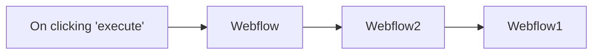

## Fluxo (.json) :

```json
{
  "nodes": [
    {
      "name": "On clicking 'execute'",
      "type": "n8n-nodes-base.manualTrigger",
      "position": [
        250,
        200
      ],
      "parameters": {},
      "typeVersion": 1
    },
    {
      "name": "Webflow",
      "type": "n8n-nodes-base.webflow",
      "position": [
        450,
        200
      ],
      "parameters": {
        "siteId": "601788abebf7aa35c1b038a1",
        "fieldsUi": {
          "fieldValues": [
            {
              "fieldId": "name",
              "fieldValue": "n8n"
            },
            {
              "fieldId": "slug",
              "fieldValue": "n8n"
            },
            {
              "fieldId": "_archived",
              "fieldValue": "false"
            },
            {
              "fieldId": "_draft",
              "fieldValue": "false"
            }
          ]
        },
        "operation": "create",
        "collectionId": "601788ab33a62ac6a2a0284c"
      },
      "credentials": {
        "webflowApi": "Webflow Credentials"
      },
      "typeVersion": 1
    },
    {
      "name": "Webflow2",
      "type": "n8n-nodes-base.webflow",
      "position": [
        650,
        200
      ],
      "parameters": {
        "itemId": "={{$json[\"_id\"]}}",
        "siteId": "601788abebf7aa35c1b038a1",
        "fieldsUi": {
          "fieldValues": [
            {
              "fieldId": "name",
              "fieldValue": "={{$json[\"name\"]}}"
            },
            {
              "fieldId": "slug",
              "fieldValue": "={{$json[\"slug\"]}}"
            },
            {
              "fieldId": "_archived",
              "fieldValue": "={{$json[\"_archived\"]}}"
            },
            {
              "fieldId": "_draft",
              "fieldValue": "={{$json[\"_draft\"]}}"
            },
            {
              "fieldId": "avatar",
              "fieldValue": "https://n8n.io/n8n-logo.png"
            }
          ]
        },
        "operation": "update",
        "collectionId": "601788ab33a62ac6a2a0284c"
      },
      "credentials": {
        "webflowApi": "Webflow Credentials"
      },
      "typeVersion": 1
    },
    {
      "name": "Webflow1",
      "type": "n8n-nodes-base.webflow",
      "position": [
        850,
        200
      ],
      "parameters": {
        "itemId": "={{$json[\"_id\"]}}",
        "siteId": "601788abebf7aa35c1b038a1",
        "collectionId": "601788ab33a62ac6a2a0284c"
      },
      "credentials": {
        "webflowApi": "Webflow Credentials"
      },
      "typeVersion": 1
    }
  ],
  "connections": {
    "Webflow": {
      "main": [
        [
          {
            "node": "Webflow2",
            "type": "main",
            "index": 0
          }
        ]
      ]
    },
    "Webflow2": {
      "main": [
        [
          {
            "node": "Webflow1",
            "type": "main",
            "index": 0
          }
        ]
      ]
    },
    "On clicking 'execute'": {
      "main": [
        [
          {
            "node": "Webflow",
            "type": "main",
            "index": 0
          }
        ]
      ]
    }
  }
}
```

<a id="template-35"></a>

## Template 35 - Gerador de tweets com hashtag e armazenamento

- **Nome:** Gerador de tweets com hashtag e armazenamento
- **Descrição:** Gera um tweet curto incluindo uma hashtag aleatória e salva o resultado em uma base de dados.
- **Funcionalidade:** • Acionamento manual: Inicia o fluxo quando o usuário executa a automação.
• Seleção aleatória de hashtag: Escolhe uma hashtag de uma lista pré-definida.
• Geração de texto via IA: Envia um prompt à API de geração de texto para criar um tweet com menos de 100 caracteres que inclua a hashtag selecionada.
• Mapeamento de saída: Extrai o conteúdo gerado e a hashtag em campos separados.
• Armazenamento de registro: Adiciona o tweet gerado e a hashtag em uma tabela para registro.
- **Ferramentas:** • OpenAI (modelo text-davinci-001): Serviço de geração de texto usado para criar o conteúdo do tweet a partir de um prompt.
• Airtable: Base de dados na nuvem usada para armazenar os registros com a hashtag e o conteúdo gerado.

## Fluxo visual

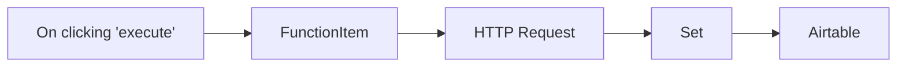

## Fluxo (.json) :

```json
{
  "nodes": [
    {
      "name": "On clicking 'execute'",
      "type": "n8n-nodes-base.manualTrigger",
      "position": [
        250,
        300
      ],
      "parameters": {},
      "typeVersion": 1
    },
    {
      "name": "FunctionItem",
      "type": "n8n-nodes-base.functionItem",
      "position": [
        450,
        300
      ],
      "parameters": {
        "functionCode": "// hashtag list\nconst Hashtags = [\n  \"#techtwitter\",\n  \"#n8n\"\n];\n\n// random output function\nconst randomHashtag = Hashtags[Math.floor(Math.random() * Hashtags.length)];\nitem.hashtag = randomHashtag;\nreturn item;"
      },
      "typeVersion": 1
    },
    {
      "name": "HTTP Request",
      "type": "n8n-nodes-base.httpRequest",
      "position": [
        650,
        300
      ],
      "parameters": {
        "url": "https://api.openai.com/v1/engines/text-davinci-001/completions",
        "options": {},
        "requestMethod": "POST",
        "authentication": "headerAuth",
        "jsonParameters": true,
        "bodyParametersJson": "={\n  \"prompt\": \"Generate a tweet, with under 100 characters, about and including the hashtag {{$node[\"FunctionItem\"].json[\"hashtag\"]}}:\",\n  \"temperature\": 0.7,\n  \"max_tokens\": 64,\n  \"top_p\": 1,\n  \"frequency_penalty\": 0,\n  \"presence_penalty\": 0\n}"
      },
      "credentials": {
        "httpHeaderAuth": ""
      },
      "typeVersion": 1
    },
    {
      "name": "Airtable",
      "type": "n8n-nodes-base.airtable",
      "position": [
        1050,
        300
      ],
      "parameters": {
        "table": "main",
        "options": {},
        "operation": "append",
        "application": "appOaG8kEA8FAABOr"
      },
      "credentials": {
        "airtableApi": ""
      },
      "typeVersion": 1
    },
    {
      "name": "Set",
      "type": "n8n-nodes-base.set",
      "position": [
        850,
        300
      ],
      "parameters": {
        "values": {
          "string": [
            {
              "name": "Hashtag",
              "value": "={{$node[\"FunctionItem\"].json[\"hashtag\"]}}"
            },
            {
              "name": "Content",
              "value": "={{$node[\"HTTP Request\"].json[\"choices\"][0][\"text\"]}}"
            }
          ]
        },
        "options": {},
        "keepOnlySet": true
      },
      "typeVersion": 1
    }
  ],
  "connections": {
    "Set": {
      "main": [
        [
          {
            "node": "Airtable",
            "type": "main",
            "index": 0
          }
        ]
      ]
    },
    "FunctionItem": {
      "main": [
        [
          {
            "node": "HTTP Request",
            "type": "main",
            "index": 0
          }
        ]
      ]
    },
    "HTTP Request": {
      "main": [
        [
          {
            "node": "Set",
            "type": "main",
            "index": 0
          }
        ]
      ]
    },
    "On clicking 'execute'": {
      "main": [
        [
          {
            "node": "FunctionItem",
            "type": "main",
            "index": 0
          }
        ]
      ]
    }
  }
}
```

<a id="template-36"></a>

## Template 36 - Atualizações de eventos no ClickUp

- **Nome:** Atualizações de eventos no ClickUp
- **Descrição:** Este fluxo recebe atualizações de eventos do ClickUp usando um gatilho, iniciando ações quando eventos ocorrem.
- **Funcionalidade:** • Gatilho de eventos do ClickUp: o fluxo é acionado por eventos que ocorrem no ClickUp.
• Ouvir todos os eventos: configuração para capturar todos os tipos de eventos com \"*\".
• Autenticação e conexão com a API: utiliza credenciais da API do ClickUp para estabelecer a conexão.
- **Ferramentas:** • ClickUp: Plataforma de gestão de tarefas que envia atualizações de eventos e permite integrações.

## Fluxo visual

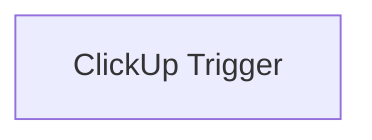

## Fluxo (.json) :

```json
{
  "id": "110",
  "name": "Receive updates for events in ClickUp",
  "nodes": [
    {
      "name": "ClickUp Trigger",
      "type": "n8n-nodes-base.clickUpTrigger",
      "position": [
        700,
        250
      ],
      "parameters": {
        "team": "",
        "events": [
          "*"
        ],
        "filters": {}
      },
      "credentials": {
        "clickUpApi": ""
      },
      "typeVersion": 1
    }
  ],
  "active": false,
  "settings": {},
  "connections": {}
}
```

<a id="template-37"></a>

## Template 37 - Notificações GitHub para Discord

- **Nome:** Notificações GitHub para Discord
- **Descrição:** Verifica periodicamente novas notificações do GitHub e envia um resumo para um canal/usuário no Discord quando houver atividades recentes.
- **Funcionalidade:** • Disparo programado a cada minuto: Executa o fluxo periodicamente a cada 1 minuto.
• Cálculo de data desde 1 minuto atrás: Gera um timestamp ISO para consultar somente notificações recentes.
• Consulta à API de notificações do GitHub: Busca notificações usando o parâmetro 'since' para retornar apenas itens novos.
• Formatação de relatório: Constrói uma lista com o motivo, o título e a URL dos itens notificados.
• Verificação condicional: Verifica se existem notificações antes de prosseguir com o envio.
• Envio ao Discord com menção: Publica a mensagem formatada em um canal do Discord, incluindo a menção a um usuário.
- **Ferramentas:** • GitHub: Plataforma que fornece a API de notificações para recuperar eventos e metadados de repositórios.
• Discord: Serviço de comunicação utilizado para enviar mensagens e mencionar usuários em canais.

## Fluxo visual

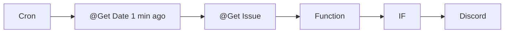

## Fluxo (.json) :

```json
{
  "nodes": [
    {
      "name": "@Get Issue",
      "type": "n8n-nodes-base.httpRequest",
      "maxTries": 3,
      "position": [
        1050,
        590
      ],
      "parameters": {
        "url": "https://api.github.com/notifications",
        "options": {},
        "authentication": "basicAuth",
        "queryParametersUi": {
          "parameter": [
            {
              "name": "since",
              "value": "={{$node[\"@Get Date 1 min ago\"].json[\"since\"]}}"
            }
          ]
        },
        "headerParametersUi": {
          "parameter": [
            {
              "name": "User-Agent",
              "value": "Mozilla/5.0 (Windows NT 10.0; Win64; x64) AppleWebKit/537.36 (KHTML, like Gecko) Chrome/42.0.2311.135 Safari/537.36 Edge/12.246"
            }
          ]
        }
      },
      "credentials": {
        "httpBasicAuth": "Github Auth"
      },
      "retryOnFail": true,
      "typeVersion": 1
    },
    {
      "name": "Cron",
      "type": "n8n-nodes-base.cron",
      "position": [
        710,
        590
      ],
      "parameters": {
        "triggerTimes": {
          "item": [
            {
              "mode": "everyX",
              "unit": "minutes",
              "value": 1
            }
          ]
        }
      },
      "typeVersion": 1
    },
    {
      "name": "Discord",
      "type": "n8n-nodes-base.discord",
      "position": [
        1610,
        580
      ],
      "parameters": {
        "text": "=Notifications In last minutes: <@userIdForTagging>\n{{$node[\"Function\"].json[\"reportMessage\"]}}"
      },
      "typeVersion": 1
    },
    {
      "name": "Function",
      "type": "n8n-nodes-base.function",
      "position": [
        1230,
        590
      ],
      "parameters": {
        "functionCode": "const newItems = [];\n\nfor (const item of items[0].json) {\n     newItems.push(`- [${item.reason}] => ${item.subject.title} @ ${item.subject.url.replace('api.','').replace('/repos','')}`);\n  }\n\nreturn [{json: {reportMessage: `${newItems.join('\\r\\n')}`, hasNotifications: items[0].json.length > 0}}];\n"
      },
      "typeVersion": 1
    },
    {
      "name": "IF",
      "type": "n8n-nodes-base.if",
      "position": [
        1400,
        590
      ],
      "parameters": {
        "conditions": {
          "boolean": [
            {
              "value1": "={{$node[\"Function\"].json[\"hasNotifications\"]}}",
              "value2": true
            }
          ]
        }
      },
      "typeVersion": 1
    },
    {
      "name": "@Get Date 1 min ago",
      "type": "n8n-nodes-base.function",
      "position": [
        860,
        590
      ],
      "parameters": {
        "functionCode": "const date = new Date(new Date().setMinutes(new Date().getMinutes() - (1))).toISOString()\nreturn [{json: {since: date}}];"
      },
      "typeVersion": 1
    }
  ],
  "connections": {
    "IF": {
      "main": [
        [
          {
            "node": "Discord",
            "type": "main",
            "index": 0
          }
        ]
      ]
    },
    "Cron": {
      "main": [
        [
          {
            "node": "@Get Date 1 min ago",
            "type": "main",
            "index": 0
          }
        ]
      ]
    },
    "Function": {
      "main": [
        [
          {
            "node": "IF",
            "type": "main",
            "index": 0
          }
        ]
      ]
    },
    "@Get Issue": {
      "main": [
        [
          {
            "node": "Function",
            "type": "main",
            "index": 0
          }
        ]
      ]
    },
    "@Get Date 1 min ago": {
      "main": [
        [
          {
            "node": "@Get Issue",
            "type": "main",
            "index": 0
          }
        ]
      ]
    }
  }
}
```

<a id="template-38"></a>

## Template 38 - Rastreamento de despesas por recibos

- **Nome:** Rastreamento de despesas por recibos
- **Descrição:** Recebe recibos enviados por formulário, extrai automaticamente os dados importantes e armazena as despesas em uma base de dados.
- **Funcionalidade:** • Captura de recibo por formulário: Inicia o processo quando um usuário envia um recibo através de um formulário online.
• Download da imagem do recibo: Baixa o arquivo do recibo enviado para processamento posterior.
• Extração de informações do recibo: Realiza OCR e processamento para identificar valores, estabelecimento, data, hora e categoria.
• Mapeamento e padronização de campos: Organiza os dados extraídos em campos padronizados (valor, comerciante, data, hora, categoria, URL do recibo).
• Armazenamento em base de dados: Anexa o registro da despesa com os campos extraídos a uma tabela de despesas para registro e consulta.
- **Ferramentas:** • Typeform: Formulário online para receber uploads de recibos e respostas dos usuários.
• Mindee (Receipt API): Serviço de OCR e extração de dados específicos de recibos para obter valor total, comerciante, data, hora e categoria.
• Airtable: Base de dados online onde os registros de despesas são armazenados e organizados.

## Fluxo visual

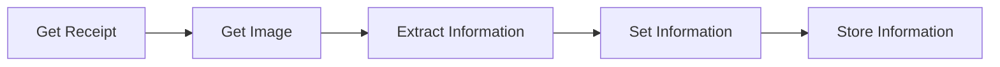

## Fluxo (.json) :

```json
{
  "id": "55",
  "name": "Expense Tracker App",
  "nodes": [
    {
      "name": "Get Receipt",
      "type": "n8n-nodes-base.typeformTrigger",
      "position": [
        450,
        300
      ],
      "webhookId": "b51cc683-1ef6-412f-9885-91e65f151cc0",
      "parameters": {
        "formId": ""
      },
      "credentials": {
        "typeformApi": ""
      },
      "typeVersion": 1
    },
    {
      "name": "Get Image",
      "type": "n8n-nodes-base.httpRequest",
      "position": [
        650,
        300
      ],
      "parameters": {
        "url": "={{$node[\"Get Receipt\"].json[\"Upload receipt\"]}}",
        "options": {},
        "responseFormat": "file"
      },
      "typeVersion": 1
    },
    {
      "name": "Extract Information",
      "type": "n8n-nodes-base.mindee",
      "position": [
        850,
        300
      ],
      "parameters": {},
      "credentials": {
        "mindeeReceiptApi": ""
      },
      "typeVersion": 1
    },
    {
      "name": "Set Information",
      "type": "n8n-nodes-base.set",
      "position": [
        1050,
        300
      ],
      "parameters": {
        "values": {
          "number": [
            {
              "name": "Amount",
              "value": "={{$node[\"Extract Information\"].json[\"total\"]}}"
            }
          ],
          "string": [
            {
              "name": "Merchant",
              "value": "={{$node[\"Extract Information\"].json[\"merchant\"]}}"
            },
            {
              "name": "Date",
              "value": "={{$node[\"Extract Information\"].json[\"date\"]}}"
            },
            {
              "name": "Time",
              "value": "={{$node[\"Extract Information\"].json[\"time\"]}}"
            },
            {
              "name": "Receipt URL",
              "value": "={{$node[\"Get Receipt\"].json[\"Upload receipt\"]}}"
            },
            {
              "name": "Category",
              "value": "={{$node[\"Extract Information\"].json[\"category\"]}}"
            }
          ]
        },
        "options": {},
        "keepOnlySet": true
      },
      "typeVersion": 1
    },
    {
      "name": "Store Information",
      "type": "n8n-nodes-base.airtable",
      "position": [
        1250,
        300
      ],
      "parameters": {
        "table": "Expenses",
        "options": {},
        "operation": "append",
        "application": ""
      },
      "credentials": {
        "airtableApi": ""
      },
      "typeVersion": 1
    }
  ],
  "active": false,
  "settings": {},
  "connections": {
    "Get Image": {
      "main": [
        [
          {
            "node": "Extract Information",
            "type": "main",
            "index": 0
          }
        ]
      ]
    },
    "Get Receipt": {
      "main": [
        [
          {
            "node": "Get Image",
            "type": "main",
            "index": 0
          }
        ]
      ]
    },
    "Set Information": {
      "main": [
        [
          {
            "node": "Store Information",
            "type": "main",
            "index": 0
          }
        ]
      ]
    },
    "Extract Information": {
      "main": [
        [
          {
            "node": "Set Information",
            "type": "main",
            "index": 0
          }
        ]
      ]
    }
  }
}
```

<a id="template-39"></a>

## Template 39 - Gatilho Calendly: invitee criado ou cancelado

- **Nome:** Gatilho Calendly: invitee criado ou cancelado
- **Descrição:** Este fluxo dispara quando um invitee no Calendly é criado ou cancelado, servindo como gatilho para integrações e automações com outros sistemas.
- **Funcionalidade:** • Detecção de eventos do Calendly: inicia a automação ao detectar invitee.created ou invitee.canceled.
• Gatilho de automação: atua como ponto de partida para ações subsequentes em outras plataformas.
• Suporte a múltiplos eventos de invitee: permite reagir a criação e cancelamento de convites.
- **Ferramentas:** • Calendly: plataforma de agendamento usada para acionar a automação com eventos de invitee.

## Fluxo visual

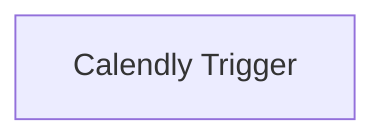

## Fluxo (.json) :

```json
{
  "nodes": [
    {
      "name": "Calendly Trigger",
      "type": "n8n-nodes-base.calendlyTrigger",
      "position": [
        880,
        400
      ],
      "webhookId": "9d13bcea-781a-4462-a9af-44bfb1fb6891",
      "parameters": {
        "events": [
          "invitee.created",
          "invitee.canceled"
        ]
      },
      "credentials": {
        "calendlyApi": "calendly_creds"
      },
      "typeVersion": 1
    }
  ],
  "connections": {}
}
```

<a id="template-40"></a>

## Template 40 - Atualizações de eventos do Chargebee

- **Nome:** Atualizações de eventos do Chargebee
- **Descrição:** Este fluxo observa eventos vindos do Chargebee e desencadeia ações conforme eles ocorrem.
- **Funcionalidade:** • Gatilho de eventos do Chargebee: Fluxo inicia quando um evento é recebido do Chargebee (configurado para todos os eventos).
• Suporte a todos os tipos de evento: O gatilho está definido para capturar qualquer tipo de evento emitido pelo Chargebee.
- **Ferramentas:** • Chargebee: Serviço de gestão de assinaturas que envia eventos para automação, permitindo acionar fluxos com base em eventos.

## Fluxo visual

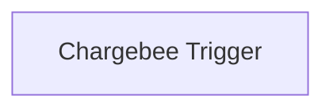

## Fluxo (.json) :

```json
{
  "id": "108",
  "name": "Receive updates for events in Chargebee",
  "nodes": [
    {
      "name": "Chargebee Trigger",
      "type": "n8n-nodes-base.chargebeeTrigger",
      "position": [
        700,
        250
      ],
      "parameters": {
        "events": [
          "*"
        ]
      },
      "typeVersion": 1
    }
  ],
  "active": false,
  "settings": {},
  "connections": {}
}
```

<a id="template-41"></a>

## Template 41 - Reindexação de URLs a partir do sitemap

- **Nome:** Reindexação de URLs a partir do sitemap
- **Descrição:** Coleta URLs de todos os sitemaps de um site, verifica o status de indexação no Google e solicita reindexação para páginas novas ou atualizadas.
- **Funcionalidade:** • Agendamento periódico: executa a verificação diariamente em horário definido.
• Coleta de sitemaps: busca o sitemap principal e extrai todos os sitemaps específicos de conteúdo.
• Leitura e conversão de XML: converte o conteúdo dos sitemaps para JSON para processamento.
• Normalização de dados: garante que cada entrada de página contenha os campos padrão loc e lastmod.
• Ordenação por data de modificação: ordena páginas do mais recente ao mais antigo com base em lastmod.
• Processamento em lotes: percorre as URLs em lotes e aplica controles de taxa entre requisições.
• Verificação de status no Google: consulta metadados de indexação para cada URL para determinar a necessidade de reindexação.
• Comparação de datas: reindexa apenas quando a data lastmod da página é posterior à última notificação registrada no Google.
• Publicação de notificações de reindexação: envia pedidos de reindexação (URL_UPDATED) ao serviço de indexação do Google quando necessário.
• Controle de erros e tolerância: continua o fluxo mesmo que algumas requisições falhem, evitando interrupção completa.
- **Ferramentas:** • Google Indexing API: serviço usado para consultar metadados de indexação e publicar notificações de reindexação (URL_UPDATED).
• Google Account (OAuth2): conta Google usada para autenticar chamadas à API de indexação.
• Sitemap do site (sitemap.xml): fonte principal de URLs e datas de modificação; pode ser o sitemap do CMS (ex.: WordPress) usado como exemplo.
• HTTP/HTTPS: para buscar os arquivos sitemap.xml e enviar requisições às APIs externas.

## Fluxo visual

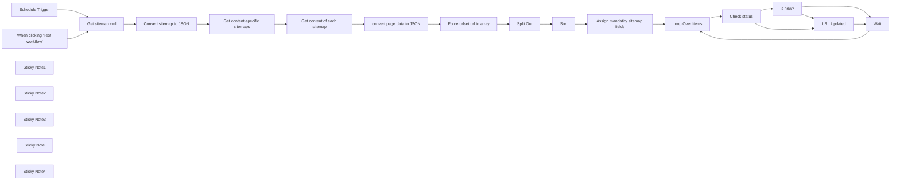

## Fluxo (.json) :

```json
{
  "id": "7i2RqqCYaKHUt4n3",
  "meta": {
    "instanceId": "fb924c73af8f703905bc09c9ee8076f48c17b596ed05b18c0ff86915ef8a7c4a"
  },
  "name": "Google Site Index - sitemap.xml example",
  "tags": [],
  "nodes": [
    {
      "id": "4da50fbf-7707-42ea-badc-6748c4ee30db",
      "name": "When clicking \"Test workflow\"",
      "type": "n8n-nodes-base.manualTrigger",
      "position": [
        -927,
        472
      ],
      "parameters": {},
      "typeVersion": 1
    },
    {
      "id": "9e5bd6c8-a056-462b-b746-60d86bfbe398",
      "name": "Split Out",
      "type": "n8n-nodes-base.splitOut",
      "position": [
        480,
        360
      ],
      "parameters": {
        "options": {},
        "fieldToSplitOut": "urlset.url"
      },
      "typeVersion": 1
    },
    {
      "id": "0d4acf98-31c5-4a0d-bb29-c1d045c0705c",
      "name": "Check status",
      "type": "n8n-nodes-base.httpRequest",
      "onError": "continueErrorOutput",
      "position": [
        1540,
        400
      ],
      "parameters": {
        "url": "=https://indexing.googleapis.com/v3/urlNotifications/metadata?url={{ encodeURIComponent($json.loc) }}",
        "options": {
          "response": {
            "response": {
              "fullResponse": true
            }
          }
        },
        "authentication": "predefinedCredentialType",
        "nodeCredentialType": "googleOAuth2Api"
      },
      "credentials": {
        "googleOAuth2Api": {
          "id": "K8Cz9Dy3TR68udv2",
          "name": "Google account"
        }
      },
      "retryOnFail": false,
      "typeVersion": 4.1
    },
    {
      "id": "eee0eba6-3aa3-4841-9d48-8407db1212e2",
      "name": "Loop Over Items",
      "type": "n8n-nodes-base.splitInBatches",
      "position": [
        1340,
        360
      ],
      "parameters": {
        "options": {}
      },
      "typeVersion": 3
    },
    {
      "id": "47745d33-8358-45a8-a67d-60f9f0574bae",
      "name": "Wait",
      "type": "n8n-nodes-base.wait",
      "position": [
        2080,
        400
      ],
      "webhookId": "44364241-e54b-4b44-aaa1-0d8121a7f497",
      "parameters": {
        "unit": "seconds",
        "amount": "={{ Math.min(1.5,0.3+3*Math.random()).toFixed(2) }}"
      },
      "typeVersion": 1
    },
    {
      "id": "9f1bf72e-8ecd-4239-b96f-b77be4c86b18",
      "name": "URL Updated",
      "type": "n8n-nodes-base.httpRequest",
      "position": [
        1840,
        400
      ],
      "parameters": {
        "url": "=https://indexing.googleapis.com/v3/urlNotifications:publish",
        "method": "POST",
        "options": {},
        "sendBody": true,
        "authentication": "predefinedCredentialType",
        "bodyParameters": {
          "parameters": [
            {
              "name": "url",
              "value": "={{ $('Loop Over Items').item.json.loc }}"
            },
            {
              "name": "type",
              "value": "URL_UPDATED"
            }
          ]
        },
        "nodeCredentialType": "googleOAuth2Api"
      },
      "credentials": {
        "googleOAuth2Api": {
          "id": "K8Cz9Dy3TR68udv2",
          "name": "Google account"
        }
      },
      "typeVersion": 4.1
    },
    {
      "id": "629eaf34-ef3c-4e9c-9537-69a03310dd9c",
      "name": "Schedule Trigger",
      "type": "n8n-nodes-base.scheduleTrigger",
      "position": [
        -927,
        272
      ],
      "parameters": {
        "rule": {
          "interval": [
            {
              "triggerAtHour": 2,
              "triggerAtMinute": 5
            }
          ]
        }
      },
      "typeVersion": 1.1
    },
    {
      "id": "2f95065c-fdc9-4773-87b0-37007ae4f9a5",
      "name": "Sticky Note1",
      "type": "n8n-nodes-base.stickyNote",
      "position": [
        -87,
        192
      ],
      "parameters": {
        "width": 851.3475816949383,
        "height": 340.39627039627067,
        "content": "## Collect list of URLs\n\nThis part extracts all pages from all sitemaps and sorts by the last modified date `lastmod` (from newest to oldest)"
      },
      "typeVersion": 1
    },
    {
      "id": "33798da1-4fd3-43dc-9ff4-753bae798535",
      "name": "is new?",
      "type": "n8n-nodes-base.if",
      "position": [
        1700,
        280
      ],
      "parameters": {
        "options": {
          "looseTypeValidation": true
        },
        "conditions": {
          "options": {
            "leftValue": "",
            "caseSensitive": true,
            "typeValidation": "loose"
          },
          "combinator": "and",
          "conditions": [
            {
              "id": "c8566fc4-57cf-4272-841e-014bb354a37d",
              "operator": {
                "type": "dateTime",
                "operation": "after"
              },
              "leftValue": "={{ $('Loop Over Items').item.json.lastmod }}",
              "rightValue": "={{ $json.body.latestUpdate.notifyTime }}"
            }
          ]
        }
      },
      "typeVersion": 2
    },
    {
      "id": "b5d538ec-d7bc-40ac-9b9e-e5ead9378387",
      "name": "Sticky Note2",
      "type": "n8n-nodes-base.stickyNote",
      "position": [
        1500,
        121.07782938758908
      ],
      "parameters": {
        "width": 504.2424242424241,
        "height": 431.1089918072487,
        "content": "## Check URL metadata and update, if:\n* Google returns error (404 error means that this URL was not previously added)\n* Date of article update is after the date of last request to re-index"
      },
      "typeVersion": 1
    },
    {
      "id": "2cc0b088-b09f-4dc2-8027-9e0ff442576b",
      "name": "Sticky Note3",
      "type": "n8n-nodes-base.stickyNote",
      "position": [
        -640,
        196.4335593220339
      ],
      "parameters": {
        "width": 515.8058994999984,
        "height": 335.72259887005646,
        "content": "## Get sitemap.xml\nVarious CMS systems often have multiple sitemaps for different content (posts, tags, pages etc). Need to fetch all sitemaps first and then extract all pages from all sitemaps.\n### Remember to update the real sitemap URL!"
      },
      "typeVersion": 1
    },
    {
      "id": "d8dc3b65-0d47-49a7-9042-33dbc5a2e245",
      "name": "Sticky Note",
      "type": "n8n-nodes-base.stickyNote",
      "position": [
        -662.5490981963931,
        120.2098305084748
      ],
      "parameters": {
        "color": 6,
        "width": 1458.468937875752,
        "height": 453.3292476478371,
        "content": "## Feel free to adapt this part depending on your website CMS\n"
      },
      "typeVersion": 1
    },
    {
      "id": "a763f582-500c-4cc8-b780-672ebc3d0845",
      "name": "Get content-specific sitemaps",
      "type": "n8n-nodes-base.splitOut",
      "position": [
        -260,
        360
      ],
      "parameters": {
        "options": {},
        "fieldToSplitOut": "sitemapindex.sitemap"
      },
      "typeVersion": 1
    },
    {
      "id": "e7aa9728-eb9b-454d-a710-561d76841d7a",
      "name": "Convert sitemap to JSON",
      "type": "n8n-nodes-base.xml",
      "position": [
        -440,
        360
      ],
      "parameters": {
        "options": {}
      },
      "typeVersion": 1
    },
    {
      "id": "496366d7-0d4e-401c-a375-8ca8882e8a32",
      "name": "Force urlset.url to array",
      "type": "n8n-nodes-base.set",
      "position": [
        320,
        360
      ],
      "parameters": {
        "options": {},
        "assignments": {
          "assignments": [
            {
              "id": "8d16114b-1d1a-4522-a550-6c799a44538a",
              "name": "=urlset.url",
              "type": "array",
              "value": "={{ $json.urlset.url[0] ? $json.urlset.url : [$json.urlset.url] }}"
            }
          ]
        }
      },
      "typeVersion": 3.3
    },
    {
      "id": "3a8e00a6-2fa4-4903-943d-890e0078181e",
      "name": "Sticky Note4",
      "type": "n8n-nodes-base.stickyNote",
      "position": [
        820,
        120
      ],
      "parameters": {
        "color": 3,
        "width": 459.2224448897797,
        "height": 451.39712985292624,
        "content": "## Update the `lastmod` and `loc` fields\nThese are pre-defined fields according to [the XML schema for the Sitemap protocol](https://www.sitemaps.org/protocol.html).\n\nIf your CMS system has different field names, please rename them here:\n* the last modified field `lastmod`\n* URL of the page in `loc` field"
      },
      "typeVersion": 1
    },
    {
      "id": "9d841026-ede6-4396-a67b-e1787ffe9a17",
      "name": "Assign mandatiry sitemap fields",
      "type": "n8n-nodes-base.set",
      "position": [
        1000,
        360
      ],
      "parameters": {
        "options": {},
        "assignments": {
          "assignments": [
            {
              "id": "bb0e1337-6fda-4a22-9963-d0b1271fc2a6",
              "name": "lastmod",
              "type": "string",
              "value": "={{ $json.lastmod }}"
            },
            {
              "id": "e7517c23-f989-4d75-9078-d82c75e51c65",
              "name": "loc",
              "type": "string",
              "value": "={{ $json.loc }}"
            }
          ]
        }
      },
      "typeVersion": 3.3
    },
    {
      "id": "99787654-f554-4650-afc0-c4fa65392c2b",
      "name": "convert page data to JSON",
      "type": "n8n-nodes-base.xml",
      "position": [
        120,
        360
      ],
      "parameters": {
        "options": {
          "explicitArray": false
        }
      },
      "typeVersion": 1
    },
    {
      "id": "f5cc1725-955c-4eb2-a66f-93153ebf35d1",
      "name": "Get sitemap.xml",
      "type": "n8n-nodes-base.httpRequest",
      "position": [
        -620,
        360
      ],
      "parameters": {
        "url": "https://wordpress.org/sitemap.xml",
        "options": {}
      },
      "typeVersion": 4.1
    },
    {
      "id": "789076f0-4aa1-469b-afac-af717c0b03c3",
      "name": "Get content of each sitemap",
      "type": "n8n-nodes-base.httpRequest",
      "position": [
        -60,
        360
      ],
      "parameters": {
        "url": "={{ $json.loc }}",
        "options": {
          "batching": {
            "batch": {
              "batchSize": 1,
              "batchInterval": 150
            }
          }
        }
      },
      "typeVersion": 4.1
    },
    {
      "id": "b0bdc6d6-1306-4c0c-bec2-7e59d587db69",
      "name": "Sort",
      "type": "n8n-nodes-base.sort",
      "position": [
        640,
        360
      ],
      "parameters": {
        "options": {},
        "sortFieldsUi": {
          "sortField": [
            {
              "order": "descending",
              "fieldName": "lastmod"
            }
          ]
        }
      },
      "typeVersion": 1
    }
  ],
  "active": false,
  "pinData": {},
  "settings": {
    "executionOrder": "v1"
  },
  "versionId": "5c21ebb6-67df-4bde-9aea-6cc9a7621fc0",
  "connections": {
    "Sort": {
      "main": [
        [
          {
            "node": "Assign mandatiry sitemap fields",
            "type": "main",
            "index": 0
          }
        ]
      ]
    },
    "Wait": {
      "main": [
        [
          {
            "node": "Loop Over Items",
            "type": "main",
            "index": 0
          }
        ]
      ]
    },
    "is new?": {
      "main": [
        [
          {
            "node": "URL Updated",
            "type": "main",
            "index": 0
          }
        ],
        [
          {
            "node": "Wait",
            "type": "main",
            "index": 0
          }
        ]
      ]
    },
    "Split Out": {
      "main": [
        [
          {
            "node": "Sort",
            "type": "main",
            "index": 0
          }
        ]
      ]
    },
    "URL Updated": {
      "main": [
        [
          {
            "node": "Wait",
            "type": "main",
            "index": 0
          }
        ]
      ]
    },
    "Check status": {
      "main": [
        [
          {
            "node": "is new?",
            "type": "main",
            "index": 0
          }
        ],
        [
          {
            "node": "URL Updated",
            "type": "main",
            "index": 0
          }
        ]
      ]
    },
    "Get sitemap.xml": {
      "main": [
        [
          {
            "node": "Convert sitemap to JSON",
            "type": "main",
            "index": 0
          }
        ]
      ]
    },
    "Loop Over Items": {
      "main": [
        [],
        [
          {
            "node": "Check status",
            "type": "main",
            "index": 0
          }
        ]
      ]
    },
    "Schedule Trigger": {
      "main": [
        [
          {
            "node": "Get sitemap.xml",
            "type": "main",
            "index": 0
          }
        ]
      ]
    },
    "Convert sitemap to JSON": {
      "main": [
        [
          {
            "node": "Get content-specific sitemaps",
            "type": "main",
            "index": 0
          }
        ]
      ]
    },
    "Force urlset.url to array": {
      "main": [
        [
          {
            "node": "Split Out",
            "type": "main",
            "index": 0
          }
        ]
      ]
    },
    "convert page data to JSON": {
      "main": [
        [
          {
            "node": "Force urlset.url to array",
            "type": "main",
            "index": 0
          }
        ]
      ]
    },
    "Get content of each sitemap": {
      "main": [
        [
          {
            "node": "convert page data to JSON",
            "type": "main",
            "index": 0
          }
        ]
      ]
    },
    "Get content-specific sitemaps": {
      "main": [
        [
          {
            "node": "Get content of each sitemap",
            "type": "main",
            "index": 0
          }
        ]
      ]
    },
    "When clicking \"Test workflow\"": {
      "main": [
        [
          {
            "node": "Get sitemap.xml",
            "type": "main",
            "index": 0
          }
        ]
      ]
    },
    "Assign mandatiry sitemap fields": {
      "main": [
        [
          {
            "node": "Loop Over Items",
            "type": "main",
            "index": 0
          }
        ]
      ]
    }
  }
}
```
