# PACK 1999 TEMPLATES PARTE 01 - Bloco 3

Templates neste bloco: 20

## Sumário

- [Template 42 - Agente de IA com ferramenta personalizada (Hacker News)](#template-42)
- [Template 43 - Importar resumos Hugging Face para Notion](#template-43)
- [Template 44 - Pesquisa com Perplexity Sonar](#template-44)
- [Template 45 - Consulta de pessoa por e-mail (Clearbit)](#template-45)
- [Template 46 - Criar, publicar e recuperar post no Ghost](#template-46)
- [Template 47 - Extrator de esquemas de API](#template-47)
- [Template 48 - Busca de usuários no Bubble](#template-48)
- [Template 49 - Assistente OpenAI integrado ao chat HubSpot](#template-49)
- [Template 50 - Servidor MCP para sistema de arquivos](#template-50)
- [Template 51 - Identificação de workflows potencialmente afetados](#template-51)
- [Template 52 - Envio de PDFs do Gmail para Drive com OpenAI](#template-52)
- [Template 53 - Agente de contatos com IA](#template-53)
- [Template 54 - Converter páginas web em Markdown e extrair links](#template-54)
- [Template 55 - Revisor automático de MR GitLab](#template-55)
- [Template 56 - Análise automática de imagens via Telegram](#template-56)
- [Template 57 - Scraper de vagas 'Who is hiring' do Hacker News](#template-57)
- [Template 58 - Chatbot para Bitrix24 com Webhook e registro automático](#template-58)
- [Template 59 - Criar e atualizar registro FileMaker](#template-59)
- [Template 60 - Notificação de resposta no Mattermost](#template-60)
- [Template 61 - Resumo diário de podcasts por gênero](#template-61)

---

<a id="template-42"></a>

## Template 42 - Agente de IA com ferramenta personalizada (Hacker News)

- **Nome:** Agente de IA com ferramenta personalizada (Hacker News)
- **Descrição:** Fluxo que recebe mensagens de chat, processa-as com um agente de IA conectado a um modelo de linguagem e pode invocar uma ferramenta personalizada que recupera os 50 posts mais populares do Hacker News, retornando os dados em JSON.
- **Funcionalidade:** • Recepção de mensagens de chat: inicia o processo ao receber uma mensagem do usuário.
• Processamento por agente de IA: encaminha a mensagem para um agente que utiliza um modelo de linguagem para gerar respostas.
• Integração com modelo específico: utiliza o modelo de linguagem (OpenAI gpt-4o-mini) para elaboração de respostas.
• Chamada de ferramenta personalizada: o agente pode invocar uma ferramenta que executa um sub-fluxo para obter dados externos.
• Recuperação de posts do Hacker News: a ferramenta busca os 50 posts mais populares de todos os tempos.
• Limpeza e normalização de dados: o sub-fluxo formata campos como título, pontos, URL, data e autor.
• Retorno em JSON: os resultados são convertidos em JSON e enviados de volta para uso pelo agente ou usuário.
- **Ferramentas:** • OpenAI (gpt-4o-mini): modelo de linguagem usado para gerar as respostas do agente.
• Hacker News API: fonte pública utilizada para obter os posts mais populares.

## Fluxo visual

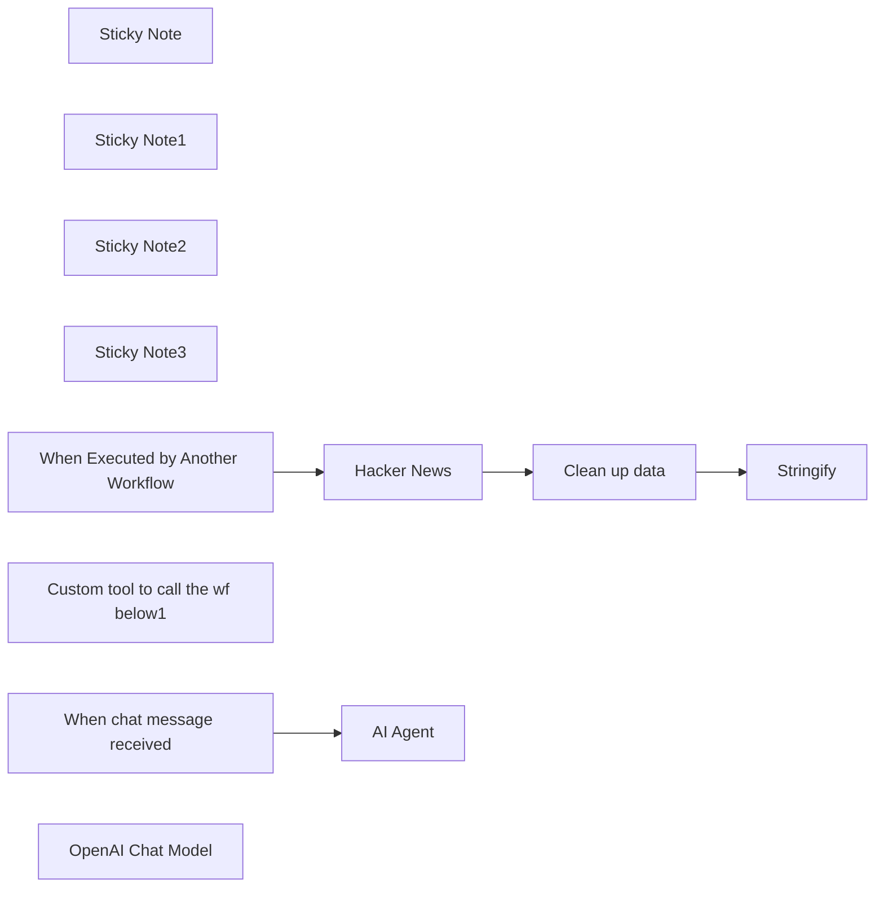

## Fluxo (.json) :

```json
{
  "meta": {
    "instanceId": "408f9fb9940c3cb18ffdef0e0150fe342d6e655c3a9fac21f0f644e8bedabcd9",
    "templateCredsSetupCompleted": true
  },
  "nodes": [
    {
      "id": "b6836974-0d4b-482b-8a8a-c00f229f1136",
      "name": "Sticky Note",
      "type": "n8n-nodes-base.stickyNote",
      "position": [
        100,
        500
      ],
      "parameters": {
        "color": 7,
        "width": 150,
        "height": 293,
        "content": "### Replace me\nwith any other service, e.g. fetching your own data"
      },
      "typeVersion": 1
    },
    {
      "id": "c0b8b657-24b8-4c0b-bfe9-d4fe2075dbe5",
      "name": "Sticky Note1",
      "type": "n8n-nodes-base.stickyNote",
      "position": [
        -180,
        420
      ],
      "parameters": {
        "color": 7,
        "width": 927.5,
        "height": 406.875,
        "content": "### Sub-workflow: Custom tool\nThis can be called by the agent above. This example fetches the top 50 posts ever on Hacker News"
      },
      "typeVersion": 1
    },
    {
      "id": "a1dab7b1-b028-44a2-ab55-d8edee62e261",
      "name": "Sticky Note2",
      "type": "n8n-nodes-base.stickyNote",
      "position": [
        -180,
        -120
      ],
      "parameters": {
        "color": 7,
        "width": 927.5,
        "height": 486.5625,
        "content": "### Main workflow: AI agent using custom tool\nTry it out by clicking 'Chat' and entering 'What is the 5th most popular post ever on Hacker News?'"
      },
      "typeVersion": 1
    },
    {
      "id": "84d91346-6b1d-4808-a6b3-ce212cd122d0",
      "name": "Sticky Note3",
      "type": "n8n-nodes-base.stickyNote",
      "position": [
        -340,
        -20
      ],
      "parameters": {
        "width": 185.9375,
        "height": 218,
        "content": "## Try me out\n\nClick the 'Chat' button and enter:\n\n_What is the 5th most popular post ever on Hacker News?_"
      },
      "typeVersion": 1
    },
    {
      "id": "50c7208d-d2dc-4380-9f81-6d7f4dee40b3",
      "name": "When chat message received",
      "type": "@n8n/n8n-nodes-langchain.chatTrigger",
      "position": [
        -40,
        20
      ],
      "webhookId": "34a31e43-46b8-4c4b-a47e-ef5ad6e66af0",
      "parameters": {
        "options": {}
      },
      "typeVersion": 1.1
    },
    {
      "id": "6170523b-ac2d-4541-9186-0f2932829a36",
      "name": "Custom tool to call the wf below1",
      "type": "@n8n/n8n-nodes-langchain.toolWorkflow",
      "position": [
        480,
        220
      ],
      "parameters": {
        "name": "hn_tool",
        "workflowId": {
          "__rl": true,
          "mode": "id",
          "value": "={{ $workflow.id }}"
        },
        "description": "Returns a list of the most popular posts ever on Hacker News, in json format",
        "workflowInputs": {
          "value": {},
          "schema": [],
          "mappingMode": "defineBelow",
          "matchingColumns": [],
          "attemptToConvertTypes": false,
          "convertFieldsToString": false
        }
      },
      "typeVersion": 2
    },
    {
      "id": "3f40434e-4055-4d8f-be26-051da2911aa1",
      "name": "When Executed by Another Workflow",
      "type": "n8n-nodes-base.executeWorkflowTrigger",
      "position": [
        -120,
        640
      ],
      "parameters": {
        "inputSource": "passthrough"
      },
      "typeVersion": 1.1
    },
    {
      "id": "4a6cf195-6862-4007-b791-d021583a771e",
      "name": "Hacker News",
      "type": "n8n-nodes-base.hackerNews",
      "position": [
        120,
        640
      ],
      "parameters": {
        "limit": 50,
        "resource": "all",
        "additionalFields": {}
      },
      "typeVersion": 1
    },
    {
      "id": "03095e43-0d6e-47c0-8936-dceb2fb0dfb1",
      "name": "Clean up data",
      "type": "n8n-nodes-base.set",
      "position": [
        340,
        640
      ],
      "parameters": {
        "options": {},
        "assignments": {
          "assignments": [
            {
              "id": "171d5a66-fc72-42ab-9f6c-0c137f6b3415",
              "name": "title",
              "type": "string",
              "value": "={{ $json._highlightResult.title.value }}"
            },
            {
              "id": "e6662f7e-8e44-43d6-8e8b-6162bfec34bc",
              "name": "points",
              "type": "string",
              "value": "={{ $json.points }}"
            },
            {
              "id": "7415a9f0-7cd4-4bad-bbcf-1903520af155",
              "name": "url",
              "type": "string",
              "value": "={{ $json.url }}"
            },
            {
              "id": "8b0c67a6-89b0-40de-85f2-b80c9298d81f",
              "name": "created_at",
              "type": "string",
              "value": "={{ $json.created_at }}"
            },
            {
              "id": "b7847fbb-4428-4a5b-980e-08e6069b0ac4",
              "name": "author",
              "type": "string",
              "value": "={{ $json.author }}"
            }
          ]
        }
      },
      "typeVersion": 3.4
    },
    {
      "id": "50ee96c0-36d6-4774-b5cf-b653f5b56868",
      "name": "Stringify",
      "type": "n8n-nodes-base.code",
      "position": [
        560,
        640
      ],
      "parameters": {
        "jsCode": "return {\n  'response': JSON.stringify($input.all().map(x => x.json))\n}"
      },
      "typeVersion": 2
    },
    {
      "id": "ba221fc3-5249-4295-b64e-2c7370c6dad4",
      "name": "AI Agent",
      "type": "@n8n/n8n-nodes-langchain.agent",
      "position": [
        260,
        20
      ],
      "parameters": {
        "options": {}
      },
      "typeVersion": 1.8
    },
    {
      "id": "e8c45847-cc26-47b3-898c-8063b9c4b3a9",
      "name": "OpenAI Chat Model",
      "type": "@n8n/n8n-nodes-langchain.lmChatOpenAi",
      "position": [
        220,
        200
      ],
      "parameters": {
        "model": {
          "__rl": true,
          "mode": "list",
          "value": "gpt-4o-mini"
        },
        "options": {}
      },
      "credentials": {
        "openAiApi": {
          "id": "8gccIjcuf3gvaoEr",
          "name": "OpenAi account"
        }
      },
      "typeVersion": 1.2
    }
  ],
  "pinData": {},
  "connections": {
    "Hacker News": {
      "main": [
        [
          {
            "node": "Clean up data",
            "type": "main",
            "index": 0
          }
        ]
      ]
    },
    "Clean up data": {
      "main": [
        [
          {
            "node": "Stringify",
            "type": "main",
            "index": 0
          }
        ]
      ]
    },
    "OpenAI Chat Model": {
      "ai_languageModel": [
        [
          {
            "node": "AI Agent",
            "type": "ai_languageModel",
            "index": 0
          }
        ]
      ]
    },
    "When chat message received": {
      "main": [
        [
          {
            "node": "AI Agent",
            "type": "main",
            "index": 0
          }
        ]
      ]
    },
    "Custom tool to call the wf below1": {
      "ai_tool": [
        [
          {
            "node": "AI Agent",
            "type": "ai_tool",
            "index": 0
          }
        ]
      ]
    },
    "When Executed by Another Workflow": {
      "main": [
        [
          {
            "node": "Hacker News",
            "type": "main",
            "index": 0
          }
        ]
      ]
    }
  }
}
```

<a id="template-43"></a>

## Template 43 - Importar resumos Hugging Face para Notion

- **Nome:** Importar resumos Hugging Face para Notion
- **Descrição:** Automatiza a coleta diária de papers do Hugging Face, analisa os abstracts com um modelo de linguagem e salva os metadados e análises em uma base de dados do Notion.
- **Funcionalidade:** • Agendamento diário em dias úteis às 08:00: Executa a rotina automaticamente nos dias úteis pela manhã.
• Requisição da lista de papers: Consulta a página de papers do Hugging Face usando a data de ontem para obter novas entradas.
• Extração de URLs dos itens: Faz parsing do HTML da lista e extrai os links dos papers.
• Iteração sobre cada URL: Processa cada paper individualmente em lote.
• Verificação de duplicatas no Notion: Confere se a URL já existe na base antes de prosseguir para evitar registros duplicados.
• Requisição da página de detalhe do paper: Busca o HTML da página específica do paper quando não existe na base.
• Extração de título e abstract: Extrai o título e o resumo do HTML da página do paper.
• Análise do abstract por modelo de linguagem: Envia o abstract para um modelo LLM para extrair introdução, palavras-chave, resultados, detalhes técnicos e classificação em formato JSON.
• Armazenamento estruturado no Notion: Salva URL, título, resumo (limitado), data de coleta e campos extraídos pelo LLM (Classificação, Detalhes Técnicos, Dados e Resultados, Palavras-chave, Introdução Principal).
- **Ferramentas:** • Hugging Face Papers: Fonte pública de papers e abstracts consultada para obter a lista e as páginas de detalhe dos papers.
• OpenAI (modelo GPT-4o): Modelo de linguagem usado para analisar o abstract e gerar um resumo estruturado com keywords, resultados e classificação.
• Notion: Base de dados usada para armazenar os registros dos papers e evitar duplicatas.

## Fluxo visual

```mermaid
flowchart LR
    N1["Schedule Trigger"]
    N2["If"]
    N3["Loop Over Items"]
    N4["Split Out"]
    N5["Request Hugging Face Paper"]
    N6["Extract Hugging Face Paper"]
    N7["Check Paper URL Existed"]
    N8["Request Hugging Face Paper Detail"]
    N9["OpenAI Analysis Abstract"]
    N10["Store Abstract Notion"]
    N11["Extract Hugging Face Paper Abstract"]

    N2 --> N8
    N2 --> N3
    N4 --> N3
    N3 --> N7
    N1 --> N5
    N10 --> N3
    N7 --> N2
    N9 --> N10
    N6 --> N4
    N5 --> N6
    N8 --> N11
    N11 --> N9
```

## Fluxo (.json) :

```json
{
  "id": "FU3MrLkaTHmfdG4n",
  "meta": {
    "instanceId": "3294023dd650d95df294922b9d55d174ef26f4a2e6cce97c8a4ab5f98f5b8c7b",
    "templateCredsSetupCompleted": true
  },
  "name": "Hugging Face  to Notion",
  "tags": [],
  "nodes": [
    {
      "id": "32d5bfee-97f1-4e92-b62e-d09bdd9c3821",
      "name": "Schedule Trigger",
      "type": "n8n-nodes-base.scheduleTrigger",
      "position": [
        -2640,
        -300
      ],
      "parameters": {
        "rule": {
          "interval": [
            {
              "field": "weeks",
              "triggerAtDay": [
                1,
                2,
                3,
                4,
                5
              ],
              "triggerAtHour": 8
            }
          ]
        }
      },
      "typeVersion": 1.2
    },
    {
      "id": "b1f4078e-ac77-47ec-995c-f52fd98fafef",
      "name": "If",
      "type": "n8n-nodes-base.if",
      "position": [
        -1360,
        -280
      ],
      "parameters": {
        "options": {},
        "conditions": {
          "options": {
            "version": 2,
            "leftValue": "",
            "caseSensitive": true,
            "typeValidation": "strict"
          },
          "combinator": "and",
          "conditions": [
            {
              "id": "7094d6db-1fa7-4b59-91cf-6bbd5b5f067e",
              "operator": {
                "type": "object",
                "operation": "empty",
                "singleValue": true
              },
              "leftValue": "={{ $json }}",
              "rightValue": ""
            }
          ]
        }
      },
      "typeVersion": 2.2
    },
    {
      "id": "afac08e1-b629-4467-86ef-907e4a5e8841",
      "name": "Loop Over Items",
      "type": "n8n-nodes-base.splitInBatches",
      "position": [
        -1760,
        -300
      ],
      "parameters": {
        "options": {
          "reset": false
        }
      },
      "typeVersion": 3
    },
    {
      "id": "807ba450-9c89-4f88-aa84-91f43e3adfc6",
      "name": "Split Out",
      "type": "n8n-nodes-base.splitOut",
      "position": [
        -1960,
        -300
      ],
      "parameters": {
        "options": {},
        "fieldToSplitOut": "url, url"
      },
      "typeVersion": 1
    },
    {
      "id": "08dd3f15-2030-48f2-ab0f-f85f797268e1",
      "name": "Request Hugging Face Paper",
      "type": "n8n-nodes-base.httpRequest",
      "position": [
        -2440,
        -300
      ],
      "parameters": {
        "url": "https://huggingface.co/papers",
        "options": {},
        "sendQuery": true,
        "queryParameters": {
          "parameters": [
            {
              "name": "date",
              "value": "={{ $now.minus(1,'days').format('yyyy-MM-dd') }}"
            }
          ]
        }
      },
      "typeVersion": 4.2
    },
    {
      "id": "f37ba769-d881-4aad-927d-ca1f4a68b9a1",
      "name": "Extract Hugging Face Paper",
      "type": "n8n-nodes-base.html",
      "position": [
        -2200,
        -300
      ],
      "parameters": {
        "options": {},
        "operation": "extractHtmlContent",
        "extractionValues": {
          "values": [
            {
              "key": "url",
              "attribute": "href",
              "cssSelector": ".line-clamp-3",
              "returnArray": true,
              "returnValue": "attribute"
            }
          ]
        }
      },
      "typeVersion": 1.2
    },
    {
      "id": "94ba99bf-a33b-4311-a4e6-86490e1bb9ad",
      "name": "Check Paper URL Existed",
      "type": "n8n-nodes-base.notion",
      "position": [
        -1540,
        -280
      ],
      "parameters": {
        "filters": {
          "conditions": [
            {
              "key": "URL|url",
              "urlValue": "={{ 'https://huggingface.co'+$json.url }}",
              "condition": "equals"
            }
          ]
        },
        "options": {},
        "resource": "databasePage",
        "operation": "getAll",
        "databaseId": {
          "__rl": true,
          "mode": "list",
          "value": "17b67aba-1fcc-80ae-baa1-d88ffda7ae83",
          "cachedResultUrl": "https://www.notion.so/17b67aba1fcc80aebaa1d88ffda7ae83",
          "cachedResultName": "huggingface-abstract"
        },
        "filterType": "manual"
      },
      "credentials": {
        "notionApi": {
          "id": "I5KdUzwhWnphQ862",
          "name": "notion"
        }
      },
      "typeVersion": 2.2,
      "alwaysOutputData": true
    },
    {
      "id": "ece8dee2-e444-4557-aad9-5bdcb5ecd756",
      "name": "Request Hugging Face Paper Detail",
      "type": "n8n-nodes-base.httpRequest",
      "position": [
        -1080,
        -300
      ],
      "parameters": {
        "url": "={{ 'https://huggingface.co'+$('Split Out').item.json.url }}",
        "options": {}
      },
      "typeVersion": 4.2
    },
    {
      "id": "53b266fe-e7c4-4820-92eb-78a6ba7a6430",
      "name": "OpenAI Analysis Abstract",
      "type": "@n8n/n8n-nodes-langchain.openAi",
      "position": [
        -640,
        -300
      ],
      "parameters": {
        "modelId": {
          "__rl": true,
          "mode": "list",
          "value": "gpt-4o-2024-11-20",
          "cachedResultName": "GPT-4O-2024-11-20"
        },
        "options": {},
        "messages": {
          "values": [
            {
              "role": "system",
              "content": "Extract the following key details from the paper abstract:\n\nCore Introduction: Summarize the main contributions and objectives of the paper, highlighting its innovations and significance.\nKeyword Extraction: List 2-5 keywords that best represent the research direction and techniques of the paper.\nKey Data and Results: Extract important performance metrics, comparison results, and the paper's advantages over other studies.\nTechnical Details: Provide a brief overview of the methods, optimization techniques, and datasets mentioned in the paper.\nClassification: Assign an appropriate academic classification based on the content of the paper.\n\n\nOutput as json：\n{\n  \"Core_Introduction\": \"PaSa is an advanced Paper Search agent powered by large language models that can autonomously perform a series of decisions (including invoking search tools, reading papers, and selecting relevant references) to provide comprehensive and accurate results for complex academic queries.\",\n  \"Keywords\": [\n    \"Paper Search Agent\",\n    \"Large Language Models\",\n    \"Reinforcement Learning\",\n    \"Academic Queries\",\n    \"Performance Benchmarking\"\n  ],\n  \"Data_and_Results\": \"PaSa outperforms existing baselines (such as Google, GPT-4, chatGPT) in tests using AutoScholarQuery (35k academic queries) and RealScholarQuery (real-world academic queries). For example, PaSa-7B exceeds Google with GPT-4o by 37.78% in recall@20 and 39.90% in recall@50.\",\n  \"Technical_Details\": \"PaSa is optimized using reinforcement learning with the AutoScholarQuery synthetic dataset, demonstrating superior performance in multiple benchmarks.\",\n  \"Classification\": [\n    \"Artificial Intelligence (AI)\",\n    \"Academic Search and Information Retrieval\",\n    \"Natural Language Processing (NLP)\",\n    \"Reinforcement Learning\"\n  ]\n}\n```"
            },
            {
              "content": "={{ $json.abstract }}"
            }
          ]
        },
        "jsonOutput": true
      },
      "credentials": {
        "openAiApi": {
          "id": "LmLcxHwbzZNWxqY6",
          "name": "Unnamed credential"
        }
      },
      "typeVersion": 1.8
    },
    {
      "id": "f491cd7f-598e-46fd-b80c-04cfa9766dfd",
      "name": "Store Abstract Notion",
      "type": "n8n-nodes-base.notion",
      "position": [
        -300,
        -300
      ],
      "parameters": {
        "options": {},
        "resource": "databasePage",
        "databaseId": {
          "__rl": true,
          "mode": "list",
          "value": "17b67aba-1fcc-80ae-baa1-d88ffda7ae83",
          "cachedResultUrl": "https://www.notion.so/17b67aba1fcc80aebaa1d88ffda7ae83",
          "cachedResultName": "huggingface-abstract"
        },
        "propertiesUi": {
          "propertyValues": [
            {
              "key": "URL|url",
              "urlValue": "={{ 'https://huggingface.co'+$('Split Out').item.json.url }}"
            },
            {
              "key": "title|title",
              "title": "={{ $('Extract Hugging Face Paper Abstract').item.json.title }}"
            },
            {
              "key": "abstract|rich_text",
              "textContent": "={{ $('Extract Hugging Face Paper Abstract').item.json.abstract.substring(0,2000) }}"
            },
            {
              "key": "scrap-date|date",
              "date": "={{  $today.format('yyyy-MM-dd')  }}",
              "includeTime": false
            },
            {
              "key": "Classification|rich_text",
              "textContent": "={{ $json.message.content.Classification.join(',') }}"
            },
            {
              "key": "Technical_Details|rich_text",
              "textContent": "={{ $json.message.content.Technical_Details }}"
            },
            {
              "key": "Data_and_Results|rich_text",
              "textContent": "={{ $json.message.content.Data_and_Results }}"
            },
            {
              "key": "keywords|rich_text",
              "textContent": "={{ $json.message.content.Keywords.join(',') }}"
            },
            {
              "key": "Core Introduction|rich_text",
              "textContent": "={{ $json.message.content.Core_Introduction }}"
            }
          ]
        }
      },
      "credentials": {
        "notionApi": {
          "id": "I5KdUzwhWnphQ862",
          "name": "notion"
        }
      },
      "typeVersion": 2.2
    },
    {
      "id": "d5816a1c-d1fa-4be2-8088-57fbf68e6b43",
      "name": "Extract Hugging Face Paper Abstract",
      "type": "n8n-nodes-base.html",
      "position": [
        -840,
        -300
      ],
      "parameters": {
        "options": {},
        "operation": "extractHtmlContent",
        "extractionValues": {
          "values": [
            {
              "key": "abstract",
              "cssSelector": ".text-gray-700"
            },
            {
              "key": "title",
              "cssSelector": ".text-2xl"
            }
          ]
        }
      },
      "typeVersion": 1.2
    }
  ],
  "active": true,
  "pinData": {},
  "settings": {
    "executionOrder": "v1"
  },
  "versionId": "4b0ec2a3-253d-46d5-a4d4-1d9ff21ba4a3",
  "connections": {
    "If": {
      "main": [
        [
          {
            "node": "Request Hugging Face Paper Detail",
            "type": "main",
            "index": 0
          }
        ],
        [
          {
            "node": "Loop Over Items",
            "type": "main",
            "index": 0
          }
        ]
      ]
    },
    "Split Out": {
      "main": [
        [
          {
            "node": "Loop Over Items",
            "type": "main",
            "index": 0
          }
        ]
      ]
    },
    "Loop Over Items": {
      "main": [
        [],
        [
          {
            "node": "Check Paper URL Existed",
            "type": "main",
            "index": 0
          }
        ]
      ]
    },
    "Schedule Trigger": {
      "main": [
        [
          {
            "node": "Request Hugging Face Paper",
            "type": "main",
            "index": 0
          }
        ]
      ]
    },
    "Store Abstract Notion": {
      "main": [
        [
          {
            "node": "Loop Over Items",
            "type": "main",
            "index": 0
          }
        ]
      ]
    },
    "Check Paper URL Existed": {
      "main": [
        [
          {
            "node": "If",
            "type": "main",
            "index": 0
          }
        ]
      ]
    },
    "OpenAI Analysis Abstract": {
      "main": [
        [
          {
            "node": "Store Abstract Notion",
            "type": "main",
            "index": 0
          }
        ]
      ]
    },
    "Extract Hugging Face Paper": {
      "main": [
        [
          {
            "node": "Split Out",
            "type": "main",
            "index": 0
          }
        ]
      ]
    },
    "Request Hugging Face Paper": {
      "main": [
        [
          {
            "node": "Extract Hugging Face Paper",
            "type": "main",
            "index": 0
          }
        ]
      ]
    },
    "Request Hugging Face Paper Detail": {
      "main": [
        [
          {
            "node": "Extract Hugging Face Paper Abstract",
            "type": "main",
            "index": 0
          }
        ]
      ]
    },
    "Extract Hugging Face Paper Abstract": {
      "main": [
        [
          {
            "node": "OpenAI Analysis Abstract",
            "type": "main",
            "index": 0
          }
        ]
      ]
    }
  }
}
```

<a id="template-44"></a>

## Template 44 - Pesquisa com Perplexity Sonar

- **Nome:** Pesquisa com Perplexity Sonar
- **Descrição:** Recebe uma consulta de outro fluxo, formata um prompt com instruções de sistema e usuário, envia à API do Perplexity (modelo Sonar) e extrai a resposta gerada.
- **Funcionalidade:** • Gatilho por outro fluxo: inicia a execução quando chamado por outro fluxo.
• Preparação de variáveis de prompt: define mensagens de sistema e usuário dinamicamente a partir da entrada recebida.
• Envio de requisição ao Perplexity Sonar: realiza uma chamada POST ao endpoint de completions com parâmetros de geração (max_tokens, temperature, top_p, presence/frequency penalties, etc.).
• Aplicação de filtros de busca: aplica filtro de domínio (perplexity.ai) e filtro de recência (mês) para refinar resultados.
• Retorno de citações e controle de saída: solicita retorno de citações e configura opções como retorno de imagens e perguntas relacionadas.
• Extração da resposta: captura o conteúdo da primeira escolha da resposta (choices[0].message.content) para uso posterior.
- **Ferramentas:** • Perplexity AI (modelo Sonar): serviço de pesquisa e geração de texto usado para responder à consulta, com suporte a citações, filtros de domínio e recência.

## Fluxo visual

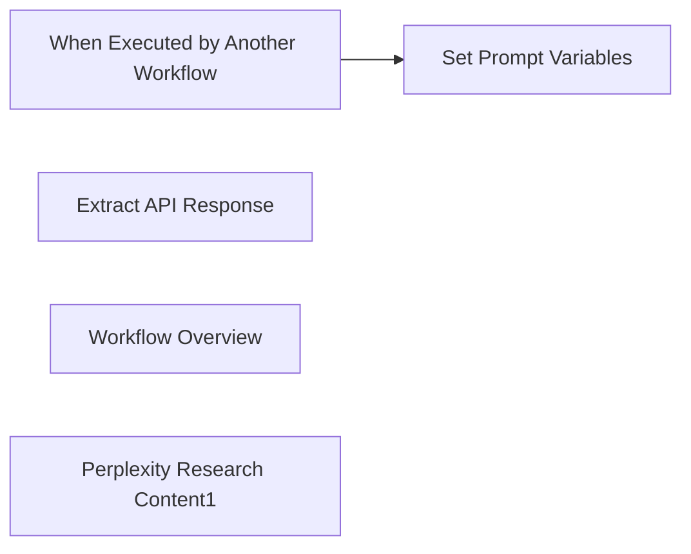

## Fluxo (.json) :

```json
{
  "id": "5uapJIjLLhwnhX0n",
  "meta": {
    "instanceId": "2b69b24ad1a51b447e1a0d6f8c70b16aca715ccfaf123eb531f92865766fce1c",
    "templateCredsSetupCompleted": true
  },
  "name": "Perplexity Researcher",
  "tags": [],
  "nodes": [
    {
      "id": "5790066d-4157-4844-aeaa-47706140ed7a",
      "name": "When Executed by Another Workflow",
      "type": "n8n-nodes-base.executeWorkflowTrigger",
      "notes": "Find the latest content related to the field/knowledge you are interested in.\nIn-depth materials to prepare for the writing section",
      "position": [
        -60,
        -380
      ],
      "parameters": {
        "inputSource": "passthrough"
      },
      "typeVersion": 1.1
    },
    {
      "id": "311eb2bf-3b79-46cf-abb1-9d90791167c3",
      "name": "Set Prompt Variables",
      "type": "n8n-nodes-base.set",
      "position": [
        220,
        -380
      ],
      "parameters": {
        "options": {},
        "assignments": {
          "assignments": [
            {
              "id": "bab0ccff-a856-49d5-833b-80e65874475e",
              "name": "System",
              "type": "string",
              "value": "Assisstant is a language model. Assistant is designed to be able to assist with a wide range of task, form answering simple question to providing in-depth explanations and discussions on a wide range of topics.  As a language model, assistant is able to generate human-like text based on the imput it receives, allowing it to engage in natural-sounding evoling.  It’s able to process and understand large amounts of text,  and can use this knowledge to provide accurate and informative responses to a wide range of question. Additionally, Assistant is able to generate its own text based on the imput it receives, allowing it to engage in discussions and provide explanations and description on a wide range of topics. Overall, Assistant is a powerfull system that can help with a wide range of task and provide valuable insights and information on a wide range of topics. What you need help with a specific question or just want to have a conversation about a particular topic, Assistant is here to assist"
            },
            {
              "id": "1a6d7638-e2a4-495c-92d4-e0626b676b18",
              "name": "User",
              "type": "string",
              "value": "={{ $json.query }}"
            }
          ]
        }
      },
      "typeVersion": 3.4
    },
    {
      "id": "4385053f-c9c8-4aae-b0d2-4cf7a7817164",
      "name": "Extract API Response",
      "type": "n8n-nodes-base.set",
      "position": [
        620,
        -380
      ],
      "parameters": {
        "options": {},
        "assignments": {
          "assignments": [
            {
              "id": "c5869f36-70cb-439a-8ad0-0382b37f9798",
              "name": "Respone Message Content",
              "type": "string",
              "value": "={{ $json.choices[0].message.content }}"
            }
          ]
        }
      },
      "typeVersion": 3.4
    },
    {
      "id": "b8e3f54b-5148-4e04-a8b1-e3003a0ee128",
      "name": "Workflow Overview",
      "type": "n8n-nodes-base.stickyNote",
      "position": [
        -160,
        -480
      ],
      "parameters": {
        "width": 1080,
        "height": 300,
        "content": "## Perplexity Research Workflow Overview\nThis workflow takes a user query, formats it using a system prompt, and sends it to the Perplexity AI Sonar model for search.\nResponses are extracted and returned as clean output."
      },
      "typeVersion": 1
    },
    {
      "id": "7b77de3d-279a-4c33-b4c1-a796ab94a7fa",
      "name": "Perplexity Research Content1",
      "type": "n8n-nodes-base.httpRequest",
      "position": [
        420,
        -380
      ],
      "parameters": {
        "url": "https://api.perplexity.ai/chat/completions",
        "method": "POST",
        "options": {},
        "jsonBody": "={\n  \"model\": \"sonar\",\n  \"messages\": [\n    {\n      \"role\": \"system\",\n      \"content\": \"{{ $json.System }}\"\n    },\n    {\n      \"role\": \"user\",\n      \"content\": \"{{ $json.User || $json.query || $json.question || $json['Research Query'] || 'No input provided' }}\"\n    }\n  ],\n  \"max_tokens\": 4000,\n  \"temperature\": 0.2,\n  \"top_p\": 0.9,\n  \"return_citations\": true,\n  \"search_domain_filter\": [\n    \"perplexity.ai\"\n  ],\n  \"return_images\": false,\n  \"return_related_questions\": false,\n  \"search_recency_filter\": \"month\",\n  \"top_k\": 0,\n  \"stream\": false,\n  \"presence_penalty\": 0,\n  \"frequency_penalty\": 1\n}\n\n",
        "sendBody": true,
        "specifyBody": "json",
        "authentication": "genericCredentialType",
        "genericAuthType": "httpHeaderAuth"
      },
      "credentials": {
        "httpHeaderAuth": {
          "id": "XTRc36olCHOn9XQP",
          "name": "Header Auth account 2"
        }
      },
      "notesInFlow": false,
      "typeVersion": 4.2
    }
  ],
  "active": false,
  "pinData": {},
  "settings": {
    "executionOrder": "v1"
  },
  "versionId": "d506eade-acc3-40ed-9dfc-909cdf373969",
  "connections": {
    "When Executed by Another Workflow": {
      "main": [
        [
          {
            "node": "Set Prompt Variables",
            "type": "main",
            "index": 0
          }
        ]
      ]
    }
  }
}
```

<a id="template-45"></a>

## Template 45 - Consulta de pessoa por e-mail (Clearbit)

- **Nome:** Consulta de pessoa por e-mail (Clearbit)
- **Descrição:** Realiza uma busca de dados de uma pessoa a partir do endereço de e-mail utilizando a API do Clearbit, iniciada manualmente.
- **Funcionalidade:** • Disparo manual: inicia a execução do fluxo ao clicar em 'execute'.
• Consulta por e-mail: envia um endereço de e-mail para obter informações detalhadas sobre a pessoa.
• Suporte a campos adicionais: permite incluir parâmetros extras na requisição para ajustar a resposta.
• Autenticação via credenciais: usa credenciais da API para autenticar as chamadas ao serviço.
- **Ferramentas:** • Clearbit: serviço de enriquecimento de dados que retorna informações pessoais e profissionais a partir de um endereço de e-mail.

## Fluxo visual

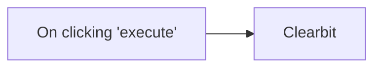

## Fluxo (.json) :

```json
{
  "id": "104",
  "name": "Look up a person using their email in Clearbit",
  "nodes": [
    {
      "name": "On clicking 'execute'",
      "type": "n8n-nodes-base.manualTrigger",
      "position": [
        250,
        300
      ],
      "parameters": {},
      "typeVersion": 1
    },
    {
      "name": "Clearbit",
      "type": "n8n-nodes-base.clearbit",
      "position": [
        450,
        300
      ],
      "parameters": {
        "email": "",
        "resource": "person",
        "additionalFields": {}
      },
      "credentials": {
        "clearbitApi": ""
      },
      "typeVersion": 1
    }
  ],
  "active": false,
  "settings": {},
  "connections": {
    "On clicking 'execute'": {
      "main": [
        [
          {
            "node": "Clearbit",
            "type": "main",
            "index": 0
          }
        ]
      ]
    }
  }
}
```

<a id="template-46"></a>

## Template 46 - Criar, publicar e recuperar post no Ghost

- **Nome:** Criar, publicar e recuperar post no Ghost
- **Descrição:** Automatiza a criação de uma nova postagem, sua publicação e a recuperação dos dados da postagem no Ghost.
- **Funcionalidade:** • Gatilho manual: Permite iniciar a execução do fluxo manualmente.
• Criar postagem: Cria uma nova postagem no Ghost com título e conteúdo fornecidos.
• Atualizar postagem: Atualiza a postagem criada alterando seu status para 'published'.
• Recuperar postagem: Obtém os dados da postagem recém-criada utilizando o ID retornado.
- **Ferramentas:** • Ghost Admin API: API administrativa do Ghost utilizada para criar, atualizar e recuperar posts no site.

## Fluxo visual

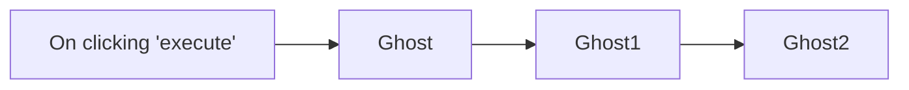

## Fluxo (.json) :

```json
{
  "id": "170",
  "name": "Create, update, and get a post in Ghost",
  "nodes": [
    {
      "name": "On clicking 'execute'",
      "type": "n8n-nodes-base.manualTrigger",
      "position": [
        310,
        300
      ],
      "parameters": {},
      "typeVersion": 1
    },
    {
      "name": "Ghost",
      "type": "n8n-nodes-base.ghost",
      "position": [
        510,
        300
      ],
      "parameters": {
        "title": "Running ghost with n8n!",
        "source": "adminApi",
        "content": "<p>In this article, you will learn how to automate your Ghost site with n8n!</p>",
        "operation": "create",
        "additionalFields": {}
      },
      "credentials": {
        "ghostAdminApi": "Ghost Admin API"
      },
      "typeVersion": 1
    },
    {
      "name": "Ghost1",
      "type": "n8n-nodes-base.ghost",
      "position": [
        710,
        300
      ],
      "parameters": {
        "postId": "={{$node[\"Ghost\"].json[\"id\"]}}",
        "source": "adminApi",
        "operation": "update",
        "updateFields": {
          "status": "published"
        }
      },
      "credentials": {
        "ghostAdminApi": "Ghost Admin API"
      },
      "typeVersion": 1
    },
    {
      "name": "Ghost2",
      "type": "n8n-nodes-base.ghost",
      "position": [
        910,
        300
      ],
      "parameters": {
        "by": "id",
        "source": "adminApi",
        "options": {},
        "identifier": "={{$node[\"Ghost\"].json[\"id\"]}}"
      },
      "credentials": {
        "ghostAdminApi": "Ghost Admin API"
      },
      "typeVersion": 1
    }
  ],
  "active": false,
  "settings": {},
  "connections": {
    "Ghost": {
      "main": [
        [
          {
            "node": "Ghost1",
            "type": "main",
            "index": 0
          }
        ]
      ]
    },
    "Ghost1": {
      "main": [
        [
          {
            "node": "Ghost2",
            "type": "main",
            "index": 0
          }
        ]
      ]
    },
    "On clicking 'execute'": {
      "main": [
        [
          {
            "node": "Ghost",
            "type": "main",
            "index": 0
          }
        ]
      ]
    }
  }
}
```

<a id="template-47"></a>

## Template 47 - Extrator de esquemas de API

- **Nome:** Extrator de esquemas de API
- **Descrição:** Automatiza a descoberta, raspagem e extração de operações de APIs públicas a partir de sites, organiza os dados extraídos e gera esquemas consolidados em arquivo.
- **Funcionalidade:** • Coleta de serviços pendentes: Recupera uma lista de serviços a processar a partir de uma planilha de controle.
• Busca por documentação de API: Executa buscas na web para localizar páginas que contenham documentação ou referências de API.
• Raspagem de páginas web: Lê o conteúdo das páginas encontradas, remove elementos irrelevantes e extrai texto e metadados.
• Filtragem e deduplicação: Filtra resultados irrelevantes (por tipo) e remove links duplicados antes de prosseguir.
• Armazenamento de documentos e embeddings: Chunking de conteúdo grande, geração de embeddings e gravação de documentos vetoriais com metadados em um banco vetorial.
• Identificação de produtos/soluções: Usa modelos de linguagem para identificar produtos ou soluções relevantes de um serviço a partir dos documentos coletados.
• Busca contextual em documentos relevantes: Realiza buscas semânticas no banco vetorial para recuperar os documentos mais ligados a uma consulta específica.
• Extração de operações de API: Usa modelo de linguagem para extrair endpoints REST, métodos, descrições e URLs de documentação, aplicando limites e formato consistente.
• Deduplicação e validação de operações: Agrupa e remove operações duplicadas por método e URL; valida existência antes de salvar.
• Armazenamento e rastreamento de progresso: Grava operações extraídas em uma planilha, atualiza estados (pending/ok/error) para cada etapa e linha.
• Geração de esquema consolidado: Combina operações por recurso em um esquema JSON customizado e formata descrições e metadados.
• Upload e distribuição: Salva o arquivo JSON gerado em armazenamento de arquivos e atualiza a planilha com o resultado.
• Controle de execução e tolerância a erros: Suporta execução em lotes, esperas, tratamento de erros e caminhos alternativos para registros com falha.
- **Ferramentas:** • Google Sheets: Planilha usada como base de dados de input, controle de estado e armazenamento das operações extraídas.
• Google Drive: Armazenamento de arquivos para upload dos esquemas JSON gerados.
• Google Gemini (modelos de linguagem e embeddings): Usado para classificação de conteúdo, extração de informações e geração de embeddings de texto.
• Qdrant: Banco vetorial utilizado para armazenar embeddings e permitir buscas semânticas por documentos relevantes.
• Apify: Serviços de scraping e atores para realizar buscas na web e extrair o conteúdo das páginas encontradas.

## Fluxo visual

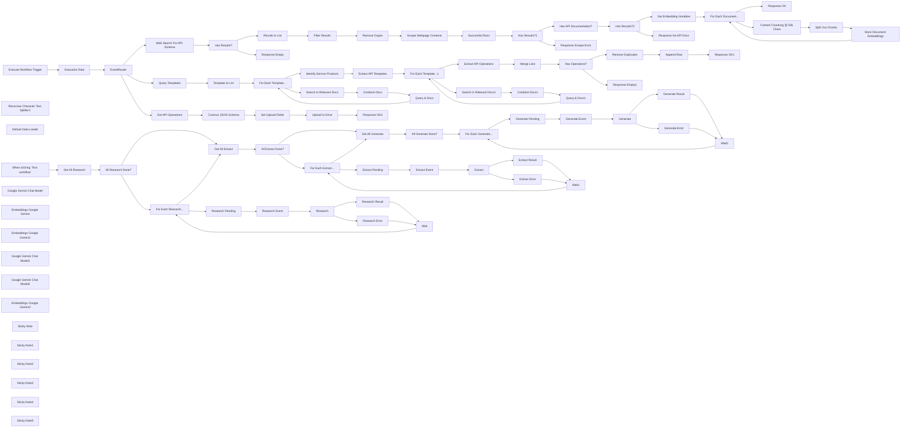

## Fluxo (.json) :

```json
{
  "nodes": [
    {
      "id": "2498bb93-176f-458c-acee-f541859df770",
      "name": "When clicking ‘Test workflow’",
      "type": "n8n-nodes-base.manualTrigger",
      "position": [
        2460,
        2820
      ],
      "parameters": {},
      "typeVersion": 1
    },
    {
      "id": "c08bcf84-9336-44f9-b452-0c9469f18f48",
      "name": "Web Search For API Schema",
      "type": "n8n-nodes-base.httpRequest",
      "onError": "continueRegularOutput",
      "position": [
        3100,
        3820
      ],
      "parameters": {
        "url": "https://api.apify.com/v2/acts/serping~fast-google-search-results-scraper/run-sync-get-dataset-items",
        "method": "POST",
        "options": {},
        "sendBody": true,
        "authentication": "genericCredentialType",
        "bodyParameters": {
          "parameters": [
            {
              "name": "searchTerms",
              "value": "={{\n[\n `site:${$json.data.url.replace(/^http[s]:///, '').replace(//$/, '').replace('www.', '')} \"${$json.data.service}\" api developer (intext:reference OR intext:resource) (-inurl:support OR -inurl:help) (inurl:api OR intitle:api) -filetype:pdf`\n]\n}}"
            },
            {
              "name": "resultsPerPage",
              "value": "={{ 10 }}"
            }
          ]
        },
        "genericAuthType": "httpHeaderAuth"
      },
      "typeVersion": 4.2
    },
    {
      "id": "d5b19e3a-acd0-4b06-8d77-42de1f797dba",
      "name": "Scrape Webpage Contents",
      "type": "n8n-nodes-base.httpRequest",
      "position": [
        3940,
        3720
      ],
      "parameters": {
        "url": "https://api.apify.com/v2/acts/apify~web-scraper/run-sync-get-dataset-items",
        "options": {
          "batching": {
            "batch": {
              "batchSize": 2,
              "batchInterval": 30000
            }
          }
        },
        "jsonBody": "={\n \"startUrls\": [\n {\n \"url\": \"{{ $json.source.link }}\",\n \"method\": \"GET\"\n }\n ],\n \"breakpointLocation\": \"NONE\",\n \"browserLog\": false,\n \"closeCookieModals\": false,\n \"debugLog\": false,\n \"downloadCss\": false,\n \"downloadMedia\": false,\n \"excludes\": [\n {\n \"glob\": \"/**/*.{png,jpg,jpeg,pdf}\"\n }\n ],\n \"headless\": true,\n \"ignoreCorsAndCsp\": false,\n \"ignoreSslErrors\": false,\n \n \"injectJQuery\": true,\n \"keepUrlFragments\": false,\n \"linkSelector\": \"a[href]\",\n \"maxCrawlingDepth\": 1,\n \"maxPagesPerCrawl\": 1,\n \"maxRequestRetries\": 1,\n \"maxResultsPerCrawl\": 1,\n \"pageFunction\": \"// The function accepts a single argument: the \\\"context\\\" object.\\n// For a complete list of its properties and functions,\\n// see https://apify.com/apify/web-scraper#page-function \\nasync function pageFunction(context) {\\n\\n await new Promise(res => { setTimeout(res, 6000) });\\n // This statement works as a breakpoint when you're trying to debug your code. Works only with Run mode: DEVELOPMENT!\\n // debugger; \\n\\n // jQuery is handy for finding DOM elements and extracting data from them.\\n // To use it, make sure to enable the \\\"Inject jQuery\\\" option.\\n const $ = context.jQuery;\\n const title = $('title').first().text();\\n\\n // Clone the body to avoid modifying the original content\\n const bodyClone = $('body').clone();\\n bodyClone.find('iframe, img, script, style, object, embed, noscript, svg, video, audio').remove();\\n const body = bodyClone.html();\\n\\n // Return an object with the data extracted from the page.\\n // It will be stored to the resulting dataset.\\n return {\\n url: context.request.url,\\n title,\\n body\\n };\\n}\",\n \"postNavigationHooks\": \"// We need to return array of (possibly async) functions here.\\n// The functions accept a single argument: the \\\"crawlingContext\\\" object.\\n[\\n async (crawlingContext) => {\\n // ...\\n },\\n]\",\n \"preNavigationHooks\": \"// We need to return array of (possibly async) functions here.\\n// The functions accept two arguments: the \\\"crawlingContext\\\" object\\n// and \\\"gotoOptions\\\".\\n[\\n async (crawlingContext, gotoOptions) => {\\n // ...\\n },\\n]\\n\",\n \"proxyConfiguration\": {\n \"useApifyProxy\": true\n },\n \"runMode\": \"PRODUCTION\",\n \n \"useChrome\": false,\n \"waitUntil\": [\n \"domcontentloaded\"\n ],\n \"globs\": [],\n \"pseudoUrls\": [],\n \"proxyRotation\": \"RECOMMENDED\",\n \"maxConcurrency\": 50,\n \"pageLoadTimeoutSecs\": 60,\n \"pageFunctionTimeoutSecs\": 60,\n \"maxScrollHeightPixels\": 5000,\n \"customData\": {}\n}",
        "sendBody": true,
        "sendQuery": true,
        "specifyBody": "json",
        "authentication": "genericCredentialType",
        "genericAuthType": "httpQueryAuth",
        "queryParameters": {
          "parameters": [
            {
              "name": "memory",
              "value": "2048"
            }
          ]
        }
      },
      "typeVersion": 4.2
    },
    {
      "id": "5853ba7e-4068-4792-be5c-b8cf81ee89cb",
      "name": "Results to List",
      "type": "n8n-nodes-base.splitOut",
      "position": [
        3460,
        3720
      ],
      "parameters": {
        "options": {},
        "fieldToSplitOut": "origin_search.results"
      },
      "typeVersion": 1
    },
    {
      "id": "8ed2e8ec-b2e3-474b-b19d-f38b518f274b",
      "name": "Recursive Character Text Splitter1",
      "type": "@n8n/n8n-nodes-langchain.textSplitterRecursiveCharacterTextSplitter",
      "position": [
        5800,
        4020
      ],
      "parameters": {
        "options": {},
        "chunkSize": 4000
      },
      "typeVersion": 1
    },
    {
      "id": "e2a8137b-7da3-4032-bca2-c14465356f02",
      "name": "Content Chunking @ 50k Chars",
      "type": "n8n-nodes-base.set",
      "position": [
        5380,
        3740
      ],
      "parameters": {
        "options": {},
        "assignments": {
          "assignments": [
            {
              "id": "7753a4f4-3ec2-4c05-81df-3d5e8979a478",
              "name": "=data",
              "type": "array",
              "value": "={{ new Array(Math.round($json.content.length / Math.min($json.content.length, 50000))).fill('').map((_,idx) => $json.content.substring(idx * 50000, idx * 50000 + 50000)) }}"
            },
            {
              "id": "7973bcb4-f239-4619-85fc-c76e20386375",
              "name": "service",
              "type": "string",
              "value": "={{ $json.service }}"
            },
            {
              "id": "b46e44bc-ad01-4cf0-8b07-25eeb1fb5874",
              "name": "url",
              "type": "string",
              "value": "={{ $json.url }}"
            }
          ]
        }
      },
      "typeVersion": 3.3
    },
    {
      "id": "6ef5866a-d992-4472-9221-27efbec8e7be",
      "name": "Split Out Chunks",
      "type": "n8n-nodes-base.splitOut",
      "position": [
        5540,
        3740
      ],
      "parameters": {
        "include": "allOtherFields",
        "options": {},
        "fieldToSplitOut": "data"
      },
      "typeVersion": 1
    },
    {
      "id": "5e43b4d8-cebf-43ed-866d-0b4cb2997853",
      "name": "Default Data Loader",
      "type": "@n8n/n8n-nodes-langchain.documentDefaultDataLoader",
      "position": [
        5800,
        3900
      ],
      "parameters": {
        "options": {
          "metadata": {
            "metadataValues": [
              {
                "name": "service",
                "value": "={{ $json.service }}"
              },
              {
                "name": "url",
                "value": "={{ $json.url }}"
              }
            ]
          }
        },
        "jsonData": "={{ $json.data }}",
        "jsonMode": "expressionData"
      },
      "typeVersion": 1
    },
    {
      "id": "d4b34767-be50-44ee-b778-18842034c276",
      "name": "Set Embedding Variables",
      "type": "n8n-nodes-base.set",
      "position": [
        4980,
        3580
      ],
      "parameters": {
        "options": {},
        "assignments": {
          "assignments": [
            {
              "id": "4008ae44-7998-4a6f-88c9-686f8b02e92b",
              "name": "content",
              "type": "string",
              "value": "={{ $json.body }}"
            },
            {
              "id": "f7381ac6-ef40-463c-ad2b-df2c31d3e828",
              "name": "service",
              "type": "string",
              "value": "={{ $('EventRouter').first().json.data.service }}"
            },
            {
              "id": "7eae99fd-75c7-4974-a128-641b8ada0cc2",
              "name": "url",
              "type": "string",
              "value": "={{ $json.url }}"
            }
          ]
        }
      },
      "typeVersion": 3.4
    },
    {
      "id": "109b6c3a-9b16-40cc-9186-5045df387b52",
      "name": "Execute Workflow Trigger",
      "type": "n8n-nodes-base.executeWorkflowTrigger",
      "position": [
        2420,
        4200
      ],
      "parameters": {},
      "typeVersion": 1
    },
    {
      "id": "31556ff2-6358-4bd4-8ec4-2797d993256e",
      "name": "Execution Data",
      "type": "n8n-nodes-base.executionData",
      "position": [
        2620,
        4200
      ],
      "parameters": {
        "dataToSave": {
          "values": [
            {
              "key": "eventType",
              "value": "={{ $json.eventType }}"
            },
            {
              "key": "executedById",
              "value": "={{ $json.executedById }}"
            },
            {
              "key": "service",
              "value": "={{ $json.data.service }}"
            }
          ]
        }
      },
      "typeVersion": 1
    },
    {
      "id": "b65b3d4d-f667-4f8f-a06f-847c3d7b83e0",
      "name": "EventRouter",
      "type": "n8n-nodes-base.switch",
      "position": [
        2800,
        4200
      ],
      "parameters": {
        "rules": {
          "values": [
            {
              "outputKey": "research",
              "conditions": {
                "options": {
                  "version": 2,
                  "leftValue": "",
                  "caseSensitive": true,
                  "typeValidation": "strict"
                },
                "combinator": "and",
                "conditions": [
                  {
                    "operator": {
                      "type": "string",
                      "operation": "equals"
                    },
                    "leftValue": "={{ $json.eventType }}",
                    "rightValue": "research"
                  }
                ]
              },
              "renameOutput": true
            },
            {
              "outputKey": "extraction",
              "conditions": {
                "options": {
                  "version": 2,
                  "leftValue": "",
                  "caseSensitive": true,
                  "typeValidation": "strict"
                },
                "combinator": "and",
                "conditions": [
                  {
                    "id": "5418515e-ef6a-42e0-aeb9-8d0d35b898ca",
                    "operator": {
                      "name": "filter.operator.equals",
                      "type": "string",
                      "operation": "equals"
                    },
                    "leftValue": "={{ $json.eventType }}",
                    "rightValue": "extract"
                  }
                ]
              },
              "renameOutput": true
            },
            {
              "outputKey": "generate",
              "conditions": {
                "options": {
                  "version": 2,
                  "leftValue": "",
                  "caseSensitive": true,
                  "typeValidation": "strict"
                },
                "combinator": "and",
                "conditions": [
                  {
                    "id": "0135165e-d211-44f3-92a4-a91858a57d99",
                    "operator": {
                      "name": "filter.operator.equals",
                      "type": "string",
                      "operation": "equals"
                    },
                    "leftValue": "={{ $json.eventType }}",
                    "rightValue": "generate"
                  }
                ]
              },
              "renameOutput": true
            }
          ]
        },
        "options": {}
      },
      "typeVersion": 3.2
    },
    {
      "id": "541f7d9b-c8ff-44dc-8618-8550dbf0b951",
      "name": "Google Gemini Chat Model",
      "type": "@n8n/n8n-nodes-langchain.lmChatGoogleGemini",
      "position": [
        4460,
        3740
      ],
      "parameters": {
        "options": {},
        "modelName": "models/gemini-1.5-flash-latest"
      },
      "typeVersion": 1
    },
    {
      "id": "617d6139-8417-4ecb-8f7c-558cd1c38ac3",
      "name": "Successful Runs",
      "type": "n8n-nodes-base.filter",
      "position": [
        4100,
        3720
      ],
      "parameters": {
        "options": {},
        "conditions": {
          "options": {
            "version": 2,
            "leftValue": "",
            "caseSensitive": true,
            "typeValidation": "strict"
          },
          "combinator": "and",
          "conditions": [
            {
              "id": "cac77cce-0a5c-469e-ba80-9fb026f04b18",
              "operator": {
                "type": "string",
                "operation": "exists",
                "singleValue": true
              },
              "leftValue": "={{ $json.body }}",
              "rightValue": ""
            }
          ]
        }
      },
      "typeVersion": 2.2,
      "alwaysOutputData": true
    },
    {
      "id": "1115db69-b414-46cd-a9a1-565ae98cbd91",
      "name": "For Each Document...",
      "type": "n8n-nodes-base.splitInBatches",
      "position": [
        5180,
        3580
      ],
      "parameters": {
        "options": {}
      },
      "typeVersion": 3
    },
    {
      "id": "3f0e3764-2479-4d74-aca8-c3e830eac423",
      "name": "Embeddings Google Gemini",
      "type": "@n8n/n8n-nodes-langchain.embeddingsGoogleGemini",
      "position": [
        5680,
        3900
      ],
      "parameters": {
        "modelName": "models/text-embedding-004"
      },
      "typeVersion": 1
    },
    {
      "id": "87d42766-d1a2-406d-b01c-044fd2fc8910",
      "name": "Has API Documentation?",
      "type": "@n8n/n8n-nodes-langchain.textClassifier",
      "position": [
        4460,
        3580
      ],
      "parameters": {
        "options": {
          "fallback": "discard"
        },
        "inputText": "={{\n$json.body\n .replaceAll('\\n', '')\n .substring(0, 40000)\n}}",
        "categories": {
          "categories": [
            {
              "category": "contains_api_schema_documentation",
              "description": "True if this document contains REST API schema documentation or definitions"
            }
          ]
        }
      },
      "typeVersion": 1,
      "alwaysOutputData": true
    },
    {
      "id": "55939b49-d91c-42a1-9770-48cbe4008c9a",
      "name": "Store Document Embeddings",
      "type": "@n8n/n8n-nodes-langchain.vectorStoreQdrant",
      "position": [
        5700,
        3740
      ],
      "parameters": {
        "mode": "insert",
        "options": {},
        "qdrantCollection": {
          "__rl": true,
          "mode": "id",
          "value": "={{ $('EventRouter').first().json.data.collection }}"
        }
      },
      "typeVersion": 1
    },
    {
      "id": "3e1da749-b8b9-42cb-818b-eabf4b114abb",
      "name": "Embeddings Google Gemini1",
      "type": "@n8n/n8n-nodes-langchain.embeddingsGoogleGemini",
      "position": [
        3700,
        4520
      ],
      "parameters": {
        "modelName": "models/text-embedding-004"
      },
      "typeVersion": 1
    },
    {
      "id": "be0906d4-351f-4b3b-9f32-8e5ee68083c5",
      "name": "Google Gemini Chat Model1",
      "type": "@n8n/n8n-nodes-langchain.lmChatGoogleGemini",
      "position": [
        4600,
        4240
      ],
      "parameters": {
        "options": {},
        "modelName": "models/gemini-1.5-pro-002"
      },
      "typeVersion": 1
    },
    {
      "id": "886415d5-c888-4b97-9fb5-02e6a14df4cc",
      "name": "Extract API Operations",
      "type": "@n8n/n8n-nodes-langchain.informationExtractor",
      "position": [
        4600,
        4100
      ],
      "parameters": {
        "text": "={{ $json.documents }}",
        "options": {
          "systemPromptTemplate": "=You have been given an extract of a webpage which should contain a list of web/REST api operations.\nStep 1. Extract all REST (eg. GET,POST,PUT,DELETE) API operation endpoints from the page content and generate appropriate labels for the resource, operation, description, method for each.\n* \"resource\" refers to the API group, for example: \"/v1/api/indicators/list\" and \"/v1/api/indicators/create\" will both have the resource name of \"indicators\". Use the following template \"<domain>\" eg. \"entities\", \"posts\", \"credentials\".\n* \"operation\" refers to the action performed, use the following template \"<verb> <entity>\" eg. \"List entities\", \"Create post\", \"Update credentials\"\n* only use one HTTP verb for \"method\"\n* \"description\" should be limited to one sentence.\n* Examples of API urls: \"/api/\", \"/api/v1/\", \"/v1/api\". API urls should not end with \"htm\" or html\".\n* Extract a maximum of 15 endpoints.\n* If the page content contains no api operations, return an empty array."
        },
        "schemaType": "manual",
        "inputSchema": "{\n \"type\": \"array\",\n \"items\": {\n \"type\": \"object\",\n \"properties\": {\n \"resource\": { \"type\": \"string\" },\n \"operation\": { \"type\": \"string\" },\n \"description\": { \"type\": \"string\" },\n \"url\": { \"type\": \"string\" },\n \"method\": { \"type\": \"string\" },\n \"documentation_url\": { \"type\": \"string\" }\n }\n }\n}"
      },
      "typeVersion": 1
    },
    {
      "id": "76470e34-7c1f-44ce-81e2-047dcca3fa32",
      "name": "Search in Relevant Docs",
      "type": "@n8n/n8n-nodes-langchain.vectorStoreQdrant",
      "position": [
        3700,
        4380
      ],
      "parameters": {
        "mode": "load",
        "topK": 5,
        "prompt": "={{ $json.query }}",
        "options": {
          "searchFilterJson": "={{\n{\n \"must\": [\n {\n \"key\": \"metadata.service\",\n \"match\": {\n \"value\": $('EventRouter').first().json.data.service\n }\n }\n ]\n}\n}}"
        },
        "qdrantCollection": {
          "__rl": true,
          "mode": "id",
          "value": "={{ $('EventRouter').first().json.data.collection }}"
        }
      },
      "typeVersion": 1
    },
    {
      "id": "49ca6a35-5b89-4ed5-bbab-250e09b4222f",
      "name": "Wait",
      "type": "n8n-nodes-base.wait",
      "position": [
        3780,
        3160
      ],
      "webhookId": "e9ad3ef0-7403-4e65-b0a4-4afdfb0cbc6d",
      "parameters": {
        "amount": 0
      },
      "typeVersion": 1.1
    },
    {
      "id": "800cb05b-f5d1-47c8-869e-921915929f34",
      "name": "Remove Dupes",
      "type": "n8n-nodes-base.removeDuplicates",
      "position": [
        3780,
        3720
      ],
      "parameters": {
        "compare": "selectedFields",
        "options": {},
        "fieldsToCompare": "source.link"
      },
      "typeVersion": 2
    },
    {
      "id": "d8203c40-aa0b-44b9-8dfd-aea250c8d109",
      "name": "Filter Results",
      "type": "n8n-nodes-base.filter",
      "position": [
        3620,
        3720
      ],
      "parameters": {
        "options": {},
        "conditions": {
          "options": {
            "version": 2,
            "leftValue": "",
            "caseSensitive": true,
            "typeValidation": "strict"
          },
          "combinator": "and",
          "conditions": [
            {
              "id": "42872456-411b-4d86-a9dd-b907d001ea1c",
              "operator": {
                "name": "filter.operator.equals",
                "type": "string",
                "operation": "equals"
              },
              "leftValue": "={{ $json.type }}",
              "rightValue": "normal"
            }
          ]
        }
      },
      "typeVersion": 2.2
    },
    {
      "id": "5714dc09-fd67-4285-9434-ac97cd80dec1",
      "name": "Research",
      "type": "n8n-nodes-base.executeWorkflow",
      "onError": "continueErrorOutput",
      "position": [
        3460,
        2980
      ],
      "parameters": {
        "mode": "each",
        "options": {
          "waitForSubWorkflow": true
        },
        "workflowId": {
          "__rl": true,
          "mode": "id",
          "value": "={{ $workflow.id }}"
        }
      },
      "typeVersion": 1.1
    },
    {
      "id": "2a2d3271-b0b6-4a1a-94e1-9b01399ba88f",
      "name": "Has Results?",
      "type": "n8n-nodes-base.if",
      "position": [
        3280,
        3820
      ],
      "parameters": {
        "options": {},
        "conditions": {
          "options": {
            "version": 2,
            "leftValue": "",
            "caseSensitive": true,
            "typeValidation": "strict"
          },
          "combinator": "and",
          "conditions": [
            {
              "id": "1223d607-45a8-44b1-b510-56fdbe013eba",
              "operator": {
                "type": "array",
                "operation": "exists",
                "singleValue": true
              },
              "leftValue": "={{ $jmespath($json, 'origin_search.results') }}",
              "rightValue": ""
            }
          ]
        }
      },
      "typeVersion": 2.2
    },
    {
      "id": "b953082c-2d37-4549-80a7-d60535b8580e",
      "name": "Response Empty",
      "type": "n8n-nodes-base.set",
      "position": [
        3460,
        3900
      ],
      "parameters": {
        "options": {},
        "assignments": {
          "assignments": [
            {
              "id": "5bb23ce9-eb72-4868-9344-9e5d3952cc52",
              "name": "response",
              "type": "string",
              "value": "no web results"
            }
          ]
        }
      },
      "executeOnce": true,
      "typeVersion": 3.4
    },
    {
      "id": "41e9c328-d145-4b71-93bb-e2c448a14be0",
      "name": "Response OK",
      "type": "n8n-nodes-base.set",
      "position": [
        5380,
        3580
      ],
      "parameters": {
        "options": {},
        "assignments": {
          "assignments": [
            {
              "id": "79598789-4468-4565-828f-fedc48be15c3",
              "name": "response",
              "type": "string",
              "value": "ok"
            }
          ]
        }
      },
      "executeOnce": true,
      "typeVersion": 3.4
    },
    {
      "id": "5d0a7556-def9-4c70-8828-40b4d22904de",
      "name": "Combine Docs",
      "type": "n8n-nodes-base.aggregate",
      "position": [
        4020,
        4380
      ],
      "parameters": {
        "options": {},
        "aggregate": "aggregateAllItemData"
      },
      "typeVersion": 1
    },
    {
      "id": "39bd90b4-e0f5-49b0-b4a7-55a3ae8eccb2",
      "name": "Template to List",
      "type": "n8n-nodes-base.splitOut",
      "position": [
        3280,
        4200
      ],
      "parameters": {
        "options": {
          "destinationFieldName": "query"
        },
        "fieldToSplitOut": "queries"
      },
      "typeVersion": 1
    },
    {
      "id": "51a1da10-5ad0-4bac-9bec-55b5af3da702",
      "name": "Query Templates",
      "type": "n8n-nodes-base.set",
      "position": [
        3100,
        4200
      ],
      "parameters": {
        "options": {},
        "assignments": {
          "assignments": [
            {
              "id": "e2a02550-8f53-4f8d-bb83-68ee3606736e",
              "name": "queries",
              "type": "array",
              "value": "=[\n\"What are the core functionalities, essential features, or primary use cases of {{ $json.data.service }}?\",\n\"Is there an API overview or API categories for {{ $json.data.service }}? What main APIs are listed or mentioned?\",\n\"What industry does {{ $json.data.service }} operate in? What is the most important of the services in the industry? Return the important service as the function.\",\n\"What REST apis (GET, POST, DELETE, PATCH) and/or operations can you identify for {{ $json.data.service }}?\",\n\"Does {{ $json.data.service }} have any CURL examples? If you can, identify one such example and explain what it does.\"\n]"
            }
          ]
        }
      },
      "executeOnce": true,
      "typeVersion": 3.3
    },
    {
      "id": "414091b7-114b-4fc3-9755-2f87cfef239e",
      "name": "Google Gemini Chat Model2",
      "type": "@n8n/n8n-nodes-langchain.lmChatGoogleGemini",
      "position": [
        3700,
        4240
      ],
      "parameters": {
        "options": {},
        "modelName": "models/gemini-1.5-pro-002"
      },
      "typeVersion": 1
    },
    {
      "id": "1f0f45ff-3bc9-4786-92e1-319244d020c0",
      "name": "For Each Template...",
      "type": "n8n-nodes-base.splitInBatches",
      "position": [
        3460,
        4200
      ],
      "parameters": {
        "options": {}
      },
      "typeVersion": 3
    },
    {
      "id": "2e577e62-7f89-4c99-b540-ce8c44f19a55",
      "name": "Query & Docs",
      "type": "n8n-nodes-base.set",
      "position": [
        4180,
        4380
      ],
      "parameters": {
        "options": {},
        "assignments": {
          "assignments": [
            {
              "id": "fdaea3de-3c9a-4f26-b7dc-769e534006a9",
              "name": "query",
              "type": "string",
              "value": "={{ $('For Each Template...').item.json.query }}"
            },
            {
              "id": "88198374-d2f9-4ae7-b262-d3b2e630e0ac",
              "name": "documents",
              "type": "string",
              "value": "={{ $json.data.map(item => item.document.pageContent.replaceAll('\\n', ' ')).join('\\n---\\n') }}"
            }
          ]
        }
      },
      "typeVersion": 3.4
    },
    {
      "id": "548d51fd-9740-4b4c-9c81-db62d2b31053",
      "name": "Identify Service Products",
      "type": "@n8n/n8n-nodes-langchain.informationExtractor",
      "position": [
        3700,
        4100
      ],
      "parameters": {
        "text": "={{ $json.query }}",
        "options": {
          "systemPromptTemplate": "=Use the following document to answer the user's question:\n```\n{{ $json.documents.replace(/[\\{\\}]/g, '') }}\n```"
        },
        "attributes": {
          "attributes": [
            {
              "name": "product_or_solution",
              "required": true,
              "description": "A product or solution offered by the service"
            },
            {
              "name": "description",
              "required": true,
              "description": "description of what the product or solution of the service does"
            }
          ]
        }
      },
      "typeVersion": 1
    },
    {
      "id": "aa7041e9-4ac8-47f9-b98e-cf57873922bb",
      "name": "Extract API Templates",
      "type": "n8n-nodes-base.set",
      "position": [
        4180,
        4200
      ],
      "parameters": {
        "options": {},
        "assignments": {
          "assignments": [
            {
              "id": "e2a02550-8f53-4f8d-bb83-68ee3606736e",
              "name": "query",
              "type": "string",
              "value": "=I'm interested in {{ $json.output.product_or_solution }} apis which {{ $json.output.description }} What are the GET, POST, PATCH and/or DELETE endpoints of the {{ $json.output.product_or_solution }} api?"
            }
          ]
        }
      },
      "typeVersion": 3.3
    },
    {
      "id": "e2b371c1-52af-4e57-877c-6933ba84e2d5",
      "name": "Embeddings Google Gemini2",
      "type": "@n8n/n8n-nodes-langchain.embeddingsGoogleGemini",
      "position": [
        4600,
        4520
      ],
      "parameters": {
        "modelName": "models/text-embedding-004"
      },
      "typeVersion": 1
    },
    {
      "id": "d808c591-34e2-455f-96b1-3689d950608d",
      "name": "Search in Relevant Docs1",
      "type": "@n8n/n8n-nodes-langchain.vectorStoreQdrant",
      "position": [
        4600,
        4380
      ],
      "parameters": {
        "mode": "load",
        "topK": 20,
        "prompt": "={{ $json.query }}",
        "options": {
          "searchFilterJson": "={{\n{\n \"must\": [\n {\n \"key\": \"metadata.service\",\n \"match\": {\n \"value\": $('EventRouter').first().json.data.service\n }\n }\n ]\n}\n}}"
        },
        "qdrantCollection": {
          "__rl": true,
          "mode": "id",
          "value": "={{ $('EventRouter').first().json.data.collection }}"
        }
      },
      "typeVersion": 1
    },
    {
      "id": "222bde31-57fa-46c4-a23b-ec2d1b3c7e2d",
      "name": "Combine Docs1",
      "type": "n8n-nodes-base.aggregate",
      "position": [
        4920,
        4380
      ],
      "parameters": {
        "options": {},
        "aggregate": "aggregateAllItemData"
      },
      "typeVersion": 1
    },
    {
      "id": "57677d83-a79a-4b71-9977-ee2324f5d593",
      "name": "Query & Docs1",
      "type": "n8n-nodes-base.set",
      "position": [
        5080,
        4380
      ],
      "parameters": {
        "options": {},
        "assignments": {
          "assignments": [
            {
              "id": "fdaea3de-3c9a-4f26-b7dc-769e534006a9",
              "name": "query",
              "type": "string",
              "value": "={{ $('For Each Template...1').item.json.query }}"
            },
            {
              "id": "88198374-d2f9-4ae7-b262-d3b2e630e0ac",
              "name": "documents",
              "type": "string",
              "value": "={{\n$json.data\n .map(item =>\n`url: ${item.document.metadata.url}\ncontent: ${item.document.pageContent}`\n )\n .join('\\n---\\n')\n .replaceAll('\\n\\n', '\\n')\n}}"
            }
          ]
        }
      },
      "typeVersion": 3.4
    },
    {
      "id": "124c3b07-3210-4190-8865-e18017fc9e6c",
      "name": "For Each Template...1",
      "type": "n8n-nodes-base.splitInBatches",
      "position": [
        4380,
        4200
      ],
      "parameters": {
        "options": {}
      },
      "typeVersion": 3
    },
    {
      "id": "8ea4a5da-c471-4201-a08b-9c18ed08ddc7",
      "name": "Merge Lists",
      "type": "n8n-nodes-base.code",
      "position": [
        4920,
        4200
      ],
      "parameters": {
        "jsCode": "return $input.all().flatMap(input => input.json.output) || [];"
      },
      "typeVersion": 2,
      "alwaysOutputData": true
    },
    {
      "id": "0e38cd3c-c843-4f6d-bdb6-901a8c12acbf",
      "name": "Remove Duplicates",
      "type": "n8n-nodes-base.removeDuplicates",
      "position": [
        5280,
        4200
      ],
      "parameters": {
        "compare": "selectedFields",
        "options": {},
        "fieldsToCompare": "method, url"
      },
      "typeVersion": 2
    },
    {
      "id": "8f127f7a-e351-4b30-82dd-1f785be4a765",
      "name": "Append Row",
      "type": "n8n-nodes-base.googleSheets",
      "position": [
        5440,
        4200
      ],
      "parameters": {
        "columns": {
          "value": {
            "url": "={{ $json.url }}",
            "method": "={{ $json.method }}",
            "service": "={{ $('EventRouter').first().json.data.service }}",
            "resource": "={{ $json.resource }}",
            "operation": "={{ $json.operation }}",
            "description": "={{ $json.description }}",
            "documentation_url": "={{ $json.documentation_url }}"
          },
          "schema": [
            {
              "id": "service",
              "type": "string",
              "display": true,
              "required": false,
              "displayName": "service",
              "defaultMatch": false,
              "canBeUsedToMatch": true
            },
            {
              "id": "resource",
              "type": "string",
              "display": true,
              "required": false,
              "displayName": "resource",
              "defaultMatch": false,
              "canBeUsedToMatch": true
            },
            {
              "id": "operation",
              "type": "string",
              "display": true,
              "required": false,
              "displayName": "operation",
              "defaultMatch": false,
              "canBeUsedToMatch": true
            },
            {
              "id": "description",
              "type": "string",
              "display": true,
              "required": false,
              "displayName": "description",
              "defaultMatch": false,
              "canBeUsedToMatch": true
            },
            {
              "id": "url",
              "type": "string",
              "display": true,
              "required": false,
              "displayName": "url",
              "defaultMatch": false,
              "canBeUsedToMatch": true
            },
            {
              "id": "method",
              "type": "string",
              "display": true,
              "required": false,
              "displayName": "method",
              "defaultMatch": false,
              "canBeUsedToMatch": true
            },
            {
              "id": "documentation_url",
              "type": "string",
              "display": true,
              "required": false,
              "displayName": "documentation_url",
              "defaultMatch": false,
              "canBeUsedToMatch": true
            }
          ],
          "mappingMode": "defineBelow",
          "matchingColumns": []
        },
        "options": {
          "useAppend": true
        },
        "operation": "append",
        "sheetName": {
          "__rl": true,
          "mode": "list",
          "value": 1042334767,
          "cachedResultUrl": "https://docs.google.com/spreadsheets/d/1l59ikBvEwPNSWIm2k6KRMFPTNImJPYqs9bzGT5dUiU0/edit#gid=1042334767",
          "cachedResultName": "Extracted API Operations"
        },
        "documentId": {
          "__rl": true,
          "mode": "list",
          "value": "1l59ikBvEwPNSWIm2k6KRMFPTNImJPYqs9bzGT5dUiU0",
          "cachedResultUrl": "https://docs.google.com/spreadsheets/d/1l59ikBvEwPNSWIm2k6KRMFPTNImJPYqs9bzGT5dUiU0/edit?usp=drivesdk",
          "cachedResultName": "API Schema Crawler & Extractor"
        }
      },
      "typeVersion": 4.5
    },
    {
      "id": "d9f490e2-320e-4dc1-af8f-ac7f6a61568d",
      "name": "Response OK1",
      "type": "n8n-nodes-base.set",
      "position": [
        5600,
        4200
      ],
      "parameters": {
        "options": {},
        "assignments": {
          "assignments": [
            {
              "id": "79598789-4468-4565-828f-fedc48be15c3",
              "name": "response",
              "type": "string",
              "value": "ok"
            }
          ]
        }
      },
      "executeOnce": true,
      "typeVersion": 3.4
    },
    {
      "id": "7780b6ee-0fde-40bb-aef6-e67b883645e1",
      "name": "Has Operations?",
      "type": "n8n-nodes-base.if",
      "position": [
        5080,
        4200
      ],
      "parameters": {
        "options": {},
        "conditions": {
          "options": {
            "version": 2,
            "leftValue": "",
            "caseSensitive": true,
            "typeValidation": "strict"
          },
          "combinator": "and",
          "conditions": [
            {
              "id": "a95420a7-6265-4ea3-9c01-82c2d7aeb4f8",
              "operator": {
                "type": "object",
                "operation": "notEmpty",
                "singleValue": true
              },
              "leftValue": "={{ $input.first().json }}",
              "rightValue": ""
            }
          ]
        }
      },
      "typeVersion": 2.2
    },
    {
      "id": "6589673d-984d-4a1e-a655-1bc19d2b154e",
      "name": "Response Empty1",
      "type": "n8n-nodes-base.set",
      "position": [
        5280,
        4380
      ],
      "parameters": {
        "options": {},
        "assignments": {
          "assignments": [
            {
              "id": "5bb23ce9-eb72-4868-9344-9e5d3952cc52",
              "name": "response",
              "type": "string",
              "value": "no api operations found"
            }
          ]
        }
      },
      "executeOnce": true,
      "typeVersion": 3.4
    },
    {
      "id": "c5dc3eac-a3a5-481d-a8bc-8b653d88143d",
      "name": "Research Pending",
      "type": "n8n-nodes-base.googleSheets",
      "position": [
        3180,
        2980
      ],
      "parameters": {
        "columns": {
          "value": {
            "row_number": "={{ $('For Each Research...').item.json.row_number }}",
            "Stage 1 - Research": "=pending"
          },
          "schema": [
            {
              "id": "Service",
              "type": "string",
              "display": true,
              "removed": true,
              "required": false,
              "displayName": "Service",
              "defaultMatch": false,
              "canBeUsedToMatch": true
            },
            {
              "id": "Website",
              "type": "string",
              "display": true,
              "removed": true,
              "required": false,
              "displayName": "Website",
              "defaultMatch": false,
              "canBeUsedToMatch": true
            },
            {
              "id": "Stage 1 - Research",
              "type": "string",
              "display": true,
              "required": false,
              "displayName": "Stage 1 - Research",
              "defaultMatch": false,
              "canBeUsedToMatch": true
            },
            {
              "id": "Stage 2 - Extraction",
              "type": "string",
              "display": true,
              "removed": true,
              "required": false,
              "displayName": "Stage 2 - Extraction",
              "defaultMatch": false,
              "canBeUsedToMatch": true
            },
            {
              "id": "Stage 3 - Output File",
              "type": "string",
              "display": true,
              "removed": true,
              "required": false,
              "displayName": "Stage 3 - Output File",
              "defaultMatch": false,
              "canBeUsedToMatch": true
            },
            {
              "id": "row_number",
              "type": "string",
              "display": true,
              "removed": false,
              "readOnly": true,
              "required": false,
              "displayName": "row_number",
              "defaultMatch": false,
              "canBeUsedToMatch": true
            }
          ],
          "mappingMode": "defineBelow",
          "matchingColumns": [
            "row_number"
          ]
        },
        "options": {},
        "operation": "update",
        "sheetName": {
          "__rl": true,
          "mode": "list",
          "value": "gid=0",
          "cachedResultUrl": "https://docs.google.com/spreadsheets/d/1l59ikBvEwPNSWIm2k6KRMFPTNImJPYqs9bzGT5dUiU0/edit#gid=0",
          "cachedResultName": "Sheet1"
        },
        "documentId": {
          "__rl": true,
          "mode": "list",
          "value": "1l59ikBvEwPNSWIm2k6KRMFPTNImJPYqs9bzGT5dUiU0",
          "cachedResultUrl": "https://docs.google.com/spreadsheets/d/1l59ikBvEwPNSWIm2k6KRMFPTNImJPYqs9bzGT5dUiU0/edit?usp=drivesdk",
          "cachedResultName": "API Schema Crawler & Extractor"
        }
      },
      "typeVersion": 4.5
    },
    {
      "id": "39bceadb-6c3b-4b52-82b9-bdcecd9a164a",
      "name": "Research Result",
      "type": "n8n-nodes-base.googleSheets",
      "position": [
        3620,
        2980
      ],
      "parameters": {
        "columns": {
          "value": {
            "row_number": "={{ $('For Each Research...').item.json.row_number }}",
            "Stage 1 - Research": "={{ $json.response }}"
          },
          "schema": [
            {
              "id": "Service",
              "type": "string",
              "display": true,
              "removed": true,
              "required": false,
              "displayName": "Service",
              "defaultMatch": false,
              "canBeUsedToMatch": true
            },
            {
              "id": "Website",
              "type": "string",
              "display": true,
              "removed": true,
              "required": false,
              "displayName": "Website",
              "defaultMatch": false,
              "canBeUsedToMatch": true
            },
            {
              "id": "Stage 1 - Research",
              "type": "string",
              "display": true,
              "required": false,
              "displayName": "Stage 1 - Research",
              "defaultMatch": false,
              "canBeUsedToMatch": true
            },
            {
              "id": "Stage 2 - Extraction",
              "type": "string",
              "display": true,
              "removed": true,
              "required": false,
              "displayName": "Stage 2 - Extraction",
              "defaultMatch": false,
              "canBeUsedToMatch": true
            },
            {
              "id": "Stage 3 - Output File",
              "type": "string",
              "display": true,
              "removed": true,
              "required": false,
              "displayName": "Stage 3 - Output File",
              "defaultMatch": false,
              "canBeUsedToMatch": true
            },
            {
              "id": "row_number",
              "type": "string",
              "display": true,
              "removed": false,
              "readOnly": true,
              "required": false,
              "displayName": "row_number",
              "defaultMatch": false,
              "canBeUsedToMatch": true
            }
          ],
          "mappingMode": "defineBelow",
          "matchingColumns": [
            "row_number"
          ]
        },
        "options": {},
        "operation": "update",
        "sheetName": {
          "__rl": true,
          "mode": "list",
          "value": "gid=0",
          "cachedResultUrl": "https://docs.google.com/spreadsheets/d/1l59ikBvEwPNSWIm2k6KRMFPTNImJPYqs9bzGT5dUiU0/edit#gid=0",
          "cachedResultName": "Sheet1"
        },
        "documentId": {
          "__rl": true,
          "mode": "list",
          "value": "1l59ikBvEwPNSWIm2k6KRMFPTNImJPYqs9bzGT5dUiU0",
          "cachedResultUrl": "https://docs.google.com/spreadsheets/d/1l59ikBvEwPNSWIm2k6KRMFPTNImJPYqs9bzGT5dUiU0/edit?usp=drivesdk",
          "cachedResultName": "API Schema Crawler & Extractor"
        }
      },
      "typeVersion": 4.5
    },
    {
      "id": "0bd07f31-1c51-45aa-8316-b658aa214293",
      "name": "Research Error",
      "type": "n8n-nodes-base.googleSheets",
      "position": [
        3620,
        3160
      ],
      "parameters": {
        "columns": {
          "value": {
            "row_number": "={{ $('For Each Research...').item.json.row_number }}",
            "Stage 1 - Research": "=error"
          },
          "schema": [
            {
              "id": "Service",
              "type": "string",
              "display": true,
              "removed": true,
              "required": false,
              "displayName": "Service",
              "defaultMatch": false,
              "canBeUsedToMatch": true
            },
            {
              "id": "Website",
              "type": "string",
              "display": true,
              "removed": true,
              "required": false,
              "displayName": "Website",
              "defaultMatch": false,
              "canBeUsedToMatch": true
            },
            {
              "id": "Stage 1 - Research",
              "type": "string",
              "display": true,
              "required": false,
              "displayName": "Stage 1 - Research",
              "defaultMatch": false,
              "canBeUsedToMatch": true
            },
            {
              "id": "Stage 2 - Extraction",
              "type": "string",
              "display": true,
              "removed": true,
              "required": false,
              "displayName": "Stage 2 - Extraction",
              "defaultMatch": false,
              "canBeUsedToMatch": true
            },
            {
              "id": "Stage 3 - Output File",
              "type": "string",
              "display": true,
              "removed": true,
              "required": false,
              "displayName": "Stage 3 - Output File",
              "defaultMatch": false,
              "canBeUsedToMatch": true
            },
            {
              "id": "row_number",
              "type": "string",
              "display": true,
              "removed": false,
              "readOnly": true,
              "required": false,
              "displayName": "row_number",
              "defaultMatch": false,
              "canBeUsedToMatch": true
            }
          ],
          "mappingMode": "defineBelow",
          "matchingColumns": [
            "row_number"
          ]
        },
        "options": {},
        "operation": "update",
        "sheetName": {
          "__rl": true,
          "mode": "list",
          "value": "gid=0",
          "cachedResultUrl": "https://docs.google.com/spreadsheets/d/1l59ikBvEwPNSWIm2k6KRMFPTNImJPYqs9bzGT5dUiU0/edit#gid=0",
          "cachedResultName": "Sheet1"
        },
        "documentId": {
          "__rl": true,
          "mode": "list",
          "value": "1l59ikBvEwPNSWIm2k6KRMFPTNImJPYqs9bzGT5dUiU0",
          "cachedResultUrl": "https://docs.google.com/spreadsheets/d/1l59ikBvEwPNSWIm2k6KRMFPTNImJPYqs9bzGT5dUiU0/edit?usp=drivesdk",
          "cachedResultName": "API Schema Crawler & Extractor"
        }
      },
      "typeVersion": 4.5
    },
    {
      "id": "0385784f-95ef-46c3-82c4-50fcf7146736",
      "name": "Extract Pending",
      "type": "n8n-nodes-base.googleSheets",
      "position": [
        4160,
        2980
      ],
      "parameters": {
        "columns": {
          "value": {
            "row_number": "={{ $('For Each Extract...').item.json.row_number }}",
            "Stage 2 - Extraction": "pending"
          },
          "schema": [
            {
              "id": "Service",
              "type": "string",
              "display": true,
              "removed": true,
              "required": false,
              "displayName": "Service",
              "defaultMatch": false,
              "canBeUsedToMatch": true
            },
            {
              "id": "Website",
              "type": "string",
              "display": true,
              "removed": true,
              "required": false,
              "displayName": "Website",
              "defaultMatch": false,
              "canBeUsedToMatch": true
            },
            {
              "id": "Stage 1 - Research",
              "type": "string",
              "display": true,
              "removed": true,
              "required": false,
              "displayName": "Stage 1 - Research",
              "defaultMatch": false,
              "canBeUsedToMatch": true
            },
            {
              "id": "Stage 2 - Extraction",
              "type": "string",
              "display": true,
              "removed": false,
              "required": false,
              "displayName": "Stage 2 - Extraction",
              "defaultMatch": false,
              "canBeUsedToMatch": true
            },
            {
              "id": "Stage 3 - Output File",
              "type": "string",
              "display": true,
              "removed": true,
              "required": false,
              "displayName": "Stage 3 - Output File",
              "defaultMatch": false,
              "canBeUsedToMatch": true
            },
            {
              "id": "row_number",
              "type": "string",
              "display": true,
              "removed": false,
              "readOnly": true,
              "required": false,
              "displayName": "row_number",
              "defaultMatch": false,
              "canBeUsedToMatch": true
            }
          ],
          "mappingMode": "defineBelow",
          "matchingColumns": [
            "row_number"
          ]
        },
        "options": {},
        "operation": "update",
        "sheetName": {
          "__rl": true,
          "mode": "list",
          "value": "gid=0",
          "cachedResultUrl": "https://docs.google.com/spreadsheets/d/1l59ikBvEwPNSWIm2k6KRMFPTNImJPYqs9bzGT5dUiU0/edit#gid=0",
          "cachedResultName": "Sheet1"
        },
        "documentId": {
          "__rl": true,
          "mode": "list",
          "value": "1l59ikBvEwPNSWIm2k6KRMFPTNImJPYqs9bzGT5dUiU0",
          "cachedResultUrl": "https://docs.google.com/spreadsheets/d/1l59ikBvEwPNSWIm2k6KRMFPTNImJPYqs9bzGT5dUiU0/edit?usp=drivesdk",
          "cachedResultName": "API Schema Crawler & Extractor"
        }
      },
      "executeOnce": false,
      "typeVersion": 4.5
    },
    {
      "id": "21c1e982-25a6-4a00-b8d3-6c299c452106",
      "name": "Research Event",
      "type": "n8n-nodes-base.set",
      "position": [
        3320,
        2980
      ],
      "parameters": {
        "mode": "raw",
        "options": {},
        "jsonOutput": "={{\n{\n \"eventType\": \"research\",\n \"createdAt\": $now.toISO(),\n \"executedById\": $execution.id,\n \"data\": {\n \"row_number\": $('For Each Research...').item.json.row_number,\n \"service\": $('For Each Research...').item.json.Service,\n \"url\": $('For Each Research...').item.json.Website,\n \"collection\": \"api_schema_crawler_and_extractor\"\n }\n}\n}}"
      },
      "typeVersion": 3.4
    },
    {
      "id": "c83f99f1-e28f-4c15-aff8-da25bb5dfe3b",
      "name": "Extract Event",
      "type": "n8n-nodes-base.set",
      "position": [
        4300,
        2980
      ],
      "parameters": {
        "mode": "raw",
        "options": {},
        "jsonOutput": "={{\n{\n \"eventType\": \"extract\",\n \"createdAt\": $now.toISO(),\n \"executedById\": $execution.id,\n \"data\": {\n \"row_number\": $('For Each Extract...').item.json.row_number,\n \"service\": $('For Each Extract...').item.json.Service,\n \"url\": $('For Each Extract...').item.json.Website,\n \"collection\": \"api_schema_crawler_and_extractor\"\n }\n}\n}}"
      },
      "typeVersion": 3.4
    },
    {
      "id": "88c3caec-75f7-47a1-9b50-1246c457c2b4",
      "name": "Extract",
      "type": "n8n-nodes-base.executeWorkflow",
      "onError": "continueErrorOutput",
      "position": [
        4440,
        2980
      ],
      "parameters": {
        "mode": "each",
        "options": {
          "waitForSubWorkflow": true
        },
        "workflowId": {
          "__rl": true,
          "mode": "id",
          "value": "={{ $workflow.id }}"
        }
      },
      "typeVersion": 1.1
    },
    {
      "id": "2342b7ff-b00d-439a-a859-63fd0a6bac3a",
      "name": "Extract Result",
      "type": "n8n-nodes-base.googleSheets",
      "position": [
        4600,
        2980
      ],
      "parameters": {
        "columns": {
          "value": {
            "row_number": "={{ $('For Each Extract...').item.json.row_number }}",
            "Stage 2 - Extraction": "={{ $json.response }}"
          },
          "schema": [
            {
              "id": "Service",
              "type": "string",
              "display": true,
              "removed": true,
              "required": false,
              "displayName": "Service",
              "defaultMatch": false,
              "canBeUsedToMatch": true
            },
            {
              "id": "Website",
              "type": "string",
              "display": true,
              "removed": true,
              "required": false,
              "displayName": "Website",
              "defaultMatch": false,
              "canBeUsedToMatch": true
            },
            {
              "id": "Stage 1 - Research",
              "type": "string",
              "display": true,
              "removed": true,
              "required": false,
              "displayName": "Stage 1 - Research",
              "defaultMatch": false,
              "canBeUsedToMatch": true
            },
            {
              "id": "Stage 2 - Extraction",
              "type": "string",
              "display": true,
              "removed": false,
              "required": false,
              "displayName": "Stage 2 - Extraction",
              "defaultMatch": false,
              "canBeUsedToMatch": true
            },
            {
              "id": "Stage 3 - Output File",
              "type": "string",
              "display": true,
              "removed": true,
              "required": false,
              "displayName": "Stage 3 - Output File",
              "defaultMatch": false,
              "canBeUsedToMatch": true
            },
            {
              "id": "row_number",
              "type": "string",
              "display": true,
              "removed": false,
              "readOnly": true,
              "required": false,
              "displayName": "row_number",
              "defaultMatch": false,
              "canBeUsedToMatch": true
            }
          ],
          "mappingMode": "defineBelow",
          "matchingColumns": [
            "row_number"
          ]
        },
        "options": {},
        "operation": "update",
        "sheetName": {
          "__rl": true,
          "mode": "list",
          "value": "gid=0",
          "cachedResultUrl": "https://docs.google.com/spreadsheets/d/1l59ikBvEwPNSWIm2k6KRMFPTNImJPYqs9bzGT5dUiU0/edit#gid=0",
          "cachedResultName": "Sheet1"
        },
        "documentId": {
          "__rl": true,
          "mode": "list",
          "value": "1l59ikBvEwPNSWIm2k6KRMFPTNImJPYqs9bzGT5dUiU0",
          "cachedResultUrl": "https://docs.google.com/spreadsheets/d/1l59ikBvEwPNSWIm2k6KRMFPTNImJPYqs9bzGT5dUiU0/edit?usp=drivesdk",
          "cachedResultName": "API Schema Crawler & Extractor"
        }
      },
      "typeVersion": 4.5
    },
    {
      "id": "d4c423c9-1d6a-4a69-9302-92ec79734d61",
      "name": "Extract Error",
      "type": "n8n-nodes-base.googleSheets",
      "position": [
        4600,
        3160
      ],
      "parameters": {
        "columns": {
          "value": {
            "row_number": "={{ $('For Each Extract...').item.json.row_number }}",
            "Stage 2 - Extraction": "error"
          },
          "schema": [
            {
              "id": "Service",
              "type": "string",
              "display": true,
              "removed": true,
              "required": false,
              "displayName": "Service",
              "defaultMatch": false,
              "canBeUsedToMatch": true
            },
            {
              "id": "Website",
              "type": "string",
              "display": true,
              "removed": true,
              "required": false,
              "displayName": "Website",
              "defaultMatch": false,
              "canBeUsedToMatch": true
            },
            {
              "id": "Stage 1 - Research",
              "type": "string",
              "display": true,
              "removed": true,
              "required": false,
              "displayName": "Stage 1 - Research",
              "defaultMatch": false,
              "canBeUsedToMatch": true
            },
            {
              "id": "Stage 2 - Extraction",
              "type": "string",
              "display": true,
              "removed": false,
              "required": false,
              "displayName": "Stage 2 - Extraction",
              "defaultMatch": false,
              "canBeUsedToMatch": true
            },
            {
              "id": "Stage 3 - Output File",
              "type": "string",
              "display": true,
              "removed": true,
              "required": false,
              "displayName": "Stage 3 - Output File",
              "defaultMatch": false,
              "canBeUsedToMatch": true
            },
            {
              "id": "row_number",
              "type": "string",
              "display": true,
              "removed": false,
              "readOnly": true,
              "required": false,
              "displayName": "row_number",
              "defaultMatch": false,
              "canBeUsedToMatch": true
            }
          ],
          "mappingMode": "defineBelow",
          "matchingColumns": [
            "row_number"
          ]
        },
        "options": {},
        "operation": "update",
        "sheetName": {
          "__rl": true,
          "mode": "list",
          "value": "gid=0",
          "cachedResultUrl": "https://docs.google.com/spreadsheets/d/1l59ikBvEwPNSWIm2k6KRMFPTNImJPYqs9bzGT5dUiU0/edit#gid=0",
          "cachedResultName": "Sheet1"
        },
        "documentId": {
          "__rl": true,
          "mode": "list",
          "value": "1l59ikBvEwPNSWIm2k6KRMFPTNImJPYqs9bzGT5dUiU0",
          "cachedResultUrl": "https://docs.google.com/spreadsheets/d/1l59ikBvEwPNSWIm2k6KRMFPTNImJPYqs9bzGT5dUiU0/edit?usp=drivesdk",
          "cachedResultName": "API Schema Crawler & Extractor"
        }
      },
      "typeVersion": 4.5
    },
    {
      "id": "f64254d6-4493-4aaf-8160-35e8ff4fdc34",
      "name": "Get API Operations",
      "type": "n8n-nodes-base.googleSheets",
      "position": [
        3100,
        4740
      ],
      "parameters": {
        "options": {},
        "filtersUI": {
          "values": [
            {
              "lookupValue": "={{ $json.data.service }}",
              "lookupColumn": "service"
            }
          ]
        },
        "sheetName": {
          "__rl": true,
          "mode": "list",
          "value": 1042334767,
          "cachedResultUrl": "https://docs.google.com/spreadsheets/d/1l59ikBvEwPNSWIm2k6KRMFPTNImJPYqs9bzGT5dUiU0/edit#gid=1042334767",
          "cachedResultName": "Extracted API Operations"
        },
        "documentId": {
          "__rl": true,
          "mode": "list",
          "value": "1l59ikBvEwPNSWIm2k6KRMFPTNImJPYqs9bzGT5dUiU0",
          "cachedResultUrl": "https://docs.google.com/spreadsheets/d/1l59ikBvEwPNSWIm2k6KRMFPTNImJPYqs9bzGT5dUiU0/edit?usp=drivesdk",
          "cachedResultName": "API Schema Crawler & Extractor"
        }
      },
      "typeVersion": 4.5
    },
    {
      "id": "fa748b63-3d2b-4cf3-b1fb-1bd953e5054b",
      "name": "Contruct JSON Schema",
      "type": "n8n-nodes-base.code",
      "position": [
        3280,
        4740
      ],
      "parameters": {
        "jsCode": "const service = {\n documentation_url: $('EventRouter').first().json.data.url,\n endpoints: [],\n};\n\nconst resources = Array.from(new Set($input.all().map(item => item.json.resource.toLowerCase().trim())));\n\nfor (const resource of resources) {\n const resourceLabel = resource.replace('api', '').trim();\n if (!resourceLabel) continue;\n const endpoint = {\n resource: resourceLabel[0].toUpperCase() + resourceLabel.substring(1, resourceLabel.length)\n };\n const operations = $input.all()\n .filter(item => item.json.resource.toLowerCase().trim() === resource)\n .map(item => item.json);\n endpoint.operations = operations.map(op => ({\n \"operation\": op.operation[0].toUpperCase() + op.operation.substring(1, op.operation.length),\n \"description\": op.description.match(/(^[^\\.]+.)/)[0],\n \"ApiUrl\": op.url,\n \"method\": op.method.toUpperCase(),\n \"method_documentation_url\": op.documentation_url || ''\n }));\n service.endpoints.push(endpoint);\n}\n\nreturn service;"
      },
      "typeVersion": 2
    },
    {
      "id": "e60b7ccb-baa2-4095-8425-0e20bcdbfdd2",
      "name": "Upload to Drive",
      "type": "n8n-nodes-base.googleDrive",
      "position": [
        3640,
        4740
      ],
      "parameters": {
        "name": "={{ $json.filename }}",
        "content": "={{ $json.data }}",
        "driveId": {
          "__rl": true,
          "mode": "list",
          "value": "My Drive"
        },
        "options": {},
        "folderId": {
          "__rl": true,
          "mode": "list",
          "value": "149rBJYv9RKQx-vQO2qKUGfUzxk_J4lfw",
          "cachedResultUrl": "https://drive.google.com/drive/folders/149rBJYv9RKQx-vQO2qKUGfUzxk_J4lfw",
          "cachedResultName": "63. API Schema Extractor Remake"
        },
        "operation": "createFromText"
      },
      "typeVersion": 3
    },
    {
      "id": "f90546e6-3610-4198-87fc-96d7e2b6bc57",
      "name": "Set Upload Fields",
      "type": "n8n-nodes-base.set",
      "position": [
        3460,
        4740
      ],
      "parameters": {
        "options": {},
        "assignments": {
          "assignments": [
            {
              "id": "3c7d4946-c385-4aff-93ec-ae0850964099",
              "name": "filename",
              "type": "string",
              "value": "={{\n $('EventRouter').first().json.data.service\n .replace(/\\W+/, '_')\n .toLowerCase()\n}}_api_operations_{{ $now.format('yyyyMMddhhmmss') }}.json"
            },
            {
              "id": "4a7a9fae-7267-4ef6-ae33-ac4cd9777ee9",
              "name": "data",
              "type": "string",
              "value": "={{ JSON.stringify($json, null, 4) }}"
            }
          ]
        }
      },
      "typeVersion": 3.4
    },
    {
      "id": "c814b48d-2005-4150-a481-956f0b9506a5",
      "name": "Response OK2",
      "type": "n8n-nodes-base.set",
      "position": [
        3820,
        4740
      ],
      "parameters": {
        "options": {},
        "assignments": {
          "assignments": [
            {
              "id": "79598789-4468-4565-828f-fedc48be15c3",
              "name": "response",
              "type": "object",
              "value": "={{\n({\n id: $json.id,\n filename: $('Set Upload Fields').item.json.filename\n}).toJsonString()\n}}"
            }
          ]
        }
      },
      "executeOnce": true,
      "typeVersion": 3.4
    },
    {
      "id": "4b1efa99-e8c8-49f5-8db8-916b8dde838d",
      "name": "Generate Event",
      "type": "n8n-nodes-base.set",
      "position": [
        5300,
        2980
      ],
      "parameters": {
        "mode": "raw",
        "options": {},
        "jsonOutput": "={{\n{\n \"eventType\": \"generate\",\n \"createdAt\": $now.toISO(),\n \"executedById\": $execution.id,\n \"data\": {\n \"row_number\": $('For Each Generate...').item.json.row_number,\n \"service\": $('For Each Generate...').item.json.Service,\n \"url\": $('For Each Generate...').item.json.Website,\n \"collection\": \"api_schema_crawler_and_extractor\"\n }\n}\n}}"
      },
      "typeVersion": 3.4
    },
    {
      "id": "49b82a1a-d51e-4caf-b7ab-8d27d0585b60",
      "name": "Generate Pending",
      "type": "n8n-nodes-base.googleSheets",
      "position": [
        5160,
        2980
      ],
      "parameters": {
        "columns": {
          "value": {
            "row_number": "={{ $('For Each Generate...').item.json.row_number }}",
            "Stage 3 - Output File": "pending"
          },
          "schema": [
            {
              "id": "Service",
              "type": "string",
              "display": true,
              "removed": true,
              "required": false,
              "displayName": "Service",
              "defaultMatch": false,
              "canBeUsedToMatch": true
            },
            {
              "id": "Website",
              "type": "string",
              "display": true,
              "removed": true,
              "required": false,
              "displayName": "Website",
              "defaultMatch": false,
              "canBeUsedToMatch": true
            },
            {
              "id": "Stage 1 - Research",
              "type": "string",
              "display": true,
              "removed": true,
              "required": false,
              "displayName": "Stage 1 - Research",
              "defaultMatch": false,
              "canBeUsedToMatch": true
            },
            {
              "id": "Stage 2 - Extraction",
              "type": "string",
              "display": true,
              "removed": true,
              "required": false,
              "displayName": "Stage 2 - Extraction",
              "defaultMatch": false,
              "canBeUsedToMatch": true
            },
            {
              "id": "Stage 3 - Output File",
              "type": "string",
              "display": true,
              "removed": false,
              "required": false,
              "displayName": "Stage 3 - Output File",
              "defaultMatch": false,
              "canBeUsedToMatch": true
            },
            {
              "id": "row_number",
              "type": "string",
              "display": true,
              "removed": false,
              "readOnly": true,
              "required": false,
              "displayName": "row_number",
              "defaultMatch": false,
              "canBeUsedToMatch": true
            }
          ],
          "mappingMode": "defineBelow",
          "matchingColumns": [
            "row_number"
          ]
        },
        "options": {},
        "operation": "update",
        "sheetName": {
          "__rl": true,
          "mode": "list",
          "value": "gid=0",
          "cachedResultUrl": "https://docs.google.com/spreadsheets/d/1l59ikBvEwPNSWIm2k6KRMFPTNImJPYqs9bzGT5dUiU0/edit#gid=0",
          "cachedResultName": "Sheet1"
        },
        "documentId": {
          "__rl": true,
          "mode": "list",
          "value": "1l59ikBvEwPNSWIm2k6KRMFPTNImJPYqs9bzGT5dUiU0",
          "cachedResultUrl": "https://docs.google.com/spreadsheets/d/1l59ikBvEwPNSWIm2k6KRMFPTNImJPYqs9bzGT5dUiU0/edit?usp=drivesdk",
          "cachedResultName": "API Schema Crawler & Extractor"
        }
      },
      "executeOnce": false,
      "typeVersion": 4.5
    },
    {
      "id": "7d1a937c-49cc-40d7-b2ca-d315c5efca93",
      "name": "Generate",
      "type": "n8n-nodes-base.executeWorkflow",
      "onError": "continueErrorOutput",
      "position": [
        5440,
        2980
      ],
      "parameters": {
        "mode": "each",
        "options": {
          "waitForSubWorkflow": true
        },
        "workflowId": {
          "__rl": true,
          "mode": "id",
          "value": "={{ $workflow.id }}"
        }
      },
      "typeVersion": 1.1
    },
    {
      "id": "f35d843d-6c40-4725-b73f-8ca1a8e219bb",
      "name": "Generate Error",
      "type": "n8n-nodes-base.googleSheets",
      "position": [
        5600,
        3160
      ],
      "parameters": {
        "columns": {
          "value": {
            "row_number": "={{ $('For Each Generate...').item.json.row_number }}",
            "Stage 3 - Output File": "error"
          },
          "schema": [
            {
              "id": "Service",
              "type": "string",
              "display": true,
              "removed": true,
              "required": false,
              "displayName": "Service",
              "defaultMatch": false,
              "canBeUsedToMatch": true
            },
            {
              "id": "Website",
              "type": "string",
              "display": true,
              "removed": true,
              "required": false,
              "displayName": "Website",
              "defaultMatch": false,
              "canBeUsedToMatch": true
            },
            {
              "id": "Stage 1 - Research",
              "type": "string",
              "display": true,
              "removed": true,
              "required": false,
              "displayName": "Stage 1 - Research",
              "defaultMatch": false,
              "canBeUsedToMatch": true
            },
            {
              "id": "Stage 2 - Extraction",
              "type": "string",
              "display": true,
              "removed": true,
              "required": false,
              "displayName": "Stage 2 - Extraction",
              "defaultMatch": false,
              "canBeUsedToMatch": true
            },
            {
              "id": "Stage 3 - Output File",
              "type": "string",
              "display": true,
              "removed": false,
              "required": false,
              "displayName": "Stage 3 - Output File",
              "defaultMatch": false,
              "canBeUsedToMatch": true
            },
            {
              "id": "row_number",
              "type": "string",
              "display": true,
              "removed": false,
              "readOnly": true,
              "required": false,
              "displayName": "row_number",
              "defaultMatch": false,
              "canBeUsedToMatch": true
            }
          ],
          "mappingMode": "defineBelow",
          "matchingColumns": [
            "row_number"
          ]
        },
        "options": {},
        "operation": "update",
        "sheetName": {
          "__rl": true,
          "mode": "list",
          "value": "gid=0",
          "cachedResultUrl": "https://docs.google.com/spreadsheets/d/1l59ikBvEwPNSWIm2k6KRMFPTNImJPYqs9bzGT5dUiU0/edit#gid=0",
          "cachedResultName": "Sheet1"
        },
        "documentId": {
          "__rl": true,
          "mode": "list",
          "value": "1l59ikBvEwPNSWIm2k6KRMFPTNImJPYqs9bzGT5dUiU0",
          "cachedResultUrl": "https://docs.google.com/spreadsheets/d/1l59ikBvEwPNSWIm2k6KRMFPTNImJPYqs9bzGT5dUiU0/edit?usp=drivesdk",
          "cachedResultName": "API Schema Crawler & Extractor"
        }
      },
      "typeVersion": 4.5
    },
    {
      "id": "e2f1f8e8-6852-4f19-98ec-85d9bd42729c",
      "name": "Generate Result",
      "type": "n8n-nodes-base.googleSheets",
      "position": [
        5600,
        2980
      ],
      "parameters": {
        "columns": {
          "value": {
            "row_number": "={{ $('For Each Generate...').item.json.row_number }}",
            "Output Destination": "={{ $json.response.filename }}",
            "Stage 3 - Output File": "ok"
          },
          "schema": [
            {
              "id": "Service",
              "type": "string",
              "display": true,
              "removed": true,
              "required": false,
              "displayName": "Service",
              "defaultMatch": false,
              "canBeUsedToMatch": true
            },
            {
              "id": "Website",
              "type": "string",
              "display": true,
              "removed": true,
              "required": false,
              "displayName": "Website",
              "defaultMatch": false,
              "canBeUsedToMatch": true
            },
            {
              "id": "Stage 1 - Research",
              "type": "string",
              "display": true,
              "removed": true,
              "required": false,
              "displayName": "Stage 1 - Research",
              "defaultMatch": false,
              "canBeUsedToMatch": true
            },
            {
              "id": "Stage 2 - Extraction",
              "type": "string",
              "display": true,
              "removed": true,
              "required": false,
              "displayName": "Stage 2 - Extraction",
              "defaultMatch": false,
              "canBeUsedToMatch": true
            },
            {
              "id": "Stage 3 - Output File",
              "type": "string",
              "display": true,
              "removed": false,
              "required": false,
              "displayName": "Stage 3 - Output File",
              "defaultMatch": false,
              "canBeUsedToMatch": true
            },
            {
              "id": "Output Destination",
              "type": "string",
              "display": true,
              "removed": false,
              "required": false,
              "displayName": "Output Destination",
              "defaultMatch": false,
              "canBeUsedToMatch": true
            },
            {
              "id": "row_number",
              "type": "string",
              "display": true,
              "removed": false,
              "readOnly": true,
              "required": false,
              "displayName": "row_number",
              "defaultMatch": false,
              "canBeUsedToMatch": true
            }
          ],
          "mappingMode": "defineBelow",
          "matchingColumns": [
            "row_number"
          ]
        },
        "options": {},
        "operation": "update",
        "sheetName": {
          "__rl": true,
          "mode": "list",
          "value": "gid=0",
          "cachedResultUrl": "https://docs.google.com/spreadsheets/d/1l59ikBvEwPNSWIm2k6KRMFPTNImJPYqs9bzGT5dUiU0/edit#gid=0",
          "cachedResultName": "Sheet1"
        },
        "documentId": {
          "__rl": true,
          "mode": "list",
          "value": "1l59ikBvEwPNSWIm2k6KRMFPTNImJPYqs9bzGT5dUiU0",
          "cachedResultUrl": "https://docs.google.com/spreadsheets/d/1l59ikBvEwPNSWIm2k6KRMFPTNImJPYqs9bzGT5dUiU0/edit?usp=drivesdk",
          "cachedResultName": "API Schema Crawler & Extractor"
        }
      },
      "typeVersion": 4.5
    },
    {
      "id": "00c5b05b-fd70-4d58-8fc6-4e9b8d689a43",
      "name": "Get All Extract",
      "type": "n8n-nodes-base.googleSheets",
      "position": [
        3620,
        2820
      ],
      "parameters": {
        "options": {},
        "filtersUI": {
          "values": [
            {
              "lookupValue": "=ok",
              "lookupColumn": "Stage 1 - Research"
            },
            {
              "lookupValue": "={{ \"\" }}",
              "lookupColumn": "Stage 2 - Extraction"
            }
          ]
        },
        "sheetName": {
          "__rl": true,
          "mode": "list",
          "value": "gid=0",
          "cachedResultUrl": "https://docs.google.com/spreadsheets/d/1l59ikBvEwPNSWIm2k6KRMFPTNImJPYqs9bzGT5dUiU0/edit#gid=0",
          "cachedResultName": "Sheet1"
        },
        "documentId": {
          "__rl": true,
          "mode": "list",
          "value": "1l59ikBvEwPNSWIm2k6KRMFPTNImJPYqs9bzGT5dUiU0",
          "cachedResultUrl": "https://docs.google.com/spreadsheets/d/1l59ikBvEwPNSWIm2k6KRMFPTNImJPYqs9bzGT5dUiU0/edit?usp=drivesdk",
          "cachedResultName": "API Schema Crawler & Extractor"
        }
      },
      "executeOnce": true,
      "typeVersion": 4.5,
      "alwaysOutputData": true
    },
    {
      "id": "c477ea01-028d-4e69-b772-adb8c03d1522",
      "name": "Get All Research",
      "type": "n8n-nodes-base.googleSheets",
      "position": [
        2640,
        2820
      ],
      "parameters": {
        "options": {},
        "filtersUI": {
          "values": [
            {
              "lookupValue": "={{ \"\" }}",
              "lookupColumn": "Stage 1 - Research"
            }
          ]
        },
        "sheetName": {
          "__rl": true,
          "mode": "list",
          "value": "gid=0",
          "cachedResultUrl": "https://docs.google.com/spreadsheets/d/1l59ikBvEwPNSWIm2k6KRMFPTNImJPYqs9bzGT5dUiU0/edit#gid=0",
          "cachedResultName": "Sheet1"
        },
        "documentId": {
          "__rl": true,
          "mode": "list",
          "value": "1l59ikBvEwPNSWIm2k6KRMFPTNImJPYqs9bzGT5dUiU0",
          "cachedResultUrl": "https://docs.google.com/spreadsheets/d/1l59ikBvEwPNSWIm2k6KRMFPTNImJPYqs9bzGT5dUiU0/edit?usp=drivesdk",
          "cachedResultName": "API Schema Crawler & Extractor"
        }
      },
      "credentials": {
        "googleSheetsOAuth2Api": {
          "id": "aALuyzBGGfmdBzrU",
          "name": "Google Sheets account 2"
        }
      },
      "typeVersion": 4.5,
      "alwaysOutputData": true
    },
    {
      "id": "60ba84c1-40cf-492f-bf52-c9edf5925646",
      "name": "For Each Research...",
      "type": "n8n-nodes-base.splitInBatches",
      "position": [
        3020,
        2820
      ],
      "parameters": {
        "options": {}
      },
      "typeVersion": 3
    },
    {
      "id": "5365cd1a-c7f8-40fb-84b3-9e5306ecf462",
      "name": "For Each Extract...",
      "type": "n8n-nodes-base.splitInBatches",
      "position": [
        4000,
        2820
      ],
      "parameters": {
        "options": {}
      },
      "typeVersion": 3
    },
    {
      "id": "d7a0743f-5f83-4c9b-b11c-85e2df3a4ecc",
      "name": "Wait1",
      "type": "n8n-nodes-base.wait",
      "position": [
        4780,
        3160
      ],
      "webhookId": "e9ad3ef0-7403-4e65-b0a4-4afdfb0cbc6d",
      "parameters": {
        "amount": 0
      },
      "typeVersion": 1.1
    },
    {
      "id": "ec09ac70-5e05-463c-9d30-027e691a36b4",
      "name": "All Research Done?",
      "type": "n8n-nodes-base.if",
      "position": [
        2800,
        2820
      ],
      "parameters": {
        "options": {},
        "conditions": {
          "options": {
            "version": 2,
            "leftValue": "",
            "caseSensitive": true,
            "typeValidation": "strict"
          },
          "combinator": "and",
          "conditions": [
            {
              "id": "8d4b0159-af18-445e-a9ee-bd7952d8e0bd",
              "operator": {
                "type": "object",
                "operation": "empty",
                "singleValue": true
              },
              "leftValue": "={{ $input.first().json }}",
              "rightValue": ""
            }
          ]
        }
      },
      "typeVersion": 2.2
    },
    {
      "id": "cd892e11-b4de-42f1-bab9-4bd783494c8a",
      "name": "All Extract Done?",
      "type": "n8n-nodes-base.if",
      "position": [
        3780,
        2820
      ],
      "parameters": {
        "options": {},
        "conditions": {
          "options": {
            "version": 2,
            "leftValue": "",
            "caseSensitive": true,
            "typeValidation": "strict"
          },
          "combinator": "and",
          "conditions": [
            {
              "id": "8d4b0159-af18-445e-a9ee-bd7952d8e0bd",
              "operator": {
                "type": "object",
                "operation": "empty",
                "singleValue": true
              },
              "leftValue": "={{ $input.first().json }}",
              "rightValue": ""
            }
          ]
        }
      },
      "typeVersion": 2.2
    },
    {
      "id": "426091fb-d0eb-4589-8f2f-2bbeb9174cfc",
      "name": "Get All Generate",
      "type": "n8n-nodes-base.googleSheets",
      "position": [
        4600,
        2820
      ],
      "parameters": {
        "options": {},
        "filtersUI": {
          "values": [
            {
              "lookupValue": "=ok",
              "lookupColumn": "Stage 1 - Research"
            },
            {
              "lookupValue": "=ok",
              "lookupColumn": "Stage 2 - Extraction"
            },
            {
              "lookupValue": "={{ \"\" }}",
              "lookupColumn": "Stage 3 - Output File"
            }
          ]
        },
        "sheetName": {
          "__rl": true,
          "mode": "list",
          "value": "gid=0",
          "cachedResultUrl": "https://docs.google.com/spreadsheets/d/1l59ikBvEwPNSWIm2k6KRMFPTNImJPYqs9bzGT5dUiU0/edit#gid=0",
          "cachedResultName": "Sheet1"
        },
        "documentId": {
          "__rl": true,
          "mode": "list",
          "value": "1l59ikBvEwPNSWIm2k6KRMFPTNImJPYqs9bzGT5dUiU0",
          "cachedResultUrl": "https://docs.google.com/spreadsheets/d/1l59ikBvEwPNSWIm2k6KRMFPTNImJPYqs9bzGT5dUiU0/edit?usp=drivesdk",
          "cachedResultName": "API Schema Crawler & Extractor"
        }
      },
      "executeOnce": true,
      "typeVersion": 4.5
    },
    {
      "id": "01e91cf6-5bd5-4891-ba1f-95176e444fe6",
      "name": "All Generate Done?",
      "type": "n8n-nodes-base.if",
      "position": [
        4780,
        2820
      ],
      "parameters": {
        "options": {},
        "conditions": {
          "options": {
            "version": 2,
            "leftValue": "",
            "caseSensitive": true,
            "typeValidation": "strict"
          },
          "combinator": "and",
          "conditions": [
            {
              "id": "8d4b0159-af18-445e-a9ee-bd7952d8e0bd",
              "operator": {
                "type": "object",
                "operation": "empty",
                "singleValue": true
              },
              "leftValue": "={{ $input.first().json }}",
              "rightValue": ""
            }
          ]
        }
      },
      "typeVersion": 2.2
    },
    {
      "id": "08f3505d-aad8-475a-bf08-e3da12798367",
      "name": "For Each Generate...",
      "type": "n8n-nodes-base.splitInBatches",
      "position": [
        5000,
        2820
      ],
      "parameters": {
        "options": {}
      },
      "typeVersion": 3
    },
    {
      "id": "1a1b30bd-91ab-41bd-9ead-39d24fc2643f",
      "name": "Wait2",
      "type": "n8n-nodes-base.wait",
      "position": [
        5780,
        3160
      ],
      "webhookId": "e9ad3ef0-7403-4e65-b0a4-4afdfb0cbc6d",
      "parameters": {
        "amount": 0
      },
      "typeVersion": 1.1
    },
    {
      "id": "8f2be6bb-ab65-4c92-9ca1-d7ffa936a2a3",
      "name": "Has Results?1",
      "type": "n8n-nodes-base.if",
      "position": [
        4260,
        3720
      ],
      "parameters": {
        "options": {},
        "conditions": {
          "options": {
            "version": 2,
            "leftValue": "",
            "caseSensitive": true,
            "typeValidation": "strict"
          },
          "combinator": "and",
          "conditions": [
            {
              "id": "1223d607-45a8-44b1-b510-56fdbe013eba",
              "operator": {
                "type": "array",
                "operation": "notEmpty",
                "singleValue": true
              },
              "leftValue": "={{ $input.all().filter(item => item.json.body) }}",
              "rightValue": ""
            }
          ]
        }
      },
      "typeVersion": 2.2
    },
    {
      "id": "82fe66bf-4348-4673-8c64-3415f642fb4b",
      "name": "Response Scrape Error",
      "type": "n8n-nodes-base.set",
      "position": [
        4460,
        3900
      ],
      "parameters": {
        "options": {},
        "assignments": {
          "assignments": [
            {
              "id": "5bb23ce9-eb72-4868-9344-9e5d3952cc52",
              "name": "response",
              "type": "string",
              "value": "web scraping error"
            }
          ]
        }
      },
      "executeOnce": true,
      "typeVersion": 3.4
    },
    {
      "id": "3625591b-cb48-4131-ae8a-56d1e132bb5a",
      "name": "Has Results?3",
      "type": "n8n-nodes-base.if",
      "position": [
        4780,
        3580
      ],
      "parameters": {
        "options": {},
        "conditions": {
          "options": {
            "version": 2,
            "leftValue": "",
            "caseSensitive": true,
            "typeValidation": "strict"
          },
          "combinator": "and",
          "conditions": [
            {
              "id": "1223d607-45a8-44b1-b510-56fdbe013eba",
              "operator": {
                "type": "array",
                "operation": "notEmpty",
                "singleValue": true
              },
              "leftValue": "={{ $input.all().filter(item => item.json.body) }}",
              "rightValue": ""
            }
          ]
        }
      },
      "typeVersion": 2.2
    },
    {
      "id": "f82a4a25-5f93-4ba4-baae-08283c4ccadd",
      "name": "Response No API Docs",
      "type": "n8n-nodes-base.set",
      "position": [
        4980,
        3740
      ],
      "parameters": {
        "options": {},
        "assignments": {
          "assignments": [
            {
              "id": "5bb23ce9-eb72-4868-9344-9e5d3952cc52",
              "name": "response",
              "type": "string",
              "value": "no api docs in web results"
            }
          ]
        }
      },
      "executeOnce": true,
      "typeVersion": 3.4
    },
    {
      "id": "4c3bb934-966c-445a-893f-0676a59140ee",
      "name": "Sticky Note",
      "type": "n8n-nodes-base.stickyNote",
      "position": [
        3020,
        2580
      ],
      "parameters": {
        "width": 620,
        "height": 180,
        "content": "## Stage 1 - Research for API Documentation\n- Fetch a list of services pending research from Database (Google Sheet)\n- Uses a search engine (Google) to find API Documentation for each service\n- Uses Webscraper (Apify) to read the contents of search results to filter irrelevant pages\n- Stores webpage contents and metadata into Vector Store (Qdrant)"
      },
      "typeVersion": 1
    },
    {
      "id": "bc269a57-f353-4cc8-bd2e-43236fa55d39",
      "name": "Sticky Note1",
      "type": "n8n-nodes-base.stickyNote",
      "position": [
        4000,
        2580
      ],
      "parameters": {
        "width": 760,
        "height": 180,
        "content": "## Stage 2 - Extract API Operations From Documentation\n- Fetch a list of services pending extraction from Database (Google Sheet)\n- Query Vector store (Qdrant) to figure out service's products, solutions and offerings\n- Query Vector store (Qdrant) again for API documentation relevant to these products, solutions and offerings\n- Extract any API operations found in the API documentation results using LLM (Gemini)\n- Store extracted API operations into Database (Google Sheet)"
      },
      "typeVersion": 1
    },
    {
      "id": "d2dcad47-f655-4a15-ac92-6dab05eea4e1",
      "name": "Sticky Note2",
      "type": "n8n-nodes-base.stickyNote",
      "position": [
        5000,
        2580
      ],
      "parameters": {
        "width": 740,
        "height": 180,
        "content": "## Stage 3 - Generate Custom Schema From API Operations\n- Fetch a list of services pending generation from Database (Google Sheet)\n- Fetch all API operations for each service from Database (Google Sheet)\n- Use Code node to combine and group all API operations for a service and convert to a custom schema\n- Upload the resulting custom schema to file storage (Google Drive)"
      },
      "typeVersion": 1
    },
    {
      "id": "d1e1a271-4260-49c3-bda6-2864605c7365",
      "name": "Sticky Note3",
      "type": "n8n-nodes-base.stickyNote",
      "position": [
        3100,
        3680
      ],
      "parameters": {
        "color": 5,
        "width": 180,
        "height": 80,
        "content": "## Stage 1 - Subworkflow"
      },
      "typeVersion": 1
    },
    {
      "id": "1e50f04a-94ff-48b4-aa99-cd1d4f1d12be",
      "name": "Sticky Note4",
      "type": "n8n-nodes-base.stickyNote",
      "position": [
        3100,
        4080
      ],
      "parameters": {
        "color": 5,
        "width": 180,
        "height": 80,
        "content": "## Stage 2 - Subworkflow"
      },
      "typeVersion": 1
    },
    {
      "id": "f8334dbd-b542-404a-b4fc-6cf7cc07730d",
      "name": "Sticky Note5",
      "type": "n8n-nodes-base.stickyNote",
      "position": [
        3100,
        4620
      ],
      "parameters": {
        "color": 5,
        "width": 180,
        "height": 80,
        "content": "## Stage 3 - Subworkflow"
      },
      "typeVersion": 1
    }
  ],
  "pinData": {
    "Execute Workflow Trigger": [
      {
        "data": {
          "url": "https://www.formstack.com/",
          "service": "Formstack",
          "collection": "api_schema_crawler_and_extractor",
          "row_number": 2
        },
        "createdAt": "2024-12-07T12:22:35.344-05:00",
        "eventType": "research",
        "executedById": "10234"
      }
    ]
  },
  "connections": {
    "Wait": {
      "main": [
        [
          {
            "node": "For Each Research...",
            "type": "main",
            "index": 0
          }
        ]
      ]
    },
    "Wait1": {
      "main": [
        [
          {
            "node": "For Each Extract...",
            "type": "main",
            "index": 0
          }
        ]
      ]
    },
    "Wait2": {
      "main": [
        [
          {
            "node": "For Each Generate...",
            "type": "main",
            "index": 0
          }
        ]
      ]
    },
    "Extract": {
      "main": [
        [
          {
            "node": "Extract Result",
            "type": "main",
            "index": 0
          }
        ],
        [
          {
            "node": "Extract Error",
            "type": "main",
            "index": 0
          }
        ]
      ]
    },
    "Generate": {
      "main": [
        [
          {
            "node": "Generate Result",
            "type": "main",
            "index": 0
          }
        ],
        [
          {
            "node": "Generate Error",
            "type": "main",
            "index": 0
          }
        ]
      ]
    },
    "Research": {
      "main": [
        [
          {
            "node": "Research Result",
            "type": "main",
            "index": 0
          }
        ],
        [
          {
            "node": "Research Error",
            "type": "main",
            "index": 0
          }
        ]
      ]
    },
    "Append Row": {
      "main": [
        [
          {
            "node": "Response OK1",
            "type": "main",
            "index": 0
          }
        ]
      ]
    },
    "EventRouter": {
      "main": [
        [
          {
            "node": "Web Search For API Schema",
            "type": "main",
            "index": 0
          }
        ],
        [
          {
            "node": "Query Templates",
            "type": "main",
            "index": 0
          }
        ],
        [
          {
            "node": "Get API Operations",
            "type": "main",
            "index": 0
          }
        ]
      ]
    },
    "Merge Lists": {
      "main": [
        [
          {
            "node": "Has Operations?",
            "type": "main",
            "index": 0
          }
        ]
      ]
    },
    "Combine Docs": {
      "main": [
        [
          {
            "node": "Query & Docs",
            "type": "main",
            "index": 0
          }
        ]
      ]
    },
    "Has Results?": {
      "main": [
        [
          {
            "node": "Results to List",
            "type": "main",
            "index": 0
          }
        ],
        [
          {
            "node": "Response Empty",
            "type": "main",
            "index": 0
          }
        ]
      ]
    },
    "Query & Docs": {
      "main": [
        [
          {
            "node": "For Each Template...",
            "type": "main",
            "index": 0
          }
        ]
      ]
    },
    "Remove Dupes": {
      "main": [
        [
          {
            "node": "Scrape Webpage Contents",
            "type": "main",
            "index": 0
          }
        ]
      ]
    },
    "Combine Docs1": {
      "main": [
        [
          {
            "node": "Query & Docs1",
            "type": "main",
            "index": 0
          }
        ]
      ]
    },
    "Extract Error": {
      "main": [
        [
          {
            "node": "Wait1",
            "type": "main",
            "index": 0
          }
        ]
      ]
    },
    "Extract Event": {
      "main": [
        [
          {
            "node": "Extract",
            "type": "main",
            "index": 0
          }
        ]
      ]
    },
    "Has Results?1": {
      "main": [
        [
          {
            "node": "Has API Documentation?",
            "type": "main",
            "index": 0
          }
        ],
        [
          {
            "node": "Response Scrape Error",
            "type": "main",
            "index": 0
          }
        ]
      ]
    },
    "Has Results?3": {
      "main": [
        [
          {
            "node": "Set Embedding Variables",
            "type": "main",
            "index": 0
          }
        ],
        [
          {
            "node": "Response No API Docs",
            "type": "main",
            "index": 0
          }
        ]
      ]
    },
    "Query & Docs1": {
      "main": [
        [
          {
            "node": "For Each Template...1",
            "type": "main",
            "index": 0
          }
        ]
      ]
    },
    "Execution Data": {
      "main": [
        [
          {
            "node": "EventRouter",
            "type": "main",
            "index": 0
          }
        ]
      ]
    },
    "Extract Result": {
      "main": [
        [
          {
            "node": "Wait1",
            "type": "main",
            "index": 0
          }
        ]
      ]
    },
    "Filter Results": {
      "main": [
        [
          {
            "node": "Remove Dupes",
            "type": "main",
            "index": 0
          }
        ]
      ]
    },
    "Generate Error": {
      "main": [
        [
          {
            "node": "Wait2",
            "type": "main",
            "index": 0
          }
        ]
      ]
    },
    "Generate Event": {
      "main": [
        [
          {
            "node": "Generate",
            "type": "main",
            "index": 0
          }
        ]
      ]
    },
    "Research Error": {
      "main": [
        [
          {
            "node": "Wait",
            "type": "main",
            "index": 0
          }
        ]
      ]
    },
    "Research Event": {
      "main": [
        [
          {
            "node": "Research",
            "type": "main",
            "index": 0
          }
        ]
      ]
    },
    "Extract Pending": {
      "main": [
        [
          {
            "node": "Extract Event",
            "type": "main",
            "index": 0
          }
        ]
      ]
    },
    "Generate Result": {
      "main": [
        [
          {
            "node": "Wait2",
            "type": "main",
            "index": 0
          }
        ]
      ]
    },
    "Get All Extract": {
      "main": [
        [
          {
            "node": "All Extract Done?",
            "type": "main",
            "index": 0
          }
        ]
      ]
    },
    "Has Operations?": {
      "main": [
        [
          {
            "node": "Remove Duplicates",
            "type": "main",
            "index": 0
          }
        ],
        [
          {
            "node": "Response Empty1",
            "type": "main",
            "index": 0
          }
        ]
      ]
    },
    "Query Templates": {
      "main": [
        [
          {
            "node": "Template to List",
            "type": "main",
            "index": 0
          }
        ]
      ]
    },
    "Research Result": {
      "main": [
        [
          {
            "node": "Wait",
            "type": "main",
            "index": 0
          }
        ]
      ]
    },
    "Results to List": {
      "main": [
        [
          {
            "node": "Filter Results",
            "type": "main",
            "index": 0
          }
        ]
      ]
    },
    "Successful Runs": {
      "main": [
        [
          {
            "node": "Has Results?1",
            "type": "main",
            "index": 0
          }
        ]
      ]
    },
    "Upload to Drive": {
      "main": [
        [
          {
            "node": "Response OK2",
            "type": "main",
            "index": 0
          }
        ]
      ]
    },
    "Generate Pending": {
      "main": [
        [
          {
            "node": "Generate Event",
            "type": "main",
            "index": 0
          }
        ]
      ]
    },
    "Get All Generate": {
      "main": [
        [
          {
            "node": "All Generate Done?",
            "type": "main",
            "index": 0
          }
        ]
      ]
    },
    "Get All Research": {
      "main": [
        [
          {
            "node": "All Research Done?",
            "type": "main",
            "index": 0
          }
        ]
      ]
    },
    "Research Pending": {
      "main": [
        [
          {
            "node": "Research Event",
            "type": "main",
            "index": 0
          }
        ]
      ]
    },
    "Split Out Chunks": {
      "main": [
        [
          {
            "node": "Store Document Embeddings",
            "type": "main",
            "index": 0
          }
        ]
      ]
    },
    "Template to List": {
      "main": [
        [
          {
            "node": "For Each Template...",
            "type": "main",
            "index": 0
          }
        ]
      ]
    },
    "All Extract Done?": {
      "main": [
        [
          {
            "node": "Get All Generate",
            "type": "main",
            "index": 0
          }
        ],
        [
          {
            "node": "For Each Extract...",
            "type": "main",
            "index": 0
          }
        ]
      ]
    },
    "Remove Duplicates": {
      "main": [
        [
          {
            "node": "Append Row",
            "type": "main",
            "index": 0
          }
        ]
      ]
    },
    "Set Upload Fields": {
      "main": [
        [
          {
            "node": "Upload to Drive",
            "type": "main",
            "index": 0
          }
        ]
      ]
    },
    "All Generate Done?": {
      "main": [
        [],
        [
          {
            "node": "For Each Generate...",
            "type": "main",
            "index": 0
          }
        ]
      ]
    },
    "All Research Done?": {
      "main": [
        [
          {
            "node": "Get All Extract",
            "type": "main",
            "index": 0
          }
        ],
        [
          {
            "node": "For Each Research...",
            "type": "main",
            "index": 0
          }
        ]
      ]
    },
    "Get API Operations": {
      "main": [
        [
          {
            "node": "Contruct JSON Schema",
            "type": "main",
            "index": 0
          }
        ]
      ]
    },
    "Default Data Loader": {
      "ai_document": [
        [
          {
            "node": "Store Document Embeddings",
            "type": "ai_document",
            "index": 0
          }
        ]
      ]
    },
    "For Each Extract...": {
      "main": [
        [
          {
            "node": "Get All Generate",
            "type": "main",
            "index": 0
          }
        ],
        [
          {
            "node": "Extract Pending",
            "type": "main",
            "index": 0
          }
        ]
      ]
    },
    "Contruct JSON Schema": {
      "main": [
        [
          {
            "node": "Set Upload Fields",
            "type": "main",
            "index": 0
          }
        ]
      ]
    },
    "For Each Document...": {
      "main": [
        [
          {
            "node": "Response OK",
            "type": "main",
            "index": 0
          }
        ],
        [
          {
            "node": "Content Chunking @ 50k Chars",
            "type": "main",
            "index": 0
          }
        ]
      ]
    },
    "For Each Generate...": {
      "main": [
        [],
        [
          {
            "node": "Generate Pending",
            "type": "main",
            "index": 0
          }
        ]
      ]
    },
    "For Each Research...": {
      "main": [
        [
          {
            "node": "Get All Extract",
            "type": "main",
            "index": 0
          }
        ],
        [
          {
            "node": "Research Pending",
            "type": "main",
            "index": 0
          }
        ]
      ]
    },
    "For Each Template...": {
      "main": [
        [
          {
            "node": "Identify Service Products",
            "type": "main",
            "index": 0
          }
        ],
        [
          {
            "node": "Search in Relevant Docs",
            "type": "main",
            "index": 0
          }
        ]
      ]
    },
    "Extract API Templates": {
      "main": [
        [
          {
            "node": "For Each Template...1",
            "type": "main",
            "index": 0
          }
        ]
      ]
    },
    "For Each Template...1": {
      "main": [
        [
          {
            "node": "Extract API Operations",
            "type": "main",
            "index": 0
          }
        ],
        [
          {
            "node": "Search in Relevant Docs1",
            "type": "main",
            "index": 0
          }
        ]
      ]
    },
    "Extract API Operations": {
      "main": [
        [
          {
            "node": "Merge Lists",
            "type": "main",
            "index": 0
          }
        ]
      ]
    },
    "Has API Documentation?": {
      "main": [
        [
          {
            "node": "Has Results?3",
            "type": "main",
            "index": 0
          }
        ]
      ]
    },
    "Scrape Webpage Contents": {
      "main": [
        [
          {
            "node": "Successful Runs",
            "type": "main",
            "index": 0
          }
        ]
      ]
    },
    "Search in Relevant Docs": {
      "main": [
        [
          {
            "node": "Combine Docs",
            "type": "main",
            "index": 0
          }
        ]
      ]
    },
    "Set Embedding Variables": {
      "main": [
        [
          {
            "node": "For Each Document...",
            "type": "main",
            "index": 0
          }
        ]
      ]
    },
    "Embeddings Google Gemini": {
      "ai_embedding": [
        [
          {
            "node": "Store Document Embeddings",
            "type": "ai_embedding",
            "index": 0
          }
        ]
      ]
    },
    "Execute Workflow Trigger": {
      "main": [
        [
          {
            "node": "Execution Data",
            "type": "main",
            "index": 0
          }
        ]
      ]
    },
    "Google Gemini Chat Model": {
      "ai_languageModel": [
        [
          {
            "node": "Has API Documentation?",
            "type": "ai_languageModel",
            "index": 0
          }
        ]
      ]
    },
    "Search in Relevant Docs1": {
      "main": [
        [
          {
            "node": "Combine Docs1",
            "type": "main",
            "index": 0
          }
        ]
      ]
    },
    "Embeddings Google Gemini1": {
      "ai_embedding": [
        [
          {
            "node": "Search in Relevant Docs",
            "type": "ai_embedding",
            "index": 0
          }
        ]
      ]
    },
    "Embeddings Google Gemini2": {
      "ai_embedding": [
        [
          {
            "node": "Search in Relevant Docs1",
            "type": "ai_embedding",
            "index": 0
          }
        ]
      ]
    },
    "Google Gemini Chat Model1": {
      "ai_languageModel": [
        [
          {
            "node": "Extract API Operations",
            "type": "ai_languageModel",
            "index": 0
          }
        ]
      ]
    },
    "Google Gemini Chat Model2": {
      "ai_languageModel": [
        [
          {
            "node": "Identify Service Products",
            "type": "ai_languageModel",
            "index": 0
          }
        ]
      ]
    },
    "Identify Service Products": {
      "main": [
        [
          {
            "node": "Extract API Templates",
            "type": "main",
            "index": 0
          }
        ]
      ]
    },
    "Store Document Embeddings": {
      "main": [
        [
          {
            "node": "For Each Document...",
            "type": "main",
            "index": 0
          }
        ]
      ]
    },
    "Web Search For API Schema": {
      "main": [
        [
          {
            "node": "Has Results?",
            "type": "main",
            "index": 0
          }
        ]
      ]
    },
    "Content Chunking @ 50k Chars": {
      "main": [
        [
          {
            "node": "Split Out Chunks",
            "type": "main",
            "index": 0
          }
        ]
      ]
    },
    "When clicking ‘Test workflow’": {
      "main": [
        [
          {
            "node": "Get All Research",
            "type": "main",
            "index": 0
          }
        ]
      ]
    },
    "Recursive Character Text Splitter1": {
      "ai_textSplitter": [
        [
          {
            "node": "Default Data Loader",
            "type": "ai_textSplitter",
            "index": 0
          }
        ]
      ]
    }
  }
}
```

<a id="template-48"></a>

## Template 48 - Busca de usuários no Bubble

- **Nome:** Busca de usuários no Bubble
- **Descrição:** Ao executar manualmente, o fluxo faz uma requisição HTTP autenticada ao endpoint do Bubble para obter objetos de usuário.
- **Funcionalidade:** • Gatilho manual: inicia o fluxo quando o usuário clica em executar.
• Requisição HTTP autenticada: envia uma chamada ao endpoint /api/1.1/obj/user usando um token no cabeçalho para recuperar dados de usuário.
• Recebimento de resposta: obtém e disponibiliza os registros de usuário retornados pela API para uso posterior.
- **Ferramentas:** • Bubble: plataforma no-code que expõe uma API para acessar e manipular dados do aplicativo, incluindo endpoints de objetos de usuário.

## Fluxo visual


## Fluxo (.json) :

```json
{
  "id": "15",
  "name": "Bubble Data Access",
  "nodes": [
    {
      "name": "On clicking 'execute'",
      "type": "n8n-nodes-base.manualTrigger",
      "position": [
        250,
        300
      ],
      "parameters": {},
      "typeVersion": 1
    },
    {
      "name": "HTTP Request",
      "type": "n8n-nodes-base.httpRequest",
      "position": [
        450,
        300
      ],
      "parameters": {
        "url": "https://n8n-lessons.bubbleapps.io/version-test/api/1.1/obj/user",
        "options": {},
        "authentication": "headerAuth"
      },
      "credentials": {
        "httpHeaderAuth": "Bubble n8n Lessons Token"
      },
      "typeVersion": 1
    }
  ],
  "active": false,
  "settings": {},
  "connections": {
    "On clicking 'execute'": {
      "main": [
        [
          {
            "node": "HTTP Request",
            "type": "main",
            "index": 0
          }
        ]
      ]
    }
  }
}
```

<a id="template-49"></a>

## Template 49 - Assistente OpenAI integrado ao chat HubSpot

- **Nome:** Assistente OpenAI integrado ao chat HubSpot
- **Descrição:** Fluxo que recebe mensagens do chat HubSpot, encaminha para um assistente OpenAI, executa ações externas quando solicitado e responde automaticamente ao usuário.
- **Funcionalidade:** • Recepção de mensagens via webhook: Escuta mensagens provenientes do chat do HubSpot.
• Filtragem de mensagens do próprio bot: Ignora mensagens enviadas pelo agente automatizado para evitar loops.
• Busca de mapeamento de threads: Pesquisa em base externa se existe uma associação entre o ID do thread do HubSpot e um thread do assistente OpenAI.
• Criação de thread no assistente OpenAI: Quando não há mapeamento, cria um novo thread e salva a referência na base.
• Inicialização de execução do assistente (run): Dispara uma execução do assistente para processar a mensagem do usuário.
• Polling de status da execução: Verifica repetidamente o estado da execução (in progress, requires_action, completed) e age conforme o resultado.
• Execução de ações externas (ferramentas): Quando o assistente solicita ações, chama APIs externas (por exemplo, busca e info) e formata/resgata as respostas.
• Submissão dos resultados das ações ao assistente: Envia de volta ao run do assistente os outputs das ferramentas para que ele prossiga.
• Publicação da resposta no chat: Obtém a última mensagem gerada pelo assistente e a publica no thread do HubSpot para o usuário final.
- **Ferramentas:** • HubSpot Conversations API: Recebe mensagens do chat e publica respostas de volta no thread do usuário.
• OpenAI (Threads, Runs e Assistants API): Cria e gerencia threads, inicia runs do assistente, recebe ações solicitadas e integra outputs de ferramentas.
• Airtable: Armazena e consulta o mapeamento entre IDs de thread do serviço de chat e IDs de thread do assistente.
• ListaFirme API: Serviço externo para buscar informações empresariais (pesquisa e detalhes) utilizados como resposta aos pedidos do assistente.

## Fluxo visual

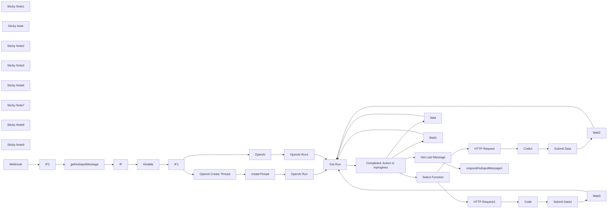

## Fluxo (.json) :

```json
{
  "id": "C2pB17EpXAJwOcst",
  "meta": {
    "instanceId": "ba379c9b99d35340c90344105e7e5d06ca0de3e88926f0384d2c23099dad1937"
  },
  "name": "OpenAI Assistant for Hubspot Chat",
  "tags": [],
  "nodes": [
    {
      "id": "7f11a684-911b-4fbc-ba1b-a8e7bce8e914",
      "name": "getHubspotMessage",
      "type": "n8n-nodes-base.httpRequest",
      "position": [
        280,
        580
      ],
      "parameters": {
        "url": "=https://api.hubapi.com/conversations/v3/conversations/threads/{{ $json[\"body\"][0][\"objectId\"] }}/messages/{{ $json[\"body\"][0][\"messageId\"] }}",
        "options": {},
        "authentication": "predefinedCredentialType",
        "nodeCredentialType": "hubspotAppToken"
      },
      "credentials": {
        "hubspotAppToken": {
          "id": "56nluFhXiGjYN1EY",
          "name": "HubSpot App Token tinder"
        },
        "hubspotOAuth2Api": {
          "id": "y6819fYl4TsW9gl6",
          "name": "HubSpot account 6"
        },
        "hubspotDeveloperApi": {
          "id": "dHB9nVcnZTqf2JDX",
          "name": "HubSpot Developer account"
        }
      },
      "typeVersion": 4.1
    },
    {
      "id": "687bcbb8-38c8-4d21-a46f-186e880d003c",
      "name": "OpenAi Create Thread",
      "type": "n8n-nodes-base.httpRequest",
      "position": [
        1260,
        420
      ],
      "parameters": {
        "url": "https://api.openai.com/v1/threads",
        "method": "POST",
        "options": {},
        "jsonBody": "={\n    \"messages\": [\n        {\n            \"role\": \"user\",\n            \"content\": \"{{ $('getHubspotMessage').item.json[\"text\"] }}\"\n        }\n    ]\n}",
        "sendBody": true,
        "sendHeaders": true,
        "specifyBody": "json",
        "authentication": "predefinedCredentialType",
        "headerParameters": {
          "parameters": [
            {
              "name": "openai-beta",
              "value": "assistants=v1"
            }
          ]
        },
        "nodeCredentialType": "openAiApi"
      },
      "credentials": {
        "openAiApi": {
          "id": "sCh1Lrc1ZT8NVcgn",
          "name": "OpenAi Makeitfuture.eu"
        }
      },
      "typeVersion": 4.1
    },
    {
      "id": "8b51d465-d298-4b7a-b939-026bd51469d3",
      "name": "OpenAI Run",
      "type": "n8n-nodes-base.httpRequest",
      "position": [
        1620,
        420
      ],
      "parameters": {
        "url": "=https://api.openai.com/v1/threads/{{ $json[\"OpenAI Thread ID\"] }}/runs",
        "method": "POST",
        "options": {},
        "jsonBody": "={\n    \"assistant_id\": \"asst_MA71Jq0SElVpdjmJa212CTFd\"\n}",
        "sendBody": true,
        "sendHeaders": true,
        "specifyBody": "json",
        "authentication": "predefinedCredentialType",
        "headerParameters": {
          "parameters": [
            {
              "name": "openai-beta",
              "value": "assistants=v1"
            }
          ]
        },
        "nodeCredentialType": "openAiApi"
      },
      "credentials": {
        "openAiApi": {
          "id": "sCh1Lrc1ZT8NVcgn",
          "name": "OpenAi Makeitfuture.eu"
        }
      },
      "typeVersion": 4.1
    },
    {
      "id": "3e645c55-a236-466f-9983-2a3e91c250db",
      "name": "Get Run",
      "type": "n8n-nodes-base.httpRequest",
      "position": [
        1920,
        600
      ],
      "parameters": {
        "url": "=https://api.openai.com/v1/threads/{{ $json[\"thread_id\"] }}/runs/{{ $json[\"id\"] }}",
        "options": {},
        "sendHeaders": true,
        "authentication": "predefinedCredentialType",
        "headerParameters": {
          "parameters": [
            {
              "name": "openai-beta",
              "value": "assistants=v1"
            }
          ]
        },
        "nodeCredentialType": "openAiApi"
      },
      "credentials": {
        "openAiApi": {
          "id": "sCh1Lrc1ZT8NVcgn",
          "name": "OpenAi Makeitfuture.eu"
        }
      },
      "typeVersion": 4.1,
      "alwaysOutputData": true
    },
    {
      "id": "a69a1d1e-b932-481e-8d36-8d121c63ad4b",
      "name": "Get Last Message",
      "type": "n8n-nodes-base.httpRequest",
      "position": [
        2520,
        460
      ],
      "parameters": {
        "url": "=https://api.openai.com/v1/threads/{{ $json[\"thread_id\"] }}/messages",
        "options": {},
        "sendHeaders": true,
        "authentication": "predefinedCredentialType",
        "headerParameters": {
          "parameters": [
            {
              "name": "openai-beta",
              "value": "assistants=v1"
            }
          ]
        },
        "nodeCredentialType": "openAiApi"
      },
      "credentials": {
        "openAiApi": {
          "id": "sCh1Lrc1ZT8NVcgn",
          "name": "OpenAi Makeitfuture.eu"
        }
      },
      "typeVersion": 4.1
    },
    {
      "id": "d9758207-56d4-4180-aac7-f0ebafab1064",
      "name": "HTTP Request",
      "type": "n8n-nodes-base.httpRequest",
      "position": [
        2820,
        960
      ],
      "parameters": {
        "url": "=https://www.listafirme.ro/api/search-v1.asp",
        "options": {},
        "sendQuery": true,
        "queryParameters": {
          "parameters": [
            {
              "name": "key",
              "value": "982dc86a0c1bd4c71185d39ae9f36998"
            },
            {
              "name": "src",
              "value": "={{JSON.parse($json[\"required_action\"][\"submit_tool_outputs\"][\"tool_calls\"][0][\"function\"][\"arguments\"]).src}}"
            }
          ]
        }
      },
      "typeVersion": 4.1
    },
    {
      "id": "5c6f30fd-3ac2-401c-897a-54c7e998c97b",
      "name": "Completed, Action or Inprogress",
      "type": "n8n-nodes-base.switch",
      "position": [
        2120,
        600
      ],
      "parameters": {
        "rules": {
          "rules": [
            {
              "value2": "completed"
            },
            {
              "output": 1,
              "value2": "requires_action"
            },
            {
              "output": 2,
              "value2": "in_progress",
              "operation": "=equal"
            },
            {
              "output": 3,
              "value2": "queued"
            }
          ]
        },
        "value1": "={{ $json.status }}",
        "dataType": "string"
      },
      "typeVersion": 1
    },
    {
      "id": "c1bc0adf-3552-43a3-b38f-bfc76e2683cd",
      "name": "Wait",
      "type": "n8n-nodes-base.wait",
      "position": [
        2360,
        1000
      ],
      "webhookId": "e15c2bb6-e022-4c6d-869b-f361b1ec1259",
      "parameters": {
        "unit": "seconds"
      },
      "typeVersion": 1
    },
    {
      "id": "2e0c4528-5b2b-4d3c-9b53-166ea0f2a28e",
      "name": "Wait1",
      "type": "n8n-nodes-base.wait",
      "position": [
        2340,
        760
      ],
      "webhookId": "3a175bf4-c569-431e-bc56-abed3653ce9d",
      "parameters": {
        "unit": "seconds"
      },
      "typeVersion": 1
    },
    {
      "id": "f80a2cd8-6691-4186-909b-cfed95318014",
      "name": "Submit Data",
      "type": "n8n-nodes-base.httpRequest",
      "position": [
        3360,
        960
      ],
      "parameters": {
        "url": "=https://api.openai.com/v1/threads/{{ $('Select Function').item.json[\"thread_id\"] }}/runs/{{ $('Select Function').item.json[\"id\"] }}/submit_tool_outputs",
        "method": "POST",
        "options": {},
        "jsonBody": "={\n    \"tool_outputs\": [\n        {\n            \"tool_call_id\": \"{{ $('Select Function').item.json[\"required_action\"][\"submit_tool_outputs\"][\"tool_calls\"][0][\"id\"] }}\",\n            \"output\": \"{{$json.escapedJsonString}}\"\n        }\n    ]\n} ",
        "sendBody": true,
        "sendHeaders": true,
        "specifyBody": "json",
        "authentication": "predefinedCredentialType",
        "headerParameters": {
          "parameters": [
            {
              "name": "openai-beta",
              "value": "assistants=v1"
            }
          ]
        },
        "nodeCredentialType": "openAiApi"
      },
      "credentials": {
        "openAiApi": {
          "id": "sCh1Lrc1ZT8NVcgn",
          "name": "OpenAi Makeitfuture.eu"
        }
      },
      "typeVersion": 4.1,
      "alwaysOutputData": true
    },
    {
      "id": "eb114cfd-1af2-4c8b-bfba-583453a1d7ca",
      "name": "Select Function",
      "type": "n8n-nodes-base.switch",
      "position": [
        2520,
        700
      ],
      "parameters": {
        "rules": {
          "rules": [
            {
              "value2": "getAWBbyOrder"
            },
            {
              "output": 1,
              "value2": "get_awb_history"
            }
          ]
        },
        "value1": "={{ $json.required_action.submit_tool_outputs.tool_calls[0].function.name }}",
        "dataType": "string"
      },
      "typeVersion": 1
    },
    {
      "id": "4d1ad478-a9a4-4e9f-9b06-e2a9b7b2b55c",
      "name": "Code1",
      "type": "n8n-nodes-base.code",
      "position": [
        3080,
        960
      ],
      "parameters": {
        "jsCode": "const item1 = $input.all()[0]?.json;\nconst jsonString = JSON.stringify(item1);\nconst escapedJsonString = jsonString.replace(/\"/g, '\\\\\"');\n\nreturn { escapedJsonString };\n"
      },
      "typeVersion": 2
    },
    {
      "id": "39cab0c4-1d7d-41cb-a88d-00acc8e79a24",
      "name": "Wait2",
      "type": "n8n-nodes-base.wait",
      "position": [
        3720,
        1400
      ],
      "webhookId": "68ae5068-6a39-424c-b88d-019bfee78b6f",
      "parameters": {
        "unit": "seconds"
      },
      "typeVersion": 1
    },
    {
      "id": "54205ed2-7c96-44b6-9637-20830300310a",
      "name": "HTTP Request1",
      "type": "n8n-nodes-base.httpRequest",
      "position": [
        2820,
        1180
      ],
      "parameters": {
        "url": "=https://www.listafirme.ro/api/info-v1.asp",
        "options": {},
        "sendQuery": true,
        "queryParameters": {
          "parameters": [
            {
              "name": "key",
              "value": "982dc86a0c1bd4c71185d39ae9f36998"
            },
            {
              "name": "data",
              "value": "={\"TaxCode\":\"{{JSON.parse($json[\"required_action\"][\"submit_tool_outputs\"][\"tool_calls\"][0][\"function\"][\"arguments\"]).src}}\",\"NACE\":\"info\",\"VAT\":\"\", \"RegNo\":\"\", \"Status\":\"\", \"LegalForm\":\"\", \"Name\":\"\", \"Date\":\"\", \"TownCode\":\"\", \"County\":\"\", \"City\":\"\", \"Address\":\"\", \"Administrators\":\"\", \"Shareholders\":\"\", \"Balance\":\"latest\", \"Phone\":\"\", \"Mobile\":\"\", \"Fax\":\"\", \"Email\":\"\", \"Web\":\"\", \"Geolocation\":\"\", \"Description\":\"\", \"Trademarks\":\"\", \"Subsidiaries\":\"\", \"Branches\":\"\", \"FiscalActivity\":\"\", \"Obligations\":\"\", \"Links\":\"\"}"
            }
          ]
        }
      },
      "typeVersion": 4.1
    },
    {
      "id": "862ab78d-0288-4c78-9e02-7ad4ff794a6d",
      "name": "Code",
      "type": "n8n-nodes-base.code",
      "position": [
        3060,
        1180
      ],
      "parameters": {
        "jsCode": "const item1 = $input.all()[0]?.json;\nconst jsonString = JSON.stringify(item1);\nconst escapedJsonString = jsonString.replace(/\"/g, '\\\\\"');\n\nreturn { escapedJsonString };\n"
      },
      "typeVersion": 2
    },
    {
      "id": "e9d1d277-107d-403c-9911-5faa4ae75671",
      "name": "Submit Data1",
      "type": "n8n-nodes-base.httpRequest",
      "position": [
        3260,
        1180
      ],
      "parameters": {
        "url": "=https://api.openai.com/v1/threads/{{ $('Select Function').item.json[\"thread_id\"] }}/runs/{{ $('Select Function').item.json[\"id\"] }}/submit_tool_outputs",
        "method": "POST",
        "options": {},
        "jsonBody": "={\n    \"tool_outputs\": [\n        {\n            \"tool_call_id\": \"{{ $('Select Function').item.json[\"required_action\"][\"submit_tool_outputs\"][\"tool_calls\"][0][\"id\"] }}\",\n            \"output\": \"{{$json.escapedJsonString}}\"\n        }\n    ]\n} ",
        "sendBody": true,
        "sendHeaders": true,
        "specifyBody": "json",
        "authentication": "predefinedCredentialType",
        "headerParameters": {
          "parameters": [
            {
              "name": "openai-beta",
              "value": "assistants=v1"
            }
          ]
        },
        "nodeCredentialType": "openAiApi"
      },
      "credentials": {
        "openAiApi": {
          "id": "sCh1Lrc1ZT8NVcgn",
          "name": "OpenAi Makeitfuture.eu"
        }
      },
      "typeVersion": 4.1,
      "alwaysOutputData": true
    },
    {
      "id": "28e7637b-9a3b-49ba-b4c7-efd3f6cf0522",
      "name": "Wait3",
      "type": "n8n-nodes-base.wait",
      "position": [
        3460,
        1360
      ],
      "webhookId": "6d7d039c-8a4b-4178-8d31-57fb3c24ac14",
      "parameters": {
        "unit": "seconds"
      },
      "typeVersion": 1
    },
    {
      "id": "2b954546-8bc6-4028-9826-37a64d2aed04",
      "name": "respondHubspotMessage1",
      "type": "n8n-nodes-base.httpRequest",
      "position": [
        2820,
        420
      ],
      "parameters": {
        "url": "=https://api.hubapi.com/conversations/v3/conversations/threads/{{ $('getHubspotMessage').item.json[\"conversationsThreadId\"] }}/messages",
        "method": "POST",
        "options": {},
        "sendBody": true,
        "authentication": "predefinedCredentialType",
        "bodyParameters": {
          "parameters": [
            {
              "name": "type",
              "value": "MESSAGE"
            },
            {
              "name": "richText",
              "value": "={{ $json.data[0].content[0].text.value }}"
            },
            {
              "name": "senderActorId",
              "value": "A-5721819"
            },
            {
              "name": "channelId",
              "value": "={{ $('getHubspotMessage').item.json.channelId }}"
            },
            {
              "name": "channelAccountId",
              "value": "={{ $('getHubspotMessage').item.json.channelAccountId }}"
            },
            {
              "name": "text",
              "value": "{{ $json.data[0].content[0].text.value }}"
            }
          ]
        },
        "nodeCredentialType": "hubspotAppToken"
      },
      "credentials": {
        "hubspotAppToken": {
          "id": "56nluFhXiGjYN1EY",
          "name": "HubSpot App Token tinder"
        },
        "hubspotOAuth2Api": {
          "id": "y6819fYl4TsW9gl6",
          "name": "HubSpot account 6"
        },
        "hubspotDeveloperApi": {
          "id": "dHB9nVcnZTqf2JDX",
          "name": "HubSpot Developer account"
        }
      },
      "typeVersion": 4.1
    },
    {
      "id": "6facd7e9-5cbd-4eb7-ab22-84b4fbf35885",
      "name": "IF",
      "type": "n8n-nodes-base.if",
      "position": [
        640,
        600
      ],
      "parameters": {
        "conditions": {
          "string": [
            {
              "value1": "={{ $('getHubspotMessage').item.json[\"senders\"][0][\"actorId\"] }}",
              "value2": "A-5721819",
              "operation": "notEqual"
            }
          ]
        }
      },
      "typeVersion": 1
    },
    {
      "id": "9410bce8-3a2d-4852-acbd-8baa7ee4964d",
      "name": "Airtable",
      "type": "n8n-nodes-base.airtable",
      "position": [
        860,
        600
      ],
      "parameters": {
        "base": {
          "__rl": true,
          "mode": "list",
          "value": "appGAPr0tOy8J0NXC",
          "cachedResultUrl": "https://airtable.com/appGAPr0tOy8J0NXC",
          "cachedResultName": "Hubspot Conversations ChatGPT"
        },
        "table": {
          "__rl": true,
          "mode": "list",
          "value": "tbljZ0POq35jgnKES",
          "cachedResultUrl": "https://airtable.com/appGAPr0tOy8J0NXC/tbljZ0POq35jgnKES",
          "cachedResultName": "Conversations"
        },
        "options": {},
        "operation": "search",
        "filterByFormula": "={Hubspot Thread ID}=\"{{ $json.conversationsThreadId }}\""
      },
      "credentials": {
        "airtableTokenApi": {
          "id": "Ha1BL7JqKQIwX3H1",
          "name": "Hubspot Conversations Makeitfuture Management"
        }
      },
      "typeVersion": 2,
      "alwaysOutputData": true
    },
    {
      "id": "06449687-7521-4151-89c5-050a2768af13",
      "name": "IF1",
      "type": "n8n-nodes-base.if",
      "position": [
        1040,
        640
      ],
      "parameters": {
        "conditions": {
          "string": [
            {
              "value1": "={{ $('Airtable').item.json.id }}",
              "operation": "isEmpty"
            }
          ]
        }
      },
      "typeVersion": 1
    },
    {
      "id": "65c3015e-760f-41e8-9d18-05492cf908c8",
      "name": "createThread",
      "type": "n8n-nodes-base.airtable",
      "position": [
        1440,
        420
      ],
      "parameters": {
        "base": {
          "__rl": true,
          "mode": "list",
          "value": "appGAPr0tOy8J0NXC",
          "cachedResultUrl": "https://airtable.com/appGAPr0tOy8J0NXC",
          "cachedResultName": "Hubspot Conversations ChatGPT"
        },
        "table": {
          "__rl": true,
          "mode": "list",
          "value": "tbljZ0POq35jgnKES",
          "cachedResultUrl": "https://airtable.com/appGAPr0tOy8J0NXC/tbljZ0POq35jgnKES",
          "cachedResultName": "Conversations"
        },
        "columns": {
          "value": {
            "OpenAI Thread ID": "={{ $json[\"id\"] }}",
            "Hubspot Thread ID": "={{ $('getHubspotMessage').item.json.conversationsThreadId }}"
          },
          "schema": [
            {
              "id": "Hubspot Thread ID",
              "type": "string",
              "display": true,
              "removed": false,
              "readOnly": false,
              "required": false,
              "displayName": "Hubspot Thread ID",
              "defaultMatch": false,
              "canBeUsedToMatch": true
            },
            {
              "id": "OpenAI Thread ID",
              "type": "string",
              "display": true,
              "removed": false,
              "readOnly": false,
              "required": false,
              "displayName": "OpenAI Thread ID",
              "defaultMatch": false,
              "canBeUsedToMatch": true
            }
          ],
          "mappingMode": "defineBelow",
          "matchingColumns": []
        },
        "options": {},
        "operation": "create"
      },
      "credentials": {
        "airtableTokenApi": {
          "id": "Ha1BL7JqKQIwX3H1",
          "name": "Hubspot Conversations Makeitfuture Management"
        }
      },
      "typeVersion": 2
    },
    {
      "id": "14cd4854-34fa-4a40-8bd2-cce2d9da9571",
      "name": "OpenAI Run1",
      "type": "n8n-nodes-base.httpRequest",
      "position": [
        1620,
        780
      ],
      "parameters": {
        "url": "=https://api.openai.com/v1/threads/{{ $('Airtable').item.json[\"OpenAI Thread ID\"] }}/runs",
        "method": "POST",
        "options": {},
        "jsonBody": "={\n    \"assistant_id\": \"asst_MA71Jq0SElVpdjmJa212CTFd\"\n}",
        "sendBody": true,
        "sendHeaders": true,
        "specifyBody": "json",
        "authentication": "predefinedCredentialType",
        "headerParameters": {
          "parameters": [
            {
              "name": "openai-beta",
              "value": "assistants=v1"
            }
          ]
        },
        "nodeCredentialType": "openAiApi"
      },
      "credentials": {
        "openAiApi": {
          "id": "sCh1Lrc1ZT8NVcgn",
          "name": "OpenAi Makeitfuture.eu"
        }
      },
      "typeVersion": 4.1,
      "continueOnFail": true,
      "alwaysOutputData": false
    },
    {
      "id": "7c37641f-b0a4-4031-b289-3d6aed5a5bd6",
      "name": "IF2",
      "type": "n8n-nodes-base.if",
      "position": [
        60,
        600
      ],
      "parameters": {
        "conditions": {
          "string": [
            {
              "value1": "={{ $json[\"body\"][0][\"messageId\"] }}",
              "operation": "isNotEmpty"
            }
          ]
        }
      },
      "typeVersion": 1
    },
    {
      "id": "12744ebd-1d36-4f3c-9cbe-2ed7d18d37e3",
      "name": "Sticky Note1",
      "type": "n8n-nodes-base.stickyNote",
      "position": [
        -200,
        440
      ],
      "parameters": {
        "width": 640.1970959824021,
        "height": 428.68258455167785,
        "content": "Watch for new message on the chatbot. \nThis can be triggered with [n8n chat widget](https://www.npmjs.com/package/@n8n/chat), hubspot or other chat services. \n\n"
      },
      "typeVersion": 1
    },
    {
      "id": "9c200085-e9aa-4e11-93c2-da8184976229",
      "name": "Sticky Note",
      "type": "n8n-nodes-base.stickyNote",
      "position": [
        2480,
        340
      ],
      "parameters": {
        "width": 615.2010006500725,
        "height": 279.76857176586907,
        "content": "Post assistant Message back to chat service, in this case Hubspot"
      },
      "typeVersion": 1
    },
    {
      "id": "4458aafb-d280-46d0-ba54-3eb4ee746892",
      "name": "Sticky Note2",
      "type": "n8n-nodes-base.stickyNote",
      "position": [
        1200,
        300
      ],
      "parameters": {
        "width": 636.6434938094908,
        "height": 304.69360473583896,
        "content": "Create a new Thread, save it to database and RUN"
      },
      "typeVersion": 1
    },
    {
      "id": "f13f45aa-47c9-4a76-a69c-f13f51d9434f",
      "name": "Sticky Note3",
      "type": "n8n-nodes-base.stickyNote",
      "position": [
        480,
        440
      ],
      "parameters": {
        "width": 328.9155262250898,
        "height": 421.64797280574976,
        "content": "UPDATE USER FILTER FOR DUPLICATION"
      },
      "typeVersion": 1
    },
    {
      "id": "ba0d0a2c-5014-44b8-a281-9d5014b78bcc",
      "name": "Sticky Note6",
      "type": "n8n-nodes-base.stickyNote",
      "position": [
        840,
        440
      ],
      "parameters": {
        "width": 328.9155262250898,
        "height": 421.64797280574976,
        "content": "Search for Thread ID in a database. \n\nThis database is maintaing references between messaging service thread id and OpenI Thread ID. "
      },
      "typeVersion": 1
    },
    {
      "id": "3d3562b5-631f-405c-b671-6856214f167f",
      "name": "Sticky Note7",
      "type": "n8n-nodes-base.stickyNote",
      "position": [
        1200,
        680
      ],
      "parameters": {
        "width": 636.6434938094908,
        "height": 304.69360473583896,
        "content": "POST a new message to existing thread."
      },
      "typeVersion": 1
    },
    {
      "id": "9ad1622c-5b42-4279-bf16-edf7bcbb5155",
      "name": "Sticky Note8",
      "type": "n8n-nodes-base.stickyNote",
      "position": [
        1900,
        320
      ],
      "parameters": {
        "width": 393.4831089305742,
        "height": 629.4777449641093,
        "content": "Get Run Status:\nIf still in progress, run again. \nIf action needed go to respective action.\nIf Completed, post message."
      },
      "typeVersion": 1
    },
    {
      "id": "e51965ef-7694-41b3-9c9a-9f78c00af3f3",
      "name": "Sticky Note9",
      "type": "n8n-nodes-base.stickyNote",
      "position": [
        2538.191410231545,
        840
      ],
      "parameters": {
        "width": 1361.867818730004,
        "height": 731.995091888263,
        "content": "Run required actions based on Assistant answer and respond to Assistant with the function answer. \n\nEach route is a function that you need to define inside your assistant configuration.\n"
      },
      "typeVersion": 1
    },
    {
      "id": "706fb261-724e-4c22-8def-24a320d213a2",
      "name": "OpenAI",
      "type": "@n8n/n8n-nodes-langchain.openAi",
      "position": [
        1280,
        780
      ],
      "parameters": {
        "text": "={{ $('getHubspotMessage').item.json[\"text\"] }}",
        "prompt": "define",
        "options": {
          "baseURL": "https://api.openai.com/v1/threads/{{ $('Airtable').item.json[\"OpenAI Thread ID\"] }}/messages"
        },
        "resource": "assistant",
        "assistantId": {
          "__rl": true,
          "mode": "list",
          "value": "asst_wVbEcnRttQ8K65DOV0fk1DJU",
          "cachedResultName": "Lista Firma Agent"
        }
      },
      "credentials": {
        "openAiApi": {
          "id": "sCh1Lrc1ZT8NVcgn",
          "name": "OpenAi Makeitfuture.eu"
        }
      },
      "typeVersion": 1.3
    },
    {
      "id": "b8f686cc-33d6-4e99-987c-d1f91864e81d",
      "name": "Webhook",
      "type": "n8n-nodes-base.webhook",
      "position": [
        -160,
        600
      ],
      "webhookId": "637d5b46-b35f-4943-92a2-864ddce170f4",
      "parameters": {
        "path": "hubspot-tinder",
        "options": {},
        "httpMethod": "POST"
      },
      "typeVersion": 1
    }
  ],
  "active": false,
  "pinData": {},
  "settings": {
    "executionOrder": "v1"
  },
  "versionId": "d9763b45-9092-490f-85b4-926354cdeb47",
  "connections": {
    "IF": {
      "main": [
        [
          {
            "node": "Airtable",
            "type": "main",
            "index": 0
          }
        ]
      ]
    },
    "IF1": {
      "main": [
        [
          {
            "node": "OpenAi Create Thread",
            "type": "main",
            "index": 0
          }
        ],
        [
          {
            "node": "OpenAI",
            "type": "main",
            "index": 0
          }
        ]
      ]
    },
    "IF2": {
      "main": [
        [
          {
            "node": "getHubspotMessage",
            "type": "main",
            "index": 0
          }
        ]
      ]
    },
    "Code": {
      "main": [
        [
          {
            "node": "Submit Data1",
            "type": "main",
            "index": 0
          }
        ]
      ]
    },
    "Wait": {
      "main": [
        [
          {
            "node": "Get Run",
            "type": "main",
            "index": 0
          }
        ]
      ]
    },
    "Code1": {
      "main": [
        [
          {
            "node": "Submit Data",
            "type": "main",
            "index": 0
          }
        ]
      ]
    },
    "Wait1": {
      "main": [
        [
          {
            "node": "Get Run",
            "type": "main",
            "index": 0
          }
        ]
      ]
    },
    "Wait2": {
      "main": [
        [
          {
            "node": "Get Run",
            "type": "main",
            "index": 0
          }
        ]
      ]
    },
    "Wait3": {
      "main": [
        [
          {
            "node": "Get Run",
            "type": "main",
            "index": 0
          }
        ]
      ]
    },
    "OpenAI": {
      "main": [
        [
          {
            "node": "OpenAI Run1",
            "type": "main",
            "index": 0
          }
        ]
      ]
    },
    "Get Run": {
      "main": [
        [
          {
            "node": "Completed, Action or Inprogress",
            "type": "main",
            "index": 0
          }
        ]
      ]
    },
    "Webhook": {
      "main": [
        [
          {
            "node": "IF2",
            "type": "main",
            "index": 0
          }
        ]
      ]
    },
    "Airtable": {
      "main": [
        [
          {
            "node": "IF1",
            "type": "main",
            "index": 0
          }
        ]
      ]
    },
    "OpenAI Run": {
      "main": [
        [
          {
            "node": "Get Run",
            "type": "main",
            "index": 0
          }
        ]
      ]
    },
    "OpenAI Run1": {
      "main": [
        [
          {
            "node": "Get Run",
            "type": "main",
            "index": 0
          }
        ]
      ]
    },
    "Submit Data": {
      "main": [
        [
          {
            "node": "Wait2",
            "type": "main",
            "index": 0
          }
        ]
      ]
    },
    "HTTP Request": {
      "main": [
        [
          {
            "node": "Code1",
            "type": "main",
            "index": 0
          }
        ]
      ]
    },
    "Submit Data1": {
      "main": [
        [
          {
            "node": "Wait3",
            "type": "main",
            "index": 0
          }
        ]
      ]
    },
    "createThread": {
      "main": [
        [
          {
            "node": "OpenAI Run",
            "type": "main",
            "index": 0
          }
        ]
      ]
    },
    "HTTP Request1": {
      "main": [
        [
          {
            "node": "Code",
            "type": "main",
            "index": 0
          }
        ]
      ]
    },
    "Select Function": {
      "main": [
        [
          {
            "node": "HTTP Request",
            "type": "main",
            "index": 0
          }
        ],
        [
          {
            "node": "HTTP Request1",
            "type": "main",
            "index": 0
          }
        ]
      ]
    },
    "Get Last Message": {
      "main": [
        [
          {
            "node": "respondHubspotMessage1",
            "type": "main",
            "index": 0
          }
        ]
      ]
    },
    "getHubspotMessage": {
      "main": [
        [
          {
            "node": "IF",
            "type": "main",
            "index": 0
          }
        ]
      ]
    },
    "OpenAi Create Thread": {
      "main": [
        [
          {
            "node": "createThread",
            "type": "main",
            "index": 0
          }
        ]
      ]
    },
    "Completed, Action or Inprogress": {
      "main": [
        [
          {
            "node": "Get Last Message",
            "type": "main",
            "index": 0
          }
        ],
        [
          {
            "node": "Select Function",
            "type": "main",
            "index": 0
          }
        ],
        [
          {
            "node": "Wait1",
            "type": "main",
            "index": 0
          }
        ],
        [
          {
            "node": "Wait",
            "type": "main",
            "index": 0
          }
        ]
      ]
    }
  }
}
```

<a id="template-50"></a>

## Template 50 - Servidor MCP para sistema de arquivos

- **Nome:** Servidor MCP para sistema de arquivos
- **Descrição:** Expõe operações de sistema de arquivos (listar, ler, criar, buscar e escrever arquivos) através de um endpoint MCP para clientes/agentes conectados.
- **Funcionalidade:** • Gatilho MCP: inicia o fluxo ao receber requisições do protocolo MCP.
• Listar diretórios: lista pastas e arquivos sob o diretório raiz do projeto.
• Criar diretórios: cria estruturas de diretórios sob o diretório raiz usando parâmetros fornecidos.
• Buscar arquivos: procura arquivos por nome no diretório do projeto.
• Ler arquivos: lê o conteúdo de um ou mais arquivos e retorna o texto.
• Escrever arquivos: grava conteúdo em um ou vários arquivos, casando nomes e conteúdos por índice.
• Segurança de parâmetros: limita execução a parâmetros controlados (nomes/paths) para evitar execução arbitrária de comandos.
• Ferramentas customizadas: utiliza workflows personalizados para operações de leitura e escrita quando comandos mais complexos são necessários.
• Recomendação de autenticação: avisa para habilitar autenticação antes de usar em produção.
- **Ferramentas:** • Protocolo MCP (Model Context Protocol): permite comunicação entre clientes/agents e este servidor para requisitar operações de arquivos.
• Sistema de arquivos Linux: local onde as operações de leitura, escrita, listagem e busca são executadas.
• Comandos de shell (ls, find, mkdir, cat, echo): usados para implementar as operações de listar, buscar, criar, ler e escrever arquivos.
• Clientes MCP (ex.: Claude Desktop): softwares/agents que se conectam ao servidor MCP para emitir pedidos e receber respostas.

## Fluxo visual

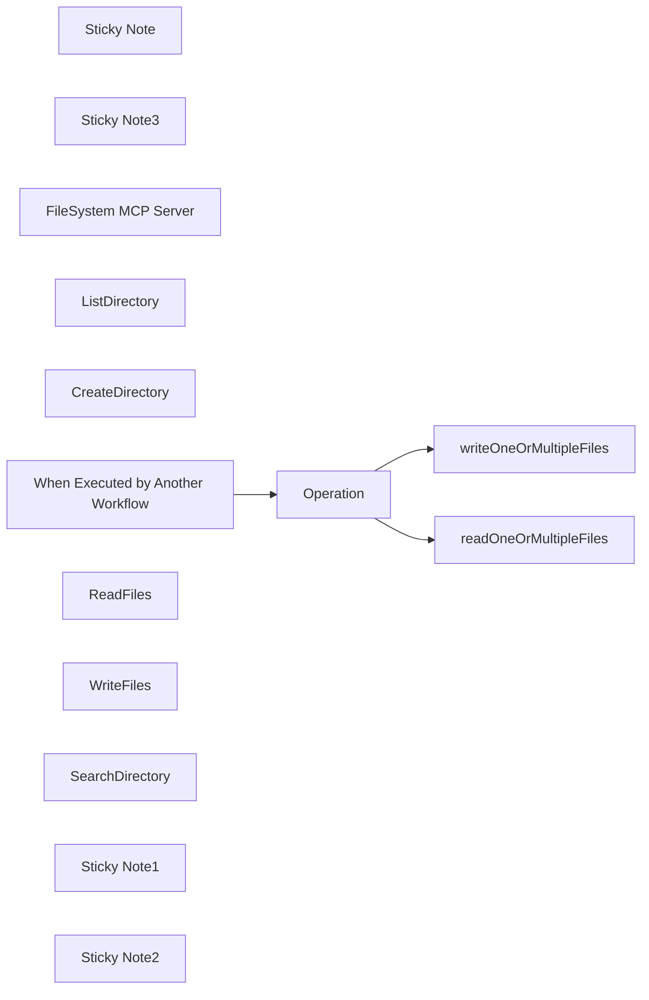

## Fluxo (.json) :

```json
{
  "meta": {
    "instanceId": "408f9fb9940c3cb18ffdef0e0150fe342d6e655c3a9fac21f0f644e8bedabcd9"
  },
  "nodes": [
    {
      "id": "24be8907-684e-4b57-9642-6f4a45ca7af3",
      "name": "Sticky Note",
      "type": "n8n-nodes-base.stickyNote",
      "position": [
        -380,
        -280
      ],
      "parameters": {
        "color": 7,
        "width": 680,
        "height": 660,
        "content": "## 1. Set up an MCP Server Trigger\n[Read more about the MCP Server Trigger](https://docs.n8n.io/integrations/builtin/core-nodes/n8n-nodes-langchain.mcptrigger)"
      },
      "typeVersion": 1
    },
    {
      "id": "d5845d0a-648f-4bc1-b087-bc0d17506ed3",
      "name": "Sticky Note3",
      "type": "n8n-nodes-base.stickyNote",
      "position": [
        -380,
        -400
      ],
      "parameters": {
        "color": 5,
        "width": 380,
        "height": 100,
        "content": "### Always Authenticate Your Server!\nBefore going to production, it's always advised to enable authentication on your MCP server trigger."
      },
      "typeVersion": 1
    },
    {
      "id": "fe9f1c8e-8334-4732-be3a-5ee49036e11e",
      "name": "FileSystem MCP Server",
      "type": "@n8n/n8n-nodes-langchain.mcpTrigger",
      "position": [
        -180,
        -140
      ],
      "webhookId": "0d93cfd5-2fbf-457e-9535-5bfc9a73ba9e",
      "parameters": {
        "path": "0d93cfd5-2fbf-457e-9535-5bfc9a73ba9e"
      },
      "typeVersion": 1
    },
    {
      "id": "fb49782f-d8de-480b-a470-e37adb2e3036",
      "name": "ListDirectory",
      "type": "n8n-nodes-base.executeCommandTool",
      "position": [
        -300,
        60
      ],
      "parameters": {
        "command": "=ls /home/node/{{ $fromAI('path', 'optional, leave blank for project root directory.') }}",
        "toolDescription": "List directories under the project root folder. The project root directory is /home/node/"
      },
      "typeVersion": 1
    },
    {
      "id": "8fa93054-bcf5-4fbc-9825-df16be063eb2",
      "name": "CreateDirectory",
      "type": "n8n-nodes-base.executeCommandTool",
      "position": [
        -200,
        160
      ],
      "parameters": {
        "command": "=mkdir -p /home/node/{{ $fromAI('filename', 'name of directory. Will be scoped under the /home/node/ project root directory. Optionally use path to create within subdirectories') }}",
        "toolDescription": "Create directories under the project root folder. The project root folder is /home/node."
      },
      "typeVersion": 1
    },
    {
      "id": "aafe884d-0e6e-476a-92fe-b2111f624417",
      "name": "When Executed by Another Workflow",
      "type": "n8n-nodes-base.executeWorkflowTrigger",
      "position": [
        400,
        40
      ],
      "parameters": {
        "workflowInputs": {
          "values": [
            {
              "name": "operation"
            },
            {
              "name": "filenames",
              "type": "array"
            },
            {
              "name": "contents",
              "type": "array"
            }
          ]
        }
      },
      "typeVersion": 1.1
    },
    {
      "id": "d85925b6-d58d-43b5-a6ca-3e43cbc81121",
      "name": "Operation",
      "type": "n8n-nodes-base.switch",
      "position": [
        580,
        40
      ],
      "parameters": {
        "rules": {
          "values": [
            {
              "outputKey": "writeOneOrMultipleFiles",
              "conditions": {
                "options": {
                  "version": 2,
                  "leftValue": "",
                  "caseSensitive": true,
                  "typeValidation": "strict"
                },
                "combinator": "and",
                "conditions": [
                  {
                    "id": "c1da2138-e2df-46d4-b1f4-97525c05e778",
                    "operator": {
                      "type": "string",
                      "operation": "equals"
                    },
                    "leftValue": "={{ $json.operation }}",
                    "rightValue": "writeOneOrMultipleFiles"
                  }
                ]
              },
              "renameOutput": true
            },
            {
              "outputKey": "readOneOrMultipleFiles",
              "conditions": {
                "options": {
                  "version": 2,
                  "leftValue": "",
                  "caseSensitive": true,
                  "typeValidation": "strict"
                },
                "combinator": "and",
                "conditions": [
                  {
                    "id": "cc02a5a2-609c-4dbe-bdb6-45f145947e47",
                    "operator": {
                      "name": "filter.operator.equals",
                      "type": "string",
                      "operation": "equals"
                    },
                    "leftValue": "={{ $json.operation }}",
                    "rightValue": "readOneOrMultipleFiles"
                  }
                ]
              },
              "renameOutput": true
            }
          ]
        },
        "options": {}
      },
      "typeVersion": 3.2
    },
    {
      "id": "e9ec2928-5e33-4213-a53a-92b7d840d49e",
      "name": "readOneOrMultipleFiles",
      "type": "n8n-nodes-base.executeCommand",
      "position": [
        840,
        140
      ],
      "parameters": {
        "command": "=cat {{ $json.filenames.join(' ') }}"
      },
      "typeVersion": 1
    },
    {
      "id": "77ba2a48-b4b9-4a23-818d-e028a7762514",
      "name": "ReadFiles",
      "type": "@n8n/n8n-nodes-langchain.toolWorkflow",
      "position": [
        40,
        160
      ],
      "parameters": {
        "name": "readFil",
        "workflowId": {
          "__rl": true,
          "mode": "id",
          "value": "={{ $workflow.id }}"
        },
        "description": "=Call this tool to read the contents of a file. Include file extension.",
        "workflowInputs": {
          "value": {
            "contents": "[]",
            "filenames": "={{ /*n8n-auto-generated-fromAI-override*/ $fromAI('filenames', `An array of filenames`, 'string') }}",
            "operation": "readOneOrMultipleFiles"
          },
          "schema": [
            {
              "id": "operation",
              "type": "string",
              "display": true,
              "removed": false,
              "required": false,
              "displayName": "operation",
              "defaultMatch": false,
              "canBeUsedToMatch": true
            },
            {
              "id": "filenames",
              "type": "array",
              "display": true,
              "removed": false,
              "required": false,
              "displayName": "filenames",
              "defaultMatch": false,
              "canBeUsedToMatch": true
            },
            {
              "id": "contents",
              "type": "array",
              "display": true,
              "removed": false,
              "required": false,
              "displayName": "contents",
              "defaultMatch": false,
              "canBeUsedToMatch": true
            }
          ],
          "mappingMode": "defineBelow",
          "matchingColumns": [],
          "attemptToConvertTypes": false,
          "convertFieldsToString": false
        }
      },
      "typeVersion": 2.1
    },
    {
      "id": "2ddf9a9a-cade-41c0-a068-482345452d4b",
      "name": "WriteFiles",
      "type": "@n8n/n8n-nodes-langchain.toolWorkflow",
      "position": [
        140,
        60
      ],
      "parameters": {
        "name": "write_file",
        "workflowId": {
          "__rl": true,
          "mode": "id",
          "value": "={{ $workflow.id }}"
        },
        "description": "Call this tool to write contents to one or more files. Filenames and Contents are matched by their respective Array Indexes. Eg. To write to a single file, use { filenames: [<filename1>,<filename2>], contents: [<content1>,<content2>] } ",
        "workflowInputs": {
          "value": {
            "contents": "={{ /*n8n-auto-generated-fromAI-override*/ $fromAI('contents', `An array of strings for content to be written`, 'string') }}",
            "filenames": "={{ /*n8n-auto-generated-fromAI-override*/ $fromAI('filenames', `An array of strings for filenames`, 'string') }}",
            "operation": "writeOneOrMultipleFiles"
          },
          "schema": [
            {
              "id": "operation",
              "type": "string",
              "display": true,
              "removed": false,
              "required": false,
              "displayName": "operation",
              "defaultMatch": false,
              "canBeUsedToMatch": true
            },
            {
              "id": "filenames",
              "type": "array",
              "display": true,
              "removed": false,
              "required": false,
              "displayName": "filenames",
              "defaultMatch": false,
              "canBeUsedToMatch": true
            },
            {
              "id": "contents",
              "type": "array",
              "display": true,
              "removed": false,
              "required": false,
              "displayName": "contents",
              "defaultMatch": false,
              "canBeUsedToMatch": true
            }
          ],
          "mappingMode": "defineBelow",
          "matchingColumns": [],
          "attemptToConvertTypes": false,
          "convertFieldsToString": false
        }
      },
      "typeVersion": 2.1
    },
    {
      "id": "a5d9e11b-0583-4c67-b30b-be1d4185b891",
      "name": "writeOneOrMultipleFiles",
      "type": "n8n-nodes-base.executeCommand",
      "position": [
        840,
        -60
      ],
      "parameters": {
        "command": "={{\n$json.filenames.map((filename,idx) =>\n  `echo \"${$json.contents[idx] ?? ''}\" > /home/node/${filename}`\n).join('\\n')\n}}"
      },
      "typeVersion": 1
    },
    {
      "id": "de2f715c-b6d1-4702-9d39-2527108b5706",
      "name": "SearchDirectory",
      "type": "n8n-nodes-base.executeCommandTool",
      "position": [
        -80,
        240
      ],
      "parameters": {
        "command": "=find /home/node/ -name \"{{ $fromAI('filename', 'A name search paramter for the linux find tool') }}\"\n",
        "toolDescription": "Search the project folder for a file by name. The project root directory is /home/node/"
      },
      "typeVersion": 1
    },
    {
      "id": "a4918bb1-8882-45c8-a05c-a3e22912cc0f",
      "name": "Sticky Note1",
      "type": "n8n-nodes-base.stickyNote",
      "position": [
        320,
        -280
      ],
      "parameters": {
        "color": 7,
        "width": 740,
        "height": 660,
        "content": "## 2. Use Custom Workflow Tool for More Complex Commands\n[Learn more about the Execute Command tool](https://docs.n8n.io/integrations/builtin/core-nodes/n8n-nodes-base.executecommand/)\n\n"
      },
      "typeVersion": 1
    },
    {
      "id": "ebf6c15b-e4e0-4db0-bb4e-36e204fb6a47",
      "name": "Sticky Note2",
      "type": "n8n-nodes-base.stickyNote",
      "position": [
        -880,
        -740
      ],
      "parameters": {
        "width": 460,
        "height": 1120,
        "content": "## Try It Out!\n### This n8n demonstrates how to build a simple FileSystem MCP server. Connecting to this server allows MCP clients and agents to list, read and create directories and files on the local machine or remote server.\n\nThis MCP example is based off an official MCP reference implementation which can be found here -https://github.com/modelcontextprotocol/servers/tree/main/src/filesystem\n\n### How it works\n* A MCP server trigger is used and connected to 5 tools: 3 Execute Command tools and 2 custom workflow tools.\n* The 3 Execute Command tools allow for listing, searching and creating directories. \n* The 2 custom workflow tools are for reading and writing files to disk.\n* Special care has been to not allow the MCP agent to execute arbitrary linux commands on the target server. This is achieved by only allowing the agent to provide parameters such as filenames and paths rather than raw commands. \n\n### How to use\n* This Filesystem MCP server will write to the server which hosts the n8n instance - this can be your local machine or a remove server. If your target filesystem is on neither, then modify the commands to connect to the desired server.\n* Connect your MCP client by following the n8n guidelines here - https://docs.n8n.io/integrations/builtin/core-nodes/n8n-nodes-langchain.mcptrigger/#integrating-with-claude-desktop\n* Try the following queries in your MCP client:\n  * \"Please help me list all folders under the project directory.\"\n  * \"Help me create a bash script to send a notification to Slack.\"\n  * \"Search for the log file on the 22nd April and read its contents. What was the cause of the outage?\"\n\n### Requirements\n* Linux file system for this example template. Feel free to modify if working on Windows.\n* MCP Client or Agent for usage such as Claude Desktop - https://claude.ai/download\n\n### Customising this workflow\n* Implement the moving and renaming of files by adding more custom workflow tools to the MCP server.\n* Remember to set the MCP server to require credentials before going to production and sharing this MCP server with others!"
      },
      "typeVersion": 1
    }
  ],
  "pinData": {},
  "connections": {
    "Operation": {
      "main": [
        [
          {
            "node": "writeOneOrMultipleFiles",
            "type": "main",
            "index": 0
          }
        ],
        [
          {
            "node": "readOneOrMultipleFiles",
            "type": "main",
            "index": 0
          }
        ]
      ]
    },
    "ReadFiles": {
      "ai_tool": [
        [
          {
            "node": "FileSystem MCP Server",
            "type": "ai_tool",
            "index": 0
          }
        ]
      ]
    },
    "WriteFiles": {
      "ai_tool": [
        [
          {
            "node": "FileSystem MCP Server",
            "type": "ai_tool",
            "index": 0
          }
        ]
      ]
    },
    "ListDirectory": {
      "ai_tool": [
        [
          {
            "node": "FileSystem MCP Server",
            "type": "ai_tool",
            "index": 0
          }
        ]
      ]
    },
    "CreateDirectory": {
      "ai_tool": [
        [
          {
            "node": "FileSystem MCP Server",
            "type": "ai_tool",
            "index": 0
          }
        ]
      ]
    },
    "SearchDirectory": {
      "ai_tool": [
        [
          {
            "node": "FileSystem MCP Server",
            "type": "ai_tool",
            "index": 0
          }
        ]
      ]
    },
    "When Executed by Another Workflow": {
      "main": [
        [
          {
            "node": "Operation",
            "type": "main",
            "index": 0
          }
        ]
      ]
    }
  }
}
```

<a id="template-51"></a>

## Template 51 - Identificação de workflows potencialmente afetados

- **Nome:** Identificação de workflows potencialmente afetados
- **Descrição:** Fluxo que identifica workflows e nós com múltiplas saídas que podem ter sido afetados por migração de conectores, gerando um relatório navegável acessível por URL.
- **Funcionalidade:** • Coleta a lista de workflows da instância: obtém todos os workflows disponíveis para análise.
• Detecta nós com múltiplas saídas: identifica tipos de nós que possuem várias saídas que podem ter sido afetadas.
• Verifica conectividade de saídas: compara o número de saídas conectadas com o esperado para cada nó multi-saída e sinaliza possíveis alterações.
• Gera relatório: consolida os workflows potencialmente afetados e os apresenta em formato de relatório HTML.
• Disponibiliza acesso ao relatório: expõe o relatório via endpoint, com links para abrir cada workflow.
- **Ferramentas:** • Nenhuma ferramenta externa utilizada: o fluxo opera apenas com recursos internos para consulta de workflows, detecção e geração de relatório.

## Fluxo visual

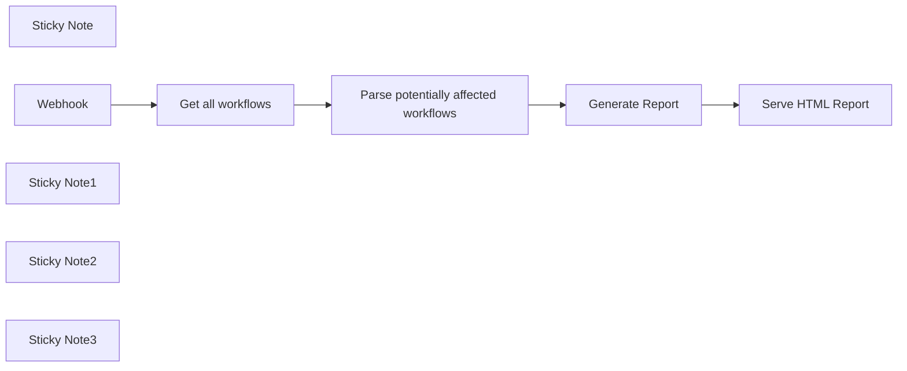

## Fluxo (.json) :

```json
{
  "meta": {
    "instanceId": "ef45cd7f45f7589c4c252d786d5d1a3233cdbfc451efa7e17688db979f2dc6ae"
  },
  "nodes": [
    {
      "id": "b83bfb2d-6d1b-4984-8fc4-6cf0a35309dc",
      "name": "Sticky Note",
      "type": "n8n-nodes-base.stickyNote",
      "position": [
        1380,
        960
      ],
      "parameters": {
        "width": 1074,
        "height": 468,
        "content": "# ⚠️ When and how to use this workflow\n\nIf you previously upgraded to n8n version `0.214.3`, some of your workflows might have accidentally been re-wired in the wrong way. This affected nodes which have more than 1 output, such as `If`, `Switch`, and `Compare Datasets`.\n\nThis workflow helps you identify potentially affected workflows and nodes that you should  check.\n\n**❗️Please ensure to run this workflow as the instance owner❗️**\n\n1. Configure the \"Get all workflows\" node to use your n8n API key. (You can find/create your API key under \"Settings > n8n API\")\n2. If you have community nodes installed that have more than 1 output, add them to the constant `MULTI_OUTPUT_NODES` in the \"Parse potentially affected workflows\" code node.\n3. Activate the workflow\n4. Visit `{YOUR_INSTANCE_URL}/webhooks/affected-workflows` from your browser\n5. The report will list potentially affected workflows/nodes.\n    1. The square brackets after the workflow name list the potentially affected nodes\n    2. Inspect each reported workflow individually (you can click on a row to open it in a new tab)\n    3. **Verify that the correct outbound connectors are used to connect subsequent nodes.**"
      },
      "typeVersion": 1
    },
    {
      "id": "ba065db3-be3c-4694-afbd-c9095526adf6",
      "name": "Get all workflows",
      "type": "n8n-nodes-base.n8n",
      "position": [
        1540,
        1460
      ],
      "parameters": {
        "filters": {}
      },
      "credentials": {
        "n8nApi": {
          "id": "13",
          "name": "n8n account"
        }
      },
      "typeVersion": 1
    },
    {
      "id": "0fdd3ac4-8c11-4c90-b613-fcbe479a71f6",
      "name": "Webhook",
      "type": "n8n-nodes-base.webhook",
      "position": [
        1380,
        1460
      ],
      "webhookId": "9f6c90b5-1d0a-4dca-8009-2ee39a4f8002",
      "parameters": {
        "path": "affected-workflows",
        "options": {
          "rawBody": false,
          "responseHeaders": {
            "entries": [
              {
                "name": "Content-Type",
                "value": "text/html; charset=utf-8"
              }
            ]
          }
        },
        "responseMode": "responseNode"
      },
      "typeVersion": 1
    },
    {
      "id": "88725f34-678a-4127-b163-368ab2fc7b39",
      "name": "Parse potentially affected workflows",
      "type": "n8n-nodes-base.code",
      "position": [
        1880,
        1460
      ],
      "parameters": {
        "jsCode": "// Define an array of objects representing node types that have multiple outputs.\n// Each object specifies the node type and the number of outputs it has.\nconst MULTI_OUTPUT_NODES = [\n  { type: 'n8n-nodes-base.compareDatasets', outputs: 4 }, \n  { type: 'n8n-nodes-base.switch', outputs: 4}, \n  { type: 'n8n-nodes-base.if', outputs: 2}\n]\n\n// Initialize an empty array to store the affected workflows.\nconst affectedWorkflows = [];\n\n// Loop through each item in the $input array.\nfor (const item of $input.all()) {\n  // Get the workflow data from the item.\n  const workflowData = item.json;\n\n  const nodes = workflowData.nodes;\n  const connections = workflowData.connections;\n\n  // Initialize an empty array to store the potentially affected connections.\n  const potentiallyAffectedNodes = [];\n\n  for (const connectionName of Object.keys(connections)) {\n    const connection = connections[connectionName];\n    // Match connection by its name to get the node data\n    const connectionNode = nodes.find(node => node.name === connectionName);\n\n    // Check if the connection node is a multi-output node.\n    const matchedMultiOutputNode = MULTI_OUTPUT_NODES.find(n => n.type === connectionNode.type);\n    if(matchedMultiOutputNode) {\n      const connectedOutputs = connection.main.filter(c => c && c.length > 0);\n\n      // Check if the connection has empty outputs.\n      const hasEmptyOutputs = connectedOutputs.length <  matchedMultiOutputNode.outputs;\n\n      // If there are no connected outputs, skip this connection, it couldn't been affected by the migration\n      if(connectedOutputs.length === 0) continue;\n\n      // If the connection has empty outputs, it might have been affected by the wrong connections migration\n      // which filtered-out empty indexes\n      if(hasEmptyOutputs) potentiallyAffectedNodes.push(connectionName);\n    }\n  }\n\n  if(potentiallyAffectedNodes.length > 0) {\n    affectedWorkflows.push(\n      { \n        workflowId: workflowData.id, \n        workflowName: workflowData.name,\n        active: workflowData.active, \n        potentiallyAffectedNodes\n      }\n    )\n  }\n}\n\nreturn {workflows: affectedWorkflows};\n"
      },
      "typeVersion": 1,
      "alwaysOutputData": true
    },
    {
      "id": "a2324a53-da62-4386-8c86-4d85ffb228b4",
      "name": "Sticky Note1",
      "type": "n8n-nodes-base.stickyNote",
      "position": [
        1880,
        1620
      ],
      "parameters": {
        "width": 236,
        "height": 194,
        "content": "# 👆\n\nIn case you have community nodes installed, add them to `MULTI_OUTPUT_NODES`"
      },
      "typeVersion": 1
    },
    {
      "id": "019f564b-edd4-40be-97f5-f1b1cf433005",
      "name": "Sticky Note2",
      "type": "n8n-nodes-base.stickyNote",
      "position": [
        1540,
        1620
      ],
      "parameters": {
        "width": 208,
        "height": 197,
        "content": "# 👆\n\nConfigure this node to use your n8n API credential"
      },
      "typeVersion": 1
    },
    {
      "id": "9fa255a8-8e2d-4e3f-ad83-d56b69066e67",
      "name": "Generate Report",
      "type": "n8n-nodes-base.html",
      "position": [
        2200,
        1460
      ],
      "parameters": {
        "html": "\n<!DOCTYPE html>\n\n<html>\n<head>\n  <meta charset=\"UTF-8\" />\n  <title>n8n workflows report</title>\n</head>\n<body>\n  <div class=\"container\">\n    <h1>Affected workflows:</h1>\n    <ul id=\"list\"></ul>\n  </div>\n</body>\n</html>\n\n<style>\n.container {\n  background-color: #ffffff;\n  text-align: center;\n  padding: 16px;\n  border-radius: 8px;\n}\n\nh1 {\n  color: #ff6d5a;\n  font-size: 24px;\n  font-weight: bold;\n  padding: 8px;\n}\n\nh2 {\n  color: #909399;\n  font-size: 18px;\n  font-weight: bold;\n  padding: 8px;\n}\n\nul {\n  list-style: none;\n  text-align: left;\n  padding: 0;\n}\n\nli {\n  margin: 8px 0;\n}\n\na {\n  color: #409eff;\n  text-decoration: none;\n  transition: color 0.2s ease-in-out;\n}\n\na:hover {\n  color: #ff9900;\n}\n</style>"
      },
      "typeVersion": 1
    },
    {
      "id": "7923de27-9d69-4ad2-a6e1-dc061c9e8e8f",
      "name": "Serve HTML Report",
      "type": "n8n-nodes-base.respondToWebhook",
      "position": [
        2360,
        1460
      ],
      "parameters": {
        "options": {
          "responseHeaders": {
            "entries": [
              {
                "name": "Content-Type",
                "value": "text/html; charset=utf-8"
              }
            ]
          }
        },
        "respondWith": "text",
        "responseBody": "={{ $node[\"Generate Report\"].parameter[\"html\"] }}\n<script>\nconst { workflows } = {{  JSON.stringify($node[\"Parse potentially affected workflows\"].json) }}\n\nconst $list = document.getElementById('list');\n// Append LI element to the UL element for each item in the affectedWorkflows array\nworkflows.forEach((workflow) => {\n  const $listItem = document.createElement('li');\n  if(!workflow) return;\n  const title = `<a \n target=\"_blank\" href=\"//${window.location.host}/workflow/${workflow.workflowId}\">ID: ${workflow.workflowId}: ${workflow.workflowName} [${workflow.potentiallyAffectedNodes.join(', ')}]</a>`\n  $listItem.innerHTML = title\n  $list.appendChild($listItem);\n});\n\n</script>"
      },
      "typeVersion": 1
    },
    {
      "id": "fd63ade5-c7b4-43d5-9849-79bb9aa8dca3",
      "name": "Sticky Note3",
      "type": "n8n-nodes-base.stickyNote",
      "position": [
        2360,
        1620
      ],
      "parameters": {
        "width": 451,
        "height": 194,
        "content": "# 👆\n\nFind the generated report at  `{YOUR_INSTANCE_URL}/webhooks/affected-workflows`"
      },
      "typeVersion": 1
    }
  ],
  "connections": {
    "Webhook": {
      "main": [
        [
          {
            "node": "Get all workflows",
            "type": "main",
            "index": 0
          }
        ]
      ]
    },
    "Generate Report": {
      "main": [
        [
          {
            "node": "Serve HTML Report",
            "type": "main",
            "index": 0
          }
        ]
      ]
    },
    "Get all workflows": {
      "main": [
        [
          {
            "node": "Parse potentially affected workflows",
            "type": "main",
            "index": 0
          }
        ]
      ]
    },
    "Parse potentially affected workflows": {
      "main": [
        [
          {
            "node": "Generate Report",
            "type": "main",
            "index": 0
          }
        ]
      ]
    }
  }
}
```

<a id="template-52"></a>

## Template 52 - Envio de PDFs do Gmail para Drive com OpenAI

- **Nome:** Envio de PDFs do Gmail para Drive com OpenAI
- **Descrição:** Fluxo que lê anexos PDF de emails recebidos, usa IA para identificar PDFs que correspondem a um termo configurável e faz o upload dos PDFs correspondentes para uma pasta do Google Drive.
- **Funcionalidade:** • Detecção e filtragem de anexos PDF: identifica PDFs entre os anexos de emails.
• Iteração sobre anexos: percorre cada anexo para processar PDFs.
• Validação de tamanho de texto: verifica se o conteúdo textual cabe no limite de tokens configurável.
• Classificação com IA: consulta o OpenAI para confirmar se o PDF corresponde ao termo de busca.
• Roteamento por correspondência: apenas PDFs que são classificados como matching são enviados para upload.
• Upload para Google Drive: envia o PDF correspondente para a pasta especificada.
• Tratamento de não-PDFs: ignora anexos que não são PDFs ou não correspondem ao critério.
- **Ferramentas:** • Gmail: serviço de email para receber mensagens e anexos.
• OpenAI: serviço de IA utilizado para verificar a correspondência do PDF com o termo de busca configurável.
• Google Drive: serviço de armazenamento para upload dos PDFs correspondentes na pasta especificada.

## Fluxo visual

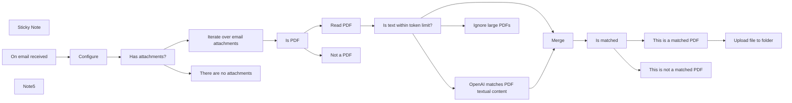

## Fluxo (.json) :

```json
{
  "meta": {
    "instanceId": "a2434c94d549548a685cca39cc4614698e94f527bcea84eefa363f1037ae14cd"
  },
  "nodes": [
    {
      "id": "deafa2e8-af41-4f11-92e0-09992f6c6970",
      "name": "Read PDF",
      "type": "n8n-nodes-base.readPDF",
      "position": [
        860,
        1420
      ],
      "parameters": {},
      "typeVersion": 1
    },
    {
      "id": "8e3ddbb1-83a1-4f79-9464-61d5a20f0427",
      "name": "Sticky Note",
      "type": "n8n-nodes-base.stickyNote",
      "position": [
        -760,
        1300
      ],
      "parameters": {
        "width": 444.034812880766,
        "height": 599.5274151436035,
        "content": "## Send specific PDF attachments from Gmail to Google Drive using OpenAI\n\n_**DISCLAIMER**: You may have varying success when using this workflow so be prepared to validate the correctness of OpenAI's results._\n\nThis workflow reads PDF textual content and sends the text to OpenAI. Attachments of interest will then be uploaded to a specified Google Drive folder. For example, you may wish to send invoices received from an email to an inbox folder in Google Drive for later processing. This workflow has been designed to easily change the search term to match your needs. See the workflow for more details.\n\n### How it works\n1. Triggers off on the `On email received` node.\n2. Iterates over the attachments in the email.\n3. Uses the `OpenAI` node to filter out the attachments that do not match the search term set in the `Configure` node. You could match on various PDF files (i.e. invoice, receipt, or contract).\n4. If the PDF attachment matches the search term, the workflow uses the `Google Drive` node to upload the PDF attachment to a specific Google Drive folder.\n\n\nWorkflow written by [David Sha](https://davidsha.me)."
      },
      "typeVersion": 1
    },
    {
      "id": "fb2c3697-a92f-4be1-b9a6-0326f87de70b",
      "name": "Configure",
      "type": "n8n-nodes-base.set",
      "position": [
        -20,
        1520
      ],
      "parameters": {
        "values": {
          "number": [
            {
              "name": "maxTokenSize",
              "value": 4000
            },
            {
              "name": "replyTokenSize",
              "value": 50
            }
          ],
          "string": [
            {
              "name": "Match on",
              "value": "payslip"
            },
            {
              "name": "Google Drive folder to upload matched PDFs",
              "value": "https://drive.google.com/drive/u/0/folders/1SKdHTnYoBNlnhF_QJ-Zyepy-3-WZkObo"
            }
          ]
        },
        "options": {}
      },
      "typeVersion": 1
    },
    {
      "id": "792c49f4-06e3-4d77-a31f-1513f70abf32",
      "name": "Is PDF",
      "type": "n8n-nodes-base.if",
      "position": [
        640,
        1520
      ],
      "parameters": {
        "conditions": {
          "string": [
            {
              "value1": "={{ $binary.data.fileExtension }}",
              "value2": "pdf"
            }
          ]
        }
      },
      "typeVersion": 1
    },
    {
      "id": "82be9111-665d-41c6-8190-2247acdb749b",
      "name": "Not a PDF",
      "type": "n8n-nodes-base.noOp",
      "position": [
        860,
        1620
      ],
      "parameters": {},
      "typeVersion": 1
    },
    {
      "id": "c2ac155f-38ee-46f2-8a24-5614e3c32ff5",
      "name": "Is matched",
      "type": "n8n-nodes-base.if",
      "position": [
        1720,
        1480
      ],
      "parameters": {
        "conditions": {
          "string": [
            {
              "value1": "={{ $json[\"text\"] }}",
              "value2": "true"
            }
          ]
        }
      },
      "typeVersion": 1
    },
    {
      "id": "4a8f15b8-c153-493d-9a2a-d63d911d642d",
      "name": "This is a matched PDF",
      "type": "n8n-nodes-base.noOp",
      "position": [
        1940,
        1380
      ],
      "parameters": {},
      "typeVersion": 1
    },
    {
      "id": "89601591-5c7b-461c-859b-25c7c1f0c2e6",
      "name": "This is not a matched PDF",
      "type": "n8n-nodes-base.noOp",
      "position": [
        1940,
        1580
      ],
      "parameters": {},
      "typeVersion": 1
    },
    {
      "id": "ac517c4a-83b8-441f-b14c-c927c18f8012",
      "name": "Iterate over email attachments",
      "type": "n8n-nodes-base.code",
      "position": [
        420,
        1420
      ],
      "parameters": {
        "jsCode": "// https://community.n8n.io/t/iterating-over-email-attachments/13588/3\nlet results = [];\n\nfor (const item of $input.all()) {\n  for (key of Object.keys(item.binary)) {\n        results.push({\n            json: {},\n            binary: {\n                data: item.binary[key],\n            }\n        });\n    }\n}\n\nreturn results;"
      },
      "typeVersion": 1
    },
    {
      "id": "79fdf2de-42fe-4ebb-80fb-cc80dcd284f9",
      "name": "OpenAI matches PDF textual content",
      "type": "n8n-nodes-base.openAi",
      "position": [
        1300,
        1340
      ],
      "parameters": {
        "prompt": "=Does this PDF file look like a {{ $(\"Configure\").first().json[\"Match on\"] }}? Return \"true\" if it is a {{ $(\"Configure\").first().json[\"Match on\"] }} and \"false\" if not. Only reply with lowercase letters \"true\" or \"false\".\n\nThis is the PDF filename:\n```\n{{ $binary.data.fileName }}\n```\n\nThis is the PDF text content:\n```\n{{ $json.text }}\n```",
        "options": {
          "maxTokens": "={{ $('Configure').first().json.replyTokenSize }}",
          "temperature": 0.1
        }
      },
      "credentials": {
        "openAiApi": {
          "id": "30",
          "name": "REPLACE ME"
        }
      },
      "typeVersion": 1,
      "alwaysOutputData": false
    },
    {
      "id": "8bdb3263-40f2-4277-8cc0-f6edef90a1cd",
      "name": "Merge",
      "type": "n8n-nodes-base.merge",
      "position": [
        1500,
        1480
      ],
      "parameters": {
        "mode": "combine",
        "options": {
          "clashHandling": {
            "values": {
              "resolveClash": "preferInput1"
            }
          }
        },
        "combinationMode": "mergeByPosition"
      },
      "typeVersion": 2
    },
    {
      "id": "8e68e725-b2df-4c0c-8b17-e0cd4610714d",
      "name": "Upload file to folder",
      "type": "n8n-nodes-base.googleDrive",
      "position": [
        2160,
        1380
      ],
      "parameters": {
        "name": "={{ $binary.data.fileName }}",
        "options": {},
        "parents": [
          "={{ $('Configure').first().json[\"Google Drive folder to upload matched PDFs\"].split(\"/\").at(-1) }}"
        ],
        "binaryData": true
      },
      "credentials": {
        "googleDriveOAuth2Api": {
          "id": "32",
          "name": "REPLACE ME"
        }
      },
      "typeVersion": 2
    },
    {
      "id": "bda00901-5ade-471c-b6f9-a18ef4d71589",
      "name": "On email received",
      "type": "n8n-nodes-base.gmailTrigger",
      "position": [
        -240,
        1520
      ],
      "parameters": {
        "simple": false,
        "filters": {},
        "options": {
          "downloadAttachments": true,
          "dataPropertyAttachmentsPrefixName": "attachment_"
        },
        "pollTimes": {
          "item": [
            {
              "mode": "everyMinute"
            }
          ]
        }
      },
      "credentials": {
        "gmailOAuth2": {
          "id": "31",
          "name": "REPLACE ME"
        }
      },
      "typeVersion": 1
    },
    {
      "id": "b2ff4774-336b-47a3-af3f-ada809ed9b8a",
      "name": "Note5",
      "type": "n8n-nodes-base.stickyNote",
      "position": [
        -100,
        1440
      ],
      "parameters": {
        "width": 259.0890718059702,
        "height": 607.9684549079709,
        "content": "### Configuration\n\n\n\n\n\n\n\n\n\n\n\n\n\n\n\n__`Match on`(required)__: What should OpenAI's search term be? Examples: invoice, callsheet, receipt, contract, payslip.\n__`Google Drive folder to upload matched PDFs`(required)__: Paste the link of the GDrive folder, an example has been provided but will need to change to a folder you own.\n__`maxTokenSize`(required)__: The maximum token size for the model you choose. See possible models from OpenAI [here](https://platform.openai.com/docs/models/gpt-3).\n__`replyTokenSize`(required)__: The reply's maximum token size. Default is 300. This determines how much text the AI will reply with."
      },
      "typeVersion": 1
    },
    {
      "id": "beb571fe-e7a3-4f3c-862b-dc01821e5f3f",
      "name": "Ignore large PDFs",
      "type": "n8n-nodes-base.noOp",
      "position": [
        1300,
        1620
      ],
      "parameters": {},
      "typeVersion": 1
    },
    {
      "id": "f3c4f249-08a7-4e5e-8f46-e07393ac10b5",
      "name": "Is text within token limit?",
      "type": "n8n-nodes-base.if",
      "position": [
        1080,
        1520
      ],
      "parameters": {
        "conditions": {
          "boolean": [
            {
              "value1": "={{ $json.text.length() / 4 <= $('Configure').first().json.maxTokenSize - $('Configure').first().json.replyTokenSize }}",
              "value2": true
            }
          ]
        }
      },
      "typeVersion": 1
    },
    {
      "id": "93b6fb96-3e0e-4953-bd09-cf882d2dc69c",
      "name": "Has attachments?",
      "type": "n8n-nodes-base.if",
      "position": [
        200,
        1520
      ],
      "parameters": {
        "conditions": {
          "boolean": [
            {
              "value1": "={{ $('On email received').item.binary.isNotEmpty() }}",
              "value2": true
            }
          ]
        }
      },
      "typeVersion": 1
    },
    {
      "id": "554d415e-a965-46be-8442-35c4cb6b005c",
      "name": "There are no attachments",
      "type": "n8n-nodes-base.noOp",
      "position": [
        420,
        1620
      ],
      "parameters": {},
      "typeVersion": 1
    }
  ],
  "connections": {
    "Merge": {
      "main": [
        [
          {
            "node": "Is matched",
            "type": "main",
            "index": 0
          }
        ]
      ]
    },
    "Is PDF": {
      "main": [
        [
          {
            "node": "Read PDF",
            "type": "main",
            "index": 0
          }
        ],
        [
          {
            "node": "Not a PDF",
            "type": "main",
            "index": 0
          }
        ]
      ]
    },
    "Read PDF": {
      "main": [
        [
          {
            "node": "Is text within token limit?",
            "type": "main",
            "index": 0
          }
        ]
      ]
    },
    "Configure": {
      "main": [
        [
          {
            "node": "Has attachments?",
            "type": "main",
            "index": 0
          }
        ]
      ]
    },
    "Is matched": {
      "main": [
        [
          {
            "node": "This is a matched PDF",
            "type": "main",
            "index": 0
          }
        ],
        [
          {
            "node": "This is not a matched PDF",
            "type": "main",
            "index": 0
          }
        ]
      ]
    },
    "Has attachments?": {
      "main": [
        [
          {
            "node": "Iterate over email attachments",
            "type": "main",
            "index": 0
          }
        ],
        [
          {
            "node": "There are no attachments",
            "type": "main",
            "index": 0
          }
        ]
      ]
    },
    "On email received": {
      "main": [
        [
          {
            "node": "Configure",
            "type": "main",
            "index": 0
          }
        ]
      ]
    },
    "This is a matched PDF": {
      "main": [
        [
          {
            "node": "Upload file to folder",
            "type": "main",
            "index": 0
          }
        ]
      ]
    },
    "Is text within token limit?": {
      "main": [
        [
          {
            "node": "OpenAI matches PDF textual content",
            "type": "main",
            "index": 0
          },
          {
            "node": "Merge",
            "type": "main",
            "index": 1
          }
        ],
        [
          {
            "node": "Ignore large PDFs",
            "type": "main",
            "index": 0
          }
        ]
      ]
    },
    "Iterate over email attachments": {
      "main": [
        [
          {
            "node": "Is PDF",
            "type": "main",
            "index": 0
          }
        ]
      ]
    },
    "OpenAI matches PDF textual content": {
      "main": [
        [
          {
            "node": "Merge",
            "type": "main",
            "index": 0
          }
        ]
      ]
    }
  }
}
```

<a id="template-53"></a>

## Template 53 - Agente de contatos com IA

- **Nome:** Agente de contatos com IA
- **Descrição:** Assistente que gerencia contatos: busca, adiciona e atualiza informações usando um modelo de linguagem e um banco de contatos.
- **Funcionalidade:** • Recebe solicitações de outro fluxo: aceita entrada quando executado por outro processo.
• Interpreta consultas com modelo de linguagem: usa um modelo de chat para entender intenções relacionadas a contatos.
• Busca contatos: consulta o banco para localizar contatos existentes.
• Adiciona ou atualiza contatos: insere novos registros ou atualiza existentes (upsert), combinando por nome e mapeando nome, email e telefone.
• Gera resposta ao solicitante: formata e entrega a resposta resultante do agente.
• Tratamento de erro básico: retorna mensagem genérica em caso de falha para solicitar nova tentativa.
- **Ferramentas:** • OpenAI: modelo de linguagem usado para interpretar comandos, decidir ações e gerar respostas (ex.: GPT-4o).
• Airtable: banco de dados de contatos usado para buscar, inserir e atualizar registros (base e tabela de contatos).

## Fluxo visual

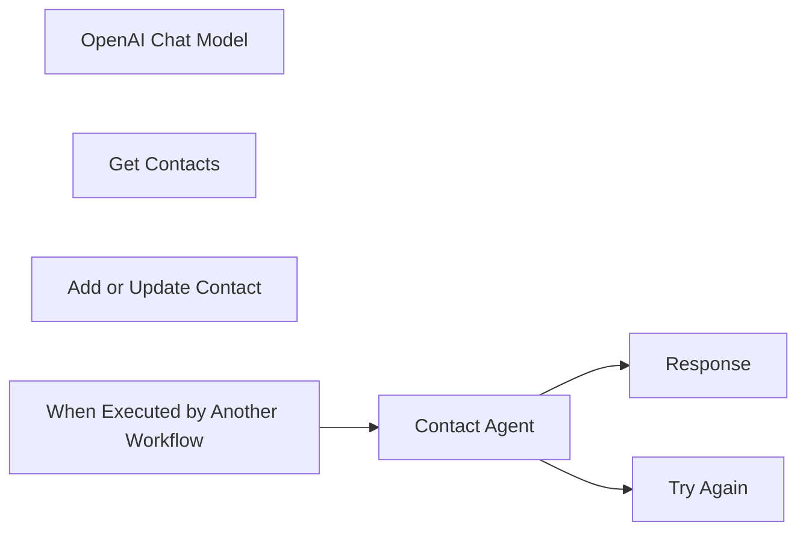

## Fluxo (.json) :

```json
{
  "id": "IsSUyrla7wc1cDLE",
  "meta": {
    "instanceId": "95e5a8c2e51c83e33b232ea792bbe3f063c094c33d9806a5565cb31759e1ad39",
    "templateCredsSetupCompleted": true
  },
  "name": "🤖Contact Agent",
  "tags": [],
  "nodes": [
    {
      "id": "789b640d-a981-43a1-ae88-9dbbd4de92c0",
      "name": "OpenAI Chat Model",
      "type": "@n8n/n8n-nodes-langchain.lmChatOpenAi",
      "position": [
        -140,
        140
      ],
      "parameters": {
        "model": {
          "__rl": true,
          "mode": "list",
          "value": "gpt-4o",
          "cachedResultName": "gpt-4o"
        },
        "options": {}
      },
      "credentials": {
        "openAiApi": {
          "id": "BP9v81AwJlpYGStD",
          "name": "OpenAi account"
        }
      },
      "typeVersion": 1.2
    },
    {
      "id": "6b3489a8-75be-461b-a4e4-9592a23a138f",
      "name": "Get Contacts",
      "type": "n8n-nodes-base.airtableTool",
      "position": [
        40,
        140
      ],
      "parameters": {
        "base": {
          "__rl": true,
          "mode": "list",
          "value": "appK0rbtvf9e7vt6w",
          "cachedResultUrl": "https://airtable.com/appK0rbtvf9e7vt6w",
          "cachedResultName": "Contacts"
        },
        "table": {
          "__rl": true,
          "mode": "list",
          "value": "tbl08JGCfUK1RhXsG",
          "cachedResultUrl": "https://airtable.com/appK0rbtvf9e7vt6w/tbl08JGCfUK1RhXsG",
          "cachedResultName": "Contacts"
        },
        "options": {},
        "operation": "search"
      },
      "credentials": {
        "airtableTokenApi": {
          "id": "UlAGE0msyITVkoCN",
          "name": "Nate Airtable"
        }
      },
      "typeVersion": 2.1
    },
    {
      "id": "a0eb4ad0-4e60-41bd-8854-ad20942453a4",
      "name": "Add or Update Contact",
      "type": "n8n-nodes-base.airtableTool",
      "position": [
        200,
        140
      ],
      "parameters": {
        "base": {
          "__rl": true,
          "mode": "list",
          "value": "appK0rbtvf9e7vt6w",
          "cachedResultUrl": "https://airtable.com/appK0rbtvf9e7vt6w",
          "cachedResultName": "Contacts"
        },
        "table": {
          "__rl": true,
          "mode": "list",
          "value": "tbl08JGCfUK1RhXsG",
          "cachedResultUrl": "https://airtable.com/appK0rbtvf9e7vt6w/tbl08JGCfUK1RhXsG",
          "cachedResultName": "Contacts"
        },
        "columns": {
          "value": {
            "name": "={{ $fromAI(\"name\") }}",
            "email": "={{ $fromAI(\"emailAddress\") }}",
            "phoneNumber": "={{ $fromAI(\"phoneNumber\") }}"
          },
          "schema": [
            {
              "id": "name",
              "type": "string",
              "display": true,
              "removed": false,
              "readOnly": false,
              "required": false,
              "displayName": "name",
              "defaultMatch": false,
              "canBeUsedToMatch": true
            },
            {
              "id": "email",
              "type": "string",
              "display": true,
              "removed": false,
              "readOnly": false,
              "required": false,
              "displayName": "email",
              "defaultMatch": false,
              "canBeUsedToMatch": true
            },
            {
              "id": "phoneNumber",
              "type": "string",
              "display": true,
              "removed": false,
              "readOnly": false,
              "required": false,
              "displayName": "phoneNumber",
              "defaultMatch": false,
              "canBeUsedToMatch": true
            }
          ],
          "mappingMode": "defineBelow",
          "matchingColumns": [
            "name"
          ],
          "attemptToConvertTypes": false,
          "convertFieldsToString": false
        },
        "options": {},
        "operation": "upsert"
      },
      "credentials": {
        "airtableTokenApi": {
          "id": "UlAGE0msyITVkoCN",
          "name": "Nate Airtable"
        }
      },
      "typeVersion": 2.1
    },
    {
      "id": "a3b9dae0-1458-4cb1-b17c-9349d41c03b5",
      "name": "Contact Agent",
      "type": "@n8n/n8n-nodes-langchain.agent",
      "onError": "continueErrorOutput",
      "position": [
        -20,
        -80
      ],
      "parameters": {
        "text": "={{ $json.query }}",
        "options": {
          "systemMessage": "=# Overview\nYou are a contact management assistant. Your responsibilities include looking up contacts, adding new contacts, or updating a contact's information.\n\n**Contact Management**  \n   - Use \"Get Contacts\" to retrieve contact information. \n   - Use \"Add or Update Contact\" to store new contact information or modify existing entries. "
        },
        "promptType": "define"
      },
      "typeVersion": 1.7
    },
    {
      "id": "c33b944e-cb4f-447b-ad1f-5e199ed078ac",
      "name": "Response",
      "type": "n8n-nodes-base.set",
      "position": [
        500,
        -160
      ],
      "parameters": {
        "options": {},
        "assignments": {
          "assignments": [
            {
              "id": "4f360190-a717-4a93-8336-d03ea65975d5",
              "name": "response",
              "type": "string",
              "value": "={{ $json.output }}"
            }
          ]
        }
      },
      "typeVersion": 3.4
    },
    {
      "id": "2df9e0c0-3f4f-4a06-a36f-f552fe99e2b8",
      "name": "Try Again",
      "type": "n8n-nodes-base.set",
      "position": [
        500,
        20
      ],
      "parameters": {
        "options": {},
        "assignments": {
          "assignments": [
            {
              "id": "4f360190-a717-4a93-8336-d03ea65975d5",
              "name": "response",
              "type": "string",
              "value": "An error occurred. Please try again."
            }
          ]
        }
      },
      "typeVersion": 3.4
    },
    {
      "id": "ca88c05c-5a68-4a88-b15b-22398fb15d86",
      "name": "When Executed by Another Workflow",
      "type": "n8n-nodes-base.executeWorkflowTrigger",
      "position": [
        -240,
        -80
      ],
      "parameters": {
        "inputSource": "passthrough"
      },
      "typeVersion": 1.1
    }
  ],
  "active": false,
  "pinData": {},
  "settings": {
    "executionOrder": "v1"
  },
  "versionId": "24f13596-516c-4365-b91d-e477ed1c652b",
  "connections": {
    "Get Contacts": {
      "ai_tool": [
        [
          {
            "node": "Contact Agent",
            "type": "ai_tool",
            "index": 0
          }
        ]
      ]
    },
    "Contact Agent": {
      "main": [
        [
          {
            "node": "Response",
            "type": "main",
            "index": 0
          }
        ],
        [
          {
            "node": "Try Again",
            "type": "main",
            "index": 0
          }
        ]
      ]
    },
    "OpenAI Chat Model": {
      "ai_languageModel": [
        [
          {
            "node": "Contact Agent",
            "type": "ai_languageModel",
            "index": 0
          }
        ]
      ]
    },
    "Add or Update Contact": {
      "ai_tool": [
        [
          {
            "node": "Contact Agent",
            "type": "ai_tool",
            "index": 0
          }
        ]
      ]
    },
    "When Executed by Another Workflow": {
      "main": [
        [
          {
            "node": "Contact Agent",
            "type": "main",
            "index": 0
          }
        ]
      ]
    }
  }
}
```

<a id="template-54"></a>

## Template 54 - Converter páginas web em Markdown e extrair links

- **Nome:** Converter páginas web em Markdown e extrair links
- **Descrição:** Processa uma lista de URLs, envia cada página para a API do Firecrawl para converter HTML em markdown e extrair links, retornando títulos, descrições, conteúdo em markdown e links para posterior armazenamento.
- **Funcionalidade:** • Conversão HTML para Markdown: Envia a URL para uma API que converte o conteúdo da página em formato markdown.
• Extração de links: Coleta todos os links encontrados na página processada.
• Processamento em lote: Divide a lista de URLs em lotes para controlar uso de memória e paralelismo (configuração de 40/10 como exemplo).
• Respeito a limites de API e retries: Implementa espera entre chamadas, controle de taxa e tentativas de reenvio em caso de falha para respeitar limites (ex.: 10 requisições por minuto).
• Mapeamento de campos: Normaliza a resposta para campos como title, description, content (markdown) e links.
• Entrada e saída personalizáveis: Permite usar uma fonte própria de URLs e enviar os resultados para seu destino de dados (ex.: Airtable).
• Autenticação via token: Requer configuração de cabeçalho Authorization com token para acessar a API.
- **Ferramentas:** • Firecrawl.dev API: Serviço de scraping que converte páginas web em markdown, extrai metadados e links via endpoints HTTP autenticados.
• Banco de dados / Armazenamento (ex.: Airtable): Fonte de URLs de entrada e destino para armazenar os resultados e metadados extraídos.

## Fluxo visual

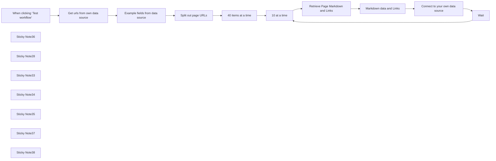

## Fluxo (.json) :

```json
{
  "meta": {
    "instanceId": "6b6a2db47bdf8371d21090c511052883cc9a3f6af5d0d9d567c702d74a18820e"
  },
  "nodes": [
    {
      "id": "f4570aad-db25-4dcd-8589-b1c8335935de",
      "name": "When clicking ‘Test workflow’",
      "type": "n8n-nodes-base.manualTrigger",
      "position": [
        -180,
        3800
      ],
      "parameters": {},
      "typeVersion": 1
    },
    {
      "id": "bd481559-85f2-4865-8d85-e50e72369f26",
      "name": "Wait",
      "type": "n8n-nodes-base.wait",
      "position": [
        940,
        3620
      ],
      "webhookId": "f10708f0-38c6-4c75-b635-37222d5b183a",
      "parameters": {
        "amount": 45
      },
      "typeVersion": 1.1
    },
    {
      "id": "cc9e9947-19e4-47c5-95b0-a631d688a8b6",
      "name": "Sticky Note36",
      "type": "n8n-nodes-base.stickyNote",
      "position": [
        549.7858793743054,
        3709.534654112671
      ],
      "parameters": {
        "color": 7,
        "width": 327.8244990224782,
        "height": 268.48353140372035,
        "content": "**40 at a time seems to be the memory limit on my server - run until complete with batches of 40 or increase based on your server memory**\n"
      },
      "typeVersion": 1
    },
    {
      "id": "9ebbd993-9194-40b1-a98e-352eb3a3f9eb",
      "name": "Sticky Note28",
      "type": "n8n-nodes-base.stickyNote",
      "position": [
        -50.797941767307435,
        3729.028866440868
      ],
      "parameters": {
        "color": 7,
        "width": 574.7594700148138,
        "height": 248.90718753310907,
        "content": "**Firecrawl.dev retrieves markdown inc. title, description, links & content. First define the URLs you'd like to scrape**\n"
      },
      "typeVersion": 1
    },
    {
      "id": "71c0f975-c0f9-47ae-a245-f852387ad461",
      "name": "Connect to your own data source",
      "type": "n8n-nodes-base.noOp",
      "position": [
        1380,
        3820
      ],
      "parameters": {},
      "typeVersion": 1
    },
    {
      "id": "fba918e7-2c88-4de3-a789-cadbf4f2584e",
      "name": "Get urls from own data source",
      "type": "n8n-nodes-base.noOp",
      "position": [
        0,
        3800
      ],
      "parameters": {},
      "typeVersion": 1
    },
    {
      "id": "221a75eb-0bc8-4747-9ec1-1879c46d9163",
      "name": "Example fields from data source",
      "type": "n8n-nodes-base.set",
      "notes": "Define URLs in array",
      "position": [
        200,
        3800
      ],
      "parameters": {
        "options": {},
        "assignments": {
          "assignments": [
            {
              "id": "cc2c6af0-68d3-49eb-85fe-3288d2ed0f6b",
              "name": "Page",
              "type": "array",
              "value": "[\"https://www.automake.io/\", \"https://www.n8n.io/\"]"
            }
          ]
        },
        "includeOtherFields": true
      },
      "notesInFlow": true,
      "typeVersion": 3.4
    },
    {
      "id": "5a914964-e8ef-4064-8ecb-f1866de0d8c6",
      "name": "Sticky Note33",
      "type": "n8n-nodes-base.stickyNote",
      "position": [
        -40,
        4000
      ],
      "parameters": {
        "color": 3,
        "width": 510.3561134140244,
        "height": 94.13486342358942,
        "content": "**REQUIRED**\nConnect to your database of urls to input. Name the column `Page` like in the `Example fields from data source` node and make sure it has one link per row like `split out page urls`"
      },
      "typeVersion": 1
    },
    {
      "id": "5c004d5c-afeb-47c9-b30b-eb88880f87b9",
      "name": "Sticky Note34",
      "type": "n8n-nodes-base.stickyNote",
      "position": [
        900,
        4000
      ],
      "parameters": {
        "color": 3,
        "width": 284.87764467541297,
        "height": 168.68864948728321,
        "content": "**REQUIRED**\nUpdate the Auth parameter to your own [Firecrawl](https://firecrawl.dev) dev token\n\n**Header Auth parameter**\nname - Authorization\nvalue - your-own-api-key"
      },
      "typeVersion": 1
    },
    {
      "id": "53d97054-a5e4-4819-bdd9-f8632c33eba2",
      "name": "Sticky Note35",
      "type": "n8n-nodes-base.stickyNote",
      "position": [
        1360,
        4000
      ],
      "parameters": {
        "color": 3,
        "width": 284.87764467541297,
        "height": 91.91340067739628,
        "content": "**REQUIRED** \nOutput the data to your own data source e.g. Airtable"
      },
      "typeVersion": 1
    },
    {
      "id": "357a463f-7581-43ba-8930-af27e4762905",
      "name": "Sticky Note37",
      "type": "n8n-nodes-base.stickyNote",
      "position": [
        900,
        3570.2075673933587
      ],
      "parameters": {
        "color": 7,
        "width": 181.96744211154697,
        "height": 189.23753199986137,
        "content": "**Respect API limits (10 requests per min)**\n"
      },
      "typeVersion": 1
    },
    {
      "id": "77311c67-f50f-427a-87fd-b29b1f542bbc",
      "name": "40 items at a time",
      "type": "n8n-nodes-base.limit",
      "position": [
        580,
        3800
      ],
      "parameters": {
        "maxItems": 40
      },
      "typeVersion": 1
    },
    {
      "id": "43557ab1-4e52-4598-83a9-e39d5afc6de7",
      "name": "10 at a time",
      "type": "n8n-nodes-base.splitInBatches",
      "position": [
        740,
        3800
      ],
      "parameters": {
        "options": {},
        "batchSize": 10
      },
      "typeVersion": 3
    },
    {
      "id": "555d52e7-010b-462b-9382-26804493de1c",
      "name": "Markdown data and Links",
      "type": "n8n-nodes-base.set",
      "position": [
        1160,
        3820
      ],
      "parameters": {
        "options": {},
        "assignments": {
          "assignments": [
            {
              "id": "3a959c64-4c3c-4072-8427-67f6f6ecba1b",
              "name": "title",
              "type": "string",
              "value": "={{ $json.data.metadata.title }}"
            },
            {
              "id": "d2da0859-a7a0-4c39-913a-150ecb95d075",
              "name": "description",
              "type": "string",
              "value": "={{ $json.data.metadata.description }}"
            },
            {
              "id": "62bd2d76-b78d-4501-a59b-a25ed7b345b0",
              "name": "content",
              "type": "string",
              "value": "={{ $json.data.markdown }}"
            },
            {
              "id": "d4c712fa-b52a-498f-8abc-26dc72be61f7",
              "name": "links",
              "type": "string",
              "value": "={{ $json.data.links }} "
            }
          ]
        }
      },
      "notesInFlow": true,
      "typeVersion": 3.4
    },
    {
      "id": "aac948e6-ac86-4cea-be84-f27919d6d936",
      "name": "Split out page URLs",
      "type": "n8n-nodes-base.splitOut",
      "position": [
        380,
        3800
      ],
      "parameters": {
        "options": {},
        "fieldToSplitOut": "Page"
      },
      "typeVersion": 1
    },
    {
      "id": "71c5a0d4-540e-4766-ae99-bdc427019dac",
      "name": "Retrieve Page Markdown and Links",
      "type": "n8n-nodes-base.httpRequest",
      "notes": "curl -X POST https://api.firecrawl.dev/v1/scrape \\\n -H 'Content-Type: application/json' \\\n -H 'Authorization: Bearer YOUR_API_KEY' \\\n -d '{\n \"url\": \"https://docs.firecrawl.dev\",\n \"formats\" : [\"markdown\", \"html\"]\n }'\n",
      "position": [
        960,
        3820
      ],
      "parameters": {
        "url": "https://api.firecrawl.dev/v1/scrape",
        "method": "POST",
        "options": {},
        "jsonBody": "={\n \"url\": \"{{ $json.Page }}\",\n \"formats\" : [\"markdown\", \"links\"]\n} ",
        "sendBody": true,
        "sendHeaders": true,
        "specifyBody": "json",
        "authentication": "genericCredentialType",
        "genericAuthType": "httpHeaderAuth",
        "headerParameters": {
          "parameters": [
            {
              "name": "Content-Type",
              "value": "application/json"
            }
          ]
        }
      },
      "credentials": {
        "httpHeaderAuth": {
          "id": "nbamiF1MDku2NNz7",
          "name": "Firecrawl Bearer"
        }
      },
      "retryOnFail": true,
      "typeVersion": 4.2,
      "waitBetweenTries": 5000
    },
    {
      "id": "a2f12929-262e-4354-baa3-f9e3c05ec2eb",
      "name": "Sticky Note38",
      "type": "n8n-nodes-base.stickyNote",
      "position": [
        -840,
        3340
      ],
      "parameters": {
        "color": 4,
        "width": 581.9949654101088,
        "height": 818.5240734585421,
        "content": "## Convert URL HTML to Markdown and Get Page Links\n\n## Use Case\nTransform web pages into AI-friendly markdown format:\n- You need to process webpage content for LLM analysis\n- You want to extract both content and links from web pages\n- You need clean, formatted text without HTML markup\n- You want to respect API rate limits while crawling pages\n\n## What this Workflow Does\nThe workflow uses Firecrawl.dev API to process webpages:\n- Converts HTML content to markdown format\n- Extracts all links from each webpage\n- Handles API rate limiting automatically\n- Processes URLs in batches from your database\n\n## Setup\n1. Create a [Firecrawl.dev](https://www.firecrawl.dev/) account and get your API key\n2. Add your Firecrawl API key to the HTTP Request node's Authorization header\n3. Connect your URL database to the input node (column name must be \"Page\") or edit the array in `Example fields from data source`\n4. Configure your preferred output database connection\n\n## How to Adjust it to Your Needs\n- Modify input source to pull URLs from different databases\n- Adjust rate limiting parameters if needed\n- Customize output format for your specific use case\n\n\nMade by Simon @ [automake.io](https://automake.io)\n"
      },
      "typeVersion": 1
    }
  ],
  "pinData": {},
  "connections": {
    "Wait": {
      "main": [
        [
          {
            "node": "10 at a time",
            "type": "main",
            "index": 0
          }
        ]
      ]
    },
    "10 at a time": {
      "main": [
        null,
        [
          {
            "node": "Retrieve Page Markdown and Links",
            "type": "main",
            "index": 0
          }
        ]
      ]
    },
    "40 items at a time": {
      "main": [
        [
          {
            "node": "10 at a time",
            "type": "main",
            "index": 0
          }
        ]
      ]
    },
    "Split out page URLs": {
      "main": [
        [
          {
            "node": "40 items at a time",
            "type": "main",
            "index": 0
          }
        ]
      ]
    },
    "Markdown data and Links": {
      "main": [
        [
          {
            "node": "Connect to your own data source",
            "type": "main",
            "index": 0
          }
        ]
      ]
    },
    "Get urls from own data source": {
      "main": [
        [
          {
            "node": "Example fields from data source",
            "type": "main",
            "index": 0
          }
        ]
      ]
    },
    "Connect to your own data source": {
      "main": [
        [
          {
            "node": "Wait",
            "type": "main",
            "index": 0
          }
        ]
      ]
    },
    "Example fields from data source": {
      "main": [
        [
          {
            "node": "Split out page URLs",
            "type": "main",
            "index": 0
          }
        ]
      ]
    },
    "Retrieve Page Markdown and Links": {
      "main": [
        [
          {
            "node": "Markdown data and Links",
            "type": "main",
            "index": 0
          }
        ]
      ]
    },
    "When clicking ‘Test workflow’": {
      "main": [
        [
          {
            "node": "Get urls from own data source",
            "type": "main",
            "index": 0
          }
        ]
      ]
    }
  }
}
```

<a id="template-55"></a>

## Template 55 - Revisor automático de MR GitLab

- **Nome:** Revisor automático de MR GitLab
- **Descrição:** Fluxo que reage a comentários específicos em merge requests do GitLab, analisa as alterações de código com um modelo de linguagem e publica uma revisão como discussão posicionada no merge request.
- **Funcionalidade:** • Detecção de evento por comentário: inicia quando recebe um comentário específico no merge request (configurável como palavra-chave).
• Recuperação das mudanças do MR: consulta a API do GitLab para obter diffs e metadados do merge request.
• Processamento por arquivo: separa as alterações e trata cada arquivo modificado individualmente.
• Filtragem de alterações irrelevantes: ignora arquivos renomeados, deletados ou diffs sem hunk headers adequados.
• Extração de posição de diff: calcula a última linha antiga e nova do bloco de diff para posicionamento preciso da revisão.
• Construção dos trechos original e novo: transforma o diff em blocos de código "original" e "novo" para comparação direta.
• Geração de parecer técnico por LLM: envia o contexto e um prompt personalizado ao modelo para obter uma decisão (aceitar/rejeitar), pontuação e sugestões de correção em formato Markdown rigoroso.
• Publicação de discussão posicionada no MR: cria uma discussão no GitLab vinculada ao arquivo e às linhas corretas com o conteúdo gerado.
• Personalização: permite ajustar o prompt, a palavra gatilho para ativação e configurar URL/token do GitLab.
- **Ferramentas:** • GitLab: Plataforma usada para receber webhooks, recuperar mudanças de merge requests e publicar discussões posicionadas via API.
• OpenAI (gpt-4o-mini): Modelo de linguagem utilizado para analisar as alterações de código e gerar o parecer técnico.


## Fluxo visual

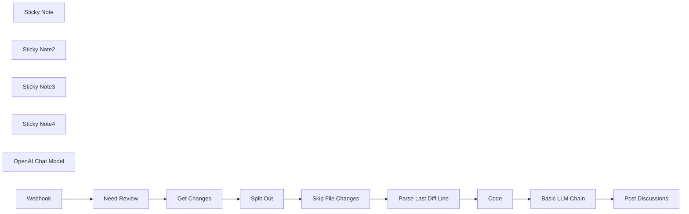

## Fluxo (.json) :

```json
{
  "meta": {
    "instanceId": "408f9fb9940c3cb18ffdef0e0150fe342d6e655c3a9fac21f0f644e8bedabcd9",
    "templateCredsSetupCompleted": true
  },
  "nodes": [
    {
      "id": "2a5a96c9-926c-447d-8244-db760e48a45f",
      "name": "Sticky Note",
      "type": "n8n-nodes-base.stickyNote",
      "position": [
        -180,
        -140
      ],
      "parameters": {
        "content": "## Edit your own prompt ⬇️\n"
      },
      "typeVersion": 1
    },
    {
      "id": "4c3a6b0b-2771-441d-8cb2-e17c07a92156",
      "name": "Sticky Note2",
      "type": "n8n-nodes-base.stickyNote",
      "position": [
        -1440,
        -100
      ],
      "parameters": {
        "content": "## Filter comments and customize your trigger words ⬇️"
      },
      "typeVersion": 1
    },
    {
      "id": "4f42b776-cc24-486c-889f-7c09522503ed",
      "name": "Sticky Note3",
      "type": "n8n-nodes-base.stickyNote",
      "position": [
        -1180,
        -120
      ],
      "parameters": {
        "content": "## Replace your gitlab URL and token ⬇️"
      },
      "typeVersion": 1
    },
    {
      "id": "b8859219-ce90-4940-8d9e-338c742def5e",
      "name": "Sticky Note4",
      "type": "n8n-nodes-base.stickyNote",
      "position": [
        140,
        -140
      ],
      "parameters": {
        "content": "## Replace your gitlab URL and token ⬇️"
      },
      "typeVersion": 1
    },
    {
      "id": "6be296f3-bd61-4644-825f-d96d591f229e",
      "name": "Need Review",
      "type": "n8n-nodes-base.if",
      "position": [
        -1440,
        100
      ],
      "parameters": {
        "options": {},
        "conditions": {
          "options": {
            "version": 2,
            "leftValue": "",
            "caseSensitive": true,
            "typeValidation": "strict"
          },
          "combinator": "and",
          "conditions": [
            {
              "id": "617eb2c5-dd4b-4e28-b533-0c32ea6ca961",
              "operator": {
                "name": "filter.operator.equals",
                "type": "string",
                "operation": "equals"
              },
              "leftValue": "={{ $json.body.object_attributes.note }}",
              "rightValue": "+0"
            }
          ]
        }
      },
      "typeVersion": 2.2
    },
    {
      "id": "fe59eeab-03a1-4b36-97f2-bf04bf6e4b8d",
      "name": "Get Changes",
      "type": "n8n-nodes-base.httpRequest",
      "position": [
        -1180,
        80
      ],
      "parameters": {
        "url": "=https://gitlab.com/api/v4/projects/{{ $json[\"body\"][\"project_id\"] }}/merge_requests/{{ $json[\"body\"][\"merge_request\"][\"iid\"] }}/changes",
        "options": {},
        "sendHeaders": true,
        "headerParameters": {
          "parameters": [
            {
              "name": "PRIVATE-TOKEN"
            }
          ]
        }
      },
      "typeVersion": 4.2
    },
    {
      "id": "4fe2800c-1eb5-44c6-93bb-25285a015b1d",
      "name": "Split Out",
      "type": "n8n-nodes-base.splitOut",
      "position": [
        -1000,
        80
      ],
      "parameters": {
        "options": {},
        "fieldToSplitOut": "changes"
      },
      "typeVersion": 1
    },
    {
      "id": "1838ffe7-a846-473b-9716-2714d527c727",
      "name": "Skip File Changes",
      "type": "n8n-nodes-base.if",
      "position": [
        -820,
        80
      ],
      "parameters": {
        "options": {},
        "conditions": {
          "options": {
            "version": 2,
            "leftValue": "",
            "caseSensitive": true,
            "typeValidation": "strict"
          },
          "combinator": "and",
          "conditions": [
            {
              "id": "c6e1430b-84a7-47ce-8fe9-7b94da0f2d31",
              "operator": {
                "type": "boolean",
                "operation": "false",
                "singleValue": true
              },
              "leftValue": "={{ $json.renamed_file }}",
              "rightValue": ""
            },
            {
              "id": "bf6e9eb9-d72d-459c-a722-9614bab8842c",
              "operator": {
                "type": "boolean",
                "operation": "false",
                "singleValue": true
              },
              "leftValue": "={{ $json.deleted_file }}",
              "rightValue": ""
            },
            {
              "id": "501623a9-9515-4034-bb13-a5a6a4f924eb",
              "operator": {
                "type": "string",
                "operation": "startsWith"
              },
              "leftValue": "={{ $json.diff }}",
              "rightValue": "@@"
            }
          ]
        }
      },
      "typeVersion": 2.2
    },
    {
      "id": "6215ecd2-55ad-4652-8c1f-f08713fdc237",
      "name": "Parse Last Diff Line",
      "type": "n8n-nodes-base.code",
      "position": [
        -560,
        -120
      ],
      "parameters": {
        "mode": "runOnceForEachItem",
        "jsCode": "const parseLastDiff = (gitDiff) => {\n  gitDiff = gitDiff.replace(/\\n\\\\ No newline at end of file/, '')\n  \n  const diffList = gitDiff.trimEnd().split('\\n').reverse();\n  const lastLineFirstChar = diffList?.[0]?.[0];\n  const lastDiff =\n    diffList.find((item) => {\n      return /^@@ \\-\\d+,\\d+ \\+\\d+,\\d+ @@/g.test(item);\n    }) || '';\n\n  const [lastOldLineCount, lastNewLineCount] = lastDiff\n    .replace(/@@ \\-(\\d+),(\\d+) \\+(\\d+),(\\d+) @@.*/g, ($0, $1, $2, $3, $4) => {\n      return `${+$1 + +$2},${+$3 + +$4}`;\n    })\n    .split(',');\n  \n  if (!/^\\d+$/.test(lastOldLineCount) || !/^\\d+$/.test(lastNewLineCount)) {\n    return {\n      lastOldLine: -1,\n      lastNewLine: -1,\n      gitDiff,\n    };\n  }\n\n\n  const lastOldLine = lastLineFirstChar === '+' ? null : (parseInt(lastOldLineCount) || 0) - 1;\n  const lastNewLine = lastLineFirstChar === '-' ? null : (parseInt(lastNewLineCount) || 0) - 1;\n\n  return {\n    lastOldLine,\n    lastNewLine,\n    gitDiff,\n  };\n};\n\nreturn parseLastDiff($input.item.json.diff)\n"
      },
      "typeVersion": 2
    },
    {
      "id": "bb3d6be0-7e85-4c2e-840a-090a36b48236",
      "name": "Basic LLM Chain",
      "type": "@n8n/n8n-nodes-langchain.chainLlm",
      "position": [
        -180,
        60
      ],
      "parameters": {
        "text": "=File path：{{ $('Skip File Changes').item.json.new_path }}\n\n```Original code\n {{ $json.originalCode }}\n```\nchange to\n```New code\n {{ $json.newCode }}\n```\nPlease review the code changes in this section:",
        "messages": {
          "messageValues": [
            {
              "message": "# Overview:| You are a senior programming expert Bot, responsible for reviewing code changes and providing review recommendations. At the beginning of the suggestion, it is necessary to clearly make a decision to \"reject\" or \"accept\" the code change, and rate the change in the format \"Change Score: Actual Score\", with a score range of 0-100 points. Then, point out the existing problems in concise language and a stern tone. If you feel it is necessary, you can directly provide the modified content. Your review proposal must use rigorous Markdown format."
            }
          ]
        },
        "promptType": "define"
      },
      "typeVersion": 1.5
    },
    {
      "id": "f3a6e8c6-eda1-4af1-bdd5-f3b56ef8c23b",
      "name": "OpenAI Chat Model",
      "type": "@n8n/n8n-nodes-langchain.lmChatOpenAi",
      "position": [
        -180,
        220
      ],
      "parameters": {
        "model": {
          "__rl": true,
          "mode": "list",
          "value": "gpt-4o-mini"
        },
        "options": {}
      },
      "credentials": {
        "openAiApi": {
          "id": "8gccIjcuf3gvaoEr",
          "name": "OpenAi account"
        }
      },
      "typeVersion": 1.2
    },
    {
      "id": "796b0d0f-320f-43ff-943a-0d15b73878c7",
      "name": "Webhook",
      "type": "n8n-nodes-base.webhook",
      "position": [
        -1680,
        100
      ],
      "webhookId": "78214945-1731-46ca-a13f-132df9ee1d14",
      "parameters": {
        "path": "e21095c0-1876-4cd9-9e92-a2eac737f03e",
        "options": {},
        "httpMethod": "POST"
      },
      "typeVersion": 2
    },
    {
      "id": "74a7dd0c-fc01-411c-8ea9-e43b45c376c2",
      "name": "Code",
      "type": "n8n-nodes-base.code",
      "position": [
        -360,
        -120
      ],
      "parameters": {
        "mode": "runOnceForEachItem",
        "jsCode": "// Loop over input items and add a new field called 'myNewField' to the JSON of each one\nvar diff = $input.item.json.gitDiff\n\nlet lines = diff.trimEnd().split('\\n');\n\nlet originalCode = '';\nlet newCode = '';\n\nlines.forEach(line => {\n  console.log(line)\n    if (line.startsWith('-')) {\n        originalCode += line + \"\\n\";\n    } else if (line.startsWith('+')) {\n        newCode += line + \"\\n\";\n    } else {\n        originalCode += line + \"\\n\";\n        newCode += line + \"\\n\";\n    }\n});\n\nreturn {\n  originalCode:originalCode,\n  newCode:newCode\n};\n\n"
      },
      "typeVersion": 2
    },
    {
      "id": "d55f0b8f-aac5-49e3-a5f1-9dd1a7c46254",
      "name": "Post Discussions",
      "type": "n8n-nodes-base.httpRequest",
      "position": [
        240,
        60
      ],
      "parameters": {
        "url": "=https://gitlab.com/api/v4/projects/{{ $('Webhook').item.json[\"body\"][\"project_id\"] }}/merge_requests/{{ $('Webhook').item.json[\"body\"][\"merge_request\"][\"iid\"] }}/discussions",
        "method": "POST",
        "options": {},
        "sendBody": true,
        "contentType": "multipart-form-data",
        "sendHeaders": true,
        "bodyParameters": {
          "parameters": [
            {
              "name": "body",
              "value": "={{ $('Basic LLM Chain').item.json[\"text\"] }}"
            },
            {
              "name": "position[position_type]",
              "value": "text"
            },
            {
              "name": "position[old_path]",
              "value": "={{ $('Split Out').item.json.old_path }}"
            },
            {
              "name": "position[new_path]",
              "value": "={{ $('Split Out').item.json.new_path }}"
            },
            {
              "name": "position[start_sha]",
              "value": "={{ $('Get Changes').item.json.diff_refs.start_sha }}"
            },
            {
              "name": "position[head_sha]",
              "value": "={{ $('Get Changes').item.json.diff_refs.head_sha }}"
            },
            {
              "name": "position[base_sha]",
              "value": "={{ $('Get Changes').item.json.diff_refs.base_sha }}"
            },
            {
              "name": "position[new_line]",
              "value": "={{ $('Parse Last Diff Line').item.json.lastNewLine || ''  }}"
            },
            {
              "name": "position[old_line]",
              "value": "={{ $('Parse Last Diff Line').item.json.lastOldLine || '' }}"
            }
          ]
        },
        "headerParameters": {
          "parameters": [
            {
              "name": "PRIVATE-TOKEN"
            }
          ]
        }
      },
      "typeVersion": 4.2
    }
  ],
  "pinData": {},
  "connections": {
    "Code": {
      "main": [
        [
          {
            "node": "Basic LLM Chain",
            "type": "main",
            "index": 0
          }
        ]
      ]
    },
    "Webhook": {
      "main": [
        [
          {
            "node": "Need Review",
            "type": "main",
            "index": 0
          }
        ]
      ]
    },
    "Split Out": {
      "main": [
        [
          {
            "node": "Skip File Changes",
            "type": "main",
            "index": 0
          }
        ]
      ]
    },
    "Get Changes": {
      "main": [
        [
          {
            "node": "Split Out",
            "type": "main",
            "index": 0
          }
        ]
      ]
    },
    "Need Review": {
      "main": [
        [
          {
            "node": "Get Changes",
            "type": "main",
            "index": 0
          }
        ]
      ]
    },
    "Basic LLM Chain": {
      "main": [
        [
          {
            "node": "Post Discussions",
            "type": "main",
            "index": 0
          }
        ]
      ]
    },
    "OpenAI Chat Model": {
      "ai_languageModel": [
        [
          {
            "node": "Basic LLM Chain",
            "type": "ai_languageModel",
            "index": 0
          }
        ]
      ]
    },
    "Skip File Changes": {
      "main": [
        [
          {
            "node": "Parse Last Diff Line",
            "type": "main",
            "index": 0
          }
        ]
      ]
    },
    "Parse Last Diff Line": {
      "main": [
        [
          {
            "node": "Code",
            "type": "main",
            "index": 0
          }
        ]
      ]
    }
  }
}
```

<a id="template-56"></a>

## Template 56 - Análise automática de imagens via Telegram

- **Nome:** Análise automática de imagens via Telegram
- **Descrição:** Recebe imagens enviadas por usuários no Telegram, analisa o conteúdo da imagem com um serviço de IA e envia o resultado de volta ao chat; se não houver imagem, notifica o usuário para enviar uma.
- **Funcionalidade:** • Recepção de imagens via Telegram: detecta mensagens com fotos e faz o download do arquivo.
• Verificação de presença de imagem: avalia se a mensagem contém imagem para direcionar o fluxo correto.
• Consolidação de dados: agrega os campos relevantes da mensagem e da análise para compor a resposta.
• Análise de imagem com IA: envia a imagem (em base64) a um serviço de IA para obter descrição e insights.
• Envio do resultado ao usuário: transmite o conteúdo analisado de volta ao chat de origem.
• Tratamento para ausência de imagem: aguarda brevemente e envia uma mensagem pedindo que o usuário faça o upload de uma imagem.
- **Ferramentas:** • Telegram: plataforma de mensagens usada para receber imagens dos usuários e enviar respostas.
• OpenAI: serviço de inteligência artificial utilizado para analisar o conteúdo visual das imagens e gerar o texto de retorno.


## Fluxo visual

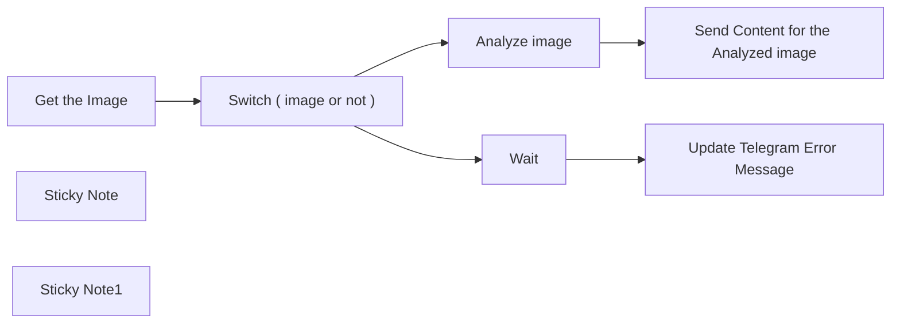

## Fluxo (.json) :

```json
{
  "meta": {
    "instanceId": "84ba6d895254e080ac2b4916d987aa66b000f88d4d919a6b9c76848f9b8a7616"
  },
  "nodes": [
    {
      "id": "ecb4bbc8-939a-4c6c-80b6-6f053d1d7745",
      "name": "Get the Image",
      "type": "n8n-nodes-base.telegramTrigger",
      "position": [
        1640,
        880
      ],
      "webhookId": "8404b32c-14bd-428e-88a6-560755f0f7ba",
      "parameters": {
        "updates": [
          "message"
        ],
        "additionalFields": {
          "download": true
        }
      },
      "credentials": {
        "telegramApi": {
          "id": "k3RE6o9brmFRFE9p",
          "name": "Telegram account"
        }
      },
      "typeVersion": 1.1
    },
    {
      "id": "2fd523b7-5f89-4e53-9445-4336b51cad51",
      "name": "Send Content for the Analyzed image",
      "type": "n8n-nodes-base.telegram",
      "position": [
        2380,
        760
      ],
      "parameters": {
        "text": "={{ $json.content }}",
        "chatId": "={{ $('Get the Image').item.json.message.chat.id }}",
        "additionalFields": {
          "appendAttribution": false
        }
      },
      "credentials": {
        "telegramApi": {
          "id": "k3RE6o9brmFRFE9p",
          "name": "Telegram account"
        }
      },
      "typeVersion": 1.1
    },
    {
      "id": "b77fe84f-7651-42aa-aa40-f903b10c8fb1",
      "name": "Sticky Note",
      "type": "n8n-nodes-base.stickyNote",
      "position": [
        380,
        360
      ],
      "parameters": {
        "width": 1235.4238259410247,
        "height": 1361.9843517631348,
        "content": "# Automated Image Analysis and Response via Telegram\n\n## Example: @SubAlertMe_Bot\n\n## Summary:\nThe automated image analysis and response workflow using n8n is a sophisticated solution designed to streamline the process of analyzing images sent via Telegram and delivering insightful responses based on the analysis outcomes. This cutting-edge workflow employs a series of meticulously orchestrated nodes to ensure seamless automation and efficiency in image processing tasks.\n\n## Use Cases:\nThis advanced workflow caters to a myriad of scenarios where real-time image analysis and response mechanisms are paramount. The use cases include:\n- Providing immediate feedback on images shared within Telegram groups.\n- Enabling automated content moderation based on the analysis of image content.\n- Facilitating rapid categorization and tagging of images based on the results of the analysis.\n\n## Detailed Workflow Setup:\nTo effectively implement this workflow, users must adhere to a meticulous setup process, which includes:\n- Access to the versatile n8n platform, ensuring seamless workflow orchestration.\n- Integration of a Telegram account to facilitate image reception and communication.\n- Utilization of an OpenAI account for sophisticated image analysis capabilities.\n- Configuration of Telegram and OpenAI credentials within the n8n environment for seamless integration.\n- Proficiency in creating and interconnecting nodes within the n8n workflow for optimal functionality.\n\n## Detailed Node Description:\n1. **Get the Image (Telegram Trigger):**\n   - Actively triggers upon receipt of an image via Telegram, ensuring prompt processing.\n   - Extracts essential information from the received image message to initiate further actions.\n\n2. **Merge all fields To get data from trigger:**\n   - Seamlessly amalgamates all relevant data fields extracted from the trigger node for comprehensive data consolidation.\n\n3. **Analyze Image (OpenAI):**\n   - Harnesses the powerful capabilities of OpenAI services to conduct in-depth analysis of the received image.\n   - Processes the image data in base64 format to derive meaningful insights from the visual content.\n\n4. **Aggregate all fields:**\n   - Compiles and consolidates all data items for subsequent processing and analysis, ensuring comprehensive data aggregation.\n\n5. **Send Content for the Analyzed Image (Telegram):**\n   - Transmits the analyzed content back to the Telegram chat interface for seamless communication.\n   - Delivers the analyzed information in textual format, enhancing user understanding and interaction.\n\n6. **Switch Node:**\n   - The Switch node is pivotal for decision-making based on predefined conditions within the workflow.\n   - It evaluates incoming data to determine the existence or absence of specific elements, such as images in this context.\n   - Utilizes a set of rules to assess the presence of image data in the message payload and distinguishes between cases where images are detected and when they are not.\n   - This crucial node plays a pivotal role in directing the flow of the workflow based on the outcomes of its evaluations.\n\n\n\n## Conclusion:\nThe automation of image analysis processes through this sophisticated workflow not only enhances operational efficiency but also revolutionizes communication dynamics within Telegram interactions. By incorporating this advanced workflow solution, users can optimize their image analysis workflows, bolster communication efficacy, and unlock new levels of automation in image processing tasks.\n"
      },
      "typeVersion": 1
    },
    {
      "id": "7a588ccb-7a97-4776-82fd-c4f42640e8f7",
      "name": "Update Telegram Error Message",
      "type": "n8n-nodes-base.telegram",
      "position": [
        2380,
        1000
      ],
      "parameters": {
        "text": "Please Upload an Image ....",
        "chatId": "={{ $json.message.chat.id }}",
        "additionalFields": {
          "appendAttribution": false
        }
      },
      "credentials": {
        "telegramApi": {
          "id": "k3RE6o9brmFRFE9p",
          "name": "Telegram account"
        }
      },
      "typeVersion": 1.1
    },
    {
      "id": "0cd83b82-0a20-4bf6-82bc-24827a368b89",
      "name": "Wait",
      "type": "n8n-nodes-base.wait",
      "position": [
        2180,
        1000
      ],
      "webhookId": "d4d6fc13-d8ad-42b6-b4dd-e922b5534282",
      "parameters": {
        "amount": 3
      },
      "typeVersion": 1.1
    },
    {
      "id": "a6d52335-72e7-4ce4-92e9-861b2806e9ae",
      "name": "Sticky Note1",
      "type": "n8n-nodes-base.stickyNote",
      "position": [
        1620,
        360
      ],
      "parameters": {
        "color": 4,
        "width": 1139.7707284714515,
        "height": 1359.6943046286056,
        "content": ""
      },
      "typeVersion": 1
    },
    {
      "id": "0222b4f6-a7c1-4183-8df8-b47b9e0cd685",
      "name": "Analyze image",
      "type": "@n8n/n8n-nodes-langchain.openAi",
      "position": [
        2180,
        760
      ],
      "parameters": {
        "options": {},
        "resource": "image",
        "inputType": "base64",
        "operation": "analyze"
      },
      "credentials": {
        "openAiApi": {
          "id": "kDo5LhPmHS2WQE0b",
          "name": "OpenAi account"
        }
      },
      "typeVersion": 1.3
    },
    {
      "id": "f83c7dc2-a986-40e7-831c-b7968866ef4e",
      "name": "Switch ( image or not )",
      "type": "n8n-nodes-base.switch",
      "position": [
        1820,
        880
      ],
      "parameters": {
        "rules": {
          "values": [
            {
              "outputKey": "Image",
              "conditions": {
                "options": {
                  "leftValue": "",
                  "caseSensitive": true,
                  "typeValidation": "strict"
                },
                "combinator": "and",
                "conditions": [
                  {
                    "operator": {
                      "type": "array",
                      "operation": "exists",
                      "singleValue": true
                    },
                    "leftValue": "={{ $json.message.photo }}",
                    "rightValue": ""
                  }
                ]
              },
              "renameOutput": true
            },
            {
              "outputKey": "Empty",
              "conditions": {
                "options": {
                  "leftValue": "",
                  "caseSensitive": true,
                  "typeValidation": "strict"
                },
                "combinator": "and",
                "conditions": [
                  {
                    "id": "3fe3a96d-6ee9-4f12-a32c-f5f5b729e257",
                    "operator": {
                      "type": "array",
                      "operation": "notExists",
                      "singleValue": true
                    },
                    "leftValue": "={{ $json.message.photo }}",
                    "rightValue": ""
                  }
                ]
              },
              "renameOutput": true
            }
          ]
        },
        "options": {}
      },
      "typeVersion": 3
    }
  ],
  "pinData": {},
  "connections": {
    "Wait": {
      "main": [
        [
          {
            "node": "Update Telegram Error Message",
            "type": "main",
            "index": 0
          }
        ]
      ]
    },
    "Analyze image": {
      "main": [
        [
          {
            "node": "Send Content for the Analyzed image",
            "type": "main",
            "index": 0
          }
        ]
      ]
    },
    "Get the Image": {
      "main": [
        [
          {
            "node": "Switch ( image or not )",
            "type": "main",
            "index": 0
          }
        ]
      ]
    },
    "Switch ( image or not )": {
      "main": [
        [
          {
            "node": "Analyze image",
            "type": "main",
            "index": 0
          }
        ],
        [
          {
            "node": "Wait",
            "type": "main",
            "index": 0
          }
        ]
      ]
    }
  }
}
```

<a id="template-57"></a>

## Template 57 - Scraper de vagas 'Who is hiring' do Hacker News

- **Nome:** Scraper de vagas 'Who is hiring' do Hacker News
- **Descrição:** Coleta postagens "Ask HN: Who is hiring?", extrai respostas com ofertas de trabalho, transforma o texto em dados estruturados e grava os resultados em uma base de dados.
- **Funcionalidade:** • Busca por postagens específicas: Pesquisa por "Ask HN: Who is hiring?" no índice de busca para localizar os posts relevantes.
• Ordenação e paginação: Recupera resultados ordenados por data com paginação e parâmetros de busca refinados.
• Filtragem por data: Seleciona apenas posts recentes (ex.: últimos 30 dias) para foco nas vagas atuais.
• Recuperação do conteúdo principal: Obtém os detalhes do post principal via API pública para acessar metadados e lista de respostas.
• Expansão de comentários/filhos: Divide e itera sobre os comentários filhos que contêm ofertas de emprego.
• Busca individual de cada oferta: Solicita cada item individualmente na API para obter o texto completo da vaga.
• Extração de texto: Extrai o conteúdo textual bruto de cada resposta/post para processamento.
• Limpeza e normalização do texto: Remove HTML e entidades, normaliza espaços e isola URLs para facilitar análise.
• Limite para testes: Possibilidade de limitar o número de itens processados para depuração/validação.
• Estruturação com IA: Usa um modelo de linguagem para transformar o texto limpo em um JSON padronizado (empresa, cargo, local, tipo, salário, descrição, URLs).
• Validação/parse da saída estruturada: Garante que a saída siga o esquema definido antes de persistir.
• Persistência dos dados: Grava os registros estruturados em uma base externa para consulta e uso posterior.
- **Ferramentas:** • Algolia (hn.algolia.com): Motor de busca usado para localizar posts "Ask HN: Who is hiring?" e obter resultados filtrados e ordenados.
• Hacker News API (Firebase): API oficial para recuperar os itens (stories e comentários) com o conteúdo completo dos posts e replies.
• OpenAI (GPT-4o-mini): Modelo de linguagem utilizado para extrair e transformar texto livre em dados JSON estruturados conforme esquema definido.
• Airtable: Base externa usada para armazenar os registros de vagas com mapeamento de campos para título, empresa, localização, descrição e URLs.
• Ferramentas de navegador (Chrome DevTools - Network Tab): Utilizadas opcionalmente para inspecionar a chamada de API, copiar cURL e reproduzir a requisição de busca com os headers necessários.


## Fluxo visual

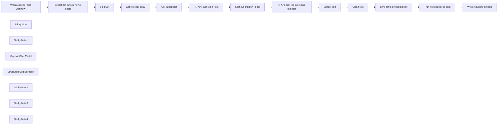

## Fluxo (.json) :

```json
{
  "id": "0JsHmmyeHw5Ffz5m",
  "meta": {
    "instanceId": "d4d7965840e96e50a3e02959a8487c692901dfa8d5cc294134442c67ce1622d3",
    "templateCredsSetupCompleted": true
  },
  "name": "HN Who is Hiring Scrape",
  "tags": [],
  "nodes": [
    {
      "id": "f7cdb3ee-9bb0-4006-829a-d4ce797191d5",
      "name": "When clicking ‘Test workflow’",
      "type": "n8n-nodes-base.manualTrigger",
      "position": [
        -20,
        -220
      ],
      "parameters": {},
      "typeVersion": 1
    },
    {
      "id": "0475e25d-9bf4-450d-abd3-a04608a438a4",
      "name": "Sticky Note",
      "type": "n8n-nodes-base.stickyNote",
      "position": [
        60,
        -620
      ],
      "parameters": {
        "width": 460,
        "height": 340,
        "content": "## Go to https://hn.algolia.com\n- filter by \"Ask HN: Who is hiring?\" (important with quotes for full match)\n- sort by date\n- Chrome Network Tab > find API call > click \"Copy as cURL\"\n- n8n HTTP node -> import cURL and paste \n- I've set the API key as Header Auth so you will have to do the above yourself to make this work"
      },
      "typeVersion": 1
    },
    {
      "id": "a686852b-ff84-430b-92bb-ce02a6808e19",
      "name": "Split Out",
      "type": "n8n-nodes-base.splitOut",
      "position": [
        400,
        -220
      ],
      "parameters": {
        "options": {},
        "fieldToSplitOut": "hits"
      },
      "typeVersion": 1
    },
    {
      "id": "cdaaa738-d561-4fa0-b2c7-8ea9e6778eb1",
      "name": "Sticky Note1",
      "type": "n8n-nodes-base.stickyNote",
      "position": [
        1260,
        -620
      ],
      "parameters": {
        "width": 500,
        "height": 340,
        "content": "## Go to HN API \nhttps://github.com/HackerNews/API\n\nWe'll need following endpoints: \n- For example, a story: https://hacker-news.firebaseio.com/v0/item/8863.json?print=pretty\n- comment: https://hacker-news.firebaseio.com/v0/item/2921983.json?print=pretty\n\n"
      },
      "typeVersion": 1
    },
    {
      "id": "4f353598-9e32-4be4-9e7b-c89cc05305fd",
      "name": "OpenAI Chat Model",
      "type": "@n8n/n8n-nodes-langchain.lmChatOpenAi",
      "position": [
        2680,
        -20
      ],
      "parameters": {
        "model": {
          "__rl": true,
          "mode": "list",
          "value": "gpt-4o-mini"
        },
        "options": {}
      },
      "credentials": {
        "openAiApi": {
          "id": "Fbb2ueT0XP5xMRme",
          "name": "OpenAi account 2"
        }
      },
      "typeVersion": 1.2
    },
    {
      "id": "5bd0d7cc-497a-497c-aa4c-589d9ceeca14",
      "name": "Structured Output Parser",
      "type": "@n8n/n8n-nodes-langchain.outputParserStructured",
      "position": [
        2840,
        -20
      ],
      "parameters": {
        "schemaType": "manual",
        "inputSchema": "{\n \"type\": \"object\",\n \"properties\": {\n \"company\": {\n \"type\": [\n \"string\",\n null\n ],\n \"description\": \"Name of the hiring company\"\n },\n \"title\": {\n \"type\": [\n \"string\",\n null\n ],\n \"description\": \"Job title/role being advertised\"\n },\n \"location\": {\n \"type\": [\n \"string\",\n null\n ],\n \"description\": \"Work location including remote/hybrid status\"\n },\n \"type\": {\n \"type\": [\n \"string\",\n null\n ],\n \"enum\": [\n \"FULL_TIME\",\n \"PART_TIME\",\n \"CONTRACT\",\n \"INTERNSHIP\",\n \"FREELANCE\",\n null\n ],\n \"description\": \"Employment type (Full-time, Contract, etc)\"\n },\n \"work_location\": {\n \"type\": [\n \"string\",\n null\n ],\n \"enum\": [\n \"REMOTE\",\n \"HYBRID\",\n \"ON_SITE\",\n null\n ],\n \"description\": \"Work arrangement type\"\n },\n \"salary\": {\n \"type\": [\n \"string\",\n null\n ],\n \"description\": \"Compensation details if provided\"\n },\n \"description\": {\n \"type\": [\n \"string\",\n null\n ],\n \"description\": \"Main job description text including requirements and team info\"\n },\n \"apply_url\": {\n \"type\": [\n \"string\",\n null\n ],\n \"description\": \"Direct application/job posting URL\"\n },\n \"company_url\": {\n \"type\": [\n \"string\",\n null\n ],\n \"description\": \"Company website or careers page\"\n }\n }\n}\n"
      },
      "typeVersion": 1.2
    },
    {
      "id": "b84ca004-6f3b-4577-8910-61b8584b161d",
      "name": "Search for Who is hiring posts",
      "type": "n8n-nodes-base.httpRequest",
      "position": [
        200,
        -220
      ],
      "parameters": {
        "url": "https://uj5wyc0l7x-dsn.algolia.net/1/indexes/Item_dev_sort_date/query",
        "method": "POST",
        "options": {},
        "jsonBody": "{\n \"query\": \"\\\"Ask HN: Who is hiring\\\"\",\n \"analyticsTags\": [\n \"web\"\n ],\n \"page\": 0,\n \"hitsPerPage\": 30,\n \"minWordSizefor1Typo\": 4,\n \"minWordSizefor2Typos\": 8,\n \"advancedSyntax\": true,\n \"ignorePlurals\": false,\n \"clickAnalytics\": true,\n \"minProximity\": 7,\n \"numericFilters\": [],\n \"tagFilters\": [\n [\n \"story\"\n ],\n []\n ],\n \"typoTolerance\": \"min\",\n \"queryType\": \"prefixNone\",\n \"restrictSearchableAttributes\": [\n \"title\",\n \"comment_text\",\n \"url\",\n \"story_text\",\n \"author\"\n ],\n \"getRankingInfo\": true\n}",
        "sendBody": true,
        "sendQuery": true,
        "sendHeaders": true,
        "specifyBody": "json",
        "authentication": "genericCredentialType",
        "genericAuthType": "httpHeaderAuth",
        "queryParameters": {
          "parameters": [
            {
              "name": "x-algolia-agent",
              "value": "Algolia for JavaScript (4.13.1); Browser (lite)"
            },
            {
              "name": "x-algolia-application-id",
              "value": "UJ5WYC0L7X"
            }
          ]
        },
        "headerParameters": {
          "parameters": [
            {
              "name": "Accept",
              "value": "*/*"
            },
            {
              "name": "Accept-Language",
              "value": "en-GB,en-US;q=0.9,en;q=0.8"
            },
            {
              "name": "Connection",
              "value": "keep-alive"
            },
            {
              "name": "DNT",
              "value": "1"
            },
            {
              "name": "Origin",
              "value": "https://hn.algolia.com"
            },
            {
              "name": "Referer",
              "value": "https://hn.algolia.com/"
            },
            {
              "name": "Sec-Fetch-Dest",
              "value": "empty"
            },
            {
              "name": "Sec-Fetch-Mode",
              "value": "cors"
            },
            {
              "name": "Sec-Fetch-Site",
              "value": "cross-site"
            },
            {
              "name": "User-Agent",
              "value": "Mozilla/5.0 (Macintosh; Intel Mac OS X 10_15_7) AppleWebKit/537.36 (KHTML, like Gecko) Chrome/133.0.0.0 Safari/537.36"
            },
            {
              "name": "sec-ch-ua",
              "value": "\"Chromium\";v=\"133\", \"Not(A:Brand\";v=\"99\""
            },
            {
              "name": "sec-ch-ua-mobile",
              "value": "?0"
            },
            {
              "name": "sec-ch-ua-platform",
              "value": "\"macOS\""
            }
          ]
        }
      },
      "credentials": {
        "httpHeaderAuth": {
          "id": "oVEXp2ZbYCXypMVz",
          "name": "Algolia Auth"
        }
      },
      "typeVersion": 4.2
    },
    {
      "id": "205e66f6-cd6b-4cfd-a6ec-2226c35ddaac",
      "name": "Get relevant data",
      "type": "n8n-nodes-base.set",
      "position": [
        700,
        -220
      ],
      "parameters": {
        "options": {},
        "assignments": {
          "assignments": [
            {
              "id": "73dd2325-faa7-4650-bd78-5fc97cc202de",
              "name": "title",
              "type": "string",
              "value": "={{ $json.title }}"
            },
            {
              "id": "44918eac-4510-440e-9ac0-bf14d2b2f3af",
              "name": "createdAt",
              "type": "string",
              "value": "={{ $json.created_at }}"
            },
            {
              "id": "00eb6f09-2c22-411c-949c-886b2d95b6eb",
              "name": "updatedAt",
              "type": "string",
              "value": "={{ $json.updated_at }}"
            },
            {
              "id": "2b4f9da6-f60e-46e0-ba9d-3242fa955a55",
              "name": "storyId",
              "type": "string",
              "value": "={{ $json.story_id }}"
            }
          ]
        }
      },
      "typeVersion": 3.4
    },
    {
      "id": "16bc5628-8a29-4eac-8be9-b4e9da802e1e",
      "name": "Get latest post",
      "type": "n8n-nodes-base.filter",
      "position": [
        900,
        -220
      ],
      "parameters": {
        "options": {},
        "conditions": {
          "options": {
            "version": 2,
            "leftValue": "",
            "caseSensitive": true,
            "typeValidation": "strict"
          },
          "combinator": "and",
          "conditions": [
            {
              "id": "d7dd7175-2a50-45aa-bd3e-4c248c9193c4",
              "operator": {
                "type": "dateTime",
                "operation": "after"
              },
              "leftValue": "={{ $json.createdAt }}",
              "rightValue": "={{$now.minus({days: 30})}} "
            }
          ]
        }
      },
      "typeVersion": 2.2
    },
    {
      "id": "92e1ef74-5ae1-4195-840b-115184db464f",
      "name": "Split out children (jobs)",
      "type": "n8n-nodes-base.splitOut",
      "position": [
        1460,
        -220
      ],
      "parameters": {
        "options": {},
        "fieldToSplitOut": "kids"
      },
      "typeVersion": 1
    },
    {
      "id": "d0836aae-b98a-497f-a6f7-0ad563c262a0",
      "name": "Trun into structured data",
      "type": "@n8n/n8n-nodes-langchain.chainLlm",
      "position": [
        2600,
        -220
      ],
      "parameters": {
        "text": "={{ $json.cleaned_text }}",
        "messages": {
          "messageValues": [
            {
              "message": "Extract the JSON data"
            }
          ]
        },
        "promptType": "define",
        "hasOutputParser": true
      },
      "typeVersion": 1.5
    },
    {
      "id": "fd818a93-627c-435d-91ba-5d759d5a9004",
      "name": "Sticky Note2",
      "type": "n8n-nodes-base.stickyNote",
      "position": [
        2600,
        -620
      ],
      "parameters": {
        "width": 840,
        "height": 340,
        "content": "## Data Structure\n\nWe use Openai GPT-4o-mini to transform the raw data in a unified data structure. Feel free to change this.\n\n```json\n{\n \"company\": \"Name of the hiring company\",\n \"title\": \"Job title/role being advertised\",\n \"location\": \"Work location including remote/hybrid status\",\n \"type\": \"Employment type (Full-time, Contract, etc)\",\n \"salary\": \"Compensation details if provided\",\n \"description\": \"Main job description text including requirements and team info\",\n \"apply_url\": \"Direct application/job posting URL\",\n \"company_url\": \"Company website or careers page\"\n}\n```"
      },
      "typeVersion": 1
    },
    {
      "id": "b70c5578-5b81-467a-8ac2-65374e4e52f3",
      "name": "Extract text",
      "type": "n8n-nodes-base.set",
      "position": [
        1860,
        -220
      ],
      "parameters": {
        "options": {},
        "assignments": {
          "assignments": [
            {
              "id": "6affa370-56ce-4ad8-8534-8f753fdf07fc",
              "name": "text",
              "type": "string",
              "value": "={{ $json.text }}"
            }
          ]
        }
      },
      "typeVersion": 3.4
    },
    {
      "id": "acb68d88-9417-42e9-9bcc-7c2fa95c4afd",
      "name": "Clean text",
      "type": "n8n-nodes-base.code",
      "position": [
        2060,
        -220
      ],
      "parameters": {
        "jsCode": "// In a Function node in n8n\nconst inputData = $input.all();\n\nfunction cleanAllPosts(data) {\n return data.map(item => {\n try {\n // Check if item exists and has the expected structure\n if (!item || typeof item !== 'object') {\n return { cleaned_text: '', error: 'Invalid item structure' };\n }\n\n // Get the text, with multiple fallbacks\n let text = '';\n if (typeof item === 'string') {\n text = item;\n } else if (item.json && item.json.text) {\n text = item.json.text;\n } else if (typeof item.json === 'string') {\n text = item.json;\n } else {\n text = JSON.stringify(item);\n }\n\n // Make sure text is a string\n text = String(text);\n \n // Perform the cleaning operations\n try {\n text = text.replace(/&#x2F;/g, '/');\n text = text.replace(/&#x27;/g, \"'\");\n text = text.replace(/&\\w+;/g, ' ');\n text = text.replace(/<[^>]*>/g, '');\n text = text.replace(/\\|\\s*/g, '| ');\n text = text.replace(/\\s+/g, ' ');\n text = text.replace(/\\s*(https?://[^\\s]+)\\s*/g, '\\n$1\\n');\n text = text.replace(/\\n{3,}/g, '\\n\\n');\n text = text.trim();\n } catch (cleaningError) {\n console.log('Error during text cleaning:', cleaningError);\n // Return original text if cleaning fails\n return { cleaned_text: text, warning: 'Partial cleaning applied' };\n }\n\n return { cleaned_text: text };\n \n } catch (error) {\n console.log('Error processing item:', error);\n return { \n cleaned_text: '', \n error: `Processing error: ${error.message}`,\n original: item\n };\n }\n }).filter(result => result.cleaned_text || result.error); \n}\n\ntry {\n return cleanAllPosts(inputData);\n} catch (error) {\n console.log('Fatal error:', error);\n return [{ \n cleaned_text: '', \n error: `Fatal error: ${error.message}`,\n input: inputData \n }];\n}\n"
      },
      "typeVersion": 2
    },
    {
      "id": "a0727b55-565d-47c0-9ab5-0f001f4b9941",
      "name": "Limit for testing (optional)",
      "type": "n8n-nodes-base.limit",
      "position": [
        2280,
        -220
      ],
      "parameters": {
        "maxItems": 5
      },
      "typeVersion": 1
    },
    {
      "id": "650baf5e-c2ac-443d-8a2b-6df89717186f",
      "name": "Sticky Note3",
      "type": "n8n-nodes-base.stickyNote",
      "position": [
        580,
        -620
      ],
      "parameters": {
        "width": 540,
        "height": 340,
        "content": "## Clean the result \n\n```json\n{\n\"title\": \"Ask HN: Who is hiring? (February 2025)\",\n\"createdAt\": \"2025-02-03T16:00:43Z\",\n\"updatedAt\": \"2025-02-17T08:35:44Z\",\n\"storyId\": \"42919502\"\n},\n{\n\"title\": \"Ask HN: Who is hiring? (January 2025)\",\n\"createdAt\": \"2025-01-02T16:00:09Z\",\n\"updatedAt\": \"2025-02-13T00:03:24Z\",\n\"storyId\": \"42575537\"\n},\n```"
      },
      "typeVersion": 1
    },
    {
      "id": "1ca5c39f-f21d-455a-b63a-702e7e3ba02b",
      "name": "Write results to airtable",
      "type": "n8n-nodes-base.airtable",
      "position": [
        3040,
        -220
      ],
      "parameters": {
        "base": {
          "__rl": true,
          "mode": "list",
          "value": "appM2JWvA5AstsGdn",
          "cachedResultUrl": "https://airtable.com/appM2JWvA5AstsGdn",
          "cachedResultName": "HN Who is hiring?"
        },
        "table": {
          "__rl": true,
          "mode": "list",
          "value": "tblGvcOjqbliwM7AS",
          "cachedResultUrl": "https://airtable.com/appM2JWvA5AstsGdn/tblGvcOjqbliwM7AS",
          "cachedResultName": "Table 1"
        },
        "columns": {
          "value": {
            "type": "={{ $json.output.type }}",
            "title": "={{ $json.output.title }}",
            "salary": "={{ $json.output.salary }}",
            "company": "={{ $json.output.company }}",
            "location": "={{ $json.output.location }}",
            "apply_url": "={{ $json.output.apply_url }}",
            "company_url": "={{ $json.output.company_url }}",
            "description": "={{ $json.output.description }}"
          },
          "schema": [
            {
              "id": "title",
              "type": "string",
              "display": true,
              "removed": false,
              "readOnly": false,
              "required": false,
              "displayName": "title",
              "defaultMatch": false,
              "canBeUsedToMatch": true
            },
            {
              "id": "company",
              "type": "string",
              "display": true,
              "removed": false,
              "readOnly": false,
              "required": false,
              "displayName": "company",
              "defaultMatch": false,
              "canBeUsedToMatch": true
            },
            {
              "id": "location",
              "type": "string",
              "display": true,
              "removed": false,
              "readOnly": false,
              "required": false,
              "displayName": "location",
              "defaultMatch": false,
              "canBeUsedToMatch": true
            },
            {
              "id": "type",
              "type": "string",
              "display": true,
              "removed": false,
              "readOnly": false,
              "required": false,
              "displayName": "type",
              "defaultMatch": false,
              "canBeUsedToMatch": true
            },
            {
              "id": "salary",
              "type": "string",
              "display": true,
              "removed": false,
              "readOnly": false,
              "required": false,
              "displayName": "salary",
              "defaultMatch": false,
              "canBeUsedToMatch": true
            },
            {
              "id": "description",
              "type": "string",
              "display": true,
              "removed": false,
              "readOnly": false,
              "required": false,
              "displayName": "description",
              "defaultMatch": false,
              "canBeUsedToMatch": true
            },
            {
              "id": "apply_url",
              "type": "string",
              "display": true,
              "removed": false,
              "readOnly": false,
              "required": false,
              "displayName": "apply_url",
              "defaultMatch": false,
              "canBeUsedToMatch": true
            },
            {
              "id": "company_url",
              "type": "string",
              "display": true,
              "removed": false,
              "readOnly": false,
              "required": false,
              "displayName": "company_url",
              "defaultMatch": false,
              "canBeUsedToMatch": true
            },
            {
              "id": "posted_date",
              "type": "string",
              "display": true,
              "removed": true,
              "readOnly": false,
              "required": false,
              "displayName": "posted_date",
              "defaultMatch": false,
              "canBeUsedToMatch": true
            }
          ],
          "mappingMode": "defineBelow",
          "matchingColumns": [],
          "attemptToConvertTypes": false,
          "convertFieldsToString": false
        },
        "options": {},
        "operation": "create"
      },
      "credentials": {
        "airtableTokenApi": {
          "id": "IudXLNj7CDuc5M5a",
          "name": "Airtable Personal Access Token account"
        }
      },
      "typeVersion": 2.1
    },
    {
      "id": "d71fa024-86a0-4f74-b033-1f755574080c",
      "name": "Sticky Note4",
      "type": "n8n-nodes-base.stickyNote",
      "position": [
        -520,
        -300
      ],
      "parameters": {
        "width": 380,
        "height": 500,
        "content": "## Hacker News - Who is Hiring Scrape\n\nIn this template we setup a scraper for the monthly HN Who is Hiring post. This way we can scrape the data and transform it to a common data strcutre.\n\nFirst we use the [Algolia Search](https://hn.algolia.com/) provided by hackernews to drill down the results.\n\nWe can use the official [Hacker News API](https://github.com/HackerNews/API\n) to get the post data and also all the replies!\n\nThis will obviously work for any kind of post on hacker news! Get creative 😃\n\nAll you need is an Openai Account to structure the text data and an Airtable Account (or similar) to write the results to a list.\n\nCopy my base https://airtable.com/appM2JWvA5AstsGdn/shrAuo78cJt5C2laR"
      },
      "typeVersion": 1
    },
    {
      "id": "7466fb0c-9f0c-4adf-a6de-b2cf09032719",
      "name": "HI API: Get the individual job post",
      "type": "n8n-nodes-base.httpRequest",
      "position": [
        1660,
        -220
      ],
      "parameters": {
        "url": "=https://hacker-news.firebaseio.com/v0/item/{{ $json.kids }}.json?print=pretty",
        "options": {}
      },
      "typeVersion": 4.2
    },
    {
      "id": "184abccf-5838-49bf-9922-e0300c6b145e",
      "name": "HN API: Get Main Post",
      "type": "n8n-nodes-base.httpRequest",
      "position": [
        1260,
        -220
      ],
      "parameters": {
        "url": "=https://hacker-news.firebaseio.com/v0/item/{{ $json.storyId }}.json?print=pretty",
        "options": {}
      },
      "typeVersion": 4.2
    }
  ],
  "active": false,
  "pinData": {},
  "settings": {
    "executionOrder": "v1"
  },
  "versionId": "387f7084-58fa-4643-9351-73c870d3f028",
  "connections": {
    "Split Out": {
      "main": [
        [
          {
            "node": "Get relevant data",
            "type": "main",
            "index": 0
          }
        ]
      ]
    },
    "Clean text": {
      "main": [
        [
          {
            "node": "Limit for testing (optional)",
            "type": "main",
            "index": 0
          }
        ]
      ]
    },
    "Extract text": {
      "main": [
        [
          {
            "node": "Clean text",
            "type": "main",
            "index": 0
          }
        ]
      ]
    },
    "Get latest post": {
      "main": [
        [
          {
            "node": "HN API: Get Main Post",
            "type": "main",
            "index": 0
          }
        ]
      ]
    },
    "Get relevant data": {
      "main": [
        [
          {
            "node": "Get latest post",
            "type": "main",
            "index": 0
          }
        ]
      ]
    },
    "OpenAI Chat Model": {
      "ai_languageModel": [
        [
          {
            "node": "Trun into structured data",
            "type": "ai_languageModel",
            "index": 0
          }
        ]
      ]
    },
    "HN API: Get Main Post": {
      "main": [
        [
          {
            "node": "Split out children (jobs)",
            "type": "main",
            "index": 0
          }
        ]
      ]
    },
    "Structured Output Parser": {
      "ai_outputParser": [
        [
          {
            "node": "Trun into structured data",
            "type": "ai_outputParser",
            "index": 0
          }
        ]
      ]
    },
    "Split out children (jobs)": {
      "main": [
        [
          {
            "node": "HI API: Get the individual job post",
            "type": "main",
            "index": 0
          }
        ]
      ]
    },
    "Trun into structured data": {
      "main": [
        [
          {
            "node": "Write results to airtable",
            "type": "main",
            "index": 0
          }
        ]
      ]
    },
    "Limit for testing (optional)": {
      "main": [
        [
          {
            "node": "Trun into structured data",
            "type": "main",
            "index": 0
          }
        ]
      ]
    },
    "Search for Who is hiring posts": {
      "main": [
        [
          {
            "node": "Split Out",
            "type": "main",
            "index": 0
          }
        ]
      ]
    },
    "When clicking ‘Test workflow’": {
      "main": [
        [
          {
            "node": "Search for Who is hiring posts",
            "type": "main",
            "index": 0
          }
        ]
      ]
    },
    "HI API: Get the individual job post": {
      "main": [
        [
          {
            "node": "Extract text",
            "type": "main",
            "index": 0
          }
        ]
      ]
    }
  }
}
```

<a id="template-58"></a>

## Template 58 - Chatbot para Bitrix24 com Webhook e registro automático

- **Nome:** Chatbot para Bitrix24 com Webhook e registro automático
- **Descrição:** Recebe eventos de chat do Bitrix24 via webhook, valida o token da aplicação, processa diferentes tipos de evento (mensagem, entrada no chat, instalação, remoção) e interage com a API do Bitrix24 para responder, dar boas-vindas e registrar o bot.
- **Funcionalidade:** • Recepção de eventos via webhook: Aceita requisições POST contendo eventos do Bitrix24 (mensagens, joins, instalação, exclusão).
• Validação de token da aplicação: Confere se o token enviado no payload coincide com o token esperado e retorna erro 401 em caso de inválido.
• Roteamento por tipo de evento: Direciona o fluxo conforme o campo de evento (ex.: ONIMBOTMESSAGEADD, ONIMBOTJOINCHAT, ONAPPINSTALL, ONIMBOTDELETE).
• Processamento de mensagens: Lê o texto recebido e responde repetindo a mensagem ou enviando uma resposta fixa para a frase "what's hot".
• Mensagem de boas-vindas ao entrar em chat: Envia uma mensagem padrão quando o bot entra em um chat.
• Registro do bot na plataforma: No evento de instalação, constrói os dados de registro (código, tipo, URLs de evento, propriedades) e chama a API para registrar o bot.
• Envio de mensagens pela API: Faz chamadas HTTP à API do Bitrix24 para publicar mensagens no diálogo especificado.
• Respostas HTTP ao remetente do webhook: Retorna resposta JSON de sucesso (200) ou erro (401) conforme o resultado do processamento.
- **Ferramentas:** • Bitrix24: Plataforma de chat com API REST para bots, utilizada para receber eventos, autenticar e enviar mensagens.
• Webhook / Endpoints HTTP: Ponto de entrada público que recebe eventos do Bitrix24 e URLs de callback usados no registro e envio de eventos ao serviço.


## Fluxo visual

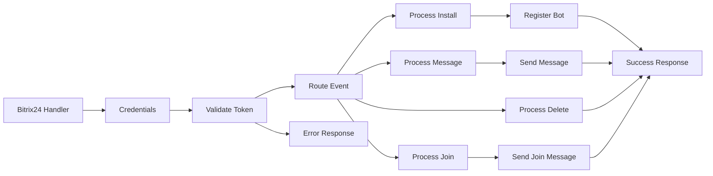

## Fluxo (.json) :

```json
{
  "id": "cmGsNvW9bEORABdo",
  "meta": {
    "instanceId": "15c09ee9508dd818e298e675375571ba4b871bbb8c420fd01ac9ed7c58622669"
  },
  "name": "Bitrix24 Chatbot Application Workflow example with Webhook Integration",
  "tags": [
    {
      "id": "5YZ9E6AmGZn6WTMa",
      "name": "Tech demo",
      "createdAt": "2024-12-28T09:13:02.965Z",
      "updatedAt": "2024-12-28T09:13:02.965Z"
    },
    {
      "id": "hEvnK1kMYTPrL3vs",
      "name": "Bitrix24",
      "createdAt": "2025-01-04T16:12:36.741Z",
      "updatedAt": "2025-01-04T16:12:36.741Z"
    },
    {
      "id": "yKS9RGKLuFUhYFIE",
      "name": "Chatbot",
      "createdAt": "2025-01-04T16:12:36.757Z",
      "updatedAt": "2025-01-04T16:12:36.757Z"
    }
  ],
  "nodes": [
    {
      "id": "ddd802bb-0da0-474d-b1e9-74f247e603e0",
      "name": "Bitrix24 Handler",
      "type": "n8n-nodes-base.webhook",
      "position": [
        0,
        0
      ],
      "webhookId": "c3ae607d-41f0-42bc-b669-c2c77936d443",
      "parameters": {
        "path": "bitrix24/handler.php",
        "options": {},
        "httpMethod": "POST",
        "responseMode": "responseNode"
      },
      "typeVersion": 1
    },
    {
      "id": "5676a53e-6758-4ad5-ace6-e494fa10b6c3",
      "name": "Credentials",
      "type": "n8n-nodes-base.set",
      "position": [
        200,
        0
      ],
      "parameters": {
        "options": {},
        "assignments": {
          "assignments": [
            {
              "id": "030f8f90-2669-4c20-9eab-c572c4b7c70c",
              "name": "CLIENT_ID",
              "type": "string",
              "value": "local.6779636e712043.37129431"
            },
            {
              "id": "de9bbb7a-b782-4540-b259-527625db8490",
              "name": "CLIENT_SECRET",
              "type": "string",
              "value": "dTzUfBoTFLxNhuzc1zsnDbCeii98ZaE5By4aQPQEOxLJAS9y6i"
            },
            {
              "id": "86b7aff7-1e25-4b12-a366-23cf34e5a405",
              "name": "application_token",
              "type": "string",
              "value": "={{ $json.body['auth[application_token]'] }}"
            },
            {
              "id": "69bbcb1f-ba6e-42eb-be8a-ee0707ce997d",
              "name": "domain",
              "type": "string",
              "value": "={{ $json.body['auth[domain]'] }}\n"
            },
            {
              "id": "dc1b0515-f06a-4731-b0dc-912a8d04e56b",
              "name": "access_token",
              "type": "string",
              "value": "={{ $json.body['auth[access_token]'] }}"
            }
          ]
        },
        "includeOtherFields": true
      },
      "typeVersion": 3.4
    },
    {
      "id": "b72c00cf-9f8c-4c2a-9093-b80d82bab85b",
      "name": "Validate Token",
      "type": "n8n-nodes-base.if",
      "position": [
        400,
        0
      ],
      "parameters": {
        "options": {},
        "conditions": {
          "options": {
            "version": 2,
            "leftValue": "",
            "caseSensitive": true,
            "typeValidation": "strict"
          },
          "combinator": "or",
          "conditions": [
            {
              "id": "da73d0ba-6eeb-405e-89fe-9d041fd2e0cd",
              "operator": {
                "name": "filter.operator.equals",
                "type": "string",
                "operation": "equals"
              },
              "leftValue": "={{ $json.CLIENT_ID }}",
              "rightValue": "={{ $json.application_token }}"
            },
            {
              "id": "4ba90f7b-0299-4097-9ae7-6e4dee428a74",
              "operator": {
                "name": "filter.operator.equals",
                "type": "string",
                "operation": "equals"
              },
              "leftValue": "1",
              "rightValue": "1"
            }
          ]
        }
      },
      "typeVersion": 2.2
    },
    {
      "id": "f0feb392-873a-4643-b7ad-0e6d9f877e82",
      "name": "Route Event",
      "type": "n8n-nodes-base.switch",
      "position": [
        600,
        0
      ],
      "parameters": {
        "rules": {
          "values": [
            {
              "outputKey": "ONIMBOTMESSAGEADD",
              "conditions": {
                "options": {
                  "version": 2,
                  "leftValue": "",
                  "caseSensitive": true,
                  "typeValidation": "strict"
                },
                "combinator": "and",
                "conditions": [
                  {
                    "operator": {
                      "type": "string",
                      "operation": "equals"
                    },
                    "leftValue": "={{ $json.body.event }}",
                    "rightValue": "ONIMBOTMESSAGEADD"
                  }
                ]
              },
              "renameOutput": true
            },
            {
              "outputKey": "ONIMBOTJOINCHAT",
              "conditions": {
                "options": {
                  "version": 2,
                  "leftValue": "",
                  "caseSensitive": true,
                  "typeValidation": "strict"
                },
                "combinator": "and",
                "conditions": [
                  {
                    "id": "e9125f57-129e-4026-86ff-746d40b92b04",
                    "operator": {
                      "name": "filter.operator.equals",
                      "type": "string",
                      "operation": "equals"
                    },
                    "leftValue": "={{ $json.body.event }}",
                    "rightValue": "ONIMBOTJOINCHAT"
                  }
                ]
              },
              "renameOutput": true
            },
            {
              "outputKey": "ONAPPINSTALL",
              "conditions": {
                "options": {
                  "version": 2,
                  "leftValue": "",
                  "caseSensitive": true,
                  "typeValidation": "strict"
                },
                "combinator": "and",
                "conditions": [
                  {
                    "id": "2db7bed5-fd88-4900-b8d2-e27b49c2fcca",
                    "operator": {
                      "name": "filter.operator.equals",
                      "type": "string",
                      "operation": "equals"
                    },
                    "leftValue": "={{ $json.body.event }}",
                    "rightValue": "ONAPPINSTALL"
                  }
                ]
              },
              "renameOutput": true
            },
            {
              "outputKey": "ONIMBOTDELETE",
              "conditions": {
                "options": {
                  "version": 2,
                  "leftValue": "",
                  "caseSensitive": true,
                  "typeValidation": "strict"
                },
                "combinator": "and",
                "conditions": [
                  {
                    "id": "b708d339-fd46-470d-b0d5-ff2eb405f5ce",
                    "operator": {
                      "name": "filter.operator.equals",
                      "type": "string",
                      "operation": "equals"
                    },
                    "leftValue": "={{ $json.body.event }}",
                    "rightValue": "ONIMBOTDELETE"
                  }
                ]
              },
              "renameOutput": true
            }
          ]
        },
        "options": {}
      },
      "typeVersion": 3.2
    },
    {
      "id": "56fcdc5f-d509-4c9f-a437-79c53add49f8",
      "name": "Process Message",
      "type": "n8n-nodes-base.function",
      "position": [
        800,
        0
      ],
      "parameters": {
        "functionCode": "// Process Message Node\nconst items = $input.all();\nconst item = items[0];\n\n// Get message data from the correct path\nconst message = item.json.body['data[PARAMS][MESSAGE]'];\nconst dialogId = item.json.body['data[PARAMS][DIALOG_ID]'];\n\n// Get auth data\nconst auth = {\n access_token: item.json.access_token,\n domain: item.json.domain\n};\n\nif (message.toLowerCase() === \"what's hot\") {\n return {\n json: {\n DIALOG_ID: dialogId,\n MESSAGE: \"Hi! I am an example-bot.\\nI repeat what you say\",\n AUTH: auth.access_token,\n DOMAIN: auth.domain\n }\n };\n} else {\n return {\n json: {\n DIALOG_ID: dialogId,\n MESSAGE: `You said:\\n${message}`,\n AUTH: auth.access_token,\n DOMAIN: auth.domain\n }\n };\n}"
      },
      "typeVersion": 1
    },
    {
      "id": "a647ed67-c812-4416-8c85-55a681bc7f80",
      "name": "Process Join",
      "type": "n8n-nodes-base.function",
      "position": [
        800,
        160
      ],
      "parameters": {
        "functionCode": "// Process Join Node\nconst items = $input.all();\nconst item = items[0];\n\n// Get dialog ID from the correct path\nconst dialogId = item.json.body['data[PARAMS][DIALOG_ID]'];\n\n// Get auth data\nconst auth = {\n access_token: item.json.access_token,\n domain: item.json.domain\n};\n\nreturn {\n json: {\n DIALOG_ID: dialogId,\n MESSAGE: 'Hi! I am an example-bot. I repeat what you say',\n AUTH: auth.access_token,\n DOMAIN: auth.domain\n }\n};"
      },
      "typeVersion": 1
    },
    {
      "id": "4aac8853-d80e-4201-9f31-7838d18afe71",
      "name": "Process Install",
      "type": "n8n-nodes-base.function",
      "position": [
        800,
        320
      ],
      "parameters": {
        "functionCode": "// Process Install Node\nconst items = $input.all();\nconst item = items[0];\n\n// Get the webhook URL from input\nconst handlerBackUrl = item.json.webhookUrl;\n\n// Get auth data directly from item.json\nconst auth = {\n access_token: item.json.access_token,\n application_token: item.json.application_token,\n domain: item.json.domain\n};\n\nreturn {\n json: {\n handler_back_url: handlerBackUrl,\n CODE: 'LocalExampleBot',\n TYPE: 'B',\n EVENT_MESSAGE_ADD: handlerBackUrl,\n EVENT_WELCOME_MESSAGE: handlerBackUrl,\n EVENT_BOT_DELETE: handlerBackUrl,\n PROPERTIES: {\n NAME: 'Bot',\n LAST_NAME: 'Example',\n COLOR: 'AQUA',\n EMAIL: 'no@example.com',\n PERSONAL_BIRTHDAY: '2020-07-18',\n WORK_POSITION: 'Report on affairs',\n PERSONAL_GENDER: 'M'\n },\n // Use the auth data from item.json\n AUTH: auth.access_token,\n CLIENT_ID: auth.application_token,\n DOMAIN: auth.domain\n }\n};"
      },
      "typeVersion": 1
    },
    {
      "id": "30922462-255b-4ba6-8167-88aec244fdb1",
      "name": "Register Bot",
      "type": "n8n-nodes-base.httpRequest",
      "position": [
        1000,
        320
      ],
      "parameters": {
        "url": "=https://{{ $json.DOMAIN }}/rest/imbot.register?auth={{$json.AUTH}}",
        "method": "POST",
        "options": {},
        "sendBody": true,
        "bodyParameters": {
          "parameters": [
            {
              "name": "CODE",
              "value": "LocalExampleBot"
            },
            {
              "name": "TYPE",
              "value": "B"
            },
            {
              "name": "EVENT_MESSAGE_ADD",
              "value": "={{$json.handler_back_url}}"
            },
            {
              "name": "EVENT_WELCOME_MESSAGE",
              "value": "={{$json.handler_back_url}}"
            },
            {
              "name": "EVENT_BOT_DELETE",
              "value": "={{$json.handler_back_url}}"
            },
            {
              "name": "PROPERTIES",
              "value": "={{ {\n NAME: 'Bot',\n LAST_NAME: 'Example',\n COLOR: 'AQUA',\n EMAIL: 'no@example.com',\n PERSONAL_BIRTHDAY: '2020-07-18',\n WORK_POSITION: 'Report on affairs',\n PERSONAL_GENDER: 'M'\n} }}"
            },
            {
              "name": "CLIENT_ID",
              "value": "={{ $json.CLIENT_ID }}"
            },
            {
              "name": "CLIENT_SECRET",
              "value": "={{ $json.AUTH }}"
            }
          ]
        }
      },
      "typeVersion": 4.2
    },
    {
      "id": "8c1c7ebf-d5b3-472e-9d98-34cc65ba86ba",
      "name": "Send Message",
      "type": "n8n-nodes-base.httpRequest",
      "position": [
        1000,
        0
      ],
      "parameters": {
        "url": "=https://{{$json.DOMAIN}}/rest/imbot.message.add?auth={{$json.AUTH}}",
        "method": "POST",
        "options": {},
        "sendBody": true,
        "bodyParameters": {
          "parameters": [
            {
              "name": "DIALOG_ID",
              "value": "={{ $json.DIALOG_ID }}"
            },
            {
              "name": "MESSAGE",
              "value": "={{ $json.MESSAGE }}"
            },
            {
              "name": "AUTH",
              "value": "={{ $json.AUTH }}"
            }
          ]
        }
      },
      "typeVersion": 4.2
    },
    {
      "id": "af0d2b44-53f7-4c4c-9428-d54ebcf41bff",
      "name": "Send Join Message",
      "type": "n8n-nodes-base.httpRequest",
      "position": [
        1000,
        160
      ],
      "parameters": {
        "url": "=https://{{$json.DOMAIN}}/rest/imbot.message.add",
        "method": "POST",
        "options": {},
        "sendBody": true,
        "bodyParameters": {
          "parameters": [
            {
              "name": "DIALOG_ID",
              "value": "={{ $json.DIALOG_ID }}"
            },
            {
              "name": "MESSAGE",
              "value": "={{ $json.MESSAGE }}"
            },
            {
              "name": "AUTH",
              "value": "={{ $json.AUTH }}"
            }
          ]
        }
      },
      "typeVersion": 4.2
    },
    {
      "id": "9110f66d-1c35-44b4-bc73-18f821b50b71",
      "name": "Process Delete",
      "type": "n8n-nodes-base.noOp",
      "position": [
        800,
        480
      ],
      "parameters": {},
      "typeVersion": 1
    },
    {
      "id": "81a5fc23-47a4-4ef8-bfb4-31593aed12fd",
      "name": "Success Response",
      "type": "n8n-nodes-base.respondToWebhook",
      "position": [
        1200,
        0
      ],
      "parameters": {
        "options": {
          "responseCode": 200
        },
        "respondWith": "json",
        "responseBody": "={\n \"result\": true\n}"
      },
      "typeVersion": 1.1
    },
    {
      "id": "a19f3b0b-496f-4f3d-a9c2-044356070e32",
      "name": "Error Response",
      "type": "n8n-nodes-base.respondToWebhook",
      "position": [
        400,
        160
      ],
      "parameters": {
        "options": {
          "responseCode": 401
        },
        "respondWith": "json",
        "responseBody": "={{\n \"result\": false,\n \"error\": \"Invalid application token\"\n}}"
      },
      "typeVersion": 1.1
    }
  ],
  "active": true,
  "pinData": {
    "Bitrix24 Handler": [
      {
        "json": {
          "body": {
            "ts": "1737037713",
            "event": "ONIMBOTMESSAGEADD",
            "auth[scope]": "imbot,im",
            "auth[domain]": "hgap.bitrix24.eu",
            "auth[status]": "L",
            "auth[expires]": "1737041313",
            "auth[user_id]": "256",
            "data[USER][ID]": "256",
            "auth[member_id]": "19acdffbcfadf692f61b677d3d824490",
            "auth[expires_in]": "3600",
            "data[USER][NAME]": "Java Tech User",
            "event_handler_id": "126",
            "auth[access_token]": "a12589670074bb250066880900000100000007f6bf4682415a014425fed22a6b37af33",
            "data[USER][GENDER]": "M",
            "data[USER][IS_BOT]": "N",
            "auth[refresh_token]": "91a4b0670074bb2500668809000001000000075047004f6b25a0b76236e66bb7316e97",
            "auth[client_endpoint]": "https://hgap.bitrix24.eu/rest/",
            "auth[server_endpoint]": "https://oauth.bitrix.info/rest/",
            "data[BOT][302][scope]": "imbot,im",
            "data[PARAMS][CHAT_ID]": "6196",
            "data[PARAMS][MESSAGE]": "Szia!",
            "data[USER][LAST_NAME]": "Java",
            "data[BOT][302][BOT_ID]": "302",
            "data[BOT][302][domain]": "hgap.bitrix24.eu",
            "data[BOT][302][status]": "L",
            "data[PARAMS][LANGUAGE]": "en",
            "data[USER][FIRST_NAME]": "Tech User",
            "data[USER][IS_NETWORK]": "N",
            "auth[application_token]": "0d83800efe3a5b2977650e025e0754d5",
            "data[BOT][302][expires]": "1737041313",
            "data[BOT][302][user_id]": "302",
            "data[PARAMS][AUTHOR_ID]": "256",
            "data[PARAMS][CHAT_TYPE]": "P",
            "data[PARAMS][DIALOG_ID]": "256",
            "data[USER][IS_EXTRANET]": "N",
            "data[BOT][302][BOT_CODE]": "LocalExampleBot",
            "data[PARAMS][MESSAGE_ID]": "314686",
            "data[PARAMS][TO_USER_ID]": "302",
            "data[USER][IS_CONNECTOR]": "N",
            "data[BOT][302][client_id]": "local.6779636e712043.37129431",
            "data[BOT][302][member_id]": "19acdffbcfadf692f61b677d3d824490",
            "data[PARAMS][TEMPLATE_ID]": "09c62e39-23c2-4281-a53f-4a3a76d2cf4a",
            "data[USER][WORK_POSITION]": "Technical User",
            "data[BOT][302][expires_in]": "3600",
            "data[PARAMS][FROM_USER_ID]": "256",
            "data[PARAMS][MESSAGE_TYPE]": "P",
            "data[PARAMS][SKIP_COMMAND]": "N",
            "data[BOT][302][AUTH][scope]": "imbot,im",
            "data[BOT][302][AUTH][domain]": "hgap.bitrix24.eu",
            "data[BOT][302][AUTH][status]": "L",
            "data[BOT][302][access_token]": "a12589670074bb25006688090000012ee0e30782de43659ca7cc172d61e7a91b24b241",
            "data[PARAMS][SKIP_CONNECTOR]": "N",
            "data[PARAMS][SKIP_URL_INDEX]": "N",
            "data[BOT][302][AUTH][expires]": "1737041313",
            "data[BOT][302][AUTH][user_id]": "302",
            "data[BOT][302][refresh_token]": "91a4b0670074bb25006688090000012ee0e307bbd7e4e8b80e4c5ba61e3c99f0283f40",
            "data[PARAMS][COMMAND_CONTEXT]": "TEXTAREA",
            "data[PARAMS][SILENT_CONNECTOR]": "N",
            "data[BOT][302][AUTH][client_id]": "local.6779636e712043.37129431",
            "data[BOT][302][AUTH][member_id]": "19acdffbcfadf692f61b677d3d824490",
            "data[BOT][302][client_endpoint]": "https://hgap.bitrix24.eu/rest/",
            "data[BOT][302][server_endpoint]": "https://oauth.bitrix.info/rest/",
            "data[BOT][302][AUTH][expires_in]": "3600",
            "data[BOT][302][application_token]": "0d83800efe3a5b2977650e025e0754d5",
            "data[PARAMS][IMPORTANT_CONNECTOR]": "N",
            "data[BOT][302][AUTH][access_token]": "a12589670074bb25006688090000012ee0e30782de43659ca7cc172d61e7a91b24b241",
            "data[BOT][302][AUTH][refresh_token]": "91a4b0670074bb25006688090000012ee0e307bbd7e4e8b80e4c5ba61e3c99f0283f40",
            "data[BOT][302][AUTH][client_endpoint]": "https://hgap.bitrix24.eu/rest/",
            "data[BOT][302][AUTH][server_endpoint]": "https://oauth.bitrix.info/rest/",
            "data[PARAMS][SKIP_COUNTER_INCREMENTS]": "N",
            "data[BOT][302][AUTH][application_token]": "0d83800efe3a5b2977650e025e0754d5"
          },
          "query": {},
          "params": {},
          "headers": {
            "host": "orpheus-dev.h-gap.hu",
            "x-real-ip": "3.217.33.54",
            "user-agent": "Bitrix24 Webhook Engine",
            "content-type": "application/x-www-form-urlencoded",
            "content-length": "3711",
            "accept-encoding": "gzip",
            "x-forwarded-for": "3.217.33.54",
            "x-forwarded-proto": "https",
            "x-forwarded-scheme": "https"
          },
          "webhookUrl": "REDACTED_WEBHOOK_URL",
          "executionMode": "production"
        }
      }
    ]
  },
  "settings": {
    "executionOrder": "v1"
  },
  "versionId": "401b00c7-dc0c-4067-9b27-27dc171cc52e",
  "connections": {
    "Credentials": {
      "main": [
        [
          {
            "node": "Validate Token",
            "type": "main",
            "index": 0
          }
        ]
      ]
    },
    "Route Event": {
      "main": [
        [
          {
            "node": "Process Message",
            "type": "main",
            "index": 0
          }
        ],
        [
          {
            "node": "Process Join",
            "type": "main",
            "index": 0
          }
        ],
        [
          {
            "node": "Process Install",
            "type": "main",
            "index": 0
          }
        ],
        [
          {
            "node": "Process Delete",
            "type": "main",
            "index": 0
          }
        ],
        [],
        [],
        [],
        [],
        []
      ]
    },
    "Process Join": {
      "main": [
        [
          {
            "node": "Send Join Message",
            "type": "main",
            "index": 0
          }
        ]
      ]
    },
    "Register Bot": {
      "main": [
        [
          {
            "node": "Success Response",
            "type": "main",
            "index": 0
          }
        ]
      ]
    },
    "Send Message": {
      "main": [
        [
          {
            "node": "Success Response",
            "type": "main",
            "index": 0
          }
        ]
      ]
    },
    "Process Delete": {
      "main": [
        [
          {
            "node": "Success Response",
            "type": "main",
            "index": 0
          }
        ]
      ]
    },
    "Validate Token": {
      "main": [
        [
          {
            "node": "Route Event",
            "type": "main",
            "index": 0
          }
        ],
        [
          {
            "node": "Error Response",
            "type": "main",
            "index": 0
          }
        ]
      ]
    },
    "Process Install": {
      "main": [
        [
          {
            "node": "Register Bot",
            "type": "main",
            "index": 0
          }
        ]
      ]
    },
    "Process Message": {
      "main": [
        [
          {
            "node": "Send Message",
            "type": "main",
            "index": 0
          }
        ]
      ]
    },
    "Bitrix24 Handler": {
      "main": [
        [
          {
            "node": "Credentials",
            "type": "main",
            "index": 0
          }
        ]
      ]
    },
    "Send Join Message": {
      "main": [
        [
          {
            "node": "Success Response",
            "type": "main",
            "index": 0
          }
        ]
      ]
    }
  }
}
```

<a id="template-59"></a>

## Template 59 - Criar e atualizar registro FileMaker

- **Nome:** Criar e atualizar registro FileMaker
- **Descrição:** Ao executar manualmente, o fluxo cria um registro em um layout do FileMaker com nome e sobrenome, atualiza um campo de endereço no mesmo registro e então recupera os dados atualizados.
- **Funcionalidade:** • Gatilho manual: inicia o fluxo quando o usuário clica em executar.
• Criação de registro: insere um novo registro em um layout específico com os campos first_name e last_name.
• Edição do registro criado: atualiza o registro recém-criado (usando recordId e modId retornados) alterando o campo address_country.
• Recuperação do registro: busca os dados do registro atualizado no layout para confirmação ou uso posterior.
- **Ferramentas:** • FileMaker: plataforma de banco de dados utilizada para armazenar, editar e recuperar registros via API.


## Fluxo visual

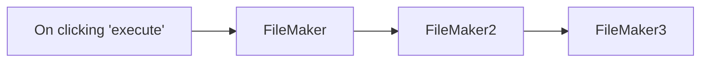

## Fluxo (.json) :

```json
{
  "nodes": [
    {
      "name": "FileMaker",
      "type": "n8n-nodes-base.filemaker",
      "position": [
        450,
        320
      ],
      "parameters": {
        "action": "create",
        "layout": "My Form Layout",
        "fieldsParametersUi": {
          "fields": [
            {
              "name": "first_name",
              "value": "Harshil"
            },
            {
              "name": "last_name",
              "value": "Agrawal"
            }
          ]
        }
      },
      "credentials": {
        "fileMaker": "FileMaker API Credentials"
      },
      "typeVersion": 1
    },
    {
      "name": "On clicking 'execute'",
      "type": "n8n-nodes-base.manualTrigger",
      "position": [
        250,
        320
      ],
      "parameters": {},
      "typeVersion": 1
    },
    {
      "name": "FileMaker",
      "type": "n8n-nodes-base.filemaker",
      "position": [
        450,
        320
      ],
      "parameters": {
        "action": "create",
        "layout": "My Form Layout",
        "fieldsParametersUi": {
          "fields": [
            {
              "name": "first_name",
              "value": "Harshil"
            },
            {
              "name": "last_name",
              "value": "Agrawal"
            }
          ]
        }
      },
      "credentials": {
        "fileMaker": "FileMaker API Credentials"
      },
      "typeVersion": 1
    },
    {
      "name": "FileMaker2",
      "type": "n8n-nodes-base.filemaker",
      "position": [
        650,
        320
      ],
      "parameters": {
        "modId": "={{$json[\"response\"][\"modId\"]}}",
        "recid": "={{$json[\"response\"][\"recordId\"]}}",
        "action": "edit",
        "layout": "My Form Layout",
        "fieldsParametersUi": {
          "fields": [
            {
              "name": "address_country",
              "value": "Germany"
            }
          ]
        }
      },
      "credentials": {
        "fileMaker": "FileMaker API Credentials"
      },
      "typeVersion": 1
    },
    {
      "name": "FileMaker3",
      "type": "n8n-nodes-base.filemaker",
      "position": [
        850,
        320
      ],
      "parameters": {
        "recid": "={{$node[\"FileMaker\"].json[\"response\"][\"recordId\"]}}",
        "layout": "My Form Layout"
      },
      "credentials": {
        "fileMaker": "FileMaker API Credentials"
      },
      "typeVersion": 1
    }
  ],
  "connections": {
    "FileMaker": {
      "main": [
        [
          {
            "node": "FileMaker2",
            "type": "main",
            "index": 0
          }
        ]
      ]
    },
    "FileMaker2": {
      "main": [
        [
          {
            "node": "FileMaker3",
            "type": "main",
            "index": 0
          }
        ]
      ]
    },
    "On clicking 'execute'": {
      "main": [
        [
          {
            "node": "FileMaker",
            "type": "main",
            "index": 0
          }
        ]
      ]
    }
  }
}
```

<a id="template-60"></a>

## Template 60 - Notificação de resposta no Mattermost

- **Nome:** Notificação de resposta no Mattermost
- **Descrição:** Envia uma mensagem para um canal do Mattermost quando um contato responde a uma campanha específica.
- **Funcionalidade:** • Detecção de resposta da campanha: Monitora eventos de resposta ("replied") de contatos e aciona a automação.
• Filtragem por campanha: Restringe o gatilho a um ID de campanha específico para evitar notificações fora do escopo.
• Personalização da mensagem: Insere dinamicamente o primeiro nome do contato e a empresa na mensagem de notificação.
• Envio ao canal especificado: Publica a notificação no canal definido do sistema de mensagens para alertar a equipe.
- **Ferramentas:** • Emelia: Plataforma de envio de campanhas e automação que fornece eventos de resposta para acionar notificações.
• Mattermost: Plataforma de comunicação em equipe usada para receber e visualizar as notificações em um canal dedicado.


## Fluxo visual

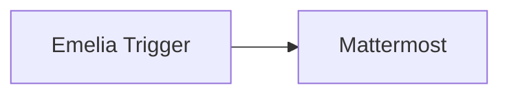

## Fluxo (.json) :

```json
{
  "nodes": [
    {
      "name": "Mattermost",
      "type": "n8n-nodes-base.mattermost",
      "position": [
        650,
        200
      ],
      "parameters": {
        "message": "={{$json[\"contact\"][\"firstName\"]}} from {{$json[\"contact\"][\"company\"]}} has replied back to your campaign.",
        "channelId": "qx9yo1i9z3bg5qcy5a1oxnh69c",
        "attachments": [],
        "otherOptions": {}
      },
      "credentials": {
        "mattermostApi": "Mattermost Credentials"
      },
      "typeVersion": 1
    },
    {
      "name": "Emelia Trigger",
      "type": "n8n-nodes-base.emeliaTrigger",
      "position": [
        450,
        200
      ],
      "webhookId": "f53bc370-a8cb-4748-8f81-be7ae9b94972",
      "parameters": {
        "events": [
          "replied"
        ],
        "campaignId": "6054d068b374b64365740101"
      },
      "credentials": {
        "emeliaApi": "Emelia API Credentials"
      },
      "typeVersion": 1
    }
  ],
  "connections": {
    "Emelia Trigger": {
      "main": [
        [
          {
            "node": "Mattermost",
            "type": "main",
            "index": 0
          }
        ]
      ]
    }
  }
}
```

<a id="template-61"></a>

## Template 61 - Resumo diário de podcasts por gênero

- **Nome:** Resumo diário de podcasts por gênero
- **Descrição:** Gera diariamente um resumo dos episódios principais de podcasts de um gênero específico e envia um email com os resultados.
- **Funcionalidade:** • Agendamento diário: executa o fluxo em um horário configurado para produzir o resumo diário.
• Busca de top podcasts por gênero: consulta uma API para obter os episódios mais populares de um gênero selecionado.
• Download de episódios: baixa os arquivos de áudio dos episódios listados.
• Recorte de áudio: corta trechos específicos dos episódios para análise mais rápida.
• Transcrição de áudio: transforma o áudio recortado em texto usando um serviço de transcrição.
• Sumarização automática: gera um resumo conciso de cada episódio a partir da transcrição.
• Montagem de conteúdo HTML: compila os resumos e links em um email formatado em HTML.
• Envio de email: envia o conteúdo final para um endereço configurado por email.
- **Ferramentas:** • Taddy API: API para obter listas de top charts de podcasts por gênero e país.
• Aspose Audio Cutter: serviço web para cortar/recortar arquivos de áudio conforme tempos especificados.
• OpenAI (Whisper): serviço de transcrição de áudio para texto.
• OpenAI (GPT-4o-mini): modelo de linguagem para gerar resumos concisos a partir das transcrições.
• Gmail: serviço de envio de email para entregar o resumo em formato HTML.


## Fluxo visual

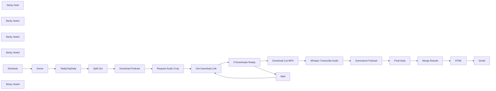

## Fluxo (.json) :

```json
{
  "meta": {
    "instanceId": "7858a8e25b8fc4dae485c1ef345e6fe74effb1f5060433ef500b4c186c965c18"
  },
  "nodes": [
    {
      "id": "49ab7596-665e-4a0f-bb8b-9dc04525ce88",
      "name": "Gmail",
      "type": "n8n-nodes-base.gmail",
      "position": [
        2340,
        1440
      ],
      "parameters": {
        "message": "={{ $json.html }}",
        "options": {},
        "subject": "Podcast Review"
      },
      "credentials": {
        "gmailOAuth2": {
          "id": "1MUdv1HbrQUFABiZ",
          "name": "Gmail account"
        }
      },
      "typeVersion": 2.1
    },
    {
      "id": "40aa23f4-69d6-46e5-84a2-b46a64a3f0af",
      "name": "TaddyTopDaily",
      "type": "n8n-nodes-base.httpRequest",
      "position": [
        1620,
        820
      ],
      "parameters": {
        "url": "https://api.taddy.org/",
        "method": "POST",
        "options": {},
        "sendBody": true,
        "sendHeaders": true,
        "bodyParameters": {
          "parameters": [
            {
              "name": "query",
              "value": "=query { getTopChartsByGenres( limitPerPage:10, filterByCountry:UNITED_STATES_OF_AMERICA, taddyType:PODCASTEPISODE, genres:PODCASTSERIES_{{ $json.genre }}){ topChartsId podcastEpisodes{ uuid name audioUrl podcastSeries{ uuid name } } } }"
            }
          ]
        },
        "headerParameters": {
          "parameters": [
            {
              "name": "X-USER-ID"
            },
            {
              "name": "X-API-KEY"
            }
          ]
        }
      },
      "typeVersion": 4.2
    },
    {
      "id": "42eea23b-b09c-49ee-af5b-12abb3960390",
      "name": "Genre",
      "type": "n8n-nodes-base.set",
      "position": [
        1420,
        820
      ],
      "parameters": {
        "options": {},
        "assignments": {
          "assignments": [
            {
              "id": "e995cd5b-b91c-4a9d-8215-44d7dfe3f52f",
              "name": "genre",
              "type": "string",
              "value": "TECHNOLOGY"
            }
          ]
        }
      },
      "typeVersion": 3.4
    },
    {
      "id": "da256fbf-ed7b-4a26-9fa8-33d1c2b717a5",
      "name": "Split Out",
      "type": "n8n-nodes-base.splitOut",
      "position": [
        1840,
        820
      ],
      "parameters": {
        "options": {},
        "fieldToSplitOut": "data.getTopChartsByGenres.podcastEpisodes"
      },
      "typeVersion": 1
    },
    {
      "id": "069ab68c-dcd6-406f-8e7f-2597f62a04f5",
      "name": "Whisper Transcribe Audio",
      "type": "n8n-nodes-base.httpRequest",
      "position": [
        1880,
        1120
      ],
      "parameters": {
        "url": "https://api.openai.com/v1/audio/transcriptions",
        "method": "POST",
        "options": {},
        "sendBody": true,
        "contentType": "multipart-form-data",
        "authentication": "predefinedCredentialType",
        "bodyParameters": {
          "parameters": [
            {
              "name": "model",
              "value": "whisper-1"
            },
            {
              "name": "file",
              "parameterType": "formBinaryData",
              "inputDataFieldName": "data"
            }
          ]
        },
        "nodeCredentialType": "openAiApi"
      },
      "credentials": {
        "openAiApi": {
          "id": "tTOOlpAaNT3QoKbQ",
          "name": "OpenAi account"
        }
      },
      "typeVersion": 3
    },
    {
      "id": "ffa67b8d-8601-4e1d-8f72-b6266e6b3327",
      "name": "Final Data",
      "type": "n8n-nodes-base.set",
      "position": [
        2320,
        1120
      ],
      "parameters": {
        "mode": "raw",
        "options": {},
        "jsonOutput": "={\n\"podcast\": \"{{ $('TaddyTopDaily').item.json.data.getTopChartsByGenres.podcastEpisodes[$itemIndex].podcastSeries.name }}\",\n\"name\": \"{{ $('TaddyTopDaily').item.json.data.getTopChartsByGenres.podcastEpisodes[$itemIndex].name.replace(/\\\"/g,'\\\"') }}\",\n \"url\":\"{{ $('TaddyTopDaily').item.json.data.getTopChartsByGenres.podcastEpisodes[$itemIndex].audioUrl.replace(/\"/g,'') }}\",\n\"summary\":\"{{ $json.message.content.replace(/\\/g, '\\\\\\\\').replace(/\"/g, '\\\\\"').replace(/\\n/g, '<br/>').replace(/\\r/g, '\\\\r').replace(/\\t/g, '\\\\t') }}\"\n \n}\n"
      },
      "typeVersion": 3.4
    },
    {
      "id": "88cd1fa5-07ae-4dcd-b4f8-85cbf7c98d73",
      "name": "Merge Results",
      "type": "n8n-nodes-base.code",
      "position": [
        1900,
        1440
      ],
      "parameters": {
        "jsCode": "return [{fields:$input.all().map(x=>x.json)}]"
      },
      "typeVersion": 2
    },
    {
      "id": "4c2c80d1-750f-42f1-a0f1-343dec325b0f",
      "name": "HTML",
      "type": "n8n-nodes-base.html",
      "position": [
        2120,
        1440
      ],
      "parameters": {
        "html": "<!DOCTYPE html>\n<html>\n<head>\n <meta charset=\"UTF-8\" />\n</head>\n<body>\n <table>\n <tr> \n {{ ['Podcast', 'Episode', 'Summary'].map(propname=>'<td><h4>'+propname+'</h4></td>').join('') }}\n </tr>\n {{ $json.fields.map(ep=>{ return `<tr><td>${ep.podcast}</td><td><a href=\"${ep.url}\">${ep.name}</a></td><td>${ep.summary}</td><td></td></tr>`} ) }}\n </table>\n</body>\n</html>\n\n<style>\ntr { \n border: 1px solid #000; \n padding: 8px; \n }\n.container {\n background-color: #ffffff;\n text-align: center;\n padding: 16px;\n border-radius: 8px;\n}\n\nh1 {\n color: #ff6d5a;\n font-size: 24px;\n font-weight: bold;\n padding: 8px;\n}\n\nh2 {\n color: #909399;\n font-size: 18px;\n font-weight: bold;\n padding: 8px;\n}\n</style>\n"
      },
      "executeOnce": true,
      "typeVersion": 1.2
    },
    {
      "id": "f1d13556-2c3a-48e5-84a1-5b82f338c6ba",
      "name": "Sticky Note",
      "type": "n8n-nodes-base.stickyNote",
      "position": [
        340,
        760
      ],
      "parameters": {
        "color": 4,
        "width": 547.952991050529,
        "height": 683.5200847858991,
        "content": "## Daily Podcast Summary\n### This workflow will summarize the content in the day's top podcasts for a certain genre, then send you the podcasts with summaries by email\n\n## Setup:\n 1. Create a free API key on Taddy here: https://taddy.org/signup/developers\n 2. Input your user number and API key into the `TaddyTopDaily` node in the header parameters X-USER-ID and X-API-KEY respectively.\n 3. Create access credentials for your Gmail as described here: https://developers.google.com/workspace/guides/create-credentials. Use the credentials from your *client_secret.json* in the `Gmail` node.\n 4. In the `Genre` node, set the genre of podcasts you want a summary for. Valid values are: TECHNOLOGY, NEWS, ARTS, COMEDY, SPORTS, FICTION, etc. Look at api.taddy.org for the full list (they will be displayed in the help docs as PODCASTSERIES_TECHNOLOGY, PODCASTSERIES_NEWS, etc.)\n 5. Enter your email address in the `Gmail` node.\n 6. Change the schedule time for sending email from `Schedule` to whichever time you want to receive the email.\n \n\n## Test:\n- Link a `Test Workflow` node in place of the `Schedule` node.\n- Hit Test Workflow.\n- Check your email for the results."
      },
      "typeVersion": 1
    },
    {
      "id": "5aee7279-349e-47cd-99dc-7a32677b5a20",
      "name": "Sticky Note1",
      "type": "n8n-nodes-base.stickyNote",
      "position": [
        1820,
        1060
      ],
      "parameters": {
        "width": 651.4454343326669,
        "height": 252.64899257060446,
        "content": "### Whisper transcribes and Open AI summarizes the podcast"
      },
      "typeVersion": 1
    },
    {
      "id": "f8b4a203-b27f-4a11-90ef-a7e1561219f5",
      "name": "Sticky Note2",
      "type": "n8n-nodes-base.stickyNote",
      "position": [
        1100,
        760
      ],
      "parameters": {
        "width": 1189.7320416038633,
        "height": 249.2202456997519,
        "content": "### Get daily list of top podcasts (according to Apple charts) and download audio, then crop for OpenAI"
      },
      "typeVersion": 1
    },
    {
      "id": "7045c9c8-5509-4dc0-b167-ddd4d6c90c22",
      "name": "Sticky Note3",
      "type": "n8n-nodes-base.stickyNote",
      "position": [
        1825,
        1384
      ],
      "parameters": {
        "width": 645.0210885124873,
        "height": 227.94126205257731,
        "content": "### Finally, send the email!"
      },
      "typeVersion": 1
    },
    {
      "id": "8dc9583b-cec3-4ac0-a74a-329f6c3b4801",
      "name": "Summarize Podcast",
      "type": "n8n-nodes-base.openAi",
      "position": [
        2140,
        1120
      ],
      "parameters": {
        "model": "gpt-4o-mini",
        "prompt": {
          "messages": [
            {
              "content": "=Summarize the major points of the following podcast: {{ $json.text }}. Start your answer by saying 'This episode focuses on', 'This episode is about', etc. Contain your answer to 3-4 paragraphs max, and focus on only key information. "
            }
          ]
        },
        "options": {
          "maxTokens": 500
        },
        "resource": "chat",
        "requestOptions": {}
      },
      "credentials": {
        "openAiApi": {
          "id": "tTOOlpAaNT3QoKbQ",
          "name": "OpenAi account"
        }
      },
      "typeVersion": 1
    },
    {
      "id": "e8d122f1-29f9-41ca-9c6b-b72269686fd6",
      "name": "Schedule",
      "type": "n8n-nodes-base.scheduleTrigger",
      "position": [
        1220,
        820
      ],
      "parameters": {
        "rule": {
          "interval": [
            {
              "triggerAtHour": 8
            }
          ]
        }
      },
      "typeVersion": 1.2
    },
    {
      "id": "67bc7a5b-8d0a-4de4-918d-410551dad4d7",
      "name": "Request Audio Crop",
      "type": "n8n-nodes-base.httpRequest",
      "position": [
        1000,
        1220
      ],
      "parameters": {
        "url": "https://api.products.aspose.app/audio/cutter/api/cutter",
        "method": "POST",
        "options": {},
        "sendBody": true,
        "contentType": "multipart-form-data",
        "sendHeaders": true,
        "bodyParameters": {
          "parameters": [
            {
              "name": "1",
              "parameterType": "formBinaryData",
              "inputDataFieldName": "data"
            },
            {
              "name": "convertOption",
              "value": "{\"startTime\":\"00:08:00\",\"endTime\":\"00:24:00\",\"audioFormat\":\"mp3\"}"
            }
          ]
        },
        "headerParameters": {
          "parameters": [
            {
              "name": "Accept",
              "value": "*/*("
            },
            {
              "name": "Connection",
              "value": "keep-alive"
            },
            {
              "name": "Origin",
              "value": "https://products.aspose.app"
            },
            {
              "name": "Referer",
              "value": "https://products.aspose.app"
            },
            {
              "name": "Sec-Fetch-Dest",
              "value": "empty"
            },
            {
              "name": "Sec-Fetch-Mode",
              "value": "cors"
            },
            {
              "name": "Sec-Fetch-Site",
              "value": "same-site"
            }
          ]
        }
      },
      "typeVersion": 4.2
    },
    {
      "id": "0dc62507-3fea-45d7-a0dc-e92fb8e2600f",
      "name": "Get Download Link",
      "type": "n8n-nodes-base.httpRequest",
      "position": [
        1200,
        1220
      ],
      "parameters": {
        "url": "=https://api.products.aspose.app/audio/cutter/api/cutter/HandleStatus?fileRequestId={{ $('Request Audio Crop').item.json.Data.FileRequestId }}",
        "options": {},
        "sendHeaders": true,
        "headerParameters": {
          "parameters": [
            {
              "name": "Accept",
              "value": "application/json, text/javascript, */*; q=0.01"
            },
            {
              "name": "Connection",
              "value": "keep-alive"
            },
            {
              "name": "Origin",
              "value": "https://products.aspose.app"
            },
            {
              "name": "Referer",
              "value": "https://products.aspose.app"
            },
            {
              "name": "Sec-Fetch-Dest",
              "value": "empty"
            },
            {
              "name": "Sec-Fetch-Dest",
              "value": "cors"
            },
            {
              "name": "Sec-Fetch-Dest",
              "value": "same-site"
            }
          ]
        }
      },
      "typeVersion": 4.2
    },
    {
      "id": "8aa65189-2a4b-4ac4-9915-45ccd679a5da",
      "name": "Download Cut MP3",
      "type": "n8n-nodes-base.httpRequest",
      "position": [
        1660,
        1140
      ],
      "parameters": {
        "url": "={{ $json.Data.DownloadLink }}",
        "options": {}
      },
      "typeVersion": 4.2
    },
    {
      "id": "4e7318df-dbaa-4d9f-858d-4455ead763c1",
      "name": "Download Podcast",
      "type": "n8n-nodes-base.httpRequest",
      "position": [
        2060,
        820
      ],
      "parameters": {
        "url": "={{ $json.audioUrl }}",
        "options": {}
      },
      "typeVersion": 4.2
    },
    {
      "id": "ab4601c6-7387-4f2f-a2f3-4256f88c0b3e",
      "name": "Wait",
      "type": "n8n-nodes-base.wait",
      "position": [
        1600,
        1360
      ],
      "webhookId": "bc28bc57-d9ea-430e-88db-78d088a058cb",
      "parameters": {},
      "typeVersion": 1.1
    },
    {
      "id": "a0b300b9-aaad-48f1-8319-a03700e0d298",
      "name": "Sticky Note4",
      "type": "n8n-nodes-base.stickyNote",
      "position": [
        920,
        1100
      ],
      "parameters": {
        "width": 898.7483569555845,
        "height": 387.3779915472271,
        "content": "### Crop the podcast down before analysis"
      },
      "typeVersion": 1
    },
    {
      "id": "34ca89fe-4ed1-491f-b3b9-32e97040959b",
      "name": "If Downloads Ready",
      "type": "n8n-nodes-base.if",
      "position": [
        1380,
        1180
      ],
      "parameters": {
        "options": {},
        "conditions": {
          "options": {
            "leftValue": "",
            "caseSensitive": true,
            "typeValidation": "loose"
          },
          "combinator": "and",
          "conditions": [
            {
              "id": "49440938-0cb3-41c8-bcab-b7ad96973f77",
              "operator": {
                "type": "boolean",
                "operation": "true",
                "singleValue": true
              },
              "leftValue": "={{ $input.all().map(x=>x.json.Data.DownloadLink).reduce((accumulator, currentValue) => accumulator && currentValue, true)\n}}",
              "rightValue": ""
            }
          ]
        },
        "looseTypeValidation": true
      },
      "typeVersion": 2.1
    }
  ],
  "pinData": {},
  "connections": {
    "HTML": {
      "main": [
        [
          {
            "node": "Gmail",
            "type": "main",
            "index": 0
          }
        ]
      ]
    },
    "Wait": {
      "main": [
        [
          {
            "node": "Get Download Link",
            "type": "main",
            "index": 0
          }
        ]
      ]
    },
    "Genre": {
      "main": [
        [
          {
            "node": "TaddyTopDaily",
            "type": "main",
            "index": 0
          }
        ]
      ]
    },
    "Schedule": {
      "main": [
        [
          {
            "node": "Genre",
            "type": "main",
            "index": 0
          }
        ]
      ]
    },
    "Split Out": {
      "main": [
        [
          {
            "node": "Download Podcast",
            "type": "main",
            "index": 0
          }
        ]
      ]
    },
    "Final Data": {
      "main": [
        [
          {
            "node": "Merge Results",
            "type": "main",
            "index": 0
          }
        ]
      ]
    },
    "Merge Results": {
      "main": [
        [
          {
            "node": "HTML",
            "type": "main",
            "index": 0
          }
        ]
      ]
    },
    "TaddyTopDaily": {
      "main": [
        [
          {
            "node": "Split Out",
            "type": "main",
            "index": 0
          }
        ]
      ]
    },
    "Download Cut MP3": {
      "main": [
        [
          {
            "node": "Whisper Transcribe Audio",
            "type": "main",
            "index": 0
          }
        ]
      ]
    },
    "Download Podcast": {
      "main": [
        [
          {
            "node": "Request Audio Crop",
            "type": "main",
            "index": 0
          }
        ]
      ]
    },
    "Get Download Link": {
      "main": [
        [
          {
            "node": "If Downloads Ready",
            "type": "main",
            "index": 0
          }
        ]
      ]
    },
    "Summarize Podcast": {
      "main": [
        [
          {
            "node": "Final Data",
            "type": "main",
            "index": 0
          }
        ]
      ]
    },
    "If Downloads Ready": {
      "main": [
        [
          {
            "node": "Download Cut MP3",
            "type": "main",
            "index": 0
          }
        ],
        [
          {
            "node": "Wait",
            "type": "main",
            "index": 0
          }
        ]
      ]
    },
    "Request Audio Crop": {
      "main": [
        [
          {
            "node": "Get Download Link",
            "type": "main",
            "index": 0
          }
        ]
      ]
    },
    "Whisper Transcribe Audio": {
      "main": [
        [
          {
            "node": "Summarize Podcast",
            "type": "main",
            "index": 0
          }
        ]
      ]
    }
  }
}
```
