# PACK 1999 TEMPLATES PARTE 01 - Bloco 4

Templates neste bloco: 20

## Sumário

- [Template 62 - Debounce de SMS e resposta consolidada por AI](#template-62)
- [Template 63 - Envio de convite iCalendar por e-mail](#template-63)
- [Template 64 - Envio mensal de métricas financeiras ao Mattermost](#template-64)
- [Template 65 - Execução manual de job no Rundeck](#template-65)
- [Template 66 - Scraper e sumarização de empresas Indeed](#template-66)
- [Template 67 - Verificar certificado SSL de domínio](#template-67)
- [Template 68 - Comparação de dois conjuntos de dados por chave](#template-68)
- [Template 69 - Citações de arquivos com Assistente OpenAI](#template-69)
- [Template 70 - Notificar Mattermost ao adicionar dados no Airtable](#template-70)
- [Template 71 - Adicionar, commitar e enviar README.md para Git](#template-71)
- [Template 72 - Wrapper Adobe PDF Services](#template-72)
- [Template 73 - Notificar Mattermost ao criar pedido no WooCommerce](#template-73)
- [Template 74 - Análise Avançada de Ações com IA (Técnica e Tendências)](#template-74)
- [Template 75 - Notificações de tweets para Mattermost](#template-75)
- [Template 76 - Atualizar incidente e avisar canal](#template-76)
- [Template 77 - Inicializar configuração do Standup Bot](#template-77)
- [Template 78 - Remover um rótulo e aplicar outro em mensagens do Gmail](#template-78)
- [Template 79 - Compartilhar link Whereby no Mattermost](#template-79)
- [Template 80 - Gerar narração de vídeo com IA e TTS](#template-80)
- [Template 81 - Sobrescrever configuração do Standup Bot](#template-81)

---

<a id="template-62"></a>

## Template 62 - Debounce de SMS e resposta consolidada por AI

- **Nome:** Debounce de SMS e resposta consolidada por AI
- **Descrição:** O fluxo coleta mensagens SMS de um remetente, aguarda um curto período para agrupar mensagens rápidas, e então envia um único pedido ao agente de IA para responder de forma consolidada.
- **Funcionalidade:** • Captura de mensagens recebidas: Recebe mensagens SMS de usuários para iniciar o processo.
• Armazenamento em lista temporária: Registra cada mensagem em uma fila por remetente para criar um histórico recente.
• Espera programada: Pausa a execução por 5 segundos para detectar se o usuário continua enviando mensagens.
• Verificação de continuação: Compara a última entrada do buffer com a mensagem atual para decidir seguir ou abortar a resposta (evita responder enquanto o usuário ainda digita).
• Recuperação de contexto desde a última resposta do bot: Obtém o histórico de conversas relevantes desde a última resposta do agente para manter coerência.
• Construção de buffer de mensagens do usuário: Junta apenas as mensagens novas desde a última resposta do bot em um único texto para envio ao agente.
• Geração de resposta consolidada por agente de IA: Envia o conjunto de mensagens ao modelo de IA para produzir uma única resposta que trate todas as mensagens agrupadas.
• Envio de SMS de resposta: Retorna a resposta do agente ao usuário por SMS para o número remetente.
- **Ferramentas:** • Twilio: Serviço de envio e recebimento de mensagens SMS para receber entradas dos usuários e enviar respostas.
• Redis: Armazenamento em lista para manter um buffer temporário de mensagens por remetente e permitir checagens rápidas.
• OpenAI (modelo de linguagem): Gera a resposta consolidada a partir das mensagens agrupadas, atuando como agente conversacional.


## Fluxo visual

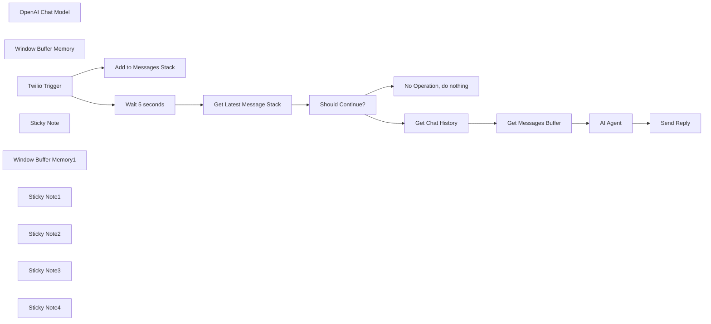

## Fluxo (.json) :

```json
{
  "meta": {
    "instanceId": "26ba763460b97c249b82942b23b6384876dfeb9327513332e743c5f6219c2b8e"
  },
  "nodes": [
    {
      "id": "d61d8ff3-532a-4b0d-a5a7-e02d2e79ddce",
      "name": "OpenAI Chat Model",
      "type": "@n8n/n8n-nodes-langchain.lmChatOpenAi",
      "position": [
        2660,
        480
      ],
      "parameters": {
        "options": {}
      },
      "credentials": {
        "openAiApi": {
          "id": "8gccIjcuf3gvaoEr",
          "name": "OpenAi account"
        }
      },
      "typeVersion": 1
    },
    {
      "id": "b6d5c1cf-b4a1-4901-b001-0c375747ee63",
      "name": "No Operation, do nothing",
      "type": "n8n-nodes-base.noOp",
      "position": [
        1660,
        520
      ],
      "parameters": {},
      "typeVersion": 1
    },
    {
      "id": "f4e08e32-bb96-4b5d-852e-26ad6fec3c8c",
      "name": "Add to Messages Stack",
      "type": "n8n-nodes-base.redis",
      "position": [
        1340,
        200
      ],
      "parameters": {
        "list": "=chat-buffer:{{ $json.From }}",
        "tail": true,
        "operation": "push",
        "messageData": "={{ $json.Body }}"
      },
      "credentials": {
        "redis": {
          "id": "zU4DA70qSDrZM1El",
          "name": "Redis account"
        }
      },
      "typeVersion": 1
    },
    {
      "id": "181ae99e-ebe7-4e99-b5a5-999acc249621",
      "name": "Should Continue?",
      "type": "n8n-nodes-base.if",
      "position": [
        1660,
        360
      ],
      "parameters": {
        "options": {},
        "conditions": {
          "options": {
            "leftValue": "",
            "caseSensitive": true,
            "typeValidation": "strict"
          },
          "combinator": "and",
          "conditions": [
            {
              "id": "ec39573f-f92a-4fe4-a832-0a137de8e7d0",
              "operator": {
                "type": "string",
                "operation": "equals"
              },
              "leftValue": "={{ $('Get Latest Message Stack').item.json.messages.last() }}",
              "rightValue": "={{ $('Twilio Trigger').item.json.Body }}"
            }
          ]
        }
      },
      "typeVersion": 2
    },
    {
      "id": "640c63ca-2798-48a9-8484-b834c1a36301",
      "name": "Window Buffer Memory",
      "type": "@n8n/n8n-nodes-langchain.memoryBufferWindow",
      "position": [
        2780,
        480
      ],
      "parameters": {
        "sessionKey": "=chat-debouncer:{{ $('Twilio Trigger').item.json.From }}",
        "sessionIdType": "customKey"
      },
      "typeVersion": 1.2
    },
    {
      "id": "123c35c5-f7b2-4b4d-b220-0e5273e25115",
      "name": "Twilio Trigger",
      "type": "n8n-nodes-base.twilioTrigger",
      "position": [
        940,
        360
      ],
      "webhookId": "0ca3da0e-e4e1-4e94-8380-06207bf9b429",
      "parameters": {
        "updates": [
          "com.twilio.messaging.inbound-message.received"
        ]
      },
      "credentials": {
        "twilioApi": {
          "id": "TJv4H4lXxPCLZT50",
          "name": "Twilio account"
        }
      },
      "typeVersion": 1
    },
    {
      "id": "f4e86455-7f4d-4401-8f61-a859be1433a9",
      "name": "Get Latest Message Stack",
      "type": "n8n-nodes-base.redis",
      "position": [
        1500,
        360
      ],
      "parameters": {
        "key": "=chat-buffer:{{ $json.From }}",
        "keyType": "list",
        "options": {},
        "operation": "get",
        "propertyName": "messages"
      },
      "credentials": {
        "redis": {
          "id": "zU4DA70qSDrZM1El",
          "name": "Redis account"
        }
      },
      "typeVersion": 1,
      "alwaysOutputData": false
    },
    {
      "id": "02f8e7f5-12b4-4a5a-9ce9-5f0558e447aa",
      "name": "Sticky Note",
      "type": "n8n-nodes-base.stickyNote",
      "position": [
        1232.162872321277,
        -50.203627749982275
      ],
      "parameters": {
        "color": 7,
        "width": 632.8309394802918,
        "height": 766.7069233634998,
        "content": "## Step 2. Buffer Incoming Messages\n[Learn more about using Redis](https://docs.n8n.io/integrations/builtin/app-nodes/n8n-nodes-base.redis)\n\n* New messages are captured into a list.\n* After X seconds, we get a fresh copy of this list\n* If the last message on the list is the same as the incoming message, then we know no new follow-on messages were sent within the last 5 seconds. Hence the user should be waiting and it is safe to reply.\n* But if the reverse is true, then we will abort the execution here."
      },
      "typeVersion": 1
    },
    {
      "id": "311c0d69-a735-4435-91b6-e80bf7d4c012",
      "name": "Send Reply",
      "type": "n8n-nodes-base.twilio",
      "position": [
        3000,
        320
      ],
      "parameters": {
        "to": "={{ $('Twilio Trigger').item.json.From }}",
        "from": "={{ $('Twilio Trigger').item.json.To }}",
        "message": "={{ $json.output }}",
        "options": {}
      },
      "credentials": {
        "twilioApi": {
          "id": "TJv4H4lXxPCLZT50",
          "name": "Twilio account"
        }
      },
      "typeVersion": 1
    },
    {
      "id": "c0e0cd08-66e3-4ca3-9441-8436c0d9e664",
      "name": "Wait 5 seconds",
      "type": "n8n-nodes-base.wait",
      "position": [
        1340,
        360
      ],
      "webhookId": "d486979c-8074-4ecb-958e-fcb24455086b",
      "parameters": {},
      "typeVersion": 1.1
    },
    {
      "id": "c7959fa2-69a5-46b4-8e67-1ef824860f4e",
      "name": "Get Chat History",
      "type": "@n8n/n8n-nodes-langchain.memoryManager",
      "position": [
        2000,
        280
      ],
      "parameters": {
        "options": {
          "groupMessages": true
        }
      },
      "typeVersion": 1.1
    },
    {
      "id": "55933c54-5546-4770-8b36-a31496163528",
      "name": "Window Buffer Memory1",
      "type": "@n8n/n8n-nodes-langchain.memoryBufferWindow",
      "position": [
        2000,
        420
      ],
      "parameters": {
        "sessionKey": "=chat-debouncer:{{ $('Twilio Trigger').item.json.From }}",
        "sessionIdType": "customKey"
      },
      "typeVersion": 1.2
    },
    {
      "id": "459c0181-d239-4eec-88b6-c9603868d518",
      "name": "Sticky Note1",
      "type": "n8n-nodes-base.stickyNote",
      "position": [
        774.3250485705519,
        198.07493876489747
      ],
      "parameters": {
        "color": 7,
        "width": 431.1629802181097,
        "height": 357.49804533541777,
        "content": "## Step 1. Listen for Twilio Messages\n[Read more about Twilio Trigger](https://docs.n8n.io/integrations/builtin/trigger-nodes/n8n-nodes-base.twiliotrigger)\n\nIn this example, we'll use the sender's phone number as the session ID. This will be important in retrieving chat history."
      },
      "typeVersion": 1
    },
    {
      "id": "e06313a9-066a-4387-a36c-a6c6ff57d6f9",
      "name": "Sticky Note2",
      "type": "n8n-nodes-base.stickyNote",
      "position": [
        1900,
        80
      ],
      "parameters": {
        "color": 7,
        "width": 618.970917763344,
        "height": 501.77420646931444,
        "content": "## Step 3. Get Messages Since Last Reply\n[Read more about using Chat Memory](https://docs.n8n.io/integrations/builtin/cluster-nodes/sub-nodes/n8n-nodes-langchain.memorymanager)\n\nOnce conditions are met and we allow the agent to reply, we'll need to find the bot's last reply and work out the buffer of user messages since then. We can do this by looking using chat memory and comparing this to the latest message in our redis messages stack."
      },
      "typeVersion": 1
    },
    {
      "id": "601a71f6-c6f8-4b73-98c7-cfa11b1facaa",
      "name": "Get Messages Buffer",
      "type": "n8n-nodes-base.set",
      "position": [
        2320,
        280
      ],
      "parameters": {
        "options": {},
        "assignments": {
          "assignments": [
            {
              "id": "01434acb-c224-46d2-99b0-7a81a2bb50c5",
              "name": "messages",
              "type": "string",
              "value": "={{\n$('Get Latest Message Stack').item.json.messages\n .slice(\n $('Get Latest Message Stack').item.json.messages.lastIndexOf(\n $('Get Chat History').item.json.messages.last().human\n || $('Twilio Trigger').item.json.chatInput\n ),\n $('Get Latest Message Stack').item.json.messages.length\n )\n .join('\\n')\n}}"
            }
          ]
        }
      },
      "typeVersion": 3.4
    },
    {
      "id": "9e49f2de-89e6-4152-8e9c-ed47c5fc4654",
      "name": "Sticky Note3",
      "type": "n8n-nodes-base.stickyNote",
      "position": [
        2549,
        120
      ],
      "parameters": {
        "color": 7,
        "width": 670.2274698011594,
        "height": 522.5993538768389,
        "content": "## Step 4. Send Single Agent Reply For Many Messages\n[Learn more about using AI Agents](https://docs.n8n.io/integrations/builtin/cluster-nodes/root-nodes/n8n-nodes-langchain.agent)\n\nFinally, our buffered messages are sent to the AI Agent that can formulate a single response for all. This could potentially improve the conversation experience if the chat interaction is naturally more rapid and spontaneous. A drawback however is that responses could be feel much slower - tweak the wait threshold to suit your needs!"
      },
      "typeVersion": 1
    },
    {
      "id": "be13c74a-467c-4ab1-acca-44878c68dba4",
      "name": "Sticky Note4",
      "type": "n8n-nodes-base.stickyNote",
      "position": [
        380,
        80
      ],
      "parameters": {
        "width": 375.55385425077225,
        "height": 486.69228315530853,
        "content": "## Try It Out!\n### This workflow demonstrates a simple approach to stagger an AI Agent's reply if users often send in a sequence of partial messages and in short bursts.\n\n* Twilio webhook receives user's messages which are recorded in a message stack powered by Redis.\n* The execution is immediately paused for 5 seconds and then another check is done against the message stack for the latest message.\n* The purpose of this check lets use know if the user is sending more messages or if they are waiting for a reply.\n* The execution is aborted if the latest message on the stack differs from the incoming message and continues if they are the same.\n* For the latter, the agent receives buffered messages and is able to respond to all in a single reply."
      },
      "typeVersion": 1
    },
    {
      "id": "334d38e1-ec16-46f2-a57d-bf531adb8d3d",
      "name": "AI Agent",
      "type": "@n8n/n8n-nodes-langchain.agent",
      "position": [
        2660,
        320
      ],
      "parameters": {
        "text": "={{ $json.messages }}",
        "agent": "conversationalAgent",
        "options": {},
        "promptType": "define"
      },
      "typeVersion": 1.6
    }
  ],
  "pinData": {},
  "connections": {
    "AI Agent": {
      "main": [
        [
          {
            "node": "Send Reply",
            "type": "main",
            "index": 0
          }
        ]
      ]
    },
    "Twilio Trigger": {
      "main": [
        [
          {
            "node": "Add to Messages Stack",
            "type": "main",
            "index": 0
          },
          {
            "node": "Wait 5 seconds",
            "type": "main",
            "index": 0
          }
        ]
      ]
    },
    "Wait 5 seconds": {
      "main": [
        [
          {
            "node": "Get Latest Message Stack",
            "type": "main",
            "index": 0
          }
        ]
      ]
    },
    "Get Chat History": {
      "main": [
        [
          {
            "node": "Get Messages Buffer",
            "type": "main",
            "index": 0
          }
        ]
      ]
    },
    "Should Continue?": {
      "main": [
        [
          {
            "node": "Get Chat History",
            "type": "main",
            "index": 0
          }
        ],
        [
          {
            "node": "No Operation, do nothing",
            "type": "main",
            "index": 0
          }
        ]
      ]
    },
    "OpenAI Chat Model": {
      "ai_languageModel": [
        [
          {
            "node": "AI Agent",
            "type": "ai_languageModel",
            "index": 0
          }
        ]
      ]
    },
    "Get Messages Buffer": {
      "main": [
        [
          {
            "node": "AI Agent",
            "type": "main",
            "index": 0
          }
        ]
      ]
    },
    "Window Buffer Memory": {
      "ai_memory": [
        [
          {
            "node": "AI Agent",
            "type": "ai_memory",
            "index": 0
          }
        ]
      ]
    },
    "Window Buffer Memory1": {
      "ai_memory": [
        [
          {
            "node": "Get Chat History",
            "type": "ai_memory",
            "index": 0
          }
        ]
      ]
    },
    "Get Latest Message Stack": {
      "main": [
        [
          {
            "node": "Should Continue?",
            "type": "main",
            "index": 0
          }
        ]
      ]
    }
  }
}
```

<a id="template-63"></a>

## Template 63 - Envio de convite iCalendar por e-mail

- **Nome:** Envio de convite iCalendar por e-mail
- **Descrição:** Gera um arquivo iCalendar (.ics) com os detalhes do evento e envia-o como anexo em um e-mail ao ser executado manualmente.
- **Funcionalidade:** • Disparo manual: Inicia o fluxo ao clicar em executar.
• Geração de convite iCalendar: Cria um arquivo .ics com título, horário de início e término do evento.
• Composição de e-mail: Prepara o assunto e o corpo da mensagem com texto personalizado.
• Anexar arquivo: Inclui o arquivo iCalendar como anexo do e-mail.
• Envio por SMTP: Envia o e-mail utilizando credenciais de servidor SMTP.
- **Ferramentas:** • Formato iCalendar (.ics): Padrão de arquivo para representar eventos de calendário, usado para criar o convite.
• Servidor SMTP (Outlook): Serviço de envio de e-mails utilizado para enviar o convite como anexo.

## Fluxo visual

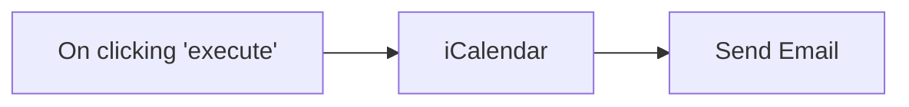

## Fluxo (.json) :

```json
{
  "nodes": [
    {
      "name": "On clicking 'execute'",
      "type": "n8n-nodes-base.manualTrigger",
      "position": [
        350,
        200
      ],
      "parameters": {},
      "typeVersion": 1
    },
    {
      "name": "iCalendar",
      "type": "n8n-nodes-base.iCal",
      "position": [
        550,
        200
      ],
      "parameters": {
        "end": "2021-06-11T16:15:00.000Z",
        "start": "2021-06-11T15:30:00.000Z",
        "title": "n8n Community Meetup",
        "additionalFields": {}
      },
      "typeVersion": 1
    },
    {
      "name": "Send Email",
      "type": "n8n-nodes-base.emailSend",
      "position": [
        750,
        200
      ],
      "parameters": {
        "text": "Hey Harshil,\n\nWe are excited to invite you to the n8n community meetup!\n\nWith this email you will find the invite attached.\n\nLooking forward to seeing you at the meetup!\n\nCheers,\nHarshil",
        "options": {},
        "subject": "n8n Community Meetup 🚀",
        "attachments": "data"
      },
      "credentials": {
        "smtp": "Outlook Burner Credentials"
      },
      "typeVersion": 1
    }
  ],
  "connections": {
    "iCalendar": {
      "main": [
        [
          {
            "node": "Send Email",
            "type": "main",
            "index": 0
          }
        ]
      ]
    },
    "On clicking 'execute'": {
      "main": [
        [
          {
            "node": "iCalendar",
            "type": "main",
            "index": 0
          }
        ]
      ]
    }
  }
}
```

<a id="template-64"></a>

## Template 64 - Envio mensal de métricas financeiras ao Mattermost

- **Nome:** Envio mensal de métricas financeiras ao Mattermost
- **Descrição:** Este fluxo coleta métricas financeiras mensais e publica um resumo em um canal do Mattermost.
- **Funcionalidade:** • Agendamento mensal: dispara automaticamente todo mês às 09:00 para iniciar a rotina.
• Coleta de métricas financeiras: recupera métricas mensais do serviço de métricas (por exemplo, clientes ativos, clientes em trial, novos clientes, taxa de crescimento e receita recorrente).
• Montagem de mensagem formatada: insere os valores coletados em um template de texto para apresentação clara.
• Publicação em canal: envia a mensagem formatada para um canal específico do Mattermost.
- **Ferramentas:** • ProfitWell: serviço de métricas financeiras e de assinaturas utilizado para obter os indicadores mensais.
• Mattermost: plataforma de comunicação em equipe onde o resumo financeiro é publicado.

## Fluxo visual

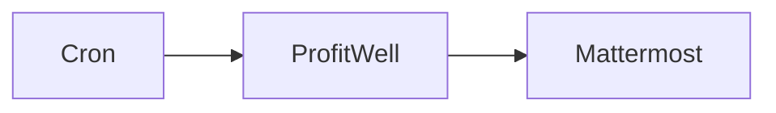

## Fluxo (.json) :

```json
{
  "id": "146",
  "name": "Send financial metrics monthly to Mattermost",
  "nodes": [
    {
      "name": "ProfitWell",
      "type": "n8n-nodes-base.profitWell",
      "position": [
        730,
        220
      ],
      "parameters": {
        "type": "monthly",
        "options": {}
      },
      "credentials": {
        "profitWellApi": "profitwell"
      },
      "typeVersion": 1
    },
    {
      "name": "Cron",
      "type": "n8n-nodes-base.cron",
      "position": [
        530,
        220
      ],
      "parameters": {
        "triggerTimes": {
          "item": [
            {
              "hour": 9,
              "mode": "everyMonth"
            }
          ]
        }
      },
      "typeVersion": 1
    },
    {
      "name": "Mattermost",
      "type": "n8n-nodes-base.mattermost",
      "position": [
        930,
        220
      ],
      "parameters": {
        "message": "=Active Customers: {{$node[\"ProfitWell\"].json[\"active_customers\"]}}\nTrailing Customers: {{$node[\"ProfitWell\"].json[\"active_trialing_customers\"]}}\nNew Customers: {{$node[\"ProfitWell\"].json[\"new_customers\"]}}\nGrowth Rate: {{$node[\"ProfitWell\"].json[\"growth_rate\"]}}\nRecurring Revenue: {{$node[\"ProfitWell\"].json[\"recurring_revenue\"]}}",
        "channelId": "w6rsxrqds3bt9pguxzduowqucy",
        "attachments": [],
        "otherOptions": {}
      },
      "credentials": {
        "mattermostApi": "mattermost"
      },
      "typeVersion": 1
    }
  ],
  "active": false,
  "settings": {},
  "connections": {
    "Cron": {
      "main": [
        [
          {
            "node": "ProfitWell",
            "type": "main",
            "index": 0
          }
        ]
      ]
    },
    "ProfitWell": {
      "main": [
        [
          {
            "node": "Mattermost",
            "type": "main",
            "index": 0
          }
        ]
      ]
    }
  }
}
```

<a id="template-65"></a>

## Template 65 - Execução manual de job no Rundeck

- **Nome:** Execução manual de job no Rundeck
- **Descrição:** Fluxo que, ao ser acionado manualmente, dispara a execução de um job específico no Rundeck utilizando credenciais configuradas.
- **Funcionalidade:** • Gatilho manual: inicia o fluxo quando o usuário clica em executar.
• Disparo de job no Rundeck: solicita a execução do job identificado pelo ID f02c7661-6f75-4ffe-958c-c0ed5f9bc9e6.
• Autenticação via credenciais de API: utiliza credenciais configuradas para autenticar a chamada ao serviço.
- **Ferramentas:** • Rundeck: plataforma de automação e orquestração para executar e gerir jobs remotos via API.

## Fluxo visual

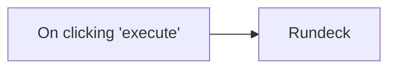

## Fluxo (.json) :

```json
{
  "nodes": [
    {
      "name": "On clicking 'execute'",
      "type": "n8n-nodes-base.manualTrigger",
      "position": [
        250,
        300
      ],
      "parameters": {},
      "typeVersion": 1
    },
    {
      "name": "Rundeck",
      "type": "n8n-nodes-base.rundeck",
      "position": [
        450,
        300
      ],
      "parameters": {
        "jobid": "f02c7661-6f75-4ffe-958c-c0ed5f9bc9e6"
      },
      "credentials": {
        "rundeckApi": "rundeck_creds"
      },
      "typeVersion": 1
    }
  ],
  "connections": {
    "On clicking 'execute'": {
      "main": [
        [
          {
            "node": "Rundeck",
            "type": "main",
            "index": 0
          }
        ]
      ]
    }
  }
}
```

<a id="template-66"></a>

## Template 66 - Scraper e sumarização de empresas Indeed

- **Nome:** Scraper e sumarização de empresas Indeed
- **Descrição:** Automatiza a captura de páginas de empresas do Indeed a partir de uma tabela, processa o conteúdo com modelos de linguagem para extrair e resumir informações, e envia resultados formatados para um webhook.
- **Funcionalidade:** • Leitura de links do Airtable: busca registros da base configurada contendo links de empresas.
• Iteração por registros: processa cada registro em lotes para escalabilidade.
• Validação de link: verifica e ignora registros cujo campo de link esteja vazio.
• Configuração de zona do Bright Data: define a zona a ser usada pelo serviço de captura.
• Requisição ao Bright Data Web Unlocker: solicita a página da empresa no Indeed em formato bruto/markdown via API do Bright Data.
• Conversão Markdown para HTML e extração textual: transforma o conteúdo markdown em HTML e prepara texto limpo para análise.
• Extração e sumarização com modelo de linguagem: utiliza um modelo avançado para converter o markdown em texto e gerar um resumo dos dados da empresa.
• Agente de IA para formatação: aplica regras de formatação ao resultado sumarizado e monta um JSON estruturado.
• Envio para webhook: transmite o resumo e o HTML resultante para uma URL de webhook configurada.
• Controle de taxa/espera: insere uma espera entre requisições (ex.: 10 segundos) para controle de tráfego.
- **Ferramentas:** • Airtable: base de dados usada para armazenar e listar os links das empresas a serem processadas.
• Bright Data Web Unlocker: serviço de captura/proxy usado para obter o conteúdo das páginas do Indeed em formato raw/markdown.
• Google Gemini (PaLM): modelo de linguagem usado para converter markdown em texto, extrair informações e gerar sumarizações.
• Webhook (por exemplo webhook.site ou endpoint customizado): receptor dos resultados formatados (JSON e HTML) enviados pelo fluxo.

## Fluxo visual

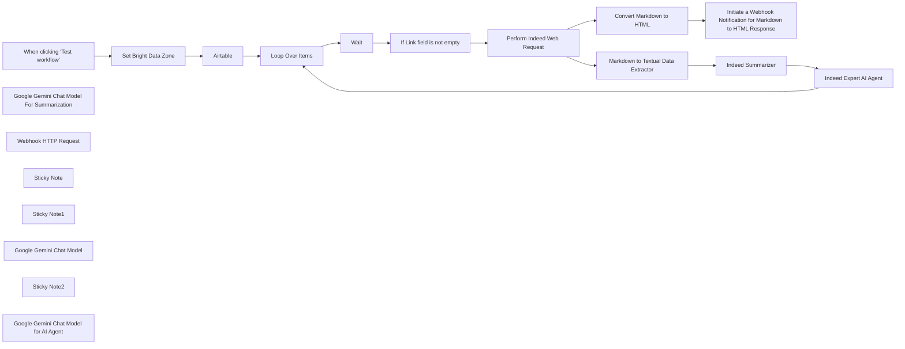

## Fluxo (.json) :

```json
{
  "id": "TTj6BiN7bQKTa6FM",
  "meta": {
    "instanceId": "885b4fb4a6a9c2cb5621429a7b972df0d05bb724c20ac7dac7171b62f1c7ef40",
    "templateCredsSetupCompleted": true
  },
  "name": "Indeed Company Data Scraper & Summarization with Airtable, Bright Data and Google Gemini",
  "tags": [
    {
      "id": "Kujft2FOjmOVQAmJ",
      "name": "Engineering",
      "createdAt": "2025-04-09T01:31:00.558Z",
      "updatedAt": "2025-04-09T01:31:00.558Z"
    },
    {
      "id": "ddPkw7Hg5dZhQu2w",
      "name": "AI",
      "createdAt": "2025-04-13T05:38:08.053Z",
      "updatedAt": "2025-04-13T05:38:08.053Z"
    },
    {
      "id": "rKOa98eAi3IETrLu",
      "name": "HR",
      "createdAt": "2025-04-13T04:59:30.580Z",
      "updatedAt": "2025-04-13T04:59:30.580Z"
    }
  ],
  "nodes": [
    {
      "id": "390ebd32-6ce4-4894-9b4f-7b376db5b724",
      "name": "When clicking ‘Test workflow’",
      "type": "n8n-nodes-base.manualTrigger",
      "position": [
        -220,
        -545
      ],
      "parameters": {},
      "typeVersion": 1
    },
    {
      "id": "8ba6b208-b4ad-443c-8b24-c51b3b5ad880",
      "name": "Google Gemini Chat Model For Summarization",
      "type": "@n8n/n8n-nodes-langchain.lmChatGoogleGemini",
      "position": [
        1784,
        -300
      ],
      "parameters": {
        "options": {},
        "modelName": "models/gemini-2.0-flash-exp"
      },
      "credentials": {
        "googlePalmApi": {
          "id": "YeO7dHZnuGBVQKVZ",
          "name": "Google Gemini(PaLM) Api account"
        }
      },
      "typeVersion": 1
    },
    {
      "id": "394a7291-618a-42f0-8e1b-18ed7c8496c3",
      "name": "Webhook HTTP Request",
      "type": "@n8n/n8n-nodes-langchain.toolHttpRequest",
      "position": [
        2280,
        -160
      ],
      "parameters": {
        "url": "https://webhook.site/daf9d591-a130-4010-b1d3-0c66f8fcf467",
        "method": "POST",
        "sendBody": true,
        "parametersBody": {
          "values": [
            {
              "name": "search_summary",
              "value": "={{ $json.response.text }}",
              "valueProvider": "fieldValue"
            },
            {
              "name": "search_result"
            }
          ]
        },
        "toolDescription": "Extract the response and format a structured JSON response"
      },
      "typeVersion": 1.1
    },
    {
      "id": "4e1352a5-0fa6-4fee-a93d-cc0a0a4fdd6f",
      "name": "Sticky Note",
      "type": "n8n-nodes-base.stickyNote",
      "position": [
        -240,
        -1080
      ],
      "parameters": {
        "width": 400,
        "height": 320,
        "content": "## Note\n\nDeals with the Company web scraping by utilizing Bright Data Web Unlocker Product.\n\nThe Basic LLM Chain, Summarization and AI Agent are being used to demonstrate the usage of the n8n AI capabilities.\n\n**Please make sure to connect to Airtable with the Base Table as \"Indeed\" and the default Table1 filled with the indeed links to scrape. \n\nAlso make sure to update the Webhook Notification URL**"
      },
      "typeVersion": 1
    },
    {
      "id": "bf184d27-ed62-44fa-bed2-65a1f703179e",
      "name": "Sticky Note1",
      "type": "n8n-nodes-base.stickyNote",
      "position": [
        720,
        -1080
      ],
      "parameters": {
        "width": 480,
        "height": 320,
        "content": "## LLM Usages\n\nGoogle Gemini Flash Exp model is being used.\n\nBasic LLM Chain Data Extractor.\n\nSummarization Chain is being used for the summarization of search results.\n\nThe AI Agent formats the search result and pushes it to the Webhook via HTTP Request"
      },
      "typeVersion": 1
    },
    {
      "id": "78f32ce2-1e79-4f3e-8561-4a5e07d88696",
      "name": "Perform Indeed Web Request",
      "type": "n8n-nodes-base.httpRequest",
      "position": [
        1100,
        -670
      ],
      "parameters": {
        "url": "https://api.brightdata.com/request",
        "method": "POST",
        "options": {},
        "sendBody": true,
        "sendHeaders": true,
        "authentication": "genericCredentialType",
        "bodyParameters": {
          "parameters": [
            {
              "name": "zone",
              "value": "={{ $('Set Bright Data Zone').item.json.zone }}"
            },
            {
              "name": "url",
              "value": "=https://www.indeed.com/cmp/{{ encodeURI($('Airtable').item.json.Link) }}?product=unlocker&method=api"
            },
            {
              "name": "format",
              "value": "raw"
            },
            {
              "name": "data_format",
              "value": "markdown"
            }
          ]
        },
        "genericAuthType": "httpHeaderAuth",
        "headerParameters": {
          "parameters": [
            {}
          ]
        }
      },
      "credentials": {
        "httpHeaderAuth": {
          "id": "kdbqXuxIR8qIxF7y",
          "name": "Header Auth account"
        }
      },
      "typeVersion": 4.2
    },
    {
      "id": "3738e714-59aa-4b0b-876c-c2f15a1d7479",
      "name": "Indeed Expert AI Agent",
      "type": "@n8n/n8n-nodes-langchain.agent",
      "position": [
        2072,
        -395
      ],
      "parameters": {
        "text": "=You are an Indeed Expert. You need to format the search result  and push it to the Webhook via HTTP Request. Here is the search result - {{ $('Markdown to Textual Data Extractor').item.json.text }}",
        "options": {},
        "promptType": "define"
      },
      "typeVersion": 1.8
    },
    {
      "id": "47e96e87-8ac7-43d7-af6f-b52404be4eec",
      "name": "Google Gemini Chat Model",
      "type": "@n8n/n8n-nodes-langchain.lmChatGoogleGemini",
      "position": [
        1408,
        -300
      ],
      "parameters": {
        "options": {},
        "modelName": "models/gemini-2.0-flash-exp"
      },
      "credentials": {
        "googlePalmApi": {
          "id": "YeO7dHZnuGBVQKVZ",
          "name": "Google Gemini(PaLM) Api account"
        }
      },
      "typeVersion": 1
    },
    {
      "id": "b2b8f3f6-ef13-47ff-8e6e-4c262b352b2e",
      "name": "Markdown to Textual Data Extractor",
      "type": "@n8n/n8n-nodes-langchain.chainLlm",
      "position": [
        1320,
        -520
      ],
      "parameters": {
        "text": "=You need to analyze the below markdown and convert to textual data.\n\n{{ $json.data }}",
        "messages": {
          "messageValues": [
            {
              "message": "You are a markdown expert"
            }
          ]
        },
        "promptType": "define"
      },
      "typeVersion": 1.6
    },
    {
      "id": "791d5991-0baa-4aff-8dbe-465c1335889f",
      "name": "Convert Markdown to HTML",
      "type": "n8n-nodes-base.markdown",
      "position": [
        1398,
        -820
      ],
      "parameters": {
        "mode": "markdownToHtml",
        "options": {},
        "markdown": "={{ $json.data }}"
      },
      "typeVersion": 1
    },
    {
      "id": "844c49a6-edd0-4a63-944e-44310e39ab09",
      "name": "Initiate a Webhook Notification for Markdown to HTML Response",
      "type": "n8n-nodes-base.httpRequest",
      "position": [
        1774,
        -820
      ],
      "parameters": {
        "url": "https://webhook.site/daf9d591-a130-4010-b1d3-0c66f8fcf467",
        "options": {},
        "sendBody": true,
        "bodyParameters": {
          "parameters": [
            {
              "name": "html_response",
              "value": "={{ $json.data }}"
            }
          ]
        }
      },
      "typeVersion": 4.2
    },
    {
      "id": "cb7b971d-17a9-4b49-8807-7a9d4f7550d2",
      "name": "Set Bright Data Zone",
      "type": "n8n-nodes-base.set",
      "position": [
        0,
        -545
      ],
      "parameters": {
        "options": {},
        "assignments": {
          "assignments": [
            {
              "id": "4e7ee31d-da89-422f-8079-2ff2d357a0ba",
              "name": "zone",
              "type": "string",
              "value": "web_unlocker1"
            }
          ]
        }
      },
      "typeVersion": 3.4
    },
    {
      "id": "47702b8b-5722-4fe0-93fc-950470b043c8",
      "name": "Loop Over Items",
      "type": "n8n-nodes-base.splitInBatches",
      "position": [
        440,
        -545
      ],
      "parameters": {
        "options": {}
      },
      "typeVersion": 3
    },
    {
      "id": "cb42b109-0950-45cb-ae74-3a87b724f6fc",
      "name": "Airtable",
      "type": "n8n-nodes-base.airtable",
      "position": [
        220,
        -545
      ],
      "parameters": {
        "base": {
          "__rl": true,
          "mode": "list",
          "value": "appHnxLQRVHbCzDyj",
          "cachedResultUrl": "https://airtable.com/appHnxLQRVHbCzDyj",
          "cachedResultName": "Indeed"
        },
        "table": {
          "__rl": true,
          "mode": "list",
          "value": "tblS1f5XWVMfdyjOz",
          "cachedResultUrl": "https://airtable.com/appHnxLQRVHbCzDyj/tblS1f5XWVMfdyjOz",
          "cachedResultName": "Table 1"
        },
        "options": {},
        "operation": "search"
      },
      "credentials": {
        "airtableTokenApi": {
          "id": "yXTVs1Lgka4VUTCB",
          "name": "Airtable Personal Access Token account"
        }
      },
      "typeVersion": 2.1
    },
    {
      "id": "faf3d158-e625-4829-8e90-2549d747e674",
      "name": "If Link field is not empty",
      "type": "n8n-nodes-base.if",
      "position": [
        880,
        -670
      ],
      "parameters": {
        "options": {},
        "conditions": {
          "options": {
            "version": 2,
            "leftValue": "",
            "caseSensitive": true,
            "typeValidation": "strict"
          },
          "combinator": "and",
          "conditions": [
            {
              "id": "42eae1de-1d71-4418-862d-9cb9f8fb44e6",
              "operator": {
                "type": "string",
                "operation": "notEmpty",
                "singleValue": true
              },
              "leftValue": "={{ $json.Link }}",
              "rightValue": ""
            }
          ]
        }
      },
      "typeVersion": 2.2
    },
    {
      "id": "d81941a5-b267-4cac-9134-42caac9948ef",
      "name": "Wait",
      "type": "n8n-nodes-base.wait",
      "position": [
        660,
        -670
      ],
      "webhookId": "f348d66e-ee91-40d4-8e52-83d8d3ca32f2",
      "parameters": {
        "amount": 10
      },
      "typeVersion": 1.1
    },
    {
      "id": "6903a767-ab81-4a01-8b98-914afab45c63",
      "name": "Indeed Summarizer",
      "type": "@n8n/n8n-nodes-langchain.chainSummarization",
      "position": [
        1696,
        -520
      ],
      "parameters": {
        "options": {}
      },
      "typeVersion": 2
    },
    {
      "id": "1cd297e9-30b9-4cb3-b2b4-96bc1e3e9d95",
      "name": "Sticky Note2",
      "type": "n8n-nodes-base.stickyNote",
      "position": [
        200,
        -1080
      ],
      "parameters": {
        "width": 480,
        "height": 320,
        "content": "## Airtable Table Data Sample \n[\n  {\n    \"id\": \"recCDNhVfdlc97cgf\",\n    \"createdTime\": \"2025-04-14T02:55:31.000Z\",\n    \"Tab\": \"Starbucks\",\n    \"Link\": \"https://www.indeed.com/cmp/Starbucks\"\n  },\n  {\n    \"id\": \"recR7VEJrwXX7XjVl\",\n    \"createdTime\": \"2025-04-14T02:55:31.000Z\",\n    \"Tab\": \"BrightData\",\n    \"Link\": \"https://www.indeed.com/cmp/bright-data\"\n  }\n]"
      },
      "typeVersion": 1
    },
    {
      "id": "d125e31f-845b-498e-9b3c-e5e8c14ed166",
      "name": "Google Gemini Chat Model for AI Agent",
      "type": "@n8n/n8n-nodes-langchain.lmChatGoogleGemini",
      "position": [
        2080,
        -160
      ],
      "parameters": {
        "options": {},
        "modelName": "models/gemini-2.0-flash-exp"
      },
      "credentials": {
        "googlePalmApi": {
          "id": "YeO7dHZnuGBVQKVZ",
          "name": "Google Gemini(PaLM) Api account"
        }
      },
      "typeVersion": 1
    }
  ],
  "active": false,
  "pinData": {},
  "settings": {
    "executionOrder": "v1"
  },
  "versionId": "98d3cc1a-123e-468e-814f-7a96d38b8e36",
  "connections": {
    "Wait": {
      "main": [
        [
          {
            "node": "If Link field is not empty",
            "type": "main",
            "index": 0
          }
        ]
      ]
    },
    "Airtable": {
      "main": [
        [
          {
            "node": "Loop Over Items",
            "type": "main",
            "index": 0
          }
        ]
      ]
    },
    "Loop Over Items": {
      "main": [
        [],
        [
          {
            "node": "Wait",
            "type": "main",
            "index": 0
          }
        ]
      ]
    },
    "Indeed Summarizer": {
      "main": [
        [
          {
            "node": "Indeed Expert AI Agent",
            "type": "main",
            "index": 0
          }
        ]
      ]
    },
    "Set Bright Data Zone": {
      "main": [
        [
          {
            "node": "Airtable",
            "type": "main",
            "index": 0
          }
        ]
      ]
    },
    "Webhook HTTP Request": {
      "ai_tool": [
        [
          {
            "node": "Indeed Expert AI Agent",
            "type": "ai_tool",
            "index": 0
          }
        ]
      ]
    },
    "Indeed Expert AI Agent": {
      "main": [
        [
          {
            "node": "Loop Over Items",
            "type": "main",
            "index": 0
          }
        ]
      ]
    },
    "Convert Markdown to HTML": {
      "main": [
        [
          {
            "node": "Initiate a Webhook Notification for Markdown to HTML Response",
            "type": "main",
            "index": 0
          }
        ]
      ]
    },
    "Google Gemini Chat Model": {
      "ai_languageModel": [
        [
          {
            "node": "Markdown to Textual Data Extractor",
            "type": "ai_languageModel",
            "index": 0
          }
        ]
      ]
    },
    "If Link field is not empty": {
      "main": [
        [
          {
            "node": "Perform Indeed Web Request",
            "type": "main",
            "index": 0
          }
        ]
      ]
    },
    "Perform Indeed Web Request": {
      "main": [
        [
          {
            "node": "Markdown to Textual Data Extractor",
            "type": "main",
            "index": 0
          },
          {
            "node": "Convert Markdown to HTML",
            "type": "main",
            "index": 0
          }
        ]
      ]
    },
    "When clicking ‘Test workflow’": {
      "main": [
        [
          {
            "node": "Set Bright Data Zone",
            "type": "main",
            "index": 0
          }
        ]
      ]
    },
    "Markdown to Textual Data Extractor": {
      "main": [
        [
          {
            "node": "Indeed Summarizer",
            "type": "main",
            "index": 0
          }
        ]
      ]
    },
    "Google Gemini Chat Model for AI Agent": {
      "ai_languageModel": [
        [
          {
            "node": "Indeed Expert AI Agent",
            "type": "ai_languageModel",
            "index": 0
          }
        ]
      ]
    },
    "Google Gemini Chat Model For Summarization": {
      "ai_languageModel": [
        [
          {
            "node": "Indeed Summarizer",
            "type": "ai_languageModel",
            "index": 0
          }
        ]
      ]
    }
  }
}
```

<a id="template-67"></a>

## Template 67 - Verificar certificado SSL de domínio

- **Nome:** Verificar certificado SSL de domínio
- **Descrição:** Fluxo que verifica a validade do certificado SSL de um domínio e envia um alerta via mensagem caso o certificado esteja expirado.
- **Funcionalidade:** • Disparo manual: inicia o fluxo quando o usuário executa manualmente.
• Definição do domínio alvo: cria um item com o domínio a ser verificado (atualmente definido como "n8n.io").
• Consulta do certificado SSL: realiza uma chamada a um serviço externo para obter os dados do certificado do domínio.
• Verificação de validade: avalia se o certificado está marcado como válido ou expirado.
• Envio de alerta: caso o certificado esteja expirado, envia uma mensagem de alerta para um chat especificado no serviço de mensagens.
- **Ferramentas:** • Serviço de verificação de certificados SSL: API externa usada para recuperar informações e status do certificado do domínio.
• Telegram: serviço de mensagens usado para enviar o alerta de certificado expirado ao chat configurado.

## Fluxo visual

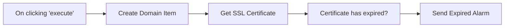

## Fluxo (.json) :

```json
{
  "id": "110",
  "name": "Get SSL Certificate",
  "nodes": [
    {
      "name": "On clicking 'execute'",
      "type": "n8n-nodes-base.manualTrigger",
      "position": [
        240,
        290
      ],
      "parameters": {},
      "typeVersion": 1
    },
    {
      "name": "Create Domain Item",
      "type": "n8n-nodes-base.functionItem",
      "position": [
        450,
        290
      ],
      "parameters": {
        "functionCode": "item.domain = \"n8n.io\";\nreturn item;"
      },
      "typeVersion": 1
    },
    {
      "name": "Get SSL Certificate",
      "type": "n8n-nodes-base.uproc",
      "position": [
        650,
        290
      ],
      "parameters": {
        "tool": "getDomainCertificate",
        "group": "internet",
        "domain": "= {{$node[\"Create Domain Item\"].json[\"domain\"]}}",
        "additionalOptions": {}
      },
      "credentials": {
        "uprocApi": "miquel-uproc"
      },
      "typeVersion": 1
    },
    {
      "name": "Send Expired Alarm",
      "type": "n8n-nodes-base.telegram",
      "position": [
        1070,
        270
      ],
      "parameters": {
        "text": "=The certificate of the domain {{$node[\"Create Domain Item\"].json[\"domain\"]}} has expired!",
        "chatId": "-1415703867",
        "additionalFields": {}
      },
      "credentials": {
        "telegramApi": "test killia bot"
      },
      "typeVersion": 1
    },
    {
      "name": "Certificate  has  expired?",
      "type": "n8n-nodes-base.if",
      "position": [
        840,
        290
      ],
      "parameters": {
        "conditions": {
          "string": [
            {
              "value1": "={{$node[\"Get SSL Certificate\"].json[\"message\"][\"valid\"]+\"\"}}",
              "value2": "false"
            }
          ]
        }
      },
      "typeVersion": 1
    }
  ],
  "active": false,
  "settings": {},
  "connections": {
    "Create Domain Item": {
      "main": [
        [
          {
            "node": "Get SSL Certificate",
            "type": "main",
            "index": 0
          }
        ]
      ]
    },
    "Get SSL Certificate": {
      "main": [
        [
          {
            "node": "Certificate  has  expired?",
            "type": "main",
            "index": 0
          }
        ]
      ]
    },
    "On clicking 'execute'": {
      "main": [
        [
          {
            "node": "Create Domain Item",
            "type": "main",
            "index": 0
          }
        ]
      ]
    },
    "Certificate  has  expired?": {
      "main": [
        [
          {
            "node": "Send Expired Alarm",
            "type": "main",
            "index": 0
          }
        ]
      ]
    }
  }
}
```

<a id="template-68"></a>

## Template 68 - Comparação de dois conjuntos de dados por chave

- **Nome:** Comparação de dois conjuntos de dados por chave
- **Descrição:** Compara dois conjuntos de dados baseados em um campo chave (fruit) e produz saídas separadas indicando itens combinados, exclusivos e divergentes.
- **Funcionalidade:** • Início manual: o fluxo é executado manualmente pelo usuário.
• Fornecimento de dados de exemplo: dois conjuntos de dados internos contêm registros de frutas com atributos de cor.
• Comparação por campo chave: os registros são agrupados e comparados usando o campo 'fruit' como referência.
• Identificação de correspondências e diferenças: separa itens que coincidem, que existem apenas em um dos conjuntos e que têm diferenças nos campos.
• Visualização de resultados: permite inspecionar as diferentes saídas para ver quais itens foram combinados, quais são exclusivos e quais mudaram.
- **Ferramentas:** • Nenhuma: não utiliza ferramentas externas; todos os dados e comparações são realizados internamente no fluxo.

## Fluxo visual

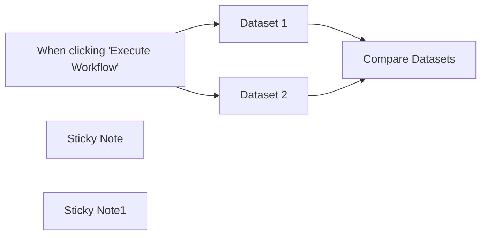

## Fluxo (.json) :

```json
{
  "meta": {
    "instanceId": "cb484ba7b742928a2048bf8829668bed5b5ad9787579adea888f05980292a4a7"
  },
  "nodes": [
    {
      "id": "31a9f34c-c5b0-462e-885d-f394b6d83f3a",
      "name": "When clicking \"Execute Workflow\"",
      "type": "n8n-nodes-base.manualTrigger",
      "position": [
        840,
        500
      ],
      "parameters": {},
      "typeVersion": 1
    },
    {
      "id": "a16c48dd-070d-4d0b-b220-20a5e98288a6",
      "name": "Dataset 1",
      "type": "n8n-nodes-base.code",
      "position": [
        1060,
        360
      ],
      "parameters": {
        "jsCode": " return [\n{\n\"fruit\": \"apple\",\n\"color\": \"green\",\n},\n{\n\"fruit\": \"orange\",\n\"color\": \"orange\",\n},\n{\n\"fruit\": \"grape\",\n\"color\": \"green\",  \n},\n{\n\"fruit\": \"strawberry\",\n\"color\": \"red\",\n},\n{\n\"fruit\": \"banana\",\n\"color\": \"yellow\",\n}\n];\n"
      },
      "typeVersion": 2
    },
    {
      "id": "11b41146-8682-4c8d-84db-259acddced4b",
      "name": "Dataset 2",
      "type": "n8n-nodes-base.code",
      "position": [
        1060,
        620
      ],
      "parameters": {
        "jsCode": " return [\n{\n\"fruit\": \"apple\",\n\"color\": \"green\",\n},\n{\n\"fruit\": \"grape\",\n\"color\": \"purple\",\n},\n{\n\"fruit\": \"orange\",\n\"color\": \"orange\",\n},\n{\n \"fruit\": \"kiwi\",\n \"color\": \"mostly green\"\n},\n{\n\"fruit\": \"banana\",\n\"color\": \"yellow\",\n}\n];\n"
      },
      "typeVersion": 2
    },
    {
      "id": "dc976f9e-e645-4bcf-999a-b3a62be661e3",
      "name": "Compare Datasets",
      "type": "n8n-nodes-base.compareDatasets",
      "position": [
        1380,
        500
      ],
      "parameters": {
        "options": {},
        "mergeByFields": {
          "values": [
            {
              "field1": "fruit",
              "field2": "fruit"
            }
          ]
        }
      },
      "typeVersion": 2.3
    },
    {
      "id": "1945d250-b5dd-4aa3-aa85-8c41aeb1f04a",
      "name": "Sticky Note",
      "type": "n8n-nodes-base.stickyNote",
      "position": [
        460,
        440
      ],
      "parameters": {
        "width": 321,
        "height": 250,
        "content": "## Comparing data with the Compare Datasets node\n\nThe [Compare Datasets](https://docs.n8n.io/integrations/builtin/core-nodes/n8n-nodes-base.comparedatasets/) node compares data streams before merging them. It outputs up to four different branches.\n\nClick the **Execute Workflow** button, then double click on the nodes to see the input and output items."
      },
      "typeVersion": 1
    },
    {
      "id": "313571f3-b249-43d1-b152-1e45c31b0b8c",
      "name": "Sticky Note1",
      "type": "n8n-nodes-base.stickyNote",
      "position": [
        1300,
        340
      ],
      "parameters": {
        "width": 302,
        "height": 385,
        "content": "## Explore outputs \n\nIn the OUTPUT panel of this node, click on the different tabs to see which data goes to which output stream."
      },
      "typeVersion": 1
    }
  ],
  "connections": {
    "Dataset 1": {
      "main": [
        [
          {
            "node": "Compare Datasets",
            "type": "main",
            "index": 0
          }
        ]
      ]
    },
    "Dataset 2": {
      "main": [
        [
          {
            "node": "Compare Datasets",
            "type": "main",
            "index": 1
          }
        ]
      ]
    },
    "When clicking \"Execute Workflow\"": {
      "main": [
        [
          {
            "node": "Dataset 1",
            "type": "main",
            "index": 0
          },
          {
            "node": "Dataset 2",
            "type": "main",
            "index": 0
          }
        ]
      ]
    }
  }
}
```

<a id="template-69"></a>

## Template 69 - Citações de arquivos com Assistente OpenAI

- **Nome:** Citações de arquivos com Assistente OpenAI
- **Descrição:** Fluxo que usa um assistente OpenAI com vector store para buscar trechos citados em arquivos, recuperar metadados e formatar a resposta com referências legíveis.
- **Funcionalidade:** • Botão de chat para teste: inicia a interação com o assistente via interface de chat.
• Uso de assistente com vector store: pesquisa em arquivos indexados para responder com trechos citados.
• Recuperação completa de thread: obtém todas as mensagens de um thread para garantir todas as citações.
• Fragmentação de conteúdo e anotações: separa mensagens, conteúdos e citações para processamento individual.
• Consulta de metadados de arquivos: converte file_id em nome de arquivo para criar referências legíveis.
• Agregação de resultados: consolida múltiplas citações e substituições em uma única operação.
• Formatação final do texto: substitui trechos citados pelo nome do arquivo (ex.: Markdown de referência) para saída limpa.
• Conversão opcional para HTML: permite transformar a saída em HTML quando necessário.
• Memória em janela: mantém contexto recente da conversa para respostas mais coerentes.
- **Ferramentas:** • OpenAI API (Assistants & Vector Store): serviço usado para o assistente conversacional, busca em vector store e geração de respostas com anotações de citação.
• Endpoints HTTP da API OpenAI: utilizados para recuperar o conteúdo completo de threads e metadados de arquivos (file metadata).
• Conversor Markdown para HTML (opcional): biblioteca ou serviço que transforma saída em Markdown para HTML, quando desejado.

## Fluxo visual

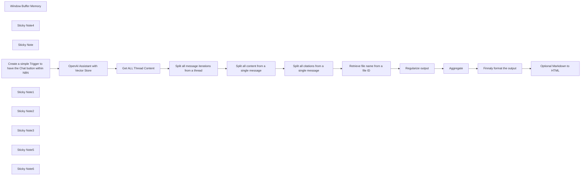

## Fluxo (.json) :

```json
{
  "id": "5NAbfX550LJsfz6f",
  "meta": {
    "instanceId": "00493e38fecfc163cb182114bc2fab90114038eb9aad665a7a752d076920d3d5",
    "templateCredsSetupCompleted": true
  },
  "name": "Make OpenAI Citation for File Retrieval RAG",
  "tags": [
    {
      "id": "urxRtGxxLObZWPvX",
      "name": "sample",
      "createdAt": "2024-09-13T02:43:13.014Z",
      "updatedAt": "2024-09-13T02:43:13.014Z"
    },
    {
      "id": "nMXS3c9l1WqDwWF5",
      "name": "assist",
      "createdAt": "2024-12-23T16:09:38.737Z",
      "updatedAt": "2024-12-23T16:09:38.737Z"
    }
  ],
  "nodes": [
    {
      "id": "b9033511-3421-467a-9bfa-73af01b99c4f",
      "name": "Aggregate",
      "type": "n8n-nodes-base.aggregate",
      "position": [
        740,
        120
      ],
      "parameters": {
        "options": {},
        "aggregate": "aggregateAllItemData"
      },
      "typeVersion": 1,
      "alwaysOutputData": true
    },
    {
      "id": "a61dd9d3-4faa-4878-a6f3-ba8277279002",
      "name": "Window Buffer Memory",
      "type": "@n8n/n8n-nodes-langchain.memoryBufferWindow",
      "position": [
        980,
        -320
      ],
      "parameters": {},
      "typeVersion": 1.3
    },
    {
      "id": "2daabca5-37ec-4cad-9157-29926367e1a7",
      "name": "Sticky Note4",
      "type": "n8n-nodes-base.stickyNote",
      "position": [
        220,
        320
      ],
      "parameters": {
        "color": 3,
        "width": 840,
        "height": 80,
        "content": "## Within N8N, there will be a chat button to test"
      },
      "typeVersion": 1
    },
    {
      "id": "bf4485b1-cd94-41c8-a183-bf1b785f2761",
      "name": "Sticky Note",
      "type": "n8n-nodes-base.stickyNote",
      "position": [
        -440,
        -520
      ],
      "parameters": {
        "color": 5,
        "width": 500,
        "height": 720,
        "content": "## Make OpenAI Citation for File Retrieval RAG\n\n## Use case\n\nIn this example, we will ensure that all texts from the OpenAI assistant search for citations and sources in the vector store files. We can also format the output for Markdown or HTML tags.\n\nThis is necessary because the assistant sometimes generates strange characters, and we can also use dynamic references such as citations 1, 2, 3, for example.\n\n## What this workflow does\n\nIn this workflow, we will use an OpenAI assistant created within their interface, equipped with a vector store containing some files for file retrieval.\n\nThe assistant will perform the file search within the OpenAI infrastructure and will return the content with citations.\n\n- We will make an HTTP request to retrieve all the details we need to format the text output.\n\n## Setup\n\nInsert an OpenAI Key\n\n## How to adjust it to your needs\n\nAt the end of the workflow, we have a block of code that will format the output, and there we can add Markdown tags to create links. Optionally, we can transform the Markdown formatting into HTML.\n\n\nby Davi Saranszky Mesquita\nhttps://www.linkedin.com/in/mesquitadavi/"
      },
      "typeVersion": 1
    },
    {
      "id": "539a4e40-9745-4a26-aba8-2cc2b0dd6364",
      "name": "Create a simple Trigger to have the Chat button within N8N",
      "type": "@n8n/n8n-nodes-langchain.chatTrigger",
      "notes": "https://www.npmjs.com/package/@n8n/chat",
      "position": [
        260,
        -520
      ],
      "webhookId": "8ccaa299-6f99-427b-9356-e783893a3d0c",
      "parameters": {
        "options": {}
      },
      "notesInFlow": true,
      "typeVersion": 1.1
    },
    {
      "id": "aa5b2951-df32-43ac-9939-83b02d818e73",
      "name": "OpenAI Assistant with Vector Store",
      "type": "@n8n/n8n-nodes-langchain.openAi",
      "position": [
        580,
        -520
      ],
      "parameters": {
        "options": {
          "preserveOriginalTools": false
        },
        "resource": "assistant",
        "assistantId": {
          "__rl": true,
          "mode": "list",
          "value": "asst_QAfdobVCVCMJz8LmaEC7nlId",
          "cachedResultName": "Teste"
        }
      },
      "credentials": {
        "openAiApi": {
          "id": "UfNrqPCRlD8FD9mk",
          "name": "OpenAi Lourival"
        }
      },
      "typeVersion": 1.7
    },
    {
      "id": "1817b673-6cb3-49aa-9f38-a5876eb0e6fa",
      "name": "Sticky Note1",
      "type": "n8n-nodes-base.stickyNote",
      "position": [
        560,
        -680
      ],
      "parameters": {
        "width": 300,
        "content": "## Setup\n\n- Configure OpenAI Key\n\n### In this step, we will use an assistant created within the OpenAI platform that contains a vector store a.k.a file retrieval"
      },
      "typeVersion": 1
    },
    {
      "id": "16429226-e850-4698-b419-fd9805a03fb7",
      "name": "Get ALL Thread Content",
      "type": "n8n-nodes-base.httpRequest",
      "position": [
        1260,
        -520
      ],
      "parameters": {
        "url": "=https://api.openai.com/v1/threads/{{ $json.threadId }}/messages",
        "options": {},
        "sendHeaders": true,
        "authentication": "predefinedCredentialType",
        "headerParameters": {
          "parameters": [
            {
              "name": "OpenAI-Beta",
              "value": "assistants=v2"
            }
          ]
        },
        "nodeCredentialType": "openAiApi"
      },
      "credentials": {
        "openAiApi": {
          "id": "UfNrqPCRlD8FD9mk",
          "name": "OpenAi Lourival"
        }
      },
      "typeVersion": 4.2,
      "alwaysOutputData": true
    },
    {
      "id": "e8c88b08-5be2-4f7e-8b17-8cf804b3fe9f",
      "name": "Sticky Note2",
      "type": "n8n-nodes-base.stickyNote",
      "position": [
        1160,
        -620
      ],
      "parameters": {
        "content": "### Retrieving all thread content is necessary because the OpenAI tool does not retrieve all citations upon request."
      },
      "typeVersion": 1
    },
    {
      "id": "0f51e09f-2782-4e2d-b797-d4d58fcabdaf",
      "name": "Split all message iterations from a thread",
      "type": "n8n-nodes-base.splitOut",
      "position": [
        220,
        -300
      ],
      "parameters": {
        "options": {},
        "fieldToSplitOut": "data"
      },
      "typeVersion": 1,
      "alwaysOutputData": true
    },
    {
      "id": "4d569993-1ce3-4b32-beaf-382feac25da9",
      "name": "Split all content from a single message",
      "type": "n8n-nodes-base.splitOut",
      "position": [
        460,
        -300
      ],
      "parameters": {
        "options": {},
        "fieldToSplitOut": "content"
      },
      "typeVersion": 1,
      "alwaysOutputData": true
    },
    {
      "id": "999e1c2b-1927-4483-aac1-6e8903f7ed25",
      "name": "Split all citations from a single message",
      "type": "n8n-nodes-base.splitOut",
      "position": [
        700,
        -300
      ],
      "parameters": {
        "options": {},
        "fieldToSplitOut": "text.annotations"
      },
      "typeVersion": 1,
      "alwaysOutputData": true
    },
    {
      "id": "98af62f5-adb0-4e07-a146-fc2f13b851ce",
      "name": "Retrieve file name from a file ID",
      "type": "n8n-nodes-base.httpRequest",
      "onError": "continueRegularOutput",
      "position": [
        220,
        120
      ],
      "parameters": {
        "url": "=https://api.openai.com/v1/files/{{ $json.file_citation.file_id }}",
        "options": {},
        "sendQuery": true,
        "authentication": "predefinedCredentialType",
        "queryParameters": {
          "parameters": [
            {
              "name": "limit",
              "value": "1"
            }
          ]
        },
        "nodeCredentialType": "openAiApi"
      },
      "credentials": {
        "openAiApi": {
          "id": "UfNrqPCRlD8FD9mk",
          "name": "OpenAi Lourival"
        }
      },
      "typeVersion": 4.2,
      "alwaysOutputData": true
    },
    {
      "id": "b11f0d3d-bdc4-4845-b14b-d0b0de214f01",
      "name": "Regularize output",
      "type": "n8n-nodes-base.set",
      "position": [
        480,
        120
      ],
      "parameters": {
        "options": {},
        "assignments": {
          "assignments": [
            {
              "id": "2dcaafee-5037-4a97-942a-bcdd02bc2ad9",
              "name": "id",
              "type": "string",
              "value": "={{ $json.id }}"
            },
            {
              "id": "b63f967d-ceea-4aa8-98b9-91f5ab21bfe8",
              "name": "filename",
              "type": "string",
              "value": "={{ $json.filename }}"
            },
            {
              "id": "f611e749-054a-441d-8610-df8ba42de2e1",
              "name": "text",
              "type": "string",
              "value": "={{ $('Split all citations from a single message').item.json.text }}"
            }
          ]
        }
      },
      "typeVersion": 3.4,
      "alwaysOutputData": true
    },
    {
      "id": "0e999a0e-76ed-4897-989b-228f075e9bfb",
      "name": "Sticky Note3",
      "type": "n8n-nodes-base.stickyNote",
      "position": [
        440,
        -60
      ],
      "parameters": {
        "width": 200,
        "height": 220,
        "content": "### A file retrieval request contains a lot of information, and we want only the text that will be substituted and the file name.\n\n- id\n- filename\n- text\n"
      },
      "typeVersion": 1
    },
    {
      "id": "53c79a6c-7543-435f-b40e-966dff0904d4",
      "name": "Sticky Note5",
      "type": "n8n-nodes-base.stickyNote",
      "position": [
        700,
        -60
      ],
      "parameters": {
        "width": 200,
        "height": 220,
        "content": "### With the last three splits, we may have many citations and texts to substitute. By doing an aggregation, it will be possible to handle everything as a single request."
      },
      "typeVersion": 1
    },
    {
      "id": "381fb6d6-64fc-4668-9d3c-98aaa43a45ca",
      "name": "Sticky Note6",
      "type": "n8n-nodes-base.stickyNote",
      "position": [
        960,
        -60
      ],
      "parameters": {
        "height": 220,
        "content": "### This simple code will take all the previous files and citations and alter the original text, formatting the output. In this way, we can use Markdown tags to create links, or if you prefer, we can add an HTML transformation node."
      },
      "typeVersion": 1
    },
    {
      "id": "d0cbb943-57ab-4850-8370-1625610a852a",
      "name": "Optional Markdown to HTML",
      "type": "n8n-nodes-base.markdown",
      "disabled": true,
      "position": [
        1220,
        120
      ],
      "parameters": {
        "html": "={{ $json.output }}",
        "options": {},
        "destinationKey": "output"
      },
      "typeVersion": 1
    },
    {
      "id": "589e2418-5dec-47d0-ba08-420d84f09da7",
      "name": "Finnaly format the output",
      "type": "n8n-nodes-base.code",
      "position": [
        980,
        120
      ],
      "parameters": {
        "mode": "runOnceForEachItem",
        "jsCode": "let saida = $('OpenAI Assistant with Vector Store').item.json.output;\n\nfor (let i of $input.item.json.data) {\n saida = saida.replaceAll(i.text, \" _(\"+ i.filename+\")_ \");\n}\n\n$input.item.json.output = saida;\nreturn $input.item;"
      },
      "typeVersion": 2
    }
  ],
  "active": false,
  "pinData": {},
  "settings": {
    "executionOrder": "v1"
  },
  "versionId": "0e621a5a-d99d-4db3-9ae4-ea98c31467e9",
  "connections": {
    "Aggregate": {
      "main": [
        [
          {
            "node": "Finnaly format the output",
            "type": "main",
            "index": 0
          }
        ]
      ]
    },
    "Regularize output": {
      "main": [
        [
          {
            "node": "Aggregate",
            "type": "main",
            "index": 0
          }
        ]
      ]
    },
    "Window Buffer Memory": {
      "ai_memory": [
        [
          {
            "node": "OpenAI Assistant with Vector Store",
            "type": "ai_memory",
            "index": 0
          }
        ]
      ]
    },
    "Get ALL Thread Content": {
      "main": [
        [
          {
            "node": "Split all message iterations from a thread",
            "type": "main",
            "index": 0
          }
        ]
      ]
    },
    "Finnaly format the output": {
      "main": [
        [
          {
            "node": "Optional Markdown to HTML",
            "type": "main",
            "index": 0
          }
        ]
      ]
    },
    "Retrieve file name from a file ID": {
      "main": [
        [
          {
            "node": "Regularize output",
            "type": "main",
            "index": 0
          }
        ]
      ]
    },
    "OpenAI Assistant with Vector Store": {
      "main": [
        [
          {
            "node": "Get ALL Thread Content",
            "type": "main",
            "index": 0
          }
        ]
      ]
    },
    "Split all content from a single message": {
      "main": [
        [
          {
            "node": "Split all citations from a single message",
            "type": "main",
            "index": 0
          }
        ]
      ]
    },
    "Split all citations from a single message": {
      "main": [
        [
          {
            "node": "Retrieve file name from a file ID",
            "type": "main",
            "index": 0
          }
        ]
      ]
    },
    "Split all message iterations from a thread": {
      "main": [
        [
          {
            "node": "Split all content from a single message",
            "type": "main",
            "index": 0
          }
        ]
      ]
    },
    "Create a simple Trigger to have the Chat button within N8N": {
      "main": [
        [
          {
            "node": "OpenAI Assistant with Vector Store",
            "type": "main",
            "index": 0
          }
        ]
      ]
    }
  }
}
```

<a id="template-70"></a>

## Template 70 - Notificar Mattermost ao adicionar dados no Airtable

- **Nome:** Notificar Mattermost ao adicionar dados no Airtable
- **Descrição:** Envia uma mensagem para um canal do Mattermost sempre que um novo registro é inserido na tabela especificada do Airtable.
- **Funcionalidade:** • Monitoramento de novos registros: observa a tabela "Data" e usa o campo "Created" para identificar novos itens.
• Verificação periódica: realiza checagens a cada minuto para detectar entradas recém-criadas.
• Envio de notificação: publica uma mensagem no canal do Mattermost com informações do registro (ID e Name).
• Mapeamento de campos: extrai campos específicos (id, name) do registro para inclusão na notificação.
- **Ferramentas:** • Airtable: base de dados em nuvem utilizada para armazenar e fornecer os registros que acionam a automação.
• Mattermost: plataforma de mensagens onde a notificação sobre novos registros é enviada.

## Fluxo visual

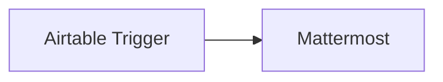

## Fluxo (.json) :

```json
{
  "id": "151",
  "name": "Receive a Mattermost message when new data gets added to Airtable",
  "nodes": [
    {
      "name": "Airtable Trigger",
      "type": "n8n-nodes-base.airtableTrigger",
      "position": [
        550,
        340
      ],
      "parameters": {
        "baseId": "",
        "tableId": "Data",
        "pollTimes": {
          "item": [
            {
              "mode": "everyMinute"
            }
          ]
        },
        "triggerField": "Created",
        "additionalFields": {}
      },
      "credentials": {
        "airtableApi": "Airtable Credentials n8n"
      },
      "typeVersion": 1
    },
    {
      "name": "Mattermost",
      "type": "n8n-nodes-base.mattermost",
      "position": [
        750,
        340
      ],
      "parameters": {
        "message": "=New Data was added to Airtable.\nID:{{$node[\"Airtable Trigger\"].json[\"fields\"][\"id\"]}}\nName: {{$node[\"Airtable Trigger\"].json[\"fields\"][\"name\"]}}",
        "channelId": "",
        "attachments": [],
        "otherOptions": {}
      },
      "credentials": {
        "mattermostApi": "mattermost"
      },
      "typeVersion": 1
    }
  ],
  "active": false,
  "settings": {},
  "connections": {
    "Airtable Trigger": {
      "main": [
        [
          {
            "node": "Mattermost",
            "type": "main",
            "index": 0
          }
        ]
      ]
    }
  }
}
```

<a id="template-71"></a>

## Template 71 - Adicionar, commitar e enviar README.md para Git

- **Nome:** Adicionar, commitar e enviar README.md para Git
- **Descrição:** Fluxo manual que adiciona o arquivo README.md ao repositório, cria um commit e envia as alterações para o repositório remoto.
- **Funcionalidade:** • Gatilho manual: inicia o fluxo quando executado manualmente.
• Adicionar ao stage: adiciona o arquivo README.md à área de staging do repositório.
• Commit automático: cria um commit com a mensagem "✨ First commit from n8n".
• Etapa intermediária sem operação configurada: existe uma etapa adicional ligada ao fluxo destinada a verificações ou preparações do repositório, porém sem operação explicitamente configurada.
• Push para o remoto: envia (push) as alterações do repositório local para o repositório remoto usando o mesmo caminho de repositório entre as etapas.
- **Ferramentas:** • Git: sistema de controle de versão usado para stage, commit e push das alterações.
• Repositório remoto: serviço de hospedagem Git (por exemplo, GitHub, GitLab ou similar) onde as alterações são enviadas.

## Fluxo visual

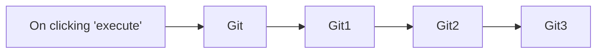

## Fluxo (.json) :

```json
{
  "nodes": [
    {
      "name": "On clicking 'execute'",
      "type": "n8n-nodes-base.manualTrigger",
      "position": [
        230,
        320
      ],
      "parameters": {},
      "typeVersion": 1
    },
    {
      "name": "Git",
      "type": "n8n-nodes-base.git",
      "position": [
        430,
        320
      ],
      "parameters": {
        "operation": "add",
        "pathsToAdd": "README.md"
      },
      "typeVersion": 1
    },
    {
      "name": "Git1",
      "type": "n8n-nodes-base.git",
      "position": [
        630,
        320
      ],
      "parameters": {
        "message": "✨ First commit from n8n",
        "options": {},
        "operation": "commit",
        "repositoryPath": "={{$node[\"Git\"].parameter[\"repositoryPath\"]}}"
      },
      "typeVersion": 1
    },
    {
      "name": "Git2",
      "type": "n8n-nodes-base.git",
      "position": [
        830,
        320
      ],
      "parameters": {
        "options": {},
        "repositoryPath": "={{$node[\"Git\"].parameter[\"repositoryPath\"]}}"
      },
      "typeVersion": 1
    },
    {
      "name": "Git3",
      "type": "n8n-nodes-base.git",
      "position": [
        1030,
        320
      ],
      "parameters": {
        "options": {},
        "operation": "push",
        "repositoryPath": "={{$node[\"Git\"].parameter[\"repositoryPath\"]}}"
      },
      "executeOnce": false,
      "typeVersion": 1
    }
  ],
  "connections": {
    "Git": {
      "main": [
        [
          {
            "node": "Git1",
            "type": "main",
            "index": 0
          }
        ]
      ]
    },
    "Git1": {
      "main": [
        [
          {
            "node": "Git2",
            "type": "main",
            "index": 0
          }
        ]
      ]
    },
    "Git2": {
      "main": [
        [
          {
            "node": "Git3",
            "type": "main",
            "index": 0
          }
        ]
      ]
    },
    "On clicking 'execute'": {
      "main": [
        [
          {
            "node": "Git",
            "type": "main",
            "index": 0
          }
        ]
      ]
    }
  }
}
```

<a id="template-72"></a>

## Template 72 - Wrapper Adobe PDF Services

- **Nome:** Wrapper Adobe PDF Services
- **Descrição:** Autentica e envia um PDF ao serviço da Adobe, solicita uma operação sobre o PDF (por exemplo extração ou divisão), aguarda o processamento e obtém o resultado para download.
- **Funcionalidade:** • Autenticação: obtém token de acesso junto ao endpoint de autenticação da Adobe.
• Preparação de consulta: permite definir o endpoint desejado (ex.: extractpdf, splitpdf) e o payload JSON da operação.
• Carregamento de arquivo: faz upload do PDF como um asset no serviço da Adobe.
• Solicitação de processamento: aciona a operação selecionada usando o asset criado e o payload fornecido.
• Polling/Espera: aguarda e verifica repetidamente o status do processamento até a conclusão ou falha.
• Download do resultado: ao término do processamento baixa o arquivo/resultados retornados pela Adobe.
• Encaminhamento de resposta: repassa a resposta final ao fluxo de origem para uso posterior.
- **Ferramentas:** • Adobe Document Services (PDF Services & Auth): fornece endpoints para emissão de token, upload de assets, execução de operações sobre PDFs (ex.: extractpdf, splitpdf) e obtenção dos resultados.
• Dropbox: armazenamento de teste usado para obter o PDF de entrada através de download.

## Fluxo visual

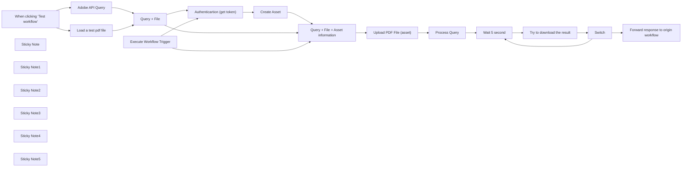

## Fluxo (.json) :

```json
{
  "meta": {
    "instanceId": "cd478e616d2616186f4f92b70cfe0c2ed95b5b209f749f2b873b38bdc56c47c9"
  },
  "nodes": [
    {
      "id": "f4b1bdd8-654d-4643-a004-ff1b2f32b5ae",
      "name": "When clicking ‘Test workflow’",
      "type": "n8n-nodes-base.manualTrigger",
      "position": [
        580,
        1100
      ],
      "parameters": {},
      "typeVersion": 1
    },
    {
      "id": "d6b1c410-81c3-486d-bdcb-86a4c6f7bf9e",
      "name": "Create Asset",
      "type": "n8n-nodes-base.httpRequest",
      "position": [
        1940,
        580
      ],
      "parameters": {
        "url": "https://pdf-services.adobe.io/assets",
        "method": "POST",
        "options": {
          "redirect": {
            "redirect": {}
          }
        },
        "sendBody": true,
        "sendHeaders": true,
        "authentication": "genericCredentialType",
        "bodyParameters": {
          "parameters": [
            {
              "name": "mediaType",
              "value": "application/pdf"
            }
          ]
        },
        "genericAuthType": "httpHeaderAuth",
        "headerParameters": {
          "parameters": [
            {
              "name": "Authorization",
              "value": "=Bearer {{ $json.access_token }}"
            }
          ]
        }
      },
      "credentials": {
        "httpHeaderAuth": {
          "id": "PU8GmSwXswwM1Fzq",
          "name": "Adobe API calls"
        }
      },
      "typeVersion": 4.1
    },
    {
      "id": "9e900a45-d792-4dc5-938c-0d5cdfd2e647",
      "name": "Execute Workflow Trigger",
      "type": "n8n-nodes-base.executeWorkflowTrigger",
      "position": [
        1140,
        440
      ],
      "parameters": {},
      "typeVersion": 1
    },
    {
      "id": "859f369d-f36f-4c3f-a50d-a17214fef2a3",
      "name": "Sticky Note",
      "type": "n8n-nodes-base.stickyNote",
      "position": [
        20,
        140
      ],
      "parameters": {
        "color": 5,
        "width": 667.6107231291055,
        "height": 715.2927406867177,
        "content": "# Adobe API Wrapper\n\nSee Adobe documentation:\n- https://developer.adobe.com/document-services/docs/overview/pdf-services-api/howtos/\n- https://developer.adobe.com/document-services/docs/overview/pdf-extract-api/gettingstarted/\n\nIn short, this workflow does the following steps :\n\n- Authentication\n- Upload an asset (pdf) to adobe\n- Wait for the asset to be processed by Adobe\n- Download the result\n\n## Credential\n\nCredentials are not \"predefined\" and you'll have to create 2 custom credentials, detailed in the workflow.\n\n## Result\n\nThe result will depend on the transformation requested. It could be 1 of various files (json, zip...) accessible via download URL returned by the workflow.\n\nWorkflow can be tested with a PDF filed fetched with Dorpbox for example or any storage provider. "
      },
      "typeVersion": 1
    },
    {
      "id": "450199c5-e588-486d-81cf-eb69cf729ab1",
      "name": "Sticky Note1",
      "type": "n8n-nodes-base.stickyNote",
      "position": [
        560,
        900
      ],
      "parameters": {
        "width": 857.2064431277577,
        "height": 463.937514110429,
        "content": "## Testing for development"
      },
      "typeVersion": 1
    },
    {
      "id": "311a75d6-4fbe-4d8f-89b3-d4b0ee21f7ae",
      "name": "Adobe API Query",
      "type": "n8n-nodes-base.set",
      "position": [
        900,
        1000
      ],
      "parameters": {
        "options": {},
        "assignments": {
          "assignments": [
            {
              "id": "62bb6466-acf4-41e5-9444-c9ef608a6822",
              "name": "endpoint",
              "type": "string",
              "value": "extractpdf"
            },
            {
              "id": "0352f585-1434-4ab7-a704-a1e187fffa96",
              "name": "json_payload",
              "type": "object",
              "value": "={{ \n{\n \"renditionsToExtract\": [\n \"tables\"\n ],\n \"elementsToExtract\": [\n \"text\",\n \"tables\"\n ]\n }\n}}"
            }
          ]
        }
      },
      "typeVersion": 3.4
    },
    {
      "id": "abf20778-db50-4787-a5f4-7af5d5c76efe",
      "name": "Load a test pdf file",
      "type": "n8n-nodes-base.dropbox",
      "position": [
        900,
        1180
      ],
      "parameters": {
        "path": "/valerian/w/prod/_freelance/ADEZIF/AI/Source data/Brochures pour GPT/Brochure 3M/3M_doc_emballage VERSION FINALE.pdf",
        "operation": "download",
        "authentication": "oAuth2"
      },
      "credentials": {
        "dropboxOAuth2Api": {
          "id": "9",
          "name": "Dropbox account"
        }
      },
      "typeVersion": 1
    },
    {
      "id": "8bb2ae0c-df61-4110-af44-b1040b4340a2",
      "name": "Query + File",
      "type": "n8n-nodes-base.merge",
      "position": [
        1180,
        1080
      ],
      "parameters": {
        "mode": "combine",
        "options": {},
        "combinationMode": "mergeByPosition"
      },
      "typeVersion": 2.1
    },
    {
      "id": "92afa6d6-daf8-4358-8c95-36473b810dc2",
      "name": "Query + File + Asset information",
      "type": "n8n-nodes-base.merge",
      "position": [
        2180,
        580
      ],
      "parameters": {
        "mode": "combine",
        "options": {},
        "combinationMode": "mergeByPosition"
      },
      "typeVersion": 2.1
    },
    {
      "id": "5d88b8e4-0b0a-463a-88db-c45d5e87e823",
      "name": "Process Query",
      "type": "n8n-nodes-base.httpRequest",
      "position": [
        2640,
        580
      ],
      "parameters": {
        "url": "=https://pdf-services.adobe.io/operation/{{ $('Query + File + Asset information').item.json.endpoint }}",
        "method": "POST",
        "options": {
          "redirect": {
            "redirect": {}
          },
          "response": {
            "response": {
              "fullResponse": true
            }
          }
        },
        "jsonBody": "={{ \n{\n...{ \"assetID\":$('Query + File + Asset information').first().json.assetID },\n...$('Query + File + Asset information').first().json.json_payload\n}\n}}",
        "sendBody": true,
        "sendHeaders": true,
        "specifyBody": "json",
        "authentication": "genericCredentialType",
        "genericAuthType": "httpHeaderAuth",
        "headerParameters": {
          "parameters": [
            {
              "name": "Authorization",
              "value": "=Bearer {{ $('Authenticartion (get token)').first().json[\"access_token\"] }}"
            }
          ]
        }
      },
      "credentials": {
        "httpHeaderAuth": {
          "id": "PU8GmSwXswwM1Fzq",
          "name": "Adobe API calls"
        }
      },
      "typeVersion": 4.1
    },
    {
      "id": "47278b2f-dd04-4609-90ab-52f34b9a0e72",
      "name": "Wait 5 second",
      "type": "n8n-nodes-base.wait",
      "position": [
        2860,
        580
      ],
      "webhookId": "ed00a9a8-d599-4a98-86f8-a15176352c0a",
      "parameters": {
        "unit": "seconds",
        "amount": 5
      },
      "typeVersion": 1
    },
    {
      "id": "691b52ae-132a-4105-b1e4-bb7d55d0e347",
      "name": "Try to download the result",
      "type": "n8n-nodes-base.httpRequest",
      "position": [
        3080,
        580
      ],
      "parameters": {
        "url": "={{ $('Process Query').item.json[\"headers\"][\"location\"] }}",
        "options": {},
        "sendHeaders": true,
        "authentication": "genericCredentialType",
        "genericAuthType": "httpHeaderAuth",
        "headerParameters": {
          "parameters": [
            {
              "name": "Authorization",
              "value": "=Bearer {{ $('Authenticartion (get token)').first().json[\"access_token\"] }}"
            }
          ]
        }
      },
      "credentials": {
        "httpHeaderAuth": {
          "id": "PU8GmSwXswwM1Fzq",
          "name": "Adobe API calls"
        }
      },
      "typeVersion": 4.1
    },
    {
      "id": "277dea14-de8d-4719-aff1-f4008d6d5c67",
      "name": "Switch",
      "type": "n8n-nodes-base.switch",
      "position": [
        3260,
        580
      ],
      "parameters": {
        "rules": {
          "values": [
            {
              "outputKey": "in progress",
              "conditions": {
                "options": {
                  "leftValue": "",
                  "caseSensitive": true,
                  "typeValidation": "strict"
                },
                "combinator": "and",
                "conditions": [
                  {
                    "operator": {
                      "type": "string",
                      "operation": "equals"
                    },
                    "leftValue": "={{ $json.status }}",
                    "rightValue": "in progress"
                  }
                ]
              },
              "renameOutput": true
            },
            {
              "outputKey": "failed",
              "conditions": {
                "options": {
                  "leftValue": "",
                  "caseSensitive": true,
                  "typeValidation": "strict"
                },
                "combinator": "and",
                "conditions": [
                  {
                    "id": "6d6917f6-abb9-4175-a070-a2f500d9f34f",
                    "operator": {
                      "name": "filter.operator.equals",
                      "type": "string",
                      "operation": "equals"
                    },
                    "leftValue": "={{ $json.status }}",
                    "rightValue": "failed"
                  }
                ]
              },
              "renameOutput": true
            }
          ]
        },
        "options": {
          "fallbackOutput": "extra"
        }
      },
      "typeVersion": 3
    },
    {
      "id": "8f6f8273-43ed-4a44-bb27-6ce137000472",
      "name": "Forward response to origin workflow",
      "type": "n8n-nodes-base.set",
      "position": [
        3820,
        600
      ],
      "parameters": {
        "options": {},
        "assignments": {
          "assignments": []
        },
        "includeOtherFields": true
      },
      "typeVersion": 3.4
    },
    {
      "id": "00e2d7e3-94cd-49e5-a975-2fdc1a7a95fd",
      "name": "Sticky Note2",
      "type": "n8n-nodes-base.stickyNote",
      "position": [
        2780,
        480
      ],
      "parameters": {
        "width": 741.3069226712129,
        "height": 336.57433650102917,
        "content": "## Wait for file do be processed"
      },
      "typeVersion": 1
    },
    {
      "id": "3667b1ba-b9a6-4e1a-94b1-61b37f1e7adc",
      "name": "Sticky Note3",
      "type": "n8n-nodes-base.stickyNote",
      "position": [
        1324.6733934850213,
        147.59707015795897
      ],
      "parameters": {
        "color": 5,
        "width": 402.63171535688423,
        "height": 700.9473619571734,
        "content": "### 1- Credential for token request\n\nCreate a \"Custom Auth\" credential like this :\n\n```\n{\n \"headers\": {\n \"Content-Type\":\"application/x-www-form-urlencoded\"\n }, \n \"body\" : {\n \"client_id\": \"****\", \n \"client_secret\":\"****\"\n }\n}\n```"
      },
      "typeVersion": 1
    },
    {
      "id": "718bb738-8ce4-4b38-94e4-6ccac1adf9ec",
      "name": "Sticky Note4",
      "type": "n8n-nodes-base.stickyNote",
      "position": [
        1800,
        152.6219700851708
      ],
      "parameters": {
        "color": 5,
        "width": 1752.5923360342827,
        "height": 692.0175575715904,
        "content": "### 2- Credential for all other Queries\n\nCreate a \"Header Auth\" credential like this : \n\n```\nX-API-Key: **** (same value as client_id)\n```"
      },
      "typeVersion": 1
    },
    {
      "id": "d6bc8011-699d-4388-82f5-e5f90ba8672a",
      "name": "Sticky Note5",
      "type": "n8n-nodes-base.stickyNote",
      "position": [
        740,
        140
      ],
      "parameters": {
        "color": 5,
        "width": 529.7500231395039,
        "height": 718.8735380890446,
        "content": "## Workflow Input\n\n- endpoint: splitpdf, extractpdf, ...\n- json_payload : all endpoint payload except assetID which is handled in current workflow\n- **PDF Data as n8n Binary**\n\n\n### Example for **split** : \n\n```\n{\n \"endpoint\": \"splitpdf\",\n \"json_payload\": {\n \"splitoption\": \n { \"pageRanges\": [{\"start\": 1,\"end\": 2}]}\n }\n }\n}\n```\n\n### Example for **extractpdf**\n\n```\n{\n \"endpoint\": \"splitpdf\",\n \"json_payload\": {\n \"renditionsToExtract\": [\n \"tables\"\n ],\n \"elementsToExtract\": [\n \"text\",\n \"tables\"\n ]\n }\n}\n```"
      },
      "typeVersion": 1
    },
    {
      "id": "2bbf6d9d-8399-49ba-94ea-b90795ef44ba",
      "name": "Authenticartion (get token)",
      "type": "n8n-nodes-base.httpRequest",
      "position": [
        1500,
        580
      ],
      "parameters": {
        "url": "https://pdf-services.adobe.io/token",
        "method": "POST",
        "options": {},
        "sendBody": true,
        "contentType": "form-urlencoded",
        "authentication": "genericCredentialType",
        "bodyParameters": {
          "parameters": [
            {}
          ]
        },
        "genericAuthType": "httpCustomAuth"
      },
      "credentials": {
        "httpCustomAuth": {
          "id": "djeOoXpBafK4aiGX",
          "name": "Adobe API"
        }
      },
      "typeVersion": 4.1
    },
    {
      "id": "be4e87e8-6e56-408f-b932-320023382f98",
      "name": "Upload PDF File (asset)",
      "type": "n8n-nodes-base.httpRequest",
      "position": [
        2440,
        580
      ],
      "parameters": {
        "url": "={{ $json.uploadUri }}",
        "method": "PUT",
        "options": {
          "redirect": {
            "redirect": {}
          }
        },
        "sendBody": true,
        "sendQuery": true,
        "contentType": "binaryData",
        "queryParameters": {
          "parameters": [
            {}
          ]
        },
        "inputDataFieldName": "data"
      },
      "typeVersion": 4.1
    }
  ],
  "pinData": {},
  "connections": {
    "Switch": {
      "main": [
        [
          {
            "node": "Wait 5 second",
            "type": "main",
            "index": 0
          }
        ],
        [
          {
            "node": "Forward response to origin workflow",
            "type": "main",
            "index": 0
          }
        ],
        [
          {
            "node": "Forward response to origin workflow",
            "type": "main",
            "index": 0
          }
        ]
      ]
    },
    "Create Asset": {
      "main": [
        [
          {
            "node": "Query + File + Asset information",
            "type": "main",
            "index": 1
          }
        ]
      ]
    },
    "Query + File": {
      "main": [
        [
          {
            "node": "Authenticartion (get token)",
            "type": "main",
            "index": 0
          },
          {
            "node": "Query + File + Asset information",
            "type": "main",
            "index": 0
          }
        ]
      ]
    },
    "Process Query": {
      "main": [
        [
          {
            "node": "Wait 5 second",
            "type": "main",
            "index": 0
          }
        ]
      ]
    },
    "Wait 5 second": {
      "main": [
        [
          {
            "node": "Try to download the result",
            "type": "main",
            "index": 0
          }
        ]
      ]
    },
    "Adobe API Query": {
      "main": [
        [
          {
            "node": "Query + File",
            "type": "main",
            "index": 0
          }
        ]
      ]
    },
    "Load a test pdf file": {
      "main": [
        [
          {
            "node": "Query + File",
            "type": "main",
            "index": 1
          }
        ]
      ]
    },
    "Upload PDF File (asset)": {
      "main": [
        [
          {
            "node": "Process Query",
            "type": "main",
            "index": 0
          }
        ]
      ]
    },
    "Execute Workflow Trigger": {
      "main": [
        [
          {
            "node": "Authenticartion (get token)",
            "type": "main",
            "index": 0
          },
          {
            "node": "Query + File + Asset information",
            "type": "main",
            "index": 0
          }
        ]
      ]
    },
    "Try to download the result": {
      "main": [
        [
          {
            "node": "Switch",
            "type": "main",
            "index": 0
          }
        ]
      ]
    },
    "Authenticartion (get token)": {
      "main": [
        [
          {
            "node": "Create Asset",
            "type": "main",
            "index": 0
          }
        ]
      ]
    },
    "Query + File + Asset information": {
      "main": [
        [
          {
            "node": "Upload PDF File (asset)",
            "type": "main",
            "index": 0
          }
        ]
      ]
    },
    "When clicking ‘Test workflow’": {
      "main": [
        [
          {
            "node": "Load a test pdf file",
            "type": "main",
            "index": 0
          },
          {
            "node": "Adobe API Query",
            "type": "main",
            "index": 0
          }
        ]
      ]
    }
  }
}
```

<a id="template-73"></a>

## Template 73 - Notificar Mattermost ao criar pedido no WooCommerce

- **Nome:** Notificar Mattermost ao criar pedido no WooCommerce
- **Descrição:** Envia uma mensagem para um canal do Mattermost sempre que um novo pedido é criado no WooCommerce, informando o cliente e o produto.
- **Funcionalidade:** • Escuta evento de pedido criado: inicia a automação ao receber o evento de novo pedido no WooCommerce.
• Extrai dados do pedido: obtém o primeiro nome do cliente e o nome do primeiro item do pedido.
• Formata mensagem: monta uma mensagem personalizada com o nome do cliente e o produto comprado.
• Publica no canal especificado: envia a mensagem para o canal do Mattermost definido pelo identificador do canal.
- **Ferramentas:** • WooCommerce: plataforma de e-commerce que gera os eventos de pedidos e fornece os dados do cliente e dos itens comprados.
• Mattermost: plataforma de mensagens em equipe utilizada para publicar notificações em canais via API.

## Fluxo visual

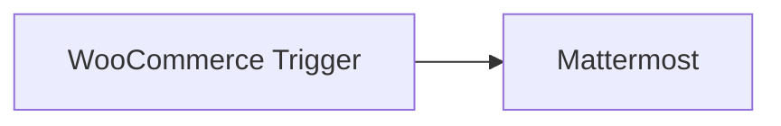

## Fluxo (.json) :

```json
{
  "id": "188",
  "name": "Send a message on Mattermost when an order is created in WooCommerce",
  "nodes": [
    {
      "name": "WooCommerce Trigger",
      "type": "n8n-nodes-base.wooCommerceTrigger",
      "position": [
        550,
        260
      ],
      "webhookId": "84960a7c-cb69-4dfb-a5ed-aac12e0efbf8",
      "parameters": {
        "event": "order.created"
      },
      "credentials": {
        "wooCommerceApi": "woocommerce"
      },
      "typeVersion": 1
    },
    {
      "name": "Mattermost",
      "type": "n8n-nodes-base.mattermost",
      "position": [
        750,
        260
      ],
      "parameters": {
        "message": "={{$node[\"WooCommerce Trigger\"].json[\"billing\"][\"first_name\"]}} bought {{$node[\"WooCommerce Trigger\"].json[\"line_items\"][0][\"name\"]}}!",
        "channelId": "pj1p95ebei8g3ro5p84kxxuuio",
        "attachments": [],
        "otherOptions": {}
      },
      "credentials": {
        "mattermostApi": "Mattermost Credentials"
      },
      "typeVersion": 1
    }
  ],
  "active": false,
  "settings": {},
  "connections": {
    "WooCommerce Trigger": {
      "main": [
        [
          {
            "node": "Mattermost",
            "type": "main",
            "index": 0
          }
        ]
      ]
    }
  }
}
```

<a id="template-74"></a>

## Template 74 - Análise Avançada de Ações com IA (Técnica e Tendências)

- **Nome:** Análise Avançada de Ações com IA (Técnica e Tendências)
- **Descrição:** Fluxo que coleta dados de preço e notícias, realiza análise técnica e de sentimento com IA, gera um relatório em hebraico com recomendações, cria uma apresentação visual em HTML RTL e envia por e-mail.
- **Funcionalidade:** • Coleta de dados de preço e indicadores: busca histórico de preços e indicadores (RSI, MACD, Bollinger Bands) via Twelve Data e calcula níveis de Fibonacci, suporte e resistência. 
• Análise integrada por IA: reúne dados de gráfico e de notícias para produzir um relatório estruturado com insights e recomendações emHebraico. 
• Identificação de artigos influentes e temas quentes: seleciona artigos relevantes e classifica o sentimento, apresentando datas formatadas. 
• Geração de relatório em HTML RTL: cria um relatório visual com layout em hebraico, incluindo gráfico e seções técnicas e de sentimento. 
• Envio por e-mail do relatório completo: envia o HTML do relatório e a imagem do gráfico para o destinatário indicado. 
• Ajuste de cores e visual conforme sentimento: adapta cores e destaques no relatório para refletir o viés de sentimento obtido. 
• Gerenciamento de variáveis e credenciais: manipula ticker, chaves de API e datas relevantes para automatizar o fluxo.
- **Ferramentas:** • Chart-img API: geração de imagens de gráficos para visualização técnica. 
• Twelve Data API: fornecimento de dados históricos e indicadores técnicos (RSI, MACD, Bollinger Bands). 
• Alpha Vantage News Sentiment API: coleta de sentimento de notícias em relação ao ticker. 
• Alpha Vantage News API: acesso a notícias de mercado para análise de tendências. 
• OpenAI API (GPT-4o): processamento de linguagem natural para gerar o relatório estruturado e insights.

## Fluxo visual

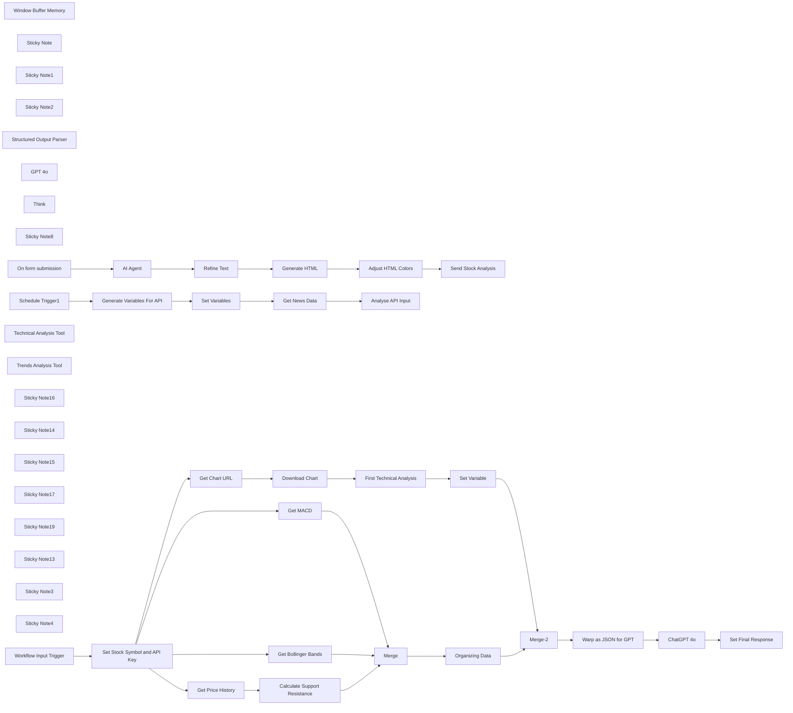

## Fluxo (.json) :

```json
{
  "meta": {
    "instanceId": "6c3d8936583f8a98fa8ebe06f510117c0e8fff2df771e73deba4126a853eb55e"
  },
  "nodes": [
    {
      "id": "a9bbe9d0-51aa-40f8-8931-f405c695c732",
      "name": "Window Buffer Memory",
      "type": "@n8n/n8n-nodes-langchain.memoryBufferWindow",
      "position": [
        1140,
        140
      ],
      "parameters": {
        "sessionKey": "=335458847",
        "sessionIdType": "customKey"
      },
      "typeVersion": 1.3
    },
    {
      "id": "2d6315d6-959d-4e16-97ed-30839d826ce2",
      "name": "AI Agent",
      "type": "@n8n/n8n-nodes-langchain.agent",
      "position": [
        1080,
        -100
      ],
      "parameters": {
        "text": "=Ticker = {{ $json[\"Ticker symbol:\"] }}",
        "options": {
          "systemMessage": "=# Overview\nYou are an AI agent specialized in stock analysis. You provide technical analysis and sentiment for stock investments by combining chart data and news sentiment.\n\n# Instructions\n1. When a user requests an analysis of a stock with its symbol:\n  - Send the stock symbol to both tools **technical_analysis** and **trends_analysis**\n  - Analyze the combined data and prepare a JSON report with your insights\n  - Provide a clear recommendation (positive, neutral, or negative)\n2. Your output must be in the format of a structured JSON object that will be used to fill an HTML template.\n3. Translate the article titles in topArticles to Hebrew\n4. Translate the sentimentHebrew results to only one of these values:\n\"חיובי-חזק/חיובי-חלש/נייטרלי/שלילי-חלש/שלילי-חזק\". Somewhat=חלש.\n5. Write the Date value in each article: \"topArticles\" only in this format: \"DD/MM/YYYY\".\n6. Update the technicalAnalysis value as a detailed technical analysis of three paragraphs, which explains even to those who don't understand economics what you did and how you reached your conclusions. Touch on all the indicators examined (Volume, EMA, RSI, Fibonacci retracement, MACD, Bollinger bands, Resistance and support levels)\n7. Ensure that the text in the technicalAnalysis value is written in proper Hebrew, like a professional analyst. Use the think tool\n8. In the Recommendation value - recommend to buy or sell only if you think with high probability that there will be a rise or fall. Use the think tool to verify your Recommendation based on recommendationText. Advise something only if you really believe it. Your default is the \"ממליץ לחכות\" value.\n\n## Tools\n- **technical_analysis**: Generates technical analysis based on stock charts\n- **trends_analysis**: Analyzes news sentiment for the requested stock\n\n## Response Format\nYou must respond with a JSON object containing exactly the following keys to fill the HTML template:\n\n```json\n{\n \"stockSymbol\": \"סימול\",\n \"analysisDate\": \"DD/MM/YYYY\",\n \"recommendationClass\": \"positive/neutral/negative\",\n \"recommendationTitle\": \"כותרת המלצה בעברית\",\n \"recommendationText\": \"הסבר מפורט של ההמלצה בעברית\",\n \"bullishCount\": 0,\n \"neutralCount\": 0, \n \"bearishCount\": 0,\n \"bullishHeight\": 0,\n \"neutralHeight\": 0,\n \"bearishHeight\": 0,\n \"overallSentiment\": \"חיובי/נייטרלי/שלילי\",\n \"Recommendation\": \"ממליץ לקנות/ ממליץ לחכות/ ממליץ למכור\",\n \"sentimentScore\": 0.00,\n \"chartImageUrl\": \"URL_PLACEHOLDER\",\n \"technicalAnalysis\": \"ניתוח טכני מפורט בעברית עם תגי <p>\",\n \"topArticles\": [\n   {\n     \"title\": \"כותרת המאמר בעברית\",\n     \"url\": \"כתובת URL של המאמר\",\n     \"source\": \"שם המקור באנגלית\",\n     \"date\": \"DD/MM/YYYY\",\n     \"sentimentClass\": \"bullish/neutral/bearish\",\n     \"sentimentHebrew\": \"חיובי-חזק/חיובי-חלש/נייטרלי/שלילי-חלש/שלילי-חזק\"\n   }\n ],\n \"hotTopics\": [\n   {\n     \"topic\": \"שם הנושא בעברית\",\n     \"article_count\": 0,\n     \"average_relevance\": \"0.00\"\n   }\n ]\n}"
        },
        "promptType": "define",
        "hasOutputParser": true
      },
      "typeVersion": 1.7
    },
    {
      "id": "14112026-19eb-493f-971b-28455a8d4412",
      "name": "Sticky Note",
      "type": "n8n-nodes-base.stickyNote",
      "position": [
        680,
        -220
      ],
      "parameters": {
        "color": 4,
        "width": 1820,
        "height": 580,
        "content": "# AI Agent\nAI agent powered by GPT-4o that analyses stocks by combining technical analysis and news sentiment, generating detailed reports in Hebrew with data-driven investment recommendations"
      },
      "typeVersion": 1
    },
    {
      "id": "8b2e573e-7acc-4b0b-a708-4ce33873a893",
      "name": "Sticky Note1",
      "type": "n8n-nodes-base.stickyNote",
      "position": [
        680,
        380
      ],
      "parameters": {
        "width": 2820,
        "height": 920,
        "content": "# Technical Analysis Tool\nA tool that performs in-depth technical analysis of stock charts by combining visual pattern recognition with quantitative indicators. It fetches data from Chart-img API for generating visual charts, Twelve Data API for historical prices and technical indicators (Bollinger Bands, MACD), and uses OpenAI's GPT-4o for visual chart pattern recognition.\nThe system synthesizes this multi-source data into a comprehensive technical assessment with actionable trading insights based on support/resistance levels, Fibonacci retracements, and candlestick patterns."
      },
      "typeVersion": 1
    },
    {
      "id": "b0d49fa6-5c57-4ab5-a752-93d7d278b8fa",
      "name": "Sticky Note2",
      "type": "n8n-nodes-base.stickyNote",
      "position": [
        2520,
        -220
      ],
      "parameters": {
        "width": 980,
        "height": 580,
        "content": "# Trends Analysis Tool\nA tool that analyses news sentiment for requested stocks by fetching recent financial news articles, calculating sentiment metrics, identifying influential stories, and extracting trending topics. It processes data from Alpha Vantage's news API, determines overall market sentiment, and delivers structured analysis on stock sentiment, relevance, and market outlook."
      },
      "typeVersion": 1
    },
    {
      "id": "13a242cf-0a01-4aea-a58e-9b734aed912c",
      "name": "Structured Output Parser",
      "type": "@n8n/n8n-nodes-langchain.outputParserStructured",
      "position": [
        1900,
        140
      ],
      "parameters": {
        "schemaType": "manual",
        "inputSchema": "{\n  \"stockSymbol\": \"סימול\",\n  \"analysisDate\": \"DD/MM/YYYY\",\n  \"recommendationClass\": \"positive/neutral/negative\",\n  \"recommendationTitle\": \"כותרת המלצה בעברית\",\n  \"recommendationText\": \"הסבר מפורט של ההמלצה בעברית\",\n  \"bullishCount\": 0,\n  \"neutralCount\": 0, \n  \"bearishCount\": 0,\n  \"bullishHeight\": 0,\n  \"neutralHeight\": 0,\n  \"bearishHeight\": 0,\n  \"overallSentiment\": \"חיובי/נייטרלי/שלילי\",\n  \"Recommendation\": \"ממליץ לקנות/ ממליץ לחכות/ ממליץ למכור\",\n  \"sentimentScore\": 0.00,\n  \"chartImageUrl\": \"URL_PLACEHOLDER\",\n  \"technicalAnalysis\": \"ניתוח טכני מפורט בעברית עם תגי <p>\",\n  \"topArticles\": [\n    {\n      \"title\": \"כותרת המאמר\",\n      \"url\": \"כתובת URL של המאמר\",\n      \"source\": \"שם המקור\",\n      \"date\": \"DD/MM/YYYY\",\n      \"sentimentClass\": \"bullish/neutral/bearish\",\n      \"sentimentHebrew\": \"חיובי-חזק/חיובי-חלש/נייטרלי/שלילי-חלש/שלילי-חזק\"\n    }\n  ],\n  \"hotTopics\": [\n    {\n      \"topic\": \"שם הנושא בעברית\",\n      \"article_count\": 0,\n      \"average_relevance\": \"0.00\"\n    }\n  ]\n}"
      },
      "typeVersion": 1.2
    },
    {
      "id": "bb5dd63a-a3e6-408e-a5c9-13e9f72f2b26",
      "name": "GPT 4o",
      "type": "@n8n/n8n-nodes-langchain.lmChatOpenAi",
      "position": [
        960,
        140
      ],
      "parameters": {
        "model": {
          "__rl": true,
          "mode": "list",
          "value": "gpt-4o",
          "cachedResultName": "gpt-4o"
        },
        "options": {}
      },
      "credentials": {
        "openAiApi": {
          "id": "2m1HH5crgPAhTJlv",
          "name": "OpenAi account"
        }
      },
      "typeVersion": 1.2
    },
    {
      "id": "94d820d2-eb20-4184-8e21-1ed5936c9166",
      "name": "Generate HTML",
      "type": "n8n-nodes-base.html",
      "position": [
        1860,
        -100
      ],
      "parameters": {
        "html": "<!DOCTYPE html>\n<html dir=\"rtl\" lang=\"he\">\n<head>\n    <meta charset=\"UTF-8\">\n    <meta name=\"viewport\" content=\"width=device-width, initial-scale=1.0\">\n    <title>ניתוח מניית {{ $('AI Agent').item.json.output.stockSymbol }}</title>\n</head>\n<body style=\"margin: 0; padding: 0; font-family: 'Segoe UI', 'Helvetica Neue', Helvetica, Arial, sans-serif; background-color: #f5f7fa; color: #333; line-height: 1.6; -webkit-font-smoothing: antialiased; font-size: 16px; text-align: right; direction: rtl;\">\n    <!-- עוטף ראשי -->\n    <div style=\"max-width: 650px; margin: 0 auto; background-color: #ffffff; border-radius: 16px; overflow: hidden; box-shadow: 0 4px 24px rgba(0,0,0,0.08); margin-top: 30px; margin-bottom: 30px; text-align: right; direction: rtl;\">\n        \n        <!-- כותרת עליונה -->\n        <div style=\"background: linear-gradient(135deg, #0057ff 0%, #00b2ff 100%); padding: 30px 40px; text-align: center; position: relative; overflow: hidden; margin-bottom: 20px;\">\n            <div style=\"position: absolute; top: 0; left: 0; right: 0; bottom: 0; background-image: url('data:image/svg+xml;base64,PHN2ZyB3aWR0aD0iMTAwJSIgaGVpZ2h0PSIxMDAlIiB4bWxucz0iaHR0cDovL3d3dy53My5vcmcvMjAwMC9zdmciPjxkZWZzPjxwYXR0ZXJuIGlkPSJwYXR0ZXJuIiB4PSIwIiB5PSIwIiB3aWR0aD0iNDAiIGhlaWdodD0iNDAiIHBhdHRlcm5Vbml0cz0idXNlclNwYWNlT25Vc2UiIHBhdHRlcm5UcmFuc2Zvcm09InJvdGF0ZSgzMCkiPjxwYXRoIGQ9Ik0wIDEwIEw0MCAxMCIgc3Ryb2tlPSIjZmZmZmZmIiBzdHJva2Utd2lkdGg9IjAuNSIgc3Ryb2tlLW9wYWNpdHk9IjAuMSIvPjwvcGF0dGVybj48L2RlZnM+PHJlY3QgeD0iMCIgeT0iMCIgd2lkdGg9IjEwMCUiIGhlaWdodD0iMTAwJSIgZmlsbD0idXJsKCNwYXR0ZXJuKSIvPjwvc3ZnPg=='); opacity: 0.2;\"></div>\n            <h1 style=\"color: #ffffff; font-weight: 700; font-size: 28px; margin: 0 0 5px 0; letter-spacing: -0.5px; position: relative;\">ניתוח מניית {{ $('AI Agent').item.json.output.stockSymbol }}</h1>\n            <div style=\"color: rgba(255,255,255,0.85); font-size: 15px; position: relative;\">תאריך: {{ $('AI Agent').item.json.output.analysisDate }}</div>\n        </div>\n        \n        <!-- תוכן המייל -->\n        <div style=\"padding: 40px; text-align: right; direction: rtl;\">\n            \n            <!-- תיבת המלצה -->\n            <div style=\"background-color: #f8fafc; border-radius: 12px; box-shadow: 0 2px 12px rgba(0,0,0,0.04); padding: 25px; margin-bottom: 40px; position: relative; overflow: hidden; text-align: right;\">\n                <div style=\"position: absolute; right: 0; top: 0; bottom: 0; width: 6px; background-color: #f7b955;\"></div>\n                <div style=\"position: absolute; right: 0; top: 0; width: 100%; height: 100%; background: linear-gradient(90deg, rgba(247, 185, 85, 0.07) 0%, rgba(247, 185, 85, 0) 50%);\"></div>\n                <div style=\"text-align: center; position: relative;\">\n                    <div style=\"display: inline-block; width: 40px; height: 40px; border-radius: 50%; margin-bottom: 10px; background-color: rgba(247, 185, 85, 0.15); text-align: center;\">\n                        <span style=\"font-size: 20px; line-height: 40px;\">⚖️</span>\n                    </div>\n                    <h2 style=\"margin: 0 0 10px 0; color: #f7b955; font-size: 22px; font-weight: 700; text-align: center;\">{{ $('AI Agent').item.json.output.recommendationTitle }}</h2>\n                    <p style=\"margin: 0; font-size: 16px; line-height: 1.6; color: #4a5568; text-align: right;\">{{ $json.message.content.recommendationText }}</p>\n                    <div style=\"margin-top: 25px;\">\n                        <a style=\"display: inline-block; background-color: #29cc7a; color: white; font-weight: 600; font-size: 16px; padding: 12px 30px; border-radius: 8px; text-decoration: none; box-shadow: 0 4px 6px rgba(41, 204, 122, 0.25); transition: all 0.2s ease;\">{{ $('AI Agent').item.json.output.Recommendation }}</a>\n                    </div>\n                </div>\n            </div>\n\n            <!-- ניתוח טכני -->\n            <div style=\"margin-bottom: 40px; text-align: right;\">\n                <h2 style=\"font-size: 20px; color: #1a202c; margin: 0 0 20px 0; padding-bottom: 12px; border-bottom: 1px solid #edf2f7; font-weight: 700; text-align: right;\">ניתוח טכני</h2>\n                \n                <div style=\"background: #ffffff; border-radius: 12px; box-shadow: 0 2px 12px rgba(0,0,0,0.06); overflow: hidden; margin-bottom: 25px;\">\n                    \n                </div>\n                \n                <div style=\"background-color: #f8fafc; border-radius: 12px; padding: 25px; font-size: 15px; line-height: 1.6; color: #4a5568; text-align: right;\">\n                    {{ $json.message.content.technicalAnalysis }}\n                </div>\n            </div>\n                      \n            <!-- ניתוח סנטימנט -->\n            <div style=\"margin-bottom: 40px; text-align: right;\">\n                <h2 style=\"font-size: 20px; color: #1a202c; margin: 0 0 20px 0; padding-bottom: 12px; border-bottom: 1px solid #edf2f7; font-weight: 700; text-align: right;\">ניתוח סנטימנט שוק</h2>\n                \n                <!-- גרף סנטימנט - עם טבלה במקום flex -->\n                <table cellpadding=\"0\" cellspacing=\"0\" border=\"0\" width=\"100%\" style=\"border-collapse: collapse; margin: 45px 0 30px 0;\">\n                    <tr valign=\"bottom\" align=\"center\">\n                        <td width=\"33%\" style=\"text-align: center; padding: 0 10px;\">\n                            <div style=\"font-weight: 600; margin-bottom: 10px; color: #29cc7a;\">{{ $('AI Agent').item.json.output.bullishCount }}</div>\n                            <div style=\"background-color: #29cc7a; border-radius: 8px 8px 0 0; width: 100%; height: {{ $('AI Agent').item.json.output.bullishHeight }}px; margin: 0 auto; opacity: 0.85;\"></div>\n                            <div style=\"font-size: 14px; color: #4a5568; margin-top: 10px;\">חיובי</div>\n                        </td>\n                        <td width=\"33%\" style=\"text-align: center; padding: 0 10px;\">\n                            <div style=\"font-weight: 600; margin-bottom: 10px; color: #f7b955;\">{{ $('AI Agent').item.json.output.neutralCount }}</div>\n                            <div style=\"background-color: #f7b955; border-radius: 8px 8px 0 0; width: 100%; height: {{ $('AI Agent').item.json.output.neutralHeight }}px; margin: 0 auto; opacity: 0.85;\"></div>\n                            <div style=\"font-size: 14px; color: #4a5568; margin-top: 10px;\">נייטרלי</div>\n                        </td>\n                        <td width=\"33%\" style=\"text-align: center; padding: 0 10px;\">\n                            <div style=\"font-weight: 600; margin-bottom: 10px; color: #f55e5e;\">{{ $('AI Agent').item.json.output.bearishCount }}</div>\n                            <div style=\"background-color: #f55e5e; border-radius: 8px 8px 0 0; width: 100%; height: {{ $('AI Agent').item.json.output.bearishHeight }}px; margin: 0 auto; opacity: 0.85;\"></div>\n                            <div style=\"font-size: 14px; color: #4a5568; margin-top: 10px;\">שלילי</div>\n                        </td>\n                    </tr>\n                </table>\n                \n                <div style=\"background-color: #f8fafc; border-radius: 10px; padding: 15px; text-align: center; font-size: 15px;\">\n                    הסנטימנט הכללי למניית <strong>{{ $('AI Agent').item.json.output.stockSymbol }}</strong> הוא \n                    <span style=\"font-weight: 600; color: #f7b955;\">{{ $('AI Agent').item.json.output.overallSentiment }}</span> \n                    עם ציון של <strong>{{ $('AI Agent').item.json.output.sentimentScore }}</strong>\n                </div>\n            </div>\n            \n            <!-- מאמרים משפיעים -->\n            <div style=\"margin-bottom: 40px; text-align: right;\">\n                <h2 style=\"font-size: 20px; color: #1a202c; margin: 0 0 20px 0; padding-bottom: 12px; border-bottom: 1px solid #edf2f7; font-weight: 700; text-align: right;\">מאמרים משפיעים</h2>\n                \n                <table cellpadding=\"0\" cellspacing=\"0\" border=\"0\" width=\"100%\" style=\"border-collapse: collapse;\">\n                    <!-- מאמר 1 -->\n                    <tr>\n                        <td style=\"padding-bottom: 16px;\">\n                            <table cellpadding=\"0\" cellspacing=\"0\" border=\"0\" width=\"100%\" style=\"border-collapse: collapse; background-color: #f8fafc; border-radius: 12px; box-shadow: 0 2px 8px rgba(0,0,0,0.05); overflow: hidden;\">\n                                <tr>\n                                    <td width=\"4\" style=\"background-color: #f7b955;\"></td>\n                                    <td style=\"padding: 18px 22px;\">\n                                        <h3 style=\"margin: 0 0 8px 0; font-size: 16px; font-weight: 600; line-height: 1.4; text-align: right;\">\n                                            <a href=\"{{ $('AI Agent').item.json.output.topArticles[0].url }}\" target=\"_blank\" style=\"color: #2b6cb0; text-decoration: none;\">{{ $('AI Agent').item.json.output.topArticles[0].title }}</a>\n                                        </h3>\n                                        <table cellpadding=\"0\" cellspacing=\"0\" border=\"0\" width=\"100%\" style=\"border-collapse: collapse; margin-top: 10px;\">\n                                            <tr>\n                                                <td style=\"font-size: 13px; color: #718096; text-align: right;\">{{ $('AI Agent').item.json.output.topArticles[0].source }} | {{ $('AI Agent').item.json.output.topArticles[0].date }}</td>\n                                                <td style=\"text-align: left;\">\n                                                    <div style=\"display: inline-block; padding: 3px 10px; border-radius: 30px; font-weight: 500; font-size: 12px; background-color: rgba(247, 185, 85, 0.1); color: #f7b955;\">\n                                                        {{ $('AI Agent').item.json.output.topArticles[0].sentimentHebrew }}\n                                                    </div>\n                                                </td>\n                                            </tr>\n                                        </table>\n                                    </td>\n                                </tr>\n                            </table>\n                        </td>\n                    </tr>\n                    \n                    <!-- מאמר 2 -->\n                    <tr>\n                        <td style=\"padding-bottom: 16px;\">\n                            <table cellpadding=\"0\" cellspacing=\"0\" border=\"0\" width=\"100%\" style=\"border-collapse: collapse; background-color: #f8fafc; border-radius: 12px; box-shadow: 0 2px 8px rgba(0,0,0,0.05); overflow: hidden;\">\n                                <tr>\n                                    <td width=\"4\" style=\"background-color: #f7b955;\"></td>\n                                    <td style=\"padding: 18px 22px;\">\n                                        <h3 style=\"margin: 0 0 8px 0; font-size: 16px; font-weight: 600; line-height: 1.4; text-align: right;\">\n                                            <a href=\"{{ $('AI Agent').item.json.output.topArticles[1].url }}\" target=\"_blank\" style=\"color: #2b6cb0; text-decoration: none;\">{{ $('AI Agent').item.json.output.topArticles[1].title }}</a>\n                                        </h3>\n                                        <table cellpadding=\"0\" cellspacing=\"0\" border=\"0\" width=\"100%\" style=\"border-collapse: collapse; margin-top: 10px;\">\n                                            <tr>\n                                                <td style=\"font-size: 13px; color: #718096; text-align: right;\">{{ $('AI Agent').item.json.output.topArticles[1].source }} | {{ $('AI Agent').item.json.output.topArticles[1].date }}</td>\n                                                <td style=\"text-align: left;\">\n                                                    <div style=\"display: inline-block; padding: 3px 10px; border-radius: 30px; font-weight: 500; font-size: 12px; background-color: rgba(247, 185, 85, 0.1); color: #f7b955;\">\n                                                        {{ $('AI Agent').item.json.output.topArticles[1].sentimentHebrew }}\n                                                    </div>\n                                                </td>\n                                            </tr>\n                                        </table>\n                                    </td>\n                                </tr>\n                            </table>\n                        </td>\n                    </tr>\n                    \n                    <!-- מאמר 3 -->\n                    <tr>\n                        <td style=\"padding-bottom: 16px;\">\n                            <table cellpadding=\"0\" cellspacing=\"0\" border=\"0\" width=\"100%\" style=\"border-collapse: collapse; background-color: #f8fafc; border-radius: 12px; box-shadow: 0 2px 8px rgba(0,0,0,0.05); overflow: hidden;\">\n                                <tr>\n                                    <td width=\"4\" style=\"background-color: #f7b955;\"></td>\n                                    <td style=\"padding: 18px 22px;\">\n                                        <h3 style=\"margin: 0 0 8px 0; font-size: 16px; font-weight: 600; line-height: 1.4; text-align: right;\">\n                                            <a href=\"{{ $('AI Agent').item.json.output.topArticles[2].url }}\" target=\"_blank\" style=\"color: #2b6cb0; text-decoration: none;\">{{ $('AI Agent').item.json.output.topArticles[2].title }}</a>\n                                        </h3>\n                                        <table cellpadding=\"0\" cellspacing=\"0\" border=\"0\" width=\"100%\" style=\"border-collapse: collapse; margin-top: 10px;\">\n                                            <tr>\n                                                <td style=\"font-size: 13px; color: #718096; text-align: right;\">{{ $('AI Agent').item.json.output.topArticles[2].source }} | {{ $('AI Agent').item.json.output.topArticles[2].date }}</td>\n                                                <td style=\"text-align: left;\">\n                                                    <div style=\"display: inline-block; padding: 3px 10px; border-radius: 30px; font-weight: 500; font-size: 12px; background-color: rgba(247, 185, 85, 0.1); color: #f7b955;\">\n                                                        {{ $('AI Agent').item.json.output.topArticles[2].sentimentHebrew }}\n                                                    </div>\n                                                </td>\n                                            </tr>\n                                        </table>\n                                    </td>\n                                </tr>\n                            </table>\n                        </td>\n                    </tr>\n                    \n                    <!-- מאמר 4 -->\n                    <tr>\n                        <td style=\"padding-bottom: 16px;\">\n                            <table cellpadding=\"0\" cellspacing=\"0\" border=\"0\" width=\"100%\" style=\"border-collapse: collapse; background-color: #f8fafc; border-radius: 12px; box-shadow: 0 2px 8px rgba(0,0,0,0.05); overflow: hidden;\">\n                                <tr>\n                                    <td width=\"4\" style=\"background-color: #f7b955;\"></td>\n                                    <td style=\"padding: 18px 22px;\">\n                                        <h3 style=\"margin: 0 0 8px 0; font-size: 16px; font-weight: 600; line-height: 1.4; text-align: right;\">\n                                            <a href=\"{{ $('AI Agent').item.json.output.topArticles[3].url }}\" target=\"_blank\" style=\"color: #2b6cb0; text-decoration: none;\">{{ $('AI Agent').item.json.output.topArticles[3].title }}</a>\n                                        </h3>\n                                        <table cellpadding=\"0\" cellspacing=\"0\" border=\"0\" width=\"100%\" style=\"border-collapse: collapse; margin-top: 10px;\">\n                                            <tr>\n                                                <td style=\"font-size: 13px; color: #718096; text-align: right;\">{{ $('AI Agent').item.json.output.topArticles[3].source }} | {{ $('AI Agent').item.json.output.topArticles[3].date }}</td>\n                                                <td style=\"text-align: left;\">\n                                                    <div style=\"display: inline-block; padding: 3px 10px; border-radius: 30px; font-weight: 500; font-size: 12px; background-color: rgba(247, 185, 85, 0.1); color: #f7b955;\">\n                                                        {{ $('AI Agent').item.json.output.topArticles[3].sentimentHebrew }}\n                                                    </div>\n                                                </td>\n                                            </tr>\n                                        </table>\n                                    </td>\n                                </tr>\n                            </table>\n                        </td>\n                    </tr>\n                    \n                    <!-- מאמר 5 -->\n                    <tr>\n                        <td style=\"padding-bottom: 16px;\">\n                            <table cellpadding=\"0\" cellspacing=\"0\" border=\"0\" width=\"100%\" style=\"border-collapse: collapse; background-color: #f8fafc; border-radius: 12px; box-shadow: 0 2px 8px rgba(0,0,0,0.05); overflow: hidden;\">\n                                <tr>\n                                    <td width=\"4\" style=\"background-color: #f7b955;\"></td>\n                                    <td style=\"padding: 18px 22px;\">\n                                        <h3 style=\"margin: 0 0 8px 0; font-size: 16px; font-weight: 600; line-height: 1.4; text-align: right;\">\n                                            <a href=\"{{ $('AI Agent').item.json.output.topArticles[4].url }}\" target=\"_blank\" style=\"color: #2b6cb0; text-decoration: none;\">{{ $('AI Agent').item.json.output.topArticles[4].title }}</a>\n                                        </h3>\n                                        <table cellpadding=\"0\" cellspacing=\"0\" border=\"0\" width=\"100%\" style=\"border-collapse: collapse; margin-top: 10px;\">\n                                            <tr>\n                                                <td style=\"font-size: 13px; color: #718096; text-align: right;\">{{ $('AI Agent').item.json.output.topArticles[4].source }} | {{ $('AI Agent').item.json.output.topArticles[4].date }}</td>\n                                                <td style=\"text-align: left;\">\n                                                    <div style=\"display: inline-block; padding: 3px 10px; border-radius: 30px; font-weight: 500; font-size: 12px; background-color: rgba(247, 185, 85, 0.1); color: #f7b955;\">\n                                                        {{ $('AI Agent').item.json.output.topArticles[4].sentimentHebrew }}\n                                                    </div>\n                                                </td>\n                                            </tr>\n                                        </table>\n                                    </td>\n                                </tr>\n                            </table>\n                        </td>\n                    </tr>\n                </table>\n            </div>\n              \n    <!-- נושאים חמים - גרסה משופרת למובייל -->\n    <div style=\"margin-bottom: 30px; text-align: right;\">\n        <h2 style=\"font-size: 20px; color: #1a202c; margin: 0 0 20px 0; padding-bottom: 12px; border-bottom: 1px solid #edf2f7; font-weight: 700; text-align: right;\">נושאים חמים</h2>\n        \n        <div style=\"background-color: #f8fafc; border-radius: 12px; padding: 20px 25px; text-align: right;\">\n            <p style=\"margin: 0 0 15px 0; font-size: 15px; color: #4a5568; text-align: right;\">הנושאים המרכזיים שמופיעים בחדשות על {{ $('AI Agent').item.json.output.stockSymbol }}:</p>\n            \n            <!-- נושא 1 -->\n            <div style=\"margin-bottom: 15px; padding-bottom: 15px; border-bottom: 1px solid #edf2f7;\">\n                <div style=\"display: table; width: 100%; margin-bottom: 8px;\">\n                    <div style=\"display: table-cell; vertical-align: middle; text-align: right; font-weight: 600; font-size: 15px;\">\n                        {{ $('AI Agent').item.json.output.hotTopics[0].topic }}\n                    </div>\n                    <div style=\"display: table-cell; vertical-align: middle; text-align: left; white-space: nowrap;\">\n                        <div style=\"display: inline-block; background-color: #edf2f7; border-radius: 30px; padding: 4px 12px; font-size: 13px; color: #4a5568; text-align: center;\">\n                            <strong>{{ $('AI Agent').item.json.output.hotTopics[0].article_count }}</strong> מאמרים\n                        </div>\n                    </div>\n                </div>\n                <div style=\"background-color: #e2e8f0; height: 4px; width: 100%; border-radius: 2px; overflow: hidden;\">\n                    <div style=\"background-color: #4299e1; height: 100%; width: calc({{ $('AI Agent').item.json.output.hotTopics[0].average_relevance }} * 100%);\"></div>\n                </div>\n                <div style=\"text-align: left; font-size: 12px; color: #718096; margin-top: 4px;\">רלוונטיות: {{ $('AI Agent').item.json.output.hotTopics[0].average_relevance }}</div>\n            </div>\n            \n            <!-- נושא 2 -->\n            <div style=\"margin-bottom: 15px; padding-bottom: 15px; border-bottom: 1px solid #edf2f7;\">\n                <div style=\"display: table; width: 100%; margin-bottom: 8px;\">\n                    <div style=\"display: table-cell; vertical-align: middle; text-align: right; font-weight: 600; font-size: 15px;\">\n                        {{ $('AI Agent').item.json.output.hotTopics[1].topic }}\n                    </div>\n                    <div style=\"display: table-cell; vertical-align: middle; text-align: left; white-space: nowrap;\">\n                        <div style=\"display: inline-block; background-color: #edf2f7; border-radius: 30px; padding: 4px 12px; font-size: 13px; color: #4a5568; text-align: center;\">\n                            <strong>{{ $('AI Agent').item.json.output.hotTopics[1].article_count }}</strong> מאמרים\n                        </div>\n                    </div>\n                </div>\n                <div style=\"background-color: #e2e8f0; height: 4px; width: 100%; border-radius: 2px; overflow: hidden;\">\n                    <div style=\"background-color: #4299e1; height: 100%; width: calc({{ $('AI Agent').item.json.output.hotTopics[1].average_relevance }} * 100%);\"></div>\n                </div>\n                <div style=\"text-align: left; font-size: 12px; color: #718096; margin-top: 4px;\">רלוונטיות: {{ $('AI Agent').item.json.output.hotTopics[1].average_relevance }}</div>\n            </div>\n            \n            <!-- נושא 3 -->\n            <div style=\"margin-bottom: 15px; padding-bottom: 15px; border-bottom: 1px solid #edf2f7;\">\n                <div style=\"display: table; width: 100%; margin-bottom: 8px;\">\n                    <div style=\"display: table-cell; vertical-align: middle; text-align: right; font-weight: 600; font-size: 15px;\">\n                        {{ $('AI Agent').item.json.output.hotTopics[2].topic }}\n                    </div>\n                    <div style=\"display: table-cell; vertical-align: middle; text-align: left; white-space: nowrap;\">\n                        <div style=\"display: inline-block; background-color: #edf2f7; border-radius: 30px; padding: 4px 12px; font-size: 13px; color: #4a5568; text-align: center;\">\n                            <strong>{{ $('AI Agent').item.json.output.hotTopics[2].article_count }}</strong> מאמרים\n                        </div>\n                    </div>\n                </div>\n                <div style=\"background-color: #e2e8f0; height: 4px; width: 100%; border-radius: 2px; overflow: hidden;\">\n                    <div style=\"background-color: #4299e1; height: 100%; width: calc({{ $('AI Agent').item.json.output.hotTopics[2].average_relevance }} * 100%);\"></div>\n                </div>\n                <div style=\"text-align: left; font-size: 12px; color: #718096; margin-top: 4px;\">רלוונטיות: {{ $('AI Agent').item.json.output.hotTopics[2].average_relevance }}</div>\n            </div>\n            \n            <!-- נושא 4 -->\n            <div style=\"margin-bottom: 15px; padding-bottom: 15px; border-bottom: 1px solid #edf2f7;\">\n                <div style=\"display: table; width: 100%; margin-bottom: 8px;\">\n                    <div style=\"display: table-cell; vertical-align: middle; text-align: right; font-weight: 600; font-size: 15px;\">\n                        {{ $('AI Agent').item.json.output.hotTopics[3].topic }}\n                    </div>\n                    <div style=\"display: table-cell; vertical-align: middle; text-align: left; white-space: nowrap;\">\n                        <div style=\"display: inline-block; background-color: #edf2f7; border-radius: 30px; padding: 4px 12px; font-size: 13px; color: #4a5568; text-align: center;\">\n                            <strong>{{ $('AI Agent').item.json.output.hotTopics[3].article_count }}</strong> מאמרים\n                        </div>\n                    </div>\n                </div>\n                <div style=\"background-color: #e2e8f0; height: 4px; width: 100%; border-radius: 2px; overflow: hidden;\">\n                    <div style=\"background-color: #4299e1; height: 100%; width: calc({{ $('AI Agent').item.json.output.hotTopics[3].average_relevance }} * 100%);\"></div>\n                </div>\n                <div style=\"text-align: left; font-size: 12px; color: #718096; margin-top: 4px;\">רלוונטיות: {{ $('AI Agent').item.json.output.hotTopics[3].average_relevance }}</div>\n            </div>\n            \n            <!-- נושא 5 -->\n            <div style=\"margin-bottom: 0;\">\n                <div style=\"display: table; width: 100%; margin-bottom: 8px;\">\n                    <div style=\"display: table-cell; vertical-align: middle; text-align: right; font-weight: 600; font-size: 15px;\">\n                        {{ $('AI Agent').item.json.output.hotTopics[4].topic }}\n                    </div>\n                    <div style=\"display: table-cell; vertical-align: middle; text-align: left; white-space: nowrap;\">\n                        <div style=\"display: inline-block; background-color: #edf2f7; border-radius: 30px; padding: 4px 12px; font-size: 13px; color: #4a5568; text-align: center;\">\n                            <strong>{{ $('AI Agent').item.json.output.hotTopics[4].article_count }}</strong> מאמרים\n                        </div>\n                    </div>\n                </div>\n                <div style=\"background-color: #e2e8f0; height: 4px; width: 100%; border-radius: 2px; overflow: hidden;\">\n                    <div style=\"background-color: #4299e1; height: 100%; width: calc({{ $('AI Agent').item.json.output.hotTopics[4].average_relevance }} * 100%);\"></div>\n                </div>\n                <div style=\"text-align: left; font-size: 12px; color: #718096; margin-top: 4px;\">רלוונטיות: {{ $('AI Agent').item.json.output.hotTopics[4].average_relevance }}</div>\n            </div>\n        </div>\n    </div>\n\t        \n        <!-- פוטר -->\n        <div style=\"background-color: #f8fafc; padding: 25px 40px; text-align: center; border-top: 1px solid #edf2f7;\">\n            <div style=\"font-size: 13px; color: #718096; line-height: 1.6;\">\n                <p style=\"margin: 0 0 8px 0;\">דוח זה נוצר באופן אוטומטי ואינו מהווה המלצת השקעה.</p>\n                <p style=\"margin: 0;\">יש להתייעץ עם יועץ השקעות מורשה לפני קבלת החלטות השקעה.</p>\n            </div>\n            <div style=\"margin-top: 20px;\">\n                נבנה ב-❤️ ע\"י <a href=\"https://www.linkedin.com/in/elay-g\" style=\"display: inline-block; text-decoration: none;\">עילי גז</a>\n            </div>\n        </div>\n        \n    </div>\n\n</body>\n</html>"
      },
      "typeVersion": 1.2
    },
    {
      "id": "84a2fe62-e936-49ca-83d6-a02371e02166",
      "name": "Send Stock Analysis",
      "type": "n8n-nodes-base.emailSend",
      "position": [
        2280,
        -100
      ],
      "webhookId": "0de4d8cd-3519-4a4a-a05b-a9c973b64141",
      "parameters": {
        "html": "={{ $json.html }}",
        "options": {},
        "subject": "=הסקירה היומית של מניית {{ $('AI Agent').item.json.output.stockSymbol }}: {{ $('AI Agent').item.json.output.analysisDate }}",
        "toEmail": "={{ $('On form submission').item.json[\"Email:\"] }}",
        "fromEmail": "Elay's AI Assistant <elayguez@gmail.com>"
      },
      "credentials": {
        "smtp": {
          "id": "583PMpoYf46gbncd",
          "name": "SMTP account"
        }
      },
      "executeOnce": false,
      "typeVersion": 2.1
    },
    {
      "id": "36943e20-b0fc-40b0-b695-e0bdbd9182d1",
      "name": "Adjust HTML Colors",
      "type": "n8n-nodes-base.code",
      "position": [
        2080,
        -100
      ],
      "parameters": {
        "jsCode": "// New function to remove topics with only one article - ultra-simple approach\nfunction removeSingleArticleTopics(html) {\n  // First, see if there are any topics with exactly 1 article\n  if (!html.includes('<strong>1</strong> מאמרים')) {\n    console.log('No topics with 1 article found');\n    return html;\n  }\n\n  // Find each line that contains the \"נושא\" comment\n  // and check if it has exactly 1 article mentioned\n  const lines = html.split('\\n');\n  const linesToRemove = [];\n\n  // For each line containing \"1 מאמרים\", find the topic it belongs to\n  for (let i = 0; i < lines.length; i++) {\n    if (lines[i].includes('<strong>1</strong> מאמרים')) {\n      console.log(`Found line ${i} with 1 article mention`);\n      \n      // Go back to find the start of this topic\n      let startLine = -1;\n      for (let j = i; j >= 0; j--) {\n        if (lines[j].includes('<!-- נושא') || \n            lines[j].includes('<div style=\"margin-bottom: 15px; padding-bottom: 15px; border-bottom:')) {\n          startLine = j;\n          break;\n        }\n      }\n      \n      if (startLine === -1) {\n        console.log(`Couldn't find start of topic for line ${i}`);\n        continue;\n      }\n      \n      // Go forward to find the end of this topic\n      let endLine = -1;\n      let divCount = 0;\n      for (let j = startLine; j < lines.length; j++) {\n        // Count opening divs\n        const openMatches = lines[j].match(/<div/g);\n        if (openMatches) {\n          divCount += openMatches.length;\n        }\n        \n        // Count closing divs\n        const closeMatches = lines[j].match(/</div>/g);\n        if (closeMatches) {\n          divCount -= closeMatches.length;\n        }\n        \n        // When divCount returns to 0, we've found the end\n        if (divCount === 0 && j > startLine) {\n          endLine = j;\n          break;\n        }\n      }\n      \n      if (endLine === -1) {\n        console.log(`Couldn't find end of topic for line ${i}`);\n        continue;\n      }\n      \n      // Now we have the start and end lines of the topic\n      console.log(`Found topic from line ${startLine} to ${endLine}`);\n      \n      // Mark these lines for removal\n      for (let j = startLine; j <= endLine; j++) {\n        linesToRemove.push(j);\n      }\n    }\n  }\n  \n  // Remove the marked lines\n  const newLines = [];\n  for (let i = 0; i < lines.length; i++) {\n    if (!linesToRemove.includes(i)) {\n      newLines.push(lines[i]);\n    }\n  }\n  \n  console.log(`Removed ${linesToRemove.length} lines in total`);\n  return newLines.join('\\n');\n}// Code for updating colors according to sentiment - for n8n\n\n// Define colors by sentiment type\nconst colors = {\n  positive: {\n    main: '#29cc7a',          // Green\n    background: 'rgba(41, 204, 122, 0.15)',\n    gradient: 'rgba(41, 204, 122, 0.07)',\n    accent: 'rgba(41, 204, 122, 0.1)'\n  },\n  neutral: {\n    main: '#f7b955',          // Orange\n    background: 'rgba(247, 185, 85, 0.15)',\n    gradient: 'rgba(247, 185, 85, 0.07)',\n    accent: 'rgba(247, 185, 85, 0.1)'\n  },\n  negative: {\n    main: '#f55e5e',          // Red\n    background: 'rgba(245, 94, 94, 0.15)',\n    gradient: 'rgba(245, 94, 94, 0.07)',\n    accent: 'rgba(245, 94, 94, 0.1)'\n  }\n};\n\n// Function to identify sentiment type from text\nfunction getSentimentType(text) {\n  if (!text) return 'neutral';\n  \n  const lowerText = text.toLowerCase();\n  \n  // Negative keywords - check first because there are expressions with both \"positive\" and \"negative\" together\n  if (lowerText.includes('שלילי') || lowerText.includes('negative') || \n      lowerText.includes('bearish') || lowerText.includes('ירידה') || \n      lowerText.includes('דובי') || lowerText.includes('מכירה') || \n      lowerText.includes('שלילי-חזק') || lowerText.includes('שלילי-חלש') ||\n      lowerText.includes('שלילית')) {\n    return 'negative';\n  }\n  \n  // Positive keywords\n  if (lowerText.includes('חיובי') || lowerText.includes('positive') || \n      lowerText.includes('bullish') || lowerText.includes('עלייה') || \n      lowerText.includes('שורי') || lowerText.includes('קנייה') || \n      lowerText.includes('חיובי-חזק') || lowerText.includes('חיובי-חלש') ||\n      lowerText.includes('חיובית')) {\n    return 'positive';\n  }\n  \n  // Additional check for expressions containing only \"strong\" or \"weak\"\n  if (lowerText.includes('חזק')) {\n    // If no negative word, assume it's positive\n    return 'positive';\n  }\n  \n  // Default - neutral\n  return 'neutral';\n}\n\n// Function to check if a specific text belongs to a sentiment - used for bug fixing\nfunction debugSentiment(text) {\n  console.log(`Sentiment check: \"${text}\" => ${getSentimentType(text)}`);\n}\n\n// New function to remove undefined articles from HTML\nfunction removeUndefinedArticles(html) {\n  // Find all article blocks\n  const articleBlocksRegex = /<tr>\\s*<td style=\"padding-bottom: 16px;\">\\s*<table[^>]*>[\\s\\S]*?</table>\\s*</td>\\s*</tr>/g;\n  const articleBlocks = Array.from(html.matchAll(articleBlocksRegex));\n  \n  // No articles found\n  if (!articleBlocks || articleBlocks.length === 0) {\n    console.log(\"No article blocks found\");\n    return html;\n  }\n  \n  // Function to check if an article is fully undefined\n  function isFullyUndefinedArticle(articleHtml) {\n    // An article is considered fully undefined if:\n    // 1. It has href=\"undefined\"\n    // 2. It has link text that is \"undefined\"\n    // 3. It has \"undefined | undefined\" (source and date)\n    return articleHtml.includes('href=\"undefined\"') && \n           articleHtml.includes('>undefined</a>') &&\n           articleHtml.includes('undefined | undefined');\n  }\n  \n  // Identify blocks to remove\n  const blocksToRemove = [];\n  for (const match of articleBlocks) {\n    const block = match[0];\n    if (isFullyUndefinedArticle(block)) {\n      console.log(\"Found undefined article, will remove\");\n      blocksToRemove.push(match);\n    } else {\n      console.log(\"Found valid article, keeping it\");\n    }\n  }\n  \n  // If no blocks to remove, return original HTML\n  if (blocksToRemove.length === 0) {\n    console.log(\"No undefined articles found to remove\");\n    return html;\n  }\n  \n  console.log(`Found ${blocksToRemove.length} undefined articles to remove`);\n  \n  // Create a new string by removing the matches from end to start (to avoid index shifting)\n  let cleanedHtml = html;\n  for (let i = blocksToRemove.length - 1; i >= 0; i--) {\n    const match = blocksToRemove[i];\n    cleanedHtml = cleanedHtml.slice(0, match.index) + cleanedHtml.slice(match.index + match[0].length);\n  }\n  \n  return cleanedHtml;\n}\n\n// Get the HTML from the specified parameter\nconst html = $input.first().json.html;\nlet updatedHtml = html;\n\n// Bug checks - check several keywords\ndebugSentiment(\"חיובי\");\ndebugSentiment(\"שלילי\");\ndebugSentiment(\"נייטרלי\");\ndebugSentiment(\"חיובי-חזק\");\ndebugSentiment(\"שלילי-חזק\");\ndebugSentiment(\"חיובי-חלש\");\ndebugSentiment(\"שלילי-חלש\");\n\n// 1. Update colors in the recommendation title\nconst titleMatch = html.match(/<h2 style=\"[^\"]*color: #[a-f0-9]+;[^\"]*\">([^<]+)</h2>/i);\nif (titleMatch) {\n  const titleText = titleMatch[1].trim();\n  const titleSentiment = getSentimentType(titleText);\n  \n  // Update title color\n  updatedHtml = updatedHtml.replace(\n    /(<h2 style=\"[^\"]*color: )#[a-f0-9]+(;[^\"]*\">)/i,\n    `$1${colors[titleSentiment].main}$2`\n  );\n  \n  // Update side bar color\n  updatedHtml = updatedHtml.replace(\n    /(<div style=\"position: absolute; right: 0; top: 0; bottom: 0; width: 6px; background-color: )#[a-f0-9]+(;\"></div>)/i,\n    `$1${colors[titleSentiment].main}$2`\n  );\n  \n  // Update gradient color\n  updatedHtml = updatedHtml.replace(\n    /(<div style=\"position: absolute; right: 0; top: 0; width: 100%; height: 100%; background: linear-gradient\\(90deg, )rgba\\([^)]+\\)( 0%, )rgba\\([^)]+\\)( 50%\\);\"></div>)/i,\n    `$1${colors[titleSentiment].gradient}$2${colors[titleSentiment].gradient.replace('0.07', '0')}$3`\n  );\n  \n  // Update icon background color\n  updatedHtml = updatedHtml.replace(\n    /(<div style=\"display: inline-block; width: 40px; height: 40px; border-radius: 50%; margin-bottom: 10px; background-color: )rgba\\([^)]+\\)(; text-align: center;\">)/i,\n    `$1${colors[titleSentiment].background}$2`\n  );\n}\n\n// 2. Update overall sentiment color\nconst sentimentMatch = updatedHtml.match(/<span style=\"[^\"]*font-weight: 600; color: #[a-f0-9]+;[^\"]*\">([^<]+)</span>/i);\nif (sentimentMatch) {\n  const sentimentText = sentimentMatch[1].trim();\n  const sentimentType = getSentimentType(sentimentText);\n  \n  updatedHtml = updatedHtml.replace(\n    /(<span style=\"[^\"]*font-weight: 600; color: )#[a-f0-9]+(;[^\"]*\">)/i,\n    `$1${colors[sentimentType].main}$2`\n  );\n}\n\n// 3. Update article colors\nconst articleBlocks = updatedHtml.match(/<tr>\\s*<td style=\"padding-bottom: 16px;\">\\s*<table[^>]*>[\\s\\S]*?</table>\\s*</td>\\s*</tr>/g);\nif (articleBlocks) {\n  for (const block of articleBlocks) {\n    // Check if this is a fully undefined article before skipping\n    const isUndefined = block.includes('href=\"undefined\"') && \n                        block.includes('>undefined</a>') && \n                        block.includes('undefined | undefined');\n    \n    // Skip if this is a completely undefined article\n    if (isUndefined) {\n      console.log(\"Skipping color update for undefined article\");\n      continue;\n    }\n    \n    // Find sentiment within the block\n    const articleSentimentMatch = block.match(/<div style=\"[^\"]*padding: 3px 10px;[^\"]*\">([^<]+)</div>/i);\n    if (articleSentimentMatch) {\n      const articleSentimentText = articleSentimentMatch[1].trim();\n      const articleSentimentType = getSentimentType(articleSentimentText);\n      \n      // Debug check - log the identified sentiment\n      debugSentiment(articleSentimentText);\n      \n      // Create updated block\n      let updatedBlock = block;\n      \n      // Update side line color\n      updatedBlock = updatedBlock.replace(\n        /(<td width=\"4\" style=\"background-color: )#[a-f0-9]+(;\"></td>)/i,\n        `$1${colors[articleSentimentType].main}$2`\n      );\n      \n      // Update sentiment tag colors (background and text color)\n      updatedBlock = updatedBlock.replace(\n        /(<div style=\"[^\"]*background-color: )rgba\\([^)]+\\)(; color: )#[a-f0-9]+(;[^\"]*\">)/i,\n        `$1${colors[articleSentimentType].accent}$2${colors[articleSentimentType].main}$3`\n      );\n      \n      // Replace the block with its updated version\n      updatedHtml = updatedHtml.replace(block, updatedBlock);\n    }\n  }\n}\n\n// 4. Update recommendation button color\nconst buttonMatch = updatedHtml.match(/<a style=\"[^\"]*background-color: #[a-f0-9]+;[^\"]*\">([^<]+)</a>/i);\nif (buttonMatch) {\n  const buttonText = buttonMatch[1].trim();\n  let buttonSentiment = 'neutral'; // Default\n  \n  // Determine sentiment based on button text\n  if (buttonText.includes(\"ממליץ לקנות\")) {\n    buttonSentiment = 'positive';\n  } else if (buttonText.includes(\"ממליץ למכור\")) {\n    buttonSentiment = 'negative';\n  } else if (buttonText.includes(\"ממליץ לחכות\")) {\n    buttonSentiment = 'neutral';\n  }\n  \n  // Update button background color\n  updatedHtml = updatedHtml.replace(\n    /(<a style=\"[^\"]*background-color: )#[a-f0-9]+(;[^\"]*\">)/i,\n    `$1${colors[buttonSentiment].main}$2`\n  );\n  \n  // Update box-shadow color\n  const boxShadowRgba = `rgba(${parseInt(colors[buttonSentiment].main.substring(1, 3), 16)}, ${parseInt(colors[buttonSentiment].main.substring(3, 5), 16)}, ${parseInt(colors[buttonSentiment].main.substring(5, 7), 16)}, 0.25)`;\n  updatedHtml = updatedHtml.replace(\n    /(box-shadow: 0 4px 6px )rgba\\([^)]+\\)(;[^\"]*\">)/i,\n    `$1${boxShadowRgba}$2`\n  );\n}\n\n// 5. Remove undefined articles\nupdatedHtml = removeUndefinedArticles(updatedHtml);\n\n// 6. Remove topics with only one article\nupdatedHtml = removeSingleArticleTopics(updatedHtml);\n\n// Return updated HTML\nreturn { html: updatedHtml };"
      },
      "typeVersion": 2
    },
    {
      "id": "d9174ea1-e42b-4533-98ab-9dc8f94055db",
      "name": "Think",
      "type": "@n8n/n8n-nodes-langchain.toolThink",
      "position": [
        1680,
        140
      ],
      "parameters": {},
      "typeVersion": 1
    },
    {
      "id": "ca2820e9-553d-477b-9084-74b2fab92cc9",
      "name": "Sticky Note8",
      "type": "n8n-nodes-base.stickyNote",
      "position": [
        940,
        260
      ],
      "parameters": {
        "color": 3,
        "width": 160,
        "height": 80,
        "content": "### Replace OpenAI Credentials"
      },
      "typeVersion": 1
    },
    {
      "id": "2e0013ca-2dda-425c-b6d8-bdd3b3cd262d",
      "name": "Generate Variables For API",
      "type": "n8n-nodes-base.code",
      "position": [
        2760,
        -20
      ],
      "parameters": {
        "jsCode": "// Function to generate yesterday's date in the required format\nfunction getYesterdayDateFormat() {\n  // Create a current date object\n  const today = new Date();\n  \n  // Set the date to the previous day (yesterday)\n  today.setDate(today.getDate() - 1);\n  \n  // Reset hours, minutes, seconds and milliseconds to 00:00:00.000\n  today.setHours(0, 0, 0, 0);\n  \n  // Extract components\n  const year = today.getFullYear();\n  const month = String(today.getMonth() + 1).padStart(2, '0'); // Months in JS start from 0\n  const day = String(today.getDate()).padStart(2, '0');\n  const hours = String(today.getHours()).padStart(2, '0');\n  const minutes = String(today.getMinutes()).padStart(2, '0');\n  \n  // Build the string in the required format\n  return `${year}${month}${day}T${hours}${minutes}`;\n}\n// Calculate the date\nconst yesterdayDate = getYesterdayDateFormat();\n// Return the result in the format required by n8n - array of objects\nreturn [\n  {\n    json: {\n      wanted_date: yesterdayDate\n    }\n  }\n];"
      },
      "typeVersion": 2
    },
    {
      "id": "a3d8d689-7b9a-4d45-9a9b-ffb9597606a1",
      "name": "Set Variables",
      "type": "n8n-nodes-base.set",
      "position": [
        2920,
        -20
      ],
      "parameters": {
        "values": {
          "number": [
            {
              "name": "wantedDate",
              "value": "={{ $json.wanted_date }}"
            }
          ],
          "string": [
            {
              "name": "stockSymbol",
              "value": "={{ $('Workflow Input Trigger').item.json.ticker }}"
            },
            {
              "name": "apikey"
            }
          ]
        },
        "options": {}
      },
      "typeVersion": 2
    },
    {
      "id": "f4eeb758-ba3e-4fb2-882f-7422bdcdc30b",
      "name": "Get News Data",
      "type": "n8n-nodes-base.httpRequest",
      "position": [
        3100,
        -20
      ],
      "parameters": {
        "url": "=https://www.alphavantage.co/query?function=NEWS_SENTIMENT&tickers={{ $json.stockSymbol }}&sort=RELEVANCE&time_from={{ $json.wantedDate }}&apikey={{ $json.apikey }}",
        "options": {}
      },
      "typeVersion": 4.1
    },
    {
      "id": "87a2eb36-36e2-427d-8db2-2de3a280e404",
      "name": "Analyse API Input",
      "type": "n8n-nodes-base.code",
      "position": [
        3280,
        -20
      ],
      "parameters": {
        "jsCode": "/**\n * Custom code for n8n Code node to analyze news data from Alpha Vantage\n * \n * - The code receives API data from the previous node\n * - Analyzes sentiment, leading articles, and hot topics\n * - Returns a structured JSON object for further processing\n */\n\nconst stockSymbol = $('Set Variables').first().json.stockSymbol\nconst allNews = $input.first().json.feed\n  ;\nconst today = new Date().toISOString().split('T')[0]; // Current date in YYYY-MM-DD format\n\n// Filter articles relevant to the stock\nconst relevantArticles = allNews.filter(article => {\n  return article.ticker_sentiment && article.ticker_sentiment.some(ticker => \n    ticker.ticker === stockSymbol\n  );\n});\n\n// Sentiment analysis\nlet sentimentCounts = {\n  \"Bullish\": 0,\n  \"Somewhat-Bullish\": 0,\n  \"Neutral\": 0,\n  \"Somewhat-Bearish\": 0,\n  \"Bearish\": 0\n};\n\nlet totalSentimentScore = 0;\nlet totalRelevanceScore = 0;\n\nrelevantArticles.forEach(article => {\n  const stockTicker = article.ticker_sentiment.find(ticker => ticker.ticker === stockSymbol);\n  if (stockTicker) {\n    sentimentCounts[stockTicker.ticker_sentiment_label]++;\n    totalSentimentScore += parseFloat(stockTicker.ticker_sentiment_score) * parseFloat(stockTicker.relevance_score);\n    totalRelevanceScore += parseFloat(stockTicker.relevance_score);\n  }\n});\n\nconst avgSentimentScore = totalRelevanceScore > 0 ? totalSentimentScore / totalRelevanceScore : 0;\n\n// Determining overall sentiment\nlet overallSentiment;\nif (avgSentimentScore >= 0.35) {\n  overallSentiment = \"חיובי מאוד\";\n} else if (avgSentimentScore >= 0.15) {\n  overallSentiment = \"חיובי\";\n} else if (avgSentimentScore > -0.15) {\n  overallSentiment = \"נייטרלי\";\n} else if (avgSentimentScore > -0.35) {\n  overallSentiment = \"שלילי\";\n} else {\n  overallSentiment = \"שלילי מאוד\";\n}\n\n// Most influential articles\nconst topArticles = relevantArticles\n  .map(article => {\n    const stockTicker = article.ticker_sentiment.find(ticker => ticker.ticker === stockSymbol);\n    return {\n      title: article.title,\n      url: article.url,\n      source: article.source,\n      date: formatDate(article.time_published),\n      sentiment_label: stockTicker ? stockTicker.ticker_sentiment_label : \"N/A\",\n      sentiment_score: stockTicker ? parseFloat(stockTicker.ticker_sentiment_score) : 0,\n      relevance_score: stockTicker ? parseFloat(stockTicker.relevance_score) : 0,\n      impact_score: stockTicker ? Math.abs(parseFloat(stockTicker.ticker_sentiment_score) * parseFloat(stockTicker.relevance_score)) : 0\n    };\n  })\n  .sort((a, b) => b.impact_score - a.impact_score)\n  .slice(0, 5);\n\n// Analysis of main topics\nconst topicsMap = {};\n\nrelevantArticles.forEach(article => {\n  if (article.topics) {\n    article.topics.forEach(topic => {\n      if (!topicsMap[topic.topic]) {\n        topicsMap[topic.topic] = {\n          count: 0,\n          relevance: 0\n        };\n      }\n      topicsMap[topic.topic].count++;\n      topicsMap[topic.topic].relevance += parseFloat(topic.relevance_score);\n    });\n  }\n});\n\nconst hotTopics = Object.entries(topicsMap)\n  .map(([topic, data]) => ({\n    topic,\n    article_count: data.count,\n    average_relevance: (data.relevance / data.count).toFixed(2)\n  }))\n  .sort((a, b) => b.article_count - a.article_count)\n  .slice(0, 5);\n\n// Creating result object\nconst analysisResult = {\n  stock_symbol: stockSymbol,\n  analysis_date: today,\n  sentiment_analysis: {\n    overall_sentiment: overallSentiment,\n    sentiment_score: parseFloat(avgSentimentScore.toFixed(4)),\n    sentiment_distribution: sentimentCounts\n  },\n  top_articles: topArticles.map(article => ({\n    title: article.title,\n    source: article.source,\n    url: article.url,\n    date: article.date,\n    sentiment: article.sentiment_label,\n    impact_score: article.impact_score.toFixed(4)\n  })),\n  hot_topics: hotTopics,\n  recent_trends: {\n    description: getTrendDescription(overallSentiment, hotTopics),\n    market_outlook: getMarketOutlook(overallSentiment)\n  }\n};\n\n// Helper functions\nfunction formatDate(dateStr) {\n  if (!dateStr) return \"N/A\";\n  \n  try {\n    // Format: 20250418T152049 -> 2025-04-18\n    const year = dateStr.substring(0, 4);\n    const month = dateStr.substring(4, 6);\n    const day = dateStr.substring(6, 8);\n    return `${year}-${month}-${day}`;\n  } catch (e) {\n    return dateStr;\n  }\n}\n\nfunction getTrendDescription(sentiment, topics) {\n  let description = \"\";\n  \n  if (sentiment === \"חיובי מאוד\" || sentiment === \"חיובי\") {\n    description = \"מגמה חיובית כאשר משקיעים מתמקדים בעיקר ב\";\n  } else if (sentiment === \"שלילי מאוד\" || sentiment === \"שלילי\") {\n    description = \"מגמה שלילית כאשר החששות העיקריים מתמקדים ב\";\n  } else {\n    description = \"מגמה מעורבת עם התמקדות ב\";\n  }\n  \n  if (topics.length > 0) {\n    const topThreeTopics = topics.slice(0, Math.min(3, topics.length));\n    description += topThreeTopics.map(t => t.topic).join(\", \");\n  } else {\n    description += \"מגוון נושאים\";\n  }\n  \n  return description + \".\";\n}\n\nfunction getMarketOutlook(sentiment) {\n  if (sentiment === \"חיובי מאוד\") {\n    return \"תחזית שוק חיובית מאוד. הסנטימנט הכללי מצביע על אמון משקיעים גבוה ופוטנציאל לעלייה בטווח הקצר.\";\n  } else if (sentiment === \"חיובי\") {\n    return \"תחזית שוק חיובית. ישנן אינדיקציות לאופטימיות זהירה בקרב משקיעים.\";\n  } else if (sentiment === \"נייטרלי\") {\n    return \"תחזית שוק מעורבת. קיימים כוחות מאזנים של אופטימיות ופסימיות בשוק.\";\n  } else if (sentiment === \"שלילי\") {\n    return \"תחזית שוק שלילית. ישנן דאגות בקרב משקיעים שעשויות להשפיע על המניה בטווח הקצר.\";\n  } else {\n    return \"תחזית שוק שלילית מאוד. קיימת אווירת זהירות משמעותית ונטייה למכירות.\";\n  }\n}\n\n// Return the object for further flow in n8n\nreturn {\n  json: analysisResult\n};"
      },
      "typeVersion": 2
    },
    {
      "id": "8a108780-d2e3-4cc7-bf7f-49da726f37fd",
      "name": "Workflow Input Trigger",
      "type": "n8n-nodes-base.executeWorkflowTrigger",
      "position": [
        740,
        800
      ],
      "parameters": {
        "workflowInputs": {
          "values": [
            {
              "name": "ticker"
            },
            {
              "name": "chart_style"
            }
          ]
        }
      },
      "typeVersion": 1.1
    },
    {
      "id": "8491ca61-2367-401e-9ff2-4f1d90f3ce59",
      "name": "Download Chart",
      "type": "n8n-nodes-base.httpRequest",
      "position": [
        1540,
        520
      ],
      "parameters": {
        "url": "={{ $json.url }}",
        "options": {}
      },
      "typeVersion": 4.2
    },
    {
      "id": "1250dca0-d4d6-4890-9aa4-110cd0f0fbb6",
      "name": "Get Chart URL",
      "type": "n8n-nodes-base.httpRequest",
      "position": [
        1320,
        520
      ],
      "parameters": {
        "url": "https://api.chart-img.com/v2/tradingview/advanced-chart/storage",
        "method": "POST",
        "options": {
          "response": {
            "response": {
              "responseFormat": "json"
            }
          }
        },
        "jsonBody": "={\n  \"style\": \"candle\",\n  \"theme\": \"light\",\n  \"interval\": \"1W\",\n  \"symbol\": \"NASDAQ:{{ $json.ticker }}\",\n  \"override\": {\n    \"showStudyLastValue\": false\n  },\n  \"studies\": [\n    {\n      \"name\": \"Volume\",\n      \"forceOverlay\": true\n    },\n    {\n      \"name\": \"Moving Average Exponential\",\n      \"inputs\": {\n        \"length\": 200\n      }\n    },\n    {\n      \"name\": \"Relative Strength Index\"\n    }\n  ]\n}",
        "sendBody": true,
        "sendHeaders": true,
        "specifyBody": "json",
        "authentication": "genericCredentialType",
        "genericAuthType": "httpHeaderAuth",
        "headerParameters": {
          "parameters": [
            {
              "name": "Content-Type",
              "value": "application/json"
            }
          ]
        }
      },
      "credentials": {
        "httpHeaderAuth": {
          "id": "cnQIlBI286n0AZiU",
          "name": "Header Auth account"
        }
      },
      "typeVersion": 4.2
    },
    {
      "id": "cfc9c470-c284-4d58-b6be-260f36d3d2b7",
      "name": "Get Price History",
      "type": "n8n-nodes-base.httpRequest",
      "position": [
        1320,
        800
      ],
      "parameters": {
        "url": "=https://api.twelvedata.com/time_series",
        "options": {
          "response": {
            "response": {
              "responseFormat": "json"
            }
          }
        },
        "sendQuery": true,
        "queryParameters": {
          "parameters": [
            {
              "name": "symbol",
              "value": "={{ $json.ticker }}"
            },
            {
              "name": "interval",
              "value": "1day"
            },
            {
              "name": "outputsize",
              "value": "180"
            },
            {
              "name": "apikey",
              "value": "={{ $json.TwelveData_API_Key }}"
            }
          ]
        }
      },
      "typeVersion": 4.1
    },
    {
      "id": "3974f7f8-99b3-43b2-83f3-05819cdde7b2",
      "name": "Get Bollinger Bands",
      "type": "n8n-nodes-base.httpRequest",
      "position": [
        1320,
        960
      ],
      "parameters": {
        "url": "=https://api.twelvedata.com/bbands",
        "options": {
          "response": {
            "response": {
              "responseFormat": "json"
            }
          }
        },
        "sendQuery": true,
        "queryParameters": {
          "parameters": [
            {
              "name": "symbol",
              "value": "={{ $json.ticker }}"
            },
            {
              "name": "interval",
              "value": "1day"
            },
            {
              "name": "outputsize",
              "value": "1"
            },
            {
              "name": "apikey",
              "value": "={{ $json.TwelveData_API_Key }}"
            }
          ]
        }
      },
      "typeVersion": 4.1
    },
    {
      "id": "0d333729-3fe5-4253-9989-16adaf1166b8",
      "name": "Get MACD",
      "type": "n8n-nodes-base.httpRequest",
      "position": [
        1320,
        1120
      ],
      "parameters": {
        "url": "=https://api.twelvedata.com/macd",
        "options": {
          "response": {
            "response": {
              "responseFormat": "json"
            }
          }
        },
        "sendQuery": true,
        "queryParameters": {
          "parameters": [
            {
              "name": "symbol",
              "value": "={{ $json.ticker }}"
            },
            {
              "name": "interval",
              "value": "1day"
            },
            {
              "name": "outputsize",
              "value": "1"
            },
            {
              "name": "apikey",
              "value": "={{ $json.TwelveData_API_Key }}"
            }
          ]
        }
      },
      "typeVersion": 4.1
    },
    {
      "id": "4bd10a52-082b-4842-91ee-ef748c6ba695",
      "name": "Merge",
      "type": "n8n-nodes-base.merge",
      "position": [
        1820,
        960
      ],
      "parameters": {
        "numberInputs": 3
      },
      "typeVersion": 3.1
    },
    {
      "id": "8061fbcf-d138-44b5-b6d7-14c7a4e5904e",
      "name": "Calculate Support Resistance",
      "type": "n8n-nodes-base.code",
      "position": [
        1540,
        800
      ],
      "parameters": {
        "jsCode": "// Get historical price data\nconst data = $input.item.json;\n\n// Check if data exists\nif (!data.values || data.values.length === 0) {\n  return { json: { error: \"No price data available\", ticker: data.meta?.symbol } };\n}\n\n// Convert prices to numbers\nconst prices = data.values.map(v => parseFloat(v.close)).reverse();\n\n// Function to calculate Fibonacci levels\nfunction calculateFibonacciLevels() {\n  // Find min and max prices\n  const max = Math.max(...prices);\n  const min = Math.min(...prices);\n  const diff = max - min;\n  \n  return {\n    level_0: min.toFixed(2),\n    level_0_236: (min + diff * 0.236).toFixed(2),\n    level_0_382: (min + diff * 0.382).toFixed(2),\n    level_0_5: (min + diff * 0.5).toFixed(2),\n    level_0_618: (min + diff * 0.618).toFixed(2),\n    level_0_786: (min + diff * 0.786).toFixed(2),\n    level_1: max.toFixed(2)\n  };\n}\n// Function to identify support and resistance levels\nfunction findSupportResistanceLevels() {\n  // We need at least 30 data points\n  if (prices.length < 30) {\n    return { support: [], resistance: [] };\n  }\n  \n  const supportLevels = [];\n  const resistanceLevels = [];\n  \n  // Check each point (except edges) if it's a local minimum or maximum\n  const lookback = 5; // how many points to check in each direction\n  \n  for (let i = lookback; i < prices.length - lookback; i++) {\n    // Check for local minimum (support)\n    let isMinimum = true;\n    for (let j = i - lookback; j < i; j++) {\n      if (prices[j] <= prices[i]) {\n        isMinimum = false;\n        break;\n      }\n    }\n    \n    for (let j = i + 1; j <= i + lookback; j++) {\n      if (prices[j] <= prices[i]) {\n        isMinimum = false;\n        break;\n      }\n    }\n    \n    if (isMinimum) {\n      supportLevels.push(prices[i]);\n    }\n    \n    // Check for local maximum (resistance)\n    let isMaximum = true;\n    for (let j = i - lookback; j < i; j++) {\n      if (prices[j] >= prices[i]) {\n        isMaximum = false;\n        break;\n      }\n    }\n    \n    for (let j = i + 1; j <= i + lookback; j++) {\n      if (prices[j] >= prices[i]) {\n        isMaximum = false;\n        break;\n      }\n    }\n    \n    if (isMaximum) {\n      resistanceLevels.push(prices[i]);\n    }\n  }\n  \n  // Sort and remove duplicates\n  const uniqueSupports = [...new Set(supportLevels)];\n  const uniqueResistances = [...new Set(resistanceLevels)];\n  \n  // Return only significant levels (up to 5 of each)\n  return {\n    support: uniqueSupports.sort((a, b) => b - a).slice(0, 5).map(p => p.toFixed(2)),\n    resistance: uniqueResistances.sort((a, b) => a - b).slice(0, 5).map(p => p.toFixed(2))\n  };\n}\n\n// Calculate levels\nconst fibonacciLevels = calculateFibonacciLevels();\nconst supportResistanceLevels = findSupportResistanceLevels();\n\n// Return information with additional stock data\nreturn {\n  json: {\n    ticker: data.meta.symbol,\n    currentPrice: parseFloat(data.values[0].close).toFixed(2),\n    fibonacci: fibonacciLevels,\n    supportResistance: supportResistanceLevels,\n    dataPoints: prices.length\n  }\n};"
      },
      "typeVersion": 2
    },
    {
      "id": "c692581d-a41d-48ef-9a7a-0a20fbceea81",
      "name": "Organizing Data",
      "type": "n8n-nodes-base.code",
      "position": [
        2040,
        960
      ],
      "parameters": {
        "jsCode": "// Getting data from different sources\n// Checking existence of objects before trying to access them\nconst items = $input.all();\nconst fibData = $input.first().json;\n\n// Trying to locate bband and MACD data if they exist\nlet bbandsData = null;\nlet macdData = null;\n\n// Trying to check if there is data in additional items\nif (items.length > 1 && items[1] && items[1].json) {\n  bbandsData = items[1].json;\n}\n\nif (items.length > 2 && items[2] && items[2].json) {\n  macdData = items[2].json;\n}\n\n// Creating data structure for the response - ensure all fields exist\nconst result = {\n  ticker: fibData.ticker || \"לא ידוע\",\n  currentPrice: fibData.currentPrice || \"0\",\n  timestamp: new Date().toISOString(),\n  technicalAnalysis: {\n    fibonacci: fibData.fibonacci || {},\n    supportResistance: fibData.supportResistance || { support: [], resistance: [] },\n    bollingerBands: {},\n    macd: {}\n  }\n};\n\n// Adding Bollinger Bands data - only if they exist\nif (bbandsData && bbandsData.values && bbandsData.values.length > 0) {\n  const bbands = bbandsData.values[0];\n  result.technicalAnalysis.bollingerBands = {\n    upperBand: parseFloat(bbands.upper_band).toFixed(2),\n    middleBand: parseFloat(bbands.middle_band).toFixed(2),\n    lowerBand: parseFloat(bbands.lower_band).toFixed(2)\n  };\n} else if (bbandsData && bbandsData.status === \"ok\") {\n  // If returning another data format\n  result.technicalAnalysis.bollingerBands = {\n    upperBand: bbandsData.upperBand || bbandsData.upper_band || \"0\",\n    middleBand: bbandsData.middleBand || bbandsData.middle_band || \"0\",\n    lowerBand: bbandsData.lowerBand || bbandsData.lower_band || \"0\"\n  };\n}\n\n// Adding MACD data - only if they exist\nif (macdData && macdData.values && macdData.values.length > 0) {\n  const macd = macdData.values[0];\n  result.technicalAnalysis.macd = {\n    macd: parseFloat(macd.macd).toFixed(2),\n    signal: parseFloat(macd.signal).toFixed(2),\n    histogram: parseFloat(macd.hist).toFixed(2)\n  };\n} else if (macdData && macdData.status === \"ok\") {\n  // If returning another data format\n  result.technicalAnalysis.macd = {\n    macd: macdData.macd || \"0\",\n    signal: macdData.signal || \"0\",\n    histogram: macdData.histogram || macdData.hist || \"0\"\n  };\n}\n\n// Creating summary and recommendation\nlet bullishFactors = [];\nlet bearishFactors = [];\n\n// Analyzing Bollinger Bands - only if data exists\nconst bbands = result.technicalAnalysis.bollingerBands;\nif (bbands.upperBand && bbands.lowerBand) {\n  const currentPrice = parseFloat(result.currentPrice);\n  const upperBand = parseFloat(bbands.upperBand);\n  const lowerBand = parseFloat(bbands.lowerBand);\n  \n  if (!isNaN(currentPrice) && !isNaN(upperBand) && !isNaN(lowerBand)) {\n    if (currentPrice > upperBand) {\n      bearishFactors.push(\"מחיר מעל רצועת בולינגר העליונה - אפשרות לקנייה יתר\");\n    } else if (currentPrice < lowerBand) {\n      bullishFactors.push(\"מחיר מתחת לרצועת בולינגר התחתונה - אפשרות למכירה יתר\");\n    }\n  }\n}\n\n// Analyzing MACD - only if data exists\nconst macdInfo = result.technicalAnalysis.macd;\nif (macdInfo.macd && macdInfo.signal) {\n  const macd = parseFloat(macdInfo.macd);\n  const signal = parseFloat(macdInfo.signal);\n  \n  if (!isNaN(macd) && !isNaN(signal)) {\n    if (macd > signal) {\n      bullishFactors.push(\"MACD מעל קו האיתות - אינדיקציה חיובית\");\n    } else {\n      bearishFactors.push(\"MACD מתחת לקו האיתות - אינדיקציה שלילית\");\n    }\n  }\n}\n\n// Analyzing support and resistance levels - only if data exists\nconst supportResistance = result.technicalAnalysis.supportResistance;\nif (supportResistance.support && supportResistance.resistance) {\n  const currentPrice = parseFloat(result.currentPrice);\n  \n  if (!isNaN(currentPrice)) {\n    const supports = supportResistance.support.map(s => parseFloat(s)).filter(s => !isNaN(s));\n    const resistances = supportResistance.resistance.map(r => parseFloat(r)).filter(r => !isNaN(r));\n    \n    // Finding the closest support level\n    let closestSupport = null;\n    let minSupportDist = Infinity;\n    for (const support of supports) {\n      if (support < currentPrice) {\n        const dist = currentPrice - support;\n        if (dist < minSupportDist) {\n          minSupportDist = dist;\n          closestSupport = support;\n        }\n      }\n    }\n    \n    // Finding the closest resistance level\n    let closestResistance = null;\n    let minResistanceDist = Infinity;\n    for (const resistance of resistances) {\n      if (resistance > currentPrice) {\n        const dist = resistance - currentPrice;\n        if (dist < minResistanceDist) {\n          minResistanceDist = dist;\n          closestResistance = resistance;\n        }\n      }\n    }\n    \n    // Adding support/resistance analysis\n    if (closestSupport !== null) {\n      const supportPercentage = ((currentPrice - closestSupport) / currentPrice * 100).toFixed(2);\n      if (supportPercentage < 5) {\n        bullishFactors.push(`המחיר קרוב לרמת תמיכה (${supportPercentage}%) - אפשרות להיפוך כלפי מעלה`);\n      }\n    }\n    \n    if (closestResistance !== null) {\n      const resistancePercentage = ((closestResistance - currentPrice) / currentPrice * 100).toFixed(2);\n      if (resistancePercentage < 5) {\n        bearishFactors.push(`המחיר קרוב לרמת התנגדות (${resistancePercentage}%) - אפשרות להיפוך כלפי מטה`);\n      }\n    }\n  }\n}\n\n// Analyzing Fibonacci - only if data exists\nconst fibonacci = result.technicalAnalysis.fibonacci;\nif (fibonacci && Object.keys(fibonacci).length > 0) {\n  const currentPrice = parseFloat(result.currentPrice);\n  \n  if (!isNaN(currentPrice)) {\n    const fibLevels = Object.values(fibonacci).map(level => parseFloat(level)).filter(level => !isNaN(level));\n    fibLevels.sort((a, b) => a - b);\n    \n    // Checking which Fibonacci level the price is at\n    for (let i = 0; i < fibLevels.length - 1; i++) {\n      if (currentPrice >= fibLevels[i] && currentPrice <= fibLevels[i+1]) {\n        // If the price is close to a Fibonacci resistance level\n        if (Math.abs(currentPrice - fibLevels[i+1]) / currentPrice * 100 < 2) {\n          bearishFactors.push(`המחיר קרוב לרמת פיבונאצ'י ${[0, 23.6, 38.2, 50, 61.8, 78.6, 100][Math.min(i+1, 6)]}% - אפשרות להתנגדות`);\n        }\n        // If the price is close to a Fibonacci support level\n        if (Math.abs(currentPrice - fibLevels[i]) / currentPrice * 100 < 2) {\n          bullishFactors.push(`המחיר קרוב לרמת פיבונאצ'י ${[0, 23.6, 38.2, 50, 61.8, 78.6, 100][Math.min(i, 6)]}% - אפשרות לתמיכה`);\n        }\n        break;\n      }\n    }\n  }\n}\n\n// Adding general recommendation based on factors\nlet recommendation = \"\";\nif (bullishFactors.length > bearishFactors.length) {\n  recommendation = \"חיובית\";\n} else if (bearishFactors.length > bullishFactors.length) {\n  recommendation = \"שלילית\";\n} else {\n  recommendation = \"נייטרלית\";\n}\n\n// Adding summary to the result\nresult.summary = {\n  recommendation: recommendation,\n  bullishFactors: bullishFactors,\n  bearishFactors: bearishFactors\n};\n\nreturn { json: result };"
      },
      "typeVersion": 2
    },
    {
      "id": "d00b380b-43a4-478e-8265-d79299278867",
      "name": "Merge-2",
      "type": "n8n-nodes-base.merge",
      "position": [
        2440,
        800
      ],
      "parameters": {
        "mode": "combine",
        "options": {},
        "combineBy": "combineByPosition"
      },
      "typeVersion": 3.1
    },
    {
      "id": "4ca4c3aa-9c91-4a6c-973f-bb0ed3754a82",
      "name": "ChatGPT 4o",
      "type": "@n8n/n8n-nodes-langchain.openAi",
      "position": [
        2900,
        800
      ],
      "parameters": {
        "modelId": {
          "__rl": true,
          "mode": "list",
          "value": "gpt-4o",
          "cachedResultName": "GPT-4O"
        },
        "options": {},
        "messages": {
          "values": [
            {
              "role": "system",
              "content": "# Role\nYou are a senior technical analyst who merges visual insights with quantitative indicators.\n\n# Inputs\n1. Visual JSON from Agent 1:\n   {\n     \"ai_agent_visual_analysis\": \"...\"\n   }\n2. Technical-indicator JSON in the format:\n   {\n     \"ticker\": \"...\",\n     \"currentPrice\": \"...\",\n     \"timestamp\": \"...\",\n     \"technicalAnalysis\": {\n       \"fibonacci\": { ... },\n       \"supportResistance\": { ... },\n       \"bollingerBands\": { ... },\n       \"macd\": { ... }\n     },\n     \"summary\": { ... }\n   }\n\n# Expected Sections\nWrite five titled sections exactly in this order:\n\n1. Quick Stats  \n   - Ticker, current price, timestamp  \n   - Overall recommendation from technical JSON, if present\n\n2. Candles and EMA  \n   - Use Agent 1 data: trendDirection, candlestickPatterns, emaRelation, volumeNotes\n\n3. RSI  \n   - Report rsiNumeric and rsiState from Agent 1  \n   - Mention rsiDivergence and its implication\n\n4. Indicator Synthesis  \n   - Fibonacci – cite closest level above and below price  \n   - Bollinger Bands – quote upper, middle, lower and note price position  \n   - MACD – quote macd, signal, histogram, note cross or momentum if numbers are valid  \n   - Support-Resistance – use technicalAnalysis plus priceZones from Agent 1 to highlight the nearest levels\n\n5. Actionable Takeaway  \n   - One sentence bias (bullish, bearish, neutral)  \n   - Clear next step such as watch for break above X or pullback to Y\n\n# Style Rules\n- Be concise and strictly data driven  \n- Every statement must reference either a value from the inputs or a specific visual observation from Agent 1  \n- No speculation beyond supplied data  \n- End after the Takeaway section – output nothing else"
            },
            {
              "content": "={{ $json.textPayload }}"
            }
          ]
        }
      },
      "credentials": {
        "openAiApi": {
          "id": "2m1HH5crgPAhTJlv",
          "name": "OpenAi account"
        }
      },
      "typeVersion": 1.8
    },
    {
      "id": "d46f175b-0737-4e33-b8fc-4937f0c6456e",
      "name": "Set Variable",
      "type": "n8n-nodes-base.set",
      "position": [
        2040,
        520
      ],
      "parameters": {
        "options": {},
        "assignments": {
          "assignments": [
            {
              "id": "fdf7e016-7082-4146-9038-454139023990",
              "name": "ai_agent_visual_analysis",
              "type": "string",
              "value": "={{ $('First Technical Analysis').item.json.choices[0].message.content }}"
            }
          ]
        }
      },
      "typeVersion": 3.4
    },
    {
      "id": "186b6551-ac08-43f3-b000-9be984a4eb13",
      "name": "Warp as JSON for GPT",
      "type": "n8n-nodes-base.code",
      "position": [
        2660,
        800
      ],
      "parameters": {
        "jsCode": "/**\n * INPUT: items[0].json (Original JSON)\n * OUTPUT: { textPayload: \"```json\\n{ ... }\\n```\" }\n */\n\nconst pretty = JSON.stringify(items[0].json, null, 2);\nconst wrapped = `\\`\\`\\`json\\n${pretty}\\n\\`\\`\\``;\n\nreturn [\n  {\n    json: {\n      textPayload: wrapped\n    }\n  }\n];\n"
      },
      "typeVersion": 2
    },
    {
      "id": "b42da048-4e0a-4e45-b6a4-9272473844cb",
      "name": "Set Final Response",
      "type": "n8n-nodes-base.set",
      "position": [
        3280,
        800
      ],
      "parameters": {
        "options": {},
        "assignments": {
          "assignments": [
            {
              "id": "fdf7e016-7082-4146-9038-454139023990",
              "name": "response",
              "type": "string",
              "value": "={{ $json.message.content }}"
            },
            {
              "id": "4e5afd49-67c2-40ab-bc8c-565dea3850ed",
              "name": "image",
              "type": "string",
              "value": "={{ $('Download Chart').item.json.url }}"
            }
          ]
        }
      },
      "typeVersion": 3.4
    },
    {
      "id": "c718d0a7-2689-42da-985f-17030583e51c",
      "name": "Set Stock Symbol and API Key",
      "type": "n8n-nodes-base.set",
      "position": [
        960,
        800
      ],
      "parameters": {
        "options": {},
        "assignments": {
          "assignments": [
            {
              "id": "cf5f7210-5b54-4f4a-abf7-87873be82df4",
              "name": "ticker",
              "type": "string",
              "value": "={{ $json.ticker }}"
            },
            {
              "id": "9f008c4b-60e2-4d99-a119-b0170ec28358",
              "name": "TwelveData_API_Key",
              "type": "string",
              "value": ""
            }
          ]
        }
      },
      "typeVersion": 3.4
    },
    {
      "id": "884a7e3b-3e8f-4c69-8950-5b0f1dd25f29",
      "name": "First Technical Analysis",
      "type": "@n8n/n8n-nodes-langchain.openAi",
      "position": [
        1820,
        520
      ],
      "parameters": {
        "text": "=# Role\nYou are a visual chart analyst.  \nYour only input is a weekly candlestick chart image that shows:\n- Price candles and volume bars  \n- One short-term EMA line  \n- An RSI panel with its live value  \n\n# Task\nInspect the image and produce a **structured JSON** object with the following keys:\n\n{\n  \"rsiNumeric\": number,          // exact RSI value from the chart\n  \"rsiState\": \"overbought\" | \"oversold\" | \"neutral\",\n  \"rsiDivergence\": \"bullish\" | \"bearish\" | \"none\",\n  \"trendDirection\": \"up\" | \"down\" | \"sideways\",\n  \"candlestickPatterns\": [ \"pattern1\", \"pattern2\", ... ],   // max 3\n  \"emaRelation\": \"aboveEMA\" | \"belowEMA\" | \"testingEMA\",\n  \"volumeNotes\": \"string\",        // brief comment on recent volume behavior\n  \"priceZones\": {                 // visually inferred areas\n      \"potentialSupport\": [number, ...],  // up to 2 levels taken from visible lows\n      \"potentialResistance\": [number, ...]// up to 2 levels taken from visible highs\n  }\n}\n\n# Style Rules\n- Derive every value only from what is visible in the chart\n- Do not mention any external data or speculation\n- Return the JSON object only, nothing else\n",
        "modelId": {
          "__rl": true,
          "mode": "list",
          "value": "gpt-4o",
          "cachedResultName": "GPT-4O"
        },
        "options": {
          "detail": "auto"
        },
        "resource": "image",
        "simplify": false,
        "inputType": "base64",
        "operation": "analyze"
      },
      "credentials": {
        "openAiApi": {
          "id": "2m1HH5crgPAhTJlv",
          "name": "OpenAi account"
        }
      },
      "typeVersion": 1.8
    },
    {
      "id": "ba7aca23-5d4c-4bfd-8d7f-af45aaa8d8a0",
      "name": "Schedule Trigger1",
      "type": "n8n-nodes-base.scheduleTrigger",
      "position": [
        2560,
        -20
      ],
      "parameters": {
        "rule": {
          "interval": [
            {}
          ]
        }
      },
      "typeVersion": 1.2
    },
    {
      "id": "4b93b4ba-3369-4051-a92d-d3ff811fb566",
      "name": "Technical Analysis Tool",
      "type": "@n8n/n8n-nodes-langchain.toolWorkflow",
      "position": [
        1360,
        140
      ],
      "parameters": {
        "name": "technical_analysis",
        "workflowId": {
          "__rl": true,
          "mode": "list",
          "value": "GDXsoM9kWq3cz53Y",
          "cachedResultName": "technical_analysis"
        },
        "description": "Call this tool to get an analysis of a requested stock. It'll be obligatory to pass ticker.",
        "workflowInputs": {
          "value": {
            "ticker": "={{ /*n8n-auto-generated-fromAI-override*/ $fromAI('ticker', ``, 'string') }}"
          },
          "schema": [
            {
              "id": "ticker",
              "type": "string",
              "display": true,
              "required": false,
              "displayName": "ticker",
              "defaultMatch": false,
              "canBeUsedToMatch": true
            },
            {
              "id": "chart_style",
              "type": "string",
              "display": true,
              "removed": true,
              "required": false,
              "displayName": "chart_style",
              "defaultMatch": false,
              "canBeUsedToMatch": true
            }
          ],
          "mappingMode": "defineBelow",
          "matchingColumns": [],
          "attemptToConvertTypes": false,
          "convertFieldsToString": false
        }
      },
      "typeVersion": 2
    },
    {
      "id": "c5d70195-f90b-42b4-b056-52794c75c20f",
      "name": "Trends Analysis Tool",
      "type": "@n8n/n8n-nodes-langchain.toolWorkflow",
      "position": [
        1520,
        140
      ],
      "parameters": {
        "name": "trends_analysis",
        "workflowId": {
          "__rl": true,
          "mode": "list",
          "value": "jnlklBcNkky9yFoc",
          "cachedResultName": "trends_analysis"
        },
        "description": "Call this tool to get an analysis of a requested stock. It'll be obligatory to pass ticker.",
        "workflowInputs": {
          "value": {
            "ticker": "={{ /*n8n-auto-generated-fromAI-override*/ $fromAI('ticker', ``, 'string') }}"
          },
          "schema": [
            {
              "id": "ticker",
              "type": "string",
              "display": true,
              "required": false,
              "displayName": "ticker",
              "defaultMatch": false,
              "canBeUsedToMatch": true
            },
            {
              "id": "chart_style",
              "type": "string",
              "display": true,
              "removed": true,
              "required": false,
              "displayName": "chart_style",
              "defaultMatch": false,
              "canBeUsedToMatch": true
            }
          ],
          "mappingMode": "defineBelow",
          "matchingColumns": [],
          "attemptToConvertTypes": false,
          "convertFieldsToString": false
        }
      },
      "typeVersion": 2
    },
    {
      "id": "de8355ea-8f6b-4733-b5ac-06e080e42e30",
      "name": "Sticky Note16",
      "type": "n8n-nodes-base.stickyNote",
      "position": [
        2900,
        120
      ],
      "parameters": {
        "color": 3,
        "width": 160,
        "height": 80,
        "content": "### Replace Alphavantage API Key"
      },
      "typeVersion": 1
    },
    {
      "id": "9c25c2ab-796f-4156-8267-efe6d0182e9d",
      "name": "Sticky Note14",
      "type": "n8n-nodes-base.stickyNote",
      "position": [
        1800,
        680
      ],
      "parameters": {
        "color": 3,
        "width": 160,
        "height": 80,
        "content": "### Replace OpenAI Credentials"
      },
      "typeVersion": 1
    },
    {
      "id": "e78394cb-809e-4731-b74b-e8378f8e2bc9",
      "name": "Sticky Note15",
      "type": "n8n-nodes-base.stickyNote",
      "position": [
        2900,
        920
      ],
      "parameters": {
        "color": 3,
        "width": 160,
        "height": 80,
        "content": "### Replace OpenAI Credentials"
      },
      "typeVersion": 1
    },
    {
      "id": "dcf46ba4-b309-4d41-8041-717d564c0690",
      "name": "Sticky Note17",
      "type": "n8n-nodes-base.stickyNote",
      "position": [
        1300,
        680
      ],
      "parameters": {
        "color": 3,
        "width": 160,
        "height": 80,
        "content": "### Replace Chart-img API Key"
      },
      "typeVersion": 1
    },
    {
      "id": "727d5d8b-c537-41d2-a757-479813ecb733",
      "name": "Sticky Note19",
      "type": "n8n-nodes-base.stickyNote",
      "position": [
        920,
        980
      ],
      "parameters": {
        "color": 3,
        "width": 160,
        "height": 80,
        "content": "### Replace TwelveData API Key"
      },
      "typeVersion": 1
    },
    {
      "id": "580f36fb-2d85-4a74-825b-540f328b860f",
      "name": "Sticky Note13",
      "type": "n8n-nodes-base.stickyNote",
      "position": [
        2280,
        60
      ],
      "parameters": {
        "color": 3,
        "width": 160,
        "height": 80,
        "content": "### Replace SMTP Credentials"
      },
      "typeVersion": 1
    },
    {
      "id": "e40b611a-12c3-4975-b692-f338d0477c8b",
      "name": "Sticky Note3",
      "type": "n8n-nodes-base.stickyNote",
      "position": [
        220,
        -220
      ],
      "parameters": {
        "color": 7,
        "width": 440,
        "height": 300,
        "content": "# Advance Stock Analysis (both Technical and Trends) Using GPT4o Powered AI Agent\n\n## Built by  [Elay Guez](https://www.linkedin.com/in/elay-g)"
      },
      "typeVersion": 1
    },
    {
      "id": "ab83de34-3083-4882-b329-c368d5818917",
      "name": "Sticky Note4",
      "type": "n8n-nodes-base.stickyNote",
      "position": [
        220,
        100
      ],
      "parameters": {
        "color": 7,
        "width": 440,
        "height": 1200,
        "content": "### Overview ###\n\nGet comprehensive stock analysis with this AI-powered workflow that provides actionable insights for your investment decisions. On a weekly basis, this workflow:\n\n- Analyzes stock data from multiple sources (Chart-img, Twelve Data API, Alphavantage)\n- Performs technical analysis using advanced indicators (RSI, MACD, Bollinger Bands, Resistance and Support Levels)\n- Scans financial news from Alpha Vantage to capture market sentiment\n- Uses OpenAI's GPT-4o to identify patterns, trends, and trading opportunities\n- Generates a fully styled, responsive HTML email (with proper RTL layout) in Hebrew\n- Sends detailed recommendations directly to your inbox\n\n**Perfect for investors, traders, and financial analysts who want data-driven stock insights - combining technical indicators with news sentiment for more informed decisions.**\n\n### Setup Instructions ###\n\n**Estimated setup time:**\n- 15 minutes\n\n**Required credentials:**\n- OpenAI API Key\n- Chart-img API Key (free tier)\n- Twelve Data API Key (free tier)\n- Alpha Vantage API Key (free tier)\n- SMTP credentials (for email delivery)\n\n**Steps:**\n\n1. Import this template into your n8n instance.\n2. Add your API keys under credentials.\n3. Configure the SMTP Email node with: Host (e.g., smtp.gmail.com), Port (465 or 587), Username (your email), Password (app-specific password or login).\n4. Activate the workflow.\n5. Fill in the Form.\n6. **Enjoy!** (Check your Spam mailbox)\n\n### Important Note: ###\nThis report is being generated automatically and does not constitute an investment recommendation. **Please consult a licensed investment advisor before making any investment decisions.**"
      },
      "typeVersion": 1
    },
    {
      "id": "28e1e96f-e27c-4933-afee-35931241060c",
      "name": "On form submission",
      "type": "n8n-nodes-base.formTrigger",
      "position": [
        720,
        -100
      ],
      "webhookId": "79520027-d875-4ca3-a533-614bfca5e5b1",
      "parameters": {
        "options": {
          "appendAttribution": true,
          "respondWithOptions": {
            "values": {
              "formSubmittedText": "Success! Check your inbox (or spam folder) for your analysis report."
            }
          }
        },
        "formTitle": "Advance Stock Analysis",
        "formFields": {
          "values": [
            {
              "fieldLabel": "Ticker symbol:",
              "placeholder": "TSLA",
              "requiredField": true
            },
            {
              "fieldType": "email",
              "fieldLabel": "Email:",
              "placeholder": "youremail@gmail.com",
              "requiredField": true
            }
          ]
        },
        "responseMode": "lastNode",
        "formDescription": "Please enter the company’s NASDAQ ticker symbol (e.g. AAPL) to get a weekly email with combined technical-and-news sentiment analysis from our AI agent"
      },
      "typeVersion": 2.2
    },
    {
      "id": "4d9939ec-4a8e-40cb-95d2-24bbdbc27c8e",
      "name": "Refine Text",
      "type": "@n8n/n8n-nodes-langchain.openAi",
      "position": [
        1520,
        -100
      ],
      "parameters": {
        "modelId": {
          "__rl": true,
          "mode": "list",
          "value": "gpt-4o",
          "cachedResultName": "GPT-4O"
        },
        "options": {},
        "messages": {
          "values": [
            {
              "content": "=\"technicalAnalysis\": {{ $json.output.technicalAnalysis }}"
            },
            {
              "content": "=\"recommendationText\":  {{ $json.output.recommendationText }}"
            },
            {
              "role": "system",
              "content": "Ensure that the text in the \"recommendationText\" \"technicalAnalysis\" values is written in proper Hebrew, like a professional analyst.\nReturn the same JSON format, but rewrite \"recommendationText\" \"technicalAnalysis\" values better.\nשים לב שכותבים \"רצועות בולינגר\" ולא \"חגורות בולינגר\""
            }
          ]
        },
        "jsonOutput": true
      },
      "credentials": {
        "openAiApi": {
          "id": "2m1HH5crgPAhTJlv",
          "name": "OpenAi account"
        }
      },
      "typeVersion": 1.8
    }
  ],
  "pinData": {},
  "connections": {
    "Merge": {
      "main": [
        [
          {
            "node": "Organizing Data",
            "type": "main",
            "index": 0
          }
        ]
      ]
    },
    "Think": {
      "ai_tool": [
        [
          {
            "node": "AI Agent",
            "type": "ai_tool",
            "index": 0
          }
        ]
      ]
    },
    "GPT 4o": {
      "ai_languageModel": [
        [
          {
            "node": "AI Agent",
            "type": "ai_languageModel",
            "index": 0
          }
        ]
      ]
    },
    "Merge-2": {
      "main": [
        [
          {
            "node": "Warp as JSON for GPT",
            "type": "main",
            "index": 0
          }
        ]
      ]
    },
    "AI Agent": {
      "main": [
        [
          {
            "node": "Refine Text",
            "type": "main",
            "index": 0
          }
        ]
      ]
    },
    "Get MACD": {
      "main": [
        [
          {
            "node": "Merge",
            "type": "main",
            "index": 2
          }
        ]
      ]
    },
    "ChatGPT 4o": {
      "main": [
        [
          {
            "node": "Set Final Response",
            "type": "main",
            "index": 0
          }
        ]
      ]
    },
    "Refine Text": {
      "main": [
        [
          {
            "node": "Generate HTML",
            "type": "main",
            "index": 0
          }
        ]
      ]
    },
    "Set Variable": {
      "main": [
        [
          {
            "node": "Merge-2",
            "type": "main",
            "index": 0
          }
        ]
      ]
    },
    "Generate HTML": {
      "main": [
        [
          {
            "node": "Adjust HTML Colors",
            "type": "main",
            "index": 0
          }
        ]
      ]
    },
    "Get Chart URL": {
      "main": [
        [
          {
            "node": "Download Chart",
            "type": "main",
            "index": 0
          }
        ]
      ]
    },
    "Get News Data": {
      "main": [
        [
          {
            "node": "Analyse API Input",
            "type": "main",
            "index": 0
          }
        ]
      ]
    },
    "Set Variables": {
      "main": [
        [
          {
            "node": "Get News Data",
            "type": "main",
            "index": 0
          }
        ]
      ]
    },
    "Download Chart": {
      "main": [
        [
          {
            "node": "First Technical Analysis",
            "type": "main",
            "index": 0
          }
        ]
      ]
    },
    "Organizing Data": {
      "main": [
        [
          {
            "node": "Merge-2",
            "type": "main",
            "index": 1
          }
        ]
      ]
    },
    "Get Price History": {
      "main": [
        [
          {
            "node": "Calculate Support Resistance",
            "type": "main",
            "index": 0
          }
        ]
      ]
    },
    "Schedule Trigger1": {
      "main": [
        [
          {
            "node": "Generate Variables For API",
            "type": "main",
            "index": 0
          }
        ]
      ]
    },
    "Adjust HTML Colors": {
      "main": [
        [
          {
            "node": "Send Stock Analysis",
            "type": "main",
            "index": 0
          }
        ]
      ]
    },
    "On form submission": {
      "main": [
        [
          {
            "node": "AI Agent",
            "type": "main",
            "index": 0
          }
        ]
      ]
    },
    "Get Bollinger Bands": {
      "main": [
        [
          {
            "node": "Merge",
            "type": "main",
            "index": 1
          }
        ]
      ]
    },
    "Trends Analysis Tool": {
      "ai_tool": [
        [
          {
            "node": "AI Agent",
            "type": "ai_tool",
            "index": 0
          }
        ]
      ]
    },
    "Warp as JSON for GPT": {
      "main": [
        [
          {
            "node": "ChatGPT 4o",
            "type": "main",
            "index": 0
          }
        ]
      ]
    },
    "Window Buffer Memory": {
      "ai_memory": [
        [
          {
            "node": "AI Agent",
            "type": "ai_memory",
            "index": 0
          }
        ]
      ]
    },
    "Workflow Input Trigger": {
      "main": [
        [
          {
            "node": "Set Stock Symbol and API Key",
            "type": "main",
            "index": 0
          }
        ]
      ]
    },
    "Technical Analysis Tool": {
      "ai_tool": [
        [
          {
            "node": "AI Agent",
            "type": "ai_tool",
            "index": 0
          }
        ]
      ]
    },
    "First Technical Analysis": {
      "main": [
        [
          {
            "node": "Set Variable",
            "type": "main",
            "index": 0
          }
        ]
      ]
    },
    "Structured Output Parser": {
      "ai_outputParser": [
        [
          {
            "node": "AI Agent",
            "type": "ai_outputParser",
            "index": 0
          }
        ]
      ]
    },
    "Generate Variables For API": {
      "main": [
        [
          {
            "node": "Set Variables",
            "type": "main",
            "index": 0
          }
        ]
      ]
    },
    "Calculate Support Resistance": {
      "main": [
        [
          {
            "node": "Merge",
            "type": "main",
            "index": 0
          }
        ]
      ]
    },
    "Set Stock Symbol and API Key": {
      "main": [
        [
          {
            "node": "Get Chart URL",
            "type": "main",
            "index": 0
          },
          {
            "node": "Get Price History",
            "type": "main",
            "index": 0
          },
          {
            "node": "Get Bollinger Bands",
            "type": "main",
            "index": 0
          },
          {
            "node": "Get MACD",
            "type": "main",
            "index": 0
          }
        ]
      ]
    }
  }
}
```

<a id="template-75"></a>

## Template 75 - Notificações de tweets para Mattermost

- **Nome:** Notificações de tweets para Mattermost
- **Descrição:** Busca tweets recentes por um termo específico e publica notificações formatadas em um canal do Mattermost, evitando repostar tweets já enviados.
- **Funcionalidade:** • Agendamento periódico: Executa a busca automaticamente a cada minuto.
• Busca de tweets por termo: Procura tweets contendo o termo configurado (n8n_io) retornando os resultados mais recentes.
• Normalização de dados: Extrai e prepara campos relevantes do tweet (id, URL, texto, nome de usuário, foto, nome de exibição e cor do perfil).
• Filtragem de novos tweets: Mantém um histórico de IDs e só considera para envio os tweets que ainda não foram postados anteriormente.
• Formatação da mensagem: Monta a mensagem principal com o link do tweet e um anexo contendo o texto, cor, ícone e informações do autor.
• Envio para canal: Publica a notificação formatada no canal Mattermost configurado.
- **Ferramentas:** • Twitter: Plataforma para pesquisar tweets recentes por termo e obter dados do tweet e do usuário.
• Mattermost: Plataforma de comunicação onde as notificações são publicadas em um canal específico com anexos formatados.

## Fluxo visual

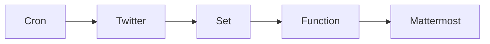

## Fluxo (.json) :

```json
{
  "id": "1",
  "name": "Twitter notifications",
  "nodes": [
    {
      "name": "Twitter",
      "type": "n8n-nodes-base.twitter",
      "position": [
        610,
        260
      ],
      "parameters": {
        "operation": "search",
        "searchText": "n8n_io",
        "additionalFields": {
          "resultType": "recent"
        }
      },
      "credentials": {
        "twitterOAuth1Api": "Twitter"
      },
      "typeVersion": 1
    },
    {
      "name": "Cron",
      "type": "n8n-nodes-base.cron",
      "position": [
        410,
        260
      ],
      "parameters": {
        "triggerTimes": {
          "item": [
            {
              "mode": "everyMinute"
            }
          ]
        }
      },
      "typeVersion": 1
    },
    {
      "name": "Function",
      "type": "n8n-nodes-base.function",
      "position": [
        940,
        260
      ],
      "parameters": {
        "functionCode": "const new_items = [];\nconst data = this.getWorkflowStaticData('node');\n\ndata.ids = data.ids || [];\n\nfor (var i=0; i<items.length; i++) {\n  if (data.ids.includes(items[i].json.id)) {\n    break;\n  } else {\n    new_items.push({json: {id: items[i].json.id, url: items[i].json.url, tweet: items[i].json.tweet, username: items[i].json.username, photo: items[i].json.photo, name: items[i].json.name, color: items[i].json.color}});\n  }\n}\n\ndata.ids = items.map(item => item.json.id)\nreturn new_items;\n"
      },
      "typeVersion": 1
    },
    {
      "name": "Set",
      "type": "n8n-nodes-base.set",
      "position": [
        780,
        260
      ],
      "parameters": {
        "values": {
          "number": [
            {
              "name": "id",
              "value": "={{$node[\"Twitter\"].json[\"id\"]}}"
            }
          ],
          "string": [
            {
              "name": "url",
              "value": "=https://twitter.com/{{$node[\"Twitter\"].json[\"user\"][\"screen_name\"]}}/status/{{$node[\"Twitter\"].json[\"id_str\"]}}"
            },
            {
              "name": "tweet",
              "value": "={{$node[\"Twitter\"].json[\"text\"]}}"
            },
            {
              "name": "username",
              "value": "={{$node[\"Twitter\"].json[\"user\"][\"screen_name\"]}}"
            },
            {
              "name": "photo",
              "value": "={{$node[\"Twitter\"].json[\"user\"][\"profile_image_url_https\"]}}"
            },
            {
              "name": "name",
              "value": "={{$node[\"Twitter\"].json[\"user\"][\"name\"]}}"
            },
            {
              "name": "color",
              "value": "={{$node[\"Twitter\"].json[\"user\"][\"profile_link_color\"]}}"
            }
          ]
        },
        "options": {
          "dotNotation": true
        },
        "keepOnlySet": true
      },
      "typeVersion": 1
    },
    {
      "name": "Mattermost",
      "type": "n8n-nodes-base.mattermost",
      "position": [
        1110,
        260
      ],
      "parameters": {
        "message": "={{$node[\"Function\"].json[\"url\"]}}",
        "channelId": "c81pcft85byeipbp3nptbmicah",
        "attachments": [
          {
            "text": "={{$node[\"Function\"].json[\"tweet\"]}}",
            "color": "=#{{$node[\"Function\"].json[\"color\"]}}",
            "author_icon": "={{$node[\"Function\"].json[\"photo\"]}}",
            "author_link": "=https://twitter.com/{{$node[\"Function\"].json[\"username\"]}}",
            "author_name": "={{$node[\"Function\"].json[\"name\"]}} ({{$node[\"Function\"].json[\"username\"]}})"
          }
        ],
        "otherOptions": {}
      },
      "credentials": {
        "mattermostApi": "Mattermost"
      },
      "typeVersion": 1
    }
  ],
  "settings": {},
  "connections": {
    "Set": {
      "main": [
        [
          {
            "node": "Function",
            "type": "main",
            "index": 0
          }
        ]
      ]
    },
    "Cron": {
      "main": [
        [
          {
            "node": "Twitter",
            "type": "main",
            "index": 0
          }
        ]
      ]
    },
    "Twitter": {
      "main": [
        [
          {
            "node": "Set",
            "type": "main",
            "index": 0
          }
        ]
      ]
    },
    "Function": {
      "main": [
        [
          {
            "node": "Mattermost",
            "type": "main",
            "index": 0
          }
        ]
      ]
    }
  }
}
```

<a id="template-76"></a>

## Template 76 - Atualizar incidente e avisar canal

- **Nome:** Atualizar incidente e avisar canal
- **Descrição:** Ao receber um evento via POST, o fluxo atualiza o status de um incidente no PagerDuty para 'acknowledged' e envia uma mensagem de confirmação para o canal apropriado no Mattermost.
- **Funcionalidade:** • Recepção de evento via POST: Inicia o fluxo quando um payload é recebido no endpoint configurado.
• Extração do ID do incidente: Obtém o identificador do incidente a partir do corpo do evento (campo context.pagerduty_incident).
• Atualização do status do incidente: Altera o status do incidente no PagerDuty para 'acknowledged'.
• Notificação no canal correto: Envia uma mensagem ao canal especificado no payload (campo channel_id) informando que o incidente foi reconhecido.
- **Ferramentas:** • Serviço emissor do evento (via webhook): Sistema que envia o POST contendo dados do incidente e o canal a ser notificado.
• PagerDuty: Plataforma de gerenciamento de incidentes usada para atualizar o status do incidente.
• Mattermost: Plataforma de comunicação usada para enviar a mensagem de confirmação ao canal indicado.

## Fluxo visual

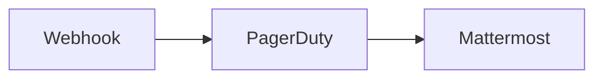

## Fluxo (.json) :

```json
{
  "nodes": [
    {
      "name": "Webhook",
      "type": "n8n-nodes-base.webhook",
      "position": [
        450,
        300
      ],
      "webhookId": "213324b6-b84d-42f9-af3b-42804cc71cd1",
      "parameters": {
        "path": "213324b6-b84d-42f9-af3b-42804cc71cd1",
        "options": {},
        "httpMethod": "POST"
      },
      "typeVersion": 1
    },
    {
      "name": "PagerDuty",
      "type": "n8n-nodes-base.pagerDuty",
      "position": [
        650,
        300
      ],
      "parameters": {
        "email": "n8ndocsburner@gmail.com",
        "operation": "update",
        "incidentId": "={{$json[\"body\"][\"context\"][\"pagerduty_incident\"]}}",
        "updateFields": {
          "status": "acknowledged"
        }
      },
      "credentials": {
        "pagerDutyApi": "PagerDuty Credentials"
      },
      "typeVersion": 1
    },
    {
      "name": "Mattermost",
      "type": "n8n-nodes-base.mattermost",
      "position": [
        850,
        300
      ],
      "parameters": {
        "message": "💪🏼 Incident status has been changed to Acknowledged on PagerDuty.",
        "channelId": "={{$node[\"Webhook\"].json[\"body\"][\"channel_id\"]}}",
        "attachments": [],
        "otherOptions": {}
      },
      "credentials": {
        "mattermostApi": "Mattermost Credentials"
      },
      "typeVersion": 1
    }
  ],
  "connections": {
    "Webhook": {
      "main": [
        [
          {
            "node": "PagerDuty",
            "type": "main",
            "index": 0
          }
        ]
      ]
    },
    "PagerDuty": {
      "main": [
        [
          {
            "node": "Mattermost",
            "type": "main",
            "index": 0
          }
        ]
      ]
    }
  }
}
```

<a id="template-77"></a>

## Template 77 - Inicializar configuração do Standup Bot

- **Nome:** Inicializar configuração do Standup Bot
- **Descrição:** Cria e salva um arquivo de configuração inicial para o Standup Bot contendo tokens, URLs e identificadores, acionado manualmente.
- **Funcionalidade:** • Disparo manual: permite iniciar o processo manualmente para criar ou sobrescrever a configuração.
• Definição de configuração padrão: popula valores como token de comando slash, URL base do Mattermost, token do usuário do bot, URL de webhook e ID do usuário do bot.
• Preparação do conteúdo JSON: organiza os dados de configuração em formato JSON pronto para gravação.
• Conversão para dados binários com codificação UTF-8: transforma o JSON para um formato adequado de arquivo.
• Gravação do arquivo de configuração: salva o arquivo standup-bot-config.json no caminho especificado do servidor (/home/node/.n8n/).
- **Ferramentas:** • Sistema de arquivos do servidor: local onde o arquivo de configuração é salvo (/home/node/.n8n/).
• Mattermost: plataforma de mensagens usada pelo bot para interação (URL base configurada).
• Endpoint de webhook externo: URL configurada para receber ações e integrações do bot.
• Tokens e credenciais locais: valores sensíveis (tokens e IDs) que são gravados no arquivo de configuração para uso pelo bot.

## Fluxo visual

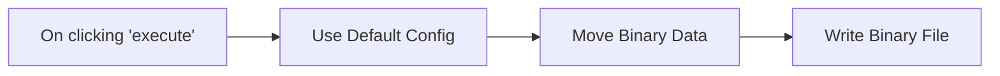

## Fluxo (.json) :

```json
{
  "id": 111,
  "name": "Standup Bot - Initialize",
  "nodes": [
    {
      "name": "On clicking 'execute'",
      "type": "n8n-nodes-base.manualTrigger",
      "position": [
        240,
        300
      ],
      "parameters": {},
      "typeVersion": 1
    },
    {
      "name": "Write Binary File",
      "type": "n8n-nodes-base.writeBinaryFile",
      "position": [
        880,
        300
      ],
      "parameters": {
        "fileName": "/home/node/.n8n/standup-bot-config.json"
      },
      "typeVersion": 1
    },
    {
      "name": "Move Binary Data",
      "type": "n8n-nodes-base.moveBinaryData",
      "position": [
        660,
        300
      ],
      "parameters": {
        "mode": "jsonToBinary",
        "options": {
          "encoding": "utf8",
          "fileName": "standup-bot-config.json"
        }
      },
      "typeVersion": 1
    },
    {
      "name": "Use Default Config",
      "type": "n8n-nodes-base.set",
      "position": [
        440,
        300
      ],
      "parameters": {
        "values": {
          "string": [
            {
              "name": "config.slashCmdToken",
              "value": "xxxxx"
            },
            {
              "name": "config.mattermostBaseUrl",
              "value": "https://mattermost.yourdomain.tld"
            },
            {
              "name": "config.botUserToken",
              "value": "xxxxx"
            },
            {
              "name": "config.n8nWebhookUrl",
              "value": "https://n8n.yourdomain.tld/webhook/standup-bot/action/f6f9b174745fa4651f750c36957d674c"
            },
            {
              "name": "config.botUserId",
              "value": "xxxxx"
            }
          ]
        },
        "options": {},
        "keepOnlySet": true
      },
      "typeVersion": 1
    }
  ],
  "active": false,
  "settings": {},
  "connections": {
    "Move Binary Data": {
      "main": [
        [
          {
            "node": "Write Binary File",
            "type": "main",
            "index": 0
          }
        ]
      ]
    },
    "Use Default Config": {
      "main": [
        [
          {
            "node": "Move Binary Data",
            "type": "main",
            "index": 0
          }
        ]
      ]
    },
    "On clicking 'execute'": {
      "main": [
        [
          {
            "node": "Use Default Config",
            "type": "main",
            "index": 0
          }
        ]
      ]
    }
  }
}
```

<a id="template-78"></a>

## Template 78 - Remover um rótulo e aplicar outro em mensagens do Gmail

- **Nome:** Remover um rótulo e aplicar outro em mensagens do Gmail
- **Descrição:** Busca mensagens que possuam um rótulo específico, remove esse rótulo e aplica um novo rótulo às mesmas mensagens.
- **Funcionalidade:** • Gatilho manual: inicia a execução quando o usuário aciona o fluxo.
• Busca de mensagens por rótulo: recupera todas as mensagens que possuem o rótulo especificado.
• Remoção de rótulo: remove o rótulo original de cada mensagem encontrada.
• Adição de novo rótulo: aplica um rótulo diferente às mensagens após a remoção.
• Processamento em lote: realiza as ações para múltiplas mensagens retornadas pela busca.
- **Ferramentas:** • Gmail: serviço de e-mail usado para pesquisar mensagens e atualizar rótulos (leitura e modificação de rótulos).

## Fluxo visual

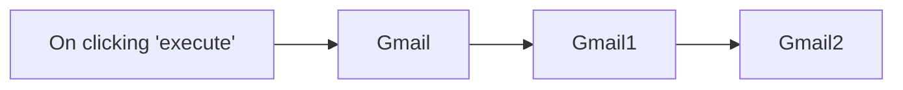

## Fluxo (.json) :

```json
{
  "id": "175",
  "name": "Get messages with a certain label, remove the label, and add a new one",
  "nodes": [
    {
      "name": "On clicking 'execute'",
      "type": "n8n-nodes-base.manualTrigger",
      "position": [
        250,
        300
      ],
      "parameters": {},
      "typeVersion": 1
    },
    {
      "name": "Gmail",
      "type": "n8n-nodes-base.gmail",
      "position": [
        450,
        300
      ],
      "parameters": {
        "resource": "message",
        "operation": "getAll",
        "additionalFields": {
          "format": "full",
          "labelIds": [
            "Label_103811885290186237"
          ]
        }
      },
      "credentials": {
        "gmailOAuth2": "Gmail"
      },
      "typeVersion": 1
    },
    {
      "name": "Gmail1",
      "type": "n8n-nodes-base.gmail",
      "position": [
        650,
        300
      ],
      "parameters": {
        "labelIds": [
          "Label_103811885290186237"
        ],
        "resource": "messageLabel",
        "messageId": "={{$node[\"Gmail\"].json[\"id\"]}}",
        "operation": "remove"
      },
      "credentials": {
        "gmailOAuth2": "Gmail"
      },
      "typeVersion": 1
    },
    {
      "name": "Gmail2",
      "type": "n8n-nodes-base.gmail",
      "position": [
        850,
        300
      ],
      "parameters": {
        "labelIds": [
          "Label_140673791182006844"
        ],
        "resource": "messageLabel",
        "messageId": "={{$node[\"Gmail\"].json[\"id\"]}}"
      },
      "credentials": {
        "gmailOAuth2": "Gmail"
      },
      "typeVersion": 1
    }
  ],
  "active": false,
  "settings": {},
  "connections": {
    "Gmail": {
      "main": [
        [
          {
            "node": "Gmail1",
            "type": "main",
            "index": 0
          }
        ]
      ]
    },
    "Gmail1": {
      "main": [
        [
          {
            "node": "Gmail2",
            "type": "main",
            "index": 0
          }
        ]
      ]
    },
    "On clicking 'execute'": {
      "main": [
        [
          {
            "node": "Gmail",
            "type": "main",
            "index": 0
          }
        ]
      ]
    }
  }
}
```

<a id="template-79"></a>

## Template 79 - Compartilhar link Whereby no Mattermost

- **Nome:** Compartilhar link Whereby no Mattermost
- **Descrição:** Recebe um webhook, cria um link de videochamada baseado em um mapeamento interno e publica a mensagem no canal indicado do Mattermost.
- **Funcionalidade:** • Recebimento de webhook: aceita requisições HTTP POST contendo dados do canal e do usuário.
• Mapeamento de usuário para código de sala: define um par chave-valor (por exemplo, amudhan -> n8n-rocks) utilizado para gerar o link.
• Construção do link de videochamada: cria uma URL do Whereby usando o valor mapeado.
• Envio de mensagem ao canal: publica no canal especificado pelo webhook uma mensagem com um anexo contendo o link de videochamada.
- **Ferramentas:** • Mattermost: plataforma de chat onde a mensagem e o anexo com o link são publicados.
• Whereby: serviço de videochamada usado para hospedar a sala e gerar o link compartilhado.

## Fluxo visual

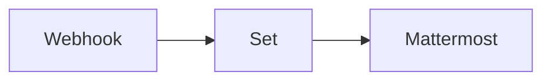

## Fluxo (.json) :

```json
{
  "nodes": [
    {
      "name": "Webhook",
      "type": "n8n-nodes-base.webhook",
      "position": [
        590,
        400
      ],
      "webhookId": "822cce61-ff5f-4cea-b8ba-1822651786e3",
      "parameters": {
        "path": "822cce61-ff5f-4cea-b8ba-1822651786e3",
        "options": {},
        "httpMethod": "POST"
      },
      "typeVersion": 1
    },
    {
      "name": "Set",
      "type": "n8n-nodes-base.set",
      "position": [
        780,
        400
      ],
      "parameters": {
        "values": {
          "string": [
            {
              "name": "amudhan",
              "value": "n8n-rocks"
            }
          ]
        },
        "options": {},
        "keepOnlySet": true
      },
      "typeVersion": 1
    },
    {
      "name": "Mattermost",
      "type": "n8n-nodes-base.mattermost",
      "position": [
        990,
        400
      ],
      "parameters": {
        "message": "=Join me in a video call:",
        "channelId": "={{$node[\"Webhook\"].json[\"body\"][\"channel_id\"]}}",
        "attachments": [
          {
            "title": "=https://whereby.com/{{$json[$node[\"Webhook\"].json[\"body\"][\"user_name\"]]}}",
            "title_link": "=https://whereby.com/{{$json[$node[\"Webhook\"].json[\"body\"][\"user_name\"]]}}"
          }
        ],
        "otherOptions": {}
      },
      "credentials": {
        "mattermostApi": "mm_creds"
      },
      "typeVersion": 1
    }
  ],
  "connections": {
    "Set": {
      "main": [
        [
          {
            "node": "Mattermost",
            "type": "main",
            "index": 0
          }
        ]
      ]
    },
    "Webhook": {
      "main": [
        [
          {
            "node": "Set",
            "type": "main",
            "index": 0
          }
        ]
      ]
    }
  }
}
```

<a id="template-80"></a>

## Template 80 - Gerar narração de vídeo com IA e TTS

- **Nome:** Gerar narração de vídeo com IA e TTS
- **Descrição:** Extrai frames de um vídeo, utiliza um modelo multimodal para gerar um roteiro de narração em partes e converte o roteiro final em um arquivo de áudio que é salvo em nuvem.
- **Funcionalidade:** • Download do vídeo: Baixa um vídeo de uma URL pública para processamento.
• Extração de frames: Decodifica o vídeo e captura frames distribuídos uniformemente, limitando a quantidade para desempenho.
• Agrupamento em lotes: Divide os frames em batches sequenciais para enviar ao modelo multimodal sem exceder limites de entrada.
• Redimensionamento e conversão: Redimensiona as imagens e converte para formato binário/jpg para envio ao modelo.
• Geração de roteiro por partes: Usa um modelo de visão+linguagem para criar trechos de narração a partir de cada lote de frames, continuando a partir de iterações anteriores para coerência.
• Combinação de texto: Agrega todos os trechos gerados em um roteiro completo e coeso.
• Síntese de voz (TTS): Converte o roteiro final em um arquivo de áudio (mp3).
• Upload para armazenamento: Envia o arquivo de áudio final para uma pasta na nuvem.
• Gerenciamento de limites: Insere esperas/pausas entre chamadas para respeitar limites de serviço e evitar rate limits.
- **Ferramentas:** • OpenAI: Fornece o modelo multimodal usado para interpretar frames e gerar texto, além do serviço de síntese de voz (TTS) para criar o áudio final.
• Google Drive: Armazenamento em nuvem usado para salvar o arquivo de áudio gerado.
• Pixabay (exemplo de vídeo): Fonte pública do vídeo de demonstração utilizado no fluxo.
• Python + OpenCV + NumPy: Ambiente e bibliotecas usadas para decodificar o vídeo, extrair frames, processar e codificar imagens em Base64.

## Fluxo visual

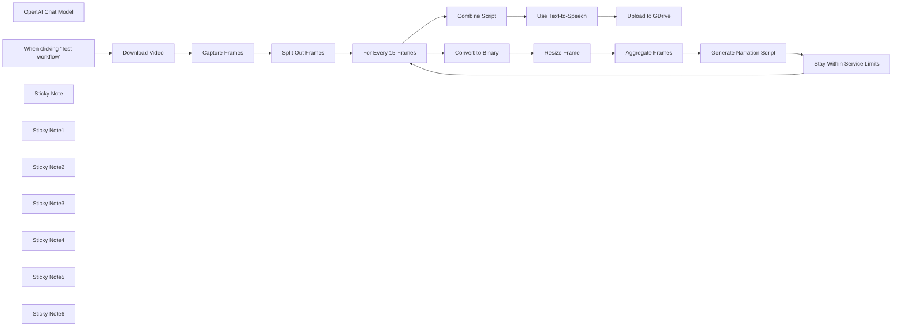

## Fluxo (.json) :

```json
{
  "meta": {
    "instanceId": "408f9fb9940c3cb18ffdef0e0150fe342d6e655c3a9fac21f0f644e8bedabcd9"
  },
  "nodes": [
    {
      "id": "6d16b5be-8f7b-49f2-8523-9b84c62f2759",
      "name": "OpenAI Chat Model",
      "type": "@n8n/n8n-nodes-langchain.lmChatOpenAi",
      "position": [
        1960,
        660
      ],
      "parameters": {
        "model": "gpt-4o-2024-08-06",
        "options": {}
      },
      "credentials": {
        "openAiApi": {
          "id": "8gccIjcuf3gvaoEr",
          "name": "OpenAi account"
        }
      },
      "typeVersion": 1
    },
    {
      "id": "a6084f09-9a4f-478a-ac1a-ab1413628c1f",
      "name": "Capture Frames",
      "type": "n8n-nodes-base.code",
      "position": [
        720,
        460
      ],
      "parameters": {
        "mode": "runOnceForEachItem",
        "language": "python",
        "pythonCode": "import cv2\nimport numpy as np\nimport base64\n\ndef extract_evenly_distributed_frames_from_base64(base64_string, max_frames=90):\n # Decode the Base64 string into bytes\n video_bytes = base64.b64decode(base64_string)\n \n # Write the bytes to a temporary file\n video_path = '/tmp/temp_video.mp4'\n with open(video_path, 'wb') as video_file:\n video_file.write(video_bytes)\n \n # Open the video file using OpenCV\n video_capture = cv2.VideoCapture(video_path)\n \n # Get the total number of frames in the video\n total_frames = int(video_capture.get(cv2.CAP_PROP_FRAME_COUNT))\n \n # Calculate the step size to take 'max_frames' evenly distributed frames\n step_size = max(1, total_frames // (max_frames - 1))\n \n # List to store selected frames as base64\n selected_frames_base64 = []\n \n for i in range(0, total_frames, step_size):\n # Set the current frame position\n video_capture.set(cv2.CAP_PROP_POS_FRAMES, i)\n \n # Read the frame\n ret, frame = video_capture.read()\n if ret:\n # Convert frame (NumPy array) to a Base64 string\n frame_base64 = convert_frame_to_base64(frame)\n selected_frames_base64.append(frame_base64)\n if len(selected_frames_base64) >= max_frames:\n break\n \n # Release the video capture object\n video_capture.release()\n\n return selected_frames_base64\n\ndef convert_frame_to_base64(frame):\n # Convert the frame (NumPy array) to JPEG format\n ret, buffer = cv2.imencode('.jpg', frame)\n if not ret:\n return None\n\n # Encode JPEG image to Base64\n frame_base64 = base64.b64encode(buffer).decode('utf-8')\n return frame_base64\n\nbase64_video = _input.item.binary.data.data\nframes_base64 = extract_evenly_distributed_frames_from_base64(base64_video, max_frames=90)\n\nreturn { \"output\": frames_base64 }"
      },
      "typeVersion": 2
    },
    {
      "id": "b45e82a4-f304-4733-a9cf-07cae6df13ea",
      "name": "Split Out Frames",
      "type": "n8n-nodes-base.splitOut",
      "position": [
        920,
        460
      ],
      "parameters": {
        "options": {},
        "fieldToSplitOut": "output"
      },
      "typeVersion": 1
    },
    {
      "id": "83d29c51-a415-476d-b380-1ca5f0d4f521",
      "name": "Download Video",
      "type": "n8n-nodes-base.httpRequest",
      "position": [
        329,
        346
      ],
      "parameters": {
        "url": "=https://cdn.pixabay.com/video/2016/05/12/3175-166339863_small.mp4",
        "options": {}
      },
      "typeVersion": 4.2
    },
    {
      "id": "0304ebb5-945d-4b0b-9597-f83ae8c1fe31",
      "name": "Convert to Binary",
      "type": "n8n-nodes-base.convertToFile",
      "position": [
        1480,
        500
      ],
      "parameters": {
        "options": {},
        "operation": "toBinary",
        "sourceProperty": "output"
      },
      "typeVersion": 1.1
    },
    {
      "id": "32a21e1d-1d8b-411e-8281-8d0e68a06889",
      "name": "When clicking ‘Test workflow’",
      "type": "n8n-nodes-base.manualTrigger",
      "position": [
        149,
        346
      ],
      "parameters": {},
      "typeVersion": 1
    },
    {
      "id": "0ad2ea6a-e1f4-4b26-a4de-9103ecbb3831",
      "name": "Combine Script",
      "type": "n8n-nodes-base.aggregate",
      "position": [
        2640,
        360
      ],
      "parameters": {
        "options": {},
        "aggregate": "aggregateAllItemData"
      },
      "typeVersion": 1
    },
    {
      "id": "2d9bb91a-3369-4268-882f-f97e73897bb8",
      "name": "Upload to GDrive",
      "type": "n8n-nodes-base.googleDrive",
      "position": [
        3040,
        360
      ],
      "parameters": {
        "name": "=narrating-video-using-vision-ai-{{ $now.format('yyyyMMddHHmmss') }}.mp3",
        "driveId": {
          "__rl": true,
          "mode": "list",
          "value": "My Drive",
          "cachedResultUrl": "https://drive.google.com/drive/my-drive",
          "cachedResultName": "My Drive"
        },
        "options": {},
        "folderId": {
          "__rl": true,
          "mode": "id",
          "value": "1dBJZL_SCh6F2U7N7kIMsnSiI4QFxn2xD"
        }
      },
      "credentials": {
        "googleDriveOAuth2Api": {
          "id": "yOwz41gMQclOadgu",
          "name": "Google Drive account"
        }
      },
      "typeVersion": 3
    },
    {
      "id": "137185f6-ba32-4c68-844f-f50c7a5a261d",
      "name": "Sticky Note",
      "type": "n8n-nodes-base.stickyNote",
      "position": [
        -440,
        0
      ],
      "parameters": {
        "width": 476.34074202271484,
        "height": 586.0597334122469,
        "content": "## Try It Out!\n\n### This n8n template takes a video and extracts frames from it which are used with a multimodal LLM to generate a script. The script is then passed to the same multimodal LLM to generate a voiceover clip.\n\nThis template was inspired by [Processing and narrating a video with GPT's visual capabilities and the TTS API](https://cookbook.openai.com/examples/gpt_with_vision_for_video_understanding)\n\n* Video is downloaded using the HTTP node.\n* Python code node is used to extract the frames using OpenCV.\n* Loop node is used o batch the frames for the LLM to generate partial scripts.\n* All partial scripts are combined to form the full script which is then sent to OpenAI to generate audio from it.\n* The finished voiceover clip is uploaded to Google Drive.\n\nSample the finished product here: https://drive.google.com/file/d/1-XCoii0leGB2MffBMPpCZoxboVyeyeIX/view?usp=sharing\n\n\n### Need Help?\nJoin the [Discord](https://discord.com/invite/XPKeKXeB7d) or ask in the [Forum](https://community.n8n.io/)!"
      },
      "typeVersion": 1
    },
    {
      "id": "23700b04-2549-4121-b442-4b92adf7f6d6",
      "name": "Sticky Note1",
      "type": "n8n-nodes-base.stickyNote",
      "position": [
        60,
        120
      ],
      "parameters": {
        "color": 7,
        "width": 459.41860465116287,
        "height": 463.313953488372,
        "content": "## 1. Download Video\n[Learn more about the HTTP Request node](https://docs.n8n.io/integrations/builtin/core-nodes/n8n-nodes-base.httprequest/)\n\nIn this demonstration, we'll download a stock video from pixabay using the HTTP Request node. Feel free to use other sources but ensure they are in a format support by OpenCV ([See docs](https://docs.opencv.org/3.4/dd/d43/tutorial_py_video_display.html))"
      },
      "typeVersion": 1
    },
    {
      "id": "0a42aeb0-96cd-401c-abeb-c50e0f04f7ad",
      "name": "Sticky Note2",
      "type": "n8n-nodes-base.stickyNote",
      "position": [
        560,
        120
      ],
      "parameters": {
        "color": 7,
        "width": 605.2674418604653,
        "height": 522.6860465116279,
        "content": "## 2. Split Video into Frames\n[Learn more about the Code node](https://docs.n8n.io/integrations/builtin/core-nodes/n8n-nodes-base.code/)\n\nWe need to think of videos are a sum of 2 parts; a visual track and an audio track. The visual track is technically just a collection of images displayed one after the other and are typically referred to as frames. When we want LLM to understand videos, most of the time we can do so by giving it a series of frames as images to process.\n\nHere, we use the Python Code node to extract the frames from the video using OpenCV, a computer vision library. For performance reasons, we'll also capture only a max of 90 frames from the video but ensure they are evenly distributed across the video. This step takes about 1-2 mins to complete on a 3mb video."
      },
      "typeVersion": 1
    },
    {
      "id": "b518461c-13f1-45ae-a156-20ae6051fc19",
      "name": "Sticky Note3",
      "type": "n8n-nodes-base.stickyNote",
      "position": [
        560,
        660
      ],
      "parameters": {
        "color": 3,
        "width": 418.11627906976724,
        "height": 132.89534883720933,
        "content": "### 🚨 PERFORMANCE WARNING!\nUsing large videos or capturing a large number of frames is really memory intensive and could crash your n8n instance. Be sure you have sufficient memory and to optimise the video beforehand! "
      },
      "typeVersion": 1
    },
    {
      "id": "585f7a7f-1676-4bc3-a6fb-eace443aa5da",
      "name": "Sticky Note4",
      "type": "n8n-nodes-base.stickyNote",
      "position": [
        1200,
        118.69767441860472
      ],
      "parameters": {
        "color": 7,
        "width": 1264.8139534883715,
        "height": 774.3720930232558,
        "content": "## 3. Use Vision AI to Narrate on Batches of Frames\n[Read more about the Basic LLM node](https://docs.n8n.io/integrations/builtin/cluster-nodes/root-nodes/n8n-nodes-langchain.chainllm/)\n\nTo keep within token limits of our LLM, we'll need to send our frames in sequential batches to represent chunks of our original video. We'll use the loop node to create batches of 15 frames - this is because of our max of 90 frames, this fits perfectly for a total of 6 loops. Next, we'll convert each frame to a binary image so we can resize for and attach to the Basic LLM node. One trick to point out is that within the Basic LLM node, previous iterations of the generation are prepended to form a cohesive script. Without, the LLM will assume it needs to start fresh for each batch of frames.\n\nA wait node is used to stay within service rate limits. This is useful for new users who are still on lower tiers. If you do not have such restrictions, feel free to remove this wait node!"
      },
      "typeVersion": 1
    },
    {
      "id": "42c002a3-37f6-4dd7-af14-20391b19cb5a",
      "name": "Stay Within Service Limits",
      "type": "n8n-nodes-base.wait",
      "position": [
        2280,
        640
      ],
      "webhookId": "677fa706-b4dd-4fe3-ba17-feea944c3193",
      "parameters": {},
      "typeVersion": 1.1
    },
    {
      "id": "5beb17fa-8a57-4c72-9c3b-b7fdf41b545a",
      "name": "For Every 15 Frames",
      "type": "n8n-nodes-base.splitInBatches",
      "position": [
        1320,
        380
      ],
      "parameters": {
        "options": {},
        "batchSize": 15
      },
      "typeVersion": 3
    },
    {
      "id": "9a57256a-076a-4823-8cad-3b64a17ff705",
      "name": "Resize Frame",
      "type": "n8n-nodes-base.editImage",
      "position": [
        1640,
        500
      ],
      "parameters": {
        "width": 768,
        "height": 768,
        "options": {
          "format": "jpeg"
        },
        "operation": "resize"
      },
      "typeVersion": 1
    },
    {
      "id": "3e776939-1a25-4ea0-8106-c3072d108106",
      "name": "Aggregate Frames",
      "type": "n8n-nodes-base.aggregate",
      "position": [
        1800,
        500
      ],
      "parameters": {
        "options": {
          "includeBinaries": true
        },
        "aggregate": "aggregateAllItemData"
      },
      "typeVersion": 1
    },
    {
      "id": "3a973a9c-2c7a-43c5-9c45-a14d49b56622",
      "name": "Sticky Note5",
      "type": "n8n-nodes-base.stickyNote",
      "position": [
        2500,
        120.6860465116277
      ],
      "parameters": {
        "color": 7,
        "width": 769.1860465116274,
        "height": 487.83720930232533,
        "content": "## 4. Generate Voice Over Clip Using TTS\n[Read more about the OpenAI node](https://docs.n8n.io/integrations/builtin/app-nodes/n8n-nodes-langchain.openai)\n\nFinally with our generated script parts, we can combine them into one and use OpenAI's Audio generation capabilities to generate a voice over from the full script. Once we have the output mp3, we can upload it to somewhere like Google Drive for later use.\n\nHave a listen to the finished product here: https://drive.google.com/file/d/1-XCoii0leGB2MffBMPpCZoxboVyeyeIX/view?usp=sharing"
      },
      "typeVersion": 1
    },
    {
      "id": "92e07c18-4058-4098-a448-13451bd8a17a",
      "name": "Use Text-to-Speech",
      "type": "@n8n/n8n-nodes-langchain.openAi",
      "position": [
        2840,
        360
      ],
      "parameters": {
        "input": "={{ $json.data.map(item => item.text).join('\\n') }}",
        "options": {
          "response_format": "mp3"
        },
        "resource": "audio"
      },
      "credentials": {
        "openAiApi": {
          "id": "8gccIjcuf3gvaoEr",
          "name": "OpenAi account"
        }
      },
      "typeVersion": 1.5
    },
    {
      "id": "0696c336-1814-4ad4-aa5e-b86489a4231e",
      "name": "Sticky Note6",
      "type": "n8n-nodes-base.stickyNote",
      "position": [
        61,
        598
      ],
      "parameters": {
        "color": 7,
        "width": 458.1279069767452,
        "height": 296.8139534883723,
        "content": "**The video used in this demonstration is**\n&copy; [Coverr-Free-Footage](https://pixabay.com/users/coverr-free-footage-1281706/) via [Pixabay](https://pixabay.com/videos/india-street-busy-rickshaw-people-3175/)\n"
      },
      "typeVersion": 1
    },
    {
      "id": "81185ac4-c7fd-4921-937f-109662d5dfa5",
      "name": "Generate Narration Script",
      "type": "@n8n/n8n-nodes-langchain.chainLlm",
      "position": [
        1960,
        500
      ],
      "parameters": {
        "text": "=These are frames of a video. Create a short voiceover script in the style of David Attenborough. Only include the narration.\n{{\n$('Generate Narration Script').isExecuted\n ? `Continue from this script:\\n${$('Generate Narration Script').all().map(item => item.json.text.replace(/\\n/g,'')).join('\\n')}`\n : ''\n}}",
        "messages": {
          "messageValues": [
            {
              "type": "HumanMessagePromptTemplate",
              "messageType": "imageBinary"
            },
            {
              "type": "HumanMessagePromptTemplate",
              "messageType": "imageBinary",
              "binaryImageDataKey": "data_1"
            },
            {
              "type": "HumanMessagePromptTemplate",
              "messageType": "imageBinary",
              "binaryImageDataKey": "data_2"
            },
            {
              "type": "HumanMessagePromptTemplate",
              "messageType": "imageBinary",
              "binaryImageDataKey": "data_3"
            },
            {
              "type": "HumanMessagePromptTemplate",
              "messageType": "imageBinary",
              "binaryImageDataKey": "data_4"
            },
            {
              "type": "HumanMessagePromptTemplate",
              "messageType": "imageBinary",
              "binaryImageDataKey": "data_5"
            },
            {
              "type": "HumanMessagePromptTemplate",
              "messageType": "imageBinary",
              "binaryImageDataKey": "data_6"
            },
            {
              "type": "HumanMessagePromptTemplate",
              "messageType": "imageBinary",
              "binaryImageDataKey": "data_7"
            },
            {
              "type": "HumanMessagePromptTemplate",
              "messageType": "imageBinary",
              "binaryImageDataKey": "data_8"
            },
            {
              "type": "HumanMessagePromptTemplate",
              "messageType": "imageBinary",
              "binaryImageDataKey": "data_9"
            },
            {
              "type": "HumanMessagePromptTemplate",
              "messageType": "imageBinary",
              "binaryImageDataKey": "data_10"
            },
            {
              "type": "HumanMessagePromptTemplate",
              "messageType": "imageBinary",
              "binaryImageDataKey": "data_11"
            },
            {
              "type": "HumanMessagePromptTemplate",
              "messageType": "imageBinary",
              "binaryImageDataKey": "data_12"
            },
            {
              "type": "HumanMessagePromptTemplate",
              "messageType": "imageBinary",
              "binaryImageDataKey": "data_13"
            },
            {
              "type": "HumanMessagePromptTemplate",
              "messageType": "imageBinary",
              "binaryImageDataKey": "data_14"
            }
          ]
        },
        "promptType": "define"
      },
      "typeVersion": 1.4
    }
  ],
  "pinData": {},
  "connections": {
    "Resize Frame": {
      "main": [
        [
          {
            "node": "Aggregate Frames",
            "type": "main",
            "index": 0
          }
        ]
      ]
    },
    "Capture Frames": {
      "main": [
        [
          {
            "node": "Split Out Frames",
            "type": "main",
            "index": 0
          }
        ]
      ]
    },
    "Combine Script": {
      "main": [
        [
          {
            "node": "Use Text-to-Speech",
            "type": "main",
            "index": 0
          }
        ]
      ]
    },
    "Download Video": {
      "main": [
        [
          {
            "node": "Capture Frames",
            "type": "main",
            "index": 0
          }
        ]
      ]
    },
    "Aggregate Frames": {
      "main": [
        [
          {
            "node": "Generate Narration Script",
            "type": "main",
            "index": 0
          }
        ]
      ]
    },
    "Split Out Frames": {
      "main": [
        [
          {
            "node": "For Every 15 Frames",
            "type": "main",
            "index": 0
          }
        ]
      ]
    },
    "Convert to Binary": {
      "main": [
        [
          {
            "node": "Resize Frame",
            "type": "main",
            "index": 0
          }
        ]
      ]
    },
    "OpenAI Chat Model": {
      "ai_languageModel": [
        [
          {
            "node": "Generate Narration Script",
            "type": "ai_languageModel",
            "index": 0
          }
        ]
      ]
    },
    "Use Text-to-Speech": {
      "main": [
        [
          {
            "node": "Upload to GDrive",
            "type": "main",
            "index": 0
          }
        ]
      ]
    },
    "For Every 15 Frames": {
      "main": [
        [
          {
            "node": "Combine Script",
            "type": "main",
            "index": 0
          }
        ],
        [
          {
            "node": "Convert to Binary",
            "type": "main",
            "index": 0
          }
        ]
      ]
    },
    "Generate Narration Script": {
      "main": [
        [
          {
            "node": "Stay Within Service Limits",
            "type": "main",
            "index": 0
          }
        ]
      ]
    },
    "Stay Within Service Limits": {
      "main": [
        [
          {
            "node": "For Every 15 Frames",
            "type": "main",
            "index": 0
          }
        ]
      ]
    },
    "When clicking ‘Test workflow’": {
      "main": [
        [
          {
            "node": "Download Video",
            "type": "main",
            "index": 0
          }
        ]
      ]
    }
  }
}
```

<a id="template-81"></a>

## Template 81 - Sobrescrever configuração do Standup Bot

- **Nome:** Sobrescrever configuração do Standup Bot
- **Descrição:** Fluxo que atualiza (sobrescreve) o arquivo de configuração do bot de standup a partir de dados JSON fornecidos manualmente.
- **Funcionalidade:** • Início manual: Permite acionar o fluxo manualmente para forçar a atualização da configuração.
• Conversão de JSON para dados binários: Transforma o conteúdo JSON em dados binários com codificação UTF-8 e nome de arquivo definido.
• Gravação do arquivo de configuração: Escreve os dados binários no caminho especificado do servidor, sobrescrevendo o arquivo de configuração existente.
- **Ferramentas:** • Sistema de arquivos do servidor: Permite gravar e sobrescrever o arquivo de configuração no caminho definido no servidor.

## Fluxo visual

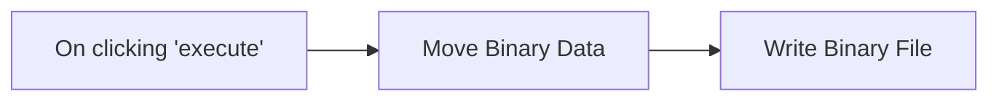

## Fluxo (.json) :

```json
{
  "id": 113,
  "name": "Standup Bot - Override Config",
  "nodes": [
    {
      "name": "On clicking 'execute'",
      "type": "n8n-nodes-base.manualTrigger",
      "position": [
        240,
        300
      ],
      "parameters": {},
      "typeVersion": 1
    },
    {
      "name": "Write Binary File",
      "type": "n8n-nodes-base.writeBinaryFile",
      "position": [
        600,
        300
      ],
      "parameters": {
        "fileName": "/home/node/.n8n/standup-bot-config.json"
      },
      "typeVersion": 1
    },
    {
      "name": "Move Binary Data",
      "type": "n8n-nodes-base.moveBinaryData",
      "position": [
        420,
        300
      ],
      "parameters": {
        "mode": "jsonToBinary",
        "options": {
          "encoding": "utf8",
          "fileName": "standup-bot-config.json"
        }
      },
      "typeVersion": 1
    }
  ],
  "active": false,
  "settings": {},
  "connections": {
    "Move Binary Data": {
      "main": [
        [
          {
            "node": "Write Binary File",
            "type": "main",
            "index": 0
          }
        ]
      ]
    },
    "On clicking 'execute'": {
      "main": [
        [
          {
            "node": "Move Binary Data",
            "type": "main",
            "index": 0
          }
        ]
      ]
    }
  }
}
```
