# PACK 1999 TEMPLATES PARTE 01 - Bloco 5

Templates neste bloco: 20

## Sumário

- [Template 82 - Agente de vendas via WhatsApp](#template-82)
- [Template 83 - Backup diário de fluxos com purga](#template-83)
- [Template 84 - Publicador diário de quadrinhos traduzidos](#template-84)
- [Template 85 - Remoção em massa de e-mails do Gmail](#template-85)
- [Template 86 - Notificações de respostas Lemlist](#template-86)
- [Template 87 - Análise de sentimento e notificação no Mattermost](#template-87)
- [Template 88 - Notificação de feedbacks negativos](#template-88)
- [Template 89 - Converter Parquet/Avro/ORC/Feather para JSON via ParquetReader](#template-89)
- [Template 90 - Criar item no Monday a partir de novo contato](#template-90)
- [Template 91 - Exportar tabela SQL para XLSX](#template-91)
- [Template 92 - Atualizar status Slack e controlar luzes por evento do calendário](#template-92)
- [Template 93 - Sincronização estudantes → Mautic](#template-93)
- [Template 94 - Enviar mensagem privada no Zulip](#template-94)
- [Template 95 - Sincronização de contatos Google Sheets → Mautic](#template-95)
- [Template 96 - Sincronização de consentimento Shopify e Mautic](#template-96)
- [Template 97 - Assistente WhatsApp multimodal com IA](#template-97)
- [Template 98 - OCR de imagem a partir do S3](#template-98)
- [Template 99 - Contagem de pessoas do datastore de clientes](#template-99)
- [Template 100 - Processamento de planilhas Excel](#template-100)
- [Template 101 - Geração automática de legendas em vídeo](#template-101)

---

<a id="template-82"></a>

## Template 82 - Agente de vendas via WhatsApp

- **Nome:** Agente de vendas via WhatsApp
- **Descrição:** Fluxo que permite responder a clientes via WhatsApp utilizando um agente de IA que consulta um catálogo de produtos extraído de um folheto (brochure) para fornecer respostas factuais e direcionamentos.
- **Funcionalidade:** • Importação do folheto PDF: Baixa o PDF do folheto da Yamaha e extrai o texto para uso como base de conhecimento.
• Quebra de texto em trechos: Divide o conteúdo extraído em segmentos para melhor indexação e recuperação.
• Geração de embeddings: Converte trechos de texto em vetores semânticos para construir um índice pesquisável.
• Criação do catálogo vetorial: Armazena os vetores do folheto em um repositório de busca para consultas rápidas (vector store).
• Trigger de WhatsApp: Recebe mensagens de clientes para iniciar conversas com o agente.
• Filtragem de tipos de mensagem: Aceita apenas mensagens de texto e responde com aviso padrão para outros tipos de mídia.
• Agente de IA com memória: Processa a mensagem do usuário, usa histórico de conversa por sessão e consulta o catálogo vetorial quando necessário.
• Ferramenta de busca no catálogo: Permite ao agente obter respostas factuais do folheto ao responder perguntas sobre produtos 2024.
• Resposta ao usuário: Envia a resposta gerada pelo agente de volta ao remetente via WhatsApp.
• Carregamento manual do catálogo: Possibilidade de executar manualmente o processo de importação e criação do catálogo para atualizações.
- **Ferramentas:** • OpenAI: Fornece modelos de linguagem e embeddings (para geração de respostas e vetorização de texto).
• WhatsApp (API): Plataforma de mensagens usada para receber mensagens dos clientes e enviar respostas.
• Yamaha (site público): Fonte do folheto PDF de produtos (brochure 2024) que serve como base de conhecimento.

## Fluxo visual

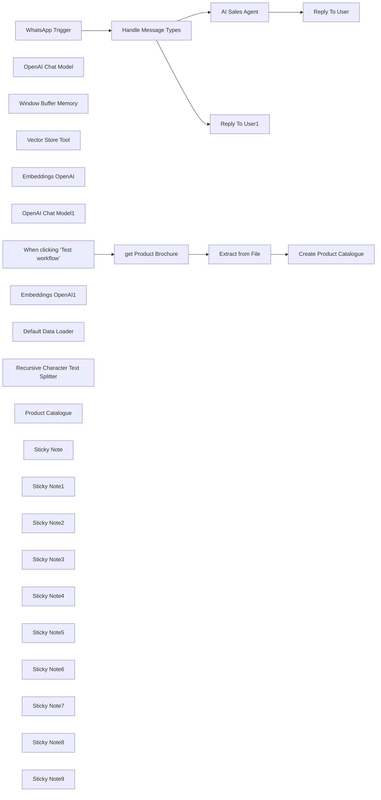

## Fluxo (.json) :

```json
{
  "meta": {
    "instanceId": "408f9fb9940c3cb18ffdef0e0150fe342d6e655c3a9fac21f0f644e8bedabcd9"
  },
  "nodes": [
    {
      "id": "77ee6494-4898-47dc-81d9-35daf6f0beea",
      "name": "WhatsApp Trigger",
      "type": "n8n-nodes-base.whatsAppTrigger",
      "position": [
        1360,
        -280
      ],
      "webhookId": "aaa71f03-f7af-4d18-8d9a-0afb86f1b554",
      "parameters": {
        "updates": [
          "messages"
        ]
      },
      "credentials": {
        "whatsAppTriggerApi": {
          "id": "H3uYNtpeczKMqtYm",
          "name": "WhatsApp OAuth account"
        }
      },
      "typeVersion": 1
    },
    {
      "id": "57210e27-1f89-465a-98cc-43f890a4bf58",
      "name": "OpenAI Chat Model",
      "type": "@n8n/n8n-nodes-langchain.lmChatOpenAi",
      "position": [
        1960,
        -200
      ],
      "parameters": {
        "model": "gpt-4o-2024-08-06",
        "options": {}
      },
      "credentials": {
        "openAiApi": {
          "id": "8gccIjcuf3gvaoEr",
          "name": "OpenAi account"
        }
      },
      "typeVersion": 1
    },
    {
      "id": "e1053235-0ade-4e36-9ad2-8b29c78fced8",
      "name": "Window Buffer Memory",
      "type": "@n8n/n8n-nodes-langchain.memoryBufferWindow",
      "position": [
        2080,
        -200
      ],
      "parameters": {
        "sessionKey": "=whatsapp-75-{{ $json.messages[0].from }}",
        "sessionIdType": "customKey"
      },
      "typeVersion": 1.2
    },
    {
      "id": "69f1b78b-7c93-4713-863a-27e04809996f",
      "name": "Vector Store Tool",
      "type": "@n8n/n8n-nodes-langchain.toolVectorStore",
      "position": [
        2200,
        -200
      ],
      "parameters": {
        "name": "query_product_brochure",
        "description": "Call this tool to query the product brochure. Valid for the year 2024."
      },
      "typeVersion": 1
    },
    {
      "id": "170e8f7d-7e14-48dd-9f80-5352cc411fc1",
      "name": "Embeddings OpenAI",
      "type": "@n8n/n8n-nodes-langchain.embeddingsOpenAi",
      "position": [
        2200,
        80
      ],
      "parameters": {
        "model": "text-embedding-3-small",
        "options": {}
      },
      "credentials": {
        "openAiApi": {
          "id": "8gccIjcuf3gvaoEr",
          "name": "OpenAi account"
        }
      },
      "typeVersion": 1
    },
    {
      "id": "ee78320b-d407-49e8-b4b8-417582a44709",
      "name": "OpenAI Chat Model1",
      "type": "@n8n/n8n-nodes-langchain.lmChatOpenAi",
      "position": [
        2440,
        -60
      ],
      "parameters": {
        "model": "gpt-4o-2024-08-06",
        "options": {}
      },
      "credentials": {
        "openAiApi": {
          "id": "8gccIjcuf3gvaoEr",
          "name": "OpenAi account"
        }
      },
      "typeVersion": 1
    },
    {
      "id": "9dd89378-5acf-4ca6-8d84-e6e64254ed02",
      "name": "When clicking ‘Test workflow’",
      "type": "n8n-nodes-base.manualTrigger",
      "position": [
        0,
        -240
      ],
      "parameters": {},
      "typeVersion": 1
    },
    {
      "id": "e68fc137-1bcb-43f0-b597-3ae07f380c15",
      "name": "Embeddings OpenAI1",
      "type": "@n8n/n8n-nodes-langchain.embeddingsOpenAi",
      "position": [
        760,
        -20
      ],
      "parameters": {
        "model": "text-embedding-3-small",
        "options": {}
      },
      "credentials": {
        "openAiApi": {
          "id": "8gccIjcuf3gvaoEr",
          "name": "OpenAi account"
        }
      },
      "typeVersion": 1
    },
    {
      "id": "2d31e92b-18d4-4f6b-8cdb-bed0056d50d7",
      "name": "Default Data Loader",
      "type": "@n8n/n8n-nodes-langchain.documentDefaultDataLoader",
      "position": [
        900,
        -20
      ],
      "parameters": {
        "options": {},
        "jsonData": "={{ $('Extract from File').item.json.text }}",
        "jsonMode": "expressionData"
      },
      "typeVersion": 1
    },
    {
      "id": "ca0c015e-fba2-4dca-b0fe-bac66681725a",
      "name": "Recursive Character Text Splitter",
      "type": "@n8n/n8n-nodes-langchain.textSplitterRecursiveCharacterTextSplitter",
      "position": [
        900,
        100
      ],
      "parameters": {
        "options": {},
        "chunkSize": 2000,
        "chunkOverlap": {}
      },
      "typeVersion": 1
    },
    {
      "id": "63abb6b2-b955-4e65-9c63-3211dca65613",
      "name": "Extract from File",
      "type": "n8n-nodes-base.extractFromFile",
      "position": [
        360,
        -240
      ],
      "parameters": {
        "options": {},
        "operation": "pdf"
      },
      "typeVersion": 1
    },
    {
      "id": "be2add9c-3670-4196-8c38-82742bf4f283",
      "name": "get Product Brochure",
      "type": "n8n-nodes-base.httpRequest",
      "position": [
        180,
        -240
      ],
      "parameters": {
        "url": "https://usa.yamaha.com/files/download/brochure/1/1474881/Yamaha-Powered-Loudspeakers-brochure-2024-en-web.pdf",
        "options": {}
      },
      "typeVersion": 4.2
    },
    {
      "id": "1ae5a311-36d7-4454-ab14-6788d1331780",
      "name": "Reply To User",
      "type": "n8n-nodes-base.whatsApp",
      "position": [
        2820,
        -280
      ],
      "parameters": {
        "textBody": "={{ $json.output }}",
        "operation": "send",
        "phoneNumberId": "477115632141067",
        "requestOptions": {},
        "additionalFields": {
          "previewUrl": false
        },
        "recipientPhoneNumber": "={{ $('WhatsApp Trigger').item.json.messages[0].from }}"
      },
      "credentials": {
        "whatsAppApi": {
          "id": "9SFJPeqrpChOkAmw",
          "name": "WhatsApp account"
        }
      },
      "typeVersion": 1
    },
    {
      "id": "b6efba81-18b0-4378-bb91-51f39ca57f3e",
      "name": "Reply To User1",
      "type": "n8n-nodes-base.whatsApp",
      "position": [
        1760,
        80
      ],
      "parameters": {
        "textBody": "=I'm unable to process non-text messages. Please send only text messages. Thanks!",
        "operation": "send",
        "phoneNumberId": "477115632141067",
        "requestOptions": {},
        "additionalFields": {
          "previewUrl": false
        },
        "recipientPhoneNumber": "={{ $('WhatsApp Trigger').item.json.messages[0].from }}"
      },
      "credentials": {
        "whatsAppApi": {
          "id": "9SFJPeqrpChOkAmw",
          "name": "WhatsApp account"
        }
      },
      "typeVersion": 1
    },
    {
      "id": "52decd86-ac6c-4d91-a938-86f93ec5f822",
      "name": "Product Catalogue",
      "type": "@n8n/n8n-nodes-langchain.vectorStoreInMemory",
      "position": [
        2200,
        -60
      ],
      "parameters": {
        "memoryKey": "whatsapp-75"
      },
      "typeVersion": 1
    },
    {
      "id": "6dd5a652-2464-4ab8-8e5f-568529299523",
      "name": "Sticky Note",
      "type": "n8n-nodes-base.stickyNote",
      "position": [
        -88.75,
        -473.4375
      ],
      "parameters": {
        "color": 7,
        "width": 640.4375,
        "height": 434.6875,
        "content": "## 1. Download Product Brochure PDF\n[Read more about the HTTP Request Tool](https://docs.n8n.io/integrations/builtin/core-nodes/n8n-nodes-base.httprequest)\n\nImport your marketing PDF document to build your vector store. This will be used as the knowledgebase by the Sales AI Agent.\n\nFor this demonstration, we'll use the HTTP request node to import the YAMAHA POWERED LOUDSPEAKERS 2024 brochure ([Source](https://usa.yamaha.com/files/download/brochure/1/1474881/Yamaha-Powered-Loudspeakers-brochure-2024-en-web.pdf)) and an Extract from File node to extract the text contents. "
      },
      "typeVersion": 1
    },
    {
      "id": "116663bc-d8d6-41a5-93dc-b219adbb2235",
      "name": "Sticky Note1",
      "type": "n8n-nodes-base.stickyNote",
      "position": [
        580,
        -476
      ],
      "parameters": {
        "color": 7,
        "width": 614.6875,
        "height": 731.1875,
        "content": "## 2. Create Product Brochure Vector Store\n[Read more about the In-Memory Vector Store](https://docs.n8n.io/integrations/builtin/cluster-nodes/root-nodes/n8n-nodes-langchain.vectorstoreinmemory/)\n\nVector stores are powerful databases which serve the purpose of matching a user's questions to relevant parts of a document. By creating a vector store of our product catalog, we'll allow users to query using natural language.\n\nTo keep things simple, we'll use the **In-memory Vector Store** which comes built-in to n8n and doesn't require a separate service. For production deployments, I'd recommend replacing the in-memory vector store with either [Qdrant](https://qdrant.tech) or [Pinecone](https://pinecone.io)."
      },
      "typeVersion": 1
    },
    {
      "id": "86bd5334-d735-4650-aeff-06230119d705",
      "name": "Create Product Catalogue",
      "type": "@n8n/n8n-nodes-langchain.vectorStoreInMemory",
      "position": [
        760,
        -200
      ],
      "parameters": {
        "mode": "insert",
        "memoryKey": "whatsapp-75",
        "clearStore": true
      },
      "typeVersion": 1
    },
    {
      "id": "b8078b0d-cbd7-423f-bb30-13902988be38",
      "name": "Sticky Note2",
      "type": "n8n-nodes-base.stickyNote",
      "position": [
        1254,
        -552
      ],
      "parameters": {
        "color": 7,
        "width": 546.6875,
        "height": 484.1875,
        "content": "## 3. Use the WhatsApp Trigger\n[Learn more about the WhatsApp Trigger](https://docs.n8n.io/integrations/builtin/trigger-nodes/n8n-nodes-base.whatsapptrigger/)\n\nThe WhatsApp Trigger allows you to receive incoming WhatsApp messages from customers. It requires a bit of setup so remember to follow the documentation carefully! Once ready however, it's quite easy to build powerful workflows which are easily accessible to users.\n\nNote that WhatsApp can send many message types such as audio and video so in this demonstration, we'll filter them out and just accept the text messages."
      },
      "typeVersion": 1
    },
    {
      "id": "5bf7ed07-282b-4198-aa90-3e5ae5180404",
      "name": "Sticky Note3",
      "type": "n8n-nodes-base.stickyNote",
      "position": [
        1640,
        280
      ],
      "parameters": {
        "width": 338,
        "height": 92,
        "content": "### Want to handle all message types?\nCheck out my other WhatsApp template in my creator page! https://n8n.io/creators/jimleuk/"
      },
      "typeVersion": 1
    },
    {
      "id": "a3661b59-25d2-446e-8462-32b4d692b69d",
      "name": "Sticky Note4",
      "type": "n8n-nodes-base.stickyNote",
      "position": [
        1640,
        -40
      ],
      "parameters": {
        "color": 7,
        "width": 337.6875,
        "height": 311.1875,
        "content": "### 3a. Handle Unsupported Message Types\nFor non-text messages, we'll just reply with a simple message to inform the sender."
      },
      "typeVersion": 1
    },
    {
      "id": "ea3c9ee1-505a-40e7-82fe-9169bdbb80af",
      "name": "Sticky Note5",
      "type": "n8n-nodes-base.stickyNote",
      "position": [
        1840,
        -682.5
      ],
      "parameters": {
        "color": 7,
        "width": 746.6875,
        "height": 929.1875,
        "content": "## 4. Sales AI Agent Responds To Customers\n[Learn more about using AI Agents](https://docs.n8n.io/integrations/builtin/cluster-nodes/root-nodes/n8n-nodes-langchain.agent/)\n\nn8n's AI agents are powerful nodes which make it incredibly easy to use state-of-the-art AI in your workflows. Not only do they have the ability to remember conversations per individual customer but also tap into resources such as our product catalogue vector store to pull factual information and data for every question.\n\nIn this demonstration, we use an AI agent which is directed to help the user navigate the product brochure. A Chat memory subnode is attached to identify and keep track of the customer session. A Vector store tool is added to allow the Agent to tap into the product catalogue knowledgebase we built earlier."
      },
      "typeVersion": 1
    },
    {
      "id": "5c72df8d-bca1-4634-b1ed-61ffec8bd103",
      "name": "Sticky Note6",
      "type": "n8n-nodes-base.stickyNote",
      "position": [
        2620,
        -560
      ],
      "parameters": {
        "color": 7,
        "width": 495.4375,
        "height": 484.1875,
        "content": "## 5. Repond to WhatsApp User\n[Learn more about the WhatsApp Node](https://docs.n8n.io/integrations/builtin/app-nodes/n8n-nodes-base.whatsapp/)\n\nThe WhatsApp node is the go-to if you want to interact with WhatsApp users. With this node, you can send text, images, audio and video messages as well as use your WhatsApp message templates.\n\nHere, we'll keep it simple by replying with a text message which is the output of the AI agent."
      },
      "typeVersion": 1
    },
    {
      "id": "48ec809f-ca0e-4052-b403-9ad7077b3fff",
      "name": "Sticky Note7",
      "type": "n8n-nodes-base.stickyNote",
      "position": [
        -520,
        -620
      ],
      "parameters": {
        "width": 401.25,
        "height": 582.6283033962263,
        "content": "## Try It Out!\n\n### This n8n template builds a simple WhatsApp chabot acting as a Sales Agent. The Agent is backed by a product catalog vector store to better answer user's questions.\n\n* This template is in 2 parts: creating the product catalog vector store and building the WhatsApp AI chatbot.\n* A product brochure is imported via HTTP request node and its text contents extracted.\n* The text contents are then uploaded to the in-memory vector store to build a knowledgebase for the chatbot.\n* A WhatsApp trigger is used to capture messages from customers where non-text messages are filtered out.\n* The customer's message is sent to the AI Agent which queries the product catalogue using the vector store tool.\n* The Agent's response is sent back to the user via the WhatsApp node.\n\n### Need Help?\nJoin the [Discord](https://discord.com/invite/XPKeKXeB7d) or ask in the [Forum](https://community.n8n.io/)!"
      },
      "typeVersion": 1
    },
    {
      "id": "87cf9b41-66de-49a7-aeb0-c8809191b5a0",
      "name": "Handle Message Types",
      "type": "n8n-nodes-base.switch",
      "position": [
        1560,
        -280
      ],
      "parameters": {
        "rules": {
          "values": [
            {
              "outputKey": "Supported",
              "conditions": {
                "options": {
                  "version": 2,
                  "leftValue": "",
                  "caseSensitive": true,
                  "typeValidation": "strict"
                },
                "combinator": "and",
                "conditions": [
                  {
                    "operator": {
                      "type": "string",
                      "operation": "equals"
                    },
                    "leftValue": "={{ $json.messages[0].type }}",
                    "rightValue": "text"
                  }
                ]
              },
              "renameOutput": true
            },
            {
              "outputKey": "Not Supported",
              "conditions": {
                "options": {
                  "version": 2,
                  "leftValue": "",
                  "caseSensitive": true,
                  "typeValidation": "strict"
                },
                "combinator": "and",
                "conditions": [
                  {
                    "id": "89971d8c-a386-4e77-8f6c-f491a8e84cb6",
                    "operator": {
                      "type": "string",
                      "operation": "notEquals"
                    },
                    "leftValue": "={{ $json.messages[0].type }}",
                    "rightValue": "text"
                  }
                ]
              },
              "renameOutput": true
            }
          ]
        },
        "options": {}
      },
      "typeVersion": 3.2
    },
    {
      "id": "e52f0a50-0c34-4c4a-b493-4c42ba112277",
      "name": "Sticky Note8",
      "type": "n8n-nodes-base.stickyNote",
      "position": [
        -80,
        -20
      ],
      "parameters": {
        "color": 5,
        "width": 345.10906976744184,
        "height": 114.53583720930231,
        "content": "### You only have to run this part once!\nRun this step to populate our product catalogue vector. Run again if you want to update the vector store with a new version."
      },
      "typeVersion": 1
    },
    {
      "id": "c1a7d6d1-191e-4343-af9f-f2c9eb4ecf49",
      "name": "Sticky Note9",
      "type": "n8n-nodes-base.stickyNote",
      "position": [
        1260,
        -40
      ],
      "parameters": {
        "color": 5,
        "width": 364.6293255813954,
        "height": 107.02804651162779,
        "content": "### Activate your workflow to use!\nTo start using the WhatsApp chatbot, you'll need to activate the workflow. If you are self-hosting ensure WhatsApp is able to connect to your server."
      },
      "typeVersion": 1
    },
    {
      "id": "a36524d0-22a6-48cc-93fe-b4571cec428a",
      "name": "AI Sales Agent",
      "type": "@n8n/n8n-nodes-langchain.agent",
      "position": [
        1960,
        -400
      ],
      "parameters": {
        "text": "={{ $json.messages[0].text.body }}",
        "options": {
          "systemMessage": "You are an assistant working for a company who sells Yamaha Powered Loudspeakers and helping the user navigate the product catalog for the year 2024. Your goal is not to facilitate a sale but if the user enquires, direct them to the appropriate website, url or contact information.\n\nDo your best to answer any questions factually. If you don't know the answer or unable to obtain the information from the datastore, then tell the user so."
        },
        "promptType": "define"
      },
      "typeVersion": 1.6
    }
  ],
  "pinData": {},
  "connections": {
    "AI Sales Agent": {
      "main": [
        [
          {
            "node": "Reply To User",
            "type": "main",
            "index": 0
          }
        ]
      ]
    },
    "WhatsApp Trigger": {
      "main": [
        [
          {
            "node": "Handle Message Types",
            "type": "main",
            "index": 0
          }
        ]
      ]
    },
    "Embeddings OpenAI": {
      "ai_embedding": [
        [
          {
            "node": "Product Catalogue",
            "type": "ai_embedding",
            "index": 0
          }
        ]
      ]
    },
    "Extract from File": {
      "main": [
        [
          {
            "node": "Create Product Catalogue",
            "type": "main",
            "index": 0
          }
        ]
      ]
    },
    "OpenAI Chat Model": {
      "ai_languageModel": [
        [
          {
            "node": "AI Sales Agent",
            "type": "ai_languageModel",
            "index": 0
          }
        ]
      ]
    },
    "Product Catalogue": {
      "ai_vectorStore": [
        [
          {
            "node": "Vector Store Tool",
            "type": "ai_vectorStore",
            "index": 0
          }
        ]
      ]
    },
    "Vector Store Tool": {
      "ai_tool": [
        [
          {
            "node": "AI Sales Agent",
            "type": "ai_tool",
            "index": 0
          }
        ]
      ]
    },
    "Embeddings OpenAI1": {
      "ai_embedding": [
        [
          {
            "node": "Create Product Catalogue",
            "type": "ai_embedding",
            "index": 0
          }
        ]
      ]
    },
    "OpenAI Chat Model1": {
      "ai_languageModel": [
        [
          {
            "node": "Vector Store Tool",
            "type": "ai_languageModel",
            "index": 0
          }
        ]
      ]
    },
    "Default Data Loader": {
      "ai_document": [
        [
          {
            "node": "Create Product Catalogue",
            "type": "ai_document",
            "index": 0
          }
        ]
      ]
    },
    "Handle Message Types": {
      "main": [
        [
          {
            "node": "AI Sales Agent",
            "type": "main",
            "index": 0
          }
        ],
        [
          {
            "node": "Reply To User1",
            "type": "main",
            "index": 0
          }
        ]
      ]
    },
    "Window Buffer Memory": {
      "ai_memory": [
        [
          {
            "node": "AI Sales Agent",
            "type": "ai_memory",
            "index": 0
          }
        ]
      ]
    },
    "get Product Brochure": {
      "main": [
        [
          {
            "node": "Extract from File",
            "type": "main",
            "index": 0
          }
        ]
      ]
    },
    "Recursive Character Text Splitter": {
      "ai_textSplitter": [
        [
          {
            "node": "Default Data Loader",
            "type": "ai_textSplitter",
            "index": 0
          }
        ]
      ]
    },
    "When clicking ‘Test workflow’": {
      "main": [
        [
          {
            "node": "get Product Brochure",
            "type": "main",
            "index": 0
          }
        ]
      ]
    }
  }
}
```

<a id="template-83"></a>

## Template 83 - Backup diário de fluxos com purga

- **Nome:** Backup diário de fluxos com purga
- **Descrição:** Este fluxo realiza backup noturno de todos os fluxos, organiza os backups em pastas dedicadas, move backups antigos para uma pasta de arquivamento e elimina backups com mais de 30 dias.
- **Funcionalidade:** • Criação de pastas de backup: verifica e cria as pastas n8n_backups e n8n_old para armazenar os backups no Google Drive.
• Backup noturno dos fluxos: exporta os fluxos atuais como arquivos JSON com timestamp e salva na pasta de backups.
• Movimento de backups para a pasta antiga: backups recentes são movidos para a pasta n8n_old e renomeados com data.
• Purga de backups com mais de 30 dias: identifica backups antigos e os deleta permanentemente.
• Preparação de dados de backup: converte os dados para binário para envio e armazenamento no drive.
- **Ferramentas:** • Google Drive: serviço de armazenamento em nuvem utilizado para salvar, organizar e gerenciar backups de fluxos.

## Fluxo visual

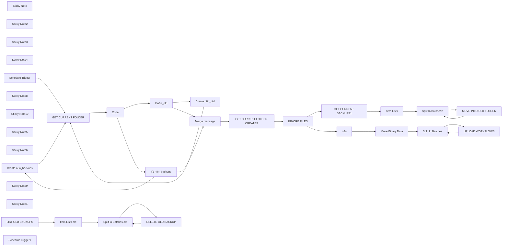

## Fluxo (.json) :

```json
{
  "nodes": [
    {
      "id": "1e89a8ad-90cf-4040-b59e-1b4933ea4e69",
      "name": "Sticky Note",
      "type": "n8n-nodes-base.stickyNote",
      "position": [
        1740,
        -80
      ],
      "parameters": {
        "color": 4,
        "width": 982.895112064014,
        "height": 248.06218763804304,
        "content": "MOVE CURRENT BACKUPS TO OLD FOLDER"
      },
      "typeVersion": 1
    },
    {
      "id": "f998e295-eafd-420a-9ba9-69571b4ab005",
      "name": "Sticky Note2",
      "type": "n8n-nodes-base.stickyNote",
      "position": [
        1740,
        500
      ],
      "parameters": {
        "width": 980.8812626356395,
        "height": 188.38611225559103,
        "content": "PURGE BACKUPS OLDER THEN 30 DAYS\n"
      },
      "typeVersion": 1
    },
    {
      "id": "a94facb5-c0df-4ba4-8620-3427aca24333",
      "name": "Move Binary Data",
      "type": "n8n-nodes-base.moveBinaryData",
      "position": [
        2000,
        280
      ],
      "parameters": {
        "mode": "jsonToBinary",
        "options": {
          "fileName": "={{ $json.name }}-{{ $json.active === false ? 'inactive' : $json.active === true ? 'active' : 'unknown' }}",
          "useRawData": true
        }
      },
      "typeVersion": 1
    },
    {
      "id": "049ac29e-36f2-4a14-9d3a-6fd9c9d8a744",
      "name": "Sticky Note3",
      "type": "n8n-nodes-base.stickyNote",
      "position": [
        260,
        -80
      ],
      "parameters": {
        "color": 2,
        "width": 1003.460056384994,
        "height": 755.833854865218,
        "content": "## get Google Drive folders"
      },
      "typeVersion": 1
    },
    {
      "id": "e830c989-815d-4c79-806e-136a82a18d72",
      "name": "Sticky Note4",
      "type": "n8n-nodes-base.stickyNote",
      "position": [
        1300,
        -80
      ],
      "parameters": {
        "color": 6,
        "width": 427.1093081837156,
        "height": 753.2799109651138,
        "content": "## Ignore any other folders other than: n8n_backups\n\n\n\n\n\n\n\n\n\n\n\n\n\n\n    (it is important that you created this folder)"
      },
      "typeVersion": 1
    },
    {
      "id": "4197519c-0cf7-49dc-be45-a5c0ab7598c2",
      "name": "IGNORE FILES",
      "type": "n8n-nodes-base.filter",
      "position": [
        1440,
        40
      ],
      "parameters": {
        "options": {},
        "conditions": {
          "options": {
            "version": 2,
            "leftValue": "",
            "caseSensitive": true,
            "typeValidation": "strict"
          },
          "combinator": "and",
          "conditions": [
            {
              "id": "98415e9e-5354-4223-9107-ef3ade30c2f0",
              "operator": {
                "name": "filter.operator.equals",
                "type": "string",
                "operation": "equals"
              },
              "leftValue": "={{ $node[\"GET CURRENT FOLDER\"].json.name }}",
              "rightValue": "n8n_backups"
            }
          ]
        }
      },
      "typeVersion": 2.2
    },
    {
      "id": "d3f6191a-80c6-43dd-923f-e98f9ade02f4",
      "name": "Create n8n_backups",
      "type": "n8n-nodes-base.googleDrive",
      "position": [
        1000,
        340
      ],
      "parameters": {
        "name": "n8n_backups",
        "driveId": {
          "__rl": true,
          "mode": "list",
          "value": "My Drive"
        },
        "options": {},
        "folderId": {
          "__rl": true,
          "mode": "list",
          "value": "root",
          "cachedResultName": "/ (Root folder)"
        },
        "resource": "folder"
      },
      "credentials": {
        "googleDriveOAuth2Api": {
          "id": "o1CgNemxQmc5Fyzd",
          "name": "Google Drive Alejandro Lobato"
        }
      },
      "typeVersion": 3
    },
    {
      "id": "b0ff6563-4ad5-4615-844a-aea766cf0d40",
      "name": "Create n8n_old",
      "type": "n8n-nodes-base.googleDrive",
      "position": [
        1000,
        500
      ],
      "parameters": {
        "name": "n8n_old",
        "driveId": {
          "__rl": true,
          "mode": "list",
          "value": "My Drive"
        },
        "options": {},
        "folderId": {
          "__rl": true,
          "mode": "list",
          "value": "root",
          "cachedResultName": "/ (Root folder)"
        },
        "resource": "folder"
      },
      "credentials": {
        "googleDriveOAuth2Api": {
          "id": "o1CgNemxQmc5Fyzd",
          "name": "Google Drive Alejandro Lobato"
        }
      },
      "typeVersion": 3
    },
    {
      "id": "d22a25ea-e1fd-4434-b050-480760f6ba11",
      "name": "Sticky Note8",
      "type": "n8n-nodes-base.stickyNote",
      "position": [
        300,
        540
      ],
      "parameters": {
        "color": 6,
        "width": 355.73762189847923,
        "height": 105.6805438265643,
        "content": "## Contact me \n**By Mail**. [Send Mail](mailto:nuntius.creative.hub@gmail.com)"
      },
      "typeVersion": 1
    },
    {
      "id": "b34e1e76-a8b8-4e0d-921b-1a773192e027",
      "name": "Sticky Note10",
      "type": "n8n-nodes-base.stickyNote",
      "position": [
        900,
        220
      ],
      "parameters": {
        "color": 5,
        "width": 327.6965514381564,
        "height": 451.756147757587,
        "content": "## Since the folder does not exist, it creates a new one.\nn8n_backups\nn8n_old"
      },
      "typeVersion": 1
    },
    {
      "id": "f0796631-ecb8-4603-838f-0ac1d1bf0a7b",
      "name": "GET CURRENT FOLDER",
      "type": "n8n-nodes-base.googleDrive",
      "onError": "continueRegularOutput",
      "position": [
        320,
        240
      ],
      "parameters": {
        "filter": {
          "whatToSearch": "folders"
        },
        "options": {},
        "resource": "fileFolder",
        "returnAll": true
      },
      "credentials": {
        "googleDriveOAuth2Api": {
          "id": "o1CgNemxQmc5Fyzd",
          "name": "Google Drive Alejandro Lobato"
        }
      },
      "executeOnce": true,
      "notesInFlow": true,
      "retryOnFail": true,
      "typeVersion": 3,
      "alwaysOutputData": true
    },
    {
      "id": "8afbde8d-ae70-427c-8883-ffd49aea7ba7",
      "name": "Code",
      "type": "n8n-nodes-base.code",
      "position": [
        500,
        240
      ],
      "parameters": {
        "jsCode": "const items = $input.all();\nconst requiredNames = [\"n8n_old\", \"n8n_backups\"];\n\n// Filtrar los nombres de la entrada\nconst folderNames = items.map(item => item.json.name);\n\n// Encontrar los nombres que faltan\nconst missingNames = requiredNames.filter(name => !folderNames.includes(name));\n\nif (missingNames.length === 0) {\n  return [{ json: { message: \"ok\" } }];\n} else {\n  return [{ json: { message: `Faltan los siguientes: ${missingNames.join(', ')}` } }];\n}\n"
      },
      "typeVersion": 2
    },
    {
      "id": "2130d3d8-23e4-48d6-b3a0-7eab5971a71d",
      "name": "If n8n_old",
      "type": "n8n-nodes-base.if",
      "position": [
        680,
        360
      ],
      "parameters": {
        "options": {},
        "conditions": {
          "options": {
            "version": 2,
            "leftValue": "",
            "caseSensitive": true,
            "typeValidation": "strict"
          },
          "combinator": "and",
          "conditions": [
            {
              "id": "43bd468e-1018-4b45-9448-c51835ed65bc",
              "operator": {
                "type": "string",
                "operation": "contains"
              },
              "leftValue": "={{ $json.message }}",
              "rightValue": "n8n_old"
            }
          ]
        }
      },
      "typeVersion": 2.2
    },
    {
      "id": "76a4ab52-b260-4a1e-be77-a7246a06b963",
      "name": "If1 n8n_backups",
      "type": "n8n-nodes-base.if",
      "position": [
        680,
        120
      ],
      "parameters": {
        "options": {},
        "conditions": {
          "options": {
            "version": 2,
            "leftValue": "",
            "caseSensitive": true,
            "typeValidation": "strict"
          },
          "combinator": "and",
          "conditions": [
            {
              "id": "43bd468e-1018-4b45-9448-c51835ed65bc",
              "operator": {
                "type": "string",
                "operation": "contains"
              },
              "leftValue": "={{ $json.message }}",
              "rightValue": "n8n_backups"
            }
          ]
        }
      },
      "typeVersion": 2.2
    },
    {
      "id": "0a215059-a7bf-4892-b584-1f037b42a59c",
      "name": "GET CURRENT FOLDER CREATES",
      "type": "n8n-nodes-base.googleDrive",
      "onError": "continueRegularOutput",
      "position": [
        1100,
        40
      ],
      "parameters": {
        "filter": {
          "whatToSearch": "folders"
        },
        "options": {},
        "resource": "fileFolder",
        "returnAll": true
      },
      "credentials": {
        "googleDriveOAuth2Api": {
          "id": "o1CgNemxQmc5Fyzd",
          "name": "Google Drive Alejandro Lobato"
        }
      },
      "executeOnce": true,
      "notesInFlow": true,
      "retryOnFail": true,
      "typeVersion": 3,
      "alwaysOutputData": true
    },
    {
      "id": "653d641c-b56f-4a02-b3bf-990b4f6b99f3",
      "name": "Merge mensage",
      "type": "n8n-nodes-base.merge",
      "position": [
        920,
        40
      ],
      "parameters": {
        "mode": "combine",
        "options": {},
        "combinationMode": "mergeByPosition"
      },
      "typeVersion": 2.1
    },
    {
      "id": "ae940b77-107a-4e6f-a635-a69876b342ea",
      "name": "GET CURRENT BACKUPS1",
      "type": "n8n-nodes-base.googleDrive",
      "position": [
        1800,
        0
      ],
      "parameters": {
        "filter": {
          "folderId": {
            "__rl": true,
            "mode": "id",
            "value": "={{ $json.id }}"
          }
        },
        "options": {
          "fields": [
            "name",
            "id"
          ]
        },
        "resource": "fileFolder",
        "returnAll": true,
        "queryString": ".json"
      },
      "credentials": {
        "googleDriveOAuth2Api": {
          "id": "o1CgNemxQmc5Fyzd",
          "name": "Google Drive Alejandro Lobato"
        }
      },
      "typeVersion": 3
    },
    {
      "id": "7caa0190-9bd5-4572-80e3-e3f3b34885a6",
      "name": "Sticky Note5",
      "type": "n8n-nodes-base.stickyNote",
      "position": [
        640,
        -40
      ],
      "parameters": {
        "color": 7,
        "width": 203.08765089203305,
        "height": 542.95115693689,
        "content": "## Does a folder exist?, if it does not exist it creates it"
      },
      "typeVersion": 1
    },
    {
      "id": "1a77a0fd-dfdd-456d-adfc-6da34a4ccbab",
      "name": "MOVE INTO OLD FOLDER",
      "type": "n8n-nodes-base.googleDrive",
      "onError": "continueRegularOutput",
      "position": [
        2480,
        -20
      ],
      "parameters": {
        "fileId": {
          "__rl": true,
          "mode": "id",
          "value": "={{ $json.id }}"
        },
        "driveId": {
          "__rl": true,
          "mode": "list",
          "value": "My Drive",
          "cachedResultUrl": "https://drive.google.com/drive/my-drive",
          "cachedResultName": "My Drive"
        },
        "folderId": {
          "__rl": true,
          "mode": "id",
          "value": "={{ $('GET CURRENT FOLDER').item.json.id }}"
        },
        "operation": "move"
      },
      "credentials": {
        "googleDriveOAuth2Api": {
          "id": "o1CgNemxQmc5Fyzd",
          "name": "Google Drive Alejandro Lobato"
        }
      },
      "typeVersion": 3,
      "alwaysOutputData": true
    },
    {
      "id": "f9fad351-8e82-49a3-a7da-7a43b0735c34",
      "name": "UPLOAD WORKFLOWS",
      "type": "n8n-nodes-base.googleDrive",
      "position": [
        2480,
        260
      ],
      "parameters": {
        "name": "={{ $('Split In Batches').item.binary.data.fileName }}-{{ $node[\"n8n\"].json[\"updatedAt\"] }}.json\n\n",
        "options": {},
        "parents": [
          "={{ $('IGNORE FILES').item.json.id }}"
        ],
        "binaryData": true,
        "authentication": "oAuth2"
      },
      "credentials": {
        "googleDriveOAuth2Api": {
          "id": "o1CgNemxQmc5Fyzd",
          "name": "Google Drive Alejandro Lobato"
        }
      },
      "typeVersion": 1
    },
    {
      "id": "c8496ac4-b767-4fc3-bda3-12c0550763c4",
      "name": "Sticky Note6",
      "type": "n8n-nodes-base.stickyNote",
      "position": [
        -180,
        -80
      ],
      "parameters": {
        "color": 3,
        "width": 397.07512898799075,
        "height": 759.2757638563562,
        "content": "## Description\nThis template creates a nightly backup of all n8n workflows and saves them to a GitHub folder. Each night, the previous night's backups are moved to an “n8n_old” folder and renamed with the corresponding date.\n\nBackups older than a specified age are automatically deleted (this feature is active for 30 days, you can remove it if you don't want the backups to be deleted).\n\n## Prerequisites\n\n- Google Drive account and credentials **Get** from the following link. [Link](https://console.cloud.google.com/apis/credentials/oauthclient/)\n- n8n version 1.67.1 or higher\n- N8n api key **Guide** from the following link. [Link](https://witmovil.com/where-to-create-the-api-key-in-n8n/)\n- A destination folder for backups:\n“n8n_old”\n“n8n_backups”\n(if it doesn't exist, create it)\n\n## Configuration\nUpdate all Google Drive nodes with your credentials.\nEdit the Schedule Trigger node with the desired time to run the backup.\nIf you want to automatically purge old backups.\n\nEdit the “PURGE DAYS” node to specify the age of the backups you want to delete.\nEnable the “PURGE DAYS” node and the 3 subsequent nodes.\nEnable the workflow to run on the specified schedule."
      },
      "typeVersion": 1
    },
    {
      "id": "4654d857-8436-4922-aa9a-9f00d357e581",
      "name": "Item Lists",
      "type": "n8n-nodes-base.itemLists",
      "position": [
        2000,
        0
      ],
      "parameters": {
        "options": {},
        "fieldToSplitOut": "id"
      },
      "typeVersion": 3
    },
    {
      "id": "9e9cc97d-1eff-40ea-9a1d-896681330b5e",
      "name": "Split In Batches2",
      "type": "n8n-nodes-base.splitInBatches",
      "position": [
        2220,
        0
      ],
      "parameters": {
        "options": {
          "reset": false
        },
        "batchSize": 1
      },
      "typeVersion": 2
    },
    {
      "id": "1bd963e2-6533-4d71-8790-fa840af822ab",
      "name": "Split In Batches",
      "type": "n8n-nodes-base.splitInBatches",
      "position": [
        2220,
        280
      ],
      "parameters": {
        "options": {
          "reset": false
        },
        "batchSize": 1
      },
      "typeVersion": 2
    },
    {
      "id": "aa9a5b1c-2c6b-4aff-af66-f15271eed643",
      "name": "n8n",
      "type": "n8n-nodes-base.n8n",
      "position": [
        1800,
        280
      ],
      "parameters": {
        "filters": {},
        "returnAll": false,
        "requestOptions": {}
      },
      "credentials": {
        "n8nApi": {
          "id": "vPlm2YAtWv47eJLp",
          "name": "n8n witmovil"
        }
      },
      "typeVersion": 1
    },
    {
      "id": "d6455261-c3af-4f5a-8f7e-0dd57c5306e5",
      "name": "LIST OLD BACKUPS",
      "type": "n8n-nodes-base.googleDrive",
      "position": [
        1960,
        520
      ],
      "parameters": {
        "filter": {
          "folderId": {
            "__rl": true,
            "mode": "list",
            "value": "1UcusrWKnbFl3cJYIjaDdp1VCgreg2oeV",
            "cachedResultUrl": "https://drive.google.com/drive/folders/1UcusrWKnbFl3cJYIjaDdp1VCgreg2oeV",
            "cachedResultName": "n8n_old"
          }
        },
        "options": {
          "fields": [
            "name",
            "id"
          ]
        },
        "resource": "fileFolder",
        "returnAll": true,
        "queryString": ".json"
      },
      "credentials": {
        "googleDriveOAuth2Api": {
          "id": "o1CgNemxQmc5Fyzd",
          "name": "Google Drive Alejandro Lobato"
        }
      },
      "typeVersion": 3
    },
    {
      "id": "aa1878bd-b90e-4f37-bf2e-bb4fd72b4571",
      "name": "DELETE OLD BACKUP",
      "type": "n8n-nodes-base.googleDrive",
      "onError": "continueRegularOutput",
      "position": [
        2560,
        500
      ],
      "parameters": {
        "fileId": {
          "__rl": true,
          "mode": "id",
          "value": "={{ $json.id }}"
        },
        "options": {
          "deletePermanently": true
        },
        "operation": "deleteFile"
      },
      "credentials": {
        "googleDriveOAuth2Api": {
          "id": "o1CgNemxQmc5Fyzd",
          "name": "Google Drive Alejandro Lobato"
        }
      },
      "typeVersion": 3,
      "alwaysOutputData": true
    },
    {
      "id": "bde79076-3fb4-4f03-a907-fc492f88a17e",
      "name": "Item Lists old",
      "type": "n8n-nodes-base.itemLists",
      "position": [
        2160,
        520
      ],
      "parameters": {
        "options": {},
        "fieldToSplitOut": "id"
      },
      "typeVersion": 3
    },
    {
      "id": "0bd6da8c-99ed-47ea-bb26-11e08e2f76e1",
      "name": "Split In Batches old",
      "type": "n8n-nodes-base.splitInBatches",
      "position": [
        2360,
        520
      ],
      "parameters": {
        "options": {
          "reset": false
        },
        "batchSize": 1
      },
      "typeVersion": 2
    },
    {
      "id": "fa6fb3be-baba-4bbe-9900-b0949507d164",
      "name": "Sticky Note9",
      "type": "n8n-nodes-base.stickyNote",
      "position": [
        1320,
        380
      ],
      "parameters": {
        "color": 3,
        "width": 344.2988945561964,
        "height": 232.84367238845454,
        "content": "## Bug fixes v3:\n* Fixed move section now detects more than 13 files and moves them to n8n_old folder\n* Changed file filtering\n* In the next version \"Split In Batches\" will be changed to \"Loop Over Items\""
      },
      "typeVersion": 1
    },
    {
      "id": "cf2d27b7-8601-466a-8331-c767b9c0c25a",
      "name": "Sticky Note1",
      "type": "n8n-nodes-base.stickyNote",
      "position": [
        1740,
        220
      ],
      "parameters": {
        "color": 5,
        "width": 984.8018228465335,
        "height": 267.23574473121596,
        "content": "BACKUP ALL CURRENT WORKFLOWS limit 100 (Change)"
      },
      "typeVersion": 1
    },
    {
      "id": "484b37a9-8b21-4887-9443-bcb8ca34b57d",
      "name": "Schedule Trigger",
      "type": "n8n-nodes-base.scheduleTrigger",
      "position": [
        320,
        20
      ],
      "parameters": {
        "rule": {
          "interval": [
            {}
          ]
        }
      },
      "typeVersion": 1.1
    },
    {
      "id": "40a6f21f-f044-4bb5-8d01-1fbdc4185eae",
      "name": "Schedule Trigger1",
      "type": "n8n-nodes-base.scheduleTrigger",
      "position": [
        1760,
        560
      ],
      "parameters": {
        "rule": {
          "interval": [
            {
              "daysInterval": 30
            }
          ]
        }
      },
      "typeVersion": 1.1
    }
  ],
  "pinData": {},
  "connections": {
    "n8n": {
      "main": [
        [
          {
            "node": "Move Binary Data",
            "type": "main",
            "index": 0
          }
        ]
      ]
    },
    "Code": {
      "main": [
        [
          {
            "node": "If n8n_old",
            "type": "main",
            "index": 0
          },
          {
            "node": "If1 n8n_backups",
            "type": "main",
            "index": 0
          }
        ]
      ]
    },
    "If n8n_old": {
      "main": [
        [
          {
            "node": "Create n8n_old",
            "type": "main",
            "index": 0
          }
        ],
        [
          {
            "node": "Merge mensage",
            "type": "main",
            "index": 1
          }
        ]
      ]
    },
    "Item Lists": {
      "main": [
        [
          {
            "node": "Split In Batches2",
            "type": "main",
            "index": 0
          }
        ]
      ]
    },
    "IGNORE FILES": {
      "main": [
        [
          {
            "node": "GET CURRENT BACKUPS1",
            "type": "main",
            "index": 0
          },
          {
            "node": "n8n",
            "type": "main",
            "index": 0
          }
        ]
      ]
    },
    "Merge mensage": {
      "main": [
        [
          {
            "node": "GET CURRENT FOLDER CREATES",
            "type": "main",
            "index": 0
          }
        ]
      ]
    },
    "Create n8n_old": {
      "main": [
        [
          {
            "node": "GET CURRENT FOLDER",
            "type": "main",
            "index": 0
          }
        ]
      ]
    },
    "Item Lists old": {
      "main": [
        [
          {
            "node": "Split In Batches old",
            "type": "main",
            "index": 0
          }
        ]
      ]
    },
    "If1 n8n_backups": {
      "main": [
        [
          {
            "node": "Create n8n_backups",
            "type": "main",
            "index": 0
          }
        ],
        [
          {
            "node": "Merge mensage",
            "type": "main",
            "index": 0
          }
        ]
      ]
    },
    "LIST OLD BACKUPS": {
      "main": [
        [
          {
            "node": "Item Lists old",
            "type": "main",
            "index": 0
          }
        ]
      ]
    },
    "Move Binary Data": {
      "main": [
        [
          {
            "node": "Split In Batches",
            "type": "main",
            "index": 0
          }
        ]
      ]
    },
    "Schedule Trigger": {
      "main": [
        [
          {
            "node": "GET CURRENT FOLDER",
            "type": "main",
            "index": 0
          }
        ]
      ]
    },
    "Split In Batches": {
      "main": [
        [
          {
            "node": "UPLOAD WORKFLOWS",
            "type": "main",
            "index": 0
          }
        ]
      ]
    },
    "UPLOAD WORKFLOWS": {
      "main": [
        [
          {
            "node": "Split In Batches",
            "type": "main",
            "index": 0
          }
        ]
      ]
    },
    "DELETE OLD BACKUP": {
      "main": [
        [
          {
            "node": "Split In Batches old",
            "type": "main",
            "index": 0
          }
        ]
      ]
    },
    "Split In Batches2": {
      "main": [
        [
          {
            "node": "MOVE INTO OLD FOLDER",
            "type": "main",
            "index": 0
          }
        ]
      ]
    },
    "Create n8n_backups": {
      "main": [
        [
          {
            "node": "GET CURRENT FOLDER",
            "type": "main",
            "index": 0
          }
        ]
      ]
    },
    "GET CURRENT FOLDER": {
      "main": [
        [
          {
            "node": "Code",
            "type": "main",
            "index": 0
          }
        ]
      ]
    },
    "GET CURRENT BACKUPS1": {
      "main": [
        [
          {
            "node": "Item Lists",
            "type": "main",
            "index": 0
          }
        ]
      ]
    },
    "MOVE INTO OLD FOLDER": {
      "main": [
        [
          {
            "node": "Split In Batches2",
            "type": "main",
            "index": 0
          }
        ]
      ]
    },
    "Split In Batches old": {
      "main": [
        [
          {
            "node": "DELETE OLD BACKUP",
            "type": "main",
            "index": 0
          }
        ]
      ]
    },
    "GET CURRENT FOLDER CREATES": {
      "main": [
        [
          {
            "node": "IGNORE FILES",
            "type": "main",
            "index": 0
          }
        ]
      ]
    }
  }
}
```

<a id="template-84"></a>

## Template 84 - Publicador diário de quadrinhos traduzidos

- **Nome:** Publicador diário de quadrinhos traduzidos
- **Descrição:** Automatiza a obtenção do quadrinho diário de Calvin and Hobbes, extrai a imagem, faz análise e tradução das falas usando IA e publica o resultado em um canal do Discord diariamente.
- **Funcionalidade:** • Agendamento diário: Executa o fluxo automaticamente todos os dias às 9h.
• Parametrização de data: Define ano, mês e dia dinamicamente com base na data atual para construir o URL do quadrinho.
• Recuperação da página do quadrinho: Faz requisição HTTP à página do dia para obter o HTML do quadrinho.
• Extração da URL da imagem: Extrai o valor src da tag  correspondente ao quadrinho para obter a imagem direta.
• Análise e tradução por IA: Envia a imagem para um modelo de IA para extrair diálogos e retornar o texto original juntamente com a tradução para coreano.
• Publicação no Discord: Monta a mensagem contendo data, imagem e traduções e envia via webhook para o canal configurado.
- **Ferramentas:** • GoComics (Calvin and Hobbes): Fonte pública dos quadrinhos diários usada para obter o HTML e a imagem do quadrinho.
• OpenAI: Serviço de IA usado para analisar a imagem do quadrinho, extrair diálogos e gerar traduções.
• Discord: Plataforma de destino onde a imagem e as traduções são publicadas por meio de um webhook.


## Fluxo visual

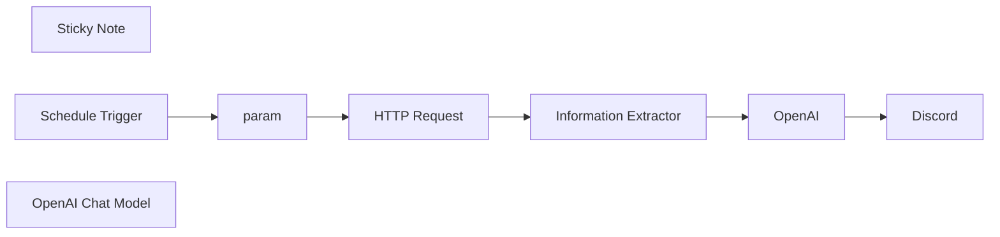

## Fluxo (.json) :

```json
{
  "nodes": [
    {
      "id": "4bf26356-9c59-4cee-8eb8-8553b23a172f",
      "name": "Sticky Note",
      "type": "n8n-nodes-base.stickyNote",
      "position": [
        560,
        -120
      ],
      "parameters": {
        "width": 660,
        "height": 460,
        "content": "\n# Daily Cartoon (w/ AI Translate)\n\n### How it works\n- Automates the retrieval of Calvin and Hobbes daily comics.\n- Extracts the comic image URL from the website.\n- Translates comic dialogues to English and Korean(Other Language)\n- Posts the comic and translations to Discord daily.\n\n### Set up steps\n- Estimated setup time: ~10-15 minutes.\n- Use a **Schedule Trigger** to automate the workflow at 9 AM daily.\n- Add nodes for parameter setup, HTTP request, data extraction, and integration with Discord.\n- Add detailed notes to each node in the workflow for easy understanding."
      },
      "typeVersion": 1
    },
    {
      "id": "52d19472-41b4-4d71-874e-064ef9d6f248",
      "name": "Schedule Trigger",
      "type": "n8n-nodes-base.scheduleTrigger",
      "position": [
        620,
        380
      ],
      "parameters": {
        "rule": {
          "interval": [
            {
              "triggerAtHour": 9
            }
          ]
        }
      },
      "typeVersion": 1.2
    },
    {
      "id": "bcc15f37-c048-4d9a-83cd-367856470095",
      "name": "OpenAI",
      "type": "@n8n/n8n-nodes-langchain.openAi",
      "position": [
        1620,
        380
      ],
      "parameters": {
        "text": "Please write the original language and Korean together. \n\nEXAMPLE)\nCalvin: \"YOU'VE NEVER HAD AN OBLIGATION, AN ASSIGNMENT, OR A DEADLINE IN ALL YOUR LIFE! YOU HAVE NO RESPONSIBILITIES AT ALL! IT MUST BE NICE!\" (너는 평생 한 번도 의무, 과제, 혹은 마감일 없었잖아! 전혀 책임이 없다니! 정말 좋겠다!)\nHobbes: \"WIPE THAT INSOLENT SMIRK OFF YOUR FACE!\" (그 뻔뻔한 미소를 그만 지어!)\n",
        "modelId": {
          "__rl": true,
          "mode": "list",
          "value": "gpt-4o-mini",
          "cachedResultName": "GPT-4O-MINI"
        },
        "options": {},
        "resource": "image",
        "imageUrls": "={{ $json.output.cartoon_image }}",
        "operation": "analyze"
      },
      "credentials": {
        "openAiApi": {
          "id": "kYIZ8ZwQHS2d4GiD",
          "name": "(datapopcorn )OpenAi account"
        }
      },
      "typeVersion": 1.6
    },
    {
      "id": "35004d43-4061-476a-9af6-7d0b82ae86bd",
      "name": "param",
      "type": "n8n-nodes-base.set",
      "position": [
        840,
        380
      ],
      "parameters": {
        "options": {},
        "assignments": {
          "assignments": [
            {
              "id": "59d36aef-2991-4fd2-9fbe-dad9a701b40f",
              "name": "year",
              "type": "string",
              "value": "={{ $now.format('yyyy') }}"
            },
            {
              "id": "b6b329f2-ba08-4516-bdb9-c5d124c02110",
              "name": "month",
              "type": "string",
              "value": "={{ $now.format('MM') }}"
            },
            {
              "id": "3cba75d1-a281-4e14-9bf7-e0bc0cc7c768",
              "name": "day",
              "type": "string",
              "value": "={{ $now.format('dd') }}"
            }
          ]
        }
      },
      "typeVersion": 3.4
    },
    {
      "id": "cf2c953f-1ff2-4abc-8abd-95e05603e64a",
      "name": "Discord",
      "type": "n8n-nodes-base.discord",
      "position": [
        1840,
        380
      ],
      "parameters": {
        "content": "=Daily Cartoon ({{ $('param').item.json.year }}/{{ $('param').item.json.month }}/{{ $('param').item.json.day }})\n{{ $('Information Extractor').item.json.output.cartoon_image }}\n\n{{ $json.content }}\n",
        "options": {},
        "authentication": "webhook"
      },
      "credentials": {
        "discordWebhookApi": {
          "id": "w82RWS7nmXLKDczt",
          "name": "n8n test webhook"
        }
      },
      "typeVersion": 2
    },
    {
      "id": "5eec9870-a509-4090-a540-76b22bb3eac9",
      "name": "OpenAI Chat Model",
      "type": "@n8n/n8n-nodes-langchain.lmChatOpenAi",
      "position": [
        1260,
        560
      ],
      "parameters": {
        "model": "gpt-4o-mini-2024-07-18",
        "options": {}
      },
      "credentials": {
        "openAiApi": {
          "id": "kYIZ8ZwQHS2d4GiD",
          "name": "(datapopcorn )OpenAi account"
        }
      },
      "typeVersion": 1
    },
    {
      "id": "352db81e-7571-47cb-b028-dec18e15ccce",
      "name": "Information Extractor",
      "type": "@n8n/n8n-nodes-langchain.informationExtractor",
      "position": [
        1260,
        380
      ],
      "parameters": {
        "text": "=Please just extract the src value in the  tag from HTML below. I don't need anything other than the value.\n\ne.g.)\nEXAMPLE INPUT)\n\n\n\nEXAMPLE OUTPUT)\nhttps://assets.amuniversal.com/5ed526b06e94013bda88005056a9545d\n\n--\n(INPUT)\n{{ $json.data }}",
        "options": {},
        "attributes": {
          "attributes": [
            {
              "name": "cartoon_image",
              "description": "EXAMPLE OUTPUT) https://assets.amuniversal.com/***"
            }
          ]
        }
      },
      "typeVersion": 1
    },
    {
      "id": "517799ed-559c-4d17-b8aa-58bd4ee92ed3",
      "name": "HTTP Request",
      "type": "n8n-nodes-base.httpRequest",
      "position": [
        1040,
        380
      ],
      "parameters": {
        "url": "=https://www.gocomics.com/calvinandhobbes/{{ $json.year }}/{{ $json.month }}/{{ $json.day }}",
        "options": {}
      },
      "typeVersion": 4.2
    }
  ],
  "pinData": {},
  "connections": {
    "param": {
      "main": [
        [
          {
            "node": "HTTP Request",
            "type": "main",
            "index": 0
          }
        ]
      ]
    },
    "OpenAI": {
      "main": [
        [
          {
            "node": "Discord",
            "type": "main",
            "index": 0
          }
        ]
      ]
    },
    "HTTP Request": {
      "main": [
        [
          {
            "node": "Information Extractor",
            "type": "main",
            "index": 0
          }
        ]
      ]
    },
    "Schedule Trigger": {
      "main": [
        [
          {
            "node": "param",
            "type": "main",
            "index": 0
          }
        ]
      ]
    },
    "OpenAI Chat Model": {
      "ai_languageModel": [
        [
          {
            "node": "Information Extractor",
            "type": "ai_languageModel",
            "index": 0
          }
        ]
      ]
    },
    "Information Extractor": {
      "main": [
        [
          {
            "node": "OpenAI",
            "type": "main",
            "index": 0
          }
        ]
      ]
    }
  }
}
```

<a id="template-85"></a>

## Template 85 - Remoção em massa de e-mails do Gmail

- **Nome:** Remoção em massa de e-mails do Gmail
- **Descrição:** Busca IDs de mensagens do Gmail com uma consulta específica e as exclui em lotes.
- **Funcionalidade:** • Gatilho manual: inicia o fluxo ao executar manualmente.
• Busca de mensagens por consulta: pesquisa todas as mensagens do Gmail usando a query "-in:chats unsubscribe -license -key -password" e retorna apenas IDs.
• Processamento em lotes: divide a lista de IDs em lotes de 100 para evitar sobrecarga e controlar o ritmo de execução.
• Exclusão de mensagens: exclui cada mensagem identificada usando seu ID, iterando pelos lotes até concluir.
- **Ferramentas:** • Gmail: serviço de e-mail utilizado para pesquisar mensagens por consulta e excluir mensagens via API.

## Fluxo visual


## Fluxo (.json) :

```json
{
  "nodes": [
    {
      "name": "On clicking 'execute'",
      "type": "n8n-nodes-base.manualTrigger",
      "position": [
        -40,
        240
      ],
      "parameters": {},
      "typeVersion": 1
    },
    {
      "name": "Gmail",
      "type": "n8n-nodes-base.gmail",
      "position": [
        150,
        240
      ],
      "parameters": {
        "resource": "message",
        "operation": "getAll",
        "returnAll": true,
        "additionalFields": {
          "q": "-in:chats unsubscribe -license -key -password",
          "format": "ids"
        }
      },
      "credentials": {
        "gmailOAuth2": "Gmail"
      },
      "typeVersion": 1
    },
    {
      "name": "Delete Old Gmail",
      "type": "n8n-nodes-base.gmail",
      "position": [
        500,
        410
      ],
      "parameters": {
        "resource": "message",
        "messageId": "={{$json[\"id\"]}}",
        "operation": "delete"
      },
      "credentials": {
        "gmailOAuth2": "Gmail"
      },
      "typeVersion": 1
    },
    {
      "name": "SplitInBatches",
      "type": "n8n-nodes-base.splitInBatches",
      "position": [
        310,
        240
      ],
      "parameters": {
        "options": {},
        "batchSize": 100
      },
      "typeVersion": 1
    }
  ],
  "connections": {
    "Gmail": {
      "main": [
        [
          {
            "node": "SplitInBatches",
            "type": "main",
            "index": 0
          }
        ]
      ]
    },
    "SplitInBatches": {
      "main": [
        [
          {
            "node": "Delete Old Gmail",
            "type": "main",
            "index": 0
          }
        ]
      ]
    },
    "Delete Old Gmail": {
      "main": [
        [
          {
            "node": "SplitInBatches",
            "type": "main",
            "index": 0
          }
        ]
      ]
    },
    "On clicking 'execute'": {
      "main": [
        [
          {
            "node": "Gmail",
            "type": "main",
            "index": 0
          }
        ]
      ]
    }
  }
}
```

<a id="template-86"></a>

## Template 86 - Notificações de respostas Lemlist

- **Nome:** Notificações de respostas Lemlist
- **Descrição:** Envia uma notificação para um canal do Mattermost quando um destinatário responde a uma campanha específica do Lemlist.
- **Funcionalidade:** • Monitoramento de respostas por campanha: Detecta quando um destinatário responde a uma campanha específica (ID cam_H5pYEryq6mRKBiy5v).
• Filtragem por evento: Aciona apenas para o evento de respostas de e-mail (emailsReplied).
• Extração de dados do contato: Captura campos como firstName, campaignName e o texto da resposta.
• Envio de mensagem ao canal: Publica uma mensagem formatada em um canal do Mattermost (ID qx9yo1i9z3bg5qcy5a1oxnh69c) com o nome, campanha e conteúdo da resposta.
• Modelo de mensagem personalizável: Utiliza placeholders para inserir dinamicamente os dados extraídos na mensagem enviada.
- **Ferramentas:** • Lemlist: Plataforma de automação de e-mails para gerenciar campanhas e detectar quando destinatários respondem.
• Mattermost: Plataforma de comunicação em equipe usada para publicar notificações em canais específicos.

## Fluxo visual

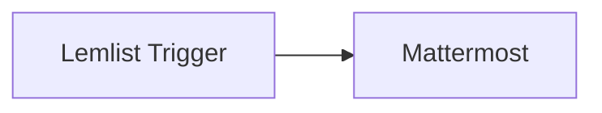

## Fluxo (.json) :

```json
{
  "nodes": [
    {
      "name": "Lemlist Trigger",
      "type": "n8n-nodes-base.lemlistTrigger",
      "position": [
        410,
        160
      ],
      "webhookId": "e1e29f99-7222-488a-826f-5af50ffe7505",
      "parameters": {
        "event": "emailsReplied",
        "options": {
          "campaignId": "cam_H5pYEryq6mRKBiy5v"
        }
      },
      "credentials": {
        "lemlistApi": "Lemlist API Credentials"
      },
      "typeVersion": 1
    },
    {
      "name": "Mattermost",
      "type": "n8n-nodes-base.mattermost",
      "position": [
        610,
        160
      ],
      "parameters": {
        "message": "={{$json[\"firstName\"]}} has replied back to your {{$json[\"campaignName\"]}}. Below is the reply:\n> {{$json[\"text\"]}}",
        "channelId": "qx9yo1i9z3bg5qcy5a1oxnh69c",
        "attachments": [],
        "otherOptions": {}
      },
      "credentials": {
        "mattermostApi": "Mattermost Credentials"
      },
      "typeVersion": 1
    }
  ],
  "connections": {
    "Lemlist Trigger": {
      "main": [
        [
          {
            "node": "Mattermost",
            "type": "main",
            "index": 0
          }
        ]
      ]
    }
  }
}
```

<a id="template-87"></a>

## Template 87 - Análise de sentimento e notificação no Mattermost

- **Nome:** Análise de sentimento e notificação no Mattermost
- **Descrição:** Recebe feedback de um formulário, analisa o sentimento do texto e envia uma notificação para um canal do Mattermost quando a pontuação de sentimento atende à condição configurada.
- **Funcionalidade:** • Recepção de respostas de formulário: inicia o processo ao receber uma submissão do formulário e captura a resposta da pergunta "What did you think about the event?".
• Análise de sentimento: envia o texto capturado para um serviço de análise de linguagem para obter a pontuação de sentimento do documento.
• Avaliação condicional: verifica a pontuação de sentimento e decide o caminho do fluxo com base na condição configurada.
• Notificação no Mattermost: quando a condição é atendida, publica uma mensagem no canal especificado contendo a pontuação e o texto do feedback.
• Tratamento de alternativa: quando a condição não é atendida, o fluxo segue sem tomar ações adicionais (NoOp).
- **Ferramentas:** • Typeform: ferramenta para coletar respostas de formulários online.
• Google Cloud Natural Language: serviço de análise de linguagem que fornece pontuação de sentimento do texto.
• Mattermost: plataforma de mensagens usada para publicar notificações e alertas em canais.

## Fluxo visual

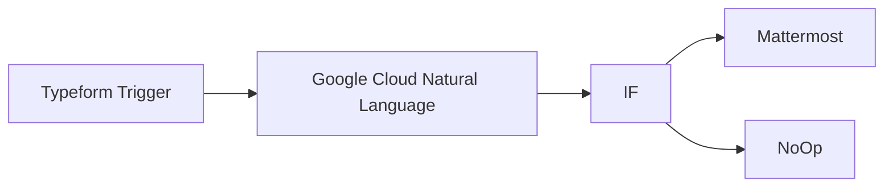

## Fluxo (.json) :

```json
{
  "id": "133",
  "name": "Analyze the sentiment of feedback and send a message on Mattermost",
  "nodes": [
    {
      "name": "Typeform Trigger",
      "type": "n8n-nodes-base.typeformTrigger",
      "position": [
        510,
        260
      ],
      "webhookId": "ad8a87ef-d293-4e48-8d36-838d69ebce0f",
      "parameters": {
        "formId": ""
      },
      "credentials": {
        "typeformApi": "typeform"
      },
      "typeVersion": 1
    },
    {
      "name": "Google Cloud Natural Language",
      "type": "n8n-nodes-base.googleCloudNaturalLanguage",
      "position": [
        710,
        260
      ],
      "parameters": {
        "content": "={{$node[\"Typeform Trigger\"].json[\"What did you think about the event?\"]}}",
        "options": {}
      },
      "credentials": {
        "googleCloudNaturalLanguageOAuth2Api": "cloud"
      },
      "typeVersion": 1
    },
    {
      "name": "IF",
      "type": "n8n-nodes-base.if",
      "position": [
        910,
        260
      ],
      "parameters": {
        "conditions": {
          "number": [
            {
              "value1": "={{$node[\"Google Cloud Natural Language\"].json[\"documentSentiment\"][\"score\"]}}"
            }
          ]
        }
      },
      "typeVersion": 1
    },
    {
      "name": "Mattermost",
      "type": "n8n-nodes-base.mattermost",
      "position": [
        1110,
        160
      ],
      "parameters": {
        "message": "=You got a new feedback with a score of {{$node[\"Google Cloud Natural Language\"].json[\"documentSentiment\"][\"score\"]}}. Here is what it says:{{$node[\"Typeform Trigger\"].json[\"What did you think about the event?\"]}}",
        "channelId": "4h1bz64cyifwxnzojkzh8hxh4a",
        "attachments": [],
        "otherOptions": {}
      },
      "credentials": {
        "mattermostApi": "mattermost"
      },
      "typeVersion": 1
    },
    {
      "name": "NoOp",
      "type": "n8n-nodes-base.noOp",
      "position": [
        1110,
        360
      ],
      "parameters": {},
      "typeVersion": 1
    }
  ],
  "active": false,
  "settings": {},
  "connections": {
    "IF": {
      "main": [
        [
          {
            "node": "Mattermost",
            "type": "main",
            "index": 0
          }
        ],
        [
          {
            "node": "NoOp",
            "type": "main",
            "index": 0
          }
        ]
      ]
    },
    "Typeform Trigger": {
      "main": [
        [
          {
            "node": "Google Cloud Natural Language",
            "type": "main",
            "index": 0
          }
        ]
      ]
    },
    "Google Cloud Natural Language": {
      "main": [
        [
          {
            "node": "IF",
            "type": "main",
            "index": 0
          }
        ]
      ]
    }
  }
}
```

<a id="template-88"></a>

## Template 88 - Notificação de feedbacks negativos

- **Nome:** Notificação de feedbacks negativos
- **Descrição:** Recebe respostas do Typeform, analisa o sentimento do texto e envia um alerta para um canal do Mattermost quando o sentimento é negativo.
- **Funcionalidade:** • Trigger de respostas do Typeform: inicia o fluxo quando uma resposta ao formulário especificado é recebida.
• Análise de sentimento: utiliza um serviço de processamento de linguagem para detectar o sentimento do comentário enviado pelo participante.
• Verificação de sentimento negativo: avalia se o resultado da análise indica sentimento NEGATIVE.
• Notificação de alerta: quando identificado sentimento negativo, envia uma mensagem ao canal do Mattermost contendo a pontuação de sentimento negativo e o texto do feedback.
• Ignorar respostas não negativas: quando o sentimento não é NEGATIVE, o fluxo não realiza nenhuma ação adicional.
- **Ferramentas:** • Typeform: plataforma de formulários para coletar respostas e feedbacks dos participantes.
• AWS Comprehend: serviço de processamento de linguagem natural que detecta o sentimento e retorna pontuações.
• Mattermost: plataforma de comunicação onde são enviadas as notificações de feedback negativo.


## Fluxo visual

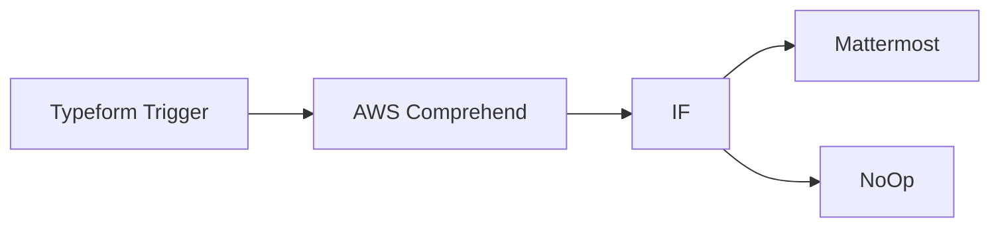

## Fluxo (.json) :

```json
{
  "nodes": [
    {
      "name": "Mattermost",
      "type": "n8n-nodes-base.mattermost",
      "position": [
        810,
        300
      ],
      "parameters": {
        "message": "=You got new feedback with a score of {{$json[\"SentimentScore\"][\"Negative\"]}}. Here is what it says:{{$node[\"Typeform Trigger\"].json[\"What did you think about the event?\"]}}",
        "channelId": "h7cxrd1cefr13x689enzyw7xhc",
        "attachments": [],
        "otherOptions": {}
      },
      "credentials": {
        "mattermostApi": "Mattermost Credentials"
      },
      "typeVersion": 1
    },
    {
      "name": "NoOp",
      "type": "n8n-nodes-base.noOp",
      "position": [
        800,
        500
      ],
      "parameters": {},
      "typeVersion": 1
    },
    {
      "name": "IF",
      "type": "n8n-nodes-base.if",
      "position": [
        600,
        400
      ],
      "parameters": {
        "conditions": {
          "number": [],
          "string": [
            {
              "value1": "={{$json[\"Sentiment\"]}}",
              "value2": "NEGATIVE"
            }
          ]
        }
      },
      "typeVersion": 1
    },
    {
      "name": "AWS Comprehend",
      "type": "n8n-nodes-base.awsComprehend",
      "position": [
        400,
        400
      ],
      "parameters": {
        "text": "={{$json[\"What did you think about the event?\"]}}",
        "operation": "detectSentiment"
      },
      "credentials": {
        "aws": "AWS Comprehend Credentials"
      },
      "typeVersion": 1
    },
    {
      "name": "Typeform Trigger",
      "type": "n8n-nodes-base.typeformTrigger",
      "position": [
        200,
        400
      ],
      "webhookId": "ad8a87ef-d293-4e48-8d36-838d69ebce0f",
      "parameters": {
        "formId": "DuJHEGW5"
      },
      "credentials": {
        "typeformApi": "typeform"
      },
      "typeVersion": 1
    }
  ],
  "connections": {
    "IF": {
      "main": [
        [
          {
            "node": "Mattermost",
            "type": "main",
            "index": 0
          }
        ],
        [
          {
            "node": "NoOp",
            "type": "main",
            "index": 0
          }
        ]
      ]
    },
    "AWS Comprehend": {
      "main": [
        [
          {
            "node": "IF",
            "type": "main",
            "index": 0
          }
        ]
      ]
    },
    "Typeform Trigger": {
      "main": [
        [
          {
            "node": "AWS Comprehend",
            "type": "main",
            "index": 0
          }
        ]
      ]
    }
  }
}
```

<a id="template-89"></a>

## Template 89 - Converter Parquet/Avro/ORC/Feather para JSON via ParquetReader

- **Nome:** Converter Parquet/Avro/ORC/Feather para JSON via ParquetReader
- **Descrição:** Recebe um arquivo columnar (Parquet, Avro, ORC ou Feather), encaminha para a API ParquetReader e retorna os dados e metadados em JSON.
- **Funcionalidade:** • Recepção de arquivo via HTTP: aceita upload multipart/form-data usando o campo 'file'.
• Suporte a formatos columnar: processa arquivos Parquet, Avro, ORC e Feather.
• Encaminhamento para API de conversão: envia o arquivo para o endpoint de conversão (https://api.parquetreader.com/parquet) como multipart/form-data.
• Processamento da resposta da API: converte campos JSON fornecidos como strings (por exemplo 'data' e 'meta_data') em objetos/arrays JSON reais.
• Retorno ao solicitante: devolve os dados parseados, esquema e metadados no retorno HTTP.
- **Ferramentas:** • ParquetReader API: serviço REST que lê arquivos Parquet, Avro, ORC e Feather e retorna dados, esquema e metadados em formato JSON.
• Clientes HTTP (curl, Postman): ferramentas para enviar o arquivo ao endpoint via multipart/form-data e testar o fluxo.


## Fluxo visual

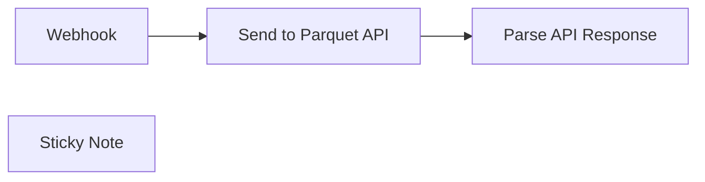

## Fluxo (.json) :

```json
{
  "id": "VU0kmvnWzctSFm2M",
  "meta": {
    "instanceId": "534a4ec070e550167af0cc407c76e029ac0ae69bef901c2f9ef440d79bfa5792"
  },
  "name": "Convert Parquet, Avro, ORC & Feather via ParquetReader to JSON",
  "tags": [
    {
      "id": "1PTaY70kFjD8F12p",
      "name": "Convert",
      "createdAt": "2025-03-30T09:38:16.466Z",
      "updatedAt": "2025-03-30T09:38:16.466Z"
    },
    {
      "id": "98v0QSKrvfH5dl34",
      "name": "Avro",
      "createdAt": "2025-03-30T09:38:06.656Z",
      "updatedAt": "2025-03-30T09:38:06.656Z"
    },
    {
      "id": "Q0sqo52DKATPDab2",
      "name": "ORC",
      "createdAt": "2025-03-30T09:38:09.923Z",
      "updatedAt": "2025-03-30T09:38:09.923Z"
    },
    {
      "id": "b1s8WFj3TfMpoOQu",
      "name": "Feather",
      "createdAt": "2025-03-30T09:38:12.227Z",
      "updatedAt": "2025-03-30T09:38:12.227Z"
    },
    {
      "id": "fFnESRcynarFqlLf",
      "name": "Parquet",
      "createdAt": "2025-03-30T09:38:04.286Z",
      "updatedAt": "2025-03-30T09:38:04.286Z"
    }
  ],
  "nodes": [
    {
      "id": "651a10dc-1c91-4957-bcdd-3e55d7328f04",
      "name": "Send to Parquet API",
      "type": "n8n-nodes-base.httpRequest",
      "position": [
        1100,
        440
      ],
      "parameters": {
        "url": "https://api.parquetreader.com/parquet?source=n8n",
        "options": {
          "bodyContentType": "multipart-form-data"
        },
        "requestMethod": "POST",
        "jsonParameters": true,
        "sendBinaryData": true,
        "binaryPropertyName": "=file0"
      },
      "typeVersion": 1
    },
    {
      "id": "42a7e623-ca11-4d38-94bb-cfb48d021a5c",
      "name": "Webhook",
      "type": "n8n-nodes-base.webhook",
      "notes": "Example trigger flow:\n\ncurl -X POST http://localhost:5678/webhook-test/convert \\\n  -F \"file=@converted.parquet\"",
      "position": [
        900,
        440
      ],
      "webhookId": "0b1223c9-c117-45f9-9931-909f2db28955",
      "parameters": {
        "path": "convert",
        "options": {
          "binaryPropertyName": "file"
        },
        "httpMethod": "POST",
        "responseData": "allEntries",
        "responseMode": "lastNode"
      },
      "notesInFlow": false,
      "typeVersion": 2
    },
    {
      "id": "9b87f027-7ef2-40a7-88d7-a0ae9ef73375",
      "name": "Sticky Note",
      "type": "n8n-nodes-base.stickyNote",
      "position": [
        0,
        0
      ],
      "parameters": {
        "width": 840,
        "height": 580,
        "content": "### ✅ **How to Use This Flow**\n\n#### 📥 Trigger via File Upload\n\nYou can trigger this flow by sending a `POST` request with a file using **curl**, **Postman**, or **from another n8n flow**.\n\n#### 🔧 Example (via `curl`):\n```bash\ncurl -X POST http://localhost:5678/webhook-test/convert \\\n-F \"file=@converted.parquet\"\n```\n> Replace `converted.parquet` with your local file path. You can also send Avro, ORC or Feather files.\n\n#### 🔁 Reuse from Other Flows\nYou can **reuse this flow** by calling the webhook from another n8n workflow using an **HTTP Request** node.  \nMake sure to send the file as **form-data** with the field name `file`.\n\n#### 🔍 What This Flow Does:\n- Receives the uploaded file via webhook (`file`)\n- Sends it to `https://api.parquetreader.com/parquet` as `multipart/form-data` (field name: `file`)\n- Receives parsed data, schema, and metadata\n"
      },
      "typeVersion": 1
    },
    {
      "id": "06d3e569-8724-48f2-951f-a1af5e0f9362",
      "name": "Parse API Response",
      "type": "n8n-nodes-base.code",
      "position": [
        1280,
        440
      ],
      "parameters": {
        "jsCode": "const item = items[0];\n\n// Convert `data` (stringified JSON array) → actual array\nif (typeof item.json.data === 'string') {\n  item.json.data = JSON.parse(item.json.data);\n}\n\n// Convert `meta_data` (stringified JSON object) → actual object\nif (typeof item.json.meta_data === 'string') {\n  item.json.meta_data = JSON.parse(item.json.meta_data);\n}\n\nreturn [item];\n"
      },
      "typeVersion": 2
    }
  ],
  "active": true,
  "pinData": {},
  "settings": {
    "executionOrder": "v1"
  },
  "versionId": "c10e1897-094e-42c6-bde9-1724972ada3e",
  "connections": {
    "Webhook": {
      "main": [
        [
          {
            "node": "Send to Parquet API",
            "type": "main",
            "index": 0
          }
        ]
      ]
    },
    "Send to Parquet API": {
      "main": [
        [
          {
            "node": "Parse API Response",
            "type": "main",
            "index": 0
          }
        ]
      ]
    }
  }
}
```

<a id="template-90"></a>

## Template 90 - Criar item no Monday a partir de novo contato

- **Nome:** Criar item no Monday a partir de novo contato
- **Descrição:** Ao receber um novo contato no Mautic, o fluxo cria automaticamente um item em um board do Monday.com, populando o nome e o e-mail do contato.
- **Funcionalidade:** • Detecção de novo contato: Recebe o evento de criação de lead do sistema de marketing quando um contato é criado.
• Extração de campos do contato: Obtém nome, sobrenome e e-mail do payload do contato.
• Criação de item no board: Gera um novo item em um board específico, dentro de um grupo definido.
• População de colunas: Preenche a coluna de e-mail do item com o endereço de e-mail do contato (valor e texto).
• Extensibilidade de campos: Permite adicionar mais colunas/valores para compartilhar outros campos do contato com o board.
- **Ferramentas:** • Mautic: Plataforma de automação de marketing que fornece eventos e dados dos contatos.
• Monday.com: Plataforma de gestão em quadros (boards) onde os itens são criados e organizados.

## Fluxo visual

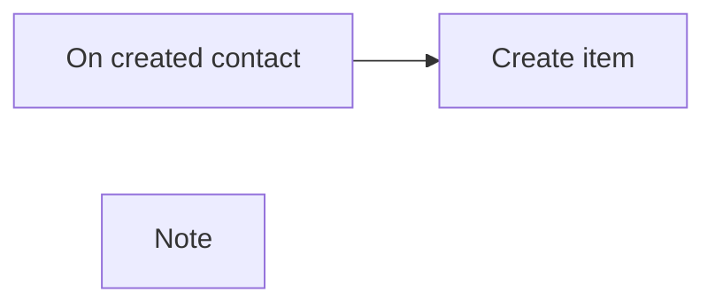

## Fluxo (.json) :

```json
{
  "meta": {
    "instanceId": "237600ca44303ce91fa31ee72babcdc8493f55ee2c0e8aa2b78b3b4ce6f70bd9"
  },
  "nodes": [
    {
      "id": "4da16859-d29b-4eb7-90a4-3904c1bfff68",
      "name": "Create item",
      "type": "n8n-nodes-base.mondayCom",
      "position": [
        620,
        240
      ],
      "parameters": {
        "name": "={{$node[\"On created contact\"].json[\"mautic.lead_post_save_new\"][0][\"contact\"][\"fields\"][\"core\"][\"firstname\"][\"value\"]}} {{$node[\"On created contact\"].json[\"mautic.lead_post_save_new\"][0][\"contact\"][\"fields\"][\"core\"][\"lastname\"][\"value\"]}}",
        "boardId": "3461879764",
        "groupId": "topics",
        "resource": "boardItem",
        "additionalFields": {
          "columnValues": "={\n  \"email\": {\n    \"email\": \"{{$node[\"On created contact\"].json[\"mautic.lead_post_save_new\"][0][\"contact\"][\"fields\"][\"core\"][\"email\"][\"value\"]}}\",\n    \"text\" : \"{{$node[\"On created contact\"].json[\"mautic.lead_post_save_new\"][0][\"contact\"][\"fields\"][\"core\"][\"email\"][\"value\"]}}\"\n  }\n}"
        }
      },
      "credentials": {
        "mondayComApi": {
          "id": "26",
          "name": "[UPDATE ME]"
        }
      },
      "typeVersion": 1
    },
    {
      "id": "88655428-439e-4324-8d8f-865625650c7a",
      "name": "On created contact",
      "type": "n8n-nodes-base.mauticTrigger",
      "position": [
        400,
        240
      ],
      "webhookId": "8c80d932-4c37-4ebe-92ad-e456249db2c5",
      "parameters": {
        "events": [
          "mautic.lead_post_save_new"
        ]
      },
      "credentials": {
        "mauticApi": {
          "id": "34",
          "name": "[UPDATE ME]"
        }
      },
      "typeVersion": 1
    },
    {
      "id": "bff916e6-2ddc-456b-a8fa-c8841f47abed",
      "name": "Note",
      "type": "n8n-nodes-base.stickyNote",
      "position": [
        620,
        400
      ],
      "parameters": {
        "width": 301,
        "height": 309,
        "content": "## How to add more fields to Monday\nBy default, this `Create item` node only adds the name of the item and the email to Monday (provided that there is an email field already created).\n\nIdeally, you would like to share more fields than just the name and email. Refer to the [community discussion here](https://community.n8n.io/t/change-multiple-column-values-with-monday/4262) for more information on how to set up more column values in the `Create item` Monday node."
      },
      "typeVersion": 1
    }
  ],
  "connections": {
    "On created contact": {
      "main": [
        [
          {
            "node": "Create item",
            "type": "main",
            "index": 0
          }
        ]
      ]
    }
  }
}
```

<a id="template-91"></a>

## Template 91 - Exportar tabela SQL para XLSX

- **Nome:** Exportar tabela SQL para XLSX
- **Descrição:** Exporta os dados de uma tabela MySQL para um arquivo XLSX (planilha), gerando um arquivo binário que pode ser enviado por e-mail, armazenado ou baixado.
- **Funcionalidade:** • Disparo manual: Inicia o fluxo mediante execução manual pelo usuário.
• Definição da tabela: Define o nome da tabela SQL a ser exportada (ex.: concerts2).
• Leitura de dados MySQL: Executa uma consulta SELECT para carregar todos os registros da tabela especificada.
• Geração de arquivo XLSX: Converte os dados carregados em um arquivo XLSX, definindo nome do arquivo e nome da planilha com base no nome da tabela.
• Preparado para integração: Arquivo gerado pode ser enviado por e-mail, armazenado em um serviço de arquivos ou disponibilizado para download.
- **Ferramentas:** • MySQL: Base de dados relacional onde reside a tabela a ser exportada.
• Serviço de armazenamento ou e-mail (opcional): Destino para enviar ou armazenar o arquivo XLSX gerado (por exemplo, serviço de arquivos, compartilhamento ou provedor de e-mail).


## Fluxo visual

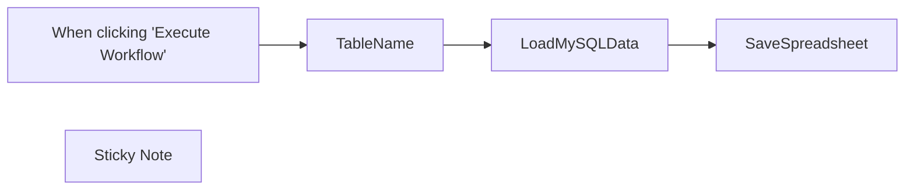

## Fluxo (.json) :

```json
{
  "meta": {
    "instanceId": "dfdeafd1c3ed2ee08eeab8c2fa0c3f522066931ed8138ccd35dc20a1e69decd3"
  },
  "nodes": [
    {
      "id": "f60e3d5f-4da5-4201-8c78-00f4f410b397",
      "name": "When clicking \"Execute Workflow\"",
      "type": "n8n-nodes-base.manualTrigger",
      "position": [
        600,
        300
      ],
      "parameters": {},
      "typeVersion": 1
    },
    {
      "id": "724f285b-723e-4452-81a6-c066c6b6a0e4",
      "name": "TableName",
      "type": "n8n-nodes-base.set",
      "position": [
        780,
        300
      ],
      "parameters": {
        "values": {
          "string": [
            {
              "name": "TableName",
              "value": "concerts2"
            }
          ]
        },
        "options": {}
      },
      "typeVersion": 1
    },
    {
      "id": "637356f0-fcde-4555-982c-a28159ce6885",
      "name": "LoadMySQLData",
      "type": "n8n-nodes-base.mySql",
      "position": [
        960,
        300
      ],
      "parameters": {
        "query": "=SELECT * FROM {{ $json[\"TableName\"] }}",
        "operation": "executeQuery"
      },
      "credentials": {
        "mySql": {
          "id": "46",
          "name": "MySQL n8n articles"
        }
      },
      "typeVersion": 1
    },
    {
      "id": "b3270629-35de-4746-aa51-293e7d20660d",
      "name": "SaveSpreadsheet",
      "type": "n8n-nodes-base.spreadsheetFile",
      "position": [
        1160,
        300
      ],
      "parameters": {
        "options": {
          "fileName": "={{ $node[\"TableName\"].json[\"TableName\"] }}.{{ $parameter[\"fileFormat\"] }}",
          "headerRow": true,
          "sheetName": "={{ $node[\"TableName\"].json[\"TableName\"] }}"
        },
        "operation": "toFile",
        "fileFormat": "xlsx"
      },
      "typeVersion": 1
    },
    {
      "id": "a7d04632-f47a-40e5-986e-1acf0b0af7c7",
      "name": "Sticky Note",
      "type": "n8n-nodes-base.stickyNote",
      "position": [
        1100,
        157
      ],
      "parameters": {
        "width": 450,
        "height": 305,
        "content": "## Save SQL table as a binary XLSX file\n### You can send it via e-mail, upload to the file storage or download on your computer.\n### Just connect one or two extra n8n Nodes here!"
      },
      "typeVersion": 1
    }
  ],
  "connections": {
    "TableName": {
      "main": [
        [
          {
            "node": "LoadMySQLData",
            "type": "main",
            "index": 0
          }
        ]
      ]
    },
    "LoadMySQLData": {
      "main": [
        [
          {
            "node": "SaveSpreadsheet",
            "type": "main",
            "index": 0
          }
        ]
      ]
    },
    "When clicking \"Execute Workflow\"": {
      "main": [
        [
          {
            "node": "TableName",
            "type": "main",
            "index": 0
          }
        ]
      ]
    }
  }
}
```

<a id="template-92"></a>

## Template 92 - Atualizar status Slack e controlar luzes por evento do calendário

- **Nome:** Atualizar status Slack e controlar luzes por evento do calendário
- **Descrição:** Atualiza o status do usuário no Slack com informações do evento do Google Calendar e aciona webhooks para controlar luzes (Philips Hue) conforme a categoria/cor do evento.
- **Funcionalidade:** • Detecção de início de evento no Google Calendar: inicia a automação quando um evento começa no calendário específico.
• Recuperação de detalhes do evento: obtém informações do evento (resumo e colorId) para uso nas ações seguintes.
• Mapeamento de cor para etiqueta personalizada: converte colorId em um identificador calColor legível (ex.: 4dw_leading, 4dw_managing, 4dw_doing, etc.).
• Atualização do status do Slack: define status_text com o resumo do evento e status_emoji baseado no calColor.
• Controle de luzes via webhooks: direciona chamadas HTTP para três webhooks diferentes para ajustar as luzes (ocupado, pessoal, disponível) conforme o calColor.
- **Ferramentas:** • Google Calendar: fonte e gatilho dos eventos, fornece detalhes do evento (resumo, colorId).
• Slack: plataforma onde o status do usuário é atualizado (texto e emoji).
• Philips Hue / serviços de iluminação via webhooks HTTP: endpoints que recebem chamadas para alterar o estado das luzes conforme o evento.

## Fluxo visual

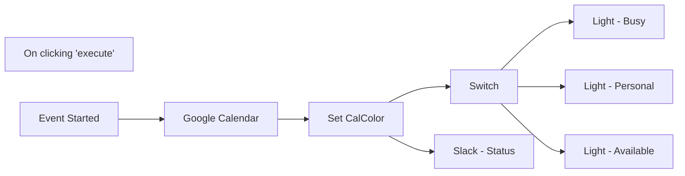

## Fluxo (.json) :

```json
{
  "id": 118,
  "name": "Google Calendar to Slack Status & Philips Hue",
  "nodes": [
    {
      "name": "On clicking 'execute'",
      "type": "n8n-nodes-base.manualTrigger",
      "disabled": true,
      "position": [
        420,
        420
      ],
      "parameters": {},
      "typeVersion": 1
    },
    {
      "name": "Google Calendar",
      "type": "n8n-nodes-base.googleCalendar",
      "position": [
        720,
        600
      ],
      "parameters": {
        "eventId": "={{$node[\"Event Started\"].json[\"id\"].split(\"_\")[0]}}",
        "options": {},
        "calendar": "youremail@domain.com",
        "operation": "get"
      },
      "credentials": {
        "googleCalendarOAuth2Api": {
          "id": "15",
          "name": "GoogleCalendar - Personal"
        }
      },
      "typeVersion": 1
    },
    {
      "name": "Light - Busy",
      "type": "n8n-nodes-base.httpRequest",
      "position": [
        1220,
        180
      ],
      "parameters": {
        "url": "WEBHOOK1",
        "options": {},
        "requestMethod": "POST"
      },
      "typeVersion": 1
    },
    {
      "name": "Light - Available",
      "type": "n8n-nodes-base.httpRequest",
      "position": [
        1220,
        600
      ],
      "parameters": {
        "url": "WEBHOOK3",
        "options": {},
        "requestMethod": "POST"
      },
      "typeVersion": 1
    },
    {
      "name": "Switch",
      "type": "n8n-nodes-base.switch",
      "position": [
        1040,
        460
      ],
      "parameters": {
        "rules": {
          "rules": [
            {
              "value2": "4dw_doing",
              "operation": "startsWith"
            },
            {
              "value2": "4dw_managing",
              "operation": "startsWith"
            },
            {
              "value2": "4dw_leading",
              "operation": "startsWith"
            },
            {
              "output": 1,
              "value2": "4dw_living",
              "operation": "startsWith"
            }
          ]
        },
        "value1": "={{$json[\"calColor\"]}}",
        "dataType": "string",
        "fallbackOutput": 3
      },
      "typeVersion": 1
    },
    {
      "name": "Light - Personal",
      "type": "n8n-nodes-base.httpRequest",
      "position": [
        1220,
        340
      ],
      "parameters": {
        "url": "WEBHOOK2",
        "options": {},
        "requestMethod": "POST"
      },
      "typeVersion": 1
    },
    {
      "name": "Event Started",
      "type": "n8n-nodes-base.googleCalendarTrigger",
      "position": [
        540,
        600
      ],
      "parameters": {
        "options": {},
        "pollTimes": {
          "item": [
            {
              "mode": "everyX",
              "unit": "minutes",
              "value": 5
            }
          ]
        },
        "triggerOn": "eventStarted",
        "calendarId": "youremail@domain.com"
      },
      "credentials": {
        "googleCalendarOAuth2Api": {
          "id": "15",
          "name": "GoogleCalendar - Personal"
        }
      },
      "typeVersion": 1
    },
    {
      "name": "Slack - Status",
      "type": "n8n-nodes-base.slack",
      "position": [
        1040,
        720
      ],
      "parameters": {
        "resource": "userProfile",
        "operation": "update",
        "additionalFields": {
          "status_text": "={{$json[\"summary\"]}}",
          "status_emoji": "=:{{$json[\"calColor\"]}}:"
        }
      },
      "credentials": {
        "slackApi": {
          "id": "17",
          "name": "CompanySlack"
        }
      },
      "typeVersion": 1
    },
    {
      "name": "Set CalColor",
      "type": "n8n-nodes-base.function",
      "position": [
        880,
        600
      ],
      "parameters": {
        "functionCode": "for (item of items) {\n\n  switch (item.json.colorId) {\n    case '1':\n      calColor = 'Lavendar';\n      break;\n    case '2':\n      calColor = '4dw_leading';\n      break;\n    case '3':\n      calColor = 'Grape';\n      break;\n    case '4':\n      calColor = 'Flamingo';\n      break;\n    case '5':\n      calColor = '4dw_managing';\n      break;\n    case '6':\n      calColor = 'Tangerine';\n      break;\n    case '7':\n      calColor = '4dw_living';\n      break;\n    case '8':\n      calColor = 'Graphite';\n      break;\n    case '9':\n      calColor = 'Blueberry';\n      break;\n    case '10':\n      calColor = 'Basil';\n      break;\n    case '11':\n      calColor = '4dw_doing';\n      break;\n    default:\n      calColor = 'undefined';\n  }\n  item.json.calColor = calColor;\n}\n\nreturn items;"
      },
      "typeVersion": 1
    }
  ],
  "active": false,
  "settings": {},
  "connections": {
    "Switch": {
      "main": [
        [
          {
            "node": "Light - Busy",
            "type": "main",
            "index": 0
          }
        ],
        [
          {
            "node": "Light - Personal",
            "type": "main",
            "index": 0
          }
        ],
        [],
        [
          {
            "node": "Light - Available",
            "type": "main",
            "index": 0
          }
        ]
      ]
    },
    "Set CalColor": {
      "main": [
        [
          {
            "node": "Slack - Status",
            "type": "main",
            "index": 0
          },
          {
            "node": "Switch",
            "type": "main",
            "index": 0
          }
        ]
      ]
    },
    "Event Started": {
      "main": [
        [
          {
            "node": "Google Calendar",
            "type": "main",
            "index": 0
          }
        ]
      ]
    },
    "Google Calendar": {
      "main": [
        [
          {
            "node": "Set CalColor",
            "type": "main",
            "index": 0
          }
        ]
      ]
    },
    "On clicking 'execute'": {
      "main": [
        []
      ]
    }
  }
}
```

<a id="template-93"></a>

## Template 93 - Sincronização estudantes → Mautic

- **Nome:** Sincronização estudantes → Mautic
- **Descrição:** Recebe eventos via webhook com dados de estudantes e sincroniza contatos no Mautic, criando, atualizando, adicionando tags de venda e gerenciando estado de subscrição.
- **Funcionalidade:** • Receber eventos via webhook: Captura payloads contendo objeto "student" e o tipo de evento.
• Roteamento por tipo de evento: Diferencia eventos de usuário (User.*) e de venda (Sale.*) para ações distintas.
• Localizar contato por email: Pesquisa no sistema de CRM o contato correspondente ao email recebido.
• Tratamento quando não encontrado: Marca explicitamente quando o usuário não é encontrado (valor -1) para decidir criar um novo contato.
• Criação de contato: Cria um novo contato no CRM quando não existe um registro correspondente.
• Atualização de contato: Atualiza nome, sobrenome e email do contato existente quando aplicável.
• Separação do nome completo: Divide o campo de nome em primeiro nome e sobrenome automaticamente.
• Gerenciamento de tags por venda: Ao detectar um evento de venda, aplica uma tag com o nome do curso ao contato vinculado à compra.
• Gerenciamento de subscrição: Adiciona a tag de unsubscribe quando o usuário opta por sair e remove essa tag quando o usuário volta a subscrever.
- **Ferramentas:** • Plataforma emissora de webhooks: Sistema que envia eventos de usuário e vendas contendo os dados do estudante.
• Mautic: Plataforma de automação de marketing usada para criar, atualizar contatos, adicionar/remover tags e gerenciar subscrições via API.

## Fluxo visual

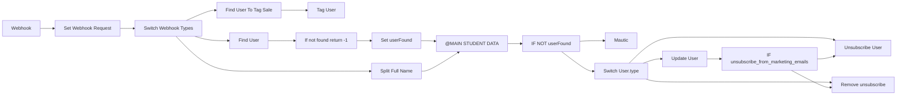

## Fluxo (.json) :

```json
{
  "nodes": [
    {
      "name": "Webhook",
      "type": "n8n-nodes-base.webhook",
      "position": [
        -550,
        450
      ],
      "parameters": {
        "path": "PuHq2RQsmc3HXB/hook",
        "options": {
          "rawBody": false
        },
        "httpMethod": "POST"
      },
      "typeVersion": 1
    },
    {
      "name": "Mautic",
      "type": "n8n-nodes-base.mautic",
      "position": [
        1260,
        180
      ],
      "parameters": {
        "email": "={{$node[\"@MAIN STUDENT DATA\"].json[\"student\"][\"email\"]}}",
        "company": 1,
        "options": {},
        "lastName": "={{$node[\"@MAIN STUDENT DATA\"].json[\"student\"][\"lastName\"]}}",
        "firstName": "={{$node[\"@MAIN STUDENT DATA\"].json[\"student\"][\"firstName\"]}}",
        "authentication": "oAuth2",
        "additionalFields": {}
      },
      "credentials": {
        "mauticOAuth2Api": "OAuth2 Mautic"
      },
      "typeVersion": 1,
      "alwaysOutputData": false
    },
    {
      "name": "Find User",
      "type": "n8n-nodes-base.mautic",
      "position": [
        170,
        260
      ],
      "parameters": {
        "limit": 1,
        "options": {
          "search": "={{$node[\"Set Webhook Request\"].json[\"student\"][\"email\"]}}"
        },
        "operation": "getAll",
        "authentication": "oAuth2"
      },
      "credentials": {
        "mauticOAuth2Api": "OAuth2 Mautic"
      },
      "notesInFlow": false,
      "typeVersion": 1,
      "alwaysOutputData": false
    },
    {
      "name": "Update User",
      "type": "n8n-nodes-base.mautic",
      "position": [
        1560,
        250
      ],
      "parameters": {
        "options": {},
        "contactId": "={{$node[\"@MAIN STUDENT DATA\"].json[\"userFound\"]}}",
        "operation": "update",
        "updateFields": {
          "email": "={{$node[\"@MAIN STUDENT DATA\"].json[\"student\"][\"email\"]}}",
          "lastName": "={{$node[\"@MAIN STUDENT DATA\"].json[\"student\"][\"lastName\"]}}",
          "firstName": "={{$node[\"@MAIN STUDENT DATA\"].json[\"student\"][\"firstName\"]}}"
        },
        "authentication": "oAuth2"
      },
      "credentials": {
        "mauticOAuth2Api": "OAuth2 Mautic"
      },
      "typeVersion": 1
    },
    {
      "name": "Tag User",
      "type": "n8n-nodes-base.mautic",
      "position": [
        430,
        670
      ],
      "parameters": {
        "options": {},
        "contactId": "={{$node[\"Find User To Tag Sale\"].json[\"id\"]}}",
        "operation": "update",
        "updateFields": {
          "tags": "={{$node[\"Set Webhook Request\"].json[\"student\"][\"course\"][\"name\"]}}"
        },
        "authentication": "oAuth2"
      },
      "credentials": {
        "mauticOAuth2Api": "OAuth2 Mautic"
      },
      "typeVersion": 1
    },
    {
      "name": "Unsubscribe User",
      "type": "n8n-nodes-base.mautic",
      "position": [
        2170,
        410
      ],
      "parameters": {
        "options": {},
        "contactId": "={{$node[\"@MAIN STUDENT DATA\"].json[\"userFound\"]}}",
        "operation": "update",
        "updateFields": {
          "tags": "=#unsubscribe"
        },
        "authentication": "oAuth2"
      },
      "credentials": {
        "mauticOAuth2Api": "OAuth2 Mautic"
      },
      "typeVersion": 1
    },
    {
      "name": "Split Full Name",
      "type": "n8n-nodes-base.function",
      "position": [
        340,
        420
      ],
      "parameters": {
        "functionCode": "const student = items[0].json.student\nstudent.firstName = student.name ? student.name.split(' ').slice(0, -1).join(' ') : ''\nstudent.lastName= student.name ? student.name.split(' ').slice(-1).join(' ') : ''\nitems[0].json.student = student\nreturn items;"
      },
      "typeVersion": 1
    },
    {
      "name": "If not found return -1",
      "type": "n8n-nodes-base.function",
      "position": [
        450,
        260
      ],
      "parameters": {
        "functionCode": "items[0].json.id = items[0].json.id || -1\nreturn items"
      },
      "typeVersion": 1
    },
    {
      "name": "@MAIN STUDENT DATA",
      "type": "n8n-nodes-base.merge",
      "position": [
        900,
        400
      ],
      "parameters": {
        "join": "inner",
        "mode": "mergeByIndex"
      },
      "typeVersion": 1
    },
    {
      "name": "Remove unsubscribe",
      "type": "n8n-nodes-base.mautic",
      "position": [
        1770,
        500
      ],
      "parameters": {
        "options": {},
        "contactId": "={{$node[\"@MAIN STUDENT DATA\"].json[\"userFound\"]}}",
        "operation": "update",
        "updateFields": {
          "tags": "=-#unsubscribe"
        },
        "authentication": "oAuth2"
      },
      "credentials": {
        "mauticOAuth2Api": "OAuth2 Mautic"
      },
      "typeVersion": 1
    },
    {
      "name": "Find User To Tag Sale",
      "type": "n8n-nodes-base.mautic",
      "position": [
        190,
        670
      ],
      "parameters": {
        "limit": 1,
        "options": {
          "search": "={{$node[\"Set Webhook Request\"].json[\"student\"][\"user\"][\"email\"]}}"
        },
        "operation": "getAll",
        "authentication": "oAuth2"
      },
      "credentials": {
        "mauticOAuth2Api": "OAuth2 Mautic"
      },
      "notesInFlow": false,
      "typeVersion": 1,
      "alwaysOutputData": false
    },
    {
      "name": "Set userFound",
      "type": "n8n-nodes-base.set",
      "position": [
        700,
        260
      ],
      "parameters": {
        "values": {
          "string": [
            {
              "name": "userFound",
              "value": "={{$node[\"If not found return -1\"].json[\"id\"]}}"
            }
          ]
        },
        "options": {},
        "keepOnlySet": true
      },
      "typeVersion": 1
    },
    {
      "name": "Switch Webhook Types",
      "type": "n8n-nodes-base.switch",
      "position": [
        -70,
        450
      ],
      "parameters": {
        "rules": {
          "rules": [
            {
              "value2": "User.",
              "operation": "contains"
            },
            {
              "output": 1,
              "value2": "Sale.",
              "operation": "contains"
            }
          ]
        },
        "value1": "={{$node[\"Set Webhook Request\"].json[\"type\"]}}",
        "dataType": "string"
      },
      "typeVersion": 1
    },
    {
      "name": "Set Webhook Request",
      "type": "n8n-nodes-base.set",
      "position": [
        -310,
        450
      ],
      "parameters": {
        "values": {
          "string": [
            {
              "name": "student",
              "value": "={{$node[\"Webhook\"].json[\"body\"][\"object\"]}}"
            },
            {
              "name": "type",
              "value": "={{$node[\"Webhook\"].json[\"body\"][\"type\"]}}"
            }
          ]
        },
        "options": {},
        "keepOnlySet": true
      },
      "typeVersion": 1
    },
    {
      "name": "IF NOT userFound",
      "type": "n8n-nodes-base.if",
      "position": [
        1090,
        400
      ],
      "parameters": {
        "conditions": {
          "string": [
            {
              "value1": "={{$node[\"@MAIN STUDENT DATA\"].json[\"userFound\"]}}",
              "value2": "-1",
              "operation": "regex"
            }
          ]
        }
      },
      "typeVersion": 1
    },
    {
      "name": "Switch User.type",
      "type": "n8n-nodes-base.switch",
      "position": [
        1380,
        420
      ],
      "parameters": {
        "rules": {
          "rules": [
            {
              "value2": "User.updated"
            },
            {
              "output": 1,
              "value2": "User.unsubscribe_from_marketing_emails"
            },
            {
              "output": 2,
              "value2": "=User.subscribe_to_marketing_emails"
            }
          ]
        },
        "value1": "={{$node[\"@MAIN STUDENT DATA\"].json[\"type\"]}}",
        "dataType": "string"
      },
      "typeVersion": 1
    },
    {
      "name": "IF unsubscribe_from_marketing_emails",
      "type": "n8n-nodes-base.if",
      "position": [
        1770,
        250
      ],
      "parameters": {
        "conditions": {
          "string": [],
          "boolean": [
            {
              "value1": "={{$node[\"@MAIN STUDENT DATA\"].json[\"student\"][\"unsubscribe_from_marketing_emails\"]}}",
              "value2": true
            }
          ]
        }
      },
      "typeVersion": 1
    }
  ],
  "connections": {
    "Webhook": {
      "main": [
        [
          {
            "node": "Set Webhook Request",
            "type": "main",
            "index": 0
          }
        ]
      ]
    },
    "Find User": {
      "main": [
        [
          {
            "node": "If not found return -1",
            "type": "main",
            "index": 0
          }
        ]
      ]
    },
    "Update User": {
      "main": [
        [
          {
            "node": "IF unsubscribe_from_marketing_emails",
            "type": "main",
            "index": 0
          }
        ]
      ]
    },
    "Set userFound": {
      "main": [
        [
          {
            "node": "@MAIN STUDENT DATA",
            "type": "main",
            "index": 0
          }
        ]
      ]
    },
    "Split Full Name": {
      "main": [
        [
          {
            "node": "@MAIN STUDENT DATA",
            "type": "main",
            "index": 1
          }
        ]
      ]
    },
    "IF NOT userFound": {
      "main": [
        [
          {
            "node": "Mautic",
            "type": "main",
            "index": 0
          }
        ],
        [
          {
            "node": "Switch User.type",
            "type": "main",
            "index": 0
          }
        ]
      ]
    },
    "Switch User.type": {
      "main": [
        [
          {
            "node": "Update User",
            "type": "main",
            "index": 0
          }
        ],
        [
          {
            "node": "Unsubscribe User",
            "type": "main",
            "index": 0
          }
        ],
        [
          {
            "node": "Remove unsubscribe",
            "type": "main",
            "index": 0
          }
        ]
      ]
    },
    "@MAIN STUDENT DATA": {
      "main": [
        [
          {
            "node": "IF NOT userFound",
            "type": "main",
            "index": 0
          }
        ]
      ]
    },
    "Set Webhook Request": {
      "main": [
        [
          {
            "node": "Switch Webhook Types",
            "type": "main",
            "index": 0
          }
        ]
      ]
    },
    "Switch Webhook Types": {
      "main": [
        [
          {
            "node": "Find User",
            "type": "main",
            "index": 0
          },
          {
            "node": "Split Full Name",
            "type": "main",
            "index": 0
          }
        ],
        [
          {
            "node": "Find User To Tag Sale",
            "type": "main",
            "index": 0
          }
        ]
      ]
    },
    "Find User To Tag Sale": {
      "main": [
        [
          {
            "node": "Tag User",
            "type": "main",
            "index": 0
          }
        ]
      ]
    },
    "If not found return -1": {
      "main": [
        [
          {
            "node": "Set userFound",
            "type": "main",
            "index": 0
          }
        ]
      ]
    },
    "IF unsubscribe_from_marketing_emails": {
      "main": [
        [
          {
            "node": "Unsubscribe User",
            "type": "main",
            "index": 0
          }
        ],
        [
          {
            "node": "Remove unsubscribe",
            "type": "main",
            "index": 0
          }
        ]
      ]
    }
  }
}
```

<a id="template-94"></a>

## Template 94 - Enviar mensagem privada no Zulip

- **Nome:** Enviar mensagem privada no Zulip
- **Descrição:** Este fluxo envia uma mensagem privada para um ou mais destinatários no Zulip quando é acionado manualmente.
- **Funcionalidade:** • Disparo manual: inicia o fluxo ao clicar em "executar".
• Envio de mensagem privada no Zulip: envia conteúdo para destinatários configuráveis.
• Configuração de destinatários: permite definir o(s) destinatário(s) no campo "to".
• Autenticação via API: utiliza credenciais da API do Zulip para autorizar o envio.
- **Ferramentas:** • Zulip: plataforma de chat que permite envio de mensagens privadas via API.

## Fluxo visual

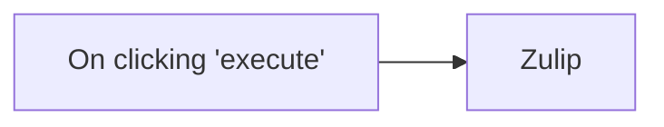

## Fluxo (.json) :

```json
{
  "id": "126",
  "name": "Send a private message on Zulip",
  "nodes": [
    {
      "name": "On clicking 'execute'",
      "type": "n8n-nodes-base.manualTrigger",
      "position": [
        250,
        300
      ],
      "parameters": {},
      "typeVersion": 1
    },
    {
      "name": "Zulip",
      "type": "n8n-nodes-base.zulip",
      "position": [
        450,
        300
      ],
      "parameters": {
        "to": []
      },
      "credentials": {
        "zulipApi": ""
      },
      "typeVersion": 1
    }
  ],
  "active": false,
  "settings": {},
  "connections": {
    "On clicking 'execute'": {
      "main": [
        [
          {
            "node": "Zulip",
            "type": "main",
            "index": 0
          }
        ]
      ]
    }
  }
}
```

<a id="template-95"></a>

## Template 95 - Sincronização de contatos Google Sheets → Mautic

- **Nome:** Sincronização de contatos Google Sheets → Mautic
- **Descrição:** Este fluxo lê regularmente uma planilha e cria ou atualiza contatos em uma plataforma de automação de marketing usando os dados lidos.
- **Funcionalidade:** • Agendamento periódico: Executa o processo a cada 5 minutos para verificar atualizações.
• Leitura de planilha: Lê um intervalo específico (Data!A:P) em uma planilha para obter os registros de contato.
• Mapeamento de campos: Extrai email, primeiro nome e telefone dos registros lidos.
• Criação/atualização de contatos: Envia os dados extraídos para criar ou atualizar contatos na plataforma de marketing.
• Transferência de dados entre etapas: Passa os campos lidos diretamente para a etapa de sincronização com a plataforma de marketing.
- **Ferramentas:** • Google Sheets: Armazena os registros de contatos em um intervalo de células acessível para leitura periódica.
• Mautic: Plataforma de automação de marketing usada para criar ou atualizar contatos e armazenar informações como email, nome e telefone.


## Fluxo visual

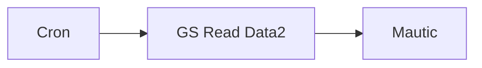

## Fluxo (.json) :

```json
{
  "nodes": [
    {
      "name": "GS Read Data2",
      "type": "n8n-nodes-base.googleSheets",
      "position": [
        240,
        750
      ],
      "parameters": {
        "range": "Data!A:P",
        "options": {
          "valueRenderMode": "FORMATTED_VALUE"
        },
        "sheetId": "1jKYwPE9DMFOYf1AeDuTvQ3GSM2GqaEJhGYNoisxSLpM"
      },
      "credentials": {
        "googleApi": "n8n API"
      },
      "typeVersion": 1
    },
    {
      "name": "Mautic",
      "type": "n8n-nodes-base.mautic",
      "position": [
        450,
        750
      ],
      "parameters": {
        "email": "={{$node[\"GS Read Data2\"].json[\"email\"]}}",
        "options": {},
        "firstName": "={{$node[\"GS Read Data2\"].json[\"firstname\"]}}",
        "additionalFields": {
          "mobile": "={{$node[\"GS Read Data2\"].json[\"mobile\"]}}"
        }
      },
      "credentials": {
        "mauticApi": "MauticAPI"
      },
      "notesInFlow": false,
      "typeVersion": 1
    },
    {
      "name": "GS Read Data2",
      "type": "n8n-nodes-base.googleSheets",
      "position": [
        240,
        750
      ],
      "parameters": {
        "range": "Data!A:P",
        "options": {
          "valueRenderMode": "FORMATTED_VALUE"
        },
        "sheetId": "1jKYwPE9DMFOYf1AeDuTvQ3GSM2GqaEJhGYNoisxSLpM"
      },
      "credentials": {
        "googleApi": "n8n API"
      },
      "typeVersion": 1
    },
    {
      "name": "Cron",
      "type": "n8n-nodes-base.cron",
      "position": [
        40,
        750
      ],
      "parameters": {
        "triggerTimes": {
          "item": [
            {
              "mode": "everyX",
              "unit": "minutes",
              "value": 5
            }
          ]
        }
      },
      "typeVersion": 1
    }
  ],
  "connections": {
    "Cron": {
      "main": [
        [
          {
            "node": "GS Read Data2",
            "type": "main",
            "index": 0
          }
        ]
      ]
    },
    "GS Read Data2": {
      "main": [
        [
          {
            "node": "Mautic",
            "type": "main",
            "index": 0
          }
        ]
      ]
    }
  }
}
```

<a id="template-96"></a>

## Template 96 - Sincronização de consentimento Shopify e Mautic

- **Nome:** Sincronização de consentimento Shopify e Mautic
- **Descrição:** Sincroniza o estado de consentimento de marketing entre clientes do Shopify e contatos do Mautic, mantendo segmentos e atualizando ambos os sistemas conforme alterações.
- **Funcionalidade:** • Detecção de atualização de cliente no Shopify: Inicia o fluxo quando há mudanças nos dados do cliente.
• Busca de contato por email no Mautic: Localiza contatos existentes para decidir ações subsequentes.
• Criação de contato no Mautic: Cria novo contato quando não existe e o cliente aceita marketing.
• Gerenciamento de segmentos no Mautic: Adiciona ou remove contatos de um segmento confirmado conforme o consentimento.
• Recebimento e validação de webhooks do Mautic: Valida a assinatura HMAC das notificações recebidas antes de processar.
• Consulta de cliente no Shopify via GraphQL: Obtém o estado de consentimento atual do cliente diretamente da API GraphQL do Shopify.
• Atualização do consentimento no Shopify via GraphQL: Envia mutações para atualizar o estado de email marketing no Shopify com base nas mudanças no Mautic.
• Configuração de subdomínio Shopify: Permite definir o subdomínio usado para chamadas à API do Shopify.
- **Ferramentas:** • Shopify: Plataforma de e‑commerce utilizada para detectar atualizações de clientes e ler/atualizar o consentimento de email via API GraphQL.
• Mautic: Plataforma de automação de marketing utilizada para armazenar contatos, gerenciar segmentos e enviar webhooks sobre mudanças de subscrição.

## Fluxo visual

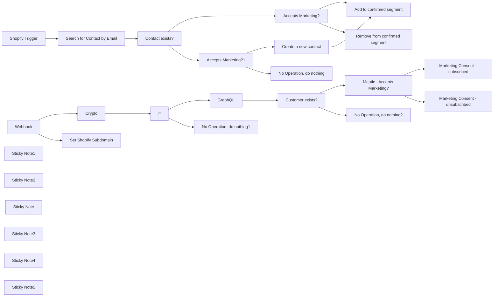

## Fluxo (.json) :

```json
{
  "id": "JiSesGjDIXIPYtbt",
  "meta": {
    "instanceId": "e2c978396c9c745cf0aaa9ed3abe4464dbcef93c5fe2df809b9e14440e628df6"
  },
  "name": "Shopify + Mautic",
  "tags": [],
  "nodes": [
    {
      "id": "592b2608-e77e-4988-8f77-8820645b56ee",
      "name": "Shopify Trigger",
      "type": "n8n-nodes-base.shopifyTrigger",
      "position": [
        540,
        320
      ],
      "webhookId": "252052f3-e844-4500-8c34-c57f583d4432",
      "parameters": {
        "topic": "customers/update",
        "authentication": "accessToken"
      },
      "credentials": {
        "shopifyAccessTokenApi": {
          "id": "WbxXaLMHozAgY3Rz",
          "name": "Shopify Access Token account"
        }
      },
      "typeVersion": 1
    },
    {
      "id": "f2e6931d-0279-4142-9b9e-1092657d91e2",
      "name": "Accepts Marketing?",
      "type": "n8n-nodes-base.if",
      "position": [
        1240,
        180
      ],
      "parameters": {
        "options": {},
        "conditions": {
          "options": {
            "leftValue": "",
            "caseSensitive": true,
            "typeValidation": "strict"
          },
          "combinator": "and",
          "conditions": [
            {
              "id": "8e207eec-212a-48a9-b64e-2d15094c987f",
              "operator": {
                "name": "filter.operator.equals",
                "type": "string",
                "operation": "equals"
              },
              "leftValue": "={{ $('Shopify Trigger').item.json.email_marketing_consent.state }}",
              "rightValue": "subscribed"
            }
          ]
        }
      },
      "typeVersion": 2
    },
    {
      "id": "2a31657b-f1b3-4e4a-8f6a-3d3ee15aa052",
      "name": "Accepts Marketing?1",
      "type": "n8n-nodes-base.if",
      "position": [
        1240,
        500
      ],
      "parameters": {
        "options": {},
        "conditions": {
          "options": {
            "leftValue": "",
            "caseSensitive": true,
            "typeValidation": "strict"
          },
          "combinator": "and",
          "conditions": [
            {
              "id": "8e207eec-212a-48a9-b64e-2d15094c987f",
              "operator": {
                "name": "filter.operator.equals",
                "type": "string",
                "operation": "equals"
              },
              "leftValue": "={{ $('Shopify Trigger').item.json.email_marketing_consent.state }}",
              "rightValue": "subscribed"
            }
          ]
        }
      },
      "typeVersion": 2
    },
    {
      "id": "266a07ca-915a-4afd-9a0a-60eb974ee263",
      "name": "No Operation, do nothing",
      "type": "n8n-nodes-base.noOp",
      "position": [
        1540,
        720
      ],
      "parameters": {},
      "typeVersion": 1
    },
    {
      "id": "b9aee974-4d75-4b1e-80b7-8aab9d4f403d",
      "name": "Add to confirmed segment",
      "type": "n8n-nodes-base.mautic",
      "position": [
        1840,
        40
      ],
      "parameters": {
        "resource": "contactSegment",
        "contactId": "={{ $json.id }}",
        "segmentId": 1,
        "authentication": "oAuth2"
      },
      "credentials": {
        "mauticOAuth2Api": {
          "id": "cBmAMa80nofah9QG",
          "name": "Mautic account"
        }
      },
      "typeVersion": 1
    },
    {
      "id": "a0fbd9e7-a60d-430b-b5df-4ec063e181c9",
      "name": "Remove from confirmed segment",
      "type": "n8n-nodes-base.mautic",
      "position": [
        1840,
        300
      ],
      "parameters": {
        "resource": "contactSegment",
        "contactId": "={{ $json.id }}",
        "operation": "remove",
        "segmentId": 1,
        "authentication": "oAuth2"
      },
      "credentials": {
        "mauticOAuth2Api": {
          "id": "cBmAMa80nofah9QG",
          "name": "Mautic account"
        }
      },
      "typeVersion": 1
    },
    {
      "id": "0bc8fc06-3bf5-4c49-acc2-1ed499a07ea1",
      "name": "Webhook",
      "type": "n8n-nodes-base.webhook",
      "position": [
        540,
        1500
      ],
      "webhookId": "6485fca6-c641-4067-b19a-192709b88e45",
      "parameters": {
        "path": "6485fca6-c641-4067-b19a-192709b88e45",
        "options": {
          "rawBody": true
        },
        "httpMethod": "POST"
      },
      "typeVersion": 1.1
    },
    {
      "id": "001eff12-6f14-4fb2-afdd-e6b7956437bf",
      "name": "Crypto",
      "type": "n8n-nodes-base.crypto",
      "position": [
        760,
        1500
      ],
      "parameters": {
        "type": "SHA256",
        "action": "hmac",
        "secret": "a031f434181d2bce0a81694c11fafb5887c78a48c50da98d62b7ab7c6d57080c",
        "encoding": "base64",
        "binaryData": true
      },
      "typeVersion": 1
    },
    {
      "id": "6cde7c3c-e1f9-4584-908c-9b4a82e4f2a4",
      "name": "If",
      "type": "n8n-nodes-base.if",
      "position": [
        980,
        1500
      ],
      "parameters": {
        "options": {},
        "conditions": {
          "options": {
            "leftValue": "",
            "caseSensitive": true,
            "typeValidation": "strict"
          },
          "combinator": "and",
          "conditions": [
            {
              "id": "eb322a60-a1e6-46ed-b7b9-539373f9d881",
              "operator": {
                "name": "filter.operator.equals",
                "type": "string",
                "operation": "equals"
              },
              "leftValue": "={{ $('Webhook').item.json.headers['webhook-signature'] }}",
              "rightValue": "={{ $json.data }}"
            }
          ]
        }
      },
      "typeVersion": 2
    },
    {
      "id": "e848a1d3-2f9b-4d27-8862-b3284654f818",
      "name": "No Operation, do nothing1",
      "type": "n8n-nodes-base.noOp",
      "position": [
        1260,
        1700
      ],
      "parameters": {},
      "typeVersion": 1
    },
    {
      "id": "ff27ee31-c13d-4a52-a260-aef9df8c64a6",
      "name": "GraphQL",
      "type": "n8n-nodes-base.graphql",
      "position": [
        1260,
        1480
      ],
      "parameters": {
        "query": "=query {\n  customers(first: 1, query: \"email:'{{ $json[\"body\"][\"mautic.lead_channel_subscription_changed\"][0][\"contact\"][\"fields\"][\"core\"][\"email\"][\"value\"] }}'\") {\n    edges {\n      node {\n        id\n        state\n      }\n    }\n  }\n}\n",
        "endpoint": "=https://{{ $('Set Shopify Subdomain').params[\"fields\"][\"values\"][0][\"stringValue\"] }}.myshopify.com/admin/api/2024-01/graphql.json",
        "authentication": "headerAuth"
      },
      "credentials": {
        "httpHeaderAuth": {
          "id": "Z98cM8akgh1jPtG7",
          "name": "Header Auth  Shopify"
        }
      },
      "typeVersion": 1
    },
    {
      "id": "168b255b-f796-426c-80fd-c2fe79ef973f",
      "name": "Marketing Consent - subscribed",
      "type": "n8n-nodes-base.graphql",
      "position": [
        2120,
        1160
      ],
      "parameters": {
        "query": "mutation customerEmailMarketingConsentUpdate($input: CustomerEmailMarketingConsentUpdateInput!) {\n  customerEmailMarketingConsentUpdate(input: $input) {\n    customer {\n      id\n    }\n    userErrors {\n      field\n      message\n    }\n  }\n}\n",
        "endpoint": "=https://{{ $('Set Shopify Subdomain').params[\"fields\"][\"values\"][0][\"stringValue\"] }}.myshopify.com/admin/api/2024-01/graphql.json",
        "variables": "={\n  \"input\": {\n    \"customerId\": \"{{ $json[\"data\"][\"customers\"][\"edges\"][0][\"node\"][\"id\"] }}\",\n    \"emailMarketingConsent\": {\n      \"consentUpdatedAt\": \"{{ $now }}\",\n      \"marketingOptInLevel\": \"CONFIRMED_OPT_IN\",\n      \"marketingState\": \"SUBSCRIBED\"\n    }\n  }\n}\n",
        "requestFormat": "json",
        "authentication": "headerAuth"
      },
      "credentials": {
        "httpHeaderAuth": {
          "id": "Z98cM8akgh1jPtG7",
          "name": "Header Auth  Shopify"
        }
      },
      "typeVersion": 1
    },
    {
      "id": "f7db8ec3-27d4-41f7-a0c9-6249bf6e805a",
      "name": "Marketing Consent - unsubscribed",
      "type": "n8n-nodes-base.graphql",
      "position": [
        2120,
        1500
      ],
      "parameters": {
        "query": "mutation customerEmailMarketingConsentUpdate($input: CustomerEmailMarketingConsentUpdateInput!) {\n  customerEmailMarketingConsentUpdate(input: $input) {\n    customer {\n      id\n    }\n    userErrors {\n      field\n      message\n    }\n  }\n}\n",
        "endpoint": "=https://{{ $('Set Shopify Subdomain').params[\"fields\"][\"values\"][0][\"stringValue\"] }}.myshopify.com/admin/api/2024-01/graphql.json",
        "variables": "={\n  \"input\": {\n    \"customerId\": \"{{ $json[\"data\"][\"customers\"][\"edges\"][0][\"node\"][\"id\"] }}\",\n    \"emailMarketingConsent\": {\n      \"consentUpdatedAt\": \"{{ $now }}\",\n      \"marketingOptInLevel\": \"CONFIRMED_OPT_IN\",\n      \"marketingState\": \"UNSUBSCRIBED\"\n    }\n  }\n}\n",
        "requestFormat": "json",
        "authentication": "headerAuth"
      },
      "credentials": {
        "httpHeaderAuth": {
          "id": "Z98cM8akgh1jPtG7",
          "name": "Header Auth  Shopify"
        }
      },
      "typeVersion": 1
    },
    {
      "id": "ff62697d-29d0-4b7e-b695-cd90535e5fa8",
      "name": "Mautic - Accepts Marketing?",
      "type": "n8n-nodes-base.if",
      "position": [
        1820,
        1180
      ],
      "parameters": {
        "options": {},
        "conditions": {
          "options": {
            "leftValue": "",
            "caseSensitive": true,
            "typeValidation": "strict"
          },
          "combinator": "and",
          "conditions": [
            {
              "id": "960e386c-4198-4b04-88a6-715162729064",
              "operator": {
                "name": "filter.operator.equals",
                "type": "string",
                "operation": "equals"
              },
              "leftValue": "={{ $('Webhook').item.json.body['mautic.lead_channel_subscription_changed'][0].new_status }}",
              "rightValue": "contactable"
            }
          ]
        }
      },
      "typeVersion": 2
    },
    {
      "id": "8515256f-c49b-4000-9a1e-be9958720dd6",
      "name": "Customer exists?",
      "type": "n8n-nodes-base.if",
      "position": [
        1540,
        1480
      ],
      "parameters": {
        "options": {
          "looseTypeValidation": false
        },
        "conditions": {
          "options": {
            "leftValue": "",
            "caseSensitive": true,
            "typeValidation": "strict"
          },
          "combinator": "and",
          "conditions": [
            {
              "id": "4d2f02ab-f5e3-437d-8a35-f301888a8597",
              "operator": {
                "type": "array",
                "operation": "notEmpty",
                "singleValue": true
              },
              "leftValue": "={{ $json.data.customers.edges }}",
              "rightValue": 0
            }
          ]
        }
      },
      "typeVersion": 2
    },
    {
      "id": "616ae364-82a0-456a-abaf-b8855ca56f8f",
      "name": "No Operation, do nothing2",
      "type": "n8n-nodes-base.noOp",
      "position": [
        1820,
        1640
      ],
      "parameters": {},
      "typeVersion": 1
    },
    {
      "id": "afdeb330-06d0-4fdf-9f42-1d8ce74d483d",
      "name": "Sticky Note1",
      "type": "n8n-nodes-base.stickyNote",
      "position": [
        540,
        1680
      ],
      "parameters": {
        "width": 580.807881773399,
        "content": "## Webhook Validation\nWe use the same key shared with Mautic to hash the incoming request. If the computed hash is identical to the one delivered the request is valid and can be processed"
      },
      "typeVersion": 1
    },
    {
      "id": "38633539-cc9a-4bde-92f7-39e697bd803f",
      "name": "Sticky Note2",
      "type": "n8n-nodes-base.stickyNote",
      "position": [
        2040,
        40
      ],
      "parameters": {
        "width": 279.1188177339898,
        "height": 383.7477832512317,
        "content": "## Mautic Segments\nThe n8n Shopify node cannot Please make sure to select your segment on both nodes"
      },
      "typeVersion": 1
    },
    {
      "id": "4107ce14-58bc-4171-87bb-5fc74a506e38",
      "name": "Sticky Note",
      "type": "n8n-nodes-base.stickyNote",
      "position": [
        1080,
        1300
      ],
      "parameters": {
        "width": 279.1188177339898,
        "content": "## Shopify \nThe n8n Shopify node cannot get customer marketing consent, so we get this from the Shopify GraphQL API"
      },
      "typeVersion": 1
    },
    {
      "id": "33f97be7-a4bf-42ee-96ae-dbbe54f5248f",
      "name": "Sticky Note3",
      "type": "n8n-nodes-base.stickyNote",
      "position": [
        580,
        1140
      ],
      "parameters": {
        "width": 279.1188177339898,
        "content": "## Set your Shopify Subdomain here"
      },
      "typeVersion": 1
    },
    {
      "id": "7f203946-a365-44a3-8de0-1fe0b1964eab",
      "name": "Set Shopify Subdomain",
      "type": "n8n-nodes-base.set",
      "position": [
        760,
        1320
      ],
      "parameters": {
        "fields": {
          "values": [
            {
              "name": "Shopify Subdomain",
              "stringValue": "n8n-mautic-demo"
            }
          ]
        },
        "options": {}
      },
      "typeVersion": 3.2
    },
    {
      "id": "544a4da2-11a4-465b-a30e-02ed618a77a6",
      "name": "Search for Contact by Email",
      "type": "n8n-nodes-base.mautic",
      "position": [
        760,
        320
      ],
      "parameters": {
        "limit": 1,
        "options": {
          "search": "={{ $json.email }}"
        },
        "operation": "getAll",
        "authentication": "oAuth2"
      },
      "credentials": {
        "mauticOAuth2Api": {
          "id": "cBmAMa80nofah9QG",
          "name": "Mautic account"
        }
      },
      "typeVersion": 1,
      "alwaysOutputData": true
    },
    {
      "id": "1332db6d-99ab-4d38-89b8-7f7ba25d4cf1",
      "name": "Contact exists?",
      "type": "n8n-nodes-base.if",
      "position": [
        980,
        320
      ],
      "parameters": {
        "options": {},
        "conditions": {
          "options": {
            "leftValue": "",
            "caseSensitive": true,
            "typeValidation": "strict"
          },
          "combinator": "and",
          "conditions": [
            {
              "id": "5872c5d4-655f-4cd6-9b21-622acdcb0814",
              "operator": {
                "type": "number",
                "operation": "exists",
                "singleValue": true
              },
              "leftValue": "={{ $json.id }}",
              "rightValue": ""
            }
          ]
        }
      },
      "typeVersion": 2
    },
    {
      "id": "488494df-6e8c-4f8c-b7ed-5d6d67f083c8",
      "name": "Create a new contact",
      "type": "n8n-nodes-base.mautic",
      "position": [
        1540,
        480
      ],
      "parameters": {
        "email": "={{ $('Shopify Trigger').item.json.email }}",
        "company": "=",
        "options": {},
        "lastName": "={{ $('Shopify Trigger').item.json.last_name }}",
        "firstName": "={{ $('Shopify Trigger').item.json.first_name }}",
        "authentication": "oAuth2",
        "additionalFields": {}
      },
      "credentials": {
        "mauticOAuth2Api": {
          "id": "cBmAMa80nofah9QG",
          "name": "Mautic account"
        }
      },
      "typeVersion": 1
    },
    {
      "id": "586c736b-cd46-4c5c-ac2f-c4380cf465bb",
      "name": "Sticky Note4",
      "type": "n8n-nodes-base.stickyNote",
      "position": [
        0,
        1420
      ],
      "parameters": {
        "color": 4,
        "width": 360.408084305475,
        "height": 315.5897364788551,
        "content": "## Mautic to Shopify\n\nThis part uses GraphQL calls to the Shopify Admin API. In order to get a better understanding for the queries and mutations please check the API Docs.\n\nExamples from the Shopify Docs used in this workflow:\n\n[Get the first ten customers with an enabled customer account](https://shopify.dev/docs/api/admin-graphql/2024-01/queries/customers#examples-Get_the_first_ten_customers_with_an_enabled_customer_account)\n\n\n[Mutation to update the Email Marketing consent](https://shopify.dev/docs/api/admin-graphql/2024-01/mutations/customerEmailMarketingConsentUpdate)"
      },
      "typeVersion": 1
    },
    {
      "id": "47e8a011-b2ba-4839-ac85-24dd45e18020",
      "name": "Sticky Note5",
      "type": "n8n-nodes-base.stickyNote",
      "position": [
        20,
        220
      ],
      "parameters": {
        "color": 4,
        "width": 360.408084305475,
        "height": 315.5897364788551,
        "content": "## Shopify to Mautic\n\nThis part uses the Shopify Trigger to watch for changes on customer data.\n\nTo use the Mautic nodes please make sure you have the API enabled in your Mautic Instance."
      },
      "typeVersion": 1
    }
  ],
  "active": true,
  "pinData": {},
  "settings": {
    "executionOrder": "v1"
  },
  "versionId": "71208adf-ebfb-4961-b23b-fb46c86ca09f",
  "connections": {
    "If": {
      "main": [
        [
          {
            "node": "GraphQL",
            "type": "main",
            "index": 0
          }
        ],
        [
          {
            "node": "No Operation, do nothing1",
            "type": "main",
            "index": 0
          }
        ]
      ]
    },
    "Crypto": {
      "main": [
        [
          {
            "node": "If",
            "type": "main",
            "index": 0
          }
        ]
      ]
    },
    "GraphQL": {
      "main": [
        [
          {
            "node": "Customer exists?",
            "type": "main",
            "index": 0
          }
        ]
      ]
    },
    "Webhook": {
      "main": [
        [
          {
            "node": "Crypto",
            "type": "main",
            "index": 0
          },
          {
            "node": "Set Shopify Subdomain",
            "type": "main",
            "index": 0
          }
        ]
      ]
    },
    "Contact exists?": {
      "main": [
        [
          {
            "node": "Accepts Marketing?",
            "type": "main",
            "index": 0
          }
        ],
        [
          {
            "node": "Accepts Marketing?1",
            "type": "main",
            "index": 0
          }
        ]
      ]
    },
    "Shopify Trigger": {
      "main": [
        [
          {
            "node": "Search for Contact by Email",
            "type": "main",
            "index": 0
          }
        ]
      ]
    },
    "Customer exists?": {
      "main": [
        [
          {
            "node": "Mautic - Accepts Marketing?",
            "type": "main",
            "index": 0
          }
        ],
        [
          {
            "node": "No Operation, do nothing2",
            "type": "main",
            "index": 0
          }
        ]
      ]
    },
    "Accepts Marketing?": {
      "main": [
        [
          {
            "node": "Add to confirmed segment",
            "type": "main",
            "index": 0
          }
        ],
        [
          {
            "node": "Remove from confirmed segment",
            "type": "main",
            "index": 0
          }
        ]
      ]
    },
    "Accepts Marketing?1": {
      "main": [
        [
          {
            "node": "Create a new contact",
            "type": "main",
            "index": 0
          }
        ],
        [
          {
            "node": "No Operation, do nothing",
            "type": "main",
            "index": 0
          }
        ]
      ]
    },
    "Create a new contact": {
      "main": [
        [
          {
            "node": "Add to confirmed segment",
            "type": "main",
            "index": 0
          }
        ]
      ]
    },
    "Mautic - Accepts Marketing?": {
      "main": [
        [
          {
            "node": "Marketing Consent - subscribed",
            "type": "main",
            "index": 0
          }
        ],
        [
          {
            "node": "Marketing Consent - unsubscribed",
            "type": "main",
            "index": 0
          }
        ]
      ]
    },
    "Search for Contact by Email": {
      "main": [
        [
          {
            "node": "Contact exists?",
            "type": "main",
            "index": 0
          }
        ]
      ]
    }
  }
}
```

<a id="template-97"></a>

## Template 97 - Assistente WhatsApp multimodal com IA

- **Nome:** Assistente WhatsApp multimodal com IA
- **Descrição:** Recebe mensagens do WhatsApp, processa texto, áudio, vídeo e imagens com modelos multimodais e ferramentas de conhecimento, e responde ao usuário via WhatsApp.
- **Funcionalidade:** • Recepção de mensagens via webhook: Inicia o fluxo ao receber mensagens do WhatsApp.
• Separação de mensagens: Divide o payload em mensagens individuais para processamento paralelo.
• Detecção de tipo de mensagem: Identifica se a mensagem é áudio, vídeo, imagem ou texto e direciona para o ramo adequado.
• Obtenção e download de mídia: Recupera URLs de mídia (audio/video/imagem) e faz o download do conteúdo binário.
• Transcrição de áudio: Envia áudios para um modelo multimodal para transcrição automática.
• Descrição de vídeo: Envia vídeos para um modelo multimodal que descreve o conteúdo do vídeo.
• Análise e OCR de imagem: Processa imagens para descrever a cena e extrair texto visível.
• Resumo de texto: Resume mensagens de texto para facilitar compreensão pelo agente.
• Agente de IA com contexto: Monta um prompt com tipo, texto/descrição e legendas, usa memória de sessão e ferramenta de consulta para gerar respostas concisas e factuais.
• Envio de resposta ao usuário: Retorna a resposta gerada diretamente para o remetente via WhatsApp.
- **Ferramentas:** • WhatsApp (API / Meta): Plataforma de envio e recebimento de mensagens e fornecimento de URLs de mídia.
• Google Gemini (PaLM) — modelos multimodais: Processamento multimodal para transcrição de áudio, descrição de vídeo e análise de imagens.
• Wikipedia (ferramenta de consulta): Fonte de conhecimento usada pelo agente para complementar respostas factuais.


## Fluxo visual

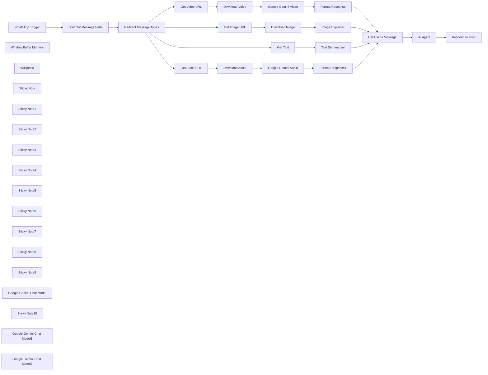

## Fluxo (.json) :

```json
{
  "meta": {
    "instanceId": "408f9fb9940c3cb18ffdef0e0150fe342d6e655c3a9fac21f0f644e8bedabcd9"
  },
  "nodes": [
    {
      "id": "38ffe41a-ecdf-4bb4-bd55-51998abab0f5",
      "name": "WhatsApp Trigger",
      "type": "n8n-nodes-base.whatsAppTrigger",
      "position": [
        220,
        300
      ],
      "webhookId": "0b1b3a9b-2f6a-4f5a-8385-6365d96f4802",
      "parameters": {
        "updates": [
          "messages"
        ]
      },
      "credentials": {
        "whatsAppTriggerApi": {
          "id": "H3uYNtpeczKMqtYm",
          "name": "WhatsApp OAuth account"
        }
      },
      "typeVersion": 1
    },
    {
      "id": "a35ac268-eff0-46cd-ac4e-c9b047a3f893",
      "name": "Get Audio URL",
      "type": "n8n-nodes-base.whatsApp",
      "position": [
        1020,
        -160
      ],
      "parameters": {
        "resource": "media",
        "operation": "mediaUrlGet",
        "mediaGetId": "={{ $json.audio.id }}",
        "requestOptions": {}
      },
      "credentials": {
        "whatsAppApi": {
          "id": "9SFJPeqrpChOkAmw",
          "name": "WhatsApp account"
        }
      },
      "typeVersion": 1
    },
    {
      "id": "a3be543c-949c-4443-bf82-e0d00419ae23",
      "name": "Get Video URL",
      "type": "n8n-nodes-base.whatsApp",
      "position": [
        1020,
        200
      ],
      "parameters": {
        "resource": "media",
        "operation": "mediaUrlGet",
        "mediaGetId": "={{ $json.video.id }}",
        "requestOptions": {}
      },
      "credentials": {
        "whatsAppApi": {
          "id": "9SFJPeqrpChOkAmw",
          "name": "WhatsApp account"
        }
      },
      "typeVersion": 1
    },
    {
      "id": "dd3cd0e7-0d1e-40cf-8120-aba0d1646d6d",
      "name": "Get Image URL",
      "type": "n8n-nodes-base.whatsApp",
      "position": [
        1020,
        540
      ],
      "parameters": {
        "resource": "media",
        "operation": "mediaUrlGet",
        "mediaGetId": "={{ $json.image.id }}",
        "requestOptions": {}
      },
      "credentials": {
        "whatsAppApi": {
          "id": "9SFJPeqrpChOkAmw",
          "name": "WhatsApp account"
        }
      },
      "typeVersion": 1
    },
    {
      "id": "a3505c93-2719-4a11-8813-39844fe0dd1a",
      "name": "Download Video",
      "type": "n8n-nodes-base.httpRequest",
      "position": [
        1180,
        200
      ],
      "parameters": {
        "url": "={{ $json.url }}",
        "options": {},
        "authentication": "predefinedCredentialType",
        "nodeCredentialType": "whatsAppApi"
      },
      "credentials": {
        "whatsAppApi": {
          "id": "9SFJPeqrpChOkAmw",
          "name": "WhatsApp account"
        }
      },
      "typeVersion": 4.2
    },
    {
      "id": "b22e3a7d-5fa1-4b8d-be08-b59f5bb5c417",
      "name": "Download Audio",
      "type": "n8n-nodes-base.httpRequest",
      "position": [
        1180,
        -160
      ],
      "parameters": {
        "url": "={{ $json.url }}",
        "options": {},
        "authentication": "predefinedCredentialType",
        "nodeCredentialType": "whatsAppApi"
      },
      "credentials": {
        "whatsAppApi": {
          "id": "9SFJPeqrpChOkAmw",
          "name": "WhatsApp account"
        }
      },
      "typeVersion": 4.2
    },
    {
      "id": "dcadbd30-598e-443b-a3a7-10d7f9210f49",
      "name": "Download Image",
      "type": "n8n-nodes-base.httpRequest",
      "position": [
        1180,
        540
      ],
      "parameters": {
        "url": "={{ $json.url }}",
        "options": {},
        "authentication": "predefinedCredentialType",
        "nodeCredentialType": "whatsAppApi"
      },
      "credentials": {
        "whatsAppApi": {
          "id": "9SFJPeqrpChOkAmw",
          "name": "WhatsApp account"
        }
      },
      "typeVersion": 4.2
    },
    {
      "id": "d38b6f73-272e-4833-85fc-46ce0db91f6a",
      "name": "Window Buffer Memory",
      "type": "@n8n/n8n-nodes-langchain.memoryBufferWindow",
      "position": [
        2380,
        560
      ],
      "parameters": {
        "sessionKey": "=whatsapp-tutorial-{{ $json.from }}",
        "sessionIdType": "customKey"
      },
      "typeVersion": 1.2
    },
    {
      "id": "3459f96b-c0de-4514-9d53-53a9b40d534e",
      "name": "Get User's Message",
      "type": "n8n-nodes-base.set",
      "position": [
        2080,
        380
      ],
      "parameters": {
        "options": {},
        "assignments": {
          "assignments": [
            {
              "id": "d990cbd6-a408-4ec4-a889-41be698918d9",
              "name": "message_type",
              "type": "string",
              "value": "={{ $('Split Out Message Parts').item.json.type }}"
            },
            {
              "id": "23b785c3-f38e-4706-80b7-51f333bba3bd",
              "name": "message_text",
              "type": "string",
              "value": "={{ $json.text }}"
            },
            {
              "id": "6e83f9a7-cf75-4182-b2d2-3151e8af76b9",
              "name": "from",
              "type": "string",
              "value": "={{ $('WhatsApp Trigger').item.json.messages[0].from }}"
            },
            {
              "id": "da4b602a-28ca-4b0d-a747-c3d3698c3731",
              "name": "message_caption",
              "type": "string",
              "value": "={{ $('Redirect Message Types').item.json.video && $('Redirect Message Types').item.json.video.caption || '' }}\n{{ $('Redirect Message Types').item.json.image && $('Redirect Message Types').item.json.image.caption || ''}}\n{{ $('Redirect Message Types').item.json.audio && $('Redirect Message Types').item.json.audio.caption || ''}}"
            }
          ]
        }
      },
      "typeVersion": 3.4
    },
    {
      "id": "7a4c9905-37f0-4cfe-a928-91c7e38914b9",
      "name": "Split Out Message Parts",
      "type": "n8n-nodes-base.splitOut",
      "position": [
        460,
        300
      ],
      "parameters": {
        "options": {},
        "fieldToSplitOut": "messages"
      },
      "typeVersion": 1
    },
    {
      "id": "f2ecc9a9-bdd9-475d-be0c-43594d0cb613",
      "name": "Wikipedia",
      "type": "@n8n/n8n-nodes-langchain.toolWikipedia",
      "position": [
        2500,
        560
      ],
      "parameters": {},
      "typeVersion": 1
    },
    {
      "id": "325dac6d-6698-41e0-8d2f-9ac5d84c245e",
      "name": "Redirect Message Types",
      "type": "n8n-nodes-base.switch",
      "position": [
        740,
        380
      ],
      "parameters": {
        "rules": {
          "values": [
            {
              "outputKey": "Audio Message",
              "conditions": {
                "options": {
                  "version": 2,
                  "leftValue": "",
                  "caseSensitive": true,
                  "typeValidation": "strict"
                },
                "combinator": "and",
                "conditions": [
                  {
                    "operator": {
                      "type": "boolean",
                      "operation": "true",
                      "singleValue": true
                    },
                    "leftValue": "={{ $json.type == 'audio' && Boolean($json.audio) }}",
                    "rightValue": "audio"
                  }
                ]
              },
              "renameOutput": true
            },
            {
              "outputKey": "Video Message",
              "conditions": {
                "options": {
                  "version": 2,
                  "leftValue": "",
                  "caseSensitive": true,
                  "typeValidation": "strict"
                },
                "combinator": "and",
                "conditions": [
                  {
                    "id": "82aa5ff4-c9b6-4187-a27e-c7c5d9bfdda0",
                    "operator": {
                      "type": "boolean",
                      "operation": "true",
                      "singleValue": true
                    },
                    "leftValue": "={{ $json.type == 'video' && Boolean($json.video) }}",
                    "rightValue": ""
                  }
                ]
              },
              "renameOutput": true
            },
            {
              "outputKey": "Image Message",
              "conditions": {
                "options": {
                  "version": 2,
                  "leftValue": "",
                  "caseSensitive": true,
                  "typeValidation": "strict"
                },
                "combinator": "and",
                "conditions": [
                  {
                    "id": "05b30af4-967b-4824-abdc-84a8292ac0e5",
                    "operator": {
                      "type": "boolean",
                      "operation": "true",
                      "singleValue": true
                    },
                    "leftValue": "={{ $json.type == 'image' && Boolean($json.image) }}",
                    "rightValue": ""
                  }
                ]
              },
              "renameOutput": true
            }
          ]
        },
        "options": {
          "fallbackOutput": "extra",
          "renameFallbackOutput": "Text Message"
        }
      },
      "typeVersion": 3.2
    },
    {
      "id": "b25c7d65-b9ea-4f90-8516-1747130501b2",
      "name": "Sticky Note",
      "type": "n8n-nodes-base.stickyNote",
      "position": [
        220,
        20
      ],
      "parameters": {
        "color": 7,
        "width": 335.8011507479863,
        "height": 245.72612197928734,
        "content": "## 1. WhatsApp Trigger\n[Learn more about the WhatsApp Trigger](https://docs.n8n.io/integrations/builtin/trigger-nodes/n8n-nodes-base.whatsapptrigger)\n\nTo start receiving WhatsApp messages in your workflow, there are quite a few steps involved so be sure to follow the n8n documentation. When we recieve WhatsApp messages, we'll split out the messages part of the payload and handle them depending on the message type using the Switch node."
      },
      "typeVersion": 1
    },
    {
      "id": "0d3d721e-fefc-4b50-abe1-0dd504c962ff",
      "name": "Sticky Note1",
      "type": "n8n-nodes-base.stickyNote",
      "position": [
        1020,
        -280
      ],
      "parameters": {
        "color": 7,
        "width": 356.65822784810103,
        "height": 97.23360184119679,
        "content": "### 2. Transcribe Audio Messages 💬\nFor audio messages or voice notes, we can use GPT4o to transcribe the message for our AI Agent."
      },
      "typeVersion": 1
    },
    {
      "id": "59de051e-f0d4-4c07-9680-03923ab81f57",
      "name": "Sticky Note2",
      "type": "n8n-nodes-base.stickyNote",
      "position": [
        1020,
        40
      ],
      "parameters": {
        "color": 7,
        "width": 492.5258918296896,
        "height": 127.13555811277331,
        "content": "### 3. Describe Video Messages 🎬\nFor video messages, one approach is to use a Multimodal Model that supports parsing video. Currently, Google Gemini is a well-tested service for this task. We'll need to use the HTTP request node as currrently n8n's LLM node doesn't currently support video binary types."
      },
      "typeVersion": 1
    },
    {
      "id": "e2ca780f-01c0-4a5f-9f0a-e15575d0b803",
      "name": "Sticky Note3",
      "type": "n8n-nodes-base.stickyNote",
      "position": [
        1020,
        420
      ],
      "parameters": {
        "color": 7,
        "width": 356.65822784810103,
        "height": 97.23360184119679,
        "content": "### 4. Analyse Image Messages 🏞️\nFor image messages, we can use GPT4o to explain what is going on in the message for our AI Agent."
      },
      "typeVersion": 1
    },
    {
      "id": "6eea3c0f-4501-4355-b3b7-b752c93d5c48",
      "name": "Sticky Note4",
      "type": "n8n-nodes-base.stickyNote",
      "position": [
        1020,
        720
      ],
      "parameters": {
        "color": 7,
        "width": 428.24395857307246,
        "height": 97.23360184119679,
        "content": "### 5. Text summarizer 📘\nFor text messages, we don't need to do much transformation but it's nice to summarize for easier understanding."
      },
      "typeVersion": 1
    },
    {
      "id": "925a3871-9cdb-49f9-a2b9-890617d09965",
      "name": "Get Text",
      "type": "n8n-nodes-base.wait",
      "position": [
        1020,
        840
      ],
      "webhookId": "99b49c83-d956-46d2-b8d3-d65622121ad9",
      "parameters": {
        "amount": 0
      },
      "typeVersion": 1.1
    },
    {
      "id": "9225a6b9-322a-4a33-86af-6586fcf246b9",
      "name": "Sticky Note5",
      "type": "n8n-nodes-base.stickyNote",
      "position": [
        2280,
        60
      ],
      "parameters": {
        "color": 7,
        "width": 500.7797468354428,
        "height": 273.14522439585744,
        "content": "## 6. Generate Response with AI Agent\n[Read more about the AI Agent node](https://docs.n8n.io/integrations/builtin/cluster-nodes/root-nodes/n8n-nodes-langchain.agent)\n\nNow that we'll able to handle all message types from WhatsApp, we could do pretty much anything we want with it by giving it our AI agent. Examples could include handling customer support, helping to book appointments or verifying documents.\n\nIn this demonstration, we'll just create a simple AI Agent which responds to our WhatsApp user's message and returns a simple response."
      },
      "typeVersion": 1
    },
    {
      "id": "5a863e5d-e7fb-4e89-851b-e0936f5937e7",
      "name": "Sticky Note6",
      "type": "n8n-nodes-base.stickyNote",
      "position": [
        2740,
        660
      ],
      "parameters": {
        "color": 7,
        "width": 384.12151898734186,
        "height": 211.45776754890682,
        "content": "## 7. Respond to WhatsApp User\n[Read more about the Whatsapp node](https://docs.n8n.io/integrations/builtin/app-nodes/n8n-nodes-base.whatsapp/)\n\nTo close out this demonstration, we'll simple send a simple text message back to the user. Note that this WhatsApp node also allows you to send images, audio, videos, documents as well as location!"
      },
      "typeVersion": 1
    },
    {
      "id": "89df6f6c-2d91-4c14-a51a-4be29b1018ec",
      "name": "Respond to User",
      "type": "n8n-nodes-base.whatsApp",
      "position": [
        2740,
        480
      ],
      "parameters": {
        "textBody": "={{ $json.output }}",
        "operation": "send",
        "phoneNumberId": "477115632141067",
        "requestOptions": {},
        "additionalFields": {},
        "recipientPhoneNumber": "={{ $('WhatsApp Trigger').item.json.messages[0].from }}"
      },
      "credentials": {
        "whatsAppApi": {
          "id": "9SFJPeqrpChOkAmw",
          "name": "WhatsApp account"
        }
      },
      "typeVersion": 1
    },
    {
      "id": "67709b9e-a9b3-456b-9e68-71720b0cd75e",
      "name": "Sticky Note7",
      "type": "n8n-nodes-base.stickyNote",
      "position": [
        -340,
        -140
      ],
      "parameters": {
        "width": 470.66513233601853,
        "height": 562.8608514850005,
        "content": "## Try It Out!\n\n### This n8n template demonstrates the beginnings of building your own n8n-powered WhatsApp chatbot! Under the hood, utilise n8n's powerful AI features to handle different message types and use an AI agent to respond to the user. A powerful tool for any use-case!\n\n* Incoming WhatsApp Trigger provides a way to get messages into the workflow.\n* The message received is extracted and sent through 1 of 4 branches for processing.\n* Each processing branch uses AI to analyse, summarize or transcribe the message so that the AI agent can understand it.\n* The AI Agent is used to generate a response generally and uses a wikipedia tool for more complex queries.\n* Finally, the response message is sent back to the WhatsApp user using the WhatsApp node.\n\n### Need Help?\nJoin the [Discord](https://discord.com/invite/XPKeKXeB7d) or ask in the [Forum](https://community.n8n.io/)!"
      },
      "typeVersion": 1
    },
    {
      "id": "10ae1f60-c025-4b63-8e02-4e6353bb67dc",
      "name": "Sticky Note8",
      "type": "n8n-nodes-base.stickyNote",
      "position": [
        -340,
        440
      ],
      "parameters": {
        "color": 5,
        "width": 473.28063885246377,
        "height": 96.0144533433243,
        "content": "### Activate workflow to use!\nYou must activate the workflow to use this WhatsApp Chabot. If you are self-hosting, ensure WhatsApp is able to connect to your server."
      },
      "typeVersion": 1
    },
    {
      "id": "2f0fd658-a138-4f50-95a7-7ddc4eb90fab",
      "name": "Image Explainer",
      "type": "@n8n/n8n-nodes-langchain.chainLlm",
      "position": [
        1700,
        540
      ],
      "parameters": {
        "text": "Here is an image sent by the user. Describe the image and transcribe any text visible in the image.",
        "messages": {
          "messageValues": [
            {
              "type": "HumanMessagePromptTemplate",
              "messageType": "imageBinary"
            }
          ]
        },
        "promptType": "define"
      },
      "typeVersion": 1.4
    },
    {
      "id": "d969ce8b-d6c4-4918-985e-3420557ef707",
      "name": "Format Response",
      "type": "n8n-nodes-base.set",
      "position": [
        1860,
        200
      ],
      "parameters": {
        "options": {},
        "assignments": {
          "assignments": [
            {
              "id": "2ec0e573-373b-4692-bfae-86b6d3b9aa9a",
              "name": "text",
              "type": "string",
              "value": "={{ $json.candidates[0].content.parts[0].text }}"
            }
          ]
        }
      },
      "typeVersion": 3.4
    },
    {
      "id": "b67c9c4e-e13f-4ee4-bf01-3fd9055a91be",
      "name": "Sticky Note9",
      "type": "n8n-nodes-base.stickyNote",
      "position": [
        1540,
        180
      ],
      "parameters": {
        "width": 260,
        "height": 305.35604142692785,
        "content": "\n\n\n\n\n\n\n\n\n\n\n\n\n\n### 🚨 Google Gemini Required!\nNot using Gemini? Feel free to swap this out for any Multimodal Model that supports Video."
      },
      "typeVersion": 1
    },
    {
      "id": "8dd972be-305b-4d26-aa05-1dee17411d8a",
      "name": "Google Gemini Chat Model",
      "type": "@n8n/n8n-nodes-langchain.lmChatGoogleGemini",
      "position": [
        2240,
        560
      ],
      "parameters": {
        "options": {},
        "modelName": "models/gemini-1.5-pro-002"
      },
      "credentials": {
        "googlePalmApi": {
          "id": "dSxo6ns5wn658r8N",
          "name": "Google Gemini(PaLM) Api account"
        }
      },
      "typeVersion": 1
    },
    {
      "id": "00a883a6-7688-4e82-926b-c5ba680378b7",
      "name": "Sticky Note10",
      "type": "n8n-nodes-base.stickyNote",
      "position": [
        1540,
        -180
      ],
      "parameters": {
        "width": 260,
        "height": 294.22048331415436,
        "content": "\n\n\n\n\n\n\n\n\n\n\n\n\n\n### 🚨 Google Gemini Required!\nNot using Gemini? Feel free to swap this out for any Multimodal Model that supports Audio."
      },
      "typeVersion": 1
    },
    {
      "id": "d0c7c2f6-b626-4ec5-86ff-96523749db2c",
      "name": "Google Gemini Audio",
      "type": "n8n-nodes-base.httpRequest",
      "position": [
        1620,
        -160
      ],
      "parameters": {
        "url": "https://generativelanguage.googleapis.com/v1beta/models/gemini-1.5-pro-002:generateContent",
        "method": "POST",
        "options": {},
        "jsonBody": "={{\n{\n \"contents\": [{\n \"parts\":[\n {\"text\": \"Transcribe this audio\"},\n {\"inlineData\": {\n \"mimeType\": `audio/${$binary.data.fileExtension}`,\n \"data\": $input.item.binary.data.data }\n }\n ]\n }]\n}\n}}",
        "sendBody": true,
        "sendHeaders": true,
        "specifyBody": "json",
        "authentication": "predefinedCredentialType",
        "headerParameters": {
          "parameters": [
            {
              "name": "Content-Type",
              "value": "application/json"
            }
          ]
        },
        "nodeCredentialType": "googlePalmApi"
      },
      "credentials": {
        "googlePalmApi": {
          "id": "dSxo6ns5wn658r8N",
          "name": "Google Gemini(PaLM) Api account"
        }
      },
      "typeVersion": 4.2
    },
    {
      "id": "27261815-f949-48e8-920d-7bf880ea87ce",
      "name": "Google Gemini Video",
      "type": "n8n-nodes-base.httpRequest",
      "position": [
        1620,
        200
      ],
      "parameters": {
        "url": "https://generativelanguage.googleapis.com/v1beta/models/gemini-1.5-pro-002:generateContent",
        "method": "POST",
        "options": {},
        "jsonBody": "={{\n{\n \"contents\": [{\n \"parts\":[\n {\"text\": \"Describe this video\"},\n {\"inlineData\": {\n \"mimeType\": `video/${$binary.data.fileExtension}`,\n \"data\": $input.item.binary.data.data }\n }\n ]\n }]\n}\n}}",
        "sendBody": true,
        "sendHeaders": true,
        "specifyBody": "json",
        "authentication": "predefinedCredentialType",
        "headerParameters": {
          "parameters": [
            {
              "name": "Content-Type",
              "value": "application/json"
            }
          ]
        },
        "nodeCredentialType": "googlePalmApi"
      },
      "credentials": {
        "googlePalmApi": {
          "id": "dSxo6ns5wn658r8N",
          "name": "Google Gemini(PaLM) Api account"
        }
      },
      "typeVersion": 4.2
    },
    {
      "id": "7e28786b-ab19-4969-9915-2432a25b49d3",
      "name": "Google Gemini Chat Model1",
      "type": "@n8n/n8n-nodes-langchain.lmChatGoogleGemini",
      "position": [
        1680,
        680
      ],
      "parameters": {
        "options": {},
        "modelName": "models/gemini-1.5-pro-002"
      },
      "credentials": {
        "googlePalmApi": {
          "id": "dSxo6ns5wn658r8N",
          "name": "Google Gemini(PaLM) Api account"
        }
      },
      "typeVersion": 1
    },
    {
      "id": "8832dac3-9433-4dcc-a805-346408042bf2",
      "name": "Google Gemini Chat Model2",
      "type": "@n8n/n8n-nodes-langchain.lmChatGoogleGemini",
      "position": [
        1680,
        980
      ],
      "parameters": {
        "options": {},
        "modelName": "models/gemini-1.5-pro-002"
      },
      "credentials": {
        "googlePalmApi": {
          "id": "dSxo6ns5wn658r8N",
          "name": "Google Gemini(PaLM) Api account"
        }
      },
      "typeVersion": 1
    },
    {
      "id": "73d0af9e-d009-4859-b60d-48a2fbeda932",
      "name": "Format Response1",
      "type": "n8n-nodes-base.set",
      "position": [
        1860,
        -160
      ],
      "parameters": {
        "options": {},
        "assignments": {
          "assignments": [
            {
              "id": "2ec0e573-373b-4692-bfae-86b6d3b9aa9a",
              "name": "text",
              "type": "string",
              "value": "={{ $json.candidates[0].content.parts[0].text }}"
            }
          ]
        }
      },
      "typeVersion": 3.4
    },
    {
      "id": "2ad0e104-0924-47ef-ad11-d84351d72083",
      "name": "Text Summarizer",
      "type": "@n8n/n8n-nodes-langchain.chainLlm",
      "position": [
        1700,
        840
      ],
      "parameters": {
        "text": "={{ $json.text.body || $json.text }}",
        "messages": {
          "messageValues": [
            {
              "message": "Summarize the user's message succinctly."
            }
          ]
        },
        "promptType": "define"
      },
      "typeVersion": 1.4
    },
    {
      "id": "85eaad3a-c4d1-4ae7-a37b-0b72be39409d",
      "name": "AI Agent",
      "type": "@n8n/n8n-nodes-langchain.agent",
      "position": [
        2280,
        380
      ],
      "parameters": {
        "text": "=The user sent the following message\nmessage type: {{ $json.message_type }}\nmessage text or description:\n```{{ $json.message_text }}```\n{{ $json.message_caption ? `message caption: ${$json.message_caption.trim()}` : '' }}",
        "options": {
          "systemMessage": "You are a general knowledge assistant made available to the public via whatsapp. Help answer the user's query succiently and factually."
        },
        "promptType": "define"
      },
      "typeVersion": 1.6
    }
  ],
  "pinData": {},
  "connections": {
    "AI Agent": {
      "main": [
        [
          {
            "node": "Respond to User",
            "type": "main",
            "index": 0
          }
        ]
      ]
    },
    "Get Text": {
      "main": [
        [
          {
            "node": "Text Summarizer",
            "type": "main",
            "index": 0
          }
        ]
      ]
    },
    "Wikipedia": {
      "ai_tool": [
        [
          {
            "node": "AI Agent",
            "type": "ai_tool",
            "index": 0
          }
        ]
      ]
    },
    "Get Audio URL": {
      "main": [
        [
          {
            "node": "Download Audio",
            "type": "main",
            "index": 0
          }
        ]
      ]
    },
    "Get Image URL": {
      "main": [
        [
          {
            "node": "Download Image",
            "type": "main",
            "index": 0
          }
        ]
      ]
    },
    "Get Video URL": {
      "main": [
        [
          {
            "node": "Download Video",
            "type": "main",
            "index": 0
          }
        ]
      ]
    },
    "Download Audio": {
      "main": [
        [
          {
            "node": "Google Gemini Audio",
            "type": "main",
            "index": 0
          }
        ]
      ]
    },
    "Download Image": {
      "main": [
        [
          {
            "node": "Image Explainer",
            "type": "main",
            "index": 0
          }
        ]
      ]
    },
    "Download Video": {
      "main": [
        [
          {
            "node": "Google Gemini Video",
            "type": "main",
            "index": 0
          }
        ]
      ]
    },
    "Format Response": {
      "main": [
        [
          {
            "node": "Get User's Message",
            "type": "main",
            "index": 0
          }
        ]
      ]
    },
    "Image Explainer": {
      "main": [
        [
          {
            "node": "Get User's Message",
            "type": "main",
            "index": 0
          }
        ]
      ]
    },
    "Text Summarizer": {
      "main": [
        [
          {
            "node": "Get User's Message",
            "type": "main",
            "index": 0
          }
        ]
      ]
    },
    "Format Response1": {
      "main": [
        [
          {
            "node": "Get User's Message",
            "type": "main",
            "index": 0
          }
        ]
      ]
    },
    "WhatsApp Trigger": {
      "main": [
        [
          {
            "node": "Split Out Message Parts",
            "type": "main",
            "index": 0
          }
        ]
      ]
    },
    "Get User's Message": {
      "main": [
        [
          {
            "node": "AI Agent",
            "type": "main",
            "index": 0
          }
        ]
      ]
    },
    "Google Gemini Audio": {
      "main": [
        [
          {
            "node": "Format Response1",
            "type": "main",
            "index": 0
          }
        ]
      ]
    },
    "Google Gemini Video": {
      "main": [
        [
          {
            "node": "Format Response",
            "type": "main",
            "index": 0
          }
        ]
      ]
    },
    "Window Buffer Memory": {
      "ai_memory": [
        [
          {
            "node": "AI Agent",
            "type": "ai_memory",
            "index": 0
          }
        ]
      ]
    },
    "Redirect Message Types": {
      "main": [
        [
          {
            "node": "Get Audio URL",
            "type": "main",
            "index": 0
          }
        ],
        [
          {
            "node": "Get Video URL",
            "type": "main",
            "index": 0
          }
        ],
        [
          {
            "node": "Get Image URL",
            "type": "main",
            "index": 0
          }
        ],
        [
          {
            "node": "Get Text",
            "type": "main",
            "index": 0
          }
        ]
      ]
    },
    "Split Out Message Parts": {
      "main": [
        [
          {
            "node": "Redirect Message Types",
            "type": "main",
            "index": 0
          }
        ]
      ]
    },
    "Google Gemini Chat Model": {
      "ai_languageModel": [
        [
          {
            "node": "AI Agent",
            "type": "ai_languageModel",
            "index": 0
          }
        ]
      ]
    },
    "Google Gemini Chat Model1": {
      "ai_languageModel": [
        [
          {
            "node": "Image Explainer",
            "type": "ai_languageModel",
            "index": 0
          }
        ]
      ]
    },
    "Google Gemini Chat Model2": {
      "ai_languageModel": [
        [
          {
            "node": "Text Summarizer",
            "type": "ai_languageModel",
            "index": 0
          }
        ]
      ]
    }
  }
}
```

<a id="template-98"></a>

## Template 98 - OCR de imagem a partir do S3

- **Nome:** OCR de imagem a partir do S3
- **Descrição:** Fluxo que recupera uma imagem de um bucket S3 e usa o serviço de extração de texto para analisar seu conteúdo.
- **Funcionalidade:** • Acionamento manual: inicia o processo quando o usuário executa manualmente o fluxo.
• Recuperação de arquivo do armazenamento em nuvem: busca o arquivo 'Rechnung.jpg' no bucket especificado.
• Envio para análise de documento: envia a imagem para o serviço de extração de texto para realizar OCR e identificar texto/estruturas.
• Autenticação com credenciais AWS: utiliza credenciais AWS configuradas para acessar o bucket e o serviço de extração.
- **Ferramentas:** • AWS S3: armazenamento de objetos na nuvem usado para armazenar e recuperar o arquivo de imagem.
• AWS Textract: serviço de extração de texto e dados de documentos que realiza OCR e identifica estruturas em imagens de documentos.

## Fluxo visual

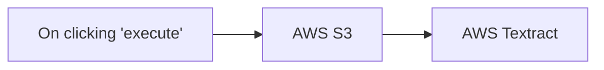

## Fluxo (.json) :

```json
{
  "nodes": [
    {
      "name": "On clicking 'execute'",
      "type": "n8n-nodes-base.manualTrigger",
      "position": [
        250,
        300
      ],
      "parameters": {},
      "typeVersion": 1
    },
    {
      "name": "AWS Textract",
      "type": "n8n-nodes-base.awsTextract",
      "position": [
        650,
        300
      ],
      "parameters": {},
      "credentials": {
        "aws": {
          "id": "12",
          "name": "AWS account"
        }
      },
      "typeVersion": 1
    },
    {
      "name": "AWS S3",
      "type": "n8n-nodes-base.awsS3",
      "position": [
        450,
        300
      ],
      "parameters": {
        "fileKey": "Rechnung.jpg",
        "bucketName": "textract-demodata"
      },
      "credentials": {
        "aws": {
          "id": "12",
          "name": "AWS account"
        }
      },
      "typeVersion": 1
    }
  ],
  "connections": {
    "AWS S3": {
      "main": [
        [
          {
            "node": "AWS Textract",
            "type": "main",
            "index": 0
          }
        ]
      ]
    },
    "On clicking 'execute'": {
      "main": [
        [
          {
            "node": "AWS S3",
            "type": "main",
            "index": 0
          }
        ]
      ]
    }
  }
}
```

<a id="template-99"></a>

## Template 99 - Contagem de pessoas do datastore de clientes

- **Nome:** Contagem de pessoas do datastore de clientes
- **Descrição:** Recupera todos os registros de pessoas de um datastore de clientes de treinamento e calcula a quantidade total de itens retornados.
- **Funcionalidade:** • Gatilho manual: Inicia a execução quando o usuário clica para executar o fluxo.
• Recuperação de clientes: Busca todos os registros de pessoas do datastore de clientes de treinamento.
• Cálculo do total de itens: Conta o número total de registros retornados e armazena esse valor.
- **Ferramentas:** • Datastore de clientes (treinamento): Fonte de dados contendo registros de pessoas utilizada para recuperar e testar os dados de clientes.

## Fluxo visual

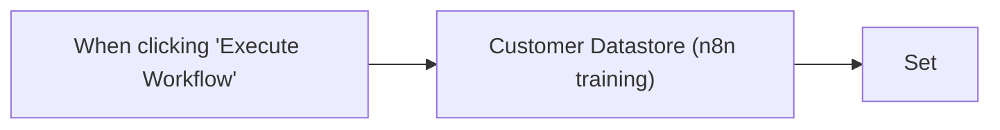

## Fluxo (.json) :

```json
{
  "nodes": [
    {
      "id": "41e0d0a9-9bd4-4ece-a204-5e1bf507b0eb",
      "meta": {
        "instanceId": "cb9c144f2050b3f9b30bf379399398f9061341e3665eb2faf2b1092a42b38b14"
      },
      "name": "When clicking \"Execute Workflow\"",
      "type": "n8n-nodes-base.manualTrigger",
      "position": [
        820,
        400
      ],
      "parameters": {},
      "typeVersion": 1
    },
    {
      "id": "aa373efa-d493-44cd-91ee-e07630309675",
      "name": "Customer Datastore (n8n training)",
      "type": "n8n-nodes-base.n8nTrainingCustomerDatastore",
      "position": [
        1040,
        400
      ],
      "parameters": {
        "operation": "getAllPeople"
      },
      "typeVersion": 1
    },
    {
      "id": "29555ae0-ad6c-4888-8865-c1e097b3b44e",
      "name": "Set",
      "type": "n8n-nodes-base.set",
      "position": [
        1260,
        400
      ],
      "parameters": {
        "values": {
          "number": [
            {
              "name": "itemCount",
              "value": "={{ $input.all().length }}"
            }
          ]
        },
        "options": {},
        "keepOnlySet": true
      },
      "executeOnce": true,
      "typeVersion": 1
    }
  ],
  "connections": {
    "When clicking \"Execute Workflow\"": {
      "main": [
        [
          {
            "node": "Customer Datastore (n8n training)",
            "type": "main",
            "index": 0
          }
        ]
      ]
    },
    "Customer Datastore (n8n training)": {
      "main": [
        [
          {
            "node": "Set",
            "type": "main",
            "index": 0
          }
        ]
      ]
    }
  }
}
```

<a id="template-100"></a>

## Template 100 - Processamento de planilhas Excel

- **Nome:** Processamento de planilhas Excel
- **Descrição:** Lê planilhas de diferentes origens, transforma os dados (por exemplo calculando idade) e gera um novo arquivo Excel, com opções para salvar localmente ou enviar para destinos remotos.
- **Funcionalidade:** • Carregamento de arquivo: Permite obter uma planilha a partir de uma URL pública, do sistema de arquivos local ou de serviços em nuvem.
• Conversão para JSON: Converte o conteúdo da planilha em dados JSON utilizáveis para processamento.
• Transformação de dados: Executa transformações nos registros, incluindo cálculo da idade a partir do campo "created".
• Exportação para Excel: Gera um novo arquivo .xlsx com nome datado conforme a data de execução.
• Salvamento local: Grava o arquivo gerado em um caminho local configurado.
• Upload para servidor remoto: Envia o arquivo gerado para um servidor via SFTP/FTP.
• Upload para serviços em nuvem: Faz upload do arquivo para contas de armazenamento em nuvem (por exemplo Google Drive ou OneDrive).
• Execução manual: Suporte para disparo manual do fluxo para testes ou execuções pontuais.
- **Ferramentas:** • Serviço HTTP: Fonte para download de arquivos a partir de URLs públicas ou internas.
• Google Drive: Armazenamento em nuvem usado tanto para download quanto para upload de planilhas.
• Microsoft OneDrive: Armazenamento em nuvem usado tanto para download quanto para upload de planilhas.
• Servidor SFTP/FTP: Destino remoto para transferência de arquivos.
• Sistema de arquivos local: Leitura e escrita de arquivos locais no servidor onde o fluxo é executado.
• Formatos Excel (XLSX/CSV): Formatos de planilhas suportados para importação e exportação.

## Fluxo visual

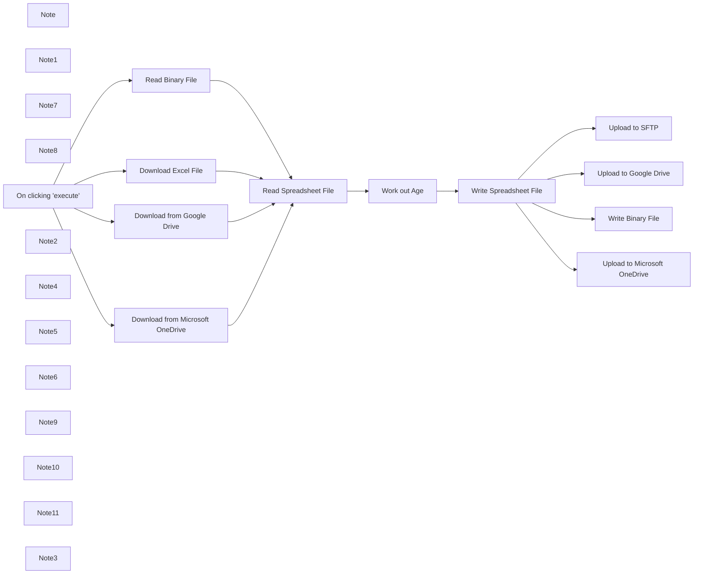

## Fluxo (.json) :

```json
{
  "meta": {
    "instanceId": "8c8c5237b8e37b006a7adce87f4369350c58e41f3ca9de16196d3197f69eabcd"
  },
  "nodes": [
    {
      "id": "05bd643c-6dd0-4f36-a586-3a06cc26893c",
      "name": "Note",
      "type": "n8n-nodes-base.stickyNote",
      "position": [
        200,
        780
      ],
      "parameters": {
        "width": 476.4578377639565,
        "height": 299.6468819708682,
        "content": "## Working with Excel files\n1. Load the spreadsheet file into the workflow (.xls, .xlsx, .csv).\n2. Convert the file with **Spreadsheet File** node. This allows other nodes to access the data.\n3. Transform and manipulate the spreadsheet data as needed\n4. [Optional] Convert back to a spreadsheet file\n5. [Optional] Save file locally or upload to a server\n\n\n\nℹ️ This template shows how to work with spreadsheet files themselves. Use the **Microsoft Excel 365** node to interact with the Microsoft Office 365 cloud platform. "
      },
      "typeVersion": 1
    },
    {
      "id": "84db705b-b45f-447f-b3e6-ac9650816e3b",
      "name": "Note1",
      "type": "n8n-nodes-base.stickyNote",
      "position": [
        840,
        800
      ],
      "parameters": {
        "width": 261.5285597588645,
        "height": 244.71805702217537,
        "content": "### 1A. From a public URL"
      },
      "typeVersion": 1
    },
    {
      "id": "92b8375b-92a3-41ca-874e-d9c4567e21d4",
      "name": "Read Binary File",
      "type": "n8n-nodes-base.readBinaryFile",
      "notes": "Fetches a local file",
      "disabled": true,
      "position": [
        920,
        1140
      ],
      "parameters": {
        "filePath": "/files/customer-datastore.xlsx"
      },
      "notesInFlow": true,
      "typeVersion": 1
    },
    {
      "id": "e595db63-8556-4e5e-89df-9895691ed4bb",
      "name": "Note7",
      "type": "n8n-nodes-base.stickyNote",
      "position": [
        840,
        680
      ],
      "parameters": {
        "width": 332.13093980992585,
        "height": 80,
        "content": "## 1. Load file into workflow"
      },
      "typeVersion": 1
    },
    {
      "id": "66ae38b6-01e6-486b-aae1-d696d22fb2cf",
      "name": "Note8",
      "type": "n8n-nodes-base.stickyNote",
      "position": [
        840,
        1380
      ],
      "parameters": {
        "width": 263.20908130939836,
        "height": 475.9602777402797,
        "content": "### 1C. From a cloud platform"
      },
      "typeVersion": 1
    },
    {
      "id": "c2e2cc7e-01a2-4138-ba6f-344be3dd91f3",
      "name": "On clicking 'execute'",
      "type": "n8n-nodes-base.manualTrigger",
      "position": [
        500,
        1140
      ],
      "parameters": {},
      "typeVersion": 1
    },
    {
      "id": "050bdd2e-6fe5-4145-8a0b-c1b4b8870c53",
      "name": "Note2",
      "type": "n8n-nodes-base.stickyNote",
      "disabled": true,
      "position": [
        2060,
        680
      ],
      "parameters": {
        "width": 326.8935002375224,
        "height": 302.0190073917633,
        "content": "## 4. [Optional] Convert node data back to .xls file"
      },
      "typeVersion": 1
    },
    {
      "id": "3822a521-c1f4-40a9-bbb6-540a2bb4651b",
      "name": "Note4",
      "type": "n8n-nodes-base.stickyNote",
      "disabled": true,
      "position": [
        1640,
        680
      ],
      "parameters": {
        "width": 359.63512407276517,
        "height": 304.93769799366413,
        "content": "## 3. Manipulate or transform your spreadsheet data \n\n\n\n\n\n"
      },
      "typeVersion": 1
    },
    {
      "id": "a90ef806-62a7-492d-b493-337d796c677a",
      "name": "Note5",
      "type": "n8n-nodes-base.stickyNote",
      "position": [
        2460,
        1080
      ],
      "parameters": {
        "width": 253.5004831258875,
        "height": 243.48423158332457,
        "content": "### 4B. To a webserver via (S)FTP"
      },
      "typeVersion": 1
    },
    {
      "id": "a5419c12-4be4-4fdf-8b9f-f6c73104477a",
      "name": "Write Binary File",
      "type": "n8n-nodes-base.writeBinaryFile",
      "position": [
        2520,
        860
      ],
      "parameters": {
        "options": {},
        "fileName": "=/tmp/{{$binary.data.fileName}}"
      },
      "typeVersion": 1
    },
    {
      "id": "3d3474ee-298f-48ee-b7b4-2dd64729c747",
      "name": "Note6",
      "type": "n8n-nodes-base.stickyNote",
      "disabled": true,
      "position": [
        1280,
        680
      ],
      "parameters": {
        "width": 279.5841955487948,
        "height": 309.4318901795142,
        "content": "## 2. Convert the file into JSON format\nJSON data can be used by nodes\n\n\n\n\n\n"
      },
      "typeVersion": 1
    },
    {
      "id": "93cd3132-460b-4a67-b627-b417bbd74012",
      "name": "Note9",
      "type": "n8n-nodes-base.stickyNote",
      "disabled": true,
      "position": [
        2460,
        680
      ],
      "parameters": {
        "width": 332.13093980992585,
        "height": 86.72208620213638,
        "content": "## 5. Save or upload new file\n### [Optional]"
      },
      "typeVersion": 1
    },
    {
      "id": "4ca7e58c-2d8f-463f-86f9-f87f47a7364b",
      "name": "Note10",
      "type": "n8n-nodes-base.stickyNote",
      "position": [
        2460,
        800
      ],
      "parameters": {
        "width": 253.5004831258875,
        "height": 245.22344655940856,
        "content": "### 4A. To a local filesystem"
      },
      "typeVersion": 1
    },
    {
      "id": "db8f95b3-db71-4111-b5a4-a53cdfeea896",
      "name": "Note11",
      "type": "n8n-nodes-base.stickyNote",
      "disabled": true,
      "position": [
        2460,
        1380
      ],
      "parameters": {
        "width": 253.5004831258875,
        "height": 480.2511652360096,
        "content": "### 4C. To a cloud service"
      },
      "typeVersion": 1
    },
    {
      "id": "ae1a1cdf-4670-41da-8bc5-aa6817ce08bc",
      "name": "Note3",
      "type": "n8n-nodes-base.stickyNote",
      "position": [
        840,
        1080
      ],
      "parameters": {
        "width": 263.20908130939836,
        "height": 244.71805702217537,
        "content": "### 1B. From the local filesystem"
      },
      "typeVersion": 1
    },
    {
      "id": "529b03fb-b81d-40f3-bade-684cc9776cba",
      "name": "Download from Google Drive",
      "type": "n8n-nodes-base.googleDrive",
      "disabled": true,
      "position": [
        920,
        1440
      ],
      "parameters": {
        "fileId": {
          "__rl": true,
          "mode": "list",
          "value": "1ffuj8v-s0h8LeEmrA2hBk-b7qKF_c9uT",
          "cachedResultUrl": "https://docs.google.com/spreadsheets/d/1ffuj8v-s0h8LeEmrA2hBk-b7qKF_c9uT/edit?usp=drivesdk&ouid=112909978107527312058&rtpof=true&sd=true",
          "cachedResultName": "customer-datastore.xlsx"
        },
        "options": {},
        "operation": "download"
      },
      "credentials": {
        "googleDriveOAuth2Api": {
          "id": "148",
          "name": "FPS"
        }
      },
      "typeVersion": 2
    },
    {
      "id": "b63c9748-0c7d-4d2a-aa5b-db76d31af957",
      "name": "Download from Microsoft OneDrive",
      "type": "n8n-nodes-base.microsoftOneDrive",
      "disabled": true,
      "position": [
        920,
        1640
      ],
      "parameters": {
        "fileId": "549D14658E697C62!2087",
        "operation": "download"
      },
      "credentials": {
        "microsoftOneDriveOAuth2Api": {
          "id": "88",
          "name": "Microsoft Drive account"
        }
      },
      "typeVersion": 1
    },
    {
      "id": "6333d0b5-d58b-4a19-af9a-0e5ea4fa15e8",
      "name": "Download Excel File",
      "type": "n8n-nodes-base.httpRequest",
      "notes": "Fetches file from server",
      "position": [
        920,
        860
      ],
      "parameters": {
        "url": "https://internal.users.n8n.cloud/webhook/709a234d-add7-41d2-9326-8d981f58120b",
        "options": {}
      },
      "notesInFlow": true,
      "typeVersion": 3
    },
    {
      "id": "88b24dbb-dc9f-4f03-a5b3-71ba89295346",
      "name": "Work out Age",
      "type": "n8n-nodes-base.set",
      "position": [
        1760,
        820
      ],
      "parameters": {
        "values": {
          "string": [
            {
              "name": "age",
              "value": "={{ Math.trunc($today.diff(DateTime.fromFormat($json[\"created\"], 'yyyy-MM-dd'), 'years').toObject().years) }}"
            }
          ]
        },
        "options": {}
      },
      "typeVersion": 1
    },
    {
      "id": "2f1f2fa9-4995-46c9-a415-3768a0895e88",
      "name": "Upload to SFTP",
      "type": "n8n-nodes-base.ftp",
      "disabled": true,
      "position": [
        2520,
        1140
      ],
      "parameters": {
        "path": "=/home/n8n/{{$binary.data.fileName}}",
        "protocol": "sftp",
        "operation": "upload"
      },
      "credentials": {
        "sftp": {
          "id": "8",
          "name": "SFTP"
        }
      },
      "typeVersion": 1
    },
    {
      "id": "81c06f12-83f1-4973-a1ec-6d58e26eb8c9",
      "name": "Upload to Google Drive",
      "type": "n8n-nodes-base.googleDrive",
      "disabled": true,
      "position": [
        2520,
        1440
      ],
      "parameters": {
        "name": "={{$binary.data.fileName}}",
        "options": {},
        "binaryData": true
      },
      "credentials": {
        "googleDriveOAuth2Api": {
          "id": "148",
          "name": "FPS"
        }
      },
      "typeVersion": 2
    },
    {
      "id": "a0ef4740-8716-4fab-8498-c13ee32842cb",
      "name": "Upload to Microsoft OneDrive",
      "type": "n8n-nodes-base.microsoftOneDrive",
      "disabled": true,
      "position": [
        2520,
        1640
      ],
      "parameters": {
        "fileName": "={{$binary.data.fileName}}",
        "parentId": "root",
        "binaryData": true
      },
      "credentials": {
        "microsoftOneDriveOAuth2Api": {
          "id": "88",
          "name": "Microsoft Drive account"
        }
      },
      "typeVersion": 1
    },
    {
      "id": "01e6575d-bb92-4f32-82b4-acfe7448a364",
      "name": "Read Spreadsheet File",
      "type": "n8n-nodes-base.spreadsheetFile",
      "position": [
        1360,
        820
      ],
      "parameters": {
        "options": {}
      },
      "typeVersion": 1
    },
    {
      "id": "ed09f502-109f-42dc-a62c-6b6f54aad46e",
      "name": "Write Spreadsheet File",
      "type": "n8n-nodes-base.spreadsheetFile",
      "position": [
        2160,
        820
      ],
      "parameters": {
        "options": {
          "fileName": "=customer-datastore_{{$today.toFormat('yyyyMMdd')}}.xlsx"
        },
        "operation": "toFile",
        "fileFormat": "xlsx"
      },
      "typeVersion": 1
    }
  ],
  "connections": {
    "Work out Age": {
      "main": [
        [
          {
            "node": "Write Spreadsheet File",
            "type": "main",
            "index": 0
          }
        ]
      ]
    },
    "Read Binary File": {
      "main": [
        [
          {
            "node": "Read Spreadsheet File",
            "type": "main",
            "index": 0
          }
        ]
      ]
    },
    "Download Excel File": {
      "main": [
        [
          {
            "node": "Read Spreadsheet File",
            "type": "main",
            "index": 0
          }
        ]
      ]
    },
    "On clicking 'execute'": {
      "main": [
        [
          {
            "node": "Read Binary File",
            "type": "main",
            "index": 0
          },
          {
            "node": "Download Excel File",
            "type": "main",
            "index": 0
          },
          {
            "node": "Download from Google Drive",
            "type": "main",
            "index": 0
          },
          {
            "node": "Download from Microsoft OneDrive",
            "type": "main",
            "index": 0
          }
        ]
      ]
    },
    "Read Spreadsheet File": {
      "main": [
        [
          {
            "node": "Work out Age",
            "type": "main",
            "index": 0
          }
        ]
      ]
    },
    "Write Spreadsheet File": {
      "main": [
        [
          {
            "node": "Upload to SFTP",
            "type": "main",
            "index": 0
          },
          {
            "node": "Upload to Google Drive",
            "type": "main",
            "index": 0
          },
          {
            "node": "Write Binary File",
            "type": "main",
            "index": 0
          },
          {
            "node": "Upload to Microsoft OneDrive",
            "type": "main",
            "index": 0
          }
        ]
      ]
    },
    "Download from Google Drive": {
      "main": [
        [
          {
            "node": "Read Spreadsheet File",
            "type": "main",
            "index": 0
          }
        ]
      ]
    },
    "Download from Microsoft OneDrive": {
      "main": [
        [
          {
            "node": "Read Spreadsheet File",
            "type": "main",
            "index": 0
          }
        ]
      ]
    }
  }
}
```

<a id="template-101"></a>

## Template 101 - Geração automática de legendas em vídeo

- **Nome:** Geração automática de legendas em vídeo
- **Descrição:** Automatiza a adição de legendas a um vídeo enviando-o para a API do json2video, monitorando o processamento e retornando os metadados do vídeo final.
- **Funcionalidade:** • Acionamento manual: Inicia o processo a partir de um acionamento manual de teste.
• Configuração de entrada: Define a URL do vídeo e as dimensões (largura e altura) para processamento.
• Envio para renderização: Envia uma requisição para criar um movie que inclui o vídeo e o elemento de legendas com estilo configurado.
• Monitoramento de status: Aguarda e faz polling periódico do status do processamento até conclusão ou erro.
• Tratamento de erro: Detecta quando o processamento retorna erro e direciona para um fluxo de tratamento apropriado.
• Emissão de resultados: Retorna URL do vídeo renderizado e metadados como duração, tamanho, dimensões, tempo de renderização, projeto e cota restante.
- **Ferramentas:** • json2video: Serviço/API responsável por gerar e renderizar o vídeo final com legendas automáticas a partir das configurações enviadas.
• Amazon S3: Armazenamento onde o vídeo de origem está hospedado (URL de entrada usada para processamento).

## Fluxo visual

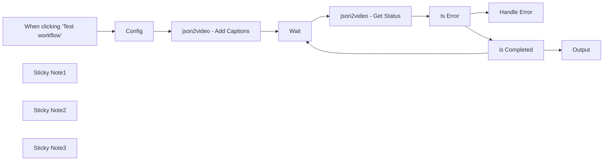

## Fluxo (.json) :

```json
{
  "id": "Tygtx1aZi9pLdtUo",
  "meta": {
    "instanceId": "8418cffce8d48086ec0a73fd90aca708aa07591f2fefa6034d87fe12a09de26e",
    "templateCredsSetupCompleted": true
  },
  "name": "Fully automated Video Captions generation with json2video",
  "tags": [],
  "nodes": [
    {
      "id": "38e862a1-dc25-4a41-b0e1-5ebba1032e0a",
      "name": "When clicking ‘Test workflow’",
      "type": "n8n-nodes-base.manualTrigger",
      "position": [
        -980,
        -280
      ],
      "parameters": {},
      "typeVersion": 1
    },
    {
      "id": "834ac32d-4bef-4087-87af-590cd200a858",
      "name": "json2video - Add Captions",
      "type": "n8n-nodes-base.httpRequest",
      "position": [
        -540,
        -280
      ],
      "parameters": {
        "url": "https://api.json2video.com/v2/movies",
        "method": "POST",
        "options": {},
        "jsonBody": "={\n  \"id\": \"qbaasr7s\",\n  \"resolution\": \"custom\",\n  \"quality\": \"high\",\n\"scenes\": [\n    {\n      \"id\": \"qyjh9lwj\",\n      \"comment\": \"Scene 1\",\n      \"elements\": []\n    }\n  ],\n  \"elements\": [\n    {\n      \"id\": \"q6dznzcv\",\n      \"type\": \"video\",\n      \"src\": \"{{ $json.video_url }}\"\n    },\n    {\n      \"id\": \"q41n9kxp\",\n      \"type\": \"subtitles\",\n      \"settings\": {\n        \"style\": \"classic-progressive\",\n        \"font-family\": \"Oswald\",\n        \"font-size\": 140,\n        \"word-color\": \"#FCF5C9\",\n        \"shadow-color\": \"#260B1B\",\n        \"line-color\": \"#F1E7F4\",\n        \"shadow-offset\": 2,\n        \"box-color\": \"#260B1B\"\n      },\n      \"language\": \"en\"\n    }\n  ],\n  \"width\": {{ $json.width }},\n  \"height\": {{ $json.height }}\n}",
        "sendBody": true,
        "specifyBody": "json",
        "authentication": "genericCredentialType",
        "genericAuthType": "httpCustomAuth"
      },
      "credentials": {
        "httpCustomAuth": {
          "id": "FVrj0WeCT9IosZhh",
          "name": "json2video"
        },
        "httpHeaderAuth": {
          "id": "TngzgS09J1YvLIXl",
          "name": "Perplexity"
        }
      },
      "typeVersion": 4.2
    },
    {
      "id": "93e98e02-a7e5-40d2-93a8-06c1ba3c4fb5",
      "name": "Config",
      "type": "n8n-nodes-base.set",
      "position": [
        -780,
        -280
      ],
      "parameters": {
        "options": {},
        "assignments": {
          "assignments": [
            {
              "id": "408b70d1-30ea-4f88-847d-97c59e467168",
              "name": "video_url",
              "type": "string",
              "value": "https://aiatelier.s3.eu-west-1.amazonaws.com/workflows-material/json2video/captions-sample.mp4"
            },
            {
              "id": "e54d0b14-3261-4d8c-83ac-b63a37981257",
              "name": "width",
              "type": "string",
              "value": "1080"
            },
            {
              "id": "70a87f6b-8cf1-48b0-96bf-b7a8aa5bc6da",
              "name": "height",
              "type": "string",
              "value": "1920"
            }
          ]
        }
      },
      "typeVersion": 3.4
    },
    {
      "id": "d3b6d3f3-d3ca-455d-929c-ffb869bd23d8",
      "name": "Wait",
      "type": "n8n-nodes-base.wait",
      "position": [
        -180,
        -220
      ],
      "webhookId": "f50b5765-4a91-415d-ba27-cfda281dc941",
      "parameters": {
        "amount": 10
      },
      "typeVersion": 1.1
    },
    {
      "id": "07099d4c-6012-4447-8720-af8e75521e24",
      "name": "Is Error",
      "type": "n8n-nodes-base.if",
      "position": [
        180,
        -240
      ],
      "parameters": {
        "options": {},
        "conditions": {
          "options": {
            "version": 2,
            "leftValue": "",
            "caseSensitive": true,
            "typeValidation": "strict"
          },
          "combinator": "and",
          "conditions": [
            {
              "id": "a9813eb6-0dbf-41ac-837f-8f2760cbc5e3",
              "operator": {
                "type": "string",
                "operation": "equals"
              },
              "leftValue": "={{ $json.movie.status }}",
              "rightValue": "error"
            }
          ]
        }
      },
      "typeVersion": 2.2
    },
    {
      "id": "a94a6b24-4674-42ac-8db4-6e9298b44b7d",
      "name": "Handle Error",
      "type": "n8n-nodes-base.noOp",
      "position": [
        420,
        -380
      ],
      "parameters": {},
      "typeVersion": 1
    },
    {
      "id": "cd6bba4e-b329-4476-b983-248bb8e4423a",
      "name": "Output",
      "type": "n8n-nodes-base.set",
      "position": [
        460,
        20
      ],
      "parameters": {
        "options": {},
        "assignments": {
          "assignments": [
            {
              "id": "c7ce3d37-6455-407a-bf57-286d91c16f97",
              "name": "url",
              "type": "string",
              "value": "={{ $json.movie.url }}"
            },
            {
              "id": "e969f3bd-2c36-43f6-9fc3-a66a0424ec20",
              "name": "duration",
              "type": "number",
              "value": "={{ $json.movie.duration }}"
            },
            {
              "id": "a5f9b903-40c0-432e-b030-5a1fdea844db",
              "name": "size",
              "type": "number",
              "value": "={{ $json.movie.size }}"
            },
            {
              "id": "660565f1-8da7-4c2f-a5e0-b62130aef7cb",
              "name": "width",
              "type": "number",
              "value": "={{ $json.movie.width }}"
            },
            {
              "id": "5e2a9144-45e5-40f2-b71e-d74b25890ab6",
              "name": "height",
              "type": "number",
              "value": "={{ $json.movie.height }}"
            },
            {
              "id": "601f8514-61f5-4cea-9b64-373881e3c879",
              "name": "rendering_time",
              "type": "number",
              "value": "={{ $json.movie.rendering_time }}"
            },
            {
              "id": "2b7812f9-1e44-4843-b2ca-051b54153051",
              "name": "project",
              "type": "string",
              "value": "={{ $json.movie.project }}"
            },
            {
              "id": "1b562ac3-e62b-4d67-adab-2af0d15fd11e",
              "name": "remaining_quota",
              "type": "number",
              "value": "={{ $json.remaining_quota.time }}"
            }
          ]
        }
      },
      "typeVersion": 3.4
    },
    {
      "id": "378e027a-b033-4490-93e6-666d3d7def86",
      "name": "json2video - Get Status",
      "type": "n8n-nodes-base.httpRequest",
      "position": [
        0,
        -180
      ],
      "parameters": {
        "url": "=https://api.json2video.com/v2/movies?id={{ $('json2video - Add Captions').first().json.project }}",
        "options": {},
        "authentication": "genericCredentialType",
        "genericAuthType": "httpCustomAuth"
      },
      "credentials": {
        "httpCustomAuth": {
          "id": "FVrj0WeCT9IosZhh",
          "name": "json2video"
        },
        "httpHeaderAuth": {
          "id": "TngzgS09J1YvLIXl",
          "name": "Perplexity"
        }
      },
      "typeVersion": 4.2
    },
    {
      "id": "a818a3a6-4cef-4043-ac3e-96fa3f54373d",
      "name": "Sticky Note1",
      "type": "n8n-nodes-base.stickyNote",
      "position": [
        -260,
        -300
      ],
      "parameters": {
        "color": 7,
        "width": 640,
        "height": 580,
        "content": "## Check video status"
      },
      "typeVersion": 1
    },
    {
      "id": "7258a9ec-591f-4b07-840c-3171c36f193e",
      "name": "is Completed",
      "type": "n8n-nodes-base.if",
      "position": [
        200,
        40
      ],
      "parameters": {
        "options": {},
        "conditions": {
          "options": {
            "version": 2,
            "leftValue": "",
            "caseSensitive": true,
            "typeValidation": "strict"
          },
          "combinator": "and",
          "conditions": [
            {
              "id": "2643b070-cbb2-4562-9269-a61389e0c242",
              "operator": {
                "name": "filter.operator.equals",
                "type": "string",
                "operation": "equals"
              },
              "leftValue": "={{ $json.movie.status }}",
              "rightValue": "done"
            }
          ]
        }
      },
      "typeVersion": 2.2
    },
    {
      "id": "cbce69e0-730c-46ea-bd0a-b8694bd7780d",
      "name": "Sticky Note2",
      "type": "n8n-nodes-base.stickyNote",
      "position": [
        -1700,
        -480
      ],
      "parameters": {
        "width": 640,
        "height": 820,
        "content": "# Automatically Generate Captions for Your Videos with json2video\n\nThis workflow automatically adds captions to your videos using [json2video](https://json2video.com/?afco=manu), a powerful service for video automation, that integrates seamlessly with n8n.\n\n# [👉🏻 Try json2video for free 👈🏻](https://json2video.com/?afco=manu)\n\n## Setup\n\n### Step 1: Create a json2video Account & API Key\n1. Sign up for a [json2video account](https://json2video.com/?afco=manu).\n2. Once registered, you will receive your API key via email.\n\n### Step 2: Create n8n Credentials\n1. In n8n, create new credentials and select **\"Custom Auth\"** as the type.\n2. Paste the following JSON code into the credentials configuration, replacing `\"your-json2video-api-key\"` with your actual API key:\n\n    ```json\n    {\n      \"headers\": {\n        \"x-api-key\": \"your-json2video-api-key\"\n      }\n    }\n    ```\n\n### Step 3: Connect Your Credentials\n1. In your n8n workflow, locate the two HTTP nodes that interact with json2video.\n2. Select the credentials you created in Step 2 for both nodes.\n"
      },
      "typeVersion": 1
    },
    {
      "id": "4ce3a85f-3abc-48e9-8840-f37f32490b62",
      "name": "Sticky Note3",
      "type": "n8n-nodes-base.stickyNote",
      "position": [
        -760,
        -120
      ],
      "parameters": {
        "width": 440,
        "height": 200,
        "content": "# ☝️ Provide Video Details\n\nFor the workflow to add captions, please provide:\n\n- **URL:** The link to your video.\n- **Width & Height:** The dimensions of your video"
      },
      "typeVersion": 1
    }
  ],
  "active": false,
  "pinData": {},
  "settings": {
    "executionOrder": "v1"
  },
  "versionId": "5d8108e2-3f44-4585-9c25-f31f95f06424",
  "connections": {
    "Wait": {
      "main": [
        [
          {
            "node": "json2video - Get Status",
            "type": "main",
            "index": 0
          }
        ]
      ]
    },
    "Config": {
      "main": [
        [
          {
            "node": "json2video - Add Captions",
            "type": "main",
            "index": 0
          }
        ]
      ]
    },
    "Is Error": {
      "main": [
        [
          {
            "node": "Handle Error",
            "type": "main",
            "index": 0
          }
        ],
        [
          {
            "node": "is Completed",
            "type": "main",
            "index": 0
          }
        ]
      ]
    },
    "is Completed": {
      "main": [
        [
          {
            "node": "Output",
            "type": "main",
            "index": 0
          }
        ],
        [
          {
            "node": "Wait",
            "type": "main",
            "index": 0
          }
        ]
      ]
    },
    "json2video - Get Status": {
      "main": [
        [
          {
            "node": "Is Error",
            "type": "main",
            "index": 0
          }
        ]
      ]
    },
    "json2video - Add Captions": {
      "main": [
        [
          {
            "node": "Wait",
            "type": "main",
            "index": 0
          }
        ]
      ]
    },
    "When clicking ‘Test workflow’": {
      "main": [
        [
          {
            "node": "Config",
            "type": "main",
            "index": 0
          }
        ]
      ]
    }
  }
}
```
