# PACK 1999 TEMPLATES PARTE 01 - Bloco 6

Templates neste bloco: 20

## Sumário

- [Template 102 - Baixar arquivos e combinar binários](#template-102)
- [Template 103 - Criar, atualizar e obter contato no Google Contacts](#template-103)
- [Template 104 - Extração de dados de PDF com Claude e Gemini](#template-104)
- [Template 105 - Resposta automática por IA para emails específicos](#template-105)
- [Template 106 - Enriquecimento e importação de contatos para Lemlist](#template-106)
- [Template 107 - Selecionar cor aleatória excluindo cores](#template-107)
- [Template 108 - Teste de regressão visual automatizado](#template-108)
- [Template 109 - Automação LINE -> IA -> Microsoft 365](#template-109)
- [Template 110 - Sincronizar e-mails do Google Sheets para Mailchimp](#template-110)
- [Template 111 - Extração de dados do Etsy com Bright Data e Google Gemini](#template-111)
- [Template 112 - Assistente de e-mail IA para Outlook](#template-112)
- [Template 113 - LinkedIn posts a partir de Ghost com registro em planilha](#template-113)
- [Template 114 - Obter data e dia atuais](#template-114)
- [Template 115 - Chat com arquivos do Supabase](#template-115)
- [Template 116 - Verificador de backlinks ao vivo](#template-116)
- [Template 117 - Agente de recomendações de filmes com MongoDB](#template-117)
- [Template 118 - Enviar imagens para upload-post (Instagram/TikTok)](#template-118)
- [Template 119 - Atribuir valores a variáveis](#template-119)
- [Template 120 - Geração e publicação automática de conteúdo para WordPress](#template-120)
- [Template 121 - Criar recurso no Netlify via webhook](#template-121)

---

<a id="template-102"></a>

## Template 102 - Baixar arquivos e combinar binários

- **Nome:** Baixar arquivos e combinar binários
- **Descrição:** Este fluxo baixa vários arquivos a partir de URLs de exemplo e os combina em um único item contendo múltiplos arquivos binários.
- **Funcionalidade:** • Execução manual: inicia o fluxo quando o usuário executa manualmente.
• Definição de URLs: prepara uma lista de URLs dos arquivos de exemplo a serem baixados.
• Download de arquivos: realiza requisições HTTP para obter cada arquivo em formato binário.
• Combinação de itens binários: transforma múltiplos itens (cada um com um binário) em um único item que contém vários arquivos binários nomeados sequencialmente (por exemplo, data_0, data_1, ...).
- **Ferramentas:** • Servidor de arquivos estático (static.thomasmartens.eu): hospeda os arquivos de exemplo acessíveis por URL.
• Protocolo HTTP/HTTPS: protocolo utilizado para transferir os arquivos entre o servidor e o fluxo.

## Fluxo visual

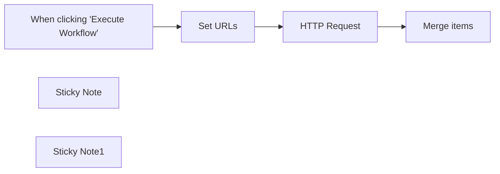

## Fluxo (.json) :

```json
{
  "nodes": [
    {
      "id": "9d09405e-64a3-47ef-9d46-4942de51444b",
      "name": "When clicking \"Execute Workflow\"",
      "type": "n8n-nodes-base.manualTrigger",
      "position": [
        400,
        460
      ],
      "parameters": {},
      "typeVersion": 1
    },
    {
      "id": "4fdc396b-07bd-471e-9e62-136300804809",
      "name": "Set URLs",
      "type": "n8n-nodes-base.code",
      "position": [
        620,
        460
      ],
      "parameters": {
        "jsCode": "return [{\n  json: {\n    url: \"https://static.thomasmartens.eu/n8n/file01.jpg\"\n  }\n}, {\n  json: {\n    url: \"https://static.thomasmartens.eu/n8n/file02.jpg\"\n  }\n}, {\n  json: {\n    url: \"https://static.thomasmartens.eu/n8n/file03.jpg\"\n  }\n}]"
      },
      "typeVersion": 1
    },
    {
      "id": "17482568-2117-4a8c-a307-ebf30dc9c560",
      "name": "HTTP Request",
      "type": "n8n-nodes-base.httpRequest",
      "position": [
        840,
        460
      ],
      "parameters": {
        "url": "={{ $json.url }}",
        "options": {
          "response": {
            "response": {
              "responseFormat": "file"
            }
          }
        }
      },
      "typeVersion": 4
    },
    {
      "id": "de27f52b-8f7e-4b9c-a097-987db4cef5aa",
      "name": "Merge items",
      "type": "n8n-nodes-base.code",
      "position": [
        1060,
        460
      ],
      "parameters": {
        "jsCode": "let binaries = {}, binary_keys = [];\n\nfor (const [index, inputItem] of Object.entries($input.all())) {\n  binaries[`data_${index}`] = inputItem.binary.data;\n  binary_keys.push(`data_${index}`);\n}\n\nreturn [{\n    json: {\n        binary_keys: binary_keys.join(',')\n    },\n    binary: binaries\n}];\n"
      },
      "typeVersion": 1
    },
    {
      "id": "539fe99d-c557-4e51-bc88-011fb604e1f3",
      "name": "Sticky Note",
      "type": "n8n-nodes-base.stickyNote",
      "position": [
        580,
        320
      ],
      "parameters": {
        "width": 394,
        "height": 304,
        "content": "## Example data\nThese nodes simply download some example files to work with."
      },
      "typeVersion": 1
    },
    {
      "id": "710fd054-2360-447a-b503-049507c0a3b2",
      "name": "Sticky Note1",
      "type": "n8n-nodes-base.stickyNote",
      "position": [
        1000,
        320
      ],
      "parameters": {
        "width": 304,
        "height": 307,
        "content": "## Transformation\nThis is where the magic happens. Multiple items with one binary object each are being transformed into one item with multiple binary objects."
      },
      "typeVersion": 1
    }
  ],
  "connections": {
    "Set URLs": {
      "main": [
        [
          {
            "node": "HTTP Request",
            "type": "main",
            "index": 0
          }
        ]
      ]
    },
    "HTTP Request": {
      "main": [
        [
          {
            "node": "Merge items",
            "type": "main",
            "index": 0
          }
        ]
      ]
    },
    "When clicking \"Execute Workflow\"": {
      "main": [
        [
          {
            "node": "Set URLs",
            "type": "main",
            "index": 0
          }
        ]
      ]
    }
  }
}
```

<a id="template-103"></a>

## Template 103 - Criar, atualizar e obter contato no Google Contacts

- **Nome:** Criar, atualizar e obter contato no Google Contacts
- **Descrição:** Cria um contato no Google Contacts, atualiza suas informações de empresa e recupera o contato atualizado.
- **Funcionalidade:** • Gatilho manual: inicia a execução do fluxo ao ser acionado manualmente.
• Criar contato: cria um novo contato com nome e sobrenome especificados.
• Atualizar contato (empresa): atualiza o contato criado adicionando ou modificando informações de empresa (nome, cargo, domínio e marcação de atual).
• Recuperar contato: obtém o contato atualizado solicitando especificamente o campo de organizações.
• Reutilização de identificador: utiliza o contactId retornado na criação para apontar o contato nas etapas de atualização e recuperação.
- **Ferramentas:** • Google Contacts API: serviço do Google para gerenciar contatos, usado aqui para criar, atualizar e recuperar contatos com autenticação adequada.

## Fluxo visual

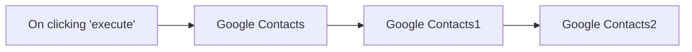

## Fluxo (.json) :

```json
{
  "id": "20",
  "name": "Create, update and get a contact in Google Contacts",
  "nodes": [
    {
      "name": "On clicking 'execute'",
      "type": "n8n-nodes-base.manualTrigger",
      "position": [
        190,
        300
      ],
      "parameters": {},
      "typeVersion": 1
    },
    {
      "name": "Google Contacts",
      "type": "n8n-nodes-base.googleContacts",
      "position": [
        390,
        300
      ],
      "parameters": {
        "givenName": "n8n",
        "familyName": "n8n",
        "additionalFields": {}
      },
      "credentials": {
        "googleContactsOAuth2Api": "google-contact"
      },
      "typeVersion": 1
    },
    {
      "name": "Google Contacts1",
      "type": "n8n-nodes-base.googleContacts",
      "position": [
        590,
        300
      ],
      "parameters": {
        "fields": [],
        "contactId": "={{$node[\"Google Contacts\"].json[\"contactId\"]}}",
        "operation": "update",
        "updateFields": {
          "companyUi": {
            "companyValues": [
              {
                "name": "n8n",
                "title": "n8n",
                "domain": "n8n.io",
                "current": true
              }
            ]
          }
        }
      },
      "credentials": {
        "googleContactsOAuth2Api": "google-contact"
      },
      "typeVersion": 1
    },
    {
      "name": "Google Contacts2",
      "type": "n8n-nodes-base.googleContacts",
      "position": [
        790,
        300
      ],
      "parameters": {
        "fields": [
          "organizations"
        ],
        "contactId": "={{$node[\"Google Contacts\"].json[\"contactId\"]}}",
        "operation": "get"
      },
      "credentials": {
        "googleContactsOAuth2Api": "google-contact"
      },
      "typeVersion": 1
    }
  ],
  "active": false,
  "settings": {},
  "connections": {
    "Google Contacts": {
      "main": [
        [
          {
            "node": "Google Contacts1",
            "type": "main",
            "index": 0
          }
        ]
      ]
    },
    "Google Contacts1": {
      "main": [
        [
          {
            "node": "Google Contacts2",
            "type": "main",
            "index": 0
          }
        ]
      ]
    },
    "On clicking 'execute'": {
      "main": [
        [
          {
            "node": "Google Contacts",
            "type": "main",
            "index": 0
          }
        ]
      ]
    }
  }
}
```

<a id="template-104"></a>

## Template 104 - Extração de dados de PDF com Claude e Gemini

- **Nome:** Extração de dados de PDF com Claude e Gemini
- **Descrição:** Extrai informações de arquivos PDF enviando o conteúdo para os modelos Claude 3.5 Sonnet e Gemini 2.0 Flash, permitindo comparar resultados e formatos de saída.
- **Funcionalidade:** • Definição de prompt: Permite ao usuário especificar o que deve ser extraído ou como os dados devem ser transformados.
• Download de PDF a partir do Google Drive: Recupera o arquivo PDF selecionado na conta do usuário.
• Conversão do PDF para base64: Converte o arquivo para base64 para envio direto às APIs que suportam documentos embutidos.
• Envio para Claude 3.5 Sonnet: Envia o PDF em base64 junto com o prompt para extração e processamento pelo modelo da Anthropic.
• Envio para Gemini 2.0 Flash: Envia o PDF em base64 junto com o prompt para extração e processamento pelo modelo da Google (PaLM/Generative Language).
• Saída estruturada/JSON: Suporta solicitar respostas em JSON ou formatos estruturados para facilitar processamento posterior.
• Comparação de resultados e métricas: Possibilidade de comparar respostas, latência e custos entre os dois modelos em dashboards separados.
• Flexibilidade de execução: Permite desativar uma das chamadas de API e ajustar o prompt conforme necessário.
- **Ferramentas:** • Google Drive: Armazenamento e origem dos arquivos PDF a serem processados.
• Anthropic (Claude 3.5 Sonnet): Serviço de modelo de linguagem usado para extrair e interpretar o conteúdo do PDF via API.
• Google Gemini (Gemini 2.0 Flash / PaLM Generative Language API): Serviço de modelo de linguagem do Google usado para processar PDFs em base64 e gerar respostas, incluindo saída estruturada.

## Fluxo visual

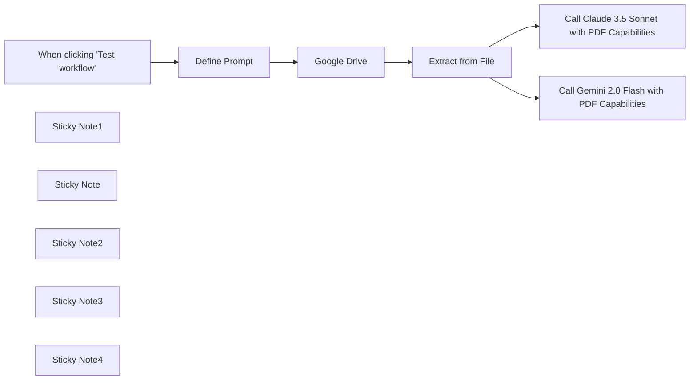

## Fluxo (.json) :

```json
{
  "meta": {
    "instanceId": "f4f5d195bb2162a0972f737368404b18be694648d365d6c6771d7b4909d28167"
  },
  "nodes": [
    {
      "id": "b6cd232e-e82e-457b-9f03-c010b3eba148",
      "name": "When clicking 'Test workflow'",
      "type": "n8n-nodes-base.manualTrigger",
      "position": [
        -40,
        0
      ],
      "parameters": {},
      "typeVersion": 1
    },
    {
      "id": "2b734806-e3c0-4552-a491-54ca846ed3ac",
      "name": "Extract from File",
      "type": "n8n-nodes-base.extractFromFile",
      "position": [
        620,
        0
      ],
      "parameters": {
        "options": {},
        "operation": "binaryToPropery"
      },
      "typeVersion": 1
    },
    {
      "id": "2c199499-cc4f-405c-8560-765500b7acba",
      "name": "Google Drive",
      "type": "n8n-nodes-base.googleDrive",
      "position": [
        420,
        0
      ],
      "parameters": {
        "fileId": {
          "__rl": true,
          "mode": "list",
          "value": "18Ac2xorxirIBm9FNFDDB5aVUSPBCCg1U",
          "cachedResultUrl": "https://drive.google.com/file/d/18Ac2xorxirIBm9FNFDDB5aVUSPBCCg1U/view?usp=drivesdk",
          "cachedResultName": "Invoice-798FE2FA-0004.pdf"
        },
        "options": {},
        "operation": "download"
      },
      "credentials": {
        "googleDriveOAuth2Api": {
          "id": "AUEpxwlqBJghNMtb",
          "name": "Google Drive account"
        }
      },
      "typeVersion": 3
    },
    {
      "id": "e3031c0c-f059-4f30-9684-10014a277d55",
      "name": "Call Gemini 2.0 Flash with PDF Capabilities",
      "type": "n8n-nodes-base.httpRequest",
      "position": [
        880,
        220
      ],
      "parameters": {
        "url": "https://generativelanguage.googleapis.com/v1beta/models/gemini-2.0-flash-exp:generateContent",
        "method": "POST",
        "options": {},
        "jsonBody": "={\n  \"contents\": [\n    {\n      \"parts\": [\n        {\n          \"inline_data\": {\n            \"mime_type\": \"application/pdf\",\n            \"data\": \"{{ $json.data }}\"\n          }\n        },\n        {\n          \"text\": \"{{ $('Define Prompt').item.json.prompt }}\"\n        }\n      ]\n    }\n  ]\n}",
        "sendBody": true,
        "specifyBody": "json",
        "authentication": "predefinedCredentialType",
        "nodeCredentialType": "googlePalmApi"
      },
      "credentials": {
        "anthropicApi": {
          "id": "eOt6Ois0jSizRFMJ",
          "name": "Anthropic Mira Account"
        },
        "googlePalmApi": {
          "id": "IQrjvfoUd5LUft3b",
          "name": "Google Gemini(PaLM) Api account"
        }
      },
      "typeVersion": 4.2
    },
    {
      "id": "135df716-32a1-47e8-9ed8-30c830b803d6",
      "name": "Call Claude 3.5 Sonnet with PDF Capabilities",
      "type": "n8n-nodes-base.httpRequest",
      "position": [
        880,
        -140
      ],
      "parameters": {
        "url": "https://api.anthropic.com/v1/messages",
        "method": "POST",
        "options": {},
        "jsonBody": "={\n  \"model\": \"claude-3-5-sonnet-20241022\",\n    \"max_tokens\": 1024,\n    \"messages\": [{\n        \"role\": \"user\",\n        \"content\": [{\n            \"type\": \"document\",\n            \"source\": {\n                \"type\": \"base64\",\n                \"media_type\": \"application/pdf\",\n                \"data\": \"{{$json.data}}\"\n            }\n        },\n        {\n            \"type\": \"text\",\n            \"text\": \"{{ $('Define Prompt').item.json.prompt }}\"\n        }]\n    }]\n}",
        "sendBody": true,
        "sendHeaders": true,
        "specifyBody": "json",
        "authentication": "predefinedCredentialType",
        "headerParameters": {
          "parameters": [
            {
              "name": "anthropic-version",
              "value": "2023-06-01"
            },
            {
              "name": "content-type",
              "value": "application/json"
            }
          ]
        },
        "nodeCredentialType": "anthropicApi"
      },
      "credentials": {
        "anthropicApi": {
          "id": "eOt6Ois0jSizRFMJ",
          "name": "Anthropic Mira Account"
        }
      },
      "typeVersion": 4.2
    },
    {
      "id": "5b8994d1-4bfd-4776-84ac-b3141aca6378",
      "name": "Sticky Note1",
      "type": "n8n-nodes-base.stickyNote",
      "position": [
        -700,
        -280
      ],
      "parameters": {
        "color": 7,
        "width": 601,
        "height": 585,
        "content": "## Workflow: Extract data from PDF with Claude 3.5 Sonnet or Gemini 2.0 Flash\n\n**Overview**\n- This workflow helps you compare Claude 3.5 Sonnet and Gemini 2.0 Flash when extracting data from a PDF\n- This workflow extracts and processes the data within a PDF in **one single step**, **instead of calling an OCR and then an LLM”**\n\n\n**How it works**\n- The initial 2 steps download the PDF and convert it to base64.\n- This base64 string is then sent to both Claude 3.5 Sonnet and Gemini 2.0 Flash to extract information.\n- This workflow is made to let you compare results, latency, and cost (in their dedicated dashboard).\n\n\n**How to use it**\n- Set up your Google Drive if not already done\n- Select a document on your Google Drive\n- Modify the prompt in \"Define Prompt\" to extract the information you need and transform it as wanted.\n- Get a [Claude API key](https://console.anthropic.com/settings/keys) and/or [Gemini API key](https://aistudio.google.com/app/apikey)\n- Note that you can deactivate one of the 2 API calls if you don't want to try both\n- Test the Workflow\n"
      },
      "typeVersion": 1
    },
    {
      "id": "616241a9-6199-406b-88dc-0afc7d974250",
      "name": "Sticky Note",
      "type": "n8n-nodes-base.stickyNote",
      "position": [
        820,
        60
      ],
      "parameters": {
        "color": 5,
        "width": 320,
        "height": 360,
        "content": "You can output the result as JSON by adding the following:\n```\n\"generationConfig\": {\n    \"responseMimeType\": \"application/json\"\n```\nor even use a structured output.\n[Check the documentation](https://ai.google.dev/gemini-api/docs/structured-output?lang=rest)"
      },
      "typeVersion": 1
    },
    {
      "id": "bbac8d3d-d68f-4aa2-a41a-b06f7de2317b",
      "name": "Define Prompt",
      "type": "n8n-nodes-base.set",
      "position": [
        180,
        0
      ],
      "parameters": {
        "options": {},
        "assignments": {
          "assignments": [
            {
              "id": "dba23ef5-95df-496a-8e24-c7c1544533d2",
              "name": "prompt",
              "type": "string",
              "value": "Extract the VAT numbers for each country"
            }
          ]
        }
      },
      "typeVersion": 3.4
    },
    {
      "id": "3c2e7265-76e5-4911-a950-7e6b0c89ec5a",
      "name": "Sticky Note2",
      "type": "n8n-nodes-base.stickyNote",
      "position": [
        820,
        -200
      ],
      "parameters": {
        "color": 5,
        "width": 320,
        "height": 240,
        "content": "You can force Claude to output JSON with [Prefill response format](https://docs.anthropic.com/en/docs/test-and-evaluate/strengthen-guardrails/increase-consistency#prefill-claudes-response)"
      },
      "typeVersion": 1
    },
    {
      "id": "f2b46305-5200-486e-ad4d-ecc0d2a14314",
      "name": "Sticky Note3",
      "type": "n8n-nodes-base.stickyNote",
      "position": [
        380,
        -120
      ],
      "parameters": {
        "color": 5,
        "width": 380,
        "height": 280,
        "content": "These 2 steps first download the PDF file, and then convert it to base64.\nThis is required by both APIs to process the file."
      },
      "typeVersion": 1
    },
    {
      "id": "e5dff70f-b55a-4c23-9025-765a7cf19c4a",
      "name": "Sticky Note4",
      "type": "n8n-nodes-base.stickyNote",
      "position": [
        120,
        -120
      ],
      "parameters": {
        "color": 5,
        "width": 220,
        "height": 280,
        "content": "This prompt is used in both Gemini’s and Claude’s calls to define what information should be extracted and processed."
      },
      "typeVersion": 1
    }
  ],
  "pinData": {},
  "connections": {
    "Google Drive": {
      "main": [
        [
          {
            "node": "Extract from File",
            "type": "main",
            "index": 0
          }
        ]
      ]
    },
    "Define Prompt": {
      "main": [
        [
          {
            "node": "Google Drive",
            "type": "main",
            "index": 0
          }
        ]
      ]
    },
    "Extract from File": {
      "main": [
        [
          {
            "node": "Call Claude 3.5 Sonnet with PDF Capabilities",
            "type": "main",
            "index": 0
          },
          {
            "node": "Call Gemini 2.0 Flash with PDF Capabilities",
            "type": "main",
            "index": 0
          }
        ]
      ]
    },
    "When clicking 'Test workflow'": {
      "main": [
        [
          {
            "node": "Define Prompt",
            "type": "main",
            "index": 0
          }
        ]
      ]
    }
  }
}
```

<a id="template-105"></a>

## Template 105 - Resposta automática por IA para emails específicos

- **Nome:** Resposta automática por IA para emails específicos
- **Descrição:** Automatiza a geração de respostas para emails de um remetente específico, compondo a mensagem com um modelo OpenAI em um estilo personalizado e salvando-a como rascunho no thread do Outlook para revisão.
- **Funcionalidade:** • Monitoramento por remetente: Detecta novos emails vindo do remetente configurado (ex.: sales@yourcompany.com) e inicia o fluxo.
• Geração de resposta com IA: Utiliza um modelo de linguagem para compor uma resposta baseada no conteúdo do email.
• Instruções de estilo personalizadas: Aplica instruções de sistema para garantir tom conciso, moderno e profissional, e para soar como o remetente designado (ex.: [YOUR NAME]).
• Inserção automática da mensagem: Coloca a resposta gerada no campo de mensagem preparado para reply/draft.
• Salvar como rascunho no thread: Salva a resposta como rascunho no mesmo thread do email, permitindo revisão humana antes do envio (opcional conforme configuração).
• Responder apenas ao remetente: Configurado para endereçar a resposta apenas ao remetente original.
• Verificação periódica: Checa novos emails com frequência (configurado para a cada minuto).
- **Ferramentas:** • Microsoft Outlook: Conta de email para receber mensagens, identificar remetente, responder e salvar rascunhos nos threads.
• OpenAI: Serviço de modelo de linguagem (ex.: gpt-4o-mini) usado para gerar o conteúdo da resposta via API.

## Fluxo visual

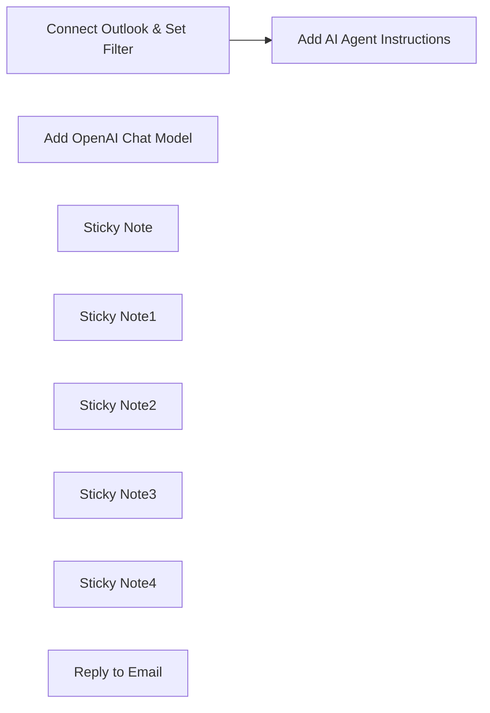

## Fluxo (.json) :

```json
{
  "id": "mqindLlOy0A0e5aA",
  "meta": {
    "instanceId": "aae6cde6c06a77e3bf2445b060051b4c63107a8258d59cb57184495848d659de",
    "templateCredsSetupCompleted": true
  },
  "name": "Outlook",
  "tags": [],
  "nodes": [
    {
      "id": "b2e6066f-a4c7-486c-aa0d-06a4c92aa745",
      "name": "Connect Outlook & Set Filter",
      "type": "n8n-nodes-base.microsoftOutlookTrigger",
      "position": [
        -240,
        -260
      ],
      "parameters": {
        "output": "raw",
        "filters": {
          "sender": "sales@yourcompany.com"
        },
        "options": {},
        "pollTimes": {
          "item": [
            {
              "mode": "everyMinute"
            }
          ]
        }
      },
      "credentials": {
        "microsoftOutlookOAuth2Api": {
          "id": "nRYwUzhHrSBFtcSS",
          "name": "Microsoft Outlook account 2"
        }
      },
      "typeVersion": 1
    },
    {
      "id": "98f20649-4842-44b8-86c3-a153cd7f4ce2",
      "name": "Add OpenAI Chat Model",
      "type": "@n8n/n8n-nodes-langchain.lmChatOpenAi",
      "position": [
        140,
        100
      ],
      "parameters": {
        "model": {
          "__rl": true,
          "mode": "list",
          "value": "gpt-4o-mini"
        },
        "options": {}
      },
      "credentials": {
        "openAiApi": {
          "id": "sXujPvtyB7ZEzKZs",
          "name": "OpenAi account 2"
        }
      },
      "typeVersion": 1.2
    },
    {
      "id": "bf4cb647-91c6-4f3d-a685-ed928b431ef5",
      "name": "Add AI Agent Instructions",
      "type": "@n8n/n8n-nodes-langchain.agent",
      "position": [
        140,
        -120
      ],
      "parameters": {
        "text": "=Write a reply to the following email, then save it as a draft to the email thread:\n<email>\nID: {{ $json.id }}\nFrom: {{ $json.from.emailAddress.address }}\nSubject: {{ $json.subject }}\nMessage: {{ $json.body.content }}\n</email>",
        "options": {
          "systemMessage": "#role\nYou are an AI assistant specializing in replying to incoming emails to [YOUR NAME] Outlook inbox.\n\n#capabilities and limitations\nYour reply will be limited to the current email message, not the email string. Do not hallucinate.\n\n#response\nReply in a casual, modern, professional, concise writing style. You should sound like [YOUR NAME HERE]. Here are examples of [YOUR NAME HERE] voice:\n<example>\n[COPY & PASTE REPLY SAMPLES FROM YOUR EMAIL]\n</example>\n<example>\n[COPY & PASTE REPLY SAMPLES FROM YOUR EMAIL]\n</example>\n<example>\n[ADD A VARIETY OF REPLY SAMPLES SO THE AGENT UNDERSTANDS YOUR TONE & STYLE]\n</example>"
        },
        "promptType": "define"
      },
      "typeVersion": 1.7
    },
    {
      "id": "8432a5b8-db95-4e1a-b573-6d4f6a026659",
      "name": "Sticky Note",
      "type": "n8n-nodes-base.stickyNote",
      "position": [
        -60,
        -320
      ],
      "parameters": {
        "color": 5,
        "content": "Trigger Action\n1) Connect a Microsoft email account you can authenticate\n2) Trigger is set to \"message received\" and the output \"raw\"\n3) Add the email address(es) you want the AI agent to handle"
      },
      "typeVersion": 1
    },
    {
      "id": "72b652a4-cebe-48d6-81ad-d078f0655041",
      "name": "Sticky Note1",
      "type": "n8n-nodes-base.stickyNote",
      "position": [
        -300,
        -80
      ],
      "parameters": {
        "color": 5,
        "width": 340,
        "height": 440,
        "content": "Agent Instructions\n\n#role\nYou are an AI assistant specializing in replying to incoming emails to [YOUR NAME] Outlook inbox.\n\n#capabilities and limitations\nYour reply will be limited to the current email message, not the email string. Do not hallucinate.\n\n#response\nReply in a casual, modern, professional, concise writing style. You should sound like [YOUR NAME HERE]. Here are examples of [YOUR NAME HERE] voice:\n<example>\n[COPY & PASTE REPLY SAMPLES FROM YOUR EMAIL]\n</example>\n<example>\n[COPY & PASTE REPLY SAMPLES FROM YOUR EMAIL]\n</example>\n<example>\n[ADD A VARIETY OF REPLY SAMPLES SO THE AGENT UNDERSTANDS YOUR TONE & STYLE]\n</example>"
      },
      "typeVersion": 1
    },
    {
      "id": "e2e761a3-9744-439c-9764-ab4c68621c69",
      "name": "Sticky Note2",
      "type": "n8n-nodes-base.stickyNote",
      "position": [
        60,
        260
      ],
      "parameters": {
        "color": 5,
        "height": 100,
        "content": "Add AI Model\n1) OpenAI Account Credentials Required\n2) Select model (ie. gpt-4o-mini)"
      },
      "typeVersion": 1
    },
    {
      "id": "555f37e2-a8fe-4cd4-9a55-758c07b6a4c4",
      "name": "Sticky Note3",
      "type": "n8n-nodes-base.stickyNote",
      "position": [
        320,
        180
      ],
      "parameters": {
        "color": 5,
        "height": 180,
        "content": "Reply Settings\n1) Manually set the resource, operation, and message\n2) Toggle switch to reply only to sender\n3) Let the AI model define the \"message\"\n4) Additional fields for the \"reply to\" and \"subject\""
      },
      "typeVersion": 1
    },
    {
      "id": "9b1a5b51-e502-42f4-80ad-03d050a3c7cb",
      "name": "Sticky Note4",
      "type": "n8n-nodes-base.stickyNote",
      "position": [
        580,
        120
      ],
      "parameters": {
        "height": 140,
        "content": "Draft a Reply\n1. Follows all the same \"Reply to Email\" settings EXCEPT the email reply is saved in your DRAFTS folder\n2. This setting is great if you want a human checkpoint before sending"
      },
      "typeVersion": 1
    },
    {
      "id": "46f4b974-4da7-471b-ba49-3737685d123e",
      "name": "Reply to Email",
      "type": "n8n-nodes-base.microsoftOutlookTool",
      "position": [
        400,
        40
      ],
      "webhookId": "6d01cb74-0463-4042-8917-acd2f552d4b5",
      "parameters": {
        "message": "={{ /*n8n-auto-generated-fromAI-override*/ $fromAI('Message', ``, 'string') }}",
        "options": {},
        "messageId": {
          "__rl": true,
          "mode": "id",
          "value": "={{ $json.id }}"
        },
        "operation": "reply",
        "descriptionType": "manual",
        "additionalFields": {
          "replyTo": "={{ $json.sender.emailAddress.address }}",
          "subject": "={{ $json.subject }}"
        },
        "replyToSenderOnly": true
      },
      "credentials": {
        "microsoftOutlookOAuth2Api": {
          "id": "nRYwUzhHrSBFtcSS",
          "name": "Microsoft Outlook"
        }
      },
      "typeVersion": 2
    }
  ],
  "active": false,
  "pinData": {},
  "settings": {
    "executionOrder": "v1"
  },
  "versionId": "fcd52e16-512c-4655-ae18-1a4b87190e0d",
  "connections": {
    "Reply to Email": {
      "ai_tool": [
        [
          {
            "node": "Add AI Agent Instructions",
            "type": "ai_tool",
            "index": 0
          }
        ]
      ]
    },
    "Add OpenAI Chat Model": {
      "ai_languageModel": [
        [
          {
            "node": "Add AI Agent Instructions",
            "type": "ai_languageModel",
            "index": 0
          }
        ]
      ]
    },
    "Draft a Reply [optional]": {
      "ai_tool": [
        [
          {
            "node": "Add AI Agent Instructions",
            "type": "ai_tool",
            "index": 0
          }
        ]
      ]
    },
    "Connect Outlook & Set Filter": {
      "main": [
        [
          {
            "node": "Add AI Agent Instructions",
            "type": "main",
            "index": 0
          }
        ]
      ]
    }
  }
}
```

<a id="template-106"></a>

## Template 106 - Enriquecimento e importação de contatos para Lemlist

- **Nome:** Enriquecimento e importação de contatos para Lemlist
- **Descrição:** Lê contatos de uma planilha, enriquece os dados de contato e empresa, e cria leads na conta do Lemlist.
- **Funcionalidade:** • Acionamento manual: Inicia o fluxo ao clicar em 'execute'.
• Leitura de planilha: Recupera linhas do Google Sheets a partir do intervalo A:K como fonte de dados.
• Mapeamento de campos: Extrai campos como email, companyName, website, LinkedIn, fullName, lastName e firstName para uso posterior.
• Enriquecimento de contatos: Consulta um serviço de enriquecimento passando o email e campos adicionais, solicitando SIREN e definindo o idioma para francês.
• Criação de leads em campanha: Envia o email enriquecido e os nomes/empresa para criar um lead no Lemlist.
- **Ferramentas:** • Google Sheets: Armazena e fornece os contatos a serem processados a partir de um intervalo específico.
• Dropcontact: Serviço de enriquecimento de contatos que completa emails, nomes, empresa, site, LinkedIn e consulta SIREN, configurado para retornar em francês.
• Lemlist: Plataforma de prospecção por email usada para criar e gerenciar leads em campanhas.

## Fluxo visual

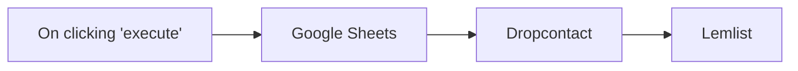

## Fluxo (.json) :

```json
{
  "nodes": [
    {
      "name": "On clicking 'execute'",
      "type": "n8n-nodes-base.manualTrigger",
      "position": [
        250,
        300
      ],
      "parameters": {},
      "typeVersion": 1
    },
    {
      "name": "Dropcontact",
      "type": "n8n-nodes-base.dropcontact",
      "position": [
        650,
        300
      ],
      "parameters": {
        "email": "={{$json[\"email\"]}}",
        "options": {
          "siren": true,
          "language": "fr"
        },
        "additionalFields": {
          "company": "={{$json[\"companyName\"]}}",
          "website": "={{$json[\"website\"]}}",
          "linkedin": "={{$json[\"LinkedIn\"]}}",
          "full_name": "={{$json[\"fullName\"]}}",
          "last_name": "={{$json[\"lastName\"]}}",
          "first_name": "={{$json[\"firstName\"]}}"
        }
      },
      "credentials": {
        "dropcontactApi": {
          "id": "6",
          "name": ""
        }
      },
      "typeVersion": 1
    },
    {
      "name": "Google Sheets",
      "type": "n8n-nodes-base.googleSheets",
      "position": [
        450,
        300
      ],
      "parameters": {
        "range": "A:K",
        "options": {
          "continue": false
        },
        "sheetId": "",
        "authentication": "oAuth2"
      },
      "credentials": {
        "googleSheetsOAuth2Api": {
          "id": "7",
          "name": "Google Sheets account"
        }
      },
      "typeVersion": 1
    },
    {
      "name": "Lemlist",
      "type": "n8n-nodes-base.lemlist",
      "position": [
        850,
        300
      ],
      "parameters": {
        "email": "={{$node[\"Dropcontact\"].json[\"email\"][0][\"email\"]}}",
        "resource": "lead",
        "campaignId": "",
        "additionalFields": {
          "lastName": "={{$node[\"Dropcontact\"].json[\"last_name\"]}}",
          "firstName": "={{$node[\"Dropcontact\"].json[\"first_name\"]}}",
          "companyName": "={{$node[\"Dropcontact\"].json[\"company\"]}}"
        }
      },
      "credentials": {
        "lemlistApi": {
          "id": "9",
          "name": "Lemlist account"
        }
      },
      "typeVersion": 1
    }
  ],
  "connections": {
    "Dropcontact": {
      "main": [
        [
          {
            "node": "Lemlist",
            "type": "main",
            "index": 0
          }
        ]
      ]
    },
    "Google Sheets": {
      "main": [
        [
          {
            "node": "Dropcontact",
            "type": "main",
            "index": 0
          }
        ]
      ]
    },
    "On clicking 'execute'": {
      "main": [
        [
          {
            "node": "Google Sheets",
            "type": "main",
            "index": 0
          }
        ]
      ]
    }
  }
}
```

<a id="template-107"></a>

## Template 107 - Selecionar cor aleatória excluindo cores

- **Nome:** Selecionar cor aleatória excluindo cores
- **Descrição:** Recebe uma entrada de chat ou um valor de teste e utiliza um agente de IA, apoiado por um modelo de linguagem e uma função de código, para retornar uma cor aleatória respeitando listas de exclusão.
- **Funcionalidade:** • Receber entrada por chat ou teste: aceita mensagens de chat via webhook ou um gatilho manual de teste.
• Encaminhar entrada para o agente de IA: usa o texto recebido como prompt para o agente.
• Processamento pelo modelo de linguagem: o agente utiliza um modelo (gpt-4o-mini) para interpretar o pedido e decidir chamar ferramentas quando necessário.
• Chamar ferramenta de código para seleção: o agente pode invocar uma função JavaScript que gera uma cor aleatória com base nas exclusões fornecidas.
• Filtrar cores excluídas: a função de código remove as cores indicadas na entrada antes de escolher uma opção disponível.
• Retornar resultado ao usuário: entrega a cor selecionada como resposta final do agente.
- **Ferramentas:** • OpenAI: provê o modelo de linguagem (gpt-4o-mini) usado para interpretar prompts, tomar decisões de orquestração e gerar respostas.

## Fluxo visual

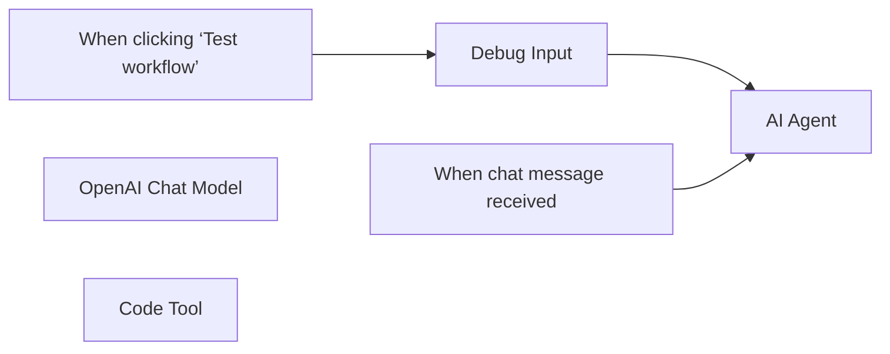

## Fluxo (.json) :

```json
{
  "meta": {
    "instanceId": "408f9fb9940c3cb18ffdef0e0150fe342d6e655c3a9fac21f0f644e8bedabcd9",
    "templateCredsSetupCompleted": true
  },
  "nodes": [
    {
      "id": "912b279c-30e5-4991-92ab-040fc1e89c7a",
      "name": "When clicking ‘Test workflow’",
      "type": "n8n-nodes-base.manualTrigger",
      "position": [
        -60,
        0
      ],
      "parameters": {},
      "typeVersion": 1
    },
    {
      "id": "749d8762-d213-4dd3-b404-4c6518fcd28f",
      "name": "When chat message received",
      "type": "@n8n/n8n-nodes-langchain.chatTrigger",
      "position": [
        -60,
        200
      ],
      "webhookId": "c2e664e6-645f-422a-99d3-cf0f4c53c345",
      "parameters": {
        "options": {}
      },
      "typeVersion": 1.1
    },
    {
      "id": "1eeff044-b914-40f7-8d37-8b69007862cd",
      "name": "AI Agent",
      "type": "@n8n/n8n-nodes-langchain.agent",
      "position": [
        460,
        0
      ],
      "parameters": {
        "text": "={{ $json.chatInput }}",
        "options": {},
        "promptType": "define"
      },
      "typeVersion": 1.8
    },
    {
      "id": "ac34f7f0-d1dc-4ffb-8f49-6ddc925e97bc",
      "name": "Debug Input",
      "type": "n8n-nodes-base.set",
      "position": [
        160,
        0
      ],
      "parameters": {
        "options": {},
        "assignments": {
          "assignments": [
            {
              "id": "25d97d59-b0cf-46ae-916d-18059b3d6847",
              "name": "chatInput",
              "type": "string",
              "value": "Return a random color but not green or blue"
            }
          ]
        }
      },
      "typeVersion": 3.4
    },
    {
      "id": "a410a0a5-1ea1-4ade-a32c-8f6fd959bae8",
      "name": "OpenAI Chat Model",
      "type": "@n8n/n8n-nodes-langchain.lmChatOpenAi",
      "position": [
        440,
        200
      ],
      "parameters": {
        "model": {
          "__rl": true,
          "mode": "list",
          "value": "gpt-4o-mini"
        },
        "options": {}
      },
      "credentials": {
        "openAiApi": {
          "id": "8gccIjcuf3gvaoEr",
          "name": "OpenAi account"
        }
      },
      "typeVersion": 1.2
    },
    {
      "id": "923b1597-2e9c-4c38-b3bb-7d6dffb52e4a",
      "name": "Code Tool",
      "type": "@n8n/n8n-nodes-langchain.toolCode",
      "position": [
        660,
        200
      ],
      "parameters": {
        "name": "my_color_selector",
        "jsCode": "const colors = [\n    'red',\n    'green',\n    'blue',\n    'yellow',\n    'pink',\n    'white',\n    'black',\n    'orange',\n    'brown',\n];\n\nconst ignoreColors = query.split(',').map((text) => text.trim());\n\n// remove all the colors that should be ignored\nconst availableColors = colors.filter((color) => {\n    return !ignoreColors.includes(color);\n});\n\n// Select a random color\nreturn availableColors[Math.floor(Math.random() * availableColors.length)];\n",
        "description": "Call this tool to get a random color. The input should be a string with comma-separated names of colors to exclude."
      },
      "typeVersion": 1.1
    }
  ],
  "pinData": {},
  "connections": {
    "Code Tool": {
      "ai_tool": [
        [
          {
            "node": "AI Agent",
            "type": "ai_tool",
            "index": 0
          }
        ]
      ]
    },
    "Debug Input": {
      "main": [
        [
          {
            "node": "AI Agent",
            "type": "main",
            "index": 0
          }
        ]
      ]
    },
    "OpenAI Chat Model": {
      "ai_languageModel": [
        [
          {
            "node": "AI Agent",
            "type": "ai_languageModel",
            "index": 0
          }
        ]
      ]
    },
    "When chat message received": {
      "main": [
        [
          {
            "node": "AI Agent",
            "type": "main",
            "index": 0
          }
        ]
      ]
    },
    "When clicking ‘Test workflow’": {
      "main": [
        [
          {
            "node": "Debug Input",
            "type": "main",
            "index": 0
          }
        ]
      ]
    }
  }
}
```

<a id="template-108"></a>

## Template 108 - Teste de regressão visual automatizado

- **Nome:** Teste de regressão visual automatizado
- **Descrição:** Automatiza a captura de screenshots base e testes visuais periódicos comparando imagens usando um modelo de visão, gerando relatórios quando são detectadas mudanças.
- **Funcionalidade:** • Geração de imagens base: Cria screenshots iniciais das páginas listadas para servirem como referência.
• Detecção de URLs sem imagem base: Identifica entradas na lista que ainda não possuem uma imagem base e gera essas imagens.
• Captura de screenshots atualizadas: Gera screenshots atuais das páginas para comparação.
• Armazenamento de imagens: Faz upload das imagens geradas para armazenamento centralizado e regista os identificadores.
• Comparação visual automatizada: Envia imagem base e imagem de teste para um modelo de visão que identifica mudanças (texto, imagens, cores, posição e layout).
• Parser de saída estruturada: Converte a resposta do modelo em formato JSON padronizado para processamento posterior.
• Filtragem e agregação de mudanças: Filtra páginas sem alterações e agrega apenas as que têm diferenças detectadas.
• Criação de relatório/issue: Gera um relatório formatado com as mudanças detectadas e cria uma issue no sistema de acompanhamento (Linear).
- **Ferramentas:** • Apify: Serviço de captura de screenshots de páginas web via actor/API.
• Google Drive: Armazenamento das imagens geradas e referência para futuras comparações.
• Google Sheets: Fonte de URLs a testar e registro dos IDs das imagens base.
• Google Gemini (PaLM): Modelo de visão/linguagem usado para comparar imagens e identificar mudanças.
• Linear.app: Plataforma para criar issues/relatórios com as mudanças detectadas.

## Fluxo visual

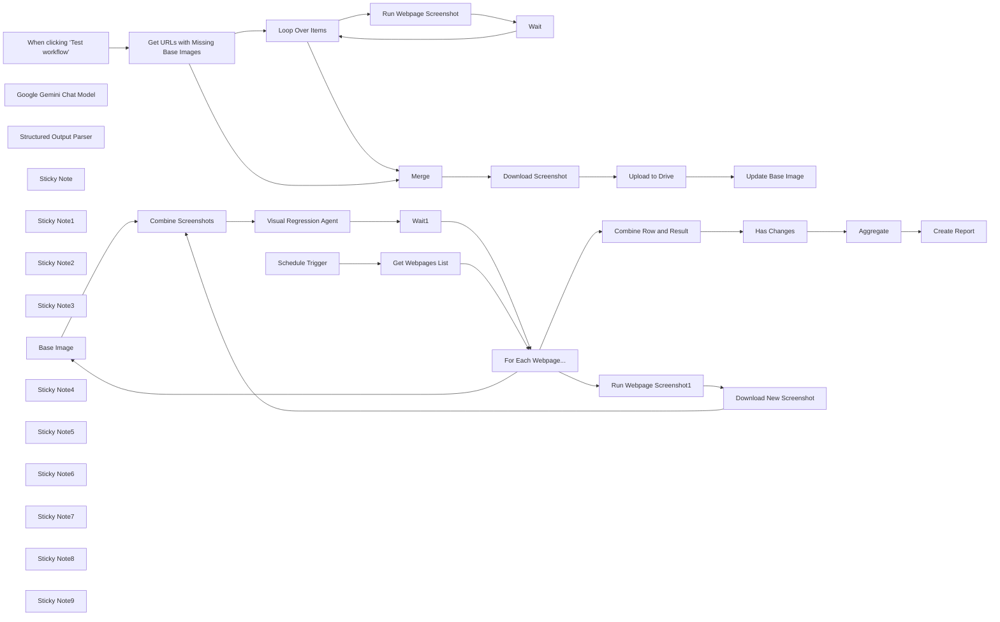

## Fluxo (.json) :

```json
{
  "meta": {
    "instanceId": "408f9fb9940c3cb18ffdef0e0150fe342d6e655c3a9fac21f0f644e8bedabcd9"
  },
  "nodes": [
    {
      "id": "cb62c9a5-2f43-4328-af94-84c2cb731d9c",
      "name": "Base Image",
      "type": "n8n-nodes-base.googleDrive",
      "position": [
        260,
        660
      ],
      "parameters": {
        "fileId": {
          "__rl": true,
          "mode": "id",
          "value": "={{ $json.base }}"
        },
        "options": {
          "binaryPropertyName": "data_1"
        },
        "operation": "download"
      },
      "credentials": {
        "googleDriveOAuth2Api": {
          "id": "yOwz41gMQclOadgu",
          "name": "Google Drive account"
        }
      },
      "typeVersion": 3
    },
    {
      "id": "b1c304cc-9949-441a-ac2a-275c8d4c51fc",
      "name": "Google Gemini Chat Model",
      "type": "@n8n/n8n-nodes-langchain.lmChatGoogleGemini",
      "position": [
        1120,
        900
      ],
      "parameters": {
        "options": {},
        "modelName": "models/gemini-1.5-pro-latest"
      },
      "credentials": {
        "googlePalmApi": {
          "id": "dSxo6ns5wn658r8N",
          "name": "Google Gemini(PaLM) Api account"
        }
      },
      "typeVersion": 1
    },
    {
      "id": "964d94bf-be2a-424e-ab0e-c1c1fe260ebd",
      "name": "Structured Output Parser",
      "type": "@n8n/n8n-nodes-langchain.outputParserStructured",
      "position": [
        1320,
        900
      ],
      "parameters": {
        "schemaType": "manual",
        "inputSchema": "{\n \"type\": \"array\",\n \"items\": {\n \"type\": \"object\",\n\t\"properties\": {\n\t\t\"type\": {\n \t\t\"type\": \"string\",\n \"description\": \"type of regression. One of text, number, image, color or position.\"\n \t\t},\n\t\t\"description\": { \"type\": \"string\" },\n \"previous_state\": { \"type\": \"string\" },\n \"current_state\": { \"type\": \"string\" }\n\t}\n }\n}"
      },
      "typeVersion": 1.2
    },
    {
      "id": "67195eb2-1729-42b0-8275-bdd6128b81aa",
      "name": "Sticky Note",
      "type": "n8n-nodes-base.stickyNote",
      "position": [
        -2340,
        20
      ],
      "parameters": {
        "color": 4,
        "width": 405.95003875719203,
        "height": 180.74812634463558,
        "content": "### Part A. Generate Base Images\nBefore we can run our visual regression tests, we must generate a series of base screenshots to compare against. This part of the workflow uses an external website screenshotting service, [Apify.com](https://www.apify.com?fpr=414q6), to achieve this. This part of the workflow should only be run when we want to update our base screenshots."
      },
      "typeVersion": 1
    },
    {
      "id": "85f9b371-1710-4c9c-a0ed-210d9c0e5d64",
      "name": "Sticky Note1",
      "type": "n8n-nodes-base.stickyNote",
      "position": [
        162.7495769165307,
        500
      ],
      "parameters": {
        "color": 7,
        "width": 702.1744987652204,
        "height": 548.4621171664835,
        "content": "## 5. Download Base and Generate new Webpage Screenshot\n[Learn more about Apify.com](https://www.apify.com?fpr=414q6)\n\nLooping for each webpage, we'll do 2 tasks (1) download the base screenshot for the url and (2) and use our [Apify.com](https://www.apify.com?fpr=414q6) webpage screenshot actor again to generate a fresh screenshot."
      },
      "typeVersion": 1
    },
    {
      "id": "8bff4efc-d9f9-485c-b51d-a8edc29d1105",
      "name": "Sticky Note2",
      "type": "n8n-nodes-base.stickyNote",
      "position": [
        900,
        500
      ],
      "parameters": {
        "color": 7,
        "width": 759.5372282495247,
        "height": 548.702446115556,
        "content": "## 6. Compare Screenshots using Vision Model\n[Read more about the basic LLM chain](https://docs.n8n.io/integrations/builtin/cluster-nodes/root-nodes/n8n-nodes-langchain.chainllm/)\n\nTo carry out our visual regression test, we need to send both screenshots simultaneously to our Vision model. This is easily achieved using n8n's built-in basic LLM chain where we can define two user messages of the binary type. For our vision model, we'll use Google's Gemini but any capable vision model will also do the job. A Structured Output Parser is used here to return the AI's response in JSON format, this is for easier formatting purposes which we'll get to in the next step."
      },
      "typeVersion": 1
    },
    {
      "id": "a92d11e5-0985-4a8f-bc43-8bc0ca48e744",
      "name": "Sticky Note3",
      "type": "n8n-nodes-base.stickyNote",
      "position": [
        397.518987341772,
        93.8157360237642
      ],
      "parameters": {
        "color": 7,
        "width": 885.2402868841493,
        "height": 388.92815062755926,
        "content": "## 7. Create Report In Linear\n[Learn more about integrating with Linear.app](https://docs.n8n.io/integrations/builtin/app-nodes/n8n-nodes-base.linear)\n\nFor the final step, we'll generate a simple report which will capture any changes detected in our webpages list. Let's do this by first combining our webpages with their test results and filter out any in the page where no changes were detected. Next, we'll aggregate all changes into the Linear.app node which will be formatted into a markdown snippet and used to create a new issue in Linear. If you don't use Linear, feel free to swap this out for JIRA or even Slack."
      },
      "typeVersion": 1
    },
    {
      "id": "3f52c006-6c0a-456d-ab3c-ee5a16726299",
      "name": "Loop Over Items",
      "type": "n8n-nodes-base.splitInBatches",
      "position": [
        -1680,
        580
      ],
      "parameters": {
        "options": {}
      },
      "typeVersion": 3
    },
    {
      "id": "478ee25d-3f0f-4f6c-bf34-add1dc14c3cb",
      "name": "Wait",
      "type": "n8n-nodes-base.wait",
      "position": [
        -1240,
        820
      ],
      "webhookId": "f06eab66-30a7-48ad-90ee-cb3394eb2edb",
      "parameters": {
        "amount": 2
      },
      "typeVersion": 1.1
    },
    {
      "id": "64b5f755-a85e-4ae5-ad81-113c1ef9b64c",
      "name": "Download Screenshot",
      "type": "n8n-nodes-base.httpRequest",
      "position": [
        -1260,
        360
      ],
      "parameters": {
        "url": "={{ $json.screenshotUrl }}",
        "options": {}
      },
      "typeVersion": 4.2
    },
    {
      "id": "8f99ef1f-1cdc-4d80-b858-e9960a805dd4",
      "name": "Upload to Drive",
      "type": "n8n-nodes-base.googleDrive",
      "position": [
        -1080,
        360
      ],
      "parameters": {
        "name": "={{ $('Merge').item.json.url.urlEncode() }}",
        "driveId": {
          "__rl": true,
          "mode": "list",
          "value": "My Drive"
        },
        "options": {
          "simplifyOutput": true
        },
        "folderId": {
          "__rl": true,
          "mode": "list",
          "value": "1lAFxJPWcA_sOcjr3UUKKfFfoTwd4Stkh",
          "cachedResultUrl": "https://drive.google.com/drive/folders/1lAFxJPWcA_sOcjr3UUKKfFfoTwd4Stkh",
          "cachedResultName": "base_images"
        }
      },
      "credentials": {
        "googleDriveOAuth2Api": {
          "id": "yOwz41gMQclOadgu",
          "name": "Google Drive account"
        }
      },
      "typeVersion": 3
    },
    {
      "id": "5e253123-89ba-42d5-b743-60bfd1ebae5b",
      "name": "Update Base Image",
      "type": "n8n-nodes-base.googleSheets",
      "position": [
        -900,
        360
      ],
      "parameters": {
        "columns": {
          "value": {
            "url": "={{ $('Merge').item.json.url }}",
            "base": "={{ $json.id }}"
          },
          "schema": [
            {
              "id": "service",
              "type": "string",
              "display": true,
              "required": false,
              "displayName": "service",
              "defaultMatch": false,
              "canBeUsedToMatch": true
            },
            {
              "id": "url",
              "type": "string",
              "display": true,
              "removed": false,
              "required": false,
              "displayName": "url",
              "defaultMatch": false,
              "canBeUsedToMatch": true
            },
            {
              "id": "base",
              "type": "string",
              "display": true,
              "required": false,
              "displayName": "base",
              "defaultMatch": false,
              "canBeUsedToMatch": true
            }
          ],
          "mappingMode": "defineBelow",
          "matchingColumns": [
            "url"
          ]
        },
        "options": {},
        "operation": "appendOrUpdate",
        "sheetName": {
          "__rl": true,
          "mode": "list",
          "value": "gid=0",
          "cachedResultUrl": "https://docs.google.com/spreadsheets/d/1RbobwHCJiYKnic6T-VA3kPr-Grd4Y_ZSQXqy2st_T84/edit#gid=0",
          "cachedResultName": "Sheet1"
        },
        "documentId": {
          "__rl": true,
          "mode": "list",
          "value": "1RbobwHCJiYKnic6T-VA3kPr-Grd4Y_ZSQXqy2st_T84",
          "cachedResultUrl": "https://docs.google.com/spreadsheets/d/1RbobwHCJiYKnic6T-VA3kPr-Grd4Y_ZSQXqy2st_T84/edit?usp=drivesdk",
          "cachedResultName": "Visual Regression List"
        }
      },
      "credentials": {
        "googleSheetsOAuth2Api": {
          "id": "XHvC7jIRR8A2TlUl",
          "name": "Google Sheets account"
        }
      },
      "typeVersion": 4.5
    },
    {
      "id": "fa7339b7-b7dd-4ecd-8dc2-f42f6549adb6",
      "name": "Merge",
      "type": "n8n-nodes-base.merge",
      "position": [
        -1440,
        360
      ],
      "parameters": {
        "mode": "combine",
        "options": {},
        "combineBy": "combineByPosition"
      },
      "typeVersion": 3
    },
    {
      "id": "47845df9-a50e-429e-b81e-5eefd996d5c7",
      "name": "Schedule Trigger",
      "type": "n8n-nodes-base.scheduleTrigger",
      "position": [
        -560,
        380
      ],
      "parameters": {
        "rule": {
          "interval": [
            {
              "field": "weeks",
              "triggerAtDay": [
                1
              ],
              "triggerAtHour": 6
            }
          ]
        }
      },
      "typeVersion": 1.2
    },
    {
      "id": "63492aa4-3535-4832-a9d0-0a949e46ec81",
      "name": "Get URLs with Missing Base Images",
      "type": "n8n-nodes-base.googleSheets",
      "position": [
        -1980,
        480
      ],
      "parameters": {
        "options": {},
        "sheetName": {
          "__rl": true,
          "mode": "list",
          "value": "gid=0",
          "cachedResultUrl": "https://docs.google.com/spreadsheets/d/1RbobwHCJiYKnic6T-VA3kPr-Grd4Y_ZSQXqy2st_T84/edit#gid=0",
          "cachedResultName": "Sheet1"
        },
        "documentId": {
          "__rl": true,
          "mode": "list",
          "value": "1RbobwHCJiYKnic6T-VA3kPr-Grd4Y_ZSQXqy2st_T84",
          "cachedResultUrl": "https://docs.google.com/spreadsheets/d/1RbobwHCJiYKnic6T-VA3kPr-Grd4Y_ZSQXqy2st_T84/edit?usp=drivesdk",
          "cachedResultName": "Visual Regression List"
        }
      },
      "credentials": {
        "googleSheetsOAuth2Api": {
          "id": "XHvC7jIRR8A2TlUl",
          "name": "Google Sheets account"
        }
      },
      "typeVersion": 4.5
    },
    {
      "id": "8907f3b9-0613-4057-8adb-fd5c4e25cf72",
      "name": "Run Webpage Screenshot",
      "type": "n8n-nodes-base.httpRequest",
      "position": [
        -1420,
        820
      ],
      "parameters": {
        "url": "https://api.apify.com/v2/acts/apify~screenshot-url/run-sync-get-dataset-items",
        "method": "POST",
        "options": {},
        "jsonBody": "={{\n{\n \"delay\": 0,\n \"format\": \"png\",\n \"proxy\": {\n \"useApifyProxy\": true\n },\n \"scrollToBottom\": false,\n \"urls\": [\n {\n \"url\": $json.url\n }\n ],\n \"viewportWidth\": 1280,\n \"waitUntil\": \"domcontentloaded\",\n \"waitUntilNetworkIdleAfterScroll\": false\n}\n}}",
        "sendBody": true,
        "specifyBody": "json",
        "authentication": "genericCredentialType",
        "genericAuthType": "httpQueryAuth"
      },
      "credentials": {
        "httpQueryAuth": {
          "id": "cO2w8RDNOZg8DRa8",
          "name": "Apify API"
        }
      },
      "typeVersion": 4.2
    },
    {
      "id": "3dc45b2d-4c4a-44d5-9b45-3e2144479603",
      "name": "Run Webpage Screenshot1",
      "type": "n8n-nodes-base.httpRequest",
      "position": [
        273,
        833
      ],
      "parameters": {
        "url": "https://api.apify.com/v2/acts/apify~screenshot-url/run-sync-get-dataset-items",
        "method": "POST",
        "options": {},
        "jsonBody": "={{\n{\n \"delay\": 0,\n \"format\": \"png\",\n \"proxy\": {\n \"useApifyProxy\": true\n },\n \"scrollToBottom\": false,\n \"urls\": [\n {\n \"url\": $json.url\n }\n ],\n \"viewportWidth\": 1280,\n \"waitUntil\": \"domcontentloaded\",\n \"waitUntilNetworkIdleAfterScroll\": false\n}\n}}",
        "sendBody": true,
        "specifyBody": "json",
        "authentication": "genericCredentialType",
        "genericAuthType": "httpQueryAuth"
      },
      "credentials": {
        "httpQueryAuth": {
          "id": "cO2w8RDNOZg8DRa8",
          "name": "Apify API"
        }
      },
      "typeVersion": 4.2
    },
    {
      "id": "672d64fb-7782-427e-8779-953e51118fbc",
      "name": "Has Changes",
      "type": "n8n-nodes-base.filter",
      "position": [
        680,
        300
      ],
      "parameters": {
        "options": {},
        "conditions": {
          "options": {
            "version": 2,
            "leftValue": "",
            "caseSensitive": true,
            "typeValidation": "strict"
          },
          "combinator": "and",
          "conditions": [
            {
              "id": "20b18a7e-bf98-4f39-baa9-4d965097526a",
              "operator": {
                "type": "array",
                "operation": "lengthGt",
                "rightType": "number"
              },
              "leftValue": "={{ $json.output }}",
              "rightValue": 0
            }
          ]
        }
      },
      "typeVersion": 2.2
    },
    {
      "id": "efa168ec-ff05-471b-869f-cee5a222594a",
      "name": "Combine Row and Result",
      "type": "n8n-nodes-base.set",
      "position": [
        500,
        300
      ],
      "parameters": {
        "mode": "raw",
        "options": {},
        "jsonOutput": "={{\n{\n ...$('Get Webpages List').item.json,\n output: $json.output\n}\n}}\n"
      },
      "typeVersion": 3.4
    },
    {
      "id": "1fe901dc-f460-41b8-8042-0fcb0474092f",
      "name": "Wait1",
      "type": "n8n-nodes-base.wait",
      "position": [
        1580,
        900
      ],
      "webhookId": "6bbf2e65-bed1-4efc-bb31-09d12c644dc5",
      "parameters": {
        "amount": 1
      },
      "typeVersion": 1.1
    },
    {
      "id": "7891f052-4073-4746-a04b-27c7c4fa1e63",
      "name": "Aggregate",
      "type": "n8n-nodes-base.aggregate",
      "position": [
        860,
        300
      ],
      "parameters": {
        "options": {},
        "aggregate": "aggregateAllItemData"
      },
      "typeVersion": 1
    },
    {
      "id": "ef2b2ddb-51f9-4576-bd99-9efa39be5163",
      "name": "Create Report",
      "type": "n8n-nodes-base.linear",
      "position": [
        1040,
        300
      ],
      "parameters": {
        "title": "=Visual Regression Report {{ $now.format('yyyy-MM-dd') }}",
        "teamId": "1c721608-321d-4132-ac32-6e92d04bb487",
        "additionalFields": {
          "description": "=Visual Regression Workflow picked up the following changes:\n\n{{\n$json.data.map(row =>\n`### ${row.url}\n${row.output.map(issue =>\n`* **${issue.description}** - expected \"${issue.previous_state}\" but got \"${issue.current_state}\"`\n).join('\\n')}`\n).join('\\n');\n}}"
        }
      },
      "credentials": {
        "linearApi": {
          "id": "Nn0F7T9FtvRUtEbe",
          "name": "Linear account"
        }
      },
      "typeVersion": 1
    },
    {
      "id": "477b89f7-00ca-4001-a246-0887bcb553eb",
      "name": "When clicking ‘Test workflow’",
      "type": "n8n-nodes-base.manualTrigger",
      "position": [
        -2180,
        480
      ],
      "parameters": {},
      "typeVersion": 1
    },
    {
      "id": "eb7f6310-5465-4638-b702-5ecbd98a0199",
      "name": "Get Webpages List",
      "type": "n8n-nodes-base.googleSheets",
      "position": [
        -360,
        380
      ],
      "parameters": {
        "options": {},
        "filtersUI": {
          "values": [
            {
              "lookupValue": "2",
              "lookupColumn": "=row_number"
            }
          ]
        },
        "sheetName": {
          "__rl": true,
          "mode": "list",
          "value": "gid=0",
          "cachedResultUrl": "https://docs.google.com/spreadsheets/d/1RbobwHCJiYKnic6T-VA3kPr-Grd4Y_ZSQXqy2st_T84/edit#gid=0",
          "cachedResultName": "Sheet1"
        },
        "documentId": {
          "__rl": true,
          "mode": "list",
          "value": "1RbobwHCJiYKnic6T-VA3kPr-Grd4Y_ZSQXqy2st_T84",
          "cachedResultUrl": "https://docs.google.com/spreadsheets/d/1RbobwHCJiYKnic6T-VA3kPr-Grd4Y_ZSQXqy2st_T84/edit?usp=drivesdk",
          "cachedResultName": "Visual Regression List"
        }
      },
      "credentials": {
        "googleSheetsOAuth2Api": {
          "id": "XHvC7jIRR8A2TlUl",
          "name": "Google Sheets account"
        }
      },
      "typeVersion": 4.5
    },
    {
      "id": "6c0f7341-14c9-48c2-9447-edab0ad18df7",
      "name": "For Each Webpage...",
      "type": "n8n-nodes-base.splitInBatches",
      "position": [
        -40,
        440
      ],
      "parameters": {
        "options": {}
      },
      "typeVersion": 3
    },
    {
      "id": "62e13166-458d-4c63-8911-740f9ceaeb54",
      "name": "Sticky Note4",
      "type": "n8n-nodes-base.stickyNote",
      "position": [
        -660,
        160
      ],
      "parameters": {
        "color": 7,
        "width": 561.2038065501644,
        "height": 408.0284015307624,
        "content": "## 4. Trigger Visual Regression Test Run\n[Read more about the Schedule Trigger](https://docs.n8n.io/integrations/builtin/core-nodes/n8n-nodes-base.scheduletrigger/)\n\nOnce we've generated our base images to compare with in Part A, we can now run our Visual Regression Tests. These tests are intended to check for unexpected changes to a webpage by using some form of image detection. To trigger Part B, we'll start with a schedule trigger and pull a list of webpages to test from Google Sheets."
      },
      "typeVersion": 1
    },
    {
      "id": "8d958f44-fd2c-49b4-adbd-d8a99b2614c8",
      "name": "Sticky Note5",
      "type": "n8n-nodes-base.stickyNote",
      "position": [
        -2340,
        218.0216140230686
      ],
      "parameters": {
        "color": 7,
        "width": 626.9985071319608,
        "height": 487.40071048786325,
        "content": "## 1. Get List of Webpages to Generate Base Images\n[Learn more about using Google Sheets](https://docs.n8n.io/integrations/builtin/app-nodes/n8n-nodes-base.googlesheets/)\n\nThis workflow is split into 2 parts: Part A will generate the \"base\" screenshots to compare new screenshots against. To capture these base screenshots, we'll use Google Sheets to hold our list of webpages and their screenshot references (we'll come on to that later).\n\nExample Sheet: https://docs.google.com/spreadsheets/d/e/2PACX-1vTXRZRi55dUbLAsWZboJqH5U-EK0ZRSse8pkqANAV4Ss70otpQ97zgT8YBd3dL4d2u2UC1TTx_o1o1R/pubhtml"
      },
      "typeVersion": 1
    },
    {
      "id": "ee776b4d-4532-4c08-ac38-35d40afbd8ad",
      "name": "Sticky Note6",
      "type": "n8n-nodes-base.stickyNote",
      "position": [
        -1480,
        580
      ],
      "parameters": {
        "color": 7,
        "width": 653.369086691465,
        "height": 443.1120543367141,
        "content": "## 2. Generate Webpage Screenshot via Apify\n[Learn more about Apify.com](https://www.apify.com?fpr=414q6)\n\nTo generate a screenshot of the webpage, we'll need a third party service since this functionality is outside the scope of n8n. Feel free to pick whichever internal or external service works for you but I've had great experience using [Apify.com](https://www.apify.com?fpr=414q6) - a popular webscraping SaaS who offer a generous free plan and require very little configuration to get started.\n\nThe Apify \"actor\" (ie. a type of scraper) we'll be using is specifically designed to take webpage screenshots."
      },
      "typeVersion": 1
    },
    {
      "id": "3d90e103-2829-4075-b3d4-5ba848af4843",
      "name": "Sticky Note7",
      "type": "n8n-nodes-base.stickyNote",
      "position": [
        -1520,
        160
      ],
      "parameters": {
        "color": 7,
        "width": 808.188722669735,
        "height": 397.73072497123115,
        "content": "## 3. Upload Screenshot to Google Drive\n[Read more about using the Google Drive node](https://docs.n8n.io/integrations/builtin/app-nodes/n8n-nodes-base.googledrive/)\n\nOnce we have our screenshots, we'll download them from Apify and upload them to our Google Drive for safe keeping. After uploading, we'll capture the new Google Drive IDs for the images into our Google Sheet, this will allow us to reference them again when we perform the visual regression testing."
      },
      "typeVersion": 1
    },
    {
      "id": "e47d14ec-ad78-42c8-a294-301dcd581a67",
      "name": "Download New Screenshot",
      "type": "n8n-nodes-base.httpRequest",
      "position": [
        453,
        833
      ],
      "parameters": {
        "url": "={{ $json.screenshotUrl }}",
        "options": {
          "response": {
            "response": {
              "responseFormat": "file",
              "outputPropertyName": "data_2"
            }
          }
        }
      },
      "typeVersion": 4.2
    },
    {
      "id": "8ca118bc-3d19-48ac-9d9c-0892993da736",
      "name": "Combine Screenshots",
      "type": "n8n-nodes-base.merge",
      "position": [
        660,
        660
      ],
      "parameters": {
        "mode": "combine",
        "options": {},
        "combineBy": "combineByPosition"
      },
      "typeVersion": 3
    },
    {
      "id": "03359cbb-d7af-4118-a32a-3fe24062dc9f",
      "name": "Sticky Note8",
      "type": "n8n-nodes-base.stickyNote",
      "position": [
        -660,
        20
      ],
      "parameters": {
        "color": 4,
        "width": 394.03359370567625,
        "height": 111.52173490405977,
        "content": "### Part B. Run Visual Regression Test\nIn this part of the workflow, we'll retrieve our list of webpages to test with our AI vision model. This part can be run as many times as required."
      },
      "typeVersion": 1
    },
    {
      "id": "a78c0f92-aa61-483b-95bf-dd60958f182d",
      "name": "Sticky Note9",
      "type": "n8n-nodes-base.stickyNote",
      "position": [
        -2920,
        220
      ],
      "parameters": {
        "width": 553.2963720930223,
        "height": 473.4987906976746,
        "content": "## Try It Out!\n\n### This workflow implements an approach to Visual Regression Testing - a means to test websites for defects - using AI Vision Models.\n\nThis workflow uses a Google Sheet to track a list of webpages to test and is split into 2 parts; Part A generates the base screenshots of the list and Part B runs the visual regression testing.\n\nThe example spreadsheet can be found here: https://docs.google.com/spreadsheets/d/e/2PACX-1vTXRZRi55dUbLAsWZboJqH5U-EK0ZRSse8pkqANAV4Ss70otpQ97zgT8YBd3dL4d2u2UC1TTx_o1o1R/pubhtml\n\n**[Apify.com](https://www.apify.com?fpr=414q6)** is the screenshot generator of choice and a free account with $5 in credit is available via this [link](https://www.apify.com?fpr=414q6).\n\n\n### Need Help?\nJoin the [Discord](https://discord.com/invite/XPKeKXeB7d) or ask in the [Forum](https://community.n8n.io/)!"
      },
      "typeVersion": 1
    },
    {
      "id": "a0b257e5-99f8-409a-bc67-2468db377d6c",
      "name": "Visual Regression Agent",
      "type": "@n8n/n8n-nodes-langchain.chainLlm",
      "position": [
        1120,
        740
      ],
      "parameters": {
        "text": "Identify changes between the base image and test image.",
        "messages": {
          "messageValues": [
            {
              "message": "=You help with visual regression testing for websites. Identify changes to text content, images, colors, position and layouts of the elements in the screenshots. Ignore text styling or casing changes.\nThe first image will be the base image and the second image will be the test. Note all changes to the test image which differ from the base. If there are no changes, it is okay to return an empty array."
            },
            {
              "type": "HumanMessagePromptTemplate",
              "messageType": "imageBinary",
              "binaryImageDataKey": "data_1"
            },
            {
              "type": "HumanMessagePromptTemplate",
              "messageType": "imageBinary",
              "binaryImageDataKey": "data_2"
            }
          ]
        },
        "promptType": "define",
        "hasOutputParser": true
      },
      "typeVersion": 1.4
    }
  ],
  "pinData": {},
  "connections": {
    "Wait": {
      "main": [
        [
          {
            "node": "Loop Over Items",
            "type": "main",
            "index": 0
          }
        ]
      ]
    },
    "Merge": {
      "main": [
        [
          {
            "node": "Download Screenshot",
            "type": "main",
            "index": 0
          }
        ]
      ]
    },
    "Wait1": {
      "main": [
        [
          {
            "node": "For Each Webpage...",
            "type": "main",
            "index": 0
          }
        ]
      ]
    },
    "Aggregate": {
      "main": [
        [
          {
            "node": "Create Report",
            "type": "main",
            "index": 0
          }
        ]
      ]
    },
    "Base Image": {
      "main": [
        [
          {
            "node": "Combine Screenshots",
            "type": "main",
            "index": 0
          }
        ]
      ]
    },
    "Has Changes": {
      "main": [
        [
          {
            "node": "Aggregate",
            "type": "main",
            "index": 0
          }
        ]
      ]
    },
    "Loop Over Items": {
      "main": [
        [
          {
            "node": "Merge",
            "type": "main",
            "index": 1
          }
        ],
        [
          {
            "node": "Run Webpage Screenshot",
            "type": "main",
            "index": 0
          }
        ]
      ]
    },
    "Upload to Drive": {
      "main": [
        [
          {
            "node": "Update Base Image",
            "type": "main",
            "index": 0
          }
        ]
      ]
    },
    "Schedule Trigger": {
      "main": [
        [
          {
            "node": "Get Webpages List",
            "type": "main",
            "index": 0
          }
        ]
      ]
    },
    "Get Webpages List": {
      "main": [
        [
          {
            "node": "For Each Webpage...",
            "type": "main",
            "index": 0
          }
        ]
      ]
    },
    "Combine Screenshots": {
      "main": [
        [
          {
            "node": "Visual Regression Agent",
            "type": "main",
            "index": 0
          }
        ]
      ]
    },
    "Download Screenshot": {
      "main": [
        [
          {
            "node": "Upload to Drive",
            "type": "main",
            "index": 0
          }
        ]
      ]
    },
    "For Each Webpage...": {
      "main": [
        [
          {
            "node": "Combine Row and Result",
            "type": "main",
            "index": 0
          }
        ],
        [
          {
            "node": "Base Image",
            "type": "main",
            "index": 0
          },
          {
            "node": "Run Webpage Screenshot1",
            "type": "main",
            "index": 0
          }
        ]
      ]
    },
    "Combine Row and Result": {
      "main": [
        [
          {
            "node": "Has Changes",
            "type": "main",
            "index": 0
          }
        ]
      ]
    },
    "Run Webpage Screenshot": {
      "main": [
        [
          {
            "node": "Wait",
            "type": "main",
            "index": 0
          }
        ]
      ]
    },
    "Download New Screenshot": {
      "main": [
        [
          {
            "node": "Combine Screenshots",
            "type": "main",
            "index": 1
          }
        ]
      ]
    },
    "Run Webpage Screenshot1": {
      "main": [
        [
          {
            "node": "Download New Screenshot",
            "type": "main",
            "index": 0
          }
        ]
      ]
    },
    "Visual Regression Agent": {
      "main": [
        [
          {
            "node": "Wait1",
            "type": "main",
            "index": 0
          }
        ]
      ]
    },
    "Google Gemini Chat Model": {
      "ai_languageModel": [
        [
          {
            "node": "Visual Regression Agent",
            "type": "ai_languageModel",
            "index": 0
          }
        ]
      ]
    },
    "Structured Output Parser": {
      "ai_outputParser": [
        [
          {
            "node": "Visual Regression Agent",
            "type": "ai_outputParser",
            "index": 0
          }
        ]
      ]
    },
    "Get URLs with Missing Base Images": {
      "main": [
        [
          {
            "node": "Loop Over Items",
            "type": "main",
            "index": 0
          },
          {
            "node": "Merge",
            "type": "main",
            "index": 0
          }
        ]
      ]
    },
    "When clicking ‘Test workflow’": {
      "main": [
        [
          {
            "node": "Get URLs with Missing Base Images",
            "type": "main",
            "index": 0
          }
        ]
      ]
    }
  }
}
```

<a id="template-109"></a>

## Template 109 - Automação LINE -> IA -> Microsoft 365

- **Nome:** Automação LINE -> IA -> Microsoft 365
- **Descrição:** Recebe eventos do LINE, processa textos e imagens com modelos de IA para classificar e extrair informações (ex.: cartões de visita) e integra resultados com Microsoft 365 e serviços externos.
- **Funcionalidade:** • Recepção de eventos do LINE: Aceita mensagens e mídias enviadas pelos usuários via webhook.
• Indicador de carregamento: Envia sinal de 'loading' ao chat para informar que o processamento está em andamento.
• Roteamento por tipo de mensagem: Detecta e separa mensagens de texto, imagens, áudio e outros tipos para fluxos distintos.
• Comando de tarefas (prefixo 'T '): Cria tarefas privadas no Microsoft To Do a partir de textos que começam com 'T '.
• Armazenamento em canal: Salva mensagens/textos relevantes em um canal do Microsoft Teams para registro.
• Download e processamento de imagens: Baixa o conteúdo de imagens enviadas pelo LINE para análise.
• Classificação de imagens via IA: Usa um modelo de linguagem para identificar se a imagem é um cartão de visita, texto manuscrito/tela ou outro tipo.
• Extração estruturada de cartões de visita: Quando identificado como cartão, extrai campos como nome, empresa, e-mail e telefone em JSON estruturado.
• Upload e renomeação de arquivo: Envia a imagem para OneDrive e renomeia o arquivo conforme o ID da mensagem.
• Criação de tarefa de follow-up: Gera uma tarefa no Microsoft To Do com dados extraídos do cartão para acompanhamento.
• Notificação ao usuário: Responde no LINE confirmando que a mensagem foi salva ou que a tarefa foi criada.
• Encaminhamento para workflow externo: Dispara uma chamada HTTP para um webhook externo para adicionar registros em planilha/fluxo adicional.
• Tratamento de tipos não suportados: Envia resposta pedindo para tentar novamente quando o tipo de mensagem não é tratado pelo fluxo.
- **Ferramentas:** • LINE Messaging API: Recepção de webhooks, download de conteúdo das mensagens, envio de respostas e controle de indicador de carregamento.
• OpenRouter / Modelo GPT-4o: Classificação de imagens e extração de informações (agentes e modelos de linguagem para parsing e geração de JSON estruturado).
• Microsoft Teams: Canal para salvar mensagens e registros compartilhados.
• Microsoft To Do: Criação de tarefas privadas e de follow-up baseadas em texto e dados extraídos.
• Microsoft OneDrive: Armazenamento e renomeação de arquivos de imagem provenientes do LINE.
• Make.com (webhook externo): Endpoint HTTP para acionar fluxo adicional que adiciona linhas em planilhas ou integrações externas.

## Fluxo visual

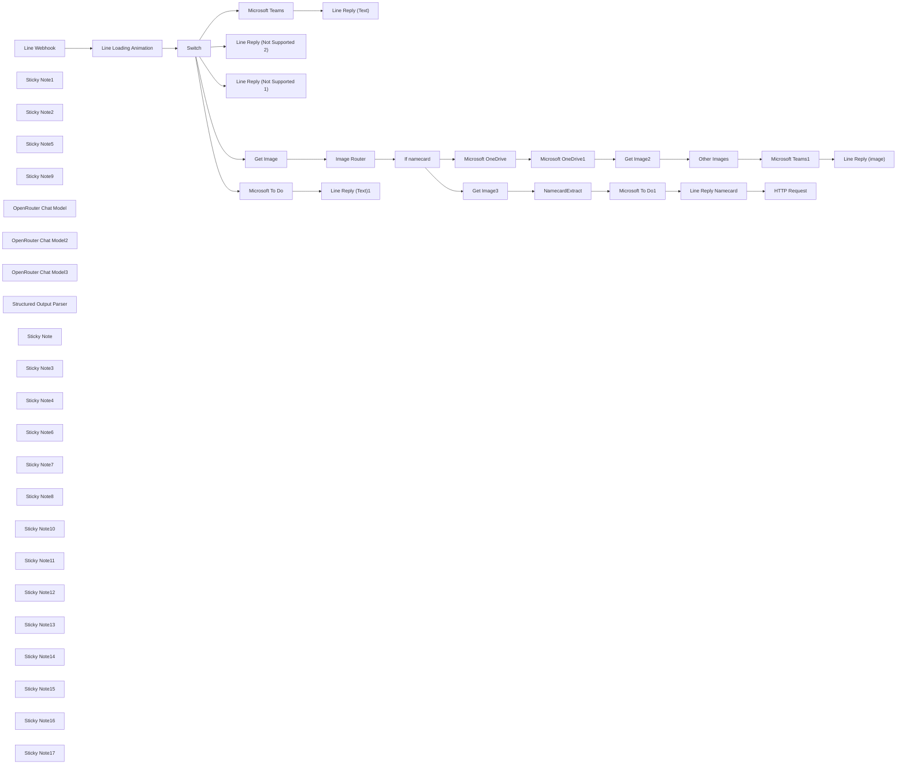

## Fluxo (.json) :

```json
{
  "id": "HbjZ9cBPgDdnIRjG",
  "meta": {
    "instanceId": "558d88703fb65b2d0e44613bc35916258b0f0bf983c5d4730c00c424b77ca36a",
    "templateCredsSetupCompleted": true
  },
  "name": "MiniBear Webhook",
  "tags": [
    {
      "id": "0xpEHcJjNRRRMtEj",
      "name": "lin",
      "createdAt": "2025-03-12T05:06:24.112Z",
      "updatedAt": "2025-03-12T05:06:24.112Z"
    },
    {
      "id": "IhTa6egt1w8uqn9Z",
      "name": "_ACTIVE",
      "createdAt": "2025-03-12T05:07:05.060Z",
      "updatedAt": "2025-03-12T05:07:05.060Z"
    },
    {
      "id": "Q0IWVCdrzoxXDC7z",
      "name": "error_linlinmhee_line",
      "createdAt": "2025-03-12T06:37:16.225Z",
      "updatedAt": "2025-03-12T06:37:16.225Z"
    },
    {
      "id": "U1ozjO3iXQZWUyfG",
      "name": "_Blueprint",
      "createdAt": "2025-03-12T06:24:40.268Z",
      "updatedAt": "2025-03-12T06:24:40.268Z"
    }
  ],
  "nodes": [
    {
      "id": "b1f42cbd-952e-4704-9233-788891e1894d",
      "name": "Line Webhook",
      "type": "n8n-nodes-base.webhook",
      "position": [
        -260,
        -20
      ],
      "webhookId": "4ef1a53c-a1ec-4a63-a7a5-469423502333",
      "parameters": {
        "path": "minibear",
        "options": {},
        "httpMethod": "POST"
      },
      "typeVersion": 2
    },
    {
      "id": "ae4a46d6-0f34-484b-8be5-dbc07d5de92e",
      "name": "Line Loading Animation",
      "type": "n8n-nodes-base.httpRequest",
      "position": [
        120,
        -20
      ],
      "parameters": {
        "url": "https://api.line.me/v2/bot/chat/loading/start",
        "method": "POST",
        "options": {},
        "jsonBody": "={\n    \"chatId\": \"{{ $json.body.events[0].source.userId }}\",\n    \"loadingSeconds\": 60\n}",
        "sendBody": true,
        "specifyBody": "json",
        "authentication": "genericCredentialType",
        "genericAuthType": "httpHeaderAuth"
      },
      "credentials": {
        "httpHeaderAuth": {
          "id": "lKd3b2nc8uNJ148Z",
          "name": "Line @271dudsw MiniBear"
        }
      },
      "typeVersion": 4.2
    },
    {
      "id": "802eb4b2-ed1c-4cbc-9cf9-9bd8fec74b82",
      "name": "Sticky Note1",
      "type": "n8n-nodes-base.stickyNote",
      "position": [
        -380,
        -100
      ],
      "parameters": {
        "color": 4,
        "width": 360,
        "height": 560,
        "content": "**Webhook from Line**\n\n\n\n\n\n\n\n\n\n\n\n\n\n\n\n\n\nYou need to set-up this webhook at Line Manager or Line Developer Console\n\nYou'll need to copy Webhook URL from this node to put in Line Console\n\nAlso, don't forget to remove 'test' part when going for production\n\nhttps://developers.line.biz/en/docs/messaging-api/receiving-messages/\n"
      },
      "typeVersion": 1
    },
    {
      "id": "965612b6-bd04-44e9-9b95-d777f92e9acf",
      "name": "Sticky Note2",
      "type": "n8n-nodes-base.stickyNote",
      "position": [
        0,
        -100
      ],
      "parameters": {
        "color": 4,
        "width": 360,
        "height": 560,
        "content": "**Line Loading Animation**\n\n\n\n\n\n\n\n\n\n\n\n\n\n\n\n\n\nThis node is to only give ... loading animation back in Line.\n\nIt seems stupid but it actually tells user that the workflow is running and you are not left waiting without hope\n\nTo authorize, you can fill in the Line Token in the node here, or you can you header authorization (shown at the 'reply message' node)\n\nhttps://developers.line.biz/en/docs/messaging-api/use-loading-indicator/"
      },
      "typeVersion": 1
    },
    {
      "id": "92953054-43a6-44a3-8069-6147cbb837c3",
      "name": "Switch",
      "type": "n8n-nodes-base.switch",
      "position": [
        500,
        80
      ],
      "parameters": {
        "rules": {
          "values": [
            {
              "outputKey": "Task",
              "conditions": {
                "options": {
                  "version": 2,
                  "leftValue": "",
                  "caseSensitive": true,
                  "typeValidation": "strict"
                },
                "combinator": "and",
                "conditions": [
                  {
                    "id": "6f9aef97-cf2f-4f8e-bbc5-c17069a24c57",
                    "operator": {
                      "type": "string",
                      "operation": "startsWith"
                    },
                    "leftValue": "={{ $('Line Webhook').item.json.body.events[0].message.text }}",
                    "rightValue": "T "
                  }
                ]
              },
              "renameOutput": true
            },
            {
              "outputKey": "text",
              "conditions": {
                "options": {
                  "version": 2,
                  "leftValue": "",
                  "caseSensitive": true,
                  "typeValidation": "strict"
                },
                "combinator": "and",
                "conditions": [
                  {
                    "id": "9f8075cf-8f3f-419f-ae0a-833ee29fc063",
                    "operator": {
                      "type": "string",
                      "operation": "equals"
                    },
                    "leftValue": "={{ $('Line Webhook').item.json.body.events[0].message.type }}",
                    "rightValue": "text"
                  }
                ]
              },
              "renameOutput": true
            },
            {
              "outputKey": "img",
              "conditions": {
                "options": {
                  "version": 2,
                  "leftValue": "",
                  "caseSensitive": true,
                  "typeValidation": "strict"
                },
                "combinator": "and",
                "conditions": [
                  {
                    "id": "b7770f5b-dfb5-4b7a-8dc1-4404337dbfde",
                    "operator": {
                      "name": "filter.operator.equals",
                      "type": "string",
                      "operation": "equals"
                    },
                    "leftValue": "={{ $('Line Webhook').item.json.body.events[0].message.type }}",
                    "rightValue": "image"
                  }
                ]
              },
              "renameOutput": true
            },
            {
              "outputKey": "audio",
              "conditions": {
                "options": {
                  "version": 2,
                  "leftValue": "",
                  "caseSensitive": true,
                  "typeValidation": "strict"
                },
                "combinator": "and",
                "conditions": [
                  {
                    "id": "9faa9dd4-32ce-4287-b7e5-885a42a62e32",
                    "operator": {
                      "name": "filter.operator.equals",
                      "type": "string",
                      "operation": "equals"
                    },
                    "leftValue": "={{ $('Line Webhook').item.json.body.events[0].message.type }}",
                    "rightValue": "audio"
                  }
                ]
              },
              "renameOutput": true
            },
            {
              "outputKey": "else",
              "conditions": {
                "options": {
                  "version": 2,
                  "leftValue": "",
                  "caseSensitive": true,
                  "typeValidation": "strict"
                },
                "combinator": "and",
                "conditions": [
                  {
                    "id": "f4dbfa6a-a7f8-4c32-a94d-da384f37c0d1",
                    "operator": {
                      "type": "boolean",
                      "operation": "true",
                      "singleValue": true
                    },
                    "leftValue": true,
                    "rightValue": ""
                  }
                ]
              },
              "renameOutput": true
            }
          ]
        },
        "options": {}
      },
      "typeVersion": 3.2
    },
    {
      "id": "ae9e08a3-0106-4e49-85b3-84eb9696673c",
      "name": "Sticky Note5",
      "type": "n8n-nodes-base.stickyNote",
      "position": [
        380,
        -100
      ],
      "parameters": {
        "color": 5,
        "width": 360,
        "height": 560,
        "content": "**Router for Tasks (Text started with 'T'), other texts, images and others**"
      },
      "typeVersion": 1
    },
    {
      "id": "933b7da4-95fd-4bb2-ac46-3eac62d0dcaa",
      "name": "Get Image",
      "type": "n8n-nodes-base.httpRequest",
      "position": [
        900,
        80
      ],
      "parameters": {
        "url": "=https://api-data.line.me/v2/bot/message/{{ $('Line Webhook').item.json.body.events[0].message.id }}/content",
        "options": {},
        "authentication": "genericCredentialType",
        "genericAuthType": "httpHeaderAuth"
      },
      "credentials": {
        "httpHeaderAuth": {
          "id": "lKd3b2nc8uNJ148Z",
          "name": "Line @271dudsw MiniBear"
        }
      },
      "typeVersion": 4.2
    },
    {
      "id": "d1160e8d-b84a-4e76-b5cc-f8c960a6070b",
      "name": "Sticky Note9",
      "type": "n8n-nodes-base.stickyNote",
      "position": [
        820,
        460
      ],
      "parameters": {
        "color": 4,
        "width": 360,
        "height": 480,
        "content": "**Line Reply**\nTo reply that message is not supported\n\n\n\n\n\n\n\n\n\n\n"
      },
      "typeVersion": 1
    },
    {
      "id": "b169657d-5348-4662-bdcf-6617416ec9f7",
      "name": "Line Reply (image)",
      "type": "n8n-nodes-base.httpRequest",
      "position": [
        3140,
        200
      ],
      "parameters": {
        "url": "https://api.line.me/v2/bot/message/reply",
        "method": "POST",
        "options": {},
        "jsonBody": "={\n  \"replyToken\": \"{{ $('Line Webhook').item.json.body.events[0].replyToken }}\",\n  \"messages\": [\n    {\n      \"type\": \"text\",\n      \"text\": \"[ Message Saved in Zac&Lin > Notes ]\"\n    }\n  ]\n} ",
        "sendBody": true,
        "specifyBody": "json",
        "authentication": "genericCredentialType",
        "genericAuthType": "httpHeaderAuth"
      },
      "credentials": {
        "httpHeaderAuth": {
          "id": "lKd3b2nc8uNJ148Z",
          "name": "Line @271dudsw MiniBear"
        }
      },
      "typeVersion": 4.2
    },
    {
      "id": "b0f63685-e8df-484e-85ea-bedabd80b61e",
      "name": "Line Reply (Text)",
      "type": "n8n-nodes-base.httpRequest",
      "position": [
        1300,
        -340
      ],
      "parameters": {
        "url": "https://api.line.me/v2/bot/message/reply",
        "method": "POST",
        "options": {},
        "jsonBody": "={\n  \"replyToken\": \"{{ $('Line Webhook').item.json.body.events[0].replyToken }}\",\n  \"messages\": [\n    {\n      \"type\": \"text\",\n      \"text\": \"[ Message Saved in Zac&Lin > Notes ]\" \n    }\n  ]\n} ",
        "sendBody": true,
        "specifyBody": "json",
        "authentication": "genericCredentialType",
        "genericAuthType": "httpHeaderAuth"
      },
      "credentials": {
        "httpHeaderAuth": {
          "id": "lKd3b2nc8uNJ148Z",
          "name": "Line @271dudsw MiniBear"
        }
      },
      "typeVersion": 4.2
    },
    {
      "id": "b2ee3bb5-7cdf-46de-868e-f6b81a2e0ec0",
      "name": "Line Reply (Not Supported 2)",
      "type": "n8n-nodes-base.httpRequest",
      "position": [
        940,
        740
      ],
      "parameters": {
        "url": "https://api.line.me/v2/bot/message/reply",
        "method": "POST",
        "options": {},
        "jsonBody": "={\n  \"replyToken\": \"{{ $('Line Webhook').item.json.body.events[0].replyToken }}\",\n  \"messages\": [\n    {\n      \"type\": \"text\",\n      \"text\": \"Please try again. Message type is not supported\"\n    }\n  ]\n} ",
        "sendBody": true,
        "specifyBody": "json",
        "authentication": "genericCredentialType",
        "genericAuthType": "httpHeaderAuth"
      },
      "credentials": {
        "httpHeaderAuth": {
          "id": "3IEOzxKOUr6OEXyU",
          "name": "Line @405jtfqs LazyChinese"
        }
      },
      "typeVersion": 4.2
    },
    {
      "id": "04f298c3-e952-4d85-aba7-0971d2f6a8b0",
      "name": "Line Reply (Not Supported 1)",
      "type": "n8n-nodes-base.httpRequest",
      "position": [
        940,
        540
      ],
      "parameters": {
        "url": "https://api.line.me/v2/bot/message/reply",
        "method": "POST",
        "options": {},
        "jsonBody": "={\n  \"replyToken\": \"{{ $('Line Webhook').item.json.body.events[0].replyToken }}\",\n  \"messages\": [\n    {\n      \"type\": \"text\",\n      \"text\": \"Please try again. Message type is not supported\"\n    }\n  ]\n} ",
        "sendBody": true,
        "specifyBody": "json",
        "authentication": "genericCredentialType",
        "genericAuthType": "httpHeaderAuth"
      },
      "credentials": {
        "httpHeaderAuth": {
          "id": "3IEOzxKOUr6OEXyU",
          "name": "Line @405jtfqs LazyChinese"
        }
      },
      "typeVersion": 4.2
    },
    {
      "id": "1d6d7c55-59ba-48c4-a877-6f260ede7bf5",
      "name": "OpenRouter Chat Model",
      "type": "@n8n/n8n-nodes-langchain.lmChatOpenRouter",
      "position": [
        1060,
        200
      ],
      "parameters": {
        "model": "openai/gpt-4o",
        "options": {}
      },
      "credentials": {
        "openRouterApi": {
          "id": "iQS3GMHjRv36CWYD",
          "name": "n8n Lin"
        }
      },
      "typeVersion": 1
    },
    {
      "id": "dae07428-733a-4976-9553-cba198736403",
      "name": "Image Router",
      "type": "@n8n/n8n-nodes-langchain.agent",
      "position": [
        1040,
        80
      ],
      "parameters": {
        "text": "You'll identify the image\n01 Namecard\n02 Text on screen or handwritten note\n03 Others\n\nYou'll answer with only 01 02 or 03",
        "options": {
          "passthroughBinaryImages": true
        },
        "promptType": "define"
      },
      "typeVersion": 1.8,
      "alwaysOutputData": true
    },
    {
      "id": "1810b10b-d326-4626-836c-4fb706deff20",
      "name": "Microsoft Teams",
      "type": "n8n-nodes-base.microsoftTeams",
      "position": [
        1020,
        -340
      ],
      "webhookId": "3a9c75de-5207-4e9b-a558-6c2fd622fb5f",
      "parameters": {
        "teamId": {
          "__rl": true,
          "mode": "list",
          "value": "ebfd67d4-df6b-4ea2-9faf-81ec059170ad",
          "cachedResultName": "Zac&Lin"
        },
        "message": "={{ $('Line Webhook').item.json.body.events[0].message.text.replace('\\n\\n', '<br><br>').replace('\\n', '<br>') }}",
        "options": {},
        "resource": "channelMessage",
        "channelId": {
          "__rl": true,
          "mode": "list",
          "value": "19:c2966307089a4f4b98ca06b5f160999a@thread.tacv2",
          "cachedResultUrl": "https://teams.microsoft.com/l/channel/19%3Ac2966307089a4f4b98ca06b5f160999a%40thread.tacv2/Notes?groupId=ebfd67d4-df6b-4ea2-9faf-81ec059170ad&tenantId=77e73351-d19d-4855-9380-82ca9b459c87&allowXTenantAccess=True&ngc=True",
          "cachedResultName": "Notes"
        },
        "contentType": "html"
      },
      "credentials": {
        "microsoftTeamsOAuth2Api": {
          "id": "3oENQ6chN2T1DR2x",
          "name": "Microsoft Teams account"
        }
      },
      "typeVersion": 2
    },
    {
      "id": "b98955e9-1c4c-473f-ac51-a8d73747ae63",
      "name": "Microsoft To Do",
      "type": "n8n-nodes-base.microsoftToDo",
      "position": [
        1020,
        -600
      ],
      "parameters": {
        "title": "={{ $('Line Webhook').item.json.body.events[0].message.text.replace('T ','') }}",
        "operation": "create",
        "taskListId": "AQMkAGE1NDhhM2UxLTA3ZTQtNGIyYS1iOWFjLTlkNDAyYzkzNjE2YQAuAAADCPe-x7aF5Eqh4_vJsot6MAEAG9nUtifnkkavLabXdl_kugAAAgESAAAA",
        "additionalFields": {}
      },
      "credentials": {
        "microsoftToDoOAuth2Api": {
          "id": "Pag1nTvXIzYpG5V1",
          "name": "Microsoft To Do account"
        }
      },
      "typeVersion": 1
    },
    {
      "id": "59202467-34c6-4580-8039-fca99c9467ca",
      "name": "Line Reply (Text)1",
      "type": "n8n-nodes-base.httpRequest",
      "position": [
        1300,
        -600
      ],
      "parameters": {
        "url": "https://api.line.me/v2/bot/message/reply",
        "method": "POST",
        "options": {},
        "jsonBody": "={\n  \"replyToken\": \"{{ $('Line Webhook').item.json.body.events[0].replyToken }}\",\n  \"messages\": [\n    {\n      \"type\": \"text\",\n      \"text\": \"[ Task : {{ $('Line Webhook').item.json.body.events[0].message.text.replace('T ','') }} created successfully in Private Task ]\" \n    }\n  ]\n} ",
        "sendBody": true,
        "specifyBody": "json",
        "authentication": "genericCredentialType",
        "genericAuthType": "httpHeaderAuth"
      },
      "credentials": {
        "httpHeaderAuth": {
          "id": "lKd3b2nc8uNJ148Z",
          "name": "Line @271dudsw MiniBear"
        }
      },
      "typeVersion": 4.2
    },
    {
      "id": "525f0a8b-0c03-4182-ab2b-ff97ba6ad50d",
      "name": "If namecard",
      "type": "n8n-nodes-base.if",
      "position": [
        1480,
        80
      ],
      "parameters": {
        "options": {},
        "conditions": {
          "options": {
            "version": 2,
            "leftValue": "",
            "caseSensitive": true,
            "typeValidation": "strict"
          },
          "combinator": "and",
          "conditions": [
            {
              "id": "85dc209c-a217-46a7-8289-b3e98c128d05",
              "operator": {
                "name": "filter.operator.equals",
                "type": "string",
                "operation": "equals"
              },
              "leftValue": "={{ $json.output }}",
              "rightValue": "01"
            }
          ]
        }
      },
      "typeVersion": 2.2
    },
    {
      "id": "113ab6ea-d66d-4b8d-ae81-eee73439c90e",
      "name": "Other Images",
      "type": "@n8n/n8n-nodes-langchain.agent",
      "position": [
        2440,
        200
      ],
      "parameters": {
        "text": "=If the image is handwritten notes or text on screen in thai or english, you'll extract the text.\n\nElse, you'll describe the image",
        "options": {
          "passthroughBinaryImages": true
        },
        "promptType": "define"
      },
      "typeVersion": 1.8
    },
    {
      "id": "596a643e-757a-4b83-878b-f5a0f1c42886",
      "name": "Microsoft Teams1",
      "type": "n8n-nodes-base.microsoftTeams",
      "position": [
        2880,
        200
      ],
      "webhookId": "3a9c75de-5207-4e9b-a558-6c2fd622fb5f",
      "parameters": {
        "teamId": {
          "__rl": true,
          "mode": "list",
          "value": "ebfd67d4-df6b-4ea2-9faf-81ec059170ad",
          "cachedResultName": "Zac&Lin"
        },
        "message": "={{ $json.output.replace('\\n\\n', '<br><br>').replace('\\n', '<br>') }}\n<br><br>\n\n</img>",
        "options": {},
        "resource": "channelMessage",
        "channelId": {
          "__rl": true,
          "mode": "list",
          "value": "19:c2966307089a4f4b98ca06b5f160999a@thread.tacv2",
          "cachedResultUrl": "https://teams.microsoft.com/l/channel/19%3Ac2966307089a4f4b98ca06b5f160999a%40thread.tacv2/Notes?groupId=ebfd67d4-df6b-4ea2-9faf-81ec059170ad&tenantId=77e73351-d19d-4855-9380-82ca9b459c87&allowXTenantAccess=True&ngc=True",
          "cachedResultName": "Notes"
        },
        "contentType": "html"
      },
      "credentials": {
        "microsoftTeamsOAuth2Api": {
          "id": "3oENQ6chN2T1DR2x",
          "name": "Microsoft Teams account"
        }
      },
      "typeVersion": 2
    },
    {
      "id": "be5637d9-50a7-4508-b6f9-d32ac37bb2c2",
      "name": "OpenRouter Chat Model2",
      "type": "@n8n/n8n-nodes-langchain.lmChatOpenRouter",
      "position": [
        2460,
        320
      ],
      "parameters": {
        "model": "openai/gpt-4o",
        "options": {}
      },
      "credentials": {
        "openRouterApi": {
          "id": "iQS3GMHjRv36CWYD",
          "name": "n8n Lin"
        }
      },
      "typeVersion": 1
    },
    {
      "id": "a7114805-80bf-428a-a717-b35cb6eb3312",
      "name": "Microsoft OneDrive",
      "type": "n8n-nodes-base.microsoftOneDrive",
      "position": [
        1820,
        200
      ],
      "parameters": {
        "fileName": "testtest.jpg",
        "parentId": "01I7MG5Y2G7ELINW2YLJBLHHF5KDBNJDPF",
        "binaryData": true
      },
      "credentials": {
        "microsoftOneDriveOAuth2Api": {
          "id": "pM363KMLOo6btGCp",
          "name": "Microsoft Drive account"
        }
      },
      "typeVersion": 1
    },
    {
      "id": "7a6f14a2-938f-40f8-a294-564fb1185de3",
      "name": "Microsoft OneDrive1",
      "type": "n8n-nodes-base.microsoftOneDrive",
      "position": [
        2000,
        200
      ],
      "parameters": {
        "itemId": "={{ $json.id }}",
        "newName": "={{ $('Line Webhook').item.json.body.events[0].message.id }}.jpg",
        "operation": "rename"
      },
      "credentials": {
        "microsoftOneDriveOAuth2Api": {
          "id": "pM363KMLOo6btGCp",
          "name": "Microsoft Drive account"
        }
      },
      "typeVersion": 1
    },
    {
      "id": "864fe7c5-f8f9-429e-94b7-2b760af09cd4",
      "name": "Get Image2",
      "type": "n8n-nodes-base.httpRequest",
      "position": [
        2260,
        200
      ],
      "parameters": {
        "url": "=https://api-data.line.me/v2/bot/message/{{ $('Line Webhook').item.json.body.events[0].message.id }}/content",
        "options": {},
        "authentication": "genericCredentialType",
        "genericAuthType": "httpHeaderAuth"
      },
      "credentials": {
        "httpHeaderAuth": {
          "id": "lKd3b2nc8uNJ148Z",
          "name": "Line @271dudsw MiniBear"
        }
      },
      "typeVersion": 4.2
    },
    {
      "id": "f1108c52-9e9c-4611-9a2a-40f28871632a",
      "name": "Microsoft To Do1",
      "type": "n8n-nodes-base.microsoftToDo",
      "position": [
        2400,
        -260
      ],
      "parameters": {
        "title": "=Follow-up Namecard {{ $json.output.Email }}",
        "operation": "create",
        "taskListId": "AQMkAGE1NDhhM2UxLTA3ZTQtNGIyYS1iOWFjLTlkNDAyYzkzNjE2YQAuAAADCPe-x7aF5Eqh4_vJsot6MAEAG9nUtifnkkavLabXdl_kugAAAgESAAAA",
        "additionalFields": {}
      },
      "credentials": {
        "microsoftToDoOAuth2Api": {
          "id": "Pag1nTvXIzYpG5V1",
          "name": "Microsoft To Do account"
        }
      },
      "typeVersion": 1
    },
    {
      "id": "2afe30ad-ef70-45e8-9e3c-546bd3cf91a8",
      "name": "HTTP Request",
      "type": "n8n-nodes-base.httpRequest",
      "position": [
        2960,
        -260
      ],
      "parameters": {
        "url": "https://hook.us2.make.com/46263sznm3didxdkcuqvnlfqv2fv2l7q",
        "method": "POST",
        "options": {},
        "sendBody": true,
        "bodyParameters": {
          "parameters": [
            {
              "name": "MessageID",
              "value": "={{ $('Line Webhook').item.json.body.events[0].message.id }}"
            },
            {
              "name": "Content",
              "value": "={{ $('NamecardExtract').item.json.output }}"
            },
            {
              "name": "ReplyToken",
              "value": "={{ $('Line Webhook').item.json.body.events[0].replyToken }}"
            }
          ]
        }
      },
      "typeVersion": 4.2
    },
    {
      "id": "a94bcdea-f8cc-4eb9-847a-66eb3808ed5b",
      "name": "OpenRouter Chat Model3",
      "type": "@n8n/n8n-nodes-langchain.lmChatOpenRouter",
      "position": [
        2000,
        -140
      ],
      "parameters": {
        "model": "openai/gpt-4o",
        "options": {}
      },
      "credentials": {
        "openRouterApi": {
          "id": "iQS3GMHjRv36CWYD",
          "name": "n8n Lin"
        }
      },
      "typeVersion": 1
    },
    {
      "id": "f138bdcf-1b46-4c14-b443-db2f1e3055f4",
      "name": "NamecardExtract",
      "type": "@n8n/n8n-nodes-langchain.agent",
      "position": [
        2000,
        -260
      ],
      "parameters": {
        "text": "=You'll extract the data in JSON format \n\n--- \n{   \"Nickname\": \"\",   \"FirstName\": \"\",   \"LastName\": \"\",   \"CompanyFull\": \"\",   \"Department\": \"\",   \"JobTitle\": \"\",   \"Mobile\": \"\",   \"Mobile2\": \"\",   \"Email\": \"\",   \"SocialMedia\": \"\",   \"Address\": \"\",   \"Remark\": \"\",   \"NameTH\": \"\" } \n--- \nFor Nickname, you'll see if there's any short name in the namecard. For Name TH, you'll see if there's thai name on the namecard. \n",
        "options": {
          "passthroughBinaryImages": true
        },
        "promptType": "define",
        "hasOutputParser": true
      },
      "typeVersion": 1.8
    },
    {
      "id": "df565b73-3cfe-464e-b5d2-36f2240da218",
      "name": "Structured Output Parser",
      "type": "@n8n/n8n-nodes-langchain.outputParserStructured",
      "position": [
        2180,
        -140
      ],
      "parameters": {
        "jsonSchemaExample": "{   \"Nickname\": \"\",   \"FirstName\": \"\",   \"LastName\": \"\",   \"CompanyFull\": \"\",   \"Department\": \"\",   \"JobTitle\": \"\",   \"Mobile\": \"\",   \"Mobile2\": \"\",   \"Email\": \"\",   \"SocialMedia\": \"\",   \"Address\": \"\",   \"Remark\": \"\",   \"NameTH\": \"\" } "
      },
      "typeVersion": 1.2
    },
    {
      "id": "c7b2b87f-3507-4a0f-a1d0-7ab9a131a619",
      "name": "Sticky Note",
      "type": "n8n-nodes-base.stickyNote",
      "position": [
        1220,
        -680
      ],
      "parameters": {
        "color": 4,
        "width": 260,
        "height": 240,
        "content": "**Line Reply**\nTo send feedback that the task has been added\n"
      },
      "typeVersion": 1
    },
    {
      "id": "6448ffd8-4a5d-4cb7-826a-b594952c6773",
      "name": "Sticky Note3",
      "type": "n8n-nodes-base.stickyNote",
      "position": [
        1220,
        -420
      ],
      "parameters": {
        "color": 4,
        "width": 260,
        "height": 240,
        "content": "**Line Reply**\nTo send feedback message has been saved"
      },
      "typeVersion": 1
    },
    {
      "id": "f222d983-26a5-4806-8f86-1eb32982f558",
      "name": "Sticky Note4",
      "type": "n8n-nodes-base.stickyNote",
      "position": [
        940,
        -680
      ],
      "parameters": {
        "color": 2,
        "width": 260,
        "height": 240,
        "content": "**Tasks**\nTo add in MS 'To Do' List"
      },
      "typeVersion": 1
    },
    {
      "id": "d13b3145-d9c5-41bb-a384-996fcdbbc19c",
      "name": "Sticky Note6",
      "type": "n8n-nodes-base.stickyNote",
      "position": [
        940,
        -420
      ],
      "parameters": {
        "color": 3,
        "width": 260,
        "height": 240,
        "content": "**MS Teams**\nSave this message in MS Teams"
      },
      "typeVersion": 1
    },
    {
      "id": "001dd5c9-b56e-47f1-bd71-31c3b2a7810c",
      "name": "Sticky Note7",
      "type": "n8n-nodes-base.stickyNote",
      "position": [
        2320,
        -340
      ],
      "parameters": {
        "color": 2,
        "width": 260,
        "height": 240,
        "content": "**Tasks**\nTo add in MS 'To Do' List to follow-up with this namecard"
      },
      "typeVersion": 1
    },
    {
      "id": "94519356-9e65-473f-bfad-f89d0aecc7ff",
      "name": "Sticky Note8",
      "type": "n8n-nodes-base.stickyNote",
      "position": [
        2600,
        -340
      ],
      "parameters": {
        "color": 4,
        "width": 260,
        "height": 240,
        "content": "**Line Reply**\nTo send feedback message has been saved"
      },
      "typeVersion": 1
    },
    {
      "id": "28c490ad-5fa9-435c-8d06-d3bb21c8d454",
      "name": "Line Reply Namecard",
      "type": "n8n-nodes-base.httpRequest",
      "position": [
        2680,
        -260
      ],
      "parameters": {
        "url": "https://api.line.me/v2/bot/message/reply",
        "method": "POST",
        "options": {},
        "jsonBody": "={\n  \"replyToken\": \"{{ $('Line Webhook').item.json.body.events[0].replyToken }}\",\n  \"messages\": [\n    {\n      \"type\": \"text\",\n      \"text\": \"[ Namecard Extraction ] /n/n {{ $('NamecardExtract').item.json.output }}\" \n    }\n  ]\n} ",
        "sendBody": true,
        "specifyBody": "json",
        "authentication": "genericCredentialType",
        "genericAuthType": "httpHeaderAuth"
      },
      "credentials": {
        "httpHeaderAuth": {
          "id": "lKd3b2nc8uNJ148Z",
          "name": "Line @271dudsw MiniBear"
        }
      },
      "typeVersion": 4.2
    },
    {
      "id": "67dd6ba3-6382-465b-a3a9-2d438e67aaf3",
      "name": "Sticky Note10",
      "type": "n8n-nodes-base.stickyNote",
      "position": [
        2880,
        -340
      ],
      "parameters": {
        "color": 4,
        "width": 260,
        "height": 240,
        "content": "**HTTP Request**\nThis is to trigger another workflow to add new rows in MS Excel 365"
      },
      "typeVersion": 1
    },
    {
      "id": "e8fb90be-1371-4bf1-a945-e6fcedacb8fb",
      "name": "Sticky Note11",
      "type": "n8n-nodes-base.stickyNote",
      "position": [
        3080,
        120
      ],
      "parameters": {
        "color": 4,
        "width": 260,
        "height": 240,
        "content": "**Line Reply**\nTo send feedback message has been saved"
      },
      "typeVersion": 1
    },
    {
      "id": "c43ec591-b882-4eba-95f3-827153af5890",
      "name": "Sticky Note12",
      "type": "n8n-nodes-base.stickyNote",
      "position": [
        2800,
        120
      ],
      "parameters": {
        "color": 3,
        "width": 260,
        "height": 240,
        "content": "**MS Teams**\nSave this message in MS Teams"
      },
      "typeVersion": 1
    },
    {
      "id": "150c2ea3-aca6-40da-879a-ee7204f00a5f",
      "name": "Sticky Note13",
      "type": "n8n-nodes-base.stickyNote",
      "position": [
        840,
        -40
      ],
      "parameters": {
        "color": 6,
        "width": 520,
        "height": 400,
        "content": "**Identify Image**\nFirst we'll get the image from Line and we will use Tool Agent to query OpenRouter to identify whether this is namecard or not?"
      },
      "typeVersion": 1
    },
    {
      "id": "694d260b-1570-430b-9a5b-5b4962af9b8b",
      "name": "Sticky Note14",
      "type": "n8n-nodes-base.stickyNote",
      "position": [
        1780,
        -380
      ],
      "parameters": {
        "color": 6,
        "width": 520,
        "height": 400,
        "content": "**Namecard Information Extraction**\nFirst we'll get the image from Line and we will use Tool Agent to query OpenRouter to extract the namecard information in the structured format"
      },
      "typeVersion": 1
    },
    {
      "id": "c437c0d5-3022-4469-ac3c-ceea9aaf1689",
      "name": "Get Image3",
      "type": "n8n-nodes-base.httpRequest",
      "position": [
        1860,
        -260
      ],
      "parameters": {
        "url": "=https://api-data.line.me/v2/bot/message/{{ $('Line Webhook').item.json.body.events[0].message.id }}/content",
        "options": {},
        "authentication": "genericCredentialType",
        "genericAuthType": "httpHeaderAuth"
      },
      "credentials": {
        "httpHeaderAuth": {
          "id": "lKd3b2nc8uNJ148Z",
          "name": "Line @271dudsw MiniBear"
        }
      },
      "typeVersion": 4.2
    },
    {
      "id": "91cf0e34-831a-4c56-92bb-e26319713874",
      "name": "Sticky Note15",
      "type": "n8n-nodes-base.stickyNote",
      "position": [
        1400,
        -40
      ],
      "parameters": {
        "color": 5,
        "width": 280,
        "height": 400,
        "content": "**Router Namecard or not**"
      },
      "typeVersion": 1
    },
    {
      "id": "65261cba-e104-404a-8af6-3c2b6cf85c2a",
      "name": "Sticky Note16",
      "type": "n8n-nodes-base.stickyNote",
      "position": [
        2220,
        80
      ],
      "parameters": {
        "color": 6,
        "width": 520,
        "height": 400,
        "content": "**Text Extraction**\nFirst we'll get the image from Line and we will use Tool Agent to query OpenRouter to identify image content such as what is written"
      },
      "typeVersion": 1
    },
    {
      "id": "1170527e-0ac7-4a8b-8ae8-420713a046fa",
      "name": "Sticky Note17",
      "type": "n8n-nodes-base.stickyNote",
      "position": [
        1740,
        80
      ],
      "parameters": {
        "width": 440,
        "height": 340,
        "content": "**Upload to OneDrive**\nThis is to upload the file to OneDrive. Due to some bug I faced, we need to rename the file again."
      },
      "typeVersion": 1
    }
  ],
  "active": true,
  "pinData": {},
  "settings": {
    "timezone": "Asia/Bangkok",
    "executionOrder": "v1"
  },
  "versionId": "49efe864-6f48-4c6c-853b-7e8542a7ea2f",
  "connections": {
    "Switch": {
      "main": [
        [
          {
            "node": "Microsoft To Do",
            "type": "main",
            "index": 0
          }
        ],
        [
          {
            "node": "Microsoft Teams",
            "type": "main",
            "index": 0
          }
        ],
        [
          {
            "node": "Get Image",
            "type": "main",
            "index": 0
          }
        ],
        [
          {
            "node": "Line Reply (Not Supported 1)",
            "type": "main",
            "index": 0
          }
        ],
        [
          {
            "node": "Line Reply (Not Supported 2)",
            "type": "main",
            "index": 0
          }
        ]
      ]
    },
    "Get Image": {
      "main": [
        [
          {
            "node": "Image Router",
            "type": "main",
            "index": 0
          }
        ]
      ]
    },
    "Get Image2": {
      "main": [
        [
          {
            "node": "Other Images",
            "type": "main",
            "index": 0
          }
        ]
      ]
    },
    "Get Image3": {
      "main": [
        [
          {
            "node": "NamecardExtract",
            "type": "main",
            "index": 0
          }
        ]
      ]
    },
    "If namecard": {
      "main": [
        [
          {
            "node": "Get Image3",
            "type": "main",
            "index": 0
          }
        ],
        [
          {
            "node": "Microsoft OneDrive",
            "type": "main",
            "index": 0
          }
        ]
      ]
    },
    "Image Router": {
      "main": [
        [
          {
            "node": "If namecard",
            "type": "main",
            "index": 0
          }
        ]
      ]
    },
    "Line Webhook": {
      "main": [
        [
          {
            "node": "Line Loading Animation",
            "type": "main",
            "index": 0
          }
        ]
      ]
    },
    "Other Images": {
      "main": [
        [
          {
            "node": "Microsoft Teams1",
            "type": "main",
            "index": 0
          }
        ]
      ]
    },
    "Microsoft Teams": {
      "main": [
        [
          {
            "node": "Line Reply (Text)",
            "type": "main",
            "index": 0
          }
        ]
      ]
    },
    "Microsoft To Do": {
      "main": [
        [
          {
            "node": "Line Reply (Text)1",
            "type": "main",
            "index": 0
          }
        ]
      ]
    },
    "NamecardExtract": {
      "main": [
        [
          {
            "node": "Microsoft To Do1",
            "type": "main",
            "index": 0
          }
        ]
      ]
    },
    "Microsoft Teams1": {
      "main": [
        [
          {
            "node": "Line Reply (image)",
            "type": "main",
            "index": 0
          }
        ]
      ]
    },
    "Microsoft To Do1": {
      "main": [
        [
          {
            "node": "Line Reply Namecard",
            "type": "main",
            "index": 0
          }
        ]
      ]
    },
    "Microsoft OneDrive": {
      "main": [
        [
          {
            "node": "Microsoft OneDrive1",
            "type": "main",
            "index": 0
          }
        ]
      ]
    },
    "Line Reply Namecard": {
      "main": [
        [
          {
            "node": "HTTP Request",
            "type": "main",
            "index": 0
          }
        ]
      ]
    },
    "Microsoft OneDrive1": {
      "main": [
        [
          {
            "node": "Get Image2",
            "type": "main",
            "index": 0
          }
        ]
      ]
    },
    "OpenRouter Chat Model": {
      "ai_languageModel": [
        [
          {
            "node": "Image Router",
            "type": "ai_languageModel",
            "index": 0
          }
        ]
      ]
    },
    "Line Loading Animation": {
      "main": [
        [
          {
            "node": "Switch",
            "type": "main",
            "index": 0
          }
        ]
      ]
    },
    "OpenRouter Chat Model2": {
      "ai_languageModel": [
        [
          {
            "node": "Other Images",
            "type": "ai_languageModel",
            "index": 0
          }
        ]
      ]
    },
    "OpenRouter Chat Model3": {
      "ai_languageModel": [
        [
          {
            "node": "NamecardExtract",
            "type": "ai_languageModel",
            "index": 0
          }
        ]
      ]
    },
    "Structured Output Parser": {
      "ai_outputParser": [
        [
          {
            "node": "NamecardExtract",
            "type": "ai_outputParser",
            "index": 0
          }
        ]
      ]
    }
  }
}
```

<a id="template-110"></a>

## Template 110 - Sincronizar e-mails do Google Sheets para Mailchimp

- **Nome:** Sincronizar e-mails do Google Sheets para Mailchimp
- **Descrição:** Lê e-mails de uma planilha do Google e os adiciona como assinantes em uma lista do Mailchimp automaticamente.
- **Funcionalidade:** • Leitura periódica da planilha: Lê o intervalo sheetone!A:C da planilha especificada para obter dados de contato.
• Inscrição de e-mails no Mailchimp: Cria ou inscreve contatos na lista do Mailchimp com status "subscribed" usando o valor de e-mail obtido.
• Mapeamento de campo de e-mail: Usa o campo "email" retornado da planilha para preencher o e-mail no destino.
• Agendamento por intervalo: Executa a leitura automaticamente em intervalos configuráveis (ex.: intervalo = 2).
• Suporte a credenciais: Utiliza credenciais configuradas para acessar a planilha e a API do Mailchimp.
• Disparo manual presente: Há um gatilho manual no fluxo que atualmente não está conectado ao restante das ações.
- **Ferramentas:** • Google Sheets: Planilha hospedada no Google usada para armazenar os contatos e e-mails; o fluxo lê o intervalo sheetone!A:C da planilha com o ID especificado.
• Mailchimp: Plataforma de e-mail marketing usada para adicionar/inscrever contatos em uma lista (ID da lista: 90d12734de) com status de assinatura.

## Fluxo visual

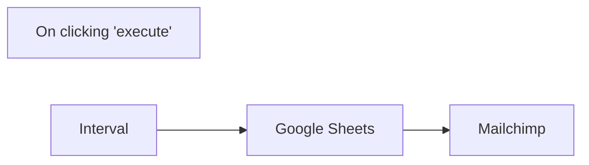

## Fluxo (.json) :

```json
{
  "id": "1",
  "name": "Google Sheet to Mailchimp",
  "nodes": [
    {
      "name": "On clicking 'execute'",
      "type": "n8n-nodes-base.manualTrigger",
      "position": [
        110,
        300
      ],
      "parameters": {},
      "typeVersion": 1
    },
    {
      "name": "Google Sheets",
      "type": "n8n-nodes-base.googleSheets",
      "position": [
        530,
        300
      ],
      "parameters": {
        "range": "sheetone!A:C",
        "options": {},
        "sheetId": "1jwEoPPrkQ2qYMYLZ_I0hlME_Ya_p2YZvaxG10Nf_R20"
      },
      "credentials": {
        "googleApi": "Google mailchimp"
      },
      "typeVersion": 1
    },
    {
      "name": "Mailchimp",
      "type": "n8n-nodes-base.mailchimp",
      "position": [
        720,
        300
      ],
      "parameters": {
        "list": "90d12734de",
        "email": "={{$node[\"Google Sheets\"].json[\"email\"]}}",
        "status": "subscribed",
        "options": {}
      },
      "credentials": {
        "mailchimpApi": "Google mailchimp"
      },
      "typeVersion": 1
    },
    {
      "name": "Interval",
      "type": "n8n-nodes-base.interval",
      "position": [
        290,
        300
      ],
      "parameters": {
        "interval": 2
      },
      "typeVersion": 1
    }
  ],
  "active": true,
  "settings": {},
  "connections": {
    "Interval": {
      "main": [
        [
          {
            "node": "Google Sheets",
            "type": "main",
            "index": 0
          }
        ]
      ]
    },
    "Google Sheets": {
      "main": [
        [
          {
            "node": "Mailchimp",
            "type": "main",
            "index": 0
          }
        ]
      ]
    },
    "On clicking 'execute'": {
      "main": [
        []
      ]
    }
  }
}
```

<a id="template-111"></a>

## Template 111 - Extração de dados do Etsy com Bright Data e Google Gemini

- **Nome:** Extração de dados do Etsy com Bright Data e Google Gemini
- **Descrição:** Fluxo que realiza buscas no Etsy via serviço de desbloqueio web, extrai e estrutura informações de produtos usando modelos LLM e envia ou grava os resultados.
- **Funcionalidade:** • Gatilho manual: Inicia o processo ao testar o fluxo.
• Configuração de busca: Define a URL de pesquisa do Etsy e a zona do serviço de desbloqueio.
• Requisição ao serviço de desbloqueio web: Envia a URL para um proxy/desbloqueador para obter o HTML/markdown da página.
• Extração de paginação via LLM: Analisa o conteúdo retornado e identifica URLs paginadas, devolvendo um conjunto único de páginas.
• Iteração paginada: Faz loop sobre cada página encontrada e realiza requisições separadas para cada uma.
• Extração de itens e dados de produto com LLMs: Processa cada página para extrair lista de produtos e metadados (imagem, nome, URL, marca, preço) em JSON estruturado.
• Notificação via webhook: Envia um resumo dos dados extraídos para um endpoint de webhook configurado.
• Geração de binário e gravação local: Converte o JSON extraído em dados binários (base64) e grava o conteúdo em arquivos locais por página.
• Suporte a modelos alternativos: Possui opção para usar diferentes modelos de linguagem para a extração (por exemplo, modelo da Google ou OpenAI).
- **Ferramentas:** • Bright Data (Web Unlocker API): Serviço de proxy/desbloqueio usado para acessar páginas do Etsy e retornar o conteúdo bruto.
• Google Gemini (PaLM API): Modelo de linguagem usado para analisar o HTML/markdown e extrair paginação e dados de produtos.
• OpenAI (opcional): Alternativa de modelo de linguagem para realizar a extração de paginação e conteúdo.
• Webhook.site (ou outro endpoint HTTP): Endpoint de webhook usado para receber notificações com os resumos extraídos.
• Sistema de arquivos local: Armazenamento local para gravar os JSONs extraídos por página.

## Fluxo visual

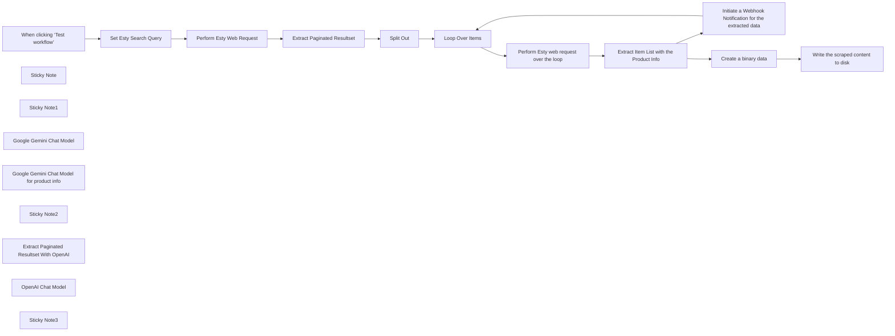

## Fluxo (.json) :

```json
{
  "id": "UuuCIDvTNnloIlvq",
  "meta": {
    "instanceId": "885b4fb4a6a9c2cb5621429a7b972df0d05bb724c20ac7dac7171b62f1c7ef40",
    "templateCredsSetupCompleted": true
  },
  "name": "Automate Etsy Data Mining with Bright Data Scrape & Google Gemini",
  "tags": [
    {
      "id": "Kujft2FOjmOVQAmJ",
      "name": "Engineering",
      "createdAt": "2025-04-09T01:31:00.558Z",
      "updatedAt": "2025-04-09T01:31:00.558Z"
    },
    {
      "id": "ddPkw7Hg5dZhQu2w",
      "name": "AI",
      "createdAt": "2025-04-13T05:38:08.053Z",
      "updatedAt": "2025-04-13T05:38:08.053Z"
    }
  ],
  "nodes": [
    {
      "id": "f369feaf-4782-4411-9d08-fe91b9ffd97e",
      "name": "When clicking ‘Test workflow’",
      "type": "n8n-nodes-base.manualTrigger",
      "position": [
        200,
        -555
      ],
      "parameters": {},
      "typeVersion": 1
    },
    {
      "id": "231bae3c-c27e-49fc-b878-2d5cc1e14c5a",
      "name": "Sticky Note",
      "type": "n8n-nodes-base.stickyNote",
      "position": [
        200,
        -1020
      ],
      "parameters": {
        "width": 400,
        "height": 300,
        "content": "## Note\n\nDeals with the Esty web scraping by utilizing the Bright Data Web Unlocker Product.\n\nThe Information Extraction node being used to demonstrate the usage of the N8N AI capabilities.\n\n**Please make sure to set the Indeed search query and update the Webhook Notification URL**"
      },
      "typeVersion": 1
    },
    {
      "id": "f568de40-b389-41f9-afe9-5e09a291c367",
      "name": "Sticky Note1",
      "type": "n8n-nodes-base.stickyNote",
      "position": [
        640,
        -1020
      ],
      "parameters": {
        "width": 480,
        "height": 300,
        "content": "## LLM Usages\n\nGoogle Gemini Flash Exp model is being used.\n\nBasic LLM Chain Data Extractor."
      },
      "typeVersion": 1
    },
    {
      "id": "4f1db865-a0cb-4978-9c7d-fde448bd978a",
      "name": "Set Esty Search Query",
      "type": "n8n-nodes-base.set",
      "position": [
        420,
        -555
      ],
      "parameters": {
        "options": {},
        "assignments": {
          "assignments": [
            {
              "id": "3aedba66-f447-4d7a-93c0-8158c5e795f9",
              "name": "url",
              "type": "string",
              "value": "https://www.etsy.com/search?q=wall+art+for+mum&order=date_desc&page=1&ref=pagination"
            },
            {
              "id": "4e7ee31d-da89-422f-8079-2ff2d357a0ba",
              "name": "zone",
              "type": "string",
              "value": "web_unlocker1"
            }
          ]
        }
      },
      "typeVersion": 3.4
    },
    {
      "id": "4cb51368-bb69-4d99-a0b6-e8e8013f1dfd",
      "name": "Perform Esty Web Request",
      "type": "n8n-nodes-base.httpRequest",
      "position": [
        640,
        -680
      ],
      "parameters": {
        "url": "https://api.brightdata.com/request",
        "method": "POST",
        "options": {},
        "sendBody": true,
        "sendHeaders": true,
        "authentication": "genericCredentialType",
        "bodyParameters": {
          "parameters": [
            {
              "name": "zone",
              "value": "={{ $json.zone }}"
            },
            {
              "name": "url",
              "value": "={{ $json.url }}?product=unlocker&method=api"
            },
            {
              "name": "format",
              "value": "raw"
            },
            {
              "name": "data_format",
              "value": "markdown"
            }
          ]
        },
        "genericAuthType": "httpHeaderAuth",
        "headerParameters": {
          "parameters": [
            {}
          ]
        }
      },
      "credentials": {
        "httpHeaderAuth": {
          "id": "kdbqXuxIR8qIxF7y",
          "name": "Header Auth account"
        }
      },
      "typeVersion": 4.2
    },
    {
      "id": "9fb7bdc5-ba64-4df4-89b4-a3207e7f6d0e",
      "name": "Google Gemini Chat Model",
      "type": "@n8n/n8n-nodes-langchain.lmChatGoogleGemini",
      "position": [
        948,
        -460
      ],
      "parameters": {
        "options": {},
        "modelName": "models/gemini-2.0-flash-exp"
      },
      "credentials": {
        "googlePalmApi": {
          "id": "YeO7dHZnuGBVQKVZ",
          "name": "Google Gemini(PaLM) Api account"
        }
      },
      "typeVersion": 1
    },
    {
      "id": "1f95576d-e243-481d-9d5f-308764d8ea4b",
      "name": "Loop Over Items",
      "type": "n8n-nodes-base.splitInBatches",
      "position": [
        1460,
        -680
      ],
      "parameters": {
        "options": {}
      },
      "typeVersion": 3
    },
    {
      "id": "47f23aa1-63ee-49e3-a465-283c7ab71b76",
      "name": "Perform Esty web request over the loop",
      "type": "n8n-nodes-base.httpRequest",
      "position": [
        1680,
        -560
      ],
      "parameters": {
        "url": "https://api.brightdata.com/request",
        "method": "POST",
        "options": {},
        "sendBody": true,
        "sendHeaders": true,
        "authentication": "genericCredentialType",
        "bodyParameters": {
          "parameters": [
            {
              "name": "zone",
              "value": "=web_unlocker1"
            },
            {
              "name": "url",
              "value": "={{ $json.url }}&product=unlocker"
            },
            {
              "name": "format",
              "value": "raw"
            },
            {
              "name": "data_format",
              "value": "markdown"
            }
          ]
        },
        "genericAuthType": "httpHeaderAuth",
        "headerParameters": {
          "parameters": [
            {}
          ]
        }
      },
      "credentials": {
        "httpHeaderAuth": {
          "id": "kdbqXuxIR8qIxF7y",
          "name": "Header Auth account"
        }
      },
      "typeVersion": 4.2
    },
    {
      "id": "0b5ea206-a5a0-49b5-8f53-10b4dec5806c",
      "name": "Initiate a Webhook Notification for the extracted data",
      "type": "n8n-nodes-base.httpRequest",
      "position": [
        2320,
        -560
      ],
      "parameters": {
        "url": "https://webhook.site/3c36d7d1-de1b-4171-9fd3-643ea2e4dd76",
        "options": {},
        "sendBody": true,
        "bodyParameters": {
          "parameters": [
            {
              "name": "summary",
              "value": "={{ $json.output }}"
            }
          ]
        }
      },
      "typeVersion": 4.2
    },
    {
      "id": "a164b90b-f44c-4862-b010-d515926774c7",
      "name": "Extract Item List with the Product Info",
      "type": "@n8n/n8n-nodes-langchain.informationExtractor",
      "position": [
        1920,
        -560
      ],
      "parameters": {
        "text": "=Extract the product info in JSON\n\n{{ $json.data }}",
        "options": {},
        "schemaType": "fromJson",
        "jsonSchemaExample": "[{\n    \"image\": \"https://i.etsystatic.com/34923795/r/il/8f3bba/5855230678/il_fullxfull.5855230678_n9el.jpg\",\n    \"name\": \"Custom Coffee Mug with Photo\",\n    \"url\": \"https://www.etsy.com/listing/1193808036/custom-coffee-mug-with-photo\",\n    \"brand\": {\n        \"@type\": \"Brand\",\n        \"name\": \"TheGiftBucks\"\n    },\n    \"offers\": {\n        \"@type\": \"Offer\",\n        \"price\": \"14.99\",\n        \"priceCurrency\": \"USD\"\n    }\n}]"
      },
      "typeVersion": 1
    },
    {
      "id": "c3798c64-ac53-44c8-ba91-8fe33377113d",
      "name": "Google Gemini Chat Model for product info",
      "type": "@n8n/n8n-nodes-langchain.lmChatGoogleGemini",
      "position": [
        2000,
        -300
      ],
      "parameters": {
        "options": {},
        "modelName": "models/gemini-2.0-flash-exp"
      },
      "credentials": {
        "googlePalmApi": {
          "id": "YeO7dHZnuGBVQKVZ",
          "name": "Google Gemini(PaLM) Api account"
        }
      },
      "typeVersion": 1
    },
    {
      "id": "11e4ae42-d2e1-4a4b-adcf-382f9e494431",
      "name": "Extract Paginated Resultset",
      "type": "@n8n/n8n-nodes-langchain.informationExtractor",
      "position": [
        860,
        -680
      ],
      "parameters": {
        "text": "=Analyze and Extract the below content. Make sure to produce a unique resultset. Exclude page_numbers which are not numbers.\n\n {{ $json.data }}",
        "options": {},
        "schemaType": "manual",
        "inputSchema": "{\n  \"$schema\": \"http://json-schema.org/schema#\",\n  \"title\": \"PagedResultSetSchema\",\n  \"type\": \"array\",\n  \"items\": {\n    \"type\": \"object\",\n    \"properties\": {\n      \"page_number\": {\n        \"type\": \"string\",\n        \"description\": \"Page number, typically a string (e.g., '1', '2', 'next').\"\n      },\n      \"url\": {\n        \"type\": \"string\",\n        \"format\": \"uri\",\n        \"description\": \"URL pointing to the page.\"\n      }\n    },\n    \"required\": [\"page_number\", \"url\"],\n    \"additionalProperties\": false\n  }\n}\n"
      },
      "typeVersion": 1
    },
    {
      "id": "28c1822b-d51c-4f8e-b98e-2e12324397be",
      "name": "Sticky Note2",
      "type": "n8n-nodes-base.stickyNote",
      "position": [
        1400,
        -780
      ],
      "parameters": {
        "color": 5,
        "width": 1340,
        "height": 620,
        "content": "## Loop and Perform Paginated Esty Data Extraction\n"
      },
      "typeVersion": 1
    },
    {
      "id": "d4f18f2b-9825-4320-addb-c02bfdc4da97",
      "name": "Write the scraped content to disk",
      "type": "n8n-nodes-base.readWriteFile",
      "position": [
        2560,
        -760
      ],
      "parameters": {
        "options": {},
        "fileName": "=d:\\Esty-Scraped-Content-{{ $('Loop Over Items').item.json.page_number }}.json",
        "operation": "write"
      },
      "typeVersion": 1
    },
    {
      "id": "5555407d-c7dd-4e5c-83ab-ef6ba9c46da3",
      "name": "Create a binary data",
      "type": "n8n-nodes-base.function",
      "position": [
        2360,
        -760
      ],
      "parameters": {
        "functionCode": "items[0].binary = {\n  data: {\n    data: new Buffer(JSON.stringify(items[0].json, null, 2)).toString('base64')\n  }\n};\nreturn items;"
      },
      "typeVersion": 1
    },
    {
      "id": "2f7a5fab-a2f4-422e-8f83-ce50fbe2a738",
      "name": "Split Out",
      "type": "n8n-nodes-base.splitOut",
      "position": [
        1240,
        -680
      ],
      "parameters": {
        "options": {},
        "fieldToSplitOut": "output"
      },
      "typeVersion": 1
    },
    {
      "id": "3d7a8992-b8d4-4a86-b60b-a92a7d63e31b",
      "name": "Extract Paginated Resultset With OpenAI",
      "type": "@n8n/n8n-nodes-langchain.informationExtractor",
      "position": [
        880,
        -120
      ],
      "parameters": {
        "text": "=Analyze and Extract the below content. Make sure to produce a unique resultset. Exclude page_numbers which are not numbers.\n\n {{ $json.data }}",
        "options": {},
        "schemaType": "manual",
        "inputSchema": "{\n  \"$schema\": \"http://json-schema.org/schema#\",\n  \"title\": \"PagedResultSetSchema\",\n  \"type\": \"array\",\n  \"items\": {\n    \"type\": \"object\",\n    \"properties\": {\n      \"page_number\": {\n        \"type\": \"string\",\n        \"description\": \"Page number, typically a string (e.g., '1', '2', 'next').\"\n      },\n      \"url\": {\n        \"type\": \"string\",\n        \"format\": \"uri\",\n        \"description\": \"URL pointing to the page.\"\n      }\n    },\n    \"required\": [\"page_number\", \"url\"],\n    \"additionalProperties\": false\n  }\n}\n"
      },
      "typeVersion": 1
    },
    {
      "id": "aa42d335-67bc-4dc5-a68a-4ce93e05464a",
      "name": "OpenAI Chat Model",
      "type": "@n8n/n8n-nodes-langchain.lmChatOpenAi",
      "position": [
        880,
        80
      ],
      "parameters": {
        "model": {
          "__rl": true,
          "mode": "list",
          "value": "gpt-4o-mini"
        },
        "options": {}
      },
      "credentials": {
        "openAiApi": {
          "id": "vPKynKbDzJ5ZU4cU",
          "name": "OpenAi account"
        }
      },
      "typeVersion": 1.2
    },
    {
      "id": "82df0ccc-3065-4bb5-a48e-90e4dbf2162f",
      "name": "Sticky Note3",
      "type": "n8n-nodes-base.stickyNote",
      "position": [
        640,
        -260
      ],
      "parameters": {
        "color": 6,
        "width": 660,
        "height": 460,
        "content": "## Open AI Extraction (Optional)\nNote - Replace the above workflow with the Open AI Chat Model if needed\nPlease make sure to set the OpenAI Chat Model -> Credential to connect with **OpenAi Account**"
      },
      "typeVersion": 1
    }
  ],
  "active": false,
  "pinData": {},
  "settings": {
    "executionOrder": "v1"
  },
  "versionId": "40a1bbd5-05b2-41c2-8b3c-72e3f16fd13a",
  "connections": {
    "Split Out": {
      "main": [
        [
          {
            "node": "Loop Over Items",
            "type": "main",
            "index": 0
          }
        ]
      ]
    },
    "Loop Over Items": {
      "main": [
        [],
        [
          {
            "node": "Perform Esty web request over the loop",
            "type": "main",
            "index": 0
          }
        ]
      ]
    },
    "OpenAI Chat Model": {
      "ai_languageModel": [
        [
          {
            "node": "Extract Paginated Resultset With OpenAI",
            "type": "ai_languageModel",
            "index": 0
          }
        ]
      ]
    },
    "Create a binary data": {
      "main": [
        [
          {
            "node": "Write the scraped content to disk",
            "type": "main",
            "index": 0
          }
        ]
      ]
    },
    "Set Esty Search Query": {
      "main": [
        [
          {
            "node": "Perform Esty Web Request",
            "type": "main",
            "index": 0
          }
        ]
      ]
    },
    "Google Gemini Chat Model": {
      "ai_languageModel": [
        [
          {
            "node": "Extract Paginated Resultset",
            "type": "ai_languageModel",
            "index": 0
          }
        ]
      ]
    },
    "Perform Esty Web Request": {
      "main": [
        [
          {
            "node": "Extract Paginated Resultset",
            "type": "main",
            "index": 0
          }
        ]
      ]
    },
    "Extract Paginated Resultset": {
      "main": [
        [
          {
            "node": "Split Out",
            "type": "main",
            "index": 0
          }
        ]
      ]
    },
    "When clicking ‘Test workflow’": {
      "main": [
        [
          {
            "node": "Set Esty Search Query",
            "type": "main",
            "index": 0
          }
        ]
      ]
    },
    "Perform Esty web request over the loop": {
      "main": [
        [
          {
            "node": "Extract Item List with the Product Info",
            "type": "main",
            "index": 0
          }
        ]
      ]
    },
    "Extract Item List with the Product Info": {
      "main": [
        [
          {
            "node": "Initiate a Webhook Notification for the extracted data",
            "type": "main",
            "index": 0
          },
          {
            "node": "Create a binary data",
            "type": "main",
            "index": 0
          }
        ]
      ]
    },
    "Google Gemini Chat Model for product info": {
      "ai_languageModel": [
        [
          {
            "node": "Extract Item List with the Product Info",
            "type": "ai_languageModel",
            "index": 0
          }
        ]
      ]
    },
    "Initiate a Webhook Notification for the extracted data": {
      "main": [
        [
          {
            "node": "Loop Over Items",
            "type": "main",
            "index": 0
          }
        ]
      ]
    }
  }
}
```

<a id="template-112"></a>

## Template 112 - Assistente de e-mail IA para Outlook

- **Nome:** Assistente de e-mail IA para Outlook
- **Descrição:** Automatiza a classificação e priorização de e-mails do Outlook usando um modelo de IA e dados de contato/regras de um CRM, atualizando categorias e importância conforme necessário.
- **Funcionalidade:** • Monitor de e-mails: busca e processa mensagens do Outlook aplicando filtros para ignorar itens sinalizados ou já categorizados.
• Sanitização do corpo: converte HTML para texto/markdown e limpa conteúdo irrelevante antes da análise.
• Integração de contatos: sincroniza e consulta contatos originados do Monday.com e armazena/atualiza em uma base de contatos.
• Carregamento de regras e categorias: obtém listas de categorias, regras e regras de exclusão de uma base para orientar a classificação.
• Classificação por IA: envia o conteúdo do e-mail e contexto de contatos/regras a um modelo de linguagem para determinar categoria, subcategoria (quando aplicável) e justificar a escolha.
• Validação de saída estruturada: garante que a resposta da IA esteja em JSON válido e extraí informações necessárias.
• Aplicação de ações no e-mail: atualiza a categoria e a prioridade (importance) do e-mail no Outlook com base no resultado da IA.
• Processamento em lote e correspondência de contatos: processa mensagens em lotes e verifica se o remetente coincide com contatos conhecidos.
• Agendamento: possui gatilhos para verificar e-mails periodicamente e para atualizar a lista de contatos.
- **Ferramentas:** • Microsoft 365 Outlook: serviço de e-mail usado para recuperar mensagens e atualizar categorias/importância.
• OpenAI (GPT-4o): modelo de linguagem utilizado para analisar e categorizar o conteúdo dos e-mails.
• Airtable: armazena categorias, regras, lista de contatos e regras de exclusão usadas pelo fluxo.
• Monday.com: fonte principal dos contatos/CRM que são sincronizados para contexto adicional na classificação.

## Fluxo visual

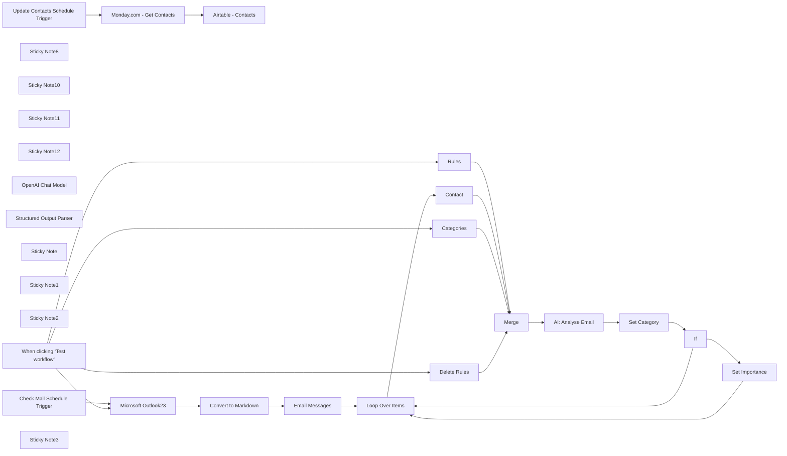

## Fluxo (.json) :

```json
{
  "id": "reQhibpNwU63Y8sn",
  "meta": {
    "instanceId": "2128095e13afd30151f0fb53632960213a789cd45ed0afd3a7fb96a985bb4bcf",
    "templateId": "2454",
    "templateCredsSetupCompleted": true
  },
  "name": "Microsoft Outlook AI Email Assistant",
  "tags": [],
  "nodes": [
    {
      "id": "a923cfb0-64fe-499a-8f0e-13fc848731df",
      "name": "When clicking ‘Test workflow’",
      "type": "n8n-nodes-base.manualTrigger",
      "position": [
        980,
        540
      ],
      "parameters": {},
      "typeVersion": 1
    },
    {
      "id": "ea865c8e-5c73-4d37-97d1-0349a265b9a4",
      "name": "Sticky Note8",
      "type": "n8n-nodes-base.stickyNote",
      "position": [
        2880,
        -600
      ],
      "parameters": {
        "color": 5,
        "width": 675,
        "height": 107,
        "content": "# Microsoft Outlook AI Email Assistant"
      },
      "typeVersion": 1
    },
    {
      "id": "c835042f-421b-44a0-8dc4-686ac638b358",
      "name": "Sticky Note10",
      "type": "n8n-nodes-base.stickyNote",
      "position": [
        1300,
        60
      ],
      "parameters": {
        "width": 612,
        "height": 401,
        "content": "## Outlook Business with filters\nFilters:\n```\nflag/flagStatus eq 'notFlagged' and not categories/any()\n```\n\nThese filters ensure we do not process flagged emails or email that already have a category set."
      },
      "typeVersion": 1
    },
    {
      "id": "51ae8a4e-2d37-4118-a538-cd0fd4f427f7",
      "name": "Microsoft Outlook23",
      "type": "n8n-nodes-base.microsoftOutlook",
      "position": [
        1540,
        240
      ],
      "parameters": {
        "limit": 10,
        "fields": [
          "flag",
          "from",
          "importance",
          "replyTo",
          "sender",
          "subject",
          "toRecipients",
          "body",
          "categories",
          "isRead"
        ],
        "output": "fields",
        "options": {},
        "filtersUI": {
          "values": {
            "filters": {
              "custom": "flag/flagStatus eq 'notFlagged' and not categories/any()",
              "foldersToInclude": [
                "AAMkADYyNmQ0YWE1LWQxYjEtNDBhYS1hODI3LTg3MTkyNDAwMzE5NwAuAAAAAAA44w-ZZoU7QLO9GQAyv8UcAQAkfR2JHrRET4CmwDGznLN6AAAAAAEMAAA="
              ]
            }
          }
        },
        "operation": "getAll"
      },
      "credentials": {
        "microsoftOutlookOAuth2Api": {
          "id": "nv0cz3C6VZDzEgtR",
          "name": "Microsoft365 Email Account"
        }
      },
      "typeVersion": 2
    },
    {
      "id": "a144adad-6fef-4f76-a06e-c889e8f16080",
      "name": "Sticky Note11",
      "type": "n8n-nodes-base.stickyNote",
      "position": [
        2020,
        60
      ],
      "parameters": {
        "color": 6,
        "width": 459,
        "height": 401,
        "content": "## Sanitise Email \nRemoves HTML and useless information in preparation for the AI Agent"
      },
      "typeVersion": 1
    },
    {
      "id": "92ccac8f-9ce3-4f81-a499-e55835be3fc7",
      "name": "Sticky Note12",
      "type": "n8n-nodes-base.stickyNote",
      "position": [
        2020,
        580
      ],
      "parameters": {
        "color": 4,
        "width": 736,
        "height": 558,
        "content": "## Get Rules & Categories\nEdit the airtables to set your own categories, rules, contacts and/or delete rules. "
      },
      "typeVersion": 1
    },
    {
      "id": "5b304e0f-002c-42c6-82a0-9ab1dc858861",
      "name": "OpenAI Chat Model",
      "type": "@n8n/n8n-nodes-langchain.lmChatOpenAi",
      "position": [
        3860,
        460
      ],
      "parameters": {
        "model": "gpt-4o",
        "options": {
          "temperature": 0.2
        }
      },
      "credentials": {
        "openAiApi": {
          "id": "l2JgpErNc5namHVH",
          "name": "OpenAI account"
        }
      },
      "typeVersion": 1
    },
    {
      "id": "210816e8-6a1f-4e63-a90e-d953e0e87ccd",
      "name": "Set Category",
      "type": "n8n-nodes-base.microsoftOutlook",
      "position": [
        4500,
        240
      ],
      "parameters": {
        "messageId": {
          "__rl": true,
          "mode": "id",
          "value": "={{ $json.output.id }}"
        },
        "operation": "update",
        "updateFields": {
          "categories": "={{ [$json.output.category] }}"
        }
      },
      "credentials": {
        "microsoftOutlookOAuth2Api": {
          "id": "nv0cz3C6VZDzEgtR",
          "name": "Microsoft365 Email Account"
        }
      },
      "typeVersion": 2
    },
    {
      "id": "fe4f8e8f-6a5c-4b7b-b5f7-10f1f374397c",
      "name": "Structured Output Parser",
      "type": "@n8n/n8n-nodes-langchain.outputParserStructured",
      "position": [
        4040,
        460
      ],
      "parameters": {
        "schemaType": "manual",
        "inputSchema": "{\n  \"type\": \"object\",\n  \"properties\": {\n    \"id\": {\n      \"type\": \"string\",\n      \"description\": \"The email id\"\n    },\n    \"subject\": {\n      \"type\": \"string\",\n      \"description\": \"The email subject line\"\n    },\n    \"category\": {\n      \"type\": \"string\",\n      \"description\": \"Primary classification of the email\"\n    },\n    \"subCategory\": {\n      \"type\": \"string\",\n      \"description\": \"Optional sub-classification if applicable\"\n    },\n    \"analysis\": {\n      \"type\": \"string\",\n      \"description\": \"Reasoning behind the categorization\"\n    }\n  },\n  \"required\": [\"id\",\"subject\", \"category\", \"analysis\"]\n}"
      },
      "typeVersion": 1.2
    },
    {
      "id": "489028ca-f265-4ea2-b8dd-64dd6b06c8f6",
      "name": "If",
      "type": "n8n-nodes-base.if",
      "position": [
        4740,
        240
      ],
      "parameters": {
        "options": {},
        "conditions": {
          "options": {
            "version": 2,
            "leftValue": "",
            "caseSensitive": true,
            "typeValidation": "strict"
          },
          "combinator": "and",
          "conditions": [
            {
              "id": "6e4ecd0c-d151-4e5b-8d66-558f9f9ec3b0",
              "operator": {
                "name": "filter.operator.equals",
                "type": "string",
                "operation": "equals"
              },
              "leftValue": "={{ $('AI: Analyse Email').item.json.output.subCategory }}",
              "rightValue": "Action"
            }
          ]
        }
      },
      "typeVersion": 2.2
    },
    {
      "id": "e2a27071-bac6-4a67-94fb-93e7ac218c89",
      "name": "Set Importance",
      "type": "n8n-nodes-base.microsoftOutlook",
      "position": [
        5000,
        220
      ],
      "parameters": {
        "messageId": {
          "__rl": true,
          "mode": "id",
          "value": "={{ $('AI: Analyse Email').item.json.output.id }}"
        },
        "operation": "update",
        "updateFields": {
          "importance": "High"
        }
      },
      "credentials": {
        "microsoftOutlookOAuth2Api": {
          "id": "nv0cz3C6VZDzEgtR",
          "name": "Microsoft365 Email Account"
        }
      },
      "typeVersion": 2
    },
    {
      "id": "61cecccf-589f-4514-b126-cfbfc7d94981",
      "name": "AI: Analyse Email",
      "type": "@n8n/n8n-nodes-langchain.agent",
      "position": [
        3860,
        240
      ],
      "parameters": {
        "text": "=Categorise the following email:\n<email>\n{{ $('Loop Over Items').item.json.toJsonString() }}\n</email>\n\n<Contact>\n{{ $('Contact').all().toJsonString() }}\n</Contact>\n\n<DeleteRules>\n{{ $('Delete Rules').all().toJsonString() }}\n</DeleteRules>\n\n<Categories>\n{{ $('Categories').all().toJsonString() }}\n</Categories>\n\nEnsure your final output is valid JSON with no additional text or token in the following format:\n\n{\n  \"subject\": \"SUBJECT_LINE\",1\n  \"category\": \"CATEGORY\",\n  \"subCategory\": \"SUBCATEGORY\", //use sparingly\n  \"analysis\": \"ANALYSIS_REASONING\"\n}\n\nRemember you can only use ONE of the following category 'Name' values from the 'Categories' defined above. No other categories can be used. Use the subcategory for additional context, for example, if a client email requires action or if a supplier email requires action. Do not create any additional subcategories; you can only use ONE of the category 'Name' values from the 'Categories' defined above.",
        "options": {
          "systemMessage": "=Categories: \"\"\"{{ $('Categories').all().toJsonString() }}\"\"\"\n\nYou are an AI email assistant for the *insert role & title*. Your task is to categorize incoming emails using one of the category 'Name' values defined in 'Categories' above.\n\nYou may also use the subcategory:\n- Action\n\nInstructions:\nAnalyse the email subject, body, and sender's email address to determine the appropriate category by referring to the 'Usage', 'Sender Indicators' and 'Subject Indicators' defined in the 'Categories' above.\n\n\nOutput Format:\nProduce output in valid JSON format:\n{\n  \"id\": \"{{ $('Loop Over Items').item.json.id }}\",\n  \"subject\": \"SUBJECT_LINE\",\n  \"category\": \"PRIMARY CATEGORY\",\n  \"subCategory\": \"SUBCATEGORY\", // use sparingly\n  \"analysis\": \"Brief 1-2 sentence explanation of category choice\"\n}\n- Replace \"SUBJECT_LINE\" with the actual subject of the email.\n- \"PRIMARY CATEGORY\" should be one of the categories listed above.\n- \"SUBCATEGORY\" should be \"Action\" if applicable; otherwise, omit or leave blank.\n- The \"analysis\" should be a brief 1-2 sentence explanation of why the category was chosen. Also, indicate if there was a match for the 'Contact' email and the email sender.\n\nImportant:\nYou may only use the categories and the subcategory listed above; do not create any additional categories or subcategories.\n\nNo additional text or tokens should be included outside the JSON output.\n"
        },
        "promptType": "define",
        "hasOutputParser": true
      },
      "typeVersion": 1.6
    },
    {
      "id": "947eb4d7-9067-4144-819b-f53947ca77f8",
      "name": "Sticky Note",
      "type": "n8n-nodes-base.stickyNote",
      "position": [
        1420,
        -620
      ],
      "parameters": {
        "color": 6,
        "width": 760,
        "height": 400,
        "content": "## CRM Contact List Integration \nFor this workflow I am retrieving supplier & client contacts from Monday.com the email assistant has better context to categorise, prioritise and reply to emails.\nThe list is updated daily or you can change the scheduler trigger to update more or less frequently.\nYou could replace this with your own CRM."
      },
      "typeVersion": 1
    },
    {
      "id": "79815a8f-5650-4ec9-97b3-c0201469d048",
      "name": "Sticky Note1",
      "type": "n8n-nodes-base.stickyNote",
      "position": [
        3640,
        60
      ],
      "parameters": {
        "width": 700,
        "height": 580,
        "content": "## Categorise & Prioritise Emails Agent \n"
      },
      "typeVersion": 1
    },
    {
      "id": "2e9411a8-30da-4ee5-9597-cb08e34049a5",
      "name": "Sticky Note2",
      "type": "n8n-nodes-base.stickyNote",
      "position": [
        4400,
        120
      ],
      "parameters": {
        "color": 4,
        "width": 740,
        "height": 280,
        "content": "## Set the category & importance using the output from the agent\n"
      },
      "typeVersion": 1
    },
    {
      "id": "138a734f-0ac5-4e50-a4af-b7255e11e862",
      "name": "Check Mail Schedule Trigger",
      "type": "n8n-nodes-base.scheduleTrigger",
      "disabled": true,
      "position": [
        980,
        260
      ],
      "parameters": {
        "rule": {
          "interval": [
            {
              "field": "minutes",
              "minutesInterval": 15
            }
          ]
        }
      },
      "typeVersion": 1.2
    },
    {
      "id": "709795fd-68ff-4881-9f30-6270dea83f7c",
      "name": "Update Contacts Schedule Trigger",
      "type": "n8n-nodes-base.scheduleTrigger",
      "position": [
        1080,
        -420
      ],
      "parameters": {
        "rule": {
          "interval": [
            {}
          ]
        }
      },
      "typeVersion": 1.2
    },
    {
      "id": "552803ce-3dae-415d-b14d-a7b990450482",
      "name": "Monday.com - Get Contacts",
      "type": "n8n-nodes-base.mondayCom",
      "position": [
        1520,
        -440
      ],
      "parameters": {
        "boardId": "1840712625",
        "groupId": "topics",
        "resource": "boardItem",
        "operation": "getAll",
        "returnAll": true
      },
      "credentials": {
        "mondayComApi": {
          "id": "wur9UFaP9YKCFZly",
          "name": "Monday.com - API User"
        }
      },
      "typeVersion": 1
    },
    {
      "id": "cf41ebb0-f295-4f1a-a49c-05471a4d9220",
      "name": "Airtable - Contacts",
      "type": "n8n-nodes-base.airtable",
      "position": [
        1920,
        -440
      ],
      "parameters": {
        "base": {
          "__rl": true,
          "mode": "list",
          "value": "appNmgIGA4Fhculsn",
          "cachedResultUrl": "https://airtable.com/appNmgIGA4Fhculsn",
          "cachedResultName": "AI Email Assistant"
        },
        "table": {
          "__rl": true,
          "mode": "list",
          "value": "tbl8gTTEn96uFRDHE",
          "cachedResultUrl": "https://airtable.com/appNmgIGA4Fhculsn/tbl8gTTEn96uFRDHE",
          "cachedResultName": "Contacts"
        },
        "columns": {
          "value": {
            "Type": "={{ $json.column_values[1].text }}",
            "Email": "={{ $json.column_values[6].text }}",
            "Last Name": "={{ $json.name.split(\" \",2).last() }}",
            "First Name": "={{ $json.name.split(\" \",2).first() }}"
          },
          "schema": [
            {
              "id": "id",
              "type": "string",
              "display": true,
              "removed": false,
              "readOnly": true,
              "required": false,
              "displayName": "id",
              "defaultMatch": true
            },
            {
              "id": "Email",
              "type": "string",
              "display": true,
              "removed": false,
              "readOnly": false,
              "required": false,
              "displayName": "Email",
              "defaultMatch": false,
              "canBeUsedToMatch": true
            },
            {
              "id": "First Name",
              "type": "string",
              "display": true,
              "removed": false,
              "readOnly": false,
              "required": false,
              "displayName": "First Name",
              "defaultMatch": false,
              "canBeUsedToMatch": true
            },
            {
              "id": "Last Name",
              "type": "string",
              "display": true,
              "removed": false,
              "readOnly": false,
              "required": false,
              "displayName": "Last Name",
              "defaultMatch": false,
              "canBeUsedToMatch": true
            },
            {
              "id": "Type",
              "type": "string",
              "display": true,
              "removed": false,
              "readOnly": false,
              "required": false,
              "displayName": "Type",
              "defaultMatch": false,
              "canBeUsedToMatch": true
            }
          ],
          "mappingMode": "defineBelow",
          "matchingColumns": [
            "Email"
          ]
        },
        "options": {},
        "operation": "upsert"
      },
      "credentials": {
        "airtableTokenApi": {
          "id": "Bgr0Fi30Oek2jpXT",
          "name": "Airtable Personal Access Token account"
        }
      },
      "typeVersion": 2.1
    },
    {
      "id": "6d698b4d-f18c-4e4a-9c83-8a39208aee8c",
      "name": "Convert to Markdown",
      "type": "n8n-nodes-base.markdown",
      "notes": "Converts the body of the email to markdown",
      "position": [
        2120,
        240
      ],
      "parameters": {
        "html": "={{ $json.body.content }}",
        "options": {}
      },
      "notesInFlow": true,
      "typeVersion": 1
    },
    {
      "id": "012109cc-dcba-464b-b3bc-17201b1ad436",
      "name": "Email Messages",
      "type": "n8n-nodes-base.set",
      "notes": "Set email fields",
      "position": [
        2320,
        240
      ],
      "parameters": {
        "options": {},
        "assignments": {
          "assignments": [
            {
              "id": "edb304e1-3e9f-4a77-918c-25646addbc53",
              "name": "subject",
              "type": "string",
              "value": "={{ $json.subject }}"
            },
            {
              "id": "57a3ef3a-2701-40d9-882f-f43a7219f148",
              "name": "importance",
              "type": "string",
              "value": "={{ $json.importance }}"
            },
            {
              "id": "d8317f4f-aa0e-4196-89af-cb016765490a",
              "name": "sender",
              "type": "object",
              "value": "={{ $json.sender.emailAddress }}"
            },
            {
              "id": "908716c8-9ff7-4bdc-a1a3-64227559635e",
              "name": "from",
              "type": "object",
              "value": "={{ $json.from.emailAddress }}"
            },
            {
              "id": "ce007329-e221-4c5a-8130-2f8e9130160f",
              "name": "body",
              "type": "string",
              "value": "={{ $json.data\n    .replace(/<[^>]*>/g, '')                      // Remove HTML tags\n    .replace(/\\[(.*?)\\]\\((.*?)\\)/g, '')            // Remove Markdown links like [text](link)\n    .replace(/!\\[.*?\\]\\(.*?\\)/g, '')               // Remove Markdown images like \n    .replace(/\\|/g, '')                            // Remove table separators \"|\"\n    .replace(/-{3,}/g, '')                         // Remove horizontal rule \"---\"\n    .replace(/\\n+/g, ' ')                          // Remove multiple newlines\n    .replace(/([^\\w\\s.,!?@])/g, '')                // Remove special characters except essential ones\n    .replace(/\\s{2,}/g, ' ')                       // Replace multiple spaces with a single space\n    .trim()                                        // Trim leading/trailing whitespace\n}}\n"
            },
            {
              "id": "6abfcc56-7b0a-469e-82fc-ce294ed5162b",
              "name": "id",
              "type": "string",
              "value": "={{ $json.id }}"
            }
          ]
        }
      },
      "typeVersion": 3.4
    },
    {
      "id": "6d3933f3-3f2e-4268-8979-d6c93c961916",
      "name": "Rules",
      "type": "n8n-nodes-base.airtable",
      "position": [
        2400,
        720
      ],
      "parameters": {
        "base": {
          "__rl": true,
          "mode": "list",
          "value": "appNmgIGA4Fhculsn",
          "cachedResultUrl": "https://airtable.com/appNmgIGA4Fhculsn",
          "cachedResultName": "AI Email Assistant"
        },
        "table": {
          "__rl": true,
          "mode": "list",
          "value": "tblMSXbMFKETNToxV",
          "cachedResultUrl": "https://airtable.com/appNmgIGA4Fhculsn/tblMSXbMFKETNToxV",
          "cachedResultName": "Rules"
        },
        "options": {},
        "operation": "search"
      },
      "credentials": {
        "airtableTokenApi": {
          "id": "Bgr0Fi30Oek2jpXT",
          "name": "Airtable Personal Access Token account"
        }
      },
      "executeOnce": true,
      "typeVersion": 2.1
    },
    {
      "id": "9166d63f-0c16-490f-afb8-e30ef25c49da",
      "name": "Categories",
      "type": "n8n-nodes-base.airtable",
      "position": [
        2300,
        860
      ],
      "parameters": {
        "base": {
          "__rl": true,
          "mode": "list",
          "value": "appNmgIGA4Fhculsn",
          "cachedResultUrl": "https://airtable.com/appNmgIGA4Fhculsn",
          "cachedResultName": "AI Email Assistant"
        },
        "table": {
          "__rl": true,
          "mode": "list",
          "value": "tbliKDp5PoFNF7YI7",
          "cachedResultUrl": "https://airtable.com/appNmgIGA4Fhculsn/tbliKDp5PoFNF7YI7",
          "cachedResultName": "Categories"
        },
        "options": {},
        "operation": "search"
      },
      "credentials": {
        "airtableTokenApi": {
          "id": "Bgr0Fi30Oek2jpXT",
          "name": "Airtable Personal Access Token account"
        }
      },
      "executeOnce": true,
      "typeVersion": 2.1
    },
    {
      "id": "f48e5a29-0eee-4420-80d9-2b9b016fba0d",
      "name": "Delete Rules",
      "type": "n8n-nodes-base.airtable",
      "position": [
        2140,
        960
      ],
      "parameters": {
        "base": {
          "__rl": true,
          "mode": "list",
          "value": "appNmgIGA4Fhculsn",
          "cachedResultUrl": "https://airtable.com/appNmgIGA4Fhculsn",
          "cachedResultName": "AI Email Assistant"
        },
        "table": {
          "__rl": true,
          "mode": "list",
          "value": "tbl84EJr7y65ed4zh",
          "cachedResultUrl": "https://airtable.com/appNmgIGA4Fhculsn/tbl84EJr7y65ed4zh",
          "cachedResultName": "Delete Rules"
        },
        "options": {},
        "operation": "search"
      },
      "credentials": {
        "airtableTokenApi": {
          "id": "Bgr0Fi30Oek2jpXT",
          "name": "Airtable Personal Access Token account"
        }
      },
      "executeOnce": true,
      "typeVersion": 2.1
    },
    {
      "id": "d6ad6091-2c7e-41b9-a9b3-b8715208cec0",
      "name": "Contact",
      "type": "n8n-nodes-base.airtable",
      "position": [
        3080,
        240
      ],
      "parameters": {
        "base": {
          "__rl": true,
          "mode": "list",
          "value": "appNmgIGA4Fhculsn",
          "cachedResultUrl": "https://airtable.com/appNmgIGA4Fhculsn",
          "cachedResultName": "AI Email Assistant"
        },
        "table": {
          "__rl": true,
          "mode": "list",
          "value": "tbl8gTTEn96uFRDHE",
          "cachedResultUrl": "https://airtable.com/appNmgIGA4Fhculsn/tbl8gTTEn96uFRDHE",
          "cachedResultName": "Contacts"
        },
        "options": {},
        "operation": "search",
        "filterByFormula": "={Email}='{{ $('Loop Over Items').item.json.from.address }}'"
      },
      "credentials": {
        "airtableTokenApi": {
          "id": "Bgr0Fi30Oek2jpXT",
          "name": "Airtable Personal Access Token account"
        }
      },
      "executeOnce": false,
      "typeVersion": 2.1,
      "alwaysOutputData": true
    },
    {
      "id": "bc1ede01-fa21-4446-a4e1-1a725a3a4887",
      "name": "Loop Over Items",
      "type": "n8n-nodes-base.splitInBatches",
      "position": [
        2720,
        260
      ],
      "parameters": {
        "options": {}
      },
      "typeVersion": 3
    },
    {
      "id": "fcdd837d-8852-4dcf-924c-aba4f2cddeba",
      "name": "Merge",
      "type": "n8n-nodes-base.merge",
      "position": [
        3420,
        220
      ],
      "parameters": {
        "mode": "chooseBranch",
        "numberInputs": 4
      },
      "typeVersion": 3
    },
    {
      "id": "f790dd9b-19bb-4649-975e-00a511f2dd9f",
      "name": "Sticky Note3",
      "type": "n8n-nodes-base.stickyNote",
      "position": [
        3020,
        60
      ],
      "parameters": {
        "color": 4,
        "height": 400,
        "content": "## Match Contact\nCheck if the sender is an existing contact. Note in this workflow the contacts are dynamically loaded from Monday.com"
      },
      "typeVersion": 1
    }
  ],
  "active": false,
  "pinData": {},
  "settings": {},
  "versionId": "e0fed20f-21be-4e21-bcc9-8af7062229dd",
  "connections": {
    "If": {
      "main": [
        [
          {
            "node": "Set Importance",
            "type": "main",
            "index": 0
          }
        ],
        [
          {
            "node": "Loop Over Items",
            "type": "main",
            "index": 0
          }
        ]
      ]
    },
    "Merge": {
      "main": [
        [
          {
            "node": "AI: Analyse Email",
            "type": "main",
            "index": 0
          }
        ]
      ]
    },
    "Rules": {
      "main": [
        [
          {
            "node": "Merge",
            "type": "main",
            "index": 1
          }
        ]
      ]
    },
    "Contact": {
      "main": [
        [
          {
            "node": "Merge",
            "type": "main",
            "index": 0
          }
        ]
      ]
    },
    "Categories": {
      "main": [
        [
          {
            "node": "Merge",
            "type": "main",
            "index": 2
          }
        ]
      ]
    },
    "Delete Rules": {
      "main": [
        [
          {
            "node": "Merge",
            "type": "main",
            "index": 3
          }
        ]
      ]
    },
    "Set Category": {
      "main": [
        [
          {
            "node": "If",
            "type": "main",
            "index": 0
          }
        ]
      ]
    },
    "Email Messages": {
      "main": [
        [
          {
            "node": "Loop Over Items",
            "type": "main",
            "index": 0
          }
        ]
      ]
    },
    "Set Importance": {
      "main": [
        [
          {
            "node": "Loop Over Items",
            "type": "main",
            "index": 0
          }
        ]
      ]
    },
    "Loop Over Items": {
      "main": [
        [],
        [
          {
            "node": "Contact",
            "type": "main",
            "index": 0
          }
        ]
      ]
    },
    "AI: Analyse Email": {
      "main": [
        [
          {
            "node": "Set Category",
            "type": "main",
            "index": 0
          }
        ]
      ]
    },
    "OpenAI Chat Model": {
      "ai_languageModel": [
        [
          {
            "node": "AI: Analyse Email",
            "type": "ai_languageModel",
            "index": 0
          }
        ]
      ]
    },
    "Convert to Markdown": {
      "main": [
        [
          {
            "node": "Email Messages",
            "type": "main",
            "index": 0
          }
        ]
      ]
    },
    "Microsoft Outlook23": {
      "main": [
        [
          {
            "node": "Convert to Markdown",
            "type": "main",
            "index": 0
          }
        ]
      ]
    },
    "Structured Output Parser": {
      "ai_outputParser": [
        [
          {
            "node": "AI: Analyse Email",
            "type": "ai_outputParser",
            "index": 0
          }
        ]
      ]
    },
    "Monday.com - Get Contacts": {
      "main": [
        [
          {
            "node": "Airtable - Contacts",
            "type": "main",
            "index": 0
          }
        ]
      ]
    },
    "Check Mail Schedule Trigger": {
      "main": [
        [
          {
            "node": "Microsoft Outlook23",
            "type": "main",
            "index": 0
          }
        ]
      ]
    },
    "Update Contacts Schedule Trigger": {
      "main": [
        [
          {
            "node": "Monday.com - Get Contacts",
            "type": "main",
            "index": 0
          }
        ]
      ]
    },
    "When clicking ‘Test workflow’": {
      "main": [
        [
          {
            "node": "Microsoft Outlook23",
            "type": "main",
            "index": 0
          },
          {
            "node": "Rules",
            "type": "main",
            "index": 0
          },
          {
            "node": "Categories",
            "type": "main",
            "index": 0
          },
          {
            "node": "Delete Rules",
            "type": "main",
            "index": 0
          }
        ]
      ]
    }
  }
}
```

<a id="template-113"></a>

## Template 113 - LinkedIn posts a partir de Ghost com registro em planilha

- **Nome:** LinkedIn posts a partir de Ghost com registro em planilha
- **Descrição:** Este fluxo coleta posts de um Ghost Blog, extrai e limpa o conteúdo, usa IA para criar posts promocionais do LinkedIn para cada entrada e registra os resultados em uma planilha do Google Sheets.
- **Funcionalidade:** • Detecção e extração de posts do Ghost: Captura título, conteúdo, link e imagem em destaque dos posts.
• Limpeza de HTML: Remove tags HTML e normaliza o texto para leitura.
• Geração de posts no LinkedIn por item: Envia título, link e conteúdo limpo para IA gerar um post promocional.
• Processamento em lote: Processa os posts em lotes para escalabilidade.
• Registro dos resultados: Mapeia e grava id, título, conteúdo, excerpt, clean_content, linkedin_post e featured_image em uma planilha.
• Integração de dados: Mescla resultados da IA com os dados originais para manter consistência.
- **Ferramentas:** • Ghost: API de publicação que fornece posts com título, conteúdo, link e imagem em destaque.
• GPT-4o-mini: Modelo de IA utilizado para gerar conteúdos promocionais para LinkedIn.
• Google Sheets: Armazena os resultados em uma planilha para consulta e compartilhamento.

## Fluxo visual

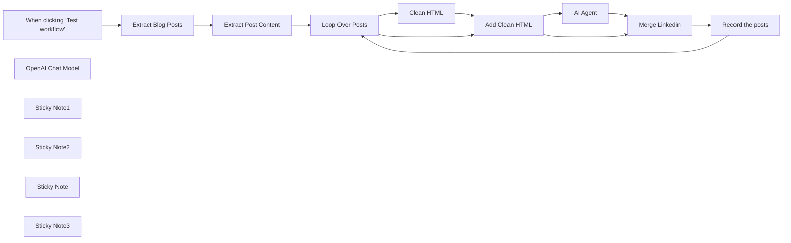

## Fluxo (.json) :

```json
{
  "meta": {
    "instanceId": "=",
    "templateCredsSetupCompleted": true
  },
  "nodes": [
    {
      "id": "4815105b-4175-45ad-85bc-07917de9526c",
      "name": "When clicking ‘Test workflow’",
      "type": "n8n-nodes-base.manualTrigger",
      "position": [
        -140,
        -720
      ],
      "parameters": {},
      "typeVersion": 1
    },
    {
      "id": "b8f2a706-4868-4f0d-99a1-c31e1f7022e3",
      "name": "AI Agent",
      "type": "@n8n/n8n-nodes-langchain.agent",
      "position": [
        1220,
        -580
      ],
      "parameters": {
        "text": "=Article Title: {{ $json.title }}\nArticle Link: {{ $json.link }}\nArticle Content: {{ $json.clean_content }}",
        "options": {
          "systemMessage": "=You are a content marketing assistant. Based on the article metadata (ID, title) and cleaned content, generate a short LinkedIn promotional message for a professional audience.\n\nFollow this structure:\n\nStart with a hook that grabs attention (a bold insight, surprising fact, or thought-provoking question).\n\nBriefly summarize the article’s value — what readers will learn or gain from it.\n\nInclude a clear call-to-action encouraging readers to read the article.\n\nEnd with this author signature and invitation:\n“—\nSamir Saci\nSupply Chain Data Scientist & Founder of LogiGreen\n📩 Contact me: https://logi-green.com/contactus”\n\nUse a professional and engaging tone. Do not include hashtags or Markdown formatting."
        },
        "promptType": "define"
      },
      "typeVersion": 1.8
    },
    {
      "id": "ac1538f6-67ef-4fd0-b4a9-d44b49149e5f",
      "name": "OpenAI Chat Model",
      "type": "@n8n/n8n-nodes-langchain.lmChatOpenAi",
      "position": [
        1160,
        -420
      ],
      "parameters": {
        "model": {
          "__rl": true,
          "mode": "list",
          "value": "gpt-4o-mini"
        },
        "options": {}
      },
      "typeVersion": 1.2
    },
    {
      "id": "bac79ecf-b92d-42ba-bb0f-f1e1f85ca1c9",
      "name": "Clean HTML",
      "type": "n8n-nodes-base.code",
      "position": [
        780,
        -620
      ],
      "parameters": {
        "jsCode": "const htmlContent = $input.first().json.content;\n\nconst cleanText = htmlContent\n  .replace(/<[^>]*>/g, '') // remove  tags\n  .replace(/\\s+/g, ' ')    // normalize spaces\n  .replace(/&nbsp;/g, ' ') // decode common entity\n  .trim();\n\nreturn [\n  {\n    json: {\n      clean_content: cleanText\n    }\n  }\n];\n"
      },
      "typeVersion": 2
    },
    {
      "id": "fa57b494-370a-4f37-bcbe-38ba6138da76",
      "name": "Extract Blog Posts",
      "type": "n8n-nodes-base.ghost",
      "position": [
        80,
        -720
      ],
      "parameters": {
        "limit": 3,
        "options": {},
        "operation": "getAll"
      },
      "notesInFlow": true,
      "typeVersion": 1
    },
    {
      "id": "dc19b6a4-fa17-41b4-8f8c-352519f07569",
      "name": "Extract Post Content",
      "type": "n8n-nodes-base.set",
      "position": [
        300,
        -720
      ],
      "parameters": {
        "options": {},
        "assignments": {
          "assignments": [
            {
              "id": "00b337cd-1c61-4f19-8c51-b76f3a8dece1",
              "name": "id",
              "type": "string",
              "value": "={{ $json.id }}"
            },
            {
              "id": "8d38f4bc-bca6-4343-8c5e-5d9fd9cbe178",
              "name": "title",
              "type": "string",
              "value": "={{ $json.title }}"
            },
            {
              "id": "c34ddd76-0db6-4225-82fa-04d5542f9c7c",
              "name": "featured_image",
              "type": "string",
              "value": "={{ $json.feature_image }}"
            },
            {
              "id": "c0f9593c-0d5a-4659-9e25-91b098318bd6",
              "name": "excerpt",
              "type": "string",
              "value": "={{ $json.excerpt }}"
            },
            {
              "id": "0d11d3d5-49f8-473a-8602-b49769f88005",
              "name": "content",
              "type": "string",
              "value": "={{ $json.html }}"
            },
            {
              "id": "ec89a00d-9d76-4594-a8ce-98aa177e6737",
              "name": "link",
              "type": "string",
              "value": "={{ $json.url }}"
            }
          ]
        }
      },
      "notesInFlow": true,
      "typeVersion": 3.4
    },
    {
      "id": "45656e13-5f03-48f9-8422-0ea3993e3289",
      "name": "Sticky Note1",
      "type": "n8n-nodes-base.stickyNote",
      "position": [
        -180,
        -1080
      ],
      "parameters": {
        "color": 7,
        "width": 200,
        "height": 520,
        "content": "### 1. Workflow Trigger\nThis workflow uses simple trigger.\n\n#### How to setup?\n*Nothing to do.*\n"
      },
      "typeVersion": 1
    },
    {
      "id": "7b8c3c49-069f-464b-acd2-a1a047fb2138",
      "name": "Sticky Note2",
      "type": "n8n-nodes-base.stickyNote",
      "position": [
        40,
        -1080
      ],
      "parameters": {
        "color": 7,
        "width": 400,
        "height": 520,
        "content": "### 2. Extract Blog Posts Content\nThe Ghost node extracts all the posts of your blog with content and metadata. In the second node, we extract description, URL, content and features image url.\n\n#### How to setup?\n- **Ghost Account API**:\n   1. Add your Ghost Blog Account Credentials\n   2. Select the number of Blog Posts you want to collect\n  [Learn more about the Ghost Node](https://docs.n8n.io/integrations/builtin/app-nodes/n8n-nodes-base.ghost)\n\n"
      },
      "typeVersion": 1
    },
    {
      "id": "0a5e4045-7df2-4713-a475-509844c58344",
      "name": "Sticky Note",
      "type": "n8n-nodes-base.stickyNote",
      "position": [
        480,
        -1080
      ],
      "parameters": {
        "color": 7,
        "width": 1520,
        "height": 800,
        "content": "### 3. Generate a Linkedin Post for each Post with an AI Agent\nThis block loops through all the posts pulled by the Ghost Node, send the content to the AI agent that generates a Linkedin post. The results are combined and pulled in a Google Sheet.\n\n#### How to setup?\n- **AI Agent with the Chat Model**:\n   1. Add a **chat model** with the required credentials *(Example: Open AI 4o-mini)*\n   2. Adapt the system prompt with your **post signature** and additional points you want to add in your posts\n  [Learn more about the AI Agent Node](https://docs.n8n.io/integrations/builtin/cluster-nodes/root-nodes/n8n-nodes-langchain.agent)\n- **Record Long Break in the Google Sheet Node**:\n   1. Add your Google Sheet API credentials to access the Google Sheet file\n   2. Select the file using the list, an URL or an ID\n   3. Select the sheet in which you want to record your working sessions\n   4. Map the fields\n  [Learn more about the Google Sheet Node](https://docs.n8n.io/integrations/builtin/app-nodes/n8n-nodes-base.googlesheets)\n\n"
      },
      "typeVersion": 1
    },
    {
      "id": "29b09c7f-c39c-414d-b9d5-897b0d540328",
      "name": "Record the posts",
      "type": "n8n-nodes-base.googleSheets",
      "position": [
        1840,
        -480
      ],
      "parameters": {
        "columns": {
          "value": {
            "id": "={{ $json.id }}",
            "title": "={{ $json.title }}",
            "content": "={{ $json.content }}",
            "excerpt": "={{ $json.excerpt }}",
            "clean_content": "={{ $json.clean_content }}",
            "linkedin_post": "={{ $json.output }}",
            "featured_image": "={{ $json.featured_image }}"
          },
          "schema": [
            {
              "id": "id",
              "type": "string",
              "display": true,
              "removed": false,
              "required": false,
              "displayName": "id",
              "defaultMatch": true,
              "canBeUsedToMatch": true
            },
            {
              "id": "title",
              "type": "string",
              "display": true,
              "required": false,
              "displayName": "title",
              "defaultMatch": false,
              "canBeUsedToMatch": true
            },
            {
              "id": "featured_image",
              "type": "string",
              "display": true,
              "required": false,
              "displayName": "featured_image",
              "defaultMatch": false,
              "canBeUsedToMatch": true
            },
            {
              "id": "excerpt",
              "type": "string",
              "display": true,
              "required": false,
              "displayName": "excerpt",
              "defaultMatch": false,
              "canBeUsedToMatch": true
            },
            {
              "id": "content",
              "type": "string",
              "display": true,
              "required": false,
              "displayName": "content",
              "defaultMatch": false,
              "canBeUsedToMatch": true
            },
            {
              "id": "clean_content",
              "type": "string",
              "display": true,
              "required": false,
              "displayName": "clean_content",
              "defaultMatch": false,
              "canBeUsedToMatch": true
            },
            {
              "id": "linkedin_post",
              "type": "string",
              "display": true,
              "required": false,
              "displayName": "linkedin_post",
              "defaultMatch": false,
              "canBeUsedToMatch": true
            }
          ],
          "mappingMode": "defineBelow",
          "matchingColumns": [
            "id"
          ],
          "attemptToConvertTypes": false,
          "convertFieldsToString": false
        },
        "options": {},
        "operation": "append",
        "sheetName": {
          "__rl": true,
          "mode": "list",
          "value": "gid=0",
          "cachedResultUrl": "=",
          "cachedResultName": "="
        },
        "documentId": {
          "__rl": true,
          "mode": "list",
          "value": "=",
          "cachedResultUrl": "=",
          "cachedResultName": "="
        }
      },
      "notesInFlow": true,
      "typeVersion": 4.5
    },
    {
      "id": "6f1c58db-a4bf-421a-a182-8149dac28725",
      "name": "Merge Linkedin",
      "type": "n8n-nodes-base.merge",
      "position": [
        1600,
        -720
      ],
      "parameters": {
        "mode": "combineBySql"
      },
      "notesInFlow": true,
      "typeVersion": 3
    },
    {
      "id": "ebae3ccc-2727-44d9-9309-320c7d8e8349",
      "name": "Add Clean HTML",
      "type": "n8n-nodes-base.merge",
      "position": [
        1020,
        -720
      ],
      "parameters": {
        "mode": "combineBySql"
      },
      "notesInFlow": true,
      "typeVersion": 3
    },
    {
      "id": "d839ca8d-f898-4617-955f-9c6d9a5412b7",
      "name": "Loop Over Posts",
      "type": "n8n-nodes-base.splitInBatches",
      "position": [
        580,
        -720
      ],
      "parameters": {
        "options": {}
      },
      "typeVersion": 3
    },
    {
      "id": "7e759203-b524-4cc5-89df-5e113c800504",
      "name": "Sticky Note3",
      "type": "n8n-nodes-base.stickyNote",
      "position": [
        -180,
        -540
      ],
      "parameters": {
        "width": 660,
        "height": 460,
        "content": "### [📺Complete Tutorial](https://www.youtube.com/watch?v=Lhi6hV6rWEo)\n\n"
      },
      "typeVersion": 1
    }
  ],
  "pinData": {},
  "connections": {
    "AI Agent": {
      "main": [
        [
          {
            "node": "Merge Linkedin",
            "type": "main",
            "index": 1
          }
        ]
      ]
    },
    "Clean HTML": {
      "main": [
        [
          {
            "node": "Add Clean HTML",
            "type": "main",
            "index": 1
          }
        ]
      ]
    },
    "Add Clean HTML": {
      "main": [
        [
          {
            "node": "AI Agent",
            "type": "main",
            "index": 0
          },
          {
            "node": "Merge Linkedin",
            "type": "main",
            "index": 0
          }
        ]
      ]
    },
    "Merge Linkedin": {
      "main": [
        [
          {
            "node": "Record the posts",
            "type": "main",
            "index": 0
          }
        ]
      ]
    },
    "Loop Over Posts": {
      "main": [
        [],
        [
          {
            "node": "Clean HTML",
            "type": "main",
            "index": 0
          },
          {
            "node": "Add Clean HTML",
            "type": "main",
            "index": 0
          }
        ]
      ]
    },
    "Record the posts": {
      "main": [
        [
          {
            "node": "Loop Over Posts",
            "type": "main",
            "index": 0
          }
        ]
      ]
    },
    "OpenAI Chat Model": {
      "ai_languageModel": [
        [
          {
            "node": "AI Agent",
            "type": "ai_languageModel",
            "index": 0
          }
        ]
      ]
    },
    "Extract Blog Posts": {
      "main": [
        [
          {
            "node": "Extract Post Content",
            "type": "main",
            "index": 0
          }
        ]
      ]
    },
    "Extract Post Content": {
      "main": [
        [
          {
            "node": "Loop Over Posts",
            "type": "main",
            "index": 0
          }
        ]
      ]
    },
    "When clicking ‘Test workflow’": {
      "main": [
        [
          {
            "node": "Extract Blog Posts",
            "type": "main",
            "index": 0
          }
        ]
      ]
    }
  }
}
```

<a id="template-114"></a>

## Template 114 - Obter data e dia atuais

- **Nome:** Obter data e dia atuais
- **Descrição:** Gera a data atual em formato ISO e o nome do dia da semana, adicionando-os aos campos de saída.
- **Funcionalidade:** • Gatilho manual: inicia a execução quando o usuário aciona o gatilho manual.
• Geração de data ISO: obtém a data e hora atual em formato ISO 8601.
• Determinação do dia da semana: calcula o índice do dia e converte para o nome correspondente (ex.: "Monday").
• Inserção nos campos de saída: adiciona os valores aos campos date_today e day_today do JSON de saída.
• Retorno dos itens: devolve os itens modificados para uso em etapas seguintes.
- **Ferramentas:** • Nenhuma: Não utiliza ferramentas externas; toda a lógica é executada localmente no fluxo.

## Fluxo visual

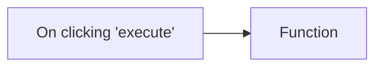

## Fluxo (.json) :

```json
{
  "id": "140",
  "name": "Get today's date and day using the Function node",
  "nodes": [
    {
      "name": "On clicking 'execute'",
      "type": "n8n-nodes-base.manualTrigger",
      "position": [
        250,
        300
      ],
      "parameters": {},
      "typeVersion": 1
    },
    {
      "name": "Function",
      "type": "n8n-nodes-base.function",
      "position": [
        450,
        300
      ],
      "parameters": {
        "functionCode": "var date = new Date().toISOString();\nvar day = new Date().getDay();\nconst weekday = [\"Sunday\", \"Monday\", \"Tuesday\", \"Wednesday\", \"Thursday\", \"Friday\", \"Saturday\"];\n\nitems[0].json.date_today = date;\nitems[0].json.day_today = weekday[day];\n\nreturn items;"
      },
      "typeVersion": 1
    }
  ],
  "active": false,
  "settings": {},
  "connections": {
    "On clicking 'execute'": {
      "main": [
        [
          {
            "node": "Function",
            "type": "main",
            "index": 0
          }
        ]
      ]
    }
  }
}
```

<a id="template-115"></a>

## Template 115 - Chat com arquivos do Supabase

- **Nome:** Chat com arquivos do Supabase
- **Descrição:** Fluxo que indexa arquivos armazenados no Supabase convertendo seu conteúdo em vetores e permitindo consultas por meio de um agente de chat alimentado por embeddings.
- **Funcionalidade:** • Recuperação de lista de arquivos: Obtém o inventário de arquivos de um bucket privado no Supabase.
• Comparação e filtragem: Compara arquivos retornados com registros existentes no banco para evitar processamento duplicado e ignora arquivos placeholder.
• Processamento em lote: Itera sobre itens em batches para controlar o processamento de novos arquivos.
• Download de arquivos: Baixa arquivos privados do storage para processamento posterior.
• Tratamento por tipo de arquivo: Roteia arquivos entre processamento direto de texto e extração de conteúdo de PDFs.
• Extração e chunking de texto: Extrai texto de PDFs e divide conteúdos longos em blocos menores com sobreposição para manter contexto.
• Geração de embeddings: Cria vetores de embedding a partir dos blocos de texto para indexação semântica.
• Armazenamento em vector store: Insere embeddings e metadados em uma tabela de documentos no Supabase para recuperação vetorial.
• Registro de arquivos processados: Cria/atualiza registros na tabela de arquivos para rastrear o processamento.
• Agente de chat com busca vetorial: Permite consultas de usuário que recuperam trechos relevantes da base vetorial para resposta contextual.
- **Ferramentas:** • Supabase Storage & Database: Armazenamento dos arquivos, tabela de metadados (files) e tabela de documentos para vector store.
• OpenAI (modelos de embeddings e chat): Geração de embeddings a partir do texto e uso de modelos de conversa para o agente que responde às consultas.


## Fluxo visual

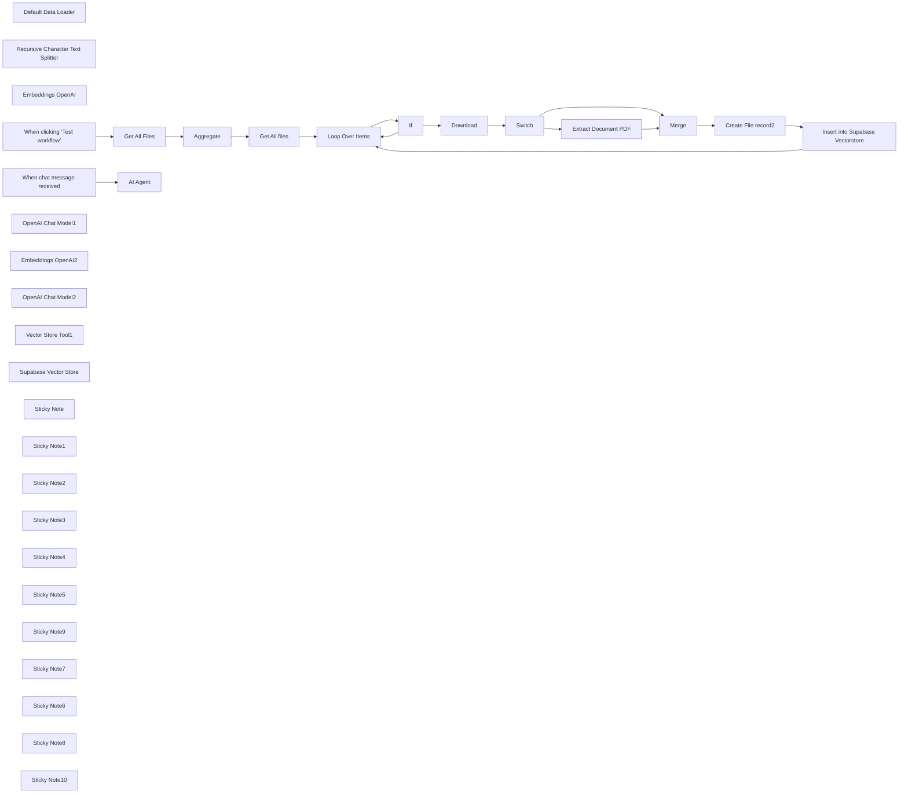

## Fluxo (.json) :

```json
{
  "meta": {
    "instanceId": "6a2a7715680b8313f7cb4676321c5baa46680adfb913072f089f2766f42e43bd"
  },
  "nodes": [
    {
      "id": "f577f6bd-b1a4-48ec-9329-7bccc3fc1463",
      "name": "Get All files",
      "type": "n8n-nodes-base.httpRequest",
      "position": [
        400,
        -100
      ],
      "parameters": {
        "url": "=https://yqtvdcvjboenlblgcivl.supabase.co/storage/v1/object/list/private",
        "method": "POST",
        "options": {},
        "jsonBody": "={\n \"prefix\": \"\",\n \"limit\": 100,\n \"offset\": 0,\n \"sortBy\": {\n \"column\": \"name\",\n \"order\": \"asc\"\n }\n}",
        "sendBody": true,
        "specifyBody": "json",
        "authentication": "predefinedCredentialType",
        "nodeCredentialType": "supabaseApi"
      },
      "credentials": {
        "supabaseApi": {
          "id": "t8AQJzvZvrOMDLec",
          "name": "Supabase account My Airtable Gen"
        }
      },
      "typeVersion": 4.2
    },
    {
      "id": "10693bc8-560d-4cf6-8bd0-2fe3f4d863d1",
      "name": "Default Data Loader",
      "type": "@n8n/n8n-nodes-langchain.documentDefaultDataLoader",
      "position": [
        1780,
        100
      ],
      "parameters": {
        "options": {
          "metadata": {
            "metadataValues": [
              {
                "name": "=file_id",
                "value": "={{ $json.id }}"
              }
            ]
          }
        },
        "jsonData": "={{ $('Merge').item.json.data ?? $('Merge').item.json.text }}",
        "jsonMode": "expressionData"
      },
      "typeVersion": 1
    },
    {
      "id": "49428060-e707-4269-8344-77b301f56f7c",
      "name": "Recursive Character Text Splitter",
      "type": "@n8n/n8n-nodes-langchain.textSplitterRecursiveCharacterTextSplitter",
      "position": [
        1780,
        280
      ],
      "parameters": {
        "options": {},
        "chunkSize": 500,
        "chunkOverlap": 200
      },
      "typeVersion": 1
    },
    {
      "id": "08742063-e235-4874-a128-b352786b19ce",
      "name": "Extract Document PDF",
      "type": "n8n-nodes-base.extractFromFile",
      "position": [
        1240,
        0
      ],
      "parameters": {
        "options": {},
        "operation": "pdf"
      },
      "typeVersion": 1,
      "alwaysOutputData": false
    },
    {
      "id": "21f19360-d7ce-4106-ae5a-aa0f15b7c4aa",
      "name": "Embeddings OpenAI",
      "type": "@n8n/n8n-nodes-langchain.embeddingsOpenAi",
      "position": [
        1600,
        80
      ],
      "parameters": {
        "model": "text-embedding-3-small",
        "options": {}
      },
      "credentials": {
        "openAiApi": {
          "id": "fLfRtaXbR0EVD0pl",
          "name": "OpenAi account"
        }
      },
      "typeVersion": 1
    },
    {
      "id": "4147409f-8686-418f-b979-04f8c8e7fe42",
      "name": "Create File record2",
      "type": "n8n-nodes-base.supabase",
      "position": [
        1540,
        -100
      ],
      "parameters": {
        "tableId": "files",
        "fieldsUi": {
          "fieldValues": [
            {
              "fieldId": "name",
              "fieldValue": "={{ $('Loop Over Items').item.json.name }}"
            },
            {
              "fieldId": "storage_id",
              "fieldValue": "={{ $('Loop Over Items').item.json.id }}"
            }
          ]
        }
      },
      "credentials": {
        "supabaseApi": {
          "id": "t8AQJzvZvrOMDLec",
          "name": "Supabase account My Airtable Gen"
        }
      },
      "typeVersion": 1
    },
    {
      "id": "016f1afe-172b-4609-b451-8d67609214d3",
      "name": "If",
      "type": "n8n-nodes-base.if",
      "position": [
        720,
        -100
      ],
      "parameters": {
        "options": {},
        "conditions": {
          "options": {
            "version": 2,
            "leftValue": "",
            "caseSensitive": true,
            "typeValidation": "strict"
          },
          "combinator": "and",
          "conditions": [
            {
              "id": "9b14e306-a04d-40f7-bc5b-b8eda8d8f7f2",
              "operator": {
                "type": "boolean",
                "operation": "true",
                "singleValue": true
              },
              "leftValue": "={{ \n !$('Aggregate').item.json.data || \n !Array.isArray($('Aggregate').item.json.data) || \n !$('Aggregate').item.json.data.some(item => \n item.storage_id === $('Loop Over Items').item.json.id \n ) \n}}",
              "rightValue": ""
            },
            {
              "id": "c3c0af88-9aea-4539-8948-1b69e601c27c",
              "operator": {
                "type": "string",
                "operation": "notEquals"
              },
              "leftValue": "={{ $json.name }}",
              "rightValue": ".emptyFolderPlaceholder"
            }
          ]
        }
      },
      "typeVersion": 2.2
    },
    {
      "id": "75e8a7db-8c4a-4ad8-b902-062cbc93e1eb",
      "name": "Get All Files",
      "type": "n8n-nodes-base.supabase",
      "position": [
        20,
        -100
      ],
      "parameters": {
        "tableId": "files",
        "operation": "getAll"
      },
      "credentials": {
        "supabaseApi": {
          "id": "t8AQJzvZvrOMDLec",
          "name": "Supabase account My Airtable Gen"
        }
      },
      "typeVersion": 1,
      "alwaysOutputData": true
    },
    {
      "id": "b22a3bab-f615-4d8a-8832-ce25b1a385fe",
      "name": "Download",
      "type": "n8n-nodes-base.httpRequest",
      "position": [
        900,
        -100
      ],
      "parameters": {
        "url": "=https://yqtvdcvjboenlblgcivl.supabase.co/storage/v1/object/private/{{ $json.name }}",
        "options": {},
        "authentication": "predefinedCredentialType",
        "nodeCredentialType": "supabaseApi"
      },
      "credentials": {
        "supabaseApi": {
          "id": "t8AQJzvZvrOMDLec",
          "name": "Supabase account My Airtable Gen"
        }
      },
      "typeVersion": 4.2
    },
    {
      "id": "50d1fede-4bd0-4cd4-b74a-7d689fe211cc",
      "name": "Loop Over Items",
      "type": "n8n-nodes-base.splitInBatches",
      "position": [
        560,
        -100
      ],
      "parameters": {
        "options": {},
        "batchSize": "=1"
      },
      "typeVersion": 3
    },
    {
      "id": "f9c23b5e-0b40-4886-b54f-59fb46132d3f",
      "name": "When clicking ‘Test workflow’",
      "type": "n8n-nodes-base.manualTrigger",
      "position": [
        -160,
        -100
      ],
      "parameters": {},
      "typeVersion": 1
    },
    {
      "id": "0a0ec290-2c3d-40ba-8d03-6abf75202e73",
      "name": "Aggregate",
      "type": "n8n-nodes-base.aggregate",
      "position": [
        220,
        -100
      ],
      "parameters": {
        "options": {},
        "aggregate": "aggregateAllItemData"
      },
      "typeVersion": 1,
      "alwaysOutputData": true
    },
    {
      "id": "32b3e2e1-2d25-4dd1-93e8-3f693beb7b6f",
      "name": "When chat message received",
      "type": "@n8n/n8n-nodes-langchain.chatTrigger",
      "position": [
        800,
        -1020
      ],
      "webhookId": "3c40d311-7996-4ed4-b2fa-c73bea5f4cf5",
      "parameters": {
        "options": {}
      },
      "typeVersion": 1.1
    },
    {
      "id": "79073b5c-a4ad-45a6-bbfa-e900a05bfde3",
      "name": "OpenAI Chat Model1",
      "type": "@n8n/n8n-nodes-langchain.lmChatOpenAi",
      "position": [
        940,
        -820
      ],
      "parameters": {
        "options": {}
      },
      "credentials": {
        "openAiApi": {
          "id": "zJhr5piyEwVnWtaI",
          "name": "OpenAi club"
        }
      },
      "typeVersion": 1
    },
    {
      "id": "f8663483-76d5-4fc8-ad07-7eec815ff7a6",
      "name": "Embeddings OpenAI2",
      "type": "@n8n/n8n-nodes-langchain.embeddingsOpenAi",
      "position": [
        1020,
        -540
      ],
      "parameters": {
        "model": "text-embedding-3-small",
        "options": {}
      },
      "credentials": {
        "openAiApi": {
          "id": "SphXAX7rlwRLkiox",
          "name": "Test club key"
        }
      },
      "typeVersion": 1
    },
    {
      "id": "a1458799-d379-46de-93e6-a5ba0c665163",
      "name": "OpenAI Chat Model2",
      "type": "@n8n/n8n-nodes-langchain.lmChatOpenAi",
      "position": [
        1300,
        -680
      ],
      "parameters": {
        "options": {}
      },
      "credentials": {
        "openAiApi": {
          "id": "SphXAX7rlwRLkiox",
          "name": "Test club key"
        }
      },
      "typeVersion": 1
    },
    {
      "id": "d6eeda2f-c984-406d-a625-726840308413",
      "name": "Vector Store Tool1",
      "type": "@n8n/n8n-nodes-langchain.toolVectorStore",
      "position": [
        1100,
        -820
      ],
      "parameters": {
        "name": "knowledge_base",
        "topK": 8,
        "description": "Retrieve data about user request"
      },
      "typeVersion": 1
    },
    {
      "id": "e1d9a348-7d44-4ad1-adbd-2c9a31e06876",
      "name": "Switch",
      "type": "n8n-nodes-base.switch",
      "position": [
        1060,
        -100
      ],
      "parameters": {
        "rules": {
          "values": [
            {
              "outputKey": "txt",
              "conditions": {
                "options": {
                  "version": 1,
                  "leftValue": "",
                  "caseSensitive": true,
                  "typeValidation": "strict"
                },
                "combinator": "and",
                "conditions": [
                  {
                    "operator": {
                      "type": "boolean",
                      "operation": "true",
                      "singleValue": true
                    },
                    "leftValue": "={{$binary.data?.fileExtension == undefined }}",
                    "rightValue": "txt"
                  }
                ]
              },
              "renameOutput": true
            },
            {
              "outputKey": "pdf",
              "conditions": {
                "options": {
                  "version": 1,
                  "leftValue": "",
                  "caseSensitive": true,
                  "typeValidation": "strict"
                },
                "combinator": "and",
                "conditions": [
                  {
                    "id": "bf04cbec-dd86-4607-988f-4c96b6fd4b58",
                    "operator": {
                      "type": "string",
                      "operation": "equals"
                    },
                    "leftValue": "={{$binary.data.fileExtension }}",
                    "rightValue": "pdf"
                  }
                ]
              },
              "renameOutput": true
            }
          ]
        },
        "options": {}
      },
      "typeVersion": 3.1
    },
    {
      "id": "d38afb92-87ae-4e2a-a712-ec24b1efd105",
      "name": "Insert into Supabase Vectorstore",
      "type": "@n8n/n8n-nodes-langchain.vectorStoreSupabase",
      "position": [
        1700,
        -100
      ],
      "parameters": {
        "mode": "insert",
        "options": {
          "queryName": "match_documents"
        },
        "tableName": {
          "__rl": true,
          "mode": "list",
          "value": "documents",
          "cachedResultName": "documents"
        }
      },
      "credentials": {
        "supabaseApi": {
          "id": "t8AQJzvZvrOMDLec",
          "name": "Supabase account My Airtable Gen"
        }
      },
      "typeVersion": 1
    },
    {
      "id": "1a903b2e-cab0-4798-b820-ec08d6a71ddd",
      "name": "Merge",
      "type": "n8n-nodes-base.merge",
      "position": [
        1380,
        -100
      ],
      "parameters": {},
      "typeVersion": 3
    },
    {
      "id": "3afd552e-4995-493e-9cd5-ef496dfe359f",
      "name": "AI Agent",
      "type": "@n8n/n8n-nodes-langchain.agent",
      "position": [
        1020,
        -1020
      ],
      "parameters": {
        "options": {}
      },
      "typeVersion": 1.7
    },
    {
      "id": "d9688acc-311b-42fd-afa8-2c0e493be34b",
      "name": "Supabase Vector Store",
      "type": "@n8n/n8n-nodes-langchain.vectorStoreSupabase",
      "position": [
        1020,
        -660
      ],
      "parameters": {
        "options": {
          "metadata": {
            "metadataValues": [
              {
                "name": "file_id",
                "value": "300b0128-0955-4058-b0d3-a9aefe728432"
              }
            ]
          }
        },
        "tableName": {
          "__rl": true,
          "mode": "list",
          "value": "documents",
          "cachedResultName": "documents"
        }
      },
      "credentials": {
        "supabaseApi": {
          "id": "t8AQJzvZvrOMDLec",
          "name": "Supabase account My Airtable Gen"
        }
      },
      "typeVersion": 1
    },
    {
      "id": "66df007c-0418-4551-950e-32e7d79840bd",
      "name": "Sticky Note",
      "type": "n8n-nodes-base.stickyNote",
      "position": [
        340,
        -220
      ],
      "parameters": {
        "height": 89.3775420487804,
        "content": "### Replace Storage name, database ID and credentials."
      },
      "typeVersion": 1
    },
    {
      "id": "b164b520-20dd-44a4-aa3b-647391786b20",
      "name": "Sticky Note1",
      "type": "n8n-nodes-base.stickyNote",
      "position": [
        -20,
        -220
      ],
      "parameters": {
        "height": 80,
        "content": "### Replace credentials."
      },
      "typeVersion": 1
    },
    {
      "id": "8688c219-5af4-4e54-9fd1-91851829445b",
      "name": "Sticky Note2",
      "type": "n8n-nodes-base.stickyNote",
      "position": [
        1540,
        -220
      ],
      "parameters": {
        "height": 80,
        "content": "### Replace credentials."
      },
      "typeVersion": 1
    },
    {
      "id": "45c6ece4-f849-4496-8149-31385f5e36a4",
      "name": "Sticky Note3",
      "type": "n8n-nodes-base.stickyNote",
      "position": [
        840,
        -220
      ],
      "parameters": {
        "height": 89.3775420487804,
        "content": "### Replace Storage name, database ID and credentials."
      },
      "typeVersion": 1
    },
    {
      "id": "2ca07cb0-b5f4-4761-b954-faf2131872d9",
      "name": "Sticky Note4",
      "type": "n8n-nodes-base.stickyNote",
      "position": [
        1500,
        220
      ],
      "parameters": {
        "height": 80,
        "content": "### Replace credentials."
      },
      "typeVersion": 1
    },
    {
      "id": "8d682dae-6f88-42f0-a717-affffd37d882",
      "name": "Sticky Note5",
      "type": "n8n-nodes-base.stickyNote",
      "position": [
        1140,
        -520
      ],
      "parameters": {
        "height": 80,
        "content": "### Replace credentials."
      },
      "typeVersion": 1
    },
    {
      "id": "796b5dca-d60e-43a9-afe8-194244643557",
      "name": "Sticky Note9",
      "type": "n8n-nodes-base.stickyNote",
      "position": [
        -520,
        -940
      ],
      "parameters": {
        "color": 7,
        "width": 330.5152611046425,
        "height": 239.5888196628349,
        "content": "### ... or watch set up video [10 min]\n[](https://www.youtube.com/watch?v=glWUkdZe_3w)\n"
      },
      "typeVersion": 1
    },
    {
      "id": "eba121de-a3f7-4ba5-8396-f7d64e648322",
      "name": "Sticky Note7",
      "type": "n8n-nodes-base.stickyNote",
      "position": [
        -820,
        -1460
      ],
      "parameters": {
        "color": 7,
        "width": 636.2128494576581,
        "height": 497.1532689930921,
        "content": "\n## AI Agent To Chat With Files In Supabase Storage\n**Made by [Mark Shcherbakov](https://www.linkedin.com/in/marklowcoding/) from community [5minAI](https://www.skool.com/5minai-2861)**\n\nManually retrieving and analyzing specific information from large document repositories is time-consuming and inefficient. This workflow automates the process by vectorizing documents and enabling AI-powered interactions, making it easy to query and retrieve context-based information from uploaded files.\n\nThe workflow integrates Supabase with an AI-powered chatbot to process, store, and query text and PDF files. The steps include:\n- Fetching and comparing files to avoid duplicate processing.\n- Handling file downloads and extracting content based on the file type.\n- Converting documents into vectorized data for contextual information retrieval.\n- Storing and querying vectorized data from a Supabase vector store.\n\n"
      },
      "typeVersion": 1
    },
    {
      "id": "df054036-d6b9-4f53-86cb-85ad96f07d0e",
      "name": "Sticky Note6",
      "type": "n8n-nodes-base.stickyNote",
      "position": [
        -820,
        -940
      ],
      "parameters": {
        "color": 7,
        "width": 280.2462120317618,
        "height": 545.9087885077763,
        "content": "### Set up steps\n\n1. **Fetch File List from Supabase**:\n - Use Supabase to retrieve the stored file list from a specified bucket.\n - Add logic to manage empty folder placeholders returned by Supabase, avoiding incorrect processing.\n\n2. **Compare and Filter Files**:\n - Aggregate the files retrieved from storage and compare them to the existing list in the Supabase `files` table.\n - Exclude duplicates and skip placeholder files to ensure only unprocessed files are handled.\n\n3. **Handle File Downloads**:\n - Download new files using detailed storage configurations for public/private access.\n - Adjust the storage settings and GET requests to match your Supabase setup.\n\n4. **File Type Processing**:\n - Use a Switch node to target specific file types (e.g., PDFs or text files).\n - Employ relevant tools to process the content:\n - For PDFs, extract embedded content.\n - For text files, directly process the text data.\n\n5. **Content Chunking**:\n - Break large text data into smaller chunks using the Text Splitter node.\n - Define chunk size (default: 500 tokens) and overlap to retain necessary context across chunks.\n\n6. **Vector Embedding Creation**:\n - Generate vectorized embeddings for the processed content using OpenAI's embedding tools.\n - Ensure metadata, such as file ID, is included for easy data retrieval.\n\n7. **Store Vectorized Data**:\n - Save the vectorized information into a dedicated Supabase vector store.\n - Use the default schema and table provided by Supabase for seamless setup.\n\n8. **AI Chatbot Integration**:\n - Add a chatbot node to handle user input and retrieve relevant document chunks.\n - Use metadata like file ID for targeted queries, especially when multiple documents are involved."
      },
      "typeVersion": 1
    },
    {
      "id": "450a1e49-4be9-451a-9d05-2860e29c3695",
      "name": "Sticky Note8",
      "type": "n8n-nodes-base.stickyNote",
      "position": [
        540,
        -1160
      ],
      "parameters": {
        "color": 5,
        "width": 951.7421645394404,
        "height": 809.7437181509877,
        "content": "## Scenario 2 - AI agent"
      },
      "typeVersion": 1
    },
    {
      "id": "c3814c5d-8881-4598-897e-268019bee1bc",
      "name": "Sticky Note10",
      "type": "n8n-nodes-base.stickyNote",
      "position": [
        -260,
        -280
      ],
      "parameters": {
        "color": 5,
        "width": 2304.723519246249,
        "height": 739.2522526116408,
        "content": "## Scenario 1 - Flow for adding new files from Supabase storage"
      },
      "typeVersion": 1
    }
  ],
  "pinData": {},
  "connections": {
    "If": {
      "main": [
        [
          {
            "node": "Download",
            "type": "main",
            "index": 0
          }
        ],
        [
          {
            "node": "Loop Over Items",
            "type": "main",
            "index": 0
          }
        ]
      ]
    },
    "Merge": {
      "main": [
        [
          {
            "node": "Create File record2",
            "type": "main",
            "index": 0
          }
        ]
      ]
    },
    "Switch": {
      "main": [
        [
          {
            "node": "Merge",
            "type": "main",
            "index": 0
          }
        ],
        [
          {
            "node": "Extract Document PDF",
            "type": "main",
            "index": 0
          }
        ]
      ]
    },
    "Download": {
      "main": [
        [
          {
            "node": "Switch",
            "type": "main",
            "index": 0
          }
        ]
      ]
    },
    "Aggregate": {
      "main": [
        [
          {
            "node": "Get All files",
            "type": "main",
            "index": 0
          }
        ]
      ]
    },
    "Get All Files": {
      "main": [
        [
          {
            "node": "Aggregate",
            "type": "main",
            "index": 0
          }
        ]
      ]
    },
    "Get All files": {
      "main": [
        [
          {
            "node": "Loop Over Items",
            "type": "main",
            "index": 0
          }
        ]
      ]
    },
    "Loop Over Items": {
      "main": [
        null,
        [
          {
            "node": "If",
            "type": "main",
            "index": 0
          }
        ]
      ]
    },
    "Embeddings OpenAI": {
      "ai_embedding": [
        [
          {
            "node": "Insert into Supabase Vectorstore",
            "type": "ai_embedding",
            "index": 0
          }
        ]
      ]
    },
    "Embeddings OpenAI2": {
      "ai_embedding": [
        [
          {
            "node": "Supabase Vector Store",
            "type": "ai_embedding",
            "index": 0
          }
        ]
      ]
    },
    "OpenAI Chat Model1": {
      "ai_languageModel": [
        [
          {
            "node": "AI Agent",
            "type": "ai_languageModel",
            "index": 0
          }
        ]
      ]
    },
    "OpenAI Chat Model2": {
      "ai_languageModel": [
        [
          {
            "node": "Vector Store Tool1",
            "type": "ai_languageModel",
            "index": 0
          }
        ]
      ]
    },
    "Vector Store Tool1": {
      "ai_tool": [
        [
          {
            "node": "AI Agent",
            "type": "ai_tool",
            "index": 0
          }
        ]
      ]
    },
    "Create File record2": {
      "main": [
        [
          {
            "node": "Insert into Supabase Vectorstore",
            "type": "main",
            "index": 0
          }
        ]
      ]
    },
    "Default Data Loader": {
      "ai_document": [
        [
          {
            "node": "Insert into Supabase Vectorstore",
            "type": "ai_document",
            "index": 0
          }
        ]
      ]
    },
    "Extract Document PDF": {
      "main": [
        [
          {
            "node": "Merge",
            "type": "main",
            "index": 1
          }
        ]
      ]
    },
    "Supabase Vector Store": {
      "ai_vectorStore": [
        [
          {
            "node": "Vector Store Tool1",
            "type": "ai_vectorStore",
            "index": 0
          }
        ]
      ]
    },
    "When chat message received": {
      "main": [
        [
          {
            "node": "AI Agent",
            "type": "main",
            "index": 0
          }
        ]
      ]
    },
    "Insert into Supabase Vectorstore": {
      "main": [
        [
          {
            "node": "Loop Over Items",
            "type": "main",
            "index": 0
          }
        ]
      ]
    },
    "Recursive Character Text Splitter": {
      "ai_textSplitter": [
        [
          {
            "node": "Default Data Loader",
            "type": "ai_textSplitter",
            "index": 0
          }
        ]
      ]
    },
    "When clicking ‘Test workflow’": {
      "main": [
        [
          {
            "node": "Get All Files",
            "type": "main",
            "index": 0
          }
        ]
      ]
    }
  }
}
```

<a id="template-116"></a>

## Template 116 - Verificador de backlinks ao vivo

- **Nome:** Verificador de backlinks ao vivo
- **Descrição:** Automatiza a verificação se backlinks presentes em páginas externas continuam apontando para suas páginas e atualiza o status numa planilha.
- **Funcionalidade:** • Leitura da planilha: Carrega pares de "Backlink URL" e "Landing page" a partir de um intervalo definido.
• Loop em lotes: Processa cada URL individualmente para controlar taxa e consistência.
• Limpeza e extração de domínio: Extrai o domínio do URL do backlink para uso na análise.
• Envio de tarefa para análise on-page: Submete o domínio e a URL inicial ao serviço de análise para rastrear a página.
• Espera entre chamadas: Aguarda um tempo configurado para permitir a conclusão da análise remota.
• Recuperação de dados de links: Solicita os resultados da análise para obter links encontrados na página rastreada.
• Análise do resultado: Verifica se o backlink especificado aparece nos links retornados e se é dofollow ou não.
• Atualização da planilha: Registra ou atualiza a linha correspondente com o status (por exemplo, Live, Lost, Lost (Nofollow)).
• Tolerância a falhas na consulta: Continua o fluxo mesmo se a chamada de recuperação de links falhar para evitar interrupção completa.
- **Ferramentas:** • Google Sheets: Armazena os URLs de entrada e recebe as atualizações de status dos backlinks.
• DataForSEO On-Page API: Serviço que rastreia páginas, extrai links e retorna informações sobre existência e atributo dofollow/nofollow.


## Fluxo visual

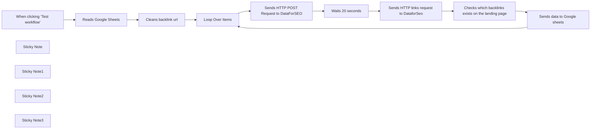

## Fluxo (.json) :

```json
{
  "id": "WGUpujme8ctIkBF8",
  "meta": {
    "instanceId": "431560c610ab26f4776059ff809760704293c90767af32183943d4c54ac57441",
    "templateCredsSetupCompleted": true
  },
  "name": "Live link checker",
  "tags": [],
  "nodes": [
    {
      "id": "40009961-9c97-49ee-b9ce-440e65b41e47",
      "name": "Loop Over Items",
      "type": "n8n-nodes-base.splitInBatches",
      "position": [
        -280,
        200
      ],
      "parameters": {
        "options": {}
      },
      "typeVersion": 3
    },
    {
      "id": "85a73ac8-a8c6-4b5e-a870-3b1a58336037",
      "name": "When clicking ‘Test workflow’",
      "type": "n8n-nodes-base.manualTrigger",
      "position": [
        -1060,
        200
      ],
      "parameters": {},
      "typeVersion": 1
    },
    {
      "id": "a1495fc5-d39d-4cf5-b8d3-a804d82ba1a5",
      "name": "Reads Google Sheets",
      "type": "n8n-nodes-base.googleSheets",
      "position": [
        -780,
        200
      ],
      "parameters": {
        "options": {
          "dataLocationOnSheet": {
            "values": {
              "range": "D1:E",
              "rangeDefinition": "specifyRangeA1"
            }
          }
        },
        "sheetName": {
          "__rl": true,
          "mode": "list",
          "value": 1573787772,
          "cachedResultUrl": "",
          "cachedResultName": "Lost links"
        },
        "documentId": {
          "__rl": true,
          "mode": "list",
          "value": "10CYntk8OmYemJBpcfs1dH_7p_PJxiBMpsfATtLYw7jI",
          "cachedResultUrl": "",
          "cachedResultName": "Sheet with lost links"
        }
      },
      "credentials": {
        "googleSheetsOAuth2Api": {
          "id": "shxBIVyk68LlqTnb",
          "name": "Google Sheets account 3"
        }
      },
      "typeVersion": 4.5
    },
    {
      "id": "bd055fee-f66b-4b1d-9ee2-3581021d8b1f",
      "name": "Cleans backlink url",
      "type": "n8n-nodes-base.code",
      "position": [
        -560,
        200
      ],
      "parameters": {
        "jsCode": "return items.map(item => {\n  let url = item.json['Backlink URL'];  // Get the URL from the current item's JSON\n  let domain = url.match(/https?://(?:www\\.)?([^/]+)/)[1]; \n  return { json: { domain, url } };\n});\n$input.first().json['Backlink URL']"
      },
      "typeVersion": 2
    },
    {
      "id": "030b04e9-da35-4448-b2f4-c1543eafabf5",
      "name": "Sends HTTP POST Request to DataForSEO",
      "type": "n8n-nodes-base.httpRequest",
      "position": [
        -20,
        220
      ],
      "parameters": {
        "url": "https://api.dataforseo.com/v3/on_page/task_post",
        "method": "POST",
        "options": {},
        "jsonBody": "=[{\n\"target\": \"{{ $json.domain }}\",\n\"start_url\": \"{{ $json.url }}\",\n\"max_crawl_pages\": 1\n}]",
        "sendBody": true,
        "specifyBody": "json",
        "authentication": "genericCredentialType",
        "genericAuthType": "httpBasicAuth"
      },
      "credentials": {
        "httpBasicAuth": {
          "id": "MeuonUXyXYX6lg4R",
          "name": "Unnamed credential"
        }
      },
      "typeVersion": 4.2
    },
    {
      "id": "6ac33fbd-2daf-4b5f-a7a2-fe742294765b",
      "name": "Waits 20 seconds",
      "type": "n8n-nodes-base.wait",
      "position": [
        200,
        220
      ],
      "webhookId": "f1cc4df1-6443-4ecd-8708-fd40858f3762",
      "parameters": {
        "amount": 20
      },
      "typeVersion": 1.1
    },
    {
      "id": "2213992d-d782-4357-8f59-87a8afb3f7f1",
      "name": "Sends HTTP links request to DataforSeo",
      "type": "n8n-nodes-base.httpRequest",
      "onError": "continueRegularOutput",
      "position": [
        440,
        220
      ],
      "parameters": {
        "url": "https://api.dataforseo.com/v3/on_page/links",
        "method": "POST",
        "options": {
          "batching": {
            "batch": {
              "batchSize": 1
            }
          }
        },
        "jsonBody": "=[\n  {\n    \"id\": \"{{ $json.tasks[0].id }}\"\n  }\n]\n",
        "sendBody": true,
        "specifyBody": "json",
        "authentication": "genericCredentialType",
        "genericAuthType": "httpBasicAuth"
      },
      "credentials": {
        "httpBasicAuth": {
          "id": "MeuonUXyXYX6lg4R",
          "name": "Unnamed credential"
        }
      },
      "typeVersion": 4.2,
      "alwaysOutputData": false
    },
    {
      "id": "ab3b47d7-381a-48e9-aad3-8555d6c36145",
      "name": "Checks which backlinks exists on the landing page",
      "type": "n8n-nodes-base.code",
      "position": [
        680,
        220
      ],
      "parameters": {
        "mode": "runOnceForEachItem",
        "jsCode": "const result = $json.tasks?.[0]?.result?.[0];\nconst links = result?.items || []; // Safe fallback to an empty array\n\nlet backlink = $('Reads Google Sheets').item.json['Landing page']; // Expected backlink\n\n// Find the backlink in the scraped data\nlet foundLink = links.find(link => link.link_to === backlink);\n\n// Check if the backlink exists and if it's dofollow\nlet status = \"Lost\"; // Default to lost\nif (foundLink) {\n  status = foundLink.dofollow ? \"Live\" : \"Lost (Nofollow)\";\n}\n\nreturn {\n  json: {\n    backlink: backlink,\n    status: status\n  }\n};\n"
      },
      "typeVersion": 2
    },
    {
      "id": "d07a8791-74d9-4f86-b9d8-e0847406a96e",
      "name": "Sends data to Google sheets",
      "type": "n8n-nodes-base.googleSheets",
      "position": [
        900,
        220
      ],
      "parameters": {
        "columns": {
          "value": {
            "Status": "={{ $json.status }}",
            "Backlink URL": "={{ $('Loop Over Items').item.json.url }}"
          },
          "schema": [
            {
              "id": "Company",
              "type": "string",
              "display": true,
              "removed": true,
              "required": false,
              "displayName": "Company",
              "defaultMatch": false,
              "canBeUsedToMatch": true
            },
            {
              "id": "Contact A",
              "type": "string",
              "display": true,
              "removed": true,
              "required": false,
              "displayName": "Contact A",
              "defaultMatch": false,
              "canBeUsedToMatch": true
            },
            {
              "id": "Channel",
              "type": "string",
              "display": true,
              "removed": true,
              "required": false,
              "displayName": "Channel",
              "defaultMatch": false,
              "canBeUsedToMatch": true
            },
            {
              "id": "Backlink URL",
              "type": "string",
              "display": true,
              "removed": false,
              "required": false,
              "displayName": "Backlink URL",
              "defaultMatch": false,
              "canBeUsedToMatch": true
            },
            {
              "id": "Landing page",
              "type": "string",
              "display": true,
              "removed": true,
              "required": false,
              "displayName": "Landing page",
              "defaultMatch": false,
              "canBeUsedToMatch": true
            },
            {
              "id": "Anchor",
              "type": "string",
              "display": true,
              "removed": true,
              "required": false,
              "displayName": "Anchor",
              "defaultMatch": false,
              "canBeUsedToMatch": true
            },
            {
              "id": "Money out",
              "type": "string",
              "display": true,
              "removed": true,
              "required": false,
              "displayName": "Money out",
              "defaultMatch": false,
              "canBeUsedToMatch": true
            },
            {
              "id": "Money in",
              "type": "string",
              "display": true,
              "removed": true,
              "required": false,
              "displayName": "Money in",
              "defaultMatch": false,
              "canBeUsedToMatch": true
            },
            {
              "id": "Invoice OUT",
              "type": "string",
              "display": true,
              "removed": true,
              "required": false,
              "displayName": "Invoice OUT",
              "defaultMatch": false,
              "canBeUsedToMatch": true
            },
            {
              "id": "Invoice IN",
              "type": "string",
              "display": true,
              "removed": true,
              "required": false,
              "displayName": "Invoice IN",
              "defaultMatch": false,
              "canBeUsedToMatch": true
            },
            {
              "id": "Invoice out status",
              "type": "string",
              "display": true,
              "removed": true,
              "required": false,
              "displayName": "Invoice out status",
              "defaultMatch": false,
              "canBeUsedToMatch": true
            },
            {
              "id": "Invoice in status",
              "type": "string",
              "display": true,
              "removed": true,
              "required": false,
              "displayName": "Invoice in status",
              "defaultMatch": false,
              "canBeUsedToMatch": true
            },
            {
              "id": "Status",
              "type": "string",
              "display": true,
              "removed": false,
              "required": false,
              "displayName": "Status",
              "defaultMatch": false,
              "canBeUsedToMatch": true
            }
          ],
          "mappingMode": "defineBelow",
          "matchingColumns": [
            "Backlink URL"
          ],
          "attemptToConvertTypes": false,
          "convertFieldsToString": false
        },
        "options": {},
        "operation": "appendOrUpdate",
        "sheetName": {
          "__rl": true,
          "mode": "list",
          "value": 1573787772,
          "cachedResultUrl": "",
          "cachedResultName": "Lost links"
        },
        "documentId": {
          "__rl": true,
          "mode": "list",
          "value": "10CYntk8OmYemJBpcfs1dH_7p_PJxiBMpsfATtLYw7jI",
          "cachedResultUrl": "",
          "cachedResultName": "Sheet with lost links"
        }
      },
      "credentials": {
        "googleSheetsOAuth2Api": {
          "id": "shxBIVyk68LlqTnb",
          "name": "Google Sheets account 3"
        }
      },
      "typeVersion": 4.5
    },
    {
      "id": "f241c2f2-6a0b-4709-92ff-c6c11f9477f5",
      "name": "Sticky Note",
      "type": "n8n-nodes-base.stickyNote",
      "position": [
        -880,
        -200
      ],
      "parameters": {
        "color": 4,
        "width": 300,
        "height": 340,
        "content": "Connect your Google Sheets account.\nEnsure your Google Sheet has clearly defined columns:\n\n\"Backlink URL\": URL of the page containing the backlink.\n\n\"Landing page\": The exact URL of your website page you're checking the backlink for.\n\nDefine your data range explicitly (e.g., D1:E) to accurately fetch these columns. The columns must be named exactly as specified to ensure the workflow functions correctly."
      },
      "typeVersion": 1
    },
    {
      "id": "42390706-6877-4f67-92d5-fcc13903bb6c",
      "name": "Sticky Note1",
      "type": "n8n-nodes-base.stickyNote",
      "position": [
        -140,
        -320
      ],
      "parameters": {
        "color": 4,
        "width": 380,
        "height": 480,
        "content": "## Configure your DataForSEO TASK POST NODE\n(Basic Authentication). Insert your API key and password into n8n's Credentials settings. This node sends each URL/domain pair to the DataForSEO On-Page API for analysis.\n\n\nSettings:\n\nMethod:POST\n\nURL:https://api.dataforseo.com/v3/on_page/task_post\n\nJSON body:\n\n[{\n  \"target\": \"{{ $json.domain }}\",\n  \"start_url\": \"{{ $json.url }}\",\n  \"max_crawl_pages\": 1\n}]\n"
      },
      "typeVersion": 1
    },
    {
      "id": "60d54c3d-a2be-4961-9932-4075d769896e",
      "name": "Sticky Note2",
      "type": "n8n-nodes-base.stickyNote",
      "position": [
        300,
        -320
      ],
      "parameters": {
        "color": 4,
        "width": 400,
        "height": 480,
        "content": "## Configure your DataForSEO ON-PAGE LINKS NODE\n\nFetches the results from DataForSEO. Ensure your credentials are properly set (same as the previous DataForSEO node). This node retrieves link data, checking if the backlink exists and its status (dofollow/nofollow).\n\nSettings: \nMethod: Post\n\nURL:https://api.dataforseo.com/v3/on_page/links\n\nJSON body example:\n\n[\n  {\n    \"id\": \"{{ $json.tasks[0].id }}\"\n  }\n]\n"
      },
      "typeVersion": 1
    },
    {
      "id": "1d800e2a-4385-4f98-b891-c40c7706bdee",
      "name": "Sticky Note3",
      "type": "n8n-nodes-base.stickyNote",
      "position": [
        760,
        -260
      ],
      "parameters": {
        "color": 4,
        "width": 440,
        "height": 400,
        "content": "## Send data to Google Sheets\n\nThis node updates your Google Sheet with backlink check results.\n\nMap each column manually as follows:\n\nMatching Column (used to find the correct row): Backlink URL\n\nBacklink URL: {{ $('Loop Over Items').item.json.url }}\n\nStatus: {{ $json.status }}\n\nMake sure these columns (Backlink URL and Status) already exist in your Google Sheet and have these exact names.\n\nThis will correctly update the backlink status (e.g., Live, Lost, or Lost (Nofollow)) based on each URL processed."
      },
      "typeVersion": 1
    }
  ],
  "active": false,
  "pinData": {
    "When clicking ‘Test workflow’": [
      {
        "json": {}
      }
    ]
  },
  "settings": {
    "executionOrder": "v1"
  },
  "versionId": "f74ca31f-8b7c-48d9-9b5f-d8295c642497",
  "connections": {
    "Loop Over Items": {
      "main": [
        [],
        [
          {
            "node": "Sends HTTP POST Request to DataForSEO",
            "type": "main",
            "index": 0
          }
        ]
      ]
    },
    "Waits 20 seconds": {
      "main": [
        [
          {
            "node": "Sends HTTP links request to DataforSeo",
            "type": "main",
            "index": 0
          }
        ]
      ]
    },
    "Cleans backlink url": {
      "main": [
        [
          {
            "node": "Loop Over Items",
            "type": "main",
            "index": 0
          }
        ]
      ]
    },
    "Reads Google Sheets": {
      "main": [
        [
          {
            "node": "Cleans backlink url",
            "type": "main",
            "index": 0
          }
        ]
      ]
    },
    "Sends data to Google sheets": {
      "main": [
        [
          {
            "node": "Loop Over Items",
            "type": "main",
            "index": 0
          }
        ]
      ]
    },
    "When clicking ‘Test workflow’": {
      "main": [
        [
          {
            "node": "Reads Google Sheets",
            "type": "main",
            "index": 0
          }
        ]
      ]
    },
    "Sends HTTP POST Request to DataForSEO": {
      "main": [
        [
          {
            "node": "Waits 20 seconds",
            "type": "main",
            "index": 0
          }
        ]
      ]
    },
    "Sends HTTP links request to DataforSeo": {
      "main": [
        [
          {
            "node": "Checks which backlinks exists on the landing page",
            "type": "main",
            "index": 0
          }
        ]
      ]
    },
    "Checks which backlinks exists on the landing page": {
      "main": [
        [
          {
            "node": "Sends data to Google sheets",
            "type": "main",
            "index": 0
          }
        ]
      ]
    }
  }
}
```

<a id="template-117"></a>

## Template 117 - Agente de recomendações de filmes com MongoDB

- **Nome:** Agente de recomendações de filmes com MongoDB
- **Descrição:** Fluxo que recebe mensagens de chat, usa um agente de IA para gerar consultas de agregação, busca filmes em um banco de dados e pode salvar filmes favoritos mediante confirmação do usuário.
- **Funcionalidade:** • Recepção de mensagens via webhook: Ouve e recebe mensagens de usuários para iniciar o processamento.
• Processamento por agente de IA: Interpreta a intenção do usuário e decide quais ações realizar para atender ao pedido.
• Memória de contexto: Mantém um histórico recente de interações para contextos de conversação mais coerentes.
• Geração de pipeline de agregação: Cria dinamicamente uma consulta de agregação para buscar filmes relevantes com base na solicitação e na estrutura dos documentos.
• Consulta ao banco de dados de filmes: Executa a agregação para recuperar e filtrar documentos que sirvam de contexto para a resposta.
• Inserção de favorito mediante confirmação: Ao receber confirmação do usuário, salva o título do filme como favorito no banco de dados.
- **Ferramentas:** • OpenAI: Modelo de linguagem usado para interpretar mensagens, gerar pipelines de agregação e compor respostas ao usuário.
• MongoDB: Banco de dados que armazena a coleção de filmes; é consultado via agregação e usado para inserir filmes favoritos.


## Fluxo visual

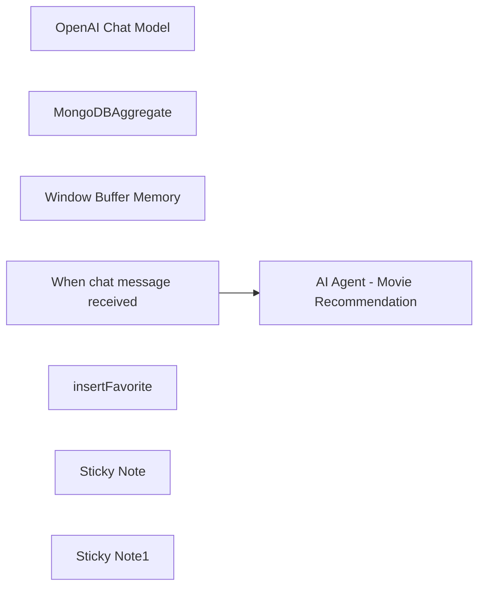

## Fluxo (.json) :

```json
{
  "id": "22PddLUgcjSJbT1w",
  "meta": {
    "instanceId": "fa7d5e2425ec76075df7100dbafffed91cc6f71f12fe92614bf78af63c54a61d",
    "templateCredsSetupCompleted": true
  },
  "name": "MongoDB Agent",
  "tags": [],
  "nodes": [
    {
      "id": "d8c07efe-eca0-48cb-80e6-ea8117073c5f",
      "name": "OpenAI Chat Model",
      "type": "@n8n/n8n-nodes-langchain.lmChatOpenAi",
      "position": [
        1300,
        560
      ],
      "parameters": {
        "options": {}
      },
      "credentials": {
        "openAiApi": {
          "id": "TreGPMKr9hrtCvVp",
          "name": "OpenAi account"
        }
      },
      "typeVersion": 1
    },
    {
      "id": "636de178-7b68-429a-9371-41cf2a950076",
      "name": "MongoDBAggregate",
      "type": "n8n-nodes-base.mongoDbTool",
      "position": [
        1640,
        540
      ],
      "parameters": {
        "query": "={{ $fromAI(\"pipeline\", \"The MongoDB pipeline to execute\" , \"string\" , [{\"$match\" : { \"rating\" : 5 } }])}}",
        "operation": "aggregate",
        "collection": "movies",
        "descriptionType": "manual",
        "toolDescription": "Get from AI the MongoDB Aggregation pipeline to get context based on the provided pipeline, the document structure of the documents is : {\n \"plot\": \"A group of bandits stage a brazen train hold-up, only to find a determined posse hot on their heels.\",\n \"genres\": [\n \"Short\",\n \"Western\"\n ],\n \"runtime\": 11,\n \"cast\": [\n \"A.C. Abadie\",\n \"Gilbert M. 'Broncho Billy' Anderson\",\n ...\n ],\n \"poster\": \"...jpg\",\n \"title\": \"The Great Train Robbery\",\n \"fullplot\": \"Among the earliest existing films in American cinema - notable as the ...\",\n \"languages\": [\n \"English\"\n ],\n \"released\": \"date\"\n },\n \"directors\": [\n \"Edwin S. Porter\"\n ],\n \"rated\": \"TV-G\",\n \"awards\": {\n \"wins\": 1,\n \"nominations\": 0,\n \"text\": \"1 win.\"\n },\n \"lastupdated\": \"2015-08-13 00:27:59.177000000\",\n \"year\": 1903,\n \"imdb\": {\n \"rating\": 7.4,"
      },
      "credentials": {
        "mongoDb": {
          "id": "8xGgiXzf2o0L4a0y",
          "name": "MongoDB account"
        }
      },
      "typeVersion": 1.1
    },
    {
      "id": "e0f248dc-22b7-40a2-a00e-6298b51e4470",
      "name": "Window Buffer Memory",
      "type": "@n8n/n8n-nodes-langchain.memoryBufferWindow",
      "position": [
        1500,
        540
      ],
      "parameters": {
        "contextWindowLength": 10
      },
      "typeVersion": 1.2
    },
    {
      "id": "da27ee52-43db-4818-9844-3c0a064bf958",
      "name": "When chat message received",
      "type": "@n8n/n8n-nodes-langchain.chatTrigger",
      "position": [
        1160,
        400
      ],
      "webhookId": "0730df2d-2f90-45e0-83dc-609668260fda",
      "parameters": {
        "mode": "webhook",
        "public": true,
        "options": {
          "allowedOrigins": "*"
        }
      },
      "typeVersion": 1.1
    },
    {
      "id": "9ad79da9-3145-44be-9026-e37b0e856f5d",
      "name": "insertFavorite",
      "type": "@n8n/n8n-nodes-langchain.toolWorkflow",
      "position": [
        1860,
        520
      ],
      "parameters": {
        "name": "insertFavorites",
        "workflowId": {
          "__rl": true,
          "mode": "list",
          "value": "6QuKnOrpusQVu66Q",
          "cachedResultName": "insertMongoDB"
        },
        "description": "=Use this tool only to add favorites with the structure of {\"title\" : \"recieved title\" }"
      },
      "typeVersion": 1.2
    },
    {
      "id": "4d7713d1-d2ad-48bf-971b-b86195e161ca",
      "name": "AI Agent - Movie Recommendation",
      "type": "@n8n/n8n-nodes-langchain.agent",
      "position": [
        1380,
        300
      ],
      "parameters": {
        "text": "=Assistant for best movies context, you have tools to search using \"MongoDBAggregate\" and you need to provide a MongoDB aggregation pipeline code array as a \"query\" input param. User input and request: {{ $json.chatInput }}. Only when a user confirms a favorite movie use the insert favorite using the \"insertFavorite\" workflow tool of to insertFavorite as { \"title\" : \"<TITLE>\" }.",
        "options": {},
        "promptType": "define"
      },
      "typeVersion": 1.7
    },
    {
      "id": "2eac8aed-9677-4d89-bd76-456637f5b979",
      "name": "Sticky Note",
      "type": "n8n-nodes-base.stickyNote",
      "position": [
        880,
        300
      ],
      "parameters": {
        "width": 216.0875923062025,
        "height": 499.89779507612025,
        "content": "## AI Agent powered by OpenAI and MongoDB \n\nThis flow is designed to work as an AI autonomous agent that can get chat messages, query data from MongoDB using the aggregation framework.\n\nFollowing by augmenting the results from the sample movies collection and allowing storing my favorite movies back to the database using an \"insert\" flow. "
      },
      "typeVersion": 1
    },
    {
      "id": "4d8130fe-4aed-4e09-9c1d-60fb9ac1a500",
      "name": "Sticky Note1",
      "type": "n8n-nodes-base.stickyNote",
      "position": [
        1300,
        720
      ],
      "parameters": {
        "content": "## Process\n\nThe message is being processed by the \"Chat Model\" and the correct tool is used according to the message. "
      },
      "typeVersion": 1
    }
  ],
  "active": true,
  "pinData": {},
  "settings": {
    "executionOrder": "v1"
  },
  "versionId": "879aab24-6346-435f-8fd4-3fca856ba64c",
  "connections": {
    "insertFavorite": {
      "ai_tool": [
        [
          {
            "node": "AI Agent - Movie Recommendation",
            "type": "ai_tool",
            "index": 0
          }
        ]
      ]
    },
    "MongoDBAggregate": {
      "ai_tool": [
        [
          {
            "node": "AI Agent - Movie Recommendation",
            "type": "ai_tool",
            "index": 0
          }
        ]
      ]
    },
    "OpenAI Chat Model": {
      "ai_languageModel": [
        [
          {
            "node": "AI Agent - Movie Recommendation",
            "type": "ai_languageModel",
            "index": 0
          }
        ]
      ]
    },
    "Window Buffer Memory": {
      "ai_memory": [
        [
          {
            "node": "AI Agent - Movie Recommendation",
            "type": "ai_memory",
            "index": 0
          }
        ]
      ]
    },
    "When chat message received": {
      "main": [
        [
          {
            "node": "AI Agent - Movie Recommendation",
            "type": "main",
            "index": 0
          }
        ]
      ]
    }
  }
}
```

<a id="template-118"></a>

## Template 118 - Enviar imagens para upload-post (Instagram/TikTok)

- **Nome:** Enviar imagens para upload-post (Instagram/TikTok)
- **Descrição:** Automatiza o envio de imagens para a API upload-post.com, direcionando publicações para Instagram e TikTok.
- **Funcionalidade:** • Gatilho manual para testes: permite iniciar o fluxo manualmente para verificar o processo.
• Download de imagens: busca imagens a partir de URLs externas como origem.
• Renomeação de dados binários: padroniza os arquivos recebidos como photo1, photo2, etc.
• Mesclagem de arquivos: combina múltiplos binários em um único payload para envio.
• Envio multipart/form-data com autenticação: envia as imagens e metadados (título, usuário, plataforma) para a API usando header de autorização.
- **Ferramentas:** • upload-post.com API: serviço que recebe uploads de fotos via endpoint /api/upload_photos para publicar em redes sociais.
• Wikimedia Commons: fonte pública das imagens de exemplo (por exemplo, Example.png).
• Autenticação por API Key: uso de header Authorization com chave de API para autorizar os uploads.


## Fluxo visual

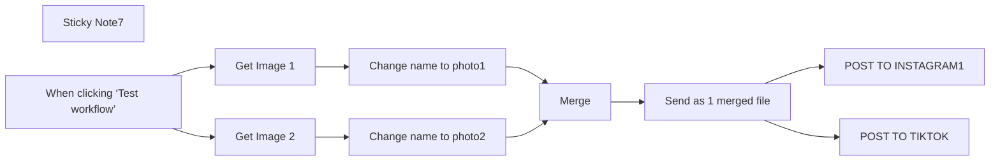

## Fluxo (.json) :

```json
{
  "id": "ra8MrqshnzXPy55O",
  "meta": {
    "instanceId": "3378b0d68c3b7ebfc71b79896d94e1a044dec38e99a1160aed4e9c323910fbe2"
  },
  "name": "upload-post images",
  "tags": [],
  "nodes": [
    {
      "id": "7d899b35-ae00-418a-b890-e318f6d61f7a",
      "name": "POST TO INSTAGRAM1",
      "type": "n8n-nodes-base.httpRequest",
      "position": [
        820,
        -220
      ],
      "parameters": {
        "url": "https://api.upload-post.com/api/upload_photos",
        "method": "POST",
        "options": {},
        "sendBody": true,
        "contentType": "multipart-form-data",
        "sendHeaders": true,
        "bodyParameters": {
          "parameters": [
            {
              "name": "title",
              "value": "title-ig"
            },
            {
              "name": "user",
              "value": "user_name"
            },
            {
              "name": "platform[]",
              "value": "instagram"
            },
            {
              "name": "photos[]",
              "parameterType": "formBinaryData",
              "inputDataFieldName": "=photo1"
            },
            {
              "name": "photos[]",
              "parameterType": "formBinaryData",
              "inputDataFieldName": "photo2"
            }
          ]
        },
        "headerParameters": {
          "parameters": [
            {
              "name": "Authorization",
              "value": "Apikey api"
            }
          ]
        }
      },
      "typeVersion": 4.2
    },
    {
      "id": "025c1aa3-acf2-4211-93e1-9df2182bbf07",
      "name": "Sticky Note7",
      "type": "n8n-nodes-base.stickyNote",
      "position": [
        -840,
        -360
      ],
      "parameters": {
        "color": 6,
        "width": 1880,
        "height": 660,
        "content": "# POST : to Instagram"
      },
      "typeVersion": 1
    },
    {
      "id": "7a98a200-3c96-45f8-a4d2-860c74d81c1f",
      "name": "Merge",
      "type": "n8n-nodes-base.merge",
      "position": [
        220,
        -120
      ],
      "parameters": {},
      "typeVersion": 3
    },
    {
      "id": "d7bd532e-b07a-43f8-9ceb-c4dad685734d",
      "name": "Change name to photo1",
      "type": "n8n-nodes-base.code",
      "position": [
        -100,
        -220
      ],
      "parameters": {
        "jsCode": "return items.map((item, index) => {\n  // Grab the existing binary buffer under \"data\"\n  const buffer = item.binary.data;\n  // Build a new item with the renamed binary key\n  return {\n    json: item.json,\n    binary: {\n      // Rename to photo1, photo2, ...\n      [`photo${index + 1}`]: buffer\n    }\n  };\n});\n"
      },
      "typeVersion": 2
    },
    {
      "id": "f5efe3ce-c8b9-445a-8667-fefc3dc36545",
      "name": "Change name to photo2",
      "type": "n8n-nodes-base.code",
      "position": [
        -100,
        -20
      ],
      "parameters": {
        "jsCode": "return items.map((item, index) => {\n  // Grab the existing binary buffer under \"data\"\n  const buffer = item.binary.data;\n  // Build a new item with the renamed binary key\n  return {\n    json: item.json,\n    binary: {\n      // Rename to photo1, photo2, ...\n      [`photo${index + 2}`]: buffer\n    }\n  };\n});\n"
      },
      "typeVersion": 2
    },
    {
      "id": "4901b1f3-12e7-4f7d-b87a-5582d2319237",
      "name": "Send as 1 merged file",
      "type": "n8n-nodes-base.code",
      "position": [
        520,
        -120
      ],
      "parameters": {
        "jsCode": "// Merge all incoming items (each with one binary photoX) into one item\nconst mergedItem = {\n  json: {},\n  binary: {}\n};\n\nfor (const item of items) {\n  // Copy every binary field from each item into mergedItem.binary\n  for (const [key, bin] of Object.entries(item.binary || {})) {\n    mergedItem.binary[key] = bin;\n  }\n}\n\n// Return a single-item array\nreturn [mergedItem];\n"
      },
      "typeVersion": 2
    },
    {
      "id": "34a88bd7-6302-4f22-aec0-d4318beceffa",
      "name": "When clicking ‘Test workflow’",
      "type": "n8n-nodes-base.manualTrigger",
      "position": [
        -760,
        -120
      ],
      "parameters": {},
      "typeVersion": 1
    },
    {
      "id": "e710233a-e408-4718-9d1d-3a373fad33b8",
      "name": "POST TO TIKTOK",
      "type": "n8n-nodes-base.httpRequest",
      "position": [
        820,
        -20
      ],
      "parameters": {
        "url": "https://api.upload-post.com/api/upload_photos",
        "method": "POST",
        "options": {},
        "sendBody": true,
        "contentType": "multipart-form-data",
        "sendHeaders": true,
        "bodyParameters": {
          "parameters": [
            {
              "name": "title",
              "value": "title-ig"
            },
            {
              "name": "user",
              "value": "user_name"
            },
            {
              "name": "platform[]",
              "value": "tiktok"
            },
            {
              "name": "photos[]",
              "parameterType": "formBinaryData",
              "inputDataFieldName": "=photo1"
            },
            {
              "name": "photos[]",
              "parameterType": "formBinaryData",
              "inputDataFieldName": "photo2"
            }
          ]
        },
        "headerParameters": {
          "parameters": [
            {
              "name": "Authorization",
              "value": "Apikey api"
            }
          ]
        }
      },
      "typeVersion": 4.2
    },
    {
      "id": "000f92e8-64df-4ebd-a608-d5b0d2e1a5c4",
      "name": "Get Image 1",
      "type": "n8n-nodes-base.httpRequest",
      "position": [
        -420,
        -220
      ],
      "parameters": {
        "url": "https://upload.wikimedia.org/wikipedia/commons/7/70/Example.png",
        "options": {}
      },
      "typeVersion": 4.2
    },
    {
      "id": "f15f5cd5-9ca5-4ab7-bc66-32f7a3ec1e0c",
      "name": "Get Image 2",
      "type": "n8n-nodes-base.httpRequest",
      "position": [
        -420,
        -20
      ],
      "parameters": {
        "url": "https://upload.wikimedia.org/wikipedia/commons/7/70/Example.png",
        "options": {}
      },
      "typeVersion": 4.2
    }
  ],
  "active": false,
  "pinData": {},
  "settings": {
    "executionOrder": "v1"
  },
  "versionId": "d79c90a0-bb65-45b1-9d1b-c6af98f8480b",
  "connections": {
    "Merge": {
      "main": [
        [
          {
            "node": "Send as 1 merged file",
            "type": "main",
            "index": 0
          }
        ]
      ]
    },
    "Get Image 1": {
      "main": [
        [
          {
            "node": "Change name to photo1",
            "type": "main",
            "index": 0
          }
        ]
      ]
    },
    "Get Image 2": {
      "main": [
        [
          {
            "node": "Change name to photo2",
            "type": "main",
            "index": 0
          }
        ]
      ]
    },
    "Change name to photo1": {
      "main": [
        [
          {
            "node": "Merge",
            "type": "main",
            "index": 0
          }
        ]
      ]
    },
    "Change name to photo2": {
      "main": [
        [
          {
            "node": "Merge",
            "type": "main",
            "index": 1
          }
        ]
      ]
    },
    "Send as 1 merged file": {
      "main": [
        [
          {
            "node": "POST TO INSTAGRAM1",
            "type": "main",
            "index": 0
          },
          {
            "node": "POST TO TIKTOK",
            "type": "main",
            "index": 0
          }
        ]
      ]
    },
    "When clicking ‘Test workflow’": {
      "main": [
        [
          {
            "node": "Get Image 1",
            "type": "main",
            "index": 0
          },
          {
            "node": "Get Image 2",
            "type": "main",
            "index": 0
          }
        ]
      ]
    }
  }
}
```

<a id="template-119"></a>

## Template 119 - Atribuir valores a variáveis

- **Nome:** Atribuir valores a variáveis
- **Descrição:** Este fluxo define várias variáveis (número, texto e booleano) com valores fixos quando executado.
- **Funcionalidade:** • Ativação manual: inicia o fluxo quando o usuário executa manualmente.
• Definição de variáveis: cria e atribui valores a variáveis dos tipos número, texto e booleano.
• Valores fixos definidos: atribui número = 20, texto = 'From n8n with love' e booleano = true.
- **Ferramentas:** • Nenhuma: Este fluxo não utiliza ferramentas externas.


## Fluxo visual

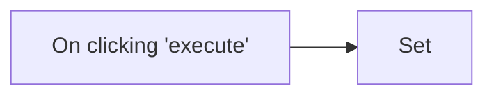

## Fluxo (.json) :

```json
{
  "id": "141",
  "name": "Assign values to variables using the Set node",
  "nodes": [
    {
      "name": "On clicking 'execute'",
      "type": "n8n-nodes-base.manualTrigger",
      "position": [
        250,
        300
      ],
      "parameters": {},
      "typeVersion": 1
    },
    {
      "name": "Set",
      "type": "n8n-nodes-base.set",
      "position": [
        450,
        300
      ],
      "parameters": {
        "values": {
          "number": [
            {
              "name": "number",
              "value": 20
            }
          ],
          "string": [
            {
              "name": "string",
              "value": "From n8n with love"
            }
          ],
          "boolean": [
            {
              "name": "boolean",
              "value": true
            }
          ]
        },
        "options": {}
      },
      "typeVersion": 1
    }
  ],
  "active": false,
  "settings": {},
  "connections": {
    "On clicking 'execute'": {
      "main": [
        [
          {
            "node": "Set",
            "type": "main",
            "index": 0
          }
        ]
      ]
    }
  }
}
```

<a id="template-120"></a>

## Template 120 - Geração e publicação automática de conteúdo para WordPress

- **Nome:** Geração e publicação automática de conteúdo para WordPress
- **Descrição:** Automatiza a criação de artigos em HTML com IA, armazena os dados numa planilha e publica posts no WordPress incluindo imagem recuperada automaticamente.
- **Funcionalidade:** • Geração de conteúdo com IA: Cria artigos completos em HTML (título, subtítulos, parágrafos, listas e formatação) a partir de um prompt.
• Extração de palavras-chave de imagem: Gera 3–5 keywords específicas em inglês para busca de imagens relacionadas ao artigo.
• Salvamento em planilha: Registra título, conteúdo e palavras-chave de busca numa folha do Google Sheets (colunas pré-configuradas).
• Recuperação automática de imagem: Consulta a API de imagens usando a keyword composta e retorna a imagem em formato landscape.
• Publicação no WordPress: Insere a imagem no início do conteúdo HTML e publica o post automaticamente (status: publish).
• Agendamento e aleatoriedade: Suporta execução agendada e introduz atraso aleatório (0–6 horas) antes da publicação para padrão de postagem mais natural.
• Execução manual para testes: Permite disparo manual do fluxo para depuração e verificação antes de automatizar em produção.
• Recomendações de configuração: Indica instalar plugin para definir imagem destacada automaticamente a partir do conteúdo.
- **Ferramentas:** • OpenAI: Gera o conteúdo do artigo em HTML e extrai as keywords para busca de imagens.
• Pexels API: Fornece imagens de alta qualidade por palavra-chave (recupera URL de imagem em orientação landscape).
• Google Sheets: Armazena registros dos artigos (título, conteúdo e keywords) em colunas configuradas.
• WordPress: Plataforma que recebe e publica os posts gerados, exibindo o conteúdo e a imagem.
• Featured Image from URL (FIFU) plugin: Plugin que permite definir automaticamente a imagem destacada a partir da imagem inserida no conteúdo.


## Fluxo visual

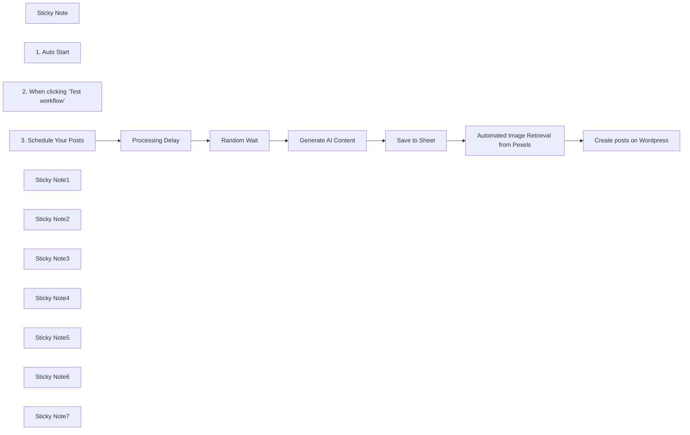

## Fluxo (.json) :

```json
{
  "id": "YOUR_WORKFLOW_ID",
  "meta": {
    "instanceId": "YOUR_INSTANCE_ID",
    "templateCredsSetupCompleted": true
  },
  "name": "Automated Content Generation & Publishing - Wordpress",
  "tags": [],
  "nodes": [
    {
      "id": "9cd63357-19dc-4420-baa9-1e1389c7120f",
      "name": "Create posts on Wordpress",
      "type": "n8n-nodes-base.wordpress",
      "position": [
        1180,
        280
      ],
      "parameters": {
        "title": "={{ $('Save to Sheet').item.json['title'] }}",
        "additionalFields": {
          "status": "publish",
          "content": "=<br><br>\n<br><br>\n{{ $node['Save to Sheet'].json['content'] }}"
        }
      },
      "credentials": {
        "wordpressApi": {
          "id": "YOUR_WORDPRESS_CREDENTIAL_ID",
          "name": "Wordpress account 2"
        }
      },
      "typeVersion": 1,
      "alwaysOutputData": false
    },
    {
      "id": "65f62f19-d10f-4ca1-a853-9cedb3506743",
      "name": "Processing Delay",
      "type": "n8n-nodes-base.code",
      "position": [
        180,
        580
      ],
      "parameters": {
        "jsCode": "const delay = Math.floor(Math.random() * (6 * 60 * 60 * 1000)); // random delay 0-6 hour\nreturn {\n  json: {\n    delay: delay,\n    delay_minutes: Math.round(delay / 60000),  // to minutes\n    delay_hours: (delay / 3600000).toFixed(2) // to hours\n  }\n};\n"
      },
      "typeVersion": 2
    },
    {
      "id": "193d2876-c50e-4b9e-8856-9fd11baa025e",
      "name": "Random Wait",
      "type": "n8n-nodes-base.wait",
      "position": [
        180,
        760
      ],
      "webhookId": "61377399-ce9f-497a-80b1-aab29fc9fb69",
      "parameters": {
        "amount": "={{$json[\"delay\"] / 1000}}"
      },
      "typeVersion": 1.1
    },
    {
      "id": "cf510c21-7c19-4e84-a43a-62d170277cdf",
      "name": "Save to Sheet",
      "type": "n8n-nodes-base.googleSheets",
      "position": [
        780,
        280
      ],
      "parameters": {
        "columns": {
          "value": {
            "title": "={{ $json.message.content.title }}",
            "content": "={{ $json.message.content.content }}",
            "Image search keyword": "={{ $json.message.content.keywords.join(\"+\") }}"
          },
          "schema": [
            {
              "id": "title",
              "type": "string",
              "display": true,
              "removed": false,
              "required": false,
              "displayName": "title",
              "defaultMatch": false,
              "canBeUsedToMatch": true
            },
            {
              "id": "content",
              "type": "string",
              "display": true,
              "required": false,
              "displayName": "content",
              "defaultMatch": false,
              "canBeUsedToMatch": true
            },
            {
              "id": "Image search keyword",
              "type": "string",
              "display": true,
              "required": false,
              "displayName": "Image search keyword",
              "defaultMatch": false,
              "canBeUsedToMatch": true
            }
          ],
          "mappingMode": "defineBelow",
          "matchingColumns": []
        },
        "options": {},
        "operation": "append",
        "sheetName": {
          "__rl": true,
          "mode": "name",
          "value": "Sheet1"
        },
        "documentId": {
          "__rl": true,
          "mode": "url",
          "value": "YOURDOCUMENT_URL"
        }
      },
      "credentials": {
        "googleSheetsOAuth2Api": {
          "id": "YOUR_GOOGLE_SHEETS_CREDENTIAL_ID",
          "name": "Google Sheets account_正確"
        }
      },
      "typeVersion": 4.5
    },
    {
      "id": "1778f649-c09e-4ef9-b153-4160eed6805c",
      "name": "Sticky Note",
      "type": "n8n-nodes-base.stickyNote",
      "position": [
        -220,
        0
      ],
      "parameters": {
        "width": 607.503259452412,
        "height": 892.7656453715782,
        "content": "## Automated Article Scheduling\n\n**1. Fast Bulk Article Generation**\nQuickly create multiple AI-generated articles.\nEfficiently streamline content creation.\nReduces manual effort while maintaining quality.\n\n**2. Workflow Testing Before Execution**\nManually test the workflow for debugging.\nEnsure each step runs as expected.\nOptimize before full automation.\n\n**3. Automated & Randomized Publishing**\nSchedule posts at predefined intervals.\nIntroduce random delays for a natural posting pattern.\nPrevents overly predictable publishing behavior."
      },
      "typeVersion": 1
    },
    {
      "id": "6f385e8c-b3e6-4456-9738-e85ea2cbbea1",
      "name": "1. Auto Start",
      "type": "n8n-nodes-base.scheduleTrigger",
      "disabled": true,
      "position": [
        180,
        20
      ],
      "parameters": {
        "rule": {
          "interval": [
            {
              "field": "minutes",
              "minutesInterval": 1
            }
          ]
        }
      },
      "typeVersion": 1.2
    },
    {
      "id": "6d7712e8-9033-453b-ad52-09f718bcb701",
      "name": "2. When clicking ‘Test workflow’",
      "type": "n8n-nodes-base.manualTrigger",
      "disabled": true,
      "position": [
        180,
        200
      ],
      "parameters": {},
      "typeVersion": 1
    },
    {
      "id": "0fd8fe8f-a0d5-42d9-b728-53340c6e4233",
      "name": "3. Schedule Your Posts",
      "type": "n8n-nodes-base.scheduleTrigger",
      "position": [
        180,
        380
      ],
      "parameters": {
        "rule": {
          "interval": [
            {
              "field": "weeks",
              "triggerAtDay": [
                2,
                4,
                0
              ],
              "triggerAtHour": "={{ 12 }}"
            }
          ]
        }
      },
      "typeVersion": 1.2
    },
    {
      "id": "16c26c36-fb8e-4903-a64c-57803fac83b9",
      "name": "Sticky Note1",
      "type": "n8n-nodes-base.stickyNote",
      "position": [
        400,
        440
      ],
      "parameters": {
        "width": 351.77682676671327,
        "height": 271.4285686334568,
        "content": "## AI Content Generating\n\n**Automatic Content & Keyword Generation\n\n- Use your own prompt to start\n- ChatGPT generates full-length articles with structured headings.\n- Extracts relevant image search keywords for visual enhancement.\n- To implement this, add the following prompt (green note) below your workflow:\n"
      },
      "typeVersion": 1
    },
    {
      "id": "921173fb-ae10-4f88-a1ab-15f063cd623f",
      "name": "Sticky Note2",
      "type": "n8n-nodes-base.stickyNote",
      "position": [
        400,
        740
      ],
      "parameters": {
        "color": 4,
        "width": 349.47344203333904,
        "height": 1277.4269457977707,
        "content": "(YOUR PROMPT)\n\n**Image Search Keywords (For Visual Alignment)**\n\n- Automatically generates 3-5 English keywords for image searches based on the article content.\n- Keywords should be specific objects, locations, or atmospheres rather than abstract concepts.\n\n**Article Formatting Requirements**\n\n1️⃣ Title (H1): Ensure unique and trend-driven headlines.\n2️⃣ H2 / H3 Subheadings: Structure content in an SEO-optimized format.\n3️⃣ Article Structure (Enhanced Readability)\n\n** Introduction **\n- Go straight to the point, avoiding excessive background.\n- Use question hooks or market trend data to engage readers.\n\n** Core Content **\n- Include at least three knowledge points to ensure depth.\n- Balance short and long sentences for better flow.\n\n** Conclusion **\n- Avoid generic AI-style summaries; instead, provide insights or actionable takeaways.\n- Optionally include a CTA (Call to Action).\n\n** HTML Formatting **\nEnsure the article is properly structured in HTML format:\n- Headings: Use <h1>, <h2>, <h3> appropriately.\n- Paragraphs: Enclose text within <p>.\n- Emphasized Words: Use <strong> to highlight key terms.\n- Lists: Use <ul> and <li> for bullet points.\n\nEnsure a clean, well-structured output instead of plain text.\n\n### **Final JSON Format\nEnsure the output follows this structure:\n\n{\n  \"title\": \"{Generate an H1 title that aligns with market trends, ensures high click-through rates, and follows keyword strategy}\",\n  \"content\": \"{Generate a complete HTML article including H1, H2, H3 headings, paragraphs, lists, etc.}\",\n  \"keywords\": [\"{Image search keyword 1}\", \"{Image search keyword 2}\", \"{Image search keyword 3}\", \"{Image search keyword 4}\", \"{Image search keyword 5}\"]\n}"
      },
      "typeVersion": 1
    },
    {
      "id": "364b1ee1-4685-4b10-b988-1704dc65592b",
      "name": "Sticky Note3",
      "type": "n8n-nodes-base.stickyNote",
      "position": [
        760,
        440
      ],
      "parameters": {
        "width": 367.1064142931126,
        "height": 267.17005729996885,
        "content": "## Google Sheet Setting\n**You need to set up these in your sheet column** \n- title\n- content\n- image search keyword\n\n**Mapping \"Values to Send\"**\n- {{ $json.message.content.title }}\n- {{ $json.message.content.content }}\n- {{ $json.message.content.keywords.join(\"+\") }}"
      },
      "typeVersion": 1
    },
    {
      "id": "26876b53-aa27-4e16-991e-c3618e751c17",
      "name": "Automated Image Retrieval from Pexels",
      "type": "n8n-nodes-base.httpRequest",
      "position": [
        980,
        280
      ],
      "parameters": {
        "url": "=https://api.pexels.com/v1/search?per_page=1&orientation=landscape&query={{ $json[\"Image search keyword\"] }}\n",
        "options": {},
        "sendQuery": true,
        "sendHeaders": true,
        "queryParameters": {
          "parameters": [
            {
              "name": "query",
              "value": "={{ $json['Image search keyword'] }}"
            }
          ]
        },
        "headerParameters": {
          "parameters": [
            {
              "name": "Authorization",
              "value": "YOUR_PEXELS_API_KEY"
            },
            {
              "name": "Content-Type",
              "value": "application/json"
            }
          ]
        }
      },
      "typeVersion": 4.2
    },
    {
      "id": "769638be-ee38-4e40-a508-f998b09ce1f4",
      "name": "Sticky Note4",
      "type": "n8n-nodes-base.stickyNote",
      "position": [
        -220,
        -240
      ],
      "parameters": {
        "color": 3,
        "width": 608.0701163493336,
        "height": 211.65896369815192,
        "content": "## Introduction: WordPress automatically publishes posts and inserts the first image\n\nIt is **highly recommended to install the Featured Image from URL (FIFU) plugin** and enable:\n\n**Auto > Set Featured Media Automatically from Content.** before you generate contents."
      },
      "typeVersion": 1
    },
    {
      "id": "37f3606f-f110-49d2-bcf5-1edc27149fee",
      "name": "Sticky Note5",
      "type": "n8n-nodes-base.stickyNote",
      "position": [
        400,
        229.99235545929986
      ],
      "parameters": {
        "width": 348.08256103956126,
        "height": 170.00764454070014,
        "content": "Add your API credential"
      },
      "typeVersion": 1
    },
    {
      "id": "2399a40d-4b79-400c-9e96-df7e683fd666",
      "name": "Sticky Note6",
      "type": "n8n-nodes-base.stickyNote",
      "position": [
        760,
        228.00611563256007
      ],
      "parameters": {
        "width": 150,
        "height": 170.00764454070008,
        "content": "Add your API credential"
      },
      "typeVersion": 1
    },
    {
      "id": "45e479a6-2eea-44a1-9096-9895a18904fd",
      "name": "Sticky Note7",
      "type": "n8n-nodes-base.stickyNote",
      "position": [
        920,
        226.01987580582022
      ],
      "parameters": {
        "width": 201.97095074533956,
        "height": 172.00917344884022,
        "content": "Add your API credential"
      },
      "typeVersion": 1
    },
    {
      "id": "e0489552-a7b5-4161-9553-95e23605a9d5",
      "name": "Generate AI Content",
      "type": "@n8n/n8n-nodes-langchain.openAi",
      "position": [
        440,
        280
      ],
      "parameters": {
        "modelId": {
          "__rl": true,
          "mode": "list",
          "value": "gpt-4o",
          "cachedResultName": "GPT-4O"
        },
        "options": {},
        "messages": {
          "values": [
            {
              "content": "(YOUR PROMPT)\n(YOUR PROMPT)\n\n**Image Search Keywords (For Visual Alignment)**\n\n- Automatically generates 3-5 English keywords for image searches based on the article content.\n- Keywords should be specific objects, locations, or atmospheres rather than abstract concepts.\n\n**Article Formatting Requirements**\n\n1️⃣ Title (H1): Ensure unique and trend-driven headlines.\n2️⃣ H2 / H3 Subheadings: Structure content in an SEO-optimized format.\n3️⃣ Article Structure (Enhanced Readability)\n\n** Introduction **\n- Go straight to the point, avoiding excessive background.\n- Use question hooks or market trend data to engage readers.\n\n** Core Content **\n- Include at least three knowledge points to ensure depth.\n- Balance short and long sentences for better flow.\n\n** Conclusion **\n- Avoid generic AI-style summaries; instead, provide insights or actionable takeaways.\n- Optionally include a CTA (Call to Action).\n\n** HTML Formatting **\nEnsure the article is properly structured in HTML format:\n- Headings: Use <h1>, <h2>, <h3> appropriately.\n- Paragraphs: Enclose text within <p>.\n- Emphasized Words: Use <strong> to highlight key terms.\n- Lists: Use <ul> and <li> for bullet points.\n\nEnsure a clean, well-structured output instead of plain text.\n\n### **Final JSON Format\nEnsure the output follows this structure:\n\n{\n  \"title\": \"{Generate an H1 title that aligns with market trends, ensures high click-through rates, and follows keyword strategy}\",\n  \"content\": \"{Generate a complete HTML article including H1, H2, H3 headings, paragraphs, lists, etc.}\",\n  \"keywords\": [\"{Image search keyword 1}\", \"{Image search keyword 2}\", \"{Image search keyword 3}\", \"{Image search keyword 4}\", \"{Image search keyword 5}\"]\n}"
            }
          ]
        },
        "jsonOutput": true
      },
      "credentials": {
        "openAiApi": {
          "id": "YOUR_OPENAI_CREDENTIAL_ID",
          "name": "OpenAi account"
        }
      },
      "typeVersion": 1.6
    }
  ],
  "active": false,
  "pinData": {},
  "settings": {
    "timezone": "Asia/Taipei",
    "executionOrder": "v1"
  },
  "versionId": "YOUR_VERSION_ID",
  "connections": {
    "Random Wait": {
      "main": [
        [
          {
            "node": "Generate AI Content",
            "type": "main",
            "index": 0
          }
        ]
      ]
    },
    "Save to Sheet": {
      "main": [
        [
          {
            "node": "Automated Image Retrieval from Pexels",
            "type": "main",
            "index": 0
          }
        ]
      ]
    },
    "Processing Delay": {
      "main": [
        [
          {
            "node": "Random Wait",
            "type": "main",
            "index": 0
          }
        ]
      ]
    },
    "Generate AI Content": {
      "main": [
        [
          {
            "node": "Save to Sheet",
            "type": "main",
            "index": 0
          }
        ]
      ]
    },
    "3. Schedule Your Posts": {
      "main": [
        [
          {
            "node": "Processing Delay",
            "type": "main",
            "index": 0
          }
        ]
      ]
    },
    "Automated Image Retrieval from Pexels": {
      "main": [
        [
          {
            "node": "Create posts on Wordpress",
            "type": "main",
            "index": 0
          }
        ]
      ]
    }
  }
}
```

<a id="template-121"></a>

## Template 121 - Criar recurso no Netlify via webhook

- **Nome:** Criar recurso no Netlify via webhook
- **Descrição:** O fluxo recebe um webhook HTTP com dados JSON e cria um recurso no Netlify usando o título enviado no payload.
- **Funcionalidade:** • Recepção de webhook HTTP: aceita requisições POST em um caminho específico.
• Extração de dados do payload: lê o campo body.data.title do JSON recebido para usar como título.
• Criação de recurso no Netlify: envia uma requisição à API do Netlify para criar um novo item no site configurado, usando o título extraído.
• Autenticação com conta do Netlify: utiliza credenciais configuradas para autorizar a operação na API do Netlify.
- **Ferramentas:** • Netlify: plataforma de hospedagem e gestão de sites, usada para criar recursos no site especificado a partir do título enviado no webhook.


## Fluxo visual

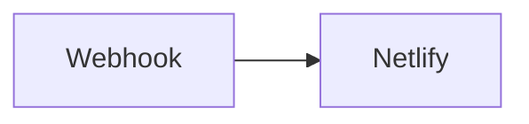

## Fluxo (.json) :

```json
{
  "nodes": [
    {
      "name": "Webhook",
      "type": "n8n-nodes-base.webhook",
      "position": [
        450,
        300
      ],
      "webhookId": "0d36a8db-0177-4501-9f7a-e46b6829d07a",
      "parameters": {
        "path": "0d36a8db-0177-4501-9f7a-e46b6829d07a",
        "options": {},
        "httpMethod": "POST"
      },
      "typeVersion": 1
    },
    {
      "name": "Netlify",
      "type": "n8n-nodes-base.netlify",
      "position": [
        650,
        300
      ],
      "parameters": {
        "siteId": "5e15e032-9345-41b8-a98f-509e545f061c",
        "operation": "create",
        "additionalFields": {
          "title": "={{$json[\"body\"][\"data\"][\"title\"]}}"
        }
      },
      "credentials": {
        "netlifyApi": "Netlify account"
      },
      "typeVersion": 1
    }
  ],
  "connections": {
    "Webhook": {
      "main": [
        [
          {
            "node": "Netlify",
            "type": "main",
            "index": 0
          }
        ]
      ]
    }
  }
}
```
