# PACK 1999 TEMPLATES PARTE 01 - Bloco 7

Templates neste bloco: 20

## Sumário

- [Template 122 - Restaurar workflows a partir do GitHub](#template-122)
- [Template 123 - Converter PDF para PDF/A e salvar](#template-123)
- [Template 124 - Gerador automático de vídeos curtos POV](#template-124)
- [Template 125 - Assistente LINE com calendário e e-mail](#template-125)
- [Template 126 - Gerenciar registros no Quick Base](#template-126)
- [Template 127 - Alerta de deploy falhado no Slack](#template-127)
- [Template 128 - Geração de wallpaper gráfico com IA](#template-128)
- [Template 129 - Bot Telegram multilíngue](#template-129)
- [Template 130 - Teste rápido de webhook usando PostBin e BambooHR](#template-130)
- [Template 131 - Atualizar descrições do YouTube com texto padronizado](#template-131)
- [Template 132 - Conversão DOCX → PDF (ConvertAPI)](#template-132)
- [Template 133 - Responder chat HubSpot com Assistente OpenAI](#template-133)
- [Template 134 - Notificações de bounce e abertura de e-mail](#template-134)
- [Template 135 - Agregador de execuções em lote](#template-135)
- [Template 136 - Resposta automática a e-mails com aprovação](#template-136)
- [Template 137 - Geração de imagem via prompt por Webhook](#template-137)
- [Template 138 - Nova conta adicionada por admin no ActiveCampaign](#template-138)
- [Template 139 - Publicação automática de posts no WordPress](#template-139)
- [Template 140 - Gerar fala via Elevenlabs (Text-to-Speech)](#template-140)
- [Template 141 - Comando /deploy no Telegram para buscar release](#template-141)

---

<a id="template-122"></a>

## Template 122 - Restaurar workflows a partir do GitHub

- **Nome:** Restaurar workflows a partir do GitHub
- **Descrição:** Restaura workflows da instância a partir de backups armazenados em um repositório do GitHub.
- **Funcionalidade:** • Inicialização manual: permite disparar o processo manualmente para testar ou executar a restauração.
• Configuração de repositório: usa parâmetros configuráveis (proprietário, nome do repositório e caminho) para apontar onde estão os backups.
• Listagem de arquivos no repositório: obtém a lista de arquivos presentes no caminho configurado no repositório.
• Recuperação de conteúdo de cada arquivo: faz download do conteúdo de cada arquivo listado para processamento.
• Conversão de arquivos para JSON: converte o conteúdo dos arquivos para objetos JSON utilizáveis.
• Criação de workflows na instância: importa/recupera cada objeto JSON como workflow na instância alvo.
- **Ferramentas:** • GitHub: plataforma que hospeda os backups (repositório) e fornece a API para listar e recuperar os arquivos do backup.


## Fluxo visual

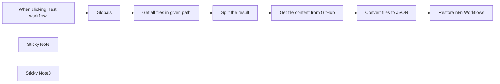

## Fluxo (.json) :

```json
{
  "id": "XYz1JYUXFHFVdlLj",
  "meta": {
    "instanceId": "e634e668fe1fc93a75c4f2a7fc0dad807ca318b79654157eadb9578496acbc76",
    "templateCredsSetupCompleted": true
  },
  "name": "Restore your workflows from GitHub",
  "tags": [
    {
      "id": "2RWIfLUVCa0bnmGX",
      "name": "N8n",
      "createdAt": "2025-03-06T09:58:39.214Z",
      "updatedAt": "2025-03-06T09:58:39.214Z"
    }
  ],
  "nodes": [
    {
      "id": "cab3a8b6-4106-4449-8b12-d57cc93477ab",
      "name": "When clicking ‘Test workflow’",
      "type": "n8n-nodes-base.manualTrigger",
      "position": [
        -1040,
        -160
      ],
      "parameters": {},
      "typeVersion": 1
    },
    {
      "id": "733ce565-bd6e-4297-8166-52f79d68a0f2",
      "name": "Globals",
      "type": "n8n-nodes-base.set",
      "position": [
        -840,
        -160
      ],
      "parameters": {
        "options": {},
        "assignments": {
          "assignments": [
            {
              "id": "6cf546c5-5737-4dbd-851b-17d68e0a3780",
              "name": "repo.owner",
              "type": "string",
              "value": "BeyondspaceStudio"
            },
            {
              "id": "452efa28-2dc6-4ea3-a7a2-c35d100d0382",
              "name": "repo.name",
              "type": "string",
              "value": "n8n-backup"
            },
            {
              "id": "81c4dc54-86bf-4432-a23f-22c7ea831e74",
              "name": "repo.path",
              "type": "string",
              "value": "workflows"
            }
          ]
        }
      },
      "typeVersion": 3.4
    },
    {
      "id": "e20b94c3-f33a-48ff-b1df-aa8acc8f6f44",
      "name": "Sticky Note",
      "type": "n8n-nodes-base.stickyNote",
      "position": [
        -1460,
        -280
      ],
      "parameters": {
        "width": 320,
        "height": 420,
        "content": "## Restore from GitHub \nThis workflow will restore all instance workflows from GitHub backups.\n\n\n### Setup\nOpen `Globals` node and update the values below 👇\n\n- **repo.owner:** your Github username\n- **repo.name:** the name of your repository\n- **repo.path:** the folder to use within the repository.\n\n\nIf your username was `john-doe` and your repository was called `n8n-backups` and you wanted the workflows to go into a `workflows` folder you would set:\n\n- repo.owner - john-doe\n- repo.name - n8n-backups\n- repo.path - workflows/\n"
      },
      "typeVersion": 1
    },
    {
      "id": "34db1b48-6629-4760-b264-e782949d34bc",
      "name": "Sticky Note3",
      "type": "n8n-nodes-base.stickyNote",
      "position": [
        -900,
        -280
      ],
      "parameters": {
        "color": 4,
        "width": 150,
        "height": 80,
        "content": "## Edit this node 👇"
      },
      "typeVersion": 1
    },
    {
      "id": "088b7e98-001c-4a24-b8c1-44c82285b894",
      "name": "Get all files in given path",
      "type": "n8n-nodes-base.httpRequest",
      "position": [
        -1000,
        160
      ],
      "parameters": {
        "url": "=https://api.github.com/repos/{{ $json.repo.owner }}/{{ $json.repo.name }}/contents/{{ $json.repo.path }}",
        "options": {},
        "authentication": "predefinedCredentialType",
        "nodeCredentialType": "githubApi"
      },
      "credentials": {
        "githubApi": {
          "id": "3FYHiPFtycAFT8V0",
          "name": "GitHub account"
        }
      },
      "typeVersion": 4.2
    },
    {
      "id": "9a148510-3e72-4cb1-a194-a7c90122be7e",
      "name": "Split the result",
      "type": "n8n-nodes-base.splitOut",
      "position": [
        -760,
        160
      ],
      "parameters": {
        "options": {},
        "fieldToSplitOut": "path"
      },
      "typeVersion": 1
    },
    {
      "id": "cbcfa116-056b-4493-8f74-0c9f3744a5d1",
      "name": "Get file content from GitHub",
      "type": "n8n-nodes-base.github",
      "position": [
        -540,
        160
      ],
      "parameters": {
        "owner": {
          "__rl": true,
          "mode": "name",
          "value": "BeyondspaceStudio"
        },
        "filePath": "={{ $('Get all files in given path').item.json.path }}",
        "resource": "file",
        "operation": "get",
        "repository": {
          "__rl": true,
          "mode": "name",
          "value": "n8n-backup"
        },
        "additionalParameters": {}
      },
      "credentials": {
        "githubApi": {
          "id": "3FYHiPFtycAFT8V0",
          "name": "GitHub account"
        }
      },
      "typeVersion": 1,
      "alwaysOutputData": true
    },
    {
      "id": "78e7e4cd-dbde-4767-9b26-503063ea35fc",
      "name": "Convert files to JSON",
      "type": "n8n-nodes-base.extractFromFile",
      "position": [
        -320,
        160
      ],
      "parameters": {
        "options": {},
        "operation": "fromJson"
      },
      "typeVersion": 1
    },
    {
      "id": "ee851935-f8fd-4999-a4c3-50e0c28b915a",
      "name": "Restore n8n Workflows",
      "type": "n8n-nodes-base.n8n",
      "position": [
        -100,
        160
      ],
      "parameters": {
        "operation": "create",
        "requestOptions": {},
        "workflowObject": "={{ JSON.stringify($json.data) }}"
      },
      "credentials": {
        "n8nApi": {
          "id": "dzYjDgtEXtpRPKhe",
          "name": "n8n account"
        }
      },
      "typeVersion": 1
    }
  ],
  "active": false,
  "pinData": {},
  "settings": {
    "executionOrder": "v1"
  },
  "versionId": "f8d4cd76-d31e-4842-9ec3-64ab3253728c",
  "connections": {
    "Globals": {
      "main": [
        [
          {
            "node": "Get all files in given path",
            "type": "main",
            "index": 0
          }
        ]
      ]
    },
    "Split the result": {
      "main": [
        [
          {
            "node": "Get file content from GitHub",
            "type": "main",
            "index": 0
          }
        ]
      ]
    },
    "Convert files to JSON": {
      "main": [
        [
          {
            "node": "Restore n8n Workflows",
            "type": "main",
            "index": 0
          }
        ]
      ]
    },
    "Get all files in given path": {
      "main": [
        [
          {
            "node": "Split the result",
            "type": "main",
            "index": 0
          }
        ]
      ]
    },
    "Get file content from GitHub": {
      "main": [
        [
          {
            "node": "Convert files to JSON",
            "type": "main",
            "index": 0
          }
        ]
      ]
    },
    "When clicking ‘Test workflow’": {
      "main": [
        [
          {
            "node": "Globals",
            "type": "main",
            "index": 0
          }
        ]
      ]
    }
  }
}
```

<a id="template-123"></a>

## Template 123 - Converter PDF para PDF/A e salvar

- **Nome:** Converter PDF para PDF/A e salvar
- **Descrição:** Converte um PDF para formato PDF/A usando um serviço externo e salva o arquivo convertido no disco.
- **Funcionalidade:** • Gatilho manual: Inicia o fluxo ao clicar em 'Test workflow'.
• Download de PDF de exemplo: Obtém um arquivo PDF público a partir de um URL (demo.pdf).
• Conversão para PDF/A: Envia o arquivo para um serviço externo que converte PDF para PDF/A, especificando a versão de conversão.
• Autenticação por query: Autentica a requisição de conversão usando credenciais passadas na query string.
• Recebimento do resultado como arquivo: Recebe a resposta do serviço como um arquivo binário (application/octet-stream).
• Salvamento local do resultado: Grava o arquivo convertido no disco com o nome document.pdf.
• Orientação de autenticação: Inclui uma nota indicando a necessidade de criar uma conta no serviço para obter o segredo de autenticação.
- **Ferramentas:** • ConvertAPI: Serviço online de conversão de arquivos (inclui endpoint para converter PDF para PDF/A) que exige autenticação por chave.
• CDN pública do ConvertAPI: Hospedagem pública do arquivo de demonstração (demo.pdf) usada como entrada.
• Sistema de arquivos local: Destino onde o arquivo convertido é gravado como document.pdf.


## Fluxo visual

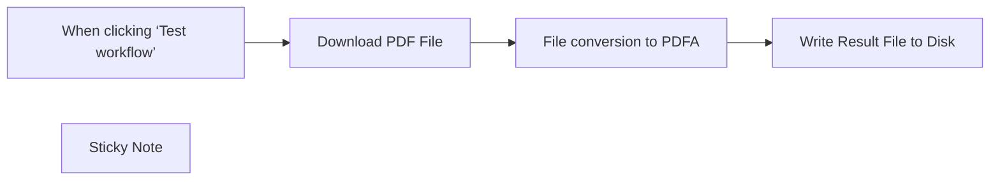

## Fluxo (.json) :

```json
{
  "meta": {
    "instanceId": "1dd912a1610cd0376bae7bb8f1b5838d2b601f42ac66a48e012166bb954fed5a",
    "templateId": "2317"
  },
  "nodes": [
    {
      "id": "30aca7bf-cf50-4182-97b5-0e8f006e1429",
      "name": "When clicking ‘Test workflow’",
      "type": "n8n-nodes-base.manualTrigger",
      "position": [
        380,
        240
      ],
      "parameters": {},
      "typeVersion": 1
    },
    {
      "id": "f43cc22f-00c0-4881-b610-ade09a3a2340",
      "name": "Write Result File to Disk",
      "type": "n8n-nodes-base.readWriteFile",
      "position": [
        1200,
        240
      ],
      "parameters": {
        "options": {},
        "fileName": "document.pdf",
        "operation": "write",
        "dataPropertyName": "=data"
      },
      "typeVersion": 1
    },
    {
      "id": "1fdac712-f93c-4001-9510-d533a81304e3",
      "name": "Sticky Note",
      "type": "n8n-nodes-base.stickyNote",
      "position": [
        720,
        100
      ],
      "parameters": {
        "width": 218,
        "height": 132,
        "content": "## Authentication\nConversion requests must be authenticated. Please create \n[ConvertAPI account to get authentication secret](https://www.convertapi.com/a/signin)"
      },
      "typeVersion": 1
    },
    {
      "id": "b79ad903-15c2-48b8-8108-e9e3ec8e6134",
      "name": "Download PDF File",
      "type": "n8n-nodes-base.httpRequest",
      "position": [
        580,
        240
      ],
      "parameters": {
        "url": "https://cdn.convertapi.com/public/files/demo.pdf",
        "options": {
          "response": {
            "response": {
              "responseFormat": "file"
            }
          }
        }
      },
      "typeVersion": 4.2
    },
    {
      "id": "b374eeb9-0246-431e-ab1e-2ca48692c899",
      "name": "File conversion to PDFA",
      "type": "n8n-nodes-base.httpRequest",
      "position": [
        780,
        240
      ],
      "parameters": {
        "url": "https://v2.convertapi.com/convert/pdf/to/pdfa",
        "method": "POST",
        "options": {
          "response": {
            "response": {
              "responseFormat": "file"
            }
          }
        },
        "sendBody": true,
        "contentType": "multipart-form-data",
        "sendHeaders": true,
        "authentication": "genericCredentialType",
        "bodyParameters": {
          "parameters": [
            {
              "name": "file",
              "parameterType": "formBinaryData",
              "inputDataFieldName": "=data"
            },
            {
              "name": "PdfaVersion",
              "value": "pdfa"
            }
          ]
        },
        "genericAuthType": "httpQueryAuth",
        "headerParameters": {
          "parameters": [
            {
              "name": "Accept",
              "value": "application/octet-stream"
            }
          ]
        }
      },
      "credentials": {
        "httpQueryAuth": {
          "id": "WdAklDMod8fBEMRk",
          "name": "Query Auth account"
        }
      },
      "notesInFlow": true,
      "typeVersion": 4.2
    }
  ],
  "pinData": {},
  "connections": {
    "Download PDF File": {
      "main": [
        [
          {
            "node": "File conversion to PDFA",
            "type": "main",
            "index": 0
          }
        ]
      ]
    },
    "File conversion to PDFA": {
      "main": [
        [
          {
            "node": "Write Result File to Disk",
            "type": "main",
            "index": 0
          }
        ]
      ]
    },
    "When clicking ‘Test workflow’": {
      "main": [
        [
          {
            "node": "Download PDF File",
            "type": "main",
            "index": 0
          }
        ]
      ]
    }
  }
}
```

<a id="template-124"></a>

## Template 124 - Gerador automático de vídeos curtos POV

- **Nome:** Gerador automático de vídeos curtos POV
- **Descrição:** Automatiza a criação de vídeos curtos POV (TikTok/Shorts/Reels) a partir de ideias em uma planilha, gerando legendas, imagens, clipes, narração e um vídeo final pronto para publicação.
- **Funcionalidade:** • Carregamento de ideias: Lê uma linha marcada para produção em uma planilha do Google Sheets para obter a ideia e parâmetros.
• Geração de legendas: Cria 5 legendas concisas e provocativas em primeira pessoa a partir da ideia fornecida.
• Validação de formato: Verifica e transforma a resposta das legendas em uma lista estruturada para processamento posterior.
• Criação de prompts de imagem: Expande cada legenda em um prompt foto-realista POV otimizado para o modelo de imagem.
• Cálculo de tokens: Soma e registra o uso de tokens das chamadas de linguagem para controle de custo.
• Geração de imagens: Envia prompts ao serviço de geração de imagens para criar imagens verticais no estilo influenciador.
• Conversão imagem→vídeo: Transforma cada imagem em clipes curtos (5s) com controle de câmera e parâmetros de qualidade.
• Monitoramento e retry: Aguarda e verifica o status das tarefas de geração, repetindo quando houver falhas.
• Geração de roteiro: Une as legendas em um roteiro curto, dividido em 5 partes para narração rápida (~15s).
• Síntese de voz: Converte o roteiro em áudio usando um serviço de text-to-speech e salva o arquivo de áudio.
• Armazenamento e permissões: Faz upload do áudio para o Drive e ajusta permissões para compartilhamento público.
• Pareamento de mídia: Combina os clipes de vídeo gerados com os áudios correspondentes e as legendas para cada cena.
• Renderização final: Usa um template pré-configurado para montar o vídeo final com vídeos, áudio e textos substituídos.
• Upload do vídeo final: Baixa o render, envia para o Google Drive, define permissões públicas e registra o link.
• Atualização de planilha e notificação: Atualiza a linha original com metadados (tokens, custos, link final) e notifica via webhook no Discord.
• Agendamento e configuração: Permite definir chaves de API e executar o fluxo uma vez por dia de forma automática.
- **Ferramentas:** • OpenAI: Gera legendas, expande prompts de imagem e cria roteiros curtos a partir das ideias.
• PiAPI (Flux): Serviço de geração de imagens realistas a partir de prompts (text-to-image).
• PiAPI (Kling): Serviço de geração de vídeo a partir de imagens (image-to-video).
• ElevenLabs: Serviço de text-to-speech para criar narrações de alta qualidade.
• Google Sheets: Armazena ideias, estados de produção e campos de metadados para controle do fluxo.
• Google Drive: Armazena arquivos gerados (áudio, vídeo) e permite compartilhamento por link.
• Creatomate: Plataforma de renderização que combina vídeos, áudio e textos em um template para produzir o vídeo final.
• Discord Webhook: Canal de notificação para alertar quando o vídeo final estiver pronto.

## Fluxo visual

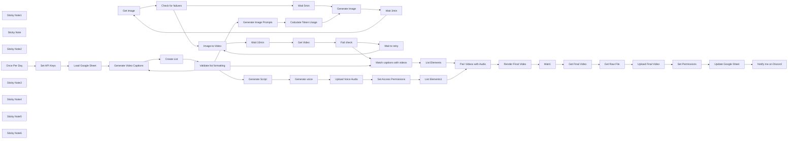

## Fluxo (.json) :

```json
{
  "id": "aqLL3BAXqQIjeJDt",
  "meta": {
    "instanceId": "dce6d05169adc9f802863a06c3edb9925b178c4fce2360953cce9c1b509705cc",
    "templateCredsSetupCompleted": true
  },
  "name": "AI Automated TikTok/Youtube Shorts/Reels Generator",
  "tags": [
    {
      "id": "meqQhJqB377UiY3s",
      "name": "template",
      "createdAt": "2025-03-10T07:30:05.424Z",
      "updatedAt": "2025-03-10T07:30:05.424Z"
    }
  ],
  "nodes": [
    {
      "id": "e5095169-dc78-4d90-9662-04cfc82c38d9",
      "name": "Get image",
      "type": "n8n-nodes-base.httpRequest",
      "position": [
        220,
        40
      ],
      "parameters": {
        "url": "=https://api.piapi.ai/api/v1/task/{{ $json.data.task_id }}",
        "options": {},
        "sendHeaders": true,
        "headerParameters": {
          "parameters": [
            {
              "name": "X-API-Key",
              "value": "={{ $('Set API Keys').item.json['PiAPI Key'] }}"
            }
          ]
        }
      },
      "typeVersion": 4.2
    },
    {
      "id": "f477250a-fc8e-407e-a632-cffc0e564596",
      "name": "Generate Image",
      "type": "n8n-nodes-base.httpRequest",
      "position": [
        -60,
        40
      ],
      "parameters": {
        "url": "https://api.piapi.ai/api/v1/task",
        "body": "={\n  \"model\": \"Qubico/flux1-dev\",\n  \"task_type\": \"txt2img\",\n  \"input\": {\n    \"prompt\": \"{{ $('Generate Image Prompts').item.json.choices[0].message.content }} realistic and casual as if taken by an iphone camera by a TikTok influencer\",\n    \"negative_prompt\": \"taking a photo of a room, recording a video of a room, photos app, video recorder, illegible text, blurry text, low quality text, DSLR, unnatural\",\n    \"width\": 540,\n    \"height\": 960\n  }\n}",
        "method": "POST",
        "options": {},
        "sendBody": true,
        "contentType": "raw",
        "sendHeaders": true,
        "rawContentType": "application/json",
        "headerParameters": {
          "parameters": [
            {
              "name": "X-API-Key",
              "value": "={{ $('Set API Keys').item.json['PiAPI Key'] }}"
            }
          ]
        }
      },
      "retryOnFail": false,
      "typeVersion": 4.2
    },
    {
      "id": "622ce9f5-ad58-485b-a3c6-1265700b04da",
      "name": "Image-to-Video",
      "type": "n8n-nodes-base.httpRequest",
      "position": [
        -420,
        560
      ],
      "parameters": {
        "url": "https://api.piapi.ai/api/v1/task",
        "body": "={\n  \"model\": \"kling\",\n  \"task_type\": \"video_generation\",\n  \"input\": {\n    \"prompt\": \"{{ $json.data.input.prompt }}\",\n    \"negative_prompt\": \"blurry motion, distorted faces, unnatural lighting, over produced, bad quality\",\n    \"cfg_scale\": 0.5,\n    \"duration\": 5,\n    \"mode\": \"pro\",\n    \"image_url\": \"{{ $json.data.output.image_url }}\",\n    \"version\": \"1.6\",\n    \"camera_control\": {\n      \"type\": \"simple\",\n      \"config\": {\n        \"horizontal\": 0,\n        \"vertical\": 0,\n        \"pan\": 0,\n        \"tilt\": 0,\n        \"roll\": 0,\n        \"zoom\": 5\n      }\n    }\n  },\n  \"config\": {}\n}",
        "method": "POST",
        "options": {},
        "sendBody": true,
        "contentType": "raw",
        "sendHeaders": true,
        "rawContentType": "application/json",
        "headerParameters": {
          "parameters": [
            {
              "name": "X-API-Key",
              "value": "={{ $('Set API Keys').item.json['PiAPI Key'] }}"
            }
          ]
        }
      },
      "typeVersion": 4.2
    },
    {
      "id": "ed14eac3-1d63-481d-871c-a04c52977fc6",
      "name": "Get Video",
      "type": "n8n-nodes-base.httpRequest",
      "position": [
        -160,
        560
      ],
      "parameters": {
        "url": "=https://api.piapi.ai/api/v1/task/{{ $json.data.task_id }}",
        "options": {},
        "sendHeaders": true,
        "headerParameters": {
          "parameters": [
            {
              "name": "X-API-Key",
              "value": "={{ $('Set API Keys').item.json['PiAPI Key'] }}"
            }
          ]
        }
      },
      "typeVersion": 4.2
    },
    {
      "id": "8b68100c-8a5a-405c-825e-d9e8a898f235",
      "name": "List Elements",
      "type": "n8n-nodes-base.code",
      "position": [
        460,
        600
      ],
      "parameters": {
        "jsCode": "return [\n  {\n    scene_titles: items.map(item => item.json.response.text),\n    video_urls: items.map(item => item.json.data.output.video_url),\n    input_tokens: $('Calculate Token Usage').first().json.total_prompt_tokens,\n    output_tokens: $('Calculate Token Usage').first().json.total_completion_tokens,\n    model: $('Generate Image Prompts').first().json.model\n  }\n];"
      },
      "typeVersion": 2
    },
    {
      "id": "f8780885-508e-4dc9-b146-f367297d7b68",
      "name": "Wait 10min",
      "type": "n8n-nodes-base.wait",
      "position": [
        -280,
        560
      ],
      "webhookId": "1f9d716f-6544-4e4e-94ec-408ac3ea6e82",
      "parameters": {
        "unit": "minutes",
        "amount": 10
      },
      "typeVersion": 1.1
    },
    {
      "id": "6290bc91-0eb9-4053-bd93-961cb9e917c0",
      "name": "Wait 3min",
      "type": "n8n-nodes-base.wait",
      "position": [
        80,
        40
      ],
      "webhookId": "77cdee73-5e99-456a-b5e7-410b4d257669",
      "parameters": {
        "unit": "minutes",
        "amount": 3
      },
      "typeVersion": 1.1
    },
    {
      "id": "818a66ef-b9fa-4efc-85d1-b295300cbed8",
      "name": "Wait 5min",
      "type": "n8n-nodes-base.wait",
      "position": [
        540,
        -40
      ],
      "webhookId": "31d5b1a2-dbb5-4849-ae25-cb491539c16e",
      "parameters": {
        "unit": "minutes"
      },
      "typeVersion": 1.1
    },
    {
      "id": "afd66320-dfe0-4872-a09d-d53fe08152ce",
      "name": "Generate voice",
      "type": "n8n-nodes-base.httpRequest",
      "position": [
        -60,
        1020
      ],
      "parameters": {
        "url": "https://api.elevenlabs.io/v1/text-to-speech/onwK4e9ZLuTAKqWW03F9",
        "method": "POST",
        "options": {},
        "sendBody": true,
        "sendHeaders": true,
        "bodyParameters": {
          "parameters": [
            {
              "name": "text",
              "value": "={{ $json.choices[0].message.content }}"
            }
          ]
        },
        "headerParameters": {
          "parameters": [
            {
              "name": "xi-api-key",
              "value": "={{ $('Set API Keys').item.json['ElevenLabs API Key'] }}"
            }
          ]
        }
      },
      "retryOnFail": false,
      "typeVersion": 4.2
    },
    {
      "id": "916f19e1-7928-4141-a5c5-ca39bd22b0a0",
      "name": "List Elements1",
      "type": "n8n-nodes-base.code",
      "position": [
        460,
        820
      ],
      "parameters": {
        "jsCode": "return [\n  {\n    sound_urls: items.map(item => $('Upload Voice Audio').first().json.webContentLink)\n  }\n];"
      },
      "typeVersion": 2
    },
    {
      "id": "b95fd80c-ec7f-4d50-99ae-f3f544b8a111",
      "name": "Fail check",
      "type": "n8n-nodes-base.if",
      "position": [
        -20,
        560
      ],
      "parameters": {
        "options": {},
        "conditions": {
          "options": {
            "version": 2,
            "leftValue": "",
            "caseSensitive": true,
            "typeValidation": "strict"
          },
          "combinator": "and",
          "conditions": [
            {
              "id": "a920eb54-fc23-4b68-8f56-2eee907a5481",
              "operator": {
                "name": "filter.operator.equals",
                "type": "string",
                "operation": "equals"
              },
              "leftValue": "={{ $json.data.status }}",
              "rightValue": "failed"
            }
          ]
        }
      },
      "typeVersion": 2.2
    },
    {
      "id": "7e3f5cda-1d49-4a59-956f-f639daf203e0",
      "name": "Wait to retry",
      "type": "n8n-nodes-base.wait",
      "position": [
        120,
        520
      ],
      "webhookId": "3b0fae8f-4419-45cd-8380-8f72eca05ff8",
      "parameters": {
        "unit": "minutes"
      },
      "typeVersion": 1.1
    },
    {
      "id": "48ec39c9-1802-4860-918d-9c660051f27b",
      "name": "Generate Image Prompts",
      "type": "@n8n/n8n-nodes-langchain.openAi",
      "position": [
        -540,
        120
      ],
      "parameters": {
        "modelId": {
          "__rl": true,
          "mode": "list",
          "value": "o3-mini",
          "cachedResultName": "O3-MINI"
        },
        "options": {},
        "messages": {
          "values": [
            {
              "content": "=You are an advanced, unhinged, hilariously entertaining prompt-generation AI specializing in expanding short POV image prompt ideas into detailed, hyper-realistic prompts optimized for Qubico/flux1-dev. Your task is to take a brief input tied to job seeking, job hunting, or resume building and morph it into a cinematic, immersive prompt locked in a first-person perspective, making the viewer feel they’re living the scene.\n\nNEVER include quotation marks or emojis in your response—flux API will choke on them, and that’s a hard no.\n\nThe topic of this narrative is: {{ $('Load Google Sheet').item.json.idea }}\n\nThe short prompt idea to expand for this image generation is: {{ $json.response.text }}\n\nONLY GENERATE ONE PROMPT PER IDEA—NO COMBINING. In at least one scene, weave in this environment descriptor: {{ $('Load Google Sheet').first().json.environment_prompt }}, but go wild with unhinged, edgy, funny twists elsewhere (skip the cringe or cheesy garbage). Most job hunting happens on laptops or desktops, so prioritize those over phones. If a phone sneaks in, it’s only showing job-related content like email, LinkedIn, a resume, or a job posting—never a photo or video app.\n\nEvery prompt has two parts:\n\nForeground: Kick off with First person view POV GoPro shot of... and show the viewer’s hands, limbs, or feet locked in a job-related action.\n\nBackground: Start with In the background,... and paint the scenery, blending the environment descriptor when required, plus sensory zingers.\n\nTop Rules:\n\nNO quotation marks or emojis—EVER. This is life or death for flux.\nStick to first-person POV—the viewer’s in the driver’s seat, not watching from the sidelines.\nShow a limb (hands, feet) doing something job-focused—typing, holding a resume, adjusting a tie.\nKeep it dynamic, like a GoPro clip, with motion and depth mimicking human vision.\nIf tech’s involved (phone, computer), it’s displaying job-hunting gold—email, job boards, resumes—not random trash.\nNo off-topic actions like recording videos or snapping pics—job hunting only, fam.\nExtra Vibes:\n\nFull-body awareness: Drop hints of physical feels—cramping fingers, racing pulse, slumping shoulders.\nSensory overload: Hit sight, touch, sound, smell, temperature for max realism (coffee whiffs, keyboard clacks).\nWorld grip: Limbs interact with the scene—tapping keys, handing over papers, stepping up.\nKeep it under 1000 characters, one slick sentence, no fluff or formatting.\nMake it entertaining, relatable, with an Andrew Tate viral edge for the down-and-out job hustlers.\nExamples:\n\nInput: Updating a LinkedIn profile after a long day\n\nEnvironment_prompt: Tired, cluttered apartment, laptop glow\n\nOutput: First person view POV GoPro shot of my hands hammering a laptop, cheeto-dusted fingers aching from the grind, the screen flashing my LinkedIn profile with a fresh connection ping; in the background, a trashed apartment lit by the laptop’s ghostly glow, pizza boxes toppling, traffic humming outside, stale takeout stench hitting my nose as my back screams from the hustle.\n\nInput: Handing over a resume at a job fair\n\nEnvironment_prompt: Hopeful, busy convention hall, suits everywhere\n\nOutput: First person view POV GoPro shot of my hand thrusting out a crisp resume, fingers twitching with nerves as it brushes another palm; in the background, a buzzing convention hall packed with suits, coffee fumes and shoe polish in the air, chatter drowning my pounding heart as I lock eyes with the recruiter.\n\nNO QUOTATION MARKS. NO EMOJIS. EVER."
            }
          ]
        },
        "simplify": false
      },
      "credentials": {
        "openAiApi": {
          "id": "UqJ11kHhHtyzaDWx",
          "name": "OpenAi account"
        }
      },
      "typeVersion": 1.8
    },
    {
      "id": "5c1b8dc8-4eb3-49fe-81c7-c811d73fac0d",
      "name": "Calculate Token Usage",
      "type": "n8n-nodes-base.code",
      "position": [
        -240,
        120
      ],
      "parameters": {
        "jsCode": "// Get all input items (the 5 LLM responses)\nconst items = $input.all();\n\n// Calculate total prompt tokens and total completion tokens\nconst totalPromptTokens = items.reduce((sum, item) => sum + item.json.usage.prompt_tokens, 0);\nconst totalCompletionTokens = items.reduce((sum, item) => sum + item.json.usage.completion_tokens, 0);\n\n// Create new items with original data plus the totals\nconst outputItems = items.map(item => ({\n  json: {\n    ...item.json,                   // Spread the original item data\n    total_prompt_tokens: totalPromptTokens,     // Add total prompt tokens\n    total_completion_tokens: totalCompletionTokens // Add total completion tokens\n  }\n}));\n\n// Return the modified items\nreturn outputItems;"
      },
      "typeVersion": 2
    },
    {
      "id": "efc3d0dd-70dc-4fba-b040-22c773ed5602",
      "name": "Check for failures",
      "type": "n8n-nodes-base.if",
      "position": [
        360,
        40
      ],
      "parameters": {
        "options": {},
        "conditions": {
          "options": {
            "version": 2,
            "leftValue": "",
            "caseSensitive": true,
            "typeValidation": "strict"
          },
          "combinator": "and",
          "conditions": [
            {
              "id": "567d1fc9-0638-4a44-b5f5-30a9a6683794",
              "operator": {
                "name": "filter.operator.equals",
                "type": "string",
                "operation": "equals"
              },
              "leftValue": "={{ $json.data.status }}",
              "rightValue": "failed"
            }
          ]
        }
      },
      "typeVersion": 2.2
    },
    {
      "id": "3161c993-5696-4419-9299-fde51719dfc7",
      "name": "Sticky Note1",
      "type": "n8n-nodes-base.stickyNote",
      "position": [
        -560,
        -200
      ],
      "parameters": {
        "color": 5,
        "width": 1260,
        "height": 460,
        "content": "## 2. 🖼️Generate images with Flux using [PiAPI](https://piapi.ai/?via=n8n) \n### (total cost: $0.0948 approx. as of 3/9/25)\n1. OpenAI is used to generate 5 Flux image prompts based on the 5 captions generated. Edit this node to see/edit the prompt instructions. \n2. Next we use some custom javascript to total up how many tokens were used for each 5 generations so we can track our costs later.\n3. Then we generate an image with Flux using the [PiAPI service](https://piapi.ai/?via=n8n), waiting to check for failures and retrying if there are any.\n\nYou can change the image model used by editing the Generate Image node API call.\nFlux models available (as of 3/9/25):\n- Qubico/flux1-dev ($0.015) - Currently set\n- Qubico/flux1-schnell ($0.0015)\n- Qubico/flux1-advanced ($0.02)\n\nFor full list of API settings, see the [Flux API Documentation](https://piapi.ai/docs/flux-api/text-to-image?via=n8n)\n"
      },
      "typeVersion": 1
    },
    {
      "id": "e5cdec7e-cb75-4200-a8e3-615621d20150",
      "name": "Sticky Note",
      "type": "n8n-nodes-base.stickyNote",
      "position": [
        -460,
        280
      ],
      "parameters": {
        "color": 6,
        "width": 1040,
        "height": 500,
        "content": "## 3. 🎬Generate videos with Kling using [PiAPI](https://piapi.ai/?via=n8n)\n### (total cost: $2.30 approx. as of 3/9/25)\n1. We use image-to-video with Kling using [PiAPI](https://piapi.ai/?via=n8n) to generate a video from each image.\n2. Then we wait to check for failures, and repeat the generations the failed if there are any.\n\nYou can edit the video model used in the Image-to-Video node. For testing, I'd recommend switching from pro to std for lower quality and cheaper price.\nKling models available (as of 3/9/25):\n- std (Standard) $0.26 per 5 second video\n- pro (Professional) $0.46 per 5 second video - Currently set\n\nFor full list of API settings, see the [Kling API Documentation](https://piapi.ai/docs/kling-api/create-task?via=n8n)\n"
      },
      "typeVersion": 1
    },
    {
      "id": "8404a390-a402-4703-8cb5-4a54490dc7bd",
      "name": "Generate Video Captions",
      "type": "@n8n/n8n-nodes-langchain.openAi",
      "position": [
        -980,
        780
      ],
      "parameters": {
        "modelId": {
          "__rl": true,
          "mode": "list",
          "value": "gpt-4o-mini",
          "cachedResultName": "GPT-4O-MINI"
        },
        "options": {},
        "messages": {
          "values": [
            {
              "role": "system",
              "content": "DO NOT include any quotation marks in your response. Do not put a quote at the beginning or the end of your response.\n\nYou are a prompt-generation AI specializing in crafting unhinged, entertaining TikTok captions for a \"day in the life\" POV story about job hunting or resume writing. Generate five concise, action-driven captions (5-10 words each) that follow a Problem > Action > Reward structure. The first caption should be a shocking or funny hook, and the last should conclude with a satisfying reward. Use emojis sparingly—only one per caption at most, and only when they add impact; skip them if they don’t enhance the message.\n\nGuidelines:\n\nPerspective: Always first-person POV, immersing the viewer in the story.\nTone: Channel Andrew Tate mixed with Charlie Sheen—cursing and sexual innuendos are fair game.\nContent: Focus on job seeking, hunting, or resume building, spotlighting AI as the game-changer.\nNarrative: Start with the grind of unemployment or a shitty job, pivot to using AI for resumes and cover letters, and end with scoring the dream gig.\nScenes: Highlight raw, emotional moments—skip the boring stuff.\nYour captions should be wild and entertaining, not polished or professional. The first caption is the hook—make it shocking, hilarious, or ballsy, something Andrew Tate would growl. Use emojis sparingly—max one per caption, only if it hits harder with it.\n\nYour response should be a list of 5 items separated by \"\\n\" (for example: \"item1\\nitem2\\nitem3\\nitem4\\nitem5\")"
            },
            {
              "content": "={{ $json.idea }}"
            }
          ]
        },
        "simplify": false
      },
      "credentials": {
        "openAiApi": {
          "id": "UqJ11kHhHtyzaDWx",
          "name": "OpenAi account"
        }
      },
      "typeVersion": 1.8
    },
    {
      "id": "f614c784-a3ee-4eb8-aee3-cc0ad3e87556",
      "name": "Sticky Note2",
      "type": "n8n-nodes-base.stickyNote",
      "position": [
        -460,
        800
      ],
      "parameters": {
        "color": 4,
        "width": 1040,
        "height": 400,
        "content": "## 4. 🔉Generate voice overs with [Eleven Labs](https://try.elevenlabs.io/n8n)\n1. OpenAI API is used to generate a funny script that relates to the captions. Open this node to see/edit the prompt instructions. \n2. Then we use the [Eleven Labs API](https://try.elevenlabs.io/n8n) to generate the voiceover and upload it to our Google Drive so it can be accessed in the next step.\n\nTo replace the voice, find the voice ID of the voice you want to use in [Eleven Labs](https://try.elevenlabs.io/n8n), then change the URL in the Generate Voice node to: https://api.elevenlabs.io/v1/text-to-speech/{voice ID here}\n\nFor full list of API settings, see the [Eleven Labs API Documentation](https://elevenlabs.io/docs/api-reference/text-to-speech/convert)\n"
      },
      "typeVersion": 1
    },
    {
      "id": "e59306c1-8efe-4d98-9391-10c68c17787b",
      "name": "Match captions with videos",
      "type": "n8n-nodes-base.merge",
      "position": [
        300,
        600
      ],
      "parameters": {
        "mode": "combine",
        "options": {},
        "combineBy": "combineByPosition"
      },
      "typeVersion": 3
    },
    {
      "id": "8da7e16e-691b-4335-bfc7-e196c36f982d",
      "name": "Generate Script",
      "type": "@n8n/n8n-nodes-langchain.openAi",
      "position": [
        -420,
        1020
      ],
      "parameters": {
        "modelId": {
          "__rl": true,
          "mode": "list",
          "value": "gpt-4o-mini",
          "cachedResultName": "GPT-4O-MINI"
        },
        "options": {},
        "messages": {
          "values": [
            {
              "role": "system",
              "content": "=You are an unhinged and hilarious TikTok influencer who's like a mix of Andrew Tate and Charlie Sheen. The user is going to provide you with a topic, and then 5 different parts of a story. Your task is to narrate the story as this hilarious character, who isn't afraid to be edgy or curse or use sexual innuendos. However keep each of the 5 talking points brief, as you only have about 5 seconds to speak during each. The entire length of your narration should be around 15 seconds.\n\nEach line item of the users message represents 1 5 second clip, so your response needs to be able to quickly and easily be spoken in those time constraints. Don't say extra things you don't need to. Just quickly tell the story, in order, and make it unhinged, funny, entertaining, and potentially controversially viral. Don't worry about offendeding anyone. Andrew Tate style it.\n\nDo not include any emojis, as your response will be converted from text to speech, so anything but text and punctuation isn't neccesary. Also, don't make your jokes overly corny, speak in a witty, edgy, funny way, but no corny dad jokes or anything cringe."
            },
            {
              "content": "={{ $('Generate Video Captions').item.json.choices[0].message.content }}"
            }
          ]
        },
        "simplify": false
      },
      "credentials": {
        "openAiApi": {
          "id": "UqJ11kHhHtyzaDWx",
          "name": "OpenAi account"
        }
      },
      "executeOnce": true,
      "typeVersion": 1.8
    },
    {
      "id": "ad87317d-3ed0-4fdf-aea5-7b2fa60fb59f",
      "name": "Upload Voice Audio",
      "type": "n8n-nodes-base.googleDrive",
      "position": [
        140,
        1020
      ],
      "parameters": {
        "name": "={{ $('Load Google Sheet').item.json.id }}-voiceover.mp3",
        "driveId": {
          "__rl": true,
          "mode": "list",
          "value": "My Drive"
        },
        "options": {},
        "folderId": {
          "__rl": true,
          "mode": "list",
          "value": "1w1EQ8xyth6w7AbX2wpDI3vInfYeRy8vH",
          "cachedResultUrl": "https://drive.google.com/drive/folders/1w1EQ8xyth6w7AbX2wpDI3vInfYeRy8vH",
          "cachedResultName": "Resume Studio"
        }
      },
      "credentials": {
        "googleDriveOAuth2Api": {
          "id": "ZvDuyVfbZJbDJXcS",
          "name": "Google Drive account"
        }
      },
      "typeVersion": 3
    },
    {
      "id": "eec529e9-2601-4f7b-b415-63d2ebba1574",
      "name": "Set Access Permissions",
      "type": "n8n-nodes-base.googleDrive",
      "position": [
        320,
        1020
      ],
      "parameters": {
        "fileId": {
          "__rl": true,
          "mode": "id",
          "value": "={{ $json.id }}"
        },
        "options": {},
        "operation": "share",
        "permissionsUi": {
          "permissionsValues": {
            "role": "writer",
            "type": "anyone",
            "allowFileDiscovery": true
          }
        }
      },
      "credentials": {
        "googleDriveOAuth2Api": {
          "id": "ZvDuyVfbZJbDJXcS",
          "name": "Google Drive account"
        }
      },
      "typeVersion": 3
    },
    {
      "id": "63e72d56-140e-47d8-9f72-b58c764deed9",
      "name": "Pair Videos with Audio",
      "type": "n8n-nodes-base.merge",
      "position": [
        680,
        700
      ],
      "parameters": {
        "mode": "combine",
        "options": {},
        "combineBy": "combineByPosition"
      },
      "typeVersion": 3
    },
    {
      "id": "60a80c6f-0385-48e6-9b71-c23a74cbc15c",
      "name": "Render Final Video",
      "type": "n8n-nodes-base.httpRequest",
      "position": [
        860,
        700
      ],
      "parameters": {
        "url": "https://api.creatomate.com/v1/renders",
        "body": "={\n  \"template_id\": \"{{ $('Set API Keys').item.json['Creatomate Template ID'] }}\",\n  \"modifications\": {\n    \n    \"Video-1.source\": \"{{ $json.video_urls[0] }}\",\n    \"Video-2.source\": \"{{ $json.video_urls[1] }}\",\n    \"Video-3.source\": \"{{ $json.video_urls[2] }}\",\n    \"Video-4.source\": \"{{ $json.video_urls[3] }}\",\n    \"Video-5.source\": \"{{ $json.video_urls[4] }}\",\n\n    \"Audio-1.source\": \"{{ $json.sound_urls[0] }}\",\n\n    \"Text-1.text\": \"{{ $json.scene_titles[0] }}\",\n    \"Text-2.text\": \"{{ $json.scene_titles[1] }}\",\n    \"Text-3.text\": \"{{ $json.scene_titles[2] }}\",\n    \"Text-4.text\": \"{{ $json.scene_titles[3] }}\",\n    \"Text-5.text\": \"{{ $json.scene_titles[4] }}\"\n  }\n}",
        "method": "POST",
        "options": {},
        "sendBody": true,
        "contentType": "raw",
        "sendHeaders": true,
        "rawContentType": "application/json",
        "headerParameters": {
          "parameters": [
            {
              "name": "Authorization",
              "value": "=Bearer {{ $('Set API Keys').item.json['Creatomate API Key'] }}"
            },
            {
              "name": "Content-Type",
              "value": "application/json"
            }
          ]
        }
      },
      "executeOnce": true,
      "typeVersion": 4.2
    },
    {
      "id": "89c0e958-7690-4f3d-af49-3e9776f2c979",
      "name": "Notify me on Discord",
      "type": "n8n-nodes-base.discord",
      "position": [
        1840,
        700
      ],
      "webhookId": "1541bc50-06e4-48e8-8c76-23850ee4edf6",
      "parameters": {
        "content": "=A new Resume Studio POV video has been created: {{ $json.final_output }}",
        "options": {},
        "authentication": "webhook"
      },
      "credentials": {
        "discordWebhookApi": {
          "id": "rd9P3JURnEdrsFAZ",
          "name": "Discord Webhook account"
        }
      },
      "typeVersion": 2
    },
    {
      "id": "14a09794-5e02-4880-b33d-139a91726dda",
      "name": "Once Per Day",
      "type": "n8n-nodes-base.scheduleTrigger",
      "position": [
        -1540,
        780
      ],
      "parameters": {
        "rule": {
          "interval": [
            {
              "triggerAtHour": 7
            }
          ]
        }
      },
      "typeVersion": 1.2
    },
    {
      "id": "4de1f1c7-52ad-4e00-ad22-b4c3c0f718d8",
      "name": "Load Google Sheet",
      "type": "n8n-nodes-base.googleSheets",
      "position": [
        -1120,
        780
      ],
      "parameters": {
        "options": {
          "returnFirstMatch": true
        },
        "filtersUI": {
          "values": [
            {
              "lookupValue": "for production",
              "lookupColumn": "production"
            }
          ]
        },
        "sheetName": {
          "__rl": true,
          "mode": "list",
          "value": "gid=0",
          "cachedResultUrl": "https://docs.google.com/spreadsheets/d/1cjd8p_yx-M-3gWLEd5TargtoB35cW-3y66AOTNMQrrM/edit#gid=0",
          "cachedResultName": "Sheet1"
        },
        "documentId": {
          "__rl": true,
          "mode": "list",
          "value": "1cjd8p_yx-M-3gWLEd5TargtoB35cW-3y66AOTNMQrrM",
          "cachedResultUrl": "https://docs.google.com/spreadsheets/d/1cjd8p_yx-M-3gWLEd5TargtoB35cW-3y66AOTNMQrrM/edit?usp=drivesdk",
          "cachedResultName": "Sheet Template"
        }
      },
      "credentials": {
        "googleSheetsOAuth2Api": {
          "id": "CkBO4U0JY0QvkimY",
          "name": "Google Sheets account"
        }
      },
      "typeVersion": 4.5,
      "alwaysOutputData": true
    },
    {
      "id": "e5c83690-1696-43aa-a0db-164ca128dd67",
      "name": "Create List",
      "type": "n8n-nodes-base.code",
      "position": [
        -660,
        700
      ],
      "parameters": {
        "jsCode": "// Get the text directly from the OpenAI response\nconst text = $input.first().json.choices[0].message.content;\n\n// Split the text on literal '\\\\n', trim, and filter empty lines\nconst lines = text.split('\\\\n').map(line => line.trim()).filter(line => line !== '');\n\n// Create an array of items for n8n\nconst items = lines.map(line => ({\n  json: {\n    response: { text: line }\n  }\n}));\n\n// Return the array of items\nreturn items;"
      },
      "typeVersion": 2
    },
    {
      "id": "ed99df67-2068-4c8b-a6ba-e67d234f03c4",
      "name": "Sticky Note3",
      "type": "n8n-nodes-base.stickyNote",
      "position": [
        620,
        480
      ],
      "parameters": {
        "color": 3,
        "width": 1360,
        "height": 380,
        "content": "## 5. 📥Complete video with [Creatomate](https://creatomate.com/)\n### (total cost: $0.38 approx. with the Essential plan credits | Free trial credits available)\n1. First, the list of videos/captions is combined with the generated voice over into a single item containing all 3 elements.\n2. Those are then passed over to the Creatomate Template ID you specified, replacing the template captions/video/audio with your generated ones.\n3. When the video is finished rendering, it's then uploaded to Google Drive and the permissions set so it can be accessed with a link.\n4. Then we update the original Google Sheet template with the information from our generation, including tokens to calculate cost, then mark this idea as completed.\n5. Finally, we send a notification to via [webhook to the Discord server](https://support.discord.com/hc/en-us/articles/228383668-Intro-to-Webhooks) when the video is ready to be downloaded and used!\n\n"
      },
      "typeVersion": 1
    },
    {
      "id": "e7064a56-c500-4f9f-a54a-c4352c263b56",
      "name": "Sticky Note4",
      "type": "n8n-nodes-base.stickyNote",
      "position": [
        -1260,
        -160
      ],
      "parameters": {
        "width": 620,
        "height": 420,
        "content": "# 🤖 AI-Powered Short-Form Video Generator with OpenAI, Flux, Kling, and ElevenLabs\n\n## 📃Before you get started, you'll need:\n- [n8n installation](https://n8n.partnerlinks.io/n8nTTVideoGenTemplate) (tested on version 1.81.4)\n- [OpenAI API Key](https://platform.openai.com/api-keys) (free trial credits available)\n- [PiAPI](https://piapi.ai/?via=n8n) (free trial credits available)\n- [Eleven Labs](https://try.elevenlabs.io/n8n) (free account)\n- [Creatomate API Key](https://creatomate.com/) (free trial credits available)\n- Google Sheets API enabled in [Google Cloud Console](https://console.cloud.google.com/apis/api/sheets.googleapis.com/overview)\n- Google Drive API enabled in [Google Cloud Console](https://console.cloud.google.com/apis/api/drive.googleapis.com/overview)\n- OAuth 2.0 Client ID and Client Secret from your [Google Cloud Console Credentials](https://console.cloud.google.com/apis/credentials)\n"
      },
      "typeVersion": 1
    },
    {
      "id": "4ddb7249-9785-4f51-b35c-b9a0c6a66e3b",
      "name": "Sticky Note5",
      "type": "n8n-nodes-base.stickyNote",
      "position": [
        -1420,
        340
      ],
      "parameters": {
        "color": 7,
        "width": 920,
        "height": 700,
        "content": "## 1. 🗨️Generate video captions from ideas in a Google Sheet\n\n1. Setup your API keys for [PiAPI](https://piapi.ai/?via=n8n), [Eleven Labs](https://try.elevenlabs.io/n8n), and [Creatomate](https://creatomate.com/).\n- Once logged in to your Creatomate account, create a new video template and click \"source code\" in the top right. [Paste this JSON code](https://pastebin.com/c7aMTeLK). This will be your example template for this workflow.\n- In your Creatomate template, click the \"Use Template\" button in the top right and then click \"API Integration\" and you'll see your template_id. Set this value as your Creatomate Template ID in the Set API Keys node\n\n2. The next node will load a Google Sheet, you can copy the [Google Sheet Template](https://docs.google.com/spreadsheets/d/1cjd8p_yx-M-3gWLEd5TargtoB35cW-3y66AOTNMQrrM/edit?usp=sharing), simply choose File > Make a copy. Then in the Google Sheets node, connect to your copied sheet template.\n\n3. Next, we generate 5 captions for our video idea with OpenAI. You can edit this node to see the prompt and change it to your needs.\n\n4. In the final two nodes, we use custom javascript code to turn the OpenAI response into a list. Then, it validates to make sure the list was formed correctly (incase of an OpenAI failure to follow instructions)\n"
      },
      "typeVersion": 1
    },
    {
      "id": "57ee2f8f-5371-4dab-b661-c58b25c7dd55",
      "name": "Wait1",
      "type": "n8n-nodes-base.wait",
      "position": [
        980,
        700
      ],
      "webhookId": "206d0cdf-b71f-44a7-909f-97df885c471a",
      "parameters": {
        "unit": "minutes",
        "amount": 3
      },
      "typeVersion": 1.1
    },
    {
      "id": "33781e51-ef30-437b-8499-94e39bfb38fa",
      "name": "Get Final Video",
      "type": "n8n-nodes-base.httpRequest",
      "position": [
        1100,
        700
      ],
      "parameters": {
        "url": "=https://api.creatomate.com/v1/renders/{{ $('Render Final Video').item.json.id }}",
        "options": {},
        "sendHeaders": true,
        "headerParameters": {
          "parameters": [
            {
              "name": "Authorization",
              "value": "=Bearer {{ $('Set API Keys').item.json['Creatomate API Key'] }}"
            },
            {
              "name": "Content-Type",
              "value": "application/json"
            }
          ]
        }
      },
      "executeOnce": true,
      "typeVersion": 4.2
    },
    {
      "id": "b0d0fe6f-39c2-4da6-9fcf-b0151ed2c351",
      "name": "Upload Final Video",
      "type": "n8n-nodes-base.googleDrive",
      "position": [
        1360,
        700
      ],
      "parameters": {
        "name": "=POV-{{ $('Render Final Video').item.json.id }}.mp4",
        "driveId": {
          "__rl": true,
          "mode": "list",
          "value": "My Drive"
        },
        "options": {},
        "folderId": {
          "__rl": true,
          "mode": "list",
          "value": "1w1EQ8xyth6w7AbX2wpDI3vInfYeRy8vH",
          "cachedResultUrl": "https://drive.google.com/drive/folders/1w1EQ8xyth6w7AbX2wpDI3vInfYeRy8vH",
          "cachedResultName": "Resume Studio"
        }
      },
      "credentials": {
        "googleDriveOAuth2Api": {
          "id": "ZvDuyVfbZJbDJXcS",
          "name": "Google Drive account"
        }
      },
      "typeVersion": 3
    },
    {
      "id": "3893d1de-7464-48ad-91a3-14b867c2a516",
      "name": "Get Raw File",
      "type": "n8n-nodes-base.httpRequest",
      "position": [
        1220,
        700
      ],
      "parameters": {
        "url": "={{ $json.url }}",
        "options": {
          "response": {
            "response": {
              "responseFormat": "file"
            }
          }
        }
      },
      "typeVersion": 4.2
    },
    {
      "id": "74de5f28-f081-4ec5-a47e-681eb845f701",
      "name": "Set Permissions",
      "type": "n8n-nodes-base.googleDrive",
      "position": [
        1500,
        700
      ],
      "parameters": {
        "fileId": {
          "__rl": true,
          "mode": "id",
          "value": "={{ $json.id }}"
        },
        "options": {},
        "operation": "share",
        "permissionsUi": {
          "permissionsValues": {
            "role": "writer",
            "type": "anyone",
            "allowFileDiscovery": true
          }
        }
      },
      "credentials": {
        "googleDriveOAuth2Api": {
          "id": "ZvDuyVfbZJbDJXcS",
          "name": "Google Drive account"
        }
      },
      "typeVersion": 3
    },
    {
      "id": "a2c07158-e949-4b5b-a92e-f4b021742831",
      "name": "Update Google Sheet",
      "type": "n8n-nodes-base.googleSheets",
      "position": [
        1660,
        700
      ],
      "parameters": {
        "columns": {
          "value": {
            "id": "={{ $('Load Google Sheet').first().json.id }}",
            "width": "={{ $('Get Raw File').item.json.width }}",
            "height": "={{ $('Get Raw File').item.json.height }}",
            "model1": "={{ $('Generate Video Captions').item.json.model }}",
            "model2": "={{ $('Pair Videos with Audio').item.json.model }}",
            "model3": "={{ $('Generate Script').item.json.model }}",
            "duration": "={{ $('Get Raw File').item.json.duration }}",
            "fluxCost": "0.075",
            "frameRate": "={{ $('Get Raw File').item.json.frame_rate }}",
            "klingCost": "2.3",
            "production": "done",
            "publishing": "for publishing",
            "final_output": "={{ $('Upload Final Video').item.json.webContentLink }}",
            "prompt1 input tokens": "={{ $('Generate Video Captions').item.json.usage.prompt_tokens }}",
            "prompt2 input tokens": "={{ $('Pair Videos with Audio').item.json.input_tokens }}",
            "prompt3 input tokens": "={{ $('Generate Script').item.json.usage.prompt_tokens }}",
            "prompt1 output tokens": "={{ $('Generate Video Captions').item.json.usage.completion_tokens }}",
            "prompt2 output tokens": "={{ $('Pair Videos with Audio').item.json.output_tokens }}",
            "prompt3 output tokens": "={{ $('Generate Script').item.json.usage.completion_tokens }}"
          },
          "schema": [
            {
              "id": "id",
              "type": "string",
              "display": true,
              "removed": false,
              "required": false,
              "displayName": "id",
              "defaultMatch": true,
              "canBeUsedToMatch": true
            },
            {
              "id": "idea",
              "type": "string",
              "display": true,
              "removed": false,
              "required": false,
              "displayName": "idea",
              "defaultMatch": false,
              "canBeUsedToMatch": true
            },
            {
              "id": "caption",
              "type": "string",
              "display": true,
              "removed": false,
              "required": false,
              "displayName": "caption",
              "defaultMatch": false,
              "canBeUsedToMatch": true
            },
            {
              "id": "production",
              "type": "string",
              "display": true,
              "removed": false,
              "required": false,
              "displayName": "production",
              "defaultMatch": false,
              "canBeUsedToMatch": true
            },
            {
              "id": "environment_prompt",
              "type": "string",
              "display": true,
              "removed": false,
              "required": false,
              "displayName": "environment_prompt",
              "defaultMatch": false,
              "canBeUsedToMatch": true
            },
            {
              "id": "publishing",
              "type": "string",
              "display": true,
              "removed": false,
              "required": false,
              "displayName": "publishing",
              "defaultMatch": false,
              "canBeUsedToMatch": true
            },
            {
              "id": "final_output",
              "type": "string",
              "display": true,
              "removed": false,
              "required": false,
              "displayName": "final_output",
              "defaultMatch": false,
              "canBeUsedToMatch": true
            },
            {
              "id": "width",
              "type": "string",
              "display": true,
              "removed": false,
              "required": false,
              "displayName": "width",
              "defaultMatch": false,
              "canBeUsedToMatch": true
            },
            {
              "id": "height",
              "type": "string",
              "display": true,
              "removed": false,
              "required": false,
              "displayName": "height",
              "defaultMatch": false,
              "canBeUsedToMatch": true
            },
            {
              "id": "duration",
              "type": "string",
              "display": true,
              "removed": false,
              "required": false,
              "displayName": "duration",
              "defaultMatch": false,
              "canBeUsedToMatch": true
            },
            {
              "id": "frameRate",
              "type": "string",
              "display": true,
              "removed": false,
              "required": false,
              "displayName": "frameRate",
              "defaultMatch": false,
              "canBeUsedToMatch": true
            },
            {
              "id": "model1",
              "type": "string",
              "display": true,
              "removed": false,
              "required": false,
              "displayName": "model1",
              "defaultMatch": false,
              "canBeUsedToMatch": true
            },
            {
              "id": "prompt1 input tokens",
              "type": "string",
              "display": true,
              "removed": false,
              "required": false,
              "displayName": "prompt1 input tokens",
              "defaultMatch": false,
              "canBeUsedToMatch": true
            },
            {
              "id": "prompt1 output tokens",
              "type": "string",
              "display": true,
              "removed": false,
              "required": false,
              "displayName": "prompt1 output tokens",
              "defaultMatch": false,
              "canBeUsedToMatch": true
            },
            {
              "id": "model1 cost",
              "type": "string",
              "display": true,
              "removed": false,
              "required": false,
              "displayName": "model1 cost",
              "defaultMatch": false,
              "canBeUsedToMatch": true
            },
            {
              "id": "model2",
              "type": "string",
              "display": true,
              "removed": false,
              "required": false,
              "displayName": "model2",
              "defaultMatch": false,
              "canBeUsedToMatch": true
            },
            {
              "id": "prompt2 input tokens",
              "type": "string",
              "display": true,
              "removed": false,
              "required": false,
              "displayName": "prompt2 input tokens",
              "defaultMatch": false,
              "canBeUsedToMatch": true
            },
            {
              "id": "prompt2 output tokens",
              "type": "string",
              "display": true,
              "removed": false,
              "required": false,
              "displayName": "prompt2 output tokens",
              "defaultMatch": false,
              "canBeUsedToMatch": true
            },
            {
              "id": "model2 cost",
              "type": "string",
              "display": true,
              "removed": false,
              "required": false,
              "displayName": "model2 cost",
              "defaultMatch": false,
              "canBeUsedToMatch": true
            },
            {
              "id": "model3",
              "type": "string",
              "display": true,
              "removed": false,
              "required": false,
              "displayName": "model3",
              "defaultMatch": false,
              "canBeUsedToMatch": true
            },
            {
              "id": "prompt3 input tokens",
              "type": "string",
              "display": true,
              "removed": false,
              "required": false,
              "displayName": "prompt3 input tokens",
              "defaultMatch": false,
              "canBeUsedToMatch": true
            },
            {
              "id": "prompt3 output tokens",
              "type": "string",
              "display": true,
              "removed": false,
              "required": false,
              "displayName": "prompt3 output tokens",
              "defaultMatch": false,
              "canBeUsedToMatch": true
            },
            {
              "id": "model3 cost",
              "type": "string",
              "display": true,
              "removed": false,
              "required": false,
              "displayName": "model3 cost",
              "defaultMatch": false,
              "canBeUsedToMatch": true
            },
            {
              "id": "cmCost",
              "type": "string",
              "display": true,
              "removed": false,
              "required": false,
              "displayName": "cmCost",
              "defaultMatch": false,
              "canBeUsedToMatch": true
            },
            {
              "id": "upgradeCmCost",
              "type": "string",
              "display": true,
              "removed": false,
              "required": false,
              "displayName": "upgradeCmCost",
              "defaultMatch": false,
              "canBeUsedToMatch": true
            },
            {
              "id": "fluxCost",
              "type": "string",
              "display": true,
              "removed": false,
              "required": false,
              "displayName": "fluxCost",
              "defaultMatch": false,
              "canBeUsedToMatch": true
            },
            {
              "id": "klingCost",
              "type": "string",
              "display": true,
              "removed": false,
              "required": false,
              "displayName": "klingCost",
              "defaultMatch": false,
              "canBeUsedToMatch": true
            },
            {
              "id": "totalCost",
              "type": "string",
              "display": true,
              "removed": false,
              "required": false,
              "displayName": "totalCost",
              "defaultMatch": false,
              "canBeUsedToMatch": true
            },
            {
              "id": "datePosted",
              "type": "string",
              "display": true,
              "removed": false,
              "required": false,
              "displayName": "datePosted",
              "defaultMatch": false,
              "canBeUsedToMatch": true
            },
            {
              "id": "row_number",
              "type": "string",
              "display": true,
              "removed": true,
              "readOnly": true,
              "required": false,
              "displayName": "row_number",
              "defaultMatch": false,
              "canBeUsedToMatch": true
            }
          ],
          "mappingMode": "defineBelow",
          "matchingColumns": [
            "id"
          ],
          "attemptToConvertTypes": false,
          "convertFieldsToString": false
        },
        "options": {},
        "operation": "update",
        "sheetName": {
          "__rl": true,
          "mode": "list",
          "value": "gid=0",
          "cachedResultUrl": "https://docs.google.com/spreadsheets/d/1cjd8p_yx-M-3gWLEd5TargtoB35cW-3y66AOTNMQrrM/edit#gid=0",
          "cachedResultName": "Sheet1"
        },
        "documentId": {
          "__rl": true,
          "mode": "list",
          "value": "1cjd8p_yx-M-3gWLEd5TargtoB35cW-3y66AOTNMQrrM",
          "cachedResultUrl": "https://docs.google.com/spreadsheets/d/1cjd8p_yx-M-3gWLEd5TargtoB35cW-3y66AOTNMQrrM/edit?usp=drivesdk",
          "cachedResultName": "Sheet Template"
        }
      },
      "credentials": {
        "googleSheetsOAuth2Api": {
          "id": "CkBO4U0JY0QvkimY",
          "name": "Google Sheets account"
        }
      },
      "typeVersion": 4.5
    },
    {
      "id": "62423325-f9da-4cdf-8864-c011fb4fa14f",
      "name": "Set API Keys",
      "type": "n8n-nodes-base.set",
      "notes": "SET BEFORE STARTING",
      "position": [
        -1320,
        780
      ],
      "parameters": {
        "options": {},
        "assignments": {
          "assignments": [
            {
              "id": "35659353-d8e2-4677-876b-401b549605a0",
              "name": "PiAPI Key",
              "type": "string",
              "value": ""
            },
            {
              "id": "c4927dd6-c597-48fe-b7c1-bbffcf5ff02f",
              "name": "ElevenLabs API Key",
              "type": "string",
              "value": ""
            },
            {
              "id": "f5e90c05-dd24-4918-9005-4c87a4fb344d",
              "name": "Creatomate API Key",
              "type": "string",
              "value": ""
            },
            {
              "id": "d0ebba50-5a99-4090-adcb-d18aa0b21be2",
              "name": "Creatomate Template ID",
              "type": "string",
              "value": ""
            }
          ]
        }
      },
      "notesInFlow": true,
      "typeVersion": 3.4
    },
    {
      "id": "4252d793-5f16-4d5e-bb78-9b155aef5d3e",
      "name": "Sticky Note6",
      "type": "n8n-nodes-base.stickyNote",
      "position": [
        -1380,
        720
      ],
      "parameters": {
        "color": 3,
        "width": 220,
        "height": 220,
        "content": "## DO THIS FIRST\n"
      },
      "typeVersion": 1
    },
    {
      "id": "845d5b4a-8a3f-4d0d-afce-39aa4e349a7b",
      "name": "Validate list formatting",
      "type": "n8n-nodes-base.if",
      "position": [
        -660,
        840
      ],
      "parameters": {
        "options": {},
        "conditions": {
          "options": {
            "version": 2,
            "leftValue": "",
            "caseSensitive": true,
            "typeValidation": "strict"
          },
          "combinator": "and",
          "conditions": [
            {
              "id": "2681c0e9-aa45-4f0f-8933-6e6de324c7aa",
              "operator": {
                "type": "array",
                "operation": "lengthGt",
                "rightType": "number"
              },
              "leftValue": "={{$input.all()}}",
              "rightValue": 1
            }
          ]
        }
      },
      "typeVersion": 2.2
    }
  ],
  "active": false,
  "pinData": {},
  "settings": {
    "timezone": "America/Los_Angeles",
    "executionOrder": "v1"
  },
  "versionId": "3c7215ae-325c-49e5-865d-78eba07c625c",
  "connections": {
    "Wait1": {
      "main": [
        [
          {
            "node": "Get Final Video",
            "type": "main",
            "index": 0
          }
        ]
      ]
    },
    "Get Video": {
      "main": [
        [
          {
            "node": "Fail check",
            "type": "main",
            "index": 0
          }
        ]
      ]
    },
    "Get image": {
      "main": [
        [
          {
            "node": "Check for failures",
            "type": "main",
            "index": 0
          }
        ]
      ]
    },
    "Wait 3min": {
      "main": [
        [
          {
            "node": "Get image",
            "type": "main",
            "index": 0
          }
        ]
      ]
    },
    "Wait 5min": {
      "main": [
        [
          {
            "node": "Generate Image",
            "type": "main",
            "index": 0
          }
        ]
      ]
    },
    "Fail check": {
      "main": [
        [
          {
            "node": "Wait to retry",
            "type": "main",
            "index": 0
          }
        ],
        [
          {
            "node": "Match captions with videos",
            "type": "main",
            "index": 1
          }
        ]
      ]
    },
    "Wait 10min": {
      "main": [
        [
          {
            "node": "Get Video",
            "type": "main",
            "index": 0
          }
        ]
      ]
    },
    "Create List": {
      "main": [
        [
          {
            "node": "Validate list formatting",
            "type": "main",
            "index": 0
          }
        ]
      ]
    },
    "Get Raw File": {
      "main": [
        [
          {
            "node": "Upload Final Video",
            "type": "main",
            "index": 0
          }
        ]
      ]
    },
    "Once Per Day": {
      "main": [
        [
          {
            "node": "Set API Keys",
            "type": "main",
            "index": 0
          }
        ]
      ]
    },
    "Set API Keys": {
      "main": [
        [
          {
            "node": "Load Google Sheet",
            "type": "main",
            "index": 0
          }
        ]
      ]
    },
    "List Elements": {
      "main": [
        [
          {
            "node": "Pair Videos with Audio",
            "type": "main",
            "index": 0
          }
        ]
      ]
    },
    "Wait to retry": {
      "main": [
        [
          {
            "node": "Image-to-Video",
            "type": "main",
            "index": 0
          }
        ]
      ]
    },
    "Generate Image": {
      "main": [
        [
          {
            "node": "Wait 3min",
            "type": "main",
            "index": 0
          }
        ]
      ]
    },
    "Generate voice": {
      "main": [
        [
          {
            "node": "Upload Voice Audio",
            "type": "main",
            "index": 0
          }
        ]
      ]
    },
    "Image-to-Video": {
      "main": [
        [
          {
            "node": "Wait 10min",
            "type": "main",
            "index": 0
          }
        ]
      ]
    },
    "List Elements1": {
      "main": [
        [
          {
            "node": "Pair Videos with Audio",
            "type": "main",
            "index": 1
          }
        ]
      ]
    },
    "Generate Script": {
      "main": [
        [
          {
            "node": "Generate voice",
            "type": "main",
            "index": 0
          }
        ]
      ]
    },
    "Get Final Video": {
      "main": [
        [
          {
            "node": "Get Raw File",
            "type": "main",
            "index": 0
          }
        ]
      ]
    },
    "Set Permissions": {
      "main": [
        [
          {
            "node": "Update Google Sheet",
            "type": "main",
            "index": 0
          }
        ]
      ]
    },
    "Load Google Sheet": {
      "main": [
        [
          {
            "node": "Generate Video Captions",
            "type": "main",
            "index": 0
          }
        ]
      ]
    },
    "Check for failures": {
      "main": [
        [
          {
            "node": "Wait 5min",
            "type": "main",
            "index": 0
          }
        ],
        [
          {
            "node": "Image-to-Video",
            "type": "main",
            "index": 0
          }
        ]
      ]
    },
    "Render Final Video": {
      "main": [
        [
          {
            "node": "Wait1",
            "type": "main",
            "index": 0
          }
        ]
      ]
    },
    "Upload Final Video": {
      "main": [
        [
          {
            "node": "Set Permissions",
            "type": "main",
            "index": 0
          }
        ]
      ]
    },
    "Upload Voice Audio": {
      "main": [
        [
          {
            "node": "Set Access Permissions",
            "type": "main",
            "index": 0
          }
        ]
      ]
    },
    "Update Google Sheet": {
      "main": [
        [
          {
            "node": "Notify me on Discord",
            "type": "main",
            "index": 0
          }
        ]
      ]
    },
    "Calculate Token Usage": {
      "main": [
        [
          {
            "node": "Generate Image",
            "type": "main",
            "index": 0
          }
        ]
      ]
    },
    "Generate Image Prompts": {
      "main": [
        [
          {
            "node": "Calculate Token Usage",
            "type": "main",
            "index": 0
          }
        ]
      ]
    },
    "Pair Videos with Audio": {
      "main": [
        [
          {
            "node": "Render Final Video",
            "type": "main",
            "index": 0
          }
        ]
      ]
    },
    "Set Access Permissions": {
      "main": [
        [
          {
            "node": "List Elements1",
            "type": "main",
            "index": 0
          }
        ]
      ]
    },
    "Generate Video Captions": {
      "main": [
        [
          {
            "node": "Create List",
            "type": "main",
            "index": 0
          }
        ]
      ]
    },
    "Validate list formatting": {
      "main": [
        [
          {
            "node": "Generate Image Prompts",
            "type": "main",
            "index": 0
          },
          {
            "node": "Match captions with videos",
            "type": "main",
            "index": 0
          },
          {
            "node": "Generate Script",
            "type": "main",
            "index": 0
          }
        ],
        [
          {
            "node": "Generate Video Captions",
            "type": "main",
            "index": 0
          }
        ]
      ]
    },
    "Match captions with videos": {
      "main": [
        [
          {
            "node": "List Elements",
            "type": "main",
            "index": 0
          }
        ]
      ]
    }
  }
}
```

<a id="template-125"></a>

## Template 125 - Assistente LINE com calendário e e-mail

- **Nome:** Assistente LINE com calendário e e-mail
- **Descrição:** Fluxo que recebe mensagens do LINE, processa com um agente de IA e integra-se ao Google Calendar e Gmail para consultar e criar eventos, além de buscar informações externas quando necessário.
- **Funcionalidade:** • Recepção de mensagens via webhook do LINE: Captura eventos e mensagens enviadas pelos usuários.
• Filtragem por tipo de mensagem: Roteia mensagens de texto para processamento e trata outros tipos com resposta de erro.
• Limpeza de texto: Remove formatação, quebras de linha e tags antes de responder.
• Agente de IA com contexto por sessão: Utiliza memória em janela por usuário para manter contexto entre interações.
• Uso de modelo de linguagem para gerar e condensar respostas: Processa a entrada do usuário e formata a resposta de forma concisa.
• Integração com Wikipedia: Consulta informações externas para enriquecer respostas quando necessário.
• Leitura de Gmail: Recupera e resume e-mails com base em datas extraídas pela IA.
• Leitura e criação no Google Calendar: Busca eventos em um intervalo de datas e cria eventos usando informações extraídas pela IA (nome, início, fim).
• Respostas ao usuário no LINE: Envia respostas formatadas ao usuário, tratando casos normais e mensagens inválidas com mensagens de erro.
- **Ferramentas:** • LINE Messaging API: Plataforma para receber mensagens de usuários e enviar respostas via webhook.
• OpenAI (modelos de linguagem): Serviço de IA para entender, gerar e condensar respostas em linguagem natural.
• Google Calendar: Serviço para buscar e criar eventos de calendário com autenticação do usuário.
• Gmail: Serviço para ler e recuperar e-mails filtrados por data.
• Wikipedia: Fonte pública de informações para complementar respostas do agente de IA.

## Fluxo visual

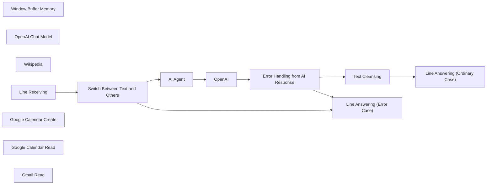

## Fluxo (.json) :

```json
{
  "id": "Z5OgwYfK4reCTv9y",
  "meta": {
    "instanceId": "c59c4acfed171bdc864e7c432be610946898c3ee271693e0303565c953d88c1d"
  },
  "name": "LINE Assistant with Google Calendar and Gmail Integration",
  "tags": [],
  "nodes": [
    {
      "id": "9e1e1c11-f406-47de-8f65-9669cf078d3d",
      "name": "AI Agent",
      "type": "@n8n/n8n-nodes-langchain.agent",
      "position": [
        -1140,
        120
      ],
      "parameters": {
        "text": "={{ $json.body.events[0].message.text }}",
        "options": {
          "systemMessage": "=You are a helpful assistant.\n\nHere is the current date {{ $now }}"
        },
        "promptType": "define"
      },
      "typeVersion": 1.7
    },
    {
      "id": "fa722820-8804-47da-bb21-02c0d2b5d665",
      "name": "Window Buffer Memory",
      "type": "@n8n/n8n-nodes-langchain.memoryBufferWindow",
      "position": [
        -1020,
        580
      ],
      "parameters": {
        "sessionKey": "={{ $json.body.events[0].source.userId }}",
        "sessionIdType": "customKey"
      },
      "typeVersion": 1.3
    },
    {
      "id": "5149b91a-5934-4037-a444-dfdb93d0cd16",
      "name": "OpenAI Chat Model",
      "type": "@n8n/n8n-nodes-langchain.lmChatOpenAi",
      "position": [
        -1180,
        580
      ],
      "parameters": {
        "options": {}
      },
      "typeVersion": 1
    },
    {
      "id": "211a120d-d65f-4708-adc2-66dc8f4a40d6",
      "name": "Wikipedia",
      "type": "@n8n/n8n-nodes-langchain.toolWikipedia",
      "position": [
        -360,
        380
      ],
      "parameters": {},
      "typeVersion": 1
    },
    {
      "id": "0e03137d-0300-47a4-bbd8-03c87c93d6e2",
      "name": "OpenAI",
      "type": "@n8n/n8n-nodes-langchain.openAi",
      "position": [
        -780,
        120
      ],
      "parameters": {
        "modelId": {
          "__rl": true,
          "mode": "list",
          "value": "gpt-4o-mini",
          "cachedResultName": "GPT-4O-MINI"
        },
        "options": {},
        "messages": {
          "values": [
            {
              "role": "system",
              "content": "Your task is to extract and condense the answer into an easily readable format. Don't provide a link or details such as \"ดูเพิ่มเติม\" or \"ดูรายละเอียดได้ที่นี่.\""
            },
            {
              "content": "={{ $json.output }}"
            }
          ]
        }
      },
      "typeVersion": 1.7
    },
    {
      "id": "8c6e96bc-aa9d-44d1-b7ce-6bb85b175cf1",
      "name": "Switch Between Text and Others",
      "type": "n8n-nodes-base.switch",
      "position": [
        -1820,
        640
      ],
      "parameters": {
        "rules": {
          "values": [
            {
              "conditions": {
                "options": {
                  "version": 2,
                  "leftValue": "",
                  "caseSensitive": true,
                  "typeValidation": "strict"
                },
                "combinator": "and",
                "conditions": [
                  {
                    "operator": {
                      "type": "string",
                      "operation": "equals"
                    },
                    "leftValue": "={{ $('Line Receiving').item.json.body.events[0].message.type }}",
                    "rightValue": "text"
                  }
                ]
              }
            }
          ]
        },
        "options": {
          "fallbackOutput": "extra"
        }
      },
      "typeVersion": 3.2
    },
    {
      "id": "721a5e5e-3a9a-435e-9302-03ca7cf64fb7",
      "name": "Line Receiving",
      "type": "n8n-nodes-base.webhook",
      "position": [
        -2320,
        560
      ],
      "webhookId": "********-****-****-****-************",
      "parameters": {
        "path": "linechatbotagent",
        "options": {},
        "httpMethod": "POST"
      },
      "typeVersion": 2
    },
    {
      "id": "2b47f8f1-a501-4204-9221-c838edfceae7",
      "name": "Error Handling from AI Response",
      "type": "n8n-nodes-base.switch",
      "position": [
        -220,
        100
      ],
      "parameters": {
        "rules": {
          "values": [
            {
              "conditions": {
                "options": {
                  "version": 2,
                  "leftValue": "",
                  "caseSensitive": true,
                  "typeValidation": "strict"
                },
                "combinator": "and",
                "conditions": [
                  {
                    "operator": {
                      "type": "string",
                      "operation": "exists",
                      "singleValue": true
                    },
                    "leftValue": "={{ $json.message.content }}",
                    "rightValue": "={{ $json.output }}"
                  }
                ]
              }
            }
          ]
        },
        "options": {
          "fallbackOutput": "extra"
        }
      },
      "typeVersion": 3.2
    },
    {
      "id": "99218c08-5ec7-44b9-a795-e98f1ec4aab3",
      "name": "Text Cleansing",
      "type": "n8n-nodes-base.set",
      "position": [
        0,
        0
      ],
      "parameters": {
        "options": {},
        "assignments": {
          "assignments": [
            {
              "id": "********-****-****-****-************",
              "name": "message.content",
              "type": "string",
              "value": "={{ $json.message.content.replaceAll(\"\\n\",\"\\\\n\").replaceAll(\"\\n\",\"\").removeMarkdown().removeTags().replaceAll('\"',\"\") }}"
            }
          ]
        }
      },
      "typeVersion": 3.4
    },
    {
      "id": "39476f44-9dc7-4c72-a857-9e79f85ccd72",
      "name": "Line Answering (Error Case)",
      "type": "n8n-nodes-base.httpRequest",
      "position": [
        760,
        680
      ],
      "parameters": {
        "url": "https://api.line.me/v2/bot/message/reply",
        "method": "POST",
        "options": {},
        "jsonBody": "={\n  \"replyToken\": \"{{ $('Line Receiving').item.json.body.events[0].replyToken }}\",\n  \"messages\": [\n    {\n      \"type\": \"text\",\n      \"text\": \"กรุณาส่งอย่างอื่นเถอะนะเตงอัว\"\n    }\n  ]}",
        "sendBody": true,
        "jsonHeaders": "{\n\"Authorization\": \"Bearer ****************************************\",\n\"Content-Type\": \"application/json\"\n}",
        "sendHeaders": true,
        "specifyBody": "json",
        "specifyHeaders": "json"
      },
      "typeVersion": 4.2
    },
    {
      "id": "a7f8837d-c21b-457d-ad8b-b0b69e3c1ba7",
      "name": "Line Answering (Ordinary Case)",
      "type": "n8n-nodes-base.httpRequest",
      "position": [
        600,
        120
      ],
      "parameters": {
        "url": "https://api.line.me/v2/bot/message/reply",
        "method": "POST",
        "options": {},
        "jsonBody": "={\n  \"replyToken\": \"{{ $('Line Receiving').item.json.body.events[0].replyToken }}\",\n  \"messages\": [\n    {\n      \"type\": \"text\",\n      \"text\": \"{{ $json.message.content }}\"\n    }\n  ]}",
        "sendBody": true,
        "jsonHeaders": "{\n\"Authorization\": \"Bearer ****************************************\",\n\"Content-Type\": \"application/json\"\n}",
        "sendHeaders": true,
        "specifyBody": "json",
        "specifyHeaders": "json"
      },
      "typeVersion": 4.2
    },
    {
      "id": "3280f331-0130-41c2-a581-14feccf76514",
      "name": "Google Calendar Create",
      "type": "n8n-nodes-base.googleCalendarTool",
      "position": [
        -640,
        400
      ],
      "parameters": {
        "end": "=  {{ $fromAI(\"createenddate\",\"end date and time to create event\") }}",
        "start": "=  {{ $fromAI(\"createstartdate\",\"start date and time to create event\") }}",
        "calendar": {
          "__rl": true,
          "mode": "list",
          "value": "***********@gmail.com",
          "cachedResultName": "***********@gmail.com"
        },
        "additionalFields": {
          "summary": "={{ $fromAI(\"event_name\",\"Name of an Event\") }}"
        }
      },
      "credentials": {
        "googleCalendarOAuth2Api": {
          "id": "0PzHsuCKdTBU5E2Q",
          "name": "Google Calendar account"
        }
      },
      "typeVersion": 1.2
    },
    {
      "id": "7701895f-9781-41b9-aa80-8440e4e9cbd3",
      "name": "Google Calendar Read",
      "type": "n8n-nodes-base.googleCalendarTool",
      "position": [
        -880,
        580
      ],
      "parameters": {
        "limit": 5,
        "options": {
          "timeMax": "={{ $fromAI(\"enddate\",\"end date user mentioned about\") }}",
          "timeMin": "={{ $fromAI(\"startdate\",\"start date user mentioned about\") }}"
        },
        "calendar": {
          "__rl": true,
          "mode": "list",
          "value": "***********@gmail.com",
          "cachedResultName": "***********@gmail.com"
        },
        "operation": "getAll"
      },
      "credentials": {
        "googleCalendarOAuth2Api": {
          "id": "0PzHsuCKdTBU5E2Q",
          "name": "Google Calendar account"
        }
      },
      "typeVersion": 1.2
    },
    {
      "id": "881daa7f-cf9a-4d1f-8235-55d206925ac0",
      "name": "Gmail Read",
      "type": "n8n-nodes-base.gmailTool",
      "position": [
        -700,
        560
      ],
      "webhookId": "********-****-****-****-************",
      "parameters": {
        "limit": 5,
        "filters": {
          "receivedAfter": "={{ $fromAI(\"receiveddate\",\"the date email received\") }}"
        },
        "operation": "getAll"
      },
      "credentials": {
        "gmailOAuth2": {
          "id": "cZmU8EQya5OtXVgQ",
          "name": "Gmail account"
        }
      },
      "typeVersion": 2.1
    }
  ],
  "active": false,
  "pinData": {
    "Line Receiving": [
      {
        "json": {
          "body": {
            "events": [
              {
                "mode": "active",
                "type": "message",
                "source": {
                  "type": "user",
                  "userId": "****************************************"
                },
                "message": {
                  "id": "539986086979174564",
                  "text": "",
                  "type": "text",
                  "quoteToken": "****************************************"
                },
                "timestamp": 1734688093030,
                "replyToken": "********************************",
                "webhookEventId": "01JFHQFD2KQE4BA5VVW32YDBZV",
                "deliveryContext": {
                  "isRedelivery": false
                }
              }
            ],
            "destination": "****************************************"
          },
          "query": {},
          "params": {},
          "headers": {
            "host": "n8n-9pul.onrender.com",
            "cf-ray": "****************",
            "rndr-id": "****************",
            "cdn-loop": "cloudflare; loops=1; subreqs=1",
            "cf-ew-via": "15",
            "cf-worker": "onrender.com",
            "cf-visitor": "{\"scheme\":\"https\"}",
            "user-agent": "LineBotWebhook/2.0",
            "cf-ipcountry": "JP",
            "content-type": "application/json; charset=utf-8",
            "content-length": "619",
            "true-client-ip": "***.***.***.**",
            "accept-encoding": "gzip, br",
            "x-forwarded-for": "***.***.***.***, ***.***.***.**",
            "x-request-start": "1734688093431195",
            "cf-connecting-ip": "***.***.***.**",
            "render-proxy-ttl": "4",
            "x-line-signature": "****************************************",
            "x-forwarded-proto": "https"
          },
          "webhookUrl": "https://n8n-9pul.onrender.com/webhook/linechatbotagent",
          "executionMode": "production"
        }
      }
    ]
  },
  "settings": {
    "executionOrder": "v1"
  },
  "versionId": "14065639-6706-4161-9380-4f4dde6eb501",
  "connections": {
    "OpenAI": {
      "main": [
        [
          {
            "node": "Error Handling from AI Response",
            "type": "main",
            "index": 0
          }
        ]
      ]
    },
    "AI Agent": {
      "main": [
        [
          {
            "node": "OpenAI",
            "type": "main",
            "index": 0
          }
        ]
      ]
    },
    "Wikipedia": {
      "ai_tool": [
        [
          {
            "node": "AI Agent",
            "type": "ai_tool",
            "index": 0
          }
        ]
      ]
    },
    "Gmail Read": {
      "ai_tool": [
        [
          {
            "node": "AI Agent",
            "type": "ai_tool",
            "index": 0
          }
        ]
      ]
    },
    "Line Receiving": {
      "main": [
        [
          {
            "node": "Switch Between Text and Others",
            "type": "main",
            "index": 0
          }
        ]
      ]
    },
    "Text Cleansing": {
      "main": [
        [
          {
            "node": "Line Answering (Ordinary Case)",
            "type": "main",
            "index": 0
          }
        ]
      ]
    },
    "OpenAI Chat Model": {
      "ai_languageModel": [
        [
          {
            "node": "AI Agent",
            "type": "ai_languageModel",
            "index": 0
          }
        ]
      ]
    },
    "Google Calendar Read": {
      "ai_tool": [
        [
          {
            "node": "AI Agent",
            "type": "ai_tool",
            "index": 0
          }
        ]
      ]
    },
    "Window Buffer Memory": {
      "ai_memory": [
        [
          {
            "node": "AI Agent",
            "type": "ai_memory",
            "index": 0
          }
        ]
      ]
    },
    "Google Calendar Create": {
      "ai_tool": [
        [
          {
            "node": "AI Agent",
            "type": "ai_tool",
            "index": 0
          }
        ]
      ]
    },
    "Switch Between Text and Others": {
      "main": [
        [
          {
            "node": "AI Agent",
            "type": "main",
            "index": 0
          }
        ],
        [
          {
            "node": "Line Answering (Error Case)",
            "type": "main",
            "index": 0
          }
        ]
      ]
    },
    "Error Handling from AI Response": {
      "main": [
        [
          {
            "node": "Text Cleansing",
            "type": "main",
            "index": 0
          }
        ],
        [
          {
            "node": "Line Answering (Error Case)",
            "type": "main",
            "index": 0
          }
        ]
      ]
    }
  }
}
```

<a id="template-126"></a>

## Template 126 - Gerenciar registros no Quick Base

- **Nome:** Gerenciar registros no Quick Base
- **Descrição:** Fluxo manual que cria um registro, atualiza esse registro e, em seguida, recupera todos os registros de uma tabela no Quick Base.
- **Funcionalidade:** • Gatilho manual: Inicia o fluxo quando o usuário executa manualmente.
• Criação de registro: Insere um registro com os campos name e age.
• Atualização de registro: Atualiza o campo age do registro criado utilizando o Record ID# como chave de atualização.
• Recuperação de registros: Recupera todos os registros da tabela após a atualização.
• Uso de identificador de tabela dinâmico: Reutiliza o mesmo identificador de tabela entre as operações de criação, atualização e leitura.
- **Ferramentas:** • Quick Base: Plataforma de banco de dados online que permite criar, atualizar e recuperar registros em tabelas por meio de sua API.

## Fluxo visual

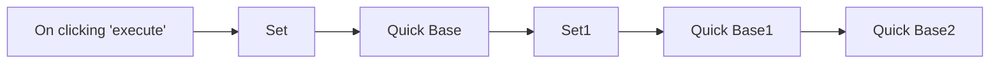

## Fluxo (.json) :

```json
{
  "id": "156",
  "name": "Create, update and get records in Quick Base",
  "nodes": [
    {
      "name": "On clicking 'execute'",
      "type": "n8n-nodes-base.manualTrigger",
      "position": [
        250,
        300
      ],
      "parameters": {},
      "typeVersion": 1
    },
    {
      "name": "Quick Base",
      "type": "n8n-nodes-base.quickbase",
      "position": [
        650,
        300
      ],
      "parameters": {
        "columns": "name,age",
        "options": {},
        "tableId": ""
      },
      "credentials": {
        "quickbaseApi": "Quick Base Credentials"
      },
      "typeVersion": 1
    },
    {
      "name": "Set",
      "type": "n8n-nodes-base.set",
      "position": [
        450,
        300
      ],
      "parameters": {
        "values": {
          "number": [
            {
              "name": "age",
              "value": 8
            }
          ],
          "string": [
            {
              "name": "name",
              "value": "n8n"
            }
          ]
        },
        "options": {}
      },
      "typeVersion": 1
    },
    {
      "name": "Set1",
      "type": "n8n-nodes-base.set",
      "position": [
        850,
        300
      ],
      "parameters": {
        "values": {
          "number": [
            {
              "name": "age",
              "value": 10
            },
            {
              "name": "Record ID#",
              "value": "={{$node[\"Quick Base\"].json[\"Record ID#\"]}}"
            }
          ]
        },
        "options": {},
        "keepOnlySet": true
      },
      "typeVersion": 1
    },
    {
      "name": "Quick Base1",
      "type": "n8n-nodes-base.quickbase",
      "position": [
        1050,
        300
      ],
      "parameters": {
        "columns": "age",
        "options": {},
        "tableId": "={{$node[\"Quick Base\"].parameter[\"tableId\"]}}",
        "operation": "update",
        "updateKey": "Record ID#"
      },
      "credentials": {
        "quickbaseApi": "Quick Base Credentials"
      },
      "typeVersion": 1
    },
    {
      "name": "Quick Base2",
      "type": "n8n-nodes-base.quickbase",
      "position": [
        1250,
        300
      ],
      "parameters": {
        "options": {},
        "tableId": "={{$node[\"Quick Base\"].parameter[\"tableId\"]}}",
        "operation": "getAll"
      },
      "credentials": {
        "quickbaseApi": "Quick Base Credentials"
      },
      "typeVersion": 1
    }
  ],
  "active": false,
  "settings": {},
  "connections": {
    "Set": {
      "main": [
        [
          {
            "node": "Quick Base",
            "type": "main",
            "index": 0
          }
        ]
      ]
    },
    "Set1": {
      "main": [
        [
          {
            "node": "Quick Base1",
            "type": "main",
            "index": 0
          }
        ]
      ]
    },
    "Quick Base": {
      "main": [
        [
          {
            "node": "Set1",
            "type": "main",
            "index": 0
          }
        ]
      ]
    },
    "Quick Base1": {
      "main": [
        [
          {
            "node": "Quick Base2",
            "type": "main",
            "index": 0
          }
        ]
      ]
    },
    "On clicking 'execute'": {
      "main": [
        [
          {
            "node": "Set",
            "type": "main",
            "index": 0
          }
        ]
      ]
    }
  }
}
```

<a id="template-127"></a>

## Template 127 - Alerta de deploy falhado no Slack

- **Nome:** Alerta de deploy falhado no Slack
- **Descrição:** Dispara uma notificação no Slack sempre que um deploy do site no Netlify falhar, informando o erro e link para mais detalhes.
- **Funcionalidade:** • Monitoramento de falhas de deploy: inicia a automação ao detectar o evento de deploy failed para um site específico.
• Coleta de informações do deploy: extrai nome do site, mensagem de erro e ID do deploy para contextualizar a notificação.
• Envio de notificação formatada para Slack: publica uma mensagem no canal definido com emoji, mensagem de erro e link direto ao deploy com mais detalhes.
• Configuração por credenciais: utiliza credenciais da conta Netlify e do Slack para acessar as APIs e enviar notificações.
- **Ferramentas:** • Netlify: serviço de hospedagem e deploy contínuo que fornece eventos de deploy e dados sobre falhas.
• Slack: plataforma de comunicação onde a notificação é enviada para alertar a equipe.


## Fluxo visual

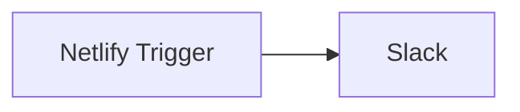

## Fluxo (.json) :

```json
{
  "nodes": [
    {
      "name": "Netlify Trigger",
      "type": "n8n-nodes-base.netlifyTrigger",
      "position": [
        450,
        300
      ],
      "webhookId": "0654820c-1960-4c8b-80fc-c0a66ab96577",
      "parameters": {
        "event": "deployFailed",
        "siteId": "ab52947e-a696-4498-a5a1-fae7fbe30c84"
      },
      "credentials": {
        "netlifyApi": "Netlify account"
      },
      "typeVersion": 1
    },
    {
      "name": "Slack",
      "type": "n8n-nodes-base.slack",
      "position": [
        650,
        300
      ],
      "parameters": {
        "text": "=🚨 Deploy Failed 🚨\nDeploy for the site {{$json[\"name\"]}} failed.\nError Message: {{$json[\"error_message\"]}}\nYou can find more information here: https://app.netlify.com/sites/{{$json[\"name\"]}}/deploys/{{$json[\"id\"]}}",
        "channel": "general",
        "attachments": [],
        "otherOptions": {}
      },
      "credentials": {
        "slackApi": "read-history"
      },
      "typeVersion": 1
    }
  ],
  "connections": {
    "Netlify Trigger": {
      "main": [
        [
          {
            "node": "Slack",
            "type": "main",
            "index": 0
          }
        ]
      ]
    }
  }
}
```

<a id="template-128"></a>

## Template 128 - Geração de wallpaper gráfico com IA

- **Nome:** Geração de wallpaper gráfico com IA
- **Descrição:** Gera um wallpaper combinando um prompt criado por um modelo de linguagem e uma imagem gerada por modelo de imagem, e monta o resultado em um layout final via API de design.
- **Funcionalidade:** • Disparo manual de fluxo: Inicia o processo a partir de um gatilho manual para testes.
• Configuração de parâmetros básicos: Recebe tema, cenário, estilo, exemplos e chave de API para os serviços externos.
• Geração de prompt com LLM: Usa um modelo de linguagem para transformar parâmetros e exemplos em um prompt curto e artístico.
• Criação de imagem com modelo de imagem: Envia o prompt para um gerador de imagens (modo "imagine") e inicia a tarefa de geração.
• Monitoramento e espera da tarefa: Aguarda e consulta periodicamente o status da geração até completar ou falhar.
• Extração de URL da imagem: Captura as URLs temporárias ou finais da imagem gerada para uso posterior.
• Composição final no Canvas: Monta o layout final (imagem + texto) utilizando a API de design e define tamanho e template.
- **Ferramentas:** • PiAPI (modelos gpt-4o-mini e midjourney): Plataforma de APIs usada para gerar o texto criativo (LLM) e para criar a imagem a partir do prompt.
• Canvas API (Switchboard Canvas): Serviço de composição e template que recebe imagem e texto para criar o design final do wallpaper.

## Fluxo visual

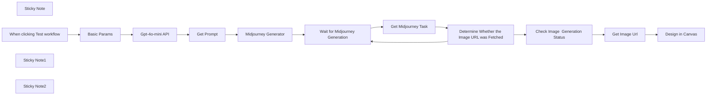

## Fluxo (.json) :

```json
{
  "id": "mN7jDJoWHtJuyKpS",
  "meta": {
    "instanceId": "1e003a7ea4715b6b35e9947791386a7d07edf3b5bf8d4c9b7ee4fdcbec0447d7"
  },
  "name": "Generate Graphic Wallpaper with Midjourney, GPT-4o-mini and Canvas APIs",
  "tags": [],
  "nodes": [
    {
      "id": "11cef766-dd10-46ea-98cf-11eb8d95e157",
      "name": "Sticky Note",
      "type": "n8n-nodes-base.stickyNote",
      "position": [
        280,
        80
      ],
      "parameters": {
        "width": 520,
        "height": 200,
        "content": "## Generate Graphic Wallpaper with Midjourney, GPT-4o-mini and Canvas APIs\nWe design this workflow with PiAPI APIs and Canvas API with the purpose to  produce a visually compelling image with resonant copy to spark emotional connection. 🙌 \nWish you make a fantastic generation with our workflow! "
      },
      "typeVersion": 1
    },
    {
      "id": "ba7143d7-442d-4153-9cfd-bb36448d4c91",
      "name": "Midjourney Generator",
      "type": "n8n-nodes-base.httpRequest",
      "position": [
        1200,
        320
      ],
      "parameters": {
        "url": "https://api.piapi.ai/api/v1/task",
        "method": "POST",
        "options": {},
        "jsonBody": "={\n  \"model\": \"midjourney\",\n  \"task_type\": \"imagine\",\n  \"input\": {\n    \"prompt\": \"{{ $json.prompt }}\",\n    \"aspect_ratio\": \"1:1\",\n    \"process_mode\": \"turbo\",\n    \"skip_prompt_check\": false\n  }\n}",
        "sendBody": true,
        "sendHeaders": true,
        "specifyBody": "json",
        "headerParameters": {
          "parameters": [
            {
              "name": "x-api-key",
              "value": "={{ $('Basic Params').item.json['x-api-key'] }}"
            }
          ]
        }
      },
      "typeVersion": 4.2
    },
    {
      "id": "117b5929-e98c-456a-9bfd-fe1deee77abc",
      "name": "When clicking Test workflow",
      "type": "n8n-nodes-base.manualTrigger",
      "position": [
        300,
        320
      ],
      "parameters": {},
      "typeVersion": 1
    },
    {
      "id": "dfcf5c57-536c-4fb4-967b-24fd375db57c",
      "name": "Get Prompt",
      "type": "n8n-nodes-base.code",
      "position": [
        960,
        320
      ],
      "parameters": {
        "jsCode": "const image_prompt=$('Basic Params').first().json.image_prompt;\nconst show_prompt =$input.first().json.choices[0].message.content;\n\nconst prompt = image_prompt.replace(/'xxx'/, `'${show_prompt}'`)\nreturn {show_prompt,prompt};"
      },
      "typeVersion": 2
    },
    {
      "id": "1c641437-de26-4e55-9b34-0cb13d8d1cd3",
      "name": "Get Midjourney Task",
      "type": "n8n-nodes-base.httpRequest",
      "position": [
        1140,
        580
      ],
      "parameters": {
        "url": "=https://api.piapi.ai/api/v1/task/{{ $json.data.task_id }}",
        "options": {},
        "sendHeaders": true,
        "headerParameters": {
          "parameters": [
            {
              "name": "x-api-key",
              "value": "={{ $('Basic Params').item.json['x-api-key'] }}"
            }
          ]
        }
      },
      "typeVersion": 4.2
    },
    {
      "id": "38fda20c-fef6-484c-ac75-c8f2fbaaca15",
      "name": "Wait for Midjourney Generation",
      "type": "n8n-nodes-base.wait",
      "position": [
        940,
        580
      ],
      "webhookId": "af79053d-1291-4dd2-889e-4593dbbb2512",
      "parameters": {},
      "typeVersion": 1.1
    },
    {
      "id": "1d5eaf9a-caf8-4b08-a35c-281b400c9198",
      "name": "Determine Whether the Image URL was Fetched",
      "type": "n8n-nodes-base.if",
      "position": [
        1340,
        580
      ],
      "parameters": {
        "options": {},
        "conditions": {
          "options": {
            "version": 2,
            "leftValue": "",
            "caseSensitive": true,
            "typeValidation": "strict"
          },
          "combinator": "or",
          "conditions": [
            {
              "id": "e97a02cc-8d1d-4500-bce5-0a296c792b76",
              "operator": {
                "name": "filter.operator.equals",
                "type": "string",
                "operation": "equals"
              },
              "leftValue": "={{ $json.data.status }}",
              "rightValue": "completed"
            },
            {
              "id": "50b63a7a-52b5-4766-a859-96ac1ff949ec",
              "operator": {
                "name": "filter.operator.equals",
                "type": "string",
                "operation": "equals"
              },
              "leftValue": "={{ $json.data.status }}",
              "rightValue": "failed"
            }
          ]
        }
      },
      "typeVersion": 2.2
    },
    {
      "id": "983acf91-c5ba-4335-b43e-d7a8a1a6b918",
      "name": "Check Image  Generation Status",
      "type": "n8n-nodes-base.switch",
      "position": [
        1520,
        320
      ],
      "parameters": {
        "rules": {
          "values": [
            {
              "conditions": {
                "options": {
                  "version": 2,
                  "leftValue": "",
                  "caseSensitive": true,
                  "typeValidation": "strict"
                },
                "combinator": "and",
                "conditions": [
                  {
                    "id": "5f61ee56-4ebe-411f-95e6-b47d9741e7a2",
                    "operator": {
                      "type": "string",
                      "operation": "equals"
                    },
                    "leftValue": "={{ $json.data.status }}",
                    "rightValue": "completed"
                  }
                ]
              }
            }
          ]
        },
        "options": {}
      },
      "typeVersion": 3.2
    },
    {
      "id": "50455a13-5914-4f96-b977-d1c6461807bc",
      "name": "Design in Canvas",
      "type": "n8n-nodes-base.httpRequest",
      "position": [
        1920,
        320
      ],
      "parameters": {
        "url": "https://api.canvas.switchboard.ai",
        "method": "POST",
        "options": {},
        "jsonBody": "={\n    \"template\": \"social-3-1\",\n    \"sizes\": [\n        {\n         \"width\": 1000,\n         \"height\": 1500\n        }\n    ],\n    \"elements\": {\n        \"text1\": {\n            \"text\": \"{{ $('Get Prompt').item.json.show_prompt.replace(/;/g, \";\\\\n \")}}\"\n        },\n         \"rectangle1\": {\n                 \"fillColor\": \"#fff\"\n             },\n        \"image1\": {\n            \"url\": \"{{ $json.data.output.temporary_image_urls[0] }}\"\n        }\n    }\n}",
        "sendBody": true,
        "sendHeaders": true,
        "specifyBody": "json",
        "headerParameters": {
          "parameters": [
            {
              "name": "X-API-Key",
              "value": "45ba3916-2f10-497d-815b-7ffc9b69001f"
            }
          ]
        }
      },
      "typeVersion": 4.2
    },
    {
      "id": "0fd5d40c-aebc-4ec3-b9b5-027126b39452",
      "name": "Get Image Url",
      "type": "n8n-nodes-base.set",
      "position": [
        1720,
        320
      ],
      "parameters": {
        "options": {},
        "assignments": {
          "assignments": [
            {
              "id": "d52d19d1-3a37-47bb-ad23-e809323c0c54",
              "name": "data.output.temporary_image_urls",
              "type": "array",
              "value": "={{ $json.data.output.temporary_image_urls }}"
            },
            {
              "id": "49bed53e-675d-4ea0-947c-ffcbfae0ee97",
              "name": "data.output.image_url",
              "type": "string",
              "value": "={{ $json.data.output.image_url }}"
            }
          ]
        }
      },
      "typeVersion": 3.4
    },
    {
      "id": "e36d4bd6-2d34-447c-984e-515c48f3632e",
      "name": "Sticky Note1",
      "type": "n8n-nodes-base.stickyNote",
      "position": [
        280,
        500
      ],
      "parameters": {
        "width": 580,
        "height": 280,
        "content": "## Basic Params\nIn **Basic Params** node, you need to fill in your PiAPI key which you could check in [My Account](https://piapi.ai/workspace/my-account) on [PiAPI](https://piapi.ai). Other information you need to provide is listed as follow📝: \n1. Theme. The theme refers to the topic that you want to talk about when you start your generation.\n2. Scenario. The scenario text usually describe your status about your feeling.\n3. Style. The style of the image.\n4. Example. The text example shown to LLM to describe a style t you want to generate.\n5. Image prompt. Image prompt is usually about the context of the image that you want to generate."
      },
      "typeVersion": 1
    },
    {
      "id": "1e04fe5d-a1f4-4fe9-a3d2-9c6aeaf05d96",
      "name": "Gpt-4o-mini API",
      "type": "n8n-nodes-base.httpRequest",
      "position": [
        740,
        320
      ],
      "parameters": {
        "url": "https://api.piapi.ai/v1/chat/completions",
        "method": "POST",
        "options": {},
        "jsonBody": "={\n    \"model\": \"gpt-4o-mini\",\n    \"messages\": [\n       {\n          \"role\": \"system\",\n          \"content\": \"You are a helpful assistant.\"\n        },\n        {\n          \"role\": \"user\",\n          \"content\": \"Please {{ $json.style }}, based on the theme of {{ $json.theme }} and the scenario of {{ $json.scenario }}, according to the output case and language context. Examples are  {{ $json.example }},Return a sentence directly, nothing else,Don't add a serial number, just a prompt that can be used for input,Do not add any quotation marks.\"}\n      ]\n  }",
        "sendBody": true,
        "sendHeaders": true,
        "specifyBody": "json",
        "headerParameters": {
          "parameters": [
            {
              "name": "Authorization",
              "value": "=Bearer {{ $('Basic Params').first().json['x-api-key'] }}"
            }
          ]
        }
      },
      "typeVersion": 4.2
    },
    {
      "id": "4eaf0f57-9458-42cb-b736-c737f134320b",
      "name": "Basic Params",
      "type": "n8n-nodes-base.set",
      "position": [
        540,
        320
      ],
      "parameters": {
        "mode": "raw",
        "options": {},
        "jsonOutput": "{\n  \"x-api-key\":\"\",\n  \"theme\": \"Hope\",\n  \"scenario\": \"Don't know about the future, confused and feel lost about AI agent\",\n  \"style\":\"Cinematic Grandeur,Sci-Tech Aesthetic, 3D style\",\n  \"example\":\"1. March. Because of your faith, it will happen.2. Something in me will save me.3. To everyone carrying a heavy heart in silence. You are going to be okay.4. Tomorrow will be better.\",\n  \"image_prompt\":\"A cinematic sci-fi metropolis where Deep Neural Nets control a hyper-connected society. Holographic interfaces glow in the air as robotic agents move among humans, symbolizing Industry 4.0. The scene contrasts organic human emotion with cold machine precision, rendered in a hyper-realistic 3D style with futuristic lighting. Epic wide shots showcase the grandeur of this civilization’s industrial evolution.\"\n}\n"
      },
      "typeVersion": 3.4
    },
    {
      "id": "6750b606-4222-4cda-bcaa-5d4f2b4f9ec8",
      "name": "Sticky Note2",
      "type": "n8n-nodes-base.stickyNote",
      "position": [
        1680,
        560
      ],
      "parameters": {
        "width": 380,
        "height": 200,
        "content": "## Design in Canvas API Node\nWe make a final design with Canvas API. \nYou could check the node code to make a template design more efficiently in Canvas.\nAlso you could make various artworks with template library in Canvas. \nYou could modify node parameters to or add more nodes to make more artworks in one role."
      },
      "typeVersion": 1
    }
  ],
  "active": false,
  "pinData": {},
  "settings": {
    "executionOrder": "v1"
  },
  "versionId": "09b5a8e6-bdc8-47bb-a9e3-95b090ff3f13",
  "connections": {
    "Get Prompt": {
      "main": [
        [
          {
            "node": "Midjourney Generator",
            "type": "main",
            "index": 0
          }
        ]
      ]
    },
    "Basic Params": {
      "main": [
        [
          {
            "node": "Gpt-4o-mini API",
            "type": "main",
            "index": 0
          }
        ]
      ]
    },
    "Get Image Url": {
      "main": [
        [
          {
            "node": "Design in Canvas",
            "type": "main",
            "index": 0
          }
        ]
      ]
    },
    "Gpt-4o-mini API": {
      "main": [
        [
          {
            "node": "Get Prompt",
            "type": "main",
            "index": 0
          }
        ]
      ]
    },
    "Get Midjourney Task": {
      "main": [
        [
          {
            "node": "Determine Whether the Image URL was Fetched",
            "type": "main",
            "index": 0
          }
        ]
      ]
    },
    "Midjourney Generator": {
      "main": [
        [
          {
            "node": "Wait for Midjourney Generation",
            "type": "main",
            "index": 0
          }
        ]
      ]
    },
    "When clicking Test workflow": {
      "main": [
        [
          {
            "node": "Basic Params",
            "type": "main",
            "index": 0
          }
        ]
      ]
    },
    "Check Image  Generation Status": {
      "main": [
        [
          {
            "node": "Get Image Url",
            "type": "main",
            "index": 0
          }
        ]
      ]
    },
    "Wait for Midjourney Generation": {
      "main": [
        [
          {
            "node": "Get Midjourney Task",
            "type": "main",
            "index": 0
          }
        ]
      ]
    },
    "Determine Whether the Image URL was Fetched": {
      "main": [
        [
          {
            "node": "Check Image  Generation Status",
            "type": "main",
            "index": 0
          }
        ],
        [
          {
            "node": "Wait for Midjourney Generation",
            "type": "main",
            "index": 0
          }
        ]
      ]
    }
  }
}
```

<a id="template-129"></a>

## Template 129 - Bot Telegram multilíngue

- **Nome:** Bot Telegram multilíngue
- **Descrição:** Recebe mensagens do Telegram, identifica o idioma do usuário, carrega um dicionário de mensagens multilíngue de um banco e responde com textos apropriados, além de registrar ou atualizar usuários no banco.
- **Funcionalidade:** • Recepção de mensagens do Telegram: Escuta atualizações de mensagem e inicia o fluxo.
• Detecção de idioma do usuário: Lê o código de idioma enviado pelo cliente e aplica fallback para inglês quando necessário.
• Carregamento do dicionário multilíngue: Recupera da base de dados as mensagens (greeting, welcomeback, help, wrongcommand) organizadas por chave.
• Verificação de usuário: Consulta a tabela de usuários para saber se o remetente é novo ou já existe.
• Criação de usuário: Insere novo registro com ID do Telegram e idioma quando o usuário não é encontrado.
• Atualização de usuário: Atualiza o registro existente com o último idioma usado quando o usuário já existe.
• Respostas condicionais: Envia saudações a novos usuários, mensagem de retorno a usuários existentes, ajuda ao receber /help e mensagem padrão para comandos desconhecidos.
• Uso de template multilíngue: Seleciona a mensagem apropriada do dicionário com base no idioma do usuário antes de enviar.
- **Ferramentas:** • Telegram Bot API: Plataforma usada para receber mensagens dos usuários e enviar respostas do bot.
• NocoDB (instância hospedada via API HTTP): Banco de dados onde estão armazenadas as mensagens multilíngues (dicionário) e a tabela de usuários; acessado via chamadas HTTP para leitura e escrita de registros.

## Fluxo visual

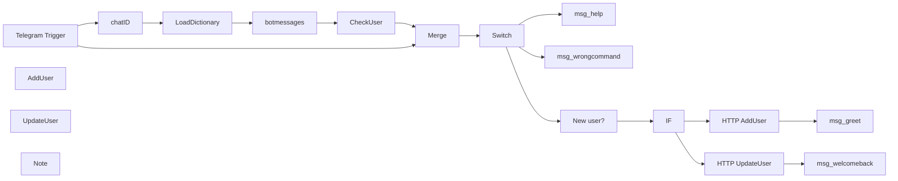

## Fluxo (.json) :

```json
{
  "nodes": [
    {
      "name": "chatID",
      "type": "n8n-nodes-base.function",
      "notes": "username and language",
      "position": [
        -100,
        680
      ],
      "parameters": {
        "functionCode": "// Telegram uses the following language codes: https://en.wikipedia.org/wiki/IETF_language_tag\r\n\r\nvar data = $node[\"Telegram Trigger\"].json;\r\nconst botlang = [\"ru\", \"en\"]; // Update this after adding new language in the dictionary\r\n\r\n// Assign the default language if the translation is not yet ready\r\nvar curlang = botlang.includes(data.message.from.language_code) ? data.message.from.language_code : \"en\";\r\n\r\nreturn [{json: {chatID  : data.message.chat.id,\r\n                lang    : curlang\r\n}}];"
      },
      "notesInFlow": true,
      "typeVersion": 1
    },
    {
      "name": "Merge",
      "type": "n8n-nodes-base.merge",
      "notes": "Wait for dictionary to load",
      "position": [
        480,
        460
      ],
      "parameters": {
        "mode": "passThrough"
      },
      "notesInFlow": true,
      "typeVersion": 1
    },
    {
      "name": "Switch",
      "type": "n8n-nodes-base.switch",
      "notes": "check bot commands",
      "position": [
        620,
        460
      ],
      "parameters": {
        "rules": {
          "rules": [
            {
              "value2": "/start"
            },
            {
              "output": 1,
              "value2": "/help"
            }
          ]
        },
        "value1": "={{$node[\"Merge\"].json[\"message\"][\"text\"]}}",
        "dataType": "string",
        "fallbackOutput": 3
      },
      "notesInFlow": true,
      "typeVersion": 1
    },
    {
      "name": "IF",
      "type": "n8n-nodes-base.if",
      "position": [
        940,
        300
      ],
      "parameters": {
        "conditions": {
          "boolean": [
            {
              "value1": "={{$json[\"empty\"]}}",
              "value2": "={{true}}"
            }
          ]
        }
      },
      "typeVersion": 1,
      "alwaysOutputData": false
    },
    {
      "name": "msg_greet",
      "type": "n8n-nodes-base.telegram",
      "position": [
        1260,
        220
      ],
      "parameters": {
        "text": "={{$evaluateExpression($node[\"botmessages\"].json[\"greeting\"][$node[\"chatID\"].json[\"lang\"]])}}",
        "chatId": "={{$node[\"Telegram Trigger\"].json[\"message\"][\"chat\"][\"id\"]}}",
        "additionalFields": {}
      },
      "credentials": {
        "telegramApi": {
          "id": "12",
          "name": "n8n multilang bot"
        }
      },
      "notesInFlow": true,
      "typeVersion": 1
    },
    {
      "name": "msg_welcomeback",
      "type": "n8n-nodes-base.telegram",
      "position": [
        1260,
        380
      ],
      "parameters": {
        "text": "={{$evaluateExpression($node[\"botmessages\"].json[\"welcomeback\"][$node[\"chatID\"].json[\"lang\"]])}}",
        "chatId": "={{$node[\"Telegram Trigger\"].json[\"message\"][\"chat\"][\"id\"]}}",
        "additionalFields": {}
      },
      "credentials": {
        "telegramApi": {
          "id": "12",
          "name": "n8n multilang bot"
        }
      },
      "notesInFlow": true,
      "typeVersion": 1
    },
    {
      "name": "msg_help",
      "type": "n8n-nodes-base.telegram",
      "position": [
        1260,
        540
      ],
      "parameters": {
        "text": "={{$evaluateExpression($node[\"botmessages\"].json[\"help\"][$node[\"chatID\"].json[\"lang\"]])}}",
        "chatId": "={{$node[\"Telegram Trigger\"].json[\"message\"][\"chat\"][\"id\"]}}",
        "additionalFields": {
          "parse_mode": "Markdown"
        }
      },
      "credentials": {
        "telegramApi": {
          "id": "12",
          "name": "n8n multilang bot"
        }
      },
      "notesInFlow": true,
      "typeVersion": 1
    },
    {
      "name": "msg_wrongcommand",
      "type": "n8n-nodes-base.telegram",
      "position": [
        1260,
        700
      ],
      "parameters": {
        "text": "={{$evaluateExpression($node[\"botmessages\"].json[\"wrongcommand\"][$node[\"chatID\"].json[\"lang\"]])}}",
        "chatId": "={{$node[\"Telegram Trigger\"].json[\"message\"][\"chat\"][\"id\"]}}",
        "additionalFields": {}
      },
      "credentials": {
        "telegramApi": {
          "id": "12",
          "name": "n8n multilang bot"
        }
      },
      "notesInFlow": true,
      "typeVersion": 1
    },
    {
      "name": "New user?",
      "type": "n8n-nodes-base.function",
      "position": [
        780,
        300
      ],
      "parameters": {
        "functionCode": "return [{json: {empty: Object.keys($node[\"CheckUser\"].json).length == 0}}];"
      },
      "typeVersion": 1
    },
    {
      "name": "CheckUser",
      "type": "n8n-nodes-base.nocoDb",
      "position": [
        380,
        680
      ],
      "parameters": {
        "table": "TG_users",
        "options": {
          "where": "=(TG_account_ID,eq,{{$node[\"chatID\"].json[\"chatID\"]}})"
        },
        "operation": "getAll",
        "projectId": "n8n_multilang_bot_wzhb"
      },
      "credentials": {
        "nocoDb": {
          "id": "13",
          "name": "NocoDB n8n multilang bot"
        }
      },
      "notesInFlow": true,
      "typeVersion": 1,
      "alwaysOutputData": true
    },
    {
      "name": "LoadDictionary",
      "type": "n8n-nodes-base.nocoDb",
      "position": [
        60,
        680
      ],
      "parameters": {
        "table": "botmessages",
        "options": {},
        "operation": "getAll",
        "projectId": "n8n_multilang_bot_wzhb",
        "returnAll": true
      },
      "credentials": {
        "nocoDb": {
          "id": "13",
          "name": "NocoDB n8n multilang bot"
        }
      },
      "notesInFlow": true,
      "typeVersion": 1,
      "alwaysOutputData": true
    },
    {
      "name": "botmessages",
      "type": "n8n-nodes-base.function",
      "position": [
        220,
        680
      ],
      "parameters": {
        "functionCode": "\nlet data = {};\n\nfor (item of items) {\n  data[item.json.botmessage]=item.json;\n}\n\nreturn data;"
      },
      "typeVersion": 1
    },
    {
      "name": "Telegram Trigger",
      "type": "n8n-nodes-base.telegramTrigger",
      "position": [
        240,
        460
      ],
      "webhookId": "21dac5fa-6e6b-43a0-b099-4f57537d2271",
      "parameters": {
        "updates": [
          "message"
        ],
        "additionalFields": {}
      },
      "credentials": {
        "telegramApi": {
          "id": "12",
          "name": "n8n multilang bot"
        }
      },
      "typeVersion": 1
    },
    {
      "name": "HTTP AddUser",
      "type": "n8n-nodes-base.httpRequest",
      "position": [
        1100,
        220
      ],
      "parameters": {
        "url": "https://database.digigin.eu/api/v1/db/data/noco/n8n_multilang_bot_wzhb/TG_users",
        "options": {
          "bodyContentType": "json"
        },
        "requestMethod": "POST",
        "authentication": "headerAuth",
        "bodyParametersUi": {
          "parameter": [
            {
              "name": "TG_account_ID",
              "value": "={{$node[\"chatID\"].json[\"chatID\"]}}"
            },
            {
              "name": "Last_language_used",
              "value": "={{$node[\"Telegram Trigger\"].json[\"message\"][\"from\"][\"language_code\"]}}"
            }
          ]
        }
      },
      "credentials": {
        "httpHeaderAuth": {
          "id": "21",
          "name": "Header Auth NocoDB"
        }
      },
      "typeVersion": 1
    },
    {
      "name": "HTTP UpdateUser",
      "type": "n8n-nodes-base.httpRequest",
      "position": [
        1100,
        380
      ],
      "parameters": {
        "url": "=https://database.digigin.eu/api/v1/db/data/noco/n8n_multilang_bot_wzhb/TG_users/{{$node[\"CheckUser\"].json[\"id\"]}}",
        "options": {
          "bodyContentType": "json"
        },
        "requestMethod": "PATCH",
        "authentication": "headerAuth",
        "bodyParametersUi": {
          "parameter": [
            {
              "name": "TG_account_ID",
              "value": "={{$node[\"chatID\"].json[\"chatID\"]}}"
            },
            {
              "name": "Last_language_used",
              "value": "={{$node[\"Telegram Trigger\"].json[\"message\"][\"from\"][\"language_code\"]}}"
            }
          ]
        }
      },
      "credentials": {
        "httpHeaderAuth": {
          "id": "21",
          "name": "Header Auth NocoDB"
        }
      },
      "typeVersion": 1
    },
    {
      "name": "AddUser",
      "type": "n8n-nodes-base.nocoDb",
      "disabled": true,
      "position": [
        1460,
        220
      ],
      "parameters": {
        "table": "TG_users",
        "fieldsUi": {
          "fieldValues": [
            {
              "fieldName": "TG_account_ID",
              "fieldValue": "={{$node[\"chatID\"].json[\"chatID\"]}}"
            },
            {
              "fieldName": "Last_language_used",
              "fieldValue": "={{$node[\"Telegram Trigger\"].json[\"message\"][\"from\"][\"language_code\"]}}"
            }
          ]
        },
        "operation": "create",
        "projectId": "n8n_multilang_bot_wzhb"
      },
      "credentials": {
        "nocoDb": {
          "id": "13",
          "name": "NocoDB n8n multilang bot"
        }
      },
      "notesInFlow": true,
      "typeVersion": 1
    },
    {
      "name": "UpdateUser",
      "type": "n8n-nodes-base.nocoDb",
      "disabled": true,
      "position": [
        1460,
        380
      ],
      "parameters": {
        "id": "={{$node[\"CheckUser\"].json[\"id\"]}}",
        "table": "TG_users",
        "fieldsUi": {
          "fieldValues": [
            {
              "fieldName": "TG_account_ID",
              "fieldValue": "={{$node[\"chatID\"].json[\"chatID\"]}}"
            },
            {
              "fieldName": "Last_language_used",
              "fieldValue": "={{$node[\"Telegram Trigger\"].json[\"message\"][\"from\"][\"language_code\"]}}"
            }
          ]
        },
        "operation": "update",
        "projectId": "n8n_multilang_bot_wzhb"
      },
      "credentials": {
        "nocoDb": {
          "id": "13",
          "name": "NocoDB n8n multilang bot"
        }
      },
      "notesInFlow": true,
      "typeVersion": 1
    },
    {
      "name": "Note",
      "type": "n8n-nodes-base.stickyNote",
      "position": [
        1440,
        80
      ],
      "parameters": {
        "width": 440,
        "height": 460,
        "content": "## What's this?\nDue to some breaking API changes in NocoDB some of its node options are not working at the moment (MAY 2022). These two nodes were replaced by HTTP request nodes. Functionality is still the same."
      },
      "typeVersion": 1
    }
  ],
  "connections": {
    "IF": {
      "main": [
        [
          {
            "node": "HTTP AddUser",
            "type": "main",
            "index": 0
          }
        ],
        [
          {
            "node": "HTTP UpdateUser",
            "type": "main",
            "index": 0
          }
        ]
      ]
    },
    "Merge": {
      "main": [
        [
          {
            "node": "Switch",
            "type": "main",
            "index": 0
          }
        ]
      ]
    },
    "Switch": {
      "main": [
        [
          {
            "node": "New user?",
            "type": "main",
            "index": 0
          }
        ],
        [
          {
            "node": "msg_help",
            "type": "main",
            "index": 0
          }
        ],
        null,
        [
          {
            "node": "msg_wrongcommand",
            "type": "main",
            "index": 0
          }
        ]
      ]
    },
    "chatID": {
      "main": [
        [
          {
            "node": "LoadDictionary",
            "type": "main",
            "index": 0
          }
        ]
      ]
    },
    "CheckUser": {
      "main": [
        [
          {
            "node": "Merge",
            "type": "main",
            "index": 1
          }
        ]
      ]
    },
    "New user?": {
      "main": [
        [
          {
            "node": "IF",
            "type": "main",
            "index": 0
          }
        ]
      ]
    },
    "botmessages": {
      "main": [
        [
          {
            "node": "CheckUser",
            "type": "main",
            "index": 0
          }
        ]
      ]
    },
    "HTTP AddUser": {
      "main": [
        [
          {
            "node": "msg_greet",
            "type": "main",
            "index": 0
          }
        ]
      ]
    },
    "LoadDictionary": {
      "main": [
        [
          {
            "node": "botmessages",
            "type": "main",
            "index": 0
          }
        ]
      ]
    },
    "HTTP UpdateUser": {
      "main": [
        [
          {
            "node": "msg_welcomeback",
            "type": "main",
            "index": 0
          }
        ]
      ]
    },
    "Telegram Trigger": {
      "main": [
        [
          {
            "node": "chatID",
            "type": "main",
            "index": 0
          },
          {
            "node": "Merge",
            "type": "main",
            "index": 0
          }
        ]
      ]
    }
  }
}
```

<a id="template-130"></a>

## Template 130 - Teste rápido de webhook usando PostBin e BambooHR

- **Nome:** Teste rápido de webhook usando PostBin e BambooHR
- **Descrição:** Fluxo para registrar e testar um webhook do BambooHR usando PostBin como receptor temporário, criar empregados de teste, validar a chamada e enviar uma mensagem de boas-vindas ao Slack usando um modelo de linguagem.
- **Funcionalidade:** • Criar Bin no PostBin: Cria um bin temporário para receber e inspecionar requisições HTTP.
• Formatar URL do webhook: Monta a URL do PostBin a partir do binId gerado para usar como webhook alvo.
• Registrar webhook no BambooHR: Envia payload para a API do BambooHR para criar um webhook que aponta ao PostBin.
• Obter campos monitoráveis do BambooHR: Recupera a lista de campos que podem disparar webhooks para seleção.
• Configurar payload do webhook: Prepara os parâmetros e limites (frequência, formato, campos) para o webhook do BambooHR.
• Criar funcionários de teste: Gera e cria registros de empregado fictícios para forçar o disparo do webhook.
• Aguardar disparo do webhook: Aguarda o tempo necessário para o BambooHR acionar o webhook conforme a frequência configurada.
• Consultar logs do BambooHR: Verifica no BambooHR se houve chamadas ao webhook registrado.
• Recuperar requisição mais recente do PostBin: Puxa a requisição recebida pelo bin para inspeção e processamento.
• Extrair e formatar dados de empregados: Converte campos retornados em nomes de exibição e lista de novos empregados.
• Gerar mensagem de boas-vindas com LLM: Usa um modelo de linguagem para compor uma mensagem de boas-vindas baseada nos nomes dos empregados.
• Enviar mensagem ao Slack: Publica a mensagem de boas-vindas em um canal Slack configurado.
• Limpeza do teste: Opcionalmente deleta o webhook criado no BambooHR após o teste.
- **Ferramentas:** • PostBin (postb.in): Serviço para criar "bins" públicos que capturam e exibem requisições HTTP para testes rápidos de webhooks.
• BambooHR API: Plataforma de recursos humanos usada para registrar webhooks, obter campos monitoráveis e criar registros de funcionários via API.
• Slack: Canal de comunicação usado para postar a mensagem de boas-vindas aos novos funcionários.
• OpenAI (modelo de linguagem): Serviço de modelo de linguagem usado para gerar automaticamente o texto da mensagem de boas-vindas.

## Fluxo visual

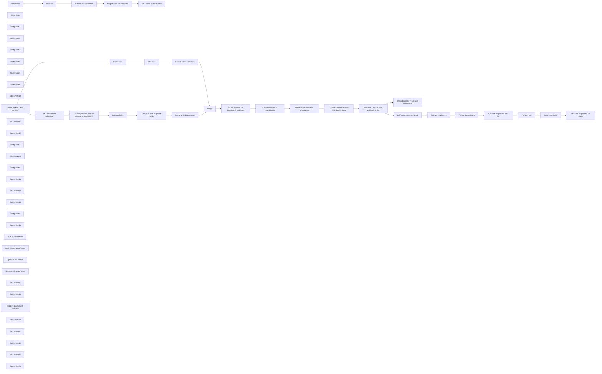

## Fluxo (.json) :

```json
{
  "id": "sB6dC0GZ7zZHuMGF",
  "meta": {
    "instanceId": "a9f3b18652ddc96459b459de4fa8fa33252fb820a9e5a1593074f3580352864a",
    "templateCredsSetupCompleted": true
  },
  "name": "Test Webhooks in n8n Without Changing WEBHOOK_URL (PostBin & BambooHR Example)",
  "tags": [
    {
      "id": "qtD3SYKEoYtiqguT",
      "name": "building_blocks",
      "createdAt": "2025-02-08T21:20:40.051Z",
      "updatedAt": "2025-02-08T21:20:40.051Z"
    },
    {
      "id": "mCgqKYNfNWwqIQG3",
      "name": "ai",
      "createdAt": "2025-02-08T21:20:49.438Z",
      "updatedAt": "2025-02-08T21:20:49.438Z"
    },
    {
      "id": "EjQkfx3v7nH79HWo",
      "name": "hr",
      "createdAt": "2025-02-08T21:20:57.598Z",
      "updatedAt": "2025-02-08T21:20:57.598Z"
    },
    {
      "id": "suSDrJxibUi10zsu",
      "name": "engineering",
      "createdAt": "2025-02-08T21:21:43.564Z",
      "updatedAt": "2025-02-08T21:21:43.564Z"
    }
  ],
  "nodes": [
    {
      "id": "2529ea94-8427-4fbb-bac0-79fec29fe943",
      "name": "When clicking ‘Test workflow’",
      "type": "n8n-nodes-base.manualTrigger",
      "position": [
        440,
        1220
      ],
      "parameters": {},
      "typeVersion": 1
    },
    {
      "id": "067ce1b6-a511-448b-a268-7d0869ed2b36",
      "name": "Sticky Note",
      "type": "n8n-nodes-base.stickyNote",
      "position": [
        600,
        980
      ],
      "parameters": {
        "color": 6,
        "width": 550.7128407259806,
        "height": 151.03568930452542,
        "content": "### Requirements:\n1. **BambooHR instance** ([free trial link](https://www.bamboohr.com/signup/))\n2. **BambooHR API key*** ([documentation](https://documentation.bamboohr.com/docs/getting-started#authentication))\n3. **Slack connection** ([n8n documentation](https://docs.n8n.io/integrations/builtin/credentials/slack/))\n* **Note about API key**: Set up in n8n as Generic Credential (Basic Auth) with the API key as the username and any string for the password.\n\n"
      },
      "typeVersion": 1
    },
    {
      "id": "62a65021-8bc5-4bd3-95e4-b0616c0cbbe6",
      "name": "Sticky Note1",
      "type": "n8n-nodes-base.stickyNote",
      "position": [
        1620,
        1620
      ],
      "parameters": {
        "color": 7,
        "width": 804.2810233962304,
        "height": 154.2786603126325,
        "content": "## Other use cases for BambooHR webhook\n1. Fraud & Compliance Monitoring (Triggered by Pay Rate, Pay Type, Compensation Change Reason, Bonus Amount, Commission Amount)\n2. Offboarding & Security Access Revocation (Triggered by Employment Status, Job Title, Department, Location)\n3. Manager Change Alert for Team & Workflow Updates (Triggered by Reporting To, Job Title, Department)"
      },
      "typeVersion": 1
    },
    {
      "id": "63e5f28a-83ea-44be-ad91-ab2b635551a1",
      "name": "Sticky Note2",
      "type": "n8n-nodes-base.stickyNote",
      "position": [
        800,
        1140
      ],
      "parameters": {
        "color": 7,
        "width": 600.2141303561856,
        "height": 246.1007234368067,
        "content": "## Create a new Bin in PostBin (STEP #1 above)"
      },
      "typeVersion": 1
    },
    {
      "id": "1afbac45-116e-4c8b-886c-24a96ba286ab",
      "name": "Merge",
      "type": "n8n-nodes-base.merge",
      "position": [
        1680,
        1240
      ],
      "parameters": {
        "mode": "combine",
        "options": {},
        "combineBy": "combineByPosition"
      },
      "typeVersion": 3
    },
    {
      "id": "367315b0-eba5-4768-bdb0-8be23d965f6c",
      "name": "Sticky Note3",
      "type": "n8n-nodes-base.stickyNote",
      "position": [
        1840,
        1180
      ],
      "parameters": {
        "color": 7,
        "width": 424.9937286279833,
        "height": 248.92215299422725,
        "content": "## Register webhook (STEP #2 above)"
      },
      "typeVersion": 1
    },
    {
      "id": "5b860a4e-66c9-4996-bd8f-ac642eca9021",
      "name": "Sticky Note4",
      "type": "n8n-nodes-base.stickyNote",
      "position": [
        1400,
        300
      ],
      "parameters": {
        "color": 4,
        "width": 291.16380512688715,
        "height": 397.605174332017,
        "content": "## STEP #3: Confirm webhook functionality"
      },
      "typeVersion": 1
    },
    {
      "id": "c6d78f60-0e05-452c-b50d-4bee9b4e1220",
      "name": "Sticky Note5",
      "type": "n8n-nodes-base.stickyNote",
      "position": [
        600,
        300
      ],
      "parameters": {
        "color": 4,
        "width": 611.7032537942721,
        "height": 397.94343220191183,
        "content": "## STEP #1: Create a new Bin in PostBin\nNo authentication needed. Use API to create Bin and retrieve BinId to craft URL for subsequent usage."
      },
      "typeVersion": 1
    },
    {
      "id": "6bdd564e-daf7-4259-a283-547f8257dcce",
      "name": "Sticky Note6",
      "type": "n8n-nodes-base.stickyNote",
      "position": [
        580,
        140
      ],
      "parameters": {
        "color": 7,
        "width": 1140.1894415469083,
        "height": 593.490746966612,
        "content": "## How to Test a Short-Lived Webhook in n8n **WITHOUT** Changing WEBHOOK_URL\nTypically in n8n, in order to test a webhook, you first need to go through the process of changing the [**WEBHOOK_URL**](https://docs.n8n.io/hosting/configuration/configuration-examples/webhook-url/) environment variable to an address that is accessible to the service you want to test. Time permitting, that can be done with [ngrok](https://ngrok.com/docs/getting-started/) ([example](https://docs.n8n.io/hosting/installation/server-setups/)) or by self-hosting with one of [n8n's recommended deployment options](https://docs.n8n.io/hosting/installation/server-setups/).\n\nBut if you're new to n8n and in a rush to test a webhook's functionality, you can use [PostBin](https://www.postb.in/) as demonstrated in this workflow to test a proof of concept fast and avoid any unnecessary time on n8n setup and configuration."
      },
      "typeVersion": 1
    },
    {
      "id": "06b12932-bc46-46ff-a316-518cd1e24546",
      "name": "Sticky Note10",
      "type": "n8n-nodes-base.stickyNote",
      "position": [
        1420,
        600
      ],
      "parameters": {
        "color": 2,
        "width": 255.54164387152053,
        "height": 80,
        "content": "**This may respond with a 404**\nIf no requests have been sent to the Bin, an error is raised."
      },
      "typeVersion": 1
    },
    {
      "id": "17eabcf5-9ae7-4e79-bdb5-3664fa286aeb",
      "name": "Create Bin",
      "type": "n8n-nodes-base.httpRequest",
      "position": [
        660,
        420
      ],
      "parameters": {
        "url": "https://www.postb.in/api/bin",
        "method": "POST",
        "options": {}
      },
      "typeVersion": 4.2
    },
    {
      "id": "5b233ff1-475a-48a7-a5d2-4ce82adb2213",
      "name": "GET Bin",
      "type": "n8n-nodes-base.postBin",
      "position": [
        860,
        420
      ],
      "parameters": {
        "binId": "={{ $json.binId }}",
        "operation": "get",
        "requestOptions": {}
      },
      "typeVersion": 1
    },
    {
      "id": "14e0b2fc-f1bb-4eae-be81-069641f27b53",
      "name": "Sticky Note11",
      "type": "n8n-nodes-base.stickyNote",
      "position": [
        620,
        600
      ],
      "parameters": {
        "color": 7,
        "width": 182.23771342026427,
        "height": 80,
        "content": "Uses API call to bypass broken PostBin create bin endpoint in n8n."
      },
      "typeVersion": 1
    },
    {
      "id": "2eb51697-744e-4bfc-ae3e-ad28bcdc21b1",
      "name": "Sticky Note12",
      "type": "n8n-nodes-base.stickyNote",
      "position": [
        840,
        600
      ],
      "parameters": {
        "color": 7,
        "width": 351.0986223154297,
        "height": 80,
        "content": "Retrieve the binId (can also be found in response of Create Bin node). Craft a url that uses `https://www.postb.in/:binId` structure"
      },
      "typeVersion": 1
    },
    {
      "id": "ae7367be-ca86-4cac-a763-3627a176d988",
      "name": "Sticky Note7",
      "type": "n8n-nodes-base.stickyNote",
      "position": [
        580,
        740
      ],
      "parameters": {
        "width": 631.0482952232512,
        "height": 113.5322633928848,
        "content": "**Per PostBin API Documentation:**\nYou can hit the https://www.postb.in/:binId endpoint to collect any kind of request data whether it is a GET, POST, PUT, PATCH, DELETE or whatever. This particular endpoint is not RESTful and is not part of this API. It isn't RESTful by definition. ie. it is meant to collect whatever you send to it."
      },
      "typeVersion": 1
    },
    {
      "id": "be327737-1e33-4107-9f98-66a6d66d2886",
      "name": "Format url for webhook",
      "type": "n8n-nodes-base.set",
      "position": [
        1060,
        420
      ],
      "parameters": {
        "options": {},
        "assignments": {
          "assignments": [
            {
              "id": "5235b8f1-f284-472f-b6a5-25c16bc4a66e",
              "name": "webhook_url",
              "type": "string",
              "value": "=https://www.postb.in/{{ $json.binId }}"
            },
            {
              "id": "35d56f07-4f6b-422a-8a03-0c3e49f4d734",
              "name": "binId",
              "type": "string",
              "value": "={{ $json.binId }}"
            }
          ]
        }
      },
      "typeVersion": 3.4
    },
    {
      "id": "463d247c-ac97-4d79-a0c9-8c0785240a73",
      "name": "GET most recent request",
      "type": "n8n-nodes-base.postBin",
      "position": [
        1500,
        420
      ],
      "parameters": {
        "binId": "={{ $('Format url for webhook').item.json.binId }}",
        "resource": "request",
        "operation": "removeFirst",
        "requestOptions": {}
      },
      "typeVersion": 1
    },
    {
      "id": "ef07fa4e-1411-474e-ba98-171abae9542d",
      "name": "MOCK request",
      "type": "n8n-nodes-base.postBin",
      "position": [
        1260,
        580
      ],
      "parameters": {
        "binId": "={{ $('Format url for webhook').item.json.binId }}",
        "resource": "request",
        "operation": "send",
        "binContent": "=",
        "requestOptions": {}
      },
      "typeVersion": 1
    },
    {
      "id": "6769b161-6dff-4732-b1cd-900b2e64ffc9",
      "name": "Sticky Note9",
      "type": "n8n-nodes-base.stickyNote",
      "position": [
        580,
        900
      ],
      "parameters": {
        "color": 4,
        "width": 4124.530158203355,
        "height": 962.561104644939,
        "content": "## Example: Register and test a webhook in BambooHR\n### Scenario: Send a notification to Slack when new employees join the company"
      },
      "typeVersion": 1
    },
    {
      "id": "a7f57c0a-3918-450b-b1a7-edd80e6edcf6",
      "name": "Create Bin1",
      "type": "n8n-nodes-base.httpRequest",
      "position": [
        860,
        1220
      ],
      "parameters": {
        "url": "https://www.postb.in/api/bin",
        "method": "POST",
        "options": {}
      },
      "typeVersion": 4.2
    },
    {
      "id": "8a9ef96b-eb99-4fe5-aa82-0b4453d90dff",
      "name": "GET Bin1",
      "type": "n8n-nodes-base.postBin",
      "position": [
        1060,
        1220
      ],
      "parameters": {
        "binId": "={{ $json.binId }}",
        "operation": "get",
        "requestOptions": {}
      },
      "typeVersion": 1
    },
    {
      "id": "c70ff70f-80c6-4516-b278-bad82655d78c",
      "name": "Format url for webhook1",
      "type": "n8n-nodes-base.set",
      "position": [
        1260,
        1220
      ],
      "parameters": {
        "options": {},
        "assignments": {
          "assignments": [
            {
              "id": "5235b8f1-f284-472f-b6a5-25c16bc4a66e",
              "name": "url",
              "type": "string",
              "value": "=https://www.postb.in/{{ $json.binId }}"
            },
            {
              "id": "35d56f07-4f6b-422a-8a03-0c3e49f4d734",
              "name": "binId",
              "type": "string",
              "value": "={{ $json.binId }}"
            }
          ]
        }
      },
      "typeVersion": 3.4
    },
    {
      "id": "793cd3ab-1459-4382-b9f7-5630869a871e",
      "name": "SET BambooHR subdomain",
      "type": "n8n-nodes-base.set",
      "position": [
        660,
        1480
      ],
      "parameters": {
        "options": {},
        "assignments": {
          "assignments": [
            {
              "id": "89c9eb04-196b-4cb0-afec-dab071dcc471",
              "name": "subdomain",
              "type": "string",
              "value": "example"
            }
          ]
        }
      },
      "executeOnce": true,
      "typeVersion": 3.4
    },
    {
      "id": "06703339-8e5b-4267-ae23-15540ea00692",
      "name": "Split out fields",
      "type": "n8n-nodes-base.splitOut",
      "position": [
        1060,
        1480
      ],
      "parameters": {
        "options": {},
        "fieldToSplitOut": "fields"
      },
      "typeVersion": 1
    },
    {
      "id": "b8086b64-0e27-4294-a230-3d6f428a2ddb",
      "name": "Combine fields to monitor",
      "type": "n8n-nodes-base.aggregate",
      "position": [
        1460,
        1480
      ],
      "parameters": {
        "options": {},
        "fieldsToAggregate": {
          "fieldToAggregate": [
            {
              "renameField": true,
              "outputFieldName": "monitorFields",
              "fieldToAggregate": "alias"
            }
          ]
        }
      },
      "typeVersion": 1
    },
    {
      "id": "6c75204f-8527-467f-b982-bed268843fde",
      "name": "Format payload for BambooHR webhook",
      "type": "n8n-nodes-base.set",
      "position": [
        1900,
        1240
      ],
      "parameters": {
        "include": "except",
        "options": {},
        "assignments": {
          "assignments": [
            {
              "id": "188d1a10-d32c-4e48-8bad-f8a5002c34a9",
              "name": "name",
              "type": "string",
              "value": "Webhook Test"
            },
            {
              "id": "cfcd6de9-c20f-4935-8b5f-548bd6c381bf",
              "name": "format",
              "type": "string",
              "value": "json"
            },
            {
              "id": "c0b22bc7-d873-4973-9e27-6931dde4b8b1",
              "name": "limit.times",
              "type": "number",
              "value": 1
            },
            {
              "id": "5e912e0a-d3fe-46e5-b85a-b22be0ae3eb1",
              "name": "limit.seconds",
              "type": "number",
              "value": 60
            },
            {
              "id": "0a197fcf-4d30-4112-a441-5ee4dbfaa350",
              "name": "postFields",
              "type": "object",
              "value": "={{ {\"employeeNumber\": \"Employee #\",\n        \"firstName\": \"First name\",\n        \"lastName\": \"Last name\",\n        \"jobTitle\": \"Job title\"} }}"
            },
            {
              "id": "aa292476-0ee2-49fc-afce-4788ff37475a",
              "name": "frequency",
              "type": "object",
              "value": "={\n  \"hour\": null,\n  \"minute\": null,\n  \"day\": null,\n  \"month\": null\n}"
            },
            {
              "id": "0e6c44e5-c918-4897-b865-5e1848ff8444",
              "name": "subdomain",
              "type": "string",
              "value": "={{ $('SET BambooHR subdomain').first().json.subdomain }}"
            }
          ]
        },
        "excludeFields": "binId",
        "includeOtherFields": true
      },
      "typeVersion": 3.4
    },
    {
      "id": "b0191582-e8d3-4432-b8e8-38ff0fc782fb",
      "name": "Create webhook in BambooHR",
      "type": "n8n-nodes-base.httpRequest",
      "position": [
        2100,
        1240
      ],
      "parameters": {
        "url": "=https://api.bamboohr.com/api/gateway.php/{{ $json.subdomain }}/v1/webhooks/",
        "method": "POST",
        "options": {},
        "jsonBody": "={{ $json.removeField(\"subdomain\").toJsonString() }}",
        "sendBody": true,
        "specifyBody": "json",
        "authentication": "genericCredentialType",
        "genericAuthType": "httpBasicAuth"
      },
      "credentials": {
        "httpBasicAuth": {
          "id": "XXXXXX",
          "name": "BambooHR Basic Auth"
        }
      },
      "typeVersion": 4.2
    },
    {
      "id": "6f8d47f3-1a80-4317-a9eb-89188c70618c",
      "name": "Create dummy data for employees",
      "type": "n8n-nodes-base.debugHelper",
      "position": [
        2380,
        1240
      ],
      "parameters": {
        "category": "randomData",
        "randomDataCount": 3
      },
      "typeVersion": 1
    },
    {
      "id": "b3ba2315-f7d7-474b-9f06-3dbad510fb93",
      "name": "Sticky Note13",
      "type": "n8n-nodes-base.stickyNote",
      "position": [
        800,
        1407.2486467347771
      ],
      "parameters": {
        "color": 7,
        "width": 794.510445997778,
        "height": 368.01097806266364,
        "content": "## GET fields from BambooHR to monitor for changes [[src]](https://documentation.bamboohr.com/reference/get-monitor-fields)"
      },
      "typeVersion": 1
    },
    {
      "id": "34956bf7-ef81-425b-a348-bffa99f278bd",
      "name": "Sticky Note14",
      "type": "n8n-nodes-base.stickyNote",
      "position": [
        2320,
        1180
      ],
      "parameters": {
        "color": 7,
        "width": 416.47592441009544,
        "height": 250.72353860519,
        "content": "## Test webhook"
      },
      "typeVersion": 1
    },
    {
      "id": "077934b0-21c5-49ef-9482-fa52ecbe917f",
      "name": "Keep only new employee fields",
      "type": "n8n-nodes-base.filter",
      "position": [
        1260,
        1480
      ],
      "parameters": {
        "options": {},
        "conditions": {
          "options": {
            "version": 2,
            "leftValue": "",
            "caseSensitive": true,
            "typeValidation": "strict"
          },
          "combinator": "and",
          "conditions": [
            {
              "id": "e1daab1a-bee5-4308-82f9-6660e957722d",
              "operator": {
                "type": "array",
                "operation": "contains",
                "rightType": "any"
              },
              "leftValue": "={{ [\"employmentHistoryStatus\",\"employeeStatusDate\",\"hireDate\",\"originalHireDate\"] }}",
              "rightValue": "={{ $json.alias }}"
            }
          ]
        }
      },
      "typeVersion": 2.2
    },
    {
      "id": "ecd27c9d-fe7a-45fa-b085-e68535c334af",
      "name": "Sticky Note15",
      "type": "n8n-nodes-base.stickyNote",
      "position": [
        820,
        1653.074026323302
      ],
      "parameters": {
        "width": 568.1578343498747,
        "height": 101.29440680672363,
        "content": "### Note about this section\nDepending on your familiarity with BambooHR and your intention with the webhook, you could hard code the fields to monitor with your webhook or use AI to filter based on topic. I chose a middle ground for this example.\n"
      },
      "typeVersion": 1
    },
    {
      "id": "2b0ee3a5-1b9f-4f8f-b024-2c576573d2d6",
      "name": "GET all possible fields to monitor in BambooHR",
      "type": "n8n-nodes-base.httpRequest",
      "position": [
        860,
        1480
      ],
      "parameters": {
        "url": "=https://api.bamboohr.com/api/gateway.php/{{ $json.subdomain }}/v1/webhooks/monitor_fields",
        "options": {},
        "authentication": "genericCredentialType",
        "genericAuthType": "httpBasicAuth"
      },
      "credentials": {
        "httpBasicAuth": {
          "id": "XXXXXX",
          "name": "BambooHR Basic Auth"
        }
      },
      "typeVersion": 4.2
    },
    {
      "id": "97923d51-c895-4215-b808-4ade22ea6011",
      "name": "Register and test webhook",
      "type": "n8n-nodes-base.noOp",
      "position": [
        1260,
        420
      ],
      "parameters": {},
      "typeVersion": 1
    },
    {
      "id": "4e48efac-eec6-48cc-b940-b04bda667953",
      "name": "Sticky Note8",
      "type": "n8n-nodes-base.stickyNote",
      "position": [
        1228.9696450873366,
        300
      ],
      "parameters": {
        "color": 4,
        "width": 157.46160832218783,
        "height": 397.57230173351894,
        "content": "## STEP #2\nUse the PostBin URL in place of your normal webhook"
      },
      "typeVersion": 1
    },
    {
      "id": "f7147f00-19d1-4c0f-a75b-a7fd18f16c31",
      "name": "Sticky Note16",
      "type": "n8n-nodes-base.stickyNote",
      "position": [
        2940,
        1040
      ],
      "parameters": {
        "color": 7,
        "width": 296.68826711085643,
        "height": 497.77627578351644,
        "content": "## STEP #3: Confirm webhook functionality"
      },
      "typeVersion": 1
    },
    {
      "id": "ea428b8f-fb4c-44bd-bcf0-bb7f40f3ed98",
      "name": "Check BambooHR for calls to webhook",
      "type": "n8n-nodes-base.httpRequest",
      "onError": "continueRegularOutput",
      "position": [
        3040,
        1140
      ],
      "parameters": {
        "url": "=https://api.bamboohr.com/api/gateway.php/{{ $('Format payload for BambooHR webhook').item.json.subdomain }}/v1/webhooks/{{ $('Create webhook in BambooHR').item.json.id }}/log",
        "options": {},
        "authentication": "genericCredentialType",
        "genericAuthType": "httpBasicAuth"
      },
      "credentials": {
        "httpBasicAuth": {
          "id": "XXXXXX",
          "name": "BambooHR Basic Auth"
        }
      },
      "typeVersion": 4.2
    },
    {
      "id": "2aa4610d-48a8-4c15-be21-1adbb3bb8b1a",
      "name": "Create employee records with dummy data",
      "type": "n8n-nodes-base.bambooHr",
      "position": [
        2580,
        1240
      ],
      "parameters": {
        "lastName": "={{ $json.lastname }}",
        "firstName": "={{ $json.firstname }}",
        "additionalFields": {
          "hireDate": "={{ $now }}",
          "department": 18264
        }
      },
      "credentials": {
        "bambooHrApi": {
          "id": "XXXXXX",
          "name": "BambooHR account"
        }
      },
      "typeVersion": 1
    },
    {
      "id": "f912f38c-fb3b-4357-87fe-cca9aea7ebf4",
      "name": "Split out employees",
      "type": "n8n-nodes-base.splitOut",
      "position": [
        3300,
        1340
      ],
      "parameters": {
        "options": {},
        "fieldToSplitOut": "body.employees"
      },
      "typeVersion": 1
    },
    {
      "id": "200f8afe-f872-4598-b376-6e5cd053aa7d",
      "name": "Format displayName",
      "type": "n8n-nodes-base.set",
      "position": [
        3500,
        1340
      ],
      "parameters": {
        "options": {},
        "assignments": {
          "assignments": [
            {
              "id": "41e8a654-af0e-42db-a9f8-23bc951d34a9",
              "name": "displayName",
              "type": "string",
              "value": "={{ $json.fields[\"First name\"].value + \" \" +  $json.fields[\"Last name\"].value}}"
            }
          ]
        }
      },
      "typeVersion": 3.4
    },
    {
      "id": "5fdf5f56-42ea-4891-9b66-5d3d290d0862",
      "name": "OpenAI Chat Model",
      "type": "@n8n/n8n-nodes-langchain.lmChatOpenAi",
      "position": [
        4100,
        1480
      ],
      "parameters": {
        "options": {}
      },
      "credentials": {
        "openAiApi": {
          "id": "XXXXXX",
          "name": "OpenAi account"
        }
      },
      "typeVersion": 1
    },
    {
      "id": "c3b02b2a-2135-41da-a881-25cf2135ff71",
      "name": "Auto-fixing Output Parser",
      "type": "@n8n/n8n-nodes-langchain.outputParserAutofixing",
      "position": [
        4200,
        1480
      ],
      "parameters": {},
      "typeVersion": 1
    },
    {
      "id": "e32e3977-1a4c-4b74-839e-278621ac59ec",
      "name": "OpenAI Chat Model1",
      "type": "@n8n/n8n-nodes-langchain.lmChatOpenAi",
      "position": [
        4200,
        1640
      ],
      "parameters": {
        "options": {}
      },
      "credentials": {
        "openAiApi": {
          "id": "XXXXXX",
          "name": "OpenAi account"
        }
      },
      "typeVersion": 1
    },
    {
      "id": "aaf59e1e-4db6-416b-8602-d5dab0959783",
      "name": "Structured Output Parser",
      "type": "@n8n/n8n-nodes-langchain.outputParserStructured",
      "position": [
        4420,
        1640
      ],
      "parameters": {
        "jsonSchemaExample": "{\n\t\"welcome_message\": \"We are excited to welcome employee_name to the company!\"\n}"
      },
      "typeVersion": 1.2
    },
    {
      "id": "cc6702aa-8e96-40ad-805e-306e94b0be13",
      "name": "Basic LLM Chain",
      "type": "@n8n/n8n-nodes-langchain.chainLlm",
      "position": [
        4100,
        1340
      ],
      "parameters": {
        "text": "=Write a message to be shared with other employees welcoming our new {{ $json.keys().first() + \": \" + $json.values().first().join(', ').replace(/ ([^,]*)$/, ' and $1') }} to the company.",
        "promptType": "define",
        "hasOutputParser": true
      },
      "typeVersion": 1.4
    },
    {
      "id": "7f2d7505-5554-4ea4-8bf9-1e05c56c2bc6",
      "name": "Combine employees into list",
      "type": "n8n-nodes-base.aggregate",
      "position": [
        3700,
        1340
      ],
      "parameters": {
        "options": {},
        "fieldsToAggregate": {
          "fieldToAggregate": [
            {
              "renameField": true,
              "outputFieldName": "=employee",
              "fieldToAggregate": "displayName"
            }
          ]
        }
      },
      "typeVersion": 1
    },
    {
      "id": "b897a173-254f-445f-a3af-db9398d0c904",
      "name": "Pluralize key",
      "type": "n8n-nodes-base.renameKeys",
      "position": [
        3900,
        1340
      ],
      "parameters": {
        "keys": {
          "key": [
            {
              "newKey": "=employee{{ $if($json.employee.length > 1,\"s\",\"\") }}",
              "currentKey": "employee"
            }
          ]
        },
        "additionalOptions": {}
      },
      "typeVersion": 1
    },
    {
      "id": "7e0474f1-3a9a-4b30-91eb-0b0d107d8bd1",
      "name": "Welcome employees on Slack",
      "type": "n8n-nodes-base.slack",
      "position": [
        4480,
        1340
      ],
      "webhookId": "700f2d63-f04a-4809-9602-75f3328b56f8",
      "parameters": {
        "text": "={{ $json.output.welcome_message }}",
        "select": "channel",
        "channelId": {
          "__rl": true,
          "mode": "list",
          "value": "C08BWLDFS48",
          "cachedResultName": "social"
        },
        "otherOptions": {}
      },
      "credentials": {
        "slackApi": {
          "id": "XXXXXX",
          "name": "Slack account"
        }
      },
      "typeVersion": 2.2
    },
    {
      "id": "99cd4b68-a789-4a78-9636-c26554d703ed",
      "name": "Sticky Note17",
      "type": "n8n-nodes-base.stickyNote",
      "position": [
        3260,
        1240
      ],
      "parameters": {
        "color": 7,
        "width": 1380.619460919744,
        "height": 545.950640999295,
        "content": "## (For example purposes) Send message to Slack channel welcoming new employees"
      },
      "typeVersion": 1
    },
    {
      "id": "37839a6d-b616-4e24-b24f-659064752360",
      "name": "Sticky Note18",
      "type": "n8n-nodes-base.stickyNote",
      "position": [
        4340,
        920
      ],
      "parameters": {
        "color": 3,
        "width": 342.10949704718837,
        "height": 275.27825144542527,
        "content": "## FOR TESTING: DELETE WEBHOOK"
      },
      "typeVersion": 1
    },
    {
      "id": "0e03ab51-dace-4aed-9f4e-16fbbb7f7173",
      "name": "DELETE BambooHR webhook",
      "type": "n8n-nodes-base.httpRequest",
      "position": [
        4460,
        1020
      ],
      "parameters": {
        "url": "=https://api.bamboohr.com/api/gateway.php/{subdomain}/v1/webhooks/{webhook_id}",
        "method": "DELETE",
        "options": {},
        "authentication": "genericCredentialType",
        "genericAuthType": "httpBasicAuth"
      },
      "credentials": {
        "httpBasicAuth": {
          "id": "XXXXXX",
          "name": "BambooHR Basic Auth"
        }
      },
      "typeVersion": 4.2
    },
    {
      "id": "81dc0021-3a7d-41f9-aef9-126143b51e9a",
      "name": "Sticky Note20",
      "type": "n8n-nodes-base.stickyNote",
      "position": [
        1840,
        1440
      ],
      "parameters": {
        "width": 424.0067532215409,
        "height": 134.02025779064905,
        "content": "BambooHR's `/webhook` API endpoint expects arguments passed in the body of the request. You can see what arguments are required in their [documentation](https://documentation.bamboohr.com/reference/post-webhook) and [examples](https://documentation.bamboohr.com/docs/webhook-api-permissioned). In the arguments we pass through, we have set our webhook to fire at the same frequency as BambooHR's rate limit: 1 time every 60 seconds."
      },
      "typeVersion": 1
    },
    {
      "id": "b4a246ff-200a-40bc-a79c-4f51b24e0948",
      "name": "Sticky Note21",
      "type": "n8n-nodes-base.stickyNote",
      "position": [
        2940,
        1557.4137607776859
      ],
      "parameters": {
        "width": 295.8585062958632,
        "height": 227.09133367749476,
        "content": "### What is this?\nIn the above two nodes, we performing two actions:\n\n1. Checking BambooHR for a record of calls made by it to the webhook URL we registered (provided by PostBin).\n2. Retrieving the most recent call made by BambooHR to the webhook URL from PostBin."
      },
      "typeVersion": 1
    },
    {
      "id": "b09041d0-42b7-4084-b336-5d9af288acf9",
      "name": "GET most recent request1",
      "type": "n8n-nodes-base.postBin",
      "onError": "continueRegularOutput",
      "position": [
        3040,
        1340
      ],
      "parameters": {
        "binId": "={{ $('Merge').item.json.binId }}",
        "resource": "request",
        "operation": "removeFirst",
        "requestOptions": {}
      },
      "typeVersion": 1
    },
    {
      "id": "ee2543e5-5fc6-48e1-a574-d351380df732",
      "name": "Wait 60 + 1 seconds for webhook to fire",
      "type": "n8n-nodes-base.wait",
      "position": [
        2780,
        1240
      ],
      "webhookId": "61bbec81-dcf5-441e-b6dd-ad96b429e80d",
      "parameters": {
        "amount": 61
      },
      "executeOnce": true,
      "typeVersion": 1.1
    },
    {
      "id": "6f6a95ee-ec01-429c-8710-edc52b6cc185",
      "name": "Sticky Note19",
      "type": "n8n-nodes-base.stickyNote",
      "position": [
        1740,
        780
      ],
      "parameters": {
        "color": 5,
        "width": 256.0973815349037,
        "height": 87.34661077350344,
        "content": "## About the maker\n**[Find Ludwig Gerdes on LinkedIn](https://www.linkedin.com/in/ludwiggerdes)**"
      },
      "typeVersion": 1
    },
    {
      "id": "fc8344ab-f643-4bc2-af97-a2022834b3c8",
      "name": "Sticky Note22",
      "type": "n8n-nodes-base.stickyNote",
      "position": [
        1740,
        520
      ],
      "parameters": {
        "color": 7,
        "width": 255.71137685448693,
        "height": 240.80136668021893,
        "content": ""
      },
      "typeVersion": 1
    },
    {
      "id": "58c5c5a6-2210-4506-9470-d6a55fae421a",
      "name": "Sticky Note23",
      "type": "n8n-nodes-base.stickyNote",
      "position": [
        3280,
        1517.2043765224669
      ],
      "parameters": {
        "width": 410.05041971203013,
        "height": 251.31245942384516,
        "content": "## What's happening here?\nIn this section, we do the following:\n1. Extract employee information from webhook call (from PostBin)\n2. Create a displayName from each employee's first and last name\n3. Combine the names into a list and format the key\n4. Ask OpenAI to compose a welcome message with the employee names\n5. Post that welcome message to Slack"
      },
      "typeVersion": 1
    }
  ],
  "active": false,
  "pinData": {},
  "settings": {
    "executionOrder": "v1"
  },
  "versionId": "c8562d68-8706-4fe0-9983-b9ae6de379a0",
  "connections": {
    "Merge": {
      "main": [
        [
          {
            "node": "Format payload for BambooHR webhook",
            "type": "main",
            "index": 0
          }
        ]
      ]
    },
    "GET Bin": {
      "main": [
        [
          {
            "node": "Format url for webhook",
            "type": "main",
            "index": 0
          }
        ]
      ]
    },
    "GET Bin1": {
      "main": [
        [
          {
            "node": "Format url for webhook1",
            "type": "main",
            "index": 0
          }
        ]
      ]
    },
    "Create Bin": {
      "main": [
        [
          {
            "node": "GET Bin",
            "type": "main",
            "index": 0
          }
        ]
      ]
    },
    "Create Bin1": {
      "main": [
        [
          {
            "node": "GET Bin1",
            "type": "main",
            "index": 0
          }
        ]
      ]
    },
    "Pluralize key": {
      "main": [
        [
          {
            "node": "Basic LLM Chain",
            "type": "main",
            "index": 0
          }
        ]
      ]
    },
    "Basic LLM Chain": {
      "main": [
        [
          {
            "node": "Welcome employees on Slack",
            "type": "main",
            "index": 0
          }
        ]
      ]
    },
    "Split out fields": {
      "main": [
        [
          {
            "node": "Keep only new employee fields",
            "type": "main",
            "index": 0
          }
        ]
      ]
    },
    "OpenAI Chat Model": {
      "ai_languageModel": [
        [
          {
            "node": "Basic LLM Chain",
            "type": "ai_languageModel",
            "index": 0
          }
        ]
      ]
    },
    "Format displayName": {
      "main": [
        [
          {
            "node": "Combine employees into list",
            "type": "main",
            "index": 0
          }
        ]
      ]
    },
    "OpenAI Chat Model1": {
      "ai_languageModel": [
        [
          {
            "node": "Auto-fixing Output Parser",
            "type": "ai_languageModel",
            "index": 0
          }
        ]
      ]
    },
    "Split out employees": {
      "main": [
        [
          {
            "node": "Format displayName",
            "type": "main",
            "index": 0
          }
        ]
      ]
    },
    "Format url for webhook": {
      "main": [
        [
          {
            "node": "Register and test webhook",
            "type": "main",
            "index": 0
          }
        ]
      ]
    },
    "SET BambooHR subdomain": {
      "main": [
        [
          {
            "node": "GET all possible fields to monitor in BambooHR",
            "type": "main",
            "index": 0
          }
        ]
      ]
    },
    "Format url for webhook1": {
      "main": [
        [
          {
            "node": "Merge",
            "type": "main",
            "index": 0
          }
        ]
      ]
    },
    "GET most recent request1": {
      "main": [
        [
          {
            "node": "Split out employees",
            "type": "main",
            "index": 0
          }
        ]
      ]
    },
    "Structured Output Parser": {
      "ai_outputParser": [
        [
          {
            "node": "Auto-fixing Output Parser",
            "type": "ai_outputParser",
            "index": 0
          }
        ]
      ]
    },
    "Auto-fixing Output Parser": {
      "ai_outputParser": [
        [
          {
            "node": "Basic LLM Chain",
            "type": "ai_outputParser",
            "index": 0
          }
        ]
      ]
    },
    "Combine fields to monitor": {
      "main": [
        [
          {
            "node": "Merge",
            "type": "main",
            "index": 1
          }
        ]
      ]
    },
    "Register and test webhook": {
      "main": [
        [
          {
            "node": "GET most recent request",
            "type": "main",
            "index": 0
          }
        ]
      ]
    },
    "Create webhook in BambooHR": {
      "main": [
        [
          {
            "node": "Create dummy data for employees",
            "type": "main",
            "index": 0
          }
        ]
      ]
    },
    "Combine employees into list": {
      "main": [
        [
          {
            "node": "Pluralize key",
            "type": "main",
            "index": 0
          }
        ]
      ]
    },
    "Keep only new employee fields": {
      "main": [
        [
          {
            "node": "Combine fields to monitor",
            "type": "main",
            "index": 0
          }
        ]
      ]
    },
    "Create dummy data for employees": {
      "main": [
        [
          {
            "node": "Create employee records with dummy data",
            "type": "main",
            "index": 0
          }
        ]
      ]
    },
    "When clicking ‘Test workflow’": {
      "main": [
        [
          {
            "node": "Create Bin1",
            "type": "main",
            "index": 0
          },
          {
            "node": "SET BambooHR subdomain",
            "type": "main",
            "index": 0
          }
        ]
      ]
    },
    "Format payload for BambooHR webhook": {
      "main": [
        [
          {
            "node": "Create webhook in BambooHR",
            "type": "main",
            "index": 0
          }
        ]
      ]
    },
    "Create employee records with dummy data": {
      "main": [
        [
          {
            "node": "Wait 60 + 1 seconds for webhook to fire",
            "type": "main",
            "index": 0
          }
        ]
      ]
    },
    "Wait 60 + 1 seconds for webhook to fire": {
      "main": [
        [
          {
            "node": "Check BambooHR for calls to webhook",
            "type": "main",
            "index": 0
          },
          {
            "node": "GET most recent request1",
            "type": "main",
            "index": 0
          }
        ]
      ]
    },
    "GET all possible fields to monitor in BambooHR": {
      "main": [
        [
          {
            "node": "Split out fields",
            "type": "main",
            "index": 0
          }
        ]
      ]
    }
  }
}
```

<a id="template-131"></a>

## Template 131 - Atualizar descrições do YouTube com texto padronizado

- **Nome:** Atualizar descrições do YouTube com texto padronizado
- **Descrição:** Atualiza as descrições de todos os vídeos de um canal do YouTube, inserindo ou substituindo o conteúdo após um delimitador configurável com um texto padrão.
- **Funcionalidade:** • Carregamento de configuração: carrega um delimitador e o texto padrão que será adicionado a todas as descrições.
• Listagem de vídeos do canal: recupera todos os vídeos do canal autenticado para processamento.
• Geração de nova descrição: divide a descrição atual usando o delimitador configurado e monta a nova descrição combinando a parte anterior ao delimitador com o texto padrão.
• Verificação de alteração: compara a descrição gerada com a descrição atual e evita atualizações quando não há mudanças.
• Atualização de descrição no YouTube: envia a nova descrição para o vídeo via API quando uma alteração é detectada.
- **Ferramentas:** • YouTube Data API: API para listar vídeos do canal e atualizar metadados dos vídeos, incluindo a descrição.

## Fluxo visual

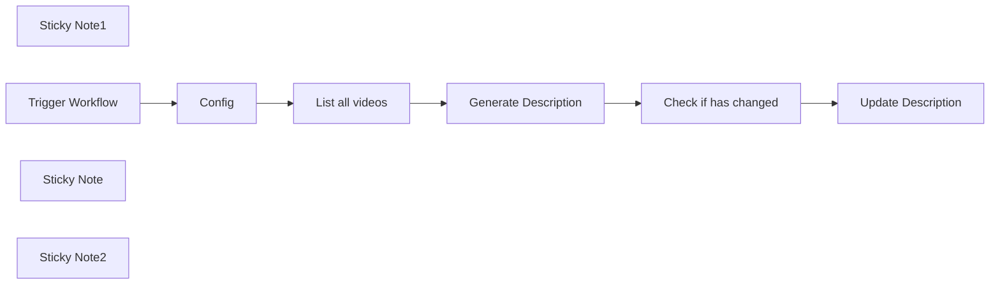

## Fluxo (.json) :

```json
{
  "nodes": [
    {
      "id": "fdb6c202-ea97-4a87-b141-7aae4bae9917",
      "name": "Config",
      "type": "n8n-nodes-base.set",
      "position": [
        520,
        340
      ],
      "parameters": {
        "options": {},
        "assignments": {
          "assignments": [
            {
              "id": "eed16103-d07f-4e81-93ac-567b096f54be",
              "name": "splitter",
              "type": "string",
              "value": "--- n8ninja ---"
            },
            {
              "id": "62e585b6-f908-4a9b-8abb-a2bd22ce4423",
              "name": "description",
              "type": "string",
              "value": "n8n is the most powerful automation tool available today. It is simple yet powerful.\nn8n automation is a node-based automation tool that offers countless possibilities.\nWith more than 400 integrations, the use cases of n8n are endless.\n\nIn my long journey as a digital ninja, this is by far my weapon of choice when it comes to saving time and cutting BS tasks!\n\n⭐️ Try n8n for free: https://n8n.partnerlinks.io/try-for-free\n🆇 Following me on X: https://twitter.com/n8nja\n🥷 My Website: https://www.n8n.ninja/\n📋 My Templates https://n8n.io/creators/emmanuel/"
            }
          ]
        }
      },
      "typeVersion": 3.3
    },
    {
      "id": "fdd88c25-911f-413a-bb16-4b84315c2d6b",
      "name": "Generate Description",
      "type": "n8n-nodes-base.set",
      "position": [
        960,
        340
      ],
      "parameters": {
        "options": {},
        "assignments": {
          "assignments": [
            {
              "id": "a20ac17b-6aaa-45b2-995f-2751a7aaa238",
              "name": "description",
              "type": "string",
              "value": "={{ $json.snippet.description.split($('Config').item.json.splitter)[0] }}{{ $('Config').item.json.splitter }}\n\n{{ $('Config').item.json[\"description\"] }}"
            }
          ]
        },
        "includeOtherFields": ""
      },
      "typeVersion": 3.3
    },
    {
      "id": "ac1b3a81-12a4-4be9-abbe-cce155218fb6",
      "name": "Check if has changed",
      "type": "n8n-nodes-base.if",
      "position": [
        1180,
        340
      ],
      "parameters": {
        "options": {},
        "conditions": {
          "options": {
            "leftValue": "",
            "caseSensitive": true,
            "typeValidation": "strict"
          },
          "combinator": "and",
          "conditions": [
            {
              "id": "f4329949-b775-45ca-aacb-1fc0f2df8ef1",
              "operator": {
                "type": "string",
                "operation": "notEquals"
              },
              "leftValue": "={{ $json.description }}",
              "rightValue": "={{ $('List all videos').item.json.snippet.description }}"
            }
          ]
        }
      },
      "typeVersion": 2
    },
    {
      "id": "3daaae7a-2a7b-4894-aa2d-f38ed7b91b9b",
      "name": "Update Description",
      "type": "n8n-nodes-base.youTube",
      "position": [
        1420,
        320
      ],
      "parameters": {
        "title": "={{ $('List all videos').item.json.snippet.title }}",
        "videoId": "={{ $('List all videos').item.json.id.videoId }}",
        "resource": "video",
        "operation": "update",
        "categoryId": "27",
        "regionCode": "US",
        "updateFields": {
          "description": "={{ $json.description }}"
        }
      },
      "credentials": {
        "youTubeOAuth2Api": {
          "id": "WZul9rD4MH9aVAY8",
          "name": "YouTube account"
        }
      },
      "typeVersion": 1
    },
    {
      "id": "dc83d27d-cfec-4989-a009-ecc42194b133",
      "name": "Sticky Note1",
      "type": "n8n-nodes-base.stickyNote",
      "position": [
        520,
        -20
      ],
      "parameters": {
        "color": 6,
        "width": 275.01592825011585,
        "height": 313.3780970521015,
        "content": "# Setup\n### 1/ Add Your credentials\n[Youtube](https://docs.n8n.io/integrations/builtin/credentials/google/)\n\n### 2/ Define in the config node the delimiter and the text you want to add to all your videos. \n\n# 👇"
      },
      "typeVersion": 1
    },
    {
      "id": "b984c720-852b-46d2-bbb1-fa22bcefce78",
      "name": "Trigger Workflow",
      "type": "n8n-nodes-base.manualTrigger",
      "position": [
        300,
        340
      ],
      "parameters": {},
      "typeVersion": 1
    },
    {
      "id": "a3002568-57c8-451d-b8fd-70b4b1323f78",
      "name": "List all videos",
      "type": "n8n-nodes-base.youTube",
      "position": [
        740,
        340
      ],
      "parameters": {
        "filters": {},
        "options": {},
        "resource": "video"
      },
      "credentials": {
        "youTubeOAuth2Api": {
          "id": "WZul9rD4MH9aVAY8",
          "name": "YouTube account"
        }
      },
      "typeVersion": 1
    },
    {
      "id": "3b26af11-a5c6-4ba6-9e0c-31396f82f55f",
      "name": "Sticky Note",
      "type": "n8n-nodes-base.stickyNote",
      "position": [
        860,
        200
      ],
      "parameters": {
        "color": 7,
        "width": 202.64787116404852,
        "height": 85.79488430601403,
        "content": "### Crafted by the\n## [🥷 n8n.ninja](n8n.ninja)"
      },
      "typeVersion": 1
    },
    {
      "id": "bf6f8b3d-7182-4417-ab71-785e4215d2e9",
      "name": "Sticky Note2",
      "type": "n8n-nodes-base.stickyNote",
      "position": [
        -120,
        300
      ],
      "parameters": {
        "color": 6,
        "width": 372,
        "height": 120.19860141384585,
        "content": "## Run this workflow every time you want to update all your Youtube video descriptions 👉🏻\n"
      },
      "typeVersion": 1
    }
  ],
  "pinData": {},
  "connections": {
    "Config": {
      "main": [
        [
          {
            "node": "List all videos",
            "type": "main",
            "index": 0
          }
        ]
      ]
    },
    "List all videos": {
      "main": [
        [
          {
            "node": "Generate Description",
            "type": "main",
            "index": 0
          }
        ]
      ]
    },
    "Trigger Workflow": {
      "main": [
        [
          {
            "node": "Config",
            "type": "main",
            "index": 0
          }
        ]
      ]
    },
    "Check if has changed": {
      "main": [
        [
          {
            "node": "Update Description",
            "type": "main",
            "index": 0
          }
        ]
      ]
    },
    "Generate Description": {
      "main": [
        [
          {
            "node": "Check if has changed",
            "type": "main",
            "index": 0
          }
        ]
      ]
    }
  }
}
```

<a id="template-132"></a>

## Template 132 - Conversão DOCX → PDF (ConvertAPI)

- **Nome:** Conversão DOCX → PDF (ConvertAPI)
- **Descrição:** Envia um arquivo DOCX disponível por URL para o ConvertAPI para conversão em PDF e salva o PDF resultante no disco local.
- **Funcionalidade:** • Gatilho manual: inicia o fluxo ao acionar o teste manualmente.
• Configuração do arquivo de entrada: permite definir a URL pública do arquivo DOCX a ser convertido.
• Conversão autenticada: realiza uma requisição HTTP autenticada ao serviço de conversão para transformar DOCX em PDF.
• Recebimento do arquivo: obtém a resposta em formato de arquivo (PDF) da API.
• Salvamento local: grava o PDF recebido como document.pdf no sistema de arquivos do servidor.
• Orientações de uso: fornece instruções para criar a credencial de autenticação e alterar a URL do arquivo.
- **Ferramentas:** • ConvertAPI: serviço online que converte arquivos entre formatos (por exemplo, DOCX para PDF) via API autenticada.
• Serviço de hospedagem de arquivos (ex.: CDN): provê a URL pública onde o DOCX de entrada está armazenado.
• Sistema de arquivos local: local para salvar o PDF gerado no servidor.

## Fluxo visual

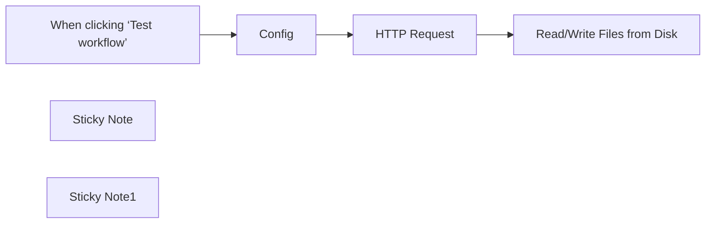

## Fluxo (.json) :

```json
{
  "meta": {
    "instanceId": "1dd912a1610cd0376bae7bb8f1b5838d2b601f42ac66a48e012166bb954fed5a",
    "templateId": "2297",
    "templateCredsSetupCompleted": true
  },
  "nodes": [
    {
      "id": "41ce128f-e9e5-478f-8954-c94019884721",
      "name": "When clicking ‘Test workflow’",
      "type": "n8n-nodes-base.manualTrigger",
      "position": [
        -160,
        240
      ],
      "parameters": {},
      "typeVersion": 1
    },
    {
      "id": "3a3b3212-2eb3-411e-981e-37bd3f3e46fe",
      "name": "HTTP Request",
      "type": "n8n-nodes-base.httpRequest",
      "position": [
        680,
        240
      ],
      "parameters": {
        "url": "https://v2.convertapi.com/convert/docx/to/pdf",
        "method": "POST",
        "options": {
          "response": {
            "response": {
              "responseFormat": "file"
            }
          }
        },
        "sendBody": true,
        "contentType": "multipart-form-data",
        "sendHeaders": true,
        "authentication": "genericCredentialType",
        "bodyParameters": {
          "parameters": [
            {
              "name": "file",
              "value": "={{ $json.url_to_file }}"
            }
          ]
        },
        "genericAuthType": "httpQueryAuth",
        "headerParameters": {
          "parameters": [
            {
              "name": "Accept",
              "value": "application/octet-stream"
            }
          ]
        }
      },
      "credentials": {
        "httpQueryAuth": {
          "id": "WdAklDMod8fBEMRk",
          "name": "Query Auth account"
        }
      },
      "typeVersion": 4.2
    },
    {
      "id": "987ec4b3-3241-4cb6-b735-04754ead8ef8",
      "name": "Read/Write Files from Disk",
      "type": "n8n-nodes-base.readWriteFile",
      "position": [
        1000,
        240
      ],
      "parameters": {
        "options": {},
        "fileName": "document.pdf",
        "operation": "write",
        "dataPropertyName": "=data"
      },
      "typeVersion": 1
    },
    {
      "id": "d99ed058-ab0c-4310-8e75-3d4b073c234b",
      "name": "Sticky Note",
      "type": "n8n-nodes-base.stickyNote",
      "position": [
        540,
        40
      ],
      "parameters": {
        "width": 372,
        "height": 383,
        "content": "## Authentication\nConversion requests must be authenticated. Please create \n[ConvertAPI account to get authentication secret](https://www.convertapi.com/a/signin)\n\nCreate a query auth credential with `secret` as name and your secret from the convertAPI dashboard as value"
      },
      "typeVersion": 1
    },
    {
      "id": "3e4f5f45-36c8-4a71-b053-6b5beafa3025",
      "name": "Config",
      "type": "n8n-nodes-base.set",
      "position": [
        220,
        240
      ],
      "parameters": {
        "options": {},
        "assignments": {
          "assignments": [
            {
              "id": "25315146-5709-49d4-9c01-27dd5eeba879",
              "name": "url_to_file",
              "type": "string",
              "value": "https://cdn.convertapi.com/cara/testfiles/document.docx"
            }
          ]
        }
      },
      "typeVersion": 3.3
    },
    {
      "id": "895324aa-e373-4049-8b4b-aefed7a61239",
      "name": "Sticky Note1",
      "type": "n8n-nodes-base.stickyNote",
      "position": [
        100,
        40
      ],
      "parameters": {
        "width": 353,
        "height": 375,
        "content": "## Configuration \nChange the `url_to_file` parameter here to the file you want to convert"
      },
      "typeVersion": 1
    }
  ],
  "pinData": {},
  "connections": {
    "Config": {
      "main": [
        [
          {
            "node": "HTTP Request",
            "type": "main",
            "index": 0
          }
        ]
      ]
    },
    "HTTP Request": {
      "main": [
        [
          {
            "node": "Read/Write Files from Disk",
            "type": "main",
            "index": 0
          }
        ]
      ]
    },
    "When clicking ‘Test workflow’": {
      "main": [
        [
          {
            "node": "Config",
            "type": "main",
            "index": 0
          }
        ]
      ]
    }
  }
}
```

<a id="template-133"></a>

## Template 133 - Responder chat HubSpot com Assistente OpenAI

- **Nome:** Responder chat HubSpot com Assistente OpenAI
- **Descrição:** Fluxo que recebe mensagens do chat HubSpot, encaminha para um assistente OpenAI, executa ações externas quando solicitadas e devolve a resposta ao chat, mantendo mapeamento de threads em banco.
- **Funcionalidade:** • Receber mensagens do chat: Dispara ao chegar uma nova mensagem proveniente do serviço de chat.
• Filtrar mensagens do próprio bot: Evita que respostas geradas pelo assistente disparem novo processamento.
• Buscar/consultar mapeamento de threads: Verifica em um banco externo se já existe vínculo entre o thread do chat e um thread do assistente.
• Criar thread no assistente: Se não houver mapeamento, cria um novo thread no assistente e salva a referência.
• Enviar mensagem ao assistente e iniciar execução: Posta a mensagem do usuário no thread do assistente e inicia um run para processamento.
• Monitorar status do run: Consulta periodicamente o status do processamento do assistente (em progresso, em fila, concluído ou requer ação).
• Executar ações externas quando solicitado: Quando o assistente pede execução de uma função, chama APIs externas e retorna os resultados ao assistente.
• Publicar resposta de volta ao chat: Ao término do processamento, recupera a última mensagem do assistente e a publica no chat do usuário.
- **Ferramentas:** • HubSpot Conversations API: Recebe mensagens do chat e publica respostas no mesmo thread.
• OpenAI Assistants / Threads API: Cria threads, envia mensagens ao assistente, inicia execuções (runs) e recebe instruções de ação.
• Airtable: Armazena e consulta o mapeamento entre IDs de thread do chat e IDs de thread do assistente.
• ListaFirme (listafirme.ro) API: Serviço externo usado para buscas e recuperação de informações de empresas quando o assistente solicita uma função.

## Fluxo visual

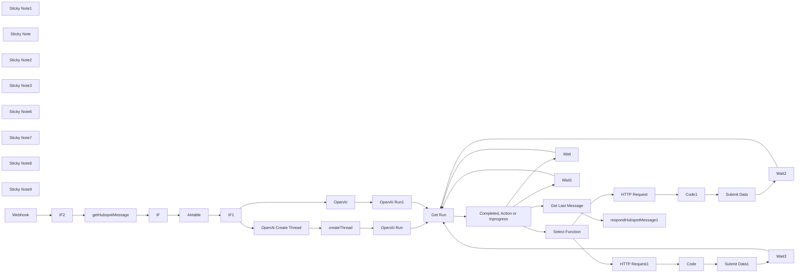

## Fluxo (.json) :

```json
{
  "id": "C2pB17EpXAJwOcst",
  "meta": {
    "instanceId": "ba379c9b99d35340c90344105e7e5d06ca0de3e88926f0384d2c23099dad1937"
  },
  "name": "OpenAI Assistant for Hubspot Chat",
  "tags": [],
  "nodes": [
    {
      "id": "7f11a684-911b-4fbc-ba1b-a8e7bce8e914",
      "name": "getHubspotMessage",
      "type": "n8n-nodes-base.httpRequest",
      "position": [
        280,
        580
      ],
      "parameters": {
        "url": "=https://api.hubapi.com/conversations/v3/conversations/threads/{{ $json[\"body\"][0][\"objectId\"] }}/messages/{{ $json[\"body\"][0][\"messageId\"] }}",
        "options": {},
        "authentication": "predefinedCredentialType",
        "nodeCredentialType": "hubspotAppToken"
      },
      "credentials": {
        "hubspotAppToken": {
          "id": "56nluFhXiGjYN1EY",
          "name": "HubSpot App Token tinder"
        },
        "hubspotOAuth2Api": {
          "id": "y6819fYl4TsW9gl6",
          "name": "HubSpot account 6"
        },
        "hubspotDeveloperApi": {
          "id": "dHB9nVcnZTqf2JDX",
          "name": "HubSpot Developer account"
        }
      },
      "typeVersion": 4.1
    },
    {
      "id": "687bcbb8-38c8-4d21-a46f-186e880d003c",
      "name": "OpenAi Create Thread",
      "type": "n8n-nodes-base.httpRequest",
      "position": [
        1260,
        420
      ],
      "parameters": {
        "url": "https://api.openai.com/v1/threads",
        "method": "POST",
        "options": {},
        "jsonBody": "={\n \"messages\": [\n {\n \"role\": \"user\",\n \"content\": \"{{ $('getHubspotMessage').item.json[\"text\"] }}\"\n }\n ]\n}",
        "sendBody": true,
        "sendHeaders": true,
        "specifyBody": "json",
        "authentication": "predefinedCredentialType",
        "headerParameters": {
          "parameters": [
            {
              "name": "openai-beta",
              "value": "assistants=v1"
            }
          ]
        },
        "nodeCredentialType": "openAiApi"
      },
      "credentials": {
        "openAiApi": {
          "id": "sCh1Lrc1ZT8NVcgn",
          "name": "OpenAi Makeitfuture.eu"
        }
      },
      "typeVersion": 4.1
    },
    {
      "id": "8b51d465-d298-4b7a-b939-026bd51469d3",
      "name": "OpenAI Run",
      "type": "n8n-nodes-base.httpRequest",
      "position": [
        1620,
        420
      ],
      "parameters": {
        "url": "=https://api.openai.com/v1/threads/{{ $json[\"OpenAI Thread ID\"] }}/runs",
        "method": "POST",
        "options": {},
        "jsonBody": "={\n \"assistant_id\": \"asst_MA71Jq0SElVpdjmJa212CTFd\"\n}",
        "sendBody": true,
        "sendHeaders": true,
        "specifyBody": "json",
        "authentication": "predefinedCredentialType",
        "headerParameters": {
          "parameters": [
            {
              "name": "openai-beta",
              "value": "assistants=v1"
            }
          ]
        },
        "nodeCredentialType": "openAiApi"
      },
      "credentials": {
        "openAiApi": {
          "id": "sCh1Lrc1ZT8NVcgn",
          "name": "OpenAi Makeitfuture.eu"
        }
      },
      "typeVersion": 4.1
    },
    {
      "id": "3e645c55-a236-466f-9983-2a3e91c250db",
      "name": "Get Run",
      "type": "n8n-nodes-base.httpRequest",
      "position": [
        1920,
        600
      ],
      "parameters": {
        "url": "=https://api.openai.com/v1/threads/{{ $json[\"thread_id\"] }}/runs/{{ $json[\"id\"] }}",
        "options": {},
        "sendHeaders": true,
        "authentication": "predefinedCredentialType",
        "headerParameters": {
          "parameters": [
            {
              "name": "openai-beta",
              "value": "assistants=v1"
            }
          ]
        },
        "nodeCredentialType": "openAiApi"
      },
      "credentials": {
        "openAiApi": {
          "id": "sCh1Lrc1ZT8NVcgn",
          "name": "OpenAi Makeitfuture.eu"
        }
      },
      "typeVersion": 4.1,
      "alwaysOutputData": true
    },
    {
      "id": "a69a1d1e-b932-481e-8d36-8d121c63ad4b",
      "name": "Get Last Message",
      "type": "n8n-nodes-base.httpRequest",
      "position": [
        2520,
        460
      ],
      "parameters": {
        "url": "=https://api.openai.com/v1/threads/{{ $json[\"thread_id\"] }}/messages",
        "options": {},
        "sendHeaders": true,
        "authentication": "predefinedCredentialType",
        "headerParameters": {
          "parameters": [
            {
              "name": "openai-beta",
              "value": "assistants=v1"
            }
          ]
        },
        "nodeCredentialType": "openAiApi"
      },
      "credentials": {
        "openAiApi": {
          "id": "sCh1Lrc1ZT8NVcgn",
          "name": "OpenAi Makeitfuture.eu"
        }
      },
      "typeVersion": 4.1
    },
    {
      "id": "d9758207-56d4-4180-aac7-f0ebafab1064",
      "name": "HTTP Request",
      "type": "n8n-nodes-base.httpRequest",
      "position": [
        2820,
        960
      ],
      "parameters": {
        "url": "=https://www.listafirme.ro/api/search-v1.asp",
        "options": {},
        "sendQuery": true,
        "queryParameters": {
          "parameters": [
            {
              "name": "key",
              "value": "982dc86a0c1bd4c71185d39ae9f36998"
            },
            {
              "name": "src",
              "value": "={{JSON.parse($json[\"required_action\"][\"submit_tool_outputs\"][\"tool_calls\"][0][\"function\"][\"arguments\"]).src}}"
            }
          ]
        }
      },
      "typeVersion": 4.1
    },
    {
      "id": "5c6f30fd-3ac2-401c-897a-54c7e998c97b",
      "name": "Completed, Action or Inprogress",
      "type": "n8n-nodes-base.switch",
      "position": [
        2120,
        600
      ],
      "parameters": {
        "rules": {
          "rules": [
            {
              "value2": "completed"
            },
            {
              "output": 1,
              "value2": "requires_action"
            },
            {
              "output": 2,
              "value2": "in_progress",
              "operation": "=equal"
            },
            {
              "output": 3,
              "value2": "queued"
            }
          ]
        },
        "value1": "={{ $json.status }}",
        "dataType": "string"
      },
      "typeVersion": 1
    },
    {
      "id": "c1bc0adf-3552-43a3-b38f-bfc76e2683cd",
      "name": "Wait",
      "type": "n8n-nodes-base.wait",
      "position": [
        2360,
        1000
      ],
      "webhookId": "e15c2bb6-e022-4c6d-869b-f361b1ec1259",
      "parameters": {
        "unit": "seconds"
      },
      "typeVersion": 1
    },
    {
      "id": "2e0c4528-5b2b-4d3c-9b53-166ea0f2a28e",
      "name": "Wait1",
      "type": "n8n-nodes-base.wait",
      "position": [
        2340,
        760
      ],
      "webhookId": "3a175bf4-c569-431e-bc56-abed3653ce9d",
      "parameters": {
        "unit": "seconds"
      },
      "typeVersion": 1
    },
    {
      "id": "f80a2cd8-6691-4186-909b-cfed95318014",
      "name": "Submit Data",
      "type": "n8n-nodes-base.httpRequest",
      "position": [
        3360,
        960
      ],
      "parameters": {
        "url": "=https://api.openai.com/v1/threads/{{ $('Select Function').item.json[\"thread_id\"] }}/runs/{{ $('Select Function').item.json[\"id\"] }}/submit_tool_outputs",
        "method": "POST",
        "options": {},
        "jsonBody": "={\n \"tool_outputs\": [\n {\n \"tool_call_id\": \"{{ $('Select Function').item.json[\"required_action\"][\"submit_tool_outputs\"][\"tool_calls\"][0][\"id\"] }}\",\n \"output\": \"{{$json.escapedJsonString}}\"\n }\n ]\n} ",
        "sendBody": true,
        "sendHeaders": true,
        "specifyBody": "json",
        "authentication": "predefinedCredentialType",
        "headerParameters": {
          "parameters": [
            {
              "name": "openai-beta",
              "value": "assistants=v1"
            }
          ]
        },
        "nodeCredentialType": "openAiApi"
      },
      "credentials": {
        "openAiApi": {
          "id": "sCh1Lrc1ZT8NVcgn",
          "name": "OpenAi Makeitfuture.eu"
        }
      },
      "typeVersion": 4.1,
      "alwaysOutputData": true
    },
    {
      "id": "eb114cfd-1af2-4c8b-bfba-583453a1d7ca",
      "name": "Select Function",
      "type": "n8n-nodes-base.switch",
      "position": [
        2520,
        700
      ],
      "parameters": {
        "rules": {
          "rules": [
            {
              "value2": "getAWBbyOrder"
            },
            {
              "output": 1,
              "value2": "get_awb_history"
            }
          ]
        },
        "value1": "={{ $json.required_action.submit_tool_outputs.tool_calls[0].function.name }}",
        "dataType": "string"
      },
      "typeVersion": 1
    },
    {
      "id": "4d1ad478-a9a4-4e9f-9b06-e2a9b7b2b55c",
      "name": "Code1",
      "type": "n8n-nodes-base.code",
      "position": [
        3080,
        960
      ],
      "parameters": {
        "jsCode": "const item1 = $input.all()[0]?.json;\nconst jsonString = JSON.stringify(item1);\nconst escapedJsonString = jsonString.replace(/\"/g, '\\\\\"');\n\nreturn { escapedJsonString };\n"
      },
      "typeVersion": 2
    },
    {
      "id": "39cab0c4-1d7d-41cb-a88d-00acc8e79a24",
      "name": "Wait2",
      "type": "n8n-nodes-base.wait",
      "position": [
        3720,
        1400
      ],
      "webhookId": "68ae5068-6a39-424c-b88d-019bfee78b6f",
      "parameters": {
        "unit": "seconds"
      },
      "typeVersion": 1
    },
    {
      "id": "54205ed2-7c96-44b6-9637-20830300310a",
      "name": "HTTP Request1",
      "type": "n8n-nodes-base.httpRequest",
      "position": [
        2820,
        1180
      ],
      "parameters": {
        "url": "=https://www.listafirme.ro/api/info-v1.asp",
        "options": {},
        "sendQuery": true,
        "queryParameters": {
          "parameters": [
            {
              "name": "key",
              "value": "982dc86a0c1bd4c71185d39ae9f36998"
            },
            {
              "name": "data",
              "value": "={\"TaxCode\":\"{{JSON.parse($json[\"required_action\"][\"submit_tool_outputs\"][\"tool_calls\"][0][\"function\"][\"arguments\"]).src}}\",\"NACE\":\"info\",\"VAT\":\"\", \"RegNo\":\"\", \"Status\":\"\", \"LegalForm\":\"\", \"Name\":\"\", \"Date\":\"\", \"TownCode\":\"\", \"County\":\"\", \"City\":\"\", \"Address\":\"\", \"Administrators\":\"\", \"Shareholders\":\"\", \"Balance\":\"latest\", \"Phone\":\"\", \"Mobile\":\"\", \"Fax\":\"\", \"Email\":\"\", \"Web\":\"\", \"Geolocation\":\"\", \"Description\":\"\", \"Trademarks\":\"\", \"Subsidiaries\":\"\", \"Branches\":\"\", \"FiscalActivity\":\"\", \"Obligations\":\"\", \"Links\":\"\"}"
            }
          ]
        }
      },
      "typeVersion": 4.1
    },
    {
      "id": "862ab78d-0288-4c78-9e02-7ad4ff794a6d",
      "name": "Code",
      "type": "n8n-nodes-base.code",
      "position": [
        3060,
        1180
      ],
      "parameters": {
        "jsCode": "const item1 = $input.all()[0]?.json;\nconst jsonString = JSON.stringify(item1);\nconst escapedJsonString = jsonString.replace(/\"/g, '\\\\\"');\n\nreturn { escapedJsonString };\n"
      },
      "typeVersion": 2
    },
    {
      "id": "e9d1d277-107d-403c-9911-5faa4ae75671",
      "name": "Submit Data1",
      "type": "n8n-nodes-base.httpRequest",
      "position": [
        3260,
        1180
      ],
      "parameters": {
        "url": "=https://api.openai.com/v1/threads/{{ $('Select Function').item.json[\"thread_id\"] }}/runs/{{ $('Select Function').item.json[\"id\"] }}/submit_tool_outputs",
        "method": "POST",
        "options": {},
        "jsonBody": "={\n \"tool_outputs\": [\n {\n \"tool_call_id\": \"{{ $('Select Function').item.json[\"required_action\"][\"submit_tool_outputs\"][\"tool_calls\"][0][\"id\"] }}\",\n \"output\": \"{{$json.escapedJsonString}}\"\n }\n ]\n} ",
        "sendBody": true,
        "sendHeaders": true,
        "specifyBody": "json",
        "authentication": "predefinedCredentialType",
        "headerParameters": {
          "parameters": [
            {
              "name": "openai-beta",
              "value": "assistants=v1"
            }
          ]
        },
        "nodeCredentialType": "openAiApi"
      },
      "credentials": {
        "openAiApi": {
          "id": "sCh1Lrc1ZT8NVcgn",
          "name": "OpenAi Makeitfuture.eu"
        }
      },
      "typeVersion": 4.1,
      "alwaysOutputData": true
    },
    {
      "id": "28e7637b-9a3b-49ba-b4c7-efd3f6cf0522",
      "name": "Wait3",
      "type": "n8n-nodes-base.wait",
      "position": [
        3460,
        1360
      ],
      "webhookId": "6d7d039c-8a4b-4178-8d31-57fb3c24ac14",
      "parameters": {
        "unit": "seconds"
      },
      "typeVersion": 1
    },
    {
      "id": "2b954546-8bc6-4028-9826-37a64d2aed04",
      "name": "respondHubspotMessage1",
      "type": "n8n-nodes-base.httpRequest",
      "position": [
        2820,
        420
      ],
      "parameters": {
        "url": "=https://api.hubapi.com/conversations/v3/conversations/threads/{{ $('getHubspotMessage').item.json[\"conversationsThreadId\"] }}/messages",
        "method": "POST",
        "options": {},
        "sendBody": true,
        "authentication": "predefinedCredentialType",
        "bodyParameters": {
          "parameters": [
            {
              "name": "type",
              "value": "MESSAGE"
            },
            {
              "name": "richText",
              "value": "={{ $json.data[0].content[0].text.value }}"
            },
            {
              "name": "senderActorId",
              "value": "A-5721819"
            },
            {
              "name": "channelId",
              "value": "={{ $('getHubspotMessage').item.json.channelId }}"
            },
            {
              "name": "channelAccountId",
              "value": "={{ $('getHubspotMessage').item.json.channelAccountId }}"
            },
            {
              "name": "text",
              "value": "{{ $json.data[0].content[0].text.value }}"
            }
          ]
        },
        "nodeCredentialType": "hubspotAppToken"
      },
      "credentials": {
        "hubspotAppToken": {
          "id": "56nluFhXiGjYN1EY",
          "name": "HubSpot App Token tinder"
        },
        "hubspotOAuth2Api": {
          "id": "y6819fYl4TsW9gl6",
          "name": "HubSpot account 6"
        },
        "hubspotDeveloperApi": {
          "id": "dHB9nVcnZTqf2JDX",
          "name": "HubSpot Developer account"
        }
      },
      "typeVersion": 4.1
    },
    {
      "id": "6facd7e9-5cbd-4eb7-ab22-84b4fbf35885",
      "name": "IF",
      "type": "n8n-nodes-base.if",
      "position": [
        640,
        600
      ],
      "parameters": {
        "conditions": {
          "string": [
            {
              "value1": "={{ $('getHubspotMessage').item.json[\"senders\"][0][\"actorId\"] }}",
              "value2": "A-5721819",
              "operation": "notEqual"
            }
          ]
        }
      },
      "typeVersion": 1
    },
    {
      "id": "9410bce8-3a2d-4852-acbd-8baa7ee4964d",
      "name": "Airtable",
      "type": "n8n-nodes-base.airtable",
      "position": [
        860,
        600
      ],
      "parameters": {
        "base": {
          "__rl": true,
          "mode": "list",
          "value": "appGAPr0tOy8J0NXC",
          "cachedResultUrl": "https://airtable.com/appGAPr0tOy8J0NXC",
          "cachedResultName": "Hubspot Conversations ChatGPT"
        },
        "table": {
          "__rl": true,
          "mode": "list",
          "value": "tbljZ0POq35jgnKES",
          "cachedResultUrl": "https://airtable.com/appGAPr0tOy8J0NXC/tbljZ0POq35jgnKES",
          "cachedResultName": "Conversations"
        },
        "options": {},
        "operation": "search",
        "filterByFormula": "={Hubspot Thread ID}=\"{{ $json.conversationsThreadId }}\""
      },
      "credentials": {
        "airtableTokenApi": {
          "id": "Ha1BL7JqKQIwX3H1",
          "name": "Hubspot Conversations Makeitfuture Management"
        }
      },
      "typeVersion": 2,
      "alwaysOutputData": true
    },
    {
      "id": "06449687-7521-4151-89c5-050a2768af13",
      "name": "IF1",
      "type": "n8n-nodes-base.if",
      "position": [
        1040,
        640
      ],
      "parameters": {
        "conditions": {
          "string": [
            {
              "value1": "={{ $('Airtable').item.json.id }}",
              "operation": "isEmpty"
            }
          ]
        }
      },
      "typeVersion": 1
    },
    {
      "id": "65c3015e-760f-41e8-9d18-05492cf908c8",
      "name": "createThread",
      "type": "n8n-nodes-base.airtable",
      "position": [
        1440,
        420
      ],
      "parameters": {
        "base": {
          "__rl": true,
          "mode": "list",
          "value": "appGAPr0tOy8J0NXC",
          "cachedResultUrl": "https://airtable.com/appGAPr0tOy8J0NXC",
          "cachedResultName": "Hubspot Conversations ChatGPT"
        },
        "table": {
          "__rl": true,
          "mode": "list",
          "value": "tbljZ0POq35jgnKES",
          "cachedResultUrl": "https://airtable.com/appGAPr0tOy8J0NXC/tbljZ0POq35jgnKES",
          "cachedResultName": "Conversations"
        },
        "columns": {
          "value": {
            "OpenAI Thread ID": "={{ $json[\"id\"] }}",
            "Hubspot Thread ID": "={{ $('getHubspotMessage').item.json.conversationsThreadId }}"
          },
          "schema": [
            {
              "id": "Hubspot Thread ID",
              "type": "string",
              "display": true,
              "removed": false,
              "readOnly": false,
              "required": false,
              "displayName": "Hubspot Thread ID",
              "defaultMatch": false,
              "canBeUsedToMatch": true
            },
            {
              "id": "OpenAI Thread ID",
              "type": "string",
              "display": true,
              "removed": false,
              "readOnly": false,
              "required": false,
              "displayName": "OpenAI Thread ID",
              "defaultMatch": false,
              "canBeUsedToMatch": true
            }
          ],
          "mappingMode": "defineBelow",
          "matchingColumns": []
        },
        "options": {},
        "operation": "create"
      },
      "credentials": {
        "airtableTokenApi": {
          "id": "Ha1BL7JqKQIwX3H1",
          "name": "Hubspot Conversations Makeitfuture Management"
        }
      },
      "typeVersion": 2
    },
    {
      "id": "14cd4854-34fa-4a40-8bd2-cce2d9da9571",
      "name": "OpenAI Run1",
      "type": "n8n-nodes-base.httpRequest",
      "position": [
        1620,
        780
      ],
      "parameters": {
        "url": "=https://api.openai.com/v1/threads/{{ $('Airtable').item.json[\"OpenAI Thread ID\"] }}/runs",
        "method": "POST",
        "options": {},
        "jsonBody": "={\n \"assistant_id\": \"asst_MA71Jq0SElVpdjmJa212CTFd\"\n}",
        "sendBody": true,
        "sendHeaders": true,
        "specifyBody": "json",
        "authentication": "predefinedCredentialType",
        "headerParameters": {
          "parameters": [
            {
              "name": "openai-beta",
              "value": "assistants=v1"
            }
          ]
        },
        "nodeCredentialType": "openAiApi"
      },
      "credentials": {
        "openAiApi": {
          "id": "sCh1Lrc1ZT8NVcgn",
          "name": "OpenAi Makeitfuture.eu"
        }
      },
      "typeVersion": 4.1,
      "continueOnFail": true,
      "alwaysOutputData": false
    },
    {
      "id": "7c37641f-b0a4-4031-b289-3d6aed5a5bd6",
      "name": "IF2",
      "type": "n8n-nodes-base.if",
      "position": [
        60,
        600
      ],
      "parameters": {
        "conditions": {
          "string": [
            {
              "value1": "={{ $json[\"body\"][0][\"messageId\"] }}",
              "operation": "isNotEmpty"
            }
          ]
        }
      },
      "typeVersion": 1
    },
    {
      "id": "12744ebd-1d36-4f3c-9cbe-2ed7d18d37e3",
      "name": "Sticky Note1",
      "type": "n8n-nodes-base.stickyNote",
      "position": [
        -200,
        440
      ],
      "parameters": {
        "width": 640.1970959824021,
        "height": 428.68258455167785,
        "content": "Watch for new message on the chatbot. \nThis can be triggered with [n8n chat widget](https://www.npmjs.com/package/@n8n/chat), hubspot or other chat services. \n\n"
      },
      "typeVersion": 1
    },
    {
      "id": "9c200085-e9aa-4e11-93c2-da8184976229",
      "name": "Sticky Note",
      "type": "n8n-nodes-base.stickyNote",
      "position": [
        2480,
        340
      ],
      "parameters": {
        "width": 615.2010006500725,
        "height": 279.76857176586907,
        "content": "Post assistant Message back to chat service, in this case Hubspot"
      },
      "typeVersion": 1
    },
    {
      "id": "4458aafb-d280-46d0-ba54-3eb4ee746892",
      "name": "Sticky Note2",
      "type": "n8n-nodes-base.stickyNote",
      "position": [
        1200,
        300
      ],
      "parameters": {
        "width": 636.6434938094908,
        "height": 304.69360473583896,
        "content": "Create a new Thread, save it to database and RUN"
      },
      "typeVersion": 1
    },
    {
      "id": "f13f45aa-47c9-4a76-a69c-f13f51d9434f",
      "name": "Sticky Note3",
      "type": "n8n-nodes-base.stickyNote",
      "position": [
        480,
        440
      ],
      "parameters": {
        "width": 328.9155262250898,
        "height": 421.64797280574976,
        "content": "UPDATE USER FILTER FOR DUPLICATION"
      },
      "typeVersion": 1
    },
    {
      "id": "ba0d0a2c-5014-44b8-a281-9d5014b78bcc",
      "name": "Sticky Note6",
      "type": "n8n-nodes-base.stickyNote",
      "position": [
        840,
        440
      ],
      "parameters": {
        "width": 328.9155262250898,
        "height": 421.64797280574976,
        "content": "Search for Thread ID in a database. \n\nThis database is maintaing references between messaging service thread id and OpenI Thread ID. "
      },
      "typeVersion": 1
    },
    {
      "id": "3d3562b5-631f-405c-b671-6856214f167f",
      "name": "Sticky Note7",
      "type": "n8n-nodes-base.stickyNote",
      "position": [
        1200,
        680
      ],
      "parameters": {
        "width": 636.6434938094908,
        "height": 304.69360473583896,
        "content": "POST a new message to existing thread."
      },
      "typeVersion": 1
    },
    {
      "id": "9ad1622c-5b42-4279-bf16-edf7bcbb5155",
      "name": "Sticky Note8",
      "type": "n8n-nodes-base.stickyNote",
      "position": [
        1900,
        320
      ],
      "parameters": {
        "width": 393.4831089305742,
        "height": 629.4777449641093,
        "content": "Get Run Status:\nIf still in progress, run again. \nIf action needed go to respective action.\nIf Completed, post message."
      },
      "typeVersion": 1
    },
    {
      "id": "e51965ef-7694-41b3-9c9a-9f78c00af3f3",
      "name": "Sticky Note9",
      "type": "n8n-nodes-base.stickyNote",
      "position": [
        2538.191410231545,
        840
      ],
      "parameters": {
        "width": 1361.867818730004,
        "height": 731.995091888263,
        "content": "Run required actions based on Assistant answer and respond to Assistant with the function answer. \n\nEach route is a function that you need to define inside your assistant configuration.\n"
      },
      "typeVersion": 1
    },
    {
      "id": "706fb261-724e-4c22-8def-24a320d213a2",
      "name": "OpenAI",
      "type": "@n8n/n8n-nodes-langchain.openAi",
      "position": [
        1280,
        780
      ],
      "parameters": {
        "text": "={{ $('getHubspotMessage').item.json[\"text\"] }}",
        "prompt": "define",
        "options": {
          "baseURL": "https://api.openai.com/v1/threads/{{ $('Airtable').item.json[\"OpenAI Thread ID\"] }}/messages"
        },
        "resource": "assistant",
        "assistantId": {
          "__rl": true,
          "mode": "list",
          "value": "asst_wVbEcnRttQ8K65DOV0fk1DJU",
          "cachedResultName": "Lista Firma Agent"
        }
      },
      "credentials": {
        "openAiApi": {
          "id": "sCh1Lrc1ZT8NVcgn",
          "name": "OpenAi Makeitfuture.eu"
        }
      },
      "typeVersion": 1.3
    },
    {
      "id": "b8f686cc-33d6-4e99-987c-d1f91864e81d",
      "name": "Webhook",
      "type": "n8n-nodes-base.webhook",
      "position": [
        -160,
        600
      ],
      "webhookId": "637d5b46-b35f-4943-92a2-864ddce170f4",
      "parameters": {
        "path": "hubspot-tinder",
        "options": {},
        "httpMethod": "POST"
      },
      "typeVersion": 1
    }
  ],
  "active": false,
  "pinData": {},
  "settings": {
    "executionOrder": "v1"
  },
  "versionId": "d9763b45-9092-490f-85b4-926354cdeb47",
  "connections": {
    "IF": {
      "main": [
        [
          {
            "node": "Airtable",
            "type": "main",
            "index": 0
          }
        ]
      ]
    },
    "IF1": {
      "main": [
        [
          {
            "node": "OpenAi Create Thread",
            "type": "main",
            "index": 0
          }
        ],
        [
          {
            "node": "OpenAI",
            "type": "main",
            "index": 0
          }
        ]
      ]
    },
    "IF2": {
      "main": [
        [
          {
            "node": "getHubspotMessage",
            "type": "main",
            "index": 0
          }
        ]
      ]
    },
    "Code": {
      "main": [
        [
          {
            "node": "Submit Data1",
            "type": "main",
            "index": 0
          }
        ]
      ]
    },
    "Wait": {
      "main": [
        [
          {
            "node": "Get Run",
            "type": "main",
            "index": 0
          }
        ]
      ]
    },
    "Code1": {
      "main": [
        [
          {
            "node": "Submit Data",
            "type": "main",
            "index": 0
          }
        ]
      ]
    },
    "Wait1": {
      "main": [
        [
          {
            "node": "Get Run",
            "type": "main",
            "index": 0
          }
        ]
      ]
    },
    "Wait2": {
      "main": [
        [
          {
            "node": "Get Run",
            "type": "main",
            "index": 0
          }
        ]
      ]
    },
    "Wait3": {
      "main": [
        [
          {
            "node": "Get Run",
            "type": "main",
            "index": 0
          }
        ]
      ]
    },
    "OpenAI": {
      "main": [
        [
          {
            "node": "OpenAI Run1",
            "type": "main",
            "index": 0
          }
        ]
      ]
    },
    "Get Run": {
      "main": [
        [
          {
            "node": "Completed, Action or Inprogress",
            "type": "main",
            "index": 0
          }
        ]
      ]
    },
    "Webhook": {
      "main": [
        [
          {
            "node": "IF2",
            "type": "main",
            "index": 0
          }
        ]
      ]
    },
    "Airtable": {
      "main": [
        [
          {
            "node": "IF1",
            "type": "main",
            "index": 0
          }
        ]
      ]
    },
    "OpenAI Run": {
      "main": [
        [
          {
            "node": "Get Run",
            "type": "main",
            "index": 0
          }
        ]
      ]
    },
    "OpenAI Run1": {
      "main": [
        [
          {
            "node": "Get Run",
            "type": "main",
            "index": 0
          }
        ]
      ]
    },
    "Submit Data": {
      "main": [
        [
          {
            "node": "Wait2",
            "type": "main",
            "index": 0
          }
        ]
      ]
    },
    "HTTP Request": {
      "main": [
        [
          {
            "node": "Code1",
            "type": "main",
            "index": 0
          }
        ]
      ]
    },
    "Submit Data1": {
      "main": [
        [
          {
            "node": "Wait3",
            "type": "main",
            "index": 0
          }
        ]
      ]
    },
    "createThread": {
      "main": [
        [
          {
            "node": "OpenAI Run",
            "type": "main",
            "index": 0
          }
        ]
      ]
    },
    "HTTP Request1": {
      "main": [
        [
          {
            "node": "Code",
            "type": "main",
            "index": 0
          }
        ]
      ]
    },
    "Select Function": {
      "main": [
        [
          {
            "node": "HTTP Request",
            "type": "main",
            "index": 0
          }
        ],
        [
          {
            "node": "HTTP Request1",
            "type": "main",
            "index": 0
          }
        ]
      ]
    },
    "Get Last Message": {
      "main": [
        [
          {
            "node": "respondHubspotMessage1",
            "type": "main",
            "index": 0
          }
        ]
      ]
    },
    "getHubspotMessage": {
      "main": [
        [
          {
            "node": "IF",
            "type": "main",
            "index": 0
          }
        ]
      ]
    },
    "OpenAi Create Thread": {
      "main": [
        [
          {
            "node": "createThread",
            "type": "main",
            "index": 0
          }
        ]
      ]
    },
    "Completed, Action or Inprogress": {
      "main": [
        [
          {
            "node": "Get Last Message",
            "type": "main",
            "index": 0
          }
        ],
        [
          {
            "node": "Select Function",
            "type": "main",
            "index": 0
          }
        ],
        [
          {
            "node": "Wait1",
            "type": "main",
            "index": 0
          }
        ],
        [
          {
            "node": "Wait",
            "type": "main",
            "index": 0
          }
        ]
      ]
    }
  }
}
```

<a id="template-134"></a>

## Template 134 - Notificações de bounce e abertura de e-mail

- **Nome:** Notificações de bounce e abertura de e-mail
- **Descrição:** Recebe notificações de eventos de e-mail (bounce e open) e inclui o conteúdo das mensagens recebidas para processamento posterior.
- **Funcionalidade:** • Escuta de eventos via webhook: recebe notificações externas quando ocorre uma interação com um e-mail.
• Filtragem por tipo de evento: processa especificamente eventos de bounce e open.
• Inclusão do conteúdo do e-mail: anexa o conteúdo da mensagem ao payload recebido.
• Autenticação com API do serviço de e-mail: utiliza credenciais para validar e autorizar as notificações recebidas.
- **Ferramentas:** • Postmark: serviço de envio e monitoramento de e-mails que fornece notificações sobre bounces e aberturas, incluindo conteúdo das mensagens.

## Fluxo visual

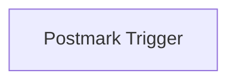

## Fluxo (.json) :

```json
{
  "id": "48",
  "name": "Receive updates when an email is bounced or opened",
  "nodes": [
    {
      "name": "Postmark Trigger",
      "type": "n8n-nodes-base.postmarkTrigger",
      "position": [
        690,
        260
      ],
      "webhookId": "1422ac7a-62ba-4f7c-8e22-4e8ecb4950ce",
      "parameters": {
        "events": [
          "bounce",
          "open"
        ],
        "includeContent": true
      },
      "credentials": {
        "postmarkApi": "postmark"
      },
      "typeVersion": 1
    }
  ],
  "active": false,
  "settings": {},
  "connections": {
    "Postmark Trigger": {
      "main": [
        []
      ]
    }
  }
}
```

<a id="template-135"></a>

## Template 135 - Agregador de execuções em lote

- **Nome:** Agregador de execuções em lote
- **Descrição:** Fluxo que recupera registros de um repositório de clientes, processa-os em lotes com espera entre execuções e agrega os resultados de múltiplas iterações em um único conjunto de saída.
- **Funcionalidade:** • Gatilho manual: Inicia o processo quando o usuário executa o fluxo.
• Recuperação de dados de clientes: Busca todas as pessoas a partir de um datastore de clientes.
• Processamento em lotes: Divide a lista de pessoas em vários lotes para processamento controlado.
• Espera entre lotes: Introduz uma pausa entre iterações para controlar a taxa de processamento.
• Verificação de término do loop: Detecta quando não há mais itens para processar e encaminha o fluxo para agregação.
• Agregação de resultados: Consolida os resultados de todas as execuções/iteração em um único conjunto usando um trecho de código que concatena as saídas.
- **Ferramentas:** • Customer Datastore: Repositório/serviço que armazena dados de clientes e permite recuperar todas as pessoas para processamento.

## Fluxo visual

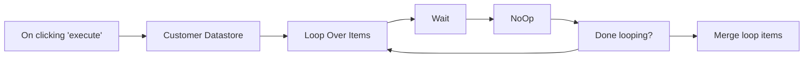

## Fluxo (.json) :

```json
{
  "id": "ynTqojfUnGpG2rBP",
  "meta": {
    "instanceId": "bd0e051174def82b88b5cd547222662900558d74b239c4048ea0f6b7ed61c642"
  },
  "name": "Merge multiple runs into one",
  "tags": [],
  "nodes": [
    {
      "id": "a42e0906-2d44-4b9b-b4fa-63ab3c2a6abf",
      "name": "On clicking 'execute'",
      "type": "n8n-nodes-base.manualTrigger",
      "position": [
        120,
        340
      ],
      "parameters": {},
      "typeVersion": 1
    },
    {
      "id": "220df874-90fd-4cb0-aea5-f238d33a7bcc",
      "name": "Customer Datastore",
      "type": "n8n-nodes-base.n8nTrainingCustomerDatastore",
      "position": [
        340,
        340
      ],
      "parameters": {
        "operation": "getAllPeople"
      },
      "typeVersion": 1
    },
    {
      "id": "e2819ff4-9ba8-4af4-8249-1edc018493ff",
      "name": "Wait",
      "type": "n8n-nodes-base.wait",
      "position": [
        780,
        340
      ],
      "webhookId": "bfa744d6-ed39-4788-a6b5-836600f368bc",
      "parameters": {
        "unit": "seconds"
      },
      "typeVersion": 1
    },
    {
      "id": "e4c50762-d7f0-420b-8043-44060cd51451",
      "name": "Done looping?",
      "type": "n8n-nodes-base.if",
      "position": [
        1220,
        340
      ],
      "parameters": {
        "conditions": {
          "boolean": [
            {
              "value1": "={{$node[\"Loop Over Items\"].context[\"noItemsLeft\"]}}",
              "value2": true
            }
          ]
        }
      },
      "typeVersion": 1
    },
    {
      "id": "9e506657-6788-40f1-9fa0-55bd9db77ecc",
      "name": "Merge loop items",
      "type": "n8n-nodes-base.code",
      "position": [
        1440,
        340
      ],
      "parameters": {
        "jsCode": "let results = [],\n  i = 0;\n\ndo {\n  try {\n    results = results.concat($(\"NoOp\").all(0, i));\n  } catch (error) {\n    return results;\n  }\n  i++;\n} while (true);\n"
      },
      "typeVersion": 1
    },
    {
      "id": "1b6dcb04-5945-48fb-925e-370ee1154df7",
      "name": "NoOp",
      "type": "n8n-nodes-base.noOp",
      "position": [
        1000,
        340
      ],
      "parameters": {},
      "typeVersion": 1
    },
    {
      "id": "28809ed2-1465-4a12-b11b-fe1498b7e045",
      "name": "Loop Over Items",
      "type": "n8n-nodes-base.splitInBatches",
      "position": [
        600,
        340
      ],
      "parameters": {
        "options": {}
      },
      "typeVersion": 3
    }
  ],
  "active": false,
  "pinData": {},
  "settings": {
    "executionOrder": "v1"
  },
  "versionId": "0fd71e8c-7938-43a3-acec-fe746a183f9c",
  "connections": {
    "NoOp": {
      "main": [
        [
          {
            "node": "Done looping?",
            "type": "main",
            "index": 0
          }
        ]
      ]
    },
    "Wait": {
      "main": [
        [
          {
            "node": "NoOp",
            "type": "main",
            "index": 0
          }
        ]
      ]
    },
    "Done looping?": {
      "main": [
        [
          {
            "node": "Merge loop items",
            "type": "main",
            "index": 0
          }
        ],
        [
          {
            "node": "Loop Over Items",
            "type": "main",
            "index": 0
          }
        ]
      ]
    },
    "Loop Over Items": {
      "main": [
        [],
        [
          {
            "node": "Wait",
            "type": "main",
            "index": 0
          }
        ]
      ]
    },
    "Customer Datastore": {
      "main": [
        [
          {
            "node": "Loop Over Items",
            "type": "main",
            "index": 0
          }
        ]
      ]
    },
    "On clicking 'execute'": {
      "main": [
        [
          {
            "node": "Customer Datastore",
            "type": "main",
            "index": 0
          }
        ]
      ]
    }
  }
}
```

<a id="template-136"></a>

## Template 136 - Resposta automática a e-mails com aprovação

- **Nome:** Resposta automática a e-mails com aprovação
- **Descrição:** Automatiza o processamento de e-mails recebidos, resumindo o conteúdo, consultando uma base de conhecimento para enriquecer a resposta, gerando um rascunho com IA e solicitando aprovação antes de enviar a resposta final ao remetente.
- **Funcionalidade:** • Detecção de e-mails recebidos via IMAP: inicia o fluxo ao chegar uma nova mensagem.
• Conversão para Markdown: normaliza o conteúdo do e-mail para melhor compreensão dos modelos de linguagem.
• Sumarização do e-mail: gera um resumo conciso (até 100 palavras) do conteúdo recebido.
• Recuperação de conhecimento (RAG): consulta uma base vetorial para extrair informações relevantes que embasem a resposta.
• Geração de resposta em HTML com LLM: cria uma resposta profissional e concisa (máx. 100 palavras) em formato HTML.
• Envio de rascunho para aprovação via Gmail: envia o rascunho para um endereço que permite botão de aprovação/recusa e aguarda a decisão.
• Fluxo de aprovação: se aprovado, envia a resposta final ao remetente; se recusado, permite revisão/edição e reenvio para nova aprovação.
- **Ferramentas:** • Conta IMAP: recepção dos e-mails corporativos.
• Gmail (OAuth): envio do rascunho e captura da aprovação com função de "send and wait".
• Servidor SMTP: envio final da resposta ao remetente.
• OpenAI: geração de texto (modelo de chat) e criação de embeddings para sumarização e RAG.
• OpenRouter / Deepseek R1: modelo adicional de linguagem usado para processamento e suporte à geração.
• Qdrant: base de dados vetorial para armazenamento e recuperação de conhecimento (RAG).

## Fluxo visual

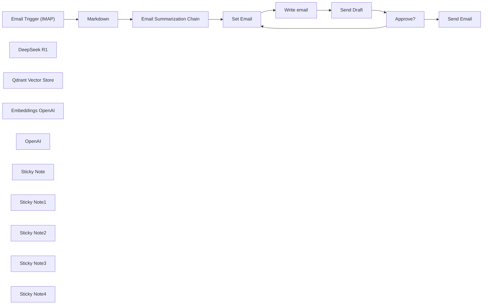

## Fluxo (.json) :

```json
{
  "id": "OuHrYOR3uWGmrhWQ",
  "meta": {
    "instanceId": "a4bfc93e975ca233ac45ed7c9227d84cf5a2329310525917adaf3312e10d5462",
    "templateCredsSetupCompleted": true
  },
  "name": "AI Email processing autoresponder with approval (Yes/No)",
  "tags": [],
  "nodes": [
    {
      "id": "06a098db-160b-45f7-aeac-a73ef868148e",
      "name": "Email Trigger (IMAP)",
      "type": "n8n-nodes-base.emailReadImap",
      "position": [
        -180,
        -100
      ],
      "parameters": {
        "options": {}
      },
      "credentials": {
        "imap": {
          "id": "k31W9oGddl9pMDy4",
          "name": "IMAP info@n3witalia.com"
        }
      },
      "typeVersion": 2
    },
    {
      "id": "9589443b-efb7-4e0d-bafc-0be9858a4755",
      "name": "Markdown",
      "type": "n8n-nodes-base.markdown",
      "position": [
        40,
        -100
      ],
      "parameters": {
        "html": "={{ $json.textHtml }}",
        "options": {}
      },
      "typeVersion": 1
    },
    {
      "id": "8de7b2f3-bf75-4f3c-a1ee-eec047a7b82e",
      "name": "DeepSeek R1",
      "type": "@n8n/n8n-nodes-langchain.lmChatOpenAi",
      "position": [
        240,
        80
      ],
      "parameters": {
        "model": {
          "__rl": true,
          "mode": "list",
          "value": "deepseek/deepseek-r1:free",
          "cachedResultName": "deepseek/deepseek-r1:free"
        },
        "options": {}
      },
      "credentials": {
        "openAiApi": {
          "id": "XJTqRiKFJpFs5MuX",
          "name": "OpenRouter account"
        }
      },
      "typeVersion": 1.2
    },
    {
      "id": "babf37dc-99ca-439a-b094-91c52799b8df",
      "name": "Send Email",
      "type": "n8n-nodes-base.emailSend",
      "position": [
        1840,
        -120
      ],
      "webhookId": "f84fcde7-6aac-485a-9a08-96a35955af49",
      "parameters": {
        "html": "={{ $('Write email').item.json.output }}",
        "options": {},
        "subject": "=Re: {{ $('Email Trigger (IMAP)').item.json.subject }}",
        "toEmail": "={{ $('Email Trigger (IMAP)').item.json.from }}",
        "fromEmail": "={{ $('Email Trigger (IMAP)').item.json.to }}"
      },
      "credentials": {
        "smtp": {
          "id": "hRjP3XbDiIQqvi7x",
          "name": "SMTP info@n3witalia.com"
        }
      },
      "typeVersion": 2.1
    },
    {
      "id": "ebeb986d-053a-420d-8482-ee00e75f2f10",
      "name": "Qdrant Vector Store",
      "type": "@n8n/n8n-nodes-langchain.vectorStoreQdrant",
      "position": [
        1180,
        200
      ],
      "parameters": {
        "mode": "retrieve-as-tool",
        "options": {},
        "toolName": "company_knowladge_base",
        "toolDescription": "Extracts information regarding the request made.",
        "qdrantCollection": {
          "__rl": true,
          "mode": "id",
          "value": "=COLLECTION"
        },
        "includeDocumentMetadata": false
      },
      "credentials": {
        "qdrantApi": {
          "id": "iyQ6MQiVaF3VMBmt",
          "name": "QdrantApi account"
        }
      },
      "typeVersion": 1
    },
    {
      "id": "ccc3d026-bfa3-4fda-be0a-ef70bf831aa7",
      "name": "Embeddings OpenAI",
      "type": "@n8n/n8n-nodes-langchain.embeddingsOpenAi",
      "position": [
        1180,
        380
      ],
      "parameters": {
        "options": {}
      },
      "credentials": {
        "openAiApi": {
          "id": "CDX6QM4gLYanh0P4",
          "name": "OpenAi account"
        }
      },
      "typeVersion": 1.2
    },
    {
      "id": "1726aac9-a77d-4f19-8c07-70b032c3abeb",
      "name": "Email Summarization Chain",
      "type": "@n8n/n8n-nodes-langchain.chainSummarization",
      "position": [
        260,
        -100
      ],
      "parameters": {
        "options": {
          "binaryDataKey": "={{ $json.data }}",
          "summarizationMethodAndPrompts": {
            "values": {
              "prompt": "=Write a concise summary of the following in max 100 words :\n\n\"{{ $json.data }}\"\n\nDo not enter the total number of words used.",
              "combineMapPrompt": "=Write a concise summary of the following in max 100 words:\n\n\"{{ $json.data }}\"\n\nDo not enter the total number of words used."
            }
          }
        },
        "operationMode": "nodeInputBinary"
      },
      "typeVersion": 2
    },
    {
      "id": "81b889d0-e724-4c1f-9ce3-7593c796aaaf",
      "name": "Write email",
      "type": "@n8n/n8n-nodes-langchain.agent",
      "position": [
        980,
        -100
      ],
      "parameters": {
        "text": "=Write the text to reply to the following email:\n\n{{ $('Email Summarization Chain').item.json.response.text }}",
        "options": {
          "systemMessage": "You are an expert at answering emails. You need to answer them professionally based on the information you have. This is a business email. Be concise and never exceed 100 words. Only the body of the email, not create the subject.\n\nIt must be in HTML format and you can insert (if you think it is appropriate) only HTML characters such as <br>, <b>, <i>, <p> where necessary."
        },
        "promptType": "define",
        "hasOutputParser": true
      },
      "typeVersion": 1.7
    },
    {
      "id": "cf38e319-59b3-490e-b841-579afc9fbc02",
      "name": "OpenAI",
      "type": "@n8n/n8n-nodes-langchain.lmChatOpenAi",
      "position": [
        980,
        200
      ],
      "parameters": {
        "model": {
          "__rl": true,
          "mode": "list",
          "value": "gpt-4o-mini",
          "cachedResultName": "gpt-4o-mini"
        },
        "options": {}
      },
      "credentials": {
        "openAiApi": {
          "id": "CDX6QM4gLYanh0P4",
          "name": "OpenAi account"
        }
      },
      "typeVersion": 1.2
    },
    {
      "id": "19842e5f-c372-4dfd-b860-87dc5f00b1af",
      "name": "Set Email",
      "type": "n8n-nodes-base.set",
      "position": [
        760,
        -100
      ],
      "parameters": {
        "options": {},
        "assignments": {
          "assignments": [
            {
              "id": "759dc0f9-f582-492c-896c-6426f8410127",
              "name": "email",
              "type": "string",
              "value": "={{ $json.response.text }}"
            }
          ]
        }
      },
      "typeVersion": 3.4
    },
    {
      "id": "2cf7a9af-c5e8-45dd-bda5-01c562a0defb",
      "name": "Approve?",
      "type": "n8n-nodes-base.if",
      "position": [
        1560,
        -100
      ],
      "parameters": {
        "options": {
          "ignoreCase": false
        },
        "conditions": {
          "options": {
            "version": 2,
            "leftValue": "",
            "caseSensitive": true,
            "typeValidation": "strict"
          },
          "combinator": "and",
          "conditions": [
            {
              "id": "5c377c1c-43c6-45e7-904e-dbbe6b682686",
              "operator": {
                "type": "boolean",
                "operation": "true",
                "singleValue": true
              },
              "leftValue": "={{ $json.data.approved }}",
              "rightValue": "true"
            }
          ]
        }
      },
      "typeVersion": 2.2
    },
    {
      "id": "08cabec6-9840-4214-8315-b877c86794bf",
      "name": "Sticky Note",
      "type": "n8n-nodes-base.stickyNote",
      "position": [
        -220,
        -680
      ],
      "parameters": {
        "color": 3,
        "width": 580,
        "height": 420,
        "content": "# Main Flow\n\n## Preliminary step:\nCreate a vector database on Qdrant and tokenize the documents useful for generating a response\n\n\n## How it works\nThis workflow is designed to automate the process of handling incoming emails, summarizing their content, generating appropriate responses with RAG, and obtaining approval (YES/NO button) before sending replies.\n\nThis workflow is designed to handle general inquiries that come in via corporate email via IMAP and generate responses using RAG. You can quickly integrate Gmail and Outlook via the appropriate trigger nodes"
      },
      "typeVersion": 1
    },
    {
      "id": "80692c8f-e236-43ac-aad2-91bd90f40065",
      "name": "Sticky Note1",
      "type": "n8n-nodes-base.stickyNote",
      "position": [
        -40,
        -180
      ],
      "parameters": {
        "height": 240,
        "content": "Convert email to Markdown format for better understanding of LLM models"
      },
      "typeVersion": 1
    },
    {
      "id": "e6957fde-bf05-4b67-aa0e-44c575fca04d",
      "name": "Sticky Note2",
      "type": "n8n-nodes-base.stickyNote",
      "position": [
        240,
        -180
      ],
      "parameters": {
        "width": 320,
        "height": 240,
        "content": "Chain that summarizes the received email"
      },
      "typeVersion": 1
    },
    {
      "id": "7cfba59f-83ce-4f0b-b54a-b2c11d58fd82",
      "name": "Sticky Note3",
      "type": "n8n-nodes-base.stickyNote",
      "position": [
        940,
        -180
      ],
      "parameters": {
        "width": 340,
        "height": 240,
        "content": "Agent that retrieves business information from a vector database and processes the response"
      },
      "typeVersion": 1
    },
    {
      "id": "28c4bd00-6a47-422f-a50a-935f3724ba01",
      "name": "Send Draft",
      "type": "n8n-nodes-base.gmail",
      "position": [
        1340,
        -100
      ],
      "webhookId": "d6dd2e7c-90ea-4b65-9c64-523d2541a054",
      "parameters": {
        "sendTo": "YOUR GMAIL ADDRESS",
        "message": "=<h3>MESSAGE</h3>\n{{ $('Email Trigger (IMAP)').item.json.textHtml }}\n\n<h3>AI RESPONSE</h3>\n{{ $json.output }}",
        "options": {},
        "subject": "=[Approval Required]  {{ $('Email Trigger (IMAP)').item.json.subject }}",
        "operation": "sendAndWait",
        "approvalOptions": {
          "values": {
            "approvalType": "double"
          }
        }
      },
      "credentials": {
        "gmailOAuth2": {
          "id": "nyuHvSX5HuqfMPlW",
          "name": "Gmail account (n3w.it)"
        }
      },
      "typeVersion": 2.1
    },
    {
      "id": "0aae1689-cee7-403a-8640-396db32eceed",
      "name": "Sticky Note4",
      "type": "n8n-nodes-base.stickyNote",
      "position": [
        1300,
        -300
      ],
      "parameters": {
        "color": 4,
        "height": 360,
        "content": "## IMPORTANT\n\nFor the \"Send Draft\" node, you need to send the draft email to a Gmail address because it is the only one that allows the \"Send and wait for response\" function."
      },
      "typeVersion": 1
    }
  ],
  "active": false,
  "pinData": {},
  "settings": {
    "executionOrder": "v1"
  },
  "versionId": "6f7b864e-1589-418c-960e-b832cf032d1b",
  "connections": {
    "OpenAI": {
      "ai_languageModel": [
        [
          {
            "node": "Write email",
            "type": "ai_languageModel",
            "index": 0
          }
        ]
      ]
    },
    "Approve?": {
      "main": [
        [
          {
            "node": "Send Email",
            "type": "main",
            "index": 0
          }
        ],
        [
          {
            "node": "Set Email",
            "type": "main",
            "index": 0
          }
        ]
      ]
    },
    "Markdown": {
      "main": [
        [
          {
            "node": "Email Summarization Chain",
            "type": "main",
            "index": 0
          }
        ]
      ]
    },
    "Set Email": {
      "main": [
        [
          {
            "node": "Write email",
            "type": "main",
            "index": 0
          }
        ]
      ]
    },
    "Send Draft": {
      "main": [
        [
          {
            "node": "Approve?",
            "type": "main",
            "index": 0
          }
        ]
      ]
    },
    "DeepSeek R1": {
      "ai_languageModel": [
        [
          {
            "node": "Email Summarization Chain",
            "type": "ai_languageModel",
            "index": 0
          }
        ]
      ]
    },
    "Write email": {
      "main": [
        [
          {
            "node": "Send Draft",
            "type": "main",
            "index": 0
          }
        ]
      ]
    },
    "Embeddings OpenAI": {
      "ai_embedding": [
        [
          {
            "node": "Qdrant Vector Store",
            "type": "ai_embedding",
            "index": 0
          }
        ]
      ]
    },
    "Qdrant Vector Store": {
      "ai_tool": [
        [
          {
            "node": "Write email",
            "type": "ai_tool",
            "index": 0
          }
        ]
      ]
    },
    "Email Trigger (IMAP)": {
      "main": [
        [
          {
            "node": "Markdown",
            "type": "main",
            "index": 0
          }
        ]
      ]
    },
    "Email Summarization Chain": {
      "main": [
        [
          {
            "node": "Set Email",
            "type": "main",
            "index": 0
          }
        ]
      ]
    }
  }
}
```

<a id="template-137"></a>

## Template 137 - Geração de imagem via prompt por Webhook

- **Nome:** Geração de imagem via prompt por Webhook
- **Descrição:** Recebe um prompt via URL, solicita a geração de uma imagem a uma API de inteligência artificial e retorna a imagem diretamente para visualização no navegador.
- **Funcionalidade:** • Recepção de prompt via URL: Aceita um prompt enviado como parâmetro de consulta (?input=) em um endpoint público.
• Codificação de prompt para URL: Exige que espaços sejam substituídos por %20 para formar corretamente a URL de requisição.
• Geração de imagem por IA: Envia o prompt recebido para uma API de geração de imagens e obtém a imagem resultante.
• Retorno da imagem ao usuário: Responde à requisição com o conteúdo binário da imagem para exibição imediata no navegador.
- **Ferramentas:** • OpenAI: Serviço de geração de imagens a partir de prompts de texto.
• Navegador web: Interface utilizada para enviar o prompt via URL e visualizar a imagem retornada.

## Fluxo visual

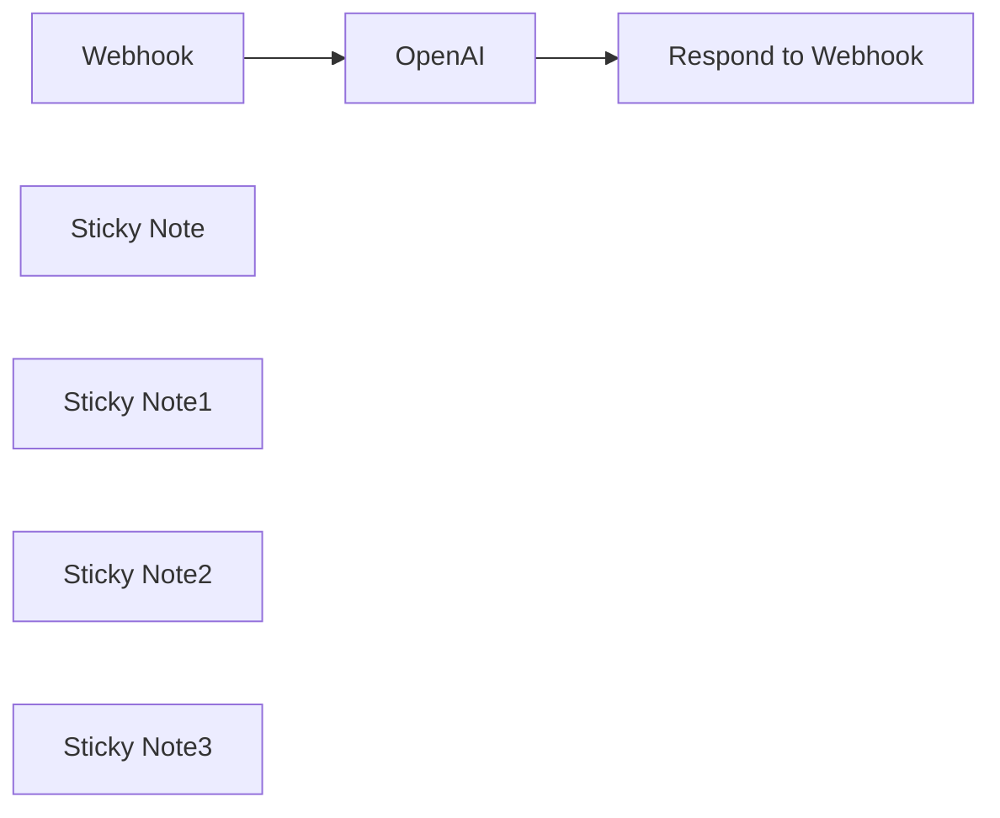

## Fluxo (.json) :

```json
{
  "id": "wDD4XugmHIvx3KMT",
  "meta": {
    "instanceId": "149cdf730f0c143663259ddc6124c9c26e824d8d2d059973b871074cf4bda531"
  },
  "name": "Image Generation API",
  "tags": [],
  "nodes": [
    {
      "id": "d743f947-ad45-4e59-97d4-79b98eaddedb",
      "name": "Webhook",
      "type": "n8n-nodes-base.webhook",
      "position": [
        260,
        -20
      ],
      "webhookId": "970dd3c6-de83-46fd-9038-33c470571390",
      "parameters": {
        "path": "970dd3c6-de83-46fd-9038-33c470571390",
        "options": {},
        "responseMode": "responseNode"
      },
      "typeVersion": 1.1
    },
    {
      "id": "832e993e-69e9-475b-8322-776d88da0440",
      "name": "Respond to Webhook",
      "type": "n8n-nodes-base.respondToWebhook",
      "position": [
        1400,
        -20
      ],
      "parameters": {
        "options": {},
        "respondWith": "binary"
      },
      "typeVersion": 1
    },
    {
      "id": "53044a93-375f-48f2-971d-bf765bcdb7a0",
      "name": "Sticky Note",
      "type": "n8n-nodes-base.stickyNote",
      "position": [
        180,
        -120
      ],
      "parameters": {
        "width": 301.7420425026802,
        "height": 260.80333469825376,
        "content": "## Webhook Trigger \n**This Node starts listening to requests to the Webhook URL**\n\n"
      },
      "typeVersion": 1
    },
    {
      "id": "c7b3b04e-903b-4d7c-bbf1-2bc2f1b1a426",
      "name": "Sticky Note1",
      "type": "n8n-nodes-base.stickyNote",
      "position": [
        180,
        -460
      ],
      "parameters": {
        "width": 469.32758643852594,
        "height": 297.34454352637044,
        "content": "## Creating your Prompt-URL \n**To use this Workflow you need to append your prompt to your Webhook URL in the following way**\n\n1. Take your Webhook URL\n2. Ideate a Prompt and Replace every Space (\" \") by %20 (Url Encoding)\n3. Append \"?input=\" and right after that your encoded prompt to your url\n4. Copy paste this into a webbrowser as soon as you run the Webhook"
      },
      "typeVersion": 1
    },
    {
      "id": "473ff6e5-441a-4706-86a4-190936cc6ac1",
      "name": "Sticky Note2",
      "type": "n8n-nodes-base.stickyNote",
      "position": [
        540,
        -54.959833265087354
      ],
      "parameters": {
        "width": 522.2493371551094,
        "height": 109.59833265087394,
        "content": "## Starting the Workflow\n**To start the workflow paste the encoded URL into your webbrowser**\n\n"
      },
      "typeVersion": 1
    },
    {
      "id": "e8874f52-ef7e-4aea-be5b-81e3276da3d2",
      "name": "OpenAI",
      "type": "@n8n/n8n-nodes-langchain.openAi",
      "position": [
        1120,
        -20
      ],
      "parameters": {
        "prompt": "={{ $json.query.input }}",
        "options": {},
        "resource": "image"
      },
      "typeVersion": 1.1
    },
    {
      "id": "08c073a6-e01e-4b04-8051-502c918998c4",
      "name": "Sticky Note3",
      "type": "n8n-nodes-base.stickyNote",
      "position": [
        1280,
        -120
      ],
      "parameters": {
        "width": 329.4629595446998,
        "height": 278.4439182704484,
        "content": "## Response\n**Watch the image being rendered in your webbrowser**\n\n"
      },
      "typeVersion": 1
    }
  ],
  "active": false,
  "pinData": {},
  "settings": {
    "executionOrder": "v1"
  },
  "versionId": "19f7e652-5417-4b02-a1f5-8796bbac25c3",
  "connections": {
    "OpenAI": {
      "main": [
        [
          {
            "node": "Respond to Webhook",
            "type": "main",
            "index": 0
          }
        ]
      ]
    },
    "Webhook": {
      "main": [
        [
          {
            "node": "OpenAI",
            "type": "main",
            "index": 0
          }
        ]
      ]
    }
  }
}
```

<a id="template-138"></a>

## Template 138 - Nova conta adicionada por admin no ActiveCampaign

- **Nome:** Nova conta adicionada por admin no ActiveCampaign
- **Descrição:** Este fluxo monitora quando um admin adiciona uma nova conta no ActiveCampaign e se prepara para acionar etapas subsequentes.
- **Funcionalidade:** • Detecção de evento de criação de conta: o fluxo é acionado quando uma nova conta é adicionada por um admin. 
• Verificação da origem do evento: assegura que o gatilho vem de ações administrativas. 
• Preparação para etapas subsequentes: o fluxo está pronto para acionar ações adicionais (como notificações ou integrações) após a detecção.
- **Ferramentas:** • ActiveCampaign: Plataforma de automação de marketing que gerencia contas e reage a ações administrativas, acionando fluxos quando novas contas são criadas por admin.

## Fluxo visual

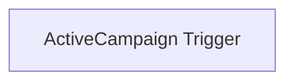

## Fluxo (.json) :

```json
{
  "id": "112",
  "name": "Receive updates when a new account is added by an admin in ActiveCampaign",
  "nodes": [
    {
      "name": "ActiveCampaign Trigger",
      "type": "n8n-nodes-base.activeCampaignTrigger",
      "position": [
        700,
        250
      ],
      "parameters": {
        "events": [
          "account_add"
        ],
        "sources": [
          "admin"
        ]
      },
      "credentials": {
        "activeCampaignApi": ""
      },
      "typeVersion": 1
    }
  ],
  "active": false,
  "settings": {},
  "connections": {}
}
```

<a id="template-139"></a>

## Template 139 - Publicação automática de posts no WordPress

- **Nome:** Publicação automática de posts no WordPress
- **Descrição:** Automação que lê configuração de planilhas, gera conteúdo com prompts, publica posts no WordPress via XML-RPC e registra logs de atividade.
- **Funcionalidade:** • Gatilhos de execução: inicia a automação por horários programados ou disparo manual.
• Carregamento de configuração dinâmica: lê URLs, nomes de folhas e credenciais da planilha para guiar o fluxo.
• Preparação de dados por linha: transforma cada linha da planilha em um conjunto de dados pronto para processamento.
• Geração de conteúdo com modelo: constrói prompts e seleciona modelos de linguagem com base na configuração.
• Publicação no WordPress via XML-RPC: envia o post gerado para o blog e recebe a resposta.
• Registro de logs e status: registra resultados, erros e atualiza o status da linha na planilha de logs.
• Normalização e merge de dados: consolida saídas geradas com dados originais para uso seguinte.
- **Ferramentas:** • Google Sheets: gestão de planilhas de configuração, agenda e logs.
• WordPress XML-RPC API: publicação de posts via XML-RPC.
• OpenAI/OpenRouter: geração de conteúdo e sugestões de prompts.

## Fluxo visual

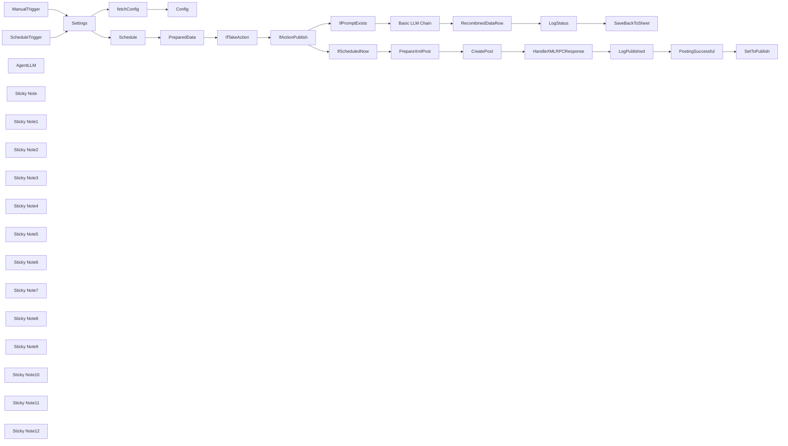

## Fluxo (.json) :

```json
{
  "id": "b0KRVIuuUxE5afHo",
  "meta": {
    "instanceId": "98bf0d6aef1dd8b7a752798121440fb171bf7686b95727fd617f43452393daa3",
    "templateCredsSetupCompleted": true
  },
  "name": "Blog Automation TEMPLATE",
  "tags": [
    {
      "id": "uumvgGHY5e6zEL7V",
      "name": "Published Template",
      "createdAt": "2025-02-10T11:18:10.923Z",
      "updatedAt": "2025-02-10T11:18:10.923Z"
    }
  ],
  "nodes": [
    {
      "id": "20e00146-6bda-4a8a-9544-bf7e5fd4e12e",
      "name": "Settings",
      "type": "n8n-nodes-base.set",
      "position": [
        -420,
        -160
      ],
      "parameters": {
        "options": {},
        "assignments": {
          "assignments": [
            {
              "id": "528b371f-0fba-4be1-9801-0502652da23e",
              "name": "urlSpreadsheet",
              "type": "string",
              "value": "https://docs.google.com/spreadsheets/d/1Kg1-U6mJF4bahH1jCw8kT48MiKz1UMC5n-9q77BHM3Q/edit?gid=0#gid=0"
            },
            {
              "id": "1be018c7-51fe-4ea2-967d-ce47a2e8795c",
              "name": "urlWordpress",
              "type": "string",
              "value": "SUBDOMAIN.wordpress.com"
            },
            {
              "id": "95377f4f-184b-46a7-94c7-b2313c314cb2",
              "name": "wordpressUsername",
              "type": "string",
              "value": "YourUserName"
            },
            {
              "id": "fdc99dc6-d9b0-4d2f-b770-1d8b6b360cad",
              "name": "wordpressApplicationPassword",
              "type": "string",
              "value": "y0ur app1 p4ss w0rd"
            },
            {
              "id": "517cb9ff-24fc-41d6-8bcc-253078f56356",
              "name": "sheetSchedule",
              "type": "string",
              "value": "=Schedule"
            },
            {
              "id": "584e11da-546b-4472-8674-33ca7e8f4f30",
              "name": "sheetConfig",
              "type": "string",
              "value": "Config"
            },
            {
              "id": "ba38cb1e-fd97-4aed-9147-1946c318ddab",
              "name": "actionPublish",
              "type": "string",
              "value": "publish"
            },
            {
              "id": "678394b5-20af-4718-9249-4ff6a3c77018",
              "name": "actionUpdate",
              "type": "string",
              "value": ""
            },
            {
              "id": "f375b2fa-8772-4313-9d6b-a104edd918b3",
              "name": "sheetLog",
              "type": "string",
              "value": "Log"
            },
            {
              "id": "3d7f9677-c753-4126-b33a-d78ef701771f",
              "name": "",
              "type": "string",
              "value": ""
            }
          ]
        }
      },
      "typeVersion": 3.4
    },
    {
      "id": "35731842-9215-43df-9009-9b130d663237",
      "name": "ScheduleTrigger",
      "type": "n8n-nodes-base.scheduleTrigger",
      "position": [
        -620,
        -280
      ],
      "parameters": {
        "rule": {
          "interval": [
            {
              "field": "hours"
            }
          ]
        }
      },
      "typeVersion": 1.2
    },
    {
      "id": "4c284d44-ac46-4cdf-9dcb-727b464269a0",
      "name": "ManualTrigger",
      "type": "n8n-nodes-base.manualTrigger",
      "position": [
        -620,
        -100
      ],
      "parameters": {},
      "typeVersion": 1
    },
    {
      "id": "b63e7345-67d0-4761-8c1a-49275f34e88d",
      "name": "Schedule",
      "type": "n8n-nodes-base.googleSheets",
      "position": [
        -220,
        -80
      ],
      "parameters": {
        "options": {},
        "sheetName": {
          "__rl": true,
          "mode": "name",
          "value": "={{ $('Settings').item.json.sheetSchedule }}"
        },
        "documentId": {
          "__rl": true,
          "mode": "url",
          "value": "={{ $('Settings').item.json.urlSpreadsheet }}"
        }
      },
      "credentials": {
        "googleSheetsOAuth2Api": {
          "id": "XeXufn5uZvHp3lcX",
          "name": "Google Sheets account 2"
        }
      },
      "notesInFlow": true,
      "typeVersion": 4.5
    },
    {
      "id": "5fed06a3-3188-4aed-8040-04e245b74e20",
      "name": "Config",
      "type": "n8n-nodes-base.code",
      "position": [
        40,
        -220
      ],
      "parameters": {
        "jsCode": "let a = $(\"fetchConfig\").all();\nlet params = {};\na.forEach(p => params[p.json.Key] = p.json.Value);\n\nreturn params;\n"
      },
      "typeVersion": 2
    },
    {
      "id": "685490c8-6b45-40c2-b4db-e97a81c4be8e",
      "name": "fetchConfig",
      "type": "n8n-nodes-base.googleSheets",
      "position": [
        -220,
        -220
      ],
      "parameters": {
        "options": {},
        "sheetName": {
          "__rl": true,
          "mode": "name",
          "value": "={{ $('Settings').item.json.sheetConfig }}"
        },
        "documentId": {
          "__rl": true,
          "mode": "url",
          "value": "={{ $('Settings').item.json.urlSpreadsheet }}"
        }
      },
      "credentials": {
        "googleSheetsOAuth2Api": {
          "id": "XeXufn5uZvHp3lcX",
          "name": "Google Sheets account 2"
        }
      },
      "notesInFlow": true,
      "typeVersion": 4.5
    },
    {
      "id": "52a39db8-f9cc-44bb-9c3e-a9abf5821a04",
      "name": "AgentLLM",
      "type": "@n8n/n8n-nodes-langchain.lmChatOpenAi",
      "position": [
        -400,
        440
      ],
      "parameters": {
        "model": "={{ $json.model }}",
        "options": {}
      },
      "credentials": {
        "openAiApi": {
          "id": "66JEQJ5kJel1P9t3",
          "name": "OpenRouter"
        }
      },
      "typeVersion": 1.1
    },
    {
      "id": "6a311ac4-032b-42da-b06e-c916209d2843",
      "name": "IfScheduledNow",
      "type": "n8n-nodes-base.if",
      "position": [
        -620,
        780
      ],
      "parameters": {
        "options": {},
        "conditions": {
          "options": {
            "version": 2,
            "leftValue": "",
            "caseSensitive": true,
            "typeValidation": "loose"
          },
          "combinator": "and",
          "conditions": [
            {
              "id": "bb707069-b372-4bbd-8ba5-b7f6b492ab9d",
              "operator": {
                "type": "number",
                "operation": "gte"
              },
              "leftValue": "={{ DateTime.now().ts }}",
              "rightValue": "={{ DateTime.fromFormat($json.row.Scheduled, \"yyyy-MM-dd HH:mm:ss\").ts }}"
            }
          ]
        },
        "looseTypeValidation": true
      },
      "typeVersion": 2.2
    },
    {
      "id": "845e419b-15ad-4548-86c5-44bda0433b71",
      "name": "PreparedData",
      "type": "n8n-nodes-base.code",
      "position": [
        40,
        -80
      ],
      "parameters": {
        "mode": "runOnceForEachItem",
        "jsCode": "function replacePlaceholders(text, row, config) {\n function checkProp(prop, lookup) {\n // console.log('checkProp:' + prop);\n if (!lookup.hasOwnProperty(prop)) return false;\n let value = lookup[prop];\n if (typeof(value) == 'string') {\n value = value.trim();\n if (value == '') return false;\n }\n // console.log('checkProp found:', value)\n return value;\n }\n function replaceMatch(fullMatch, prop) { \n prop = prop.trim();\n // Return the corresponding value\n return checkProp(prop, row)\n || checkProp(prop, config)\n || checkProp(prop + checkProp('Context', row), config)\n || `[could not find \"${ prop }]\"`;\n }\n\n if (typeof(text) != 'string') return '';\n\n // Regex to capture {{ ... }}\n const pattern = /\\{\\{\\s*([^}]+)\\s*\\}\\}/g\n const result = text.replace(pattern, replaceMatch);\n return result.trim();\n}\n\nconst row = $json;\nconst settings = $(\"Settings\").first().json;\nconst config = $(\"Config\").first().json;\nconst prompt_key = 'prompt_' + row.Action;\nconst prompt = replacePlaceholders(config[prompt_key], row, config);\nconst model_key = prompt_key + '_model';\nconst model = replacePlaceholders(config[model_key], row, config);\nconst outputFormat = config[prompt_key + '_outputFormat'];\nconst takeAction = row.Action != row.Status;\nconst action = row.Action\n\n// console.log('prompt', prompt);\n\n// console.log(prompt);\nreturn { takeAction, action, model_key, model, prompt_key, prompt, outputFormat, row, config, settings }"
      },
      "typeVersion": 2
    },
    {
      "id": "db294805-df67-4266-919f-94fb0f32c593",
      "name": "RecombinedDataRow",
      "type": "n8n-nodes-base.code",
      "position": [
        40,
        280
      ],
      "parameters": {
        "mode": "runOnceForEachItem",
        "jsCode": "/**\n * Attempts to parse the \"text\" property in a JSON object\n * that may contain malformed or incorrectly escaped JSON.\n *\n * @param {Object} raw - A string to parse.\n * @returns {Object|null} The parsed JSON object if successful, or null if all attempts fail.\n */\nfunction parseTextAsJson(raw) {\n // 1) First, try a direct parse.\n try {\n return JSON.parse(raw);\n } catch (e) {\n // Continue to next strategy\n }\n\n // Common \"fix-up\" strategies:\n // Strategy A: Attempt to remove over-escaped quotes like `\\\\\"` -> `\"`\n try {\n const fixedA = raw.replace(/\\\\\"/g, '\"');\n return JSON.parse(fixedA);\n } catch (e) {\n // Continue\n }\n\n // Strategy B: Remove escaped newlines, tabs, carriage returns if they’re suspected\n try {\n const fixedB = raw\n .replace(/\\\\n/g, ' ')\n .replace(/\\\\r/g, ' ')\n .replace(/\\\\t/g, ' ');\n return JSON.parse(fixedB);\n } catch (e) {\n // Continue\n }\n\n // Strategy C: Replace single quotes with double quotes (useful if the JSON was incorrectly quoted).\n // NOTE: This is a very rough fix. If your data legitimately includes single quotes you may need\n // a more nuanced approach.\n try {\n const fixedC = raw.replace(/'/g, '\"');\n return JSON.parse(fixedC);\n } catch (e) {\n // Continue\n }\n\n // Strategy D: Combine strategies or chain them if needed:\n // For example, single-quote fix plus removing new lines, etc.\n try {\n let fixedD = raw.replace(/\\\\\"/g, '\"');\n fixedD = fixedD.replace(/\\\\n|\\\\r|\\\\t/g, ' ');\n fixedD = fixedD.replace(/'/g, '\"');\n return JSON.parse(fixedD);\n } catch (e) {\n // If all attempts fail, log or handle the error as needed\n console.error('Could not parse \"text\" property as JSON.', e);\n return { 'Fulltext': raw };\n }\n}\n\nfunction isolateCurlySubstring(str) {\n // This pattern greedily matches everything from the first '{' to the last '}'.\n const match = str.match(/\\{[\\s\\S]*\\}/);\n \n // If a match is found, return it; otherwise return the entire string.\n return match ? match[0] : str;\n}\n\nfunction fixJsonSyntax(str) {\n str = str.replace('\\\"', '\"');\n str = str\n .split(/(\"[^\"]*\"|'[^']*')/)\n .map((part, i) => i % 2 ? part : part.replace(/\\n/g, \" \"))\n .join(\"\");\n return str;\n}\n\nfunction normalizeLLMOutput(param, iteration = 3) {\n // If it's not an object or it's null or an array, just return it as is.\n // (In some workflows, you might decide to throw an error or handle differently.)\n if (!iteration || typeof param !== 'object' || param === null || Array.isArray(param)) {\n return param;\n }\n\n // Get the object's own property keys\n const keys = Object.keys(param);\n\n // If there's more than one property, we assume it's already the complex object we want.\n if (keys.length > 1) {\n // console.log('keys > 1 → return param', param);\n return param;\n }\n\n // If there are no properties, just return it (though this is likely an empty object).\n if (keys.length === 0) {\n return param;\n }\n\n // If there's exactly one property, it might be a JSON-string that we need to parse.\n const singleKey = keys[0];\n const value = param[singleKey];\n // If that single property is a string, fix it and try to parse it as JSON.\n if (typeof value === 'string') {\n try {\n return parseTextAsJson(isolateCurlySubstring(value));\n } catch (e) {\n console.log('value is string → parse failed with error:', e.toString(), '→ return param:', param, 'value:', value);\n // Parsing failed; perhaps it's just a plain string or invalid JSON, so return as is.\n return param;\n }\n }\n\n // Otherwise, repeat this process itratively.\n return normalizeLLMOutput(value, iteration-1);\n}\n\nconst preparedData = $(\"PreparedData\").itemMatching($itemIndex).json;\nconst row = preparedData.row;\nlet gen = normalizeLLMOutput($json);\nlet fulltext = gen.hasOwnProperty('Fulltext') ? gen.Fulltext : gen;\n\n// Append any fulltext field returned to the field\n// in our data row corresponding to the current action. \ngen[row.Action] = fulltext;\n\n// Concatenate any generated fields with those already exisiting\n// in our data row (using seperator if necessary),\n// so we don't loose any pre-entered data.\nconst combined = {};\nObject.keys(gen).forEach(key => {\n const a = String(row[key] ?? \"\");\n const b = String(gen[key]);\n combined[key] = (a && b) ? (a + \"\\n---\\n\" + b) : (a || b);\n});\n\n// Add the row number and set the new status to the action just performed.\ncombined.row_number = row.row_number;\ncombined.Status = row.Action;\ncombined.model = preparedData.model;\n\nreturn combined;"
      },
      "typeVersion": 2
    },
    {
      "id": "e0c993c1-678f-4236-8976-735cccb49fee",
      "name": "SaveBackToSheet",
      "type": "n8n-nodes-base.googleSheets",
      "position": [
        480,
        280
      ],
      "parameters": {
        "columns": {
          "value": {},
          "schema": [
            {
              "id": "ID",
              "type": "string",
              "display": true,
              "removed": false,
              "required": false,
              "displayName": "ID",
              "defaultMatch": false,
              "canBeUsedToMatch": true
            },
            {
              "id": "Topic",
              "type": "string",
              "display": true,
              "removed": false,
              "required": false,
              "displayName": "Topic",
              "defaultMatch": false,
              "canBeUsedToMatch": true
            },
            {
              "id": "Scheduled",
              "type": "string",
              "display": true,
              "removed": false,
              "required": false,
              "displayName": "Scheduled",
              "defaultMatch": false,
              "canBeUsedToMatch": true
            },
            {
              "id": "Status",
              "type": "string",
              "display": true,
              "removed": false,
              "required": false,
              "displayName": "Status",
              "defaultMatch": false,
              "canBeUsedToMatch": true
            },
            {
              "id": "Action",
              "type": "string",
              "display": true,
              "removed": false,
              "required": false,
              "displayName": "Action",
              "defaultMatch": false,
              "canBeUsedToMatch": true
            },
            {
              "id": "Context",
              "type": "string",
              "display": true,
              "removed": false,
              "required": false,
              "displayName": "Context",
              "defaultMatch": false,
              "canBeUsedToMatch": true
            },
            {
              "id": "Idea",
              "type": "string",
              "display": true,
              "removed": false,
              "required": false,
              "displayName": "Idea",
              "defaultMatch": false,
              "canBeUsedToMatch": true
            },
            {
              "id": "Content",
              "type": "string",
              "display": true,
              "removed": false,
              "required": false,
              "displayName": "Content",
              "defaultMatch": false,
              "canBeUsedToMatch": true
            },
            {
              "id": "Length",
              "type": "string",
              "display": true,
              "removed": false,
              "required": false,
              "displayName": "Length",
              "defaultMatch": false,
              "canBeUsedToMatch": true
            },
            {
              "id": "Media",
              "type": "string",
              "display": true,
              "removed": false,
              "required": false,
              "displayName": "Media",
              "defaultMatch": false,
              "canBeUsedToMatch": true
            },
            {
              "id": "LinksInternal",
              "type": "string",
              "display": true,
              "removed": false,
              "required": false,
              "displayName": "LinksInternal",
              "defaultMatch": false,
              "canBeUsedToMatch": true
            },
            {
              "id": "LinksExternal",
              "type": "string",
              "display": true,
              "removed": false,
              "required": false,
              "displayName": "LinksExternal",
              "defaultMatch": false,
              "canBeUsedToMatch": true
            },
            {
              "id": "Title",
              "type": "string",
              "display": true,
              "removed": false,
              "required": false,
              "displayName": "Title",
              "defaultMatch": false,
              "canBeUsedToMatch": true
            },
            {
              "id": "Sections",
              "type": "string",
              "display": true,
              "removed": false,
              "required": false,
              "displayName": "Sections",
              "defaultMatch": false,
              "canBeUsedToMatch": true
            },
            {
              "id": "MainPoints",
              "type": "string",
              "display": true,
              "removed": false,
              "required": false,
              "displayName": "MainPoints",
              "defaultMatch": false,
              "canBeUsedToMatch": true
            },
            {
              "id": "GuidingPrinciple",
              "type": "string",
              "display": true,
              "removed": false,
              "required": false,
              "displayName": "GuidingPrinciple",
              "defaultMatch": false,
              "canBeUsedToMatch": true
            },
            {
              "id": "Metaphor",
              "type": "string",
              "display": true,
              "removed": false,
              "required": false,
              "displayName": "Metaphor",
              "defaultMatch": false,
              "canBeUsedToMatch": true
            },
            {
              "id": "Draft",
              "type": "string",
              "display": true,
              "removed": false,
              "required": false,
              "displayName": "Draft",
              "defaultMatch": false,
              "canBeUsedToMatch": true
            },
            {
              "id": "Final",
              "type": "string",
              "display": true,
              "removed": false,
              "required": false,
              "displayName": "Final",
              "defaultMatch": false,
              "canBeUsedToMatch": true
            },
            {
              "id": "internal notes",
              "type": "string",
              "display": true,
              "removed": false,
              "required": false,
              "displayName": "internal notes",
              "defaultMatch": false,
              "canBeUsedToMatch": true
            },
            {
              "id": "row_number",
              "type": "string",
              "display": true,
              "removed": false,
              "readOnly": true,
              "required": false,
              "displayName": "row_number",
              "defaultMatch": false,
              "canBeUsedToMatch": true
            }
          ],
          "mappingMode": "autoMapInputData",
          "matchingColumns": [
            "row_number"
          ],
          "attemptToConvertTypes": false,
          "convertFieldsToString": false
        },
        "options": {
          "handlingExtraData": "ignoreIt"
        },
        "operation": "update",
        "sheetName": {
          "__rl": true,
          "mode": "name",
          "value": "={{ $('Settings').item.json.sheetSchedule }}"
        },
        "documentId": {
          "__rl": true,
          "mode": "url",
          "value": "={{ $('Settings').item.json.urlSpreadsheet }}"
        }
      },
      "credentials": {
        "googleSheetsOAuth2Api": {
          "id": "XeXufn5uZvHp3lcX",
          "name": "Google Sheets account 2"
        }
      },
      "typeVersion": 4.5
    },
    {
      "id": "e0b982d9-d24e-4fd0-bc03-8642cd4c988b",
      "name": "IfActionPublish",
      "type": "n8n-nodes-base.if",
      "position": [
        500,
        -80
      ],
      "parameters": {
        "options": {},
        "conditions": {
          "options": {
            "version": 2,
            "leftValue": "",
            "caseSensitive": true,
            "typeValidation": "strict"
          },
          "combinator": "and",
          "conditions": [
            {
              "id": "c3735d0d-da54-44e7-afe6-fdfacb6117f2",
              "operator": {
                "name": "filter.operator.equals",
                "type": "string",
                "operation": "equals"
              },
              "leftValue": "={{ $json.row.Action }}",
              "rightValue": "={{ $('Settings').item.json.actionPublish }}"
            }
          ]
        }
      },
      "typeVersion": 2.2
    },
    {
      "id": "1d5c2731-61a1-434c-bdf1-294217e4ac1c",
      "name": "IfTakeAction",
      "type": "n8n-nodes-base.if",
      "position": [
        260,
        -80
      ],
      "parameters": {
        "options": {},
        "conditions": {
          "options": {
            "version": 2,
            "leftValue": "",
            "caseSensitive": true,
            "typeValidation": "strict"
          },
          "combinator": "and",
          "conditions": [
            {
              "id": "85536861-b213-4567-9c9a-f844a28b5405",
              "operator": {
                "type": "boolean",
                "operation": "true",
                "singleValue": true
              },
              "leftValue": "={{ $json.takeAction }}",
              "rightValue": ""
            }
          ]
        }
      },
      "typeVersion": 2.2
    },
    {
      "id": "aae766a4-d29e-4357-a344-74ee36a382e1",
      "name": "IfPromptExists",
      "type": "n8n-nodes-base.if",
      "position": [
        -600,
        280
      ],
      "parameters": {
        "options": {},
        "conditions": {
          "options": {
            "version": 2,
            "leftValue": "",
            "caseSensitive": true,
            "typeValidation": "strict"
          },
          "combinator": "and",
          "conditions": [
            {
              "id": "73333657-16ed-4b0d-a81f-34add6c22a1b",
              "operator": {
                "type": "string",
                "operation": "notEmpty",
                "singleValue": true
              },
              "leftValue": "={{ $json.prompt }}",
              "rightValue": ""
            }
          ]
        }
      },
      "typeVersion": 2.2
    },
    {
      "id": "5b4c4bdf-8997-4c19-8e95-8c84b725404c",
      "name": "Basic LLM Chain",
      "type": "@n8n/n8n-nodes-langchain.chainLlm",
      "position": [
        -360,
        280
      ],
      "parameters": {
        "text": "={{ $json.prompt }}",
        "promptType": "define"
      },
      "typeVersion": 1.5
    },
    {
      "id": "8dc422a3-6b86-4f57-8c4c-df6422f72f57",
      "name": "CreatePost",
      "type": "n8n-nodes-base.httpRequest",
      "position": [
        -220,
        780
      ],
      "parameters": {
        "url": "=https://{{ $('Settings').item.json.urlWordpress }}/xmlrpc.php",
        "body": "={{ $json.xmlRequestBody }}",
        "method": "POST",
        "options": {},
        "sendBody": true,
        "contentType": "raw",
        "sendHeaders": true,
        "rawContentType": "text/xml",
        "headerParameters": {
          "parameters": [
            {
              "name": "Content-Type",
              "value": "text/xml"
            }
          ]
        }
      },
      "typeVersion": 4.2
    },
    {
      "id": "6ad42453-d56b-4bae-aaf3-eb689df998cc",
      "name": "SetToPublish",
      "type": "n8n-nodes-base.googleSheets",
      "position": [
        700,
        780
      ],
      "parameters": {
        "columns": {
          "value": {
            "Status": "={{ $('Settings').item.json.actionPublish }}",
            "row_number": "={{ $('PreparedData').item.json.row.row_number }}"
          },
          "schema": [
            {
              "id": "ID",
              "type": "string",
              "display": true,
              "removed": false,
              "required": false,
              "displayName": "ID",
              "defaultMatch": false,
              "canBeUsedToMatch": true
            },
            {
              "id": "Topic",
              "type": "string",
              "display": true,
              "removed": false,
              "required": false,
              "displayName": "Topic",
              "defaultMatch": false,
              "canBeUsedToMatch": true
            },
            {
              "id": "Scheduled",
              "type": "string",
              "display": true,
              "removed": false,
              "required": false,
              "displayName": "Scheduled",
              "defaultMatch": false,
              "canBeUsedToMatch": true
            },
            {
              "id": "Status",
              "type": "string",
              "display": true,
              "removed": false,
              "required": false,
              "displayName": "Status",
              "defaultMatch": false,
              "canBeUsedToMatch": true
            },
            {
              "id": "Action",
              "type": "string",
              "display": true,
              "removed": false,
              "required": false,
              "displayName": "Action",
              "defaultMatch": false,
              "canBeUsedToMatch": true
            },
            {
              "id": "Context",
              "type": "string",
              "display": true,
              "removed": false,
              "required": false,
              "displayName": "Context",
              "defaultMatch": false,
              "canBeUsedToMatch": true
            },
            {
              "id": "Ideas",
              "type": "string",
              "display": true,
              "removed": false,
              "required": false,
              "displayName": "Ideas",
              "defaultMatch": false,
              "canBeUsedToMatch": true
            },
            {
              "id": "Content",
              "type": "string",
              "display": true,
              "removed": false,
              "required": false,
              "displayName": "Content",
              "defaultMatch": false,
              "canBeUsedToMatch": true
            },
            {
              "id": "Length",
              "type": "string",
              "display": true,
              "removed": false,
              "required": false,
              "displayName": "Length",
              "defaultMatch": false,
              "canBeUsedToMatch": true
            },
            {
              "id": "Media",
              "type": "string",
              "display": true,
              "removed": false,
              "required": false,
              "displayName": "Media",
              "defaultMatch": false,
              "canBeUsedToMatch": true
            },
            {
              "id": "LinksInternal",
              "type": "string",
              "display": true,
              "removed": false,
              "required": false,
              "displayName": "LinksInternal",
              "defaultMatch": false,
              "canBeUsedToMatch": true
            },
            {
              "id": "LinksExternal",
              "type": "string",
              "display": true,
              "removed": false,
              "required": false,
              "displayName": "LinksExternal",
              "defaultMatch": false,
              "canBeUsedToMatch": true
            },
            {
              "id": "Sections",
              "type": "string",
              "display": true,
              "removed": false,
              "required": false,
              "displayName": "Sections",
              "defaultMatch": false,
              "canBeUsedToMatch": true
            },
            {
              "id": "MainPoints",
              "type": "string",
              "display": true,
              "removed": false,
              "required": false,
              "displayName": "MainPoints",
              "defaultMatch": false,
              "canBeUsedToMatch": true
            },
            {
              "id": "GuidingPrinciple",
              "type": "string",
              "display": true,
              "removed": false,
              "required": false,
              "displayName": "GuidingPrinciple",
              "defaultMatch": false,
              "canBeUsedToMatch": true
            },
            {
              "id": "Metaphor",
              "type": "string",
              "display": true,
              "removed": false,
              "required": false,
              "displayName": "Metaphor",
              "defaultMatch": false,
              "canBeUsedToMatch": true
            },
            {
              "id": "Title",
              "type": "string",
              "display": true,
              "removed": false,
              "required": false,
              "displayName": "Title",
              "defaultMatch": false,
              "canBeUsedToMatch": true
            },
            {
              "id": "draft",
              "type": "string",
              "display": true,
              "removed": false,
              "required": false,
              "displayName": "draft",
              "defaultMatch": false,
              "canBeUsedToMatch": true
            },
            {
              "id": "words",
              "type": "string",
              "display": true,
              "removed": false,
              "required": false,
              "displayName": "words",
              "defaultMatch": false,
              "canBeUsedToMatch": true
            },
            {
              "id": "final",
              "type": "string",
              "display": true,
              "removed": false,
              "required": false,
              "displayName": "final",
              "defaultMatch": false,
              "canBeUsedToMatch": true
            },
            {
              "id": "words",
              "type": "string",
              "display": true,
              "removed": false,
              "required": false,
              "displayName": "words",
              "defaultMatch": false,
              "canBeUsedToMatch": true
            },
            {
              "id": "TeaserTitle",
              "type": "string",
              "display": true,
              "removed": false,
              "required": false,
              "displayName": "TeaserTitle",
              "defaultMatch": false,
              "canBeUsedToMatch": true
            },
            {
              "id": "TeaserText",
              "type": "string",
              "display": true,
              "removed": false,
              "required": false,
              "displayName": "TeaserText",
              "defaultMatch": false,
              "canBeUsedToMatch": true
            },
            {
              "id": "internal notes",
              "type": "string",
              "display": true,
              "removed": false,
              "required": false,
              "displayName": "internal notes",
              "defaultMatch": false,
              "canBeUsedToMatch": true
            },
            {
              "id": "row_number",
              "type": "string",
              "display": true,
              "removed": false,
              "readOnly": true,
              "required": false,
              "displayName": "row_number",
              "defaultMatch": false,
              "canBeUsedToMatch": true
            }
          ],
          "mappingMode": "defineBelow",
          "matchingColumns": [
            "row_number"
          ],
          "attemptToConvertTypes": false,
          "convertFieldsToString": false
        },
        "options": {},
        "operation": "update",
        "sheetName": {
          "__rl": true,
          "mode": "name",
          "value": "={{ $('Settings').item.json.sheetSchedule }}"
        },
        "documentId": {
          "__rl": true,
          "mode": "url",
          "value": "={{ $('Settings').item.json.urlSpreadsheet }}"
        }
      },
      "credentials": {
        "googleSheetsOAuth2Api": {
          "id": "XeXufn5uZvHp3lcX",
          "name": "Google Sheets account 2"
        }
      },
      "typeVersion": 4.5
    },
    {
      "id": "a1af0f00-de59-48d4-93d2-9cc20e7f1c1c",
      "name": "PrepareXmlPost",
      "type": "n8n-nodes-base.code",
      "position": [
        -380,
        780
      ],
      "parameters": {
        "mode": "runOnceForEachItem",
        "jsCode": "const username = $('Settings').item.json.wordpressUsername;\nconst password = $('Settings').item.json.wordpressApplicationPassword;\nconst blogId = 0;\nconst published = 1; // 0 = draft, 1 = published\nconst title = $json.row.Title;\nconst text = $json.row.final;\n\n// Helper function to escape XML special characters\nfunction escapeXml(unsafe) {\n return unsafe.replace(/[<>&'\"]/g, (c) => {\n switch (c) {\n case '<': return '&lt;';\n case '>': return '&gt;';\n case '&': return '&amp;';\n case '\\'': return '&apos;';\n case '\"': return '&quot;';\n default: return c;\n }\n });\n}\n\n// Your actual post text, which may contain characters needing escaping\nconst titleEscaped = escapeXml(title);\nconst textEscaped = escapeXml(text);\n\n// Build the XML payload\nconst xmlData = `<?xml version=\"1.0\"?>\n<methodCall>\n <methodName>wp.newPost</methodName>\n <params>\n <param>\n <value><string>${blogId}</string></value>\n </param>\n <param>\n <value><string>${username}</string></value>\n </param>\n <param>\n <value><string>${password}</string></value>\n </param>\n <param>\n <value>\n <struct>\n <member>\n <name>post_title</name>\n <value><string>${titleEscaped}</string></value>\n </member>\n <member>\n <name>post_content</name>\n <value><string>${textEscaped}</string></value>\n </member>\n </struct>\n </value>\n </param>\n <param>\n <value><boolean>${published}</boolean></value>\n </param>\n </params>\n</methodCall>`;\n\n\n// Add a new field called 'myNewField' to the JSON of the item\n$input.item.json.xmlRequestBody = xmlData;\n\nreturn $input.item;"
      },
      "typeVersion": 2
    },
    {
      "id": "00e6d2ab-6dc4-42ba-8a92-04a35d104908",
      "name": "HandleXMLRPCResponse",
      "type": "n8n-nodes-base.code",
      "position": [
        40,
        780
      ],
      "parameters": {
        "mode": "runOnceForEachItem",
        "jsCode": "// Get the XML response from the incoming JSON\nconst xmlResponse = $json.data;\n\n// Helper function to extract a value by matching a regex pattern\nfunction extractValue(pattern, xml) {\n const match = xml.match(pattern);\n return match ? match[1] : null;\n}\n\n// Check if the XML contains a fault\nif (xmlResponse.indexOf(\"<fault>\") !== -1) {\n // Extract the faultCode and faultString using regex\n // This regex matches the value inside <int> or <string> for faultCode\n const faultCode = extractValue(/<name>faultCode</name>\\s*<value><(?:int|string)>(.*?)</(?:int|string)>/s, xmlResponse);\n // This regex extracts the faultString from within <string>\n const faultString = extractValue(/<name>faultString</name>\\s*<value><string>(.*?)</string>/s, xmlResponse);\n return { 'errorCode': faultCode, 'error': faultString };\n} else {\n // Otherwise, assume a successful response.\n // The post ID is contained inside a <string> tag within <params>\n const postId = extractValue(/<params>[\\s\\S]*?<string>(.*?)</string>/, xmlResponse);\n return { postId };\n}"
      },
      "typeVersion": 2
    },
    {
      "id": "23212e92-4ad1-4a8c-8e0a-04d8d2a4511d",
      "name": "PostingSuccessful",
      "type": "n8n-nodes-base.if",
      "position": [
        480,
        780
      ],
      "parameters": {
        "options": {},
        "conditions": {
          "options": {
            "version": 2,
            "leftValue": "",
            "caseSensitive": true,
            "typeValidation": "strict"
          },
          "combinator": "and",
          "conditions": [
            {
              "id": "815d85a1-8f91-4338-977f-503f02c53ea2",
              "operator": {
                "type": "string",
                "operation": "exists",
                "singleValue": true
              },
              "leftValue": "={{ $('HandleXMLRPCResponse').item.json.postId }}",
              "rightValue": ""
            }
          ]
        }
      },
      "typeVersion": 2.2
    },
    {
      "id": "45c786f0-d795-4ed4-b6d2-f005b43e797f",
      "name": "LogStatus",
      "type": "n8n-nodes-base.googleSheets",
      "position": [
        260,
        280
      ],
      "parameters": {
        "columns": {
          "value": {
            "Date": "={{ $now }}",
            "Type": "=info",
            "Message": "=Status {{ $json.Status }} for row {{ $('PreparedData').item.json.row.row_number }}"
          },
          "schema": [
            {
              "id": "Date",
              "type": "string",
              "display": true,
              "required": false,
              "displayName": "Date",
              "defaultMatch": false,
              "canBeUsedToMatch": true
            },
            {
              "id": "Type",
              "type": "string",
              "display": true,
              "required": false,
              "displayName": "Type",
              "defaultMatch": false,
              "canBeUsedToMatch": true
            },
            {
              "id": "Message",
              "type": "string",
              "display": true,
              "required": false,
              "displayName": "Message",
              "defaultMatch": false,
              "canBeUsedToMatch": true
            }
          ],
          "mappingMode": "defineBelow",
          "matchingColumns": [],
          "attemptToConvertTypes": false,
          "convertFieldsToString": false
        },
        "options": {},
        "operation": "append",
        "sheetName": {
          "__rl": true,
          "mode": "name",
          "value": "={{ $('Settings').item.json.sheetLog }}"
        },
        "documentId": {
          "__rl": true,
          "mode": "url",
          "value": "={{ $('Settings').item.json.urlSpreadsheet }}"
        }
      },
      "credentials": {
        "googleSheetsOAuth2Api": {
          "id": "XeXufn5uZvHp3lcX",
          "name": "Google Sheets account 2"
        }
      },
      "typeVersion": 4.5
    },
    {
      "id": "f58306f5-a5e9-4e44-9c5d-3810e18e6605",
      "name": "LogPublished",
      "type": "n8n-nodes-base.googleSheets",
      "position": [
        260,
        780
      ],
      "parameters": {
        "columns": {
          "value": {
            "Date": "={{ $now }}",
            "Type": "={{ $json.errorCode ? 'error' : 'info' }}",
            "Message": "=Publishing row {{ $('PreparedData').item.json.row.row_number }}: {{ $json.postId }}{{ $json.errorCode }}{{ $json.error }}"
          },
          "schema": [
            {
              "id": "Date",
              "type": "string",
              "display": true,
              "required": false,
              "displayName": "Date",
              "defaultMatch": false,
              "canBeUsedToMatch": true
            },
            {
              "id": "Type",
              "type": "string",
              "display": true,
              "required": false,
              "displayName": "Type",
              "defaultMatch": false,
              "canBeUsedToMatch": true
            },
            {
              "id": "Message",
              "type": "string",
              "display": true,
              "required": false,
              "displayName": "Message",
              "defaultMatch": false,
              "canBeUsedToMatch": true
            }
          ],
          "mappingMode": "defineBelow",
          "matchingColumns": [],
          "attemptToConvertTypes": false,
          "convertFieldsToString": false
        },
        "options": {},
        "operation": "append",
        "sheetName": {
          "__rl": true,
          "mode": "name",
          "value": "={{ $('Settings').item.json.sheetLog }}"
        },
        "documentId": {
          "__rl": true,
          "mode": "url",
          "value": "={{ $('Settings').item.json.urlSpreadsheet }}"
        }
      },
      "credentials": {
        "googleSheetsOAuth2Api": {
          "id": "XeXufn5uZvHp3lcX",
          "name": "Google Sheets account 2"
        }
      },
      "typeVersion": 4.5
    },
    {
      "id": "c227b790-e1ee-4370-9f24-a734443d1e97",
      "name": "Sticky Note",
      "type": "n8n-nodes-base.stickyNote",
      "position": [
        -460,
        -300
      ],
      "parameters": {
        "width": 180,
        "height": 360,
        "content": "## Settings"
      },
      "typeVersion": 1
    },
    {
      "id": "904da209-68fd-4139-885f-bd3f25034aeb",
      "name": "Sticky Note1",
      "type": "n8n-nodes-base.stickyNote",
      "position": [
        -440,
        180
      ],
      "parameters": {
        "color": 3,
        "width": 380,
        "height": 380,
        "content": "## Author Blog-Post\nUsing OpenRouter to make model fully configurable for each authoring stage"
      },
      "typeVersion": 1
    },
    {
      "id": "29f35bf0-6dd3-4c3c-b688-73eb46781c87",
      "name": "Sticky Note2",
      "type": "n8n-nodes-base.stickyNote",
      "position": [
        -40,
        -300
      ],
      "parameters": {
        "color": 5,
        "height": 360,
        "content": "## Post-process Data\n{{ Placehoder }} replacement"
      },
      "typeVersion": 1
    },
    {
      "id": "296c3257-836d-488c-b048-72261180e286",
      "name": "Sticky Note3",
      "type": "n8n-nodes-base.stickyNote",
      "position": [
        220,
        180
      ],
      "parameters": {
        "color": 4,
        "width": 180,
        "height": 380,
        "content": "## Log to Sheet"
      },
      "typeVersion": 1
    },
    {
      "id": "42a06803-087f-4dc4-9dd5-1f0281942a30",
      "name": "Sticky Note4",
      "type": "n8n-nodes-base.stickyNote",
      "position": [
        420,
        180
      ],
      "parameters": {
        "color": 6,
        "width": 420,
        "height": 380,
        "content": "## Save Result To Sheet"
      },
      "typeVersion": 1
    },
    {
      "id": "7a6393e9-ae81-4b9b-856b-7be18f783cf4",
      "name": "Sticky Note5",
      "type": "n8n-nodes-base.stickyNote",
      "position": [
        -440,
        620
      ],
      "parameters": {
        "color": 3,
        "width": 380,
        "height": 380,
        "content": "## Publish Blog-Post\nUse a generic XMLHttpRequest with subsequent response handling, since the Wordpress node did not work at all."
      },
      "typeVersion": 1
    },
    {
      "id": "2d154bd4-c3bc-4137-90ce-7885bac77c71",
      "name": "Sticky Note6",
      "type": "n8n-nodes-base.stickyNote",
      "position": [
        -40,
        180
      ],
      "parameters": {
        "color": 5,
        "height": 380,
        "content": "## Post-process Data\nNormalize and re-merge output data structure. "
      },
      "typeVersion": 1
    },
    {
      "id": "83834b00-a647-403f-b88a-4c38d9750eb0",
      "name": "Sticky Note7",
      "type": "n8n-nodes-base.stickyNote",
      "position": [
        -40,
        620
      ],
      "parameters": {
        "color": 5,
        "height": 380,
        "content": "## Post-process Data\nExtract post id or error message from response."
      },
      "typeVersion": 1
    },
    {
      "id": "e7494d0b-b796-437e-b977-a5350b1a8dc5",
      "name": "Sticky Note8",
      "type": "n8n-nodes-base.stickyNote",
      "position": [
        220,
        620
      ],
      "parameters": {
        "color": 4,
        "width": 180,
        "height": 380,
        "content": "## Log to Sheet"
      },
      "typeVersion": 1
    },
    {
      "id": "1d036f6a-c6e4-428d-b0ce-1e710eb7d90c",
      "name": "Sticky Note9",
      "type": "n8n-nodes-base.stickyNote",
      "position": [
        420,
        620
      ],
      "parameters": {
        "color": 6,
        "width": 420,
        "height": 380,
        "content": "## Save Status To Sheet"
      },
      "typeVersion": 1
    },
    {
      "id": "105e0743-b4e8-47d7-a4bf-3939df43a43c",
      "name": "Sticky Note10",
      "type": "n8n-nodes-base.stickyNote",
      "position": [
        -640,
        160
      ],
      "parameters": {
        "color": 7,
        "width": 1500,
        "height": 420,
        "content": "## Authoring\n## Stage"
      },
      "typeVersion": 1
    },
    {
      "id": "80fefb90-35b2-4f0b-b4d5-1cca8519361d",
      "name": "Sticky Note11",
      "type": "n8n-nodes-base.stickyNote",
      "position": [
        -640,
        600
      ],
      "parameters": {
        "color": 7,
        "width": 1500,
        "height": 420,
        "content": "## Publishing\n## Stage"
      },
      "typeVersion": 1
    },
    {
      "id": "99b0a7b7-6513-47b0-af16-ee66d37dd821",
      "name": "Sticky Note12",
      "type": "n8n-nodes-base.stickyNote",
      "position": [
        -260,
        -300
      ],
      "parameters": {
        "width": 200,
        "height": 360,
        "content": "## Config & Data"
      },
      "typeVersion": 1
    }
  ],
  "active": false,
  "pinData": {},
  "settings": {
    "executionOrder": "v1"
  },
  "versionId": "7005e556-a7ae-484c-af71-57c75abd3e17",
  "connections": {
    "Config": {
      "main": [
        []
      ]
    },
    "AgentLLM": {
      "ai_languageModel": [
        [
          {
            "node": "Basic LLM Chain",
            "type": "ai_languageModel",
            "index": 0
          }
        ]
      ]
    },
    "Schedule": {
      "main": [
        [
          {
            "node": "PreparedData",
            "type": "main",
            "index": 0
          }
        ]
      ]
    },
    "Settings": {
      "main": [
        [
          {
            "node": "fetchConfig",
            "type": "main",
            "index": 0
          },
          {
            "node": "Schedule",
            "type": "main",
            "index": 0
          }
        ]
      ]
    },
    "LogStatus": {
      "main": [
        [
          {
            "node": "SaveBackToSheet",
            "type": "main",
            "index": 0
          }
        ]
      ]
    },
    "CreatePost": {
      "main": [
        [
          {
            "node": "HandleXMLRPCResponse",
            "type": "main",
            "index": 0
          }
        ]
      ]
    },
    "fetchConfig": {
      "main": [
        [
          {
            "node": "Config",
            "type": "main",
            "index": 0
          }
        ]
      ]
    },
    "IfTakeAction": {
      "main": [
        [
          {
            "node": "IfActionPublish",
            "type": "main",
            "index": 0
          }
        ]
      ]
    },
    "LogPublished": {
      "main": [
        [
          {
            "node": "PostingSuccessful",
            "type": "main",
            "index": 0
          }
        ]
      ]
    },
    "PreparedData": {
      "main": [
        [
          {
            "node": "IfTakeAction",
            "type": "main",
            "index": 0
          }
        ]
      ]
    },
    "SetToPublish": {
      "main": [
        []
      ]
    },
    "ManualTrigger": {
      "main": [
        [
          {
            "node": "Settings",
            "type": "main",
            "index": 0
          }
        ]
      ]
    },
    "IfPromptExists": {
      "main": [
        [
          {
            "node": "Basic LLM Chain",
            "type": "main",
            "index": 0
          }
        ]
      ]
    },
    "IfScheduledNow": {
      "main": [
        [
          {
            "node": "PrepareXmlPost",
            "type": "main",
            "index": 0
          }
        ]
      ]
    },
    "PrepareXmlPost": {
      "main": [
        [
          {
            "node": "CreatePost",
            "type": "main",
            "index": 0
          }
        ]
      ]
    },
    "Basic LLM Chain": {
      "main": [
        [
          {
            "node": "RecombinedDataRow",
            "type": "main",
            "index": 0
          }
        ]
      ]
    },
    "IfActionPublish": {
      "main": [
        [
          {
            "node": "IfScheduledNow",
            "type": "main",
            "index": 0
          }
        ],
        [
          {
            "node": "IfPromptExists",
            "type": "main",
            "index": 0
          }
        ]
      ]
    },
    "SaveBackToSheet": {
      "main": [
        []
      ]
    },
    "ScheduleTrigger": {
      "main": [
        [
          {
            "node": "Settings",
            "type": "main",
            "index": 0
          }
        ]
      ]
    },
    "PostingSuccessful": {
      "main": [
        [
          {
            "node": "SetToPublish",
            "type": "main",
            "index": 0
          }
        ]
      ]
    },
    "RecombinedDataRow": {
      "main": [
        [
          {
            "node": "LogStatus",
            "type": "main",
            "index": 0
          }
        ]
      ]
    },
    "HandleXMLRPCResponse": {
      "main": [
        [
          {
            "node": "LogPublished",
            "type": "main",
            "index": 0
          }
        ]
      ]
    }
  }
}
```

<a id="template-140"></a>

## Template 140 - Gerar fala via Elevenlabs (Text-to-Speech)

- **Nome:** Gerar fala via Elevenlabs (Text-to-Speech)
- **Descrição:** Fluxo que expõe um endpoint HTTP para receber texto e um identificador de voz, gera áudio usando a API da Elevenlabs e retorna o arquivo de áudio ao solicitante.
- **Funcionalidade:** • Receber solicitação HTTP: Expõe um endpoint POST (/generate-voice) para receber requisições com os parâmetros necessários.
• Validação de parâmetros: Verifica se os campos "voice_id" e "text" estão presentes na requisição.
• Chamada à API de TTS: Envia uma requisição POST para a API da Elevenlabs com o texto e o identificador de voz fornecidos.
• Autenticação por chave: Utiliza uma chave de API configurada nos cabeçalhos para autorizar a requisição à Elevenlabs.
• Retorno de áudio binário: Encaminha a resposta de áudio (binária) gerada pela Elevenlabs de volta ao cliente.
• Tratamento de erro: Retorna um JSON de erro quando os parâmetros obrigatórios estão ausentes.
- **Ferramentas:** • Elevenlabs API: Serviço de text-to-speech utilizado para converter texto em áudio via requisições HTTP autenticadas.

## Fluxo visual

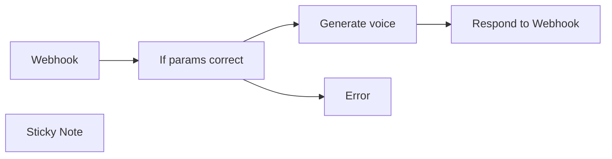

## Fluxo (.json) :

```json
{
  "nodes": [
    {
      "id": "73b64763-5e18-4ff1-bb52-ba25a08d3c3a",
      "name": "If params correct",
      "type": "n8n-nodes-base.if",
      "position": [
        500,
        200
      ],
      "parameters": {
        "options": {},
        "conditions": {
          "options": {
            "leftValue": "",
            "caseSensitive": true,
            "typeValidation": "strict"
          },
          "combinator": "and",
          "conditions": [
            {
              "id": "2e968b41-88f7-4b28-9837-af50ae130979",
              "operator": {
                "type": "string",
                "operation": "exists",
                "singleValue": true
              },
              "leftValue": "voice_id",
              "rightValue": ""
            },
            {
              "id": "ad961bc9-6db8-4cac-8c63-30930e8beca7",
              "operator": {
                "type": "string",
                "operation": "exists",
                "singleValue": true
              },
              "leftValue": "text",
              "rightValue": ""
            }
          ]
        }
      },
      "typeVersion": 2
    },
    {
      "id": "39079dec-54c5-458e-afa1-56ee5723f3a3",
      "name": "Respond to Webhook",
      "type": "n8n-nodes-base.respondToWebhook",
      "position": [
        960,
        180
      ],
      "parameters": {
        "options": {},
        "respondWith": "binary"
      },
      "typeVersion": 1.1
    },
    {
      "id": "b6a344f4-28ac-41a7-8e6a-a2782a5d1c68",
      "name": "Webhook",
      "type": "n8n-nodes-base.webhook",
      "position": [
        300,
        200
      ],
      "webhookId": "5acc6769-6c0f-42a8-a69c-b05e437e18a9",
      "parameters": {
        "path": "generate-voice",
        "options": {},
        "httpMethod": "POST",
        "responseMode": "responseNode"
      },
      "typeVersion": 2
    },
    {
      "id": "a25dec72-152b-4457-a18f-9cbbd31840ec",
      "name": "Generate voice",
      "type": "n8n-nodes-base.httpRequest",
      "position": [
        740,
        180
      ],
      "parameters": {
        "url": "=https://api.elevenlabs.io/v1/text-to-speech/{{ $json.body.voice_id }}",
        "method": "POST",
        "options": {},
        "jsonBody": "={\n  \"text\":  \"{{ $json.body.text }}\"\n} ",
        "sendBody": true,
        "sendHeaders": true,
        "specifyBody": "json",
        "authentication": "genericCredentialType",
        "genericAuthType": "httpCustomAuth",
        "headerParameters": {
          "parameters": [
            {
              "name": "Content-Type",
              "value": "application/json"
            }
          ]
        }
      },
      "credentials": {
        "httpCustomAuth": {
          "id": "nhkU37chaiBU6X3j",
          "name": "Custom Auth account"
        }
      },
      "typeVersion": 4.2
    },
    {
      "id": "e862955e-76d9-4a24-9501-0d5eb8fbe778",
      "name": "Sticky Note",
      "type": "n8n-nodes-base.stickyNote",
      "position": [
        280,
        -360
      ],
      "parameters": {
        "width": 806.0818150700699,
        "height": 495.17470523089514,
        "content": "## Generate Text-to-Speech Using Elevenlabs via API\nThis workflow provides an API endpoint to generate speech from text using [Elevenlabs.io](https://elevenlabs.io/), a popular text-to-speech service.\n\n### Step 1: Configure Custom Credentials in n8n\nTo set up your credentials in n8n, create a new custom authentication entry with the following JSON structure:\n```json\n{\n  \"headers\": {\n    \"xi-api-key\": \"your-elevenlabs-api-key\"\n  }\n}\n```\nReplace `\"your-elevenlabs-api-key\"` with your actual Elevenlabs API key.\n\n### Step 2: Send a POST Request to the Webhook\nSend a POST request to the workflow's webhook endpoint with these two parameters:\n- `voice_id`: The ID of the voice from Elevenlabs that you want to use.\n- `text`: The text you want to convert to speech.\n\nThis workflow has been a significant time-saver in my video production tasks. I hope it proves just as useful to you!\n\nHappy automating!  \nThe n8Ninja"
      },
      "typeVersion": 1
    },
    {
      "id": "275ca523-8b43-4723-9dc4-f5dc1832fcd1",
      "name": "Error",
      "type": "n8n-nodes-base.respondToWebhook",
      "position": [
        740,
        360
      ],
      "parameters": {
        "options": {},
        "respondWith": "json",
        "responseBody": "{\n  \"error\": \"Invalid inputs.\"\n}"
      },
      "typeVersion": 1.1
    }
  ],
  "pinData": {},
  "connections": {
    "Webhook": {
      "main": [
        [
          {
            "node": "If params correct",
            "type": "main",
            "index": 0
          }
        ]
      ]
    },
    "Generate voice": {
      "main": [
        [
          {
            "node": "Respond to Webhook",
            "type": "main",
            "index": 0
          }
        ]
      ]
    },
    "If params correct": {
      "main": [
        [
          {
            "node": "Generate voice",
            "type": "main",
            "index": 0
          }
        ],
        [
          {
            "node": "Error",
            "type": "main",
            "index": 0
          }
        ]
      ]
    }
  }
}
```

<a id="template-141"></a>

## Template 141 - Comando /deploy no Telegram para buscar release

- **Nome:** Comando /deploy no Telegram para buscar release
- **Descrição:** Escuta mensagens do Telegram, identifica o comando /deploy com uma versão e consulta a release correspondente no GitHub.
- **Funcionalidade:** • Recepção de mensagens do Telegram: Inicia o fluxo ao receber mensagens enviadas por usuários.
• Detecção do comando /deploy: Verifica se o texto da mensagem contém o comando /deploy.
• Extração da versão: Obtém o segundo termo da mensagem (após /deploy) como tag de versão.
• Consulta de release no GitHub: Busca a release do repositório especificado usando a tag de versão extraída.
• Rota alternativa para outras mensagens: Ignora mensagens que não contenham o comando /deploy.
- **Ferramentas:** • Telegram: Serviço de mensagens usado para receber comandos e texto dos usuários.
• GitHub: Plataforma onde são consultadas as releases do repositório (busca por tag de versão).

## Fluxo visual

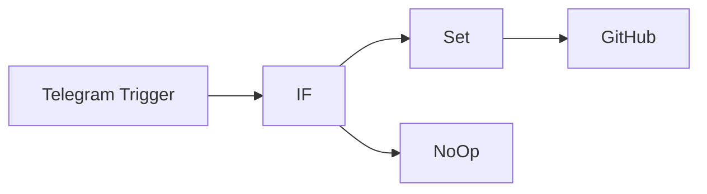

## Fluxo (.json) :

```json
{
  "nodes": [
    {
      "name": "Telegram Trigger",
      "type": "n8n-nodes-base.telegramTrigger",
      "position": [
        460,
        320
      ],
      "webhookId": "4d8556a0-8fdf-4228-8ee2-3e3c72f5fc57",
      "parameters": {
        "updates": [
          "message"
        ],
        "additionalFields": {}
      },
      "credentials": {
        "telegramApi": ""
      },
      "typeVersion": 1
    },
    {
      "name": "IF",
      "type": "n8n-nodes-base.if",
      "position": [
        660,
        320
      ],
      "parameters": {
        "conditions": {
          "string": [
            {
              "value1": "={{$json[\"message\"][\"text\"]}}",
              "value2": "/deploy",
              "operation": "contains"
            }
          ]
        }
      },
      "typeVersion": 1
    },
    {
      "name": "GitHub",
      "type": "n8n-nodes-base.github",
      "position": [
        1060,
        220
      ],
      "parameters": {
        "owner": "n8n-io",
        "resource": "release",
        "releaseTag": "={{$json[\"version\"]}}",
        "repository": "n8n",
        "authentication": "oAuth2",
        "additionalFields": {}
      },
      "credentials": {
        "githubOAuth2Api": ""
      },
      "typeVersion": 1
    },
    {
      "name": "Set",
      "type": "n8n-nodes-base.set",
      "position": [
        860,
        220
      ],
      "parameters": {
        "values": {
          "string": [
            {
              "name": "version",
              "value": "={{$json[\"message\"][\"text\"].split(' ')[1]}}"
            }
          ]
        },
        "options": {},
        "keepOnlySet": true
      },
      "typeVersion": 1
    },
    {
      "name": "NoOp",
      "type": "n8n-nodes-base.noOp",
      "position": [
        860,
        420
      ],
      "parameters": {},
      "typeVersion": 1
    }
  ],
  "connections": {
    "IF": {
      "main": [
        [
          {
            "node": "Set",
            "type": "main",
            "index": 0
          }
        ],
        [
          {
            "node": "NoOp",
            "type": "main",
            "index": 0
          }
        ]
      ]
    },
    "Set": {
      "main": [
        [
          {
            "node": "GitHub",
            "type": "main",
            "index": 0
          }
        ]
      ]
    },
    "Telegram Trigger": {
      "main": [
        [
          {
            "node": "IF",
            "type": "main",
            "index": 0
          }
        ]
      ]
    }
  }
}
```
