# PACK 1999 TEMPLATES PARTE 01 - Bloco 8

Templates neste bloco: 20

## Sumário

- [Template 142 - Alerta SMS por temperatura](#template-142)
- [Template 143 - Geração de vídeo 3D giratório](#template-143)
- [Template 144 - Integração Gravity Forms com KlickTipp para assinaturas e tags](#template-144)
- [Template 145 - Análise de URL e recuperação de job Cortex](#template-145)
- [Template 146 - Monitoramento térmico e ingestão de dados da fábrica](#template-146)
- [Template 147 - Extrair e separar arquivos de um ZIP](#template-147)
- [Template 148 - Notificações de submissões de formulário Webflow](#template-148)
- [Template 149 - Resumo diário de tickets Zammad](#template-149)
- [Template 150 - Enviar SMS de alerta por temperatura](#template-150)
- [Template 151 - Enriquecer contatos HubSpot com dados da ExactBuyer](#template-151)
- [Template 152 - Exclusão de dados GDPR via Slack](#template-152)
- [Template 153 - Assistente de vendas WhatsApp com catálogo 2024](#template-153)
- [Template 154 - Atualização de Tendências do Google via RSS para Sheets](#template-154)
- [Template 155 - Roteamento e qualificação de leads em tempo real](#template-155)
- [Template 156 - Notificações de RSS para Telegram](#template-156)
- [Template 157 - Definir medoides e limiares de classe para deteção de anomalias](#template-157)
- [Template 158 - Extrair transações de PDFs/Imagens para CSV](#template-158)
- [Template 159 - Lembrete diário de To Dos do Notion no Slack](#template-159)
- [Template 160 - Geração de SQL a partir do esquema](#template-160)
- [Template 161 - Roteador de comandos Slack para executar workflows](#template-161)

---

<a id="template-142"></a>

## Template 142 - Alerta SMS por temperatura

- **Nome:** Alerta SMS por temperatura
- **Descrição:** Escuta mensagens de um tópico, verifica se o valor de temperatura excede um limite e envia um SMS de alerta.
- **Funcionalidade:** • Consome mensagens de um tópico Kafka: recebe mensagens e parseia o conteúdo JSON.
• Verificação de condição de temperatura: avalia o campo "temp" e compara com o limite (50).
• Envio de alerta por SMS: quando a temperatura é maior que o limite, formata e envia uma mensagem contendo o valor detectado.
• Fluxo alternativo sem ação: quando a condição não é satisfeita, não realiza envio (rota de no-op).
- **Ferramentas:** • Kafka: sistema de mensageria usado para publicar e consumir eventos a partir de um tópico.
• Vonage: serviço de SMS utilizado para enviar mensagens de texto com o alerta.

## Fluxo visual

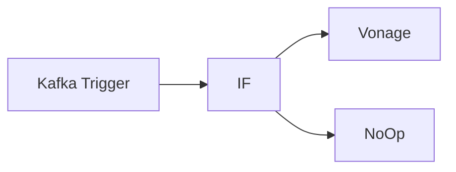

## Fluxo (.json) :

```json
{
  "id": "166",
  "name": "Receive messages from a topic and send an SMS",
  "nodes": [
    {
      "name": "Kafka Trigger",
      "type": "n8n-nodes-base.kafkaTrigger",
      "position": [
        490,
        260
      ],
      "parameters": {
        "topic": "topic_test",
        "groupId": "n8n",
        "options": {
          "jsonParseMessage": true
        }
      },
      "credentials": {
        "kafka": "kafka"
      },
      "typeVersion": 1
    },
    {
      "name": "IF",
      "type": "n8n-nodes-base.if",
      "position": [
        690,
        260
      ],
      "parameters": {
        "conditions": {
          "number": [
            {
              "value1": "={{$node[\"Kafka Trigger\"].json[\"message\"][\"temp\"]}}",
              "value2": 50,
              "operation": "larger"
            }
          ]
        }
      },
      "typeVersion": 1
    },
    {
      "name": "Vonage",
      "type": "n8n-nodes-base.vonage",
      "position": [
        890,
        160
      ],
      "parameters": {
        "from": "Vonage APIs",
        "message": "=Alert!\nThe value of temp is {{$node[\"Kafka Trigger\"].json[\"message\"][\"temp\"]}}.",
        "additionalFields": {}
      },
      "credentials": {
        "vonageApi": "vonage"
      },
      "typeVersion": 1
    },
    {
      "name": "NoOp",
      "type": "n8n-nodes-base.noOp",
      "position": [
        890,
        360
      ],
      "parameters": {},
      "typeVersion": 1
    }
  ],
  "active": false,
  "settings": {},
  "connections": {
    "IF": {
      "main": [
        [
          {
            "node": "Vonage",
            "type": "main",
            "index": 0
          }
        ],
        [
          {
            "node": "NoOp",
            "type": "main",
            "index": 0
          }
        ]
      ]
    },
    "Kafka Trigger": {
      "main": [
        [
          {
            "node": "IF",
            "type": "main",
            "index": 0
          }
        ]
      ]
    }
  }
}
```

<a id="template-143"></a>

## Template 143 - Geração de vídeo 3D giratório

- **Nome:** Geração de vídeo 3D giratório
- **Descrição:** Cria imagens 3D detalhadas a partir de um prompt e gera vídeos giratórios (180°/360°) do modelo usando serviços externos de geração de imagem e vídeo.
- **Funcionalidade:** • Gatilho inicial: Inicia o fluxo manualmente ao acionar o teste.
• Envio de prompt para geração de imagem: Envia instruções detalhadas (estilo, material, pose, aspecto) para um endpoint de geração de imagens.
• Polling de status de geração de imagem: Consulta periodicamente o status da tarefa até a conclusão, com modo de espera entre tentativas.
• Extração aleatória de URL temporária: Seleciona aleatoriamente uma das URLs temporárias de imagem retornadas pela geração.
• Conversão para estilo figurina 3D: Envia a imagem gerada para um modelo de imagem (GPT-4o image-preview) pedindo conversão para figurina 3D e front view.
• Parsing de resposta em streaming: Processa a resposta em streaming para localizar a URL da imagem convertida; trata casos onde a URL não é encontrada e reinicia/repete conforme necessário.
• Geração de vídeo giratório: Submete a imagem final ao modelo de video (Kling) para criar um vídeo vertical (ex.: 9:16) com rotação que destaque o modelo 3D.
• Polling de status de vídeo e extração final: Aguarda a conclusão da tarefa de vídeo, obtém a URL final do vídeo e também a versão sem marca d'água quando disponível.
• Uso de autenticação por cabeçalho: Requer chaves de API via cabeçalhos para autorizar chamadas às APIs externas.
- **Ferramentas:** • PiAPI (api.piapi.ai): Plataforma de API utilizada para orquestrar tarefas de geração (hospeda os endpoints usados no fluxo).
• Midjourney (via PiAPI): Modelo de geração de imagem utilizado para criar as imagens iniciais a partir do prompt.
• GPT-4o Image Preview (via PiAPI): Modelo de image-to-image usado para converter a imagem inicial em uma figurina 3D detalhada.
• Kling (via PiAPI): Modelo de geração de vídeo que cria o vídeo giratório a partir da imagem final.

## Fluxo visual

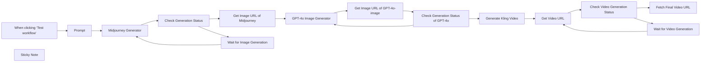

## Fluxo (.json) :

```json
{
  "id": "vpZ1wpsniCvKYjCF",
  "meta": {
    "instanceId": "1e003a7ea4715b6b35e9947791386a7d07edf3b5bf8d4c9b7ee4fdcbec0447d7"
  },
  "name": "General 3D Presentation",
  "tags": [],
  "nodes": [
    {
      "id": "629ef84e-ffb7-4143-b0af-764bcb86a7fa",
      "name": "When clicking ‘Test workflow’",
      "type": "n8n-nodes-base.manualTrigger",
      "position": [
        360,
        40
      ],
      "parameters": {},
      "typeVersion": 1
    },
    {
      "id": "d2751dcb-fd03-4a87-a501-43f701d2704a",
      "name": "Prompt",
      "type": "n8n-nodes-base.httpRequest",
      "position": [
        580,
        40
      ],
      "parameters": {
        "url": "https://api.piapi.ai/api/v1/task",
        "method": "POST",
        "options": {},
        "jsonBody": "{\n  \"model\": \"midjourney\",\n  \"task_type\": \"imagine\",\n  \"input\": {\n    \"prompt\": \"A blind box character design, in the chibi style, a super cute little girl wearing a white long-sleeved dress and pearl earrings with her head bowed in a prayer pose, facing upwards, wearing an oversized off-white dress with large round pearls on the shoulders, minimalist simple dress with Ruffles, against a beige background, a full-body shot in a three-quarter profile view, with a black, blue, and gray color scheme, soft lighting, 3D rendering, clay material, high detail, in the Pixar style. Clean white skin, brown renaissance braided bun. --ar 1:1 --niji 6\",\n    \"aspect_ratio\": \"2:3\",\n    \"process_mode\": \"turbo\",\n    \"skip_prompt_check\": false\n  }\n}",
        "sendBody": true,
        "sendHeaders": true,
        "specifyBody": "json",
        "headerParameters": {
          "parameters": [
            {
              "name": "x-api-key"
            }
          ]
        }
      },
      "typeVersion": 4.2
    },
    {
      "id": "f3f4b801-4b2b-49bf-a9be-1f38e62720ac",
      "name": "Midjourney Generator",
      "type": "n8n-nodes-base.httpRequest",
      "position": [
        400,
        280
      ],
      "parameters": {
        "url": "=https://api.piapi.ai/api/v1/task/{{ $json.data.task_id }}",
        "options": {},
        "sendHeaders": true,
        "headerParameters": {
          "parameters": [
            {
              "name": "x-api-key"
            }
          ]
        }
      },
      "typeVersion": 4.2
    },
    {
      "id": "a7ecf5f5-73fd-4d5b-b851-568dde2e797a",
      "name": "GPT-4o Image Generator",
      "type": "n8n-nodes-base.httpRequest",
      "position": [
        1060,
        80
      ],
      "parameters": {
        "url": "https://api.piapi.ai/v1/chat/completions",
        "method": "POST",
        "options": {},
        "jsonBody": "={\n    \"model\": \"gpt-4o-image-preview\",\n    \"messages\": [\n        {\n            \"role\": \"user\",\n            \"content\": [\n                {\n                    \"type\": \"image_url\",\n                    \"image_url\": {\n                        \"url\": \"{{ $json.random_temp_url }}\"\n                    }\n                },\n                {\n                    \"type\": \"text\",\n                    \"text\": \"Convert this image into a 3D figurine image, with front view, with full details, profile. \"\n                }\n            ]\n        }\n    ],\n    \"stream\": true\n}",
        "sendBody": true,
        "sendHeaders": true,
        "specifyBody": "json",
        "authentication": "genericCredentialType",
        "genericAuthType": "httpHeaderAuth",
        "headerParameters": {
          "parameters": [
            {
              "name": "Authorization"
            }
          ]
        }
      },
      "credentials": {
        "httpHeaderAuth": {
          "id": "fsJeCNd9BkJ1CIrt",
          "name": "Header Auth account 2"
        }
      },
      "typeVersion": 4.2
    },
    {
      "id": "25de6846-9a45-4cb8-8328-b5cb4e36889d",
      "name": "Generate Kling Video",
      "type": "n8n-nodes-base.httpRequest",
      "position": [
        1600,
        200
      ],
      "parameters": {
        "url": "https://api.piapi.ai/api/v1/task",
        "method": "POST",
        "options": {},
        "jsonBody": "={\n    \"model\": \"kling\",\n    \"task_type\": \"video_generation\",\n    \"input\": {\n        \"version\": \"1.6\",\n        \"aspect_ratio\": \"9:16\",\n        \"image_url\":\"{{ $json.image_url }}\",\n\n        \"prompt\": \"An anime character anchored mid-frame, gradually rotating to showcase 3D details\"\n       \n    }\n} ",
        "sendBody": true,
        "sendHeaders": true,
        "specifyBody": "json",
        "headerParameters": {
          "parameters": [
            {
              "name": "x-api-key"
            }
          ]
        }
      },
      "typeVersion": 4.2
    },
    {
      "id": "410c252e-4901-4159-b8c2-d9a2fe04371d",
      "name": "Get Video URL",
      "type": "n8n-nodes-base.httpRequest",
      "position": [
        1820,
        200
      ],
      "parameters": {
        "url": "=https://api.piapi.ai/api/v1/task/{{ $json.data.task_id }}",
        "options": {},
        "sendHeaders": true,
        "headerParameters": {
          "parameters": [
            {
              "name": "x-api-key",
              "value": "72858adea87ad16865d5b0a24c3d9b9f58a6e7b1a8a8a8a0d6b81a9f3a9812f3"
            }
          ]
        }
      },
      "typeVersion": 4.2
    },
    {
      "id": "9a2188d8-8520-485e-99e4-0ff07e4b86e7",
      "name": "Wait for Image Generation",
      "type": "n8n-nodes-base.wait",
      "position": [
        620,
        520
      ],
      "webhookId": "f3bcf634-8c4b-4bf9-a7f2-d4ee369f5349",
      "parameters": {},
      "typeVersion": 1.1
    },
    {
      "id": "7f64087a-1567-4c62-a36d-d3b69d933d48",
      "name": "Check Generation Status",
      "type": "n8n-nodes-base.if",
      "position": [
        600,
        280
      ],
      "parameters": {
        "options": {},
        "conditions": {
          "options": {
            "version": 2,
            "leftValue": "",
            "caseSensitive": true,
            "typeValidation": "strict"
          },
          "combinator": "and",
          "conditions": [
            {
              "id": "a0f8758e-d6fd-44f8-bd79-bc3c4dceddcf",
              "operator": {
                "name": "filter.operator.equals",
                "type": "string",
                "operation": "equals"
              },
              "leftValue": "={{ $json.data.status }}",
              "rightValue": "completed"
            }
          ]
        }
      },
      "typeVersion": 2.2
    },
    {
      "id": "838999b7-99f5-4f14-bfe2-4886bd565464",
      "name": "Get Image URL of Midjourney",
      "type": "n8n-nodes-base.code",
      "position": [
        840,
        80
      ],
      "parameters": {
        "jsCode": "// JavaScript Code for Function Node\nreturn {\n  random_temp_url: $input.all()[0].json.data.output.temporary_image_urls[\n    Math.floor(Math.random() * $input.all()[0].json.data.output.temporary_image_urls.length)\n  ]\n};"
      },
      "typeVersion": 2
    },
    {
      "id": "09824819-7a6c-4416-ba40-811e9d785678",
      "name": "Get Image URL of GPT-4o-image",
      "type": "n8n-nodes-base.code",
      "position": [
        1280,
        80
      ],
      "parameters": {
        "jsCode": "const chunks = $input.first().json.data.split('\\n\\n');\n\nlet imageUrl = null;\n\nfor (let i = chunks.length - 1; i >= 0; i--) {\n    const chunk = chunks[i];\n    \n    if (!chunk.startsWith('data: ')) continue;\n    \n    try {\n        const jsonStr = chunk.substring(6); \n        if (jsonStr.trim() === '[DONE]') continue;\n        \n        const data = JSON.parse(jsonStr);\n        \n    \n        if (data.choices && data.choices[0].delta.content) {\n            const content = data.choices[0].delta.content;\n            const urlMatch = content.match(/!\\[.*?\\]\\((https?://[^\\s]+)\\)/);\n            \n            if (urlMatch && urlMatch[1]) {\n                imageUrl = urlMatch[1];\n                break;\n            }\n        }\n    } catch (e) {\n        continue;\n    }\n}\n\nreturn {\n    image_url: imageUrl,\n    finish_reason: imageUrl ? \"success\" : \"not_found\"\n};"
      },
      "typeVersion": 2
    },
    {
      "id": "22c8f566-6a27-4773-b4ab-45be2fbad8de",
      "name": "Check Generation Status of GPT-4o",
      "type": "n8n-nodes-base.if",
      "position": [
        1260,
        320
      ],
      "parameters": {
        "options": {},
        "conditions": {
          "options": {
            "version": 2,
            "leftValue": "",
            "caseSensitive": true,
            "typeValidation": "strict"
          },
          "combinator": "and",
          "conditions": [
            {
              "id": "08a2ebe6-dc95-4b8a-ada1-1173645cc3f4",
              "operator": {
                "name": "filter.operator.equals",
                "type": "string",
                "operation": "equals"
              },
              "leftValue": "={{ $json.finish_reason }}",
              "rightValue": "not_found"
            }
          ]
        }
      },
      "typeVersion": 2.2
    },
    {
      "id": "00ce5488-e96c-4ff1-8727-ed2d787ae0f5",
      "name": "Check Video Generation Status",
      "type": "n8n-nodes-base.if",
      "position": [
        2000,
        200
      ],
      "parameters": {
        "options": {},
        "conditions": {
          "options": {
            "version": 2,
            "leftValue": "",
            "caseSensitive": true,
            "typeValidation": "strict"
          },
          "combinator": "and",
          "conditions": [
            {
              "id": "f36fa981-22e0-46db-af8c-c2ac55242c27",
              "operator": {
                "name": "filter.operator.equals",
                "type": "string",
                "operation": "equals"
              },
              "leftValue": "={{ $json.data.status }}",
              "rightValue": "completed"
            },
            {
              "id": "637ea756-1ad9-434c-b6b2-b100ee4c3cad",
              "operator": {
                "name": "filter.operator.equals",
                "type": "string",
                "operation": "equals"
              },
              "leftValue": "",
              "rightValue": ""
            }
          ]
        }
      },
      "typeVersion": 2.2
    },
    {
      "id": "6d53cac4-b35b-41b1-b60a-6faba78b4439",
      "name": "Wait for Video Generation",
      "type": "n8n-nodes-base.wait",
      "position": [
        1960,
        420
      ],
      "webhookId": "c7b2590d-96a3-4c7c-8821-3023fead254b",
      "parameters": {
        "amount": 20
      },
      "typeVersion": 1.1
    },
    {
      "id": "4cd00e7b-bfbd-45bc-b775-401055921b45",
      "name": "Fetch Final Video URL",
      "type": "n8n-nodes-base.code",
      "position": [
        2300,
        300
      ],
      "parameters": {
        "jsCode": "// Process the entire response\nreturn {\n  video_url: $input.all()[0].json.data.output.video_url,\n  watermark_free_url: $input.all()[0].json.data.output.works[0].video.resource_without_watermark\n};"
      },
      "typeVersion": 2
    },
    {
      "id": "617d6647-4c49-4e7f-91f3-5fd6d5e95fe7",
      "name": "Sticky Note",
      "type": "n8n-nodes-base.stickyNote",
      "position": [
        340,
        -220
      ],
      "parameters": {
        "width": 460,
        "height": 220,
        "content": "## General 3D Presentation\nThis workflow creates 360° or 180° spinning videos of high-quality 3D models with [PiAPI](https://piapi.ai) API. 🙋\n### Required Instruction: \n1. Fill in params of Prompt node.\n2. Fill in x-api-key in Mijdourney Generator node and Generate Kling Video node, fill in Header Parameters of GPT-4o Image Generator (e.g., Bearer + your X-API-Key)"
      },
      "typeVersion": 1
    }
  ],
  "active": false,
  "pinData": {},
  "settings": {
    "executionOrder": "v1"
  },
  "versionId": "c6a9b53c-8d6c-4ffa-b95c-e7cf88734cc9",
  "connections": {
    "Prompt": {
      "main": [
        [
          {
            "node": "Midjourney Generator",
            "type": "main",
            "index": 0
          }
        ]
      ]
    },
    "Get Video URL": {
      "main": [
        [
          {
            "node": "Check Video Generation Status",
            "type": "main",
            "index": 0
          }
        ]
      ]
    },
    "Generate Kling Video": {
      "main": [
        [
          {
            "node": "Get Video URL",
            "type": "main",
            "index": 0
          }
        ]
      ]
    },
    "Midjourney Generator": {
      "main": [
        [
          {
            "node": "Check Generation Status",
            "type": "main",
            "index": 0
          }
        ]
      ]
    },
    "GPT-4o Image Generator": {
      "main": [
        [
          {
            "node": "Get Image URL of GPT-4o-image",
            "type": "main",
            "index": 0
          }
        ]
      ]
    },
    "Check Generation Status": {
      "main": [
        [
          {
            "node": "Get Image URL of Midjourney",
            "type": "main",
            "index": 0
          }
        ],
        [
          {
            "node": "Wait for Image Generation",
            "type": "main",
            "index": 0
          }
        ]
      ]
    },
    "Wait for Image Generation": {
      "main": [
        [
          {
            "node": "Midjourney Generator",
            "type": "main",
            "index": 0
          }
        ]
      ]
    },
    "Wait for Video Generation": {
      "main": [
        [
          {
            "node": "Get Video URL",
            "type": "main",
            "index": 0
          }
        ]
      ]
    },
    "Get Image URL of Midjourney": {
      "main": [
        [
          {
            "node": "GPT-4o Image Generator",
            "type": "main",
            "index": 0
          }
        ]
      ]
    },
    "Check Video Generation Status": {
      "main": [
        [
          {
            "node": "Fetch Final Video URL",
            "type": "main",
            "index": 0
          }
        ],
        [
          {
            "node": "Wait for Video Generation",
            "type": "main",
            "index": 0
          }
        ]
      ]
    },
    "Get Image URL of GPT-4o-image": {
      "main": [
        [
          {
            "node": "Check Generation Status of GPT-4o",
            "type": "main",
            "index": 0
          }
        ]
      ]
    },
    "Check Generation Status of GPT-4o": {
      "main": [
        [
          {
            "node": "GPT-4o Image Generator",
            "type": "main",
            "index": 0
          }
        ],
        [
          {
            "node": "Generate Kling Video",
            "type": "main",
            "index": 0
          }
        ]
      ]
    },
    "When clicking ‘Test workflow’": {
      "main": [
        [
          {
            "node": "Prompt",
            "type": "main",
            "index": 0
          }
        ]
      ]
    }
  }
}
```

<a id="template-144"></a>

## Template 144 - Integração Gravity Forms com KlickTipp para assinaturas e tags

- **Nome:** Integração Gravity Forms com KlickTipp para assinaturas e tags
- **Descrição:** Este fluxo recebe submissões do Gravity Forms, transforma e normaliza dados, gerencia tags (criação e associação) e subscreve/Atualiza contatos em KlickTipp com as informações processadas.
- **Funcionalidade:** • Detecção de submissões: inicia o fluxo quando uma nova submissão chega pelo webhook do Gravity Forms.
• Definição e extração de tags: coleta tags com base nas respostas do formulário (inclui campos de tags).
• Verificação de tags existentes: consulta os tags já existentes no KlickTipp para evitar duplicatas.
• Criação de novas tags: cria tags que não existem e agrega seus IDs.
• Atribuição de tags ao contato: associa os tags ao contato baseado no email informado.
• Transformação de dados: normaliza telefone para formato numérico com prefixo 00, converte birthday para timestamp UNIX, transforma avaliações e datas de webinar para formatos exigidos.
• Mapeamento de campos: liga os campos do Gravity Forms aos campos do KlickTipp (nome, sobrenome, email, telefone, aniversário, avaliações e preferências).
• Subscrição de contatos: adiciona/atualiza contatos na lista KlickTipp com os dados processados.
- **Ferramentas:** • KlickTipp: Serviço de automação de marketing para gerenciar contatos, assinaturas e tags.
• Gravity Forms: Plugin de formulários web que envia submissões para o webhook.

## Fluxo visual

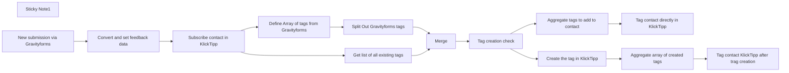

## Fluxo (.json) :

```json
{
  "meta": {
    "instanceId": "95b3ab5a70ab1c8c1906357a367f1b236ef12a1409406fd992f60255f0f95f85"
  },
  "nodes": [
    {
      "id": "9e4a97c9-65dc-4be1-bd9d-d5e84ffedd69",
      "name": "Subscribe contact in KlickTipp",
      "type": "n8n-nodes-klicktipp.klicktipp",
      "notes": "This node subscribes the formatted contact data to a specific KlickTipp list.",
      "position": [
        900,
        340
      ],
      "parameters": {
        "email": "={{ $('New submission via Gravityforms').item.json.body['4'] }}",
        "fields": {
          "dataFields": [
            {
              "fieldId": "fieldFirstName",
              "fieldValue": "={{ $('New submission via Gravityforms').item.json.body['1'] }}"
            },
            {
              "fieldId": "fieldLastName",
              "fieldValue": "={{ $('New submission via Gravityforms').item.json.body['3'] }}"
            },
            {
              "fieldId": "fieldBirthday",
              "fieldValue": "={{ $json.birthday }}"
            },
            {
              "fieldId": "field214512",
              "fieldValue": "={{ $('New submission via Gravityforms').item.json.body['7'] }}"
            },
            {
              "fieldId": "field214514",
              "fieldValue": "={{ $json.webinar_rating }}"
            },
            {
              "fieldId": "field214515",
              "fieldValue": "={{ $('New submission via Gravityforms').item.json.body['9'] }}"
            },
            {
              "fieldId": "field214516",
              "fieldValue": "={{ $('New submission via Gravityforms').item.json.body['12.1'] }}"
            },
            {
              "fieldId": "field214513",
              "fieldValue": "={{ $json.webinar_choice }}"
            }
          ]
        },
        "listId": "358895",
        "resource": "subscriber",
        "operation": "subscribe",
        "smsNumber": "={{ $json.mobile_number }}"
      },
      "credentials": {
        "klickTippApi": {
          "id": "K9JyBdCM4SZc1cXl",
          "name": "DEMO KlickTipp account"
        }
      },
      "notesInFlow": true,
      "typeVersion": 2
    },
    {
      "id": "a6cc678f-b8bf-4dc9-a9f5-3edeaee44d3b",
      "name": "Convert and set feedback data",
      "type": "n8n-nodes-base.set",
      "notes": "This node transforms the form data from Gravity Forms into the appropriate format required for the KlickTipp API.",
      "position": [
        680,
        340
      ],
      "parameters": {
        "options": {},
        "assignments": {
          "assignments": [
            {
              "id": "f1263cb6-654a-4d07-9073-c015b720e6b7",
              "name": "mobile_number",
              "type": "string",
              "value": "={{ \n// Converts a phone number to numeric-only format with international code prefixed by \"00\"\n$json.body['5'] \n    ? $json.body['5']\n        .replace(/^\\+/, '00')   // Replace leading \"+\" with \"00\"\n        .replace(/[^0-9]/g, '') // Remove non-numeric characters\n    : ''\n}}"
            },
            {
              "id": "b09cc146-e614-478a-8f33-324d813e0120",
              "name": "birthday",
              "type": "string",
              "value": "={{ \n// Converts a date to a UNIX timestamp (in seconds)\nMath.floor(\n    new Date($json.body['6'] + 'T00:00:00').getTime() / 1000\n)\n}}"
            },
            {
              "id": "1c455eb9-0750-4d69-9dab-390847a3d582",
              "name": "webinar_choice",
              "type": "string",
              "value": "={{ \n  // Convert the date format from \"DD.MM.YYYY HH:mm\" to \"MM/DD/YYYY HH:mm\"\n  Math.floor(new Date($json[\"body\"][\"13\"].replace(\n    /(\\d{2})\\.(\\d{2})\\.(\\d{4})/, // Match the pattern \"DD.MM.YYYY\"\n    \"$2/$1/$3\" // Rearrange to \"MM/DD/YYYY\" (needed for JavaScript Date parsing)\n  )).getTime() / 1000) // Convert to milliseconds and divide by 1000 to get Unix timestamp (in seconds)\n}}"
            },
            {
              "id": "e375b10b-b05f-413e-93ed-b835e009dd91",
              "name": "webinar_rating",
              "type": "string",
              "value": "={{\n// Multiplies the decimal number value by 100\n$json.body['8'] * 100 }}"
            }
          ]
        }
      },
      "notesInFlow": true,
      "typeVersion": 3.4
    },
    {
      "id": "1f869f92-8e87-4ab5-8938-f327558ca73b",
      "name": "Sticky Note1",
      "type": "n8n-nodes-base.stickyNote",
      "position": [
        880,
        660
      ],
      "parameters": {
        "width": 920,
        "height": 1182,
        "content": "### Introduction\nThis workflow facilitates seamless integration between Gravity Forms and KlickTipp, automating the process of handling customer feedback. By transforming raw form data into a format compatible with KlickTipp’s API, it eliminates manual data entry and ensures accurate, consistent information. The workflow relies on community nodes and is available exclusively for self-hosted n8n environments.\n\n### Benefits\n- **Efficient feedback management**: Automatically processes Gravity Forms submissions, saving time and ensuring timely data handling.\n- **Automation of workflows**: Launch follow-up actions like sending thank-you emails or surveys without manual intervention.\n- **Improved data accuracy**: Validates and transforms input data, minimizing errors and maintaining a professional database.\n\n### Key Features\n- **Gravity Forms Trigger**: Captures new form submissions using a webhook, including user feedback and preferences.\n- **Data Processing and Transformation**:\n  - Converts phone numbers to numeric-only format with international prefixes.\n  - Transforms date fields (e.g., birthdays) into UNIX timestamps.\n  - Scales numerical responses like feedback ratings to match desired formats.\n- **Subscriber Management in KlickTipp**: Adds or updates participants as subscribers in KlickTipp. Includes custom field mappings and tags, such as:\n  - Personal details (e.g., name, email, phone number).\n  - Feedback specifics (e.g., webinar ratings, selected sessions).\n  - Structured answers from Gravity Forms responses.\n  - Contact segmentation: Creates new tags based on form submission if necessary and adds these dynamic tags as well as fixed tags to contacts.\n- **Error Handling**: Ensures invalid or missing data does not disrupt the workflow, providing fallback values where needed.\n\n### Setup Instructions\n1. Set up the Webhook and KlickTipp nodes in your n8n instance.\n2. Connect your Webhook to Gravity Forms and authenticate your KlickTipp account.\n3. Create the necessary custom fields to match the data structure\n4. Verify and customize field assignments in the workflow to align with your specific form and subscriber list setup.\n\n\n\n### Testing and Deployment\n1. Test the workflow by submitting a form through Gravity Forms.\n2. Verify that the data is correctly processed and updated in KlickTipp.\n3. Simulate various scenarios (e.g., missing or invalid data) to ensure robust error handling.\n\n- **Customization**: Update field mappings within the KlickTipp nodes to ensure alignment with your specific account setup.  \n\n"
      },
      "typeVersion": 1
    },
    {
      "id": "b2206acf-c3e1-40bc-b268-7a7b89506f5d",
      "name": "Tag contact directly in KlickTipp",
      "type": "n8n-nodes-klicktipp.klicktipp",
      "notes": "Applies existing tags to a subscriber in KlickTipp. This enables the use of specific signatures, sign out automations as well as the automation of emails and campaigns or other automations.",
      "position": [
        2620,
        240
      ],
      "parameters": {
        "email": "={{ $('New submission via Gravityforms').item.json.body['4'] }}",
        "tagId": "={{$json.tag_ids}}",
        "resource": "contact-tagging"
      },
      "credentials": {
        "klickTippApi": {
          "id": "K9JyBdCM4SZc1cXl",
          "name": "DEMO KlickTipp account"
        }
      },
      "notesInFlow": true,
      "typeVersion": 2
    },
    {
      "id": "a143bed3-a63b-4759-b249-a1cb0683c22a",
      "name": "Tag creation check",
      "type": "n8n-nodes-base.if",
      "notes": "This node checks the result of the tag comparison and branches the workflow accordingly in order to directly tag the contact or to create the tag first and to then follow through with the tagging.",
      "position": [
        1920,
        340
      ],
      "parameters": {
        "options": {},
        "conditions": {
          "options": {
            "version": 2,
            "leftValue": "",
            "caseSensitive": true,
            "typeValidation": "strict"
          },
          "combinator": "and",
          "conditions": [
            {
              "id": "d9567816-9236-434d-b46e-e47f4d36f289",
              "operator": {
                "type": "boolean",
                "operation": "true",
                "singleValue": true
              },
              "leftValue": "={{ $json.exist }}",
              "rightValue": ""
            }
          ]
        }
      },
      "notesInFlow": true,
      "typeVersion": 2.2
    },
    {
      "id": "9cac27ed-0fa7-4e80-84da-4d9f5bae7d72",
      "name": "Aggregate tags to add to contact",
      "type": "n8n-nodes-base.aggregate",
      "notes": "This node aggregates all IDs of the existing tags to a list.",
      "position": [
        2420,
        240
      ],
      "parameters": {
        "options": {},
        "fieldsToAggregate": {
          "fieldToAggregate": [
            {
              "renameField": true,
              "outputFieldName": "tag_ids",
              "fieldToAggregate": "tag_id"
            }
          ]
        }
      },
      "notesInFlow": true,
      "typeVersion": 1
    },
    {
      "id": "7f72f6ca-e13f-4f66-a8c9-c9efee511d84",
      "name": "Create the tag in KlickTipp",
      "type": "n8n-nodes-klicktipp.klicktipp",
      "notes": "Creates a new tag in KlickTipp if it does not already exist.",
      "position": [
        2220,
        460
      ],
      "parameters": {
        "name": "={{ $json.name }}",
        "operation": "create"
      },
      "credentials": {
        "klickTippApi": {
          "id": "K9JyBdCM4SZc1cXl",
          "name": "DEMO KlickTipp account"
        }
      },
      "notesInFlow": true,
      "typeVersion": 2
    },
    {
      "id": "b44fe73c-011e-4dee-9961-e8221d577140",
      "name": "Aggregate array of created tags",
      "type": "n8n-nodes-base.aggregate",
      "notes": "This node aggregates all IDs of the newly created tags to a list.",
      "position": [
        2420,
        460
      ],
      "parameters": {
        "options": {},
        "fieldsToAggregate": {
          "fieldToAggregate": [
            {
              "renameField": true,
              "outputFieldName": "tag_ids",
              "fieldToAggregate": "id"
            }
          ]
        }
      },
      "notesInFlow": true,
      "typeVersion": 1
    },
    {
      "id": "a03ba56c-1470-48c4-a3ea-aa7d282e5e37",
      "name": "Tag contact KlickTipp after trag creation",
      "type": "n8n-nodes-klicktipp.klicktipp",
      "notes": "Associates a specific tag with a subscriber in KlickTipp using their email address. This enables the use of specific signatures, signout automations as well as the automation of emails and campaigns or other automations.",
      "position": [
        2620,
        460
      ],
      "parameters": {
        "email": "={{ $('New submission via Gravityforms').item.json.body['4'] }}",
        "tagId": "={{$json.tag_ids}}",
        "resource": "contact-tagging"
      },
      "credentials": {
        "klickTippApi": {
          "id": "K9JyBdCM4SZc1cXl",
          "name": "DEMO KlickTipp account"
        }
      },
      "notesInFlow": true,
      "typeVersion": 2
    },
    {
      "id": "605a93b4-1ebf-4436-8aad-ea433e4bf5bf",
      "name": "Get list of all existing tags",
      "type": "n8n-nodes-klicktipp.klicktipp",
      "notes": "This node fetches all tags that already exist in KlickTipp.",
      "position": [
        1280,
        460
      ],
      "parameters": {},
      "credentials": {
        "klickTippApi": {
          "id": "K9JyBdCM4SZc1cXl",
          "name": "DEMO KlickTipp account"
        }
      },
      "notesInFlow": true,
      "typeVersion": 2
    },
    {
      "id": "b17669be-62b3-423d-8018-dc92c983c5c7",
      "name": "Merge",
      "type": "n8n-nodes-base.merge",
      "notes": "This node merges the tags which are fetched via the form with the existing tags we requested in order to identify if new tags need to be created.",
      "position": [
        1700,
        340
      ],
      "parameters": {
        "mode": "combineBySql",
        "query": "SELECT \n    input1.tags AS name,  -- Extracts the tag name from input1\n    IF(input2.value IS NOT NULL, true, false) AS exist, -- Checks if the tag exists in input2 (returns true if found, false otherwise)\n    input2.id AS tag_id  -- Retrieves the ID of the tag from input2 if it exists, otherwise returns NULL\nFROM \n    input1\nLEFT JOIN \n    input2 \nON \n    input1.tags = input2.value  -- Matches tags from input1 with values in input2"
      },
      "notesInFlow": true,
      "typeVersion": 3
    },
    {
      "id": "3f643d7b-7acd-46ad-a31a-aa1cd4ec0424",
      "name": "Define Array of tags from Gravityforms",
      "type": "n8n-nodes-base.set",
      "notes": "This node defines tags based on the form submission, such as the webinar selection, date, and reminder interval, and saves them as an array for further processing.",
      "position": [
        1280,
        240
      ],
      "parameters": {
        "options": {},
        "assignments": {
          "assignments": [
            {
              "id": "814576c1-ba16-4546-9815-2b7dec324f94",
              "name": "tags",
              "type": "array",
              "value": "={{ \n  Array.from([\n    // Extracts value from Typeform response (field 8), or returns null if not found\n    $('New submission via Gravityforms')?.item?.json?.body?.['8'] || null, \n    $('New submission via Gravityforms').item.json.body['13'],\n    (() => {\n      try {\n        // Extracts and parses JSON from Typeform response (field 11), or returns null if not found\n        let value = $('New submission via Gravityforms')?.item?.json?.body?.['11'];\n        return value ? JSON.parse(value) : null;\n      } catch (error) {\n        return null; // Return null if JSON parsing fails\n      }\n    })()\n  ].flat().filter(item => item !== null)) // Flattens the array and removes null values\n}}"
            }
          ]
        }
      },
      "notesInFlow": true,
      "typeVersion": 3.4
    },
    {
      "id": "e52482ea-5604-4c4d-a202-de770d4fb240",
      "name": "Split Out Gravityforms tags",
      "type": "n8n-nodes-base.splitOut",
      "notes": "In this node we split the created array again into items so we can merge them with the existing tags we request from KlickTipp.",
      "position": [
        1460,
        240
      ],
      "parameters": {
        "options": {},
        "fieldToSplitOut": "tags"
      },
      "notesInFlow": true,
      "typeVersion": 1
    },
    {
      "id": "3d020c2b-69d7-4c09-9b09-47ac4d87861c",
      "name": "New submission via Gravityforms",
      "type": "n8n-nodes-base.webhook",
      "notes": "This webhook node captures incoming data from the Gravity Forms plugin on the website. It triggers the workflow when a new form submission is received.",
      "position": [
        460,
        340
      ],
      "webhookId": "9e8feb6b-df09-4f17-baf0-9fa3b8c0093c",
      "parameters": {
        "path": "9e8feb6b-df09-4f17-baf0-9fa3b8c0093c",
        "options": {},
        "httpMethod": "POST"
      },
      "notesInFlow": true,
      "typeVersion": 2
    }
  ],
  "pinData": {},
  "connections": {
    "Merge": {
      "main": [
        [
          {
            "node": "Tag creation check",
            "type": "main",
            "index": 0
          }
        ]
      ]
    },
    "Tag creation check": {
      "main": [
        [
          {
            "node": "Aggregate tags to add to contact",
            "type": "main",
            "index": 0
          }
        ],
        [
          {
            "node": "Create the tag in KlickTipp",
            "type": "main",
            "index": 0
          }
        ]
      ]
    },
    "Create the tag in KlickTipp": {
      "main": [
        [
          {
            "node": "Aggregate array of created tags",
            "type": "main",
            "index": 0
          }
        ]
      ]
    },
    "Split Out Gravityforms tags": {
      "main": [
        [
          {
            "node": "Merge",
            "type": "main",
            "index": 0
          }
        ]
      ]
    },
    "Convert and set feedback data": {
      "main": [
        [
          {
            "node": "Subscribe contact in KlickTipp",
            "type": "main",
            "index": 0
          }
        ]
      ]
    },
    "Get list of all existing tags": {
      "main": [
        [
          {
            "node": "Merge",
            "type": "main",
            "index": 1
          }
        ]
      ]
    },
    "Subscribe contact in KlickTipp": {
      "main": [
        [
          {
            "node": "Define Array of tags from Gravityforms",
            "type": "main",
            "index": 0
          },
          {
            "node": "Get list of all existing tags",
            "type": "main",
            "index": 0
          }
        ]
      ]
    },
    "Aggregate array of created tags": {
      "main": [
        [
          {
            "node": "Tag contact KlickTipp after trag creation",
            "type": "main",
            "index": 0
          }
        ]
      ]
    },
    "New submission via Gravityforms": {
      "main": [
        [
          {
            "node": "Convert and set feedback data",
            "type": "main",
            "index": 0
          }
        ]
      ]
    },
    "Aggregate tags to add to contact": {
      "main": [
        [
          {
            "node": "Tag contact directly in KlickTipp",
            "type": "main",
            "index": 0
          }
        ]
      ]
    },
    "Define Array of tags from Gravityforms": {
      "main": [
        [
          {
            "node": "Split Out Gravityforms tags",
            "type": "main",
            "index": 0
          }
        ]
      ]
    }
  }
}
```

<a id="template-145"></a>

## Template 145 - Análise de URL e recuperação de job Cortex

- **Nome:** Análise de URL e recuperação de job Cortex
- **Descrição:** Analisa uma URL com um analisador do Cortex e, em seguida, recupera os detalhes do job gerado para obter resultados e metadados.
- **Funcionalidade:** • Disparo manual: Inicia o fluxo ao clicar em executar.
• Envio de observável para análise: Envia uma URL (observableType: url, observableValue: https://n8n.io) ao analisador Abuse_Finder_3_0 do Cortex.
• Criação de job de análise: Solicita a execução do analisador no Cortex, gerando um job de análise.
• Recuperação de detalhes do job: Consulta o recurso de job no Cortex usando o _id retornado para obter resultados e metadados.
• Encadeamento de dados entre etapas: Extrai o identificador do job do resultado da análise e o utiliza na requisição subsequente para buscar o status e os detalhes.
- **Ferramentas:** • Cortex: Plataforma de análise e correlação de observáveis de segurança utilizada para executar analisadores (como Abuse_Finder_3_0), criar jobs de análise e fornecer resultados e metadados dos jobs.

## Fluxo visual

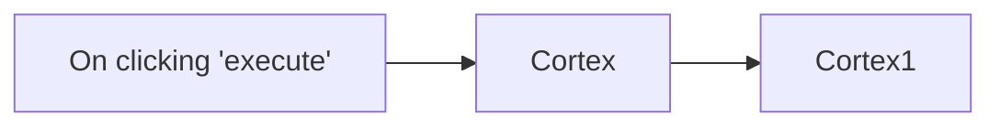

## Fluxo (.json) :

```json
{
  "id": "160",
  "name": "Analyze a URL and get the job details using the Cortex node",
  "nodes": [
    {
      "name": "On clicking 'execute'",
      "type": "n8n-nodes-base.manualTrigger",
      "position": [
        370,
        220
      ],
      "parameters": {},
      "typeVersion": 1
    },
    {
      "name": "Cortex",
      "type": "n8n-nodes-base.cortex",
      "position": [
        570,
        220
      ],
      "parameters": {
        "analyzer": "f4abc1b633b80f45af165970793fd4fd::Abuse_Finder_3_0",
        "observableType": "url",
        "observableValue": "https://n8n.io",
        "additionalFields": {}
      },
      "credentials": {
        "cortexApi": "cortex"
      },
      "typeVersion": 1
    },
    {
      "name": "Cortex1",
      "type": "n8n-nodes-base.cortex",
      "position": [
        770,
        220
      ],
      "parameters": {
        "jobId": "={{$node[\"Cortex\"].json[\"_id\"]}}",
        "resource": "job"
      },
      "credentials": {
        "cortexApi": "cortex"
      },
      "typeVersion": 1
    }
  ],
  "active": false,
  "settings": {},
  "connections": {
    "Cortex": {
      "main": [
        [
          {
            "node": "Cortex1",
            "type": "main",
            "index": 0
          }
        ]
      ]
    },
    "On clicking 'execute'": {
      "main": [
        [
          {
            "node": "Cortex",
            "type": "main",
            "index": 0
          }
        ]
      ]
    }
  }
}
```

<a id="template-146"></a>

## Template 146 - Monitoramento térmico e ingestão de dados da fábrica

- **Nome:** Monitoramento térmico e ingestão de dados da fábrica
- **Descrição:** Fluxo que recebe dados de sensores da fábrica, enriquece as medições de temperatura, armazena informações de máquinas e cria incidentes quando a temperatura atinge ou excede 50°C.
- **Funcionalidade:** • Recepção de dados dos sensores: Obtém mensagens dos sensores da fábrica através de um broker AMQP (sink berlin_factory_01).
• Enriquecimento de dados: Converte a temperatura de °C para °F e adiciona esse valor ao payload.
• Validação de alerta térmico: Verifica se a temperatura em °C é maior ou igual a 50°C para acionar ações de incidente.
• Criação de incidente: Quando a temperatura está alta, gera um incidente com título que inclui o nome da máquina.
• Ingestão de dados de máquina: Persiste dados de máquina (temperatura em °F e °C, nome, tempo de atividade e timestamp) em uma tabela de banco de dados.
• Registro de incidente: Após criar o incidente, armazena informações do incidente (ID, URL e timestamp) em uma tabela de banco de dados.
• Ramificação sem ação: Se a temperatura estiver abaixo do limiar, segue um caminho sem efeitos (no-op).
- **Ferramentas:** • Broker AMQP: Transporte de mensagens para receber os dados dos sensores da fábrica (sink berlin_factory_01).
• CrateDB: Banco de dados para ingestão e armazenamento das tabelas machine_data e incident_data.
• PagerDuty: Serviço de gerenciamento de incidentes usado para criar e obter detalhes do incidente gerado.

## Fluxo visual

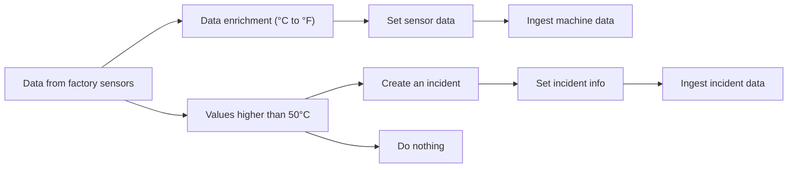

## Fluxo (.json) :

```json
{
  "id": "168",
  "name": "Smart Factory Use Case",
  "nodes": [
    {
      "name": "Values higher than 50°C",
      "type": "n8n-nodes-base.if",
      "position": [
        250,
        550
      ],
      "parameters": {
        "conditions": {
          "number": [
            {
              "value1": "={{$node[\"Data from factory sensors\"].json[\"body\"][\"temperature_celsius\"]}}",
              "value2": 50,
              "operation": "largerEqual"
            }
          ]
        }
      },
      "typeVersion": 1
    },
    {
      "name": "Data from factory sensors",
      "type": "n8n-nodes-base.amqpTrigger",
      "position": [
        50,
        700
      ],
      "parameters": {
        "sink": "berlin_factory_01",
        "options": {}
      },
      "credentials": {
        "amqp": ""
      },
      "typeVersion": 1
    },
    {
      "name": "Set sensor data",
      "type": "n8n-nodes-base.set",
      "position": [
        450,
        850
      ],
      "parameters": {
        "values": {
          "number": [
            {
              "name": "temeprature_fahrenheit",
              "value": "={{$node[\"Data enrichment (°C to °F)\"].json[\"temperature_fahrenheit\"]}}"
            },
            {
              "name": "temperature_celsius",
              "value": "={{$node[\"Data enrichment (°C to °F)\"].json[\"body\"][\"temperature_celsius\"]}}"
            },
            {
              "name": "machine_uptime",
              "value": "={{$node[\"Data from factory sensors\"].json[\"body\"][\"machine_id\"][\"uptime\"]}}"
            },
            {
              "name": "time_stamp",
              "value": "={{$node[\"Data from factory sensors\"].json[\"body\"][\"time_stamp\"]}}"
            }
          ],
          "string": [
            {
              "name": "machine_name",
              "value": "={{$node[\"Data from factory sensors\"].json[\"body\"][\"machine_id\"][\"name\"]}}"
            }
          ]
        },
        "options": {}
      },
      "typeVersion": 1
    },
    {
      "name": "Ingest machine data",
      "type": "n8n-nodes-base.crateDb",
      "position": [
        650,
        850
      ],
      "parameters": {
        "table": "machine_data",
        "columns": "temperature_fahrenheit, temperature_celsius, machine_name, machine_uptime, time_stamp"
      },
      "credentials": {
        "crateDb": ""
      },
      "typeVersion": 1
    },
    {
      "name": "Ingest incident data",
      "type": "n8n-nodes-base.crateDb",
      "position": [
        850,
        450
      ],
      "parameters": {
        "table": "incident_data",
        "columns": "incident_id, html_url, incident_timestamp"
      },
      "credentials": {
        "crateDb": ""
      },
      "typeVersion": 1
    },
    {
      "name": "Set incident info",
      "type": "n8n-nodes-base.set",
      "position": [
        650,
        450
      ],
      "parameters": {
        "values": {
          "string": [
            {
              "name": "incident_id",
              "value": "={{$node[\"Create an incident\"].json[\"id\"]}}"
            },
            {
              "name": "html_url",
              "value": "={{$node[\"Create an incident\"].json[\"html_url\"]}}"
            },
            {
              "name": "incident_timestamp",
              "value": "={{$node[\"Create an incident\"].json[\"created_at\"]}}"
            }
          ]
        },
        "options": {},
        "keepOnlySet": true
      },
      "typeVersion": 1
    },
    {
      "name": "Create an incident",
      "type": "n8n-nodes-base.pagerDuty",
      "position": [
        450,
        450
      ],
      "parameters": {
        "title": "=Incident with {{$node[\"Data from factory sensors\"].json[\"body\"][\"machine_id\"][\"name\"]}}",
        "additionalFields": {}
      },
      "credentials": {
        "pagerDutyApi": ""
      },
      "typeVersion": 1
    },
    {
      "name": "Data enrichment (°C to °F)",
      "type": "n8n-nodes-base.function",
      "position": [
        250,
        850
      ],
      "parameters": {
        "functionCode": "temp_fahrenheit = (items[0].json.body.temperature_celsius * 1.8) + 32;\nitems[0].json.temperature_fahrenheit = temp_fahrenheit;\nreturn items;"
      },
      "typeVersion": 1,
      "alwaysOutputData": true
    },
    {
      "name": "Do  nothing",
      "type": "n8n-nodes-base.noOp",
      "position": [
        450,
        640
      ],
      "parameters": {},
      "typeVersion": 1
    }
  ],
  "active": false,
  "settings": {},
  "connections": {
    "Set sensor data": {
      "main": [
        [
          {
            "node": "Ingest machine data",
            "type": "main",
            "index": 0
          }
        ]
      ]
    },
    "Set incident info": {
      "main": [
        [
          {
            "node": "Ingest incident data",
            "type": "main",
            "index": 0
          }
        ]
      ]
    },
    "Create an incident": {
      "main": [
        [
          {
            "node": "Set incident info",
            "type": "main",
            "index": 0
          }
        ]
      ]
    },
    "Values higher than 50°C": {
      "main": [
        [
          {
            "node": "Create an incident",
            "type": "main",
            "index": 0
          }
        ],
        [
          {
            "node": "Do  nothing",
            "type": "main",
            "index": 0
          }
        ]
      ]
    },
    "Data from factory sensors": {
      "main": [
        [
          {
            "node": "Data enrichment (°C to °F)",
            "type": "main",
            "index": 0
          },
          {
            "node": "Values higher than 50°C",
            "type": "main",
            "index": 0
          }
        ]
      ]
    },
    "Data enrichment (°C to °F)": {
      "main": [
        [
          {
            "node": "Set sensor data",
            "type": "main",
            "index": 0
          }
        ]
      ]
    }
  }
}
```

<a id="template-147"></a>

## Template 147 - Extrair e separar arquivos de um ZIP

- **Nome:** Extrair e separar arquivos de um ZIP
- **Descrição:** Faz o download de um arquivo ZIP de exemplo, descompacta-o e transforma cada arquivo contido em um item separado com seu conteúdo binário e nome de arquivo.
- **Funcionalidade:** • Gatilho manual: Inicia a execução do fluxo ao acionar manualmente.
• Download de dados de exemplo: Baixa um arquivo ZIP a partir de um URL público.
• Descompressão de arquivos: Descompacta o ZIP para obter os arquivos individuais em formato binário.
• Separação de dados binários: Para cada arquivo extraído, cria um item separado contendo o conteúdo binário sob a chave 'data' e adiciona o nome do arquivo em 'fileName'.
- **Ferramentas:** • Servidor HTTP (static.thomasmartens.eu): hospeda e fornece o arquivo ZIP de exemplo via URL.
• Formato ZIP (arquivo compactado): formato de compressão utilizado para agrupar os vários arquivos dentro do arquivo baixado.

## Fluxo visual

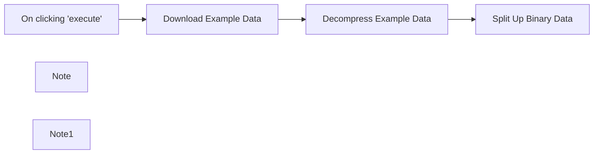

## Fluxo (.json) :

```json
{
  "nodes": [
    {
      "name": "On clicking 'execute'",
      "type": "n8n-nodes-base.manualTrigger",
      "position": [
        240,
        300
      ],
      "parameters": {},
      "typeVersion": 1
    },
    {
      "name": "Split Up Binary Data",
      "type": "n8n-nodes-base.function",
      "position": [
        900,
        300
      ],
      "parameters": {
        "functionCode": "let results = [];\n\nfor (item of items) {\n    for (key of Object.keys(item.binary)) {\n        results.push({\n            json: {\n                fileName: item.binary[key].fileName\n            },\n            binary: {\n                data: item.binary[key],\n            }\n        });\n    }\n}\n\nreturn results;"
      },
      "typeVersion": 1
    },
    {
      "name": "Download Example Data",
      "type": "n8n-nodes-base.httpRequest",
      "position": [
        460,
        300
      ],
      "parameters": {
        "url": "https://static.thomasmartens.eu/n8n/three_more_files.zip",
        "options": {},
        "responseFormat": "file"
      },
      "typeVersion": 1
    },
    {
      "name": "Decompress Example Data",
      "type": "n8n-nodes-base.compression",
      "position": [
        680,
        300
      ],
      "parameters": {},
      "typeVersion": 1
    },
    {
      "name": "Note",
      "type": "n8n-nodes-base.stickyNote",
      "position": [
        420,
        120
      ],
      "parameters": {
        "width": 400,
        "height": 360,
        "content": "## Example Data\nThe first two nodes simply fetch some example data to work with.\n\nIn the real world, you'd probably process incoming emails, uploaded FTP files or something similar instead."
      },
      "typeVersion": 1
    },
    {
      "name": "Note1",
      "type": "n8n-nodes-base.stickyNote",
      "position": [
        860,
        120
      ],
      "parameters": {
        "width": 320,
        "height": 360,
        "content": "## Transformation\nThis is where the magic happens. Incoming files are split up into individual items, each with a single binary data object under the `data` key."
      },
      "typeVersion": 1
    }
  ],
  "connections": {
    "Download Example Data": {
      "main": [
        [
          {
            "node": "Decompress Example Data",
            "type": "main",
            "index": 0
          }
        ]
      ]
    },
    "On clicking 'execute'": {
      "main": [
        [
          {
            "node": "Download Example Data",
            "type": "main",
            "index": 0
          }
        ]
      ]
    },
    "Decompress Example Data": {
      "main": [
        [
          {
            "node": "Split Up Binary Data",
            "type": "main",
            "index": 0
          }
        ]
      ]
    }
  }
}
```

<a id="template-148"></a>

## Template 148 - Notificações de submissões de formulário Webflow

- **Nome:** Notificações de submissões de formulário Webflow
- **Descrição:** Este fluxo monitora submissões de formulários no site Webflow e captura os dados enviados para acionar processos subsequentes.
- **Funcionalidade:** • Detecção de submissão de formulário: Inicia a automação quando um formulário é enviado no site configurado.
• Recebimento dos dados via webhook: Captura o payload com os campos preenchidos pelo usuário na submissão.
• Autenticação com conta Webflow: Usa credenciais OAuth2 para permitir o recebimento seguro das notificações.
• Preparado para encaminhar dados: Os dados capturados podem ser enviados para outras ações ou integrações posteriores.
- **Ferramentas:** • Webflow: Plataforma de criação de sites que dispara notificações de submissões de formulários e fornece os dados coletados.

## Fluxo visual


## Fluxo (.json) :

```json
{
  "id": "42",
  "name": "Receive updates when a form submission occurs in your Webflow website",
  "nodes": [
    {
      "name": "Webflow Trigger",
      "type": "n8n-nodes-base.webflowTrigger",
      "position": [
        514,
        217
      ],
      "webhookId": "ce934229-1396-4920-8bfe-10579aa6f9dd",
      "parameters": {
        "site": "5f4e2d2bbdf69039816428f7",
        "authentication": "oAuth2"
      },
      "credentials": {
        "webflowOAuth2Api": "webflow"
      },
      "typeVersion": 1
    }
  ],
  "active": false,
  "settings": {},
  "connections": {}
}
```

<a id="template-149"></a>

## Template 149 - Resumo diário de tickets Zammad

- **Nome:** Resumo diário de tickets Zammad
- **Descrição:** Gera e envia um resumo dos tickets (novos, abertos e pendentes) para o canal de suporte.
- **Funcionalidade:** • Agendamento diário: Agenda execução em dias úteis às 08:30 para gerar o resumo de tickets.
• Execução manual: Permite disparar a rotina manualmente ao clicar em executar.
• Coleta de tickets: Recupera todos os tickets do sistema de atendimento para análise.
• Filtragem e contagem por status: Conta tickets por estados específicos (novo, aberto, pendente com lembrete, pendente para fechamento) mapeando os respectivos identificadores de status.
• Envio de resumo para equipe: Envia uma mensagem formatada com os totais para o canal de suporte ao cliente.
- **Ferramentas:** • Zammad: Plataforma de gerenciamento de tickets usada para listar e obter dados dos tickets.
• Zulip: Plataforma de chat utilizada para enviar o resumo diário ao stream/canal de suporte.


## Fluxo visual


## Fluxo (.json) :

```json
{
  "id": 4,
  "name": "Zammad Open Tickets",
  "nodes": [
    {
      "name": "On clicking 'execute'",
      "type": "n8n-nodes-base.manualTrigger",
      "position": [
        -40,
        340
      ],
      "parameters": {},
      "typeVersion": 1
    },
    {
      "name": "Ticket Filtering",
      "type": "n8n-nodes-base.function",
      "notes": "Filter tickets by status.",
      "position": [
        400,
        460
      ],
      "parameters": {
        "functionCode": "let newTickets = 0\nlet openTickets = 0\nlet pendingReminder = 0\nlet pendingClose = 0\n\nfor (let i = 0; i < items.length; i++) {\n  const ticket = items[i]\n  if (ticket.json.state_id === 1) {\n    newTickets++\n  }\n  if (ticket.json.state_id === 2) {\n    openTickets++\n  }\n  if (ticket.json.state_id === 3) {\n    pendingReminder++\n  }\n  if (ticket.json.state_id === 7) {\n    pendingClose++\n  }\n}\n\nreturn [{\n  json: {\n    \"new\": newTickets,\n    open: openTickets,\n    pendingReminder: pendingReminder,\n    pendingClose: pendingClose\n  }\n}];"
      },
      "executeOnce": true,
      "notesInFlow": true,
      "typeVersion": 1
    },
    {
      "name": "List Tickets",
      "type": "n8n-nodes-base.zammad",
      "notes": "Get all tickets.",
      "position": [
        200,
        460
      ],
      "parameters": {
        "resource": "ticket",
        "operation": "getAll",
        "returnAll": true
      },
      "credentials": {
        "zammadTokenAuthApi": {
          "id": "7",
          "name": "Zammad Token Auth account"
        }
      },
      "notesInFlow": true,
      "typeVersion": 1
    },
    {
      "name": "Notify for Standup",
      "type": "n8n-nodes-base.zulip",
      "notes": "Sends a summary to customer support stream.",
      "position": [
        580,
        460
      ],
      "parameters": {
        "topic": "=tickets",
        "stream": "=customer support",
        "content": "=:ticket: Support Tickets Summary:\n* Open: {{$node[\"Ticket Filtering\"].json[\"open\"]}}\n* New:{{$node[\"Ticket Filtering\"].json[\"new\"]}}\n* Pending Close {{$node[\"Ticket Filtering\"].json[\"pendingClose\"]}}\n* Pending Reminder {{$node[\"Ticket Filtering\"].json[\"pendingReminder\"]}}",
        "operation": "sendStream"
      },
      "credentials": {
        "zulipApi": {
          "id": "1",
          "name": "Zulip n8n Bot"
        }
      },
      "executeOnce": true,
      "notesInFlow": true,
      "typeVersion": 1
    },
    {
      "name": "Standup Cron",
      "type": "n8n-nodes-base.cron",
      "notes": "Daily stand-up open days.",
      "position": [
        -40,
        560
      ],
      "parameters": {
        "triggerTimes": {
          "item": [
            {
              "mode": "custom",
              "cronExpression": "0 30 8 * * 1-5"
            }
          ]
        }
      },
      "executeOnce": true,
      "notesInFlow": true,
      "typeVersion": 1
    }
  ],
  "active": true,
  "settings": {},
  "connections": {
    "List Tickets": {
      "main": [
        [
          {
            "node": "Ticket Filtering",
            "type": "main",
            "index": 0
          }
        ]
      ]
    },
    "Standup Cron": {
      "main": [
        [
          {
            "node": "List Tickets",
            "type": "main",
            "index": 0
          }
        ]
      ]
    },
    "Ticket Filtering": {
      "main": [
        [
          {
            "node": "Notify for Standup",
            "type": "main",
            "index": 0
          }
        ]
      ]
    },
    "On clicking 'execute'": {
      "main": [
        [
          {
            "node": "List Tickets",
            "type": "main",
            "index": 0
          }
        ]
      ]
    }
  }
}
```

<a id="template-150"></a>

## Template 150 - Enviar SMS de alerta por temperatura

- **Nome:** Enviar SMS de alerta por temperatura
- **Descrição:** Escuta mensagens de uma fila que contêm valores de temperatura e envia um SMS de alerta quando o valor ultrapassa o limite definido.
- **Funcionalidade:** • Receber mensagens de fila: Monitora continuamente uma fila para receber novos dados.
• Parse de conteúdo JSON: Interpreta o corpo da mensagem como JSON para extrair valores.
• Verificação de limite: Compara o valor de temperatura recebido com um limite (50) para decidir ações.
• Envio de alerta por SMS: Quando o valor excede o limite, envia uma mensagem SMS informando o valor.
• Caminho alternativo sem ação: Se o valor não exceder o limite, não realiza envio e termina sem ação.
- **Ferramentas:** • RabbitMQ: Sistema de filas para envio e recebimento de mensagens entre aplicações.
• Vonage: Serviço de comunicação usado para envio de mensagens SMS.


## Fluxo visual

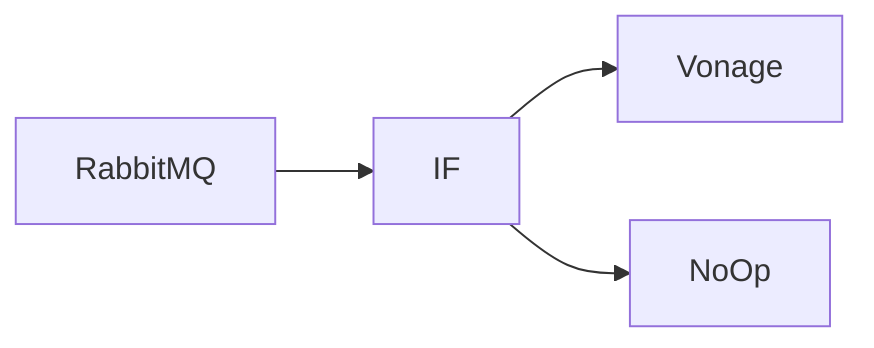

## Fluxo (.json) :

```json
{
  "id": "186",
  "name": "Receive messages from a queue via RabbitMQ and send an SMS",
  "nodes": [
    {
      "name": "RabbitMQ",
      "type": "n8n-nodes-base.rabbitmqTrigger",
      "position": [
        520,
        220
      ],
      "parameters": {
        "queue": "temp",
        "options": {
          "onlyContent": true,
          "jsonParseBody": true
        }
      },
      "credentials": {
        "rabbitmq": "RabbitMQ Credentials"
      },
      "typeVersion": 1
    },
    {
      "name": "IF",
      "type": "n8n-nodes-base.if",
      "position": [
        720,
        220
      ],
      "parameters": {
        "conditions": {
          "number": [
            {
              "value1": "={{$node[\"RabbitMQ\"].json[\"temp\"]}}",
              "value2": 50,
              "operation": "larger"
            }
          ]
        }
      },
      "typeVersion": 1
    },
    {
      "name": "Vonage",
      "type": "n8n-nodes-base.vonage",
      "position": [
        930,
        120
      ],
      "parameters": {
        "message": "=Alert!\nThe value of temp is {{$node[\"RabbitMQ\"].json[\"temp\"]}}.",
        "additionalFields": {}
      },
      "credentials": {
        "vonageApi": "vonage"
      },
      "typeVersion": 1
    },
    {
      "name": "NoOp",
      "type": "n8n-nodes-base.noOp",
      "position": [
        920,
        370
      ],
      "parameters": {},
      "typeVersion": 1
    }
  ],
  "active": false,
  "settings": {},
  "connections": {
    "IF": {
      "main": [
        [
          {
            "node": "Vonage",
            "type": "main",
            "index": 0
          }
        ],
        [
          {
            "node": "NoOp",
            "type": "main",
            "index": 0
          }
        ]
      ]
    },
    "RabbitMQ": {
      "main": [
        [
          {
            "node": "IF",
            "type": "main",
            "index": 0
          }
        ]
      ]
    }
  }
}
```

<a id="template-151"></a>

## Template 151 - Enriquecer contatos HubSpot com dados da ExactBuyer

- **Nome:** Enriquecer contatos HubSpot com dados da ExactBuyer
- **Descrição:** Automatiza a enriquecimento de novos contatos criados no HubSpot usando dados de contato e empresa obtidos pela API da ExactBuyer, atualizando o perfil no HubSpot quando houver correspondência por e-mail.
- **Funcionalidade:** • Detecção de novo contato: Inicia o processo quando um contato é criado no HubSpot.
• Recuperação do contato: Obtém os detalhes completos do contato recém-criado para extrair identificadores e e-mail.
• Extração e normalização de chaves: Extrai e padroniza campos-chave (por exemplo, id do contato e e-mail) para uso nas chamadas seguintes.
• Validação de e-mail: Verifica se o contato possui e-mail antes de prosseguir com o enriquecimento.
• Consulta à ExactBuyer: Chama a API de enriquecimento da ExactBuyer usando e-mail como identificador para obter dados adicionais de contato e empresa.
• Atualização do perfil no HubSpot: Mapeia e grava campos enriquecidos (nome, sobrenome, cargo, empresa, tamanho da empresa, país, telefone, educação, gênero, etc.) de volta ao perfil do contato no HubSpot.
• Tratamento de falhas: Segrega o fluxo quando não há correspondência ou quando a API retorna erro, permitindo tratamento ou registro separado (ex.: nó de saída para 'usuário não encontrado').
- **Ferramentas:** • HubSpot: Plataforma CRM usada como fonte de eventos (criação de contatos) e destino para atualização dos perfis de contatos.
• ExactBuyer API: Serviço de enriquecimento de contatos que fornece dados adicionais de pessoa e empresa a partir de um e-mail (phone, localização, emprego, educação, redes sociais, etc.).


## Fluxo visual

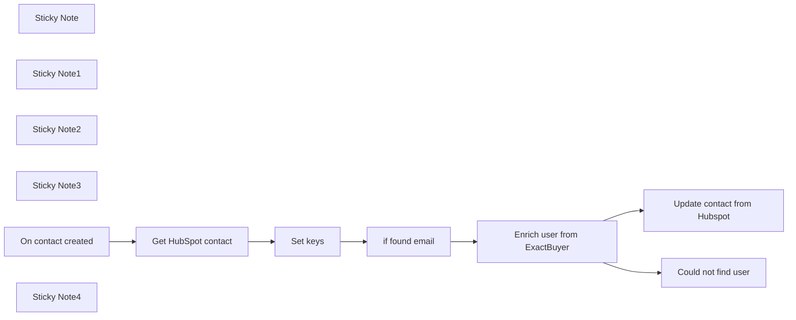

## Fluxo (.json) :

```json
{
  "nodes": [
    {
      "id": "79c06432-9d3f-4a93-b613-24bdaedfb71d",
      "name": "Could not find user",
      "type": "n8n-nodes-base.noOp",
      "position": [
        1940,
        640
      ],
      "parameters": {},
      "typeVersion": 1
    },
    {
      "id": "07d23ef6-8c93-40de-9e95-ea3d56811fa0",
      "name": "Sticky Note",
      "type": "n8n-nodes-base.stickyNote",
      "position": [
        540,
        200
      ],
      "parameters": {
        "width": 330.0463186838765,
        "height": 609.3353028064989,
        "content": "## On User created in HubSpot\n\n1. Setup Oauth2 creds using n8n docs\nhttps://docs.n8n.io/integrations/builtin/trigger-nodes/n8n-nodes-base.hubspottrigger\n\n### Be careful with scopes. Scopes must be exactly as defined in the docs"
      },
      "typeVersion": 1
    },
    {
      "id": "bad1ea1c-9b03-4419-ac37-272b5740a7c4",
      "name": "Sticky Note1",
      "type": "n8n-nodes-base.stickyNote",
      "position": [
        1660,
        200
      ],
      "parameters": {
        "color": 3,
        "width": 343.28654189681333,
        "height": 609.3353028064989,
        "content": "## Enrich with data from ExactBuyer\n\n1. Add api key from Exact buyer\n2. Use email as identifier to match user\n\nUse API Guide here https://docs.exactbuyer.com/contact-enrichment/enrichment"
      },
      "typeVersion": 1
    },
    {
      "id": "d24ae8e3-c5fe-4cde-bade-66f60cda943d",
      "name": "Sticky Note2",
      "type": "n8n-nodes-base.stickyNote",
      "position": [
        940,
        240
      ],
      "parameters": {
        "color": 6,
        "width": 352.21705571104906,
        "height": 499.9091886469748,
        "content": "## Get user in Hubspot\n\n1. Setup Oauth2 creds using n8n docs\nhttps://docs.n8n.io/integrations/builtin/trigger-nodes/n8n-nodes-base.hubspottrigger/\n\n### Be careful with scopes. Scopes must be exactly as defined in the docs\n### Will need to be a different cred from the trigger one"
      },
      "typeVersion": 1
    },
    {
      "id": "5e0775c9-178a-460e-a478-b9a69aaf80cd",
      "name": "Sticky Note3",
      "type": "n8n-nodes-base.stickyNote",
      "position": [
        820,
        -320
      ],
      "parameters": {
        "color": 4,
        "width": 629.6175493462406,
        "height": 473.03355645575084,
        "content": "# Enrich new Hubspot contacts with contact and company data from ExactBuyer\n\n## This workflow aims to enrich new contacts in HubSpot. The more relevant the HubSpot profile, the more useful it is. Once active, this n8n workflow will update the social profiles, contact data (phone, email) as well as location data from ExactBuyer.\n"
      },
      "typeVersion": 1
    },
    {
      "id": "73f7c19a-8145-4ad3-bbf0-0a4a0d70be33",
      "name": "Enrich user from ExactBuyer",
      "type": "n8n-nodes-base.httpRequest",
      "onError": "continueErrorOutput",
      "position": [
        1740,
        480
      ],
      "parameters": {
        "url": "https://api.exactbuyer.com/v1/enrich",
        "options": {
          "redirect": {
            "redirect": {}
          }
        },
        "sendQuery": true,
        "authentication": "genericCredentialType",
        "genericAuthType": "httpHeaderAuth",
        "queryParameters": {
          "parameters": [
            {
              "name": "email",
              "value": "={{ $json.email }}"
            },
            {
              "name": "required",
              "value": "work_email,personal_email,email"
            }
          ]
        }
      },
      "credentials": {
        "httpHeaderAuth": {
          "id": "kyMNOdXZX3ugPihF",
          "name": "ExactBuyer Api key"
        }
      },
      "typeVersion": 4.1
    },
    {
      "id": "7a0c2b14-0f22-475f-84c2-49ff1c1a1fad",
      "name": "Set keys",
      "type": "n8n-nodes-base.set",
      "position": [
        1320,
        500
      ],
      "parameters": {
        "options": {},
        "assignments": {
          "assignments": [
            {
              "id": "211cd22a-a55c-4018-8ba6-3272097d502c",
              "name": "user_id",
              "type": "string",
              "value": "={{ $json.vid }}"
            },
            {
              "id": "f3c7d0b9-717c-437b-ab45-1f35c194d412",
              "name": "email",
              "type": "string",
              "value": "={{ $json.properties.email?.value }}"
            }
          ]
        }
      },
      "typeVersion": 3.3
    },
    {
      "id": "4da6204d-2717-41fb-8f79-3bb094db9e71",
      "name": "if found email",
      "type": "n8n-nodes-base.if",
      "position": [
        1480,
        500
      ],
      "parameters": {
        "options": {},
        "conditions": {
          "options": {
            "leftValue": "",
            "caseSensitive": true,
            "typeValidation": "strict"
          },
          "combinator": "and",
          "conditions": [
            {
              "id": "dbd1042e-dfe7-40ff-84ca-c3d289decb78",
              "operator": {
                "type": "string",
                "operation": "notEmpty",
                "singleValue": true
              },
              "leftValue": "={{ $json.email }}",
              "rightValue": ""
            }
          ]
        }
      },
      "typeVersion": 2
    },
    {
      "id": "24ef009a-c05c-4ca3-afd5-ef44b2349cfb",
      "name": "Update contact from Hubspot",
      "type": "n8n-nodes-base.hubspot",
      "position": [
        2200,
        460
      ],
      "parameters": {
        "email": "={{ $('Set keys').item.json.email }}",
        "options": {},
        "authentication": "oAuth2",
        "additionalFields": {
          "gender": "={{ $json.result.gender }}",
          "school": "={{ $json.result.education?.[0]?.school?.name }}",
          "country": "={{ $json.result.location?.country }}",
          "jobTitle": "={{ $json.result.employment?.job?.title }}",
          "lastName": "={{ $json.result.last_name }}",
          "firstName": "={{ $json.result.first_name }}",
          "companyName": "={{ $json.result.employment?.name }}",
          "companySize": "={{ $json.result.employment.size }}",
          "phoneNumber": "={{ $json.result.phone_numbers?.[0]?.E164 }}"
        }
      },
      "credentials": {
        "hubspotOAuth2Api": {
          "id": "Gxwfj6z9NwaEC3P5",
          "name": "HubSpot account 3"
        }
      },
      "typeVersion": 2
    },
    {
      "id": "1adda76c-39cb-43e7-a1dd-301dfd530c77",
      "name": "Get HubSpot contact",
      "type": "n8n-nodes-base.hubspot",
      "position": [
        1060,
        500
      ],
      "parameters": {
        "contactId": {
          "__rl": true,
          "mode": "id",
          "value": "={{ $json.contactId }}"
        },
        "operation": "get",
        "authentication": "oAuth2",
        "additionalFields": {}
      },
      "credentials": {
        "hubspotOAuth2Api": {
          "id": "Gxwfj6z9NwaEC3P5",
          "name": "HubSpot account 3"
        }
      },
      "typeVersion": 2
    },
    {
      "id": "7aa3b2bc-f564-4160-adb6-e0d977993540",
      "name": "On contact created",
      "type": "n8n-nodes-base.hubspotTrigger",
      "position": [
        740,
        500
      ],
      "webhookId": "0c93331f-6d07-4cfe-b9b7-8a724c6c8c28",
      "parameters": {
        "eventsUi": {
          "eventValues": [
            {}
          ]
        },
        "additionalFields": {}
      },
      "credentials": {
        "hubspotDeveloperApi": {
          "id": "5VJ26ST8DdVyAfEZ",
          "name": "HubSpot Developer account 3"
        }
      },
      "typeVersion": 1
    },
    {
      "id": "e8b386bf-0a86-44a0-82e6-1189bc3c5619",
      "name": "Sticky Note4",
      "type": "n8n-nodes-base.stickyNote",
      "position": [
        2120,
        260
      ],
      "parameters": {
        "color": 6,
        "width": 352.21705571104906,
        "height": 499.9091886469748,
        "content": "## Update user in Hubspot\n\n### Same cred as in getting the contact in Hubspot"
      },
      "typeVersion": 1
    }
  ],
  "pinData": {
    "On contact created": [
      {
        "appId": 2930857,
        "eventId": 812433913,
        "portalId": 25023349,
        "sourceId": "2931120",
        "contactId": 251,
        "changeFlag": "CREATED",
        "occurredAt": 1708530793161,
        "changeSource": "INTEGRATION",
        "attemptNumber": 0,
        "subscriptionId": 2538662,
        "subscriptionType": "contact.creation"
      }
    ]
  },
  "connections": {
    "Set keys": {
      "main": [
        [
          {
            "node": "if found email",
            "type": "main",
            "index": 0
          }
        ]
      ]
    },
    "if found email": {
      "main": [
        [
          {
            "node": "Enrich user from ExactBuyer",
            "type": "main",
            "index": 0
          }
        ]
      ]
    },
    "On contact created": {
      "main": [
        [
          {
            "node": "Get HubSpot contact",
            "type": "main",
            "index": 0
          }
        ]
      ]
    },
    "Get HubSpot contact": {
      "main": [
        [
          {
            "node": "Set keys",
            "type": "main",
            "index": 0
          }
        ]
      ]
    },
    "Enrich user from ExactBuyer": {
      "main": [
        [
          {
            "node": "Update contact from Hubspot",
            "type": "main",
            "index": 0
          }
        ],
        [
          {
            "node": "Could not find user",
            "type": "main",
            "index": 0
          }
        ]
      ]
    }
  }
}
```

<a id="template-152"></a>

## Template 152 - Exclusão de dados GDPR via Slack

- **Nome:** Exclusão de dados GDPR via Slack
- **Descrição:** Fluxo que recebe um slash command do Slack para iniciar um processo de exclusão de dados pessoais e registra o resultado.
- **Funcionalidade:** • Validação de token: verifica se o token recebido no comando é válido para autorizar a operação.
• Leitura e parsing do comando: extrai a operação (ex.: delete) e o email alvo do texto do slash command.
• Tratamento de comandos inválidos: responde com instrução de uso quando a operação não é reconhecida.
• Verificação de email: confirma que um email foi fornecido e retorna erro amigável se estiver ausente.
• Agradecimento imediato: envia uma resposta inicial ao solicitante indicando que a solicitação foi recebida.
• Execução sequencial de exclusões: dispara processos para remover dados em serviços externos (Paddle, Customer.io, Zendesk) em sequência.
• Consolidação de resultados: agrega respostas dos serviços para determinar sucesso ou erro e compila notas explicativas.
• Hash do email: gera um hash SHA256 do email para uso seguro no registro.
• Registro de log: cria uma entrada em uma base de dados contendo resultado, notas e timestamp.
• Notificação final no Slack: envia mensagem final para a response_url do comando com status e link para o log.
• Rejeição de requisições não autorizadas: responde com código 403 para solicitações com token inválido.
- **Ferramentas:** • Slack: recebe o slash command, fornece dados do pedido e a response_url para respostas.
• Paddle: serviço de pagamentos/contas onde são removidos dados do usuário.
• Customer.io: plataforma de marketing/CRM utilizada para apagar dados de comunicação do usuário.
• Zendesk: sistema de suporte ao cliente onde registros relacionados ao usuário são excluídos.
• Airtable: base de dados utilizada para armazenar o log do processo com resultado, notas e timestamp.


## Fluxo visual

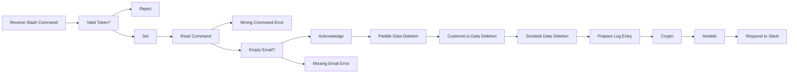

## Fluxo (.json) :

```json
{
  "nodes": [
    {
      "name": "Receive Slash Command",
      "type": "n8n-nodes-base.webhook",
      "position": [
        240,
        100
      ],
      "webhookId": "3c0d3820-5896-41c5-83bf-1cd5e956c32c",
      "parameters": {
        "path": "3c0d3820-5896-41c5-83bf-1cd5e956c32c",
        "options": {},
        "httpMethod": "POST",
        "responseMode": "responseNode"
      },
      "typeVersion": 1
    },
    {
      "name": "Reject",
      "type": "n8n-nodes-base.respondToWebhook",
      "position": [
        680,
        200
      ],
      "parameters": {
        "options": {
          "responseCode": 403
        },
        "respondWith": "noData"
      },
      "typeVersion": 1
    },
    {
      "name": "Set",
      "type": "n8n-nodes-base.set",
      "position": [
        680,
        0
      ],
      "parameters": {
        "values": {
          "string": [
            {
              "name": "operation",
              "value": "={{$json[\"body\"][\"text\"].split(\" \")[0].toLowerCase()}}"
            },
            {
              "name": "email",
              "value": "={{$json[\"body\"][\"text\"].split(\" \")[1].toLowerCase()}}"
            }
          ]
        },
        "options": {},
        "keepOnlySet": true
      },
      "typeVersion": 1
    },
    {
      "name": "Read Command",
      "type": "n8n-nodes-base.switch",
      "position": [
        900,
        0
      ],
      "parameters": {
        "rules": {
          "rules": [
            {
              "value2": "delete"
            }
          ]
        },
        "value1": "={{$json[\"operation\"]}}",
        "dataType": "string",
        "fallbackOutput": 3
      },
      "typeVersion": 1
    },
    {
      "name": "Wrong Command Error",
      "type": "n8n-nodes-base.respondToWebhook",
      "position": [
        1120,
        100
      ],
      "parameters": {
        "options": {},
        "respondWith": "json",
        "responseBody": "{\n  \"text\": \"Sorry, I didn't understand your command. You can request data deletion like so: `/gdpr delete <email>`.\"\n}"
      },
      "typeVersion": 1
    },
    {
      "name": "Acknowledge",
      "type": "n8n-nodes-base.respondToWebhook",
      "position": [
        1340,
        0
      ],
      "parameters": {
        "options": {},
        "respondWith": "json",
        "responseBody": "{\n  \"text\": \"On it!\"\n}"
      },
      "typeVersion": 1
    },
    {
      "name": "Empty Email?",
      "type": "n8n-nodes-base.if",
      "position": [
        1120,
        -100
      ],
      "parameters": {
        "conditions": {
          "string": [
            {
              "value1": "={{$json[\"email\"]}}",
              "operation": "isEmpty"
            }
          ]
        }
      },
      "typeVersion": 1
    },
    {
      "name": "Missing Email Error",
      "type": "n8n-nodes-base.respondToWebhook",
      "position": [
        1340,
        -200
      ],
      "parameters": {
        "options": {},
        "respondWith": "json",
        "responseBody": "{\n  \"text\": \"It looks like the user email address is missing. You can request data deletion like so: `/gdpr delete <email>`.\"\n}"
      },
      "typeVersion": 1
    },
    {
      "name": "Valid Token?",
      "type": "n8n-nodes-base.if",
      "position": [
        460,
        100
      ],
      "parameters": {
        "conditions": {
          "string": [
            {
              "value1": "={{$json[\"body\"][\"token\"]}}",
              "value2": "foo"
            }
          ]
        }
      },
      "typeVersion": 1
    },
    {
      "name": "Paddle Data Deletion",
      "type": "n8n-nodes-base.executeWorkflow",
      "position": [
        1560,
        0
      ],
      "parameters": {
        "workflowId": "1231"
      },
      "typeVersion": 1
    },
    {
      "name": "Customer.io Data Deletion",
      "type": "n8n-nodes-base.executeWorkflow",
      "position": [
        1780,
        0
      ],
      "parameters": {
        "workflowId": "1237"
      },
      "typeVersion": 1
    },
    {
      "name": "Zendesk Data Deletion",
      "type": "n8n-nodes-base.executeWorkflow",
      "position": [
        2000,
        0
      ],
      "parameters": {
        "workflowId": "1240"
      },
      "typeVersion": 1
    },
    {
      "name": "Airtable",
      "type": "n8n-nodes-base.airtable",
      "position": [
        1780,
        200
      ],
      "parameters": {
        "table": "Log",
        "options": {},
        "operation": "append",
        "application": "app3wAXUUwalhapFV"
      },
      "credentials": {
        "airtableApi": {
          "id": "12",
          "name": "mutedjam@n8n.io"
        }
      },
      "typeVersion": 1
    },
    {
      "name": "Prepare Log Entry",
      "type": "n8n-nodes-base.function",
      "position": [
        1340,
        200
      ],
      "parameters": {
        "functionCode": "let deletion_nodes = [\n  'Paddle Data Deletion',\n  'Customer.io Data Deletion',\n  'Zendesk Data Deletion'\n]\n\nconst deletion_results = deletion_nodes.map(node_name => $items(node_name)[0].json);\nconst deletion_success = deletion_results.filter(json => json.success == true).length == deletion_nodes.length;\n\nreturn [{\n  json: {\n    Result: deletion_success ? 'Done' : 'Error',\n    Notes: deletion_results.map(json => json.service + ': ' + json.message).join('\\n'),\n    Processed: new Date().toISOString()\n  }\n}];"
      },
      "typeVersion": 1
    },
    {
      "name": "Crypto",
      "type": "n8n-nodes-base.crypto",
      "position": [
        1560,
        200
      ],
      "parameters": {
        "type": "SHA256",
        "value": "={{$node[\"Set\"].json[\"email\"]}}",
        "dataPropertyName": "Email Hash"
      },
      "typeVersion": 1
    },
    {
      "name": "Respond to Slack",
      "type": "n8n-nodes-base.httpRequest",
      "position": [
        2000,
        200
      ],
      "parameters": {
        "url": "={{$node[\"Receive Slash Command\"].json[\"body\"][\"response_url\"]}}",
        "options": {},
        "requestMethod": "POST",
        "responseFormat": "string",
        "bodyParametersUi": {
          "parameter": [
            {
              "name": "text",
              "value": "=GDPR data deletion process finished.\nStatus: {{$node[\"Prepare Log Entry\"].json[\"Result\"] == \"Done\" ? \":white_check_mark: OK\" : \":x: Error\"}}\nLog: <https://airtable.com/app3wAXUUwalhapFV/tbljkxW55l2Gq7Fzq/viwOJdJM1taITEaPr/{{$node[\"Airtable\"].json[\"id\"]}}?blocks=hide|View in Airtable>"
            },
            {
              "name": "delete_original",
              "value": "true"
            }
          ]
        }
      },
      "typeVersion": 1
    }
  ],
  "connections": {
    "Set": {
      "main": [
        [
          {
            "node": "Read Command",
            "type": "main",
            "index": 0
          }
        ]
      ]
    },
    "Crypto": {
      "main": [
        [
          {
            "node": "Airtable",
            "type": "main",
            "index": 0
          }
        ]
      ]
    },
    "Airtable": {
      "main": [
        [
          {
            "node": "Respond to Slack",
            "type": "main",
            "index": 0
          }
        ]
      ]
    },
    "Acknowledge": {
      "main": [
        [
          {
            "node": "Paddle Data Deletion",
            "type": "main",
            "index": 0
          }
        ]
      ]
    },
    "Empty Email?": {
      "main": [
        [
          {
            "node": "Missing Email Error",
            "type": "main",
            "index": 0
          }
        ],
        [
          {
            "node": "Acknowledge",
            "type": "main",
            "index": 0
          }
        ]
      ]
    },
    "Read Command": {
      "main": [
        [
          {
            "node": "Empty Email?",
            "type": "main",
            "index": 0
          }
        ],
        null,
        null,
        [
          {
            "node": "Wrong Command Error",
            "type": "main",
            "index": 0
          }
        ]
      ]
    },
    "Valid Token?": {
      "main": [
        [
          {
            "node": "Set",
            "type": "main",
            "index": 0
          }
        ],
        [
          {
            "node": "Reject",
            "type": "main",
            "index": 0
          }
        ]
      ]
    },
    "Prepare Log Entry": {
      "main": [
        [
          {
            "node": "Crypto",
            "type": "main",
            "index": 0
          }
        ]
      ]
    },
    "Paddle Data Deletion": {
      "main": [
        [
          {
            "node": "Customer.io Data Deletion",
            "type": "main",
            "index": 0
          }
        ]
      ]
    },
    "Receive Slash Command": {
      "main": [
        [
          {
            "node": "Valid Token?",
            "type": "main",
            "index": 0
          }
        ]
      ]
    },
    "Zendesk Data Deletion": {
      "main": [
        [
          {
            "node": "Prepare Log Entry",
            "type": "main",
            "index": 0
          }
        ]
      ]
    },
    "Customer.io Data Deletion": {
      "main": [
        [
          {
            "node": "Zendesk Data Deletion",
            "type": "main",
            "index": 0
          }
        ]
      ]
    }
  }
}
```

<a id="template-153"></a>

## Template 153 - Assistente de vendas WhatsApp com catálogo 2024

- **Nome:** Assistente de vendas WhatsApp com catálogo 2024
- **Descrição:** Fluxo que recebe mensagens via WhatsApp, utiliza um agente de IA apoiado por um catálogo de produtos criado a partir de uma brochu ra PDF de 2024 para responder perguntas dos clientes e retornar respostas via WhatsApp.
- **Funcionalidade:** • Importar brochu ra PDF: Baixa a brochu ra de produto (PDF) a partir de uma URL externa.
• Extrair texto do PDF: Extrai o conteúdo textual do arquivo PDF para processamento.
• Dividir texto em trechos: Separa o texto em chunks para processamento e indexação.
• Gerar embeddings: Cria vetores semânticos do conteúdo usando um modelo de embeddings.
• Criar/atualizar catálogo vetorial: Insere os embeddings em uma loja vetorial para consultas posteriores.
• Expor ferramenta de busca no catálogo: Disponibiliza uma ferramenta que permite ao agente consultar o catálogo vetorial (ano 2024) quando necessário.
• Receber mensagens do cliente: Ativa via gatilho de mensagens do WhatsApp para iniciar o atendimento.
• Filtrar tipos de mensagem: Aceita apenas mensagens de texto e responde automaticamente a mensagens não suportadas.
• Memória por sessão: Mantém um buffer de conversa por usuário para contexto de diálogo.
• Agente de IA conversacional: Envia a mensagem do usuário a um modelo de linguagem com instruções para responder com base no catálogo e na memória.
• Enviar resposta ao usuário: Retorna a resposta gerada para o remetente via WhatsApp.
• Execução manual para povoar o catálogo: Permite rodar manualmente a etapa de ingestão para (re)criar o catálogo vetorial.
- **Ferramentas:** • WhatsApp Business API: Plataforma para receber e enviar mensagens ao usuário.
• OpenAI: Serviços de modelo de linguagem e embeddings utilizados para gerar respostas e vetores semânticos (modelos de chat e embeddings).
• Fonte do PDF (Yamaha - brochu ra 2024): Arquivo PDF externo que serve como base de conhecimento para o catálogo de produtos.


## Fluxo visual

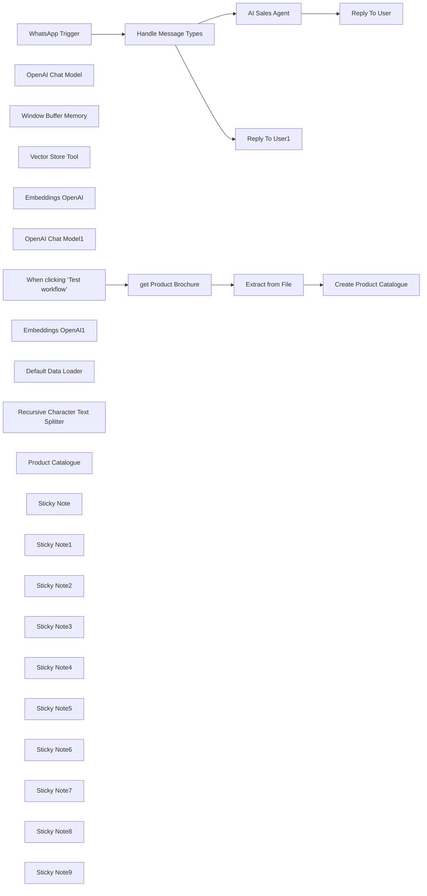

## Fluxo (.json) :

```json
{
  "meta": {
    "instanceId": "408f9fb9940c3cb18ffdef0e0150fe342d6e655c3a9fac21f0f644e8bedabcd9"
  },
  "nodes": [
    {
      "id": "77ee6494-4898-47dc-81d9-35daf6f0beea",
      "name": "WhatsApp Trigger",
      "type": "n8n-nodes-base.whatsAppTrigger",
      "position": [
        1360,
        -280
      ],
      "webhookId": "aaa71f03-f7af-4d18-8d9a-0afb86f1b554",
      "parameters": {
        "updates": [
          "messages"
        ]
      },
      "credentials": {
        "whatsAppTriggerApi": {
          "id": "H3uYNtpeczKMqtYm",
          "name": "WhatsApp OAuth account"
        }
      },
      "typeVersion": 1
    },
    {
      "id": "57210e27-1f89-465a-98cc-43f890a4bf58",
      "name": "OpenAI Chat Model",
      "type": "@n8n/n8n-nodes-langchain.lmChatOpenAi",
      "position": [
        1960,
        -200
      ],
      "parameters": {
        "model": "gpt-4o-2024-08-06",
        "options": {}
      },
      "credentials": {
        "openAiApi": {
          "id": "8gccIjcuf3gvaoEr",
          "name": "OpenAi account"
        }
      },
      "typeVersion": 1
    },
    {
      "id": "e1053235-0ade-4e36-9ad2-8b29c78fced8",
      "name": "Window Buffer Memory",
      "type": "@n8n/n8n-nodes-langchain.memoryBufferWindow",
      "position": [
        2080,
        -200
      ],
      "parameters": {
        "sessionKey": "=whatsapp-75-{{ $json.messages[0].from }}",
        "sessionIdType": "customKey"
      },
      "typeVersion": 1.2
    },
    {
      "id": "69f1b78b-7c93-4713-863a-27e04809996f",
      "name": "Vector Store Tool",
      "type": "@n8n/n8n-nodes-langchain.toolVectorStore",
      "position": [
        2200,
        -200
      ],
      "parameters": {
        "name": "query_product_brochure",
        "description": "Call this tool to query the product brochure. Valid for the year 2024."
      },
      "typeVersion": 1
    },
    {
      "id": "170e8f7d-7e14-48dd-9f80-5352cc411fc1",
      "name": "Embeddings OpenAI",
      "type": "@n8n/n8n-nodes-langchain.embeddingsOpenAi",
      "position": [
        2200,
        80
      ],
      "parameters": {
        "model": "text-embedding-3-small",
        "options": {}
      },
      "credentials": {
        "openAiApi": {
          "id": "8gccIjcuf3gvaoEr",
          "name": "OpenAi account"
        }
      },
      "typeVersion": 1
    },
    {
      "id": "ee78320b-d407-49e8-b4b8-417582a44709",
      "name": "OpenAI Chat Model1",
      "type": "@n8n/n8n-nodes-langchain.lmChatOpenAi",
      "position": [
        2440,
        -60
      ],
      "parameters": {
        "model": "gpt-4o-2024-08-06",
        "options": {}
      },
      "credentials": {
        "openAiApi": {
          "id": "8gccIjcuf3gvaoEr",
          "name": "OpenAi account"
        }
      },
      "typeVersion": 1
    },
    {
      "id": "9dd89378-5acf-4ca6-8d84-e6e64254ed02",
      "name": "When clicking ‘Test workflow’",
      "type": "n8n-nodes-base.manualTrigger",
      "position": [
        0,
        -240
      ],
      "parameters": {},
      "typeVersion": 1
    },
    {
      "id": "e68fc137-1bcb-43f0-b597-3ae07f380c15",
      "name": "Embeddings OpenAI1",
      "type": "@n8n/n8n-nodes-langchain.embeddingsOpenAi",
      "position": [
        760,
        -20
      ],
      "parameters": {
        "model": "text-embedding-3-small",
        "options": {}
      },
      "credentials": {
        "openAiApi": {
          "id": "8gccIjcuf3gvaoEr",
          "name": "OpenAi account"
        }
      },
      "typeVersion": 1
    },
    {
      "id": "2d31e92b-18d4-4f6b-8cdb-bed0056d50d7",
      "name": "Default Data Loader",
      "type": "@n8n/n8n-nodes-langchain.documentDefaultDataLoader",
      "position": [
        900,
        -20
      ],
      "parameters": {
        "options": {},
        "jsonData": "={{ $('Extract from File').item.json.text }}",
        "jsonMode": "expressionData"
      },
      "typeVersion": 1
    },
    {
      "id": "ca0c015e-fba2-4dca-b0fe-bac66681725a",
      "name": "Recursive Character Text Splitter",
      "type": "@n8n/n8n-nodes-langchain.textSplitterRecursiveCharacterTextSplitter",
      "position": [
        900,
        100
      ],
      "parameters": {
        "options": {},
        "chunkSize": 2000,
        "chunkOverlap": {}
      },
      "typeVersion": 1
    },
    {
      "id": "63abb6b2-b955-4e65-9c63-3211dca65613",
      "name": "Extract from File",
      "type": "n8n-nodes-base.extractFromFile",
      "position": [
        360,
        -240
      ],
      "parameters": {
        "options": {},
        "operation": "pdf"
      },
      "typeVersion": 1
    },
    {
      "id": "be2add9c-3670-4196-8c38-82742bf4f283",
      "name": "get Product Brochure",
      "type": "n8n-nodes-base.httpRequest",
      "position": [
        180,
        -240
      ],
      "parameters": {
        "url": "https://usa.yamaha.com/files/download/brochure/1/1474881/Yamaha-Powered-Loudspeakers-brochure-2024-en-web.pdf",
        "options": {}
      },
      "typeVersion": 4.2
    },
    {
      "id": "1ae5a311-36d7-4454-ab14-6788d1331780",
      "name": "Reply To User",
      "type": "n8n-nodes-base.whatsApp",
      "position": [
        2820,
        -280
      ],
      "parameters": {
        "textBody": "={{ $json.output }}",
        "operation": "send",
        "phoneNumberId": "477115632141067",
        "requestOptions": {},
        "additionalFields": {
          "previewUrl": false
        },
        "recipientPhoneNumber": "={{ $('WhatsApp Trigger').item.json.messages[0].from }}"
      },
      "credentials": {
        "whatsAppApi": {
          "id": "9SFJPeqrpChOkAmw",
          "name": "WhatsApp account"
        }
      },
      "typeVersion": 1
    },
    {
      "id": "b6efba81-18b0-4378-bb91-51f39ca57f3e",
      "name": "Reply To User1",
      "type": "n8n-nodes-base.whatsApp",
      "position": [
        1760,
        80
      ],
      "parameters": {
        "textBody": "=I'm unable to process non-text messages. Please send only text messages. Thanks!",
        "operation": "send",
        "phoneNumberId": "477115632141067",
        "requestOptions": {},
        "additionalFields": {
          "previewUrl": false
        },
        "recipientPhoneNumber": "={{ $('WhatsApp Trigger').item.json.messages[0].from }}"
      },
      "credentials": {
        "whatsAppApi": {
          "id": "9SFJPeqrpChOkAmw",
          "name": "WhatsApp account"
        }
      },
      "typeVersion": 1
    },
    {
      "id": "52decd86-ac6c-4d91-a938-86f93ec5f822",
      "name": "Product Catalogue",
      "type": "@n8n/n8n-nodes-langchain.vectorStoreInMemory",
      "position": [
        2200,
        -60
      ],
      "parameters": {
        "memoryKey": "whatsapp-75"
      },
      "typeVersion": 1
    },
    {
      "id": "6dd5a652-2464-4ab8-8e5f-568529299523",
      "name": "Sticky Note",
      "type": "n8n-nodes-base.stickyNote",
      "position": [
        -88.75,
        -473.4375
      ],
      "parameters": {
        "color": 7,
        "width": 640.4375,
        "height": 434.6875,
        "content": "## 1. Download Product Brochure PDF\n[Read more about the HTTP Request Tool](https://docs.n8n.io/integrations/builtin/core-nodes/n8n-nodes-base.httprequest)\n\nImport your marketing PDF document to build your vector store. This will be used as the knowledgebase by the Sales AI Agent.\n\nFor this demonstration, we'll use the HTTP request node to import the YAMAHA POWERED LOUDSPEAKERS 2024 brochure ([Source](https://usa.yamaha.com/files/download/brochure/1/1474881/Yamaha-Powered-Loudspeakers-brochure-2024-en-web.pdf)) and an Extract from File node to extract the text contents. "
      },
      "typeVersion": 1
    },
    {
      "id": "116663bc-d8d6-41a5-93dc-b219adbb2235",
      "name": "Sticky Note1",
      "type": "n8n-nodes-base.stickyNote",
      "position": [
        580,
        -476
      ],
      "parameters": {
        "color": 7,
        "width": 614.6875,
        "height": 731.1875,
        "content": "## 2. Create Product Brochure Vector Store\n[Read more about the In-Memory Vector Store](https://docs.n8n.io/integrations/builtin/cluster-nodes/root-nodes/n8n-nodes-langchain.vectorstoreinmemory/)\n\nVector stores are powerful databases which serve the purpose of matching a user's questions to relevant parts of a document. By creating a vector store of our product catalog, we'll allow users to query using natural language.\n\nTo keep things simple, we'll use the **In-memory Vector Store** which comes built-in to n8n and doesn't require a separate service. For production deployments, I'd recommend replacing the in-memory vector store with either [Qdrant](https://qdrant.tech) or [Pinecone](https://pinecone.io)."
      },
      "typeVersion": 1
    },
    {
      "id": "86bd5334-d735-4650-aeff-06230119d705",
      "name": "Create Product Catalogue",
      "type": "@n8n/n8n-nodes-langchain.vectorStoreInMemory",
      "position": [
        760,
        -200
      ],
      "parameters": {
        "mode": "insert",
        "memoryKey": "whatsapp-75",
        "clearStore": true
      },
      "typeVersion": 1
    },
    {
      "id": "b8078b0d-cbd7-423f-bb30-13902988be38",
      "name": "Sticky Note2",
      "type": "n8n-nodes-base.stickyNote",
      "position": [
        1254,
        -552
      ],
      "parameters": {
        "color": 7,
        "width": 546.6875,
        "height": 484.1875,
        "content": "## 3. Use the WhatsApp Trigger\n[Learn more about the WhatsApp Trigger](https://docs.n8n.io/integrations/builtin/trigger-nodes/n8n-nodes-base.whatsapptrigger/)\n\nThe WhatsApp Trigger allows you to receive incoming WhatsApp messages from customers. It requires a bit of setup so remember to follow the documentation carefully! Once ready however, it's quite easy to build powerful workflows which are easily accessible to users.\n\nNote that WhatsApp can send many message types such as audio and video so in this demonstration, we'll filter them out and just accept the text messages."
      },
      "typeVersion": 1
    },
    {
      "id": "5bf7ed07-282b-4198-aa90-3e5ae5180404",
      "name": "Sticky Note3",
      "type": "n8n-nodes-base.stickyNote",
      "position": [
        1640,
        280
      ],
      "parameters": {
        "width": 338,
        "height": 92,
        "content": "### Want to handle all message types?\nCheck out my other WhatsApp template in my creator page! https://n8n.io/creators/jimleuk/"
      },
      "typeVersion": 1
    },
    {
      "id": "a3661b59-25d2-446e-8462-32b4d692b69d",
      "name": "Sticky Note4",
      "type": "n8n-nodes-base.stickyNote",
      "position": [
        1640,
        -40
      ],
      "parameters": {
        "color": 7,
        "width": 337.6875,
        "height": 311.1875,
        "content": "### 3a. Handle Unsupported Message Types\nFor non-text messages, we'll just reply with a simple message to inform the sender."
      },
      "typeVersion": 1
    },
    {
      "id": "ea3c9ee1-505a-40e7-82fe-9169bdbb80af",
      "name": "Sticky Note5",
      "type": "n8n-nodes-base.stickyNote",
      "position": [
        1840,
        -682.5
      ],
      "parameters": {
        "color": 7,
        "width": 746.6875,
        "height": 929.1875,
        "content": "## 4. Sales AI Agent Responds To Customers\n[Learn more about using AI Agents](https://docs.n8n.io/integrations/builtin/cluster-nodes/root-nodes/n8n-nodes-langchain.agent/)\n\nn8n's AI agents are powerful nodes which make it incredibly easy to use state-of-the-art AI in your workflows. Not only do they have the ability to remember conversations per individual customer but also tap into resources such as our product catalogue vector store to pull factual information and data for every question.\n\nIn this demonstration, we use an AI agent which is directed to help the user navigate the product brochure. A Chat memory subnode is attached to identify and keep track of the customer session. A Vector store tool is added to allow the Agent to tap into the product catalogue knowledgebase we built earlier."
      },
      "typeVersion": 1
    },
    {
      "id": "5c72df8d-bca1-4634-b1ed-61ffec8bd103",
      "name": "Sticky Note6",
      "type": "n8n-nodes-base.stickyNote",
      "position": [
        2620,
        -560
      ],
      "parameters": {
        "color": 7,
        "width": 495.4375,
        "height": 484.1875,
        "content": "## 5. Repond to WhatsApp User\n[Learn more about the WhatsApp Node](https://docs.n8n.io/integrations/builtin/app-nodes/n8n-nodes-base.whatsapp/)\n\nThe WhatsApp node is the go-to if you want to interact with WhatsApp users. With this node, you can send text, images, audio and video messages as well as use your WhatsApp message templates.\n\nHere, we'll keep it simple by replying with a text message which is the output of the AI agent."
      },
      "typeVersion": 1
    },
    {
      "id": "48ec809f-ca0e-4052-b403-9ad7077b3fff",
      "name": "Sticky Note7",
      "type": "n8n-nodes-base.stickyNote",
      "position": [
        -520,
        -620
      ],
      "parameters": {
        "width": 401.25,
        "height": 582.6283033962263,
        "content": "## Try It Out!\n\n### This n8n template builds a simple WhatsApp chabot acting as a Sales Agent. The Agent is backed by a product catalog vector store to better answer user's questions.\n\n* This template is in 2 parts: creating the product catalog vector store and building the WhatsApp AI chatbot.\n* A product brochure is imported via HTTP request node and its text contents extracted.\n* The text contents are then uploaded to the in-memory vector store to build a knowledgebase for the chatbot.\n* A WhatsApp trigger is used to capture messages from customers where non-text messages are filtered out.\n* The customer's message is sent to the AI Agent which queries the product catalogue using the vector store tool.\n* The Agent's response is sent back to the user via the WhatsApp node.\n\n### Need Help?\nJoin the [Discord](https://discord.com/invite/XPKeKXeB7d) or ask in the [Forum](https://community.n8n.io/)!"
      },
      "typeVersion": 1
    },
    {
      "id": "87cf9b41-66de-49a7-aeb0-c8809191b5a0",
      "name": "Handle Message Types",
      "type": "n8n-nodes-base.switch",
      "position": [
        1560,
        -280
      ],
      "parameters": {
        "rules": {
          "values": [
            {
              "outputKey": "Supported",
              "conditions": {
                "options": {
                  "version": 2,
                  "leftValue": "",
                  "caseSensitive": true,
                  "typeValidation": "strict"
                },
                "combinator": "and",
                "conditions": [
                  {
                    "operator": {
                      "type": "string",
                      "operation": "equals"
                    },
                    "leftValue": "={{ $json.messages[0].type }}",
                    "rightValue": "text"
                  }
                ]
              },
              "renameOutput": true
            },
            {
              "outputKey": "Not Supported",
              "conditions": {
                "options": {
                  "version": 2,
                  "leftValue": "",
                  "caseSensitive": true,
                  "typeValidation": "strict"
                },
                "combinator": "and",
                "conditions": [
                  {
                    "id": "89971d8c-a386-4e77-8f6c-f491a8e84cb6",
                    "operator": {
                      "type": "string",
                      "operation": "notEquals"
                    },
                    "leftValue": "={{ $json.messages[0].type }}",
                    "rightValue": "text"
                  }
                ]
              },
              "renameOutput": true
            }
          ]
        },
        "options": {}
      },
      "typeVersion": 3.2
    },
    {
      "id": "e52f0a50-0c34-4c4a-b493-4c42ba112277",
      "name": "Sticky Note8",
      "type": "n8n-nodes-base.stickyNote",
      "position": [
        -80,
        -20
      ],
      "parameters": {
        "color": 5,
        "width": 345.10906976744184,
        "height": 114.53583720930231,
        "content": "### You only have to run this part once!\nRun this step to populate our product catalogue vector. Run again if you want to update the vector store with a new version."
      },
      "typeVersion": 1
    },
    {
      "id": "c1a7d6d1-191e-4343-af9f-f2c9eb4ecf49",
      "name": "Sticky Note9",
      "type": "n8n-nodes-base.stickyNote",
      "position": [
        1260,
        -40
      ],
      "parameters": {
        "color": 5,
        "width": 364.6293255813954,
        "height": 107.02804651162779,
        "content": "### Activate your workflow to use!\nTo start using the WhatsApp chatbot, you'll need to activate the workflow. If you are self-hosting ensure WhatsApp is able to connect to your server."
      },
      "typeVersion": 1
    },
    {
      "id": "a36524d0-22a6-48cc-93fe-b4571cec428a",
      "name": "AI Sales Agent",
      "type": "@n8n/n8n-nodes-langchain.agent",
      "position": [
        1960,
        -400
      ],
      "parameters": {
        "text": "={{ $json.messages[0].text.body }}",
        "options": {
          "systemMessage": "You are an assistant working for a company who sells Yamaha Powered Loudspeakers and helping the user navigate the product catalog for the year 2024. Your goal is not to facilitate a sale but if the user enquires, direct them to the appropriate website, url or contact information.\n\nDo your best to answer any questions factually. If you don't know the answer or unable to obtain the information from the datastore, then tell the user so."
        },
        "promptType": "define"
      },
      "typeVersion": 1.6
    }
  ],
  "pinData": {},
  "connections": {
    "AI Sales Agent": {
      "main": [
        [
          {
            "node": "Reply To User",
            "type": "main",
            "index": 0
          }
        ]
      ]
    },
    "WhatsApp Trigger": {
      "main": [
        [
          {
            "node": "Handle Message Types",
            "type": "main",
            "index": 0
          }
        ]
      ]
    },
    "Embeddings OpenAI": {
      "ai_embedding": [
        [
          {
            "node": "Product Catalogue",
            "type": "ai_embedding",
            "index": 0
          }
        ]
      ]
    },
    "Extract from File": {
      "main": [
        [
          {
            "node": "Create Product Catalogue",
            "type": "main",
            "index": 0
          }
        ]
      ]
    },
    "OpenAI Chat Model": {
      "ai_languageModel": [
        [
          {
            "node": "AI Sales Agent",
            "type": "ai_languageModel",
            "index": 0
          }
        ]
      ]
    },
    "Product Catalogue": {
      "ai_vectorStore": [
        [
          {
            "node": "Vector Store Tool",
            "type": "ai_vectorStore",
            "index": 0
          }
        ]
      ]
    },
    "Vector Store Tool": {
      "ai_tool": [
        [
          {
            "node": "AI Sales Agent",
            "type": "ai_tool",
            "index": 0
          }
        ]
      ]
    },
    "Embeddings OpenAI1": {
      "ai_embedding": [
        [
          {
            "node": "Create Product Catalogue",
            "type": "ai_embedding",
            "index": 0
          }
        ]
      ]
    },
    "OpenAI Chat Model1": {
      "ai_languageModel": [
        [
          {
            "node": "Vector Store Tool",
            "type": "ai_languageModel",
            "index": 0
          }
        ]
      ]
    },
    "Default Data Loader": {
      "ai_document": [
        [
          {
            "node": "Create Product Catalogue",
            "type": "ai_document",
            "index": 0
          }
        ]
      ]
    },
    "Handle Message Types": {
      "main": [
        [
          {
            "node": "AI Sales Agent",
            "type": "main",
            "index": 0
          }
        ],
        [
          {
            "node": "Reply To User1",
            "type": "main",
            "index": 0
          }
        ]
      ]
    },
    "Window Buffer Memory": {
      "ai_memory": [
        [
          {
            "node": "AI Sales Agent",
            "type": "ai_memory",
            "index": 0
          }
        ]
      ]
    },
    "get Product Brochure": {
      "main": [
        [
          {
            "node": "Extract from File",
            "type": "main",
            "index": 0
          }
        ]
      ]
    },
    "Recursive Character Text Splitter": {
      "ai_textSplitter": [
        [
          {
            "node": "Default Data Loader",
            "type": "ai_textSplitter",
            "index": 0
          }
        ]
      ]
    },
    "When clicking ‘Test workflow’": {
      "main": [
        [
          {
            "node": "get Product Brochure",
            "type": "main",
            "index": 0
          }
        ]
      ]
    }
  }
}
```

<a id="template-154"></a>

## Template 154 - Atualização de Tendências do Google via RSS para Sheets

- **Nome:** Atualização de Tendências do Google via RSS para Sheets
- **Descrição:** Este fluxo coleta tendências do Google Trends através de RSS, filtra por tráfego mínimo e por palavras ainda não salvas, obtém conteúdo de até três URLs por keyword, gera um resumo e salva os dados na planilha.
- **Funcionalidade:** • Disparo do fluxo: inicia via disparo manual ou cron para buscar tendências atualizadas.
• Conversão de RSS XML para JSON: transforma o RSS em objeto estruturado para processamento.
• Filtragem de keywords novas: evita duplicatas consultando a planilha existente.
• Limite de resultados: aplica min_traffic e max_results para selecionar apenas as keywords relevantes.
• Scraping de conteúdos: obtém conteúdo de até 3 URLs por keyword a partir de uma fonte externa, removendo elementos desnecessários.
• Geração de resumo: concatena conteúdos raspados em um resumo único com keyword, tráfego aproximado e data.
• Salvamento na planilha: grava registros com campos como status, pubDate, trending_keyword, approximate_traffic e links para cada item.
• Validação de falhas de scraping: evita salvar registros quando nenhum conteúdo foi extraído.
• Orquestração de atualização temporal: agenda a checagem a cada hora com atraso de 11 minutos.
- **Ferramentas:** • Google Sheets: planilha de dados usada como base de dados editorial.
• Jina.ai: serviço de extração de conteúdo textual de páginas da web a partir das URLs das tendências.
• Google Trends RSS: fonte de feed para coletar as keywords de tendências.


## Fluxo visual

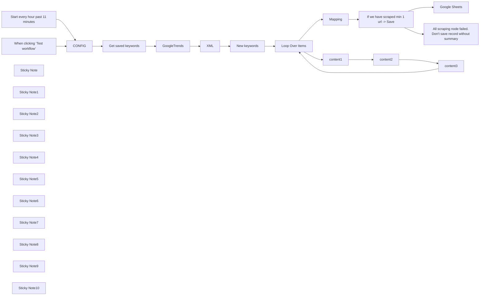

## Fluxo (.json) :

```json
{
  "id": "Eyh4jc7RK7rCTh4z",
  "meta": {
    "instanceId": "38fb1860cc6284b8af9ba3b485f32cc1851cd97470ef1b4a472b5e707f1c93b5",
    "templateCredsSetupCompleted": true
  },
  "name": "My workflow 2",
  "tags": [],
  "nodes": [
    {
      "id": "084bcc9e-9d05-4b69-8cb1-eccdcb67358e",
      "name": "When clicking ‘Test workflow’",
      "type": "n8n-nodes-base.manualTrigger",
      "position": [
        500,
        720
      ],
      "parameters": {},
      "typeVersion": 1
    },
    {
      "id": "f593e3f1-adea-4ef7-9779-4f2436fe7774",
      "name": "XML",
      "type": "n8n-nodes-base.xml",
      "position": [
        1540,
        880
      ],
      "parameters": {
        "options": {
          "normalize": false,
          "explicitArray": false
        }
      },
      "executeOnce": true,
      "typeVersion": 1
    },
    {
      "id": "5906371f-d5da-4141-876f-542cb5d0d1a8",
      "name": "GoogleTrends",
      "type": "n8n-nodes-base.httpRequest",
      "position": [
        1280,
        880
      ],
      "parameters": {
        "url": "https://trends.google.it/trending/rss?geo=IT",
        "options": {}
      },
      "executeOnce": true,
      "retryOnFail": true,
      "typeVersion": 4.2
    },
    {
      "id": "7badc1ad-48c2-4142-88bb-fa3f442abd66",
      "name": "CONFIG",
      "type": "n8n-nodes-base.set",
      "position": [
        760,
        880
      ],
      "parameters": {
        "options": {},
        "assignments": {
          "assignments": [
            {
              "id": "25d7e553-9678-40ad-bb69-e4eb4bce4d11",
              "name": "min_traffic",
              "type": "number",
              "value": 500
            },
            {
              "id": "decd0a3d-ddc5-45c3-a56f-ee1f14705019",
              "name": "max_results",
              "type": "number",
              "value": 3
            },
            {
              "id": "12cdd78a-45a7-499e-8fe5-0ab6a7da8a10",
              "name": "jina_key",
              "type": "string",
              "value": ""
            }
          ]
        }
      },
      "typeVersion": 3.4
    },
    {
      "id": "b92ad672-ea1d-4b5b-ae1d-0aa883c5db9a",
      "name": "Get saved keywords",
      "type": "n8n-nodes-base.googleSheets",
      "position": [
        1020,
        880
      ],
      "parameters": {
        "options": {},
        "sheetName": {
          "__rl": true,
          "mode": "list",
          "value": "gid=0",
          "cachedResultUrl": "",
          "cachedResultName": ""
        },
        "documentId": {
          "__rl": true,
          "mode": "list",
          "value": "",
          "cachedResultUrl": "",
          "cachedResultName": ""
        }
      },
      "credentials": {
        "googleSheetsOAuth2Api": {
          "id": "0HENZXUy9PlxLx0O",
          "name": "Google Sheets account"
        }
      },
      "executeOnce": true,
      "typeVersion": 4.5,
      "alwaysOutputData": false
    },
    {
      "id": "e5639494-d757-442f-942f-75927ecadd86",
      "name": "Loop Over Items",
      "type": "n8n-nodes-base.splitInBatches",
      "position": [
        740,
        1380
      ],
      "parameters": {
        "options": {}
      },
      "typeVersion": 3
    },
    {
      "id": "2c81d605-6749-47a2-95ba-846d86388c04",
      "name": "Mapping",
      "type": "n8n-nodes-base.set",
      "position": [
        1000,
        1380
      ],
      "parameters": {
        "options": {},
        "assignments": {
          "assignments": [
            {
              "id": "7230decf-45d9-4006-b005-614fb1dede10",
              "name": "summary",
              "type": "string",
              "value": "={{ $('content1').item.json.data.text.replaceAll('\\n', ' ').trim() }}\n---\n{{ $('content2').item.json.data.text.replaceAll('\\n', ' ').trim() }}\n---\n{{ $('content3').item.json.data.text.replaceAll('\\n', ' ').trim() }}"
            },
            {
              "id": "ad8f7dcd-fc93-41f3-b643-db4a2b569119",
              "name": "trending_keyword",
              "type": "string",
              "value": "={{ $('New keywords').item.json.trending_keyword }}"
            },
            {
              "id": "a3838385-90e2-4308-b147-5ef6de4a2c19",
              "name": "approx_traffic",
              "type": "number",
              "value": "={{ $('New keywords').item.json.approx_traffic }}"
            },
            {
              "id": "fc8523d5-a68d-443b-ad49-9057dee85617",
              "name": "pubDate",
              "type": "string",
              "value": "={{ $('New keywords').item.json.pubDate }}"
            },
            {
              "id": "139fd57f-8ccc-453b-9f8f-94c9546bbd1c",
              "name": "status",
              "type": "string",
              "value": "idea"
            },
            {
              "id": "39fa6799-78db-453e-ad29-359ab441e912",
              "name": "news_item_url1",
              "type": "string",
              "value": "={{ $('New keywords').item.json.news_item_url1 }}"
            },
            {
              "id": "1e6e7545-526a-4003-ac92-520fa04cfe1d",
              "name": "news_item_title1",
              "type": "string",
              "value": "={{ $('New keywords').item.json.news_item_title1 }}"
            },
            {
              "id": "12c019fc-2fe6-41e8-a8b8-e38bdfa16215",
              "name": "news_item_title2",
              "type": "string",
              "value": "={{ $('New keywords').item.json.news_item_title2 }}"
            },
            {
              "id": "b14b5835-66b7-448c-b9a5-d9f85d9f7f12",
              "name": "news_item_url2",
              "type": "string",
              "value": "={{ $('New keywords').item.json.news_item_url2 }}"
            },
            {
              "id": "4df8d3e0-7c8d-40e1-8ed7-b1743a8bbf17",
              "name": "news_item_title3",
              "type": "string",
              "value": "={{ $('New keywords').item.json.news_item_title3 }}"
            },
            {
              "id": "7fe45e6d-1978-49b4-b289-c33e3d68f71a",
              "name": "news_item_url3",
              "type": "string",
              "value": "={{ $('New keywords').item.json.news_item_url3 }}"
            },
            {
              "id": "ef39509c-c4e7-49b1-9ee8-ad82a8af9514",
              "name": "news_item_picture1",
              "type": "string",
              "value": "={{ $('New keywords').item.json.news_item_picture1 }}"
            },
            {
              "id": "a2210ea6-8ee5-408a-9ba1-5e07bd4d7f1b",
              "name": "news_item_source1",
              "type": "string",
              "value": "={{ $('New keywords').item.json.news_item_source1 }}"
            },
            {
              "id": "b6136672-4c09-4da0-ba5b-d9026877ca1e",
              "name": "news_item_picture2",
              "type": "string",
              "value": "={{ $('New keywords').item.json.news_item_picture2 }}"
            },
            {
              "id": "f9a54dca-079c-4431-af34-6bb98a6d8711",
              "name": "news_item_source2",
              "type": "string",
              "value": "={{ $('New keywords').item.json.news_item_source2 }}"
            },
            {
              "id": "aa38fecd-3743-447f-aa54-a1a86b5ad717",
              "name": "news_item_picture3",
              "type": "string",
              "value": "={{ $('New keywords').item.json.news_item_picture3 }}"
            },
            {
              "id": "2ff53574-9f9d-4e35-afbe-161e77a58515",
              "name": "news_item_source3",
              "type": "string",
              "value": "={{ $('New keywords').item.json.news_item_source3 }}"
            }
          ]
        }
      },
      "typeVersion": 3.4
    },
    {
      "id": "5ca98d8f-0bc6-4b77-a367-81ed2509deba",
      "name": "Google Sheets",
      "type": "n8n-nodes-base.googleSheets",
      "position": [
        1580,
        1180
      ],
      "parameters": {
        "columns": {
          "value": {
            "status": "idea",
            "pubDate": "={{ $json.pubDate }}",
            "abstract": "={{ $json.abstract.replaceAll('  ', '').substring(0, 49999) }}",
            "approx_traffic": "={{ $json.approx_traffic }}",
            "news_item_url1": "={{ $json.news_item_url1 }}",
            "news_item_url2": "={{ $json.news_item_url2 }}",
            "news_item_url3": "={{ $json.news_item_url3 }}",
            "news_item_title1": "={{ $json.news_item_title1 }}",
            "news_item_title2": "={{ $json.news_item_title2 }}",
            "news_item_title3": "={{ $json.news_item_title3 }}",
            "trending_keyword": "={{ $json.trending_keyword }}",
            "news_item_source1": "={{ $json.news_item_source1 }}",
            "news_item_source2": "={{ $json.news_item_source2 }}",
            "news_item_source3": "={{ $json.news_item_source3 }}",
            "news_item_picture1": "={{ $json.news_item_picture1 }}",
            "news_item_picture2": "={{ $json.news_item_picture2 }}",
            "news_item_picture3": "={{ $json.news_item_picture3 }}"
          },
          "schema": [
            {
              "id": "status",
              "type": "string",
              "display": true,
              "required": false,
              "displayName": "status",
              "defaultMatch": false,
              "canBeUsedToMatch": true
            },
            {
              "id": "trending_keyword",
              "type": "string",
              "display": true,
              "required": false,
              "displayName": "trending_keyword",
              "defaultMatch": false,
              "canBeUsedToMatch": true
            },
            {
              "id": "approx_traffic",
              "type": "string",
              "display": true,
              "required": false,
              "displayName": "approx_traffic",
              "defaultMatch": false,
              "canBeUsedToMatch": true
            },
            {
              "id": "abstract",
              "type": "string",
              "display": true,
              "required": false,
              "displayName": "abstract",
              "defaultMatch": false,
              "canBeUsedToMatch": true
            },
            {
              "id": "pubDate",
              "type": "string",
              "display": true,
              "required": false,
              "displayName": "pubDate",
              "defaultMatch": false,
              "canBeUsedToMatch": true
            },
            {
              "id": "news_item_url1",
              "type": "string",
              "display": true,
              "required": false,
              "displayName": "news_item_url1",
              "defaultMatch": false,
              "canBeUsedToMatch": true
            },
            {
              "id": "news_item_title1",
              "type": "string",
              "display": true,
              "required": false,
              "displayName": "news_item_title1",
              "defaultMatch": false,
              "canBeUsedToMatch": true
            },
            {
              "id": "news_item_picture1",
              "type": "string",
              "display": true,
              "required": false,
              "displayName": "news_item_picture1",
              "defaultMatch": false,
              "canBeUsedToMatch": true
            },
            {
              "id": "news_item_source1",
              "type": "string",
              "display": true,
              "required": false,
              "displayName": "news_item_source1",
              "defaultMatch": false,
              "canBeUsedToMatch": true
            },
            {
              "id": "news_item_url2",
              "type": "string",
              "display": true,
              "required": false,
              "displayName": "news_item_url2",
              "defaultMatch": false,
              "canBeUsedToMatch": true
            },
            {
              "id": "news_item_title2",
              "type": "string",
              "display": true,
              "required": false,
              "displayName": "news_item_title2",
              "defaultMatch": false,
              "canBeUsedToMatch": true
            },
            {
              "id": "news_item_picture2",
              "type": "string",
              "display": true,
              "required": false,
              "displayName": "news_item_picture2",
              "defaultMatch": false,
              "canBeUsedToMatch": true
            },
            {
              "id": "news_item_source2",
              "type": "string",
              "display": true,
              "required": false,
              "displayName": "news_item_source2",
              "defaultMatch": false,
              "canBeUsedToMatch": true
            },
            {
              "id": "news_item_url3",
              "type": "string",
              "display": true,
              "required": false,
              "displayName": "news_item_url3",
              "defaultMatch": false,
              "canBeUsedToMatch": true
            },
            {
              "id": "news_item_title3",
              "type": "string",
              "display": true,
              "required": false,
              "displayName": "news_item_title3",
              "defaultMatch": false,
              "canBeUsedToMatch": true
            },
            {
              "id": "news_item_picture3",
              "type": "string",
              "display": true,
              "required": false,
              "displayName": "news_item_picture3",
              "defaultMatch": false,
              "canBeUsedToMatch": true
            },
            {
              "id": "news_item_source3",
              "type": "string",
              "display": true,
              "required": false,
              "displayName": "news_item_source3",
              "defaultMatch": false,
              "canBeUsedToMatch": true
            }
          ],
          "mappingMode": "defineBelow",
          "matchingColumns": [],
          "attemptToConvertTypes": false,
          "convertFieldsToString": false
        },
        "options": {},
        "operation": "append",
        "sheetName": {
          "__rl": true,
          "mode": "list",
          "value": "gid=0",
          "cachedResultUrl": "",
          "cachedResultName": ""
        },
        "documentId": {
          "__rl": true,
          "mode": "list",
          "value": "",
          "cachedResultUrl": "",
          "cachedResultName": ""
        }
      },
      "typeVersion": 4.5
    },
    {
      "id": "41fcb412-ea5d-4adc-8d40-d72398537150",
      "name": "New keywords",
      "type": "n8n-nodes-base.code",
      "position": [
        1780,
        880
      ],
      "parameters": {
        "jsCode": "const max_results = $('CONFIG').first().json.max_results;\nconst min_traffic = $('CONFIG').first().json.min_traffic;\n\nconst gsheet = $(\"Get saved keywords\").all();\nconst gsheetKeys = gsheet.map(record => record.json.trending_keyword);\n\nconst items = $('XML').first().json.rss.channel.item;\nconst trafficKey = Object.keys(items[0]).find(key => key.includes(\"approx_traffic\"));\nconst parseTraffic = (traffic) => parseInt(traffic.replace('+', ''), 10);\n\nconst newItems = items.map(item => {\n    const links = Array.isArray(item[\"ht:news_item\"]) ? item[\"ht:news_item\"].slice(0, 3) : [];\n\n    const flattenedLinks = links.reduce((acc, news, index) => {\n        acc[`news_item_url${index + 1}`] = news[\"ht:news_item_url\"];\n        acc[`news_item_title${index + 1}`] = news[\"ht:news_item_title\"];\n        acc[`news_item_picture${index + 1}`] = news[\"ht:news_item_picture\"];\n        acc[`news_item_source${index + 1}`] = news[\"ht:news_item_source\"];\n        return acc;\n    }, {});\n\n    return {\n        trending_keyword: item.title,\n        approx_traffic: parseTraffic(item[trafficKey]),\n        pubDate: item.pubDate,\n        ...flattenedLinks, // Aggiungi i link\n    };\n}).filter(item => \n    item.approx_traffic >= min_traffic && \n    !gsheetKeys.includes(item.trending_keyword) // Filtra quelli già presenti in Google Sheets\n);\n\nlet sortedItems = newItems.sort((a, b) => b.approx_traffic - a.approx_traffic);\nif (max_results > 0) {\n    sortedItems = sortedItems.slice(0, max_results);\n}\n\nreturn sortedItems;\n"
      },
      "typeVersion": 2,
      "alwaysOutputData": false
    },
    {
      "id": "56a953da-15a7-48da-a299-c53a7947c45e",
      "name": "content1",
      "type": "n8n-nodes-base.httpRequest",
      "position": [
        1020,
        1700
      ],
      "parameters": {
        "url": "=https://r.jina.ai/{{ $('New keywords').item.json.news_item_url1 }}",
        "options": {},
        "sendHeaders": true,
        "headerParameters": {
          "parameters": [
            {
              "name": "Authorization",
              "value": "=Bearer {{ $('CONFIG').item.json.jina_key }}"
            },
            {
              "name": "Accept",
              "value": "application/json"
            },
            {
              "name": "X-Remove-Selector",
              "value": "a, link, script, footer, img, svg"
            },
            {
              "name": "X-Retain-Images",
              "value": "none"
            },
            {
              "name": "X-Return-Format",
              "value": "text"
            }
          ]
        }
      },
      "typeVersion": 4.2
    },
    {
      "id": "e3dbb73f-eac8-47aa-b621-0775dd09c5bf",
      "name": "content2",
      "type": "n8n-nodes-base.httpRequest",
      "position": [
        1280,
        1700
      ],
      "parameters": {
        "url": "=https://r.jina.ai/{{ $('New keywords').item.json.news_item_url2 }}",
        "options": {},
        "sendHeaders": true,
        "headerParameters": {
          "parameters": [
            {
              "name": "Authorization",
              "value": "=Bearer {{ $('CONFIG').item.json.jina_key }}"
            },
            {
              "name": "Accept",
              "value": "application/json"
            },
            {
              "name": "X-Remove-Selector",
              "value": "a, link, script, footer, img, svg"
            },
            {
              "name": "X-Retain-Images",
              "value": "none"
            },
            {
              "name": "X-Return-Format",
              "value": "text"
            }
          ]
        }
      },
      "typeVersion": 4.2
    },
    {
      "id": "0723267a-5e4e-40e2-87bf-4c215c79b66c",
      "name": "content3",
      "type": "n8n-nodes-base.httpRequest",
      "position": [
        1560,
        1700
      ],
      "parameters": {
        "url": "=https://r.jina.ai/{{ $('New keywords').item.json.news_item_url3 }}",
        "options": {},
        "sendHeaders": true,
        "headerParameters": {
          "parameters": [
            {
              "name": "Authorization",
              "value": "=Bearer {{ $('CONFIG').item.json.jina_key }}"
            },
            {
              "name": "Accept",
              "value": "application/json"
            },
            {
              "name": "X-Remove-Selector",
              "value": "a, link, script, footer, img, svg"
            },
            {
              "name": "X-Retain-Images",
              "value": "none"
            },
            {
              "name": "X-Return-Format",
              "value": "text"
            }
          ]
        }
      },
      "typeVersion": 4.2
    },
    {
      "id": "8621b782-a182-479a-afa1-de0b525d3909",
      "name": "Start every hour past 11 minutes",
      "type": "n8n-nodes-base.scheduleTrigger",
      "position": [
        500,
        880
      ],
      "parameters": {
        "rule": {
          "interval": [
            {
              "field": "cronExpression",
              "expression": "11 */1 * * *"
            }
          ]
        }
      },
      "typeVersion": 1.2
    },
    {
      "id": "d04e89cd-a578-45d9-88f2-be4c72407049",
      "name": "Sticky Note",
      "type": "n8n-nodes-base.stickyNote",
      "position": [
        420,
        560
      ],
      "parameters": {
        "color": 5,
        "height": 1300,
        "content": "## Cron trigger\nGoogle Trends update the RSS feed every 10 minutes. This will start wordflow 1 minute after. "
      },
      "typeVersion": 1
    },
    {
      "id": "4644b6ca-43da-42ab-870c-eeb52610208c",
      "name": "Sticky Note1",
      "type": "n8n-nodes-base.stickyNote",
      "position": [
        680,
        560
      ],
      "parameters": {
        "color": 3,
        "height": 480,
        "content": "## CONFIGURATION\nmin_traffic is a numeric value. Google Trend RSS has an approx traffic value 100, 200, 500, 1000 etc.\n\nmax_result is a numeric value used to limit max rss to scrape\n\njina_key is the jina.ai API key"
      },
      "typeVersion": 1
    },
    {
      "id": "b4ac3f6a-dc72-4e3e-9fa1-80298a66ddf9",
      "name": "Sticky Note2",
      "type": "n8n-nodes-base.stickyNote",
      "position": [
        940,
        560
      ],
      "parameters": {
        "height": 480,
        "content": "## Google Sheet Database\nThis is main sheet where all your Editorial plan will be saved.\n\nThe column status value could be a trigger for other automations"
      },
      "typeVersion": 1
    },
    {
      "id": "09fa9ed7-2557-46ae-857f-e251bf25b10e",
      "name": "Sticky Note3",
      "type": "n8n-nodes-base.stickyNote",
      "position": [
        1200,
        560
      ],
      "parameters": {
        "height": 480,
        "content": "## Google Trends request\n\nWe get last kwyword in trend. Every item has a main keyword and 3 URL. We will use those url to scrape content and generate a combined summary"
      },
      "typeVersion": 1
    },
    {
      "id": "6d3d6f90-4eae-4239-b8cd-bfdb40bf01e9",
      "name": "Sticky Note4",
      "type": "n8n-nodes-base.stickyNote",
      "position": [
        1460,
        560
      ],
      "parameters": {
        "height": 480,
        "content": "## Simple conversion\n\nConverts XML RSS into a more readable json object"
      },
      "typeVersion": 1
    },
    {
      "id": "3b5dd19f-ac2d-426b-8853-1af3819e10f6",
      "name": "Sticky Note5",
      "type": "n8n-nodes-base.stickyNote",
      "position": [
        1720,
        560
      ],
      "parameters": {
        "height": 480,
        "content": "## Building dataset\n\nHere we limits results, filter by mmin traffic and we flat the RSS structure to adapt to Google Sheet, fields are renamed as per description.\n\nThen RSS result and Google Sheet is compared, if a new keyword is found we have result. If RSS give a keyword already srtored, this node doesn't give any output."
      },
      "typeVersion": 1
    },
    {
      "id": "cce50db5-6566-439c-9b90-3f8720411613",
      "name": "Sticky Note6",
      "type": "n8n-nodes-base.stickyNote",
      "position": [
        940,
        1080
      ],
      "parameters": {
        "height": 460,
        "content": "## Data mapping\n\nHere you have all fields needed in Google Sheet.\n\nWhile done, the content of 3 website linked in Google Trends RSS will be merged in a single Summary field"
      },
      "typeVersion": 1
    },
    {
      "id": "d57a8c16-21c6-4388-bb91-093428061ac5",
      "name": "Sticky Note7",
      "type": "n8n-nodes-base.stickyNote",
      "position": [
        1200,
        1080
      ],
      "parameters": {
        "color": 3,
        "height": 460,
        "content": "## Data check\n\nSometimes scraping HTML content fails (for some reasons), that's normal but this should avoid to save a zero content if all 3 scraping nodes will fail"
      },
      "typeVersion": 1
    },
    {
      "id": "2bcbf0a9-423d-45eb-a444-ab2140db2db6",
      "name": "Sticky Note8",
      "type": "n8n-nodes-base.stickyNote",
      "position": [
        680,
        1080
      ],
      "parameters": {
        "height": 460,
        "content": "## Data mapping\n\nHere you have all fields needed in Google Sheet.\n\nWhile done, the content of 3 website linked in Google Trends RSS will be merged in a single Summary field"
      },
      "typeVersion": 1
    },
    {
      "id": "692b342c-c252-48c6-ad11-b58906aa62e2",
      "name": "If we have scraped min 1 url -> Save",
      "type": "n8n-nodes-base.if",
      "position": [
        1280,
        1380
      ],
      "parameters": {
        "options": {},
        "conditions": {
          "options": {
            "version": 2,
            "leftValue": "",
            "caseSensitive": true,
            "typeValidation": "strict"
          },
          "combinator": "and",
          "conditions": [
            {
              "id": "42b15ebc-f2f7-4dc0-957f-b04d1bdacb41",
              "operator": {
                "type": "boolean",
                "operation": "true",
                "singleValue": true
              },
              "leftValue": "={{ $json.summary.length > 100 }}",
              "rightValue": ""
            }
          ]
        }
      },
      "typeVersion": 2.2
    },
    {
      "id": "f2f94f0b-dcb4-4b52-86f8-c92aa2fc3d88",
      "name": "All scraping node failed. Don't save record without summary",
      "type": "n8n-nodes-base.noOp",
      "position": [
        1580,
        1380
      ],
      "parameters": {},
      "typeVersion": 1
    },
    {
      "id": "d3f42eb0-5e37-40ff-a476-46b6384f2647",
      "name": "Sticky Note9",
      "type": "n8n-nodes-base.stickyNote",
      "position": [
        680,
        1560
      ],
      "parameters": {
        "color": 7,
        "width": 1280,
        "height": 300,
        "content": "## Scraping\n\nHere jina.ai will get text content from 3 Google Trends URLs"
      },
      "typeVersion": 1
    },
    {
      "id": "8178a70e-f3d2-4157-8f4b-9adaf8932e8e",
      "name": "Sticky Note10",
      "type": "n8n-nodes-base.stickyNote",
      "position": [
        1460,
        1080
      ],
      "parameters": {
        "color": 4,
        "width": 500,
        "height": 460,
        "content": "## Saving output\n\n"
      },
      "typeVersion": 1
    }
  ],
  "active": false,
  "pinData": {},
  "settings": {
    "executionOrder": "v1"
  },
  "versionId": "81aec91d-f995-4a14-b801-ef44070e7153",
  "connections": {
    "XML": {
      "main": [
        [
          {
            "node": "New keywords",
            "type": "main",
            "index": 0
          }
        ]
      ]
    },
    "CONFIG": {
      "main": [
        [
          {
            "node": "Get saved keywords",
            "type": "main",
            "index": 0
          }
        ]
      ]
    },
    "Mapping": {
      "main": [
        [
          {
            "node": "If we have scraped min 1 url -> Save",
            "type": "main",
            "index": 0
          }
        ]
      ]
    },
    "content1": {
      "main": [
        [
          {
            "node": "content2",
            "type": "main",
            "index": 0
          }
        ]
      ]
    },
    "content2": {
      "main": [
        [
          {
            "node": "content3",
            "type": "main",
            "index": 0
          }
        ]
      ]
    },
    "content3": {
      "main": [
        [
          {
            "node": "Loop Over Items",
            "type": "main",
            "index": 0
          }
        ]
      ]
    },
    "GoogleTrends": {
      "main": [
        [
          {
            "node": "XML",
            "type": "main",
            "index": 0
          }
        ]
      ]
    },
    "New keywords": {
      "main": [
        [
          {
            "node": "Loop Over Items",
            "type": "main",
            "index": 0
          }
        ]
      ]
    },
    "Loop Over Items": {
      "main": [
        [
          {
            "node": "Mapping",
            "type": "main",
            "index": 0
          }
        ],
        [
          {
            "node": "content1",
            "type": "main",
            "index": 0
          }
        ]
      ]
    },
    "Get saved keywords": {
      "main": [
        [
          {
            "node": "GoogleTrends",
            "type": "main",
            "index": 0
          }
        ]
      ]
    },
    "Start every hour past 11 minutes": {
      "main": [
        [
          {
            "node": "CONFIG",
            "type": "main",
            "index": 0
          }
        ]
      ]
    },
    "When clicking ‘Test workflow’": {
      "main": [
        [
          {
            "node": "CONFIG",
            "type": "main",
            "index": 0
          }
        ]
      ]
    },
    "If we have scraped min 1 url -> Save": {
      "main": [
        [
          {
            "node": "Google Sheets",
            "type": "main",
            "index": 0
          }
        ],
        [
          {
            "node": "All scraping node failed. Don't save record without summary",
            "type": "main",
            "index": 0
          }
        ]
      ]
    }
  }
}
```

<a id="template-155"></a>

## Template 155 - Roteamento e qualificação de leads em tempo real

- **Nome:** Roteamento e qualificação de leads em tempo real
- **Descrição:** Enriquece submissões de formulário do site com dados de empresa, verifica se o e‑mail é profissional, qualifica o lead com base em regras e retorna um resultado ao site em tempo real.
- **Funcionalidade:** • Receber submissões do site: inicia o processo ao receber dados de formulário via webhook.
• Extrair domínio do e‑mail: obtém o domínio a partir do endereço de e‑mail enviado.
• Verificar e‑mail profissional: checa se o domínio pertence a provedores de e‑mail gratuitos para sinalizar e‑mails não profissionais.
• Enriquecer dados da empresa: consulta uma API externa usando o domínio para obter informações detalhadas da empresa (tamanho, indústria, ano de fundação, LinkedIn, descrição, funding, receita, etc.).
• Normalizar saída da API: simplifica e mapeia os campos relevantes retornados pela API para uso posterior.
• Qualificar conta: aplica uma regra de negócio (ex.: leads com >100 funcionários são roteados para demo 1:1) para determinar o resultado final.
• Retornar resultado ao site: responde ao solicitante com um JSON contendo o código de resultado e cabeçalhos CORS adequados.
- **Ferramentas:** • Webflow: plataforma que envia submissões de formulário e recebe a resposta em tempo real para exibir links/contexto ao usuário.
• Datagma: serviço de enriquecimento de dados de empresas via API, utilizado para obter informações sobre a companhia a partir do domínio.


## Fluxo visual

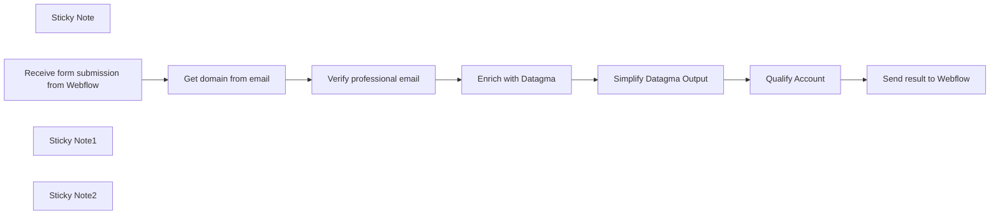

## Fluxo (.json) :

```json
{
  "meta": {
    "instanceId": "f0a68da631efd4ed052a324b63ff90f7a844426af0398a68338f44245d1dd9e5"
  },
  "nodes": [
    {
      "id": "b5ee413f-2a78-4193-acf7-e5994da7f26d",
      "name": "Get domain from email",
      "type": "n8n-nodes-base.set",
      "position": [
        -720,
        700
      ],
      "parameters": {
        "values": {
          "string": [
            {
              "name": "domain",
              "value": "={{ $json.body.email.split(\"@\")[1] }}"
            }
          ]
        },
        "options": {}
      },
      "typeVersion": 2
    },
    {
      "id": "cf045629-7f26-4d67-a620-30e9860f6005",
      "name": "Verify professional email",
      "type": "n8n-nodes-base.code",
      "position": [
        -540,
        700
      ],
      "parameters": {
        "jsCode": "const freemail_list = [\"hitmail.com\",\"rxdoc.biz\",\"cox.com\",\"126.net\",\"126.com\",\"comast.com\",\"comast.net\",\"yandex.com\",\"wegas.ru\",\"twc.com\",\"charter.com\",\"outlook.com\",\"gmx.com\",\".ddns.org\",\".findhere.com\",\".freeservers.com\",\".zzn.com\",\"1033edge.com\",\"11mail.com\",\"123.com\",\"123box.net\",\"123india.com\",\"123mail.cl\",\"123qwe.co.uk\",\"150ml.com\",\"15meg4free.com\",\"163.com\",\"1coolplace.com\",\"1freeemail.com\",\"1funplace.com\",\"1internetdrive.com\",\"1mail.net\",\"1me.net\",\"1mum.com\",\"1musicrow.com\",\"1netdrive.com\",\"1nsyncfan.com\",\"1under.com\",\"1webave.com\",\"1webhighway.com\",\"212.com\",\"24horas.com\",\"2911.net\",\"2bmail.co.uk\",\"2d2i.com\",\"2die4.com\",\"3000.it\",\"321media.com\",\"37.com\",\"3ammagazine.com\",\"3dmail.com\",\"3email.com\",\"3xl.net\",\"444.net\",\"4email.com\",\"4email.net\",\"4mg.com\",\"4newyork.com\",\"4x4man.com\",\"5iron.com\",\"5star.com\",\"88.am\",\"8848.net\",\"888.nu\",\"97rock.com\",\"aaamail.zzn.com\",\"aamail.net\",\"aaronkwok.net\",\"abbeyroadlondon.co.uk\",\"abcflash.net\",\"abdulnour.com\",\"aberystwyth.com\",\"abolition-now.com\",\"about.com\",\"academycougars.com\",\"acceso.or.cr\",\"access4less.net\",\"accessgcc.com\",\"ace-of-base.com\",\"acmecity.com\",\"acmemail.net\",\"acninc.net\",\"activatormail.com\",\"address.com\",\"adelphia.net\",\"adexec.com\",\"adfarrow.com\",\"adios.net\",\"adoption.com\",\"ados.fr\",\"adrenalinefreak.com\",\"advalvas.be\",\"aeiou.pt\",\"aemail4u.com\",\"aeneasmail.com\",\"afreeinternet.com\",\"africamail.com\",\"agoodmail.com\",\"ahaa.dk\",\"aichi.com\",\"aim.com\",\"airforce.net\",\"AirForceEmail.com\",\"airforceemail.com\",\"airpost.net\",\"ajacied.com\",\"ak47.hu\",\"aknet.kg\",\"albawaba.com\",\"alecsmail.com\",\"alex4all.com\",\"alexandria.cc\",\"algeria.com\",\"alhilal.net\",\"alibaba.com\",\"alive.cz\",\"allmail.net\",\"alloymail.com\",\"allracing.com\",\"allsaintsfan.com\",\"alltel.net\",\"alskens.dk\",\"altavista.com\",\"altavista.net\",\"altavista.se\",\"alternativagratis.com\",\"alumnidirector.com\",\"alvilag.hu\",\"amele.com\",\"america.hm\",\"ameritech.net\",\"amnetsal.com\",\"amrer.net\",\"amuro.net\",\"amuromail.com\",\"ananzi.co.za\",\"ancestry.com\",\"andylau.net\",\"anfmail.com\",\"angelfan.com\",\"angelfire.com\",\"animail.net\",\"animal.net\",\"animalhouse.com\",\"animalwoman.net\",\"anjungcafe.com\",\"annsmail.com\",\"anote.com\",\"another.com\",\"anotherwin95.com\",\"anti-social.com\",\"antisocial.com\",\"antongijsen.com\",\"antwerpen.com\",\"anymoment.com\",\"anytimenow.com\",\"aol.com\",\"apexmail.com\",\"apmail.com\",\"apollo.lv\",\"approvers.net\",\"arabia.com\",\"arabtop.net\",\"arcademaster.com\",\"archaeologist.com\",\"arcor.de\",\"arcotronics.bg\",\"argentina.com\",\"aristotle.org\",\"army.net\",\"arnet.com.ar\",\"artlover.com\",\"artlover.com.au\",\"as-if.com\",\"asean-mail\",\"asean-mail.com\",\"asheville.com\",\"asia-links.com\",\"asia.com\",\"asiafind.com\",\"asianavenue.com\",\"asiancityweb.com\",\"asiansonly.net\",\"asianwired.net\",\"asiapoint.net\",\"assala.com\",\"assamesemail.com\",\"astroboymail.com\",\"astrolover.com\",\"astrosfan.com\",\"astrosfan.net\",\"asurfer.com\",\"athenachu.net\",\"atina.cl\",\"atl.lv\",\"atlaswebmail.com\",\"atlink.com\",\"ato.check.com\",\"atozasia.com\",\"att.net\",\"attglobal.net\",\"attymail.com\",\"au.ru\",\"ausi.com\",\"aussiemail.com.au\",\"austin.rr.com\",\"australia.edu\",\"australiamail.com\",\"austrosearch.net\",\"autoescuelanerja.com\",\"automotiveauthority.com\",\"avh.hu\",\"awsom.net\",\"axoskate.com\",\"ayna.com\",\"azimiweb.com\",\"bachelorboy.com\",\"bachelorgal.com\",\"backpackers.com\",\"backstreet-boys.com\",\"backstreetboysclub.com\",\"backwards.com\",\"bagherpour.com\",\"bahrainmail.com\",\"bangkok.com\",\"bangkok2000.com\",\"bannertown.net\",\"baptistmail.com\",\"baptized.com\",\"barcelona.com\",\"baseballmail.com\",\"basketballmail.com\",\"batuta.net\",\"baudoinconsulting.com\",\"bboy.zzn.com\",\"bcvibes.com\",\"beeebank.com\",\"beenhad.com\",\"beep.ru\",\"beer.com\",\"beethoven.com\",\"belice.com\",\"belizehome.com\",\"bellsouth.net\",\"berkscounty.com\",\"berlin.com\",\"berlin.de\",\"berlinexpo.de\",\"bestmail.us\",\"bettergolf.net\",\"bharatmail.com\",\"bigassweb.com\",\"bigblue.net.au\",\"bigboab.com\",\"bigfoot.com\",\"bigfoot.de\",\"bigger.com\",\"biggerbadder.com\",\"bigmailbox.com\",\"bigpond.com\",\"bigpond.com.au\",\"bigpond.net.au\",\"bigramp.com\",\"bikemechanics.com\",\"bikeracer.com\",\"bikeracers.net\",\"bikerider.com\",\"billsfan.com\",\"billsfan.net\",\"bimamail.com\",\"bimla.net\",\"birdowner.net\",\"bisons.com\",\"bitmail.com\",\"bitpage.net\",\"bizhosting.com\",\"bla-bla.com\",\"blackburnmail.com\",\"blackplanet.com\",\"blazemail.com\",\"bluehyppo.com\",\"bluemail.ch\",\"bluemail.dk\",\"bluesfan.com\",\"blushmail.com\",\"bmlsports.net\",\"boardermail.com\",\"boatracers.com\",\"bol.com.br\",\"bolando.com\",\"bollywoodz.com\",\"bolt.com\",\"boltonfans.com\",\"bombdiggity.com\",\"bonbon.net\",\"BonBon.net\",\"boom.com\",\"bootmail.com\",\"bornnaked.com\",\"bossofthemoss.com\",\"bostonoffice.com\",\"bounce.net\",\"box.az\",\"boxbg.com\",\"boxemail.com\",\"boxfrog.com\",\"boyzoneclub.com\",\"bradfordfans.com\",\"brasilia.net\",\"brazilmail.com.br\",\"breathe.com\",\"bresnan.net\",\"brfree.com.br\",\"bright.net\",\"britneyclub.com\",\"brittonsign.com\",\"broadcast.net\",\"btopenworld.co.uk\",\"buffymail.com\",\"bullsfan.com\",\"bullsgame.com\",\"bumerang.ro\",\"bumrap.com\",\"bunko.com\",\"buryfans.com\",\"business-man.com\",\"businessman.net\",\"businessweekmail.com\",\"busta-rhymes.com\",\"busymail.com\",\"busymail.comhomeart.com\",\"buyersusa.com\",\"bvimailbox.com\",\"byteme.com\",\"c2i.net\",\"c3.hu\",\"c4.com\",\"cabacabana.com\",\"cableone.net\",\"caere.it\",\"cairomail.com\",\"callnetuk.com\",\"callsign.net\",\"caltanet.it\",\"camidge.com\",\"canada-11.com\",\"canada.com\",\"canadianmail.com\",\"canoemail.com\",\"canwetalk.com\",\"caramail.com\",\"care2.com\",\"careerbuildermail.com\",\"carioca.net\",\"cartestraina.ro\",\"casablancaresort.com\",\"casino.com\",\"catcha.com\",\"catchamail.com\",\"catholic.org\",\"catlover.com\",\"catsrule.garfield.com\",\"ccnmail.com\",\"cd2.com\",\"celineclub.com\",\"celtic.com\",\"centoper.it\",\"centralpets.com\",\"centrum.cz\",\"centrum.sk\",\"centurytel.net\",\"certifiedmail.com\",\"cfl.rr.com\",\"cgac.es\",\"chaiyomail.com\",\"chance2mail.com\",\"chandrasekar.net\",\"charmedmail.com\",\"charter.net\",\"chat.ru\",\"chattown.com\",\"chauhanweb.com\",\"check.com\",\"check.com12\",\"check1check.com\",\"cheerful.com\",\"chek.com\",\"chemist.com\",\"chequemail.com\",\"cheyenneweb.com\",\"chez.com\",\"chickmail.com\",\"childrens.md\",\"china.net.vg\",\"chinalook.com\",\"chirk.com\",\"chocaholic.com.au\",\"christianmail.net\",\"churchusa.com\",\"cia-agent.com\",\"cia.hu\",\"ciaoweb.it\",\"cicciociccio.com\",\"cincinow.net\",\"citeweb.net\",\"citlink.net\",\"city-of-bath.org\",\"city-of-birmingham.com\",\"city-of-brighton.org\",\"city-of-cambridge.com\",\"city-of-coventry.com\",\"city-of-edinburgh.com\",\"city-of-lichfield.com\",\"city-of-lincoln.com\",\"city-of-liverpool.com\",\"city-of-manchester.com\",\"city-of-nottingham.com\",\"city-of-oxford.com\",\"city-of-swansea.com\",\"city-of-westminster.com\",\"city-of-westminster.net\",\"city-of-york.net\",\"city2city.com\",\"cityofcardiff.net\",\"cityoflondon.org\",\"claramail.com\",\"classicalfan.com\",\"classicmail.co.za\",\"clerk.com\",\"cliffhanger.com\",\"close2you.ne\",\"close2you.net\",\"club4x4.net\",\"clubalfa.com\",\"clubbers.net\",\"clubducati.com\",\"clubhonda.net\",\"clubnetnoir.com\",\"clubvdo.net\",\"cluemail.com\",\"cmpmail.com\",\"cnnsimail.com\",\"codec.ro\",\"codec.roemail.ro\",\"coder.hu\",\"coid.biz\",\"coldmail.com\",\"collectiblesuperstore.com\",\"collegebeat.com\",\"collegeclub.com\",\"collegemail.com\",\"colleges.com\",\"columbus.rr.com\",\"columbusrr.com\",\"columnist.com\",\"comcast.net\",\"comic.com\",\"communityconnect.com\",\"comprendemail.com\",\"compuserve.com\",\"computer-freak.com\",\"computermail.net\",\"conexcol.com\",\"conk.com\",\"connect4free.net\",\"connectbox.com\",\"conok.com\",\"consultant.com\",\"cookiemonster.com\",\"cool.br\",\"coolgoose.ca\",\"coolgoose.com\",\"coolkiwi.com\",\"coollist.com\",\"coolmail.com\",\"coolmail.net\",\"coolsend.com\",\"cooooool.com\",\"cooperation.net\",\"cooperationtogo.net\",\"copacabana.com\",\"cornells.com\",\"cornerpub.com\",\"corporatedirtbag.com\",\"correo.terra.com.gt\",\"cortinet.com\",\"cotas.net\",\"counsellor.com\",\"countrylover.com\",\"cox.net\",\"coxinet.net\",\"CPAonline.net\",\"cpaonline.net\",\"cracker.hu\",\"crazedanddazed.com\",\"crazysexycool.com\",\"cristianemail.com\",\"critterpost.com\",\"croeso.com\",\"crosshairs.com\",\"crosswinds.net\",\"crwmail.com\",\"cry4helponline.com\",\"cs.com\",\"csinibaba.hu\",\"cuemail.com\",\"curio-city.com\",\"curtsmail.com\",\"cute-girl.com\",\"cuteandcuddly.com\",\"cutey.com\",\"cww.de\",\"cyber-africa.net\",\"cyber4all.com\",\"cyberbabies.com\",\"CyberCafeMaui.com\",\"cybercafemaui.com\",\"cyberdude.com\",\"cyberforeplay.net\",\"cybergal.com\",\"cybergrrl.com\",\"cyberinbox.com\",\"cyberleports.com\",\"cybermail.net\",\"cybernet.it\",\"cyberspace-asia.com\",\"cybertrains.org\",\"cyclefanz.com\",\"cynetcity.com\",\"dabsol.net\",\"dadacasa.com\",\"daha.com\",\"dailypioneer.com\",\"dallas.theboys.com\",\"dangerous-minds.com\",\"dansegulvet.com\",\"data54.com\",\"davegracey.com\",\"dawnsonmail.com\",\"dawsonmail.com\",\"dazedandconfused.com\",\"dbzmail.com\",\"DCemail.com\",\"dcemail.com\",\"deadlymob.org\",\"deal-maker.com\",\"dearriba.com\",\"death-star.com\",\"dejanews.com\",\"deliveryman.com\",\"deneg.net\",\"depechemode.com\",\"deseretmail.com\",\"desertmail.com\",\"desilota.com\",\"deskmail.com\",\"deskpilot.com\",\"destin.com\",\"detik.com\",\"deutschland-net.com\",\"devotedcouples.com\",\"dfwatson.com\",\"di-ve.com\",\"digibel.be\",\"diplomats.com\",\"dirtracer.com\",\"dirtracers.com\",\"discofan.com\",\"discovery.com\",\"discoverymail.com\",\"disinfo.net\",\"dmailman.com\",\"dnsmadeeasy.com\",\"doctor.com\",\"dog.com\",\"doglover.com\",\"dogmail.co.uk\",\"dogsnob.net\",\"doityourself.com\",\"doneasy.com\",\"donjuan.com\",\"dontgotmail.com\",\"dontmesswithtexas.com\",\"doramail.com\",\"dostmail.com\",\"dotcom.fr\",\"dott.it\",\"dplanet.ch\",\"dr.com\",\"dragoncon.net\",\"dragracer.com\",\"dropzone.com\",\"drotposta.hu\",\"dubaimail.com\",\"dublin.com\",\"dublin.ie\",\"dunlopdriver.com\",\"dunloprider.com\",\"duno.com\",\"dwp.net\",\"dygo.com\",\"dynamitemail.com\",\"e-apollo.lv\",\"e-mail.dk\",\"e-mail.ru\",\"e-mailanywhere.com\",\"e-mails.ru\",\"e-tapaal.com\",\"earthalliance.com\",\"earthcam.net\",\"EarthCam.net\",\"earthdome.com\",\"earthling.net\",\"earthlink.net\",\"earthonline.net\",\"eastcoast.co.za\",\"eastmail.com\",\"easy.to\",\"easypost.com\",\"eatmydirt.com\",\"ecardmail.com\",\"ecbsolutions.net\",\"echina.com\",\"ecompare.com\",\"edmail.com\",\"ednatx.com\",\"edtnmail.com\",\"educacao.te.pt\",\"educastmail.com\",\"ehmail.com\",\"eircom.net\",\"ekidz.com.au\",\"elsitio.com\",\"elvis.com\",\"email-london.co.uk\",\"email.biz\",\"email.com\",\"email.cz\",\"email.ee\",\"email.it\",\"email.nu\",\"email.ro\",\"email.ru\",\"email.si\",\"email.women.com\",\"email2me.net\",\"emailacc.com\",\"emailaccount.com\",\"emailchoice.com\",\"emailcorner.net\",\"emailem.com\",\"emailengine.net\",\"emailforyou.net\",\"emailgroups.net\",\"emailit.com\",\"emailpinoy.com\",\"emailplanet.com\",\"emails.ru\",\"emailuser.net\",\"emailx.net\",\"ematic.com\",\"embarqmail.com\",\"eml.cc\",\"emumail.com\",\"end-war.com\",\"enel.net\",\"engineer.com\",\"england.com\",\"england.edu\",\"epatra.com\",\"epix.net\",\"epost.de\",\"eposta.hu\",\"eqqu.com\",\"eramail.co.za\",\"eresmas.com\",\"eriga.lv\",\"estranet.it\",\"ethos.st\",\"etoast.com\",\"etrademail.com\",\"eudoramail.com\",\"europe.com\",\"euroseek.com\",\"eurosport.com\",\"every1.net\",\"everyday.com.kh\",\"everyone.net\",\"examnotes.net\",\"excite.co.jp\",\"excite.com\",\"excite.it\",\"execs.com\",\"expressasia.com\",\"extenda.net\",\"extended.com\",\"eyou.com\",\"ezcybersearch.com\",\"ezmail.egine.com\",\"ezmail.ru\",\"ezrs.com\",\"f1fans.net\",\"fan.com\",\"fan.theboys.com\",\"fansonlymail.com\",\"fantasticmail.com\",\"farang.net\",\"faroweb.com\",\"fastem.com\",\"fastemail.us\",\"fastemailer.com\",\"fastermail.com\",\"fastimap.com\",\"fastmail.ca\",\"fastmail.fm\",\"fastmailbox.net\",\"fastmessaging.com\",\"fatcock.net\",\"fathersrightsne.org\",\"fbi-agent.com\",\"fbi.hu\",\"federalcontractors.com\",\"felicity.com\",\"felicitymail.com\",\"femenino.com\",\"fetchmail.co.uk\",\"fetchmail.com\",\"feyenoorder.com\",\"ffanet.com\",\"fiberia.com\",\"filipinolinks.com\",\"financemail.net\",\"financier.com\",\"findmail.com\",\"finebody.com\",\"finfin.com\",\"fire-brigade.com\",\"fishburne.org\",\"flashemail.com\",\"flashmail.com\",\"flashmail.net\",\"flipcode.com\",\"fmail.co.uk\",\"fmailbox.com\",\"fmgirl.com\",\"fmguy.com\",\"fnbmail.co.za\",\"fnmail.com\",\"folkfan.com\",\"foodmail.com\",\"football.theboys.com\",\"footballmail.com\",\"for-president.com\",\"forfree.at\",\"forpresident.com\",\"fortuncity.com\",\"fortunecity.com\",\"forum.dk\",\"free-org.com\",\"free.com.pe\",\"free.fr\",\"freeaccess.nl\",\"freeaccount.com\",\"freeandsingle.com\",\"freebox.com\",\"freedom.usa.com\",\"freedomlover.com\",\"freegates.be\",\"freeghana.com\",\"freeler.nl\",\"freemail.c3.hu\",\"freemail.com.au\",\"freemail.com.pk\",\"freemail.de\",\"freemail.et\",\"freemail.gr\",\"freemail.hu\",\"freemail.it\",\"freemail.lt\",\"freemail.nl\",\"freemail.org.mk\",\"freenet.de\",\"freenet.kg\",\"freeola.com\",\"freeola.net\",\"freeserve.co.uk\",\"freestamp.com\",\"freestart.hu\",\"freesurf.fr\",\"freesurf.nl\",\"freeuk.com\",\"freeuk.net\",\"freeukisp.co.uk\",\"freeweb.org\",\"freewebemail.com\",\"freeyellow.com\",\"freezone.co.uk\",\"fresnomail.com\",\"friends-cafe.com\",\"friendsfan.com\",\"from-africa.com\",\"from-america.com\",\"from-argentina.com\",\"from-asia.com\",\"from-australia.com\",\"from-belgium.com\",\"from-brazil.com\",\"from-canada.com\",\"from-china.net\",\"from-england.com\",\"from-europe.com\",\"from-france.net\",\"from-germany.net\",\"from-holland.com\",\"from-israel.com\",\"from-italy.net\",\"from-japan.net\",\"from-korea.com\",\"from-mexico.com\",\"from-outerspace.com\",\"from-russia.com\",\"from-spain.net\",\"fromalabama.com\",\"fromalaska.com\",\"fromarizona.com\",\"fromarkansas.com\",\"fromcalifornia.com\",\"fromcolorado.com\",\"fromconnecticut.com\",\"fromdelaware.com\",\"fromflorida.net\",\"fromgeorgia.com\",\"fromhawaii.net\",\"fromidaho.com\",\"fromillinois.com\",\"fromindiana.com\",\"fromiowa.com\",\"fromjupiter.com\",\"fromkansas.com\",\"fromkentucky.com\",\"fromlouisiana.com\",\"frommaine.net\",\"frommaryland.com\",\"frommassachusetts.com\",\"frommiami.com\",\"frommichigan.com\",\"fromminnesota.com\",\"frommississippi.com\",\"frommissouri.com\",\"frommontana.com\",\"fromnebraska.com\",\"fromnevada.com\",\"fromnewhampshire.com\",\"fromnewjersey.com\",\"fromnewmexico.com\",\"fromnewyork.net\",\"fromnorthcarolina.com\",\"fromnorthdakota.com\",\"fromohio.com\",\"fromoklahoma.com\",\"fromoregon.net\",\"frompennsylvania.com\",\"fromrhodeisland.com\",\"fromru.com\",\"fromsouthcarolina.com\",\"fromsouthdakota.com\",\"fromtennessee.com\",\"fromtexas.com\",\"fromthestates.com\",\"fromutah.com\",\"fromvermont.com\",\"fromvirginia.com\",\"fromwashington.com\",\"fromwashingtondc.com\",\"fromwestvirginia.com\",\"fromwisconsin.com\",\"fromwyoming.com\",\"front.ru\",\"frontier.com\",\"frontiernet.net\",\"frostbyte.uk.net\",\"fsmail.net\",\"ftml.net\",\"fullmail.com\",\"funkfan.com\",\"funky4.com\",\"fuorissimo.com\",\"furnitureprovider.com\",\"fuse.net\",\"fut.es\",\"fwnb.com\",\"fxsmails.com\",\"galamb.net\",\"galaxy5.com\",\"gamebox.net\",\"gamegeek.com\",\"gamespotmail.com\",\"garbage.com\",\"gardener.com\",\"gawab.com\",\"gaybrighton.co.uk\",\"gaza.net\",\"gazeta.pl\",\"gazibooks.com\",\"gci.net\",\"gee-wiz.com\",\"geecities.com\",\"geek.com\",\"geek.hu\",\"geeklife.com\",\"general-hospital.com\",\"geocities.com\",\"geography.net\",\"geologist.com\",\"geopia.com\",\"gh2000.com\",\"ghanamail.com\",\"ghostmail.com\",\"giantsfan.com\",\"giga4u.de\",\"gigileung.org\",\"girl4god.com\",\"givepeaceachance.com\",\"glay.org\",\"glendale.net\",\"globalfree.it\",\"globalpagan.com\",\"globalsite.com.br\",\"gmail.com\",\"gmx.at\",\"gmx.de\",\"gmx.li\",\"gmx.net\",\"gnwmail.com\",\"go.com\",\"go.ro\",\"go.ru\",\"go2.com.py\",\"go2net.com\",\"gocollege.com\",\"gocubs.com\",\"gofree.co.uk\",\"goldenmail.ru\",\"goldmail.ru\",\"golfemail.com\",\"golfmail.be\",\"gonavy.net\",\"goodnewsmail.com\",\"goodstick.com\",\"googlemail.com\",\"goplay.com\",\"gorontalo.net\",\"gospelfan.com\",\"gothere.uk.com\",\"gotmail.com\",\"gotomy.com\",\"govolsfan.com\",\"gportal.hu\",\"grabmail.com\",\"graffiti.net\",\"gramszu.net\",\"grapplers.com\",\"gratisweb.com\",\"grungecafe.com\",\"gtemail.net\",\"gtmc.net\",\"gua.net\",\"guessmail.com\",\"guju.net\",\"gurlmail.com\",\"guy.com\",\"guy2.com\",\"guyanafriends.com\",\"gyorsposta.com\",\"gyorsposta.hu\",\"hackermail.net\",\"hailmail.net\",\"hairdresser.net\",\"hamptonroads.com\",\"handbag.com\",\"handleit.com\",\"hang-ten.com\",\"hanmail.net\",\"happemail.com\",\"happycounsel.com\",\"happypuppy.com\",\"hardcorefreak.com\",\"hawaii.rr.com\",\"hawaiiantel.net\",\"headbone.com\",\"heartthrob.com\",\"heerschap.com\",\"heesun.net\",\"hehe.com\",\"hello.hu\",\"hello.net.au\",\"hello.to\",\"helter-skelter.com\",\"hempseed.com\",\"herediano.com\",\"heremail.com\",\"herono1.com\",\"hey.to\",\"hhdevel.com\",\"highmilton.com\",\"highquality.com\",\"highveldmail.co.za\",\"hiphopfan.com\",\"hispavista.com\",\"hitthe.net\",\"hkg.net\",\"hkstarphoto.com\",\"hockeymail.com\",\"hollywoodkids.com\",\"home-email.com\",\"home.no.net\",\"home.ro\",\"home.se\",\"homeart.com\",\"homelocator.com\",\"homemail.com\",\"homestead.com\",\"homeworkcentral.com\",\"honduras.com\",\"hongkong.com\",\"hookup.net\",\"hoopsmail.com\",\"horrormail.com\",\"host-it.com.sg\",\"hot-shot.com\",\"hot.ee\",\"hotbot.com\",\"hotbrev.com\",\"hotepmail.com\",\"hotfire.net\",\"hotletter.com\",\"hotmail.co.il\",\"hotmail.co.uk\",\"hotmail.com\",\"hotmail.fr\",\"hotmail.kg\",\"hotmail.kz\",\"hotmail.roor\",\"hotmail.ru\",\"hotpop.com\",\"HotPOP.com\",\"hotpop3.com\",\"hotvoice.com\",\"housefancom\",\"housemail.com\",\"hsuchi.net\",\"html.tou.com\",\"hughes.net\",\"hunsa.com\",\"hurting.com\",\"hushmail.com\",\"hypernautica.com\",\"i-connect.com\",\"i-france.com\",\"i-mail.com.au\",\"i-mailbox.net\",\"i-p.com\",\"i.am\",\"i.amhey.to\",\"i12.com\",\"iamawoman.com\",\"iamwaiting.com\",\"iamwasted.com\",\"iamyours.com\",\"icestorm.com\",\"icloud.com\",\"icmsconsultants.com\",\"icq.com\",\"icqmail.com\",\"icrazy.com\",\"icu.md\",\"ID-base.com\",\"id-base.com\",\"ididitmyway.com\",\"idigjesus.com\",\"idirect.com\",\"iespana.es\",\"ifoward.com\",\"ig.com.br\",\"ignazio.it\",\"ignmail.com\",\"ihateclowns.com\",\"iinet.net.au\",\"ijustdontcare.com\",\"ilovechocolate.com\",\"ilovejesus.com\",\"ilovethemovies.com\",\"ilovetocollect.net\",\"ilse.nl\",\"imaginemail.com\",\"imail.org\",\"imail.ru\",\"imailbox.com\",\"imel.org\",\"imneverwrong.com\",\"imposter.co.uk\",\"imstressed.com\",\"imtoosexy.com\",\"in-box.net\",\"in2jesus.com\",\"iname.com\",\"inbox.net\",\"inbox.ru\",\"incamail.com\",\"includingarabia.com\",\"incredimail.com\",\"indexa.fr\",\"india.com\",\"indiatimes.com\",\"indo-mail.com\",\"indocities.com\",\"indomail.com\",\"indyracers.com\",\"info-media.de\",\"info66.com\",\"infohq.com\",\"infomail.es\",\"infomart.or.jp\",\"infospacemail.com\",\"infovia.com.ar\",\"inicia.es\",\"inmail.sk\",\"innocent.com\",\"inorbit.com\",\"insidebaltimore.net\",\"insight.rr.com\",\"insurer.com\",\"interburp.com\",\"interfree.it\",\"interia.pl\",\"interlap.com.ar\",\"intermail.co.il\",\"internet-club.com\",\"internet-police.com\",\"internetbiz.com\",\"internetdrive.com\",\"internetegypt.com\",\"internetemails.net\",\"internetmailing.net\",\"investormail.com\",\"inwind.it\",\"iobox.com\",\"iobox.fi\",\"iol.it\",\"iowaemail.com\",\"ip3.com\",\"iprimus.com.au\",\"iqemail.com\",\"irangate.net\",\"iraqmail.com\",\"ireland.com\",\"irj.hu\",\"isellcars.com\",\"iservejesus.com\",\"islamonline.net\",\"isleuthmail.com\",\"ismart.net\",\"isonfire.com\",\"isp9.net\",\"itloox.com\",\"itmom.com\",\"ivebeenframed.com\",\"ivillage.com\",\"iwan-fals.com\",\"iwmail.com\",\"iwon.com\",\"izadpanah.com\",\"jahoopa.com\",\"jakuza.hu\",\"japan.com\",\"jaydemail.com\",\"jazzandjava.com\",\"jazzfan.com\",\"jazzgame.com\",\"jerusalemmail.com\",\"jetemail.net\",\"jewishmail.com\",\"jippii.fi\",\"jmail.co.za\",\"joinme.com\",\"jokes.com\",\"jordanmail.com\",\"journalist.com\",\"jovem.te.pt\",\"joymail.com\",\"jpopmail.com\",\"jubiimail.dk\",\"jump.com\",\"jumpy.it\",\"juniormail.com\",\"juno.com\",\"justemail.net\",\"justicemail.com\",\"kaazoo.com\",\"kaixo.com\",\"kalpoint.com\",\"kansascity.com\",\"kapoorweb.com\",\"karachian.com\",\"karachioye.com\",\"karbasi.com\",\"katamail.com\",\"kayafmmail.co.za\",\"kbjrmail.com\",\"kcks.com\",\"keftamail.com\",\"keg-party.com\",\"keko.com.ar\",\"kellychen.com\",\"keromail.com\",\"keyemail.com\",\"kgb.hu\",\"khosropour.com\",\"kickassmail.com\",\"killermail.com\",\"kimo.com\",\"kinki-kids.com\",\"kittymail.com\",\"kitznet.at\",\"kiwibox.com\",\"kiwitown.com\",\"kmail.com.au\",\"konx.com\",\"korea.com\",\"kozmail.com\",\"krongthip.com\",\"krunis.com\",\"ksanmail.com\",\"ksee24mail.com\",\"kube93mail.com\",\"kukamail.com\",\"kumarweb.com\",\"kuwait-mail.com\",\"la.com\",\"ladymail.cz\",\"lagerlouts.com\",\"lahoreoye.com\",\"lakmail.com\",\"lamer.hu\",\"land.ru\",\"lankamail.com\",\"laposte.net\",\"latemodels.com\",\"latinmail.com\",\"latino.com\",\"law.com\",\"lawyer.com\",\"leehom.net\",\"legalactions.com\",\"legislator.com\",\"leonlai.net\",\"letsgomets.net\",\"letterbox.com\",\"levele.com\",\"levele.hu\",\"lex.bg\",\"lexis-nexis-mail.com\",\"liberomail.com\",\"lick101.com\",\"linkmaster.com\",\"linktrader.com\",\"linuxfreemail.com\",\"linuxmail.org\",\"lionsfan.com.au\",\"liontrucks.com\",\"liquidinformation.net\",\"list.ru\",\"littleapple.com\",\"littleblueroom.com\",\"live.com\",\"liverpoolfans.com\",\"llandudno.com\",\"llangollen.com\",\"lmxmail.sk\",\"lobbyist.com\",\"localbar.com\",\"locos.com\",\"london.com\",\"loobie.com\",\"looksmart.co.uk\",\"looksmart.com\",\"looksmart.com.au\",\"lopezclub.com\",\"louiskoo.com\",\"love.cz\",\"loveable.com\",\"lovefootball.com\",\"lovelygirl.net\",\"lovemail.com\",\"lover-boy.com\",\"lovergirl.com\",\"lovethebroncos.com\",\"lovethecowboys.com\",\"lovingjesus.com\",\"lowandslow.com\",\"luso.pt\",\"luukku.com\",\"lycos.co.uk\",\"lycos.com\",\"lycos.es\",\"lycos.it\",\"lycos.ne.jp\",\"lycosemail.com\",\"lycosmail.com\",\"m-a-i-l.com\",\"m-hmail.com\",\"m4.org\",\"mac.com\",\"macbox.com\",\"macfreak.com\",\"machinecandy.com\",\"macmail.com\",\"madcreations.com\",\"madrid.com\",\"maffia.hu\",\"magicmail.co.za\",\"mahmoodweb.com\",\"mail-awu.de\",\"mail-box.cz\",\"mail-center.com\",\"mail-central.com\",\"mail-page.com\",\"mail.austria.com\",\"mail.az\",\"mail.be\",\"mail.bulgaria.com\",\"mail.byte.it\",\"mail.co.za\",\"mail.com\",\"mail.ee\",\"mail.entrepeneurmag.com\",\"mail.freetown.com\",\"mail.gr\",\"mail.hitthebeach.com\",\"mail.kmsp.com\",\"mail.md\",\"mail.nu\",\"mail.org.uk\",\"mail.pf\",\"mail.pharmacy.com\",\"mail.pt\",\"mail.r-o-o-t.com\",\"mail.ru\",\"mail.salu.net\",\"mail.sisna.com\",\"mail.spaceports.com\",\"mail.theboys.com\",\"mail.usa.com\",\"mail.vasarhely.hu\",\"mail15.com\",\"mail1st.com\",\"mail2007.com\",\"mail2aaron.com\",\"mail2abby.com\",\"mail2abc.com\",\"mail2actor.com\",\"mail2admiral.com\",\"mail2adorable.com\",\"mail2adoration.com\",\"mail2adore.com\",\"mail2adventure.com\",\"mail2aeolus.com\",\"mail2aether.com\",\"mail2affection.com\",\"mail2afghanistan.com\",\"mail2africa.com\",\"mail2agent.com\",\"mail2aha.com\",\"mail2ahoy.com\",\"mail2aim.com\",\"mail2air.com\",\"mail2airbag.com\",\"mail2airforce.com\",\"mail2airport.com\",\"mail2alabama.com\",\"mail2alan.com\",\"mail2alaska.com\",\"mail2albania.com\",\"mail2alcoholic.com\",\"mail2alec.com\",\"mail2alexa.com\",\"mail2algeria.com\",\"mail2alicia.com\",\"mail2alien.com\",\"mail2allan.com\",\"mail2allen.com\",\"mail2allison.com\",\"mail2alpha.com\",\"mail2alyssa.com\",\"mail2amanda.com\",\"mail2amazing.com\",\"mail2amber.com\",\"mail2america.com\",\"mail2american.com\",\"mail2andorra.com\",\"mail2andrea.com\",\"mail2andy.com\",\"mail2anesthesiologist.com\",\"mail2angela.com\",\"mail2angola.com\",\"mail2ann.com\",\"mail2anna.com\",\"mail2anne.com\",\"mail2anthony.com\",\"mail2anything.com\",\"mail2aphrodite.com\",\"mail2apollo.com\",\"mail2april.com\",\"mail2aquarius.com\",\"mail2arabia.com\",\"mail2arabic.com\",\"mail2architect.com\",\"mail2ares.com\",\"mail2argentina.com\",\"mail2aries.com\",\"mail2arizona.com\",\"mail2arkansas.com\",\"mail2armenia.com\",\"mail2army.com\",\"mail2arnold.com\",\"mail2art.com\",\"mail2artemus.com\",\"mail2arthur.com\",\"mail2artist.com\",\"mail2ashley.com\",\"mail2ask.com\",\"mail2astronomer.com\",\"mail2athena.com\",\"mail2athlete.com\",\"mail2atlas.com\",\"mail2atom.com\",\"mail2attitude.com\",\"mail2auction.com\",\"mail2aunt.com\",\"mail2australia.com\",\"mail2austria.com\",\"mail2azerbaijan.com\",\"mail2baby.com\",\"mail2bahamas.com\",\"mail2bahrain.com\",\"mail2ballerina.com\",\"mail2ballplayer.com\",\"mail2band.com\",\"mail2bangladesh.com\",\"mail2bank.com\",\"mail2banker.com\",\"mail2bankrupt.com\",\"mail2baptist.com\",\"mail2bar.com\",\"mail2barbados.com\",\"mail2barbara.com\",\"mail2barter.com\",\"mail2basketball.com\",\"mail2batter.com\",\"mail2beach.com\",\"mail2beast.com\",\"mail2beatles.com\",\"mail2beauty.com\",\"mail2becky.com\",\"mail2beijing.com\",\"mail2belgium.com\",\"mail2belize.com\",\"mail2ben.com\",\"mail2bernard.com\",\"mail2beth.com\",\"mail2betty.com\",\"mail2beverly.com\",\"mail2beyond.com\",\"mail2biker.com\",\"mail2bill.com\",\"mail2billionaire.com\",\"mail2billy.com\",\"mail2bio.com\",\"mail2biologist.com\",\"mail2black.com\",\"mail2blackbelt.com\",\"mail2blake.com\",\"mail2blind.com\",\"mail2blonde.com\",\"mail2blues.com\",\"mail2bob.com\",\"mail2bobby.com\",\"mail2bolivia.com\",\"mail2bombay.com\",\"mail2bonn.com\",\"mail2bookmark.com\",\"mail2boreas.com\",\"mail2bosnia.com\",\"mail2boston.com\",\"mail2botswana.com\",\"mail2bradley.com\",\"mail2brazil.com\",\"mail2breakfast.com\",\"mail2brian.com\",\"mail2bride.com\",\"mail2brittany.com\",\"mail2broker.com\",\"mail2brook.com\",\"mail2bruce.com\",\"mail2brunei.com\",\"mail2brunette.com\",\"mail2brussels.com\",\"mail2bryan.com\",\"mail2bug.com\",\"mail2bulgaria.com\",\"mail2business.com\",\"mail2buy.com\",\"mail2ca.com\",\"mail2california.com\",\"mail2calvin.com\",\"mail2cambodia.com\",\"mail2cameroon.com\",\"mail2canada.com\",\"mail2cancer.com\",\"mail2capeverde.com\",\"mail2capricorn.com\",\"mail2cardinal.com\",\"mail2cardiologist.com\",\"mail2care.com\",\"mail2caroline.com\",\"mail2carolyn.com\",\"mail2casey.com\",\"mail2cat.com\",\"mail2caterer.com\",\"mail2cathy.com\",\"mail2catlover.com\",\"mail2catwalk.com\",\"mail2cell.com\",\"mail2chad.com\",\"mail2champaign.com\",\"mail2charles.com\",\"mail2chef.com\",\"mail2chemist.com\",\"mail2cherry.com\",\"mail2chicago.com\",\"mail2chile.com\",\"mail2china.com\",\"mail2chinese.com\",\"mail2chocolate.com\",\"mail2christian.com\",\"mail2christie.com\",\"mail2christmas.com\",\"mail2christy.com\",\"mail2chuck.com\",\"mail2cindy.com\",\"mail2clark.com\",\"mail2classifieds.com\",\"mail2claude.com\",\"mail2cliff.com\",\"mail2clinic.com\",\"mail2clint.com\",\"mail2close.com\",\"mail2club.com\",\"mail2coach.com\",\"mail2coastguard.com\",\"mail2colin.com\",\"mail2college.com\",\"mail2colombia.com\",\"mail2color.com\",\"mail2colorado.com\",\"mail2columbia.com\",\"mail2comedian.com\",\"mail2composer.com\",\"mail2computer.com\",\"mail2computers.com\",\"mail2concert.com\",\"mail2congo.com\",\"mail2connect.com\",\"mail2connecticut.com\",\"mail2consultant.com\",\"mail2convict.com\",\"mail2cook.com\",\"mail2cool.com\",\"mail2cory.com\",\"mail2costarica.com\",\"mail2country.com\",\"mail2courtney.com\",\"mail2cowboy.com\",\"mail2cowgirl.com\",\"mail2craig.com\",\"mail2crave.com\",\"mail2crazy.com\",\"mail2create.com\",\"mail2croatia.com\",\"mail2cry.com\",\"mail2crystal.com\",\"mail2cuba.com\",\"mail2culture.com\",\"mail2curt.com\",\"mail2customs.com\",\"mail2cute.com\",\"mail2cutey.com\",\"mail2cynthia.com\",\"mail2cyprus.com\",\"mail2czechrepublic.com\",\"mail2dad.com\",\"mail2dale.com\",\"mail2dallas.com\",\"mail2dan.com\",\"mail2dana.com\",\"mail2dance.com\",\"mail2dancer.com\",\"mail2danielle.com\",\"mail2danny.com\",\"mail2darlene.com\",\"mail2darling.com\",\"mail2darren.com\",\"mail2daughter.com\",\"mail2dave.com\",\"mail2dawn.com\",\"mail2dc.com\",\"mail2dealer.com\",\"mail2deanna.com\",\"mail2dearest.com\",\"mail2debbie.com\",\"mail2debby.com\",\"mail2deer.com\",\"mail2delaware.com\",\"mail2delicious.com\",\"mail2demeter.com\",\"mail2democrat.com\",\"mail2denise.com\",\"mail2denmark.com\",\"mail2dennis.com\",\"mail2dentist.com\",\"mail2derek.com\",\"mail2desert.com\",\"mail2devoted.com\",\"mail2devotion.com\",\"mail2diamond.com\",\"mail2diana.com\",\"mail2diane.com\",\"mail2diehard.com\",\"mail2dilemma.com\",\"mail2dillon.com\",\"mail2dinner.com\",\"mail2dinosaur.com\",\"mail2dionysos.com\",\"mail2diplomat.com\",\"mail2director.com\",\"mail2dirk.com\",\"mail2disco.com\",\"mail2dive.com\",\"mail2diver.com\",\"mail2divorced.com\",\"mail2djibouti.com\",\"mail2doctor.com\",\"mail2doglover.com\",\"mail2dominic.com\",\"mail2dominica.com\",\"mail2dominicanrepublic.com\",\"mail2don.com\",\"mail2donald.com\",\"mail2donna.com\",\"mail2doris.com\",\"mail2dorothy.com\",\"mail2doug.com\",\"mail2dough.com\",\"mail2douglas.com\",\"mail2dow.com\",\"mail2downtown.com\",\"mail2dream.com\",\"mail2dreamer.com\",\"mail2dude.com\",\"mail2dustin.com\",\"mail2dyke.com\",\"mail2dylan.com\",\"mail2earl.com\",\"mail2earth.com\",\"mail2eastend.com\",\"mail2eat.com\",\"mail2economist.com\",\"mail2ecuador.com\",\"mail2eddie.com\",\"mail2edgar.com\",\"mail2edwin.com\",\"mail2egypt.com\",\"mail2electron.com\",\"mail2eli.com\",\"mail2elizabeth.com\",\"mail2ellen.com\",\"mail2elliot.com\",\"mail2elsalvador.com\",\"mail2elvis.com\",\"mail2emergency.com\",\"mail2emily.com\",\"mail2engineer.com\",\"mail2english.com\",\"mail2environmentalist.com\",\"mail2eos.com\",\"mail2eric.com\",\"mail2erica.com\",\"mail2erin.com\",\"mail2erinyes.com\",\"mail2eris.com\",\"mail2eritrea.com\",\"mail2ernie.com\",\"mail2eros.com\",\"mail2estonia.com\",\"mail2ethan.com\",\"mail2ethiopia.com\",\"mail2eu.com\",\"mail2europe.com\",\"mail2eurus.com\",\"mail2eva.com\",\"mail2evan.com\",\"mail2evelyn.com\",\"mail2everything.com\",\"mail2exciting.com\",\"mail2expert.com\",\"mail2fairy.com\",\"mail2faith.com\",\"mail2fanatic.com\",\"mail2fancy.com\",\"mail2fantasy.com\",\"mail2farm.com\",\"mail2farmer.com\",\"mail2fashion.com\",\"mail2fat.com\",\"mail2feeling.com\",\"mail2female.com\",\"mail2fever.com\",\"mail2fighter.com\",\"mail2fiji.com\",\"mail2filmfestival.com\",\"mail2films.com\",\"mail2finance.com\",\"mail2finland.com\",\"mail2fireman.com\",\"mail2firm.com\",\"mail2fisherman.com\",\"mail2flexible.com\",\"mail2florence.com\",\"mail2florida.com\",\"mail2floyd.com\",\"mail2fly.com\",\"mail2fond.com\",\"mail2fondness.com\",\"mail2football.com\",\"mail2footballfan.com\",\"mail2found.com\",\"mail2france.com\",\"mail2frank.com\",\"mail2frankfurt.com\",\"mail2franklin.com\",\"mail2fred.com\",\"mail2freddie.com\",\"mail2free.com\",\"mail2freedom.com\",\"mail2french.com\",\"mail2freudian.com\",\"mail2friendship.com\",\"mail2from.com\",\"mail2fun.com\",\"mail2gabon.com\",\"mail2gabriel.com\",\"mail2gail.com\",\"mail2galaxy.com\",\"mail2gambia.com\",\"mail2games.com\",\"mail2gary.com\",\"mail2gavin.com\",\"mail2gemini.com\",\"mail2gene.com\",\"mail2genes.com\",\"mail2geneva.com\",\"mail2george.com\",\"mail2georgia.com\",\"mail2gerald.com\",\"mail2german.com\",\"mail2germany.com\",\"mail2ghana.com\",\"mail2gilbert.com\",\"mail2gina.com\",\"mail2girl.com\",\"mail2glen.com\",\"mail2gloria.com\",\"mail2goddess.com\",\"mail2gold.com\",\"mail2golfclub.com\",\"mail2golfer.com\",\"mail2gordon.com\",\"mail2government.com\",\"mail2grab.com\",\"mail2grace.com\",\"mail2graham.com\",\"mail2grandma.com\",\"mail2grandpa.com\",\"mail2grant.com\",\"mail2greece.com\",\"mail2green.com\",\"mail2greg.com\",\"mail2grenada.com\",\"mail2gsm.com\",\"mail2guard.com\",\"mail2guatemala.com\",\"mail2guy.com\",\"mail2hades.com\",\"mail2haiti.com\",\"mail2hal.com\",\"mail2handhelds.com\",\"mail2hank.com\",\"mail2hannah.com\",\"mail2harold.com\",\"mail2harry.com\",\"mail2hawaii.com\",\"mail2headhunter.com\",\"mail2heal.com\",\"mail2heather.com\",\"mail2heaven.com\",\"mail2hebe.com\",\"mail2hecate.com\",\"mail2heidi.com\",\"mail2helen.com\",\"mail2hell.com\",\"mail2help.com\",\"mail2helpdesk.com\",\"mail2henry.com\",\"mail2hephaestus.com\",\"mail2hera.com\",\"mail2hercules.com\",\"mail2herman.com\",\"mail2hermes.com\",\"mail2hespera.com\",\"mail2hestia.com\",\"mail2highschool.com\",\"mail2hindu.com\",\"mail2hip.com\",\"mail2hiphop.com\",\"mail2holland.com\",\"mail2holly.com\",\"mail2hollywood.com\",\"mail2homer.com\",\"mail2honduras.com\",\"mail2honey.com\",\"mail2hongkong.com\",\"mail2hope.com\",\"mail2horse.com\",\"mail2hot.com\",\"mail2hotel.com\",\"mail2houston.com\",\"mail2howard.com\",\"mail2hugh.com\",\"mail2human.com\",\"mail2hungary.com\",\"mail2hungry.com\",\"mail2hygeia.com\",\"mail2hyperspace.com\",\"mail2hypnos.com\",\"mail2ian.com\",\"mail2ice-cream.com\",\"mail2iceland.com\",\"mail2idaho.com\",\"mail2idontknow.com\",\"mail2illinois.com\",\"mail2imam.com\",\"mail2in.com\",\"mail2india.com\",\"mail2indian.com\",\"mail2indiana.com\",\"mail2indonesia.com\",\"mail2infinity.com\",\"mail2intense.com\",\"mail2iowa.com\",\"mail2iran.com\",\"mail2iraq.com\",\"mail2ireland.com\",\"mail2irene.com\",\"mail2iris.com\",\"mail2irresistible.com\",\"mail2irving.com\",\"mail2irwin.com\",\"mail2isaac.com\",\"mail2israel.com\",\"mail2italian.com\",\"mail2italy.com\",\"mail2jackie.com\",\"mail2jacob.com\",\"mail2jail.com\",\"mail2jaime.com\",\"mail2jake.com\",\"mail2jamaica.com\",\"mail2james.com\",\"mail2jamie.com\",\"mail2jan.com\",\"mail2jane.com\",\"mail2janet.com\",\"mail2janice.com\",\"mail2japan.com\",\"mail2japanese.com\",\"mail2jasmine.com\",\"mail2jason.com\",\"mail2java.com\",\"mail2jay.com\",\"mail2jazz.com\",\"mail2jed.com\",\"mail2jeffrey.com\",\"mail2jennifer.com\",\"mail2jenny.com\",\"mail2jeremy.com\",\"mail2jerry.com\",\"mail2jessica.com\",\"mail2jessie.com\",\"mail2jesus.com\",\"mail2jew.com\",\"mail2jeweler.com\",\"mail2jim.com\",\"mail2jimmy.com\",\"mail2joan.com\",\"mail2joann.com\",\"mail2joanna.com\",\"mail2jody.com\",\"mail2joe.com\",\"mail2joel.com\",\"mail2joey.com\",\"mail2john.com\",\"mail2join.com\",\"mail2jon.com\",\"mail2jonathan.com\",\"mail2jones.com\",\"mail2jordan.com\",\"mail2joseph.com\",\"mail2josh.com\",\"mail2joy.com\",\"mail2juan.com\",\"mail2judge.com\",\"mail2judy.com\",\"mail2juggler.com\",\"mail2julian.com\",\"mail2julie.com\",\"mail2jumbo.com\",\"mail2junk.com\",\"mail2justin.com\",\"mail2justme.com\",\"mail2kansas.com\",\"mail2karate.com\",\"mail2karen.com\",\"mail2karl.com\",\"mail2karma.com\",\"mail2kathleen.com\",\"mail2kathy.com\",\"mail2katie.com\",\"mail2kay.com\",\"mail2kazakhstan.com\",\"mail2keen.com\",\"mail2keith.com\",\"mail2kelly.com\",\"mail2kelsey.com\",\"mail2ken.com\",\"mail2kendall.com\",\"mail2kennedy.com\",\"mail2kenneth.com\",\"mail2kenny.com\",\"mail2kentucky.com\",\"mail2kenya.com\",\"mail2kerry.com\",\"mail2kevin.com\",\"mail2kim.com\",\"mail2kimberly.com\",\"mail2king.com\",\"mail2kirk.com\",\"mail2kiss.com\",\"mail2kosher.com\",\"mail2kristin.com\",\"mail2kurt.com\",\"mail2kuwait.com\",\"mail2kyle.com\",\"mail2kyrgyzstan.com\",\"mail2la.com\",\"mail2lacrosse.com\",\"mail2lance.com\",\"mail2lao.com\",\"mail2larry.com\",\"mail2latvia.com\",\"mail2laugh.com\",\"mail2laura.com\",\"mail2lauren.com\",\"mail2laurie.com\",\"mail2lawrence.com\",\"mail2lawyer.com\",\"mail2lebanon.com\",\"mail2lee.com\",\"mail2leo.com\",\"mail2leon.com\",\"mail2leonard.com\",\"mail2leone.com\",\"mail2leslie.com\",\"mail2letter.com\",\"mail2liberia.com\",\"mail2libertarian.com\",\"mail2libra.com\",\"mail2libya.com\",\"mail2liechtenstein.com\",\"mail2life.com\",\"mail2linda.com\",\"mail2linux.com\",\"mail2lionel.com\",\"mail2lipstick.com\",\"mail2liquid.com\",\"mail2lisa.com\",\"mail2lithuania.com\",\"mail2litigator.com\",\"mail2liz.com\",\"mail2lloyd.com\",\"mail2lois.com\",\"mail2lola.com\",\"mail2london.com\",\"mail2looking.com\",\"mail2lori.com\",\"mail2lost.com\",\"mail2lou.com\",\"mail2louis.com\",\"mail2louisiana.com\",\"mail2lovable.com\",\"mail2love.com\",\"mail2lucky.com\",\"mail2lucy.com\",\"mail2lunch.com\",\"mail2lust.com\",\"mail2luxembourg.com\",\"mail2luxury.com\",\"mail2lyle.com\",\"mail2lynn.com\",\"mail2madagascar.com\",\"mail2madison.com\",\"mail2madrid.com\",\"mail2maggie.com\",\"mail2mail4.com\",\"mail2maine.com\",\"mail2malawi.com\",\"mail2malaysia.com\",\"mail2maldives.com\",\"mail2mali.com\",\"mail2malta.com\",\"mail2mambo.com\",\"mail2man.com\",\"mail2mandy.com\",\"mail2manhunter.com\",\"mail2mankind.com\",\"mail2many.com\",\"mail2marc.com\",\"mail2marcia.com\",\"mail2margaret.com\",\"mail2margie.com\",\"mail2marhaba.com\",\"mail2maria.com\",\"mail2marilyn.com\",\"mail2marines.com\",\"mail2mark.com\",\"mail2marriage.com\",\"mail2married.com\",\"mail2marries.com\",\"mail2mars.com\",\"mail2marsha.com\",\"mail2marshallislands.com\",\"mail2martha.com\",\"mail2martin.com\",\"mail2marty.com\",\"mail2marvin.com\",\"mail2mary.com\",\"mail2maryland.com\",\"mail2mason.com\",\"mail2massachusetts.com\",\"mail2matt.com\",\"mail2matthew.com\",\"mail2maurice.com\",\"mail2mauritania.com\",\"mail2mauritius.com\",\"mail2max.com\",\"mail2maxwell.com\",\"mail2maybe.com\",\"mail2mba.com\",\"mail2me4u.com\",\"mail2mechanic.com\",\"mail2medieval.com\",\"mail2megan.com\",\"mail2mel.com\",\"mail2melanie.com\",\"mail2melissa.com\",\"mail2melody.com\",\"mail2member.com\",\"mail2memphis.com\",\"mail2methodist.com\",\"mail2mexican.com\",\"mail2mexico.com\",\"mail2mgz.com\",\"mail2miami.com\",\"mail2michael.com\",\"mail2michelle.com\",\"mail2michigan.com\",\"mail2mike.com\",\"mail2milan.com\",\"mail2milano.com\",\"mail2mildred.com\",\"mail2milkyway.com\",\"mail2millennium.com\",\"mail2millionaire.com\",\"mail2milton.com\",\"mail2mime.com\",\"mail2mindreader.com\",\"mail2mini.com\",\"mail2minister.com\",\"mail2minneapolis.com\",\"mail2minnesota.com\",\"mail2miracle.com\",\"mail2missionary.com\",\"mail2mississippi.com\",\"mail2missouri.com\",\"mail2mitch.com\",\"mail2model.com\",\"mail2moldova.commail2molly.com\",\"mail2mom.com\",\"mail2monaco.com\",\"mail2money.com\",\"mail2mongolia.com\",\"mail2monica.com\",\"mail2montana.com\",\"mail2monty.com\",\"mail2moon.com\",\"mail2morocco.com\",\"mail2morpheus.com\",\"mail2mors.com\",\"mail2moscow.com\",\"mail2moslem.com\",\"mail2mouseketeer.com\",\"mail2movies.com\",\"mail2mozambique.com\",\"mail2mp3.com\",\"mail2mrright.com\",\"mail2msright.com\",\"mail2museum.com\",\"mail2music.com\",\"mail2musician.com\",\"mail2muslim.com\",\"mail2my.com\",\"mail2myboat.com\",\"mail2mycar.com\",\"mail2mycell.com\",\"mail2mygsm.com\",\"mail2mylaptop.com\",\"mail2mymac.com\",\"mail2mypager.com\",\"mail2mypalm.com\",\"mail2mypc.com\",\"mail2myphone.com\",\"mail2myplane.com\",\"mail2namibia.com\",\"mail2nancy.com\",\"mail2nasdaq.com\",\"mail2nathan.com\",\"mail2nauru.com\",\"mail2navy.com\",\"mail2neal.com\",\"mail2nebraska.com\",\"mail2ned.com\",\"mail2neil.com\",\"mail2nelson.com\",\"mail2nemesis.com\",\"mail2nepal.com\",\"mail2netherlands.com\",\"mail2network.com\",\"mail2nevada.com\",\"mail2newhampshire.com\",\"mail2newjersey.com\",\"mail2newmexico.com\",\"mail2newyork.com\",\"mail2newzealand.com\",\"mail2nicaragua.com\",\"mail2nick.com\",\"mail2nicole.com\",\"mail2niger.com\",\"mail2nigeria.com\",\"mail2nike.com\",\"mail2no.com\",\"mail2noah.com\",\"mail2noel.com\",\"mail2noelle.com\",\"mail2normal.com\",\"mail2norman.com\",\"mail2northamerica.com\",\"mail2northcarolina.com\",\"mail2northdakota.com\",\"mail2northpole.com\",\"mail2norway.com\",\"mail2notus.com\",\"mail2noway.com\",\"mail2nowhere.com\",\"mail2nuclear.com\",\"mail2nun.com\",\"mail2ny.com\",\"mail2oasis.com\",\"mail2oceanographer.com\",\"mail2ohio.com\",\"mail2ok.com\",\"mail2oklahoma.com\",\"mail2oliver.com\",\"mail2oman.com\",\"mail2one.com\",\"mail2onfire.com\",\"mail2online.com\",\"mail2oops.com\",\"mail2open.com\",\"mail2ophthalmologist.com\",\"mail2optometrist.com\",\"mail2oregon.com\",\"mail2oscars.com\",\"mail2oslo.com\",\"mail2painter.com\",\"mail2pakistan.com\",\"mail2palau.com\",\"mail2pan.com\",\"mail2panama.com\",\"mail2paraguay.com\",\"mail2paralegal.com\",\"mail2paris.com\",\"mail2park.com\",\"mail2parker.com\",\"mail2party.com\",\"mail2passion.com\",\"mail2pat.com\",\"mail2patricia.com\",\"mail2patrick.com\",\"mail2patty.com\",\"mail2paul.com\",\"mail2paula.com\",\"mail2pay.com\",\"mail2peace.com\",\"mail2pediatrician.com\",\"mail2peggy.com\",\"mail2pennsylvania.com\",\"mail2perry.com\",\"mail2persephone.com\",\"mail2persian.com\",\"mail2peru.com\",\"mail2pete.com\",\"mail2peter.com\",\"mail2pharmacist.com\",\"mail2phil.com\",\"mail2philippines.com\",\"mail2phoenix.com\",\"mail2phonecall.com\",\"mail2phyllis.com\",\"mail2pickup.com\",\"mail2pilot.com\",\"mail2pisces.com\",\"mail2planet.com\",\"mail2platinum.com\",\"mail2plato.com\",\"mail2pluto.com\",\"mail2pm.com\",\"mail2podiatrist.com\",\"mail2poet.com\",\"mail2poland.com\",\"mail2policeman.com\",\"mail2policewoman.com\",\"mail2politician.com\",\"mail2pop.com\",\"mail2pope.com\",\"mail2popular.com\",\"mail2portugal.com\",\"mail2poseidon.com\",\"mail2potatohead.com\",\"mail2power.com\",\"mail2presbyterian.com\",\"mail2president.com\",\"mail2priest.com\",\"mail2prince.com\",\"mail2princess.com\",\"mail2producer.com\",\"mail2professor.com\",\"mail2protect.com\",\"mail2psychiatrist.com\",\"mail2psycho.com\",\"mail2psychologist.com\",\"mail2qatar.com\",\"mail2queen.com\",\"mail2rabbi.com\",\"mail2race.com\",\"mail2racer.com\",\"mail2rachel.com\",\"mail2rage.com\",\"mail2rainmaker.com\",\"mail2ralph.com\",\"mail2randy.com\",\"mail2rap.com\",\"mail2rare.com\",\"mail2rave.com\",\"mail2ray.com\",\"mail2raymond.com\",\"mail2realtor.com\",\"mail2rebecca.com\",\"mail2recruiter.com\",\"mail2recycle.com\",\"mail2redhead.com\",\"mail2reed.com\",\"mail2reggie.com\",\"mail2register.com\",\"mail2rent.com\",\"mail2republican.com\",\"mail2resort.com\",\"mail2rex.com\",\"mail2rhodeisland.com\",\"mail2rich.com\",\"mail2richard.com\",\"mail2ricky.com\",\"mail2ride.com\",\"mail2riley.com\",\"mail2rita.com\",\"mail2rob.com\",\"mail2robert.com\",\"mail2roberta.com\",\"mail2robin.com\",\"mail2rock.com\",\"mail2rocker.com\",\"mail2rod.com\",\"mail2rodney.com\",\"mail2romania.com\",\"mail2rome.com\",\"mail2ron.com\",\"mail2ronald.com\",\"mail2ronnie.com\",\"mail2rose.com\",\"mail2rosie.com\",\"mail2roy.com\",\"mail2rudy.com\",\"mail2rugby.com\",\"mail2runner.com\",\"mail2russell.com\",\"mail2russia.com\",\"mail2russian.com\",\"mail2rusty.com\",\"mail2ruth.com\",\"mail2rwanda.com\",\"mail2ryan.com\",\"mail2sa.com\",\"mail2sabrina.com\",\"mail2safe.com\",\"mail2sagittarius.com\",\"mail2sail.com\",\"mail2sailor.com\",\"mail2sal.com\",\"mail2salaam.com\",\"mail2sam.com\",\"mail2samantha.com\",\"mail2samoa.com\",\"mail2samurai.com\",\"mail2sandra.com\",\"mail2sandy.com\",\"mail2sanfrancisco.com\",\"mail2sanmarino.com\",\"mail2santa.com\",\"mail2sara.com\",\"mail2sarah.com\",\"mail2sat.com\",\"mail2saturn.com\",\"mail2saudi.com\",\"mail2saudiarabia.com\",\"mail2save.com\",\"mail2savings.com\",\"mail2school.com\",\"mail2scientist.com\",\"mail2scorpio.com\",\"mail2scott.com\",\"mail2sean.com\",\"mail2search.com\",\"mail2seattle.com\",\"mail2secretagent.com\",\"mail2senate.com\",\"mail2senegal.com\",\"mail2sensual.com\",\"mail2seth.com\",\"mail2sevenseas.com\",\"mail2sexy.com\",\"mail2seychelles.com\",\"mail2shane.com\",\"mail2sharon.com\",\"mail2shawn.com\",\"mail2ship.com\",\"mail2shirley.com\",\"mail2shoot.com\",\"mail2shuttle.com\",\"mail2sierraleone.com\",\"mail2simon.com\",\"mail2singapore.com\",\"mail2single.com\",\"mail2site.com\",\"mail2skater.com\",\"mail2skier.com\",\"mail2sky.com\",\"mail2sleek.com\",\"mail2slim.com\",\"mail2slovakia.com\",\"mail2slovenia.com\",\"mail2smile.com\",\"mail2smith.com\",\"mail2smooth.com\",\"mail2soccer.com\",\"mail2soccerfan.com\",\"mail2socialist.com\",\"mail2soldier.com\",\"mail2somalia.com\",\"mail2son.com\",\"mail2song.com\",\"mail2sos.com\",\"mail2sound.com\",\"mail2southafrica.com\",\"mail2southamerica.com\",\"mail2southcarolina.com\",\"mail2southdakota.com\",\"mail2southkorea.com\",\"mail2southpole.com\",\"mail2spain.com\",\"mail2spanish.com\",\"mail2spare.com\",\"mail2spectrum.com\",\"mail2splash.com\",\"mail2sponsor.com\",\"mail2sports.com\",\"mail2srilanka.com\",\"mail2stacy.com\",\"mail2stan.com\",\"mail2stanley.com\",\"mail2star.com\",\"mail2state.com\",\"mail2stephanie.com\",\"mail2steve.com\",\"mail2steven.com\",\"mail2stewart.com\",\"mail2stlouis.com\",\"mail2stock.com\",\"mail2stockholm.com\",\"mail2stockmarket.com\",\"mail2storage.com\",\"mail2store.com\",\"mail2strong.com\",\"mail2student.com\",\"mail2studio.com\",\"mail2studio54.com\",\"mail2stuntman.com\",\"mail2subscribe.com\",\"mail2sudan.com\",\"mail2superstar.com\",\"mail2surfer.com\",\"mail2suriname.com\",\"mail2susan.com\",\"mail2suzie.com\",\"mail2swaziland.com\",\"mail2sweden.com\",\"mail2sweetheart.com\",\"mail2swim.com\",\"mail2swimmer.com\",\"mail2swiss.com\",\"mail2switzerland.com\",\"mail2sydney.com\",\"mail2sylvia.com\",\"mail2syria.com\",\"mail2taboo.com\",\"mail2taiwan.com\",\"mail2tajikistan.com\",\"mail2tammy.com\",\"mail2tango.com\",\"mail2tanya.com\",\"mail2tanzania.com\",\"mail2tara.com\",\"mail2taurus.com\",\"mail2taxi.com\",\"mail2taxidermist.com\",\"mail2taylor.com\",\"mail2taz.com\",\"mail2teacher.com\",\"mail2technician.com\",\"mail2ted.com\",\"mail2telephone.com\",\"mail2teletubbie.com\",\"mail2tenderness.com\",\"mail2tennessee.com\",\"mail2tennis.com\",\"mail2tennisfan.com\",\"mail2terri.com\",\"mail2terry.com\",\"mail2test.com\",\"mail2texas.com\",\"mail2thailand.com\",\"mail2therapy.com\",\"mail2think.com\",\"mail2tickets.com\",\"mail2tiffany.com\",\"mail2tim.com\",\"mail2time.com\",\"mail2timothy.com\",\"mail2tina.com\",\"mail2titanic.com\",\"mail2toby.com\",\"mail2todd.com\",\"mail2togo.com\",\"mail2tom.com\",\"mail2tommy.com\",\"mail2tonga.com\",\"mail2tony.com\",\"mail2touch.com\",\"mail2tourist.com\",\"mail2tracey.com\",\"mail2tracy.com\",\"mail2tramp.com\",\"mail2travel.com\",\"mail2traveler.com\",\"mail2travis.com\",\"mail2trekkie.com\",\"mail2trex.com\",\"mail2triallawyer.com\",\"mail2trick.com\",\"mail2trillionaire.com\",\"mail2troy.com\",\"mail2truck.com\",\"mail2trump.com\",\"mail2try.com\",\"mail2tunisia.com\",\"mail2turbo.com\",\"mail2turkey.com\",\"mail2turkmenistan.com\",\"mail2tv.com\",\"mail2tycoon.com\",\"mail2tyler.com\",\"mail2u4me.com\",\"mail2uae.com\",\"mail2uganda.com\",\"mail2uk.com\",\"mail2ukraine.com\",\"mail2uncle.com\",\"mail2unsubscribe.com\",\"mail2uptown.com\",\"mail2uruguay.com\",\"mail2usa.com\",\"mail2utah.com\",\"mail2uzbekistan.com\",\"mail2v.com\",\"mail2vacation.com\",\"mail2valentines.com\",\"mail2valerie.com\",\"mail2valley.com\",\"mail2vamoose.com\",\"mail2vanessa.com\",\"mail2vanuatu.com\",\"mail2venezuela.com\",\"mail2venous.com\",\"mail2venus.com\",\"mail2vermont.com\",\"mail2vickie.com\",\"mail2victor.com\",\"mail2victoria.com\",\"mail2vienna.com\",\"mail2vietnam.com\",\"mail2vince.com\",\"mail2virginia.com\",\"mail2virgo.com\",\"mail2visionary.com\",\"mail2vodka.com\",\"mail2volleyball.com\",\"mail2waiter.com\",\"mail2wallstreet.com\",\"mail2wally.com\",\"mail2walter.com\",\"mail2warren.com\",\"mail2washington.com\",\"mail2wave.com\",\"mail2way.com\",\"mail2waycool.com\",\"mail2wayne.com\",\"mail2webmaster.com\",\"mail2webtop.com\",\"mail2webtv.com\",\"mail2weird.com\",\"mail2wendell.com\",\"mail2wendy.com\",\"mail2westend.com\",\"mail2westvirginia.com\",\"mail2whether.com\",\"mail2whip.com\",\"mail2white.com\",\"mail2whitehouse.com\",\"mail2whitney.com\",\"mail2why.com\",\"mail2wilbur.com\",\"mail2wild.com\",\"mail2willard.com\",\"mail2willie.com\",\"mail2wine.com\",\"mail2winner.com\",\"mail2wired.com\",\"mail2wisconsin.com\",\"mail2woman.com\",\"mail2wonder.com\",\"mail2world.com\",\"mail2worship.com\",\"mail2wow.com\",\"mail2www.com\",\"mail2wyoming.com\",\"mail2xfiles.com\",\"mail2xox.com\",\"mail2yachtclub.com\",\"mail2yahalla.com\",\"mail2yemen.com\",\"mail2yes.com\",\"mail2yugoslavia.com\",\"mail2zack.com\",\"mail2zambia.com\",\"mail2zenith.com\",\"mail2zephir.com\",\"mail2zeus.com\",\"mail2zipper.com\",\"mail2zoo.com\",\"mail2zoologist.com\",\"mail2zurich.com\",\"mail3000.com\",\"mail333.com\",\"mailandftp.com\",\"MailandNews.com\",\"mailandnews.com\",\"mailas.com\",\"mailasia.com\",\"mailbolt.com\",\"mailbomb.net\",\"mailboom.com\",\"mailbox.as\",\"mailbox.co.za\",\"mailbox.gr\",\"mailbox.hu\",\"mailbr.com.br\",\"mailc.net\",\"mailcan.com\",\"mailcc.com\",\"mailchoose.co\",\"mailcity.com\",\"mailclub.fr\",\"mailclub.net\",\"mailexcite.com\",\"mailforce.net\",\"mailftp.com\",\"mailgate.gr\",\"mailgenie.net\",\"mailhaven.com\",\"mailhood.com\",\"mailingweb.com\",\"mailisent.com\",\"mailite.com\",\"mailme.dk\",\"mailmight.com\",\"mailmij.nl\",\"mailnew.com\",\"mailops.com\",\"mailoye.com\",\"mailpanda.com\",\"mailpokemon.com\",\"mailpost.zzn.com\",\"mailpride.com\",\"mailpuppy.com\",\"mailroom.com\",\"mailru.com\",\"mailsent.net\",\"mailshuttle.com\",\"mailstart.com\",\"mailstartplus.com\",\"mailsurf.com\",\"mailtag.com\",\"mailto.de\",\"mailup.net\",\"mailwire.com\",\"maktoob.com\",\"malayalamtelevision.net\",\"maltesemail.com\",\"manager.de\",\"mancity.net\",\"mantrafreenet.com\",\"mantramail.com\",\"mantraonline.com\",\"marchmail.com\",\"mariah-carey.ml.org\",\"mariahc.com\",\"marijuana.com\",\"marijuana.nl\",\"marketing.lu\",\"married-not.com\",\"marsattack.com\",\"martindalemail.com\",\"mash4077.com\",\"masrawy.com\",\"matmail.com\",\"mauimail.com\",\"mauritius.com\",\"maxleft.com\",\"maxmail.co.uk\",\"mbox.com.au\",\"me-mail.hu\",\"me.com\",\"medical.net.au\",\"medmail.com\",\"medscape.com\",\"meetingmall.com\",\"megago.com\",\"megamail.pt\",\"megapoint.com\",\"mehrani.com\",\"mehtaweb.com\",\"mekhong.com\",\"melodymail.com\",\"meloo.com\",\"members.student.com\",\"message.hu\",\"messages.to\",\"metacrawler.com\",\"metalfan.com\",\"metta.lk\",\"miatadriver.com\",\"miesto.sk\",\"mighty.co.za\",\"miho-nakayama.com\",\"mikrotamanet.com\",\"millionaireintraining.com\",\"millionairemail.com\",\"milmail.com\",\"milmail.com15\",\"mindless.com\",\"mindspring.com\",\"mini-mail.com\",\"misery.net\",\"mittalweb.com\",\"mixmail.com\",\"mjfrogmail.com\",\"ml1.net\",\"mobilbatam.com\",\"mochamail.com\",\"mohammed.com\",\"moldova.cc\",\"moldova.com\",\"moldovacc.com\",\"momslife.com\",\"money.net\",\"montevideo.com.uy\",\"moonman.com\",\"moose-mail.com\",\"mortaza.com\",\"mosaicfx.com\",\"most-wanted.com\",\"mostlysunny.com\",\"motormania.com\",\"movemail.com\",\"movieluver.com\",\"mp4.it\",\"mr-potatohead.com\",\"mrpost.com\",\"mscold.com\",\"msgbox.com\",\"msn.com\",\"mttestdriver.com\",\"MTtestdriver.com\",\"MultipleChoices\",\"mundomail.net\",\"munich.com\",\"music.com\",\"music.com19\",\"musician.org\",\"musicscene.org\",\"muslimemail.com\",\"muslimsonline.com\",\"mutantweb.com\",\"mybox.it\",\"mycabin.com\",\"mycampus.com\",\"mycity.com\",\"mycool.com\",\"mydomain.com\",\"mydotcomaddress.com\",\"myfamily.com\",\"myfastmail.com\",\"mygo.com\",\"myiris.com\",\"mynamedot.com\",\"mynetaddress.com\",\"myownemail.com\",\"myownfriends.com\",\"mypad.com\",\"mypersonalemail.com\",\"myplace.com\",\"myrealbox.com\",\"myremarq.com\",\"myself.com\",\"mystupidjob.com\",\"mythirdage.com\",\"myway.com\",\"myworldmail.com\",\"n2.com\",\"n2baseball.com\",\"n2business.com\",\"n2mail.com\",\"n2soccer.com\",\"n2software.com\",\"nabc.biz\",\"nafe.com\",\"nagpal.net\",\"nakedgreens.com\",\"name.com\",\"nameplanet.com\",\"nandomail.com\",\"naplesnews.net\",\"naseej.com\",\"nativestar.net\",\"nativeweb.net\",\"naui.net\",\"navigator.lv\",\"navy.org\",\"naz.com\",\"nchoicemail.com\",\"neeva.net\",\"nemra1.com\",\"nenter.com\",\"neo.rr.com\",\"nervhq.org\",\"net-pager.net\",\"net4b.pt\",\"net4you.at\",\"netbounce.com\",\"netbroadcaster.com\",\"netby.dk\",\"netcenter-vn.net\",\"netcourrier.com\",\"netexecutive.com\",\"netexpressway.com\",\"netgenie.com\",\"netian.com\",\"netizen.com.ar\",\"netlane.com\",\"netlimit.com\",\"netmanor.com\",\"netmongol.com\",\"netnet.com.sg\",\"netnoir.net\",\"netpiper.com\",\"netposta.net\",\"netradiomail.com\",\"netralink.com\",\"netscape.net\",\"netscapeonline.co.uk\",\"netspeedway.com\",\"netsquare.com\",\"netster.com\",\"nettaxi.com\",\"netzero.com\",\"netzero.net\",\"neuro.md\",\"newmail.com\",\"newmail.net\",\"newmail.ru\",\"newsboysmail.com\",\"newyork.com\",\"nexxmail.com\",\"nfmail.com\",\"nhmail.com\",\"nicebush.com\",\"nicegal.com\",\"nicholastse.net\",\"nicolastse.com\",\"nightmail.com\",\"nikopage.com\",\"nimail.com\",\"nirvanafan.com\",\"noavar.com\",\"norika-fujiwara.com\",\"norikomail.com\",\"northgates.net\",\"nospammail.net\",\"ntscan.com\",\"ny.com\",\"nyc.com\",\"nycmail.com\",\"nzoomail.com\",\"o-tay.com\",\"o2.co.uk\",\"OaklandAs-fan.com\",\"oaklandas-fan.com\",\"oceanfree.net\",\"oddpost.com\",\"odmail.com\",\"office-email.com\",\"officedomain.com\",\"offroadwarrior.com\",\"oicexchange.com\",\"okbank.com\",\"okhuman.com\",\"okmad.com\",\"okmagic.com\",\"okname.net\",\"okuk.com\",\"oldies1041.com\",\"oldies104mail.com\",\"ole.com\",\"olemail.com\",\"olympist.net\",\"omaninfo.com\",\"onebox.com\",\"onenet.com.ar\",\"onet.pl\",\"oninet.pt\",\"online.ie\",\"onlinewiz.com\",\"onmilwaukee.com\",\"onobox.com\",\"onvillage.com\",\"operafan.com\",\"operamail.com\",\"optician.com\",\"optonline.net\",\"optusnet.com.au\",\"orbitel.bg\",\"orgmail.net\",\"osite.com.br\",\"oso.com\",\"otakumail.com\",\"our-computer.com\",\"our-office.com\",\"our.st\",\"ourbrisbane.com\",\"ournet.md\",\"outel.com\",\"outgun.com\",\"over-the-rainbow.com\",\"ownmail.net\",\"ozbytes.net.au\",\"ozemail.com.au\",\"pacbell.net\",\"pacific-re.com\",\"packersfan.com\",\"pagina.de\",\"pagons.org\",\"pakistanmail.com\",\"pakistanoye.com\",\"palestinemail.com\",\"parkjiyoon.com\",\"parrot.com\",\"ParsMail.com\",\"parsmail.com\",\"partlycloudy.com\",\"partynight.at\",\"parvazi.com\",\"passwordmail.com\",\"pathfindermail.com\",\"pconnections.net\",\"pcpostal.com\",\"pcsrock.com\",\"peachworld.com\",\"pediatrician.com\",\"pemail.net\",\"penpen.com\",\"peoplepc.com\",\"peopleweb.com\",\"perfectmail.com\",\"personal.ro\",\"personales.com\",\"petml.com\",\"pettypool.com\",\"pezeshkpour.com\",\"phayze.com\",\"phone.net\",\"phreaker.net\",\"Phreaker.net\",\"pianomail.com\",\"pickupman.com\",\"picusnet.com\",\"pigpig.net\",\"pinoymail.com\",\"piracha.net\",\"pisem.net\",\"planet-mail.com\",\"planetaccess.com\",\"planetall.com\",\"planetarymotion.net\",\"planetdirect.com\",\"planetearthinter.net\",\"planetout.com\",\"plasa.com\",\"playersodds.com\",\"playful.com\",\"plusmail.com.br\",\"pmail.net\",\"pobox.hu\",\"pobox.sk\",\"pochta.ru\",\"poczta.fm\",\"poetic.com\",\"pokemonpost.com\",\"pokepost.com\",\"polbox.com\",\"policeoffice.com\",\"pool-sharks.com\",\"poond.com\",\"popaccount.com\",\"popmail.com\",\"popsmail.com\",\"popstar.com\",\"populus.net\",\"portableoffice.com\",\"portugalmail.com\",\"portugalmail.pt\",\"portugalnet.com\",\"positive-thinking.com\",\"post.com\",\"post.cz\",\"post.sk\",\"posta.net\",\"posta.ro\",\"posta.rosativa.ro.org\",\"postaccesslite.com\",\"postafree.com\",\"postaweb.com\",\"postinbox.com\",\"postino.ch\",\"postmark.net\",\"postmaster.co.uk\",\"postpro.net\",\"pousa.com\",\"powerfan.com\",\"praize.com\",\"pray247.com\",\"premiumservice.com\",\"presidency.com\",\"press.co.jp\",\"priest.com\",\"primposta.com\",\"primposta.hu\",\"pro.hu\",\"probemail.com\",\"prodigy.net\",\"progetplus.it\",\"programmer.net\",\"programozo.hu\",\"proinbox.com\",\"project2k.com\",\"prolaunch.com\",\"promessage.com\",\"prontomail.com\",\"prontomail.compopulus.net\",\"psv-supporter.com\",\"ptd.net\",\"public.usa.com\",\"publicist.com\",\"pulp-fiction.com\",\"punkass.com\",\"PunkAss.com\",\"purpleturtle.com\",\"qatarmail.com\",\"qprfans.com\",\"qrio.com\",\"quackquack.com\",\"quakemail.com\",\"qudsmail.com\",\"quepasa.com\",\"quickhosts.com\",\"quickwebmail.com\",\"quiklinks.com\",\"quikmail.com\",\"qwest.net\",\"qwestoffice.net\",\"r-o-o-t.com\",\"raakim.com\",\"racedriver.com\",\"racefanz.com\",\"racingfan.com.au\",\"racingmail.com\",\"radicalz.com\",\"ragingbull.com\",\"ranmamail.com\",\"rastogi.net\",\"ratt-n-roll.com\",\"rattle-snake.com\",\"ravearena.com\",\"ravemail.com\",\"razormail.com\",\"rccgmail.org\",\"realemail.net\",\"reallyfast.biz\",\"realradiomail.com\",\"recycler.com\",\"recyclermail.com\",\"rediffmail.com\",\"rediffmailpro.com\",\"rednecks.com\",\"redseven.de\",\"redsfans.com\",\"reggafan.com\",\"regiononline.com\",\"registerednurses.com\",\"repairman.com\",\"reply.hu\",\"representative.com\",\"rescueteam.com\",\"resumemail.com\",\"rezai.com\",\"richmondhill.com\",\"rickymail.com\",\"rin.ru\",\"riopreto.com.br\",\"rn.com\",\"roadrunner.com\",\"roanokemail.com\",\"rock.com\",\"rocketmail.com\",\"rockfan.com\",\"rodrun.com\",\"rome.com\",\"romymichele.com\",\"roosh.com\",\"rotfl.com\",\"roughnet.com\",\"rr.com\",\"rrohio.com\",\"rsub.com\",\"rubyridge.com\",\"runbox.com\",\"rushpost.com\",\"ruttolibero.com\",\"rvshop.com\",\"s-mail.com\",\"sabreshockey.com\",\"sacbeemail.com\",\"safarimail.com\",\"safe-mail.net\",\"sagra.lu\",\"sagra.lumarketing.lu\",\"sailormoon.com\",\"saintly.com\",\"saintmail.net\",\"sale-sale-sale.com\",\"salehi.net\",\"samerica.com\",\"samilan.net\",\"sammimail.com\",\"sanfranmail.com\",\"sanook.com\",\"sapo.pt\",\"sativa.ro.org\",\"saudia.com\",\"sayhi.net\",\"sbcglobal.net\",\"scandalmail.com\",\"schizo.com\",\"schoolemail.com\",\"schoolmail.com\",\"schoolsucks.com\",\"schweiz.org\",\"sci.fi\",\"science.com.au\",\"scientist.com\",\"scifianime.com\",\"scotland.com\",\"scottishmail.co.uk\",\"scubadiving.com\",\"seanet.com\",\"searchwales.com\",\"sebil.com\",\"secret-police.com\",\"secretservices.net\",\"seductive.com\",\"seekstoyboy.com\",\"seguros.com.br\",\"send.hu\",\"sendme.cz\",\"sent.com\",\"sentrismail.com\",\"serga.com.ar\",\"servemymail.com\",\"sesmail.com\",\"sexmagnet.com\",\"SexMagnet.com\",\"seznam.cz\",\"shahweb.net\",\"shaniastuff.com\",\"sharewaredevelopers.com\",\"sharmaweb.com\",\"she.com\",\"shootmail.com\",\"shotgun.hu\",\"shuf.com\",\"sialkotcity.com\",\"sialkotian.com\",\"sialkotoye.com\",\"sify.com\",\"silkroad.net\",\"sinamail.com\",\"singapore.com\",\"singles4jesus.com\",\"singmail.com\",\"singnet.com.sg\",\"singpost.com\",\"skafan.com\",\"skim.com\",\"skizo.hu\",\"slamdunkfan.com\",\"slingshot.com\",\"slo.net\",\"slotter.com\",\"sm.westchestergov.com\",\"smapxsmap.net\",\"smileyface.comsmithemail.net\",\"smoothmail.com\",\"snail-mail.net\",\"snail-mail.ney\",\"snakemail.com\",\"sndt.net\",\"sneakemail.com\",\"snet.net\",\"sniper.hu\",\"snoopymail.com\",\"snowboarding.com\",\"snowdonia.net\",\"socamail.com\",\"soccerAmerica.net\",\"socceramerica.net\",\"soccermail.com\",\"soccermomz.com\",\"sociologist.com\",\"softhome.net\",\"sol.dk\",\"soldier.hu\",\"soon.com\",\"soulfoodcookbook.com\",\"sp.nl\",\"space-bank.com\",\"space-man.com\",\"space-ship.com\",\"space-travel.com\",\"space.com\",\"spaceart.com\",\"spacebank.com\",\"spacemart.com\",\"spacetowns.com\",\"spacewar.com\",\"spamex.com\",\"spartapiet.com\",\"spazmail.com\",\"speedemail.net\",\"speedpost.net\",\"speedrules.com\",\"speedrulz.com\",\"spils.com\",\"spinfinder.com\",\"spl.at\",\"sportemail.com\",\"sportsmail.com\",\"sporttruckdriver.com\",\"spray.no\",\"spray.se\",\"spymac.com\",\"srilankan.net\",\"st-davids.net\",\"stade.fr\",\"stalag13.com\",\"stargateradio.com\",\"starmail.com\",\"starmail.org\",\"starmedia.com\",\"starplace.com\",\"starspath.com\",\"start.com.au\",\"starting-point.com\",\"StarTrekMail.com\",\"startrekmail.com\",\"stealthmail.com\",\"stockracer.com\",\"stoned.com\",\"stones.com\",\"stopdropandroll.com\",\"storksite.com\",\"stribmail.com\",\"strompost.com\",\"strongguy.com\",\"studentcenter.org\",\"subnetwork.com\",\"subram.com\",\"sudanmail.net\",\"suhabi.com\",\"suisse.org\",\"sukhumvit.net\",\"sunpoint.net\",\"sunrise-sunset.com\",\"sunsgame.com\",\"sunumail.sn\",\"superdada.com\",\"supereva.it\",\"supermail.ru\",\"surat.com\",\"surf3.net\",\"surfree.com\",\"surfy.net\",\"surimail.com\",\"survivormail.com\",\"swbell.net\",\"sweb.cz\",\"swiftdesk.com\",\"swingeasyhithard.com\",\"swingfan.com\",\"swipermail.zzn.com\",\"swirve.com\",\"swissinfo.org\",\"swissmail.net\",\"switchboardmail.com\",\"switzerland.org\",\"sx172.com\",\"syom.com\",\"syriamail.com\",\"t2mail.com\",\"takuyakimura.com\",\"talk21.com\",\"talkcity.com\",\"tamil.com\",\"tampabay.rr.com\",\"tankpolice.com\",\"tatanova.com\",\"tbwt.com\",\"tds.net\",\"teachermail.net\",\"teamdiscovery.com\",\"teamtulsa.net\",\"tech4peace.org\",\"techemail.com\",\"techie.com\",\"technisamail.co.za\",\"technologist.com\",\"techpointer.com\",\"techscout.com\",\"techseek.com\",\"techspot.com\",\"teenagedirtbag.com\",\"telebot.com\",\"telebot.net\",\"teleline.es\",\"telerymd.com\",\"teleserve.dynip.com\",\"telinco.net\",\"telkom.net\",\"telpage.net\",\"temtulsa.net\",\"tenchiclub.com\",\"tenderkiss.com\",\"tennismail.com\",\"terra.cl\",\"terra.com\",\"terra.com.ar\",\"terra.com.br\",\"terra.es\",\"tfanus.com.er\",\"tfz.net\",\"thai.com\",\"thaimail.com\",\"thaimail.net\",\"the-african.com\",\"the-airforce.com\",\"the-aliens.com\",\"the-american.com\",\"the-animal.com\",\"the-army.com\",\"the-astronaut.com\",\"the-beauty.com\",\"the-big-apple.com\",\"the-biker.com\",\"the-boss.com\",\"the-brazilian.com\",\"the-canadian.com\",\"the-canuck.com\",\"the-captain.com\",\"the-chinese.com\",\"the-country.com\",\"the-cowboy.com\",\"the-davis-home.com\",\"the-dutchman.com\",\"the-eagles.com\",\"the-englishman.com\",\"the-fastest.net\",\"the-fool.com\",\"the-frenchman.com\",\"the-galaxy.net\",\"the-genius.com\",\"the-gentleman.com\",\"the-german.com\",\"the-gremlin.com\",\"the-hooligan.com\",\"the-italian.com\",\"the-japanese.com\",\"the-lair.com\",\"the-madman.com\",\"the-mailinglist.com\",\"the-marine.com\",\"the-master.com\",\"the-mexican.com\",\"the-ministry.com\",\"the-monkey.com\",\"the-newsletter.net\",\"the-pentagon.com\",\"the-police.com\",\"the-prayer.com\",\"the-professional.com\",\"the-quickest.com\",\"the-russian.com\",\"the-snake.com\",\"the-spaceman.com\",\"the-stock-market.com\",\"the-student.net\",\"the-whitehouse.net\",\"the-wild-west.com\",\"the18th.com\",\"thecoolguy.com\",\"thecriminals.com\",\"thedoghousemail.com\",\"thedorm.com\",\"theend.hu\",\"theglobe.com\",\"thegolfcourse.com\",\"thegooner.com\",\"theheadoffice.com\",\"thelanddownunder.com\",\"themail.com\",\"themillionare.net\",\"theoffice.net\",\"thepokerface.com\",\"thepostmaster.net\",\"theraces.com\",\"theracetrack.com\",\"thestreetfighter.com\",\"theteebox.com\",\"thewatercooler.com\",\"thewebpros.co.uk\",\"thewizzard.com\",\"thewizzkid.com\",\"thezhangs.net\",\"thirdage.com\",\"thisgirl.com\",\"thoic.com\",\"thundermail.com\",\"tidni.com\",\"timein.net\",\"tiscali.at\",\"tiscali.be\",\"tiscali.co.uk\",\"tiscali.lu\",\"tiscali.se\",\"tkcity.com\",\"toast.com\",\"toolsource.com\",\"topchat.com\",\"topgamers.co.uk\",\"topletter.com\",\"topmail.com.ar\",\"topsurf.com\",\"topteam.bg\",\"torchmail.com\",\"totalmusic.net\",\"ToughGuy.net\",\"toughguy.net\",\"tpg.com.au\",\"travel.li\",\"trialbytrivia.com\",\"tritium.net\",\"trmailbox.com\",\"tropicalstorm.com\",\"truckers.com\",\"truckerz.com\",\"truckracer.com\",\"truckracers.com\",\"trust-me.com\",\"truth247.com\",\"truthmail.com\",\"tsamail.co.za\",\"ttml.co.in\",\"tunisiamail.com\",\"turkey.com\",\"twinstarsmail.com\",\"tycoonmail.com\",\"typemail.com\",\"u2club.com\",\"uae.ac\",\"uaemail.com\",\"ubbi.com\",\"ubbi.com.br\",\"uboot.com\",\"uk2k.com\",\"uk2net.com\",\"uk7.net\",\"uk8.net\",\"ukbuilder.com\",\"ukcool.com\",\"ukdreamcast.com\",\"ukmail.org\",\"ukmax.com\",\"ukr.net\",\"uku.co.uk\",\"ultapulta.com\",\"ultrapostman.com\",\"ummah.org\",\"umpire.com\",\"unbounded.com\",\"unforgettable.com\",\"uni.de\",\"uni.demailto.de\",\"unican.es\",\"unihome.com\",\"universal.pt\",\"uno.ee\",\"uno.it\",\"unofree.it\",\"unomail.com\",\"uol.com.ar\",\"uol.com.br\",\"uol.com.co\",\"uol.com.mx\",\"uol.com.ve\",\"uole.com\",\"uole.com.ve\",\"uolmail.com\",\"uomail.com\",\"upf.org\",\"ureach.com\",\"urgentmail.biz\",\"usa.com\",\"usa.net\",\"usaaccess.net\",\"usanetmail.com\",\"usermail.com\",\"usma.net\",\"usmc.net\",\"uswestmail.net\",\"uymail.com\",\"uyuyuy.com\",\"v-sexi.com\",\"vahoo.com\",\"vampirehunter.com\",\"varbizmail.com\",\"vcmail.com\",\"velnet.co.uk\",\"velocall.com\",\"verizon.net\",\"verizonmail.com\",\"veryfast.biz\",\"veryspeedy.net\",\"violinmakers.co.uk\",\"vip.gr\",\"vipmail.ru\",\"virgilio.it\",\"virgin.net\",\"virtual-mail.com\",\"virtualactive.com\",\"virtualmail.com\",\"visitmail.com\",\"visitweb.com\",\"visto.com\",\"visualcities.com\",\"vivavelocity.com\",\"vivianhsu.net\",\"vjmail.com\",\"vjtimail.com\",\"vlmail.com\",\"vnn.vn\",\"volcanomail.com\",\"vote-democrats.com\",\"vote-hillary.com\",\"vote-republicans.com\",\"vote4gop.org\",\"votenet.com\",\"vr9.com\",\"w3.to\",\"wahoye.com\",\"wales2000.net\",\"wam.co.za\",\"wanadoo.es\",\"warmmail.com\",\"warpmail.net\",\"warrior.hu\",\"waumail.com\",\"wbdet.com\",\"wearab.net\",\"web-mail.com.ar\",\"web-police.com\",\"web.de\",\"webave.com\",\"WebCamMail.com\",\"webcammail.com\",\"webcity.ca\",\"webdream.com\",\"webinbox.com\",\"webindia123.com\",\"webjump.com\",\"webmail.bellsouth.net\",\"webmail.co.yu\",\"webmail.co.za\",\"webmail.hu\",\"webmails.com\",\"webprogramming.com\",\"webstation.com\",\"websurfer.co.za\",\"webtopmail.com\",\"weedmail.com\",\"weekmail.com\",\"weekonline.com\",\"wehshee.com\",\"welsh-lady.com\",\"whale-mail.com\",\"whartontx.com\",\"wheelweb.com\",\"whipmail.com\",\"whoever.com\",\"whoopymail.com\",\"wickedmail.com\",\"wideopenwest.com\",\"wildmail.com\",\"windrivers.net\",\"windstream.net\",\"wingnutz.com\",\"winmail.com.au\",\"winning.com\",\"witty.com\",\"wiz.cc\",\"wkbwmail.com\",\"woh.rr.com\",\"wolf-web.com\",\"wombles.com\",\"wonder-net.com\",\"wongfaye.com\",\"wooow.it\",\"workmail.com\",\"worldemail.com\",\"worldmailer.com\",\"worldnet.att.net\",\"wosaddict.com\",\"wouldilie.com\",\"wowgirl.com\",\"wowmail.com\",\"wowway.com\",\"wp.pl\",\"wptamail.com\",\"wrestlingpages.com\",\"wrexham.net\",\"writeme.com\",\"writemeback.com\",\"wrongmail.com\",\"wtvhmail.com\",\"wwdg.com\",\"www.com\",\"www2000.net\",\"wx88.net\",\"wxs.net\",\"wyrm.supernews.com\",\"x-mail.net\",\"x-networks.net\",\"x5g.com\",\"xmail.com\",\"xmastime.com\",\"xmsg.com\",\"xoom.com\",\"xoommail.com\",\"xpressmail.zzn.com\",\"xsmail.com\",\"xuno.com\",\"xzapmail.com\",\"yada-yada.com\",\"yaho.com\",\"yahoo.ca\",\"yahoo.co.in\",\"yahoo.co.jp\",\"yahoo.co.kr\",\"yahoo.co.nz\",\"yahoo.co.uk\",\"yahoo.com\",\"yahoo.com.ar\",\"yahoo.com.au\",\"yahoo.com.br\",\"yahoo.com.cn\",\"yahoo.com.hk\",\"yahoo.com.is\",\"yahoo.com.mx\",\"yahoo.com.ru\",\"yahoo.com.sg\",\"yahoo.de\",\"yahoo.dk\",\"yahoo.es\",\"yahoo.fr\",\"yahoo.ie\",\"yahoo.it\",\"yahoo.jp\",\"yahoo.ru\",\"yahoo.se\",\"yahoofs.com\",\"yalla.com\",\"yalla.com.lb\",\"yalook.com\",\"yam.com\",\"yandex.ru\",\"yapost.com\",\"yawmail.com\",\"yclub.com\",\"yebox.com\",\"yehaa.com\",\"yehey.com\",\"yemenmail.com\",\"yepmail.net\",\"yesbox.net\",\"yifan.net\",\"ymail.com\",\"ynnmail.com\",\"yogotemail.com\",\"yopolis.com\",\"youareadork.com\",\"youpy.com\",\"your-house.com\",\"yourinbox.com\",\"yourlover.net\",\"yournightmare.com\",\"yours.com\",\"yourssincerely.com\",\"yourteacher.net\",\"yourwap.com\",\"youvegotmail.net\",\"yuuhuu.net\",\"yyhmail.com\",\"zahadum.com\",\"zcities.com\",\"zdnetmail.com\",\"zeeks.com\",\"zeepost.nl\",\"zensearch.net\",\"zhaowei.net\",\"zionweb.org\",\"zip.net\",\"zipido.com\",\"ziplip.com\",\"zipmail.com\",\"zipmail.com.br\",\"zipmax.com\",\"zmail.ru\",\"zonnet.nl\",\"zoominternet.net\",\"zubee.com\",\"zuvio.com\",\"zuzzurello.com\",\"zwallet.com\",\"zybermail.com\",\"zydecofan.com\",\"zzn.com\",\"zzom.co.uk\"]\n\nfunction isFreeEmailProvider(domain) {\n    return freemail_list.includes(domain.toLowerCase());\n}\n\nreturn {\"free_email\":isFreeEmailProvider($json.domain)}\n\n"
      },
      "typeVersion": 2
    },
    {
      "id": "7b0ce690-62d8-4e0f-81d6-ad7571858da5",
      "name": "Sticky Note",
      "type": "n8n-nodes-base.stickyNote",
      "disabled": true,
      "position": [
        -1420,
        420
      ],
      "parameters": {
        "width": 436.76926691729307,
        "height": 322.40601503759376,
        "content": "## Read me\n\nThis workflow will allow you to enrich in real-time a form submission from Webflow. \n\nBased on the result of this workflow, a specific Calendly link will be shown on the website.\n\nIf the process outcome is '1', a link for a one-on-one demo will be provided.\nIf the process outcome is '2', a link for a group demo will be shown.\n\nFull guide here: [Real-time Lead Routing](https://lempire.notion.site/Real-time-lead-routing-9fc55c9a5a17415ba736cbdbf5d43a30?pvs=4)\n"
      },
      "typeVersion": 1
    },
    {
      "id": "194b1d8d-13e6-4528-89ac-998f1a96393c",
      "name": "Qualify Account",
      "type": "n8n-nodes-base.code",
      "position": [
        220,
        700
      ],
      "parameters": {
        "mode": "runOnceForEachItem",
        "jsCode": "// this code will route lead in companies with more than 100 employees to 1:1 demo and other leads to group demo\n\n// feel free to tweak this code to fit your own qualification criteria\n\n// set default value to 2\n $input.item.json.result = 2\n// initialize company_size\n company_size = 0\n\n\nif ($input?.item?.json?.company_size){\ncompany_size = $input.item.json.company_size} \n\n// route lead to 1:1 if company size > 100\nif (company_size > 100) {\n  $input.item.json.result = 1\n}\n\nreturn $input.item;"
      },
      "typeVersion": 2
    },
    {
      "id": "42277c12-825d-44d1-9eed-747c47386c36",
      "name": "Simplify Datagma Output",
      "type": "n8n-nodes-base.set",
      "position": [
        -20,
        700
      ],
      "parameters": {
        "values": {
          "string": [
            {
              "name": "company_size",
              "value": "={{ parseInt(($json.company.premium.employeesAmountInLinkedin).replace(/\\s/g, ''), 10)}}"
            },
            {
              "name": "industry",
              "value": "={{ $json.company.premium.industries }}"
            },
            {
              "name": "founded",
              "value": "={{ $json.company.premium.founded }}"
            },
            {
              "name": "linkedin Url",
              "value": "={{ $json.company.premium.url }}"
            },
            {
              "name": "company_description",
              "value": "={{ $json.company.premium.about }}"
            },
            {
              "name": "funding_amount",
              "value": "={{ $json.company.full.cards.fundingRoundsList[2].moneyRaised.value }}"
            },
            {
              "name": "company_revenue",
              "value": "={{ $json.company.full.cards.overviewFields.revenueRange }}"
            },
            {
              "name": "companyName",
              "value": "={{ $json.company.premium.name }}"
            },
            {
              "name": "free_mail_provider",
              "value": "={{ $('Verify professional email').item.json.free_email }}"
            }
          ]
        },
        "options": {},
        "keepOnlySet": true
      },
      "typeVersion": 2
    },
    {
      "id": "233487a5-9a56-4f18-8fe2-8046a0c3a695",
      "name": "Enrich with Datagma",
      "type": "n8n-nodes-base.httpRequest",
      "position": [
        -260,
        700
      ],
      "parameters": {
        "url": "https://gateway.datagma.net/api/ingress/v2/full",
        "options": {},
        "sendQuery": true,
        "sendHeaders": true,
        "queryParameters": {
          "parameters": [
            {
              "name": "data",
              "value": "={{ $('Get domain from email').item.json.domain }}"
            },
            {
              "name": "companyPremium",
              "value": "true"
            },
            {
              "name": "companyFull",
              "value": "true"
            },
            {
              "name": "companyEmployees",
              "value": "false"
            },
            {
              "name": "employeeCountry",
              "value": "US"
            },
            {
              "name": "apiId",
              "value": "YOUR_API_KEY"
            }
          ]
        },
        "headerParameters": {
          "parameters": [
            {
              "name": "accept",
              "value": "application/json"
            }
          ]
        }
      },
      "typeVersion": 4.1
    },
    {
      "id": "39511666-ad16-4666-ab35-be393aa53d0d",
      "name": "Receive form submission from Webflow",
      "type": "n8n-nodes-base.webhook",
      "position": [
        -920,
        700
      ],
      "webhookId": "6545426b-ff78-47af-8e20-a6e9f5259c8e",
      "parameters": {
        "path": "6545426b-ff78-47af-8e20-a6e9f5259c8e",
        "options": {},
        "httpMethod": "POST",
        "responseMode": "responseNode"
      },
      "typeVersion": 1
    },
    {
      "id": "980632d5-d495-488a-9af0-a6b64ccfa5e6",
      "name": "Send result to Webflow",
      "type": "n8n-nodes-base.respondToWebhook",
      "position": [
        520,
        700
      ],
      "parameters": {
        "options": {
          "responseCode": 200,
          "responseHeaders": {
            "entries": [
              {
                "name": "Access-Control-Allow-Origin",
                "value": "*"
              },
              {
                "name": "Access-Control-Allow-Headers",
                "value": "Content-Type"
              },
              {
                "name": "Access-Control-Allow-Methods",
                "value": "GET, POST"
              }
            ]
          }
        },
        "respondWith": "json",
        "responseBody": "={\"result\":{{ $json[\"result\"] }}}"
      },
      "typeVersion": 1
    },
    {
      "id": "37f5638f-d579-4c2b-81a8-ecc50fdd683e",
      "name": "Sticky Note1",
      "type": "n8n-nodes-base.stickyNote",
      "position": [
        -360,
        420
      ],
      "parameters": {
        "width": 302.0324248120298,
        "height": 525.7142857142856,
        "content": "## Datagma\n\nAdd your own Datagma API key here.\n\nIn the query parameter apiId, replace YOUR_API_KEY by your own key. \n\nGet your key here:\nhttps://app.datagma.com/user-api"
      },
      "typeVersion": 1
    },
    {
      "id": "39dc72e4-a516-4096-8d15-1695b1aa2ab4",
      "name": "Sticky Note2",
      "type": "n8n-nodes-base.stickyNote",
      "position": [
        140,
        427.51879699248104
      ],
      "parameters": {
        "width": 305.64144736842076,
        "height": 519.0977443609015,
        "content": "## Account qualification\n\nTweak the code to fit your own criteria. \n\nIn this example, qualified lead are those who have more than 100 employees."
      },
      "typeVersion": 1
    }
  ],
  "connections": {
    "Qualify Account": {
      "main": [
        [
          {
            "node": "Send result to Webflow",
            "type": "main",
            "index": 0
          }
        ]
      ]
    },
    "Enrich with Datagma": {
      "main": [
        [
          {
            "node": "Simplify Datagma Output",
            "type": "main",
            "index": 0
          }
        ]
      ]
    },
    "Get domain from email": {
      "main": [
        [
          {
            "node": "Verify professional email",
            "type": "main",
            "index": 0
          }
        ]
      ]
    },
    "Simplify Datagma Output": {
      "main": [
        [
          {
            "node": "Qualify Account",
            "type": "main",
            "index": 0
          }
        ]
      ]
    },
    "Verify professional email": {
      "main": [
        [
          {
            "node": "Enrich with Datagma",
            "type": "main",
            "index": 0
          }
        ]
      ]
    },
    "Receive form submission from Webflow": {
      "main": [
        [
          {
            "node": "Get domain from email",
            "type": "main",
            "index": 0
          }
        ]
      ]
    }
  }
}
```

<a id="template-156"></a>

## Template 156 - Notificações de RSS para Telegram

- **Nome:** Notificações de RSS para Telegram
- **Descrição:** Verifica periodicamente um feed RSS e envia novos itens para um chat do Telegram, evitando envios duplicados.
- **Funcionalidade:** • Agendamento periódico: executa a verificação do feed em intervalos regulares.
• Leitura de feed RSS: obtém os itens mais recentes do feed configurado.
• Comparação com registro anterior: compara a data do item (isoDate) com a última data armazenada para detectar novidades.
• Filtragem por título: permite validar se o título do item atende a uma condição configurável antes do envio.
• Envio de mensagem para Telegram: formata título e link e envia a notificação para um chat específico.
• Atualização do registro de último item lido: salva a isoDate do último item enviado para evitar envios repetidos.
• Caminho de não-operação: ignora ações quando não há novos itens ou quando as condições não são atendidas.
- **Ferramentas:** • Feed RSS: fonte de conteúdo que fornece itens com título, link e data (isoDate).
• Telegram: serviço de mensagens usado para entregar notificações ao chat via bot.


## Fluxo visual

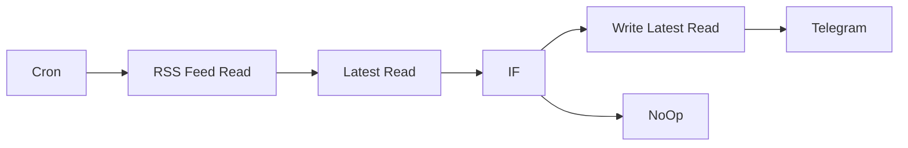

## Fluxo (.json) :

```json
{
  "id": 2,
  "name": "RSS to Telegram",
  "nodes": [
    {
      "name": "Telegram",
      "type": "n8n-nodes-base.telegram",
      "position": [
        440,
        30
      ],
      "parameters": {
        "text": "=💹 #日幣匯率 {{$json[\"title\"]}}\n\n{{$json[\"link\"]}}",
        "chatId": "",
        "additionalFields": {}
      },
      "credentials": {
        "telegramApi": ""
      },
      "typeVersion": 1
    },
    {
      "name": "RSS Feed Read",
      "type": "n8n-nodes-base.rssFeedRead",
      "position": [
        -359.5,
        130
      ],
      "parameters": {
        "url": ""
      },
      "typeVersion": 1
    },
    {
      "name": "Latest Read",
      "type": "n8n-nodes-base.function",
      "position": [
        -160,
        130
      ],
      "parameters": {
        "functionCode": "const staticData = this.getWorkflowStaticData('global');\n\nlatestRead = staticData.latestRead;\n\nfor (let item of items) {\n  item.json.latestRead = latestRead || '2021-06-01';\n}\n\nreturn items;"
      },
      "typeVersion": 1
    },
    {
      "name": "IF",
      "type": "n8n-nodes-base.if",
      "position": [
        40,
        130
      ],
      "parameters": {
        "conditions": {
          "number": [
            {
              "value1": "={{new Date($node[\"Latest Read\"].data[\"latestRead\"]).getTime()}}",
              "value2": "={{new Date($node[\"RSS Feed Read\"].data[\"isoDate\"]).getTime()}}"
            }
          ],
          "string": [
            {
              "value1": "={{$json[\"title\"]}}",
              "value2": "",
              "operation": "contains"
            }
          ],
          "boolean": []
        }
      },
      "typeVersion": 1
    },
    {
      "name": "Write Latest Read",
      "type": "n8n-nodes-base.function",
      "position": [
        240,
        30
      ],
      "parameters": {
        "functionCode": "const staticData = this.getWorkflowStaticData('global');\n\nif (items.length > 0) {\n  staticData.latestRead = items[0].json.isoDate || staticData.latestRead;\n}\n\n\nreturn items;"
      },
      "typeVersion": 1
    },
    {
      "name": "NoOp",
      "type": "n8n-nodes-base.noOp",
      "position": [
        230,
        270
      ],
      "parameters": {},
      "typeVersion": 1
    },
    {
      "name": "Cron",
      "type": "n8n-nodes-base.cron",
      "position": [
        -560,
        130
      ],
      "parameters": {
        "triggerTimes": {
          "item": [
            {
              "mode": "everyX",
              "value": 1
            }
          ]
        }
      },
      "typeVersion": 1
    }
  ],
  "active": true,
  "settings": {
    "timezone": "Asia/Taipei"
  },
  "connections": {
    "IF": {
      "main": [
        [
          {
            "node": "Write Latest Read",
            "type": "main",
            "index": 0
          }
        ],
        [
          {
            "node": "NoOp",
            "type": "main",
            "index": 0
          }
        ]
      ]
    },
    "Cron": {
      "main": [
        [
          {
            "node": "RSS Feed Read",
            "type": "main",
            "index": 0
          }
        ]
      ]
    },
    "Latest Read": {
      "main": [
        [
          {
            "node": "IF",
            "type": "main",
            "index": 0
          }
        ]
      ]
    },
    "RSS Feed Read": {
      "main": [
        [
          {
            "node": "Latest Read",
            "type": "main",
            "index": 0
          }
        ]
      ]
    },
    "Write Latest Read": {
      "main": [
        [
          {
            "node": "Telegram",
            "type": "main",
            "index": 0
          }
        ]
      ]
    }
  }
}
```

<a id="template-157"></a>

## Template 157 - Definir medoides e limiares de classe para deteção de anomalias

- **Nome:** Definir medoides e limiares de classe para deteção de anomalias
- **Descrição:** Fluxo preparatório que identifica representantes (medoides) de cada classe de cultura e grava limiares de similaridade por classe para posterior deteção de anomalias.
- **Funcionalidade:** • Inicializar variáveis de cluster: Define URL do cluster e nome da coleção a ser processada.
• Contagem total de pontos: Obtém o número total de pontos na coleção para usar como limite em consultas.
• Contagem de facetas por rótulo de cultura: Agrupa pontos por crop_name para obter número de clusters e tamanhos.
• Cálculo de parâmetros por cluster: Extrai nomes únicos de culturas e o maior tamanho de cluster para parametrizar chamadas subsequentes.
• Abordagem por matriz de distâncias: Para cada cluster, chama a API de matriz de distâncias, constrói matriz esparsa e calcula o medoid (ponto mais representativo) usando operações de matriz.
• Marcação de medoide (distância): Atualiza payloads de pontos no banco de vetores indicando o medoide e grava o vetor do medoide para próximas etapas.
• Determinação de limiar por distância: Busca o ponto mais dissimilar ao medoide (usando o oposto do vetor do centro) e salva a similaridade desse ponto como limiar de classe.
• Abordagem multimodal por texto: Gera descrições textuais para cada cultura, obtém embedding multimodal da descrição e encontra a imagem mais próxima ao embedding para definir um medoide textual.
• Marcação e limiar (texto): Marca o medoide textual no banco e calcula um limiar textual análogo ao da abordagem de distância.
• Preparação para deteção de anomalias: Armazena metadados (is_medoid, is_text_anchor_medoid e respectivos thresholds) para cada centro de classe, permitindo que outro pipeline utilize esses valores para detectar anomalias.
- **Ferramentas:** • Qdrant Cloud: Banco de vetores usado para armazenar pontos, calcular matrizes de distância, consultar vetores e atualizar payloads de pontos.
• Voyage AI API: Serviço de embeddings multimodais usado para converter descrições textuais em vectores compatíveis com os vetores de imagem.
• SciPy (biblioteca Python): Utilizada para manipular a matriz esparsa (COO) e calcular agregações para encontrar o medoid.
• Kaggle (dataset de crops): Fonte dos dados de imagens de culturas utilizada no exemplo (conjunto de treino que alimenta o fluxo).
• Google Cloud Storage: Armazenamento indicado para hospedar o dataset de imagens quando recriado em ambiente próprio.


## Fluxo visual

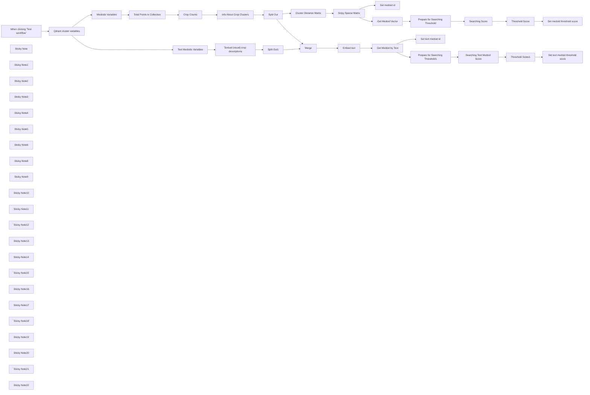

## Fluxo (.json) :

```json
{
  "id": "m9aACcHqydEbH4nR",
  "meta": {
    "instanceId": "205b3bc06c96f2dc835b4f00e1cbf9a937a74eeb3b47c99d0c30b0586dbf85aa"
  },
  "name": "[2/3] Set up medoids (2 types) for anomaly detection (crops dataset)",
  "tags": [
    {
      "id": "spMntyrlE9ydvWFA",
      "name": "anomaly-detection",
      "createdAt": "2024-12-08T22:05:15.945Z",
      "updatedAt": "2024-12-09T12:50:19.287Z"
    }
  ],
  "nodes": [
    {
      "id": "edaa871e-2b79-400e-8328-333d250bfdd2",
      "name": "When clicking ‘Test workflow’",
      "type": "n8n-nodes-base.manualTrigger",
      "position": [
        -660,
        -220
      ],
      "parameters": {},
      "typeVersion": 1
    },
    {
      "id": "ebd964de-faa4-4dc0-9245-cc9154b9ce02",
      "name": "Total Points in Collection",
      "type": "n8n-nodes-base.httpRequest",
      "position": [
        180,
        -220
      ],
      "parameters": {
        "url": "={{ $('Qdrant cluster variables').item.json.qdrantCloudURL }}/collections/{{ $('Qdrant cluster variables').item.json.collectionName }}/points/count",
        "method": "POST",
        "options": {},
        "jsonBody": "={\n  \"exact\": true\n}",
        "sendBody": true,
        "specifyBody": "json",
        "authentication": "predefinedCredentialType",
        "nodeCredentialType": "qdrantApi"
      },
      "credentials": {
        "qdrantApi": {
          "id": "it3j3hP9FICqhgX6",
          "name": "QdrantApi account"
        }
      },
      "typeVersion": 4.2
    },
    {
      "id": "b51f6344-d090-4341-a908-581b78664b07",
      "name": "Cluster Distance Matrix",
      "type": "n8n-nodes-base.httpRequest",
      "position": [
        1200,
        -360
      ],
      "parameters": {
        "url": "={{ $('Qdrant cluster variables').first().json.qdrantCloudURL }}/collections/{{ $('Qdrant cluster variables').first().json.collectionName }}/points/search/matrix/offsets",
        "method": "POST",
        "options": {},
        "jsonBody": "={{\n{\n    \"sample\": $json.maxClusterSize,\n    \"limit\": $json.maxClusterSize,\n    \"using\": \"voyage\",\n    \"filter\": {\n        \"must\": {\n            \"key\": \"crop_name\",\n            \"match\": { \"value\": $json.cropName }\n        }\n    }\n}\n}}",
        "sendBody": true,
        "specifyBody": "json",
        "authentication": "predefinedCredentialType",
        "nodeCredentialType": "qdrantApi"
      },
      "credentials": {
        "qdrantApi": {
          "id": "it3j3hP9FICqhgX6",
          "name": "QdrantApi account"
        }
      },
      "typeVersion": 4.2
    },
    {
      "id": "bebe5249-b138-4d7a-84b8-51eaed4331b8",
      "name": "Scipy Sparse Matrix",
      "type": "n8n-nodes-base.code",
      "position": [
        1460,
        -360
      ],
      "parameters": {
        "mode": "runOnceForEachItem",
        "language": "python",
        "pythonCode": "from scipy.sparse import coo_array\n\ncluster = _input.item.json['result']\n\nscores = list(cluster['scores'])\noffsets_row = list(cluster['offsets_row'])\noffsets_col = list(cluster['offsets_col'])\n\ncluster_matrix = coo_array((scores, (offsets_row, offsets_col)))\nthe_most_similar_to_others = cluster_matrix.sum(axis=1).argmax()\n\nreturn {\n    \"json\": {\n        \"medoid_id\": cluster[\"ids\"][the_most_similar_to_others]\n    }\n}\n"
      },
      "typeVersion": 2
    },
    {
      "id": "006c38bb-a271-40e1-9c5b-5a0a29ea96de",
      "name": "Set medoid id",
      "type": "n8n-nodes-base.httpRequest",
      "position": [
        2000,
        -680
      ],
      "parameters": {
        "url": "={{ $('Qdrant cluster variables').first().json.qdrantCloudURL }}/collections/{{ $('Qdrant cluster variables').first().json.collectionName }}/points/payload",
        "method": "POST",
        "options": {},
        "jsonBody": "={{\n{\n  \"payload\": {\"is_medoid\": true},\n  \"points\": [$json.medoid_id]\n}\n}}",
        "sendBody": true,
        "specifyBody": "json",
        "authentication": "predefinedCredentialType",
        "nodeCredentialType": "qdrantApi"
      },
      "credentials": {
        "qdrantApi": {
          "id": "it3j3hP9FICqhgX6",
          "name": "QdrantApi account"
        }
      },
      "typeVersion": 4.2
    },
    {
      "id": "aeeccfc5-67bf-4047-8a5a-8830e4fc87e8",
      "name": "Get Medoid Vector",
      "type": "n8n-nodes-base.httpRequest",
      "position": [
        2000,
        -360
      ],
      "parameters": {
        "url": "={{ $('Qdrant cluster variables').first().json.qdrantCloudURL }}/collections/{{ $('Qdrant cluster variables').first().json.collectionName }}/points",
        "method": "POST",
        "options": {},
        "jsonBody": "={{\n{\n  \"ids\": [$json.medoid_id],\n  \"with_vector\": true,\n  \"with_payload\": true\n}\n}}",
        "sendBody": true,
        "specifyBody": "json",
        "authentication": "predefinedCredentialType",
        "nodeCredentialType": "qdrantApi"
      },
      "credentials": {
        "qdrantApi": {
          "id": "it3j3hP9FICqhgX6",
          "name": "QdrantApi account"
        }
      },
      "typeVersion": 4.2
    },
    {
      "id": "11fe54d5-9dc8-49ce-9e3f-1103ace0a3d5",
      "name": "Prepare for Searching Threshold",
      "type": "n8n-nodes-base.set",
      "position": [
        2240,
        -360
      ],
      "parameters": {
        "options": {},
        "assignments": {
          "assignments": [
            {
              "id": "6faa5949-968c-42bf-8ce8-cf2403566eba",
              "name": "oppositeOfCenterVector",
              "type": "array",
              "value": "={{ $json.result[0].vector.voyage.map(value => value * -1)}}"
            },
            {
              "id": "84eb42be-2ea5-4a76-9c76-f21a962360a3",
              "name": "cropName",
              "type": "string",
              "value": "={{ $json.result[0].payload.crop_name }}"
            },
            {
              "id": "b68d2e42-0dde-4875-bb59-056f29b6ac0a",
              "name": "centerId",
              "type": "string",
              "value": "={{ $json.result[0].id }}"
            }
          ]
        }
      },
      "typeVersion": 3.4
    },
    {
      "id": "4051b488-2e2e-4d33-9cc9-e1403c9173ed",
      "name": "Searching Score",
      "type": "n8n-nodes-base.httpRequest",
      "position": [
        2500,
        -360
      ],
      "parameters": {
        "url": "={{ $('Qdrant cluster variables').first().json.qdrantCloudURL }}/collections/{{ $('Qdrant cluster variables').first().json.collectionName }}/points/query",
        "method": "POST",
        "options": {},
        "jsonBody": "={{\n{\n  \"query\": $json.oppositeOfCenterVector,\n  \"using\": \"voyage\",\n  \"exact\": true,\n  \"filter\": {\n    \"must\": [\n      {\n        \"key\": \"crop_name\",\n        \"match\": {\"value\": $json.cropName }\n      }\n    ]\n  },\n  \"limit\": $('Medoids Variables').first().json.furthestFromCenter,\n  \"with_payload\": true\n}\n}}",
        "sendBody": true,
        "specifyBody": "json",
        "authentication": "predefinedCredentialType",
        "nodeCredentialType": "qdrantApi"
      },
      "credentials": {
        "qdrantApi": {
          "id": "it3j3hP9FICqhgX6",
          "name": "QdrantApi account"
        }
      },
      "typeVersion": 4.2
    },
    {
      "id": "1c6cb6ee-ce3a-4d1a-b1b4-1e59e9a8f5b6",
      "name": "Threshold Score",
      "type": "n8n-nodes-base.set",
      "position": [
        2760,
        -360
      ],
      "parameters": {
        "options": {},
        "assignments": {
          "assignments": [
            {
              "id": "579a2ee4-0ab2-4fde-909a-01166624c9d8",
              "name": "thresholdScore",
              "type": "number",
              "value": "={{ $json.result.points.last().score * -1 }}"
            },
            {
              "id": "11eab775-f709-40a9-b0fe-d1059b67de05",
              "name": "centerId",
              "type": "string",
              "value": "={{ $('Prepare for Searching Threshold').item.json.centerId }}"
            }
          ]
        }
      },
      "typeVersion": 3.4
    },
    {
      "id": "1bab1b9e-7b80-4ef3-8e3d-be4874792e58",
      "name": "Set medoid threshold score",
      "type": "n8n-nodes-base.httpRequest",
      "position": [
        2940,
        -360
      ],
      "parameters": {
        "url": "={{ $('Qdrant cluster variables').first().json.qdrantCloudURL }}/collections/{{ $('Qdrant cluster variables').first().json.collectionName }}/points/payload",
        "method": "POST",
        "options": {},
        "jsonBody": "={{\n{\n  \"payload\": {\"is_medoid_cluster_threshold\": $json.thresholdScore },\n  \"points\": [$json.centerId]\n}\n}}",
        "sendBody": true,
        "specifyBody": "json",
        "authentication": "predefinedCredentialType",
        "nodeCredentialType": "qdrantApi"
      },
      "credentials": {
        "qdrantApi": {
          "id": "it3j3hP9FICqhgX6",
          "name": "QdrantApi account"
        }
      },
      "typeVersion": 4.2
    },
    {
      "id": "cd5af197-4d79-49c2-aba6-a20571bd5c2e",
      "name": "Split Out1",
      "type": "n8n-nodes-base.splitOut",
      "position": [
        860,
        80
      ],
      "parameters": {
        "options": {
          "destinationFieldName": ""
        },
        "fieldToSplitOut": "['text anchors']"
      },
      "typeVersion": 1
    },
    {
      "id": "956c126c-8bd6-4390-8704-3f0a5a2ce479",
      "name": "Merge",
      "type": "n8n-nodes-base.merge",
      "position": [
        1200,
        -80
      ],
      "parameters": {
        "mode": "combine",
        "options": {},
        "fieldsToMatchString": "cropName"
      },
      "typeVersion": 3
    },
    {
      "id": "54a5d467-4985-49b5-9f13-e6563acf08b3",
      "name": "Textual (visual) crop descriptions",
      "type": "n8n-nodes-base.set",
      "position": [
        380,
        80
      ],
      "parameters": {
        "mode": "raw",
        "options": {},
        "jsonOutput": "{\"text anchors\": [{\"cropName\": \"pearl_millet(bajra)\", \"cropDescription\": \"pearl_millet(bajra) - Tall stalks with cylindrical, spiked green grain heads.\"},\n{\"cropName\": \"tobacco-plant\", \"cropDescription\": \"tobacco-plant - Broad, oval leaves and small tubular flowers, typically pink or white.\"},\n{\"cropName\": \"cherry\", \"cropDescription\": \"cherry - Small, glossy red fruits on a medium-sized tree with slender branches and serrated leaves.\"},\n{\"cropName\": \"cotton\", \"cropDescription\": \"cotton - Bushy plant with fluffy white fiber-filled pods and lobed green leaves.\"},\n{\"cropName\": \"banana\", \"cropDescription\": \"banana - Tall herbaceous plant with broad, elongated green leaves and hanging bunches of yellow fruits.\"},\n{\"cropName\": \"cucumber\", \"cropDescription\": \"cucumber - Creeping vine with yellow flowers and elongated green cylindrical fruits.\"},\n{\"cropName\": \"maize\", \"cropDescription\": \"maize - Tall stalks with broad leaves, tassels at the top, and ears of corn sheathed in husks.\"},\n{\"cropName\": \"wheat\", \"cropDescription\": \"wheat - Slender, upright stalks with narrow green leaves and golden, spiky grain heads.\"},\n{\"cropName\": \"clove\", \"cropDescription\": \"clove - Small tree with oval green leaves and clusters of unopened reddish flower buds.\"},\n{\"cropName\": \"jowar\", \"cropDescription\": \"jowar - Tall grass-like plant with broad leaves and round, compact grain clusters at the top.\"},\n{\"cropName\": \"olive-tree\", \"cropDescription\": \"olive-tree - Medium-sized tree with silvery-green leaves and small oval green or black fruits.\"},\n{\"cropName\": \"soyabean\", \"cropDescription\": \"soyabean - Bushy plant with trifoliate green leaves and small pods containing rounded beans.\"},\n{\"cropName\": \"coffee-plant\", \"cropDescription\": \"coffee-plant - Shrub with shiny dark green leaves and clusters of small white flowers, followed by red berries.\"},\n{\"cropName\": \"rice\", \"cropDescription\": \"rice - Short, water-loving grass with narrow green leaves and drooping golden grain heads.\"},\n{\"cropName\": \"lemon\", \"cropDescription\": \"lemon - Small tree with glossy green leaves and oval yellow fruits.\"},\n{\"cropName\": \"mustard-oil\", \"cropDescription\": \"mustard-oil - Small herbaceous plant with yellow flowers and slender seed pods.\"},\n{\"cropName\": \"vigna-radiati(mung)\", \"cropDescription\": \"vigna-radiati(mung) - Low-growing plant with trifoliate leaves and small green pods containing mung beans.\"},\n{\"cropName\": \"coconut\", \"cropDescription\": \"coconut - Tall palm tree with feathery leaves and large round fibrous fruits.\"},\n{\"cropName\": \"gram\", \"cropDescription\": \"gram - Low bushy plant with feathery leaves and small pods containing round seeds.\"},\n{\"cropName\": \"pineapple\", \"cropDescription\": \"pineapple - Low plant with spiky, sword-shaped leaves and large, spiky golden fruits.\"},\n{\"cropName\": \"sugarcane\", \"cropDescription\": \"sugarcane - Tall, jointed stalks with long narrow leaves and a sweet interior.\"},\n{\"cropName\": \"sunflower\", \"cropDescription\": \"sunflower - Tall plant with rough green leaves and large bright yellow flower heads.\"},\n{\"cropName\": \"chilli\", \"cropDescription\": \"chilli - Small bushy plant with slender green or red elongated fruits.\"},\n{\"cropName\": \"fox_nut(makhana)\", \"cropDescription\": \"fox_nut(makhana) - Aquatic plant with floating round leaves and spiny white seeds.\"},\n{\"cropName\": \"jute\", \"cropDescription\": \"jute - Tall plant with long, straight stalks and narrow green leaves.\"},\n{\"cropName\": \"papaya\", \"cropDescription\": \"papaya - Medium-sized tree with hollow trunk, large lobed leaves, and yellow-orange pear-shaped fruits.\"},\n{\"cropName\": \"tea\", \"cropDescription\": \"tea - Small shrub with glossy dark green leaves and small white flowers.\"},\n{\"cropName\": \"cardamom\", \"cropDescription\": \"cardamom - Low tropical plant with broad leaves and clusters of small, light green pods.\"},\n{\"cropName\": \"almond\", \"cropDescription\": \"almond - Medium-sized tree with serrated leaves and oval green pods containing edible nuts.\"}]}\n"
      },
      "typeVersion": 3.4
    },
    {
      "id": "14c25e76-8a2c-4df8-98ea-b2f31b15fd1f",
      "name": "Embed text",
      "type": "n8n-nodes-base.httpRequest",
      "position": [
        1460,
        -80
      ],
      "parameters": {
        "url": "https://api.voyageai.com/v1/multimodalembeddings",
        "method": "POST",
        "options": {},
        "jsonBody": "={{\n{\n  \"inputs\": [\n    {\n      \"content\": [\n        {\n          \"type\": \"text\",\n          \"text\": $json.cropDescription\n        }\n      ]\n    }\n  ],\n  \"model\": \"voyage-multimodal-3\",\n  \"input_type\": \"query\"\n}\n}}",
        "sendBody": true,
        "specifyBody": "json",
        "authentication": "genericCredentialType",
        "genericAuthType": "httpHeaderAuth"
      },
      "credentials": {
        "httpHeaderAuth": {
          "id": "Vb0RNVDnIHmgnZOP",
          "name": "Voyage API"
        }
      },
      "typeVersion": 4.2
    },
    {
      "id": "8763db0a-9a92-4ffd-8a40-c7db614b735f",
      "name": "Get Medoid by Text",
      "type": "n8n-nodes-base.httpRequest",
      "position": [
        1640,
        -80
      ],
      "parameters": {
        "url": "={{ $('Qdrant cluster variables').first().json.qdrantCloudURL }}/collections/{{ $('Qdrant cluster variables').first().json.collectionName }}/points/query",
        "method": "POST",
        "options": {},
        "jsonBody": "={{\n{\n  \"query\": $json.data[0].embedding,\n  \"using\": \"voyage\",\n  \"exact\": true,\n  \"filter\": {\n    \"must\": [\n      {\n        \"key\": \"crop_name\",\n        \"match\": {\"value\": $('Merge').item.json.cropName }\n      }\n    ]\n  },\n  \"limit\": 1,\n  \"with_payload\": true,\n  \"with_vector\": true\n}\n}}",
        "sendBody": true,
        "specifyBody": "json",
        "authentication": "predefinedCredentialType",
        "nodeCredentialType": "qdrantApi"
      },
      "credentials": {
        "qdrantApi": {
          "id": "it3j3hP9FICqhgX6",
          "name": "QdrantApi account"
        }
      },
      "typeVersion": 4.2
    },
    {
      "id": "5c770ca2-6e1a-4c4b-80e0-dcbeeda43a0f",
      "name": "Set text medoid id",
      "type": "n8n-nodes-base.httpRequest",
      "position": [
        2000,
        160
      ],
      "parameters": {
        "url": "={{ $('Qdrant cluster variables').first().json.qdrantCloudURL }}/collections/{{ $('Qdrant cluster variables').first().json.collectionName }}/points/payload",
        "method": "POST",
        "options": {},
        "jsonBody": "={{\n{\n  \"payload\": {\"is_text_anchor_medoid\": true},\n  \"points\": [$json.result.points[0].id]\n}\n}}",
        "sendBody": true,
        "specifyBody": "json",
        "authentication": "predefinedCredentialType",
        "nodeCredentialType": "qdrantApi"
      },
      "credentials": {
        "qdrantApi": {
          "id": "it3j3hP9FICqhgX6",
          "name": "QdrantApi account"
        }
      },
      "typeVersion": 4.2
    },
    {
      "id": "c08ff472-51ab-4c3d-b9c0-2170fda2ccef",
      "name": "Prepare for Searching Threshold1",
      "type": "n8n-nodes-base.set",
      "position": [
        2300,
        80
      ],
      "parameters": {
        "options": {},
        "assignments": {
          "assignments": [
            {
              "id": "6faa5949-968c-42bf-8ce8-cf2403566eba",
              "name": "oppositeOfCenterVector",
              "type": "array",
              "value": "={{ $json.result.points[0].vector.voyage.map(value => value * -1)}}"
            },
            {
              "id": "84eb42be-2ea5-4a76-9c76-f21a962360a3",
              "name": "cropName",
              "type": "string",
              "value": "={{ $json.result.points[0].payload.crop_name }}"
            },
            {
              "id": "b68d2e42-0dde-4875-bb59-056f29b6ac0a",
              "name": "centerId",
              "type": "string",
              "value": "={{ $json.result.points[0].id }}"
            }
          ]
        }
      },
      "typeVersion": 3.4
    },
    {
      "id": "84ba4de5-aa9b-43fb-89cb-70db0b3ca334",
      "name": "Threshold Score1",
      "type": "n8n-nodes-base.set",
      "position": [
        2820,
        80
      ],
      "parameters": {
        "options": {},
        "assignments": {
          "assignments": [
            {
              "id": "579a2ee4-0ab2-4fde-909a-01166624c9d8",
              "name": "thresholdScore",
              "type": "number",
              "value": "={{ $json.result.points.last().score * -1 }}"
            },
            {
              "id": "11eab775-f709-40a9-b0fe-d1059b67de05",
              "name": "centerId",
              "type": "string",
              "value": "={{ $('Prepare for Searching Threshold1').item.json.centerId }}"
            }
          ]
        }
      },
      "typeVersion": 3.4
    },
    {
      "id": "f490d224-38a8-4087-889d-1addb4472471",
      "name": "Searching Text Medoid Score",
      "type": "n8n-nodes-base.httpRequest",
      "position": [
        2560,
        80
      ],
      "parameters": {
        "url": "={{ $('Qdrant cluster variables').first().json.qdrantCloudURL }}/collections/{{ $('Qdrant cluster variables').first().json.collectionName }}/points/query",
        "method": "POST",
        "options": {},
        "jsonBody": "={{\n{\n  \"query\": $json.oppositeOfCenterVector,\n  \"using\": \"voyage\",\n  \"exact\": true,\n  \"filter\": {\n    \"must\": [\n      {\n        \"key\": \"crop_name\",\n        \"match\": {\"value\": $json.cropName }\n      }\n    ]\n  },\n  \"limit\": $('Text Medoids Variables').first().json.furthestFromCenter,\n  \"with_payload\": true\n}\n}}",
        "sendBody": true,
        "specifyBody": "json",
        "authentication": "predefinedCredentialType",
        "nodeCredentialType": "qdrantApi"
      },
      "credentials": {
        "qdrantApi": {
          "id": "it3j3hP9FICqhgX6",
          "name": "QdrantApi account"
        }
      },
      "typeVersion": 4.2
    },
    {
      "id": "f5035aca-1706-4c8d-bd26-49b3451ae04b",
      "name": "Medoids Variables",
      "type": "n8n-nodes-base.set",
      "position": [
        -140,
        -220
      ],
      "parameters": {
        "options": {},
        "assignments": {
          "assignments": [
            {
              "id": "5eb23ad2-aacd-468f-9a27-ef2b63e6bd08",
              "name": "furthestFromCenter",
              "type": "number",
              "value": 5
            }
          ]
        }
      },
      "typeVersion": 3.4
    },
    {
      "id": "c9cad66d-4a76-4092-bfd6-4860493f942a",
      "name": "Text Medoids Variables",
      "type": "n8n-nodes-base.set",
      "position": [
        -140,
        80
      ],
      "parameters": {
        "options": {},
        "assignments": {
          "assignments": [
            {
              "id": "5eb23ad2-aacd-468f-9a27-ef2b63e6bd08",
              "name": "furthestFromCenter",
              "type": "number",
              "value": 1
            }
          ]
        }
      },
      "typeVersion": 3.4
    },
    {
      "id": "ecab63f7-7a72-425a-8f5a-0c707e7f77bc",
      "name": "Qdrant cluster variables",
      "type": "n8n-nodes-base.set",
      "position": [
        -420,
        -220
      ],
      "parameters": {
        "options": {},
        "assignments": {
          "assignments": [
            {
              "id": "58b7384d-fd0c-44aa-9f8e-0306a99be431",
              "name": "qdrantCloudURL",
              "type": "string",
              "value": "=https://152bc6e2-832a-415c-a1aa-fb529f8baf8d.eu-central-1-0.aws.cloud.qdrant.io"
            },
            {
              "id": "e34c4d88-b102-43cc-a09e-e0553f2da23a",
              "name": "collectionName",
              "type": "string",
              "value": "=agricultural-crops"
            }
          ]
        }
      },
      "typeVersion": 3.4
    },
    {
      "id": "6e81f0b0-3843-467e-9c93-40026e57fa91",
      "name": "Info About Crop Clusters",
      "type": "n8n-nodes-base.set",
      "position": [
        600,
        -220
      ],
      "parameters": {
        "options": {},
        "assignments": {
          "assignments": [
            {
              "id": "5327b254-b703-4a34-a398-f82edb1d6d6b",
              "name": "=cropsNumber",
              "type": "number",
              "value": "={{ $json.result.hits.length }}"
            },
            {
              "id": "79168efa-11b8-4a7b-8851-da9c8cbd700b",
              "name": "maxClusterSize",
              "type": "number",
              "value": "={{ Math.max(...$json.result.hits.map(item => item.count)) }}"
            },
            {
              "id": "e1367cec-9629-4c69-a8d7-3eeae3ac94d3",
              "name": "cropNames",
              "type": "array",
              "value": "={{ $json.result.hits.map(item => item.value)}}"
            }
          ]
        }
      },
      "typeVersion": 3.4
    },
    {
      "id": "20191c0a-5310-48f2-8be4-1d160f237db2",
      "name": "Crop Counts",
      "type": "n8n-nodes-base.httpRequest",
      "position": [
        380,
        -220
      ],
      "parameters": {
        "url": "={{ $('Qdrant cluster variables').first().json.qdrantCloudURL }}/collections/{{ $('Qdrant cluster variables').first().json.collectionName }}/facet",
        "method": "POST",
        "options": {},
        "jsonBody": "={{\n{\n  \"key\": \"crop_name\",\n  \"limit\": $json.result.count,\n  \"exact\": true\n}\n}}",
        "sendBody": true,
        "specifyBody": "json",
        "authentication": "predefinedCredentialType",
        "nodeCredentialType": "qdrantApi"
      },
      "credentials": {
        "qdrantApi": {
          "id": "it3j3hP9FICqhgX6",
          "name": "QdrantApi account"
        }
      },
      "typeVersion": 4.2
    },
    {
      "id": "a81103bb-6522-49a2-8102-83c7e004b9b3",
      "name": "Sticky Note",
      "type": "n8n-nodes-base.stickyNote",
      "position": [
        -1260,
        -340
      ],
      "parameters": {
        "width": 520,
        "height": 240,
        "content": "## Setting Up Medoids for Anomaly Detection\n### Preparatory workflow to set cluster centres and cluster threshold scores, so anomalies can be detected based on these thresholds\nHere, we're using two approaches to set up these centres: the upper branch is the *\"distance matrix approach\"*, and the lower is the *\"multimodal embedding model approach\"*."
      },
      "typeVersion": 1
    },
    {
      "id": "38fc8252-7e27-450d-b09e-59ceaebc5378",
      "name": "Sticky Note1",
      "type": "n8n-nodes-base.stickyNote",
      "position": [
        -420,
        -340
      ],
      "parameters": {
        "height": 80,
        "content": "Once again, variables for Qdrant: cluster URL and a collection we're working with"
      },
      "typeVersion": 1
    },
    {
      "id": "2d0e3b52-d382-428c-9b37-870f4c53b8e7",
      "name": "Sticky Note2",
      "type": "n8n-nodes-base.stickyNote",
      "position": [
        -140,
        -360
      ],
      "parameters": {
        "height": 100,
        "content": "Which point in the cluster we're using to draw threshold on: the furthest one from center, or the 2nd, ... Xth furthest one;"
      },
      "typeVersion": 1
    },
    {
      "id": "b0b300f3-e2c9-4c36-8a1d-6705932c296c",
      "name": "Sticky Note3",
      "type": "n8n-nodes-base.stickyNote",
      "position": [
        380,
        -500
      ],
      "parameters": {
        "width": 180,
        "height": 240,
        "content": "Here we are getting [facet counts](https://qdrant.tech/documentation/concepts/payload/?q=facet#facet-counts): information which unique values are there behind *\"crop_name\"* payload and how many points have these values (for example, we have 31 *\"cucumber\"* and 29 *\"cotton\"*)"
      },
      "typeVersion": 1
    },
    {
      "id": "0d2584da-5fd0-4830-b329-c78b0debf584",
      "name": "Sticky Note4",
      "type": "n8n-nodes-base.stickyNote",
      "position": [
        -140,
        260
      ],
      "parameters": {
        "height": 120,
        "content": "Which point in the cluster we're using to draw threshold on: the furthest one from center, or the 2nd, ... Xth furthest one;\n<this is the 2nd approach>"
      },
      "typeVersion": 1
    },
    {
      "id": "f4c98469-d426-415c-916d-1bc442cf6a21",
      "name": "Sticky Note5",
      "type": "n8n-nodes-base.stickyNote",
      "position": [
        120,
        -400
      ],
      "parameters": {
        "height": 140,
        "content": "We need to get the [total amount of points](https://qdrant.tech/documentation/concepts/points/?q=count#counting-points) in Qdrant collection to use it as a `limit` in the *\"Crop Counts\"* node, so we won't lose any information;\n<not the best practice per se>"
      },
      "typeVersion": 1
    },
    {
      "id": "037af9df-34c4-488d-8c89-561ac25247c4",
      "name": "Sticky Note6",
      "type": "n8n-nodes-base.stickyNote",
      "position": [
        600,
        -640
      ],
      "parameters": {
        "width": 220,
        "height": 380,
        "content": "Here we're extracting and gathering all the information about crop clusters, so we can call [Qdrant distance matrix API](https://qdrant.tech/documentation/concepts/explore/?q=distance+#distance-matrix) for each cluster.\nWe're propagating **the biggest cluster size** (of labeled data, in our case all data is labeled; for real use cases don't call distance matrix API if your labeled data is more than a couple of hundreds), **the number of unique crop values** and **unique crop values** themselves. We will run the algorithm once per unique crop cluster (to find it's center and threshold)."
      },
      "typeVersion": 1
    },
    {
      "id": "b4e635e3-233d-4358-ad11-250a2b14a2f7",
      "name": "Sticky Note8",
      "type": "n8n-nodes-base.stickyNote",
      "position": [
        380,
        260
      ],
      "parameters": {
        "height": 200,
        "content": "Hardcoded descriptions on how each crop usually looks; They were generated with chatGPT, and that can be technically done directly in n8n based on the crop name or a crop picture (we need a good description of how the most normal specimen of a crop looks like)"
      },
      "typeVersion": 1
    },
    {
      "id": "4fda1841-e7e3-4bd2-acf2-ee7338598184",
      "name": "Sticky Note9",
      "type": "n8n-nodes-base.stickyNote",
      "position": [
        1200,
        -800
      ],
      "parameters": {
        "height": 400,
        "content": "Calling [distance matrix API](https://qdrant.tech/documentation/concepts/explore/?q=distance+#distance-matrix) once per cluster. \n\n`sample` - how many points we are sampling (here filtered by `crop_name` field, so we are sampling within each cluster, and since we are passing the biggest cluster size to `sample`, we will get all points from each cluster.\n\n`limit` is the number of neighbours distance to which we will see calculated. Since we want all pairwise distances between the points within a cluster, here we're once again setting an upper limit equal to the biggest cluster size; "
      },
      "typeVersion": 1
    },
    {
      "id": "19c4bb6d-abcb-423b-b883-48c779d0307d",
      "name": "Split Out",
      "type": "n8n-nodes-base.splitOut",
      "position": [
        860,
        -220
      ],
      "parameters": {
        "include": "allOtherFields",
        "options": {
          "destinationFieldName": "cropName"
        },
        "fieldToSplitOut": "cropNames"
      },
      "typeVersion": 1
    },
    {
      "id": "f6d74ced-1998-4dbd-ab04-ca1b6ea409a5",
      "name": "Sticky Note10",
      "type": "n8n-nodes-base.stickyNote",
      "position": [
        840,
        -60
      ],
      "parameters": {
        "width": 150,
        "height": 80,
        "content": "Splitting out into each unique crop cluster"
      },
      "typeVersion": 1
    },
    {
      "id": "b3adb2bc-61f5-42ff-bb5d-11faa12189b7",
      "name": "Sticky Note11",
      "type": "n8n-nodes-base.stickyNote",
      "position": [
        1460,
        -640
      ],
      "parameters": {
        "width": 180,
        "height": 240,
        "content": "Using distance matrix generated by Qdrant and `coo_array` from `scipy`, we're finding a **representative** for each cluster (point which is the most similar to all other points within a cluster, based on the **Cosine** distance)"
      },
      "typeVersion": 1
    },
    {
      "id": "d9d3953e-8b69-4b6a-86f2-b2d2db28d4ad",
      "name": "Sticky Note12",
      "type": "n8n-nodes-base.stickyNote",
      "position": [
        1200,
        100
      ],
      "parameters": {
        "height": 280,
        "content": "To find a **representative** with this approach, we:\n1) Embed descriptions of crops with the same Voyage model we used for images (we can do so, since model is multimodal)\n2) For each (crop) cluster, find an image the closest by **Cosine** similarity metric to this embedded description. We will consider it a perfect representative of the cluster"
      },
      "typeVersion": 1
    },
    {
      "id": "8751efd4-d85e-4dc8-86ef-90073d49b6df",
      "name": "Sticky Note13",
      "type": "n8n-nodes-base.stickyNote",
      "position": [
        1460,
        100
      ],
      "parameters": {
        "width": 160,
        "height": 140,
        "content": "Embedding descriptions with Voyage model \n[Note] mind `input_type`, it's *\"query\"*"
      },
      "typeVersion": 1
    },
    {
      "id": "652bc70a-4e6f-416a-977b-5d29ae9cb4f0",
      "name": "Sticky Note14",
      "type": "n8n-nodes-base.stickyNote",
      "position": [
        1640,
        100
      ],
      "parameters": {
        "height": 260,
        "content": "Find the closest image to the description embeddings (done per cluster)\n[Note] Mind `exact` parameter\n[Note] `limit` is 1 because vector database always returns points sorted by distance from the most similar one to the least\n[Note] `using` parameter is here  because our vectors uploaded in the previous pipeline are named *\"voyage\"*."
      },
      "typeVersion": 1
    },
    {
      "id": "a5836982-0de0-4692-883c-267602468ed2",
      "name": "Set text medoid threshold score",
      "type": "n8n-nodes-base.httpRequest",
      "position": [
        3000,
        80
      ],
      "parameters": {
        "url": "={{ $('Qdrant cluster variables').first().json.qdrantCloudURL }}/collections/{{ $('Qdrant cluster variables').first().json.collectionName }}/points/payload",
        "method": "POST",
        "options": {},
        "jsonBody": "={{\n{\n  \"payload\": {\"is_text_anchor_medoid_cluster_threshold\": $json.thresholdScore },\n  \"points\": [$json.centerId]\n}\n}}",
        "sendBody": true,
        "specifyBody": "json",
        "authentication": "predefinedCredentialType",
        "nodeCredentialType": "qdrantApi"
      },
      "credentials": {
        "qdrantApi": {
          "id": "it3j3hP9FICqhgX6",
          "name": "QdrantApi account"
        }
      },
      "typeVersion": 4.2
    },
    {
      "id": "5354d197-be5e-4add-b721-9e5e3943e53d",
      "name": "Sticky Note15",
      "type": "n8n-nodes-base.stickyNote",
      "position": [
        1960,
        -460
      ],
      "parameters": {
        "width": 200,
        "height": 80,
        "content": "Fetching vectors of centres by their IDs"
      },
      "typeVersion": 1
    },
    {
      "id": "93043602-92bc-40ac-b967-ddb7289e5d22",
      "name": "Sticky Note16",
      "type": "n8n-nodes-base.stickyNote",
      "position": [
        2000,
        -820
      ],
      "parameters": {
        "height": 100,
        "content": "Set in Qdrant *\"is_medoid\"* [payloads](https://qdrant.tech/documentation/concepts/payload/) for points which were defined as centres by *\"distance matrix approach\"*"
      },
      "typeVersion": 1
    },
    {
      "id": "cb1364ad-e21c-4336-9a5b-15e80c2ed2f2",
      "name": "Sticky Note17",
      "type": "n8n-nodes-base.stickyNote",
      "position": [
        2280,
        260
      ],
      "parameters": {
        "height": 180,
        "content": "Here, we don't have to fetch a vector by point id as in the *\"distance matrix approach\"*, since [an API call in the previous node](https://api.qdrant.tech/api-reference/search/query-points) is able to return vectors stored in Qdrant as a response, while the distance matrix API returns only points IDs."
      },
      "typeVersion": 1
    },
    {
      "id": "6d735a28-a93e-41f1-9889-2557a1dd7aec",
      "name": "Sticky Note18",
      "type": "n8n-nodes-base.stickyNote",
      "position": [
        1980,
        320
      ],
      "parameters": {
        "height": 140,
        "content": "Set in Qdrant *\"is_text_anchor_medoid\"* [payloads](https://qdrant.tech/documentation/concepts/payload/) for points which were defined as centres by *\"multimodal embedding model approach\"*."
      },
      "typeVersion": 1
    },
    {
      "id": "7c6796a9-260b-41c0-9ac7-feb5d4d95c19",
      "name": "Sticky Note19",
      "type": "n8n-nodes-base.stickyNote",
      "position": [
        2240,
        -500
      ],
      "parameters": {
        "width": 440,
        "height": 100,
        "content": "Starting from here, this and the three following nodes are analogous for both methods, with a difference only in variable names. The goal is to find a **class (cluster) threshold score** so we can use it for anomaly detection (for each class).\n"
      },
      "typeVersion": 1
    },
    {
      "id": "5025936d-d49c-4cc1-a675-3bde71627c40",
      "name": "Sticky Note20",
      "type": "n8n-nodes-base.stickyNote",
      "position": [
        2280,
        -180
      ],
      "parameters": {
        "height": 220,
        "content": "Finding the most dissimilar point to a centre vector (within each class) is equivalent to finding the most similar point to the [opposite](https://mathinsight.org/image/vector_opposite) of a centre vector, aka the centre vector with all coordinates multiplied by -1. It is always true with **Cosine** vector similarity metric (that we're using)."
      },
      "typeVersion": 1
    },
    {
      "id": "fa9026e4-0c92-4755-92a0-5e400b5f04c9",
      "name": "Sticky Note21",
      "type": "n8n-nodes-base.stickyNote",
      "position": [
        2580,
        -140
      ],
      "parameters": {
        "width": 520,
        "height": 140,
        "content": "So here, we found the most dissimilar point within the crop class to the class centre (or the Xth dissimilar point, depending on a variable set in the beginning of this pipeline). Our **threshold score** is the similarity score between this point and the class centre. Now we're saving it as meta information of each class centre point. All preparatory work for anomaly detection is done."
      },
      "typeVersion": 1
    },
    {
      "id": "8e172a7c-6865-4daf-9d9c-86e0dba2c0a2",
      "name": "Sticky Note22",
      "type": "n8n-nodes-base.stickyNote",
      "position": [
        -900,
        -820
      ],
      "parameters": {
        "color": 4,
        "width": 540,
        "height": 300,
        "content": "### For anomaly detection\n1. The first pipeline is uploading (crops) dataset to Qdrant's collection.\n2. **This is the second pipeline, to set up cluster (class) centres in this Qdrant collection & cluster (class) threshold scores.**\n3. The third one is the anomaly detection tool, which takes any image as input and uses all preparatory work done with Qdrant (crops) collection.\n\n### To recreate it\nYou'll have to upload [crops](https://www.kaggle.com/datasets/mdwaquarazam/agricultural-crops-image-classification) dataset from Kaggle to your own Google Storage bucket, and re-create APIs/connections to [Qdrant Cloud](https://qdrant.tech/documentation/quickstart-cloud/) (you can use **Free Tier** cluster), Voyage AI API & Google Cloud Storage\n\n**In general, pipelines are adaptable to any dataset of images**\n"
      },
      "typeVersion": 1
    }
  ],
  "active": false,
  "pinData": {},
  "settings": {
    "executionOrder": "v1"
  },
  "versionId": "a23fc305-7ecd-4754-b208-2d964d9b1eda",
  "connections": {
    "Merge": {
      "main": [
        [
          {
            "node": "Embed text",
            "type": "main",
            "index": 0
          }
        ]
      ]
    },
    "Split Out": {
      "main": [
        [
          {
            "node": "Cluster Distance Matrix",
            "type": "main",
            "index": 0
          },
          {
            "node": "Merge",
            "type": "main",
            "index": 0
          }
        ]
      ]
    },
    "Embed text": {
      "main": [
        [
          {
            "node": "Get Medoid by Text",
            "type": "main",
            "index": 0
          }
        ]
      ]
    },
    "Split Out1": {
      "main": [
        [
          {
            "node": "Merge",
            "type": "main",
            "index": 1
          }
        ]
      ]
    },
    "Crop Counts": {
      "main": [
        [
          {
            "node": "Info About Crop Clusters",
            "type": "main",
            "index": 0
          }
        ]
      ]
    },
    "Set medoid id": {
      "main": [
        []
      ]
    },
    "Searching Score": {
      "main": [
        [
          {
            "node": "Threshold Score",
            "type": "main",
            "index": 0
          }
        ]
      ]
    },
    "Threshold Score": {
      "main": [
        [
          {
            "node": "Set medoid threshold score",
            "type": "main",
            "index": 0
          }
        ]
      ]
    },
    "Threshold Score1": {
      "main": [
        [
          {
            "node": "Set text medoid threshold score",
            "type": "main",
            "index": 0
          }
        ]
      ]
    },
    "Get Medoid Vector": {
      "main": [
        [
          {
            "node": "Prepare for Searching Threshold",
            "type": "main",
            "index": 0
          }
        ]
      ]
    },
    "Medoids Variables": {
      "main": [
        [
          {
            "node": "Total Points in Collection",
            "type": "main",
            "index": 0
          }
        ]
      ]
    },
    "Get Medoid by Text": {
      "main": [
        [
          {
            "node": "Set text medoid id",
            "type": "main",
            "index": 0
          },
          {
            "node": "Prepare for Searching Threshold1",
            "type": "main",
            "index": 0
          }
        ]
      ]
    },
    "Scipy Sparse Matrix": {
      "main": [
        [
          {
            "node": "Set medoid id",
            "type": "main",
            "index": 0
          },
          {
            "node": "Get Medoid Vector",
            "type": "main",
            "index": 0
          }
        ]
      ]
    },
    "Text Medoids Variables": {
      "main": [
        [
          {
            "node": "Textual (visual) crop descriptions",
            "type": "main",
            "index": 0
          }
        ]
      ]
    },
    "Cluster Distance Matrix": {
      "main": [
        [
          {
            "node": "Scipy Sparse Matrix",
            "type": "main",
            "index": 0
          }
        ]
      ]
    },
    "Info About Crop Clusters": {
      "main": [
        [
          {
            "node": "Split Out",
            "type": "main",
            "index": 0
          }
        ]
      ]
    },
    "Qdrant cluster variables": {
      "main": [
        [
          {
            "node": "Medoids Variables",
            "type": "main",
            "index": 0
          },
          {
            "node": "Text Medoids Variables",
            "type": "main",
            "index": 0
          }
        ]
      ]
    },
    "Total Points in Collection": {
      "main": [
        [
          {
            "node": "Crop Counts",
            "type": "main",
            "index": 0
          }
        ]
      ]
    },
    "Searching Text Medoid Score": {
      "main": [
        [
          {
            "node": "Threshold Score1",
            "type": "main",
            "index": 0
          }
        ]
      ]
    },
    "Prepare for Searching Threshold": {
      "main": [
        [
          {
            "node": "Searching Score",
            "type": "main",
            "index": 0
          }
        ]
      ]
    },
    "Prepare for Searching Threshold1": {
      "main": [
        [
          {
            "node": "Searching Text Medoid Score",
            "type": "main",
            "index": 0
          }
        ]
      ]
    },
    "When clicking ‘Test workflow’": {
      "main": [
        [
          {
            "node": "Qdrant cluster variables",
            "type": "main",
            "index": 0
          }
        ]
      ]
    },
    "Textual (visual) crop descriptions": {
      "main": [
        [
          {
            "node": "Split Out1",
            "type": "main",
            "index": 0
          }
        ]
      ]
    }
  }
}
```

<a id="template-158"></a>

## Template 158 - Extrair transações de PDFs/Imagens para CSV

- **Nome:** Extrair transações de PDFs/Imagens para CSV
- **Descrição:** Inicia quando um PDF ou imagem é enviado a uma pasta do Google Drive, extrai o texto (PDF ou OCR de imagem), envia ao modelo de linguagem para transformar transações em CSV com categorização e salva o CSV no Drive.
- **Funcionalidade:** • Detecção de novos arquivos: inicia automaticamente ao criar um arquivo em uma pasta específica do Google Drive (polling periódico).
• Roteamento por tipo de arquivo: identifica se o arquivo é PDF ou imagem e encaminha para o processamento adequado.
• Download automático: baixa o arquivo enviado para processamento.
• Extração de texto de PDFs: extrai o conteúdo textual de arquivos PDF.
• Extração de texto de imagens via OCR: envia imagens ao serviço de visão para obter texto a partir da imagem.
• Processamento por modelo de linguagem: envia o texto extraído a um modelo de linguagem para converter transações em formato CSV e atribuir uma coluna de categoria automaticamente.
• Conversão para arquivo CSV: transforma a resposta do modelo em um arquivo CSV pronto para uso.
• Upload do CSV: salva o arquivo CSV gerado em uma pasta destino no Google Drive.
• Uso de credenciais e permissões: opera com credenciais de serviço para acessar Drive e APIs de processamento.
- **Ferramentas:** • Google Drive: armazenar arquivos de entrada e salvar os CSVs gerados; atua como gatilho para o fluxo.
• Vertex AI (Google Cloud): realizar OCR/extração de texto a partir de imagens.
• Google Gemini (PaLM API): modelo de linguagem usado para auxiliar no processamento e interpretação dos textos.
• OpenRouter: serviço API que encaminha solicitações a modelos (ex.: meta-llama) para gerar o CSV a partir do texto extraído.
• Google Cloud Service Account / IAM: gerenciamento de credenciais e permissões para acessar Drive e APIs do Google Cloud.

## Fluxo visual

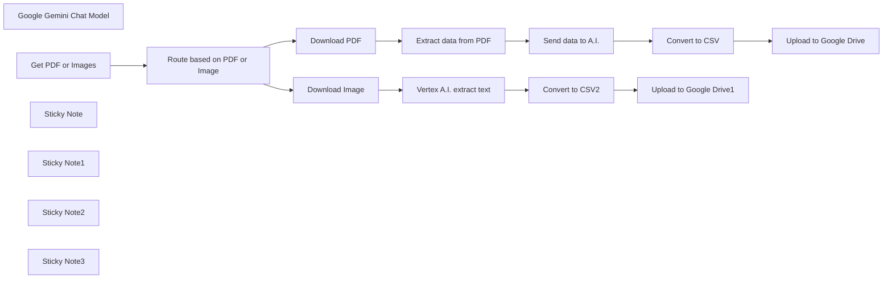

## Fluxo (.json) :

```json
{
  "id": "sUIPemKdKqmUQFt6",
  "meta": {
    "instanceId": "558d88703fb65b2d0e44613bc35916258b0f0bf983c5d4730c00c424b77ca36a",
    "templateCredsSetupCompleted": true
  },
  "name": "Extract text from PDF and image using Vertex AI (Gemini) into CSV",
  "tags": [],
  "nodes": [
    {
      "id": "f60ef5f9-bc08-4cc9-804e-697ae6f88b9b",
      "name": "Google Gemini Chat Model",
      "type": "@n8n/n8n-nodes-langchain.lmChatGoogleGemini",
      "position": [
        980,
        920
      ],
      "parameters": {
        "options": {},
        "modelName": "models/gemini-1.5-pro-latest"
      },
      "credentials": {
        "googlePalmApi": {
          "id": "hmNTKSKfppgtDbM5",
          "name": "Google Gemini(PaLM) Api account"
        }
      },
      "typeVersion": 1
    },
    {
      "id": "81d3f7b8-20cb-4aac-82a9-d4e8e6581105",
      "name": "Get PDF or Images",
      "type": "n8n-nodes-base.googleDriveTrigger",
      "position": [
        220,
        420
      ],
      "parameters": {
        "event": "fileCreated",
        "options": {},
        "pollTimes": {
          "item": [
            {
              "mode": "everyMinute"
            }
          ]
        },
        "triggerOn": "specificFolder",
        "folderToWatch": {
          "__rl": true,
          "mode": "list",
          "value": "1HOeRP5iwccg93UPUYmWYD7DyDmRREkhj",
          "cachedResultUrl": "https://drive.google.com/drive/folders/1HOeRP5iwccg93UPUYmWYD7DyDmRREkhj",
          "cachedResultName": "Actual Budget"
        },
        "authentication": "serviceAccount"
      },
      "credentials": {
        "googleApi": {
          "id": "axkK6IN61bEAT6GM",
          "name": "Google Service Account account"
        }
      },
      "typeVersion": 1
    },
    {
      "id": "fe9a8228-7950-4e2c-8982-328e03725782",
      "name": "Route based on PDF or Image",
      "type": "n8n-nodes-base.switch",
      "position": [
        480,
        420
      ],
      "parameters": {
        "rules": {
          "rules": [
            {
              "value2": "application/pdf",
              "outputKey": "pdf"
            },
            {
              "value2": "image/",
              "operation": "contains",
              "outputKey": "image"
            }
          ]
        },
        "value1": "={{$json.mimeType}}",
        "dataType": "string"
      },
      "typeVersion": 2
    },
    {
      "id": "f62b71e5-af17-4f85-abff-7cee5100affc",
      "name": "Download PDF",
      "type": "n8n-nodes-base.googleDrive",
      "position": [
        740,
        320
      ],
      "parameters": {
        "fileId": {
          "__rl": true,
          "mode": "id",
          "value": "={{ $('Get PDF or Images').item.json.id }}"
        },
        "options": {},
        "operation": "download",
        "authentication": "serviceAccount"
      },
      "credentials": {
        "googleApi": {
          "id": "axkK6IN61bEAT6GM",
          "name": "Google Service Account account"
        }
      },
      "executeOnce": true,
      "typeVersion": 3
    },
    {
      "id": "fa99fbcf-1353-410d-a0db-48cea1178a76",
      "name": "Download Image",
      "type": "n8n-nodes-base.googleDrive",
      "position": [
        740,
        740
      ],
      "parameters": {
        "fileId": {
          "__rl": true,
          "mode": "id",
          "value": "={{ $('Get PDF or Images').item.json.id }}"
        },
        "options": {},
        "operation": "download",
        "authentication": "serviceAccount"
      },
      "credentials": {
        "googleApi": {
          "id": "axkK6IN61bEAT6GM",
          "name": "Google Service Account account"
        }
      },
      "executeOnce": true,
      "retryOnFail": false,
      "typeVersion": 3,
      "alwaysOutputData": true
    },
    {
      "id": "e4979746-44bb-493e-b5eb-f9646b510888",
      "name": "Extract data from PDF",
      "type": "n8n-nodes-base.extractFromFile",
      "position": [
        980,
        320
      ],
      "parameters": {
        "options": {},
        "operation": "pdf"
      },
      "typeVersion": 1
    },
    {
      "id": "6549c335-e749-4b95-b77d-096a5e77af5e",
      "name": "Send data to A.I.",
      "type": "n8n-nodes-base.httpRequest",
      "position": [
        1180,
        320
      ],
      "parameters": {
        "url": "https://openrouter.ai/api/v1/chat/completions",
        "method": "POST",
        "options": {},
        "jsonBody": "={\n \"model\": \"meta-llama/llama-3.1-70b-instruct:free\",\n \"messages\": [\n {\n \"role\": \"user\",\n \"content\": \"You are given a bank statement.{{encodeURIComponent($json.text)}}. Read the PDF and export all the transactions as CSV. Add a column called category and based on the information assign a category name. Return only the CSV data starting with the header row.\"\n }\n ]\n}",
        "sendBody": true,
        "specifyBody": "json",
        "authentication": "genericCredentialType",
        "genericAuthType": "httpHeaderAuth"
      },
      "credentials": {
        "httpHeaderAuth": {
          "id": "WY7UkF14ksPKq3S8",
          "name": "Header Auth account 2"
        }
      },
      "typeVersion": 4.2,
      "alwaysOutputData": false
    },
    {
      "id": "42341f03-c9fc-4290-963e-1a723202a739",
      "name": "Convert to CSV",
      "type": "n8n-nodes-base.convertToFile",
      "position": [
        1400,
        320
      ],
      "parameters": {
        "options": {}
      },
      "typeVersion": 1.1
    },
    {
      "id": "bb446447-3f46-47e7-96a2-3fc720715828",
      "name": "Upload to Google Drive",
      "type": "n8n-nodes-base.googleDrive",
      "position": [
        1640,
        320
      ],
      "parameters": {
        "name": "={{$today}}",
        "driveId": {
          "__rl": true,
          "mode": "list",
          "value": "My Drive",
          "cachedResultUrl": "https://drive.google.com/drive/my-drive",
          "cachedResultName": "My Drive"
        },
        "options": {},
        "folderId": {
          "__rl": true,
          "mode": "list",
          "value": "1Zo4OFCv1qWRX1jo0VL_iqUBf4v0fZEXe",
          "cachedResultUrl": "https://drive.google.com/drive/folders/1Zo4OFCv1qWRX1jo0VL_iqUBf4v0fZEXe",
          "cachedResultName": "CSV Exports"
        },
        "authentication": "serviceAccount"
      },
      "credentials": {
        "googleApi": {
          "id": "axkK6IN61bEAT6GM",
          "name": "Google Service Account account"
        }
      },
      "typeVersion": 3
    },
    {
      "id": "843bc9c1-79a6-4f42-b9ee-fbec5f30b18d",
      "name": "Convert to CSV2",
      "type": "n8n-nodes-base.convertToFile",
      "position": [
        1360,
        740
      ],
      "parameters": {
        "options": {}
      },
      "typeVersion": 1.1
    },
    {
      "id": "6404bf65-3a7e-4be9-9b7f-98a23dca2ffd",
      "name": "Upload to Google Drive1",
      "type": "n8n-nodes-base.googleDrive",
      "position": [
        1640,
        740
      ],
      "parameters": {
        "name": "={{$today}}",
        "driveId": {
          "__rl": true,
          "mode": "list",
          "value": "My Drive",
          "cachedResultUrl": "https://drive.google.com/drive/my-drive",
          "cachedResultName": "My Drive"
        },
        "options": {},
        "folderId": {
          "__rl": true,
          "mode": "list",
          "value": "1Zo4OFCv1qWRX1jo0VL_iqUBf4v0fZEXe",
          "cachedResultUrl": "https://drive.google.com/drive/folders/1Zo4OFCv1qWRX1jo0VL_iqUBf4v0fZEXe",
          "cachedResultName": "CSV Exports"
        },
        "authentication": "serviceAccount"
      },
      "credentials": {
        "googleApi": {
          "id": "axkK6IN61bEAT6GM",
          "name": "Google Service Account account"
        }
      },
      "typeVersion": 3
    },
    {
      "id": "5dd5771f-6ccb-47ab-acbb-d6cbec60d22b",
      "name": "Sticky Note",
      "type": "n8n-nodes-base.stickyNote",
      "position": [
        220,
        -40
      ],
      "parameters": {
        "width": 589.0376569037658,
        "height": 163.2468619246862,
        "content": "## How to extract PDF and image text into CSV using n8n (without manual data entry)\n\nThis workflow will extract text data from PDF and images, then store it as CSV.\n\n[💡 You can read more about this workflow here](https://rumjahn.com/how-to-create-an-a-i-agent-to-analyze-matomo-analytics-using-n8n-for-free/)"
      },
      "typeVersion": 1
    },
    {
      "id": "37416630-9b52-4ce6-98d0-1bdd39ff0d6b",
      "name": "Sticky Note1",
      "type": "n8n-nodes-base.stickyNote",
      "position": [
        160,
        160
      ],
      "parameters": {
        "color": 4,
        "width": 248.11715481171547,
        "height": 432.7364016736402,
        "content": "## Get PDF or image\nYou need to create a new folder inside Google Drive for uploading your PDF and images.\n\nOnce you create a folder, you need to add your Google cloud user by going to Share -> Add user. The user email should be like: n8n-server@n8n-server-435232.iam.gserviceaccount.com"
      },
      "typeVersion": 1
    },
    {
      "id": "3ab10f17-de8f-4263-aef8-cc2fb090ffe5",
      "name": "Sticky Note2",
      "type": "n8n-nodes-base.stickyNote",
      "position": [
        1120,
        52.864368048917754
      ],
      "parameters": {
        "color": 5,
        "height": 446.3929762816575,
        "content": "## Send to Openrouter\nYou need to set up an Openrouter account to use this. It sends the data to openrouter to extract text.\n\nUse Header Auth. Name is \"Authorization\" and value is \"Bearer {API token}\"."
      },
      "typeVersion": 1
    },
    {
      "id": "e966f95c-c54e-4d11-895d-d5f75c53aca5",
      "name": "Sticky Note3",
      "type": "n8n-nodes-base.stickyNote",
      "position": [
        920,
        540
      ],
      "parameters": {
        "color": 6,
        "width": 399.0962343096232,
        "height": 517.154811715481,
        "content": "## Vertex AI for image recogniztion\nWe send the photo to Vertex AI to extract text. You'll need to activate Vertex AI and add the correct rights to your Google cloud credentials. \n- Enable Vertex API\n- Add vertex to user account"
      },
      "typeVersion": 1
    },
    {
      "id": "daa3ab66-fa14-4792-96d0-3bcbeffd5d60",
      "name": "Vertex A.I. extract text",
      "type": "@n8n/n8n-nodes-langchain.chainLlm",
      "position": [
        980,
        740
      ],
      "parameters": {
        "text": "=Extract the transactions from the image",
        "messages": {
          "messageValues": [
            {
              "message": "=You are given a screenshot of payment transactions. Read the image and export all the transactions as CSV. Add a column called category and based on the information assign a category name. Return only the CSV data starting with the header row."
            },
            {
              "type": "HumanMessagePromptTemplate",
              "messageType": "imageBinary"
            }
          ]
        },
        "promptType": "define",
        "hasOutputParser": true
      },
      "typeVersion": 1.4
    }
  ],
  "active": false,
  "pinData": {},
  "settings": {
    "executionOrder": "v1"
  },
  "versionId": "80635382-3d1c-4e46-a753-84b033cfc3a7",
  "connections": {
    "Download PDF": {
      "main": [
        [
          {
            "node": "Extract data from PDF",
            "type": "main",
            "index": 0
          }
        ]
      ]
    },
    "Convert to CSV": {
      "main": [
        [
          {
            "node": "Upload to Google Drive",
            "type": "main",
            "index": 0
          }
        ]
      ]
    },
    "Download Image": {
      "main": [
        [
          {
            "node": "Vertex A.I. extract text",
            "type": "main",
            "index": 0
          }
        ]
      ]
    },
    "Convert to CSV2": {
      "main": [
        [
          {
            "node": "Upload to Google Drive1",
            "type": "main",
            "index": 0
          }
        ]
      ]
    },
    "Get PDF or Images": {
      "main": [
        [
          {
            "node": "Route based on PDF or Image",
            "type": "main",
            "index": 0
          }
        ]
      ]
    },
    "Send data to A.I.": {
      "main": [
        [
          {
            "node": "Convert to CSV",
            "type": "main",
            "index": 0
          }
        ]
      ]
    },
    "Extract data from PDF": {
      "main": [
        [
          {
            "node": "Send data to A.I.",
            "type": "main",
            "index": 0
          }
        ]
      ]
    },
    "Google Gemini Chat Model": {
      "ai_languageModel": [
        [
          {
            "node": "Vertex A.I. extract text",
            "type": "ai_languageModel",
            "index": 0
          }
        ]
      ]
    },
    "Vertex A.I. extract text": {
      "main": [
        [
          {
            "node": "Convert to CSV2",
            "type": "main",
            "index": 0
          }
        ]
      ]
    },
    "Route based on PDF or Image": {
      "main": [
        [
          {
            "node": "Download PDF",
            "type": "main",
            "index": 0
          }
        ],
        [
          {
            "node": "Download Image",
            "type": "main",
            "index": 0
          }
        ]
      ]
    }
  }
}
```

<a id="template-159"></a>

## Template 159 - Lembrete diário de To Dos do Notion no Slack

- **Nome:** Lembrete diário de To Dos do Notion no Slack
- **Descrição:** Verifica tarefas do tipo To Do no Notion diariamente e envia uma mensagem direta no Slack ao responsável se a tarefa estiver incompleta.
- **Funcionalidade:** • Agendamento diário: executa a checagem automaticamente às 8h.
• Leitura de To Dos: recupera todos os blocos To Do de um bloco específico no Notion.
• Verificação de atribuição e status: identifica se a tarefa está atribuída a um usuário específico e se não está marcada como concluída.
• Notificação via Slack: abre uma conversa direta com o usuário e envia a tarefa pendente como mensagem com detalhes.
- **Ferramentas:** • Notion: Armazena as tarefas (To Dos) e fornece dados sobre texto, menção de usuário e status de conclusão.
• Slack: Plataforma de mensagens usada para abrir conversas diretas e enviar notificações ao usuário responsável.

## Fluxo visual

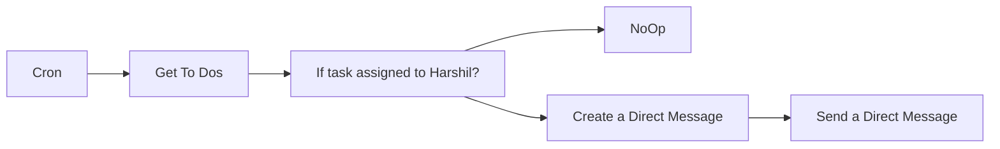

## Fluxo (.json) :

```json
{
  "id": "331",
  "name": "Check To Do on Notion and send message on Slack",
  "nodes": [
    {
      "name": "Cron",
      "type": "n8n-nodes-base.cron",
      "position": [
        470,
        320
      ],
      "parameters": {
        "triggerTimes": {
          "item": [
            {
              "hour": 8
            }
          ]
        }
      },
      "typeVersion": 1
    },
    {
      "name": "NoOp",
      "type": "n8n-nodes-base.noOp",
      "position": [
        1120,
        420
      ],
      "parameters": {},
      "typeVersion": 1
    },
    {
      "name": "Get To Dos",
      "type": "n8n-nodes-base.notion",
      "position": [
        670,
        320
      ],
      "parameters": {
        "blockId": "bafdscf",
        "resource": "block",
        "operation": "getAll",
        "returnAll": true
      },
      "credentials": {
        "notionApi": ""
      },
      "typeVersion": 1
    },
    {
      "name": "If task assigned to Harshil?",
      "type": "n8n-nodes-base.if",
      "notes": "Check if the task is incomplete",
      "position": [
        870,
        320
      ],
      "parameters": {
        "conditions": {
          "string": [
            {
              "value1": "={{$json[\"to_do\"][\"text\"][1][\"mention\"][\"user\"][\"name\"]}}",
              "value2": "NAME"
            }
          ],
          "boolean": [
            {
              "value1": "={{$json[\"to_do\"][\"checked\"]}}"
            }
          ]
        }
      },
      "notesInFlow": true,
      "typeVersion": 1
    },
    {
      "name": "Create a Direct Message",
      "type": "n8n-nodes-base.slack",
      "position": [
        1120,
        220
      ],
      "parameters": {
        "options": {
          "users": [
            "U01JXLAJ6SE"
          ]
        },
        "resource": "channel",
        "operation": "open"
      },
      "credentials": {
        "slackApi": ""
      },
      "executeOnce": false,
      "typeVersion": 1
    },
    {
      "name": "Send a Direct Message",
      "type": "n8n-nodes-base.slack",
      "position": [
        1320,
        220
      ],
      "parameters": {
        "text": "# TO DO",
        "channel": "={{$json[\"id\"]}}",
        "attachments": [
          {
            "title": "=☑️ {{$node[\"If task assigned to Harshil?\"].json[\"to_do\"][\"text\"][0][\"text\"][\"content\"]}}"
          }
        ],
        "otherOptions": {
          "mrkdwn": true
        }
      },
      "credentials": {
        "slackApi": ""
      },
      "typeVersion": 1
    }
  ],
  "active": true,
  "settings": {},
  "connections": {
    "Cron": {
      "main": [
        [
          {
            "node": "Get To Dos",
            "type": "main",
            "index": 0
          }
        ]
      ]
    },
    "Get To Dos": {
      "main": [
        [
          {
            "node": "If task assigned to Harshil?",
            "type": "main",
            "index": 0
          }
        ]
      ]
    },
    "Create a Direct Message": {
      "main": [
        [
          {
            "node": "Send a Direct Message",
            "type": "main",
            "index": 0
          }
        ]
      ]
    },
    "If task assigned to Harshil?": {
      "main": [
        [
          {
            "node": "Create a Direct Message",
            "type": "main",
            "index": 0
          }
        ],
        [
          {
            "node": "NoOp",
            "type": "main",
            "index": 0
          }
        ]
      ]
    }
  }
}
```

<a id="template-160"></a>

## Template 160 - Geração de SQL a partir do esquema

- **Nome:** Geração de SQL a partir do esquema
- **Descrição:** Fluxo que usa o esquema do banco de dados (sem acessar dados) para gerar consultas SQL via modelo de linguagem, executar as consultas quando necessário e apresentar os resultados junto com respostas conversacionais.
- **Funcionalidade:** • Extração única do esquema: Obtém a lista de tabelas e descreve cada tabela para construir um arquivo de esquema local.
• Armazenamento do esquema local: Salva o esquema do banco em um arquivo JSON para uso rápido em conversas posteriores.
• Carregamento do esquema em conversas: Ao receber uma mensagem do usuário, carrega o esquema local e combina com o input do chat.
• Geração de consultas SQL com IA: Utiliza um modelo de linguagem para criar consultas SQL com base apenas no esquema, sem acessar dados reais.
• Extração de SQL da resposta: Detecta e extrai a consulta SQL da resposta da IA usando expressão regular.
• Execução condicional da consulta: Se uma consulta SQL for extraída, executa-a no banco de dados e obtém resultados; caso contrário, retorna apenas a resposta da IA.
• Formatação de resultados: Converte os resultados da consulta em formato legível e os incorpora à resposta final ao usuário.
• Memória conversacional limitada: Mantém histórico de esquema, perguntas e respostas (sem reter valores de dados) para contexto nas interações futuras.
• Separação de responsabilidades: O agente de IA gera consultas, mas não as executa — a execução é feita por um componente separado para maior segurança e controle.
- **Ferramentas:** • OpenAI (GPT-4o): Modelo de linguagem usado para interpretar o pedido do usuário e gerar consultas SQL e respostas conversacionais.
• MySQL (db4free): Banco de dados utilizado para listar tabelas, recuperar esquema e executar as consultas SQL geradas.
• Sistema de arquivos local: Armazena e fornece o arquivo chinook_mysql.json contendo o esquema do banco para uso em chats.

## Fluxo visual

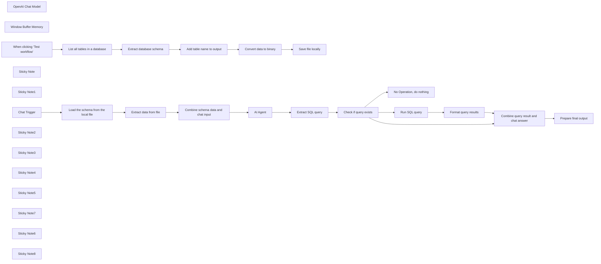

## Fluxo (.json) :

```json
{
  "id": "P307QnrxpA1ddsM5",
  "meta": {
    "instanceId": "fb924c73af8f703905bc09c9ee8076f48c17b596ed05b18c0ff86915ef8a7c4a",
    "templateCredsSetupCompleted": true
  },
  "name": "Generate SQL queries from schema only - AI-powered",
  "tags": [],
  "nodes": [
    {
      "id": "b7c3ca47-11b3-4378-81fa-68b2f56b295e",
      "name": "OpenAI Chat Model",
      "type": "@n8n/n8n-nodes-langchain.lmChatOpenAi",
      "position": [
        1460,
        440
      ],
      "parameters": {
        "model": "gpt-4o",
        "options": {
          "temperature": 0.2
        }
      },
      "credentials": {
        "openAiApi": {
          "id": "rveqdSfp7pCRON1T",
          "name": "Ted's Tech Talks OpenAi"
        }
      },
      "typeVersion": 1
    },
    {
      "id": "977c3a82-440b-4d44-9042-47a673bcb52c",
      "name": "Window Buffer Memory",
      "type": "@n8n/n8n-nodes-langchain.memoryBufferWindow",
      "position": [
        1640,
        440
      ],
      "parameters": {
        "contextWindowLength": 10
      },
      "typeVersion": 1.2
    },
    {
      "id": "c6e9c0e2-d238-4f0b-a4c8-2271f2c8b31b",
      "name": "No Operation, do nothing",
      "type": "n8n-nodes-base.noOp",
      "position": [
        2340,
        520
      ],
      "parameters": {},
      "typeVersion": 1
    },
    {
      "id": "4c141ae8-d2d1-45c7-bb5d-f33841d3cee6",
      "name": "List all tables in a database",
      "type": "n8n-nodes-base.mySql",
      "position": [
        520,
        -35
      ],
      "parameters": {
        "query": "SHOW TABLES;",
        "options": {},
        "operation": "executeQuery"
      },
      "credentials": {
        "mySql": {
          "id": "ICakJ1LRuVl4dRTs",
          "name": "db4free TTT account"
        }
      },
      "typeVersion": 2.4
    },
    {
      "id": "54fb3362-041b-4e4f-bfea-f0bc788d8dfd",
      "name": "Extract database schema",
      "type": "n8n-nodes-base.mySql",
      "position": [
        700,
        -35
      ],
      "parameters": {
        "query": "DESCRIBE {{ $json.Tables_in_tttytdb2023 }};",
        "options": {},
        "operation": "executeQuery"
      },
      "credentials": {
        "mySql": {
          "id": "ICakJ1LRuVl4dRTs",
          "name": "db4free TTT account"
        }
      },
      "typeVersion": 2.4
    },
    {
      "id": "d55e841d-11ed-4ce2-8c8e-840bd807ff2c",
      "name": "Add table name to output",
      "type": "n8n-nodes-base.set",
      "position": [
        880,
        -35
      ],
      "parameters": {
        "options": {},
        "assignments": {
          "assignments": [
            {
              "id": "764176d6-3c89-404d-9c71-301e8a406a68",
              "name": "table",
              "type": "string",
              "value": "={{ $('List all tables in a database').item.json.Tables_in_tttytdb2023 }}"
            }
          ]
        },
        "includeOtherFields": true
      },
      "typeVersion": 3.4
    },
    {
      "id": "ca8d30d6-c1f1-4e89-8cd5-ea3648dc3b0c",
      "name": "Convert data to binary",
      "type": "n8n-nodes-base.convertToFile",
      "position": [
        1060,
        -35
      ],
      "parameters": {
        "options": {},
        "operation": "toJson"
      },
      "typeVersion": 1.1
    },
    {
      "id": "2d89f901-d4e7-4fea-bd69-20b518280bbc",
      "name": "Save file locally",
      "type": "n8n-nodes-base.readWriteFile",
      "position": [
        1220,
        -35
      ],
      "parameters": {
        "options": {},
        "fileName": "./chinook_mysql.json",
        "operation": "write"
      },
      "typeVersion": 1
    },
    {
      "id": "04511c4f-44fa-4c23-87af-54d959e6cb2c",
      "name": "Extract data from file",
      "type": "n8n-nodes-base.extractFromFile",
      "position": [
        920,
        420
      ],
      "parameters": {
        "options": {},
        "operation": "fromJson"
      },
      "typeVersion": 1
    },
    {
      "id": "96f129c0-d1d4-4cbf-a24d-0b0cea18a229",
      "name": "Chat Trigger",
      "type": "@n8n/n8n-nodes-langchain.chatTrigger",
      "position": [
        440,
        420
      ],
      "webhookId": "c308dec7-655c-4b79-832e-991bd8ea891f",
      "parameters": {
        "options": {}
      },
      "typeVersion": 1.1
    },
    {
      "id": "4d993ed9-3bbe-4bc3-9e5b-c3d738b0e714",
      "name": "AI Agent",
      "type": "@n8n/n8n-nodes-langchain.agent",
      "position": [
        1480,
        300
      ],
      "parameters": {
        "text": "=Here is the database schema: {{ $json.schema }}\nHere is the user request: {{ $('Chat Trigger').item.json.chatInput }}",
        "agent": "conversationalAgent",
        "options": {
          "humanMessage": "TOOLS\n------\nAssistant can ask the user to use tools to look up information that may be helpful in answering the users original question. The tools the human can use are:\n\n{tools}\n\n{format_instructions}\n\nUSER'S INPUT\n--------------------\nHere is the user's input (remember to respond with a markdown code snippet of a json blob with a single action, and NOTHING else):\n\n{{input}}",
          "systemMessage": "Assistant is a large language model trained by OpenAI.\n\nAssistant is designed to be able to assist with a wide range of tasks, from answering simple questions to providing in-depth explanations and discussions on a wide range of topics. As a language model, Assistant is able to generate human-like text based on the input it receives, allowing it to engage in natural-sounding conversations and provide responses that are coherent and relevant to the topic at hand.\n\nAssistant is constantly learning and improving, and its capabilities are constantly evolving. It is able to process and understand large amounts of text, and can use this knowledge to provide accurate and informative responses to a wide range of questions. Additionally, Assistant is able to generate its own text based on the input it receives, allowing it to engage in discussions and provide explanations and descriptions on a wide range of topics.\n\nOverall, Assistant is a powerful system that can help with a wide range of tasks and provide valuable insights and information on a wide range of topics. Whether you need help with a specific question or just want to have a conversation about a particular topic, Assistant is here to assist.\n\nHelp user to work with the MySQL database.\n\nPlease wrap any sql commands into triple quotes. You don't have a tool to run SQL, so the user will do that instead of you."
        },
        "promptType": "define"
      },
      "typeVersion": 1.6
    },
    {
      "id": "f5749b31-b28a-4341-b57f-94ee422d2873",
      "name": "Sticky Note",
      "type": "n8n-nodes-base.stickyNote",
      "position": [
        320,
        -280
      ],
      "parameters": {
        "color": 3,
        "width": 1065.0949045120822,
        "height": 466.4256045427794,
        "content": "## Run this part only once\nThis section:\n* loads a list of all tables from the database hosted on [db4free](https://db4free.net/signup.php) \n* extracts the database schema for each table and adds the table name\n* converts the schema into a binary JSON format\n* saves the schema `./chinook_mysql.json` file locally\n\n***Now you can use chat to \"talk\" to your data!*** 🎉"
      },
      "typeVersion": 1
    },
    {
      "id": "6606abc9-1dcb-4dba-b7ef-e221f892eed8",
      "name": "Sticky Note1",
      "type": "n8n-nodes-base.stickyNote",
      "position": [
        1040,
        -255
      ],
      "parameters": {
        "color": 6,
        "width": 312.47220527158765,
        "height": 174.60585869504342,
        "content": "## Pre-workflow setup \nConnect to a free MySQL server and import your database. Follow Step 1 and 2 in this [tutorial](https://blog.n8n.io/compare-databases/) for more.\n\n*The Chinook data used in this workflow is available on [GitHub](https://github.com/msimanga/chinook/tree/master/mysql).* "
      },
      "typeVersion": 1
    },
    {
      "id": "c8ac730a-04ee-499d-b845-1149967d6aa2",
      "name": "When clicking \"Test workflow\"",
      "type": "n8n-nodes-base.manualTrigger",
      "position": [
        360,
        -35
      ],
      "parameters": {},
      "typeVersion": 1
    },
    {
      "id": "6f0b167c-e012-43e1-9892-ded05be47cf8",
      "name": "Sticky Note2",
      "type": "n8n-nodes-base.stickyNote",
      "position": [
        324.32561050665913,
        209.72072645338642
      ],
      "parameters": {
        "color": 6,
        "width": 1062.678698911262,
        "height": 489.29614613074125,
        "content": "## On every chat message:\n\n* The workflow gets the data from the local schema file and extracts it as a JSON object. This way, we achieve two important improvements:\n * faster processing time as we don't need to fetch the schema for each table from a slow remote database\n * the Agent will know database structure without seeing the actual data\n* DB schema is then converted into a long string, JSON fields from the Chat Trigger are added before they are entered into the Agent node.\n"
      },
      "typeVersion": 1
    },
    {
      "id": "3a79350c-aec1-4ad4-a2e0-679957fa420b",
      "name": "Sticky Note3",
      "type": "n8n-nodes-base.stickyNote",
      "position": [
        1400,
        -15.552780029374958
      ],
      "parameters": {
        "color": 6,
        "width": 445.66588600071304,
        "height": 714.7896619176862,
        "content": "### LangChain AI Agent's system prompt is modified.\nIt uses only the database schema to generate SQL queries. The agent creates these queries but does not execute them. Instead, it passes them to subsequent nodes.\n\n**Example:**\n\"Can you show me the list of all German customers?\" \n\nQueries are generated only when necessary; for some requests, a query may not be needed. This is because certain questions can be answered directly without SQL execution.\n\n**Example:**\n\"Can you list me all tables?\""
      },
      "typeVersion": 1
    },
    {
      "id": "0cd425db-2a8e-4f48-b749-9a082e948395",
      "name": "Combine schema data and chat input",
      "type": "n8n-nodes-base.set",
      "position": [
        1140,
        420
      ],
      "parameters": {
        "options": {},
        "assignments": {
          "assignments": [
            {
              "id": "42abd24e-419a-47d6-bc8b-7146dd0b8314",
              "name": "sessionId",
              "type": "string",
              "value": "={{ $('Chat Trigger').first().json.sessionId }}"
            },
            {
              "id": "39244192-a1a6-42fe-bc75-a6fba1f264df",
              "name": "action",
              "type": "string",
              "value": "={{ $('Chat Trigger').first().json.action }}"
            },
            {
              "id": "f78c57d9-df13-43c7-89a7-5387e528107e",
              "name": "chatinput",
              "type": "string",
              "value": "={{ $('Chat Trigger').first().json.chatInput }}"
            },
            {
              "id": "e42b39eb-dfbd-48d9-94ed-d658bdd41454",
              "name": "schema",
              "type": "string",
              "value": "={{ $json.data }}"
            }
          ]
        }
      },
      "executeOnce": true,
      "typeVersion": 3.4
    },
    {
      "id": "e4045e33-bb87-488d-8ccf-b4a94339a841",
      "name": "Load the schema from the local file",
      "type": "n8n-nodes-base.readWriteFile",
      "position": [
        680,
        420
      ],
      "parameters": {
        "options": {},
        "fileSelector": "./chinook_mysql.json"
      },
      "typeVersion": 1
    },
    {
      "id": "367ebe95-0b87-44f6-8392-33fe65446c24",
      "name": "Extract SQL query",
      "type": "n8n-nodes-base.set",
      "position": [
        1900,
        340
      ],
      "parameters": {
        "options": {},
        "assignments": {
          "assignments": [
            {
              "id": "ebbe194a-4b8b-44c9-ac19-03cf69d353bf",
              "name": "query",
              "type": "string",
              "value": "={{ ($json.output.match(/SELECT[\\s\\S]*?;/i) || [])[0] || \"\" }}"
            }
          ]
        },
        "includeOtherFields": true
      },
      "typeVersion": 3.4
    },
    {
      "id": "b856fe78-2435-4075-97f8-ecbeecf3e780",
      "name": "Check if query exists",
      "type": "n8n-nodes-base.if",
      "position": [
        2060,
        340
      ],
      "parameters": {
        "options": {},
        "conditions": {
          "options": {
            "version": 2,
            "leftValue": "",
            "caseSensitive": true,
            "typeValidation": "strict"
          },
          "combinator": "and",
          "conditions": [
            {
              "id": "2963d04d-9d79-49f9-b52a-dc8732aca781",
              "operator": {
                "type": "string",
                "operation": "notEmpty",
                "singleValue": true
              },
              "leftValue": "={{ $json.query }}",
              "rightValue": ""
            }
          ]
        }
      },
      "typeVersion": 2.2
    },
    {
      "id": "87162d31-2f6c-4f4a-af28-c65cbadd8ed5",
      "name": "Sticky Note4",
      "type": "n8n-nodes-base.stickyNote",
      "position": [
        1874,
        220.45316744685329
      ],
      "parameters": {
        "color": 3,
        "width": 317.8901548206743,
        "height": 278.8174358200552,
        "content": "## SQL query extraction\nCheck if the agent's response contains an SQL query. If it does, we extract the query using a regular expression."
      },
      "typeVersion": 1
    },
    {
      "id": "b3e77333-eaa9-4d23-a78c-8a19ae074739",
      "name": "Sticky Note5",
      "type": "n8n-nodes-base.stickyNote",
      "position": [
        1860,
        -16.43746604251737
      ],
      "parameters": {
        "color": 6,
        "width": 882.7611828369563,
        "height": 715.7029266156915,
        "content": ""
      },
      "typeVersion": 1
    },
    {
      "id": "269ea79d-5f17-4764-aebb-bba31b43d8bb",
      "name": "Sticky Note7",
      "type": "n8n-nodes-base.stickyNote",
      "position": [
        1580,
        580
      ],
      "parameters": {
        "color": 3,
        "width": 257.46308756569573,
        "height": 108.03673727584527,
        "content": "The AI Agent remembers the schema, questions, and final answers, but not data values, since queries run externally. The agent can't access database content. "
      },
      "typeVersion": 1
    },
    {
      "id": "2fd1175c-4110-48be-b6bf-2251c678bc04",
      "name": "Sticky Note6",
      "type": "n8n-nodes-base.stickyNote",
      "position": [
        2420,
        0
      ],
      "parameters": {
        "color": 3,
        "width": 308.8514666587585,
        "height": 123.43139661532095,
        "content": "- The SQL node accesses the database and executes the query. The results are then formatted for readability.\n- Both the chat response and the query result are displayed in the chat window."
      },
      "typeVersion": 1
    },
    {
      "id": "61ae7f7c-1424-4ecb-8a12-78cd98e94d45",
      "name": "Sticky Note8",
      "type": "n8n-nodes-base.stickyNote",
      "position": [
        2480,
        600
      ],
      "parameters": {
        "color": 3,
        "width": 250.40895053328057,
        "height": 89.90186716520257,
        "content": "When the agent responds without an SQL query, you receive an immediate answer with no additional processing."
      },
      "typeVersion": 1
    },
    {
      "id": "cbb6d1e1-0a75-4b3a-89cd-6bd545b8d414",
      "name": "Format query results",
      "type": "n8n-nodes-base.set",
      "position": [
        2420,
        140
      ],
      "parameters": {
        "options": {},
        "assignments": {
          "assignments": [
            {
              "id": "f944d21f-6aac-4842-8926-4108d6cad4bf",
              "name": "sqloutput",
              "type": "string",
              "value": "={{ Object.keys($jmespath($input.all(),'[].json')[0]).join(' | ') }} \n{{ ($jmespath($input.all(),'[].json')).map(obj => Object.values(obj).join(' | ')).join('\\n') }}"
            }
          ]
        }
      },
      "executeOnce": true,
      "typeVersion": 3.4
    },
    {
      "id": "d958de24-84ef-4928-a7f3-32cada09a0eb",
      "name": "Run SQL query",
      "type": "n8n-nodes-base.mySql",
      "position": [
        2260,
        140
      ],
      "parameters": {
        "query": "{{ $json.query }}",
        "options": {},
        "operation": "executeQuery"
      },
      "credentials": {
        "mySql": {
          "id": "ICakJ1LRuVl4dRTs",
          "name": "db4free TTT account"
        }
      },
      "typeVersion": 2.4
    },
    {
      "id": "99a6dc03-1035-4866-81e4-11dc66bf98ec",
      "name": "Prepare final output",
      "type": "n8n-nodes-base.set",
      "position": [
        2560,
        420
      ],
      "parameters": {
        "options": {},
        "assignments": {
          "assignments": [
            {
              "id": "aa55e186-1535-4923-aee4-e088ca69575b",
              "name": "output",
              "type": "string",
              "value": "={{ $json.output }}\n\nSQL result:\n```markdown\n{{ $json.sqloutput }}\n```"
            }
          ]
        }
      },
      "typeVersion": 3.4
    },
    {
      "id": "9380c2f6-15d9-43e4-80a2-3019bcf5ae04",
      "name": "Combine query result and chat answer",
      "type": "n8n-nodes-base.merge",
      "position": [
        2340,
        340
      ],
      "parameters": {
        "mode": "combine",
        "options": {},
        "combineBy": "combineByPosition"
      },
      "typeVersion": 3
    }
  ],
  "active": false,
  "pinData": {},
  "settings": {
    "executionOrder": "v1"
  },
  "versionId": "15049b13-91cb-46bd-a7a0-ad648b6f667a",
  "connections": {
    "AI Agent": {
      "main": [
        [
          {
            "node": "Extract SQL query",
            "type": "main",
            "index": 0
          }
        ]
      ]
    },
    "Chat Trigger": {
      "main": [
        [
          {
            "node": "Load the schema from the local file",
            "type": "main",
            "index": 0
          }
        ]
      ]
    },
    "Run SQL query": {
      "main": [
        [
          {
            "node": "Format query results",
            "type": "main",
            "index": 0
          }
        ]
      ]
    },
    "Extract SQL query": {
      "main": [
        [
          {
            "node": "Check if query exists",
            "type": "main",
            "index": 0
          }
        ]
      ]
    },
    "OpenAI Chat Model": {
      "ai_languageModel": [
        [
          {
            "node": "AI Agent",
            "type": "ai_languageModel",
            "index": 0
          }
        ]
      ]
    },
    "Format query results": {
      "main": [
        [
          {
            "node": "Combine query result and chat answer",
            "type": "main",
            "index": 0
          }
        ]
      ]
    },
    "Window Buffer Memory": {
      "ai_memory": [
        [
          {
            "node": "AI Agent",
            "type": "ai_memory",
            "index": 0
          }
        ]
      ]
    },
    "Check if query exists": {
      "main": [
        [
          {
            "node": "Run SQL query",
            "type": "main",
            "index": 0
          },
          {
            "node": "Combine query result and chat answer",
            "type": "main",
            "index": 1
          }
        ],
        [
          {
            "node": "No Operation, do nothing",
            "type": "main",
            "index": 0
          }
        ]
      ]
    },
    "Convert data to binary": {
      "main": [
        [
          {
            "node": "Save file locally",
            "type": "main",
            "index": 0
          }
        ]
      ]
    },
    "Extract data from file": {
      "main": [
        [
          {
            "node": "Combine schema data and chat input",
            "type": "main",
            "index": 0
          }
        ]
      ]
    },
    "Extract database schema": {
      "main": [
        [
          {
            "node": "Add table name to output",
            "type": "main",
            "index": 0
          }
        ]
      ]
    },
    "Add table name to output": {
      "main": [
        [
          {
            "node": "Convert data to binary",
            "type": "main",
            "index": 0
          }
        ]
      ]
    },
    "List all tables in a database": {
      "main": [
        [
          {
            "node": "Extract database schema",
            "type": "main",
            "index": 0
          }
        ]
      ]
    },
    "When clicking \"Test workflow\"": {
      "main": [
        [
          {
            "node": "List all tables in a database",
            "type": "main",
            "index": 0
          }
        ]
      ]
    },
    "Combine schema data and chat input": {
      "main": [
        [
          {
            "node": "AI Agent",
            "type": "main",
            "index": 0
          }
        ]
      ]
    },
    "Load the schema from the local file": {
      "main": [
        [
          {
            "node": "Extract data from file",
            "type": "main",
            "index": 0
          }
        ]
      ]
    },
    "Combine query result and chat answer": {
      "main": [
        [
          {
            "node": "Prepare final output",
            "type": "main",
            "index": 0
          }
        ]
      ]
    }
  }
}
```

<a id="template-161"></a>

## Template 161 - Roteador de comandos Slack para executar workflows

- **Nome:** Roteador de comandos Slack para executar workflows
- **Descrição:** Recebe comandos via slash command do Slack, valida assinatura e token, responde ao usuário, cria threads em canal de alertas quando necessário e aciona workflows/subrotinas associadas ao comando.
- **Funcionalidade:** • Recepção de comando via webhook: Aceita requisições HTTP brutas provenientes de comandos do Slack.
• Validação de assinatura do Slack: Verifica timestamp e assinatura HMAC para garantir que a requisição é legítima.
• Validação de token: Confirma token enviado no payload para maior segurança.
• Parse de comando: Extrai comando principal, parâmetros, flags e variáveis de ambiente a partir do texto do comando.
• Roteamento para workflows: Mapeia comandos para workflows/subworkflows configuráveis e dispara o workflow correspondente.
• Criação de thread em canal de alertas: Opcionalmente inicia um thread num canal definido para centralizar conversas de comando.
• Envio de respostas ao usuário: Responde ao usuário usando response_url com mensagens imediatas, avisos de thread criada, ajuda ou erro de comando desconhecido.
• Envio de URLs de debug: Fornece links para depuração das execuções quando aplicável.
• Propagação de contexto para subworkflows: Envia informações do canal e thread para que subworkflows possam responder no mesmo thread.
• Exemplos de integração com banco de dados: Demonstra chamadas a um banco PostgreSQL em subworkflows de exemplo.
- **Ferramentas:** • Slack: Plataforma usada para receber slash commands, enviar respostas via response_url, criar e responder em threads e postar mensagens nos canais.
• Webhooks/HTTP: Endpoint público que recebe o payload bruto do comando e permite respostas assíncronas via response_url.
• PostgreSQL: Banco de dados demonstrado nos exemplos de subworkflow para operações como consulta e deleção de usuário.
• Plataforma de execução de automações: Sistema responsável por orquestrar e executar workflows/subworkflows acionados pelos comandos (usado para encadear e executar lógicas adicionais).
• Serviço de hospedagem/URL pública: URL de instância usada para gerar links de depuração e referência às execuções.

## Fluxo visual

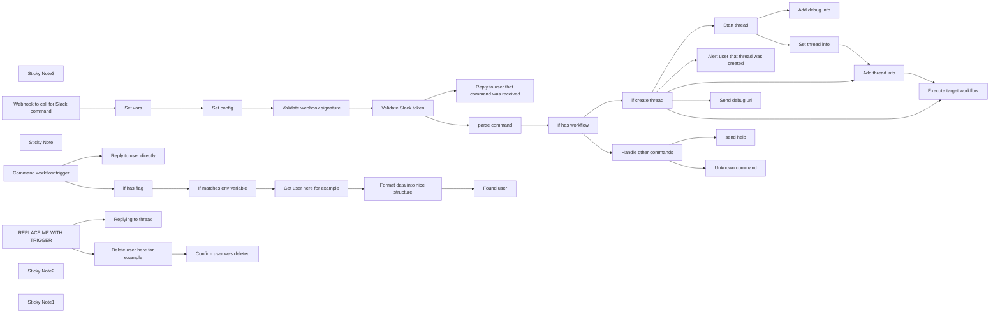

## Fluxo (.json) :

```json
{
  "nodes": [
    {
      "id": "8e0a3745-348b-42db-82cc-55676c897ad7",
      "name": "Start thread",
      "type": "n8n-nodes-base.slack",
      "position": [
        1260,
        180
      ],
      "parameters": {
        "text": "=🧵 Got request to `{{ $json.command }}` from @{{$json.user}}",
        "select": "channel",
        "channelId": {
          "__rl": true,
          "mode": "name",
          "value": "={{ $json.alerts_channel }}"
        },
        "otherOptions": {
          "link_names": true
        }
      },
      "credentials": {
        "slackApi": {
          "id": "26",
          "name": "Cloudbot bot token"
        }
      },
      "typeVersion": 2
    },
    {
      "id": "ee413d6c-dad3-4e57-b08d-ffd0f84c682e",
      "name": "send help",
      "type": "n8n-nodes-base.httpRequest",
      "position": [
        880,
        560
      ],
      "parameters": {
        "url": "={{ $json.response_url }}",
        "options": {},
        "requestMethod": "POST",
        "jsonParameters": true,
        "responseFormat": "string",
        "bodyParametersJson": "={\n\"attachments\": [\n{\n\"text\": \"ℹ️ <{{ $json.help_docs_url }}|You can find help page here>\"\n}\n]\n}"
      },
      "typeVersion": 1
    },
    {
      "id": "47c146f9-1223-46a7-bfd6-0fa6ff701efe",
      "name": "Validate Slack token",
      "type": "n8n-nodes-base.if",
      "position": [
        320,
        280
      ],
      "parameters": {
        "conditions": {
          "string": [
            {
              "value1": "={{ $json.slack_token }}",
              "value2": "={{ $json.request_token }}"
            }
          ]
        }
      },
      "typeVersion": 1
    },
    {
      "id": "7733505c-d02c-4cb2-be78-f2272e5b7d6e",
      "name": "Sticky Note3",
      "type": "n8n-nodes-base.stickyNote",
      "position": [
        -440,
        -140
      ],
      "parameters": {
        "color": 5,
        "width": 549.1826144791862,
        "height": 326.46772464213774,
        "content": "## 👨‍🎤 Setup\n1. Add Slack command and point it up to the webhook\n2. Add the following to the **Set config** node\n- `alerts_channel` with alerts channel to start threads on\n- `instance_url` with this instance url to make it easy to debug\n- `slack_token` with slack bot token to validate request\n- `slack_secret_signature` with slack secret signature to validate request\n- `help_docs_url` with help url to help users understand the commands \n3. Build other workflows to call and add them to `commands` in **Set Config**. Each command must be mapped to a workflow id with an `Execute Workflow Trigger` node\n4. Activate workflow 🚀"
      },
      "typeVersion": 1
    },
    {
      "id": "30355072-5d75-4deb-af67-909ba59e6eb3",
      "name": "Reply to user that command was received",
      "type": "n8n-nodes-base.httpRequest",
      "onError": "continueRegularOutput",
      "position": [
        500,
        40
      ],
      "parameters": {
        "url": "={{ $json.response_url }}",
        "options": {},
        "requestMethod": "POST",
        "jsonParameters": true,
        "responseFormat": "string",
        "bodyParametersJson": "={\n\"attachments\": [\n{\n\"text\": \"ℹ️ Got command `{{ $json.command_name }} {{ $json.command_text }}`\"\n}\n]\n}"
      },
      "typeVersion": 1
    },
    {
      "id": "a2217c45-700e-4923-96e4-455a733bc1e4",
      "name": "if has workflow",
      "type": "n8n-nodes-base.if",
      "position": [
        740,
        280
      ],
      "parameters": {
        "options": {},
        "conditions": {
          "options": {
            "leftValue": "",
            "caseSensitive": true,
            "typeValidation": "strict"
          },
          "combinator": "and",
          "conditions": [
            {
              "id": "d0a35e4f-3141-4e94-bb1a-fe7747a58dfc",
              "operator": {
                "type": "object",
                "operation": "notEmpty",
                "singleValue": true
              },
              "leftValue": "={{ $json.workflow }}",
              "rightValue": ""
            }
          ]
        }
      },
      "typeVersion": 2
    },
    {
      "id": "7ff12aa4-680f-42af-aa2f-c9dd6a733976",
      "name": "Set config",
      "type": "n8n-nodes-base.set",
      "position": [
        -100,
        280
      ],
      "parameters": {
        "options": {},
        "assignments": {
          "assignments": [
            {
              "id": "ba8fd958-188a-4e27-bdf1-928de8ae7d4f",
              "name": "commands",
              "type": "object",
              "value": "={{\n{\n  \"info\": { workflowId: 142, startThread: false },\n  \"delete-user\": { workflowId: \"pTh9HMZVYcQNXypJ\" }\n}\n}}"
            },
            {
              "id": "105d2881-72b7-4547-a076-83ddb0966256",
              "name": "alerts_channel",
              "type": "string",
              "value": "#adore_bot_test"
            },
            {
              "id": "9672bea2-3a6a-4162-9966-107bf2ddbee5",
              "name": "instance_url",
              "type": "string",
              "value": "https://x.app.n8n.cloud/"
            },
            {
              "id": "52b53b37-5f69-4fb8-9569-f62788d91af1",
              "name": "slack_token",
              "type": "string",
              "value": "FILL_TOKEN_HERE"
            },
            {
              "id": "4d8d06f2-f1a5-4eb2-a559-42d98ceddffb",
              "name": "slack_secret_signature",
              "type": "string",
              "value": "FILL_SECRET_HERE"
            },
            {
              "id": "c2c7de20-a264-495e-934e-dda1a0bc64b9",
              "name": "help_docs_url",
              "type": "string",
              "value": "ADD_LINK_HERE"
            }
          ]
        },
        "includeOtherFields": true
      },
      "typeVersion": 3.3
    },
    {
      "id": "4c730be9-d3f5-45ee-8f2b-b6bfd685ea78",
      "name": "Send debug url",
      "type": "n8n-nodes-base.httpRequest",
      "onError": "continueRegularOutput",
      "position": [
        1260,
        440
      ],
      "parameters": {
        "url": "={{ $json.response_url }}",
        "options": {},
        "requestMethod": "POST",
        "jsonParameters": true,
        "responseFormat": "string",
        "bodyParametersJson": "={\n\"attachments\": [\n{\n\"text\": \"<{{ $json.instance_url }}/workflow/{{ $workflow.id }}/executions/{{ $execution.id }}|To debug entry point execution>\"\n}\n]\n}"
      },
      "retryOnFail": false,
      "typeVersion": 2
    },
    {
      "id": "f4ccc237-d703-4963-8112-cc38ae9d6b2a",
      "name": "if create thread",
      "type": "n8n-nodes-base.if",
      "position": [
        980,
        280
      ],
      "parameters": {
        "options": {},
        "conditions": {
          "options": {
            "leftValue": "",
            "caseSensitive": true,
            "typeValidation": "strict"
          },
          "combinator": "or",
          "conditions": [
            {
              "id": "7eadbf0d-f8ec-45cf-abf3-aafb8d7e16b4",
              "operator": {
                "type": "boolean",
                "operation": "true",
                "singleValue": true
              },
              "leftValue": "={{ $json.workflow.startThread }}",
              "rightValue": ""
            },
            {
              "id": "2f28e7dd-6473-4f85-a449-674e00b29b4d",
              "operator": {
                "type": "boolean",
                "operation": "notExists",
                "singleValue": true
              },
              "leftValue": "={{ $json.workflow.startThread }}",
              "rightValue": ""
            }
          ]
        }
      },
      "typeVersion": 2
    },
    {
      "id": "ed9f2ed8-5266-42a3-9d47-621050e5bf97",
      "name": "Alert user that thread was created",
      "type": "n8n-nodes-base.httpRequest",
      "onError": "continueRegularOutput",
      "position": [
        1260,
        0
      ],
      "parameters": {
        "url": "={{ $json.response_url }}",
        "options": {},
        "requestMethod": "POST",
        "jsonParameters": true,
        "responseFormat": "string",
        "bodyParametersJson": "={\n\"attachments\": [\n{\n\"text\": \"🧵 Thread created on {{ $json.alerts_channel }}\"\n}\n]\n}"
      },
      "retryOnFail": false,
      "typeVersion": 2
    },
    {
      "id": "9904180a-e937-43fd-9b04-627e860d693a",
      "name": "Add debug info",
      "type": "n8n-nodes-base.slack",
      "position": [
        1540,
        60
      ],
      "parameters": {
        "text": "=<{{ $vars.instance_url }}/workflow/{{ $workflow.id }}/executions/{{ $execution.id }}|To debug entry point execution>",
        "select": "channel",
        "channelId": {
          "__rl": true,
          "mode": "id",
          "value": "={{ $json.channel }}"
        },
        "otherOptions": {
          "thread_ts": {
            "replyValues": {
              "thread_ts": "={{ $json.message.ts }}"
            }
          }
        }
      },
      "credentials": {
        "slackApi": {
          "id": "26",
          "name": "Cloudbot bot token"
        }
      },
      "typeVersion": 2
    },
    {
      "id": "6b385f75-4ebf-46c8-a799-babdb6231f4e",
      "name": "Execute target workflow",
      "type": "n8n-nodes-base.executeWorkflow",
      "position": [
        1940,
        500
      ],
      "parameters": {
        "options": {},
        "workflowId": "={{ $json.commands.info.workflowId }}"
      },
      "typeVersion": 1
    },
    {
      "id": "5fde8d57-6ef3-4b01-9422-16fd2f176c5d",
      "name": "Add thread info",
      "type": "n8n-nodes-base.merge",
      "position": [
        1760,
        320
      ],
      "parameters": {
        "mode": "combine",
        "options": {},
        "combinationMode": "multiplex"
      },
      "typeVersion": 2
    },
    {
      "id": "c4892e34-53af-4d95-a3b6-ca16fdef1aa7",
      "name": "Handle other commands",
      "type": "n8n-nodes-base.switch",
      "position": [
        640,
        620
      ],
      "parameters": {
        "rules": {
          "values": [
            {
              "outputKey": "help",
              "conditions": {
                "options": {
                  "leftValue": "",
                  "caseSensitive": true,
                  "typeValidation": "strict"
                },
                "combinator": "and",
                "conditions": [
                  {
                    "operator": {
                      "type": "string",
                      "operation": "equals"
                    },
                    "leftValue": "={{ $json.command }}",
                    "rightValue": "help"
                  }
                ]
              },
              "renameOutput": true
            }
          ]
        },
        "options": {
          "fallbackOutput": "extra"
        }
      },
      "typeVersion": 3
    },
    {
      "id": "7dabe06a-8d87-4e68-b8d9-53bf7f29a9ab",
      "name": "Set thread info",
      "type": "n8n-nodes-base.set",
      "position": [
        1540,
        240
      ],
      "parameters": {
        "values": {
          "string": [
            {
              "name": "channel_id",
              "value": "={{ $json.channel }}"
            },
            {
              "name": "thread_ts",
              "value": "={{ $json.message.ts }}"
            }
          ]
        },
        "options": {},
        "keepOnlySet": true
      },
      "typeVersion": 1
    },
    {
      "id": "e56875c4-ce2b-4639-aabc-21f1562a3858",
      "name": "Unknown command",
      "type": "n8n-nodes-base.httpRequest",
      "position": [
        880,
        740
      ],
      "parameters": {
        "url": "={{ $json.response_url }}",
        "options": {},
        "requestMethod": "POST",
        "jsonParameters": true,
        "responseFormat": "string",
        "bodyParametersJson": "={\n\"attachments\": [\n{\n\"text\": \"🤷🏽‍♂️ Sorry, unknown command `{{ $json.command }}`\"\n}\n]\n}"
      },
      "typeVersion": 1
    },
    {
      "id": "3fab88ce-4a80-483b-b558-12e111f16c98",
      "name": "Set vars",
      "type": "n8n-nodes-base.set",
      "position": [
        -280,
        280
      ],
      "parameters": {
        "options": {},
        "assignments": {
          "assignments": [
            {
              "id": "8fa0d712-1076-49b7-82da-e98390182ac6",
              "name": "command_text",
              "type": "string",
              "value": "={{ $json.body.text }}"
            },
            {
              "id": "ef82aa1f-2882-4970-b10a-86e7faef6562",
              "name": "user",
              "type": "string",
              "value": "={{ $json.body.user_name }}"
            },
            {
              "id": "633fe37e-850c-4e95-8728-f19ceb4afe76",
              "name": "response_url",
              "type": "string",
              "value": "={{ $json.body.response_url }}"
            },
            {
              "id": "bbab2bb9-3e90-41c4-b5be-8c7873c61707",
              "name": "request_token",
              "type": "string",
              "value": "={{ $json.body.token }}"
            },
            {
              "id": "3e6dd0e2-fec4-48cb-a44c-1342a8eb619c",
              "name": "command_name",
              "type": "string",
              "value": "={{ $json.body.command }}"
            }
          ]
        }
      },
      "typeVersion": 3.3
    },
    {
      "id": "99cab485-4099-4505-9c9e-33ea389818e5",
      "name": "Webhook to call for Slack command",
      "type": "n8n-nodes-base.webhook",
      "position": [
        -480,
        280
      ],
      "webhookId": "a14585bb-b757-410e-a5b2-5f05a087b388",
      "parameters": {
        "path": "a14585bb-b757-410e-a5b2-5f05a087b388",
        "options": {
          "rawBody": true,
          "responseData": "Wait for it...",
          "binaryPropertyName": "data"
        },
        "httpMethod": "POST"
      },
      "typeVersion": 1.1
    },
    {
      "id": "09dc7ecf-a577-427e-a193-ed29d260c5fe",
      "name": "Reply to user directly",
      "type": "n8n-nodes-base.httpRequest",
      "position": [
        1460,
        900
      ],
      "parameters": {
        "url": "={{ $json.response_url }}",
        "options": {},
        "requestMethod": "POST",
        "jsonParameters": true,
        "responseFormat": "string",
        "bodyParametersJson": "={\n\"attachments\": [\n{\n\"text\": \"<{{ $json.instance_url }}workflow/{{ $workflow.id }}/executions/{{ $execution.id }}|To debug subworkflow execution>\"\n}\n]\n}"
      },
      "typeVersion": 2,
      "continueOnFail": true
    },
    {
      "id": "a38b3343-8e8e-4d6c-95ef-66efafdfa913",
      "name": "Sticky Note",
      "type": "n8n-nodes-base.stickyNote",
      "position": [
        1160,
        660
      ],
      "parameters": {
        "width": 1255.4495374151727,
        "height": 655.2393233866135,
        "content": "## Example subworkflow for command WITHOUT Slack thread..\n\n### Build this in a separate workflow\n### and add the id to `commands` in **Set Config**"
      },
      "typeVersion": 1
    },
    {
      "id": "87f764b3-135c-4dc3-8633-b58e2c3a4e2d",
      "name": "Command workflow trigger",
      "type": "n8n-nodes-base.executeWorkflowTrigger",
      "disabled": true,
      "position": [
        1220,
        1020
      ],
      "parameters": {},
      "typeVersion": 1
    },
    {
      "id": "3a52d7e3-ef56-47db-844a-1efb6c20ad35",
      "name": "if has flag",
      "type": "n8n-nodes-base.if",
      "position": [
        1400,
        1120
      ],
      "parameters": {
        "options": {},
        "conditions": {
          "options": {
            "leftValue": "",
            "caseSensitive": true,
            "typeValidation": "strict"
          },
          "combinator": "and",
          "conditions": [
            {
              "id": "d8478e87-6e7c-40ea-a28d-099a3896001b",
              "operator": {
                "type": "array",
                "operation": "contains",
                "rightType": "any"
              },
              "leftValue": "={{ $json.flags }}",
              "rightValue": "--full-info"
            }
          ]
        }
      },
      "typeVersion": 2
    },
    {
      "id": "78718555-e266-4f58-ab9d-6e78f50afac2",
      "name": "If matches env variable",
      "type": "n8n-nodes-base.if",
      "position": [
        1620,
        1120
      ],
      "parameters": {
        "options": {},
        "conditions": {
          "options": {
            "leftValue": "",
            "caseSensitive": true,
            "typeValidation": "strict"
          },
          "combinator": "and",
          "conditions": [
            {
              "id": "1ccb9f5d-0e7d-44f9-86e3-d5c0e15cb648",
              "operator": {
                "name": "filter.operator.equals",
                "type": "string",
                "operation": "equals"
              },
              "leftValue": "={{ $json.env.env }}",
              "rightValue": "prod"
            }
          ]
        }
      },
      "typeVersion": 2
    },
    {
      "id": "0ca15a51-2e56-4ef4-8be6-96f45ed17867",
      "name": "Found user",
      "type": "n8n-nodes-base.httpRequest",
      "position": [
        2220,
        1120
      ],
      "parameters": {
        "url": "={{ $('Command workflow trigger').item.json.response_url }}",
        "options": {},
        "requestMethod": "POST",
        "jsonParameters": true,
        "responseFormat": "string",
        "bodyParametersJson": "={{ $json.slack_message }}"
      },
      "typeVersion": 2,
      "continueOnFail": true
    },
    {
      "id": "ad83305f-9ca5-428f-a731-9afe3a82258a",
      "name": "Format data into nice structure",
      "type": "n8n-nodes-base.code",
      "position": [
        2040,
        1120
      ],
      "parameters": {
        "jsCode": "const user = {\n  id: '1',\n  email: 'mutasem@n8n.io',\n  name: 'Mutasem Aldmour',\n  username: 'mutasem',\n  profile_url: 'https://n8n.io/creators/mutasem/',\n}\n\nconst fields = [\n    `*id:*\\n${user.id}`,\n    `*email:*\\n${user.email}`,\n    `*name:*\\n${user.name}`,\n    `*urls:*\\n<${user.profile_url}|creator profile>`\n];\n\n// remember no more than 10 fields per section\nconst output = {\n    \"blocks\":\n    [\n        {\n            \"type\": \"section\",\n            \"text\":\n            {\n                \"type\": \"mrkdwn\",\n                \"text\": `User: *${user.username}*`\n            }\n        },\n        {\n            \"type\": \"section\",\n            \"fields\": fields.map((text) => {\n                    return {\n                        \"type\": \"mrkdwn\",\n                        text,\n                    };\n                })\n        }\n    ]\n}\n\nreturn { slack_message: output };"
      },
      "typeVersion": 1
    },
    {
      "id": "6bdbd120-68ac-46ad-bd34-c43d7a447be4",
      "name": "REPLACE ME WITH TRIGGER",
      "type": "n8n-nodes-base.set",
      "position": [
        1240,
        1680
      ],
      "parameters": {
        "options": {}
      },
      "typeVersion": 3.3
    },
    {
      "id": "e2b0b88d-be4a-4b66-be15-3e8c6052d0f7",
      "name": "Delete user here for example",
      "type": "n8n-nodes-base.postgres",
      "disabled": true,
      "position": [
        1500,
        1800
      ],
      "parameters": {
        "table": {
          "__rl": true,
          "mode": "name",
          "value": "=user"
        },
        "where": {
          "values": [
            {
              "value": "={{ $json.params[0] }}",
              "column": "username"
            }
          ]
        },
        "schema": {
          "__rl": true,
          "mode": "list",
          "value": "public"
        },
        "options": {},
        "operation": "deleteTable",
        "deleteCommand": "delete"
      },
      "typeVersion": 2.3
    },
    {
      "id": "b0dc9a07-4957-4643-972b-49952d6fc001",
      "name": "Get user here for example",
      "type": "n8n-nodes-base.postgres",
      "disabled": true,
      "position": [
        1840,
        1120
      ],
      "parameters": {
        "table": {
          "__rl": true,
          "mode": "name",
          "value": "test"
        },
        "where": {
          "values": [
            {
              "value": "={{ $json.params[0] }}",
              "column": "username"
            }
          ]
        },
        "schema": {
          "__rl": true,
          "mode": "list",
          "value": "public"
        },
        "options": {},
        "operation": "select"
      },
      "typeVersion": 2.3
    },
    {
      "id": "1f2eff56-a89b-4d6d-af8b-477c81c8bab3",
      "name": "Confirm user was deleted",
      "type": "n8n-nodes-base.slack",
      "position": [
        1720,
        1800
      ],
      "parameters": {
        "text": "Deleted user  ✅",
        "select": "channel",
        "channelId": {
          "__rl": true,
          "mode": "id",
          "value": "={{ $('Command workflow trigger').item.json.channel_id }}"
        },
        "otherOptions": {
          "thread_ts": {
            "replyValues": {
              "thread_ts": "={{ $('Command workflow trigger').item.json.thread_ts }}"
            }
          }
        }
      },
      "credentials": {
        "slackApi": {
          "id": "26",
          "name": "Cloudbot bot token"
        }
      },
      "typeVersion": 2
    },
    {
      "id": "0c0d0487-a594-4e88-b777-21b4816115cd",
      "name": "Replying to thread",
      "type": "n8n-nodes-base.slack",
      "position": [
        1500,
        1580
      ],
      "parameters": {
        "text": "=<{{ $json.instance_url }}workflow/{{ $workflow.id }}/executions/{{ $execution.id }}|To debug subworkflow execution>",
        "select": "channel",
        "channelId": {
          "__rl": true,
          "mode": "id",
          "value": "={{ $json.channel_id }}"
        },
        "otherOptions": {
          "thread_ts": {
            "replyValues": {
              "thread_ts": "={{ $json.thread_ts }}"
            }
          }
        }
      },
      "credentials": {
        "slackApi": {
          "id": "26",
          "name": "Cloudbot bot token"
        }
      },
      "typeVersion": 2
    },
    {
      "id": "2c055ef4-4c0a-475d-b521-30002a45950b",
      "name": "Sticky Note2",
      "type": "n8n-nodes-base.stickyNote",
      "position": [
        1160,
        1380
      ],
      "parameters": {
        "width": 961.7738517807816,
        "height": 589.0078772779973,
        "content": "## Example subworkflow for command WITH Slack thread..\n\n### Build this in a second separate workflow\n### and add the id to `commands` in **Set Config**\n\nUsed Edit Fields node here as trigger because you can only have one\nExecute Workflow Trigger per workflow"
      },
      "typeVersion": 1
    },
    {
      "id": "aec1b842-1219-4367-9238-3c7a118ce68f",
      "name": "Sticky Note1",
      "type": "n8n-nodes-base.stickyNote",
      "position": [
        -80,
        460
      ],
      "parameters": {
        "color": 7,
        "width": 150,
        "height": 83.26656725254155,
        "content": "### 👆🏽 Set all custom config here "
      },
      "typeVersion": 1
    },
    {
      "id": "dd8f1a00-dfd4-4966-a76c-3c8e2a243bab",
      "name": "parse command",
      "type": "n8n-nodes-base.code",
      "position": [
        560,
        280
      ],
      "parameters": {
        "jsCode": "const text = $input.first().json.command_text;\nconst parts = text.split(' ');\n\n\n// GET COMMAND\n// for example /cloudbot info mutasem\n// should return \"info\"\nconst command = parts[0];\n\n\n// GET FLAGS \n// for example /cloudbot info mutasem --test --flag\n// should return ['--test', '--flag']\nconst flags = parts.filter((part) => part.startsWith('--'));\n\n\n// GET PARAMS\n// for example /cloudbot info mutasem test\n// should return [\"mutasem\", \"test\"]\nlet params = parts\n  .filter((part, i) => i > 0 && !part.startsWith('--'));\nparams = params.filter((param, i) => {\n  if (param === '-e') {\n    return false;\n  }\n  if (params[i - 1] === '-e') {\n    return false;\n  }\n\n  return true;\n});\n\n\n// GET ENV VARS\n// for example /cloudbot info mutasem -e env=prod\n// should return {env: \"prod\"}\nconst env = parts.filter((val, i) => {\n  return i > 0 && parts[i - 1] === '-e';\n})\n  .reduce((accu, opt) => {\n  if (!opt.includes('=')) {\n    return accu;\n  }\n\n  const key = opt.split('=')[0];\n  const val = opt.split('=')[1];\n  \n  accu[key] = clean(val);\n  return accu;\n}, {});\n\n// Add workflow to run\nconst commands = $input.first().json.commands;\nlet workflow;\nif (commands[command]) {\n  workflow = commands[command];\n}\n\nreturn {\n  ...$input.first().json,\n  command,\n  flags,\n  env,\n  params,\n  workflow,\n}\n\nfunction clean(str) {\n  return str.replaceAll(`‘`, '\\'').replaceAll('“', '\"').replaceAll('”', '\"').replaceAll('’', '\\'');\n}"
      },
      "typeVersion": 1
    },
    {
      "id": "22b8502c-dec3-4456-9947-639761517881",
      "name": "Validate webhook signature",
      "type": "n8n-nodes-base.code",
      "position": [
        100,
        280
      ],
      "parameters": {
        "jsCode": "const SIGNING_SECRET = $input.first().json.slack_secret_signature;\nconst item = $('Webhook to call for Slack command').first();\n\nif (!item.binary) {\n  throw new Error('Missing binary data');\n}\n\nconst crypto = require('crypto');\nconst { binary: { data } } = item;\n\nif (\n  !item.json.headers['x-slack-request-timestamp'] ||\n  Math.abs(\n    Math.floor(new Date().getTime() / 1000) -\n      +item.json.headers['x-slack-request-timestamp']\n  ) > 300\n) {\n  throw new Error('Unauthorized, request not fresh');\n}\n\nconst rawBody = Buffer.from(data.data, 'base64').toString()\n\n// compute the basestring\nconst baseStr = `v0:${item.json.headers['x-slack-request-timestamp']}:${rawBody}`;\n\n// extract the received signature from the request headers\nconst receivedSignature = item.json.headers['x-slack-signature'];\n\nconst expectedSignature = `v0=${crypto.createHmac('sha256', SIGNING_SECRET)\n.update(baseStr, 'utf8')\n.digest('hex')}`;\n\n// match the two signatures\nif (expectedSignature !== receivedSignature) {\nthrow new Error('Unauthorized, umatched signatures');\n}\n\nreturn $input.all();"
      },
      "typeVersion": 2
    }
  ],
  "pinData": {},
  "connections": {
    "Set vars": {
      "main": [
        [
          {
            "node": "Set config",
            "type": "main",
            "index": 0
          }
        ]
      ]
    },
    "Set config": {
      "main": [
        [
          {
            "node": "Validate webhook signature",
            "type": "main",
            "index": 0
          }
        ]
      ]
    },
    "if has flag": {
      "main": [
        [
          {
            "node": "If matches env variable",
            "type": "main",
            "index": 0
          }
        ]
      ]
    },
    "Start thread": {
      "main": [
        [
          {
            "node": "Add debug info",
            "type": "main",
            "index": 0
          },
          {
            "node": "Set thread info",
            "type": "main",
            "index": 0
          }
        ]
      ]
    },
    "parse command": {
      "main": [
        [
          {
            "node": "if has workflow",
            "type": "main",
            "index": 0
          }
        ]
      ]
    },
    "Add thread info": {
      "main": [
        [
          {
            "node": "Execute target workflow",
            "type": "main",
            "index": 0
          }
        ]
      ]
    },
    "Set thread info": {
      "main": [
        [
          {
            "node": "Add thread info",
            "type": "main",
            "index": 0
          }
        ]
      ]
    },
    "if has workflow": {
      "main": [
        [
          {
            "node": "if create thread",
            "type": "main",
            "index": 0
          }
        ],
        [
          {
            "node": "Handle other commands",
            "type": "main",
            "index": 0
          }
        ]
      ]
    },
    "if create thread": {
      "main": [
        [
          {
            "node": "Start thread",
            "type": "main",
            "index": 0
          },
          {
            "node": "Alert user that thread was created",
            "type": "main",
            "index": 0
          },
          {
            "node": "Add thread info",
            "type": "main",
            "index": 1
          }
        ],
        [
          {
            "node": "Send debug url",
            "type": "main",
            "index": 0
          },
          {
            "node": "Execute target workflow",
            "type": "main",
            "index": 0
          }
        ]
      ]
    },
    "Validate Slack token": {
      "main": [
        [
          {
            "node": "Reply to user that command was received",
            "type": "main",
            "index": 0
          },
          {
            "node": "parse command",
            "type": "main",
            "index": 0
          }
        ]
      ]
    },
    "Handle other commands": {
      "main": [
        [
          {
            "node": "send help",
            "type": "main",
            "index": 0
          }
        ],
        [
          {
            "node": "Unknown command",
            "type": "main",
            "index": 0
          }
        ]
      ]
    },
    "If matches env variable": {
      "main": [
        [
          {
            "node": "Get user here for example",
            "type": "main",
            "index": 0
          }
        ]
      ]
    },
    "REPLACE ME WITH TRIGGER": {
      "main": [
        [
          {
            "node": "Replying to thread",
            "type": "main",
            "index": 0
          },
          {
            "node": "Delete user here for example",
            "type": "main",
            "index": 0
          }
        ]
      ]
    },
    "Command workflow trigger": {
      "main": [
        [
          {
            "node": "Reply to user directly",
            "type": "main",
            "index": 0
          },
          {
            "node": "if has flag",
            "type": "main",
            "index": 0
          }
        ]
      ]
    },
    "Get user here for example": {
      "main": [
        [
          {
            "node": "Format data into nice structure",
            "type": "main",
            "index": 0
          }
        ]
      ]
    },
    "Validate webhook signature": {
      "main": [
        [
          {
            "node": "Validate Slack token",
            "type": "main",
            "index": 0
          }
        ]
      ]
    },
    "Delete user here for example": {
      "main": [
        [
          {
            "node": "Confirm user was deleted",
            "type": "main",
            "index": 0
          }
        ]
      ]
    },
    "Format data into nice structure": {
      "main": [
        [
          {
            "node": "Found user",
            "type": "main",
            "index": 0
          }
        ]
      ]
    },
    "Webhook to call for Slack command": {
      "main": [
        [
          {
            "node": "Set vars",
            "type": "main",
            "index": 0
          }
        ]
      ]
    }
  }
}
```
