# PACK 1999 TEMPLATES PARTE 01 - Bloco 9

Templates neste bloco: 20

## Sumário

- [Template 162 - Conversão de XML para JSON via webhook](#template-162)
- [Template 163 - Transformação de itens simulados](#template-163)
- [Template 164 - Gestão de grupo Bitwarden](#template-164)
- [Template 165 - Formulário com Dropdown dinâmico](#template-165)
- [Template 166 - Geração de SQL a partir do esquema](#template-166)
- [Template 167 - Alerta por SMS quando BTC ≥ €9000](#template-167)
- [Template 168 - Ingestão de PDF e Q&A vetorial](#template-168)
- [Template 169 - Extração de dados pessoais com LLM local Mistral NeMo](#template-169)
- [Template 170 - Gerador de capítulos para vídeos do YouTube](#template-170)
- [Template 171 - Geração de vídeo AI com HeyGen](#template-171)
- [Template 172 - API GET para FlutterFlow - lista de estudantes](#template-172)
- [Template 173 - Seletor dinâmico de modelos LLM](#template-173)
- [Template 174 - Bot Slack para executar scans e gerar relatórios Qualys](#template-174)
- [Template 175 - Notificação no Mattermost por atualização de perfil do Facebook](#template-175)
- [Template 176 - Backup automático de fluxos para GitHub](#template-176)
- [Template 177 - Criação automática de projeto e usuários](#template-177)
- [Template 178 - Notificações Jira → Telegram](#template-178)
- [Template 179 - Integração Figma para Jira via webhook](#template-179)
- [Template 180 - Processar e marcar linhas da planilha](#template-180)
- [Template 181 - Gatilho para novos projetos no Copper](#template-181)

---

<a id="template-162"></a>

## Template 162 - Conversão de XML para JSON via webhook

- **Nome:** Conversão de XML para JSON via webhook
- **Descrição:** Recebe dados via POST (arquivo ou corpo), converte conteúdo XML para JSON e retorna uma resposta JSON padronizada, com tratamento de erros e alertas.
- **Funcionalidade:** • Recepção via webhook: aceita requisições POST com arquivo (form-data) ou corpo com conteúdo XML/JSON.
• Detecção do tipo de entrada: identifica se a entrada é um arquivo binário, texto plain ou application/xml e roteia o fluxo adequadamente.
• Extração de arquivo: extrai o conteúdo XML de arquivos enviados em form-data.
• Conversão XML para JSON: converte o payload XML em um objeto JSON estruturado para resposta.
• Suporte para JSON já existente: se o corpo já for JSON em text/plain, retorna esse JSON sem conversão.
• Respostas padronizadas: retorna objetos JSON com status OK e dados ou status error com mensagem amigável.
• Tratamento de erros e alertas: em falhas, retorna código 500, registra o erro e aciona notificação para canal de alerta.
- **Ferramentas:** • Slack: envio de notificações de erro para um canal específico com informações de tempo e link para investigação.

## Fluxo visual

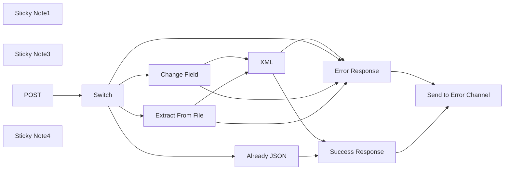

## Fluxo (.json) :

```json
{
  "meta": {
    "instanceId": "257476b1ef58bf3cb6a46e65fac7ee34a53a5e1a8492d5c6e4da5f87c9b82833",
    "templateId": "2222"
  },
  "nodes": [
    {
      "id": "a131803a-ab1d-4a89-b51d-8a875fa2caaf",
      "name": "Sticky Note1",
      "type": "n8n-nodes-base.stickyNote",
      "position": [
        440,
        267.87369152409246
      ],
      "parameters": {
        "width": 344,
        "height": 303,
        "content": "## Testing \n\nTesting can be done with CURL or similar.\n\nFor File posting using Form Data\ncurl -X POST -F file=@filepath.xml <WEBHOOK_URL>\n\nThis can also be tested using the Test workflow"
      },
      "typeVersion": 1
    },
    {
      "id": "f9ae7afb-48a6-45bf-9c55-0e5fd63afede",
      "name": "Sticky Note3",
      "type": "n8n-nodes-base.stickyNote",
      "position": [
        1720,
        747.8736915240925
      ],
      "parameters": {
        "color": 4,
        "width": 496,
        "height": 256,
        "content": "## Response\nWhere possible we will be returning a JSON object.\n```\n{\n  \"status\": \"ok\",\n  \"data\": { // JSON DATA }\n}\n```\nIf there is an error\n```\n{\n  \"status\": \"error\",\n  \"data\": \"error message to display\"\n}\n```"
      },
      "typeVersion": 1
    },
    {
      "id": "f37712fb-88cc-4d5a-9c37-6b9d962052e2",
      "name": "Extract From File",
      "type": "n8n-nodes-base.extractFromFile",
      "onError": "continueErrorOutput",
      "position": [
        1080,
        307.87369152409246
      ],
      "parameters": {
        "options": {},
        "operation": "xml",
        "destinationKey": "xml",
        "binaryPropertyName": "data0"
      },
      "typeVersion": 1
    },
    {
      "id": "e70c134d-a546-447d-a0cb-96c5573232e1",
      "name": "Error Response",
      "type": "n8n-nodes-base.respondToWebhook",
      "onError": "continueErrorOutput",
      "position": [
        1480,
        1067.8736915240925
      ],
      "parameters": {
        "options": {
          "responseCode": 500
        },
        "respondWith": "json",
        "responseBody": "{\n  \"status\": \"error\",\n  \"data\": \"There was a problem converting your XML. Please refresh the page and try again.\"\n}"
      },
      "typeVersion": 1
    },
    {
      "id": "eacf0315-75fb-4461-b5d3-d8e7c5572492",
      "name": "POST",
      "type": "n8n-nodes-base.webhook",
      "position": [
        460,
        587.8736915240925
      ],
      "webhookId": "add125c9-1591-4e1c-b68c-8032b99b6010",
      "parameters": {
        "path": "tool/xml-to-json",
        "options": {
          "binaryPropertyName": "data"
        },
        "httpMethod": "POST",
        "responseMode": "responseNode"
      },
      "typeVersion": 1.1
    },
    {
      "id": "37cb0178-2010-4cfb-8f12-84e8a45a3553",
      "name": "XML",
      "type": "n8n-nodes-base.xml",
      "onError": "continueErrorOutput",
      "position": [
        1380,
        407.87369152409246
      ],
      "parameters": {
        "options": {},
        "dataPropertyName": "xml"
      },
      "typeVersion": 1
    },
    {
      "id": "4aa36858-f9ee-4653-81d5-7276347abcc2",
      "name": "Success Response",
      "type": "n8n-nodes-base.respondToWebhook",
      "onError": "continueErrorOutput",
      "position": [
        1500,
        667.8736915240925
      ],
      "parameters": {
        "options": {
          "responseCode": 200
        },
        "respondWith": "json",
        "responseBody": "={\n  \"status\": \"OK\",\n  \"data\": {{ JSON.stringify($json) }}\n}"
      },
      "typeVersion": 1
    },
    {
      "id": "0425203d-8185-4b27-b7b5-3b4f0e775981",
      "name": "Already JSON",
      "type": "n8n-nodes-base.set",
      "position": [
        1080,
        667.8736915240925
      ],
      "parameters": {
        "mode": "raw",
        "options": {},
        "jsonOutput": "={{ $json.body }}\n"
      },
      "typeVersion": 3.3
    },
    {
      "id": "9ac12f08-a09b-45e9-8ebd-55ff6d8a63bd",
      "name": "Change Field",
      "type": "n8n-nodes-base.set",
      "onError": "continueErrorOutput",
      "position": [
        1080,
        487.87369152409246
      ],
      "parameters": {
        "options": {},
        "assignments": {
          "assignments": [
            {
              "id": "b2e3bec3-221e-4f1d-b439-f75174f68ed1",
              "name": "xml",
              "type": "string",
              "value": "={{ $json.body }}"
            }
          ]
        }
      },
      "typeVersion": 3.3
    },
    {
      "id": "d722f969-f3d3-4f4a-9fbd-4e2d30556408",
      "name": "Sticky Note4",
      "type": "n8n-nodes-base.stickyNote",
      "position": [
        380,
        240
      ],
      "parameters": {
        "color": 7,
        "width": 1917.663445686706,
        "height": 1027.3921976438187,
        "content": ""
      },
      "typeVersion": 1
    },
    {
      "id": "7618bd02-6d56-44a1-aaa3-de805e1ef18d",
      "name": "Switch",
      "type": "n8n-nodes-base.switch",
      "position": [
        660,
        587.8736915240925
      ],
      "parameters": {
        "rules": {
          "values": [
            {
              "outputKey": "File",
              "conditions": {
                "options": {
                  "leftValue": "",
                  "caseSensitive": true,
                  "typeValidation": "strict"
                },
                "combinator": "and",
                "conditions": [
                  {
                    "operator": {
                      "type": "object",
                      "operation": "notEmpty",
                      "singleValue": true
                    },
                    "leftValue": "={{ $binary }}",
                    "rightValue": ""
                  }
                ]
              },
              "renameOutput": true
            },
            {
              "outputKey": "Data",
              "conditions": {
                "options": {
                  "leftValue": "",
                  "caseSensitive": true,
                  "typeValidation": "strict"
                },
                "combinator": "and",
                "conditions": [
                  {
                    "id": "8930ce1a-a4cc-4094-b08f-a23a13dec40c",
                    "operator": {
                      "name": "filter.operator.equals",
                      "type": "string",
                      "operation": "equals"
                    },
                    "leftValue": "={{ $json.headers['content-type'] }}",
                    "rightValue": "text/plain"
                  }
                ]
              },
              "renameOutput": true
            },
            {
              "outputKey": "appXML",
              "conditions": {
                "options": {
                  "leftValue": "",
                  "caseSensitive": true,
                  "typeValidation": "strict"
                },
                "combinator": "and",
                "conditions": [
                  {
                    "id": "e3108952-daa2-425c-8c70-7d2ce0949e0c",
                    "operator": {
                      "name": "filter.operator.equals",
                      "type": "string",
                      "operation": "equals"
                    },
                    "leftValue": "={{ $json.headers['content-type'] }}",
                    "rightValue": "=application/xml"
                  }
                ]
              },
              "renameOutput": true
            }
          ]
        },
        "options": {
          "fallbackOutput": "extra"
        }
      },
      "typeVersion": 3
    },
    {
      "id": "b8bde0ed-7d85-4582-89c4-08a0829c4df8",
      "name": "Send to Error Channel",
      "type": "n8n-nodes-base.slack",
      "position": [
        1760,
        1067.8736915240925
      ],
      "parameters": {
        "text": ":interrobang: Error in XML to JSON tool",
        "select": "channel",
        "blocksUi": "={\n\t\"blocks\": [\n{\n\t\t\t\"type\": \"section\",\n\t\t\t\"text\": {\n\t\t\t\t\"type\": \"mrkdwn\",\n\t\t\t\t\"text\": \":interrobang: Error in XML to JSON tool\"\n\t\t\t}\n\t\t},\n\t\t{\n\t\t\t\"type\": \"section\",\n\t\t\t\"text\": {\n\t\t\t\t\"type\": \"mrkdwn\",\n\t\t\t\t\"text\": \"*Time:*\\n{{ $now.format('dd/MM/yyyy HH:mm:ss') }}\\n*Execution ID:*\\n{{ $execution.id }}\\n\"\n\t\t\t},\n\t\t\t\"accessory\": {\n\t\t\t\t\"type\": \"button\",\n\t\t\t\t\"text\": {\n\t\t\t\t\t\"type\": \"plain_text\",\n\t\t\t\t\t\"text\": \"Go to Error\",\n\t\t\t\t\t\"emoji\": true\n\t\t\t\t},\n\t\t\t\t\"value\": \"error\",\n\t\t\t\t\"url\": \"https://internal.users.n8n.cloud/workflow/{{ $workflow.id }}/executions/{{ $execution.id }}\",\n\t\t\t\t\"action_id\": \"button-action\",\n\t\t\t\t\"style\": \"primary\"\n\t\t\t}\n\t\t}\n\t]\n}",
        "channelId": {
          "__rl": true,
          "mode": "name",
          "value": "#alerts-xml-to-json"
        },
        "messageType": "block",
        "otherOptions": {}
      },
      "credentials": {
        "slackApi": {
          "id": "6",
          "name": "Idea Bot"
        }
      },
      "typeVersion": 2.1
    }
  ],
  "pinData": {},
  "connections": {
    "XML": {
      "main": [
        [
          {
            "node": "Success Response",
            "type": "main",
            "index": 0
          }
        ],
        [
          {
            "node": "Error Response",
            "type": "main",
            "index": 0
          }
        ]
      ]
    },
    "POST": {
      "main": [
        [
          {
            "node": "Switch",
            "type": "main",
            "index": 0
          }
        ]
      ]
    },
    "Switch": {
      "main": [
        [
          {
            "node": "Extract From File",
            "type": "main",
            "index": 0
          }
        ],
        [
          {
            "node": "Change Field",
            "type": "main",
            "index": 0
          }
        ],
        [
          {
            "node": "Already JSON",
            "type": "main",
            "index": 0
          }
        ],
        [
          {
            "node": "Error Response",
            "type": "main",
            "index": 0
          }
        ]
      ]
    },
    "Already JSON": {
      "main": [
        [
          {
            "node": "Success Response",
            "type": "main",
            "index": 0
          }
        ]
      ]
    },
    "Change Field": {
      "main": [
        [
          {
            "node": "XML",
            "type": "main",
            "index": 0
          }
        ],
        [
          {
            "node": "Error Response",
            "type": "main",
            "index": 0
          }
        ]
      ]
    },
    "Error Response": {
      "main": [
        [
          {
            "node": "Send to Error Channel",
            "type": "main",
            "index": 0
          }
        ],
        [
          {
            "node": "Send to Error Channel",
            "type": "main",
            "index": 0
          }
        ]
      ]
    },
    "Success Response": {
      "main": [
        null,
        [
          {
            "node": "Send to Error Channel",
            "type": "main",
            "index": 0
          }
        ]
      ]
    },
    "Extract From File": {
      "main": [
        [
          {
            "node": "XML",
            "type": "main",
            "index": 0
          }
        ],
        [
          {
            "node": "Error Response",
            "type": "main",
            "index": 0
          }
        ]
      ]
    }
  }
}
```

<a id="template-163"></a>

## Template 163 - Transformação de itens simulados

- **Nome:** Transformação de itens simulados
- **Descrição:** Este fluxo gera dados simulados e transforma cada item em um objeto JSON com a propriedade data.
- **Funcionalidade:** • Geração de dados simulados: Cria uma lista de itens de mock.
• Transformação de itens: Converte cada item em um objeto com a propriedade data.
• Encadeamento simples: Conecta o nó de dados simulados ao nó de transformação para processar todos os itens.
- **Ferramentas:** • Nenhuma ferramenta externa utilizada: O fluxo não utiliza integrações com serviços externos; opera apenas dados simulados localmente.

## Fluxo visual

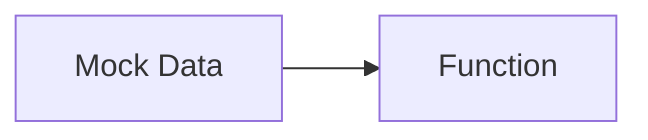

## Fluxo (.json) :

```json
{
  "nodes": [
    {
      "name": "Mock Data",
      "type": "n8n-nodes-base.function",
      "position": [
        550,
        300
      ],
      "parameters": {
        "functionCode": "return [{json:[\"item-1\", \"item-2\", \"item-3\", \"item-4\"]}];"
      },
      "typeVersion": 1
    },
    {
      "name": "Function",
      "type": "n8n-nodes-base.function",
      "position": [
        750,
        300
      ],
      "parameters": {
        "functionCode": "return items[0].json.map(item => {\n  return {\n    json: {\n      data:item\n    },\n  }\n});\n"
      },
      "typeVersion": 1
    }
  ],
  "connections": {
    "Mock Data": {
      "main": [
        [
          {
            "node": "Function",
            "type": "main",
            "index": 0
          }
        ]
      ]
    }
  }
}
```

<a id="template-164"></a>

## Template 164 - Gestão de grupo Bitwarden

- **Nome:** Gestão de grupo Bitwarden
- **Descrição:** Este fluxo gerencia um grupo no Bitwarden: cria o grupo, lista os membros existentes, atualiza o grupo com novos membros e, por fim, obtém a lista atual de membros.
- **Funcionalidade:** • Criação de grupo: cria um grupo com o nome 'documentation'.
• Listagem de membros: obtém todos os membros existentes no sistema.
• Atualização de membros do grupo: atualiza o grupo com os IDs de membros fornecidos.
• Recuperação de membros do grupo: consulta novamente os membros do grupo para confirmação.
- **Ferramentas:** • Bitwarden: Serviço de gerenciamento de senhas com API para criação de grupos, atualização de membros e consulta de membros.

## Fluxo visual

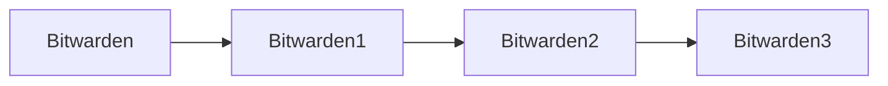

## Fluxo (.json) :

```json
{
  "nodes": [
    {
      "name": "Bitwarden",
      "type": "n8n-nodes-base.bitwarden",
      "position": [
        470,
        320
      ],
      "parameters": {
        "name": "documentation",
        "resource": "group",
        "operation": "create",
        "additionalFields": {}
      },
      "credentials": {
        "bitwardenApi": "Bitwarden API Credentials"
      },
      "typeVersion": 1
    },
    {
      "name": "Bitwarden1",
      "type": "n8n-nodes-base.bitwarden",
      "position": [
        670,
        320
      ],
      "parameters": {
        "resource": "member",
        "operation": "getAll",
        "returnAll": true
      },
      "credentials": {
        "bitwardenApi": "Bitwarden API Credentials"
      },
      "typeVersion": 1
    },
    {
      "name": "Bitwarden2",
      "type": "n8n-nodes-base.bitwarden",
      "position": [
        870,
        320
      ],
      "parameters": {
        "groupId": "={{$node[\"Bitwarden\"].json[\"id\"]}}",
        "resource": "group",
        "memberIds": "={{$json[\"id\"]}}",
        "operation": "updateMembers"
      },
      "credentials": {
        "bitwardenApi": "Bitwarden API Credentials"
      },
      "typeVersion": 1
    },
    {
      "name": "Bitwarden3",
      "type": "n8n-nodes-base.bitwarden",
      "position": [
        1070,
        320
      ],
      "parameters": {
        "groupId": "={{$node[\"Bitwarden\"].json[\"id\"]}}",
        "resource": "group",
        "operation": "getMembers"
      },
      "credentials": {
        "bitwardenApi": "Bitwarden API Credentials"
      },
      "typeVersion": 1
    }
  ],
  "connections": {
    "Bitwarden": {
      "main": [
        [
          {
            "node": "Bitwarden1",
            "type": "main",
            "index": 0
          }
        ]
      ]
    },
    "Bitwarden1": {
      "main": [
        [
          {
            "node": "Bitwarden2",
            "type": "main",
            "index": 0
          }
        ]
      ]
    },
    "Bitwarden2": {
      "main": [
        [
          {
            "node": "Bitwarden3",
            "type": "main",
            "index": 0
          }
        ]
      ]
    }
  }
}
```

<a id="template-165"></a>

## Template 165 - Formulário com Dropdown dinâmico

- **Nome:** Formulário com Dropdown dinâmico
- **Descrição:** Este fluxo lê as opções de um dropdown a partir de uma fonte externa e atualiza dinamicamente o formulário com essas opções, acionando o processamento quando o formulário é submetido.
- **Funcionalidade:** • Obter valores do dropdown a partir de uma fonte externa: lê as opções do dropdown de uma planilha Google para alimentar o formulário.
• Transformar dados para o formato do formulário: converte os valores para o formato esperado pelo campo, renomeando campos para 'value'.
• Atualizar as opções do formulário: substitui as opções do dropdown pela lista obtida.
• Gerar configuração do formulário com as novas opções: cria o JSON necessário para atualizar o formulário com as novas opções.
• Processar submissão do formulário: ao submeter, aciona o fluxo para processar os dados.
- **Ferramentas:** • Planilha Google: fonte externa de onde são lidas as opções do dropdown utilizadas no formulário.

## Fluxo visual

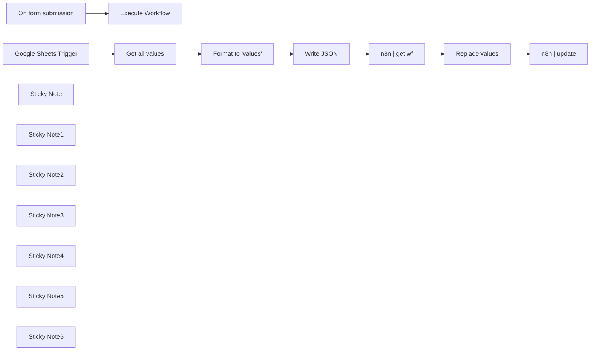

## Fluxo (.json) :

```json
{
  "id": "RKbQHfblpcvMGZ4w",
  "meta": {
    "instanceId": "d47f3738b860eed937a1b18d7345fa2c65cf4b4957554e29477cb064a7039870"
  },
  "name": "Form with Dynamic Dropdown Field",
  "tags": [],
  "nodes": [
    {
      "id": "aa627a35-9bea-4c07-b7e7-26f048564443",
      "name": "n8n | get wf",
      "type": "n8n-nodes-base.n8n",
      "position": [
        540,
        -180
      ],
      "parameters": {
        "operation": "get",
        "workflowId": {
          "__rl": true,
          "mode": "id",
          "value": "={{ $workflow.id }}"
        },
        "requestOptions": {}
      },
      "credentials": {
        "n8nApi": {
          "id": "us0k8UE7R2MZPFBK",
          "name": "n8n account"
        }
      },
      "typeVersion": 1
    },
    {
      "id": "902a8e45-f4b4-469c-96a6-80002de5f6dc",
      "name": "n8n | update",
      "type": "n8n-nodes-base.n8n",
      "position": [
        1060,
        -180
      ],
      "parameters": {
        "operation": "update",
        "workflowId": {
          "__rl": true,
          "mode": "id",
          "value": "={{ $json.id }}"
        },
        "requestOptions": {},
        "workflowObject": "={{ JSON.stringify($json) }}"
      },
      "credentials": {
        "n8nApi": {
          "id": "us0k8UE7R2MZPFBK",
          "name": "n8n account"
        }
      },
      "typeVersion": 1
    },
    {
      "id": "3e9e5c16-0080-4cba-8a8a-8f24f7266fcb",
      "name": "On form submission",
      "type": "n8n-nodes-base.formTrigger",
      "position": [
        40,
        -620
      ],
      "webhookId": "3e975d29-df26-49fb-8dcf-abe8fe8bc4e6",
      "parameters": {
        "options": {},
        "formTitle": "Example Title",
        "formFields": {
          "values": [
            {
              "fieldLabel": "Example text field"
            },
            {
              "fieldType": "dropdown",
              "fieldLabel": "Example dropdown",
              "fieldOptions": {
                "values": [
                  {
                    "option": "test publieke ruimtes"
                  },
                  {
                    "option": "Demonstraties"
                  },
                  {
                    "option": "Demonstraties"
                  },
                  {
                    "option": "Juridisch medewerker IE-recht  Streetlife"
                  },
                  {
                    "option": "Bamboe"
                  },
                  {
                    "option": "Klaar?"
                  },
                  {
                    "option": "Dannu?"
                  }
                ]
              }
            }
          ]
        }
      },
      "typeVersion": 2.2
    },
    {
      "id": "0b874994-c123-44f8-b0f5-0b365b57d945",
      "name": "Google Sheets Trigger",
      "type": "n8n-nodes-base.googleSheetsTrigger",
      "position": [
        -460,
        -180
      ],
      "parameters": {
        "options": {},
        "pollTimes": {
          "item": [
            {
              "mode": "everyMinute"
            }
          ]
        },
        "sheetName": {
          "__rl": true,
          "mode": "list",
          "value": "gid=0",
          "cachedResultUrl": "https://docs.google.com/spreadsheets/d/1F73a7uuzLAq916w2JFndumv0JhnCAvOTN-Cn_OOP3uA/edit#gid=0",
          "cachedResultName": "Blad1"
        },
        "documentId": {
          "__rl": true,
          "mode": "list",
          "value": "1F73a7uuzLAq916w2JFndumv0JhnCAvOTN-Cn_OOP3uA",
          "cachedResultUrl": "https://docs.google.com/spreadsheets/d/1F73a7uuzLAq916w2JFndumv0JhnCAvOTN-Cn_OOP3uA/edit?usp=drivesdk",
          "cachedResultName": "obsidian-n8n"
        },
        "includeInOutput": "both"
      },
      "credentials": {
        "googleSheetsTriggerOAuth2Api": {
          "id": "FV58wiwivBMosfix",
          "name": "Google Sheets Trigger account"
        }
      },
      "typeVersion": 1
    },
    {
      "id": "4c9bfed8-a758-40b9-9c74-53bedc1d1aa3",
      "name": "Execute Workflow",
      "type": "n8n-nodes-base.executeWorkflow",
      "position": [
        240,
        -620
      ],
      "parameters": {
        "options": {},
        "workflowId": {
          "__rl": true,
          "mode": "id",
          "value": "={{ $workflow.id }}"
        }
      },
      "typeVersion": 1.1
    },
    {
      "id": "6e9d4a5a-9583-4b61-aea1-dd4892230e7c",
      "name": "Sticky Note",
      "type": "n8n-nodes-base.stickyNote",
      "position": [
        -520,
        -660
      ],
      "parameters": {
        "width": 960,
        "height": 240,
        "content": "## Form setup\n\n- Customize your form fields. \n- The dropdown field will auto-update with values from your data source. \n- Other form fields can be added as needed (limited to one dropdown field).\n- Connect to your workflow that processes the submitted form data.\n\n### Form requires production mode for testing"
      },
      "typeVersion": 1
    },
    {
      "id": "41c364f4-5b1f-42fd-841b-a6f99b585804",
      "name": "Sticky Note1",
      "type": "n8n-nodes-base.stickyNote",
      "position": [
        -520,
        -400
      ],
      "parameters": {
        "width": 440,
        "height": 400,
        "content": "## Data source setup\n\n- Connect to your Google Sheet containing dropdown values\n- Node can be replaced with any other data source (API, database)\n- Set timing trigger"
      },
      "typeVersion": 1
    },
    {
      "id": "cda8f803-1773-4df7-90b9-4d8cd0469cd8",
      "name": "Sticky Note2",
      "type": "n8n-nodes-base.stickyNote",
      "position": [
        -60,
        -400
      ],
      "parameters": {
        "width": 260,
        "height": 400,
        "content": "## Data formatting\n\n- Extracts needed data from source\n- Renames field to 'value' (do not change this name)"
      },
      "typeVersion": 1
    },
    {
      "id": "e9594ad1-3bb8-4da6-95b3-cb610a17c1bb",
      "name": "Sticky Note3",
      "type": "n8n-nodes-base.stickyNote",
      "position": [
        220,
        -400
      ],
      "parameters": {
        "height": 400,
        "content": "## Nested properties\n\n- Transforms the data to the desired format"
      },
      "typeVersion": 1
    },
    {
      "id": "806a2502-5c6c-435c-a20e-8ca0eee92822",
      "name": "Sticky Note4",
      "type": "n8n-nodes-base.stickyNote",
      "position": [
        480,
        -400
      ],
      "parameters": {
        "height": 400,
        "content": "## Get Workflow \n\n- Gets the current workflow data"
      },
      "typeVersion": 1
    },
    {
      "id": "385c3e64-9893-4e3f-b789-abbf079fa8b1",
      "name": "Sticky Note5",
      "type": "n8n-nodes-base.stickyNote",
      "position": [
        740,
        -400
      ],
      "parameters": {
        "height": 400,
        "content": "## Add Dropdown Values \n- Replaces the nested parameters of the Dropdown Form Field with the nested properties sourced from the data."
      },
      "typeVersion": 1
    },
    {
      "id": "f43324fc-6790-445b-a72b-ae4afb051101",
      "name": "Sticky Note6",
      "type": "n8n-nodes-base.stickyNote",
      "position": [
        1000,
        -400
      ],
      "parameters": {
        "height": 400,
        "content": "## Update Form \n\n- Replaces the current workflow’s JSON with the updated JSON containing the new Dropdown values."
      },
      "typeVersion": 1
    },
    {
      "id": "317694bd-590f-4eb4-a53f-f4d5d2d1ab16",
      "name": "Write JSON",
      "type": "n8n-nodes-base.code",
      "position": [
        280,
        -180
      ],
      "parameters": {
        "jsCode": "const inputArray = items.map(item => item.json);\n\nconst output = [\n  {\n    nodes: [\n      {\n        parameters: {\n          formFields: {\n            values: [\n              {\n                fieldOptions: {\n                  values: inputArray.map(entry => ({ option: entry.value }))\n                }\n              }\n            ]\n          }\n        }\n      }\n    ]\n  }\n];\n\n// Return the transformed output\nreturn output.map(item => ({ json: item }));"
      },
      "typeVersion": 2
    },
    {
      "id": "08b3c0b3-3df3-40d9-80ce-bd7c763fdbdb",
      "name": "Replace values",
      "type": "n8n-nodes-base.set",
      "position": [
        820,
        -180
      ],
      "parameters": {
        "options": {},
        "assignments": {
          "assignments": [
            {
              "id": "38ef2b43-b903-4e96-b098-9da2d8c1c153",
              "name": "={{ \n   (() => {\n      const nodeIndex = $json.nodes.findIndex(\n         node => node.parameters?.formFields?.values.some(\n            value => value.fieldType === 'dropdown' && value.fieldOptions?.values\n         )\n      );\n\n      if (nodeIndex === -1) return 'No matching node found';\n\n      const valueIndex = $json.nodes[nodeIndex].parameters.formFields.values.findIndex(\n         value => value.fieldType === 'dropdown' && value.fieldOptions?.values\n      );\n\n      if (valueIndex === -1) return `nodes[${nodeIndex}].parameters.formFields.values - No matching dropdown value found`;\n\n      return `nodes[${nodeIndex}].parameters.formFields.values[${valueIndex}].fieldOptions.values`;\n   })()\n}}",
              "type": "array",
              "value": "={{ $('Write JSON').item.json.nodes[0].parameters.formFields.values[0].fieldOptions.values }}"
            }
          ]
        },
        "includeOtherFields": true
      },
      "typeVersion": 3.4
    },
    {
      "id": "07635565-f8ea-4fac-b93c-069fbe065ce8",
      "name": "Get all values",
      "type": "n8n-nodes-base.googleSheets",
      "position": [
        -240,
        -180
      ],
      "parameters": {
        "options": {},
        "sheetName": {
          "__rl": true,
          "mode": "list",
          "value": "gid=0",
          "cachedResultUrl": "https://docs.google.com/spreadsheets/d/1F73a7uuzLAq916w2JFndumv0JhnCAvOTN-Cn_OOP3uA/edit#gid=0",
          "cachedResultName": "Blad1"
        },
        "documentId": {
          "__rl": true,
          "mode": "list",
          "value": "1F73a7uuzLAq916w2JFndumv0JhnCAvOTN-Cn_OOP3uA",
          "cachedResultUrl": "https://docs.google.com/spreadsheets/d/1F73a7uuzLAq916w2JFndumv0JhnCAvOTN-Cn_OOP3uA/edit?usp=drivesdk",
          "cachedResultName": "obsidian-n8n"
        }
      },
      "credentials": {
        "googleSheetsOAuth2Api": {
          "id": "3Pu0wlfxgNYzVqY6",
          "name": "Google Sheets account"
        }
      },
      "typeVersion": 4.5
    },
    {
      "id": "9ce7bf73-211a-4f5b-b39d-81a2d513a3ef",
      "name": "Format to 'values'",
      "type": "n8n-nodes-base.set",
      "position": [
        20,
        -180
      ],
      "parameters": {
        "options": {},
        "assignments": {
          "assignments": [
            {
              "id": "e18aa12e-f277-4257-ba27-9262cc7b866a",
              "name": "value",
              "type": "string",
              "value": "={{ $json.title }}"
            }
          ]
        }
      },
      "typeVersion": 3.4
    }
  ],
  "active": true,
  "pinData": {},
  "settings": {
    "executionOrder": "v1"
  },
  "versionId": "d69a3011-97a6-44e9-9b7e-c8e9a248964a",
  "connections": {
    "Write JSON": {
      "main": [
        [
          {
            "node": "n8n | get wf",
            "type": "main",
            "index": 0
          }
        ]
      ]
    },
    "n8n | get wf": {
      "main": [
        [
          {
            "node": "Replace values",
            "type": "main",
            "index": 0
          }
        ]
      ]
    },
    "Get all values": {
      "main": [
        [
          {
            "node": "Format to 'values'",
            "type": "main",
            "index": 0
          }
        ]
      ]
    },
    "Replace values": {
      "main": [
        [
          {
            "node": "n8n | update",
            "type": "main",
            "index": 0
          }
        ]
      ]
    },
    "Format to 'values'": {
      "main": [
        [
          {
            "node": "Write JSON",
            "type": "main",
            "index": 0
          }
        ]
      ]
    },
    "On form submission": {
      "main": [
        [
          {
            "node": "Execute Workflow",
            "type": "main",
            "index": 0
          }
        ]
      ]
    },
    "Google Sheets Trigger": {
      "main": [
        [
          {
            "node": "Get all values",
            "type": "main",
            "index": 0
          }
        ]
      ]
    }
  }
}
```

<a id="template-166"></a>

## Template 166 - Geração de SQL a partir do esquema

- **Nome:** Geração de SQL a partir do esquema
- **Descrição:** Fluxo que utiliza um agente de IA para gerar consultas SQL com base apenas no esquema do banco, executa-as quando necessário e retorna os resultados ao usuário.
- **Funcionalidade:** • Extração e salvamento do esquema: coleta a estrutura das tabelas e salva o esquema localmente em um arquivo JSON.
• Integração com IA para geração de consultas: utiliza um modelo de linguagem para criar consultas SQL a partir do esquema e da entrada do usuário, sem acessar os dados.
• Detecção e extração de consultas: identifica consultas SQL na resposta do agente e as extrai automaticamente via expressão regular.
• Execução condicional de consultas: executa as consultas no banco de dados apenas se uma query for gerada pelo agente.
• Formatação dos resultados: processa e formata o resultado da consulta para apresentação legível ao usuário, combinando com a resposta do agente.
• Memória de contexto: mantém um histórico de contexto limitado (memória em janela) contendo esquema, perguntas e respostas para conversas consecutivas.
• Interface de chat: aceita entradas de usuário via trigger de chat/webhook para iniciar o processo.
- **Ferramentas:** • OpenAI (modelo GPT-4o): gera as respostas em linguagem natural e constrói as consultas SQL a partir do esquema.
• Servidor MySQL (ex.: db4free): armazena os dados reais e executa as consultas SQL geradas.
• Sistema de arquivos local: armazena o arquivo JSON com o esquema do banco para uso rápido e sem expor dados.
• Interface de chat/webhook: ponto de entrada para receber as solicitações dos usuários e iniciar o fluxo.

## Fluxo visual

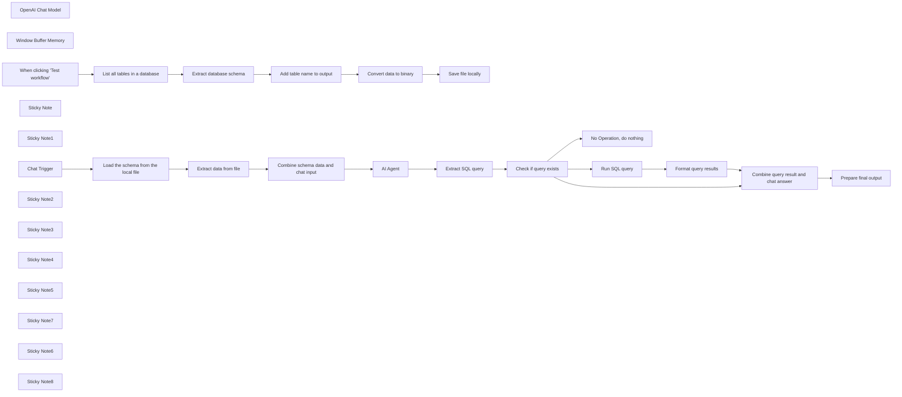

## Fluxo (.json) :

```json
{
  "id": "P307QnrxpA1ddsM5",
  "meta": {
    "instanceId": "fb924c73af8f703905bc09c9ee8076f48c17b596ed05b18c0ff86915ef8a7c4a",
    "templateCredsSetupCompleted": true
  },
  "name": "Generate SQL queries from schema only - AI-powered",
  "tags": [],
  "nodes": [
    {
      "id": "b7c3ca47-11b3-4378-81fa-68b2f56b295e",
      "name": "OpenAI Chat Model",
      "type": "@n8n/n8n-nodes-langchain.lmChatOpenAi",
      "position": [
        1460,
        440
      ],
      "parameters": {
        "model": "gpt-4o",
        "options": {
          "temperature": 0.2
        }
      },
      "credentials": {
        "openAiApi": {
          "id": "rveqdSfp7pCRON1T",
          "name": "Ted's Tech Talks OpenAi"
        }
      },
      "typeVersion": 1
    },
    {
      "id": "977c3a82-440b-4d44-9042-47a673bcb52c",
      "name": "Window Buffer Memory",
      "type": "@n8n/n8n-nodes-langchain.memoryBufferWindow",
      "position": [
        1640,
        440
      ],
      "parameters": {
        "contextWindowLength": 10
      },
      "typeVersion": 1.2
    },
    {
      "id": "c6e9c0e2-d238-4f0b-a4c8-2271f2c8b31b",
      "name": "No Operation, do nothing",
      "type": "n8n-nodes-base.noOp",
      "position": [
        2340,
        520
      ],
      "parameters": {},
      "typeVersion": 1
    },
    {
      "id": "4c141ae8-d2d1-45c7-bb5d-f33841d3cee6",
      "name": "List all tables in a database",
      "type": "n8n-nodes-base.mySql",
      "position": [
        520,
        -35
      ],
      "parameters": {
        "query": "SHOW TABLES;",
        "options": {},
        "operation": "executeQuery"
      },
      "credentials": {
        "mySql": {
          "id": "ICakJ1LRuVl4dRTs",
          "name": "db4free TTT account"
        }
      },
      "typeVersion": 2.4
    },
    {
      "id": "54fb3362-041b-4e4f-bfea-f0bc788d8dfd",
      "name": "Extract database schema",
      "type": "n8n-nodes-base.mySql",
      "position": [
        700,
        -35
      ],
      "parameters": {
        "query": "DESCRIBE {{ $json.Tables_in_tttytdb2023 }};",
        "options": {},
        "operation": "executeQuery"
      },
      "credentials": {
        "mySql": {
          "id": "ICakJ1LRuVl4dRTs",
          "name": "db4free TTT account"
        }
      },
      "typeVersion": 2.4
    },
    {
      "id": "d55e841d-11ed-4ce2-8c8e-840bd807ff2c",
      "name": "Add table name to output",
      "type": "n8n-nodes-base.set",
      "position": [
        880,
        -35
      ],
      "parameters": {
        "options": {},
        "assignments": {
          "assignments": [
            {
              "id": "764176d6-3c89-404d-9c71-301e8a406a68",
              "name": "table",
              "type": "string",
              "value": "={{ $('List all tables in a database').item.json.Tables_in_tttytdb2023 }}"
            }
          ]
        },
        "includeOtherFields": true
      },
      "typeVersion": 3.4
    },
    {
      "id": "ca8d30d6-c1f1-4e89-8cd5-ea3648dc3b0c",
      "name": "Convert data to binary",
      "type": "n8n-nodes-base.convertToFile",
      "position": [
        1060,
        -35
      ],
      "parameters": {
        "options": {},
        "operation": "toJson"
      },
      "typeVersion": 1.1
    },
    {
      "id": "2d89f901-d4e7-4fea-bd69-20b518280bbc",
      "name": "Save file locally",
      "type": "n8n-nodes-base.readWriteFile",
      "position": [
        1220,
        -35
      ],
      "parameters": {
        "options": {},
        "fileName": "./chinook_mysql.json",
        "operation": "write"
      },
      "typeVersion": 1
    },
    {
      "id": "04511c4f-44fa-4c23-87af-54d959e6cb2c",
      "name": "Extract data from file",
      "type": "n8n-nodes-base.extractFromFile",
      "position": [
        920,
        420
      ],
      "parameters": {
        "options": {},
        "operation": "fromJson"
      },
      "typeVersion": 1
    },
    {
      "id": "96f129c0-d1d4-4cbf-a24d-0b0cea18a229",
      "name": "Chat Trigger",
      "type": "@n8n/n8n-nodes-langchain.chatTrigger",
      "position": [
        440,
        420
      ],
      "webhookId": "c308dec7-655c-4b79-832e-991bd8ea891f",
      "parameters": {
        "options": {}
      },
      "typeVersion": 1.1
    },
    {
      "id": "4d993ed9-3bbe-4bc3-9e5b-c3d738b0e714",
      "name": "AI Agent",
      "type": "@n8n/n8n-nodes-langchain.agent",
      "position": [
        1480,
        300
      ],
      "parameters": {
        "text": "=Here is the database schema: {{ $json.schema }}\nHere is the user request: {{ $('Chat Trigger').item.json.chatInput }}",
        "agent": "conversationalAgent",
        "options": {
          "humanMessage": "TOOLS\n------\nAssistant can ask the user to use tools to look up information that may be helpful in answering the users original question. The tools the human can use are:\n\n{tools}\n\n{format_instructions}\n\nUSER'S INPUT\n--------------------\nHere is the user's input (remember to respond with a markdown code snippet of a json blob with a single action, and NOTHING else):\n\n{{input}}",
          "systemMessage": "Assistant is a large language model trained by OpenAI.\n\nAssistant is designed to be able to assist with a wide range of tasks, from answering simple questions to providing in-depth explanations and discussions on a wide range of topics. As a language model, Assistant is able to generate human-like text based on the input it receives, allowing it to engage in natural-sounding conversations and provide responses that are coherent and relevant to the topic at hand.\n\nAssistant is constantly learning and improving, and its capabilities are constantly evolving. It is able to process and understand large amounts of text, and can use this knowledge to provide accurate and informative responses to a wide range of questions. Additionally, Assistant is able to generate its own text based on the input it receives, allowing it to engage in discussions and provide explanations and descriptions on a wide range of topics.\n\nOverall, Assistant is a powerful system that can help with a wide range of tasks and provide valuable insights and information on a wide range of topics. Whether you need help with a specific question or just want to have a conversation about a particular topic, Assistant is here to assist.\n\nHelp user to work with the MySQL database.\n\nPlease wrap any sql commands into triple quotes. You don't have a tool to run SQL, so the user will do that instead of you."
        },
        "promptType": "define"
      },
      "typeVersion": 1.6
    },
    {
      "id": "f5749b31-b28a-4341-b57f-94ee422d2873",
      "name": "Sticky Note",
      "type": "n8n-nodes-base.stickyNote",
      "position": [
        320,
        -280
      ],
      "parameters": {
        "color": 3,
        "width": 1065.0949045120822,
        "height": 466.4256045427794,
        "content": "## Run this part only once\nThis section:\n* loads a list of all tables from the database hosted on [db4free](https://db4free.net/signup.php) \n* extracts the database schema for each table and adds the table name\n* converts the schema into a binary JSON format\n* saves the schema `./chinook_mysql.json` file locally\n\n***Now you can use chat to \"talk\" to your data!*** 🎉"
      },
      "typeVersion": 1
    },
    {
      "id": "6606abc9-1dcb-4dba-b7ef-e221f892eed8",
      "name": "Sticky Note1",
      "type": "n8n-nodes-base.stickyNote",
      "position": [
        1040,
        -255
      ],
      "parameters": {
        "color": 6,
        "width": 312.47220527158765,
        "height": 174.60585869504342,
        "content": "## Pre-workflow setup \nConnect to a free MySQL server and import your database. Follow Step 1 and 2 in this [tutorial](https://blog.n8n.io/compare-databases/) for more.\n\n*The Chinook data used in this workflow is available on [GitHub](https://github.com/msimanga/chinook/tree/master/mysql).* "
      },
      "typeVersion": 1
    },
    {
      "id": "c8ac730a-04ee-499d-b845-1149967d6aa2",
      "name": "When clicking \"Test workflow\"",
      "type": "n8n-nodes-base.manualTrigger",
      "position": [
        360,
        -35
      ],
      "parameters": {},
      "typeVersion": 1
    },
    {
      "id": "6f0b167c-e012-43e1-9892-ded05be47cf8",
      "name": "Sticky Note2",
      "type": "n8n-nodes-base.stickyNote",
      "position": [
        324.32561050665913,
        209.72072645338642
      ],
      "parameters": {
        "color": 6,
        "width": 1062.678698911262,
        "height": 489.29614613074125,
        "content": "## On every chat message:\n\n* The workflow gets the data from the local schema file and extracts it as a JSON object. This way, we achieve two important improvements:\n  * faster processing time as we don't need to fetch the schema for each table from a slow remote database\n  * the Agent will know database structure without seeing the actual data\n* DB schema is then converted into a long string, JSON fields from the Chat Trigger are added before they are entered into the Agent node.\n"
      },
      "typeVersion": 1
    },
    {
      "id": "3a79350c-aec1-4ad4-a2e0-679957fa420b",
      "name": "Sticky Note3",
      "type": "n8n-nodes-base.stickyNote",
      "position": [
        1400,
        -15.552780029374958
      ],
      "parameters": {
        "color": 6,
        "width": 445.66588600071304,
        "height": 714.7896619176862,
        "content": "### LangChain AI Agent's system prompt is modified.\nIt uses only the database schema to generate SQL queries. The agent creates these queries but does not execute them. Instead, it passes them to subsequent nodes.\n\n**Example:**\n\"Can you show me the list of all German customers?\" \n\nQueries are generated only when necessary; for some requests, a query may not be needed. This is because certain questions can be answered directly without SQL execution.\n\n**Example:**\n\"Can you list me all tables?\""
      },
      "typeVersion": 1
    },
    {
      "id": "0cd425db-2a8e-4f48-b749-9a082e948395",
      "name": "Combine schema data and chat input",
      "type": "n8n-nodes-base.set",
      "position": [
        1140,
        420
      ],
      "parameters": {
        "options": {},
        "assignments": {
          "assignments": [
            {
              "id": "42abd24e-419a-47d6-bc8b-7146dd0b8314",
              "name": "sessionId",
              "type": "string",
              "value": "={{ $('Chat Trigger').first().json.sessionId }}"
            },
            {
              "id": "39244192-a1a6-42fe-bc75-a6fba1f264df",
              "name": "action",
              "type": "string",
              "value": "={{ $('Chat Trigger').first().json.action }}"
            },
            {
              "id": "f78c57d9-df13-43c7-89a7-5387e528107e",
              "name": "chatinput",
              "type": "string",
              "value": "={{ $('Chat Trigger').first().json.chatInput }}"
            },
            {
              "id": "e42b39eb-dfbd-48d9-94ed-d658bdd41454",
              "name": "schema",
              "type": "string",
              "value": "={{ $json.data }}"
            }
          ]
        }
      },
      "executeOnce": true,
      "typeVersion": 3.4
    },
    {
      "id": "e4045e33-bb87-488d-8ccf-b4a94339a841",
      "name": "Load the schema from the local file",
      "type": "n8n-nodes-base.readWriteFile",
      "position": [
        680,
        420
      ],
      "parameters": {
        "options": {},
        "fileSelector": "./chinook_mysql.json"
      },
      "typeVersion": 1
    },
    {
      "id": "367ebe95-0b87-44f6-8392-33fe65446c24",
      "name": "Extract SQL query",
      "type": "n8n-nodes-base.set",
      "position": [
        1900,
        340
      ],
      "parameters": {
        "options": {},
        "assignments": {
          "assignments": [
            {
              "id": "ebbe194a-4b8b-44c9-ac19-03cf69d353bf",
              "name": "query",
              "type": "string",
              "value": "={{ ($json.output.match(/SELECT[\\s\\S]*?;/i) || [])[0] || \"\" }}"
            }
          ]
        },
        "includeOtherFields": true
      },
      "typeVersion": 3.4
    },
    {
      "id": "b856fe78-2435-4075-97f8-ecbeecf3e780",
      "name": "Check if query exists",
      "type": "n8n-nodes-base.if",
      "position": [
        2060,
        340
      ],
      "parameters": {
        "options": {},
        "conditions": {
          "options": {
            "version": 2,
            "leftValue": "",
            "caseSensitive": true,
            "typeValidation": "strict"
          },
          "combinator": "and",
          "conditions": [
            {
              "id": "2963d04d-9d79-49f9-b52a-dc8732aca781",
              "operator": {
                "type": "string",
                "operation": "notEmpty",
                "singleValue": true
              },
              "leftValue": "={{ $json.query }}",
              "rightValue": ""
            }
          ]
        }
      },
      "typeVersion": 2.2
    },
    {
      "id": "87162d31-2f6c-4f4a-af28-c65cbadd8ed5",
      "name": "Sticky Note4",
      "type": "n8n-nodes-base.stickyNote",
      "position": [
        1874,
        220.45316744685329
      ],
      "parameters": {
        "color": 3,
        "width": 317.8901548206743,
        "height": 278.8174358200552,
        "content": "## SQL query extraction\nCheck if the agent's response contains an SQL query. If it does, we extract the query using a regular expression."
      },
      "typeVersion": 1
    },
    {
      "id": "b3e77333-eaa9-4d23-a78c-8a19ae074739",
      "name": "Sticky Note5",
      "type": "n8n-nodes-base.stickyNote",
      "position": [
        1860,
        -16.43746604251737
      ],
      "parameters": {
        "color": 6,
        "width": 882.7611828369563,
        "height": 715.7029266156915,
        "content": ""
      },
      "typeVersion": 1
    },
    {
      "id": "269ea79d-5f17-4764-aebb-bba31b43d8bb",
      "name": "Sticky Note7",
      "type": "n8n-nodes-base.stickyNote",
      "position": [
        1580,
        580
      ],
      "parameters": {
        "color": 3,
        "width": 257.46308756569573,
        "height": 108.03673727584527,
        "content": "The AI Agent remembers the schema, questions, and final answers, but not data values, since queries run externally. The agent can't access database content. "
      },
      "typeVersion": 1
    },
    {
      "id": "2fd1175c-4110-48be-b6bf-2251c678bc04",
      "name": "Sticky Note6",
      "type": "n8n-nodes-base.stickyNote",
      "position": [
        2420,
        0
      ],
      "parameters": {
        "color": 3,
        "width": 308.8514666587585,
        "height": 123.43139661532095,
        "content": "- The SQL node accesses the database and executes the query. The results are then formatted for readability.\n- Both the chat response and the query result are displayed in the chat window."
      },
      "typeVersion": 1
    },
    {
      "id": "61ae7f7c-1424-4ecb-8a12-78cd98e94d45",
      "name": "Sticky Note8",
      "type": "n8n-nodes-base.stickyNote",
      "position": [
        2480,
        600
      ],
      "parameters": {
        "color": 3,
        "width": 250.40895053328057,
        "height": 89.90186716520257,
        "content": "When the agent responds without an SQL query, you receive an immediate answer with no additional processing."
      },
      "typeVersion": 1
    },
    {
      "id": "cbb6d1e1-0a75-4b3a-89cd-6bd545b8d414",
      "name": "Format query results",
      "type": "n8n-nodes-base.set",
      "position": [
        2420,
        140
      ],
      "parameters": {
        "options": {},
        "assignments": {
          "assignments": [
            {
              "id": "f944d21f-6aac-4842-8926-4108d6cad4bf",
              "name": "sqloutput",
              "type": "string",
              "value": "={{ Object.keys($jmespath($input.all(),'[].json')[0]).join(' | ') }} \n{{ ($jmespath($input.all(),'[].json')).map(obj => Object.values(obj).join(' | ')).join('\\n') }}"
            }
          ]
        }
      },
      "executeOnce": true,
      "typeVersion": 3.4
    },
    {
      "id": "d958de24-84ef-4928-a7f3-32cada09a0eb",
      "name": "Run SQL query",
      "type": "n8n-nodes-base.mySql",
      "position": [
        2260,
        140
      ],
      "parameters": {
        "query": "{{ $json.query }}",
        "options": {},
        "operation": "executeQuery"
      },
      "credentials": {
        "mySql": {
          "id": "ICakJ1LRuVl4dRTs",
          "name": "db4free TTT account"
        }
      },
      "typeVersion": 2.4
    },
    {
      "id": "99a6dc03-1035-4866-81e4-11dc66bf98ec",
      "name": "Prepare final output",
      "type": "n8n-nodes-base.set",
      "position": [
        2560,
        420
      ],
      "parameters": {
        "options": {},
        "assignments": {
          "assignments": [
            {
              "id": "aa55e186-1535-4923-aee4-e088ca69575b",
              "name": "output",
              "type": "string",
              "value": "={{ $json.output }}\n\nSQL result:\n```markdown\n{{ $json.sqloutput }}\n```"
            }
          ]
        }
      },
      "typeVersion": 3.4
    },
    {
      "id": "9380c2f6-15d9-43e4-80a2-3019bcf5ae04",
      "name": "Combine query result and chat answer",
      "type": "n8n-nodes-base.merge",
      "position": [
        2340,
        340
      ],
      "parameters": {
        "mode": "combine",
        "options": {},
        "combineBy": "combineByPosition"
      },
      "typeVersion": 3
    }
  ],
  "active": false,
  "pinData": {},
  "settings": {
    "executionOrder": "v1"
  },
  "versionId": "15049b13-91cb-46bd-a7a0-ad648b6f667a",
  "connections": {
    "AI Agent": {
      "main": [
        [
          {
            "node": "Extract SQL query",
            "type": "main",
            "index": 0
          }
        ]
      ]
    },
    "Chat Trigger": {
      "main": [
        [
          {
            "node": "Load the schema from the local file",
            "type": "main",
            "index": 0
          }
        ]
      ]
    },
    "Run SQL query": {
      "main": [
        [
          {
            "node": "Format query results",
            "type": "main",
            "index": 0
          }
        ]
      ]
    },
    "Extract SQL query": {
      "main": [
        [
          {
            "node": "Check if query exists",
            "type": "main",
            "index": 0
          }
        ]
      ]
    },
    "OpenAI Chat Model": {
      "ai_languageModel": [
        [
          {
            "node": "AI Agent",
            "type": "ai_languageModel",
            "index": 0
          }
        ]
      ]
    },
    "Format query results": {
      "main": [
        [
          {
            "node": "Combine query result and chat answer",
            "type": "main",
            "index": 0
          }
        ]
      ]
    },
    "Window Buffer Memory": {
      "ai_memory": [
        [
          {
            "node": "AI Agent",
            "type": "ai_memory",
            "index": 0
          }
        ]
      ]
    },
    "Check if query exists": {
      "main": [
        [
          {
            "node": "Run SQL query",
            "type": "main",
            "index": 0
          },
          {
            "node": "Combine query result and chat answer",
            "type": "main",
            "index": 1
          }
        ],
        [
          {
            "node": "No Operation, do nothing",
            "type": "main",
            "index": 0
          }
        ]
      ]
    },
    "Convert data to binary": {
      "main": [
        [
          {
            "node": "Save file locally",
            "type": "main",
            "index": 0
          }
        ]
      ]
    },
    "Extract data from file": {
      "main": [
        [
          {
            "node": "Combine schema data and chat input",
            "type": "main",
            "index": 0
          }
        ]
      ]
    },
    "Extract database schema": {
      "main": [
        [
          {
            "node": "Add table name to output",
            "type": "main",
            "index": 0
          }
        ]
      ]
    },
    "Add table name to output": {
      "main": [
        [
          {
            "node": "Convert data to binary",
            "type": "main",
            "index": 0
          }
        ]
      ]
    },
    "List all tables in a database": {
      "main": [
        [
          {
            "node": "Extract database schema",
            "type": "main",
            "index": 0
          }
        ]
      ]
    },
    "When clicking \"Test workflow\"": {
      "main": [
        [
          {
            "node": "List all tables in a database",
            "type": "main",
            "index": 0
          }
        ]
      ]
    },
    "Combine schema data and chat input": {
      "main": [
        [
          {
            "node": "AI Agent",
            "type": "main",
            "index": 0
          }
        ]
      ]
    },
    "Load the schema from the local file": {
      "main": [
        [
          {
            "node": "Extract data from file",
            "type": "main",
            "index": 0
          }
        ]
      ]
    },
    "Combine query result and chat answer": {
      "main": [
        [
          {
            "node": "Prepare final output",
            "type": "main",
            "index": 0
          }
        ]
      ]
    }
  }
}
```

<a id="template-167"></a>

## Template 167 - Alerta por SMS quando BTC ≥ €9000

- **Nome:** Alerta por SMS quando BTC ≥ €9000
- **Descrição:** Monitora periodicamente o preço do Bitcoin em euros e envia um SMS quando o preço atingir ou ultrapassar €9000.
- **Funcionalidade:** • Agendamento periódico: Executa a verificação a cada minuto.
• Consulta de preço do Bitcoin: Recupera o preço atual do BTC em euros a partir de uma API de cotações.
• Avaliação de condição: Compara o preço obtido com o limite de €9000.
• Envio de alerta por SMS: Dispara uma mensagem informando o novo preço quando a condição é satisfeita.
• Ramo alternativo sem ação: Quando a condição não é satisfeita, não realiza envio de SMS.
- **Ferramentas:** • CoinGecko: Serviço/API pública para consulta de preços e dados de criptomoedas.
• Twilio: Plataforma de comunicação utilizada para enviar mensagens SMS.

## Fluxo visual

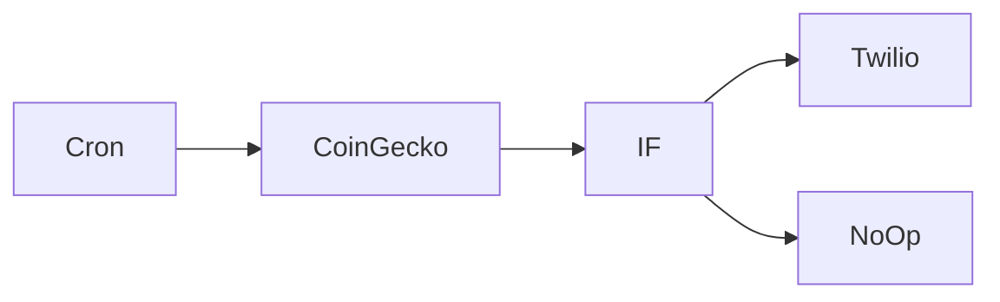

## Fluxo (.json) :

```json
{
  "id": "79",
  "name": "Get the price of BTC in EUR and send an SMS when the price is larger than EUR 9000",
  "nodes": [
    {
      "name": "Cron",
      "type": "n8n-nodes-base.cron",
      "position": [
        590,
        500
      ],
      "parameters": {
        "triggerTimes": {
          "item": [
            {
              "mode": "everyMinute"
            }
          ]
        }
      },
      "typeVersion": 1
    },
    {
      "name": "CoinGecko",
      "type": "n8n-nodes-base.coinGecko",
      "position": [
        790,
        500
      ],
      "parameters": {
        "coinIds": [
          "bitcoin"
        ],
        "options": {},
        "operation": "price",
        "currencies": [
          "eur"
        ]
      },
      "typeVersion": 1
    },
    {
      "name": "IF",
      "type": "n8n-nodes-base.if",
      "position": [
        990,
        500
      ],
      "parameters": {
        "conditions": {
          "number": [
            {
              "value1": "={{$node[\"CoinGecko\"].json[\"bitcoin\"][\"eur\"]}}",
              "value2": 9000,
              "operation": "largerEqual"
            }
          ]
        }
      },
      "typeVersion": 1
    },
    {
      "name": "Twilio",
      "type": "n8n-nodes-base.twilio",
      "position": [
        1190,
        400
      ],
      "parameters": {
        "to": "1234",
        "from": "1234",
        "message": "=The price went up! The new price is {{$node[\"CoinGecko\"].json[\"bitcoin\"][\"eur\"]}}"
      },
      "credentials": {
        "twilioApi": "twilio-credentials"
      },
      "typeVersion": 1
    },
    {
      "name": "NoOp",
      "type": "n8n-nodes-base.noOp",
      "position": [
        1190,
        600
      ],
      "parameters": {},
      "typeVersion": 1
    }
  ],
  "active": false,
  "settings": {},
  "connections": {
    "IF": {
      "main": [
        [
          {
            "node": "Twilio",
            "type": "main",
            "index": 0
          }
        ],
        [
          {
            "node": "NoOp",
            "type": "main",
            "index": 0
          }
        ]
      ]
    },
    "Cron": {
      "main": [
        [
          {
            "node": "CoinGecko",
            "type": "main",
            "index": 0
          }
        ]
      ]
    },
    "CoinGecko": {
      "main": [
        [
          {
            "node": "IF",
            "type": "main",
            "index": 0
          }
        ]
      ]
    }
  }
}
```

<a id="template-168"></a>

## Template 168 - Ingestão de PDF e Q&A vetorial

- **Nome:** Ingestão de PDF e Q&A vetorial
- **Descrição:** Fluxo que baixa um PDF do Google Drive, gera embeddings dos trechos do documento, armazena em um banco vetorial e responde a consultas recebidas via webhook usando um modelo de linguagem.
- **Funcionalidade:** • Download e ingestão de documentos: baixa arquivo (por exemplo, crowdstrike.pdf) do Google Drive para processamento.
• Extração e segmentação: divide o PDF por páginas e fragmenta o texto em chunks configurados (chunkSize 3000, overlap 200).
• Geração de embeddings: cria vetores de embedding para cada trecho usando o serviço de embeddings.
• Inserção em banco vetorial: insere os embeddings em uma coleção Qdrant (coleção padrão "crowd" ou coleção dinâmica baseada em campo de empresa).
• Recuperação por similaridade: ao receber uma consulta, busca os topK (5) trechos mais relevantes na coleção Qdrant.
• Cadeia de QA por recuperação: utiliza o contexto recuperado para construir uma pergunta e gerar a resposta com um modelo de chat (por exemplo, gpt-4o-mini).
• Resposta via webhook: retorna a resposta de texto diretamente ao solicitante HTTP.
• Execução manual para ingestão: permite acionar manualmente o processo de download e upsert do PDF.
- **Ferramentas:** • Google Drive: armazena e fornece o PDF a ser processado (fonte do documento).
• Qdrant: banco vetorial usado para armazenar e recuperar embeddings por similaridade, com suporte a coleções fixas e dinâmicas.
• OpenAI: serviço de modelos responsável por gerar embeddings e por executar o modelo de chat para formular respostas (ex.: gpt-4o-mini).
• Endpoint HTTP (webhook): recebe requisições POST com perguntas e devolve respostas de texto ao cliente.

## Fluxo visual

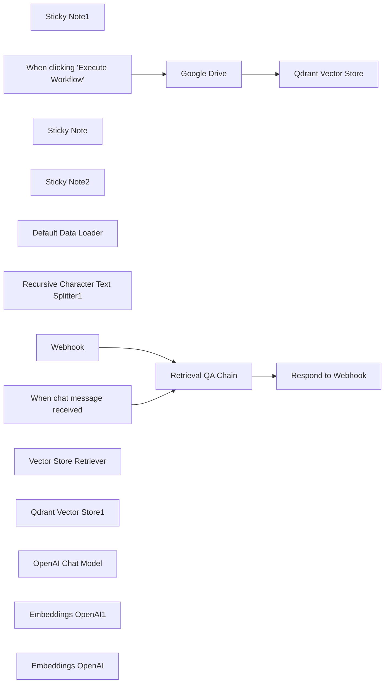

## Fluxo (.json) :

```json
{
  "meta": {
    "instanceId": "408f9fb9940c3cb18ffdef0e0150fe342d6e655c3a9fac21f0f644e8bedabcd9",
    "templateCredsSetupCompleted": true
  },
  "nodes": [
    {
      "id": "01730710-e299-4e66-93e9-6079fdf9b8b7",
      "name": "Sticky Note1",
      "type": "n8n-nodes-base.stickyNote",
      "position": [
        2120,
        0
      ],
      "parameters": {
        "color": 6,
        "width": 903.0896125323785,
        "height": 733.5099670584011,
        "content": "## Step 2: Setup the Q&A \n### The incoming message from the webhook is queried from the Supabase Vector Store.  The response is provided in the response webhook.  "
      },
      "typeVersion": 1
    },
    {
      "id": "66aed89e-fd72-4067-82bf-d480be27e5d6",
      "name": "When clicking \"Execute Workflow\"",
      "type": "n8n-nodes-base.manualTrigger",
      "position": [
        840,
        140
      ],
      "parameters": {},
      "typeVersion": 1
    },
    {
      "id": "9dc8f2a7-eeff-4a35-be52-05c42b71eee4",
      "name": "Google Drive",
      "type": "n8n-nodes-base.googleDrive",
      "position": [
        1140,
        140
      ],
      "parameters": {
        "fileId": {
          "__rl": true,
          "mode": "list",
          "value": "1LZezppYrWpMStr4qJXtoIX-Dwzvgehll",
          "cachedResultUrl": "https://drive.google.com/file/d/1LZezppYrWpMStr4qJXtoIX-Dwzvgehll/view?usp=drivesdk",
          "cachedResultName": "crowdstrike.pdf"
        },
        "options": {},
        "operation": "download"
      },
      "credentials": {
        "googleDriveOAuth2Api": {
          "id": "yOwz41gMQclOadgu",
          "name": "Google Drive account"
        }
      },
      "typeVersion": 3
    },
    {
      "id": "1dd3d3fd-6c2e-4e23-9c82-b0d07b199de3",
      "name": "Sticky Note",
      "type": "n8n-nodes-base.stickyNote",
      "position": [
        1100,
        0
      ],
      "parameters": {
        "color": 6,
        "width": 772.0680602743597,
        "height": 732.3675002130781,
        "content": "## Step 1: Upserting the PDF\n### Fetch file from Google Drive, split it into chunks and insert into Supabase index\n\n"
      },
      "typeVersion": 1
    },
    {
      "id": "4796124f-bc12-4353-b7ea-ec8cd7653e68",
      "name": "Sticky Note2",
      "type": "n8n-nodes-base.stickyNote",
      "position": [
        0,
        0
      ],
      "parameters": {
        "color": 6,
        "width": 710.9124489067698,
        "height": 726.4452519516944,
        "content": "## Start here: Step-by Step Youtube Tutorial :star:\n\n[](https://www.youtube.com/watch?v=pMvizUx5n1g)\n"
      },
      "typeVersion": 1
    },
    {
      "id": "1e2ecc88-c8c7-4687-a2a1-b20b0da9b772",
      "name": "Default Data Loader",
      "type": "@n8n/n8n-nodes-langchain.documentDefaultDataLoader",
      "position": [
        1400,
        320
      ],
      "parameters": {
        "options": {
          "splitPages": true
        },
        "dataType": "binary"
      },
      "typeVersion": 1
    },
    {
      "id": "6dd8545d-df8c-49ff-acf6-f8c150723ee8",
      "name": "Recursive Character Text Splitter1",
      "type": "@n8n/n8n-nodes-langchain.textSplitterRecursiveCharacterTextSplitter",
      "position": [
        1400,
        460
      ],
      "parameters": {
        "options": {},
        "chunkSize": 3000,
        "chunkOverlap": 200
      },
      "typeVersion": 1
    },
    {
      "id": "6899e2d6-965a-40cd-a34f-a61de8fd32ef",
      "name": "Qdrant Vector Store",
      "type": "@n8n/n8n-nodes-langchain.vectorStoreQdrant",
      "position": [
        1480,
        140
      ],
      "parameters": {
        "mode": "insert",
        "options": {},
        "qdrantCollection": {
          "__rl": true,
          "mode": "id",
          "value": "crowd"
        }
      },
      "credentials": {
        "qdrantApi": {
          "id": "NyinAS3Pgfik66w5",
          "name": "QdrantApi account"
        }
      },
      "typeVersion": 1.1
    },
    {
      "id": "6136c6fb-3d20-44a7-ab00-6c5671bafa10",
      "name": "When chat message received",
      "type": "@n8n/n8n-nodes-langchain.chatTrigger",
      "disabled": true,
      "position": [
        2180,
        120
      ],
      "webhookId": "551107fb-b349-4e2b-a888-febe5e282734",
      "parameters": {
        "options": {}
      },
      "typeVersion": 1.1
    },
    {
      "id": "c970f654-4c79-4637-bec0-73f79a01ab59",
      "name": "Webhook",
      "type": "n8n-nodes-base.webhook",
      "position": [
        2180,
        320
      ],
      "webhookId": "55b825ad-8987-4618-ae92-d9b08966324b",
      "parameters": {
        "path": "19f5499a-3083-4783-93a0-e8ed76a9f742",
        "options": {},
        "httpMethod": "POST",
        "responseMode": "responseNode"
      },
      "typeVersion": 2
    },
    {
      "id": "e05e9046-de17-4ca1-b1ac-2502ee123e5f",
      "name": "Retrieval QA Chain",
      "type": "@n8n/n8n-nodes-langchain.chainRetrievalQa",
      "position": [
        2420,
        120
      ],
      "parameters": {
        "text": "={{ $json.chatInput || $json.body.input }}",
        "options": {},
        "promptType": "define"
      },
      "typeVersion": 1.5
    },
    {
      "id": "ecf0d248-a8a9-45ed-8786-8864547f79b6",
      "name": "Vector Store Retriever",
      "type": "@n8n/n8n-nodes-langchain.retrieverVectorStore",
      "position": [
        2580,
        320
      ],
      "parameters": {
        "topK": 5
      },
      "typeVersion": 1
    },
    {
      "id": "4fb1d8ac-bc6f-4f99-965f-7d38ea0680e0",
      "name": "Qdrant Vector Store1",
      "type": "@n8n/n8n-nodes-langchain.vectorStoreQdrant",
      "position": [
        2540,
        460
      ],
      "parameters": {
        "options": {},
        "qdrantCollection": {
          "__rl": true,
          "mode": "id",
          "value": "={{ $json.body.company }}"
        }
      },
      "credentials": {
        "qdrantApi": {
          "id": "NyinAS3Pgfik66w5",
          "name": "QdrantApi account"
        }
      },
      "typeVersion": 1.1
    },
    {
      "id": "66868422-39c9-4e76-99b9-a77bb613b248",
      "name": "OpenAI Chat Model",
      "type": "@n8n/n8n-nodes-langchain.lmChatOpenAi",
      "position": [
        2420,
        340
      ],
      "parameters": {
        "model": {
          "__rl": true,
          "mode": "list",
          "value": "gpt-4o-mini"
        },
        "options": {}
      },
      "credentials": {
        "openAiApi": {
          "id": "8gccIjcuf3gvaoEr",
          "name": "OpenAi account"
        }
      },
      "typeVersion": 1.2
    },
    {
      "id": "f290f809-3b4e-42e3-bfb5-d505566d9275",
      "name": "Embeddings OpenAI1",
      "type": "@n8n/n8n-nodes-langchain.embeddingsOpenAi",
      "position": [
        2520,
        580
      ],
      "parameters": {
        "options": {}
      },
      "credentials": {
        "openAiApi": {
          "id": "8gccIjcuf3gvaoEr",
          "name": "OpenAi account"
        }
      },
      "typeVersion": 1.2
    },
    {
      "id": "c360f7b3-2ae4-4ebd-85ca-f64c3966e65d",
      "name": "Embeddings OpenAI",
      "type": "@n8n/n8n-nodes-langchain.embeddingsOpenAi",
      "position": [
        1700,
        320
      ],
      "parameters": {
        "options": {}
      },
      "credentials": {
        "openAiApi": {
          "id": "8gccIjcuf3gvaoEr",
          "name": "OpenAi account"
        }
      },
      "typeVersion": 1.2
    },
    {
      "id": "9223d119-b5a7-40d4-b8da-f85951b52bde",
      "name": "Respond to Webhook",
      "type": "n8n-nodes-base.respondToWebhook",
      "position": [
        2840,
        120
      ],
      "parameters": {
        "options": {},
        "respondWith": "text",
        "responseBody": "={{ $json.response.text }}"
      },
      "typeVersion": 1.1
    }
  ],
  "pinData": {},
  "connections": {
    "Webhook": {
      "main": [
        [
          {
            "node": "Retrieval QA Chain",
            "type": "main",
            "index": 0
          }
        ]
      ]
    },
    "Google Drive": {
      "main": [
        [
          {
            "node": "Qdrant Vector Store",
            "type": "main",
            "index": 0
          }
        ]
      ]
    },
    "Embeddings OpenAI": {
      "ai_embedding": [
        [
          {
            "node": "Qdrant Vector Store",
            "type": "ai_embedding",
            "index": 0
          }
        ]
      ]
    },
    "OpenAI Chat Model": {
      "ai_languageModel": [
        [
          {
            "node": "Retrieval QA Chain",
            "type": "ai_languageModel",
            "index": 0
          }
        ]
      ]
    },
    "Embeddings OpenAI1": {
      "ai_embedding": [
        [
          {
            "node": "Qdrant Vector Store1",
            "type": "ai_embedding",
            "index": 0
          }
        ]
      ]
    },
    "Retrieval QA Chain": {
      "main": [
        [
          {
            "node": "Respond to Webhook",
            "type": "main",
            "index": 0
          }
        ]
      ]
    },
    "Default Data Loader": {
      "ai_document": [
        [
          {
            "node": "Qdrant Vector Store",
            "type": "ai_document",
            "index": 0
          }
        ]
      ]
    },
    "Qdrant Vector Store1": {
      "ai_vectorStore": [
        [
          {
            "node": "Vector Store Retriever",
            "type": "ai_vectorStore",
            "index": 0
          }
        ]
      ]
    },
    "Vector Store Retriever": {
      "ai_retriever": [
        [
          {
            "node": "Retrieval QA Chain",
            "type": "ai_retriever",
            "index": 0
          }
        ]
      ]
    },
    "When chat message received": {
      "main": [
        [
          {
            "node": "Retrieval QA Chain",
            "type": "main",
            "index": 0
          }
        ]
      ]
    },
    "When clicking \"Execute Workflow\"": {
      "main": [
        [
          {
            "node": "Google Drive",
            "type": "main",
            "index": 0
          }
        ]
      ]
    },
    "Recursive Character Text Splitter1": {
      "ai_textSplitter": [
        [
          {
            "node": "Default Data Loader",
            "type": "ai_textSplitter",
            "index": 0
          }
        ]
      ]
    }
  }
}
```

<a id="template-169"></a>

## Template 169 - Extração de dados pessoais com LLM local Mistral NeMo

- **Nome:** Extração de dados pessoais com LLM local Mistral NeMo
- **Descrição:** Recebe mensagens de chat, analisa o conteúdo com um modelo de linguagem self-hosted e extrai informações pessoais conforme um esquema JSON padronizado, retornando um JSON válido com os campos identificados.
- **Funcionalidade:** • Detecção de mensagem de chat: Inicia o processo ao receber uma mensagem de usuário.
• Análise e extração com LLM: Utiliza um modelo de linguagem para identificar e extrair campos como nome, sobrenome, método de contato, contatos, timestamp e assunto.
• Validação de saída estruturada: Verifica o JSON gerado contra um esquema definido, incluindo formatos (ex.: date-time) e campos obrigatórios.
• Auto-correção de resposta: Quando a saída não satisfaz o esquema, reenvia instruções corretivas ao modelo para gerar um JSON válido.
• Configuração de modelo local: Mantém configurações de execução do modelo (como temperatura baixa, keep-alive e bloqueio de memória) para desempenho e consistência.
• Geração de JSON final: Produz e expõe o JSON estruturado para uso em etapas posteriores ou armazenamento.
- **Ferramentas:** • Mistral NeMo: Modelo de linguagem utilizado localmente para análise e extração de informações.
• Ollama: Interface/serviço para hospedar e gerenciar o modelo local, possibilitando chamadas via API ao modelo.
• JSON Schema: Especificação usada para definir e validar o formato da saída JSON (campos, tipos e formatos).

## Fluxo visual

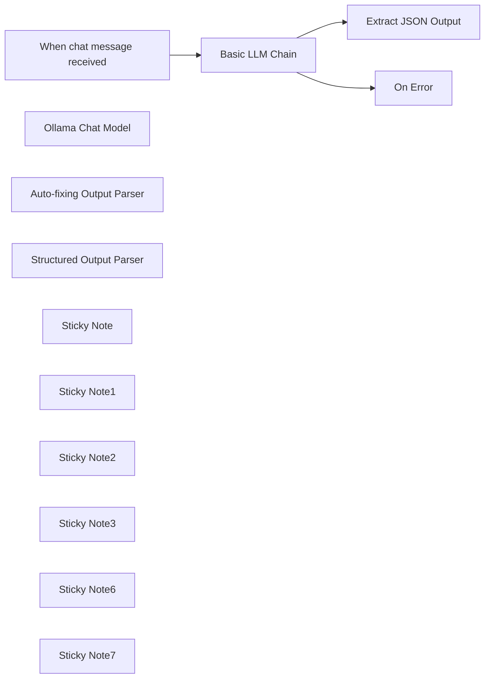

## Fluxo (.json) :

```json
{
  "id": "HMoUOg8J7RzEcslH",
  "meta": {
    "instanceId": "3f91626b10fcfa8a3d3ab8655534ff3e94151838fd2709ecd2dcb14afb3d061a",
    "templateCredsSetupCompleted": true
  },
  "name": "Extract personal data with a self-hosted LLM Mistral NeMo",
  "tags": [],
  "nodes": [
    {
      "id": "7e67ae65-88aa-4e48-aa63-2d3a4208cf4b",
      "name": "When chat message received",
      "type": "@n8n/n8n-nodes-langchain.chatTrigger",
      "position": [
        -500,
        20
      ],
      "webhookId": "3a7b0ea1-47f3-4a94-8ff2-f5e1f3d9dc32",
      "parameters": {
        "options": {}
      },
      "typeVersion": 1.1
    },
    {
      "id": "e064921c-69e6-4cfe-a86e-4e3aa3a5314a",
      "name": "Ollama Chat Model",
      "type": "@n8n/n8n-nodes-langchain.lmChatOllama",
      "position": [
        -280,
        420
      ],
      "parameters": {
        "model": "mistral-nemo:latest",
        "options": {
          "useMLock": true,
          "keepAlive": "2h",
          "temperature": 0.1
        }
      },
      "credentials": {
        "ollamaApi": {
          "id": "vgKP7LGys9TXZ0KK",
          "name": "Ollama account"
        }
      },
      "typeVersion": 1
    },
    {
      "id": "fe1379da-a12e-4051-af91-9d67a7c9a76b",
      "name": "Auto-fixing Output Parser",
      "type": "@n8n/n8n-nodes-langchain.outputParserAutofixing",
      "position": [
        -200,
        220
      ],
      "parameters": {
        "options": {
          "prompt": "Instructions:\n--------------\n{instructions}\n--------------\nCompletion:\n--------------\n{completion}\n--------------\n\nAbove, the Completion did not satisfy the constraints given in the Instructions.\nError:\n--------------\n{error}\n--------------\n\nPlease try again. Please only respond with an answer that satisfies the constraints laid out in the Instructions:"
        }
      },
      "typeVersion": 1
    },
    {
      "id": "b6633b00-6ebb-43ca-8e5c-664a53548c17",
      "name": "Structured Output Parser",
      "type": "@n8n/n8n-nodes-langchain.outputParserStructured",
      "position": [
        60,
        400
      ],
      "parameters": {
        "schemaType": "manual",
        "inputSchema": "{\n  \"type\": \"object\",\n  \"properties\": {\n    \"name\": {\n      \"type\": \"string\",\n      \"description\": \"Name of the user\"\n    },\n    \"surname\": {\n      \"type\": \"string\",\n      \"description\": \"Surname of the user\"\n    },\n    \"commtype\": {\n      \"type\": \"string\",\n      \"enum\": [\"email\", \"phone\", \"other\"],\n      \"description\": \"Method of communication\"\n    },\n    \"contacts\": {\n      \"type\": \"string\",\n      \"description\": \"Contact details. ONLY IF PROVIDED\"\n    },\n    \"timestamp\": {\n      \"type\": \"string\",\n      \"format\": \"date-time\",\n      \"description\": \"When the communication occurred\"\n    },\n    \"subject\": {\n      \"type\": \"string\",\n      \"description\": \"Brief description of the communication topic\"\n    }\n  },\n  \"required\": [\"name\", \"commtype\"]\n}"
      },
      "typeVersion": 1.2
    },
    {
      "id": "23681a6c-cf62-48cb-86ee-08d5ce39bc0a",
      "name": "Basic LLM Chain",
      "type": "@n8n/n8n-nodes-langchain.chainLlm",
      "onError": "continueErrorOutput",
      "position": [
        -240,
        20
      ],
      "parameters": {
        "messages": {
          "messageValues": [
            {
              "message": "=Please analyse the incoming user request. Extract information according to the JSON schema. Today is: \"{{ $now.toISO() }}\""
            }
          ]
        },
        "hasOutputParser": true
      },
      "typeVersion": 1.5
    },
    {
      "id": "8f4d1b4b-58c0-41ec-9636-ac555e440821",
      "name": "On Error",
      "type": "n8n-nodes-base.noOp",
      "position": [
        200,
        140
      ],
      "parameters": {},
      "typeVersion": 1
    },
    {
      "id": "f4d77736-4470-48b4-8f61-149e09b70e3e",
      "name": "Sticky Note",
      "type": "n8n-nodes-base.stickyNote",
      "position": [
        -560,
        -160
      ],
      "parameters": {
        "color": 2,
        "width": 960,
        "height": 500,
        "content": "## Update data source\nWhen you change the data source, remember to update the `Prompt Source (User Message)` setting in the **Basic LLM Chain node**."
      },
      "typeVersion": 1
    },
    {
      "id": "5fd273c8-e61d-452b-8eac-8ac4b7fff6c2",
      "name": "Sticky Note1",
      "type": "n8n-nodes-base.stickyNote",
      "position": [
        -560,
        340
      ],
      "parameters": {
        "color": 2,
        "width": 440,
        "height": 220,
        "content": "## Configure local LLM\nOllama offers additional settings \nto optimize model performance\nor memory usage."
      },
      "typeVersion": 1
    },
    {
      "id": "63cbf762-0134-48da-a6cd-0363e870decd",
      "name": "Sticky Note2",
      "type": "n8n-nodes-base.stickyNote",
      "position": [
        0,
        340
      ],
      "parameters": {
        "color": 2,
        "width": 400,
        "height": 220,
        "content": "## Define JSON Schema"
      },
      "typeVersion": 1
    },
    {
      "id": "9625294f-3cb4-4465-9dae-9976e0cf5053",
      "name": "Extract JSON Output",
      "type": "n8n-nodes-base.set",
      "position": [
        200,
        -80
      ],
      "parameters": {
        "mode": "raw",
        "options": {},
        "jsonOutput": "={{ $json.output }}\n"
      },
      "typeVersion": 3.4
    },
    {
      "id": "2c6fba3b-0ffe-4112-b904-823f52cc220b",
      "name": "Sticky Note3",
      "type": "n8n-nodes-base.stickyNote",
      "position": [
        -560,
        200
      ],
      "parameters": {
        "width": 960,
        "height": 120,
        "content": "If the LLM response does not pass \nthe **Structured Output Parser** checks,\n**Auto-Fixer** will call the model again with a different \nprompt to correct the original response."
      },
      "typeVersion": 1
    },
    {
      "id": "c73ba1ca-d727-4904-a5fd-01dd921a4738",
      "name": "Sticky Note6",
      "type": "n8n-nodes-base.stickyNote",
      "position": [
        -560,
        460
      ],
      "parameters": {
        "height": 80,
        "content": "The same LLM connects to both **Basic LLM Chain** and to the **Auto-fixing Output Parser**. \n"
      },
      "typeVersion": 1
    },
    {
      "id": "193dd153-8511-4326-aaae-47b89d0cd049",
      "name": "Sticky Note7",
      "type": "n8n-nodes-base.stickyNote",
      "position": [
        200,
        440
      ],
      "parameters": {
        "width": 200,
        "height": 100,
        "content": "When the LLM model responds, the output is checked in the **Structured Output Parser**"
      },
      "typeVersion": 1
    }
  ],
  "active": false,
  "pinData": {},
  "settings": {
    "executionOrder": "v1"
  },
  "versionId": "9f3721a8-f340-43d5-89e7-3175c29c2f3a",
  "connections": {
    "Basic LLM Chain": {
      "main": [
        [
          {
            "node": "Extract JSON Output",
            "type": "main",
            "index": 0
          }
        ],
        [
          {
            "node": "On Error",
            "type": "main",
            "index": 0
          }
        ]
      ]
    },
    "Ollama Chat Model": {
      "ai_languageModel": [
        [
          {
            "node": "Auto-fixing Output Parser",
            "type": "ai_languageModel",
            "index": 0
          },
          {
            "node": "Basic LLM Chain",
            "type": "ai_languageModel",
            "index": 0
          }
        ]
      ]
    },
    "Structured Output Parser": {
      "ai_outputParser": [
        [
          {
            "node": "Auto-fixing Output Parser",
            "type": "ai_outputParser",
            "index": 0
          }
        ]
      ]
    },
    "Auto-fixing Output Parser": {
      "ai_outputParser": [
        [
          {
            "node": "Basic LLM Chain",
            "type": "ai_outputParser",
            "index": 0
          }
        ]
      ]
    },
    "When chat message received": {
      "main": [
        [
          {
            "node": "Basic LLM Chain",
            "type": "main",
            "index": 0
          }
        ]
      ]
    }
  }
}
```

<a id="template-170"></a>

## Template 170 - Gerador de capítulos para vídeos do YouTube

- **Nome:** Gerador de capítulos para vídeos do YouTube
- **Descrição:** Automatiza a extração de legendas de um vídeo, gera capítulos a partir da transcrição usando um modelo de linguagem e atualiza a descrição do vídeo com os capítulos gerados.
- **Funcionalidade:** • Disparo manual: Inicia o fluxo manualmente para processar um vídeo específico.
• Definição do ID do vídeo: Permite especificar qual vídeo será processado.
• Obtenção de metadados do vídeo: Recupera informações do vídeo (ex.: título) para uso na atualização.
• Listagem e identificação de legendas: Busca o ID das legendas associadas ao vídeo.
• Download de legendas em SRT: Recupera o arquivo de legendas no formato SRT.
• Extração do texto das legendas: Converte o arquivo de legendas em texto para análise.
• Geração de capítulos por IA: Usa um modelo de linguagem para classificar a transcrição em capítulos com timestamps.
• Atualização da descrição do vídeo: Insere os capítulos gerados na descrição do vídeo no YouTube.
- **Ferramentas:** • YouTube Data API: Serviço usado para recuperar metadados, listar/baixar legendas e atualizar a descrição do vídeo.
• Google Gemini (PaLM) API: Modelo de linguagem usado para analisar a transcrição e gerar capítulos estruturados.
• Formato SRT (legendas): Formato de arquivo de legendas usado como entrada para a análise e geração de capítulos.

## Fluxo visual

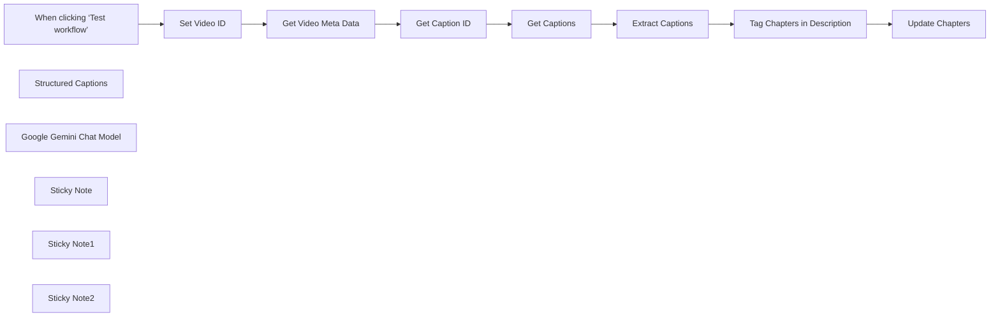

## Fluxo (.json) :

```json
{
  "id": "SCUbdpVPX4USbQmr",
  "meta": {
    "instanceId": "7c617982c5622c49e1ea217f3ee01da25b7fb42fb9e969ce6e4e1b6c269ad0e5",
    "templateCredsSetupCompleted": true
  },
  "name": "youtube chapter generator",
  "tags": [
    {
      "id": "637Ga13eORejFbTG",
      "name": "youtube",
      "createdAt": "2025-04-06T16:41:11.086Z",
      "updatedAt": "2025-04-06T16:41:11.086Z"
    },
    {
      "id": "tfcUyZ2pGsRZFcje",
      "name": "chapters",
      "createdAt": "2025-04-06T16:41:28.633Z",
      "updatedAt": "2025-04-06T16:41:28.633Z"
    }
  ],
  "nodes": [
    {
      "id": "104fa4ce-cd86-4fff-b31c-0ef37fba6d93",
      "name": "When clicking ‘Test workflow’",
      "type": "n8n-nodes-base.manualTrigger",
      "position": [
        -800,
        -120
      ],
      "parameters": {},
      "typeVersion": 1
    },
    {
      "id": "c3b45480-3098-40f9-a77f-ada54481b590",
      "name": "Get Caption ID",
      "type": "n8n-nodes-base.httpRequest",
      "position": [
        -200,
        -120
      ],
      "parameters": {
        "url": "=https://www.googleapis.com/youtube/v3/captions?part=snippet&videoId={{ $json.id }}",
        "options": {},
        "authentication": "predefinedCredentialType",
        "nodeCredentialType": "youTubeOAuth2Api"
      },
      "credentials": {
        "youTubeOAuth2Api": {
          "id": "1TkjUqPfFCQ6NzL7",
          "name": "YouTube account"
        }
      },
      "typeVersion": 4.2
    },
    {
      "id": "fe08adc4-e6ef-47ae-a946-1e6d5a85e10e",
      "name": "Get Captions",
      "type": "n8n-nodes-base.httpRequest",
      "position": [
        20,
        -120
      ],
      "parameters": {
        "url": "=https://www.googleapis.com/youtube/v3/captions/{{ $json.items[0].id }}?tfmt=srt",
        "options": {},
        "authentication": "predefinedCredentialType",
        "nodeCredentialType": "youTubeOAuth2Api"
      },
      "credentials": {
        "youTubeOAuth2Api": {
          "id": "1TkjUqPfFCQ6NzL7",
          "name": "YouTube account"
        }
      },
      "typeVersion": 4.2
    },
    {
      "id": "0e15f334-9ff8-4a7e-85a9-4cf8cf10ea55",
      "name": "Extract Captions",
      "type": "n8n-nodes-base.extractFromFile",
      "position": [
        240,
        -120
      ],
      "parameters": {
        "options": {},
        "operation": "text"
      },
      "typeVersion": 1
    },
    {
      "id": "af99a919-7ebc-4a6c-80be-83e2ffa68d05",
      "name": "Structured Captions",
      "type": "@n8n/n8n-nodes-langchain.outputParserStructured",
      "position": [
        640,
        100
      ],
      "parameters": {
        "jsonSchemaExample": "{\n\t\"description\": \"California\"\n\t\n}"
      },
      "typeVersion": 1.2
    },
    {
      "id": "414a41a2-0715-4a57-a606-9f3678b2472a",
      "name": "Get Video Meta Data",
      "type": "n8n-nodes-base.youTube",
      "position": [
        -420,
        -120
      ],
      "parameters": {
        "options": {},
        "videoId": "={{ $json.video_id }}",
        "resource": "video",
        "operation": "get"
      },
      "credentials": {
        "youTubeOAuth2Api": {
          "id": "1TkjUqPfFCQ6NzL7",
          "name": "YouTube account"
        }
      },
      "typeVersion": 1
    },
    {
      "id": "7304d9b1-5956-41c3-b78a-2c409d0aa726",
      "name": "Google Gemini Chat Model",
      "type": "@n8n/n8n-nodes-langchain.lmChatGoogleGemini",
      "position": [
        460,
        100
      ],
      "parameters": {
        "options": {},
        "modelName": "models/gemini-1.5-flash-8b-exp-0924"
      },
      "credentials": {
        "googlePalmApi": {
          "id": "FshILEOmCAPVoGfW",
          "name": "Google Gemini(PaLM) Api account 2"
        }
      },
      "typeVersion": 1
    },
    {
      "id": "867a6ad6-0712-4fbf-97fd-ab054b783172",
      "name": "Set Video ID",
      "type": "n8n-nodes-base.set",
      "position": [
        -640,
        -120
      ],
      "parameters": {
        "options": {},
        "assignments": {
          "assignments": [
            {
              "id": "568762f7-e496-4550-8567-d49e2ce1676d",
              "name": "video_id",
              "type": "string",
              "value": "r1wqsrW2vmE"
            }
          ]
        }
      },
      "typeVersion": 3.4
    },
    {
      "id": "dcd0c9d7-1a69-45e8-98e9-b7cf7d12734e",
      "name": "Update Chapters",
      "type": "n8n-nodes-base.youTube",
      "position": [
        940,
        -120
      ],
      "parameters": {
        "title": "={{ $('Get Video Meta Data').item.json.snippet.title }}",
        "videoId": "={{ $('Get Captions').item.json.items[0].snippet.videoId }}",
        "resource": "video",
        "operation": "update",
        "categoryId": "22",
        "regionCode": "US",
        "updateFields": {
          "description": "={{ $json.output.description }}\nChapters\n{{ $json.output.description }}"
        }
      },
      "credentials": {
        "youTubeOAuth2Api": {
          "id": "1TkjUqPfFCQ6NzL7",
          "name": "YouTube account"
        }
      },
      "typeVersion": 1,
      "alwaysOutputData": true
    },
    {
      "id": "916629c4-6e49-4432-88e8-626748cb3d24",
      "name": "Tag Chapters in Description",
      "type": "@n8n/n8n-nodes-langchain.chainLlm",
      "position": [
        460,
        -120
      ],
      "parameters": {
        "text": "=This is an srt format data. please classify this data into chapters\nbased upon this transcript \n{{ $json.data }}\n{\n\"description\":\"00:00 Introduction\n02:15 Topic One\n05:30 Topic Two\n10:45 Conclusion\"\n}\n",
        "promptType": "define",
        "hasOutputParser": true
      },
      "typeVersion": 1.6
    },
    {
      "id": "b0f56d68-b787-4ccc-8bb5-bdb5b04c3ae4",
      "name": "Sticky Note",
      "type": "n8n-nodes-base.stickyNote",
      "position": [
        -680,
        -200
      ],
      "parameters": {
        "width": 1040,
        "height": 440,
        "content": "\n## Get Captions"
      },
      "typeVersion": 1
    },
    {
      "id": "0bcee6b5-0e8b-4f85-8f83-c829e785467a",
      "name": "Sticky Note1",
      "type": "n8n-nodes-base.stickyNote",
      "position": [
        378,
        -200
      ],
      "parameters": {
        "color": 4,
        "width": 420,
        "height": 440,
        "content": "## Generate Chapters\n"
      },
      "typeVersion": 1
    },
    {
      "id": "0f90f6ec-2154-4945-b262-6531fef2334f",
      "name": "Sticky Note2",
      "type": "n8n-nodes-base.stickyNote",
      "position": [
        820,
        -200
      ],
      "parameters": {
        "color": 6,
        "width": 440,
        "height": 440,
        "content": "## Update Description\n"
      },
      "typeVersion": 1
    }
  ],
  "active": false,
  "pinData": {},
  "settings": {
    "executionOrder": "v1"
  },
  "versionId": "27125160-7c64-4431-b243-832c1ae29d29",
  "connections": {
    "Get Captions": {
      "main": [
        [
          {
            "node": "Extract Captions",
            "type": "main",
            "index": 0
          }
        ]
      ]
    },
    "Set Video ID": {
      "main": [
        [
          {
            "node": "Get Video Meta Data",
            "type": "main",
            "index": 0
          }
        ]
      ]
    },
    "Get Caption ID": {
      "main": [
        [
          {
            "node": "Get Captions",
            "type": "main",
            "index": 0
          }
        ]
      ]
    },
    "Extract Captions": {
      "main": [
        [
          {
            "node": "Tag Chapters in Description",
            "type": "main",
            "index": 0
          }
        ]
      ]
    },
    "Get Video Meta Data": {
      "main": [
        [
          {
            "node": "Get Caption ID",
            "type": "main",
            "index": 0
          }
        ]
      ]
    },
    "Structured Captions": {
      "ai_outputParser": [
        [
          {
            "node": "Tag Chapters in Description",
            "type": "ai_outputParser",
            "index": 0
          }
        ]
      ]
    },
    "Google Gemini Chat Model": {
      "ai_languageModel": [
        [
          {
            "node": "Tag Chapters in Description",
            "type": "ai_languageModel",
            "index": 0
          }
        ]
      ]
    },
    "Tag Chapters in Description": {
      "main": [
        [
          {
            "node": "Update Chapters",
            "type": "main",
            "index": 0
          }
        ]
      ]
    },
    "When clicking ‘Test workflow’": {
      "main": [
        [
          {
            "node": "Set Video ID",
            "type": "main",
            "index": 0
          }
        ]
      ]
    }
  }
}
```

<a id="template-171"></a>

## Template 171 - Geração de vídeo AI com HeyGen

- **Nome:** Geração de vídeo AI com HeyGen
- **Descrição:** Cria vídeos gerados por IA a partir de texto, monitora o progresso até a conclusão e fornece a URL do vídeo final.
- **Funcionalidade:** • Início manual: permite disparar o fluxo manualmente para iniciar a criação do vídeo.
• Configuração de parâmetros do vídeo: define avatar, voz e texto que serão usados na geração.
• Envio da requisição de geração: envia os dados para a API externa para iniciar a criação do vídeo.
• Polling de status: aguarda um intervalo e consulta repetidamente o status do vídeo até que esteja 'completed'.
• Entrega do resultado: extrai e disponibiliza a URL do vídeo final quando o processamento estiver concluído.
- **Ferramentas:** • HeyGen: API de geração de vídeos com avatares e vozes de IA utilizada para criar o vídeo e consultar seu status.

## Fluxo visual

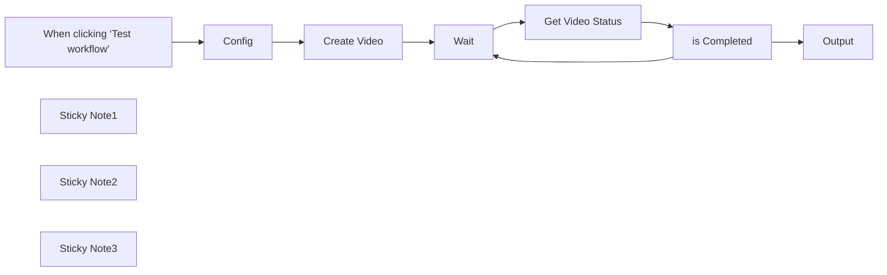

## Fluxo (.json) :

```json
{
  "meta": {
    "instanceId": "8418cffce8d48086ec0a73fd90aca708aa07591f2fefa6034d87fe12a09de26e",
    "templateCredsSetupCompleted": true
  },
  "nodes": [
    {
      "id": "0f70dc82-f4af-444a-a3eb-381623091cb1",
      "name": "When clicking ‘Test workflow’",
      "type": "n8n-nodes-base.manualTrigger",
      "position": [
        -980,
        -200
      ],
      "parameters": {},
      "typeVersion": 1
    },
    {
      "id": "cff3d74c-b381-42f9-96c0-b607a410ffeb",
      "name": "Wait",
      "type": "n8n-nodes-base.wait",
      "position": [
        -180,
        -200
      ],
      "webhookId": "1c3e61f9-9bd3-489b-a0a1-e20c1f52d496",
      "parameters": {
        "amount": 10
      },
      "typeVersion": 1.1
    },
    {
      "id": "0ec6969b-17e2-41c3-a2c1-2c362cda54ce",
      "name": "Output",
      "type": "n8n-nodes-base.set",
      "position": [
        440,
        -180
      ],
      "parameters": {
        "options": {},
        "assignments": {
          "assignments": [
            {
              "id": "53226f92-5381-4f9f-9be5-4b25f31db99c",
              "name": "data.video_url",
              "type": "string",
              "value": "={{ $json.data.video_url }}"
            }
          ]
        }
      },
      "typeVersion": 3.4
    },
    {
      "id": "887660ad-0ca3-4364-a2d2-443349de19de",
      "name": "Sticky Note1",
      "type": "n8n-nodes-base.stickyNote",
      "position": [
        -260,
        -300
      ],
      "parameters": {
        "color": 7,
        "width": 660,
        "height": 340,
        "content": "## Check video status"
      },
      "typeVersion": 1
    },
    {
      "id": "7c9ee0c5-9a0a-44be-8d8a-4af99c2f3022",
      "name": "is Completed",
      "type": "n8n-nodes-base.if",
      "position": [
        220,
        -200
      ],
      "parameters": {
        "options": {},
        "conditions": {
          "options": {
            "version": 2,
            "leftValue": "",
            "caseSensitive": true,
            "typeValidation": "strict"
          },
          "combinator": "and",
          "conditions": [
            {
              "id": "2643b070-cbb2-4562-9269-a61389e0c242",
              "operator": {
                "name": "filter.operator.equals",
                "type": "string",
                "operation": "equals"
              },
              "leftValue": "={{ $json.data.status }}",
              "rightValue": "completed"
            }
          ]
        }
      },
      "typeVersion": 2.2
    },
    {
      "id": "893813b4-1a55-4e21-a7a4-da47bf60ada2",
      "name": "Sticky Note2",
      "type": "n8n-nodes-base.stickyNote",
      "position": [
        -1920,
        -320
      ],
      "parameters": {
        "width": 820,
        "height": 860,
        "content": "# Generate AI Videos with HeyGen in n8n\n\nThis workflow allows you to generate AI-powered videos using [HeyGen](https://www.heygen.com), a platform that provides customizable AI avatars and voices. By integrating HeyGen with n8n, you can create videos by providing a text input, which is then spoken by an AI-generated avatar.\n\n# [👉🏻 Try HeyGen for free 👈🏻](https://www.heygen.com)\n\n## Setup\n\n### Step 1: Create a HeyGen Account & API Key\n1. Sign up for a [HeyGen account](https://www.heygen.com).\n2. Navigate to your account settings and locate your **API Key**.\n3. Copy your API key for use in n8n.\n\n\n⚠️ To use Heygen API you need to purchase API credits\n\n### Step 2: Create n8n Credentials\n1. In n8n, create new credentials and select **\"Custom Auth\"** as the authentication type.\n2. In the Name provide : `X-Api-Key`\n3. And in the value paste your API key from Heygen\n4. Update the 2 http node with the right credentials.\n\n### Step 3: Choose an Avatar and a Voice\nHeyGen provides multiple AI avatars and voice options. You need to choose:\n- An **Avatar ID** (representing the AI-generated presenter)\n- A **Voice ID** (which will read your text)\n\nTo find available avatars and voices:\n1. Visit the HeyGen [API Documentation](https://www.heygen.com/api) or check the list in your HeyGen account.\n2. Copy the **Avatar ID** and **Voice ID** that you want to use.\n"
      },
      "typeVersion": 1
    },
    {
      "id": "36e45b12-1edd-45ec-b3d2-ac3b6f78f7b1",
      "name": "Sticky Note3",
      "type": "n8n-nodes-base.stickyNote",
      "position": [
        -720,
        60
      ],
      "parameters": {
        "width": 440,
        "height": 180,
        "content": "# ☝️ Provide Video Details\n\n   - **Avatar ID** \n   - **Voice ID** \n   - **Text**"
      },
      "typeVersion": 1
    },
    {
      "id": "c0ebe61f-ca8f-4928-8e89-93ef50aa17ee",
      "name": "Create Video",
      "type": "n8n-nodes-base.httpRequest",
      "position": [
        -500,
        -140
      ],
      "parameters": {
        "url": "https://api.heygen.com/v2/video/generate",
        "method": "POST",
        "options": {},
        "jsonBody": "={\n  \"video_inputs\": [\n    {\n      \"character\": {\n        \"type\": \"avatar\",\n        \"avatar_id\": \"{{ $json.avatar_id }}\",\n        \"avatar_style\": \"normal\"\n      },\n      \"voice\": {\n        \"type\": \"text\",\n        \"input_text\": \"{{ $json.text }}\",\n        \"voice_id\": \"{{ $json.voice_id }}\",\n        \"speed\": 1\n      }\n    }\n  ],\n  \"caption\": true,\n  \"dimension\": {\n    \"width\": 1080,\n    \"height\": 1920\n  }\n}",
        "sendBody": true,
        "specifyBody": "json",
        "authentication": "genericCredentialType",
        "genericAuthType": "httpHeaderAuth"
      },
      "credentials": {
        "httpHeaderAuth": {
          "id": "LQl4w1qH5sdfcP9o",
          "name": "HeyGen - Thais"
        }
      },
      "typeVersion": 4.2
    },
    {
      "id": "2fd1e0cf-0dc0-4ef5-b5a0-52c87631efd7",
      "name": "Config",
      "type": "n8n-nodes-base.set",
      "position": [
        -740,
        -120
      ],
      "parameters": {
        "options": {},
        "assignments": {
          "assignments": [
            {
              "id": "dc091aca-844f-404f-ad0c-8ad4b48a505b",
              "name": "avatar_id",
              "type": "string",
              "value": "7895d2d9f4f9453899e1d80e5accb6be"
            },
            {
              "id": "eb2ed34c-53d2-41e8-ab2f-1b8278bde235",
              "name": "voice_id",
              "type": "string",
              "value": "PBgwoAVFZIC0UB6sU914"
            },
            {
              "id": "2c939d6c-73f8-482d-b11f-71bdd7baf04e",
              "name": "text",
              "type": "string",
              "value": "Imagine ADHD as that super energetic friend who jumps from one cool idea to the next. Now, add AI—the smart helper trying to keep things on track. Sometimes, they work together perfectly, and other times, things get a little goofy. One minute you're starting a project, and the next, you're off chasing a shiny new idea! But that's the fun of it. With a bit of AI magic, even the craziest thoughts find their place. Embrace the chaos, laugh at the mix-ups, and let your creativity shine!"
            }
          ]
        }
      },
      "typeVersion": 3.4
    },
    {
      "id": "c63f1b7a-0ec0-4329-aeee-229e8433add7",
      "name": "Get Video Status",
      "type": "n8n-nodes-base.httpRequest",
      "position": [
        20,
        -200
      ],
      "parameters": {
        "url": "https://api.heygen.com/v1/video_status.get",
        "options": {},
        "sendQuery": true,
        "authentication": "genericCredentialType",
        "genericAuthType": "httpHeaderAuth",
        "queryParameters": {
          "parameters": [
            {
              "name": "video_id",
              "value": "={{ $('Create Video').first().json.data.video_id }}"
            }
          ]
        }
      },
      "credentials": {
        "httpCustomAuth": {
          "id": "nhkU37chaiBU6X3j",
          "name": "Eleven Labs"
        },
        "httpHeaderAuth": {
          "id": "LQl4w1qH5sdfcP9o",
          "name": "HeyGen - Thais"
        }
      },
      "typeVersion": 4.2
    }
  ],
  "pinData": {},
  "connections": {
    "Wait": {
      "main": [
        [
          {
            "node": "Get Video Status",
            "type": "main",
            "index": 0
          }
        ]
      ]
    },
    "Config": {
      "main": [
        [
          {
            "node": "Create Video",
            "type": "main",
            "index": 0
          }
        ]
      ]
    },
    "Create Video": {
      "main": [
        [
          {
            "node": "Wait",
            "type": "main",
            "index": 0
          }
        ]
      ]
    },
    "is Completed": {
      "main": [
        [
          {
            "node": "Output",
            "type": "main",
            "index": 0
          }
        ],
        [
          {
            "node": "Wait",
            "type": "main",
            "index": 0
          }
        ]
      ]
    },
    "Get Video Status": {
      "main": [
        [
          {
            "node": "is Completed",
            "type": "main",
            "index": 0
          }
        ]
      ]
    },
    "When clicking ‘Test workflow’": {
      "main": [
        [
          {
            "node": "Config",
            "type": "main",
            "index": 0
          }
        ]
      ]
    }
  }
}
```

<a id="template-172"></a>

## Template 172 - API GET para FlutterFlow - lista de estudantes

- **Nome:** API GET para FlutterFlow - lista de estudantes
- **Descrição:** Cria um endpoint HTTP que recebe chamadas do FlutterFlow, busca registros de pessoas em uma base de dados, agrega os resultados e retorna JSON formatado para o aplicativo.
- **Funcionalidade:** • Recebe requisição HTTP do FlutterFlow: Inicia o fluxo quando o aplicativo faz uma chamada GET ao webhook.
• Consulta base de dados de clientes: Recupera todos os registros de pessoas a partir da fonte de dados configurada.
• Armazena resultados em variável: Salva os dados retornados em uma variável (students) para processamento posterior.
• Agrega e transforma dados: Consolida os registros em um formato adequado para resposta ao aplicativo.
• Responde com JSON: Envia os dados agregados como resposta JSON ao FlutterFlow.
- **Ferramentas:** • FlutterFlow: Plataforma front-end que consome o endpoint realizando requisições HTTP.
• Base de dados de clientes (treinamento): Fonte de dados usada para recuperar registros de pessoas; pode ser substituída por qualquer banco de dados ou API.
• Endpoint HTTP (Webhook): Ponto de entrada que recebe requisições do aplicativo e devolve respostas em JSON.

## Fluxo visual

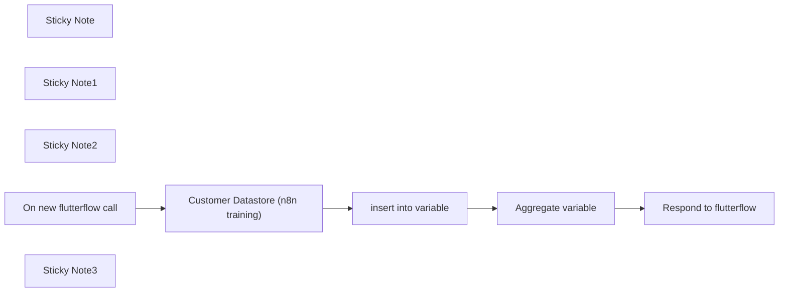

## Fluxo (.json) :

```json
{
  "meta": {
    "instanceId": "dbd43d88d26a9e30d8aadc002c9e77f1400c683dd34efe3778d43d27250dde50"
  },
  "nodes": [
    {
      "id": "646662d1-92dc-406a-8dc6-581a4a6d69cd",
      "name": "Customer Datastore (n8n training)",
      "type": "n8n-nodes-base.n8nTrainingCustomerDatastore",
      "position": [
        580,
        660
      ],
      "parameters": {
        "operation": "getAllPeople"
      },
      "typeVersion": 1
    },
    {
      "id": "4926678b-cd17-4e7a-b8af-db649f17e442",
      "name": "insert into variable",
      "type": "n8n-nodes-base.set",
      "position": [
        880,
        660
      ],
      "parameters": {
        "options": {},
        "assignments": {
          "assignments": [
            {
              "id": "de2360fb-1b29-4524-a035-1a76abf4ae2e",
              "name": "students",
              "type": "object",
              "value": "={{ $json }}"
            }
          ]
        }
      },
      "typeVersion": 3.3
    },
    {
      "id": "43c716b1-626e-47cd-b1df-1c7ca486fcd4",
      "name": "Aggregate variable",
      "type": "n8n-nodes-base.aggregate",
      "position": [
        1060,
        660
      ],
      "parameters": {
        "options": {},
        "fieldsToAggregate": {
          "fieldToAggregate": [
            {
              "fieldToAggregate": "students"
            }
          ]
        }
      },
      "typeVersion": 1
    },
    {
      "id": "325b44ba-5297-496a-8351-4cc00b34e2f2",
      "name": "Sticky Note",
      "type": "n8n-nodes-base.stickyNote",
      "position": [
        220,
        540
      ],
      "parameters": {
        "color": 4,
        "width": 218.82012248136226,
        "height": 321.21203744835316,
        "content": "### Flow starts when receiving a get http call"
      },
      "typeVersion": 1
    },
    {
      "id": "a57c08ca-60bd-43e5-aefa-269b05bc0f01",
      "name": "Sticky Note1",
      "type": "n8n-nodes-base.stickyNote",
      "position": [
        480,
        540
      ],
      "parameters": {
        "color": 7,
        "width": 314.179182099464,
        "height": 320.43858635231027,
        "content": "### Here you can change to your database node"
      },
      "typeVersion": 1
    },
    {
      "id": "becb82a0-d2bc-40d3-a293-7f75939a8878",
      "name": "Sticky Note2",
      "type": "n8n-nodes-base.stickyNote",
      "position": [
        840,
        540
      ],
      "parameters": {
        "color": 7,
        "width": 364.9476455365474,
        "height": 318.43858635231027,
        "content": "### Step required to transform data for response to flutterflow"
      },
      "typeVersion": 1
    },
    {
      "id": "d76acd26-5c0c-4b1e-b673-b63697c9c98a",
      "name": "On new flutterflow call",
      "type": "n8n-nodes-base.webhook",
      "position": [
        280,
        660
      ],
      "webhookId": "203c3219-5089-405b-8704-3718f7158220",
      "parameters": {
        "path": "203c3219-5089-405b-8704-3718f7158220",
        "options": {},
        "responseMode": "responseNode"
      },
      "typeVersion": 2
    },
    {
      "id": "05a1efd1-beb2-4953-90c7-6e1df98b74f8",
      "name": "Respond to flutterflow",
      "type": "n8n-nodes-base.respondToWebhook",
      "position": [
        1280,
        660
      ],
      "parameters": {
        "options": {},
        "respondWith": "json",
        "responseBody": "={{ $json }}"
      },
      "typeVersion": 1.1
    },
    {
      "id": "c4272529-1d96-48b9-b390-6bf847af7454",
      "name": "Sticky Note3",
      "type": "n8n-nodes-base.stickyNote",
      "position": [
        220,
        300
      ],
      "parameters": {
        "width": 457,
        "height": 201,
        "content": "## Low-code API for Flutterflow apps\n### Set up\n1. Copy the Webhook URL from `On new flutterflow call` step. This is the URL you will make a GET request to in FlutterFlow.\n2. Replace the \"Customer Datastore\" step with your own data source or any other necessary workflow steps to complete your API endpoint's task."
      },
      "typeVersion": 1
    }
  ],
  "pinData": {},
  "connections": {
    "Aggregate variable": {
      "main": [
        [
          {
            "node": "Respond to flutterflow",
            "type": "main",
            "index": 0
          }
        ]
      ]
    },
    "insert into variable": {
      "main": [
        [
          {
            "node": "Aggregate variable",
            "type": "main",
            "index": 0
          }
        ]
      ]
    },
    "On new flutterflow call": {
      "main": [
        [
          {
            "node": "Customer Datastore (n8n training)",
            "type": "main",
            "index": 0
          }
        ]
      ]
    },
    "Customer Datastore (n8n training)": {
      "main": [
        [
          {
            "node": "insert into variable",
            "type": "main",
            "index": 0
          }
        ]
      ]
    }
  }
}
```

<a id="template-173"></a>

## Template 173 - Seletor dinâmico de modelos LLM

- **Nome:** Seletor dinâmico de modelos LLM
- **Descrição:** Recebe mensagens de chat, gera respostas usando diferentes modelos de linguagem e valida a qualidade das respostas para selecionar ou alternar o modelo apropriado.
- **Funcionalidade:** • Recepção de mensagens de chat: Inicia o fluxo quando uma mensagem de cliente é recebida.
• Definição do índice do modelo: Lê ou inicializa o índice do LLM a ser usado (padrão 0).
• Seleção dinâmica do LLM: Escolhe o modelo de linguagem a partir de uma lista com base no índice fornecido.
• Geração de resposta: Envia o texto do cliente ao LLM selecionado e gera uma resposta curta e polida.
• Validação da resposta: Analisa a resposta gerada contra critérios definidos (reconhecimento de problemas, tom empático, oferta de resolução).
• Tratamento de resultados: Retorna a resposta final se passar na validação; caso contrário, prepara aumento do índice para tentar outro modelo na próxima execução.
• Incremento do índice do LLM: Aumenta o índice para escolher o próximo modelo disponível em execuções futuras.
• Tratamento de erros esperados e inesperados: Detecta erro específico do sub-nó e diferencia entre término sem resultados e erro inesperado.
- **Ferramentas:** • OpenAI: API de modelos de linguagem usada para gerar respostas (ex.: gpt-4o, gpt-4o-mini, o1).
• Sistema de chat/webhook: Fonte externa que envia as mensagens dos clientes para iniciar o processo.

## Fluxo visual

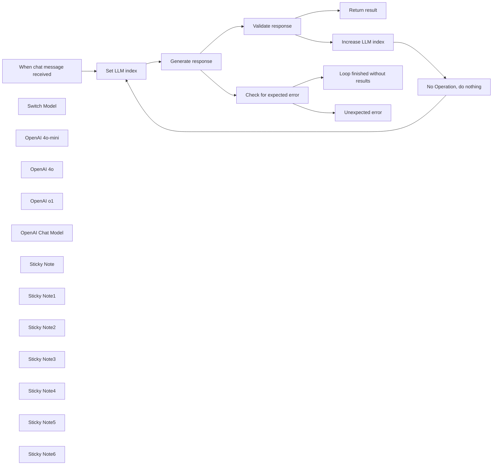

## Fluxo (.json) :

```json
{
  "id": "dQC8kExvbCrovWf0",
  "meta": {
    "instanceId": "fb8bc2e315f7f03c97140b30aa454a27bc7883a19000fa1da6e6b571bf56ad6d",
    "templateCredsSetupCompleted": true
  },
  "name": "Dynamically switch between LLMs Template",
  "tags": [],
  "nodes": [
    {
      "id": "962c4b29-c244-4d68-93e1-cacd41b436fc",
      "name": "When chat message received",
      "type": "@n8n/n8n-nodes-langchain.chatTrigger",
      "position": [
        220,
        80
      ],
      "webhookId": "713a7f98-0e3d-4eb7-aafa-599ca627c8b4",
      "parameters": {
        "options": {}
      },
      "typeVersion": 1.1
    },
    {
      "id": "6fc4f336-09e3-4e79-94e9-e5eff04e4089",
      "name": "Switch Model",
      "type": "@n8n/n8n-nodes-langchain.code",
      "position": [
        540,
        320
      ],
      "parameters": {
        "code": {
          "supplyData": {
            "code": "let llms = await this.getInputConnectionData('ai_languageModel', 0);\nllms.reverse(); // reverse array, so the order matches the UI elements\n\nconst llm_index = $input.item.json.llm_index;\nif (!Number.isInteger(llm_index)) {\n  console.log(\"'llm_index' is udefined or not a valid integer\");\n  throw new Error(\"'llm_index' is udefined or not a valid integer\");\n}\n\nif(typeof llms[llm_index] === 'undefined') {\n  console.log(`No LLM found with index ${llm_index}`);\n  throw new Error(`No LLM found with index ${llm_index}`);\n}\n\nreturn llms[llm_index];"
          }
        },
        "inputs": {
          "input": [
            {
              "type": "ai_languageModel",
              "required": true
            }
          ]
        },
        "outputs": {
          "output": [
            {
              "type": "ai_languageModel"
            }
          ]
        }
      },
      "typeVersion": 1
    },
    {
      "id": "68511483-355b-45c1-915f-e7517c42b809",
      "name": "Set LLM index",
      "type": "n8n-nodes-base.set",
      "position": [
        440,
        80
      ],
      "parameters": {
        "options": {},
        "assignments": {
          "assignments": [
            {
              "id": "24b4d30e-484a-4cc1-a691-0653ed764296",
              "name": "llm_index",
              "type": "number",
              "value": "={{ $json.llm_index || 0 }}"
            }
          ]
        }
      },
      "typeVersion": 3.4
    },
    {
      "id": "adc2f24c-0ad6-4057-bb3b-b46563c72ee8",
      "name": "Increase LLM index",
      "type": "n8n-nodes-base.set",
      "position": [
        1420,
        -200
      ],
      "parameters": {
        "options": {},
        "assignments": {
          "assignments": [
            {
              "id": "24b4d30e-484a-4cc1-a691-0653ed764296",
              "name": "llm_index",
              "type": "number",
              "value": "={{ $('Set LLM index').item.json.llm_index + 1 }}"
            }
          ]
        }
      },
      "typeVersion": 3.4
    },
    {
      "id": "eace2dd7-9550-47ba-a4c3-4f065f80757b",
      "name": "No Operation, do nothing",
      "type": "n8n-nodes-base.noOp",
      "position": [
        1640,
        540
      ],
      "parameters": {},
      "typeVersion": 1
    },
    {
      "id": "c1735d1c-5dc4-4bd5-9dde-3bb04b8811c3",
      "name": "Check for expected error",
      "type": "n8n-nodes-base.if",
      "position": [
        1040,
        160
      ],
      "parameters": {
        "options": {},
        "conditions": {
          "options": {
            "version": 2,
            "leftValue": "",
            "caseSensitive": true,
            "typeValidation": "strict"
          },
          "combinator": "and",
          "conditions": [
            {
              "id": "3253e1f2-172e-4af4-a492-3b9c6e9e4797",
              "operator": {
                "name": "filter.operator.equals",
                "type": "string",
                "operation": "equals"
              },
              "leftValue": "={{ $json.error }}",
              "rightValue": "Error in sub-node Switch Model"
            }
          ]
        }
      },
      "typeVersion": 2.2
    },
    {
      "id": "4a259078-aa74-4725-9e91-d2775bbd577f",
      "name": "Loop finished without results",
      "type": "n8n-nodes-base.set",
      "position": [
        1260,
        60
      ],
      "parameters": {
        "options": {},
        "assignments": {
          "assignments": [
            {
              "id": "b352627d-d692-47f8-8f8c-885b68073843",
              "name": "output",
              "type": "string",
              "value": "The loop finished without a satisfying result"
            }
          ]
        }
      },
      "typeVersion": 3.4
    },
    {
      "id": "3b527ed3-a700-403d-8e3c-d0d55a83c9ea",
      "name": "Unexpected error",
      "type": "n8n-nodes-base.set",
      "position": [
        1260,
        260
      ],
      "parameters": {
        "options": {},
        "assignments": {
          "assignments": [
            {
              "id": "b352627d-d692-47f8-8f8c-885b68073843",
              "name": "output",
              "type": "string",
              "value": "An unexpected error happened"
            }
          ]
        }
      },
      "typeVersion": 3.4
    },
    {
      "id": "2a48a244-25ab-4330-9e89-3f8a52b7fd0a",
      "name": "Return result",
      "type": "n8n-nodes-base.set",
      "position": [
        1420,
        -460
      ],
      "parameters": {
        "options": {},
        "assignments": {
          "assignments": [
            {
              "id": "b352627d-d692-47f8-8f8c-885b68073843",
              "name": "output",
              "type": "string",
              "value": "={{ $json.text || $json.output }}"
            }
          ]
        }
      },
      "typeVersion": 3.4
    },
    {
      "id": "79da2795-800a-423d-ad5b-ec3b0498a5e6",
      "name": "OpenAI 4o-mini",
      "type": "@n8n/n8n-nodes-langchain.lmChatOpenAi",
      "position": [
        460,
        580
      ],
      "parameters": {
        "model": {
          "__rl": true,
          "mode": "list",
          "value": "gpt-4o-mini"
        },
        "options": {}
      },
      "credentials": {
        "openAiApi": {
          "id": "X7Jf0zECd3IkQdSw",
          "name": "OpenAi (octionicsolutions)"
        }
      },
      "typeVersion": 1.2
    },
    {
      "id": "c5884632-4f21-4e1e-a86d-77e3b18119b9",
      "name": "OpenAI 4o",
      "type": "@n8n/n8n-nodes-langchain.lmChatOpenAi",
      "position": [
        640,
        580
      ],
      "parameters": {
        "model": {
          "__rl": true,
          "mode": "list",
          "value": "gpt-4o",
          "cachedResultName": "gpt-4o"
        },
        "options": {}
      },
      "credentials": {
        "openAiApi": {
          "id": "X7Jf0zECd3IkQdSw",
          "name": "OpenAi (octionicsolutions)"
        }
      },
      "typeVersion": 1.2
    },
    {
      "id": "0693ac6a-fd1e-4a1f-b7be-bd4a1021b6c1",
      "name": "OpenAI o1",
      "type": "@n8n/n8n-nodes-langchain.lmChatOpenAi",
      "position": [
        820,
        580
      ],
      "parameters": {
        "model": {
          "__rl": true,
          "mode": "list",
          "value": "o1",
          "cachedResultName": "o1"
        },
        "options": {}
      },
      "credentials": {
        "openAiApi": {
          "id": "X7Jf0zECd3IkQdSw",
          "name": "OpenAi (octionicsolutions)"
        }
      },
      "typeVersion": 1.2
    },
    {
      "id": "f9fa467a-804d-4abf-84e3-06a88f9142b4",
      "name": "OpenAI Chat Model",
      "type": "@n8n/n8n-nodes-langchain.lmChatOpenAi",
      "position": [
        1100,
        -100
      ],
      "parameters": {
        "model": {
          "__rl": true,
          "mode": "list",
          "value": "gpt-4o-mini"
        },
        "options": {}
      },
      "credentials": {
        "openAiApi": {
          "id": "X7Jf0zECd3IkQdSw",
          "name": "OpenAi (octionicsolutions)"
        }
      },
      "typeVersion": 1.2
    },
    {
      "id": "7c6bf364-1844-484f-8a1c-1ff87286c686",
      "name": "Validate response",
      "type": "@n8n/n8n-nodes-langchain.sentimentAnalysis",
      "position": [
        1040,
        -300
      ],
      "parameters": {
        "options": {
          "categories": "pass, fail",
          "systemPromptTemplate": "You are a highly intelligent and accurate sentiment analyzer. Analyze the sentiment of the provided text. Categorize it into one of the following: {categories}. Use the provided formatting instructions. Only output the JSON.\n\n> Evaluate the following customer support response. Give a short JSON answer with a field “quality”: “pass” or “fail”. Only return “pass” if the response:\n\n1. Acknowledges both the broken keyboard and the late delivery  \n2. Uses a polite and empathetic tone  \n3. Offers a clear resolution or next step (like refund, replacement, or contact support)"
        },
        "inputText": "={{ $json.text }}"
      },
      "typeVersion": 1
    },
    {
      "id": "a7be0179-e246-4f75-8863-d03eefe9d8ac",
      "name": "Generate response",
      "type": "@n8n/n8n-nodes-langchain.chainLlm",
      "onError": "continueErrorOutput",
      "position": [
        660,
        80
      ],
      "parameters": {
        "text": "={{ $('When chat message received').item.json.chatInput }}",
        "messages": {
          "messageValues": [
            {
              "message": "=You’re an AI assistant replying to a customer who is upset about a faulty product and late delivery. The customer uses sarcasm and is vague. Write a short, polite response, offering help."
            }
          ]
        },
        "promptType": "define"
      },
      "retryOnFail": false,
      "typeVersion": 1.6
    },
    {
      "id": "273f4025-2aeb-4a67-859a-690a3a086f82",
      "name": "Sticky Note",
      "type": "n8n-nodes-base.stickyNote",
      "position": [
        380,
        -160
      ],
      "parameters": {
        "width": 480,
        "height": 140,
        "content": "### Customer complaint - example\n\nI really *love* waiting two weeks just to get a keyboard that doesn’t even work. Great job. Any chance I could actually use the thing I paid for sometime this month?"
      },
      "typeVersion": 1
    },
    {
      "id": "a7806fab-fdc2-4feb-be53-fcea81ede105",
      "name": "Sticky Note1",
      "type": "n8n-nodes-base.stickyNote",
      "position": [
        380,
        0
      ],
      "parameters": {
        "color": 7,
        "width": 220,
        "height": 240,
        "content": "Defines the LLM node by index which should be used."
      },
      "typeVersion": 1
    },
    {
      "id": "0117d8d8-672e-458a-a9dd-30b50e05f343",
      "name": "Sticky Note2",
      "type": "n8n-nodes-base.stickyNote",
      "position": [
        480,
        240
      ],
      "parameters": {
        "color": 7,
        "width": 380,
        "height": 200,
        "content": "Dynamically connects the LLM by the index provided in the previous node."
      },
      "typeVersion": 1
    },
    {
      "id": "66066bad-4fd3-4e68-88bb-0b95fd9a6e49",
      "name": "Sticky Note3",
      "type": "n8n-nodes-base.stickyNote",
      "position": [
        980,
        60
      ],
      "parameters": {
        "color": 7,
        "width": 220,
        "height": 260,
        "content": "Check if LangChain Code Node ran into error. _Currently only supports error output from main Node_"
      },
      "typeVersion": 1
    },
    {
      "id": "b9101226-0035-4de3-8720-f783d13e0cca",
      "name": "Sticky Note4",
      "type": "n8n-nodes-base.stickyNote",
      "position": [
        600,
        0
      ],
      "parameters": {
        "color": 7,
        "width": 380,
        "height": 240,
        "content": "Generates a polite answer based on the customers complaint."
      },
      "typeVersion": 1
    },
    {
      "id": "ee7d70ee-2eb7-494f-ad74-2cb6108ba0ed",
      "name": "Sticky Note5",
      "type": "n8n-nodes-base.stickyNote",
      "position": [
        980,
        -360
      ],
      "parameters": {
        "color": 7,
        "width": 380,
        "height": 220,
        "content": "Analyses the generated answer by certain criteria"
      },
      "typeVersion": 1
    },
    {
      "id": "03bde6f5-27b1-4568-96fb-5ece77d7b2e5",
      "name": "Sticky Note6",
      "type": "n8n-nodes-base.stickyNote",
      "position": [
        1360,
        -280
      ],
      "parameters": {
        "color": 7,
        "width": 220,
        "height": 240,
        "content": "Increases the index to choose the next available LLM on the next run"
      },
      "typeVersion": 1
    }
  ],
  "active": false,
  "pinData": {},
  "settings": {
    "executionOrder": "v1"
  },
  "versionId": "52381ffc-bdf4-4243-bc35-462dedb929bd",
  "connections": {
    "OpenAI 4o": {
      "ai_languageModel": [
        [
          {
            "node": "Switch Model",
            "type": "ai_languageModel",
            "index": 0
          }
        ]
      ]
    },
    "OpenAI o1": {
      "ai_languageModel": [
        [
          {
            "node": "Switch Model",
            "type": "ai_languageModel",
            "index": 0
          }
        ]
      ]
    },
    "Switch Model": {
      "ai_outputParser": [
        []
      ],
      "ai_languageModel": [
        [
          {
            "node": "Generate response",
            "type": "ai_languageModel",
            "index": 0
          }
        ]
      ]
    },
    "Set LLM index": {
      "main": [
        [
          {
            "node": "Generate response",
            "type": "main",
            "index": 0
          }
        ]
      ]
    },
    "OpenAI 4o-mini": {
      "ai_languageModel": [
        [
          {
            "node": "Switch Model",
            "type": "ai_languageModel",
            "index": 0
          }
        ]
      ]
    },
    "Generate response": {
      "main": [
        [
          {
            "node": "Validate response",
            "type": "main",
            "index": 0
          }
        ],
        [
          {
            "node": "Check for expected error",
            "type": "main",
            "index": 0
          }
        ]
      ]
    },
    "OpenAI Chat Model": {
      "ai_languageModel": [
        [
          {
            "node": "Validate response",
            "type": "ai_languageModel",
            "index": 0
          }
        ]
      ]
    },
    "Validate response": {
      "main": [
        [
          {
            "node": "Return result",
            "type": "main",
            "index": 0
          }
        ],
        [
          {
            "node": "Increase LLM index",
            "type": "main",
            "index": 0
          }
        ]
      ]
    },
    "Increase LLM index": {
      "main": [
        [
          {
            "node": "No Operation, do nothing",
            "type": "main",
            "index": 0
          }
        ]
      ]
    },
    "Check for expected error": {
      "main": [
        [
          {
            "node": "Loop finished without results",
            "type": "main",
            "index": 0
          }
        ],
        [
          {
            "node": "Unexpected error",
            "type": "main",
            "index": 0
          }
        ]
      ]
    },
    "No Operation, do nothing": {
      "main": [
        [
          {
            "node": "Set LLM index",
            "type": "main",
            "index": 0
          }
        ]
      ]
    },
    "When chat message received": {
      "main": [
        [
          {
            "node": "Set LLM index",
            "type": "main",
            "index": 0
          }
        ]
      ]
    }
  }
}
```

<a id="template-174"></a>

## Template 174 - Bot Slack para executar scans e gerar relatórios Qualys

- **Nome:** Bot Slack para executar scans e gerar relatórios Qualys
- **Descrição:** Permite que usuários no Slack iniciem varreduras de vulnerabilidade e gerem relatórios do Qualys por meio de modais interativos, automatizando execução e resposta.
- **Funcionalidade:** • Receber eventos do Slack: Aceita webhooks e interações do Slack para iniciar o fluxo.
• Parsear payload do Slack: Extrai e transforma os dados recebidos em um formato utilizável.
• Exibir modal de varredura: Abre uma interface para coletar título do scan, perfil de opção e grupos de ativos.
• Exibir modal de geração de relatório: Abre uma interface para selecionar template, título e formato de saída do relatório.
• Roteamento inteligente: Direciona a mensagem com base em callback_id e título do modal para a ação correta.
• Processar submissões de modal: Extrai variáveis necessárias (por exemplo, scan_title, asset_groups, report_title) das submissões.
• Acionar varredura no Qualys: Executa um fluxo secundário que inicia a varredura com os parâmetros definidos pelo usuário.
• Gerar relatório no Qualys: Executa um fluxo secundário que cria e formata o relatório conforme template e formato escolhidos.
• Responder e fechar modais no Slack: Envia respostas apropriadas e fecha modais para confirmar a ação ao usuário.
• Configuração flexível de canais e credenciais: Permite ajustar canais Slack e credenciais para postar resultados e uploads.
- **Ferramentas:** • Slack: Plataforma de mensagens usada para acionar ações via shortcuts, exibir modais interativos e receber respostas dos usuários.
• Qualys: Plataforma de gerenciamento de vulnerabilidades usada para executar scans e gerar relatórios estruturados.

## Fluxo visual

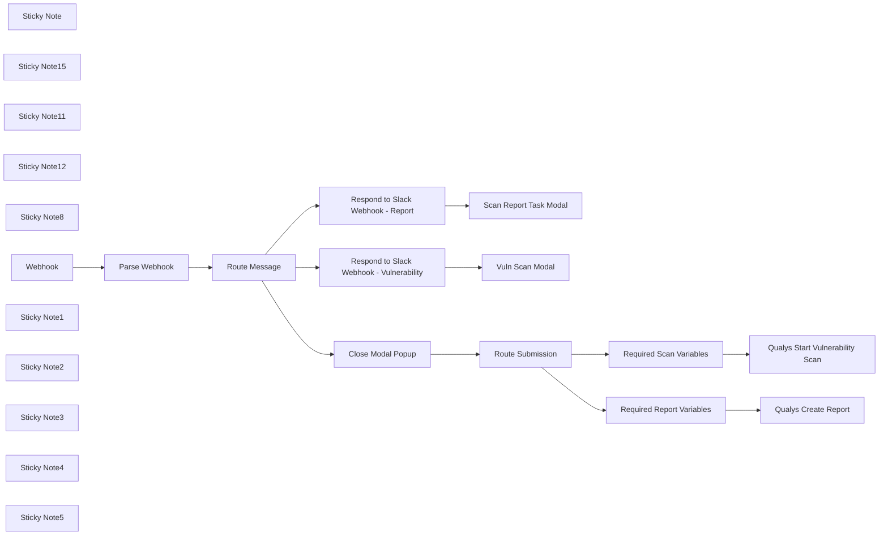

## Fluxo (.json) :

```json
{
  "meta": {
    "instanceId": "03e9d14e9196363fe7191ce21dc0bb17387a6e755dcc9acc4f5904752919dca8"
  },
  "nodes": [
    {
      "id": "adfda9cb-1d77-4c54-b3ea-e7bf438a48af",
      "name": "Parse Webhook",
      "type": "n8n-nodes-base.set",
      "position": [
        760,
        640
      ],
      "parameters": {
        "options": {},
        "assignments": {
          "assignments": [
            {
              "id": "e63f9299-a19d-4ba1-93b0-59f458769fb2",
              "name": "response",
              "type": "object",
              "value": "={{ $json.body.payload }}"
            }
          ]
        }
      },
      "typeVersion": 3.3
    },
    {
      "id": "b3e0e490-18e0-44b5-a960-0fdbf8422515",
      "name": "Qualys Create Report",
      "type": "n8n-nodes-base.executeWorkflow",
      "position": [
        1720,
        1740
      ],
      "parameters": {
        "options": {},
        "workflowId": "icSLX102kSS9zNdK"
      },
      "typeVersion": 1
    },
    {
      "id": "80ae074b-bda5-4638-b46f-246a1b9530ae",
      "name": "Required Report Variables",
      "type": "n8n-nodes-base.set",
      "position": [
        1520,
        1740
      ],
      "parameters": {
        "options": {},
        "assignments": {
          "assignments": [
            {
              "id": "47cd1502-3039-4661-a6b1-e20a74056550",
              "name": "report_title",
              "type": "string",
              "value": "={{ $json.response.view.state.values.report_title.report_title_input.value }}"
            },
            {
              "id": "6a8a0cbf-bf3e-4702-956e-a35966d8b9c5",
              "name": "base_url",
              "type": "string",
              "value": "https://qualysapi.qg3.apps.qualys.com"
            },
            {
              "id": "9a15f4db-f006-4ad8-a2c0-4002dd3e2655",
              "name": "output_format",
              "type": "string",
              "value": "={{ $json.response.view.state.values.output_format.output_format_select.selected_option.value }}"
            },
            {
              "id": "13978e05-7e7f-42e9-8645-d28803db8cc9",
              "name": "template_name",
              "type": "string",
              "value": "={{ $json.response.view.state.values.report_template.report_template_select.selected_option.text.text }}"
            }
          ]
        }
      },
      "typeVersion": 3.3
    },
    {
      "id": "b596da86-02c7-4d8e-a267-88933f47ae0c",
      "name": "Qualys Start Vulnerability Scan",
      "type": "n8n-nodes-base.executeWorkflow",
      "position": [
        1720,
        1540
      ],
      "parameters": {
        "options": {},
        "workflowId": "pYPh5FlGZgb36xZO"
      },
      "typeVersion": 1
    },
    {
      "id": "61e39516-6558-46ce-a300-b4cbade7a6f6",
      "name": "Scan Report Task Modal",
      "type": "n8n-nodes-base.httpRequest",
      "position": [
        1620,
        720
      ],
      "parameters": {
        "url": "https://slack.com/api/views.open",
        "method": "POST",
        "options": {},
        "jsonBody": "=  {\n    \"trigger_id\": \"{{ $('Parse Webhook').item.json['response']['trigger_id'] }}\",\n    \"external_id\": \"Scan Report Generator\",\n    \"view\": {\n\t\"title\": {\n\t\t\"type\": \"plain_text\",\n\t\t\"text\": \"Scan Report Generator\",\n\t\t\"emoji\": true\n\t},\n\t\"submit\": {\n\t\t\"type\": \"plain_text\",\n\t\t\"text\": \"Generate Report\",\n\t\t\"emoji\": true\n\t},\n\t\"type\": \"modal\",\n\t\"close\": {\n\t\t\"type\": \"plain_text\",\n\t\t\"text\": \"Cancel\",\n\t\t\"emoji\": true\n\t},\n\t\"blocks\": [\n\t\t{\n\t\t\t\"type\": \"image\",\n\t\t\t\"image_url\": \"https://upload.wikimedia.org/wikipedia/commons/thumb/2/26/Logo-Qualys.svg/300px-Logo-Qualys.svg.png\",\n\t\t\t\"alt_text\": \"Qualys Logo\"\n\t\t},\n\t\t{\n\t\t\t\"type\": \"section\",\n\t\t\t\"text\": {\n\t\t\t\t\"type\": \"mrkdwn\",\n\t\t\t\t\"text\": \"Select a template and generate a detailed scan report based on the results of your previous scans.\"\n\t\t\t}\n\t\t},\n\t\t{\n\t\t\t\"type\": \"input\",\n\t\t\t\"block_id\": \"report_template\",\n\t\t\t\"element\": {\n\t\t\t\t\"type\": \"external_select\",\n\t\t\t\t\"placeholder\": {\n\t\t\t\t\t\"type\": \"plain_text\",\n\t\t\t\t\t\"text\": \"Select a report template\",\n\t\t\t\t\t\"emoji\": true\n\t\t\t\t},\n\t\t\t\t\"action_id\": \"report_template_select\"\n\t\t\t},\n\t\t\t\"label\": {\n\t\t\t\t\"type\": \"plain_text\",\n\t\t\t\t\"text\": \"Report Template\",\n\t\t\t\t\"emoji\": true\n\t\t\t},\n\t\t\t\"hint\": {\n\t\t\t\t\"type\": \"plain_text\",\n\t\t\t\t\"text\": \"Choose a report template from your Qualys account to structure the output.\"\n\t\t\t}\n\t\t},\n\t\t{\n\t\t\t\"type\": \"input\",\n\t\t\t\"block_id\": \"report_title\",\n\t\t\t\"element\": {\n\t\t\t\t\"type\": \"plain_text_input\",\n\t\t\t\t\"action_id\": \"report_title_input\",\n\t\t\t\t\"placeholder\": {\n\t\t\t\t\t\"type\": \"plain_text\",\n\t\t\t\t\t\"text\": \"Enter a custom title for the report\"\n\t\t\t\t}\n\t\t\t},\n\t\t\t\"label\": {\n\t\t\t\t\"type\": \"plain_text\",\n\t\t\t\t\"text\": \"Report Title\",\n\t\t\t\t\"emoji\": true\n\t\t\t},\n\t\t\t\"hint\": {\n\t\t\t\t\"type\": \"plain_text\",\n\t\t\t\t\"text\": \"Provide a descriptive title for your report. This title will be used in the report header.\"\n\t\t\t}\n\t\t},\n\t\t{\n\t\t\t\"type\": \"input\",\n\t\t\t\"block_id\": \"output_format\",\n\t\t\t\"element\": {\n\t\t\t\t\"type\": \"static_select\",\n\t\t\t\t\"placeholder\": {\n\t\t\t\t\t\"type\": \"plain_text\",\n\t\t\t\t\t\"text\": \"Select output format\",\n\t\t\t\t\t\"emoji\": true\n\t\t\t\t},\n\t\t\t\t\"options\": [\n\t\t\t\t\t{\n\t\t\t\t\t\t\"text\": {\n\t\t\t\t\t\t\t\"type\": \"plain_text\",\n\t\t\t\t\t\t\t\"text\": \"PDF\",\n\t\t\t\t\t\t\t\"emoji\": true\n\t\t\t\t\t\t},\n\t\t\t\t\t\t\"value\": \"pdf\"\n\t\t\t\t\t},\n\t\t\t\t\t{\n\t\t\t\t\t\t\"text\": {\n\t\t\t\t\t\t\t\"type\": \"plain_text\",\n\t\t\t\t\t\t\t\"text\": \"HTML\",\n\t\t\t\t\t\t\t\"emoji\": true\n\t\t\t\t\t\t},\n\t\t\t\t\t\t\"value\": \"html\"\n\t\t\t\t\t},\n\t\t\t\t\t{\n\t\t\t\t\t\t\"text\": {\n\t\t\t\t\t\t\t\"type\": \"plain_text\",\n\t\t\t\t\t\t\t\"text\": \"CSV\",\n\t\t\t\t\t\t\t\"emoji\": true\n\t\t\t\t\t\t},\n\t\t\t\t\t\t\"value\": \"csv\"\n\t\t\t\t\t}\n\t\t\t\t],\n\t\t\t\t\"action_id\": \"output_format_select\"\n\t\t\t},\n\t\t\t\"label\": {\n\t\t\t\t\"type\": \"plain_text\",\n\t\t\t\t\"text\": \"Output Format\",\n\t\t\t\t\"emoji\": true\n\t\t\t},\n\t\t\t\"hint\": {\n\t\t\t\t\"type\": \"plain_text\",\n\t\t\t\t\"text\": \"Choose the format in which you want the report to be generated.\"\n\t\t\t}\n\t\t}\n\t]\n}\n}",
        "sendBody": true,
        "jsonQuery": "{\n  \"Content-type\": \"application/json\"\n}",
        "sendQuery": true,
        "specifyBody": "json",
        "specifyQuery": "json",
        "authentication": "predefinedCredentialType",
        "nodeCredentialType": "slackApi"
      },
      "credentials": {
        "slackApi": {
          "id": "DZJDes1ZtGpqClNk",
          "name": "Qualys Slack App"
        }
      },
      "typeVersion": 4.2
    },
    {
      "id": "29cf716c-9cd6-4bd9-a0f9-c75baca86cc1",
      "name": "Vuln Scan Modal",
      "type": "n8n-nodes-base.httpRequest",
      "position": [
        1620,
        560
      ],
      "parameters": {
        "url": "https://slack.com/api/views.open",
        "method": "POST",
        "options": {},
        "jsonBody": "=  {\n    \"trigger_id\": \"{{ $('Parse Webhook').item.json['response']['trigger_id'] }}\",\n    \"external_id\": \"Scan Report Generator\",\n    \"view\": {\n\t\"title\": {\n\t\t\"type\": \"plain_text\",\n\t\t\"text\": \"Vulnerability Scan\",\n\t\t\"emoji\": true\n\t},\n\t\"submit\": {\n\t\t\"type\": \"plain_text\",\n\t\t\"text\": \"Execute Scan\",\n\t\t\"emoji\": true\n\t},\n\t\"type\": \"modal\",\n\t\"close\": {\n\t\t\"type\": \"plain_text\",\n\t\t\"text\": \"Cancel\",\n\t\t\"emoji\": true\n\t},\n\t\"blocks\": [\n\t\t{\n\t\t\t\"type\": \"image\",\n\t\t\t\"image_url\": \"https://upload.wikimedia.org/wikipedia/commons/thumb/2/26/Logo-Qualys.svg/300px-Logo-Qualys.svg.png\",\n\t\t\t\"alt_text\": \"Qualys Logo\"\n\t\t},\n\t\t{\n\t\t\t\"type\": \"section\",\n\t\t\t\"text\": {\n\t\t\t\t\"type\": \"plain_text\",\n\t\t\t\t\"text\": \"Initiate a network-wide scan to detect and assess security vulnerabilities.\",\n\t\t\t\t\"emoji\": true\n\t\t\t}\n\t\t},\n\t\t{\n\t\t\t\"type\": \"input\",\n\t\t\t\"block_id\": \"option_title\",\n\t\t\t\"element\": {\n\t\t\t\t\"type\": \"plain_text_input\",\n\t\t\t\t\"action_id\": \"text_input-action\",\n\t\t\t\t\"initial_value\": \"Initial Options\"\n\t\t\t},\n\t\t\t\"label\": {\n\t\t\t\t\"type\": \"plain_text\",\n\t\t\t\t\"text\": \"Option Title\",\n\t\t\t\t\"emoji\": true\n\t\t\t},\n\t\t\t\"hint\": {\n\t\t\t\t\"type\": \"plain_text\",\n\t\t\t\t\"text\": \"Specify the title of the option profile to use for the scan.\"\n\t\t\t}\n\t\t},\n\t\t{\n\t\t\t\"type\": \"input\",\n\t\t\t\"block_id\": \"scan_title\",\n\t\t\t\"element\": {\n\t\t\t\t\"type\": \"plain_text_input\",\n\t\t\t\t\"action_id\": \"text_input-action\",\n\t\t\t\t\"placeholder\": {\n\t\t\t\t\t\"type\": \"plain_text\",\n\t\t\t\t\t\"text\": \"Enter your scan title\"\n\t\t\t\t},\n\t\t\t\t\"initial_value\": \"n8n Scan 1\"\n\t\t\t},\n\t\t\t\"label\": {\n\t\t\t\t\"type\": \"plain_text\",\n\t\t\t\t\"text\": \"Scan Title\",\n\t\t\t\t\"emoji\": true\n\t\t\t},\n\t\t\t\"hint\": {\n\t\t\t\t\"type\": \"plain_text\",\n\t\t\t\t\"text\": \"Provide a descriptive title for the scan. Up to 2000 characters.\"\n\t\t\t}\n\t\t},\n\t\t{\n\t\t\t\"type\": \"input\",\n\t\t\t\"block_id\": \"asset_groups\",\n\t\t\t\"element\": {\n\t\t\t\t\"type\": \"plain_text_input\",\n\t\t\t\t\"action_id\": \"text_input-action\",\n\t\t\t\t\"placeholder\": {\n\t\t\t\t\t\"type\": \"plain_text\",\n\t\t\t\t\t\"text\": \"Enter asset groups\"\n\t\t\t\t},\n\t\t\t\t\"initial_value\": \"Group1\"\n\t\t\t},\n\t\t\t\"label\": {\n\t\t\t\t\"type\": \"plain_text\",\n\t\t\t\t\"text\": \"Asset Groups\",\n\t\t\t\t\"emoji\": true\n\t\t\t},\n\t\t\t\"hint\": {\n\t\t\t\t\"type\": \"plain_text\",\n\t\t\t\t\"text\": \"Specify asset group titles for targeting. Multiple titles must be comma-separated.\"\n\t\t\t}\n\t\t}\n\t]\n}\n}",
        "sendBody": true,
        "jsonQuery": "{\n  \"Content-type\": \"application/json\"\n}",
        "sendQuery": true,
        "specifyBody": "json",
        "specifyQuery": "json",
        "authentication": "predefinedCredentialType",
        "nodeCredentialType": "slackApi"
      },
      "credentials": {
        "slackApi": {
          "id": "DZJDes1ZtGpqClNk",
          "name": "Qualys Slack App"
        }
      },
      "typeVersion": 4.2
    },
    {
      "id": "a771704d-4191-4e80-b62f-81b41b047a87",
      "name": "Route Message",
      "type": "n8n-nodes-base.switch",
      "position": [
        940,
        640
      ],
      "parameters": {
        "rules": {
          "values": [
            {
              "outputKey": "Vuln Scan Modal",
              "conditions": {
                "options": {
                  "leftValue": "",
                  "caseSensitive": true,
                  "typeValidation": "strict"
                },
                "combinator": "and",
                "conditions": [
                  {
                    "operator": {
                      "type": "string",
                      "operation": "equals"
                    },
                    "leftValue": "={{ $json.response.callback_id }}",
                    "rightValue": "trigger-qualys-vmscan"
                  }
                ]
              },
              "renameOutput": true
            },
            {
              "outputKey": "Scan Report Modal",
              "conditions": {
                "options": {
                  "leftValue": "",
                  "caseSensitive": true,
                  "typeValidation": "strict"
                },
                "combinator": "and",
                "conditions": [
                  {
                    "id": "02868fd8-2577-4c6d-af5e-a1963cb2f786",
                    "operator": {
                      "name": "filter.operator.equals",
                      "type": "string",
                      "operation": "equals"
                    },
                    "leftValue": "={{ $json.response.callback_id }}",
                    "rightValue": "qualys-scan-report"
                  }
                ]
              },
              "renameOutput": true
            },
            {
              "outputKey": "Process Submission",
              "conditions": {
                "options": {
                  "leftValue": "",
                  "caseSensitive": true,
                  "typeValidation": "strict"
                },
                "combinator": "and",
                "conditions": [
                  {
                    "id": "c320c8b8-947b-433a-be82-d2aa96594808",
                    "operator": {
                      "name": "filter.operator.equals",
                      "type": "string",
                      "operation": "equals"
                    },
                    "leftValue": "={{ $json.response.type }}",
                    "rightValue": "view_submission"
                  }
                ]
              },
              "renameOutput": true
            }
          ]
        },
        "options": {
          "fallbackOutput": "none"
        }
      },
      "typeVersion": 3
    },
    {
      "id": "c8346d57-762a-4bbd-8d2b-f13097cb063d",
      "name": "Required Scan Variables",
      "type": "n8n-nodes-base.set",
      "position": [
        1520,
        1540
      ],
      "parameters": {
        "options": {},
        "assignments": {
          "assignments": [
            {
              "id": "096ff32e-356e-4a85-aad2-01001d69dd46",
              "name": "platformurl",
              "type": "string",
              "value": "https://qualysapi.qg3.apps.qualys.com"
            },
            {
              "id": "070178a6-73b0-458b-8657-20ab4ff0485c",
              "name": "option_title",
              "type": "string",
              "value": "={{ $json.response.view.state.values.option_title['text_input-action'].value }}"
            },
            {
              "id": "3605424b-5bfc-44f0-b6e4-e0d6b1130b8e",
              "name": "scan_title",
              "type": "string",
              "value": "={{ $json.response.view.state.values.scan_title['text_input-action'].value }}"
            },
            {
              "id": "2320d966-b834-46fb-b674-be97cc08682e",
              "name": "asset_groups",
              "type": "string",
              "value": "={{ $json.response.view.state.values.asset_groups['text_input-action'].value }}"
            }
          ]
        }
      },
      "typeVersion": 3.3
    },
    {
      "id": "55589da9-50ce-4d55-a5ff-d62abdf65fa4",
      "name": "Route Submission",
      "type": "n8n-nodes-base.switch",
      "position": [
        1240,
        1140
      ],
      "parameters": {
        "rules": {
          "values": [
            {
              "outputKey": "Vuln Scan",
              "conditions": {
                "options": {
                  "leftValue": "",
                  "caseSensitive": true,
                  "typeValidation": "strict"
                },
                "combinator": "and",
                "conditions": [
                  {
                    "operator": {
                      "type": "string",
                      "operation": "equals"
                    },
                    "leftValue": "={{ $json.response.view.title.text }}",
                    "rightValue": "Vulnerability Scan"
                  }
                ]
              },
              "renameOutput": true
            },
            {
              "outputKey": "Scan Report",
              "conditions": {
                "options": {
                  "leftValue": "",
                  "caseSensitive": true,
                  "typeValidation": "strict"
                },
                "combinator": "and",
                "conditions": [
                  {
                    "id": "02868fd8-2577-4c6d-af5e-a1963cb2f786",
                    "operator": {
                      "name": "filter.operator.equals",
                      "type": "string",
                      "operation": "equals"
                    },
                    "leftValue": "={{ $json.response.view.title.text }}",
                    "rightValue": "Scan Report Generator"
                  }
                ]
              },
              "renameOutput": true
            }
          ]
        },
        "options": {
          "fallbackOutput": "none"
        }
      },
      "typeVersion": 3
    },
    {
      "id": "d0fc264d-0c48-4aa6-aeab-ed605d96f35a",
      "name": "Sticky Note",
      "type": "n8n-nodes-base.stickyNote",
      "position": [
        428.3467548314237,
        270.6382978723399
      ],
      "parameters": {
        "color": 7,
        "width": 466.8168310000617,
        "height": 567.6433222116042,
        "content": "\n## Events Webhook Trigger\nThe first node receives all messages from Slack API via Subscription Events API. You can find more information about setting up the subscription events API by [clicking here](https://api.slack.com/apis/connections/events-api). \n\nThe second node extracts the payload from slack into an object that n8n can understand.  "
      },
      "typeVersion": 1
    },
    {
      "id": "acb3fbdc-1fcb-4763-8529-ea2842607569",
      "name": "Sticky Note15",
      "type": "n8n-nodes-base.stickyNote",
      "position": [
        900,
        -32.762682645579616
      ],
      "parameters": {
        "color": 7,
        "width": 566.0553219408072,
        "height": 1390.6748140207737,
        "content": "\n## Efficient Slack Interaction Handling with n8n\n\nThis section of the workflow is designed to efficiently manage and route messages and submissions from Slack based on specific triggers and conditions. When a Slack interaction occurs—such as a user triggering a vulnerability scan or generating a report through a modal—the workflow intelligently routes the message to the appropriate action:\n\n- **Dynamic Routing**: Uses conditions to determine the nature of the Slack interaction, whether it's a direct command to initiate a scan or a request to generate a report.\n- **Modal Management**: Differentiates actions based on modal titles and `callback_id`s, ensuring that each type of submission is processed according to its context.\n- **Streamlined Responses**: After routing, the workflow promptly handles the necessary responses or actions, including closing modal popups and responding to Slack with appropriate confirmation or data.\n\n**Purpose**: This mechanism ensures that all interactions within Slack are handled quickly and accurately, automating responses and actions in real-time to enhance user experience and workflow efficiency."
      },
      "typeVersion": 1
    },
    {
      "id": "85f370e8-70d2-466e-8f44-45eaf04a0d95",
      "name": "Sticky Note11",
      "type": "n8n-nodes-base.stickyNote",
      "position": [
        1473.6255461332685,
        56.17183602125283
      ],
      "parameters": {
        "color": 7,
        "width": 396.6025898621133,
        "height": 881.1659905894905,
        "content": "\n## Display Modal Popup\nThis section pops open a modal window that is later used to send data into TheHive. \n\nModals can be customized to perform all sorts of actions. And they are natively mobile! You can see a screenshot of the Slack Modals on the right. \n\nLearn more about them by [clicking here](https://api.slack.com/surfaces/modals)"
      },
      "typeVersion": 1
    },
    {
      "id": "cae79c1c-47f8-41c0-b1d0-e284359b52a8",
      "name": "Sticky Note12",
      "type": "n8n-nodes-base.stickyNote",
      "position": [
        1480,
        960
      ],
      "parameters": {
        "color": 7,
        "width": 390.82613196003143,
        "height": 950.1640646001949,
        "content": "\n## Modal Submission Payload\nThe data input into the Slack Modal makes its way into these set nodes that then pass that data into the Qualys Sub workflows that handle the heavy lifting. \n\n### Two Trigger Options\n- **Trigger a Vulnerability Scan** in the Slack UI which then sends a slack message to a channel of your choice summarizing and linking to the scan in slack\n- **Trigger report creation** in the Slack UI from the previously generated Vulnerability scan and upload a PDF copy of the report directly in a slack channel of your choice"
      },
      "typeVersion": 1
    },
    {
      "id": "1017df8b-ff32-47aa-a4c2-a026e6597fa9",
      "name": "Close Modal Popup",
      "type": "n8n-nodes-base.respondToWebhook",
      "position": [
        1000,
        1140
      ],
      "parameters": {
        "options": {
          "responseCode": 204
        },
        "respondWith": "noData"
      },
      "typeVersion": 1.1
    },
    {
      "id": "6b058f2a-2c0c-4326-aa42-08d840e306f7",
      "name": "Sticky Note8",
      "type": "n8n-nodes-base.stickyNote",
      "position": [
        -260,
        280
      ],
      "parameters": {
        "width": 675.1724774900403,
        "height": 972.8853473866498,
        "content": "\n## Enhance Security Operations with the Qualys Slack Shortcut Bot!\n\nOur **Qualys Slack Shortcut Bot** is strategically designed to facilitate immediate security operations directly from Slack. This powerful tool allows users to initiate vulnerability scans and generate detailed reports through simple Slack interactions, streamlining the process of managing security assessments.\n\n**Workflow Highlights:**\n- **Interactive Modals**: Utilizes Slack modals to gather user inputs for scan configurations and report generation, providing a user-friendly interface for complex operations.\n- **Dynamic Workflow Execution**: Integrates seamlessly with Qualys to execute vulnerability scans and create reports based on user-specified parameters.\n- **Real-Time Feedback**: Offers instant feedback within Slack, updating users about the status of their requests and delivering reports directly through Slack channels.\n\n\n**Operational Flow:**\n- **Parse Webhook Data**: Captures and parses incoming data from Slack to understand user commands accurately.\n- **Execute Actions**: Depending on the user's selection, the workflow triggers other sub-workflows like 'Qualys Start Vulnerability Scan' or 'Qualys Create Report' for detailed processing.\n- **Respond to Slack**: Ensures that every interaction is acknowledged, maintaining a smooth user experience by managing modal popups and sending appropriate responses.\n\n\n**Setup Instructions:**\n- Verify that Slack and Qualys API integrations are correctly configured for seamless interaction.\n- Customize the modal interfaces to align with your organization's operational protocols and security policies.\n- Test the workflow to ensure that it responds accurately to Slack commands and that the integration with Qualys is functioning as expected.\n\n\n**Need Assistance?**\n- Explore our [Documentation](https://docs.qualys.com) or get help from the [n8n Community](https://community.n8n.io) for more detailed guidance on setup and customization.\n\nDeploy this bot within your Slack environment to significantly enhance the efficiency and responsiveness of your security operations, enabling proactive management of vulnerabilities and streamlined reporting."
      },
      "typeVersion": 1
    },
    {
      "id": "63b537e8-50c9-479d-96a4-54e621689a23",
      "name": "Webhook",
      "type": "n8n-nodes-base.webhook",
      "position": [
        520,
        640
      ],
      "webhookId": "4f86c00d-ceb4-4890-84c5-850f8e5dec05",
      "parameters": {
        "path": "4f86c00d-ceb4-4890-84c5-850f8e5dec05",
        "options": {},
        "httpMethod": "POST",
        "responseMode": "responseNode"
      },
      "typeVersion": 2
    },
    {
      "id": "13500444-f2ff-4b77-8f41-8ac52d067ec7",
      "name": "Respond to Slack Webhook - Vulnerability",
      "type": "n8n-nodes-base.respondToWebhook",
      "position": [
        1280,
        560
      ],
      "parameters": {
        "options": {},
        "respondWith": "noData"
      },
      "typeVersion": 1.1
    },
    {
      "id": "e64cedf0-948c-43c8-a62c-d0ec2916f3b6",
      "name": "Respond to Slack Webhook - Report",
      "type": "n8n-nodes-base.respondToWebhook",
      "position": [
        1280,
        720
      ],
      "parameters": {
        "options": {
          "responseCode": 200
        },
        "respondWith": "noData"
      },
      "typeVersion": 1.1
    },
    {
      "id": "d2e53f7b-090a-4330-949d-d66ac0e5849c",
      "name": "Sticky Note1",
      "type": "n8n-nodes-base.stickyNote",
      "position": [
        1494.8207799250774,
        1400
      ],
      "parameters": {
        "color": 5,
        "width": 361.46312518523973,
        "height": 113.6416448104651,
        "content": "### 🙋 Remember to update your Slack Channels\nDon't forget to update the Slack Channels in the Slack nodes in these two subworkflows. \n"
      },
      "typeVersion": 1
    },
    {
      "id": "2731f910-288f-497a-a71d-d840a63b2930",
      "name": "Sticky Note2",
      "type": "n8n-nodes-base.stickyNote",
      "position": [
        1480,
        400
      ],
      "parameters": {
        "color": 5,
        "width": 376.26546828439086,
        "height": 113.6416448104651,
        "content": "### 🙋 Don't forget your slack credentials!\nThankfully n8n makes it easy, as long as you've added credentials to a normal slack node, these http nodes are a snap to change via the drop down. "
      },
      "typeVersion": 1
    },
    {
      "id": "72105959-ee9b-4ce6-a7f8-0f5f112c14d2",
      "name": "Sticky Note3",
      "type": "n8n-nodes-base.stickyNote",
      "position": [
        1880,
        500
      ],
      "parameters": {
        "color": 5,
        "width": 532.5097590794944,
        "height": 671.013686767174,
        "content": ""
      },
      "typeVersion": 1
    },
    {
      "id": "49b8ce63-cefd-483a-b802-03e3500d807b",
      "name": "Sticky Note4",
      "type": "n8n-nodes-base.stickyNote",
      "position": [
        1880,
        -200
      ],
      "parameters": {
        "color": 5,
        "width": 535.8333316661616,
        "height": 658.907292269235,
        "content": ""
      },
      "typeVersion": 1
    },
    {
      "id": "3ec8c799-d5a5-4134-891a-59adb3e68e23",
      "name": "Sticky Note5",
      "type": "n8n-nodes-base.stickyNote",
      "position": [
        280,
        -158.042446016207
      ],
      "parameters": {
        "color": 5,
        "width": 596.6847639718076,
        "height": 422.00743613240917,
        "content": "\n### 🤖 Triggering this workflow is as easy as typing a backslash in Slack"
      },
      "typeVersion": 1
    }
  ],
  "pinData": {},
  "connections": {
    "Webhook": {
      "main": [
        [
          {
            "node": "Parse Webhook",
            "type": "main",
            "index": 0
          }
        ]
      ]
    },
    "Parse Webhook": {
      "main": [
        [
          {
            "node": "Route Message",
            "type": "main",
            "index": 0
          }
        ]
      ]
    },
    "Route Message": {
      "main": [
        [
          {
            "node": "Respond to Slack Webhook - Vulnerability",
            "type": "main",
            "index": 0
          }
        ],
        [
          {
            "node": "Respond to Slack Webhook - Report",
            "type": "main",
            "index": 0
          }
        ],
        [
          {
            "node": "Close Modal Popup",
            "type": "main",
            "index": 0
          }
        ]
      ]
    },
    "Route Submission": {
      "main": [
        [
          {
            "node": "Required Scan Variables",
            "type": "main",
            "index": 0
          }
        ],
        [
          {
            "node": "Required Report Variables",
            "type": "main",
            "index": 0
          }
        ]
      ]
    },
    "Close Modal Popup": {
      "main": [
        [
          {
            "node": "Route Submission",
            "type": "main",
            "index": 0
          }
        ]
      ]
    },
    "Required Scan Variables": {
      "main": [
        [
          {
            "node": "Qualys Start Vulnerability Scan",
            "type": "main",
            "index": 0
          }
        ]
      ]
    },
    "Required Report Variables": {
      "main": [
        [
          {
            "node": "Qualys Create Report",
            "type": "main",
            "index": 0
          }
        ]
      ]
    },
    "Respond to Slack Webhook - Report": {
      "main": [
        [
          {
            "node": "Scan Report Task Modal",
            "type": "main",
            "index": 0
          }
        ]
      ]
    },
    "Respond to Slack Webhook - Vulnerability": {
      "main": [
        [
          {
            "node": "Vuln Scan Modal",
            "type": "main",
            "index": 0
          }
        ]
      ]
    }
  }
}
```

<a id="template-175"></a>

## Template 175 - Notificação no Mattermost por atualização de perfil do Facebook

- **Nome:** Notificação no Mattermost por atualização de perfil do Facebook
- **Descrição:** Ao detectar uma alteração no perfil de um usuário no Facebook, o fluxo envia uma mensagem formatada para um canal específico no Mattermost notificando qual campo foi alterado e seu novo valor.
- **Funcionalidade:** • Detecção de atualização de perfil: Monitora eventos de alteração no perfil de usuários do Facebook.
• Inclusão de valores da alteração: Captura e inclui os valores detalhados da mudança (como campo alterado e novo valor) na notificação.
• Composição de mensagem dinâmica: Gera uma mensagem formatada contendo o identificador do usuário (uid), o campo alterado e o novo valor.
• Envio para canal específico: Publica a notificação no canal configurado do Mattermost para comunicação imediata com a equipe.
- **Ferramentas:** • Facebook: Fonte dos eventos de alteração de perfil e responsável por enviar as notificações de mudança.
• Mattermost: Plataforma de comunicação onde a notificação formatada é publicada em um canal específico.

## Fluxo visual

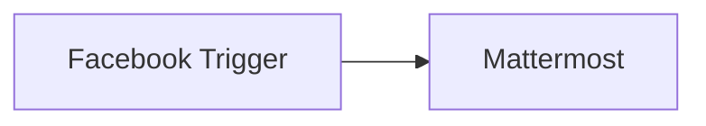

## Fluxo (.json) :

```json
{
  "id": "131",
  "name": "Receive a Mattermost message when a user updates their profile on Facebook",
  "nodes": [
    {
      "name": "Facebook Trigger",
      "type": "n8n-nodes-base.facebookTrigger",
      "position": [
        590,
        260
      ],
      "webhookId": "14ba2eea-04a1-4659-b83e-0090ba480452",
      "parameters": {
        "appId": "",
        "options": {
          "includeValues": true
        }
      },
      "credentials": {
        "facebookGraphAppApi": "facebook"
      },
      "typeVersion": 1
    },
    {
      "name": "Mattermost",
      "type": "n8n-nodes-base.mattermost",
      "position": [
        790,
        260
      ],
      "parameters": {
        "message": "=The user with uid {{$node[\"Facebook Trigger\"].json[\"uid\"]}} changed their {{$node[\"Facebook Trigger\"].json[\"changes\"][0][\"field\"]}} to {{$node[\"Facebook Trigger\"].json[\"changes\"][0][\"value\"][\"page\"]}}.",
        "channelId": "13fx8838gtbj3d41a6a7c1w7fe",
        "attachments": [],
        "otherOptions": {}
      },
      "credentials": {
        "mattermostApi": "mattermost"
      },
      "typeVersion": 1
    }
  ],
  "active": false,
  "settings": {},
  "connections": {
    "Facebook Trigger": {
      "main": [
        [
          {
            "node": "Mattermost",
            "type": "main",
            "index": 0
          }
        ]
      ]
    }
  }
}
```

<a id="template-176"></a>

## Template 176 - Backup automático de fluxos para GitHub

- **Nome:** Backup automático de fluxos para GitHub
- **Descrição:** Fluxo que realiza o backup de todos os fluxos da instância para um repositório remoto, salvando cada fluxo como JSON em pastas organizadas por ano e mês. O backup é executado a cada 24 horas e utiliza um subfluxo para reduzir consumo de memória. Ao final, envia notificações de status via Slack.
- **Funcionalidade:** • Disparo por agendamento: o fluxo é disparado automaticamente a cada 24 horas para iniciar o backup.
• Coleta de fluxos: recupera todos os fluxos da instância para processamento.
• Armazenamento organizado: cria um subcaminho usando o ano e mês da criação para organizar os arquivos.
• Execução de subfluxo de obtenção: executa o fluxo correspondente para obter a definição atual.
• Comparação de versões: compara o JSON atual com a versão salva no repositório para detectar alterações.
• Criação/Atualização de arquivos: cria novos arquivos ou edita os existentes com o conteúdo JSON.
• Armazenamento no repositório: salva os arquivos JSON no repositório conforme o caminho YYYY/MM/ID.json.
• Notificações de status: envia mensagens via Slack ao iniciar, durante e ao concluir o backup.
• Gerenciamento de falhas: encaminha fluxos com falha para tratamento/alerta.
• Eficiência de memória: usa subfluxo para dividir o processo e reduzir consumo de memória.
- **Ferramentas:** • GitHub: Repositório para armazenar backups dos fluxos como arquivos JSON, organizados por data e ID.
• Slack: Notificações de início, progresso e conclusão do backup.

## Fluxo visual

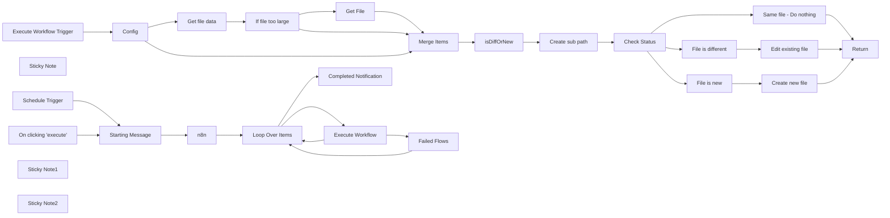

## Fluxo (.json) :

```json
{
  "nodes": [
    {
      "id": "421824c2-59a2-441b-aacc-7dadf2ec153b",
      "name": "On clicking 'execute'",
      "type": "n8n-nodes-base.manualTrigger",
      "position": [
        900,
        1180
      ],
      "parameters": {},
      "typeVersion": 1
    },
    {
      "id": "c6024a57-1957-4714-84e3-8d326c83cd89",
      "name": "Sticky Note",
      "type": "n8n-nodes-base.stickyNote",
      "position": [
        420,
        1560
      ],
      "parameters": {
        "color": 6,
        "width": 1910.7813046051347,
        "height": 731.7039821513649,
        "content": "## Subworkflow"
      },
      "typeVersion": 1
    },
    {
      "id": "07691901-a8d2-4891-860b-1d672361021b",
      "name": "Execute Workflow Trigger",
      "type": "n8n-nodes-base.executeWorkflowTrigger",
      "position": [
        480,
        1940
      ],
      "parameters": {},
      "typeVersion": 1
    },
    {
      "id": "2b1dd138-7872-42ea-9882-8750ef4cf227",
      "name": "n8n",
      "type": "n8n-nodes-base.n8n",
      "position": [
        1300,
        1280
      ],
      "parameters": {
        "filters": {},
        "requestOptions": {}
      },
      "credentials": {
        "n8nApi": {
          "id": "t2YEgbUMXHjsykeF",
          "name": "admin"
        }
      },
      "typeVersion": 1
    },
    {
      "id": "96c0c6a7-2a11-441d-8177-e0a18030daf9",
      "name": "Return",
      "type": "n8n-nodes-base.set",
      "position": [
        2140,
        1760
      ],
      "parameters": {
        "options": {},
        "assignments": {
          "assignments": [
            {
              "id": "8d513345-6484-431f-afb7-7cf045c90f4f",
              "name": "Done",
              "type": "boolean",
              "value": true
            }
          ]
        }
      },
      "typeVersion": 3.3
    },
    {
      "id": "6715d1ff-a1f0-4e1a-b96e-f680d1495047",
      "name": "Get File",
      "type": "n8n-nodes-base.httpRequest",
      "position": [
        1100,
        1640
      ],
      "parameters": {
        "url": "={{ $json.download_url }}",
        "options": {}
      },
      "typeVersion": 4.2
    },
    {
      "id": "443b18e8-c05b-444f-b323-dea0b3041939",
      "name": "If file too large",
      "type": "n8n-nodes-base.if",
      "position": [
        860,
        1660
      ],
      "parameters": {
        "options": {},
        "conditions": {
          "options": {
            "leftValue": "",
            "caseSensitive": true,
            "typeValidation": "strict"
          },
          "combinator": "and",
          "conditions": [
            {
              "id": "45ce825e-9fa6-430c-8931-9aaf22c42585",
              "operator": {
                "type": "string",
                "operation": "empty",
                "singleValue": true
              },
              "leftValue": "={{ $json.content }}",
              "rightValue": ""
            },
            {
              "id": "9619a55f-7fb1-4f24-b1a7-7aeb82365806",
              "operator": {
                "type": "string",
                "operation": "notExists",
                "singleValue": true
              },
              "leftValue": "={{ $json.error }}",
              "rightValue": ""
            }
          ]
        }
      },
      "typeVersion": 2
    },
    {
      "id": "e460a2cd-f7af-4551-8ea2-84d9b9e5cb7f",
      "name": "Merge Items",
      "type": "n8n-nodes-base.merge",
      "position": [
        860,
        1920
      ],
      "parameters": {},
      "typeVersion": 2
    },
    {
      "id": "f795180a-66aa-4a86-acb0-96cf8c487db0",
      "name": "isDiffOrNew",
      "type": "n8n-nodes-base.code",
      "position": [
        1060,
        1920
      ],
      "parameters": {
        "jsCode": "const orderJsonKeys = (jsonObj) => {\n  const ordered = {};\n  Object.keys(jsonObj).sort().forEach(key => {\n    ordered[key] = jsonObj[key];\n  });\n  return ordered;\n}\n\n// Check if file returned with content\nif (Object.keys($input.all()[0].json).includes(\"content\")) {\n  // Decode base64 content and parse JSON\n  const origWorkflow = JSON.parse(Buffer.from($input.all()[0].json.content, 'base64').toString());\n  const n8nWorkflow = $input.all()[1].json;\n  \n  // Order JSON objects\n  const orderedOriginal = orderJsonKeys(origWorkflow);\n  const orderedActual = orderJsonKeys(n8nWorkflow);\n\n  // Determine difference\n  if (JSON.stringify(orderedOriginal) === JSON.stringify(orderedActual)) {\n    $input.all()[0].json.github_status = \"same\";\n  } else {\n    $input.all()[0].json.github_status = \"different\";\n    $input.all()[0].json.n8n_data_stringy = JSON.stringify(orderedActual, null, 2);\n  }\n  $input.all()[0].json.content_decoded = orderedOriginal;\n// No file returned / new workflow\n} else if (Object.keys($input.all()[0].json).includes(\"data\")) {\n  const origWorkflow = JSON.parse($input.all()[0].json.data);\n  const n8nWorkflow = $input.all()[1].json;\n  \n  // Order JSON objects\n  const orderedOriginal = orderJsonKeys(origWorkflow);\n  const orderedActual = orderJsonKeys(n8nWorkflow);\n\n  // Determine difference\n  if (JSON.stringify(orderedOriginal) === JSON.stringify(orderedActual)) {\n    $input.all()[0].json.github_status = \"same\";\n  } else {\n    $input.all()[0].json.github_status = \"different\";\n    $input.all()[0].json.n8n_data_stringy = JSON.stringify(orderedActual, null, 2);\n  }\n  $input.all()[0].json.content_decoded = orderedOriginal;\n\n} else {\n  // Order JSON object\n  const n8nWorkflow = $input.all()[1].json;\n  const orderedActual = orderJsonKeys(n8nWorkflow);\n  \n  // Proper formatting\n  $input.all()[0].json.github_status = \"new\";\n  $input.all()[0].json.n8n_data_stringy = JSON.stringify(orderedActual, null, 2);\n}\n\n// Return items\nreturn $input.all();\n"
      },
      "typeVersion": 1
    },
    {
      "id": "30e7d6fc-327e-4693-95ce-376a3b1f145c",
      "name": "Check Status",
      "type": "n8n-nodes-base.switch",
      "position": [
        1460,
        1920
      ],
      "parameters": {
        "rules": {
          "rules": [
            {
              "value2": "same"
            },
            {
              "output": 1,
              "value2": "different"
            },
            {
              "output": 2,
              "value2": "new"
            }
          ]
        },
        "value1": "={{$json.github_status}}",
        "dataType": "string"
      },
      "typeVersion": 1
    },
    {
      "id": "36f12309-c7fe-446f-9571-bd1005c18ed8",
      "name": "Same file - Do nothing",
      "type": "n8n-nodes-base.noOp",
      "position": [
        1680,
        1760
      ],
      "parameters": {},
      "typeVersion": 1
    },
    {
      "id": "45f0eaa7-259b-4908-b567-af2b3b5abb6d",
      "name": "File is different",
      "type": "n8n-nodes-base.noOp",
      "position": [
        1680,
        1920
      ],
      "parameters": {},
      "typeVersion": 1
    },
    {
      "id": "d16ec06b-7a3f-486e-8328-935ed3b4d565",
      "name": "File is new",
      "type": "n8n-nodes-base.noOp",
      "position": [
        1680,
        2120
      ],
      "parameters": {},
      "typeVersion": 1
    },
    {
      "id": "cdc7f306-b7d2-4de1-8e44-0bd8d49a679f",
      "name": "Create new file",
      "type": "n8n-nodes-base.github",
      "position": [
        1900,
        2120
      ],
      "parameters": {
        "owner": {
          "__rl": true,
          "mode": "",
          "value": "={{ $('Config').first().item.repo_owner }}"
        },
        "filePath": "={{ $('Config').first().item.repo_path }}{{ $json.subPath }}{{$('Execute Workflow Trigger').first().json.id}}.json",
        "resource": "file",
        "repository": {
          "__rl": true,
          "mode": "",
          "value": "={{ $('Config').first().item.repo_name }}"
        },
        "fileContent": "={{$('isDiffOrNew').item.json[\"n8n_data_stringy\"]}}",
        "commitMessage": "={{$('Execute Workflow Trigger').first().json.name}} ({{$json.github_status}})"
      },
      "typeVersion": 1
    },
    {
      "id": "9785333a-4a86-448d-afc2-58b0aa50ea96",
      "name": "Edit existing file",
      "type": "n8n-nodes-base.github",
      "position": [
        1900,
        1920
      ],
      "parameters": {
        "owner": {
          "__rl": true,
          "mode": "",
          "value": "={{ $('Config').first().item.repo_owner }}"
        },
        "filePath": "={{ $('Config').first().item.repo_path }}{{ $json.subPath }}{{$('Execute Workflow Trigger').first().json.id}}.json",
        "resource": "file",
        "operation": "edit",
        "repository": {
          "__rl": true,
          "mode": "",
          "value": "={{ $('Config').first().item.repo_name }}"
        },
        "fileContent": "={{$('isDiffOrNew').item.json[\"n8n_data_stringy\"]}}",
        "commitMessage": "={{$('Execute Workflow Trigger').first().json.name}} ({{$json.github_status}})"
      },
      "typeVersion": 1
    },
    {
      "id": "806db72c-c9f6-461d-be1a-1e6867a25382",
      "name": "Loop Over Items",
      "type": "n8n-nodes-base.splitInBatches",
      "position": [
        1500,
        1280
      ],
      "parameters": {
        "options": {}
      },
      "typeVersion": 3
    },
    {
      "id": "e5c433e4-bf56-4a0a-906c-7d74f6fe7287",
      "name": "Schedule Trigger",
      "type": "n8n-nodes-base.scheduleTrigger",
      "position": [
        900,
        1380
      ],
      "parameters": {
        "rule": {
          "interval": [
            {
              "triggerAtHour": 1,
              "triggerAtMinute": 33
            }
          ]
        }
      },
      "typeVersion": 1.2
    },
    {
      "id": "f6b566cb-0a15-4792-ba27-d6cd2a6c9453",
      "name": "Create sub path",
      "type": "n8n-nodes-base.set",
      "position": [
        1260,
        1920
      ],
      "parameters": {
        "options": {},
        "assignments": {
          "assignments": [
            {
              "id": "dae43d3b-56e5-4098-b602-862ebf5cd073",
              "name": "subPath",
              "type": "string",
              "value": "={{ $('Execute Workflow Trigger').first().json.createdAt.split('-')[0] }}/{{ $('Execute Workflow Trigger').first().json.createdAt.split('-')[1] }}/"
            }
          ]
        },
        "includeOtherFields": true
      },
      "typeVersion": 3.3
    },
    {
      "id": "9e2412f6-df25-4c12-8faf-0200558b537c",
      "name": "Sticky Note1",
      "type": "n8n-nodes-base.stickyNote",
      "position": [
        420,
        1100
      ],
      "parameters": {
        "color": 4,
        "width": 385,
        "height": 417,
        "content": "## Backup to GitHub \nThis workflow will backup all instance workflows to GitHub every 24 hours.\n\nThe files are saved into folders using `YYYY/MM/` for the directory path and `ID.json` for the filename.\n\nThe Repo Owner, Repo Name and Main folder are set using the **Variables** feature but can be replaced with the `Config` node in the subworkflow. \n\nThe workflow runs calls itself to help reduce memory usage, Once the workflow has completed it will send an optional notification to Slack.\n\n### Time to Run\nTested with 1423 workflows on `1.44.1` it took under 30 minutes for the first run and under 12 minutes once the initial run is complete."
      },
      "typeVersion": 1
    },
    {
      "id": "00fdb977-4f3e-49f6-81c3-bc7f9520914f",
      "name": "Sticky Note2",
      "type": "n8n-nodes-base.stickyNote",
      "position": [
        860,
        1100
      ],
      "parameters": {
        "color": 7,
        "width": 1272.6408145680155,
        "height": 416.1856906618075,
        "content": "## Main workflow loop"
      },
      "typeVersion": 1
    },
    {
      "id": "0c00a374-566a-49c7-80de-66a991c4bf69",
      "name": "Starting Message",
      "type": "n8n-nodes-base.slack",
      "position": [
        1140,
        1280
      ],
      "webhookId": "c02eb407-5547-4aa0-9ebf-46dab67b63b6",
      "parameters": {
        "text": "=:information_source:  Starting Workflow Backup [{{ $execution.id }}]",
        "select": "channel",
        "channelId": {
          "__rl": true,
          "mode": "name",
          "value": "#notifications"
        },
        "otherOptions": {
          "includeLinkToWorkflow": false
        }
      },
      "typeVersion": 2.2
    },
    {
      "id": "eb7d15be-7f5d-4e39-837b-06d740685af3",
      "name": "Execute Workflow",
      "type": "n8n-nodes-base.executeWorkflow",
      "onError": "continueErrorOutput",
      "position": [
        1720,
        1300
      ],
      "parameters": {
        "mode": "each",
        "options": {},
        "workflowId": "={{ $workflow.id }}"
      },
      "typeVersion": 1
    },
    {
      "id": "c831a0eb-95e1-46b3-bbf8-5d5bd928ca0a",
      "name": "Completed Notification",
      "type": "n8n-nodes-base.slack",
      "position": [
        1720,
        1120
      ],
      "webhookId": "a0c6e8c8-5d71-40fa-b02b-63a7ed5726c4",
      "parameters": {
        "text": "=✅ Backup has completed - {{ $('n8n').all().length }} workflows have been processed.",
        "select": "channel",
        "channelId": {
          "__rl": true,
          "mode": "name",
          "value": "#notifications"
        },
        "otherOptions": {}
      },
      "executeOnce": true,
      "typeVersion": 2.2
    },
    {
      "id": "00864cb8-c8e4-4324-be1b-7d093e1bc3bf",
      "name": "Failed Flows",
      "type": "n8n-nodes-base.slack",
      "position": [
        1920,
        1320
      ],
      "webhookId": "2a092edb-de12-490f-931b-34d70e7d7696",
      "parameters": {
        "text": "=:x: Failed to backup {{ $('Loop Over Items').item.json.id }}",
        "select": "channel",
        "channelId": {
          "__rl": true,
          "mode": "name",
          "value": "#notifications"
        },
        "otherOptions": {
          "includeLinkToWorkflow": false
        }
      },
      "typeVersion": 2.2
    },
    {
      "id": "e4d70af5-5c21-4340-8054-7ba0203f3ee1",
      "name": "Get file data",
      "type": "n8n-nodes-base.github",
      "position": [
        660,
        1660
      ],
      "parameters": {
        "owner": {
          "__rl": true,
          "mode": "",
          "value": "={{ $('Config').first().item.repo_owner }}"
        },
        "filePath": "={{ $('Config').first().item.repo_path }}{{ $('Execute Workflow Trigger').first().json.createdAt.split('-')[0] }}/{{ $('Execute Workflow Trigger').first().json.createdAt.split('-')[1] }}/{{$json.id}}.json",
        "resource": "file",
        "operation": "get",
        "repository": {
          "__rl": true,
          "mode": "",
          "value": "={{ $('Config').first().item.repo_name }}"
        },
        "asBinaryProperty": false,
        "additionalParameters": {}
      },
      "typeVersion": 1,
      "continueOnFail": true,
      "alwaysOutputData": true
    },
    {
      "id": "42ad4762-26fb-4686-9016-729e95c95324",
      "name": "Config",
      "type": "n8n-nodes-base.set",
      "position": [
        660,
        1940
      ],
      "parameters": {
        "options": {},
        "assignments": {
          "assignments": [
            {
              "id": "8f6d1741-772f-462a-811f-4c334185e4f0",
              "name": "repo_owner",
              "type": "string",
              "value": "={{ $vars.repo_owner }}"
            },
            {
              "id": "8cac215c-4fd7-422f-9fd2-6b2d1e5e0383",
              "name": "repo_name",
              "type": "string",
              "value": "={{ $vars.repo_name }}"
            },
            {
              "id": "eee305e9-4164-462a-86bd-80f0d58a31ae",
              "name": "repo_path",
              "type": "string",
              "value": "={{ $vars.repo_path }}"
            }
          ]
        },
        "includeOtherFields": true
      },
      "typeVersion": 3.4
    }
  ],
  "pinData": {},
  "connections": {
    "n8n": {
      "main": [
        [
          {
            "node": "Loop Over Items",
            "type": "main",
            "index": 0
          }
        ]
      ]
    },
    "Config": {
      "main": [
        [
          {
            "node": "Get file data",
            "type": "main",
            "index": 0
          },
          {
            "node": "Merge Items",
            "type": "main",
            "index": 1
          }
        ]
      ]
    },
    "Get File": {
      "main": [
        [
          {
            "node": "Merge Items",
            "type": "main",
            "index": 0
          }
        ]
      ]
    },
    "File is new": {
      "main": [
        [
          {
            "node": "Create new file",
            "type": "main",
            "index": 0
          }
        ]
      ]
    },
    "Merge Items": {
      "main": [
        [
          {
            "node": "isDiffOrNew",
            "type": "main",
            "index": 0
          }
        ]
      ]
    },
    "isDiffOrNew": {
      "main": [
        [
          {
            "node": "Create sub path",
            "type": "main",
            "index": 0
          }
        ]
      ]
    },
    "Check Status": {
      "main": [
        [
          {
            "node": "Same file - Do nothing",
            "type": "main",
            "index": 0
          }
        ],
        [
          {
            "node": "File is different",
            "type": "main",
            "index": 0
          }
        ],
        [
          {
            "node": "File is new",
            "type": "main",
            "index": 0
          }
        ]
      ]
    },
    "Failed Flows": {
      "main": [
        [
          {
            "node": "Loop Over Items",
            "type": "main",
            "index": 0
          }
        ]
      ]
    },
    "Get file data": {
      "main": [
        [
          {
            "node": "If file too large",
            "type": "main",
            "index": 0
          }
        ]
      ]
    },
    "Create new file": {
      "main": [
        [
          {
            "node": "Return",
            "type": "main",
            "index": 0
          }
        ]
      ]
    },
    "Create sub path": {
      "main": [
        [
          {
            "node": "Check Status",
            "type": "main",
            "index": 0
          }
        ]
      ]
    },
    "Loop Over Items": {
      "main": [
        [
          {
            "node": "Completed Notification",
            "type": "main",
            "index": 0
          }
        ],
        [
          {
            "node": "Execute Workflow",
            "type": "main",
            "index": 0
          }
        ]
      ]
    },
    "Execute Workflow": {
      "main": [
        [
          {
            "node": "Loop Over Items",
            "type": "main",
            "index": 0
          }
        ],
        [
          {
            "node": "Failed Flows",
            "type": "main",
            "index": 0
          }
        ]
      ]
    },
    "Schedule Trigger": {
      "main": [
        [
          {
            "node": "Starting Message",
            "type": "main",
            "index": 0
          }
        ]
      ]
    },
    "Starting Message": {
      "main": [
        [
          {
            "node": "n8n",
            "type": "main",
            "index": 0
          }
        ]
      ]
    },
    "File is different": {
      "main": [
        [
          {
            "node": "Edit existing file",
            "type": "main",
            "index": 0
          }
        ]
      ]
    },
    "If file too large": {
      "main": [
        [
          {
            "node": "Get File",
            "type": "main",
            "index": 0
          }
        ],
        [
          {
            "node": "Merge Items",
            "type": "main",
            "index": 0
          }
        ]
      ]
    },
    "Edit existing file": {
      "main": [
        [
          {
            "node": "Return",
            "type": "main",
            "index": 0
          }
        ]
      ]
    },
    "On clicking 'execute'": {
      "main": [
        [
          {
            "node": "Starting Message",
            "type": "main",
            "index": 0
          }
        ]
      ]
    },
    "Same file - Do nothing": {
      "main": [
        [
          {
            "node": "Return",
            "type": "main",
            "index": 0
          }
        ]
      ]
    },
    "Execute Workflow Trigger": {
      "main": [
        [
          {
            "node": "Config",
            "type": "main",
            "index": 0
          }
        ]
      ]
    }
  }
}
```

<a id="template-177"></a>

## Template 177 - Criação automática de projeto e usuários

- **Nome:** Criação automática de projeto e usuários
- **Descrição:** Recebe dados de criação de equipe via webhook e automatiza a criação do projeto, criação/consulta de usuários e atualização das relações com o semestre e projetos.
- **Funcionalidade:** • Recepção de payload autenticado: recebe uma requisição POST com dados do projeto e membros.
• Extração de membros: separa cada membro do time em itens individuais para processamento.
• Identificação do semestre atual: consulta o registro do semestre vigente e obtém seu ID e contagem de projetos.
• Criação de projeto: cria uma página de projeto com nome, ideia e relação ao semestre atual.
• Nome padrão para projeto: define um nome padrão "Project Group X" quando nenhum nome é informado, usando a contagem de projetos.
• Verificação e criação de usuários: procura usuários por e-mail, cria novos se não existirem.
• Atualização de relações de usuário: adiciona o semestre atual à lista de semestres do usuário sem duplicar entradas.
• Atualização de relações de projeto: associa os usuários ao novo projeto, preservando projetos existentes.
• Mesclagem e sincronização de dados: combina resultados de consultas para garantir atualizações corretas nas relações.
- **Ferramentas:** • Notion: API utilizada para criar e atualizar páginas e relações entre bancos de dados (projetos, usuários, semestres).
• Endpoint HTTP/Webhook: ponto de entrada que recebe os dados de criação de time via requisição POST.
• Autenticação Basic Auth: método de proteção do webhook para validar requisições.

## Fluxo visual

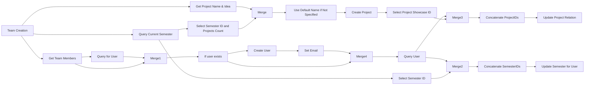

## Fluxo (.json) :

```json
{
  "nodes": [
    {
      "name": "Get Team Members",
      "type": "n8n-nodes-base.function",
      "position": [
        1030,
        150
      ],
      "parameters": {
        "functionCode": "const newItems = [];\n\nfor (const item of items[0].json.body.teamMembers) {\n  const newItem = { json: item }\n  newItems.push(newItem);\n}\n\nreturn newItems;\n"
      },
      "typeVersion": 1,
      "alwaysOutputData": false
    },
    {
      "name": "Merge",
      "type": "n8n-nodes-base.merge",
      "position": [
        1250,
        460
      ],
      "parameters": {
        "mode": "multiplex"
      },
      "typeVersion": 1
    },
    {
      "name": "Query Current Semester",
      "type": "n8n-nodes-base.notion",
      "position": [
        700,
        20
      ],
      "parameters": {
        "options": {
          "sort": {
            "sortValue": [
              {
                "key": "created_time",
                "direction": "descending",
                "timestamp": true
              }
            ]
          },
          "filter": {
            "singleCondition": {
              "key": "Is Current?|checkbox",
              "condition": "equals",
              "checkboxValue": true
            }
          }
        },
        "resource": "databasePage",
        "operation": "getAll",
        "returnAll": true,
        "databaseId": "2003319a-bc73-423a-9378-01999b4884fb"
      },
      "credentials": {
        "notionApi": "Oasis Hub Production"
      },
      "typeVersion": 1
    },
    {
      "name": "Select Semester ID and Projects Count",
      "type": "n8n-nodes-base.set",
      "position": [
        1030,
        330
      ],
      "parameters": {
        "values": {
          "number": [
            {
              "name": "projectsCount",
              "value": "={{$json[\"Projects\"].length}}"
            }
          ],
          "string": [
            {
              "name": "semesterID",
              "value": "={{$json[\"id\"]}}"
            }
          ]
        },
        "options": {},
        "keepOnlySet": true
      },
      "executeOnce": true,
      "typeVersion": 1
    },
    {
      "name": "Use Default Name if Not Specified",
      "type": "n8n-nodes-base.set",
      "position": [
        1470,
        460
      ],
      "parameters": {
        "values": {
          "string": [
            {
              "name": "projectName",
              "value": "={{ $json[\"projectName\"] == \"\" ? \"Project Group \" + ($json[\"projectsCount\"] + 1) : $json[\"projectName\"] }}"
            }
          ]
        },
        "options": {}
      },
      "typeVersion": 1
    },
    {
      "name": "Select Project Showcase ID",
      "type": "n8n-nodes-base.set",
      "position": [
        1890,
        460
      ],
      "parameters": {
        "values": {
          "string": [
            {
              "name": "projectID",
              "value": "={{$json[\"id\"]}}"
            }
          ]
        },
        "options": {},
        "keepOnlySet": true
      },
      "typeVersion": 1
    },
    {
      "name": "Get Project Name & Idea",
      "type": "n8n-nodes-base.set",
      "position": [
        820,
        480
      ],
      "parameters": {
        "values": {
          "string": [
            {
              "name": "projectName",
              "value": "={{$json[\"body\"][\"projectName\"]}}"
            },
            {
              "name": "projectIdea",
              "value": "={{$json[\"body\"][\"projectIdea\"]}}"
            }
          ],
          "boolean": []
        },
        "options": {},
        "keepOnlySet": true
      },
      "typeVersion": 1
    },
    {
      "name": "Create Project",
      "type": "n8n-nodes-base.notion",
      "position": [
        1690,
        460
      ],
      "parameters": {
        "blockUi": {
          "blockValues": []
        },
        "resource": "databasePage",
        "databaseId": "f9c8a070-d398-482b-a7a4-5e42c7982e6a",
        "propertiesUi": {
          "propertyValues": [
            {
              "key": "Name|title",
              "title": "={{$json[\"projectName\"]}}"
            },
            {
              "key": "Semesters|relation",
              "relationValue": [
                "={{$json[\"semesterID\"]}}"
              ]
            },
            {
              "key": "Project Idea|rich_text",
              "textContent": "={{$json[\"projectIdea\"]}}"
            }
          ]
        }
      },
      "credentials": {
        "notionApi": "Oasis Hub Production"
      },
      "typeVersion": 1
    },
    {
      "name": "If user exists",
      "type": "n8n-nodes-base.if",
      "position": [
        1690,
        170
      ],
      "parameters": {
        "conditions": {
          "string": [],
          "boolean": [
            {
              "value1": "={{Object.keys($json).includes(\"id\") }}",
              "value2": true
            }
          ]
        }
      },
      "executeOnce": false,
      "typeVersion": 1,
      "alwaysOutputData": false
    },
    {
      "name": "Create User",
      "type": "n8n-nodes-base.notion",
      "position": [
        1890,
        270
      ],
      "parameters": {
        "resource": "databasePage",
        "databaseId": "27a30c5b-c418-4200-8f48-d7fb7b043fbe",
        "propertiesUi": {
          "propertyValues": [
            {
              "key": "Name|title",
              "title": "={{$json[\"name\"]}}"
            },
            {
              "key": "Email|email",
              "emailValue": "={{$json[\"email\"]}}"
            }
          ]
        }
      },
      "credentials": {
        "notionApi": "Oasis Hub Production"
      },
      "typeVersion": 1
    },
    {
      "name": "Query for User",
      "type": "n8n-nodes-base.notion",
      "position": [
        1250,
        260
      ],
      "parameters": {
        "options": {
          "filter": {
            "singleCondition": {
              "key": "Email|email",
              "condition": "equals",
              "emailValue": "={{$json[\"email\"]}}"
            }
          }
        },
        "resource": "databasePage",
        "operation": "getAll",
        "returnAll": true,
        "databaseId": "27a30c5b-c418-4200-8f48-d7fb7b043fbe"
      },
      "credentials": {
        "notionApi": "Oasis Hub Production"
      },
      "executeOnce": false,
      "typeVersion": 1,
      "alwaysOutputData": true
    },
    {
      "name": "Merge1",
      "type": "n8n-nodes-base.merge",
      "position": [
        1460,
        170
      ],
      "parameters": {
        "mode": "mergeByKey",
        "propertyName1": "email",
        "propertyName2": "Email"
      },
      "typeVersion": 1
    },
    {
      "name": "Merge2",
      "type": "n8n-nodes-base.merge",
      "position": [
        2750,
        -160
      ],
      "parameters": {
        "mode": "multiplex"
      },
      "typeVersion": 1
    },
    {
      "name": "Update Semester for User",
      "type": "n8n-nodes-base.notion",
      "position": [
        3240,
        -160
      ],
      "parameters": {
        "pageId": "={{$json[\"id\"]}}",
        "resource": "databasePage",
        "operation": "update",
        "propertiesUi": {
          "propertyValues": [
            {
              "key": "Semesters|relation",
              "relationValue": [
                "={{$json[\"allSemesterIDs\"].join(',')}}"
              ]
            }
          ]
        }
      },
      "credentials": {
        "notionApi": "Oasis Hub Production"
      },
      "typeVersion": 1
    },
    {
      "name": "Query User",
      "type": "n8n-nodes-base.notion",
      "position": [
        2460,
        170
      ],
      "parameters": {
        "options": {
          "filter": {
            "singleCondition": {
              "key": "Email|email",
              "condition": "equals",
              "emailValue": "={{$json[\"email\"]}}"
            }
          }
        },
        "resource": "databasePage",
        "operation": "getAll",
        "returnAll": true,
        "databaseId": "27a30c5b-c418-4200-8f48-d7fb7b043fbe"
      },
      "credentials": {
        "notionApi": "Oasis Hub Production"
      },
      "typeVersion": 1,
      "alwaysOutputData": true
    },
    {
      "name": "Select Semester ID",
      "type": "n8n-nodes-base.set",
      "position": [
        1020,
        -180
      ],
      "parameters": {
        "values": {
          "string": [
            {
              "name": "semesterID",
              "value": "={{$json[\"id\"]}}"
            }
          ]
        },
        "options": {},
        "keepOnlySet": true
      },
      "executeOnce": true,
      "typeVersion": 1
    },
    {
      "name": "Update Project Relation",
      "type": "n8n-nodes-base.notion",
      "position": [
        3240,
        440
      ],
      "parameters": {
        "pageId": "={{$json[\"id\"]}}",
        "resource": "databasePage",
        "operation": "update",
        "propertiesUi": {
          "propertyValues": [
            {
              "key": "Project|relation",
              "relationValue": [
                "={{$json[\"allProjectIDs\"].join(\",\")}}"
              ]
            }
          ]
        }
      },
      "credentials": {
        "notionApi": "Oasis Hub Production"
      },
      "typeVersion": 1
    },
    {
      "name": "Merge3",
      "type": "n8n-nodes-base.merge",
      "position": [
        2750,
        440
      ],
      "parameters": {
        "mode": "multiplex"
      },
      "typeVersion": 1
    },
    {
      "name": "Concatenate SemesterIDs",
      "type": "n8n-nodes-base.function",
      "position": [
        3010,
        -160
      ],
      "parameters": {
        "functionCode": "for (item of items) {\n  // Get the current semester ID\n  const currentSemesterID = item.json[\"semesterID\"]\n  let allSemesterIDs = [currentSemesterID];\n\n  // Add semesters that the user is already associated with\n  if (item.json[\"Semesters\"]?.length > 0) {\n    allSemesterIDs = allSemesterIDs.concat(item.json[\"Semesters\"].filter(semesterID => semesterID !== currentSemesterID));\n  }\n\n  // Set allSemesterIDs which is used to update the relation\n  item.json[\"allSemesterIDs\"] = allSemesterIDs\n}\n\nreturn items;\n"
      },
      "typeVersion": 1
    },
    {
      "name": "Concatenate ProjectIDs",
      "type": "n8n-nodes-base.function",
      "position": [
        3000,
        440
      ],
      "parameters": {
        "functionCode": "for (item of items) {\n  // Get the project id for the new project\n  const newProjectID = item.json[\"projectID\"]\n  let allProjectIDs = [newProjectID];\n\n  // Add projects that the user already has\n  if (item.json[\"Project\"]?.length > 0) {\n    allWorkspaceIDs = allWorkspaceIDs.concat(item.json[\"Project\"].filter(projectID => projectID !== newProjectID));\n  }\n\n  // Set allProjectIDs which is used to update the relation\n  item.json[\"allProjectIDs\"] = allProjectIDs\n}\n\nreturn items;\n"
      },
      "typeVersion": 1
    },
    {
      "name": "Merge4",
      "type": "n8n-nodes-base.merge",
      "position": [
        2240,
        170
      ],
      "parameters": {},
      "typeVersion": 1
    },
    {
      "name": "Set Email",
      "type": "n8n-nodes-base.set",
      "position": [
        2060,
        270
      ],
      "parameters": {
        "values": {
          "string": [
            {
              "name": "email",
              "value": "={{$json[\"Email\"]}}"
            }
          ]
        },
        "options": {},
        "keepOnlySet": true
      },
      "typeVersion": 1
    },
    {
      "name": "Team Creation",
      "type": "n8n-nodes-base.webhook",
      "notes": "Example Input Data:\n{\"projectIdea\":\"A hub for all things Oasis\",\"projectName\":\"Oasis Hub\",\"teamMembers\":[{\"name\":\"Will Stenzel\",\"email\":\"stenzel.w@northeastern.edu\"},{\"name\":\"Jane Doe\",\"email\":\"doe.j@northeastern.edu\"}]}",
      "position": [
        460,
        150
      ],
      "webhookId": "6f000a46-9bbf-4e1c-8e11-b64d9b8c8fb7",
      "parameters": {
        "path": "team-create",
        "options": {
          "responseData": ""
        },
        "httpMethod": "POST",
        "authentication": "basicAuth"
      },
      "credentials": {
        "httpBasicAuth": "Oasis Basic Auth Creds"
      },
      "notesInFlow": true,
      "typeVersion": 1
    }
  ],
  "connections": {
    "Merge": {
      "main": [
        [
          {
            "node": "Use Default Name if Not Specified",
            "type": "main",
            "index": 0
          }
        ]
      ]
    },
    "Merge1": {
      "main": [
        [
          {
            "node": "If user exists",
            "type": "main",
            "index": 0
          }
        ]
      ]
    },
    "Merge2": {
      "main": [
        [
          {
            "node": "Concatenate SemesterIDs",
            "type": "main",
            "index": 0
          }
        ]
      ]
    },
    "Merge3": {
      "main": [
        [
          {
            "node": "Concatenate ProjectIDs",
            "type": "main",
            "index": 0
          }
        ]
      ]
    },
    "Merge4": {
      "main": [
        [
          {
            "node": "Query User",
            "type": "main",
            "index": 0
          }
        ]
      ]
    },
    "Set Email": {
      "main": [
        [
          {
            "node": "Merge4",
            "type": "main",
            "index": 1
          }
        ]
      ]
    },
    "Query User": {
      "main": [
        [
          {
            "node": "Merge2",
            "type": "main",
            "index": 1
          },
          {
            "node": "Merge3",
            "type": "main",
            "index": 0
          }
        ]
      ]
    },
    "Create User": {
      "main": [
        [
          {
            "node": "Set Email",
            "type": "main",
            "index": 0
          }
        ]
      ]
    },
    "Team Creation": {
      "main": [
        [
          {
            "node": "Get Project Name & Idea",
            "type": "main",
            "index": 0
          },
          {
            "node": "Get Team Members",
            "type": "main",
            "index": 0
          },
          {
            "node": "Query Current Semester",
            "type": "main",
            "index": 0
          }
        ]
      ]
    },
    "Create Project": {
      "main": [
        [
          {
            "node": "Select Project Showcase ID",
            "type": "main",
            "index": 0
          }
        ]
      ]
    },
    "If user exists": {
      "main": [
        [
          {
            "node": "Merge4",
            "type": "main",
            "index": 0
          }
        ],
        [
          {
            "node": "Create User",
            "type": "main",
            "index": 0
          }
        ]
      ]
    },
    "Query for User": {
      "main": [
        [
          {
            "node": "Merge1",
            "type": "main",
            "index": 1
          }
        ]
      ]
    },
    "Get Team Members": {
      "main": [
        [
          {
            "node": "Query for User",
            "type": "main",
            "index": 0
          },
          {
            "node": "Merge1",
            "type": "main",
            "index": 0
          }
        ]
      ]
    },
    "Select Semester ID": {
      "main": [
        [
          {
            "node": "Merge2",
            "type": "main",
            "index": 0
          }
        ]
      ]
    },
    "Concatenate ProjectIDs": {
      "main": [
        [
          {
            "node": "Update Project Relation",
            "type": "main",
            "index": 0
          }
        ]
      ]
    },
    "Query Current Semester": {
      "main": [
        [
          {
            "node": "Select Semester ID and Projects Count",
            "type": "main",
            "index": 0
          },
          {
            "node": "Select Semester ID",
            "type": "main",
            "index": 0
          }
        ]
      ]
    },
    "Concatenate SemesterIDs": {
      "main": [
        [
          {
            "node": "Update Semester for User",
            "type": "main",
            "index": 0
          }
        ]
      ]
    },
    "Get Project Name & Idea": {
      "main": [
        [
          {
            "node": "Merge",
            "type": "main",
            "index": 1
          }
        ]
      ]
    },
    "Select Project Showcase ID": {
      "main": [
        [
          {
            "node": "Merge3",
            "type": "main",
            "index": 1
          }
        ]
      ]
    },
    "Use Default Name if Not Specified": {
      "main": [
        [
          {
            "node": "Create Project",
            "type": "main",
            "index": 0
          }
        ]
      ]
    },
    "Select Semester ID and Projects Count": {
      "main": [
        [
          {
            "node": "Merge",
            "type": "main",
            "index": 0
          }
        ]
      ]
    }
  }
}
```

<a id="template-178"></a>

## Template 178 - Notificações Jira → Telegram

- **Nome:** Notificações Jira → Telegram
- **Descrição:** Escuta webhooks do Jira, valida o evento e o assignee, mapeia a conta do Jira para um chat do Telegram e envia mensagens formatadas conforme o tipo de evento.
- **Funcionalidade:** • Recepção de webhook: Recebe eventos POST do Jira protegidos por autenticação via cabeçalho.
• Validação do payload: Verifica presença do corpo do evento, do tipo do hook e do campo assignee antes de prosseguir.
• Mapeamento de conta: Converte o accountId do Jira para um chatId do Telegram usando uma tabela de correspondência.
• Verificação de destinatário: Confirma que existe um chatId mapeado antes de enviar notificações.
• Roteamento por tipo de evento: Direciona o fluxo conforme o tipo do webhook (criação, atualização, mudança de assignee).
• Envio de notificações: Envia mensagens ao Telegram com template contendo tipo de issue, projeto, chave, título, descrição e data de criação.
- **Ferramentas:** • Jira: Plataforma de rastreamento de issues que dispara webhooks sobre eventos de issues.
• Telegram: Serviço de mensagens usado para entregar notificações aos usuários via chatId.

## Fluxo visual

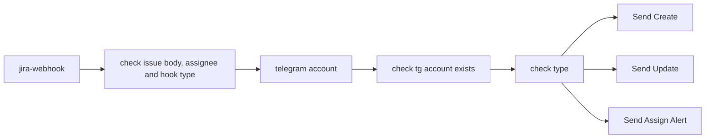

## Fluxo (.json) :

```json
{
  "nodes": [
    {
      "id": "e10615ff-41dc-4ea6-981a-d8e949e2e386",
      "name": "telegram account",
      "type": "n8n-nodes-base.code",
      "position": [
        -220,
        0
      ],
      "parameters": {
        "jsCode": "const accountId = $('jira-webhook').first().json.body.fields.assignee?.accountId\n\nconst telegramAccounts = {\n  \"[jira account id]\": 00000000, // telegram chat id\n}\n\nconst telegramChatId = telegramAccounts[accountId]\n\nreturn [{telegramChatId}]"
      },
      "typeVersion": 2
    },
    {
      "id": "a0effbdb-8f99-4248-9a98-aba34ff67690",
      "name": "check tg account exists",
      "type": "n8n-nodes-base.if",
      "position": [
        40,
        120
      ],
      "parameters": {
        "options": {},
        "conditions": {
          "options": {
            "version": 2,
            "leftValue": "",
            "caseSensitive": true,
            "typeValidation": "loose"
          },
          "combinator": "and",
          "conditions": [
            {
              "id": "149c600c-7030-4480-a4ef-18f02fd9ade9",
              "operator": {
                "type": "number",
                "operation": "exists",
                "singleValue": true
              },
              "leftValue": "={{ $('telegram account').item.json.telegramChatId }}",
              "rightValue": ""
            }
          ]
        },
        "looseTypeValidation": true
      },
      "typeVersion": 2.2
    },
    {
      "id": "71d58c37-9934-4b10-8aed-d66175a1bc3a",
      "name": "check type",
      "type": "n8n-nodes-base.switch",
      "position": [
        300,
        0
      ],
      "parameters": {
        "rules": {
          "values": [
            {
              "conditions": {
                "options": {
                  "version": 2,
                  "leftValue": "",
                  "caseSensitive": true,
                  "typeValidation": "strict"
                },
                "combinator": "and",
                "conditions": [
                  {
                    "operator": {
                      "type": "string",
                      "operation": "equals"
                    },
                    "leftValue": "={{ $('jira-webhook').item.json.headers.type }}",
                    "rightValue": "created"
                  }
                ]
              }
            },
            {
              "conditions": {
                "options": {
                  "version": 2,
                  "leftValue": "",
                  "caseSensitive": true,
                  "typeValidation": "strict"
                },
                "combinator": "and",
                "conditions": [
                  {
                    "id": "1ec37373-db94-401d-8913-9f18d2bb8b08",
                    "operator": {
                      "name": "filter.operator.equals",
                      "type": "string",
                      "operation": "equals"
                    },
                    "leftValue": "={{ $('jira-webhook').item.json.headers.type }}",
                    "rightValue": "updated"
                  }
                ]
              }
            },
            {
              "conditions": {
                "options": {
                  "version": 2,
                  "leftValue": "",
                  "caseSensitive": true,
                  "typeValidation": "strict"
                },
                "combinator": "and",
                "conditions": [
                  {
                    "id": "12b237f5-d9ef-46be-98f9-60fe74a54298",
                    "operator": {
                      "name": "filter.operator.equals",
                      "type": "string",
                      "operation": "equals"
                    },
                    "leftValue": "={{ $('jira-webhook').item.json.headers.type }}",
                    "rightValue": "change-assignee"
                  }
                ]
              }
            }
          ]
        },
        "options": {}
      },
      "typeVersion": 3.2
    },
    {
      "id": "251f6e9b-439a-46f6-bb7d-be04e722a494",
      "name": "Send Update",
      "type": "n8n-nodes-base.telegram",
      "position": [
        580,
        0
      ],
      "parameters": {
        "text": "=⚠️ Update {{ $('jira-webhook').item.json.body.fields.issuetype.name }}\n\n🔰 Project: `{{ $('jira-webhook').item.json.body.fields.project.name }}`\n\n🆔 Key: `{{ $('jira-webhook').item.json.body.key }}`\n\n🔰 Title: `{{ $('jira-webhook').item.json.body.fields.summary }}`\n\n🔰 Description: `{{ $('jira-webhook').item.json.body.fields.description }}`\n\nCreate Time: `{{ DateTime.fromMillis($('jira-webhook').item.json.body.fields.created).format(\"yyyy-MM-dd HH:mm\") }}`",
        "chatId": "={{ $(\"telegram account\").item.json.telegramChatId }}",
        "additionalFields": {
          "appendAttribution": false
        }
      },
      "credentials": {
        "telegramApi": {
          "id": "Sg6YvV1Qx1JnVVWu",
          "name": "Telegram account"
        }
      },
      "typeVersion": 1.2
    },
    {
      "id": "8efbed55-8642-440c-9ec7-8b93256a27f5",
      "name": "Send Create",
      "type": "n8n-nodes-base.telegram",
      "position": [
        580,
        -180
      ],
      "parameters": {
        "text": "=🆕 New {{ $('jira-webhook').item.json.body.fields.issuetype.name }}\n\n🔰 Project: `{{ $('jira-webhook').item.json.body.fields.project.name }}`\n\n🆔 Key: `{{ $('jira-webhook').item.json.body.key }}`\n\n🔰 Title: `{{ $('jira-webhook').item.json.body.fields.summary }}`\n\n🔰 Description: `{{ $('jira-webhook').item.json.body.fields.description }}`\n\nCreate Time: `{{ DateTime.fromMillis($('jira-webhook').item.json.body.fields.created).format(\"yyyy-MM-dd HH:mm\") }}`",
        "chatId": "={{ $(\"telegram account\").item.json.telegramChatId }}",
        "additionalFields": {
          "appendAttribution": false
        }
      },
      "credentials": {
        "telegramApi": {
          "id": "Sg6YvV1Qx1JnVVWu",
          "name": "Telegram account"
        }
      },
      "typeVersion": 1.2
    },
    {
      "id": "9c2889e7-7c9c-490c-8293-fed3c255f086",
      "name": "Send Assign Alert",
      "type": "n8n-nodes-base.telegram",
      "position": [
        580,
        180
      ],
      "parameters": {
        "text": "=👩‍💻👨‍💻 Assigned to you {{ $('jira-webhook').item.json.body.fields.issuetype.name }}\n\n🔰 Project: `{{ $('jira-webhook').item.json.body.fields.project.name }}`\n\n🆔 Key: `{{ $('jira-webhook').item.json.body.key }}`\n\n🔰 Title: `{{ $('jira-webhook').item.json.body.fields.summary }}`\n\n🔰 Description: `{{ $('jira-webhook').item.json.body.fields.description }}`\n\nCreate Time: `{{ DateTime.fromMillis($('jira-webhook').item.json.body.fields.created).format(\"yyyy-MM-dd HH:mm\") }}`",
        "chatId": "={{ $(\"telegram account\").item.json.telegramChatId }}",
        "additionalFields": {
          "appendAttribution": false
        }
      },
      "credentials": {
        "telegramApi": {
          "id": "Sg6YvV1Qx1JnVVWu",
          "name": "Telegram account"
        }
      },
      "typeVersion": 1.2
    },
    {
      "id": "f660857d-ff24-4c08-bb13-e2461da950d6",
      "name": "check issue body, assignee and hook type",
      "type": "n8n-nodes-base.if",
      "position": [
        -480,
        120
      ],
      "parameters": {
        "options": {},
        "conditions": {
          "options": {
            "version": 2,
            "leftValue": "",
            "caseSensitive": true,
            "typeValidation": "strict"
          },
          "combinator": "and",
          "conditions": [
            {
              "id": "6862ba4b-7f46-44d2-9f82-da33b3ed0166",
              "operator": {
                "type": "object",
                "operation": "notEmpty",
                "singleValue": true
              },
              "leftValue": "={{ $('jira-webhook').item.json.body }}",
              "rightValue": ""
            },
            {
              "id": "67527de5-e12c-4917-b1f6-791c79b08637",
              "operator": {
                "type": "string",
                "operation": "exists",
                "singleValue": true
              },
              "leftValue": "={{ $('jira-webhook').item.json.headers.type }}",
              "rightValue": ""
            },
            {
              "id": "26a19a6a-a072-4035-a1cd-113277476899",
              "operator": {
                "type": "object",
                "operation": "notEmpty",
                "singleValue": true
              },
              "leftValue": "={{ $('jira-webhook').item.json.body.fields.assignee }}",
              "rightValue": "="
            }
          ]
        }
      },
      "typeVersion": 2.2
    },
    {
      "id": "6ed72f04-7b15-4fb4-8699-0691beac69c0",
      "name": "jira-webhook",
      "type": "n8n-nodes-base.webhook",
      "position": [
        -740,
        0
      ],
      "webhookId": "1e4989bf-6a23-4415-bd17-72d08130c5c4",
      "parameters": {
        "path": "1e4989bf-6a23-4415-bd17-72d08130c5c4",
        "options": {},
        "httpMethod": "POST",
        "authentication": "headerAuth"
      },
      "credentials": {
        "httpHeaderAuth": {
          "id": "9EPLvRDcYuohsyim",
          "name": "Header Auth account"
        }
      },
      "typeVersion": 2
    }
  ],
  "pinData": {},
  "connections": {
    "check type": {
      "main": [
        [
          {
            "node": "Send Create",
            "type": "main",
            "index": 0
          }
        ],
        [
          {
            "node": "Send Update",
            "type": "main",
            "index": 0
          }
        ],
        [
          {
            "node": "Send Assign Alert",
            "type": "main",
            "index": 0
          }
        ]
      ]
    },
    "jira-webhook": {
      "main": [
        [
          {
            "node": "check issue body, assignee and hook type",
            "type": "main",
            "index": 0
          }
        ]
      ]
    },
    "telegram account": {
      "main": [
        [
          {
            "node": "check tg account exists",
            "type": "main",
            "index": 0
          }
        ]
      ]
    },
    "check tg account exists": {
      "main": [
        [
          {
            "node": "check type",
            "type": "main",
            "index": 0
          }
        ]
      ]
    },
    "check issue body, assignee and hook type": {
      "main": [
        [
          {
            "node": "telegram account",
            "type": "main",
            "index": 0
          }
        ]
      ]
    }
  }
}
```

<a id="template-179"></a>

## Template 179 - Integração Figma para Jira via webhook

- **Nome:** Integração Figma para Jira via webhook
- **Descrição:** Quando uma versão de um arquivo Figma é publicada, o fluxo localiza a issue correspondente no Jira e adiciona um comentário com os detalhes da versão.
- **Funcionalidade:** • Recebimento de webhook de versão do Figma: Aciona o fluxo ao detectar atualização de versão enviada pelo plugin.
• Extração dos detalhes da versão: Captura informações do payload como pageName, versionName, designLink e issueLink.
• Localização da issue no Jira: Consulta a issue usando o issueKey fornecido no payload.
• Inclusão de comentário na issue: Adiciona um comentário na issue com pageName, versionName, designLink e timestamp atual.
• Requisito de configuração: Exige o Figma Commit Plugin instalado e configurado para enviar o webhook com os dados de versão.
- **Ferramentas:** • Figma: Plataforma de design onde as versões de arquivos são criadas e atualizadas.
• Figma Commit Plugin: Plugin que envia detalhes das versões do Figma via webhook (repositório disponível no GitHub).
• Jira: Sistema de gerenciamento de issues utilizado para localizar a issue e adicionar comentários.

## Fluxo visual

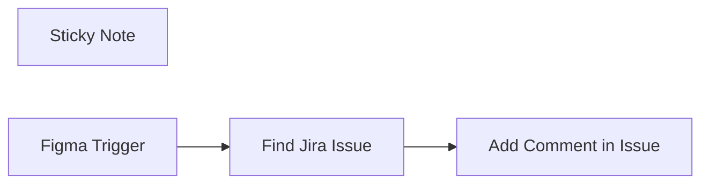

## Fluxo (.json) :

```json
{
  "id": "5kYHogzDGeo21MxE",
  "meta": {
    "instanceId": "e7bcfb7f83803b3561455f2e97f622835eda64ae4467d4f2b8a5cf915b534600",
    "templateCredsSetupCompleted": true
  },
  "name": "Automate Figma Versioning and Jira Updates with n8n Webhook Integration",
  "tags": [],
  "nodes": [
    {
      "id": "a3853962-36ce-4a2f-b9d6-c2807652d7ff",
      "name": "Sticky Note",
      "type": "n8n-nodes-base.stickyNote",
      "position": [
        -20,
        -260
      ],
      "parameters": {
        "width": 700,
        "height": 200,
        "content": "## Note\nTo use this automation, you will need the Figma Commit Plugin installed and configured. The plugin sends the design version details via a webhook to trigger this n8n workflow.\n\nYou can find the Figma Commit Plugin on GitHub here:\n🔗 [Figma Commit Plugin on GitHub](https://github.com/omid-d3v/Figma-Commit-plugin-with-webhook/)\n\nMake sure to follow the setup instructions in the plugin’s documentation to get started."
      },
      "typeVersion": 1
    },
    {
      "id": "843f1e0b-4c8b-4744-a9b7-8ce5725768bc",
      "name": "Find Jira Issue",
      "type": "n8n-nodes-base.jira",
      "position": [
        220,
        0
      ],
      "parameters": {
        "issueKey": "={{ $json.issueLink }}",
        "operation": "get",
        "additionalFields": {}
      },
      "credentials": {
        "jiraSoftwareCloudApi": {
          "id": "CBgXAIn2agwnaJ1Y",
          "name": "Jira SW Cloud account"
        }
      },
      "typeVersion": 1
    },
    {
      "id": "59101813-9625-4d1f-b2b6-7ff442c1fe0f",
      "name": "Add Comment in Issue",
      "type": "n8n-nodes-base.jira",
      "position": [
        440,
        0
      ],
      "parameters": {
        "comment": "={{ $('Figma Trigger').item.json.pageName }}{{ '\\n' }}{{ $('Figma Trigger').item.json.versionName }}{{ '\\n' }}{{ $('Figma Trigger').item.json.designLink }}{{ '\\n' }} {{ $now }}",
        "options": {},
        "issueKey": "={{ $json.key }}",
        "resource": "issueComment"
      },
      "credentials": {
        "jiraSoftwareCloudApi": {
          "id": "CBgXAIn2agwnaJ1Y",
          "name": "Jira SW Cloud account"
        }
      },
      "typeVersion": 1
    },
    {
      "id": "378150c5-b640-477a-861f-216e8b15c0e4",
      "name": "Figma Trigger",
      "type": "n8n-nodes-base.figmaTrigger",
      "position": [
        0,
        0
      ],
      "webhookId": "b9fcde90-3e53-4958-b352-933891f95220",
      "parameters": {
        "teamId": "940915773877350235",
        "triggerOn": "fileVersionUpdate"
      },
      "credentials": {
        "figmaApi": {
          "id": "DjRDveAKp5VxZRE8",
          "name": "Figma account"
        }
      },
      "typeVersion": 1
    }
  ],
  "active": true,
  "pinData": {
    "Figma Trigger": [
      {
        "json": {
          "status": "IN PROGRESS",
          "pageName": "page: Favorait",
          "issueLink": "JAJ-368",
          "designLink": "test url ",
          "versionName": "Changes: \n -nothing"
        }
      }
    ]
  },
  "settings": {
    "executionOrder": "v1"
  },
  "versionId": "9525049e-7fca-4f83-bf6a-069d477f669e",
  "connections": {
    "Figma Trigger": {
      "main": [
        [
          {
            "node": "Find Jira Issue",
            "type": "main",
            "index": 0
          }
        ]
      ]
    },
    "Find Jira Issue": {
      "main": [
        [
          {
            "node": "Add Comment in Issue",
            "type": "main",
            "index": 0
          }
        ]
      ]
    },
    "Add Comment in Issue": {
      "main": [
        []
      ]
    }
  }
}
```

<a id="template-180"></a>

## Template 180 - Processar e marcar linhas da planilha

- **Nome:** Processar e marcar linhas da planilha
- **Descrição:** Lê uma planilha do Google periodicamente (ou por execução manual), identifica linhas não processadas, executa uma ação e marca a linha com um carimbo de data/hora indicando que foi processada.
- **Funcionalidade:** • Disparo manual e periódico: Permite iniciar o fluxo manualmente ou automaticamente a cada 5 minutos.
• Leitura da planilha: Recupera linhas de uma planilha do Google para análise.
• Detecção de linhas não processadas: Verifica se o campo "Processed" está vazio para identificar novos itens.
• Execução de ação para novos itens: Executa uma rotina (placeholder) para cada linha identificada como nova.
• Marcação de processamento: Adiciona um timestamp ao campo "Processed" e atualiza a respectiva linha na planilha para evitar retrabalho.
- **Ferramentas:** • Google Sheets: Armazena as linhas que são lidas, avaliadas e atualizadas com o status de processamento.
• Conta Google com OAuth2: Utilizada para autenticar e permitir leitura/atualização da planilha.

## Fluxo visual

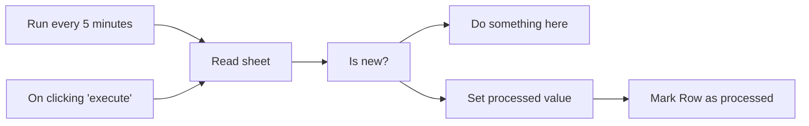

## Fluxo (.json) :

```json
{
  "nodes": [
    {
      "name": "On clicking 'execute'",
      "type": "n8n-nodes-base.manualTrigger",
      "position": [
        240,
        300
      ],
      "parameters": {},
      "typeVersion": 1
    },
    {
      "name": "Is new?",
      "type": "n8n-nodes-base.if",
      "position": [
        680,
        300
      ],
      "parameters": {
        "conditions": {
          "string": [
            {
              "value1": "={{$json[\"Processed\"]}}",
              "operation": "isEmpty"
            }
          ]
        }
      },
      "typeVersion": 1
    },
    {
      "name": "Do something here",
      "type": "n8n-nodes-base.noOp",
      "position": [
        900,
        100
      ],
      "parameters": {},
      "typeVersion": 1
    },
    {
      "name": "Mark Row as processed",
      "type": "n8n-nodes-base.googleSheets",
      "position": [
        1120,
        300
      ],
      "parameters": {
        "key": "ID",
        "options": {},
        "sheetId": "1SdnwaIJ6xwaZl006FmK2j4f-b00tq7tT7iQgdfe7Qh4",
        "operation": "update",
        "authentication": "oAuth2"
      },
      "credentials": {
        "googleSheetsOAuth2Api": {
          "id": "228",
          "name": "Google Sheets account"
        }
      },
      "typeVersion": 1
    },
    {
      "name": "Read sheet",
      "type": "n8n-nodes-base.googleSheets",
      "position": [
        460,
        300
      ],
      "parameters": {
        "options": {},
        "sheetId": "1SdnwaIJ6xwaZl006FmK2j4f-b00tq7tT7iQgdfe7Qh4",
        "authentication": "oAuth2"
      },
      "credentials": {
        "googleSheetsOAuth2Api": {
          "id": "228",
          "name": "Google Sheets account"
        }
      },
      "typeVersion": 1
    },
    {
      "name": "Set processed value",
      "type": "n8n-nodes-base.set",
      "position": [
        900,
        300
      ],
      "parameters": {
        "values": {
          "string": [
            {
              "name": "Processed",
              "value": "={{ $now.toISO() }}"
            }
          ]
        },
        "options": {}
      },
      "typeVersion": 1
    },
    {
      "name": "Run every 5 minutes",
      "type": "n8n-nodes-base.interval",
      "position": [
        240,
        100
      ],
      "parameters": {
        "unit": "minutes",
        "interval": 5
      },
      "typeVersion": 1
    }
  ],
  "connections": {
    "Is new?": {
      "main": [
        [
          {
            "node": "Do something here",
            "type": "main",
            "index": 0
          },
          {
            "node": "Set processed value",
            "type": "main",
            "index": 0
          }
        ]
      ]
    },
    "Read sheet": {
      "main": [
        [
          {
            "node": "Is new?",
            "type": "main",
            "index": 0
          }
        ]
      ]
    },
    "Run every 5 minutes": {
      "main": [
        [
          {
            "node": "Read sheet",
            "type": "main",
            "index": 0
          }
        ]
      ]
    },
    "Set processed value": {
      "main": [
        [
          {
            "node": "Mark Row as processed",
            "type": "main",
            "index": 0
          }
        ]
      ]
    },
    "On clicking 'execute'": {
      "main": [
        [
          {
            "node": "Read sheet",
            "type": "main",
            "index": 0
          }
        ]
      ]
    }
  }
}
```

<a id="template-181"></a>

## Template 181 - Gatilho para novos projetos no Copper

- **Nome:** Gatilho para novos projetos no Copper
- **Descrição:** Este fluxo inicia quando um novo projeto é criado no Copper, capturando os dados do projeto para disparar automações subsequentes.
- **Funcionalidade:** • Detecção de novos projetos: monitora a criação de projetos no Copper e inicia o fluxo automaticamente.
• Recebimento de dados do projeto: captura informações do projeto recém-criado para uso em passos posteriores.
• Autenticação com a API do Copper: utiliza credenciais configuradas para autorizar a conexão e acesso aos dados.
• Disparo via webhook: recebe o evento de criação por meio de um webhook com identificador configurado.
- **Ferramentas:** • Copper CRM: Plataforma para gestão de clientes, projetos e vendas; gera eventos de novos projetos que ativam este fluxo.

## Fluxo visual

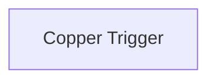

## Fluxo (.json) :

```json
{
  "nodes": [
    {
      "name": "Copper Trigger",
      "type": "n8n-nodes-base.copperTrigger",
      "position": [
        890,
        400
      ],
      "webhookId": "493ce79a-6a08-4062-86d9-7f4618b6c1ea",
      "parameters": {
        "event": "new",
        "resource": "project"
      },
      "credentials": {
        "copperApi": "copper_creds"
      },
      "typeVersion": 1
    }
  ],
  "connections": {}
}
```
