# PACK 1999 TEMPLATES PARTE 01 - Bloco 10

Templates neste bloco: 20

## Sumário

- [Template 182 - Geração de leads com cupom para SuiteCRM](#template-182)
- [Template 183 - Responder leads B2B qualificados via enriquecimento](#template-183)
- [Template 184 - Tradução de legendas SRT](#template-184)
- [Template 185 - Classificação de sentimento e registro de feedbacks](#template-185)
- [Template 186 - Geração de fatura PDF via webhook](#template-186)
- [Template 187 - Atualização semanal de tarefas do Notion](#template-187)
- [Template 188 - Criação de cliente, geração e envio de fatura](#template-188)
- [Template 189 - Assistente de Calendário Outlook](#template-189)
- [Template 190 - Bot Telegram com chat e geração de imagens](#template-190)
- [Template 191 - Pixel de rastreamento transparente para abrir e-mails](#template-191)
- [Template 192 - Lembretes de tarefas do Notion via Slack](#template-192)
- [Template 193 - Importação de empresas e contatos para Salesforce](#template-193)
- [Template 194 - Exportar dados XML para Google Sheets](#template-194)
- [Template 195 - SMS diário com temperatura](#template-195)
- [Template 196 - Criar, atualizar e obter produto WooCommerce](#template-196)
- [Template 197 - Backup de credenciais no GitHub](#template-197)
- [Template 198 - Envio via Twilio (execução manual)](#template-198)
- [Template 199 - Envio diário de temperatura no Line](#template-199)
- [Template 200 - Respostas automáticas a comentários do Instagram](#template-200)
- [Template 201 - Registro de uso e custo de IA por cliente](#template-201)

---

<a id="template-182"></a>

## Template 182 - Geração de leads com cupom para SuiteCRM

- **Nome:** Geração de leads com cupom para SuiteCRM
- **Descrição:** Fluxo que recebe submissões de formulário, verifica duplicados, atribui um cupom disponível e cria/atualiza o lead no SuiteCRM registrando o cupom concedido.
- **Funcionalidade:** • Recepção de formulário: Recebe os dados do lead (nome, sobrenome, email, telefone) via endpoint de formulário/webhook.
• Normalização de campos: Mapeia e organiza os campos do formulário para uso posterior.
• Verificação de duplicados: Consulta uma planilha para verificar se o email já recebeu um cupom e evita duplicação.
• Seleção de cupom: Encontra o primeiro cupom não atribuído na planilha e o reserva para o lead.
• Autenticação OAuth2: Solicita token de acesso ao sistema CRM para permitir operações autenticadas na API.
• Criação de lead no SuiteCRM: Cria um novo registro de lead no SuiteCRM incluindo o cupom atribuído.
• Atualização da base de cupons: Atualiza a linha da planilha com os dados do lead, id do lead e timestamp de atribuição.
• Resposta ao remetente: Retorna uma resposta JSON indicando sucesso (OK) ou rejeição por duplicado (KO).
- **Ferramentas:** • SuiteCRM: Sistema CRM que recebe leads via API e armazena o campo de cupom associado ao lead, usando autenticação OAuth2.
• Google Sheets: Planilha usada como inventário de cupons e controle de quais cupons já foram atribuídos.
• Formulário/Webhook: Ponto de entrada externo que envia as submissões de leads para o fluxo.

## Fluxo visual

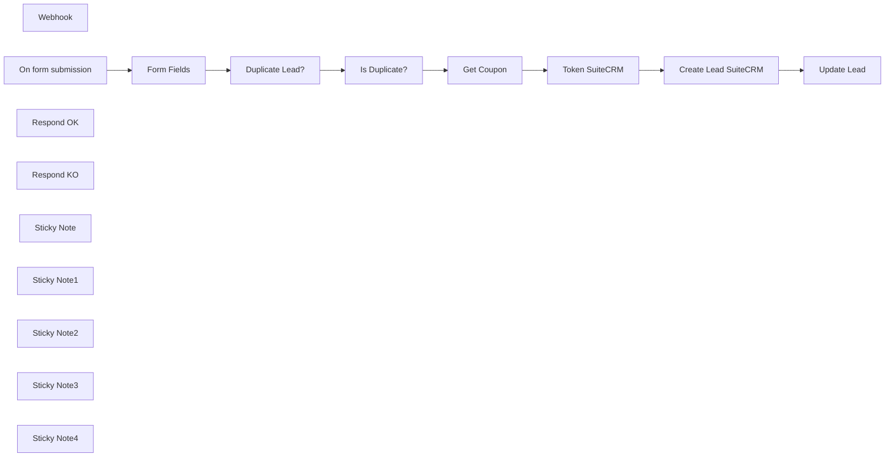

## Fluxo (.json) :

```json
{
  "meta": {
    "instanceId": "a4bfc93e975ca233ac45ed7c9227d84cf5a2329310525917adaf3312e10d5462"
  },
  "name": "Automate Drive-To-Store Lead Generation System (with coupon) on SuiteCRM",
  "tags": [],
  "nodes": [
    {
      "id": "53342c2a-f707-4ed0-9054-7928e6832745",
      "name": "Token SuiteCRM",
      "type": "n8n-nodes-base.httpRequest",
      "position": [
        1560,
        920
      ],
      "parameters": {
        "url": "=https://SUITECRMURL/Api/access_token",
        "options": {},
        "requestMethod": "POST",
        "bodyParametersUi": {
          "parameter": [
            {
              "name": "grant_type",
              "value": "client_credentials"
            },
            {
              "name": "client_id",
              "value": "CLIENTID"
            },
            {
              "name": "client_secret",
              "value": "CLIENTSECRET"
            }
          ]
        },
        "allowUnauthorizedCerts": true
      },
      "notesInFlow": true,
      "typeVersion": 1
    },
    {
      "id": "18d04094-1ced-4431-9ba2-b9b33d76c453",
      "name": "Create Lead SuiteCRM",
      "type": "n8n-nodes-base.httpRequest",
      "position": [
        1800,
        920
      ],
      "parameters": {
        "url": "https://SUITECRMURL/Api/V8/module",
        "method": "POST",
        "options": {
          "response": {
            "response": {
              "responseFormat": "json"
            }
          }
        },
        "jsonBody": "={\"data\": \n  {\n  \"type\": \"Leads\",\n  \"attributes\": { \n  \"first_name\": \"{{ $('Form Fields').item.json.Name }}\",\n  \"last_name\": \"{{ $('Form Fields').item.json.Surname }}\",\n  \"email1\": \"{{ $('Form Fields').item.json.Email }}\",\n  \"phone_mobile\":\"{{ $('Form Fields').item.json.Phone }}\",\n  \"coupon_c\": \"{{ $('Get Coupon').item.json.COUPON }}\"\n  }\n  }\n}",
        "sendBody": true,
        "sendHeaders": true,
        "specifyBody": "json",
        "headerParameters": {
          "parameters": [
            {
              "name": "Authorization",
              "value": "=Bearer {{$node[\"Token SuiteCRM\"].json[\"access_token\"]}}"
            },
            {
              "name": "Content-Type",
              "value": "application/vnd.api+json"
            }
          ]
        }
      },
      "notesInFlow": true,
      "typeVersion": 3
    },
    {
      "id": "59b9c124-f6eb-457d-b3cb-2c831b66db85",
      "name": "Webhook",
      "type": "n8n-nodes-base.webhook",
      "position": [
        440,
        1020
      ],
      "webhookId": "4b98315d-782e-47a5-8fea-7d16155c811d",
      "parameters": {
        "path": "4b98315d-782e-47a5-8fea-7d16155c811d",
        "options": {},
        "httpMethod": "POST"
      },
      "typeVersion": 2
    },
    {
      "id": "75d6f561-754d-4153-8a85-12cb135a555c",
      "name": "On form submission",
      "type": "n8n-nodes-base.formTrigger",
      "position": [
        440,
        820
      ],
      "webhookId": "63d1d84b-c41e-4d3d-961a-0aa2af830ceb",
      "parameters": {
        "options": {},
        "formTitle": "Landing",
        "formFields": {
          "values": [
            {
              "fieldLabel": "Name",
              "placeholder": "Name",
              "requiredField": true
            },
            {
              "fieldLabel": "Surname",
              "placeholder": "Surname",
              "requiredField": true
            },
            {
              "fieldType": "email",
              "fieldLabel": "Email",
              "placeholder": "Email",
              "requiredField": true
            },
            {
              "fieldLabel": "Phone",
              "placeholder": "Phone",
              "requiredField": true
            }
          ]
        }
      },
      "typeVersion": 2.2
    },
    {
      "id": "e9eac3a2-0351-4457-ae1d-44d42974ab20",
      "name": "Duplicate Lead?",
      "type": "n8n-nodes-base.googleSheets",
      "position": [
        880,
        820
      ],
      "parameters": {
        "options": {},
        "filtersUI": {
          "values": [
            {
              "lookupValue": "={{ $json.Email }}",
              "lookupColumn": "EMAIL"
            }
          ]
        },
        "sheetName": {
          "__rl": true,
          "mode": "list",
          "value": "gid=0",
          "cachedResultUrl": "https://docs.google.com/spreadsheets/d/1lnRZodxZSOA0QSuzkAb7ZJcfFfNXpX7NcxMdckMTN90/edit#gid=0",
          "cachedResultName": "Foglio1"
        },
        "documentId": {
          "__rl": true,
          "mode": "list",
          "value": "1lnRZodxZSOA0QSuzkAb7ZJcfFfNXpX7NcxMdckMTN90",
          "cachedResultUrl": "https://docs.google.com/spreadsheets/d/1lnRZodxZSOA0QSuzkAb7ZJcfFfNXpX7NcxMdckMTN90/edit?usp=drivesdk",
          "cachedResultName": "Coupon"
        }
      },
      "credentials": {
        "googleSheetsOAuth2Api": {
          "id": "JYR6a64Qecd6t8Hb",
          "name": "Google Sheets account"
        }
      },
      "typeVersion": 4.5,
      "alwaysOutputData": true
    },
    {
      "id": "a5ae5f5a-7028-495b-ad27-192561ce88d5",
      "name": "Form Fields",
      "type": "n8n-nodes-base.set",
      "position": [
        680,
        820
      ],
      "parameters": {
        "options": {},
        "assignments": {
          "assignments": [
            {
              "id": "661d1475-f964-4a12-bfe7-88bf96851319",
              "name": "Name",
              "type": "string",
              "value": "={{ $json.Name }}"
            },
            {
              "id": "9991645d-c716-47db-80d6-850f3d64c782",
              "name": "Surname",
              "type": "string",
              "value": "={{ $json.Surname }}"
            },
            {
              "id": "c999afa6-2ec7-4f7f-bf3b-088a3597591c",
              "name": "Email",
              "type": "string",
              "value": "={{ $json.Email }}"
            },
            {
              "id": "f3faccdb-2412-4363-a0e3-f13b8f85b242",
              "name": "Phone",
              "type": "string",
              "value": "={{ $json.Phone }}"
            }
          ]
        }
      },
      "typeVersion": 3.4
    },
    {
      "id": "9edb0d07-b4fb-42f8-9555-1d3caf8998c7",
      "name": "Get Coupon",
      "type": "n8n-nodes-base.googleSheets",
      "position": [
        1340,
        920
      ],
      "parameters": {
        "options": {
          "returnFirstMatch": true
        },
        "filtersUI": {
          "values": [
            {
              "lookupColumn": "ID LEAD"
            }
          ]
        },
        "sheetName": {
          "__rl": true,
          "mode": "list",
          "value": "gid=0",
          "cachedResultUrl": "https://docs.google.com/spreadsheets/d/1lnRZodxZSOA0QSuzkAb7ZJcfFfNXpX7NcxMdckMTN90/edit#gid=0",
          "cachedResultName": "Foglio1"
        },
        "documentId": {
          "__rl": true,
          "mode": "list",
          "value": "1lnRZodxZSOA0QSuzkAb7ZJcfFfNXpX7NcxMdckMTN90",
          "cachedResultUrl": "https://docs.google.com/spreadsheets/d/1lnRZodxZSOA0QSuzkAb7ZJcfFfNXpX7NcxMdckMTN90/edit?usp=drivesdk",
          "cachedResultName": "Coupon"
        }
      },
      "credentials": {
        "googleSheetsOAuth2Api": {
          "id": "JYR6a64Qecd6t8Hb",
          "name": "Google Sheets account"
        }
      },
      "executeOnce": false,
      "typeVersion": 4.5
    },
    {
      "id": "9469dd95-04ac-4c74-abb3-674fec277f6e",
      "name": "Respond OK",
      "type": "n8n-nodes-base.respondToWebhook",
      "position": [
        2300,
        920
      ],
      "parameters": {
        "options": {
          "responseCode": 200
        },
        "respondWith": "json",
        "responseBody": "{\n  \"result\": \"OK\",\n  \"reason\": \"lead created\"\n}"
      },
      "typeVersion": 1.1
    },
    {
      "id": "5b81c406-d70b-4a36-b4f4-8941373958b9",
      "name": "Respond KO",
      "type": "n8n-nodes-base.respondToWebhook",
      "position": [
        1320,
        700
      ],
      "parameters": {
        "options": {
          "responseCode": 200
        },
        "respondWith": "json",
        "responseBody": "{\n  \"result\": \"KO\",\n  \"reason\": \"duplicate lead\"\n}"
      },
      "typeVersion": 1.1
    },
    {
      "id": "5fdf0eca-d1f6-4c9e-8e77-84d8e71bdb0e",
      "name": "Is Duplicate?",
      "type": "n8n-nodes-base.if",
      "position": [
        1080,
        820
      ],
      "parameters": {
        "options": {},
        "conditions": {
          "options": {
            "version": 2,
            "leftValue": "",
            "caseSensitive": true,
            "typeValidation": "strict"
          },
          "combinator": "and",
          "conditions": [
            {
              "id": "9e3a8422-14f1-453e-bfed-4feecff34662",
              "operator": {
                "type": "string",
                "operation": "notEmpty",
                "singleValue": true
              },
              "leftValue": "={{ $json.EMAIL }}",
              "rightValue": "={{ $('Form Fields').item.json.email }}"
            }
          ]
        }
      },
      "typeVersion": 2.2
    },
    {
      "id": "e9cba682-bf5b-4efa-9d10-4fab5d02610a",
      "name": "Sticky Note",
      "type": "n8n-nodes-base.stickyNote",
      "position": [
        420,
        20
      ],
      "parameters": {
        "color": 3,
        "width": 540,
        "height": 380,
        "content": "## STEP 1\n\nCreate a Google Sheet like this (Fill only the column \"COUPON\")\n\n[]\n\nThis is the basic Google Sheet used in [this Workflow](https://docs.google.com/spreadsheets/d/1lnRZodxZSOA0QSuzkAb7ZJcfFfNXpX7NcxMdckMTN90/edit?usp=drive_link):\n\n"
      },
      "typeVersion": 1
    },
    {
      "id": "1c304620-368d-42bf-b0d2-de3f9d552e51",
      "name": "Sticky Note1",
      "type": "n8n-nodes-base.stickyNote",
      "position": [
        420,
        440
      ],
      "parameters": {
        "color": 4,
        "width": 540,
        "height": 260,
        "content": "## STEP 2 - MAIN FLOW\n\nThis workflow is ideal for businesses looking to automate lead generation and management, especially when integrating with CRM systems like SuiteCRM and using Google Sheets for data tracking.\n\nIf you use an external form, hook the webbook trigger and the two webhooks \"Respond KO\" and \"Respond OK\" to the workflow.\n\nIt works with SuiteCRM 7.14.x and 8.x version. Remeber to create a Lead custom fields called 'coupon' on SuiteCRM."
      },
      "typeVersion": 1
    },
    {
      "id": "6248c920-02f4-4407-881a-376d2a9dd904",
      "name": "Sticky Note2",
      "type": "n8n-nodes-base.stickyNote",
      "position": [
        660,
        740
      ],
      "parameters": {
        "width": 340,
        "height": 240,
        "content": "Check if the lead has already received the coupon"
      },
      "typeVersion": 1
    },
    {
      "id": "0c07d1b7-b12f-4cf7-8d0c-1dd905365534",
      "name": "Sticky Note3",
      "type": "n8n-nodes-base.stickyNote",
      "position": [
        1300,
        860
      ],
      "parameters": {
        "width": 180,
        "height": 220,
        "content": "Find the first available unassigned coupon"
      },
      "typeVersion": 1
    },
    {
      "id": "34167626-9041-4cce-baaf-e1ed2efe8378",
      "name": "Sticky Note4",
      "type": "n8n-nodes-base.stickyNote",
      "position": [
        1540,
        700
      ],
      "parameters": {
        "width": 400,
        "height": 380,
        "content": "Enter the lead with the relative coupon on Suite CRM. Change SUITECRMURL, CLIENTSECRET and CLIENTID\n\nTo create the CLIENTSECRET and CLIEDID go to Admin -> Oauth2 Client and Token -> and click on \"New CLient Credentials Client\" \n\nFor the full tutorial step-by-step [here the official SuiteCRM Docs](https://docs.suitecrm.com/developer/api/developer-setup-guide/json-api/#_generate_private_and_public_key_for_oauth2)"
      },
      "typeVersion": 1
    },
    {
      "id": "50f65f6b-8045-4cb1-9e3d-489f27cdb038",
      "name": "Update Lead",
      "type": "n8n-nodes-base.googleSheets",
      "position": [
        2040,
        920
      ],
      "parameters": {
        "columns": {
          "value": {
            "DATE": "={{ $now.format('dd/LL/yyyy HH:mm:ss') }}",
            "NAME": "={{ $json.data.attributes.first_name }}",
            "EMAIL": "={{ $json.data.attributes.email1 }}",
            "PHONE": "={{ $json.data.attributes.phone_mobile }}",
            "COUPON": "={{ $('Get Coupon').item.json.COUPON }}",
            "ID LEAD": "={{ $json.data.id }}",
            "SURNAME": "={{ $json.data.attributes.last_name }}"
          },
          "schema": [
            {
              "id": "NAME",
              "type": "string",
              "display": true,
              "required": false,
              "displayName": "NAME",
              "defaultMatch": false,
              "canBeUsedToMatch": true
            },
            {
              "id": "SURNAME",
              "type": "string",
              "display": true,
              "required": false,
              "displayName": "SURNAME",
              "defaultMatch": false,
              "canBeUsedToMatch": true
            },
            {
              "id": "EMAIL",
              "type": "string",
              "display": true,
              "required": false,
              "displayName": "EMAIL",
              "defaultMatch": false,
              "canBeUsedToMatch": true
            },
            {
              "id": "PHONE",
              "type": "string",
              "display": true,
              "required": false,
              "displayName": "PHONE",
              "defaultMatch": false,
              "canBeUsedToMatch": true
            },
            {
              "id": "COUPON",
              "type": "string",
              "display": true,
              "removed": false,
              "required": false,
              "displayName": "COUPON",
              "defaultMatch": false,
              "canBeUsedToMatch": true
            },
            {
              "id": "DATE",
              "type": "string",
              "display": true,
              "required": false,
              "displayName": "DATE",
              "defaultMatch": false,
              "canBeUsedToMatch": true
            },
            {
              "id": "ID LEAD",
              "type": "string",
              "display": true,
              "required": false,
              "displayName": "ID LEAD",
              "defaultMatch": false,
              "canBeUsedToMatch": true
            },
            {
              "id": "row_number",
              "type": "string",
              "display": true,
              "removed": true,
              "readOnly": true,
              "required": false,
              "displayName": "row_number",
              "defaultMatch": false,
              "canBeUsedToMatch": true
            }
          ],
          "mappingMode": "defineBelow",
          "matchingColumns": [
            "COUPON"
          ],
          "attemptToConvertTypes": false,
          "convertFieldsToString": false
        },
        "options": {},
        "operation": "update",
        "sheetName": {
          "__rl": true,
          "mode": "list",
          "value": "gid=0",
          "cachedResultUrl": "https://docs.google.com/spreadsheets/d/1lnRZodxZSOA0QSuzkAb7ZJcfFfNXpX7NcxMdckMTN90/edit#gid=0",
          "cachedResultName": "Foglio1"
        },
        "documentId": {
          "__rl": true,
          "mode": "list",
          "value": "1lnRZodxZSOA0QSuzkAb7ZJcfFfNXpX7NcxMdckMTN90",
          "cachedResultUrl": "https://docs.google.com/spreadsheets/d/1lnRZodxZSOA0QSuzkAb7ZJcfFfNXpX7NcxMdckMTN90/edit?usp=drivesdk",
          "cachedResultName": "Coupon"
        }
      },
      "credentials": {
        "googleSheetsOAuth2Api": {
          "id": "JYR6a64Qecd6t8Hb",
          "name": "Google Sheets account"
        }
      },
      "typeVersion": 4.5
    }
  ],
  "active": false,
  "pinData": {},
  "settings": {
    "executionOrder": "v1"
  },
  "versionId": "",
  "connections": {
    "Get Coupon": {
      "main": [
        [
          {
            "node": "Token SuiteCRM",
            "type": "main",
            "index": 0
          }
        ]
      ]
    },
    "Form Fields": {
      "main": [
        [
          {
            "node": "Duplicate Lead?",
            "type": "main",
            "index": 0
          }
        ]
      ]
    },
    "Is Duplicate?": {
      "main": [
        [],
        [
          {
            "node": "Get Coupon",
            "type": "main",
            "index": 0
          }
        ]
      ]
    },
    "Token SuiteCRM": {
      "main": [
        [
          {
            "node": "Create Lead SuiteCRM",
            "type": "main",
            "index": 0
          }
        ]
      ]
    },
    "Duplicate Lead?": {
      "main": [
        [
          {
            "node": "Is Duplicate?",
            "type": "main",
            "index": 0
          }
        ]
      ]
    },
    "On form submission": {
      "main": [
        [
          {
            "node": "Form Fields",
            "type": "main",
            "index": 0
          }
        ]
      ]
    },
    "Create Lead SuiteCRM": {
      "main": [
        [
          {
            "node": "Update Lead",
            "type": "main",
            "index": 0
          }
        ]
      ]
    }
  }
}
```

<a id="template-183"></a>

## Template 183 - Responder leads B2B qualificados via enriquecimento

- **Nome:** Responder leads B2B qualificados via enriquecimento
- **Descrição:** Filtra submissões de formulário por e-mail corporativo, enriquece os dados do contato e da empresa e envia um e-mail automático quando a empresa for B2B com mais de 499 funcionários.
- **Funcionalidade:** • Captura de submissão de formulário: inicia o fluxo quando alguém preenche o formulário de contato.
• Mapeamento do campo de e-mail: extrai e padroniza o e-mail enviado no formulário.
• Filtragem de e-mails pessoais: descarta domínios de e-mail pessoais (ex.: gmail, yahoo, outlook, hotmail, icloud, mail.com, aol, zoho, gmx).
• Enriquecimento do contato: consulta um serviço de enriquecimento por e-mail para obter nome, cargo e empresa do remetente.
• Enriquecimento da empresa: consulta dados da empresa a partir do domínio (tags, setor, número de funcionários, tecnologias, etc.).
• Avaliação de critérios: verifica se a empresa tem perfil B2B e mais de 499 funcionários.
• Envio de e-mail personalizado: envia uma mensagem de agradecimento/seguimento para contatos que atendem aos critérios.
• Tratamento de não qualificados: não realiza nenhuma ação adicional quando a submissão não atende aos critérios.
- **Ferramentas:** • Clearbit: serviço de enriquecimento de dados de pessoas e empresas a partir de e-mail e domínio, fornecendo informações como nome, cargo, tags e métricas da empresa.
• Gmail: serviço de envio de e-mails usado para enviar mensagens personalizadas aos contatos qualificados.

## Fluxo visual

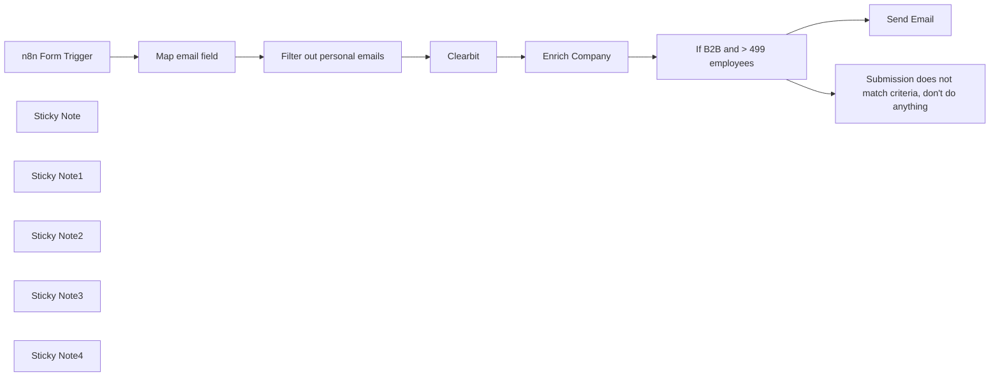

## Fluxo (.json) :

```json
{
  "meta": {
    "instanceId": "257476b1ef58bf3cb6a46e65fac7ee34a53a5e1a8492d5c6e4da5f87c9b82833"
  },
  "nodes": [
    {
      "id": "fec9c13e-a734-4d36-9d2b-b039da167d54",
      "name": "n8n Form Trigger",
      "type": "n8n-nodes-base.formTrigger",
      "position": [
        1060,
        360
      ],
      "webhookId": "1ad4ce6c-f29a-4371-a5b9-a17ce7939280",
      "parameters": {
        "path": "1ad4ce6c-f29a-4371-a5b9-a17ce7939280",
        "options": {},
        "formTitle": "Contact us",
        "formFields": {
          "values": [
            {
              "fieldType": "dropdown",
              "fieldLabel": "What's your role?",
              "fieldOptions": {
                "values": [
                  {
                    "option": "Product"
                  },
                  {
                    "option": "Sales"
                  },
                  {
                    "option": "Marketing"
                  },
                  {
                    "option": "Other"
                  }
                ]
              },
              "requiredField": true
            },
            {
              "fieldLabel": "What's your business email?",
              "requiredField": true
            }
          ]
        },
        "formDescription": "Thanks for showing interest in our product. We'll come back to you soon!"
      },
      "typeVersion": 2
    },
    {
      "id": "0bc7cbfd-efb6-43b4-a1e2-64ee28087afa",
      "name": "Clearbit",
      "type": "n8n-nodes-base.clearbit",
      "position": [
        1660,
        360
      ],
      "parameters": {
        "email": "={{ $json['What\\'s your business email?'] }}",
        "resource": "person",
        "additionalFields": {}
      },
      "credentials": {
        "clearbitApi": {
          "id": "cKDImrinp9tg0ZHW",
          "name": "Clearbit account"
        }
      },
      "typeVersion": 1
    },
    {
      "id": "7b9263c0-cd18-4c47-aa9b-9263be33aaec",
      "name": "Enrich Company",
      "type": "n8n-nodes-base.clearbit",
      "position": [
        1880,
        360
      ],
      "parameters": {
        "domain": "={{ $json.employment.domain }}",
        "additionalFields": {}
      },
      "credentials": {
        "clearbitApi": {
          "id": "cKDImrinp9tg0ZHW",
          "name": "Clearbit account"
        }
      },
      "typeVersion": 1
    },
    {
      "id": "57cef084-97d3-4beb-8ff0-0d72396f2ae5",
      "name": "If B2B and > 499 employees",
      "type": "n8n-nodes-base.if",
      "position": [
        2100,
        360
      ],
      "parameters": {
        "options": {},
        "conditions": {
          "options": {
            "leftValue": "",
            "caseSensitive": true,
            "typeValidation": "strict"
          },
          "combinator": "and",
          "conditions": [
            {
              "id": "a2c9c524-e3dc-411b-ad11-4dcd0f288016",
              "operator": {
                "type": "boolean",
                "operation": "true",
                "singleValue": true
              },
              "leftValue": "={{ $json.tags.includes(\"B2B\") }}",
              "rightValue": ""
            },
            {
              "id": "facfad29-ba3e-4111-90e1-8edf67746803",
              "operator": {
                "type": "number",
                "operation": "gt"
              },
              "leftValue": "={{ $json.metrics.employees }}",
              "rightValue": 499
            }
          ]
        }
      },
      "typeVersion": 2
    },
    {
      "id": "9de60599-0401-441e-a5c5-bed097ac23f2",
      "name": "Send Email",
      "type": "n8n-nodes-base.gmail",
      "position": [
        2340,
        340
      ],
      "parameters": {
        "sendTo": "={{ $('Map email field').item.json.email }}",
        "message": "=Hi {{ $('Clearbit').item.json.name.givenName }},\n\nthanks so much for contacting us. We'll get back to your soon.\nBest\nYour Name",
        "options": {},
        "subject": "Thanks for contacting us",
        "emailType": "text"
      },
      "credentials": {
        "gmailOAuth2": {
          "id": "3",
          "name": "Gmail account"
        }
      },
      "typeVersion": 2.1
    },
    {
      "id": "9830deff-0611-4dae-bd4a-ff893caec257",
      "name": "Sticky Note",
      "type": "n8n-nodes-base.stickyNote",
      "position": [
        737.3351420060183,
        300
      ],
      "parameters": {
        "width": 272.6648579939821,
        "height": 228.48330548901615,
        "content": "### Setup\n1. Add the `Clearbit` and `Gmail` credentials\n2. Click on `Test Workflow`\n3. Enter your own email (which needs to be a business email to work) in the Form\n4. Check your email\n5. Once you're happy don't forget to activate this workflow"
      },
      "typeVersion": 1
    },
    {
      "id": "19780d88-b510-4390-a1af-5ee9f7ef042f",
      "name": "Sticky Note1",
      "type": "n8n-nodes-base.stickyNote",
      "position": [
        1840,
        300
      ],
      "parameters": {
        "color": 5,
        "width": 190,
        "height": 232,
        "content": "Change the conditions in this node to your needs"
      },
      "typeVersion": 1
    },
    {
      "id": "5343deb5-f60a-458a-bcda-b24c74812307",
      "name": "Sticky Note2",
      "type": "n8n-nodes-base.stickyNote",
      "position": [
        1020,
        300
      ],
      "parameters": {
        "color": 5,
        "width": 190,
        "height": 229.23497494011445,
        "content": "Replace this node with your form of choice"
      },
      "typeVersion": 1
    },
    {
      "id": "6c5e8306-a54f-49c3-b364-80e579162826",
      "name": "Map email field",
      "type": "n8n-nodes-base.set",
      "position": [
        1280,
        360
      ],
      "parameters": {
        "options": {},
        "assignments": {
          "assignments": [
            {
              "id": "32d5ada7-5cc1-42ad-aad2-7f7f0fb93ace",
              "name": "email",
              "type": "string",
              "value": "={{ $json['What\\'s your business email?'] }}"
            }
          ]
        }
      },
      "typeVersion": 3.3
    },
    {
      "id": "87e26cfb-1f20-4c2d-b298-bab7b75ef415",
      "name": "Sticky Note3",
      "type": "n8n-nodes-base.stickyNote",
      "position": [
        1240,
        282.46994988022897
      ],
      "parameters": {
        "color": 7,
        "width": 190,
        "height": 247.95993317363863,
        "content": "Make sure to map the email field of your form here when changing it"
      },
      "typeVersion": 1
    },
    {
      "id": "047e8c03-e2fe-4d4c-94af-99ddc28ac7ea",
      "name": "Sticky Note4",
      "type": "n8n-nodes-base.stickyNote",
      "position": [
        2300,
        280
      ],
      "parameters": {
        "color": 5,
        "width": 190,
        "height": 218,
        "content": "Adjust your message here"
      },
      "typeVersion": 1
    },
    {
      "id": "2da0e0a3-eb90-4514-a7dd-082a43c9871d",
      "name": "Submission does not match criteria, don't do anything",
      "type": "n8n-nodes-base.noOp",
      "position": [
        2340,
        580
      ],
      "parameters": {},
      "typeVersion": 1
    },
    {
      "id": "e9ef33e5-5a08-4fe3-9363-c0e537645147",
      "name": "Filter out personal emails",
      "type": "n8n-nodes-base.filter",
      "position": [
        1460,
        360
      ],
      "parameters": {
        "options": {},
        "conditions": {
          "options": {
            "leftValue": "",
            "caseSensitive": true,
            "typeValidation": "strict"
          },
          "combinator": "and",
          "conditions": [
            {
              "id": "df6da257-7ec4-4433-9d29-2f12f6f11944",
              "operator": {
                "type": "string",
                "operation": "notContains"
              },
              "leftValue": "={{ $json.email }}",
              "rightValue": "@gmail.com"
            },
            {
              "id": "6a66410c-a2e8-494b-b972-751116e49418",
              "operator": {
                "type": "string",
                "operation": "notContains"
              },
              "leftValue": "={{ $json.email }}",
              "rightValue": "@yahoo.com"
            },
            {
              "id": "378fbe41-0e37-4756-93ca-bf81bfe8b258",
              "operator": {
                "type": "string",
                "operation": "notContains"
              },
              "leftValue": "={{ $json.email }}",
              "rightValue": "@outlook.com"
            },
            {
              "id": "fd05b842-3c11-4e1a-9226-0b0fd359ccab",
              "operator": {
                "type": "string",
                "operation": "notContains"
              },
              "leftValue": "={{ $json.email }}",
              "rightValue": "@hotmail.com"
            },
            {
              "id": "6040ea5d-3c15-4513-915b-47a55c24e8a7",
              "operator": {
                "type": "string",
                "operation": "notContains"
              },
              "leftValue": "={{ $json.email }}",
              "rightValue": "@icloud.com"
            },
            {
              "id": "ce67ed8b-34f9-4ba2-83d4-cc04cea090bb",
              "operator": {
                "type": "string",
                "operation": "notContains"
              },
              "leftValue": "={{ $json.email }}",
              "rightValue": "@mail.com"
            },
            {
              "id": "92c043ae-72de-41d8-887b-9e94755a9060",
              "operator": {
                "type": "string",
                "operation": "notContains"
              },
              "leftValue": "={{ $json.email }}",
              "rightValue": "@aol.com"
            },
            {
              "id": "377bcc07-e5a1-4e3a-a4da-4446f316a0b2",
              "operator": {
                "type": "string",
                "operation": "notContains"
              },
              "leftValue": "={{ $json.email }}",
              "rightValue": "@zoho.com"
            },
            {
              "id": "c09c7057-2833-4085-8cb9-d2f28d853724",
              "operator": {
                "type": "string",
                "operation": "notContains"
              },
              "leftValue": "={{ $json.email }}",
              "rightValue": "@gmx"
            }
          ]
        }
      },
      "typeVersion": 2
    }
  ],
  "pinData": {
    "Clearbit": [
      {
        "id": "f679f5ef-f7a0-4cb1-8790-fe663a0c092f",
        "bio": null,
        "geo": {
          "lat": 53.5510846,
          "lng": 9.9936819,
          "city": "Hamburg",
          "state": "Hamburg",
          "country": "Germany",
          "stateCode": "HH",
          "countryCode": "DE"
        },
        "name": {
          "fullName": "Niklas Hatje",
          "givenName": "Niklas",
          "familyName": "Hatje"
        },
        "site": null,
        "email": "niklas@n8n.io",
        "fuzzy": false,
        "avatar": null,
        "github": {
          "id": null,
          "blog": null,
          "avatar": null,
          "handle": null,
          "company": null,
          "followers": null,
          "following": null
        },
        "twitter": {
          "id": null,
          "bio": null,
          "site": null,
          "avatar": null,
          "handle": null,
          "location": null,
          "statuses": null,
          "favorites": null,
          "followers": null,
          "following": null
        },
        "facebook": {
          "handle": null
        },
        "gravatar": {
          "urls": [],
          "avatar": null,
          "handle": null,
          "avatars": []
        },
        "linkedin": {
          "handle": "in/niklashatje"
        },
        "location": "Hamburg, HH, DE",
        "timeZone": "Europe/Berlin",
        "indexedAt": "2024-01-24T15:49:16.888Z",
        "utcOffset": 1,
        "employment": {
          "name": "n8n",
          "role": null,
          "title": "Senior Produktmanager",
          "domain": "n8n.io",
          "subRole": null,
          "seniority": "manager"
        },
        "googleplus": {
          "handle": null
        },
        "emailProvider": false
      }
    ],
    "Enrich Company": [
      {
        "id": "546ba3f6-a6b7-41a1-aed8-4f9bba4119e8",
        "geo": {
          "lat": 52.5297761,
          "lng": 13.3892831,
          "city": "Berlin",
          "state": "Berlin",
          "country": "Germany",
          "stateCode": "BE",
          "postalCode": "10115",
          "streetName": "Borsigstraße",
          "subPremise": null,
          "countryCode": "DE",
          "streetNumber": "27",
          "streetAddress": "27 Borsigstraße"
        },
        "logo": "https://logo.clearbit.com/n8n.io",
        "name": "n8n",
        "site": {
          "phoneNumbers": [],
          "emailAddresses": []
        },
        "tags": [
          "Information Technology & Services",
          "Computer Programming",
          "Software",
          "Professional Services",
          "Computers",
          "E-commerce",
          "Technology",
          "B2B",
          "B2C",
          "SAAS",
          "Mobile"
        ],
        "tech": [
          "mailgun",
          "cloud_flare",
          "workable",
          "google_tag_manager",
          "google_apps",
          "typeform",
          "google_analytics",
          "facebook_advertiser",
          "stripe"
        ],
        "type": "private",
        "phone": null,
        "domain": "n8n.io",
        "parent": {
          "domain": null
        },
        "ticker": null,
        "metrics": {
          "raised": 13500000,
          "employees": 550,
          "marketCap": null,
          "alexaUsRank": null,
          "trafficRank": "high",
          "annualRevenue": null,
          "fiscalYearEnd": null,
          "employeesRange": "51-250",
          "alexaGlobalRank": 61323,
          "estimatedAnnualRevenue": "$10M-$50M"
        },
        "twitter": {
          "id": "1068479892537384960",
          "bio": "n8n is an extendable workflow automation tool which enables you to connect anything to everything via its open, fair-code model.",
          "site": "https://t.co/F1fzJ95bij",
          "avatar": "https://pbs.twimg.com/profile_images/1536335358803251202/-gASF0c6_normal.png",
          "handle": "n8n_io",
          "location": "Berlin, Germany",
          "followers": 7238,
          "following": 1
        },
        "category": {
          "sector": "Information Technology",
          "sicCode": "73",
          "gicsCode": "45102010",
          "industry": "Internet Software & Services",
          "naicsCode": "54",
          "sic4Codes": [
            "7371"
          ],
          "naics6Codes": [
            "541511"
          ],
          "subIndustry": "Internet Software & Services",
          "industryGroup": "Software & Services",
          "naics6Codes2022": [
            "541511"
          ]
        },
        "facebook": {
          "likes": null,
          "handle": null
        },
        "linkedin": {
          "handle": "company/n8n"
        },
        "location": "Borsigstraße 27, 10115 Berlin, Germany",
        "timeZone": "Europe/Berlin",
        "indexedAt": "2024-02-08T21:30:12.524Z",
        "legalName": null,
        "utcOffset": 1,
        "crunchbase": {
          "handle": null
        },
        "description": "n8n.io is a powerful workflow automation tool that enables you to connect anything to everything. It is a free and open-source tool that can be installed on-premises, downloaded as a desktop app, or used as a cloud service. With n8n, you can automate b...",
        "foundedYear": 2019,
        "identifiers": {
          "usCIK": null,
          "usEIN": null
        },
        "domainAliases": [
          "n8n.cloud",
          "n8n.com"
        ],
        "emailProvider": false,
        "techCategories": [
          "email_delivery_service",
          "dns",
          "applicant_tracking_system",
          "tag_management",
          "productivity",
          "form_builder",
          "analytics",
          "advertising",
          "payment"
        ],
        "ultimateParent": {
          "domain": null
        }
      }
    ],
    "n8n Form Trigger": [
      {
        "formMode": "test",
        "submittedAt": "2024-02-21T10:06:56.002Z",
        "What's your role?": "Product",
        "What's your business email?": "niklas@n8n.io"
      }
    ]
  },
  "connections": {
    "Clearbit": {
      "main": [
        [
          {
            "node": "Enrich Company",
            "type": "main",
            "index": 0
          }
        ]
      ]
    },
    "Enrich Company": {
      "main": [
        [
          {
            "node": "If B2B and > 499 employees",
            "type": "main",
            "index": 0
          }
        ]
      ]
    },
    "Map email field": {
      "main": [
        [
          {
            "node": "Filter out personal emails",
            "type": "main",
            "index": 0
          }
        ]
      ]
    },
    "n8n Form Trigger": {
      "main": [
        [
          {
            "node": "Map email field",
            "type": "main",
            "index": 0
          }
        ]
      ]
    },
    "Filter out personal emails": {
      "main": [
        [
          {
            "node": "Clearbit",
            "type": "main",
            "index": 0
          }
        ]
      ]
    },
    "If B2B and > 499 employees": {
      "main": [
        [
          {
            "node": "Send Email",
            "type": "main",
            "index": 0
          }
        ],
        [
          {
            "node": "Submission does not match criteria, don't do anything",
            "type": "main",
            "index": 0
          }
        ]
      ]
    }
  }
}
```

<a id="template-184"></a>

## Template 184 - Tradução de legendas SRT

- **Nome:** Tradução de legendas SRT
- **Descrição:** Recebe um arquivo SRT enviado por formulário, traduz os textos das legendas para o idioma selecionado e devolve um novo arquivo SRT traduzido.
- **Funcionalidade:** • Receber arquivo e idioma: aceita upload de arquivo SRT e seleção do idioma alvo via formulário.
• Extrair texto do arquivo: converte o conteúdo binário do SRT em texto legível para processamento.
• Separar em blocos de legenda: divide o SRT em entradas (blocos) preservando timestamps e indicadores.
• Preparar partes para tradução: divide cada bloco em parte superior (índice/timestamp) e parte de texto a ser traduzida.
• Traduzir conteúdo selecionado: envia a parte de texto selecionada para tradução no idioma escolhido.
• Limpar e formatar traduções: remove entidades HTML, ajusta quebras de linha e quebra textos longos em duas linhas para legibilidade.
• Reagrupar e montar SRT final: concatena as entradas traduzidas com separação por dupla quebra de linha, preservando cabeçalhos/timestamps.
• Gerar arquivo binário: codifica o texto final em Base64, monta o objeto de arquivo com nome ajustado (inclui código de idioma) e tamanho.
• Responder com arquivo: entrega o arquivo SRT traduzido ao usuário como resposta do formulário/webhook.
- **Ferramentas:** • Google Translate: serviço de tradução automática usado para traduzir os textos das legendas para o idioma selecionado.

## Fluxo visual

```mermaid
flowchart LR
    N1["Split Out"]
    N2["Google Translate"]
    N3["Aggregate"]
    N4["Edit Fields"]
    N5["Convert to File"]
    N6["Split SRT Lines"]
    N7["Generate Binary"]
    N8["Prep Parts for Translate"]
    N9["Clean Translations & Group Titles"]
    N10["Join completed text with double new line"]
    N11["Respond with file"]
    N12["Receive SRT File to Translate"]
    N13["Sticky Note"]
    N14["Extract text from Binary File"]
    N15["Expose Binary"]

    N3 --> N10
    N1 --> N8
    N4 --> N7
    N15 --> N14
    N5 --> N11
    N7 --> N5
    N6 --> N1
    N2 --> N9
    N8 --> N2
    N14 --> N6
    N12 --> N15
    N9 --> N3
    N10 --> N4
```

## Fluxo (.json) :

```json
{
  "id": "vssVsRO0FW6InbaY",
  "meta": {
    "instanceId": "12aa4b47b8cf3d835676e10b2bf760a80a1ff52932c9898603f7b21fc5376f59",
    "templateCredsSetupCompleted": true
  },
  "name": "Translate",
  "tags": [],
  "nodes": [
    {
      "id": "7e55613e-c304-47cb-a017-2d912014ea8e",
      "name": "Split Out",
      "type": "n8n-nodes-base.splitOut",
      "position": [
        1180,
        140
      ],
      "parameters": {
        "options": {},
        "fieldToSplitOut": "txt"
      },
      "typeVersion": 1
    },
    {
      "id": "1ab3e545-e7a1-4b3d-a190-d38cb55ebf96",
      "name": "Google Translate",
      "type": "n8n-nodes-base.googleTranslate",
      "position": [
        1620,
        140
      ],
      "parameters": {
        "text": "={{ JSON.stringify($json.parts.secondPart) }}",
        "translateTo": "={{ $json.language }}"
      },
      "credentials": {
        "googleTranslateOAuth2Api": {
          "id": "ssWzCSWk0cvCXZtz",
          "name": "Google Translate account"
        }
      },
      "typeVersion": 2
    },
    {
      "id": "07de7be3-5477-4e6c-b709-f632a3d5f162",
      "name": "Aggregate",
      "type": "n8n-nodes-base.aggregate",
      "position": [
        520,
        340
      ],
      "parameters": {
        "options": {},
        "aggregate": "aggregateAllItemData"
      },
      "typeVersion": 1
    },
    {
      "id": "cbe5892e-3661-42fb-a850-1e0448a53e0a",
      "name": "Edit Fields",
      "type": "n8n-nodes-base.set",
      "position": [
        960,
        340
      ],
      "parameters": {
        "options": {},
        "assignments": {
          "assignments": [
            {
              "id": "498c663a-f372-40fb-9ac9-79f7a60875cc",
              "name": "complete_text",
              "type": "string",
              "value": "={{ $json.complete_text }}"
            },
            {
              "id": "34f3bc06-151d-4819-b6b8-515cf9c05c60",
              "name": "file",
              "type": "object",
              "value": "={{$('Receive SRT File to Translate').first().json}}"
            }
          ]
        }
      },
      "typeVersion": 3.4
    },
    {
      "id": "a4e1cc2e-bd2f-4cf7-af03-73e43cda83d3",
      "name": "Convert to File",
      "type": "n8n-nodes-base.convertToFile",
      "position": [
        1400,
        340
      ],
      "parameters": {
        "options": {
          "fileName": "={{ $json['Upload SRT file'].filename.replaceAll('.srt',` ${$('Prep Parts for Translate').first().json.language}.srt`)}}",
          "mimeType": "={{ $json['Upload SRT file'].mimetype }}"
        },
        "operation": "toBinary",
        "sourceProperty": "=data",
        "binaryPropertyName": "file"
      },
      "typeVersion": 1.1
    },
    {
      "id": "380bc679-4e08-4d5d-a263-d3d873f4f38f",
      "name": "Split SRT Lines",
      "type": "n8n-nodes-base.code",
      "position": [
        960,
        140
      ],
      "parameters": {
        "mode": "runOnceForEachItem",
        "jsCode": "let text = $json.data\n\ndelete $json.base64\ndelete $json.binary\n\n\n// Split by single newlines\nconst lines = text.split('\\n')\n\n// Create an array to hold grouped subtitle entries\nlet subtitleGroups = []\nlet currentGroup = []\n\n// Process each line\nfor (let i = 0; i < lines.length; i++) {\n  const line = lines[i].trim()\n  \n  // If line is empty and we have content in currentGroup, \n  // it's the end of a subtitle entry\n  if (line === '' && currentGroup.length > 0) {\n    subtitleGroups.push(currentGroup.join('\\n'))\n    currentGroup = []\n  } \n  // If line is not empty, add to current group\n  else if (line !== '') {\n    currentGroup.push(line)\n  }\n}\n\n// Add the last group if it has content\nif (currentGroup.length > 0) {\n  subtitleGroups.push(currentGroup.join('\\n'))\n}\n\n// Remove any quotes at the beginning and end of the first and last entries\nif (subtitleGroups.length > 0) {\n  subtitleGroups[0] = subtitleGroups[0].replace(/^\"/, '')\n  subtitleGroups[subtitleGroups.length - 1] = subtitleGroups[subtitleGroups.length - 1].replace(/\"$/, '')\n}\n\n// Store the result\n$input.item.json.txt = subtitleGroups\n\nreturn $input.item;"
      },
      "typeVersion": 2
    },
    {
      "id": "08215886-05f6-4ecc-9c1f-55c0e4cb6194",
      "name": "Generate Binary",
      "type": "n8n-nodes-base.code",
      "position": [
        1180,
        340
      ],
      "parameters": {
        "mode": "runOnceForEachItem",
        "jsCode": "function encodeBase64(text) {\n  try {\n    // For browser environments\n    if (typeof window !== 'undefined') {\n      // First, create a UTF-8 encoded string\n      const utf8String = encodeURIComponent(text)\n        .replace(/%([0-9A-F]{2})/g, (_, hex) => {\n          return String.fromCharCode(parseInt(hex, 16));\n        });\n      \n      // Then encode to Base64\n      return btoa(utf8String);\n    } \n    // For Node.js environments\n    else if (typeof Buffer !== 'undefined') {\n      return Buffer.from(text).toString('base64');\n    }\n    \n    throw new Error('Environment not supported for Base64 encoding');\n  } catch (error) {\n    console.error('Error encoding to Base64:', error);\n    return null;\n  }\n}\n\nlet data = encodeBase64($json.complete_text);\n\nconsole.log(data)\n\nlet file = $json.file\n\nfile.data = data;\n\nlet paddingCount = 0;\nif (data.endsWith('==')) paddingCount = 2;\nelse if (data.endsWith('=')) paddingCount = 1;\n\n// Calculate the decoded size (in bytes)\nfile.size = Math.floor(data.length * 3 / 4) - paddingCount;\n\n\nreturn file"
      },
      "typeVersion": 2
    },
    {
      "id": "299122c1-61d1-4ce4-81b9-ce15d22cd49c",
      "name": "Prep Parts for Translate",
      "type": "n8n-nodes-base.code",
      "position": [
        1400,
        140
      ],
      "parameters": {
        "mode": "runOnceForEachItem",
        "jsCode": "function splitBySecondNewline(text) {\n  // Find the position of the first newline\n  const firstNewlinePos = text.indexOf('\\n');\n  \n  if (firstNewlinePos === -1) {\n    return { firstPart: text, secondPart: '' }; // No newlines found\n  }\n  \n  // Find the position of the second newline\n  const secondNewlinePos = text.indexOf('\\n', firstNewlinePos + 1);\n  \n  if (secondNewlinePos === -1) {\n    return { firstPart: text, secondPart: '' }; // Only one newline found\n  }\n  \n  // Split the string at the second newline\n  const firstPart = text.substring(0, secondNewlinePos);\n  const secondPart = text.substring(secondNewlinePos + 1);\n  \n  return { firstPart, secondPart };\n}\n\nlet lang = $('Receive SRT File to Translate').first().json['Translate to Language']\n\nreturn {\n  parts: splitBySecondNewline($json.txt),\n  language: lang\n}"
      },
      "typeVersion": 2
    },
    {
      "id": "8a810ef3-febe-42f7-91c9-6c82dddcc93a",
      "name": "Clean Translations & Group Titles",
      "type": "n8n-nodes-base.code",
      "position": [
        300,
        340
      ],
      "parameters": {
        "mode": "runOnceForEachItem",
        "jsCode": "let translated = $json.translatedText.replaceAll(\"\\\\n\",\"\\n\").replaceAll('&quot;',\"\").replaceAll('&#39;',\"'\");\n\nfunction splitIntoTwoLines(text, maxLength = 40) {\n  // If text already contains a newline or is short enough, return as is\n  if (text.includes('\\n') || text.length <= maxLength) {\n    return text;\n  }\n  \n  // Find the last space before or at the maxLength\n  let splitIndex = text.lastIndexOf(' ', maxLength);\n  \n  // If no space was found (rare case with very long words)\n  if (splitIndex === -1) {\n    splitIndex = maxLength; // Force split at maxLength\n  }\n  \n  // Split the text and join with a newline\n  const firstLine = text.substring(0, splitIndex);\n  const secondLine = text.substring(splitIndex + 1); // +1 to skip the space\n  \n  return firstLine + '\\n' + secondLine;\n}\n\n// Add a new field called 'myNewField' to the JSON of the item\n$input.item.json.complete = `${$('Prep Parts for Translate').item.json.parts.firstPart}\\n` + splitIntoTwoLines(translated)\n\nreturn $input.item;"
      },
      "typeVersion": 2
    },
    {
      "id": "15b2781c-4b6f-43e7-9ca9-6d6114e5fdab",
      "name": "Join completed text with double new line",
      "type": "n8n-nodes-base.code",
      "position": [
        740,
        340
      ],
      "parameters": {
        "mode": "runOnceForEachItem",
        "jsCode": "let texts = $json.data.map(item=>{\n  return item.complete\n})\n\n\n$input.item.json.complete_text = texts.join('\\n\\n')\n\nreturn $input.item;"
      },
      "typeVersion": 2
    },
    {
      "id": "c43efbb6-3fe8-4aa3-8d65-ed3064bcc948",
      "name": "Respond with file",
      "type": "n8n-nodes-base.form",
      "position": [
        1620,
        340
      ],
      "webhookId": "b783b857-21b3-41a3-85da-2dbf2d85da54",
      "parameters": {
        "options": {},
        "operation": "completion",
        "respondWith": "returnBinary",
        "completionTitle": "Done",
        "inputDataFieldName": "file"
      },
      "typeVersion": 1
    },
    {
      "id": "13103a23-3b1a-46d1-9731-c281ff1cac06",
      "name": "Receive SRT File to Translate",
      "type": "n8n-nodes-base.formTrigger",
      "position": [
        300,
        140
      ],
      "webhookId": "8f3c089f-4cbe-4994-9d0e-d86518ef855c",
      "parameters": {
        "options": {
          "appendAttribution": false
        },
        "formTitle": "upload srt",
        "formFields": {
          "values": [
            {
              "fieldType": "dropdown",
              "fieldLabel": "Translate to Language",
              "fieldOptions": {
                "values": [
                  {
                    "option": "EN"
                  },
                  {
                    "option": "JP"
                  }
                ]
              },
              "requiredField": true
            },
            {
              "fieldType": "file",
              "fieldLabel": "Upload SRT file",
              "multipleFiles": false,
              "requiredField": true,
              "acceptFileTypes": ".srt"
            }
          ]
        },
        "responseMode": "lastNode"
      },
      "typeVersion": 2.2
    },
    {
      "id": "7e0f06f4-1e9d-436f-9310-325214e74bb9",
      "name": "Sticky Note",
      "type": "n8n-nodes-base.stickyNote",
      "position": [
        280,
        -280
      ],
      "parameters": {
        "width": 760,
        "height": 300,
        "content": "## Required Credentials\nhttps://docs.n8n.io/integrations/builtin/credentials/google/\n\n## Selecting Language\nYou can update the form to include your preferred language code (that you are translating to), by updating the dropdown field with a new option. \nOr update the Google Translate node language option back to 'fixed' and select your desired language. This will ignore the form option, but is safe to do."
      },
      "typeVersion": 1
    },
    {
      "id": "29f9621e-3756-48ee-b6f0-e26a9f7aa247",
      "name": "Extract text from Binary File",
      "type": "n8n-nodes-base.extractFromFile",
      "position": [
        740,
        140
      ],
      "parameters": {
        "options": {},
        "operation": "text",
        "binaryPropertyName": "Upload_SRT_file"
      },
      "typeVersion": 1
    },
    {
      "id": "0924754e-6d1f-4d82-bb58-f64ebeac7b05",
      "name": "Expose Binary",
      "type": "n8n-nodes-base.code",
      "position": [
        520,
        140
      ],
      "parameters": {
        "mode": "runOnceForEachItem",
        "jsCode": "// Add a new field called 'myNewField' to the JSON of the item\n$input.item.json.binary = $binary;\n\nreturn $input.item;"
      },
      "typeVersion": 2
    }
  ],
  "active": true,
  "pinData": {
    "Receive SRT File to Translate": [
      {
        "json": {
          "formMode": "production",
          "submittedAt": "2025-04-20T05:46:13.787-04:00",
          "Upload SRT file": {
            "size": 7748,
            "filename": "example_file.srt",
            "mimetype": "application/octet-stream"
          },
          "Translate to Language": "EN"
        }
      }
    ]
  },
  "settings": {
    "executionOrder": "v1"
  },
  "versionId": "824adb39-806e-4d28-8e41-efd9f2e179a8",
  "connections": {
    "Aggregate": {
      "main": [
        [
          {
            "node": "Join completed text with double new line",
            "type": "main",
            "index": 0
          }
        ]
      ]
    },
    "Split Out": {
      "main": [
        [
          {
            "node": "Prep Parts for Translate",
            "type": "main",
            "index": 0
          }
        ]
      ]
    },
    "Edit Fields": {
      "main": [
        [
          {
            "node": "Generate Binary",
            "type": "main",
            "index": 0
          }
        ]
      ]
    },
    "Expose Binary": {
      "main": [
        [
          {
            "node": "Extract text from Binary File",
            "type": "main",
            "index": 0
          }
        ]
      ]
    },
    "Convert to File": {
      "main": [
        [
          {
            "node": "Respond with file",
            "type": "main",
            "index": 0
          }
        ]
      ]
    },
    "Generate Binary": {
      "main": [
        [
          {
            "node": "Convert to File",
            "type": "main",
            "index": 0
          }
        ]
      ]
    },
    "Split SRT Lines": {
      "main": [
        [
          {
            "node": "Split Out",
            "type": "main",
            "index": 0
          }
        ]
      ]
    },
    "Google Translate": {
      "main": [
        [
          {
            "node": "Clean Translations & Group Titles",
            "type": "main",
            "index": 0
          }
        ]
      ]
    },
    "Prep Parts for Translate": {
      "main": [
        [
          {
            "node": "Google Translate",
            "type": "main",
            "index": 0
          }
        ]
      ]
    },
    "Extract text from Binary File": {
      "main": [
        [
          {
            "node": "Split SRT Lines",
            "type": "main",
            "index": 0
          }
        ]
      ]
    },
    "Receive SRT File to Translate": {
      "main": [
        [
          {
            "node": "Expose Binary",
            "type": "main",
            "index": 0
          }
        ]
      ]
    },
    "Clean Translations & Group Titles": {
      "main": [
        [
          {
            "node": "Aggregate",
            "type": "main",
            "index": 0
          }
        ]
      ]
    },
    "Join completed text with double new line": {
      "main": [
        [
          {
            "node": "Edit Fields",
            "type": "main",
            "index": 0
          }
        ]
      ]
    }
  }
}
```

<a id="template-185"></a>

## Template 185 - Classificação de sentimento e registro de feedbacks

- **Nome:** Classificação de sentimento e registro de feedbacks
- **Descrição:** Recebe feedbacks de clientes via formulário, classifica o sentimento do texto com OpenAI e registra os dados resultantes em uma planilha.
- **Funcionalidade:** • Coleta de feedback via formulário: Recebe envios com campos como nome, categoria, feedback e contato, e apresenta uma mensagem de confirmação ao usuário.
• Classificação de sentimento: Envia o texto do feedback para um serviço de IA para determinar o sentimento.
• União de dados: Combina o resultado da análise de sentimento com os dados originais do formulário.
• Registro na planilha: Anexa os dados combinados em uma planilha com colunas como Timestamp, Categoria, Nome, Contato, Feedback e Sentimento.
- **Ferramentas:** • OpenAI: Serviço de inteligência artificial utilizado para classificar o sentimento do texto do feedback.
• Google Sheets: Planilha online usada para armazenar e organizar os feedbacks e resultados da análise.


## Fluxo visual

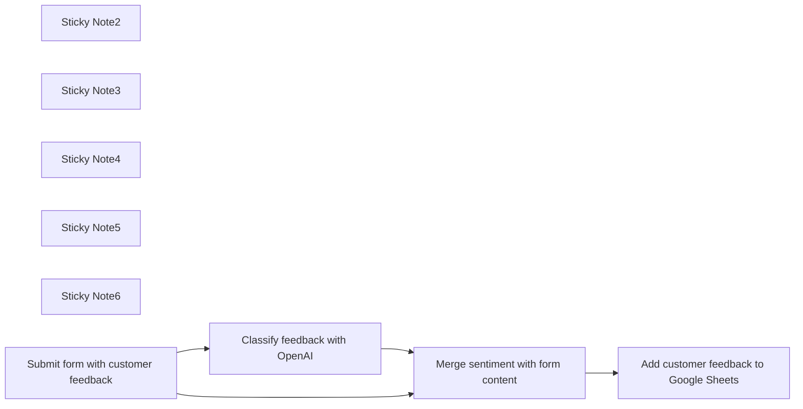

## Fluxo (.json) :

```json
{
  "meta": {
    "instanceId": "82a17fa4a0b8e81bf77e5ab999d980f392150f2a9541fde626dc5f74857b1f54"
  },
  "nodes": [
    {
      "id": "4ea39a4f-d8c1-438f-9738-bfbb906a3d7a",
      "name": "Sticky Note2",
      "type": "n8n-nodes-base.stickyNote",
      "position": [
        1200,
        1020
      ],
      "parameters": {
        "width": 253,
        "height": 342,
        "content": "## Send customer feedback to OpenAI for sentiment analysis"
      },
      "typeVersion": 1
    },
    {
      "id": "6962ea41-7d15-4932-919f-21ac94fa1269",
      "name": "Sticky Note3",
      "type": "n8n-nodes-base.stickyNote",
      "position": [
        1960,
        1180
      ],
      "parameters": {
        "width": 253,
        "height": 342,
        "content": "## Add new feedback to google sheets"
      },
      "typeVersion": 1
    },
    {
      "id": "4c8a8984-2d8e-4139-866b-6f3536aced07",
      "name": "Sticky Note4",
      "type": "n8n-nodes-base.stickyNote",
      "position": [
        800,
        1600
      ],
      "parameters": {
        "width": 1407,
        "height": 254,
        "content": "## Instructions\n1. Connect Google sheets\n2. Connect your OpenAi account (api key + org Id)\n3. Create a customer feedback form, use an existing one or use the one below as example. \nAll set!\n\n\n- Here is the example google sheet being used in this workflow: https://docs.google.com/spreadsheets/d/1omWdRbiT6z6GNZ6JClu9gEsRhPQ6J0EJ2yXyFH9Zng4/edit?usp=sharing. You can download it to your account."
      },
      "typeVersion": 1
    },
    {
      "id": "d43a9574-626d-4817-87ba-d99bdd6f41dc",
      "name": "Sticky Note5",
      "type": "n8n-nodes-base.stickyNote",
      "position": [
        800,
        1160
      ],
      "parameters": {
        "width": 253,
        "height": 342,
        "content": "## Feedback form is submitted"
      },
      "typeVersion": 1
    },
    {
      "id": "76dab2dc-935f-416e-91aa-5a1b7017ec1b",
      "name": "Sticky Note6",
      "type": "n8n-nodes-base.stickyNote",
      "position": [
        1600,
        1180
      ],
      "parameters": {
        "width": 253,
        "height": 342,
        "content": "## Merge form data and OpenAI result"
      },
      "typeVersion": 1
    },
    {
      "id": "9772eac1-8df2-4305-9b2c-265d3c5a9a4a",
      "name": "Add customer feedback to Google Sheets",
      "type": "n8n-nodes-base.googleSheets",
      "position": [
        2020,
        1320
      ],
      "parameters": {
        "columns": {
          "value": {
            "Category": "={{ $json['What is your feedback about?'] }}",
            "Sentiment": "={{ $json.text }}",
            "Timestamp": "={{ $json.submittedAt }}",
            "Entered by": "=Form",
            "Customer Name": "={{ $json.Name }}",
            "Customer contact": "={{ $json['How do we get in touch with you?'] }}",
            "Customer Feedback": "={{ $json['Your feedback'] }}"
          },
          "schema": [
            {
              "id": "Timestamp",
              "type": "string",
              "display": true,
              "required": false,
              "displayName": "Timestamp",
              "defaultMatch": false,
              "canBeUsedToMatch": true
            },
            {
              "id": "Category",
              "type": "string",
              "display": true,
              "required": false,
              "displayName": "Category",
              "defaultMatch": false,
              "canBeUsedToMatch": true
            },
            {
              "id": "Customer Feedback",
              "type": "string",
              "display": true,
              "required": false,
              "displayName": "Customer Feedback",
              "defaultMatch": false,
              "canBeUsedToMatch": true
            },
            {
              "id": "Customer Name",
              "type": "string",
              "display": true,
              "required": false,
              "displayName": "Customer Name",
              "defaultMatch": false,
              "canBeUsedToMatch": true
            },
            {
              "id": "Customer contact",
              "type": "string",
              "display": true,
              "required": false,
              "displayName": "Customer contact",
              "defaultMatch": false,
              "canBeUsedToMatch": true
            },
            {
              "id": "Entered by",
              "type": "string",
              "display": true,
              "required": false,
              "displayName": "Entered by",
              "defaultMatch": false,
              "canBeUsedToMatch": true
            },
            {
              "id": "Urgent?",
              "type": "string",
              "display": true,
              "required": false,
              "displayName": "Urgent?",
              "defaultMatch": false,
              "canBeUsedToMatch": true
            },
            {
              "id": "Sentiment",
              "type": "string",
              "display": true,
              "required": false,
              "displayName": "Sentiment",
              "defaultMatch": false,
              "canBeUsedToMatch": true
            }
          ],
          "mappingMode": "defineBelow",
          "matchingColumns": []
        },
        "options": {},
        "operation": "append",
        "sheetName": {
          "__rl": true,
          "mode": "list",
          "value": "gid=0",
          "cachedResultUrl": "https://docs.google.com/spreadsheets/d/1omWdRbiT6z6GNZ6JClu9gEsRhPQ6J0EJ2yXyFH9Zng4/edit#gid=0",
          "cachedResultName": "Sheet1"
        },
        "documentId": {
          "__rl": true,
          "mode": "list",
          "value": "1omWdRbiT6z6GNZ6JClu9gEsRhPQ6J0EJ2yXyFH9Zng4",
          "cachedResultUrl": "https://docs.google.com/spreadsheets/d/1omWdRbiT6z6GNZ6JClu9gEsRhPQ6J0EJ2yXyFH9Zng4/edit?usp=drivesdk",
          "cachedResultName": "CustomerFeedback"
        }
      },
      "credentials": {
        "googleSheetsOAuth2Api": {
          "id": "3",
          "name": "Google Sheets account"
        }
      },
      "typeVersion": 4.1
    },
    {
      "id": "12084971-c81b-4a0e-814e-120867562642",
      "name": "Merge sentiment with form content",
      "type": "n8n-nodes-base.merge",
      "position": [
        1680,
        1320
      ],
      "parameters": {
        "mode": "combine",
        "options": {},
        "combinationMode": "multiplex"
      },
      "typeVersion": 2.1
    },
    {
      "id": "235edf5b-7724-4712-8dc5-d8327a0620b8",
      "name": "Classify feedback with OpenAI",
      "type": "n8n-nodes-base.openAi",
      "position": [
        1280,
        1180
      ],
      "parameters": {
        "prompt": "=Classify the sentiment in the following customer feedback:  {{ $json['Your feedback'] }}",
        "options": {}
      },
      "credentials": {
        "openAiApi": {
          "id": "s2iucY0IctjYNbrb",
          "name": "OpenAi account"
        }
      },
      "typeVersion": 1
    },
    {
      "id": "af4b22aa-0925-40b1-a9ac-298f9745a98e",
      "name": "Submit form with customer feedback",
      "type": "n8n-nodes-base.formTrigger",
      "position": [
        860,
        1340
      ],
      "webhookId": "e7bf682e-48e8-40de-9815-cd180cdd1480",
      "parameters": {
        "options": {
          "formSubmittedText": "Your response has been recorded"
        },
        "formTitle": "Customer Feedback",
        "formFields": {
          "values": [
            {
              "fieldLabel": "Name",
              "requiredField": true
            },
            {
              "fieldType": "dropdown",
              "fieldLabel": "What is your feedback about?",
              "fieldOptions": {
                "values": [
                  {
                    "option": "Product"
                  },
                  {
                    "option": "Service"
                  },
                  {
                    "option": "Other"
                  }
                ]
              },
              "requiredField": true
            },
            {
              "fieldType": "textarea",
              "fieldLabel": "Your feedback",
              "requiredField": true
            },
            {
              "fieldLabel": "How do we get in touch with you?"
            }
          ]
        },
        "formDescription": "Please give feedback about our company orproducts."
      },
      "typeVersion": 1
    }
  ],
  "connections": {
    "Classify feedback with OpenAI": {
      "main": [
        [
          {
            "node": "Merge sentiment with form content",
            "type": "main",
            "index": 0
          }
        ]
      ]
    },
    "Merge sentiment with form content": {
      "main": [
        [
          {
            "node": "Add customer feedback to Google Sheets",
            "type": "main",
            "index": 0
          }
        ]
      ]
    },
    "Submit form with customer feedback": {
      "main": [
        [
          {
            "node": "Classify feedback with OpenAI",
            "type": "main",
            "index": 0
          },
          {
            "node": "Merge sentiment with form content",
            "type": "main",
            "index": 1
          }
        ]
      ]
    }
  }
}
```

<a id="template-186"></a>

## Template 186 - Geração de fatura PDF via webhook

- **Nome:** Geração de fatura PDF via webhook
- **Descrição:** Recebe dados de fatura, gera um PDF estilizado a partir de um template HTML e retorna o arquivo como resposta HTTP.
- **Funcionalidade:** • Recepção por webhook: Aceita uma requisição HTTP para iniciar o processo.
• Definição de dados padrão: Preenche dados da fatura (número, destinatário, remetente, itens e e-mail) quando necessário.
• Pré-processamento dos dados: Converte dados em HTML, formata linhas de endereço, calcula totais por item e total geral.
• Geração de PDF a partir de HTML: Renderiza o template HTML/CSS com os dados e converte para PDF.
• Resposta com arquivo PDF: Retorna o PDF gerado como resposta binária à requisição.
• Inclusão de contato: Adiciona link e botão mailto no PDF para contato com o emissor.
- **Ferramentas:** • Conversor HTML para PDF: Ferramenta que renderiza HTML/CSS e converte a saída em um arquivo PDF.
• Endpoint HTTP/Webhook: Ponto de entrada que recebe requisições e permite retornar o PDF gerado como resposta.


## Fluxo visual

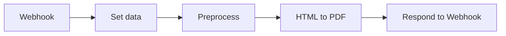

## Fluxo (.json) :

```json
{
  "meta": {
    "instanceId": "fcf18fc485cc336a31bc65574fd28e124660f468281b7aad773616b17903afe6",
    "templateCredsSetupCompleted": true
  },
  "nodes": [
    {
      "id": "de602925-4d9d-4045-9d9d-ed37dfb65490",
      "name": "HTML to PDF",
      "type": "@custom-js/n8n-nodes-pdf-toolkit.html2Pdf",
      "position": [
        460,
        -20
      ],
      "parameters": {
        "htmlInput": "=<!DOCTYPE html>\n<html lang=\"en\">\n<head>\n    <meta charset=\"UTF-8\">\n    <meta name=\"viewport\" content=\"width=device-width, initial-scale=1.0\">\n    <title>Invoice</title>\n    <style>\n        /* Global Reset */\n        * {\n            margin: 0;\n            padding: 0;\n            box-sizing: border-box;\n        }\n\n        /* Body and Container */\n        body {\n            font-family: 'Roboto', sans-serif;\n            background: #f4f7fc;\n            display: flex;\n            justify-content: center;\n            padding: 30px;\n        }\n\n        .invoice-wrapper {\n            width: 100%;\n            max-width: 900px;\n            background: linear-gradient(145deg, #ffffff, #e6f7ff);\n            border-radius: 10px;\n            box-shadow: 0 4px 20px rgba(0, 0, 0, 0.1);\n            padding: 40px;\n            margin-top: 50px;\n        }\n\n        /* Header */\n        .header {\n            background: linear-gradient(145deg, #3f51b5, #2196f3);\n            text-align: center;\n            color: #fff;\n            padding: 30px;\n            border-radius: 8px;\n        }\n\n        .header h1 {\n            font-size: 40px;\n            margin-bottom: 10px;\n        }\n\n        .header p {\n            font-size: 18px;\n            font-weight: 400;\n        }\n\n        /* Invoice Details Section */\n        .invoice-details {\n            display: flex;\n            justify-content: space-between;\n            margin-top: 30px;\n            border-top: 2px solid #eee;\n            padding-top: 30px;\n        }\n\n        .invoice-details div {\n            width: 48%;\n        }\n\n        .invoice-details h3 {\n            color: #3f51b5;\n            font-size: 20px;\n            margin-bottom: 15px;\n        }\n\n        .invoice-details p {\n            font-size: 15px;\n            color: #555;\n            line-height: 1.6;\n        }\n\n        /* Table Styling */\n        .table {\n            width: 100%;\n            border-collapse: collapse;\n            margin-top: 30px;\n        }\n\n        .table th,\n        .table td {\n            padding: 16px;\n            text-align: left;\n            font-size: 15px;\n            color: #555;\n        }\n\n        .table th {\n            background-color: #f1f5fc;\n            color: #3f51b5;\n            font-weight: 500;\n        }\n\n        .table td {\n            background-color: #fff;\n            border-bottom: 1px solid #e6e9f1;\n        }\n\n        .table tr:last-child td {\n            border-bottom: none;\n        }\n\n        .table .total {\n            font-weight: 600;\n            font-size: 18px;\n            color: #333;\n            background-color: #f1f5fc;\n        }\n\n        .table .total td {\n            text-align: right;\n        }\n\n        .table tr:nth-child(even) {\n            background-color: #f9f9f9;\n        }\n\n        /* Footer */\n        .footer {\n            text-align: center;\n            margin-top: 30px;\n            font-size: 15px;\n            color: #777;\n        }\n\n        .footer a {\n            color: #2196f3;\n            text-decoration: none;\n            font-weight: 500;\n        }\n\n        .footer a:hover {\n            text-decoration: underline;\n        }\n\n        /* Button */\n        .btn {\n            display: inline-block;\n            background-color: #2196f3;\n            color: white !important;\n            font-size: 16px;\n            font-weight: 600;\n            padding: 12px 25px;\n            margin-top: 25px;\n            text-decoration: none;\n            border-radius: 5px;\n            transition: background-color 0.3s ease;\n            box-shadow: 0 6px 15px rgba(33, 150, 243, 0.2);\n        }\n\n        .btn:hover {\n            background-color: #1976d2;\n        }\n\n        .btn:active {\n            background-color: #1565c0;\n        }\n    </style>\n</head>\n<body>\n\n<div class=\"invoice-wrapper\">\n    <div class=\"header\">\n        <h1>Invoice</h1>\n        <p>Invoice #{{ $('Set data').item.json['Invoice No'] }}</p>\n    </div>\n\n    <div class=\"invoice-details\">\n        <div>\n            <h3>Billed To:</h3>\n            {{ $json.bill_to }}\n        </div>\n        <div>\n            <h3>From:</h3>\n            {{ $json.from }}\n            <p>Email: {{ $('Set data').item.json.Email }}</p>\n        </div>\n    </div>\n\n    <table class=\"table\">\n        <thead>\n            <tr>\n                <th>Description</th>\n                <th>Unit Price</th>\n                <th>Quantity</th>\n                <th>Total</th>\n            </tr>\n        </thead>\n        <tbody>\n            {{ $json.details }}\n            <tr class=\"total\">\n                <td colspan=\"3\">Total Amount</td>\n                <td>${{ $json.total }}</td>\n            </tr>\n        </tbody>\n    </table>\n\n    <div class=\"footer\">\n        <p>Thank you for doing business with us!</p>\n        <p>If you have any questions regarding this invoice, please contact us at <a href=\"mailto:contact@abccorp.com\">{{ $('Set data').item.json.Email }}</a>.</p>\n        <a href=\"mailto:{{ $('Set data').item.json.Email }}\" class=\"btn\">Contact Us</a>\n    </div>\n</div>\n\n</body>\n</html>"
      },
      "credentials": {
        "customJsApi": {
          "id": "SZkqeEHVYyWhaGem",
          "name": "CustomJS account"
        }
      },
      "typeVersion": 1
    },
    {
      "id": "5a8efc8a-c60b-4616-a17a-6275cc326978",
      "name": "Preprocess",
      "type": "n8n-nodes-base.code",
      "position": [
        240,
        -20
      ],
      "parameters": {
        "mode": "runOnceForEachItem",
        "jsCode": "const input = $input.item.json\nconst bill_to = input['Bill To'].split('\\n').map(item => '<p>' + item + '</p>')\nconst from = input['From'].split('\\n').map(item => '<p>' + item + '</p>')\nconst details = input['Details'].map(item => {\n  const price = item.price*item.qty\n  return `\n  <tr>\n    <td>${item.description}</td>\n    <td>$${item.price}</td>\n    <td>${item.qty}</td>\n    <td>$${price}</td>\n  </tr>\n  `\n})\nconst total = input['Details'].reduce((val, next) => {\n\treturn val+next.price*next.qty\n}, 0)\nreturn {\n  bill_to: bill_to.join('\\n'),\n  from: from.join('\\n'),\n  details: details.join('\\n'),\n  total\n}"
      },
      "typeVersion": 2
    },
    {
      "id": "7da4fb46-1f74-44d8-8392-16fc90f23928",
      "name": "Set data",
      "type": "n8n-nodes-base.set",
      "position": [
        20,
        -20
      ],
      "parameters": {
        "options": {},
        "assignments": {
          "assignments": [
            {
              "id": "5342001f-a513-46c3-b31f-4590e8514411",
              "name": "Invoice No",
              "type": "string",
              "value": "1"
            },
            {
              "id": "ec357d39-c697-4bb8-8d9d-1bc303352dd0",
              "name": "Bill To",
              "type": "string",
              "value": "John Doe\n1234 Elm St, Apt 567\nCity, Country, 12345"
            },
            {
              "id": "88d6b470-4075-43ec-a684-a4adfd889278",
              "name": "From",
              "type": "string",
              "value": "ABC Corporation\n789 Business Ave\nCity, Country, 67890"
            },
            {
              "id": "061a8020-644a-4cec-bade-3bcd7e15adee",
              "name": "Details",
              "type": "array",
              "value": "[     {         \"description\": \"Web Hosting\",         \"price\": 150,         \"qty\": 2     },     {         \"description\": \"Domain\",         \"price\": 15,         \"qty\": 5     } ]"
            },
            {
              "id": "1c2c6c4b-6aa5-4656-8cae-43ffac71d478",
              "name": "Email",
              "type": "string",
              "value": "support@mycompany.com"
            }
          ]
        }
      },
      "typeVersion": 3.4
    },
    {
      "id": "a6d39cc4-b9c2-4eed-b4a6-46d622a87c14",
      "name": "Webhook",
      "type": "n8n-nodes-base.webhook",
      "position": [
        -200,
        -20
      ],
      "webhookId": "526fd864-6f85-4cde-97aa-39b61a3e5b83",
      "parameters": {
        "path": "526fd864-6f85-4cde-97aa-39b61a3e5b83",
        "options": {},
        "responseMode": "responseNode"
      },
      "typeVersion": 2
    },
    {
      "id": "c7d1cc1d-88e3-463a-886f-182a2ba72b11",
      "name": "Respond to Webhook",
      "type": "n8n-nodes-base.respondToWebhook",
      "position": [
        660,
        -20
      ],
      "parameters": {
        "options": {},
        "respondWith": "binary"
      },
      "typeVersion": 1.1
    }
  ],
  "pinData": {},
  "connections": {
    "Webhook": {
      "main": [
        [
          {
            "node": "Set data",
            "type": "main",
            "index": 0
          }
        ]
      ]
    },
    "Set data": {
      "main": [
        [
          {
            "node": "Preprocess",
            "type": "main",
            "index": 0
          }
        ]
      ]
    },
    "Preprocess": {
      "main": [
        [
          {
            "node": "HTML to PDF",
            "type": "main",
            "index": 0
          }
        ]
      ]
    },
    "HTML to PDF": {
      "main": [
        [
          {
            "node": "Respond to Webhook",
            "type": "main",
            "index": 0
          }
        ]
      ]
    }
  }
}
```

<a id="template-187"></a>

## Template 187 - Atualização semanal de tarefas do Notion

- **Nome:** Atualização semanal de tarefas do Notion
- **Descrição:** Gera e envia por email (com notificação push opcional) um resumo semanal das tarefas de um banco de dados do Notion, agrupadas por prazo.
- **Funcionalidade:** • Gatilhos agendados e manuais: Inicia o fluxo semanalmente (segunda-feira às 9h) ou ao executar o teste manualmente.
• Configuração de variáveis do fluxo: Permite definir logo, URL do banco de dados, chave do Pushover e email do destinatário.
• Leitura do banco de dados do Notion: Recupera todas as páginas/tarefas de um banco de dados específico.
• Filtragem por deadline: Remove itens sem data de prazo, mantendo apenas tarefas com deadline definido.
• Ordenação por prazo mais próximo: Ordena as tarefas pela data de deadline para prioridade temporal.
• Geração de template por tarefa: Cria um bloco HTML para cada tarefa incluindo título, link, prazo (formatado), prioridade, status e tags.
• Agrupamento em "overdue" e "due to": Compara a data de cada tarefa com a data atual para separar tarefas vencidas e próximas do vencimento.
• Agregação de grupos e montagem do email: Junta as seções (overdue e upcoming) em um template HTML único com logo e botão para o board do Notion.
• Envio de email HTML: Envia o resumo formatado para o destinatário configurado via servidor de email.
• Notificação push: Opcionalmente envia uma notificação via Pushover informando sobre o envio do resumo por email.
- **Ferramentas:** • Notion: Fonte das tarefas, leitura do banco de dados e propriedades das páginas.
• Servidor SMTP: Envio do email HTML para o destinatário configurado.
• Pushover: Serviço de notificações push para avisar sobre o envio do resumo.


## Fluxo visual

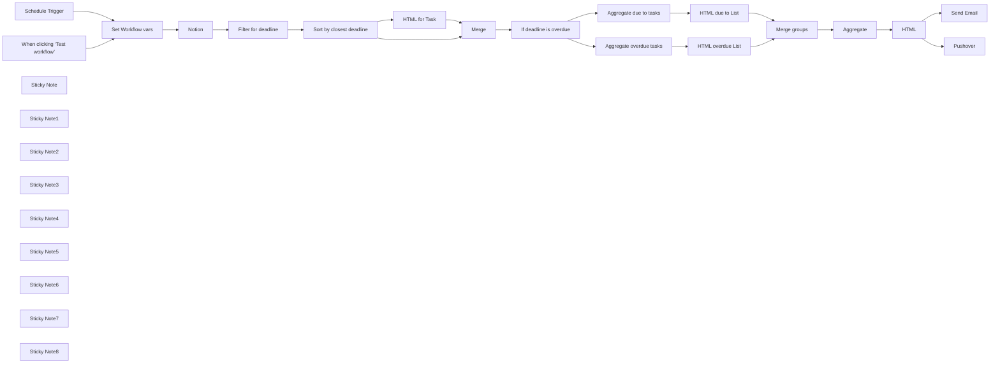

## Fluxo (.json) :

```json
{
  "meta": {
    "instanceId": "46264913bc099c31e7222b2cfd112772e1c7867192afd7716e58254079b3333f"
  },
  "nodes": [
    {
      "id": "dac02623-ee83-444b-b039-fd310dee3260",
      "name": "When clicking ‘Test workflow’",
      "type": "n8n-nodes-base.manualTrigger",
      "position": [
        700,
        1000
      ],
      "parameters": {},
      "typeVersion": 1
    },
    {
      "id": "7268d9c0-44ae-4226-9e5f-f3b19e3fbfa1",
      "name": "Notion",
      "type": "n8n-nodes-base.notion",
      "position": [
        1360,
        980
      ],
      "parameters": {
        "options": {},
        "resource": "databasePage",
        "operation": "getAll",
        "databaseId": {
          "__rl": true,
          "mode": "list",
          "value": "b1e11f75-06df-42b4-8dd9-557ba937978d",
          "cachedResultUrl": "https://www.notion.so/b1e11f7506df42b48dd9557ba937978d",
          "cachedResultName": "Tasks"
        },
        "filterType": "manual"
      },
      "credentials": {
        "notionApi": {
          "id": "03mmrqQX1rffebZp",
          "name": "Notion David"
        }
      },
      "typeVersion": 2.2
    },
    {
      "id": "607752ef-ac76-4a07-a3e7-39be7d5770e7",
      "name": "Sort by closest deadline",
      "type": "n8n-nodes-base.sort",
      "position": [
        1760,
        880
      ],
      "parameters": {
        "options": {},
        "sortFieldsUi": {
          "sortField": [
            {
              "fieldName": "property_deadline.start"
            }
          ]
        }
      },
      "typeVersion": 1
    },
    {
      "id": "81c6ded2-7766-4351-b597-27794b595283",
      "name": "Filter for deadline",
      "type": "n8n-nodes-base.filter",
      "position": [
        1600,
        880
      ],
      "parameters": {
        "options": {},
        "conditions": {
          "options": {
            "leftValue": "",
            "caseSensitive": true,
            "typeValidation": "strict"
          },
          "combinator": "and",
          "conditions": [
            {
              "id": "179eecfc-7eea-46b9-a971-78824e5774dc",
              "operator": {
                "type": "string",
                "operation": "exists",
                "singleValue": true
              },
              "leftValue": "={{ $json.property_deadline.start }}",
              "rightValue": ""
            }
          ]
        }
      },
      "typeVersion": 2.1
    },
    {
      "id": "21ecbd8d-7a2f-4a0a-8d99-3365c88a187b",
      "name": "Send Email",
      "type": "n8n-nodes-base.emailSend",
      "position": [
        4100,
        900
      ],
      "parameters": {
        "html": "={{ $json.html }}",
        "options": {},
        "subject": "Weekly Update about Notion Tasks",
        "toEmail": "={{ $('Set Workflow vars').item.json.your_email }}",
        "fromEmail": "n8n@unitize.de"
      },
      "credentials": {
        "smtp": {
          "id": "cvpDbugXPc0TsdmZ",
          "name": "Unitize - SMTP Mailserver"
        }
      },
      "typeVersion": 2.1
    },
    {
      "id": "8379f4e4-cab6-46cd-9ba0-e6bf78076de5",
      "name": "HTML",
      "type": "n8n-nodes-base.html",
      "position": [
        3720,
        900
      ],
      "parameters": {
        "html": "<!DOCTYPE html>\n\n<html>\n<head>\n  <meta charset=\"UTF-8\" />\n  <title>Weekly Update about Notion Tasks</title>\n  <meta name=\"color-scheme\" content=\"only\">\n  <style>\n    body {font-family: 'Courier'; color: #15124a; background-color: #ffffff;padding:20px;}\n    .button {background-color: #126bf3; padding: 10px 15px; border-radius: 5px; text-decoration: none; color: white}\n    a {text-decoration: none; color: #126bf3}\n    h3 {margin-top: 0px}\n    .task {background-color: #f0f0f0; padding: 20px; border-radius: 5px;}\n    p:last-child {margin-bottom: 0px;}\n  </style>\n</head>\n<body>\n  <div class=\"container\">\n    \n    <h1>Weekly Update about Notion Tasks</h1>\n    <p><a class=\"button\" href=\"{{ $('Set Workflow vars').item.json.notion_database_url }}\">To the Task Board in Notion</a></p>\n    <br>\n    {{ $json.html_groups.pluck('html') }}\n  </div>\n</body>\n</html>"
      },
      "typeVersion": 1.2
    },
    {
      "id": "c86a8391-90ed-450a-b142-85ff62d84ab8",
      "name": "Aggregate due to tasks",
      "type": "n8n-nodes-base.aggregate",
      "position": [
        2700,
        1040
      ],
      "parameters": {
        "options": {},
        "aggregate": "aggregateAllItemData",
        "destinationFieldName": "due_to"
      },
      "typeVersion": 1
    },
    {
      "id": "07506629-4244-4270-aecc-87b0237c65e7",
      "name": "Aggregate overdue tasks",
      "type": "n8n-nodes-base.aggregate",
      "position": [
        2700,
        760
      ],
      "parameters": {
        "options": {},
        "aggregate": "aggregateAllItemData",
        "destinationFieldName": "overdue"
      },
      "typeVersion": 1
    },
    {
      "id": "93d4f3be-8081-41d9-bd59-5a7a0439c27b",
      "name": "Pushover",
      "type": "n8n-nodes-base.pushover",
      "position": [
        4100,
        1100
      ],
      "parameters": {
        "message": "You received a weekly update about your Notion Tasks. Check your mails!",
        "userKey": "={{ $('Set Workflow vars').item.json.pushover_user_key }}",
        "priority": 1,
        "additionalFields": {}
      },
      "credentials": {
        "pushoverApi": {
          "id": "Z002A4WQRAOy6XUT",
          "name": "Pushover - David"
        }
      },
      "typeVersion": 1
    },
    {
      "id": "112aa538-1497-4a53-85ff-b04504896b81",
      "name": "Schedule Trigger",
      "type": "n8n-nodes-base.scheduleTrigger",
      "position": [
        700,
        780
      ],
      "parameters": {
        "rule": {
          "interval": [
            {
              "field": "weeks",
              "triggerAtDay": [
                1
              ],
              "triggerAtHour": 9
            }
          ]
        }
      },
      "typeVersion": 1.2
    },
    {
      "id": "1ec9608a-9a06-4140-a6e0-2e38b4a8c201",
      "name": "If deadline is overdue",
      "type": "n8n-nodes-base.if",
      "position": [
        2460,
        900
      ],
      "parameters": {
        "options": {},
        "conditions": {
          "options": {
            "leftValue": "",
            "caseSensitive": true,
            "typeValidation": "strict"
          },
          "combinator": "and",
          "conditions": [
            {
              "id": "e65c0597-d067-423a-8496-35e91a8ddf1b",
              "operator": {
                "type": "dateTime",
                "operation": "beforeOrEquals"
              },
              "leftValue": "={{ $json.property_deadline.start.toDateTime() }}",
              "rightValue": "={{ $now }}"
            }
          ]
        }
      },
      "typeVersion": 2.1
    },
    {
      "id": "2a25952d-7149-4b42-b520-497997d2838c",
      "name": "Merge",
      "type": "n8n-nodes-base.merge",
      "position": [
        2220,
        900
      ],
      "parameters": {
        "mode": "combine",
        "options": {},
        "combineBy": "combineByPosition"
      },
      "typeVersion": 3
    },
    {
      "id": "a80b5658-b83d-45e7-ade3-6a828f26a356",
      "name": "HTML for Task",
      "type": "n8n-nodes-base.html",
      "position": [
        2000,
        1060
      ],
      "parameters": {
        "html": "<div class=\"task\">\n  <a href=\"{{ $json.url }}\">\n    <h3>{{ $json.name }}\"</h3>\n  </a>\n  <p>\n    <strong>Deadline: </strong>{{ $json.property_deadline.start.toDateTime().format('dd.MM.yyyy') }}\n    <br>\n    <strong>Prio: </strong>{{ $json.property_prio }}\n    <br>\n    <strong>Status: </strong>{{ $json.property_status }}\n    <br>\n    <strong>Tags: </strong>{{ $json.property_tags }}\n  </p>\n</div>"
      },
      "typeVersion": 1.2
    },
    {
      "id": "8589e878-249d-43a0-b523-994108b3471b",
      "name": "HTML due to List",
      "type": "n8n-nodes-base.html",
      "position": [
        2920,
        1040
      ],
      "parameters": {
        "html": "<h2>Tasks with an <u>upcoming</u> deadline</h2>\n{{ $json.due_to.pluck('html') }}"
      },
      "typeVersion": 1.2
    },
    {
      "id": "c3eccab0-56f8-4038-8526-f2f51a19fb59",
      "name": "HTML overdue List",
      "type": "n8n-nodes-base.html",
      "position": [
        2920,
        760
      ],
      "parameters": {
        "html": "<h2>Tasks which are already <u>overdue</u></h2>\n{{ $if($json.overdue.length > 0, $json.overdue.pluck('html'), 'No overdue tasks. Great!') }}"
      },
      "typeVersion": 1.2
    },
    {
      "id": "054aa055-6f71-4ecb-80fe-69e5b95f6390",
      "name": "Aggregate",
      "type": "n8n-nodes-base.aggregate",
      "position": [
        3440,
        900
      ],
      "parameters": {
        "options": {},
        "aggregate": "aggregateAllItemData",
        "destinationFieldName": "html_groups"
      },
      "typeVersion": 1
    },
    {
      "id": "10a799fb-66f3-4fe3-b7b8-01d3a93047d2",
      "name": "Merge groups",
      "type": "n8n-nodes-base.merge",
      "position": [
        3220,
        900
      ],
      "parameters": {},
      "typeVersion": 3
    },
    {
      "id": "acde5a16-bdd1-4fb6-a986-14ae0b1b1240",
      "name": "Sticky Note",
      "type": "n8n-nodes-base.stickyNote",
      "position": [
        620,
        640
      ],
      "parameters": {
        "color": 4,
        "width": 265.6985239367243,
        "height": 702.0052321200026,
        "content": "## Triggers\nCurrent schedule is every monday at 9 am."
      },
      "typeVersion": 1
    },
    {
      "id": "7766fa25-2486-4eb5-a3d6-23ec2472be94",
      "name": "Sticky Note1",
      "type": "n8n-nodes-base.stickyNote",
      "position": [
        1240,
        640
      ],
      "parameters": {
        "width": 648.1928627806343,
        "height": 710.0046767294216,
        "content": "## Fetch, filter and sort notion tasks\nCurrently tasks are filtered by having a deadline and sorted by this"
      },
      "typeVersion": 1
    },
    {
      "id": "5a44f536-5af9-40dd-a9ae-9d56e4540971",
      "name": "Sticky Note2",
      "type": "n8n-nodes-base.stickyNote",
      "position": [
        1920,
        640
      ],
      "parameters": {
        "width": 442.45022302855995,
        "height": 707.700156943336,
        "content": "## Generate HTML template per task\nGenerate a template for each task. It displays the headline and some prperties.\nYou can adjust the template here to show more or less information about each task."
      },
      "typeVersion": 1
    },
    {
      "id": "765f25ad-3dfa-4a48-9c07-07c7fc0049b6",
      "name": "Sticky Note3",
      "type": "n8n-nodes-base.stickyNote",
      "position": [
        2400,
        640
      ],
      "parameters": {
        "width": 1185.3702378922917,
        "height": 707.7001569433354,
        "content": "## Create groups of tasks to \"overdue\" and \"due to\"\nThis is used to group the tasks and display them accordingly in the final html email template."
      },
      "typeVersion": 1
    },
    {
      "id": "5fb2c5d9-fba9-463c-9574-38146d14e272",
      "name": "Sticky Note4",
      "type": "n8n-nodes-base.stickyNote",
      "position": [
        3620,
        640
      ],
      "parameters": {
        "width": 314.11124235866913,
        "height": 705.8925656662948,
        "content": "## Create html email template\nHere the whole html email template is set up.\nStyles are applied and some sugar around list of tasks are shown.\nYou may change this to your design and even replace the logo."
      },
      "typeVersion": 1
    },
    {
      "id": "891e126b-1a34-489b-8a3d-fa3a56308153",
      "name": "Sticky Note5",
      "type": "n8n-nodes-base.stickyNote",
      "position": [
        3980,
        640
      ],
      "parameters": {
        "color": 4,
        "width": 355.68584173060526,
        "height": 704.0849743892543,
        "content": "## Send email and push notification\nIn the Pushover node you need to place you User Key to receive push notifications.\nUse the Pushover docs to read more about how to setup this service."
      },
      "typeVersion": 1
    },
    {
      "id": "6cd611da-f3da-4da1-90ae-e5e04a91f915",
      "name": "Sticky Note6",
      "type": "n8n-nodes-base.stickyNote",
      "position": [
        620,
        400
      ],
      "parameters": {
        "color": 6,
        "width": 539.3442720010472,
        "height": 199.46339277184228,
        "content": "## Dependencies\n- You need to have access to your notion page/database\n- You need to create a Pushover account in order to receive push notifications via this service"
      },
      "typeVersion": 1
    },
    {
      "id": "8da5e4b3-ee1a-4c62-aeec-40d85fb9754e",
      "name": "Sticky Note7",
      "type": "n8n-nodes-base.stickyNote",
      "position": [
        920,
        640
      ],
      "parameters": {
        "width": 284.11715106246396,
        "height": 706.9018085580076,
        "content": "## Set workflow variables\nAdjust this node to your needs!"
      },
      "typeVersion": 1
    },
    {
      "id": "4759edd5-edae-4d4c-8cc7-55c8cd8336ca",
      "name": "Set Workflow vars",
      "type": "n8n-nodes-base.set",
      "position": [
        1000,
        880
      ],
      "parameters": {
        "options": {},
        "assignments": {
          "assignments": [
            {
              "id": "976aac71-63c6-48a4-a965-8112ae3480bf",
              "name": "logo_path",
              "type": "string",
              "value": ""
            },
            {
              "id": "d9ec1fff-56ff-4c3e-befd-99520b78200e",
              "name": "pushover_user_key",
              "type": "string",
              "value": ""
            },
            {
              "id": "8271abe0-b9c7-4102-b1a2-37181dcb4ea6",
              "name": "notion_database_url",
              "type": "string",
              "value": ""
            },
            {
              "id": "ed7c4c03-f8e2-46fa-ac3b-ccabbeab24fa",
              "name": "your_email",
              "type": "string",
              "value": ""
            }
          ]
        }
      },
      "typeVersion": 3.4
    },
    {
      "id": "25f16b5e-7500-4b51-ac8e-e7d8b3b205be",
      "name": "Sticky Note8",
      "type": "n8n-nodes-base.stickyNote",
      "position": [
        1260,
        740
      ],
      "parameters": {
        "color": 3,
        "width": 296.4350404695249,
        "height": 463.2108881217612,
        "content": "## Adjustment needed\nIn order to not receive \"Done\" or \"Closed\" items from your notion database you need to add some filters in this Notion node.\n\nE.g. you could add \"Status\" is not equal to \"Closed\", to not get closed items."
      },
      "typeVersion": 1
    }
  ],
  "pinData": {},
  "connections": {
    "HTML": {
      "main": [
        [
          {
            "node": "Send Email",
            "type": "main",
            "index": 0
          },
          {
            "node": "Pushover",
            "type": "main",
            "index": 0
          }
        ]
      ]
    },
    "Merge": {
      "main": [
        [
          {
            "node": "If deadline is overdue",
            "type": "main",
            "index": 0
          }
        ]
      ]
    },
    "Notion": {
      "main": [
        [
          {
            "node": "Filter for deadline",
            "type": "main",
            "index": 0
          }
        ]
      ]
    },
    "Aggregate": {
      "main": [
        [
          {
            "node": "HTML",
            "type": "main",
            "index": 0
          }
        ]
      ]
    },
    "Merge groups": {
      "main": [
        [
          {
            "node": "Aggregate",
            "type": "main",
            "index": 0
          }
        ]
      ]
    },
    "HTML for Task": {
      "main": [
        [
          {
            "node": "Merge",
            "type": "main",
            "index": 1
          }
        ]
      ]
    },
    "HTML due to List": {
      "main": [
        [
          {
            "node": "Merge groups",
            "type": "main",
            "index": 1
          }
        ]
      ]
    },
    "Schedule Trigger": {
      "main": [
        [
          {
            "node": "Set Workflow vars",
            "type": "main",
            "index": 0
          }
        ]
      ]
    },
    "HTML overdue List": {
      "main": [
        [
          {
            "node": "Merge groups",
            "type": "main",
            "index": 0
          }
        ]
      ]
    },
    "Set Workflow vars": {
      "main": [
        [
          {
            "node": "Notion",
            "type": "main",
            "index": 0
          }
        ]
      ]
    },
    "Filter for deadline": {
      "main": [
        [
          {
            "node": "Sort by closest deadline",
            "type": "main",
            "index": 0
          }
        ]
      ]
    },
    "Aggregate due to tasks": {
      "main": [
        [
          {
            "node": "HTML due to List",
            "type": "main",
            "index": 0
          }
        ]
      ]
    },
    "If deadline is overdue": {
      "main": [
        [
          {
            "node": "Aggregate overdue tasks",
            "type": "main",
            "index": 0
          }
        ],
        [
          {
            "node": "Aggregate due to tasks",
            "type": "main",
            "index": 0
          }
        ]
      ]
    },
    "Aggregate overdue tasks": {
      "main": [
        [
          {
            "node": "HTML overdue List",
            "type": "main",
            "index": 0
          }
        ]
      ]
    },
    "Sort by closest deadline": {
      "main": [
        [
          {
            "node": "HTML for Task",
            "type": "main",
            "index": 0
          },
          {
            "node": "Merge",
            "type": "main",
            "index": 0
          }
        ]
      ]
    },
    "When clicking ‘Test workflow’": {
      "main": [
        [
          {
            "node": "Set Workflow vars",
            "type": "main",
            "index": 0
          }
        ]
      ]
    }
  }
}
```

<a id="template-188"></a>

## Template 188 - Criação de cliente, geração e envio de fatura

- **Nome:** Criação de cliente, geração e envio de fatura
- **Descrição:** Este fluxo cria um cliente no QuickBooks, gera uma fatura para esse cliente e envia a fatura por e-mail.
- **Funcionalidade:** • Criação de cliente: Cria um novo cliente com nome e e-mail fornecidos.
• Geração de fatura: Gera uma fatura vinculada ao cliente criado, com linha de item contendo descrição, quantidade e valor.
• Envio de fatura por e-mail: Envia a fatura gerada ao e-mail do cliente utilizando a funcionalidade de envio do sistema.
- **Ferramentas:** • QuickBooks Online: Plataforma de contabilidade e faturamento usada via API para criar clientes, gerar faturas e enviar documentos por e-mail.


## Fluxo visual

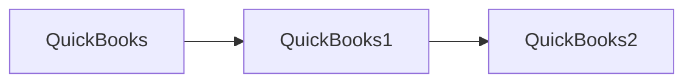

## Fluxo (.json) :

```json
{
  "nodes": [
    {
      "name": "QuickBooks2",
      "type": "n8n-nodes-base.quickbooks",
      "position": [
        870,
        300
      ],
      "parameters": {
        "email": "",
        "resource": "invoice",
        "invoiceId": "={{$json[\"Id\"]}}",
        "operation": "send"
      },
      "credentials": {
        "quickBooksOAuth2Api": "QuickBooks OAuth Credentials"
      },
      "typeVersion": 1
    },
    {
      "name": "QuickBooks1",
      "type": "n8n-nodes-base.quickbooks",
      "position": [
        670,
        300
      ],
      "parameters": {
        "Line": [
          {
            "Amount": 100,
            "itemId": "1",
            "DetailType": "SalesItemLineDetail",
            "Description": "Consulting service"
          }
        ],
        "resource": "invoice",
        "operation": "create",
        "CustomerRef": "={{$json[\"Id\"]}}",
        "additionalFields": {}
      },
      "credentials": {
        "quickBooksOAuth2Api": "QuickBooks OAuth Credentials"
      },
      "typeVersion": 1
    },
    {
      "name": "QuickBooks",
      "type": "n8n-nodes-base.quickbooks",
      "position": [
        470,
        300
      ],
      "parameters": {
        "operation": "create",
        "displayName": "Jack Ryan",
        "additionalFields": {
          "PrimaryEmailAddr": "jack@ryan.com"
        }
      },
      "credentials": {
        "quickBooksOAuth2Api": "QuickBooks OAuth Credentials"
      },
      "typeVersion": 1
    }
  ],
  "connections": {
    "QuickBooks": {
      "main": [
        [
          {
            "node": "QuickBooks1",
            "type": "main",
            "index": 0
          }
        ]
      ]
    },
    "QuickBooks1": {
      "main": [
        [
          {
            "node": "QuickBooks2",
            "type": "main",
            "index": 0
          }
        ]
      ]
    }
  }
}
```

<a id="template-189"></a>

## Template 189 - Assistente de Calendário Outlook

- **Nome:** Assistente de Calendário Outlook
- **Descrição:** Fluxo que recebe menções do usuário, utiliza um agente de IA conectado a ferramentas de calendário para consultar e criar eventos no Outlook e responde ao usuário no Slack.
- **Funcionalidade:** • Captura de menções do bot: Recebe eventos de menção via webhook e inicia o fluxo.
• Validação de assinatura: Responde automaticamente ao desafio de verificação quando necessário.
• Extração e pré-processamento da mensagem: Isola atributos importantes (texto, timestamp, usuário, canal e flag de bot) para uso posterior.
• Agente de IA com memória: Envia a mensagem para um agente de linguagem que usa memória local para contexto de sessão.
• Uso de ferramentas de calendário: O agente pode pesquisar eventos, listar calendários disponíveis e criar novos eventos conforme necessário.
• Geração de resposta e encaminhamento: Formata a resposta do agente e envia como reply em thread no canal do Slack de origem.
- **Ferramentas:** • Slack: Plataforma de mensageria usada para receber menções do usuário e enviar respostas em threads.
• Microsoft Outlook Calendar API: Serviço de calendário usado para buscar eventos, listar calendários e criar novos eventos no ambiente do usuário/organização.
• OpenAI Chat API: Modelo de linguagem utilizado para interpretar a solicitação do usuário, decidir quando usar ferramentas e gerar as respostas.


## Fluxo visual

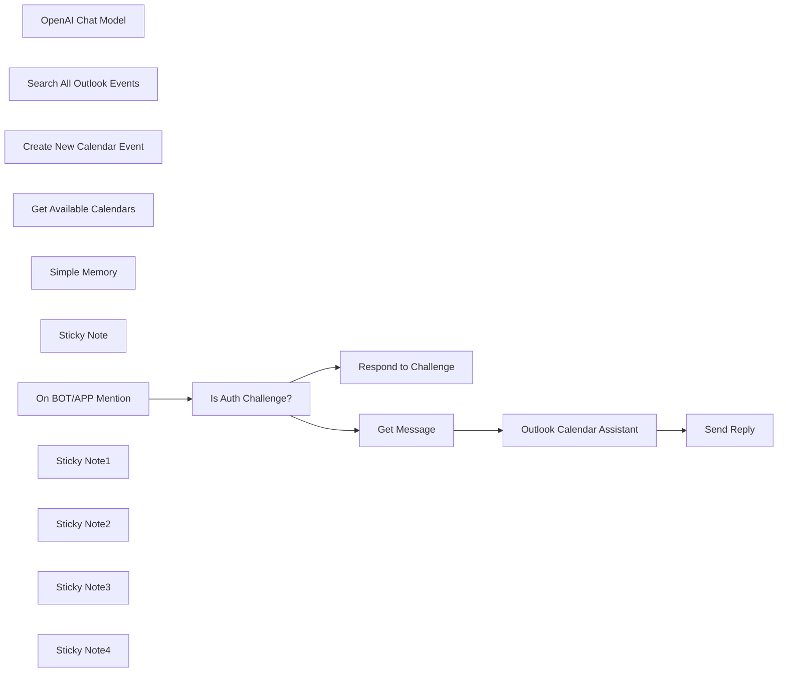

## Fluxo (.json) :

```json
{
  "meta": {
    "instanceId": "408f9fb9940c3cb18ffdef0e0150fe342d6e655c3a9fac21f0f644e8bedabcd9",
    "templateCredsSetupCompleted": true
  },
  "nodes": [
    {
      "id": "e37622d2-d9d4-4aff-8c0f-a2945e739ccd",
      "name": "OpenAI Chat Model",
      "type": "@n8n/n8n-nodes-langchain.lmChatOpenAi",
      "position": [
        -180,
        40
      ],
      "parameters": {
        "options": {}
      },
      "credentials": {
        "openAiApi": {
          "id": "8gccIjcuf3gvaoEr",
          "name": "OpenAi account"
        }
      },
      "typeVersion": 1
    },
    {
      "id": "702c21cf-6ca5-4b1b-8511-fd082152e50b",
      "name": "Search All Outlook Events",
      "type": "n8n-nodes-base.microsoftOutlookTool",
      "position": [
        180,
        40
      ],
      "webhookId": "486fda30-984a-4af6-990f-d5f30865fc29",
      "parameters": {
        "limit": 20,
        "filters": {
          "custom": "={{ /*n8n-auto-generated-fromAI-override*/ $fromAI('Filter_Query', ``, 'string') }}"
        },
        "resource": "event",
        "descriptionType": "manual",
        "toolDescription": "Call this tool to consume Microsoft Outlook API and fetch all outlook calendar events across all available calendars for a given filter."
      },
      "credentials": {
        "microsoftOutlookOAuth2Api": {
          "id": "EWg6sbhPKcM5y3Mr",
          "name": "Microsoft Outlook account"
        }
      },
      "typeVersion": 2
    },
    {
      "id": "c4d7571d-0d96-42f5-a1dd-d2ee8e467731",
      "name": "Create New Calendar Event",
      "type": "n8n-nodes-base.microsoftOutlookTool",
      "position": [
        320,
        40
      ],
      "webhookId": "c4f72f45-2c3f-49cf-ac16-6b8fe701cc41",
      "parameters": {
        "subject": "={{ /*n8n-auto-generated-fromAI-override*/ $fromAI('Title', ``, 'string') }}",
        "resource": "event",
        "operation": "create",
        "calendarId": {
          "__rl": true,
          "mode": "id",
          "value": "={{ /*n8n-auto-generated-fromAI-override*/ $fromAI('Calendar', ``, 'string') }}"
        },
        "endDateTime": "={{ /*n8n-auto-generated-fromAI-override*/ $fromAI('End', ``, 'string') }}",
        "startDateTime": "={{ /*n8n-auto-generated-fromAI-override*/ $fromAI('Start', ``, 'string') }}",
        "descriptionType": "manual",
        "toolDescription": "Call this tool to consume Microsoft Outlook API and create a new outlook calendar event. Ensure the calendar ID exists before proceeding.",
        "additionalFields": {
          "body": "={{ /*n8n-auto-generated-fromAI-override*/ $fromAI('Description', ``, 'string') }}"
        }
      },
      "credentials": {
        "microsoftOutlookOAuth2Api": {
          "id": "EWg6sbhPKcM5y3Mr",
          "name": "Microsoft Outlook account"
        }
      },
      "typeVersion": 2
    },
    {
      "id": "db5e44ab-7ec8-4831-9e41-34c963cd2314",
      "name": "Get Available Calendars",
      "type": "n8n-nodes-base.microsoftOutlookTool",
      "position": [
        460,
        40
      ],
      "webhookId": "605be4f6-e8c4-4350-9da9-55988b069c5d",
      "parameters": {
        "limit": 20,
        "filters": {},
        "resource": "calendar",
        "descriptionType": "manual",
        "toolDescription": "Call this tool to consume Microsoft Outlook API and fetch a list of available calendars."
      },
      "credentials": {
        "microsoftOutlookOAuth2Api": {
          "id": "EWg6sbhPKcM5y3Mr",
          "name": "Microsoft Outlook account"
        }
      },
      "typeVersion": 2
    },
    {
      "id": "8102e365-eec4-48c6-986b-4ab8aac9e72a",
      "name": "Simple Memory",
      "type": "@n8n/n8n-nodes-langchain.memoryBufferWindow",
      "position": [
        -20,
        40
      ],
      "parameters": {
        "sessionKey": "={{ $json.ts }}_{{ $json.user }}",
        "sessionIdType": "customKey"
      },
      "typeVersion": 1.3
    },
    {
      "id": "ebd79d18-86b9-4e8b-9a27-f9878fd3d617",
      "name": "Outlook Calendar Assistant",
      "type": "@n8n/n8n-nodes-langchain.agent",
      "position": [
        -60,
        -180
      ],
      "parameters": {
        "text": "={{ $json.message.substr($json.message.indexOf('>')+1, 9999).trim() }}",
        "options": {
          "systemMessage": "=You are a helpful calendar assistant who can help users with calendar and event enquiries.\n* Today's date and time is {{ $now.toISO() }}."
        },
        "promptType": "define"
      },
      "typeVersion": 1.7
    },
    {
      "id": "f976cea5-be3e-4e14-89f5-b5d05d66f0c7",
      "name": "Sticky Note",
      "type": "n8n-nodes-base.stickyNote",
      "position": [
        -1340,
        -860
      ],
      "parameters": {
        "width": 440,
        "height": 720,
        "content": "### This n8n template demonstrates how easy it is to build an Outlook Calendar Assistant powered by an AI agent equipped with Tools.\n\nn8n's AI agents makes it easy to build powerful assistants which can interact with your existing services and tools. With little effort, you can expose such an agent to team members and colleagues though something like Slack and enable a company-wide productivity booster.\n\n### How it works\n* A Slack Trigger node is configured to catch \"bot mentions\" events in a designated channel.\n* The message is parsed using the Edit fields node to extract only the required attributes of the event.\n* An AI Agent equipped with Outlook Calendar Tools enables question and answer capability for the organisation's shared calendars and events.\n* The AI agent's response is sent back to Slack as a reply to the user's query.\n\n### How to use\n* The workflow is triggered via @mention-ing the bot followed by the query. eg. \"@bot how many meetings does Paul have to attend to this week?\"\n* To start listening to real mentions, you must activate the workflow and set it to production mode. You must use the production webhook URL for the event subscription.\n\n\n### Need Help?\nJoin the [Discord](https://discord.com/invite/XPKeKXeB7d) or ask in the [Forum](https://community.n8n.io/)!"
      },
      "typeVersion": 1
    },
    {
      "id": "03083765-b3bb-42f6-8f30-7087687bc6eb",
      "name": "Send Reply",
      "type": "n8n-nodes-base.slack",
      "position": [
        620,
        -180
      ],
      "webhookId": "68154e10-0b98-4d18-816c-2af8ab954694",
      "parameters": {
        "text": "={{ $json.output }}",
        "select": "channel",
        "channelId": {
          "__rl": true,
          "mode": "id",
          "value": "={{ $('Get Message').item.json.channel }}"
        },
        "otherOptions": {
          "thread_ts": {
            "replyValues": {
              "thread_ts": "={{ $('Get Message').item.json.ts }}"
            }
          },
          "includeLinkToWorkflow": false
        }
      },
      "credentials": {
        "slackApi": {
          "id": "VfK3js0YdqBdQLGP",
          "name": "Slack account"
        }
      },
      "typeVersion": 2.3
    },
    {
      "id": "19c8e68b-2bf1-403a-a43d-cdc465233436",
      "name": "Respond to Challenge",
      "type": "n8n-nodes-base.respondToWebhook",
      "position": [
        -240,
        -440
      ],
      "parameters": {
        "options": {},
        "respondWith": "text",
        "responseBody": "={{ $json.body.challenge }}"
      },
      "typeVersion": 1.1
    },
    {
      "id": "2b9f7d68-8e76-440b-9a8b-b9eb4fc7061c",
      "name": "Is Auth Challenge?",
      "type": "n8n-nodes-base.if",
      "position": [
        -520,
        -300
      ],
      "parameters": {
        "options": {},
        "conditions": {
          "options": {
            "version": 2,
            "leftValue": "",
            "caseSensitive": true,
            "typeValidation": "strict"
          },
          "combinator": "and",
          "conditions": [
            {
              "id": "cd56f5f2-dbb8-4cf0-83c8-f0566510ff51",
              "operator": {
                "type": "string",
                "operation": "exists",
                "singleValue": true
              },
              "leftValue": "={{ $json.body.challenge }}",
              "rightValue": ""
            }
          ]
        }
      },
      "typeVersion": 2.2
    },
    {
      "id": "c91350ef-5701-4188-8b1f-de12a0076a56",
      "name": "Get Message",
      "type": "n8n-nodes-base.set",
      "position": [
        -240,
        -180
      ],
      "parameters": {
        "options": {},
        "assignments": {
          "assignments": [
            {
              "id": "44da9c3a-35eb-4636-9483-65492e858d96",
              "name": "ts",
              "type": "string",
              "value": "={{ $json.body.event.ts }}"
            },
            {
              "id": "761840aa-d2e3-4345-95bb-e7866b755880",
              "name": "message",
              "type": "string",
              "value": "={{ $json.body.event.text }}"
            },
            {
              "id": "094457fc-c149-4175-bed2-f0906cb70dea",
              "name": "is_bot",
              "type": "boolean",
              "value": "={{ $json.body.authorizations[0].is_bot }}"
            },
            {
              "id": "baf91a59-88fa-45fc-bfcb-ff27d0fe397d",
              "name": "user",
              "type": "string",
              "value": "={{ $json.body.event.user }}"
            },
            {
              "id": "abc6c16e-50e2-4154-9db9-4e12f9009d01",
              "name": "channel",
              "type": "string",
              "value": "={{ $json.body.event.channel }}"
            }
          ]
        }
      },
      "typeVersion": 3.4
    },
    {
      "id": "0681782d-21f3-4130-809c-188d83ebb7a9",
      "name": "On BOT/APP Mention",
      "type": "n8n-nodes-base.webhook",
      "position": [
        -800,
        -300
      ],
      "webhookId": "c63b08ce-360d-4185-aae1-294afef5cf2b",
      "parameters": {
        "path": "c63b08ce-360d-4185-aae1-294afef5cf2b",
        "options": {},
        "httpMethod": "POST",
        "responseMode": "responseNode"
      },
      "typeVersion": 2
    },
    {
      "id": "d0b12a70-e3e8-4149-98ba-dc2cf01f9953",
      "name": "Sticky Note1",
      "type": "n8n-nodes-base.stickyNote",
      "position": [
        -800,
        -520
      ],
      "parameters": {
        "color": 7,
        "width": 380,
        "height": 180,
        "content": "## 1. Listen for Bot Mentions\n[Read more about Webhook Trigger](https://docs.n8n.io/integrations/builtin/core-nodes/n8n-nodes-base.webhook)\n\n**Example**:\n`@bot how many meetings does Paul have to attend to this week?` "
      },
      "typeVersion": 1
    },
    {
      "id": "095fd13e-a660-46a8-95c6-b960083681f7",
      "name": "Sticky Note2",
      "type": "n8n-nodes-base.stickyNote",
      "position": [
        0,
        -440
      ],
      "parameters": {
        "color": 7,
        "width": 540,
        "height": 220,
        "content": "## 2. AI Agent with Outlook Calendar Tools\n[Learn more about the AI Agent node](https://docs.n8n.io/integrations/builtin/cluster-nodes/root-nodes/n8n-nodes-langchain.agent)\n\nThis agent has 3 Outlook tools to search, browse and even create calendar events for the user. Agents are great in that we don't have to tell the agent what and when to use the tools - it'll make that decision on its own!"
      },
      "typeVersion": 1
    },
    {
      "id": "3b2662a2-9a79-4848-89db-a5699942f39c",
      "name": "Sticky Note3",
      "type": "n8n-nodes-base.stickyNote",
      "position": [
        620,
        0
      ],
      "parameters": {
        "color": 7,
        "width": 400,
        "height": 200,
        "content": "## 3. Reply to User\n[Learn more about the Slack node](https://docs.n8n.io/integrations/builtin/app-nodes/n8n-nodes-base.slack)\n\nSimple sends a reply back to the user answering their query. Of course, this is the simplest case and it'll be up to you to handle multi-turn conversation as needed."
      },
      "typeVersion": 1
    },
    {
      "id": "f00e8727-12f2-4dad-8736-98bd0996f19a",
      "name": "Sticky Note4",
      "type": "n8n-nodes-base.stickyNote",
      "position": [
        -1340,
        -120
      ],
      "parameters": {
        "color": 5,
        "width": 440,
        "height": 340,
        "content": "### Setting Up Slack App Event Subscriptions\n1. Go to https://api.slack.com/apps\n2. Create or Select your App\n3. Under Features, click into \"Event Subscriptions\"\n4. On this page, toggle on the \"Enable Events\" option\n5. Enter the production URL of this template - your workflow but be active and publicly accessible for this to work.\n6. Slack will issue a \"challenge\" request to this workflow which will respond and verify the subscription.\n7. If successful, under \"subscribe to bot events\", find and select the \"app_mention\" option.\n8. Hit \"save changes\" at the bottom of the page.\n9. This workflow should now trigger when your bot is \"@mention\" in the channel.  "
      },
      "typeVersion": 1
    }
  ],
  "pinData": {},
  "connections": {
    "Get Message": {
      "main": [
        [
          {
            "node": "Outlook Calendar Assistant",
            "type": "main",
            "index": 0
          }
        ]
      ]
    },
    "Simple Memory": {
      "ai_memory": [
        [
          {
            "node": "Outlook Calendar Assistant",
            "type": "ai_memory",
            "index": 0
          }
        ]
      ]
    },
    "OpenAI Chat Model": {
      "ai_languageModel": [
        [
          {
            "node": "Outlook Calendar Assistant",
            "type": "ai_languageModel",
            "index": 0
          }
        ]
      ]
    },
    "Is Auth Challenge?": {
      "main": [
        [
          {
            "node": "Respond to Challenge",
            "type": "main",
            "index": 0
          }
        ],
        [
          {
            "node": "Get Message",
            "type": "main",
            "index": 0
          }
        ]
      ]
    },
    "On BOT/APP Mention": {
      "main": [
        [
          {
            "node": "Is Auth Challenge?",
            "type": "main",
            "index": 0
          }
        ]
      ]
    },
    "Get Available Calendars": {
      "ai_tool": [
        [
          {
            "node": "Outlook Calendar Assistant",
            "type": "ai_tool",
            "index": 0
          }
        ]
      ]
    },
    "Create New Calendar Event": {
      "ai_tool": [
        [
          {
            "node": "Outlook Calendar Assistant",
            "type": "ai_tool",
            "index": 0
          }
        ]
      ]
    },
    "Search All Outlook Events": {
      "ai_tool": [
        [
          {
            "node": "Outlook Calendar Assistant",
            "type": "ai_tool",
            "index": 0
          }
        ]
      ]
    },
    "Outlook Calendar Assistant": {
      "main": [
        [
          {
            "node": "Send Reply",
            "type": "main",
            "index": 0
          }
        ]
      ]
    }
  }
}
```

<a id="template-190"></a>

## Template 190 - Bot Telegram com chat e geração de imagens

- **Nome:** Bot Telegram com chat e geração de imagens
- **Descrição:** Fluxo que recebe mensagens de um bot do Telegram, responde como um chatbot baseado em IA e gera imagens sob demanda.
- **Funcionalidade:** • Recepção de mensagens do Telegram: Captura todas as atualizações enviadas pelos usuários.
• Pré-processamento da mensagem: Normaliza e prepara o texto recebido para as etapas seguintes.
• Envio de ação de status (digitando/upload de foto): Mostra ao usuário que o bot está processando a solicitação.
• Detecção de comando: Identifica se a mensagem é um comando (/start, /image) ou texto livre e direciona o fluxo apropriado.
• Modo conversacional com IA: Usa um modelo de linguagem para responder conversas, detectando o idioma do usuário e respondendo no mesmo idioma com emojis.
• Mensagem de boas-vindas: Gera uma saudação personalizada quando o usuário envia /start.
• Geração de imagens sob demanda: Gera imagens a partir de prompts fornecidos com o comando /image e envia a imagem ao usuário.
• Mensagem de erro para comandos não suportados: Informa o usuário quando um comando desconhecido é usado e fornece instruções de uso.
- **Ferramentas:** • Telegram: Plataforma de mensagens usada para receber mensagens dos usuários, enviar respostas de texto, ações de digitação e enviar fotos.
• OpenAI: Serviço de IA utilizado tanto para gerar respostas de conversação (modelo de linguagem, ex.: GPT-4) quanto para criar imagens a partir de prompts.


## Fluxo visual

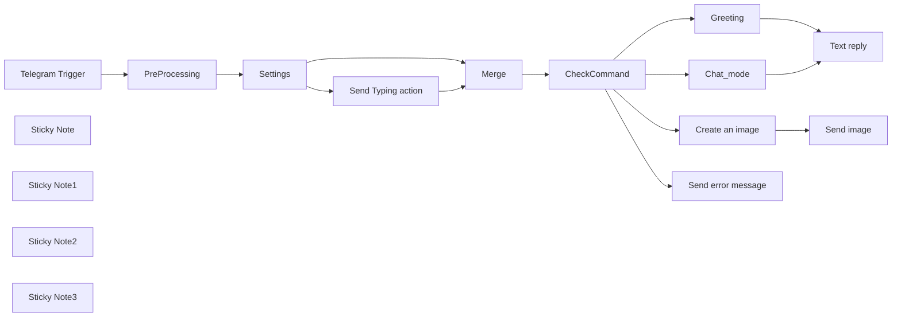

## Fluxo (.json) :

```json
{
  "id": "177",
  "meta": {
    "instanceId": "dfdeafd1c3ed2ee08eeab8c2fa0c3f522066931ed8138ccd35dc20a1e69decd3"
  },
  "name": "Telegram AI-bot",
  "tags": [
    {
      "id": "15",
      "name": "tutorial",
      "createdAt": "2022-10-04T20:07:25.607Z",
      "updatedAt": "2022-10-04T20:07:25.607Z"
    }
  ],
  "nodes": [
    {
      "id": "ea71a467-a646-4aca-b72e-cef1249c74e2",
      "name": "Telegram Trigger",
      "type": "n8n-nodes-base.telegramTrigger",
      "position": [
        20,
        340
      ],
      "webhookId": "51942fbb-ca0e-4ec4-9423-5fcc7d3c4281",
      "parameters": {
        "updates": [
          "*"
        ],
        "additionalFields": {}
      },
      "credentials": {
        "telegramApi": {
          "id": "70",
          "name": "Telegram bot"
        }
      },
      "typeVersion": 1
    },
    {
      "id": "1cbe43d4-ea8b-4178-bc10-4bfad7abe143",
      "name": "CheckCommand",
      "type": "n8n-nodes-base.switch",
      "position": [
        980,
        360
      ],
      "parameters": {
        "rules": {
          "rules": [
            {
              "value2": "/",
              "operation": "notStartsWith"
            },
            {
              "output": 1,
              "value2": "/start",
              "operation": "startsWith"
            },
            {
              "output": 2,
              "value2": "=/image ",
              "operation": "startsWith"
            }
          ]
        },
        "value1": "={{ $json.message?.text }}",
        "dataType": "string",
        "fallbackOutput": 3
      },
      "typeVersion": 1
    },
    {
      "id": "074e907f-634b-4242-b669-33fa064f8472",
      "name": "Sticky Note",
      "type": "n8n-nodes-base.stickyNote",
      "position": [
        1600,
        581.661764705882
      ],
      "parameters": {
        "width": 316.1071428571428,
        "height": 231.22373949579838,
        "content": "## Error fallback for unsupported commands"
      },
      "typeVersion": 1
    },
    {
      "id": "2aa961b8-f0af-4d5c-a6af-1be56ea4b2e6",
      "name": "Settings",
      "type": "n8n-nodes-base.set",
      "position": [
        380,
        340
      ],
      "parameters": {
        "values": {
          "number": [
            {
              "name": "model_temperature",
              "value": 0.8
            },
            {
              "name": "token_length",
              "value": 500
            }
          ],
          "string": [
            {
              "name": "system_command",
              "value": "=You are a friendly chatbot. User name is {{ $json?.message?.from?.first_name }}. User system language is {{ $json?.message?.from?.language_code }}. First, detect user text language. Next, provide your reply in the same language. Include several suitable emojis in your answer."
            },
            {
              "name": "bot_typing",
              "value": "={{ $json?.message?.text.startsWith('/image') ? \"upload_photo\" : \"typing\" }}"
            }
          ]
        },
        "options": {}
      },
      "typeVersion": 2
    },
    {
      "id": "2d2fe268-1e3e-483b-847c-4412e586c1ca",
      "name": "Sticky Note1",
      "type": "n8n-nodes-base.stickyNote",
      "position": [
        1240,
        -240
      ],
      "parameters": {
        "width": 330.5019024637719,
        "height": 233,
        "content": "## Chatbot mode by default\n### (when no command is provided)"
      },
      "typeVersion": 1
    },
    {
      "id": "09a9c0b4-ac6e-46eb-b2e0-ef2b55e94ada",
      "name": "Sticky Note2",
      "type": "n8n-nodes-base.stickyNote",
      "position": [
        1240,
        20
      ],
      "parameters": {
        "width": 330.7863484403046,
        "height": 219.892857142857,
        "content": "## Welcome message\n### /start"
      },
      "typeVersion": 1
    },
    {
      "id": "088cffee-5720-488b-a4ec-cfdccbf77e75",
      "name": "Chat_mode",
      "type": "n8n-nodes-base.openAi",
      "position": [
        1340,
        -160
      ],
      "parameters": {
        "model": "gpt-4",
        "prompt": {
          "messages": [
            {
              "role": "system",
              "content": "={{ $json.system_command }}"
            },
            {
              "content": "={{ $json.message.text }}"
            }
          ]
        },
        "options": {
          "maxTokens": "={{ $json.token_length }}",
          "temperature": "={{ $json.model_temperature }}"
        },
        "resource": "chat"
      },
      "credentials": {
        "openAiApi": {
          "id": "63",
          "name": "OpenAi account"
        }
      },
      "typeVersion": 1
    },
    {
      "id": "41248697-6474-4a8f-a8b8-038c96465948",
      "name": "Greeting",
      "type": "n8n-nodes-base.openAi",
      "position": [
        1340,
        80
      ],
      "parameters": {
        "prompt": {
          "messages": [
            {
              "role": "system",
              "content": "={{ $json.system_command }}"
            },
            {
              "content": "=This is the first message from a user. Please welcome a new user in `{{ $json.message.from.language_code }}` language"
            }
          ]
        },
        "options": {
          "maxTokens": "={{ $json.token_length }}",
          "temperature": "={{ $json.model_temperature }}"
        },
        "resource": "chat"
      },
      "credentials": {
        "openAiApi": {
          "id": "63",
          "name": "OpenAi account"
        }
      },
      "typeVersion": 1
    },
    {
      "id": "20c2e7fa-5d65-441b-8d1d-a8d46c624964",
      "name": "Text reply",
      "type": "n8n-nodes-base.telegram",
      "position": [
        1700,
        -40
      ],
      "parameters": {
        "text": "={{ $json.message.content }}",
        "chatId": "={{ $('Settings').first().json.message.from.id }}",
        "additionalFields": {
          "parse_mode": "Markdown"
        }
      },
      "credentials": {
        "telegramApi": {
          "id": "70",
          "name": "Telegram bot"
        }
      },
      "typeVersion": 1
    },
    {
      "id": "30321276-ebe1-41ac-b420-9dab8daa405b",
      "name": "Send Typing action",
      "type": "n8n-nodes-base.telegram",
      "position": [
        580,
        480
      ],
      "parameters": {
        "action": "={{ $json.bot_typing }}",
        "chatId": "={{ $json.message.from.id }}",
        "operation": "sendChatAction"
      },
      "credentials": {
        "telegramApi": {
          "id": "70",
          "name": "Telegram bot"
        }
      },
      "typeVersion": 1
    },
    {
      "id": "7d7ff2e8-b0ca-4638-a056-f7b4e2e6273d",
      "name": "Merge",
      "type": "n8n-nodes-base.merge",
      "position": [
        800,
        360
      ],
      "parameters": {
        "mode": "chooseBranch"
      },
      "typeVersion": 2.1
    },
    {
      "id": "656bab5e-b7f7-47a1-8e75-4a17d2070290",
      "name": "Sticky Note3",
      "type": "n8n-nodes-base.stickyNote",
      "position": [
        1240,
        280
      ],
      "parameters": {
        "width": 329.7428571428562,
        "height": 233.8785714285713,
        "content": "## Create an image\n### /image + request"
      },
      "typeVersion": 1
    },
    {
      "id": "ca2111d2-463a-4ef0-9436-ee09598dbf07",
      "name": "Create an image",
      "type": "n8n-nodes-base.openAi",
      "position": [
        1340,
        360
      ],
      "parameters": {
        "prompt": "={{ $json.message.text.split(' ').slice(1).join(' ') }}",
        "options": {
          "n": 1,
          "size": "512x512"
        },
        "resource": "image",
        "responseFormat": "imageUrl"
      },
      "credentials": {
        "openAiApi": {
          "id": "63",
          "name": "OpenAi account"
        }
      },
      "typeVersion": 1
    },
    {
      "id": "e91d616b-1d5e-40e8-8468-2d0b2dda4cf7",
      "name": "Send error message",
      "type": "n8n-nodes-base.telegram",
      "position": [
        1700,
        660
      ],
      "parameters": {
        "text": "=Sorry, {{ $json.message.from.first_name }}! This command is not supported yet. Please type some text to a chat bot or try this command:\n/image \\[your prompt]\n\nEnter the command, then space and provide your request. Example:\n\n`/image a picture or a cute little kitten with big eyes. Miyazaki studio ghibli style`",
        "chatId": "={{ $json.message.from.id }}",
        "additionalFields": {
          "parse_mode": "Markdown"
        }
      },
      "credentials": {
        "telegramApi": {
          "id": "70",
          "name": "Telegram bot"
        }
      },
      "typeVersion": 1
    },
    {
      "id": "125e27d2-b03b-4f02-9dd1-8fc81ecf0b6b",
      "name": "Send image",
      "type": "n8n-nodes-base.telegram",
      "position": [
        1700,
        360
      ],
      "parameters": {
        "file": "={{ $json.url }}",
        "chatId": "={{ $('Settings').first().json.message.from.id }}",
        "operation": "sendPhoto",
        "additionalFields": {}
      },
      "credentials": {
        "telegramApi": {
          "id": "70",
          "name": "Telegram bot"
        }
      },
      "typeVersion": 1
    },
    {
      "id": "730a51ac-223e-4956-be7f-166eadb6ed81",
      "name": "PreProcessing",
      "type": "n8n-nodes-base.set",
      "position": [
        200,
        340
      ],
      "parameters": {
        "values": {
          "string": [
            {
              "name": "message.text",
              "value": "={{ $json?.message?.text || \"\" }}"
            }
          ]
        },
        "options": {
          "dotNotation": true
        }
      },
      "typeVersion": 2
    }
  ],
  "active": true,
  "pinData": {},
  "settings": {},
  "versionId": "6ab99e3f-845d-42cc-847b-37cf19a72e93",
  "connections": {
    "Merge": {
      "main": [
        [
          {
            "node": "CheckCommand",
            "type": "main",
            "index": 0
          }
        ]
      ]
    },
    "Greeting": {
      "main": [
        [
          {
            "node": "Text reply",
            "type": "main",
            "index": 0
          }
        ]
      ]
    },
    "Settings": {
      "main": [
        [
          {
            "node": "Send Typing action",
            "type": "main",
            "index": 0
          },
          {
            "node": "Merge",
            "type": "main",
            "index": 0
          }
        ]
      ]
    },
    "Chat_mode": {
      "main": [
        [
          {
            "node": "Text reply",
            "type": "main",
            "index": 0
          }
        ]
      ]
    },
    "CheckCommand": {
      "main": [
        [
          {
            "node": "Chat_mode",
            "type": "main",
            "index": 0
          }
        ],
        [
          {
            "node": "Greeting",
            "type": "main",
            "index": 0
          }
        ],
        [
          {
            "node": "Create an image",
            "type": "main",
            "index": 0
          }
        ],
        [
          {
            "node": "Send error message",
            "type": "main",
            "index": 0
          }
        ]
      ]
    },
    "PreProcessing": {
      "main": [
        [
          {
            "node": "Settings",
            "type": "main",
            "index": 0
          }
        ]
      ]
    },
    "Create an image": {
      "main": [
        [
          {
            "node": "Send image",
            "type": "main",
            "index": 0
          }
        ]
      ]
    },
    "Telegram Trigger": {
      "main": [
        [
          {
            "node": "PreProcessing",
            "type": "main",
            "index": 0
          }
        ]
      ]
    },
    "Send Typing action": {
      "main": [
        [
          {
            "node": "Merge",
            "type": "main",
            "index": 1
          }
        ]
      ]
    }
  }
}
```

<a id="template-191"></a>

## Template 191 - Pixel de rastreamento transparente para abrir e-mails

- **Nome:** Pixel de rastreamento transparente para abrir e-mails
- **Descrição:** Serve um pixel PNG transparente via uma URL para detectar quando um e-mail é aberto, podendo receber um identificador para associar a abertura a um destinatário.
- **Funcionalidade:** • Servir pixel transparente 1x1: responde com uma imagem PNG 1x1 codificada em Base64 convertida para binário.
• Aceitar parâmetro id via query: permite identificar o destinatário ou campanha associada à requisição do pixel.
• Responder com conteúdo binário apropriado: define o MIME type image/png e envia o arquivo como resposta HTTP.
• Registro opcional de evento: possibilidade de logar o id, timestamp, IP e user agent para análise posterior.
• Embutir em e-mails: o pixel pode ser usado dentro de um  em HTML para rastrear aberturas.
• Observações de privacidade e bloqueio: informa sobre bloqueio de imagens por clientes de e-mail e necessidade de conformidade com leis de privacidade.
- **Ferramentas:** • Cliente de e-mail: carrega imagens embutidas nos e-mails e aciona o pixel ao abrir a mensagem.
• Cliente HTTP / Navegador: realiza a requisição ao endpoint do pixel quando a imagem é solicitada.
• Servidor com URL pública: disponibiliza o endpoint acessível externamente para receber as requisições do pixel.
• Banco de dados ou sistema de logs (opcional): armazena eventos de abertura, metadados e timestamps para análise.


## Fluxo visual

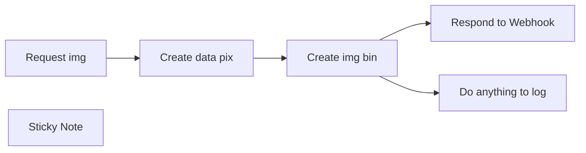

## Fluxo (.json) :

```json
{
  "meta": {
    "instanceId": "854c212d3baca2d6108faeb1187a4f6d9a3e60117068e7e872ad5e663327af93"
  },
  "nodes": [
    {
      "id": "c02e3038-96e8-4bfe-a4fa-925207fef0ee",
      "name": "Create data pix",
      "type": "n8n-nodes-base.set",
      "position": [
        220,
        0
      ],
      "parameters": {
        "options": {},
        "assignments": {
          "assignments": [
            {
              "id": "ab15b0f8-c40f-4874-8724-ddae8f99e646",
              "name": "data",
              "type": "string",
              "value": "iVBORw0KGgoAAAANSUhEUgAAAAEAAAABCAYAAAAfFcSJAAAAAXNSR0IArs4c6QAAAARnQU1BAACxjwv8YQUAAAAJcEhZcwAADsMAAA7DAcdvqGQAAAAYdEVYdFNvZnR3YXJlAFBhaW50Lk5FVCA1LjEuMvu8A7YAAAC2ZVhJZklJKgAIAAAABQAaAQUAAQAAAEoAAAAbAQUAAQAAAFIAAAAoAQMAAQAAAAIAAAAxAQIAEAAAAFoAAABphwQAAQAAAGoAAAAAAAAAYAAAAAEAAABgAAAAAQAAAFBhaW50Lk5FVCA1LjEuMgADAACQBwAEAAAAMDIzMAGgAwABAAAAAQAAAAWgBAABAAAAlAAAAAAAAAACAAEAAgAEAAAAUjk4AAIABwAEAAAAMDEwMAAAAADp1fY4ytpsegAAAA1JREFUGFdjYGBgYAAAAAUAAYoz4wAAAAAASUVORK5CYII="
            }
          ]
        }
      },
      "typeVersion": 3.4
    },
    {
      "id": "09573a6a-88e8-48c5-a78e-d45fb37a8b87",
      "name": "Create img bin",
      "type": "n8n-nodes-base.convertToFile",
      "position": [
        440,
        0
      ],
      "parameters": {
        "options": {
          "mimeType": "image/png"
        },
        "operation": "toBinary",
        "sourceProperty": "data",
        "binaryPropertyName": "pixel"
      },
      "typeVersion": 1.1
    },
    {
      "id": "07c42dab-9b60-4f51-b8ab-78df26bc2cdd",
      "name": "Respond to Webhook",
      "type": "n8n-nodes-base.respondToWebhook",
      "position": [
        660,
        0
      ],
      "parameters": {
        "options": {},
        "respondWith": "binary"
      },
      "typeVersion": 1.1
    },
    {
      "id": "cb0df6bc-d733-4e07-9506-c413d390e482",
      "name": "Request img",
      "type": "n8n-nodes-base.webhook",
      "position": [
        0,
        0
      ],
      "webhookId": "db4880e7-2134-4994-94e5-a4a3aa120440",
      "parameters": {
        "path": "db4880e7-2134-4994-94e5-a4a3aa120440",
        "options": {},
        "responseMode": "responseNode"
      },
      "typeVersion": 2
    },
    {
      "id": "b7153f9a-f635-48c4-b8fe-d9e93deb33ed",
      "name": "Do anything to log",
      "type": "n8n-nodes-base.noOp",
      "position": [
        660,
        200
      ],
      "parameters": {},
      "typeVersion": 1
    },
    {
      "id": "d5e4143c-f321-4632-9adf-e95ca718210f",
      "name": "Sticky Note",
      "type": "n8n-nodes-base.stickyNote",
      "position": [
        -80,
        360
      ],
      "parameters": {
        "width": 980,
        "height": 1280,
        "content": "## 📬 Workflow: Transparent Tracking Pixel for Email Open Detection\n\n### 📌 Description\nThis workflow serves a **1x1 transparent PNG image** via a webhook, which can be embedded in an email to **track when the email is opened**. When the image is loaded by the recipient's email client, the webhook is triggered, optionally capturing a `userId` to identify who opened the email.\n\n---\n\n### 📂 Workflow Steps\n\n1. **Webhook Trigger** (`Request img`)\n   - **Path:** `/webhook/change-with-your-id`\n   - Triggered by an HTTP request (e.g. when the image is loaded in an email).\n   - Accepts a query parameter `id` to identify the recipient.\n\n2. **Set Base64 Data** (`Create data pix`)\n   - Creates a variable `data` containing a Base64-encoded transparent PNG image (1x1 pixel).\n\n3. **Convert to Binary** (`Create img bin`)\n   - Converts the Base64 `data` string into a binary file.\n   - Sets MIME type to `image/png`.\n\n4. **Respond to Webhook** (`Respond to Webhook`)\n   - Sends the binary image file in the HTTP response.\n\n5. **Logging** (`Do anything to log`)\n   - Placeholder node to log or process the `id` or request metadata.\n   - You can access the `id` using `{{$json[\"query\"][\"id\"]}}`.\n   - You can also use any parameter you want\n\n---\n\n### ✉️ How to Use in Emails\n\nEmbed the image in an HTML email like this:\n\n```html\n/webhook/db4880e7-2134-4994-94e5-a4a3aa120440?id=1234\" width=\"1\" height=\"1\" style=\"display:none;\" alt=\"\" />\n```\n\nWhen the email is opened and the image is loaded, the workflow will be triggered.\n\n---\n\n### 🛠️ Notes\n- Some email clients block images by default; this may prevent tracking.\n- You can enhance the workflow to store open events in a database, log the timestamp, IP, or user agent.\n- Make sure to comply with data privacy and consent regulations (e.g. GDPR)."
      },
      "typeVersion": 1
    }
  ],
  "pinData": {},
  "connections": {
    "Request img": {
      "main": [
        [
          {
            "node": "Create data pix",
            "type": "main",
            "index": 0
          }
        ]
      ]
    },
    "Create img bin": {
      "main": [
        [
          {
            "node": "Respond to Webhook",
            "type": "main",
            "index": 0
          },
          {
            "node": "Do anything to log",
            "type": "main",
            "index": 0
          }
        ]
      ]
    },
    "Create data pix": {
      "main": [
        [
          {
            "node": "Create img bin",
            "type": "main",
            "index": 0
          }
        ]
      ]
    }
  }
}
```

<a id="template-192"></a>

## Template 192 - Lembretes de tarefas do Notion via Slack

- **Nome:** Lembretes de tarefas do Notion via Slack
- **Descrição:** Envia lembretes diários às manhãs de dias úteis com as tarefas incompletas de usuários do Notion, entregues como mensagens diretas no Slack.
- **Funcionalidade:** • Agendamento diário: Executa a automação de segunda a sexta às 09:00 para disparar os lembretes.
• Recuperação de tarefas: Obtém todas as tarefas de um banco de dados de tarefas no Notion.
• Filtragem de tarefas incompletas: Exclui tarefas com status "Done", processando apenas pendências.
• Mapeamento de responsáveis: Compara o e-mail do responsável na tarefa com uma lista configurada para determinar o destinatário.
• Recuperação e identificação de usuários do Slack: Busca todos os usuários do Slack e identifica o usuário correto por nome completo.
• Envio de mensagens diretas: Envia mensagens diretas ao usuário com o título da tarefa e data de vencimento como anexo/preview.
- **Ferramentas:** • Notion: Armazena o banco de dados de tarefas e informações dos responsáveis (e-mails, datas de vencimento, status).
• Slack: Plataforma para identificar usuários e enviar mensagens diretas com os lembretes das tarefas.


## Fluxo visual

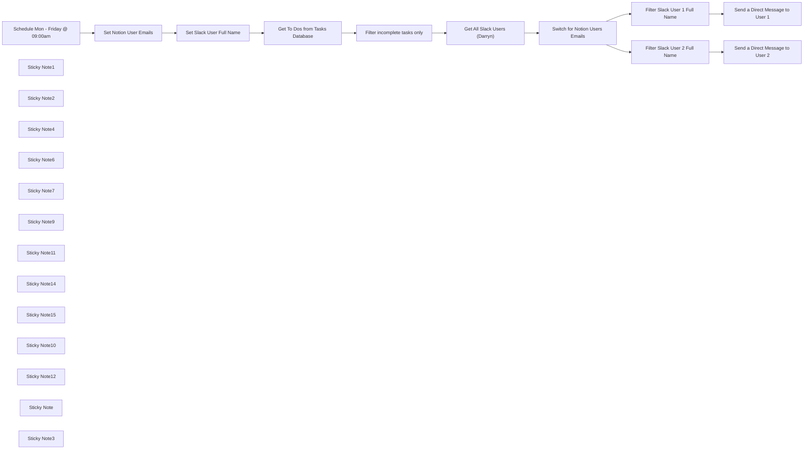

## Fluxo (.json) :

```json
{
  "meta": {
    "instanceId": "38d37c49298b42c645e6a7693766d7c3522b24e54454034f955422b5d7af611c"
  },
  "nodes": [
    {
      "id": "d2e53ca7-07e1-499b-8f29-9a2a1de10824",
      "name": "Filter incomplete tasks only",
      "type": "n8n-nodes-base.filter",
      "position": [
        220,
        380
      ],
      "parameters": {
        "conditions": {
          "string": [
            {
              "value1": "={{ $json.Status }}",
              "value2": "Done",
              "operation": "notEqual"
            }
          ]
        }
      },
      "typeVersion": 1
    },
    {
      "id": "2ff58ec6-58a3-4bf0-adba-d2d0ae87944e",
      "name": "Get All Slack Users (Darryn)",
      "type": "n8n-nodes-base.slack",
      "position": [
        440,
        380
      ],
      "parameters": {
        "resource": "user",
        "operation": "getAll",
        "authentication": "oAuth2"
      },
      "credentials": {
        "slackOAuth2Api": {
          "id": "xkCA23zAF89RcovP",
          "name": "Slack Account (OAuth)  (darryn@optimus01.co.za)"
        }
      },
      "executeOnce": false,
      "typeVersion": 1
    },
    {
      "id": "ff9a6853-b254-4a4f-aa8d-89546e78de0b",
      "name": "Get To Dos from Tasks Database",
      "type": "n8n-nodes-base.notion",
      "position": [
        20,
        380
      ],
      "parameters": {
        "options": {},
        "resource": "databasePage",
        "operation": "getAll",
        "databaseId": {
          "__rl": true,
          "mode": "list",
          "value": "1197be57-c54f-815f-8d3b-fdbbb741b19c",
          "cachedResultUrl": "https://www.notion.so/1197be57c54f815f8d3bfdbbb741b19c",
          "cachedResultName": "Tasks "
        }
      },
      "credentials": {
        "notionApi": {
          "id": "n1DsMuDcWjPxXlfD",
          "name": "Notion Account (darryn@optimus01.co.za)"
        }
      },
      "typeVersion": 1
    },
    {
      "id": "c9856834-1a6b-4e2e-bb77-9b3c74c34ccf",
      "name": "Schedule Mon - Friday @ 09:00am",
      "type": "n8n-nodes-base.cron",
      "position": [
        -600,
        380
      ],
      "parameters": {
        "triggerTimes": {
          "item": [
            {
              "mode": "custom",
              "cronExpression": "0 9 * * 1,2,3,4,5"
            }
          ]
        }
      },
      "typeVersion": 1
    },
    {
      "id": "41e67948-1d4a-4654-8817-dbcf61eb061d",
      "name": "Set Notion User Emails",
      "type": "n8n-nodes-base.set",
      "position": [
        -380,
        380
      ],
      "parameters": {
        "options": {},
        "assignments": {
          "assignments": [
            {
              "id": "94663427-c288-446a-96df-ddfc3fe332f0",
              "name": "User 1 Notion Email",
              "type": "string",
              "value": "darryn@optimus01.co.za"
            },
            {
              "id": "bed7739d-640a-43cc-9fb5-4472844ccc09",
              "name": "User 2 Notion Email",
              "type": "string",
              "value": "cassie@optimus01.com"
            }
          ]
        }
      },
      "typeVersion": 3.4
    },
    {
      "id": "3a59b653-dd65-4443-b2d0-44cce3e780dd",
      "name": "Set Slack User Full Name",
      "type": "n8n-nodes-base.set",
      "position": [
        -180,
        380
      ],
      "parameters": {
        "options": {},
        "assignments": {
          "assignments": [
            {
              "id": "94663427-c288-446a-96df-ddfc3fe332f0",
              "name": "User 1 Slack Full Name",
              "type": "string",
              "value": "Darryn Balanco"
            },
            {
              "id": "bed7739d-640a-43cc-9fb5-4472844ccc09",
              "name": "User 2 Slack Full Name",
              "type": "string",
              "value": "Cassandra Balanco"
            }
          ]
        }
      },
      "typeVersion": 3.4
    },
    {
      "id": "340af945-5e22-408f-86de-b4e4160ec751",
      "name": "Send a Direct Message to User 1",
      "type": "n8n-nodes-base.slack",
      "position": [
        1200,
        260
      ],
      "parameters": {
        "text": "# TO DO",
        "channel": "={{ $json.id }}",
        "attachments": [
          {
            "title": "=☑️  {{ $('Filter incomplete tasks only').item.json.Task }} (Due: {{ $('Filter incomplete tasks only').item.json.Due.start }})"
          }
        ],
        "otherOptions": {
          "mrkdwn": true
        },
        "authentication": "oAuth2"
      },
      "credentials": {
        "slackOAuth2Api": {
          "id": "xkCA23zAF89RcovP",
          "name": "Slack Account (OAuth)  (darryn@optimus01.co.za)"
        }
      },
      "typeVersion": 1
    },
    {
      "id": "df9bc0b5-7a34-407d-a412-dd4022943e41",
      "name": "Send a Direct Message to User 2",
      "type": "n8n-nodes-base.slack",
      "position": [
        1200,
        500
      ],
      "parameters": {
        "text": "# TO DO",
        "channel": "={{ $json.id }}",
        "attachments": [
          {
            "title": "=☑️  {{ $('Filter incomplete tasks only').item.json.Task }} (Due: {{ $('Filter incomplete tasks only').item.json.Due.start }})"
          }
        ],
        "otherOptions": {
          "mrkdwn": true
        },
        "authentication": "oAuth2"
      },
      "credentials": {
        "slackOAuth2Api": {
          "id": "xkCA23zAF89RcovP",
          "name": "Slack Account (OAuth)  (darryn@optimus01.co.za)"
        }
      },
      "typeVersion": 1
    },
    {
      "id": "f6ab26d3-27d9-4b06-886d-64bbaf5d4f92",
      "name": "Switch for Notion Users Emails",
      "type": "n8n-nodes-base.switch",
      "position": [
        720,
        380
      ],
      "parameters": {
        "rules": {
          "values": [
            {
              "outputKey": "User 1 Notion Tasks",
              "conditions": {
                "options": {
                  "version": 2,
                  "leftValue": "",
                  "caseSensitive": true,
                  "typeValidation": "strict"
                },
                "combinator": "and",
                "conditions": [
                  {
                    "operator": {
                      "type": "string",
                      "operation": "contains"
                    },
                    "leftValue": "={{ $('Filter incomplete tasks only').item.json['Notion User'].toString() }}",
                    "rightValue": "={{ $('Set Notion User Emails').item.json['User 1 Notion Email'] }}"
                  }
                ]
              },
              "renameOutput": true
            },
            {
              "outputKey": "User 2 Notion Tasks",
              "conditions": {
                "options": {
                  "version": 2,
                  "leftValue": "",
                  "caseSensitive": true,
                  "typeValidation": "strict"
                },
                "combinator": "and",
                "conditions": [
                  {
                    "id": "d0bf512b-15e4-4dd6-b468-50cec25c3e2c",
                    "operator": {
                      "type": "string",
                      "operation": "contains"
                    },
                    "leftValue": "={{ $('Filter incomplete tasks only').item.json['Notion User'].toString() }}",
                    "rightValue": "={{ $('Set Notion User Emails').item.json['User 2 Notion Email'] }}"
                  }
                ]
              },
              "renameOutput": true
            }
          ]
        },
        "options": {}
      },
      "typeVersion": 3.2
    },
    {
      "id": "4492bc68-e8ef-4417-b3d2-d7fb9418db17",
      "name": "Filter Slack User 1 Full Name",
      "type": "n8n-nodes-base.filter",
      "position": [
        980,
        260
      ],
      "parameters": {
        "options": {},
        "conditions": {
          "options": {
            "version": 2,
            "leftValue": "",
            "caseSensitive": true,
            "typeValidation": "strict"
          },
          "combinator": "and",
          "conditions": [
            {
              "id": "6aafbbd7-065c-4253-b905-07c7df9210c1",
              "operator": {
                "name": "filter.operator.equals",
                "type": "string",
                "operation": "equals"
              },
              "leftValue": "={{ $json.profile.real_name }}",
              "rightValue": "={{ $('Set Slack User Full Name').item.json['User 1 Slack Full Name'] }}"
            }
          ]
        }
      },
      "typeVersion": 2.2
    },
    {
      "id": "159b3436-9141-4769-a495-14e9fdd37f1d",
      "name": "Filter Slack User 2 Full Name",
      "type": "n8n-nodes-base.filter",
      "position": [
        980,
        500
      ],
      "parameters": {
        "options": {},
        "conditions": {
          "options": {
            "version": 2,
            "leftValue": "",
            "caseSensitive": true,
            "typeValidation": "strict"
          },
          "combinator": "and",
          "conditions": [
            {
              "id": "6aafbbd7-065c-4253-b905-07c7df9210c1",
              "operator": {
                "name": "filter.operator.equals",
                "type": "string",
                "operation": "equals"
              },
              "leftValue": "={{ $json.profile.real_name }}",
              "rightValue": "={{ $('Set Slack User Full Name').item.json['User 2 Slack Full Name'] }}"
            }
          ]
        }
      },
      "typeVersion": 2.2
    },
    {
      "id": "5b863aea-a4d5-486e-82a9-a4f2b713f8f8",
      "name": "Sticky Note1",
      "type": "n8n-nodes-base.stickyNote",
      "position": [
        -670.7551894447033,
        180
      ],
      "parameters": {
        "color": 7,
        "width": 232.28640473083397,
        "height": 395.93315440190497,
        "content": "## Schedule Mon - Friday @ 09:00am\nTriggers the workflow every weekday at 9:00 AM. This ensures that the reminders are sent at the start of the day.\n"
      },
      "typeVersion": 1
    },
    {
      "id": "420236d0-5139-4faf-9b2e-dca35b15a6b9",
      "name": "Sticky Note2",
      "type": "n8n-nodes-base.stickyNote",
      "position": [
        -424.62240527764834,
        180
      ],
      "parameters": {
        "color": 7,
        "width": 377.1025213664834,
        "height": 397.4539493179217,
        "content": "## Set Notion User Emails and Slack User Full Name\nStores the email addresses of Notion users, and full names of the Slack users to be matched later in the workflow."
      },
      "typeVersion": 1
    },
    {
      "id": "751c8fb7-0b38-4a83-bf55-82be400f59a7",
      "name": "Sticky Note4",
      "type": "n8n-nodes-base.stickyNote",
      "position": [
        -33.06639208352749,
        180
      ],
      "parameters": {
        "width": 400.70229197070614,
        "height": 397.31352154531925,
        "content": "## Get To Dos from Tasks Database and Filter incomplete tasks only\nRetrieves all tasks from the specified Notion database and filters out tasks that are marked as \"Done,\" ensuring that only incomplete tasks are processed."
      },
      "typeVersion": 1
    },
    {
      "id": "4e352442-ce25-4e36-b334-c6b1e0896d06",
      "name": "Sticky Note6",
      "type": "n8n-nodes-base.stickyNote",
      "position": [
        384.62240527764834,
        180
      ],
      "parameters": {
        "color": 3,
        "width": 240.32164378964495,
        "height": 398.1826056622561,
        "content": "## Get All Slack Users\nFetches all users from Slack to enable proper identification of who should receive the reminders.\n"
      },
      "typeVersion": 1
    },
    {
      "id": "5dde41f6-b66f-4abb-8bc6-9226b06e9331",
      "name": "Sticky Note7",
      "type": "n8n-nodes-base.stickyNote",
      "position": [
        640,
        180
      ],
      "parameters": {
        "width": 267.7344316658903,
        "height": 398.29835161802384,
        "content": "## Switch for Notion Users Emails\nDetermines which user (User 1 or User 2) is assigned the task in Notion by comparing email addresses, routing the workflow accordingly.\n"
      },
      "typeVersion": 1
    },
    {
      "id": "3babdb0f-29d7-4ff7-9174-3ae0b5a4979d",
      "name": "Sticky Note9",
      "type": "n8n-nodes-base.stickyNote",
      "position": [
        920,
        83.27096255097126
      ],
      "parameters": {
        "color": 3,
        "width": 455.87875185735516,
        "height": 592.983420807127,
        "content": "## Filter Slack User and Send a Direct Message to User\nFilters Slack users to identify User 1 based on their full name and sends a direct Slack message to User with the details of their incomplete tasks.\n"
      },
      "typeVersion": 1
    },
    {
      "id": "43e36d12-b477-49fa-aed0-e28304310894",
      "name": "Sticky Note11",
      "type": "n8n-nodes-base.stickyNote",
      "position": [
        -1140,
        260
      ],
      "parameters": {
        "color": 6,
        "width": 396.6384066163515,
        "height": 282.5799404564392,
        "content": "### Get More Templates Like This 👇\n[](http://onlinethinking.io/community)\n"
      },
      "typeVersion": 1
    },
    {
      "id": "6eefe33e-0dc9-4ee8-8ad4-f61078e74227",
      "name": "Sticky Note14",
      "type": "n8n-nodes-base.stickyNote",
      "position": [
        -1520,
        620
      ],
      "parameters": {
        "width": 777.0408639013781,
        "height": 216.76250654583106,
        "content": "## Setup\n1. **`Connect Notion`**: You will need to connect your Notion account and specify the database containing tasks.\n2. **`Connect Slack`**: Authenticate with Slack using OAuth to allow the workflow to send messages on your behalf.\n3. **`Notion user Email Address mapping`**: Ensure that the Notion users’ email addresses are correctly mapped to their corresponding Notion user profiles.\n4. **`Slack user Full Name mapping`**: Ensure that the Slack users’ full names are correctly mapped to their corresponding Slack user profiles.\n5. **`Adjust schedule`**: If needed, modify the schedule node to run at a different time or frequency.\n"
      },
      "typeVersion": 1
    },
    {
      "id": "8a91c90e-a9b6-4948-beb4-773e8c9f91f7",
      "name": "Sticky Note15",
      "type": "n8n-nodes-base.stickyNote",
      "position": [
        -1520,
        860
      ],
      "parameters": {
        "color": 7,
        "width": 777.0408639013781,
        "height": 179.2285042683488,
        "content": "## How to customize this workflow\n- **`Change the Notion Tasks database`**: You can adjust the workflow to pull tasks from a different Notion database by modifying the \"Get To Dos from Tasks Database\" node.\n- **`Add more users`**: The workflow currently supports two users, but you can expand it to support more by adding additional logic in the \"Switch for Notion Users Emails\" node.\n- **`Modify the message format`**: The Slack message content can be customized further to include more task details or change the message format.\n"
      },
      "typeVersion": 1
    },
    {
      "id": "9e03e28e-f4ce-4c75-85ab-e7ffe0f1bfd7",
      "name": "Sticky Note10",
      "type": "n8n-nodes-base.stickyNote",
      "position": [
        -1520,
        220
      ],
      "parameters": {
        "color": 7,
        "width": 366.75796434038665,
        "height": 379.6332969008185,
        "content": "## What this workflow does\n1. **`Triggers every weekday at 9:00 AM`**: The workflow runs at 9:00 AM, Monday through Friday.\n2. **`Fetches tasks from Notion`**: It retrieves tasks from a Notion database.\n3. **`Filters incomplete tasks`**: The workflow filters tasks that are not marked as \"Done.\"\n4. **`Fetches Slack users`**: It retrieves all Slack users to ensure that the reminders are sent to the correct user.\n5. **`Matches tasks to the correct user`**: It checks the Notion task assignee and matches it with the appropriate Slack user.\n6. **`Sends Slack reminders`**: Sends a Slack direct message to each user with their incomplete tasks and due dates."
      },
      "typeVersion": 1
    },
    {
      "id": "eb0942b9-d18f-46a2-bea0-23eb07bb1d85",
      "name": "Sticky Note12",
      "type": "n8n-nodes-base.stickyNote",
      "position": [
        -1535,
        58
      ],
      "parameters": {
        "color": 7,
        "width": 809.515353297114,
        "height": 999.58820121335,
        "content": "## Automated Notion Task Reminders via Slack\nBuilt for the [Let's Automate It Community](http://onlinethinking.io/community) by [Optimus Agency](https://optimus01.co.za/)\n\nThis workflow automates sending task reminders from a Notion database to Slack users. By running every weekday morning, it ensures that users receive timely reminders of their incomplete tasks, helping them stay organized and efficient."
      },
      "typeVersion": 1
    },
    {
      "id": "f4334588-60dd-456a-839f-6e5610ce18b8",
      "name": "Sticky Note",
      "type": "n8n-nodes-base.stickyNote",
      "position": [
        -400,
        32.55329198368918
      ],
      "parameters": {
        "color": 4,
        "width": 314.0627775112129,
        "height": 133.34123489274947,
        "content": "# EDIT THE FIELDS HERE 👇"
      },
      "typeVersion": 1
    },
    {
      "id": "50bd2206-7b97-454e-9b21-be6e8af7eb7d",
      "name": "Sticky Note3",
      "type": "n8n-nodes-base.stickyNote",
      "position": [
        -671.0639503804273,
        33.191851141281106
      ],
      "parameters": {
        "color": 7,
        "width": 231.9017050322621,
        "height": 132.26101263924207,
        "content": "## 💡 Tip\n[Crontab Guru](https://crontab.guru/) is a simple and intuitive web-based tool that helps users create, edit, and understand cron schedules. "
      },
      "typeVersion": 1
    }
  ],
  "pinData": {},
  "connections": {
    "Set Notion User Emails": {
      "main": [
        [
          {
            "node": "Set Slack User Full Name",
            "type": "main",
            "index": 0
          }
        ]
      ]
    },
    "Set Slack User Full Name": {
      "main": [
        [
          {
            "node": "Get To Dos from Tasks Database",
            "type": "main",
            "index": 0
          }
        ]
      ]
    },
    "Filter incomplete tasks only": {
      "main": [
        [
          {
            "node": "Get All Slack Users (Darryn)",
            "type": "main",
            "index": 0
          }
        ]
      ]
    },
    "Get All Slack Users (Darryn)": {
      "main": [
        [
          {
            "node": "Switch for Notion Users Emails",
            "type": "main",
            "index": 0
          }
        ]
      ]
    },
    "Filter Slack User 1 Full Name": {
      "main": [
        [
          {
            "node": "Send a Direct Message to User 1",
            "type": "main",
            "index": 0
          }
        ]
      ]
    },
    "Filter Slack User 2 Full Name": {
      "main": [
        [
          {
            "node": "Send a Direct Message to User 2",
            "type": "main",
            "index": 0
          }
        ]
      ]
    },
    "Get To Dos from Tasks Database": {
      "main": [
        [
          {
            "node": "Filter incomplete tasks only",
            "type": "main",
            "index": 0
          }
        ]
      ]
    },
    "Switch for Notion Users Emails": {
      "main": [
        [
          {
            "node": "Filter Slack User 1 Full Name",
            "type": "main",
            "index": 0
          }
        ],
        [
          {
            "node": "Filter Slack User 2 Full Name",
            "type": "main",
            "index": 0
          }
        ]
      ]
    },
    "Schedule Mon - Friday @ 09:00am": {
      "main": [
        [
          {
            "node": "Set Notion User Emails",
            "type": "main",
            "index": 0
          }
        ]
      ]
    }
  }
}
```

<a id="template-193"></a>

## Template 193 - Importação de empresas e contatos para Salesforce

- **Nome:** Importação de empresas e contatos para Salesforce
- **Descrição:** Este fluxo baixa uma planilha Excel, identifica empresas novas e existentes e cria ou atualiza contas e contactos no Salesforce, evitando duplicados.
- **Funcionalidade:** • Download da planilha: Baixa um ficheiro Excel a partir de uma URL pública.
• Leitura da planilha: Extrai linhas com dados de empresas e contactos do ficheiro Excel.
• Busca de contas existentes: Pesquisa no Salesforce por contas com o mesmo nome para cada entrada.
• Separação entre novas e existentes: Compara nomes para segregar empresas que já existem das que são novas.
• Remoção de duplicados: Elimina entradas duplicadas de empresas antes da criação.
• Criação de contas novas: Cria novas contas no Salesforce usando o nome da empresa.
• Associação de IDs de conta: Atribui o ID da conta existente ou recém-criada aos contactos correspondentes.
• Upsert de contactos: Cria ou atualiza contactos no Salesforce usando o e-mail como identificador externo, associando-os à conta correta.
- **Ferramentas:** • Servidor HTTP/URL público: Fornece o ficheiro Excel para importação.
• Salesforce: Serviço CRM usado para procurar, criar e atualizar contas e contactos.


## Fluxo visual

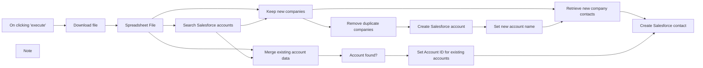

## Fluxo (.json) :

```json
{
  "nodes": [
    {
      "id": "76f6b074-32a5-4419-aa0f-80505b3a31ad",
      "name": "On clicking 'execute'",
      "type": "n8n-nodes-base.manualTrigger",
      "position": [
        20,
        240
      ],
      "parameters": {},
      "typeVersion": 1
    },
    {
      "id": "42289f01-3af9-4bc3-babb-54b983de7e77",
      "name": "Search Salesforce accounts",
      "type": "n8n-nodes-base.salesforce",
      "position": [
        680,
        240
      ],
      "parameters": {
        "query": "=SELECT id, Name FROM Account WHERE Name = '{{$json[\"Company Name\"].replace(/'/g, '\\\\\\'')}}'",
        "resource": "search"
      },
      "credentials": {
        "salesforceOAuth2Api": {
          "id": "40",
          "name": "Salesforce account"
        }
      },
      "typeVersion": 1,
      "alwaysOutputData": false
    },
    {
      "id": "954ef43f-4dc1-4955-9c56-c5d11bcd5d6e",
      "name": "Keep new companies",
      "type": "n8n-nodes-base.merge",
      "position": [
        900,
        40
      ],
      "parameters": {
        "mode": "removeKeyMatches",
        "propertyName1": "Company Name",
        "propertyName2": "Name"
      },
      "typeVersion": 1
    },
    {
      "id": "ec23bd4f-c6ee-4c2a-a352-8ff521a5ddf6",
      "name": "Merge existing account data",
      "type": "n8n-nodes-base.merge",
      "position": [
        900,
        440
      ],
      "parameters": {
        "mode": "mergeByKey",
        "propertyName1": "Company Name",
        "propertyName2": "Name"
      },
      "typeVersion": 1
    },
    {
      "id": "85b460ee-e6b4-48c8-8315-ccf7875ec345",
      "name": "Account found?",
      "type": "n8n-nodes-base.if",
      "position": [
        1120,
        440
      ],
      "parameters": {
        "conditions": {
          "string": [
            {
              "value1": "={{ $json[\"Id\"] }}",
              "operation": "isNotEmpty"
            }
          ]
        }
      },
      "typeVersion": 1
    },
    {
      "id": "1c926f04-b218-4460-8a56-c39a0854d50e",
      "name": "Remove duplicate companies",
      "type": "n8n-nodes-base.itemLists",
      "position": [
        1120,
        140
      ],
      "parameters": {
        "compare": "selectedFields",
        "options": {},
        "operation": "removeDuplicates",
        "fieldsToCompare": {
          "fields": [
            {
              "fieldName": "Company Name"
            }
          ]
        }
      },
      "typeVersion": 1
    },
    {
      "id": "d35c3b0b-d7a8-4182-9277-17080655436b",
      "name": "Set Account ID for existing accounts",
      "type": "n8n-nodes-base.renameKeys",
      "position": [
        1340,
        440
      ],
      "parameters": {
        "keys": {
          "key": [
            {
              "newKey": "Account ID",
              "currentKey": "Id"
            }
          ]
        },
        "additionalOptions": {}
      },
      "typeVersion": 1
    },
    {
      "id": "3747fdfa-f5f8-41b0-8393-1ac2ae29bab5",
      "name": "Retrieve new company contacts",
      "type": "n8n-nodes-base.merge",
      "position": [
        1780,
        40
      ],
      "parameters": {
        "mode": "mergeByKey",
        "propertyName1": "Company Name",
        "propertyName2": "Name"
      },
      "typeVersion": 1
    },
    {
      "id": "0879e6a0-d782-4a0a-98f3-eeccbea760f6",
      "name": "Set new account name",
      "type": "n8n-nodes-base.set",
      "position": [
        1560,
        140
      ],
      "parameters": {
        "values": {
          "string": [
            {
              "name": "id",
              "value": "={{ $json[\"id\"] }}"
            },
            {
              "name": "Name",
              "value": "={{ $node[\"Remove duplicate companies\"].json[\"Company Name\"] }}"
            }
          ]
        },
        "options": {},
        "keepOnlySet": true
      },
      "typeVersion": 1
    },
    {
      "id": "7263c4dd-64eb-44c4-9839-fe3e5aa7ddbc",
      "name": "Create Salesforce account",
      "type": "n8n-nodes-base.salesforce",
      "position": [
        1340,
        140
      ],
      "parameters": {
        "name": "={{ $json[\"Company Name\"] }}",
        "resource": "account",
        "additionalFields": {}
      },
      "credentials": {
        "salesforceOAuth2Api": {
          "id": "40",
          "name": "Salesforce account"
        }
      },
      "typeVersion": 1
    },
    {
      "id": "40d168af-346a-46ea-9fa0-641edd0f4937",
      "name": "Create Salesforce contact",
      "type": "n8n-nodes-base.salesforce",
      "position": [
        2000,
        240
      ],
      "parameters": {
        "lastname": "={{ $json[\"Last Name\"] }}",
        "resource": "contact",
        "operation": "upsert",
        "externalId": "Email",
        "externalIdValue": "={{ $json[\"Email\"] }}",
        "additionalFields": {
          "email": "={{ $json[\"Email\"] }}",
          "firstName": "={{ $json[\"First Name\"] }}",
          "acconuntId": "={{ $json[\"Account ID\"] }}"
        }
      },
      "credentials": {
        "salesforceOAuth2Api": {
          "id": "40",
          "name": "Salesforce account"
        }
      },
      "typeVersion": 1
    },
    {
      "id": "dcd40640-c1d6-407c-95c9-84759ecaafab",
      "name": "Note",
      "type": "n8n-nodes-base.stickyNote",
      "position": [
        -20,
        0
      ],
      "parameters": {
        "width": 400,
        "height": 400,
        "content": "## Downloading a file\nIn this example workflow, the spreadsheet file is downloaded from an HTTP location.\n\nDepending on your scenario you might want to swap the HTTP Request node downloading the file with another node fetching the file from another source (such as an FTP service, cloud storage, your local filesystem or an email for example)."
      },
      "typeVersion": 1
    },
    {
      "id": "2fc38a06-11ec-4aa5-83f9-624f5a5ef47a",
      "name": "Download file",
      "type": "n8n-nodes-base.httpRequest",
      "position": [
        240,
        240
      ],
      "parameters": {
        "url": "https://static.thomasmartens.eu/n8n/Excel-File-to-Salesforce.xlsx",
        "options": {},
        "responseFormat": "file"
      },
      "typeVersion": 2
    },
    {
      "id": "43d5ba55-d150-4c7e-b44a-531733418c68",
      "name": "Spreadsheet File",
      "type": "n8n-nodes-base.spreadsheetFile",
      "position": [
        460,
        240
      ],
      "parameters": {
        "options": {}
      },
      "typeVersion": 1
    }
  ],
  "connections": {
    "Download file": {
      "main": [
        [
          {
            "node": "Spreadsheet File",
            "type": "main",
            "index": 0
          }
        ]
      ]
    },
    "Account found?": {
      "main": [
        [
          {
            "node": "Set Account ID for existing accounts",
            "type": "main",
            "index": 0
          }
        ]
      ]
    },
    "Spreadsheet File": {
      "main": [
        [
          {
            "node": "Search Salesforce accounts",
            "type": "main",
            "index": 0
          },
          {
            "node": "Keep new companies",
            "type": "main",
            "index": 0
          },
          {
            "node": "Merge existing account data",
            "type": "main",
            "index": 0
          }
        ]
      ]
    },
    "Keep new companies": {
      "main": [
        [
          {
            "node": "Remove duplicate companies",
            "type": "main",
            "index": 0
          },
          {
            "node": "Retrieve new company contacts",
            "type": "main",
            "index": 0
          }
        ]
      ]
    },
    "Set new account name": {
      "main": [
        [
          {
            "node": "Retrieve new company contacts",
            "type": "main",
            "index": 1
          }
        ]
      ]
    },
    "On clicking 'execute'": {
      "main": [
        [
          {
            "node": "Download file",
            "type": "main",
            "index": 0
          }
        ]
      ]
    },
    "Create Salesforce account": {
      "main": [
        [
          {
            "node": "Set new account name",
            "type": "main",
            "index": 0
          }
        ]
      ]
    },
    "Remove duplicate companies": {
      "main": [
        [
          {
            "node": "Create Salesforce account",
            "type": "main",
            "index": 0
          }
        ]
      ]
    },
    "Search Salesforce accounts": {
      "main": [
        [
          {
            "node": "Keep new companies",
            "type": "main",
            "index": 1
          },
          {
            "node": "Merge existing account data",
            "type": "main",
            "index": 1
          }
        ]
      ]
    },
    "Merge existing account data": {
      "main": [
        [
          {
            "node": "Account found?",
            "type": "main",
            "index": 0
          }
        ]
      ]
    },
    "Retrieve new company contacts": {
      "main": [
        [
          {
            "node": "Create Salesforce contact",
            "type": "main",
            "index": 0
          }
        ]
      ]
    },
    "Set Account ID for existing accounts": {
      "main": [
        [
          {
            "node": "Create Salesforce contact",
            "type": "main",
            "index": 0
          }
        ]
      ]
    }
  }
}
```

<a id="template-194"></a>

## Template 194 - Exportar dados XML para Google Sheets

- **Nome:** Exportar dados XML para Google Sheets
- **Descrição:** Baixa um arquivo XML público, converte em registros e os exporta para uma nova planilha no Google Sheets.
- **Funcionalidade:** • Gatilho manual: Inicia o fluxo ao clicar em executar.
• Download do arquivo XML: Obtém um arquivo XML a partir de uma URL pública.
• Parse do XML em estrutura de dados: Converte o XML em objetos estruturados para processamento.
• Separação de itens: Divide a lista de itens em registros individuais.
• Criação de planilha nova: Gera uma nova planilha com título configurado.
• Definição dinâmica de cabeçalho: Extrai as chaves do primeiro registro para montar a linha de cabeçalho.
• Escrita do cabeçalho: Insere a linha de cabeçalho na planilha criada.
• Sincronização antes de gravação: Aguarda a criação da planilha antes de inserir os dados.
• Inserção dos dados: Anexa os registros individuais como linhas na planilha.
- **Ferramentas:** • Fonte XML pública (W3Schools): URL de exemplo que fornece o arquivo XML com os dados de menu.
• Google Sheets: Serviço de planilhas online usado para criar e armazenar a planilha resultante.

## Fluxo visual

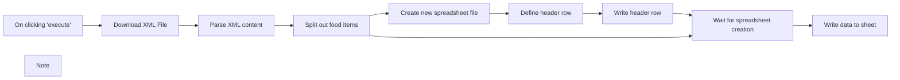

## Fluxo (.json) :

```json
{
  "nodes": [
    {
      "id": "d0c92688-14fc-4393-a1d6-926eb867b81e",
      "name": "On clicking 'execute'",
      "type": "n8n-nodes-base.manualTrigger",
      "position": [
        180,
        240
      ],
      "parameters": {},
      "typeVersion": 1
    },
    {
      "id": "0edbad78-249b-441c-877d-bac57fb44a91",
      "name": "Note",
      "type": "n8n-nodes-base.stickyNote",
      "position": [
        180,
        31
      ],
      "parameters": {
        "width": 436,
        "height": 169,
        "content": "## n8n version\n\nThis workflow was created using n8n version 0.197.1 and uses a new [expression syntax](https://docs.n8n.io/code-examples/methods-variables-reference/) as well as a new version of the Merge node. Make sure you're also using n8n version 0.197.1 or newer when running this workflow."
      },
      "typeVersion": 1
    },
    {
      "id": "251d893c-11cb-4702-a289-44f198581722",
      "name": "Download XML File",
      "type": "n8n-nodes-base.httpRequest",
      "position": [
        400,
        240
      ],
      "parameters": {
        "url": "https://www.w3schools.com/xml/simple.xml",
        "options": {}
      },
      "typeVersion": 3
    },
    {
      "id": "0973b302-1ba9-4faf-9d6c-2caca1b301f5",
      "name": "Parse XML content",
      "type": "n8n-nodes-base.xml",
      "position": [
        620,
        240
      ],
      "parameters": {
        "options": {}
      },
      "typeVersion": 1
    },
    {
      "id": "01854111-27cb-40c1-b95e-14f91f89e9f1",
      "name": "Create new spreadsheet file",
      "type": "n8n-nodes-base.googleSheets",
      "position": [
        1060,
        140
      ],
      "parameters": {
        "title": "My XML Data",
        "options": {},
        "resource": "spreadsheet"
      },
      "credentials": {
        "googleSheetsOAuth2Api": {
          "id": "19",
          "name": "Tom's Google Sheets account"
        }
      },
      "executeOnce": true,
      "typeVersion": 2
    },
    {
      "id": "affbcb81-5873-406e-a51d-cd6fee682992",
      "name": "Define header row",
      "type": "n8n-nodes-base.set",
      "position": [
        1280,
        140
      ],
      "parameters": {
        "values": {
          "string": [
            {
              "name": "columns",
              "value": "={{ [ Object.keys($(\"Split out food items\").first().json) ] }}"
            }
          ]
        },
        "options": {},
        "keepOnlySet": true
      },
      "executeOnce": true,
      "typeVersion": 1
    },
    {
      "id": "537aff03-ae08-4712-bfae-15f0e3a5e69a",
      "name": "Split out food items",
      "type": "n8n-nodes-base.itemLists",
      "position": [
        840,
        240
      ],
      "parameters": {
        "options": {},
        "fieldToSplitOut": "breakfast_menu.food"
      },
      "typeVersion": 1
    },
    {
      "id": "b247f984-6ed2-4de0-8877-a61571863ff8",
      "name": "Write header row",
      "type": "n8n-nodes-base.googleSheets",
      "position": [
        1500,
        140
      ],
      "parameters": {
        "options": {},
        "rawData": true,
        "sheetId": "={{ $(\"Create new spreadsheet file\").first().json[\"spreadsheetId\"] }}",
        "operation": "update",
        "dataProperty": "columns"
      },
      "credentials": {
        "googleSheetsOAuth2Api": {
          "id": "19",
          "name": "Tom's Google Sheets account"
        }
      },
      "typeVersion": 2
    },
    {
      "id": "fc9e2c32-30b1-4162-a686-2d049e52e111",
      "name": "Wait for spreadsheet creation",
      "type": "n8n-nodes-base.merge",
      "position": [
        1720,
        240
      ],
      "parameters": {
        "mode": "chooseBranch",
        "output": "input2"
      },
      "typeVersion": 2
    },
    {
      "id": "fdc6d5d9-e08d-4086-a233-0edb3c11bc86",
      "name": "Write data to sheet",
      "type": "n8n-nodes-base.googleSheets",
      "position": [
        1940,
        240
      ],
      "parameters": {
        "options": {},
        "sheetId": "={{ $(\"Create new spreadsheet file\").first().json[\"spreadsheetId\"] }}",
        "operation": "append"
      },
      "credentials": {
        "googleSheetsOAuth2Api": {
          "id": "19",
          "name": "Tom's Google Sheets account"
        }
      },
      "typeVersion": 2
    }
  ],
  "connections": {
    "Write header row": {
      "main": [
        [
          {
            "node": "Wait for spreadsheet creation",
            "type": "main",
            "index": 0
          }
        ]
      ]
    },
    "Define header row": {
      "main": [
        [
          {
            "node": "Write header row",
            "type": "main",
            "index": 0
          }
        ]
      ]
    },
    "Download XML File": {
      "main": [
        [
          {
            "node": "Parse XML content",
            "type": "main",
            "index": 0
          }
        ]
      ]
    },
    "Parse XML content": {
      "main": [
        [
          {
            "node": "Split out food items",
            "type": "main",
            "index": 0
          }
        ]
      ]
    },
    "Split out food items": {
      "main": [
        [
          {
            "node": "Create new spreadsheet file",
            "type": "main",
            "index": 0
          },
          {
            "node": "Wait for spreadsheet creation",
            "type": "main",
            "index": 1
          }
        ]
      ]
    },
    "On clicking 'execute'": {
      "main": [
        [
          {
            "node": "Download XML File",
            "type": "main",
            "index": 0
          }
        ]
      ]
    },
    "Create new spreadsheet file": {
      "main": [
        [
          {
            "node": "Define header row",
            "type": "main",
            "index": 0
          }
        ]
      ]
    },
    "Wait for spreadsheet creation": {
      "main": [
        [
          {
            "node": "Write data to sheet",
            "type": "main",
            "index": 0
          }
        ]
      ]
    }
  }
}
```

<a id="template-195"></a>

## Template 195 - SMS diário com temperatura

- **Nome:** SMS diário com temperatura
- **Descrição:** Envia um SMS diário às 9h com a temperatura atual de Berlim obtida de um serviço de clima.
- **Funcionalidade:** • Agendamento diário: Dispara o fluxo diariamente às 9h para iniciar o processo.
• Consulta de temperatura: Recupera a temperatura atual da cidade de Berlim a partir de um serviço meteorológico.
• Envio de SMS personalizado: Envia uma mensagem de texto contendo a temperatura atual integrada no corpo da mensagem.
- **Ferramentas:** • OpenWeatherMap: Serviço que fornece dados meteorológicos, incluindo a temperatura atual de uma cidade especificada.
• Plivo: Plataforma para envio de SMS que permite enviar mensagens de texto usando credenciais de API.

## Fluxo visual

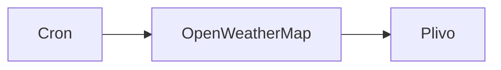

## Fluxo (.json) :

```json
{
  "nodes": [
    {
      "name": "Plivo",
      "type": "n8n-nodes-base.plivo",
      "position": [
        1030,
        400
      ],
      "parameters": {
        "message": "=Hey! The temperature outside is {{$node[\"OpenWeatherMap\"].json[\"main\"][\"temp\"]}}°C."
      },
      "credentials": {
        "plivoApi": "Plivo API Credentials"
      },
      "typeVersion": 1
    },
    {
      "name": "OpenWeatherMap",
      "type": "n8n-nodes-base.openWeatherMap",
      "position": [
        830,
        400
      ],
      "parameters": {
        "cityName": "berlin"
      },
      "credentials": {
        "openWeatherMapApi": "owm"
      },
      "typeVersion": 1
    },
    {
      "name": "Cron",
      "type": "n8n-nodes-base.cron",
      "position": [
        630,
        400
      ],
      "parameters": {
        "triggerTimes": {
          "item": [
            {
              "hour": 9
            }
          ]
        }
      },
      "typeVersion": 1
    }
  ],
  "connections": {
    "Cron": {
      "main": [
        [
          {
            "node": "OpenWeatherMap",
            "type": "main",
            "index": 0
          }
        ]
      ]
    },
    "OpenWeatherMap": {
      "main": [
        [
          {
            "node": "Plivo",
            "type": "main",
            "index": 0
          }
        ]
      ]
    }
  }
}
```

<a id="template-196"></a>

## Template 196 - Criar, atualizar e obter produto WooCommerce

- **Nome:** Criar, atualizar e obter produto WooCommerce
- **Descrição:** Cria um produto no WooCommerce, atualiza sua quantidade em estoque e recupera os dados atualizados do produto.
- **Funcionalidade:** • Criação de produto: Cria um produto com nome, descrição e preço regular no WooCommerce.
• Atualização de produto: Atualiza o produto criado, definindo a quantidade em estoque.
• Recuperação de produto: Recupera os dados do produto atualizado a partir do WooCommerce.
- **Ferramentas:** • WooCommerce: Plataforma de e-commerce que fornece API para criar, atualizar e consultar produtos, incluindo gerenciamento de preços, descrições e estoque.

## Fluxo visual

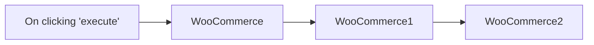

## Fluxo (.json) :

```json
{
  "id": "187",
  "name": "Create, update and get a product from WooCommerce",
  "nodes": [
    {
      "name": "On clicking 'execute'",
      "type": "n8n-nodes-base.manualTrigger",
      "position": [
        220,
        300
      ],
      "parameters": {},
      "typeVersion": 1
    },
    {
      "name": "WooCommerce",
      "type": "n8n-nodes-base.wooCommerce",
      "position": [
        430,
        300
      ],
      "parameters": {
        "name": "n8n Sweatshirt",
        "imagesUi": {
          "imagesValues": []
        },
        "metadataUi": {
          "metadataValues": []
        },
        "additionalFields": {
          "description": "Stay warm with this sweatshirt!",
          "regularPrice": "30"
        }
      },
      "credentials": {
        "wooCommerceApi": "woocommerce"
      },
      "typeVersion": 1
    },
    {
      "name": "WooCommerce1",
      "type": "n8n-nodes-base.wooCommerce",
      "position": [
        630,
        300
      ],
      "parameters": {
        "operation": "update",
        "productId": "={{$node[\"WooCommerce\"].json[\"id\"]}}",
        "updateFields": {
          "stockQuantity": 100
        }
      },
      "credentials": {
        "wooCommerceApi": "woocommerce"
      },
      "typeVersion": 1
    },
    {
      "name": "WooCommerce2",
      "type": "n8n-nodes-base.wooCommerce",
      "position": [
        830,
        300
      ],
      "parameters": {
        "operation": "get",
        "productId": "={{$node[\"WooCommerce\"].json[\"id\"]}}"
      },
      "credentials": {
        "wooCommerceApi": "woocommerce"
      },
      "typeVersion": 1
    }
  ],
  "active": false,
  "settings": {},
  "connections": {
    "WooCommerce": {
      "main": [
        [
          {
            "node": "WooCommerce1",
            "type": "main",
            "index": 0
          }
        ]
      ]
    },
    "WooCommerce1": {
      "main": [
        [
          {
            "node": "WooCommerce2",
            "type": "main",
            "index": 0
          }
        ]
      ]
    },
    "On clicking 'execute'": {
      "main": [
        [
          {
            "node": "WooCommerce",
            "type": "main",
            "index": 0
          }
        ]
      ]
    }
  }
}
```

<a id="template-197"></a>

## Template 197 - Backup de credenciais no GitHub

- **Nome:** Backup de credenciais no GitHub
- **Descrição:** Este fluxo exporta todas as credenciais da instância periodicamente e as armazena em arquivos JSON em um repositório no GitHub, criando ou atualizando arquivos com base no ID de cada credencial.
- **Funcionalidade:** • Agendamento de backup: executa a cada 2 horas para iniciar o fluxo de backup.
• Exportação de credenciais: obtém todas as credenciais com decriptação para gerar um JSON completo.
• Preparação dos dados: formata e ordena o JSON para comparação consistente.
• Verificação de mudanças: compara o conteúdo exportado com o existente no repositório para detectar alterações.
• Salvamento no repositório: cria ou atualiza arquivos nomeados por ID (ID.json) conforme o resultado da verificação, com mensagens de commit que refletem o estado (same, different ou new).
• Processamento em lotes: separa os itens em lotes para processamento eficiente.
• Configuração de repositório: utiliza dados no nó Globals (owner, nome do repositório e pasta) para localizar onde salvar os arquivos.
- **Ferramentas:** • GitHub: Serviço de hospedagem de código utilizado para armazenar os arquivos JSON de credenciais no repositório configurado.

## Fluxo visual

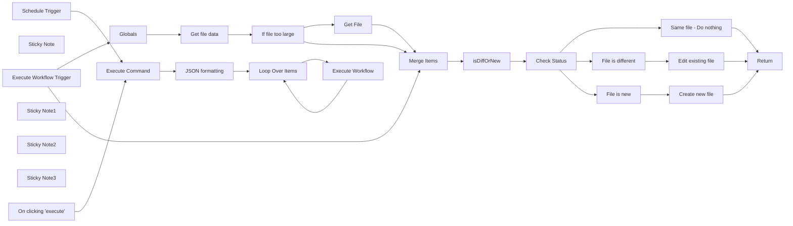

## Fluxo (.json) :

```json
{
  "meta": {
    "instanceId": "d6b502dfa4d9dd072cdc5c2bb763558661053f651289291352a84403e01b3d1b",
    "templateCredsSetupCompleted": true
  },
  "nodes": [
    {
      "id": "4377c764-07f3-4304-8105-d3f009925917",
      "name": "On clicking 'execute'",
      "type": "n8n-nodes-base.manualTrigger",
      "position": [
        1780,
        520
      ],
      "parameters": {},
      "typeVersion": 1
    },
    {
      "id": "10f6ea70-c2cb-4463-972c-e2fdef3e837a",
      "name": "Sticky Note",
      "type": "n8n-nodes-base.stickyNote",
      "position": [
        1339.5461279763795,
        900
      ],
      "parameters": {
        "color": 6,
        "width": 2086.845881354743,
        "height": 750.8363163824032,
        "content": "## Subworkflow"
      },
      "typeVersion": 1
    },
    {
      "id": "d22236c2-578c-400b-b3e5-354498620c39",
      "name": "Return",
      "type": "n8n-nodes-base.set",
      "position": [
        3220,
        1100
      ],
      "parameters": {
        "options": {},
        "assignments": {
          "assignments": [
            {
              "id": "8d513345-6484-431f-afb7-7cf045c90f4f",
              "name": "Done",
              "type": "boolean",
              "value": true
            }
          ]
        }
      },
      "typeVersion": 3.3
    },
    {
      "id": "943eed85-d4cd-4ec5-b278-d143b0f6bd15",
      "name": "Get File",
      "type": "n8n-nodes-base.httpRequest",
      "position": [
        2320,
        980
      ],
      "parameters": {
        "url": "={{ $json.download_url }}",
        "options": {}
      },
      "typeVersion": 4.2
    },
    {
      "id": "124ebdd7-c2c1-4fec-89d3-596f034e0fe7",
      "name": "If file too large",
      "type": "n8n-nodes-base.if",
      "position": [
        2120,
        1000
      ],
      "parameters": {
        "options": {},
        "conditions": {
          "options": {
            "version": 1,
            "leftValue": "",
            "caseSensitive": true,
            "typeValidation": "strict"
          },
          "combinator": "and",
          "conditions": [
            {
              "id": "45ce825e-9fa6-430c-8931-9aaf22c42585",
              "operator": {
                "type": "string",
                "operation": "empty",
                "singleValue": true
              },
              "leftValue": "={{ $json.content }}",
              "rightValue": ""
            },
            {
              "id": "9619a55f-7fb1-4f24-b1a7-7aeb82365806",
              "operator": {
                "type": "string",
                "operation": "notExists",
                "singleValue": true
              },
              "leftValue": "={{ $json.error }}",
              "rightValue": ""
            }
          ]
        }
      },
      "typeVersion": 2
    },
    {
      "id": "751621b4-4f99-4178-a691-40fc7488874b",
      "name": "Merge Items",
      "type": "n8n-nodes-base.merge",
      "position": [
        2120,
        1260
      ],
      "parameters": {},
      "typeVersion": 2
    },
    {
      "id": "8892eb02-0e8e-4617-85e6-e6f188361f95",
      "name": "isDiffOrNew",
      "type": "n8n-nodes-base.code",
      "position": [
        2320,
        1260
      ],
      "parameters": {
        "jsCode": "const orderJsonKeys = (jsonObj) => {\n  const ordered = {};\n  Object.keys(jsonObj).sort().forEach(key => {\n    ordered[key] = jsonObj[key];\n  });\n  return ordered;\n}\n\n// Check if file returned with content\nif (Object.keys($input.all()[0].json).includes(\"content\")) {\n  // Decode base64 content and parse JSON\n  const origWorkflow = JSON.parse(Buffer.from($input.all()[0].json.content, 'base64').toString());\n  const n8nWorkflow = $input.all()[1].json;\n  \n  // Order JSON objects\n  const orderedOriginal = orderJsonKeys(origWorkflow);\n  const orderedActual = orderJsonKeys(n8nWorkflow);\n\n  // Determine difference\n  if (JSON.stringify(orderedOriginal) === JSON.stringify(orderedActual)) {\n    $input.all()[0].json.github_status = \"same\";\n  } else {\n    $input.all()[0].json.github_status = \"different\";\n    $input.all()[0].json.n8n_data_stringy = JSON.stringify(orderedActual, null, 2);\n  }\n  $input.all()[0].json.content_decoded = orderedOriginal;\n// No file returned / new workflow\n} else if (Object.keys($input.all()[0].json).includes(\"data\")) {\n  const origWorkflow = JSON.parse($input.all()[0].json.data);\n  const n8nWorkflow = $input.all()[1].json;\n  \n  // Order JSON objects\n  const orderedOriginal = orderJsonKeys(origWorkflow);\n  const orderedActual = orderJsonKeys(n8nWorkflow);\n\n  // Determine difference\n  if (JSON.stringify(orderedOriginal) === JSON.stringify(orderedActual)) {\n    $input.all()[0].json.github_status = \"same\";\n  } else {\n    $input.all()[0].json.github_status = \"different\";\n    $input.all()[0].json.n8n_data_stringy = JSON.stringify(orderedActual, null, 2);\n  }\n  $input.all()[0].json.content_decoded = orderedOriginal;\n\n} else {\n  // Order JSON object\n  const n8nWorkflow = $input.all()[1].json;\n  const orderedActual = orderJsonKeys(n8nWorkflow);\n  \n  // Proper formatting\n  $input.all()[0].json.github_status = \"new\";\n  $input.all()[0].json.n8n_data_stringy = JSON.stringify(orderedActual, null, 2);\n}\n\n// Return items\nreturn $input.all();"
      },
      "typeVersion": 1
    },
    {
      "id": "bfddb2a2-c149-4710-bd77-b368d641114d",
      "name": "Check Status",
      "type": "n8n-nodes-base.switch",
      "position": [
        2540,
        1260
      ],
      "parameters": {
        "rules": {
          "rules": [
            {
              "value2": "same"
            },
            {
              "output": 1,
              "value2": "different"
            },
            {
              "output": 2,
              "value2": "new"
            }
          ]
        },
        "value1": "={{$json.github_status}}",
        "dataType": "string"
      },
      "typeVersion": 1
    },
    {
      "id": "681e54af-b916-416d-9801-ac38a5882bcf",
      "name": "Same file - Do nothing",
      "type": "n8n-nodes-base.noOp",
      "position": [
        2760,
        1100
      ],
      "parameters": {},
      "typeVersion": 1
    },
    {
      "id": "38b2041d-1d56-436f-aa04-79d7241dcc74",
      "name": "File is different",
      "type": "n8n-nodes-base.noOp",
      "position": [
        2760,
        1260
      ],
      "parameters": {},
      "typeVersion": 1
    },
    {
      "id": "ae33280d-10d5-4882-be9b-7972394357e1",
      "name": "File is new",
      "type": "n8n-nodes-base.noOp",
      "position": [
        2760,
        1420
      ],
      "parameters": {},
      "typeVersion": 1
    },
    {
      "id": "bea3995f-9f34-4119-a6cf-20281e70d685",
      "name": "Create new file",
      "type": "n8n-nodes-base.github",
      "position": [
        2980,
        1420
      ],
      "parameters": {
        "owner": {
          "__rl": true,
          "mode": "name",
          "value": "={{ $('Globals').item.json.repo.owner }}"
        },
        "filePath": "={{ $('Globals').item.json.repo.path }}{{$('Execute Workflow Trigger').first().json.id}}.json",
        "resource": "file",
        "repository": {
          "__rl": true,
          "mode": "name",
          "value": "={{ $('Globals').item.json.repo.name }}"
        },
        "fileContent": "={{$('isDiffOrNew').item.json[\"n8n_data_stringy\"]}}",
        "commitMessage": "={{$('Execute Workflow Trigger').first().json.name}} ({{$json.github_status}})"
      },
      "credentials": {
        "githubApi": {
          "id": "3mfzXcMjoqNHsujs",
          "name": "GitHub account"
        }
      },
      "typeVersion": 1
    },
    {
      "id": "d9172af3-55f8-4b99-b462-3e6e718b5a77",
      "name": "Edit existing file",
      "type": "n8n-nodes-base.github",
      "position": [
        2980,
        1240
      ],
      "parameters": {
        "owner": {
          "__rl": true,
          "mode": "name",
          "value": "={{ $('Globals').item.json.repo.owner }}"
        },
        "filePath": "={{ $('Globals').item.json.repo.path }}{{$('Execute Workflow Trigger').first().json.id}}.json",
        "resource": "file",
        "operation": "edit",
        "repository": {
          "__rl": true,
          "mode": "name",
          "value": "={{ $('Globals').item.json.repo.name }}"
        },
        "fileContent": "={{$('isDiffOrNew').item.json[\"n8n_data_stringy\"]}}",
        "commitMessage": "={{$('Execute Workflow Trigger').first().json.name}} ({{$json.github_status}})"
      },
      "credentials": {
        "githubApi": {
          "id": "3mfzXcMjoqNHsujs",
          "name": "GitHub account"
        }
      },
      "typeVersion": 1
    },
    {
      "id": "d9589e32-ed20-46e7-9427-1680c6222406",
      "name": "Loop Over Items",
      "type": "n8n-nodes-base.splitInBatches",
      "position": [
        2380,
        620
      ],
      "parameters": {
        "options": {}
      },
      "typeVersion": 3
    },
    {
      "id": "e1530650-aa76-4ab3-b5bb-cd6b805ea656",
      "name": "Schedule Trigger",
      "type": "n8n-nodes-base.scheduleTrigger",
      "position": [
        1780,
        720
      ],
      "parameters": {
        "rule": {
          "interval": [
            {
              "field": "hours",
              "hoursInterval": 2
            }
          ]
        }
      },
      "typeVersion": 1.2
    },
    {
      "id": "79910589-f40f-46fa-a704-eaa65157a17a",
      "name": "Sticky Note1",
      "type": "n8n-nodes-base.stickyNote",
      "position": [
        1340,
        278.28654385738866
      ],
      "parameters": {
        "color": 4,
        "width": 365.19481715599653,
        "height": 596.4810912485963,
        "content": "## Backup to GitHub \nThis workflow will backup all instance credentials to GitHub.\n\nThe files are saved `ID.json` for the filename.\n\n### Setup\nOpen `Globals` node and update the values below 👇\n\n- **repo.owner:** your Github username\n- **repo.name:** the name of your repository\n- **repo.path:** the folder to use within the repository. If it doesn't exist it will be created.\n\n\nIf your username was `john-doe` and your repository was called `n8n-backups` and you wanted the credentials to go into a `credentials` folder you would set:\n\n- repo.owner - john-doe\n- repo.name - n8n-backups\n- repo.path - credentials/\n\n\nThe workflow calls itself using a subworkflow, to help reduce memory usage."
      },
      "typeVersion": 1
    },
    {
      "id": "e16c9874-1a35-41c4-8410-0c42efe17770",
      "name": "Sticky Note2",
      "type": "n8n-nodes-base.stickyNote",
      "position": [
        1740,
        440
      ],
      "parameters": {
        "color": 7,
        "width": 1028.7522287279464,
        "height": 434.88564057365943,
        "content": "## Main workflow loop"
      },
      "typeVersion": 1
    },
    {
      "id": "a1464b91-516a-4fd9-9235-20de50e74cb2",
      "name": "Get file data",
      "type": "n8n-nodes-base.github",
      "position": [
        1920,
        1000
      ],
      "parameters": {
        "owner": {
          "__rl": true,
          "mode": "name",
          "value": "={{ $json.repo.owner }}"
        },
        "filePath": "={{ $json.repo.path }}{{ $('Execute Workflow Trigger').item.json.id }}.json",
        "resource": "file",
        "operation": "get",
        "repository": {
          "__rl": true,
          "mode": "name",
          "value": "={{ $json.repo.name }}"
        },
        "asBinaryProperty": false,
        "additionalParameters": {}
      },
      "credentials": {
        "githubApi": {
          "id": "3mfzXcMjoqNHsujs",
          "name": "GitHub account"
        }
      },
      "typeVersion": 1,
      "continueOnFail": true,
      "alwaysOutputData": true
    },
    {
      "id": "eb2fe87f-f3af-4215-ac1f-7c2b45e8aff6",
      "name": "Globals",
      "type": "n8n-nodes-base.set",
      "position": [
        1720,
        1160
      ],
      "parameters": {
        "options": {},
        "assignments": {
          "assignments": [
            {
              "id": "6cf546c5-5737-4dbd-851b-17d68e0a3780",
              "name": "repo.owner",
              "type": "string",
              "value": "john-doe"
            },
            {
              "id": "452efa28-2dc6-4ea3-a7a2-c35d100d0382",
              "name": "repo.name",
              "type": "string",
              "value": "n8n-backup"
            },
            {
              "id": "81c4dc54-86bf-4432-a23f-22c7ea831e74",
              "name": "repo.path",
              "type": "string",
              "value": "credentials/"
            }
          ]
        }
      },
      "typeVersion": 3.4
    },
    {
      "id": "f4498ab4-1760-4849-9fe1-ecfcd7baa9f3",
      "name": "Execute Command",
      "type": "n8n-nodes-base.executeCommand",
      "position": [
        2000,
        620
      ],
      "parameters": {
        "command": "npx n8n export:credentials --all --decrypted"
      },
      "typeVersion": 1
    },
    {
      "id": "d453a000-40ef-43f5-b108-5eb30422d1a3",
      "name": "JSON formatting",
      "type": "n8n-nodes-base.code",
      "position": [
        2180,
        620
      ],
      "parameters": {
        "jsCode": "// Function to beautify JSON\nfunction beautifyJson(jsonString) {\n  try {\n    // Parse the JSON string\n    const jsonObject = JSON.parse(jsonString);\n\n    // Format the JSON with indentation\n    return jsonObject; // Return the parsed object directly\n  } catch (error) {\n    // Return the error message if JSON is invalid\n    return `Invalid JSON: ${error.message}`;\n  }\n}\n\n// Retrieve the JSON object from the input data\nconst input = $input.all()[0].json;\n\n// Extract the JSON string from the stdout field\nconst jsonString = input.stdout.match(/\\[{.*}\\]/s);\n\n// Check if a valid JSON string is found\nif (!jsonString) {\n  return {\n    json: {\n      error: \"No valid JSON string found in stdout.\"\n    }\n  };\n}\n\n// Beautify the JSON\nconst beautifiedJson = beautifyJson(jsonString[0]);\n\n// Output the beautified JSON, ensuring each entry is in an object with a 'json' key\nconst output = beautifiedJson.map(entry => ({ json: entry }));\n\n// Return the output\nreturn output;\n"
      },
      "typeVersion": 2
    },
    {
      "id": "49dbf875-7345-4241-a7fc-f42e53aef64e",
      "name": "Sticky Note3",
      "type": "n8n-nodes-base.stickyNote",
      "position": [
        1680,
        1060
      ],
      "parameters": {
        "color": 4,
        "width": 150,
        "height": 80,
        "content": "## Edit this node 👇"
      },
      "typeVersion": 1
    },
    {
      "id": "98158f3e-7aca-456b-994c-4c795d31c18c",
      "name": "Execute Workflow",
      "type": "n8n-nodes-base.executeWorkflow",
      "position": [
        2600,
        620
      ],
      "parameters": {
        "mode": "each",
        "options": {},
        "workflowId": "={{ $workflow.id }}"
      },
      "typeVersion": 1
    },
    {
      "id": "d8c52eb7-bcb0-49e7-bb32-7499b1ca22cd",
      "name": "Execute Workflow Trigger",
      "type": "n8n-nodes-base.executeWorkflowTrigger",
      "position": [
        1440,
        1280
      ],
      "parameters": {
        "inputSource": "passthrough"
      },
      "typeVersion": 1.1
    }
  ],
  "pinData": {},
  "connections": {
    "Globals": {
      "main": [
        [
          {
            "node": "Get file data",
            "type": "main",
            "index": 0
          }
        ]
      ]
    },
    "Get File": {
      "main": [
        [
          {
            "node": "Merge Items",
            "type": "main",
            "index": 0
          }
        ]
      ]
    },
    "File is new": {
      "main": [
        [
          {
            "node": "Create new file",
            "type": "main",
            "index": 0
          }
        ]
      ]
    },
    "Merge Items": {
      "main": [
        [
          {
            "node": "isDiffOrNew",
            "type": "main",
            "index": 0
          }
        ]
      ]
    },
    "isDiffOrNew": {
      "main": [
        [
          {
            "node": "Check Status",
            "type": "main",
            "index": 0
          }
        ]
      ]
    },
    "Check Status": {
      "main": [
        [
          {
            "node": "Same file - Do nothing",
            "type": "main",
            "index": 0
          }
        ],
        [
          {
            "node": "File is different",
            "type": "main",
            "index": 0
          }
        ],
        [
          {
            "node": "File is new",
            "type": "main",
            "index": 0
          }
        ]
      ]
    },
    "Get file data": {
      "main": [
        [
          {
            "node": "If file too large",
            "type": "main",
            "index": 0
          }
        ]
      ]
    },
    "Create new file": {
      "main": [
        [
          {
            "node": "Return",
            "type": "main",
            "index": 0
          }
        ]
      ]
    },
    "Execute Command": {
      "main": [
        [
          {
            "node": "JSON formatting",
            "type": "main",
            "index": 0
          }
        ]
      ]
    },
    "JSON formatting": {
      "main": [
        [
          {
            "node": "Loop Over Items",
            "type": "main",
            "index": 0
          }
        ]
      ]
    },
    "Loop Over Items": {
      "main": [
        [],
        [
          {
            "node": "Execute Workflow",
            "type": "main",
            "index": 0
          },
          {
            "node": "Execute Workflow",
            "type": "main",
            "index": 0
          }
        ]
      ]
    },
    "Execute Workflow": {
      "main": [
        [
          {
            "node": "Loop Over Items",
            "type": "main",
            "index": 0
          }
        ]
      ]
    },
    "Schedule Trigger": {
      "main": [
        [
          {
            "node": "Execute Command",
            "type": "main",
            "index": 0
          }
        ]
      ]
    },
    "File is different": {
      "main": [
        [
          {
            "node": "Edit existing file",
            "type": "main",
            "index": 0
          }
        ]
      ]
    },
    "If file too large": {
      "main": [
        [
          {
            "node": "Get File",
            "type": "main",
            "index": 0
          }
        ],
        [
          {
            "node": "Merge Items",
            "type": "main",
            "index": 0
          }
        ]
      ]
    },
    "Edit existing file": {
      "main": [
        [
          {
            "node": "Return",
            "type": "main",
            "index": 0
          }
        ]
      ]
    },
    "On clicking 'execute'": {
      "main": [
        [
          {
            "node": "Execute Command",
            "type": "main",
            "index": 0
          }
        ]
      ]
    },
    "Same file - Do nothing": {
      "main": [
        [
          {
            "node": "Return",
            "type": "main",
            "index": 0
          }
        ]
      ]
    },
    "Execute Workflow Trigger": {
      "main": [
        [
          {
            "node": "Globals",
            "type": "main",
            "index": 0
          },
          {
            "node": "Merge Items",
            "type": "main",
            "index": 1
          }
        ]
      ]
    }
  }
}
```

<a id="template-198"></a>

## Template 198 - Envio via Twilio (execução manual)

- **Nome:** Envio via Twilio (execução manual)
- **Descrição:** Fluxo que, quando executado manualmente, aciona uma integração com o Twilio para enviar mensagens ou executar ações configuradas via API.
- **Funcionalidade:** • Execução manual: inicia o fluxo ao acionar a execução.
• Integração com Twilio: realiza chamadas à API do Twilio para enviar mensagens ou executar ações.
• Encaminhamento de dados: transmite os dados do gatilho para a operação do Twilio.
• Autenticação via credenciais: utiliza credenciais da API para autorizar as requisições ao serviço.
- **Ferramentas:** • Twilio: Plataforma de comunicação em nuvem que fornece APIs para envio de SMS, chamadas telefônicas e outras funcionalidades de comunicação.

## Fluxo visual


## Fluxo (.json) :

```json
{
  "name": "A workflow with the Twilio node",
  "nodes": [
    {
      "name": "On clicking 'execute'",
      "type": "n8n-nodes-base.manualTrigger",
      "position": [
        250,
        300
      ],
      "parameters": {},
      "typeVersion": 1
    },
    {
      "name": "Twilio",
      "type": "n8n-nodes-base.twilio",
      "position": [
        430,
        300
      ],
      "parameters": {},
      "credentials": {
        "twilioApi": ""
      },
      "typeVersion": 1
    }
  ],
  "active": false,
  "settings": {},
  "connections": {
    "On clicking 'execute'": {
      "main": [
        [
          {
            "node": "Twilio",
            "type": "main",
            "index": 0
          }
        ]
      ]
    }
  }
}
```

<a id="template-199"></a>

## Template 199 - Envio diário de temperatura no Line

- **Nome:** Envio diário de temperatura no Line
- **Descrição:** Envia diariamente uma mensagem no Line com a temperatura atual de Berlim às 9:00.
- **Funcionalidade:** • Agendamento diário às 9h: Dispara o fluxo todos os dias às 09:00 para iniciar a rotina.
• Consulta de clima em Berlim: Busca os dados meteorológicos da cidade (inclusive temperatura atual) por meio de uma API de clima.
• Envio de mensagem no Line: Formata e envia uma mensagem contendo a temperatura em °C para o destinatário via serviço de mensagens.
- **Ferramentas:** • OpenWeatherMap: API que fornece dados meteorológicos, incluindo temperatura atual por cidade.
• Line Notify: Serviço de envio de notificações/mensagens para usuários ou grupos no aplicativo Line.

## Fluxo visual

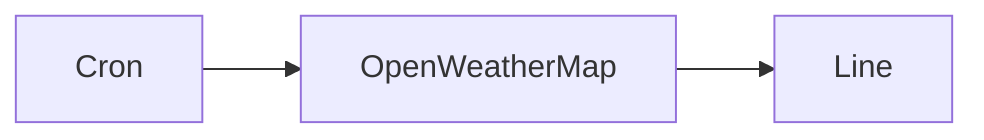

## Fluxo (.json) :

```json
{
  "id": "114",
  "name": "Send daily weather updates via a message in Line",
  "nodes": [
    {
      "name": "Line",
      "type": "n8n-nodes-base.line",
      "position": [
        890,
        380
      ],
      "parameters": {
        "message": "=Hey! The temperature outside is {{$node[\"OpenWeatherMap\"].json[\"main\"][\"temp\"]}}°C.",
        "additionalFields": {}
      },
      "credentials": {
        "lineNotifyOAuth2Api": "line-credentials"
      },
      "typeVersion": 1
    },
    {
      "name": "Cron",
      "type": "n8n-nodes-base.cron",
      "position": [
        490,
        380
      ],
      "parameters": {
        "triggerTimes": {
          "item": [
            {
              "hour": 9
            }
          ]
        }
      },
      "typeVersion": 1
    },
    {
      "name": "OpenWeatherMap",
      "type": "n8n-nodes-base.openWeatherMap",
      "position": [
        690,
        380
      ],
      "parameters": {
        "cityName": "berlin"
      },
      "credentials": {
        "openWeatherMapApi": "owm"
      },
      "typeVersion": 1
    }
  ],
  "active": false,
  "settings": {},
  "connections": {
    "Cron": {
      "main": [
        [
          {
            "node": "OpenWeatherMap",
            "type": "main",
            "index": 0
          }
        ]
      ]
    },
    "OpenWeatherMap": {
      "main": [
        [
          {
            "node": "Line",
            "type": "main",
            "index": 0
          }
        ]
      ]
    }
  }
}
```

<a id="template-200"></a>

## Template 200 - Respostas automáticas a comentários do Instagram

- **Nome:** Respostas automáticas a comentários do Instagram
- **Descrição:** Fluxo que recebe notificações de comentários no Instagram, gera respostas contextuais com um modelo de IA e publica respostas como replies automaticamente.
- **Funcionalidade:** • Verificação do webhook: responde ao desafio de verificação (hub.challenge) para confirmar a assinatura do webhook.
• Recebimento de comentários: captura notificações de novos comentários enviadas pelo webhook do Instagram.
• Extração de dados: coleta campos relevantes do payload (ids, username, texto do comentário e id da mídia).
• Filtragem de autor: ignora comentários feitos pela própria conta para evitar auto-respostas.
• Consulta da publicação: obtém dados da mídia/publicação relacionada (ex: id e legenda) para contexto adicional.
• Geração de resposta com IA: envia o comentário e contexto a um modelo de linguagem para criar uma resposta personalizada seguindo diretrizes de tom e conteúdo.
• Publicação do reply: publica a resposta gerada como reply ao comentário via API.
• Tratamento de spam/irrelevância: detecta comentários claramente promocionais ou ofensivos e os marca para não responder (retorna [IGNORE]).
- **Ferramentas:** • Instagram Graph API e Webhooks: recebe eventos de comentários, permite consultar dados da mídia e publicar replies.
• Provedor de modelo de linguagem via OpenRouter (ex.: Google Gemini): gera respostas em linguagem natural com base no prompt configurado.
• Autenticação via cabeçalhos HTTP (token): mecanismo usado para autenticar as chamadas às APIs externas.

## Fluxo visual

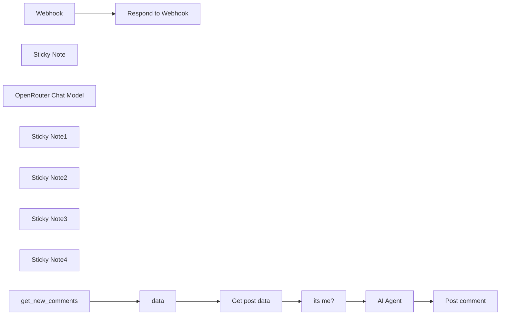

## Fluxo (.json) :

```json
{
  "id": "4rXRDurF4mQKrHyB",
  "meta": {
    "instanceId": "6d46e25379ef430a7067964d1096b885c773564549240cb3ad4c087f6cf94bd3",
    "templateCredsSetupCompleted": true
  },
  "name": "comentarios automaticos",
  "tags": [],
  "nodes": [
    {
      "id": "5c5322a4-10cf-43a1-8286-101c96d8c356",
      "name": "Webhook",
      "type": "n8n-nodes-base.webhook",
      "position": [
        40,
        100
      ],
      "webhookId": "ea7d37ac-9e82-40d7-bbb3-e9b7ce180fc9",
      "parameters": {
        "path": "ea7d37ac-9e82-40d7-bbb3-e9b7ce180fc9",
        "options": {},
        "responseMode": "responseNode"
      },
      "typeVersion": 2
    },
    {
      "id": "c281b25f-4f5a-46a3-b2ca-c9fba1cf98e1",
      "name": "Sticky Note",
      "type": "n8n-nodes-base.stickyNote",
      "position": [
        -980,
        0
      ],
      "parameters": {
        "width": 1440,
        "height": 320,
        "content": "# Webhook Verification\nDescription:\nHandles the initial verification handshake with Instagram's Webhook API.\nInstructions:\n\nEnsure the hub.verify_token matches the token configured in your Instagram App settings.\n\nThe response should echo the hub.challenge parameter to confirm the webhook setup.​\n\n"
      },
      "typeVersion": 1
    },
    {
      "id": "f890a4d2-f897-4103-a52f-48fa3555f9a6",
      "name": "Respond to Webhook",
      "type": "n8n-nodes-base.respondToWebhook",
      "position": [
        260,
        100
      ],
      "parameters": {
        "options": {},
        "respondWith": "text",
        "responseBody": "={{ $json.query['hub.challenge'] }}"
      },
      "typeVersion": 1.1
    },
    {
      "id": "4afb4f9b-7f0f-41b8-afd0-d5c134a6a622",
      "name": "AI Agent",
      "type": "@n8n/n8n-nodes-langchain.agent",
      "position": [
        140,
        1200
      ],
      "parameters": {
        "text": "=### CONTEXTO E PERSONA ###\nVocê é um assistente de IA especialista, responsável por gerenciar os comentários de um perfil no Instagram focado em Inteligência Artificial e Automações. O objetivo do perfil é educar e engajar a comunidade sobre esses temas. Seu tom deve ser amigável, acessível, mas também demonstrar conhecimento e profissionalismo. Responda sempre em português brasileiro.\n\n### DADOS DE ENTRADA ###\n- Nome de Usuário: {{ $('data').item.json.usuario.name }}\n- Texto do Comentário:{{ $('data').item.json.usuario.message.text }}\n- Contexto da Publicacao\n\n### TAREFA ###\nAnalise o comentário fornecido e gere uma resposta apropriada, seguindo estas diretrizes:\n\n1.  **Análise e Filtragem:**\n    * **Identifique a Intenção:** É uma pergunta técnica? Uma dúvida simples? Um elogio? Uma crítica construtiva? Um pedido de ajuda? Spam? Conteúdo irrelevante?\n    * **Relevância:** O comentário está relacionado a IA, automação ou ao conteúdo do perfil?\n\n2.  **Geração da Resposta:**\n    * **Personalização:** Comece a resposta mencionando o nome de usuário (ex: \"Olá @{{ $('data').item.json.usuario.name }},\").\n    * **Perguntas Relevantes:** Se for uma pergunta sobre IA/automação que você pode responder, forneça uma resposta clara e útil. Se for muito complexa, agradeça a pergunta e sugira buscar um post específico no perfil, ou diga que o tema é interessante para um futuro conteúdo.\n    * **Elogios:** Agradeça sinceramente o elogio e, se possível, conecte-o a um aspecto do perfil ou do conteúdo sobre IA/automação.\n    * **Críticas Construtivas:** Agradeça o feedback, mostre que ele foi considerado e responda polidamente.\n    * **Pedidos de Ajuda Específicos (não relacionados a conteúdo):** Se for um pedido de suporte técnico não relacionado ao tema central, direcione para o canal adequado ou explique educadamente que não pode ajudar com isso ali.\n    * **Comentários Vagos ou de Engajamento Simples (ex: \"Legal!\", \"👍\"):** Responda de forma curta e amigável, talvez com um emoji relevante ou incentivando a continuar acompanhando.\n    * **Spam ou Irrelevante:** Se o comentário for claramente spam, promocional não solicitado, ofensivo ou totalmente fora do tópico de IA/automação, NÃO gere uma resposta. Neste caso, retorne APENAS a palavra `[IGNORE]`.\n\n3.  **Tom e Estilo:**\n    * Mantenha o tom amigável, útil e alinhado com um perfil de tecnologia/educação.\n    * Evite respostas genéricas demais quando uma específica for possível.\n    * Mantenha as respostas relativamente concisas, adequadas para comentários do Instagram.\n\n### SAÍDA ESPERADA ###\nRetorne APENAS o texto da resposta a ser publicada no Instagram. Se o comentário for classificado como spam/irrelevante conforme a regra 2.7, retorne APENAS a palavra `[IGNORE]`. Não inclua nenhuma outra explicação ou texto adicional fora da resposta ou da palavra `[IGNORE]`.",
        "options": {},
        "promptType": "define"
      },
      "typeVersion": 1.8
    },
    {
      "id": "e56a220b-f4aa-4505-9157-31980ccb547b",
      "name": "OpenRouter Chat Model",
      "type": "@n8n/n8n-nodes-langchain.lmChatOpenRouter",
      "position": [
        60,
        1340
      ],
      "parameters": {
        "model": "google/gemini-2.0-flash-exp:free",
        "options": {}
      },
      "credentials": {
        "openRouterApi": {
          "id": "eGPA8rbskZCfFPBn",
          "name": "OpenRouter account"
        }
      },
      "typeVersion": 1
    },
    {
      "id": "9f318cf1-d99f-482d-a6d4-03ec4f603c05",
      "name": "Sticky Note1",
      "type": "n8n-nodes-base.stickyNote",
      "position": [
        -980,
        380
      ],
      "parameters": {
        "color": 5,
        "width": 1440,
        "height": 320,
        "content": "# Data Extraction\nDescription:\nExtracts relevant data from the incoming webhook payload.\nInstructions:\n\nVerify that all necessary fields (e.g., entry.id, from.id, from.username, message.id, message.text, media.id) are correctly mapped.\n\nThis data will be used in subsequent steps for processing and responding.\n"
      },
      "typeVersion": 1
    },
    {
      "id": "a413c839-fa19-44b9-ae33-2638dd45436e",
      "name": "Sticky Note2",
      "type": "n8n-nodes-base.stickyNote",
      "position": [
        -980,
        780
      ],
      "parameters": {
        "color": 6,
        "width": 1440,
        "height": 320,
        "content": "# User Validation\nDescription:\nChecks if the comment originates from a user other than the account owner.\nInstructions:\n\nCompare conta.id with usuario.id.\n\nProceed only if they differ, indicating the comment is from another user."
      },
      "typeVersion": 1
    },
    {
      "id": "b19d4891-5f7e-478b-9458-464af1fd409c",
      "name": "Sticky Note3",
      "type": "n8n-nodes-base.stickyNote",
      "position": [
        -980,
        1160
      ],
      "parameters": {
        "color": 2,
        "width": 1440,
        "height": 320,
        "content": "# AI Response Generation\nDescription:\nUtilizes an AI agent to generate a context-aware response to the user's comment.\nInstructions:\n\nEnsure the AI model is properly configured and has access to the necessary input data.\n\nThe prompt should guide the AI to produce responses that are friendly, informative, and aligned with the profile's focus on AI and automation."
      },
      "typeVersion": 1
    },
    {
      "id": "1f8b05ee-0380-4dc7-8671-f0ae87a7d08f",
      "name": "Sticky Note4",
      "type": "n8n-nodes-base.stickyNote",
      "position": [
        -980,
        1560
      ],
      "parameters": {
        "color": 3,
        "width": 1440,
        "height": 320,
        "content": "# Sending the Response\nDescription:\nSends the AI-generated reply back to the user via Instagram's API.\nInstructions:\n\nConfirm that the HTTP request is correctly formatted with the appropriate endpoint and authentication headers.\n\nHandle any potential errors or exceptions that may arise during the API call."
      },
      "typeVersion": 1
    },
    {
      "id": "ff54a7c0-40b9-4ad8-a3de-47a8a20cd3e1",
      "name": "Get post data",
      "type": "n8n-nodes-base.httpRequest",
      "position": [
        -80,
        880
      ],
      "parameters": {
        "url": "=https://graph.instagram.com/v22.0/{{ $json.usuario.media.id }}?fields=id,caption",
        "options": {},
        "authentication": "genericCredentialType",
        "genericAuthType": "httpHeaderAuth"
      },
      "credentials": {
        "httpHeaderAuth": {
          "id": "6H4syU3wzaoNBy2k",
          "name": "Header Auth account"
        },
        "facebookGraphApi": {
          "id": "z7CU24qbafckHljY",
          "name": "Facebook Graph account"
        }
      },
      "typeVersion": 4.2
    },
    {
      "id": "d7a66f78-83f2-4173-8602-c34210364149",
      "name": "get_new_comments",
      "type": "n8n-nodes-base.webhook",
      "position": [
        40,
        480
      ],
      "webhookId": "ea7d37ac-9e82-40d7-bbb3-e9b7ce180fc9",
      "parameters": {
        "path": "ea7d37ac-9e82-40d7-bbb3-e9b7ce180fc9",
        "options": {},
        "httpMethod": "POST"
      },
      "typeVersion": 2
    },
    {
      "id": "0924d70a-45a2-49c9-9459-eb6e7261005e",
      "name": "data",
      "type": "n8n-nodes-base.set",
      "position": [
        280,
        480
      ],
      "parameters": {
        "options": {},
        "assignments": {
          "assignments": [
            {
              "id": "1a3c5a2e-115d-4072-9d27-9baa47e84d6f",
              "name": "endpoint",
              "type": "string",
              "value": "https://graph.instagram.com/v22.0"
            },
            {
              "id": "ae83344d-abe5-43d6-991f-e757965e4557",
              "name": "conta.id",
              "type": "string",
              "value": "={{ $json.body.entry[0].id }}"
            },
            {
              "id": "d18887fa-b882-4d69-a1c0-d161291fe5fb",
              "name": "usuario.id",
              "type": "string",
              "value": "={{ $json.body.entry[0].changes[0].value.from.id }}"
            },
            {
              "id": "000f2d0e-6fbf-4e58-ae9c-cac4a3c54b33",
              "name": "usuario.name",
              "type": "string",
              "value": "={{ $json.body.entry[0].changes[0].value.from.username }}"
            },
            {
              "id": "d6fa2b24-abbe-48f7-96ff-2fc69f17b61b",
              "name": "usuario.message.id",
              "type": "string",
              "value": "={{ $json.body.entry[0].changes[0].value.id }}"
            },
            {
              "id": "605e9c4c-f2fc-49eb-8639-573c60ef33bb",
              "name": "usuario.message.text",
              "type": "string",
              "value": "={{ $json.body.entry[0].changes[0].value.text }}"
            },
            {
              "id": "198afc5d-3fd1-4d9d-aa5a-8baf75f06d29",
              "name": "usuario.media.id",
              "type": "string",
              "value": "={{ $json.body.entry[0].changes[0].value.media.id }}"
            }
          ]
        }
      },
      "typeVersion": 3.4
    },
    {
      "id": "2836ec33-b19f-4875-bfeb-08d9f9feae49",
      "name": "its me?",
      "type": "n8n-nodes-base.filter",
      "position": [
        200,
        880
      ],
      "parameters": {
        "options": {},
        "conditions": {
          "options": {
            "version": 2,
            "leftValue": "",
            "caseSensitive": true,
            "typeValidation": "strict"
          },
          "combinator": "and",
          "conditions": [
            {
              "id": "54c0a2d1-f812-4d6a-b50b-c272cfbba772",
              "operator": {
                "type": "string",
                "operation": "notEquals"
              },
              "leftValue": "={{ $('data').item.json.conta.id }}",
              "rightValue": "={{ $('data').item.json.usuario.id }}"
            }
          ]
        }
      },
      "typeVersion": 2.2
    },
    {
      "id": "fdf8ff5e-9c17-43f3-a747-79228ca68e03",
      "name": "Post comment",
      "type": "n8n-nodes-base.httpRequest",
      "position": [
        260,
        1660
      ],
      "parameters": {
        "url": "={{ $('data').item.json.endpoint }}/{{ $('data').item.json.usuario.message.id }}/replies",
        "method": "POST",
        "options": {},
        "sendBody": true,
        "authentication": "genericCredentialType",
        "bodyParameters": {
          "parameters": [
            {
              "name": "message",
              "value": "={{ $json.output }}"
            }
          ]
        },
        "genericAuthType": "httpHeaderAuth"
      },
      "credentials": {
        "httpHeaderAuth": {
          "id": "6H4syU3wzaoNBy2k",
          "name": "Header Auth account"
        }
      },
      "typeVersion": 4.2
    }
  ],
  "active": true,
  "pinData": {
    "get_new_comments": [
      {
        "json": {
          "body": {
            "entry": [
              {
                "id": "17841458749050638",
                "time": 1745696027,
                "changes": [
                  {
                    "field": "comments",
                    "value": {
                      "id": "17992882022637707",
                      "from": {
                        "id": "1797582914152092",
                        "username": "luchiogutierrez"
                      },
                      "text": "😍",
                      "media": {
                        "id": "17969449379894182",
                        "media_product_type": "FEED"
                      }
                    }
                  }
                ]
              }
            ],
            "object": "instagram"
          },
          "query": {},
          "params": {},
          "headers": {
            "host": "host.docker.internal:5678",
            "accept": "*/*",
            "x-scheme": "https",
            "forwarded": "by=_exposr;for=173.252.95.16;host=engaging-seahorse-19.rshare.io;proto=https",
            "x-real-ip": "173.252.95.16",
            "connection": "keep-alive",
            "exposr-via": "77940acbe1755f6fca18880bd02e462ee55d0cde,0374ae5bede6d70d299155239dbb7e045533e1f4",
            "user-agent": "Webhooks/1.0 (https://fb.me/webhooks)",
            "content-type": "application/json",
            "x-request-id": "b0c4e9d6dd2baa18bab7eab283ad4788",
            "content-length": "316",
            "x-forwarded-for": "173.252.95.16",
            "x-hub-signature": "sha1=b3d396ac784244a020268dd9599e708b21688b75",
            "x-forwarded-host": "engaging-seahorse-19.rshare.io",
            "x-forwarded-port": "443",
            "x-forwarded-proto": "https",
            "x-forwarded-scheme": "https",
            "x-hub-signature-256": "sha256=40e1e91b67c7fa82afca10c81ff4b1200d9561384ee5ba690bf9bc22814cb09b"
          },
          "webhookUrl": "https://engaging-seahorse-19.rshare.io/webhook/ea7d37ac-9e82-40d7-bbb3-e9b7ce180fc9",
          "executionMode": "production"
        }
      }
    ],
    "Respond to Webhook": [
      {
        "json": {
          "body": {},
          "query": {
            "hub.mode": "subscribe",
            "hub.challenge": "219585499",
            "hub.verify_token": "teste"
          },
          "params": {},
          "headers": {
            "host": "host.docker.internal:5678",
            "accept": "*/*",
            "x-scheme": "https",
            "forwarded": "by=_exposr;for=173.252.107.25;host=actual-beagle-88.rshare.io;proto=https",
            "x-real-ip": "173.252.107.25",
            "connection": "keep-alive",
            "exposr-via": "b37bd560bd173ee1195fceaef48a1468e8fa83f0,f06a3ed204e476a5915fc6fff7228b77c1c9e1d3",
            "user-agent": "facebookplatform/1.0 (+http://developers.facebook.com)",
            "x-request-id": "037b358cf28db9e3bffdf52703fd9069",
            "accept-encoding": "deflate, gzip",
            "x-forwarded-for": "173.252.107.25",
            "x-forwarded-host": "actual-beagle-88.rshare.io",
            "x-forwarded-port": "443",
            "x-forwarded-proto": "https",
            "x-forwarded-scheme": "https"
          },
          "webhookUrl": "http://localhost:5678/webhook-test/ea7d37ac-9e82-40d7-bbb3-e9b7ce180fc9",
          "executionMode": "test"
        }
      }
    ]
  },
  "settings": {
    "executionOrder": "v1"
  },
  "versionId": "2a39918c-36c8-486e-acb3-3420a4a8b8b1",
  "connections": {
    "data": {
      "main": [
        [
          {
            "node": "Get post data",
            "type": "main",
            "index": 0
          }
        ]
      ]
    },
    "Webhook": {
      "main": [
        [
          {
            "node": "Respond to Webhook",
            "type": "main",
            "index": 0
          }
        ]
      ]
    },
    "its me?": {
      "main": [
        [
          {
            "node": "AI Agent",
            "type": "main",
            "index": 0
          }
        ]
      ]
    },
    "AI Agent": {
      "main": [
        [
          {
            "node": "Post comment",
            "type": "main",
            "index": 0
          }
        ]
      ]
    },
    "Get post data": {
      "main": [
        [
          {
            "node": "its me?",
            "type": "main",
            "index": 0
          }
        ]
      ]
    },
    "get_new_comments": {
      "main": [
        [
          {
            "node": "data",
            "type": "main",
            "index": 0
          }
        ]
      ]
    },
    "OpenRouter Chat Model": {
      "ai_languageModel": [
        [
          {
            "node": "AI Agent",
            "type": "ai_languageModel",
            "index": 0
          }
        ]
      ]
    }
  }
}
```

<a id="template-201"></a>

## Template 201 - Registro de uso e custo de IA por cliente

- **Nome:** Registro de uso e custo de IA por cliente
- **Descrição:** Registra o uso de tokens e calcula custos por cliente ao processar CVs em PDF, salvando os dados em uma planilha e possibilitando envio de faturas mensais.
- **Funcionalidade:** • Formulário de upload de CV: Permite que usuários enviem PDFs e aceitem termos sobre cobrança.
• Extração de texto do PDF: Converte o arquivo PDF enviado para texto bruto para processamento.
• Extração de dados em JSON: Estrutura o conteúdo do currículo em um esquema JSON definido.
• Captura de atributos de logging: Anexa identificadores como workflow_id, execution_id e client_id aos registros.
• Medição de uso do modelo LLM: Intercepta metadados de uso (tokens de entrada/saída) para cada chamada ao modelo.
• Cálculo de custo por chamada: Converte tokens em custo usando tarifas configuradas por milhão de tokens e soma custos totais.
• Registro em planilha: Anexa linhas com data, IDs, tokens e custos em uma planilha para auditoria e faturamento.
• Agregação mensal: Filtra registros do mês corrente e soma tokens e custos para apuração.
• Envio de fatura por email: Gera email com totais, impostos e valor a pagar e envia ao cliente.
• Exibição do resultado ao usuário: Retorna o JSON estruturado do currículo ao usuário que enviou o arquivo.
- **Ferramentas:** • OpenAI (modelo gpt-4o-mini): Serviço de linguagem usado para extrair e estruturar informações do currículo e que fornece metadados de uso de tokens.
• Google Sheets: Armazena o log de uso por cliente (datas, tokens, custos) em uma planilha acessível.
• Gmail: Envia emails de fatura com os totais de uso e valores a pagar.

## Fluxo visual

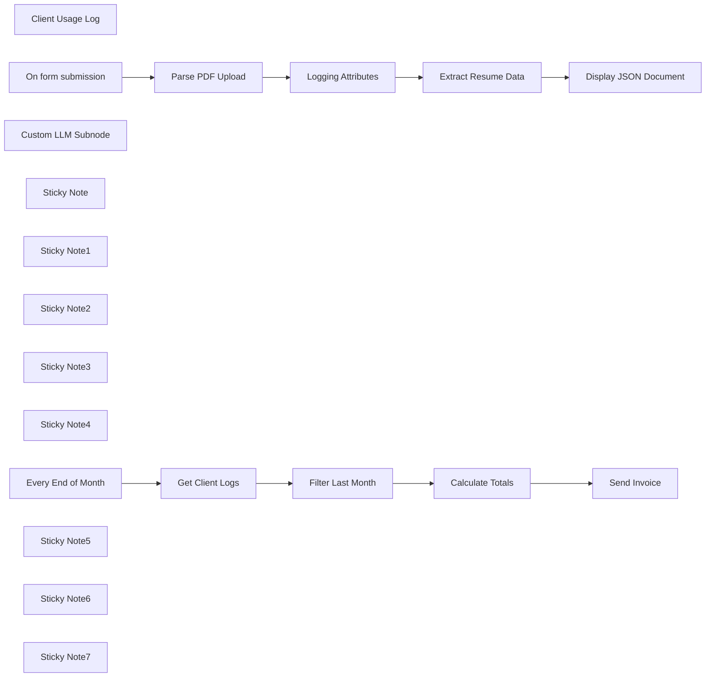

## Fluxo (.json) :

```json
{
  "meta": {
    "instanceId": "408f9fb9940c3cb18ffdef0e0150fe342d6e655c3a9fac21f0f644e8bedabcd9",
    "templateCredsSetupCompleted": true
  },
  "nodes": [
    {
      "id": "8884df86-b7cd-4cf7-8b71-fd21113bfc0f",
      "name": "Client Usage Log",
      "type": "n8n-nodes-base.googleSheetsTool",
      "position": [
        420,
        500
      ],
      "parameters": {
        "columns": {
          "value": {},
          "schema": [
            {
              "id": "date",
              "type": "string",
              "display": true,
              "required": false,
              "displayName": "date",
              "defaultMatch": false,
              "canBeUsedToMatch": true
            },
            {
              "id": "workflow_id",
              "type": "string",
              "display": true,
              "required": false,
              "displayName": "workflow_id",
              "defaultMatch": false,
              "canBeUsedToMatch": true
            },
            {
              "id": "execution_id",
              "type": "string",
              "display": true,
              "required": false,
              "displayName": "execution_id",
              "defaultMatch": false,
              "canBeUsedToMatch": true
            },
            {
              "id": "client_id",
              "type": "string",
              "display": true,
              "required": false,
              "displayName": "client_id",
              "defaultMatch": false,
              "canBeUsedToMatch": true
            },
            {
              "id": "client_name",
              "type": "string",
              "display": true,
              "required": false,
              "displayName": "client_name",
              "defaultMatch": false,
              "canBeUsedToMatch": true
            },
            {
              "id": "input_tokens",
              "type": "string",
              "display": true,
              "required": false,
              "displayName": "input_tokens",
              "defaultMatch": false,
              "canBeUsedToMatch": true
            },
            {
              "id": "output_tokens",
              "type": "string",
              "display": true,
              "required": false,
              "displayName": "output_tokens",
              "defaultMatch": false,
              "canBeUsedToMatch": true
            },
            {
              "id": "total_tokens",
              "type": "string",
              "display": true,
              "required": false,
              "displayName": "total_tokens",
              "defaultMatch": false,
              "canBeUsedToMatch": true
            },
            {
              "id": "input_cost",
              "type": "string",
              "display": true,
              "required": false,
              "displayName": "input_cost",
              "defaultMatch": false,
              "canBeUsedToMatch": true
            },
            {
              "id": "output_cost",
              "type": "string",
              "display": true,
              "required": false,
              "displayName": "output_cost",
              "defaultMatch": false,
              "canBeUsedToMatch": true
            },
            {
              "id": "total_cost",
              "type": "string",
              "display": true,
              "required": false,
              "displayName": "total_cost",
              "defaultMatch": false,
              "canBeUsedToMatch": true
            }
          ],
          "mappingMode": "autoMapInputData",
          "matchingColumns": [],
          "attemptToConvertTypes": false,
          "convertFieldsToString": false
        },
        "options": {},
        "operation": "append",
        "sheetName": {
          "__rl": true,
          "mode": "list",
          "value": "gid=0",
          "cachedResultUrl": "https://docs.google.com/spreadsheets/d/1AR5mrxz2S6PjAKVM0edNG-YVEc6zKL7aUxHxVcffnlw/edit#gid=0",
          "cachedResultName": "Sheet1"
        },
        "documentId": {
          "__rl": true,
          "mode": "list",
          "value": "1AR5mrxz2S6PjAKVM0edNG-YVEc6zKL7aUxHxVcffnlw",
          "cachedResultUrl": "https://docs.google.com/spreadsheets/d/1AR5mrxz2S6PjAKVM0edNG-YVEc6zKL7aUxHxVcffnlw/edit?usp=drivesdk",
          "cachedResultName": "89. Langchain Code Node - Client Usage Log"
        }
      },
      "credentials": {
        "googleSheetsOAuth2Api": {
          "id": "XHvC7jIRR8A2TlUl",
          "name": "Google Sheets account"
        }
      },
      "typeVersion": 4.5
    },
    {
      "id": "1e4aca76-8b79-4780-b0c5-2cd92a41aa0e",
      "name": "Logging Attributes",
      "type": "n8n-nodes-base.set",
      "position": [
        -360,
        -120
      ],
      "parameters": {
        "options": {},
        "assignments": {
          "assignments": [
            {
              "id": "22164635-7a23-47e2-9868-96899cd9d317",
              "name": "workflow_id",
              "type": "string",
              "value": "={{ $workflow.id }}"
            },
            {
              "id": "ed1cb653-b3fd-40bf-b00b-10d777f098af",
              "name": "execution_id",
              "type": "string",
              "value": "={{ $execution.id }}"
            },
            {
              "id": "3de228a1-79b9-4805-8d92-917f691411be",
              "name": "client_id",
              "type": "string",
              "value": "=12345"
            }
          ]
        },
        "includeOtherFields": true
      },
      "typeVersion": 3.4
    },
    {
      "id": "d7f37c54-5d96-47ba-b82e-0926a08137df",
      "name": "On form submission",
      "type": "n8n-nodes-base.formTrigger",
      "position": [
        -920,
        -120
      ],
      "webhookId": "9da21424-e23b-43b8-a6ec-a6daa129c326",
      "parameters": {
        "options": {},
        "formTitle": "CV Parsing Service",
        "formFields": {
          "values": [
            {
              "fieldType": "file",
              "fieldLabel": "Upload a file",
              "requiredField": true,
              "acceptFileTypes": ".pdf"
            },
            {
              "fieldType": "dropdown",
              "fieldLabel": "Acknowledgement",
              "multiselect": true,
              "fieldOptions": {
                "values": [
                  {
                    "option": "I acknowledge the use of this service will be added to my bill."
                  }
                ]
              },
              "requiredField": true
            }
          ]
        },
        "responseMode": "lastNode",
        "formDescription": "Use this form to upload CVs and we'll extract the data from them. This workflow tracks usage metrics so we can calculate the bill later on."
      },
      "typeVersion": 2.2
    },
    {
      "id": "06da0c8e-2035-45ae-a301-50021650a5f8",
      "name": "Custom LLM Subnode",
      "type": "@n8n/n8n-nodes-langchain.code",
      "position": [
        260,
        340
      ],
      "parameters": {
        "code": {
          "supplyData": {
            "code": "const { ChatOpenAI } = require(\"@langchain/openai\");\n\n// 1. Configure as required.\n// - costs are per million tokens and depends on the model.\nconst openAIApiKey = \"sk-...\";\nconst model = \"gpt-4o-mini\";\nconst input_token_cost = 0.150;\nconst output_token_cost = 0.600;\n\n// 2. do not edit below this line --\nconst tools = await this.getInputConnectionData('ai_tool', 0);\nconst googleSheetTool = tools[0];\n\nconst {\n  workflow_id,\n  execution_id,\n  client_id } = $input.first().json;\n\nconst llm = new ChatOpenAI({\n  apiKey: openAIApiKey,\n  model,\n  callbacks: [\n    {\n      handleLLMEnd: async function(output,runId,parentId) {\n        const generation = output.generations[0][0];\n        const message = generation.message;\n        const row = {\n          date: (new Date()).toGMTString(),\n          workflow_id,\n          execution_id,\n          client_id,\n          input_tokens: message.usage_metadata.input_tokens,\n          output_tokens: message.usage_metadata.output_tokens,\n          total_tokens: message.usage_metadata.total_tokens,\n          input_cost: (message.usage_metadata.input_tokens / 1_000_000) * input_token_cost,\n          output_cost: (message.usage_metadata.output_tokens / 1_000_000) * output_token_cost,\n        };\n        row.total_cost = row.input_cost + row.output_cost;\n        await googleSheetTool.func(row);\n      }\n    }\n  ]\n});\n\nreturn llm;"
          }
        },
        "inputs": {
          "input": [
            {
              "type": "ai_tool",
              "required": true
            }
          ]
        },
        "outputs": {
          "output": [
            {
              "type": "ai_languageModel"
            }
          ]
        }
      },
      "typeVersion": 1
    },
    {
      "id": "35993bd5-b521-4239-bf23-aed47d339f54",
      "name": "Sticky Note",
      "type": "n8n-nodes-base.stickyNote",
      "position": [
        360,
        480
      ],
      "parameters": {
        "width": 200,
        "height": 280,
        "content": "\n\n\n\n\n\n\n\n\n\n\n\n\n### Update Workbook\nThis is the workbook which will track the token usage and costs."
      },
      "typeVersion": 1
    },
    {
      "id": "623ca94d-a215-416b-a9fe-62a1f96317e3",
      "name": "Sticky Note1",
      "type": "n8n-nodes-base.stickyNote",
      "position": [
        -1040,
        -280
      ],
      "parameters": {
        "color": 7,
        "width": 560,
        "height": 380,
        "content": "## 1. Offer AI Service to Clients\nHere, we'll using an n8n form to offer a document extraction service for Resume/CV PDFs. The user simply uploads a PDF and we return it in JSON format. This is just a simple example for demonstration purposes. "
      },
      "typeVersion": 1
    },
    {
      "id": "ba9eb149-e77f-4bf6-8ec5-7d8d4619485d",
      "name": "Sticky Note2",
      "type": "n8n-nodes-base.stickyNote",
      "position": [
        -460,
        -280
      ],
      "parameters": {
        "color": 7,
        "width": 320,
        "height": 380,
        "content": "## 2. Gather External Variables to Send to Log\nThere are some variables we can't define in the subnode but we can add them here."
      },
      "typeVersion": 1
    },
    {
      "id": "63bfe329-17dd-4321-94c6-17d306ed7412",
      "name": "Sticky Note3",
      "type": "n8n-nodes-base.stickyNote",
      "position": [
        -120,
        -280
      ],
      "parameters": {
        "color": 7,
        "width": 720,
        "height": 380,
        "content": "## 3. Provide AI Service\nOur service uses an LLM (OpenAI GPT4o-mini in this example) to organise the uploaded PDF's data into a structured JSON format. This conversion is useful for following integrations or data storage. In this example however, we'll use display it back to the user."
      },
      "typeVersion": 1
    },
    {
      "id": "f45862e9-7f8e-46bb-900a-807fee981ed5",
      "name": "Sticky Note4",
      "type": "n8n-nodes-base.stickyNote",
      "position": [
        -120,
        120
      ],
      "parameters": {
        "color": 7,
        "width": 720,
        "height": 440,
        "content": "## 4. Use Custom LLM Subnode to Track Usage & Cost\n[Learn more about the Langchain Code Node](https://docs.n8n.io/integrations/builtin/cluster-nodes/root-nodes/n8n-nodes-langchain.code/)\n\nBy creating our custom LLM subnode using the Langchain Code node, we are able to tap into the chat completion's response which contains the token usage metadata for the information extractor request.\n\nWith this, we can calculate exactly how much the client's request is costing per use!\n\nThe only remaining step then is to store\nthis data somewhere. Rather than importing\nmore dependencies or hardcoding more\ncredentials, a novel solution can be to attach\na tool to our subnode.\n\nHere, we've decided to use the Google Sheets\ntool and append the client's usage metrics to\nthe sheet. Check it out here - [Client Usage Log](\nhttps://docs.google.com/spreadsheets/d/1AR5mrxz2S6PjAKVM0edNG-YVEc6zKL7aUxHxVcffnlw/edit?usp=sharing)"
      },
      "typeVersion": 1
    },
    {
      "id": "9f5014a5-0e9a-4af0-b076-03cdc0a14ab9",
      "name": "Display JSON Document",
      "type": "n8n-nodes-base.form",
      "position": [
        360,
        -120
      ],
      "webhookId": "1b9d0195-1662-43c2-94a0-f9c867d75578",
      "parameters": {
        "options": {
          "customCss": ".header p {\n  font-family: monospace;\n  background-color: #efefef;\n  padding: 1rem;\n  font-size: 0.8rem;\n  text-align: left;\n  max-height: 480px;\n  overflow: auto;\n  white-space: pre;\n}"
        },
        "operation": "completion",
        "completionTitle": "=Results for {{ $('On form submission').item.json['Upload a file'][0].filename }}",
        "completionMessage": "={{ JSON.stringify($json.output, null, 2) }}"
      },
      "typeVersion": 1
    },
    {
      "id": "b977f89c-1118-455f-986e-735a17eecd9b",
      "name": "Filter Last Month",
      "type": "n8n-nodes-base.filter",
      "position": [
        1120,
        -120
      ],
      "parameters": {
        "options": {},
        "conditions": {
          "options": {
            "version": 2,
            "leftValue": "",
            "caseSensitive": true,
            "typeValidation": "strict"
          },
          "combinator": "and",
          "conditions": [
            {
              "id": "2a86f83e-b103-46fe-a8b8-15811d4138fa",
              "operator": {
                "type": "dateTime",
                "operation": "afterOrEquals"
              },
              "leftValue": "={{new Date($json.date) }}",
              "rightValue": "={{ $now.startOf('month') }}"
            },
            {
              "id": "7b4c03a3-4df9-4b5d-9f1f-660e54a1c2d1",
              "operator": {
                "type": "dateTime",
                "operation": "beforeOrEquals"
              },
              "leftValue": "={{new Date($json.date) }}",
              "rightValue": "={{ $now.endOf('month') }}"
            }
          ]
        }
      },
      "typeVersion": 2.2
    },
    {
      "id": "10d95dcb-d975-4b20-961e-d1fe63417878",
      "name": "Get Client Logs",
      "type": "n8n-nodes-base.googleSheets",
      "position": [
        920,
        -120
      ],
      "parameters": {
        "options": {},
        "filtersUI": {
          "values": [
            {
              "lookupValue": "12345",
              "lookupColumn": "client_id"
            }
          ]
        },
        "sheetName": {
          "__rl": true,
          "mode": "list",
          "value": "gid=0",
          "cachedResultUrl": "https://docs.google.com/spreadsheets/d/1AR5mrxz2S6PjAKVM0edNG-YVEc6zKL7aUxHxVcffnlw/edit#gid=0",
          "cachedResultName": "Sheet1"
        },
        "documentId": {
          "__rl": true,
          "mode": "list",
          "value": "1AR5mrxz2S6PjAKVM0edNG-YVEc6zKL7aUxHxVcffnlw",
          "cachedResultUrl": "https://docs.google.com/spreadsheets/d/1AR5mrxz2S6PjAKVM0edNG-YVEc6zKL7aUxHxVcffnlw/edit?usp=drivesdk",
          "cachedResultName": "89. Langchain Code Node - Client Usage Log"
        }
      },
      "credentials": {
        "googleSheetsOAuth2Api": {
          "id": "XHvC7jIRR8A2TlUl",
          "name": "Google Sheets account"
        }
      },
      "typeVersion": 4.5
    },
    {
      "id": "f6505545-d57c-443a-9883-2d536f3a973a",
      "name": "Calculate Totals",
      "type": "n8n-nodes-base.summarize",
      "position": [
        1320,
        -120
      ],
      "parameters": {
        "options": {},
        "fieldsToSummarize": {
          "values": [
            {
              "field": "total_cost",
              "aggregation": "sum"
            },
            {
              "field": "total_tokens",
              "aggregation": "sum"
            }
          ]
        }
      },
      "typeVersion": 1.1
    },
    {
      "id": "1c4ae8ff-ec2b-4fd3-974f-cc766385b16b",
      "name": "Every End of Month",
      "type": "n8n-nodes-base.scheduleTrigger",
      "position": [
        720,
        -120
      ],
      "parameters": {
        "rule": {
          "interval": [
            {
              "field": "months",
              "triggerAtHour": 18,
              "triggerAtDayOfMonth": 31
            }
          ]
        }
      },
      "typeVersion": 1.2
    },
    {
      "id": "f321fbe6-36b1-4bd8-899b-832a8fc6217a",
      "name": "Send Invoice",
      "type": "n8n-nodes-base.gmail",
      "position": [
        1520,
        -120
      ],
      "webhookId": "68315f84-d7e0-4525-a625-bb3ff431931c",
      "parameters": {
        "sendTo": "jim@example.com",
        "message": "=Hello,\nThis is an invoice for {{ $now.monthLong }} {{ $now.year }}.\n\nTotal usage: {{ $json.sum_total_tokens }} tokens\nTotal token cost: ${{ $json.sum_total_cost.toFixed(5) }}\nTax @ 20%: ${{ ($json.sum_total_cost * 0.2).toFixed(5) }}\nTotal payable: ${{ ($json.sum_total_cost * 1.2).toFixed(5) }}\n\nPayable within 14 days.\nThank you for your custom.",
        "options": {},
        "subject": "=Invoice for {{ $now.monthLong }} {{ $now.year }}",
        "emailType": "text"
      },
      "credentials": {
        "gmailOAuth2": {
          "id": "Sf5Gfl9NiFTNXFWb",
          "name": "Gmail account"
        }
      },
      "typeVersion": 2.1
    },
    {
      "id": "a7d8de78-c3b7-4687-8994-fe28387d7572",
      "name": "Sticky Note5",
      "type": "n8n-nodes-base.stickyNote",
      "position": [
        620,
        -280
      ],
      "parameters": {
        "color": 7,
        "width": 1100,
        "height": 380,
        "content": "## 5. Automatically Send Invoice at End of Month (Optional)\nWith our client usage log, it's fairly simple to aggregate the log records for the client within a certain timeframe and calculate the totals.\nThis can satisfy accurate billing requirements from clients or at least, allows your team to understand how much each client is costing and budget accordingly."
      },
      "typeVersion": 1
    },
    {
      "id": "169fa40d-c6e8-4315-be35-d2c73f626edf",
      "name": "Sticky Note6",
      "type": "n8n-nodes-base.stickyNote",
      "position": [
        -1500,
        -920
      ],
      "parameters": {
        "width": 440,
        "height": 1020,
        "content": "## Try It Out!\n### This n8n template demonstrates how to use the Langchain code node to track token usage and cost for every LLM call.\n\nThis is useful if your templates handle multiple clients or customers and you need a cheap and easy way to capture how much of your AI credits they are using.\n\n### How it works\n* In our mock AI service, we're offering a data conversion API to convert Resume PDFs into JSON documents.\n* A form trigger is used to allow for PDF upload and the file is parsed using the Extract from File node.\n* An Edit Fields node is used to capture additional variables to send to our log.\n* Next, we use the Information Extractor node to organise the Resume data into the given JSON schema.\n* The LLM subnode attached to the Information Extractor is a custom one we've built using the Langchain Code node.\n* With our custom LLM subnode, we're able to capture the usage metadata using lifecycle hooks.\n* We've also attached a Google Sheet tool to our LLM subnode, allowing us to send our usage metadata to a google sheet.\n* Finally, we demonstrate how you can aggregate from the google sheet to understand how much AI tokens/costs your clients are liable for.\n\n\n**Check out the example Client Usage Log** - https://docs.google.com/spreadsheets/d/1AR5mrxz2S6PjAKVM0edNG-YVEc6zKL7aUxHxVcffnlw/edit?usp=sharing\n\n### How to use\n* **SELF-HOSTED N8N ONLY** - the Langchain Code node is only available in the self-hosted version of n8n. It is not available in n8n cloud.\n* The LLM subnode can only be attached to non-\"AI agent\" nodes; Basic LLM node, Information Extractor, Question & Answer Chain, Sentiment Analysis, Summarization Chain and Text Classifier.\n\n### Need Help?\nJoin the [Discord](https://discord.com/invite/XPKeKXeB7d) or ask in the [Forum](https://community.n8n.io/)!"
      },
      "typeVersion": 1
    },
    {
      "id": "922710e3-f92b-4a7f-9ff2-c3d7d55f04d5",
      "name": "Sticky Note7",
      "type": "n8n-nodes-base.stickyNote",
      "position": [
        -1040,
        -420
      ],
      "parameters": {
        "color": 3,
        "width": 280,
        "height": 120,
        "content": "### SELF-HOSTED N8N ONLY\nPlease note, this template only works in the self-hosted version of n8n only. It will not work in the cloud version."
      },
      "typeVersion": 1
    },
    {
      "id": "56c23cb5-818f-434d-96a7-0029f6607299",
      "name": "Parse PDF Upload",
      "type": "n8n-nodes-base.extractFromFile",
      "position": [
        -700,
        -120
      ],
      "parameters": {
        "options": {},
        "operation": "pdf",
        "binaryPropertyName": "Upload_a_file"
      },
      "typeVersion": 1
    },
    {
      "id": "f4cc9870-a73e-487c-a131-aca2735b2e60",
      "name": "Extract Resume Data",
      "type": "@n8n/n8n-nodes-langchain.informationExtractor",
      "position": [
        0,
        -120
      ],
      "parameters": {
        "text": "={{ $json.text }}",
        "options": {},
        "schemaType": "manual",
        "inputSchema": "{\n  \"type\": \"object\",\n  \"properties\": {\n    \"name\": { \"type\": \"string\" },\n    \"label\": { \"type\": \"string\" },\n    \"email\": { \"type\": \"string\" },\n    \"phone\": { \"type\": \"string\" },\n    \"url\": { \"type\": \"string\" },\n    \"summary\": { \"type\": \"string\" },\n    \"location\": {\n      \"type\": \"object\",\n      \"properties\": {\n        \"address\": { \"type\": \"string\" },\n        \"postalCode\": { \"type\": \"string\" },\n        \"city\": { \"type\": \"string\" },\n        \"countryCode\": { \"type\": \"string\" },\n        \"region\": { \"type\": \"string\" }\n      }\n    },\n    \"work\": {\n      \"type\": \"array\",\n      \"items\": {\n        \"type\": \"object\",\n        \"properties\": {\n          \"name\": { \"type\": \"string\" },\n          \"location\": { \"type\": \"string\" },\n          \"description\": { \"type\": \"string\" },\n          \"position\": { \"type\": \"string\" },\n          \"url\": { \"type\": \"string\" },\n          \"startDate\": { \"type\": \"string\" },\n          \"endDate\": { \"type\": \"string\" },\n          \"summary\": { \"type\": \"string\" },\n          \"highlights\": {\n            \"type\": \"array\",\n            \"items\": { \"type\": \"string\" }\n          }\n        }\n      }\n    },\n    \"education\": {\n      \"type\": \"array\",\n      \"items\": {\n        \"type\": \"object\",\n        \"properties\": {\n          \"institution\": { \"type\": \"string\" },\n          \"url\": { \"type\": \"string\" },\n          \"area\": { \"type\": \"string\" },\n          \"studyType\": { \"type\": \"string\" },\n          \"startDate\": { \"type\": \"string\" },\n          \"endDate\": { \"type\": \"string\" },\n          \"score\": { \"type\": \"string\" },\n          \"courses\": {\n            \"type\": \"array\",\n            \"items\": { \"type\": \"string\" }\n          }\n        }\n      }\n    },\n    \"skills\": {\n      \"type\": \"array\",\n      \"items\": {\n        \"type\": \"object\",\n        \"properties\": {\n          \"name\": { \"type\": \"string\" },\n          \"level\": { \"type\": \"string\" },\n          \"keywords\": {\n            \"type\": \"array\",\n            \"items\": { \"type\": \"string\" }\n          }\n        }\n      }\n    }\n  }\n}"
      },
      "typeVersion": 1
    }
  ],
  "pinData": {},
  "connections": {
    "Get Client Logs": {
      "main": [
        [
          {
            "node": "Filter Last Month",
            "type": "main",
            "index": 0
          }
        ]
      ]
    },
    "Calculate Totals": {
      "main": [
        [
          {
            "node": "Send Invoice",
            "type": "main",
            "index": 0
          }
        ]
      ]
    },
    "Client Usage Log": {
      "ai_tool": [
        [
          {
            "node": "Custom LLM Subnode",
            "type": "ai_tool",
            "index": 0
          }
        ]
      ]
    },
    "Parse PDF Upload": {
      "main": [
        [
          {
            "node": "Logging Attributes",
            "type": "main",
            "index": 0
          }
        ]
      ]
    },
    "Filter Last Month": {
      "main": [
        [
          {
            "node": "Calculate Totals",
            "type": "main",
            "index": 0
          }
        ]
      ]
    },
    "Custom LLM Subnode": {
      "ai_languageModel": [
        [
          {
            "node": "Extract Resume Data",
            "type": "ai_languageModel",
            "index": 0
          }
        ]
      ]
    },
    "Every End of Month": {
      "main": [
        [
          {
            "node": "Get Client Logs",
            "type": "main",
            "index": 0
          }
        ]
      ]
    },
    "Logging Attributes": {
      "main": [
        [
          {
            "node": "Extract Resume Data",
            "type": "main",
            "index": 0
          }
        ]
      ]
    },
    "On form submission": {
      "main": [
        [
          {
            "node": "Parse PDF Upload",
            "type": "main",
            "index": 0
          }
        ]
      ]
    },
    "Extract Resume Data": {
      "main": [
        [
          {
            "node": "Display JSON Document",
            "type": "main",
            "index": 0
          }
        ]
      ]
    }
  }
}
```
