# PACK 1999 TEMPLATES PARTE 02 - Bloco 1

Templates neste bloco: 20

## Sumário

- [Template 202 - Backup de Injections do Squarespace para GitHub](#template-202)
- [Template 203 - Criar rascunho, anexar arquivo e enviar por Outlook](#template-203)
- [Template 204 - Atualização diária do tempo via Gotify](#template-204)
- [Template 205 - Exportar notas Keep → Planilha](#template-205)
- [Template 206 - Classificação e resposta automática de e-mails](#template-206)
- [Template 207 - Monitoramento e alertas de expiração de SSL](#template-207)
- [Template 208 - Previsão do tempo via Telegram](#template-208)
- [Template 209 - Q&A sobre documentos via índice vetorial](#template-209)
- [Template 210 - Envio diário de ofertas para clientes em risco de churn](#template-210)
- [Template 211 - Upload automático de vídeo para YouTube e geração de metadata](#template-211)
- [Template 212 - Alerta de temperatura por SMS](#template-212)
- [Template 213 - Gerar página HTML dinâmica via OpenAI Structured Output](#template-213)
- [Template 214 - Auto-categorização de e-mails do Outlook com IA](#template-214)
- [Template 215 - Automação de CSR via Slack com verificação de segurança](#template-215)
- [Template 216 - Encaminhar emails para páginas do Notion](#template-216)
- [Template 217 - Outreach diário para contatos não contactados](#template-217)
- [Template 218 - Ingestão de páginas Notion para Pinecone via embeddings](#template-218)
- [Template 219 - Notificações por evento do TwentyCRM](#template-219)
- [Template 220 - Credenciais dinâmicas com expressões](#template-220)
- [Template 221 - Gerar áudio a partir de texto (text-to-speech)](#template-221)

---

<a id="template-202"></a>

## Template 202 - Backup de Injections do Squarespace para GitHub

- **Nome:** Backup de Injections do Squarespace para GitHub
- **Descrição:** Faz backup automático dos códigos de header e footer (Injections) de um site Squarespace para arquivos em um repositório do GitHub.
- **Funcionalidade:** • Disparo agendado e manual: executa automaticamente a cada 2 horas e pode ser disparado manualmente.
• Captura do conteúdo do site: busca o contexto de página do Squarespace (format=page-context) para obter as Injections.
• Separação de headers e footers: identifica e isola o código de header e footer retornado pelo site.
• Limpeza e normalização do HTML: usa parsing para remover elementos indesejados (ex.: ícones sociais, scripts de banner de cookies, blocos de CSS de início) e normalizar quebras de linha.
• Enriquecimento de metadados: adiciona id, nome, timestamp e domínio ao payload de cada injection.
• Processamento em lotes: iteraciona sobre itens em lotes para evitar sobrecarga e permitir paralelismo controlado.
• Lógica de criação/edição no repositório: tenta editar o arquivo existente; se não existir, cria um novo arquivo.
• Organização no repositório: salva cada site em pasta separada conforme configuração de caminho (repo.path) e inclui timestamp nas mensagens de commit.
• Tolerância a falhas: continua execução mesmo se operações de GitHub falharem para permitir processamento dos demais itens.
- **Ferramentas:** • Squarespace: fonte dos códigos de header e footer via endpoint público do site.
• GitHub (API): repositório remoto usado para armazenar os backups como arquivos, com commits que registram timestamps.
• Cheerio: biblioteca de parsing/manipulação de HTML utilizada para limpar e extrair o conteúdo relevante.

## Fluxo visual

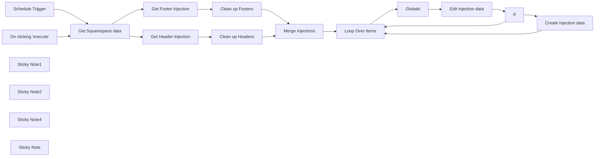

## Fluxo (.json) :

```json
{
  "id": "eB4rTdZFvrdKK5VP",
  "meta": {
    "instanceId": "e634e668fe1fc93a75c4f2a7fc0dad807ca318b79654157eadb9578496acbc76",
    "templateCredsSetupCompleted": true
  },
  "name": "Backup Squarespace code Injections to Github",
  "tags": [
    {
      "id": "oIxDbURnjwrJFwau",
      "name": "Squarespace",
      "createdAt": "2025-03-06T05:49:51.612Z",
      "updatedAt": "2025-03-06T05:49:51.612Z"
    }
  ],
  "nodes": [
    {
      "id": "e0811eee-5bfe-4e48-8bd2-76b415261e93",
      "name": "On clicking 'execute'",
      "type": "n8n-nodes-base.manualTrigger",
      "position": [
        820,
        486.1164603611751
      ],
      "parameters": {},
      "typeVersion": 1
    },
    {
      "id": "e48028e0-d88a-4681-84b8-fa17fe695344",
      "name": "Loop Over Items",
      "type": "n8n-nodes-base.splitInBatches",
      "position": [
        2380,
        580
      ],
      "parameters": {
        "options": {},
        "batchSize": 2
      },
      "typeVersion": 3,
      "alwaysOutputData": true
    },
    {
      "id": "0dd2a2b1-8c19-4d7a-a631-d934320bcf74",
      "name": "Schedule Trigger",
      "type": "n8n-nodes-base.scheduleTrigger",
      "position": [
        820,
        686.1164603611751
      ],
      "parameters": {
        "rule": {
          "interval": [
            {
              "field": "hours",
              "hoursInterval": 2
            }
          ]
        }
      },
      "typeVersion": 1.2
    },
    {
      "id": "a1bc1313-5993-4d10-b322-0b31dd005d00",
      "name": "Sticky Note1",
      "type": "n8n-nodes-base.stickyNote",
      "position": [
        380,
        240
      ],
      "parameters": {
        "color": 4,
        "width": 371.1995072042308,
        "height": 600.88409546716,
        "content": "## Backup to GitHub \nThis workflow will backup Squarespace header & footer Injections to Github\n\n\n### Setup\n👉 Edit the Squarespace node to place the website URL there\n\n👉 Open `Globals` node and update the values below 👇\n\n- **repo.owner:** your Github username\n- **repo.name:** the name of your repository\n- **repo.path:** the folder to use within the repository.\n\n\nIf your username was `john-doe` and your repository was called `n8n-backups` and you wanted the injections to go into a `squarespace-backup` folder you would set:\n\n- repo.owner - john-doe\n- repo.name - n8n-backups\n- repo.path - squarespace-backup/\n\nEach site's injections will be added into seperate folder\n"
      },
      "typeVersion": 1
    },
    {
      "id": "125b425c-1f59-4984-8658-e57d3145cccd",
      "name": "Sticky Note2",
      "type": "n8n-nodes-base.stickyNote",
      "position": [
        780,
        400
      ],
      "parameters": {
        "color": 7,
        "width": 1066,
        "height": 435,
        "content": "## Main workflow loop"
      },
      "typeVersion": 1
    },
    {
      "id": "626d534f-f2fb-4493-af58-0f5e309c58d4",
      "name": "Get Squarespace data",
      "type": "n8n-nodes-base.httpRequest",
      "position": [
        1140,
        600
      ],
      "parameters": {
        "url": "https://beyondspace.studio",
        "options": {},
        "sendQuery": true,
        "queryParameters": {
          "parameters": [
            {
              "name": "format",
              "value": "page-context"
            }
          ]
        }
      },
      "typeVersion": 4.2
    },
    {
      "id": "e2b1481e-b9de-4006-92b6-4677b4e11213",
      "name": "Sticky Note4",
      "type": "n8n-nodes-base.stickyNote",
      "position": [
        1080,
        460
      ],
      "parameters": {
        "color": 4,
        "width": 170,
        "height": 120,
        "content": "## Edit this node 👇\nSquarespace URL"
      },
      "typeVersion": 1
    },
    {
      "id": "e8fb73af-9999-43cd-9857-564a049b2579",
      "name": "If",
      "type": "n8n-nodes-base.if",
      "position": [
        3060,
        600
      ],
      "parameters": {
        "options": {},
        "conditions": {
          "options": {
            "version": 2,
            "leftValue": "",
            "caseSensitive": true,
            "typeValidation": "strict"
          },
          "combinator": "and",
          "conditions": [
            {
              "id": "0f6f0b04-6d87-47fb-bee7-df2c93283d1c",
              "operator": {
                "name": "filter.operator.equals",
                "type": "string",
                "operation": "equals"
              },
              "leftValue": "={{ $json.error }}",
              "rightValue": "The resource you are requesting could not be found"
            }
          ]
        }
      },
      "typeVersion": 2.2
    },
    {
      "id": "679cd20a-c124-4f89-aea3-14dc5a739826",
      "name": "Clean up Footers",
      "type": "n8n-nodes-base.code",
      "position": [
        1620,
        460
      ],
      "parameters": {
        "jsCode": "const cheerio = require('cheerio');\n\ntry {\n    const $footers = cheerio.load($input.first().json.value);\n    let sqsFooters = '';\n\n    /** CLEAN FOOTERS */\n    // Remove all elements after and including .social-icons-svg\n    const socialIcons = $footers('[data-usage=social-icons-svg]');\n    if (socialIcons.length) {\n        socialIcons.nextAll().remove(); // Remove everything after it\n        socialIcons.remove(); // Remove the element itself\n    }\n\n    // Extract cleaned-up footer content\n    $footers('head').each((i, el) => {\n        sqsFooters += $footers(el).html();\n    });\n\n    // Remove excessive newlines caused by removed elements\n    sqsFooters = sqsFooters.replace(/\\n{2,}/g, '\\n').trim();\n\n    return [{\n        ...$input.first().json,\n        value: sqsFooters,\n    }];\n} catch (error) {\n    console.error('Error processing Squarespace footers:', error);\n\n    // Return the original full input in case of failure\n    return [{\n        ...$input.first().json,\n        value: $input.first().json.value,\n    }];\n}\n"
      },
      "typeVersion": 2
    },
    {
      "id": "92150603-acbd-41bf-8cf2-b6891e08e326",
      "name": "Clean up Headers",
      "type": "n8n-nodes-base.code",
      "position": [
        1620,
        680
      ],
      "parameters": {
        "jsCode": "const cheerio = require('cheerio');\n\ntry {\n    const $headers = cheerio.load($input.first().json.value);\n    let sqsHeaders = '';\n\n    // Find the Squarespace CSS link that marks the start of relevant headers\n    const $headerStart = $headers('link[href*=\"static1.squarespace.com/static/versioned-site-css\"][href*=\"site.css\"]');\n\n    // Remove all elements before and including the header start\n    if ($headerStart.length) {\n        $headers($headerStart).prevAll().remove();\n        $headers($headerStart).remove();\n    }\n\n    // Remove Squarespace's cookie banner script (marks the end) and any following elements\n    const cookieBannerScript = $headers('script').filter((_, el) => \n        $headers(el).html().includes('Static.COOKIE_BANNER_CAPABLE = true;')\n    );\n    if (cookieBannerScript.length) {\n        cookieBannerScript.nextAll().remove(); // Remove everything after it\n        cookieBannerScript.remove(); // Remove the script itself\n    }\n\n    // Extract cleaned-up headers\n    $headers('head').each((i, el) => {\n        sqsHeaders += $headers(el).html();\n    });\n\n    // Remove any unwanted comments or placeholders\n    sqsHeaders = sqsHeaders.replace('<!-- End of Squarespace Headers -->', '');\n\n    // Remove excessive newlines caused by removed elements\n    sqsHeaders = sqsHeaders.replace(/\\n{2,}/g, '\\n').trim();\n\n    return [{\n        ...$input.first().json,\n        value: sqsHeaders,\n    }];\n} catch (error) {\n    console.log('Error processing Squarespace headers:', error);\n    \n    // Return the original full input in case of failure\n    return [{\n        ...$input.first().json,\n        value: $input.first().json.value,\n    }];\n}\n"
      },
      "typeVersion": 2
    },
    {
      "id": "a777d9ca-2841-47dc-a4d5-5ae36713d4a2",
      "name": "Get Footer Injection",
      "type": "n8n-nodes-base.set",
      "position": [
        1380,
        460
      ],
      "parameters": {
        "options": {},
        "assignments": {
          "assignments": [
            {
              "id": "49e2fd3c-d46e-42a0-84d5-578166c1fbae",
              "name": "value",
              "type": "string",
              "value": "={{ $json[\"squarespace-footers\"] }}"
            },
            {
              "id": "b2de857c-2120-4e7e-81d8-bb73dd059261",
              "name": "id",
              "type": "string",
              "value": "footers"
            },
            {
              "id": "14de0bc4-6a40-488d-a17e-0ff940a8d38b",
              "name": "name",
              "type": "string",
              "value": "footers"
            },
            {
              "id": "065cb5cd-b9fd-4aab-90be-5191e96d9b91",
              "name": "timestamp",
              "type": "string",
              "value": "={{ new Date().getTime() }}"
            },
            {
              "id": "41016a39-abf7-46ce-88b9-985553210983",
              "name": "domain",
              "type": "string",
              "value": "={{ ($json.website.primaryDomain || $json.website.authenticUrl || $json.website.internalUrl).replace(/^(?:https?://)?(?:www\\.)?/, '') }}"
            }
          ]
        }
      },
      "typeVersion": 3.4
    },
    {
      "id": "c8cdf09b-0218-4dbc-9564-e84d123ad5d7",
      "name": "Get Header Injection",
      "type": "n8n-nodes-base.set",
      "position": [
        1380,
        680
      ],
      "parameters": {
        "options": {},
        "assignments": {
          "assignments": [
            {
              "id": "49e2fd3c-d46e-42a0-84d5-578166c1fbae",
              "name": "value",
              "type": "string",
              "value": "={{ $json[\"squarespace-headers\"] }}"
            },
            {
              "id": "3d64cbd1-d571-4b59-b9cc-d6d0cb9f1dda",
              "name": "id",
              "type": "string",
              "value": "headers"
            },
            {
              "id": "42d56c77-3f2b-4ea6-b3c9-754e293c0615",
              "name": "name",
              "type": "string",
              "value": "headers"
            },
            {
              "id": "b3d13c06-6a4a-4478-ad14-8e0b7a2998e0",
              "name": "timestamp",
              "type": "string",
              "value": "={{ new Date().getTime() }}"
            },
            {
              "id": "b0977682-f135-4546-a390-0a3777907e4f",
              "name": "domain",
              "type": "string",
              "value": "={{ ($json.website.primaryDomain || $json.website.authenticUrl || $json.website.internalUrl).replace(/^(?:https?://)?(?:www\\.)?/, '') }}"
            }
          ]
        }
      },
      "typeVersion": 3.4
    },
    {
      "id": "7ca88a4d-f438-4d3a-b3ce-e66f1dd3ae00",
      "name": "Edit Injection data",
      "type": "n8n-nodes-base.github",
      "position": [
        2840,
        600
      ],
      "parameters": {
        "owner": {
          "__rl": true,
          "mode": "name",
          "value": "={{ $json.repo.owner }}"
        },
        "filePath": "={{ $json.repo.path }}{{ $('Loop Over Items').item.json.id }}.html",
        "resource": "file",
        "operation": "edit",
        "repository": {
          "__rl": true,
          "mode": "name",
          "value": "={{ $json.repo.name }}"
        },
        "fileContent": "={{ $('Loop Over Items').item.json.value }}",
        "commitMessage": "=Backup at {{ new DateTime($('Loop Over Items').item.json.timestamp) }}"
      },
      "credentials": {
        "githubApi": {
          "id": "3FYHiPFtycAFT8V0",
          "name": "GitHub account"
        }
      },
      "typeVersion": 1,
      "continueOnFail": true,
      "alwaysOutputData": true
    },
    {
      "id": "34ae1cf2-0abb-4fec-b60c-35c44f92020d",
      "name": "Create Injection data",
      "type": "n8n-nodes-base.github",
      "position": [
        3280,
        620
      ],
      "parameters": {
        "owner": {
          "__rl": true,
          "mode": "name",
          "value": "={{ $('Globals').item.json.repo.owner }}"
        },
        "filePath": "={{ $('Globals').item.json.repo.path }}{{ $('Loop Over Items').item.json.id }}.html",
        "resource": "file",
        "repository": {
          "__rl": true,
          "mode": "name",
          "value": "={{ $('Globals').item.json.repo.name }}"
        },
        "fileContent": "={{ $('Loop Over Items').item.json.value }}",
        "commitMessage": "=Backup at {{ new DateTime($('Loop Over Items').item.json.timestamp) }}"
      },
      "credentials": {
        "githubApi": {
          "id": "3FYHiPFtycAFT8V0",
          "name": "GitHub account"
        }
      },
      "typeVersion": 1,
      "continueOnFail": true,
      "alwaysOutputData": true
    },
    {
      "id": "40ae14ee-ce39-4706-898c-51957f52328d",
      "name": "Globals",
      "type": "n8n-nodes-base.set",
      "position": [
        2640,
        600
      ],
      "parameters": {
        "options": {},
        "assignments": {
          "assignments": [
            {
              "id": "6cf546c5-5737-4dbd-851b-17d68e0a3780",
              "name": "repo.owner",
              "type": "string",
              "value": "BeyondspaceStudio"
            },
            {
              "id": "452efa28-2dc6-4ea3-a7a2-c35d100d0382",
              "name": "repo.name",
              "type": "string",
              "value": "n8n-backup"
            },
            {
              "id": "81c4dc54-86bf-4432-a23f-22c7ea831e74",
              "name": "repo.path",
              "type": "string",
              "value": "=squarespace-backup/{{ $json.domain }}/"
            }
          ]
        }
      },
      "typeVersion": 3.4
    },
    {
      "id": "d20a5274-66e8-4053-b29d-e814e67a3f0e",
      "name": "Sticky Note",
      "type": "n8n-nodes-base.stickyNote",
      "position": [
        2600,
        480
      ],
      "parameters": {
        "color": 4,
        "width": 150,
        "height": 80,
        "content": "## Edit this node 👇"
      },
      "typeVersion": 1
    },
    {
      "id": "db43654b-22bc-4c0e-9b6a-6f1dded7deb8",
      "name": "Merge Injections",
      "type": "n8n-nodes-base.merge",
      "position": [
        2140,
        580
      ],
      "parameters": {},
      "typeVersion": 3
    }
  ],
  "active": true,
  "pinData": {},
  "settings": {},
  "versionId": "dfe7ec9f-5b7a-4a9c-8b53-b0cc4bcc2d27",
  "connections": {
    "If": {
      "main": [
        [
          {
            "node": "Create Injection data",
            "type": "main",
            "index": 0
          }
        ],
        [
          {
            "node": "Loop Over Items",
            "type": "main",
            "index": 0
          }
        ]
      ]
    },
    "Globals": {
      "main": [
        [
          {
            "node": "Edit Injection data",
            "type": "main",
            "index": 0
          }
        ]
      ]
    },
    "Loop Over Items": {
      "main": [
        [],
        [
          {
            "node": "Globals",
            "type": "main",
            "index": 0
          }
        ]
      ]
    },
    "Clean up Footers": {
      "main": [
        [
          {
            "node": "Merge Injections",
            "type": "main",
            "index": 0
          }
        ]
      ]
    },
    "Clean up Headers": {
      "main": [
        [
          {
            "node": "Merge Injections",
            "type": "main",
            "index": 1
          }
        ]
      ]
    },
    "Merge Injections": {
      "main": [
        [
          {
            "node": "Loop Over Items",
            "type": "main",
            "index": 0
          }
        ]
      ]
    },
    "Schedule Trigger": {
      "main": [
        [
          {
            "node": "Get Squarespace data",
            "type": "main",
            "index": 0
          }
        ]
      ]
    },
    "Edit Injection data": {
      "main": [
        [
          {
            "node": "If",
            "type": "main",
            "index": 0
          }
        ]
      ]
    },
    "Get Footer Injection": {
      "main": [
        [
          {
            "node": "Clean up Footers",
            "type": "main",
            "index": 0
          }
        ]
      ]
    },
    "Get Header Injection": {
      "main": [
        [
          {
            "node": "Clean up Headers",
            "type": "main",
            "index": 0
          }
        ]
      ]
    },
    "Get Squarespace data": {
      "main": [
        [
          {
            "node": "Get Header Injection",
            "type": "main",
            "index": 0
          },
          {
            "node": "Get Footer Injection",
            "type": "main",
            "index": 0
          }
        ]
      ]
    },
    "Create Injection data": {
      "main": [
        [
          {
            "node": "Loop Over Items",
            "type": "main",
            "index": 0
          }
        ]
      ]
    },
    "On clicking 'execute'": {
      "main": [
        [
          {
            "node": "Get Squarespace data",
            "type": "main",
            "index": 0
          }
        ]
      ]
    }
  }
}
```

<a id="template-203"></a>

## Template 203 - Criar rascunho, anexar arquivo e enviar por Outlook

- **Nome:** Criar rascunho, anexar arquivo e enviar por Outlook
- **Descrição:** Cria um rascunho de e-mail com conteúdo HTML, baixa uma imagem de uma URL, anexa essa imagem ao rascunho e envia o e-mail para destinatários especificados via Microsoft Outlook.
- **Funcionalidade:** • Gatilho manual: Inicia o fluxo ao clicar em executar.
• Criação de rascunho de e-mail: Gera um rascunho com assunto e corpo em HTML.
• Download de anexo: Baixa um arquivo (imagem) a partir de uma URL pública via requisição HTTP.
• Anexar arquivo ao rascunho: Adiciona o arquivo baixado como anexo ao rascunho do e-mail.
• Envio do rascunho: Envia o rascunho com o anexo para destinatários especificados.
- **Ferramentas:** • Microsoft Outlook: Serviço de e-mail usado para criar rascunhos, gerenciar anexos e enviar mensagens.
• Serviço HTTP público (hospedagem de arquivos): Fonte externa para baixar o arquivo de imagem que será anexado ao e-mail.

## Fluxo visual

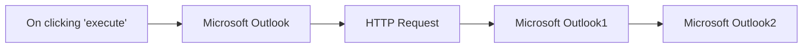

## Fluxo (.json) :

```json
{
  "id": "193",
  "name": "Create, add an attachment, and send a draft using the Microsoft Outlook node",
  "nodes": [
    {
      "name": "On clicking 'execute'",
      "type": "n8n-nodes-base.manualTrigger",
      "position": [
        250,
        300
      ],
      "parameters": {},
      "typeVersion": 1
    },
    {
      "name": "Microsoft Outlook",
      "type": "n8n-nodes-base.microsoftOutlook",
      "position": [
        450,
        300
      ],
      "parameters": {
        "subject": "Hello from n8n!",
        "resource": "draft",
        "bodyContent": "<h1>Hello from n8n!</h1> <p>We are sending this email using the Microsoft Outlook node in <a href=\"https://n8n.io\">n8n</a></p> <p>Best,</p> <p>Sender</p>",
        "additionalFields": {
          "bodyContentType": "html"
        }
      },
      "credentials": {
        "microsoftOutlookOAuth2Api": "Micrsoft Outlook Credentials"
      },
      "typeVersion": 1
    },
    {
      "name": "HTTP Request",
      "type": "n8n-nodes-base.httpRequest",
      "position": [
        650,
        300
      ],
      "parameters": {
        "url": "https://n8n.io/n8n-logo.png",
        "options": {},
        "responseFormat": "file"
      },
      "typeVersion": 1
    },
    {
      "name": "Microsoft Outlook1",
      "type": "n8n-nodes-base.microsoftOutlook",
      "position": [
        850,
        300
      ],
      "parameters": {
        "resource": "messageAttachment",
        "messageId": "={{$node[\"Microsoft Outlook\"].json[\"id\"]}}",
        "additionalFields": {
          "fileName": "n8n.png"
        }
      },
      "credentials": {
        "microsoftOutlookOAuth2Api": "Micrsoft Outlook Credentials"
      },
      "typeVersion": 1
    },
    {
      "name": "Microsoft Outlook2",
      "type": "n8n-nodes-base.microsoftOutlook",
      "position": [
        1050,
        300
      ],
      "parameters": {
        "resource": "draft",
        "messageId": "={{$node[\"Microsoft Outlook\"].json[\"id\"]}}",
        "operation": "send",
        "additionalFields": {
          "recipients": "abc@example.com"
        }
      },
      "credentials": {
        "microsoftOutlookOAuth2Api": "Micrsoft Outlook Credentials"
      },
      "typeVersion": 1
    }
  ],
  "active": false,
  "settings": {},
  "connections": {
    "HTTP Request": {
      "main": [
        [
          {
            "node": "Microsoft Outlook1",
            "type": "main",
            "index": 0
          }
        ]
      ]
    },
    "Microsoft Outlook": {
      "main": [
        [
          {
            "node": "HTTP Request",
            "type": "main",
            "index": 0
          }
        ]
      ]
    },
    "Microsoft Outlook1": {
      "main": [
        [
          {
            "node": "Microsoft Outlook2",
            "type": "main",
            "index": 0
          }
        ]
      ]
    },
    "On clicking 'execute'": {
      "main": [
        [
          {
            "node": "Microsoft Outlook",
            "type": "main",
            "index": 0
          }
        ]
      ]
    }
  }
}
```

<a id="template-204"></a>

## Template 204 - Atualização diária do tempo via Gotify

- **Nome:** Atualização diária do tempo via Gotify
- **Descrição:** Envia diariamente uma notificação com a temperatura atual de Berlim através do serviço de notificações Gotify.
- **Funcionalidade:** • Agendamento diário: executa o fluxo todos os dias às 9h da manhã.
• Consulta de clima: obtém os dados meteorológicos da cidade de Berlim.
• Mensagem personalizada: formata a mensagem incluindo a temperatura atual em °C.
• Envio de notificação: publica a mensagem no servidor de notificações com um título informativo.
- **Ferramentas:** • OpenWeatherMap: serviço que fornece dados meteorológicos por cidade, incluindo temperatura e condições.
• Gotify: sistema de notificações que permite enviar mensagens programáticas para dispositivos ou usuários.

## Fluxo visual

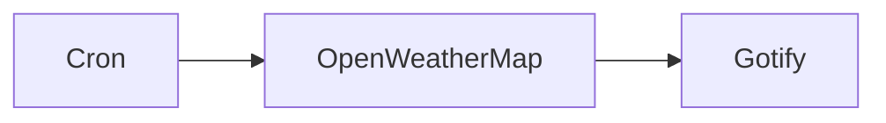

## Fluxo (.json) :

```json
{
  "id": "115",
  "name": "Send daily weather updates via a message using the Gotify node",
  "nodes": [
    {
      "name": "Cron",
      "type": "n8n-nodes-base.cron",
      "position": [
        490,
        340
      ],
      "parameters": {
        "triggerTimes": {
          "item": [
            {
              "hour": 9
            }
          ]
        }
      },
      "typeVersion": 1
    },
    {
      "name": "OpenWeatherMap",
      "type": "n8n-nodes-base.openWeatherMap",
      "position": [
        690,
        340
      ],
      "parameters": {
        "cityName": "berlin"
      },
      "credentials": {
        "openWeatherMapApi": "owm"
      },
      "typeVersion": 1
    },
    {
      "name": "Gotify",
      "type": "n8n-nodes-base.gotify",
      "position": [
        890,
        340
      ],
      "parameters": {
        "message": "=Hey! The temperature outside is {{$node[\"OpenWeatherMap\"].json[\"main\"][\"temp\"]}}°C.",
        "additionalFields": {
          "title": "Today's Weather Update"
        }
      },
      "credentials": {
        "gotifyApi": "gotify-credentials"
      },
      "typeVersion": 1
    }
  ],
  "active": false,
  "settings": {},
  "connections": {
    "Cron": {
      "main": [
        [
          {
            "node": "OpenWeatherMap",
            "type": "main",
            "index": 0
          }
        ]
      ]
    },
    "OpenWeatherMap": {
      "main": [
        [
          {
            "node": "Gotify",
            "type": "main",
            "index": 0
          }
        ]
      ]
    }
  }
}
```

<a id="template-205"></a>

## Template 205 - Exportar notas Keep → Planilha

- **Nome:** Exportar notas Keep → Planilha
- **Descrição:** Automatiza a leitura de arquivos de notas exportadas do Google Keep, filtra, processa (opcionalmente com IA) e insere os dados relevantes em uma planilha do Google Sheets.
- **Funcionalidade:** • Busca de arquivos em pasta específica: Procura os arquivos da exportação do Google Keep em uma pasta do Google Drive.
• Processamento em lotes: Divide a lista de arquivos em lotes para processar em blocos controlados.
• Filtragem por extensão: Seleciona apenas arquivos com extensão .json para processamento.
• Download e extração de conteúdo JSON: Baixa cada arquivo e converte o conteúdo JSON em dados utilizáveis.
• Filtragem por conteúdo: Filtra notas que contenham palavras-chave específicas (ex.: "dépensé", "depense").
• Verificação de status de arquivamento: Descarta notas que estejam arquivadas (mantém apenas isArchived = false).
• Processamento opcional com IA: Usa um modelo de linguagem para extrair informações específicas (ex.: montantes em euros) do texto da nota.
• Mapeamento de campos para exportação: Prepara campos como texto, datas de criação/edição, status e valores extraídos para exportar.
• Inserção/atualização em planilha: Adiciona ou atualiza linhas em uma planilha do Google Sheets com os dados processados.
- **Ferramentas:** • Google Keep / Google Takeout: Fonte das notas exportadas (exportação inicial das notas em arquivos JSON).
• Google Drive: Armazenamento e leitura dos arquivos JSON exportados das notas.
• Google Sheets: Destino final onde os dados extraídos são inseridos/atualizados.
• OpenAI (modelo de linguagem): Opcionalmente usado para extrair informações específicas do texto das notas (como valores monetários).

## Fluxo visual

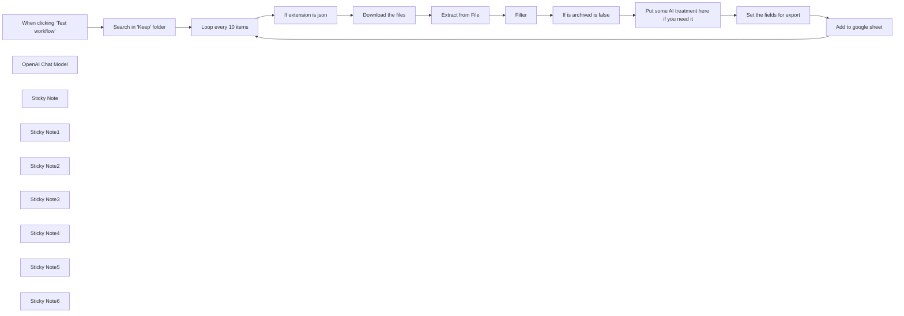

## Fluxo (.json) :

```json
{
  "nodes": [
    {
      "id": "ee3cd6ff-40ba-40d4-bbbf-90244da4a272",
      "name": "When clicking ‘Test workflow’",
      "type": "n8n-nodes-base.manualTrigger",
      "position": [
        0,
        -155
      ],
      "parameters": {},
      "typeVersion": 1
    },
    {
      "id": "68584aab-c5f3-450a-a1e3-cddc8d64082d",
      "name": "Extract from File",
      "type": "n8n-nodes-base.extractFromFile",
      "position": [
        1100,
        -280
      ],
      "parameters": {
        "options": {},
        "operation": "fromJson"
      },
      "typeVersion": 1
    },
    {
      "id": "e23a67a1-44df-4b83-a80a-9383f4432c7d",
      "name": "If is archived is false",
      "type": "n8n-nodes-base.if",
      "position": [
        1540,
        -280
      ],
      "parameters": {
        "options": {},
        "conditions": {
          "options": {
            "version": 2,
            "leftValue": "",
            "caseSensitive": true,
            "typeValidation": "strict"
          },
          "combinator": "and",
          "conditions": [
            {
              "id": "e051d2f2-7c22-4864-bbe7-4832cc54acaa",
              "operator": {
                "type": "boolean",
                "operation": "false",
                "singleValue": true
              },
              "leftValue": "={{ $json.data.isArchived }}",
              "rightValue": ""
            }
          ]
        }
      },
      "typeVersion": 2.2
    },
    {
      "id": "313764d0-f115-46d3-a2e3-1fde647f7d85",
      "name": "OpenAI Chat Model",
      "type": "@n8n/n8n-nodes-langchain.lmChatOpenAi",
      "position": [
        1848,
        -60
      ],
      "parameters": {
        "model": {
          "__rl": true,
          "mode": "list",
          "value": "gpt-4o-mini"
        },
        "options": {}
      },
      "credentials": {
        "openAiApi": {
          "id": "1IOLtYX7aTspCAN8",
          "name": "OpenAI Pollup"
        }
      },
      "typeVersion": 1.2
    },
    {
      "id": "81fcc7a0-955d-4930-b203-8e98d57e3c4c",
      "name": "If extension is json",
      "type": "n8n-nodes-base.filter",
      "position": [
        660,
        -280
      ],
      "parameters": {
        "options": {},
        "conditions": {
          "options": {
            "version": 2,
            "leftValue": "",
            "caseSensitive": true,
            "typeValidation": "strict"
          },
          "combinator": "and",
          "conditions": [
            {
              "id": "7b80be39-b5cc-4f96-8529-75559aaece38",
              "operator": {
                "name": "filter.operator.equals",
                "type": "string",
                "operation": "equals"
              },
              "leftValue": "={{ $json.name.split('.').pop(); }}",
              "rightValue": "=json"
            }
          ]
        }
      },
      "typeVersion": 2.2
    },
    {
      "id": "1c8c81ea-d0ae-4925-ae4b-05482c1b5fa2",
      "name": "Sticky Note",
      "type": "n8n-nodes-base.stickyNote",
      "position": [
        -340,
        -380
      ],
      "parameters": {
        "color": 4,
        "width": 260,
        "height": 440,
        "content": "## How to export your Google keep notes \n* Google has a dedicated service for exporting your google data, called [Google Takeout](https://takeout.google.com/), you'll have to login  it. \n* Click on \"Deselect all\" then select only Google Keep and click on \"Next\". \n- Select the destination (use \"Send download link via mail\" as you'll have to uncompress a zip file before to send it again to Google Drive)\n- Upload to Google Drive all json files from your uncompresed file, to specific directory and you are ready to start!\n"
      },
      "typeVersion": 1
    },
    {
      "id": "31eb6398-cca0-4ed1-910a-470fa49c9727",
      "name": "Search in \"Keep\" folder",
      "type": "n8n-nodes-base.googleDrive",
      "position": [
        220,
        -155
      ],
      "parameters": {
        "limit": 2,
        "filter": {
          "folderId": {
            "__rl": true,
            "mode": "list",
            "value": "1BggjRVCqyDnECK_mB2M-PYareptQv99P",
            "cachedResultUrl": "https://drive.google.com/drive/folders/1BggjRVCqyDnECK_mB2M-PYareptQv99P",
            "cachedResultName": "Keep"
          },
          "whatToSearch": "files"
        },
        "options": {},
        "resource": "fileFolder"
      },
      "credentials": {
        "googleDriveOAuth2Api": {
          "id": "veQ5hnnOES56fTcI",
          "name": "Google Drive account good"
        }
      },
      "typeVersion": 3
    },
    {
      "id": "653d04b2-4020-4254-a8f5-53e15228adb7",
      "name": "Loop every 10 items",
      "type": "n8n-nodes-base.splitInBatches",
      "position": [
        440,
        -155
      ],
      "parameters": {
        "options": {},
        "batchSize": 10
      },
      "typeVersion": 3
    },
    {
      "id": "c1171bd7-5e2d-49e6-a52b-6e9282cb093d",
      "name": "Download the files",
      "type": "n8n-nodes-base.googleDrive",
      "position": [
        880,
        -280
      ],
      "parameters": {
        "fileId": {
          "__rl": true,
          "mode": "id",
          "value": "={{ $json.id }}"
        },
        "options": {},
        "operation": "download"
      },
      "credentials": {
        "googleDriveOAuth2Api": {
          "id": "veQ5hnnOES56fTcI",
          "name": "Google Drive account good"
        }
      },
      "typeVersion": 3
    },
    {
      "id": "4d9caff3-2ac8-40fc-91a4-1b395e693141",
      "name": "Put some AI treatment here if you need it",
      "type": "@n8n/n8n-nodes-langchain.agent",
      "notes": "Yu can use this AI Agent to process a number or anything you need from your notes",
      "position": [
        1760,
        -280
      ],
      "parameters": {
        "text": "=Extract the amount in euros of the input. output just the amount and nothing else. \nHere is the input:{{ $json.data.textContent }}",
        "options": {},
        "promptType": "define"
      },
      "typeVersion": 1.8
    },
    {
      "id": "d97c4e02-4b1a-479f-8492-e601c553ac57",
      "name": "Set the fields for export",
      "type": "n8n-nodes-base.set",
      "position": [
        2136,
        -280
      ],
      "parameters": {
        "options": {},
        "assignments": {
          "assignments": [
            {
              "id": "d05409ea-b739-47bd-9c07-0dea40b83de1",
              "name": "textContent",
              "type": "string",
              "value": "={{ $('If is archived is false').item.json.data.textContent }}"
            },
            {
              "id": "acbe202e-de95-4a47-a90b-78556fec4650",
              "name": "Edited",
              "type": "string",
              "value": "={{ new Date($('If is archived is false').item.json.data.userEditedTimestampUsec / 1000).toLocaleString() }}"
            },
            {
              "id": "13f00e53-75fd-4db5-9a22-b5e329c72b47",
              "name": "Created",
              "type": "string",
              "value": "={{ new Date($('If is archived is false').item.json.data.createdTimestampUsec / 1000).toLocaleString() }}"
            },
            {
              "id": "7e58e874-5238-4fb6-8b00-ea947c59ec4b",
              "name": "isArchived",
              "type": "boolean",
              "value": "={{ $('If is archived is false').item.json.data.isArchived }}"
            },
            {
              "id": "721f31d8-4944-4a63-878e-71816eee755c",
              "name": "Amount",
              "type": "string",
              "value": "={{ $json.output }}"
            }
          ]
        }
      },
      "typeVersion": 3.4
    },
    {
      "id": "0f8d9b1f-f5de-477f-ad50-eeb89bcf8dc7",
      "name": "Add to google sheet",
      "type": "n8n-nodes-base.googleSheets",
      "position": [
        2356,
        -155
      ],
      "parameters": {
        "columns": {
          "value": {},
          "schema": [
            {
              "id": "textContent",
              "type": "string",
              "display": true,
              "removed": false,
              "required": false,
              "displayName": "textContent",
              "defaultMatch": false,
              "canBeUsedToMatch": true
            },
            {
              "id": "Edited",
              "type": "string",
              "display": true,
              "removed": false,
              "required": false,
              "displayName": "Edited",
              "defaultMatch": false,
              "canBeUsedToMatch": true
            },
            {
              "id": "Created",
              "type": "string",
              "display": true,
              "removed": false,
              "required": false,
              "displayName": "Created",
              "defaultMatch": false,
              "canBeUsedToMatch": true
            },
            {
              "id": "isArchived",
              "type": "string",
              "display": true,
              "removed": false,
              "required": false,
              "displayName": "isArchived",
              "defaultMatch": false,
              "canBeUsedToMatch": true
            }
          ],
          "mappingMode": "autoMapInputData",
          "matchingColumns": [],
          "attemptToConvertTypes": false,
          "convertFieldsToString": false
        },
        "options": {},
        "operation": "appendOrUpdate",
        "sheetName": {
          "__rl": true,
          "mode": "list",
          "value": "gid=0",
          "cachedResultUrl": "https://docs.google.com/spreadsheets/d/1rjgyHw6XU4NTRCx4eXuQ0AIXhY3mWqxg1NiAhrSnuzE/edit#gid=0",
          "cachedResultName": "Sheet1"
        },
        "documentId": {
          "__rl": true,
          "mode": "list",
          "value": "1rjgyHw6XU4NTRCx4eXuQ0AIXhY3mWqxg1NiAhrSnuzE",
          "cachedResultUrl": "https://docs.google.com/spreadsheets/d/1rjgyHw6XU4NTRCx4eXuQ0AIXhY3mWqxg1NiAhrSnuzE/edit?usp=drivesdk",
          "cachedResultName": "googl keep export (10/05/25)"
        }
      },
      "credentials": {
        "googleSheetsOAuth2Api": {
          "id": "gdLmm513ROUyH6oU",
          "name": "Google Sheets account"
        }
      },
      "typeVersion": 4.5
    },
    {
      "id": "31141cf2-94d6-45ad-8632-18001a6d4d36",
      "name": "Filter",
      "type": "n8n-nodes-base.if",
      "position": [
        1320,
        -280
      ],
      "parameters": {
        "options": {},
        "conditions": {
          "options": {
            "version": 2,
            "leftValue": "",
            "caseSensitive": true,
            "typeValidation": "strict"
          },
          "combinator": "or",
          "conditions": [
            {
              "id": "11bacf5f-6675-4681-b205-5e5293eaae02",
              "operator": {
                "type": "string",
                "operation": "contains"
              },
              "leftValue": "={{ $json.data.textContentHtml }}",
              "rightValue": "dépensé"
            },
            {
              "id": "c40da1df-559c-4278-bde1-cdb8e65c8428",
              "operator": {
                "type": "string",
                "operation": "contains"
              },
              "leftValue": "={{ $json.data.textContentHtml }}",
              "rightValue": "depense"
            }
          ]
        }
      },
      "typeVersion": 2.2
    },
    {
      "id": "c4c941f5-6579-4f4f-9916-cdd496498760",
      "name": "Sticky Note1",
      "type": "n8n-nodes-base.stickyNote",
      "position": [
        2300,
        -360
      ],
      "parameters": {
        "color": 5,
        "height": 360,
        "content": "## Create an empty google sheet file\n\nThat will get your entries from the notes "
      },
      "typeVersion": 1
    },
    {
      "id": "3ab60239-85cf-4c84-94d3-659fdfef4316",
      "name": "Sticky Note2",
      "type": "n8n-nodes-base.stickyNote",
      "position": [
        140,
        -300
      ],
      "parameters": {
        "color": 5,
        "height": 360,
        "content": "## Set the directory Where you put the files"
      },
      "typeVersion": 1
    },
    {
      "id": "49546099-e072-4183-a14e-fff80928920d",
      "name": "Sticky Note3",
      "type": "n8n-nodes-base.stickyNote",
      "position": [
        1240,
        -480
      ],
      "parameters": {
        "color": 5,
        "height": 360,
        "content": "## Filter the files\n\nIf you need the content to contain a word, or after a certain date.\n\nIf you don't need to filter it, just remove the node"
      },
      "typeVersion": 1
    },
    {
      "id": "195923a2-faf9-40c3-95c0-08fdc078e291",
      "name": "Sticky Note4",
      "type": "n8n-nodes-base.stickyNote",
      "position": [
        1720,
        -500
      ],
      "parameters": {
        "color": 5,
        "width": 320,
        "height": 560,
        "content": "## Process each file with AI\n\nIf you need the extract some information from the contextq, you can do it here. If you don't need it, just delete the node"
      },
      "typeVersion": 1
    },
    {
      "id": "07b3570a-72cf-480b-b3b8-fb461b57822d",
      "name": "Sticky Note5",
      "type": "n8n-nodes-base.stickyNote",
      "position": [
        -340,
        80
      ],
      "parameters": {
        "color": 4,
        "width": 380,
        "height": 300,
        "content": "## Setup\n* Export your Google Keep notes (see \"how to export your Google Keep notes\")\n\n- Connect Google Drive, OpenAI, and Google Sheets in n8n.\n\n- Set the correct folder path for your notes in the “Search in ‘Keep’ folder” node.\n\n- Point the Google Sheet node to your spreadsheet"
      },
      "typeVersion": 1
    },
    {
      "id": "48e1cff2-2748-4d15-91b4-d5ee2f5d9581",
      "name": "Sticky Note6",
      "type": "n8n-nodes-base.stickyNote",
      "position": [
        -340,
        -500
      ],
      "parameters": {
        "width": 720,
        "height": 100,
        "content": "## Contact me\n### If you need some help with this workflow: Write to me: [thomas@pollup.net](mailto:thomas@pollup.net)\n"
      },
      "typeVersion": 1
    }
  ],
  "connections": {
    "Filter": {
      "main": [
        [
          {
            "node": "If is archived is false",
            "type": "main",
            "index": 0
          }
        ]
      ]
    },
    "Extract from File": {
      "main": [
        [
          {
            "node": "Filter",
            "type": "main",
            "index": 0
          }
        ]
      ]
    },
    "OpenAI Chat Model": {
      "ai_languageModel": [
        [
          {
            "node": "Put some AI treatment here if you need it",
            "type": "ai_languageModel",
            "index": 0
          }
        ]
      ]
    },
    "Download the files": {
      "main": [
        [
          {
            "node": "Extract from File",
            "type": "main",
            "index": 0
          }
        ]
      ]
    },
    "Add to google sheet": {
      "main": [
        [
          {
            "node": "Loop every 10 items",
            "type": "main",
            "index": 0
          }
        ]
      ]
    },
    "Loop every 10 items": {
      "main": [
        [],
        [
          {
            "node": "If extension is json",
            "type": "main",
            "index": 0
          }
        ]
      ]
    },
    "If extension is json": {
      "main": [
        [
          {
            "node": "Download the files",
            "type": "main",
            "index": 0
          }
        ]
      ]
    },
    "If is archived is false": {
      "main": [
        [
          {
            "node": "Put some AI treatment here if you need it",
            "type": "main",
            "index": 0
          }
        ]
      ]
    },
    "Search in \"Keep\" folder": {
      "main": [
        [
          {
            "node": "Loop every 10 items",
            "type": "main",
            "index": 0
          }
        ]
      ]
    },
    "Set the fields for export": {
      "main": [
        [
          {
            "node": "Add to google sheet",
            "type": "main",
            "index": 0
          }
        ]
      ]
    },
    "When clicking ‘Test workflow’": {
      "main": [
        [
          {
            "node": "Search in \"Keep\" folder",
            "type": "main",
            "index": 0
          }
        ]
      ]
    },
    "Put some AI treatment here if you need it": {
      "main": [
        [
          {
            "node": "Set the fields for export",
            "type": "main",
            "index": 0
          }
        ]
      ]
    }
  }
}
```

<a id="template-206"></a>

## Template 206 - Classificação e resposta automática de e-mails

- **Nome:** Classificação e resposta automática de e-mails
- **Descrição:** Detecta e classifica e-mails recebidos, responde automaticamente com templates específicos, marca mensagens, aplica rótulos e adiciona/atualiza contatos no CRM.
- **Funcionalidade:** • Monitoramento de e-mail: Verifica a caixa de entrada periodicamente para novos e-mails.
• Filtragem de remetentes internos: Identifica e-mails originados do domínio interno para tratamento separado.
• Prevenção de resposta em threads: Evita responder a mensagens que já são respostas (assunto começando com "Re:").
• Classificação por modelo de linguagem: Analisa assunto e corpo da mensagem para classificar em categorias (Guest Post, YouTube, Cursos).
• Resposta automática com templates: Envia e-mails personalizados conforme a categoria detectada (modelo para guest post, vídeo do YouTube e cadastro de cursos).
• Marcar como lido e aplicar rótulo: Atualiza o estado do e-mail para lido e aplica rótulos organizacionais.
• Sincronização de contato: Cria ou atualiza o contato do remetente em um sistema de CRM/marketing por e-mail.
- **Ferramentas:** • Gmail: Fonte de e-mails recebidos e serviço usado para identificar mensagens e metadados.
• Google Gemini (PaLM): Modelo de linguagem usado para analisar e classificar o conteúdo dos e-mails.
• Serviço SMTP: Envio das mensagens de resposta utilizando templates HTML personalizados.
• Brevo (SendinBlue): Plataforma de CRM/marketing usada para criar ou atualizar contatos automaticamente.

## Fluxo visual

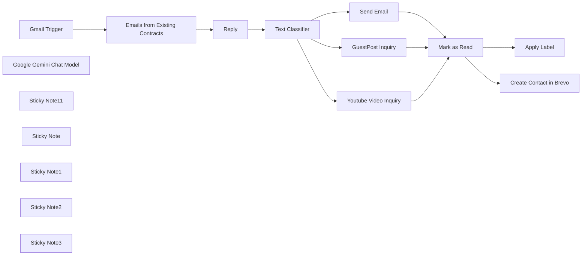

## Fluxo (.json) :

```json
{
  "meta": {
    "instanceId": "dd130a849d7b29e5541b05d2f7f86a4acd4f1ec598c1c9438783f56bc4f0ff80",
    "templateCredsSetupCompleted": true
  },
  "nodes": [
    {
      "id": "e563eef6-39c4-4859-b23a-db096e7f8717",
      "name": "Gmail Trigger",
      "type": "n8n-nodes-base.gmailTrigger",
      "position": [
        -1300,
        -60
      ],
      "parameters": {
        "simple": false,
        "filters": {},
        "options": {},
        "pollTimes": {
          "item": [
            {
              "mode": "everyHour"
            }
          ]
        }
      },
      "credentials": {
        "gmailOAuth2": {
          "id": "umlWq7xPmamha8HX",
          "name": "Gmail account"
        }
      },
      "typeVersion": 1.2
    },
    {
      "id": "068c250f-84b0-41e4-b48a-6a5260b7a24a",
      "name": "Text Classifier",
      "type": "@n8n/n8n-nodes-langchain.textClassifier",
      "position": [
        -660,
        0
      ],
      "parameters": {
        "options": {},
        "inputText": "={{ $('Gmail Trigger').item.json.subject }}\n{{ $('Gmail Trigger').item.json.text }}",
        "categories": {
          "categories": [
            {
              "category": "Guest Post",
              "description": "The inquiry is about the collaboration on guest post inquiry, blog post on syncbricks.com or any other website. "
            },
            {
              "category": "Youtube",
              "description": "The inquiry is about adding review video on our youtube channel"
            },
            {
              "category": "Udemy Courses",
              "description": "Training and Courses related to Various Technology, AI Etc"
            }
          ]
        }
      },
      "typeVersion": 1
    },
    {
      "id": "036d86c2-0375-4f44-a14f-4f20d17eb048",
      "name": "Google Gemini Chat Model",
      "type": "@n8n/n8n-nodes-langchain.lmChatGoogleGemini",
      "position": [
        -640,
        200
      ],
      "parameters": {
        "options": {},
        "modelName": "models/gemini-2.0-flash-exp"
      },
      "credentials": {
        "googlePalmApi": {
          "id": "othBMxlMTTDAVGQ9",
          "name": "Google Gemini(PaLM) Api account"
        }
      },
      "typeVersion": 1
    },
    {
      "id": "6ca6adeb-fdf4-4e4c-83f2-e2b28548b33e",
      "name": "GuestPost Inquiry",
      "type": "n8n-nodes-base.emailSend",
      "position": [
        -80,
        -180
      ],
      "webhookId": "880024c2-f011-4385-b0f9-25ce08c5bd1b",
      "parameters": {
        "html": "=<!DOCTYPE html>\n<html>\n<body style=\"font-family: Arial, sans-serif; line-height: 1.6; color: #333;\">\n\n<p>Hello,</p>\n\n<p>Thank you for reaching out! We’re thrilled to help you gain exposure through guest posting on our diverse platforms. Here’s everything you need to know to get started:</p>\n\n<p><strong>Pricing & Options:</strong></p>\n<ul>\n    <li><strong>Guest Post:</strong> $0 per post. Bulk discounts are available for multiple submissions.</li>\n    <li><strong>Link Insertion:</strong> $0 per link in an existing post.</li>\n</ul>\n<p>Both options come with do-follow backlinks, ensuring long-term SEO benefits for your website.</p>\n\n<p><strong>Why Partner with Us?</strong></p>\n<ul>\n    <li><strong>Reach:</strong> Gain exposure to niche-specific, engaged audiences.</li>\n    <li><strong>Quick Turnaround:</strong> Publication within 3 business days for a seamless experience.</li>\n    <li><strong>Diverse Niches:</strong> Choose from a variety of topics to suit your content needs.</li>\n</ul>\n\n<p><strong>Choose the Right Platform:</strong></p>\n<p>Our websites span various niches, so you can select the one that best matches your content. Explore them here:</p>\n<ul>\n    <li><a href=\"https://syncbricks.com\" target=\"_blank\">syncbricks.com</a></li>\n    <li><a href=\"https://s4stechnology.com\" target=\"_blank\">s4stechnology.com</a></li>\n    <li><a href=\"https://shukranoman.com\" target=\"_blank\">shukranoman.com</a></li>\n    <li><a href=\"https://brenttechnologies.com\" target=\"_blank\">brenttechnologies.com</a></li>\n    <li><a href=\"https://mairimanzil.com\" target=\"_blank\">mairimanzil.com</a></li>\n    <li><a href=\"https://techfeed.com.au\" target=\"_blank\">techfeed.com.au</a></li>\n    <li><a href=\"https://tuts.plus\" target=\"_blank\">tuts.plus</a></li>\n    <li><a href=\"https://swifttapper.com\" target=\"_blank\">swifttapper.com</a></li>\n    <li><a href=\"https://amjidali.com\" target=\"_blank\">amjidali.com</a></li>\n    <li><a href=\"https://hamid.com.au\" target=\"_blank\">hamid.com.au</a></li>\n    <li><a href=\"https://cio.guru\" target=\"_blank\">cio.guru</a></li>\n</ul>\n\n<p><strong>Submission Guidelines:</strong></p>\n<ul>\n    <li><strong>Original Content:</strong> Submissions must be high-quality, unpublished, and niche-relevant.</li>\n    <li><strong>Minimum Word Count:</strong> 300 words.</li>\n    <li><strong>Formatting:</strong> Use headings, subheadings, and bullet points for readability.</li>\n    <li><strong>Backlinks:</strong> One do-follow backlink is permitted per post.</li>\n    <li><strong>Images:</strong> Unique and relevant images are encouraged.</li>\n</ul>\n\n<p><strong>How to Submit:</strong></p>\n<p>Reply to this email with your completed guest post and any supporting materials. We’ll review your submission and get back to you within 3 business days.</p>\n\n<p><strong>Payment Information:</strong></p>\n<p>Once your guest post or link insertion request is approved, we’ll provide you with payment details. We accept payments through:</p>\n<ul>\n    <li>PayPal</li>\n    <li>Bank Transfer</li>\n    <li>Other methods (upon request)</li>\n</ul>\n<p>Please let us know your preferred method, and we’ll share the necessary information.</p>\n\n<p><strong>Questions?</strong></p>\n<p>If you need further assistance or guidance, feel free to reach out. We’re here to help!</p>\n\n<p>Best regards, <br>\n<strong>Sophia Mitchell</strong> <br>\nOutreach Manager | <a href=\"https://syncbricks.com\" target=\"_blank\">syncbricks.com</a> <br>\nWhatsApp: +1</p>\n\n<p style=\"font-size: 12px; color: #888;\">© 2025 SyncBricks. All rights reserved.</p>\n\n</body>\n</html>\n",
        "options": {
          "appendAttribution": false
        },
        "subject": "=Re: {{ $('Gmail Trigger').item.json.subject }}",
        "toEmail": "={{ $json.from.value[0].name }} <{{ $json.from.value[0].address }}>",
        "fromEmail": "Sophia Mitchell <info@syncbricks.com>"
      },
      "credentials": {
        "smtp": {
          "id": "AOPfJVssrSFm0US1",
          "name": "SMTP account"
        }
      },
      "typeVersion": 2.1
    },
    {
      "id": "41f06728-3bac-4fc2-ab20-d16f3fd9a936",
      "name": "Youtube Video Inquiry",
      "type": "n8n-nodes-base.emailSend",
      "position": [
        -80,
        0
      ],
      "webhookId": "d33a7f20-dca8-4622-b421-b92697fdffd8",
      "parameters": {
        "html": "=<!DOCTYPE html>\n<html>\n<head>\n    <style>\n        body {\n            font-family: Arial, sans-serif;\n            line-height: 1.6;\n            color: #333;\n            margin: 0;\n            padding: 0;\n        }\n        .container {\n            width: 100%;\n            max-width: 600px;\n            margin: 0 auto;\n            padding: 20px;\n        }\n        .header {\n            background-color: #f4f4f4;\n            padding: 10px 20px;\n            text-align: center;\n            border-bottom: 1px solid #ddd;\n        }\n        .header h1 {\n            margin: 0;\n            color: #555;\n        }\n        .content {\n            padding: 20px;\n        }\n        .content h2 {\n            color: #555;\n            font-size: 18px;\n        }\n        .content p {\n            margin-bottom: 15px;\n        }\n        .content ul {\n            list-style: disc;\n            padding-left: 20px;\n        }\n        .content ul li {\n            margin-bottom: 10px;\n        }\n        .content a {\n            color: #007BFF;\n            text-decoration: none;\n        }\n        .content a:hover {\n            text-decoration: underline;\n        }\n        .video-thumbnail {\n            text-align: center;\n            margin: 20px 0;\n        }\n        .video-thumbnail img {\n            width: 100%;\n            max-width: 560px;\n            border-radius: 5px;\n            box-shadow: 0 2px 6px rgba(0, 0, 0, 0.2);\n        }\n        .footer {\n            text-align: center;\n            font-size: 12px;\n            color: #888;\n            margin-top: 20px;\n        }\n    </style>\n</head>\n<body>\n    <div class=\"container\">\n        <div class=\"header\">\n            <h1>YouTube Review Video Inquiry</h1>\n        </div>\n        <div class=\"content\">\n            <p>Hello {{ $json.Name }},</p>\n            <p>Thank you for reaching out to inquire about our YouTube review video services! We are thrilled to collaborate with you and showcase your product or service to our engaged audience on our YouTube channel, **SyncBricks**.</p>\n            <h2>What We Offer:</h2>\n            <ul>\n                <li><strong>Comprehensive Review Video (10 Minutes):</strong> $1  \n                    <ul>\n                        <li>Detailed review and hands-on demonstration.</li>\n                        <li>Professional editing with a focus on your product's highlights.</li>\n                        <li>Includes a do-follow backlink placement on our website.</li>\n                    </ul>\n                </li>\n                <li><strong>Short Follow-Up Video:</strong> $7  \n                    <ul>\n                        <li>Quick review or update video.</li>\n                        <li>Focus on specific features or updates.</li>\n                        <li>Also includes a do-follow backlink placement on our website.</li>\n                    </ul>\n                </li>\n            </ul>\n            <h2>Sample Video:</h2>\n            <p>Here’s an example of our work to help you understand the quality and style of our reviews:</p>\n            <div class=\"video-thumbnail\">\n                <a href=\"https://youtu.be/-5bI45z4Ozo?si=hkGNnTgtH1quOfH2\" target=\"_blank\">\n                    \n                </a>\n            </div>\n            <p>Watch it here: <a href=\"https://youtu.be/-5bI45z4Ozo?si=hkGNnTgtH1quOfH2\" target=\"_blank\">https://youtu.be/-5bI45z4Ozo</a></p>\n            <h2>Why Choose Us?</h2>\n            <ul>\n                <li>Professional video production and editing to highlight your product's key features.</li>\n                <li>Engaged audience focused on IT and technology-related content.</li>\n                <li>Comprehensive reviews that provide value to both viewers and sponsors.</li>\n            </ul>\n            <h2>How to Proceed:</h2>\n            <p>To book a review video, please reply to this email with the following details:</p>\n            <ul>\n                <li>Your product/service name and a brief description.</li>\n                <li>Any specific features or aspects you want us to highlight.</li>\n                <li>Preferred review type (Comprehensive or Short Follow-Up).</li>\n            </ul>\n            <p>Once we have your details, we will share the payment instructions and the next steps to get started.</p>\n            <h2>Questions?</h2>\n            <p>If you have any questions or need further clarification, feel free to ask. We’re here to assist you!</p>\n            <p>Best regards,<br><strong>Sophia Mitchell</strong><br>Outreach Manager | <a href=\"https://syncbricks.com\" target=\"_blank\">syncbricks.com</a><br>WhatsApp: +1 </p>\n        </div>\n        <div class=\"footer\">\n            <p>© 2025 SyncBricks. All rights reserved.</p>\n        </div>\n    </div>\n</body>\n</html>\n",
        "options": {
          "appendAttribution": false
        },
        "subject": "=Re: {{ $('Gmail Trigger').item.json.subject }}",
        "toEmail": "={{ $json.from.value[0].name }} <{{ $json.from.value[0].address }}>",
        "fromEmail": "Sophia Mitchell <info@syncbricks.com>"
      },
      "credentials": {
        "smtp": {
          "id": "AOPfJVssrSFm0US1",
          "name": "SMTP account"
        }
      },
      "typeVersion": 2.1
    },
    {
      "id": "e42754e8-a594-4ea8-b9a8-9e47ffdacd72",
      "name": "Send Email",
      "type": "n8n-nodes-base.emailSend",
      "position": [
        -80,
        180
      ],
      "webhookId": "3a0ca27f-1ff9-4c59-b17f-0523c58f70d1",
      "parameters": {
        "html": "=<!DOCTYPE html>\n<html>\n<head>\n    <style>\n        body {\n            font-family: Arial, sans-serif;\n            line-height: 1.6;\n            color: #333;\n            margin: 0;\n            padding: 0;\n        }\n        .container {\n            width: 100%;\n            max-width: 600px;\n            margin: 0 auto;\n            padding: 20px;\n        }\n        .header {\n            background-color: #f4f4f4;\n            padding: 10px 20px;\n            text-align: center;\n            border-bottom: 1px solid #ddd.\n        }\n        .header h1 {\n            margin: 0;\n            color: #555;\n        }\n        .content {\n            padding: 20px;\n        }\n        .content h2 {\n            color: #555;\n            font-size: 18px;\n        }\n        .content p {\n            margin-bottom: 15px;\n        }\n        .content ul {\n            list-style: disc;\n            padding-left: 20px;\n        }\n        .content ul li {\n            margin-bottom: 10px;\n        }\n        .content a {\n            color: #007BFF;\n            text-decoration: none;\n        }\n        .content a:hover {\n            text-decoration: underline;\n        }\n        .footer {\n            text-align: center;\n            font-size: 12px;\n            color: #888;\n            margin-top: 20px.\n        }\n    </style>\n</head>\n<body>\n    <div class=\"container\">\n        <div class=\"header\">\n            <h1>Course Inquiry</h1>\n        </div>\n        <div class=\"content\">\n            <p>Hello,</p>\n            <p>Thank you for your interest in our online courses! At **SyncBricks**, we offer a variety of high-quality courses designed to enhance your skills in IT, automation, network security, and more.</p>\n            <h2>Our Featured Courses:</h2>\n            <ul>\n                <li><strong><a href=\"https://www.udemy.com/course/ai-automation-mastery-build-intelligent-agents-with-lowcode/?referralCode=0062E7C1D64784AB70CA\" target=\"_blank\">AI Automation Mastery: Build Intelligent Agents</a></strong>  \n                    Learn how to leverage low-code platforms for workflow automation and build AI-driven solutions.\n                </li>\n                <li><strong><a href=\"https://www.udemy.com/course/microsoft-power-bi-advanced-course-desktop-dax/?referralCode=1B754977728785DC48C9\" target=\"_blank\">Advanced Power BI: Master Desktop & DAX</a></strong>  \n                    Master data visualization, dashboard creation, and DAX in Power BI.\n                </li>\n                <li><strong><a href=\"https://www.udemy.com/course/proxmox-virtualization-environment-complete-training/?referralCode=8E7EAFD11C2389F89C11\" target=\"_blank\">Proxmox VE: Complete Virtualization Guide</a></strong>  \n                    Dive into Proxmox VE for advanced virtualization techniques and management.\n                </li>\n                <li><strong><a href=\"https://www.udemy.com/course/pfsense-network-security-and-firewall-management/?referralCode=866D4839516374C77ACE\" target=\"_blank\">pfSense Network Security & Firewall Management</a></strong>  \n                    Learn how to secure networks with advanced firewall configurations.\n                </li>\n                <li><strong><a href=\"https://www.udemy.com/course/human-resource-management-with-erpnext-onboarding-to-exit/?referralCode=B3C64C3925EC62F42052\" target=\"_blank\">ERPNext for HR Management: Onboarding to Exit</a></strong>  \n                    Manage HR processes efficiently using ERPNext.\n                </li>\n            </ul>\n            <h2>Free Learning Resources:</h2>\n            <p>Explore a wealth of free material on our YouTube channel, **SyncBricks**, including tutorials, reviews, and how-to videos. Check it out here:</p>\n            <p><a href=\"https://www.youtube.com/channel/UC1ORA3oNGYuQ8yQHrC7MzBg?sub_confirmation=1\" target=\"_blank\">Visit Our YouTube Channel</a></p>\n            <h2>Why Choose Our Courses?</h2>\n            <ul>\n                <li>High-quality, industry-relevant content curated by experts.</li>\n                <li>Practical, hands-on projects to enhance learning.</li>\n                <li>Lifetime access to course materials for continuous learning.</li>\n                <li>Affordable pricing with discounts on certain platforms.</li>\n            </ul>\n            <h2>Browse All Courses</h2>\n            <p>Explore our full catalog on <a href=\"https://lms.syncbricks.com/\" target=\"_blank\">SyncBricks LMS</a> for more learning opportunities.</p>\n            <h2>Have Questions?</h2>\n            <p>If you’re unsure which course is the best fit or need assistance enrolling, let us know! We’re happy to guide you based on your interests and goals.</p>\n            <p>Best regards,<br><strong>Sophia Mitchell</strong><br>Outreach Manager | <a href=\"https://syncbricks.com\" target=\"_blank\">syncbricks.com</a><br>WhatsApp: +1 (810) 214-4375</p>\n        </div>\n        <div class=\"footer\">\n            <p>© 2025 SyncBricks. All rights reserved.</p>\n        </div>\n    </div>\n</body>\n</html>\n",
        "options": {
          "appendAttribution": false
        },
        "subject": "=Re:  {{ $('Gmail Trigger').item.json.Subject }}",
        "toEmail": "={{ $json.from.value[0].name }} <{{ $json.from.value[0].address }}>",
        "fromEmail": "Sophia Mitchell <info@syncbricks.com>"
      },
      "credentials": {
        "smtp": {
          "id": "AOPfJVssrSFm0US1",
          "name": "SMTP account"
        }
      },
      "typeVersion": 2.1
    },
    {
      "id": "a12e47bb-540b-4d42-b4fa-d27237964022",
      "name": "Mark as Read",
      "type": "n8n-nodes-base.gmail",
      "position": [
        360,
        0
      ],
      "webhookId": "066a871a-9801-4814-8ba5-238abe493cbb",
      "parameters": {
        "messageId": "={{ $('Gmail Trigger').item.json.id }}",
        "operation": "markAsRead"
      },
      "credentials": {
        "gmailOAuth2": {
          "id": "umlWq7xPmamha8HX",
          "name": "Gmail account"
        }
      },
      "typeVersion": 2.1
    },
    {
      "id": "06deb7fa-0169-46c3-b673-f35b476ef6a5",
      "name": "Apply Label",
      "type": "n8n-nodes-base.gmail",
      "position": [
        660,
        200
      ],
      "webhookId": "066a871a-9801-4814-8ba5-238abe493cbb",
      "parameters": {
        "labelIds": [
          "Label_6332648012153150222"
        ],
        "messageId": "={{ $('Gmail Trigger').item.json.id }}",
        "operation": "addLabels"
      },
      "credentials": {
        "gmailOAuth2": {
          "id": "umlWq7xPmamha8HX",
          "name": "Gmail account"
        }
      },
      "typeVersion": 2.1
    },
    {
      "id": "a3a38697-87ff-4954-aafe-c548425a84eb",
      "name": "Create Contact in Brevo",
      "type": "n8n-nodes-base.sendInBlue",
      "position": [
        640,
        -140
      ],
      "parameters": {
        "email": "={{ $('Text Classifier').item.json.from.value[0].address }}",
        "resource": "contact",
        "operation": "upsert",
        "requestOptions": {}
      },
      "credentials": {
        "sendInBlueApi": {
          "id": "tBNcyqgGWcRE4o8a",
          "name": "Brevo account"
        }
      },
      "typeVersion": 1
    },
    {
      "id": "99d8d741-4c7b-4795-958b-18116f9f7f96",
      "name": "Emails from Existing Contracts",
      "type": "n8n-nodes-base.if",
      "position": [
        -1120,
        -60
      ],
      "parameters": {
        "options": {},
        "conditions": {
          "options": {
            "version": 2,
            "leftValue": "",
            "caseSensitive": true,
            "typeValidation": "strict"
          },
          "combinator": "or",
          "conditions": [
            {
              "id": "7cffe101-333d-4ec2-a822-181fe421745b",
              "operator": {
                "type": "string",
                "operation": "contains"
              },
              "leftValue": "={{ $json.headers.from }}",
              "rightValue": "@syncbricks.com"
            }
          ]
        }
      },
      "typeVersion": 2.2
    },
    {
      "id": "538b53ef-05cd-4f08-83d7-5218b8492036",
      "name": "Reply",
      "type": "n8n-nodes-base.if",
      "position": [
        -980,
        100
      ],
      "parameters": {
        "options": {},
        "conditions": {
          "options": {
            "version": 2,
            "leftValue": "",
            "caseSensitive": true,
            "typeValidation": "strict"
          },
          "combinator": "and",
          "conditions": [
            {
              "id": "07a6d5e2-ffc5-41d8-b69a-abd6860879c0",
              "operator": {
                "type": "string",
                "operation": "notStartsWith"
              },
              "leftValue": "={{ $json.subject }}",
              "rightValue": "Re:"
            }
          ]
        }
      },
      "typeVersion": 2.2
    },
    {
      "id": "28f5e0eb-e3ad-4d34-89c6-c1571521f283",
      "name": "Sticky Note11",
      "type": "n8n-nodes-base.stickyNote",
      "position": [
        -2060,
        -300
      ],
      "parameters": {
        "color": 4,
        "width": 715,
        "height": 716,
        "content": "## Developed by Amjid Ali\n\nThank you for using this workflow template. It has taken me countless hours of hard work, research, and dedication to develop, and I sincerely hope it adds value to your work.\n\nIf you find this template helpful, I kindly ask you to consider supporting my efforts. Your support will help me continue improving and creating more valuable resources.\n\nBuy N8N Mastery Book : https://www.amazon.com/dp/B0F23GYCFW\n\n\nFor Full Course about ERPNext or Automation using AI follow below link\n\nhttp://lms.syncbricks.com\n\nAdditionally, when sharing this template, I would greatly appreciate it if you include my original information to ensure proper credit is given.\n\nThank you for your generosity and support!\nEmail : amjid@amjidali.com\nhttps://linkedin.com/in/amjidali\nhttps://syncbricks.com\nhttps://youtube.com/@syncbricks"
      },
      "typeVersion": 1
    },
    {
      "id": "8c105698-d989-44c3-ad8e-4bdda5c01715",
      "name": "Sticky Note",
      "type": "n8n-nodes-base.stickyNote",
      "position": [
        -1320,
        -300
      ],
      "parameters": {
        "width": 520,
        "height": 720,
        "content": "## Get the and Validate  New Email"
      },
      "typeVersion": 1
    },
    {
      "id": "cbb2e328-35b3-4ec9-9470-254666e40400",
      "name": "Sticky Note1",
      "type": "n8n-nodes-base.stickyNote",
      "position": [
        -780,
        -300
      ],
      "parameters": {
        "color": 3,
        "width": 520,
        "height": 720,
        "content": "## Classify the Email"
      },
      "typeVersion": 1
    },
    {
      "id": "0b5584cb-1002-46f5-9ac0-bcd816998534",
      "name": "Sticky Note2",
      "type": "n8n-nodes-base.stickyNote",
      "position": [
        -240,
        -300
      ],
      "parameters": {
        "color": 5,
        "width": 520,
        "height": 720,
        "content": "## Email Templates for Services"
      },
      "typeVersion": 1
    },
    {
      "id": "406f5793-6b54-4008-89e5-0b878aef9806",
      "name": "Sticky Note3",
      "type": "n8n-nodes-base.stickyNote",
      "position": [
        300,
        -300
      ],
      "parameters": {
        "color": 4,
        "width": 520,
        "height": 720,
        "content": "## mark as read, apply label and add to contact\n"
      },
      "typeVersion": 1
    }
  ],
  "pinData": {},
  "connections": {
    "Reply": {
      "main": [
        [
          {
            "node": "Text Classifier",
            "type": "main",
            "index": 0
          }
        ]
      ]
    },
    "Send Email": {
      "main": [
        [
          {
            "node": "Mark as Read",
            "type": "main",
            "index": 0
          }
        ]
      ]
    },
    "Mark as Read": {
      "main": [
        [
          {
            "node": "Apply Label",
            "type": "main",
            "index": 0
          },
          {
            "node": "Create Contact in Brevo",
            "type": "main",
            "index": 0
          }
        ]
      ]
    },
    "Gmail Trigger": {
      "main": [
        [
          {
            "node": "Emails from Existing Contracts",
            "type": "main",
            "index": 0
          }
        ]
      ]
    },
    "Text Classifier": {
      "main": [
        [
          {
            "node": "GuestPost Inquiry",
            "type": "main",
            "index": 0
          }
        ],
        [
          {
            "node": "Youtube Video Inquiry",
            "type": "main",
            "index": 0
          }
        ],
        [
          {
            "node": "Send Email",
            "type": "main",
            "index": 0
          }
        ]
      ]
    },
    "GuestPost Inquiry": {
      "main": [
        [
          {
            "node": "Mark as Read",
            "type": "main",
            "index": 0
          }
        ]
      ]
    },
    "Youtube Video Inquiry": {
      "main": [
        [
          {
            "node": "Mark as Read",
            "type": "main",
            "index": 0
          }
        ]
      ]
    },
    "Google Gemini Chat Model": {
      "ai_languageModel": [
        [
          {
            "node": "Text Classifier",
            "type": "ai_languageModel",
            "index": 0
          }
        ]
      ]
    },
    "Emails from Existing Contracts": {
      "main": [
        [],
        [
          {
            "node": "Reply",
            "type": "main",
            "index": 0
          }
        ]
      ]
    }
  }
}
```

<a id="template-207"></a>

## Template 207 - Monitoramento e alertas de expiração de SSL

- **Nome:** Monitoramento e alertas de expiração de SSL
- **Descrição:** Monitora certificados SSL de uma lista de URLs, atualiza uma planilha com os resultados e envia alertas quando os certificados estão próximos do vencimento ou inválidos.
- **Funcionalidade:** • Agendamento semanal: Executa a verificação automaticamente uma vez por semana.
• Leitura de URLs de planilha: Busca a lista de sites a monitorar a partir de uma planilha do Google Sheets.
• Verificação de certificado SSL: Consulta uma API externa para obter dados do certificado (host, validade, dias restantes e status).
• Classificação de status: Agrupa os certificados em inválido, alerta (menos de 30 dias), aviso (menos de 60 dias) e informação (demais casos).
• Atualização da planilha: Grava os detalhes do certificado e o resultado da verificação de volta na planilha.
• Envio de alertas por email: Dispara emails com assuntos e mensagens diferenciadas conforme a gravidade (urgente para inválidos, warning para próximos do vencimento, info para demais).
• Notificações instantâneas: Envia notificações via Telegram e ntfy para casos urgentes ou informativos.
- **Ferramentas:** • Google Sheets: Armazenamento e recuperação da lista de URLs e gravação dos resultados das verificações.
• SSL-Checker.io: API externa usada para validar certificados SSL e obter data de expiração e dias restantes.
• Gmail: Serviço de envio de emails para notificar responsáveis sobre certificados em risco.
• Telegram: Canal de mensagens para alertas urgentes sobre certificados inválidos.
• ntfy: Serviço de notificações push para informar sobre o status das verificações.

## Fluxo visual

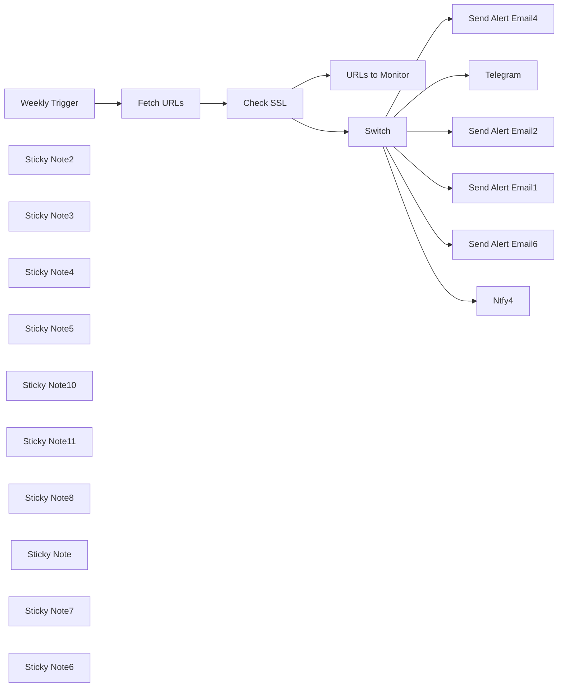

## Fluxo (.json) :

```json
{
  "id": "JH0OhDnJCwPxBJZX",
  "meta": {
    "instanceId": "d00caf92aa0876c596905aea78b35fa33a722cc8e479133822c17064d15c2c1d",
    "templateId": "2694",
    "templateCredsSetupCompleted": true
  },
  "name": "Template - SSL Expiry Alert System",
  "tags": [
    {
      "id": "C38hOXfGSlCQyKoZ",
      "name": "Tool",
      "createdAt": "2025-01-23T03:38:52.218Z",
      "updatedAt": "2025-01-23T03:38:52.218Z"
    },
    {
      "id": "DUAUvp55JytZ6Yj9",
      "name": "Information Retrieval",
      "createdAt": "2025-03-26T23:05:13.973Z",
      "updatedAt": "2025-03-26T23:05:13.973Z"
    },
    {
      "id": "eMfCVVNXtoE4ioDe",
      "name": "Utility",
      "createdAt": "2025-03-26T23:58:28.154Z",
      "updatedAt": "2025-03-26T23:58:28.154Z"
    }
  ],
  "nodes": [
    {
      "id": "b1b8afac-d0c7-4db3-aae8-cdf90c9d319e",
      "name": "URLs to Monitor",
      "type": "n8n-nodes-base.googleSheets",
      "position": [
        -240,
        960
      ],
      "parameters": {
        "columns": {
          "value": {},
          "schema": [
            {
              "id": "ID",
              "type": "string",
              "display": true,
              "removed": false,
              "required": false,
              "displayName": "ID",
              "defaultMatch": false,
              "canBeUsedToMatch": true
            },
            {
              "id": "version",
              "type": "string",
              "display": true,
              "removed": false,
              "required": false,
              "displayName": "version",
              "defaultMatch": false,
              "canBeUsedToMatch": true
            },
            {
              "id": "app",
              "type": "string",
              "display": true,
              "removed": false,
              "required": false,
              "displayName": "app",
              "defaultMatch": false,
              "canBeUsedToMatch": true
            },
            {
              "id": "host",
              "type": "string",
              "display": true,
              "removed": false,
              "required": false,
              "displayName": "host",
              "defaultMatch": false,
              "canBeUsedToMatch": true
            },
            {
              "id": "response_time_sec",
              "type": "string",
              "display": true,
              "removed": false,
              "required": false,
              "displayName": "response_time_sec",
              "defaultMatch": false,
              "canBeUsedToMatch": true
            },
            {
              "id": "status",
              "type": "string",
              "display": true,
              "removed": false,
              "required": false,
              "displayName": "status",
              "defaultMatch": false,
              "canBeUsedToMatch": true
            },
            {
              "id": "result",
              "type": "string",
              "display": true,
              "removed": false,
              "required": false,
              "displayName": "result",
              "defaultMatch": false,
              "canBeUsedToMatch": true
            }
          ],
          "mappingMode": "autoMapInputData",
          "matchingColumns": [
            "ID"
          ],
          "attemptToConvertTypes": false,
          "convertFieldsToString": false
        },
        "options": {
          "cellFormat": "RAW",
          "handlingExtraData": "insertInNewColumn"
        },
        "operation": "appendOrUpdate",
        "sheetName": {
          "__rl": true,
          "mode": "list",
          "value": 636520406,
          "cachedResultUrl": "https://docs.google.com/spreadsheets/d/1aCo3vrxgheNJChElzmf4pq8h5is7E-jz4sjfV8Quprg/edit#gid=636520406",
          "cachedResultName": "certificate-data"
        },
        "documentId": {
          "__rl": true,
          "mode": "list",
          "value": "1aCo3vrxgheNJChElzmf4pq8h5is7E-jz4sjfV8Quprg",
          "cachedResultUrl": "https://docs.google.com/spreadsheets/d/1aCo3vrxgheNJChElzmf4pq8h5is7E-jz4sjfV8Quprg/edit?usp=drivesdk",
          "cachedResultName": "Monitor SSL"
        }
      },
      "credentials": {
        "googleSheetsOAuth2Api": {
          "id": "UzZqCw0fHxPn7ugj",
          "name": "Google Sheets account"
        }
      },
      "typeVersion": 4.5
    },
    {
      "id": "5ecc3df7-e262-479c-9bdc-0542e53e77bf",
      "name": "Weekly Trigger",
      "type": "n8n-nodes-base.scheduleTrigger",
      "position": [
        -1220,
        1400
      ],
      "parameters": {
        "rule": {
          "interval": [
            {
              "field": "weeks",
              "triggerAtDay": [
                1
              ],
              "triggerAtHour": 8
            }
          ]
        }
      },
      "typeVersion": 1.2
    },
    {
      "id": "1b1d98f0-20fa-4a33-ae60-f8d1ae85175a",
      "name": "Fetch URLs",
      "type": "n8n-nodes-base.googleSheets",
      "position": [
        -1000,
        1400
      ],
      "parameters": {
        "options": {
          "outputFormatting": {
            "values": {
              "date": "FORMATTED_STRING",
              "general": "UNFORMATTED_VALUE"
            }
          }
        },
        "sheetName": {
          "__rl": true,
          "mode": "list",
          "value": "gid=0",
          "cachedResultUrl": "https://docs.google.com/spreadsheets/d/1aCo3vrxgheNJChElzmf4pq8h5is7E-jz4sjfV8Quprg/edit#gid=0",
          "cachedResultName": "Sheet1"
        },
        "documentId": {
          "__rl": true,
          "mode": "list",
          "value": "1aCo3vrxgheNJChElzmf4pq8h5is7E-jz4sjfV8Quprg",
          "cachedResultUrl": "https://docs.google.com/spreadsheets/d/1aCo3vrxgheNJChElzmf4pq8h5is7E-jz4sjfV8Quprg/edit?usp=drivesdk",
          "cachedResultName": "Monitor SSL"
        }
      },
      "credentials": {
        "googleSheetsOAuth2Api": {
          "id": "UzZqCw0fHxPn7ugj",
          "name": "Google Sheets account"
        }
      },
      "typeVersion": 4.5
    },
    {
      "id": "f74997af-a60a-4548-862d-fabf4c30fdfe",
      "name": "Check SSL",
      "type": "n8n-nodes-base.httpRequest",
      "position": [
        -680,
        1400
      ],
      "parameters": {
        "url": "=https://ssl-checker.io/api/v1/check/{{ $json[\"URL\"].replace(/^https?:///, \"\").replace(//$/, \"\") }}",
        "options": {}
      },
      "typeVersion": 4.2
    },
    {
      "id": "64e97269-d21e-4395-abcb-9fb3267acca6",
      "name": "Sticky Note2",
      "type": "n8n-nodes-base.stickyNote",
      "position": [
        -740,
        1140
      ],
      "parameters": {
        "color": 6,
        "width": 220,
        "height": 424,
        "content": "Uses SSL-Checker.io to verify the SSL certificate of each URL. Fetches details like the host, validity period, and days remaining until expiry."
      },
      "typeVersion": 1
    },
    {
      "id": "66ea2a30-5a86-484f-a291-4656e12a276e",
      "name": "Sticky Note3",
      "type": "n8n-nodes-base.stickyNote",
      "position": [
        -280,
        880
      ],
      "parameters": {
        "color": 6,
        "width": 460,
        "height": 240,
        "content": "Updates the Google Sheet with SSL details, including the expiry date and certificate status."
      },
      "typeVersion": 1
    },
    {
      "id": "5b2be392-fbbe-4315-b538-029477810079",
      "name": "Sticky Note4",
      "type": "n8n-nodes-base.stickyNote",
      "position": [
        -500,
        1140
      ],
      "parameters": {
        "color": 6,
        "width": 200,
        "height": 424,
        "content": "Checks certificates and groups into:\n- invalid (certificate invalid)\n- warning (expires in <30 days)\n- notice (expires in <60 days)\n- info (everything else)"
      },
      "typeVersion": 1
    },
    {
      "id": "10abe576-d706-4467-b3b3-06e1b6168e86",
      "name": "Sticky Note5",
      "type": "n8n-nodes-base.stickyNote",
      "position": [
        -100,
        1140
      ],
      "parameters": {
        "color": 3,
        "width": 280,
        "height": 204,
        "content": "Invalid\n"
      },
      "typeVersion": 1
    },
    {
      "id": "bdb59028-9bd8-4c31-9110-ef6ddb2d73ad",
      "name": "Switch",
      "type": "n8n-nodes-base.switch",
      "position": [
        -440,
        1380
      ],
      "parameters": {
        "rules": {
          "values": [
            {
              "outputKey": "invalid",
              "conditions": {
                "options": {
                  "version": 2,
                  "leftValue": "",
                  "caseSensitive": true,
                  "typeValidation": "strict"
                },
                "combinator": "and",
                "conditions": [
                  {
                    "id": "ba53088b-3c74-44eb-a8f8-3c0239358b50",
                    "operator": {
                      "type": "boolean",
                      "operation": "false",
                      "singleValue": true
                    },
                    "leftValue": "={{ $json.result.cert_valid }}",
                    "rightValue": ""
                  }
                ]
              },
              "renameOutput": true
            },
            {
              "outputKey": "warning",
              "conditions": {
                "options": {
                  "version": 2,
                  "leftValue": "",
                  "caseSensitive": true,
                  "typeValidation": "strict"
                },
                "combinator": "and",
                "conditions": [
                  {
                    "id": "a02376b0-4712-4d78-9170-1ac9561805fd",
                    "operator": {
                      "type": "number",
                      "operation": "lte"
                    },
                    "leftValue": "={{ $json.result.days_left }}",
                    "rightValue": 30
                  }
                ]
              },
              "renameOutput": true
            },
            {
              "outputKey": "notice",
              "conditions": {
                "options": {
                  "version": 2,
                  "leftValue": "",
                  "caseSensitive": true,
                  "typeValidation": "strict"
                },
                "combinator": "and",
                "conditions": [
                  {
                    "id": "3a64a7c7-c78e-4aea-aedc-2accb93e476a",
                    "operator": {
                      "type": "number",
                      "operation": "lte"
                    },
                    "leftValue": "={{ $json.result.days_left }}",
                    "rightValue": 60
                  }
                ]
              },
              "renameOutput": true
            }
          ]
        },
        "options": {
          "fallbackOutput": "extra",
          "renameFallbackOutput": "info"
        }
      },
      "typeVersion": 3.2
    },
    {
      "id": "75e2af9b-eb63-484c-8fd5-5411f3c93075",
      "name": "Send Alert Email2",
      "type": "n8n-nodes-base.gmail",
      "position": [
        -240,
        1180
      ],
      "webhookId": "294e3ea0-dd8f-4ca5-a402-d4fcac22f24d",
      "parameters": {
        "message": "=WARNING: SSL Expiry within one month - {{ $json.result.days_left }} Days Left - {{ $json.result.host }}",
        "options": {
          "appendAttribution": false
        },
        "subject": "=WARNING: SSL Expiry within one month - {{ $json.result.days_left }} Days Left - {{ $json.result.host }}",
        "emailType": "text"
      },
      "credentials": {
        "gmailOAuth2": {
          "id": "5HpRLZpdoq3wilbn",
          "name": "Gmail account"
        }
      },
      "typeVersion": 2.1
    },
    {
      "id": "7784db6d-f00e-48c8-97d7-a9795c5f4d65",
      "name": "Send Alert Email4",
      "type": "n8n-nodes-base.gmail",
      "position": [
        60,
        1180
      ],
      "webhookId": "d0c61174-323b-4fe8-84f8-185c2be18d33",
      "parameters": {
        "message": "=WARNING: SSL Expiry within one month - {{ $json.result.days_left }} Days Left - {{ $json.result.host }}",
        "options": {
          "appendAttribution": false
        },
        "subject": "=URGENT: SSL-certificate invalid, action required! - {{ $json.result.days_left }} Days Left - {{ $json.result.host }}",
        "emailType": "text"
      },
      "credentials": {
        "gmailOAuth2": {
          "id": "5HpRLZpdoq3wilbn",
          "name": "Gmail account"
        }
      },
      "typeVersion": 2.1
    },
    {
      "id": "b5581ba7-6eb9-4b75-9b9f-6070d66ca76e",
      "name": "Send Alert Email6",
      "type": "n8n-nodes-base.gmail",
      "position": [
        -80,
        1400
      ],
      "webhookId": "a26a0c4e-2f58-494e-8432-c75aa5525a4c",
      "parameters": {
        "message": "=INFO: SSL Expiry check completed, took no further actions - {{ $json.result.days_left }} Days Left - {{ $json.result.host }}",
        "options": {
          "appendAttribution": false
        },
        "subject": "=INFO: SSL Expiry check completed, took no further actions - {{ $json.result.days_left }} Days Left - {{ $json.result.host }}",
        "emailType": "text"
      },
      "credentials": {
        "gmailOAuth2": {
          "id": "5HpRLZpdoq3wilbn",
          "name": "Gmail account"
        }
      },
      "typeVersion": 2.1
    },
    {
      "id": "39f3800b-7c0e-43cc-8a21-7eb8c93c2666",
      "name": "Ntfy4",
      "type": "n8n-nodes-ntfy.Ntfy",
      "position": [
        60,
        1400
      ],
      "parameters": {
        "tags": "=ssl,n8n,angie",
        "click": "={{ $json.result.host }}",
        "title": "=INFO: SSL Expiry check completed for {{ $json.result.host }}.",
        "topic": "n8n",
        "message": "=INFO: SSL Expiry check completed, took no further actions - {{ $json.result.days_left }} Days Left - {{ $json.result.host }}.",
        "priority": 1,
        "additional_fields": {
          "bearer_token": "",
          "alternate_url": ""
        }
      },
      "typeVersion": 1
    },
    {
      "id": "584f427c-cfb2-4bf0-b2ad-4f1296eddfcf",
      "name": "Sticky Note10",
      "type": "n8n-nodes-base.stickyNote",
      "position": [
        -1020,
        1140
      ],
      "parameters": {
        "color": 6,
        "width": 260,
        "height": 424,
        "content": "Pulls the list of URLs to monitor from the Google Sheet. Ensure you clone the Google Sheet worksheet and update this node with its URL.\n\nThis is the Sheet Layout:\n  A              B              C\n1 URL\n2 n8n.io\n3 amazon.com\n4 google.com\n5 chat.openai.com"
      },
      "typeVersion": 1
    },
    {
      "id": "04a97e64-7f7d-4e4e-a441-93c72ceabf5c",
      "name": "Sticky Note11",
      "type": "n8n-nodes-base.stickyNote",
      "position": [
        -1300,
        1140
      ],
      "parameters": {
        "color": 7,
        "width": 260,
        "height": 424,
        "content": "Triggers the workflow once a week."
      },
      "typeVersion": 1
    },
    {
      "id": "19e7ea5a-2b9d-45aa-8ab4-14d0fd181e89",
      "name": "Sticky Note8",
      "type": "n8n-nodes-base.stickyNote",
      "position": [
        -280,
        1360
      ],
      "parameters": {
        "color": 4,
        "width": 170,
        "height": 204,
        "content": "Notice\n"
      },
      "typeVersion": 1
    },
    {
      "id": "1aa248e8-58a2-415c-9de9-ec58994d2160",
      "name": "Send Alert Email1",
      "type": "n8n-nodes-base.gmail",
      "position": [
        -240,
        1400
      ],
      "webhookId": "039c4f5b-b91b-47b5-8dc2-49c003c18362",
      "parameters": {
        "message": "=SSL Expiry - {{ $json.result.days_left }} Days Left - {{ $json.result.host }}",
        "options": {
          "appendAttribution": false
        },
        "subject": "=INFO: SSL Expiry - {{ $json.result.days_left }} Days Left - {{ $json.result.host }}",
        "emailType": "text"
      },
      "credentials": {
        "gmailOAuth2": {
          "id": "5HpRLZpdoq3wilbn",
          "name": "Gmail account"
        }
      },
      "typeVersion": 2.1
    },
    {
      "id": "0a2d85a2-f9ad-445f-9839-f4643d8389c7",
      "name": "Sticky Note",
      "type": "n8n-nodes-base.stickyNote",
      "position": [
        -280,
        1140
      ],
      "parameters": {
        "width": 170,
        "height": 204,
        "content": "Warning\n"
      },
      "typeVersion": 1
    },
    {
      "id": "b87be8c5-4b2a-4f1e-8f20-c7c341af647e",
      "name": "Telegram",
      "type": "n8n-nodes-base.telegram",
      "position": [
        -80,
        1180
      ],
      "webhookId": "44923247-9298-457e-bce8-391248f2e56c",
      "parameters": {
        "text": "=URGENT: SSL-certificate invalid, action required! - {{ $json.result.days_left }} Days Left - {{ $json.result.host }}",
        "additionalFields": {}
      },
      "credentials": {
        "telegramApi": {
          "id": "ZPSuzVOwshFnDrCl",
          "name": "Telegram account 4"
        }
      },
      "typeVersion": 1.2
    },
    {
      "id": "a7c9f536-5e02-4d03-98bc-e3b4e3844ffb",
      "name": "Sticky Note7",
      "type": "n8n-nodes-base.stickyNote",
      "position": [
        -100,
        1360
      ],
      "parameters": {
        "color": 4,
        "width": 280,
        "height": 204,
        "content": "Info\n"
      },
      "typeVersion": 1
    },
    {
      "id": "68cc4856-6e1d-4cae-8075-0a880d5c1a0b",
      "name": "Sticky Note6",
      "type": "n8n-nodes-base.stickyNote",
      "position": [
        -1300,
        400
      ],
      "parameters": {
        "color": 7,
        "width": 1000,
        "height": 720,
        "content": "## SSL Expiry Alert System\n\n### Who is this for?\nThis workflow is ideal for administrators or IT professionals responsible for monitoring SSL certificates of multiple websites to ensure they do not expire unexpectedly.\n\n### Problem\nSSL certificates play a crucial role in ensuring secure communication over the internet. However, if not monitored closely, they can expire, leading to potential security risks and service disruption. This workflow helps in proactively monitoring SSL certificate expiry dates.\n\n### Functionality\n1. Pulls URLs to monitor from a Google Sheet.\n2. Checks SSL certificates using SSL-Checker.io.\n3. Updates Google Sheet with SSL details such as expiry date and certificate status.\n4. Sends email alerts for SSL certificates nearing expiry (<30 days) or invalid certificates.\n\n### Setup\n1. Clone the provided Google Sheet and update the Google Sheet URL in the \"URLs to Monitor\" node.\n2. Set up Google Sheets and Gmail credentials in n8n.\n3. Configure the Discourse Trigger for weekly monitoring.\n4. Customize email alert settings as needed.\n\n### Customization\n- Modify the frequency of monitoring by adjusting the trigger interval in the \"Weekly Trigger\" node.\n- Customize email content and recipients in the \"Send Alert Email\" node.\n- Extend functionality by adding additional checks or actions based on SSL certificate status.\n\n### Note\nEnsure proper authentication and authorization for accessing Google Sheets, SSL-Checker.io, and Gmail accounts within the workflow."
      },
      "typeVersion": 1
    }
  ],
  "active": false,
  "pinData": {},
  "settings": {
    "executionOrder": "v1"
  },
  "versionId": "87e3614a-0720-47be-9224-dd5829c4f15c",
  "connections": {
    "Switch": {
      "main": [
        [
          {
            "node": "Send Alert Email4",
            "type": "main",
            "index": 0
          },
          {
            "node": "Telegram",
            "type": "main",
            "index": 0
          }
        ],
        [
          {
            "node": "Send Alert Email2",
            "type": "main",
            "index": 0
          }
        ],
        [
          {
            "node": "Send Alert Email1",
            "type": "main",
            "index": 0
          }
        ],
        [
          {
            "node": "Send Alert Email6",
            "type": "main",
            "index": 0
          },
          {
            "node": "Ntfy4",
            "type": "main",
            "index": 0
          }
        ]
      ]
    },
    "Check SSL": {
      "main": [
        [
          {
            "node": "URLs to Monitor",
            "type": "main",
            "index": 0
          },
          {
            "node": "Switch",
            "type": "main",
            "index": 0
          }
        ]
      ]
    },
    "Fetch URLs": {
      "main": [
        [
          {
            "node": "Check SSL",
            "type": "main",
            "index": 0
          }
        ]
      ]
    },
    "Weekly Trigger": {
      "main": [
        [
          {
            "node": "Fetch URLs",
            "type": "main",
            "index": 0
          }
        ]
      ]
    }
  }
}
```

<a id="template-208"></a>

## Template 208 - Previsão do tempo via Telegram

- **Nome:** Previsão do tempo via Telegram
- **Descrição:** Responde a mensagens recebidas no Telegram com a previsão do tempo atual para Berlim.
- **Funcionalidade:** • Receber mensagem do usuário: Inicia o fluxo quando um usuário envia uma mensagem no Telegram.
• Consultar clima atual: Obtém os dados meteorológicos atuais para a cidade configurada (berlin,de).
• Montar mensagem com dados do tempo: Gera texto com descrição do tempo, temperatura e sensação térmica.
• Enviar resposta ao mesmo chat: Envia a mensagem formatada de volta ao usuário que enviou a mensagem, usando o ID do chat.
- **Ferramentas:** • Telegram: Serviço de mensagens usado para receber mensagens dos usuários e enviar respostas.
• OpenWeatherMap: Serviço de meteorologia que fornece dados atuais do tempo para cidades específicas.

## Fluxo visual

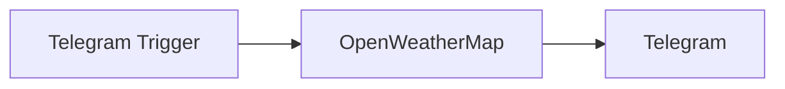

## Fluxo (.json) :

```json
{
  "id": "2",
  "name": "Telegram Weather Workflow",
  "nodes": [
    {
      "name": "Telegram Trigger",
      "type": "n8n-nodes-base.telegramTrigger",
      "position": [
        270,
        220
      ],
      "parameters": {
        "updates": [
          "message"
        ]
      },
      "credentials": {
        "telegramApi": "Telegram"
      },
      "typeVersion": 1
    },
    {
      "name": "OpenWeatherMap",
      "type": "n8n-nodes-base.openWeatherMap",
      "position": [
        480,
        220
      ],
      "parameters": {
        "cityName": "berlin,de"
      },
      "credentials": {
        "openWeatherMapApi": "OpenWeatherMap"
      },
      "typeVersion": 1
    },
    {
      "name": "Telegram",
      "type": "n8n-nodes-base.telegram",
      "position": [
        670,
        220
      ],
      "parameters": {
        "text": "=Right now, we have {{$node[\"OpenWeatherMap\"].json[\"weather\"][0][\"description\"]}}. The temperature is {{$node[\"OpenWeatherMap\"].json[\"main\"][\"temp\"]}}°C but it really feels like {{$node[\"OpenWeatherMap\"].json[\"main\"][\"feels_like\"]}}°C 🙂",
        "chatId": "={{$node[\"Telegram Trigger\"].json[\"message\"][\"chat\"][\"id\"]}}",
        "additionalFields": {}
      },
      "credentials": {
        "telegramApi": "Telegram"
      },
      "typeVersion": 1
    }
  ],
  "active": true,
  "settings": {},
  "connections": {
    "OpenWeatherMap": {
      "main": [
        [
          {
            "node": "Telegram",
            "type": "main",
            "index": 0
          }
        ]
      ]
    },
    "Telegram Trigger": {
      "main": [
        [
          {
            "node": "OpenWeatherMap",
            "type": "main",
            "index": 0
          }
        ]
      ]
    }
  }
}
```

<a id="template-209"></a>

## Template 209 - Q&A sobre documentos via índice vetorial

- **Nome:** Q&A sobre documentos via índice vetorial
- **Descrição:** Fluxo que indexa PDFs em um banco vetorial e responde perguntas recebidas por webhook consultando esse índice e gerando respostas com um modelo de linguagem.
- **Funcionalidade:** • Importação de PDF: Busca e faz download de um arquivo PDF armazenado em um serviço de armazenamento.
• Segmentação de texto: Divide o conteúdo do PDF em trechos menores para melhor indexação.
• Geração de embeddings: Converte os trechos em vetores de representação semântica.
• Inserção no índice vetorial: Insere os vetores em uma coleção específica para posterior pesquisa.
• Seleção dinâmica de coleção: Escolhe a coleção vetorial com base no parâmetro recebido na requisição (ex.: nome da empresa).
• Recuperação de documentos relevantes: Pesquisa os vetores mais similares (top K) ao texto da pergunta.
• Cadeia de QA com modelo de linguagem: Usa as evidências recuperadas para gerar uma resposta contextualizada.
• Resposta via webhook: Retorna a resposta do modelo diretamente ao solicitante HTTP.
- **Ferramentas:** • Google Drive: Fonte de armazenamento e download dos arquivos PDF.
• Qdrant: Banco de vetores para armazenar e recuperar embeddings de documentos.
• OpenAI: Geração de embeddings e capacidade de linguagem para compor respostas baseadas nos documentos recuperados.

## Fluxo visual

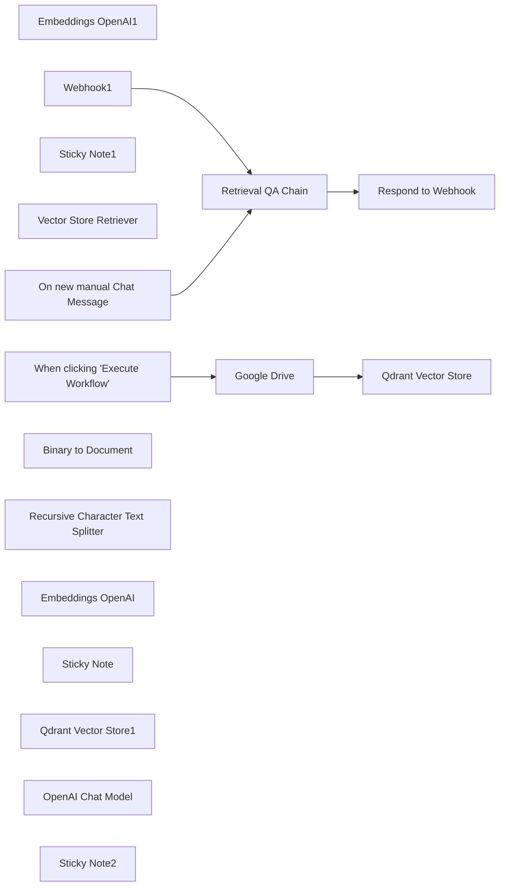

## Fluxo (.json) :

```json
{
  "id": "tMiRJYDrXzpKysTX",
  "meta": {
    "instanceId": "2723a3a635131edfcb16103f3d4dbaadf3658e386b4762989cbf49528dccbdbd",
    "templateId": "1960"
  },
  "name": "Stock Q&A Workflow",
  "tags": [],
  "nodes": [
    {
      "id": "ec3b86be-4113-4fd5-8365-02adb67693e9",
      "name": "Embeddings OpenAI1",
      "type": "@n8n/n8n-nodes-langchain.embeddingsOpenAi",
      "position": [
        1960,
        720
      ],
      "parameters": {
        "options": {}
      },
      "credentials": {
        "openAiApi": {
          "id": "fOF5kro9BJ6KMQ7n",
          "name": "OpenAi account"
        }
      },
      "typeVersion": 1
    },
    {
      "id": "42fd8020-3861-4d0f-a7a2-70e2c35f0bed",
      "name": "On new manual Chat Message",
      "type": "@n8n/n8n-nodes-langchain.manualChatTrigger",
      "disabled": true,
      "position": [
        1620,
        240
      ],
      "parameters": {},
      "typeVersion": 1
    },
    {
      "id": "a9b48d04-691e-4537-90f8-d7a4aa6153af",
      "name": "Sticky Note1",
      "type": "n8n-nodes-base.stickyNote",
      "position": [
        1560,
        120
      ],
      "parameters": {
        "color": 6,
        "width": 903.0896125323785,
        "height": 733.5099670584011,
        "content": "## Step 2: Setup the Q&A \n### The incoming message from the webhook is queried from the Supabase Vector Store. The response is provided in the response webhook. "
      },
      "typeVersion": 1
    },
    {
      "id": "472b4800-745a-4337-9545-163247f7e9ae",
      "name": "Retrieval QA Chain",
      "type": "@n8n/n8n-nodes-langchain.chainRetrievalQa",
      "position": [
        1880,
        240
      ],
      "parameters": {
        "query": "={{ $json.body.input }}"
      },
      "typeVersion": 1
    },
    {
      "id": "e58bd82d-abc6-44ed-8e93-ec5436126d66",
      "name": "Respond to Webhook",
      "type": "n8n-nodes-base.respondToWebhook",
      "position": [
        2280,
        240
      ],
      "parameters": {
        "options": {},
        "respondWith": "text",
        "responseBody": "={{ $json.response.text }}"
      },
      "typeVersion": 1
    },
    {
      "id": "04bbf01e-8269-47c7-897d-4ea94a1bd1c0",
      "name": "Vector Store Retriever",
      "type": "@n8n/n8n-nodes-langchain.retrieverVectorStore",
      "position": [
        2020,
        440
      ],
      "parameters": {
        "topK": 5
      },
      "typeVersion": 1
    },
    {
      "id": "feee6d68-2e0d-4d40-897e-c1d833a13bf2",
      "name": "Webhook1",
      "type": "n8n-nodes-base.webhook",
      "position": [
        1620,
        420
      ],
      "webhookId": "679f4afb-189e-4f04-9dc0-439eec2ec5f1",
      "parameters": {
        "path": "19f5499a-3083-4783-93a0-e8ed76a9f742",
        "options": {},
        "httpMethod": "POST",
        "responseMode": "responseNode"
      },
      "typeVersion": 1.1
    },
    {
      "id": "1b8d251f-7069-4d7d-b6d6-4bfa683d4ad1",
      "name": "When clicking \"Execute Workflow\"",
      "type": "n8n-nodes-base.manualTrigger",
      "position": [
        280,
        260
      ],
      "parameters": {},
      "typeVersion": 1
    },
    {
      "id": "b746a7a4-ed94-4332-bf7b-65aadcf54130",
      "name": "Google Drive",
      "type": "n8n-nodes-base.googleDrive",
      "position": [
        580,
        260
      ],
      "parameters": {
        "fileId": {
          "__rl": true,
          "mode": "list",
          "value": "1LZezppYrWpMStr4qJXtoIX-Dwzvgehll",
          "cachedResultUrl": "https://drive.google.com/file/d/1LZezppYrWpMStr4qJXtoIX-Dwzvgehll/view?usp=drivesdk",
          "cachedResultName": "crowdstrike.pdf"
        },
        "options": {},
        "operation": "download"
      },
      "credentials": {
        "googleDriveOAuth2Api": {
          "id": "1tsDIpjUaKbXy0be",
          "name": "Google Drive account"
        }
      },
      "typeVersion": 3
    },
    {
      "id": "83a7d470-f934-436d-ba3f-1ae7c776f5a5",
      "name": "Binary to Document",
      "type": "@n8n/n8n-nodes-langchain.documentBinaryInputLoader",
      "position": [
        860,
        480
      ],
      "parameters": {
        "loader": "pdfLoader",
        "options": {}
      },
      "typeVersion": 1
    },
    {
      "id": "b52b4a90-99a1-49cc-a6f0-7551d6754496",
      "name": "Recursive Character Text Splitter",
      "type": "@n8n/n8n-nodes-langchain.textSplitterRecursiveCharacterTextSplitter",
      "position": [
        860,
        640
      ],
      "parameters": {
        "options": {},
        "chunkSize": 3000,
        "chunkOverlap": 200
      },
      "typeVersion": 1
    },
    {
      "id": "b525e130-2029-4f55-a603-1fdc05a19c17",
      "name": "Embeddings OpenAI",
      "type": "@n8n/n8n-nodes-langchain.embeddingsOpenAi",
      "position": [
        1160,
        480
      ],
      "parameters": {
        "options": {}
      },
      "credentials": {
        "openAiApi": {
          "id": "fOF5kro9BJ6KMQ7n",
          "name": "OpenAi account"
        }
      },
      "typeVersion": 1
    },
    {
      "id": "5358c53f-55f9-431d-8956-c6bae7ad25bc",
      "name": "Sticky Note",
      "type": "n8n-nodes-base.stickyNote",
      "position": [
        540,
        120
      ],
      "parameters": {
        "color": 6,
        "width": 772.0680602743597,
        "height": 732.3675002130781,
        "content": "## Step 1: Upserting the PDF\n### Fetch file from Google Drive, split it into chunks and insert into Supabase index\n\n"
      },
      "typeVersion": 1
    },
    {
      "id": "fb91e2da-0eeb-47a5-aa49-65bf56986857",
      "name": "Qdrant Vector Store",
      "type": "@n8n/n8n-nodes-langchain.vectorStoreQdrant",
      "position": [
        940,
        260
      ],
      "parameters": {
        "mode": "insert",
        "options": {},
        "qdrantCollection": {
          "__rl": true,
          "mode": "id",
          "value": "=crowd"
        }
      },
      "credentials": {
        "qdrantApi": {
          "id": "U5CpjAgFeXziP3I1",
          "name": "QdrantApi account"
        }
      },
      "typeVersion": 1
    },
    {
      "id": "89e14837-d1fc-4b1e-9ebc-7cf3e7fd9a70",
      "name": "Qdrant Vector Store1",
      "type": "@n8n/n8n-nodes-langchain.vectorStoreQdrant",
      "position": [
        1980,
        600
      ],
      "parameters": {
        "qdrantCollection": {
          "__rl": true,
          "mode": "id",
          "value": "={{ $json.body.company }}"
        }
      },
      "credentials": {
        "qdrantApi": {
          "id": "U5CpjAgFeXziP3I1",
          "name": "QdrantApi account"
        }
      },
      "typeVersion": 1
    },
    {
      "id": "c619245b-5ea0-4354-974d-21ec6b8efa93",
      "name": "OpenAI Chat Model",
      "type": "@n8n/n8n-nodes-langchain.lmChatOpenAi",
      "position": [
        1880,
        460
      ],
      "parameters": {
        "options": {}
      },
      "credentials": {
        "openAiApi": {
          "id": "fOF5kro9BJ6KMQ7n",
          "name": "OpenAi account"
        }
      },
      "typeVersion": 1
    },
    {
      "id": "e4aa780d-8069-4308-a61f-82ed876af71a",
      "name": "Sticky Note2",
      "type": "n8n-nodes-base.stickyNote",
      "position": [
        -560,
        120
      ],
      "parameters": {
        "color": 6,
        "width": 710.9124489067698,
        "height": 726.4452519516944,
        "content": "## Start here: Step-by Step Youtube Tutorial :star:\n\n[](https://www.youtube.com/watch?v=pMvizUx5n1g)\n"
      },
      "typeVersion": 1
    }
  ],
  "active": true,
  "pinData": {},
  "settings": {},
  "versionId": "463aec94-26a6-436d-8732-fc01d637c6ae",
  "connections": {
    "Webhook1": {
      "main": [
        [
          {
            "node": "Retrieval QA Chain",
            "type": "main",
            "index": 0
          }
        ]
      ]
    },
    "Google Drive": {
      "main": [
        [
          {
            "node": "Qdrant Vector Store",
            "type": "main",
            "index": 0
          }
        ]
      ]
    },
    "Embeddings OpenAI": {
      "ai_embedding": [
        [
          {
            "node": "Qdrant Vector Store",
            "type": "ai_embedding",
            "index": 0
          }
        ]
      ]
    },
    "OpenAI Chat Model": {
      "ai_languageModel": [
        [
          {
            "node": "Retrieval QA Chain",
            "type": "ai_languageModel",
            "index": 0
          }
        ]
      ]
    },
    "Binary to Document": {
      "ai_document": [
        [
          {
            "node": "Qdrant Vector Store",
            "type": "ai_document",
            "index": 0
          }
        ]
      ]
    },
    "Embeddings OpenAI1": {
      "ai_embedding": [
        [
          {
            "node": "Qdrant Vector Store1",
            "type": "ai_embedding",
            "index": 0
          }
        ]
      ]
    },
    "Retrieval QA Chain": {
      "main": [
        [
          {
            "node": "Respond to Webhook",
            "type": "main",
            "index": 0
          }
        ]
      ]
    },
    "Qdrant Vector Store1": {
      "ai_vectorStore": [
        [
          {
            "node": "Vector Store Retriever",
            "type": "ai_vectorStore",
            "index": 0
          }
        ]
      ]
    },
    "Vector Store Retriever": {
      "ai_retriever": [
        [
          {
            "node": "Retrieval QA Chain",
            "type": "ai_retriever",
            "index": 0
          }
        ]
      ]
    },
    "On new manual Chat Message": {
      "main": [
        [
          {
            "node": "Retrieval QA Chain",
            "type": "main",
            "index": 0
          }
        ]
      ]
    },
    "When clicking \"Execute Workflow\"": {
      "main": [
        [
          {
            "node": "Google Drive",
            "type": "main",
            "index": 0
          }
        ]
      ]
    },
    "Recursive Character Text Splitter": {
      "ai_textSplitter": [
        [
          {
            "node": "Binary to Document",
            "type": "ai_textSplitter",
            "index": 0
          }
        ]
      ]
    }
  }
}
```

<a id="template-210"></a>

## Template 210 - Envio diário de ofertas para clientes em risco de churn

- **Nome:** Envio diário de ofertas para clientes em risco de churn
- **Descrição:** Executa diariamente a identificação de clientes com alto risco de churn, gera ofertas de retenção personalizadas e envia por e-mail, registrando ações em um log central.
- **Funcionalidade:** • Agendamento diário: Inicia a execução automaticamente uma vez por dia.
• Leitura de dados de clientes: Recupera a base de clientes a partir de uma planilha centralizada.
• Filtragem de clientes elegíveis: Seleciona clientes com score de churn acima de um limiar e sem campanha prévia registrada.
• Ramificação por existência de elegíveis: Caso não haja clientes elegíveis, registra status de "NOT_FOUND" no log.
• Processamento em lote/loop por cliente: Trata cada cliente elegível individualmente para criação e envio da oferta.
• Geração de oferta personalizada por modelo de linguagem: Cria conteúdo de oferta (informacional, pontos bônus ou desconto) com base no score de churn e nas categorias preferidas do cliente; saída estruturada em JSON e texto em turco conforme regras definidas.
• Registro de ação no log do sistema: Anota a ação tomada, identificação do cliente e timestamp em uma planilha de log.
• Envio de e-mail com a oferta: Envia o título e o conteúdo da oferta ao endereço de e-mail do cliente.
- **Ferramentas:** • Google Sheets: Armazenamento e leitura da base de clientes e do log de sistema.
• Google Gemini (PaLM) API: Geração de ofertas personalizadas em formato JSON e mensagem em turco com base em regras de negócio.
• Gmail: Envio dos e-mails com as ofertas geradas aos clientes.

## Fluxo visual

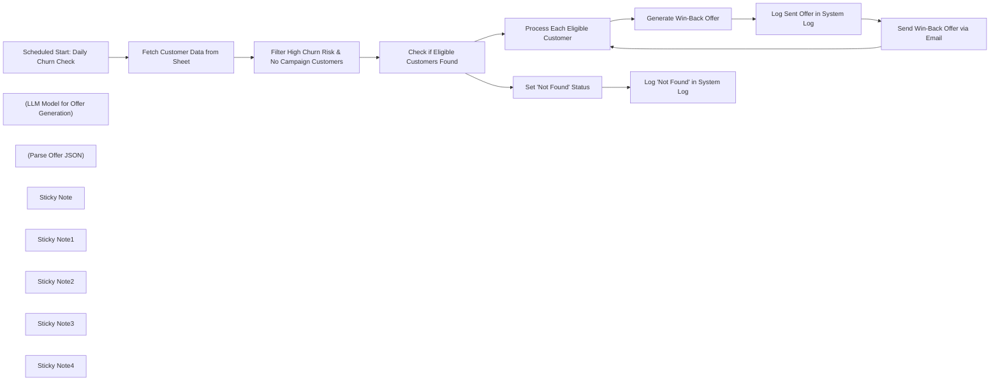

## Fluxo (.json) :

```json
{
  "meta": {
    "instanceId": "02e782574ebb30fbddb2c3fd832c946466d718819d25f6fe4b920124ff3fc2c1",
    "templateCredsSetupCompleted": true
  },
  "nodes": [
    {
      "id": "13f8de57-7247-4be1-8fc4-dddc1a7d677e",
      "name": "Scheduled Start: Daily Churn Check",
      "type": "n8n-nodes-base.scheduleTrigger",
      "position": [
        160,
        0
      ],
      "parameters": {
        "rule": {
          "interval": [
            {}
          ]
        }
      },
      "typeVersion": 1.2
    },
    {
      "id": "8f52666a-7247-4058-a775-2be80e3b4c0e",
      "name": "Fetch Customer Data from Sheet",
      "type": "n8n-nodes-base.googleSheets",
      "position": [
        440,
        0
      ],
      "parameters": {
        "options": {
          "returnFirstMatch": false
        },
        "sheetName": {
          "__rl": true,
          "mode": "list",
          "value": 1698897552,
          "cachedResultUrl": "https://docs.google.com/spreadsheets/d/1hG2NMi-4fMa7D5qGonCN8bsYVya4L2TOB_8mI4XK-9k/edit#gid=1698897552",
          "cachedResultName": "Customer Data"
        },
        "documentId": {
          "__rl": true,
          "mode": "list",
          "value": "1hG2NMi-4fMa7D5qGonCN8bsYVya4L2TOB_8mI4XK-9k",
          "cachedResultUrl": "https://docs.google.com/spreadsheets/d/1hG2NMi-4fMa7D5qGonCN8bsYVya4L2TOB_8mI4XK-9k/edit?usp=drivesdk",
          "cachedResultName": "Medium Post Automation"
        }
      },
      "credentials": {
        "googleSheetsOAuth2Api": {
          "id": "VV5AyFvgYkc4TfC7",
          "name": "Onur Drive "
        }
      },
      "typeVersion": 4.5
    },
    {
      "id": "37951981-3c3d-4434-8782-51e9129f0bbc",
      "name": "Filter High Churn Risk & No Campaign Customers",
      "type": "n8n-nodes-base.filter",
      "position": [
        760,
        0
      ],
      "parameters": {
        "options": {},
        "conditions": {
          "options": {
            "version": 2,
            "leftValue": "",
            "caseSensitive": true,
            "typeValidation": "strict"
          },
          "combinator": "and",
          "conditions": [
            {
              "id": "9b78accc-0926-4537-8ce9-70206dd45525",
              "operator": {
                "type": "number",
                "operation": "gt"
              },
              "leftValue": "={{ $json.predicted_churn_score.toNumber() }}",
              "rightValue": 0.7
            }
          ]
        }
      },
      "typeVersion": 2.2,
      "alwaysOutputData": true
    },
    {
      "id": "4152752b-3ba3-4af0-aec8-aba9fc0424d9",
      "name": "Check if Eligible Customers Found",
      "type": "n8n-nodes-base.if",
      "position": [
        1140,
        0
      ],
      "parameters": {
        "options": {},
        "conditions": {
          "options": {
            "version": 2,
            "leftValue": "",
            "caseSensitive": true,
            "typeValidation": "strict"
          },
          "combinator": "and",
          "conditions": [
            {
              "id": "2b03f228-f10c-43c1-90f8-a2ef397d2e0b",
              "operator": {
                "type": "boolean",
                "operation": "false",
                "singleValue": true
              },
              "leftValue": "={{ $json.isEmpty() }}",
              "rightValue": ""
            }
          ]
        }
      },
      "typeVersion": 2.2
    },
    {
      "id": "c1164b8f-4497-4763-bb42-7187e9f2f4d2",
      "name": "Process Each Eligible Customer",
      "type": "n8n-nodes-base.splitInBatches",
      "position": [
        1640,
        -320
      ],
      "parameters": {
        "options": {}
      },
      "typeVersion": 3
    },
    {
      "id": "8896a776-ed5b-431a-908b-663fa8475c77",
      "name": "Generate Win-Back Offer",
      "type": "@n8n/n8n-nodes-langchain.chainLlm",
      "position": [
        2100,
        -300
      ],
      "parameters": {
        "text": "=",
        "messages": {
          "messageValues": [
            {
              "message": "=\n**You are an AI assistant designed to analyze customer data and determine a win-back offer based on specific churn prediction scores and preferences.**\n\n**Input:** You will receive customer data as a JSON object.\n\n**Task:** Analyze the fields `'predicted_churn_score': {{ $json.predicted_churn_score }}` and `'preferred_categories': \"{{ $json.preferred_categories }}\"` in the input JSON. Apply the following rules to determine the appropriate offer details:\n\n**Rules:**\n\n1. If `predicted_churn_score` is greater than or equal to 0.7 and less than or equal to 0.8:\n\n   * Offer Type: `INFORMATIONAL`\n   * Offer Value: `0`\n   * Offer Title: `Special Advantage on Books Just for You`\n   * Offer Details: Create a message encouraging the customer to explore new products in their preferred categories. To make it more specific, select *one* of the preferred categories and include a *typical product type* from that category.\n     Example: `\"Exciting new [product type, e.g., novels] just arrived in your favorite [Preferred Category Name] category! Check out what's new in your other favorite categories too: [List of Other Preferred Categories]!\"`\n\n2. If `predicted_churn_score` is greater than 0.8 and less than or equal to 0.9:\n\n   * Offer Type: `BONUS_POINTS`\n   * Offer Value: `200`\n   * Offer Title: `Special Advantage on Books Just for You`\n   * Offer Details: Create a message offering 200 bonus points for purchases made specifically in the \"Books\" category.\n     Example: `\"Earn 200 bonus points on your next purchase in the Books category!\"`\n\n3. If `predicted_churn_score` is greater than 0.9 and less than or equal to 1.0:\n\n   * Offer Type: `DISCOUNT_PERCENTAGE`\n   * Offer Value: `20`\n   * Offer Title: `Special Advantage on Books Just for You`\n   * Offer Details: Create a message offering a 20% discount on a future purchase specifically in the \"Books\" category.\n     Example: `\"Enjoy a 20% discount on your next purchase in the Books category!\"`\n\n**Output:** Generate a JSON object that includes the determined offer details. The OUTPUT MUST STRICTLY FOLLOW THE STRUCTURE BELOW and INCLUDE ONLY THE JSON OBJECT. Do not add any other text or explanation.\n\n**Output Structure:**\n\n{\n  \"customer_id\": string, // Customer ID from the input data\n  \"action_taken\": \"SENT_WINBACK_OFFER\", // Action taken: win-back offer sent (constant in this example)\n  \"offer_type\": string, // Offer type: INFORMATIONAL, BONUS_POINTS, or DISCOUNT_PERCENTAGE\n  \"offer_value\": number, // Offer value: 0 (informational), 200 (points), or 20 (discount)\n  \"offer_title\": string, // Message title\n  \"offer_details\": string, // Message in Turkish, created based on rules and preferred categories\n  \"communication_channel\": \"email\", // Communication channel (constant in this example)\n  \"timestamp\": string // Current timestamp in ISO 8601 format (e.g., \"YYYY-MM-DDTHH:mm:ssZ\"). Note: In an actual n8n workflow, you may prefer to add the real timestamp using a separate node or expression after the LLM node.\n}\n\n"
            }
          ]
        },
        "promptType": "define",
        "hasOutputParser": true
      },
      "typeVersion": 1.5
    },
    {
      "id": "b89954e9-7689-47e6-bf15-3089f3863ca9",
      "name": "(LLM Model for Offer Generation)",
      "type": "@n8n/n8n-nodes-langchain.lmChatGoogleGemini",
      "position": [
        2060,
        -120
      ],
      "parameters": {
        "options": {},
        "modelName": "models/gemini-2.0-pro-exp"
      },
      "credentials": {
        "googlePalmApi": {
          "id": "BhQsoi2WTmDm0fQ4",
          "name": "Google Gemini(PaLM) Api account"
        }
      },
      "typeVersion": 1
    },
    {
      "id": "ee485123-32be-447b-80f3-303e3a046207",
      "name": "(Parse Offer JSON)",
      "type": "@n8n/n8n-nodes-langchain.outputParserStructured",
      "position": [
        2260,
        -100
      ],
      "parameters": {
        "jsonSchemaExample": "{\n  \"customer_id\": \"CUST_001\",\n  \"action_taken\": \"SENT_WINBACK_OFFER\",\n  \"offer_type\": \"BONUS_POINTS\",\n  \"offer_value\": 200,\n  \"offer_title\": \"Huge Offer!\",\n  \"offer_details\": \"Get 200 bonus points when you shop in the Kitap category!\",\n  \"communication_channel\": \"email\",\n  \"timestamp\": \"2024-06-08T09:05:00Z\"\n}"
      },
      "typeVersion": 1.2
    },
    {
      "id": "005890c2-f77d-4d0d-add2-496642464a9f",
      "name": "Log Sent Offer in System Log",
      "type": "n8n-nodes-base.googleSheets",
      "position": [
        2640,
        -220
      ],
      "parameters": {
        "columns": {
          "value": {
            "date": "={{ $json.output.timestamp }}",
            "system_log": "={{ $json.output.action_taken }}",
            "customer_id": "={{ $json.output.customer_id }}"
          },
          "schema": [
            {
              "id": "system_log",
              "type": "string",
              "display": true,
              "removed": false,
              "required": false,
              "displayName": "system_log",
              "defaultMatch": false,
              "canBeUsedToMatch": true
            },
            {
              "id": "date",
              "type": "string",
              "display": true,
              "removed": false,
              "required": false,
              "displayName": "date",
              "defaultMatch": false,
              "canBeUsedToMatch": true
            },
            {
              "id": "customer_id",
              "type": "string",
              "display": true,
              "removed": false,
              "required": false,
              "displayName": "customer_id",
              "defaultMatch": false,
              "canBeUsedToMatch": true
            }
          ],
          "mappingMode": "defineBelow",
          "matchingColumns": [
            "system_log"
          ],
          "attemptToConvertTypes": false,
          "convertFieldsToString": false
        },
        "options": {},
        "operation": "appendOrUpdate",
        "sheetName": {
          "__rl": true,
          "mode": "list",
          "value": 157558698,
          "cachedResultUrl": "https://docs.google.com/spreadsheets/d/1hG2NMi-4fMa7D5qGonCN8bsYVya4L2TOB_8mI4XK-9k/edit#gid=157558698",
          "cachedResultName": "SYSTEM_LOG"
        },
        "documentId": {
          "__rl": true,
          "mode": "list",
          "value": "1hG2NMi-4fMa7D5qGonCN8bsYVya4L2TOB_8mI4XK-9k",
          "cachedResultUrl": "https://docs.google.com/spreadsheets/d/1hG2NMi-4fMa7D5qGonCN8bsYVya4L2TOB_8mI4XK-9k/edit?usp=drivesdk",
          "cachedResultName": "OnurPolat05 N8N  Db"
        }
      },
      "credentials": {
        "googleSheetsOAuth2Api": {
          "id": "VV5AyFvgYkc4TfC7",
          "name": "Onur Drive "
        }
      },
      "typeVersion": 4.5
    },
    {
      "id": "98295978-21f1-420f-8e9c-4014d53ffb16",
      "name": "Send Win-Back Offer via Email",
      "type": "n8n-nodes-base.gmail",
      "position": [
        2880,
        -120
      ],
      "webhookId": "3067948c-c6f7-4c77-a91f-fcdb2e0c8095",
      "parameters": {
        "sendTo": "={{ $('Process Each Eligible Customer').item.json.user_mail }}",
        "message": "={{ $json.output.offer_details }}",
        "options": {},
        "subject": "={{ $json.output.offer_title }}",
        "emailType": "text"
      },
      "credentials": {
        "gmailOAuth2": {
          "id": "epBpgOmwmYErJ4pe",
          "name": "Onur Account"
        }
      },
      "typeVersion": 2.1
    },
    {
      "id": "13095156-a54f-432f-8d10-209ddc30680a",
      "name": "Set 'Not Found' Status",
      "type": "n8n-nodes-base.set",
      "position": [
        1620,
        300
      ],
      "parameters": {
        "options": {},
        "assignments": {
          "assignments": [
            {
              "id": "e42f6e99-487d-4942-a133-879d62b28fe5",
              "name": "system_log",
              "type": "string",
              "value": "NOT_FOUND"
            },
            {
              "id": "4fe0abc3-e685-4ece-bee2-1ae4f6d3ca92",
              "name": "date",
              "type": "string",
              "value": "={{ $now }}"
            }
          ]
        }
      },
      "typeVersion": 3.4
    },
    {
      "id": "1f823726-6483-40c1-b184-eac87886ded5",
      "name": "Log 'Not Found' in System Log",
      "type": "n8n-nodes-base.googleSheets",
      "position": [
        1940,
        300
      ],
      "parameters": {
        "columns": {
          "value": {
            "date": "={{ $json.date }}",
            "system_log": "={{ $json.system_log }}"
          },
          "schema": [
            {
              "id": "system_log",
              "type": "string",
              "display": true,
              "removed": false,
              "required": false,
              "displayName": "system_log",
              "defaultMatch": false,
              "canBeUsedToMatch": true
            },
            {
              "id": "date",
              "type": "string",
              "display": true,
              "removed": false,
              "required": false,
              "displayName": "date",
              "defaultMatch": false,
              "canBeUsedToMatch": true
            }
          ],
          "mappingMode": "defineBelow",
          "matchingColumns": [
            "system_log"
          ],
          "attemptToConvertTypes": false,
          "convertFieldsToString": false
        },
        "options": {},
        "operation": "appendOrUpdate",
        "sheetName": {
          "__rl": true,
          "mode": "list",
          "value": 157558698,
          "cachedResultUrl": "https://docs.google.com/spreadsheets/d/1hG2NMi-4fMa7D5qGonCN8bsYVya4L2TOB_8mI4XK-9k/edit#gid=157558698",
          "cachedResultName": "SYSTEM_LOG"
        },
        "documentId": {
          "__rl": true,
          "mode": "list",
          "value": "1hG2NMi-4fMa7D5qGonCN8bsYVya4L2TOB_8mI4XK-9k",
          "cachedResultUrl": "https://docs.google.com/spreadsheets/d/1hG2NMi-4fMa7D5qGonCN8bsYVya4L2TOB_8mI4XK-9k/edit?usp=drivesdk",
          "cachedResultName": "OnurPolat05 N8N  Db"
        }
      },
      "credentials": {
        "googleSheetsOAuth2Api": {
          "id": "VV5AyFvgYkc4TfC7",
          "name": "Onur Drive "
        }
      },
      "typeVersion": 4.5
    },
    {
      "id": "c6828c9c-c39f-40b5-9197-1435915d3682",
      "name": "Sticky Note",
      "type": "n8n-nodes-base.stickyNote",
      "position": [
        160,
        -340
      ],
      "parameters": {
        "width": 380,
        "height": 300,
        "content": "# 00. Daily Start & Fetch Customer Data\n\n**Purpose:** Automatically triggers the workflow **once daily** based on the schedule set in the first node. It then fetches all customer data from the specified Google Sheet ('Customer Data' sheet) to identify potential churn risks for the day."
      },
      "typeVersion": 1
    },
    {
      "id": "71d3f596-1413-4e97-81eb-ec701f15938d",
      "name": "Sticky Note1",
      "type": "n8n-nodes-base.stickyNote",
      "position": [
        1560,
        540
      ],
      "parameters": {
        "color": 3,
        "width": 540,
        "height": 300,
        "content": "# 03. Handle No Eligible Customers\n\n**Purpose:** This path executes if the initial filter finds *no* customers meeting the win-back criteria during the daily check.\n1.  **Set Status:** Sets a variable indicating no eligible customers were found (`system_log = NOT_FOUND`).\n2.  **Log Status:** Records this 'NOT_FOUND' status along with the current timestamp in the 'SYSTEM_LOG' Google Sheet. This helps track when the daily workflow ran but had no one to process."
      },
      "typeVersion": 1
    },
    {
      "id": "0f076e97-7cf0-48b6-8808-db0f1863409e",
      "name": "Sticky Note2",
      "type": "n8n-nodes-base.stickyNote",
      "position": [
        760,
        -360
      ],
      "parameters": {
        "color": 2,
        "width": 460,
        "height": 280,
        "content": "# 01. Filter & Branch\n\n**Purpose:** Filters the fetched customer data to identify those meeting specific win-back criteria:\n1.  `predicted_churn_score` is greater than 0.7.\n2.  No previous campaign date exists (`created_campaign_date` is empty - *Note: Verify this field's purpose or adjust logic if needed*).\nThen, it checks if any customers passed the filter. The workflow branches based on whether eligible customers were found."
      },
      "typeVersion": 1
    },
    {
      "id": "d3493f09-7eba-4625-98db-83cf649dbbcf",
      "name": "Sticky Note3",
      "type": "n8n-nodes-base.stickyNote",
      "position": [
        1700,
        -760
      ],
      "parameters": {
        "color": 4,
        "width": 600,
        "height": 360,
        "content": "# 02. Generate & Send Win-Back Offer (Loop)\n\n**Purpose:** Processes each eligible customer found in the previous step individually within a loop.\n1.  **Generate Offer (Gemini):** Uses Google Gemini to create a personalized win-back offer (Informational, Bonus Points, or Discount) based on the customer's `predicted_churn_score` and `preferred_categories`. Outputs offer details in JSON format.\n2.  **Log Sent Offer:** Records the successful generation and intent to send the offer (action_taken, timestamp, customer_id) in the 'SYSTEM_LOG' Google Sheet.\n3.  **Send Email (Gmail):** Sends the generated offer details (`offer_title` and `offer_details`) via email to the customer's `user_mail`.\nThe loop continues until all eligible customers are processed."
      },
      "typeVersion": 1
    },
    {
      "id": "2fc53a15-2bdd-48f5-9a74-44a2e028e7e0",
      "name": "Sticky Note4",
      "type": "n8n-nodes-base.stickyNote",
      "position": [
        -360,
        -120
      ],
      "parameters": {
        "width": 400,
        "height": 380,
        "content": "# Example Customer Data\n\n\n{\n    \"customer_id\": \"CUST_001\",\n    \"last_purchase_date\": \"2024-01-10T10:00:00Z\",\n    \"purchase_frequency_days\": 90,\n    \"user_mail\":\"example@mail.com\",\n    \"days_since_last_purchase\": 110,\n    \"total_spent_usd\": 55.0,\n    \"preferred_categories\": [\"Kitap\", \"Ofis Malzemeleri\"],\n    \"predicted_churn_score\": 0.85,\n    \"profile_tags\": [\"inactive_long_time\", \"low_spender\"],\n    \"timestamp\": \"2024-06-08T09:00:00Z\"\n}\n"
      },
      "typeVersion": 1
    }
  ],
  "pinData": {},
  "connections": {
    "(Parse Offer JSON)": {
      "ai_outputParser": [
        [
          {
            "node": "Generate Win-Back Offer",
            "type": "ai_outputParser",
            "index": 0
          }
        ]
      ]
    },
    "Set 'Not Found' Status": {
      "main": [
        [
          {
            "node": "Log 'Not Found' in System Log",
            "type": "main",
            "index": 0
          }
        ]
      ]
    },
    "Generate Win-Back Offer": {
      "main": [
        [
          {
            "node": "Log Sent Offer in System Log",
            "type": "main",
            "index": 0
          }
        ]
      ]
    },
    "Log Sent Offer in System Log": {
      "main": [
        [
          {
            "node": "Send Win-Back Offer via Email",
            "type": "main",
            "index": 0
          }
        ]
      ]
    },
    "Send Win-Back Offer via Email": {
      "main": [
        [
          {
            "node": "Process Each Eligible Customer",
            "type": "main",
            "index": 0
          }
        ]
      ]
    },
    "Fetch Customer Data from Sheet": {
      "main": [
        [
          {
            "node": "Filter High Churn Risk & No Campaign Customers",
            "type": "main",
            "index": 0
          }
        ]
      ]
    },
    "Process Each Eligible Customer": {
      "main": [
        [],
        [
          {
            "node": "Generate Win-Back Offer",
            "type": "main",
            "index": 0
          }
        ]
      ]
    },
    "(LLM Model for Offer Generation)": {
      "ai_languageModel": [
        [
          {
            "node": "Generate Win-Back Offer",
            "type": "ai_languageModel",
            "index": 0
          }
        ]
      ]
    },
    "Check if Eligible Customers Found": {
      "main": [
        [
          {
            "node": "Process Each Eligible Customer",
            "type": "main",
            "index": 0
          }
        ],
        [
          {
            "node": "Set 'Not Found' Status",
            "type": "main",
            "index": 0
          }
        ]
      ]
    },
    "Scheduled Start: Daily Churn Check": {
      "main": [
        [
          {
            "node": "Fetch Customer Data from Sheet",
            "type": "main",
            "index": 0
          }
        ]
      ]
    },
    "Filter High Churn Risk & No Campaign Customers": {
      "main": [
        [
          {
            "node": "Check if Eligible Customers Found",
            "type": "main",
            "index": 0
          }
        ]
      ]
    }
  }
}
```

<a id="template-211"></a>

## Template 211 - Upload automático de vídeo para YouTube e geração de metadata

- **Nome:** Upload automático de vídeo para YouTube e geração de metadata
- **Descrição:** Automatiza o envio de vídeos de uma pasta do Google Drive para o YouTube, extrai a transcrição, gera título, descrição e tags com modelos de IA e atualiza os metadados do vídeo.
- **Funcionalidade:** • Detecção de novos arquivos na pasta do Google Drive: inicia o fluxo quando um arquivo é criado em uma pasta específica.
• Download automático do vídeo: baixa o arquivo recém-detectado para processamento.
• Upload para YouTube: envia o vídeo ao YouTube com configurações iniciais (privacidade, categoria, região).
• Obtenção de transcrição via API externa: chama um serviço de transcrição (Apify) usando um token configurável.
• Ajuste do formato da transcrição: concatena e limpa os segmentos de texto para gerar um único texto utilizável.
• Geração de descrição com IA: cria uma descrição detalhada e assertiva, com tom em primeira pessoa, emojis e hashtags, usando um modelo de linguagem (OpenAI).
• Geração de título SEO com IA: produz um título otimizado para YouTube, curto e direto.
• Geração de tags relevantes com IA: gera uma lista de tags focadas no conteúdo e SEO usando um modelo de linguagem (Google Gemini).
• Atualização dos metadados do vídeo: aplica título, descrição e tags gerados ao vídeo já carregado no YouTube.
• Exclusão opcional do arquivo original: remove o arquivo da pasta de upload após o processamento concluído.
• Configuração de token para API: permite definir o token da API de transcrição antes da chamada.
- **Ferramentas:** • Google Drive: armazenamento e origem dos vídeos, usado para monitorar a pasta de upload e baixar arquivos.
• YouTube: plataforma de hospedagem de vídeos onde os arquivos são enviados e cujos metadados são atualizados.
• Apify (YouTube Transcript Scraper): serviço de extração de transcrições de vídeos do YouTube via API.
• OpenAI (GPT-4.1-nano): modelo de linguagem usado para gerar descrições e títulos otimizados para SEO.
• Google Gemini (modelos/PaLM): modelo de linguagem usado para gerar tags relevantes para o vídeo.

## Fluxo visual

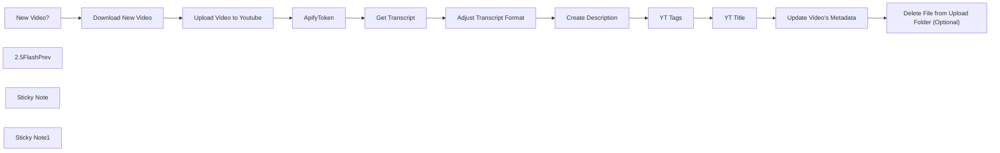

## Fluxo (.json) :

```json
{
  "id": "gIZpJgLpUgdoNNDZ",
  "meta": {
    "instanceId": "9ee1559971f36d9785fb97b48d76ed3a8ac302ff00dd93d8b7301e3feab97aed",
    "templateCredsSetupCompleted": true
  },
  "name": "YT New Video Upload",
  "tags": [],
  "nodes": [
    {
      "id": "add1cd70-4bf4-42f5-87d9-68fa31af7f56",
      "name": "Download New Video",
      "type": "n8n-nodes-base.googleDrive",
      "position": [
        -140,
        220
      ],
      "parameters": {
        "fileId": {
          "__rl": true,
          "mode": "id",
          "value": "={{ $json.id }}"
        },
        "options": {},
        "operation": "download"
      },
      "credentials": {
        "googleDriveOAuth2Api": {
          "id": "8GbkH30Del5g4Kbq",
          "name": "Jim Privat"
        }
      },
      "typeVersion": 3
    },
    {
      "id": "1308e94d-1c68-4fae-9d94-ba6248947581",
      "name": "New Video?",
      "type": "n8n-nodes-base.googleDriveTrigger",
      "position": [
        -360,
        220
      ],
      "parameters": {
        "event": "fileCreated",
        "options": {},
        "pollTimes": {
          "item": [
            {
              "mode": "everyMinute"
            }
          ]
        },
        "triggerOn": "specificFolder",
        "folderToWatch": {
          "__rl": true,
          "mode": "id",
          "value": "1EOMCzVDif4XnqCloYvhBNZdx7gyRNpTR"
        }
      },
      "credentials": {
        "googleDriveOAuth2Api": {
          "id": "8GbkH30Del5g4Kbq",
          "name": "Jim Privat"
        }
      },
      "typeVersion": 1
    },
    {
      "id": "dfb073fc-4365-4669-a17c-73407a14a655",
      "name": "Create Description",
      "type": "@n8n/n8n-nodes-langchain.openAi",
      "position": [
        1000,
        180
      ],
      "parameters": {
        "modelId": {
          "__rl": true,
          "mode": "list",
          "value": "gpt-4.1-nano",
          "cachedResultName": "GPT-4.1-NANO"
        },
        "options": {},
        "messages": {
          "values": [
            {
              "role": "system",
              "content": "You are a professional copywriter.  \nYou receive the transcript of an economics-related video and create a detailed but concise summary (with paragraphs) about its content.  \n\nWrite a detailed summary (with paragraphs) about the content of the podcast.  \n\nYour output will be used for the YouTube video description. Start with something like: \"In this video...\" or \"In this episode...\".  \nWrite from my perspective, using phrases like \"my opinion\" or \"in my view,\" in the first person, but never phrases like \"In this episode, I learn...\" or similar, as I always explain or discuss the content. YOU NEVER WRITE THINGS LIKE \"THE SPEAKER SAYS\"! Always from my position.  \n\nImportant: Use clear and assertive statements as formulated in the transcript. Avoid neutral or uncertain phrases like \"it could,\" \"I assume that,\" \"possibly,\" or similar. The statements should be confident and definitive to powerfully convey the podcast’s content.  \nInclude a few (2-4) emojis where appropriate.  \nEnd the post with 2-5 relevant hashtags. The hashtags should be broad, like #economics #money #gold, or similar, depending on what fits."
            },
            {
              "content": "=Here is the transcript:\n\n{{ $json.transcript }}"
            }
          ]
        }
      },
      "credentials": {
        "openAiApi": {
          "id": "8VZkrnuHUTXNwnlP",
          "name": "Midgard#1"
        }
      },
      "typeVersion": 1.7
    },
    {
      "id": "25ba2d0b-3a7a-49d6-acfa-6e7fa2b98e86",
      "name": "2.5FlashPrev",
      "type": "@n8n/n8n-nodes-langchain.lmChatGoogleGemini",
      "position": [
        1340,
        180
      ],
      "parameters": {
        "options": {},
        "modelName": "models/gemini-2.5-flash-preview-04-17"
      },
      "credentials": {
        "googlePalmApi": {
          "id": "2Y7XbTPZaxPz6Vhw",
          "name": "Jim Privat"
        }
      },
      "typeVersion": 1
    },
    {
      "id": "23141199-5df7-47d0-8d0e-f5b3a7fe7668",
      "name": "YT Tags",
      "type": "@n8n/n8n-nodes-langchain.agent",
      "position": [
        1300,
        -20
      ],
      "parameters": {
        "text": "=Now follows the actual topic/transcript. Give me the YouTube tags for it:\n\n{{ $('Adjust Transcript Format').item.json.transcript }}",
        "options": {
          "systemMessage": "This video is about the future gold price and how it affects the returns of high-performing assets like stocks and bonds in their adjusted returns.\n\nExpected output:\nGold price, future gold price, gold investments, asset returns, stocks and bonds, investment returns, adjusted returns, gold market, financial markets, gold price forecast, economic trends, investing in gold, stock market analysis, bond market, investment strategies, inflation and gold, gold vs. stocks, financial analysis, precious metals, portfolio management, market outlook, investment tips"
        },
        "promptType": "define"
      },
      "typeVersion": 1.9
    },
    {
      "id": "c3ff8e2e-7ce6-4538-baea-91a375b98dcb",
      "name": "Get Transcript",
      "type": "n8n-nodes-base.httpRequest",
      "position": [
        500,
        220
      ],
      "parameters": {
        "url": "=https://api.apify.com/v2/acts/pintostudio~youtube-transcript-scraper/run-sync-get-dataset-items",
        "method": "POST",
        "options": {},
        "jsonBody": "={\n  \"videoUrl\": \"https://www.youtube.com/watch?v={{ $json.id }}\"\n}",
        "sendBody": true,
        "sendQuery": true,
        "specifyBody": "json",
        "queryParameters": {
          "parameters": [
            {
              "name": "token",
              "value": "={{$json.token}}"
            }
          ]
        }
      },
      "typeVersion": 4.2,
      "alwaysOutputData": false
    },
    {
      "id": "6a03cbf3-5718-4db8-b9cf-31d6d93f73e7",
      "name": "Adjust Transcript Format",
      "type": "n8n-nodes-base.code",
      "position": [
        680,
        220
      ],
      "parameters": {
        "jsCode": "const items = $input.all();\n\nconst transcriptStrings = items.flatMap(item => {\n  const dataArray = item.json.data;\n\n  if (!dataArray || !Array.isArray(dataArray)) {\n    return [];\n  }\n\n  const segmentTexts = dataArray.map(segment => {\n      if (segment && typeof segment.text === 'string') {\n          return segment.text;\n      } else {\n          return '';\n      }\n  });\n\n  return segmentTexts;\n});\n\nconst transcript = transcriptStrings.join(' ');\n\nreturn [\n  {\n    json: {\n      transcript: transcript,\n    },\n  },\n];"
      },
      "typeVersion": 2
    },
    {
      "id": "c6e0bf83-6eaa-41be-9ea1-0dba4cace444",
      "name": "Update Video's Metadata",
      "type": "n8n-nodes-base.youTube",
      "onError": "continueErrorOutput",
      "position": [
        2160,
        240
      ],
      "parameters": {
        "title": "={{ $('YT Title').item.json.title }}",
        "videoId": "={{ $('Upload Video to Youtube').item.json.uploadId }}",
        "resource": "video",
        "operation": "update",
        "categoryId": "25",
        "regionCode": "DE",
        "updateFields": {
          "tags": "={{ $('YT Tags').item.json.message.content }}",
          "description": "={{ $('Create Description').first().json.message.content }}\n\nDiese textbasierte Zusammenfassung des Videos wurde automatisch mit dem KI-Modell gpt-4.1-nano erstellt.]\n"
        }
      },
      "credentials": {
        "youTubeOAuth2Api": {
          "id": "jKf1Vc4ZycKxf0im",
          "name": "YouTube Jim Privat"
        }
      },
      "typeVersion": 1
    },
    {
      "id": "813fc8fc-ed3c-4cd7-8aa5-4c4084fd4e0d",
      "name": "Sticky Note",
      "type": "n8n-nodes-base.stickyNote",
      "position": [
        -380,
        160
      ],
      "parameters": {
        "color": 4,
        "width": 700,
        "height": 240,
        "content": "# Upload New Video to Youtube 🎥⬆️"
      },
      "typeVersion": 1
    },
    {
      "id": "0fb360ba-f843-4820-b05d-3149d7516526",
      "name": "Sticky Note1",
      "type": "n8n-nodes-base.stickyNote",
      "position": [
        320,
        -100
      ],
      "parameters": {
        "color": 4,
        "width": 2660,
        "height": 500,
        "content": "# Get Transcript for Context and Generate Metadata from It 📝🔍"
      },
      "typeVersion": 1
    },
    {
      "id": "bb494b9e-a707-492a-b88a-83fce01a742f",
      "name": "YT Title",
      "type": "@n8n/n8n-nodes-langchain.openAi",
      "position": [
        1720,
        -20
      ],
      "parameters": {
        "modelId": {
          "__rl": true,
          "mode": "list",
          "value": "gpt-4.1-nano",
          "cachedResultName": "GPT-4.1-NANO"
        },
        "options": {},
        "messages": {
          "values": [
            {
              "role": "system",
              "content": "You are a professional copywriter for SEO-optimized YouTube titles."
            },
            {
              "content": "=Write me a suitable SEO YouTube title for the transcript of the following video transcript. Only the title, nothing else. Max 100 characters, so keep it short."
            }
          ]
        }
      },
      "credentials": {
        "openAiApi": {
          "id": "8VZkrnuHUTXNwnlP",
          "name": "Midgard#1"
        }
      },
      "typeVersion": 1.7
    },
    {
      "id": "a82d27b7-967e-48f8-8ead-a184872a7abc",
      "name": "Delete File from Upload Folder (Optional)",
      "type": "n8n-nodes-base.googleDrive",
      "position": [
        2460,
        -20
      ],
      "parameters": {
        "fileId": {
          "__rl": true,
          "mode": "id",
          "value": "={{ $('Download New Video').item.json.id }}"
        },
        "options": {},
        "operation": "deleteFile"
      },
      "credentials": {
        "googleDriveOAuth2Api": {
          "id": "8GbkH30Del5g4Kbq",
          "name": "GDRIVE ACCOUNT P"
        }
      },
      "typeVersion": 3
    },
    {
      "id": "4cff725b-cff0-45e0-9cab-24c2f233c94e",
      "name": "Upload Video to Youtube",
      "type": "n8n-nodes-base.youTube",
      "position": [
        140,
        220
      ],
      "parameters": {
        "title": "adadada",
        "options": {
          "privacyStatus": "private",
          "selfDeclaredMadeForKids": false
        },
        "resource": "video",
        "operation": "upload",
        "categoryId": "25",
        "regionCode": "DE"
      },
      "credentials": {
        "youTubeOAuth2Api": {
          "id": "jKf1Vc4ZycKxf0im",
          "name": "YouTube Jim Privat"
        }
      },
      "typeVersion": 1
    },
    {
      "id": "691fda3c-736c-4d6e-b4f3-8db68a581c79",
      "name": "ApifyToken",
      "type": "n8n-nodes-base.set",
      "position": [
        320,
        220
      ],
      "parameters": {
        "options": {},
        "assignments": {
          "assignments": [
            {
              "id": "2eb41a6f-d0ef-4ca2-be47-f93b1d5c1edb",
              "name": "token",
              "type": "string",
              "value": "YOURTOKENHERE"
            }
          ]
        }
      },
      "typeVersion": 3.4
    }
  ],
  "active": false,
  "pinData": {},
  "settings": {
    "executionOrder": "v1"
  },
  "versionId": "3a879f43-d8a6-4a87-a233-bafeb296d21a",
  "connections": {
    "YT Tags": {
      "main": [
        [
          {
            "node": "YT Title",
            "type": "main",
            "index": 0
          }
        ]
      ]
    },
    "YT Title": {
      "main": [
        [
          {
            "node": "Update Video's Metadata",
            "type": "main",
            "index": 0
          }
        ]
      ]
    },
    "ApifyToken": {
      "main": [
        [
          {
            "node": "Get Transcript",
            "type": "main",
            "index": 0
          }
        ]
      ]
    },
    "New Video?": {
      "main": [
        [
          {
            "node": "Download New Video",
            "type": "main",
            "index": 0
          }
        ]
      ]
    },
    "2.5FlashPrev": {
      "ai_languageModel": [
        [
          {
            "node": "YT Tags",
            "type": "ai_languageModel",
            "index": 0
          }
        ]
      ]
    },
    "Get Transcript": {
      "main": [
        [
          {
            "node": "Adjust Transcript Format",
            "type": "main",
            "index": 0
          }
        ]
      ]
    },
    "Create Description": {
      "main": [
        [
          {
            "node": "YT Tags",
            "type": "main",
            "index": 0
          }
        ]
      ]
    },
    "Download New Video": {
      "main": [
        [
          {
            "node": "Upload Video to Youtube",
            "type": "main",
            "index": 0
          }
        ]
      ]
    },
    "Update Video's Metadata": {
      "main": [
        [
          {
            "node": "Delete File from Upload Folder (Optional)",
            "type": "main",
            "index": 0
          }
        ]
      ]
    },
    "Upload Video to Youtube": {
      "main": [
        [
          {
            "node": "ApifyToken",
            "type": "main",
            "index": 0
          }
        ]
      ]
    },
    "Adjust Transcript Format": {
      "main": [
        [
          {
            "node": "Create Description",
            "type": "main",
            "index": 0
          }
        ]
      ]
    }
  }
}
```

<a id="template-212"></a>

## Template 212 - Alerta de temperatura por SMS

- **Nome:** Alerta de temperatura por SMS
- **Descrição:** Verifica periodicamente a temperatura em Berlim e envia um SMS de alerta caso a sensação térmica esteja abaixo de 18°C.
- **Funcionalidade:** • Agendamento periódico: Executa o fluxo em intervalos definidos através de um agendador.
• Consulta de clima para cidade específica: Obtém dados meteorológicos para Berlim, Alemanha.
• Avaliação da sensação térmica: Compara a temperatura aparente (feels_like) com o limiar de 18°C.
• Envio de SMS de alerta: Envia uma mensagem contendo a temperatura atual quando estiver frio.
• Caminho alternativo sem ação: Quando a condição não é satisfeita, o fluxo continua sem enviar alerta.
- **Ferramentas:** • OpenWeatherMap: Serviço de dados meteorológicos usado para obter temperatura e sensação térmica para a cidade especificada.
• Twilio: Plataforma para envio de SMS, utilizada para notificar o destinatário com o aviso de temperatura.

## Fluxo visual

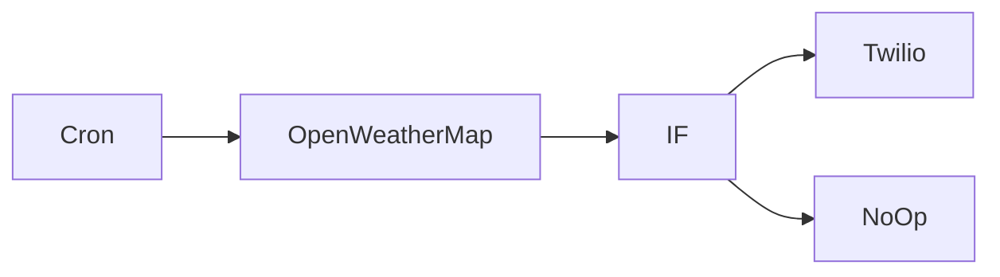

## Fluxo (.json) :

```json
{
  "id": "69",
  "name": "Creating your first workflow",
  "nodes": [
    {
      "name": "Cron",
      "type": "n8n-nodes-base.cron",
      "position": [
        240,
        250
      ],
      "parameters": {
        "triggerTimes": {
          "item": [
            {}
          ]
        }
      },
      "typeVersion": 1
    },
    {
      "name": "OpenWeatherMap",
      "type": "n8n-nodes-base.openWeatherMap",
      "position": [
        450,
        250
      ],
      "parameters": {
        "cityName": "berlin,de"
      },
      "credentials": {
        "openWeatherMapApi": "Weather"
      },
      "typeVersion": 1
    },
    {
      "name": "IF",
      "type": "n8n-nodes-base.if",
      "position": [
        650,
        250
      ],
      "parameters": {
        "conditions": {
          "number": [
            {
              "value1": "={{$node[\"OpenWeatherMap\"].json[\"main\"][\"feels_like\"]}}",
              "value2": 18
            }
          ]
        }
      },
      "typeVersion": 1
    },
    {
      "name": "Twilio",
      "type": "n8n-nodes-base.twilio",
      "position": [
        850,
        150
      ],
      "parameters": {
        "to": "",
        "from": "",
        "message": "=Wear a sweater today, it is {{$node[\"OpenWeatherMap\"].json[\"main\"][\"feels_like\"]}}°C outside right now."
      },
      "credentials": {
        "twilioApi": "Twilio"
      },
      "typeVersion": 1
    },
    {
      "name": "NoOp",
      "type": "n8n-nodes-base.noOp",
      "position": [
        850,
        350
      ],
      "parameters": {},
      "typeVersion": 1
    }
  ],
  "active": true,
  "settings": {},
  "connections": {
    "IF": {
      "main": [
        [
          {
            "node": "Twilio",
            "type": "main",
            "index": 0
          }
        ],
        [
          {
            "node": "NoOp",
            "type": "main",
            "index": 0
          }
        ]
      ]
    },
    "Cron": {
      "main": [
        [
          {
            "node": "OpenWeatherMap",
            "type": "main",
            "index": 0
          }
        ]
      ]
    },
    "OpenWeatherMap": {
      "main": [
        [
          {
            "node": "IF",
            "type": "main",
            "index": 0
          }
        ]
      ]
    }
  }
}
```

<a id="template-213"></a>

## Template 213 - Gerar página HTML dinâmica via OpenAI Structured Output

- **Nome:** Gerar página HTML dinâmica via OpenAI Structured Output
- **Descrição:** Recebe uma solicitação do usuário, gera uma interface em JSON estruturado via OpenAI, converte esse JSON em HTML com Tailwind e retorna a página pronta ao navegador.
- **Funcionalidade:** • Recepção de requisição do usuário: Aceita uma query via endpoint HTTP (parâmetro "query").
• Geração de UI estruturada: Envia a query para a API da OpenAI solicitando um JSON com esquema rígido que descreve componentes UI, atributos e hierarquia.
• Conversão de JSON para HTML: Processa a resposta estruturada e converte o JSON em HTML completo e legível.
• Montagem do template final: Insere o HTML gerado em um template padrão incluindo título e referência ao Tailwind CSS.
• Resposta HTTP com HTML: Retorna a página HTML ao cliente com cabeçalho Content-Type apropriado.
- **Ferramentas:** • OpenAI API: Gera o JSON estruturado da interface e ajuda a converter esse JSON em HTML.
• Tailwind CSS (via CDN): Fornece as classes de estilo usadas no HTML gerado para aparência consistente.
• Endpoint HTTP / servidor web: Ponto de entrada para receber a query do usuário e retornar a página HTML ao navegador.

## Fluxo visual

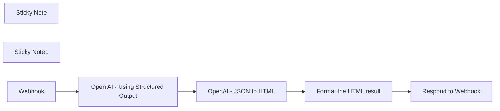

## Fluxo (.json) :

```json
{
  "id": "eXiaTDyKfXpMeyLh",
  "meta": {
    "instanceId": "f4f5d195bb2162a0972f737368404b18be694648d365d6c6771d7b4909d28167",
    "templateCredsSetupCompleted": true
  },
  "name": "Dynamically generate HTML page from user request using OpenAI Structured Output",
  "tags": [],
  "nodes": [
    {
      "id": "b1d9659f-4cd0-4f87-844d-32b2af1dcf13",
      "name": "Respond to Webhook",
      "type": "n8n-nodes-base.respondToWebhook",
      "position": [
        2160,
        380
      ],
      "parameters": {
        "options": {
          "responseHeaders": {
            "entries": [
              {
                "name": "Content-Type",
                "value": "text/html; charset=UTF-8"
              }
            ]
          }
        },
        "respondWith": "text",
        "responseBody": "={{ $json.html }}"
      },
      "typeVersion": 1.1
    },
    {
      "id": "5ca8ad3e-7702-4f07-af24-d38e94fdc4ec",
      "name": "Open AI - Using Structured Output",
      "type": "n8n-nodes-base.httpRequest",
      "position": [
        1240,
        380
      ],
      "parameters": {
        "url": "https://api.openai.com/v1/chat/completions",
        "method": "POST",
        "options": {},
        "jsonBody": "={\n \"model\": \"gpt-4o-2024-08-06\",\n \"messages\": [\n {\n \"role\": \"system\",\n \"content\": \"You are a user interface designer and copy writter. Your job is to help users visualize their website ideas. You design elegant and simple webs, with professional text. You use Tailwind framework\"\n },\n {\n \"role\": \"user\",\n \"content\": \"{{ $json.query.query }}\"\n }\n ],\n \"response_format\":\n{\n \"type\": \"json_schema\",\n \"json_schema\": {\n \"name\": \"ui\",\n \"description\": \"Dynamically generated UI\",\n \"strict\": true,\n \"schema\": {\n \"type\": \"object\",\n \"properties\": {\n \"type\": {\n \"type\": \"string\",\n \"description\": \"The type of the UI component\",\n \"enum\": [\n \"div\",\n \"span\",\n \"a\",\n \"p\",\n \"h1\",\n \"h2\",\n \"h3\",\n \"h4\",\n \"h5\",\n \"h6\",\n \"ul\",\n \"ol\",\n \"li\",\n \"img\",\n \"button\",\n \"input\",\n \"textarea\",\n \"select\",\n \"option\",\n \"label\",\n \"form\",\n \"table\",\n \"thead\",\n \"tbody\",\n \"tr\",\n \"th\",\n \"td\",\n \"nav\",\n \"header\",\n \"footer\",\n \"section\",\n \"article\",\n \"aside\",\n \"main\",\n \"figure\",\n \"figcaption\",\n \"blockquote\",\n \"q\",\n \"hr\",\n \"code\",\n \"pre\",\n \"iframe\",\n \"video\",\n \"audio\",\n \"canvas\",\n \"svg\",\n \"path\",\n \"circle\",\n \"rect\",\n \"line\",\n \"polyline\",\n \"polygon\",\n \"g\",\n \"use\",\n \"symbol\"\n]\n },\n \"label\": {\n \"type\": \"string\",\n \"description\": \"The label of the UI component, used for buttons or form fields\"\n },\n \"children\": {\n \"type\": \"array\",\n \"description\": \"Nested UI components\",\n \"items\": {\n \"$ref\": \"#\"\n }\n },\n \"attributes\": {\n \"type\": \"array\",\n \"description\": \"Arbitrary attributes for the UI component, suitable for any element using Tailwind framework\",\n \"items\": {\n \"type\": \"object\",\n \"properties\": {\n \"name\": {\n \"type\": \"string\",\n \"description\": \"The name of the attribute, for example onClick or className\"\n },\n \"value\": {\n \"type\": \"string\",\n \"description\": \"The value of the attribute using the Tailwind framework classes\"\n }\n },\n \"additionalProperties\": false,\n \"required\": [\"name\", \"value\"]\n }\n }\n },\n \"required\": [\"type\", \"label\", \"children\", \"attributes\"],\n \"additionalProperties\": false\n }\n }\n}\n}",
        "sendBody": true,
        "sendHeaders": true,
        "specifyBody": "json",
        "authentication": "predefinedCredentialType",
        "headerParameters": {
          "parameters": [
            {
              "name": "Content-Type",
              "value": "application/json"
            }
          ]
        },
        "nodeCredentialType": "openAiApi"
      },
      "credentials": {
        "openAiApi": {
          "id": "WqzqjezKh8VtxdqA",
          "name": "OpenAi account - Baptiste"
        }
      },
      "typeVersion": 4.2
    },
    {
      "id": "24e5ca73-a3b3-4096-8c66-d84838d89b0c",
      "name": "OpenAI - JSON to HTML",
      "type": "@n8n/n8n-nodes-langchain.openAi",
      "position": [
        1420,
        380
      ],
      "parameters": {
        "modelId": {
          "__rl": true,
          "mode": "list",
          "value": "gpt-4o-mini",
          "cachedResultName": "GPT-4O-MINI"
        },
        "options": {
          "temperature": 0.2
        },
        "messages": {
          "values": [
            {
              "role": "system",
              "content": "You convert a JSON to HTML. \nThe JSON output has the following fields:\n- html: the page HTML\n- title: the page title"
            },
            {
              "content": "={{ $json.choices[0].message.content }}"
            }
          ]
        },
        "jsonOutput": true
      },
      "credentials": {
        "openAiApi": {
          "id": "WqzqjezKh8VtxdqA",
          "name": "OpenAi account - Baptiste"
        }
      },
      "typeVersion": 1.3
    },
    {
      "id": "c50bdc84-ba59-4f30-acf7-496cee25068d",
      "name": "Format the HTML result",
      "type": "n8n-nodes-base.html",
      "position": [
        1940,
        380
      ],
      "parameters": {
        "html": "<!DOCTYPE html>\n\n<html>\n<head>\n <meta charset=\"UTF-8\" />\n <script src=\"https://cdn.tailwindcss.com\"></script>\n <title>{{ $json.message.content.title }}</title>\n</head>\n<body>\n{{ $json.message.content.html }}\n</body>\n</html>"
      },
      "typeVersion": 1.2
    },
    {
      "id": "193093f4-b1ce-4964-ab10-c3208e343c69",
      "name": "Sticky Note",
      "type": "n8n-nodes-base.stickyNote",
      "position": [
        1134,
        62
      ],
      "parameters": {
        "color": 7,
        "width": 638,
        "height": 503,
        "content": "## Generate HTML from user query\n\n**HTTP Request node**\n- Send the user query to OpenAI, with a defined JSON response format - *using HTTP Request node as it has not yet been implemented in the OpenAI nodes*\n- The response format is inspired by the [Structured Output defined in OpenAI Introduction post](https://openai.com/index/introducing-structured-outputs-in-the-api)\n- The output is a JSON containing HTML components and attributed\n\n\n**OpenAI node**\n- Format the response from the previous node from JSON format to HTML format"
      },
      "typeVersion": 1
    },
    {
      "id": "0371156a-211f-4d92-82b1-f14fe60d4b6b",
      "name": "Sticky Note1",
      "type": "n8n-nodes-base.stickyNote",
      "position": [
        0,
        60
      ],
      "parameters": {
        "color": 7,
        "width": 768,
        "height": 503,
        "content": "## Workflow: Dynamically generate an HTML page from a user request using OpenAI Structured Output\n\n**Overview**\n- This workflow is a experiment to build HTML pages from a user input using the new Structured Output from OpenAI.\n- The Structured Output could be used in a variety of cases. Essentially, it guarantees the output from the GPT will follow a defined structure (JSON object).\n- It uses Tailwind CSS to make it slightly nicer, but any\n\n**How it works**\n- Once active, go to the production URL and add what you'd like to build as the parameter \"query\"\n- Example: https://production_url.com?query=a%20signup%20form\n- OpenAI nodes will first output the UI as a JSON then convert it to HTML\n- Finally, the response is integrated in a HTML container and rendered to the user\n\n**Further thoughts**\n- Results are not yet amazing, it is hard to see the direct value of such an experiment\n- But it showcase the potential of the Structured Output. Being able to guarantee the output format is key to build robust AI applications."
      },
      "typeVersion": 1
    },
    {
      "id": "06380781-5189-4d99-9ecd-d8913ce40fd5",
      "name": "Webhook",
      "type": "n8n-nodes-base.webhook",
      "position": [
        820,
        380
      ],
      "webhookId": "d962c916-6369-431a-9d80-af6e6a50fdf5",
      "parameters": {
        "path": "d962c916-6369-431a-9d80-af6e6a50fdf5",
        "options": {
          "allowedOrigins": "*"
        },
        "responseMode": "responseNode"
      },
      "typeVersion": 2
    }
  ],
  "active": true,
  "pinData": {},
  "settings": {
    "executionOrder": "v1"
  },
  "versionId": "d2307a2a-5427-4769-94a6-10eab703a788",
  "connections": {
    "Webhook": {
      "main": [
        [
          {
            "node": "Open AI - Using Structured Output",
            "type": "main",
            "index": 0
          }
        ]
      ]
    },
    "OpenAI - JSON to HTML": {
      "main": [
        [
          {
            "node": "Format the HTML result",
            "type": "main",
            "index": 0
          }
        ]
      ]
    },
    "Format the HTML result": {
      "main": [
        [
          {
            "node": "Respond to Webhook",
            "type": "main",
            "index": 0
          }
        ]
      ]
    },
    "Open AI - Using Structured Output": {
      "main": [
        [
          {
            "node": "OpenAI - JSON to HTML",
            "type": "main",
            "index": 0
          }
        ]
      ]
    }
  }
}
```

<a id="template-214"></a>

## Template 214 - Auto-categorização de e-mails do Outlook com IA

- **Nome:** Auto-categorização de e-mails do Outlook com IA
- **Descrição:** Automatiza a leitura e categorização de e-mails do Outlook usando um modelo de linguagem para determinar categoria/subcategoria, atualizar rótulos e mover mensagens para pastas apropriadas.
- **Funcionalidade:** • Monitoramento com filtro: busca e processa e-mails não assinalados e sem categoria definida.
• Processamento em lote: itera sobre itens retornados para processar múltiplas mensagens de forma controlada.
• Sanitização do corpo do e-mail: converte HTML/markdown para texto limpo, removendo tags, links, imagens, tabelas e caracteres indesejados.
• Preparação de variáveis: captura e organiza campos importantes do e-mail (assunto, remetente, corpo, id) para uso no agente de IA.
• Classificação por IA: envia o e-mail ao agente com instruções rígidas de saída para obter um JSON com subject, category, subCategory e análise.
• Validação e conversão de saída: extrai e converte a resposta do agente em JSON, com captura de erros para garantir continuidade do fluxo.
• Mapeamento de categorias: rotula a mensagem com a categoria retornada pelo agente e aplica transformações (capitalização) quando necessário.
• Movimentação para pastas: move mensagens para pastas específicas (ex.: Actioned, Receipt, Junk, SaaS, Community, Business) conforme a categoria.
• Verificação de leitura: checa se o e-mail já foi lido e, se aplicável, realiza a ação de movimentação para pasta de mensagens processadas.
• Tratamento de erros: captura e registra erros do agente sem interromper o processamento de outros itens.
- **Ferramentas:** • Microsoft Outlook / Microsoft 365 (API de e-mail): serviço de e-mail usado para leitura, atualização de categorias e movimentação de mensagens entre pastas.
• Ollama (modelo Qwen2.5:14b): provê o modelo de linguagem utilizado para analisar o conteúdo do e-mail e gerar a categorização em formato JSON.


## Fluxo visual

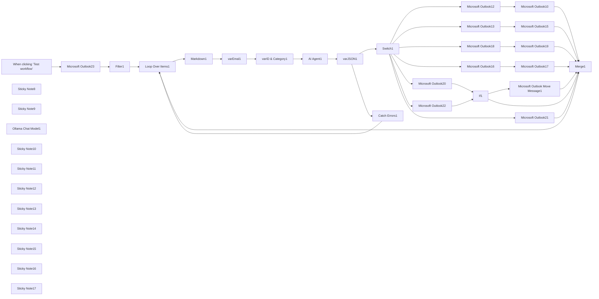

## Fluxo (.json) :

```json
{
  "meta": {
    "instanceId": "67d4d33d8b0ad4e5e12f051d8ad92fc35893d7f48d7f801bc6da4f39967b3592"
  },
  "nodes": [
    {
      "id": "30f5203b-469d-4f0c-8493-e8f08e14e4fe",
      "name": "When clicking ‘Test workflow’",
      "type": "n8n-nodes-base.manualTrigger",
      "position": [
        -560,
        440
      ],
      "parameters": {},
      "typeVersion": 1
    },
    {
      "id": "d16f59dd-f54e-487b-9aac-67f109ba9869",
      "name": "Sticky Note8",
      "type": "n8n-nodes-base.stickyNote",
      "position": [
        1000,
        -280
      ],
      "parameters": {
        "color": 7,
        "width": 727.9032097745135,
        "height": 110.58643966444157,
        "content": "# Auto Categorise Outlook Emails with AI\nBuilt by [Wayne Simpson](https://www.linkedin.com/in/simpsonwayne/) at [nocodecreative.io](https://nocodecreative.io)"
      },
      "typeVersion": 1
    },
    {
      "id": "4e110412-8530-4322-bc5c-7f9df2b63bcb",
      "name": "Sticky Note9",
      "type": "n8n-nodes-base.stickyNote",
      "position": [
        1100,
        -120
      ],
      "parameters": {
        "color": 7,
        "width": 506.8102696237577,
        "height": 337.24177957113216,
        "content": "### Watch Set Up Video 👇\n[](https://www.youtube.com/watch?v=EhRBkkjv_3c)\n\n"
      },
      "typeVersion": 1
    },
    {
      "id": "9d79875f-148e-46ef-967a-95c07298456d",
      "name": "Ollama Chat Model1",
      "type": "@n8n/n8n-nodes-langchain.lmChatOllama",
      "position": [
        1129,
        684
      ],
      "parameters": {
        "model": "qwen2.5:14b",
        "options": {
          "temperature": 0.2
        }
      },
      "typeVersion": 1
    },
    {
      "id": "bcf92a71-ff5f-46a7-bec3-cedb5be2bf98",
      "name": "Microsoft Outlook10",
      "type": "n8n-nodes-base.microsoftOutlook",
      "position": [
        3020,
        8
      ],
      "parameters": {
        "folderId": {
          "__rl": true,
          "mode": "list",
          "value": "AQMkAGE3ZTU5MGMzLTFkNGItNGQ5Zi04MDQ1LThmNGFlMTVhYjMwYgAuAAAD8UhruVwm402lgPBG2Tj-aQEAnz-IOcWBGE2lrVuQgAF6zAAAAgFJAAAA",
          "cachedResultUrl": "https://outlook.office365.com/mail/AQMkAGE3ZTU5MGMzLTFkNGItNGQ5Zi04MDQ1LThmNGFlMTVhYjMwYgAuAAAD8UhruVwm402lgPBG2Tj%2FaQEAnz%2FIOcWBGE2lrVuQgAF6zAAAAgFJAAAA",
          "cachedResultName": "Junk Email"
        },
        "messageId": {
          "__rl": true,
          "mode": "id",
          "value": "={{ $('varID & Category1').item.json.id }}"
        },
        "operation": "move"
      },
      "typeVersion": 2
    },
    {
      "id": "100db1cb-3819-43c7-a74b-5c087ad4f2da",
      "name": "Microsoft Outlook12",
      "type": "n8n-nodes-base.microsoftOutlook",
      "position": [
        2700,
        8
      ],
      "parameters": {
        "messageId": {
          "__rl": true,
          "mode": "id",
          "value": "={{ $('varID & Category1').item.json.id }}"
        },
        "operation": "update",
        "updateFields": {
          "categories": "={{ \n [$('varJSON1').first().json.output.category, $('varJSON1').first().json.output.subCategory]\n .filter(item => item && item.trim() !== \"\")\n .map(item => item.charAt(0).toUpperCase() + item.slice(1))\n}}"
        }
      },
      "typeVersion": 2
    },
    {
      "id": "d4969259-a3ae-473d-82ef-0c9f7933c899",
      "name": "Loop Over Items1",
      "type": "n8n-nodes-base.splitInBatches",
      "position": [
        160,
        448
      ],
      "parameters": {
        "options": {}
      },
      "typeVersion": 3
    },
    {
      "id": "524f6be3-7708-4aae-b9ab-e0ef8180a627",
      "name": "Microsoft Outlook13",
      "type": "n8n-nodes-base.microsoftOutlook",
      "position": [
        2700,
        188
      ],
      "parameters": {
        "messageId": {
          "__rl": true,
          "mode": "id",
          "value": "={{ $('varID & Category1').item.json.id }}"
        },
        "operation": "update",
        "updateFields": {
          "categories": "={{ \n [$('varJSON1').first().json.output.category, $('varJSON1').first().json.output.subCategory]\n .filter(item => item && item.trim() !== \"\")\n .map(item => item.charAt(0).toUpperCase() + item.slice(1))\n}}"
        }
      },
      "typeVersion": 2
    },
    {
      "id": "72cb54f3-4e4e-4ad2-8845-11a38fc29f1a",
      "name": "Microsoft Outlook15",
      "type": "n8n-nodes-base.microsoftOutlook",
      "position": [
        3020,
        188
      ],
      "parameters": {
        "folderId": {
          "__rl": true,
          "mode": "list",
          "value": "AQMkAGE3ZTU5MGMzLTFkNGItNGQ5Zi04MDQ1LThmNGFlMTVhYjMwYgAuAAAD8UhruVwm402lgPBG2Tj-aQEAnz-IOcWBGE2lrVuQgAF6zAADLJmrBwAAAA==",
          "cachedResultUrl": "https://outlook.office365.com/mail/AQMkAGE3ZTU5MGMzLTFkNGItNGQ5Zi04MDQ1LThmNGFlMTVhYjMwYgAuAAAD8UhruVwm402lgPBG2Tj%2FaQEAnz%2FIOcWBGE2lrVuQgAF6zAADLJmrBwAAAA%3D%3D",
          "cachedResultName": "Receipt"
        },
        "messageId": {
          "__rl": true,
          "mode": "id",
          "value": "={{ $('varID & Category1').item.json.id }}"
        },
        "operation": "move"
      },
      "typeVersion": 2
    },
    {
      "id": "e4446e84-c05e-4d04-b415-7608e39024ee",
      "name": "Microsoft Outlook16",
      "type": "n8n-nodes-base.microsoftOutlook",
      "position": [
        2709,
        504
      ],
      "parameters": {
        "messageId": {
          "__rl": true,
          "mode": "id",
          "value": "={{ $('varID & Category1').item.json.id }}"
        },
        "operation": "update",
        "updateFields": {
          "categories": "={{ \n [$('varJSON1').first().json.output.category, $('varJSON1').first().json.output.subCategory]\n .filter(item => item && item.trim() !== \"\")\n .map(item => item.charAt(0).toUpperCase() + item.slice(1))\n}}"
        }
      },
      "typeVersion": 2
    },
    {
      "id": "3ee05cfe-a528-472e-aa3d-c890fd88b6c4",
      "name": "Microsoft Outlook17",
      "type": "n8n-nodes-base.microsoftOutlook",
      "position": [
        3020,
        508
      ],
      "parameters": {
        "folderId": {
          "__rl": true,
          "mode": "list",
          "value": "AQMkAGE3ZTU5MGMzLTFkNGItNGQ5Zi04MDQ1LThmNGFlMTVhYjMwYgAuAAAD8UhruVwm402lgPBG2Tj-aQEAnz-IOcWBGE2lrVuQgAF6zAADLJmrCAAAAA==",
          "cachedResultUrl": "https://outlook.office365.com/mail/AQMkAGE3ZTU5MGMzLTFkNGItNGQ5Zi04MDQ1LThmNGFlMTVhYjMwYgAuAAAD8UhruVwm402lgPBG2Tj%2FaQEAnz%2FIOcWBGE2lrVuQgAF6zAADLJmrCAAAAA%3D%3D",
          "cachedResultName": "Community"
        },
        "messageId": {
          "__rl": true,
          "mode": "id",
          "value": "={{ $('varID & Category1').item.json.id }}"
        },
        "operation": "move"
      },
      "typeVersion": 2
    },
    {
      "id": "2fcecd9e-95cc-489a-b874-699c54518e44",
      "name": "Microsoft Outlook18",
      "type": "n8n-nodes-base.microsoftOutlook",
      "position": [
        2709,
        344
      ],
      "parameters": {
        "messageId": {
          "__rl": true,
          "mode": "id",
          "value": "={{ $('varID & Category1').item.json.id }}"
        },
        "operation": "update",
        "updateFields": {
          "categories": "={{ \n [$('varJSON1').first().json.output.category, $('varJSON1').first().json.output.subCategory]\n .filter(item => item && item.trim() !== \"\")\n .map(item => item.charAt(0).toUpperCase() + item.slice(1))\n}}"
        }
      },
      "typeVersion": 2
    },
    {
      "id": "41a39309-1a94-461f-9308-63dd5b9a94a7",
      "name": "Microsoft Outlook19",
      "type": "n8n-nodes-base.microsoftOutlook",
      "position": [
        3020,
        348
      ],
      "parameters": {
        "folderId": {
          "__rl": true,
          "mode": "list",
          "value": "AQMkAGE3ZTU5MGMzLTFkNGItNGQ5Zi04MDQ1LThmNGFlMTVhYjMwYgAuAAAD8UhruVwm402lgPBG2Tj-aQEAnz-IOcWBGE2lrVuQgAF6zAADLJmrCQAAAA==",
          "cachedResultUrl": "https://outlook.office365.com/mail/AQMkAGE3ZTU5MGMzLTFkNGItNGQ5Zi04MDQ1LThmNGFlMTVhYjMwYgAuAAAD8UhruVwm402lgPBG2Tj%2FaQEAnz%2FIOcWBGE2lrVuQgAF6zAADLJmrCQAAAA%3D%3D",
          "cachedResultName": "SaaS"
        },
        "messageId": {
          "__rl": true,
          "mode": "id",
          "value": "={{ $('varID & Category1').item.json.id }}"
        },
        "operation": "move"
      },
      "typeVersion": 2
    },
    {
      "id": "ebf606f9-099c-4218-b23b-66e2487262d0",
      "name": "Markdown1",
      "type": "n8n-nodes-base.markdown",
      "notes": "Converts the body of the email to markdown",
      "position": [
        420,
        468
      ],
      "parameters": {
        "html": "={{ $('Loop Over Items1').item.json.body.content }}",
        "options": {}
      },
      "notesInFlow": true,
      "typeVersion": 1
    },
    {
      "id": "ff447dd5-3ef6-4a02-8453-3489af8bf6b5",
      "name": "varEmal1",
      "type": "n8n-nodes-base.set",
      "notes": "Set email fields",
      "position": [
        620,
        468
      ],
      "parameters": {
        "options": {},
        "assignments": {
          "assignments": [
            {
              "id": "edb304e1-3e9f-4a77-918c-25646addbc53",
              "name": "subject",
              "type": "string",
              "value": "={{ $json.subject }}"
            },
            {
              "id": "57a3ef3a-2701-40d9-882f-f43a7219f148",
              "name": "importance",
              "type": "string",
              "value": "={{ $json.importance }}"
            },
            {
              "id": "d8317f4f-aa0e-4196-89af-cb016765490a",
              "name": "sender",
              "type": "object",
              "value": "={{ $json.sender.emailAddress }}"
            },
            {
              "id": "908716c8-9ff7-4bdc-a1a3-64227559635e",
              "name": "from",
              "type": "object",
              "value": "={{ $json.from.emailAddress }}"
            },
            {
              "id": "ce007329-e221-4c5a-8130-2f8e9130160f",
              "name": "body",
              "type": "string",
              "value": "={{ $json.data\n .replace(/<[^>]*>/g, '') // Remove HTML tags\n .replace(/\\[(.*?)\\]\\((.*?)\\)/g, '') // Remove Markdown links like [text](link)\n .replace(/!\\[.*?\\]\\(.*?\\)/g, '') // Remove Markdown images like \n .replace(/\\|/g, '') // Remove table separators \"|\"\n .replace(/-{3,}/g, '') // Remove horizontal rule \"---\"\n .replace(/\\n+/g, ' ') // Remove multiple newlines\n .replace(/([^\\w\\s.,!?@])/g, '') // Remove special characters except essential ones\n .replace(/\\s{2,}/g, ' ') // Replace multiple spaces with a single space\n .trim() // Trim leading/trailing whitespace\n}}\n"
            }
          ]
        }
      },
      "typeVersion": 3.4
    },
    {
      "id": "198524cb-c9f0-4261-8c38-7c878efe7457",
      "name": "Microsoft Outlook20",
      "type": "n8n-nodes-base.microsoftOutlook",
      "position": [
        2700,
        668
      ],
      "parameters": {
        "messageId": {
          "__rl": true,
          "mode": "id",
          "value": "={{ $('varID & Category1').item.json.id }}"
        },
        "operation": "update",
        "updateFields": {
          "categories": "={{ \n [$('varJSON1').first().json.output.category, $('varJSON1').first().json.output.subCategory]\n .filter(item => item && item.trim() !== \"\")\n .map(item => item.charAt(0).toUpperCase() + item.slice(1))\n}}"
        }
      },
      "typeVersion": 2
    },
    {
      "id": "ec73629c-59ac-4f0e-a432-2c06934952ab",
      "name": "Microsoft Outlook21",
      "type": "n8n-nodes-base.microsoftOutlook",
      "position": [
        2709,
        1044
      ],
      "parameters": {
        "messageId": {
          "__rl": true,
          "mode": "id",
          "value": "={{ $('varID & Category1').item.json.id }}"
        },
        "operation": "update",
        "updateFields": {
          "categories": "={{ \n [$('varJSON1').first().json.output.category, $('varJSON1').first().json.output.subCategory]\n .filter(item => item && item.trim() !== \"\")\n .map(item => item.charAt(0).toUpperCase() + item.slice(1))\n}}"
        }
      },
      "typeVersion": 2
    },
    {
      "id": "0a19d15c-0cd3-4f26-9be2-4914522751fb",
      "name": "Filter1",
      "type": "n8n-nodes-base.filter",
      "position": [
        -100,
        448
      ],
      "parameters": {
        "options": {},
        "conditions": {
          "options": {
            "version": 2,
            "leftValue": "",
            "caseSensitive": true,
            "typeValidation": "strict"
          },
          "combinator": "and",
          "conditions": [
            {
              "id": "c8cd6917-f94e-4fb7-8601-b8ed8f1aa8bf",
              "operator": {
                "type": "array",
                "operation": "empty",
                "singleValue": true
              },
              "leftValue": "={{ $json.categories }}",
              "rightValue": ""
            }
          ]
        }
      },
      "typeVersion": 2.2
    },
    {
      "id": "96e6e31c-6306-44a8-a57a-2b5216636b00",
      "name": "If1",
      "type": "n8n-nodes-base.if",
      "notes": "Checks if the email has been read",
      "position": [
        3320,
        668
      ],
      "parameters": {
        "options": {},
        "conditions": {
          "options": {
            "version": 2,
            "leftValue": "",
            "caseSensitive": true,
            "typeValidation": "strict"
          },
          "combinator": "and",
          "conditions": [
            {
              "id": "f8cf2a56-cea8-4150-b7a0-048dbda20f2f",
              "operator": {
                "type": "boolean",
                "operation": "true",
                "singleValue": true
              },
              "leftValue": "={{ $json.isRead }}",
              "rightValue": ""
            }
          ]
        }
      },
      "typeVersion": 2.2
    },
    {
      "id": "8a6e0118-abe3-45e2-aefc-94640348b2ec",
      "name": "Microsoft Outlook22",
      "type": "n8n-nodes-base.microsoftOutlook",
      "position": [
        2709,
        864
      ],
      "parameters": {
        "messageId": {
          "__rl": true,
          "mode": "id",
          "value": "={{ $('varID & Category1').item.json.id }}"
        },
        "operation": "update",
        "updateFields": {
          "categories": "={{ \n [$('varJSON1').first().json.output.category, $('varJSON1').first().json.output.subCategory]\n .filter(item => item && item.trim() !== \"\")\n .map(item => item.charAt(0).toUpperCase() + item.slice(1))\n}}"
        }
      },
      "typeVersion": 2
    },
    {
      "id": "e2d8e7b5-4447-4327-9f4e-b8d52765667e",
      "name": "Catch Errors1",
      "type": "n8n-nodes-base.set",
      "position": [
        1760,
        608
      ],
      "parameters": {
        "options": {},
        "assignments": {
          "assignments": [
            {
              "id": "0dc6d439-60fb-49f6-b4d5-f5cce6f030ad",
              "name": "error",
              "type": "string",
              "value": "={{ $json }}"
            }
          ]
        }
      },
      "typeVersion": 3.4
    },
    {
      "id": "17f6ac43-51e4-4bee-b0d8-13deb3bf3cc9",
      "name": "varJSON1",
      "type": "n8n-nodes-base.set",
      "onError": "continueErrorOutput",
      "position": [
        1540,
        468
      ],
      "parameters": {
        "options": {
          "ignoreConversionErrors": true
        },
        "assignments": {
          "assignments": [
            {
              "id": "0c52f57f-74eb-4385-ac6b-f3e5f4f50e73",
              "name": "output",
              "type": "object",
              "value": "={{ $json.output.replace(/^.*?({.*}).*$/s, '$1') }}"
            }
          ]
        }
      },
      "typeVersion": 3.4
    },
    {
      "id": "82dd9631-a34b-4d54-be28-6f8dcc3548f0",
      "name": "Sticky Note10",
      "type": "n8n-nodes-base.stickyNote",
      "position": [
        -360,
        220
      ],
      "parameters": {
        "width": 411.91693012378937,
        "height": 401.49417117683515,
        "content": "## Outlook Business with filters\nFilters:\n```\nflag/flagStatus eq 'notFlagged' and not categories/any()\n```\n\nThese filters ensure we do not process flagged emails or email that already have a category set."
      },
      "typeVersion": 1
    },
    {
      "id": "0583e196-37a5-43db-8c0a-aa624029c926",
      "name": "Microsoft Outlook23",
      "type": "n8n-nodes-base.microsoftOutlook",
      "position": [
        -300,
        448
      ],
      "parameters": {
        "limit": 1,
        "fields": [
          "flag",
          "from",
          "importance",
          "replyTo",
          "sender",
          "subject",
          "toRecipients",
          "body",
          "categories",
          "isRead"
        ],
        "output": "fields",
        "options": {},
        "filtersUI": {
          "values": {
            "filters": {
              "custom": "flag/flagStatus eq 'notFlagged' and not categories/any()",
              "foldersToInclude": [
                "AQMkAGE3ZTU5MGMzLTFkNGItNGQ5Zi04MDQ1LThmNGFlMTVhYjMwYgAuAAAD8UhruVwm402lgPBG2Tj-aQEAnz-IOcWBGE2lrVuQgAF6zAAAAgEMAAAA"
              ]
            }
          }
        },
        "operation": "getAll"
      },
      "typeVersion": 2
    },
    {
      "id": "a9540e6b-929b-4460-8972-93e4d19cd934",
      "name": "varID & Category1",
      "type": "n8n-nodes-base.set",
      "position": [
        900,
        468
      ],
      "parameters": {
        "options": {},
        "assignments": {
          "assignments": [
            {
              "id": "de2ad4f2-7381-4715-a3f4-59611e161b74",
              "name": "id",
              "type": "string",
              "value": "={{ $('Microsoft Outlook23').item.json.id }}"
            },
            {
              "id": "458c7a89-e4a3-46d0-8b38-72d87748e306",
              "name": "category",
              "type": "string",
              "value": "\"action\", \"junk\", \"receipt\", \"SaaS\", \"community\", \"business\" or \"other\""
            }
          ]
        }
      },
      "typeVersion": 3.4
    },
    {
      "id": "e6b3b41e-d7d3-4c9b-8189-a005c748ff18",
      "name": "Sticky Note11",
      "type": "n8n-nodes-base.stickyNote",
      "position": [
        360,
        348
      ],
      "parameters": {
        "color": 6,
        "width": 418.7820408163265,
        "height": 301.40952380952365,
        "content": "## Sanitise Email \nRemoves HTML and useless information in preparation for the AI Agent"
      },
      "typeVersion": 1
    },
    {
      "id": "f9787a75-526c-4ef1-b0a7-0db7d890ab3f",
      "name": "Sticky Note12",
      "type": "n8n-nodes-base.stickyNote",
      "position": [
        820,
        348
      ],
      "parameters": {
        "color": 6,
        "width": 256.16108843537415,
        "height": 298.37931972789124,
        "content": "## Modify Categories \nEdit this to customise category selection"
      },
      "typeVersion": 1
    },
    {
      "id": "50223a01-34cf-4191-9dd7-3dac02a9e945",
      "name": "Sticky Note13",
      "type": "n8n-nodes-base.stickyNote",
      "position": [
        1480,
        328
      ],
      "parameters": {
        "color": 5,
        "width": 441.003537414966,
        "height": 463.0204081632651,
        "content": "## Convert to JSON\n* Ensures the Agent output to converted to JSON\n* Catches any errors and continues processing"
      },
      "typeVersion": 1
    },
    {
      "id": "4580c532-96a6-46b4-8922-d79316d1cc01",
      "name": "Sticky Note14",
      "type": "n8n-nodes-base.stickyNote",
      "position": [
        2120,
        328
      ],
      "parameters": {
        "color": 5,
        "width": 311.71482993197264,
        "height": 454.93986394557805,
        "content": "## Switch Categories\nEnsure your categories match the **varID & Category** Edit Fields node"
      },
      "typeVersion": 1
    },
    {
      "id": "b51a7c34-2a5e-4670-81a4-d1582711c69a",
      "name": "Sticky Note15",
      "type": "n8n-nodes-base.stickyNote",
      "position": [
        2629,
        -76
      ],
      "parameters": {
        "color": 4,
        "width": 251.3480889735252,
        "height": 1289.0156245602684,
        "content": "## Set Categories\n"
      },
      "typeVersion": 1
    },
    {
      "id": "3a7ede7b-539b-49d2-8803-153ca6c9eb69",
      "name": "Sticky Note16",
      "type": "n8n-nodes-base.stickyNote",
      "position": [
        2949,
        -76
      ],
      "parameters": {
        "color": 4,
        "width": 251.3480889735252,
        "height": 770.995811762121,
        "content": "## Move to Folders\n"
      },
      "typeVersion": 1
    },
    {
      "id": "ee9a9d78-8c07-470a-9d1b-ceddfc8875ca",
      "name": "Sticky Note17",
      "type": "n8n-nodes-base.stickyNote",
      "position": [
        3260,
        553
      ],
      "parameters": {
        "color": 4,
        "height": 293.65527013262994,
        "content": "## Check if email has been read\n\n"
      },
      "typeVersion": 1
    },
    {
      "id": "c75b9d38-79a7-4be2-a90b-a99da1bbd745",
      "name": "Microsoft Outlook Move Message1",
      "type": "n8n-nodes-base.microsoftOutlook",
      "position": [
        3609,
        604
      ],
      "parameters": {
        "folderId": {
          "__rl": true,
          "mode": "list",
          "value": "AQMkAGE3ZTU5MGMzLTFkNGItNGQ5Zi04MDQ1LThmNGFlMTVhYjMwYgAuAAAD8UhruVwm402lgPBG2Tj-aQEAnz-IOcWBGE2lrVuQgAF6zAADLJmrCwAAAA==",
          "cachedResultUrl": "https://outlook.office365.com/mail/AQMkAGE3ZTU5MGMzLTFkNGItNGQ5Zi04MDQ1LThmNGFlMTVhYjMwYgAuAAAD8UhruVwm402lgPBG2Tj%2FaQEAnz%2FIOcWBGE2lrVuQgAF6zAADLJmrCwAAAA%3D%3D",
          "cachedResultName": "Actioned"
        },
        "messageId": {
          "__rl": true,
          "mode": "id",
          "value": "={{ $('varID & Category1').item.json.id }}"
        },
        "operation": "move"
      },
      "typeVersion": 2
    },
    {
      "id": "85ff0348-16dc-46e6-bf70-48a10fe0ded8",
      "name": "AI Agent1",
      "type": "@n8n/n8n-nodes-langchain.agent",
      "position": [
        1160,
        468
      ],
      "parameters": {
        "text": "=Categorise the following email\n<email>\n{{ $('varEmal1').first().json.toJsonString() }}\n</email>\n\nEnsure your final output is valid JSON with no additional text or token in the following format:\n\n{\n \"subject\": \"SUBJECT_LINE\",1\n \"category\": \"CATEGORY\",\n \"subCategory\": \"SUBCATEGORY\", //use sparingly\n \"analysis\": \"ANALYSIS_REASONING\"\n}\n\nRemember you can only use ONE of the following categories {{ $json.category }}. No other categories can be used. Use the subcategory for additional context, for example, if a SaaS email requires action, or if a business email requires action. Do not create any additional subcategories, you can only use ONE of the following {{ $json.category }}.",
        "options": {
          "systemMessage": "=You're an AI assistant for a freelance developer, categorizing emails as {{ $json.category }}. Email info is in <email> tags.\n\nCategorization priority:\n\nAction: Needs response or action (includes some SaaS emails), avoid sales email but include enquires.\nJunk: Ads, sales, newsletters, promotions, daily digests, (emojis often indicate junk), phishing, scams, discounts etc.\nReceipt: Any purchase confirmation.\nSaaS: Account/security updates, unless action required, generic SaaS information, usually from a non-personal email address.\nCommunity: Updates, events, forums, everything related to \"community\".\nBusiness: Any communication related to freelance work, usually from a humans email address\nOther: Doesn't fit into any other category.\n\nKey points:\n\nSaaS emails needing action are \"SaaS\" and subcategory \"action\".\nAnalyze the subject, body, email addresses and other data.\nLook for specific keywords and phrases for each category.\nEmail can have 2 categories, primary and sub, for example, \"action\" and \"SaaS\" or \"action\" and \"business\".\nEmails from business development executives are often junk.\n\n\nOutput in valid JSON format:\n{\n\"subject\": \"SUBJECT_LINE\",\n\"category\": \"PRIMARY CATEGORY\",\n\"subCategory\": \"SUBCATEGORY\", //use sparingly\n\"analysis\": \"Brief 1-2 sentence explanation of category choice\"\n}\nNo additional text or tokens outside the JSON.\n\nYou may only use the following categories and subcategories, do not create any more categories or subcategories: {{ $json.category }}"
        },
        "promptType": "define",
        "hasOutputParser": true
      },
      "typeVersion": 1.6
    },
    {
      "id": "93e7be79-9035-4b58-9a83-b9182a0515f8",
      "name": "Merge1",
      "type": "n8n-nodes-base.merge",
      "position": [
        3989,
        564
      ],
      "parameters": {
        "numberInputs": 7
      },
      "typeVersion": 3
    },
    {
      "id": "cbaeaed1-cb09-4614-93f1-3fe349cd0e4e",
      "name": "Switch1",
      "type": "n8n-nodes-base.switch",
      "position": [
        2220,
        488
      ],
      "parameters": {
        "rules": {
          "values": [
            {
              "outputKey": "junk",
              "conditions": {
                "options": {
                  "version": 2,
                  "leftValue": "",
                  "caseSensitive": false,
                  "typeValidation": "strict"
                },
                "combinator": "and",
                "conditions": [
                  {
                    "operator": {
                      "type": "string",
                      "operation": "equals"
                    },
                    "leftValue": "={{ $json.output.category }}",
                    "rightValue": "junk"
                  }
                ]
              },
              "renameOutput": true
            },
            {
              "outputKey": "receipt",
              "conditions": {
                "options": {
                  "version": 2,
                  "leftValue": "",
                  "caseSensitive": false,
                  "typeValidation": "strict"
                },
                "combinator": "and",
                "conditions": [
                  {
                    "id": "0c61c7a8-e8b4-49c5-a96c-402d5eae7089",
                    "operator": {
                      "name": "filter.operator.equals",
                      "type": "string",
                      "operation": "equals"
                    },
                    "leftValue": "={{ $json.output.category }}",
                    "rightValue": "receipt"
                  }
                ]
              },
              "renameOutput": true
            },
            {
              "outputKey": "SaaS",
              "conditions": {
                "options": {
                  "version": 2,
                  "leftValue": "",
                  "caseSensitive": false,
                  "typeValidation": "strict"
                },
                "combinator": "and",
                "conditions": [
                  {
                    "id": "703f65c8-cf4a-47fe-ad1a-a5f6e0412ae7",
                    "operator": {
                      "name": "filter.operator.equals",
                      "type": "string",
                      "operation": "equals"
                    },
                    "leftValue": "={{ $json.output.category }}",
                    "rightValue": "SaaS"
                  }
                ]
              },
              "renameOutput": true
            },
            {
              "outputKey": "community",
              "conditions": {
                "options": {
                  "version": 2,
                  "leftValue": "",
                  "caseSensitive": false,
                  "typeValidation": "strict"
                },
                "combinator": "and",
                "conditions": [
                  {
                    "id": "b074d5cd-9215-40df-8877-5df904edc000",
                    "operator": {
                      "name": "filter.operator.equals",
                      "type": "string",
                      "operation": "equals"
                    },
                    "leftValue": "={{ $json.output.category }}",
                    "rightValue": "community"
                  }
                ]
              },
              "renameOutput": true
            },
            {
              "outputKey": "action",
              "conditions": {
                "options": {
                  "version": 2,
                  "leftValue": "",
                  "caseSensitive": false,
                  "typeValidation": "strict"
                },
                "combinator": "and",
                "conditions": [
                  {
                    "id": "bece338a-e0c5-43b5-b8cc-41229a374213",
                    "operator": {
                      "name": "filter.operator.equals",
                      "type": "string",
                      "operation": "equals"
                    },
                    "leftValue": "={{ $json.output.category }}",
                    "rightValue": "action"
                  }
                ]
              },
              "renameOutput": true
            },
            {
              "outputKey": "business",
              "conditions": {
                "options": {
                  "version": 2,
                  "leftValue": "",
                  "caseSensitive": false,
                  "typeValidation": "strict"
                },
                "combinator": "and",
                "conditions": [
                  {
                    "id": "d6c9751f-0ffa-4041-a579-6957bb9c9296",
                    "operator": {
                      "name": "filter.operator.equals",
                      "type": "string",
                      "operation": "equals"
                    },
                    "leftValue": "={{ $json.output.category }}",
                    "rightValue": "business"
                  }
                ]
              },
              "renameOutput": true
            }
          ]
        },
        "options": {
          "ignoreCase": true,
          "fallbackOutput": "extra"
        }
      },
      "typeVersion": 3.2
    }
  ],
  "pinData": {},
  "connections": {
    "If1": {
      "main": [
        [
          {
            "node": "Microsoft Outlook Move Message1",
            "type": "main",
            "index": 0
          }
        ],
        [
          {
            "node": "Merge1",
            "type": "main",
            "index": 5
          }
        ]
      ]
    },
    "Merge1": {
      "main": [
        [
          {
            "node": "Loop Over Items1",
            "type": "main",
            "index": 0
          }
        ]
      ]
    },
    "Filter1": {
      "main": [
        [
          {
            "node": "Loop Over Items1",
            "type": "main",
            "index": 0
          }
        ]
      ]
    },
    "Switch1": {
      "main": [
        [
          {
            "node": "Microsoft Outlook12",
            "type": "main",
            "index": 0
          }
        ],
        [
          {
            "node": "Microsoft Outlook13",
            "type": "main",
            "index": 0
          }
        ],
        [
          {
            "node": "Microsoft Outlook18",
            "type": "main",
            "index": 0
          }
        ],
        [
          {
            "node": "Microsoft Outlook16",
            "type": "main",
            "index": 0
          }
        ],
        [
          {
            "node": "Microsoft Outlook20",
            "type": "main",
            "index": 0
          }
        ],
        [
          {
            "node": "Microsoft Outlook22",
            "type": "main",
            "index": 0
          }
        ],
        [
          {
            "node": "Microsoft Outlook21",
            "type": "main",
            "index": 0
          }
        ]
      ]
    },
    "varEmal1": {
      "main": [
        [
          {
            "node": "varID & Category1",
            "type": "main",
            "index": 0
          }
        ]
      ]
    },
    "varJSON1": {
      "main": [
        [
          {
            "node": "Switch1",
            "type": "main",
            "index": 0
          }
        ],
        [
          {
            "node": "Catch Errors1",
            "type": "main",
            "index": 0
          }
        ]
      ]
    },
    "AI Agent1": {
      "main": [
        [
          {
            "node": "varJSON1",
            "type": "main",
            "index": 0
          }
        ]
      ]
    },
    "Markdown1": {
      "main": [
        [
          {
            "node": "varEmal1",
            "type": "main",
            "index": 0
          }
        ]
      ]
    },
    "Catch Errors1": {
      "main": [
        [
          {
            "node": "Loop Over Items1",
            "type": "main",
            "index": 0
          }
        ]
      ]
    },
    "Loop Over Items1": {
      "main": [
        null,
        [
          {
            "node": "Markdown1",
            "type": "main",
            "index": 0
          }
        ]
      ]
    },
    "varID & Category1": {
      "main": [
        [
          {
            "node": "AI Agent1",
            "type": "main",
            "index": 0
          }
        ]
      ]
    },
    "Ollama Chat Model1": {
      "ai_languageModel": [
        [
          {
            "node": "AI Agent1",
            "type": "ai_languageModel",
            "index": 0
          }
        ]
      ]
    },
    "Microsoft Outlook10": {
      "main": [
        [
          {
            "node": "Merge1",
            "type": "main",
            "index": 0
          }
        ]
      ]
    },
    "Microsoft Outlook12": {
      "main": [
        [
          {
            "node": "Microsoft Outlook10",
            "type": "main",
            "index": 0
          }
        ]
      ]
    },
    "Microsoft Outlook13": {
      "main": [
        [
          {
            "node": "Microsoft Outlook15",
            "type": "main",
            "index": 0
          }
        ]
      ]
    },
    "Microsoft Outlook15": {
      "main": [
        [
          {
            "node": "Merge1",
            "type": "main",
            "index": 1
          }
        ]
      ]
    },
    "Microsoft Outlook16": {
      "main": [
        [
          {
            "node": "Microsoft Outlook17",
            "type": "main",
            "index": 0
          }
        ]
      ]
    },
    "Microsoft Outlook17": {
      "main": [
        [
          {
            "node": "Merge1",
            "type": "main",
            "index": 3
          }
        ]
      ]
    },
    "Microsoft Outlook18": {
      "main": [
        [
          {
            "node": "Microsoft Outlook19",
            "type": "main",
            "index": 0
          }
        ]
      ]
    },
    "Microsoft Outlook19": {
      "main": [
        [
          {
            "node": "Merge1",
            "type": "main",
            "index": 2
          }
        ]
      ]
    },
    "Microsoft Outlook20": {
      "main": [
        [
          {
            "node": "If1",
            "type": "main",
            "index": 0
          }
        ]
      ]
    },
    "Microsoft Outlook21": {
      "main": [
        [
          {
            "node": "Merge1",
            "type": "main",
            "index": 6
          }
        ]
      ]
    },
    "Microsoft Outlook22": {
      "main": [
        [
          {
            "node": "If1",
            "type": "main",
            "index": 0
          }
        ]
      ]
    },
    "Microsoft Outlook23": {
      "main": [
        [
          {
            "node": "Filter1",
            "type": "main",
            "index": 0
          }
        ]
      ]
    },
    "Microsoft Outlook Move Message1": {
      "main": [
        [
          {
            "node": "Merge1",
            "type": "main",
            "index": 4
          }
        ]
      ]
    },
    "When clicking ‘Test workflow’": {
      "main": [
        [
          {
            "node": "Microsoft Outlook23",
            "type": "main",
            "index": 0
          }
        ]
      ]
    }
  }
}
```

<a id="template-215"></a>

## Template 215 - Automação de CSR via Slack com verificação de segurança

- **Nome:** Automação de CSR via Slack com verificação de segurança
- **Descrição:** Fluxo que permite solicitar certificados via Slack, valida domínios com VirusTotal, usa IA para avaliar risco e emite certificados automaticamente ou encaminha para aprovação manual.
- **Funcionalidade:** • Recepção de eventos do Slack: Recebe interações e envios de formulário (modais) vindos do Slack.
• Exibição de modal de solicitação: Abre um formulário no Slack para entrada de domínio, validade e observações.
• Extração e normalização de campos: Captura e organiza os dados do formulário (domínio, período de validade, nota, IDs do usuário e time).
• Tradução de IDs Slack: Converte IDs de usuário e time em informações legíveis (e-mail, nome, avatar) via subworkflows reutilizáveis.
• Verificação de domínio no VirusTotal: Consulta o serviço para obter estatísticas de análise do domínio solicitado.
• Redução de dados para IA: Resume resultados do VirusTotal para economizar tokens antes da análise pelo modelo.
• Avaliação por IA: Usa um modelo de linguagem para classificar o risco (Baixo, Médio, Alto) e sugerir próximos passos.
• Emissão automática de CSR: Gera CSR e solicita emissão automática quando não há detecções maliciosas.
• Geração de relatório e fluxo de aprovação manual: Quando há riscos, produz relatório e envia mensagem para canal de aprovação humana com botões de ação.
• Notificações contextuais no Slack: Envia confirmações, detalhes e links para visualizar ou revogar solicitações de certificado.
• Resposta e encerramento de webhook: Responde ao webhook do Slack para fechar modais e confirmar recebimento.
- **Ferramentas:** • Slack API: Interface usada para receber eventos, abrir modais e enviar mensagens interativas aos canais e usuários.
• Venafi TLS Protect Cloud: Serviço de emissão e gerenciamento de certificados usado para gerar CSR e emitir certificados.
• VirusTotal: Serviço de análise de domínio que fornece estatísticas sobre detecções maliciosas e reputação.
• OpenAI (modelo GPT): Modelo de linguagem utilizado para analisar os resultados do VirusTotal e classificar o risco e recomendar ações.


## Fluxo visual

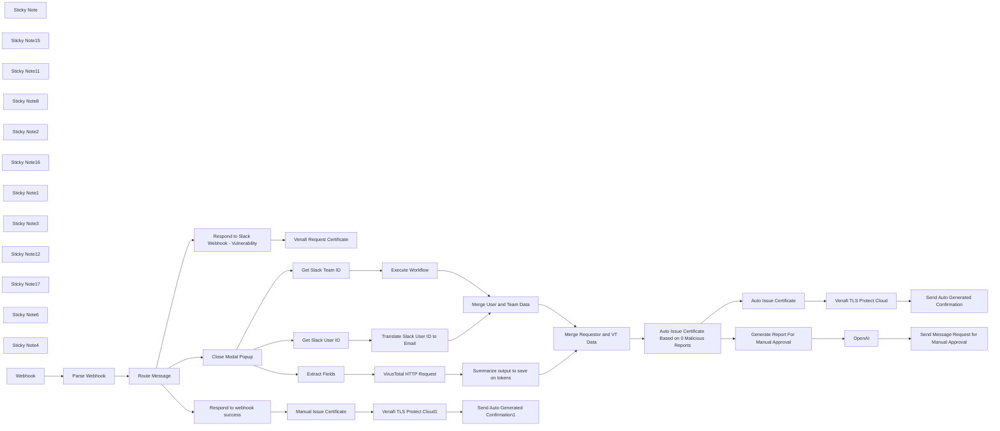

## Fluxo (.json) :

```json
{
  "meta": {
    "instanceId": "cb484ba7b742928a2048bf8829668bed5b5ad9787579adea888f05980292a4a7"
  },
  "nodes": [
    {
      "id": "1092ab50-67a0-4e50-8c10-f05f70b45f56",
      "name": "Venafi TLS Protect Cloud",
      "type": "n8n-nodes-base.venafiTlsProtectCloud",
      "position": [
        2860,
        1700
      ],
      "parameters": {
        "options": {},
        "commonName": "={{ $('Parse Webhook').item.json.response.view.state.values.domain_name_block.domain_name_input.value.match(/^(\\*\\.)?([a-zA-Z0-9-]+\\.)+[a-zA-Z]{2,}$/g).toString() }}",
        "generateCsr": true,
        "applicationId": "f3c15c80-7151-11ef-9a22-abeac49f7094",
        "additionalFields": {
          "organizationalUnits": [
            "={{ $json.name }}"
          ]
        },
        "certificateIssuingTemplateId": "d28d82b1-714b-11ef-9026-7bb80b32867a"
      },
      "credentials": {
        "venafiTlsProtectCloudApi": {
          "id": "WU38IpfutNNkJWuo",
          "name": "Venafi TLS Protect Cloud account"
        }
      },
      "typeVersion": 1
    },
    {
      "id": "0c1f1b92-2da4-413f-a4cc-68c816e8511c",
      "name": "Parse Webhook",
      "type": "n8n-nodes-base.set",
      "position": [
        440,
        1100
      ],
      "parameters": {
        "options": {},
        "assignments": {
          "assignments": [
            {
              "id": "e63f9299-a19d-4ba1-93b0-59f458769fb2",
              "name": "response",
              "type": "object",
              "value": "={{ $json.body.payload }}"
            }
          ]
        }
      },
      "typeVersion": 3.3
    },
    {
      "id": "95fb1907-c9e0-4164-b0b0-c3691bb46b9a",
      "name": "Sticky Note",
      "type": "n8n-nodes-base.stickyNote",
      "position": [
        108.34675483142371,
        741.4892041682327
      ],
      "parameters": {
        "color": 7,
        "width": 466.8168310000617,
        "height": 556.7924159157113,
        "content": "\n## Events Webhook Trigger\nThe first node receives all messages from Slack API via Subscription Events API. You can find more information about setting up the subscription events API by [clicking here](https://api.slack.com/apis/connections/events-api). \n\nThe second node extracts the payload from slack into an object that n8n can understand. "
      },
      "typeVersion": 1
    },
    {
      "id": "4dd8cbbe-278c-4c86-bcd7-9fb0eff619b2",
      "name": "Sticky Note15",
      "type": "n8n-nodes-base.stickyNote",
      "position": [
        580,
        420
      ],
      "parameters": {
        "color": 7,
        "width": 566.0553219408072,
        "height": 999.0925226187064,
        "content": "\n## Efficient Slack Interaction Handling with n8n\n\nThis section of the workflow is designed to efficiently manage and route messages and submissions from Slack based on specific triggers and conditions. When a Slack interaction occurs—such as a user triggering a vulnerability scan or generating a report through a modal—the workflow intelligently routes the message to the appropriate action:\n\n- **Dynamic Routing**: Uses conditions to determine the nature of the Slack interaction, whether it's a direct command to initiate a scan or a request to generate a report.\n- **Modal Management**: Differentiates actions based on modal titles and `callback_id`s, ensuring that each type of submission is processed according to its context.\n- **Streamlined Responses**: After routing, the workflow promptly handles the necessary responses or actions, including closing modal popups and responding to Slack with appropriate confirmation or data.\n\n**Purpose**: This mechanism ensures that all interactions within Slack are handled quickly and accurately, automating responses and actions in real-time to enhance user experience and workflow efficiency."
      },
      "typeVersion": 1
    },
    {
      "id": "db8aabd8-d00d-4d50-9f97-443eba7c7c90",
      "name": "Sticky Note11",
      "type": "n8n-nodes-base.stickyNote",
      "position": [
        1153.6255461332685,
        516.1718360212528
      ],
      "parameters": {
        "color": 7,
        "width": 396.6025898621133,
        "height": 652.6603582798184,
        "content": "\n## Display Modal Popup\nThis section pops open a modal window that is later used to send data into Virustotal, then depending on those results, to Venafi or Slack for manual approval. \n\nModals can be customized to perform all sorts of actions. And they are natively mobile! Additionally, messages themselves can perform actions if you include inputs like buttons or field inputs. \n\nLearn more about them by [clicking here](https://api.slack.com/surfaces/modals)"
      },
      "typeVersion": 1
    },
    {
      "id": "a86e0b86-0740-4b77-831a-52413983818e",
      "name": "Close Modal Popup",
      "type": "n8n-nodes-base.respondToWebhook",
      "position": [
        960,
        1200
      ],
      "parameters": {
        "options": {},
        "respondWith": "noData"
      },
      "typeVersion": 1.1
    },
    {
      "id": "a5abc206-6b10-42bc-9196-bcedacdb3726",
      "name": "Sticky Note8",
      "type": "n8n-nodes-base.stickyNote",
      "position": [
        -580,
        740
      ],
      "parameters": {
        "width": 675.1724774900403,
        "height": 972.8853473866498,
        "content": "\n## Enhance Security Operations with the Venafi Slack CertBot!\n\nOur **Venafi Slack CertBot** is strategically designed to facilitate immediate security operations directly from Slack. This tool allows end users to request Certificate Signing Requests that are automatically approved or passed to the Secops team for manual approval depending on the Virustotal analysis of the requested domain. Not only does this help centralize requests, but it helps an organization maintain the security certifications by allowing automated processes to log and analyze requests in real time. \n\n**Workflow Highlights:**\n- **Interactive Modals**: Utilizes Slack modals to gather user inputs for scan configurations and report generation, providing a user-friendly interface for complex operations.\n- **Dynamic Workflow Execution**: Integrates seamlessly with Venafi to execute CSR generation and if any issues are found, AI can generate a custom report that is then passed to a slack teams channel for manual approval with the press of a single button.\n\n**Operational Flow:**\n- **Parse Webhook Data**: Captures and parses incoming data from Slack to understand user commands accurately.\n- **Execute Actions**: Depending on the user's selection, the workflow triggers other actions within the flow like automatic Virustotal Scanning.\n- **Respond to Slack**: Ensures that every interaction is acknowledged, maintaining a smooth user experience by managing modal popups and sending appropriate responses.\n\n\n**Setup Instructions:**\n- Verify that Slack and Qualys API integrations are correctly configured for seamless interaction.\n- Customize the modal interfaces to align with your organization's operational protocols and security policies.\n- Test the workflow to ensure that it responds accurately to Slack commands and that the integration with Qualys is functioning as expected.\n\n\n**Need Assistance?**\n- Explore Venafi's [Documentation](https://docs.venafi.com/) or get help from the [n8n Community](https://community.n8n.io) for more detailed guidance on setup and customization.\n\nDeploy this bot within your Slack environment to significantly enhance the efficiency and responsiveness of your security operations, enabling proactive management of CSR's."
      },
      "typeVersion": 1
    },
    {
      "id": "352680c7-3b77-4fc1-81eb-8b5495747d89",
      "name": "Respond to Slack Webhook - Vulnerability",
      "type": "n8n-nodes-base.respondToWebhook",
      "position": [
        960,
        1000
      ],
      "parameters": {
        "options": {},
        "respondWith": "noData"
      },
      "typeVersion": 1.1
    },
    {
      "id": "7e2991c3-14ee-478c-b9b6-9dd58590dde9",
      "name": "Sticky Note2",
      "type": "n8n-nodes-base.stickyNote",
      "position": [
        1160,
        860
      ],
      "parameters": {
        "color": 5,
        "width": 376.26546828439086,
        "height": 113.6416448104651,
        "content": "### 🙋 Don't forget your slack credentials!\nThankfully n8n makes it easy, as long as you've added credentials to a normal slack node, these http nodes are a snap to change via the drop down. "
      },
      "typeVersion": 1
    },
    {
      "id": "97b8942b-1ec5-437f-9c51-2188cc9a9d6f",
      "name": "Venafi Request Certificate",
      "type": "n8n-nodes-base.httpRequest",
      "position": [
        1240,
        1000
      ],
      "parameters": {
        "url": "https://slack.com/api/views.open",
        "method": "POST",
        "options": {},
        "jsonBody": "= {\n \"trigger_id\": \"{{ $('Parse Webhook').item.json['response']['trigger_id'] }}\",\n \"external_id\": \"Idea Selector\",\n \"view\": {\n\t\"type\": \"modal\",\n\t\"callback_id\": \"certificate_request_modal\",\n\t\"title\": {\n\t\t\"type\": \"plain_text\",\n\t\t\"text\": \"Request New Certificate\"\n\t},\n\t\"submit\": {\n\t\t\"type\": \"plain_text\",\n\t\t\"text\": \"Request\"\n\t},\n\t\"close\": {\n\t\t\"type\": \"plain_text\",\n\t\t\"text\": \"Cancel\"\n\t},\n\t\"blocks\": [\n\t\t{\n\t\t\t\"type\": \"image\",\n\t\t\t\"image_url\": \"https://img.securityinfowatch.com/files/base/cygnus/siw/image/2022/10/Venafi_logo.63459e2b03b7b.png?auto=format%2Ccompress&w=640&width=640\",\n\t\t\t\"alt_text\": \"delicious tacos\"\n\t\t},\n\t\t{\n\t\t\t\"type\": \"input\",\n\t\t\t\"block_id\": \"domain_name_block\",\n\t\t\t\"label\": {\n\t\t\t\t\"type\": \"plain_text\",\n\t\t\t\t\"text\": \"Domain Name\"\n\t\t\t},\n\t\t\t\"element\": {\n\t\t\t\t\"type\": \"plain_text_input\",\n\t\t\t\t\"action_id\": \"domain_name_input\",\n\t\t\t\t\"placeholder\": {\n\t\t\t\t\t\"type\": \"plain_text\",\n\t\t\t\t\t\"text\": \"Enter the domain name\"\n\t\t\t\t}\n\t\t\t}\n\t\t},\n\t\t{\n\t\t\t\"type\": \"input\",\n\t\t\t\"block_id\": \"validity_period_block\",\n\t\t\t\"label\": {\n\t\t\t\t\"type\": \"plain_text\",\n\t\t\t\t\"text\": \"Validity Period\"\n\t\t\t},\n\t\t\t\"element\": {\n\t\t\t\t\"type\": \"static_select\",\n\t\t\t\t\"action_id\": \"validity_period_select\",\n\t\t\t\t\"placeholder\": {\n\t\t\t\t\t\"type\": \"plain_text\",\n\t\t\t\t\t\"text\": \"Select a validity period\"\n\t\t\t\t},\n\t\t\t\t\"options\": [\n\t\t\t\t\t{\n\t\t\t\t\t\t\"text\": {\n\t\t\t\t\t\t\t\"type\": \"plain_text\",\n\t\t\t\t\t\t\t\"text\": \"1 Year\"\n\t\t\t\t\t\t},\n\t\t\t\t\t\t\"value\": \"P1Y\"\n\t\t\t\t\t},\n\t\t\t\t\t{\n\t\t\t\t\t\t\"text\": {\n\t\t\t\t\t\t\t\"type\": \"plain_text\",\n\t\t\t\t\t\t\t\"text\": \"2 Years\"\n\t\t\t\t\t\t},\n\t\t\t\t\t\t\"value\": \"P2Y\"\n\t\t\t\t\t}\n\t\t\t\t]\n\t\t\t}\n\t\t},\n\t\t{\n\t\t\t\"type\": \"input\",\n\t\t\t\"block_id\": \"optional_note_block\",\n\t\t\t\"optional\": true,\n\t\t\t\"label\": {\n\t\t\t\t\"type\": \"plain_text\",\n\t\t\t\t\"text\": \"Optional Note\"\n\t\t\t},\n\t\t\t\"element\": {\n\t\t\t\t\"type\": \"plain_text_input\",\n\t\t\t\t\"action_id\": \"optional_note_input\",\n\t\t\t\t\"multiline\": true,\n\t\t\t\t\"placeholder\": {\n\t\t\t\t\t\"type\": \"plain_text\",\n\t\t\t\t\t\"text\": \"Add any extra information (e.g., usage context, urgency)\"\n\t\t\t\t}\n\t\t\t}\n\t\t}\n\t]\n}\n}",
        "sendBody": true,
        "jsonQuery": "{\n \"Content-type\": \"application/json\"\n}",
        "sendQuery": true,
        "specifyBody": "json",
        "specifyQuery": "json",
        "authentication": "predefinedCredentialType",
        "nodeCredentialType": "slackApi"
      },
      "credentials": {
        "slackApi": {
          "id": "hkcQkp6qhtiMzBEX",
          "name": "certbot"
        }
      },
      "typeVersion": 4.2
    },
    {
      "id": "12c50bad-8aab-4bab-8790-153d9e484762",
      "name": "Extract Fields",
      "type": "n8n-nodes-base.set",
      "position": [
        1200,
        1460
      ],
      "parameters": {
        "options": {},
        "assignments": {
          "assignments": [
            {
              "id": "39808a24-60f6-4f4b-8f4c-4c2aa3850b4f",
              "name": "domain",
              "type": "string",
              "value": "={{ $json.response.view.state.values.domain_name_block.domain_name_input.value }}"
            },
            {
              "id": "27c905be-18cc-434f-8af0-a08ee23a168f",
              "name": "validity",
              "type": "string",
              "value": "={{ $json.response.view.state.values.validity_period_block.validity_period_select.selected_option.value }}"
            },
            {
              "id": "ba1382e5-0629-4276-9858-34bcb59cc85a",
              "name": "note",
              "type": "string",
              "value": "={{ $json.response.view.state.values.optional_note_block.optional_note_input.value }}"
            }
          ]
        }
      },
      "typeVersion": 3.4
    },
    {
      "id": "f16a97d7-639e-4ec9-b003-b4ee4fdf8666",
      "name": "Get Slack User ID",
      "type": "n8n-nodes-base.set",
      "position": [
        1200,
        2020
      ],
      "parameters": {
        "options": {},
        "assignments": {
          "assignments": [
            {
              "id": "53dfe019-d91d-4f5c-b279-f8b3fde98bf1",
              "name": "id",
              "type": "string",
              "value": "={{ $json.response.user.id }}"
            }
          ]
        }
      },
      "typeVersion": 3.4
    },
    {
      "id": "2a6af9ae-3916-4993-b2b3-a737f54f7a37",
      "name": "Translate Slack User ID to Email",
      "type": "n8n-nodes-base.executeWorkflow",
      "position": [
        1520,
        2020
      ],
      "parameters": {
        "options": {
          "waitForSubWorkflow": true
        },
        "workflowId": {
          "__rl": true,
          "mode": "list",
          "value": "afeVlIVyoIF8Psu4",
          "cachedResultName": "Slack ID to Email"
        }
      },
      "typeVersion": 1.1
    },
    {
      "id": "19541f84-0d97-4711-80ed-d36a5d517d9b",
      "name": "VirusTotal HTTP Request",
      "type": "n8n-nodes-base.httpRequest",
      "position": [
        1440,
        1460
      ],
      "parameters": {
        "": "",
        "url": "=https://www.virustotal.com/api/v3/domains/{{ $json.domain }}",
        "method": "GET",
        "options": {},
        "sendBody": false,
        "sendQuery": false,
        "curlImport": "",
        "infoMessage": "",
        "sendHeaders": true,
        "authentication": "none",
        "specifyHeaders": "keypair",
        "headerParameters": {
          "parameters": [
            {
              "name": "accept",
              "value": "application/json"
            },
            {
              "name": "X-Apikey",
              "value": "455144dac89b783b2f5421578b9ab4072adebfc011c969ba384d1c8f0e2ce39e"
            }
          ]
        },
        "httpVariantWarning": "",
        "provideSslCertificates": false
      },
      "credentials": {
        "virusTotalApi": {
          "id": "JRK1xDyMiseROCmY",
          "name": "VirusTotal account 2"
        }
      },
      "typeVersion": 4.2,
      "extendsCredential": "virusTotalApi"
    },
    {
      "id": "4a0e0a71-b433-479b-87b7-7200537009af",
      "name": "Summarize output to save on tokens",
      "type": "n8n-nodes-base.set",
      "position": [
        1760,
        1460
      ],
      "parameters": {
        "options": {},
        "assignments": {
          "assignments": [
            {
              "id": "2c4689a3-4b72-4240-8a0f-2fa00d33c553",
              "name": "data.attributes.last_analysis_stats.malicious",
              "type": "number",
              "value": "={{ $json.data.attributes.last_analysis_stats.malicious }}"
            },
            {
              "id": "59db6f41-1cf1-4feb-8120-8c50fadc5c9e",
              "name": "data.attributes.last_analysis_stats.suspicious",
              "type": "number",
              "value": "={{ $json.data.attributes.last_analysis_stats.suspicious }}"
            },
            {
              "id": "b55e7d39-0358-4863-8147-c5ce2b65ea96",
              "name": "data.attributes.last_analysis_stats.undetected",
              "type": "number",
              "value": "={{ $json.data.attributes.last_analysis_stats.undetected }}"
            },
            {
              "id": "ecd98a37-cb8b-48cd-bd3d-9c8bf777c5ca",
              "name": "data.attributes.last_analysis_stats.harmless",
              "type": "number",
              "value": "={{ $json.data.attributes.last_analysis_stats.harmless }}"
            },
            {
              "id": "72a776d5-70d7-4c30-b8fc-f7da382bc626",
              "name": "data.attributes.last_analysis_stats.timeout",
              "type": "number",
              "value": "={{ $json.data.attributes.last_analysis_stats.timeout }}"
            },
            {
              "id": "b85d8e8a-620c-4bb7-97db-d780f273deee",
              "name": "data.attributes.reputation",
              "type": "number",
              "value": "={{ $json.data.attributes.reputation }}"
            }
          ]
        }
      },
      "typeVersion": 3.4
    },
    {
      "id": "3d641c80-8a2a-4888-9ee3-ecd82f8d0d8b",
      "name": "Auto Issue Certificate Based on 0 Malicious Reports",
      "type": "n8n-nodes-base.if",
      "position": [
        2300,
        1840
      ],
      "parameters": {
        "options": {},
        "conditions": {
          "options": {
            "version": 2,
            "leftValue": "",
            "caseSensitive": true,
            "typeValidation": "strict"
          },
          "combinator": "and",
          "conditions": [
            {
              "id": "795c6ff5-ac4a-4b67-b2fe-369fba276194",
              "operator": {
                "type": "number",
                "operation": "lte"
              },
              "leftValue": "={{ $json.data.attributes.last_analysis_stats.malicious }}",
              "rightValue": 0
            }
          ]
        }
      },
      "typeVersion": 2.2
    },
    {
      "id": "3f6e9bf2-6c6c-4316-8d14-1b004122fa67",
      "name": "Auto Issue Certificate",
      "type": "n8n-nodes-base.noOp",
      "position": [
        2560,
        1700
      ],
      "parameters": {},
      "typeVersion": 1
    },
    {
      "id": "fa34e736-65c4-4bc1-a391-794225a588d2",
      "name": "Generate Report For Manual Approval",
      "type": "n8n-nodes-base.noOp",
      "position": [
        2540,
        2220
      ],
      "parameters": {},
      "typeVersion": 1
    },
    {
      "id": "178afe87-cdef-46f0-8166-68b661349189",
      "name": "Get Slack Team ID",
      "type": "n8n-nodes-base.set",
      "position": [
        1220,
        2220
      ],
      "parameters": {
        "options": {},
        "assignments": {
          "assignments": [
            {
              "id": "53dfe019-d91d-4f5c-b279-f8b3fde98bf1",
              "name": "id",
              "type": "string",
              "value": "={{ $json.response.team.id }}"
            }
          ]
        }
      },
      "typeVersion": 3.4
    },
    {
      "id": "c4d89085-f7f4-4073-bfe2-cd156275710c",
      "name": "Execute Workflow",
      "type": "n8n-nodes-base.executeWorkflow",
      "position": [
        1520,
        2220
      ],
      "parameters": {
        "options": {},
        "workflowId": {
          "__rl": true,
          "mode": "list",
          "value": "ZIl9VdWh7BiVRRBT",
          "cachedResultName": "Slack Team ID to Name"
        }
      },
      "typeVersion": 1.1
    },
    {
      "id": "51d85502-ea61-423b-a6c4-66ed8397d685",
      "name": "Merge User and Team Data",
      "type": "n8n-nodes-base.merge",
      "position": [
        1820,
        2140
      ],
      "parameters": {
        "mode": "combine",
        "options": {},
        "combineBy": "combineByPosition"
      },
      "typeVersion": 3
    },
    {
      "id": "febb1be8-7cad-46f1-a854-2ff1432216cb",
      "name": "OpenAI",
      "type": "@n8n/n8n-nodes-langchain.openAi",
      "position": [
        2720,
        2220
      ],
      "parameters": {
        "modelId": {
          "__rl": true,
          "mode": "list",
          "value": "gpt-4o-mini",
          "cachedResultName": "GPT-4O-MINI"
        },
        "options": {},
        "messages": {
          "values": [
            {
              "content": "=Analyze the following VirusTotal scan results and summarize the overall risk as Low, Medium, or High based on the number of engines flagging the domain (excluding \"clean\" or \"unrated\" results). Use the following criteria for risk rating:\n\nLow: No significant threats detected; domain is clean.\nMedium: Minor issues detected; may require further review.\nHigh: Significant threats like phishing or malware; manual review recommended.\n\nHere are the scan results for the domain {{ $('Parse Webhook').item.json.response.view.state.values.domain_name_block.domain_name_input.value }}:\n\nMalicious: {{ $json.data.attributes.last_analysis_stats.malicious }}\nSuspicious: {{ $json.data.attributes.last_analysis_stats.suspicious }}\nUndetected: {{ $json.data.attributes.last_analysis_stats.undetected }}\nHarmless: {{ $json.data.attributes.last_analysis_stats.harmless }}\nTimeout: {{ $json.data.attributes.last_analysis_stats.timeout }}\nReputation: {{ $json.data.attributes.reputation }}\n\nProvide an overall risk rating and suggest next steps based on your analysis. Please keep it concise. "
            },
            {
              "role": "system",
              "content": "Analyze the VirusTotal scan results and categorize the domain’s risk as Low, Medium, or High:\n\nIdentify Risks: Focus on results flagged as anything other than \"clean\" or \"unrated.\"\nAssess Risk:\nLow: No major threats flagged, domain is safe.\nMedium: Minor issues flagged, review recommended.\nHigh: Significant threats flagged (e.g., phishing, malware), manual review needed.\nRecommendation:\nLow: Auto-issue the certificate.\nMedium/High: Recommend manual review."
            }
          ]
        }
      },
      "credentials": {
        "openAiApi": {
          "id": "2KVzlb0XZRZkoObj",
          "name": "angel openai auth"
        }
      },
      "typeVersion": 1.5
    },
    {
      "id": "04ffe7bb-be5d-4ce0-b17c-68276673f585",
      "name": "Sticky Note16",
      "type": "n8n-nodes-base.stickyNote",
      "position": [
        1160,
        1680
      ],
      "parameters": {
        "color": 7,
        "width": 833.9929589980072,
        "height": 705.5291769708515,
        "content": "\n## Run Workflows within other Workflows like Functions\n\nThis section of the workflow contains 2 subworkflows that translate the Slack User ID to an email and name, and the Slack Team ID into the team name and Avatar of the team to make the slack messages more visual. This allows you to reuse these flows like you would use a function in code. \n\nThese nodes run parallel to each other so they will not override the data generated by each thread, and then are joined using the Merge nodes. "
      },
      "typeVersion": 1
    },
    {
      "id": "a2b48f56-946b-4ae7-ade4-5b84b1a99bb9",
      "name": "Sticky Note1",
      "type": "n8n-nodes-base.stickyNote",
      "position": [
        1160,
        1180
      ],
      "parameters": {
        "color": 7,
        "width": 832.2724669887743,
        "height": 485.55399396506067,
        "content": "\n## URL Analysis with VirusTotal\nThe first node receives all messages from Slack API via Subscription Events API. You can find more information about setting up the subscription events API by [clicking here](https://api.slack.com/apis/connections/events-api). \n\nThe second node extracts the payload from slack into an object that n8n can understand. "
      },
      "typeVersion": 1
    },
    {
      "id": "c38c30f3-acb1-40e4-acc5-3fd4f6b8e643",
      "name": "Merge Requestor and VT Data",
      "type": "n8n-nodes-base.merge",
      "position": [
        2100,
        1840
      ],
      "parameters": {
        "mode": "combine",
        "options": {},
        "combineBy": "combineByPosition"
      },
      "typeVersion": 3
    },
    {
      "id": "2e2c6100-b82e-4cdf-a290-33c2898de652",
      "name": "Sticky Note3",
      "type": "n8n-nodes-base.stickyNote",
      "position": [
        2480,
        1420
      ],
      "parameters": {
        "color": 7,
        "width": 547.705272240834,
        "height": 485.55399396506067,
        "content": "\n## Automatic CSR Generation via Venafi\nContextual data from the Slack user's webhook is used to gather the needed contextual data, such as the name of the Slack team/group the user is in and their email and name if needed. \n\nFor automatic CSR Generation to work, ensure you have a Vsatelite deployed and active. "
      },
      "typeVersion": 1
    },
    {
      "id": "4c168cd6-e5d2-4d82-9fe3-3b8431db3dcd",
      "name": "Sticky Note12",
      "type": "n8n-nodes-base.stickyNote",
      "position": [
        3040,
        1309.0359710471785
      ],
      "parameters": {
        "color": 7,
        "width": 367.3323860824746,
        "height": 831.2760849855022,
        "content": "\n## Send Contextual Message to Slack\nThis section pops open a modal window that is later used to send data into TheHive. \n\nModals can be customized to perform all sorts of actions. And they are natively mobile! You can see a screenshot of the Slack Modals on the right. \n\nLearn more about them by [clicking here](https://api.slack.com/surfaces/modals)"
      },
      "typeVersion": 1
    },
    {
      "id": "08687e15-90e0-42da-95a4-ada8b7ddcd36",
      "name": "Sticky Note17",
      "type": "n8n-nodes-base.stickyNote",
      "position": [
        2000,
        1421.1618229241317
      ],
      "parameters": {
        "color": 7,
        "width": 465.44793569024944,
        "height": 676.0664675646049,
        "content": "\n## Efficient Slack Interaction Handling with n8n\n\nThis section of the workflow is designed to efficiently manage and route messages and submissions from Slack based on specific triggers and conditions. When a Slack interaction occurs—such as a user triggering a vulnerability scan or generating a report through a modal—the workflow intelligently routes the message to the appropriate action:"
      },
      "typeVersion": 1
    },
    {
      "id": "7098d247-5f39-4c61-a055-d7e9d12c2a64",
      "name": "Sticky Note6",
      "type": "n8n-nodes-base.stickyNote",
      "position": [
        2480,
        1920
      ],
      "parameters": {
        "color": 7,
        "width": 544.2406462166426,
        "height": 546.0036529662652,
        "content": "\n## Parse Response with AI Model \nThis workflow currently uses OpenAI to power it's responses, but you can replace the AI Agent node below and set your own local AI LLM using the n8n options offered. "
      },
      "typeVersion": 1
    },
    {
      "id": "3f2ea251-6f4e-4701-8456-d3020169f802",
      "name": "Send Auto Generated Confirmation",
      "type": "n8n-nodes-base.slack",
      "position": [
        3160,
        1700
      ],
      "parameters": {
        "text": "test",
        "select": "channel",
        "blocksUi": "={\n\t\"blocks\": [\n\t\t{\n\t\t\t\"type\": \"section\",\n\t\t\t\"text\": {\n\t\t\t\t\"type\": \"mrkdwn\",\n\t\t\t\t\"text\": \"*:lock: CSR Auto-Issued Successfully!*\"\n\t\t\t}\n\t\t},\n\t\t{\n\t\t\t\"type\": \"divider\"\n\t\t},\n\t\t{\n\t\t\t\"type\": \"section\",\n\t\t\t\"text\": {\n\t\t\t\t\"type\": \"mrkdwn\",\n\t\t\t\t\"text\": \"*Team:* {{ $('Merge Requestor and VT Data').item.json.name }}\\n*Requested by:* <@{{ $('Parse Webhook').item.json.response.user.id }}>\\n*Email:* {{ $('Merge User and Team Data').item.json.email }}\\n*Date Issued:* {{ $json.creationDate }}\"\n\t\t\t},\n\t\t\t\"accessory\": {\n\t\t\t\t\"type\": \"image\",\n\t\t\t\t\"image_url\": \"{{ $('Merge User and Team Data').item.json.team.icon.image_132 }}\",\n\t\t\t\t\"alt_text\": \"Team Avatar\"\n\t\t\t}\n\t\t},\n\t\t{\n\t\t\t\"type\": \"context\",\n\t\t\t\"elements\": [\n\t\t\t\t{\n\t\t\t\t\t\"type\": \"mrkdwn\",\n\t\t\t\t\t\"text\": \"*CSR Details:*\"\n\t\t\t\t}\n\t\t\t]\n\t\t},\n\t\t{\n\t\t\t\"type\": \"section\",\n\t\t\t\"fields\": [\n\t\t\t\t{\n\t\t\t\t\t\"type\": \"mrkdwn\",\n\t\t\t\t\t\"text\": \"*Common Name:* {{ $('Parse Webhook').item.json.response.view.state.values.domain_name_block.domain_name_input.value }}\"\n\t\t\t\t},\n\t\t\t\t{\n\t\t\t\t\t\"type\": \"mrkdwn\",\n\t\t\t\t\t\"text\": \"*Organization:* n8n.io\"\n\t\t\t\t},\n\t\t\t\t{\n\t\t\t\t\t\"type\": \"mrkdwn\",\n\t\t\t\t\t\"text\": \"*Issued By:* Venafi CA\"\n\t\t\t\t},\n\t\t\t\t{\n\t\t\t\t\t\"type\": \"mrkdwn\",\n\t\t\t\t\t\"text\": \"*Validity Period:* {{ DateTime.fromISO($json.creationDate).toFormat('MMMM dd, yyyy') }} to {{ DateTime.fromISO($json.creationDate).plus({ years: 1 }).toFormat('MMMM dd, yyyy') }}\"\n\t\t\t\t}\n\t\t\t]\n\t\t},\n\t\t{\n\t\t\t\"type\": \"divider\"\n\t\t},\n\t\t{\n\t\t\t\"type\": \"actions\",\n\t\t\t\"elements\": [\n\t\t\t\t{\n\t\t\t\t\t\"type\": \"button\",\n\t\t\t\t\t\"text\": {\n\t\t\t\t\t\t\"type\": \"plain_text\",\n\t\t\t\t\t\t\"text\": \"View CSR Details\"\n\t\t\t\t\t},\n\t\t\t\t\t\"url\": \"https://eval-32690260.venafi.cloud/issuance/certificate-requests?id={{ $json.id }}\",\n\t\t\t\t\t\"style\": \"primary\"\n\t\t\t\t},\n\t\t\t\t{\n\t\t\t\t\t\"type\": \"button\",\n\t\t\t\t\t\"text\": {\n\t\t\t\t\t\t\"type\": \"plain_text\",\n\t\t\t\t\t\t\"text\": \"Revoke CSR\"\n\t\t\t\t\t},\n\t\t\t\t\t\"style\": \"danger\",\n\t\t\t\t\t\"value\": \"revoke_csr\"\n\t\t\t\t}\n\t\t\t]\n\t\t}\n\t]\n}",
        "channelId": {
          "__rl": true,
          "mode": "id",
          "value": "C07MB8PGZ36"
        },
        "messageType": "block",
        "otherOptions": {}
      },
      "credentials": {
        "slackApi": {
          "id": "hkcQkp6qhtiMzBEX",
          "name": "certbot"
        }
      },
      "typeVersion": 2.2
    },
    {
      "id": "17b7cc2e-32ff-4670-a756-bb41627dc14a",
      "name": "Send Message Request for Manual Approval",
      "type": "n8n-nodes-base.slack",
      "position": [
        3160,
        1940
      ],
      "parameters": {
        "text": "test",
        "select": "channel",
        "blocksUi": "={\n\t\"blocks\": [\n\t\t{\n\t\t\t\"type\": \"section\",\n\t\t\t\"text\": {\n\t\t\t\t\"type\": \"mrkdwn\",\n\t\t\t\t\"text\": \":warning: *CSR Pending Approval*\\n\\nThe Certificate Signing Request for the following domain was not auto-approved. Please review the details and press the button below to submit the request for manual approval.\"\n\t\t\t}\n\t\t},\n\t\t{\n\t\t\t\"type\": \"divider\"\n\t\t},\n\t\t{\n\t\t\t\"type\": \"section\",\n\t\t\t\"text\": {\n\t\t\t\t\"type\": \"mrkdwn\",\n\t\t\t\t\"text\": \"*Team:* {{ $('Merge Requestor and VT Data').item.json.name }}\\n*Submitted by:* <@{{ $('Parse Webhook').item.json.response.user.id }}>\\n*Requestor Email:* {{ $('Merge Requestor and VT Data').item.json.email }}\\n*Date Submitted:* {{ DateTime.fromISO($json.creationDate).toFormat('MMMM dd, yyyy') }}\\n*Domain:* {{ $('Parse Webhook').item.json.response.view.state.values.domain_name_block.domain_name_input.value }}\\n\\n:mag: *AI Analysis*\\n> The AI detected the following potential issues with the CSR:\\n> - *VT Malicious Reports:* {{ $('Generate Report For Manual Approval').item.json.data.attributes.last_analysis_stats.malicious }}\\n> - *Reputation Score:* {{ $('Generate Report For Manual Approval').item.json.data.attributes.reputation }}/100\\n> - *Additional Notes:* {{ $json.message.content.replace(/\\n/g, '\\\\n').replace(/###/g, ' ').replace(/-\\s+\\*\\*(.*?)\\*\\*/g, '• *$1*').replace(/\"/g, '\\\\\"').replace(/\\*\\*/g, '*') }}\\n\\nPlease ensure these risks are mitigated before proceeding.\"\n\t\t\t},\n\t\t\t\"accessory\": {\n\t\t\t\t\"type\": \"image\",\n\t\t\t\t\"image_url\": \"https://avatars.slack-edge.com/2024-08-29/7652078599283_52acb3a88da26e76bab6_132.png\",\n\t\t\t\t\"alt_text\": \"Team Avatar\"\n\t\t\t}\n\t\t},\n\t\t{\n\t\t\t\"type\": \"divider\"\n\t\t},\n\t\t{\n\t\t\t\"type\": \"actions\",\n\t\t\t\"elements\": [\n\t\t\t\t{\n\t\t\t\t\t\"type\": \"button\",\n\t\t\t\t\t\"text\": {\n\t\t\t\t\t\t\"type\": \"plain_text\",\n\t\t\t\t\t\t\"text\": \":arrow_forward: Submit for Approval\"\n\t\t\t\t\t},\n\t\t\t\t\t\"value\": \"submit_for_approval\",\n\t\t\t\t\t\"style\": \"primary\",\n\t\t\t\t\t\"action_id\": \"submit_for_approval\"\n\t\t\t\t},\n\t\t\t\t{\n\t\t\t\t\t\"type\": \"button\",\n\t\t\t\t\t\"text\": {\n\t\t\t\t\t\t\"type\": \"plain_text\",\n\t\t\t\t\t\t\"text\": \"View CSR Details\"\n\t\t\t\t\t},\n\t\t\t\t\t\"value\": \"view_csr_details\",\n\t\t\t\t\t\"url\": \"https://google.com\",\n\t\t\t\t\t\"action_id\": \"view_csr_details\"\n\t\t\t\t}\n\t\t\t]\n\t\t},\n\t\t{\n\t\t\t\"type\": \"context\",\n\t\t\t\"elements\": [\n\t\t\t\t{\n\t\t\t\t\t\"type\": \"mrkdwn\",\n\t\t\t\t\t\"text\": \"Submitted on {{ $now.toFormat('MMMM dd, yyyy') }}. The request requires manual approval. If you have any questions, contact the security team.\"\n\t\t\t\t}\n\t\t\t]\n\t\t}\n\t]\n}",
        "channelId": {
          "__rl": true,
          "mode": "id",
          "value": "C07MB8PGZ36"
        },
        "messageType": "block",
        "otherOptions": {}
      },
      "credentials": {
        "slackApi": {
          "id": "hkcQkp6qhtiMzBEX",
          "name": "certbot"
        }
      },
      "typeVersion": 2.2
    },
    {
      "id": "480c7f12-fc3a-44d1-885f-d6618a1e0dc8",
      "name": "Route Message",
      "type": "n8n-nodes-base.switch",
      "position": [
        620,
        1100
      ],
      "parameters": {
        "rules": {
          "values": [
            {
              "outputKey": "Request Modal",
              "conditions": {
                "options": {
                  "version": 1,
                  "leftValue": "",
                  "caseSensitive": true,
                  "typeValidation": "strict"
                },
                "combinator": "and",
                "conditions": [
                  {
                    "operator": {
                      "type": "string",
                      "operation": "equals"
                    },
                    "leftValue": "={{ $json.response.callback_id }}",
                    "rightValue": "request-certificate"
                  }
                ]
              },
              "renameOutput": true
            },
            {
              "outputKey": "Submit Data",
              "conditions": {
                "options": {
                  "version": 1,
                  "leftValue": "",
                  "caseSensitive": true,
                  "typeValidation": "strict"
                },
                "combinator": "and",
                "conditions": [
                  {
                    "id": "65daa75f-2e17-4ba0-8fd8-2ac2159399e3",
                    "operator": {
                      "name": "filter.operator.equals",
                      "type": "string",
                      "operation": "equals"
                    },
                    "leftValue": "={{ $json.response.type }}",
                    "rightValue": "view_submission"
                  }
                ]
              },
              "renameOutput": true
            },
            {
              "outputKey": "Block Actions",
              "conditions": {
                "options": {
                  "version": 1,
                  "leftValue": "",
                  "caseSensitive": true,
                  "typeValidation": "strict"
                },
                "combinator": "and",
                "conditions": [
                  {
                    "id": "87f6f93e-28c9-49bc-8e1e-d073d86347b4",
                    "operator": {
                      "name": "filter.operator.equals",
                      "type": "string",
                      "operation": "equals"
                    },
                    "leftValue": "={{ $json.response.type }}",
                    "rightValue": "block_actions"
                  }
                ]
              },
              "renameOutput": true
            }
          ]
        },
        "options": {
          "fallbackOutput": "none"
        }
      },
      "typeVersion": 3
    },
    {
      "id": "a42115ce-f0d7-443b-947d-cb8d54c2df22",
      "name": "Venafi TLS Protect Cloud1",
      "type": "n8n-nodes-base.venafiTlsProtectCloud",
      "position": [
        1500,
        2700
      ],
      "parameters": {
        "options": {},
        "commonName": "={{ $json.response.message.blocks[2].text.text.match(/\\*Domain:\\*\\s*<http[^|]+\\|([^\\n]+)>/)[1] }}",
        "generateCsr": true,
        "applicationId": "f3c15c80-7151-11ef-9a22-abeac49f7094",
        "additionalFields": {
          "organizationalUnits": [
            "={{ $json.response.message.blocks[2].text.text.match(/\\*Team:\\*\\s*([^\\n]*)/)[1] }}"
          ]
        },
        "certificateIssuingTemplateId": "d28d82b1-714b-11ef-9026-7bb80b32867a"
      },
      "credentials": {
        "venafiTlsProtectCloudApi": {
          "id": "WU38IpfutNNkJWuo",
          "name": "Venafi TLS Protect Cloud account"
        }
      },
      "typeVersion": 1
    },
    {
      "id": "69765a07-32ee-478a-a2f7-4de459fd69d9",
      "name": "Send Auto Generated Confirmation1",
      "type": "n8n-nodes-base.slack",
      "position": [
        1800,
        2700
      ],
      "parameters": {
        "text": "test",
        "select": "channel",
        "blocksUi": "={\n\t\"blocks\": [\n\t\t{\n\t\t\t\"type\": \"section\",\n\t\t\t\"text\": {\n\t\t\t\t\"type\": \"mrkdwn\",\n\t\t\t\t\"text\": \"*:lock: CSR Auto-Issued Successfully!*\"\n\t\t\t}\n\t\t},\n\t\t{\n\t\t\t\"type\": \"divider\"\n\t\t},\n\t\t{\n\t\t\t\"type\": \"section\",\n\t\t\t\"text\": {\n\t\t\t\t\"type\": \"mrkdwn\",\n\t\t\t\t\"text\": \"*Team:* {{ $('Parse Webhook').item.json.response.message.blocks[2].text.text.match(/\\*Team:\\*\\s*([^\\n]*)/)[1] }}\\n*Requested by:* \\n*Email:* {{ $('Parse Webhook').item.json.response.message.blocks[2].text.text.match(/\\*Requestor\\sEmail:\\*\\s*<mailto:([^|]+)\\|/)[1] }}\\n*Date Issued:* {{ $json.creationDate }}\"\n\t\t\t},\n\t\t\t\"accessory\": {\n\t\t\t\t\"type\": \"image\",\n\t\t\t\t\"image_url\": \"{{ $('Parse Webhook').item.json.response.message.blocks[2].accessory.image_url }}\",\n\t\t\t\t\"alt_text\": \"Team Avatar\"\n\t\t\t}\n\t\t},\n\t\t{\n\t\t\t\"type\": \"context\",\n\t\t\t\"elements\": [\n\t\t\t\t{\n\t\t\t\t\t\"type\": \"mrkdwn\",\n\t\t\t\t\t\"text\": \"*CSR Details:*\"\n\t\t\t\t}\n\t\t\t]\n\t\t},\n\t\t{\n\t\t\t\"type\": \"section\",\n\t\t\t\"fields\": [\n\t\t\t\t{\n\t\t\t\t\t\"type\": \"mrkdwn\",\n\t\t\t\t\t\"text\": \"*Common Name:* {{ $('Parse Webhook').item.json.response.message.blocks[2].text.text.match(/\\*Domain:\\*\\s*<http[^|]+\\|([^\\n]+)>/)[1] }}\"\n\t\t\t\t},\n\t\t\t\t{\n\t\t\t\t\t\"type\": \"mrkdwn\",\n\t\t\t\t\t\"text\": \"*Organization:* n8n.io\"\n\t\t\t\t},\n\t\t\t\t{\n\t\t\t\t\t\"type\": \"mrkdwn\",\n\t\t\t\t\t\"text\": \"*Issued By:* Venafi CA\"\n\t\t\t\t},\n\t\t\t\t{\n\t\t\t\t\t\"type\": \"mrkdwn\",\n\t\t\t\t\t\"text\": \"*Validity Period:* {{ DateTime.fromISO($json.creationDate).toFormat('MMMM dd, yyyy') }} to {{ DateTime.fromISO($json.creationDate).plus({ years: 1 }).toFormat('MMMM dd, yyyy') }}\"\n\t\t\t\t}\n\t\t\t]\n\t\t},\n\t\t{\n\t\t\t\"type\": \"divider\"\n\t\t},\n\t\t{\n\t\t\t\"type\": \"actions\",\n\t\t\t\"elements\": [\n\t\t\t\t{\n\t\t\t\t\t\"type\": \"button\",\n\t\t\t\t\t\"text\": {\n\t\t\t\t\t\t\"type\": \"plain_text\",\n\t\t\t\t\t\t\"text\": \"View CSR Details\"\n\t\t\t\t\t},\n\t\t\t\t\t\"url\": \"https://eval-32690260.venafi.cloud/issuance/certificate-requests?id={{ $json.id }}\",\n\t\t\t\t\t\"style\": \"primary\"\n\t\t\t\t},\n\t\t\t\t{\n\t\t\t\t\t\"type\": \"button\",\n\t\t\t\t\t\"text\": {\n\t\t\t\t\t\t\"type\": \"plain_text\",\n\t\t\t\t\t\t\"text\": \"Revoke CSR\"\n\t\t\t\t\t},\n\t\t\t\t\t\"style\": \"danger\",\n\t\t\t\t\t\"value\": \"revoke_csr\"\n\t\t\t\t}\n\t\t\t]\n\t\t}\n\t]\n}",
        "channelId": {
          "__rl": true,
          "mode": "id",
          "value": "C07MB8PGZ36"
        },
        "messageType": "block",
        "otherOptions": {}
      },
      "credentials": {
        "slackApi": {
          "id": "hkcQkp6qhtiMzBEX",
          "name": "certbot"
        }
      },
      "typeVersion": 2.2
    },
    {
      "id": "82b70dab-2c29-4ecd-8a26-8d7c9e8c007f",
      "name": "Sticky Note4",
      "type": "n8n-nodes-base.stickyNote",
      "position": [
        1165.4582041476783,
        2400
      ],
      "parameters": {
        "color": 7,
        "width": 822.2470680931556,
        "height": 485.55399396506067,
        "content": "\n## Manual CSR Generation via Venafi\nContextual data from the Slack user's webhook is used to gather the needed contextual data, such as the name of the Slack team/group the user is in and their email and name if needed. Please note this section is still a proof of context and may not work exactly as expected. \n\nFor automatic CSR Generation to work, ensure you have a Vsatelite deployed and active. "
      },
      "typeVersion": 1
    },
    {
      "id": "1ae279b2-fc2d-4686-a640-2592cc98318e",
      "name": "Manual Issue Certificate",
      "type": "n8n-nodes-base.noOp",
      "position": [
        1240,
        2700
      ],
      "parameters": {},
      "typeVersion": 1
    },
    {
      "id": "ce9c2a38-ef95-467d-846b-35f3aa6b2c84",
      "name": "Webhook",
      "type": "n8n-nodes-base.webhook",
      "position": [
        200,
        1100
      ],
      "webhookId": "4f86c00d-ceb4-4890-84c5-850f8e5dec05",
      "parameters": {
        "path": "venafiendpoint",
        "options": {},
        "httpMethod": "POST",
        "responseMode": "responseNode"
      },
      "typeVersion": 2
    },
    {
      "id": "1caa5c53-7b65-4578-a7ca-0bf62d05cfb0",
      "name": "Respond to webhook success",
      "type": "n8n-nodes-base.respondToWebhook",
      "position": [
        760,
        1280
      ],
      "parameters": {
        "options": {},
        "respondWith": "noData"
      },
      "typeVersion": 1.1
    }
  ],
  "pinData": {},
  "connections": {
    "OpenAI": {
      "main": [
        [
          {
            "node": "Send Message Request for Manual Approval",
            "type": "main",
            "index": 0
          }
        ]
      ]
    },
    "Webhook": {
      "main": [
        [
          {
            "node": "Parse Webhook",
            "type": "main",
            "index": 0
          }
        ]
      ]
    },
    "Parse Webhook": {
      "main": [
        [
          {
            "node": "Route Message",
            "type": "main",
            "index": 0
          }
        ]
      ]
    },
    "Route Message": {
      "main": [
        [
          {
            "node": "Respond to Slack Webhook - Vulnerability",
            "type": "main",
            "index": 0
          }
        ],
        [
          {
            "node": "Close Modal Popup",
            "type": "main",
            "index": 0
          }
        ],
        [
          {
            "node": "Respond to webhook success",
            "type": "main",
            "index": 0
          }
        ]
      ]
    },
    "Extract Fields": {
      "main": [
        [
          {
            "node": "VirusTotal HTTP Request",
            "type": "main",
            "index": 0
          }
        ]
      ]
    },
    "Execute Workflow": {
      "main": [
        [
          {
            "node": "Merge User and Team Data",
            "type": "main",
            "index": 1
          }
        ]
      ]
    },
    "Close Modal Popup": {
      "main": [
        [
          {
            "node": "Extract Fields",
            "type": "main",
            "index": 0
          },
          {
            "node": "Get Slack User ID",
            "type": "main",
            "index": 0
          },
          {
            "node": "Get Slack Team ID",
            "type": "main",
            "index": 0
          }
        ]
      ]
    },
    "Get Slack Team ID": {
      "main": [
        [
          {
            "node": "Execute Workflow",
            "type": "main",
            "index": 0
          }
        ]
      ]
    },
    "Get Slack User ID": {
      "main": [
        [
          {
            "node": "Translate Slack User ID to Email",
            "type": "main",
            "index": 0
          }
        ]
      ]
    },
    "Auto Issue Certificate": {
      "main": [
        [
          {
            "node": "Venafi TLS Protect Cloud",
            "type": "main",
            "index": 0
          }
        ]
      ]
    },
    "VirusTotal HTTP Request": {
      "main": [
        [
          {
            "node": "Summarize output to save on tokens",
            "type": "main",
            "index": 0
          }
        ]
      ]
    },
    "Manual Issue Certificate": {
      "main": [
        [
          {
            "node": "Venafi TLS Protect Cloud1",
            "type": "main",
            "index": 0
          }
        ]
      ]
    },
    "Merge User and Team Data": {
      "main": [
        [
          {
            "node": "Merge Requestor and VT Data",
            "type": "main",
            "index": 1
          }
        ]
      ]
    },
    "Venafi TLS Protect Cloud": {
      "main": [
        [
          {
            "node": "Send Auto Generated Confirmation",
            "type": "main",
            "index": 0
          }
        ]
      ]
    },
    "Venafi TLS Protect Cloud1": {
      "main": [
        [
          {
            "node": "Send Auto Generated Confirmation1",
            "type": "main",
            "index": 0
          }
        ]
      ]
    },
    "Respond to webhook success": {
      "main": [
        [
          {
            "node": "Manual Issue Certificate",
            "type": "main",
            "index": 0
          }
        ]
      ]
    },
    "Merge Requestor and VT Data": {
      "main": [
        [
          {
            "node": "Auto Issue Certificate Based on 0 Malicious Reports",
            "type": "main",
            "index": 0
          }
        ]
      ]
    },
    "Translate Slack User ID to Email": {
      "main": [
        [
          {
            "node": "Merge User and Team Data",
            "type": "main",
            "index": 0
          }
        ]
      ]
    },
    "Summarize output to save on tokens": {
      "main": [
        [
          {
            "node": "Merge Requestor and VT Data",
            "type": "main",
            "index": 0
          }
        ]
      ]
    },
    "Generate Report For Manual Approval": {
      "main": [
        [
          {
            "node": "OpenAI",
            "type": "main",
            "index": 0
          }
        ]
      ]
    },
    "Respond to Slack Webhook - Vulnerability": {
      "main": [
        [
          {
            "node": "Venafi Request Certificate",
            "type": "main",
            "index": 0
          }
        ]
      ]
    },
    "Auto Issue Certificate Based on 0 Malicious Reports": {
      "main": [
        [
          {
            "node": "Auto Issue Certificate",
            "type": "main",
            "index": 0
          }
        ],
        [
          {
            "node": "Generate Report For Manual Approval",
            "type": "main",
            "index": 0
          }
        ]
      ]
    }
  }
}
```

<a id="template-216"></a>

## Template 216 - Encaminhar emails para páginas do Notion

- **Nome:** Encaminhar emails para páginas do Notion
- **Descrição:** Monitora uma caixa de entrada, processa emails recebidos e cria páginas em um banco de dados do Notion com resumos, tarefa acionável e metadados.
- **Funcionalidade:** • Monitoramento de email: Verifica a caixa de entrada periodicamente em busca de novas mensagens.
• Filtragem de emails não processados: Ignora mensagens já marcadas como processadas ou com erro para evitar duplicação.
• Extração de ID de rota: Lê o alias do destinatário para extrair um identificador que mapeia para uma configuração armazenada.
• Resolução de rota: Consulta uma fonte de configuração para obter token, base do Notion e status da rota.
• Validação de rotas ativas: Ignora rotas desativadas para não processar mensagens indevidamente.
• Geração de tarefa acionável por IA: Cria um título e descrição acionável baseado no conteúdo do email.
• Geração de resumo e metadados por IA: Produz um resumo detalhado e extrai remetente, assunto e data.
• Montagem de conteúdo para Notion: Constrói o corpo da página (título, blocos, bullets, metadados) conforme o formato do Notion.
• Criação de página no Notion: Envia requisição autenticada para criar a página no banco de dados do usuário.
• Marcação de email: Adiciona rótulos para indicar processamento ou erro.
• Notificações ao remetente: Envia emails informando sobre ausência de rota ou desativação por erro.
• Desativação automática de rota: Marca a rota como inativa na fonte de configuração em caso de erro recorrente.
• Fluxo de setup assistido: Permite obter identificadores de rótulos necessários para configuração inicial.
- **Ferramentas:** • Gmail: Fonte de entrada e saída de emails — recebe mensagens e envia notificações ao remetente.
• Airtable: Armazena as rotas/configurações (token, base do Notion, status) e permite atualização do estado da rota.
• Notion: Recebe requisições para criar páginas em um banco de dados com conteúdo e blocos formatados.
• OpenAI (modelos de linguagem): Gera tarefas acionáveis, resumos detalhados e extrai metadados a partir do conteúdo dos emails.


## Fluxo visual

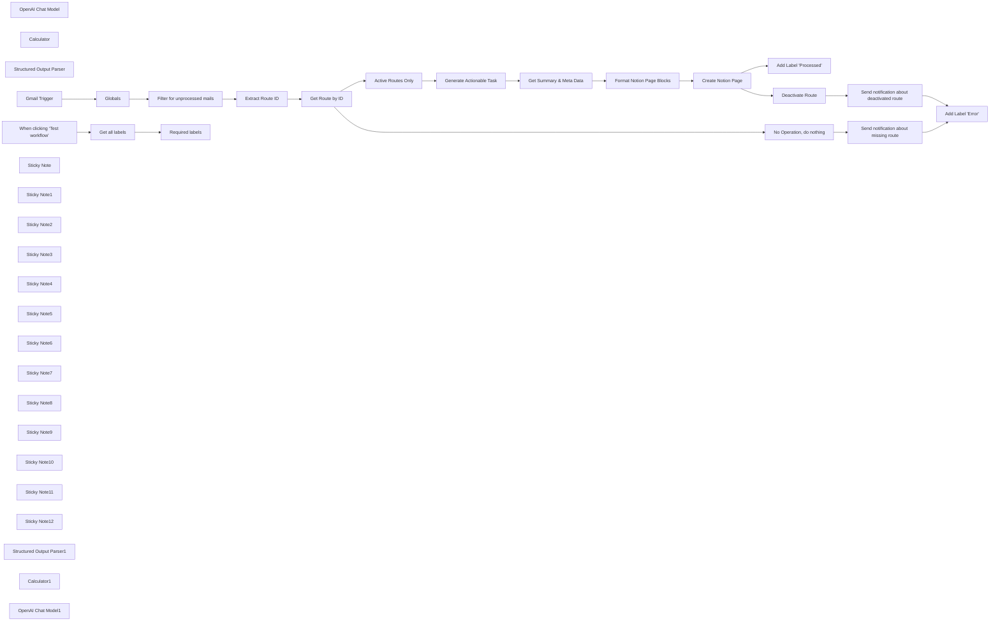

## Fluxo (.json) :

```json
{
  "id": "30r9acI1XVIIwAMi",
  "meta": {
    "instanceId": "378c072a34d9e63949fd9cf26b8d28ff276a486e303f0d8963f23e1d74169c1b",
    "templateCredsSetupCompleted": true
  },
  "name": "mails2notion V2",
  "tags": [],
  "nodes": [
    {
      "id": "3f649e97-e568-47ff-b175-bf63d859d95f",
      "name": "OpenAI Chat Model",
      "type": "@n8n/n8n-nodes-langchain.lmChatOpenAi",
      "position": [
        2560,
        240
      ],
      "parameters": {
        "model": "gpt-4o",
        "options": {
          "temperature": 0,
          "responseFormat": "json_object"
        }
      },
      "credentials": {
        "openAiApi": {
          "id": "mrgqM64cM1L88xC6",
          "name": "octionicsolutions@gmail.com"
        }
      },
      "typeVersion": 1
    },
    {
      "id": "bd60c65f-ba6c-4dcb-8d09-b29f5dd475b7",
      "name": "Calculator",
      "type": "@n8n/n8n-nodes-langchain.toolCalculator",
      "disabled": true,
      "position": [
        2700,
        240
      ],
      "parameters": {},
      "typeVersion": 1
    },
    {
      "id": "d052786a-92a0-4f9b-9867-2dd64ada8034",
      "name": "Structured Output Parser",
      "type": "@n8n/n8n-nodes-langchain.outputParserStructured",
      "position": [
        2820,
        240
      ],
      "parameters": {
        "jsonSchemaExample": "{\n \"summary\": \"Text\",\n \"meta\": {\n \"sender\": \"Text\",\n \"subject\": \"Text\",\n \"date\": \"Text\"\n }\n}"
      },
      "typeVersion": 1.2
    },
    {
      "id": "50d396fd-d3b0-4fea-99d7-18bd4773cb20",
      "name": "Add Label \"Processed\"",
      "type": "n8n-nodes-base.gmail",
      "position": [
        3860,
        20
      ],
      "parameters": {
        "labelIds": "={{ $('Globals').item.json.processedLabelID }}",
        "messageId": "={{ $('Gmail Trigger').item.json.id }}",
        "operation": "addLabels"
      },
      "credentials": {
        "gmailOAuth2": {
          "id": "9LLNsPzyDJlQFgdw",
          "name": "Gmail (mails2notion)"
        }
      },
      "typeVersion": 2.1
    },
    {
      "id": "8a4c49f9-0c14-46ea-a475-a0d83eb9d688",
      "name": "Active Routes Only",
      "type": "n8n-nodes-base.filter",
      "position": [
        2000,
        20
      ],
      "parameters": {
        "options": {},
        "conditions": {
          "options": {
            "leftValue": "",
            "caseSensitive": true,
            "typeValidation": "strict"
          },
          "combinator": "and",
          "conditions": [
            {
              "id": "02b11920-e737-46cc-b1b9-22ffaf7f3f64",
              "operator": {
                "type": "boolean",
                "operation": "true",
                "singleValue": true
              },
              "leftValue": "={{ $json.Active }}",
              "rightValue": ""
            }
          ]
        }
      },
      "typeVersion": 2
    },
    {
      "id": "fd0f902f-4d16-4bad-8ed0-7fe02e8e879b",
      "name": "Extract Route ID",
      "type": "n8n-nodes-base.set",
      "position": [
        1560,
        220
      ],
      "parameters": {
        "options": {},
        "assignments": {
          "assignments": [
            {
              "id": "acfaf63a-74de-4018-ae30-671f209878ba",
              "name": "route",
              "type": "string",
              "value": "={{ $('Gmail Trigger').item.json.to.text.match(/\\+([^@]+)@/)[1] }}"
            }
          ]
        }
      },
      "typeVersion": 3.4
    },
    {
      "id": "81d1dec6-aacc-480d-8cb4-1832ff27de92",
      "name": "Deactivate Route",
      "type": "n8n-nodes-base.airtable",
      "position": [
        3420,
        220
      ],
      "parameters": {
        "base": {
          "__rl": true,
          "mode": "list",
          "value": "appuqZhHVVGAcMwoA",
          "cachedResultUrl": "https://airtable.com/appuqZhHVVGAcMwoA",
          "cachedResultName": "mails2notion"
        },
        "table": {
          "__rl": true,
          "mode": "list",
          "value": "tblWL6FqfLkLHmLEo",
          "cachedResultUrl": "https://airtable.com/appuqZhHVVGAcMwoA/tblWL6FqfLkLHmLEo",
          "cachedResultName": "Routes"
        },
        "columns": {
          "value": {
            "id": "={{ $('Get Route by ID').item.json.id }}",
            "Active": false
          },
          "schema": [
            {
              "id": "id",
              "type": "string",
              "display": true,
              "removed": false,
              "readOnly": true,
              "required": false,
              "displayName": "id",
              "defaultMatch": true
            },
            {
              "id": "Name",
              "type": "string",
              "display": true,
              "removed": true,
              "readOnly": false,
              "required": false,
              "displayName": "Name",
              "defaultMatch": false,
              "canBeUsedToMatch": true
            },
            {
              "id": "Token",
              "type": "string",
              "display": true,
              "removed": true,
              "readOnly": false,
              "required": false,
              "displayName": "Token",
              "defaultMatch": false,
              "canBeUsedToMatch": true
            },
            {
              "id": "NotionDatabase",
              "type": "string",
              "display": true,
              "removed": true,
              "readOnly": false,
              "required": false,
              "displayName": "NotionDatabase",
              "defaultMatch": false,
              "canBeUsedToMatch": true
            },
            {
              "id": "Email Alias",
              "type": "string",
              "display": true,
              "removed": true,
              "readOnly": true,
              "required": false,
              "displayName": "Email Alias",
              "defaultMatch": false,
              "canBeUsedToMatch": true
            },
            {
              "id": "User",
              "type": "array",
              "display": true,
              "removed": true,
              "readOnly": false,
              "required": false,
              "displayName": "User",
              "defaultMatch": false,
              "canBeUsedToMatch": true
            },
            {
              "id": "Active",
              "type": "boolean",
              "display": true,
              "removed": false,
              "readOnly": false,
              "required": false,
              "displayName": "Active",
              "defaultMatch": false,
              "canBeUsedToMatch": true
            },
            {
              "id": "Status",
              "type": "string",
              "display": true,
              "removed": true,
              "readOnly": true,
              "required": false,
              "displayName": "Status",
              "defaultMatch": false,
              "canBeUsedToMatch": true
            }
          ],
          "mappingMode": "defineBelow",
          "matchingColumns": [
            "id"
          ]
        },
        "options": {},
        "operation": "update"
      },
      "credentials": {
        "airtableTokenApi": {
          "id": "kHzLZhbAFQ1CQnQz",
          "name": "Airtable (octionicsolutions)"
        }
      },
      "typeVersion": 2.1
    },
    {
      "id": "20242505-c57e-424c-a215-2b2effac1d94",
      "name": "Add Label \"Error\"",
      "type": "n8n-nodes-base.gmail",
      "position": [
        3860,
        220
      ],
      "parameters": {
        "labelIds": "={{ $('Globals').item.json.errorLabelID }}",
        "messageId": "={{ $('Gmail Trigger').item.json.id }}",
        "operation": "addLabels"
      },
      "credentials": {
        "gmailOAuth2": {
          "id": "9LLNsPzyDJlQFgdw",
          "name": "Gmail (mails2notion)"
        }
      },
      "typeVersion": 2.1
    },
    {
      "id": "7a788a4f-f0a8-4fe8-b21d-b114a65313b1",
      "name": "Send notification about deactivated route",
      "type": "n8n-nodes-base.gmail",
      "position": [
        3640,
        220
      ],
      "parameters": {
        "sendTo": "={{ $('Gmail Trigger').item.json.from.value[0].address }}",
        "message": "=An error happened while trying to create a Notion Page. It can have various reasons, including a temporary outage of the Notion API, missing permissions to the Notion Database or a wrong Notion Database URL.\n\nThe route has been deaktivated to prevent future errors.\n\nPlease double check your configuration and enable the route again.",
        "options": {
          "appendAttribution": false
        },
        "subject": "A route has been deactivated",
        "emailType": "text"
      },
      "credentials": {
        "gmailOAuth2": {
          "id": "9LLNsPzyDJlQFgdw",
          "name": "Gmail (mails2notion)"
        }
      },
      "typeVersion": 2.1
    },
    {
      "id": "5e7cc69c-8f58-4ac8-9263-1ad206609295",
      "name": "Send notification about missing route",
      "type": "n8n-nodes-base.gmail",
      "position": [
        3640,
        420
      ],
      "parameters": {
        "sendTo": "={{ $('Gmail Trigger').item.json.from.value[0].address }}",
        "message": "=There seems to be no active route anymore which connects this Alias to a Notion Database.\n\nPlease try again later or double check your configuration.",
        "options": {
          "appendAttribution": false
        },
        "subject": "Your Message could not be processed",
        "emailType": "text"
      },
      "credentials": {
        "gmailOAuth2": {
          "id": "9LLNsPzyDJlQFgdw",
          "name": "Gmail (mails2notion)"
        }
      },
      "typeVersion": 2.1
    },
    {
      "id": "7dd9646c-3172-4b53-82c8-4df7fd5f53ea",
      "name": "Get Route by ID",
      "type": "n8n-nodes-base.airtable",
      "onError": "continueErrorOutput",
      "position": [
        1780,
        220
      ],
      "parameters": {
        "id": "={{ $json.route }}",
        "base": {
          "__rl": true,
          "mode": "list",
          "value": "appuqZhHVVGAcMwoA",
          "cachedResultUrl": "https://airtable.com/appuqZhHVVGAcMwoA",
          "cachedResultName": "mails2notion"
        },
        "table": {
          "__rl": true,
          "mode": "list",
          "value": "tblWL6FqfLkLHmLEo",
          "cachedResultUrl": "https://airtable.com/appuqZhHVVGAcMwoA/tblWL6FqfLkLHmLEo",
          "cachedResultName": "Routes"
        },
        "options": {},
        "operation": "get"
      },
      "credentials": {
        "airtableTokenApi": {
          "id": "kHzLZhbAFQ1CQnQz",
          "name": "Airtable (octionicsolutions)"
        }
      },
      "retryOnFail": true,
      "typeVersion": 2.1,
      "waitBetweenTries": 5000
    },
    {
      "id": "8ddfe273-3fda-4b71-a972-5001d4fa71c1",
      "name": "Create Notion Page",
      "type": "n8n-nodes-base.httpRequest",
      "onError": "continueErrorOutput",
      "position": [
        3200,
        20
      ],
      "parameters": {
        "url": "https://api.notion.com/v1/pages",
        "method": "POST",
        "options": {},
        "jsonBody": "={{ $json.toJsonString() }}",
        "sendBody": true,
        "sendHeaders": true,
        "specifyBody": "json",
        "headerParameters": {
          "parameters": [
            {
              "name": "Authorization",
              "value": "=Bearer {{ $('Get Route by ID').item.json.Token }}"
            },
            {
              "name": "Notion-Version",
              "value": "2022-06-28"
            }
          ]
        }
      },
      "retryOnFail": true,
      "typeVersion": 4.2,
      "waitBetweenTries": 5000
    },
    {
      "id": "f773e41f-13b7-483a-9886-90a4425a7f6a",
      "name": "Gmail Trigger",
      "type": "n8n-nodes-base.gmailTrigger",
      "position": [
        900,
        220
      ],
      "parameters": {
        "simple": false,
        "filters": {
          "labelIds": "=INBOX"
        },
        "options": {},
        "pollTimes": {
          "item": [
            {
              "mode": "everyMinute"
            }
          ]
        }
      },
      "credentials": {
        "gmailOAuth2": {
          "id": "9LLNsPzyDJlQFgdw",
          "name": "Gmail (mails2notion)"
        }
      },
      "typeVersion": 1.1
    },
    {
      "id": "918ce27c-2886-4793-81f5-e459f3299bb1",
      "name": "Filter for unprocessed mails",
      "type": "n8n-nodes-base.filter",
      "position": [
        1340,
        220
      ],
      "parameters": {
        "options": {},
        "conditions": {
          "options": {
            "leftValue": "",
            "caseSensitive": true,
            "typeValidation": "strict"
          },
          "combinator": "and",
          "conditions": [
            {
              "id": "28879541-2e66-4a31-b25f-f0419ae45f47",
              "operator": {
                "type": "array",
                "operation": "notContains",
                "rightType": "any"
              },
              "leftValue": "={{ $('Gmail Trigger').item.json.labelIds }}",
              "rightValue": "={{ $json.errorLabelID }}"
            },
            {
              "id": "259a783f-5954-467b-ad52-c1e0072c2239",
              "operator": {
                "type": "array",
                "operation": "notContains",
                "rightType": "any"
              },
              "leftValue": "={{ $('Gmail Trigger').item.json.labelIds }}",
              "rightValue": "={{ $json.processedLabelID }}"
            },
            {
              "id": "81ef1ac2-449e-44c2-a94b-2fc9b08ec934",
              "operator": {
                "type": "string",
                "operation": "exists",
                "singleValue": true
              },
              "leftValue": "={{ $('Gmail Trigger').item.json.to.text.match(/\\+([^@]+)@/)[1] }}",
              "rightValue": ""
            }
          ]
        }
      },
      "typeVersion": 2
    },
    {
      "id": "14764527-ca40-4937-baa2-368b716c6f58",
      "name": "When clicking ‘Test workflow’",
      "type": "n8n-nodes-base.manualTrigger",
      "disabled": true,
      "position": [
        920,
        600
      ],
      "parameters": {},
      "typeVersion": 1
    },
    {
      "id": "5f955606-4063-4683-b242-2fc0a4fbf34a",
      "name": "Required labels",
      "type": "n8n-nodes-base.filter",
      "position": [
        1360,
        600
      ],
      "parameters": {
        "options": {},
        "conditions": {
          "options": {
            "leftValue": "",
            "caseSensitive": true,
            "typeValidation": "strict"
          },
          "combinator": "or",
          "conditions": [
            {
              "id": "9bb51a86-76d3-42f7-8362-1931244f8cd9",
              "operator": {
                "type": "string",
                "operation": "contains"
              },
              "leftValue": "={{ $json.name }}",
              "rightValue": "Error"
            },
            {
              "id": "28b3afb4-d727-4306-9e45-321c9bd688e3",
              "operator": {
                "type": "string",
                "operation": "contains"
              },
              "leftValue": "={{ $json.name }}",
              "rightValue": "Processed"
            }
          ]
        }
      },
      "typeVersion": 2
    },
    {
      "id": "697198d3-2fc2-4665-86a8-4bc16dbc3d43",
      "name": "Globals",
      "type": "n8n-nodes-base.set",
      "position": [
        1120,
        220
      ],
      "parameters": {
        "options": {},
        "assignments": {
          "assignments": [
            {
              "id": "0dcfba61-ddb5-425d-a803-f88cf36d81d9",
              "name": "errorLabelID",
              "type": "string",
              "value": "Label_4248329647975725750"
            },
            {
              "id": "b1505eaa-1d7e-49d7-be2e-cd71f5ec2632",
              "name": "processedLabelID",
              "type": "string",
              "value": "Label_6498950601707174088"
            }
          ]
        }
      },
      "typeVersion": 3.4
    },
    {
      "id": "b7efe665-97d8-4a82-a3f5-e15bffd68752",
      "name": "Sticky Note",
      "type": "n8n-nodes-base.stickyNote",
      "position": [
        840,
        420
      ],
      "parameters": {
        "color": 5,
        "width": 742.4418604651174,
        "height": 361.9189248985609,
        "content": "## Setup\n- Disable the Gmail Trigger and enable the manual trigger here\n- Execute the workflow once\n- Copy the Gmail Label IDs from the output of the \"Required labels\" node to the \"Globals\" node\n- Disable the manual trigger here and and enable the Gmail Trigger again\n- Activate the workflow, so it runs automatically in the background\n"
      },
      "typeVersion": 1
    },
    {
      "id": "3d035d35-3760-4393-8796-cb713338c9d7",
      "name": "Sticky Note1",
      "type": "n8n-nodes-base.stickyNote",
      "position": [
        1060,
        60
      ],
      "parameters": {
        "width": 215.20930232558143,
        "height": 323.99999999999943,
        "content": "## Set Globals\nUse the setup instructions below to retrieve the values for both `errorLabelID` and `processedLabelID`"
      },
      "typeVersion": 1
    },
    {
      "id": "b420310e-c0d5-4168-94ad-4c5973dfb3ab",
      "name": "Sticky Note2",
      "type": "n8n-nodes-base.stickyNote",
      "position": [
        1720,
        60
      ],
      "parameters": {
        "width": 215.49263552738452,
        "height": 324.4244486294891,
        "content": "## Select Base\nSelect the database and the table where the \"Routes\" are defined"
      },
      "typeVersion": 1
    },
    {
      "id": "c917a3cb-d745-4f37-bd8f-0350c5aef473",
      "name": "Sticky Note3",
      "type": "n8n-nodes-base.stickyNote",
      "position": [
        840,
        140
      ],
      "parameters": {
        "color": 7,
        "width": 216.47293010628914,
        "height": 245.005504426549,
        "content": "The Gmail inbox is checked every minute for new entries"
      },
      "typeVersion": 1
    },
    {
      "id": "9298ad5b-ae09-44c6-8da4-2d2bd473c3ea",
      "name": "Sticky Note4",
      "type": "n8n-nodes-base.stickyNote",
      "position": [
        1500,
        140
      ],
      "parameters": {
        "color": 7,
        "width": 216.47293010628914,
        "height": 245.005504426549,
        "content": "Extract the Airtable Row ID from the Email address"
      },
      "typeVersion": 1
    },
    {
      "id": "654bbfbe-3e0f-40e0-a686-5081069d825e",
      "name": "Sticky Note5",
      "type": "n8n-nodes-base.stickyNote",
      "position": [
        1280,
        140
      ],
      "parameters": {
        "color": 7,
        "width": 216.47293010628914,
        "height": 245.005504426549,
        "content": "Filter by labels to prohibit double-processing"
      },
      "typeVersion": 1
    },
    {
      "id": "31ade897-22de-4b39-8f96-37bc7b274bfb",
      "name": "Sticky Note6",
      "type": "n8n-nodes-base.stickyNote",
      "position": [
        2920,
        -120
      ],
      "parameters": {
        "color": 7,
        "width": 216.47293010628914,
        "height": 305.2192252594149,
        "content": "Dynamically build request body for Notion, since dynamic auth, and content with optional fields require a custom request"
      },
      "typeVersion": 1
    },
    {
      "id": "26cf52ea-01d1-48ed-9d3d-71e4ff01983f",
      "name": "Sticky Note7",
      "type": "n8n-nodes-base.stickyNote",
      "position": [
        3140,
        -120
      ],
      "parameters": {
        "color": 7,
        "width": 216.47293010628914,
        "height": 304.5973623748489,
        "content": "The custom built request including the user specific authentication is sent to Notion to create a new Page inside of a database"
      },
      "typeVersion": 1
    },
    {
      "id": "d765c84d-9e15-44c8-b975-2c366c315bfe",
      "name": "Sticky Note8",
      "type": "n8n-nodes-base.stickyNote",
      "position": [
        2160,
        -160
      ],
      "parameters": {
        "color": 7,
        "width": 755.8332895195936,
        "height": 529.1698390841688,
        "content": "The Email is processed in multiple ways:\n- An actionable task is being generated based on the content, consisting of a short title, a short description and optionally a few details as bullet points\n- A detailed Email summary is being generated\n- Meta data is being extracted - so the user has a reference to find the original Email again\n- To get more stable results, the tasks are devided between two Agents"
      },
      "typeVersion": 1
    },
    {
      "id": "0103f8bc-2a43-455a-88da-b7317821f0b3",
      "name": "Sticky Note9",
      "type": "n8n-nodes-base.stickyNote",
      "position": [
        1940,
        -80
      ],
      "parameters": {
        "color": 7,
        "width": 216.47293010628914,
        "height": 249.09934448053562,
        "content": "Skip disabled routes (determined by a checkbox attribute in Airtable)"
      },
      "typeVersion": 1
    },
    {
      "id": "1d2fe867-f3d1-4702-b35e-f730f20b7251",
      "name": "No Operation, do nothing",
      "type": "n8n-nodes-base.noOp",
      "position": [
        2000,
        420
      ],
      "parameters": {},
      "typeVersion": 1
    },
    {
      "id": "758d1797-0e6c-40de-a6a4-e16f8350674c",
      "name": "Sticky Note10",
      "type": "n8n-nodes-base.stickyNote",
      "position": [
        3580,
        100
      ],
      "parameters": {
        "color": 7,
        "width": 216.47293010628914,
        "height": 503.00412949500975,
        "content": "Send custom Email notifications back to sender, containing an error message and suggestions to fix it"
      },
      "typeVersion": 1
    },
    {
      "id": "56522a6d-c961-48a5-a5ef-33df96d77a22",
      "name": "Sticky Note11",
      "type": "n8n-nodes-base.stickyNote",
      "position": [
        3800,
        -60
      ],
      "parameters": {
        "color": 7,
        "width": 216.47293010628914,
        "height": 446.3164817463921,
        "content": "Add labels which prevent from double-processing"
      },
      "typeVersion": 1
    },
    {
      "id": "5b81389b-49a6-4849-becf-35c4e680b734",
      "name": "Sticky Note12",
      "type": "n8n-nodes-base.stickyNote",
      "position": [
        3360,
        120
      ],
      "parameters": {
        "color": 7,
        "width": 216.47293010628914,
        "height": 261.3816681594028,
        "content": "Disable a checkbox attribute in Airtable which determines if a route is active"
      },
      "typeVersion": 1
    },
    {
      "id": "6558328c-30cf-4f37-a0cb-d5f9f6efa7b2",
      "name": "Format Notion Page Blocks",
      "type": "n8n-nodes-base.code",
      "position": [
        2980,
        20
      ],
      "parameters": {
        "mode": "runOnceForEachItem",
        "jsCode": "function paragraph(content, annotations={}) {\n return {\n \"object\": \"block\",\n \"type\": \"paragraph\",\n \"paragraph\": {\n \"rich_text\": [\n {\n \"type\": \"text\",\n \"text\": {\n \"content\": content\n },\n \"annotations\": annotations\n }\n ]\n }\n };\n}\nfunction bulletPoint(content) {\n return {\n \"object\": \"block\",\n \"type\": \"bulleted_list_item\",\n \"bulleted_list_item\": {\n \"rich_text\": [\n {\n \"type\": \"text\",\n \"text\": {\n \"content\": content\n }\n }\n ]\n }\n };\n}\n\n// combine AI generated content\nconst content = Object.assign({}, $('Generate Actionable Task').item.json.output, $('Get Summary & Meta Data').item.json.output);\n\nblocks = [];\n\n// append task description\nblocks.push(paragraph(content.description));\n\nif (content.bulletpoints) {\n for (let bulletpoint of content.bulletpoints) {\n blocks.push(bulletPoint(bulletpoint));\n }\n}\n\n// append empty line\nblocks.push(paragraph(\"\"));\n\n// append devider\nblocks.push({\n \"object\": \"block\",\n \"type\": \"divider\",\n \"divider\": {}\n});\n\n// append summary & meta data\nblocks.push(paragraph(\"Email summary:\"));\nblocks.push(paragraph(content.summary));\nblocks.push(paragraph(\"\"));\nblocks.push(paragraph(content.meta.sender + \"\\n\" + content.meta.subject + \"\\n\" + content.meta.date, {\"italic\": true}));\n\n// build final object\noutput = {\n \"parent\": {\n \"database_id\": $('Get Route by ID').item.json.NotionDatabase.match(/https://www\\.notion\\.so/[a-zA-Z0-9-]+/([a-zA-Z0-9]{32})/)[1]\n },\n \"properties\": {\n \"Name\": {\n \"title\": [\n {\n \"text\": {\n \"content\": content.title\n }\n }\n ]\n }\n },\n \"children\": blocks\n};\n\nreturn { json: output };"
      },
      "typeVersion": 2
    },
    {
      "id": "133e3498-10ce-4a08-aa50-3c7d56f1b9c8",
      "name": "Get all labels",
      "type": "n8n-nodes-base.gmail",
      "position": [
        1140,
        600
      ],
      "parameters": {
        "resource": "label",
        "returnAll": true
      },
      "credentials": {
        "gmailOAuth2": {
          "id": "9LLNsPzyDJlQFgdw",
          "name": "Gmail (mails2notion)"
        }
      },
      "typeVersion": 2.1
    },
    {
      "id": "f68e66e1-9f84-498a-bfc4-f7c5b2ca42b1",
      "name": "Structured Output Parser1",
      "type": "@n8n/n8n-nodes-langchain.outputParserStructured",
      "position": [
        2440,
        240
      ],
      "parameters": {
        "jsonSchemaExample": "{\n \"title\": \"Title\",\n \"description\": \"Text\",\n \"bulletpoints\": [\n \"Text\",\n \"Text\"\n ]\n}"
      },
      "typeVersion": 1.2
    },
    {
      "id": "c55a3e9b-5637-4775-a0a6-ea11f1bd26a7",
      "name": "Calculator1",
      "type": "@n8n/n8n-nodes-langchain.toolCalculator",
      "disabled": true,
      "position": [
        2320,
        240
      ],
      "parameters": {},
      "typeVersion": 1
    },
    {
      "id": "4d4f7b04-5431-47d2-b9b1-ee2c516e729c",
      "name": "OpenAI Chat Model1",
      "type": "@n8n/n8n-nodes-langchain.lmChatOpenAi",
      "position": [
        2180,
        240
      ],
      "parameters": {
        "model": "gpt-4o",
        "options": {
          "temperature": 0,
          "responseFormat": "json_object"
        }
      },
      "credentials": {
        "openAiApi": {
          "id": "mrgqM64cM1L88xC6",
          "name": "octionicsolutions@gmail.com"
        }
      },
      "typeVersion": 1
    },
    {
      "id": "ea081c31-2721-4e6c-820a-2f0da33495ac",
      "name": "Generate Actionable Task",
      "type": "@n8n/n8n-nodes-langchain.agent",
      "position": [
        2220,
        20
      ],
      "parameters": {
        "text": "={{ $('Gmail Trigger').item.json.text }}",
        "options": {
          "systemMessage": "Your task is to understand the Email content and extract one actionable task. If there is no obvious actionable task, then just create a title which implies to take a look at this Email by addressing the content summarized to 5 words. The title should be quite decided. This attribute is called title.\n\nCreate a proper description for the task. Be precise but detailed. Start with a short sentence and if it is worth adding more information, add bulletpoints after that containing additional information which help to understand the context of the task better, like links and other references, or just more detailed instructions. Add the description to the output as attribute output. Add the bulletpoints to the output as attribute output, but remember, bullet points are optional.\n\nReturn all attributes in a JSON format."
        },
        "promptType": "define",
        "hasOutputParser": true
      },
      "typeVersion": 1.6
    },
    {
      "id": "6fb2d964-dc0b-45d9-8307-6da16fba769e",
      "name": "Get Summary & Meta Data",
      "type": "@n8n/n8n-nodes-langchain.agent",
      "position": [
        2600,
        20
      ],
      "parameters": {
        "text": "={{ $('Gmail Trigger').item.json.text }}",
        "options": {
          "systemMessage": "Summarize the email (as much detail as possible) and add it to the output as the attribute summary.\n\nExtract the email sender, subject and date of receipt. If this is a forwarded email, then get this data from the original message, otherwise use the meta data of this Email. Format the Email Adress as follows, and add it to the JSON output as the attribute meta.sender: \"From: Full Name <mail@example.com\". Format the the subject as follows and add it to the output as attribute meta.subject: \"Subject: SubjectGoesHere\". Format the the date as follows and add it to the output as attribute meta.date: \"Date: DateStringGoesHere\" (Date format: RFC 2822).\n\nReturn all attributes in a JSON format."
        },
        "promptType": "define",
        "hasOutputParser": true
      },
      "typeVersion": 1.6
    }
  ],
  "active": false,
  "pinData": {},
  "settings": {
    "executionOrder": "v1"
  },
  "versionId": "ee560597-bc46-4255-89b9-af8fe332b226",
  "connections": {
    "Globals": {
      "main": [
        [
          {
            "node": "Filter for unprocessed mails",
            "type": "main",
            "index": 0
          }
        ]
      ]
    },
    "Calculator": {
      "ai_tool": [
        [
          {
            "node": "Get Summary & Meta Data",
            "type": "ai_tool",
            "index": 0
          }
        ]
      ]
    },
    "Calculator1": {
      "ai_tool": [
        [
          {
            "node": "Generate Actionable Task",
            "type": "ai_tool",
            "index": 0
          }
        ]
      ]
    },
    "Gmail Trigger": {
      "main": [
        [
          {
            "node": "Globals",
            "type": "main",
            "index": 0
          }
        ]
      ]
    },
    "Get all labels": {
      "main": [
        [
          {
            "node": "Required labels",
            "type": "main",
            "index": 0
          }
        ]
      ]
    },
    "Get Route by ID": {
      "main": [
        [
          {
            "node": "Active Routes Only",
            "type": "main",
            "index": 0
          }
        ],
        [
          {
            "node": "No Operation, do nothing",
            "type": "main",
            "index": 0
          }
        ]
      ]
    },
    "Deactivate Route": {
      "main": [
        [
          {
            "node": "Send notification about deactivated route",
            "type": "main",
            "index": 0
          }
        ]
      ]
    },
    "Extract Route ID": {
      "main": [
        [
          {
            "node": "Get Route by ID",
            "type": "main",
            "index": 0
          }
        ]
      ]
    },
    "OpenAI Chat Model": {
      "ai_languageModel": [
        [
          {
            "node": "Get Summary & Meta Data",
            "type": "ai_languageModel",
            "index": 0
          }
        ]
      ]
    },
    "Active Routes Only": {
      "main": [
        [
          {
            "node": "Generate Actionable Task",
            "type": "main",
            "index": 0
          }
        ]
      ]
    },
    "Create Notion Page": {
      "main": [
        [
          {
            "node": "Add Label \"Processed\"",
            "type": "main",
            "index": 0
          }
        ],
        [
          {
            "node": "Deactivate Route",
            "type": "main",
            "index": 0
          }
        ]
      ]
    },
    "OpenAI Chat Model1": {
      "ai_languageModel": [
        [
          {
            "node": "Generate Actionable Task",
            "type": "ai_languageModel",
            "index": 0
          }
        ]
      ]
    },
    "Get Summary & Meta Data": {
      "main": [
        [
          {
            "node": "Format Notion Page Blocks",
            "type": "main",
            "index": 0
          }
        ]
      ]
    },
    "Generate Actionable Task": {
      "main": [
        [
          {
            "node": "Get Summary & Meta Data",
            "type": "main",
            "index": 0
          }
        ]
      ]
    },
    "No Operation, do nothing": {
      "main": [
        [
          {
            "node": "Send notification about missing route",
            "type": "main",
            "index": 0
          }
        ]
      ]
    },
    "Structured Output Parser": {
      "ai_outputParser": [
        [
          {
            "node": "Get Summary & Meta Data",
            "type": "ai_outputParser",
            "index": 0
          }
        ]
      ]
    },
    "Format Notion Page Blocks": {
      "main": [
        [
          {
            "node": "Create Notion Page",
            "type": "main",
            "index": 0
          }
        ]
      ]
    },
    "Structured Output Parser1": {
      "ai_outputParser": [
        [
          {
            "node": "Generate Actionable Task",
            "type": "ai_outputParser",
            "index": 0
          }
        ]
      ]
    },
    "Filter for unprocessed mails": {
      "main": [
        [
          {
            "node": "Extract Route ID",
            "type": "main",
            "index": 0
          }
        ]
      ]
    },
    "When clicking ‘Test workflow’": {
      "main": [
        [
          {
            "node": "Get all labels",
            "type": "main",
            "index": 0
          }
        ]
      ]
    },
    "Send notification about missing route": {
      "main": [
        [
          {
            "node": "Add Label \"Error\"",
            "type": "main",
            "index": 0
          }
        ]
      ]
    },
    "Send notification about deactivated route": {
      "main": [
        [
          {
            "node": "Add Label \"Error\"",
            "type": "main",
            "index": 0
          }
        ]
      ]
    }
  }
}
```

<a id="template-217"></a>

## Template 217 - Outreach diário para contatos não contactados

- **Nome:** Outreach diário para contatos não contactados
- **Descrição:** Fluxo que envia emails de outreach a contatos do HubSpot que ainda não foram contactados e registra o engajamento no CRM.
- **Funcionalidade:** • Agendamento diário às 9h: inicia o processo automaticamente todos os dias às 09:00.
• Busca de contatos não contactados no HubSpot: filtra contatos cujo campo de última data de contato (notes_last_contacted) está ausente.
• Montagem de mensagem personalizada: cria assunto e corpo do email usando propriedades do contato (ex.: firstname, email).
• Envio de email de outreach via Gmail: envia a mensagem para o email do contato com remetente configurado.
• Registro de engajamento no HubSpot: cria um registro de email associado ao contato para atualizar a data do último contato e evitar reenvios futuros.
- **Ferramentas:** • HubSpot: CRM usado para pesquisar contatos e registrar o engajamento (atualiza a data de último contato).
• Gmail: serviço de email utilizado para enviar as mensagens de outreach.


## Fluxo visual

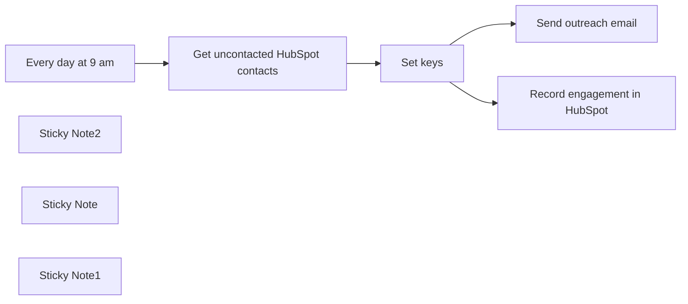

## Fluxo (.json) :

```json
{
  "meta": {
    "instanceId": "257476b1ef58bf3cb6a46e65fac7ee34a53a5e1a8492d5c6e4da5f87c9b82833",
    "templateId": "2112"
  },
  "nodes": [
    {
      "id": "99d9377f-263b-4deb-8450-6f9ca17d77c7",
      "name": "Send outreach email",
      "type": "n8n-nodes-base.gmail",
      "position": [
        1420,
        320
      ],
      "parameters": {
        "sendTo": "={{ $json.properties.email }}",
        "message": "={{ $json.html }}",
        "options": {
          "senderName": "Mutasem from n8n",
          "appendAttribution": false
        },
        "subject": "={{ $json.subject }}"
      },
      "typeVersion": 2.1
    },
    {
      "id": "aa2d7d84-66e1-4df3-9244-9a9182cd2eb7",
      "name": "Get uncontacted HubSpot contacts",
      "type": "n8n-nodes-base.hubspot",
      "position": [
        960,
        540
      ],
      "parameters": {
        "operation": "search",
        "authentication": "oAuth2",
        "filterGroupsUi": {
          "filterGroupsValues": [
            {
              "filtersUi": {
                "filterValues": [
                  {
                    "operator": "NOT_HAS_PROPERTY",
                    "propertyName": "notes_last_contacted|datetime"
                  }
                ]
              }
            }
          ]
        },
        "additionalFields": {}
      },
      "typeVersion": 2
    },
    {
      "id": "cecf3de5-43d8-4d63-a557-adbd1d7d0e81",
      "name": "Every day at 9 am",
      "type": "n8n-nodes-base.scheduleTrigger",
      "position": [
        460,
        540
      ],
      "parameters": {
        "rule": {
          "interval": [
            {
              "triggerAtHour": 9
            }
          ]
        }
      },
      "typeVersion": 1.1
    },
    {
      "id": "faa91fac-7a22-440d-8575-a9f6ef858641",
      "name": "Sticky Note2",
      "type": "n8n-nodes-base.stickyNote",
      "position": [
        820,
        240
      ],
      "parameters": {
        "width": 348.2877732355713,
        "height": 526.4585335073351,
        "content": "## Search for all contacts that last contact date for is unknown\n\n1. Setup Oauth2 creds using n8n docs\nhttps://docs.n8n.io/integrations/builtin/trigger-nodes/n8n-nodes-base.hubspottrigger/\n\n### Be careful with scopes. Scopes must be exactly as defined in the n8n docs"
      },
      "typeVersion": 1
    },
    {
      "id": "edf7e39d-efc7-405c-a610-0b098f86de07",
      "name": "Sticky Note",
      "type": "n8n-nodes-base.stickyNote",
      "position": [
        1380,
        560
      ],
      "parameters": {
        "color": 3,
        "width": 289.74216745960825,
        "height": 402.1775107197669,
        "content": "## Record outreach in Hubspot\n\nOnce outreach is added, last contact date is updated and won't be contacted again\n"
      },
      "typeVersion": 1
    },
    {
      "id": "07dc70c8-bf11-4dbd-9f99-1dad8d233e70",
      "name": "Set keys",
      "type": "n8n-nodes-base.set",
      "position": [
        1200,
        540
      ],
      "parameters": {
        "options": {},
        "assignments": {
          "assignments": [
            {
              "id": "f3ecc873-2d60-4f2d-bc40-81f9379c725b",
              "name": "html",
              "type": "string",
              "value": "=Hey {{ $json.properties.firstname }},\n\nI'm with n8n, and we work with organizations like yours to empower you to automate away boring and difficult tasks with ease.\n\nCan you point me towards the right person on your team to chat with about this?\n\nCheers,\n\nMutasem"
            },
            {
              "id": "9f4f5b68-984b-415e-a110-a35ded22dd41",
              "name": "subject",
              "type": "string",
              "value": "Why n8n?"
            },
            {
              "id": "5362aa67-f3fa-4a6e-b6e8-4c50cc7a3192",
              "name": "to",
              "type": "string",
              "value": "={{ $json.properties.email }}"
            },
            {
              "id": "5b11e503-868d-4fca-bb44-59bb44d597a8",
              "name": "id",
              "type": "string",
              "value": "={{ $json.id }}"
            }
          ]
        }
      },
      "typeVersion": 3.3
    },
    {
      "id": "506b5b31-8aec-4f74-b194-474c9b09c3f1",
      "name": "Sticky Note1",
      "type": "n8n-nodes-base.stickyNote",
      "position": [
        380,
        240
      ],
      "parameters": {
        "color": 5,
        "width": 407.25356360335365,
        "height": 242.51175804432177,
        "content": "## Send outreach/cold email using Gmail to new Hubspot contacts\n\nThis workflow uses Gmail to send outreach emails to Hubspot contacts that have yet to contacted (usually unknown contacts), and records the engagement in Hubspot. "
      },
      "typeVersion": 1
    },
    {
      "id": "89afc291-e706-4930-bee7-114d556b4c59",
      "name": "Record engagement in HubSpot",
      "type": "n8n-nodes-base.hubspot",
      "position": [
        1460,
        760
      ],
      "parameters": {
        "type": "email",
        "metadata": {
          "html": "={{ $json.html }}",
          "subject": "={{ $json.subject }}",
          "toEmail": [
            "={{ $json.to }}"
          ],
          "firstName": "Mutasem",
          "fromEmail": "mutasem@n8n.io"
        },
        "resource": "engagement",
        "authentication": "oAuth2",
        "additionalFields": {
          "associations": {
            "contactIds": "={{ $json.id }}"
          }
        }
      },
      "typeVersion": 2
    }
  ],
  "pinData": {},
  "connections": {
    "Set keys": {
      "main": [
        [
          {
            "node": "Send outreach email",
            "type": "main",
            "index": 0
          },
          {
            "node": "Record engagement in HubSpot",
            "type": "main",
            "index": 0
          }
        ]
      ]
    },
    "Every day at 9 am": {
      "main": [
        [
          {
            "node": "Get uncontacted HubSpot contacts",
            "type": "main",
            "index": 0
          }
        ]
      ]
    },
    "Get uncontacted HubSpot contacts": {
      "main": [
        [
          {
            "node": "Set keys",
            "type": "main",
            "index": 0
          }
        ]
      ]
    }
  }
}
```

<a id="template-218"></a>

## Template 218 - Ingestão de páginas Notion para Pinecone via embeddings

- **Nome:** Ingestão de páginas Notion para Pinecone via embeddings
- **Descrição:** Fluxo que detecta novas páginas em um banco do Notion, processa e transforma o conteúdo em embeddings e os armazena em um índice vetorial.
- **Funcionalidade:** • Detecção de novas páginas no Notion: Inicia o fluxo quando uma nova página é adicionada ao banco de dados (verificação a cada minuto).
• Recuperação de conteúdo da página: Obtém todos os blocos da página recém-criada para processamento.
• Filtragem de conteúdo não textual: Remove blocos de tipo imagem ou vídeo, mantendo apenas conteúdo de texto.
• Concatenar blocos de texto: Junta os blocos de texto em um único conteúdo contínuo para análise.
• Criação de metadados: Extrai e associa metadados (pageId, createdTime, pageTitle) a cada documento.
• Divisão em chunks por tokens: Segmenta o texto em pedaços com tamanho de 256 tokens e overlap de 30 tokens para melhor processamento de embeddings.
• Geração de embeddings: Calcula vetores semânticos usando o modelo de embeddings do Google Gemini (text-embedding-004).
• Inserção no índice vetorial: Insere documentos e seus embeddings no índice Pinecone (notion-pages) para busca vetorial posterior.
- **Ferramentas:** • Notion: Plataforma onde as páginas são criadas e servem como fonte de conteúdo.
• Google Gemini (PaLM) Embeddings API: Serviço de geração de embeddings textuais a partir do conteúdo processado.
• Pinecone: Banco de dados vetorial usado para armazenar e indexar os embeddings para buscas semânticas.


## Fluxo visual

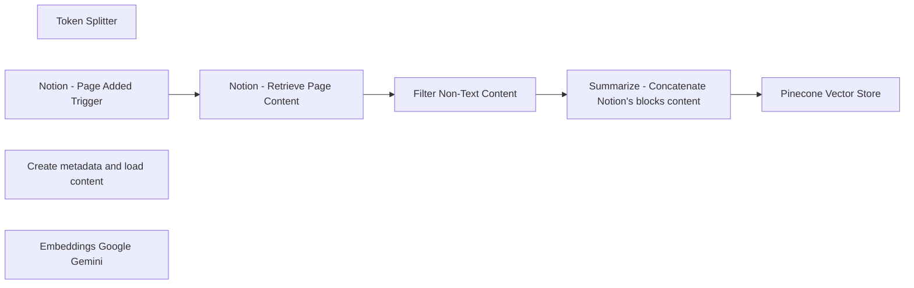

## Fluxo (.json) :

```json
{
  "id": "vOSQYz747gtzj1zF",
  "meta": {
    "instanceId": "d16fb7d4b3eb9b9d4ad2ee6a7fbae593d73e9715e51f583c2a0e9acd1781c08e",
    "templateId": "2290"
  },
  "name": "Prod: Notion to Vector Store - Dimension 768",
  "tags": [
    {
      "id": "Vs70y1mj5s2XzUap",
      "name": "Production",
      "createdAt": "2024-12-24T14:42:00.549Z",
      "updatedAt": "2024-12-24T14:42:00.549Z"
    }
  ],
  "nodes": [
    {
      "id": "6d2579b8-376f-44c3-82e8-9dc608efd98b",
      "name": "Token Splitter",
      "type": "@n8n/n8n-nodes-langchain.textSplitterTokenSplitter",
      "position": [
        2200,
        800
      ],
      "parameters": {
        "chunkSize": 256,
        "chunkOverlap": 30
      },
      "typeVersion": 1
    },
    {
      "id": "79b3c147-08ca-4db4-9116-958a868cbfd9",
      "name": "Notion - Page Added Trigger",
      "type": "n8n-nodes-base.notionTrigger",
      "position": [
        1080,
        360
      ],
      "parameters": {
        "simple": false,
        "pollTimes": {
          "item": [
            {
              "mode": "everyMinute"
            }
          ]
        },
        "databaseId": {
          "__rl": true,
          "mode": "list",
          "value": "17b11930-c10f-8000-a545-ece7cade03f9",
          "cachedResultUrl": "https://www.notion.so/17b11930c10f8000a545ece7cade03f9",
          "cachedResultName": "Embeddings"
        }
      },
      "credentials": {
        "notionApi": {
          "id": "oktwaKqpFztx5hYX",
          "name": "Auto: Notion"
        }
      },
      "typeVersion": 1
    },
    {
      "id": "e4a6f524-e3f5-4d02-949a-8523f2d21965",
      "name": "Notion - Retrieve Page Content",
      "type": "n8n-nodes-base.notion",
      "position": [
        1300,
        360
      ],
      "parameters": {
        "blockId": {
          "__rl": true,
          "mode": "url",
          "value": "={{ $json.url }}"
        },
        "resource": "block",
        "operation": "getAll",
        "returnAll": true
      },
      "credentials": {
        "notionApi": {
          "id": "oktwaKqpFztx5hYX",
          "name": "Auto: Notion"
        }
      },
      "typeVersion": 2.2
    },
    {
      "id": "bfebc173-8d4b-4f8f-a625-4622949dd545",
      "name": "Filter Non-Text Content",
      "type": "n8n-nodes-base.filter",
      "position": [
        1520,
        360
      ],
      "parameters": {
        "options": {},
        "conditions": {
          "options": {
            "version": 1,
            "leftValue": "",
            "caseSensitive": true,
            "typeValidation": "strict"
          },
          "combinator": "and",
          "conditions": [
            {
              "id": "e5b605e5-6d05-4bca-8f19-a859e474620f",
              "operator": {
                "type": "string",
                "operation": "notEquals"
              },
              "leftValue": "={{ $json.type }}",
              "rightValue": "image"
            },
            {
              "id": "c7415859-5ffd-4c78-b497-91a3d6303b6f",
              "operator": {
                "type": "string",
                "operation": "notEquals"
              },
              "leftValue": "={{ $json.type }}",
              "rightValue": "video"
            }
          ]
        }
      },
      "typeVersion": 2
    },
    {
      "id": "b04939f9-355a-430b-a069-b11800066313",
      "name": "Summarize - Concatenate Notion's blocks content",
      "type": "n8n-nodes-base.summarize",
      "position": [
        1780,
        360
      ],
      "parameters": {
        "options": {
          "outputFormat": "separateItems"
        },
        "fieldsToSummarize": {
          "values": [
            {
              "field": "content",
              "separateBy": "\n",
              "aggregation": "concatenate"
            }
          ]
        }
      },
      "typeVersion": 1
    },
    {
      "id": "0e64dbb5-20c1-4b90-b818-a1726aaf5112",
      "name": "Create metadata and load content",
      "type": "@n8n/n8n-nodes-langchain.documentDefaultDataLoader",
      "position": [
        2180,
        600
      ],
      "parameters": {
        "options": {
          "metadata": {
            "metadataValues": [
              {
                "name": "pageId",
                "value": "={{ $('Notion - Page Added Trigger').item.json.id }}"
              },
              {
                "name": "createdTime",
                "value": "={{ $('Notion - Page Added Trigger').item.json.created_time }}"
              },
              {
                "name": "pageTitle",
                "value": "={{ $('Notion - Page Added Trigger').item.json.properties.Name.title[0].text.content }}"
              }
            ]
          }
        },
        "jsonData": "={{ $json.concatenated_content }}",
        "jsonMode": "expressionData"
      },
      "typeVersion": 1
    },
    {
      "id": "1f93c3e6-2d53-46b4-9ce9-1350e660ba82",
      "name": "Embeddings Google Gemini",
      "type": "@n8n/n8n-nodes-langchain.embeddingsGoogleGemini",
      "position": [
        1940,
        580
      ],
      "parameters": {
        "modelName": "models/text-embedding-004"
      },
      "credentials": {
        "googlePalmApi": {
          "id": "9idxGZRZ3BAKDoxq",
          "name": "Google Gemini(PaLM) Api account"
        }
      },
      "typeVersion": 1
    },
    {
      "id": "b804b3fc-161c-40c1-ad9c-3022a09c4a0a",
      "name": "Pinecone Vector Store",
      "type": "@n8n/n8n-nodes-langchain.vectorStorePinecone",
      "position": [
        2060,
        360
      ],
      "parameters": {
        "mode": "insert",
        "options": {},
        "pineconeIndex": {
          "__rl": true,
          "mode": "list",
          "value": "notion-pages",
          "cachedResultName": "notion-pages"
        }
      },
      "credentials": {
        "pineconeApi": {
          "id": "R3QGXSEIRTEAZttK",
          "name": "Auto: PineconeApi"
        }
      },
      "typeVersion": 1
    }
  ],
  "active": true,
  "pinData": {},
  "settings": {
    "executionOrder": "v1"
  },
  "versionId": "245f016a-7538-4f45-94f0-d8b7e5c9c891",
  "connections": {
    "Token Splitter": {
      "ai_textSplitter": [
        [
          {
            "node": "Create metadata and load content",
            "type": "ai_textSplitter",
            "index": 0
          }
        ]
      ]
    },
    "Filter Non-Text Content": {
      "main": [
        [
          {
            "node": "Summarize - Concatenate Notion's blocks content",
            "type": "main",
            "index": 0
          }
        ]
      ]
    },
    "Embeddings Google Gemini": {
      "ai_embedding": [
        [
          {
            "node": "Pinecone Vector Store",
            "type": "ai_embedding",
            "index": 0
          }
        ]
      ]
    },
    "Notion - Page Added Trigger": {
      "main": [
        [
          {
            "node": "Notion - Retrieve Page Content",
            "type": "main",
            "index": 0
          }
        ]
      ]
    },
    "Notion - Retrieve Page Content": {
      "main": [
        [
          {
            "node": "Filter Non-Text Content",
            "type": "main",
            "index": 0
          }
        ]
      ]
    },
    "Create metadata and load content": {
      "ai_document": [
        [
          {
            "node": "Pinecone Vector Store",
            "type": "ai_document",
            "index": 0
          }
        ]
      ]
    },
    "Summarize - Concatenate Notion's blocks content": {
      "main": [
        [
          {
            "node": "Pinecone Vector Store",
            "type": "main",
            "index": 0
          }
        ]
      ]
    }
  }
}
```

<a id="template-219"></a>

## Template 219 - Notificações por evento do TwentyCRM

- **Nome:** Notificações por evento do TwentyCRM
- **Descrição:** Fluxo que recebe eventos gerados pelo TwentyCRM e encaminha notificações para canais apropriados, além de registrar cada evento em uma planilha.
- **Funcionalidade:** • Recepção de eventos via webhook: Aguarda eventos enviados pelo TwentyCRM para iniciar o fluxo.
• Filtragem e extração de dados obrigatórios: Extrai campos essenciais como eventName, objectMetadata.id, objectMetadata.nameSingular e record.id; garante que eventType esteja presente.
• Registro de eventos: Anexa cada evento recebido em uma linha de uma planilha para histórico e auditoria.
• Avaliação do canal de mensagem: Decide o canal de notificação com base no tipo de evento (por exemplo, eventos de exclusão seguem um caminho diferente).
• Envio de email para eventos de exclusão: Para eventos classificados como delete, envia um email com detalhes do registro excluído.
• Envio de mensagem para demais eventos: Para outros tipos de evento, envia uma mensagem com informações do evento e identificadores no canal de mensagens escolhido.
- **Ferramentas:** • TwentyCRM: Fonte dos eventos e gerador de webhooks que disparam o fluxo.
• Google Sheets: Planilha usada para registrar o log de eventos, uma entrada por linha.
• Gmail: Serviço de envio de emails usado para notificar sobre eventos de exclusão com detalhes do registro.
• Slack: Canal de mensagens usado para publicar notificações de outros tipos de evento.


## Fluxo visual

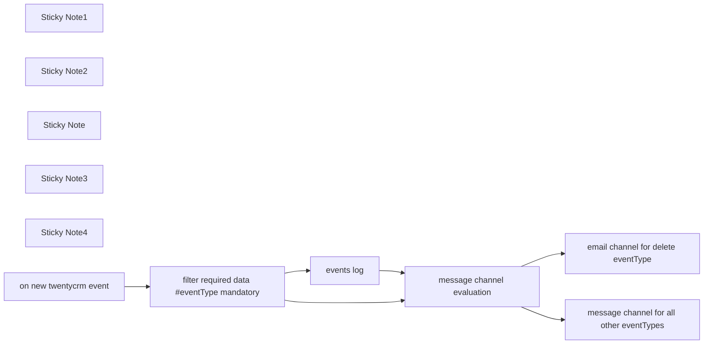

## Fluxo (.json) :

```json
{
  "id": "1dnr1k4MAVbDiBmO",
  "meta": {
    "instanceId": "6b614b231db1d70977d02e50f578fcb50ce3b81e1fa79a97b9351e948fbbd610",
    "templateCredsSetupCompleted": true
  },
  "name": "Get event triggered notifications / updates on preferred messaging channels with TwentyCRM",
  "tags": [],
  "nodes": [
    {
      "id": "5e823dd0-f50a-49ad-9e9a-7d0aee656b9c",
      "name": "Sticky Note1",
      "type": "n8n-nodes-base.stickyNote",
      "position": [
        620,
        580
      ],
      "parameters": {
        "color": 7,
        "width": 239.36440675415446,
        "height": 80,
        "content": "**1. ☝️ Set up `On new TwentyCRM event` Trigger's url at webhook in TwentyCRM**"
      },
      "typeVersion": 1
    },
    {
      "id": "0eb98b9a-2f47-4199-a7e5-fe1f9c112721",
      "name": "filter required data #eventType mandatory",
      "type": "n8n-nodes-base.set",
      "position": [
        860,
        380
      ],
      "parameters": {
        "options": {
          "dotNotation": true,
          "ignoreConversionErrors": true
        },
        "assignments": {
          "assignments": [
            {
              "id": "9e24e3f4-e750-4b50-b467-24612717f6a0",
              "name": "eventName",
              "type": "string",
              "value": "={{ $json.body.eventName }}"
            },
            {
              "id": "b6aa9813-39bf-4b3d-9df0-aa93fbf4dc73",
              "name": "objectMetadata.id",
              "type": "string",
              "value": "={{ $json.body.objectMetadata.id }}"
            },
            {
              "id": "8bdff15a-a98a-41ad-89d0-e793c3edb14c",
              "name": "objectMetadata.nameSingular",
              "type": "string",
              "value": "={{ $json.body.objectMetadata.nameSingular }}"
            },
            {
              "id": "0b81e0e6-e9c6-4c03-9b08-f27d1e36b56e",
              "name": "record.id",
              "type": "string",
              "value": "={{ $json.body.record.id }}"
            },
            {
              "id": "71e164f5-d8a2-4ac2-b898-71221b26d92d",
              "name": "record.__typename",
              "type": "string",
              "value": "={{ $json.body.record.__typename }}"
            }
          ]
        }
      },
      "typeVersion": 3.4
    },
    {
      "id": "2cf5a0df-17ff-43c8-a885-7e4657c8b912",
      "name": "events log",
      "type": "n8n-nodes-base.googleSheets",
      "position": [
        1160,
        540
      ],
      "parameters": {
        "operation": "append",
        "sheetName": {
          "__rl": true,
          "mode": "list",
          "value": "",
          "cachedResultUrl": "",
          "cachedResultName": ""
        },
        "documentId": {
          "__rl": true,
          "mode": "url",
          "value": ""
        }
      },
      "typeVersion": 4.5
    },
    {
      "id": "ade9d73e-109b-47a2-9d57-2c8a3c031a4c",
      "name": "message channel evaluation",
      "type": "n8n-nodes-base.if",
      "position": [
        1440,
        380
      ],
      "parameters": {
        "options": {},
        "conditions": {
          "options": {
            "version": 2,
            "leftValue": "",
            "caseSensitive": true,
            "typeValidation": "strict"
          },
          "combinator": "and",
          "conditions": [
            {
              "id": "effea083-18d0-4b56-8b77-8ca461a371b6",
              "operator": {
                "type": "string",
                "operation": "equals"
              },
              "leftValue": "={{ $json.eventName.split(\".\")[1] }}",
              "rightValue": "delete"
            }
          ]
        }
      },
      "typeVersion": 2.2
    },
    {
      "id": "37ab5d83-9112-470a-894f-bf508e4612b7",
      "name": "Sticky Note2",
      "type": "n8n-nodes-base.stickyNote",
      "position": [
        780,
        220
      ],
      "parameters": {
        "color": 7,
        "width": 242.34738303232248,
        "height": 131.4798719116814,
        "content": "**Filter Data 👇**\nChange filter criteria here to determine what values are required for you but don't forget to include eventType as it is a functional requirement"
      },
      "typeVersion": 1
    },
    {
      "id": "be669d56-0323-48cf-a474-8d22b04148e0",
      "name": "Sticky Note",
      "type": "n8n-nodes-base.stickyNote",
      "position": [
        1340,
        580
      ],
      "parameters": {
        "color": 7,
        "width": 200.3243983123301,
        "height": 95.26139957883888,
        "content": "**👈 event loggin**\nAll events are logged in the sheet with one entry per row"
      },
      "typeVersion": 1
    },
    {
      "id": "7db1418e-5eb1-4bdb-afa0-e9cb268af187",
      "name": "Sticky Note3",
      "type": "n8n-nodes-base.stickyNote",
      "position": [
        1340,
        240
      ],
      "parameters": {
        "color": 7,
        "width": 194,
        "height": 100.99999999999997,
        "content": "**Evaluation 👇**\nBased on the conditions proper channel for messaging is selected"
      },
      "typeVersion": 1
    },
    {
      "id": "77a06749-e901-44d0-8b45-06bf90715ed2",
      "name": "Sticky Note4",
      "type": "n8n-nodes-base.stickyNote",
      "position": [
        520,
        220
      ],
      "parameters": {
        "color": 6,
        "width": 226.64074289386136,
        "height": 128.58912785838194,
        "content": "### Get event triggered notifications / updates on preferred messaging channels with TwentyCRM ### \n"
      },
      "typeVersion": 1
    },
    {
      "id": "1a1854bb-84c3-48a7-99ac-cc2245b2fafa",
      "name": "on new twentycrm event",
      "type": "n8n-nodes-base.webhook",
      "position": [
        600,
        380
      ],
      "webhookId": "8118bda9-0e4f-44cd-bf64-31020b6d5ab5",
      "parameters": {
        "path": "8118bda9-0e4f-44cd-bf64-31020b6d5ab5",
        "options": {},
        "httpMethod": "POST"
      },
      "typeVersion": 2
    },
    {
      "id": "09e33fe9-e9cf-4370-9141-a74868447eff",
      "name": "email channel for delete eventType",
      "type": "n8n-nodes-base.gmail",
      "position": [
        1740,
        200
      ],
      "webhookId": "45e4872f-0723-416c-854d-769901010bf4",
      "parameters": {
        "message": "=<h2>Please find below the attached record details</h2><br/><br/> \n<ul>\n<li>\nobjectMetadata_id: {{ $json.objectMetadata.id }}\n</li>\n<li>\nrecord_id: {{ $json.record.id }}\n</li>\n</ul>",
        "options": {},
        "subject": "Record Deleted in TwentyCRM"
      },
      "typeVersion": 2.1
    },
    {
      "id": "f732e7e9-8378-44e9-a4ba-ec509ae210f6",
      "name": "message channel for all other eventTypes",
      "type": "n8n-nodes-base.slack",
      "position": [
        1740,
        540
      ],
      "webhookId": "4ff4d697-aaeb-4092-8e4e-d7c1c3a9b3ff",
      "parameters": {
        "text": "=event: {{ $json.eventName }}\nevent_id: {{ $json.objectMetadata.id }}\nrecord_id: {{ $json.record.id }}",
        "select": "channel",
        "channelId": {
          "__rl": true,
          "mode": "url",
          "value": ""
        },
        "otherOptions": {}
      },
      "typeVersion": 2.2
    }
  ],
  "active": false,
  "pinData": {},
  "settings": {
    "executionOrder": "v1"
  },
  "versionId": "b37892dc-b121-4a42-a305-7d197c087266",
  "connections": {
    "events log": {
      "main": [
        [
          {
            "node": "message channel evaluation",
            "type": "main",
            "index": 0
          }
        ]
      ]
    },
    "on new twentycrm event": {
      "main": [
        [
          {
            "node": "filter required data #eventType mandatory",
            "type": "main",
            "index": 0
          }
        ]
      ]
    },
    "message channel evaluation": {
      "main": [
        [
          {
            "node": "email channel for delete eventType",
            "type": "main",
            "index": 0
          }
        ],
        [
          {
            "node": "message channel for all other eventTypes",
            "type": "main",
            "index": 0
          }
        ]
      ]
    },
    "filter required data #eventType mandatory": {
      "main": [
        [
          {
            "node": "events log",
            "type": "main",
            "index": 0
          },
          {
            "node": "message channel evaluation",
            "type": "main",
            "index": 0
          }
        ]
      ]
    }
  }
}
```

<a id="template-220"></a>

## Template 220 - Credenciais dinâmicas com expressões

- **Nome:** Credenciais dinâmicas com expressões
- **Descrição:** Fluxo que recebe uma chave de API via formulário e a utiliza dinamicamente para consultar a API da NASA, redirecionando o usuário para a imagem do dia.
- **Funcionalidade:** • Coleta de chave API via formulário: recebe do usuário uma chave (campo obrigatório) através de um formulário web.
• Atribuição dinâmica de credenciais: utiliza uma expressão para inserir a chave recebida nas credenciais do nó que faz a chamada externa.
• Consulta à API da NASA: realiza a requisição à API (ex.: APOD) usando a chave fornecida para obter a imagem do dia.
• Resposta com redirecionamento: responde ao usuário redirecionando-o para a URL da imagem obtida.
• Suporte a testes manuais: permite executar o fluxo em modo de teste, inserindo a chave diretamente no formulário.
- **Ferramentas:** • NASA (APOD API): API pública que fornece a imagem do dia e metadados relacionados; requer chave de API para autenticação.

## Fluxo visual

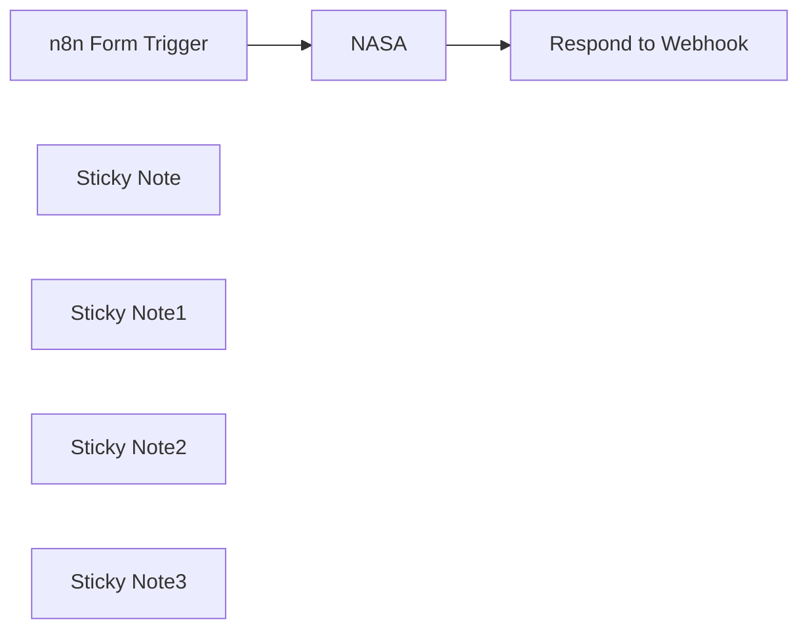

## Fluxo (.json) :

```json
{
  "name": "Dynamic credentials using expressions",
  "nodes": [
    {
      "id": "cc6f2b1e-0ed0-4d22-8a44-d7223ba283b4",
      "name": "n8n Form Trigger",
      "type": "n8n-nodes-base.formTrigger",
      "position": [
        560,
        520
      ],
      "webhookId": "da4071f2-7550-4dae-aa48-8bced4291643",
      "parameters": {
        "path": "da4071f2-7550-4dae-aa48-8bced4291643",
        "formTitle": "Test dynamic credentials",
        "formFields": {
          "values": [
            {
              "fieldLabel": "Enter your NASA API key",
              "requiredField": true
            }
          ]
        },
        "responseMode": "responseNode",
        "formDescription": "This form is for testing an n8n workflow that demonstrates setting credentials with expressions."
      },
      "typeVersion": 2
    },
    {
      "id": "ef336bae-3d4f-419c-ab5c-b9f0de89f170",
      "name": "NASA",
      "type": "n8n-nodes-base.nasa",
      "position": [
        900,
        520
      ],
      "parameters": {
        "additionalFields": {}
      },
      "credentials": {
        "nasaApi": {
          "id": "QDDBOZOD6k3ijL5t",
          "name": "NASA account"
        }
      },
      "typeVersion": 1
    },
    {
      "id": "143bcdb6-aca0-4dd8-9204-9777271cd230",
      "name": "Respond to Webhook",
      "type": "n8n-nodes-base.respondToWebhook",
      "position": [
        1220,
        520
      ],
      "parameters": {
        "options": {},
        "redirectURL": "={{ $json.url }}",
        "respondWith": "redirect"
      },
      "typeVersion": 1
    },
    {
      "id": "0a0dee23-fa16-4f09-b5e0-856f47fb53d0",
      "name": "Sticky Note",
      "type": "n8n-nodes-base.stickyNote",
      "position": [
        120,
        140
      ],
      "parameters": {
        "color": 4,
        "width": 322,
        "height": 564,
        "content": "This workflow shows how to set credentials dynamically using expressions.\n\n\nFirst, set up your NASA credential: \n\n1. Create a new NASA credential.\n1. Hover over **API Key**.\n1. Toggle **Expression** on.\n1. In the **API Key** field, enter `{{ $json[\"Enter your NASA API key\"] }}`.\n\n\nThen, test the workflow:\n\n1. Get an [API key from NASA](https://api.nasa.gov/)\n2. Select **Test workflow**\n3. Enter your key using the form.\n4. The workflow runs and sends you to the NASA picture of the day.\n\n\nFor more information on expressions, refer to [n8n documentation | Expressions](https://docs.n8n.io/code/expressions/)."
      },
      "typeVersion": 1
    },
    {
      "id": "dd766e32-334d-4e46-9daa-7800b134a3a5",
      "name": "Sticky Note1",
      "type": "n8n-nodes-base.stickyNote",
      "position": [
        500,
        380
      ],
      "parameters": {
        "height": 319,
        "content": "User submits an API key using the form"
      },
      "typeVersion": 1
    },
    {
      "id": "3d8f02e6-e029-41dc-89ad-0f5cffe09348",
      "name": "Sticky Note2",
      "type": "n8n-nodes-base.stickyNote",
      "position": [
        820,
        380
      ],
      "parameters": {
        "color": 5,
        "height": 319,
        "content": "The workflow passes the key to the NASA node. You can reference the value using the expression `$json[\"Enter your NASA API key\"]`. This is also available to the node credential. "
      },
      "typeVersion": 1
    },
    {
      "id": "096eb6ab-c276-4687-9dc0-50e16a8f709a",
      "name": "Sticky Note3",
      "type": "n8n-nodes-base.stickyNote",
      "position": [
        1140,
        380
      ],
      "parameters": {
        "height": 319,
        "content": "The Respond to Webhook node controls the form response (in this example, redirecting the user to an image)"
      },
      "typeVersion": 1
    }
  ],
  "pinData": {},
  "connections": {
    "NASA": {
      "main": [
        [
          {
            "node": "Respond to Webhook",
            "type": "main",
            "index": 0
          }
        ]
      ]
    },
    "n8n Form Trigger": {
      "main": [
        [
          {
            "node": "NASA",
            "type": "main",
            "index": 0
          }
        ]
      ]
    }
  }
}
```

<a id="template-221"></a>

## Template 221 - Gerar áudio a partir de texto (text-to-speech)

- **Nome:** Gerar áudio a partir de texto (text-to-speech)
- **Descrição:** Converte texto recebido via requisição POST em um arquivo de áudio usando a API da OpenAI e retorna o áudio como resposta.
- **Funcionalidade:** • Recepção de requisições HTTP POST: Inicia o processo ao receber uma chamada no endpoint configurado (/generate_audio).
• Extração do texto de entrada: Usa o campo body.text_to_convert do payload recebido como conteúdo a ser convertido.
• Conversão de texto para fala: Envia o texto para a API de TTS da OpenAI selecionando a voz 'fable'.
• Retorno do áudio em binário: Responde à requisição com o arquivo de áudio gerado em formato binário.
• Suporte a modos de execução: Permite fluxo em modo de teste (URL temporária) e ativação para produção (URL permanente).
- **Ferramentas:** • OpenAI: Serviço de inteligência artificial usado para converter texto em fala (text-to-speech).
• Endpoint HTTP (Webhook): Ponto de entrada HTTP para receber requisições POST contendo o texto a ser convertido.

## Fluxo visual

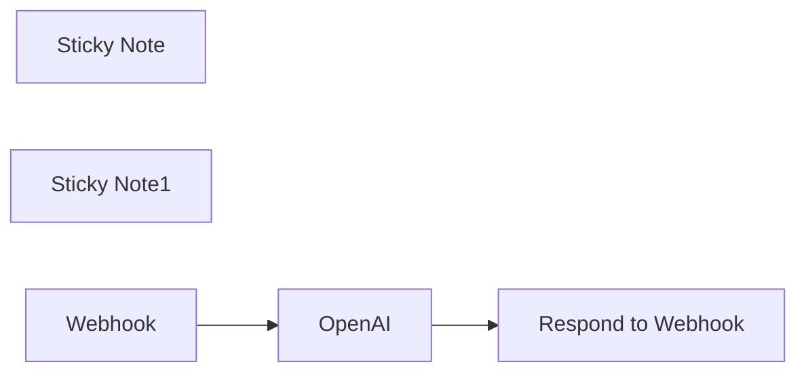

## Fluxo (.json) :

```json
{
  "id": "OVSyGmI6YFviPu8Q",
  "meta": {
    "instanceId": "fb261afc5089eae952e09babdadd9983000b3d863639802f6ded8c5be2e40067",
    "templateCredsSetupCompleted": true
  },
  "name": "Generate audio from text using OpenAI - text-to-speech Workflow",
  "tags": [],
  "nodes": [
    {
      "id": "c40966a4-1709-4998-ae95-b067ce3496c9",
      "name": "Respond to Webhook",
      "type": "n8n-nodes-base.respondToWebhook",
      "position": [
        1320,
        200
      ],
      "parameters": {
        "options": {},
        "respondWith": "binary"
      },
      "typeVersion": 1.1
    },
    {
      "id": "c4e57bb6-79a4-4b26-a179-73e30d681521",
      "name": "Sticky Note",
      "type": "n8n-nodes-base.stickyNote",
      "position": [
        280,
        -140
      ],
      "parameters": {
        "width": 501.55,
        "height": 493.060000000001,
        "content": "This `Webhook` node triggers the workflow when it receives a POST request.\n\n### 1. Test Mode:\n* Use the test webhook URL\n* Click the `Test workflow` button on the canvas. (In test mode, the webhook only works for one call after you click this button)\n\n### 1. Production Mode:\n* The workflow must be active for a **Production URL** to run successfully.\n* You can activate the workflow using the toggle in the top-right of the editor.\n* Note that unlike test URL calls, production URL calls aren't shown on the canvas (only in the executions list)."
      },
      "typeVersion": 1
    },
    {
      "id": "1364a4b6-2651-4b38-b335-c36783a25f12",
      "name": "Sticky Note1",
      "type": "n8n-nodes-base.stickyNote",
      "position": [
        825,
        60
      ],
      "parameters": {
        "color": 4,
        "width": 388.35000000000025,
        "height": 292.71000000000043,
        "content": "### Configure the OpenAI node with your API key:\nIf you haven't connected your OpenAI credentials in n8n yet, log in to your OpenAI account to get your API Key. Then, open the OpenAI node, click `Create New Credentials` and connect with the **OpenAI API**.\n"
      },
      "typeVersion": 1
    },
    {
      "id": "ba755814-75e6-4e16-b3a6-50cf4fc06350",
      "name": "Webhook",
      "type": "n8n-nodes-base.webhook",
      "position": [
        480,
        200
      ],
      "webhookId": "28feeb38-ef2d-4a2e-bd7c-25a524068e25",
      "parameters": {
        "path": "generate_audio",
        "options": {},
        "httpMethod": "POST",
        "responseMode": "responseNode"
      },
      "typeVersion": 2
    },
    {
      "id": "ac46df50-cb1f-484c-8edf-8131192ba464",
      "name": "OpenAI",
      "type": "@n8n/n8n-nodes-langchain.openAi",
      "position": [
        960,
        200
      ],
      "parameters": {
        "input": "={{ $json.body.text_to_convert }}",
        "voice": "fable",
        "options": {},
        "resource": "audio"
      },
      "credentials": {
        "openAiApi": {
          "id": "2Cije3KX7OIVwn9B",
          "name": "n8n OpenAI"
        }
      },
      "typeVersion": 1.3
    }
  ],
  "active": false,
  "pinData": {},
  "settings": {
    "executionOrder": "v1"
  },
  "versionId": "84f1b893-e1a3-40c3-83b0-7cd637b353c4",
  "connections": {
    "OpenAI": {
      "main": [
        [
          {
            "node": "Respond to Webhook",
            "type": "main",
            "index": 0
          }
        ]
      ]
    },
    "Webhook": {
      "main": [
        [
          {
            "node": "OpenAI",
            "type": "main",
            "index": 0
          }
        ]
      ]
    }
  }
}
```
