# PACK 1999 TEMPLATES PARTE 02 - Bloco 2

Templates neste bloco: 20

## Sumário

- [Template 222 - Receber atualizações de todas as mudanças do Pipedrive](#template-222)
- [Template 223 - Compactar múltiplos arquivos em um ZIP](#template-223)
- [Template 224 - Detectar disparidades em avaliações de funcionários](#template-224)
- [Template 225 - Sincronizar respostas Typeform para planilha Nextcloud](#template-225)
- [Template 226 - Extrair markdown e links de páginas web](#template-226)
- [Template 227 - Tradução de PDFs (Drive → DeepL)](#template-227)
- [Template 228 - Geração automática de metadados para YouTube](#template-228)
- [Template 229 - Disparo de varredura de vulnerabilidades no Qualys](#template-229)
- [Template 230 - Fluxo de autenticação OIDC com PKCE](#template-230)
- [Template 231 - Verificação de email com Hunter](#template-231)
- [Template 232 - Roteador dinâmico de LLMs locais](#template-232)
- [Template 233 - Notificações Telegram para pedidos WooCommerce](#template-233)
- [Template 234 - Enviar ofertas MediaMarkt por email](#template-234)
- [Template 235 - Envio de e-mail de teste](#template-235)
- [Template 236 - Chatbot WhatsApp com IA para texto, voz, imagens e PDFs](#template-236)
- [Template 237 - Obter todos os registros da organização Xero](#template-237)
- [Template 238 - Resumo e roteamento de feedback de cliente](#template-238)
- [Template 239 - Agente Cripto CoinMarketCap](#template-239)
- [Template 240 - Notas do Obsidian para Podcast](#template-240)
- [Template 241 - Enriquecimento de empresa e criação de leads](#template-241)

---

<a id="template-222"></a>

## Template 222 - Receber atualizações de todas as mudanças do Pipedrive

- **Nome:** Receber atualizações de todas as mudanças do Pipedrive
- **Descrição:** Fluxo que recebe notificações de todas as alterações realizadas no Pipedrive para possibilitar processamento ou sincronização em outros sistemas.
- **Funcionalidade:** • Detecção de todas as mudanças no Pipedrive: Inicia quando há criação, atualização ou exclusão de entidades.
• Recebimento de eventos em tempo real: Captura notificações instantâneas para manter dados sincronizados.
• Integração por credenciais: Requer credenciais configuradas para autorizar o recebimento de eventos.
• Configuração genérica sem filtros: Está preparado para capturar todas as alterações sem filtragem específica.
• Estado do fluxo: Está configurado como inativo por padrão e precisa ser ativado para começar a receber atualizações.
- **Ferramentas:** • Pipedrive: Plataforma de CRM para gestão de vendas, negócios, contatos e organizações, que emite notificações sobre mudanças nas entidades.

## Fluxo visual

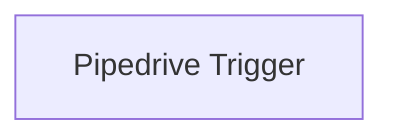

## Fluxo (.json) :

```json
{
  "id": "115",
  "name": "Receive updates for all changes in Pipedrive",
  "nodes": [
    {
      "name": "Pipedrive Trigger",
      "type": "n8n-nodes-base.pipedriveTrigger",
      "position": [
        750,
        250
      ],
      "parameters": {},
      "credentials": {
        "pipedriveApi": ""
      },
      "typeVersion": 1
    }
  ],
  "active": false,
  "settings": {},
  "connections": {}
}
```

<a id="template-223"></a>

## Template 223 - Compactar múltiplos arquivos em um ZIP

- **Nome:** Compactar múltiplos arquivos em um ZIP
- **Descrição:** Recebe vários arquivos de entrada e os compacta em um único arquivo ZIP com nome baseado em timestamp, retornando-o como saída binária.
- **Funcionalidade:** • Receber múltiplos arquivos: Aceita arquivos de entrada em binário (imagens, PDFs, planilhas, etc.).
• Agrupar arquivos em um único ZIP: Comprime todos os arquivos recebidos em um único arquivo .zip.
• Gerar nome de arquivo com timestamp: Gera o nome do arquivo ZIP usando data e período (ex: yyyy-MM-dd-tt).
• Padronizar nome do arquivo: Remove espaços do nome final do arquivo para garantir compatibilidade.
• Retornar arquivo ZIP como saída binária: Fornece o ZIP resultante como propriedade binária pronta para uso posterior.
• Modular e reutilizável: Pode ser chamado como módulo em outros fluxos para compactação de arquivos.
- **Ferramentas:** • Nenhuma: Não utiliza ferramentas externas; todas as operações são realizadas localmente pelo fluxo.

## Fluxo visual

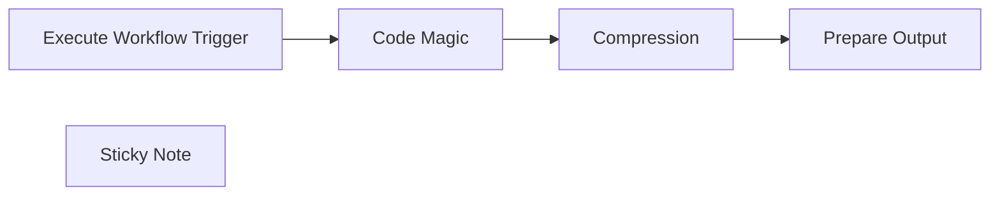

## Fluxo (.json) :

```json
{
  "id": "r3qHlCVCczqTw3pP",
  "meta": {
    "instanceId": "1bc0f4fa5e7d17ac362404cbb49337e51e5061e019cfa24022a8667c1f1ce287"
  },
  "name": "Zip multiple files",
  "tags": [],
  "nodes": [
    {
      "id": "8de50ed2-b298-4701-8747-f6c7158fa15f",
      "name": "Execute Workflow Trigger",
      "type": "n8n-nodes-base.executeWorkflowTrigger",
      "position": [
        0,
        0
      ],
      "parameters": {},
      "typeVersion": 1
    },
    {
      "id": "5e03dfdd-696e-4a04-99e9-4094ae4371ac",
      "name": "Compression",
      "type": "n8n-nodes-base.compression",
      "position": [
        460,
        0
      ],
      "parameters": {
        "fileName": "=data{{$now.format('yyyy-MM-dd-tt')}}.zip",
        "operation": "compress",
        "binaryPropertyName": "={{ $json.binary_keys }}"
      },
      "typeVersion": 1.1
    },
    {
      "id": "e25abf55-fb05-47d0-ba65-9b4e2f08d856",
      "name": "Sticky Note",
      "type": "n8n-nodes-base.stickyNote",
      "position": [
        -340,
        -100
      ],
      "parameters": {
        "height": 360,
        "content": "## About\nUse me as modular workflow. Instead of building me fixed in your workflow. Just call me when you need me.\n\n\n## Input\nInput can be multiple files \n-imgaes\n-pdfs\n-xlsx,csv....\n\n## Output\nSingle zip file"
      },
      "typeVersion": 1
    },
    {
      "id": "db7b6475-25b5-44de-b37e-70b75c91455e",
      "name": "Prepare Output",
      "type": "n8n-nodes-base.set",
      "position": [
        680,
        0
      ],
      "parameters": {
        "options": {},
        "assignments": {
          "assignments": [
            {
              "id": "b0c3c3db-584a-48c9-b0ca-7f527d35f5a4",
              "name": "fileName",
              "type": "string",
              "value": "={{ $binary.data.fileName.replaceAll(\" \",\"\") }}"
            }
          ]
        },
        "includeOtherFields": true
      },
      "typeVersion": 3.4
    },
    {
      "id": "6cf6b9ba-e5a3-4d5f-a539-e84d839f7e99",
      "name": "Code Magic",
      "type": "n8n-nodes-base.code",
      "position": [
        240,
        0
      ],
      "parameters": {
        "jsCode": "let binaries = {}, binary_keys = [];\n\nfor (const [index, inputItem] of Object.entries($input.all())) {\n  binaries[`data_${index}`] = inputItem.binary.data;\n  binary_keys.push(`data_${index}`);\n}\n\nreturn [{\n    json: {\n        binary_keys: binary_keys.join(',')\n    },\n    binary: binaries\n}];\n"
      },
      "typeVersion": 2
    }
  ],
  "active": false,
  "pinData": {},
  "settings": {
    "executionOrder": "v1"
  },
  "versionId": "16f64706-0a2a-4f9f-a96f-f149a4874ae4",
  "connections": {
    "Code Magic": {
      "main": [
        [
          {
            "node": "Compression",
            "type": "main",
            "index": 0
          }
        ]
      ]
    },
    "Compression": {
      "main": [
        [
          {
            "node": "Prepare Output",
            "type": "main",
            "index": 0
          }
        ]
      ]
    },
    "Execute Workflow Trigger": {
      "main": [
        [
          {
            "node": "Code Magic",
            "type": "main",
            "index": 0
          }
        ]
      ]
    }
  }
}
```

<a id="template-224"></a>

## Template 224 - Detectar disparidades em avaliações de funcionários

- **Nome:** Detectar disparidades em avaliações de funcionários
- **Descrição:** Analisa avaliações públicas de empresas para identificar padrões de desigualdade entre grupos demográficos, combinando extração web, processamento por IA e visualização.
- **Funcionalidade:** • Configurar empresa alvo: Permite especificar o nome da empresa a ser analisada.
• Busca e coleta de páginas públicas: Pesquisa a Glassdoor pela página da empresa e obtém o conteúdo usando um serviço de scraping capaz de lidar com páginas dinâmicas.
• Extração do conteúdo relevante: Isola o resumo geral de avaliações e o módulo de demografias para análise.
• Extração estruturada por IA: Usa modelos de linguagem para converter HTML/texto em métricas numéricas (média de avaliações, distribuição por estrelas, médias e contagens por demografia).
• Cálculo estatístico: Calcula variância, desvio padrão, z-scores e tamanhos de efeito para comparar grupos frente à média geral.
• Testes de significância: Calcula p-values aproximados e remove automaticamente grupos sem dados suficientes.
• Preparação de dados para visualização: Formata datasets para scatterplot e gráfico de barras, incluindo rótulos legíveis para cada grupo demográfico.
• Geração de gráficos: Cria imagens de scatterplot e barras para representar z-scores e effect sizes.
• Análise em linguagem natural: Gera um resumo com principais conclusões e uma seção que descreve percepções possíveis dos funcionários para grupos com experiências significativamente piores ou melhores.
- **Ferramentas:** • ScrapingBee: Serviço de scraping que permite recuperar páginas web dinâmicas e contornar restrições de JavaScript por meio de proxies e renderização.
• Glassdoor: Fonte pública de avaliações e módulos de demografia dos funcionários, usada como base de dados para o estudo de clima organizacional.
• OpenAI: Modelos de linguagem usados para extrair informações estruturadas do conteúdo e produzir análises textuais resumidas e interpretativas.
• QuickChart: Serviço de geração de gráficos via API, utilizado para criar visualizações (scatterplot e gráficos de barras) a partir dos datasets calculados.

## Fluxo visual

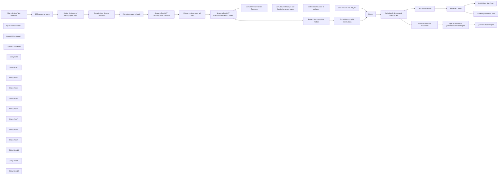

## Fluxo (.json) :

```json
{
  "id": "vzU9QRZsHcyRsord",
  "meta": {
    "instanceId": "a9f3b18652ddc96459b459de4fa8fa33252fb820a9e5a1593074f3580352864a",
    "templateCredsSetupCompleted": true
  },
  "name": "Spot Workplace Discrimination Patterns with AI",
  "tags": [
    {
      "id": "76EYz9X3GU4PtgSS",
      "name": "human_resources",
      "createdAt": "2025-01-30T18:52:17.614Z",
      "updatedAt": "2025-01-30T18:52:17.614Z"
    },
    {
      "id": "ey2Mx4vNaV8cKvao",
      "name": "openai",
      "createdAt": "2024-12-23T07:10:13.400Z",
      "updatedAt": "2024-12-23T07:10:13.400Z"
    }
  ],
  "nodes": [
    {
      "id": "b508ab50-158a-4cbf-a52e-f53e1804e770",
      "name": "When clicking ‘Test workflow’",
      "type": "n8n-nodes-base.manualTrigger",
      "position": [
        280,
        380
      ],
      "parameters": {},
      "typeVersion": 1
    },
    {
      "id": "11a1a2d5-a274-44f7-97ca-5666a59fcb31",
      "name": "OpenAI Chat Model1",
      "type": "@n8n/n8n-nodes-langchain.lmChatOpenAi",
      "position": [
        2220,
        800
      ],
      "parameters": {
        "options": {}
      },
      "credentials": {
        "openAiApi": {
          "id": "XXXXXX",
          "name": "OpenAi account"
        }
      },
      "typeVersion": 1
    },
    {
      "id": "395f7b67-c914-4aae-8727-0573fdbfc6ad",
      "name": "OpenAI Chat Model2",
      "type": "@n8n/n8n-nodes-langchain.lmChatOpenAi",
      "position": [
        2220,
        380
      ],
      "parameters": {
        "options": {}
      },
      "credentials": {
        "openAiApi": {
          "id": "XXXXXX",
          "name": "OpenAi account"
        }
      },
      "typeVersion": 1
    },
    {
      "id": "6ab194a9-b869-4296-aea9-19afcbffc0d7",
      "name": "Merge",
      "type": "n8n-nodes-base.merge",
      "position": [
        2940,
        600
      ],
      "parameters": {
        "mode": "combine",
        "options": {},
        "combineBy": "combineByPosition"
      },
      "typeVersion": 3
    },
    {
      "id": "1eba1dd7-a164-4c70-8c75-759532bd16a0",
      "name": "OpenAI Chat Model",
      "type": "@n8n/n8n-nodes-langchain.lmChatOpenAi",
      "position": [
        3840,
        420
      ],
      "parameters": {
        "options": {}
      },
      "credentials": {
        "openAiApi": {
          "id": "XXXXXX",
          "name": "OpenAi account"
        }
      },
      "typeVersion": 1
    },
    {
      "id": "f25f1b07-cded-4ca7-9655-8b8f463089ab",
      "name": "SET company_name",
      "type": "n8n-nodes-base.set",
      "position": [
        540,
        380
      ],
      "parameters": {
        "options": {},
        "assignments": {
          "assignments": [
            {
              "id": "dd256ef7-013c-4769-8580-02c2d902d0b2",
              "name": "company_name",
              "type": "string",
              "value": "=Twilio"
            }
          ]
        }
      },
      "typeVersion": 3.4
    },
    {
      "id": "87264a93-ab97-4e39-8d40-43365189f704",
      "name": "Define dictionary of demographic keys",
      "type": "n8n-nodes-base.set",
      "position": [
        740,
        380
      ],
      "parameters": {
        "options": {},
        "assignments": {
          "assignments": [
            {
              "id": "6ae671be-45d0-4a94-a443-2f1d4772d31b",
              "name": "asian",
              "type": "string",
              "value": "Asian"
            },
            {
              "id": "6c93370c-996c-44a6-a34c-4cd3baeeb846",
              "name": "hispanic",
              "type": "string",
              "value": "Hispanic or Latinx"
            },
            {
              "id": "dee79039-6051-4e9d-98b5-63a07d30f6b0",
              "name": "white",
              "type": "string",
              "value": "White"
            },
            {
              "id": "08d42380-8397-412f-8459-7553e9309b5d",
              "name": "pacific_islander",
              "type": "string",
              "value": "Native Hawaiian or other Pacific Islander"
            },
            {
              "id": "09e8ebc5-e7e7-449a-9036-9b9b54cdc828",
              "name": "black",
              "type": "string",
              "value": "Black or African American"
            },
            {
              "id": "39e910f8-3a8b-4233-a93a-3c5693e808c6",
              "name": "middle_eastern",
              "type": "string",
              "value": "Middle Eastern"
            },
            {
              "id": "169b3471-efa0-476e-aa83-e3f717c568f1",
              "name": "indigenous",
              "type": "string",
              "value": "Indigenous American or Native Alaskan"
            },
            {
              "id": "b6192296-4efa-4af5-ae02-1e31d28aae90",
              "name": "male",
              "type": "string",
              "value": "Men"
            },
            {
              "id": "4b322294-940c-459d-b083-8e91e38193f7",
              "name": "female",
              "type": "string",
              "value": "Women"
            },
            {
              "id": "1940eef0-6b76-4a26-9d8f-7c8536fbcb1b",
              "name": "trans",
              "type": "string",
              "value": "Transgender and/or Non-Binary"
            },
            {
              "id": "3dba3e18-2bb1-4078-bde9-9d187f9628dd",
              "name": "hetero",
              "type": "string",
              "value": "Heterosexual"
            },
            {
              "id": "9b7d10ad-1766-4b18-a230-3bd80142b48c",
              "name": "lgbtqia",
              "type": "string",
              "value": "LGBTQ+"
            },
            {
              "id": "458636f8-99e8-4245-9950-94e4cf68e371",
              "name": "nondisabled",
              "type": "string",
              "value": "Non-Disabled"
            },
            {
              "id": "a466e258-7de1-4453-a126-55f780094236",
              "name": "disabled",
              "type": "string",
              "value": "People with Disabilities"
            },
            {
              "id": "98735266-0451-432f-be7c-efcb09512cb1",
              "name": "caregiver",
              "type": "string",
              "value": "Caregivers"
            },
            {
              "id": "ebe2353c-9ff5-47bc-8c11-b66d3436f5b4",
              "name": "parent",
              "type": "string",
              "value": "Parents/Guardians"
            },
            {
              "id": "ab51c80c-d81d-41ab-94d9-c0a263743c17",
              "name": "nonparent",
              "type": "string",
              "value": "Not a Parent or Caregiver"
            },
            {
              "id": "cb7df429-c600-43f4-aa7e-dbc2382a85a0",
              "name": "nonveteran",
              "type": "string",
              "value": "Non-Veterans"
            },
            {
              "id": "dffbdb13-189a-462d-83d1-c5ec39a17d41",
              "name": "veteran",
              "type": "string",
              "value": "Veterans"
            }
          ]
        },
        "includeOtherFields": true
      },
      "typeVersion": 3.4
    },
    {
      "id": "862f1c77-44a8-4d79-abac-33351ebb731b",
      "name": "ScrapingBee Search Glassdoor",
      "type": "n8n-nodes-base.httpRequest",
      "position": [
        940,
        380
      ],
      "parameters": {
        "url": "https://app.scrapingbee.com/api/v1",
        "options": {},
        "sendQuery": true,
        "authentication": "genericCredentialType",
        "genericAuthType": "httpQueryAuth",
        "queryParameters": {
          "parameters": [
            {
              "name": "url",
              "value": "=https://www.glassdoor.com/Search/results.htm?keyword={{ $json.company_name.toLowerCase().urlEncode() }}"
            },
            {
              "name": "premium_proxy",
              "value": "true"
            },
            {
              "name": "block_resources",
              "value": "false"
            },
            {
              "name": "stealth_proxy",
              "value": "true"
            }
          ]
        }
      },
      "credentials": {
        "httpQueryAuth": {
          "id": "XXXXXX",
          "name": "ScrapingBee Query Auth"
        }
      },
      "typeVersion": 4.2
    },
    {
      "id": "4c9bf05e-9c50-4895-b20b-b7c329104615",
      "name": "Extract company url path",
      "type": "n8n-nodes-base.html",
      "position": [
        1140,
        380
      ],
      "parameters": {
        "options": {},
        "operation": "extractHtmlContent",
        "extractionValues": {
          "values": [
            {
              "key": "url_path",
              "attribute": "href",
              "cssSelector": "body main div a",
              "returnValue": "attribute"
            }
          ]
        }
      },
      "typeVersion": 1.2
    },
    {
      "id": "d20bb0e7-4ca7-41d0-a3e9-41abc811b064",
      "name": "ScrapingBee GET company page contents",
      "type": "n8n-nodes-base.httpRequest",
      "position": [
        1340,
        380
      ],
      "parameters": {
        "url": "https://app.scrapingbee.com/api/v1",
        "options": {},
        "sendQuery": true,
        "authentication": "genericCredentialType",
        "genericAuthType": "httpQueryAuth",
        "queryParameters": {
          "parameters": [
            {
              "name": "url",
              "value": "=https://www.glassdoor.com{{ $json.url_path }}"
            },
            {
              "name": "premium_proxy",
              "value": "true"
            },
            {
              "name": "block_resources",
              "value": "false"
            },
            {
              "name": "stealth_proxy",
              "value": "true"
            }
          ]
        }
      },
      "credentials": {
        "httpQueryAuth": {
          "id": "XXXXXX",
          "name": "ScrapingBee Query Auth"
        }
      },
      "typeVersion": 4.2
    },
    {
      "id": "fce70cab-8ce3-4ce2-b040-ce80d66b1e62",
      "name": "Extract reviews page url path",
      "type": "n8n-nodes-base.html",
      "position": [
        1540,
        380
      ],
      "parameters": {
        "options": {},
        "operation": "extractHtmlContent",
        "extractionValues": {
          "values": [
            {
              "key": "url_path",
              "attribute": "href",
              "cssSelector": "#reviews a",
              "returnValue": "attribute"
            }
          ]
        }
      },
      "typeVersion": 1.2
    },
    {
      "id": "d2e7fee9-e3d4-42bf-8be6-38b352371273",
      "name": "ScrapingBee GET Glassdoor Reviews Content",
      "type": "n8n-nodes-base.httpRequest",
      "position": [
        1760,
        380
      ],
      "parameters": {
        "url": "https://app.scrapingbee.com/api/v1",
        "options": {},
        "sendQuery": true,
        "authentication": "genericCredentialType",
        "genericAuthType": "httpQueryAuth",
        "queryParameters": {
          "parameters": [
            {
              "name": "url",
              "value": "=https://www.glassdoor.com{{ $json.url_path }}"
            },
            {
              "name": "premium_proxy",
              "value": "True"
            },
            {
              "name": "block_resources",
              "value": "False"
            },
            {
              "name": "stealth_proxy",
              "value": "true"
            }
          ]
        }
      },
      "credentials": {
        "httpQueryAuth": {
          "id": "XXXXXX",
          "name": "ScrapingBee Query Auth"
        }
      },
      "typeVersion": 4.2
    },
    {
      "id": "0c322823-0569-4bd5-9c4e-af3de0f8d7b4",
      "name": "Extract Overall Review Summary",
      "type": "n8n-nodes-base.html",
      "position": [
        1980,
        260
      ],
      "parameters": {
        "options": {},
        "operation": "extractHtmlContent",
        "extractionValues": {
          "values": [
            {
              "key": "review_summary",
              "cssSelector": "div[data-test=\"review-summary\"]",
              "returnValue": "html"
            }
          ]
        }
      },
      "typeVersion": 1.2
    },
    {
      "id": "851305ba-0837-4be9-943d-7282e8d74aee",
      "name": "Extract Demographics Module",
      "type": "n8n-nodes-base.html",
      "position": [
        1980,
        520
      ],
      "parameters": {
        "options": {},
        "operation": "extractHtmlContent",
        "extractionValues": {
          "values": [
            {
              "key": "demographics_content",
              "cssSelector": "div[data-test=\"demographics-module\"]",
              "returnValue": "html"
            }
          ]
        }
      },
      "typeVersion": 1.2
    },
    {
      "id": "cf9a6ee2-53b5-4fbf-a36c-4b9dab53b795",
      "name": "Extract overall ratings and distribution percentages",
      "type": "@n8n/n8n-nodes-langchain.informationExtractor",
      "position": [
        2200,
        200
      ],
      "parameters": {
        "text": "={{ $json.review_summary }}",
        "options": {},
        "attributes": {
          "attributes": [
            {
              "name": "average_rating",
              "type": "number",
              "required": true,
              "description": "The overall average rating for this company."
            },
            {
              "name": "total_number_of_reviews",
              "type": "number",
              "required": true,
              "description": "The total number of reviews for this company."
            },
            {
              "name": "5_star_distribution_percentage",
              "type": "number",
              "required": true,
              "description": "The percentage distribution of 5 star reviews"
            },
            {
              "name": "4_star_distribution_percentage",
              "type": "number",
              "required": true,
              "description": "The percentage distribution of 4 star reviews"
            },
            {
              "name": "3_star_distribution_percentage",
              "type": "number",
              "required": true,
              "description": "The percentage distribution of 3 star reviews"
            },
            {
              "name": "2_star_distribution_percentage",
              "type": "number",
              "required": true,
              "description": "The percentage distribution of 2 star reviews"
            },
            {
              "name": "1_star_distribution_percentage",
              "type": "number",
              "required": true,
              "description": "The percentage distribution of 1 star reviews"
            }
          ]
        }
      },
      "typeVersion": 1
    },
    {
      "id": "ae164f6e-04e7-4d8b-951e-a17085956f4b",
      "name": "Extract demographic distributions",
      "type": "@n8n/n8n-nodes-langchain.informationExtractor",
      "position": [
        2200,
        620
      ],
      "parameters": {
        "text": "={{ $json.demographics_content }}",
        "options": {
          "systemPromptTemplate": "You are an expert extraction algorithm.\nOnly extract relevant information from the text.\nIf you do not know the value of an attribute asked to extract, you may use 0 for the attribute's value."
        },
        "attributes": {
          "attributes": [
            {
              "name": "asian_average_rating",
              "type": "number",
              "required": true,
              "description": "=The average rating for this company by employees who self identified as asian."
            },
            {
              "name": "asian_total_number_of_reviews",
              "type": "number",
              "required": true,
              "description": "=The number of reviews for this company by employees who self-identified as asian."
            },
            {
              "name": "hispanic_average_rating",
              "type": "number",
              "required": true,
              "description": "=The average rating for this company by employees who self identified as hispanic."
            },
            {
              "name": "hispanic_total_number_of_reviews",
              "type": "number",
              "required": true,
              "description": "=The number of reviews for this company by employees who self-identified as hispanic."
            },
            {
              "name": "white_average_rating",
              "type": "number",
              "required": true,
              "description": "=The average rating for this company by employees who self identified as white."
            },
            {
              "name": "white_total_number_of_reviews",
              "type": "number",
              "required": true,
              "description": "=The number of reviews for this company by employees who self-identified as white."
            },
            {
              "name": "pacific_islander_average_rating",
              "type": "number",
              "required": true,
              "description": "=The average rating for this company by employees who self identified as native hawaiian or pacific islander."
            },
            {
              "name": "pacific_islander_total_number_of_reviews",
              "type": "number",
              "required": true,
              "description": "=The number of reviews for this company by employees who self-identified as native hawaiian or pacific islander."
            },
            {
              "name": "black_average_rating",
              "type": "number",
              "required": true,
              "description": "=The average rating for this company by employees who self identified as black."
            },
            {
              "name": "black_total_number_of_reviews",
              "type": "number",
              "required": true,
              "description": "=The number of reviews for this company by employees who self-identified as black."
            },
            {
              "name": "middle_eastern_average_rating",
              "type": "number",
              "required": true,
              "description": "=The average rating for this company by employees who self identified as middle eastern."
            },
            {
              "name": "middle_eastern_total_number_of_reviews",
              "type": "number",
              "required": true,
              "description": "=The number of reviews for this company by employees who self-identified as middle_eastern."
            },
            {
              "name": "indigenous_average_rating",
              "type": "number",
              "required": true,
              "description": "=The average rating for this company by employees who self identified as indigenous american or native alaskan."
            },
            {
              "name": "indigenous_total_number_of_reviews",
              "type": "number",
              "required": true,
              "description": "=The number of reviews for this company by employees who self-identified as indigenous american or native alaskan."
            },
            {
              "name": "male_average_rating",
              "type": "number",
              "required": true,
              "description": "=The average rating for this company by employees who self identified as men."
            },
            {
              "name": "male_total_number_of_reviews",
              "type": "number",
              "required": true,
              "description": "=The number of reviews for this company by employees who self-identified as men."
            },
            {
              "name": "female_average_rating",
              "type": "number",
              "required": true,
              "description": "=The average rating for this company by employees who self identified as women."
            },
            {
              "name": "female_total_number_of_reviews",
              "type": "number",
              "required": true,
              "description": "=The number of reviews for this company by employees who self-identified as women."
            },
            {
              "name": "trans_average_rating",
              "type": "number",
              "required": true,
              "description": "=The average rating for this company by employees who self identified as transgender and/or non-binary."
            },
            {
              "name": "trans_total_number_of_reviews",
              "type": "number",
              "required": true,
              "description": "=The number of reviews for this company by employees who self-identified as trans and/or non-binary."
            },
            {
              "name": "hetero_average_rating",
              "type": "number",
              "required": true,
              "description": "=The average rating for this company by employees who self identified as heterosexual."
            },
            {
              "name": "hetero_total_number_of_reviews",
              "type": "number",
              "required": true,
              "description": "=The number of reviews for this company by employees who self-identified as heterosexual."
            },
            {
              "name": "lgbtqia_average_rating",
              "type": "number",
              "required": true,
              "description": "=The average rating for this company by employees who self identified as lgbtqia+."
            },
            {
              "name": "lgbtqia_total_number_of_reviews",
              "type": "number",
              "required": true,
              "description": "=The number of reviews for this company by employees who self-identified as lgbtqia+."
            },
            {
              "name": "nondisabled_average_rating",
              "type": "number",
              "required": true,
              "description": "=The average rating for this company by employees who self identified as non-disabled."
            },
            {
              "name": "nondisabled_total_number_of_reviews",
              "type": "number",
              "required": true,
              "description": "=The number of reviews for this company by employees who self-identified as non-disabled."
            },
            {
              "name": "disabled_average_rating",
              "type": "number",
              "required": true,
              "description": "=The average rating for this company by employees who self identified as people with disabilities."
            },
            {
              "name": "disabled_total_number_of_reviews",
              "type": "number",
              "required": true,
              "description": "=The number of reviews for this company by employees who self-identified as people with disabilities."
            },
            {
              "name": "caregiver_average_rating",
              "type": "number",
              "required": true,
              "description": "=The average rating for this company by employees who self identified as caregivers."
            },
            {
              "name": "caregiver_total_number_of_reviews",
              "type": "number",
              "required": true,
              "description": "=The number of reviews for this company by employees who self-identified as caregivers."
            },
            {
              "name": "parent_average_rating",
              "type": "number",
              "required": true,
              "description": "=The average rating for this company by employees who self identified as parents/guardians."
            },
            {
              "name": "parent_total_number_of_reviews",
              "type": "number",
              "required": true,
              "description": "=The number of reviews for this company by employees who self-identified as parents/guardians."
            },
            {
              "name": "nonparent_average_rating",
              "type": "number",
              "required": true,
              "description": "=The average rating for this company by employees who self identified as not a parent or caregiver."
            },
            {
              "name": "nonparent_total_number_of_reviews",
              "type": "number",
              "required": true,
              "description": "=The number of reviews for this company by employees who self-identified as not a parent or guardian."
            },
            {
              "name": "nonveteran_average_rating",
              "type": "number",
              "required": true,
              "description": "=The average rating for this company by employees who self identified as non-veterans."
            },
            {
              "name": "nonveteran_total_number_of_reviews",
              "type": "number",
              "required": true,
              "description": "=The number of reviews for this company by employees who self-identified as non-veterans."
            },
            {
              "name": "veteran_average_rating",
              "type": "number",
              "required": true,
              "description": "=The average rating for this company by employees who self identified as veterans."
            },
            {
              "name": "veteran_total_number_of_reviews",
              "type": "number",
              "required": true,
              "description": "=The number of reviews for this company by employees who self-identified as veterans."
            }
          ]
        }
      },
      "typeVersion": 1
    },
    {
      "id": "c8d9e45c-7d41-47bd-b9a9-0fa70de5d154",
      "name": "Define contributions to variance",
      "type": "n8n-nodes-base.set",
      "position": [
        2560,
        200
      ],
      "parameters": {
        "options": {},
        "assignments": {
          "assignments": [
            {
              "id": "7360b2c2-1e21-45de-8d1a-e72b8abcb56b",
              "name": "contribution_to_variance.5_star",
              "type": "number",
              "value": "={{ ($json.output['5_star_distribution_percentage'] / 100)  * Math.pow(5 - $json.output.average_rating,2) }}"
            },
            {
              "id": "acdd308a-fa33-4e33-b71b-36b9441bfa06",
              "name": "contribution_to_variance.4_star",
              "type": "number",
              "value": "={{ ($json.output['4_star_distribution_percentage'] / 100)  * Math.pow(4 - $json.output.average_rating,2) }}"
            },
            {
              "id": "376818f3-d429-4abe-8ece-e8e9c5585826",
              "name": "contribution_to_variance.3_star",
              "type": "number",
              "value": "={{ ($json.output['3_star_distribution_percentage'] / 100)  * Math.pow(3 - $json.output.average_rating,2) }}"
            },
            {
              "id": "620d5c37-8b93-4d39-9963-b7ce3a7f431e",
              "name": "contribution_to_variance.2_star",
              "type": "number",
              "value": "={{ ($json.output['2_star_distribution_percentage'] / 100)  * Math.pow(2 - $json.output.average_rating,2) }}"
            },
            {
              "id": "76357980-4f9b-4b14-be68-6498ba25af67",
              "name": "contribution_to_variance.1_star",
              "type": "number",
              "value": "={{ ($json.output['1_star_distribution_percentage'] / 100)  * Math.pow(1 - $json.output.average_rating,2) }}"
            }
          ]
        }
      },
      "typeVersion": 3.4
    },
    {
      "id": "8ea03017-d5d6-46ef-a5f1-dae4372f6256",
      "name": "Set variance and std_dev",
      "type": "n8n-nodes-base.set",
      "position": [
        2740,
        200
      ],
      "parameters": {
        "options": {},
        "assignments": {
          "assignments": [
            {
              "id": "3217d418-f1b0-45ff-9f9a-6e6145cc29ca",
              "name": "variance",
              "type": "number",
              "value": "={{ $json.contribution_to_variance.values().sum() }}"
            },
            {
              "id": "acdb9fea-15ec-46ed-bde9-073e93597f17",
              "name": "average_rating",
              "type": "number",
              "value": "={{ $('Extract overall ratings and distribution percentages').item.json.output.average_rating }}"
            },
            {
              "id": "1f3a8a29-4bd4-4b40-8694-c74a0285eadb",
              "name": "total_number_of_reviews",
              "type": "number",
              "value": "={{ $('Extract overall ratings and distribution percentages').item.json.output.total_number_of_reviews }}"
            },
            {
              "id": "1906c796-1964-446b-8b56-d856269da938",
              "name": "std_dev",
              "type": "number",
              "value": "={{ Math.sqrt($json.contribution_to_variance.values().sum()) }}"
            }
          ]
        }
      },
      "typeVersion": 3.4
    },
    {
      "id": "0570d531-8480-4446-8f02-18640b4b891e",
      "name": "Calculate P-Scores",
      "type": "n8n-nodes-base.code",
      "position": [
        3340,
        440
      ],
      "parameters": {
        "jsCode": "// Approximate CDF for standard normal distribution\nfunction normSDist(z) {\n  const t = 1 / (1 + 0.3275911 * Math.abs(z));\n  const d = 0.254829592 * t - 0.284496736 * t * t + 1.421413741 * t * t * t - 1.453152027 * t * t * t * t + 1.061405429 * t * t * t * t * t;\n  return 0.5 * (1 + Math.sign(z) * d * Math.exp(-z * z / 2));\n}\n\nfor (const item of $input.all()) {\n  if (!item.json.population_analysis.p_scores) {\n    item.json.population_analysis.p_scores = {};\n  }\n\n  for (const score of Object.keys(item.json.population_analysis.z_scores)) {\n    // Check if review count exists and is greater than zero\n    if (item.json.population_analysis.review_count[score] > 0) {\n      // Apply the p_score formula: 2 * NORM.S.DIST(-ABS(z_score))\n      const p_score = 2 * normSDist(-Math.abs(item.json.population_analysis.z_scores[score]));\n\n      // Store the calculated p_score\n      item.json.population_analysis.p_scores[score] = p_score;\n    } else {\n      // Remove z_scores, effect_sizes, and p_scores for groups with no reviews\n      delete item.json.population_analysis.z_scores[score];\n      delete item.json.population_analysis.effect_sizes[score];\n      delete item.json.population_analysis.p_scores[score];\n    }\n  }\n}\n\nreturn $input.all();"
      },
      "typeVersion": 2
    },
    {
      "id": "0bdb9732-67ef-440d-bdd2-42c4f64ff6b6",
      "name": "Sort Effect Sizes",
      "type": "n8n-nodes-base.set",
      "position": [
        3540,
        440
      ],
      "parameters": {
        "options": {},
        "assignments": {
          "assignments": [
            {
              "id": "61cf92ba-bc4e-40b8-a234-9b993fd24019",
              "name": "population_analysis.effect_sizes",
              "type": "object",
              "value": "={{ Object.fromEntries(Object.entries($json.population_analysis.effect_sizes).sort(([,a],[,b]) => a-b )) }}"
            }
          ]
        },
        "includeOtherFields": true
      },
      "typeVersion": 3.4
    },
    {
      "id": "fd9026ef-e993-410a-87d6-40a3ad10b7a7",
      "name": "Calculate Z-Scores and Effect Sizes",
      "type": "n8n-nodes-base.set",
      "position": [
        3140,
        600
      ],
      "parameters": {
        "options": {},
        "assignments": {
          "assignments": [
            {
              "id": "790a53e8-5599-45d3-880e-ab1ad7d165d2",
              "name": "population_analysis.z_scores.asian",
              "type": "number",
              "value": "={{ ($json.output.asian_average_rating - $json.average_rating) / ($json.std_dev / Math.sqrt($json.output.asian_total_number_of_reviews)) }}"
            },
            {
              "id": "ebd61097-8773-45b9-a8e6-cdd840d73650",
              "name": "population_analysis.effect_sizes.asian",
              "type": "number",
              "value": "={{ ($json.output.asian_average_rating - $json.average_rating) / $json.std_dev }}"
            },
            {
              "id": "627b1293-efdc-485a-83c8-bd332d6dc225",
              "name": "population_analysis.z_scores.hispanic",
              "type": "number",
              "value": "={{ ($json.output.hispanic_average_rating - $json.average_rating) / ($json.std_dev / Math.sqrt($json.output.hispanic_total_number_of_reviews)) }}"
            },
            {
              "id": "822028d0-e94f-4cf7-9e13-8f8cc5c72ec0",
              "name": "population_analysis.z_scores.white",
              "type": "number",
              "value": "={{ ($json.output.white_average_rating - $json.average_rating) / ($json.std_dev / Math.sqrt($json.output.white_total_number_of_reviews)) }}"
            },
            {
              "id": "d32321f9-0fcf-4e54-9059-c3fd5a901ce0",
              "name": "population_analysis.z_scores.pacific_islander",
              "type": "number",
              "value": "={{ ($json.output.pacific_islander_average_rating - $json.average_rating) / ($json.std_dev / Math.sqrt($json.output.pacific_islander_total_number_of_reviews)) }}"
            },
            {
              "id": "e212d683-247f-45c4-9668-c290230a10ed",
              "name": "population_analysis.z_scores.black",
              "type": "number",
              "value": "={{ ($json.output.black_average_rating - $json.average_rating) / ($json.std_dev / Math.sqrt($json.output.black_total_number_of_reviews)) }}"
            },
            {
              "id": "882049c3-eb81-4c09-af0c-5c79b0ef0154",
              "name": "population_analysis.z_scores.middle_eastern",
              "type": "number",
              "value": "={{ ($json.output.middle_eastern_average_rating - $json.average_rating) / ($json.std_dev / Math.sqrt($json.output.middle_eastern_total_number_of_reviews)) }}"
            },
            {
              "id": "9bdc187f-3d8d-4030-9143-479eff441b7e",
              "name": "population_analysis.z_scores.indigenous",
              "type": "number",
              "value": "={{ ($json.output.indigenous_average_rating - $json.average_rating) / ($json.std_dev / Math.sqrt($json.output.indigenous_total_number_of_reviews)) }}"
            },
            {
              "id": "0cf11453-dbae-4250-a01a-c98e35aab224",
              "name": "population_analysis.z_scores.male",
              "type": "number",
              "value": "={{ ($json.output.male_average_rating - $json.average_rating) / ($json.std_dev / Math.sqrt($json.output.male_total_number_of_reviews)) }}"
            },
            {
              "id": "35a18fbc-7c2c-40fe-829d-2fffbdb13bb8",
              "name": "population_analysis.z_scores.female",
              "type": "number",
              "value": "={{ ($json.output.female_average_rating - $json.average_rating) / ($json.std_dev / Math.sqrt($json.output.female_total_number_of_reviews)) }}"
            },
            {
              "id": "a6e17c1b-a89b-4c05-8184-10f7248c159f",
              "name": "population_analysis.z_scores.trans",
              "type": "number",
              "value": "={{ ($json.output.trans_average_rating - $json.average_rating) / ($json.std_dev / Math.sqrt($json.output.trans_total_number_of_reviews)) }}"
            },
            {
              "id": "5e7dbccf-3011-4dba-863c-5390c1ee9e50",
              "name": "population_analysis.z_scores.hetero",
              "type": "number",
              "value": "={{ ($json.output.hetero_average_rating - $json.average_rating) / ($json.std_dev / Math.sqrt($json.output.hetero_total_number_of_reviews)) }}"
            },
            {
              "id": "1872152f-2c7e-4c24-bcd5-e2777616bfe2",
              "name": "population_analysis.z_scores.lgbtqia",
              "type": "number",
              "value": "={{ ($json.output.lgbtqia_average_rating - $json.average_rating) / ($json.std_dev / Math.sqrt($json.output.lgbtqia_total_number_of_reviews)) }}"
            },
            {
              "id": "91b2cb00-173e-421a-929a-51d2a6654767",
              "name": "population_analysis.z_scores.nondisabled",
              "type": "number",
              "value": "={{ ($json.output.nondisabled_average_rating - $json.average_rating) / ($json.std_dev / Math.sqrt($json.output.nondisabled_total_number_of_reviews)) }}"
            },
            {
              "id": "8bb7429e-0500-482c-8e8d-d2c63733ffe1",
              "name": "population_analysis.z_scores.disabled",
              "type": "number",
              "value": "={{ ($json.output.disabled_average_rating - $json.average_rating) / ($json.std_dev / Math.sqrt($json.output.disabled_total_number_of_reviews)) }}"
            },
            {
              "id": "89f00d0f-80db-4ad9-bf60-9385aa3d915b",
              "name": "population_analysis.z_scores.caregiver",
              "type": "number",
              "value": "={{ ($json.output.caregiver_average_rating - $json.average_rating) / ($json.std_dev / Math.sqrt($json.output.caregiver_total_number_of_reviews)) }}"
            },
            {
              "id": "0bb2b96c-d882-4ac1-9432-9fce06b26cf5",
              "name": "population_analysis.z_scores.parent",
              "type": "number",
              "value": "={{ ($json.output.parent_average_rating - $json.average_rating) / ($json.std_dev / Math.sqrt($json.output.parent_total_number_of_reviews)) }}"
            },
            {
              "id": "9aae7169-1a25-4fab-b940-7f2cd7ef39d9",
              "name": "population_analysis.z_scores.nonparent",
              "type": "number",
              "value": "={{ ($json.output.nonparent_average_rating - $json.average_rating) / ($json.std_dev / Math.sqrt($json.output.nonparent_total_number_of_reviews)) }}"
            },
            {
              "id": "aac189a0-d6fc-4581-a15d-3e75a0cb370a",
              "name": "population_analysis.z_scores.nonveteran",
              "type": "number",
              "value": "={{ ($json.output.nonveteran_average_rating - $json.average_rating) / ($json.std_dev / Math.sqrt($json.output.nonveteran_total_number_of_reviews)) }}"
            },
            {
              "id": "d40f014a-9c1d-4aea-88ac-d8a3de143931",
              "name": "population_analysis.z_scores.veteran",
              "type": "number",
              "value": "={{ ($json.output.veteran_average_rating - $json.average_rating) / ($json.std_dev / Math.sqrt($json.output.veteran_total_number_of_reviews)) }}"
            },
            {
              "id": "67e0394f-6d55-4e80-8a7d-814635620b1d",
              "name": "population_analysis.effect_sizes.hispanic",
              "type": "number",
              "value": "={{ ($json.output.hispanic_average_rating - $json.average_rating) / $json.std_dev }}"
            },
            {
              "id": "65cd3a22-2c97-4da1-8fcc-cc1af39118f2",
              "name": "population_analysis.effect_sizes.white",
              "type": "number",
              "value": "={{ ($json.output.white_average_rating - $json.average_rating) / $json.std_dev }}"
            },
            {
              "id": "a03bdf0f-e294-4a01-bb08-ddc16e9997a5",
              "name": "population_analysis.effect_sizes.pacific_islander",
              "type": "number",
              "value": "={{ ($json.output.pacific_islander_average_rating - $json.average_rating) / $json.std_dev }}"
            },
            {
              "id": "b0bdc40e-ed5f-475b-9d8b-8cf5beff7002",
              "name": "population_analysis.effect_sizes.black",
              "type": "number",
              "value": "={{ ($json.output.black_average_rating - $json.average_rating) / $json.std_dev }}"
            },
            {
              "id": "45cac3f0-7270-4fa4-8fc4-94914245a77d",
              "name": "population_analysis.effect_sizes.middle_eastern",
              "type": "number",
              "value": "={{ ($json.output.middle_eastern_average_rating - $json.average_rating) / $json.std_dev }}"
            },
            {
              "id": "cf5b7650-8766-45f6-8241-49aea62bf619",
              "name": "population_analysis.effect_sizes.indigenous",
              "type": "number",
              "value": "={{ ($json.output.indigenous_average_rating - $json.average_rating) / $json.std_dev }}"
            },
            {
              "id": "7c6a8d38-02b7-47a1-af44-5eebfb4140ec",
              "name": "population_analysis.effect_sizes.male",
              "type": "number",
              "value": "={{ ($json.output.male_average_rating - $json.average_rating) / $json.std_dev }}"
            },
            {
              "id": "4bf3dba9-4d07-4315-83ce-5fba288a00c9",
              "name": "population_analysis.effect_sizes.female",
              "type": "number",
              "value": "={{ ($json.output.female_average_rating - $json.average_rating) / $json.std_dev }}"
            },
            {
              "id": "d5e980b8-d7a8-4d4c-bcd9-fd9cbd20c729",
              "name": "population_analysis.effect_sizes.trans",
              "type": "number",
              "value": "={{ ($json.output.trans_average_rating - $json.average_rating) / $json.std_dev }}"
            },
            {
              "id": "2c8271c1-b612-4292-9d48-92c342b83727",
              "name": "population_analysis.effect_sizes.hetero",
              "type": "number",
              "value": "={{ ($json.output.hetero_average_rating - $json.average_rating) / $json.std_dev }}"
            },
            {
              "id": "996f2ea0-2e46-424b-9797-2d58fd56b1d3",
              "name": "population_analysis.effect_sizes.lgbtqia",
              "type": "number",
              "value": "={{ ($json.output.lgbtqia_average_rating - $json.average_rating) / $json.std_dev }}"
            },
            {
              "id": "8c987b6e-764d-422e-82de-00bd89269b22",
              "name": "population_analysis.effect_sizes.nondisabled",
              "type": "number",
              "value": "={{ ($json.output.nondisabled_average_rating - $json.average_rating) / $json.std_dev }}"
            },
            {
              "id": "ab796bb7-06ff-4282-b4b3-eefd129c743e",
              "name": "population_analysis.effect_sizes.disabled",
              "type": "number",
              "value": "={{ ($json.output.disabled_average_rating - $json.average_rating) / $json.std_dev }}"
            },
            {
              "id": "a17bf413-a098-4f24-8162-821a6a0ddb5e",
              "name": "population_analysis.effect_sizes.caregiver",
              "type": "number",
              "value": "={{ ($json.output.caregiver_average_rating - $json.average_rating) / $json.std_dev }}"
            },
            {
              "id": "99911e1e-06e8-4bbd-915d-b92b8b37b374",
              "name": "population_analysis.effect_sizes.parent",
              "type": "number",
              "value": "={{ ($json.output.parent_average_rating - $json.average_rating) / $json.std_dev }}"
            },
            {
              "id": "4ddf729b-361e-4d81-a67c-b6c18509e60b",
              "name": "population_analysis.effect_sizes.nonparent",
              "type": "number",
              "value": "={{ ($json.output.nonparent_average_rating - $json.average_rating) / $json.std_dev }}"
            },
            {
              "id": "725b8abb-7f72-45fc-a0c0-0e0a4f2cb131",
              "name": "population_analysis.effect_sizes.nonveteran",
              "type": "number",
              "value": "={{ ($json.output.nonveteran_average_rating - $json.average_rating) / $json.std_dev }}"
            },
            {
              "id": "20e54fa5-2faa-4134-90e5-81224ec9659e",
              "name": "population_analysis.effect_sizes.veteran",
              "type": "number",
              "value": "={{ ($json.output.veteran_average_rating - $json.average_rating) / $json.std_dev }}"
            },
            {
              "id": "2cc6465a-3a1c-4eb5-9e5a-72d41049d81e",
              "name": "population_analysis.review_count.asian",
              "type": "number",
              "value": "={{ $json.output.asian_total_number_of_reviews }}"
            },
            {
              "id": "0a5f6aae-ba21-47b5-8af8-fec2256e4df6",
              "name": "population_analysis.review_count.hispanic",
              "type": "number",
              "value": "={{ $json.output.hispanic_total_number_of_reviews }}"
            },
            {
              "id": "ae124587-7e24-4c1a-a002-ed801f859c30",
              "name": "population_analysis.review_count.pacific_islander",
              "type": "number",
              "value": "={{ $json.output.pacific_islander_total_number_of_reviews }}"
            },
            {
              "id": "fc790196-ca8e-4069-a093-87a413ebbf3e",
              "name": "population_analysis.review_count.black",
              "type": "number",
              "value": "={{ $json.output.black_total_number_of_reviews }}"
            },
            {
              "id": "7fd72701-781e-4e33-b000-174a853b172b",
              "name": "population_analysis.review_count.middle_eastern",
              "type": "number",
              "value": "={{ $json.output.middle_eastern_total_number_of_reviews }}"
            },
            {
              "id": "3751e7da-11a7-4af3-8aa6-1c6d53bcf27d",
              "name": "population_analysis.review_count.indigenous",
              "type": "number",
              "value": "={{ $json.output.indigenous_total_number_of_reviews }}"
            },
            {
              "id": "9ee0cac9-d2dd-4ba0-90ee-b2cdd22d9b77",
              "name": "population_analysis.review_count.male",
              "type": "number",
              "value": "={{ $json.output.male_total_number_of_reviews }}"
            },
            {
              "id": "ae7fcdc7-d373-4c24-9a65-94bd2b5847a8",
              "name": "population_analysis.review_count.female",
              "type": "number",
              "value": "={{ $json.output.female_total_number_of_reviews }}"
            },
            {
              "id": "3f53d065-269f-425a-b27d-dc5a3dbb6141",
              "name": "population_analysis.review_count.trans",
              "type": "number",
              "value": "={{ $json.output.trans_total_number_of_reviews }}"
            },
            {
              "id": "d15e976e-7599-4df0-9e65-8047b7a4cda8",
              "name": "population_analysis.review_count.hetero",
              "type": "number",
              "value": "={{ $json.output.hetero_total_number_of_reviews }}"
            },
            {
              "id": "c8b786d3-a980-469f-bf0e-de70ad44f0ea",
              "name": "population_analysis.review_count.lgbtqia",
              "type": "number",
              "value": "={{ $json.output.lgbtqia_total_number_of_reviews }}"
            },
            {
              "id": "e9429215-0858-4482-964a-75de7978ecbb",
              "name": "population_analysis.review_count.nondisabled",
              "type": "number",
              "value": "={{ $json.output.nondisabled_total_number_of_reviews }}"
            },
            {
              "id": "2c6e53c4-eab1-42aa-b956-ee882832f569",
              "name": "population_analysis.review_count.disabled",
              "type": "number",
              "value": "={{ $json.output.disabled_total_number_of_reviews }}"
            },
            {
              "id": "b5edfa25-ab11-4b94-9670-4d5589a62498",
              "name": "population_analysis.review_count.caregiver",
              "type": "number",
              "value": "={{ $json.output.caregiver_total_number_of_reviews }}"
            },
            {
              "id": "41084e96-c42f-4bb0-ac1a-883b46537fca",
              "name": "population_analysis.review_count.parent",
              "type": "number",
              "value": "={{ $json.output.parent_total_number_of_reviews }}"
            },
            {
              "id": "96496a38-9311-4ade-bd2f-2943d1d92314",
              "name": "population_analysis.review_count.nonparent",
              "type": "number",
              "value": "={{ $json.output.nonparent_total_number_of_reviews }}"
            },
            {
              "id": "5071771d-5f41-43cb-a8ce-e4e40ed3519b",
              "name": "population_analysis.review_count.nonveteran",
              "type": "number",
              "value": "={{ $json.output.nonveteran_total_number_of_reviews }}"
            },
            {
              "id": "2358e782-70da-4964-b625-5fe1946b5250",
              "name": "population_analysis.review_count.veteran",
              "type": "number",
              "value": "={{ $json.output.veteran_total_number_of_reviews }}"
            }
          ]
        }
      },
      "typeVersion": 3.4
    },
    {
      "id": "85536931-839a-476b-b0dd-fa6d01c6d5c1",
      "name": "Format dataset for scatterplot",
      "type": "n8n-nodes-base.code",
      "position": [
        3340,
        760
      ],
      "parameters": {
        "jsCode": "// Iterate through the input data and format the dataset for QuickChart\nfor (const item of $input.all()) {\n  // Ensure the data object exists and initialize datasets\n  item.json.data = {\n    datasets: []\n  };\n\n  const z_scores = item.json.population_analysis.z_scores;\n  const effect_sizes = item.json.population_analysis.effect_sizes;\n  const review_count = item.json.population_analysis.review_count;\n\n  // Ensure z_scores, effect_sizes, and review_count are defined and are objects\n  if (z_scores && effect_sizes && review_count && typeof z_scores === 'object' && typeof effect_sizes === 'object' && typeof review_count === 'object') {\n    // Initialize the dataset object\n    const dataset = {\n      label: 'Demographics Data',\n      data: []\n    };\n\n    // Iterate through the demographic keys\n    for (const key in z_scores) {\n      // Check if review count for the demographic is greater than 0\n      if (z_scores.hasOwnProperty(key) && effect_sizes.hasOwnProperty(key) && review_count[key] > 0) {\n\n        // Add each demographic point to the dataset\n        dataset.data.push({\n          x: z_scores[key], // x = z_score\n          y: effect_sizes[key], // y = effect_size\n          label: $('Define dictionary of demographic keys').first().json[key],\n        });\n      }\n    }\n\n    // Only add the dataset if it contains data\n    if (dataset.data.length > 0) {\n      item.json.data.datasets.push(dataset);\n    }\n\n    delete item.json.population_analysis\n  }\n}\n\n// Return the updated input with the data object containing datasets and labels\nreturn $input.all();\n"
      },
      "typeVersion": 2
    },
    {
      "id": "957b9f6c-7cf8-4ec6-aec7-a7d59ed3a4ad",
      "name": "Specify additional parameters for scatterplot",
      "type": "n8n-nodes-base.set",
      "position": [
        3540,
        760
      ],
      "parameters": {
        "options": {
          "ignoreConversionErrors": false
        },
        "assignments": {
          "assignments": [
            {
              "id": "5cd507f6-6835-4d2e-8329-1b5d24a3fc15",
              "name": "type",
              "type": "string",
              "value": "scatter"
            },
            {
              "id": "80b6f981-e3c7-4c6e-a0a1-f30d028fe15e",
              "name": "options",
              "type": "object",
              "value": "={\n    \"title\": {\n      \"display\": true,\n      \"position\": \"top\",\n      \"fontSize\": 12,\n      \"fontFamily\": \"sans-serif\",\n      \"fontColor\": \"#666666\",\n      \"fontStyle\": \"bold\",\n      \"padding\": 10,\n      \"lineHeight\": 1.2,\n      \"text\": \"{{ $('SET company_name').item.json.company_name }} Workplace Population Bias\"\n    },\n    \"legend\": {\n      \"display\": false\n    },\n    \"scales\": {\n      \"xAxes\": [\n        {\n          \"scaleLabel\": {\n            \"display\": true,\n            \"labelString\": \"Z-Score\",\n            \"fontColor\": \"#666666\",\n            \"fontSize\": 12,\n            \"fontFamily\": \"sans-serif\"\n          }\n        }\n      ],\n      \"yAxes\": [\n        {\n          \"scaleLabel\": {\n            \"display\": true,\n            \"labelString\": \"Effect Score\",\n            \"fontColor\": \"#666666\",\n            \"fontSize\": 12,\n            \"fontFamily\": \"sans-serif\"\n          }\n        }\n      ]\n    },\n    \"plugins\": {\n      \"datalabels\": {\n        \"display\": true,\n        \"align\": \"top\",\n        \"anchor\": \"center\",\n        \"backgroundColor\": \"#eee\",\n        \"borderColor\": \"#ddd\",\n        \"borderRadius\": 6,\n        \"borderWidth\": 1,\n        \"padding\": 4,\n        \"color\": \"#000\",\n        \"font\": {\n          \"family\": \"sans-serif\",\n          \"size\": 10,\n          \"style\": \"normal\"\n        }\n      }\n    }\n  }"
            }
          ]
        },
        "includeOtherFields": true
      },
      "typeVersion": 3.4
    },
    {
      "id": "a937132c-43fc-4fa0-ae35-885da89e51d1",
      "name": "Quickchart Scatterplot",
      "type": "n8n-nodes-base.httpRequest",
      "position": [
        3740,
        760
      ],
      "parameters": {
        "url": "https://quickchart.io/chart",
        "options": {},
        "sendQuery": true,
        "queryParameters": {
          "parameters": [
            {
              "name": "c",
              "value": "={{ $json.toJsonString() }}"
            },
            {
              "name": "Content-Type",
              "value": "application/json"
            },
            {
              "name": "encoding",
              "value": "url"
            }
          ]
        }
      },
      "typeVersion": 4.2
    },
    {
      "id": "ede1931e-bac8-4279-b3a7-5980a190e324",
      "name": "QuickChart Bar Chart",
      "type": "n8n-nodes-base.quickChart",
      "position": [
        3740,
        560
      ],
      "parameters": {
        "data": "={{ $json.population_analysis.effect_sizes.values() }}",
        "output": "bar_chart",
        "labelsMode": "array",
        "labelsArray": "={{ $json.population_analysis.effect_sizes.keys() }}",
        "chartOptions": {
          "format": "png"
        },
        "datasetOptions": {
          "label": "={{ $('SET company_name').item.json.company_name }} Effect Size on Employee Experience"
        }
      },
      "typeVersion": 1
    },
    {
      "id": "6122fec0-619c-48d3-ad2c-05ed55ba2275",
      "name": "Sticky Note",
      "type": "n8n-nodes-base.stickyNote",
      "position": [
        480,
        40
      ],
      "parameters": {
        "color": 7,
        "width": 3741.593083126444,
        "height": 1044.8111554136713,
        "content": "# Spot Workplace Discrimination Patterns using ScrapingBee, Glassdoor, OpenAI, and QuickChart\n"
      },
      "typeVersion": 1
    },
    {
      "id": "5cda63e8-f31b-46f6-8cb2-41d1856ac537",
      "name": "Sticky Note1",
      "type": "n8n-nodes-base.stickyNote",
      "position": [
        900,
        180
      ],
      "parameters": {
        "color": 4,
        "width": 1237.3377621763516,
        "height": 575.9439659309116,
        "content": "## Use ScrapingBee to gather raw data from Glassdoor"
      },
      "typeVersion": 1
    },
    {
      "id": "28d247b2-9020-4280-83d2-d6583622c0b7",
      "name": "Sticky Note2",
      "type": "n8n-nodes-base.stickyNote",
      "position": [
        920,
        240
      ],
      "parameters": {
        "color": 7,
        "width": 804.3951263154196,
        "height": 125.73173301324687,
        "content": "### Due to javascript restrictions, a normal HTTP request cannot be used to gather user-reported details from Glassdoor. \n\nInstead, [ScrapingBee](https://www.scrapingbee.com/) offers a great tool with a very generous package of free tokens per month, which works out to roughly 4-5 runs of this workflow."
      },
      "typeVersion": 1
    },
    {
      "id": "d65a239c-06d2-470b-b24a-23ec00a9f148",
      "name": "Sticky Note3",
      "type": "n8n-nodes-base.stickyNote",
      "position": [
        2180,
        99.69933502879758
      ],
      "parameters": {
        "color": 5,
        "width": 311.0523273992095,
        "height": 843.8786512173932,
        "content": "## Extract details with AI"
      },
      "typeVersion": 1
    },
    {
      "id": "3cffd188-62a1-43a7-a67f-548e21d2b187",
      "name": "Sticky Note4",
      "type": "n8n-nodes-base.stickyNote",
      "position": [
        2516.1138215303854,
        100
      ],
      "parameters": {
        "color": 7,
        "width": 423.41585047129973,
        "height": 309.71740416262054,
        "content": "### Calculate variance and standard deviation from review rating distributions."
      },
      "typeVersion": 1
    },
    {
      "id": "b5015c07-03e3-47d4-9469-e831b2c755c0",
      "name": "Sticky Note6",
      "type": "n8n-nodes-base.stickyNote",
      "position": [
        3320,
        706.46982689582
      ],
      "parameters": {
        "color": 5,
        "width": 639.5579220386832,
        "height": 242.80759628871897,
        "content": "## Formatting datasets for Scatterplot"
      },
      "typeVersion": 1
    },
    {
      "id": "e52bb9d9-617a-46f5-b217-a6f670b6714c",
      "name": "Sticky Note7",
      "type": "n8n-nodes-base.stickyNote",
      "position": [
        500,
        120
      ],
      "parameters": {
        "width": 356.84794255678776,
        "height": 186.36110628732342,
        "content": "## How this workflow works\n1. Replace ScrapingBee and OpenAI credentials\n2. Replace company_name with company of choice (workflow performs better with larger US-based organizations)\n3. Preview QuickChart data visualizations and AI data analysis"
      },
      "typeVersion": 1
    },
    {
      "id": "d83c07a3-04ed-418f-94f1-e70828cba8b2",
      "name": "Sticky Note8",
      "type": "n8n-nodes-base.stickyNote",
      "position": [
        500,
        880
      ],
      "parameters": {
        "color": 6,
        "width": 356.84794255678776,
        "height": 181.54335665904924,
        "content": "### Inspired by [Wes Medford's Medium Post](https://medium.com/@wryanmedford/an-open-letter-to-twilios-leadership-f06f661ecfb4)\n\nWes performed the initial data analysis highlighting problematic behaviors at Twilio. I wanted to try and democratize the data analysis they performed for those less technical.\n\n**Hi, Wes!**"
      },
      "typeVersion": 1
    },
    {
      "id": "ed0c1b4a-99fe-4a27-90bb-ac38dd20810b",
      "name": "Sticky Note9",
      "type": "n8n-nodes-base.stickyNote",
      "position": [
        4020,
        880
      ],
      "parameters": {
        "color": 7,
        "width": 847.5931795867759,
        "height": 522.346478008115,
        "content": "![image](https://quickchart.io/chart?c=%7B%0A%20%20%22type%22%3A%20%22scatter%22%2C%0A%20%20%22data%22%3A%20%7B%0A%20%20%20%20%22datasets%22%3A%20%5B%0A%20%20%20%20%20%20%7B%0A%20%20%20%20%20%20%20%20%22label%22%3A%20%22Demographics%20Data%22%2C%0A%20%20%20%20%20%20%20%20%22data%22%3A%20%5B%0A%20%20%20%20%20%20%20%20%20%20%7B%0A%20%20%20%20%20%20%20%20%20%20%20%20%22x%22%3A%201.1786657494327952%2C%0A%20%20%20%20%20%20%20%20%20%20%20%20%22y%22%3A%200.16190219204909295%0A%20%20%20%20%20%20%20%20%20%20%7D%2C%0A%20%20%20%20%20%20%20%20%20%20%7B%0A%20%20%20%20%20%20%20%20%20%20%20%20%22x%22%3A%200.5119796850491362%2C%0A%20%20%20%20%20%20%20%20%20%20%20%20%22y%22%3A%200.0809510960245463%0A%20%20%20%20%20%20%20%20%20%20%7D%2C%0A%20%20%20%20%20%20%20%20%20%20%7B%0A%20%20%20%20%20%20%20%20%20%20%20%20%22x%22%3A%20-0.9300572848378476%2C%0A%20%20%20%20%20%20%20%20%20%20%20%20%22y%22%3A%20-0.16190219204909329%0A%20%20%20%20%20%20%20%20%20%20%7D%2C%0A%20%20%20%20%20%20%20%20%20%20%7B%0A%20%20%20%20%20%20%20%20%20%20%20%20%22x%22%3A%20-0.42835293687811976%2C%0A%20%20%20%20%20%20%20%20%20%20%20%20%22y%22%3A%20-0.16190219204909329%0A%20%20%20%20%20%20%20%20%20%20%7D%2C%0A%20%20%20%20%20%20%20%20%20%20%7B%0A%20%20%20%20%20%20%20%20%20%20%20%20%22x%22%3A%20-1.0890856121128139%2C%0A%20%20%20%20%20%20%20%20%20%20%20%20%22y%22%3A%20-0.08095109602454664%0A%20%20%20%20%20%20%20%20%20%20%7D%2C%0A%20%20%20%20%20%20%20%20%20%20%7B%0A%20%20%20%20%20%20%20%20%20%20%20%20%22x%22%3A%20-1.7362075843299012%2C%0A%20%20%20%20%20%20%20%20%20%20%20%20%22y%22%3A%20-0.16190219204909329%0A%20%20%20%20%20%20%20%20%20%20%7D%2C%0A%20%20%20%20%20%20%20%20%20%20%7B%0A%20%20%20%20%20%20%20%20%20%20%20%20%22x%22%3A%20-2.9142394568836774%2C%0A%20%20%20%20%20%20%20%20%20%20%20%20%22y%22%3A%20-0.971413152294559%0A%20%20%20%20%20%20%20%20%20%20%7D%2C%0A%20%20%20%20%20%20%20%20%20%20%7B%0A%20%20%20%20%20%20%20%20%20%20%20%20%22x%22%3A%20-1.2088576542791578%2C%0A%20%20%20%20%20%20%20%20%20%20%20%20%22y%22%3A%20-0.08095109602454664%0A%20%20%20%20%20%20%20%20%20%20%7D%2C%0A%20%20%20%20%20%20%20%20%20%20%7B%0A%20%20%20%20%20%20%20%20%20%20%20%20%22x%22%3A%20-2.5276971632072494%2C%0A%20%20%20%20%20%20%20%20%20%20%20%20%22y%22%3A%20-0.4047554801227329%0A%20%20%20%20%20%20%20%20%20%20%7D%2C%0A%20%20%20%20%20%20%20%20%20%20%7B%0A%20%20%20%20%20%20%20%20%20%20%20%20%22x%22%3A%200%2C%0A%20%20%20%20%20%20%20%20%20%20%20%20%22y%22%3A%200%0A%20%20%20%20%20%20%20%20%20%20%7D%2C%0A%20%20%20%20%20%20%20%20%20%20%7B%0A%20%20%20%20%20%20%20%20%20%20%20%20%22x%22%3A%20-5.504674529669168%2C%0A%20%20%20%20%20%20%20%20%20%20%20%20%22y%22%3A%20-1.376168632417292%0A%20%20%20%20%20%20%20%20%20%20%7D%2C%0A%20%20%20%20%20%20%20%20%20%20%7B%0A%20%20%20%20%20%20%20%20%20%20%20%20%22x%22%3A%20-0.8412684674574105%2C%0A%20%20%20%20%20%20%20%20%20%20%20%20%22y%22%3A%20-0.24285328807363996%0A%20%20%20%20%20%20%20%20%20%20%7D%2C%0A%20%20%20%20%20%20%20%20%20%20%7B%0A%20%20%20%20%20%20%20%20%20%20%20%20%22x%22%3A%20-2.896194457023989%2C%0A%20%20%20%20%20%20%20%20%20%20%20%20%22y%22%3A%20-0.32380438409818657%0A%20%20%20%20%20%20%20%20%20%20%7D%2C%0A%20%20%20%20%20%20%20%20%20%20%7B%0A%20%20%20%20%20%20%20%20%20%20%20%20%22x%22%3A%20-1.0303392409819254%2C%0A%20%20%20%20%20%20%20%20%20%20%20%20%22y%22%3A%20-0.08095109602454664%0A%20%20%20%20%20%20%20%20%20%20%7D%2C%0A%20%20%20%20%20%20%20%20%20%20%7B%0A%20%20%20%20%20%20%20%20%20%20%20%20%22x%22%3A%20-1.2670850749479952%2C%0A%20%20%20%20%20%20%20%20%20%20%20%20%22y%22%3A%20-0.08095109602454664%0A%20%20%20%20%20%20%20%20%20%20%7D%2C%0A%20%20%20%20%20%20%20%20%20%20%7B%0A%20%20%20%20%20%20%20%20%20%20%20%20%22x%22%3A%201.535939055147413%2C%0A%20%20%20%20%20%20%20%20%20%20%20%20%22y%22%3A%200.4857065761472792%0A%20%20%20%20%20%20%20%20%20%20%7D%0A%20%20%20%20%20%20%20%20%5D%0A%20%20%20%20%20%20%7D%0A%20%20%20%20%5D%2C%0A%20%20%20%20%22labels%22%3A%20%5B%0A%20%20%20%20%20%20%22asian%22%2C%0A%20%20%20%20%20%20%22hispanic%22%2C%0A%20%20%20%20%20%20%22black%22%2C%0A%20%20%20%20%20%20%22middle_eastern%22%2C%0A%20%20%20%20%20%20%22male%22%2C%0A%20%20%20%20%20%20%22female%22%2C%0A%20%20%20%20%20%20%22trans%22%2C%0A%20%20%20%20%20%20%22hetero%22%2C%0A%20%20%20%20%20%20%22lgbtqia%22%2C%0A%20%20%20%20%20%20%22nondisabled%22%2C%0A%20%20%20%20%20%20%22disabled%22%2C%0A%20%20%20%20%20%20%22caregiver%22%2C%0A%20%20%20%20%20%20%22parent%22%2C%0A%20%20%20%20%20%20%22nonparent%22%2C%0A%20%20%20%20%20%20%22nonveteran%22%2C%0A%20%20%20%20%20%20%22veteran%22%0A%20%20%20%20%5D%0A%20%20%7D%2C%0A%20%20%22options%22%3A%20%7B%0A%20%20%20%20%22title%22%3A%20%7B%0A%20%20%20%20%20%20%22display%22%3A%20true%2C%0A%20%20%20%20%20%20%22position%22%3A%20%22top%22%2C%0A%20%20%20%20%20%20%22fontSize%22%3A%2012%2C%0A%20%20%20%20%20%20%22fontFamily%22%3A%20%22sans-serif%22%2C%0A%20%20%20%20%20%20%22fontColor%22%3A%20%22%23666666%22%2C%0A%20%20%20%20%20%20%22fontStyle%22%3A%20%22bold%22%2C%0A%20%20%20%20%20%20%22padding%22%3A%2010%2C%0A%20%20%20%20%20%20%22lineHeight%22%3A%201.2%2C%0A%20%20%20%20%20%20%22text%22%3A%20%22Twilio%20Workplace%20Population%20Bias%22%0A%20%20%20%20%7D%2C%0A%20%20%20%20%22legend%22%3A%20%7B%0A%20%20%20%20%20%20%22display%22%3A%20false%0A%20%20%20%20%7D%2C%0A%20%20%20%20%22scales%22%3A%20%7B%0A%20%20%20%20%20%20%22xAxes%22%3A%20%5B%0A%20%20%20%20%20%20%20%20%7B%0A%20%20%20%20%20%20%20%20%20%20%22scaleLabel%22%3A%20%7B%0A%20%20%20%20%20%20%20%20%20%20%20%20%22display%22%3A%20true%2C%0A%20%20%20%20%20%20%20%20%20%20%20%20%22labelString%22%3A%20%22Z-Score%22%2C%0A%20%20%20%20%20%20%20%20%20%20%20%20%22fontColor%22%3A%20%22%23666666%22%2C%0A%20%20%20%20%20%20%20%20%20%20%20%20%22fontSize%22%3A%2012%2C%0A%20%20%20%20%20%20%20%20%20%20%20%20%22fontFamily%22%3A%20%22sans-serif%22%0A%20%20%20%20%20%20%20%20%20%20%7D%0A%20%20%20%20%20%20%20%20%7D%0A%20%20%20%20%20%20%5D%2C%0A%20%20%20%20%20%20%22yAxes%22%3A%20%5B%0A%20%20%20%20%20%20%20%20%7B%0A%20%20%20%20%20%20%20%20%20%20%22scaleLabel%22%3A%20%7B%0A%20%20%20%20%20%20%20%20%20%20%20%20%22display%22%3A%20true%2C%0A%20%20%20%20%20%20%20%20%20%20%20%20%22labelString%22%3A%20%22Effect%20Score%22%2C%0A%20%20%20%20%20%20%20%20%20%20%20%20%22fontColor%22%3A%20%22%23666666%22%2C%0A%20%20%20%20%20%20%20%20%20%20%20%20%22fontSize%22%3A%2012%2C%0A%20%20%20%20%20%20%20%20%20%20%20%20%22fontFamily%22%3A%20%22sans-serif%22%0A%20%20%20%20%20%20%20%20%20%20%7D%0A%20%20%20%20%20%20%20%20%7D%0A%20%20%20%20%20%20%5D%0A%20%20%20%20%7D%2C%0A%20%20%20%20%22plugins%22%3A%20%7B%0A%20%20%20%20%20%20%22datalabels%22%3A%20%7B%0A%20%20%20%20%20%20%20%20%22display%22%3A%20true%2C%0A%20%20%20%20%20%20%20%20%22align%22%3A%20%22top%22%2C%0A%20%20%20%20%20%20%20%20%22anchor%22%3A%20%22center%22%2C%0A%20%20%20%20%20%20%20%20%22backgroundColor%22%3A%20%22%23eee%22%2C%0A%20%20%20%20%20%20%20%20%22borderColor%22%3A%20%22%23ddd%22%2C%0A%20%20%20%20%20%20%20%20%22borderRadius%22%3A%206%2C%0A%20%20%20%20%20%20%20%20%22borderWidth%22%3A%201%2C%0A%20%20%20%20%20%20%20%20%22padding%22%3A%204%2C%0A%20%20%20%20%20%20%20%20%22color%22%3A%20%22%23000%22%2C%0A%20%20%20%20%20%20%20%20%22font%22%3A%20%7B%0A%20%20%20%20%20%20%20%20%20%20%22family%22%3A%20%22sans-serif%22%2C%0A%20%20%20%20%20%20%20%20%20%20%22size%22%3A%2010%2C%0A%20%20%20%20%20%20%20%20%20%20%22style%22%3A%20%22normal%22%0A%20%20%20%20%20%20%20%20%7D%2C%0A%20%20%20%20%20%20%20%20%22formatter%22%3A%20function(value%2C%20context)%20%7B%0A%20%20%20%20%20%20%20%20%20%20var%20idx%20%3D%20context.dataIndex%3B%0A%20%20%20%20%20%20%20%20%20%20return%20context.chart.data.labels%5Bidx%5D%3B%0A%20%20%20%20%20%20%20%20%7D%0A%20%20%20%20%20%20%7D%0A%20%20%20%20%7D%0A%20%20%7D%0A%7D%0A#full-width)"
      },
      "typeVersion": 1
    },
    {
      "id": "7b92edf8-3a58-4931-abf4-d9c2f57cfa32",
      "name": "Sticky Note10",
      "type": "n8n-nodes-base.stickyNote",
      "position": [
        3980,
        800
      ],
      "parameters": {
        "color": 6,
        "width": 989.7621518164046,
        "height": 636.6345107975716,
        "content": "## Example Scatterplot output"
      },
      "typeVersion": 1
    },
    {
      "id": "bd6859b4-096c-401e-9bce-91e970e1afd1",
      "name": "Sticky Note11",
      "type": "n8n-nodes-base.stickyNote",
      "position": [
        2540,
        800
      ],
      "parameters": {
        "color": 6,
        "width": 737.6316136259719,
        "height": 444.9087184962878,
        "content": "## Glossary\n**Z-Score** – A statistical measure that indicates how many standard deviations a data point is from the mean. In this analysis, a negative z-score suggests a group rates their workplace experience lower than the average, while a positive z-score suggests a better-than-average experience.\n\n**Effect Size** – A measure of the magnitude of difference between groups. Larger negative effect sizes indicate a more substantial disparity in workplace experiences for certain groups, making it useful for identifying meaningful gaps beyond just statistical significance.\n\n**P-Score (P-Value)** – The probability that the observed differences occurred by chance. A lower p-score (typically below 0.05) suggests the difference is statistically significant and unlikely to be random. In this analysis, high p-scores confirm that the disparities in ratings for marginalized groups are unlikely to be due to chance alone.\n\n### Relevance to This Analysis\nThese metrics help quantify workplace disparities among demographic groups. Z-scores show which groups report better or worse experiences, effect sizes reveal the severity of these differences, and p-scores confirm whether the disparities are statistically meaningful. This data allows for a more informed discussion about workplace equity and areas needing improvement."
      },
      "typeVersion": 1
    },
    {
      "id": "5af3ef87-ed4b-481e-b1ba-d44ffb7551d8",
      "name": "Sticky Note12",
      "type": "n8n-nodes-base.stickyNote",
      "position": [
        4140,
        80
      ],
      "parameters": {
        "color": 6,
        "width": 643.5995639515581,
        "height": 646.0030521944287,
        "content": "## Example AI Analysis (Twilio Example)\n\n### Key Takeaways\n1. **Significant Disparity Among Disabled Employees**\nDisabled employees reported the lowest average ratings, with a z-score of -5.50, indicating a far worse experience compared to their non-disabled peers. \n2. **LGBTQIA Community's Challenges**\nMembers of the LGBTQIA community showed significantly lower ratings (z-score of -2.53), suggesting they may experience a workplace environment that is less inclusive or supportive compared to others.\n3. **Transgender Experiences Are Particularly Negative**\nTransgender employees rated their experiences considerably lower (z-score of -2.91), highlighting a critical area for improvement in workplace culture and acceptance.\n4. **Veterans Report Higher Satisfaction**\nIn contrast, veterans had the highest ratings (z-score of 1.54), which could indicate a supportive environment or programs tailored to their needs.\n5. **Overall Gender Discrepancies**\nA noticeable gap exists in average ratings by gender, with female employees scoring below male employees, suggesting potential gender biases or challenges in workplace dynamics.\n\n### Employee Experiences\n#### Perceptions of Workplace Environment\nFor members of groups reporting significantly worse experiences, such as disabled, transgender, and LGBTQIA employees, the workplace may feel alienating or unwelcoming. These individuals might perceive that their contributions are undervalued or overlooked and that necessary support systems are lacking, creating a culture of exclusion rather than one of inclusivity. This feeling of being marginalized can lead to poorer engagement, higher turnover rates, and diminished overall job satisfaction, adversely impacting both employees and the organization."
      },
      "typeVersion": 1
    },
    {
      "id": "a39cdbe7-d6ae-4a84-98c7-52ebf98242f3",
      "name": "Text Analysis of Bias Data",
      "type": "@n8n/n8n-nodes-langchain.chainLlm",
      "position": [
        3720,
        280
      ],
      "parameters": {
        "text": "=This data compares the average rating given by different demographic groups against a baseline (the overall mean rating).\n\nObjective:\n1. Analyze the data and offer between 2 and 5 key takeaways with a title and short (one-sentence) summary.\n2. Below the key takeaways, Include a heading called \"Employee Experiences\". Under this heading, include a subheader and paragraph describing the possible perception of the workplace for members of any groups reporting significantly worse (or better) experiences than others.\n3. Ensure there are between 2-5 key takeaways and employee experiences\n\nData for analysis:\n{{ $json.population_analysis.toJsonString() }}",
        "promptType": "define"
      },
      "typeVersion": 1.4
    }
  ],
  "active": false,
  "pinData": {},
  "settings": {
    "executionOrder": "v1"
  },
  "versionId": "ff1df786-ebaf-4ed0-aeca-1872b93ef275",
  "connections": {
    "Merge": {
      "main": [
        [
          {
            "node": "Calculate Z-Scores and Effect Sizes",
            "type": "main",
            "index": 0
          }
        ]
      ]
    },
    "SET company_name": {
      "main": [
        [
          {
            "node": "Define dictionary of demographic keys",
            "type": "main",
            "index": 0
          }
        ]
      ]
    },
    "OpenAI Chat Model": {
      "ai_languageModel": [
        [
          {
            "node": "Text Analysis of Bias Data",
            "type": "ai_languageModel",
            "index": 0
          }
        ]
      ]
    },
    "Sort Effect Sizes": {
      "main": [
        [
          {
            "node": "QuickChart Bar Chart",
            "type": "main",
            "index": 0
          },
          {
            "node": "Text Analysis of Bias Data",
            "type": "main",
            "index": 0
          }
        ]
      ]
    },
    "Calculate P-Scores": {
      "main": [
        [
          {
            "node": "Sort Effect Sizes",
            "type": "main",
            "index": 0
          }
        ]
      ]
    },
    "OpenAI Chat Model1": {
      "ai_languageModel": [
        [
          {
            "node": "Extract demographic distributions",
            "type": "ai_languageModel",
            "index": 0
          }
        ]
      ]
    },
    "OpenAI Chat Model2": {
      "ai_languageModel": [
        [
          {
            "node": "Extract overall ratings and distribution percentages",
            "type": "ai_languageModel",
            "index": 0
          }
        ]
      ]
    },
    "Extract company url path": {
      "main": [
        [
          {
            "node": "ScrapingBee GET company page contents",
            "type": "main",
            "index": 0
          }
        ]
      ]
    },
    "Set variance and std_dev": {
      "main": [
        [
          {
            "node": "Merge",
            "type": "main",
            "index": 0
          }
        ]
      ]
    },
    "Extract Demographics Module": {
      "main": [
        [
          {
            "node": "Extract demographic distributions",
            "type": "main",
            "index": 0
          }
        ]
      ]
    },
    "ScrapingBee Search Glassdoor": {
      "main": [
        [
          {
            "node": "Extract company url path",
            "type": "main",
            "index": 0
          }
        ]
      ]
    },
    "Extract reviews page url path": {
      "main": [
        [
          {
            "node": "ScrapingBee GET Glassdoor Reviews Content",
            "type": "main",
            "index": 0
          }
        ]
      ]
    },
    "Extract Overall Review Summary": {
      "main": [
        [
          {
            "node": "Extract overall ratings and distribution percentages",
            "type": "main",
            "index": 0
          }
        ]
      ]
    },
    "Format dataset for scatterplot": {
      "main": [
        [
          {
            "node": "Specify additional parameters for scatterplot",
            "type": "main",
            "index": 0
          }
        ]
      ]
    },
    "Define contributions to variance": {
      "main": [
        [
          {
            "node": "Set variance and std_dev",
            "type": "main",
            "index": 0
          }
        ]
      ]
    },
    "Extract demographic distributions": {
      "main": [
        [
          {
            "node": "Merge",
            "type": "main",
            "index": 1
          }
        ]
      ]
    },
    "When clicking ‘Test workflow’": {
      "main": [
        [
          {
            "node": "SET company_name",
            "type": "main",
            "index": 0
          }
        ]
      ]
    },
    "Calculate Z-Scores and Effect Sizes": {
      "main": [
        [
          {
            "node": "Calculate P-Scores",
            "type": "main",
            "index": 0
          },
          {
            "node": "Format dataset for scatterplot",
            "type": "main",
            "index": 0
          }
        ]
      ]
    },
    "Define dictionary of demographic keys": {
      "main": [
        [
          {
            "node": "ScrapingBee Search Glassdoor",
            "type": "main",
            "index": 0
          }
        ]
      ]
    },
    "ScrapingBee GET company page contents": {
      "main": [
        [
          {
            "node": "Extract reviews page url path",
            "type": "main",
            "index": 0
          }
        ]
      ]
    },
    "ScrapingBee GET Glassdoor Reviews Content": {
      "main": [
        [
          {
            "node": "Extract Demographics Module",
            "type": "main",
            "index": 0
          },
          {
            "node": "Extract Overall Review Summary",
            "type": "main",
            "index": 0
          }
        ]
      ]
    },
    "Specify additional parameters for scatterplot": {
      "main": [
        [
          {
            "node": "Quickchart Scatterplot",
            "type": "main",
            "index": 0
          }
        ]
      ]
    },
    "Extract overall ratings and distribution percentages": {
      "main": [
        [
          {
            "node": "Define contributions to variance",
            "type": "main",
            "index": 0
          }
        ]
      ]
    }
  }
}
```

<a id="template-225"></a>

## Template 225 - Sincronizar respostas Typeform para planilha Nextcloud

- **Nome:** Sincronizar respostas Typeform para planilha Nextcloud
- **Descrição:** Quando uma resposta é enviada no formulário, o fluxo baixa uma planilha existente do Nextcloud, mescla os dados da resposta à planilha e envia o arquivo atualizado de volta ao Nextcloud.
- **Funcionalidade:** • Monitoramento de respostas do formulário: Inicia o fluxo ao receber uma nova submissão do Typeform.
• Download da planilha existente: Recupera o arquivo de planilha armazenado no Nextcloud para atualização.
• Leitura e conversão da planilha: Converte o arquivo de planilha em dados manipuláveis para processamento.
• Mesclagem de dados: Combina as respostas do formulário com os registros já presentes na planilha.
• Geração do arquivo atualizado: Converte os dados mesclados novamente em um arquivo de planilha.
• Upload de retorno ao armazenamento: Envia o arquivo atualizado de volta ao mesmo caminho no Nextcloud, substituindo o anterior.
- **Ferramentas:** • Typeform: Coleta de respostas através de formulários online.
• Nextcloud: Armazenamento e recuperação do arquivo de planilha (upload e download).
• Arquivo de planilha (Excel): Formato usado para armazenar e atualizar os dados combinados.

## Fluxo visual

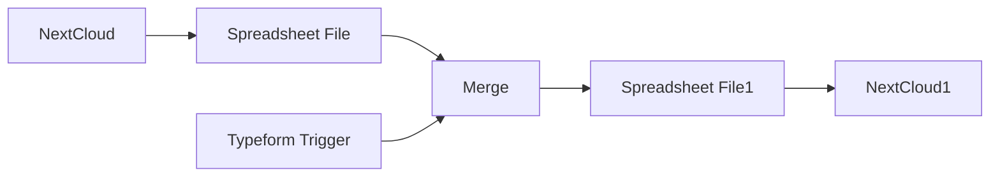

## Fluxo (.json) :

```json
{
  "nodes": [
    {
      "name": "Typeform Trigger",
      "type": "n8n-nodes-base.typeformTrigger",
      "position": [
        500,
        520
      ],
      "parameters": {
        "formId": ""
      },
      "credentials": {
        "typeformApi": ""
      },
      "typeVersion": 1
    },
    {
      "name": "NextCloud",
      "type": "n8n-nodes-base.nextCloud",
      "position": [
        650,
        300
      ],
      "parameters": {
        "path": "examples/Problems.xls",
        "operation": "download"
      },
      "credentials": {
        "nextCloudApi": ""
      },
      "typeVersion": 1
    },
    {
      "name": "Spreadsheet File",
      "type": "n8n-nodes-base.spreadsheetFile",
      "position": [
        800,
        300
      ],
      "parameters": {},
      "typeVersion": 1
    },
    {
      "name": "Merge",
      "type": "n8n-nodes-base.merge",
      "position": [
        1000,
        470
      ],
      "parameters": {},
      "typeVersion": 1
    },
    {
      "name": "Spreadsheet File1",
      "type": "n8n-nodes-base.spreadsheetFile",
      "position": [
        1150,
        470
      ],
      "parameters": {
        "operation": "toFile"
      },
      "typeVersion": 1
    },
    {
      "name": "NextCloud1",
      "type": "n8n-nodes-base.nextCloud",
      "position": [
        1300,
        470
      ],
      "parameters": {
        "path": "={{$node[\"NextCloud\"].parameter[\"path\"]}}",
        "binaryDataUpload": true
      },
      "credentials": {
        "nextCloudApi": ""
      },
      "typeVersion": 1
    }
  ],
  "connections": {
    "Merge": {
      "main": [
        [
          {
            "node": "Spreadsheet File1",
            "type": "main",
            "index": 0
          }
        ]
      ]
    },
    "NextCloud": {
      "main": [
        [
          {
            "node": "Spreadsheet File",
            "type": "main",
            "index": 0
          }
        ]
      ]
    },
    "Spreadsheet File": {
      "main": [
        [
          {
            "node": "Merge",
            "type": "main",
            "index": 0
          }
        ]
      ]
    },
    "Typeform Trigger": {
      "main": [
        [
          {
            "node": "Merge",
            "type": "main",
            "index": 1
          }
        ]
      ]
    },
    "Spreadsheet File1": {
      "main": [
        [
          {
            "node": "NextCloud1",
            "type": "main",
            "index": 0
          }
        ]
      ]
    }
  }
}
```

<a id="template-226"></a>

## Template 226 - Extrair markdown e links de páginas web

- **Nome:** Extrair markdown e links de páginas web
- **Descrição:** Processa uma lista de URLs, converte o HTML em markdown, extrai links e grava os dados em sua base de dados respeitando limites de API.
- **Funcionalidade:** • Entrada de URLs: recebe URLs de uma fonte de dados do usuário ou de um array definido manualmente.
• Separação de URLs: garante que cada URL seja tratada como um item individual para processamento.
• Controle de concorrência: limita o número de itens processados em paralelo (ex.: 40 itens máximos por vez).
• Processamento em lotes: agrupa as requisições em lotes menores (ex.: 10 por lote) para controlar o ritmo de chamadas.
• Espera entre execuções: inclui um tempo de espera configurável (neste fluxo: 45s) para ajudar a respeitar limites de API.
• Chamadas à API de scraping: envia POST para o serviço de scraping para obter conteúdo em markdown e lista de links.
• Re-tentativa automática: tenta novamente em caso de falha com intervalo entre tentativas (ex.: 5s).
• Mapeamento de campos: extrai e organiza título, descrição, conteúdo (markdown) e links a partir da resposta da API.
• Saída para base de dados: prepara os dados para serem gravados na sua própria fonte de dados (ex.: Airtable).
- **Ferramentas:** • Firecrawl.dev: serviço de scraping que converte HTML em markdown e extrai links a partir de uma URL, acessado via API com token.
• Base de dados do usuário (por exemplo, Airtable, PostgreSQL, etc.): fonte de entrada das URLs e destino para armazenar os resultados processados.

## Fluxo visual

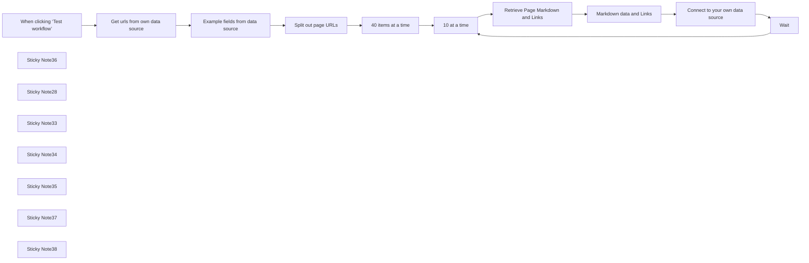

## Fluxo (.json) :

```json
{
  "meta": {
    "instanceId": "6b6a2db47bdf8371d21090c511052883cc9a3f6af5d0d9d567c702d74a18820e"
  },
  "nodes": [
    {
      "id": "f4570aad-db25-4dcd-8589-b1c8335935de",
      "name": "When clicking ‘Test workflow’",
      "type": "n8n-nodes-base.manualTrigger",
      "position": [
        -180,
        3800
      ],
      "parameters": {},
      "typeVersion": 1
    },
    {
      "id": "bd481559-85f2-4865-8d85-e50e72369f26",
      "name": "Wait",
      "type": "n8n-nodes-base.wait",
      "position": [
        940,
        3620
      ],
      "webhookId": "f10708f0-38c6-4c75-b635-37222d5b183a",
      "parameters": {
        "amount": 45
      },
      "typeVersion": 1.1
    },
    {
      "id": "cc9e9947-19e4-47c5-95b0-a631d688a8b6",
      "name": "Sticky Note36",
      "type": "n8n-nodes-base.stickyNote",
      "position": [
        549.7858793743054,
        3709.534654112671
      ],
      "parameters": {
        "color": 7,
        "width": 327.8244990224782,
        "height": 268.48353140372035,
        "content": "**40 at a time seems to be the memory limit on my server - run until complete with batches of 40 or increase based on your server memory**\n"
      },
      "typeVersion": 1
    },
    {
      "id": "9ebbd993-9194-40b1-a98e-352eb3a3f9eb",
      "name": "Sticky Note28",
      "type": "n8n-nodes-base.stickyNote",
      "position": [
        -50.797941767307435,
        3729.028866440868
      ],
      "parameters": {
        "color": 7,
        "width": 574.7594700148138,
        "height": 248.90718753310907,
        "content": "**Firecrawl.dev retrieves markdown inc. title, description, links & content. First define the URLs you'd like to scrape**\n"
      },
      "typeVersion": 1
    },
    {
      "id": "71c0f975-c0f9-47ae-a245-f852387ad461",
      "name": "Connect to your own data source",
      "type": "n8n-nodes-base.noOp",
      "position": [
        1380,
        3820
      ],
      "parameters": {},
      "typeVersion": 1
    },
    {
      "id": "fba918e7-2c88-4de3-a789-cadbf4f2584e",
      "name": "Get urls from own data source",
      "type": "n8n-nodes-base.noOp",
      "position": [
        0,
        3800
      ],
      "parameters": {},
      "typeVersion": 1
    },
    {
      "id": "221a75eb-0bc8-4747-9ec1-1879c46d9163",
      "name": "Example fields from data source",
      "type": "n8n-nodes-base.set",
      "notes": "Define URLs in array",
      "position": [
        200,
        3800
      ],
      "parameters": {
        "options": {},
        "assignments": {
          "assignments": [
            {
              "id": "cc2c6af0-68d3-49eb-85fe-3288d2ed0f6b",
              "name": "Page",
              "type": "array",
              "value": "[\"https://www.automake.io/\", \"https://www.n8n.io/\"]"
            }
          ]
        },
        "includeOtherFields": true
      },
      "notesInFlow": true,
      "typeVersion": 3.4
    },
    {
      "id": "5a914964-e8ef-4064-8ecb-f1866de0d8c6",
      "name": "Sticky Note33",
      "type": "n8n-nodes-base.stickyNote",
      "position": [
        -40,
        4000
      ],
      "parameters": {
        "color": 3,
        "width": 510.3561134140244,
        "height": 94.13486342358942,
        "content": "**REQUIRED**\nConnect to your database of urls to input. Name the column `Page` like in the `Example fields from data source` node and make sure it has one link per row like `split out page urls`"
      },
      "typeVersion": 1
    },
    {
      "id": "5c004d5c-afeb-47c9-b30b-eb88880f87b9",
      "name": "Sticky Note34",
      "type": "n8n-nodes-base.stickyNote",
      "position": [
        900,
        4000
      ],
      "parameters": {
        "color": 3,
        "width": 284.87764467541297,
        "height": 168.68864948728321,
        "content": "**REQUIRED**\nUpdate the Auth parameter to your own [Firecrawl](https://firecrawl.dev) dev token\n\n**Header Auth parameter**\nname - Authorization\nvalue - your-own-api-key"
      },
      "typeVersion": 1
    },
    {
      "id": "53d97054-a5e4-4819-bdd9-f8632c33eba2",
      "name": "Sticky Note35",
      "type": "n8n-nodes-base.stickyNote",
      "position": [
        1360,
        4000
      ],
      "parameters": {
        "color": 3,
        "width": 284.87764467541297,
        "height": 91.91340067739628,
        "content": "**REQUIRED** \nOutput the data to your own data source e.g. Airtable"
      },
      "typeVersion": 1
    },
    {
      "id": "357a463f-7581-43ba-8930-af27e4762905",
      "name": "Sticky Note37",
      "type": "n8n-nodes-base.stickyNote",
      "position": [
        900,
        3570.2075673933587
      ],
      "parameters": {
        "color": 7,
        "width": 181.96744211154697,
        "height": 189.23753199986137,
        "content": "**Respect API limits (10 requests per min)**\n"
      },
      "typeVersion": 1
    },
    {
      "id": "77311c67-f50f-427a-87fd-b29b1f542bbc",
      "name": "40 items at a time",
      "type": "n8n-nodes-base.limit",
      "position": [
        580,
        3800
      ],
      "parameters": {
        "maxItems": 40
      },
      "typeVersion": 1
    },
    {
      "id": "43557ab1-4e52-4598-83a9-e39d5afc6de7",
      "name": "10 at a time",
      "type": "n8n-nodes-base.splitInBatches",
      "position": [
        740,
        3800
      ],
      "parameters": {
        "options": {},
        "batchSize": 10
      },
      "typeVersion": 3
    },
    {
      "id": "555d52e7-010b-462b-9382-26804493de1c",
      "name": "Markdown data and Links",
      "type": "n8n-nodes-base.set",
      "position": [
        1160,
        3820
      ],
      "parameters": {
        "options": {},
        "assignments": {
          "assignments": [
            {
              "id": "3a959c64-4c3c-4072-8427-67f6f6ecba1b",
              "name": "title",
              "type": "string",
              "value": "={{ $json.data.metadata.title }}"
            },
            {
              "id": "d2da0859-a7a0-4c39-913a-150ecb95d075",
              "name": "description",
              "type": "string",
              "value": "={{ $json.data.metadata.description }}"
            },
            {
              "id": "62bd2d76-b78d-4501-a59b-a25ed7b345b0",
              "name": "content",
              "type": "string",
              "value": "={{ $json.data.markdown }}"
            },
            {
              "id": "d4c712fa-b52a-498f-8abc-26dc72be61f7",
              "name": "links",
              "type": "string",
              "value": "={{ $json.data.links }} "
            }
          ]
        }
      },
      "notesInFlow": true,
      "typeVersion": 3.4
    },
    {
      "id": "aac948e6-ac86-4cea-be84-f27919d6d936",
      "name": "Split out page URLs",
      "type": "n8n-nodes-base.splitOut",
      "position": [
        380,
        3800
      ],
      "parameters": {
        "options": {},
        "fieldToSplitOut": "Page"
      },
      "typeVersion": 1
    },
    {
      "id": "71c5a0d4-540e-4766-ae99-bdc427019dac",
      "name": "Retrieve Page Markdown and Links",
      "type": "n8n-nodes-base.httpRequest",
      "notes": "curl -X POST https://api.firecrawl.dev/v1/scrape \\\n    -H 'Content-Type: application/json' \\\n    -H 'Authorization: Bearer YOUR_API_KEY' \\\n    -d '{\n      \"url\": \"https://docs.firecrawl.dev\",\n      \"formats\" : [\"markdown\", \"html\"]\n    }'\n",
      "position": [
        960,
        3820
      ],
      "parameters": {
        "url": "https://api.firecrawl.dev/v1/scrape",
        "method": "POST",
        "options": {},
        "jsonBody": "={\n    \"url\": \"{{ $json.Page }}\",\n    \"formats\" : [\"markdown\", \"links\"]\n} ",
        "sendBody": true,
        "sendHeaders": true,
        "specifyBody": "json",
        "authentication": "genericCredentialType",
        "genericAuthType": "httpHeaderAuth",
        "headerParameters": {
          "parameters": [
            {
              "name": "Content-Type",
              "value": "application/json"
            }
          ]
        }
      },
      "credentials": {
        "httpHeaderAuth": {
          "id": "nbamiF1MDku2NNz7",
          "name": "Firecrawl Bearer"
        }
      },
      "retryOnFail": true,
      "typeVersion": 4.2,
      "waitBetweenTries": 5000
    },
    {
      "id": "a2f12929-262e-4354-baa3-f9e3c05ec2eb",
      "name": "Sticky Note38",
      "type": "n8n-nodes-base.stickyNote",
      "position": [
        -840,
        3340
      ],
      "parameters": {
        "color": 4,
        "width": 581.9949654101088,
        "height": 818.5240734585421,
        "content": "## Convert URL HTML to Markdown and Get Page Links\n\n## Use Case\nTransform web pages into AI-friendly markdown format:\n- You need to process webpage content for LLM analysis\n- You want to extract both content and links from web pages\n- You need clean, formatted text without HTML markup\n- You want to respect API rate limits while crawling pages\n\n## What this Workflow Does\nThe workflow uses Firecrawl.dev API to process webpages:\n- Converts HTML content to markdown format\n- Extracts all links from each webpage\n- Handles API rate limiting automatically\n- Processes URLs in batches from your database\n\n## Setup\n1. Create a [Firecrawl.dev](https://www.firecrawl.dev/) account and get your API key\n2. Add your Firecrawl API key to the HTTP Request node's Authorization header\n3. Connect your URL database to the input node (column name must be \"Page\") or edit the array in `Example fields from data source`\n4. Configure your preferred output database connection\n\n## How to Adjust it to Your Needs\n- Modify input source to pull URLs from different databases\n- Adjust rate limiting parameters if needed\n- Customize output format for your specific use case\n\n\nMade by Simon @ [automake.io](https://automake.io)\n"
      },
      "typeVersion": 1
    }
  ],
  "pinData": {},
  "connections": {
    "Wait": {
      "main": [
        [
          {
            "node": "10 at a time",
            "type": "main",
            "index": 0
          }
        ]
      ]
    },
    "10 at a time": {
      "main": [
        null,
        [
          {
            "node": "Retrieve Page Markdown and Links",
            "type": "main",
            "index": 0
          }
        ]
      ]
    },
    "40 items at a time": {
      "main": [
        [
          {
            "node": "10 at a time",
            "type": "main",
            "index": 0
          }
        ]
      ]
    },
    "Split out page URLs": {
      "main": [
        [
          {
            "node": "40 items at a time",
            "type": "main",
            "index": 0
          }
        ]
      ]
    },
    "Markdown data and Links": {
      "main": [
        [
          {
            "node": "Connect to your own data source",
            "type": "main",
            "index": 0
          }
        ]
      ]
    },
    "Get urls from own data source": {
      "main": [
        [
          {
            "node": "Example fields from data source",
            "type": "main",
            "index": 0
          }
        ]
      ]
    },
    "Connect to your own data source": {
      "main": [
        [
          {
            "node": "Wait",
            "type": "main",
            "index": 0
          }
        ]
      ]
    },
    "Example fields from data source": {
      "main": [
        [
          {
            "node": "Split out page URLs",
            "type": "main",
            "index": 0
          }
        ]
      ]
    },
    "Retrieve Page Markdown and Links": {
      "main": [
        [
          {
            "node": "Markdown data and Links",
            "type": "main",
            "index": 0
          }
        ]
      ]
    },
    "When clicking ‘Test workflow’": {
      "main": [
        [
          {
            "node": "Get urls from own data source",
            "type": "main",
            "index": 0
          }
        ]
      ]
    }
  }
}
```

<a id="template-227"></a>

## Template 227 - Tradução de PDFs (Drive → DeepL)

- **Nome:** Tradução de PDFs (Drive → DeepL)
- **Descrição:** Fluxo que busca PDFs em uma pasta do Google Drive, envia-os para tradução via DeepL, aguarda a conclusão e salva os PDFs traduzidos de volta na mesma pasta.
- **Funcionalidade:** • Configuração de parâmetros: Permite definir a URL da pasta, o idioma alvo e o idioma fonte (opcional).
• Listagem de arquivos na pasta: Recupera arquivos a partir da URL da pasta configurada.
• Filtragem de PDFs: Seleciona apenas arquivos com extensão .pdf e ignora arquivos que já parecem ter sido traduzidos (com sufixo do idioma).
• Download dos arquivos: Faz download dos PDFs selecionados para envio à API de tradução.
• Envio de documento para tradução: Envia o arquivo como multipart/form-data para a API do DeepL, indicando idioma alvo e, se fornecido, idioma fonte.
• Polling de status de tradução: Consulta periodicamente a API para verificar se a tradução do documento foi concluída, com espera entre tentativas.
• Gerenciamento de ritmo: Insere pequenas esperas entre verificações de status e entre documentos para evitar sobrecarga de requisições.
• Download do documento traduzido: Obtém o PDF traduzido quando a tradução estiver pronta.
• Upload do PDF traduzido: Salva o arquivo traduzido de volta na pasta original, adicionando um sufixo com o código do idioma alvo ao nome do arquivo.
• Ação manual de início: Execução iniciada manualmente, permitindo controle sobre quando o fluxo roda.
- **Ferramentas:** • Google Drive: Armazenamento e recuperação dos PDFs originais e upload dos PDFs traduzidos de volta na pasta especificada.
• DeepL API: Serviço de tradução de documentos utilizado para traduzir o conteúdo dos PDFs enviados.


## Fluxo visual

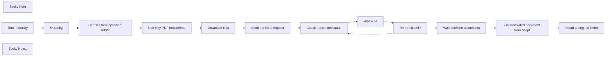

## Fluxo (.json) :

```json
{
  "nodes": [
    {
      "id": "fdb7302d-9319-4861-abab-557a3c1f1493",
      "name": "Sticky Note",
      "type": "n8n-nodes-base.stickyNote",
      "position": [
        2660,
        340
      ],
      "parameters": {
        "color": 7,
        "width": 288.76295784381495,
        "height": 795.272978576365,
        "content": "### Available source and target languages`*`:\n\n`BG` - 🇧🇬 Bulgarian\n`CS` - 🇨🇿 Czech\n`DA` - 🇩🇰 Danish\n`DE` - 🇩🇪 German\n`EL` - 🇬🇷 Greek\n`EN-GB` - 🇬🇧 English (British)\n`EN-US` - 🇺🇸 English (American)\n`ES` - 🇪🇸 Spanish\n`ET` - 🇪🇪 Estonian\n`FI` - 🇫🇮 Finnish\n`FR` - 🇫🇷 French\n`HU` - 🇭🇺 Hungarian\n`ID` - 🇮🇩 Indonesian\n`IT` - 🇮🇹 Italian\n`JA` - 🇯🇵 Japanese\n`KO` - 🇰🇷 Korean\n`LT` - 🇱🇹 Lithuanian\n`LV` - 🇱🇻 Latvian\n`NB` - 🇳🇴 Norwegian (Bokmål)\n`NL` - 🇳🇱 Dutch\n`PL` - 🇵🇱 Polish\n`PT-BR` - 🇧🇷 Portuguese (Brazilian)\n`PT-PT` - 🇵🇹 Portuguese\n`RO` - 🇷🇴 Romanian\n`RU` - 🇷🇺 Russian\n`SK` - 🇸🇰 Slovak\n`SL` - 🇸🇮 Slovenian\n`SV` - 🇸🇪 Swedish\n`TR` - 🇹🇷 Turkish\n`UK` - 🇺🇦 Ukrainian\n`ZH` - 🇨🇳 Chinese (simplified)\n\n`*` For more up-to-date list, please consult the official DeepL [API documentation](https://www.deepl.com/docs-api/documents/translate-document)"
      },
      "typeVersion": 1
    },
    {
      "id": "9cad538a-0efb-4186-b588-ef4d764fdf4e",
      "name": "Run manually",
      "type": "n8n-nodes-base.manualTrigger",
      "position": [
        1100,
        560
      ],
      "parameters": {},
      "typeVersion": 1
    },
    {
      "id": "242d4895-5b02-46b8-9c87-07fd2e11c9ba",
      "name": "Get files from specified folder",
      "type": "n8n-nodes-base.googleDrive",
      "position": [
        1780,
        560
      ],
      "parameters": {
        "filter": {
          "folderId": {
            "__rl": true,
            "mode": "url",
            "value": "={{ $json.folder_url }}"
          },
          "whatToSearch": "files"
        },
        "options": {
          "fields": [
            "kind",
            "id",
            "name",
            "mimeType"
          ]
        },
        "resource": "fileFolder"
      },
      "credentials": {
        "googleDriveOAuth2Api": {
          "id": "6q7v3i91ZDHQOKx3",
          "name": "Google Drive account"
        }
      },
      "typeVersion": 3
    },
    {
      "id": "1660cf85-af39-4d70-a997-5f4ef2252370",
      "name": "Use only PDF documents",
      "type": "n8n-nodes-base.filter",
      "position": [
        2000,
        560
      ],
      "parameters": {
        "options": {},
        "conditions": {
          "options": {
            "leftValue": "",
            "caseSensitive": true,
            "typeValidation": "strict"
          },
          "combinator": "and",
          "conditions": [
            {
              "id": "098535fe-164e-4f58-9b35-0628b51ac5d0",
              "operator": {
                "type": "string",
                "operation": "endsWith"
              },
              "leftValue": "={{ $json.name }}",
              "rightValue": ".pdf"
            },
            {
              "id": "a0bb0e8c-25e9-4ee0-a1fd-2d98a7328111",
              "operator": {
                "type": "string",
                "operation": "notContains"
              },
              "leftValue": "={{ $json.name }}",
              "rightValue": "=-{{ $('⚙️ config').first().json.target_lang }}"
            }
          ]
        }
      },
      "typeVersion": 2
    },
    {
      "id": "b7cc611e-81a3-4468-bcab-ca6de564fbeb",
      "name": "Download files",
      "type": "n8n-nodes-base.googleDrive",
      "position": [
        2220,
        560
      ],
      "parameters": {
        "fileId": {
          "__rl": true,
          "mode": "id",
          "value": "={{ $json.id }}"
        },
        "options": {},
        "operation": "download"
      },
      "credentials": {
        "googleDriveOAuth2Api": {
          "id": "6q7v3i91ZDHQOKx3",
          "name": "Google Drive account"
        }
      },
      "executeOnce": false,
      "typeVersion": 3
    },
    {
      "id": "f6e2c1e6-b68d-47b3-8582-7772f8b1ee95",
      "name": "Send translate request",
      "type": "n8n-nodes-base.httpRequest",
      "position": [
        2440,
        560
      ],
      "parameters": {
        "url": "https://api.deepl.com/v2/document",
        "method": "POST",
        "options": {},
        "sendBody": true,
        "contentType": "multipart-form-data",
        "authentication": "genericCredentialType",
        "bodyParameters": {
          "parameters": [
            {
              "name": "target_lang",
              "value": "={{ $('⚙️ config').first().json.target_lang }}"
            },
            {
              "name": "file",
              "parameterType": "formBinaryData",
              "inputDataFieldName": "data"
            },
            {
              "name": "source_lang",
              "value": "={{ $('⚙️ config').first().json.source_lang }}"
            }
          ]
        },
        "genericAuthType": "httpHeaderAuth"
      },
      "credentials": {
        "httpHeaderAuth": {
          "id": "NcB0kuT7IJgHvWlC",
          "name": "Deepl API Header auth"
        }
      },
      "typeVersion": 4.1
    },
    {
      "id": "9fab53d1-dfa8-4b27-892f-884853df1e50",
      "name": "Check translation status",
      "type": "n8n-nodes-base.httpRequest",
      "position": [
        1320,
        820
      ],
      "parameters": {
        "url": "=https://api.deepl.com/v2/document/{{ $json.document_id }}",
        "method": "POST",
        "options": {},
        "sendBody": true,
        "authentication": "genericCredentialType",
        "bodyParameters": {
          "parameters": [
            {
              "name": "document_key",
              "value": "={{ $('Send translate request').item.json.document_key }}"
            }
          ]
        },
        "genericAuthType": "httpHeaderAuth"
      },
      "credentials": {
        "httpHeaderAuth": {
          "id": "NcB0kuT7IJgHvWlC",
          "name": "Deepl API Header auth"
        }
      },
      "typeVersion": 4.1
    },
    {
      "id": "9d320d4c-8398-4af4-8582-bc60ca52b986",
      "name": "Wait a bit",
      "type": "n8n-nodes-base.wait",
      "position": [
        1540,
        820
      ],
      "webhookId": "9fd126e3-203c-4f11-ad50-d00ff55301a2",
      "parameters": {
        "unit": "seconds",
        "amount": 5
      },
      "typeVersion": 1
    },
    {
      "id": "657758b1-a5f5-4b0b-bdd0-ef0cdb518863",
      "name": "file translated?",
      "type": "n8n-nodes-base.if",
      "position": [
        1760,
        820
      ],
      "parameters": {
        "options": {},
        "conditions": {
          "options": {
            "leftValue": "",
            "caseSensitive": true,
            "typeValidation": "strict"
          },
          "combinator": "and",
          "conditions": [
            {
              "id": "1a7ad415-3d30-4d51-b31e-7a0911391d21",
              "operator": {
                "name": "filter.operator.equals",
                "type": "string",
                "operation": "equals"
              },
              "leftValue": "={{ $json.status }}",
              "rightValue": "done"
            }
          ]
        }
      },
      "typeVersion": 2
    },
    {
      "id": "2018d45b-8922-4a9c-884b-27cc6903d464",
      "name": "Wait between documents",
      "type": "n8n-nodes-base.wait",
      "position": [
        2000,
        800
      ],
      "webhookId": "877870bc-5b29-4ce0-82d6-3202d43e89fd",
      "parameters": {
        "unit": "seconds",
        "amount": 2
      },
      "typeVersion": 1
    },
    {
      "id": "717972fe-45fa-4bd4-acf9-9db2efb45c12",
      "name": "Get translated document from deepL",
      "type": "n8n-nodes-base.httpRequest",
      "position": [
        2240,
        800
      ],
      "parameters": {
        "url": "=https://api.deepl.com/v2/document/{{ $json.document_id }}/result",
        "method": "POST",
        "options": {
          "timeout": 30000
        },
        "sendBody": true,
        "authentication": "genericCredentialType",
        "bodyParameters": {
          "parameters": [
            {
              "name": "document_key",
              "value": "={{ $('Send translate request').item.json.document_key }}"
            }
          ]
        },
        "genericAuthType": "httpHeaderAuth"
      },
      "credentials": {
        "httpHeaderAuth": {
          "id": "NcB0kuT7IJgHvWlC",
          "name": "Deepl API Header auth"
        }
      },
      "typeVersion": 4.1
    },
    {
      "id": "c9e9b000-8202-410d-9630-b08481ba4e39",
      "name": "Uplad to original folder",
      "type": "n8n-nodes-base.googleDrive",
      "position": [
        2460,
        800
      ],
      "parameters": {
        "name": "={{ $('Download files').item.json.name.replace('.pdf', '--' + $('⚙️ config').first().json.target_lang) + '.pdf' }}",
        "driveId": {
          "__rl": true,
          "mode": "list",
          "value": "My Drive"
        },
        "options": {},
        "folderId": {
          "__rl": true,
          "mode": "url",
          "value": "={{ $('⚙️ config').first().json.folder_url }}"
        }
      },
      "credentials": {
        "googleDriveOAuth2Api": {
          "id": "6q7v3i91ZDHQOKx3",
          "name": "Google Drive account"
        }
      },
      "executeOnce": false,
      "typeVersion": 3
    },
    {
      "id": "698a33ce-8b33-4b33-8236-190b1013cb0d",
      "name": "⚙️ config",
      "type": "n8n-nodes-base.set",
      "position": [
        1440,
        560
      ],
      "parameters": {
        "fields": {
          "values": [
            {
              "name": "target_lang"
            },
            {
              "name": "source_lang"
            },
            {
              "name": "folder_url"
            }
          ]
        },
        "options": {}
      },
      "typeVersion": 3.2
    },
    {
      "id": "aeee03fa-f4a6-48fd-b3ca-ff6a6dc20fb4",
      "name": "Sticky Note1",
      "type": "n8n-nodes-base.stickyNote",
      "position": [
        1280,
        367.395398150649
      ],
      "parameters": {
        "color": 5,
        "width": 444.71526152412946,
        "height": 343.02803459456237,
        "content": "### Configure your workflow here by setting these parameters:\n- `folder_url`: URL of your google drive folder\n- `target_lang`: The language into which the text should be translated\n- `source_lang`: Language of the text to be translated (optional, if not specified DeepL will try to auto-detect the source language)"
      },
      "typeVersion": 1
    }
  ],
  "pinData": {},
  "connections": {
    "Wait a bit": {
      "main": [
        [
          {
            "node": "file translated?",
            "type": "main",
            "index": 0
          }
        ]
      ]
    },
    "Run manually": {
      "main": [
        [
          {
            "node": "⚙️ config",
            "type": "main",
            "index": 0
          }
        ]
      ]
    },
    "⚙️ config": {
      "main": [
        [
          {
            "node": "Get files from specified folder",
            "type": "main",
            "index": 0
          }
        ]
      ]
    },
    "Download files": {
      "main": [
        [
          {
            "node": "Send translate request",
            "type": "main",
            "index": 0
          }
        ]
      ]
    },
    "file translated?": {
      "main": [
        [
          {
            "node": "Wait between documents",
            "type": "main",
            "index": 0
          }
        ],
        [
          {
            "node": "Check translation status",
            "type": "main",
            "index": 0
          }
        ]
      ]
    },
    "Send translate request": {
      "main": [
        [
          {
            "node": "Check translation status",
            "type": "main",
            "index": 0
          }
        ]
      ]
    },
    "Use only PDF documents": {
      "main": [
        [
          {
            "node": "Download files",
            "type": "main",
            "index": 0
          }
        ]
      ]
    },
    "Wait between documents": {
      "main": [
        [
          {
            "node": "Get translated document from deepL",
            "type": "main",
            "index": 0
          }
        ]
      ]
    },
    "Check translation status": {
      "main": [
        [
          {
            "node": "Wait a bit",
            "type": "main",
            "index": 0
          }
        ]
      ]
    },
    "Get files from specified folder": {
      "main": [
        [
          {
            "node": "Use only PDF documents",
            "type": "main",
            "index": 0
          }
        ]
      ]
    },
    "Get translated document from deepL": {
      "main": [
        [
          {
            "node": "Uplad to original folder",
            "type": "main",
            "index": 0
          }
        ]
      ]
    }
  }
}
```

<a id="template-228"></a>

## Template 228 - Geração automática de metadados para YouTube

- **Nome:** Geração automática de metadados para YouTube
- **Descrição:** Automatiza a criação e atualização de metadados de vídeos do YouTube (título, descrição, tags, hashtags e CTAs) a partir do link do vídeo, transcrição e palavras-chave focais, incorporando links de afiliado e promocionais.
- **Funcionalidade:** • Coleta via formulário: Recebe o link do vídeo, a transcrição e as palavras-chave foco através de um formulário web.
• Consulta de links promocionais: Recupera links de afiliados, cursos e referências relevantes de um documento para usar na descrição.
• Geração de metadados por IA: Utiliza um modelo de linguagem para criar título, descrição otimizada para SEO, lista de tags, hashtags e CTA.
• Validação e estruturação: Converte a saída da IA para um JSON estruturado conforme esquema pré-definido para automação.
• Extração de ID do vídeo: Extrai o ID do vídeo a partir do link informado para permitir a atualização via API.
• Formatação de tags: Agrupa e formata as tags geradas para envio correto à plataforma de vídeo.
• Atualização do vídeo no YouTube: Atualiza título, descrição, tags e hashtags do vídeo usando a API do YouTube.
• Confirmação ao usuário: Exibe uma mensagem de conclusão com o título atualizado e o link do vídeo após o processamento.
- **Ferramentas:** • Serviço de formulário web: Captura inputs do usuário (link, transcrição, palavras-chave).
• Google Docs: Fonte de links de afiliado, cursos e materiais promocionais usados na descrição.
• OpenAI (modelo gpt-4o-mini): Gera títulos, descrições, tags, hashtags e CTAs otimizados.
• YouTube API: Recurso para atualizar metadados do vídeo (título, descrição, tags, categoria e região).

## Fluxo visual

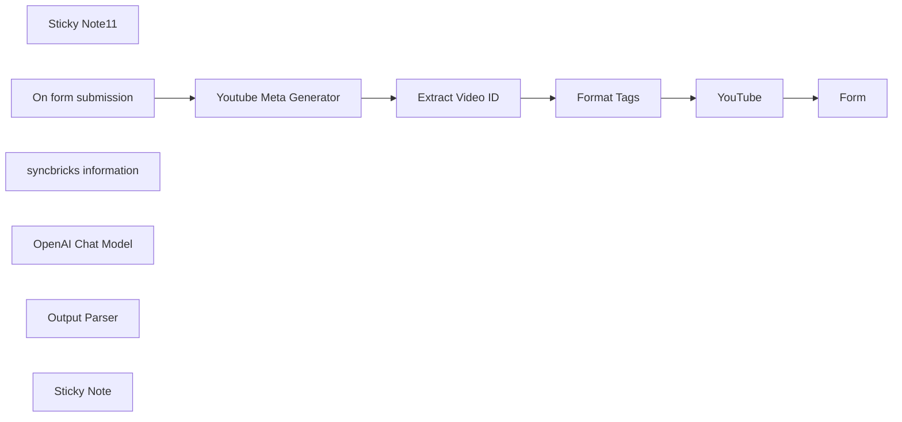

## Fluxo (.json) :

```json
{
  "meta": {
    "instanceId": "dd130a849d7b29e5541b05d2f7f86a4acd4f1ec598c1c9438783f56bc4f0ff80",
    "templateCredsSetupCompleted": true
  },
  "nodes": [
    {
      "id": "07433551-9fa9-421c-a0bf-721fa1624304",
      "name": "Sticky Note11",
      "type": "n8n-nodes-base.stickyNote",
      "position": [
        -1380,
        -320
      ],
      "parameters": {
        "color": 4,
        "width": 1075,
        "height": 736,
        "content": "## Developed by Amjid Ali\n\nThank you for using this workflow template. It has taken me countless hours of hard work, research, and dedication to develop, and I sincerely hope it adds value to your work.\n\nIf you find this template helpful, I kindly ask you to consider supporting my efforts. Your support will help me continue improving and creating more valuable resources.\n\nYou can contribute via PayPal here:\n\nhttp://paypal.me/pmptraining\n\nFor Full Course about ERPNext or Automation using AI follow below link\n\nhttp://lms.syncbricks.com\n\nAdditionally, when sharing this template, I would greatly appreciate it if you include my original information to ensure proper credit is given.\n\nThank you for your generosity and support!\nEmail : amjid@amjidali.com\nhttps://linkedin.com/in/amjidali\nhttps://syncbricks.com\nhttps://youtube.com/@syncbricks"
      },
      "typeVersion": 1
    },
    {
      "id": "31a0c5e9-c6f6-4921-8f92-be84cc669869",
      "name": "On form submission",
      "type": "n8n-nodes-base.formTrigger",
      "position": [
        -220,
        -80
      ],
      "webhookId": "syncbricks-youtube-meta-automation",
      "parameters": {
        "options": {
          "buttonLabel": "Update Youtube Video"
        },
        "formTitle": "Syncbricks Youtube",
        "formFields": {
          "values": [
            {
              "fieldLabel": "Youtube Video Link",
              "requiredField": true
            },
            {
              "fieldLabel": "Video Transcript",
              "requiredField": true
            },
            {
              "fieldLabel": "Focus Keywords",
              "placeholder": "Focus Keywords (Optional)"
            }
          ]
        },
        "formDescription": "Generate Youtube Video Title, Description, Tags and Hashtags"
      },
      "typeVersion": 2.2
    },
    {
      "id": "d3c5df7c-2b57-4136-a790-cff68a03a2f1",
      "name": "syncbricks information",
      "type": "n8n-nodes-base.googleDocsTool",
      "position": [
        240,
        260
      ],
      "parameters": {
        "operation": "get",
        "documentURL": "15lN3FJ3iXABf_bd061-F7j-gGx2WBH8Jr6fjBLa3tis",
        "descriptionType": "manual",
        "toolDescription": "affiliate links, course links, social media links and other relevant links related to syncbricks"
      },
      "typeVersion": 2
    },
    {
      "id": "e31ea741-3b99-4b3b-9b44-9dcca69f6384",
      "name": "OpenAI Chat Model",
      "type": "@n8n/n8n-nodes-langchain.lmChatOpenAi",
      "position": [
        40,
        200
      ],
      "parameters": {
        "model": {
          "__rl": true,
          "mode": "list",
          "value": "gpt-4o-mini"
        },
        "options": {}
      },
      "typeVersion": 1.2
    },
    {
      "id": "07b23889-9c41-4202-a41b-350cca850e63",
      "name": "Extract Video ID",
      "type": "n8n-nodes-base.set",
      "position": [
        540,
        -80
      ],
      "parameters": {
        "options": {},
        "assignments": {
          "assignments": [
            {
              "id": "f7b24e9b-cc50-4e4e-8073-aa555aaa5a03",
              "name": "=videoID",
              "type": "string",
              "value": "={{ $('On form submission').item.json['Youtube Video Link'].replace(\"https://youtu.be/\",\"\") }}"
            }
          ]
        }
      },
      "typeVersion": 3.4
    },
    {
      "id": "44226e96-2429-497d-b84b-f3752f441b8b",
      "name": "Youtube Meta Generator",
      "type": "@n8n/n8n-nodes-langchain.agent",
      "position": [
        120,
        -80
      ],
      "parameters": {
        "text": "=You are an AI content generator specialized in crafting high-converting YouTube metadata for videos related to stores, shops, memberships, and business promotions. Your task is to generate a **structured JSON output** optimized for YouTube SEO and audience engagement based on the provided video transcript and focus keywords. Use \"syncbricks information\" tool to collect relevant social media, courses, website and affilite links and ensure to add the relavent links in description. Major course or affilite link should be used as hook in the beginning of the description.\n\n### **Output Requirements:**\n1. **Title:** A compelling, SEO-friendly title optimized for search and audience interest.\n2. **Description:** A detailed, keyword-rich summary of the video, incorporating relevant keywords naturally and including a clear value proposition.\n3. **Keywords:** Single line of all possible keywords with  at least 450 characters in total with comma in between each keyword relevant to the video content to enhance discoverability.\n4. **Hashtags:** Single line of 5 to 10 relevant hashtags, without the comma that align with the video's theme.\n5. **Affiliate Links:** Contextually relevant affiliate links that match the video content. Only provide link don't add unnessary boxes.\n7. **Call to Action (CTA):** A persuasive CTA encouraging viewers to **subscribe, like, share, visit a store, or sign up for membership**.\n8. **Additional Promotional Links:** Gather and include relevant **course links, business website links, or related references** that add value to the audience.\n9. **Channel Hashtags:** Append **#EnterpriseIT #BusinessIntelligence #TechSolutions #ITInsights #HomeLab #Gadgets #TechReview #ITTips #SyncBricks #AmjidAli** at the end of the description.\n\n### **Instructions:**\n- Ensure that **affiliate links are directly related** to the video topic.\n- Use **natural language and avoid keyword stuffing** to maintain a user-friendly tone.\n- Don't add social media profiles, and syncbricks websit link, only add the affilaite and promotion links\n- The description should be **at least 150 words properly formatted with lines and paragraphs** for better YouTube SEO.\n - Avoid adding [] brackets\n- Structure the output in a **well-formatted JSON format** for automation.\n\n##Example of Affialite and promotion Links ##\nn8n : https://n8n.syncbricks.com\nFull Course : https://proxmox.syncbricks.com or udemy link\n\n\n### **Here is the existing Video Details:**\n- **Transcript:** {{ $json['Video Transcript'] }}\n- **Focus Keywords:** {{ $json['Focus Keywords'] }}",
        "options": {
          "maxIterations": 10
        },
        "promptType": "define",
        "hasOutputParser": true
      },
      "typeVersion": 1.7
    },
    {
      "id": "727cdc7f-e783-4d98-8476-a1623310a1fc",
      "name": "YouTube",
      "type": "n8n-nodes-base.youTube",
      "position": [
        740,
        60
      ],
      "parameters": {
        "title": "={{ $('Youtube Meta Generator').item.json.output.youtube_metadata.title }}",
        "videoId": "={{ $('Extract Video ID').item.json.videoID }}",
        "resource": "video",
        "operation": "update",
        "categoryId": "28",
        "regionCode": "OM",
        "updateFields": {
          "tags": "={{ $json.formatted_tags }}",
          "description": "={{ $('Youtube Meta Generator').item.json.output.youtube_metadata.description }}\n\nConnect with us : \nFacebook: https://www.facebook.com/syncbricks\nLinkedIn : https://linkedin.com/company/syncbricks\nInstagram : https://instagram.com/syncbricks_com\n\nSubscribe to youtube Channel : https://www.youtube.com/channel/UC1ORA3oNGYuQ8yQHrC7MzBg?sub_confirmation=1\n\nWebsite : \nSync Bricks: https://syncbricks.com/\n\nContact : info@syncbricks.com\n\n{{ $('Youtube Meta Generator').item.json.output.youtube_metadata.call_to_action }}\n\n{{ $('Youtube Meta Generator').item.json.output.youtube_metadata.hashtags }}\n\n\n"
        }
      },
      "typeVersion": 1
    },
    {
      "id": "631fbe64-2851-42f0-8657-ddd501abcd34",
      "name": "Format Tags",
      "type": "n8n-nodes-base.set",
      "position": [
        540,
        160
      ],
      "parameters": {
        "options": {},
        "assignments": {
          "assignments": [
            {
              "id": "10cbc535-36a3-4973-a038-ead1b3525a7c",
              "name": "formatted_tags",
              "type": "string",
              "value": "={{ $('Youtube Meta Generator').item.json.output.youtube_metadata.tags.join() }}"
            }
          ]
        }
      },
      "typeVersion": 3.4
    },
    {
      "id": "e75c1fe1-eb58-4fb1-bcc9-ed969eb62a99",
      "name": "Output Parser",
      "type": "@n8n/n8n-nodes-langchain.outputParserStructured",
      "position": [
        400,
        240
      ],
      "parameters": {
        "schemaType": "manual",
        "inputSchema": "{\n\t\"type\": \"object\",\n\t\"properties\": {\n\t\t\"video_title\": {\n\t\t\t\"type\": \"string\"\n\t\t},\n\t\t\"video_description\": {\n\t\t\t\"type\": \"string\"\n\t\t},\n\t\t\"youtube_metadata\": {\n\t\t\t\"type\": \"object\",\n\t\t\t\"properties\": {\n\t\t\t\t\"title\": {\n\t\t\t\t\t\"type\": \"string\"\n\t\t\t\t},\n\t\t\t\t\"description\": {\n\t\t\t\t\t\"type\": \"string\"\n\t\t\t\t},\n\t\t\t\t\"tags\": {\n\t\t\t\t\t\"type\": \"array\",\n\t\t\t\t\t\"items\": {\n\t\t\t\t\t\t\"type\": \"string\"\n\t\t\t\t\t}\n\t\t\t\t},\n\t\t\t\t\"hashtags\": {\n\t\t\t\t\t\"type\": \"array\",\n\t\t\t\t\t\"items\": {\n\t\t\t\t\t\t\"type\": \"string\"\n\t\t\t\t\t}\n\t\t\t\t},\n\t\t\t\t\"call_to_action\": {\n\t\t\t\t\t\"type\": \"string\"\n\t\t\t\t}\n\t\t\t}\n\t\t},\n\t\t\"additional_notes\": {\n\t\t\t\"type\": \"string\"\n\t\t}\n\t}\n}\n"
      },
      "typeVersion": 1.2
    },
    {
      "id": "91327309-8d6a-4e46-8516-726916acd3f4",
      "name": "Form",
      "type": "n8n-nodes-base.form",
      "position": [
        940,
        60
      ],
      "webhookId": "6557e699-8774-475d-a1df-7b0b24e4cb3b",
      "parameters": {
        "options": {},
        "operation": "completion",
        "completionTitle": "={{ $json.snippet.title }}",
        "completionMessage": "=Video is updated with Title : {{ $json.snippet.title }} and below is the video link\n{{ $('On form submission').item.json['Youtube Video Link'] }}"
      },
      "typeVersion": 1
    },
    {
      "id": "3ac5dc27-ccb4-470e-b49c-95198bba91e0",
      "name": "Sticky Note",
      "type": "n8n-nodes-base.stickyNote",
      "position": [
        -260,
        -320
      ],
      "parameters": {
        "color": 3,
        "width": 1435,
        "height": 736,
        "content": "##Youtube Meta Generator \n\nCustomize it for yoru own youtube channel\n\n\n"
      },
      "typeVersion": 1
    }
  ],
  "pinData": {},
  "connections": {
    "YouTube": {
      "main": [
        [
          {
            "node": "Form",
            "type": "main",
            "index": 0
          }
        ]
      ]
    },
    "Format Tags": {
      "main": [
        [
          {
            "node": "YouTube",
            "type": "main",
            "index": 0
          }
        ]
      ]
    },
    "Output Parser": {
      "ai_outputParser": [
        [
          {
            "node": "Youtube Meta Generator",
            "type": "ai_outputParser",
            "index": 0
          }
        ]
      ]
    },
    "Extract Video ID": {
      "main": [
        [
          {
            "node": "Format Tags",
            "type": "main",
            "index": 0
          }
        ]
      ]
    },
    "OpenAI Chat Model": {
      "ai_languageModel": [
        [
          {
            "node": "Youtube Meta Generator",
            "type": "ai_languageModel",
            "index": 0
          }
        ]
      ]
    },
    "On form submission": {
      "main": [
        [
          {
            "node": "Youtube Meta Generator",
            "type": "main",
            "index": 0
          }
        ]
      ]
    },
    "Youtube Meta Generator": {
      "main": [
        [
          {
            "node": "Extract Video ID",
            "type": "main",
            "index": 0
          }
        ]
      ]
    },
    "syncbricks information": {
      "ai_tool": [
        [
          {
            "node": "Youtube Meta Generator",
            "type": "ai_tool",
            "index": 0
          }
        ]
      ]
    }
  }
}
```

<a id="template-229"></a>

## Template 229 - Disparo de varredura de vulnerabilidades no Qualys

- **Nome:** Disparo de varredura de vulnerabilidades no Qualys
- **Descrição:** Recebe uma solicitação (via Slack), aciona uma varredura no Qualys, monitora o progresso até a conclusão e publica o resumo e link do relatório no Slack.
- **Funcionalidade:** • Gatilho via Slack/Workflow: Inicia o processo a partir de uma solicitação ou workflow pai com dados do usuário.
• Iniciar varredura no Qualys: Envia parâmetros (asset groups, título da varredura, perfil de opções) para lançar a varredura.
• Conversão de XML para JSON: Converte a resposta XML do Qualys para JSON para facilitar o processamento.
• Notificação inicial no Slack: Envia uma mensagem de recibo ao canal informando que a solicitação está sendo processada e salva seu timestamp.
• Atualizar mensagem de confirmação: Atualiza a mensagem de recibo para confirmar que a varredura foi iniciada e que o sistema está aguardando a conclusão.
• Loop de verificação de status: Consulta periodicamente (a cada 5 minutos) o status da varredura até que esteja marcada como "FINISHED".
• Publicar resumo e link do relatório: Ao finalizar, remove a mensagem de recibo e publica um resumo detalhado da varredura com botão para visualizar o relatório completo no Qualys.
• Gerenciamento de variáveis globais: Usa configuração centralizada (URL da plataforma e canal do Slack) para direcionar chamadas e notificações.
- **Ferramentas:** • Qualys API: Plataforma para iniciar varreduras de vulnerabilidade, consultar resumos e gerar links para relatórios; respostas retornam em XML.
• Slack: Canal de comunicação usado para enviar, atualizar e excluir mensagens e apresentar o resumo da varredura com botões interativos.
• Imgur (hospedagem de imagens): Repositório de imagens usadas nas mensagens/blocks para enriquecer as notificações.

## Fluxo visual

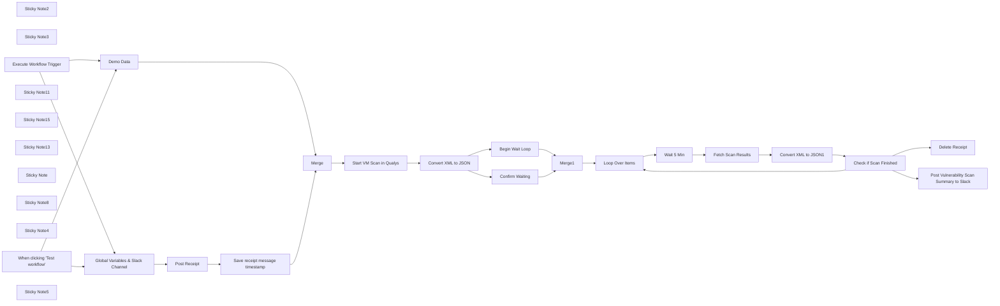

## Fluxo (.json) :

```json
{
  "meta": {
    "instanceId": "03e9d14e9196363fe7191ce21dc0bb17387a6e755dcc9acc4f5904752919dca8"
  },
  "nodes": [
    {
      "id": "be5b0c9c-de92-4e34-88cb-98e88b0c19df",
      "name": "Start VM Scan in Qualys",
      "type": "n8n-nodes-base.httpRequest",
      "position": [
        1340,
        500
      ],
      "parameters": {
        "": "",
        "url": "={{ $json.platformurl }}/api/2.0/fo/scan/",
        "method": "POST",
        "options": {},
        "sendBody": true,
        "sendQuery": true,
        "curlImport": "",
        "contentType": "multipart-form-data",
        "infoMessage": "",
        "sendHeaders": true,
        "specifyQuery": "keypair",
        "authentication": "predefinedCredentialType",
        "bodyParameters": {
          "parameters": [
            {
              "name": "asset_groups",
              "value": "={{ $json.asset_groups }}",
              "parameterType": "formData"
            },
            {
              "name": "scan_title",
              "value": "={{ $json.scan_title }}",
              "parameterType": "formData"
            },
            {
              "name": "option_title",
              "value": "={{ $json.option_title }}",
              "parameterType": "formData"
            }
          ]
        },
        "specifyHeaders": "keypair",
        "queryParameters": {
          "parameters": [
            {
              "name": "action",
              "value": "launch"
            }
          ]
        },
        "headerParameters": {
          "parameters": [
            {
              "name": "X-Requested-With",
              "value": "n8n"
            }
          ]
        },
        "httpVariantWarning": "",
        "nodeCredentialType": "qualysApi",
        "provideSslCertificates": false
      },
      "credentials": {
        "qualysApi": {
          "id": "KdkmNjVYkDUzHAvw",
          "name": "Qualys account"
        }
      },
      "typeVersion": 4.2,
      "extendsCredential": "qualysApi"
    },
    {
      "id": "0d140ce1-89e0-4135-821f-0b32004fc6aa",
      "name": "Convert XML to JSON",
      "type": "n8n-nodes-base.xml",
      "position": [
        1540,
        500
      ],
      "parameters": {
        "options": {},
        "dataPropertyName": "=data"
      },
      "typeVersion": 1
    },
    {
      "id": "ec737485-bf8b-4e8a-9843-2566c13106a8",
      "name": "Fetch Scan Results",
      "type": "n8n-nodes-base.httpRequest",
      "position": [
        2640,
        460
      ],
      "parameters": {
        "": "",
        "url": "={{ $('Demo Data').item.json[\"platformurl\"] }}/api/2.0/fo/scan/vm/summary",
        "method": "GET",
        "options": {},
        "sendBody": false,
        "sendQuery": true,
        "curlImport": "",
        "infoMessage": "",
        "sendHeaders": true,
        "specifyQuery": "keypair",
        "authentication": "predefinedCredentialType",
        "specifyHeaders": "keypair",
        "queryParameters": {
          "parameters": [
            {
              "name": "action",
              "value": "list"
            },
            {
              "name": "scan_reference",
              "value": "={{ $('Convert XML to JSON').item.json.SIMPLE_RETURN.RESPONSE.ITEM_LIST.ITEM[1].VALUE }}"
            }
          ]
        },
        "headerParameters": {
          "parameters": [
            {
              "name": "X-Requested-With",
              "value": "n8n"
            }
          ]
        },
        "httpVariantWarning": "",
        "nodeCredentialType": "qualysApi",
        "provideSslCertificates": false
      },
      "credentials": {
        "qualysApi": {
          "id": "KdkmNjVYkDUzHAvw",
          "name": "Qualys account"
        }
      },
      "typeVersion": 4.2,
      "extendsCredential": "qualysApi"
    },
    {
      "id": "56a60798-3db1-4c69-962f-75009f894196",
      "name": "Loop Over Items",
      "type": "n8n-nodes-base.splitInBatches",
      "position": [
        2220,
        420
      ],
      "parameters": {
        "options": {
          "reset": true
        }
      },
      "typeVersion": 3
    },
    {
      "id": "37ac0cdf-8412-40c7-b01c-d592e4d1f378",
      "name": "Sticky Note2",
      "type": "n8n-nodes-base.stickyNote",
      "position": [
        2560,
        180
      ],
      "parameters": {
        "color": 7,
        "width": 596.2964035541726,
        "height": 493.43675548817004,
        "content": "\nFor more information about the query that is being performed on the Qualys end, check out the [Manage Scans Documentation](https://qualysguard.qg2.apps.qualys.com/qwebhelp/fo_portal/api_doc/scans/index.htm#t=vm_scans%2Fmanage_vm_scans.htm). The results are returned in XML, which n8n can natively convert to JSON. This allows for easy checking of the status in n8n. "
      },
      "typeVersion": 1
    },
    {
      "id": "075a4e21-cc30-4e31-a1f9-d2f872ab978c",
      "name": "Sticky Note3",
      "type": "n8n-nodes-base.stickyNote",
      "position": [
        1274.994996265108,
        51.04030212612997
      ],
      "parameters": {
        "color": 7,
        "width": 447.57018680355174,
        "height": 642.6627860215806,
        "content": "\n## Trigger scan on Qualys agent\nFor more information on launching a scan, visit the\n[Launch Documentation](\nhttps://qualysguard.qg2.apps.qualys.com/qwebhelp/fo_portal/api_doc/scans/index.htm#t=vm_scans%2Flaunch_vm_scan.htm). The responses from Qualys are in XML, which n8n makes short work of. "
      },
      "typeVersion": 1
    },
    {
      "id": "5da3f500-0ccf-4eed-9d05-7709668cf2bb",
      "name": "Wait 5 Min",
      "type": "n8n-nodes-base.wait",
      "position": [
        2440,
        460
      ],
      "webhookId": "f2d07724-882a-4010-9ce2-ff389ee962af",
      "parameters": {
        "unit": "minutes"
      },
      "typeVersion": 1.1
    },
    {
      "id": "5cf921ac-cd6b-4a27-b679-3d1ecdb3eb49",
      "name": "Convert XML to JSON1",
      "type": "n8n-nodes-base.xml",
      "position": [
        2800,
        460
      ],
      "parameters": {
        "options": {},
        "dataPropertyName": "=data"
      },
      "typeVersion": 1
    },
    {
      "id": "0580bb11-38c4-49a1-ab00-4cdfb49c8f9d",
      "name": "Check if Scan Finished",
      "type": "n8n-nodes-base.if",
      "position": [
        3000,
        460
      ],
      "parameters": {
        "options": {},
        "conditions": {
          "options": {
            "leftValue": "",
            "caseSensitive": true,
            "typeValidation": "strict"
          },
          "combinator": "and",
          "conditions": [
            {
              "id": "ef397200-064a-428f-a5b2-19d2342a9113",
              "operator": {
                "name": "filter.operator.equals",
                "type": "string",
                "operation": "equals"
              },
              "leftValue": "={{ $json.SCAN_SUMMARY_OUTPUT.RESPONSE.SCAN_SUMMARY_LIST.SCAN_SUMMARY.SCAN_DETAILS.STATUS }}",
              "rightValue": "FINISHED"
            }
          ]
        }
      },
      "typeVersion": 2
    },
    {
      "id": "ec05f06b-e009-4f1c-97e4-223705d3be32",
      "name": "Execute Workflow Trigger",
      "type": "n8n-nodes-base.executeWorkflowTrigger",
      "position": [
        260,
        520
      ],
      "parameters": {},
      "typeVersion": 1
    },
    {
      "id": "1cbd10cd-342c-41bf-ae8f-832324cfbb30",
      "name": "Sticky Note11",
      "type": "n8n-nodes-base.stickyNote",
      "position": [
        220,
        40
      ],
      "parameters": {
        "color": 7,
        "width": 1043.6429958055905,
        "height": 657.4661247924577,
        "content": "\n## Triggered from Slack Parent Workflow\nThe workflow begins with the execute workflow trigger, but the manual execution trigger was left in to test it manually. Make sure to turn of the execute workflow trigger when running it manually. Make sure to set your Slack Channel ID in the Edit node to ensure that the same channel is set across all slack nodes. From there, n8n sends a message to slack to let the user know that their request is being processed. The two threads are then merged to ensure only one thing is done at a time. Don't forget to set your Platform URL in the Global Variables. More information about that can be found at Qualys's [Platform Documentation](https://www.qualys.com/platform-identification/) page. "
      },
      "typeVersion": 1
    },
    {
      "id": "fb59e00b-36c6-429e-8696-f49b78445925",
      "name": "Sticky Note15",
      "type": "n8n-nodes-base.stickyNote",
      "position": [
        2160,
        60
      ],
      "parameters": {
        "color": 7,
        "width": 387.82834121275613,
        "height": 620.5198690828006,
        "content": "\n## n8n Loop Node\nThe report objects are queried then loops every 5 min until the report returns a finished status. We have found that a report can take 40 minutes or more to complete. This is where n8n steps in and checks for us every 5 minutes. When the status of the scan changes to finished, the loop ends and the results are posted to Slack along with a link back to the scan results. "
      },
      "typeVersion": 1
    },
    {
      "id": "2337ad0e-e361-474a-9923-75c4826400b6",
      "name": "Sticky Note13",
      "type": "n8n-nodes-base.stickyNote",
      "position": [
        3167,
        184.84774251864644
      ],
      "parameters": {
        "color": 7,
        "width": 679.3808146538605,
        "height": 493.10714356069377,
        "content": "\n## Upload Report to Slack\nOnce the scan is completed, the summary of the report and a link to report object is posted to Slack for easy retrieval. Additionally the original receipt message is deleted to ensure the new message generates a Slack notification. "
      },
      "typeVersion": 1
    },
    {
      "id": "68a9eee6-05c4-4655-ab74-4a68fc68af26",
      "name": "Post Receipt",
      "type": "n8n-nodes-base.slack",
      "position": [
        740,
        340
      ],
      "parameters": {
        "text": "Vulnerability Scan request received, processing now. ",
        "select": "channel",
        "channelId": {
          "__rl": true,
          "mode": "id",
          "value": "={{ $('Global Variables & Slack Channel').item.json[\"slackChannelId\"] }}"
        },
        "otherOptions": {
          "includeLinkToWorkflow": false
        }
      },
      "credentials": {
        "slackApi": {
          "id": "DZJDes1ZtGpqClNk",
          "name": "Qualys Slack App"
        }
      },
      "typeVersion": 2.2
    },
    {
      "id": "43af793b-061f-4048-b110-546903b803b6",
      "name": "Confirm Waiting",
      "type": "n8n-nodes-base.slack",
      "position": [
        1800,
        540
      ],
      "parameters": {
        "ts": "={{ $('Save receipt message timestamp').item.json[\"ts\"] }}",
        "text": "=Scan successfully initiated, now waiting for `{{ $('Convert XML to JSON').item.json.SIMPLE_RETURN.RESPONSE.ITEM_LIST.ITEM[1].VALUE }}` to complete. \n\nNo action is needed, and I will post the summary report and link to results when it's complete. ",
        "channelId": {
          "__rl": true,
          "mode": "id",
          "value": "={{ $('Global Variables & Slack Channel').item.json[\"slackChannelId\"] }}"
        },
        "operation": "update",
        "updateFields": {
          "parse": "client",
          "link_names": false
        }
      },
      "credentials": {
        "slackApi": {
          "id": "DZJDes1ZtGpqClNk",
          "name": "Qualys Slack App"
        }
      },
      "typeVersion": 2.2
    },
    {
      "id": "326bb10c-0e8e-4df7-bc67-dad015240d15",
      "name": "Delete Receipt",
      "type": "n8n-nodes-base.slack",
      "position": [
        3480,
        440
      ],
      "parameters": {
        "select": "channel",
        "channelId": {
          "__rl": true,
          "mode": "id",
          "value": "={{ $('Global Variables & Slack Channel').item.json[\"slackChannelId\"] }}"
        },
        "operation": "delete",
        "timestamp": "={{ $('Save receipt message timestamp').item.json[\"ts\"] }}"
      },
      "credentials": {
        "slackApi": {
          "id": "DZJDes1ZtGpqClNk",
          "name": "Qualys Slack App"
        }
      },
      "typeVersion": 2.2
    },
    {
      "id": "c8668283-e6ec-4dbd-92d0-aec1f07c01a7",
      "name": "Sticky Note",
      "type": "n8n-nodes-base.stickyNote",
      "position": [
        1740.3532113511565,
        44.007696543933434
      ],
      "parameters": {
        "color": 7,
        "width": 408.91770357210225,
        "height": 645.055566466257,
        "content": "\n## Let user's know that it's time to wait\nGood customer service comes from communication. And that's what this section does, it alerts the user that the scan was triggered successfully, and now it is time to wait for it to finish. Feel free to change this message to better suit your needs. It will be deleted when the results are posted. "
      },
      "typeVersion": 1
    },
    {
      "id": "defa2773-ea65-481d-a6d6-bb40c70e6762",
      "name": "Sticky Note8",
      "type": "n8n-nodes-base.stickyNote",
      "position": [
        -440,
        40
      ],
      "parameters": {
        "width": 646.7396383244529,
        "height": 994.2389415638766,
        "content": "\n# Qualys Vulnerability Trigger Scan Workflow\n\n## This workflow is triggered by a parent workflow initiated via a Slack shortcut. Upon activation, it collects input from a modal window in Slack and initiates a vulnerability scan using the Qualys API.\n\n**Key Features:**\n- **Trigger:** Launched by a parent workflow through a Slack shortcut with modal input.\n- **API Integration:** Utilizes the Qualys API for vulnerability scanning.\n- **Data Conversion:** Converts XML scan results to JSON for further processing.\n- **Loop Mechanism:** Continuously checks the scan status until completion.\n- **Slack Notifications:** Posts scan summary and detailed results to a specified Slack channel.\n\n\n**Workflow Nodes:**\n1. **Start VM Scan in Qualys:** Initiates the scan with specified parameters.\n2. **Convert XML to JSON:** Converts the scan results from XML format to JSON.\n3. **Fetch Scan Results:** Retrieves scan results from Qualys.\n4. **Check if Scan Finished:** Verifies whether the scan is complete.\n5. **Loop Mechanism:** Handles the repetitive checking of the scan status.\n6. **Slack Notifications:** Posts updates and results to Slack.\n\n\n**Relevant Links:**\n- [Qualys API Documentation](https://qualysguard.qg2.apps.qualys.com/qwebhelp/fo_portal/api_doc/scans/index.htm#t=vm_scans%2Flaunch_vm_scan.htm)\n- [Qualys Platform Documentation](https://www.qualys.com/platform-identification/)\n"
      },
      "typeVersion": 1
    },
    {
      "id": "de2c15bd-4144-4ca8-9c0d-370ecf334650",
      "name": "Demo Data",
      "type": "n8n-nodes-base.set",
      "position": [
        560,
        520
      ],
      "parameters": {
        "options": {},
        "assignments": {
          "assignments": [
            {
              "id": "070178a6-73b0-458b-8657-20ab4ff0485c",
              "name": "option_title",
              "type": "string",
              "value": "Initial Options"
            },
            {
              "id": "3605424b-5bfc-44f0-b6e4-e0d6b1130b8e",
              "name": "scan_title",
              "type": "string",
              "value": "n8n Scan 1"
            },
            {
              "id": "2320d966-b834-46fb-b674-be97cc08682e",
              "name": "asset_groups",
              "type": "string",
              "value": "Group1"
            }
          ]
        }
      },
      "typeVersion": 3.3
    },
    {
      "id": "0ec55480-424c-4686-b8f7-8a98b5941c8e",
      "name": "Sticky Note4",
      "type": "n8n-nodes-base.stickyNote",
      "position": [
        820,
        700
      ],
      "parameters": {
        "color": 5,
        "width": 535.8333316661617,
        "height": 702.5170959123625,
        "content": "\n### 🔄The data input into this Modal will be processed in this workflow"
      },
      "typeVersion": 1
    },
    {
      "id": "9f6291ad-280f-4a0c-b84a-5eebfbb9172f",
      "name": "Merge",
      "type": "n8n-nodes-base.merge",
      "position": [
        1120,
        500
      ],
      "parameters": {
        "mode": "combine",
        "options": {},
        "combinationMode": "multiplex"
      },
      "typeVersion": 2.1
    },
    {
      "id": "783d9bcd-faf1-4427-ab5c-de32df64f819",
      "name": "Post Vulnerability Scan Summary to Slack",
      "type": "n8n-nodes-base.slack",
      "position": [
        3240,
        500
      ],
      "parameters": {
        "select": "channel",
        "blocksUi": "={\n\t\"blocks\": [\n\t\t{\n\t\t\t\"type\": \"image\",\n\t\t\t\"block_id\": \"image_1\",\n\t\t\t\"image_url\": \"https://i.imgur.com/6BtgQVV.png\",\n\t\t\t\"alt_text\": \"{{ $('Convert XML to JSON').item.json[\"SIMPLE_RETURN\"][\"RESPONSE\"][\"ITEM_LIST\"][\"ITEM\"][0][\"VALUE\"] }}\"\n\t\t},\n\t\t{\n\t\t\t\"type\": \"header\",\n\t\t\t\"block_id\": \"header_1\",\n\t\t\t\"text\": {\n\t\t\t\t\"type\": \"plain_text\",\n\t\t\t\t\"text\": \"📊 Qualys Scan Summary\"\n\t\t\t}\n\t\t},\n\t\t{\n\t\t\t\"type\": \"section\",\n\t\t\t\"block_id\": \"section_scan_details\",\n\t\t\t\"text\": {\n\t\t\t\t\"type\": \"mrkdwn\",\n\t\t\t\t\"text\": \"*📝 Scan Title:* {{ $json[\"SCAN_SUMMARY_OUTPUT\"][\"RESPONSE\"][\"SCAN_SUMMARY_LIST\"][\"SCAN_SUMMARY\"][\"SCAN_INPUT\"][\"TITLE\"] }}\\n*👤 User:* {{ $json[\"SCAN_SUMMARY_OUTPUT\"][\"RESPONSE\"][\"SCAN_SUMMARY_LIST\"][\"SCAN_SUMMARY\"][\"SCAN_INPUT\"][\"USER\"][\"USERNAME\"] }}\\n*🔍 Scan Status:* FINISHED\"\n\t\t\t}\n\t\t},\n\t\t{\n\t\t\t\"type\": \"section\",\n\t\t\t\"block_id\": \"section_general_info\",\n\t\t\t\"fields\": [\n\t\t\t\t{\n\t\t\t\t\t\"type\": \"mrkdwn\",\n\t\t\t\t\t\"text\": \"*⏱️ Scheduled:* {{ $json[\"SCAN_SUMMARY_OUTPUT\"][\"RESPONSE\"][\"SCAN_SUMMARY_LIST\"][\"SCAN_SUMMARY\"][\"SCAN_INPUT\"][\"SCHEDULED\"] }}\"\n\t\t\t\t},\n\t\t\t\t{\n\t\t\t\t\t\"type\": \"mrkdwn\",\n\t\t\t\t\t\"text\": \"*📋 Option Profile:* {{ $json[\"SCAN_SUMMARY_OUTPUT\"][\"RESPONSE\"][\"SCAN_SUMMARY_LIST\"][\"SCAN_SUMMARY\"][\"SCAN_INPUT\"][\"OPTION_PROFILE\"][\"NAME\"] }}\"\n\t\t\t\t},\n\t\t\t\t{\n\t\t\t\t\t\"type\": \"mrkdwn\",\n\t\t\t\t\t\"text\": \"*🎯 Targets:* IP List ({{ $json[\"SCAN_SUMMARY_OUTPUT\"][\"RESPONSE\"][\"SCAN_SUMMARY_LIST\"][\"SCAN_SUMMARY\"][\"SCAN_INPUT\"][\"TARGETS\"][\"IP_LIST\"][\"COUNT\"] }} IPs), Asset Group {{ $json[\"SCAN_SUMMARY_OUTPUT\"][\"RESPONSE\"][\"SCAN_SUMMARY_LIST\"][\"SCAN_SUMMARY\"][\"SCAN_INPUT\"][\"TARGETS\"][\"ASSET_GROUP_LIST\"][\"ASSET_GROUP_DATA\"][\"ASSET_GROUP\"][\"NAME\"] }}\"\n\t\t\t\t},\n\t\t\t\t{\n\t\t\t\t\t\"type\": \"mrkdwn\",\n\t\t\t\t\t\"text\": \"*🚀 Scan Launched:* {{ $json[\"SCAN_SUMMARY_OUTPUT\"][\"RESPONSE\"][\"SCAN_SUMMARY_LIST\"][\"SCAN_SUMMARY\"][\"SCAN_INPUT\"][\"SCAN_DATETIME\"] }}\"\n\t\t\t\t},\n\t\t\t\t{\n\t\t\t\t\t\"type\": \"mrkdwn\",\n\t\t\t\t\t\"text\": \"*⏳ Duration:* {{ $json[\"SCAN_SUMMARY_OUTPUT\"][\"RESPONSE\"][\"SCAN_SUMMARY_LIST\"][\"SCAN_SUMMARY\"][\"SCAN_DETAILS\"][\"DURATION\"] }} seconds\"\n\t\t\t\t},\n\t\t\t\t{\n\t\t\t\t\t\"type\": \"mrkdwn\",\n\t\t\t\t\t\"text\": \"*🖥️ Detected Hosts:* {{ $json[\"SCAN_SUMMARY_OUTPUT\"][\"RESPONSE\"][\"SCAN_SUMMARY_LIST\"][\"SCAN_SUMMARY\"][\"SCAN_RESULTS\"][\"HOSTS\"][\"COUNT\"] }}\"\n\t\t\t\t}\n\t\t\t]\n\t\t},\n\t\t{\n\t\t\t\"type\": \"section\",\n\t\t\t\"block_id\": \"section_detections_summary\",\n\t\t\t\"text\": {\n\t\t\t\t\"type\": \"mrkdwn\",\n\t\t\t\t\"text\": \"*🔎 Detections Summary:*\"\n\t\t\t}\n\t\t},\n\t\t{\n\t\t\t\"type\": \"section\",\n\t\t\t\"block_id\": \"section_detections_details\",\n\t\t\t\"fields\": [\n\t\t\t\t{\n\t\t\t\t\t\"type\": \"mrkdwn\",\n\t\t\t\t\t\"text\": \"*🛡️ Confirmed Vulnerabilities:* {{ $json[\"SCAN_SUMMARY_OUTPUT\"][\"RESPONSE\"][\"SCAN_SUMMARY_LIST\"][\"SCAN_SUMMARY\"][\"SCAN_RESULTS\"][\"DETECTIONS\"][\"VULN\"][\"CONFIRMED\"][\"TOTAL_COUNT\"] }}\\n   - Minimal Severity: {{ $json[\"SCAN_SUMMARY_OUTPUT\"][\"RESPONSE\"][\"SCAN_SUMMARY_LIST\"][\"SCAN_SUMMARY\"][\"SCAN_RESULTS\"][\"DETECTIONS\"][\"VULN\"][\"CONFIRMED\"][\"COUNT_BY_SEVERITY\"][\"SEVERITY_1\"] }}\\n   - Medium Severity: {{ $json[\"SCAN_SUMMARY_OUTPUT\"][\"RESPONSE\"][\"SCAN_SUMMARY_LIST\"][\"SCAN_SUMMARY\"][\"SCAN_RESULTS\"][\"DETECTIONS\"][\"VULN\"][\"CONFIRMED\"][\"COUNT_BY_SEVERITY\"][\"SEVERITY_2\"] }}\\n   - Serious Severity: {{ $json[\"SCAN_SUMMARY_OUTPUT\"][\"RESPONSE\"][\"SCAN_SUMMARY_LIST\"][\"SCAN_SUMMARY\"][\"SCAN_RESULTS\"][\"DETECTIONS\"][\"VULN\"][\"CONFIRMED\"][\"COUNT_BY_SEVERITY\"][\"SEVERITY_3\"] }}\\n   - Critical Severity: {{ $json[\"SCAN_SUMMARY_OUTPUT\"][\"RESPONSE\"][\"SCAN_SUMMARY_LIST\"][\"SCAN_SUMMARY\"][\"SCAN_RESULTS\"][\"DETECTIONS\"][\"VULN\"][\"CONFIRMED\"][\"COUNT_BY_SEVERITY\"][\"SEVERITY_4\"] }}\\n   - Urgent Severity: {{ $json[\"SCAN_SUMMARY_OUTPUT\"][\"RESPONSE\"][\"SCAN_SUMMARY_LIST\"][\"SCAN_SUMMARY\"][\"SCAN_RESULTS\"][\"DETECTIONS\"][\"VULN\"][\"CONFIRMED\"][\"COUNT_BY_SEVERITY\"][\"SEVERITY_5\"] }}\"\n\t\t\t\t},\n\t\t\t\t{\n\t\t\t\t\t\"type\": \"mrkdwn\",\n\t\t\t\t\t\"text\": \"*📈 Information Gathered:* {{ $json[\"SCAN_SUMMARY_OUTPUT\"][\"RESPONSE\"][\"SCAN_SUMMARY_LIST\"][\"SCAN_SUMMARY\"][\"SCAN_RESULTS\"][\"DETECTIONS\"][\"IG\"][\"TOTAL_COUNT\"] }}\\n   - Minimal Severity:  {{ $json[\"SCAN_SUMMARY_OUTPUT\"][\"RESPONSE\"][\"SCAN_SUMMARY_LIST\"][\"SCAN_SUMMARY\"][\"SCAN_RESULTS\"][\"DETECTIONS\"][\"IG\"][\"COUNT_BY_SEVERITY\"][\"SEVERITY_1\"] }}\\n   - Medium Severity: {{ $json[\"SCAN_SUMMARY_OUTPUT\"][\"RESPONSE\"][\"SCAN_SUMMARY_LIST\"][\"SCAN_SUMMARY\"][\"SCAN_RESULTS\"][\"DETECTIONS\"][\"IG\"][\"COUNT_BY_SEVERITY\"][\"SEVERITY_2\"] }}\\n   - Serious Severity: {{ $json[\"SCAN_SUMMARY_OUTPUT\"][\"RESPONSE\"][\"SCAN_SUMMARY_LIST\"][\"SCAN_SUMMARY\"][\"SCAN_RESULTS\"][\"DETECTIONS\"][\"IG\"][\"COUNT_BY_SEVERITY\"][\"SEVERITY_3\"] }}\"\n\t\t\t\t},\n\t\t\t\t{\n\t\t\t\t\t\"type\": \"mrkdwn\",\n\t\t\t\t\t\"text\": \"*⚠️ Potential Vulnerabilities:* {{ $json[\"SCAN_SUMMARY_OUTPUT\"][\"RESPONSE\"][\"SCAN_SUMMARY_LIST\"][\"SCAN_SUMMARY\"][\"SCAN_RESULTS\"][\"DETECTIONS\"][\"VULN\"][\"POTENTIAL\"][\"TOTAL_COUNT\"] }}\\n   - Minimal Severity: {{ $json[\"SCAN_SUMMARY_OUTPUT\"][\"RESPONSE\"][\"SCAN_SUMMARY_LIST\"][\"SCAN_SUMMARY\"][\"SCAN_RESULTS\"][\"DETECTIONS\"][\"VULN\"][\"POTENTIAL\"][\"COUNT_BY_SEVERITY\"][\"SEVERITY_1\"] }}\\n   - Medium Severity: {{ $json[\"SCAN_SUMMARY_OUTPUT\"][\"RESPONSE\"][\"SCAN_SUMMARY_LIST\"][\"SCAN_SUMMARY\"][\"SCAN_RESULTS\"][\"DETECTIONS\"][\"VULN\"][\"POTENTIAL\"][\"COUNT_BY_SEVERITY\"][\"SEVERITY_2\"] }}\\n   - Serious Severity: {{ $json[\"SCAN_SUMMARY_OUTPUT\"][\"RESPONSE\"][\"SCAN_SUMMARY_LIST\"][\"SCAN_SUMMARY\"][\"SCAN_RESULTS\"][\"DETECTIONS\"][\"VULN\"][\"POTENTIAL\"][\"COUNT_BY_SEVERITY\"][\"SEVERITY_3\"] }}\\n   - Critical Severity: {{ $json[\"SCAN_SUMMARY_OUTPUT\"][\"RESPONSE\"][\"SCAN_SUMMARY_LIST\"][\"SCAN_SUMMARY\"][\"SCAN_RESULTS\"][\"DETECTIONS\"][\"VULN\"][\"POTENTIAL\"][\"COUNT_BY_SEVERITY\"][\"SEVERITY_4\"] }}\\n   - Urgent Severity: {{ $json[\"SCAN_SUMMARY_OUTPUT\"][\"RESPONSE\"][\"SCAN_SUMMARY_LIST\"][\"SCAN_SUMMARY\"][\"SCAN_RESULTS\"][\"DETECTIONS\"][\"VULN\"][\"POTENTIAL\"][\"COUNT_BY_SEVERITY\"][\"SEVERITY_5\"] }}\"\n\t\t\t\t}\n\t\t\t]\n\t\t},\n\t\t{\n\t\t\t\"type\": \"section\",\n\t\t\t\"block_id\": \"final_section_with_button\",\n\t\t\t\"text\": {\n\t\t\t\t\"type\": \"mrkdwn\",\n\t\t\t\t\"text\": \"🔗 View the full report in Qualys\"\n\t\t\t},\n\t\t\t\"accessory\": {\n\t\t\t\t\"type\": \"button\",\n\t\t\t\t\"text\": {\n\t\t\t\t\t\"type\": \"plain_text\",\n\t\t\t\t\t\"text\": \"View Report in Qualys\",\n\t\t\t\t\t\"emoji\": true\n\t\t\t\t},\n\t\t\t\t\"value\": \"click_me_123\",\n\t\t\t\t\"style\": \"primary\",\n\t\t\t\t\"url\": \"{{ $('Demo Data').item.json[\"platformurl\"] }}/fo/report/report_view.php?id={{ $('Convert XML to JSON').item.json[\"SIMPLE_RETURN\"][\"RESPONSE\"][\"ITEM_LIST\"][\"ITEM\"][0][\"VALUE\"] }}&default=1&format=30\",\n\t\t\t\t\"action_id\": \"button-action\"\n\t\t\t}\n\t\t}\n\t]\n}",
        "channelId": {
          "__rl": true,
          "mode": "id",
          "value": "={{ $('Global Variables & Slack Channel').item.json[\"slackChannelId\"] }}"
        },
        "messageType": "block",
        "otherOptions": {}
      },
      "credentials": {
        "slackApi": {
          "id": "DZJDes1ZtGpqClNk",
          "name": "Qualys Slack App"
        }
      },
      "typeVersion": 2.2
    },
    {
      "id": "91444583-66d8-4d5b-ba88-4d8869d508b6",
      "name": "When clicking \"Test workflow\"",
      "type": "n8n-nodes-base.manualTrigger",
      "disabled": true,
      "position": [
        260,
        340
      ],
      "parameters": {},
      "typeVersion": 1
    },
    {
      "id": "4b8ade25-0377-4f00-a744-f610b17eea93",
      "name": "Begin Wait Loop",
      "type": "n8n-nodes-base.noOp",
      "position": [
        1800,
        400
      ],
      "parameters": {},
      "typeVersion": 1
    },
    {
      "id": "b830b9d8-e7aa-49bb-9640-d1def697f3e1",
      "name": "Merge1",
      "type": "n8n-nodes-base.merge",
      "position": [
        2020,
        420
      ],
      "parameters": {
        "mode": "chooseBranch"
      },
      "typeVersion": 2.1
    },
    {
      "id": "389381c3-bd51-4e22-a102-e47b5945576c",
      "name": "Save receipt message timestamp",
      "type": "n8n-nodes-base.set",
      "position": [
        920,
        340
      ],
      "parameters": {
        "options": {},
        "assignments": {
          "assignments": [
            {
              "id": "111526ec-0501-4af9-b66e-c677cb8fe25f",
              "name": "ts",
              "type": "string",
              "value": "={{ $json.message.ts }}"
            }
          ]
        }
      },
      "typeVersion": 3.3
    },
    {
      "id": "51005deb-2676-4375-9ac8-780eb301f7f5",
      "name": "Global Variables & Slack Channel",
      "type": "n8n-nodes-base.set",
      "position": [
        560,
        340
      ],
      "parameters": {
        "options": {},
        "assignments": {
          "assignments": [
            {
              "id": "9849fe48-7a7a-4f2b-a404-c7827249e9c2",
              "name": "slackChannelId",
              "type": "string",
              "value": "C05LAN72WJK"
            },
            {
              "id": "36aad8b5-b51a-4df0-b1a7-159a90b802b2",
              "name": "platformurl",
              "type": "string",
              "value": "https://qualysapi.qg3.apps.qualys.com"
            }
          ]
        }
      },
      "typeVersion": 3.3
    },
    {
      "id": "7d6d5ab7-5a87-46c8-baa8-d79a05d8346d",
      "name": "Sticky Note5",
      "type": "n8n-nodes-base.stickyNote",
      "position": [
        220,
        700
      ],
      "parameters": {
        "color": 5,
        "width": 596.6847639718076,
        "height": 438.8903816479826,
        "content": "\n### 🤖 Triggering this workflow is as easy as typing a backslash in Slack and filling out the modal on the right"
      },
      "typeVersion": 1
    }
  ],
  "pinData": {},
  "connections": {
    "Merge": {
      "main": [
        [
          {
            "node": "Start VM Scan in Qualys",
            "type": "main",
            "index": 0
          }
        ]
      ]
    },
    "Merge1": {
      "main": [
        [
          {
            "node": "Loop Over Items",
            "type": "main",
            "index": 0
          }
        ]
      ]
    },
    "Demo Data": {
      "main": [
        [
          {
            "node": "Merge",
            "type": "main",
            "index": 1
          }
        ]
      ]
    },
    "Wait 5 Min": {
      "main": [
        [
          {
            "node": "Fetch Scan Results",
            "type": "main",
            "index": 0
          }
        ]
      ]
    },
    "Post Receipt": {
      "main": [
        [
          {
            "node": "Save receipt message timestamp",
            "type": "main",
            "index": 0
          }
        ]
      ]
    },
    "Begin Wait Loop": {
      "main": [
        [
          {
            "node": "Merge1",
            "type": "main",
            "index": 0
          }
        ]
      ]
    },
    "Confirm Waiting": {
      "main": [
        [
          {
            "node": "Merge1",
            "type": "main",
            "index": 1
          }
        ]
      ]
    },
    "Loop Over Items": {
      "main": [
        null,
        [
          {
            "node": "Wait 5 Min",
            "type": "main",
            "index": 0
          }
        ]
      ]
    },
    "Fetch Scan Results": {
      "main": [
        [
          {
            "node": "Convert XML to JSON1",
            "type": "main",
            "index": 0
          }
        ]
      ]
    },
    "Convert XML to JSON": {
      "main": [
        [
          {
            "node": "Confirm Waiting",
            "type": "main",
            "index": 0
          },
          {
            "node": "Begin Wait Loop",
            "type": "main",
            "index": 0
          }
        ]
      ]
    },
    "Convert XML to JSON1": {
      "main": [
        [
          {
            "node": "Check if Scan Finished",
            "type": "main",
            "index": 0
          }
        ]
      ]
    },
    "Check if Scan Finished": {
      "main": [
        [
          {
            "node": "Delete Receipt",
            "type": "main",
            "index": 0
          },
          {
            "node": "Post Vulnerability Scan Summary to Slack",
            "type": "main",
            "index": 0
          }
        ],
        [
          {
            "node": "Loop Over Items",
            "type": "main",
            "index": 0
          }
        ]
      ]
    },
    "Start VM Scan in Qualys": {
      "main": [
        [
          {
            "node": "Convert XML to JSON",
            "type": "main",
            "index": 0
          }
        ]
      ]
    },
    "Execute Workflow Trigger": {
      "main": [
        [
          {
            "node": "Demo Data",
            "type": "main",
            "index": 0
          },
          {
            "node": "Global Variables & Slack Channel",
            "type": "main",
            "index": 0
          }
        ]
      ]
    },
    "When clicking \"Test workflow\"": {
      "main": [
        [
          {
            "node": "Demo Data",
            "type": "main",
            "index": 0
          },
          {
            "node": "Global Variables & Slack Channel",
            "type": "main",
            "index": 0
          }
        ]
      ]
    },
    "Save receipt message timestamp": {
      "main": [
        [
          {
            "node": "Merge",
            "type": "main",
            "index": 0
          }
        ]
      ]
    },
    "Global Variables & Slack Channel": {
      "main": [
        [
          {
            "node": "Post Receipt",
            "type": "main",
            "index": 0
          }
        ]
      ]
    }
  }
}
```

<a id="template-230"></a>

## Template 230 - Fluxo de autenticação OIDC com PKCE

- **Nome:** Fluxo de autenticação OIDC com PKCE
- **Descrição:** Fluxo que implementa o fluxo de autorização OpenID Connect (authorization code) com suporte a PKCE e alternativa com client_secret, autenticando o usuário e exibindo uma página de boas-vindas com informações do perfil.
- **Funcionalidade:** • Carregamento de formulário de login: Serve uma página HTML que inicia o fluxo de autenticação.
• Geração de PKCE: Gera code_verifier e code_challenge no navegador (S256 quando disponível) e inicia redirecionamento ao provedor de identidade.
• Redirecionamento ao provedor de identidade: Constrói a URL de autorização com client_id, scope, redirect_uri e parâmetros de PKCE quando habilitado.
• Recepção do callback (redirect URI): Recebe o código de autorização enviado pelo provedor de identidade na URL de retorno.
• Troca de código por token: Realiza a troca do authorization code por access_token via endpoint /token. Suporta troca no servidor com client_secret (não-PKCE) e troca via browser usando code_verifier (PKCE).
• Armazenamento de token em cookie: Define o access_token como cookie no navegador para uso subsequente.
• Recuperação de perfil (userinfo): Consulta o endpoint userinfo usando o Bearer token para obter informações do usuário.
• Renderização de página de boas-vindas: Exibe uma página HTML personalizada com o e-mail (ou dados) do usuário após autenticação bem-sucedida.
• Modo configurável: Permite configurar endpoints (authorization, token, userinfo), client_id, scope, redirect_uri e client_secret antes do uso.
- **Ferramentas:** • Provedor OpenID Connect (ex.: Keycloak): Fornece os endpoints de autorização, token e userinfo necessários para o fluxo OIDC.
• Endpoint público / Webhook (redirect URI): URL pública que recebe o callback do provedor de identidade (redirect_uri).
• Navegador do usuário: Executa o JavaScript de PKCE, armazena code_verifier em sessionStorage e cookies com o access_token.
• Endpoint de token: Serviço que aceita requisições POST para troca de authorization code por tokens (grant_type=authorization_code).
• Endpoint userinfo: Serviço que retorna o perfil do usuário quando chamado com um Bearer access_token.

## Fluxo visual

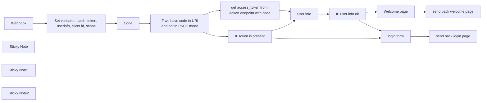

## Fluxo (.json) :

```json
{
  "id": "zeyTmqqmXaQIFWzV",
  "meta": {
    "instanceId": "11f0bca80fdd47e21bd156f4266eada6e64a6bc4c37f34dc8ae14ccf768e9285"
  },
  "name": "OIDC client workflow",
  "tags": [],
  "nodes": [
    {
      "id": "da0c6b83-9c8c-431b-beaa-66b5343b21c5",
      "name": "Webhook",
      "type": "n8n-nodes-base.webhook",
      "position": [
        80,
        680
      ],
      "webhookId": "891ad1cd-6a50-4a88-8789-95680c78f14c",
      "parameters": {
        "path": "891ad1cd-6a50-4a88-8789-95680c78f14c",
        "options": {},
        "responseMode": "responseNode"
      },
      "typeVersion": 1
    },
    {
      "id": "5c9d4f59-7980-4bee-8df6-cf9ca3eccde1",
      "name": "Code",
      "type": "n8n-nodes-base.code",
      "position": [
        520,
        680
      ],
      "parameters": {
        "jsCode": "let myCookies = {};\nlet cookies = [];\n\ncookies = $input.item.json.headers.cookie.split(';')\nfor (item of cookies ) {\n  myCookies[item.split('=')[0].trim()]=item.split('=')[1].trim();\n}\n\nreturn myCookies;"
      },
      "typeVersion": 2,
      "continueOnFail": true
    },
    {
      "id": "7867d061-c0e3-4359-90ac-a4536c948db2",
      "name": "user info",
      "type": "n8n-nodes-base.httpRequest",
      "position": [
        1220,
        760
      ],
      "parameters": {
        "url": "={{ $('Set variables : auth, token, userinfo, client id, scope').item.json.userinfo_endpoint }}",
        "options": {},
        "sendHeaders": true,
        "headerParameters": {
          "parameters": [
            {
              "name": "Authorization",
              "value": "=Bearer  {{ $json['access_token'] }}"
            }
          ]
        }
      },
      "typeVersion": 4.1,
      "continueOnFail": true
    },
    {
      "id": "df0e9896-0670-49cc-b7c6-140c234036b4",
      "name": "send back login page",
      "type": "n8n-nodes-base.respondToWebhook",
      "position": [
        1900,
        980
      ],
      "parameters": {
        "options": {},
        "respondWith": "text",
        "responseBody": "={{ $json.html }}"
      },
      "typeVersion": 1
    },
    {
      "id": "81f03c86-91fe-4960-b4c4-295252c7e8fc",
      "name": "IF token is present",
      "type": "n8n-nodes-base.if",
      "position": [
        940,
        820
      ],
      "parameters": {
        "conditions": {
          "number": [
            {
              "value1": "={{ $json['access_token'] }}",
              "operation": "isNotEmpty"
            }
          ]
        }
      },
      "typeVersion": 1,
      "continueOnFail": true
    },
    {
      "id": "5e2f87bd-9c1f-4e87-82df-1b3b3e98cbdb",
      "name": "Welcome page",
      "type": "n8n-nodes-base.html",
      "position": [
        1720,
        660
      ],
      "parameters": {
        "html": "<!DOCTYPE html>\n\n<html>\n<head>\n  <meta charset=\"UTF-8\" />\n  <title>My HTML document</title>\n</head>\n<body>\n  <div class=\"container\">\n    <h1>Welcome {{$('user info').item.json.email }} </h1>\n  </div>\n</body>\n</html>\n\n<style>\n.container {\n  background-color: #ffffff;\n  text-align: center;\n  padding: 16px;\n  border-radius: 8px;\n}\n\nh1 {\n  color: #ff6d5a;\n  font-size: 24px;\n  font-weight: bold;\n  padding: 8px;\n}\n\nh2 {\n  color: #909399;\n  font-size: 18px;\n  font-weight: bold;\n  padding: 8px;\n}\n</style>\n"
      },
      "typeVersion": 1
    },
    {
      "id": "c1448e12-4292-402b-bf9d-0ab555bbc734",
      "name": "send back welcome page",
      "type": "n8n-nodes-base.respondToWebhook",
      "position": [
        1920,
        660
      ],
      "parameters": {
        "options": {},
        "respondWith": "text",
        "responseBody": "={{ $json.html }}"
      },
      "typeVersion": 1
    },
    {
      "id": "8e64ab13-4f23-4c85-a625-c456910a9472",
      "name": "IF user info ok",
      "type": "n8n-nodes-base.if",
      "position": [
        1400,
        760
      ],
      "parameters": {
        "conditions": {
          "number": [
            {
              "value1": "={{ $json.email }}",
              "operation": "isNotEmpty"
            }
          ]
        }
      },
      "typeVersion": 1,
      "continueOnFail": true
    },
    {
      "id": "a96b170f-fbd8-4061-9619-bf9877e85495",
      "name": "login form",
      "type": "n8n-nodes-base.html",
      "position": [
        1700,
        980
      ],
      "parameters": {
        "html": "<!-- Thanks to https://github.com/curityio/pkce-javascript-example/tree/master -->\n<!DOCTYPE html>\n<html lang=\"en\">\n  <head>\n    <meta charset=\"utf-8\">\n    <title>Login</title>\n  </head>\n  <style>\n.container {\n  background-color: #ffffff;\n  text-align: center;\n  padding: 16px;\n  border-radius: 8px;\n}\n\nh1 {\n  color: #ff6d5a;\n  font-size: 24px;\n  font-weight: bold;\n  padding: 8px;\n}\n\nh2 {\n  color: #909399;\n  font-size: 18px;\n  font-weight: bold;\n  padding: 8px;\n}\n</style>\n  <body>\n    <div id=\"result\"></div>\n    <script>\n    const authorizeEndpoint = \"{{ $('Set variables : auth, token, userinfo, client id, scope').item.json.auth_endpoint }}\";\n    const tokenEndpoint = \"{{ $('Set variables : auth, token, userinfo, client id, scope').item.json.token_endpoint }}\";\n    const clientId = \"{{ $('Set variables : auth, token, userinfo, client id, scope').item.json.client_id }}\";\n    const scope = \"{{ $('Set variables : auth, token, userinfo, client id, scope').item.json.scope }}\";\n    const usePKCE = {{ $('Set variables : auth, token, userinfo, client id, scope').item.json.PKCE }};\n        if (window.location.search) {\n            var args = new URLSearchParams(window.location.search);\n            var code = args.get(\"code\");\n\n            if (code) {\n                var xhr = new XMLHttpRequest();\n\n                xhr.onload = function() {\n                    var response = xhr.response;\n                    var message;\n\n                    if (xhr.status == 200) {\n                        message = \"Access Token: \" + response.access_token;\n                        document.cookie = \"access_token=\"+response.access_token;\n                        location.reload();\n                    }\n                    else {\n                        message = \"Error: \" + response.error_description + \" (\" + response.error + \")\";\n                    }\n\n                    document.getElementById(\"result\").innerHTML = message;\n                };\n                xhr.responseType = 'json';\n                xhr.open(\"POST\", tokenEndpoint, true);\n                xhr.setRequestHeader('Content-type', 'application/x-www-form-urlencoded');\n                xhr.send(new URLSearchParams({\n                    client_id: clientId,\n                    code_verifier: window.sessionStorage.getItem(\"code_verifier\"),\n                    grant_type: \"authorization_code\",\n                    redirect_uri: location.href.replace(location.search, ''),\n                    code: code\n                }));\n            }\n        }\n        async function generateCodeChallenge(codeVerifier) {\n            var digest = await crypto.subtle.digest(\"SHA-256\",\n                new TextEncoder().encode(codeVerifier));\n\n            return btoa(String.fromCharCode(...new Uint8Array(digest)))\n                .replace(/=/g, '').replace(/\\+/g, '-').replace(///g, '_')\n        }\n\n        function generateRandomString(length) {\n            var text = \"\";\n            var possible = \"ABCDEFGHIJKLMNOPQRSTUVWXYZabcdefghijklmnopqrstuvwxyz0123456789\";\n\n            for (var i = 0; i < length; i++) {\n                text += possible.charAt(Math.floor(Math.random() * possible.length));\n            }\n\n            return text;\n        }\n\n        if (!crypto.subtle) {\n            document.writeln('<p>' +\n                    '<b>WARNING:</b> The script will fall back to using plain code challenge as crypto is not available.</p>' +\n                    '<p>Javascript crypto services require that this site is served in a <a href=\"https://developer.mozilla.org/en-US/docs/Web/Security/Secure_Contexts\">secure context</a>; ' +\n                    'either from <b>(*.)localhost</b> or via <b>https</b>. </p>' +\n                    '<p> You can add an entry to /etc/hosts like \"127.0.0.1 public-test-client.localhost\" and reload the site from there, enable SSL using something like <a href=\"https://letsencrypt.org/\">letsencypt</a>, or refer to this <a href=\"https://stackoverflow.com/questions/46468104/how-to-use-subtlecrypto-in-chrome-window-crypto-subtle-is-undefined\">stackoverflow article</a> for more alternatives.</p>' +\n                    '<p>If Javascript crypto is available this message will disappear.</p>')\n        }\n\n      var codeVerifier = generateRandomString(64);\n\n            const challengeMethod = crypto.subtle ? \"S256\" : \"plain\"\n\n            Promise.resolve()\n                .then(() => {\n                    if (challengeMethod === 'S256') {\n                        return generateCodeChallenge(codeVerifier)\n                    } else {\n                        return codeVerifier\n                    }\n                })\n                .then(function(codeChallenge) {\n                    window.sessionStorage.setItem(\"code_verifier\", codeVerifier);\n\n                    var redirectUri = window.location.href.split('?')[0];\n                    var args = new URLSearchParams({\n                        response_type: \"code\",\n                        client_id: clientId,\n                        redirect_uri: redirectUri,\n                        scope: scope,\n                        state: generateRandomString(16)\n                    });\n                    if(usePKCE){\n                      args.append(\"code_challenge_method\", challengeMethod);\n                      args.append(\"code_challenge\", codeChallenge);\n                    }\n                window.location = authorizeEndpoint + \"?\" + args;\n            });\n    </script>\n  </body>\n</html>"
      },
      "typeVersion": 1
    },
    {
      "id": "12395c64-1c9d-4801-8229-57d982e4243f",
      "name": "Sticky Note",
      "type": "n8n-nodes-base.stickyNote",
      "position": [
        120,
        460
      ],
      "parameters": {
        "width": 510,
        "height": 207,
        "content": "In this set, you have to retrieve from your identity provider : \n- auth url\n- token url\n- userinfo url\n- the client id you created for this flow\n- scopes to use, at least \"openid\" scope\nif you do not want to use PKCE, you have to fill : \n- client_secret\n- redirect_uri (which is the webhook uri)"
      },
      "typeVersion": 1
    },
    {
      "id": "25e934b5-fcd6-49e1-bb33-955b5f3f34ca",
      "name": "Sticky Note1",
      "type": "n8n-nodes-base.stickyNote",
      "position": [
        1640,
        480
      ],
      "parameters": {
        "content": "At this point the user is authenticated, you have access to his profile from the user info result and you continue doing things"
      },
      "typeVersion": 1
    },
    {
      "id": "9dab372a-3505-4be6-93bd-9e99fc71612c",
      "name": "Sticky Note2",
      "type": "n8n-nodes-base.stickyNote",
      "position": [
        460,
        980
      ],
      "parameters": {
        "width": 776,
        "height": 336,
        "content": "## Quick setup with Keycloak\n1. Open your Keycloak\n2. Go to `Realm settings` and opn `OpenID Endpoint Configuration`\n3. This will opene a new tab. Copy out the `authorization_endpoint`, `token_endpoint` and the `userinfo_endpoint` and add it to the `Set variables` node\n4. Go go `Clients` and click `Create client`. In there pick a name of choice.\n5. Go to the next step, `Capability config`, disable `Client authentication`. Only `Standard flow` should be checked.\n6. Go to the next step `Login settings`. In there copy the Webhook URL of this workflow into the `Valid redirect URIs` field\n7. Enter the clientID to the `Set variables` node\n\nNow you can activate the workflow and visit the webhook URL to test. You can find a more detailed setup guid in the description.\n"
      },
      "typeVersion": 1
    },
    {
      "id": "6e3afc62-52a9-402a-bde9-e8798d0fd4f6",
      "name": "Set variables : auth, token, userinfo, client id, scope",
      "type": "n8n-nodes-base.set",
      "position": [
        320,
        680
      ],
      "parameters": {
        "values": {
          "string": [
            {
              "name": "auth_endpoint",
              "value": "Your value here"
            },
            {
              "name": "token_endpoint",
              "value": "Your value here"
            },
            {
              "name": "userinfo_endpoint",
              "value": "Your value here"
            },
            {
              "name": "client_id",
              "value": "name of your client"
            },
            {
              "name": "scope",
              "value": "openid"
            },
            {
              "name": "redirect_uri",
              "value": "webhook uri"
            },
            {
              "name": "client_secret",
              "value": "secret of your client"
            }
          ],
          "boolean": [
            {
              "name": "PKCE",
              "value": true
            }
          ]
        },
        "options": {}
      },
      "typeVersion": 2
    },
    {
      "id": "2d54c64a-ae45-480f-923f-63d6cb3fcdfc",
      "name": "IF we have code in URI and not in PKCE mode",
      "type": "n8n-nodes-base.if",
      "position": [
        700,
        680
      ],
      "parameters": {
        "conditions": {
          "string": [
            {
              "value1": "={{ $('Webhook').item.json.query.code }}",
              "operation": "isNotEmpty"
            }
          ],
          "boolean": [
            {
              "value1": "={{ $('Set variables : auth, token, userinfo, client id, scope').item.json.PKCE }}"
            }
          ]
        }
      },
      "typeVersion": 1
    },
    {
      "id": "99c8fa5d-3173-4371-9742-6014eca6e7fe",
      "name": "get access_token from /token endpoint with code",
      "type": "n8n-nodes-base.httpRequest",
      "position": [
        940,
        640
      ],
      "parameters": {
        "url": "={{ $('Set variables : auth, token, userinfo, client id, scope').item.json.token_endpoint }}",
        "method": "POST",
        "options": {},
        "sendBody": true,
        "contentType": "form-urlencoded",
        "bodyParameters": {
          "parameters": [
            {
              "name": "grant_type",
              "value": "authorization_code"
            },
            {
              "name": "client_id",
              "value": "={{ $('Set variables : auth, token, userinfo, client id, scope').item.json.client_id }}"
            },
            {
              "name": "client_secret",
              "value": "={{ $('Set variables : auth, token, userinfo, client id, scope').item.json.client_secret }}"
            },
            {
              "name": "code",
              "value": "={{ $('Webhook').item.json.query.code }}"
            },
            {
              "name": "redirect_uri",
              "value": "={{ $('Set variables : auth, token, userinfo, client id, scope').item.json.redirect_uri }}"
            }
          ]
        }
      },
      "typeVersion": 4.1
    }
  ],
  "active": true,
  "pinData": {},
  "settings": {
    "executionOrder": "v1"
  },
  "versionId": "d91ac207-6f83-42cd-9c9f-326b8c53c160",
  "connections": {
    "Code": {
      "main": [
        [
          {
            "node": "IF we have code in URI and not in PKCE mode",
            "type": "main",
            "index": 0
          }
        ]
      ]
    },
    "Webhook": {
      "main": [
        [
          {
            "node": "Set variables : auth, token, userinfo, client id, scope",
            "type": "main",
            "index": 0
          }
        ]
      ]
    },
    "user info": {
      "main": [
        [
          {
            "node": "IF user info ok",
            "type": "main",
            "index": 0
          }
        ]
      ]
    },
    "login form": {
      "main": [
        [
          {
            "node": "send back login page",
            "type": "main",
            "index": 0
          }
        ]
      ]
    },
    "Welcome page": {
      "main": [
        [
          {
            "node": "send back welcome page",
            "type": "main",
            "index": 0
          }
        ]
      ]
    },
    "IF user info ok": {
      "main": [
        [
          {
            "node": "Welcome page",
            "type": "main",
            "index": 0
          }
        ],
        [
          {
            "node": "login form",
            "type": "main",
            "index": 0
          }
        ]
      ]
    },
    "IF token is present": {
      "main": [
        [
          {
            "node": "user info",
            "type": "main",
            "index": 0
          }
        ],
        [
          {
            "node": "login form",
            "type": "main",
            "index": 0
          }
        ]
      ]
    },
    "IF we have code in URI and not in PKCE mode": {
      "main": [
        [
          {
            "node": "get access_token from /token endpoint with code",
            "type": "main",
            "index": 0
          }
        ],
        [
          {
            "node": "IF token is present",
            "type": "main",
            "index": 0
          }
        ]
      ]
    },
    "get access_token from /token endpoint with code": {
      "main": [
        [
          {
            "node": "user info",
            "type": "main",
            "index": 0
          }
        ]
      ]
    },
    "Set variables : auth, token, userinfo, client id, scope": {
      "main": [
        [
          {
            "node": "Code",
            "type": "main",
            "index": 0
          }
        ]
      ]
    }
  }
}
```

<a id="template-231"></a>

## Template 231 - Verificação de email com Hunter

- **Nome:** Verificação de email com Hunter
- **Descrição:** Este fluxo verifica a validade de um endereço de email usando a API do Hunter quando acionado manualmente.
- **Funcionalidade:** • Ativação manual: inicia o fluxo quando o usuário clica em 'execute'.
• Verificação de email: realiza a operação de verificação de email para avaliar existência, formato e qualidade do endereço fornecido.
- **Ferramentas:** • Hunter: serviço de verificação e enriquecimento de emails que valida existência, confiança e informações associadas a endereços de email por meio de API.

## Fluxo visual


## Fluxo (.json) :

```json
{
  "nodes": [
    {
      "name": "On clicking 'execute'",
      "type": "n8n-nodes-base.manualTrigger",
      "position": [
        250,
        300
      ],
      "parameters": {},
      "typeVersion": 1
    },
    {
      "name": "Hunter",
      "type": "n8n-nodes-base.hunter",
      "position": [
        450,
        300
      ],
      "parameters": {
        "email": "user@example.com",
        "operation": "emailVerifier"
      },
      "credentials": {
        "hunterApi": "hunter api creds"
      },
      "typeVersion": 1
    }
  ],
  "connections": {
    "On clicking 'execute'": {
      "main": [
        [
          {
            "node": "Hunter",
            "type": "main",
            "index": 0
          }
        ]
      ]
    }
  }
}
```

<a id="template-232"></a>

## Template 232 - Roteador dinâmico de LLMs locais

- **Nome:** Roteador dinâmico de LLMs locais
- **Descrição:** Analisa mensagens de chat e encaminha cada solicitação para o modelo Ollama local mais apropriado, mantendo memória de conversação e preservando a privacidade ao processar tudo localmente.
- **Funcionalidade:** • Roteamento dinâmico de modelos: Analisa o prompt do usuário e escolhe automaticamente o modelo LLM mais adequado com base em regras de decisão pré-definidas.
• Suporte a modelos especializados: Permite direcionar tarefas para modelos de texto, raciocínio complexo, geração de código e modelos visão (documentos e imagens).
• Agente de IA com LLM selecionado: Após a seleção, um agente usa o modelo escolhido para gerar a resposta ao usuário.
• Memória de conversação separada: Mantém histórico para o roteador e histórico por sessão para o agente, permitindo contexto contínuo nas interações.
• Execução local e privacidade: Todo o processamento ocorre localmente no host Ollama, evitando envio de dados a serviços externos.
• Tratamento de incertezas e segurança: Em casos ambíguos seleciona um modelo mais generalista e aplica diretrizes para recusar solicitações inadequadas.
• Integração por webhook: Inicia o fluxo automaticamente ao receber mensagens de chat externas.
• Customização fácil: Permite ajustar a lista de modelos, regras de decisão e mensagens do sistema para adequar o roteamento às necessidades do ambiente.
- **Ferramentas:** • Ollama (servidor local de LLMs): Plataforma local que hospeda e serve modelos de linguagem via API (ex.: http://127.0.0.1:11434).
• Modelos LLM especializados: Conjunto de modelos utilizados para tarefas específicas, por exemplo phi4 (leve/baixa latência), qwq (razoamento complexo), llama3.2 (multilíngue/diálogo), qwen2.5-coder:14b (geração e raciocínio em código), granite3.2-vision e llama3.2-vision (análise de imagens e documentos).
• Interface de chat via webhook: Ponto de entrada para mensagens dos usuários que dispara o roteamento e processamento dos prompts.

## Fluxo visual

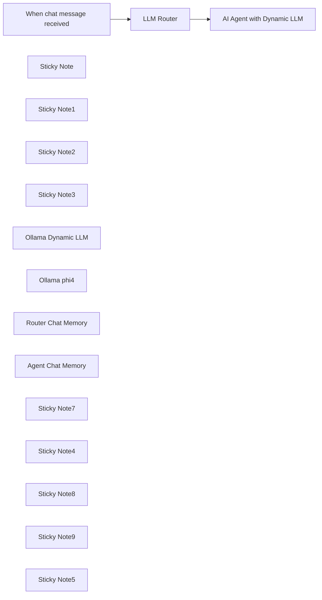

## Fluxo (.json) :

```json
{
  "id": "Mub5RZI4PAs6TsSP",
  "meta": {
    "instanceId": "31e69f7f4a77bf465b805824e303232f0227212ae922d12133a0f96ffeab4fef",
    "templateCredsSetupCompleted": true
  },
  "name": "🔐🦙🤖 Private & Local Ollama Self-Hosted LLM Router",
  "tags": [],
  "nodes": [
    {
      "id": "981e858a-cd2b-49cf-9740-a40ac29bba94",
      "name": "When chat message received",
      "type": "@n8n/n8n-nodes-langchain.chatTrigger",
      "position": [
        420,
        860
      ],
      "webhookId": "3804aa1d-2193-4161-84a1-6f5d1059e092",
      "parameters": {
        "options": {}
      },
      "typeVersion": 1.1
    },
    {
      "id": "a164103c-66cb-44da-aae7-177231f517b4",
      "name": "Sticky Note",
      "type": "n8n-nodes-base.stickyNote",
      "position": [
        -160,
        580
      ],
      "parameters": {
        "color": 7,
        "width": 2360,
        "height": 860,
        "content": "# 🔐🦙🤖 Private & Local Ollama Self-Hosted + Dynamic LLM Router\n\n\n"
      },
      "typeVersion": 1
    },
    {
      "id": "2ff955e7-c621-4bee-8baf-91769524f781",
      "name": "Sticky Note1",
      "type": "n8n-nodes-base.stickyNote",
      "position": [
        640,
        1140
      ],
      "parameters": {
        "color": 7,
        "width": 360,
        "height": 260,
        "content": "## Ollama LLM"
      },
      "typeVersion": 1
    },
    {
      "id": "40f42923-830d-44a9-a311-c006d91691b7",
      "name": "Sticky Note2",
      "type": "n8n-nodes-base.stickyNote",
      "position": [
        320,
        760
      ],
      "parameters": {
        "color": 4,
        "width": 280,
        "height": 300,
        "content": "## 👍Try Me!"
      },
      "typeVersion": 1
    },
    {
      "id": "c49f5ff5-92a7-4a2d-81b5-51272e7972b4",
      "name": "Sticky Note3",
      "type": "n8n-nodes-base.stickyNote",
      "position": [
        740,
        720
      ],
      "parameters": {
        "color": 3,
        "width": 540,
        "height": 380,
        "content": "## Ollama LLM Router Based on User Prompt\n\n💡This agent chooses the Ollama LLM for the next AI Agent Dynamically based on the users prompt\n\n"
      },
      "typeVersion": 1
    },
    {
      "id": "72ad69f4-a24f-4df2-978e-71c5d3a63733",
      "name": "Ollama Dynamic LLM",
      "type": "@n8n/n8n-nodes-langchain.lmChatOllama",
      "position": [
        1560,
        1240
      ],
      "parameters": {
        "model": "={{ $('LLM Router').item.json.output.parseJson().llm }}",
        "options": {}
      },
      "credentials": {
        "ollamaApi": {
          "id": "7aPaLgwpfdMWFYm9",
          "name": "Ollama account 127.0.0.1"
        }
      },
      "typeVersion": 1
    },
    {
      "id": "efc2e47a-1d4b-4879-8670-35a34c946bb6",
      "name": "LLM Router",
      "type": "@n8n/n8n-nodes-langchain.agent",
      "position": [
        880,
        860
      ],
      "parameters": {
        "text": "=Choose the most appropriate LLM model for the following user request. Analyze the task requirements carefully and select the model that will provide optimal performance.  Only choose from the provided list.\n\n<user_input>\n{{ $json.chatInput }}\n</user_input>\n",
        "options": {
          "systemMessage": "<role>\nYou are an expert LLM router that classifies user prompts and selects the most appropriate LLM model based on specific task requirements.\n</role>\n\n<purpose>\nYour task is to analyze user inputs, determine the nature of their request, and select the optimal LLM model that will provide the best performance for their specific needs.\n</purpose>\n\n<classification_rules>\nChoose one of the following LLMs based on their capabilities and the user prompt.  You must only select from the provided LLMs:\n\n## Text-Only Models\n- \"qwq\": Specialized in complex reasoning and solving hard problems. Best for: mathematical reasoning, logical puzzles, scientific explanations, and complex problem-solving tasks.\n\n- \"llama3.2\": Multilingual model (3B size) optimized for dialogue, retrieval, and summarization. Best for: conversations in multiple languages, information retrieval, and text summarization.\n\n- \"phi4\": Lightweight model designed for constrained environments. Best for: scenarios requiring low latency, limited computing resources, while maintaining good reasoning capabilities.\n\n## Coding Models\n- \"qwen2.5-coder:14b\": Code-Specific Qwen model, with significant improvements in code generation, code reasoning, and code fixing.\n\n## Vision-Language Models\n- \"granite3.2-vision\": Specialized in document understanding and data extraction. Best for: analyzing charts, tables, diagrams, infographics, and structured visual content.\n\n- \"llama3.2-vision\": General-purpose visual recognition and reasoning. Best for: image description, visual question answering, and general image understanding tasks.\n</classification_rules>\n\n<model_examples>\nExample tasks for each model:\n- qwq: \"Solve this math problem\", \"Explain quantum physics\", \"Debug this logical fallacy\"\n- llama3.2: \"Translate this text to Spanish\", \"Summarize this article\", \"Have a conversation about history\"\n- phi4: \"Generate a quick response\", \"Provide a concise answer\", \"Process this simple request efficiently\"\n- granite3.2-vision: \"Extract data from this chart\", \"Analyze this financial table\", \"Interpret this technical diagram\"\n- llama3.2-vision: \"Describe what's in this image\", \"What can you tell me about this picture?\", \"Answer questions about this photo\"\n</model_examples>\n\n<decision_tree>\n1. Does the prompt include an image?\n   - YES → Go to 2\n   - NO → Go to 3\n2. Is the image a document, chart, table, or diagram?\n   - YES → Use \"granite3.2-vision\"\n   - NO → Use \"llama3.2-vision\"\n3. Does the task require complex reasoning or solving difficult problems?\n   - YES → Use \"qwq\"\n   - NO → Go to 4\n4. Is the task multilingual or requires summarization/retrieval?\n   - YES → Use \"llama3.2\"\n   - NO → Use \"phi4\" (for efficiency in simple English tasks)\n</decision_tree>\n\n<decision_framework>\nWhen selecting a model, consider:\n1. Task complexity and reasoning requirements\n2. Visual or multimodal components in the request\n3. Language processing needs (summarization, translation, etc.)\n4. Performance constraints (latency, memory limitations)\n5. Required reasoning capabilities\n6. Coding requirements\n</decision_framework>\n\n<examples>\nExample 1:\nUser input: \"Explain quantum computing principles\"\nSelection: \"qwq\"\nReason: \"This request requires deep reasoning and explanation of complex scientific concepts, making QwQ's enhanced reasoning capabilities ideal.\"\n\nExample 2:\nUser input: \"Describe what's in this image of a chart showing quarterly sales\"\nSelection: \"granite3.2-vision\"\nReason: \"This request involves visual document understanding and data extraction from a chart, which is granite-vision's specialty.\"\n\nExample 3:\nUser input: \"Summarize this article about climate change in Spanish\"\nSelection: \"llama3.2\"\nReason: \"This request requires multilingual capabilities and summarization, which are strengths of Llama 3.2.\"\n\nExample 4:\nUser input: \"I need to create a FastAPI endpoint with Python\"\nSelection: \"qwen2.5-coder:14b\"\nReason: \"This request requires code generation, code reasoning, or code fixing.\"\n</examples>\n\n<error_handling>\nIf the user request is unclear or ambiguous, select the model that offers the most general capabilities while noting the uncertainty in your reasoning. If the request appears to contain harmful content or violates ethical guidelines, respond with an appropriate message about being unable to fulfill the request.\n</error_handling>\n\n<output_format>\nRespond with a single JSON object containing:\n{\n  \"llm\": \"the name of the selected LLM model\",\n  \"reason\": \"a brief, specific explanation of why this model is optimal for the task\"\n}\nAvoid any preamble or further explanation.  Remove all ``` or ``json from response.\n</output_format>\n\n\n"
        },
        "promptType": "define",
        "hasOutputParser": true
      },
      "typeVersion": 1.7
    },
    {
      "id": "d8b07c67-b177-496f-ba97-2b886c2b6f1e",
      "name": "AI Agent with Dynamic LLM",
      "type": "@n8n/n8n-nodes-langchain.agent",
      "position": [
        1660,
        860
      ],
      "parameters": {
        "text": "={{ $('When chat message received').item.json.chatInput }}",
        "options": {
          "systemMessage": ""
        },
        "promptType": "define"
      },
      "typeVersion": 1.7
    },
    {
      "id": "3f005c9c-dd92-4970-b4cf-e105ec75840f",
      "name": "Ollama phi4",
      "type": "@n8n/n8n-nodes-langchain.lmChatOllama",
      "position": [
        780,
        1240
      ],
      "parameters": {
        "model": "phi4:latest",
        "options": {
          "format": "json"
        }
      },
      "credentials": {
        "ollamaApi": {
          "id": "7aPaLgwpfdMWFYm9",
          "name": "Ollama account 127.0.0.1"
        }
      },
      "typeVersion": 1
    },
    {
      "id": "47f6c3dd-1bad-458c-ade1-ec26f455a95d",
      "name": "Router Chat Memory",
      "type": "@n8n/n8n-nodes-langchain.memoryBufferWindow",
      "position": [
        1160,
        1240
      ],
      "parameters": {},
      "typeVersion": 1.3
    },
    {
      "id": "06b77321-086a-42cf-808a-27d7064403e4",
      "name": "Agent Chat Memory",
      "type": "@n8n/n8n-nodes-langchain.memoryBufferWindow",
      "position": [
        1940,
        1240
      ],
      "parameters": {
        "sessionKey": "={{ $('When chat message received').item.json.sessionId }}",
        "sessionIdType": "customKey"
      },
      "typeVersion": 1.3
    },
    {
      "id": "073ae421-5bbf-4ff9-ae8d-1f515f0b8ed7",
      "name": "Sticky Note7",
      "type": "n8n-nodes-base.stickyNote",
      "position": [
        1520,
        720
      ],
      "parameters": {
        "color": 5,
        "width": 540,
        "height": 380,
        "content": "## AI Agent using Dynamic Local Ollama LLM\n\n💡This agent uses the Ollama LLM based on previous Router agent choice and proceeds to answer the users prompt.\n"
      },
      "typeVersion": 1
    },
    {
      "id": "2e118ce5-bfa8-4661-99dd-5e72bc7534c6",
      "name": "Sticky Note4",
      "type": "n8n-nodes-base.stickyNote",
      "position": [
        1020,
        1140
      ],
      "parameters": {
        "color": 7,
        "width": 360,
        "height": 260,
        "content": "## Router Chat Memory"
      },
      "typeVersion": 1
    },
    {
      "id": "92fff699-0e96-4161-b4dd-bcac682d3dab",
      "name": "Sticky Note8",
      "type": "n8n-nodes-base.stickyNote",
      "position": [
        1420,
        1140
      ],
      "parameters": {
        "color": 7,
        "width": 360,
        "height": 260,
        "content": "## Dynamic Ollama LLM"
      },
      "typeVersion": 1
    },
    {
      "id": "6f8bc049-9440-4863-a8c6-c8cfafde3dda",
      "name": "Sticky Note9",
      "type": "n8n-nodes-base.stickyNote",
      "position": [
        1800,
        1140
      ],
      "parameters": {
        "color": 7,
        "width": 360,
        "height": 260,
        "content": "## Agent Chat Memory"
      },
      "typeVersion": 1
    },
    {
      "id": "88e0d3ec-108b-4136-86ae-6714f4e4b63b",
      "name": "Sticky Note5",
      "type": "n8n-nodes-base.stickyNote",
      "position": [
        -380,
        700
      ],
      "parameters": {
        "width": 640,
        "height": 1020,
        "content": "## Who is this for?\nThis workflow template is designed for **AI enthusiasts**, **developers**, and **privacy-conscious users** who want to leverage the power of local large language models (LLMs) without sending data to external services. It's particularly valuable for those running Ollama locally who want intelligent routing between different specialized models.\n\n## What problem is this workflow solving?\nWhen working with multiple local LLMs, each with different strengths and capabilities, it can be challenging to manually select the right model for each specific task. This workflow automatically analyzes user prompts and routes them to the most appropriate specialized Ollama model, ensuring optimal performance without requiring technical knowledge from the end user.\n\n## What this workflow does\nThis intelligent router:\n- Analyzes incoming user prompts to determine the nature of the request\n- Automatically selects the optimal Ollama model from your local collection based on task requirements\n- Routes requests between specialized models for different tasks:\n  - Text-only models (qwq, llama3.2, phi4) for various reasoning and conversation tasks\n  - Code-specific models (qwen2.5-coder) for programming assistance\n  - Vision-capable models (granite3.2-vision, llama3.2-vision) for image analysis\n- Maintains conversation memory for consistent interactions\n- Processes everything locally for complete privacy and data security\n\n## Setup\n1. Ensure you have [Ollama](https://ollama.ai/) installed and running locally\n2. Pull the required models mentioned in the workflow using Ollama CLI (e.g., `ollama pull phi4`)\n3. Configure the Ollama API credentials in n8n (default: http://127.0.0.1:11434)\n4. Activate the workflow and start interacting through the chat interface\n\n## How to customize this workflow to your needs\n- Add or remove models from the router's decision framework based on your specific Ollama collection\n- Adjust the system prompts in the LLM Router to prioritize different model selection criteria\n- Modify the decision tree logic to better suit your specific use cases\n- Add additional preprocessing steps for specialized inputs\n\n\nThis workflow demonstrates how n8n can be used to create sophisticated AI orchestration systems that respect user privacy by keeping everything local while still providing intelligent model selection capabilities.\n"
      },
      "typeVersion": 1
    }
  ],
  "active": false,
  "pinData": {},
  "settings": {
    "executionOrder": "v1"
  },
  "versionId": "c36ec004-11a3-4b0f-b2fd-f529ae6413a2",
  "connections": {
    "LLM Router": {
      "main": [
        [
          {
            "node": "AI Agent with Dynamic LLM",
            "type": "main",
            "index": 0
          }
        ]
      ]
    },
    "Ollama phi4": {
      "ai_languageModel": [
        [
          {
            "node": "LLM Router",
            "type": "ai_languageModel",
            "index": 0
          }
        ]
      ]
    },
    "Agent Chat Memory": {
      "ai_memory": [
        [
          {
            "node": "AI Agent with Dynamic LLM",
            "type": "ai_memory",
            "index": 0
          }
        ]
      ]
    },
    "Ollama Dynamic LLM": {
      "ai_languageModel": [
        [
          {
            "node": "AI Agent with Dynamic LLM",
            "type": "ai_languageModel",
            "index": 0
          }
        ]
      ]
    },
    "Router Chat Memory": {
      "ai_memory": [
        [
          {
            "node": "LLM Router",
            "type": "ai_memory",
            "index": 0
          }
        ]
      ]
    },
    "When chat message received": {
      "main": [
        [
          {
            "node": "LLM Router",
            "type": "main",
            "index": 0
          }
        ]
      ]
    }
  }
}
```

<a id="template-233"></a>

## Template 233 - Notificações Telegram para pedidos WooCommerce

- **Nome:** Notificações Telegram para pedidos WooCommerce
- **Descrição:** Envia uma notificação no Telegram quando um pedido do WooCommerce é atualizado para o status "processing", contendo detalhes formatados do pedido.
- **Funcionalidade:** • Receber webhook de pedidos: recebe notificações de atualização de pedidos do WooCommerce via webhook.
• Filtrar por status 'processing': processa apenas eventos quando o status do pedido é "processing".
• Montagem de mensagem formatada em HTML: extrai e organiza informações do pedido (ID, cliente, valor, data, cidade, telefone, nota) em um texto com formatação HTML e emojis.
• Listagem de produtos: gera uma lista dos itens do pedido incluindo nome e quantidade.
• Formatação de valor e data: converte o total para formato legível e apresenta a data/hora local em formato amigável.
• Tratamento de dados ausentes: utiliza valores padrão quando campos opcionais (como nota) não estiverem presentes.
• Envio de notificação para Telegram: envia a mensagem gerada para um chat/usuário no Telegram utilizando um bot.
- **Ferramentas:** • WooCommerce: plataforma de comércio eletrônico que envia webhooks com dados de pedidos.
• Telegram: serviço de mensagens usado para receber as notificações enviadas pelo bot.

## Fluxo visual

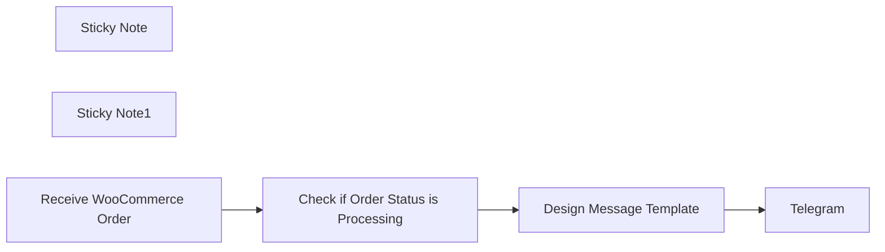

## Fluxo (.json) :

```json
{
  "id": "JMfwq2Xn60pWz2Hy",
  "meta": {
    "instanceId": "2e75c9fb3cdcf631da470c0180f0739986baa0ee860de53281e9edc3491b82a3",
    "templateCredsSetupCompleted": true
  },
  "name": "Send Telegram Alerts for New WooCommerce Orders",
  "tags": [],
  "nodes": [
    {
      "id": "bc66fcc7-55d4-46b3-929a-6e4359733601",
      "name": "Check if Order Status is Processing",
      "type": "n8n-nodes-base.if",
      "position": [
        260,
        760
      ],
      "parameters": {
        "options": {},
        "conditions": {
          "options": {
            "version": 1,
            "leftValue": "",
            "caseSensitive": true,
            "typeValidation": "strict"
          },
          "combinator": "and",
          "conditions": [
            {
              "id": "0509abb0-c655-49de-8f2c-c4649b478983",
              "operator": {
                "name": "filter.operator.equals",
                "type": "string",
                "operation": "equals"
              },
              "leftValue": "={{ $json.body.status }}",
              "rightValue": "processing"
            }
          ]
        }
      },
      "typeVersion": 2
    },
    {
      "id": "99ecb702-0264-4aeb-8b15-4383b97bc5ee",
      "name": "Design Message Template",
      "type": "n8n-nodes-base.code",
      "position": [
        500,
        740
      ],
      "parameters": {
        "jsCode": "// Data extraction and processing for order details\nconst lineItems = $json.body.line_items;\n\n// Getting the total amount directly from WooCommerce\nconst totalAmount = parseInt($json.body.total).toLocaleString();\n\n// Constructing the product message in the desired format\nconst filteredItems = lineItems.map(item => {\n  const name = item.name;\n  const quantity = item.quantity;\n  return `🔹 ${name}<b> (${quantity} items)</b>`;\n}).join('\\n');  // Separating each product with a new line\n\n// Getting the order creation date and time\nlet dateCreated = new Date($json.body.date_created_gmt || new Date());\n\n// Directly using the server's local time (no timezone conversion)\nlet formattedDate = dateCreated.toLocaleString('en-US', {\n  year: 'numeric',\n  month: 'long',\n  day: 'numeric',\n  hour: '2-digit',\n  minute: '2-digit',\n  hour12: false\n});\n\n// Constructing other parts of the message in an organized manner\nconst orderInfo = `\n\n🆔 <b>Order ID:</b> ${$json.body.id}\n\n👦🏻 <b>Customer Name:</b> ${$json.body.billing.first_name} ${$json.body.billing.last_name}\n\n💵 <b>Amount:</b> ${totalAmount}\n\n📅 <b>Order Date:</b>\n➖ ${formattedDate}\n\n🏙 <b>City:</b> ${$json.body.billing.city}\n\n📞 <b>Phone:</b> ${$json.body.billing.phone}\n\n✍🏻 <b>Order Note:</b>\n${$json.body.customer_note || 'No notes'}\n\n📦 <b>Ordered Products:</b>\n\n${filteredItems}\n`;\n\n// Returning the final message\nreturn {\n  orderMessage: orderInfo.trim()  // Remove extra spaces from the beginning and end of the message\n};"
      },
      "typeVersion": 2
    },
    {
      "id": "c2c49759-5309-42bc-872d-7b34faf34f62",
      "name": "Sticky Note",
      "type": "n8n-nodes-base.stickyNote",
      "position": [
        -1120,
        540
      ],
      "parameters": {
        "color": 3,
        "width": 1035.4009739750634,
        "height": 868.2813781621796,
        "content": "## ⚙️ Setup Instructions\n\n### 1. 🛒 **Configure WooCommerce Webhook**\n- Navigate to **WooCommerce ➡️ Settings ➡️ Advanced ➡️ Webhooks** in your WordPress dashboard.\n- Click on ➕ **Add Webhook**.\n- Set the **Status** to **Active**.\n- Choose **Topic**: **Order updated**.\n- Paste the **Webhook URL** from the 🔗 Webhook node in this workflow into the **Delivery URL** field.\n- Click 💾 **Save Webhook**.\n\n### 2. 🤖 **Create a Telegram Bot**\n- Open **Telegram** and start a chat with **@BotFather**.\n- Send the command **/newbot** and follow the instructions to create your bot.\n- Copy the **API Token** provided by **BotFather**.\n\n### 3. 🔑 **Set Up Telegram Credentials in n8n**\n- In **n8n**, go to **Credentials**.\n- Click ➕ **Create** and select **Telegram Bot**.\n- Paste the **API Token** you copied earlier.\n- **Save** the credentials.\n\n### 4. ✏️ **Configure the Telegram Node**\n- Open the 📨 **Send Order Notification to Telegram** node.\n- Select your **Telegram credentials**.\n- Enter your **Chat ID** where you want to receive notifications.  \n  **Tip**: Use **@userinfobot** in Telegram to find your **Chat ID**.\n\n### 5. 🚀 **Activate and Test the Workflow**\n- Ensure the workflow is 🟢 **Active**.\n- Place a new order in your **WooCommerce store**.\n- Update the order status to **\"Processing\"**.\n- You should receive a **Telegram notification** with the **order details**!\n\n## 💡 Notes\n- **Customize the message format** in the 🖋️ **Design Message Template** node to include additional order details if needed.\n"
      },
      "typeVersion": 1
    },
    {
      "id": "5555e7ff-46d9-4b91-a42c-4d83fc9b5edb",
      "name": "Sticky Note1",
      "type": "n8n-nodes-base.stickyNote",
      "position": [
        -1120,
        300
      ],
      "parameters": {
        "color": 5,
        "width": 1040.2541837971148,
        "height": 216.11554963705538,
        "content": "## 📦 Send Telegram Alerts for New WooCommerce Orders\n\n📝 **Description**  \nThis workflow automatically sends a **Telegram notification** whenever a **WooCommerce order** status is updated to \"Processing\". It's perfect for **online store owners** who want instant updates when orders are ready to be fulfilled.\n"
      },
      "typeVersion": 1
    },
    {
      "id": "acde9b85-4ae7-462f-91c0-13a4209fb013",
      "name": "Receive WooCommerce Order",
      "type": "n8n-nodes-base.webhook",
      "position": [
        20,
        760
      ],
      "webhookId": "9aeff297-db6b-4c69-93bf-21b194ef115c",
      "parameters": {
        "path": "9aeff297-db6b-4c69-93bf-21b194ef115c",
        "options": {},
        "httpMethod": "POST"
      },
      "typeVersion": 2
    },
    {
      "id": "5605e14d-a125-41c1-b7e8-cc1feeb6a1e1",
      "name": "Telegram",
      "type": "n8n-nodes-base.telegram",
      "position": [
        720,
        740
      ],
      "parameters": {
        "text": "{{ $json.orderMessage }}",
        "chatId": "<Your-Chat-ID>",
        "additionalFields": {
          "parse_mode": "HTML",
          "appendAttribution": true
        }
      },
      "typeVersion": 1.2
    }
  ],
  "active": true,
  "pinData": {},
  "settings": {
    "executionOrder": "v1"
  },
  "versionId": "f1a12e0e-e2a2-4eea-b7a6-cc4c7439bef9",
  "connections": {
    "Design Message Template": {
      "main": [
        [
          {
            "node": "Telegram",
            "type": "main",
            "index": 0
          }
        ]
      ]
    },
    "Receive WooCommerce Order": {
      "main": [
        [
          {
            "node": "Check if Order Status is Processing",
            "type": "main",
            "index": 0
          }
        ]
      ]
    },
    "Check if Order Status is Processing": {
      "main": [
        [
          {
            "node": "Design Message Template",
            "type": "main",
            "index": 0
          }
        ]
      ]
    }
  }
}
```

<a id="template-234"></a>

## Template 234 - Enviar ofertas MediaMarkt por email

- **Nome:** Enviar ofertas MediaMarkt por email
- **Descrição:** Coleta ofertas da página de MediaMarkt conforme categorias escolhidas pelo usuário e envia uma lista de recomendações por email.
- **Funcionalidade:** • Recepção de preferências do usuário: Um formulário recebe categorias de interesse e email do usuário.
• Acesso à página de ofertas: Consulta a página de campanhas e ofertas da MediaMarkt para obter o conteúdo mais recente.
• Contorno de bloqueios e proxy: Usa um serviço de desbloqueio/proxy para acessar a página quando necessário.
• Extração de conteúdo HTML: Extrai título e corpo da página para processamento.
• Processamento com IA: Utiliza um modelo de linguagem para analisar o conteúdo extraído, gerar uma lista em JSON de ofertas e classificar por categoria (name, description, price, link, category), com tradução para inglês quando necessário.
• Separação de itens: Divide a lista gerada em itens individuais para uso no email.
• Geração de email em HTML: Monta um corpo de email HTML com os itens recomendados usando um template.
• Envio de email: Envia o email de recomendações para o endereço fornecido pelo usuário via servidor SMTP.
• Página de confirmação: Exibe uma mensagem de conclusão informando quantas ofertas foram enviadas.
- **Ferramentas:** • MediaMarkt (https://www.mediamarkt.es): Fonte de dados com campanhas e ofertas.
• BrightData (serviço de proxy/web unlocker): Permite acessar páginas que possam exigir contorno de bloqueios ou geolocalização.
• OpenAI (modelo gpt-4o-mini): Processa o conteúdo HTML para extrair e estruturar as ofertas em JSON e executar tradução/agrupamento por categoria.
• Servidor SMTP / provedor de email: Responsável pelo envio dos emails com as recomendações ao usuário.

## Fluxo visual


## Fluxo (.json) :

```json
{
  "meta": {
    "instanceId": "b1f85eae352fde76d801a1a612661df6824cc2e68bfd6741e31305160a737e6e",
    "templateCredsSetupCompleted": true
  },
  "nodes": [
    {
      "id": "a85eff80-4330-4bd8-acd9-9bf6e0b67c59",
      "name": "Get MediaMarkt Offers Website",
      "type": "n8n-nodes-brightdata.brightData",
      "position": [
        40,
        -160
      ],
      "parameters": {
        "url": "https://www.mediamarkt.es/es/campaign/campanas-y-ofertas",
        "zone": {
          "__rl": true,
          "mode": "list",
          "value": "web_unlocker1",
          "cachedResultName": "web_unlocker1"
        },
        "format": "json",
        "country": {
          "__rl": true,
          "mode": "list",
          "value": "es",
          "cachedResultName": "es"
        },
        "requestOptions": {}
      },
      "credentials": {
        "brightdataApi": {
          "id": "jk945kIuAFAo9bcg",
          "name": "BrightData account"
        }
      },
      "typeVersion": 1
    },
    {
      "id": "d27b03e0-b0f1-4c76-b68e-d716391c71da",
      "name": "Create HTML for Email",
      "type": "n8n-nodes-document-generator.documentGenerator",
      "position": [
        60,
        100
      ],
      "parameters": {
        "template": "<br>\nThese are our recommended deals today:<br>\n<ul>\n{{#each items}}\n<li>{{category}}: <a href=\"https://www.bestbuy.com{{link}}\">{{name}}</a> for {{price}}€</li>\n{{/each}}\n</ul>\n<br>",
        "oneTemplate": true
      },
      "typeVersion": 1
    },
    {
      "id": "d47ee04f-c1c5-4aac-a615-aa68f5a2d6cd",
      "name": "Extract items from results",
      "type": "n8n-nodes-base.splitOut",
      "position": [
        -140,
        100
      ],
      "parameters": {
        "options": {},
        "fieldToSplitOut": "message.content.results"
      },
      "typeVersion": 1
    },
    {
      "id": "34df63de-9b0d-4245-8f87-3654cab0c17e",
      "name": "Notify End User by Email",
      "type": "n8n-nodes-base.emailSend",
      "position": [
        280,
        100
      ],
      "webhookId": "626001db-5451-4225-bf98-cd74c3952754",
      "parameters": {
        "html": "=Hi!\n<br>\n{{ $json.text }}\n\nBest,\n<br>\nThe n8nhackers team!",
        "options": {},
        "subject": "Your last deals!",
        "toEmail": "={{ $('When User Completes Form').first().json.Email}}",
        "fromEmail": "deals@n8nhackers.com"
      },
      "credentials": {
        "smtp": {
          "id": "z3kiLWNZTH4wQaGy",
          "name": "SMTP account"
        }
      },
      "typeVersion": 2.1
    },
    {
      "id": "fbbd7e95-d972-401a-9aca-8015a1acf553",
      "name": "Show Form Results Page",
      "type": "n8n-nodes-base.form",
      "position": [
        480,
        100
      ],
      "webhookId": "a67843b4-3ab9-427b-8e52-dfc42831065d",
      "parameters": {
        "options": {},
        "operation": "completion",
        "completionTitle": "Our recommended deals!",
        "completionMessage": "=We have sent {{ $('Extract items from results').all().length }} recommended deals to your email!"
      },
      "typeVersion": 1
    },
    {
      "id": "e03ebc2b-db42-4a8d-8758-b3d988c4b943",
      "name": "Extract Body and Title from Website",
      "type": "n8n-nodes-base.html",
      "position": [
        240,
        -160
      ],
      "parameters": {
        "options": {
          "trimValues": true
        },
        "operation": "extractHtmlContent",
        "dataPropertyName": "body",
        "extractionValues": {
          "values": [
            {
              "key": "title",
              "cssSelector": "title"
            },
            {
              "key": "body",
              "cssSelector": "body"
            }
          ]
        }
      },
      "typeVersion": 1.2
    },
    {
      "id": "74b0dcd7-d833-452c-82fe-98a21bd39d12",
      "name": "Generate List of Deals by Category",
      "type": "@n8n/n8n-nodes-langchain.openAi",
      "position": [
        -520,
        100
      ],
      "parameters": {
        "modelId": {
          "__rl": true,
          "mode": "list",
          "value": "gpt-4o-mini",
          "cachedResultName": "GPT-4O-MINI"
        },
        "options": {},
        "messages": {
          "values": [
            {
              "role": "system",
              "content": "Generate a list of recommended deals in json list. Classify items by category. Generate the next properties: name, description, price, link and category. All properties will be in a property called: results. Translate texts to english if required."
            },
            {
              "content": "=The input text is:\n{{ $json.body }}"
            },
            {
              "content": "=Categories to filter: {{ $('When User Completes Form').item.json.Category.join(',') }}"
            }
          ]
        },
        "jsonOutput": true
      },
      "credentials": {
        "openAiApi": {
          "id": "oKzfvOwieOm4upQ2",
          "name": "OpenAi account"
        }
      },
      "typeVersion": 1.8
    },
    {
      "id": "a1095cea-6adc-4cf9-93fe-3a67dc061276",
      "name": "When User Completes Form",
      "type": "n8n-nodes-base.formTrigger",
      "position": [
        -180,
        -160
      ],
      "webhookId": "33e8f7c3-82fb-4339-9c91-4b19aa6c14ba",
      "parameters": {
        "options": {
          "path": "get-top-deals",
          "ignoreBots": true,
          "buttonLabel": "Get Deals"
        },
        "formTitle": "Top deals",
        "formFields": {
          "values": [
            {
              "fieldType": "dropdown",
              "fieldLabel": "Category",
              "multiselect": true,
              "fieldOptions": {
                "values": [
                  {
                    "option": "Appliances"
                  },
                  {
                    "option": "Cameras, CamCorders & Drones"
                  },
                  {
                    "option": "Car Electronics "
                  },
                  {
                    "option": "Cell Phones"
                  },
                  {
                    "option": "Computers & Tablets"
                  },
                  {
                    "option": "TV & Home Theater"
                  },
                  {
                    "option": "Video Games"
                  }
                ]
              },
              "requiredField": true
            },
            {
              "fieldType": "email",
              "fieldLabel": "Email",
              "placeholder": "Complete your email",
              "requiredField": true
            }
          ]
        },
        "responseMode": "lastNode",
        "formDescription": "This form returns top deals by your preferences in the same page.\n\nYou can schedule your future deals once per day at the end of this test."
      },
      "typeVersion": 2.2
    }
  ],
  "pinData": {},
  "connections": {
    "Create HTML for Email": {
      "main": [
        [
          {
            "node": "Notify End User by Email",
            "type": "main",
            "index": 0
          }
        ]
      ]
    },
    "Notify End User by Email": {
      "main": [
        [
          {
            "node": "Show Form Results Page",
            "type": "main",
            "index": 0
          }
        ]
      ]
    },
    "When User Completes Form": {
      "main": [
        [
          {
            "node": "Get MediaMarkt Offers Website",
            "type": "main",
            "index": 0
          }
        ]
      ]
    },
    "Extract items from results": {
      "main": [
        [
          {
            "node": "Create HTML for Email",
            "type": "main",
            "index": 0
          }
        ]
      ]
    },
    "Get MediaMarkt Offers Website": {
      "main": [
        [
          {
            "node": "Extract Body and Title from Website",
            "type": "main",
            "index": 0
          }
        ]
      ]
    },
    "Generate List of Deals by Category": {
      "main": [
        [
          {
            "node": "Extract items from results",
            "type": "main",
            "index": 0
          }
        ]
      ]
    },
    "Extract Body and Title from Website": {
      "main": [
        [
          {
            "node": "Generate List of Deals by Category",
            "type": "main",
            "index": 0
          }
        ]
      ]
    }
  }
}
```

<a id="template-235"></a>

## Template 235 - Envio de e-mail de teste

- **Nome:** Envio de e-mail de teste
- **Descrição:** Envia um e-mail de teste para um destinatário específico quando o fluxo é executado manualmente.
- **Funcionalidade:** • Gatilho manual: Inicia o fluxo ao clicar em executar.
• Composição de mensagem: Define assunto e corpo do e-mail.
• Envio de e-mail: Envia a mensagem para o destinatário configurado usando credenciais de API.
- **Ferramentas:** • Mailgun: Serviço de envio de e-mails transacionais utilizado para enviar mensagens programaticamente via API.

## Fluxo visual

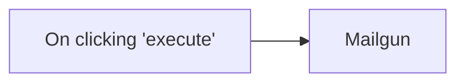

## Fluxo (.json) :

```json
{
  "nodes": [
    {
      "name": "On clicking 'execute'",
      "type": "n8n-nodes-base.manualTrigger",
      "position": [
        250,
        300
      ],
      "parameters": {},
      "typeVersion": 1
    },
    {
      "name": "Mailgun",
      "type": "n8n-nodes-base.mailgun",
      "position": [
        450,
        300
      ],
      "parameters": {
        "text": "This is a test message ",
        "subject": "This is a Subject",
        "toEmail": "user2@example.com",
        "fromEmail": "user@example.com"
      },
      "credentials": {
        "mailgunApi": "mailgun-creds"
      },
      "typeVersion": 1
    }
  ],
  "connections": {
    "On clicking 'execute'": {
      "main": [
        [
          {
            "node": "Mailgun",
            "type": "main",
            "index": 0
          }
        ]
      ]
    }
  }
}
```

<a id="template-236"></a>

## Template 236 - Chatbot WhatsApp com IA para texto, voz, imagens e PDFs

- **Nome:** Chatbot WhatsApp com IA para texto, voz, imagens e PDFs
- **Descrição:** Atende mensagens recebidas via WhatsApp (texto, áudio, imagem e PDF), processa o conteúdo com modelos de IA e responde ao usuário por texto ou áudio.
- **Funcionalidade:** • Recepção de mensagens WhatsApp: Dispara o fluxo ao receber novas mensagens.
• Detecção do tipo de entrada: Classifica automaticamente se a mensagem é texto, áudio, imagem ou documento.
• Processamento de texto: Encaminha mensagens textuais para o modelo de linguagem para gerar respostas apropriadas.
• Transcrição de áudio: Obtém o arquivo de áudio, baixa-o e realiza transcrição para texto antes de processar com a IA.
• Geração de resposta em áudio: Converte a resposta de texto em áudio (voz sintetizada) quando necessário e envia ao usuário.
• Análise de imagem: Faz download da imagem, pede análise detalhada ao modelo de IA e formata uma descrição baseada no conteúdo e na legenda.
• Processamento de PDF: Verifica se o arquivo é PDF, baixa, extrai texto do documento e gera sumário ou respostas conforme solicitação.
• Tratamento de erros e formatos inválidos: Informa o usuário quando o formato enviado não é suportado ou quando apenas PDFs são aceitos no fluxo de documentos.
• Memória de sessão simples: Mantém um histórico curto (janela) por usuário para contexto nas interações.
- **Ferramentas:** • WhatsApp (Meta) API: Envio e recebimento de mensagens, recuperação de URLs de mídia e identificação de remetentes.
• OpenAI: Modelo de linguagem para respostas, transcrição de áudio, análise de imagens e geração de áudio sintético.
• HTTP/Serviços de download: Baixa arquivos de mídia (imagens, áudios e documentos) a partir de URLs usando autenticação por cabeçalho.
• Biblioteca/serviço de extração de PDF: Extrai texto de documentos PDF para posterior análise pela IA.

## Fluxo visual

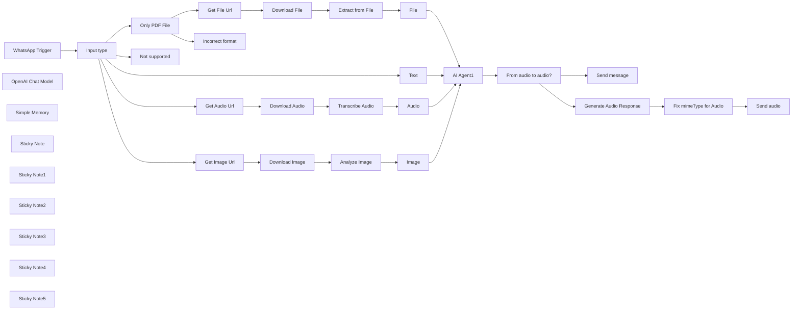

## Fluxo (.json) :

```json
{
  "id": "zMtPPjJ80JJznrJP",
  "meta": {
    "instanceId": "a4bfc93e975ca233ac45ed7c9227d84cf5a2329310525917adaf3312e10d5462",
    "templateCredsSetupCompleted": true
  },
  "name": "AI-Powered WhatsApp Chatbot for Text, Voice, Images & PDFs",
  "tags": [],
  "nodes": [
    {
      "id": "38246f5d-0cf4-49ed-957e-0189243d0dec",
      "name": "WhatsApp Trigger",
      "type": "n8n-nodes-base.whatsAppTrigger",
      "position": [
        -700,
        80
      ],
      "webhookId": "d3978cae-2aca-4553-8ac7-ab89068deabc",
      "parameters": {
        "options": {},
        "updates": [
          "messages"
        ]
      },
      "credentials": {
        "whatsAppTriggerApi": {
          "id": "gylriO2te7NRPXxN",
          "name": "WhatsApp OAuth account"
        }
      },
      "typeVersion": 1
    },
    {
      "id": "4cc0b70b-3ecc-4415-af2f-e50d4f302786",
      "name": "Download Image",
      "type": "n8n-nodes-base.httpRequest",
      "position": [
        720,
        120
      ],
      "parameters": {
        "url": "={{ $json.url }}",
        "options": {},
        "authentication": "genericCredentialType",
        "genericAuthType": "httpHeaderAuth"
      },
      "credentials": {
        "httpHeaderAuth": {
          "id": "FDP9FxauzJt9rkjr",
          "name": "WhatsApp"
        }
      },
      "typeVersion": 4.2
    },
    {
      "id": "528984be-b9ad-41c7-8b2e-ccbf275f7805",
      "name": "Analyze Image",
      "type": "@n8n/n8n-nodes-langchain.openAi",
      "position": [
        960,
        120
      ],
      "parameters": {
        "text": "=You are an advanced image description AI assistant . Your primary function is to provide detailed, accurate descriptions of images submitted through WhatsApp.\n\nCORE FUNCTIONALITY:\n- When presented with an image, you will analyze it thoroughly and provide a comprehensive description in English.\n- Your descriptions should capture both the obvious and subtle elements within the image.\n\nIMAGE DESCRIPTION GUIDELINES:\n- Begin with a broad overview of what the image contains\n- Describe key subjects, people, objects, and their relationships\n- Note significant visual elements such as colors, lighting, composition, and perspective\n- Identify any text visible in the image\n- Describe the setting or environment\n- Mention any notable actions or events taking place\n- Comment on mood, tone, or atmosphere when relevant\n- If applicable, identify landmarks, famous people, or cultural references\n\nRESPONSE FORMAT:\n- Start with \"Image Description:\" followed by your analysis\n- Structure your description in a logical manner (general to specific)\n- Use clear, precise language appropriate for visual description\n- Format longer descriptions with paragraphs to enhance readability\n- End with any notable observations that might require special attention\n\nLIMITATIONS:\n- If the image is blurry, low resolution, or difficult to interpret, acknowledge these limitations\n- If an image contains potentially sensitive content, provide a factual description without judgment\n- Do not make assumptions about elements that cannot be clearly determined\n\nYour descriptions should be informative, objective, and thorough, enabling someone who cannot see the image to form an accurate mental picture of its contents.",
        "modelId": {
          "__rl": true,
          "mode": "list",
          "value": "gpt-4o-mini",
          "cachedResultName": "GPT-4O-MINI"
        },
        "options": {
          "detail": "auto"
        },
        "resource": "image",
        "inputType": "base64",
        "operation": "analyze"
      },
      "credentials": {
        "openAiApi": {
          "id": "4zwP0MSr8zkNvvV9",
          "name": "OpenAi account"
        }
      },
      "typeVersion": 1.8
    },
    {
      "id": "b8898138-f987-4ef7-a5c1-d6d6b9c815f0",
      "name": "Download Audio",
      "type": "n8n-nodes-base.httpRequest",
      "position": [
        720,
        -180
      ],
      "parameters": {
        "url": "={{ $json.url }}",
        "options": {},
        "authentication": "genericCredentialType",
        "genericAuthType": "httpHeaderAuth"
      },
      "credentials": {
        "httpHeaderAuth": {
          "id": "FDP9FxauzJt9rkjr",
          "name": "WhatsApp"
        }
      },
      "typeVersion": 4.2
    },
    {
      "id": "e68bea55-f43a-4143-afca-1348b35e5879",
      "name": "Transcribe Audio",
      "type": "@n8n/n8n-nodes-langchain.openAi",
      "position": [
        960,
        -180
      ],
      "parameters": {
        "options": {},
        "resource": "audio",
        "operation": "transcribe"
      },
      "credentials": {
        "openAiApi": {
          "id": "4zwP0MSr8zkNvvV9",
          "name": "OpenAi account"
        }
      },
      "typeVersion": 1.8
    },
    {
      "id": "1c0aa0c3-cee4-40f1-9e13-9365cc06443a",
      "name": "OpenAI Chat Model",
      "type": "@n8n/n8n-nodes-langchain.lmChatOpenAi",
      "position": [
        160,
        1440
      ],
      "parameters": {
        "model": {
          "__rl": true,
          "mode": "list",
          "value": "gpt-4o-mini"
        },
        "options": {}
      },
      "credentials": {
        "openAiApi": {
          "id": "4zwP0MSr8zkNvvV9",
          "name": "OpenAi account"
        }
      },
      "typeVersion": 1.2
    },
    {
      "id": "d2215cf8-49e1-433b-b9c3-a219e6432cba",
      "name": "AI Agent1",
      "type": "@n8n/n8n-nodes-langchain.agent",
      "position": [
        160,
        1220
      ],
      "parameters": {
        "text": "={{ $json.text }}",
        "options": {
          "systemMessage": "You are an intelligent assistant. Your purpose is to analyze various types of input and provide helpful, accurate responses.\n\nCAPABILITIES:\n- Process and respond to text messages\n- Analyze uploaded files\n- Interpret and describe images\n- Transcribe and understand voice messages\n\nINPUT HANDLING:\n1. For text messages: Analyze the content, understand the intent, and provide a relevant response.\n2. For file analysis: Examine the file content, extract key information, and summarize important points also based on the questions asked.\n3. For image analysis: Describe what you see in the image, identify key elements, and respond to any questions about the image.\n4. For voice messages: Transcribe the audio, understand the message, and respond appropriately.\n\nRESPONSE GUIDELINES:\n- Be concise but thorough\n- Prioritize accuracy over speculation\n- Maintain a professional and helpful tone\n- When uncertain, acknowledge limitations\n- Format responses for easy reading on mobile devices\n- Include actionable information when appropriate\n\nLIMITATIONS:\n- Mention if you're unable to process certain file formats\n- Indicate if an image is unclear or if details are difficult to discern\n- Note if audio quality impacts transcription accuracy\n\nSECURITY & PRIVACY:\n- Do not store or remember sensitive information shared in files, images, or voice notes\n- Do not share personal information across different user interactions\n- Inform users about data privacy limitations when relevant\n\nAnalyze all inputs carefully before responding. Your goal is to provide value through accurate information and helpful assistance."
        },
        "promptType": "define"
      },
      "typeVersion": 1.8
    },
    {
      "id": "103825d0-8521-43c7-8246-9cc1faca42e1",
      "name": "Download File",
      "type": "n8n-nodes-base.httpRequest",
      "position": [
        720,
        460
      ],
      "parameters": {
        "url": "={{ $json.url }}",
        "options": {},
        "authentication": "genericCredentialType",
        "genericAuthType": "httpHeaderAuth"
      },
      "credentials": {
        "httpHeaderAuth": {
          "id": "FDP9FxauzJt9rkjr",
          "name": "WhatsApp"
        }
      },
      "typeVersion": 4.2
    },
    {
      "id": "98077f98-6dcf-4932-9363-19bf1fdc299e",
      "name": "Extract from File",
      "type": "n8n-nodes-base.extractFromFile",
      "position": [
        980,
        460
      ],
      "parameters": {
        "options": {},
        "operation": "pdf"
      },
      "typeVersion": 1
    },
    {
      "id": "fefc8b87-d64e-4ff9-9f62-1ac3af2bf17e",
      "name": "Simple Memory",
      "type": "@n8n/n8n-nodes-langchain.memoryBufferWindow",
      "position": [
        300,
        1440
      ],
      "parameters": {
        "sessionKey": "=memory_{{ $('WhatsApp Trigger').item.json.contacts[0].wa_id }}",
        "sessionIdType": "customKey",
        "contextWindowLength": 10
      },
      "typeVersion": 1.3
    },
    {
      "id": "83ac997d-6ba0-4eb7-bd6c-80671f03c56c",
      "name": "Get File Url",
      "type": "n8n-nodes-base.whatsApp",
      "position": [
        500,
        460
      ],
      "webhookId": "280bd5de-32d7-4d8f-93d2-e91e3b0bc161",
      "parameters": {
        "resource": "media",
        "operation": "mediaUrlGet",
        "mediaGetId": "={{ $('WhatsApp Trigger').item.json.messages[0].document.id }}"
      },
      "credentials": {
        "whatsAppApi": {
          "id": "HDUOWQXeRXMVjo0Z",
          "name": "WhatsApp account"
        }
      },
      "typeVersion": 1
    },
    {
      "id": "56b23f60-57c3-4ea7-a4e8-64029a2e44c1",
      "name": "Only PDF File",
      "type": "n8n-nodes-base.if",
      "position": [
        220,
        480
      ],
      "parameters": {
        "options": {},
        "conditions": {
          "options": {
            "version": 2,
            "leftValue": "",
            "caseSensitive": true,
            "typeValidation": "strict"
          },
          "combinator": "and",
          "conditions": [
            {
              "id": "f52d2aaa-e0b2-45e5-8c4b-ceef42182a0d",
              "operator": {
                "name": "filter.operator.equals",
                "type": "string",
                "operation": "equals"
              },
              "leftValue": "={{ $json.messages[0].document.mime_type }}",
              "rightValue": "application/pdf"
            }
          ]
        }
      },
      "typeVersion": 2.2
    },
    {
      "id": "fa733b7b-16a7-4a9b-86b3-88395535ecd5",
      "name": "Fix mimeType for Audio",
      "type": "n8n-nodes-base.code",
      "position": [
        1040,
        1080
      ],
      "parameters": {
        "jsCode": "for (const item of $input.all()) {\n  if (item.binary) {\n    const binaryPropertyNames = Object.keys(item.binary);\n    for (const propName of binaryPropertyNames) {\n      if (item.binary[propName].mimeType === 'audio/mp3') {\n        item.binary[propName].mimeType = 'audio/mpeg';\n      }\n    }\n  }\n}\n\nreturn $input.all();"
      },
      "typeVersion": 2
    },
    {
      "id": "0d99c2fa-945b-487a-b929-742e8b1b6859",
      "name": "Send message",
      "type": "n8n-nodes-base.whatsApp",
      "position": [
        840,
        1360
      ],
      "webhookId": "23834751-5066-48ba-8e19-549680df2b27",
      "parameters": {
        "textBody": "={{ $json.output }}",
        "operation": "send",
        "phoneNumberId": "470271332838881",
        "additionalFields": {},
        "recipientPhoneNumber": "={{ $('WhatsApp Trigger').item.json.messages[0].from }}"
      },
      "credentials": {
        "whatsAppApi": {
          "id": "HDUOWQXeRXMVjo0Z",
          "name": "WhatsApp account"
        }
      },
      "typeVersion": 1
    },
    {
      "id": "046328e9-e948-479c-ac42-567877350f1e",
      "name": "Send audio",
      "type": "n8n-nodes-base.whatsApp",
      "position": [
        1260,
        1080
      ],
      "webhookId": "d18b2c98-84e4-43cf-a532-0c47d5161684",
      "parameters": {
        "mediaPath": "useMedian8n",
        "operation": "send",
        "messageType": "audio",
        "phoneNumberId": "470271332838881",
        "additionalFields": {},
        "recipientPhoneNumber": "={{ $('Input type').item.json.contacts[0].wa_id }}"
      },
      "credentials": {
        "whatsAppApi": {
          "id": "HDUOWQXeRXMVjo0Z",
          "name": "WhatsApp account"
        }
      },
      "typeVersion": 1
    },
    {
      "id": "aa20a408-42ab-4011-9cea-331e23cda4ce",
      "name": "Incorrect format",
      "type": "n8n-nodes-base.whatsApp",
      "position": [
        500,
        700
      ],
      "webhookId": "23834751-5066-48ba-8e19-549680df2b27",
      "parameters": {
        "textBody": "=Sorry but you can only send PDF files",
        "operation": "send",
        "phoneNumberId": "470271332838881",
        "additionalFields": {},
        "recipientPhoneNumber": "={{ $('WhatsApp Trigger').item.json.messages[0].from }}"
      },
      "credentials": {
        "whatsAppApi": {
          "id": "HDUOWQXeRXMVjo0Z",
          "name": "WhatsApp account"
        }
      },
      "typeVersion": 1
    },
    {
      "id": "23b3750d-3638-4fd0-bab8-6082f53f19f9",
      "name": "Text",
      "type": "n8n-nodes-base.set",
      "position": [
        1240,
        -520
      ],
      "parameters": {
        "options": {},
        "assignments": {
          "assignments": [
            {
              "id": "c53cd9f9-77c1-4331-98ff-bfc9bdf95a3c",
              "name": "text",
              "type": "string",
              "value": "={{ $('WhatsApp Trigger').item.json.messages[0].text.body }}"
            }
          ]
        }
      },
      "typeVersion": 3.4
    },
    {
      "id": "435c020b-826b-4946-b19e-f9663f4f9f23",
      "name": "Audio",
      "type": "n8n-nodes-base.set",
      "position": [
        1240,
        -180
      ],
      "parameters": {
        "options": {},
        "assignments": {
          "assignments": [
            {
              "id": "219577d5-b028-48fc-90be-980f4171ab68",
              "name": "text",
              "type": "string",
              "value": "={{ $json.text }}"
            }
          ]
        }
      },
      "typeVersion": 3.4
    },
    {
      "id": "0139bb33-651e-4f37-901d-ccc705c9833a",
      "name": "Image",
      "type": "n8n-nodes-base.set",
      "position": [
        1220,
        120
      ],
      "parameters": {
        "options": {},
        "assignments": {
          "assignments": [
            {
              "id": "67552183-de2e-494a-878e-c2948e8cb6bb",
              "name": "text",
              "type": "string",
              "value": "=User request on the image:\n{{ \"Describe the following image\" || $('WhatsApp Trigger').item.json.messages[0].image.caption }}\n\nImage description:\n{{ $json.content }}"
            }
          ]
        }
      },
      "typeVersion": 3.4
    },
    {
      "id": "d66b7190-f83b-483e-b3f3-8c220e2c815f",
      "name": "File",
      "type": "n8n-nodes-base.set",
      "position": [
        1240,
        460
      ],
      "parameters": {
        "options": {},
        "assignments": {
          "assignments": [
            {
              "id": "67552183-de2e-494a-878e-c2948e8cb6bb",
              "name": "text",
              "type": "string",
              "value": "=User request on the file:\n{{ \"Describe this file\" || $('Only PDF File').item.json.messages[0].document.caption }}\n\nFile content:\n{{ $json.text }}"
            }
          ]
        }
      },
      "typeVersion": 3.4
    },
    {
      "id": "20239933-418c-436f-b15b-c293043a0328",
      "name": "Not supported",
      "type": "n8n-nodes-base.whatsApp",
      "position": [
        -260,
        360
      ],
      "webhookId": "23834751-5066-48ba-8e19-549680df2b27",
      "parameters": {
        "textBody": "=You can only send text messages, images, audio files and PDF documents.",
        "operation": "send",
        "phoneNumberId": "470271332838881",
        "additionalFields": {},
        "recipientPhoneNumber": "={{ $('WhatsApp Trigger').item.json.messages[0].from }}"
      },
      "credentials": {
        "whatsAppApi": {
          "id": "HDUOWQXeRXMVjo0Z",
          "name": "WhatsApp account"
        }
      },
      "typeVersion": 1
    },
    {
      "id": "117fd705-1f64-4bcc-88db-357df679fa3d",
      "name": "Get Image Url",
      "type": "n8n-nodes-base.whatsApp",
      "position": [
        480,
        120
      ],
      "webhookId": "280bd5de-32d7-4d8f-93d2-e91e3b0bc161",
      "parameters": {
        "resource": "media",
        "operation": "mediaUrlGet",
        "mediaGetId": "={{ $('WhatsApp Trigger').item.json.messages[0].image.id }}"
      },
      "credentials": {
        "whatsAppApi": {
          "id": "HDUOWQXeRXMVjo0Z",
          "name": "WhatsApp account"
        }
      },
      "typeVersion": 1
    },
    {
      "id": "3bf7364c-6263-4825-aec5-693adaed7d03",
      "name": "Get Audio Url",
      "type": "n8n-nodes-base.whatsApp",
      "position": [
        460,
        -180
      ],
      "webhookId": "87caa300-7204-47b5-959a-94f4a8fbf8cf",
      "parameters": {
        "resource": "media",
        "operation": "mediaUrlGet",
        "mediaGetId": "={{ $('WhatsApp Trigger').item.json.messages[0].audio.id }}"
      },
      "credentials": {
        "whatsAppApi": {
          "id": "HDUOWQXeRXMVjo0Z",
          "name": "WhatsApp account"
        }
      },
      "typeVersion": 1
    },
    {
      "id": "b23f8467-480a-45c1-a7df-e512290a8e13",
      "name": "Generate Audio Response",
      "type": "@n8n/n8n-nodes-langchain.openAi",
      "position": [
        840,
        1080
      ],
      "parameters": {
        "input": "={{ $('AI Agent1').item.json.output }}",
        "voice": "onyx",
        "options": {},
        "resource": "audio"
      },
      "credentials": {
        "openAiApi": {
          "id": "4zwP0MSr8zkNvvV9",
          "name": "OpenAi account"
        }
      },
      "typeVersion": 1.8
    },
    {
      "id": "0b139e60-fbf3-43ae-ae3f-40588f135443",
      "name": "Sticky Note",
      "type": "n8n-nodes-base.stickyNote",
      "position": [
        120,
        -560
      ],
      "parameters": {
        "width": 1340,
        "height": 240,
        "content": "## Text"
      },
      "typeVersion": 1
    },
    {
      "id": "3622ad4c-79c7-479f-a050-ff21d3077c77",
      "name": "Sticky Note1",
      "type": "n8n-nodes-base.stickyNote",
      "position": [
        120,
        -240
      ],
      "parameters": {
        "width": 1340,
        "height": 240,
        "content": "## Voice"
      },
      "typeVersion": 1
    },
    {
      "id": "1f35e179-22d1-4019-a807-21803df51a46",
      "name": "Sticky Note2",
      "type": "n8n-nodes-base.stickyNote",
      "position": [
        120,
        80
      ],
      "parameters": {
        "width": 1340,
        "height": 240,
        "content": "## Image"
      },
      "typeVersion": 1
    },
    {
      "id": "314b8ae2-e518-44a3-80a5-dc8482ab1fa9",
      "name": "Sticky Note3",
      "type": "n8n-nodes-base.stickyNote",
      "position": [
        120,
        420
      ],
      "parameters": {
        "width": 1340,
        "height": 240,
        "content": "## Document"
      },
      "typeVersion": 1
    },
    {
      "id": "a55cc899-3490-4b7c-b793-4f20605fc711",
      "name": "Sticky Note4",
      "type": "n8n-nodes-base.stickyNote",
      "position": [
        120,
        960
      ],
      "parameters": {
        "color": 5,
        "width": 1340,
        "height": 600,
        "content": "## Response"
      },
      "typeVersion": 1
    },
    {
      "id": "f37e975b-c112-4af8-badd-1fdbdb90d2f5",
      "name": "From audio to audio?",
      "type": "n8n-nodes-base.if",
      "position": [
        580,
        1220
      ],
      "parameters": {
        "options": {},
        "conditions": {
          "options": {
            "version": 2,
            "leftValue": "",
            "caseSensitive": true,
            "typeValidation": "strict"
          },
          "combinator": "and",
          "conditions": [
            {
              "id": "b9d1d759-f585-4791-a743-b9d72951e77c",
              "operator": {
                "type": "object",
                "operation": "exists",
                "singleValue": true
              },
              "leftValue": "={{ $('WhatsApp Trigger').item.json.messages[0].audio }}",
              "rightValue": ""
            }
          ]
        }
      },
      "typeVersion": 2.2
    },
    {
      "id": "864be43a-e280-4c6d-bab4-878b88304807",
      "name": "Input type",
      "type": "n8n-nodes-base.switch",
      "position": [
        -420,
        40
      ],
      "parameters": {
        "rules": {
          "values": [
            {
              "outputKey": "Text",
              "conditions": {
                "options": {
                  "version": 2,
                  "leftValue": "",
                  "caseSensitive": true,
                  "typeValidation": "strict"
                },
                "combinator": "and",
                "conditions": [
                  {
                    "id": "08fd0c80-307e-4f45-b1de-35192ee4ec5e",
                    "operator": {
                      "type": "string",
                      "operation": "exists",
                      "singleValue": true
                    },
                    "leftValue": "={{ $json.messages[0].text.body }}",
                    "rightValue": ""
                  }
                ]
              },
              "renameOutput": true
            },
            {
              "outputKey": "Voice",
              "conditions": {
                "options": {
                  "version": 2,
                  "leftValue": "",
                  "caseSensitive": true,
                  "typeValidation": "strict"
                },
                "combinator": "and",
                "conditions": [
                  {
                    "id": "b7b64446-f1ea-4622-990c-22f3999a8269",
                    "operator": {
                      "type": "object",
                      "operation": "exists",
                      "singleValue": true
                    },
                    "leftValue": "={{ $json.messages[0].audio }}",
                    "rightValue": ""
                  }
                ]
              },
              "renameOutput": true
            },
            {
              "outputKey": "Image",
              "conditions": {
                "options": {
                  "version": 2,
                  "leftValue": "",
                  "caseSensitive": true,
                  "typeValidation": "strict"
                },
                "combinator": "and",
                "conditions": [
                  {
                    "id": "202af928-a324-411a-bf15-68a349e7bf9e",
                    "operator": {
                      "type": "object",
                      "operation": "exists",
                      "singleValue": true
                    },
                    "leftValue": "={{ $json.messages[0].image }}",
                    "rightValue": ""
                  }
                ]
              },
              "renameOutput": true
            },
            {
              "outputKey": "Document",
              "conditions": {
                "options": {
                  "version": 2,
                  "leftValue": "",
                  "caseSensitive": true,
                  "typeValidation": "strict"
                },
                "combinator": "and",
                "conditions": [
                  {
                    "id": "c63299e9-6069-4bc6-afb9-7beebf6e3d69",
                    "operator": {
                      "type": "object",
                      "operation": "exists",
                      "singleValue": true
                    },
                    "leftValue": "={{ $json.messages[0].document }}",
                    "rightValue": ""
                  }
                ]
              },
              "renameOutput": true
            }
          ]
        },
        "options": {
          "fallbackOutput": "extra"
        }
      },
      "typeVersion": 3.2
    },
    {
      "id": "cf327372-d2cc-40db-a057-9bfb10d6a520",
      "name": "Sticky Note5",
      "type": "n8n-nodes-base.stickyNote",
      "position": [
        -1580,
        -1140
      ],
      "parameters": {
        "color": 3,
        "width": 780,
        "height": 2680,
        "content": "How to obtain Whatsapp API?\n\n\n### ✅ Prerequisites\nBefore you begin, make sure you have:\n- A **Meta Business Account**\n- A **Facebook Developer Account**\n- A **Verified Business**\n- A **Phone Number** to link to WhatsApp\n- Access to **Meta's Graph API Explorer** or **Meta for Developers portal**\n\n---\n\n### 🪜 STEP 1: Create a Meta App\n\n1. Go to [https://developers.facebook.com/apps](https://developers.facebook.com/apps)\n2. Click **“Create App”**\n3. Choose **\"Business\"** as the app type, then click **Next**\n4. Give your app a name and enter a contact email\n5. Choose your Business Account (or create one)\n6. Click **Create App**\n\n---\n\n### 🪜 STEP 2: Add WhatsApp Product\n\n1. In your app dashboard, scroll down to **\"Add a Product\"**\n2. Find **\"WhatsApp\"** and click **“Set Up”**\n3. Link your **Business Manager Account**\n\n---\n\n### 🪜 STEP 3: Create a WhatsApp Business Account (if needed)\n\n1. If you haven’t already, go to [https://business.facebook.com/](https://business.facebook.com/)\n2. Click **“Create Account”**, and complete your business information\n3. Go to **Business Settings > Accounts > WhatsApp Accounts**\n4. Add a **Phone Number** (you'll receive a verification code)\n\n---\n\n### 🪜 STEP 4: Generate a Temporary Access Token (for development)\n\n1. In the **App Dashboard**, go to **WhatsApp > Getting Started**\n2. Choose your test phone number\n3. Copy the **temporary access token** (valid for 24 hours)\n4. Copy the **Phone Number ID** and **WhatsApp Business Account ID**\n\n✅ Save these 3 values:\n- **Access Token**\n- **Phone Number ID**\n- **WABA ID**\n\n📝 Tip: For production, you will later need to create a **permanent token** (see step 7).\n\n---\n\n### 🪜 STEP 5: Set Up a Webhook URL (n8n)\n\n1. In n8n, set up a **Webhook node** (or use the `WhatsApp Trigger` node)\n2. Copy the webhook URL\n3. In the Meta Developer Dashboard:\n   - Go to **WhatsApp > Configuration**\n   - Click **“Edit Callback URL”**\n   - Paste your n8n webhook URL and add a random **verify token**\n4. In n8n, configure your webhook to respond to the verification request\n\n---\n\n### 🪜 STEP 6: Subscribe to Webhook Fields\n\n1. Still under **WhatsApp > Configuration**, click **\"Manage Subscriptions\"**\n2. Enable:\n   - `messages`\n   - `message_status`\n   - (Optionally `message_template_status_update`)\n\n---\n\n### 🪜 STEP 7: (Optional but recommended) Generate a Permanent Token\n\n1. Go to [https://developers.facebook.com/tools/access_token/](https://developers.facebook.com/tools/access_token/)\n2. Select your app\n3. Click **Get Token > System User Token**\n4. Select the permissions:\n   - `whatsapp_business_management`\n   - `whatsapp_business_messaging`\n   - `business_management`\n5. Click **Generate Token**\n6. Copy and securely store this token\n\n---\n\n### 🪜 STEP 8: Configure Credentials in n8n\n\n1. Go to **n8n > Settings > Credentials**\n2. Create new credentials of type **HTTP Header Auth**\n   - **Name:** WhatsApp\n   - **Header Name:** `Authorization`\n   - **Value:** `Bearer <your_access_token>`\n3. Save\n\nThen, in your workflows:\n- Use the HTTP Request node or WhatsApp node\n- Set the `phone_number_id` in the node parameters\n- Connect it to your WhatsApp credential\n\n---\n\n### 🧪 STEP 9: Test the Connection\n\n1. Use a WhatsApp number to send a message to your business phone\n2. Your n8n workflow should be triggered\n3. You can now send and receive messages programmatically 🎉\n"
      },
      "typeVersion": 1
    }
  ],
  "active": false,
  "pinData": {},
  "settings": {
    "executionOrder": "v1"
  },
  "versionId": "4dfe4c80-3a9a-4292-bcb2-3f68bbea5a3a",
  "connections": {
    "File": {
      "main": [
        [
          {
            "node": "AI Agent1",
            "type": "main",
            "index": 0
          }
        ]
      ]
    },
    "Text": {
      "main": [
        [
          {
            "node": "AI Agent1",
            "type": "main",
            "index": 0
          }
        ]
      ]
    },
    "Audio": {
      "main": [
        [
          {
            "node": "AI Agent1",
            "type": "main",
            "index": 0
          }
        ]
      ]
    },
    "Image": {
      "main": [
        [
          {
            "node": "AI Agent1",
            "type": "main",
            "index": 0
          }
        ]
      ]
    },
    "AI Agent1": {
      "main": [
        [
          {
            "node": "From audio to audio?",
            "type": "main",
            "index": 0
          }
        ]
      ]
    },
    "Input type": {
      "main": [
        [
          {
            "node": "Text",
            "type": "main",
            "index": 0
          }
        ],
        [
          {
            "node": "Get Audio Url",
            "type": "main",
            "index": 0
          }
        ],
        [
          {
            "node": "Get Image Url",
            "type": "main",
            "index": 0
          }
        ],
        [
          {
            "node": "Only PDF File",
            "type": "main",
            "index": 0
          }
        ],
        [
          {
            "node": "Not supported",
            "type": "main",
            "index": 0
          }
        ]
      ]
    },
    "Get File Url": {
      "main": [
        [
          {
            "node": "Download File",
            "type": "main",
            "index": 0
          }
        ]
      ]
    },
    "Analyze Image": {
      "main": [
        [
          {
            "node": "Image",
            "type": "main",
            "index": 0
          }
        ]
      ]
    },
    "Download File": {
      "main": [
        [
          {
            "node": "Extract from File",
            "type": "main",
            "index": 0
          }
        ]
      ]
    },
    "Get Audio Url": {
      "main": [
        [
          {
            "node": "Download Audio",
            "type": "main",
            "index": 0
          }
        ]
      ]
    },
    "Get Image Url": {
      "main": [
        [
          {
            "node": "Download Image",
            "type": "main",
            "index": 0
          }
        ]
      ]
    },
    "Only PDF File": {
      "main": [
        [
          {
            "node": "Get File Url",
            "type": "main",
            "index": 0
          }
        ],
        [
          {
            "node": "Incorrect format",
            "type": "main",
            "index": 0
          }
        ]
      ]
    },
    "Simple Memory": {
      "ai_memory": [
        [
          {
            "node": "AI Agent1",
            "type": "ai_memory",
            "index": 0
          }
        ]
      ]
    },
    "Download Audio": {
      "main": [
        [
          {
            "node": "Transcribe Audio",
            "type": "main",
            "index": 0
          }
        ]
      ]
    },
    "Download Image": {
      "main": [
        [
          {
            "node": "Analyze Image",
            "type": "main",
            "index": 0
          }
        ]
      ]
    },
    "Transcribe Audio": {
      "main": [
        [
          {
            "node": "Audio",
            "type": "main",
            "index": 0
          }
        ]
      ]
    },
    "WhatsApp Trigger": {
      "main": [
        [
          {
            "node": "Input type",
            "type": "main",
            "index": 0
          }
        ]
      ]
    },
    "Extract from File": {
      "main": [
        [
          {
            "node": "File",
            "type": "main",
            "index": 0
          }
        ]
      ]
    },
    "OpenAI Chat Model": {
      "ai_languageModel": [
        [
          {
            "node": "AI Agent1",
            "type": "ai_languageModel",
            "index": 0
          }
        ]
      ]
    },
    "From audio to audio?": {
      "main": [
        [
          {
            "node": "Generate Audio Response",
            "type": "main",
            "index": 0
          }
        ],
        [
          {
            "node": "Send message",
            "type": "main",
            "index": 0
          }
        ]
      ]
    },
    "Fix mimeType for Audio": {
      "main": [
        [
          {
            "node": "Send audio",
            "type": "main",
            "index": 0
          }
        ]
      ]
    },
    "Generate Audio Response": {
      "main": [
        [
          {
            "node": "Fix mimeType for Audio",
            "type": "main",
            "index": 0
          }
        ]
      ]
    }
  }
}
```

<a id="template-237"></a>

## Template 237 - Obter todos os registros da organização Xero

- **Nome:** Obter todos os registros da organização Xero
- **Descrição:** Ao ser executado manualmente, o fluxo consulta a API do Xero para recuperar todos os registros da organização especificada.
- **Funcionalidade:** • Gatilho manual: inicia o fluxo quando o usuário clica em "execute".
• Recuperação de dados: realiza a operação getAll para obter todos os registros associados à organização indicada.
• Autenticação: utiliza credenciais configuradas para acessar a conta Xero por meio de OAuth2.
- **Ferramentas:** • Xero: plataforma de contabilidade online que fornece acesso aos dados da organização via API, autenticada por OAuth2.

## Fluxo visual


## Fluxo (.json) :

```json
{
  "nodes": [
    {
      "name": "On clicking 'execute'",
      "type": "n8n-nodes-base.manualTrigger",
      "position": [
        250,
        300
      ],
      "parameters": {},
      "typeVersion": 1
    },
    {
      "name": "Xero",
      "type": "n8n-nodes-base.xero",
      "position": [
        450,
        300
      ],
      "parameters": {
        "options": {},
        "operation": "getAll",
        "organizationId": "ab7e9014-5d01-418f-a64c-dbb6bf5ba2ea"
      },
      "credentials": {
        "xeroOAuth2Api": "n8n_xero"
      },
      "typeVersion": 1
    }
  ],
  "connections": {
    "On clicking 'execute'": {
      "main": [
        [
          {
            "node": "Xero",
            "type": "main",
            "index": 0
          }
        ]
      ]
    }
  }
}
```

<a id="template-238"></a>

## Template 238 - Resumo e roteamento de feedback de cliente

- **Nome:** Resumo e roteamento de feedback de cliente
- **Descrição:** Recebe a transcrição de uma conversa com o cliente, gera um resumo, identifica o departamento responsável e envia uma notificação por e-mail; registra também o resumo como nota de reunião no CRM.
- **Funcionalidade:** • Coleta de transcrição via formulário: Recebe o e-mail do cliente e a conversa por meio de um formulário.
• Resumo automático da conversa: Gera um resumo conciso (2-3 frases) usando um modelo de linguagem.
• Busca de contato no CRM: Localiza o ID do contato no HubSpot a partir do e-mail fornecido.
• Registro de nota de reunião no CRM: Adiciona o resumo como uma nota/engagement do tipo reunião no contato correspondente.
• Identificação e roteamento para departamento responsável: Um agente baseada em LLM decide qual área (Produto, Administrativo, Suporte ou Comercial) deve ser informada e inclui o e-mail do cliente.
• Envio de notificação por e-mail ao responsável: Gera assunto e corpo em HTML com a conversa do cliente e envia ao responsável identificado.
• Exibição de conclusão: Apresenta uma mensagem de saída ao usuário após o processamento.
- **Ferramentas:** • OpenAI: Modelo de linguagem utilizado para resumir a conversa e para decidir o roteamento ao departamento adequado.
• HubSpot: CRM utilizado para buscar o contato pelo e-mail e para registrar o resumo como nota de reunião/engagement.
• Gmail: Serviço de envio de e-mails utilizado para notificar o responsável interno.
• Mailjet: Ferramenta mencionada para envio de e-mails ao departamento responsável, utilizada como referência no roteamento.

## Fluxo visual

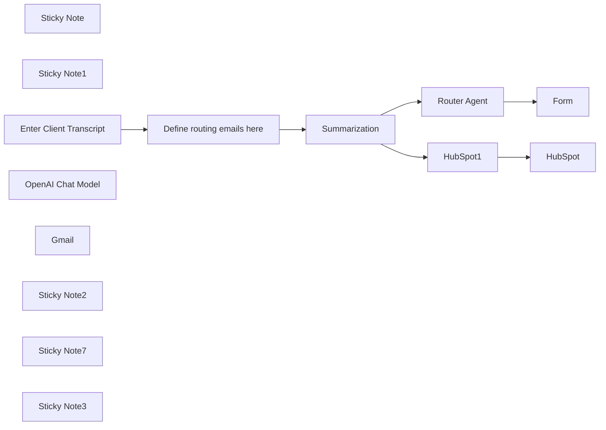

## Fluxo (.json) :

```json
{
  "nodes": [
    {
      "id": "d681d557-cb02-4fb1-9871-bfae504992ca",
      "name": "HubSpot",
      "type": "n8n-nodes-base.hubspot",
      "notes": "Add meeting notes in the contact form",
      "position": [
        260,
        40
      ],
      "parameters": {
        "type": "meeting",
        "metadata": {
          "body": "={{ $('Summarization').item.json.response.text }}",
          "title": "New meeting"
        },
        "resource": "engagement",
        "authentication": "oAuth2",
        "additionalFields": {
          "associations": {
            "contactIds": "={{ $json.properties.hs_object_id }}"
          }
        }
      },
      "credentials": {
        "hubspotOAuth2Api": {
          "id": "JxzF93M0SJ00jDD9",
          "name": "HubSpot account"
        }
      },
      "notesInFlow": true,
      "typeVersion": 2.1
    },
    {
      "id": "e4849449-3464-4deb-a9be-07b3d0bb2d56",
      "name": "HubSpot1",
      "type": "n8n-nodes-base.hubspot",
      "notes": "Search for the id",
      "position": [
        20,
        40
      ],
      "parameters": {
        "operation": "search",
        "authentication": "oAuth2",
        "filterGroupsUi": {
          "filterGroupsValues": [
            {
              "filtersUi": {
                "filterValues": [
                  {
                    "value": "={{ $('Enter Client Transcript').item.json['client email'] }}",
                    "propertyName": "email|string"
                  }
                ]
              }
            }
          ]
        },
        "additionalFields": {}
      },
      "credentials": {
        "hubspotOAuth2Api": {
          "id": "JxzF93M0SJ00jDD9",
          "name": "HubSpot account"
        }
      },
      "notesInFlow": true,
      "typeVersion": 2.1
    },
    {
      "id": "16ac22b7-62fd-429c-b766-5ffe503a3231",
      "name": "Sticky Note",
      "type": "n8n-nodes-base.stickyNote",
      "position": [
        -60,
        -80
      ],
      "parameters": {
        "color": 4,
        "width": 540,
        "height": 280,
        "content": "## Save the data to Hubspot\n- Search for the client ID based on his email\n- Upload the summarized conversation as meeting notes"
      },
      "typeVersion": 1
    },
    {
      "id": "4f51bfc1-8270-4e04-b395-f4ceed9129a4",
      "name": "Sticky Note1",
      "type": "n8n-nodes-base.stickyNote",
      "position": [
        -60,
        220
      ],
      "parameters": {
        "color": 4,
        "width": 540,
        "height": 520,
        "content": "## Router agent\nMakes decisions with the help of an LLM  \n- Analyzes the content\n- Decides which part of the transcript is relevant to the different departments\n- Sends the emails to the departments\n"
      },
      "typeVersion": 1
    },
    {
      "id": "96142f55-cbb4-47e9-a44e-b4f783eeeeb5",
      "name": "Router Agent",
      "type": "@n8n/n8n-nodes-langchain.agent",
      "notes": "Route the client feedback topics to the relevant department ",
      "position": [
        20,
        420
      ],
      "parameters": {
        "text": "={{ $('Enter Client Transcript').item.json['client conversation'] }}",
        "options": {
          "systemMessage": "=You are provided with some client-company conversation and should decide who has to be informed about the feedback. Always only inform one person. Those are your options: \n- It's about a product, send an email to {{ $('Define routing emails here').item.json['Product Email'] }}\n- It's about an invoicing problem, send an email to {{ $('Define routing emails here').item.json['Administrative Email'] }}\n- It's  related to a problem with the product, send an email to {{ $('Define routing emails here').item.json['Support Email'] }}\n- It's commercial related, send an email to {{ $('Define routing emails here').item.json['Commercial Email'] }}\n\nAdd the email of the person (\"{{ $('Enter Client Transcript').item.json['client email'] }}\") at the beginning of the text preceded by \"FROM CLIENT: \"\nUse the Mailjet tool to inform each of the most related department. Provide mailjet with a subject, an email, and the email body formated as html which is the client conversation itself."
        },
        "promptType": "define"
      },
      "notesInFlow": true,
      "typeVersion": 1.8
    },
    {
      "id": "0485667e-befa-4b69-998f-26e1b8a9f67f",
      "name": "Summarization",
      "type": "@n8n/n8n-nodes-langchain.chainSummarization",
      "notes": "The transcript is summarized",
      "position": [
        -360,
        200
      ],
      "parameters": {
        "options": {
          "summarizationMethodAndPrompts": {
            "values": {
              "prompt": "=Summarize the following Converstaion in 2-3 sentences:\n\n\" {{ $json['client conversation'] }}\"\n\nJust output the summarized conversation and nothing else. Use the same language as the input",
              "summarizationMethod": "stuff"
            }
          }
        }
      },
      "notesInFlow": true,
      "typeVersion": 2,
      "alwaysOutputData": false
    },
    {
      "id": "bb2826b5-18ec-4df7-990d-7fe99df759c8",
      "name": "Enter Client Transcript",
      "type": "n8n-nodes-base.formTrigger",
      "notes": "The transcript can come from fireflies or Team etc.",
      "position": [
        -800,
        200
      ],
      "webhookId": "4ba66bc9-8200-4b29-9d81-aaaca2ca8e0a",
      "parameters": {
        "options": {
          "appendAttribution": false
        },
        "formTitle": "Automate Client issue",
        "formFields": {
          "values": [
            {
              "fieldType": "email",
              "fieldLabel": "client email",
              "requiredField": true
            },
            {
              "fieldType": "textarea",
              "fieldLabel": "client conversation",
              "requiredField": true
            }
          ]
        }
      },
      "notesInFlow": true,
      "typeVersion": 2.2
    },
    {
      "id": "4ec42125-16dd-4c05-8816-3f3d986335ac",
      "name": "Form",
      "type": "n8n-nodes-base.form",
      "position": [
        360,
        420
      ],
      "webhookId": "938c1d15-f510-4b66-abac-dca5ff89461d",
      "parameters": {
        "options": {},
        "operation": "completion",
        "completionTitle": "Ouput",
        "completionMessage": "={{ $json.output }}"
      },
      "typeVersion": 1
    },
    {
      "id": "5bdd3903-06f3-4c21-bc57-7127cfc6e433",
      "name": "OpenAI Chat Model",
      "type": "@n8n/n8n-nodes-langchain.lmChatOpenAi",
      "position": [
        -272,
        420
      ],
      "parameters": {
        "model": {
          "__rl": true,
          "mode": "list",
          "value": "gpt-4o-mini"
        },
        "options": {}
      },
      "credentials": {
        "openAiApi": {
          "id": "1IOLtYX7aTspCAN8",
          "name": "OpenAI Pollup"
        }
      },
      "typeVersion": 1.2
    },
    {
      "id": "1abb54f8-0f65-4280-8b35-4dc7c3b1bb07",
      "name": "Define routing emails here",
      "type": "n8n-nodes-base.set",
      "position": [
        -580,
        200
      ],
      "parameters": {
        "options": {},
        "assignments": {
          "assignments": [
            {
              "id": "099d5326-3452-47b8-9dc0-acc0e6fd951e",
              "name": "Support Email",
              "type": "string",
              "value": "support@pollup.net"
            },
            {
              "id": "4ed84290-dbf7-47f7-8693-4f95e0c2fd7e",
              "name": "Administrative Email",
              "type": "string",
              "value": "admin@pollup.net"
            },
            {
              "id": "c39edf1f-b8e0-48ca-929c-294bbac52837",
              "name": "Product Email",
              "type": "string",
              "value": "product@pollup.net"
            },
            {
              "id": "614d4a5c-c9f2-4d82-bfcb-cfdcc8a4b07d",
              "name": "Commercial Email",
              "type": "string",
              "value": "commercial@pollup.net"
            }
          ]
        }
      },
      "typeVersion": 3.4
    },
    {
      "id": "c2d345e2-ce32-4337-91d5-ae8bf54e3d25",
      "name": "Gmail",
      "type": "n8n-nodes-base.gmailTool",
      "position": [
        180,
        640
      ],
      "webhookId": "ea898d49-e017-441c-bfe0-7a966435a570",
      "parameters": {
        "sendTo": "={{ /*n8n-auto-generated-fromAI-override*/ $fromAI('To', ``, 'string') }}",
        "message": "={{ /*n8n-auto-generated-fromAI-override*/ $fromAI('Message', ``, 'string') }}",
        "options": {
          "appendAttribution": false
        },
        "subject": "={{ /*n8n-auto-generated-fromAI-override*/ $fromAI('Subject', ``, 'string') }}"
      },
      "credentials": {
        "gmailOAuth2": {
          "id": "DLjspol9TLgpGaXa",
          "name": "Gmail account 2"
        }
      },
      "typeVersion": 2.1
    },
    {
      "id": "11210b0c-c33d-4c40-b20c-a8d3a1761863",
      "name": "Sticky Note2",
      "type": "n8n-nodes-base.stickyNote",
      "position": [
        -660,
        100
      ],
      "parameters": {
        "color": 4,
        "width": 260,
        "height": 260,
        "content": "## Set the emails HERE\nFor each responsible in your company."
      },
      "typeVersion": 1
    },
    {
      "id": "0d2e217d-5c3a-4fdb-a60e-091a50de553b",
      "name": "Sticky Note7",
      "type": "n8n-nodes-base.stickyNote",
      "position": [
        -860,
        -120
      ],
      "parameters": {
        "width": 460,
        "height": 200,
        "content": "## Contact me\n- If you need any modification to this workflow\n- if you need some help with this workflow\n- Or if you need any workflow in n8n, Make, or Langchain / Langgraph\n\nWrite to me: [thomas@pollup.net](mailto:thomas@pollup.net)"
      },
      "typeVersion": 1
    },
    {
      "id": "e7e40c88-374b-49d4-8c66-b8543a9376ea",
      "name": "Sticky Note3",
      "type": "n8n-nodes-base.stickyNote",
      "position": [
        -860,
        100
      ],
      "parameters": {
        "color": 4,
        "width": 180,
        "height": 260,
        "content": "## Starting form\n"
      },
      "typeVersion": 1
    }
  ],
  "connections": {
    "Gmail": {
      "ai_tool": [
        [
          {
            "node": "Router Agent",
            "type": "ai_tool",
            "index": 0
          }
        ]
      ]
    },
    "HubSpot1": {
      "main": [
        [
          {
            "node": "HubSpot",
            "type": "main",
            "index": 0
          }
        ]
      ]
    },
    "Router Agent": {
      "main": [
        [
          {
            "node": "Form",
            "type": "main",
            "index": 0
          }
        ]
      ]
    },
    "Summarization": {
      "main": [
        [
          {
            "node": "Router Agent",
            "type": "main",
            "index": 0
          },
          {
            "node": "HubSpot1",
            "type": "main",
            "index": 0
          }
        ]
      ]
    },
    "OpenAI Chat Model": {
      "ai_languageModel": [
        [
          {
            "node": "Summarization",
            "type": "ai_languageModel",
            "index": 0
          },
          {
            "node": "Router Agent",
            "type": "ai_languageModel",
            "index": 0
          }
        ]
      ]
    },
    "Enter Client Transcript": {
      "main": [
        [
          {
            "node": "Define routing emails here",
            "type": "main",
            "index": 0
          }
        ]
      ]
    },
    "Define routing emails here": {
      "main": [
        [
          {
            "node": "Summarization",
            "type": "main",
            "index": 0
          }
        ]
      ]
    }
  }
}
```

<a id="template-239"></a>

## Template 239 - Agente Cripto CoinMarketCap

- **Nome:** Agente Cripto CoinMarketCap
- **Descrição:** Agente que recebe consultas sobre criptomoedas, interpreta a intenção do usuário e busca dados em endpoints da CoinMarketCap para fornecer preços, metadados, rankings, métricas globais e conversões.
- **Funcionalidade:** • Recebe mensagens de outro fluxo: inicia a execução a partir de um input contendo 'message' e 'sessionId'.
• Interpreta a intenção do usuário: usa um modelo de linguagem para decidir qual consulta ou ferramenta é mais apropriada.
• Consulta múltiplos endpoints da CoinMarketCap: suporta busca de mapa de moedas, metadados, listagens por capitalização, cotações em tempo real, métricas globais e conversões de preço.
• Monta requisições dinâmicas: combina parâmetros como symbol, convert, amount, start e limit conforme a necessidade da consulta.
• Mantém contexto de sessão: buffer de memória para preservar histórico por sessionId e melhorar respostas contextuais.
• Retorna resultados formatados ou JSON bruto: pode apresentar respostas como insights legíveis ou encaminhar os dados brutos da API.
• Tratamento básico de erros e limites: considera códigos de erro comuns (400, 401, 429, 500) e recomendações para checagem de parâmetros e controle de rate limit.
- **Ferramentas:** • CoinMarketCap Pro API: serviço usado para obter IDs, símbolos e nomes (map), metadados (info), listagens por capitalização (listings/latest), cotações em tempo real (quotes/latest), métricas de mercado global (global-metrics/quotes/latest) e conversões de preço (tools/price-conversion).
• OpenAI (GPT-4o Mini): modelo de linguagem responsável por interpretar consultas do usuário, selecionar a ferramenta adequada e gerar as respostas e instruções de requisição.

## Fluxo visual

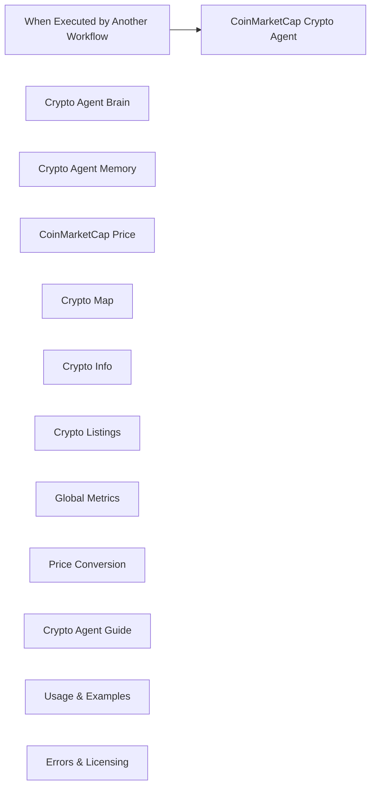

## Fluxo (.json) :

```json
{
  "id": "R4EuB1gx1IpMXCJM",
  "meta": {
    "instanceId": "a5283507e1917a33cc3ae615b2e7d5ad2c1e50955e6f831272ddd5ab816f3fb6",
    "templateCredsSetupCompleted": true
  },
  "name": "CoinMarketCap_Crypto_Agent_Tool",
  "tags": [],
  "nodes": [
    {
      "id": "c055762a-8fe7-4141-a639-df2372f30060",
      "name": "When Executed by Another Workflow",
      "type": "n8n-nodes-base.executeWorkflowTrigger",
      "position": [
        -240,
        260
      ],
      "parameters": {
        "workflowInputs": {
          "values": [
            {
              "name": "message"
            },
            {
              "name": "sessionId"
            }
          ]
        }
      },
      "typeVersion": 1.1
    },
    {
      "id": "3638379c-fad2-4d3b-bb90-b32242da4cc7",
      "name": "CoinMarketCap Crypto Agent",
      "type": "@n8n/n8n-nodes-langchain.agent",
      "position": [
        260,
        260
      ],
      "parameters": {
        "text": "={{ $json.message }}",
        "options": {
          "systemMessage": "You are an AI cryptocurrency analyst. You have access to six live CoinMarketCap tools, each linked to a real API endpoint. These tools allow you to retrieve price data, metadata, market rankings, conversions, and global market stats.\n\nUse the most relevant tool based on the user’s intent. Below is a list of your currently connected tools, their functions, and accepted input parameters.\n\n---\n\n### 🔧 **Connected Tools & Supported Inputs**\n\n---\n\n#### 1. **Crypto Map**\n- **Endpoint**: `/v1/cryptocurrency/map`\n- **Purpose**: Get CoinMarketCap IDs, symbols, and names.\n- **Supported Inputs**:\n  - `symbol` – (Optional) Comma-separated crypto symbols (e.g., BTC,ETH)\n  - `listing_status` – `active`, `inactive`, or `untracked`\n  - `start` – (Pagination start)\n  - `limit` – (Number of results)\n- **Use Cases**:\n  - “What is the CoinMarketCap ID for SOL?”\n  - “List all active cryptocurrencies.”\n\n---\n\n#### 2. **Crypto Info**\n- **Endpoint**: `/v2/cryptocurrency/info`\n- **Purpose**: Get metadata like description, whitepaper, and social links.\n- **Supported Inputs**:\n  - `symbol` – (Required) Comma-separated symbols\n- **Use Cases**:\n  - “Show me the whitepaper for ETH.”\n  - “What’s the website and Twitter handle of DOGE?”\n\n---\n\n#### 3. **Crypto Listings**\n- **Endpoint**: `/v1/cryptocurrency/listings/latest`\n- **Purpose**: Ranked list of coins sorted by market cap.\n- **Supported Inputs**:\n  - `start` – (e.g., 1 for top coin, 101 for rank 101+)\n  - `limit` – (e.g., 10 for top 10)\n  - `convert` – Currency to convert values into (e.g., USD, EUR)\n- **Use Cases**:\n  - “Show me the top 20 coins.”\n  - “What are the top 5 coins in EUR?”\n\n---\n\n#### 4. **CoinMarketCap Price**\n- **Endpoint**: `/v2/cryptocurrency/quotes/latest`\n- **Purpose**: Real-time price, volume, and market cap.\n- **Supported Inputs**:\n  - `symbol` – (Required) Single or multiple symbols\n  - `convert` – Currency to display results in (e.g., USD)\n- **Use Cases**:\n  - “What’s the current price of ADA?”\n  - “How much volume has BTC traded in the last 24h?”\n\n---\n\n#### 5. **Global Metrics**\n- **Endpoint**: `/v1/global-metrics/quotes/latest`\n- **Purpose**: Global crypto market stats.\n- **Supported Inputs**:\n  - *(None required)*\n- **Use Cases**:\n  - “What’s the total crypto market cap?”\n  - “How dominant is Bitcoin?”\n\n---\n\n#### 6. **Price Conversion**\n- **Endpoint**: `/v1/tools/price-conversion`\n- **Purpose**: Convert one crypto/fiat into another.\n- **Supported Inputs**:\n  - `amount` – (Required) Numerical amount to convert\n  - `symbol` – (Required) The crypto to convert from\n  - `convert` – (Required) The target currency (e.g., BTC, USD)\n- **Use Cases**:\n  - “Convert 5 ETH to USD.”\n  - “What’s 1000 DOGE in BTC?”\n\n"
        },
        "promptType": "define"
      },
      "typeVersion": 1.8
    },
    {
      "id": "52e42df6-6b67-45d6-80a0-5361259a9d8f",
      "name": "Crypto Agent Brain",
      "type": "@n8n/n8n-nodes-langchain.lmChatOpenAi",
      "position": [
        -300,
        520
      ],
      "parameters": {
        "model": {
          "__rl": true,
          "mode": "list",
          "value": "gpt-4o-mini",
          "cachedResultName": "gpt-4o-mini"
        },
        "options": {}
      },
      "credentials": {
        "openAiApi": {
          "id": "yUizd8t0sD5wMYVG",
          "name": "OpenAi account"
        }
      },
      "typeVersion": 1.2
    },
    {
      "id": "8387d236-2e94-48de-b5b9-0838762440f9",
      "name": "Crypto Agent Memory",
      "type": "@n8n/n8n-nodes-langchain.memoryBufferWindow",
      "position": [
        -120,
        520
      ],
      "parameters": {},
      "typeVersion": 1.3
    },
    {
      "id": "a48f47a0-9bef-412c-91b8-df57ce3dba12",
      "name": "CoinMarketCap Price",
      "type": "@n8n/n8n-nodes-langchain.toolHttpRequest",
      "position": [
        600,
        520
      ],
      "parameters": {
        "url": "https://pro-api.coinmarketcap.com/v2/cryptocurrency/quotes/latest",
        "sendQuery": true,
        "sendHeaders": true,
        "authentication": "genericCredentialType",
        "genericAuthType": "httpHeaderAuth",
        "parametersQuery": {
          "values": [
            {
              "name": "symbol"
            },
            {
              "name": "convert"
            }
          ]
        },
        "toolDescription": "The tool going to recieve input of cryptocurrency name and then request the price from CoinMarketCap and send the price back in a message.",
        "parametersHeaders": {
          "values": [
            {
              "name": "Accept",
              "value": "application/json",
              "valueProvider": "fieldValue"
            }
          ]
        }
      },
      "credentials": {
        "httpHeaderAuth": {
          "id": "OKXROn8aWkgAOvvV",
          "name": "CoinMarketCap Standard"
        }
      },
      "typeVersion": 1.1
    },
    {
      "id": "d5d5e847-efbc-41cd-b581-095eb3825bfd",
      "name": "Crypto Map",
      "type": "@n8n/n8n-nodes-langchain.toolHttpRequest",
      "position": [
        60,
        520
      ],
      "parameters": {
        "url": "https://pro-api.coinmarketcap.com/v1/cryptocurrency/map",
        "sendQuery": true,
        "sendHeaders": true,
        "authentication": "genericCredentialType",
        "genericAuthType": "httpHeaderAuth",
        "parametersQuery": {
          "values": [
            {
              "name": "symbol",
              "valueProvider": "modelOptional"
            },
            {
              "name": "listing_status",
              "valueProvider": "modelOptional"
            },
            {
              "name": "start",
              "valueProvider": "modelOptional"
            },
            {
              "name": "limit",
              "valueProvider": "modelOptional"
            }
          ]
        },
        "toolDescription": "Get a map of all cryptocurrencies with CoinMarketCap ID, name, and symbol.",
        "parametersHeaders": {
          "values": [
            {
              "name": "Accept"
            }
          ]
        }
      },
      "credentials": {
        "httpHeaderAuth": {
          "id": "OKXROn8aWkgAOvvV",
          "name": "CoinMarketCap Standard"
        }
      },
      "typeVersion": 1.1
    },
    {
      "id": "ac224086-1243-4dcb-85eb-dbf59fc927ac",
      "name": "Crypto Info",
      "type": "@n8n/n8n-nodes-langchain.toolHttpRequest",
      "position": [
        240,
        520
      ],
      "parameters": {
        "url": "https://pro-api.coinmarketcap.com/v2/cryptocurrency/info",
        "sendQuery": true,
        "sendHeaders": true,
        "authentication": "genericCredentialType",
        "genericAuthType": "httpHeaderAuth",
        "parametersQuery": {
          "values": [
            {
              "name": "symbol"
            }
          ]
        },
        "toolDescription": "Get metadata for one or more cryptocurrencies including logo, description, and links.\n\n",
        "parametersHeaders": {
          "values": [
            {
              "name": "Accept"
            }
          ]
        }
      },
      "credentials": {
        "httpHeaderAuth": {
          "id": "OKXROn8aWkgAOvvV",
          "name": "CoinMarketCap Standard"
        }
      },
      "typeVersion": 1.1
    },
    {
      "id": "b261f3ed-a1dc-4dd0-bc63-31e77041bb01",
      "name": "Crypto Listings",
      "type": "@n8n/n8n-nodes-langchain.toolHttpRequest",
      "position": [
        420,
        520
      ],
      "parameters": {
        "url": "https://pro-api.coinmarketcap.com/v1/cryptocurrency/listings/latest",
        "sendQuery": true,
        "sendHeaders": true,
        "authentication": "genericCredentialType",
        "genericAuthType": "httpHeaderAuth",
        "parametersQuery": {
          "values": [
            {
              "name": "start"
            },
            {
              "name": "limit"
            },
            {
              "name": "convert"
            }
          ]
        },
        "toolDescription": "Retrieve a ranked list of cryptocurrencies sorted by market cap. Supports pagination and conversion currency.",
        "parametersHeaders": {
          "values": [
            {
              "name": "Accept"
            }
          ]
        }
      },
      "credentials": {
        "httpHeaderAuth": {
          "id": "OKXROn8aWkgAOvvV",
          "name": "CoinMarketCap Standard"
        }
      },
      "typeVersion": 1.1
    },
    {
      "id": "cfa6badf-0eed-4b37-bb1d-2ffcd39a23fc",
      "name": "Global Metrics",
      "type": "@n8n/n8n-nodes-langchain.toolHttpRequest",
      "position": [
        800,
        520
      ],
      "parameters": {
        "url": "https://pro-api.coinmarketcap.com/v1/global-metrics/quotes/latest",
        "sendHeaders": true,
        "authentication": "genericCredentialType",
        "genericAuthType": "httpHeaderAuth",
        "toolDescription": "Returns global crypto market metrics including market cap, 24h volume, BTC dominance, and total active cryptocurrencies.",
        "parametersHeaders": {
          "values": [
            {
              "name": "Accept"
            }
          ]
        }
      },
      "credentials": {
        "httpHeaderAuth": {
          "id": "OKXROn8aWkgAOvvV",
          "name": "CoinMarketCap Standard"
        }
      },
      "typeVersion": 1.1
    },
    {
      "id": "ca40fc60-8cdd-48ec-98ba-63259582a16e",
      "name": "Price Conversion",
      "type": "@n8n/n8n-nodes-langchain.toolHttpRequest",
      "position": [
        1000,
        520
      ],
      "parameters": {
        "url": "https://pro-api.coinmarketcap.com/v1/tools/price-conversion",
        "sendQuery": true,
        "sendHeaders": true,
        "authentication": "genericCredentialType",
        "genericAuthType": "httpHeaderAuth",
        "parametersQuery": {
          "values": [
            {
              "name": "amount"
            },
            {
              "name": "symbol"
            },
            {
              "name": "convert"
            }
          ]
        },
        "toolDescription": "Convert cryptocurrency or fiat value from one currency to another.",
        "parametersHeaders": {
          "values": [
            {
              "name": "Accept"
            }
          ]
        }
      },
      "credentials": {
        "httpHeaderAuth": {
          "id": "OKXROn8aWkgAOvvV",
          "name": "CoinMarketCap Standard"
        }
      },
      "typeVersion": 1.1
    },
    {
      "id": "360bb74c-0ca6-4cd7-95ab-7f14a2c89e6c",
      "name": "Crypto Agent Guide",
      "type": "n8n-nodes-base.stickyNote",
      "position": [
        -1140,
        -760
      ],
      "parameters": {
        "width": 840,
        "height": 840,
        "content": "# 🧠 CoinMarketCap_Crypto_Agent_Tool Guide\n\nThis agent is part of the modular **CoinMarketCap AI Analyst** system in **n8n**, focused on **cryptocurrency-level queries** such as price, supply, metadata, rankings, and conversions.\n\n## 🔌 Endpoints Supported:\n1. `/v1/cryptocurrency/map` – Get IDs, symbols, names\n2. `/v2/cryptocurrency/info` – Get metadata, logos, whitepapers\n3. `/v1/cryptocurrency/listings/latest` – Market rankings by cap\n4. `/v2/cryptocurrency/quotes/latest` – Price, volume, and supply\n5. `/v1/global-metrics/quotes/latest` – Total market cap, BTC dominance\n6. `/v1/tools/price-conversion` – Fiat and crypto conversions\n\n## 🧠 Node Overview:\n- **🧠 Brain**: `GPT-4o Mini`\n- **💾 Memory**: Session context buffer\n- **⚙️ Tools**: 6 live API endpoints\n\n## ⚙️ Required Inputs:\n- `message` – User query\n- `sessionId` – Used to preserve memory between calls\n\n## 📝 Tip:\nUse descriptive prompts like:\n- “What is the CoinMarketCap ID for ETH?”\n- “Convert 1000 DOGE to BTC.”\n- “Show top 10 tokens by market cap.”"
      },
      "typeVersion": 1
    },
    {
      "id": "f2f24886-4157-40f5-9731-dea431fb6cb8",
      "name": "Usage & Examples",
      "type": "n8n-nodes-base.stickyNote",
      "position": [
        -120,
        -760
      ],
      "parameters": {
        "color": 5,
        "width": 720,
        "height": 900,
        "content": "## 📌 Usage Instructions\n\n### ✅ Step 1: Provide Inputs\nUse `symbol`, `amount`, `convert`, `start`, `limit` where needed.\n\n### ✅ Step 2: Trigger from Supervisor\nSupervisor AI sends the message and sessionId to this agent.\n\n### ✅ Step 3: Review Output\nReturns raw JSON or formatted insights.\n\n---\n\n## 🔍 Sample Prompts\n\n### 1️⃣ Convert 5 ETH to USD\n```plaintext\nGET /v1/tools/price-conversion?amount=5&symbol=ETH&convert=USD\n```\n\n### 2️⃣ Get CoinMarketCap ID of SHIB\n```plaintext\nGET /v1/cryptocurrency/map?symbol=SHIB\n```\n\n### 3️⃣ View total market cap\n```plaintext\nGET /v1/global-metrics/quotes/latest\n```\n\n### 4️⃣ Top 5 coins in EUR\n```plaintext\nGET /v1/cryptocurrency/listings/latest?limit=5&convert=EUR\n```"
      },
      "typeVersion": 1
    },
    {
      "id": "06d501a6-8730-4093-a145-53fd9378fa8e",
      "name": "Errors & Licensing",
      "type": "n8n-nodes-base.stickyNote",
      "position": [
        780,
        -760
      ],
      "parameters": {
        "color": 3,
        "width": 600,
        "height": 560,
        "content": "## ⚠️ API Errors & Troubleshooting\n\n| Code | Message |\n|------|---------|\n| 200  | OK ✅ |\n| 400  | Bad Request – Check inputs |\n| 401  | Unauthorized – Invalid/missing API key |\n| 429  | Rate limit exceeded – Slow down |\n| 500  | CoinMarketCap server issue |\n\n### ✅ Tips:\n- Double check symbols and convert params\n- Use `start`, `limit`, `convert` for pagination\n- Add delay to avoid 429 rate limits\n\n---\n\n## 🛠️ Need Help?\n🔗 [Don Jayamaha – LinkedIn](https://linkedin.com/in/donjayamahajr)\n\n© 2025 Treasurium Capital Limited Company. All rights reserved.\nThis AI workflow architecture, including logic, design, and prompt structures, is the intellectual property of Treasurium Capital Limited Company. Unauthorized reproduction, redistribution, or resale is prohibited under U.S. copyright law. Licensed use only."
      },
      "typeVersion": 1
    }
  ],
  "active": false,
  "pinData": {},
  "settings": {
    "executionOrder": "v1"
  },
  "versionId": "a6a08338-6720-4a3a-bf3b-ed9559257b10",
  "connections": {
    "Crypto Map": {
      "ai_tool": [
        [
          {
            "node": "CoinMarketCap Crypto Agent",
            "type": "ai_tool",
            "index": 0
          }
        ]
      ]
    },
    "Crypto Info": {
      "ai_tool": [
        [
          {
            "node": "CoinMarketCap Crypto Agent",
            "type": "ai_tool",
            "index": 0
          }
        ]
      ]
    },
    "Global Metrics": {
      "ai_tool": [
        [
          {
            "node": "CoinMarketCap Crypto Agent",
            "type": "ai_tool",
            "index": 0
          }
        ]
      ]
    },
    "Crypto Listings": {
      "ai_tool": [
        [
          {
            "node": "CoinMarketCap Crypto Agent",
            "type": "ai_tool",
            "index": 0
          }
        ]
      ]
    },
    "Price Conversion": {
      "ai_tool": [
        [
          {
            "node": "CoinMarketCap Crypto Agent",
            "type": "ai_tool",
            "index": 0
          }
        ]
      ]
    },
    "Crypto Agent Brain": {
      "ai_languageModel": [
        [
          {
            "node": "CoinMarketCap Crypto Agent",
            "type": "ai_languageModel",
            "index": 0
          }
        ]
      ]
    },
    "CoinMarketCap Price": {
      "ai_tool": [
        [
          {
            "node": "CoinMarketCap Crypto Agent",
            "type": "ai_tool",
            "index": 0
          }
        ]
      ]
    },
    "Crypto Agent Memory": {
      "ai_memory": [
        [
          {
            "node": "CoinMarketCap Crypto Agent",
            "type": "ai_memory",
            "index": 0
          }
        ]
      ]
    },
    "When Executed by Another Workflow": {
      "main": [
        [
          {
            "node": "CoinMarketCap Crypto Agent",
            "type": "main",
            "index": 0
          }
        ]
      ]
    }
  }
}
```

<a id="template-240"></a>

## Template 240 - Notas do Obsidian para Podcast

- **Nome:** Notas do Obsidian para Podcast
- **Descrição:** Converte notas do Obsidian em episódios de áudio e gera um feed RSS de podcast pronto para distribuição.
- **Funcionalidade:** • Envio de notas via webhook: Recebe notas ou seleção de texto enviadas do Obsidian por um plugin de webhook.
• Conversão de texto para áudio: Gera arquivos de áudio (MP3) a partir do conteúdo das notas usando síntese de voz.
• Criação de descrição curta: Produz descrições concisas e atraentes para cada episódio a partir do texto original.
• Nomeação única de arquivos: Gera nomes únicos para os arquivos de áudio baseados em timestamp para evitar conflitos.
• Armazenamento de áudio e metadados: Faz upload dos arquivos de áudio para armazenamento em nuvem e recupera metadata como duração.
• Retorno do áudio ao Obsidian: Responde ao webhook com o arquivo de áudio para uso imediato no Obsidian quando necessário.
• Registro em planilha: Salva título, link, descrição, data e duração em uma planilha para controle e geração de feed.
• Geração de feed RSS: Monta um arquivo RSS/XML padrão de podcast com metadados estáticos e episódios dinâmicos vindos da planilha.
• Entrega do feed via webhook: Fornece o RSS gerado em resposta a uma chamada webhook, permitindo publicação e consumo por agregadores.
• Configuração híbrida: Permite definir metadados fixos do podcast (título, autor, imagem, categoria) e gerar episódios dinamicamente.
- **Ferramentas:** • Obsidian (Post Webhook plugin): Envia notas ou seleções para a automação através de webhook.
• OpenAI: Gera áudio via TTS e cria descrições curtas e atraentes a partir do texto das notas.
• Cloudinary: Armazena os arquivos de áudio, fornece URLs públicos e metadata como duração.
• Google Sheets: Armazena os registros de episódios (título, link, descrição, data, duração) usados para montar o feed.
• Agregadores de podcast (Apple, Google, Spotify etc.): Plataformas compatíveis onde o feed RSS pode ser publicado para distribuição.


## Fluxo visual

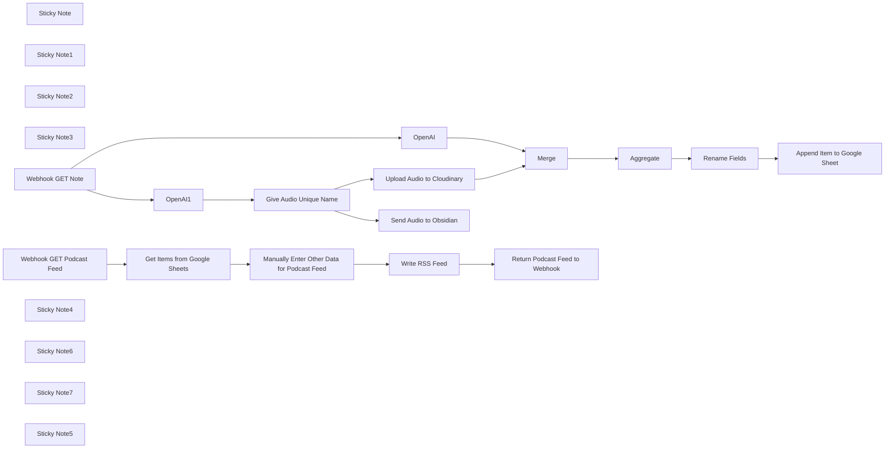

## Fluxo (.json) :

```json
{
  "id": "f9X48gqgIUwyseMM",
  "meta": {
    "instanceId": "d47f3738b860eed937a1b18d7345fa2c65cf4b4957554e29477cb064a7039870"
  },
  "name": "Obsidian Notes Read Aloud: Available as a Podcast Feed",
  "tags": [],
  "nodes": [
    {
      "id": "a44b5cb3-6c9f-4227-a45f-a21765ea120c",
      "name": "OpenAI1",
      "type": "@n8n/n8n-nodes-langchain.openAi",
      "position": [
        -660,
        -180
      ],
      "parameters": {
        "input": "={{ $json.body.content }}",
        "options": {
          "response_format": "mp3"
        },
        "resource": "audio"
      },
      "credentials": {
        "openAiApi": {
          "id": "q8L9oWVM7QyzYEE5",
          "name": "OpenAi account"
        }
      },
      "typeVersion": 1.7
    },
    {
      "id": "9ca589b6-f1c7-44a9-8ff7-4abb979a71c3",
      "name": "Sticky Note",
      "type": "n8n-nodes-base.stickyNote",
      "position": [
        -1200,
        -400
      ],
      "parameters": {
        "width": 440,
        "height": 540,
        "content": "## Send Notes to Webhook\n**Setup:**\n- Install [Post Webhook Plugin](https://github.com/Masterb1234/obsidian-post-webhook/) in Obsidian\n- Enter n8n Webhook URL and name in plugin settings\n\n**Usage:**\n- Select text or use full note\n- Open Command Palette (Ctrl+P)\n- Choose 'Send Note/Selection to [name]'\n- Audio file appears in Podcast Feed and note"
      },
      "typeVersion": 1
    },
    {
      "id": "3ea132e5-8c67-4140-a9b2-607ea256e90f",
      "name": "Sticky Note1",
      "type": "n8n-nodes-base.stickyNote",
      "position": [
        -1200,
        240
      ],
      "parameters": {
        "width": 440,
        "height": 440,
        "content": "## Generic Podcast Feed Module\nA reusable module for any 'X-to-Podcast' workflow. Generates standard RSS feed from:\n- Source data (Google Sheets)\n- Podcast metadata\n\nCompatible with all major podcast platforms (Apple, Google, Spotify, etc.).\n\n\n\n\n\n\n\n\n\n\n\n\n\n\n\n"
      },
      "typeVersion": 1
    },
    {
      "id": "92d6a6df-0e4e-423b-8447-dce10d5373ae",
      "name": "Sticky Note2",
      "type": "n8n-nodes-base.stickyNote",
      "position": [
        -720,
        -400
      ],
      "parameters": {
        "color": 3,
        "width": 440,
        "height": 540,
        "content": "## Create Audio and Write Description\nOpenAI TTS converts notes to audio while the messaging model generates concise descriptions for podcast apps."
      },
      "typeVersion": 1
    },
    {
      "id": "b950b0ab-e27e-473d-9891-d5551a44ed17",
      "name": "Sticky Note3",
      "type": "n8n-nodes-base.stickyNote",
      "position": [
        800,
        -400
      ],
      "parameters": {
        "color": 4,
        "width": 380,
        "height": 540,
        "content": "## Append Row to Google Sheets\nSaves essential podcast parameters (<title>, <link>, <description>, <duration>) to Google Sheets for Feed generation."
      },
      "typeVersion": 1
    },
    {
      "id": "02fda37f-77a5-47f5-81bc-b59486704386",
      "name": "Webhook GET Note",
      "type": "n8n-nodes-base.webhook",
      "position": [
        -1040,
        -120
      ],
      "webhookId": "64fac784-9b98-4bbc-aaf2-dd45763d3362",
      "parameters": {
        "path": "64fac784-9b98-4bbc-aaf2-dd45763d3362",
        "options": {},
        "httpMethod": "POST",
        "responseMode": "responseNode"
      },
      "typeVersion": 2
    },
    {
      "id": "845d04ea-d221-4034-b5e1-75061e5f351c",
      "name": "Webhook GET Podcast Feed",
      "type": "n8n-nodes-base.webhook",
      "position": [
        -1040,
        460
      ],
      "webhookId": "2f0a6706-54da-4b89-91f4-5e147b393bd8",
      "parameters": {
        "path": "2f0a6706-54da-4b89-91f4-5e147b393bd8h",
        "options": {},
        "responseMode": "responseNode"
      },
      "typeVersion": 2
    },
    {
      "id": "ce6d766c-89e6-4d62-9d48-d6715a28592f",
      "name": "Upload Audio to Cloudinary",
      "type": "n8n-nodes-base.httpRequest",
      "position": [
        -220,
        -120
      ],
      "parameters": {
        "url": "https://api.cloudinary.com/v1_1/CLOUDINARY_ENV/upload",
        "method": "POST",
        "options": {},
        "sendBody": true,
        "contentType": "multipart-form-data",
        "sendHeaders": true,
        "authentication": "genericCredentialType",
        "bodyParameters": {
          "parameters": [
            {
              "name": "file",
              "parameterType": "formBinaryData",
              "inputDataFieldName": "data"
            },
            {
              "name": "upload_preset",
              "value": "rb_preset"
            },
            {
              "name": "resource_type",
              "value": "auto"
            }
          ]
        },
        "genericAuthType": "httpCustomAuth",
        "headerParameters": {
          "parameters": [
            {
              "name": "Content-Type",
              "value": "multipart/form-data"
            }
          ]
        }
      },
      "credentials": {
        "httpCustomAuth": {
          "id": "DHmR14pD9rTrd3nS",
          "name": "Cloudinary API"
        }
      },
      "typeVersion": 4.1
    },
    {
      "id": "1f86c18d-8197-4671-9c41-726a02108c4e",
      "name": "OpenAI",
      "type": "@n8n/n8n-nodes-langchain.openAi",
      "position": [
        -660,
        -20
      ],
      "parameters": {
        "modelId": {
          "__rl": true,
          "mode": "list",
          "value": "gpt-4o-mini",
          "cachedResultName": "GPT-4O-MINI"
        },
        "options": {},
        "messages": {
          "values": [
            {
              "content": "={{ $json.body.content }}"
            },
            {
              "role": "system",
              "content": "Based on the user input text, write a concise and engaging description of 50–150 characters. Highlight the key idea or takeaway while making it compelling and easy to understand. Avoid unnecessary details or repetition."
            }
          ]
        }
      },
      "credentials": {
        "openAiApi": {
          "id": "q8L9oWVM7QyzYEE5",
          "name": "OpenAi account"
        }
      },
      "typeVersion": 1.7
    },
    {
      "id": "0942959c-2231-4055-b196-4483c210a39d",
      "name": "Merge",
      "type": "n8n-nodes-base.merge",
      "position": [
        320,
        -40
      ],
      "parameters": {},
      "typeVersion": 3
    },
    {
      "id": "ee7ba6a7-f8dd-4863-bf5c-6ec8eb2329ea",
      "name": "Aggregate",
      "type": "n8n-nodes-base.aggregate",
      "position": [
        460,
        -180
      ],
      "parameters": {
        "options": {},
        "aggregate": "aggregateAllItemData"
      },
      "typeVersion": 1
    },
    {
      "id": "f403d045-08e9-400e-9988-c8f55a5aa609",
      "name": "Give Audio Unique Name",
      "type": "n8n-nodes-base.set",
      "position": [
        -460,
        -180
      ],
      "parameters": {
        "options": {},
        "assignments": {
          "assignments": [
            {
              "id": "97f0fe66-7ddf-4eff-a3cf-3104e74dbfac",
              "name": "fileName",
              "type": "string",
              "value": "={{ $('Webhook GET Note').item.json.body.timestamp }}.mp3"
            }
          ]
        },
        "includeOtherFields": true
      },
      "typeVersion": 3.4
    },
    {
      "id": "2dbff0f5-f359-43b7-b0de-4b9d657c69c0",
      "name": "Send Audio to Obsidian",
      "type": "n8n-nodes-base.respondToWebhook",
      "position": [
        80,
        -180
      ],
      "parameters": {
        "options": {
          "responseHeaders": {
            "entries": [
              {
                "name": "content-type",
                "value": "=audio/mpeg"
              }
            ]
          }
        },
        "respondWith": "binary",
        "responseDataSource": "set"
      },
      "typeVersion": 1
    },
    {
      "id": "ede7c038-b210-4b29-8557-7530ea4cf63e",
      "name": "Rename Fields",
      "type": "n8n-nodes-base.set",
      "position": [
        620,
        -180
      ],
      "parameters": {
        "options": {},
        "assignments": {
          "assignments": [
            {
              "id": "3a7d01f4-7448-40e0-9f46-e6edea971b72",
              "name": "title",
              "type": "string",
              "value": "={{ $('Webhook GET Note').item.json.body.filename.split('.md')[0] }}"
            },
            {
              "id": "f49446df-3975-4133-a964-ebdcc0d904dd",
              "name": "link",
              "type": "string",
              "value": "={{ $json.data[0].url }}"
            },
            {
              "id": "8be5df35-ec79-45b1-94c3-306d58100fd2",
              "name": "description",
              "type": "string",
              "value": "={{ $json.data[1].message.content }}"
            },
            {
              "id": "231d0ee2-13d2-4a28-a19c-adc4920130fd",
              "name": "date",
              "type": "string",
              "value": "={{ $json.data[0].created_at }}"
            },
            {
              "id": "cd2748b3-999a-4514-9b31-49b7d045101f",
              "name": "duration",
              "type": "number",
              "value": "={{ $json.data[0].duration }}"
            }
          ]
        }
      },
      "typeVersion": 3.4
    },
    {
      "id": "10a35ef9-ab86-4010-9fcc-3cd765384e93",
      "name": "Append Item to Google Sheet",
      "type": "n8n-nodes-base.googleSheets",
      "position": [
        940,
        -180
      ],
      "parameters": {
        "columns": {
          "value": {},
          "schema": [
            {
              "id": "title",
              "type": "string",
              "display": true,
              "removed": false,
              "required": false,
              "displayName": "title",
              "defaultMatch": false,
              "canBeUsedToMatch": true
            },
            {
              "id": "link",
              "type": "string",
              "display": true,
              "removed": false,
              "required": false,
              "displayName": "link",
              "defaultMatch": false,
              "canBeUsedToMatch": true
            },
            {
              "id": "description",
              "type": "string",
              "display": true,
              "removed": false,
              "required": false,
              "displayName": "description",
              "defaultMatch": false,
              "canBeUsedToMatch": true
            },
            {
              "id": "date",
              "type": "string",
              "display": true,
              "removed": false,
              "required": false,
              "displayName": "date",
              "defaultMatch": false,
              "canBeUsedToMatch": true
            },
            {
              "id": "duration",
              "type": "string",
              "display": true,
              "removed": false,
              "required": false,
              "displayName": "duration",
              "defaultMatch": false,
              "canBeUsedToMatch": true
            }
          ],
          "mappingMode": "autoMapInputData",
          "matchingColumns": []
        },
        "options": {},
        "operation": "append",
        "sheetName": {
          "__rl": true,
          "mode": "list",
          "value": "gid=0",
          "cachedResultUrl": "https://docs.google.com/spreadsheets/d/1F73a7uuzLAq916w2JFndumv0JhnCAvOTN-Cn_OOP3uA/edit#gid=0",
          "cachedResultName": "Blad1"
        },
        "documentId": {
          "__rl": true,
          "mode": "list",
          "value": "1F73a7uuzLAq916w2JFndumv0JhnCAvOTN-Cn_OOP3uA",
          "cachedResultUrl": "https://docs.google.com/spreadsheets/d/1F73a7uuzLAq916w2JFndumv0JhnCAvOTN-Cn_OOP3uA/edit?usp=drivesdk",
          "cachedResultName": "obsidian-n8n"
        }
      },
      "credentials": {
        "googleSheetsOAuth2Api": {
          "id": "3Pu0wlfxgNYzVqY6",
          "name": "Google Sheets account"
        }
      },
      "typeVersion": 4.5
    },
    {
      "id": "62dd3faf-22db-40f9-892c-2cf9368a9496",
      "name": "Get Items from Google Sheets",
      "type": "n8n-nodes-base.googleSheets",
      "position": [
        -660,
        460
      ],
      "parameters": {
        "options": {},
        "sheetName": {
          "__rl": true,
          "mode": "list",
          "value": "gid=0",
          "cachedResultUrl": "https://docs.google.com/spreadsheets/d/1F73a7uuzLAq916w2JFndumv0JhnCAvOTN-Cn_OOP3uA/edit#gid=0",
          "cachedResultName": "Blad1"
        },
        "documentId": {
          "__rl": true,
          "mode": "list",
          "value": "1F73a7uuzLAq916w2JFndumv0JhnCAvOTN-Cn_OOP3uA",
          "cachedResultUrl": "https://docs.google.com/spreadsheets/d/1F73a7uuzLAq916w2JFndumv0JhnCAvOTN-Cn_OOP3uA/edit?usp=drivesdk",
          "cachedResultName": "obsidian-n8n"
        }
      },
      "credentials": {
        "googleSheetsOAuth2Api": {
          "id": "3Pu0wlfxgNYzVqY6",
          "name": "Google Sheets account"
        }
      },
      "typeVersion": 4.5
    },
    {
      "id": "7b465ed0-d2cc-4862-b0e6-4bd6215f3945",
      "name": "Sticky Note4",
      "type": "n8n-nodes-base.stickyNote",
      "position": [
        -720,
        320
      ],
      "parameters": {
        "color": 3,
        "width": 440,
        "height": 360,
        "content": "## Podcast Feed Configuration\n- Static: Configure podcast metadata in 'Edit Fields'\n- Dynamic: Episodes automatically pulled from Google Sheets"
      },
      "typeVersion": 1
    },
    {
      "id": "1608ce65-bf1f-4dce-b4c7-b85b72ecb8c7",
      "name": "Write RSS Feed",
      "type": "n8n-nodes-base.code",
      "position": [
        -120,
        460
      ],
      "parameters": {
        "jsCode": "// Variables from a separate edit node\nconst baseUrl = $node[\"Manually Enter Other Data for Podcast Feed\"].data.baseUrl; \nconst podcastTitle = $node[\"Manually Enter Other Data for Podcast Feed\"].data.podcastTitle;\nconst podcastDescription = $node[\"Manually Enter Other Data for Podcast Feed\"].data.podcastDescription;\nconst authorName = $node[\"Manually Enter Other Data for Podcast Feed\"].data.authorName;\nconst ownerName = $node[\"Manually Enter Other Data for Podcast Feed\"].data.ownerName;\nconst ownerEmail = $node[\"Manually Enter Other Data for Podcast Feed\"].data.ownerEmail;\nconst coverImageUrl = $node[\"Manually Enter Other Data for Podcast Feed\"].data.coverImageUrl;\nconst language = $node[\"Manually Enter Other Data for Podcast Feed\"].data.language || 'en-us';\nconst explicitContent = $node[\"Manually Enter Other Data for Podcast Feed\"].data.explicitContent || false;\nconst itunesCategory = $node[\"Manually Enter Other Data for Podcast Feed\"].data.itunesCategory;\nconst webhookUrl = $node[\"Webhook GET Podcast Feed\"].data.webhookUrl\n\n// Get the input items\nconst inputItems = items;\n\n// Function to format date to RFC 822 format\nfunction formatDate(dateString) {\n return new Date(dateString || new Date()).toUTCString();\n}\n\n// Function to convert duration from seconds to HH:MM:SS\nfunction formatDuration(seconds = 0) {\n const hours = Math.floor(seconds / 3600);\n const minutes = Math.floor((seconds % 3600) / 60);\n const remainingSeconds = Math.floor(seconds % 60);\n\n const minutesStr = minutes.toString().padStart(2, '0');\n const secondsStr = remainingSeconds.toString().padStart(2, '0');\n \n if (hours > 0) {\n return `${hours}:${minutesStr}:${secondsStr}`;\n }\n return `${minutesStr}:${secondsStr}`;\n}\n\n// Function to safely sanitize text\nfunction sanitizeText(text) {\n if (text === undefined || text === null) {\n return '';\n }\n return String(text)\n .replace(/&/g, '&amp;')\n .replace(/</g, '&lt;')\n .replace(/>/g, '&gt;')\n .replace(/\"/g, '&quot;')\n .replace(/'/g, '&apos;');\n}\n\n// Generate the RSS feed header\nlet rssFeed = `<?xml version=\"1.0\" encoding=\"UTF-8\"?>\n<rss xmlns:itunes=\"http://www.itunes.com/dtds/podcast-1.0.dtd\" \n xmlns:content=\"http://purl.org/rss/1.0/modules/content/\"\n xmlns:atom=\"http://www.w3.org/2005/Atom\"\n version=\"2.0\">\n <channel>\n <title>${sanitizeText(podcastTitle)}</title>\n <description>${sanitizeText(podcastDescription)}</description>\n <link>${sanitizeText(baseUrl)}</link>\n <atom:link href=\"${sanitizeText(webhookUrl)}\" rel=\"self\" type=\"application/rss+xml\"/>\n <language>${sanitizeText(language)}</language>\n <copyright>© ${new Date().getFullYear()} ${sanitizeText(authorName)}</copyright>\n <lastBuildDate>${new Date().toUTCString()}</lastBuildDate>\n <itunes:author>${sanitizeText(authorName)}</itunes:author>\n <itunes:owner>\n <itunes:name>${sanitizeText(ownerName)}</itunes:name>\n <itunes:email>${sanitizeText(ownerEmail)}</itunes:email>\n </itunes:owner>\n <itunes:image href=\"${sanitizeText(coverImageUrl)}\"/>\n <itunes:category text=\"${sanitizeText(itunesCategory)}\"/>\n <itunes:explicit>${explicitContent}</itunes:explicit>\n <itunes:type>episodic</itunes:type>\\n`;\n\n// Generate items\nfor (const item of inputItems) {\n const json = item.json;\n \n // Extract values from the json object\n const title = sanitizeText(json.title);\n const description = sanitizeText(json.description);\n const link = sanitizeText(json.link);\n const date = json.date;\n const duration = json.duration;\n \n // Assign episode and season numbers dynamically based on row_number\n const episodeNumber = json.row_number; // Use row_number for the episode number\n const seasonNumber = 1; // You can adjust this logic if your episodes span multiple seasons\n\n rssFeed += ` <item>\n <title>${title}</title>\n <description>${description}</description>\n <link>${link}</link>\n <guid isPermaLink=\"false\">${link}</guid>\n <pubDate>${formatDate(date)}</pubDate>\n <enclosure \n url=\"${link}\"\n length=\"0\"\n type=\"audio/mpeg\"/>\n <itunes:duration>${formatDuration(duration)}</itunes:duration>\n <itunes:summary>${description}</itunes:summary>\n <itunes:episodeType>full</itunes:episodeType>\n <itunes:episode>${episodeNumber}</itunes:episode>\n <itunes:season>${seasonNumber}</itunes:season>\n <itunes:explicit>${explicitContent}</itunes:explicit>\n <content:encoded>\n <![CDATA[\n <p>${description}</p>\n ]]>\n </content:encoded>\n </item>\\n`;\n}\n\n// Close the RSS feed\nrssFeed += ` </channel>\n</rss>`;\n\n// Return the complete RSS feed\nreturn [{\n json: {\n rssFeed\n }\n}];\n"
      },
      "typeVersion": 2
    },
    {
      "id": "c8c7fbfc-c408-438e-af7e-5c384cfce4a5",
      "name": "Sticky Note6",
      "type": "n8n-nodes-base.stickyNote",
      "position": [
        -240,
        320
      ],
      "parameters": {
        "color": 5,
        "width": 340,
        "height": 360,
        "content": "## Write Podcast Feed\nGenerates RSS feed XML from collected data."
      },
      "typeVersion": 1
    },
    {
      "id": "b5962e24-49eb-423a-ab8c-cb04daf5e1a0",
      "name": "Sticky Note7",
      "type": "n8n-nodes-base.stickyNote",
      "position": [
        -240,
        -400
      ],
      "parameters": {
        "color": 5,
        "width": 460,
        "height": 540,
        "content": "## Audio to Cloudinary and Obsidian\nCloudinary stores audio files and provides duration metadata for podcast feed.\n\nSetup:\n- Create Custom Auth credentials\n- Set CLOUDINARY_ENV to your environment"
      },
      "typeVersion": 1
    },
    {
      "id": "e0f18eda-13fc-4771-8ce0-11574a4469ad",
      "name": "Return Podcast Feed to Webhook",
      "type": "n8n-nodes-base.respondToWebhook",
      "position": [
        200,
        460
      ],
      "parameters": {
        "options": {
          "responseHeaders": {
            "entries": [
              {
                "name": "Content-Type",
                "value": "application/xml"
              }
            ]
          }
        },
        "respondWith": "text",
        "responseBody": "={{ $json.rssFeed }}"
      },
      "typeVersion": 1.1
    },
    {
      "id": "d3afe3f0-79e4-48c1-a0d6-356b462156c7",
      "name": "Sticky Note5",
      "type": "n8n-nodes-base.stickyNote",
      "position": [
        260,
        -400
      ],
      "parameters": {
        "color": 6,
        "width": 500,
        "height": 540,
        "content": "## Prepare Relevant Data\nConsolidates and formats data for Google Sheets storage."
      },
      "typeVersion": 1
    },
    {
      "id": "f77ff10c-e4e3-4761-b4db-4c42d5831f5c",
      "name": "Manually Enter Other Data for Podcast Feed",
      "type": "n8n-nodes-base.set",
      "position": [
        -460,
        460
      ],
      "parameters": {
        "options": {},
        "assignments": {
          "assignments": [
            {
              "id": "05d1c4f7-ebe7-4df8-925b-0e0d5539f172",
              "name": "baseUrl",
              "type": "string",
              "value": "https://n8n.io"
            },
            {
              "id": "e8c6845e-887f-49e9-8336-ca2cb2a2fd29",
              "name": "podcastTitle",
              "type": "string",
              "value": "My Notes to Podcast"
            },
            {
              "id": "bf2948ed-cffa-4d3f-9bab-5fb008d83b4c",
              "name": "podcastDescription",
              "type": "string",
              "value": "My Notes Read Aloud"
            },
            {
              "id": "f5008697-3e52-4ae2-94da-c059b60a6de9",
              "name": "authorName",
              "type": "string",
              "value": "Your Name"
            },
            {
              "id": "6595bf45-e054-4e18-ade9-13e38e6efedb",
              "name": "ownerName",
              "type": "string",
              "value": "Owner Name"
            },
            {
              "id": "b21efe1c-e5b5-4bb3-bf07-a52859c7a607",
              "name": "ownerEmail",
              "type": "string",
              "value": "owner@email.com"
            },
            {
              "id": "3f0b090c-0b5e-41cb-9841-05b7b8f83126",
              "name": "coverImageUrl",
              "type": "string",
              "value": "https://encrypted-tbn0.gstatic.com/images?q=tbn:ANd9GcRPDcMnpgGkzIFxDpDaHEIFVg_D6nVG5Z0pPA&s"
            },
            {
              "id": "1fb27792-1f2b-4a9a-a353-a64e31bb4747",
              "name": "language",
              "type": "string",
              "value": "en-us"
            },
            {
              "id": "7c3d868a-f3c0-4fd0-8909-e4172f8a4b18",
              "name": "explicitContent",
              "type": "string",
              "value": "false"
            },
            {
              "id": "6aa041b4-554c-4540-889c-e37a314d5842",
              "name": "itunesCategory",
              "type": "string",
              "value": "Technology"
            }
          ]
        },
        "includeOtherFields": true
      },
      "typeVersion": 3.4
    }
  ],
  "active": true,
  "pinData": {},
  "settings": {
    "executionOrder": "v1"
  },
  "versionId": "4eb1c404-4e77-45ea-b413-4b79d8f40b1d",
  "connections": {
    "Merge": {
      "main": [
        [
          {
            "node": "Aggregate",
            "type": "main",
            "index": 0
          }
        ]
      ]
    },
    "OpenAI": {
      "main": [
        [
          {
            "node": "Merge",
            "type": "main",
            "index": 1
          }
        ]
      ]
    },
    "OpenAI1": {
      "main": [
        [
          {
            "node": "Give Audio Unique Name",
            "type": "main",
            "index": 0
          }
        ]
      ]
    },
    "Aggregate": {
      "main": [
        [
          {
            "node": "Rename Fields",
            "type": "main",
            "index": 0
          }
        ]
      ]
    },
    "Rename Fields": {
      "main": [
        [
          {
            "node": "Append Item to Google Sheet",
            "type": "main",
            "index": 0
          }
        ]
      ]
    },
    "Write RSS Feed": {
      "main": [
        [
          {
            "node": "Return Podcast Feed to Webhook",
            "type": "main",
            "index": 0
          }
        ]
      ]
    },
    "Webhook GET Note": {
      "main": [
        [
          {
            "node": "OpenAI1",
            "type": "main",
            "index": 0
          },
          {
            "node": "OpenAI",
            "type": "main",
            "index": 0
          }
        ]
      ]
    },
    "Give Audio Unique Name": {
      "main": [
        [
          {
            "node": "Upload Audio to Cloudinary",
            "type": "main",
            "index": 0
          },
          {
            "node": "Send Audio to Obsidian",
            "type": "main",
            "index": 0
          }
        ]
      ]
    },
    "Webhook GET Podcast Feed": {
      "main": [
        [
          {
            "node": "Get Items from Google Sheets",
            "type": "main",
            "index": 0
          }
        ]
      ]
    },
    "Upload Audio to Cloudinary": {
      "main": [
        [
          {
            "node": "Merge",
            "type": "main",
            "index": 0
          }
        ]
      ]
    },
    "Append Item to Google Sheet": {
      "main": [
        []
      ]
    },
    "Get Items from Google Sheets": {
      "main": [
        [
          {
            "node": "Manually Enter Other Data for Podcast Feed",
            "type": "main",
            "index": 0
          }
        ]
      ]
    },
    "Manually Enter Other Data for Podcast Feed": {
      "main": [
        [
          {
            "node": "Write RSS Feed",
            "type": "main",
            "index": 0
          }
        ]
      ]
    }
  }
}
```

<a id="template-241"></a>

## Template 241 - Enriquecimento de empresa e criação de leads

- **Nome:** Enriquecimento de empresa e criação de leads
- **Descrição:** Ao detectar uma nova empresa criada no CRM, o fluxo consulta uma API externa para enriquecer os dados da empresa e dos funcionários, atualiza a organização e cria contatos qualificados vinculados a ela.
- **Funcionalidade:** • Disparo por nova empresa criada: inicia o fluxo quando uma nova organização é adicionada no CRM.
• Enriquecimento de empresa: consulta API externa para obter dados premium da empresa (funding, tráfego, indústria, site, endereço, tamanho, etc.).
• Atualização da organização: grava os dados enriquecidos em propriedades personalizadas da empresa no CRM.
• Listagem de funcionários: expande a lista de funcionários retornada no enriquecimento para processar cada pessoa separadamente.
• Identificação de leads ideais: filtra funcionários por pontuação e por palavras-chave no cargo (ex.: cargos com 'sales') para encontrar compradores potenciais.
• Busca de emails complementares: faz consultas adicionais para localizar emails dos leads qualificados.
• Preparação e união de dados: padroniza campos relevantes (ex.: URL do LinkedIn, email) e mescla registros usando a URL do LinkedIn como chave para evitar duplicatas.
• Criação de contatos no CRM: adiciona as pessoas qualificadas ao CRM, vinculando-as à organização e preenchendo cargos e links relevantes.
• Tolerância a falhas: o fluxo permite continuidade mesmo se algumas chamadas de API falharem.
• Ajuste de critérios: possibilita alterar os termos de busca de cargos para encontrar diferentes perfis ideais (ex.: Head of Marketing).
- **Ferramentas:** • Datagma: serviço de enriquecimento de dados e busca de emails via API, usado para obter informações completas sobre empresas e funcionários.
• Pipedrive: sistema CRM usado como fonte de gatilho (nova empresa) e destino para atualizar organizações e criar contatos.


## Fluxo visual

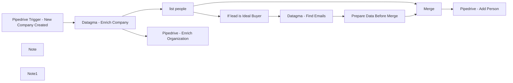

## Fluxo (.json) :

```json
{
  "nodes": [
    {
      "name": "list people",
      "type": "n8n-nodes-base.itemLists",
      "position": [
        820,
        240
      ],
      "parameters": {
        "options": {},
        "fieldToSplitOut": "company.employees"
      },
      "typeVersion": 1
    },
    {
      "name": "Pipedrive - Enrich Organization",
      "type": "n8n-nodes-base.pipedrive",
      "position": [
        1060,
        740
      ],
      "parameters": {
        "resource": "organization",
        "operation": "update",
        "updateFields": {
          "customProperties": {
            "property": [
              {
                "name": "Total Funding Amount",
                "value": "={{$json[\"company\"][\"full\"][\"cards\"][\"fundingRoundsSummary\"][\"fundingTotal\"][\"valueUsdRoundup\"]}}"
              },
              {
                "name": "Website Traffic",
                "value": "={{$json[\"company\"][\"full\"][\"cards\"][\"trafficRankHeadline\"][\"visitsLastestMonthPrettier\"]}}"
              },
              {
                "name": "Industry",
                "value": "={{$json[\"company\"][\"premium\"][\"industries\"]}}"
              },
              {
                "name": "Linkedin URL",
                "value": "={{$json[\"company\"][\"full\"][\"cards\"][\"overviewFields2\"][\"linkedin\"][\"value\"]}}"
              },
              {
                "name": "=Website",
                "value": "={{$json[\"company\"][\"premium\"][\"website\"]}}"
              },
              {
                "name": "Number of Employees",
                "value": "={{$json[\"company\"][\"premium\"][\"companySize\"]}}"
              },
              {
                "name": "Address",
                "value": "={{$json[\"company\"][\"premium\"][\"headquaterAddr\"]}}"
              }
            ]
          }
        },
        "organizationId": "={{$node[\"Pipedrive Trigger - New Company Created\"].json[\"meta\"][\"id\"]}}",
        "encodeProperties": true
      },
      "credentials": {
        "pipedriveApi": {
          "id": "27",
          "name": "Free TRial Lucas"
        }
      },
      "typeVersion": 1
    },
    {
      "name": "Pipedrive - Add Person",
      "type": "n8n-nodes-base.pipedrive",
      "position": [
        1840,
        660
      ],
      "parameters": {
        "name": "={{$json[\"name\"]}}",
        "resource": "person",
        "additionalFields": {
          "email": [
            "={{$json[\"emailDatagma\"]}}"
          ],
          "org_id": "={{$items(\"Pipedrive Trigger - New Company Created\")[0].json[\"meta\"][\"id\"]}}",
          "customProperties": {
            "property": [
              {
                "name": "aa8c534fc3ea812ffe8b155290873293b9950c3a",
                "value": "={{$json[\"jobTitle\"]}}"
              },
              {
                "name": "04215f535458ffd9092b4a337f217201087dae2b",
                "value": "={{$json[\"linkedInUrl\"]}}"
              }
            ]
          }
        }
      },
      "credentials": {
        "pipedriveApi": {
          "id": "27",
          "name": "Free TRial Lucas"
        }
      },
      "typeVersion": 1
    },
    {
      "name": "Datagma - Enrich Company",
      "type": "n8n-nodes-base.httpRequest",
      "position": [
        580,
        520
      ],
      "parameters": {
        "url": "https://gateway.datagma.net/api/ingress/v2/full",
        "options": {
          "batchSize": 10,
          "fullResponse": false,
          "batchInterval": 2000
        },
        "authentication": "queryAuth",
        "queryParametersUi": {
          "parameter": [
            {
              "name": "data",
              "value": "={{$json[\"current\"][\"name\"]}}"
            },
            {
              "name": "companyPremium",
              "value": "true"
            },
            {
              "name": "companyFull",
              "value": "true"
            },
            {
              "name": "companyEmployees",
              "value": "true"
            },
            {
              "name": "employeeTitle",
              "value": "(head of OR director) AND (sales OR business)"
            },
            {
              "name": "findEmailV2",
              "value": "true"
            }
          ]
        }
      },
      "credentials": {
        "httpQueryAuth": {
          "id": "18",
          "name": "Datagma Auth"
        }
      },
      "typeVersion": 1,
      "continueOnFail": true
    },
    {
      "name": "Merge",
      "type": "n8n-nodes-base.merge",
      "position": [
        1640,
        660
      ],
      "parameters": {
        "mode": "mergeByKey",
        "propertyName1": "linkedInUrl",
        "propertyName2": "linkedInUrl"
      },
      "typeVersion": 1
    },
    {
      "name": "If lead is Ideal Buyer",
      "type": "n8n-nodes-base.if",
      "position": [
        1100,
        240
      ],
      "parameters": {
        "conditions": {
          "number": [
            {
              "value1": "={{$json[\"employeeCompanyScore\"]}}",
              "value2": 0.1,
              "operation": "larger"
            }
          ],
          "string": [
            {
              "value1": "={{$json[\"jobTitle\"].toLowerCase()\t}}",
              "value2": "sales",
              "operation": "contains"
            }
          ]
        }
      },
      "typeVersion": 1
    },
    {
      "name": "Datagma - Find Emails",
      "type": "n8n-nodes-base.httpRequest",
      "position": [
        1320,
        220
      ],
      "parameters": {
        "url": "https://gateway.datagma.net/api/ingress/v4/findEmail?findEmailV2Step=3&findEmailV2Country=General\n",
        "options": {
          "batchSize": 10,
          "fullResponse": false,
          "batchInterval": 2000
        },
        "authentication": "queryAuth",
        "queryParametersUi": {
          "parameter": [
            {
              "name": "fullName",
              "value": "={{$json[\"name\"]}}"
            },
            {
              "name": "company",
              "value": "={{$json[\"company\"]}}"
            }
          ]
        }
      },
      "credentials": {
        "httpQueryAuth": {
          "id": "18",
          "name": "Datagma Auth"
        }
      },
      "typeVersion": 1,
      "continueOnFail": true
    },
    {
      "name": "Prepare Data Before Merge",
      "type": "n8n-nodes-base.set",
      "position": [
        1520,
        220
      ],
      "parameters": {
        "values": {
          "string": [
            {
              "name": "linkedInUrl",
              "value": "={{$node[\"If lead is Ideal Buyer\"].json[\"linkedInUrl\"]}}"
            },
            {
              "name": "emailDatagma",
              "value": "={{$json[\"email\"]}}"
            }
          ]
        },
        "options": {}
      },
      "typeVersion": 1
    },
    {
      "name": "Pipedrive Trigger - New Company Created",
      "type": "n8n-nodes-base.pipedriveTrigger",
      "position": [
        320,
        520
      ],
      "webhookId": "90b68fad-3216-4dde-9afd-77f98cda0711",
      "parameters": {
        "action": "added",
        "object": "organization"
      },
      "credentials": {
        "pipedriveApi": {
          "id": "27",
          "name": "Free TRial Lucas"
        }
      },
      "typeVersion": 1
    },
    {
      "name": "Note",
      "type": "n8n-nodes-base.stickyNote",
      "position": [
        500,
        340
      ],
      "parameters": {
        "height": 400,
        "content": "### Find a different ideal buyer:\nIn \"Datagma - Enrich Company\" node - change \"employeeTitle\" value with the keywords of your ideal buyer (-> Head of Marketing)"
      },
      "typeVersion": 1
    },
    {
      "name": "Note1",
      "type": "n8n-nodes-base.stickyNote",
      "position": [
        1020,
        60
      ],
      "parameters": {
        "height": 380,
        "content": "### Refine lead results\nHere I am refining lead results to make sure they match my search.\nIf you have a different ICP, make sure to change the first value."
      },
      "typeVersion": 1
    }
  ],
  "connections": {
    "Merge": {
      "main": [
        [
          {
            "node": "Pipedrive - Add Person",
            "type": "main",
            "index": 0
          }
        ]
      ]
    },
    "list people": {
      "main": [
        [
          {
            "node": "If lead is Ideal Buyer",
            "type": "main",
            "index": 0
          },
          {
            "node": "Merge",
            "type": "main",
            "index": 1
          }
        ]
      ]
    },
    "Datagma - Find Emails": {
      "main": [
        [
          {
            "node": "Prepare Data Before Merge",
            "type": "main",
            "index": 0
          }
        ]
      ]
    },
    "If lead is Ideal Buyer": {
      "main": [
        [
          {
            "node": "Datagma - Find Emails",
            "type": "main",
            "index": 0
          }
        ]
      ]
    },
    "Datagma - Enrich Company": {
      "main": [
        [
          {
            "node": "list people",
            "type": "main",
            "index": 0
          },
          {
            "node": "Pipedrive - Enrich Organization",
            "type": "main",
            "index": 0
          }
        ]
      ]
    },
    "Prepare Data Before Merge": {
      "main": [
        [
          {
            "node": "Merge",
            "type": "main",
            "index": 0
          }
        ]
      ]
    },
    "Pipedrive Trigger - New Company Created": {
      "main": [
        [
          {
            "node": "Datagma - Enrich Company",
            "type": "main",
            "index": 0
          }
        ]
      ]
    }
  }
}
```
