# PACK 1999 TEMPLATES PARTE 02 - Bloco 3

Templates neste bloco: 20

## Sumário

- [Template 242 - Extração de número de placa a partir de imagem](#template-242)
- [Template 243 - Registrar recibos do LINE no Google Sheets](#template-243)
- [Template 244 - Detecção de phishing por e-mail e tickets no Jira](#template-244)
- [Template 245 - Salvar submissões de formulário no Airtable](#template-245)
- [Template 246 - Gerador automático de posts para WordPress](#template-246)
- [Template 247 - Agente AI para consultas OpenSea](#template-247)
- [Template 248 - Recuperar todos os itens do WordPress](#template-248)
- [Template 249 - API de extração de dados de imagens com Gemini AI](#template-249)
- [Template 250 - Agente de transcrição e insights em tempo real](#template-250)
- [Template 251 - Triagem automática de CV com IA](#template-251)
- [Template 252 - Gestão automática de e-mails com IA](#template-252)
- [Template 253 - Busca todos os registros do Zoho CRM manualmente](#template-253)
- [Template 254 - Notificações de menções no Twitter para Rocket.Chat](#template-254)
- [Template 255 - Extração e limpeza de transcrição do YouTube](#template-255)
- [Template 256 - Atribuição e validação de cupons QR para leads](#template-256)
- [Template 257 - Pipeline ETL de tweets com análise de sentimento](#template-257)
- [Template 258 - Inserir, buscar e atualizar linhas no Google Sheets](#template-258)
- [Template 259 - Buscar e salvar estatísticas de vídeos do YouTube](#template-259)
- [Template 260 - Atendimento automático via WhatsApp e criação de tarefas](#template-260)
- [Template 261 - Enviar imagem e atualizar snippet do tema Shopify](#template-261)

---

<a id="template-242"></a>

## Template 242 - Extração de número de placa a partir de imagem

- **Nome:** Extração de número de placa a partir de imagem
- **Descrição:** Recebe uma imagem enviada pelo usuário, envia-a a um modelo de linguagem multimodal e retorna apenas os caracteres da placa do veículo em primeiro plano.
- **Funcionalidade:** • Recepção de imagem por formulário: permite que o usuário envie uma foto para análise.
• Configuração de modelo e prompt: define qual modelo usar (ex.: GPT-4o) e o prompt que solicita somente os caracteres da placa.
• Envio da imagem ao modelo multimodal: encaminha a imagem como entrada para o modelo de linguagem capaz de interpretar imagens.
• Extração do número da placa: o modelo identifica e extrai os caracteres da placa do carro mais próximo na imagem.
• Retorno simplificado ao usuário: exibe apenas a sequência de caracteres extraída, sem texto adicional ou formatação extra.
- **Ferramentas:** • OpenRouter (API de modelos de linguagem multimodal): serviço usado para acessar o modelo (ex.: GPT-4o) que processa a imagem e extrai o texto.
• Serviço de envio de imagens via formulário/webhook: ponto de entrada público que permite ao usuário carregar a imagem para análise.


## Fluxo visual

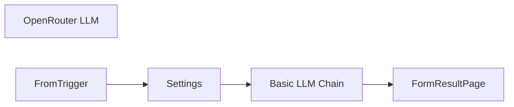

## Fluxo (.json) :

```json
{
  "id": "B37wvB0tdKgjuabw",
  "meta": {
    "instanceId": "98bf0d6aef1dd8b7a752798121440fb171bf7686b95727fd617f43452393daa3",
    "templateCredsSetupCompleted": true
  },
  "name": "Image to license plate number",
  "tags": [],
  "nodes": [
    {
      "id": "a656334a-0135-4d93-a6df-ca97222c9753",
      "name": "Basic LLM Chain",
      "type": "@n8n/n8n-nodes-langchain.chainLlm",
      "position": [
        -140,
        -380
      ],
      "parameters": {
        "text": "={{ $json.prompt }}",
        "messages": {
          "messageValues": [
            {
              "type": "HumanMessagePromptTemplate",
              "messageType": "imageBinary",
              "binaryImageDataKey": "Image"
            }
          ]
        },
        "promptType": "define"
      },
      "typeVersion": 1.5
    },
    {
      "id": "41a90592-2a91-40ff-abf4-3a795733d521",
      "name": "FormResultPage",
      "type": "n8n-nodes-base.form",
      "position": [
        220,
        -380
      ],
      "webhookId": "218822fe-5eb9-4451-ae8a-14b8f484fdde",
      "parameters": {
        "options": {
          "formTitle": ""
        },
        "operation": "completion",
        "completionTitle": "Extracted information:",
        "completionMessage": "={{ $json.text }}"
      },
      "typeVersion": 1
    },
    {
      "id": "c23b95d9-b7a2-4e9e-a019-5724a9662abd",
      "name": "OpenRouter LLM",
      "type": "@n8n/n8n-nodes-langchain.lmChatOpenRouter",
      "position": [
        -60,
        -180
      ],
      "parameters": {
        "model": "={{ $json.model }}",
        "options": {}
      },
      "credentials": {
        "openRouterApi": {
          "id": "bs7tPtvgDTJNGAFJ",
          "name": "OpenRouter account"
        }
      },
      "typeVersion": 1
    },
    {
      "id": "8298cd51-8c47-4bc4-af78-2c216207ef76",
      "name": "Settings",
      "type": "n8n-nodes-base.set",
      "position": [
        -340,
        -380
      ],
      "parameters": {
        "options": {},
        "assignments": {
          "assignments": [
            {
              "id": "1b8381dc-5b9a-42a2-8a67-cc706b433180",
              "name": "model",
              "type": "string",
              "value": "openai/gpt-4o"
            },
            {
              "id": "72aec130-ab56-4e61-b60b-9a31dd8d02e6",
              "name": "prompt",
              "type": "string",
              "value": "Extract the number of the license plate on the front-most car depicted in the attached image and return only the extracted characters without any other text or structure."
            }
          ]
        },
        "includeOtherFields": true
      },
      "typeVersion": 3.4
    },
    {
      "id": "fae79fc9-b510-44a4-beec-4dc26dc2a13a",
      "name": "FromTrigger",
      "type": "n8n-nodes-base.formTrigger",
      "position": [
        -560,
        -380
      ],
      "webhookId": "41e3f34b-7abe-4c64-95cd-2942503d5e98",
      "parameters": {
        "options": {},
        "formTitle": "Analyse image",
        "formFields": {
          "values": [
            {
              "fieldType": "file",
              "fieldLabel": "Image",
              "requiredField": true,
              "acceptFileTypes": ".jpg, .png"
            }
          ]
        },
        "responseMode": "lastNode",
        "formDescription": "To analyse an image, upload it here."
      },
      "typeVersion": 2.2
    }
  ],
  "active": true,
  "pinData": {},
  "settings": {
    "executionOrder": "v1"
  },
  "versionId": "5b9c53b9-3998-4676-999d-1ba117bf6695",
  "connections": {
    "Settings": {
      "main": [
        [
          {
            "node": "Basic LLM Chain",
            "type": "main",
            "index": 0
          }
        ]
      ]
    },
    "FromTrigger": {
      "main": [
        [
          {
            "node": "Settings",
            "type": "main",
            "index": 0
          }
        ]
      ]
    },
    "OpenRouter LLM": {
      "ai_languageModel": [
        [
          {
            "node": "Basic LLM Chain",
            "type": "ai_languageModel",
            "index": 0
          }
        ]
      ]
    },
    "Basic LLM Chain": {
      "main": [
        [
          {
            "node": "FormResultPage",
            "type": "main",
            "index": 0
          }
        ]
      ]
    }
  }
}
```

<a id="template-243"></a>

## Template 243 - Registrar recibos do LINE no Google Sheets

- **Nome:** Registrar recibos do LINE no Google Sheets
- **Descrição:** Recebe imagens de comprovantes enviadas pelo LINE, extrai texto via OCR e registra os dados extraídos em uma planilha do Google Sheets.
- **Funcionalidade:** • Recebimento de imagem via LINE: captura eventos de mensagens com imagem e obtém o message id.
• Construção e acesso da URL de conteúdo: monta a URL de download da imagem usando o message id e autenticação HTTP.
• Download e armazenamento da imagem: baixa a imagem recebida e salva no Google Drive com nome baseado no message id (ex: <messageId>.jpg).
• Geração de link direto da imagem: cria link direto (drive.google.com/uc?id=...) para uso em serviços externos.
• Envio para OCR: envia o link da imagem para o serviço OCR.Space (SpaceOCR) para extração de texto.
• Processamento e parsing do OCR: analisa o texto retornado para extrair tipo de transação, data/hora, nome do remetente, banco/remetente, conta do remetente, nome do destinatário, banco/destinatário, conta do destinatário, valor, taxa e ID da transação; trata variações como PromptPay e possíveis erros de OCR.
• Registro na planilha: adiciona uma nova linha na planilha do Google Sheets com os campos extraídos.
• Tratamento de erros: quando alguns valores não são extraídos, registra informação de erro e o texto bruto para investigação.
- **Ferramentas:** • LINE Messaging API: recebe webhooks de mensagens e fornece o endpoint para download do conteúdo da imagem.
• Google Drive: armazena as imagens de comprovante e fornece links diretos para acesso.
• Google Sheets: armazena os registros estruturados das transações extraídas.
• OCR.Space (SpaceOCR): serviço de OCR que converte a imagem em texto para posterior parsing.


## Fluxo visual

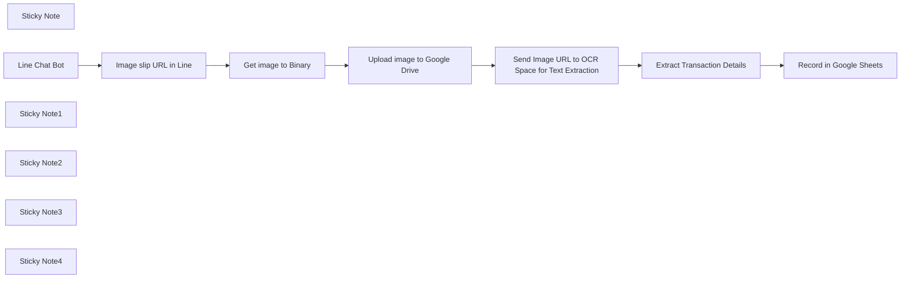

## Fluxo (.json) :

```json
{
  "id": "QOePbDNCilLhfzbs",
  "meta": {
    "instanceId": "2c12b0b552404dc07af67cd5f092afd21d18c808d4fdabdb04cb4b064195b6fb",
    "templateCredsSetupCompleted": true
  },
  "name": "LINE BOT - Google Sheets Record Receipt",
  "tags": [],
  "nodes": [
    {
      "id": "c9a6882e-8971-4f8b-8dc4-730e217200f9",
      "name": "Sticky Note",
      "type": "n8n-nodes-base.stickyNote",
      "position": [
        -1260,
        100
      ],
      "parameters": {
        "width": 400,
        "height": 500,
        "content": "## Prepare data\n**- Get content image from Line** \nhttps://api-data.line.me/v2/bot/message/xxx/content\n\n**- Get image URL to Binary**"
      },
      "typeVersion": 1
    },
    {
      "id": "b766ad37-ec63-4006-80a7-048307afd23a",
      "name": "Image slip URL in Line",
      "type": "n8n-nodes-base.set",
      "position": [
        -1200,
        300
      ],
      "parameters": {
        "options": {},
        "assignments": {
          "assignments": [
            {
              "id": "f8b8ac7c-5c5f-452f-a84d-e068bb248eb5",
              "name": "file_url",
              "type": "string",
              "value": "=https://api-data.line.me/v2/bot/message/{{ $json.body.events[0].message.id }}/content"
            }
          ]
        }
      },
      "typeVersion": 3.4
    },
    {
      "id": "172ed09e-8caf-4bee-9f09-a9b8b00470f7",
      "name": "Get image to Binary",
      "type": "n8n-nodes-base.httpRequest",
      "position": [
        -1000,
        300
      ],
      "parameters": {
        "url": "={{ $json.file_url }}",
        "options": {},
        "authentication": "genericCredentialType",
        "genericAuthType": "httpHeaderAuth"
      },
      "credentials": {
        "httpHeaderAuth": {
          "id": "byY3kI23lMe4ewnM",
          "name": "Header Auth account - Maid"
        }
      },
      "typeVersion": 4.2
    },
    {
      "id": "79753b3d-d6a9-4047-af48-947e6221de48",
      "name": "Line Chat Bot",
      "type": "n8n-nodes-base.webhook",
      "position": [
        -1440,
        300
      ],
      "webhookId": "23ba996d-3242-42a1-946c-f04a680b320a",
      "parameters": {
        "path": "23ba996d-3242-42a1-946c-f04a680b320a",
        "options": {},
        "httpMethod": "POST"
      },
      "typeVersion": 1
    },
    {
      "id": "91837828-c24d-4999-a6db-9323394b8e77",
      "name": "Sticky Note1",
      "type": "n8n-nodes-base.stickyNote",
      "position": [
        -840,
        100
      ],
      "parameters": {
        "color": 2,
        "width": 220,
        "height": 500,
        "content": "## Upload image to Google Drive\n"
      },
      "typeVersion": 1
    },
    {
      "id": "94be83d7-5070-4f94-ae33-0a9695fc0b25",
      "name": "Sticky Note2",
      "type": "n8n-nodes-base.stickyNote",
      "position": [
        -600,
        100
      ],
      "parameters": {
        "color": 3,
        "width": 540,
        "height": 500,
        "content": "## OCR and get value\n**- OCR API by SpaceOCR**\nhttps://api.ocr.space/parse/imageurl?apikey=YOURAPI&language=tha&isOverlayRequired=false&OCREngine=2&filetype=JPG&url=xxx\n\n**- Parse Transaction Details**"
      },
      "typeVersion": 1
    },
    {
      "id": "5e269f18-c666-4ba3-bb92-e60f5761cf0e",
      "name": "Sticky Note3",
      "type": "n8n-nodes-base.stickyNote",
      "position": [
        -40,
        100
      ],
      "parameters": {
        "color": 5,
        "width": 220,
        "height": 500,
        "content": "## Store Data in Google Sheets"
      },
      "typeVersion": 1
    },
    {
      "id": "aa5312d8-304c-4d64-839b-a4464cb0d60e",
      "name": "Sticky Note4",
      "type": "n8n-nodes-base.stickyNote",
      "position": [
        -1500,
        100
      ],
      "parameters": {
        "color": 5,
        "width": 220,
        "height": 500,
        "content": "## LINE Webhook Trigger \n**(Receive Image)**"
      },
      "typeVersion": 1
    },
    {
      "id": "802a7b11-38bf-4dd1-ae32-cd6b6071b9dd",
      "name": "Upload image to Google Drive",
      "type": "n8n-nodes-base.googleDrive",
      "position": [
        -780,
        300
      ],
      "parameters": {
        "name": "={{ $('Line Chat Bot').item.json.body.events[0].message.id }}.jpg",
        "driveId": {
          "__rl": true,
          "mode": "list",
          "value": "My Drive"
        },
        "options": {},
        "folderId": {
          "__rl": true,
          "mode": "url",
          "value": "https://drive.google.com/drive/folders/1M-j_Gt6yKM1K8SISWknaGQyPQn52AaK1"
        }
      },
      "credentials": {
        "googleDriveOAuth2Api": {
          "id": "QVrgALkld7whKIgB",
          "name": "Google Drive account - Peakwave"
        }
      },
      "typeVersion": 3
    },
    {
      "id": "b37b4b7a-1030-44d0-8f57-90acca085e5a",
      "name": "Record in Google Sheets",
      "type": "n8n-nodes-base.googleSheets",
      "position": [
        20,
        300
      ],
      "parameters": {
        "columns": {
          "value": {
            "Fee": "={{ $json.fee }}",
            "Amount": "={{ $json.amount }}",
            "Date & Time": "={{ $json.date_time }}",
            "Sender Name": "={{ $json.sender_name }}",
            "Receiver Bank": "={{ $json.receiver_bank }}",
            "Receiver Name": "={{ $json.receiver_name }}",
            "Sender Account": "={{ $json.sender_account }}",
            "Transaction ID": "={{ $json.transaction_id }}",
            "Receiver Account": "={{ $json.receiver_account }}",
            "Transaction Type": "={{ $json.transaction_type }}"
          },
          "schema": [
            {
              "id": "Transaction Type",
              "type": "string",
              "display": true,
              "removed": false,
              "required": false,
              "displayName": "Transaction Type",
              "defaultMatch": false,
              "canBeUsedToMatch": true
            },
            {
              "id": "Date & Time",
              "type": "string",
              "display": true,
              "removed": false,
              "required": false,
              "displayName": "Date & Time",
              "defaultMatch": false,
              "canBeUsedToMatch": true
            },
            {
              "id": "Bank",
              "type": "string",
              "display": true,
              "removed": true,
              "required": false,
              "displayName": "Bank",
              "defaultMatch": false,
              "canBeUsedToMatch": true
            },
            {
              "id": "Sender Name",
              "type": "string",
              "display": true,
              "removed": false,
              "required": false,
              "displayName": "Sender Name",
              "defaultMatch": false,
              "canBeUsedToMatch": true
            },
            {
              "id": "Sender Account",
              "type": "string",
              "display": true,
              "removed": false,
              "required": false,
              "displayName": "Sender Account",
              "defaultMatch": false,
              "canBeUsedToMatch": true
            },
            {
              "id": "Receiver Name",
              "type": "string",
              "display": true,
              "removed": false,
              "required": false,
              "displayName": "Receiver Name",
              "defaultMatch": false,
              "canBeUsedToMatch": true
            },
            {
              "id": "Receiver Bank",
              "type": "string",
              "display": true,
              "removed": false,
              "required": false,
              "displayName": "Receiver Bank",
              "defaultMatch": false,
              "canBeUsedToMatch": true
            },
            {
              "id": "Receiver Account",
              "type": "string",
              "display": true,
              "removed": false,
              "required": false,
              "displayName": "Receiver Account",
              "defaultMatch": false,
              "canBeUsedToMatch": true
            },
            {
              "id": "Transaction ID",
              "type": "string",
              "display": true,
              "removed": false,
              "required": false,
              "displayName": "Transaction ID",
              "defaultMatch": false,
              "canBeUsedToMatch": true
            },
            {
              "id": "Amount",
              "type": "string",
              "display": true,
              "removed": false,
              "required": false,
              "displayName": "Amount",
              "defaultMatch": false,
              "canBeUsedToMatch": true
            },
            {
              "id": "Fee",
              "type": "string",
              "display": true,
              "removed": false,
              "required": false,
              "displayName": "Fee",
              "defaultMatch": false,
              "canBeUsedToMatch": true
            }
          ],
          "mappingMode": "defineBelow",
          "matchingColumns": [],
          "attemptToConvertTypes": false,
          "convertFieldsToString": false
        },
        "options": {},
        "operation": "append",
        "sheetName": {
          "__rl": true,
          "mode": "list",
          "value": "gid=0",
          "cachedResultUrl": "https://docs.google.com/spreadsheets/d/1IpvzcnWmb-aLpSleTIF0xoF8xzbOOJQhuT6ITAeEQks/edit#gid=0",
          "cachedResultName": "data"
        },
        "documentId": {
          "__rl": true,
          "mode": "url",
          "value": "https://docs.google.com/spreadsheets/d/1IpvzcnWmb-aLpSleTIF0xoF8xzbOOJQhuT6ITAeEQks/edit?gid=0#gid=0"
        }
      },
      "credentials": {
        "googleSheetsOAuth2Api": {
          "id": "0RVWjnYzlWor2bMu",
          "name": "Google Sheets account"
        }
      },
      "typeVersion": 4.5
    },
    {
      "id": "22fbba4f-ad1f-43a5-99de-db7084cd3fc5",
      "name": "Send Image URL to OCR Space for Text Extraction",
      "type": "n8n-nodes-base.httpRequest",
      "position": [
        -520,
        300
      ],
      "parameters": {
        "url": "=https://api.ocr.space/parse/imageurl?apikey=K82173083188957&language=tha&isOverlayRequired=false&OCREngine=2&filetype=JPG&url={{ \"https://drive.google.com/uc?id=\" + $json[\"id\"] }}\n",
        "options": {}
      },
      "typeVersion": 4.2
    },
    {
      "id": "678993d0-8301-42d5-93cd-7839d42b71bc",
      "name": "Extract Transaction Details",
      "type": "n8n-nodes-base.code",
      "position": [
        -260,
        300
      ],
      "parameters": {
        "jsCode": "const text = $json[\"ParsedResults\"][0][\"ParsedText\"];\n\n// Split text by line breaks and trim spaces\nconst lines = text.split(\"\\n\").map(line => line.trim());\n\n// Debugging: Log extracted lines for verification\nconsole.log(\"Extracted Lines:\", lines);\n\n// Helper function to find text after a keyword, with OCR variations\nfunction getValueAfterKeyword(keywords, offset = 1) {\n    let index = lines.findIndex(line => keywords.some(keyword => line.includes(keyword)));\n    return index !== -1 && lines[index + offset] ? lines[index + offset] : null;\n}\n\n// **Extracting Data for Both Standard & PromptPay Transactions**\nconst transaction_type = lines[0] || null;  // First line\nconst date_time = lines[1] || null;  // Second line\n\n// **Sender Details**\nconst sender_name_index = lines.findIndex(line => line.startsWith(\"นาย\"));\nconst sender_name = sender_name_index !== -1 ? lines[sender_name_index] : null;\nconst sender_bank = sender_name_index !== -1 ? lines[sender_name_index + 1] : null;\nconst sender_account = sender_name_index !== -1 ? lines[sender_name_index + 2] : null;\n\n// **Determine if it's a Standard Bank Transfer or PromptPay**\nconst isPromptPay = lines.some(line => line.includes(\"Prompt\") || line.includes(\"รหัสพร้อมเพย์\"));\nlet receiver_name = null;\nlet receiver_bank = null;\nlet receiver_account = null;\n\nif (isPromptPay) {\n    // **Handling PromptPay Transactions**\n    const receiver_index = lines.findIndex(line => line.includes(\"Prompt\"));\n    receiver_bank = \"PromptPay\"; // Fixed for PromptPay transactions\n    receiver_name = receiver_index !== -1 ? lines[receiver_index + 2] : null; // Receiver's actual name\n\n    // **Fix Receiver Account for PromptPay**\n    const receiver_account_index = lines.findIndex(line => line.includes(\"รหัสพร้อมเพย์\"));\n    receiver_account = receiver_account_index !== -1 ? lines[receiver_account_index + 1] : null; // The actual account number\n\n} else {\n    // **Handling Standard Bank Transfers**\n    const receiver_index = lines.findIndex(line => line.includes(\"นิติบุคคล\") || line.includes(\"บริษัท\") || line.includes(\"นาย\"));\n    receiver_name = receiver_index !== -1 ? lines[receiver_index] : null;\n    receiver_bank = receiver_index !== -1 ? lines[receiver_index + 2] : null;\n    receiver_account = receiver_index !== -1 ? lines[receiver_index + 3] : null;\n}\n\n// **Fix Transaction ID Extraction**\nlet transaction_id = null;\n\n// **First, try \"เลขที่รายการ:\" for Standard Transactions**\nconst transaction_index = lines.findIndex(line => line.includes(\"เลขที่รายการ:\"));\nif (transaction_index !== -1) {\n    if (/\\d{10,}/.test(lines[transaction_index])) {\n        // If the same line contains the transaction ID, extract it\n        transaction_id = lines[transaction_index].match(/\\d{10,}/)[0];\n    } else if (transaction_index + 1 < lines.length && /\\d{10,}/.test(lines[transaction_index + 1])) {\n        // If transaction ID is on the next line, extract it\n        transaction_id = lines[transaction_index + 1];\n    }\n}\n\n// ✅ **If transaction_id is still missing, use \"จำนวน:\" or possible OCR errors (\"จำนวนะ\")**\nif (!transaction_id) {\n    let amount_index = lines.findIndex(line => line.includes(\"จำนวน\") || line.includes(\"จำนวนะ\"));\n    if (amount_index !== -1) {\n        for (let i = amount_index + 1; i < lines.length; i++) {\n            if (/^[A-Za-z0-9]+$/.test(lines[i])) { // Ensure it's a valid ID\n                transaction_id = lines[i];\n                break; // **Break early for efficiency**\n            }\n        }\n    }\n}\n\n// **Extract Amount Correctly**\nconst amount_index = lines.findIndex(line => line.includes(\"บาท\") && !line.includes(\"ค่าธรรมเนียม\"));\nconst amount = amount_index !== -1 ? lines[amount_index].replace(\" บาท\", \"\").replace(/[^0-9.]/g, \"\") : null;\n\n// **Extract Fee Correctly**\nconst fee_index = lines.findIndex(line => line.includes(\"ค่าธรรมเนียม\"));\nconst fee = fee_index !== -1 && lines[fee_index + 1] ? lines[fee_index + 1].replace(\" บาท\", \"\").replace(/[^0-9.]/g, \"\") : null;\n\n// **Ensure Essential Details Exist**\nif (transaction_type && date_time && sender_name && sender_bank && sender_account && receiver_name && receiver_bank && receiver_account && transaction_id && amount) {\n    return [\n        {\n            json: {\n                \"transaction_type\": transaction_type,\n                \"date_time\": date_time,\n                \"sender_name\": sender_name,\n                \"sender_bank\": sender_bank,\n                \"sender_account\": sender_account,\n                \"receiver_name\": receiver_name,\n                \"receiver_bank\": receiver_bank,\n                \"receiver_account\": receiver_account,\n                \"transaction_id\": transaction_id,\n                \"amount\": amount,\n                \"fee\": fee\n            }\n        }\n    ];\n} else {\n    return [\n        {\n            json: {\n                \"error\": \"Some values could not be extracted\",\n                \"raw_text\": text\n            }\n        }\n    ];\n}\n"
      },
      "typeVersion": 2
    }
  ],
  "active": false,
  "pinData": {},
  "settings": {
    "executionOrder": "v1"
  },
  "versionId": "e1708774-49cf-4cbb-a4c4-9fefccd0fedb",
  "connections": {
    "Line Chat Bot": {
      "main": [
        [
          {
            "node": "Image slip URL in Line",
            "type": "main",
            "index": 0
          }
        ]
      ]
    },
    "Get image to Binary": {
      "main": [
        [
          {
            "node": "Upload image to Google Drive",
            "type": "main",
            "index": 0
          }
        ]
      ]
    },
    "Image slip URL in Line": {
      "main": [
        [
          {
            "node": "Get image to Binary",
            "type": "main",
            "index": 0
          }
        ]
      ]
    },
    "Extract Transaction Details": {
      "main": [
        [
          {
            "node": "Record in Google Sheets",
            "type": "main",
            "index": 0
          }
        ]
      ]
    },
    "Upload image to Google Drive": {
      "main": [
        [
          {
            "node": "Send Image URL to OCR Space for Text Extraction",
            "type": "main",
            "index": 0
          }
        ]
      ]
    },
    "Send Image URL to OCR Space for Text Extraction": {
      "main": [
        [
          {
            "node": "Extract Transaction Details",
            "type": "main",
            "index": 0
          }
        ]
      ]
    }
  }
}
```

<a id="template-244"></a>

## Template 244 - Detecção de phishing por e-mail e tickets no Jira

- **Nome:** Detecção de phishing por e-mail e tickets no Jira
- **Descrição:** Fluxo automatiza a ingestão de e-mails, usa IA para analisar conteúdo e cabeçalhos, classifica como benigno ou malicioso e registra tickets no Jira com anexos do e-mail (screenshot e corpo em texto).
- **Funcionalidade:** • Detecção e ingestão de e-mails: gatilhos de Gmail e Outlook capturam novas mensagens e iniciam o processamento, extraindo informações como assunto, destinatário, corpo HTML e cabeçalhos.
• Preparação de dados do e-mail: variáveis são definidas com HTML body, headers, assunto e destinatário para uso nas etapas subsequentes.
• Geração de visualização do e-mail: o HTML é convertido em uma captura de tela via serviço externo, que é recuperada como imagem para anexar.
• Conversão do corpo do e-mail em arquivo de texto: o corpo é convertido para um arquivo .txt para anexar.
• Análise de phishing com IA: o conteúdo e os cabeçalhos são enviados para um modelo de IA, gerando uma classificação (malicioso/benigno) e um resumo estruturado.
• Decisão e criação de tickets: com base na análise, são criados tickets de Jira para itens potencialmente maliciosos ou benignos, com detalhes da análise.
• Anexação de evidências: as imagens e o corpo do e-mail são anexados aos tickets correspondentes para referência.
- **Ferramentas:** • Gmail: serviço de webmail utilizado para receber mensagens e disparar o fluxo de automação.
• Microsoft Outlook: serviço de e-mail corporativo utilizado para acompanhar mensagens via trigger e processar conteúdos usando Graph API.
• hcti.io: API de captura de tela para gerar uma imagem visual do HTML do e-mail.
• OpenAI: API de IA para analisar o conteúdo e cabeçalhos do e-mail e gerar um relatório de segurança.
• Jira Cloud: solução de rastreamento de issues para criar tickets com anexos e detalhes da análise.
• Microsoft Graph API: API usada para ler cabeçalhos e conteúdo de mensagens no Outlook.


## Fluxo visual

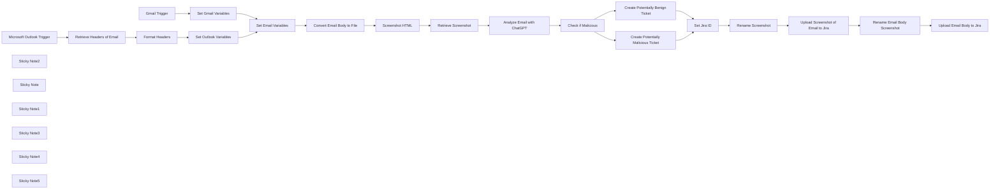

## Fluxo (.json) :

```json
{
  "meta": {
    "instanceId": "03e9d14e9196363fe7191ce21dc0bb17387a6e755dcc9acc4f5904752919dca8"
  },
  "nodes": [
    {
      "id": "94dd7f48-0013-4fb5-89c4-826ecd7f2d66",
      "name": "Gmail Trigger",
      "type": "n8n-nodes-base.gmailTrigger",
      "position": [
        1460,
        120
      ],
      "parameters": {
        "simple": false,
        "filters": {},
        "options": {},
        "pollTimes": {
          "item": [
            {
              "mode": "everyMinute"
            }
          ]
        }
      },
      "credentials": {
        "gmailOAuth2": {
          "id": "kkhNhqKpZt6IUZd0",
          "name": "Gmail"
        }
      },
      "typeVersion": 1.2
    },
    {
      "id": "ca2023fa-ceca-4923-80e4-a3843803536c",
      "name": "Microsoft Outlook Trigger",
      "type": "n8n-nodes-base.microsoftOutlookTrigger",
      "disabled": true,
      "position": [
        1480,
        680
      ],
      "parameters": {
        "fields": [
          "body",
          "toRecipients",
          "subject",
          "bodyPreview"
        ],
        "output": "fields",
        "filters": {},
        "options": {},
        "pollTimes": {
          "item": [
            {
              "mode": "everyMinute"
            }
          ]
        }
      },
      "credentials": {
        "microsoftOutlookOAuth2Api": {
          "id": "vTCK0oVQ0WjFrI5H",
          "name": " Outlook Credential"
        }
      },
      "typeVersion": 1
    },
    {
      "id": "1f011214-91a0-4cfa-9d9e-29864937c0a3",
      "name": "Screenshot HTML",
      "type": "n8n-nodes-base.httpRequest",
      "position": [
        2620,
        420
      ],
      "parameters": {
        "url": "https://hcti.io/v1/image",
        "method": "POST",
        "options": {},
        "sendBody": true,
        "sendQuery": true,
        "authentication": "genericCredentialType",
        "bodyParameters": {
          "parameters": [
            {
              "name": "html",
              "value": "={{ $('Set Email Variables').item.json.htmlBody }}"
            }
          ]
        },
        "genericAuthType": "httpBasicAuth",
        "queryParameters": {
          "parameters": [
            {}
          ]
        }
      },
      "credentials": {
        "httpBasicAuth": {
          "id": "8tm8mUWmPvtmPFPk",
          "name": "hcti.io"
        }
      },
      "typeVersion": 4.2
    },
    {
      "id": "64f4789f-9de8-414f-af62-ddc339f0d0ac",
      "name": "Retrieve Screenshot",
      "type": "n8n-nodes-base.httpRequest",
      "position": [
        2800,
        420
      ],
      "parameters": {
        "url": "={{ $json.url }}",
        "options": {},
        "authentication": "genericCredentialType",
        "genericAuthType": "httpBasicAuth"
      },
      "credentials": {
        "httpBasicAuth": {
          "id": "8tm8mUWmPvtmPFPk",
          "name": "hcti.io"
        }
      },
      "typeVersion": 4.2
    },
    {
      "id": "db707bd9-6abc-4ab7-8ffa-ad25c5e8adc4",
      "name": "Set Outlook Variables",
      "type": "n8n-nodes-base.set",
      "position": [
        2040,
        680
      ],
      "parameters": {
        "options": {},
        "assignments": {
          "assignments": [
            {
              "id": "38bd3db2-1a8d-4c40-a2dd-336e0cc84224",
              "name": "htmlBody",
              "type": "string",
              "value": "={{ $('Microsoft Outlook Trigger').item.json.body.content }}"
            },
            {
              "id": "13bdd95b-ef02-486e-b38b-d14bd05a4a8a",
              "name": "headers",
              "type": "string",
              "value": "={{ $json}}"
            },
            {
              "id": "20566ad4-7eb7-42b1-8a0d-f8b759610f10",
              "name": "subject",
              "type": "string",
              "value": "={{ $('Microsoft Outlook Trigger').item.json.subject }}"
            },
            {
              "id": "7171998f-a5a2-4e23-946a-9c1ad75710e7",
              "name": "recipient",
              "type": "string",
              "value": "={{ $('Microsoft Outlook Trigger').item.json.toRecipients[0].emailAddress.address }}"
            },
            {
              "id": "cc262634-2470-4524-8319-abe2518a6335",
              "name": "textBody",
              "type": "string",
              "value": "={{ $('Retrieve Headers of Email').item.json.body.content }}"
            }
          ]
        }
      },
      "typeVersion": 3.4
    },
    {
      "id": "7a3622c0-6949-4ea3-ae13-46a1ee26de7b",
      "name": "Set Gmail Variables",
      "type": "n8n-nodes-base.set",
      "position": [
        2020,
        120
      ],
      "parameters": {
        "options": {},
        "assignments": {
          "assignments": [
            {
              "id": "38bd3db2-1a8d-4c40-a2dd-336e0cc84224",
              "name": "htmlBody",
              "type": "string",
              "value": "={{ $json.html }}"
            },
            {
              "id": "18fbcf78-6d3c-4036-b3a2-fb5adf22176a",
              "name": "headers",
              "type": "string",
              "value": "={{ $json.headers }}"
            },
            {
              "id": "1d690098-be2a-4604-baf8-62f314930929",
              "name": "subject",
              "type": "string",
              "value": "={{ $json.subject }}"
            },
            {
              "id": "8009f00a-547f-4eb1-b52d-2e7305248885",
              "name": "recipient",
              "type": "string",
              "value": "={{ $json.to.text }}"
            },
            {
              "id": "1932e97d-b03b-4964-b8bc-8262aaaa1f7a",
              "name": "textBody",
              "type": "string",
              "value": "={{ $json.text }}"
            }
          ]
        }
      },
      "typeVersion": 3.4
    },
    {
      "id": "4b4c6b34-f74c-4402-91a1-4d002e02a3bd",
      "name": "Retrieve Headers of Email",
      "type": "n8n-nodes-base.httpRequest",
      "position": [
        1700,
        680
      ],
      "parameters": {
        "url": "=https://graph.microsoft.com/v1.0/me/messages/{{ $json.id }}?$select=internetMessageHeaders,body",
        "options": {},
        "sendHeaders": true,
        "authentication": "predefinedCredentialType",
        "headerParameters": {
          "parameters": [
            {
              "name": "Accept",
              "value": "application/json"
            },
            {
              "name": "Prefer",
              "value": "outlook.body-content-type=\"text\""
            }
          ]
        },
        "nodeCredentialType": "microsoftOutlookOAuth2Api"
      },
      "credentials": {
        "microsoftOutlookOAuth2Api": {
          "id": "vTCK0oVQ0WjFrI5H",
          "name": " Outlook Credential"
        }
      },
      "typeVersion": 4.2
    },
    {
      "id": "0c9883b5-3eb7-45db-9803-d1b30166a3b5",
      "name": "Format Headers",
      "type": "n8n-nodes-base.code",
      "position": [
        1880,
        680
      ],
      "parameters": {
        "jsCode": "const input = $('Retrieve Headers of Email').item.json.internetMessageHeaders;\n\nconst result = input.reduce((acc, { name, value }) => {\n if (!acc[name]) acc[name] = [];\n acc[name].push(value);\n return acc;\n}, {});\n\nreturn result;"
      },
      "typeVersion": 2
    },
    {
      "id": "c21a976c-00e5-4823-bd94-4c95a7d60438",
      "name": "Analyze Email with ChatGPT",
      "type": "@n8n/n8n-nodes-langchain.openAi",
      "position": [
        3000,
        420
      ],
      "parameters": {
        "modelId": {
          "__rl": true,
          "mode": "list",
          "value": "gpt-4o",
          "cachedResultName": "GPT-4O"
        },
        "options": {},
        "messages": {
          "values": [
            {
              "content": "=Describe the following email using the HTML body and headers. Determine if the email could be a phishing email. \n\nHere is the HTML body:\n{{ $('Set Email Variables').item.json.htmlBody }}\n\nThe message headers are as follows:\n{{ $('Set Email Variables').item.json.headers }}\n\n"
            },
            {
              "role": "system",
              "content": "Please make sure to output all responses using the following structured JSON output:\n{\n \"malicious\": false,\n \"summary\": \"The email appears to be a legitimate communication from a known sender. It contains no suspicious links, attachments, or language that indicates phishing or malicious intent.\"\n}\n\nFormat the response for Jira who uses a wiki-style renderer. Do not include ``` around your response. Make the summary as verbose as possible including a full breakdown of why the email is benign or malicious."
            }
          ]
        },
        "jsonOutput": true
      },
      "credentials": {
        "openAiApi": {
          "id": "76",
          "name": "OpenAi account"
        }
      },
      "typeVersion": 1.6
    },
    {
      "id": "a91f4095-9245-4276-b21f-f415de22df62",
      "name": "Create Potentially Malicious Ticket",
      "type": "n8n-nodes-base.jira",
      "position": [
        3640,
        400
      ],
      "parameters": {
        "project": {
          "__rl": true,
          "mode": "list",
          "value": "10001",
          "cachedResultName": "Support"
        },
        "summary": "=Potentially Malicious - Phishing Email Reported: \"{{ $('Set Email Variables').item.json.subject }}\"",
        "issueType": {
          "__rl": true,
          "mode": "list",
          "value": "10008",
          "cachedResultName": "Task"
        },
        "additionalFields": {
          "description": "=A phishing email was reported by {{ $('Set Email Variables').item.json.recipient }} with the subject line \"{{ $('Set Email Variables').item.json.subject }}\"\n\\\\\nh2. Here is ChatGPT's analysis of the email:\n{{ $json.message.content.summary }}"
        }
      },
      "credentials": {
        "jiraSoftwareCloudApi": {
          "id": "BZmmGUrNIsgM9fDj",
          "name": "New Jira Cloud"
        }
      },
      "typeVersion": 1
    },
    {
      "id": "a5a66a0e-9d8a-45a9-b1ae-aec78ddfec27",
      "name": "Create Potentially Benign Ticket",
      "type": "n8n-nodes-base.jira",
      "position": [
        3640,
        580
      ],
      "parameters": {
        "project": {
          "__rl": true,
          "mode": "list",
          "value": "10001",
          "cachedResultName": "Support"
        },
        "summary": "=Potentially Benign - Phishing Email Reported: \"{{ $('Set Email Variables').item.json.subject }}\"",
        "issueType": {
          "__rl": true,
          "mode": "list",
          "value": "10008",
          "cachedResultName": "Task"
        },
        "additionalFields": {
          "description": "=A phishing email was reported by {{ $('Set Email Variables').item.json.recipient }} with the subject line \"{{ $('Set Email Variables').item.json.subject }}\"\n\\\\\nh2. Here is ChatGPT's analysis of the email:\n{{ $json.message.content.summary }}"
        }
      },
      "credentials": {
        "jiraSoftwareCloudApi": {
          "id": "BZmmGUrNIsgM9fDj",
          "name": "New Jira Cloud"
        }
      },
      "typeVersion": 1
    },
    {
      "id": "5af0d60b-d021-4dd9-98f7-b2842800764a",
      "name": "Rename Screenshot",
      "type": "n8n-nodes-base.code",
      "position": [
        4020,
        480
      ],
      "parameters": {
        "mode": "runOnceForEachItem",
        "jsCode": "$('Retrieve Screenshot').item.binary.data.fileName = 'emailScreenshot.png'\n\nreturn $('Retrieve Screenshot').item;"
      },
      "typeVersion": 2
    },
    {
      "id": "441c4cbb-bd93-4213-bd34-e18f2a49389f",
      "name": "Set Jira ID",
      "type": "n8n-nodes-base.set",
      "position": [
        3860,
        480
      ],
      "parameters": {
        "options": {},
        "includeOtherFields": true
      },
      "typeVersion": 3.4
    },
    {
      "id": "4c71188c-011d-4f8e-a36c-87900bfab59a",
      "name": "Upload Screenshot of Email to Jira",
      "type": "n8n-nodes-base.jira",
      "position": [
        4220,
        480
      ],
      "parameters": {
        "issueKey": "={{ $('Set Jira ID').item.json.key }}",
        "resource": "issueAttachment"
      },
      "credentials": {
        "jiraSoftwareCloudApi": {
          "id": "BZmmGUrNIsgM9fDj",
          "name": "New Jira Cloud"
        }
      },
      "typeVersion": 1
    },
    {
      "id": "3c031c34-8306-44e1-8e0e-a584c5323112",
      "name": "Upload Email Body to Jira",
      "type": "n8n-nodes-base.jira",
      "position": [
        4620,
        480
      ],
      "parameters": {
        "issueKey": "={{ $('Set Jira ID').item.json.key }}",
        "resource": "issueAttachment"
      },
      "credentials": {
        "jiraSoftwareCloudApi": {
          "id": "BZmmGUrNIsgM9fDj",
          "name": "New Jira Cloud"
        }
      },
      "typeVersion": 1
    },
    {
      "id": "d033dcbd-7ccb-451f-ab81-cc6d32d2e01f",
      "name": "Convert Email Body to File",
      "type": "n8n-nodes-base.convertToFile",
      "position": [
        2420,
        420
      ],
      "parameters": {
        "options": {
          "fileName": "emailBody.txt"
        },
        "operation": "toText",
        "sourceProperty": "textBody"
      },
      "typeVersion": 1.1
    },
    {
      "id": "bda5e2fe-d8c0-456b-975a-35e82ff02816",
      "name": "Set Email Variables",
      "type": "n8n-nodes-base.set",
      "position": [
        2240,
        420
      ],
      "parameters": {
        "options": {},
        "includeOtherFields": true
      },
      "typeVersion": 3.4
    },
    {
      "id": "54ecd8ab-ac4a-4b6b-bd1b-bf8c70082a33",
      "name": "Rename Email Body Screenshot",
      "type": "n8n-nodes-base.code",
      "position": [
        4420,
        480
      ],
      "parameters": {
        "mode": "runOnceForEachItem",
        "jsCode": "$('Convert Email Body to File').item.binary.data.fileName = 'emailBody.txt'\n\nreturn $('Convert Email Body to File').item;"
      },
      "typeVersion": 2
    },
    {
      "id": "fe5b82cc-b4bb-4c97-9477-075d5a280e9f",
      "name": "Sticky Note2",
      "type": "n8n-nodes-base.stickyNote",
      "position": [
        2574.536755825029,
        0
      ],
      "parameters": {
        "color": 7,
        "width": 376.8280004374956,
        "height": 595.590013880477,
        "content": "\n## Email Body Screenshot Creation\n\nThe **Screenshot HTML** node sends the email's HTML body to the **hcti.io** API, generating a screenshot that visually represents the email's layout. The **Retrieve Screenshot** node then fetches this image, making it available for attachment or review in subsequent steps. This dual-format processing ensures both clarity and flexibility in email analysis workflows."
      },
      "typeVersion": 1
    },
    {
      "id": "86b21049-f65e-4c6a-a854-c4376f870da9",
      "name": "Sticky Note",
      "type": "n8n-nodes-base.stickyNote",
      "position": [
        1380,
        -149.99110983560342
      ],
      "parameters": {
        "color": 7,
        "width": 814.4556539379754,
        "height": 444.5525554815556,
        "content": "\n## Gmail Integration and Data Extraction\n\nThis section of the workflow connects to a Gmail account using the **Gmail Trigger** node, capturing incoming emails in real-time, with checks performed every minute. Once an email is detected, its key components—such as the subject, recipient, body, and headers—are extracted and assigned to variables using the **Set Gmail Variables** node. These variables are structured for subsequent analysis and processing in later steps."
      },
      "typeVersion": 1
    },
    {
      "id": "b1a786cf-7a8d-49e1-90ed-31f3d0e65b13",
      "name": "Sticky Note1",
      "type": "n8n-nodes-base.stickyNote",
      "position": [
        1380,
        308
      ],
      "parameters": {
        "color": 7,
        "width": 809.7918597571277,
        "height": 602.9002284617277,
        "content": "\n## Microsoft Outlook Integration and Email Header Processing\n\nThis section enables the integration of Microsoft Outlook to monitor and capture incoming emails. The Microsoft Outlook Trigger node checks for new messages every minute. Once an email is detected, the Retrieve Headers of Email node fetches detailed header and body content via the Microsoft Graph API. The Format Headers node organizes the email headers into a structured format using a JavaScript function, ensuring clarity and readiness for further processing. Finally, the Set Outlook Variables node extracts and assigns key details—such as the email subject, recipient, body, and formatted headers—to variables for use in subsequent workflow steps. This section is essential for processing Outlook emails and preparing them for analysis and reporting.\n\n\n\n\n\n\n"
      },
      "typeVersion": 1
    },
    {
      "id": "e7ace035-b5f5-4ef3-a117-22c7c938868d",
      "name": "Sticky Note3",
      "type": "n8n-nodes-base.stickyNote",
      "position": [
        2958.4325220284563,
        24.744924120002338
      ],
      "parameters": {
        "color": 7,
        "width": 593.0990401534098,
        "height": 573.1750519720028,
        "content": "\n## AI-Powered Email Analysis and Threat Detection\n\nThis section leverages ChatGPT for advanced email content and header analysis to determine potential phishing threats. The **Analyze Email with ChatGPT** node processes the email's HTML body and headers, generating a detailed JSON response that categorizes the email as malicious or benign. The response includes a verbose explanation, formatted for Jira, outlining the reasons for the classification. The **Check if Malicious** node evaluates the AI output to determine the next steps based on the email's threat status. If flagged as malicious, subsequent actions like reporting and ticket creation are triggered. This section ensures precise, AI-driven analysis to enhance email security workflows."
      },
      "typeVersion": 1
    },
    {
      "id": "02c1ad8e-f952-42d2-ae9f-cf3a77e49e52",
      "name": "Sticky Note4",
      "type": "n8n-nodes-base.stickyNote",
      "position": [
        3562.4948140707697,
        -125.79607719303533
      ],
      "parameters": {
        "color": 7,
        "width": 1251.7025543502837,
        "height": 891.579206098173,
        "content": "\n## Automated Jira Ticket Creation and Email Attachment\n\nThis section streamlines the process of logging phishing email reports in Jira, complete with detailed analysis and attachments. The workflow creates two distinct Jira tickets depending on the AI classification of the email:\n\n1. **Potentially Malicious**: The **Create Potentially Malicious Ticket** node generates a ticket if the email is flagged as a phishing attempt, including a summary of ChatGPT's analysis and the email’s details.\n2. **Potentially Benign**: If the email is classified as safe, the **Create Potentially Benign Ticket** node logs a ticket with similar details but under a non-malicious category.\n\n\nThe **Set Jira ID** node ensures the generated ticket's ID is tracked for subsequent operations. Attachments are handled efficiently:\n\n- **Rename Screenshot** prepares the email screenshot for upload.\n- **Upload Screenshot of Email to Jira** adds the screenshot to the Jira ticket for visual context.\n- **Rename Email Body Screenshot** and **Upload Email Body to Jira** manage the attachment of the email's text body as a `.txt` file.\n\n\nThis section enhances reporting by automating ticket creation, ensuring all relevant email data is readily available for review by security teams."
      },
      "typeVersion": 1
    },
    {
      "id": "597ef23e-c61c-4e27-8c14-74ec20079c96",
      "name": "Check if Malicious",
      "type": "n8n-nodes-base.if",
      "position": [
        3400,
        420
      ],
      "parameters": {
        "options": {},
        "conditions": {
          "options": {
            "version": 2,
            "leftValue": "",
            "caseSensitive": true,
            "typeValidation": "strict"
          },
          "combinator": "and",
          "conditions": [
            {
              "id": "493f412c-5f11-4173-8940-90f5bc7f5fab",
              "operator": {
                "type": "boolean",
                "operation": "true",
                "singleValue": true
              },
              "leftValue": "={{ $json.message.content.malicious }}",
              "rightValue": ""
            }
          ]
        }
      },
      "typeVersion": 2.2
    },
    {
      "id": "af512af9-924b-4019-bdf9-62aac9cd0dac",
      "name": "Sticky Note5",
      "type": "n8n-nodes-base.stickyNote",
      "position": [
        2200,
        39.041733604283195
      ],
      "parameters": {
        "color": 7,
        "width": 365.6458805720866,
        "height": 559.8072303111675,
        "content": "\n## Email Body Conversion\n\nThis section processes the email body into both text and visual formats for detailed analysis and reporting. The **Set Email Variables** node organizes the email's data, including its HTML body and text content, to prepare it for further steps. The **Convert Email Body to File** node creates a `.txt` file containing the plain text version of the email body, useful for documentation or further analysis."
      },
      "typeVersion": 1
    }
  ],
  "pinData": {},
  "connections": {
    "Set Jira ID": {
      "main": [
        [
          {
            "node": "Rename Screenshot",
            "type": "main",
            "index": 0
          }
        ]
      ]
    },
    "Gmail Trigger": {
      "main": [
        [
          {
            "node": "Set Gmail Variables",
            "type": "main",
            "index": 0
          }
        ]
      ]
    },
    "Format Headers": {
      "main": [
        [
          {
            "node": "Set Outlook Variables",
            "type": "main",
            "index": 0
          }
        ]
      ]
    },
    "Screenshot HTML": {
      "main": [
        [
          {
            "node": "Retrieve Screenshot",
            "type": "main",
            "index": 0
          }
        ]
      ]
    },
    "Rename Screenshot": {
      "main": [
        [
          {
            "node": "Upload Screenshot of Email to Jira",
            "type": "main",
            "index": 0
          }
        ]
      ]
    },
    "Check if Malicious": {
      "main": [
        [
          {
            "node": "Create Potentially Malicious Ticket",
            "type": "main",
            "index": 0
          }
        ],
        [
          {
            "node": "Create Potentially Benign Ticket",
            "type": "main",
            "index": 0
          }
        ]
      ]
    },
    "Retrieve Screenshot": {
      "main": [
        [
          {
            "node": "Analyze Email with ChatGPT",
            "type": "main",
            "index": 0
          }
        ]
      ]
    },
    "Set Email Variables": {
      "main": [
        [
          {
            "node": "Convert Email Body to File",
            "type": "main",
            "index": 0
          }
        ]
      ]
    },
    "Set Gmail Variables": {
      "main": [
        [
          {
            "node": "Set Email Variables",
            "type": "main",
            "index": 0
          }
        ]
      ]
    },
    "Set Outlook Variables": {
      "main": [
        [
          {
            "node": "Set Email Variables",
            "type": "main",
            "index": 0
          }
        ]
      ]
    },
    "Microsoft Outlook Trigger": {
      "main": [
        [
          {
            "node": "Retrieve Headers of Email",
            "type": "main",
            "index": 0
          }
        ]
      ]
    },
    "Retrieve Headers of Email": {
      "main": [
        [
          {
            "node": "Format Headers",
            "type": "main",
            "index": 0
          }
        ]
      ]
    },
    "Analyze Email with ChatGPT": {
      "main": [
        [
          {
            "node": "Check if Malicious",
            "type": "main",
            "index": 0
          }
        ]
      ]
    },
    "Convert Email Body to File": {
      "main": [
        [
          {
            "node": "Screenshot HTML",
            "type": "main",
            "index": 0
          }
        ]
      ]
    },
    "Rename Email Body Screenshot": {
      "main": [
        [
          {
            "node": "Upload Email Body to Jira",
            "type": "main",
            "index": 0
          }
        ]
      ]
    },
    "Create Potentially Benign Ticket": {
      "main": [
        [
          {
            "node": "Set Jira ID",
            "type": "main",
            "index": 0
          }
        ]
      ]
    },
    "Upload Screenshot of Email to Jira": {
      "main": [
        [
          {
            "node": "Rename Email Body Screenshot",
            "type": "main",
            "index": 0
          }
        ]
      ]
    },
    "Create Potentially Malicious Ticket": {
      "main": [
        [
          {
            "node": "Set Jira ID",
            "type": "main",
            "index": 0
          }
        ]
      ]
    }
  }
}
```

<a id="template-245"></a>

## Template 245 - Salvar submissões de formulário no Airtable

- **Nome:** Salvar submissões de formulário no Airtable
- **Descrição:** Captura automaticamente dados enviados por um formulário e grava os registros em uma tabela do Airtable.
- **Funcionalidade:** • Geração de formulário: Cria um formulário para coleta de dados com campos personalizados (Nome, Idade, Email, Endereço, Assinatura).
• Validação de campos obrigatórios: Exige preenchimento de campos críticos como Nome, Idade, Email e opção de assinatura.
• Captura automática no envio: Dispara o processo assim que o formulário é submetido.
• Mapeamento de campos: Associa cada campo do formulário às colunas correspondentes na base de dados.
• Criação de registro no banco: Insere um novo registro na tabela com Nome, Idade, Email, Endereço, Status de Assinatura e data/hora de submissão.
• Armazenamento estruturado: Organiza os dados em colunas claras para facilitar consultas e referência futura.
- **Ferramentas:** • Formulário web: Interface para os usuários inserirem e enviarem os dados coletados.
• Airtable: Banco de dados em nuvem usado para armazenar e organizar os registros submetidos.


## Fluxo visual

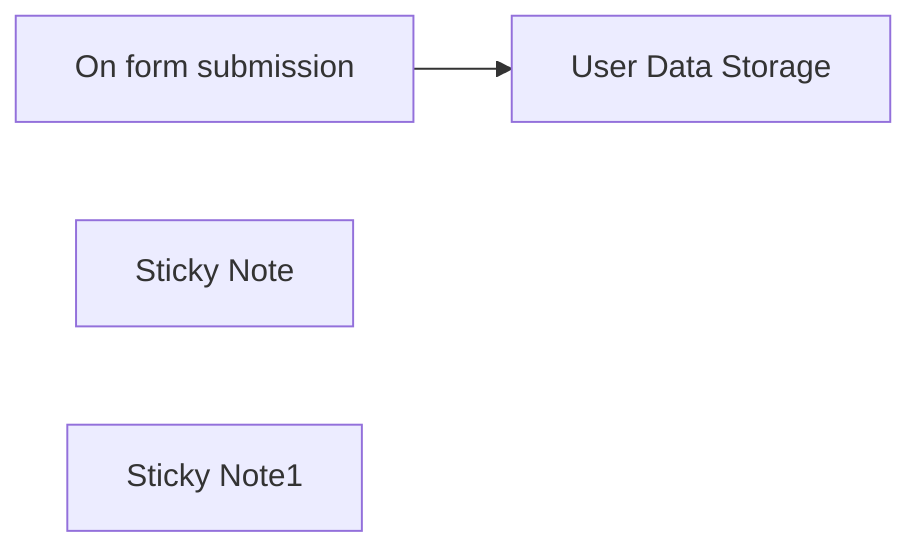

## Fluxo (.json) :

```json
{
  "id": "QObDE85a2ArfJkxV",
  "meta": {
    "instanceId": "14e4c77104722ab186539dfea5182e419aecc83d85963fe13f6de862c875ebfa",
    "templateCredsSetupCompleted": true
  },
  "name": "Automated Form Submission Data Storage in Airtable",
  "tags": [
    {
      "id": "Fcqhqfi5hGHHR7nn",
      "name": "UserData",
      "createdAt": "2025-03-17T13:06:42.859Z",
      "updatedAt": "2025-03-17T13:06:42.859Z"
    },
    {
      "id": "uScnF9NzR3PLIyvU",
      "name": "Published",
      "createdAt": "2025-03-21T07:22:28.491Z",
      "updatedAt": "2025-03-21T07:22:28.491Z"
    }
  ],
  "nodes": [
    {
      "id": "fef66f10-a3eb-4e71-9493-3d90ebd52fde",
      "name": "On form submission",
      "type": "n8n-nodes-base.formTrigger",
      "notes": "Create User Form",
      "position": [
        120,
        80
      ],
      "webhookId": "39d82b4d-4d27-40de-a12b-0dafab18bb93",
      "parameters": {
        "options": {},
        "formTitle": "Create User",
        "formFields": {
          "values": [
            {
              "fieldLabel": "Name",
              "placeholder": "Enter Your Name",
              "requiredField": true
            },
            {
              "fieldType": "number",
              "fieldLabel": "Age",
              "placeholder": "Enter Your Age",
              "requiredField": true
            },
            {
              "fieldType": "email",
              "fieldLabel": "email",
              "placeholder": "Enter Your Email",
              "requiredField": true
            },
            {
              "fieldLabel": "address",
              "placeholder": "Enter Your Address"
            },
            {
              "fieldType": "dropdown",
              "fieldLabel": "You have Subscription ?",
              "fieldOptions": {
                "values": [
                  {
                    "option": "Yes"
                  },
                  {
                    "option": "No"
                  }
                ]
              },
              "requiredField": true
            }
          ]
        },
        "formDescription": "Provide the necessary information here"
      },
      "notesInFlow": true,
      "typeVersion": 2.2
    },
    {
      "id": "1745c697-93ca-4374-8d1e-92e047ad7339",
      "name": "User Data Storage",
      "type": "n8n-nodes-base.airtable",
      "notes": "Store User Data",
      "position": [
        380,
        80
      ],
      "parameters": {
        "base": {
          "__rl": true,
          "mode": "url",
          "value": ""
        },
        "table": {
          "__rl": true,
          "mode": "url",
          "value": ""
        },
        "columns": {
          "value": {
            "Age": "={{ $json.Age }}",
            "Name": "={{ $json.Name }}",
            "Email": "={{ $json.email }}",
            "Address": "={{ $json.address }}",
            "Submitted": "={{ $json.submittedAt }}",
            "Subscription": "={{ $json['You have Subscription ?'] }}"
          },
          "schema": [
            {
              "id": "Name",
              "type": "string",
              "display": true,
              "removed": false,
              "readOnly": false,
              "required": false,
              "displayName": "Name",
              "defaultMatch": false,
              "canBeUsedToMatch": true
            },
            {
              "id": "Age",
              "type": "string",
              "display": true,
              "removed": false,
              "readOnly": false,
              "required": false,
              "displayName": "Age",
              "defaultMatch": false,
              "canBeUsedToMatch": true
            },
            {
              "id": "Email",
              "type": "string",
              "display": true,
              "removed": false,
              "readOnly": false,
              "required": false,
              "displayName": "Email",
              "defaultMatch": false,
              "canBeUsedToMatch": true
            },
            {
              "id": "Address",
              "type": "string",
              "display": true,
              "removed": false,
              "readOnly": false,
              "required": false,
              "displayName": "Address",
              "defaultMatch": false,
              "canBeUsedToMatch": true
            },
            {
              "id": "Subscription",
              "type": "string",
              "display": true,
              "removed": false,
              "readOnly": false,
              "required": false,
              "displayName": "Subscription",
              "defaultMatch": false,
              "canBeUsedToMatch": true
            },
            {
              "id": "Submitted",
              "type": "string",
              "display": true,
              "removed": false,
              "readOnly": false,
              "required": false,
              "displayName": "Submitted",
              "defaultMatch": false,
              "canBeUsedToMatch": true
            }
          ],
          "mappingMode": "defineBelow",
          "matchingColumns": []
        },
        "options": {},
        "operation": "create"
      },
      "credentials": {
        "airtableTokenApi": {
          "id": "",
          "name": ""
        }
      },
      "notesInFlow": true,
      "typeVersion": 2.1
    },
    {
      "id": "ac2f27d8-0922-49cc-9e40-316b3de7a4d1",
      "name": "Sticky Note",
      "type": "n8n-nodes-base.stickyNote",
      "position": [
        0,
        0
      ],
      "parameters": {
        "width": 720,
        "height": 260,
        "content": "Automated Form Submission Data Storage in Airtable"
      },
      "typeVersion": 1
    },
    {
      "id": "e85c44f2-c268-41b8-9b98-f4ada81b2824",
      "name": "Sticky Note1",
      "type": "n8n-nodes-base.stickyNote",
      "position": [
        0,
        280
      ],
      "parameters": {
        "width": 720,
        "height": 100,
        "content": "This workflow automatically captures data submitted through a form and stores it in Airtable. By using a form submission trigger, the workflow ensures that every time a form is filled out, the data is instantly recorded in Airtable without manual effort. This streamlines data management, making it easy to store and organize form data in a structured database for future reference."
      },
      "typeVersion": 1
    }
  ],
  "active": false,
  "pinData": {},
  "settings": {
    "executionOrder": "v1"
  },
  "versionId": "3363354f-4c97-4090-a2ff-3139e663549b",
  "connections": {
    "On form submission": {
      "main": [
        [
          {
            "node": "User Data Storage",
            "type": "main",
            "index": 0
          }
        ]
      ]
    }
  }
}
```

<a id="template-246"></a>

## Template 246 - Gerador automático de posts para WordPress

- **Nome:** Gerador automático de posts para WordPress
- **Descrição:** Automatiza a criação e publicação de artigos no WordPress usando IA para gerar título e conteúdo, gerencia categorias usados em banco de dados e faz upload de imagem de capa.
- **Funcionalidade:** • Agendamento: Executa o fluxo periodicamente para criar novos posts automaticamente.
• Carregamento de categorias do site: Busca categorias públicas do WordPress para escolha de tema.
• Filtragem de categorias excluídas: Remove categorias indesejadas antes da seleção.
• Seleção da categoria menos usada: Escolhe a categoria com menor uso com base no histórico do banco de dados.
• Leitura dos últimos títulos: Carrega os títulos recentes da categoria para evitar duplicação de temas.
• Geração de novo título com IA: Cria um título único e pronto para publicação.
• Geração de artigo em blocos WordPress com IA: Produz conteúdo estruturado em blocos HTML compatíveis com WordPress (parágrafos, headings, listas, TOC, conclusão, CTA).
• Criação de imagem placeholder: Gera uma URL de imagem de capa personalizada como placeholder.
• Download da imagem: Baixa a imagem para posterior upload.
• Upload de mídia ao WordPress: Envia a imagem baixada para a biblioteca de mídia do site.
• Preparação do JSON do post: Junta título, conteúdo, categoria e imagem destacada em um corpo de publicação.
• Publicação do post: Envia o post final ao endpoint REST do WordPress com status definido.
• Registro de uso no banco: Insere ou atualiza registro em PostgreSQL para marcar categoria e título como usados.
- **Ferramentas:** • OpenAI (GPT): Geração de títulos e conteúdo do artigo usando modelos de linguagem.
• WordPress (REST API): Fonte de categorias, destino para upload de mídia e publicação de posts.
• PostgreSQL: Banco de dados para armazenar e consultar histórico de categorias e títulos usados.
• placehold.co: Serviço para gerar imagens placeholder personalizadas usadas como capa.


## Fluxo visual

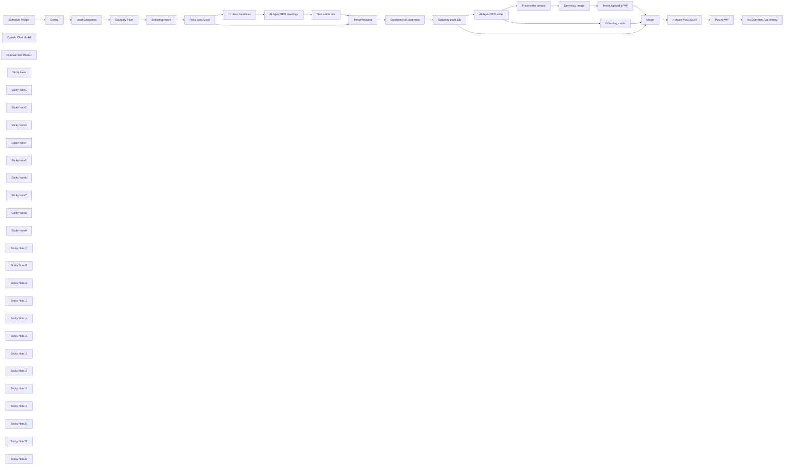

## Fluxo (.json) :

```json
{
  "id": "17j2efAe10uXRc4p",
  "meta": {
    "instanceId": "95e5c2dbf167bd62714d47d959f677d4c29b5fcbb7d183f4fe2396c33badeac6",
    "templateCredsSetupCompleted": true
  },
  "name": "Auto WordPress Blog Generator (GPT + Postgres + WP Media)",
  "tags": [
    {
      "id": "k8Hqq1bbCQoesJjj",
      "name": "Wordpress",
      "createdAt": "2025-02-26T04:04:38.319Z",
      "updatedAt": "2025-02-26T04:04:38.319Z"
    }
  ],
  "nodes": [
    {
      "id": "f71a8a34-5d88-48b0-bf56-44c95d970abd",
      "name": "Schedule Trigger",
      "type": "n8n-nodes-base.scheduleTrigger",
      "position": [
        -1120,
        -560
      ],
      "parameters": {
        "rule": {
          "interval": [
            {
              "field": "hours",
              "triggerAtMinute": {}
            }
          ]
        }
      },
      "typeVersion": 1.2
    },
    {
      "id": "8ce11fcd-806c-44ea-aa5f-015599eacc98",
      "name": "OpenAI Chat Model",
      "type": "@n8n/n8n-nodes-langchain.lmChatOpenAi",
      "position": [
        2060,
        -20
      ],
      "parameters": {
        "model": {
          "__rl": true,
          "mode": "list",
          "value": "gpt-4.1-2025-04-14",
          "cachedResultName": "gpt-4.1-2025-04-14"
        },
        "options": {}
      },
      "credentials": {
        "openAiApi": {
          "id": "BSiASwH9CasrT3uK",
          "name": "OpenAi account"
        }
      },
      "typeVersion": 1.2
    },
    {
      "id": "c9450a63-a89e-46eb-b083-b0f40d7b797c",
      "name": "Download Image",
      "type": "n8n-nodes-base.httpRequest",
      "position": [
        2620,
        100
      ],
      "parameters": {
        "url": "={{ $json.image_url }}",
        "options": {
          "response": {
            "response": {
              "responseFormat": "file",
              "outputPropertyName": "imagedownloaded"
            }
          }
        }
      },
      "typeVersion": 4.2
    },
    {
      "id": "f477482d-d9b6-4d83-b707-dd19da90e25e",
      "name": "Prepare Post JSON",
      "type": "n8n-nodes-base.code",
      "position": [
        3440,
        -520
      ],
      "parameters": {
        "jsCode": "const items = $input.all();\n\nlet image = null;\nlet contentBlock = null;\nlet categoryBlock = null;\nlet titleBlock = null;\n\n// Inspect all incoming JSON\nfor (const item of items) {\n  const json = item.json;\n\n  // Detect image\n  if (json?.source_url && json?.media_type === 'image') {\n    image = json;\n    continue;\n  }\n\n  // Detect GPT-generated content\n  if (typeof json.content === 'string' && json.content.includes('<!-- wp:paragraph')) {\n    contentBlock = json;\n    continue;\n  }\n\n  // Detect category block\n  if (json?.category_id && json?.description) {\n    categoryBlock = json;\n    continue;\n  }\n\n  // Detect GPT-generated title from AI output\n  if (typeof json.output === 'string') {\n    titleBlock = json;\n    continue;\n  }\n\n  // Fallback title if nothing else matched\n  if (typeof json.title === 'string') {\n    titleBlock = json;\n  }\n}\n\nreturn [{\n  json: {\n    title: $input.first().json.title,\n    content: contentBlock?.content || '<p>No content</p>',\n    status: 'publish',\n    categories: [categoryBlock?.category_id || 1],\n    featured_media: image?.id || null,\n  }\n}];\n"
      },
      "typeVersion": 2
    },
    {
      "id": "12191b30-702c-44dd-bfaf-68de02f627b1",
      "name": "Merge",
      "type": "n8n-nodes-base.merge",
      "position": [
        3200,
        -520
      ],
      "parameters": {
        "numberInputs": 3
      },
      "typeVersion": 3.1
    },
    {
      "id": "9c21f5ce-b353-4193-a93d-a034e025a1a0",
      "name": "OpenAI Chat Model1",
      "type": "@n8n/n8n-nodes-langchain.lmChatOpenAi",
      "position": [
        640,
        -20
      ],
      "parameters": {
        "model": {
          "__rl": true,
          "mode": "list",
          "value": "gpt-4.1-mini-2025-04-14",
          "cachedResultName": "gpt-4.1-mini-2025-04-14"
        },
        "options": {}
      },
      "credentials": {
        "openAiApi": {
          "id": "BSiASwH9CasrT3uK",
          "name": "OpenAi account"
        }
      },
      "typeVersion": 1.2
    },
    {
      "id": "723d9202-7fb0-43ca-8945-8bd4b5030eb8",
      "name": "Sticky Note",
      "type": "n8n-nodes-base.stickyNote",
      "position": [
        -2420,
        -1340
      ],
      "parameters": {
        "color": 4,
        "width": 1180,
        "height": 1780,
        "content": "# 🤖 WordPress Blog Automation Workflow\n\n## 🛠 SETUP (do once before running the flow)\n\n### 1 · DOMAIN  \nAdd one variable anywhere **before** the workflow starts (via Set node, `.env`, or instance config):\n```\nDOMAIN=https://your-wordpress-site.com\n```\nThis will be used in all WordPress REST API calls.\n\n---\n\n### 2 · CREDENTIALS (create in **n8n → Credentials**)\n| Credential Name | Purpose | Minimum Scope |\n|-----------------|---------|---------------|\n| `YOUR_WORDPRESS_CREDENTIAL` | WordPress API | `POST /media`, `POST /posts` |\n| `YOUR_POSTGRES_CREDENTIAL` | PostgreSQL access for used categories | DB + table created in step 3 |\n| `YOUR_OPENAI_CREDENTIAL` | OpenAI key for GPT | GPT-4-mini or better |\n\n🧠 Keep the names **exactly** — the workflow references them directly.\n\n---\n\n### 3 · POSTGRESQL (one-time bootstrap)\n\n### 🖥️ Terminal method (fastest — paste into `sudo -u postgres psql`)\n\n```sql\n-- 3-A · Create database and user\nCREATE DATABASE n8n_blog;\nCREATE USER n8n_writer WITH PASSWORD 'S3cur3-Pa55';\nGRANT ALL PRIVILEGES ON DATABASE n8n_blog TO n8n_writer;\n\\c n8n_blog n8n_writer  -- Reconnect to DB as the new user\n\n-- 3-B · Create the tracking table\nCREATE TABLE IF NOT EXISTS public.used_categories (\n  category_id INTEGER PRIMARY KEY,\n  name        TEXT,\n  description TEXT,\n  title       TEXT,\n  used_at     TIMESTAMPTZ\n);\nGRANT INSERT, UPDATE, SELECT ON public.used_categories TO n8n_writer;\n```\n\n### 🔗 Then configure the credential in n8n\n\n```\nName:       YOUR_POSTGRES_CREDENTIAL\nHost:       127.0.0.1\nPort:       5432\nDatabase:   n8n_blog\nUser:       n8n_writer\nPassword:   S3cur3-Pa55\nSchema:     public\n```\n\n💡 No terminal access?  \nCreate a temporary **Postgres → Execute Query** node with the same SQL, run once, then delete it.\n\n---\n\n### 4 · FIRST TEST  \nRun the first 3–5 nodes manually to verify:\n- ✅ WordPress auth works  \n- ✅ DB connection + writing works  \n- ✅ GPT responds as expected  \n\nOnce confirmed, enable the **Schedule Trigger** to automate.\n\n---\n\n## ✅ WHAT THIS WORKFLOW DOES\n\n- Loads all WP categories and filters out excluded ones  \n- Picks the **least-used category** from your DB  \n- Generates a **unique, well-structured WP article** using GPT (TOC, blocks, CTA)  \n- Generates a **cover image** and uploads it to `/media`  \n- Publishes the post to `/posts` and updates usage in your PostgreSQL DB"
      },
      "typeVersion": 1
    },
    {
      "id": "550017b6-481b-4591-8d87-04761244ef3b",
      "name": "Sticky Note1",
      "type": "n8n-nodes-base.stickyNote",
      "position": [
        -1180,
        -740
      ],
      "parameters": {
        "color": 4,
        "width": 220,
        "height": 360,
        "content": "⏰ Triggers this workflow every few hours."
      },
      "typeVersion": 1
    },
    {
      "id": "8d6ae5db-3d88-4e3a-8567-6e38a6002acd",
      "name": "Sticky Note2",
      "type": "n8n-nodes-base.stickyNote",
      "position": [
        -700,
        -740
      ],
      "parameters": {
        "color": 6,
        "width": 220,
        "height": 360,
        "content": "📥 Loads all WordPress categories."
      },
      "typeVersion": 1
    },
    {
      "id": "3ef86b3a-18a1-42b7-896c-ef2352148b38",
      "name": "Sticky Note3",
      "type": "n8n-nodes-base.stickyNote",
      "position": [
        -460,
        -740
      ],
      "parameters": {
        "width": 220,
        "height": 360,
        "content": "🧹 Filters out excluded category IDs.\n\nChoose them yourself, some categories are not for AI Agent, like reviews or same"
      },
      "typeVersion": 1
    },
    {
      "id": "3cc6a088-0698-478d-896b-9af0f5f03f00",
      "name": "Sticky Note4",
      "type": "n8n-nodes-base.stickyNote",
      "position": [
        -220,
        -740
      ],
      "parameters": {
        "color": 5,
        "width": 220,
        "height": 360,
        "content": "🗃 Loads recently used categories from DB."
      },
      "typeVersion": 1
    },
    {
      "id": "9eccdda9-1cee-42d1-8451-24b0104917b5",
      "name": "Sticky Note5",
      "type": "n8n-nodes-base.stickyNote",
      "position": [
        20,
        -740
      ],
      "parameters": {
        "width": 220,
        "height": 360,
        "content": "🎯 Picks least-used category for next post."
      },
      "typeVersion": 1
    },
    {
      "id": "1f9a4bb2-c482-47d2-9ebd-4ff1be58b3d8",
      "name": "Sticky Note6",
      "type": "n8n-nodes-base.stickyNote",
      "position": [
        340,
        -360
      ],
      "parameters": {
        "color": 5,
        "width": 220,
        "height": 360,
        "content": "📄 Loads 10 latest article titles for the selected category."
      },
      "typeVersion": 1
    },
    {
      "id": "5faba628-67c5-4e1b-889e-7cc1b72a23d0",
      "name": "Sticky Note7",
      "type": "n8n-nodes-base.stickyNote",
      "position": [
        580,
        -360
      ],
      "parameters": {
        "color": 7,
        "width": 300,
        "height": 460,
        "content": "🧠 Generates a unique article title with GPT."
      },
      "typeVersion": 1
    },
    {
      "id": "d23c4134-a06e-4630-a5e5-8a9b90259d4c",
      "name": "Sticky Note8",
      "type": "n8n-nodes-base.stickyNote",
      "position": [
        900,
        -360
      ],
      "parameters": {
        "width": 220,
        "height": 360,
        "content": "🧾 Prepares the new article title."
      },
      "typeVersion": 1
    },
    {
      "id": "da20f973-6889-460c-84b8-cbff0c6ceaa2",
      "name": "Sticky Note9",
      "type": "n8n-nodes-base.stickyNote",
      "position": [
        1220,
        -740
      ],
      "parameters": {
        "width": 220,
        "height": 360,
        "content": "🔀 Merges category + title data."
      },
      "typeVersion": 1
    },
    {
      "id": "2048e683-1b37-49e4-9bc5-2530becf26ee",
      "name": "Sticky Note10",
      "type": "n8n-nodes-base.stickyNote",
      "position": [
        1460,
        -740
      ],
      "parameters": {
        "width": 220,
        "height": 360,
        "content": "📦 Combines all post metadata into one object."
      },
      "typeVersion": 1
    },
    {
      "id": "a5aafb45-6e89-435b-9b41-63d2b5fd8cd5",
      "name": "Sticky Note11",
      "type": "n8n-nodes-base.stickyNote",
      "position": [
        1700,
        -740
      ],
      "parameters": {
        "color": 5,
        "width": 220,
        "height": 360,
        "content": "📝 Saves used category and title to DB."
      },
      "typeVersion": 1
    },
    {
      "id": "f63a22c4-2f78-4820-87d4-eb1510f51bcc",
      "name": "Sticky Note12",
      "type": "n8n-nodes-base.stickyNote",
      "position": [
        2000,
        -360
      ],
      "parameters": {
        "color": 7,
        "width": 300,
        "height": 460,
        "content": "✍️ Writes full WordPress-style HTML article."
      },
      "typeVersion": 1
    },
    {
      "id": "24721fd7-cb69-44b6-a48d-91f195e861cc",
      "name": "Sticky Note13",
      "type": "n8n-nodes-base.stickyNote",
      "position": [
        2320,
        -480
      ],
      "parameters": {
        "width": 220,
        "height": 360,
        "content": "🧾 Extracts content block from AI output."
      },
      "typeVersion": 1
    },
    {
      "id": "f5bd3e8b-c188-494e-b662-ce5722848ae4",
      "name": "Sticky Note14",
      "type": "n8n-nodes-base.stickyNote",
      "position": [
        2320,
        -100
      ],
      "parameters": {
        "width": 220,
        "height": 360,
        "content": "🖼 Prepares a placeholder cover image URL."
      },
      "typeVersion": 1
    },
    {
      "id": "933fe208-7c8e-4683-a09b-bfd91ed22bef",
      "name": "Sticky Note15",
      "type": "n8n-nodes-base.stickyNote",
      "position": [
        2560,
        -100
      ],
      "parameters": {
        "color": 6,
        "width": 220,
        "height": 360,
        "content": "⬇️ Downloads the cover image."
      },
      "typeVersion": 1
    },
    {
      "id": "78053d06-b008-403d-b6a1-d5546814d1e9",
      "name": "Sticky Note16",
      "type": "n8n-nodes-base.stickyNote",
      "position": [
        2800,
        -100
      ],
      "parameters": {
        "color": 6,
        "width": 220,
        "height": 360,
        "content": "📤 Uploads image to WordPress media."
      },
      "typeVersion": 1
    },
    {
      "id": "d11f85b0-664f-4c63-b34b-a510480957e7",
      "name": "Sticky Note17",
      "type": "n8n-nodes-base.stickyNote",
      "position": [
        3140,
        -720
      ],
      "parameters": {
        "width": 220,
        "height": 360,
        "content": "🔗 Merges image + content + category info."
      },
      "typeVersion": 1
    },
    {
      "id": "01fcdc38-8627-4818-8f78-b45681d22d26",
      "name": "Sticky Note18",
      "type": "n8n-nodes-base.stickyNote",
      "position": [
        3380,
        -720
      ],
      "parameters": {
        "width": 220,
        "height": 360,
        "content": "📬 Prepares final JSON body for the WP post."
      },
      "typeVersion": 1
    },
    {
      "id": "10f89350-e129-41df-803c-450f3fb07193",
      "name": "Sticky Note19",
      "type": "n8n-nodes-base.stickyNote",
      "position": [
        3620,
        -720
      ],
      "parameters": {
        "color": 6,
        "width": 220,
        "height": 360,
        "content": "🚀 Publishes post to your WordPress site."
      },
      "typeVersion": 1
    },
    {
      "id": "bd082511-91aa-425f-9bf3-cadb3900c749",
      "name": "Sticky Note20",
      "type": "n8n-nodes-base.stickyNote",
      "position": [
        -700,
        -360
      ],
      "parameters": {
        "color": 3,
        "width": 220,
        "height": 300,
        "content": "Make sure:\n- Your WordPress site allows public access to `/wp-json/wp/v2/categories`\n- You have at least 1 category created\n- No security plugin (like Wordfence) is blocking REST API\n\nNo credential needed for public category fetch."
      },
      "typeVersion": 1
    },
    {
      "id": "5f46d958-b7de-405e-a95e-57a9c0366b52",
      "name": "Sticky Note21",
      "type": "n8n-nodes-base.stickyNote",
      "position": [
        -220,
        -360
      ],
      "parameters": {
        "color": 3,
        "width": 220,
        "height": 300,
        "content": "Make sure:\n- You've created the table (see setup note)\n- Credential `YOUR_POSTGRES_CREDENTIAL` is configured\n- DB user has `SELECT` rights on the table\n\nTip: This selects the least recently used category for the next post."
      },
      "typeVersion": 1
    },
    {
      "id": "3f90d8c5-7dd9-41c4-a862-e21942fdc87d",
      "name": "Load Categories",
      "type": "n8n-nodes-base.httpRequest",
      "position": [
        -640,
        -560
      ],
      "parameters": {
        "url": "={{ $json.domain }}/wp-json/wp/v2/categories?per_page=100 ",
        "options": {}
      },
      "typeVersion": 4.2
    },
    {
      "id": "8b2cb2f8-2a2e-4e92-81b6-36e9e2105f94",
      "name": "Category Filter",
      "type": "n8n-nodes-base.code",
      "position": [
        -400,
        -560
      ],
      "parameters": {
        "jsCode": "const excludeIds = [1, 11, 12, 13, 15, 17, 18, 36, 37, 38, 39];\n\nreturn $input.all()\n  .filter(item => !excludeIds.includes(item.json.id))\n  .map(item => {\n    const { id, name, description, link } = item.json;\n    return {\n      json: { id, name, description, link }\n    };\n  });\n"
      },
      "typeVersion": 2
    },
    {
      "id": "083202d5-7053-4775-b053-2e503ce7d73f",
      "name": "Selecting recent",
      "type": "n8n-nodes-base.postgres",
      "position": [
        -160,
        -560
      ],
      "parameters": {
        "query": "SELECT category_id, MAX(used_at) AS last_used_at\nFROM used_categories\nGROUP BY category_id\nORDER BY last_used_at ASC;",
        "options": {},
        "operation": "executeQuery"
      },
      "credentials": {
        "postgres": {
          "id": "JKCOXnEh1Bqg4Gad",
          "name": "YOUR_POSTGRES_CREDENTIAL"
        }
      },
      "executeOnce": true,
      "typeVersion": 2.6,
      "alwaysOutputData": true
    },
    {
      "id": "98f3ec81-f1f9-425b-83b0-2d5732acb19e",
      "name": "Picks Less Used",
      "type": "n8n-nodes-base.code",
      "position": [
        80,
        -560
      ],
      "parameters": {
        "jsCode": "const categories = $items(\"Category Filter\");\nconst usedRows = $items(\"Selecting recent\");\n\nif (!categories || categories.length === 0) {\n  throw new Error(\"No category in Code2\");\n}\n\nif (!usedRows || usedRows.length === 0) {\n  return [categories[0]];\n}\n\nconst usedMap = new Map(\n  usedRows.map(row => {\n    const id = row.json.category_id;\n    const time = new Date(row.json.last_used_at || row.json.used_at).getTime();\n    return [id, time];\n  })\n);\n\nlet selected = null;\nlet minTime = Infinity;\n\nfor (const cat of categories) {\n  const id = cat.json.id;\n  const lastUsed = usedMap.get(id) ?? 0;\n\n  if (lastUsed < minTime) {\n    minTime = lastUsed;\n    selected = cat;\n  }\n}\n\nreturn [selected || categories[0]];"
      },
      "typeVersion": 2
    },
    {
      "id": "8f94b488-d3fb-4016-a8ac-ed0e13f78190",
      "name": "10 latest headlines",
      "type": "n8n-nodes-base.postgres",
      "position": [
        400,
        -200
      ],
      "parameters": {
        "query": "SELECT name, description \nFROM used_categories \nWHERE category_id = {{ $json.id }}\nORDER BY used_at DESC \nLIMIT 10;",
        "options": {},
        "operation": "executeQuery"
      },
      "credentials": {
        "postgres": {
          "id": "JKCOXnEh1Bqg4Gad",
          "name": "YOUR_POSTGRES_CREDENTIAL"
        }
      },
      "typeVersion": 2.6,
      "alwaysOutputData": true
    },
    {
      "id": "04349d4d-06cc-48fc-88ae-588ec527fca4",
      "name": "New article title",
      "type": "n8n-nodes-base.code",
      "position": [
        960,
        -200
      ],
      "parameters": {
        "jsCode": "return [\n  {\n    json: {\n      title: $input.first().json.output\n    }\n  }\n];\n"
      },
      "typeVersion": 2
    },
    {
      "id": "9d145f01-ff77-4c72-bec2-d8ead60d79e5",
      "name": "AI Agent SEO Headings",
      "type": "@n8n/n8n-nodes-langchain.agent",
      "position": [
        600,
        -200
      ],
      "parameters": {
        "text": "=Based on the category \"{{ $('Picks Less Used').item.json.name }}\"  \nwith the description:  \n{{ $('Picks Less Used').item.json.description }}\n\nHere are existing article titles already published:  \n{{ $items(\"10 latest headlines\").map(i => i.json.description).join(\"\\n\") }}\n\nYour task:  \n- Come up with a **new unique article title** that fits this category  \n- The topic should be narrow, practical, and not duplicate any existing titles  \n- Make it clickable, relevant, and professional  \n- Do **not** reuse or partially copy old titles  \n- Style should be expert-level, insightful, and engaging — no clickbait\n\nImportant:  \n- Output **only** the new title (no extra words, no formatting)  \n- The title must be ready for publication as-is (plain text)",
        "options": {},
        "promptType": "define"
      },
      "typeVersion": 1.9
    },
    {
      "id": "29ad413c-4ee4-4d96-8793-3a8cb4a4ce1b",
      "name": "AI Agent SEO writer",
      "type": "@n8n/n8n-nodes-langchain.agent",
      "position": [
        2020,
        -200
      ],
      "parameters": {
        "text": "=You are writing a blog post using native WordPress HTML blocks.\n\n🧱 Follow this exact structure:\n\n- Paragraphs inside: <!-- wp:paragraph --> ... <!-- /wp:paragraph -->\n- Level 3 headings inside: <!-- wp:heading {\"level\":3} --> ... <!-- /wp:heading -->\n- Level 4 headings inside: <!-- wp:heading {\"level\":4} --> ... <!-- /wp:heading -->\n- Lists inside: <!-- wp:list --> ... <!-- /wp:list -->\n- Table of contents using: <!-- wp:yoast-seo/table-of-contents --> with anchor links\n- Final section: conclusion in list format\n- Final block: call-to-action with the link \"{{ $('Combines full post meta').item.json.link }}\" or {{$node[\"Config\"].json[\"domain\"]}}\n\n🎯 Use the topic info from:\n- name: {{ $json.name }}\n- description: {{ $json.description }}\n- link: {{ $('Combines full post meta').item.json.link }}\n\n---\n\n✍️ General writing guidelines:\n- The main theme always follows `name` and `description`\n- Each post must focus on a new subtopic (narrower than the main theme)\n- The article must be useful, professional, and well-structured\n- Avoid fluff or repetition — deliver actionable advice\n- Output should follow valid WordPress HTML blocks strictly\n\n---\n\n💡 Examples of subtopics for \"{{ $json.name }}\":\n- Top 5 beginner tools in {{ $json.name }}\n- How to choose the right {{ $json.name }} without risks\n- Common mistakes in using {{ $json.name }}\n- How to monetize with CPA or RevShare in {{ $json.name }}\n- Smart strategies to scale {{ $json.name }} traffic in 2025\n- Proven international platforms in {{ $json.name }} — worth trying?\n- What leads to account bans in {{ $json.name }}\n- Top scaling errors in {{ $json.name }}\n\nIn every post, generate a **new and unique** subtopic — no repeats.\n\n---\n\n🚨 Important:\nOnly output raw WordPress blocks — no additional formatting or notes.\n\n🧱 Structure Example:\n\n1. Introduction:\n<!-- wp:paragraph -->\n<p>A short, attention-grabbing intro explaining what the article covers and why it matters.</p>\n<!-- /wp:paragraph -->\n\n2. Table of Contents:\n<!-- wp:yoast-seo/table-of-contents -->\n<div class=\"wp-block-yoast-seo-table-of-contents yoast-table-of-contents\">\n  <h2>Contents</h2>\n  <ul>\n    <li><a href=\"#h-block-1\">Block 1</a></li>\n    <li><a href=\"#h-block-2\">Block 2</a></li>\n    <li><a href=\"#h-block-3\">Block 3</a></li>\n    <li><a href=\"#h-conclusion\">Conclusion</a></li>\n  </ul>\n</div>\n<!-- /wp:yoast-seo/table-of-contents -->\n\n3. Main Content Blocks:\n<!-- wp:heading {\"level\":3} -->\n<h3 class=\"wp-block-heading\" id=\"h-block-1\"><strong><mark style=\"background-color:var(--accent)\" class=\"has-inline-color has-base-3-color\">Block Title</mark></strong></h3>\n<!-- /wp:heading -->\n\n<!-- wp:paragraph -->\n<p>Informative paragraph with practical insights.</p>\n<!-- /wp:paragraph -->\n\n<!-- wp:paragraph -->\n<p>Optional second paragraph — avoid repetition.</p>\n<!-- /wp:paragraph -->\n\n4. Actionable Tips:\n<!-- wp:list -->\n<ul class=\"wp-block-list\">\n  <li><strong>Tip:</strong> Keep it short and valuable</li>\n  <li><strong>Example:</strong> Provide a link or quick example</li>\n</ul>\n<!-- /wp:list -->\n\n5. Conclusion:\n<!-- wp:heading {\"level\":3} -->\n<h3 class=\"wp-block-heading\" id=\"h-conclusion\"><strong><mark style=\"background-color:var(--accent)\" class=\"has-inline-color has-base-3-color\">Conclusion</mark></strong></h3>\n<!-- /wp:heading -->\n\n<!-- wp:paragraph -->\n<p>Summarize key takeaways and motivate the reader to take action.</p>\n<!-- /wp:paragraph -->\n\n6. Call to Action:\n<!-- wp:paragraph -->\n<p>Read more at <strong><mark style=\"background-color:var(--accent)\" class=\"has-inline-color has-base-3-color\">{{$node[\"Config\"].json[\"domain\"]}}/</mark></strong></p>\n<!-- /wp:paragraph -->",
        "options": {},
        "promptType": "define"
      },
      "typeVersion": 1.9
    },
    {
      "id": "5b1efebe-f9e7-4088-9363-75280ba36528",
      "name": "Merge heading",
      "type": "n8n-nodes-base.merge",
      "position": [
        1280,
        -540
      ],
      "parameters": {},
      "typeVersion": 3.1
    },
    {
      "id": "187423ce-b80a-4e28-bdd1-02818a6dcd8f",
      "name": "Combines full post meta",
      "type": "n8n-nodes-base.code",
      "position": [
        1520,
        -540
      ],
      "parameters": {
        "jsCode": "let data = {};\n$input.all().forEach(item => {\n  Object.assign(data, item.json);\n});\nreturn [{ json: data }];\n"
      },
      "typeVersion": 2
    },
    {
      "id": "85c0e9e2-6f2b-4bd4-9f71-f7efe940ed14",
      "name": "Updating posts DB",
      "type": "n8n-nodes-base.postgres",
      "position": [
        1760,
        -540
      ],
      "parameters": {
        "table": {
          "__rl": true,
          "mode": "list",
          "value": "used_categories",
          "cachedResultName": "used_categories"
        },
        "schema": {
          "__rl": true,
          "mode": "list",
          "value": "public"
        },
        "columns": {
          "value": {
            "name": "={{ $json.name }}",
            "title": "={{ $json.title }}",
            "used_at": "={{ new Date().toISOString() }}",
            "category_id": "={{ $json.id }}",
            "description": "={{ $json.description }}"
          },
          "schema": [
            {
              "id": "id",
              "type": "number",
              "display": true,
              "removed": true,
              "required": false,
              "displayName": "id",
              "defaultMatch": true,
              "canBeUsedToMatch": true
            },
            {
              "id": "category_id",
              "type": "number",
              "display": true,
              "removed": false,
              "required": false,
              "displayName": "category_id",
              "defaultMatch": false,
              "canBeUsedToMatch": true
            },
            {
              "id": "name",
              "type": "string",
              "display": true,
              "required": false,
              "displayName": "name",
              "defaultMatch": false,
              "canBeUsedToMatch": false
            },
            {
              "id": "used_at",
              "type": "dateTime",
              "display": true,
              "required": false,
              "displayName": "used_at",
              "defaultMatch": false,
              "canBeUsedToMatch": false
            },
            {
              "id": "description",
              "type": "string",
              "display": true,
              "required": false,
              "displayName": "description",
              "defaultMatch": false,
              "canBeUsedToMatch": false
            },
            {
              "id": "title",
              "type": "string",
              "display": true,
              "required": false,
              "displayName": "title",
              "defaultMatch": false,
              "canBeUsedToMatch": false
            }
          ],
          "mappingMode": "defineBelow",
          "matchingColumns": [
            "category_id"
          ],
          "attemptToConvertTypes": false,
          "convertFieldsToString": false
        },
        "options": {},
        "operation": "upsert"
      },
      "credentials": {
        "postgres": {
          "id": "JKCOXnEh1Bqg4Gad",
          "name": "YOUR_POSTGRES_CREDENTIAL"
        }
      },
      "typeVersion": 2.6
    },
    {
      "id": "73975cf0-165c-4f53-aff9-12872a4dd228",
      "name": "Extracting output",
      "type": "n8n-nodes-base.code",
      "position": [
        2380,
        -280
      ],
      "parameters": {
        "jsCode": "return [{\n  json: {\n    content: $input.first().json.output,\n  }\n}];\n"
      },
      "typeVersion": 2
    },
    {
      "id": "a5030427-0bc1-499a-903e-e10ba81a9b0d",
      "name": "Placeholder creator",
      "type": "n8n-nodes-base.code",
      "position": [
        2380,
        100
      ],
      "parameters": {
        "jsCode": "const name = $('Updating posts DB').first().json.name || \"{{ $json.domain }}\";\nconst encoded = encodeURIComponent(name); \n\nreturn {\n  image_url: `https://placehold.co/1200x675/FF0000/FFFFFF.png?text=${encoded}&font=montserrat`\n};\n"
      },
      "typeVersion": 2
    },
    {
      "id": "6f0f0202-3803-48ef-b8f5-dd56a023c43f",
      "name": "Media Upload to WP",
      "type": "n8n-nodes-base.httpRequest",
      "position": [
        2860,
        100
      ],
      "parameters": {
        "url": "={{ $('Config').first().json.domain }}/wp-json/wp/v2/media",
        "method": "POST",
        "options": {},
        "sendBody": true,
        "contentType": "binaryData",
        "sendHeaders": true,
        "authentication": "predefinedCredentialType",
        "headerParameters": {
          "parameters": [
            {
              "name": "Content-Disposition",
              "value": "attachment; filename=crypto.webp"
            },
            {
              "name": "Content-Type",
              "value": "image/png"
            }
          ]
        },
        "inputDataFieldName": "imagedownloaded",
        "nodeCredentialType": "wordpressApi"
      },
      "credentials": {
        "wordpressApi": {
          "id": "7NOAxTvRC1RY2TSN",
          "name": "Wordpress account"
        }
      },
      "typeVersion": 4.2
    },
    {
      "id": "0621bad7-e7bf-4aae-bbf3-2e1f571d81d8",
      "name": "Post to WP",
      "type": "n8n-nodes-base.httpRequest",
      "position": [
        3680,
        -520
      ],
      "parameters": {
        "url": "={{ $('Config').first().json.domain }}/wp-json/wp/v2/posts",
        "method": "POST",
        "options": {},
        "sendBody": true,
        "authentication": "predefinedCredentialType",
        "bodyParameters": {
          "parameters": [
            {
              "name": "title",
              "value": "={{ $json[\"title\"] }}"
            },
            {
              "name": "content",
              "value": "={{ $json.content }}"
            },
            {
              "name": "status",
              "value": "={{ $json.status }}"
            },
            {
              "name": "featured_media",
              "value": "={{ $json[\"featured_media\"] }}"
            },
            {
              "name": "categories[0]",
              "value": "={{ $json[\"categories\"][0] }}"
            }
          ]
        },
        "nodeCredentialType": "wordpressApi"
      },
      "credentials": {
        "wordpressApi": {
          "id": "7NOAxTvRC1RY2TSN",
          "name": "Wordpress account"
        }
      },
      "typeVersion": 4.2
    },
    {
      "id": "28f3b69a-22a2-4448-a9d0-a5fd42e1ed2c",
      "name": "No Operation, do nothing",
      "type": "n8n-nodes-base.noOp",
      "position": [
        3900,
        -520
      ],
      "parameters": {},
      "typeVersion": 1
    },
    {
      "id": "c98d9193-1dd9-493c-bf76-b72de8e53e28",
      "name": "Sticky Note22",
      "type": "n8n-nodes-base.stickyNote",
      "position": [
        -940,
        -740
      ],
      "parameters": {
        "color": 4,
        "width": 220,
        "height": 360,
        "content": "! Set your WordPress domain inside the “Config” Set node.\n"
      },
      "typeVersion": 1
    },
    {
      "id": "1c881f9f-dcf1-4bf0-889b-0738d1ff49a4",
      "name": "Config",
      "type": "n8n-nodes-base.set",
      "position": [
        -880,
        -560
      ],
      "parameters": {
        "options": {},
        "assignments": {
          "assignments": [
            {
              "id": "d7165db3-6fc8-4398-aa16-29a34ff27d78",
              "name": "domain",
              "type": "string",
              "value": "https://yourdomain.com"
            }
          ]
        }
      },
      "typeVersion": 3.4
    }
  ],
  "active": false,
  "pinData": {},
  "settings": {
    "executionOrder": "v1"
  },
  "versionId": "f787c571-bcc3-47d6-82ca-f138fa2922e1",
  "connections": {
    "Merge": {
      "main": [
        [
          {
            "node": "Prepare Post JSON",
            "type": "main",
            "index": 0
          }
        ]
      ]
    },
    "Config": {
      "main": [
        [
          {
            "node": "Load Categories",
            "type": "main",
            "index": 0
          }
        ]
      ]
    },
    "Post to WP": {
      "main": [
        [
          {
            "node": "No Operation, do nothing",
            "type": "main",
            "index": 0
          }
        ]
      ]
    },
    "Merge heading": {
      "main": [
        [
          {
            "node": "Combines full post meta",
            "type": "main",
            "index": 0
          }
        ]
      ]
    },
    "Download Image": {
      "main": [
        [
          {
            "node": "Media Upload to WP",
            "type": "main",
            "index": 0
          }
        ]
      ]
    },
    "Category Filter": {
      "main": [
        [
          {
            "node": "Selecting recent",
            "type": "main",
            "index": 0
          }
        ]
      ]
    },
    "Load Categories": {
      "main": [
        [
          {
            "node": "Category Filter",
            "type": "main",
            "index": 0
          }
        ]
      ]
    },
    "Picks Less Used": {
      "main": [
        [
          {
            "node": "10 latest headlines",
            "type": "main",
            "index": 0
          },
          {
            "node": "Merge heading",
            "type": "main",
            "index": 0
          }
        ]
      ]
    },
    "Schedule Trigger": {
      "main": [
        [
          {
            "node": "Config",
            "type": "main",
            "index": 0
          }
        ]
      ]
    },
    "Selecting recent": {
      "main": [
        [
          {
            "node": "Picks Less Used",
            "type": "main",
            "index": 0
          }
        ]
      ]
    },
    "Extracting output": {
      "main": [
        [
          {
            "node": "Merge",
            "type": "main",
            "index": 1
          }
        ]
      ]
    },
    "New article title": {
      "main": [
        [
          {
            "node": "Merge heading",
            "type": "main",
            "index": 1
          }
        ]
      ]
    },
    "OpenAI Chat Model": {
      "ai_languageModel": [
        [
          {
            "node": "AI Agent SEO writer",
            "type": "ai_languageModel",
            "index": 0
          }
        ]
      ]
    },
    "Prepare Post JSON": {
      "main": [
        [
          {
            "node": "Post to WP",
            "type": "main",
            "index": 0
          }
        ]
      ]
    },
    "Updating posts DB": {
      "main": [
        [
          {
            "node": "AI Agent SEO writer",
            "type": "main",
            "index": 0
          },
          {
            "node": "Merge",
            "type": "main",
            "index": 0
          }
        ]
      ]
    },
    "Media Upload to WP": {
      "main": [
        [
          {
            "node": "Merge",
            "type": "main",
            "index": 2
          }
        ]
      ]
    },
    "OpenAI Chat Model1": {
      "ai_languageModel": [
        [
          {
            "node": "AI Agent SEO Headings",
            "type": "ai_languageModel",
            "index": 0
          }
        ]
      ]
    },
    "10 latest headlines": {
      "main": [
        [
          {
            "node": "AI Agent SEO Headings",
            "type": "main",
            "index": 0
          }
        ]
      ]
    },
    "AI Agent SEO writer": {
      "main": [
        [
          {
            "node": "Placeholder creator",
            "type": "main",
            "index": 0
          },
          {
            "node": "Extracting output",
            "type": "main",
            "index": 0
          }
        ]
      ]
    },
    "Placeholder creator": {
      "main": [
        [
          {
            "node": "Download Image",
            "type": "main",
            "index": 0
          }
        ]
      ]
    },
    "AI Agent SEO Headings": {
      "main": [
        [
          {
            "node": "New article title",
            "type": "main",
            "index": 0
          }
        ]
      ]
    },
    "Combines full post meta": {
      "main": [
        [
          {
            "node": "Updating posts DB",
            "type": "main",
            "index": 0
          }
        ]
      ]
    }
  }
}
```

<a id="template-247"></a>

## Template 247 - Agente AI para consultas OpenSea

- **Nome:** Agente AI para consultas OpenSea
- **Descrição:** Fluxo que usa um modelo de linguagem para interpretar consultas sobre NFTs e executa chamadas à API do OpenSea para obter perfis, coleções, contratos, NFTs e metadados, mantendo contexto de sessão.
- **Funcionalidade:** • Interpretação de consultas em linguagem natural: Converte pedidos do usuário em chamadas API específicas.
• Recuperação de perfil de usuário: Obtém dados de conta como bio, imagem e redes sociais.
• Consulta de coleção: Busca metadados, taxas, traits e links de uma coleção pelo slug.
• Listagem de coleções com filtros: Retorna coleções filtradas por cadeia, criador, visibilidade, ordenação e paginação.
• Consulta de contrato: Recupera detalhes do smart contract de uma coleção em uma cadeia específica.
• Recuperação de NFT individual: Obtém metadata, atributos, propriedade e raridade de um token específico.
• Recuperação de NFTs por conta/coleção/contrato: Lista NFTs de um endereço, de uma coleção ou de um contrato com suporte a paginação e limites.
• Consulta de token de pagamento: Recupera informações sobre tokens usados em transações de NFT.
• Recuperação de traits da coleção: Obtém categorias e atributos de traits de uma coleção.
• Validação de parâmetros de cadeia: Garante nomes de blockchain válidos (ex.: usar "matic" em vez de "polygon") para evitar erros de API.
• Memória de sessão: Mantém contexto entre requisições para conversas sequenciais.
• Tratamento de erros e status: Identifica respostas comuns (200, 400, 404, 500) e orienta sobre correções e re-tentativas.
- **Ferramentas:** • OpenSea API: Serviço externo usado para obter dados de contas, coleções, contratos, NFTs, traits e tokens de pagamento.
• OpenAI (modelo GPT-4o-mini): Modelo de linguagem usado para interpretar solicitações em linguagem natural e formar chamadas API apropriadas.

## Fluxo visual

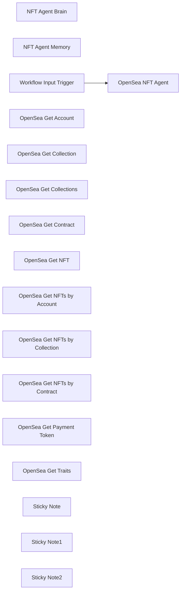

## Fluxo (.json) :

```json
{
  "id": "ZBH1ExE58wsoodkZ",
  "meta": {
    "instanceId": "a5283507e1917a33cc3ae615b2e7d5ad2c1e50955e6f831272ddd5ab816f3fb6"
  },
  "name": "OpenSea NFT Agent Tool",
  "tags": [],
  "nodes": [
    {
      "id": "33cb5db2-a023-4a6c-a4ad-3f4b3c35ce42",
      "name": "NFT Agent Brain",
      "type": "@n8n/n8n-nodes-langchain.lmChatOpenAi",
      "position": [
        1340,
        240
      ],
      "parameters": {
        "model": {
          "__rl": true,
          "mode": "list",
          "value": "gpt-4o-mini"
        },
        "options": {}
      },
      "credentials": {
        "openAiApi": {
          "id": "yUizd8t0sD5wMYVG",
          "name": "OpenAi account"
        }
      },
      "typeVersion": 1.2
    },
    {
      "id": "9d1fa8e4-3acf-4ace-965c-ea5cdfcdc366",
      "name": "NFT Agent Memory",
      "type": "@n8n/n8n-nodes-langchain.memoryBufferWindow",
      "position": [
        1520,
        240
      ],
      "parameters": {},
      "typeVersion": 1.3
    },
    {
      "id": "d396bb90-00a6-41da-898d-7815d8d25fe3",
      "name": "OpenSea NFT Agent",
      "type": "@n8n/n8n-nodes-langchain.agent",
      "position": [
        2140,
        -20
      ],
      "parameters": {
        "text": "={{ $json.message }}",
        "options": {
          "systemMessage": "# **🛠 OpenSea NFT Agent – System Message**  \n\n## **🔹 Role & Purpose**\nThe **OpenSea NFT Agent** is a powerful AI-driven assistant specialized in retrieving, analyzing, and processing NFT-related data from **OpenSea's API**. It provides insights into:\n- User profiles\n- NFT collections and contracts\n- Individual NFTs, their metadata, traits, and ownership\n- Payment tokens used in NFT transactions\n- Bulk NFT retrievals (by account, collection, or contract)  \n\nThis agent is designed to interact **directly** with OpenSea’s API and follows strict formatting rules to ensure valid requests and accurate responses.\n\n---\n\n# **⚡ Available Tools & How to Use Them**\nThe **NFT Agent** has access to **multiple OpenSea API endpoints**, each serving a specific purpose.\n\n## **1️⃣ Get Account**\n📍 **Endpoint**: `/api/v2/accounts/{address_or_username}`  \n🔹 **Description**: Retrieves an OpenSea user profile, including:\n  - Bio  \n  - Social media usernames  \n  - Profile image  \n\n🔹 **Required Parameter**:  \n  - `address_or_username` → Public blockchain address or OpenSea username  \n\n🔹 **Example Query**:  \n  _\"Retrieve OpenSea profile for user `0xA5f49655E6814d9262fb656d92f17D7874d5Ac7E`.\"_\n\n---\n\n## **2️⃣ Get Collection**\n📍 **Endpoint**: `/api/v2/collections/{collection_slug}`  \n🔹 **Description**: Fetches details about a specific NFT collection, including:\n  - Collection metadata  \n  - Fees  \n  - Traits  \n  - Social media links  \n\n🔹 **Required Parameter**:  \n  - `collection_slug` → Unique identifier for the collection (found in OpenSea URL)  \n\n🔹 **Example Query**:  \n  _\"Retrieve details for the 'Bored Ape Yacht Club' collection.\"_\n\n---\n\n## **3️⃣ Get Collections**\n📍 **Endpoint**: `/api/v2/collections`  \n🔹 **Description**: Fetches a **list of NFT collections** with optional filters.  \n\n🔹 **Optional Parameters**:  \n  - `chain` → Filter by blockchain (**must be a valid chain** from the list below).  \n  - `creator_username` → Return collections from a specific OpenSea username.  \n  - `include_hidden` → Boolean (`true`/`false`) to include hidden collections.  \n  - `limit` → Number of results (1-100, default: 100).  \n  - `next` → Cursor for pagination.  \n  - `order_by` → Sorting option (`created_date`, `market_cap`, `num_owners`, `one_day_change`, `seven_day_change`, `seven_day_volume`).  \n\n🔹 **Example Query**:  \n  _\"List the top 10 NFT collections on Ethereum sorted by market cap.\"_\n\n---\n\n## **4️⃣ Get Contract**\n📍 **Endpoint**: `/api/v2/chain/{chain}/contract/{address}`  \n🔹 **Description**: Retrieves **smart contract details** for an NFT collection.  \n\n🔹 **Required Parameters**:  \n  - `chain` → Blockchain network (**must be valid, see list below**).  \n  - `address` → Smart contract address of the NFT collection.  \n\n🔹 **Example Query**:  \n  _\"Retrieve contract details for `0xABCDEF...` on Ethereum.\"_\n\n---\n\n## **5️⃣ Get NFT**\n📍 **Endpoint**: `/api/v2/chain/{chain}/contract/{address}/nfts/{identifier}`  \n🔹 **Description**: Retrieves **metadata, traits, ownership, and rarity** of a specific NFT.  \n\n🔹 **Required Parameters**:  \n  - `chain` → Blockchain network (**must be valid, see list below**).  \n  - `address` → Smart contract address of the NFT collection.  \n  - `identifier` → The **NFT Token ID**.  \n\n🔹 **Example Query**:  \n  _\"Retrieve metadata for NFT #1234 from Ethereum contract `0xABCDEF...`.\"_\n\n---\n\n## **6️⃣ Get NFTs (by Account)**\n📍 **Endpoint**: `/api/v2/chain/{chain}/account/{address}/nfts`  \n🔹 **Description**: Retrieves **all NFTs owned** by a given account address.  \n\n🔹 **Required Parameters**:  \n  - `chain` → Blockchain network (**must be valid, see list below**).  \n  - `address` → Public blockchain address of the owner.  \n\n🔹 **Optional Parameters**:  \n  - `collection` → Filter by specific NFT collection.  \n  - `limit` → Number of NFTs to return (1-200, default: 50).  \n  - `next` → Cursor for pagination.  \n\n🔹 **Example Query**:  \n  _\"Retrieve all NFTs owned by `0x123...` on Ethereum.\"_\n\n---\n\n## **⚠️ Important Rules & Restrictions**\n### **🚨 1. Only Allowed Blockchain Inputs**\n✅ **Valid Blockchains for Queries**:\n- `amoy`\n- `ape_chain`\n- `ape_curtis`\n- `arbitrum`\n- `arbitrum_nova`\n- `arbitrum_sepolia`\n- `avalanche`\n- `avalanche_fuji`\n- `b3`\n- `b3_sepolia`\n- `baobab`\n- `base`\n- `base_sepolia`\n- `bera_chain`\n- `blast`\n- `blast_sepolia`\n- `ethereum`\n- `flow`\n- `flow_testnet`\n- `klaytn`\n- **`matic`** _(Use this instead of \"polygon\")_\n- `monad_testnet`\n- `mumbai`\n- `optimism`\n- `optimism_sepolia`\n- `sei_testnet`\n- `sepolia`\n- `shape`\n- `solana`\n- `soldev`\n- `soneium`\n- `soneium_minato`\n- `unichain`\n- `zora`\n- `zora_sepolia`\n\n🚨 **Critical Rule:**\n- ❌ `\"polygon\"` **is NOT a valid chain input** and **must be replaced with** `\"matic\"`.  \n- ❌ Using an unsupported blockchain **will cause an error**.  \n- ✅ Always verify blockchain names before executing a query.\n\n---\n\n## **📌 Example Queries**\n✅ _\"Find the OpenSea profile for `0x123...`.\"_  \n✅ _\"List all NFT collections created by `CryptoArtistX`.\"_  \n✅ _\"Retrieve contract details for `0xABC...` on Ethereum.\"_  \n✅ _\"Fetch metadata for NFT #5678 in 'Azuki' collection.\"_  \n✅ _\"List the top 5 NFT collections on Solana, ordered by market cap.\"_  \n\n---\n\n## **⚠️ Error Handling**\nIf an OpenSea API request fails, **check for errors**:\n- ✅ `200` → Success  \n- ❌ `400` → Bad Request (Invalid input format)  \n- ❌ `404` → Not Found (Incorrect `collection_slug`, `address`, or `identifier`)  \n- ❌ `500` → Server Error (OpenSea API issue)  \n\n---\n\n# **🚀 Conclusion**\nThe **OpenSea NFT Agent** is a **specialized AI-powered assistant** designed to retrieve and analyze NFT-related data on OpenSea. Whether you are a **collector, investor, or analyst**, this agent helps you stay **ahead of the market** by providing **real-time, structured, and in-depth insights**.  \n\n**🔥 Follow all rules to ensure successful API queries! 🔥**"
        },
        "promptType": "define"
      },
      "typeVersion": 1.8
    },
    {
      "id": "c055762a-8fe7-4141-a639-df2372f30060",
      "name": "Workflow Input Trigger",
      "type": "n8n-nodes-base.executeWorkflowTrigger",
      "position": [
        1420,
        -20
      ],
      "parameters": {
        "workflowInputs": {
          "values": [
            {
              "name": "message"
            },
            {
              "name": "sessionId"
            }
          ]
        }
      },
      "typeVersion": 1.1
    },
    {
      "id": "e2b0e848-ae9a-4fce-bf74-11cdebca512e",
      "name": "OpenSea Get Account",
      "type": "@n8n/n8n-nodes-langchain.toolHttpRequest",
      "position": [
        1720,
        240
      ],
      "parameters": {
        "url": "https://api.opensea.io/api/v2/accounts/{address_or_username}",
        "sendHeaders": true,
        "authentication": "genericCredentialType",
        "genericAuthType": "httpHeaderAuth",
        "toolDescription": "This tool retrieves an OpenSea account profile, including bio, social media usernames, and profile image.",
        "parametersHeaders": {
          "values": [
            {
              "name": "Accept",
              "value": "application/json",
              "valueProvider": "fieldValue"
            }
          ]
        }
      },
      "credentials": {
        "httpHeaderAuth": {
          "id": "3v99GVMGF4tKP5nM",
          "name": "OpenSea"
        }
      },
      "typeVersion": 1.1
    },
    {
      "id": "a343aba5-6a1c-4a19-8054-d80a92b30db0",
      "name": "OpenSea Get Collection",
      "type": "@n8n/n8n-nodes-langchain.toolHttpRequest",
      "position": [
        1920,
        240
      ],
      "parameters": {
        "url": "https://api.opensea.io/api/v2/collections/{collection_slug}",
        "sendHeaders": true,
        "authentication": "genericCredentialType",
        "genericAuthType": "httpHeaderAuth",
        "toolDescription": "This tool retrieves details of a specific NFT collection from OpenSea, including fees, traits, and links.",
        "parametersHeaders": {
          "values": [
            {
              "name": "Accept",
              "value": "application/json",
              "valueProvider": "fieldValue"
            }
          ]
        }
      },
      "credentials": {
        "httpHeaderAuth": {
          "id": "3v99GVMGF4tKP5nM",
          "name": "OpenSea"
        }
      },
      "typeVersion": 1.1
    },
    {
      "id": "c21482cd-bc29-47ee-9913-b200abdfd5bd",
      "name": "OpenSea Get Collections",
      "type": "@n8n/n8n-nodes-langchain.toolHttpRequest",
      "position": [
        2120,
        240
      ],
      "parameters": {
        "url": "https://api.opensea.io/api/v2/collections",
        "sendQuery": true,
        "sendHeaders": true,
        "authentication": "genericCredentialType",
        "genericAuthType": "httpHeaderAuth",
        "parametersQuery": {
          "values": [
            {
              "name": "chain",
              "valueProvider": "modelOptional"
            },
            {
              "name": "creator_username",
              "valueProvider": "modelOptional"
            },
            {
              "name": "include_hidden",
              "valueProvider": "modelOptional"
            },
            {
              "name": "limit",
              "valueProvider": "modelOptional"
            },
            {
              "name": "next",
              "valueProvider": "modelOptional"
            },
            {
              "name": "order_by",
              "valueProvider": "modelOptional"
            }
          ]
        },
        "toolDescription": "This tool retrieves a list of OpenSea collections with filtering options for blockchain, creator, visibility, sorting, and pagination.",
        "parametersHeaders": {
          "values": [
            {
              "name": "Accept",
              "value": "application/json",
              "valueProvider": "fieldValue"
            }
          ]
        }
      },
      "credentials": {
        "httpHeaderAuth": {
          "id": "3v99GVMGF4tKP5nM",
          "name": "OpenSea"
        }
      },
      "typeVersion": 1.1
    },
    {
      "id": "ab41e2bc-8c99-41ae-bfa5-5a94c8068f33",
      "name": "OpenSea Get Contract",
      "type": "@n8n/n8n-nodes-langchain.toolHttpRequest",
      "position": [
        2340,
        240
      ],
      "parameters": {
        "url": "https://api.opensea.io/api/v2/chain/{chain}/contract/{address}",
        "sendHeaders": true,
        "authentication": "genericCredentialType",
        "genericAuthType": "httpHeaderAuth",
        "toolDescription": "This tool retrieves details of a smart contract from OpenSea based on a given blockchain and contract address.",
        "parametersHeaders": {
          "values": [
            {
              "name": "Accept",
              "value": "application/json",
              "valueProvider": "fieldValue"
            }
          ]
        }
      },
      "credentials": {
        "httpHeaderAuth": {
          "id": "3v99GVMGF4tKP5nM",
          "name": "OpenSea"
        }
      },
      "typeVersion": 1.1
    },
    {
      "id": "f938ea94-59f7-4e9b-a75f-02b8e606e8ed",
      "name": "OpenSea Get NFT",
      "type": "@n8n/n8n-nodes-langchain.toolHttpRequest",
      "position": [
        2580,
        260
      ],
      "parameters": {
        "url": "https://api.opensea.io/api/v2/chain/{chain}/contract/{address}/nfts/{identifier}",
        "sendHeaders": true,
        "authentication": "genericCredentialType",
        "genericAuthType": "httpHeaderAuth",
        "toolDescription": "This tool retrieves metadata, traits, ownership information, and rarity for a single NFT on OpenSea.",
        "parametersHeaders": {
          "values": [
            {
              "name": "Accept",
              "value": "application/json",
              "valueProvider": "fieldValue"
            }
          ]
        }
      },
      "credentials": {
        "httpHeaderAuth": {
          "id": "3v99GVMGF4tKP5nM",
          "name": "OpenSea"
        }
      },
      "typeVersion": 1.1
    },
    {
      "id": "c62f092e-353e-4038-a875-d3c86b9e2a3d",
      "name": "OpenSea Get NFTs by Account",
      "type": "@n8n/n8n-nodes-langchain.toolHttpRequest",
      "position": [
        2820,
        260
      ],
      "parameters": {
        "url": "https://api.opensea.io/api/v2/chain/{chain}/account/{address}/nfts",
        "sendQuery": true,
        "sendHeaders": true,
        "authentication": "genericCredentialType",
        "genericAuthType": "httpHeaderAuth",
        "parametersQuery": {
          "values": [
            {
              "name": "collection",
              "valueProvider": "modelOptional"
            },
            {
              "name": "limit",
              "valueProvider": "modelOptional"
            },
            {
              "name": "next",
              "valueProvider": "modelOptional"
            }
          ]
        },
        "toolDescription": "This tool retrieves NFTs owned by a given account address on OpenSea, allowing filtering by collection, blockchain, and pagination options.",
        "parametersHeaders": {
          "values": [
            {
              "name": "Accept",
              "value": "application/json",
              "valueProvider": "fieldValue"
            }
          ]
        }
      },
      "credentials": {
        "httpHeaderAuth": {
          "id": "3v99GVMGF4tKP5nM",
          "name": "OpenSea"
        }
      },
      "typeVersion": 1.1
    },
    {
      "id": "4603a4f0-a46b-4ea9-b226-726f9763d823",
      "name": "OpenSea Get NFTs by Collection",
      "type": "@n8n/n8n-nodes-langchain.toolHttpRequest",
      "position": [
        3080,
        260
      ],
      "parameters": {
        "url": "https://api.opensea.io/api/v2/collection/{collection_slug}/nfts",
        "sendQuery": true,
        "sendHeaders": true,
        "authentication": "genericCredentialType",
        "genericAuthType": "httpHeaderAuth",
        "parametersQuery": {
          "values": [
            {
              "name": "limit",
              "valueProvider": "modelOptional"
            },
            {
              "name": "next",
              "valueProvider": "modelOptional"
            }
          ]
        },
        "toolDescription": "This tool retrieves multiple NFTs for a given collection on OpenSea, allowing pagination and limit options.",
        "parametersHeaders": {
          "values": [
            {
              "name": "Accept",
              "value": "application/json",
              "valueProvider": "fieldValue"
            }
          ]
        }
      },
      "credentials": {
        "httpHeaderAuth": {
          "id": "3v99GVMGF4tKP5nM",
          "name": "OpenSea"
        }
      },
      "typeVersion": 1.1
    },
    {
      "id": "f27c8a55-230e-41a2-ba92-f8facb323e8d",
      "name": "OpenSea Get NFTs by Contract",
      "type": "@n8n/n8n-nodes-langchain.toolHttpRequest",
      "position": [
        3320,
        260
      ],
      "parameters": {
        "url": "https://api.opensea.io/api/v2/chain/{chain}/contract/{address}/nfts",
        "sendQuery": true,
        "sendHeaders": true,
        "authentication": "genericCredentialType",
        "genericAuthType": "httpHeaderAuth",
        "parametersQuery": {
          "values": [
            {
              "name": "limit",
              "valueProvider": "modelOptional"
            },
            {
              "name": "next",
              "valueProvider": "modelOptional"
            }
          ]
        },
        "toolDescription": "This tool retrieves multiple NFTs for a given smart contract on OpenSea, allowing pagination and limit options.",
        "parametersHeaders": {
          "values": [
            {
              "name": "Accept",
              "value": "application/json",
              "valueProvider": "fieldValue"
            }
          ]
        }
      },
      "credentials": {
        "httpHeaderAuth": {
          "id": "3v99GVMGF4tKP5nM",
          "name": "OpenSea"
        }
      },
      "typeVersion": 1.1
    },
    {
      "id": "6043b056-339b-4bdd-898e-91e3b5915afd",
      "name": "OpenSea Get Payment Token",
      "type": "@n8n/n8n-nodes-langchain.toolHttpRequest",
      "position": [
        3540,
        260
      ],
      "parameters": {
        "url": "https://api.opensea.io/api/v2/chain/{chain}/payment_token/{address}",
        "sendHeaders": true,
        "authentication": "genericCredentialType",
        "genericAuthType": "httpHeaderAuth",
        "toolDescription": "This tool retrieves details of a payment token from OpenSea based on a given blockchain and token address.",
        "parametersHeaders": {
          "values": [
            {
              "name": "Accept",
              "value": "application/json",
              "valueProvider": "fieldValue"
            }
          ]
        }
      },
      "credentials": {
        "httpHeaderAuth": {
          "id": "3v99GVMGF4tKP5nM",
          "name": "OpenSea"
        }
      },
      "typeVersion": 1.1
    },
    {
      "id": "5601cd2a-45f8-4cb6-acd8-02e44b033dcb",
      "name": "OpenSea Get Traits",
      "type": "@n8n/n8n-nodes-langchain.toolHttpRequest",
      "position": [
        3760,
        260
      ],
      "parameters": {
        "url": "https://api.opensea.io/api/v2/traits/{collection_slug}",
        "sendHeaders": true,
        "authentication": "genericCredentialType",
        "genericAuthType": "httpHeaderAuth",
        "toolDescription": "This tool retrieves the traits in a given NFT collection from OpenSea.",
        "parametersHeaders": {
          "values": [
            {
              "name": "Accept",
              "value": "application/json",
              "valueProvider": "fieldValue"
            },
            {
              "name": "x-api-key",
              "value": "YOUR_OPENSEA_API_KEY",
              "valueProvider": "fieldValue"
            }
          ]
        }
      },
      "credentials": {
        "httpHeaderAuth": {
          "id": "3v99GVMGF4tKP5nM",
          "name": "OpenSea"
        }
      },
      "typeVersion": 1.1
    },
    {
      "id": "86a6c757-bbda-41a9-90d1-1e8af808ae66",
      "name": "Sticky Note",
      "type": "n8n-nodes-base.stickyNote",
      "position": [
        160,
        -1240
      ],
      "parameters": {
        "color": 2,
        "width": 920,
        "height": 1880,
        "content": "# OpenSea NFT Agent Tool (n8n Workflow) Guide\n\n## 🚀 Workflow Overview\nThe **OpenSea NFT Agent Tool** is a specialized **AI-powered assistant** designed to interact with **OpenSea's API** to fetch, analyze, and process NFT-related data. It helps users access **NFT ownership, metadata, traits, collections, contracts, and payment tokens** efficiently.\n\n### 🎯 **Key Features**:\n- Retrieve **OpenSea user profiles** by wallet address or username.\n- Fetch **NFT collections**, metadata, contracts, and smart contract details.\n- Access **individual NFT details**, including rarity and ownership.\n- Track **NFTs owned by an account**, collections, and smart contracts.\n- Retrieve **payment tokens** and NFT traits.\n- Ensure **API request validity** and structured responses.\n\n---\n\n## 🔗 **Nodes & Functions**\n\n### **1️⃣ NFT Agent Brain**\n- **Type**: AI Language Model (GPT-4o Mini)\n- **Purpose**: Processes NFT-related API requests and interprets OpenSea data queries.\n\n### **2️⃣ NFT Agent Memory**\n- **Type**: AI Memory Buffer\n- **Purpose**: Stores session data to maintain context across multiple queries.\n\n### **3️⃣ OpenSea Get Account**\n- **Type**: API Request\n- **Endpoint**: `/api/v2/accounts/{address_or_username}`\n- **Function**: Fetches an OpenSea **user profile**, including bio, social links, and profile image.\n\n### **4️⃣ OpenSea Get Collection**\n- **Type**: API Request\n- **Endpoint**: `/api/v2/collections/{collection_slug}`\n- **Function**: Retrieves **collection metadata**, fees, and traits.\n\n### **5️⃣ OpenSea Get Collections**\n- **Type**: API Request\n- **Endpoint**: `/api/v2/collections`\n- **Function**: Fetches **a list of NFT collections**, filtered by chain, creator, visibility, or ranking.\n\n### **6️⃣ OpenSea Get Contract**\n- **Type**: API Request\n- **Endpoint**: `/api/v2/chain/{chain}/contract/{address}`\n- **Function**: Retrieves **NFT collection smart contract details**.\n\n### **7️⃣ OpenSea Get NFT**\n- **Type**: API Request\n- **Endpoint**: `/api/v2/chain/{chain}/contract/{address}/nfts/{identifier}`\n- **Function**: Fetches **metadata, traits, rarity, and ownership** of a single NFT.\n\n### **8️⃣ OpenSea Get NFTs by Account**\n- **Type**: API Request\n- **Endpoint**: `/api/v2/chain/{chain}/account/{address}/nfts`\n- **Function**: Retrieves **all NFTs owned** by a wallet address.\n\n### **9️⃣ OpenSea Get NFTs by Collection**\n- **Type**: API Request\n- **Endpoint**: `/api/v2/collection/{collection_slug}/nfts`\n- **Function**: Fetches **all NFTs in a collection**.\n\n### **🔟 OpenSea Get NFTs by Contract**\n- **Type**: API Request\n- **Endpoint**: `/api/v2/chain/{chain}/contract/{address}/nfts`\n- **Function**: Retrieves **NFTs linked to a smart contract**.\n\n### **11️⃣ OpenSea Get Payment Token**\n- **Type**: API Request\n- **Endpoint**: `/api/v2/chain/{chain}/payment_token/{address}`\n- **Function**: Fetches details of a **cryptocurrency/token** used for NFT transactions.\n\n### **12️⃣ OpenSea Get Traits**\n- **Type**: API Request\n- **Endpoint**: `/api/v2/traits/{collection_slug}`\n- **Function**: Retrieves **trait categories and attributes** for a given collection.\n\n---\n\n"
      },
      "typeVersion": 1
    },
    {
      "id": "c35f3855-5167-4230-8017-f60297d1dcec",
      "name": "Sticky Note1",
      "type": "n8n-nodes-base.stickyNote",
      "position": [
        1540,
        -1240
      ],
      "parameters": {
        "color": 5,
        "width": 1000,
        "height": 1060,
        "content": "## 📌 **How to Use the Workflow**\n\n### ✅ **Step 1: Input Data**\n- Provide the necessary parameters like `collection_slug`, `chain`, `address`, or `identifier`.\n\n### ✅ **Step 2: Execute API Calls**\n- The workflow retrieves and structures **NFT ownership, metadata, and analytics**.\n\n### ✅ **Step 3: Analyze & Output Results**\n- Results can be integrated into dashboards, alerts, or Telegram notifications.\n\n---\n\n## ⚠️ **Common API Queries & Examples**\n\n### **1️⃣ Get OpenSea User Profile**\n```plaintext\nGET https://api.opensea.io/api/v2/accounts/0xA5f49655E6814d9262fb656d92f17D7874d5Ac7E\n```\n\n### **2️⃣ Get Collection Details**\n```plaintext\nGET https://api.opensea.io/api/v2/collections/boredapeyachtclub\n```\n\n### **3️⃣ Get NFT Metadata**\n```plaintext\nGET https://api.opensea.io/api/v2/chain/ethereum/contract/0xABCDEF.../nfts/1234\n```\n\n### **4️⃣ Get All NFTs Owned by a Wallet**\n```plaintext\nGET https://api.opensea.io/api/v2/chain/ethereum/account/0x123.../nfts\n```\n\n### **5️⃣ Get Payment Token Details**\n```plaintext\nGET https://api.opensea.io/api/v2/chain/ethereum/payment_token/0xABC...DEF\n```\n\n---\n\n"
      },
      "typeVersion": 1
    },
    {
      "id": "c96fc837-37b2-4351-9175-7b52fba1e38b",
      "name": "Sticky Note2",
      "type": "n8n-nodes-base.stickyNote",
      "position": [
        2940,
        -1240
      ],
      "parameters": {
        "color": 3,
        "width": 840,
        "height": 480,
        "content": "## ⚡ **Error Handling & Troubleshooting**\n| **Error Code** | **Description** |\n|--------------|----------------|\n| `200` | Success |\n| `400` | Bad Request (Invalid input) |\n| `404` | Not Found (Incorrect slug, address, or identifier) |\n| `500` | Server Error (OpenSea API issue) |\n\n### 🔹 **Fixing Common Errors**\n- Ensure correct **wallet address**, **NFT identifier**, or **collection slug**.\n- Always use `\"matic\"` instead of `\"polygon\"` for chain input.\n- If OpenSea API is **down**, retry after some time.\n\n---\n\n## 🚀 **Connect with Me for Support**\nIf you need assistance, custom OpenSea NFT insights, or automation support, feel free to connect with me on LinkedIn:\n\n🌐 **Don Jayamaha – LinkedIn**  \n🔗 [http://linkedin.com/in/donjayamahajr](http://linkedin.com/in/donjayamahajr)"
      },
      "typeVersion": 1
    }
  ],
  "active": false,
  "pinData": {},
  "settings": {
    "executionOrder": "v1"
  },
  "versionId": "1bdf4330-2c81-47dc-8729-1737eb19cd40",
  "connections": {
    "NFT Agent Brain": {
      "ai_languageModel": [
        [
          {
            "node": "OpenSea NFT Agent",
            "type": "ai_languageModel",
            "index": 0
          }
        ]
      ]
    },
    "OpenSea Get NFT": {
      "ai_tool": [
        [
          {
            "node": "OpenSea NFT Agent",
            "type": "ai_tool",
            "index": 0
          }
        ]
      ]
    },
    "NFT Agent Memory": {
      "ai_memory": [
        [
          {
            "node": "OpenSea NFT Agent",
            "type": "ai_memory",
            "index": 0
          }
        ]
      ]
    },
    "OpenSea Get Traits": {
      "ai_tool": [
        [
          {
            "node": "OpenSea NFT Agent",
            "type": "ai_tool",
            "index": 0
          }
        ]
      ]
    },
    "OpenSea Get Account": {
      "ai_tool": [
        [
          {
            "node": "OpenSea NFT Agent",
            "type": "ai_tool",
            "index": 0
          }
        ]
      ]
    },
    "OpenSea Get Contract": {
      "ai_tool": [
        [
          {
            "node": "OpenSea NFT Agent",
            "type": "ai_tool",
            "index": 0
          }
        ]
      ]
    },
    "OpenSea Get Collection": {
      "ai_tool": [
        [
          {
            "node": "OpenSea NFT Agent",
            "type": "ai_tool",
            "index": 0
          }
        ]
      ]
    },
    "Workflow Input Trigger": {
      "main": [
        [
          {
            "node": "OpenSea NFT Agent",
            "type": "main",
            "index": 0
          }
        ]
      ]
    },
    "OpenSea Get Collections": {
      "ai_tool": [
        [
          {
            "node": "OpenSea NFT Agent",
            "type": "ai_tool",
            "index": 0
          }
        ]
      ]
    },
    "OpenSea Get Payment Token": {
      "ai_tool": [
        [
          {
            "node": "OpenSea NFT Agent",
            "type": "ai_tool",
            "index": 0
          }
        ]
      ]
    },
    "OpenSea Get NFTs by Account": {
      "ai_tool": [
        [
          {
            "node": "OpenSea NFT Agent",
            "type": "ai_tool",
            "index": 0
          }
        ]
      ]
    },
    "OpenSea Get NFTs by Contract": {
      "ai_tool": [
        [
          {
            "node": "OpenSea NFT Agent",
            "type": "ai_tool",
            "index": 0
          }
        ]
      ]
    },
    "OpenSea Get NFTs by Collection": {
      "ai_tool": [
        [
          {
            "node": "OpenSea NFT Agent",
            "type": "ai_tool",
            "index": 0
          }
        ]
      ]
    }
  }
}
```

<a id="template-248"></a>

## Template 248 - Recuperar todos os itens do WordPress

- **Nome:** Recuperar todos os itens do WordPress
- **Descrição:** Fluxo que, ao ser executado manualmente, recupera todos os conteúdos do site WordPress usando as credenciais configuradas.
- **Funcionalidade:** • Disparo manual: inicia o fluxo quando o usuário clica em executar.
• Recuperação de conteúdo do WordPress: obtém todos os posts/itens disponíveis por meio da API.
• Autenticação por credenciais: usa credenciais configuradas para acessar o site WordPress de forma autenticada.
- **Ferramentas:** • WordPress: plataforma de gerenciamento de conteúdo cuja API é consultada para recuperar posts e outros itens.

## Fluxo visual


## Fluxo (.json) :

```json
{
  "nodes": [
    {
      "name": "On clicking 'execute'",
      "type": "n8n-nodes-base.manualTrigger",
      "position": [
        250,
        300
      ],
      "parameters": {},
      "typeVersion": 1
    },
    {
      "name": "Wordpress",
      "type": "n8n-nodes-base.wordpress",
      "position": [
        450,
        300
      ],
      "parameters": {
        "options": {},
        "operation": "getAll"
      },
      "credentials": {
        "wordpressApi": "wp_creds"
      },
      "typeVersion": 1
    }
  ],
  "connections": {
    "On clicking 'execute'": {
      "main": [
        [
          {
            "node": "Wordpress",
            "type": "main",
            "index": 0
          }
        ]
      ]
    }
  }
}
```

<a id="template-249"></a>

## Template 249 - API de extração de dados de imagens com Gemini AI

- **Nome:** API de extração de dados de imagens com Gemini AI
- **Descrição:** Endpoint HTTP que recebe a URL de uma imagem, processa a imagem com um modelo AI multimodal para extrair informações textuais e devolve os dados requisitados em formato JSON estruturado.
- **Funcionalidade:** • Endpoint HTTP público: Recebe requisições com a URL da imagem e especificações de campos a extrair.
• Download da imagem via URL: Busca a imagem fornecida pelo usuário a partir de um endereço público.
• Conversão da imagem para Base64: Converte o arquivo de imagem para Base64 para envio embutido à API de IA.
• Chamada ao modelo AI multimodal: Envia a imagem e instruções ao modelo (Gemini) para realizar OCR e extração de informações.
• Resposta com esquema dinâmico: Define um schema de resposta baseado nas propriedades solicitadas para garantir saída estruturada.
• Parsing e normalização dos dados: Extrai o conteúdo retornado pelo modelo, converte para JSON e mantém apenas os campos requeridos.
• Retorno da resposta ao cliente: Envia o JSON final contendo os campos extraídos como resposta à requisição inicial.
- **Ferramentas:** • Google Gemini (Generative Language API): Modelo AI multimodal usado para reconhecer texto em imagens e gerar respostas estruturadas com base em instruções.
• Hospedagem de imagens pública (qualquer serviço que forneça URLs de imagem): Fonte das imagens a serem processadas.
• Cliente HTTP (ex.: cURL ou qualquer biblioteca HTTP): Ferramenta utilizada para chamar o endpoint e enviar os parâmetros de entrada.

## Fluxo visual

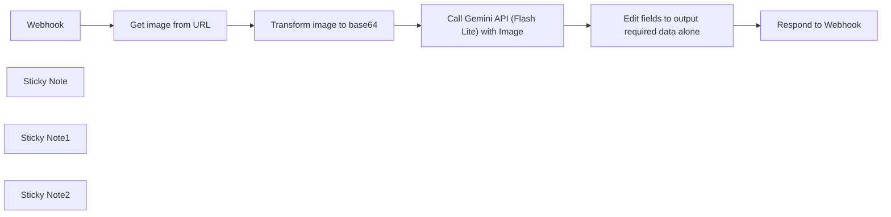

## Fluxo (.json) :

```json
{
  "id": "YKZBEx4DTf0KGEBR",
  "meta": {
    "instanceId": "f5267db717c7383a3924a6083f6b9950be64cf36e2b4e9421d42eb2121922a14"
  },
  "name": "Image-Based Data Extraction API using Gemini AI",
  "tags": [],
  "nodes": [
    {
      "id": "e3448003-5c62-4da6-8fcc-6817915dcbb8",
      "name": "Webhook",
      "type": "n8n-nodes-base.webhook",
      "position": [
        40,
        40
      ],
      "webhookId": "18118afb-7fd2-47a5-a474-50813c5b20c8",
      "parameters": {
        "path": "data-extractor",
        "options": {},
        "responseMode": "responseNode"
      },
      "typeVersion": 2
    },
    {
      "id": "3682c6bf-3442-4fba-ab6c-ae29e361ef93",
      "name": "Respond to Webhook",
      "type": "n8n-nodes-base.respondToWebhook",
      "position": [
        1180,
        40
      ],
      "parameters": {
        "options": {}
      },
      "typeVersion": 1.1
    },
    {
      "id": "bfa352d0-68a9-4f33-be54-254a5df22664",
      "name": "Get image from URL",
      "type": "n8n-nodes-base.httpRequest",
      "position": [
        280,
        40
      ],
      "parameters": {
        "url": "={{ $json.body.image_url }}",
        "options": {}
      },
      "typeVersion": 4.2
    },
    {
      "id": "c6c8de12-08dc-42e8-9c0e-86e04c7cacc0",
      "name": "Call Gemini API (Flash Lite) with Image",
      "type": "n8n-nodes-base.httpRequest",
      "position": [
        760,
        40
      ],
      "parameters": {
        "url": "=https://generativelanguage.googleapis.com/v1beta/models/gemini-2.0-flash-lite:generateContent",
        "method": "POST",
        "options": {},
        "jsonBody": "={\n  \"contents\": [\n    {\n      \"role\": \"user\",\n      \"parts\": [\n        {\n          \"inlineData\": {\n            \"data\": \"{{$json.data1}}\",\n            \"mimeType\": \"image/jpeg\"\n          }\n        }\n      ]\n    },\n    {\n      \"role\": \"user\",\n      \"parts\": [\n        {\n          \"text\": \"check this\"\n        }\n      ]\n    }\n  ],\n  \"systemInstruction\": {\n    \"role\": \"user\",\n    \"parts\": [\n      {\n        \"text\": \"{{ $('Webhook').first().json.body.Requirement}}\"\n      }\n    ]\n  },\n  \"generationConfig\": {\n    \"temperature\": 1,\n    \"topK\": 40,\n    \"topP\": 0.95,\n    \"maxOutputTokens\": 8192,\n    \"responseMimeType\": \"application/json\",\n    \"responseSchema\": {\n      \"type\": \"object\",\n      \"properties\": {{ $('Webhook').first().json.body.properties.toJsonString()}}\n    }\n  }\n}\n",
        "sendBody": true,
        "specifyBody": "json",
        "authentication": "predefinedCredentialType",
        "nodeCredentialType": "googlePalmApi"
      },
      "credentials": {
        "googlePalmApi": {
          "id": "MhMVz0OkKPSPX2Wn",
          "name": "Gemini API Srinivasan Online"
        }
      },
      "typeVersion": 4.2
    },
    {
      "id": "06b0f807-aeba-44d6-bb1d-dfa1d50e1082",
      "name": "Edit fields to output required data alone",
      "type": "n8n-nodes-base.set",
      "position": [
        980,
        40
      ],
      "parameters": {
        "options": {},
        "assignments": {
          "assignments": [
            {
              "id": "4a2f1343-4b5d-4de8-b04b-5640e0a38d27",
              "name": "result",
              "type": "string",
              "value": "={{ $json.candidates[0].content.parts[0].text.parseJson()}}"
            }
          ]
        }
      },
      "typeVersion": 3.4
    },
    {
      "id": "8c69dba2-f67c-4f8b-be18-02a414fd2ead",
      "name": "Sticky Note",
      "type": "n8n-nodes-base.stickyNote",
      "position": [
        20,
        280
      ],
      "parameters": {
        "color": 5,
        "width": 820,
        "height": 420,
        "content": "## Sample API Call (cURL) \n```\ncurl --request GET \\\n  --url https://your_domain.com/webhook/data-extractor \\\n  --data '{\n  \"image_url\":\"https://www.immihelp.com/nri/images/sample-pan-card-front.jpg\",\n  \"Requirement\":\"extract the details from the image\",\n  \"properties\": {\n        \"PAN Number\": {\n          \"type\": \"string\"\n        },\n        \"Name\": {\n          \"type\": \"string\"\n        },\n        \"Date of Birth\": {\n          \"type\": \"string\"\n        },\n        \"Valid\": {\n          \"type\": \"boolean\"\n        }\n      }\n}'\n```"
      },
      "typeVersion": 1
    },
    {
      "id": "8839f0d7-306f-4dc2-aca5-6ca529e1a2ff",
      "name": "Sticky Note1",
      "type": "n8n-nodes-base.stickyNote",
      "position": [
        20,
        740
      ],
      "parameters": {
        "color": 5,
        "width": 1240,
        "height": 140,
        "content": "## Sample Output\n```\n{\n  \"result\": \"{\\\"Date of Birth\\\":\\\"23/11/1974\\\",\\\"Name\\\":\\\"RAHUL GUPTA\\\",\\\"PAN Number\\\":\\\"ABCDE1234F\\\",\\\"Valid\\\":true}\"\n}\n```"
      },
      "typeVersion": 1
    },
    {
      "id": "df733e11-f194-4878-a514-47ddc9811281",
      "name": "Sticky Note2",
      "type": "n8n-nodes-base.stickyNote",
      "position": [
        40,
        -520
      ],
      "parameters": {
        "width": 940,
        "height": 440,
        "content": "## Convert the workflow into an Endpoint\n\nThis n8n workflow provides a ready-to-use API endpoint for extracting structured data from images. The API takes an image URL as input, processes it using an AI-powered OCR model, and returns relevant extracted details in a structured JSON format.\n\n- The workflow converts the image to base64 before processing.\n- It utilizes an AI-powered model (Gemini API) for text extraction.\n- The output is formatted to include only the required fields.\n- You can customize the extraction criteria by modifying the request parameters.\n- Supports integration with various applications for automated data entry and processing.\n\nIt can be used for various use cases, such as:\n\n- Document OCR (ID cards, invoices, receipts)\n- Text Extraction from Images\n- Automated Form Processing\n- Business Card Data Extraction\n\nSimply send a GET request with an image URL, define the extraction requirements, and receive structured JSON data in response.\n\n"
      },
      "typeVersion": 1
    },
    {
      "id": "aecf7331-6341-411e-8906-e42fc0ef264a",
      "name": "Transform image to base64",
      "type": "n8n-nodes-base.extractFromFile",
      "position": [
        520,
        40
      ],
      "parameters": {
        "options": {
          "encoding": "ascii"
        },
        "operation": "binaryToPropery",
        "destinationKey": "data1"
      },
      "typeVersion": 1
    }
  ],
  "active": true,
  "pinData": {},
  "settings": {
    "executionOrder": "v1"
  },
  "versionId": "b1fad586-998c-47ce-9921-e59527da029a",
  "connections": {
    "Webhook": {
      "main": [
        [
          {
            "node": "Get image from URL",
            "type": "main",
            "index": 0
          }
        ]
      ]
    },
    "Get image from URL": {
      "main": [
        [
          {
            "node": "Transform image to base64",
            "type": "main",
            "index": 0
          }
        ]
      ]
    },
    "Transform image to base64": {
      "main": [
        [
          {
            "node": "Call Gemini API (Flash Lite) with Image",
            "type": "main",
            "index": 0
          }
        ]
      ]
    },
    "Call Gemini API (Flash Lite) with Image": {
      "main": [
        [
          {
            "node": "Edit fields to output required data alone",
            "type": "main",
            "index": 0
          }
        ]
      ]
    },
    "Edit fields to output required data alone": {
      "main": [
        [
          {
            "node": "Respond to Webhook",
            "type": "main",
            "index": 0
          }
        ]
      ]
    }
  }
}
```

<a id="template-250"></a>

## Template 250 - Agente de transcrição e insights em tempo real

- **Nome:** Agente de transcrição e insights em tempo real
- **Descrição:** Fluxo que cria um bot para entrar em reuniões, recebe transcrições em tempo real, armazena diálogos e gera notas ou respostas acionadas por palavras-chave usando IA.
- **Funcionalidade:** • Criação de bot de reunião: Cria e configura um bot que entra na reunião e ativa transcrição em tempo real.
• Criação de thread de assistente: Abre uma thread/assistente para o processamento de contexto e geração de respostas pela IA.
• Recepção de transcrições via webhook: Recebe segmentos de transcrição em tempo real e os processa assim que chegam.
• Armazenamento estruturado de diálogo: Junta fragmentos de transcrição e atualiza um array 'dialog' em um registro no banco de dados com ordem e metadados.
• Acionamento por palavra-chave: Detecta termos específicos (ex.: "Jimmy") na transcrição e dispara o assistente IA para ações adicionais.
• Geração de notas automáticas: Envia solicitações ao assistente para criar notas textuais e grava-las no registro de saída.
• Registro inicial da reunião: Ao criar o bot, o fluxo também cria um registro inicial no banco com IDs do bot e da thread e a URL da reunião.
- **Ferramentas:** • Recall.ai: Plataforma para criar e controlar bots que ingressam em reuniões e enviam transcrições em tempo real via webhook.
• OpenAI (Threads / Assistants): Serviço de IA para criar threads/assistentes que processam contexto e geram respostas, resumos ou notas.
• AssemblyAI: Serviço de transcrição de áudio usado como provedor para gerar as transcrições em tempo real.
• PostgreSQL / Supabase: Banco de dados para armazenar registros de reuniões, arrays de diálogo e notas geradas.

## Fluxo visual

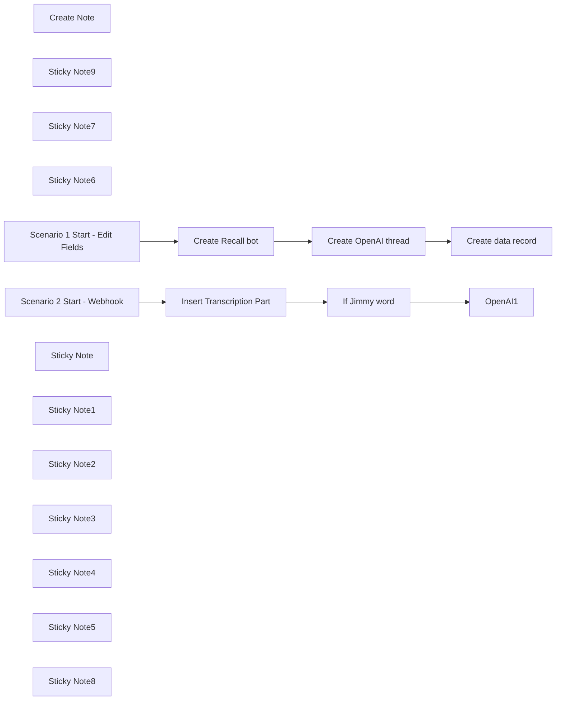

## Fluxo (.json) :

```json
{
  "nodes": [
    {
      "id": "d44489b8-8cb7-4776-8c16-a8bb01e52171",
      "name": "OpenAI1",
      "type": "@n8n/n8n-nodes-langchain.openAi",
      "position": [
        300,
        -300
      ],
      "parameters": {
        "text": "={{ \n JSON.parse($('Insert Transcription Part').item.json.dialog)\n .filter(item => item.date_updated && new Date(item.date_updated) >= new Date($('Insert Transcription Part').item.json.date_updated))\n .sort((a, b) => a.order - b.order)\n .map(item => `${item.words}\\n${item.speaker}`)\n .join('\\n\\n')\n}}",
        "memory": "threadId",
        "prompt": "define",
        "options": {},
        "resource": "assistant",
        "threadId": "={{ $json.thread_id }}",
        "assistantId": {
          "__rl": true,
          "mode": "list",
          "value": "asst_D5t6bNnNpenmfC7PmvywMqyR",
          "cachedResultName": "5minAI - Realtime Agent"
        }
      },
      "credentials": {
        "openAiApi": {
          "id": "SphXAX7rlwRLkiox",
          "name": "Test club key"
        }
      },
      "typeVersion": 1.6
    },
    {
      "id": "3425f1c1-ad68-495e-bb9a-95ea92e7cf23",
      "name": "Insert Transcription Part",
      "type": "n8n-nodes-base.postgres",
      "position": [
        -120,
        -300
      ],
      "parameters": {
        "query": "UPDATE public.data\nSET output = jsonb_set(\n output,\n '{dialog}', \n (\n COALESCE(\n (output->'dialog')::jsonb, \n '[]'::jsonb -- Initialize as empty array if dialog does not exist\n ) || jsonb_build_object(\n 'order', (COALESCE(jsonb_array_length(output->'dialog'), 0) + 1), -- Calculate the next order\n 'words', '{{ $('Webhook2').item.json.body.data.transcript.words.map(word => word.text.replace(/'/g, \"''\")).join(\" \") }}',\n 'speaker', '{{ $('Webhook2').item.json.body.data.transcript.speaker }}',\n 'language', '{{ $('Webhook2').item.json.body.data.transcript.language }}',\n 'speaker_id', ('{{ $('Webhook2').item.json.body.data.transcript.speaker_id }}')::int,\n 'date_updated', to_jsonb('{{ $now }}'::text)\n )\n )\n)\nWHERE input->>'recall_bot_id' = $1\nReturning input->>'openai_thread_id' as thread_id;",
        "options": {
          "queryReplacement": "={{ $('Scenario 2 Start - Webhook').item.json.body.data.bot_id }}"
        },
        "operation": "executeQuery"
      },
      "credentials": {
        "postgres": {
          "id": "AO9cER6p8uX7V07T",
          "name": "Postgres 5minai"
        }
      },
      "typeVersion": 2.5
    },
    {
      "id": "9bcc0605-fc35-4842-a3f4-30ef902f35c1",
      "name": "Create Note",
      "type": "n8n-nodes-base.postgresTool",
      "position": [
        180,
        -120
      ],
      "parameters": {
        "query": "UPDATE public.data\nSET output = jsonb_set(\n output,\n '{notes}', \n (\n COALESCE(\n (output->'notes')::jsonb, \n '[]'::jsonb -- Initialize as empty array if dialog does not exist\n ) || jsonb_build_object(\n 'order', (COALESCE(jsonb_array_length(output->'notes'), 0) + 1), -- Calculate the next order\n 'text', '{{ $fromAI(\"note\",\"Text of note.\") }}'\n )\n )\n)\nWHERE input->>'recall_bot_id' = $1",
        "options": {
          "queryReplacement": "={{ $('Scenario 2 Start - Webhook').item.json.body.data.bot_id }}"
        },
        "operation": "executeQuery",
        "descriptionType": "manual",
        "toolDescription": "Create note record."
      },
      "credentials": {
        "postgres": {
          "id": "AO9cER6p8uX7V07T",
          "name": "Postgres 5minai"
        }
      },
      "typeVersion": 2.5
    },
    {
      "id": "0831c139-ca4b-4b4c-aa7f-7495c4ca0110",
      "name": "Create Recall bot",
      "type": "n8n-nodes-base.httpRequest",
      "position": [
        -60,
        -980
      ],
      "parameters": {
        "url": "https://us-west-2.recall.ai/api/v1/bot",
        "method": "POST",
        "options": {},
        "jsonBody": "={\n \"meeting_url\":\"{{ $json.meeting_url }}\",\n \"transcription_options\": {\n \"provider\": \"assembly_ai\"\n }\n,\n\"real_time_transcription\": {\n \"destination_url\": \"https://n8n.lowcoding.dev/webhook/d074ca1e-52f9-47af-8587-8c24d431f9cd\"\n },\n\"automatic_leave\": {\n \"silence_detection\": {\n \"timeout\": 300, \n \"activate_after\": 600\n },\n \"bot_detection\": {\n \"using_participant_events\": {\n \"timeout\": 600, \n \"activate_after\": 1200\n }\n },\n \"waiting_room_timeout\": 600,\n \"noone_joined_timeout\": 600,\n \"everyone_left_timeout\": 2,\n \"in_call_not_recording_timeout\": 600,\n \"recording_permission_denied_timeout\": 600\n}\n}",
        "sendBody": true,
        "specifyBody": "json",
        "authentication": "genericCredentialType",
        "genericAuthType": "httpHeaderAuth"
      },
      "credentials": {
        "httpHeaderAuth": {
          "id": "lfHu7Kn7L7SH3LAF",
          "name": "Recall"
        }
      },
      "typeVersion": 4.2
    },
    {
      "id": "e1122b5b-3af5-4836-802c-40c3a0eb3c93",
      "name": "Create OpenAI thread",
      "type": "n8n-nodes-base.httpRequest",
      "position": [
        140,
        -980
      ],
      "parameters": {
        "url": "https://api.openai.com/v1/threads",
        "method": "POST",
        "options": {},
        "sendHeaders": true,
        "authentication": "predefinedCredentialType",
        "headerParameters": {
          "parameters": [
            {
              "name": "OpenAI-Beta",
              "value": "assistants=v2"
            }
          ]
        },
        "nodeCredentialType": "openAiApi"
      },
      "credentials": {
        "openAiApi": {
          "id": "SphXAX7rlwRLkiox",
          "name": "Test club key"
        }
      },
      "typeVersion": 4.2
    },
    {
      "id": "784c123d-adbb-4265-9485-2c88dd3091c2",
      "name": "Create data record",
      "type": "n8n-nodes-base.supabase",
      "position": [
        320,
        -980
      ],
      "parameters": {
        "tableId": "data",
        "fieldsUi": {
          "fieldValues": [
            {
              "fieldId": "input",
              "fieldValue": "={{ {\"openai_thread_id\": $('Create OpenAI thread').item.json.id, \"recall_bot_id\": $('Create Recall bot').item.json.id, \"meeting_url\":$('Webhook').item.json.body.meeting_url } }}"
            },
            {
              "fieldId": "output",
              "fieldValue": "={{ {\"dialog\":[]} }}"
            }
          ]
        }
      },
      "credentials": {
        "supabaseApi": {
          "id": "iVKNf5qv3ZFhq0ZV",
          "name": "Supabase 5minAI"
        }
      },
      "typeVersion": 1
    },
    {
      "id": "f455c7de-1e64-4a28-9eef-11d19c982813",
      "name": "Sticky Note9",
      "type": "n8n-nodes-base.stickyNote",
      "position": [
        -900,
        -380
      ],
      "parameters": {
        "color": 7,
        "width": 330.5152611046425,
        "height": 239.5888196628349,
        "content": "### ... or watch set up video [10 min]\n[](https://www.youtube.com/watch?v=rtaX6BMiTeo)\n"
      },
      "typeVersion": 1
    },
    {
      "id": "ea90c110-18ad-4f4b-90ab-fcb88b92e709",
      "name": "Sticky Note7",
      "type": "n8n-nodes-base.stickyNote",
      "position": [
        -1200,
        -1060
      ],
      "parameters": {
        "color": 7,
        "width": 636,
        "height": 657,
        "content": "\n## AI Agent for realtime insights on meetings\n**Made by [Mark Shcherbakov](https://www.linkedin.com/in/marklowcoding/) from community [5minAI](https://www.skool.com/5minai)**\n\nTranscribing meetings manually can be tedious and prone to error. This workflow automates the transcription process in real-time, ensuring that key discussions and decisions are accurately captured and easily accessible for later review, thus enhancing productivity and clarity in communications.\n\nThe workflow employs an AI-powered assistant to join virtual meetings and capture discussions through real-time transcription. Key functionalities include:\n- Automatic joining of meetings on platforms like Zoom, Google Meet, and others with the ability to provide real-time transcription.\n- Integration with transcription APIs (e.g., AssemblyAI) to deliver seamless and accurate capture of dialogue.\n- Structuring and storing transcriptions efficiently in a database for easy retrieval and analysis.\n\n1. **Real-Time Transcription**: The assistant captures audio during meetings and transcribes it in real-time, allowing participants to focus on discussions.\n2. **Keyword Recognition**: Key phrases can trigger specific actions, such as noting important points or making prompts to the assistant.\n3. **Structured Data Management**: The assistant maintains a database of transcriptions linked to meeting details for organized storage and quick access later."
      },
      "typeVersion": 1
    },
    {
      "id": "378c19bb-0e4a-43d3-9ba5-2a77ebfb5b83",
      "name": "Sticky Note6",
      "type": "n8n-nodes-base.stickyNote",
      "position": [
        -1200,
        -380
      ],
      "parameters": {
        "color": 7,
        "width": 280,
        "height": 626,
        "content": "### Set up steps\n\n#### Preparation\n\n1. **Create Recall.ai API key**\n2. **Setup Supabase account and table**\n```\ncreate table\n public.data (\n id uuid not null default gen_random_uuid (),\n date_created timestamp with time zone not null default (now() at time zone 'utc'::text),\n input jsonb null,\n output jsonb null,\n constraint data_pkey primary key (id),\n ) tablespace pg_default;\n\n```\n3. **Create OpenAI API key**\n\n#### Development\n\n1. **Bot Creation**: \n - Use a node to create the bot that will join meetings. Provide the meeting URL and set transcription options within the API request.\n\n2. **Authentication**: \n - Configure authentication settings via a Bearer token for interacting with your transcription service.\n\n3. **Webhook Setup**: \n - Create a webhook to receive real-time transcription updates, ensuring timely data capture during meetings.\n\n4. **Join Meeting**: \n - Set the bot to join the specified meeting and actively listen to capture conversations.\n\n5. **Transcription Handling**: \n - Combine transcription fragments into cohesive sentences and manage dialog arrays for coherence.\n\n6. **Trigger Actions on Keywords**: \n - Set up keyword recognition that can initiate requests to the OpenAI API for additional interactions based on captured dialogue.\n\n7. **Output and Summary Generation**: \n - Produce insights and summary notes from the transcriptions that can be stored back into the database for future reference."
      },
      "typeVersion": 1
    },
    {
      "id": "9a4ff741-ccfd-42e9-883e-43297a73e2c3",
      "name": "Scenario 1 Start - Edit Fields",
      "type": "n8n-nodes-base.set",
      "position": [
        -260,
        -980
      ],
      "parameters": {
        "options": {},
        "assignments": {
          "assignments": [
            {
              "id": "4891fa6e-2dd5-4433-925c-5497ec82e8ab",
              "name": "meeting_url",
              "type": "string",
              "value": "https://meet.google.com/iix-vrav-kuc"
            }
          ]
        }
      },
      "typeVersion": 3.4
    },
    {
      "id": "a4368763-b96e-45e7-884d-aa0cbae2d276",
      "name": "Scenario 2 Start - Webhook",
      "type": "n8n-nodes-base.webhook",
      "position": [
        -320,
        -300
      ],
      "webhookId": "7f176935-cb83-4147-ac14-48c8d747863a",
      "parameters": {
        "path": "d074ca1e-52f9-47af-8587-8c24d431f9cd",
        "options": {},
        "httpMethod": "POST"
      },
      "typeVersion": 2
    },
    {
      "id": "107b26af-d1d2-40c7-ad4f-7193d3ae9b70",
      "name": "If Jimmy word",
      "type": "n8n-nodes-base.if",
      "position": [
        80,
        -300
      ],
      "parameters": {
        "options": {},
        "conditions": {
          "options": {
            "version": 2,
            "leftValue": "",
            "caseSensitive": true,
            "typeValidation": "strict"
          },
          "combinator": "and",
          "conditions": [
            {
              "id": "ba6c2ae5-d0f4-4242-9cf8-97cb84335a93",
              "operator": {
                "type": "string",
                "operation": "contains"
              },
              "leftValue": "={{ $('Scenario 2 Start - Webhook').item.json.body.data.transcript.words.map(word => word.text.replace(/'/g, \"''\")).join(\" \") }}",
              "rightValue": "=Jimmy"
            }
          ]
        }
      },
      "typeVersion": 2.2
    },
    {
      "id": "49cf34f6-86cf-42cc-9da4-3efb37e6f565",
      "name": "Sticky Note",
      "type": "n8n-nodes-base.stickyNote",
      "position": [
        -380,
        -1040
      ],
      "parameters": {
        "width": 920,
        "height": 400,
        "content": "## Scenario 1\n\n"
      },
      "typeVersion": 1
    },
    {
      "id": "34660f39-6ecc-4f2d-98e8-a2c529255e98",
      "name": "Sticky Note1",
      "type": "n8n-nodes-base.stickyNote",
      "position": [
        -380,
        -360
      ],
      "parameters": {
        "width": 1020,
        "height": 420,
        "content": "## Scenario 2\n\n"
      },
      "typeVersion": 1
    },
    {
      "id": "5027e72d-2b2c-40b4-921e-c4f40d85f251",
      "name": "Sticky Note2",
      "type": "n8n-nodes-base.stickyNote",
      "position": [
        -200,
        -120
      ],
      "parameters": {
        "color": 3,
        "width": 270,
        "height": 80,
        "content": "### Replace Supabase credentials"
      },
      "typeVersion": 1
    },
    {
      "id": "dddea341-da40-4b6a-ae25-a8417e869cc9",
      "name": "Sticky Note3",
      "type": "n8n-nodes-base.stickyNote",
      "position": [
        -100,
        -780
      ],
      "parameters": {
        "color": 3,
        "width": 200,
        "height": 80,
        "content": "### Replace server location\n\n"
      },
      "typeVersion": 1
    },
    {
      "id": "e8e76c2a-f949-400e-92b2-39da8034b471",
      "name": "Sticky Note4",
      "type": "n8n-nodes-base.stickyNote",
      "position": [
        340,
        -100
      ],
      "parameters": {
        "color": 4,
        "width": 270,
        "height": 80,
        "content": "### Replace OpenAI credentials"
      },
      "typeVersion": 1
    },
    {
      "id": "729a5f6e-5aea-4908-9a82-2a7d7bea1322",
      "name": "Sticky Note5",
      "type": "n8n-nodes-base.stickyNote",
      "position": [
        140,
        -780
      ],
      "parameters": {
        "color": 3,
        "width": 290,
        "height": 80,
        "content": "### Replace credentials"
      },
      "typeVersion": 1
    },
    {
      "id": "31178e90-62ce-4bf8-8381-dc8138088889",
      "name": "Sticky Note8",
      "type": "n8n-nodes-base.stickyNote",
      "position": [
        -320,
        -780
      ],
      "parameters": {
        "color": 3,
        "width": 200,
        "height": 80,
        "content": "### Replace meeting url\n\n"
      },
      "typeVersion": 1
    }
  ],
  "pinData": {
    "Create Recall bot": [
      {
        "id": "ab35fa56-e42b-47c6-b716-eac8d12af601",
        "join_at": null,
        "metadata": {},
        "recording": null,
        "video_url": null,
        "recordings": [],
        "meeting_url": {
          "platform": "google_meet",
          "meeting_id": "zst-ymag-zoa"
        },
        "status_changes": [
          {
            "code": "ready",
            "message": null,
            "sub_code": null,
            "created_at": "2024-11-01T11:29:32.364684Z"
          }
        ],
        "meeting_metadata": null,
        "calendar_meetings": [],
        "meeting_participants": []
      }
    ],
    "Insert Transcription Part": [
      {
        "dialog": "[{\"order\": 1, \"words\": \"Wait.\", \"speaker\": \"Mark S.\", \"language\": null, \"speaker_id\": 100}, {\"order\": 2, \"words\": \"A bit.\", \"speaker\": \"Mark S.\", \"language\": null, \"speaker_id\": 100}, {\"order\": 3, \"words\": \"It's not even subtitles and it's not even a real. It's. A Google Meet.\", \"speaker\": \"Mark S.\", \"language\": null, \"speaker_id\": 100}, {\"order\": 4, \"words\": \"Same story. I wasn't prepared. I don't know what to tell you. Maybe my AI body can help me.\", \"speaker\": \"Mark S.\", \"language\": null, \"speaker_id\": 100}, {\"order\": 5, \"words\": \"What truth?\", \"speaker\": \"Mark S.\", \"language\": null, \"speaker_id\": 100}, {\"order\": 6, \"words\": \"You can get the same AI body in one day. Just drop AI in comment and I will. Send you a guide.\", \"speaker\": \"Mark S.\", \"language\": null, \"speaker_id\": 100}, {\"order\": 7, \"words\": \"As it works well.\", \"speaker\": \"Mark S.\", \"language\": \"null\", \"speaker_id\": 100}, {\"order\": 8, \"words\": \"As it works well.\", \"speaker\": \"Mark S.\", \"language\": \"null\", \"speaker_id\": 100}, {\"order\": 9, \"words\": \"As it works well.\", \"speaker\": \"Mark S.\", \"language\": \"null\", \"speaker_id\": 100}, {\"order\": 10, \"words\": \"Let's it works well.\", \"speaker\": \"Mark S.\", \"language\": \"null\", \"speaker_id\": 100}, {\"order\": 11, \"words\": \"Let's it works well.\", \"speaker\": \"Mark S.\", \"language\": \"null\", \"speaker_id\": 100}, {\"order\": 12, \"words\": \"Let's it works well.\", \"speaker\": \"Mark S.\", \"language\": \"null\", \"speaker_id\": 100, \"date_updated\": \"2024-11-22T08:41:24.164+01:00\"}, {\"order\": 13, \"words\": \"Let's it works well.\", \"speaker\": \"Mark S.\", \"language\": \"null\", \"speaker_id\": 100, \"date_updated\": \"2024-11-22T08:50:11.330+01:00\"}]",
        "thread_id": "thread_0g7p3iE7MYmDPiUuPiZP5vfR",
        "date_updated": "2024-11-22T08:37:55.751+01:00"
      }
    ],
    "Scenario 2 Start - Webhook": [
      {
        "body": {
          "data": {
            "bot_id": "0032c6e2-78e9-46e7-a2ef-41d7b853ef48",
            "transcript": {
              "words": [
                {
                  "text": "Let's",
                  "end_time": 11.88,
                  "start_time": 11.68
                },
                {
                  "text": "it",
                  "end_time": 12.12,
                  "start_time": 11.88
                },
                {
                  "text": "works",
                  "end_time": 12.44,
                  "start_time": 12.12
                },
                {
                  "text": "well.",
                  "end_time": 12.48,
                  "start_time": 12.44
                }
              ],
              "source": "smart_annotator",
              "speaker": "Mark S.",
              "is_final": true,
              "language": null,
              "speaker_id": 100,
              "original_transcript_id": 32
            },
            "recording_id": "ee1ad589-39fe-4ed5-b96f-cd14c63f3bc2"
          },
          "event": "bot.transcription"
        },
        "query": {},
        "params": {},
        "headers": {
          "host": "n8n.lowcoding.dev",
          "accept": "*/*",
          "content-type": "application/json",
          "content-length": "495",
          "accept-encoding": "gzip",
          "x-forwarded-for": "52.10.191.34",
          "x-forwarded-host": "n8n.lowcoding.dev",
          "x-forwarded-proto": "https"
        },
        "webhookUrl": "https://n8n.lowcoding.dev/webhook/d074ca1e-52f9-47af-8587-8c24d431f9cd",
        "executionMode": "production"
      }
    ]
  },
  "connections": {
    "OpenAI1": {
      "main": [
        []
      ]
    },
    "Create Note": {
      "ai_tool": [
        [
          {
            "node": "OpenAI1",
            "type": "ai_tool",
            "index": 0
          }
        ]
      ]
    },
    "If Jimmy word": {
      "main": [
        [
          {
            "node": "OpenAI1",
            "type": "main",
            "index": 0
          }
        ]
      ]
    },
    "Create Recall bot": {
      "main": [
        [
          {
            "node": "Create OpenAI thread",
            "type": "main",
            "index": 0
          }
        ],
        []
      ]
    },
    "Create data record": {
      "main": [
        []
      ]
    },
    "Create OpenAI thread": {
      "main": [
        [
          {
            "node": "Create data record",
            "type": "main",
            "index": 0
          }
        ]
      ]
    },
    "Insert Transcription Part": {
      "main": [
        [
          {
            "node": "If Jimmy word",
            "type": "main",
            "index": 0
          }
        ]
      ]
    },
    "Scenario 2 Start - Webhook": {
      "main": [
        [
          {
            "node": "Insert Transcription Part",
            "type": "main",
            "index": 0
          }
        ]
      ]
    },
    "Scenario 1 Start - Edit Fields": {
      "main": [
        [
          {
            "node": "Create Recall bot",
            "type": "main",
            "index": 0
          }
        ]
      ]
    }
  }
}
```

<a id="template-251"></a>

## Template 251 - Triagem automática de CV com IA

- **Nome:** Triagem automática de CV com IA
- **Descrição:** Fluxo automatizado para receber candidaturas, analisar currículos com um modelo de IA, registrar candidatos e notificar o RH e os candidatos.
- **Funcionalidade:** • Coleta de candidaturas via formulário: Recebe nome, e-mail, expectativa salarial, LinkedIn e currículo em PDF.
• Conversão de PDF para texto/JSON: Extrai o conteúdo do arquivo de currículo para uso na análise.
• Análise e avaliação por IA: Envia o currículo e a descrição da vaga para um modelo de linguagem que gera uma nota de compatibilidade e recomendação (resumo limitado em comprimento e em idioma configurado).
• Registro em planilha: Salva os dados do candidato e a avaliação da IA em uma planilha para controle e acompanhamento.
• Notificação ao RH: Envia e-mail automático ao RH com os detalhes do candidato e a classificação da IA.
• Confirmação ao candidato: Envia e-mail automático confirmando o recebimento do currículo.
- **Ferramentas:** • Google Gemini (PaLM) API: Modelo de linguagem usado para analisar currículos, gerar nota de compatibilidade e recomendação.
• Gmail: Serviço de envio de e-mails para confirmar recebimento ao candidato e notificar o RH.
• Google Sheets: Armazenamento e registro das informações dos candidatos e avaliações.
• Formulário web: Canal de entrada para que candidatos enviem informações e o arquivo do currículo.
• Ferramenta de extração de PDF: Converte o anexo do currículo em texto/JSON para permitir a análise automatizada.

## Fluxo visual

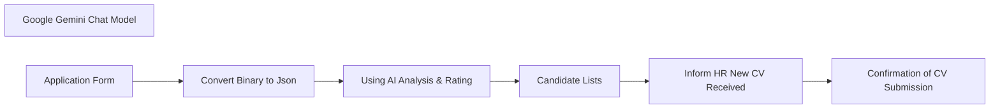

## Fluxo (.json) :

```json
{
  "id": "ES4TSw9HacxoNhLZ",
  "meta": {
    "instanceId": "5219bc76ea806909b58e13e2acac1c19192522e70dc3c90467e1800e94864105",
    "templateCredsSetupCompleted": true
  },
  "name": "AI CV Screening Workflow",
  "tags": [],
  "nodes": [
    {
      "id": "e77fbc32-5ee9-49b4-93d5-f2ffda134b08",
      "name": "Google Gemini Chat Model",
      "type": "@n8n/n8n-nodes-langchain.lmChatGoogleGemini",
      "position": [
        1230,
        530
      ],
      "parameters": {
        "options": {}
      },
      "credentials": {
        "googlePalmApi": {
          "id": "UcdfdADI6w9nkgg5",
          "name": "Google Gemini(PaLM) Api account"
        }
      },
      "typeVersion": 1
    },
    {
      "id": "9e24167f-cac6-4b98-95da-30065510d79a",
      "name": "Confirmation of CV Submission",
      "type": "n8n-nodes-base.gmail",
      "position": [
        1780,
        460
      ],
      "webhookId": "954756dc-2946-4b78-b208-06f3df612ab5",
      "parameters": {
        "sendTo": "={{ $('Application Form').item.json['E-mail'] }}",
        "message": "=Dear {{ $('Application Form').item.json['Full Name'] }}, \n\nThank you for submitting your CV. We have received it and will review it shortly. \n\nBest regards,\nMediusware",
        "options": {},
        "subject": "We Have Received Your CV"
      },
      "credentials": {
        "gmailOAuth2": {
          "id": "taFlf0vD5S4QlOKM",
          "name": "Gmail account"
        }
      },
      "typeVersion": 2.1
    },
    {
      "id": "ff49d370-b4eb-4426-b396-763455e647e7",
      "name": "Inform HR New CV Received",
      "type": "n8n-nodes-base.gmail",
      "position": [
        1760,
        200
      ],
      "webhookId": "e969a9f5-631b-4719-a4f6-87e6063cef6a",
      "parameters": {
        "sendTo": "sarfaraz@mediusaware.com",
        "message": "=Hello HR,\n\nA new CV has been successfully received in our system. Please review the candidate's details at your earliest convenience.\n\nCandidate Name: {{ $('Application Form').item.json['Full Name'] }}\nCandidate E-mail: {{ $('Application Form').item.json['E-mail'] }}\nCandidate Linkedin: {{ $('Application Form').item.json.Linkedin }}\nCandidate Expectation: {{ $('Application Form').item.json.Expectation }}\nCandidate AI Rating: {{ $('Using AI Analysis & Rating').item.json.text }}\n\nThank you for your attention.\n\nBest regards,\nAutomated CV Screening",
        "options": {},
        "subject": "New Candidate CV Awaiting Review"
      },
      "credentials": {
        "gmailOAuth2": {
          "id": "taFlf0vD5S4QlOKM",
          "name": "Gmail account"
        }
      },
      "typeVersion": 2.1
    },
    {
      "id": "8479fa4c-10bc-4914-896d-f5b00d063fa8",
      "name": "Using AI Analysis & Rating",
      "type": "@n8n/n8n-nodes-langchain.chainLlm",
      "position": [
        1320,
        240
      ],
      "parameters": {
        "text": "={{ $json.text }}",
        "messages": {
          "messageValues": [
            {
              "message": "Rule 1 : Do not exceed maximum of 75 words. As an AI with advanced capabilities in talent acquisition and human resources, your task is to conduct a thorough and intricate analysis of a candidate's resume or CV against a specific job description. You will assist hiring professionals in discerning the alignment between the candidate's skills, experience, qualifications, and the requirements of the job. Your expert insights will equip employers with a lucid understanding of the candidate's suitability for the role. Very important for you to write output text in ${output_language} language. It's VERY IMPORTANT for me for text be in ${output_language} or I will be fired. Your analysis should follow this structured format: 1. **Compatibility Rating**: Propose an overall compatibility rating on a scale from 1 (not compatible) to 10 (perfect fit). Support your rating by elucidating the rationale behind it. 2. **Recommendation**: Informed by your analysis and compatibility rating, offer a recommendation on whether the employer should consider this candidate for an interview. Furnish a well-argued explanation for your recommendation. Remember, your analysis should be comprehensive, professional, and actionable. It should equip an employer with a vivid understanding of the candidate's suitability for the role. This isn't merely about ticking off boxes; it's about illustrating a comprehensive picture of how well the candidate might fit into the role and complement the existing team. Here is your task: Analyze the compatibility of the following candidate's resume with the provided job description. Endeavor to apply your deep understanding of talent evaluation to provide the most insightful analysis. Job description: \"Software Engineer\" Resume: ${resume}\nNo Markdown Please, only plain text. Please no double '**'"
            }
          ]
        },
        "promptType": "define"
      },
      "typeVersion": 1.5
    },
    {
      "id": "da0fd18b-2420-471e-b930-9aabc45bc2ca",
      "name": "Convert Binary to Json",
      "type": "n8n-nodes-base.extractFromFile",
      "position": [
        1080,
        220
      ],
      "parameters": {
        "options": {},
        "operation": "pdf",
        "binaryPropertyName": "Your_Resume_CV"
      },
      "retryOnFail": false,
      "typeVersion": 1
    },
    {
      "id": "bc5480c1-d9c2-414b-8cd4-0b3e49d4dde9",
      "name": "Application Form",
      "type": "n8n-nodes-base.formTrigger",
      "position": [
        820,
        380
      ],
      "webhookId": "0cd422d3-e69f-4ec0-92ab-05362808c4da",
      "parameters": {
        "options": {},
        "formTitle": "Application for Software Engineer Position",
        "formFields": {
          "values": [
            {
              "fieldLabel": "Full Name",
              "requiredField": true
            },
            {
              "fieldLabel": "E-mail",
              "requiredField": true
            },
            {
              "fieldLabel": "Expectation",
              "placeholder": "2000-3000$",
              "requiredField": true
            },
            {
              "fieldLabel": "Linkedin",
              "requiredField": true
            },
            {
              "fieldType": "file",
              "fieldLabel": "Your Resume/CV",
              "requiredField": true,
              "acceptFileTypes": ".pdf"
            }
          ]
        }
      },
      "typeVersion": 2.2
    },
    {
      "id": "d2dfbf1e-8d88-49e6-940d-e1717de97b30",
      "name": "Candidate Lists",
      "type": "n8n-nodes-base.googleSheets",
      "position": [
        1540,
        480
      ],
      "parameters": {
        "columns": {
          "value": {
            "CV": "={{ $('Application Form').item.json['Your Resume/CV'][0].filename }}",
            "E-mail": "={{ $('Application Form').item.json['E-mail'] }}",
            "Linkedin": "={{ $('Application Form').item.json.Linkedin }}",
            "AI Rating": "={{ $json.text }}",
            "Full Name": "={{ $('Application Form').item.json['Full Name'] }}",
            "Expectation": "={{ $('Application Form').item.json.Expectation }}"
          },
          "schema": [
            {
              "id": "CV",
              "type": "string",
              "display": true,
              "required": false,
              "displayName": "CV",
              "defaultMatch": false,
              "canBeUsedToMatch": true
            },
            {
              "id": "Full Name",
              "type": "string",
              "display": true,
              "required": false,
              "displayName": "Full Name",
              "defaultMatch": false,
              "canBeUsedToMatch": true
            },
            {
              "id": "E-mail",
              "type": "string",
              "display": true,
              "required": false,
              "displayName": "E-mail",
              "defaultMatch": false,
              "canBeUsedToMatch": true
            },
            {
              "id": "Expectation",
              "type": "string",
              "display": true,
              "required": false,
              "displayName": "Expectation",
              "defaultMatch": false,
              "canBeUsedToMatch": true
            },
            {
              "id": "Linkedin",
              "type": "string",
              "display": true,
              "required": false,
              "displayName": "Linkedin",
              "defaultMatch": false,
              "canBeUsedToMatch": true
            },
            {
              "id": "AI Rating",
              "type": "string",
              "display": true,
              "required": false,
              "displayName": "AI Rating",
              "defaultMatch": false,
              "canBeUsedToMatch": true
            }
          ],
          "mappingMode": "defineBelow",
          "matchingColumns": []
        },
        "options": {},
        "operation": "append",
        "sheetName": {
          "__rl": true,
          "mode": "list",
          "value": "gid=0",
          "cachedResultUrl": "https://docs.google.com/spreadsheets/d/1y4FFMXTuznSf2wWUraK57eBJnu4MVtgkxrGYRzRMwDQ/edit#gid=0",
          "cachedResultName": "পত্রক1"
        },
        "documentId": {
          "__rl": true,
          "mode": "list",
          "value": "1y4FFMXTuznSf2wWUraK57eBJnu4MVtgkxrGYRzRMwDQ",
          "cachedResultUrl": "https://docs.google.com/spreadsheets/d/1y4FFMXTuznSf2wWUraK57eBJnu4MVtgkxrGYRzRMwDQ/edit?usp=drivesdk",
          "cachedResultName": "CV of Software Engineers"
        }
      },
      "credentials": {
        "googleSheetsOAuth2Api": {
          "id": "YdlTTXiu8194dEFE",
          "name": "Google Sheets account"
        }
      },
      "typeVersion": 4.5
    }
  ],
  "active": true,
  "pinData": {},
  "settings": {
    "executionOrder": "v1"
  },
  "versionId": "2036fff4-ab9c-4981-a8b4-44be4654630d",
  "connections": {
    "Candidate Lists": {
      "main": [
        [
          {
            "node": "Inform HR New CV Received",
            "type": "main",
            "index": 0
          }
        ]
      ]
    },
    "Application Form": {
      "main": [
        [
          {
            "node": "Convert Binary to Json",
            "type": "main",
            "index": 0
          }
        ]
      ]
    },
    "Convert Binary to Json": {
      "main": [
        [
          {
            "node": "Using AI Analysis & Rating",
            "type": "main",
            "index": 0
          }
        ]
      ]
    },
    "Google Gemini Chat Model": {
      "ai_languageModel": [
        [
          {
            "node": "Using AI Analysis & Rating",
            "type": "ai_languageModel",
            "index": 0
          }
        ]
      ]
    },
    "Inform HR New CV Received": {
      "main": [
        [
          {
            "node": "Confirmation of CV Submission",
            "type": "main",
            "index": 0
          }
        ]
      ]
    },
    "Using AI Analysis & Rating": {
      "main": [
        [
          {
            "node": "Candidate Lists",
            "type": "main",
            "index": 0
          }
        ]
      ]
    }
  }
}
```

<a id="template-252"></a>

## Template 252 - Gestão automática de e-mails com IA

- **Nome:** Gestão automática de e-mails com IA
- **Descrição:** Fluxo que recebe e-mails, resume o conteúdo, consulta conhecimento da empresa para contexto, gera respostas concisas com modelos de linguagem, solicita aprovação humana quando necessário e envia as respostas finais.
- **Funcionalidade:** • Recepção de e-mails via conta IMAP: Dispara o fluxo ao chegar uma nova mensagem.
• Conversão para Markdown/HTML: Normaliza o corpo do e-mail para melhor compreensão dos modelos de linguagem.
• Resumo automático do e-mail: Gera um resumo conciso (máx. 100 palavras) do conteúdo recebido.
• Recuperação de conhecimento (RAG): Consulta uma base vetorial com informações da empresa para enriquecer a resposta.
• Geração de resposta com LLM: Cria uma resposta profissional e concisa (até 100 palavras) baseada no resumo e no conhecimento recuperado.
• Envio de rascunho para aprovação humana via Gmail: Envia o rascunho e aguarda feedback do revisor.
• Classificação de feedback humano: Identifica se o feedback aprova o rascunho ou solicita alterações.
• Revisão e edição do e-mail com base no feedback: Reescreve o corpo do e-mail considerando as instruções humanas.
• Envio final via servidor SMTP: Responde ao remetente original com o e-mail aprovado.
• Pipeline de ingestão de documentos: Cria/atualiza coleção vetorial, baixa arquivos do Google Drive, gera embeddings e insere documentos na base vetorial.
- **Ferramentas:** • Conta IMAP (info@n3witalia.com): Recebe e monitora mensagens de entrada para iniciar o fluxo.
• Servidor SMTP (info@n3witalia.com): Envia as respostas finais aos remetentes.
• Gmail (conta interna): Envia rascunhos e aguarda resposta humana para aprovação (funcionalidade de envio e espera).
• OpenAI: Modelo de linguagem para geração das respostas e serviço de embeddings para criar vetores de documentos.
• Qdrant (serviço de vetor): Armazena e recupera vetores de documentos da base de conhecimento da empresa.
• Google Drive: Fonte de documentos que são baixados e vetorizados para alimentar a base de conhecimento.
• DeepSeek (modelo de chat opcional): Utilizado como alternativa/auxílio na sumarização e processamento de texto.

## Fluxo visual

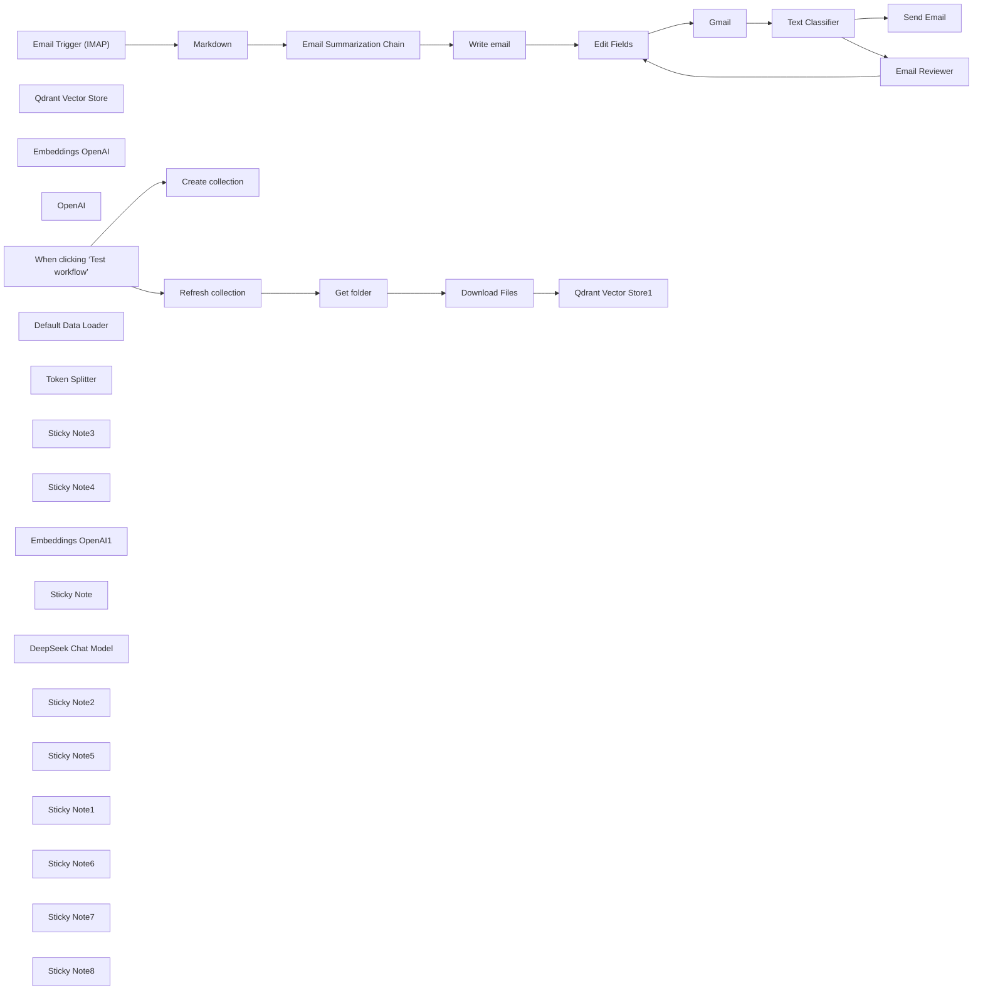

## Fluxo (.json) :

```json
{
  "id": "nkPjDxMrrkKbgHaV",
  "meta": {
    "instanceId": "a4bfc93e975ca233ac45ed7c9227d84cf5a2329310525917adaf3312e10d5462",
    "templateCredsSetupCompleted": true
  },
  "name": "Effortless Email Management with AI",
  "tags": [],
  "nodes": [
    {
      "id": "9d77e26f-de2b-4bd4-b0f0-9924a8f459a6",
      "name": "Email Trigger (IMAP)",
      "type": "n8n-nodes-base.emailReadImap",
      "position": [
        -2000,
        -180
      ],
      "parameters": {
        "options": {}
      },
      "credentials": {
        "imap": {
          "id": "k31W9oGddl9pMDy4",
          "name": "IMAP info@n3witalia.com"
        }
      },
      "typeVersion": 2
    },
    {
      "id": "cf2d020b-b125-4a20-8694-8ed0f7acf755",
      "name": "Markdown",
      "type": "n8n-nodes-base.markdown",
      "position": [
        -1740,
        -180
      ],
      "parameters": {
        "html": "={{ $json.textHtml }}",
        "options": {}
      },
      "typeVersion": 1
    },
    {
      "id": "41bfceff-0155-4643-be60-ee301e2d69e1",
      "name": "Send Email",
      "type": "n8n-nodes-base.emailSend",
      "position": [
        400,
        -320
      ],
      "webhookId": "a79ae1b4-648c-4cb4-b6cd-04ea3c1d9314",
      "parameters": {
        "html": "={{ $('Edit Fields').item.json.email }}",
        "options": {},
        "subject": "=Re: {{ $('Email Trigger (IMAP)').item.json.subject }}",
        "toEmail": "={{ $('Email Trigger (IMAP)').item.json.from }}",
        "fromEmail": "={{ $('Email Trigger (IMAP)').item.json.to }}"
      },
      "credentials": {
        "smtp": {
          "id": "hRjP3XbDiIQqvi7x",
          "name": "SMTP info@n3witalia.com"
        }
      },
      "typeVersion": 2.1
    },
    {
      "id": "2aff581a-8b64-405c-b62f-74bf189fd7b1",
      "name": "Qdrant Vector Store",
      "type": "@n8n/n8n-nodes-langchain.vectorStoreQdrant",
      "position": [
        -320,
        600
      ],
      "parameters": {
        "mode": "retrieve-as-tool",
        "options": {},
        "toolName": "company_knowladge_base",
        "toolDescription": "Extracts information regarding the request made.",
        "qdrantCollection": {
          "__rl": true,
          "mode": "id",
          "value": "=COLLECTION"
        },
        "includeDocumentMetadata": false
      },
      "credentials": {
        "qdrantApi": {
          "id": "iyQ6MQiVaF3VMBmt",
          "name": "QdrantApi account"
        }
      },
      "typeVersion": 1
    },
    {
      "id": "6e3f6df0-8924-47d9-855c-51205d19e86d",
      "name": "Embeddings OpenAI",
      "type": "@n8n/n8n-nodes-langchain.embeddingsOpenAi",
      "position": [
        -440,
        800
      ],
      "parameters": {
        "options": {}
      },
      "credentials": {
        "openAiApi": {
          "id": "CDX6QM4gLYanh0P4",
          "name": "OpenAi account"
        }
      },
      "typeVersion": 1.2
    },
    {
      "id": "37ac411b-4a74-44d1-917e-b07d1c9ca221",
      "name": "Email Summarization Chain",
      "type": "@n8n/n8n-nodes-langchain.chainSummarization",
      "position": [
        -1480,
        -180
      ],
      "parameters": {
        "options": {
          "binaryDataKey": "={{ $json.data }}",
          "summarizationMethodAndPrompts": {
            "values": {
              "prompt": "=Write a concise summary of the following in max 100 words:\n\n\"{{ $json.data }}\"\n\nDo not enter the total number of words used.",
              "combineMapPrompt": "=Write a concise summary of the following in max 100 words:\n\n\"{{ $json.data }}\"\n\nDo not enter the total number of words used."
            }
          }
        },
        "operationMode": "nodeInputBinary"
      },
      "typeVersion": 2
    },
    {
      "id": "91edbac9-847b-4f31-a8dd-09418bd93642",
      "name": "Write email",
      "type": "@n8n/n8n-nodes-langchain.agent",
      "position": [
        -1040,
        -180
      ],
      "parameters": {
        "text": "=Write the text to reply to the following email:\n\n{{ $json.response.text }}",
        "options": {
          "systemMessage": "You are an expert at answering emails. You need to answer them professionally based on the information you have. This is a business email. Be concise and never exceed 100 words. Only the body of the email, not create the subject"
        },
        "promptType": "define",
        "hasOutputParser": true
      },
      "typeVersion": 1.7
    },
    {
      "id": "1da0e72a-db97-4216-a1a5-038cebaf7e10",
      "name": "OpenAI",
      "type": "@n8n/n8n-nodes-langchain.lmChatOpenAi",
      "position": [
        -180,
        280
      ],
      "parameters": {
        "model": {
          "__rl": true,
          "mode": "list",
          "value": "gpt-4o-mini",
          "cachedResultName": "gpt-4o-mini"
        },
        "options": {}
      },
      "credentials": {
        "openAiApi": {
          "id": "CDX6QM4gLYanh0P4",
          "name": "OpenAi account"
        }
      },
      "typeVersion": 1.2
    },
    {
      "id": "af2d6284-4c8f-4a07-b689-d0f55aaabd26",
      "name": "Gmail",
      "type": "n8n-nodes-base.gmail",
      "position": [
        -300,
        -180
      ],
      "webhookId": "d6dd2e7c-90ea-4b65-9c64-523d2541a054",
      "parameters": {
        "sendTo": "info@n3w.it",
        "message": "=<h3>MESSAGE</h3>\n{{ $('Email Trigger (IMAP)').item.json.textHtml }}\n\n<h3>AI RESPONSE</h3>\n{{ $json.email }}",
        "options": {},
        "subject": "=[Approval Required] {{ $('Email Trigger (IMAP)').item.json.subject }}",
        "operation": "sendAndWait",
        "responseType": "freeText"
      },
      "credentials": {
        "gmailOAuth2": {
          "id": "nyuHvSX5HuqfMPlW",
          "name": "Gmail account (n3w.it)"
        }
      },
      "typeVersion": 2.1
    },
    {
      "id": "aaccc4a6-ce53-4813-8247-65bd1a9d5639",
      "name": "Text Classifier",
      "type": "@n8n/n8n-nodes-langchain.textClassifier",
      "position": [
        -60,
        -180
      ],
      "parameters": {
        "options": {
          "systemPromptTemplate": "Please classify the text provided by the user into one of the following categories: {categories}, and use the provided formatting instructions below. Don't explain, and only output the json."
        },
        "inputText": "={{ $json.data.text }}",
        "categories": {
          "categories": [
            {
              "category": "Approved",
              "description": "The email has been reviewed and accepted as-is. The human explicitly or implicity express approva, indicating that no changes ar needed.\n\nExample:\n\"Ok\",\n\"Approvato\",\n\"Invia\""
            },
            {
              "category": "Declined",
              "description": "The email has been reviewd, but the human request modifications before it sent link tweaks, removing parts, rewording etc... This could include suggested edits, rewording or major revision."
            }
          ]
        }
      },
      "typeVersion": 1
    },
    {
      "id": "b46de5d9-1a2e-4d28-930b-e18fb1d7876e",
      "name": "Edit Fields",
      "type": "n8n-nodes-base.set",
      "position": [
        -580,
        -180
      ],
      "parameters": {
        "options": {},
        "assignments": {
          "assignments": [
            {
              "id": "35d7c303-42f4-4dd1-b41e-6eb087c23c3d",
              "name": "email",
              "type": "string",
              "value": "={{ $json.output }}"
            }
          ]
        }
      },
      "typeVersion": 3.4
    },
    {
      "id": "36ce51c6-8ee1-4230-84c0-40e259eafb1a",
      "name": "When clicking ‘Test workflow’",
      "type": "n8n-nodes-base.manualTrigger",
      "position": [
        -1340,
        -1300
      ],
      "parameters": {},
      "typeVersion": 1
    },
    {
      "id": "21a0c991-65dc-483e-9b98-5cedaba7ae13",
      "name": "Create collection",
      "type": "n8n-nodes-base.httpRequest",
      "position": [
        -1040,
        -1440
      ],
      "parameters": {
        "url": "https://QDRANTURL/collections/COLLECTION",
        "method": "POST",
        "options": {},
        "jsonBody": "{\n \"filter\": {}\n}",
        "sendBody": true,
        "sendHeaders": true,
        "specifyBody": "json",
        "authentication": "genericCredentialType",
        "genericAuthType": "httpHeaderAuth",
        "headerParameters": {
          "parameters": [
            {
              "name": "Content-Type",
              "value": "application/json"
            }
          ]
        }
      },
      "credentials": {
        "httpHeaderAuth": {
          "id": "qhny6r5ql9wwotpn",
          "name": "Qdrant API (Hetzner)"
        }
      },
      "typeVersion": 4.2
    },
    {
      "id": "9a048d7d-bcdf-40b7-b33a-94b811083eac",
      "name": "Refresh collection",
      "type": "n8n-nodes-base.httpRequest",
      "position": [
        -1040,
        -1180
      ],
      "parameters": {
        "url": "https://QDRANTURL/collections/COLLECTION/points/delete",
        "method": "POST",
        "options": {},
        "jsonBody": "{\n \"filter\": {}\n}",
        "sendBody": true,
        "sendHeaders": true,
        "specifyBody": "json",
        "authentication": "genericCredentialType",
        "genericAuthType": "httpHeaderAuth",
        "headerParameters": {
          "parameters": [
            {
              "name": "Content-Type",
              "value": "application/json"
            }
          ]
        }
      },
      "credentials": {
        "httpHeaderAuth": {
          "id": "qhny6r5ql9wwotpn",
          "name": "Qdrant API (Hetzner)"
        }
      },
      "typeVersion": 4.2
    },
    {
      "id": "db494d2d-5390-4f83-9b87-3409fef31a7d",
      "name": "Get folder",
      "type": "n8n-nodes-base.googleDrive",
      "position": [
        -820,
        -1180
      ],
      "parameters": {
        "filter": {
          "driveId": {
            "__rl": true,
            "mode": "list",
            "value": "My Drive",
            "cachedResultUrl": "https://drive.google.com/drive/my-drive",
            "cachedResultName": "My Drive"
          },
          "folderId": {
            "__rl": true,
            "mode": "id",
            "value": "=test-whatsapp"
          }
        },
        "options": {},
        "resource": "fileFolder"
      },
      "credentials": {
        "googleDriveOAuth2Api": {
          "id": "HEy5EuZkgPZVEa9w",
          "name": "Google Drive account"
        }
      },
      "typeVersion": 3
    },
    {
      "id": "e30dbe6f-482e-47f9-b5b8-62c1113e6c8b",
      "name": "Download Files",
      "type": "n8n-nodes-base.googleDrive",
      "position": [
        -600,
        -1180
      ],
      "parameters": {
        "fileId": {
          "__rl": true,
          "mode": "id",
          "value": "={{ $json.id }}"
        },
        "options": {
          "googleFileConversion": {
            "conversion": {
              "docsToFormat": "text/plain"
            }
          }
        },
        "operation": "download"
      },
      "credentials": {
        "googleDriveOAuth2Api": {
          "id": "HEy5EuZkgPZVEa9w",
          "name": "Google Drive account"
        }
      },
      "typeVersion": 3
    },
    {
      "id": "492d48d8-4997-4f04-902b-041da3210417",
      "name": "Default Data Loader",
      "type": "@n8n/n8n-nodes-langchain.documentDefaultDataLoader",
      "position": [
        -200,
        -980
      ],
      "parameters": {
        "options": {},
        "dataType": "binary"
      },
      "typeVersion": 1
    },
    {
      "id": "0cf45d10-3cbf-4eb6-ab30-11f264b3aa8d",
      "name": "Token Splitter",
      "type": "@n8n/n8n-nodes-langchain.textSplitterTokenSplitter",
      "position": [
        -240,
        -820
      ],
      "parameters": {
        "chunkSize": 300,
        "chunkOverlap": 30
      },
      "typeVersion": 1
    },
    {
      "id": "7d60f569-c34e-49a8-ba9a-88cf33083136",
      "name": "Sticky Note3",
      "type": "n8n-nodes-base.stickyNote",
      "position": [
        -840,
        -1500
      ],
      "parameters": {
        "color": 6,
        "width": 880,
        "height": 220,
        "content": "# STEP 1\n\n## Create Qdrant Collection\nChange:\n- QDRANTURL\n- COLLECTION"
      },
      "typeVersion": 1
    },
    {
      "id": "e86b18c4-d7e8-4e81-b520-dbd8125edf38",
      "name": "Sticky Note4",
      "type": "n8n-nodes-base.stickyNote",
      "position": [
        -1060,
        -1240
      ],
      "parameters": {
        "color": 4,
        "width": 620,
        "height": 400,
        "content": "# STEP 2\n\n\n\n\n\n\n\n\n\n\n\n\n## Documents vectorization with Qdrant and Google Drive\nChange:\n- QDRANTURL\n- COLLECTION"
      },
      "typeVersion": 1
    },
    {
      "id": "05f65120-ef31-4c67-ac18-e68a8353909c",
      "name": "Qdrant Vector Store1",
      "type": "@n8n/n8n-nodes-langchain.vectorStoreQdrant",
      "position": [
        -360,
        -1180
      ],
      "parameters": {
        "mode": "insert",
        "options": {},
        "qdrantCollection": {
          "__rl": true,
          "mode": "id",
          "value": "=COLLECTION"
        }
      },
      "credentials": {
        "qdrantApi": {
          "id": "iyQ6MQiVaF3VMBmt",
          "name": "QdrantApi account"
        }
      },
      "typeVersion": 1
    },
    {
      "id": "c15fd52f-b142-408e-af06-aeed10a1cf85",
      "name": "Embeddings OpenAI1",
      "type": "@n8n/n8n-nodes-langchain.embeddingsOpenAi",
      "position": [
        -380,
        -980
      ],
      "parameters": {
        "options": {}
      },
      "credentials": {
        "openAiApi": {
          "id": "CDX6QM4gLYanh0P4",
          "name": "OpenAi account"
        }
      },
      "typeVersion": 1.1
    },
    {
      "id": "3e47224f-3deb-450b-b825-f16c5f860f28",
      "name": "Sticky Note",
      "type": "n8n-nodes-base.stickyNote",
      "position": [
        -2020,
        -600
      ],
      "parameters": {
        "color": 3,
        "width": 580,
        "height": 260,
        "content": "# STEP 3 - MAIN FLOW\n\n\n## How it works\nThis workflow automates the handling of incoming emails, summarizes their content, generates appropriate responses using a retrieval-augmented generation (RAG) approach, and obtains approval or suggestions before sending replies. \n\nYou can quickly integrate Gmail and Outlook via the appropriate trigger nodes"
      },
      "typeVersion": 1
    },
    {
      "id": "63097039-58cb-4e0f-9fb6-6bf868275519",
      "name": "DeepSeek Chat Model",
      "type": "@n8n/n8n-nodes-langchain.lmChatDeepSeek",
      "position": [
        -1560,
        40
      ],
      "parameters": {
        "options": {}
      },
      "credentials": {
        "deepSeekApi": {
          "id": "sxh1rfZxonXV83hS",
          "name": "DeepSeek account"
        }
      },
      "typeVersion": 1
    },
    {
      "id": "c86d6eeb-cf08-429f-b5b4-60b317071035",
      "name": "Sticky Note2",
      "type": "n8n-nodes-base.stickyNote",
      "position": [
        -1500,
        -260
      ],
      "parameters": {
        "width": 320,
        "height": 240,
        "content": "Chain that summarizes the received email"
      },
      "typeVersion": 1
    },
    {
      "id": "4afc8b00-d1e5-473c-a71e-1299c84c546e",
      "name": "Sticky Note5",
      "type": "n8n-nodes-base.stickyNote",
      "position": [
        -1060,
        -260
      ],
      "parameters": {
        "width": 340,
        "height": 240,
        "content": "Agent that retrieves business information from a vector database and processes the response"
      },
      "typeVersion": 1
    },
    {
      "id": "be1762ff-729b-4b83-9139-16f835b748f2",
      "name": "Sticky Note1",
      "type": "n8n-nodes-base.stickyNote",
      "position": [
        -1800,
        -260
      ],
      "parameters": {
        "height": 240,
        "content": "Convert email to Markdown format for better understanding of LLM models"
      },
      "typeVersion": 1
    },
    {
      "id": "f818ede7-895a-4860-91d3-f08cc32ec0e3",
      "name": "Sticky Note6",
      "type": "n8n-nodes-base.stickyNote",
      "position": [
        -380,
        -380
      ],
      "parameters": {
        "color": 4,
        "height": 360,
        "content": "## IMPORTANT\n\nFor the \"Send Draft\" node, you need to send the draft email to a Gmail address because it is the only one that allows the \"Send and wait for response\" function."
      },
      "typeVersion": 1
    },
    {
      "id": "929b525a-912b-4f7b-a6e7-dfeb88a446c8",
      "name": "Sticky Note7",
      "type": "n8n-nodes-base.stickyNote",
      "position": [
        -100,
        -260
      ],
      "parameters": {
        "width": 360,
        "height": 240,
        "content": "Based on the suggestion received, the text classifier can understand whether the feedback received approves the generated email or not."
      },
      "typeVersion": 1
    },
    {
      "id": "2468e643-013f-4925-ab35-c8ef4ee6eed2",
      "name": "Email Reviewer",
      "type": "@n8n/n8n-nodes-langchain.agent",
      "position": [
        380,
        -40
      ],
      "parameters": {
        "text": "=Review at the following email:\n{{ $('Edit Fields').item.json.email }}\n\nFeedback from human:\n{{ $json.data.text }}",
        "options": {
          "systemMessage": "If you are an expert in reviewing emails before sending them. You need to review and structure them in such a way that you can send them. It must be in HTML format and you can insert (if you think it is appropriate) only HTML characters such as <br>, <b>, <i>, <p> where necessary. Be concise and never exceed 100 words. Only the body of the email"
        },
        "promptType": "define",
        "hasOutputParser": true
      },
      "typeVersion": 1.7
    },
    {
      "id": "ecd9d3f8-2e79-4e5f-a73d-48de60441376",
      "name": "Sticky Note8",
      "type": "n8n-nodes-base.stickyNote",
      "position": [
        340,
        -120
      ],
      "parameters": {
        "width": 340,
        "height": 220,
        "content": "The Email Reviewer agent, taking inspiration from human feedback, rewrites the email"
      },
      "typeVersion": 1
    }
  ],
  "active": false,
  "pinData": {},
  "settings": {
    "executionOrder": "v1"
  },
  "versionId": "de11da52-1513-4797-8070-b64e84b84158",
  "connections": {
    "Gmail": {
      "main": [
        [
          {
            "node": "Text Classifier",
            "type": "main",
            "index": 0
          }
        ]
      ]
    },
    "OpenAI": {
      "ai_languageModel": [
        [
          {
            "node": "Write email",
            "type": "ai_languageModel",
            "index": 0
          },
          {
            "node": "Email Reviewer",
            "type": "ai_languageModel",
            "index": 0
          },
          {
            "node": "Text Classifier",
            "type": "ai_languageModel",
            "index": 0
          }
        ]
      ]
    },
    "Markdown": {
      "main": [
        [
          {
            "node": "Email Summarization Chain",
            "type": "main",
            "index": 0
          }
        ]
      ]
    },
    "Get folder": {
      "main": [
        [
          {
            "node": "Download Files",
            "type": "main",
            "index": 0
          }
        ]
      ]
    },
    "Edit Fields": {
      "main": [
        [
          {
            "node": "Gmail",
            "type": "main",
            "index": 0
          }
        ]
      ]
    },
    "Write email": {
      "main": [
        [
          {
            "node": "Edit Fields",
            "type": "main",
            "index": 0
          }
        ]
      ]
    },
    "Download Files": {
      "main": [
        [
          {
            "node": "Qdrant Vector Store1",
            "type": "main",
            "index": 0
          }
        ]
      ]
    },
    "Email Reviewer": {
      "main": [
        [
          {
            "node": "Edit Fields",
            "type": "main",
            "index": 0
          }
        ]
      ]
    },
    "Token Splitter": {
      "ai_textSplitter": [
        [
          {
            "node": "Default Data Loader",
            "type": "ai_textSplitter",
            "index": 0
          }
        ]
      ]
    },
    "Text Classifier": {
      "main": [
        [
          {
            "node": "Send Email",
            "type": "main",
            "index": 0
          }
        ],
        [
          {
            "node": "Email Reviewer",
            "type": "main",
            "index": 0
          }
        ]
      ]
    },
    "Embeddings OpenAI": {
      "ai_embedding": [
        [
          {
            "node": "Qdrant Vector Store",
            "type": "ai_embedding",
            "index": 0
          }
        ]
      ]
    },
    "Embeddings OpenAI1": {
      "ai_embedding": [
        [
          {
            "node": "Qdrant Vector Store1",
            "type": "ai_embedding",
            "index": 0
          }
        ]
      ]
    },
    "Refresh collection": {
      "main": [
        [
          {
            "node": "Get folder",
            "type": "main",
            "index": 0
          }
        ]
      ]
    },
    "DeepSeek Chat Model": {
      "ai_languageModel": [
        [
          {
            "node": "Email Summarization Chain",
            "type": "ai_languageModel",
            "index": 0
          }
        ]
      ]
    },
    "Default Data Loader": {
      "ai_document": [
        [
          {
            "node": "Qdrant Vector Store1",
            "type": "ai_document",
            "index": 0
          }
        ]
      ]
    },
    "Qdrant Vector Store": {
      "ai_tool": [
        [
          {
            "node": "Write email",
            "type": "ai_tool",
            "index": 0
          },
          {
            "node": "Email Reviewer",
            "type": "ai_tool",
            "index": 0
          }
        ]
      ]
    },
    "Email Trigger (IMAP)": {
      "main": [
        [
          {
            "node": "Markdown",
            "type": "main",
            "index": 0
          }
        ]
      ]
    },
    "Email Summarization Chain": {
      "main": [
        [
          {
            "node": "Write email",
            "type": "main",
            "index": 0
          }
        ]
      ]
    },
    "When clicking ‘Test workflow’": {
      "main": [
        [
          {
            "node": "Create collection",
            "type": "main",
            "index": 0
          },
          {
            "node": "Refresh collection",
            "type": "main",
            "index": 0
          }
        ]
      ]
    }
  }
}
```

<a id="template-253"></a>

## Template 253 - Busca todos os registros do Zoho CRM manualmente

- **Nome:** Busca todos os registros do Zoho CRM manualmente
- **Descrição:** Ao ser acionado manualmente, o fluxo recupera todos os registros do Zoho CRM usando as credenciais configuradas.
- **Funcionalidade:** • Acionamento manual: Inicia a execução do fluxo quando o usuário clica em executar.
• Recuperação em massa de registros: Busca todos os itens disponíveis no Zoho CRM (operação getAll).
• Autenticação segura: Usa credenciais configuradas para acessar a API do CRM.
- **Ferramentas:** • Zoho CRM: Plataforma de gerenciamento de relacionamento com clientes usada para armazenar e recuperar registros via API.

## Fluxo visual

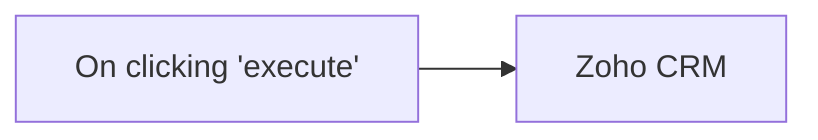

## Fluxo (.json) :

```json
{
  "nodes": [
    {
      "name": "On clicking 'execute'",
      "type": "n8n-nodes-base.manualTrigger",
      "position": [
        250,
        300
      ],
      "parameters": {},
      "typeVersion": 1
    },
    {
      "name": "Zoho CRM",
      "type": "n8n-nodes-base.zohoCrm",
      "position": [
        450,
        300
      ],
      "parameters": {
        "options": {},
        "operation": "getAll"
      },
      "credentials": {
        "zohoOAuth2Api": "zoho_creds"
      },
      "typeVersion": 1
    }
  ],
  "connections": {
    "On clicking 'execute'": {
      "main": [
        [
          {
            "node": "Zoho CRM",
            "type": "main",
            "index": 0
          }
        ]
      ]
    }
  }
}
```

<a id="template-254"></a>

## Template 254 - Notificações de menções no Twitter para Rocket.Chat

- **Nome:** Notificações de menções no Twitter para Rocket.Chat
- **Descrição:** Monitora menções a @n8n_io no Twitter e envia notificações das menções novas para um canal do Rocket.Chat.
- **Funcionalidade:** • Monitoramento de menções no Twitter: Pesquisa periodicamente por menções ao usuário @n8n_io.
• Extração de dados do tweet: Captura o texto, o ID e constrói a URL do tweet.
• Filtragem de tweets novos: Compara IDs de tweets com um armazenamento estático para evitar enviar duplicatas.
• Envio de notificações: Publica uma mensagem no canal especificado do Rocket.Chat contendo o texto e o link do tweet.
• Agendamento automático: Executa a verificação em intervalos regulares (configurado para a cada minuto).
- **Ferramentas:** • Twitter: Plataforma de microblogging usada para buscar menções e obter dados dos tweets.
• Rocket.Chat: Plataforma de chat usada para enviar notificações ao canal designado.

## Fluxo visual

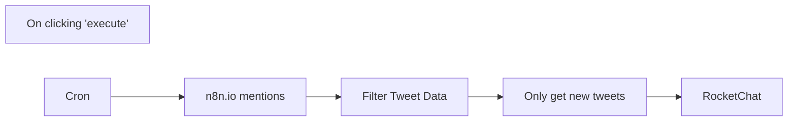

## Fluxo (.json) :

```json
{
  "id": "1",
  "name": "TwitterWorkflow",
  "nodes": [
    {
      "name": "On clicking 'execute'",
      "type": "n8n-nodes-base.manualTrigger",
      "disabled": true,
      "position": [
        400,
        850
      ],
      "parameters": {},
      "typeVersion": 1
    },
    {
      "name": "Filter Tweet Data",
      "type": "n8n-nodes-base.set",
      "position": [
        680,
        300
      ],
      "parameters": {
        "values": {
          "string": [
            {
              "name": "Tweet",
              "value": "={{$node[\"n8n.io mentions\"].json[\"text\"]}}"
            },
            {
              "name": "Tweet ID",
              "value": "={{$node[\"n8n.io mentions\"].json[\"id\"]}}"
            },
            {
              "name": "Tweet URL",
              "value": "=https://twitter.com/{{$node[\"n8n.io mentions\"].json[\"user\"][\"screen_name\"]}}/status/{{$node[\"n8n.io mentions\"].json[\"id_str\"]}}"
            }
          ]
        },
        "options": {},
        "keepOnlySet": true
      },
      "typeVersion": 1
    },
    {
      "name": "Only get new tweets",
      "type": "n8n-nodes-base.function",
      "position": [
        910,
        300
      ],
      "parameters": {
        "functionCode": "const staticData = getWorkflowStaticData('global');\nconst newTweetIds = items.map(item => item.json[\"Tweet ID\"]);\nconst oldTweetIds = staticData.oldTweetIds; \n\nif (!oldTweetIds) {\n  staticData.oldTweetIds = newTweetIds;\n  return items;\n}\n\n\nconst actualNewTweetIds = newTweetIds.filter((id) => !oldTweetIds.includes(id));\nconst actualNewTweets = items.filter((data) => actualNewTweetIds.includes(data.json['Tweet ID']));\nstaticData.oldTweetIds = [...actualNewTweetIds, ...oldTweetIds];\n\nreturn actualNewTweets;\n"
      },
      "typeVersion": 1
    },
    {
      "name": "n8n.io mentions",
      "type": "n8n-nodes-base.twitter",
      "position": [
        480,
        300
      ],
      "parameters": {
        "operation": "search",
        "searchText": "@n8n_io",
        "additionalFields": {}
      },
      "credentials": {
        "twitterOAuth1Api": "Twitter Credentials"
      },
      "typeVersion": 1
    },
    {
      "name": "RocketChat",
      "type": "n8n-nodes-base.rocketchat",
      "position": [
        1150,
        300
      ],
      "parameters": {
        "text": "=New Mention!: {{$node[\"Filter Tweet Data\"].json[\"Tweet\"]}}.\nSee it here: {{$node[\"Only get new tweets\"].json[\"Tweet URL\"]}}",
        "channel": "general",
        "options": {},
        "jsonParameters": true
      },
      "credentials": {
        "rocketchatApi": "Rocket Chat API"
      },
      "typeVersion": 1
    },
    {
      "name": "Cron",
      "type": "n8n-nodes-base.cron",
      "position": [
        270,
        300
      ],
      "parameters": {
        "triggerTimes": {
          "item": [
            {
              "mode": "everyX",
              "unit": "minutes",
              "value": 1
            }
          ]
        }
      },
      "typeVersion": 1
    }
  ],
  "active": false,
  "settings": {},
  "connections": {
    "Cron": {
      "main": [
        [
          {
            "node": "n8n.io mentions",
            "type": "main",
            "index": 0
          }
        ]
      ]
    },
    "n8n.io mentions": {
      "main": [
        [
          {
            "node": "Filter Tweet Data",
            "type": "main",
            "index": 0
          }
        ]
      ]
    },
    "Filter Tweet Data": {
      "main": [
        [
          {
            "node": "Only get new tweets",
            "type": "main",
            "index": 0
          }
        ]
      ]
    },
    "Only get new tweets": {
      "main": [
        [
          {
            "node": "RocketChat",
            "type": "main",
            "index": 0
          }
        ]
      ]
    },
    "On clicking 'execute'": {
      "main": [
        []
      ]
    }
  }
}
```

<a id="template-255"></a>

## Template 255 - Extração e limpeza de transcrição do YouTube

- **Nome:** Extração e limpeza de transcrição do YouTube
- **Descrição:** Recebe uma URL de vídeo do YouTube, obtém a transcrição via API externa, processa e limpa o texto retornando uma transcrição padronizada.
- **Funcionalidade:** • Recepção de URL via formulário: Aceita a URL do vídeo fornecida pelo usuário.
• Consulta de transcrição externa: Envia requisição para um serviço de transcrição utilizando URL ou videoId.
• Suporte a múltiplos formatos de resposta: Lida com arrays de segmentos ou objetos de texto único vindos da API.
• Limpeza e normalização do texto: Remove espaços extras, ajusta pontuação e concatena segmentos.
• Estruturação do resultado: Retorna informações como transcrição bruta, transcrição limpa, duração, offset e idioma.
• Tratamento de erro para ausência de transcrição: Retorna mensagem de falha quando não há transcrição disponível.
- **Ferramentas:** • YouTube: Plataforma de vídeos que serve como fonte do conteúdo a ser transcrito.
• youtube-transcript3 (via RapidAPI): Serviço de terceiros que fornece transcrições de vídeos do YouTube por meio de uma API, exigindo chave de API (x-rapidapi-key).

## Fluxo visual

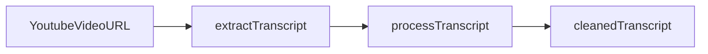

## Fluxo (.json) :

```json
{
  "id": "XxkmcgZC4OtIOVoD",
  "meta": {
    "instanceId": "b3c467df4053d13fe31cc98f3c66fa1d16300ba750506bfd019a0913cec71ea3"
  },
  "name": "Youtube Video Transcript Extraction",
  "tags": [],
  "nodes": [
    {
      "id": "686e639a-650d-480d-9887-11bd4140f1fe",
      "name": "YoutubeVideoURL",
      "type": "n8n-nodes-base.formTrigger",
      "position": [
        -20,
        0
      ],
      "webhookId": "156a04c8-917d-4624-a46e-8fbcab89d16b",
      "parameters": {
        "options": {},
        "formTitle": "Youtube Video Transcriber",
        "formFields": {
          "values": [
            {
              "fieldLabel": "Youtube Video Url",
              "requiredField": true
            }
          ]
        }
      },
      "typeVersion": 2.2
    },
    {
      "id": "5384c4ed-a726-4253-8a88-d413124f80be",
      "name": "cleanedTranscript",
      "type": "n8n-nodes-base.set",
      "position": [
        740,
        0
      ],
      "parameters": {
        "options": {},
        "assignments": {
          "assignments": [
            {
              "id": "7653a859-556d-4e00-bafa-6f70f90de0d7",
              "name": "transcript",
              "type": "string",
              "value": "={{ $json.cleanedTranscript }}"
            }
          ]
        }
      },
      "typeVersion": 3.4
    },
    {
      "id": "83b6567f-c931-429c-8d7c-0b2549820ca1",
      "name": "processTranscript",
      "type": "n8n-nodes-base.function",
      "position": [
        500,
        0
      ],
      "parameters": {
        "functionCode": "// Extract and process the transcript\nconst data = $input.first().json;\n\nif (!data.transcript && !data.text) {\n  return {\n    json: {\n      success: false,\n      message: 'No transcript available for this video',\n      videoUrl: $input.first().json.body?.videoUrl || 'Unknown'\n    }\n  };\n}\n\n// Process the transcript text\nlet transcriptText = '';\n\n// Handle different API response formats\nif (data.transcript) {\n  // Format for array of transcript segments\n  if (Array.isArray(data.transcript)) {\n    data.transcript.forEach(segment => {\n      if (segment.text) {\n        transcriptText += segment.text + ' ';\n      }\n    });\n  } else if (typeof data.transcript === 'string') {\n    transcriptText = data.transcript;\n  }\n} else if (data.text) {\n  // Format for single transcript object with text property\n  transcriptText = data.text;\n}\n\n// Clean up the transcript (remove extra spaces, normalize punctuation)\nconst cleanedTranscript = transcriptText\n  .replace(/\\s+/g, ' ')\n  .replace(/\\s([.,!?])/g, '$1')\n  .trim();\n\nreturn {\n  json: {\n    success: true,\n    videoUrl: $input.first().json.body?.videoUrl || 'From transcript',\n    rawTranscript: data.text || data.transcript,\n    cleanedTranscript,\n    duration: data.duration,\n    offset: data.offset,\n    language: data.lang\n  }\n};"
      },
      "typeVersion": 1
    },
    {
      "id": "cebf0fd7-6b66-4287-bede-fab53061bed2",
      "name": "extractTranscript",
      "type": "n8n-nodes-base.httpRequest",
      "position": [
        240,
        0
      ],
      "parameters": {
        "url": "https://youtube-transcript3.p.rapidapi.com/api/transcript",
        "options": {},
        "sendBody": true,
        "sendQuery": true,
        "sendHeaders": true,
        "bodyParameters": {
          "parameters": [
            {
              "name": "url",
              "value": "={{ $json['Youtube Video Url'] }}"
            }
          ]
        },
        "queryParameters": {
          "parameters": [
            {
              "name": "videoId",
              "value": "ZacjOVVgoLY"
            }
          ]
        },
        "headerParameters": {
          "parameters": [
            {
              "name": "x-rapidapi-host",
              "value": "youtube-transcript3.p.rapidapi.com"
            },
            {
              "name": "x-rapidapi-key",
              "value": "\"your_api_key\""
            },
            {
              "name": "Content-Type",
              "value": "application/json"
            }
          ]
        }
      },
      "typeVersion": 3
    }
  ],
  "active": false,
  "pinData": {},
  "settings": {
    "executionOrder": "v1"
  },
  "versionId": "084b006b-36f9-46a7-8a0b-7656126b29cd",
  "connections": {
    "YoutubeVideoURL": {
      "main": [
        [
          {
            "node": "extractTranscript",
            "type": "main",
            "index": 0
          }
        ]
      ]
    },
    "extractTranscript": {
      "main": [
        [
          {
            "node": "processTranscript",
            "type": "main",
            "index": 0
          }
        ]
      ]
    },
    "processTranscript": {
      "main": [
        [
          {
            "node": "cleanedTranscript",
            "type": "main",
            "index": 0
          }
        ]
      ]
    }
  }
}
```

<a id="template-256"></a>

## Template 256 - Atribuição e validação de cupons QR para leads

- **Nome:** Atribuição e validação de cupons QR para leads
- **Descrição:** Gerencia a atribuição de cupons únicos a leads originados de um formulário, envia o QR por email ao lead e valida o uso do cupom quando escaneado.
- **Funcionalidade:** • Recepção de formulário: Captura nome, sobrenome, email e telefone enviados pelo usuário.
• Verificação de duplicidade: Checa se o email já existe para evitar reatribuição de cupom.
• Seleção de cupom disponível: Localiza o primeiro cupom não atribuído na base de cupons.
• Criação de lead no CRM: Registra o lead no sistema CRM incluindo o cupom atribuído.
• Atualização da planilha de cupons: Registra data, dados do lead e id retornado pelo CRM na planilha.
• Geração de QR: Cria um QR code que contém um link de validação com o código do cupom.
• Envio de email com QR: Envia ao lead um email com o QR code embutido.
• Validação de cupom por escaneamento: Recebe o pedido de validação do QR, verifica existência e estado do cupom na planilha.
• Marcação de cupom como usado: Se válido e não usado, atualiza a planilha e sinaliza no CRM que o cupom foi utilizado.
• Respostas públicas de validação: Retorna mensagens simples indicando se o QR é válido, inválido ou já utilizado.
- **Ferramentas:** • Google Sheets: Armazena a lista de cupons, o estado de uso e os dados dos leads.
• SuiteCRM: Sistema CRM usado para criar e atualizar registros de leads e armazenar o cupom associado.
• QuickChart (gerador de QR): Gera a imagem do QR code que contém o link de validação do cupom.
• Servidor SMTP (serviço de email): Envia emails com o QR code para os leads.

## Fluxo visual

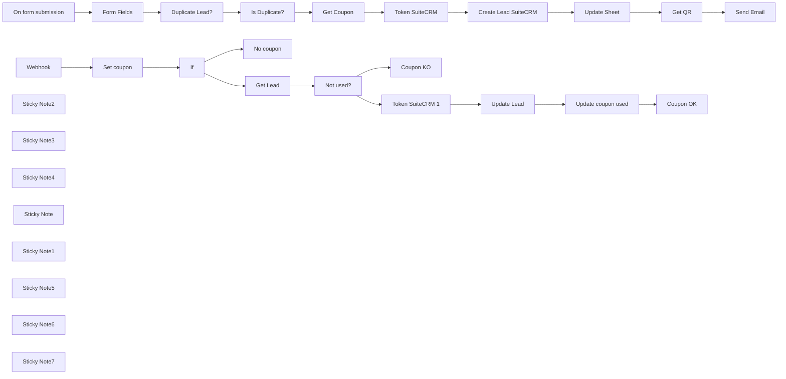

## Fluxo (.json) :

```json
{
  "id": "fW6PV9IaePKSMGbN",
  "meta": {
    "instanceId": "a4bfc93e975ca233ac45ed7c9227d84cf5a2329310525917adaf3312e10d5462",
    "templateCredsSetupCompleted": true
  },
  "name": "Unique QRcode coupon assignment and validation for Lead Generation system",
  "tags": [],
  "nodes": [
    {
      "id": "5ef4dd1d-39d6-487e-a48d-420b458ac1ee",
      "name": "Webhook",
      "type": "n8n-nodes-base.webhook",
      "position": [
        -420,
        340
      ],
      "webhookId": "bb832325-8c58-4717-b866-41f8a9714cf2",
      "parameters": {
        "path": "bb832325-8c58-4717-b866-41f8a9714cf2",
        "options": {},
        "responseMode": "responseNode"
      },
      "typeVersion": 2
    },
    {
      "id": "a7102d60-d4bd-450d-92b3-a32e2304b4a9",
      "name": "If",
      "type": "n8n-nodes-base.if",
      "position": [
        40,
        340
      ],
      "parameters": {
        "options": {},
        "conditions": {
          "options": {
            "version": 2,
            "leftValue": "",
            "caseSensitive": true,
            "typeValidation": "strict"
          },
          "combinator": "and",
          "conditions": [
            {
              "id": "430aee2d-a788-4d7c-ab64-880c900f0058",
              "operator": {
                "type": "string",
                "operation": "exists",
                "singleValue": true
              },
              "leftValue": "={{ $json.qr }}",
              "rightValue": ""
            }
          ]
        }
      },
      "typeVersion": 2.2
    },
    {
      "id": "f9dfd28e-42b5-488a-acde-dbbff95cf72f",
      "name": "Token SuiteCRM",
      "type": "n8n-nodes-base.httpRequest",
      "position": [
        700,
        -320
      ],
      "parameters": {
        "url": "=https://SUITECRMURL/Api/access_token",
        "options": {},
        "requestMethod": "POST",
        "bodyParametersUi": {
          "parameter": [
            {
              "name": "grant_type",
              "value": "client_credentials"
            },
            {
              "name": "client_id",
              "value": "CLIENTID"
            },
            {
              "name": "client_secret",
              "value": "CLIENTSECRET"
            }
          ]
        },
        "allowUnauthorizedCerts": true
      },
      "notesInFlow": true,
      "typeVersion": 1
    },
    {
      "id": "0e5c7208-a90a-4612-a5eb-f962546320dc",
      "name": "Create Lead SuiteCRM",
      "type": "n8n-nodes-base.httpRequest",
      "position": [
        940,
        -320
      ],
      "parameters": {
        "url": "https://SUITECRMURL/Api/V8/module",
        "method": "POST",
        "options": {
          "response": {
            "response": {
              "responseFormat": "json"
            }
          }
        },
        "jsonBody": "={\"data\": \n  {\n  \"type\": \"Leads\",\n  \"attributes\": { \n  \"first_name\": \"{{ $('Form Fields').item.json.Name }}\",\n  \"last_name\": \"{{ $('Form Fields').item.json.Surname }}\",\n  \"email1\": \"{{ $('Form Fields').item.json.Email }}\",\n  \"phone_mobile\":\"{{ $('Form Fields').item.json.Phone }}\",\n  \"coupon_c\": \"{{ $('Get Coupon').item.json.COUPON }}\"\n  }\n  }\n}",
        "sendBody": true,
        "sendHeaders": true,
        "specifyBody": "json",
        "headerParameters": {
          "parameters": [
            {
              "name": "Authorization",
              "value": "=Bearer {{$node[\"Token SuiteCRM\"].json[\"access_token\"]}}"
            },
            {
              "name": "Content-Type",
              "value": "application/vnd.api+json"
            }
          ]
        }
      },
      "notesInFlow": true,
      "typeVersion": 3
    },
    {
      "id": "e9191ab8-4fb8-40bb-b676-89ac4e58b2dc",
      "name": "On form submission",
      "type": "n8n-nodes-base.formTrigger",
      "position": [
        -420,
        -420
      ],
      "webhookId": "63d1d84b-c41e-4d3d-961a-0aa2af830ceb",
      "parameters": {
        "options": {},
        "formTitle": "Landing",
        "formFields": {
          "values": [
            {
              "fieldLabel": "Name",
              "placeholder": "Name",
              "requiredField": true
            },
            {
              "fieldLabel": "Surname",
              "placeholder": "Surname",
              "requiredField": true
            },
            {
              "fieldType": "email",
              "fieldLabel": "Email",
              "placeholder": "Email",
              "requiredField": true
            },
            {
              "fieldLabel": "Phone",
              "placeholder": "Phone",
              "requiredField": true
            }
          ]
        }
      },
      "typeVersion": 2.2
    },
    {
      "id": "4f61d7df-aeb3-4e8d-b30b-8396944e93a3",
      "name": "Duplicate Lead?",
      "type": "n8n-nodes-base.googleSheets",
      "position": [
        20,
        -420
      ],
      "parameters": {
        "options": {},
        "filtersUI": {
          "values": [
            {
              "lookupValue": "={{ $json.Email }}",
              "lookupColumn": "EMAIL"
            }
          ]
        },
        "sheetName": {
          "__rl": true,
          "mode": "list",
          "value": "gid=0",
          "cachedResultUrl": "https://docs.google.com/spreadsheets/d/1lnRZodxZSOA0QSuzkAb7ZJcfFfNXpX7NcxMdckMTN90/edit#gid=0",
          "cachedResultName": "Foglio1"
        },
        "documentId": {
          "__rl": true,
          "mode": "list",
          "value": "1lnRZodxZSOA0QSuzkAb7ZJcfFfNXpX7NcxMdckMTN90",
          "cachedResultUrl": "https://docs.google.com/spreadsheets/d/1lnRZodxZSOA0QSuzkAb7ZJcfFfNXpX7NcxMdckMTN90/edit?usp=drivesdk",
          "cachedResultName": "Coupon"
        }
      },
      "credentials": {
        "googleSheetsOAuth2Api": {
          "id": "JYR6a64Qecd6t8Hb",
          "name": "Google Sheets account"
        }
      },
      "typeVersion": 4.5,
      "alwaysOutputData": true
    },
    {
      "id": "393372b3-3aaf-4500-a795-0c0f47ea9625",
      "name": "Form Fields",
      "type": "n8n-nodes-base.set",
      "position": [
        -180,
        -420
      ],
      "parameters": {
        "options": {},
        "assignments": {
          "assignments": [
            {
              "id": "661d1475-f964-4a12-bfe7-88bf96851319",
              "name": "Name",
              "type": "string",
              "value": "={{ $json.Name }}"
            },
            {
              "id": "9991645d-c716-47db-80d6-850f3d64c782",
              "name": "Surname",
              "type": "string",
              "value": "={{ $json.Surname }}"
            },
            {
              "id": "c999afa6-2ec7-4f7f-bf3b-088a3597591c",
              "name": "Email",
              "type": "string",
              "value": "={{ $json.Email }}"
            },
            {
              "id": "f3faccdb-2412-4363-a0e3-f13b8f85b242",
              "name": "Phone",
              "type": "string",
              "value": "={{ $json.Phone }}"
            }
          ]
        }
      },
      "typeVersion": 3.4
    },
    {
      "id": "40d47841-6fb6-4339-b101-a8e917791229",
      "name": "Get Coupon",
      "type": "n8n-nodes-base.googleSheets",
      "position": [
        480,
        -320
      ],
      "parameters": {
        "options": {
          "returnFirstMatch": true
        },
        "filtersUI": {
          "values": [
            {
              "lookupColumn": "ID LEAD"
            }
          ]
        },
        "sheetName": {
          "__rl": true,
          "mode": "list",
          "value": "gid=0",
          "cachedResultUrl": "https://docs.google.com/spreadsheets/d/1lnRZodxZSOA0QSuzkAb7ZJcfFfNXpX7NcxMdckMTN90/edit#gid=0",
          "cachedResultName": "Foglio1"
        },
        "documentId": {
          "__rl": true,
          "mode": "list",
          "value": "1lnRZodxZSOA0QSuzkAb7ZJcfFfNXpX7NcxMdckMTN90",
          "cachedResultUrl": "https://docs.google.com/spreadsheets/d/1lnRZodxZSOA0QSuzkAb7ZJcfFfNXpX7NcxMdckMTN90/edit?usp=drivesdk",
          "cachedResultName": "Coupon"
        }
      },
      "credentials": {
        "googleSheetsOAuth2Api": {
          "id": "JYR6a64Qecd6t8Hb",
          "name": "Google Sheets account"
        }
      },
      "executeOnce": false,
      "typeVersion": 4.5
    },
    {
      "id": "16358f58-eb7c-4fe5-a0aa-960943a7bebd",
      "name": "Update Sheet",
      "type": "n8n-nodes-base.googleSheets",
      "position": [
        1180,
        -320
      ],
      "parameters": {
        "columns": {
          "value": {
            "DATE": "={{ $now.format('dd/LL/yyyy HH:mm:ss') }}",
            "NAME": "={{ $json.data.attributes.first_name }}",
            "EMAIL": "={{ $json.data.attributes.email1 }}",
            "PHONE": "={{ $json.data.attributes.phone_mobile }}",
            "COUPON": "={{ $('Get Coupon').item.json.COUPON }}",
            "ID LEAD": "={{ $json.data.id }}",
            "SURNAME": "={{ $json.data.attributes.last_name }}"
          },
          "schema": [
            {
              "id": "NAME",
              "type": "string",
              "display": true,
              "required": false,
              "displayName": "NAME",
              "defaultMatch": false,
              "canBeUsedToMatch": true
            },
            {
              "id": "SURNAME",
              "type": "string",
              "display": true,
              "required": false,
              "displayName": "SURNAME",
              "defaultMatch": false,
              "canBeUsedToMatch": true
            },
            {
              "id": "EMAIL",
              "type": "string",
              "display": true,
              "required": false,
              "displayName": "EMAIL",
              "defaultMatch": false,
              "canBeUsedToMatch": true
            },
            {
              "id": "PHONE",
              "type": "string",
              "display": true,
              "required": false,
              "displayName": "PHONE",
              "defaultMatch": false,
              "canBeUsedToMatch": true
            },
            {
              "id": "COUPON",
              "type": "string",
              "display": true,
              "removed": false,
              "required": false,
              "displayName": "COUPON",
              "defaultMatch": false,
              "canBeUsedToMatch": true
            },
            {
              "id": "DATE",
              "type": "string",
              "display": true,
              "required": false,
              "displayName": "DATE",
              "defaultMatch": false,
              "canBeUsedToMatch": true
            },
            {
              "id": "ID LEAD",
              "type": "string",
              "display": true,
              "required": false,
              "displayName": "ID LEAD",
              "defaultMatch": false,
              "canBeUsedToMatch": true
            },
            {
              "id": "row_number",
              "type": "string",
              "display": true,
              "removed": true,
              "readOnly": true,
              "required": false,
              "displayName": "row_number",
              "defaultMatch": false,
              "canBeUsedToMatch": true
            }
          ],
          "mappingMode": "defineBelow",
          "matchingColumns": [
            "COUPON"
          ],
          "attemptToConvertTypes": false,
          "convertFieldsToString": false
        },
        "options": {},
        "operation": "update",
        "sheetName": {
          "__rl": true,
          "mode": "list",
          "value": "gid=0",
          "cachedResultUrl": "https://docs.google.com/spreadsheets/d/1lnRZodxZSOA0QSuzkAb7ZJcfFfNXpX7NcxMdckMTN90/edit#gid=0",
          "cachedResultName": "Foglio1"
        },
        "documentId": {
          "__rl": true,
          "mode": "list",
          "value": "1lnRZodxZSOA0QSuzkAb7ZJcfFfNXpX7NcxMdckMTN90",
          "cachedResultUrl": "https://docs.google.com/spreadsheets/d/1lnRZodxZSOA0QSuzkAb7ZJcfFfNXpX7NcxMdckMTN90/edit?usp=drivesdk",
          "cachedResultName": "Coupon"
        }
      },
      "credentials": {
        "googleSheetsOAuth2Api": {
          "id": "JYR6a64Qecd6t8Hb",
          "name": "Google Sheets account"
        }
      },
      "typeVersion": 4.5
    },
    {
      "id": "36025b8c-41cb-4827-bf0e-ec6f692c13df",
      "name": "Is Duplicate?",
      "type": "n8n-nodes-base.if",
      "position": [
        220,
        -420
      ],
      "parameters": {
        "options": {},
        "conditions": {
          "options": {
            "version": 2,
            "leftValue": "",
            "caseSensitive": true,
            "typeValidation": "strict"
          },
          "combinator": "and",
          "conditions": [
            {
              "id": "9e3a8422-14f1-453e-bfed-4feecff34662",
              "operator": {
                "type": "string",
                "operation": "notEmpty",
                "singleValue": true
              },
              "leftValue": "={{ $json.EMAIL }}",
              "rightValue": "={{ $('Form Fields').item.json.email }}"
            }
          ]
        }
      },
      "typeVersion": 2.2
    },
    {
      "id": "e2267b93-9396-4ebf-8307-f8c98c1c3d65",
      "name": "Sticky Note2",
      "type": "n8n-nodes-base.stickyNote",
      "position": [
        -200,
        -500
      ],
      "parameters": {
        "width": 340,
        "height": 240,
        "content": "Check if the lead has already received the coupon"
      },
      "typeVersion": 1
    },
    {
      "id": "a8af825a-4e26-4660-8a9e-f7ce3ba33b3a",
      "name": "Sticky Note3",
      "type": "n8n-nodes-base.stickyNote",
      "position": [
        440,
        -380
      ],
      "parameters": {
        "width": 180,
        "height": 220,
        "content": "Find the first available unassigned coupon"
      },
      "typeVersion": 1
    },
    {
      "id": "dd868852-5b0f-4b5b-922f-f70b8a6da01e",
      "name": "Sticky Note4",
      "type": "n8n-nodes-base.stickyNote",
      "position": [
        680,
        -380
      ],
      "parameters": {
        "width": 400,
        "height": 220,
        "content": "Enter the lead with the relative coupon on Suite CRM. Change SUITECRMURL, CLIENTSECRET and CLIENTID"
      },
      "typeVersion": 1
    },
    {
      "id": "d2c26f3a-496e-47d6-b3f6-1aea5d0293fa",
      "name": "Get QR",
      "type": "n8n-nodes-base.httpRequest",
      "position": [
        1400,
        -320
      ],
      "parameters": {
        "url": "=https://quickchart.io/qr?text=https://n8n.n3witalia.com/webhook-test/bb832325-8c58-4717-b866-41f8a9714cf2?qr={{ $('Get Coupon').item.json.COUPON }}&size=250",
        "options": {}
      },
      "typeVersion": 4.2
    },
    {
      "id": "371fa5e5-6f91-4236-83d4-81f579d7d2ab",
      "name": "Send Email",
      "type": "n8n-nodes-base.emailSend",
      "position": [
        1620,
        -320
      ],
      "webhookId": "a84b051c-7d5f-4c17-bac6-68a9df9fa7c7",
      "parameters": {
        "html": "=<!DOCTYPE html>\n<html>\n<head>\n    <meta charset=\"UTF-8\">\n    <title>Exclusive Discount Coupon</title>\n</head>\n<body style=\"font-family: Arial, sans-serif; text-align: center;\">\n    <h2>Get Your Exclusive Discount!</h2>\n    <p>Hi {{ $('On form submission').item.json.Name }},<br>\n    Scan the QR code below to claim your special discount.</p>\n    \n    \n    \n    <p>Hurry, the offer is limited!</p>\n</body>\n</html>\n",
        "options": {},
        "subject": "[n8n] Exclusive Discount Coupon",
        "toEmail": "={{ $('Form Fields').item.json.Email }}",
        "fromEmail": "=EMAILFROM"
      },
      "credentials": {
        "smtp": {
          "id": "hRjP3XbDiIQqvi7x",
          "name": "SMTP info@n3witalia.com"
        }
      },
      "typeVersion": 2.1
    },
    {
      "id": "5893bd1d-762d-4337-8392-6d358002845a",
      "name": "Update Lead",
      "type": "n8n-nodes-base.httpRequest",
      "position": [
        1020,
        100
      ],
      "parameters": {
        "url": "=https://suitecrm.dev.n3witalia.com/Api/V8/module",
        "method": "PATCH",
        "options": {
          "response": {
            "response": {
              "responseFormat": "json"
            }
          }
        },
        "jsonBody": "={\n  \"data\": {\n    \"type\": \"Leads\",\n    \"id\": \"{{ $('Not used?').item.json['ID LEAD'] }}\",\n    \"attributes\": {\n      \"coupon_used_c\": \"yes\"\n    }\n  }\n}",
        "sendBody": true,
        "sendHeaders": true,
        "specifyBody": "json",
        "headerParameters": {
          "parameters": [
            {
              "name": "Authorization",
              "value": "=Bearer {{$node[\"Token SuiteCRM 1\"].json[\"access_token\"]}}"
            },
            {
              "name": "Content-Type",
              "value": "application/vnd.api+json"
            }
          ]
        }
      },
      "notesInFlow": true,
      "typeVersion": 3
    },
    {
      "id": "fd0a43f4-a3f1-4008-947c-f8208d2126f7",
      "name": "Not used?",
      "type": "n8n-nodes-base.if",
      "position": [
        540,
        240
      ],
      "parameters": {
        "options": {},
        "conditions": {
          "options": {
            "version": 2,
            "leftValue": "",
            "caseSensitive": true,
            "typeValidation": "strict"
          },
          "combinator": "and",
          "conditions": [
            {
              "id": "50546d87-ab37-4c8a-b835-e1a60f3aa0dc",
              "operator": {
                "type": "string",
                "operation": "empty",
                "singleValue": true
              },
              "leftValue": "={{ $json['USED COUPON?'] }}",
              "rightValue": ""
            },
            {
              "id": "025a42b8-fb90-44a8-951a-0e321b42c3b9",
              "operator": {
                "type": "number",
                "operation": "exists",
                "singleValue": true
              },
              "leftValue": "={{ $json.row_number }}",
              "rightValue": ""
            }
          ]
        }
      },
      "typeVersion": 2.2
    },
    {
      "id": "0029c366-aec1-4305-aab5-2ab6845e2828",
      "name": "Coupon OK",
      "type": "n8n-nodes-base.respondToWebhook",
      "position": [
        1480,
        100
      ],
      "parameters": {
        "options": {},
        "respondWith": "text",
        "responseBody": "Qr valid!"
      },
      "typeVersion": 1.1
    },
    {
      "id": "4c326412-0965-4f1c-9b77-2704d37a7151",
      "name": "No coupon",
      "type": "n8n-nodes-base.respondToWebhook",
      "position": [
        320,
        460
      ],
      "parameters": {
        "options": {
          "responseCode": 200
        },
        "respondWith": "text",
        "responseBody": "Coupon not valid"
      },
      "typeVersion": 1.1
    },
    {
      "id": "e18cf9e7-584d-4f49-88b8-4c3a513ff613",
      "name": "Coupon KO",
      "type": "n8n-nodes-base.respondToWebhook",
      "position": [
        800,
        320
      ],
      "parameters": {
        "options": {
          "responseCode": 200
        },
        "respondWith": "text",
        "responseBody": "Coupon already used"
      },
      "typeVersion": 1.1
    },
    {
      "id": "55a63a65-5472-4e50-8150-604c6bc9dd18",
      "name": "Token SuiteCRM 1",
      "type": "n8n-nodes-base.httpRequest",
      "position": [
        800,
        100
      ],
      "parameters": {
        "url": "=https://SUITECRMURL/Api/access_token",
        "options": {},
        "requestMethod": "POST",
        "bodyParametersUi": {
          "parameter": [
            {
              "name": "grant_type",
              "value": "client_credentials"
            },
            {
              "name": "client_id",
              "value": "CLIENTID"
            },
            {
              "name": "client_secret",
              "value": "CLIENTSECRET"
            }
          ]
        },
        "allowUnauthorizedCerts": true
      },
      "notesInFlow": true,
      "typeVersion": 1
    },
    {
      "id": "c843c9f2-9940-423c-bc9d-8530fb43f229",
      "name": "Set coupon",
      "type": "n8n-nodes-base.set",
      "position": [
        -180,
        340
      ],
      "parameters": {
        "options": {},
        "assignments": {
          "assignments": [
            {
              "id": "4e9a4330-d654-410f-9b99-aa57545c2c80",
              "name": "qr",
              "type": "string",
              "value": "={{ $json.query.qr }}"
            }
          ]
        }
      },
      "typeVersion": 3.4
    },
    {
      "id": "9a2d877d-9016-460e-b376-ea27c59a492a",
      "name": "Get Lead",
      "type": "n8n-nodes-base.googleSheets",
      "position": [
        320,
        240
      ],
      "parameters": {
        "options": {
          "returnFirstMatch": true
        },
        "filtersUI": {
          "values": [
            {
              "lookupValue": "={{ $json.qr }}",
              "lookupColumn": "COUPON"
            }
          ]
        },
        "sheetName": {
          "__rl": true,
          "mode": "list",
          "value": "gid=0",
          "cachedResultUrl": "https://docs.google.com/spreadsheets/d/1lnRZodxZSOA0QSuzkAb7ZJcfFfNXpX7NcxMdckMTN90/edit#gid=0",
          "cachedResultName": "Foglio1"
        },
        "documentId": {
          "__rl": true,
          "mode": "list",
          "value": "1lnRZodxZSOA0QSuzkAb7ZJcfFfNXpX7NcxMdckMTN90",
          "cachedResultUrl": "https://docs.google.com/spreadsheets/d/1lnRZodxZSOA0QSuzkAb7ZJcfFfNXpX7NcxMdckMTN90/edit?usp=drivesdk",
          "cachedResultName": "Coupon"
        }
      },
      "credentials": {
        "googleSheetsOAuth2Api": {
          "id": "JYR6a64Qecd6t8Hb",
          "name": "Google Sheets account"
        }
      },
      "typeVersion": 4.5
    },
    {
      "id": "da2e62e5-898c-4024-8d85-517b18dcefc3",
      "name": "Sticky Note",
      "type": "n8n-nodes-base.stickyNote",
      "position": [
        -200,
        280
      ],
      "parameters": {
        "width": 360,
        "height": 220,
        "content": "Check if the QR code scan is valid"
      },
      "typeVersion": 1
    },
    {
      "id": "507dc2ab-a762-49b8-a13a-c9b20c7135d8",
      "name": "Sticky Note1",
      "type": "n8n-nodes-base.stickyNote",
      "position": [
        300,
        180
      ],
      "parameters": {
        "width": 360,
        "height": 220,
        "content": "Check if coupon is valid"
      },
      "typeVersion": 1
    },
    {
      "id": "f44b5645-1611-4c16-83ac-ee8a4821970b",
      "name": "Sticky Note5",
      "type": "n8n-nodes-base.stickyNote",
      "position": [
        760,
        40
      ],
      "parameters": {
        "width": 420,
        "height": 220,
        "content": "Enter the lead with the relative coupon on Suite CRM. Change SUITECRMURL, CLIENTSECRET and CLIENTID"
      },
      "typeVersion": 1
    },
    {
      "id": "ad0a5999-2616-4c7b-8108-6f13e573490b",
      "name": "Update coupon used",
      "type": "n8n-nodes-base.googleSheets",
      "position": [
        1240,
        100
      ],
      "parameters": {
        "columns": {
          "value": {
            "ID LEAD": "={{ $json.data.id }}",
            "USED COUPON?": "yes"
          },
          "schema": [
            {
              "id": "NAME",
              "type": "string",
              "display": true,
              "required": false,
              "displayName": "NAME",
              "defaultMatch": false,
              "canBeUsedToMatch": true
            },
            {
              "id": "SURNAME",
              "type": "string",
              "display": true,
              "required": false,
              "displayName": "SURNAME",
              "defaultMatch": false,
              "canBeUsedToMatch": true
            },
            {
              "id": "EMAIL",
              "type": "string",
              "display": true,
              "required": false,
              "displayName": "EMAIL",
              "defaultMatch": false,
              "canBeUsedToMatch": true
            },
            {
              "id": "PHONE",
              "type": "string",
              "display": true,
              "required": false,
              "displayName": "PHONE",
              "defaultMatch": false,
              "canBeUsedToMatch": true
            },
            {
              "id": "COUPON",
              "type": "string",
              "display": true,
              "required": false,
              "displayName": "COUPON",
              "defaultMatch": false,
              "canBeUsedToMatch": true
            },
            {
              "id": "DATE",
              "type": "string",
              "display": true,
              "required": false,
              "displayName": "DATE",
              "defaultMatch": false,
              "canBeUsedToMatch": true
            },
            {
              "id": "ID LEAD",
              "type": "string",
              "display": true,
              "removed": false,
              "required": false,
              "displayName": "ID LEAD",
              "defaultMatch": false,
              "canBeUsedToMatch": true
            },
            {
              "id": "USED COUPON?",
              "type": "string",
              "display": true,
              "required": false,
              "displayName": "USED COUPON?",
              "defaultMatch": false,
              "canBeUsedToMatch": true
            },
            {
              "id": "row_number",
              "type": "string",
              "display": true,
              "removed": true,
              "readOnly": true,
              "required": false,
              "displayName": "row_number",
              "defaultMatch": false,
              "canBeUsedToMatch": true
            }
          ],
          "mappingMode": "defineBelow",
          "matchingColumns": [
            "ID LEAD"
          ],
          "attemptToConvertTypes": false,
          "convertFieldsToString": false
        },
        "options": {},
        "operation": "update",
        "sheetName": {
          "__rl": true,
          "mode": "list",
          "value": "gid=0",
          "cachedResultUrl": "https://docs.google.com/spreadsheets/d/1lnRZodxZSOA0QSuzkAb7ZJcfFfNXpX7NcxMdckMTN90/edit#gid=0",
          "cachedResultName": "Foglio1"
        },
        "documentId": {
          "__rl": true,
          "mode": "list",
          "value": "1lnRZodxZSOA0QSuzkAb7ZJcfFfNXpX7NcxMdckMTN90",
          "cachedResultUrl": "https://docs.google.com/spreadsheets/d/1lnRZodxZSOA0QSuzkAb7ZJcfFfNXpX7NcxMdckMTN90/edit?usp=drivesdk",
          "cachedResultName": "Coupon"
        }
      },
      "credentials": {
        "googleSheetsOAuth2Api": {
          "id": "JYR6a64Qecd6t8Hb",
          "name": "Google Sheets account"
        }
      },
      "typeVersion": 4.5
    },
    {
      "id": "acd6a7fb-aeae-4baf-8f60-af16715a6de6",
      "name": "Sticky Note6",
      "type": "n8n-nodes-base.stickyNote",
      "position": [
        1560,
        -380
      ],
      "parameters": {
        "width": 220,
        "height": 220,
        "content": "Set the Webhook URL"
      },
      "typeVersion": 1
    },
    {
      "id": "091a00b6-34bd-4221-b2f1-4d55719a273a",
      "name": "Sticky Note7",
      "type": "n8n-nodes-base.stickyNote",
      "position": [
        -480,
        -900
      ],
      "parameters": {
        "color": 3,
        "width": 680,
        "height": 240,
        "content": "## Coupon assignment and simple validation system\n\nThis workflow is designed to manage the assignment and validation of unique QR code coupons within a lead generation system. The process begins with a webhook that receives data from a user-filled form, containing information such as name, surname, email, and phone number. This data is then processed to check if the lead already exists in the system, preventing duplicates.\n\nDISCLAIMER: The system is very simple and basic but can be improved and made very efficient through specific controls and new implementations"
      },
      "typeVersion": 1
    }
  ],
  "active": false,
  "pinData": {},
  "settings": {
    "executionOrder": "v1"
  },
  "versionId": "00ea32a4-635c-41c0-a789-e7b45efdf193",
  "connections": {
    "If": {
      "main": [
        [
          {
            "node": "Get Lead",
            "type": "main",
            "index": 0
          }
        ],
        [
          {
            "node": "No coupon",
            "type": "main",
            "index": 0
          }
        ]
      ]
    },
    "Get QR": {
      "main": [
        [
          {
            "node": "Send Email",
            "type": "main",
            "index": 0
          }
        ]
      ]
    },
    "Webhook": {
      "main": [
        [
          {
            "node": "Set coupon",
            "type": "main",
            "index": 0
          }
        ]
      ]
    },
    "Get Lead": {
      "main": [
        [
          {
            "node": "Not used?",
            "type": "main",
            "index": 0
          }
        ]
      ]
    },
    "Not used?": {
      "main": [
        [
          {
            "node": "Token SuiteCRM 1",
            "type": "main",
            "index": 0
          }
        ],
        [
          {
            "node": "Coupon KO",
            "type": "main",
            "index": 0
          }
        ]
      ]
    },
    "Get Coupon": {
      "main": [
        [
          {
            "node": "Token SuiteCRM",
            "type": "main",
            "index": 0
          }
        ]
      ]
    },
    "Set coupon": {
      "main": [
        [
          {
            "node": "If",
            "type": "main",
            "index": 0
          }
        ]
      ]
    },
    "Form Fields": {
      "main": [
        [
          {
            "node": "Duplicate Lead?",
            "type": "main",
            "index": 0
          }
        ]
      ]
    },
    "Update Lead": {
      "main": [
        [
          {
            "node": "Update coupon used",
            "type": "main",
            "index": 0
          }
        ]
      ]
    },
    "Update Sheet": {
      "main": [
        [
          {
            "node": "Get QR",
            "type": "main",
            "index": 0
          }
        ]
      ]
    },
    "Is Duplicate?": {
      "main": [
        [],
        [
          {
            "node": "Get Coupon",
            "type": "main",
            "index": 0
          }
        ]
      ]
    },
    "Token SuiteCRM": {
      "main": [
        [
          {
            "node": "Create Lead SuiteCRM",
            "type": "main",
            "index": 0
          }
        ]
      ]
    },
    "Duplicate Lead?": {
      "main": [
        [
          {
            "node": "Is Duplicate?",
            "type": "main",
            "index": 0
          }
        ]
      ]
    },
    "Token SuiteCRM 1": {
      "main": [
        [
          {
            "node": "Update Lead",
            "type": "main",
            "index": 0
          }
        ]
      ]
    },
    "On form submission": {
      "main": [
        [
          {
            "node": "Form Fields",
            "type": "main",
            "index": 0
          }
        ]
      ]
    },
    "Update coupon used": {
      "main": [
        [
          {
            "node": "Coupon OK",
            "type": "main",
            "index": 0
          }
        ]
      ]
    },
    "Create Lead SuiteCRM": {
      "main": [
        [
          {
            "node": "Update Sheet",
            "type": "main",
            "index": 0
          }
        ]
      ]
    }
  }
}
```

<a id="template-257"></a>

## Template 257 - Pipeline ETL de tweets com análise de sentimento

- **Nome:** Pipeline ETL de tweets com análise de sentimento
- **Descrição:** Coleta tweets com a hashtag #OnThisDay, armazena os textos, realiza análise de sentimento, persiste os resultados e notifica um canal quando uma condição de sentimento é atendida.
- **Funcionalidade:** • Agendamento diário às 06:00: dispara o processo automaticamente todos os dias às 6h.
• Busca de tweets com #OnThisDay (limite 3): pesquisa e recupera até três tweets com a hashtag especificada.
• Armazenamento do texto bruto: salva o conteúdo dos tweets em uma coleção de banco de documentos para posterior processamento.
• Análise de sentimento: envia o texto para um serviço de NLP para obter score e magnitude do sentimento.
• Preparação dos dados: extrai e mapeia score, magnitude e texto para inserção em banco relacional.
• Persistência relacional: insere os dados enriquecidos (text, score, magnitude) em uma tabela de banco de dados.
• Filtragem por sentimento: avalia o score do sentimento comparando com um limiar configurável para decisão de notificação.
• Notificação condicional: envia uma mensagem formatada para um canal quando a condição de sentimento é satisfeita.
• Caminho alternativo sem notificação: quando a condição não é atendida, o fluxo segue sem enviar alerta.
- **Ferramentas:** • Twitter: fonte pública de tweets utilizada para buscar mensagens pela hashtag.
• MongoDB: banco de documentos usado para armazenar o texto bruto dos tweets antes da análise.
• Google Cloud Natural Language: serviço de processamento de linguagem natural usado para analisar sentimento (score e magnitude).
• PostgreSQL: banco de dados relacional usado para persistir os registros enriquecidos com sentimento.
• Slack: plataforma de comunicação usada para enviar notificações sobre tweets relevantes.

## Fluxo visual

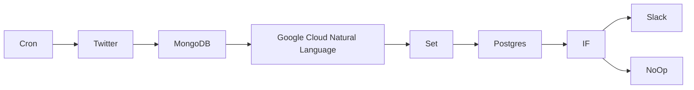

## Fluxo (.json) :

```json
{
  "id": "6",
  "name": "ETL pipeline",
  "nodes": [
    {
      "name": "Twitter",
      "type": "n8n-nodes-base.twitter",
      "position": [
        300,
        300
      ],
      "parameters": {
        "limit": 3,
        "operation": "search",
        "searchText": "=#OnThisDay",
        "additionalFields": {}
      },
      "credentials": {
        "twitterOAuth1Api": "twitter_api"
      },
      "typeVersion": 1
    },
    {
      "name": "Postgres",
      "type": "n8n-nodes-base.postgres",
      "position": [
        1100,
        300
      ],
      "parameters": {
        "table": "tweets",
        "columns": "text, score, magnitude",
        "returnFields": "=*"
      },
      "credentials": {
        "postgres": "postgres"
      },
      "typeVersion": 1
    },
    {
      "name": "MongoDB",
      "type": "n8n-nodes-base.mongoDb",
      "position": [
        500,
        300
      ],
      "parameters": {
        "fields": "text",
        "options": {},
        "operation": "insert",
        "collection": "tweets"
      },
      "credentials": {
        "mongoDb": "mongodb"
      },
      "typeVersion": 1
    },
    {
      "name": "Slack",
      "type": "n8n-nodes-base.slack",
      "position": [
        1500,
        200
      ],
      "parameters": {
        "text": "=🐦 NEW TWEET with sentiment score {{$json[\"score\"]}} and magnitude {{$json[\"magnitude\"]}} ⬇️\n{{$json[\"text\"]}}",
        "channel": "tweets",
        "attachments": [],
        "otherOptions": {}
      },
      "credentials": {
        "slackApi": "slack"
      },
      "typeVersion": 1
    },
    {
      "name": "IF",
      "type": "n8n-nodes-base.if",
      "position": [
        1300,
        300
      ],
      "parameters": {
        "conditions": {
          "number": [
            {
              "value1": "={{$json[\"score\"]}}",
              "operation": "larger"
            }
          ]
        }
      },
      "typeVersion": 1
    },
    {
      "name": "NoOp",
      "type": "n8n-nodes-base.noOp",
      "position": [
        1500,
        400
      ],
      "parameters": {},
      "typeVersion": 1
    },
    {
      "name": "Google Cloud Natural Language",
      "type": "n8n-nodes-base.googleCloudNaturalLanguage",
      "position": [
        700,
        300
      ],
      "parameters": {
        "content": "={{$node[\"MongoDB\"].json[\"text\"]}}",
        "options": {}
      },
      "credentials": {
        "googleCloudNaturalLanguageOAuth2Api": "google_nlp"
      },
      "typeVersion": 1
    },
    {
      "name": "Set",
      "type": "n8n-nodes-base.set",
      "position": [
        900,
        300
      ],
      "parameters": {
        "values": {
          "number": [
            {
              "name": "score",
              "value": "={{$json[\"documentSentiment\"][\"score\"]}}"
            },
            {
              "name": "magnitude",
              "value": "={{$json[\"documentSentiment\"][\"magnitude\"]}}"
            }
          ],
          "string": [
            {
              "name": "text",
              "value": "={{$node[\"Twitter\"].json[\"text\"]}}"
            }
          ]
        },
        "options": {}
      },
      "typeVersion": 1
    },
    {
      "name": "Cron",
      "type": "n8n-nodes-base.cron",
      "position": [
        100,
        300
      ],
      "parameters": {
        "triggerTimes": {
          "item": [
            {
              "hour": 6
            }
          ]
        }
      },
      "typeVersion": 1
    }
  ],
  "active": false,
  "settings": {},
  "connections": {
    "IF": {
      "main": [
        [
          {
            "node": "Slack",
            "type": "main",
            "index": 0
          }
        ],
        [
          {
            "node": "NoOp",
            "type": "main",
            "index": 0
          }
        ]
      ]
    },
    "Set": {
      "main": [
        [
          {
            "node": "Postgres",
            "type": "main",
            "index": 0
          }
        ]
      ]
    },
    "Cron": {
      "main": [
        [
          {
            "node": "Twitter",
            "type": "main",
            "index": 0
          }
        ]
      ]
    },
    "MongoDB": {
      "main": [
        [
          {
            "node": "Google Cloud Natural Language",
            "type": "main",
            "index": 0
          }
        ]
      ]
    },
    "Twitter": {
      "main": [
        [
          {
            "node": "MongoDB",
            "type": "main",
            "index": 0
          }
        ]
      ]
    },
    "Postgres": {
      "main": [
        [
          {
            "node": "IF",
            "type": "main",
            "index": 0
          }
        ]
      ]
    },
    "Google Cloud Natural Language": {
      "main": [
        [
          {
            "node": "Set",
            "type": "main",
            "index": 0
          }
        ]
      ]
    }
  }
}
```

<a id="template-258"></a>

## Template 258 - Inserir, buscar e atualizar linhas no Google Sheets

- **Nome:** Inserir, buscar e atualizar linhas no Google Sheets
- **Descrição:** Fluxo que cria um registro, adiciona uma nova linha na planilha, busca registros por cidade, ajusta o valor do aluguel, atualiza o registro correspondente usando o ID e lê a planilha para verificação.
- **Funcionalidade:** • Geração de registro: Cria um registro com ID aleatório, nome, valor de aluguel e cidade para inserção.
• Inserção de linha (append): Adiciona a nova linha no intervalo A:D da planilha.
• Busca por cidade: Procura linhas cuja coluna Cidade corresponda ao valor especificado (ex.: Berlin) e retorna todas as correspondências.
• Cálculo do aluguel: Incrementa o valor do campo Rent em 100 com base no valor retornado pela busca.
• Atualização por ID: Atualiza a linha correspondente ao ID encontrado, escrevendo os campos atualizados na planilha.
• Leitura/validação final: Lê o intervalo A:D com valores formatados para confirmar as alterações.
- **Ferramentas:** • Google Sheets: Planilha online utilizada para armazenar, buscar, atualizar e ler dados via API.

## Fluxo visual

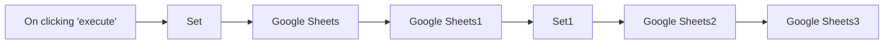

## Fluxo (.json) :

```json
{
  "id": "5",
  "name": "Append, lookup, update, and read data from a Google Sheets spreadsheet",
  "nodes": [
    {
      "name": "On clicking 'execute'",
      "type": "n8n-nodes-base.manualTrigger",
      "position": [
        450,
        450
      ],
      "parameters": {},
      "typeVersion": 1
    },
    {
      "name": "Google Sheets2",
      "type": "n8n-nodes-base.googleSheets",
      "position": [
        1450,
        450
      ],
      "parameters": {
        "key": "ID",
        "range": "A:D",
        "options": {
          "valueInputMode": "USER_ENTERED",
          "valueRenderMode": "UNFORMATTED_VALUE"
        },
        "sheetId": "1remFwo--5ehUgIU7UUndKldPI0Xm93e1T3DldD9GOg0",
        "operation": "update",
        "authentication": "oAuth2"
      },
      "credentials": {
        "googleSheetsOAuth2Api": "google-sheet"
      },
      "typeVersion": 1
    },
    {
      "name": "Set1",
      "type": "n8n-nodes-base.set",
      "position": [
        1250,
        450
      ],
      "parameters": {
        "values": {
          "number": [
            {
              "name": "Rent",
              "value": "={{$node[\"Google Sheets1\"].json[\"Rent\"]+100}}"
            },
            {
              "name": "ID",
              "value": "={{$node[\"Google Sheets1\"].json[\"ID\"]}}"
            }
          ],
          "string": [
            {
              "name": "Name",
              "value": "={{$node[\"Google Sheets1\"].json[\"Name\"]}}"
            },
            {
              "name": "City",
              "value": "={{$node[\"Google Sheets1\"].json[\"City\"]}}"
            }
          ]
        },
        "options": {},
        "keepOnlySet": true
      },
      "typeVersion": 1
    },
    {
      "name": "Google Sheets1",
      "type": "n8n-nodes-base.googleSheets",
      "position": [
        1050,
        450
      ],
      "parameters": {
        "range": "A:D",
        "options": {
          "valueRenderMode": "UNFORMATTED_VALUE",
          "returnAllMatches": true
        },
        "sheetId": "1remFwo--5ehUgIU7UUndKldPI0Xm93e1T3DldD9GOg0",
        "operation": "lookup",
        "lookupValue": "Berlin",
        "lookupColumn": "City",
        "authentication": "oAuth2"
      },
      "credentials": {
        "googleSheetsOAuth2Api": "google-sheet"
      },
      "typeVersion": 1
    },
    {
      "name": "Google Sheets",
      "type": "n8n-nodes-base.googleSheets",
      "position": [
        850,
        450
      ],
      "parameters": {
        "range": "A:D",
        "options": {
          "valueInputMode": "USER_ENTERED"
        },
        "sheetId": "1remFwo--5ehUgIU7UUndKldPI0Xm93e1T3DldD9GOg0",
        "operation": "append",
        "authentication": "oAuth2"
      },
      "credentials": {
        "googleSheetsOAuth2Api": "google-sheet"
      },
      "typeVersion": 1
    },
    {
      "name": "Google Sheets3",
      "type": "n8n-nodes-base.googleSheets",
      "position": [
        1650,
        450
      ],
      "parameters": {
        "range": "A:D",
        "options": {
          "valueRenderMode": "FORMATTED_VALUE"
        },
        "sheetId": "1remFwo--5ehUgIU7UUndKldPI0Xm93e1T3DldD9GOg0",
        "authentication": "oAuth2"
      },
      "credentials": {
        "googleSheetsOAuth2Api": "google-sheet"
      },
      "typeVersion": 1
    },
    {
      "name": "Set",
      "type": "n8n-nodes-base.set",
      "position": [
        650,
        450
      ],
      "parameters": {
        "values": {
          "number": [
            {
              "name": "ID",
              "value": "={{Math.floor(Math.random()*1000)}}"
            }
          ],
          "string": [
            {
              "name": "Name",
              "value": "John's Place"
            },
            {
              "name": "Rent",
              "value": "$1,000"
            },
            {
              "name": "City",
              "value": "Berlin"
            }
          ]
        },
        "options": {},
        "keepOnlySet": true
      },
      "typeVersion": 1
    }
  ],
  "active": false,
  "settings": {},
  "connections": {
    "Set": {
      "main": [
        [
          {
            "node": "Google Sheets",
            "type": "main",
            "index": 0
          }
        ]
      ]
    },
    "Set1": {
      "main": [
        [
          {
            "node": "Google Sheets2",
            "type": "main",
            "index": 0
          }
        ]
      ]
    },
    "Google Sheets": {
      "main": [
        [
          {
            "node": "Google Sheets1",
            "type": "main",
            "index": 0
          }
        ]
      ]
    },
    "Google Sheets1": {
      "main": [
        [
          {
            "node": "Set1",
            "type": "main",
            "index": 0
          }
        ]
      ]
    },
    "Google Sheets2": {
      "main": [
        [
          {
            "node": "Google Sheets3",
            "type": "main",
            "index": 0
          }
        ]
      ]
    },
    "On clicking 'execute'": {
      "main": [
        [
          {
            "node": "Set",
            "type": "main",
            "index": 0
          }
        ]
      ]
    }
  }
}
```

<a id="template-259"></a>

## Template 259 - Buscar e salvar estatísticas de vídeos do YouTube

- **Nome:** Buscar e salvar estatísticas de vídeos do YouTube
- **Descrição:** Percorre canais fornecidos, busca vídeos recentes e relevantes, filtra vídeos curtos, estrutura e salva estatísticas em um banco de dados e identifica os vídeos de melhor desempenho das últimas duas semanas.
- **Funcionalidade:** • Iteração por canais: Processa uma lista de canais para executar buscas e armazenamentos por canal.
• Consulta do último vídeo registrado: Verifica na base de dados o último publish_time salvo para cada canal e usa isso como referência para buscas incrementais.
• Busca de vídeos atualizados: Pesquisa vídeos do canal publicados após o último registro (ou usa um intervalo padrão de fallback) com parâmetros de ordenação e safeSearch.
• Obtenção de detalhes de vídeo: Recupera detalhes adicionais (duração, estatísticas, conteúdo) para cada vídeo encontrado.
• Remoção de shorts: Filtra vídeos com duração menor ou igual a 210 segundos para excluir formatos curtos.
• Mapeamento e sanitização: Normaliza campos de estatísticas (views, likes, comments, publish time, channel id) e trata valores nulos.
• Inserção em lote no banco: Gera queries dinâmicas com placeholders e insere os registros na tabela de estatísticas.
• Gestão de esquema e inspeção: Possui operações para criar, visualizar e remover a tabela de armazenamento quando necessário.
• Análise de desempenho: Calcula médias por canal (excluindo top2 e bottom2 quando aplicável) e identifica vídeos das últimas duas semanas com desempenho ≥ 2x da média, atribuindo um score like/view.
- **Ferramentas:** • YouTube Data API (Google): Usada para pesquisar vídeos por canal e obter detalhes (duração, estatísticas, conteúdo) via endpoints da API, autenticada com chave/credenciais.
• PostgreSQL: Banco de dados relacional para armazenar estatísticas de vídeos, consultar último publish_time, calcular agregados por canal e persistir novos registros.

## Fluxo visual

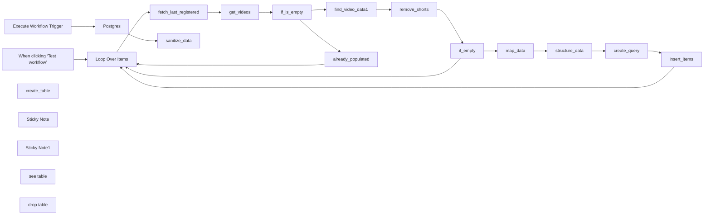

## Fluxo (.json) :

```json
{
  "id": "Zrd98BnbmN1Px9an",
  "meta": {
    "instanceId": "edc0464b1050024ebda3e16fceea795e4fdf67b1f61187c4f2f3a72397278df0",
    "templateCredsSetupCompleted": true
  },
  "name": "Youtube Searcher",
  "tags": [],
  "nodes": [
    {
      "id": "5cb8757a-d8f0-49fa-803d-7f04b514f9f8",
      "name": "Loop Over Items",
      "type": "n8n-nodes-base.splitInBatches",
      "position": [
        80,
        220
      ],
      "parameters": {
        "options": {}
      },
      "typeVersion": 3
    },
    {
      "id": "28964bd5-dc53-4dfa-bbb1-4eb80b952063",
      "name": "find_video_data1",
      "type": "n8n-nodes-base.httpRequest",
      "position": [
        1440,
        320
      ],
      "parameters": {
        "url": "https://www.googleapis.com/youtube/v3/videos?",
        "options": {},
        "sendQuery": true,
        "queryParameters": {
          "parameters": [
            {
              "name": "key",
              "value": "={{ $env[\"GOOGLE_API_KEY\"] }}"
            },
            {
              "name": "id",
              "value": "={{ $json.id.videoId }}"
            },
            {
              "name": "part",
              "value": "contentDetails, statistics"
            }
          ]
        }
      },
      "typeVersion": 4.2
    },
    {
      "id": "5e8b9441-4b91-4460-a9ac-4a0a02aa57ad",
      "name": "When clicking ‘Test workflow’",
      "type": "n8n-nodes-base.manualTrigger",
      "disabled": true,
      "position": [
        -180,
        220
      ],
      "parameters": {},
      "typeVersion": 1
    },
    {
      "id": "793ef651-ea56-41bc-a0a9-feeaddf999c0",
      "name": "Execute Workflow Trigger",
      "type": "n8n-nodes-base.executeWorkflowTrigger",
      "position": [
        -160,
        -180
      ],
      "parameters": {},
      "typeVersion": 1
    },
    {
      "id": "64e331ff-2cda-4ba0-94f9-03fa6c3d6590",
      "name": "fetch_last_registered",
      "type": "n8n-nodes-base.postgres",
      "position": [
        360,
        360
      ],
      "parameters": {
        "query": "SELECT MAX(publish_time) AS latest_publish_time\nFROM video_statistics\nWHERE channel_id = '{{ $json.id }}';",
        "options": {},
        "operation": "executeQuery"
      },
      "credentials": {
        "postgres": {
          "id": "KQiQIZTArTBSNJH7",
          "name": "Postgres account"
        }
      },
      "typeVersion": 2.5
    },
    {
      "id": "fb0a8208-c920-4344-8816-ef6509f07abc",
      "name": "get_videos",
      "type": "n8n-nodes-base.youTube",
      "onError": "continueRegularOutput",
      "position": [
        640,
        360
      ],
      "parameters": {
        "limit": 50,
        "filters": {
          "channelId": "={{ $('Loop Over Items').item.json.id }}",
          "regionCode": "US",
          "publishedAfter": "={{ $json.latest_publish_time ? new Date(new Date($json.latest_publish_time).getTime() + 60 * 60 * 1000).toISOString() : new Date(Date.now() - 3 * 30 * 24 * 60 * 60 * 1000).toISOString() }}"
        },
        "options": {
          "order": "relevance",
          "safeSearch": "moderate"
        },
        "resource": "video"
      },
      "credentials": {
        "youTubeOAuth2Api": {
          "id": "o3VUdoHEk6VhB1lq",
          "name": "YouTube account"
        }
      },
      "typeVersion": 1,
      "alwaysOutputData": true
    },
    {
      "id": "ea358d3c-9a83-49c9-a02e-745cf5b29097",
      "name": "if_is_empty",
      "type": "n8n-nodes-base.if",
      "onError": "continueRegularOutput",
      "position": [
        940,
        540
      ],
      "parameters": {
        "options": {},
        "conditions": {
          "options": {
            "version": 2,
            "leftValue": "",
            "caseSensitive": true,
            "typeValidation": "strict"
          },
          "combinator": "or",
          "conditions": [
            {
              "id": "7591deae-4626-4b2e-af26-d02042573a13",
              "operator": {
                "type": "object",
                "operation": "notEmpty",
                "singleValue": true
              },
              "leftValue": "={{ $input.item.json }}",
              "rightValue": ""
            }
          ]
        }
      },
      "typeVersion": 2.2
    },
    {
      "id": "142e5c5e-f488-4667-a759-ef4494f2a194",
      "name": "Postgres",
      "type": "n8n-nodes-base.postgres",
      "position": [
        80,
        -180
      ],
      "parameters": {
        "query": "WITH RankedVideos AS (\n    SELECT \n        channel_id,\n        id,\n        view_count,\n        like_count,\n        comment_count,\n        publish_time,\n        ROW_NUMBER() OVER (PARTITION BY channel_id ORDER BY view_count DESC) AS rank_desc,\n        ROW_NUMBER() OVER (PARTITION BY channel_id ORDER BY view_count ASC) AS rank_asc\n    FROM video_statistics\n),\nFilteredVideos AS (\n    SELECT \n        channel_id,\n        id,\n        view_count,\n        like_count,\n        comment_count,\n        publish_time\n    FROM RankedVideos\n    WHERE NOT (\n        rank_desc <= 2 OR rank_asc <= 2  -- Exclude top 2 and bottom 2 videos\n    )\n    OR (\n        (SELECT COUNT(*) FROM video_statistics WHERE video_statistics.channel_id = RankedVideos.channel_id) <= 10  -- Include all videos if 10 or fewer exist\n    )\n),\nChannelStats AS (\n    SELECT \n        channel_id,\n        ROUND(AVG(view_count)::NUMERIC, 0) AS average_views -- Round to 0 decimal places\n    FROM FilteredVideos\n    GROUP BY channel_id\n)\nSELECT \n    v.channel_id,\n    c.average_views,\n    JSON_AGG(\n        JSON_BUILD_OBJECT(\n            'id', v.id,\n            'view_count', v.view_count,\n            'like_count', v.like_count,\n            'comment_count', v.comment_count,\n            'publish_time', v.publish_time\n        )\n    ) AS channel_videos\nFROM video_statistics v\nLEFT JOIN ChannelStats c\nON v.channel_id = c.channel_id\nGROUP BY v.channel_id, c.average_views;\n",
        "options": {},
        "operation": "executeQuery"
      },
      "credentials": {
        "postgres": {
          "id": "KQiQIZTArTBSNJH7",
          "name": "Postgres account"
        }
      },
      "typeVersion": 2.5
    },
    {
      "id": "a542b55e-bab4-476d-8333-692f5b3a5dcb",
      "name": "insert_items",
      "type": "n8n-nodes-base.postgres",
      "position": [
        2980,
        320
      ],
      "parameters": {
        "query": "{{$json.query}}",
        "options": {
          "queryReplacement": "={{$json.parameters}}"
        },
        "operation": "executeQuery"
      },
      "credentials": {
        "postgres": {
          "id": "KQiQIZTArTBSNJH7",
          "name": "Postgres account"
        }
      },
      "typeVersion": 2.5
    },
    {
      "id": "6680728a-805e-4a45-8720-56726ad9e582",
      "name": "create_table",
      "type": "n8n-nodes-base.postgres",
      "position": [
        620,
        -180
      ],
      "parameters": {
        "query": "CREATE TABLE video_statistics (\n    id VARCHAR(255) PRIMARY KEY, -- Unique identifier for the video\n    view_count INT NOT NULL, -- Number of views\n    like_count INT NOT NULL, -- Number of likes\n    comment_count INT NOT NULL, -- Number of comments\n    publish_time TIMESTAMP NOT NULL, -- Timestamp of publishing\n    channel_id VARCHAR(255) NOT NULL -- Channel ID\n);\n",
        "options": {},
        "operation": "executeQuery"
      },
      "credentials": {
        "postgres": {
          "id": "KQiQIZTArTBSNJH7",
          "name": "Postgres account"
        }
      },
      "typeVersion": 2.5
    },
    {
      "id": "4e345df5-bdd6-4a93-9096-367bd911dbd4",
      "name": "remove_shorts",
      "type": "n8n-nodes-base.code",
      "position": [
        1720,
        320
      ],
      "parameters": {
        "jsCode": "const input = $input.all();\n\nconst iso8601ToSeconds = iso8601 => {\n  const match = iso8601 ? iso8601.match(/PT(?:(\\d+)H)?(?:(\\d+)M)?(?:(\\d+)S)?/) : null;\n  if (!match) {\n    console.warn(`Invalid ISO8601 duration: ${iso8601}`);\n    return 0; \n  }\n  const hours = parseInt(match[1] || 0, 10);\n  const minutes = parseInt(match[2] || 0, 10);\n  const seconds = parseInt(match[3] || 0, 10);\n  return hours * 3600 + minutes * 60 + seconds;\n};\n\nconst filteredResponses = input.filter(response => {\n  if (response.json && response.json.items) {\n    const validItems = response.json.items.filter(item => {\n      const duration = item.contentDetails?.duration;\n      if (!duration) {\n        console.warn(`Missing duration for item: ${JSON.stringify(item)}`);\n        return false; \n      }\n      const durationInSeconds = iso8601ToSeconds(duration);\n\n      return durationInSeconds > 210;\n    });\n\n    response.json.items = validItems;\n\n    return validItems.length > 0; \n  }\n\n  return false;\n});\n\nreturn filteredResponses;\n"
      },
      "typeVersion": 2,
      "alwaysOutputData": true
    },
    {
      "id": "aadac7e3-8114-4c43-b0bf-d1a7de7c3e0c",
      "name": "create_query",
      "type": "n8n-nodes-base.code",
      "position": [
        2780,
        320
      ],
      "parameters": {
        "jsCode": "const input = $input.all();\n\nlet tableName = \"video_statistics\"; \n\nconst rows = input;\n\nconst formattedRows = rows.map(elements => {\n  const row = elements.json;\n  const formattedRow = {\n    id: row.id,\n    view_count: parseInt(row.viewCount, 10) || 0, \n    like_count: parseInt(row.likeCount, 10) || 0,\n    comment_count: parseInt(row.commentCount, 10) || 0,\n    publish_time: row.publishTime ? new Date(row.publishTime).toISOString() : null,\n    channel_id: $('Loop Over Items').first().json.id || \"unknown\"\n  };\n  return formattedRow;\n});\n\nconst columns = [\"id\", \"view_count\", \"like_count\", \"comment_count\", \"publish_time\", \"channel_id\"];\n\nconst valuePlaceholders = formattedRows.map((_, rowIndex) =>\n  `(${columns.map((_, colIndex) => `$${rowIndex * columns.length + colIndex + 1}`).join(\", \")})`\n).join(\", \");\n\nconst insertQuery = `INSERT INTO ${tableName} (${columns.map(col => `\\\"${col}\\\"`).join(\", \")}) VALUES ${valuePlaceholders};`;\n\nconst parameters = formattedRows.flatMap(row => \n  columns.map(col => row[col])\n);\n\nreturn [\n  {\n    query: insertQuery,\n    parameters: parameters\n  }\n];\n"
      },
      "typeVersion": 2
    },
    {
      "id": "46376f7c-1ce1-4f8a-8392-7281aacfd1c5",
      "name": "structure_data",
      "type": "n8n-nodes-base.code",
      "position": [
        2560,
        320
      ],
      "parameters": {
        "jsCode": "const input = $input.all(); \n\nconst filteredInput = input.filter(item => item.json.viewCount !== null);\n\nconst updatedInput = filteredInput.map(item => {\n    return {\n        ...item,\n        json: {\n            ...item.json,\n            likeCount: item.json.likeCount === null ? \"0\" : item.json.likeCount,\n            commentCount: item.json.commentCount === null ? \"0\" : item.json.commentCount\n        }\n    };\n});\n\nreturn updatedInput;\n"
      },
      "typeVersion": 2
    },
    {
      "id": "f66597ef-1324-45e0-b3e8-bc8a588315e4",
      "name": "if_empty",
      "type": "n8n-nodes-base.if",
      "position": [
        2020,
        500
      ],
      "parameters": {
        "options": {},
        "conditions": {
          "options": {
            "version": 2,
            "leftValue": "",
            "caseSensitive": true,
            "typeValidation": "strict"
          },
          "combinator": "and",
          "conditions": [
            {
              "id": "dacc5370-f54c-4b90-a2aa-65efff196d3b",
              "operator": {
                "type": "object",
                "operation": "notEmpty",
                "singleValue": true
              },
              "leftValue": "={{ $json }}",
              "rightValue": ""
            }
          ]
        }
      },
      "typeVersion": 2.2
    },
    {
      "id": "1176b08f-79bb-4f8f-8c83-25a7c2cee9e7",
      "name": "already_populated",
      "type": "n8n-nodes-base.set",
      "position": [
        1200,
        600
      ],
      "parameters": {
        "options": {},
        "assignments": {
          "assignments": [
            {
              "id": "7579fbc3-d702-4c36-b539-11b7db6c07fa",
              "name": "report",
              "type": "string",
              "value": "={{ $('Loop Over Items').item.json.url }} already populated. Latest was: {{ $('fetch_last_registered').item.json.latest_publish_time }}"
            }
          ]
        }
      },
      "typeVersion": 3.4
    },
    {
      "id": "265b3062-ee60-4de0-8ee0-3973e653aa7d",
      "name": "map_data",
      "type": "n8n-nodes-base.set",
      "position": [
        2340,
        320
      ],
      "parameters": {
        "options": {},
        "assignments": {
          "assignments": [
            {
              "id": "1a76e4e8-cd56-4d55-bcbf-ed24708e1464",
              "name": "id",
              "type": "string",
              "value": "={{ $json.items[0].id }}"
            },
            {
              "id": "0b6d93ba-89fb-4781-809f-6c7bd887f9e2",
              "name": "viewCount",
              "type": "string",
              "value": "={{ $json.items[0].statistics.viewCount }}"
            },
            {
              "id": "9526b059-661a-49a2-81d3-3623d677ddd1",
              "name": "likeCount",
              "type": "string",
              "value": "={{ $json.items[0].statistics.likeCount }}"
            },
            {
              "id": "ca4adf8b-d74f-4dda-a96e-0a2ca3e864e3",
              "name": "commentCount",
              "type": "string",
              "value": "={{ $json.items[0].statistics.commentCount }}"
            },
            {
              "id": "8129ff1c-87c6-489b-83f8-88bdbf426b0f",
              "name": "=publishTime",
              "type": "string",
              "value": "={{ $('get_videos').item.json.snippet.publishedAt }}"
            },
            {
              "id": "16fc88dc-4772-4380-873d-2aa9642b31ac",
              "name": "channelId",
              "type": "string",
              "value": "={{ $('if_is_empty').item.json.snippet.channelId }}"
            }
          ]
        }
      },
      "typeVersion": 3.4
    },
    {
      "id": "173ac548-89be-4e94-a0e3-e90c45489a0c",
      "name": "sanitize_data",
      "type": "n8n-nodes-base.code",
      "position": [
        300,
        -180
      ],
      "parameters": {
        "jsCode": "const now = new Date();\nconst twoWeeksAgo = new Date(now.getTime() - 14 * 24 * 60 * 60 * 1000);\n\nconst bestPerformingVideos = [];\n\n$input.all().forEach(channel => {\n  \n  const averageViews = parseInt(channel.json.average_views, 10);\n  \n  channel.json.channel_videos.forEach(video => {\n    const publishDate = new Date(video.publish_time);\n    const isWithinTwoWeeks = publishDate >= twoWeeksAgo && publishDate <= now;\n    const isAboveThreshold = video.view_count >= 2 * averageViews;\n\n  \n    if (isWithinTwoWeeks && isAboveThreshold) {\n      const score = (video.like_count / video.view_count) * 100;\n      bestPerformingVideos.push({\n        id: video.id,\n        videoUrl: `https://www.youtube.com/watch?v=${video.id}`,\n        viewCount: video.view_count,\n        likeCount: video.like_count,\n        score: parseFloat(score.toFixed(2)),\n        commentCount: video.comment_count,\n        channelId: `https://www.youtube.com/channel/${channel.json.channel_id}` \n      });\n    }\n  });\n});\n\nreturn bestPerformingVideos;\n"
      },
      "typeVersion": 2,
      "alwaysOutputData": true
    },
    {
      "id": "48e729ac-985c-47f5-8895-d2e52581e849",
      "name": "Sticky Note",
      "type": "n8n-nodes-base.stickyNote",
      "position": [
        -260,
        140
      ],
      "parameters": {
        "color": 7,
        "width": 3440,
        "height": 720,
        "content": "### Save Videos To Database"
      },
      "typeVersion": 1
    },
    {
      "id": "11c51123-27f7-4de7-9215-49d89679c2f6",
      "name": "Sticky Note1",
      "type": "n8n-nodes-base.stickyNote",
      "position": [
        -260,
        -260
      ],
      "parameters": {
        "color": 6,
        "width": 780,
        "height": 280,
        "content": "### Fetch best performing videos from last 2 weeks"
      },
      "typeVersion": 1
    },
    {
      "id": "7ef37f94-9283-4b51-a127-98c94542429a",
      "name": "see table",
      "type": "n8n-nodes-base.postgres",
      "position": [
        920,
        -180
      ],
      "parameters": {
        "query": "SELECT * FROM video_statistics;",
        "options": {},
        "operation": "executeQuery"
      },
      "credentials": {
        "postgres": {
          "id": "KQiQIZTArTBSNJH7",
          "name": "Postgres account"
        }
      },
      "typeVersion": 2.5
    },
    {
      "id": "e66af542-ea16-4c3c-9f6e-b5401bbd41da",
      "name": "drop table",
      "type": "n8n-nodes-base.postgres",
      "position": [
        1200,
        -180
      ],
      "parameters": {
        "query": "DROP TABLE video_statistics;",
        "options": {},
        "operation": "executeQuery"
      },
      "credentials": {
        "postgres": {
          "id": "KQiQIZTArTBSNJH7",
          "name": "Postgres account"
        }
      },
      "typeVersion": 2.5
    }
  ],
  "active": false,
  "pinData": {
    "When clicking ‘Test workflow’": [
      {
        "json": {
          "id": "UCMwVTLZIRRUyyVrkjDpn4pA",
          "url": "https://www.youtube.com/@ColeMedin"
        }
      },
      {
        "json": {
          "id": "UC2ojq-nuP8ceeHqiroeKhBA",
          "url": "www.youtube.com/@nateherk"
        }
      }
    ]
  },
  "settings": {
    "executionOrder": "v1"
  },
  "versionId": "8ee4a252-a795-4931-951f-024d1f0d801a",
  "connections": {
    "Postgres": {
      "main": [
        [
          {
            "node": "sanitize_data",
            "type": "main",
            "index": 0
          }
        ]
      ]
    },
    "if_empty": {
      "main": [
        [
          {
            "node": "map_data",
            "type": "main",
            "index": 0
          }
        ],
        [
          {
            "node": "Loop Over Items",
            "type": "main",
            "index": 0
          }
        ]
      ]
    },
    "map_data": {
      "main": [
        [
          {
            "node": "structure_data",
            "type": "main",
            "index": 0
          }
        ]
      ]
    },
    "get_videos": {
      "main": [
        [
          {
            "node": "if_is_empty",
            "type": "main",
            "index": 0
          }
        ]
      ]
    },
    "if_is_empty": {
      "main": [
        [
          {
            "node": "find_video_data1",
            "type": "main",
            "index": 0
          }
        ],
        [
          {
            "node": "already_populated",
            "type": "main",
            "index": 0
          }
        ]
      ]
    },
    "create_query": {
      "main": [
        [
          {
            "node": "insert_items",
            "type": "main",
            "index": 0
          }
        ]
      ]
    },
    "insert_items": {
      "main": [
        [
          {
            "node": "Loop Over Items",
            "type": "main",
            "index": 0
          }
        ]
      ]
    },
    "remove_shorts": {
      "main": [
        [
          {
            "node": "if_empty",
            "type": "main",
            "index": 0
          }
        ]
      ]
    },
    "structure_data": {
      "main": [
        [
          {
            "node": "create_query",
            "type": "main",
            "index": 0
          }
        ]
      ]
    },
    "Loop Over Items": {
      "main": [
        [],
        [
          {
            "node": "fetch_last_registered",
            "type": "main",
            "index": 0
          }
        ]
      ]
    },
    "find_video_data1": {
      "main": [
        [
          {
            "node": "remove_shorts",
            "type": "main",
            "index": 0
          }
        ]
      ]
    },
    "already_populated": {
      "main": [
        [
          {
            "node": "Loop Over Items",
            "type": "main",
            "index": 0
          }
        ]
      ]
    },
    "fetch_last_registered": {
      "main": [
        [
          {
            "node": "get_videos",
            "type": "main",
            "index": 0
          }
        ]
      ]
    },
    "Execute Workflow Trigger": {
      "main": [
        [
          {
            "node": "Postgres",
            "type": "main",
            "index": 0
          }
        ]
      ]
    },
    "When clicking ‘Test workflow’": {
      "main": [
        [
          {
            "node": "Loop Over Items",
            "type": "main",
            "index": 0
          }
        ]
      ]
    }
  }
}
```

<a id="template-260"></a>

## Template 260 - Atendimento automático via WhatsApp e criação de tarefas

- **Nome:** Atendimento automático via WhatsApp e criação de tarefas
- **Descrição:** Captura submissões de um formulário, envia uma confirmação por WhatsApp ao cliente e cria um ticket como tarefa em Asana.
- **Funcionalidade:** • Captura de formulário: Recebe os dados do cliente (nome, telefone, problema) a partir de um formulário.
• Validação de campos obrigatórios: Garante que nome, telefone e descrição do problema sejam preenchidos.
• Envio de confirmação por WhatsApp: Envia mensagem personalizada ao número informado agradecendo o envio do formulário.
• Criação de ticket em Asana: Cria uma tarefa no workspace especificado com o problema do cliente nos detalhes e título com timestamp.
• Configuração de credenciais e placeholders: Requer inserir credenciais da conta de mensagens e do workspace, além de substituir o telefone de exemplo pelo número real.
• Flexibilidade de formato do telefone: Permite adaptação/transformação do campo telefone caso o usuário insira formatos diferentes.
• Extensibilidade para e-mail: Possibilidade de substituir ou adicionar envio por e-mail integrando um provedor SMTP ou serviço de e-mail.
- **Ferramentas:** • WhatsApp Business Cloud: Plataforma para envio de mensagens e confirmações automáticas ao cliente.
• Asana: Ferramenta de gerenciamento de tarefas para armazenar e acompanhar tickets de suporte.
• Serviço de formulários (ex.: Typeform ou similar): Origem das submissões de contato usadas para disparar o fluxo.


## Fluxo visual

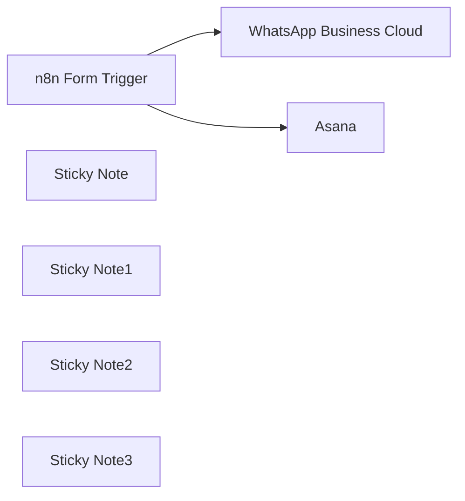

## Fluxo (.json) :

```json
{
  "id": "lWfWe93aNGuNPLBz",
  "meta": {
    "instanceId": "9fd9ca4c1981198aec5412811736ddc08ea74ed6ff5bea7bfdaf584bc90b5d4c"
  },
  "name": "Automate Your Customer Service With WhatsApp Business Cloud & Asana",
  "tags": [],
  "nodes": [
    {
      "id": "9d2a824a-6344-499e-a28a-454cf27b18e1",
      "name": "n8n Form Trigger",
      "type": "n8n-nodes-base.formTrigger",
      "position": [
        40,
        620
      ],
      "webhookId": "15e05cd5-c58d-4bf2-8358-f0cd1917334f",
      "parameters": {
        "path": "15e05cd5-c58d-4bf2-8358-f0cd1917334f",
        "options": {},
        "formTitle": "Contact Us!",
        "formFields": {
          "values": [
            {
              "fieldLabel": "Whats is your Name?",
              "requiredField": true
            },
            {
              "fieldType": "number",
              "fieldLabel": "What is your Phone Number?",
              "requiredField": true
            },
            {
              "fieldLabel": "What is your problem?",
              "requiredField": true
            }
          ]
        }
      },
      "typeVersion": 2
    },
    {
      "id": "ac7cca4a-e42b-4eaa-bd8b-121c27b4f976",
      "name": "WhatsApp Business Cloud",
      "type": "n8n-nodes-base.whatsApp",
      "position": [
        800,
        480
      ],
      "parameters": {
        "textBody": "=Hello {{ $json[\"Whats is your Name?\"] }},\n\nThank you for filling out the contact form.\nOur customer support team will get back to you as soon as possible.",
        "operation": "send",
        "phoneNumberId": "YOUR_PHONE_NUMBER",
        "additionalFields": {},
        "recipientPhoneNumber": "=+{{ $json['What is your Phone Number?'] }}"
      },
      "typeVersion": 1
    },
    {
      "id": "76a1a4d6-241d-4167-a7b6-3e8552752b2a",
      "name": "Sticky Note",
      "type": "n8n-nodes-base.stickyNote",
      "position": [
        40,
        20
      ],
      "parameters": {
        "width": 835.3263974964024,
        "height": 399.17043043523586,
        "content": "## Setup\n**Create and integrate your form**\n- You can use n8n native form or services like Typeform and integrate with them.\n- If you rename the phone number field, you also have to change this in the \"WhatsApp Business Cloud\" node \n- If you let people enter their phone number in another format (e.g. text) you may need to add in additional data transformation nodes\n\n**Add your WhatsApp Business Cloud credentials & your phone number**\n- Go into the \"WhatsApp Business Cloud\" node and add your credentials\n- Replace the placeholder by your WhatsApp Business Cloud phone number\n\n**Change the text body to your liking**\n- The text body right now is a confirmation of. contact form. You can change that to your liking & use-case.\n\n**Add your Asana credentials & add your workspace ID**\n- Go into the \"Asana\" node and add your credentials\n- Replace the placeholder by your Asana workspace ID"
      },
      "typeVersion": 1
    },
    {
      "id": "3259ab56-8e5b-480a-b037-a23872bd9cbd",
      "name": "Sticky Note1",
      "type": "n8n-nodes-base.stickyNote",
      "position": [
        -400,
        580
      ],
      "parameters": {
        "width": 393.38103690955325,
        "height": 218.49276831296547,
        "content": "## Data input\n**Form submissions**\n\nThe default way to get your data into this workflow is a n8n-native form submission. \n\nTechnically you could also change it in a way that you get your data out of another form submission service, if you already have one in place, like Typeform or similar.\n"
      },
      "typeVersion": 1
    },
    {
      "id": "71310c11-bb13-4b97-a183-da9a5e0ee007",
      "name": "Asana",
      "type": "n8n-nodes-base.asana",
      "position": [
        800,
        820
      ],
      "parameters": {
        "name": "=Support Ticket -  {{ $json.submittedAt }}",
        "workspace": "YOUR_WORKSPACE_ID",
        "otherProperties": {
          "notes": "={{ $json['What is your problem?'] }}"
        }
      },
      "typeVersion": 1
    },
    {
      "id": "3827e54a-bc87-4fa3-933f-0d1619d85697",
      "name": "Sticky Note2",
      "type": "n8n-nodes-base.stickyNote",
      "position": [
        1020,
        420
      ],
      "parameters": {
        "width": 472.6712339560175,
        "height": 271.78617944255603,
        "content": "## Confirmation Message\n**WhatsApp Business Cloud**\n\nThe default way to message your customer in this workflow is WhatsApp. \n\nIf your customers prefer e-mail, you can also add this capabilities to this workflow.\n\nYou would just need to change the form in a way to get the users mail, and integrate with a SMTP server or a mail-sending provider."
      },
      "typeVersion": 1
    },
    {
      "id": "299327d9-18e1-41e2-975a-4808d6b542bb",
      "name": "Sticky Note3",
      "type": "n8n-nodes-base.stickyNote",
      "position": [
        1020,
        780
      ],
      "parameters": {
        "width": 472.6712339560175,
        "height": 206.79421465037234,
        "content": "## Task Management\n**Asana**\n\nThe default way to to save the support tickets in this workflow is Asana. \n\nIf your teams work with another task management software, you can replace this node."
      },
      "typeVersion": 1
    }
  ],
  "active": false,
  "pinData": {},
  "settings": {
    "executionOrder": "v1"
  },
  "versionId": "1aedd3d7-f980-46dd-ac0b-af085e3dcf05",
  "connections": {
    "n8n Form Trigger": {
      "main": [
        [
          {
            "node": "WhatsApp Business Cloud",
            "type": "main",
            "index": 0
          },
          {
            "node": "Asana",
            "type": "main",
            "index": 0
          }
        ]
      ]
    }
  }
}
```

<a id="template-261"></a>

## Template 261 - Enviar imagem e atualizar snippet do tema Shopify

- **Nome:** Enviar imagem e atualizar snippet do tema Shopify
- **Descrição:** Quando uma linha de campanha é atualizada no Baserow com uma imagem ativa, o fluxo envia a imagem para a loja Shopify e atualiza um snippet do tema com o link/nome da imagem.
- **Funcionalidade:** • Recepção de evento via webhook: Inicia o processo ao receber notificações de linhas atualizadas do Baserow.
• Validação de alteração recente: Compara timestamps antigo e novo para confirmar que houve uma modificação relevante.
• Verificação de status e imagem: Garante que a campanha esteja ativa e que exista ao menos uma imagem associada.
• Upload de imagem para Shopify: Faz chamada GraphQL para criar/registrar o arquivo (fileCreate) no Shopify.
• Atualização do snippet do tema: Envia um PUT para a API de assets do Shopify para salvar/atualizar um arquivo de template/snippet contendo referência à imagem.
• Configuração parametrizável: Permite definir subdomínio da loja, ID do tema, nome do arquivo e conteúdo do snippet via valores configuráveis.
- **Ferramentas:** • Baserow: serviço de base de dados online que dispara webhooks quando linhas são criadas ou atualizadas.
• Shopify Admin API: API da loja (GraphQL e REST) usada para enviar arquivos e atualizar assets de tema.
• Serviço de hospedagem de imagens: origem das URLs das imagens referenciadas na tabela (host que armazena os ficheiros de imagem).

## Fluxo visual

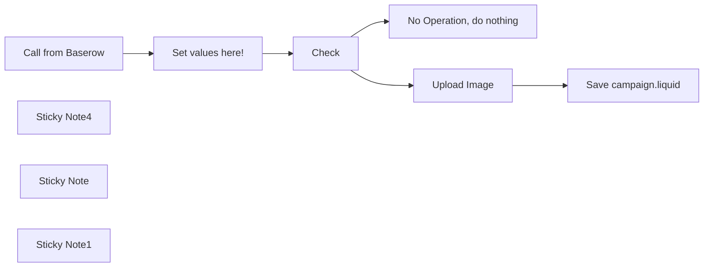

## Fluxo (.json) :

```json
{
  "id": "x2VUvhqV1YTJCIN0",
  "meta": {
    "instanceId": "e2c978396c9c745cf0aaa9ed3abe4464dbcef93c5fe2df809b9e14440e628df6"
  },
  "tags": [],
  "nodes": [
    {
      "id": "094b9011-a53d-4a50-b44d-ad229612bb06",
      "name": "No Operation, do nothing",
      "type": "n8n-nodes-base.noOp",
      "position": [
        560,
        220
      ],
      "parameters": {},
      "typeVersion": 1
    },
    {
      "id": "6d9eee1f-995f-4558-8f97-25636e20022c",
      "name": "Save campaign.liquid",
      "type": "n8n-nodes-base.httpRequest",
      "position": [
        800,
        -100
      ],
      "parameters": {
        "url": "=https://{{ $('Set values here!').params[\"fields\"][\"values\"][0][\"stringValue\"] }}.myshopify.com/admin/api/2024-01/themes/{{ $('Set values here!').params[\"fields\"][\"values\"][1][\"stringValue\"] }}/assets.json",
        "method": "PUT",
        "options": {},
        "jsonBody": "={\"asset\":\n  {\n    \"key\":\"snippets/{{ $('Set values here!').params[\"fields\"][\"values\"][2][\"stringValue\"] }}\",\n    \"value\":\"{{ $('Set values here!').params[\"fields\"][\"values\"][3][\"stringValue\"].replace(\"IMAGE\",$('Check').item.json[\"body\"][\"items\"][0][\"Campaign Image\"][0][\"visible_name\"]).replace(/\\/g, \"\\\\\\\\\").replace(/\"/g, '\\\\\"').replace(/\\n/g, \"\\\\n\") }}\"}}",
        "sendBody": true,
        "specifyBody": "json",
        "authentication": "genericCredentialType",
        "genericAuthType": "httpHeaderAuth"
      },
      "credentials": {
        "httpHeaderAuth": {
          "id": "Z98cM8akgh1jPtG7",
          "name": "Header Auth  Shopify"
        },
        "shopifyAccessTokenApi": {
          "id": "WbxXaLMHozAgY3Rz",
          "name": "Shopify Access Token account"
        }
      },
      "typeVersion": 4.1
    },
    {
      "id": "fb3e9410-59ae-4d90-8bb3-1fd95f0e9a43",
      "name": "Upload Image",
      "type": "n8n-nodes-base.graphql",
      "position": [
        560,
        -100
      ],
      "parameters": {
        "query": "mutation fileCreate($files: [FileCreateInput!]!) {\n  fileCreate(files: $files) {\n    files {\n      id\n    }\n  }\n}",
        "endpoint": "=https://{{ $('Set values here!').params[\"fields\"][\"values\"][0][\"stringValue\"] }}.myshopify.com/admin/api/2024-01/graphql.json",
        "variables": "={\n  \"files\": {\n    \"alt\": \"{{ $json.body.items[0].Name }}\",\n    \"contentType\": \"IMAGE\",\n\t\"filename\": \"{{ $json.body.items[0]['Campaign Image'][0].visible_name }}\",\n    \"originalSource\": \"{{ $json.body.items[0]['Campaign Image'][0].url }}\"\n  }\n}",
        "requestFormat": "json",
        "authentication": "headerAuth"
      },
      "credentials": {
        "httpHeaderAuth": {
          "id": "Z98cM8akgh1jPtG7",
          "name": "Header Auth  Shopify"
        }
      },
      "typeVersion": 1
    },
    {
      "id": "29f970fe-da65-4b6f-bf0b-1cadbd80f51c",
      "name": "Set values here!",
      "type": "n8n-nodes-base.set",
      "position": [
        120,
        60
      ],
      "parameters": {
        "fields": {
          "values": [
            {
              "name": "Shopify Subdomain",
              "stringValue": "n8n-mautic-demo"
            },
            {
              "name": "Theme ID",
              "stringValue": "125514514534"
            },
            {
              "name": "Filename",
              "stringValue": "campaign.liquid"
            },
            {
              "name": "Content",
              "stringValue": ""
            }
          ]
        },
        "options": {}
      },
      "typeVersion": 3.2
    },
    {
      "id": "0bd9327d-4bbd-4884-a9a6-21b0c5b4c3d3",
      "name": "Call from Baserow",
      "type": "n8n-nodes-base.webhook",
      "position": [
        -100,
        60
      ],
      "webhookId": "3041fdd6-4cb5-4286-9034-1337dddc3f45",
      "parameters": {
        "path": "3041fdd6-4cb5-4286-9034-1337dddc3f45",
        "options": {},
        "httpMethod": "POST"
      },
      "typeVersion": 1.1
    },
    {
      "id": "6c9d35e8-0738-4d15-a0ff-40077e73d797",
      "name": "Check",
      "type": "n8n-nodes-base.if",
      "position": [
        320,
        60
      ],
      "parameters": {
        "options": {},
        "conditions": {
          "options": {
            "leftValue": "",
            "caseSensitive": true,
            "typeValidation": "strict"
          },
          "combinator": "and",
          "conditions": [
            {
              "id": "21262344-6519-4f32-876b-82722a1fab66",
              "operator": {
                "type": "number",
                "operation": "gt"
              },
              "leftValue": "={{\nDateTime.fromISO($json[\"body\"][\"items\"][0][\"Last modified\"])\n    .diff(DateTime.fromISO($json[\"body\"][\"old_items\"][0][\"Last modified\"]),'minutes')\n    .toObject()\n    [\"minutes\"]\n}}",
              "rightValue": 0.1
            },
            {
              "id": "5c0a176c-5ba9-4060-a4d2-b9207cf47092",
              "operator": {
                "type": "boolean",
                "operation": "true",
                "singleValue": true
              },
              "leftValue": "={{ $json.body.items[0].Active }}",
              "rightValue": ""
            },
            {
              "id": "f764adc6-e7a1-4df7-861f-94b90a99f2d4",
              "operator": {
                "type": "array",
                "operation": "notEmpty",
                "singleValue": true
              },
              "leftValue": "={{ $json[\"body\"][\"items\"][0][\"Campaign Image\"] }}",
              "rightValue": ""
            }
          ]
        }
      },
      "typeVersion": 2
    },
    {
      "id": "f6c17549-4192-4f96-ad81-518c52bdcda7",
      "name": "Sticky Note4",
      "type": "n8n-nodes-base.stickyNote",
      "position": [
        -540,
        -40
      ],
      "parameters": {
        "color": 4,
        "width": 360.408084305475,
        "height": 315.5897364788551,
        "content": "## Shopify API\n\nThis workflow uses GraphQL calls to the Shopify Admin API. In order to get a better understanding for the queries and mutations please check the API Docs.\n\n\n[Shopify GraphQL API docs](https://shopify.dev/docs/api/admin-graphql)\n\nTo make it easy to build queries for the GraphQL API easy please check out the [GraphiQL App for the Admin API](https://shopify.dev/docs/apps/tools/graphiql-admin-api) from Shopify"
      },
      "typeVersion": 1
    },
    {
      "id": "22743217-0c89-4fd1-b22d-0e00d6ca6854",
      "name": "Sticky Note",
      "type": "n8n-nodes-base.stickyNote",
      "position": [
        560,
        -300
      ],
      "parameters": {
        "width": 331.1188177339898,
        "content": "## Shopify \nThe n8n Shopify node cannot upload images or theme assets so we need to make custom calls to the GraphQL and REST Api "
      },
      "typeVersion": 1
    },
    {
      "id": "ca9561aa-85e8-47ad-8bac-60fc3a94f94e",
      "name": "Sticky Note1",
      "type": "n8n-nodes-base.stickyNote",
      "position": [
        80,
        -160
      ],
      "parameters": {
        "color": 5,
        "width": 158.16682590559316,
        "content": "## Set values \nPlease edit this node and change the values for your own setup."
      },
      "typeVersion": 1
    }
  ],
  "active": true,
  "pinData": {
    "Call from Baserow": [
      {
        "json": {
          "body": {
            "items": [
              {
                "id": 1,
                "Name": "Campaigna",
                "order": "1.00000000000000000000",
                "Active": true,
                "Last modified": "2024-03-01T11:21:58.157987Z",
                "Campaign Image": [
                  {
                    "url": "https://br.m3tam3re.com/media/user_files/O5jM7aSUTYSBPQtxVHktkN4U7wlUoIJd_1af752d7847a230a853df92814639be35035229f2bb857b4ea870b64011cdde0.webp",
                    "name": "O5jM7aSUTYSBPQtxVHktkN4U7wlUoIJd_1af752d7847a230a853df92814639be35035229f2bb857b4ea870b64011cdde0.webp",
                    "size": 107358,
                    "is_image": true,
                    "mime_type": "",
                    "thumbnails": {
                      "tiny": {
                        "url": "https://br.m3tam3re.com/media/thumbnails/tiny/O5jM7aSUTYSBPQtxVHktkN4U7wlUoIJd_1af752d7847a230a853df92814639be35035229f2bb857b4ea870b64011cdde0.webp",
                        "width": null,
                        "height": 21
                      },
                      "small": {
                        "url": "https://br.m3tam3re.com/media/thumbnails/small/O5jM7aSUTYSBPQtxVHktkN4U7wlUoIJd_1af752d7847a230a853df92814639be35035229f2bb857b4ea870b64011cdde0.webp",
                        "width": 48,
                        "height": 48
                      },
                      "card_cover": {
                        "url": "https://br.m3tam3re.com/media/thumbnails/card_cover/O5jM7aSUTYSBPQtxVHktkN4U7wlUoIJd_1af752d7847a230a853df92814639be35035229f2bb857b4ea870b64011cdde0.webp",
                        "width": 300,
                        "height": 160
                      }
                    },
                    "image_width": 1280,
                    "uploaded_at": "2024-03-01T09:50:41.921452+00:00",
                    "image_height": 720,
                    "visible_name": "n8n-portainer.webp"
                  }
                ]
              }
            ],
            "event_id": "dae85cec-94ce-4e6c-8091-fce28bdc4c6c",
            "table_id": 596,
            "old_items": [
              {
                "id": 1,
                "Name": "Campaignas",
                "order": "1.00000000000000000000",
                "Active": true,
                "Last modified": "2024-03-01T11:21:16.099694Z",
                "Campaign Image": [
                  {
                    "url": "https://br.m3tam3re.com/media/user_files/O5jM7aSUTYSBPQtxVHktkN4U7wlUoIJd_1af752d7847a230a853df92814639be35035229f2bb857b4ea870b64011cdde0.webp",
                    "name": "O5jM7aSUTYSBPQtxVHktkN4U7wlUoIJd_1af752d7847a230a853df92814639be35035229f2bb857b4ea870b64011cdde0.webp",
                    "size": 107358,
                    "is_image": true,
                    "mime_type": "",
                    "thumbnails": {
                      "tiny": {
                        "url": "https://br.m3tam3re.com/media/thumbnails/tiny/O5jM7aSUTYSBPQtxVHktkN4U7wlUoIJd_1af752d7847a230a853df92814639be35035229f2bb857b4ea870b64011cdde0.webp",
                        "width": null,
                        "height": 21
                      },
                      "small": {
                        "url": "https://br.m3tam3re.com/media/thumbnails/small/O5jM7aSUTYSBPQtxVHktkN4U7wlUoIJd_1af752d7847a230a853df92814639be35035229f2bb857b4ea870b64011cdde0.webp",
                        "width": 48,
                        "height": 48
                      },
                      "card_cover": {
                        "url": "https://br.m3tam3re.com/media/thumbnails/card_cover/O5jM7aSUTYSBPQtxVHktkN4U7wlUoIJd_1af752d7847a230a853df92814639be35035229f2bb857b4ea870b64011cdde0.webp",
                        "width": 300,
                        "height": 160
                      }
                    },
                    "image_width": 1280,
                    "uploaded_at": "2024-03-01T09:50:41.921452+00:00",
                    "image_height": 720,
                    "visible_name": "n8n-portainer.webp"
                  }
                ]
              }
            ],
            "event_type": "rows.updated",
            "database_id": 112,
            "workspace_id": 108
          },
          "query": {},
          "params": {},
          "headers": {
            "host": "n8n.m3tam3re.com",
            "accept": "*/*",
            "user-agent": "python-requests/2.31.0",
            "content-type": "application/json",
            "content-length": "2617",
            "accept-encoding": "gzip, deflate, br",
            "x-baserow-event": "rows.updated",
            "x-forwarded-for": "202.61.226.110",
            "x-forwarded-host": "n8n.m3tam3re.com",
            "x-forwarded-proto": "https",
            "x-baserow-delivery": "dae85cec-94ce-4e6c-8091-fce28bdc4c6c"
          }
        }
      }
    ]
  },
  "settings": {
    "executionOrder": "v1"
  },
  "versionId": "c82b43c0-aa47-4086-b7ae-588ee12e5e24",
  "connections": {
    "Check": {
      "main": [
        [
          {
            "node": "Upload Image",
            "type": "main",
            "index": 0
          }
        ],
        [
          {
            "node": "No Operation, do nothing",
            "type": "main",
            "index": 0
          }
        ]
      ]
    },
    "Upload Image": {
      "main": [
        [
          {
            "node": "Save campaign.liquid",
            "type": "main",
            "index": 0
          }
        ]
      ]
    },
    "Set values here!": {
      "main": [
        [
          {
            "node": "Check",
            "type": "main",
            "index": 0
          }
        ]
      ]
    },
    "Call from Baserow": {
      "main": [
        [
          {
            "node": "Set values here!",
            "type": "main",
            "index": 0
          }
        ]
      ]
    }
  }
}
```
