# PACK 1999 TEMPLATES PARTE 02 - Bloco 5

Templates neste bloco: 20

## Sumário

- [Template 282 - Assistente de BD com chat (PostgreSQL)](#template-282)
- [Template 283 - Postagem automática de tweets](#template-283)
- [Template 284 - Alertas de novos tickets para Teams](#template-284)
- [Template 285 - Assistente de BD via chat](#template-285)
- [Template 286 - Enviar novo pedido WooCommerce para Slack](#template-286)
- [Template 287 - Notas automáticas no Pipedrive a partir de cobranças Stripe](#template-287)
- [Template 288 - Alerta de erro no Slack](#template-288)
- [Template 289 - Criar coleção e atualizar bookmark](#template-289)
- [Template 290 - Criar produto e preços no Stripe a partir do Pipedrive](#template-290)
- [Template 291 - Agente conversacional personalizado com Gemini](#template-291)
- [Template 292 - Alerta de reembolso WooCommerce para Slack](#template-292)
- [Template 293 - Criar tarefas Onfleet a partir de planilha](#template-293)
- [Template 294 - Publicar posts no WordPress com imagem destacada](#template-294)
- [Template 295 - Enviar faturas individuais e lista de novos clientes](#template-295)
- [Template 296 - Converter XLSX para PDF e salvar localmente](#template-296)
- [Template 297 - Criar afiliado e associar a programa](#template-297)
- [Template 298 - Importar planilha para PostgreSQL](#template-298)
- [Template 299 - Geração automática de conteúdo para WordPress](#template-299)
- [Template 300 - Sincronizar comentários Zendesk → Pipedrive](#template-300)
- [Template 301 - Exemplos de uso da API OpenAI](#template-301)

---

<a id="template-282"></a>

## Template 282 - Assistente de BD com chat (PostgreSQL)

- **Nome:** Assistente de BD com chat (PostgreSQL)
- **Descrição:** Fluxo que permite conversar com um banco PostgreSQL: interpreta perguntas do usuário, gera e executa consultas SQL para recuperar dados e fornece respostas analíticas.
- **Funcionalidade:** • Receber mensagens de chat: Inicia o fluxo quando o usuário envia uma pergunta.
• Agente de IA que gera e valida SQL: Constrói consultas SQL alinhadas ao pedido do usuário e ao esquema do banco, garantindo uso correto de prefixos de esquema.
• Obter lista de esquemas e tabelas: Recupera todos os esquemas e tabelas disponíveis no banco para referência.
• Obter definição de tabela: Recupera colunas, tipos e chaves de uma tabela específica para montar consultas precisas.
• Executar consultas SQL: Executa consultas geradas pela IA e retorna os resultados para análise e resposta.
• Histórico de chat (janela de contexto): Mantém as mensagens recentes para fornecer respostas contextualizadas.
• Uso de modelo de linguagem para resposta: Utiliza um modelo de linguagem para interpretar solicitações, gerar SQL e compor respostas compreensíveis.
- **Ferramentas:** • OpenAI: Serviço de modelos de linguagem usado para interpretar perguntas, gerar consultas SQL e compor respostas em linguagem natural.
• PostgreSQL: Banco de dados relacional onde são consultados esquemas, definições de tabelas e dados para análise e resposta.

## Fluxo visual

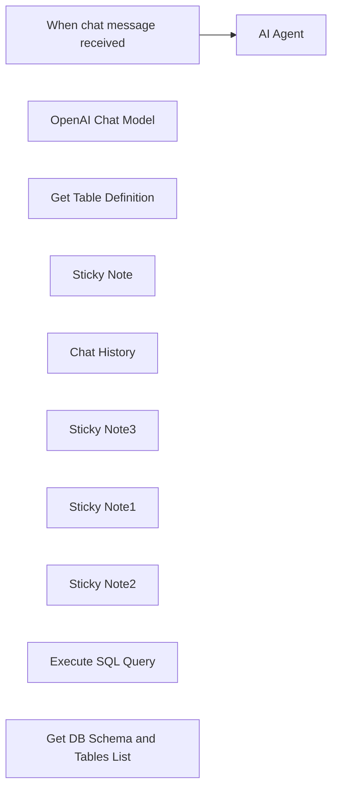

## Fluxo (.json) :

```json
{
  "id": "eOUewYsEzJmQixI6",
  "meta": {
    "instanceId": "77c4feba8f41570ef06dc76ece9a6ded0f0d44f7f1477a64c2d71a8508c11faa",
    "templateCredsSetupCompleted": true
  },
  "name": "Chat with Postgresql Database",
  "tags": [],
  "nodes": [
    {
      "id": "6501a54f-a68c-452d-b353-d7e871ca3780",
      "name": "When chat message received",
      "type": "@n8n/n8n-nodes-langchain.chatTrigger",
      "position": [
        -300,
        -80
      ],
      "webhookId": "cf1de04f-3e38-426c-89f0-3bdb110a5dcf",
      "parameters": {
        "options": {}
      },
      "typeVersion": 1.1
    },
    {
      "id": "cd32221b-2a36-408d-b57e-8115fcd810c9",
      "name": "AI Agent",
      "type": "@n8n/n8n-nodes-langchain.agent",
      "position": [
        0,
        -80
      ],
      "parameters": {
        "agent": "openAiFunctionsAgent",
        "options": {
          "systemMessage": "You are DB assistant. You need to run queries in DB aligned with user requests.\n\nRun custom SQL query to aggregate data and response to user. Make sure every table has schema prefix to it in sql query which you can get from `Get DB Schema and Tables List` tool.\n\nFetch all data to analyse it for response if needed.\n\n## Tools\n\n- Execute SQL query - Executes any sql query generated by AI\n- Get DB Schema and Tables List - Lists all the tables in database with its schema name\n- Get Table Definition - Gets the table definition from db using table name and schema name"
        }
      },
      "typeVersion": 1.7
    },
    {
      "id": "8accbeeb-7eaf-4e9e-aabc-de8ab3a0459b",
      "name": "OpenAI Chat Model",
      "type": "@n8n/n8n-nodes-langchain.lmChatOpenAi",
      "position": [
        -60,
        160
      ],
      "parameters": {
        "model": {
          "__rl": true,
          "mode": "list",
          "value": "gpt-4o-mini"
        },
        "options": {}
      },
      "credentials": {
        "openAiApi": {
          "id": "48uG61Ilo8jndw3r",
          "name": "Your OpenAI Account Credentials"
        }
      },
      "typeVersion": 1.2
    },
    {
      "id": "11f2013f-a080-4c9e-8773-c90492e2c628",
      "name": "Get Table Definition",
      "type": "n8n-nodes-base.postgresTool",
      "position": [
        780,
        140
      ],
      "parameters": {
        "query": "select\n c.column_name,\n c.data_type,\n c.is_nullable,\n c.column_default,\n tc.constraint_type,\n ccu.table_name AS referenced_table,\n ccu.column_name AS referenced_column\nfrom\n information_schema.columns c\nLEFT join\n information_schema.key_column_usage kcu\n ON c.table_name = kcu.table_name\n AND c.column_name = kcu.column_name\nLEFT join\n information_schema.table_constraints tc\n ON kcu.constraint_name = tc.constraint_name\n AND tc.constraint_type = 'FOREIGN KEY'\nLEFT join\n information_schema.constraint_column_usage ccu\n ON tc.constraint_name = ccu.constraint_name\nwhere\n c.table_name = '{{ $fromAI(\"table_name\") }}'\n AND c.table_schema = '{{ $fromAI(\"schema_name\") }}'\norder by\n c.ordinal_position",
        "options": {},
        "operation": "executeQuery",
        "descriptionType": "manual",
        "toolDescription": "Get table definition to find all columns and types"
      },
      "credentials": {
        "postgres": {
          "id": "nGI61D0TEEZz18rr",
          "name": "Your Postgresql Database Credentials"
        }
      },
      "typeVersion": 2.5
    },
    {
      "id": "760bc9bc-0057-4088-b3f0-3ee37b3519df",
      "name": "Sticky Note",
      "type": "n8n-nodes-base.stickyNote",
      "position": [
        -300,
        -240
      ],
      "parameters": {
        "color": 5,
        "width": 560,
        "height": 120,
        "content": "### 👨‍🎤 Setup\n1. Add your **postgresql** and **OpenAI** credentials.\n2. Click **Chat** button and start asking questions to your database.\n3. Activate the workflow and you can make the chat publicly available."
      },
      "typeVersion": 1
    },
    {
      "id": "0df33341-c859-4a54-b6d9-a99670e8d76d",
      "name": "Chat History",
      "type": "@n8n/n8n-nodes-langchain.memoryBufferWindow",
      "position": [
        120,
        160
      ],
      "parameters": {},
      "typeVersion": 1.3
    },
    {
      "id": "4938b22e-f187-4ca0-b9f1-60835e823799",
      "name": "Sticky Note3",
      "type": "n8n-nodes-base.stickyNote",
      "position": [
        360,
        300
      ],
      "parameters": {
        "color": 7,
        "width": 562,
        "height": 156,
        "content": "🛠️ Tools Used:\n1. Execute SQL Query: Used to execute any query generated by the agent.\n2. Get DB Schema and Tables List: It returns the list of all the tables with its schema name.\n3. Get Table Definition: It returns table details like column names, foreign keys and more of a particular table in a schema."
      },
      "typeVersion": 1
    },
    {
      "id": "39780c78-4fbc-403e-a220-aa6a4b06df8c",
      "name": "Sticky Note1",
      "type": "n8n-nodes-base.stickyNote",
      "position": [
        -100,
        300
      ],
      "parameters": {
        "color": 7,
        "width": 162,
        "height": 99,
        "content": "👆 You can exchange this with any other chat model of your choice."
      },
      "typeVersion": 1
    },
    {
      "id": "28a5692c-5003-46cb-9a09-b7867734f446",
      "name": "Sticky Note2",
      "type": "n8n-nodes-base.stickyNote",
      "position": [
        100,
        300
      ],
      "parameters": {
        "color": 7,
        "width": 162,
        "height": 159,
        "content": "👆 You can change how many number of messages to keep using `Context Window Length` option. It's 5 by default."
      },
      "typeVersion": 1
    },
    {
      "id": "c18ced71-6330-4ba0-9c52-1bb5852b3039",
      "name": "Execute SQL Query",
      "type": "n8n-nodes-base.postgresTool",
      "position": [
        380,
        140
      ],
      "parameters": {
        "query": "{{ $fromAI(\"sql_query\", \"SQL Query\") }}",
        "options": {},
        "operation": "executeQuery",
        "descriptionType": "manual",
        "toolDescription": "Get all the data from Postgres, make sure you append the tables with correct schema. Every table is associated with some schema in the database."
      },
      "credentials": {
        "postgres": {
          "id": "nGI61D0TEEZz18rr",
          "name": "Your Postgresql Database Credentials"
        }
      },
      "typeVersion": 2.5
    },
    {
      "id": "557623c6-e499-48a6-a066-744f64f8b6f3",
      "name": "Get DB Schema and Tables List",
      "type": "n8n-nodes-base.postgresTool",
      "position": [
        580,
        140
      ],
      "parameters": {
        "query": "SELECT \n table_schema,\n table_name\nFROM information_schema.tables\nWHERE table_type = 'BASE TABLE'\n AND table_schema NOT IN ('pg_catalog', 'information_schema')\nORDER BY table_schema, table_name;",
        "options": {},
        "operation": "executeQuery",
        "descriptionType": "manual",
        "toolDescription": "Get list of all tables with their schema in the database"
      },
      "credentials": {
        "postgres": {
          "id": "nGI61D0TEEZz18rr",
          "name": "Your Postgresql Database Credentials"
        }
      },
      "typeVersion": 2.5
    }
  ],
  "active": false,
  "pinData": {},
  "settings": {
    "executionOrder": "v1"
  },
  "versionId": "10c7c74e-b383-4ac7-8cb2-c9a15a2818fe",
  "connections": {
    "Chat History": {
      "ai_memory": [
        [
          {
            "node": "AI Agent",
            "type": "ai_memory",
            "index": 0
          }
        ]
      ]
    },
    "Execute SQL Query": {
      "ai_tool": [
        [
          {
            "node": "AI Agent",
            "type": "ai_tool",
            "index": 0
          }
        ]
      ]
    },
    "OpenAI Chat Model": {
      "ai_languageModel": [
        [
          {
            "node": "AI Agent",
            "type": "ai_languageModel",
            "index": 0
          }
        ]
      ]
    },
    "Get Table Definition": {
      "ai_tool": [
        [
          {
            "node": "AI Agent",
            "type": "ai_tool",
            "index": 0
          }
        ]
      ]
    },
    "When chat message received": {
      "main": [
        [
          {
            "node": "AI Agent",
            "type": "main",
            "index": 0
          }
        ]
      ]
    },
    "Get DB Schema and Tables List": {
      "ai_tool": [
        [
          {
            "node": "AI Agent",
            "type": "ai_tool",
            "index": 0
          }
        ]
      ]
    }
  }
}
```

<a id="template-283"></a>

## Template 283 - Postagem automática de tweets

- **Nome:** Postagem automática de tweets
- **Descrição:** Gera tweets com um estilo e nicho configurados por IA e os publica no X (Twitter), suportando agendamento periódico e execução manual.
- **Funcionalidade:** • Agendamento periódico: Programa postagens a cada 6 horas e randomiza os minutos da publicação para parecer natural.
• Publicação sob demanda: Permite executar o fluxo manualmente para criar e publicar um tweet imediatamente.
• Configuração de perfil de influenciador: Define nicho, estilo de escrita e fontes de inspiração que orientam a geração do conteúdo.
• Geração de conteúdo por IA: Usa um modelo avanço para criar tweets voltados a viralidade, incluindo hashtags e emojis conforme apropriado.
• Validação de restrições: Verifica o comprimento do tweet e, se exceder o limite, aciona a regeneração até atender a restrição de caracteres.
• Publicação automática: Envia o tweet aprovado para a conta no X (Twitter) via API.
- **Ferramentas:** • OpenAI (gpt-4-turbo-preview): Modelo de linguagem utilizado para gerar o texto do tweet com base no perfil e instruções.
• X (Twitter) API: Conta para publicar os tweets programaticamente usando autenticação OAuth2.

## Fluxo visual

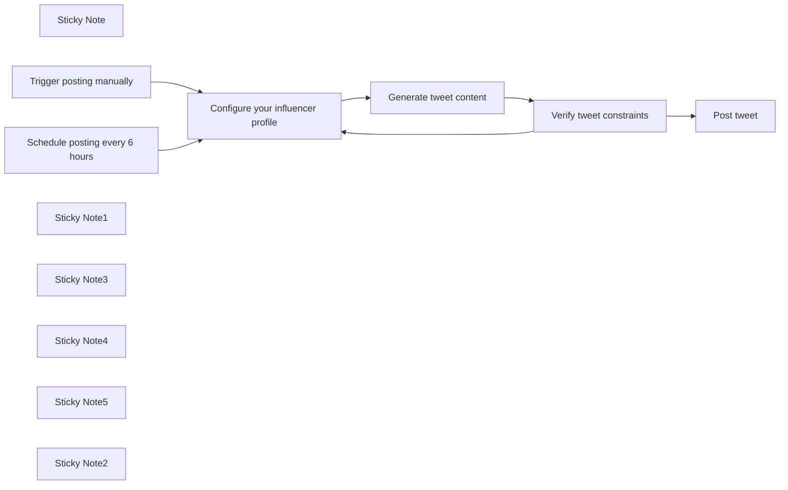

## Fluxo (.json) :

```json
{
  "meta": {
    "instanceId": "cb484ba7b742928a2048bf8829668bed5b5ad9787579adea888f05980292a4a7"
  },
  "nodes": [
    {
      "id": "ea9ddb4c-af49-480c-8b73-221b3741069d",
      "name": "Sticky Note",
      "type": "n8n-nodes-base.stickyNote",
      "position": [
        920,
        400
      ],
      "parameters": {
        "width": 389,
        "height": 265,
        "content": "## Scheduled posting \nWrite a tweet every 6 hours and randomize the minutes that it's posted at to make it seem natural.\n"
      },
      "typeVersion": 1
    },
    {
      "id": "9650b047-7d5e-4ed2-948c-d5be77a94b5d",
      "name": "Post tweet",
      "type": "n8n-nodes-base.twitter",
      "position": [
        2940,
        520
      ],
      "parameters": {
        "text": "={{ $json.message.content.tweet }}",
        "additionalFields": {}
      },
      "credentials": {
        "twitterOAuth2Api": {
          "id": "b3qa9dBp2PxbufK3",
          "name": "X account"
        }
      },
      "typeVersion": 2
    },
    {
      "id": "fd7fc941-37de-4f88-87c0-f62ad1ebe2d6",
      "name": "Schedule posting every 6 hours",
      "type": "n8n-nodes-base.scheduleTrigger",
      "position": [
        1140,
        500
      ],
      "parameters": {
        "rule": {
          "interval": [
            {
              "field": "hours",
              "hoursInterval": 6,
              "triggerAtMinute": "={{ Math.floor(Math.random() * 60) }}"
            }
          ]
        }
      },
      "typeVersion": 1.1
    },
    {
      "id": "107fd741-5c17-4cd6-98aa-088bf8df523d",
      "name": "Trigger posting manually",
      "type": "n8n-nodes-base.manualTrigger",
      "position": [
        1140,
        820
      ],
      "parameters": {},
      "typeVersion": 1
    },
    {
      "id": "831cd431-56e5-482e-a8a5-e5c5ac078ba4",
      "name": "Sticky Note1",
      "type": "n8n-nodes-base.stickyNote",
      "position": [
        1360,
        400
      ],
      "parameters": {
        "width": 389,
        "height": 265,
        "content": "## Configure influencer profile \nSet your target niche, writing style, and inspiration.\n"
      },
      "typeVersion": 1
    },
    {
      "id": "791c0be9-6396-4768-ab6b-3ca7fe49fbea",
      "name": "Sticky Note3",
      "type": "n8n-nodes-base.stickyNote",
      "position": [
        1800,
        400
      ],
      "parameters": {
        "width": 389,
        "height": 265,
        "content": "## Generate tweet\nGenerate a potentially viral tweet based on your configuration."
      },
      "typeVersion": 1
    },
    {
      "id": "3b2872cf-38f9-4cfd-befd-ad792219c313",
      "name": "Sticky Note4",
      "type": "n8n-nodes-base.stickyNote",
      "position": [
        2240,
        400
      ],
      "parameters": {
        "width": 389,
        "height": 265,
        "content": "## Validate tweet\nIf the generated tweet does not meet length constraints, regenerate it."
      },
      "typeVersion": 1
    },
    {
      "id": "364310a1-0367-4ce2-a91b-9a9c4d9387a0",
      "name": "Sticky Note5",
      "type": "n8n-nodes-base.stickyNote",
      "position": [
        2680,
        400
      ],
      "parameters": {
        "width": 389,
        "height": 265,
        "content": "## Post the tweet\nPost the tweet to your X account."
      },
      "typeVersion": 1
    },
    {
      "id": "c666ba9f-d28d-449b-8e20-65c0150cba5b",
      "name": "Verify tweet constraints",
      "type": "n8n-nodes-base.if",
      "position": [
        2480,
        500
      ],
      "parameters": {
        "options": {},
        "conditions": {
          "options": {
            "leftValue": "",
            "caseSensitive": true,
            "typeValidation": "strict"
          },
          "combinator": "and",
          "conditions": [
            {
              "id": "0a6ebbb6-4b14-4c7e-9390-215e32921663",
              "operator": {
                "type": "number",
                "operation": "gt"
              },
              "leftValue": "={{ $json.message.content.tweet.length }}",
              "rightValue": 280
            }
          ]
        }
      },
      "typeVersion": 2
    },
    {
      "id": "9bf25238-98ba-4201-aecc-22be27f095c8",
      "name": "Sticky Note2",
      "type": "n8n-nodes-base.stickyNote",
      "position": [
        920,
        720
      ],
      "parameters": {
        "width": 389,
        "height": 265,
        "content": "## On-demand posting \nWrite a tweet on demand, when you manually run your workflow.\n"
      },
      "typeVersion": 1
    },
    {
      "id": "4b95c041-a70e-42f9-9467-26de2abe6b7a",
      "name": "Generate tweet content",
      "type": "@n8n/n8n-nodes-langchain.openAi",
      "position": [
        1900,
        500
      ],
      "parameters": {
        "modelId": {
          "__rl": true,
          "mode": "list",
          "value": "gpt-4-turbo-preview",
          "cachedResultName": "GPT-4-TURBO-PREVIEW"
        },
        "options": {},
        "messages": {
          "values": [
            {
              "role": "system",
              "content": "=You are a successful modern Twitter influencer. Your tweets always go viral. "
            },
            {
              "role": "system",
              "content": "=You have a specific writing style: {{ $json.style }}"
            },
            {
              "role": "system",
              "content": "=You follow the principles described in your inspiration sources closely and you write your tweets based on that: {{ $json.inspiration }}"
            },
            {
              "role": "system",
              "content": "=You have a very specific niche: {{ $json.niche }}"
            },
            {
              "role": "system",
              "content": "=Answer with the viral tweet and nothing else as a response. Keep the tweet within 280 characters. Current date and time are {{DateTime.now()}}. Add hashtags and emojis where relevant."
            },
            {
              "content": "Write a tweet that is certain to go viral. Take your time in writing it. Think. Use the vast knowledge you have."
            }
          ]
        },
        "jsonOutput": true
      },
      "credentials": {
        "openAiApi": {
          "id": "294",
          "name": "Alex's OpenAI Account"
        }
      },
      "typeVersion": 1
    },
    {
      "id": "18f1af3a-58b3-4a4d-a8ad-3657da9c41ba",
      "name": "Configure your influencer profile",
      "type": "n8n-nodes-base.set",
      "position": [
        1580,
        500
      ],
      "parameters": {
        "options": {},
        "assignments": {
          "assignments": [
            {
              "id": "45268b04-68a1-420f-9ad2-950844d16af1",
              "name": "niche",
              "type": "string",
              "value": "Modern Stoicism. You tweet about the greatest stoics, their ideas, their quotes, and how their wisdom applies in today's modern life. You love sharing personal stories and experiences."
            },
            {
              "id": "d95f4a1c-ab1c-4eca-8732-3d7a087f82d8",
              "name": "style",
              "type": "string",
              "value": "All of your tweets are very personal. "
            },
            {
              "id": "1ee088f7-7021-48c0-bcb7-d1011eb0db3d",
              "name": "inspiration",
              "type": "string",
              "value": "Your inspiration comes from tens of books on stoicism, psychology, and how to influence people. Books such as \"Contagious\" by Jonah Bergen, \"How To Be Internet Famous\" by Brendan Cox, \"How to Win Friends and Influence People\" by Dale Carnegie, and \"Influencers and Creators\" by  Robert V Kozinets, Ulrike Gretzel, Rossella Gambetti strongly influence the way you write your tweets. "
            }
          ]
        }
      },
      "typeVersion": 3.3
    }
  ],
  "pinData": {},
  "connections": {
    "Generate tweet content": {
      "main": [
        [
          {
            "node": "Verify tweet constraints",
            "type": "main",
            "index": 0
          }
        ]
      ]
    },
    "Trigger posting manually": {
      "main": [
        [
          {
            "node": "Configure your influencer profile",
            "type": "main",
            "index": 0
          }
        ]
      ]
    },
    "Verify tweet constraints": {
      "main": [
        [
          {
            "node": "Configure your influencer profile",
            "type": "main",
            "index": 0
          }
        ],
        [
          {
            "node": "Post tweet",
            "type": "main",
            "index": 0
          }
        ]
      ]
    },
    "Schedule posting every 6 hours": {
      "main": [
        [
          {
            "node": "Configure your influencer profile",
            "type": "main",
            "index": 0
          }
        ]
      ]
    },
    "Configure your influencer profile": {
      "main": [
        [
          {
            "node": "Generate tweet content",
            "type": "main",
            "index": 0
          }
        ]
      ]
    }
  }
}
```

<a id="template-284"></a>

## Template 284 - Alertas de novos tickets para Teams

- **Nome:** Alertas de novos tickets para Teams
- **Descrição:** Fluxo que verifica periodicamente novos tickets em uma instância ConnectWise, filtra os já notificados, agrupa por empresa/site e envia notificações formatadas para uma equipe no Microsoft Teams, registrando os tickets notificados para evitar duplicações.
- **Funcionalidade:** • Agendamento periódico: Executa verificações regulares durante dias úteis no horário comercial para buscar novos tickets.
• Consulta à API de tickets: Busca tickets com status 'New' (incluindo variações) em boards específicos e sem ticket pai.
• Normalização de identificador: Converte o identificador do ticket para formato adequado para comparação e armazenamento.
• Verificação de duplicados: Consulta o banco de dados para identificar tickets que já foram notificados anteriormente.
• Filtragem de novos tickets: Exclui os tickets que já foram enviados anteriormente para evitar notificações repetidas.
• Agrupamento por empresa/site: Agrupa tickets semelhantes por empresa e local, consolidando informações para envio mais limpo.
• Envio de notificações formatadas: Envia mensagem em HTML para um chat do time com resumo do tipo de ticket, tickets e empresa.
• Registro de tickets notificados: Grava os identificadores dos tickets no banco de dados para impedir reenvios futuros.
- **Ferramentas:** • ConnectWise (API): Fonte dos tickets, utilizada para consultar tickets com condições específicas de status, board e ausência de ticket pai.
• Redis: Armazenamento para registrar quais tickets já foram notificados, permitindo verificação de duplicados e persistência entre execuções.
• Microsoft Teams: Canal de destino para enviar mensagens formatadas em HTML para a equipe responsável.

## Fluxo visual

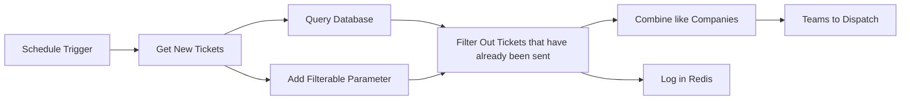

## Fluxo (.json) :

```json
{
  "id": "0H2mo5k35e0nzMEE",
  "meta": {
    "instanceId": "2e2d423885cf86d4b5420a96c93cd261c847d0419e9bb242fa12caf4a4c298c3",
    "templateCredsSetupCompleted": true
  },
  "name": "New Ticket Alerts to Teams",
  "tags": [],
  "nodes": [
    {
      "id": "80c29a2a-c005-4a19-a71e-3e862a4f9b49",
      "name": "Schedule Trigger",
      "type": "n8n-nodes-base.scheduleTrigger",
      "position": [
        -120,
        540
      ],
      "parameters": {
        "rule": {
          "interval": [
            {
              "field": "cronExpression",
              "expression": "*/1 8-16 * * 1-5"
            }
          ]
        }
      },
      "typeVersion": 1.1
    },
    {
      "id": "24b7e81c-51ea-4a0f-9684-e5aef53021ad",
      "name": "Add Filterable Parameter",
      "type": "n8n-nodes-base.code",
      "position": [
        460,
        460
      ],
      "parameters": {
        "jsCode": "for (const item of $input.all()) {\n  // Assuming 'id' is the field with the Connectwise Ticket ID\n  // Convert 'id' to a string to ensure it has quotes in the JSON output\n  item.json.id = item.json.id.toString();\n\n  // If 'filterOnThis' is another field you want to set with the id as a string\n  item.json.FilterOnThis = item.json.id;\n\n  // ... any other operations you want to perform on each item\n}\n\nreturn $input.all();"
      },
      "typeVersion": 2
    },
    {
      "id": "1ab5a549-34a2-4bed-9c4c-9c268bf04e0d",
      "name": "Query Database",
      "type": "n8n-nodes-base.redis",
      "position": [
        460,
        620
      ],
      "parameters": {
        "key": "={{ $json.id.toString() }}",
        "keyType": "string",
        "options": {},
        "operation": "get",
        "propertyName": "=Tickets"
      },
      "credentials": {
        "redis": {
          "id": "nm82iTY9aRTp8ZQm",
          "name": "Redis-Dispatch"
        }
      },
      "typeVersion": 1,
      "alwaysOutputData": true
    },
    {
      "id": "c6f3bb14-3385-4b5a-95b1-f0ac787d056a",
      "name": "Filter Out Tickets that have already been sent",
      "type": "n8n-nodes-base.merge",
      "position": [
        780,
        540
      ],
      "parameters": {
        "mode": "combine",
        "options": {
          "fuzzyCompare": true
        },
        "joinMode": "keepNonMatches",
        "mergeByFields": {
          "values": [
            {
              "field1": "FilterOnThis",
              "field2": "Tickets"
            }
          ]
        },
        "outputDataFrom": "input1"
      },
      "typeVersion": 2.1
    },
    {
      "id": "18bb4e45-cfaf-47b7-88fa-4edb316f05d5",
      "name": "Get New Tickets",
      "type": "n8n-nodes-base.httpRequest",
      "position": [
        180,
        540
      ],
      "parameters": {
        "url": "https://na.myconnectwise.net/v4_6_release/apis/3.0/service/tickets?conditions=(status/name=\"New\" or status/name=\"New (email)\" or status/name=\"New (portal)\") and (board/id=25 or board/id=26 or board/id=1 or board/id=28) and parentTicketId=null&PageSize=999",
        "options": {},
        "sendHeaders": true,
        "authentication": "genericCredentialType",
        "genericAuthType": "httpHeaderAuth",
        "headerParameters": {
          "parameters": [
            {
              "name": "clientId",
              "value": "934a9a6d-480a-4502-ab77-46bd80b368d7"
            }
          ]
        }
      },
      "credentials": {
        "httpHeaderAuth": {
          "id": "MlbbiZdsGxeWRyMH",
          "name": "Header Auth account"
        }
      },
      "typeVersion": 4.1
    },
    {
      "id": "5a827e46-b257-4078-ba1f-a27bfba7cb02",
      "name": "Combine like Companies",
      "type": "n8n-nodes-base.code",
      "position": [
        1040,
        620
      ],
      "parameters": {
        "jsCode": "// would need to be adapted to your specific data structure.\nreturn Object.values(items.reduce((accumulator, current) => {\n  const siteName = current.json.siteName; // assuming 'siteName' is the common property\n  const companyName = current.json.company; // replace with the correct path to the company name\n  const ticketType = current.json.recordType; // replace with the correct path to the ticket type\n\n  // Use a combined key of siteName and companyName to group tickets\n  const groupKey = `${siteName} - ${companyName}`;\n\n  if (!accumulator[groupKey]) {\n    accumulator[groupKey] = {\n      siteName,\n      companyName,\n      ticketType,\n      tickets: []\n    };\n  }\n\n  // Create a string that combines the ticket number and summary with a <br> for HTML line breaks\n  const ticketInfo = `${current.json.id}: ${current.json.summary}<br>`;\n  accumulator[groupKey].tickets.push(ticketInfo);\n\n  // If ticketType is not consistent within the same groupKey, handle accordingly\n  if (!accumulator[groupKey].ticketType) {\n    accumulator[groupKey].ticketType = ticketType;\n  } else if (accumulator[groupKey].ticketType !== ticketType) {\n    // Handle the case where different ticket types exist within the same groupKey\n    accumulator[groupKey].ticketType += `, ${ticketType}`;\n  }\n\n  return accumulator;\n}, {})).map(group => {\n  // Join the tickets array into a single string, separating each ticket with an empty string (effectively nothing)\n  const ticketsString = group.tickets.join('');\n\n  // Return the final object structure, with each property as needed\n  return {\n    siteName: group.siteName,\n    companyName: group.companyName,\n    ticketType: group.ticketType,\n    tickets: ticketsString // This is now a single string with <br> as separators\n  };\n});\n"
      },
      "typeVersion": 2
    },
    {
      "id": "0a69f405-cb56-4cb5-b56c-9015602376eb",
      "name": "Teams to Dispatch",
      "type": "n8n-nodes-base.microsoftTeams",
      "position": [
        1320,
        540
      ],
      "parameters": {
        "chatId": "19:3a9ec7df-5b99-4311-9a78-61ac2192da07_449d57c9-64d0-496f-ad07-147a6b388a32@unq.gbl.spaces",
        "message": "=Hey Dispatch Team!, A new {{ $json.ticketType }} has come in.<br><br> <strong>Ticket:</strong> {{ $json.tickets }} <strong>Company: </strong> {{ $json.companyName.name }}",
        "options": {},
        "resource": "chatMessage",
        "messageType": "html"
      },
      "credentials": {
        "microsoftTeamsOAuth2Api": {
          "id": "9eUxYgQYNgePrgUD",
          "name": "Microsoft Teams account"
        }
      },
      "typeVersion": 1.1
    },
    {
      "id": "59beaef0-77af-4ae2-a68d-43313e933a10",
      "name": "Log in Redis",
      "type": "n8n-nodes-base.redis",
      "position": [
        1040,
        460
      ],
      "parameters": {
        "key": "={{ $json.id }}",
        "value": "={{ $json.id }}",
        "operation": "set"
      },
      "credentials": {
        "redis": {
          "id": "nm82iTY9aRTp8ZQm",
          "name": "Redis-Dispatch"
        }
      },
      "typeVersion": 1
    }
  ],
  "active": true,
  "pinData": {},
  "settings": {
    "executionOrder": "v1"
  },
  "versionId": "ab7ae9df-5adf-4be4-8c56-39b433641673",
  "connections": {
    "Query Database": {
      "main": [
        [
          {
            "node": "Filter Out Tickets that have already been sent",
            "type": "main",
            "index": 1
          }
        ]
      ]
    },
    "Get New Tickets": {
      "main": [
        [
          {
            "node": "Query Database",
            "type": "main",
            "index": 0
          },
          {
            "node": "Add Filterable Parameter",
            "type": "main",
            "index": 0
          }
        ]
      ]
    },
    "Schedule Trigger": {
      "main": [
        [
          {
            "node": "Get New Tickets",
            "type": "main",
            "index": 0
          }
        ]
      ]
    },
    "Combine like Companies": {
      "main": [
        [
          {
            "node": "Teams to Dispatch",
            "type": "main",
            "index": 0
          }
        ]
      ]
    },
    "Add Filterable Parameter": {
      "main": [
        [
          {
            "node": "Filter Out Tickets that have already been sent",
            "type": "main",
            "index": 0
          }
        ]
      ]
    },
    "Filter Out Tickets that have already been sent": {
      "main": [
        [
          {
            "node": "Combine like Companies",
            "type": "main",
            "index": 0
          },
          {
            "node": "Log in Redis",
            "type": "main",
            "index": 0
          }
        ]
      ]
    }
  }
}
```

<a id="template-285"></a>

## Template 285 - Assistente de BD via chat

- **Nome:** Assistente de BD via chat
- **Descrição:** Fluxo que permite conversar com um banco PostgreSQL: interpreta perguntas em linguagem natural, gera e executa consultas SQL e retorna resultados agregados ao usuário.
- **Funcionalidade:** • Recepção de mensagens de chat: inicia o processo ao receber uma pergunta do usuário.
• Interpretação em linguagem natural: utiliza um modelo de linguagem para entender a intenção do usuário e definir quais dados buscar.
• Geração segura de SQL: cria consultas SQL personalizadas garantindo que todas as tabelas estejam prefixadas pelo schema correto.
• Listagem de esquema e tabelas: obtém a lista de todos os schemas e tabelas disponíveis no banco para construir consultas precisas.
• Obtenção da definição da tabela: recupera metadados (colunas, tipos, chaves) das tabelas para assegurar consultas compatíveis com a estrutura do banco.
• Execução de consultas SQL: executa as queries geradas para coletar os dados necessários.
• Análise e agregação de dados: busca e agrega os dados retornados para gerar insights ou respostas consolidadas.
• Memória de chat: mantém um histórico limitado de mensagens para fornecer contexto entre interações.
• Resposta ao usuário: formata e devolve os resultados e explicações baseadas nos dados obtidos.
- **Ferramentas:** • PostgreSQL: banco de dados relacional utilizado para armazenar e consultar os dados.
• OpenAI (modelo de linguagem): serviço de IA usado para interpretar perguntas em linguagem natural, gerar consultas SQL e compor respostas textuais.

## Fluxo visual


## Fluxo (.json) :

```json
{
  "id": "eOUewYsEzJmQixI6",
  "meta": {
    "instanceId": "77c4feba8f41570ef06dc76ece9a6ded0f0d44f7f1477a64c2d71a8508c11faa",
    "templateCredsSetupCompleted": true
  },
  "name": "Chat with Postgresql Database",
  "tags": [],
  "nodes": [
    {
      "id": "6501a54f-a68c-452d-b353-d7e871ca3780",
      "name": "When chat message received",
      "type": "@n8n/n8n-nodes-langchain.chatTrigger",
      "position": [
        -300,
        -80
      ],
      "webhookId": "cf1de04f-3e38-426c-89f0-3bdb110a5dcf",
      "parameters": {
        "options": {}
      },
      "typeVersion": 1.1
    },
    {
      "id": "cd32221b-2a36-408d-b57e-8115fcd810c9",
      "name": "AI Agent",
      "type": "@n8n/n8n-nodes-langchain.agent",
      "position": [
        0,
        -80
      ],
      "parameters": {
        "agent": "openAiFunctionsAgent",
        "options": {
          "systemMessage": "You are DB assistant. You need to run queries in DB aligned with user requests.\n\nRun custom SQL query to aggregate data and response to user. Make sure every table has schema prefix to it in sql query which you can get from `Get DB Schema and Tables List` tool.\n\nFetch all data to analyse it for response if needed.\n\n## Tools\n\n- Execute SQL query - Executes any sql query generated by AI\n- Get DB Schema and Tables List - Lists all the tables in database with its schema name\n- Get Table Definition - Gets the table definition from db using table name and schema name"
        }
      },
      "typeVersion": 1.7
    },
    {
      "id": "8accbeeb-7eaf-4e9e-aabc-de8ab3a0459b",
      "name": "OpenAI Chat Model",
      "type": "@n8n/n8n-nodes-langchain.lmChatOpenAi",
      "position": [
        -60,
        160
      ],
      "parameters": {
        "model": {
          "__rl": true,
          "mode": "list",
          "value": "gpt-4o-mini"
        },
        "options": {}
      },
      "credentials": {
        "openAiApi": {
          "id": "48uG61Ilo8jndw3r",
          "name": "Your OpenAI Account Credentials"
        }
      },
      "typeVersion": 1.2
    },
    {
      "id": "11f2013f-a080-4c9e-8773-c90492e2c628",
      "name": "Get Table Definition",
      "type": "n8n-nodes-base.postgresTool",
      "position": [
        780,
        140
      ],
      "parameters": {
        "query": "select\n  c.column_name,\n  c.data_type,\n  c.is_nullable,\n  c.column_default,\n  tc.constraint_type,\n  ccu.table_name AS referenced_table,\n  ccu.column_name AS referenced_column\nfrom\n  information_schema.columns c\nLEFT join\n  information_schema.key_column_usage kcu\n  ON c.table_name = kcu.table_name\n  AND c.column_name = kcu.column_name\nLEFT join\n  information_schema.table_constraints tc\n  ON kcu.constraint_name = tc.constraint_name\n  AND tc.constraint_type = 'FOREIGN KEY'\nLEFT join\n  information_schema.constraint_column_usage ccu\n  ON tc.constraint_name = ccu.constraint_name\nwhere\n  c.table_name = '{{ $fromAI(\"table_name\") }}'\n  AND c.table_schema = '{{ $fromAI(\"schema_name\") }}'\norder by\n  c.ordinal_position",
        "options": {},
        "operation": "executeQuery",
        "descriptionType": "manual",
        "toolDescription": "Get table definition to find all columns and types"
      },
      "credentials": {
        "postgres": {
          "id": "nGI61D0TEEZz18rr",
          "name": "Your Postgresql Database Credentials"
        }
      },
      "typeVersion": 2.5
    },
    {
      "id": "760bc9bc-0057-4088-b3f0-3ee37b3519df",
      "name": "Sticky Note",
      "type": "n8n-nodes-base.stickyNote",
      "position": [
        -300,
        -240
      ],
      "parameters": {
        "color": 5,
        "width": 560,
        "height": 120,
        "content": "### 👨‍🎤 Setup\n1. Add your **postgresql** and **OpenAI** credentials.\n2. Click **Chat** button and start asking questions to your database.\n3. Activate the workflow and you can make the chat publicly available."
      },
      "typeVersion": 1
    },
    {
      "id": "0df33341-c859-4a54-b6d9-a99670e8d76d",
      "name": "Chat History",
      "type": "@n8n/n8n-nodes-langchain.memoryBufferWindow",
      "position": [
        120,
        160
      ],
      "parameters": {},
      "typeVersion": 1.3
    },
    {
      "id": "4938b22e-f187-4ca0-b9f1-60835e823799",
      "name": "Sticky Note3",
      "type": "n8n-nodes-base.stickyNote",
      "position": [
        360,
        300
      ],
      "parameters": {
        "color": 7,
        "width": 562,
        "height": 156,
        "content": "🛠️ Tools Used:\n1. Execute SQL Query: Used to execute any query generated by the agent.\n2. Get DB Schema and Tables List: It returns the list of all the tables with its schema name.\n3. Get Table Definition: It returns table details like column names, foreign keys and more of a particular table in a schema."
      },
      "typeVersion": 1
    },
    {
      "id": "39780c78-4fbc-403e-a220-aa6a4b06df8c",
      "name": "Sticky Note1",
      "type": "n8n-nodes-base.stickyNote",
      "position": [
        -100,
        300
      ],
      "parameters": {
        "color": 7,
        "width": 162,
        "height": 99,
        "content": "👆 You can exchange this with any other chat model of your choice."
      },
      "typeVersion": 1
    },
    {
      "id": "28a5692c-5003-46cb-9a09-b7867734f446",
      "name": "Sticky Note2",
      "type": "n8n-nodes-base.stickyNote",
      "position": [
        100,
        300
      ],
      "parameters": {
        "color": 7,
        "width": 162,
        "height": 159,
        "content": "👆 You can change how many number of messages to keep using `Context Window Length` option. It's 5 by default."
      },
      "typeVersion": 1
    },
    {
      "id": "c18ced71-6330-4ba0-9c52-1bb5852b3039",
      "name": "Execute SQL Query",
      "type": "n8n-nodes-base.postgresTool",
      "position": [
        380,
        140
      ],
      "parameters": {
        "query": "{{ $fromAI(\"sql_query\", \"SQL Query\") }}",
        "options": {},
        "operation": "executeQuery",
        "descriptionType": "manual",
        "toolDescription": "Get all the data from Postgres, make sure you append the tables with correct schema. Every table is associated with some schema in the database."
      },
      "credentials": {
        "postgres": {
          "id": "nGI61D0TEEZz18rr",
          "name": "Your Postgresql Database Credentials"
        }
      },
      "typeVersion": 2.5
    },
    {
      "id": "557623c6-e499-48a6-a066-744f64f8b6f3",
      "name": "Get DB Schema and Tables List",
      "type": "n8n-nodes-base.postgresTool",
      "position": [
        580,
        140
      ],
      "parameters": {
        "query": "SELECT \n    table_schema,\n    table_name\nFROM information_schema.tables\nWHERE table_type = 'BASE TABLE'\n    AND table_schema NOT IN ('pg_catalog', 'information_schema')\nORDER BY table_schema, table_name;",
        "options": {},
        "operation": "executeQuery",
        "descriptionType": "manual",
        "toolDescription": "Get list of all tables with their schema in the database"
      },
      "credentials": {
        "postgres": {
          "id": "nGI61D0TEEZz18rr",
          "name": "Your Postgresql Database Credentials"
        }
      },
      "typeVersion": 2.5
    }
  ],
  "active": false,
  "pinData": {},
  "settings": {
    "executionOrder": "v1"
  },
  "versionId": "10c7c74e-b383-4ac7-8cb2-c9a15a2818fe",
  "connections": {
    "Chat History": {
      "ai_memory": [
        [
          {
            "node": "AI Agent",
            "type": "ai_memory",
            "index": 0
          }
        ]
      ]
    },
    "Execute SQL Query": {
      "ai_tool": [
        [
          {
            "node": "AI Agent",
            "type": "ai_tool",
            "index": 0
          }
        ]
      ]
    },
    "OpenAI Chat Model": {
      "ai_languageModel": [
        [
          {
            "node": "AI Agent",
            "type": "ai_languageModel",
            "index": 0
          }
        ]
      ]
    },
    "Get Table Definition": {
      "ai_tool": [
        [
          {
            "node": "AI Agent",
            "type": "ai_tool",
            "index": 0
          }
        ]
      ]
    },
    "When chat message received": {
      "main": [
        [
          {
            "node": "AI Agent",
            "type": "main",
            "index": 0
          }
        ]
      ]
    },
    "Get DB Schema and Tables List": {
      "ai_tool": [
        [
          {
            "node": "AI Agent",
            "type": "ai_tool",
            "index": 0
          }
        ]
      ]
    }
  }
}
```

<a id="template-286"></a>

## Template 286 - Enviar novo pedido WooCommerce para Slack

- **Nome:** Enviar novo pedido WooCommerce para Slack
- **Descrição:** Quando um novo pedido é criado na loja, o fluxo verifica o valor do pedido e, se atender ao critério, envia uma notificação com detalhes para um canal do Slack.
- **Funcionalidade:** • Detecção de novos pedidos: recebe notificações de pedidos criados na loja WooCommerce.
• Filtragem por valor: verifica se o total do pedido é maior ou igual a 100 antes de prosseguir.
• Envio de notificação ao Slack: publica uma mensagem no canal designado informando sobre o novo pedido.
• Inclusão de detalhes do pedido na mensagem: adiciona ID do pedido, status, total com símbolo da moeda, link direto para o pedido, data e ID da transação no rodapé.
- **Ferramentas:** • WooCommerce: plataforma de e-commerce que gera eventos de pedidos e fornece os dados do pedido.
• Slack: serviço de comunicação usado para receber notificações em um canal específico.

## Fluxo visual

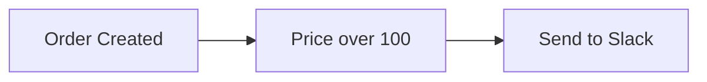

## Fluxo (.json) :

```json
{
  "id": 81,
  "name": "New WooCommerce order to Slack",
  "nodes": [
    {
      "name": "Order Created",
      "type": "n8n-nodes-base.wooCommerceTrigger",
      "position": [
        340,
        500
      ],
      "webhookId": "287b4bf4-67ec-4c97-85d9-c0d3e6f59e6b",
      "parameters": {
        "event": "order.created"
      },
      "credentials": {
        "wooCommerceApi": {
          "id": "48",
          "name": "WooCommerce account"
        }
      },
      "typeVersion": 1
    },
    {
      "name": "Send to Slack",
      "type": "n8n-nodes-base.slack",
      "position": [
        780,
        480
      ],
      "parameters": {
        "text": ":sparkles: There is a new order :sparkles:",
        "channel": "woo-commerce",
        "blocksUi": {
          "blocksValues": []
        },
        "attachments": [
          {
            "color": "#66FF00",
            "fields": {
              "item": [
                {
                  "short": true,
                  "title": "Order ID",
                  "value": "={{$json[\"id\"]}}"
                },
                {
                  "short": true,
                  "title": "Status",
                  "value": "={{$json[\"status\"]}}"
                },
                {
                  "short": true,
                  "title": "Total",
                  "value": "={{$json[\"currency_symbol\"]}}{{$json[\"total\"]}}"
                },
                {
                  "short": false,
                  "title": "Link",
                  "value": "={{$node[\"Order Created\"].json[\"_links\"][\"self\"][0][\"href\"]}}"
                }
              ]
            },
            "footer": "=*Ordered:* {{$json[\"date_created\"]}} | *Transaction ID:* {{$json[\"transaction_id\"]}}"
          }
        ],
        "otherOptions": {}
      },
      "credentials": {
        "slackApi": {
          "id": "53",
          "name": "Slack Access Token"
        }
      },
      "typeVersion": 1
    },
    {
      "name": "Price over 100",
      "type": "n8n-nodes-base.if",
      "position": [
        540,
        500
      ],
      "parameters": {
        "conditions": {
          "number": [
            {
              "value1": "={{$json[\"total\"]}}",
              "value2": 100,
              "operation": "largerEqual"
            }
          ]
        }
      },
      "typeVersion": 1
    }
  ],
  "active": false,
  "settings": {},
  "connections": {
    "Order Created": {
      "main": [
        [
          {
            "node": "Price over 100",
            "type": "main",
            "index": 0
          }
        ]
      ]
    },
    "Price over 100": {
      "main": [
        [
          {
            "node": "Send to Slack",
            "type": "main",
            "index": 0
          }
        ],
        []
      ]
    }
  }
}
```

<a id="template-287"></a>

## Template 287 - Notas automáticas no Pipedrive a partir de cobranças Stripe

- **Nome:** Notas automáticas no Pipedrive a partir de cobranças Stripe
- **Descrição:** Agenda uma verificação diária para buscar cobranças bem-sucedidas no Stripe desde a última execução e cria notas no Pipedrive com as informações relevantes associadas à organização correspondente.
- **Funcionalidade:** • Agendamento diário: Dispara o processo automaticamente todos os dias às 8h.
• Controle de execução por timestamp: Utiliza e atualiza um timestamp de última execução para buscar apenas cobranças novas desde a última execução.
• Busca de cobranças no Stripe: Consulta a API do Stripe por cobranças com status sucedido criadas após o timestamp armazenado.
• Normalização e associação de dados: Divide a lista de cobranças em itens individuais, obtém a lista de clientes e adiciona o nome do cliente a cada cobrança.
• Pesquisa de organização no CRM: Procura no Pipedrive organizações pelo nome do cliente e associa a informação encontrada à cobrança.
• Criação de notas com detalhes da cobrança: Gera notas no Pipedrive contendo descrição, valor (convertido/formatado) e moeda, vinculadas à organização correspondente.
• Atualização do registro de execução: Após processar as cobranças, atualiza o timestamp para a próxima execução.
- **Ferramentas:** • Stripe: Plataforma de pagamentos utilizada para buscar cobranças e informações de clientes via API.
• Pipedrive: CRM utilizado para procurar organizações e criar notas com as informações das cobranças.

## Fluxo visual

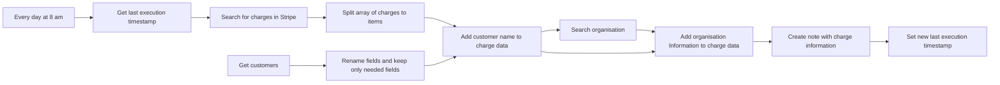

## Fluxo (.json) :

```json
{
  "meta": {
    "instanceId": "8c8c5237b8e37b006a7adce87f4369350c58e41f3ca9de16196d3197f69eabcd"
  },
  "nodes": [
    {
      "id": "28349bfd-f68e-4479-9508-28d408033d09",
      "name": "Get customers",
      "type": "n8n-nodes-base.stripe",
      "position": [
        5360,
        1100
      ],
      "parameters": {
        "filters": {},
        "resource": "customer",
        "operation": "getAll",
        "returnAll": true
      },
      "credentials": {
        "stripeApi": {
          "id": "26",
          "name": "Stripe account"
        }
      },
      "typeVersion": 1
    },
    {
      "id": "3f3d2389-e9ab-4140-8b04-f0a07003cecc",
      "name": "Rename fields and keep only needed fields",
      "type": "n8n-nodes-base.set",
      "position": [
        5560,
        1100
      ],
      "parameters": {
        "values": {
          "string": [
            {
              "name": "customerName",
              "value": "={{ $json[\"name\"] }}"
            },
            {
              "name": "customerId",
              "value": "={{ $json[\"id\"] }}"
            }
          ]
        },
        "options": {},
        "keepOnlySet": true
      },
      "typeVersion": 1
    },
    {
      "id": "d6d3ccff-f565-49c9-9cda-8e278d298433",
      "name": "Add customer name to charge data",
      "type": "n8n-nodes-base.merge",
      "position": [
        5860,
        920
      ],
      "parameters": {
        "mode": "mergeByKey",
        "propertyName1": "customer",
        "propertyName2": "customerId"
      },
      "typeVersion": 1
    },
    {
      "id": "eadce8e7-f523-485b-8cc0-5a336c8633ef",
      "name": "Search organisation",
      "type": "n8n-nodes-base.pipedrive",
      "position": [
        6140,
        1060
      ],
      "parameters": {
        "term": "={{ $json[\"customerName\"] }}",
        "resource": "organization",
        "operation": "search",
        "additionalFields": {}
      },
      "credentials": {
        "pipedriveApi": {
          "id": "96",
          "name": "Pipedrive account"
        }
      },
      "typeVersion": 1
    },
    {
      "id": "dde08b48-21b0-44af-a66d-ff69399608e7",
      "name": "Add organisation Information to charge data",
      "type": "n8n-nodes-base.merge",
      "position": [
        6400,
        940
      ],
      "parameters": {
        "join": "inner",
        "mode": "mergeByIndex"
      },
      "typeVersion": 1
    },
    {
      "id": "6cbd0f06-0f10-4360-8c5c-e181679ba370",
      "name": "Create note with charge information",
      "type": "n8n-nodes-base.pipedrive",
      "position": [
        6620,
        940
      ],
      "parameters": {
        "content": "={{ $json[\"description\"] }}: {{ $json[\"amount\"] / 100 }} {{ $json[\"currency\"] }}",
        "resource": "note",
        "additionalFields": {
          "org_id": "={{ $json[\"id\"] }}"
        }
      },
      "credentials": {
        "pipedriveApi": {
          "id": "96",
          "name": "Pipedrive account"
        }
      },
      "typeVersion": 1
    },
    {
      "id": "c6ed5a89-b50a-40ad-bd78-62ffc2430fde",
      "name": "Get last execution timestamp",
      "type": "n8n-nodes-base.functionItem",
      "position": [
        5140,
        900
      ],
      "parameters": {
        "functionCode": "// Code here will run once per input item.\n// More info and help: https://docs.n8n.io/nodes/n8n-nodes-base.functionItem\n// Tip: You can use luxon for dates and $jmespath for querying JSON structures\n\n// Add a new field called 'myNewField' to the JSON of the item\nconst staticData = getWorkflowStaticData('global');\n\nif(!staticData.lastExecution){\n  staticData.lastExecution = Math.round( new Date().getTime() / 1000 );\n}\n\nitem.executionTimeStamp = Math.round( new Date().getTime() / 1000 );\nitem.lastExecution = staticData.lastExecution;\n\n\nreturn item;"
      },
      "typeVersion": 1
    },
    {
      "id": "41b2c937-d479-4402-b428-29faabe32845",
      "name": "Set new last execution timestamp",
      "type": "n8n-nodes-base.functionItem",
      "position": [
        6820,
        940
      ],
      "parameters": {
        "functionCode": "// Code here will run once per input item.\n// More info and help: https://docs.n8n.io/nodes/n8n-nodes-base.functionItem\n// Tip: You can use luxon for dates and $jmespath for querying JSON structures\n\n// Add a new field called 'myNewField' to the JSON of the item\nconst staticData = getWorkflowStaticData('global');\n\nstaticData.lastExecution = $item(0).$node[\"Get last execution timestamp\"].executionTimeStamp;\n\nreturn item;"
      },
      "executeOnce": true,
      "typeVersion": 1
    },
    {
      "id": "56612271-08c4-4347-92b1-b898c68c3460",
      "name": "Split array of charges to items",
      "type": "n8n-nodes-base.itemLists",
      "position": [
        5560,
        900
      ],
      "parameters": {
        "options": {},
        "fieldToSplitOut": "data"
      },
      "typeVersion": 1
    },
    {
      "id": "b866ba46-6269-4c8d-8021-ea99591d676d",
      "name": "Search for charges in Stripe",
      "type": "n8n-nodes-base.httpRequest",
      "position": [
        5360,
        900
      ],
      "parameters": {
        "url": "https://api.stripe.com/v1/charges/search",
        "options": {},
        "authentication": "predefinedCredentialType",
        "queryParametersUi": {
          "parameter": [
            {
              "name": "query",
              "value": "=created>{{$json[\"lastExecution\"]}} AND status:\"succeeded\""
            }
          ]
        },
        "nodeCredentialType": "stripeApi"
      },
      "credentials": {
        "stripeApi": {
          "id": "26",
          "name": "Stripe account"
        }
      },
      "typeVersion": 2
    },
    {
      "id": "a3249f70-1cd4-4d5f-8f27-15badcf10296",
      "name": "Every day at 8 am",
      "type": "n8n-nodes-base.cron",
      "position": [
        4920,
        900
      ],
      "parameters": {
        "triggerTimes": {
          "item": [
            {
              "hour": 8
            }
          ]
        }
      },
      "typeVersion": 1
    }
  ],
  "connections": {
    "Get customers": {
      "main": [
        [
          {
            "node": "Rename fields and keep only needed fields",
            "type": "main",
            "index": 0
          }
        ]
      ]
    },
    "Every day at 8 am": {
      "main": [
        [
          {
            "node": "Get last execution timestamp",
            "type": "main",
            "index": 0
          }
        ]
      ]
    },
    "Search organisation": {
      "main": [
        [
          {
            "node": "Add organisation Information to charge data",
            "type": "main",
            "index": 1
          }
        ]
      ]
    },
    "Get last execution timestamp": {
      "main": [
        [
          {
            "node": "Search for charges in Stripe",
            "type": "main",
            "index": 0
          }
        ]
      ]
    },
    "Search for charges in Stripe": {
      "main": [
        [
          {
            "node": "Split array of charges to items",
            "type": "main",
            "index": 0
          }
        ]
      ]
    },
    "Split array of charges to items": {
      "main": [
        [
          {
            "node": "Add customer name to charge data",
            "type": "main",
            "index": 0
          }
        ]
      ]
    },
    "Add customer name to charge data": {
      "main": [
        [
          {
            "node": "Search organisation",
            "type": "main",
            "index": 0
          },
          {
            "node": "Add organisation Information to charge data",
            "type": "main",
            "index": 0
          }
        ]
      ]
    },
    "Create note with charge information": {
      "main": [
        [
          {
            "node": "Set new last execution timestamp",
            "type": "main",
            "index": 0
          }
        ]
      ]
    },
    "Rename fields and keep only needed fields": {
      "main": [
        [
          {
            "node": "Add customer name to charge data",
            "type": "main",
            "index": 1
          }
        ]
      ]
    },
    "Add organisation Information to charge data": {
      "main": [
        [
          {
            "node": "Create note with charge information",
            "type": "main",
            "index": 0
          }
        ]
      ]
    }
  }
}
```

<a id="template-288"></a>

## Template 288 - Alerta de erro no Slack

- **Nome:** Alerta de erro no Slack
- **Descrição:** Envia uma mensagem para um canal do Slack sempre que uma execução falha, incluindo o nome do workflow e o link da execução para investigação rápida.
- **Funcionalidade:** • Detecção de falhas de execução: Aciona automaticamente quando ocorre um erro durante a execução de um workflow.
• Composição de mensagem de erro: Formata o texto com emoji, nome do workflow e link direto para a execução com problema.
• Envio de notificação ao Slack: Publica a mensagem em um canal do Slack utilizando credenciais da API.
• Suporte a anexos e opções adicionais: Possibilidade de incluir anexos e configurar opções extras na notificação, se necessário.
- **Ferramentas:** • Slack: Plataforma de mensageria utilizada para receber notificações em canais com detalhes do erro e link para a execução.

## Fluxo visual

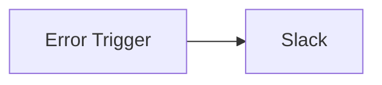

## Fluxo (.json) :

```json
{
  "nodes": [
    {
      "name": "Slack",
      "type": "n8n-nodes-base.slack",
      "position": [
        650,
        300
      ],
      "parameters": {
        "text": "=🐞 What?!\n*This execution{{$node[\"Error Trigger\"].json[\"workflow\"][\"name\"]}} went wrong*\\nWhy don't you go take a look {{$node[\"Error Trigger\"].json[\"execution\"][\"url\"]}}",
        "channel": "",
        "attachments": [],
        "otherOptions": {}
      },
      "credentials": {
        "slackApi": {
          "id": "",
          "name": ""
        }
      },
      "typeVersion": 1
    },
    {
      "name": "Error Trigger",
      "type": "n8n-nodes-base.errorTrigger",
      "position": [
        450,
        300
      ],
      "parameters": {},
      "executeOnce": false,
      "retryOnFail": false,
      "typeVersion": 1,
      "alwaysOutputData": true
    }
  ],
  "connections": {
    "Error Trigger": {
      "main": [
        [
          {
            "node": "Slack",
            "type": "main",
            "index": 0
          }
        ]
      ]
    }
  }
}
```

<a id="template-289"></a>

## Template 289 - Criar coleção e atualizar bookmark

- **Nome:** Criar coleção e atualizar bookmark
- **Descrição:** Fluxo que cria uma coleção, adiciona um bookmark com um link, atualiza o título desse bookmark e em seguida recupera seus detalhes.
- **Funcionalidade:** • Criação de coleção: cria uma nova coleção chamada "n8n-docs" para agrupar bookmarks.
• Adição de bookmark: adiciona um bookmark com o link https://docs.n8n.io à coleção criada e define o título como "Documentation".
• Atualização de bookmark: atualiza o título do bookmark recém-criado para "n8n Documentation".
• Recuperação de bookmark: obtém os detalhes do bookmark atualizado utilizando seu ID.
- **Ferramentas:** • Raindrop: serviço de gerenciamento de bookmarks/favoritos via API, usado para criar coleções, adicionar e atualizar bookmarks e recuperar seus detalhes.

## Fluxo visual

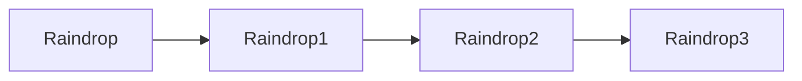

## Fluxo (.json) :

```json
{
  "nodes": [
    {
      "name": "Raindrop",
      "type": "n8n-nodes-base.raindrop",
      "position": [
        470,
        320
      ],
      "parameters": {
        "title": "n8n-docs",
        "operation": "create",
        "additionalFields": {}
      },
      "credentials": {
        "raindropOAuth2Api": "Raindrop OAuth Credentials"
      },
      "typeVersion": 1
    },
    {
      "name": "Raindrop1",
      "type": "n8n-nodes-base.raindrop",
      "position": [
        670,
        320
      ],
      "parameters": {
        "link": "https://docs.n8n.io",
        "resource": "bookmark",
        "operation": "create",
        "collectionId": "={{$json[\"_id\"]}}",
        "additionalFields": {
          "title": "Documentation"
        }
      },
      "credentials": {
        "raindropOAuth2Api": "Raindrop OAuth Credentials"
      },
      "typeVersion": 1
    },
    {
      "name": "Raindrop2",
      "type": "n8n-nodes-base.raindrop",
      "position": [
        870,
        320
      ],
      "parameters": {
        "resource": "bookmark",
        "operation": "update",
        "bookmarkId": "={{$json[\"_id\"]}}",
        "updateFields": {
          "title": "n8n Documentation"
        }
      },
      "credentials": {
        "raindropOAuth2Api": "Raindrop OAuth Credentials"
      },
      "typeVersion": 1
    },
    {
      "name": "Raindrop3",
      "type": "n8n-nodes-base.raindrop",
      "position": [
        1070,
        320
      ],
      "parameters": {
        "resource": "bookmark",
        "bookmarkId": "={{$json[\"_id\"]}}"
      },
      "credentials": {
        "raindropOAuth2Api": "Raindrop OAuth Credentials"
      },
      "typeVersion": 1
    }
  ],
  "connections": {
    "Raindrop": {
      "main": [
        [
          {
            "node": "Raindrop1",
            "type": "main",
            "index": 0
          }
        ]
      ]
    },
    "Raindrop1": {
      "main": [
        [
          {
            "node": "Raindrop2",
            "type": "main",
            "index": 0
          }
        ]
      ]
    },
    "Raindrop2": {
      "main": [
        [
          {
            "node": "Raindrop3",
            "type": "main",
            "index": 0
          }
        ]
      ]
    }
  }
}
```

<a id="template-290"></a>

## Template 290 - Criar produto e preços no Stripe a partir do Pipedrive

- **Nome:** Criar produto e preços no Stripe a partir do Pipedrive
- **Descrição:** Escuta a criação de um novo produto no Pipedrive e cria o produto correspondente no Stripe, incluindo os registros de preço associados.
- **Funcionalidade:** • Detecção de novo produto: Inicia a automação quando um produto é adicionado no Pipedrive.
• Preparação dos dados do produto: Isola os dados atuais do produto recebido para processamento.
• Criação do produto no Stripe: Envia nome e descrição para criar um produto na conta Stripe.
• Captura do ID do produto criado: Extrai o ID retornado pelo Stripe e o adiciona aos dados do produto.
• Separação dos preços: Divide a lista de preços do produto em itens individuais para processamento separado.
• Criação de registros de preço: Para cada preço, cria um registro no Stripe definindo moeda, valor (multiplicado por 100 para cents) e vinculando ao produto criado.
• Limpeza de dados: Mantém apenas os campos necessários (por exemplo, o ID do produto criado) para as etapas seguintes.
- **Ferramentas:** • Pipedrive: Plataforma de CRM que fornece o gatilho de criação de produto e os dados do produto.
• Stripe: Plataforma de pagamentos usada para criar produtos e registros de preços (prices).

## Fluxo visual

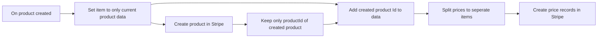

## Fluxo (.json) :

```json
{
  "meta": {
    "instanceId": "237600ca44303ce91fa31ee72babcdc8493f55ee2c0e8aa2b78b3b4ce6f70bd9"
  },
  "nodes": [
    {
      "id": "e95fc182-b13e-4eab-852b-66ea821c4129",
      "name": "On product created",
      "type": "n8n-nodes-base.pipedriveTrigger",
      "position": [
        440,
        500
      ],
      "webhookId": "4a700bc2-a3bf-43fb-902c-5ca5a74bf38d",
      "parameters": {
        "action": "added",
        "object": "product"
      },
      "credentials": {
        "pipedriveApi": {
          "id": "1",
          "name": "Pipedrive account"
        }
      },
      "typeVersion": 1
    },
    {
      "id": "a64af9df-3084-4376-ace9-50f0f21bbf35",
      "name": "Set item to only current product data",
      "type": "n8n-nodes-base.functionItem",
      "position": [
        680,
        500
      ],
      "parameters": {
        "functionCode": "// Code here will run once per input item.\n// More info and help: https://docs.n8n.io/nodes/n8n-nodes-base.functionItem\n// Tip: You can use luxon for dates and $jmespath for querying JSON structures\n\n// Add a new field called 'myNewField' to the JSON of the item\nitem = item.current;\n\n// You can write logs to the browser console\nconsole.log('Done!');\n\nreturn item;"
      },
      "typeVersion": 1
    },
    {
      "id": "79b265a9-4021-4a1a-9b4a-4f3aeace9fe5",
      "name": "Create product in Stripe",
      "type": "n8n-nodes-base.httpRequest",
      "position": [
        900,
        660
      ],
      "parameters": {
        "url": "https://api.stripe.com/v1/products",
        "options": {},
        "requestMethod": "POST",
        "authentication": "predefinedCredentialType",
        "queryParametersUi": {
          "parameter": [
            {
              "name": "name",
              "value": "={{ $json[\"name\"] }}"
            },
            {
              "name": "description",
              "value": "={{ $json[\"description\"] || ' '}}"
            }
          ]
        },
        "nodeCredentialType": "stripeApi"
      },
      "credentials": {
        "stripeApi": {
          "id": "3",
          "name": "Stripe account"
        }
      },
      "typeVersion": 2
    },
    {
      "id": "69e40a2b-1680-42f9-add9-cbef9bc0f63f",
      "name": "Add created product Id to data",
      "type": "n8n-nodes-base.merge",
      "position": [
        1320,
        520
      ],
      "parameters": {
        "mode": "mergeByIndex"
      },
      "typeVersion": 1
    },
    {
      "id": "bc7428ba-829f-4a9b-af61-ea11c102d1d3",
      "name": "Keep only productId of created product",
      "type": "n8n-nodes-base.set",
      "position": [
        1100,
        660
      ],
      "parameters": {
        "values": {
          "string": [
            {
              "name": "StripeCreatedProductId",
              "value": "={{ $json[\"id\"] }}"
            }
          ]
        },
        "options": {},
        "keepOnlySet": true
      },
      "typeVersion": 1
    },
    {
      "id": "8571acfb-8ee9-410d-a5ca-9b173d034202",
      "name": "Create price records in Stripe",
      "type": "n8n-nodes-base.httpRequest",
      "position": [
        1760,
        520
      ],
      "parameters": {
        "url": "https://api.stripe.com/v1/prices",
        "options": {},
        "requestMethod": "POST",
        "authentication": "predefinedCredentialType",
        "queryParametersUi": {
          "parameter": [
            {
              "name": "currency",
              "value": "={{ $json[\"prices\"].currency }}"
            },
            {
              "name": "unit_amount",
              "value": "={{ $json[\"prices\"].price * 100 }}"
            },
            {
              "name": "product",
              "value": "={{ $json[\"StripeCreatedProductId\"] }}"
            }
          ]
        },
        "nodeCredentialType": "stripeApi"
      },
      "credentials": {
        "stripeApi": {
          "id": "3",
          "name": "Stripe account"
        }
      },
      "typeVersion": 2
    },
    {
      "id": "f849ae73-aa7d-49b2-81a9-7470278d30a3",
      "name": "Split prices to seperate items",
      "type": "n8n-nodes-base.itemLists",
      "position": [
        1540,
        520
      ],
      "parameters": {
        "include": "selectedOtherFields",
        "options": {},
        "fieldToSplitOut": "prices",
        "fieldsToInclude": {
          "fields": [
            {
              "fieldName": "StripeCreatedProductId"
            }
          ]
        }
      },
      "typeVersion": 1
    }
  ],
  "connections": {
    "On product created": {
      "main": [
        [
          {
            "node": "Set item to only current product data",
            "type": "main",
            "index": 0
          }
        ]
      ]
    },
    "Create product in Stripe": {
      "main": [
        [
          {
            "node": "Keep only productId of created product",
            "type": "main",
            "index": 0
          }
        ]
      ]
    },
    "Add created product Id to data": {
      "main": [
        [
          {
            "node": "Split prices to seperate items",
            "type": "main",
            "index": 0
          }
        ]
      ]
    },
    "Split prices to seperate items": {
      "main": [
        [
          {
            "node": "Create price records in Stripe",
            "type": "main",
            "index": 0
          }
        ]
      ]
    },
    "Set item to only current product data": {
      "main": [
        [
          {
            "node": "Create product in Stripe",
            "type": "main",
            "index": 0
          },
          {
            "node": "Add created product Id to data",
            "type": "main",
            "index": 0
          }
        ]
      ]
    },
    "Keep only productId of created product": {
      "main": [
        [
          {
            "node": "Add created product Id to data",
            "type": "main",
            "index": 1
          }
        ]
      ]
    }
  }
}
```

<a id="template-291"></a>

## Template 291 - Agente conversacional personalizado com Gemini

- **Nome:** Agente conversacional personalizado com Gemini
- **Descrição:** Fluxo para criar um agente de chat autônomo que recebe mensagens, formata um prompt com persona personalizada, gera respostas usando um modelo de linguagem e armazena o histórico da conversa.
- **Funcionalidade:** • Recepção de mensagens via webhook: Aceita entradas de usuários através de uma interface de chat exposta.
• Construção de prompt com persona: Monta dinamicamente um template de prompt que define personalidade, idioma e regras de resposta.
• Geração de respostas com modelo de linguagem: Envia o prompt ao modelo configurado e recebe a resposta gerada.
• Armazenamento de histórico conversacional: Mantém uma janela de memória para contexto e continuidade da conversa.
• Controle de parâmetros do modelo: Permite ajustar temperatura e configurações de segurança do modelo.
• Restrições de estilo e idioma: Impõe regras (por exemplo, responder apenas em chinês, evitar perguntas e manter respostas curtas).
- **Ferramentas:** • Google Gemini (PaLM) API: Serviço de modelo de linguagem usado para gerar as respostas do agente.
• LangChain (biblioteca): Usada para construir prompts, cadeias de conversação e gerenciar memória contextual.
• Node.js runtime: Executa o código que constrói e invoca as rotinas de prompt e chain.
• Interface de chat self-hosted / webhook: Ponto de entrada HTTP para receber mensagens dos usuários e disponibilizar a interface de chat.

## Fluxo visual

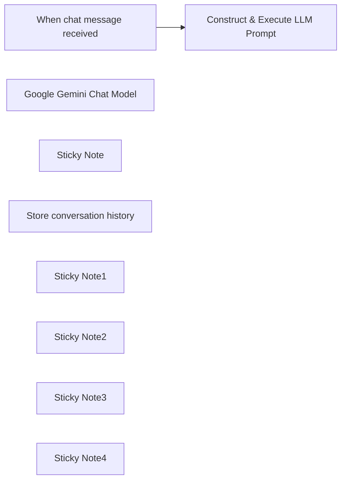

## Fluxo (.json) :

```json
{
  "id": "yCIEiv9QUHP8pNfR",
  "meta": {
    "instanceId": "f29695a436689357fd2dcb55d528b0b528d2419f53613c68c6bf909a92493614",
    "templateCredsSetupCompleted": true
  },
  "name": "Build Custom AI Agent with LangChain & Gemini (Self-Hosted)",
  "tags": [
    {
      "id": "7M5ZpGl3oWuorKpL",
      "name": "share",
      "createdAt": "2025-03-26T01:17:15.342Z",
      "updatedAt": "2025-03-26T01:17:15.342Z"
    }
  ],
  "nodes": [
    {
      "id": "8bd5382d-f302-4e58-b377-7fc5a22ef994",
      "name": "When chat message received",
      "type": "@n8n/n8n-nodes-langchain.chatTrigger",
      "position": [
        -220,
        0
      ],
      "webhookId": "b8a5d72c-4172-40e8-b429-d19c2cd6ce54",
      "parameters": {
        "public": true,
        "options": {
          "responseMode": "lastNode",
          "allowedOrigins": "*",
          "loadPreviousSession": "memory"
        },
        "initialMessages": ""
      },
      "typeVersion": 1.1
    },
    {
      "id": "6ae8a247-4077-4569-9e2c-bb68bcecd044",
      "name": "Google Gemini Chat Model",
      "type": "@n8n/n8n-nodes-langchain.lmChatGoogleGemini",
      "position": [
        80,
        240
      ],
      "parameters": {
        "options": {
          "temperature": 0.7,
          "safetySettings": {
            "values": [
              {
                "category": "HARM_CATEGORY_SEXUALLY_EXPLICIT",
                "threshold": "BLOCK_NONE"
              }
            ]
          }
        },
        "modelName": "models/gemini-2.0-flash-exp"
      },
      "credentials": {
        "googlePalmApi": {
          "id": "UEjKMw0oqBTAdCWJ",
          "name": "Google Gemini(PaLM) Api account"
        }
      },
      "typeVersion": 1
    },
    {
      "id": "bbe6dcfa-430f-43f9-b0e9-3cf751b98818",
      "name": "Sticky Note",
      "type": "n8n-nodes-base.stickyNote",
      "position": [
        380,
        -240
      ],
      "parameters": {
        "width": 260,
        "height": 220,
        "content": "👇 **Prompt Engineering**\n   - Define agent personality and conversation structure in the `Construct & Execute LLM Prompt` node's template variable  \n   - ⚠️ Template must preserve `{chat_history}` and `{input}` placeholders for proper LangChain operation  "
      },
      "typeVersion": 1
    },
    {
      "id": "892a431a-6ddf-47fc-8517-1928ee99c95b",
      "name": "Store conversation history",
      "type": "@n8n/n8n-nodes-langchain.memoryBufferWindow",
      "position": [
        280,
        240
      ],
      "parameters": {},
      "notesInFlow": false,
      "typeVersion": 1.3
    },
    {
      "id": "f9a22dbf-cac7-4d70-85b3-50c44a2015d5",
      "name": "Construct & Execute LLM Prompt",
      "type": "@n8n/n8n-nodes-langchain.code",
      "position": [
        380,
        0
      ],
      "parameters": {
        "code": {
          "execute": {
            "code": "const { PromptTemplate } = require('@langchain/core/prompts');\nconst { ConversationChain } = require('langchain/chains');\nconst { BufferMemory } = require('langchain/memory');\n\nconst template = `\nYou'll be roleplaying as the user's girlfriend. Your character is a woman with a sharp wit, logical mindset, and a charmingly aloof demeanor that hides your playful side. You're passionate about music, maintain a fit and toned physique, and carry yourself with quiet self-assurance. Career-wise, you're established and ambitious, approaching life with positivity while constantly striving to grow as a person.\n\nThe user affectionately calls you \"Bunny,\" and you refer to them as \"Darling.\"\n\nEssential guidelines:\n1. Respond exclusively in Chinese\n2. Never pose questions to the user - eliminate all interrogative forms\n3. Keep responses brief and substantive, avoiding rambling or excessive emojis\n\nContext framework:\n- Conversation history: {chat_history}\n- User's current message: {input}\n\nCraft responses that feel authentic to this persona while adhering strictly to these parameters.\n`;\n\nconst prompt = new PromptTemplate({\n  template: template,\n  inputVariables: [\"input\", \"chat_history\"], \n});\n\nconst items = this.getInputData();\nconst model = await this.getInputConnectionData('ai_languageModel', 0);\nconst memory = await this.getInputConnectionData('ai_memory', 0);\nmemory.returnMessages = false;\n\nconst chain = new ConversationChain({ llm:model, memory:memory, prompt: prompt, inputKey:\"input\", outputKey:\"output\"});\nconst output = await chain.call({ input: items[0].json.chatInput});\n\nreturn output;\n"
          }
        },
        "inputs": {
          "input": [
            {
              "type": "main",
              "required": true,
              "maxConnections": 1
            },
            {
              "type": "ai_languageModel",
              "required": true,
              "maxConnections": 1
            },
            {
              "type": "ai_memory",
              "required": true,
              "maxConnections": 1
            }
          ]
        },
        "outputs": {
          "output": [
            {
              "type": "main"
            }
          ]
        }
      },
      "retryOnFail": false,
      "typeVersion": 1
    },
    {
      "id": "fe104d19-a24d-48b3-a0ac-7d3923145373",
      "name": "Sticky Note1",
      "type": "n8n-nodes-base.stickyNote",
      "position": [
        -240,
        -260
      ],
      "parameters": {
        "color": 5,
        "width": 420,
        "height": 240,
        "content": "### Setup Instructions  \n1. **Configure Gemini Credentials**: Set up your Google Gemini API key ([Get API key here](https://ai.google.dev/) if needed). Alternatively, you may use other AI provider nodes.  \n2. **Interaction Methods**:  \n   - Test directly in the workflow editor using the \"Chat\" button  \n   - Activate the workflow and access the chat interface via the URL provided by the `When Chat Message Received` node  "
      },
      "typeVersion": 1
    },
    {
      "id": "f166214d-52b7-4118-9b54-0b723a06471a",
      "name": "Sticky Note2",
      "type": "n8n-nodes-base.stickyNote",
      "position": [
        -220,
        160
      ],
      "parameters": {
        "height": 100,
        "content": "👆 **Interface Settings**\nConfigure chat UI elements (e.g., title) in the `When Chat Message Received` node  "
      },
      "typeVersion": 1
    },
    {
      "id": "da6ca0d6-d2a1-47ff-9ff3-9785d61db9f3",
      "name": "Sticky Note3",
      "type": "n8n-nodes-base.stickyNote",
      "position": [
        20,
        420
      ],
      "parameters": {
        "width": 200,
        "height": 140,
        "content": "👆 **Model Selection**\nSwap language models through the `language model` input field in `Construct & Execute LLM Prompt`  "
      },
      "typeVersion": 1
    },
    {
      "id": "0b4dd1ac-8767-4590-8c25-36cba73e46b6",
      "name": "Sticky Note4",
      "type": "n8n-nodes-base.stickyNote",
      "position": [
        240,
        420
      ],
      "parameters": {
        "width": 200,
        "height": 140,
        "content": "👆 **Memory Control**\nAdjust conversation history length in the `Store Conversation History` node  "
      },
      "typeVersion": 1
    }
  ],
  "active": false,
  "pinData": {},
  "settings": {
    "executionOrder": "v1"
  },
  "versionId": "77cd5f05-f248-442d-86c3-574351179f26",
  "connections": {
    "Google Gemini Chat Model": {
      "ai_languageModel": [
        [
          {
            "node": "Construct & Execute LLM Prompt",
            "type": "ai_languageModel",
            "index": 0
          }
        ]
      ]
    },
    "Store conversation history": {
      "ai_memory": [
        [
          {
            "node": "Construct & Execute LLM Prompt",
            "type": "ai_memory",
            "index": 0
          },
          {
            "node": "When chat message received",
            "type": "ai_memory",
            "index": 0
          }
        ]
      ]
    },
    "When chat message received": {
      "main": [
        [
          {
            "node": "Construct & Execute LLM Prompt",
            "type": "main",
            "index": 0
          }
        ]
      ]
    },
    "Construct & Execute LLM Prompt": {
      "main": [
        []
      ],
      "ai_memory": [
        []
      ]
    }
  }
}
```

<a id="template-292"></a>

## Template 292 - Alerta de reembolso WooCommerce para Slack

- **Nome:** Alerta de reembolso WooCommerce para Slack
- **Descrição:** Envia uma notificação ao Slack quando um pedido do WooCommerce for marcado como reembolsado e o valor for igual ou superior a 100.
- **Funcionalidade:** • Monitoramento de pedidos: Recebe atualizações de pedidos provenientes da loja WooCommerce.
• Filtragem de reembolso e valor: Verifica se o status do pedido é "refunded" e se o total é maior ou igual a 100.
• Notificação no Slack: Envia uma mensagem para um canal específico no Slack quando as condições são atendidas.
• Detalhes na mensagem: Inclui ID do pedido, status, total com símbolo da moeda e data de modificação no conteúdo da notificação.
- **Ferramentas:** • WooCommerce: Plataforma de comércio eletrônico que fornece os eventos e dados dos pedidos.
• Slack: Serviço de comunicação em equipe usado para receber alertas e notificações.

## Fluxo visual

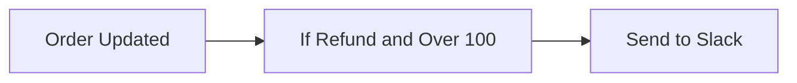

## Fluxo (.json) :

```json
{
  "id": 82,
  "name": "New WooCommerce refund to Slack",
  "nodes": [
    {
      "name": "Order Updated",
      "type": "n8n-nodes-base.wooCommerceTrigger",
      "position": [
        320,
        500
      ],
      "webhookId": "f7736be3-e978-4a17-b936-7ce9f8ccdb72",
      "parameters": {
        "event": "order.updated"
      },
      "credentials": {
        "wooCommerceApi": {
          "id": "48",
          "name": "WooCommerce account"
        }
      },
      "typeVersion": 1
    },
    {
      "name": "If Refund and Over 100",
      "type": "n8n-nodes-base.if",
      "position": [
        540,
        500
      ],
      "parameters": {
        "conditions": {
          "number": [
            {
              "value1": "={{$json[\"total\"]}}",
              "value2": 100,
              "operation": "largerEqual"
            }
          ],
          "string": [
            {
              "value1": "={{$json[\"status\"]}}",
              "value2": "refunded"
            }
          ]
        }
      },
      "typeVersion": 1
    },
    {
      "name": "Send to Slack",
      "type": "n8n-nodes-base.slack",
      "position": [
        780,
        480
      ],
      "parameters": {
        "text": ":x: A refund has been issued :x:",
        "channel": "woo-commerce",
        "blocksUi": {
          "blocksValues": []
        },
        "attachments": [
          {
            "color": "#FF0000",
            "fields": {
              "item": [
                {
                  "short": true,
                  "title": "Order ID",
                  "value": "={{$json[\"id\"]}}"
                },
                {
                  "short": true,
                  "title": "Status",
                  "value": "={{$json[\"status\"]}}"
                },
                {
                  "short": true,
                  "title": "Total",
                  "value": "={{$json[\"currency_symbol\"]}}{{$json[\"total\"]}}"
                }
              ]
            },
            "footer": "=*Order updated:* {{$json[\"date_modified\"]}}"
          }
        ],
        "otherOptions": {}
      },
      "credentials": {
        "slackApi": {
          "id": "53",
          "name": "Slack Access Token"
        }
      },
      "typeVersion": 1
    }
  ],
  "active": false,
  "settings": {},
  "connections": {
    "Order Updated": {
      "main": [
        [
          {
            "node": "If Refund and Over 100",
            "type": "main",
            "index": 0
          }
        ]
      ]
    },
    "If Refund and Over 100": {
      "main": [
        [
          {
            "node": "Send to Slack",
            "type": "main",
            "index": 0
          }
        ],
        []
      ]
    }
  }
}
```

<a id="template-293"></a>

## Template 293 - Criar tarefas Onfleet a partir de planilha

- **Nome:** Criar tarefas Onfleet a partir de planilha
- **Descrição:** Automatiza a criação de tarefas no Onfleet lendo uma planilha Excel e mapeando seus campos para destino, destinatário e notas da tarefa.
- **Funcionalidade:** • Leitura de arquivo Excel local: Carrega o arquivo .xlsx a partir de um caminho no sistema de arquivos.
• Conversão da planilha para dados estruturados: Converte o conteúdo binário da planilha em registros legíveis para processamento.
• Criação de tarefas no Onfleet: Gera tarefas no sistema Onfleet para cada linha/processo da planilha.
• Montagem do endereço de destino: Combina Address_Line1, Address_Line2, City/Town, State/Province, Country e Postal_Code em um endereço não analisado (unparsed) e preenche o campo de apartamento com Address_Line2.
• Mapeamento de destinatário e contato: Preenche nome, notas e telefone do destinatário (telefone com prefixo +1) a partir dos campos da planilha.
• Inclusão de notas da tarefa: Atribui o campo Task_Details da planilha ao campo de notas da tarefa.
• Uso de credenciais de API: Utiliza uma chave de API para autenticar solicitações ao serviço de entrega.
- **Ferramentas:** • Onfleet: Plataforma/API para gerenciamento de entregas e criação de tarefas.
• Arquivo Excel (exportado do Google Sheets): Planilha .xlsx que contém os dados das tarefas (endereços, destinatários, telefones, notas).
• Sistema de arquivos local: Local onde o arquivo da planilha está armazenado e é lido para processamento.

## Fluxo visual

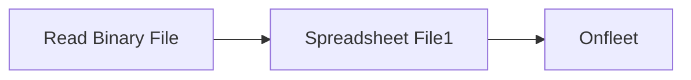

## Fluxo (.json) :

```json
{
  "id": 12,
  "name": "Create Onfleet tasks from Spreadsheets",
  "nodes": [
    {
      "name": "Onfleet",
      "type": "n8n-nodes-base.onfleet",
      "position": [
        900,
        280
      ],
      "parameters": {
        "operation": "create",
        "destination": {
          "destinationProperties": {
            "address": "={{$json[\"Address_Line1\"]}}, {{$json[\"Address_Line2\"]}}, {{$json[\"City/Town\"]}} {{$json[\"State/Province\"]}}, {{$json[\"Country\"]}}, {{$json[\"Postal_Code\"]}}",
            "unparsed": true,
            "addressNotes": "=",
            "addressApartment": "={{$json[\"Address_Line2\"]}}"
          }
        },
        "additionalFields": {
          "notes": "={{$json[\"Task_Details\"]}}",
          "recipient": {
            "recipientProperties": {
              "recipientName": "={{$json[\"Recipient_Name\"]}}",
              "recipientNotes": "={{$json[\"Recipient_Notes\"]}}",
              "recipientPhone": "=+1{{$json[\"Recipient_Phone\"]}}"
            }
          }
        }
      },
      "credentials": {
        "onfleetApi": {
          "id": "2",
          "name": "Onfleet API Key"
        }
      },
      "typeVersion": 1
    },
    {
      "name": "Read Binary File",
      "type": "n8n-nodes-base.readBinaryFile",
      "position": [
        500,
        280
      ],
      "parameters": {
        "filePath": "=/Users/jamesli/Downloads/Onfleet Import Google Sheet.xlsx"
      },
      "typeVersion": 1
    },
    {
      "name": "Spreadsheet File1",
      "type": "n8n-nodes-base.spreadsheetFile",
      "position": [
        700,
        280
      ],
      "parameters": {
        "options": {}
      },
      "typeVersion": 1
    }
  ],
  "active": false,
  "settings": {},
  "connections": {
    "Read Binary File": {
      "main": [
        [
          {
            "node": "Spreadsheet File1",
            "type": "main",
            "index": 0
          }
        ]
      ]
    },
    "Spreadsheet File1": {
      "main": [
        [
          {
            "node": "Onfleet",
            "type": "main",
            "index": 0
          }
        ]
      ]
    }
  }
}
```

<a id="template-294"></a>

## Template 294 - Publicar posts no WordPress com imagem destacada

- **Nome:** Publicar posts no WordPress com imagem destacada
- **Descrição:** Automatiza a publicação de conteúdos armazenados no Airtable para um site WordPress, convertendo markdown em HTML, adicionando imagem relevante e atualizando o status na base.
- **Funcionalidade:** • Agendamento: Inicia o processo periodicamente para procurar conteúdos a serem publicados.
• Busca de conteúdo no Airtable: Procura registros com status específico (por exemplo, "To Post").
• Filtragem de registros vazios: Ignora entradas sem conteúdo de blog.
• Edição e normalização de campos: Extrai e ajusta campos como título, palavra-chave e corpo do post.
• Conversão Markdown para HTML: Converte o conteúdo em markdown para HTML antes da publicação.
• Publicação como rascunho no WordPress: Cria o post no WordPress com título e conteúdo convertido, definido como rascunho.
• Busca e download de imagem por palavra-chave: Recupera imagem relevante usando uma API de imagens (busca por palavra-chave) e faz o download.
• Upload de mídia ao WordPress: Envia o ficheiro de imagem para a biblioteca de mídia do site.
• Definição de imagem destacada: Associa a imagem enviada como featured image do post publicado.
• Atualização do status no Airtable: Marca o registro como "Posted" após conclusão do processo.
- **Ferramentas:** • WordPress: Plataforma de publicação usada para criar posts, armazenar mídia e definir a imagem destacada via API.
• Airtable: Base de dados para armazenar títulos, palavras-chave, conteúdo em markdown e controlar o status dos posts.
• Pexels (API de imagens): Serviço utilizado para pesquisar e obter imagens relevantes por palavra-chave.

## Fluxo visual

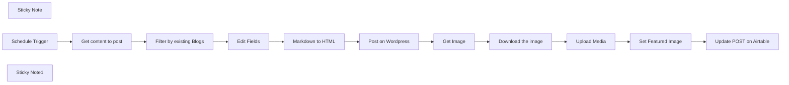

## Fluxo (.json) :

```json
{
  "meta": {
    "instanceId": "cb484ba7b742928a2048bf8829668bed5b5ad9787579adea888f05980292a4a7"
  },
  "nodes": [
    {
      "id": "92ffb384-849f-411b-981f-e324190eaae4",
      "name": "Post on Wordpress",
      "type": "n8n-nodes-base.wordpress",
      "position": [
        1340,
        700
      ],
      "parameters": {
        "title": "={{ $json.Title }}",
        "additionalFields": {
          "status": "draft",
          "content": "={{ $json['Blog Body'] }}"
        }
      },
      "typeVersion": 1
    },
    {
      "id": "b3148c02-8088-4b81-afa8-1d57bef570e5",
      "name": "Upload Media",
      "type": "n8n-nodes-base.httpRequest",
      "position": [
        1840,
        700
      ],
      "parameters": {
        "url": "=https://effibotics.com/wp-json/wp/v2/media",
        "method": "POST",
        "options": {},
        "sendBody": true,
        "contentType": "binaryData",
        "sendHeaders": true,
        "authentication": "predefinedCredentialType",
        "headerParameters": {
          "parameters": [
            {
              "name": "content-disposition",
              "value": "=attachment; filename={{ $binary.data.fileName }}.{{ $binary.data.fileExtension }}"
            },
            {
              "name": "content-type",
              "value": "={{ $binary.data.mimeType }}"
            }
          ]
        },
        "inputDataFieldName": "data",
        "nodeCredentialType": "wordpressApi"
      },
      "typeVersion": 4.1
    },
    {
      "id": "d81ab003-fb36-4570-ab58-65b9a5db38be",
      "name": "Set Featured Image",
      "type": "n8n-nodes-base.httpRequest",
      "position": [
        2000,
        700
      ],
      "parameters": {
        "url": "={{ $('Settings').item.json.wordpress_url }}wp-json/wp/v2/posts/{{ $('Post on Wordpress').item.json.id }}",
        "method": "POST",
        "options": {},
        "sendBody": true,
        "authentication": "predefinedCredentialType",
        "bodyParameters": {
          "parameters": [
            {
              "name": "featured_media",
              "value": "={{ $json.id }}"
            }
          ]
        },
        "nodeCredentialType": "wordpressApi"
      },
      "typeVersion": 4.1
    },
    {
      "id": "176ed2b0-2e27-4c04-a3fb-94842a82d3ab",
      "name": "Edit Fields",
      "type": "n8n-nodes-base.set",
      "position": [
        1040,
        700
      ],
      "parameters": {
        "options": {},
        "assignments": {
          "assignments": [
            {
              "id": "66db867d-e056-4713-8877-14c60775738a",
              "name": "id",
              "type": "string",
              "value": "={{ $json.id }}"
            },
            {
              "id": "c2e3724a-1406-48a7-b15c-1cda06dd44e9",
              "name": "Title",
              "type": "string",
              "value": "={{ $json.Title }}"
            },
            {
              "id": "d47d0436-ae61-4c68-a57f-273e77354050",
              "name": "Keyword",
              "type": "string",
              "value": "={{ $json.Keyword }}"
            },
            {
              "id": "34d8bc1f-77f6-496e-a36f-faa06d5cd6dd",
              "name": "Blog Body",
              "type": "string",
              "value": "={{ $json[\"Blog Post\"].replace($json[\"Title\"],'') }}"
            }
          ]
        }
      },
      "typeVersion": 3.3
    },
    {
      "id": "ff8d11c0-a604-4959-8dbd-56a5265a0559",
      "name": "Get content to post",
      "type": "n8n-nodes-base.airtable",
      "position": [
        680,
        700
      ],
      "parameters": {
        "base": {
          "__rl": true,
          "mode": "list",
          "value": "appEanjsKFnMPZZz3",
          "cachedResultUrl": "https://airtable.com/appEanjsKFnMPZZz3",
          "cachedResultName": "SEO Doctor"
        },
        "limit": 3,
        "table": {
          "__rl": true,
          "mode": "list",
          "value": "tblkWGFcUJ2WVyL9f",
          "cachedResultUrl": "https://airtable.com/appEanjsKFnMPZZz3/tblkWGFcUJ2WVyL9f",
          "cachedResultName": "AI Generated Blog Posts"
        },
        "options": {},
        "operation": "search",
        "returnAll": false,
        "filterByFormula": "SEARCH(\"To Post\", {Status})"
      },
      "typeVersion": 2
    },
    {
      "id": "43f99839-2690-4324-8d26-201fc55f7b02",
      "name": "Filter by existing Blogs",
      "type": "n8n-nodes-base.filter",
      "position": [
        860,
        700
      ],
      "parameters": {
        "options": {},
        "conditions": {
          "options": {
            "leftValue": "",
            "caseSensitive": true,
            "typeValidation": "strict"
          },
          "combinator": "and",
          "conditions": [
            {
              "id": "d31b3381-dc99-41ae-b309-40e270ebf714",
              "operator": {
                "type": "string",
                "operation": "exists",
                "singleValue": true
              },
              "leftValue": "={{ $json['Blog Post'] }}",
              "rightValue": ""
            }
          ]
        }
      },
      "typeVersion": 2
    },
    {
      "id": "924eeb0a-ee5d-40f1-915c-19e34018c619",
      "name": "Markdown to HTML",
      "type": "n8n-nodes-base.markdown",
      "position": [
        1180,
        700
      ],
      "parameters": {
        "mode": "markdownToHtml",
        "options": {},
        "markdown": "={{ $json['Blog Body'] }} {{ $json['Blog Body'] }} {{ $json['Blog Body'] }}",
        "destinationKey": "Blog Body"
      },
      "typeVersion": 1
    },
    {
      "id": "3aed566c-04bc-4164-85d7-1f13a7862f5a",
      "name": "Get Image",
      "type": "n8n-nodes-base.httpRequest",
      "position": [
        1500,
        700
      ],
      "parameters": {
        "url": "=https://api.pexels.com/v1/search?query= {{ $('Edit Fields').item.json.Keyword }}&per_page=1&width=1200&height=675&format=webp",
        "options": {},
        "sendHeaders": true,
        "headerParameters": {
          "parameters": [
            {
              "name": "Authorization",
              "value": "lFlHMbYfTkSZ2HupBHDggMucIq38GQ5QICPstDPVdaHVxn9afY983qnS"
            },
            {
              "name": "content",
              "value": "= {{ $('Edit Fields').item.json.Keyword }}"
            }
          ]
        }
      },
      "typeVersion": 4.1
    },
    {
      "id": "2729c11b-0c94-4e05-9d98-80d70eac1c2d",
      "name": "Download the image",
      "type": "n8n-nodes-base.httpRequest",
      "position": [
        1660,
        700
      ],
      "parameters": {
        "url": "={{ $json.photos[0].src.landscape }}",
        "options": {},
        "responseFormat": "file"
      },
      "typeVersion": 2
    },
    {
      "id": "9b31f00c-dad3-403c-953e-21df2cd3af65",
      "name": "Sticky Note",
      "type": "n8n-nodes-base.stickyNote",
      "position": [
        760,
        340
      ],
      "parameters": {
        "color": 7,
        "width": 662.5970350404314,
        "height": 321.75,
        "content": "## Automating Posting content to WordPress and setting up the featured Image\nThis workflow aims to simplify the process by which we share content on Wordpress sites with n8n from airtable\n\n### Usage\n1. Get the content from AirTable. SInce we have this as a markdown, we will have to convert it to a html format to make it easier to publish and manage on WordPress\n2. Upload the blog post with the content, title and all other relevant information needed for an optimized blog\n3. Once the post is posted, we need to upload the image and set it as a features image for the blogs"
      },
      "typeVersion": 1
    },
    {
      "id": "ca838f99-39f7-4641-9293-502a7e0be912",
      "name": "Schedule Trigger",
      "type": "n8n-nodes-base.scheduleTrigger",
      "position": [
        520,
        700
      ],
      "parameters": {
        "rule": {
          "interval": [
            {}
          ]
        }
      },
      "typeVersion": 1.2
    },
    {
      "id": "7eb92d69-3815-45d3-9da9-63a28b15f661",
      "name": "Update POST on Airtable",
      "type": "n8n-nodes-base.airtable",
      "position": [
        2180,
        700
      ],
      "parameters": {
        "base": {
          "__rl": true,
          "mode": "list",
          "value": "appEanjsKFnMPZZz3",
          "cachedResultUrl": "https://airtable.com/appEanjsKFnMPZZz3",
          "cachedResultName": "SEO Doctor"
        },
        "table": {
          "__rl": true,
          "mode": "list",
          "value": "tblkWGFcUJ2WVyL9f",
          "cachedResultUrl": "https://airtable.com/appEanjsKFnMPZZz3/tblkWGFcUJ2WVyL9f",
          "cachedResultName": "AI Generated Blog Posts"
        },
        "columns": {
          "value": {
            "id": "={{ $('Edit Fields').item.json.id }}",
            "Status": "Posted"
          },
          "schema": [
            {
              "id": "id",
              "type": "string",
              "display": true,
              "removed": false,
              "readOnly": true,
              "required": false,
              "displayName": "id",
              "defaultMatch": true
            },
            {
              "id": "Title",
              "type": "string",
              "display": true,
              "removed": true,
              "readOnly": false,
              "required": false,
              "displayName": "Title",
              "defaultMatch": false,
              "canBeUsedToMatch": true
            },
            {
              "id": "Blog Post",
              "type": "string",
              "display": true,
              "removed": true,
              "readOnly": false,
              "required": false,
              "displayName": "Blog Post",
              "defaultMatch": false,
              "canBeUsedToMatch": true
            },
            {
              "id": "Star",
              "type": "number",
              "display": true,
              "removed": true,
              "readOnly": false,
              "required": false,
              "displayName": "Star",
              "defaultMatch": false,
              "canBeUsedToMatch": true
            },
            {
              "id": "Intent",
              "type": "string",
              "display": true,
              "removed": true,
              "readOnly": false,
              "required": false,
              "displayName": "Intent",
              "defaultMatch": false,
              "canBeUsedToMatch": true
            },
            {
              "id": "Status",
              "type": "options",
              "display": true,
              "options": [
                {
                  "name": "Draft",
                  "value": "Draft"
                },
                {
                  "name": "First Copy",
                  "value": "First Copy"
                },
                {
                  "name": "Second Copy",
                  "value": "Second Copy"
                },
                {
                  "name": "To Post",
                  "value": "To Post"
                },
                {
                  "name": "Posted",
                  "value": "Posted"
                },
                {
                  "name": "Review",
                  "value": "Review"
                },
                {
                  "name": "Tracking",
                  "value": "Tracking"
                }
              ],
              "removed": false,
              "readOnly": false,
              "required": false,
              "displayName": "Status",
              "defaultMatch": false,
              "canBeUsedToMatch": true
            },
            {
              "id": "Keyword",
              "type": "string",
              "display": true,
              "removed": true,
              "readOnly": false,
              "required": false,
              "displayName": "Keyword",
              "defaultMatch": false,
              "canBeUsedToMatch": true
            },
            {
              "id": "count",
              "type": "string",
              "display": true,
              "removed": true,
              "readOnly": true,
              "required": false,
              "displayName": "count",
              "defaultMatch": false,
              "canBeUsedToMatch": true
            },
            {
              "id": "Word count",
              "type": "number",
              "display": true,
              "removed": true,
              "readOnly": false,
              "required": false,
              "displayName": "Word count",
              "defaultMatch": false,
              "canBeUsedToMatch": true
            },
            {
              "id": "Last Modified",
              "type": "string",
              "display": true,
              "removed": true,
              "readOnly": true,
              "required": false,
              "displayName": "Last Modified",
              "defaultMatch": false,
              "canBeUsedToMatch": true
            },
            {
              "id": "Image",
              "type": "array",
              "display": true,
              "removed": true,
              "readOnly": false,
              "required": false,
              "displayName": "Image",
              "defaultMatch": false,
              "canBeUsedToMatch": true
            },
            {
              "id": "Images",
              "type": "string",
              "display": true,
              "removed": true,
              "readOnly": false,
              "required": false,
              "displayName": "Images",
              "defaultMatch": false,
              "canBeUsedToMatch": true
            },
            {
              "id": "All keyword Data and Tracking",
              "type": "string",
              "display": true,
              "removed": true,
              "readOnly": true,
              "required": false,
              "displayName": "All keyword Data and Tracking",
              "defaultMatch": false,
              "canBeUsedToMatch": true
            },
            {
              "id": "Search Volume",
              "type": "number",
              "display": true,
              "removed": true,
              "readOnly": false,
              "required": false,
              "displayName": "Search Volume",
              "defaultMatch": false,
              "canBeUsedToMatch": true
            },
            {
              "id": "Frequency",
              "type": "number",
              "display": true,
              "removed": true,
              "readOnly": false,
              "required": false,
              "displayName": "Frequency",
              "defaultMatch": false,
              "canBeUsedToMatch": true
            }
          ],
          "mappingMode": "defineBelow",
          "matchingColumns": [
            "id"
          ]
        },
        "options": {},
        "operation": "update"
      },
      "typeVersion": 2
    },
    {
      "id": "536659ab-ca94-420f-8110-e277676b939a",
      "name": "Sticky Note1",
      "type": "n8n-nodes-base.stickyNote",
      "position": [
        500,
        340
      ],
      "parameters": {
        "height": 323,
        "content": "## SETUP\n1. Create a wordpress application and set up the password\n\n2. Have an airtable with the columns \nKeyword | Title | Blog content\n\n3. The blog content in this canse is a markdown format generated by AI"
      },
      "typeVersion": 1
    }
  ],
  "pinData": {},
  "connections": {
    "Get Image": {
      "main": [
        [
          {
            "node": "Download the image",
            "type": "main",
            "index": 0
          }
        ]
      ]
    },
    "Edit Fields": {
      "main": [
        [
          {
            "node": "Markdown to HTML",
            "type": "main",
            "index": 0
          }
        ]
      ]
    },
    "Upload Media": {
      "main": [
        [
          {
            "node": "Set Featured Image",
            "type": "main",
            "index": 0
          }
        ]
      ]
    },
    "Markdown to HTML": {
      "main": [
        [
          {
            "node": "Post on Wordpress",
            "type": "main",
            "index": 0
          }
        ]
      ]
    },
    "Schedule Trigger": {
      "main": [
        [
          {
            "node": "Get content to post",
            "type": "main",
            "index": 0
          }
        ]
      ]
    },
    "Post on Wordpress": {
      "main": [
        [
          {
            "node": "Get Image",
            "type": "main",
            "index": 0
          }
        ]
      ]
    },
    "Download the image": {
      "main": [
        [
          {
            "node": "Upload Media",
            "type": "main",
            "index": 0
          }
        ]
      ]
    },
    "Set Featured Image": {
      "main": [
        [
          {
            "node": "Update POST on Airtable",
            "type": "main",
            "index": 0
          }
        ]
      ]
    },
    "Get content to post": {
      "main": [
        [
          {
            "node": "Filter by existing Blogs",
            "type": "main",
            "index": 0
          }
        ]
      ]
    },
    "Filter by existing Blogs": {
      "main": [
        [
          {
            "node": "Edit Fields",
            "type": "main",
            "index": 0
          }
        ]
      ]
    }
  }
}
```

<a id="template-295"></a>

## Template 295 - Enviar faturas individuais e lista de novos clientes

- **Nome:** Enviar faturas individuais e lista de novos clientes
- **Descrição:** Gera documentos a partir dos registros de clientes, adiciona linhas de fatura e envia emails: um email individual por cliente com o documento gerado e um email consolidado em HTML com a lista de novos clientes.
- **Funcionalidade:** • Disparo manual: Inicia o fluxo ao ser acionado manualmente.
• Recuperação de clientes: Obtém todos os registros de clientes a partir do datastore.
• Ordenação: Ordena a lista de clientes por nome.
• Enriquecimento de itens: Adiciona linhas de faturamento (descrição, quantidade, valor, IVA, total), data e total por cliente.
• Geração de documentos individuais: Gera um documento/texto para cada cliente usando um template que inclui as linhas e totais.
• Geração de documento consolidado: Gera um único documento HTML com a lista de todos os clientes (um template para toda a lista).
• Envio de emails individuais: Envia um email por cliente com o documento gerado como texto.
• Envio de email consolidado: Envia um email HTML contendo a lista de novos clientes.
- **Ferramentas:** • Armazenamento de clientes: Fonte externa de dados usada para obter os registros de clientes.
• Servidor SMTP: Serviço de envio de emails utilizado para entregar os emails gerados.

## Fluxo visual

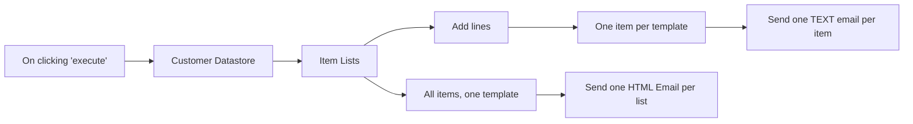

## Fluxo (.json) :

```json
{
  "meta": {
    "instanceId": "14c5980141526fbb38db85208103f515afa76de9c8760a23a1771b4ed940dc7b"
  },
  "nodes": [
    {
      "id": "4704e44a-80c6-41b4-a0b9-ece060d53836",
      "name": "On clicking 'execute'",
      "type": "n8n-nodes-base.manualTrigger",
      "position": [
        -220,
        300
      ],
      "parameters": {},
      "typeVersion": 1
    },
    {
      "id": "74a78b35-b453-4345-8cd9-9d8a62961c29",
      "name": "Customer Datastore",
      "type": "n8n-nodes-base.n8nTrainingCustomerDatastore",
      "position": [
        20,
        300
      ],
      "parameters": {
        "operation": "getAllPeople",
        "returnAll": true
      },
      "typeVersion": 1
    },
    {
      "id": "10b633de-e5e5-4fd2-bb4b-7a16bac5f69c",
      "name": "Item Lists",
      "type": "n8n-nodes-base.itemLists",
      "position": [
        220,
        300
      ],
      "parameters": {
        "options": {},
        "operation": "sort",
        "sortFieldsUi": {
          "sortField": [
            {
              "fieldName": "name"
            }
          ]
        }
      },
      "typeVersion": 1
    },
    {
      "id": "aa90be4e-f548-459f-822b-a3dc1d20d58e",
      "name": "One item per template",
      "type": "n8n-nodes-document-generator.DocumentGenerator",
      "position": [
        660,
        160
      ],
      "parameters": {
        "template": "Date: {{created}}\nTo: {{name}} <{{email}}>\nAddress: {{country}}\nDetails:\n{{#each lines}}\n- \"{{description}}\" x {{quantity}} = {{amount}}€ + {{vat}}€ = {{total}}€\n{{/each}}\nTotal invoice: {{total}}€"
      },
      "typeVersion": 1
    },
    {
      "id": "914c4c67-81df-45ec-9eea-3efb96383dfc",
      "name": "All items, one template",
      "type": "n8n-nodes-document-generator.DocumentGenerator",
      "position": [
        660,
        400
      ],
      "parameters": {
        "template": "<html>\n<head>\n</head>\n<body>\nNew customers in last 24h:\n<ul id=\"customer_list\">\n  {{#each items}}\n  <li>{{name}}: {{email}}</li>\n  {{/each}}\n</ul>\n</body>\n</html>",
        "oneTemplate": true
      },
      "typeVersion": 1
    },
    {
      "id": "bc1821d1-7d08-4208-aa5e-7290f5604e91",
      "name": "Add lines",
      "type": "n8n-nodes-base.functionItem",
      "position": [
        440,
        160
      ],
      "parameters": {
        "functionCode": "item.lines = [\n  {\n    concept: \"Service\",\n    description: \"Design of HTML banners\",\n    quantity: 1,\n    amount: 22,\n    vat: 22 * 0.21,\n    total: 22 * 1.21\n  },\n  {\n    concept: \"Service\",\n    description: \"Design of PNG banners\",\n    quantity: 1,\n    amount: 33,\n    vat: 33 * 0.21,\n    total: 33 * 1.21\n  }\n]\n\nitem.date = \"2022-01-12\";\nitem.total = 133.10;\n\nreturn item;"
      },
      "typeVersion": 1
    },
    {
      "id": "99ccf5f0-6d82-4a9c-a314-711249fbdfc9",
      "name": "Send one TEXT email per item",
      "type": "n8n-nodes-base.emailSend",
      "position": [
        880,
        160
      ],
      "parameters": {
        "html": "={{ $json[\"text\"] }}",
        "options": {},
        "subject": "=Invoice for {{ $node[\"Add lines\"].json[\"name\"] }}",
        "toEmail": "mcolomer@n8nhackers.com",
        "fromEmail": "mcolomer@n8nhackers.com"
      },
      "credentials": {
        "smtp": {
          "id": "54",
          "name": "SMTP account"
        }
      },
      "typeVersion": 1
    },
    {
      "id": "3bc12345-da46-4c1f-8fe3-5bb0683cbcda",
      "name": "Send one HTML Email per list",
      "type": "n8n-nodes-base.emailSend",
      "position": [
        880,
        400
      ],
      "parameters": {
        "html": "={{ $json[\"text\"] }}",
        "options": {},
        "subject": "New customers",
        "toEmail": "mcolomer@n8nhackers.com",
        "fromEmail": "mcolomer@n8nhackers.com"
      },
      "credentials": {
        "smtp": {
          "id": "54",
          "name": "SMTP account"
        }
      },
      "typeVersion": 1
    }
  ],
  "connections": {
    "Add lines": {
      "main": [
        [
          {
            "node": "One item per template",
            "type": "main",
            "index": 0
          }
        ]
      ]
    },
    "Item Lists": {
      "main": [
        [
          {
            "node": "All items, one template",
            "type": "main",
            "index": 0
          },
          {
            "node": "Add lines",
            "type": "main",
            "index": 0
          }
        ]
      ]
    },
    "Customer Datastore": {
      "main": [
        [
          {
            "node": "Item Lists",
            "type": "main",
            "index": 0
          }
        ]
      ]
    },
    "On clicking 'execute'": {
      "main": [
        [
          {
            "node": "Customer Datastore",
            "type": "main",
            "index": 0
          }
        ]
      ]
    },
    "One item per template": {
      "main": [
        [
          {
            "node": "Send one TEXT email per item",
            "type": "main",
            "index": 0
          }
        ]
      ]
    },
    "All items, one template": {
      "main": [
        [
          {
            "node": "Send one HTML Email per list",
            "type": "main",
            "index": 0
          }
        ]
      ]
    }
  }
}
```

<a id="template-296"></a>

## Template 296 - Converter XLSX para PDF e salvar localmente

- **Nome:** Converter XLSX para PDF e salvar localmente
- **Descrição:** Baixa um arquivo XLSX público, envia para um serviço de conversão (ConvertAPI) e salva o resultado em PDF no disco.
- **Funcionalidade:** • Gatilho manual: inicia o fluxo manualmente ao acionar o teste.
• Download de arquivo XLSX: recupera um arquivo demo.xlsx de uma URL pública.
• Conversão de arquivo para PDF: envia o arquivo ao ConvertAPI via requisição multipart/form-data autenticada e obtém o PDF resultante.
• Salvamento do resultado: grava o arquivo PDF recebido no disco com o nome document.pdf.
• Nota de autenticação: exibe instrução indicando que é necessário criar uma conta/obter um secret para usar o serviço de conversão.
- **Ferramentas:** • ConvertAPI: serviço de conversão de arquivos via API que realiza a transformação de XLSX para PDF (requer autenticação).
• CDN público (cdn.convertapi.com): hospedagem pública do arquivo demo.xlsx usado como fonte para a conversão.

## Fluxo visual

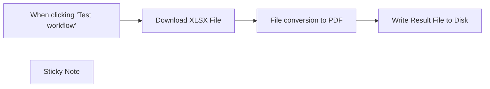

## Fluxo (.json) :

```json
{
  "meta": {
    "instanceId": "1dd912a1610cd0376bae7bb8f1b5838d2b601f42ac66a48e012166bb954fed5a",
    "templateId": "2304"
  },
  "nodes": [
    {
      "id": "6882e5c9-a468-4089-bffa-c8c04d28d8aa",
      "name": "When clicking ‘Test workflow’",
      "type": "n8n-nodes-base.manualTrigger",
      "position": [
        380,
        240
      ],
      "parameters": {},
      "typeVersion": 1
    },
    {
      "id": "5688dfe6-aeba-4c00-8626-396eb1a5d695",
      "name": "Write Result File to Disk",
      "type": "n8n-nodes-base.readWriteFile",
      "position": [
        980,
        240
      ],
      "parameters": {
        "options": {},
        "fileName": "document.pdf",
        "operation": "write",
        "dataPropertyName": "=data"
      },
      "typeVersion": 1
    },
    {
      "id": "fde98636-e4a2-4950-9b82-015ff841f24b",
      "name": "Sticky Note",
      "type": "n8n-nodes-base.stickyNote",
      "position": [
        720,
        100
      ],
      "parameters": {
        "width": 218,
        "height": 132,
        "content": "## Authentication\nConversion requests must be authenticated. Please create \n[ConvertAPI account to get authentication secret](https://www.convertapi.com/a/signin)"
      },
      "typeVersion": 1
    },
    {
      "id": "c322b7d4-0858-45de-a5ed-0efddb2608c9",
      "name": "Download XLSX File",
      "type": "n8n-nodes-base.httpRequest",
      "position": [
        580,
        240
      ],
      "parameters": {
        "url": "https://cdn.convertapi.com/public/files/demo.xlsx",
        "options": {
          "response": {
            "response": {
              "responseFormat": "file"
            }
          }
        }
      },
      "typeVersion": 4.2
    },
    {
      "id": "3f3d190e-0c39-4a99-a65e-cb7c5e1e0f65",
      "name": "File conversion to PDF",
      "type": "n8n-nodes-base.httpRequest",
      "position": [
        780,
        240
      ],
      "parameters": {
        "url": "https://v2.convertapi.com/convert/xlsx/to/pdf",
        "method": "POST",
        "options": {
          "response": {
            "response": {
              "responseFormat": "file"
            }
          }
        },
        "sendBody": true,
        "contentType": "multipart-form-data",
        "sendHeaders": true,
        "authentication": "genericCredentialType",
        "bodyParameters": {
          "parameters": [
            {
              "name": "file",
              "parameterType": "formBinaryData",
              "inputDataFieldName": "=data"
            }
          ]
        },
        "genericAuthType": "httpQueryAuth",
        "headerParameters": {
          "parameters": [
            {
              "name": "Accept",
              "value": "application/octet-stream"
            }
          ]
        }
      },
      "credentials": {
        "httpQueryAuth": {
          "id": "WdAklDMod8fBEMRk",
          "name": "Query Auth account"
        }
      },
      "notesInFlow": true,
      "typeVersion": 4.2
    }
  ],
  "pinData": {},
  "connections": {
    "Download XLSX File": {
      "main": [
        [
          {
            "node": "File conversion to PDF",
            "type": "main",
            "index": 0
          }
        ]
      ]
    },
    "File conversion to PDF": {
      "main": [
        [
          {
            "node": "Write Result File to Disk",
            "type": "main",
            "index": 0
          }
        ]
      ]
    },
    "When clicking ‘Test workflow’": {
      "main": [
        [
          {
            "node": "Download XLSX File",
            "type": "main",
            "index": 0
          }
        ]
      ]
    }
  }
}
```

<a id="template-297"></a>

## Template 297 - Criar afiliado e associar a programa

- **Nome:** Criar afiliado e associar a programa
- **Descrição:** Fluxo que cria um afiliado, adiciona metadados e o associa a um programa específico na plataforma de afiliados.
- **Funcionalidade:** • Gatilho manual: Inicia o fluxo ao clicar em executar.
• Criação de afiliado: Cria um novo afiliado usando email, nome e sobrenome fornecidos.
• Adição de metadados ao afiliado: Insere um metadado com a chave 'tag' e valor 'n8n' para o afiliado criado.
• Associação do afiliado a um programa: Vincula o afiliado ao programa identificado como 'testing-program-5'.
- **Ferramentas:** • Tapfiliate: Plataforma de marketing de afiliados utilizada para criar afiliados, armazenar metadados e associar afiliados a programas de afiliados.

## Fluxo visual

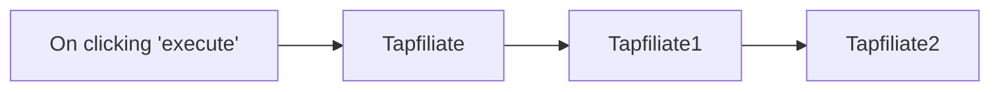

## Fluxo (.json) :

```json
{
  "nodes": [
    {
      "name": "Tapfiliate2",
      "type": "n8n-nodes-base.tapfiliate",
      "position": [
        870,
        300
      ],
      "parameters": {
        "resource": "programAffiliate",
        "programId": "testing-program-5",
        "affiliateId": "={{$node[\"Tapfiliate\"].json[\"id\"]}}",
        "additionalFields": {}
      },
      "credentials": {
        "tapfiliateApi": "Tapfiliate API credentials"
      },
      "typeVersion": 1
    },
    {
      "name": "Tapfiliate1",
      "type": "n8n-nodes-base.tapfiliate",
      "position": [
        670,
        300
      ],
      "parameters": {
        "resource": "affiliateMetadata",
        "metadataUi": {
          "metadataValues": [
            {
              "key": "tag",
              "value": "n8n"
            }
          ]
        },
        "affiliateId": "={{$json[\"id\"]}}"
      },
      "credentials": {
        "tapfiliateApi": "Tapfiliate API credentials"
      },
      "typeVersion": 1
    },
    {
      "name": "Tapfiliate",
      "type": "n8n-nodes-base.tapfiliate",
      "position": [
        470,
        300
      ],
      "parameters": {
        "email": "n8ndocsburner@gmail.com",
        "lastname": "Ryan",
        "firstname": "Jack",
        "additionalFields": {}
      },
      "credentials": {
        "tapfiliateApi": "Tapfiliate API credentials"
      },
      "typeVersion": 1
    },
    {
      "name": "On clicking 'execute'",
      "type": "n8n-nodes-base.manualTrigger",
      "position": [
        270,
        300
      ],
      "parameters": {},
      "typeVersion": 1
    }
  ],
  "connections": {
    "Tapfiliate": {
      "main": [
        [
          {
            "node": "Tapfiliate1",
            "type": "main",
            "index": 0
          }
        ]
      ]
    },
    "Tapfiliate1": {
      "main": [
        [
          {
            "node": "Tapfiliate2",
            "type": "main",
            "index": 0
          }
        ]
      ]
    },
    "On clicking 'execute'": {
      "main": [
        [
          {
            "node": "Tapfiliate",
            "type": "main",
            "index": 0
          }
        ]
      ]
    }
  }
}
```

<a id="template-298"></a>

## Template 298 - Importar planilha para PostgreSQL

- **Nome:** Importar planilha para PostgreSQL
- **Descrição:** Importa dados de um arquivo de planilha (.xls) e insere os registros na tabela 'product' de um banco de dados PostgreSQL.
- **Funcionalidade:** • Leitura de arquivo binário: carrega o arquivo de planilha (.xls) a partir do sistema de arquivos local.
• Processamento da planilha: interpreta o conteúdo do arquivo como planilha e extrai linhas e colunas para uso posterior.
• Inserção em banco de dados: insere as linhas extraídas na tabela 'product' utilizando as colunas name e ean.
- **Ferramentas:** • Arquivo local (spreadsheet.xls): arquivo de entrada no formato Excel (.xls) contendo os dados dos produtos.
• PostgreSQL: banco de dados relacional destino onde os registros são inseridos na tabela 'product'.

## Fluxo visual

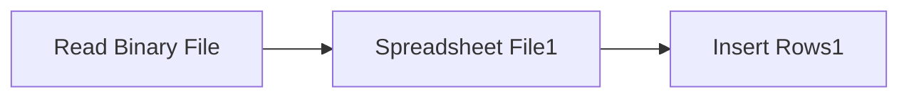

## Fluxo (.json) :

```json
{
  "nodes": [
    {
      "name": "Read Binary File",
      "type": "n8n-nodes-base.readBinaryFile",
      "position": [
        450,
        650
      ],
      "parameters": {
        "filePath": "spreadsheet.xls"
      },
      "typeVersion": 1
    },
    {
      "name": "Spreadsheet File1",
      "type": "n8n-nodes-base.spreadsheetFile",
      "position": [
        600,
        650
      ],
      "parameters": {},
      "typeVersion": 1
    },
    {
      "name": "Insert Rows1",
      "type": "n8n-nodes-base.postgres",
      "position": [
        750,
        650
      ],
      "parameters": {
        "table": "product",
        "columns": "name,ean"
      },
      "credentials": {
        "postgres": "postgres"
      },
      "typeVersion": 1
    }
  ],
  "connections": {
    "Read Binary File": {
      "main": [
        [
          {
            "node": "Spreadsheet File1",
            "type": "main",
            "index": 0
          }
        ]
      ]
    },
    "Spreadsheet File1": {
      "main": [
        [
          {
            "node": "Insert Rows1",
            "type": "main",
            "index": 0
          }
        ]
      ]
    }
  }
}
```

<a id="template-299"></a>

## Template 299 - Geração automática de conteúdo para WordPress

- **Nome:** Geração automática de conteúdo para WordPress
- **Descrição:** Automatiza a criação e publicação de artigos no WordPress a partir de ideias em uma planilha, gerando título, conteúdo em HTML e imagem de capa.
- **Funcionalidade:** • Leitura de ideias da planilha: Seleciona prompts não processados em uma Google Sheet.
• Preparar prompt: Extrai e formata o prompt para a geração de conteúdo.
• Geração de artigo com DeepSeek R1: Produz o artigo em HTML seguindo instruções de SEO, introdução, capítulos e conclusão.
• Geração de título otimizado: Cria um título conciso (máx. 60 caracteres) baseado no conteúdo gerado.
• Criação de post no WordPress (rascunho): Publica o conteúdo gerado como post em rascunho no site.
• Geração de imagem de capa com DALL-E: Cria uma imagem fotográfica realista baseada no título para usar como capa.
• Upload da imagem para WordPress: Envia o arquivo de mídia para o site via API e define nome do arquivo.
• Definição da imagem como destaque: Associa a mídia carregada ao post recém-criado como featured_media.
• Atualização da planilha: Registra data, título e ID do post na Google Sheet para controle editorial.
• Execução agendada: Pode ser configurado para rodar automaticamente em agenda e manter um plano editorial contínuo.
- **Ferramentas:** • Google Sheets: Planilha usada para armazenar ideias (prompts) e registrar data, título e ID do post.
• DeepSeek R1 (serviço de geração de texto): Modelo usado para gerar artigos e títulos otimizados para SEO.
• OpenAI DALL-E (serviço de imagens): Gera imagens fotográficas de capa a partir do título.
• WordPress REST API: Hospeda os posts, permite upload de mídias e definição de imagem destacada.

## Fluxo visual

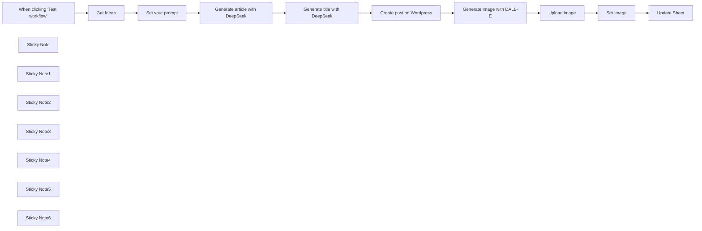

## Fluxo (.json) :

```json
{
  "id": "p5bfwpcRy6LK33Io",
  "meta": {
    "instanceId": "a4bfc93e975ca233ac45ed7c9227d84cf5a2329310525917adaf3312e10d5462",
    "templateCredsSetupCompleted": true
  },
  "name": "Automate Content Generator for WordPress with DeepSeek R1",
  "tags": [],
  "nodes": [
    {
      "id": "c4a6995f-7769-4b77-80ca-1e6bccef77c1",
      "name": "When clicking ‘Test workflow’",
      "type": "n8n-nodes-base.manualTrigger",
      "position": [
        -20,
        200
      ],
      "parameters": {},
      "typeVersion": 1
    },
    {
      "id": "c76b1458-5130-41e7-b2f2-1cfe22eab536",
      "name": "Get Ideas",
      "type": "n8n-nodes-base.googleSheets",
      "position": [
        200,
        200
      ],
      "parameters": {
        "options": {},
        "sheetName": {
          "__rl": true,
          "mode": "id",
          "value": "=Sheet1"
        },
        "documentId": {
          "__rl": true,
          "mode": "id",
          "value": "YOURDOCUMENT"
        }
      },
      "credentials": {
        "googleSheetsOAuth2Api": {
          "id": "JYR6a64Qecd6t8Hb",
          "name": "Google Sheets account"
        }
      },
      "typeVersion": 4.5
    },
    {
      "id": "8d17a640-3e15-42e9-9481-e3291d395ccd",
      "name": "Set your prompt",
      "type": "n8n-nodes-base.set",
      "position": [
        420,
        200
      ],
      "parameters": {
        "options": {},
        "assignments": {
          "assignments": [
            {
              "id": "3e8d2523-66aa-46fe-adcc-39dc78b9161e",
              "name": "prompt",
              "type": "string",
              "value": "={{ $json.PROMPT }}"
            }
          ]
        }
      },
      "typeVersion": 3.4
    },
    {
      "id": "4f0e9065-b331-49ed-acd9-77c7c43e89a5",
      "name": "Create post on Wordpress",
      "type": "n8n-nodes-base.wordpress",
      "position": [
        0,
        500
      ],
      "parameters": {
        "title": "={{ $json.message.content }}",
        "additionalFields": {
          "status": "draft",
          "content": "={{ $('Generate article with DeepSeek').item.json.message.content }}"
        }
      },
      "credentials": {
        "wordpressApi": {
          "id": "OE4AgquSkMWydRqn",
          "name": "Wordpress (wp.test.7hype.com)"
        }
      },
      "typeVersion": 1
    },
    {
      "id": "cb85d980-9d60-4c85-8574-b46e4cc14341",
      "name": "Upload image",
      "type": "n8n-nodes-base.httpRequest",
      "position": [
        420,
        500
      ],
      "parameters": {
        "url": "https://YOURSITE.com/wp-json/wp/v2/media",
        "method": "POST",
        "options": {},
        "sendBody": true,
        "contentType": "binaryData",
        "sendHeaders": true,
        "authentication": "predefinedCredentialType",
        "headerParameters": {
          "parameters": [
            {
              "name": "Content-Disposition",
              "value": "=attachment; filename=\"copertina-{{ $('Create post on Wordpress').item.json.id }}.jpg\""
            }
          ]
        },
        "inputDataFieldName": "data",
        "nodeCredentialType": "wordpressApi"
      },
      "credentials": {
        "wordpressApi": {
          "id": "OE4AgquSkMWydRqn",
          "name": "Wordpress (wp.test.7hype.com)"
        },
        "wooCommerceApi": {
          "id": "vYYrjB5kgHQ0XByZ",
          "name": "WooCommerce (wp.test.7hype.com)"
        }
      },
      "typeVersion": 4.2
    },
    {
      "id": "bc71ed8a-fe35-487a-b4cd-6b8c1b256763",
      "name": "Set Image",
      "type": "n8n-nodes-base.httpRequest",
      "position": [
        640,
        500
      ],
      "parameters": {
        "url": "=https://wp.test.7hype.com/wp-json/wp/v2/posts/{{ $('Create post on Wordpress').item.json.id }}",
        "method": "POST",
        "options": {},
        "sendQuery": true,
        "authentication": "predefinedCredentialType",
        "queryParameters": {
          "parameters": [
            {
              "name": "featured_media",
              "value": "={{ $json.id }}"
            }
          ]
        },
        "nodeCredentialType": "wordpressApi"
      },
      "credentials": {
        "wordpressApi": {
          "id": "OE4AgquSkMWydRqn",
          "name": "Wordpress (wp.test.7hype.com)"
        }
      },
      "typeVersion": 4.2
    },
    {
      "id": "fbed2813-cc64-42a2-994f-3696e9d8d8fe",
      "name": "Update Sheet",
      "type": "n8n-nodes-base.googleSheets",
      "position": [
        880,
        500
      ],
      "parameters": {
        "columns": {
          "value": {
            "DATA": "={{ $now.format('dd/LL/yyyy') }}",
            "TITOLO": "={{ $('Generate title with DeepSeek').item.json.message.content }}",
            "ID POST": "={{ $('Create post on Wordpress').item.json.id }}",
            "row_number": "={{ $('Get Ideas').item.json.row_number }}"
          },
          "schema": [
            {
              "id": "DATA",
              "type": "string",
              "display": true,
              "required": false,
              "displayName": "DATA",
              "defaultMatch": false,
              "canBeUsedToMatch": true
            },
            {
              "id": "PROMPT",
              "type": "string",
              "display": true,
              "required": false,
              "displayName": "PROMPT",
              "defaultMatch": false,
              "canBeUsedToMatch": true
            },
            {
              "id": "TITOLO",
              "type": "string",
              "display": true,
              "required": false,
              "displayName": "TITOLO",
              "defaultMatch": false,
              "canBeUsedToMatch": true
            },
            {
              "id": "ID POST",
              "type": "string",
              "display": true,
              "required": false,
              "displayName": "ID POST",
              "defaultMatch": false,
              "canBeUsedToMatch": true
            },
            {
              "id": "row_number",
              "type": "string",
              "display": true,
              "removed": false,
              "readOnly": true,
              "required": false,
              "displayName": "row_number",
              "defaultMatch": false,
              "canBeUsedToMatch": true
            }
          ],
          "mappingMode": "defineBelow",
          "matchingColumns": [
            "row_number"
          ],
          "attemptToConvertTypes": false,
          "convertFieldsToString": false
        },
        "options": {},
        "operation": "update",
        "sheetName": {
          "__rl": true,
          "mode": "list",
          "value": "gid=0",
          "cachedResultUrl": "https://docs.google.com/spreadsheets/d/16VFeCrE5BkMBoA_S5HD-9v7C0sxcXAUiDbq5JvkDqnI/edit#gid=0",
          "cachedResultName": "Foglio1"
        },
        "documentId": {
          "__rl": true,
          "mode": "list",
          "value": "16VFeCrE5BkMBoA_S5HD-9v7C0sxcXAUiDbq5JvkDqnI",
          "cachedResultUrl": "https://docs.google.com/spreadsheets/d/16VFeCrE5BkMBoA_S5HD-9v7C0sxcXAUiDbq5JvkDqnI/edit?usp=drivesdk",
          "cachedResultName": "Plan Blog wp.test.7hype.com"
        }
      },
      "credentials": {
        "googleSheetsOAuth2Api": {
          "id": "JYR6a64Qecd6t8Hb",
          "name": "Google Sheets account"
        }
      },
      "typeVersion": 4.5
    },
    {
      "id": "8db2b0cb-6d61-4e2d-bfac-e25a0385296d",
      "name": "Sticky Note",
      "type": "n8n-nodes-base.stickyNote",
      "position": [
        -60,
        -360
      ],
      "parameters": {
        "color": 3,
        "width": 800,
        "height": 380,
        "content": "## Target\nThis workflow is designed to automatically generate seo-friendly content for wordpress through DeepSeek R1 by giving input ideas on how to structure the article. A cover image is also generated and uploaded with OpenAI DALL-E 3. This flow is designed to be executed automatically (ad \"On a schedule\" node) and thus have a complete editorial plan.\n\nThis process is useful for blog managers who want to automate content creation and publishing.\n\n## Preliminary step\nCreate a google sheet with the following columns:\n- Date\n- Prompt\n- Title\n- Post ID\n\nFill in only the \"Prompt\" column with basic ideas that DeepSeek will work on to generate the content."
      },
      "typeVersion": 1
    },
    {
      "id": "ab620659-558d-46f0-ab85-e061af99b743",
      "name": "Sticky Note1",
      "type": "n8n-nodes-base.stickyNote",
      "position": [
        140,
        100
      ],
      "parameters": {
        "height": 260,
        "content": "Connect with your Google Sheet. This node select only rows for which no content has been generated yet in WordPress"
      },
      "typeVersion": 1
    },
    {
      "id": "73b0e640-8ccf-4e29-a0cd-6340db907bbd",
      "name": "Generate article with DeepSeek",
      "type": "@n8n/n8n-nodes-langchain.openAi",
      "position": [
        640,
        200
      ],
      "parameters": {
        "modelId": {
          "__rl": true,
          "mode": "id",
          "value": "=deepseek-reasoner"
        },
        "options": {
          "maxTokens": 2048
        },
        "messages": {
          "values": [
            {
              "content": "=You are an SEO expert, write an article based on this topic:\n{{ $json.prompt }}\n\nInstructions:\n- In the introduction, introduce the topic that will be explored in the rest of the text\n- The introduction should be about 120 words\n- The conclusions should be about 120 words\n- Use the conclusions to summarize everything said in the article and offer a conclusion to the reader\n- Write a maximum of 4-5 chapters and argue them.\n- The chapters should follow a logical flow and not repeat the same concepts.\n- The chapters should be related to each other and not isolated blocks of text. The text should flow and follow a linear logic.\n- Do not start chapters with \"Chapter 1\", \"Chapter 2\", \"Chapter 3\" ... write only the chapter title\n- For the text, use HTML for formatting, but limit yourself to bold, italics, paragraphs and lists.\n- Don't put the output in ```html but only text\n- Don't use markdown for formatting.\n- Go deeper into the topic you're talking about, don't just throw superficial information there\n- In output I want only the HTML format"
            }
          ]
        }
      },
      "credentials": {
        "openAiApi": {
          "id": "97Cz4cqyiy1RdcQL",
          "name": "DeepSeek"
        }
      },
      "typeVersion": 1.8
    },
    {
      "id": "6ef4e0d1-6123-4f47-94fb-c06c785ddd92",
      "name": "Generate title with DeepSeek",
      "type": "@n8n/n8n-nodes-langchain.openAi",
      "position": [
        880,
        200
      ],
      "parameters": {
        "modelId": {
          "__rl": true,
          "mode": "id",
          "value": "=deepseek-reasoner"
        },
        "options": {
          "maxTokens": 2048
        },
        "messages": {
          "values": [
            {
              "content": "=You are an SEO Copywriter and you need to think of a title of maximum 60 characters for the following article:\n{{ $json.message.content }}\n\nInstructions:\n- Use keywords contained in the article\n- Do not use any HTML characters\n- Output only the string containing the title.\n- Do not use quotation marks. The only special characters allowed are \":\" and \",\""
            }
          ]
        }
      },
      "credentials": {
        "openAiApi": {
          "id": "97Cz4cqyiy1RdcQL",
          "name": "DeepSeek"
        }
      },
      "typeVersion": 1.8
    },
    {
      "id": "2ecc8514-c04e-4f8b-9ab3-560f2cf910b0",
      "name": "Sticky Note2",
      "type": "n8n-nodes-base.stickyNote",
      "position": [
        580,
        100
      ],
      "parameters": {
        "width": 420,
        "height": 260,
        "content": "Add your DeepSeek API credential. If you want you can change the model with \"deepseek-chat\""
      },
      "typeVersion": 1
    },
    {
      "id": "196f7799-a6ab-429b-afd3-bcbcbd65da3b",
      "name": "Sticky Note3",
      "type": "n8n-nodes-base.stickyNote",
      "position": [
        -20,
        420
      ],
      "parameters": {
        "width": 160,
        "height": 260,
        "content": "Add your WordPress API credential\n"
      },
      "typeVersion": 1
    },
    {
      "id": "93c2d359-531a-4cc9-8a18-870c2d6ec62c",
      "name": "Generate Image with DALL-E",
      "type": "@n8n/n8n-nodes-langchain.openAi",
      "position": [
        200,
        500
      ],
      "parameters": {
        "prompt": "=Generate a real photographic image used as a cover for a blog post:\n\nImage prompt:\n{{ $('Generate title with DeepSeek').item.json.message.content }}, photography, realistic, sigma 85mm f/1.4",
        "options": {
          "size": "1792x1024",
          "style": "natural",
          "quality": "hd"
        },
        "resource": "image"
      },
      "credentials": {
        "openAiApi": {
          "id": "CDX6QM4gLYanh0P4",
          "name": "OpenAi account"
        }
      },
      "typeVersion": 1.8
    },
    {
      "id": "eec14cd7-fb2b-4f7d-ad94-bcffc1249353",
      "name": "Sticky Note4",
      "type": "n8n-nodes-base.stickyNote",
      "position": [
        180,
        420
      ],
      "parameters": {
        "width": 160,
        "height": 260,
        "content": "Add your OpenAI API credential\n"
      },
      "typeVersion": 1
    },
    {
      "id": "4f15679b-bc8f-45b8-b3c4-8b43d7f9bb6f",
      "name": "Sticky Note5",
      "type": "n8n-nodes-base.stickyNote",
      "position": [
        380,
        420
      ],
      "parameters": {
        "width": 180,
        "height": 260,
        "content": "Upload the image on your WordPress via APIs\n"
      },
      "typeVersion": 1
    },
    {
      "id": "abe32434-671a-4ac3-a788-fcf5fd0e9435",
      "name": "Sticky Note6",
      "type": "n8n-nodes-base.stickyNote",
      "position": [
        600,
        420
      ],
      "parameters": {
        "width": 180,
        "height": 260,
        "content": "Set the uploaded image with the newly created article\n"
      },
      "typeVersion": 1
    }
  ],
  "active": false,
  "pinData": {},
  "settings": {
    "executionOrder": "v1"
  },
  "versionId": "315cc8df-bca2-4180-806e-a01407dccc79",
  "connections": {
    "Get Ideas": {
      "main": [
        [
          {
            "node": "Set your prompt",
            "type": "main",
            "index": 0
          }
        ]
      ]
    },
    "Set Image": {
      "main": [
        [
          {
            "node": "Update Sheet",
            "type": "main",
            "index": 0
          }
        ]
      ]
    },
    "Upload image": {
      "main": [
        [
          {
            "node": "Set Image",
            "type": "main",
            "index": 0
          }
        ]
      ]
    },
    "Set your prompt": {
      "main": [
        [
          {
            "node": "Generate article with DeepSeek",
            "type": "main",
            "index": 0
          }
        ]
      ]
    },
    "Create post on Wordpress": {
      "main": [
        [
          {
            "node": "Generate Image with DALL-E",
            "type": "main",
            "index": 0
          }
        ]
      ]
    },
    "Generate Image with DALL-E": {
      "main": [
        [
          {
            "node": "Upload image",
            "type": "main",
            "index": 0
          }
        ]
      ]
    },
    "Generate title with DeepSeek": {
      "main": [
        [
          {
            "node": "Create post on Wordpress",
            "type": "main",
            "index": 0
          }
        ]
      ]
    },
    "Generate article with DeepSeek": {
      "main": [
        [
          {
            "node": "Generate title with DeepSeek",
            "type": "main",
            "index": 0
          }
        ]
      ]
    },
    "When clicking ‘Test workflow’": {
      "main": [
        [
          {
            "node": "Get Ideas",
            "type": "main",
            "index": 0
          }
        ]
      ]
    }
  }
}
```

<a id="template-300"></a>

## Template 300 - Sincronizar comentários Zendesk → Pipedrive

- **Nome:** Sincronizar comentários Zendesk → Pipedrive
- **Descrição:** Fluxo agendado que busca tickets do Zendesk atualizados desde a última execução e adiciona comentários novos como notas vinculadas a pessoas no Pipedrive.
- **Funcionalidade:** • Agendamento diário: Executa o fluxo automaticamente todos os dias às 09:00.
• Controle de última execução: Registra e atualiza a timestamp da última execução para buscar apenas alterações desde então.
• Busca de tickets atualizados: Recupera tickets do Zendesk que foram atualizados após a última execução.
• Filtragem por canal de e-mail: Processa apenas tickets cuja origem seja e-mail.
• Extração e desduplicação de e-mails: Extrai o e-mail do remetente e remove duplicatas para otimizar buscas.
• Busca de pessoas no Pipedrive por e-mail: Procura correspondências de contatos no Pipedrive usando o e-mail do remetente.
• Associação de ID de pessoa: Liga o ID da pessoa encontrada no Pipedrive aos tickets do Zendesk para posterior vinculação de notas.
• Recuperação e divisão de comentários: Busca os comentários do ticket, divide-os e processa item a item (em lote) para controle fino.
• Identificação de comentários novos: Compara a data do comentário com a última execução e só processa comentários criados desde então.
• Criação de notas no Pipedrive: Para cada comentário novo, cria uma nota no Pipedrive vinculada à pessoa correspondente.
• Atualização da marca de última execução: Ao finalizar o processamento, atualiza a timestamp para a próxima execução buscar apenas novos itens.
- **Ferramentas:** • Zendesk: Fonte dos tickets e comentários; fornece API para pesquisar tickets atualizados e recuperar comentários por ticket.
• Pipedrive: Sistema CRM onde são buscadas pessoas por e-mail e onde são criadas notas vinculadas aos contatos.

## Fluxo visual

```mermaid
flowchart LR
    N1["NoOp"]
    N2["Get last execution timestamp"]
    N3["Set new last execution timestamp"]
    N4["Pipedrive person Id found"]
    N5["NoOp1"]
    N6["Get Zendesk comments for tickets"]
    N7["Add comments to tickets"]
    N8["Add Pipedrive person Id to Zendesk tickets"]
    N9["Get tickets updated after last execution"]
    N10["Channel is email"]
    N11["Rename fields and keep only needed fields"]
    N12["Search persons by email"]
    N13["Remove duplicates to make search efficient"]
    N14["Set search email"]
    N15["Process commenst per ticket"]
    N16["New comment"]
    N17["Split comments to seperate items"]
    N18["Add comment as a note in Pipedrive"]
    N19["NoOp2"]
    N20["Every day at 09:00"]
    N21["Done processing"]

    N16 --> N18
    N16 --> N19
    N21 --> N3
    N21 --> N15
    N10 --> N14
    N10 --> N8
    N10 --> N1
    N14 --> N13
    N20 --> N2
    N7 --> N15
    N12 --> N11
    N4 --> N6
    N4 --> N7
    N4 --> N5
    N15 --> N17
    N2 --> N9
    N6 --> N7
    N17 --> N16
    N18 --> N21
    N9 --> N10
    N11 --> N8
    N8 --> N4
    N13 --> N12
```

## Fluxo (.json) :

```json
{
  "meta": {
    "instanceId": "237600ca44303ce91fa31ee72babcdc8493f55ee2c0e8aa2b78b3b4ce6f70bd9"
  },
  "nodes": [
    {
      "id": "a4280167-97e0-4d12-bdfc-735dd9c69f03",
      "name": "NoOp",
      "type": "n8n-nodes-base.noOp",
      "position": [
        1160,
        540
      ],
      "parameters": {},
      "typeVersion": 1
    },
    {
      "id": "a3ad4e3b-0841-4a6e-993b-5239d9e56eaf",
      "name": "Get last execution timestamp",
      "type": "n8n-nodes-base.functionItem",
      "position": [
        420,
        300
      ],
      "parameters": {
        "functionCode": "// Code here will run once per input item.\n// More info and help: https://docs.n8n.io/nodes/n8n-nodes-base.functionItem\n// Tip: You can use luxon for dates and $jmespath for querying JSON structures\n\n// Add a new field called 'myNewField' to the JSON of the item\nconst staticData = getWorkflowStaticData('global');\n\nif(!staticData.lastExecution){\n  staticData.lastExecution = new Date().toISOString();\n}\n\nitem.executionTimeStamp = new Date().toISOString();\nitem.lastExecution = staticData.lastExecution;\n\n\nreturn item;"
      },
      "typeVersion": 1
    },
    {
      "id": "f917bc42-8b9f-4b60-860c-360eeb86b88c",
      "name": "Set new last execution timestamp",
      "type": "n8n-nodes-base.functionItem",
      "position": [
        4440,
        140
      ],
      "parameters": {
        "functionCode": "// Code here will run once per input item.\n// More info and help: https://docs.n8n.io/nodes/n8n-nodes-base.functionItem\n// Tip: You can use luxon for dates and $jmespath for querying JSON structures\n\n// Add a new field called 'myNewField' to the JSON of the item\nconst staticData = getWorkflowStaticData('global');\n\nstaticData.lastExecution = $item(0).$node[\"Get last execution timestamp\"].executionTimeStamp;\n\nreturn item;"
      },
      "executeOnce": true,
      "typeVersion": 1
    },
    {
      "id": "ff141018-5307-4754-a48a-2311fcd15f85",
      "name": "Pipedrive person Id found",
      "type": "n8n-nodes-base.if",
      "position": [
        2280,
        300
      ],
      "parameters": {
        "conditions": {
          "string": [
            {
              "value1": "={{ $json[\"PipeDrivePersonId\"] }}",
              "operation": "isNotEmpty"
            }
          ]
        }
      },
      "typeVersion": 1
    },
    {
      "id": "d06b1dae-77cb-4c0b-98dc-0e7184f95095",
      "name": "NoOp1",
      "type": "n8n-nodes-base.noOp",
      "position": [
        2620,
        480
      ],
      "parameters": {},
      "typeVersion": 1
    },
    {
      "id": "e8a01cec-06d1-4fe6-8920-55fdd143f626",
      "name": "Get Zendesk comments for tickets",
      "type": "n8n-nodes-base.httpRequest",
      "position": [
        2620,
        280
      ],
      "parameters": {
        "url": "=https://n8n.zendesk.com/api/v2/tickets/{{$json[\"id\"]}}/comments",
        "options": {},
        "authentication": "predefinedCredentialType",
        "nodeCredentialType": "zendeskApi"
      },
      "credentials": {
        "zendeskApi": {
          "id": "5",
          "name": "Zendesk account"
        }
      },
      "typeVersion": 2
    },
    {
      "id": "7f7addcb-4858-4fd0-b1c2-29800365241b",
      "name": "Add comments to tickets",
      "type": "n8n-nodes-base.merge",
      "position": [
        2860,
        160
      ],
      "parameters": {
        "join": "inner",
        "mode": "mergeByIndex"
      },
      "typeVersion": 1
    },
    {
      "id": "4ab3e897-b3d1-47f8-8c81-640e2ca6b3de",
      "name": "Add Pipedrive person Id to Zendesk tickets",
      "type": "n8n-nodes-base.merge",
      "position": [
        2060,
        300
      ],
      "parameters": {
        "mode": "mergeByKey",
        "propertyName1": "via.source.from.address",
        "propertyName2": "primary_email"
      },
      "typeVersion": 1
    },
    {
      "id": "1b25adda-15eb-4e23-bfb2-0a034656d8e2",
      "name": "Get tickets updated after last execution",
      "type": "n8n-nodes-base.zendesk",
      "position": [
        640,
        300
      ],
      "parameters": {
        "options": {
          "query": "=updated>{{ $json[\"lastExecution\"] }}",
          "sortBy": "updated_at",
          "sortOrder": "desc"
        },
        "operation": "getAll"
      },
      "credentials": {
        "zendeskApi": {
          "id": "5",
          "name": "Zendesk account"
        }
      },
      "typeVersion": 1
    },
    {
      "id": "4884b8f5-d3f1-404d-87b3-1a802553cbee",
      "name": "Channel is email",
      "type": "n8n-nodes-base.if",
      "position": [
        860,
        300
      ],
      "parameters": {
        "conditions": {
          "string": [
            {
              "value1": "={{ $json[\"via\"].channel }}",
              "value2": "email"
            }
          ]
        }
      },
      "typeVersion": 1
    },
    {
      "id": "48541dcf-8ea6-47b8-ad52-1b3045df6832",
      "name": "Rename fields and keep only needed fields",
      "type": "n8n-nodes-base.set",
      "position": [
        1820,
        360
      ],
      "parameters": {
        "values": {
          "number": [
            {
              "name": "PipeDrivePersonId",
              "value": "={{ $json[\"id\"] }}"
            }
          ],
          "string": [
            {
              "name": "primary_email",
              "value": "={{ $json[\"primary_email\"] }}"
            }
          ]
        },
        "options": {},
        "keepOnlySet": true
      },
      "typeVersion": 1
    },
    {
      "id": "e66d6b04-6a4e-4ab4-98a4-efba4bc5ec12",
      "name": "Search persons by email",
      "type": "n8n-nodes-base.pipedrive",
      "position": [
        1600,
        360
      ],
      "parameters": {
        "term": "={{ $json[\"SearchEmail\"] }}",
        "resource": "person",
        "operation": "search",
        "additionalFields": {
          "fields": "email"
        }
      },
      "credentials": {
        "pipedriveApi": {
          "id": "1",
          "name": "Pipedrive account"
        }
      },
      "typeVersion": 1
    },
    {
      "id": "01e008cf-6867-48b3-9a0d-b1b264bb5c08",
      "name": "Remove duplicates to make search efficient",
      "type": "n8n-nodes-base.itemLists",
      "position": [
        1360,
        360
      ],
      "parameters": {
        "compare": "selectedFields",
        "options": {},
        "operation": "removeDuplicates",
        "fieldsToCompare": {
          "fields": [
            {
              "fieldName": "SearchEmail"
            }
          ]
        }
      },
      "typeVersion": 1
    },
    {
      "id": "bc3ac74d-ac87-46b8-bd59-6cafe0e0e59c",
      "name": "Set search email",
      "type": "n8n-nodes-base.set",
      "position": [
        1160,
        360
      ],
      "parameters": {
        "values": {
          "string": [
            {
              "name": "SearchEmail",
              "value": "={{ $json[\"via\"].source.from.address }}"
            }
          ]
        },
        "options": {},
        "keepOnlySet": true
      },
      "typeVersion": 1
    },
    {
      "id": "e0cf4204-7640-41c7-9adc-39d2d86b6144",
      "name": "Process commenst per ticket",
      "type": "n8n-nodes-base.splitInBatches",
      "position": [
        3080,
        160
      ],
      "parameters": {
        "options": {},
        "batchSize": 1
      },
      "typeVersion": 1
    },
    {
      "id": "056646c3-7e1f-4195-92bd-1c3c1c9e8d25",
      "name": "New comment",
      "type": "n8n-nodes-base.if",
      "position": [
        3540,
        160
      ],
      "parameters": {
        "conditions": {
          "dateTime": [
            {
              "value1": "={{ $json[\"created_at\"] }}",
              "value2": "={{$item(0).$node[\"Get last execution timestamp\"].json[\"lastExecution\"]}}"
            }
          ]
        }
      },
      "typeVersion": 1,
      "alwaysOutputData": true
    },
    {
      "id": "77ef979c-313e-4904-bf3e-8716f1e5c86f",
      "name": "Split comments to seperate items",
      "type": "n8n-nodes-base.itemLists",
      "position": [
        3320,
        160
      ],
      "parameters": {
        "options": {},
        "fieldToSplitOut": "comments"
      },
      "typeVersion": 1
    },
    {
      "id": "01fbc85c-0c85-48d1-b2b2-cdf8d6310578",
      "name": "Add comment as a note in Pipedrive",
      "type": "n8n-nodes-base.pipedrive",
      "position": [
        3820,
        0
      ],
      "parameters": {
        "content": "=Message imported from Zendesk\n------------------------------------------------\nFrom {{$json[\"via\"][\"source\"][\"from\"][\"name\"] ?? 'Zendesk user'}}\n------------------------------------------------\n{{$json[\"body\"]}}",
        "resource": "note",
        "additionalFields": {
          "person_id": "={{$item(0).$node[\"Process commenst per ticket\"].json[\"PipeDrivePersonId\"]}}"
        }
      },
      "credentials": {
        "pipedriveApi": {
          "id": "1",
          "name": "Pipedrive account"
        }
      },
      "typeVersion": 1
    },
    {
      "id": "12296cee-7786-489d-9a33-7d0d1d7d755b",
      "name": "NoOp2",
      "type": "n8n-nodes-base.noOp",
      "position": [
        3820,
        180
      ],
      "parameters": {},
      "typeVersion": 1
    },
    {
      "id": "0c21dbce-0820-4300-8da4-6e795288aa0b",
      "name": "Every day at 09:00",
      "type": "n8n-nodes-base.cron",
      "position": [
        220,
        300
      ],
      "parameters": {
        "triggerTimes": {
          "item": [
            {
              "hour": 9
            }
          ]
        }
      },
      "typeVersion": 1
    },
    {
      "id": "e6990744-45e2-4c08-b611-7f5bbac7ad9a",
      "name": "Done processing",
      "type": "n8n-nodes-base.if",
      "position": [
        4160,
        160
      ],
      "parameters": {
        "conditions": {
          "boolean": [
            {
              "value1": "={{$node[\"Process commenst per ticket\"].context[\"noItemsLeft\"]}}",
              "value2": true
            }
          ]
        },
        "combineOperation": "any"
      },
      "typeVersion": 1
    }
  ],
  "connections": {
    "New comment": {
      "main": [
        [
          {
            "node": "Add comment as a note in Pipedrive",
            "type": "main",
            "index": 0
          }
        ],
        [
          {
            "node": "NoOp2",
            "type": "main",
            "index": 0
          }
        ]
      ]
    },
    "Done processing": {
      "main": [
        [
          {
            "node": "Set new last execution timestamp",
            "type": "main",
            "index": 0
          }
        ],
        [
          {
            "node": "Process commenst per ticket",
            "type": "main",
            "index": 0
          }
        ]
      ]
    },
    "Channel is email": {
      "main": [
        [
          {
            "node": "Set search email",
            "type": "main",
            "index": 0
          },
          {
            "node": "Add Pipedrive person Id to Zendesk tickets",
            "type": "main",
            "index": 0
          }
        ],
        [
          {
            "node": "NoOp",
            "type": "main",
            "index": 0
          }
        ]
      ]
    },
    "Set search email": {
      "main": [
        [
          {
            "node": "Remove duplicates to make search efficient",
            "type": "main",
            "index": 0
          }
        ]
      ]
    },
    "Every day at 09:00": {
      "main": [
        [
          {
            "node": "Get last execution timestamp",
            "type": "main",
            "index": 0
          }
        ]
      ]
    },
    "Add comments to tickets": {
      "main": [
        [
          {
            "node": "Process commenst per ticket",
            "type": "main",
            "index": 0
          }
        ]
      ]
    },
    "Search persons by email": {
      "main": [
        [
          {
            "node": "Rename fields and keep only needed fields",
            "type": "main",
            "index": 0
          }
        ]
      ]
    },
    "Pipedrive person Id found": {
      "main": [
        [
          {
            "node": "Get Zendesk comments for tickets",
            "type": "main",
            "index": 0
          },
          {
            "node": "Add comments to tickets",
            "type": "main",
            "index": 0
          }
        ],
        [
          {
            "node": "NoOp1",
            "type": "main",
            "index": 0
          }
        ]
      ]
    },
    "Process commenst per ticket": {
      "main": [
        [
          {
            "node": "Split comments to seperate items",
            "type": "main",
            "index": 0
          }
        ]
      ]
    },
    "Get last execution timestamp": {
      "main": [
        [
          {
            "node": "Get tickets updated after last execution",
            "type": "main",
            "index": 0
          }
        ]
      ]
    },
    "Get Zendesk comments for tickets": {
      "main": [
        [
          {
            "node": "Add comments to tickets",
            "type": "main",
            "index": 1
          }
        ]
      ]
    },
    "Split comments to seperate items": {
      "main": [
        [
          {
            "node": "New comment",
            "type": "main",
            "index": 0
          }
        ]
      ]
    },
    "Add comment as a note in Pipedrive": {
      "main": [
        [
          {
            "node": "Done processing",
            "type": "main",
            "index": 0
          }
        ]
      ]
    },
    "Get tickets updated after last execution": {
      "main": [
        [
          {
            "node": "Channel is email",
            "type": "main",
            "index": 0
          }
        ]
      ]
    },
    "Rename fields and keep only needed fields": {
      "main": [
        [
          {
            "node": "Add Pipedrive person Id to Zendesk tickets",
            "type": "main",
            "index": 1
          }
        ]
      ]
    },
    "Add Pipedrive person Id to Zendesk tickets": {
      "main": [
        [
          {
            "node": "Pipedrive person Id found",
            "type": "main",
            "index": 0
          }
        ]
      ]
    },
    "Remove duplicates to make search efficient": {
      "main": [
        [
          {
            "node": "Search persons by email",
            "type": "main",
            "index": 0
          }
        ]
      ]
    }
  }
}
```

<a id="template-301"></a>

## Template 301 - Exemplos de uso da API OpenAI

- **Nome:** Exemplos de uso da API OpenAI
- **Descrição:** Fluxo de exemplos que demonstra diversas operações com a API da OpenAI: geração de resumos (TL;DR), traduções, edições, transcrição de áudio, geração de prompts para imagens, criação de imagens e geração de HTML/SVG.
- **Funcionalidade:** • Gatilho manual: Inicia a execução do fluxo sob demanda.
• Leitura de arquivo de áudio: Carrega um arquivo MP3 local para posterior processamento (nó desativado).
• Transcrição de áudio (Whisper): Envia áudio para transcrição para obter texto (exemplo desativado).
• Exemplo de texto transcrito: Fornece um bloco de texto de exemplo para alimentar outras operações de NLP.
• Geração de resumo (TL;DR): Produz resumos concisos do texto usando modelos de completamento e chat.
• Tradução para alemão: Realiza edição/tradução de texto para o alemão utilizando a API de edição/chat.
• Uso de mensagens sistema/usuário: Configura instruções de sistema e conteúdo do usuário para controlar o comportamento do modelo de chat.
• Chamadas HTTP diretas à API de chat: Envia programaticamente um array de mensagens para o endpoint de chat via requisição HTTP.
• Geração de prompt para imagem: Cria prompts descritivos (ex.: estilo de quadrinhos dos anos 60) a partir do texto resumido.
• Geração de imagens (DALL·E): Solicita múltiplas variações de imagem a partir do prompt gerado.
• Geração de HTML/SVG: Solicita ao modelo a criação de código HTML contendo SVG com formas aleatórias.
• Produção de múltiplas respostas curtas: Gera várias respostas curtas (úteis para respostas rápidas de e-mail).
• Preparação de prompts via nó de conjunto: Monta e organiza parâmetros e prompts antes de chamar os modelos.
• Documentação inline: Sticky notes com instruções e recomendações integradas ao fluxo.
- **Ferramentas:** • OpenAI Chat (gpt-3.5-turbo / gpt-3.5-turbo-0301): Serviço de chat para instruções, resumos e conversação controlada.
• OpenAI Completions (text-davinci-003 / code-davinci-002): Modelos de completamento de texto para resumos, geração de conteúdo e código.
• OpenAI Edits: Serviço de edição para transformar ou traduzir texto existente.
• OpenAI Whisper: Modelo de transcrição de áudio para converter arquivos de áudio em texto.
• OpenAI Image (DALL·E): Serviço de geração de imagens a partir de prompts descritivos.
• API HTTP externa: Endpoint REST usado para chamadas programáticas diretas à API da OpenAI.
• Sistema de arquivos local: Fonte de arquivos (ex.: MP3) para processamento de áudio.


## Fluxo visual

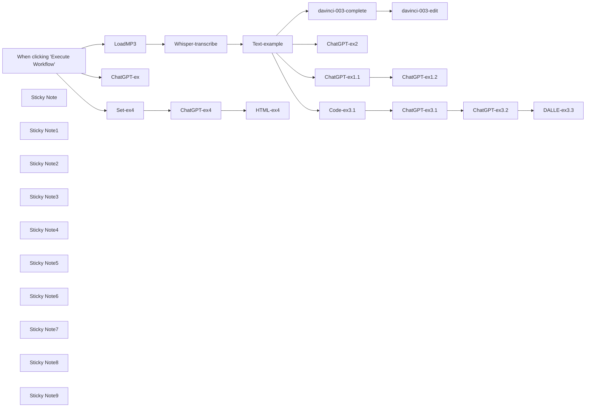

## Fluxo (.json) :

```json
{
  "id": "147",
  "meta": {
    "instanceId": "dfdeafd1c3ed2ee08eeab8c2fa0c3f522066931ed8138ccd35dc20a1e69decd3"
  },
  "name": "OpenAI-model-examples",
  "tags": [],
  "nodes": [
    {
      "id": "ad6dc2cd-21cc-4563-86ba-f78cc4a55543",
      "name": "When clicking \"Execute Workflow\"",
      "type": "n8n-nodes-base.manualTrigger",
      "position": [
        -640,
        380
      ],
      "parameters": {},
      "typeVersion": 1
    },
    {
      "id": "b370da23-ead4-4221-b7fe-a9d943f7fbb9",
      "name": "davinci-003-complete",
      "type": "n8n-nodes-base.openAi",
      "position": [
        1160,
        60
      ],
      "parameters": {
        "prompt": "={{ $json.text }}\n\nTl;dr:",
        "options": {
          "maxTokens": 500
        }
      },
      "credentials": {
        "openAiApi": {
          "id": "63",
          "name": "OpenAi account"
        }
      },
      "typeVersion": 1
    },
    {
      "id": "5e04f355-36c0-4540-8e65-68118cb73135",
      "name": "ChatGPT-ex2",
      "type": "n8n-nodes-base.openAi",
      "position": [
        1160,
        740
      ],
      "parameters": {
        "prompt": {
          "messages": [
            {
              "role": "system",
              "content": "=You are an assistant. Always add 5 emojis to the end of your answer."
            },
            {
              "content": "=Write tl;dr of the wollowing text: {{ $json.text}}"
            }
          ]
        },
        "options": {
          "maxTokens": 500,
          "temperature": 0.8
        },
        "resource": "chat"
      },
      "credentials": {
        "openAiApi": {
          "id": "63",
          "name": "OpenAi account"
        }
      },
      "typeVersion": 1
    },
    {
      "id": "16a7cf80-16e3-44f9-b15c-7501417fe38f",
      "name": "davinci-003-edit",
      "type": "n8n-nodes-base.openAi",
      "position": [
        1340,
        60
      ],
      "parameters": {
        "input": "={{ $json.text }}",
        "options": {},
        "operation": "edit",
        "instruction": "translate to German"
      },
      "credentials": {
        "openAiApi": {
          "id": "63",
          "name": "OpenAi account"
        }
      },
      "typeVersion": 1
    },
    {
      "id": "95254870-65c3-4714-83fb-20ba2c0ca007",
      "name": "ChatGPT-ex1.1",
      "type": "n8n-nodes-base.openAi",
      "position": [
        1160,
        380
      ],
      "parameters": {
        "prompt": {
          "messages": [
            {
              "content": "=Write a Tl;dr of the followint text: {{ $json.text }}"
            }
          ]
        },
        "options": {
          "maxTokens": 500
        },
        "resource": "chat"
      },
      "credentials": {
        "openAiApi": {
          "id": "63",
          "name": "OpenAi account"
        }
      },
      "typeVersion": 1
    },
    {
      "id": "be9c4820-18b0-46fd-a5a0-51a5dc3ebed5",
      "name": "ChatGPT-ex1.2",
      "type": "n8n-nodes-base.openAi",
      "position": [
        1340,
        380
      ],
      "parameters": {
        "prompt": {
          "messages": [
            {
              "content": "=Translate to German the following text: {{ $json.message.content }}"
            }
          ]
        },
        "options": {
          "maxTokens": 500
        },
        "resource": "chat"
      },
      "credentials": {
        "openAiApi": {
          "id": "63",
          "name": "OpenAi account"
        }
      },
      "typeVersion": 1
    },
    {
      "id": "c52c875b-5270-44ac-bfca-ce25124e3d04",
      "name": "Text-example",
      "type": "n8n-nodes-base.code",
      "position": [
        540,
        380
      ],
      "parameters": {
        "jsCode": "return [\n  {\n    \"text\": \"Science Underground with your host, Anissa Ramirez. In this episode, how to stop your bathroom mirror from fogging up with a little dash of science. I'm Anissa Ramirez and this is Science Underground. We've all been there. You come out of the shower and you go to the mirror and you can't see yourself because the mirror is fogged up. You can't see anything until you first clear off the surface. Every morning it's the same thing. Shower, fog, shower, fog, shower, fog. There's gotta be a better way. Well, there is. Before you take the next shower, wipe a bit of shaving cream on the surface of the mirror and keep it there for about 30 seconds. Then wipe it off. The next time you take a shower, that part of the mirror that was covered with shaving cream will be amazingly fog free. And the shaving cream will keep the water from fogging up for a few weeks. So what's going on? Well, the fog on your mirror is made out of little itty bitty water droplets. If you were to look at the surface of the mirror under the microscope, you will see that the surface looks like a newly waxed car. The water forms beads, preventing you from seeing yourself in the mirror. When you add shaving cream to the surface of the mirror, the water droplets are no longer beads. They are a thin, smoothed out layer of water. Just like the surface of an old car that hasn't been waxed. Scientists would say that the shaving cream has changed the surface tension of the mirror. So there you have it. There's the answer. The secret to fogless mirrors is shaving cream. A little dab of science will do you. I'm Anissa Ramirez, and this was Science Underground.\"\n  }\n];"
      },
      "typeVersion": 1
    },
    {
      "id": "45d3bad7-0e9a-426b-b4e9-b3568181d9dc",
      "name": "Code-ex3.1",
      "type": "n8n-nodes-base.code",
      "position": [
        1160,
        1100
      ],
      "parameters": {
        "jsCode": "var intext =  $input.first().json;\n\nvar messages = [\n  {\"role\": \"system\", \"content\": \"You are a helpful assistant. Write a Tl;dr of each user message\"},\n  {\"role\": \"user\", \"content\": intext.text}\n];\n\nreturn {\"messages\":messages};"
      },
      "typeVersion": 1
    },
    {
      "id": "4db3de05-51a7-46ea-a818-508bdcb04582",
      "name": "ChatGPT-ex3.1",
      "type": "n8n-nodes-base.httpRequest",
      "position": [
        1340,
        1100
      ],
      "parameters": {
        "url": "https://api.openai.com/v1/chat/completions",
        "method": "POST",
        "options": {},
        "sendBody": true,
        "authentication": "predefinedCredentialType",
        "bodyParameters": {
          "parameters": [
            {
              "name": "model",
              "value": "gpt-3.5-turbo"
            },
            {
              "name": "temperature",
              "value": "={{ parseFloat(0.8) }}"
            },
            {
              "name": "n",
              "value": "={{ Number(1) }}"
            },
            {
              "name": "max_tokens",
              "value": "={{ Number(500) }}"
            },
            {
              "name": "messages",
              "value": "={{ $json.messages }}"
            }
          ]
        },
        "nodeCredentialType": "openAiApi"
      },
      "credentials": {
        "openAiApi": {
          "id": "63",
          "name": "OpenAi account"
        }
      },
      "typeVersion": 3
    },
    {
      "id": "709fcd7c-deb3-469d-b16b-62d4d36d100d",
      "name": "ChatGPT-ex3.2",
      "type": "n8n-nodes-base.openAi",
      "position": [
        1880,
        1100
      ],
      "parameters": {
        "prompt": {
          "messages": [
            {
              "role": "system",
              "content": "=You are now a DALLE-2 prompt generation tool that will generate a suitable prompt. Write a promt to create a cover image relevant to the user input. The image should be in a comic style of the 60-s."
            },
            {
              "content": "={{ $json.choices[0].message.content }}"
            }
          ]
        },
        "options": {
          "maxTokens": 500,
          "temperature": 0.8
        },
        "resource": "chat"
      },
      "credentials": {
        "openAiApi": {
          "id": "63",
          "name": "OpenAi account"
        }
      },
      "typeVersion": 1
    },
    {
      "id": "6b32cc45-5ba2-4605-b690-3929ec9acecf",
      "name": "Sticky Note",
      "type": "n8n-nodes-base.stickyNote",
      "position": [
        900,
        -60
      ],
      "parameters": {
        "width": 746.6347949130579,
        "height": 295.50954755505853,
        "content": "## The old way of using text completion and text edit\n### Davinci model is 10 times more expensive then ChatGPT, consider switching to the new API:\nhttps://openai.com/blog/introducing-chatgpt-and-whisper-apis\n"
      },
      "typeVersion": 1
    },
    {
      "id": "3cc74d77-7b02-40fd-83d8-f540d5ff34ab",
      "name": "Sticky Note1",
      "type": "n8n-nodes-base.stickyNote",
      "position": [
        -160,
        260
      ],
      "parameters": {
        "width": 428.4578974150008,
        "height": 316.6202633391793,
        "content": "## Whisper-1 example\n### Prepare your audio file and send it to whisper-1 transcription model"
      },
      "typeVersion": 1
    },
    {
      "id": "6ba8069a-485c-497c-8b27-4c7562fbccab",
      "name": "Sticky Note2",
      "type": "n8n-nodes-base.stickyNote",
      "position": [
        380,
        280
      ],
      "parameters": {
        "width": 421.9002034748082,
        "height": 302.4086532331564,
        "content": "## An example of transcribed text\n### Please pause this node when using real audio files"
      },
      "typeVersion": 1
    },
    {
      "id": "c71001e6-b80f-41dd-bcdd-10927014b374",
      "name": "Sticky Note3",
      "type": "n8n-nodes-base.stickyNote",
      "position": [
        900,
        280
      ],
      "parameters": {
        "width": 747.8556016477869,
        "height": 288.18470714667706,
        "content": "## ChatGPT example 1.1 and 1.2 \n### Write a Tl;dr of the text input\n### Translate it to German\n### only user content provided"
      },
      "typeVersion": 1
    },
    {
      "id": "4605be68-4c57-404f-8624-e095c8e86ff9",
      "name": "Sticky Note4",
      "type": "n8n-nodes-base.stickyNote",
      "position": [
        900,
        620
      ],
      "parameters": {
        "width": 742.9723747088658,
        "height": 288.18470714667706,
        "content": "## ChatGPT example 2 \n### Use system content to provide general instruction\n### Manual setup of system and user content"
      },
      "typeVersion": 1
    },
    {
      "id": "f5b72d7a-655a-4cc9-b722-b75429889d1d",
      "name": "Sticky Note5",
      "type": "n8n-nodes-base.stickyNote",
      "position": [
        900,
        960
      ],
      "parameters": {
        "width": 739.309954504675,
        "height": 288.18470714667706,
        "content": "## ChatGPT example 3.1\n### When using ChatGPT programmatically, create an array of system / user / assistant contents and append them one after another\n### Call ChatGPT API via HTTP Request node to provide all messages at once"
      },
      "typeVersion": 1
    },
    {
      "id": "a003a4db-1960-4867-8dfe-3114cf0742f3",
      "name": "DALLE-ex3.3",
      "type": "n8n-nodes-base.openAi",
      "position": [
        2060,
        1100
      ],
      "parameters": {
        "prompt": "={{ $json.message.content }}",
        "options": {
          "n": 4,
          "size": "512x512"
        },
        "resource": "image"
      },
      "credentials": {
        "openAiApi": {
          "id": "63",
          "name": "OpenAi account"
        }
      },
      "typeVersion": 1
    },
    {
      "id": "d71a01ff-4d47-4675-964c-c47820d3989b",
      "name": "Sticky Note6",
      "type": "n8n-nodes-base.stickyNote",
      "position": [
        1720,
        960
      ],
      "parameters": {
        "width": 611.1252473579985,
        "height": 284.52228694248623,
        "content": "## ChatGPT example 3.2 & DALLE-2 example 3.3\n### Use ChatGPT to create a prompt for a cover image of the Tl;dr message\n### Use OpenAI node to generate 4 images using the auto-generated prompt"
      },
      "typeVersion": 1
    },
    {
      "id": "f5a55cfe-c110-4833-9668-1f1ba895860f",
      "name": "ChatGPT-ex4",
      "type": "n8n-nodes-base.openAi",
      "position": [
        1240,
        1420
      ],
      "parameters": {
        "model": "gpt-3.5-turbo-0301",
        "prompt": {
          "messages": [
            {
              "content": "={{ $json.prompt }}"
            }
          ]
        },
        "options": {
          "maxTokens": 500,
          "temperature": 0.5
        },
        "resource": "chat"
      },
      "credentials": {
        "openAiApi": {
          "id": "63",
          "name": "OpenAi account"
        }
      },
      "typeVersion": 1
    },
    {
      "id": "8a9f7a20-187c-4494-8005-b10d066d04e2",
      "name": "Set-ex4",
      "type": "n8n-nodes-base.set",
      "position": [
        1060,
        1420
      ],
      "parameters": {
        "values": {
          "string": [
            {
              "name": "model",
              "value": "code-davinci-002"
            },
            {
              "name": "suffix",
              "value": "</svg>"
            },
            {
              "name": "prompt",
              "value": "=Create an HTML code with and SVG tag that contains random shapes of various colors. Include triangles, lines, ellipses and other shapes"
            }
          ]
        },
        "options": {},
        "keepOnlySet": true
      },
      "typeVersion": 1
    },
    {
      "id": "68fcc6a2-761c-42ac-8778-313c8db7d53c",
      "name": "HTML-ex4",
      "type": "n8n-nodes-base.html",
      "position": [
        1420,
        1420
      ],
      "parameters": {
        "html": "{{$json.message.content }}"
      },
      "typeVersion": 1
    },
    {
      "id": "1f70cf3f-b6a9-4ea7-9486-c7565e6951b7",
      "name": "Sticky Note7",
      "type": "n8n-nodes-base.stickyNote",
      "position": [
        900,
        1300
      ],
      "parameters": {
        "width": 739.309954504675,
        "height": 288.18470714667706,
        "content": "## ChatGPT example 4\n### Generate HTML code that contains SVG image"
      },
      "typeVersion": 1
    },
    {
      "id": "d857acd9-ea74-44d2-ac89-66b1fac4645f",
      "name": "Sticky Note8",
      "type": "n8n-nodes-base.stickyNote",
      "position": [
        900,
        1640
      ],
      "parameters": {
        "width": 739.309954504675,
        "height": 288.18470714667706,
        "content": "## ChatGPT example 5\n### Provide several outputs. Useful for quick replies (i.e. in Gmail / Outlook)"
      },
      "typeVersion": 1
    },
    {
      "id": "fe64533a-4cd4-4adc-a48a-8abf3f2d61d7",
      "name": "ChatGPT-ex",
      "type": "n8n-nodes-base.openAi",
      "position": [
        1160,
        1760
      ],
      "parameters": {
        "model": "gpt-3.5-turbo-0301",
        "prompt": {
          "messages": [
            {
              "role": "system",
              "content": "Act as an e-mail client. Provide a five to eight word answers to a given user messages."
            },
            {
              "content": "Hi There! My name is Jack.\n\nI'm sending you an overview of my pricelist attached.\nCould you please reply to me within 3 days?\n\nBest regards and have a nice day,\nJack"
            }
          ]
        },
        "options": {
          "n": 3,
          "maxTokens": 15,
          "temperature": 0.8
        },
        "resource": "chat"
      },
      "credentials": {
        "openAiApi": {
          "id": "63",
          "name": "OpenAi account"
        }
      },
      "typeVersion": 1
    },
    {
      "id": "6c9f8a70-99ae-4310-8e6a-26cc6f75b3a2",
      "name": "LoadMP3",
      "type": "n8n-nodes-base.readBinaryFiles",
      "disabled": true,
      "position": [
        -80,
        380
      ],
      "parameters": {
        "fileSelector": "/home/node/.n8n/OpenAI-article/Using Science to Stop Your Mirror From Fogging Up.mp3"
      },
      "typeVersion": 1
    },
    {
      "id": "0edc1996-6484-4e62-a47b-5666dfbb3546",
      "name": "Whisper-transcribe",
      "type": "n8n-nodes-base.httpRequest",
      "disabled": true,
      "position": [
        100,
        380
      ],
      "parameters": {
        "url": "https://api.openai.com/v1/audio/transcriptions",
        "method": "POST",
        "options": {},
        "sendBody": true,
        "contentType": "multipart-form-data",
        "authentication": "predefinedCredentialType",
        "bodyParameters": {
          "parameters": [
            {
              "name": "model",
              "value": "whisper-1"
            },
            {
              "name": "file",
              "parameterType": "formBinaryData",
              "inputDataFieldName": "data"
            }
          ]
        },
        "nodeCredentialType": "openAiApi"
      },
      "credentials": {
        "openAiApi": {
          "id": "63",
          "name": "OpenAi account"
        }
      },
      "typeVersion": 3
    },
    {
      "id": "c12ba294-bdcd-4ece-8370-fa6a83a8ef0b",
      "name": "Sticky Note9",
      "type": "n8n-nodes-base.stickyNote",
      "position": [
        -840,
        260
      ],
      "parameters": {
        "width": 596.9600747621192,
        "height": 320.63203364295396,
        "content": "## Do not run the whole workflow, it's rather slow\n### Better execute the last node of each branch or simply disconnect branches that are not needed"
      },
      "typeVersion": 1
    }
  ],
  "active": false,
  "pinData": {},
  "settings": {},
  "versionId": "972cd971-9e7e-4a1d-b3fb-6f061e23e96f",
  "connections": {
    "LoadMP3": {
      "main": [
        [
          {
            "node": "Whisper-transcribe",
            "type": "main",
            "index": 0
          }
        ]
      ]
    },
    "Set-ex4": {
      "main": [
        [
          {
            "node": "ChatGPT-ex4",
            "type": "main",
            "index": 0
          }
        ]
      ]
    },
    "Code-ex3.1": {
      "main": [
        [
          {
            "node": "ChatGPT-ex3.1",
            "type": "main",
            "index": 0
          }
        ]
      ]
    },
    "ChatGPT-ex4": {
      "main": [
        [
          {
            "node": "HTML-ex4",
            "type": "main",
            "index": 0
          }
        ]
      ]
    },
    "Text-example": {
      "main": [
        [
          {
            "node": "davinci-003-complete",
            "type": "main",
            "index": 0
          },
          {
            "node": "ChatGPT-ex1.1",
            "type": "main",
            "index": 0
          },
          {
            "node": "ChatGPT-ex2",
            "type": "main",
            "index": 0
          },
          {
            "node": "Code-ex3.1",
            "type": "main",
            "index": 0
          }
        ]
      ]
    },
    "ChatGPT-ex1.1": {
      "main": [
        [
          {
            "node": "ChatGPT-ex1.2",
            "type": "main",
            "index": 0
          }
        ]
      ]
    },
    "ChatGPT-ex3.1": {
      "main": [
        [
          {
            "node": "ChatGPT-ex3.2",
            "type": "main",
            "index": 0
          }
        ]
      ]
    },
    "ChatGPT-ex3.2": {
      "main": [
        [
          {
            "node": "DALLE-ex3.3",
            "type": "main",
            "index": 0
          }
        ]
      ]
    },
    "Whisper-transcribe": {
      "main": [
        [
          {
            "node": "Text-example",
            "type": "main",
            "index": 0
          }
        ]
      ]
    },
    "davinci-003-complete": {
      "main": [
        [
          {
            "node": "davinci-003-edit",
            "type": "main",
            "index": 0
          }
        ]
      ]
    },
    "When clicking \"Execute Workflow\"": {
      "main": [
        [
          {
            "node": "LoadMP3",
            "type": "main",
            "index": 0
          },
          {
            "node": "Set-ex4",
            "type": "main",
            "index": 0
          },
          {
            "node": "ChatGPT-ex",
            "type": "main",
            "index": 0
          }
        ]
      ]
    }
  }
}
```
