# PACK 1999 TEMPLATES PARTE 02 - Bloco 6

Templates neste bloco: 20

## Sumário

- [Template 302 - Enriquecer dados de produtos por imagem](#template-302)
- [Template 303 - Gerar embeddings de imagens](#template-303)
- [Template 304 - Notificador de erros via Telegram](#template-304)
- [Template 305 - Validação de TOTP sem credenciais](#template-305)
- [Template 306 - Atualizar banner do Twitter](#template-306)
- [Template 307 - Geração automática de conteúdo para WordPress](#template-307)
- [Template 308 - Monitoramento de perda e latência Meraki](#template-308)
- [Template 309 - Resposta HTML para endpoint /my-form](#template-309)
- [Template 310 - Notificar tickets não atribuídos no Slack](#template-310)
- [Template 311 - Exportar payload para Excel](#template-311)
- [Template 312 - Remoção de execuções com mais de 10 dias](#template-312)
- [Template 313 - Gerador de imagens via Hugging Face (FLUX)](#template-313)
- [Template 314 - Webhook que retorna XML](#template-314)
- [Template 315 - Responder perguntas do Obsidian com dados do Airtable](#template-315)
- [Template 316 - Checagem de status online do Twitch](#template-316)
- [Template 317 - Receber webhooks de pagamento do Ko-fi](#template-317)
- [Template 318 - Salvar resultados como notas Markdown no Obsidian via Google Drive](#template-318)
- [Template 319 - Alerta de novos vídeos no Telegram](#template-319)
- [Template 320 - Classificar keywords como nomes de serviços](#template-320)
- [Template 321 - Gerar imagem via API](#template-321)

---

<a id="template-302"></a>

## Template 302 - Enriquecer dados de produtos por imagem

- **Nome:** Enriquecer dados de produtos por imagem
- **Descrição:** Escaneia um banco de dados por fotos de produtos, usa modelos de visão e um agente de IA para pesquisar na internet e preenche atributos dos produtos automaticamente.
- **Funcionalidade:** • Busca de registros aplicáveis: Localiza linhas com imagem e que ainda não foram processadas.
• Análise de imagem com modelo de visão: Gera descrição inicial e identifica atributos visuais (descrição, modelo, material, cor, condição).
• Agente de IA com ferramentas: Quando necessário, executa buscas por imagem reversa e raspa páginas web para obter informações adicionais.
• Roteamento de ações: Direciona chamadas para a API de busca reversa ou para o serviço de raspagem conforme requisitado pelo agente.
• Parser de saída estruturada: Converte a resposta do agente em campos específicos (título, descrição, modelo, material, cor, condição).
• Atualização do banco de dados: Sobrescreve os registros com os resultados enriquecidos e marca o registro como processado.
• Tratamento de falhas: Retorna respostas de fallback quando uma ferramenta não é encontrada ou há erro ao raspar páginas.
- **Ferramentas:** • Airtable: Armazena os registros com fotos e campos a serem preenchidos; usado como fonte e destino dos dados.
• OpenAI: Modelos de visão e chat (incluindo agente) para analisar imagens, gerar descrições e orquestrar chamadas a ferramentas.
• SerpAPI (Google Reverse Image): Realiza buscas reversas por imagem para encontrar páginas com produtos similares.
• Firecrawl: Serviço de raspagem de páginas que retorna conteúdo em formato legível (markdown) para extração de informações.


## Fluxo visual

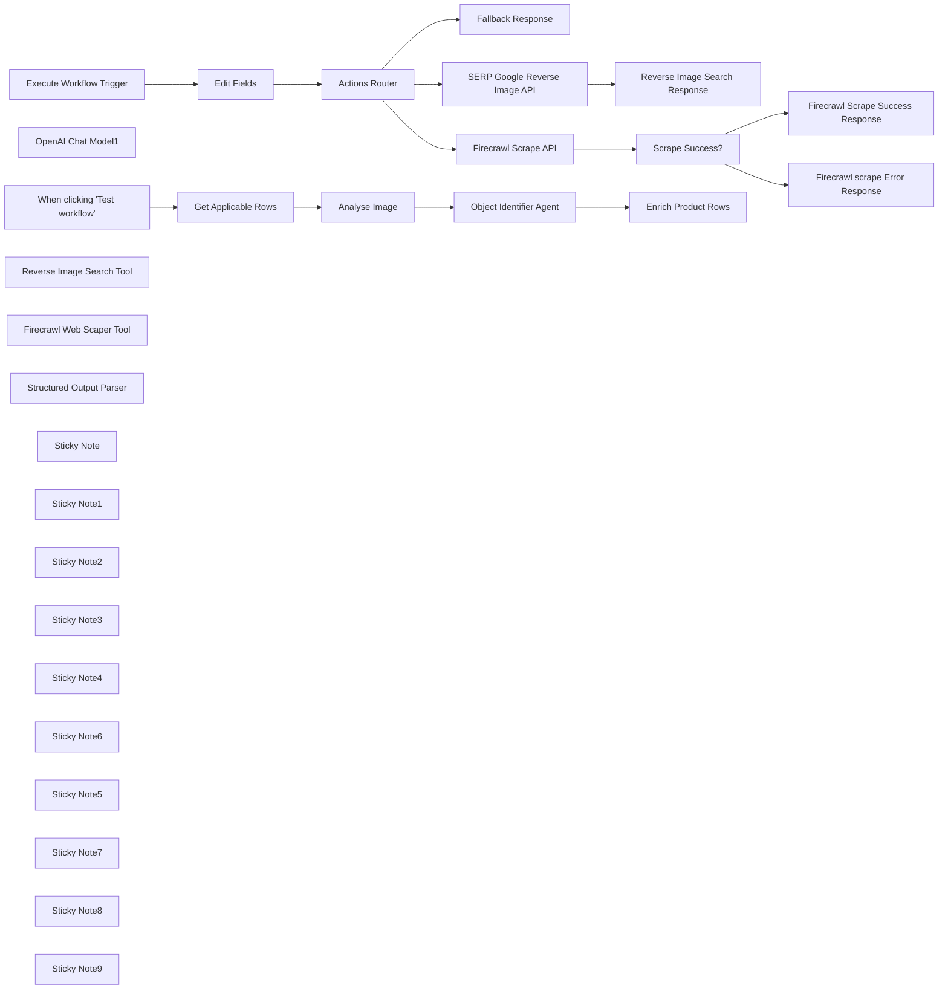

## Fluxo (.json) :

```json
{
  "meta": {
    "instanceId": "26ba763460b97c249b82942b23b6384876dfeb9327513332e743c5f6219c2b8e"
  },
  "nodes": [
    {
      "id": "192d3e4f-6bb0-4b87-a1fa-e32c9efb49cc",
      "name": "When clicking \"Test workflow\"",
      "type": "n8n-nodes-base.manualTrigger",
      "position": [
        336,
        34
      ],
      "parameters": {},
      "typeVersion": 1
    },
    {
      "id": "32a7a772-76a6-4614-a6ab-d2b152a5811f",
      "name": "OpenAI Chat Model1",
      "type": "@n8n/n8n-nodes-langchain.lmChatOpenAi",
      "position": [
        1220,
        180
      ],
      "parameters": {
        "model": "gpt-4o",
        "options": {
          "temperature": 0
        }
      },
      "credentials": {
        "openAiApi": {
          "id": "8gccIjcuf3gvaoEr",
          "name": "OpenAi account"
        }
      },
      "typeVersion": 1
    },
    {
      "id": "8c444314-ed7d-4ca0-b0fa-b6d1e964c698",
      "name": "Get Applicable Rows",
      "type": "n8n-nodes-base.airtable",
      "position": [
        516,
        34
      ],
      "parameters": {
        "base": {
          "__rl": true,
          "mode": "list",
          "value": "appbgxPBurOmQK3E7",
          "cachedResultUrl": "https://airtable.com/appbgxPBurOmQK3E7",
          "cachedResultName": "Building Inventory Survey Example"
        },
        "table": {
          "__rl": true,
          "mode": "id",
          "value": "tblEHkoTvKpa4Aa0Q"
        },
        "options": {},
        "operation": "search",
        "returnAll": false,
        "filterByFormula": "AND(Image!=\"\", AI_status=FALSE())"
      },
      "credentials": {
        "airtableTokenApi": {
          "id": "Und0frCQ6SNVX3VV",
          "name": "Airtable Personal Access Token account"
        }
      },
      "typeVersion": 2
    },
    {
      "id": "f90578fa-b886-4653-8ff7-0c91884dc517",
      "name": "Execute Workflow Trigger",
      "type": "n8n-nodes-base.executeWorkflowTrigger",
      "position": [
        1257,
        733
      ],
      "parameters": {},
      "typeVersion": 1
    },
    {
      "id": "8f5959eb-45bd-4185-a959-10268827e41d",
      "name": "Edit Fields",
      "type": "n8n-nodes-base.set",
      "position": [
        1417,
        733
      ],
      "parameters": {
        "options": {},
        "assignments": {
          "assignments": [
            {
              "id": "7263764b-8409-4cea-8db3-3278dd7ef9d8",
              "name": "=route",
              "type": "string",
              "value": "={{ $json.route }}"
            },
            {
              "id": "55c3b207-2e98-4137-8413-f72cbff17986",
              "name": "query",
              "type": "string",
              "value": "={{ $json.query }}"
            },
            {
              "id": "6eb873de-3c3a-4135-9dc0-1d441c63647c",
              "name": "",
              "type": "string",
              "value": ""
            }
          ]
        }
      },
      "typeVersion": 3.3
    },
    {
      "id": "2c7f7274-12e9-4dd3-8ee4-679b408d5430",
      "name": "Fallback Response",
      "type": "n8n-nodes-base.set",
      "position": [
        1580,
        875
      ],
      "parameters": {
        "mode": "raw",
        "options": {},
        "jsonOutput": "{\n  \"response\": {\n    \"ok\": false,\n    \"error\": \"The requested tool was not found or the service may be unavailable. Do not retry.\"\n  }\n}\n"
      },
      "typeVersion": 3.3
    },
    {
      "id": "09f36f4d-eb88-4d93-a8b3-e9ba66b46b54",
      "name": "SERP Google Reverse Image API",
      "type": "n8n-nodes-base.httpRequest",
      "position": [
        1860,
        549
      ],
      "parameters": {
        "url": "https://serpapi.com/search.json",
        "options": {},
        "sendQuery": true,
        "authentication": "predefinedCredentialType",
        "queryParameters": {
          "parameters": [
            {
              "name": "engine",
              "value": "google_reverse_image"
            },
            {
              "name": "image_url",
              "value": "={{ $json.query }}"
            }
          ]
        },
        "nodeCredentialType": "serpApi"
      },
      "credentials": {
        "serpApi": {
          "id": "aJCKjxx6U3K7ydDe",
          "name": "SerpAPI account"
        }
      },
      "typeVersion": 4.2
    },
    {
      "id": "8e3a0f38-8663-4f5c-837f-4b9aa21f14fb",
      "name": "Reverse Image Search Response",
      "type": "n8n-nodes-base.set",
      "position": [
        2037,
        547
      ],
      "parameters": {
        "options": {},
        "assignments": {
          "assignments": [
            {
              "id": "de99a504-713f-4c78-8679-08139b2def31",
              "name": "response",
              "type": "string",
              "value": "={{ JSON.stringify($json.image_results.map(x => ({ position: x.position, title: x.title, link: x.link, description: x.snippet }))) }}"
            }
          ]
        }
      },
      "typeVersion": 3.3
    },
    {
      "id": "0cd2269a-5b1f-4f10-b180-7f9cff9b1102",
      "name": "Reverse Image Search Tool",
      "type": "@n8n/n8n-nodes-langchain.toolWorkflow",
      "position": [
        1300,
        340
      ],
      "parameters": {
        "name": "reverse_image_search",
        "fields": {
          "values": [
            {
              "name": "route",
              "stringValue": "serp.google_reverse_image"
            }
          ]
        },
        "workflowId": "={{ $workflow.id }}",
        "description": "Call this tool to perform a reverse image search. Reverse image searches return urls where similar looking products exists. Fetch the returned urls to gather more information. This tool requires the following object request body.\n```\n{\n  \"type\": \"object\",\n  \"properties\": {\n    \"image_url\": { \"type\": \"string\" },\n   }\n}\n```\nimage_url should be an absolute URL to the image."
      },
      "typeVersion": 1.1
    },
    {
      "id": "9825651e-b382-4e0a-97ef-37764cb5be9e",
      "name": "Firecrawl Scrape API",
      "type": "n8n-nodes-base.httpRequest",
      "position": [
        1860,
        889
      ],
      "parameters": {
        "url": "https://api.firecrawl.dev/v0/scrape",
        "method": "POST",
        "options": {},
        "sendBody": true,
        "sendHeaders": true,
        "authentication": "genericCredentialType",
        "bodyParameters": {
          "parameters": [
            {
              "name": "url",
              "value": "={{ $json.query }}"
            }
          ]
        },
        "genericAuthType": "httpHeaderAuth",
        "headerParameters": {
          "parameters": [
            {
              "name": "Content-Type",
              "value": "application/json"
            }
          ]
        }
      },
      "credentials": {
        "httpHeaderAuth": {
          "id": "OUOnyTkL9vHZNorB",
          "name": "Firecrawl API"
        }
      },
      "typeVersion": 4.2
    },
    {
      "id": "7f61d60b-b052-4b7c-abfd-9eb8e05a45a2",
      "name": "Scrape Success?",
      "type": "n8n-nodes-base.if",
      "position": [
        2020,
        889
      ],
      "parameters": {
        "options": {},
        "conditions": {
          "options": {
            "leftValue": "",
            "caseSensitive": true,
            "typeValidation": "strict"
          },
          "combinator": "and",
          "conditions": [
            {
              "id": "a15a164f-d0c5-478f-8b27-f3d51746c214",
              "operator": {
                "type": "boolean",
                "operation": "true",
                "singleValue": true
              },
              "leftValue": "={{ $json.success }}",
              "rightValue": ""
            }
          ]
        }
      },
      "typeVersion": 2
    },
    {
      "id": "29c65ef4-6350-490a-b8e3-a5c869e656b2",
      "name": "Firecrawl Scrape Success Response",
      "type": "n8n-nodes-base.set",
      "position": [
        2180,
        889
      ],
      "parameters": {
        "options": {},
        "assignments": {
          "assignments": [
            {
              "id": "7db5c81f-de90-40e1-8086-3f13d40451c7",
              "name": "response",
              "type": "string",
              "value": "={{ $json.data.markdown.substring(0, 3000) }}"
            }
          ]
        }
      },
      "typeVersion": 3.3
    },
    {
      "id": "229b4008-d8a8-4609-854a-fc244a4ed630",
      "name": "Firecrawl scrape Error Response",
      "type": "n8n-nodes-base.set",
      "position": [
        2180,
        1049
      ],
      "parameters": {
        "options": {},
        "assignments": {
          "assignments": [
            {
              "id": "e691d86a-d366-44a2-baa6-3dba42527f6e",
              "name": "response",
              "type": "string",
              "value": "{ error: \"Unable to scrape website due to unknown error. Do not retry.\" }"
            }
          ]
        }
      },
      "typeVersion": 3.3
    },
    {
      "id": "f080069b-e849-45e0-88cf-03707d22c704",
      "name": "Firecrawl Web Scaper Tool",
      "type": "@n8n/n8n-nodes-langchain.toolWorkflow",
      "position": [
        1440,
        340
      ],
      "parameters": {
        "name": "webpage_url_scraper_tool",
        "fields": {
          "values": [
            {
              "name": "route",
              "stringValue": "firecrawl.scrape"
            }
          ]
        },
        "workflowId": "={{ $workflow.id }}",
        "description": "Call this tool to retrieve page contents of a url.\n```\n{\n  \"type\": \"object\",\n  \"properties\": {\n    \"url\": { \"type\": \"string\" },\n   }\n}\n```\nurl should be an absolute URL."
      },
      "typeVersion": 1.1
    },
    {
      "id": "4eff88bb-bd5e-4d6a-b5e1-8521632c461f",
      "name": "Structured Output Parser",
      "type": "@n8n/n8n-nodes-langchain.outputParserStructured",
      "position": [
        1500,
        180
      ],
      "parameters": {
        "jsonSchema": "{\n  \"type\": \"object\",\n  \"properties\": {\n    \"title\": { \"type\": \"string\" },\n    \"description\": { \"type\": \"string\" },\n    \"model\": { \"type\": \"string\" },\n    \"material\": { \"type\": \"string\" },\n    \"color\": { \"type\": \"string\" },\n    \"condition\": { \"type\": \"string\" }\n  }\n}"
      },
      "typeVersion": 1.1
    },
    {
      "id": "328d106b-a473-4f54-82fd-55c30d813da9",
      "name": "Sticky Note",
      "type": "n8n-nodes-base.stickyNote",
      "position": [
        280,
        -260
      ],
      "parameters": {
        "color": 7,
        "width": 402.5984702109446,
        "height": 495.4071184783251,
        "content": "## 1. Use Airtable to Capture Survey Photos\n[Read more about AirTable](https://docs.n8n.io/integrations/builtin/app-nodes/n8n-nodes-base.airtable)\n\nTo enable this workflow, we need a database where we can retreive the title and photo to analyse and write the generate values back to. Airtable is perfect for this since it has a robust API we can work with.\n\nFor this demo, we'll manually trigger but this can be changed for forms or other triggers."
      },
      "typeVersion": 1
    },
    {
      "id": "e358775d-ff83-411d-9364-b43c87d98134",
      "name": "Sticky Note1",
      "type": "n8n-nodes-base.stickyNote",
      "position": [
        716.3106363781314,
        -160
      ],
      "parameters": {
        "color": 7,
        "width": 359.40869874940336,
        "height": 428.4787925736586,
        "content": "## 2. Use AI Vision Model to Analyse the Photo.\n[Read more about OpenAI Vision](https://docs.n8n.io/integrations/builtin/app-nodes/n8n-nodes-langchain.openai)\n\nWe'll use OpenAi vision model to create a detailed description of the product in the photo. We split this step from the agent because it uses an image model rather than the usual text-based one."
      },
      "typeVersion": 1
    },
    {
      "id": "51b4a70c-9583-4e8a-8e8d-896a80ad53c3",
      "name": "Sticky Note2",
      "type": "n8n-nodes-base.stickyNote",
      "position": [
        1111.3914848823072,
        -293.9250474768817
      ],
      "parameters": {
        "color": 7,
        "width": 593.0683948010671,
        "height": 803.956942672397,
        "content": "## 3. Build an AI Agent who Searches the Internet\n[Read more about OpenAI Agents](https://docs.n8n.io/integrations/builtin/app-nodes/n8n-nodes-langchain.openai)\n\nThis AI Agent has the ability to perform reverse image searches using our captured photos as well visit external webpages in order to obtain accurate product names and attributes. The Agent along with the tools might mimic what the average human user would carry out the same task.\n\n* For reverse image search, we're using SERP API service however we won't use the built-in SERP node as we need to specify custom parameters. \n* For scraping, we'll use [Firecrawl](https://www.firecrawl.dev/) as this service also helps to parse and return the page as markdown which is more efficient."
      },
      "typeVersion": 1
    },
    {
      "id": "adfb519b-a5c7-432c-be32-5acfcc388b49",
      "name": "Sticky Note3",
      "type": "n8n-nodes-base.stickyNote",
      "position": [
        1740,
        -149.28190375244515
      ],
      "parameters": {
        "color": 7,
        "width": 373.3601237414979,
        "height": 397.7168664109706,
        "content": "## 4. Overwrite our Rows with Enriched Results\n\nAnd Viola! Our AI agent has potentially saved hours of manual data entry work for our surveyor. This technique can be used for many other usecases."
      },
      "typeVersion": 1
    },
    {
      "id": "6444e217-b944-450e-892a-5822d4d390ce",
      "name": "Sticky Note4",
      "type": "n8n-nodes-base.stickyNote",
      "position": [
        1200,
        549
      ],
      "parameters": {
        "color": 7,
        "width": 554.6092633638649,
        "height": 490.7010880746526,
        "content": "## 5. Using the Custom Workflow Tool\n[Read more about Workflow Tools](https://docs.n8n.io/integrations/builtin/cluster-nodes/sub-nodes/n8n-nodes-langchain.toolworkflow)\n\nAI Agents rely on Tools to make decisions and become exponentially more powerful the more tools they have. A common pattern to manage multiple tools is to create a routing system for tools using the API pattern."
      },
      "typeVersion": 1
    },
    {
      "id": "bf2459cf-a931-4232-9504-b36b15721194",
      "name": "Enrich Product Rows",
      "type": "n8n-nodes-base.airtable",
      "position": [
        1880,
        60
      ],
      "parameters": {
        "base": {
          "__rl": true,
          "mode": "list",
          "value": "appbgxPBurOmQK3E7",
          "cachedResultUrl": "https://airtable.com/appbgxPBurOmQK3E7",
          "cachedResultName": "Building Inventory Survey Example"
        },
        "table": {
          "__rl": true,
          "mode": "id",
          "value": "tblEHkoTvKpa4Aa0Q"
        },
        "columns": {
          "value": {
            "id": "={{ $('Get Applicable Rows').item.json.id }}",
            "Color": "={{ $json.output.output.color }}",
            "Model": "={{ $json.output.output.model }}",
            "Title": "={{ $json.output.output.title }}",
            "Material": "={{ $json.output.output.material }}",
            "AI_status": true,
            "Condition": "={{ $json.output.output.condition }}",
            "Description": "={{ $json.output.output.description }}"
          },
          "schema": [
            {
              "id": "id",
              "type": "string",
              "display": true,
              "removed": false,
              "readOnly": true,
              "required": false,
              "displayName": "id",
              "defaultMatch": true
            },
            {
              "id": "Title",
              "type": "string",
              "display": true,
              "removed": false,
              "readOnly": false,
              "required": false,
              "displayName": "Title",
              "defaultMatch": false,
              "canBeUsedToMatch": true
            },
            {
              "id": "Image",
              "type": "array",
              "display": true,
              "removed": false,
              "readOnly": false,
              "required": false,
              "displayName": "Image",
              "defaultMatch": false,
              "canBeUsedToMatch": true
            },
            {
              "id": "Description",
              "type": "string",
              "display": true,
              "removed": false,
              "readOnly": false,
              "required": false,
              "displayName": "Description",
              "defaultMatch": false,
              "canBeUsedToMatch": true
            },
            {
              "id": "Model",
              "type": "string",
              "display": true,
              "removed": false,
              "readOnly": false,
              "required": false,
              "displayName": "Model",
              "defaultMatch": false,
              "canBeUsedToMatch": true
            },
            {
              "id": "Material",
              "type": "string",
              "display": true,
              "removed": false,
              "readOnly": false,
              "required": false,
              "displayName": "Material",
              "defaultMatch": false,
              "canBeUsedToMatch": true
            },
            {
              "id": "Color",
              "type": "string",
              "display": true,
              "removed": false,
              "readOnly": false,
              "required": false,
              "displayName": "Color",
              "defaultMatch": false,
              "canBeUsedToMatch": true
            },
            {
              "id": "Condition",
              "type": "string",
              "display": true,
              "removed": false,
              "readOnly": false,
              "required": false,
              "displayName": "Condition",
              "defaultMatch": false,
              "canBeUsedToMatch": true
            },
            {
              "id": "AI_status",
              "type": "boolean",
              "display": true,
              "removed": false,
              "readOnly": false,
              "required": false,
              "displayName": "AI_status",
              "defaultMatch": false,
              "canBeUsedToMatch": true
            }
          ],
          "mappingMode": "defineBelow",
          "matchingColumns": [
            "id"
          ]
        },
        "options": {},
        "operation": "update"
      },
      "credentials": {
        "airtableTokenApi": {
          "id": "Und0frCQ6SNVX3VV",
          "name": "Airtable Personal Access Token account"
        }
      },
      "typeVersion": 2
    },
    {
      "id": "19d736bf-c29d-46a2-93bc-b536ff28c4b5",
      "name": "Sticky Note6",
      "type": "n8n-nodes-base.stickyNote",
      "position": [
        -100,
        -260
      ],
      "parameters": {
        "width": 359.6648027457353,
        "height": 381.0536322713287,
        "content": "## Try It Out!\n### This workflow does the following:\n* Scans an Airtable spreadsheet for rows with product photo images.\n* Uses an AI vision model to attempt to identify the product.\n* Uses an AI Agent to research the product on the internet to enrich the product data.\n* Overwrites our Airtable spreadsheet with the enriched data.\n\n### Need Help?\nJoin the [Discord](https://discord.com/invite/XPKeKXeB7d) or ask in the [Forum](https://community.n8n.io/)!\n\nHappy Hacking!"
      },
      "typeVersion": 1
    },
    {
      "id": "25f15c48-16bf-4f92-942d-c224ed88d208",
      "name": "Analyse Image",
      "type": "@n8n/n8n-nodes-langchain.openAi",
      "position": [
        840,
        80
      ],
      "parameters": {
        "text": "=Focus on the {{ $json.Title }} in the image - we'll refer to this as the \"object\". Identify the following attributes of the object. If you cannot determine confidently, then leave blank and move to next attribute.\n* Decription of the object.\n* The model/make of the object.\n* The material(s) used in the construction of the object.\n* The color(s) of the object\n* The condition of the object. Use one of poor, good, excellent.\n",
        "options": {},
        "resource": "image",
        "imageUrls": "={{ $json.Image[0].thumbnails.large.url }}",
        "operation": "analyze"
      },
      "credentials": {
        "openAiApi": {
          "id": "8gccIjcuf3gvaoEr",
          "name": "OpenAi account"
        }
      },
      "typeVersion": 1.3
    },
    {
      "id": "e6c99f71-ccc9-426e-b916-cc38864e3224",
      "name": "Object Identifier Agent",
      "type": "@n8n/n8n-nodes-langchain.agent",
      "position": [
        1260,
        20
      ],
      "parameters": {
        "text": "=system: Your role is to help an building surveyor perform a object classification and data collection task whereby the surveyor will take photos of various objects and your job is to try and identify accurately certain product attributes of the objects as detailed below.\n\nThe surveyor has given you the following:\n1) photo url ```{{ $('Get Applicable Rows').item.json.Image[0].thumbnails.large.url }}```.\n2) photo description ```{{ $json.content }}```.\n\nFor each product attribute the surveyor is unable to determine, you may:\n1) use the reverse image search tool to search the product on the internet via the provided image url.\n2) use the web scraper tool to read webpages on the internet which may be relevant to the product.\n3) If after using these tools, you are still unable to determine the required product attributes then leave the data blank.\n\nUse all the information provided and gathered, to extract the following product attributes: title, description, model, material, color and condition.",
        "agent": "openAiFunctionsAgent",
        "options": {},
        "promptType": "define",
        "hasOutputParser": true
      },
      "typeVersion": 1.5
    },
    {
      "id": "661b14bd-6511-4f20-981c-2e68a7c34ec5",
      "name": "Actions Router",
      "type": "n8n-nodes-base.switch",
      "position": [
        1577,
        733
      ],
      "parameters": {
        "rules": {
          "values": [
            {
              "outputKey": "serp.google_reverse_image",
              "conditions": {
                "options": {
                  "leftValue": "",
                  "caseSensitive": true,
                  "typeValidation": "strict"
                },
                "combinator": "and",
                "conditions": [
                  {
                    "operator": {
                      "type": "string",
                      "operation": "equals"
                    },
                    "leftValue": "={{ $json.route }}",
                    "rightValue": "serp.google_reverse_image"
                  }
                ]
              },
              "renameOutput": true
            },
            {
              "outputKey": "firecrawl.scrape",
              "conditions": {
                "options": {
                  "leftValue": "",
                  "caseSensitive": true,
                  "typeValidation": "strict"
                },
                "combinator": "and",
                "conditions": [
                  {
                    "id": "0a1f54ae-39f1-468d-ba6e-1376d13e4ee8",
                    "operator": {
                      "name": "filter.operator.equals",
                      "type": "string",
                      "operation": "equals"
                    },
                    "leftValue": "={{ $json.route }}",
                    "rightValue": "firecrawl.scrape"
                  }
                ]
              },
              "renameOutput": true
            }
          ]
        },
        "options": {
          "fallbackOutput": "extra"
        }
      },
      "typeVersion": 3
    },
    {
      "id": "c5078221-9239-4ec0-b25e-7cd880b58216",
      "name": "Sticky Note5",
      "type": "n8n-nodes-base.stickyNote",
      "position": [
        480,
        20
      ],
      "parameters": {
        "width": 181.2788838920522,
        "height": 297.0159375852115,
        "content": "\n\n\n\n\n\n\n\n\n\n\n\n\n\n\n\n🚨**Required**\n* Set Airtable Base and Table IDs here."
      },
      "typeVersion": 1
    },
    {
      "id": "c58c0db4-9b99-4a77-90ae-66fa3981b684",
      "name": "Sticky Note7",
      "type": "n8n-nodes-base.stickyNote",
      "position": [
        1840,
        40
      ],
      "parameters": {
        "width": 181.2788838920522,
        "height": 297.0159375852115,
        "content": "\n\n\n\n\n\n\n\n\n\n\n\n\n\n\n\n🚨**Required**\n* Set Airtable Base and Table IDs here."
      },
      "typeVersion": 1
    },
    {
      "id": "e3a666d7-d7a5-43f5-8f04-7972332f8916",
      "name": "Sticky Note8",
      "type": "n8n-nodes-base.stickyNote",
      "position": [
        1780,
        440
      ],
      "parameters": {
        "color": 7,
        "width": 460.3301604548244,
        "height": 298.81538450684064,
        "content": "## 5.1 Google Reverse Image Tool\nThis tool uses Google's reverse image API to return websites where similar images are found."
      },
      "typeVersion": 1
    },
    {
      "id": "d7407cdb-16bb-4bd9-a28e-7a72a5289354",
      "name": "Sticky Note9",
      "type": "n8n-nodes-base.stickyNote",
      "position": [
        1780,
        769.9385328672522
      ],
      "parameters": {
        "color": 7,
        "width": 575.3216480295998,
        "height": 463.34699288922565,
        "content": "## 5.2 Webscraper Tool\nThis tool uses Firecrawl.dev API to crawl webpages and returns those pages in markdown format."
      },
      "typeVersion": 1
    }
  ],
  "pinData": {},
  "connections": {
    "Edit Fields": {
      "main": [
        [
          {
            "node": "Actions Router",
            "type": "main",
            "index": 0
          }
        ]
      ]
    },
    "Analyse Image": {
      "main": [
        [
          {
            "node": "Object Identifier Agent",
            "type": "main",
            "index": 0
          }
        ]
      ]
    },
    "Actions Router": {
      "main": [
        [
          {
            "node": "SERP Google Reverse Image API",
            "type": "main",
            "index": 0
          }
        ],
        [
          {
            "node": "Firecrawl Scrape API",
            "type": "main",
            "index": 0
          }
        ],
        [
          {
            "node": "Fallback Response",
            "type": "main",
            "index": 0
          }
        ]
      ]
    },
    "Scrape Success?": {
      "main": [
        [
          {
            "node": "Firecrawl Scrape Success Response",
            "type": "main",
            "index": 0
          }
        ],
        [
          {
            "node": "Firecrawl scrape Error Response",
            "type": "main",
            "index": 0
          }
        ]
      ]
    },
    "OpenAI Chat Model1": {
      "ai_languageModel": [
        [
          {
            "node": "Object Identifier Agent",
            "type": "ai_languageModel",
            "index": 0
          }
        ]
      ]
    },
    "Get Applicable Rows": {
      "main": [
        [
          {
            "node": "Analyse Image",
            "type": "main",
            "index": 0
          }
        ]
      ]
    },
    "Firecrawl Scrape API": {
      "main": [
        [
          {
            "node": "Scrape Success?",
            "type": "main",
            "index": 0
          }
        ]
      ]
    },
    "Object Identifier Agent": {
      "main": [
        [
          {
            "node": "Enrich Product Rows",
            "type": "main",
            "index": 0
          }
        ]
      ]
    },
    "Execute Workflow Trigger": {
      "main": [
        [
          {
            "node": "Edit Fields",
            "type": "main",
            "index": 0
          }
        ]
      ]
    },
    "Structured Output Parser": {
      "ai_outputParser": [
        [
          {
            "node": "Object Identifier Agent",
            "type": "ai_outputParser",
            "index": 0
          }
        ]
      ]
    },
    "Firecrawl Web Scaper Tool": {
      "ai_tool": [
        [
          {
            "node": "Object Identifier Agent",
            "type": "ai_tool",
            "index": 0
          }
        ]
      ]
    },
    "Reverse Image Search Tool": {
      "ai_tool": [
        [
          {
            "node": "Object Identifier Agent",
            "type": "ai_tool",
            "index": 0
          }
        ]
      ]
    },
    "SERP Google Reverse Image API": {
      "main": [
        [
          {
            "node": "Reverse Image Search Response",
            "type": "main",
            "index": 0
          }
        ]
      ]
    },
    "When clicking \"Test workflow\"": {
      "main": [
        [
          {
            "node": "Get Applicable Rows",
            "type": "main",
            "index": 0
          }
        ]
      ]
    }
  }
}
```

<a id="template-303"></a>

## Template 303 - Gerar embeddings de imagens

- **Nome:** Gerar embeddings de imagens
- **Descrição:** Baixa uma imagem do Google Drive, extrai estatísticas de cor e keywords semânticas usando um modelo multimodal e armazena um documento de embedding em uma loja vetorial em memória para busca.
- **Funcionalidade:** • Download da imagem: baixa o arquivo selecionado do Google Drive.
• Redimensionamento: ajusta a imagem para 512x512 quando aplicável.
• Extração de informações de cor: calcula estatísticas dos canais de cor e identifica cor de fundo.
• Geração de palavras-chave semânticas: utiliza um modelo multimodal para produzir uma lista abrangente de keywords descritivas.
• Combinação de análises: agrega estatísticas de cor e keywords em um documento estruturado com metadados.
• Criação de embeddings: gera vetores semânticos a partir do documento para indexação.
• Armazenamento em loja vetorial em memória: insere os embeddings para permitir buscas vetoriais.
• Busca de exemplo por texto: permite consultar a loja vetorial com um prompt textual para recuperar imagens relacionadas.
- **Ferramentas:** • Google Drive: serviço de armazenamento usado para hospedar e fornecer o arquivo de imagem fonte.
• OpenAI: fornece modelos multimodais para análise de imagens (extração de keywords) e modelos de embeddings para gerar vetores semânticos.


## Fluxo visual

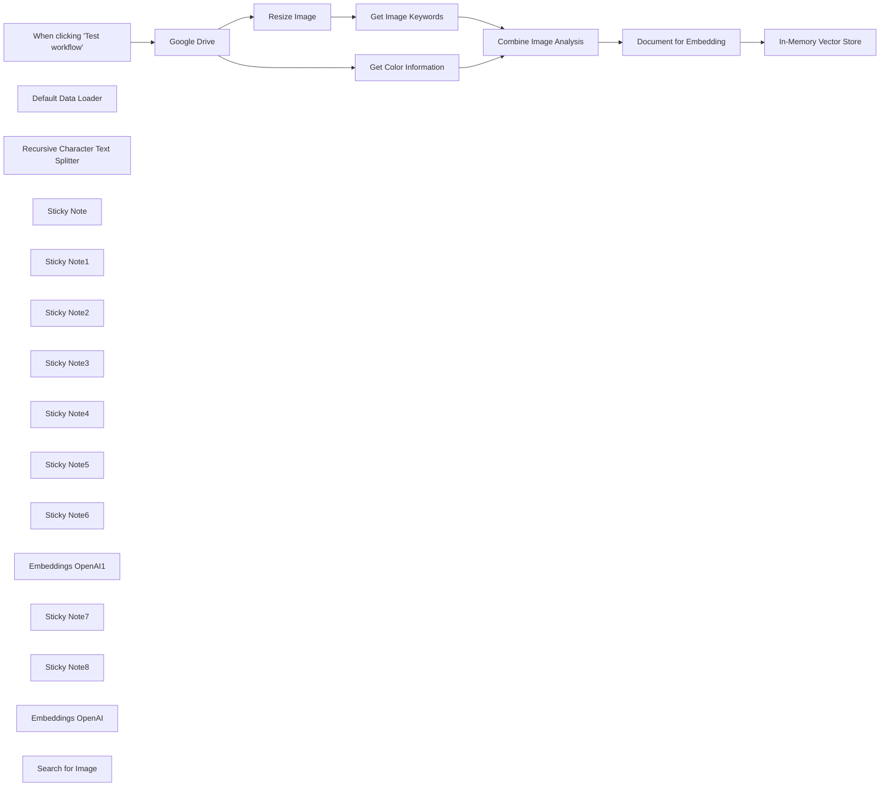

## Fluxo (.json) :

```json
{
  "meta": {
    "instanceId": "408f9fb9940c3cb18ffdef0e0150fe342d6e655c3a9fac21f0f644e8bedabcd9",
    "templateCredsSetupCompleted": true
  },
  "nodes": [
    {
      "id": "141638a4-b340-473f-a800-be7dbdcff131",
      "name": "When clicking \"Test workflow\"",
      "type": "n8n-nodes-base.manualTrigger",
      "position": [
        695,
        380
      ],
      "parameters": {},
      "typeVersion": 1
    },
    {
      "id": "6ccdaca5-f620-4afa-bed6-92f3a450687d",
      "name": "Google Drive",
      "type": "n8n-nodes-base.googleDrive",
      "position": [
        875,
        380
      ],
      "parameters": {
        "fileId": {
          "__rl": true,
          "mode": "list",
          "value": "0B43u2YYOTJR2cC1BRkptZ3N4QTk4NEtxRko5cjhKUUFyemw0",
          "cachedResultUrl": "https://drive.google.com/file/d/0B43u2YYOTJR2cC1BRkptZ3N4QTk4NEtxRko5cjhKUUFyemw0/view?usp=drivesdk&resourcekey=0-UJ8EfTMMBRNVyBb6KhN2Tg",
          "cachedResultName": "0B0A0255.jpeg"
        },
        "options": {},
        "operation": "download"
      },
      "credentials": {
        "googleDriveOAuth2Api": {
          "id": "yOwz41gMQclOadgu",
          "name": "Google Drive account"
        }
      },
      "typeVersion": 3
    },
    {
      "id": "b0c2f7a4-a336-4705-aeda-411f2518aaef",
      "name": "Get Color Information",
      "type": "n8n-nodes-base.editImage",
      "position": [
        1200,
        200
      ],
      "parameters": {
        "operation": "information"
      },
      "typeVersion": 1
    },
    {
      "id": "3e42b3f1-6900-4622-8c0d-2d9a27a7e1c9",
      "name": "Resize Image",
      "type": "n8n-nodes-base.editImage",
      "position": [
        1200,
        580
      ],
      "parameters": {
        "width": 512,
        "height": 512,
        "options": {},
        "operation": "resize",
        "resizeOption": "onlyIfLarger"
      },
      "typeVersion": 1
    },
    {
      "id": "00425bb2-289e-4a09-8fcb-52319281483c",
      "name": "Default Data Loader",
      "type": "@n8n/n8n-nodes-langchain.documentDefaultDataLoader",
      "position": [
        2300,
        380
      ],
      "parameters": {
        "options": {
          "metadata": {
            "metadataValues": [
              {
                "name": "source",
                "value": "={{ $('Document for Embedding').item.json.metadata.source }}"
              },
              {
                "name": "format",
                "value": "={{ $('Document for Embedding').item.json.metadata.format }}"
              },
              {
                "name": "backgroundColor",
                "value": "={{ $('Document for Embedding').item.json.metadata.backgroundColor }}"
              }
            ]
          }
        }
      },
      "typeVersion": 1
    },
    {
      "id": "06dbdf39-9d72-460e-a29c-1ae4e9f3552a",
      "name": "Recursive Character Text Splitter",
      "type": "@n8n/n8n-nodes-langchain.textSplitterRecursiveCharacterTextSplitter",
      "position": [
        2300,
        500
      ],
      "parameters": {
        "options": {}
      },
      "typeVersion": 1
    },
    {
      "id": "139cac42-c006-4c9d-8298-ade845e137a7",
      "name": "Sticky Note",
      "type": "n8n-nodes-base.stickyNote",
      "position": [
        1140,
        100
      ],
      "parameters": {
        "color": 7,
        "width": 372,
        "height": 288,
        "content": "### Get Color Channels\n[Source: https://www.pinecone.io/learn/series/image-search/color-histograms/](https://www.pinecone.io/learn/series/image-search/color-histograms/)"
      },
      "typeVersion": 1
    },
    {
      "id": "9b8584ae-067c-4515-b194-32986ba3bf8b",
      "name": "Sticky Note1",
      "type": "n8n-nodes-base.stickyNote",
      "position": [
        1140,
        418
      ],
      "parameters": {
        "color": 7,
        "width": 376.4067897296865,
        "height": 335.30166772984643,
        "content": "### Generate Image Keywords\n[Source: https://www.pinecone.io/learn/series/image-search/bag-of-visual-words/](https://www.pinecone.io/learn/series/image-search/bag-of-visual-words/)\n\nNote, OpenAI Image models work best when image is resized to 512x512."
      },
      "typeVersion": 1
    },
    {
      "id": "7f2c27d7-9947-42fa-aafb-78f4f95ac433",
      "name": "Sticky Note2",
      "type": "n8n-nodes-base.stickyNote",
      "position": [
        240,
        540
      ],
      "parameters": {
        "color": 3,
        "width": 359.1981770749933,
        "height": 98.40143173756314,
        "content": "⚠️ **Multimodal embedding is not designed analyze medical images for diagnostic features or disease patterns.** Please do not use Multimodal embedding for medical purposes."
      },
      "typeVersion": 1
    },
    {
      "id": "cb6b4a82-db5f-41f0-94dc-6cfabe0905eb",
      "name": "Combine Image Analysis",
      "type": "n8n-nodes-base.merge",
      "position": [
        1700,
        260
      ],
      "parameters": {
        "mode": "combine",
        "options": {},
        "combinationMode": "mergeByPosition"
      },
      "typeVersion": 2.1
    },
    {
      "id": "1ba33665-3ebb-4b23-989d-eec53dfd225a",
      "name": "Document for Embedding",
      "type": "n8n-nodes-base.set",
      "position": [
        1860,
        257
      ],
      "parameters": {
        "options": {},
        "assignments": {
          "assignments": [
            {
              "id": "8204b731-24e2-4993-9e6d-4cea80393580",
              "name": "data",
              "type": "string",
              "value": "=## keywords\\n\n{{ $json.content }}\\n\n## color information:\\n\n{{ JSON.stringify($json[\"Channel Statistics\"]) }}"
            },
            {
              "id": "ca49cccf-ea4e-4362-bf49-ac836c8758d3",
              "name": "metadata",
              "type": "object",
              "value": "={ \"format\": \"{{ $json.format }}\", \"backgroundColor\": \"{{ $json[\"Background Color\"] }}\", \"source\": \"{{ $binary.data.fileName }}\" } "
            }
          ]
        }
      },
      "typeVersion": 3.3
    },
    {
      "id": "5d01a2fd-0190-48fc-b588-d5872c5cd793",
      "name": "Sticky Note3",
      "type": "n8n-nodes-base.stickyNote",
      "position": [
        640,
        250.0169327052916
      ],
      "parameters": {
        "color": 7,
        "width": 418.6907913057789,
        "height": 316.7698949693208,
        "content": "## 1. Get the Source Image\nIn this demo, we just need an image file. We'll pull an image from google drive but you can use all input trigger or source you prefer."
      },
      "typeVersion": 1
    },
    {
      "id": "4c9825f3-6a2b-4fd2-bdb1-e49f8d947e7a",
      "name": "Sticky Note4",
      "type": "n8n-nodes-base.stickyNote",
      "position": [
        1098.439755647174,
        -145.1609149026466
      ],
      "parameters": {
        "color": 7,
        "width": 462.52060804115854,
        "height": 938.3723985625845,
        "content": "## 2. Image Embedding Methods\n[Read more about working with images in n8n](https://docs.n8n.io/integrations/builtin/core-nodes/n8n-nodes-base.editimage)\n\nThere are a [myriad of image embedding techniques](https://www.pinecone.io/learn/series/image-search/) some which involve specialised models and some which do a simplified image-to-text representation.\nIn this demo, we'll use the simplified text representation methods: collecting color channel information and using Multimodal LLMs to produce keywords for the image. Together, these will form the document we'll embed to represent our image for search."
      },
      "typeVersion": 1
    },
    {
      "id": "e4035987-16c0-4d03-9e20-5f2042a6a020",
      "name": "Sticky Note5",
      "type": "n8n-nodes-base.stickyNote",
      "position": [
        1600,
        120
      ],
      "parameters": {
        "color": 7,
        "width": 418.6907913057789,
        "height": 343.6004071339855,
        "content": "## 3. Generate Embedding Doc\nIt is important to define your metadata for later filtering and retrieval purposes.\n\n"
      },
      "typeVersion": 1
    },
    {
      "id": "91fe4c5c-c063-48e2-b248-801c11880c69",
      "name": "Sticky Note6",
      "type": "n8n-nodes-base.stickyNote",
      "position": [
        2060,
        -11.068945113406585
      ],
      "parameters": {
        "color": 7,
        "width": 532.5269726975372,
        "height": 665.9365418117011,
        "content": "## 3. Store in Vector Store\n[Read more about vector stores](https://docs.n8n.io/integrations/builtin/cluster-nodes/root-nodes/n8n-nodes-langchain.vectorstoreinmemory)\n\nOnce our document is ready, we can just insert into any vector store to make it ready for searching. When searching, be sure to defined the same vector store index used here!\nNote: Metadata is defined in the document loader which must be mapped manually.\n\n"
      },
      "typeVersion": 1
    },
    {
      "id": "6e8ffa06-ddec-463a-b8d6-581ad7095398",
      "name": "Embeddings OpenAI1",
      "type": "@n8n/n8n-nodes-langchain.embeddingsOpenAi",
      "position": [
        2680,
        547
      ],
      "parameters": {
        "options": {}
      },
      "credentials": {
        "openAiApi": {
          "id": "8gccIjcuf3gvaoEr",
          "name": "OpenAi account"
        }
      },
      "typeVersion": 1
    },
    {
      "id": "3dea73b2-6aa1-4158-945e-a5d6bea65244",
      "name": "Sticky Note7",
      "type": "n8n-nodes-base.stickyNote",
      "position": [
        2620,
        200
      ],
      "parameters": {
        "color": 7,
        "width": 400.96585774172854,
        "height": 512.739000439197,
        "content": "## 4. Try it out!\n[Read more about vector stores](https://docs.n8n.io/integrations/builtin/cluster-nodes/root-nodes/n8n-nodes-langchain.vectorstoreinmemory)\n\nHere's a quick test to use a simple text prompt to search for the image. Next step would be to implement image-to-image search by using the \"Embedding Doc\" to search rather to store in the vector database.\n\n"
      },
      "typeVersion": 1
    },
    {
      "id": "f6a543d4-df3b-456c-8f85-4dca29029b55",
      "name": "Sticky Note8",
      "type": "n8n-nodes-base.stickyNote",
      "position": [
        240,
        140
      ],
      "parameters": {
        "width": 359.6648027457353,
        "height": 384.6280362222034,
        "content": "## Try It Out!\n### This workflow does the following:\n* Downloads a selected image from Google Drive.\n* Extracts colour channel information from the image.\n* Generates semantic keywords of the iamge using OpenAI vision model.\n* Combines extracted and generated data to create an embedding document for the image.\n* Inserts this document into a vector store to allow for vector search on the original image. \n\n### Need Help?\nJoin the [Discord](https://discord.com/invite/XPKeKXeB7d) or ask in the [Forum](https://community.n8n.io/)!\n\nHappy Hacking!"
      },
      "typeVersion": 1
    },
    {
      "id": "724acae9-75d2-4421-b5a3-b920f7bda825",
      "name": "In-Memory Vector Store",
      "type": "@n8n/n8n-nodes-langchain.vectorStoreInMemory",
      "position": [
        2180,
        200
      ],
      "parameters": {
        "mode": "insert",
        "memoryKey": "image_embeddings"
      },
      "typeVersion": 1
    },
    {
      "id": "52afd512-0d55-4ae3-9377-4cb324c571a8",
      "name": "Embeddings OpenAI",
      "type": "@n8n/n8n-nodes-langchain.embeddingsOpenAi",
      "position": [
        2180,
        420
      ],
      "parameters": {
        "options": {}
      },
      "credentials": {
        "openAiApi": {
          "id": "8gccIjcuf3gvaoEr",
          "name": "OpenAi account"
        }
      },
      "typeVersion": 1
    },
    {
      "id": "c769f279-22ef-4cb1-aef3-9089bb92a0a4",
      "name": "Search for Image",
      "type": "@n8n/n8n-nodes-langchain.vectorStoreInMemory",
      "position": [
        2680,
        387
      ],
      "parameters": {
        "mode": "load",
        "prompt": "student having fun",
        "memoryKey": "image_embeddings"
      },
      "typeVersion": 1
    },
    {
      "id": "9aea3018-1377-4802-a5d0-509c221f4fc7",
      "name": "Get Image Keywords",
      "type": "@n8n/n8n-nodes-langchain.openAi",
      "position": [
        1360,
        580
      ],
      "parameters": {
        "text": "Extract all possible semantic keywords which describe the image. Be comprehensive and be sure to identify subjects (if applicable) such as biological and non-biological objects, lightning, mood, tone, color, special effects, camera and/or techniques used if known. Respond with a comma-separated list.",
        "modelId": {
          "__rl": true,
          "mode": "list",
          "value": "gpt-4o",
          "cachedResultName": "GPT-4O"
        },
        "options": {},
        "resource": "image",
        "inputType": "base64",
        "operation": "analyze"
      },
      "credentials": {
        "openAiApi": {
          "id": "8gccIjcuf3gvaoEr",
          "name": "OpenAi account"
        }
      },
      "typeVersion": 1.8
    }
  ],
  "pinData": {},
  "connections": {
    "Google Drive": {
      "main": [
        [
          {
            "node": "Get Color Information",
            "type": "main",
            "index": 0
          },
          {
            "node": "Resize Image",
            "type": "main",
            "index": 0
          }
        ]
      ]
    },
    "Resize Image": {
      "main": [
        [
          {
            "node": "Get Image Keywords",
            "type": "main",
            "index": 0
          }
        ]
      ]
    },
    "Embeddings OpenAI": {
      "ai_embedding": [
        [
          {
            "node": "In-Memory Vector Store",
            "type": "ai_embedding",
            "index": 0
          }
        ]
      ]
    },
    "Embeddings OpenAI1": {
      "ai_embedding": [
        [
          {
            "node": "Search for Image",
            "type": "ai_embedding",
            "index": 0
          }
        ]
      ]
    },
    "Get Image Keywords": {
      "main": [
        [
          {
            "node": "Combine Image Analysis",
            "type": "main",
            "index": 1
          }
        ]
      ]
    },
    "Default Data Loader": {
      "ai_document": [
        [
          {
            "node": "In-Memory Vector Store",
            "type": "ai_document",
            "index": 0
          }
        ]
      ]
    },
    "Get Color Information": {
      "main": [
        [
          {
            "node": "Combine Image Analysis",
            "type": "main",
            "index": 0
          }
        ]
      ]
    },
    "Combine Image Analysis": {
      "main": [
        [
          {
            "node": "Document for Embedding",
            "type": "main",
            "index": 0
          }
        ]
      ]
    },
    "Document for Embedding": {
      "main": [
        [
          {
            "node": "In-Memory Vector Store",
            "type": "main",
            "index": 0
          }
        ]
      ]
    },
    "When clicking \"Test workflow\"": {
      "main": [
        [
          {
            "node": "Google Drive",
            "type": "main",
            "index": 0
          }
        ]
      ]
    },
    "Recursive Character Text Splitter": {
      "ai_textSplitter": [
        [
          {
            "node": "Default Data Loader",
            "type": "ai_textSplitter",
            "index": 0
          }
        ]
      ]
    }
  }
}
```

<a id="template-304"></a>

## Template 304 - Notificador de erros via Telegram

- **Nome:** Notificador de erros via Telegram
- **Descrição:** Envia uma mensagem no Telegram com informações da execução sempre que ocorre um erro em um workflow.
- **Funcionalidade:** • Captura de erros em workflows: inicia o fluxo ao detectar uma falha de execução.
• Envio de notificação via Telegram: notifica um chat configurado com os detalhes do erro.
• Mensagem detalhada: inclui nome do workflow, data e hora, URL da execução, último nó executado e a mensagem de erro.
• Configuração centralizada do chat: usa um ponto de configuração para definir o chatId que receberá as notificações.
• Tentativas automáticas de reenvio: reenvia a notificação em caso de falha no envio (retry configurado).
• Documentação integrada: inclui uma nota com instruções de uso, configuração do bot e testes.
- **Ferramentas:** • Telegram: plataforma de mensagens utilizada para receber notificações através de um bot.


## Fluxo visual

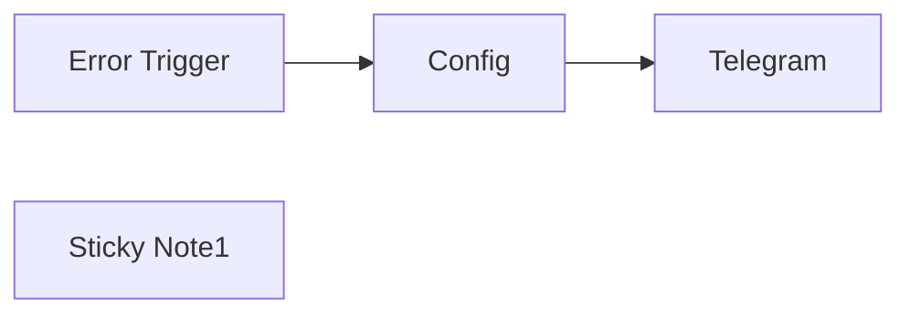

## Fluxo (.json) :

```json
{
  "id": "ozo5jlbwPHgaMnVt",
  "meta": {
    "instanceId": "2c69a61055797162319204105e5a124e409f0c7fbfaba08ee106324374f4ae73"
  },
  "name": "Error Handler send Telegram",
  "tags": [],
  "nodes": [
    {
      "id": "3968e71e-d9fb-4810-81bb-18ecf073b3ee",
      "name": "Telegram",
      "type": "n8n-nodes-base.telegram",
      "position": [
        520,
        -200
      ],
      "webhookId": "b3f6e388-8313-4bc1-8077-d81471b2f95d",
      "parameters": {
        "text": "=Workflow: {{ $('Error Trigger').first().json.workflow.name }}\nData & Time: {{ $now }}\nURL: {{ $('Error Trigger').first().json.execution.url }}\nLast Node: {{ $('Error Trigger').first().json.execution.lastNodeExecuted }}\nError Detal: {{ $('Error Trigger').first().json.execution.error.message }}\n",
        "chatId": "={{ $('Config').item.json.telegramChatId }}",
        "additionalFields": {
          "parse_mode": "HTML",
          "appendAttribution": false
        }
      },
      "credentials": {
        "telegramApi": {
          "id": "BCYwPAl9pdnRqKeR",
          "name": "Telegram n8n Log Test"
        }
      },
      "retryOnFail": true,
      "typeVersion": 1.2,
      "waitBetweenTries": 3000
    },
    {
      "id": "bbb54150-b749-49e2-9c49-720341691151",
      "name": "Error Trigger",
      "type": "n8n-nodes-base.errorTrigger",
      "position": [
        60,
        -200
      ],
      "parameters": {},
      "typeVersion": 1
    },
    {
      "id": "68bc359d-4c7f-4027-8e76-c2bc6b612ede",
      "name": "Sticky Note1",
      "type": "n8n-nodes-base.stickyNote",
      "position": [
        -520,
        -820
      ],
      "parameters": {
        "width": 1420,
        "height": 1240,
        "content": "### **How to Use Telegram Error Notifier**\n\n### **Step 1: Prerequisites**\n1. **Telegram Bot:**\n   - Create a bot using [BotFather](https://core.telegram.org/bots#botfather) and get the bot token.\n   - Add the bot to your Telegram group/channel and note the `chatId`.\n\n2. **n8n Setup:**\n   - Ensure the **Telegram** and **Error Trigger** nodes are installed.\n---\n### **Step 2: Configure the Workflow**\n1. **Update Telegram Chat ID:**\n   - Open the **Config** node.\n   - Replace `telegramChatId` with your actual Telegram group/channel ID:\n     ```json\n     return [\n       {\n         \"telegramChatId\": 123456789, // Replace with your chat ID, format 123456789 or -123456789\n       }\n     ];\n     ```\n\n2. **Set Telegram Bot Credentials:**\n   - Open the **Telegram** node.\n   - Add your bot token in the **Credentials** section.\n\n3. **Activate the Workflow:**\n   - Toggle the **Active** switch to enable the workflow.\n---\n### **Step 3: Set Up Error Workflow**\n1. Open the workflow where you want error notifications.\n2. Go to **Settings** > **Error Workflow**.\n3. Select **Telegram Error Notifier** from the dropdown.\n4. Save the changes.\n---\n### **Step 4: Test the Workflow**\n1. Trigger an error in the workflow.\n2. Check your Telegram for the error notification, which includes:\n   - Workflow name\n   - Date and time\n   - Execution URL\n   - Last node executed\n   - Error details\n---\n### **Example Notification**\n```\nWorkflow: My Workflow 1\nData & Time: 2023-10-27T12:34:56Z\nURL: https://n8n.example.com/execution/12345\nLast Node: HTTP Request\nError Detail: Failed to connect to the server.\n```\n---\n### **Troubleshooting**\n- **No Notifications:**  \n  Ensure the workflow is active, and the bot token/chat ID is correct.\n- **Permission Issues:**  \n  Ensure the bot can send messages in your Telegram group/channel.\n---"
      },
      "typeVersion": 1
    },
    {
      "id": "6bcf5a24-643d-4fbe-81c9-c8830dc8f1b6",
      "name": "Config",
      "type": "n8n-nodes-base.set",
      "position": [
        300,
        -200
      ],
      "parameters": {
        "options": {},
        "assignments": {
          "assignments": [
            {
              "id": "bf7b1294-b50d-49f7-a5f1-76b0d6845aea",
              "name": "telegramChatId",
              "type": "string",
              "value": "123456789"
            }
          ]
        }
      },
      "typeVersion": 3.4
    }
  ],
  "active": false,
  "pinData": {},
  "settings": {
    "executionOrder": "v1"
  },
  "versionId": "e3a6d588-a83c-4d4e-afdc-232624479723",
  "connections": {
    "Config": {
      "main": [
        [
          {
            "node": "Telegram",
            "type": "main",
            "index": 0
          }
        ]
      ]
    },
    "Error Trigger": {
      "main": [
        [
          {
            "node": "Config",
            "type": "main",
            "index": 0
          }
        ]
      ]
    }
  }
}
```

<a id="template-305"></a>

## Template 305 - Validação de TOTP sem credenciais

- **Nome:** Validação de TOTP sem credenciais
- **Descrição:** Valida um código TOTP de 6 dígitos usando um segredo em Base32 e retorna um status indicando se o código é válido ou não.
- **Funcionalidade:** • Validação de código TOTP: Gera e verifica códigos TOTP de 6 dígitos com base em um segredo fornecido.
• Suporte a segredo em Base32: Decodifica o segredo em Base32 antes da verificação.
• Geração conforme janela temporal padrão: Calcula o código usando HMAC-SHA1 com intervalo de 30 segundos.
• Resultado binário para fluxo: Retorna status (1 = válido, 0 = inválido) para permitir roteamento lógico.
• Campos de exemplo para testes: Permite definir um segredo e um código de exemplo para testar o comportamento rapidamente.
• Operação sem armazenamento de credenciais: Verifica códigos diretamente com os valores fornecidos, sem criar credenciais persistentes.
- **Ferramentas:** • Python: Ambiente de execução utilizado para rodar o script de geração e verificação do TOTP.
• Bibliotecas padrão do Python (hmac, hashlib, base64, time): Utilizadas para HMAC, hashing, codificação/decodificação Base32 e controle de tempo.
• Algoritmo TOTP (RFC 6238): Padrão utilizado para gerar códigos temporários baseados em tempo.


## Fluxo visual

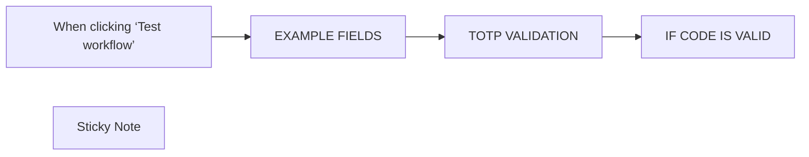

## Fluxo (.json) :

```json
{
  "name": "TOTP VALIDATION (WITHOUT CREATING CREDENTIAL)",
  "nodes": [
    {
      "id": "56f102c4-5b84-4e30-955c-0ea1221c328f",
      "name": "When clicking ‘Test workflow’",
      "type": "n8n-nodes-base.manualTrigger",
      "position": [
        480,
        680
      ],
      "parameters": {},
      "typeVersion": 1
    },
    {
      "id": "4f562819-ee42-42ad-b821-aff2cbebbc0f",
      "name": "TOTP VALIDATION",
      "type": "n8n-nodes-base.code",
      "position": [
        920,
        680
      ],
      "parameters": {
        "language": "python",
        "pythonCode": "import hmac\nimport hashlib\nimport time\nimport base64\n\ndef base32_decode(key):\n    \"\"\"Decodes a base32 key into bytes\"\"\"\n    key += '=' * (-len(key) % 8)  # Add necessary '=' for valid length\n    return base64.b32decode(key.upper(), casefold=True)\n\ndef generate_totp(secret, interval=30, digits=6):\n    \"\"\"Generates a TOTP code based on a secret key\"\"\"\n    interval_count = int(time.time() // interval)\n    interval_bytes = interval_count.to_bytes(8, byteorder='big')\n\n    hmac_hash = hmac.new(secret, interval_bytes, hashlib.sha1).digest()\n    \n    offset = hmac_hash[-1] & 0x0F\n    binary_code = ((hmac_hash[offset] & 0x7F) << 24 |\n                   (hmac_hash[offset + 1] & 0xFF) << 16 |\n                   (hmac_hash[offset + 2] & 0xFF) << 8 |\n                   (hmac_hash[offset + 3] & 0xFF))\n    \n    otp_code = binary_code % (10 ** digits)\n    \n    # Format with leading zeros if necessary\n    otp_code_str = str(otp_code).zfill(digits)\n    \n    return otp_code_str\n\ndef verify_totp(secret, code, interval=30, digits=6):\n    \"\"\"Checks whether the TOTP code is valid\"\"\"\n    secret_bytes = base32_decode(secret)\n    generated_code = generate_totp(secret_bytes, interval, digits)\n    \n    return generated_code == code\n\n# Example of use\nsecret = _input.item.json.totp_secret_example  # Secret key base32 (example)\ncode =  _input.item.json.code_to_verify_example # Code to check (example)\n\n# Return 1 if code is valid. Return 0 if invalid\nif verify_totp(secret, code):\n    return [{\"status\": 1}]\nelse:\n    return [{\"status\": 0}]"
      },
      "typeVersion": 2
    },
    {
      "id": "9760b31c-5ba8-4001-9cbe-2be2ae58d58e",
      "name": "IF CODE IS VALID",
      "type": "n8n-nodes-base.if",
      "position": [
        1140,
        680
      ],
      "parameters": {
        "options": {},
        "conditions": {
          "options": {
            "leftValue": "",
            "caseSensitive": true,
            "typeValidation": "strict"
          },
          "combinator": "and",
          "conditions": [
            {
              "id": "470cf368-daee-4136-b907-a3539765871d",
              "operator": {
                "type": "number",
                "operation": "equals"
              },
              "leftValue": "={{ $json.status }}",
              "rightValue": 1
            }
          ]
        }
      },
      "typeVersion": 2.1
    },
    {
      "id": "3a029863-8fd0-42ef-b8ff-9f7cdf6e8d94",
      "name": "Sticky Note",
      "type": "n8n-nodes-base.stickyNote",
      "position": [
        440,
        180
      ],
      "parameters": {
        "width": 883,
        "height": 430,
        "content": "## TOTP Validation with Function Node\n\nThis template allows you to verify if a 6-digit TOTP code is valid using the corresponding TOTP secret. It can be used in an authentication system.\n### Example usage:\n- You retrieve the user's TOTP secret from a database, then you want to verify if the 2FA code provided by the user is valid.\n\n## Setup Guidelines\n\nYou only need the \"TOTP VALIDATION\" node.\nYou will need to modify lines 39 and 40 of the \"TOTP VALIDATION\" node with the correct values for your specific context.\n\n## Testing the Template\nYou can define a sample secret and code in the \"EXAMPLE FIELDS\" node below, then click \"Test Workflow\".\nIf the code is valid for the provided secret, the flow will proceed to the \"true\" branch of the \"IF CODE IS VALID\" node. Otherwise, it will go to the \"false\" branch."
      },
      "typeVersion": 1
    },
    {
      "id": "f660a50f-2c33-49bb-b975-8d51e9bf24ed",
      "name": "EXAMPLE FIELDS",
      "type": "n8n-nodes-base.set",
      "position": [
        700,
        680
      ],
      "parameters": {
        "options": {},
        "assignments": {
          "assignments": [
            {
              "id": "03a66bf9-1bf4-44c0-92e0-edd45929e467",
              "name": "code_to_verify_example",
              "type": "string",
              "value": "516620"
            },
            {
              "id": "7bb18b0a-1851-4f27-a91f-5f93b663cfd0",
              "name": "totp_secret_example",
              "type": "string",
              "value": "CNSUKUMZLQJEZJ3"
            }
          ]
        }
      },
      "typeVersion": 3.4
    }
  ],
  "active": false,
  "pinData": {},
  "settings": {
    "executionOrder": "v1"
  },
  "connections": {
    "EXAMPLE FIELDS": {
      "main": [
        [
          {
            "node": "TOTP VALIDATION",
            "type": "main",
            "index": 0
          }
        ]
      ]
    },
    "TOTP VALIDATION": {
      "main": [
        [
          {
            "node": "IF CODE IS VALID",
            "type": "main",
            "index": 0
          }
        ]
      ]
    },
    "When clicking ‘Test workflow’": {
      "main": [
        [
          {
            "node": "EXAMPLE FIELDS",
            "type": "main",
            "index": 0
          }
        ]
      ]
    }
  }
}
```

<a id="template-306"></a>

## Template 306 - Atualizar banner do Twitter

- **Nome:** Atualizar banner do Twitter
- **Descrição:** Baixa uma imagem do Unsplash e a define como banner do perfil do Twitter.
- **Funcionalidade:** • Execução manual: inicia o fluxo quando acionado manualmente.
• Download de imagem: faz o download de uma imagem a partir de uma URL do Unsplash.
• Envio de banner ao Twitter: realiza uma requisição POST ao endpoint de atualização de banner do Twitter para definir a imagem como banner do perfil.
• Transferência de dados binários: encaminha o arquivo baixado como dados binários na requisição de upload.
- **Ferramentas:** • Unsplash: serviço de imagens utilizado como fonte para baixar a imagem do banner.
• Twitter API: API utilizada para atualizar o banner do perfil do usuário (endpoint update_profile_banner.json), requer autenticação OAuth1.


## Fluxo visual

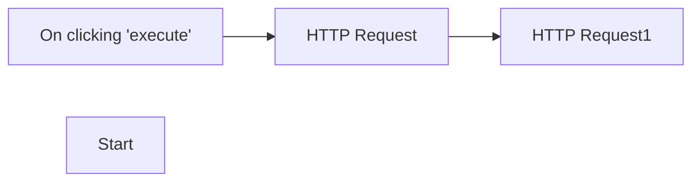

## Fluxo (.json) :

```json
{
  "nodes": [
    {
      "name": "On clicking 'execute'",
      "type": "n8n-nodes-base.manualTrigger",
      "position": [
        250,
        300
      ],
      "parameters": {},
      "typeVersion": 1
    },
    {
      "name": "Start",
      "type": "n8n-nodes-base.start",
      "position": [
        250,
        300
      ],
      "parameters": {},
      "typeVersion": 1
    },
    {
      "name": "HTTP Request",
      "type": "n8n-nodes-base.httpRequest",
      "position": [
        450,
        300
      ],
      "parameters": {
        "url": "https://unsplash.com/photos/lUDMZUWFUXE/download?ixid=MnwxMjA3fDB8MXxhbGx8Mnx8fHx8fDJ8fDE2MzczMjY4Mjc&force=true",
        "options": {},
        "responseFormat": "file",
        "headerParametersUi": {
          "parameter": []
        }
      },
      "typeVersion": 1
    },
    {
      "name": "HTTP Request1",
      "type": "n8n-nodes-base.httpRequest",
      "position": [
        650,
        300
      ],
      "parameters": {
        "url": "https://api.twitter.com/1.1/account/update_profile_banner.json",
        "options": {},
        "requestMethod": "POST",
        "authentication": "oAuth1",
        "jsonParameters": true,
        "sendBinaryData": true,
        "binaryPropertyName": "banner:data"
      },
      "credentials": {
        "oAuth1Api": {
          "id": "300",
          "name": "Unnamed credential"
        }
      },
      "typeVersion": 1
    }
  ],
  "connections": {
    "HTTP Request": {
      "main": [
        [
          {
            "node": "HTTP Request1",
            "type": "main",
            "index": 0
          }
        ]
      ]
    },
    "On clicking 'execute'": {
      "main": [
        [
          {
            "node": "HTTP Request",
            "type": "main",
            "index": 0
          }
        ]
      ]
    }
  }
}
```

<a id="template-307"></a>

## Template 307 - Geração automática de conteúdo para WordPress

- **Nome:** Geração automática de conteúdo para WordPress
- **Descrição:** Fluxo que pega ideias de uma planilha, gera artigo e título com DeepSeek R1, cria imagem de capa com DALL-E, publica o post como rascunho no WordPress e atualiza a planilha com os dados do post.
- **Funcionalidade:** • Leitura de ideias do Google Sheets: Seleciona entradas com prompts para processar e ignora linhas já publicadas.
• Geração de artigo com DeepSeek R1: Produz conteúdo SEO em HTML seguindo instruções de estrutura (introdução, capítulos e conclusão).
• Criação de título SEO: Gera um título curto (máx. 60 caracteres) a partir do conteúdo do artigo.
• Geração de imagem de capa com DALL-E: Cria imagem fotográfica realista baseada no título para uso como capa.
• Publicação no WordPress como rascunho: Cria o post com o conteúdo gerado e salva como rascunho.
• Upload e definição de imagem destacada: Envia a imagem ao site e a associa como featured image do post.
• Atualização da planilha: Escreve data, título e ID do post de volta na mesma linha do Google Sheets.
• Execução manual ou automática: Pode ser acionado manualmente para testes ou agendado para rodar automaticamente.
- **Ferramentas:** • Google Sheets: Armazena prompts iniciais e recebe as atualizações (data, título, ID do post).
• DeepSeek R1: Modelo de linguagem usado para gerar o corpo do artigo e o título via API.
• OpenAI DALL-E (OpenAI): Serviço de geração de imagens usado para criar a capa do artigo.
• WordPress REST API: Recebe as requisições para criar posts, fazer upload de mídia e definir a imagem destacada.


## Fluxo visual

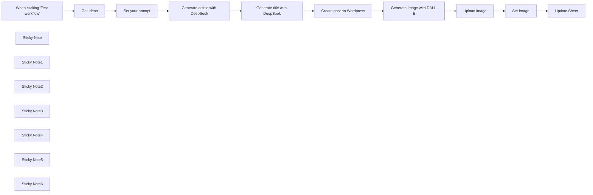

## Fluxo (.json) :

```json
{
  "id": "p5bfwpcRy6LK33Io",
  "meta": {
    "instanceId": "a4bfc93e975ca233ac45ed7c9227d84cf5a2329310525917adaf3312e10d5462",
    "templateCredsSetupCompleted": true
  },
  "name": "Automate Content Generator for WordPress with DeepSeek R1",
  "tags": [],
  "nodes": [
    {
      "id": "c4a6995f-7769-4b77-80ca-1e6bccef77c1",
      "name": "When clicking ‘Test workflow’",
      "type": "n8n-nodes-base.manualTrigger",
      "position": [
        -20,
        200
      ],
      "parameters": {},
      "typeVersion": 1
    },
    {
      "id": "c76b1458-5130-41e7-b2f2-1cfe22eab536",
      "name": "Get Ideas",
      "type": "n8n-nodes-base.googleSheets",
      "position": [
        200,
        200
      ],
      "parameters": {
        "options": {},
        "sheetName": {
          "__rl": true,
          "mode": "id",
          "value": "=Sheet1"
        },
        "documentId": {
          "__rl": true,
          "mode": "id",
          "value": "YOURDOCUMENT"
        }
      },
      "credentials": {
        "googleSheetsOAuth2Api": {
          "id": "JYR6a64Qecd6t8Hb",
          "name": "Google Sheets account"
        }
      },
      "typeVersion": 4.5
    },
    {
      "id": "8d17a640-3e15-42e9-9481-e3291d395ccd",
      "name": "Set your prompt",
      "type": "n8n-nodes-base.set",
      "position": [
        420,
        200
      ],
      "parameters": {
        "options": {},
        "assignments": {
          "assignments": [
            {
              "id": "3e8d2523-66aa-46fe-adcc-39dc78b9161e",
              "name": "prompt",
              "type": "string",
              "value": "={{ $json.PROMPT }}"
            }
          ]
        }
      },
      "typeVersion": 3.4
    },
    {
      "id": "4f0e9065-b331-49ed-acd9-77c7c43e89a5",
      "name": "Create post on Wordpress",
      "type": "n8n-nodes-base.wordpress",
      "position": [
        0,
        500
      ],
      "parameters": {
        "title": "={{ $json.message.content }}",
        "additionalFields": {
          "status": "draft",
          "content": "={{ $('Generate article with DeepSeek').item.json.message.content }}"
        }
      },
      "credentials": {
        "wordpressApi": {
          "id": "OE4AgquSkMWydRqn",
          "name": "Wordpress (wp.test.7hype.com)"
        }
      },
      "typeVersion": 1
    },
    {
      "id": "cb85d980-9d60-4c85-8574-b46e4cc14341",
      "name": "Upload image",
      "type": "n8n-nodes-base.httpRequest",
      "position": [
        420,
        500
      ],
      "parameters": {
        "url": "https://YOURSITE.com/wp-json/wp/v2/media",
        "method": "POST",
        "options": {},
        "sendBody": true,
        "contentType": "binaryData",
        "sendHeaders": true,
        "authentication": "predefinedCredentialType",
        "headerParameters": {
          "parameters": [
            {
              "name": "Content-Disposition",
              "value": "=attachment; filename=\"copertina-{{ $('Create post on Wordpress').item.json.id }}.jpg\""
            }
          ]
        },
        "inputDataFieldName": "data",
        "nodeCredentialType": "wordpressApi"
      },
      "credentials": {
        "wordpressApi": {
          "id": "OE4AgquSkMWydRqn",
          "name": "Wordpress (wp.test.7hype.com)"
        },
        "wooCommerceApi": {
          "id": "vYYrjB5kgHQ0XByZ",
          "name": "WooCommerce (wp.test.7hype.com)"
        }
      },
      "typeVersion": 4.2
    },
    {
      "id": "bc71ed8a-fe35-487a-b4cd-6b8c1b256763",
      "name": "Set Image",
      "type": "n8n-nodes-base.httpRequest",
      "position": [
        640,
        500
      ],
      "parameters": {
        "url": "=https://wp.test.7hype.com/wp-json/wp/v2/posts/{{ $('Create post on Wordpress').item.json.id }}",
        "method": "POST",
        "options": {},
        "sendQuery": true,
        "authentication": "predefinedCredentialType",
        "queryParameters": {
          "parameters": [
            {
              "name": "featured_media",
              "value": "={{ $json.id }}"
            }
          ]
        },
        "nodeCredentialType": "wordpressApi"
      },
      "credentials": {
        "wordpressApi": {
          "id": "OE4AgquSkMWydRqn",
          "name": "Wordpress (wp.test.7hype.com)"
        }
      },
      "typeVersion": 4.2
    },
    {
      "id": "fbed2813-cc64-42a2-994f-3696e9d8d8fe",
      "name": "Update Sheet",
      "type": "n8n-nodes-base.googleSheets",
      "position": [
        880,
        500
      ],
      "parameters": {
        "columns": {
          "value": {
            "DATA": "={{ $now.format('dd/LL/yyyy') }}",
            "TITOLO": "={{ $('Generate title with DeepSeek').item.json.message.content }}",
            "ID POST": "={{ $('Create post on Wordpress').item.json.id }}",
            "row_number": "={{ $('Get Ideas').item.json.row_number }}"
          },
          "schema": [
            {
              "id": "DATA",
              "type": "string",
              "display": true,
              "required": false,
              "displayName": "DATA",
              "defaultMatch": false,
              "canBeUsedToMatch": true
            },
            {
              "id": "PROMPT",
              "type": "string",
              "display": true,
              "required": false,
              "displayName": "PROMPT",
              "defaultMatch": false,
              "canBeUsedToMatch": true
            },
            {
              "id": "TITOLO",
              "type": "string",
              "display": true,
              "required": false,
              "displayName": "TITOLO",
              "defaultMatch": false,
              "canBeUsedToMatch": true
            },
            {
              "id": "ID POST",
              "type": "string",
              "display": true,
              "required": false,
              "displayName": "ID POST",
              "defaultMatch": false,
              "canBeUsedToMatch": true
            },
            {
              "id": "row_number",
              "type": "string",
              "display": true,
              "removed": false,
              "readOnly": true,
              "required": false,
              "displayName": "row_number",
              "defaultMatch": false,
              "canBeUsedToMatch": true
            }
          ],
          "mappingMode": "defineBelow",
          "matchingColumns": [
            "row_number"
          ],
          "attemptToConvertTypes": false,
          "convertFieldsToString": false
        },
        "options": {},
        "operation": "update",
        "sheetName": {
          "__rl": true,
          "mode": "list",
          "value": "gid=0",
          "cachedResultUrl": "https://docs.google.com/spreadsheets/d/16VFeCrE5BkMBoA_S5HD-9v7C0sxcXAUiDbq5JvkDqnI/edit#gid=0",
          "cachedResultName": "Foglio1"
        },
        "documentId": {
          "__rl": true,
          "mode": "list",
          "value": "16VFeCrE5BkMBoA_S5HD-9v7C0sxcXAUiDbq5JvkDqnI",
          "cachedResultUrl": "https://docs.google.com/spreadsheets/d/16VFeCrE5BkMBoA_S5HD-9v7C0sxcXAUiDbq5JvkDqnI/edit?usp=drivesdk",
          "cachedResultName": "Plan Blog wp.test.7hype.com"
        }
      },
      "credentials": {
        "googleSheetsOAuth2Api": {
          "id": "JYR6a64Qecd6t8Hb",
          "name": "Google Sheets account"
        }
      },
      "typeVersion": 4.5
    },
    {
      "id": "8db2b0cb-6d61-4e2d-bfac-e25a0385296d",
      "name": "Sticky Note",
      "type": "n8n-nodes-base.stickyNote",
      "position": [
        -60,
        -360
      ],
      "parameters": {
        "color": 3,
        "width": 800,
        "height": 380,
        "content": "## Target\nThis workflow is designed to automatically generate seo-friendly content for wordpress through DeepSeek R1 by giving input ideas on how to structure the article. A cover image is also generated and uploaded with OpenAI DALL-E 3. This flow is designed to be executed automatically (ad \"On a schedule\" node) and thus have a complete editorial plan.\n\nThis process is useful for blog managers who want to automate content creation and publishing.\n\n## Preliminary step\nCreate a google sheet with the following columns:\n- Date\n- Prompt\n- Title\n- Post ID\n\nFill in only the \"Prompt\" column with basic ideas that DeepSeek will work on to generate the content."
      },
      "typeVersion": 1
    },
    {
      "id": "ab620659-558d-46f0-ab85-e061af99b743",
      "name": "Sticky Note1",
      "type": "n8n-nodes-base.stickyNote",
      "position": [
        140,
        100
      ],
      "parameters": {
        "height": 260,
        "content": "Connect with your Google Sheet. This node select only rows for which no content has been generated yet in WordPress"
      },
      "typeVersion": 1
    },
    {
      "id": "73b0e640-8ccf-4e29-a0cd-6340db907bbd",
      "name": "Generate article with DeepSeek",
      "type": "@n8n/n8n-nodes-langchain.openAi",
      "position": [
        640,
        200
      ],
      "parameters": {
        "modelId": {
          "__rl": true,
          "mode": "id",
          "value": "=deepseek-reasoner"
        },
        "options": {
          "maxTokens": 2048
        },
        "messages": {
          "values": [
            {
              "content": "=You are an SEO expert, write an article based on this topic:\n{{ $json.prompt }}\n\nInstructions:\n- In the introduction, introduce the topic that will be explored in the rest of the text\n- The introduction should be about 120 words\n- The conclusions should be about 120 words\n- Use the conclusions to summarize everything said in the article and offer a conclusion to the reader\n- Write a maximum of 4-5 chapters and argue them.\n- The chapters should follow a logical flow and not repeat the same concepts.\n- The chapters should be related to each other and not isolated blocks of text. The text should flow and follow a linear logic.\n- Do not start chapters with \"Chapter 1\", \"Chapter 2\", \"Chapter 3\" ... write only the chapter title\n- For the text, use HTML for formatting, but limit yourself to bold, italics, paragraphs and lists.\n- Don't put the output in ```html but only text\n- Don't use markdown for formatting.\n- Go deeper into the topic you're talking about, don't just throw superficial information there\n- In output I want only the HTML format"
            }
          ]
        }
      },
      "credentials": {
        "openAiApi": {
          "id": "97Cz4cqyiy1RdcQL",
          "name": "DeepSeek"
        }
      },
      "typeVersion": 1.8
    },
    {
      "id": "6ef4e0d1-6123-4f47-94fb-c06c785ddd92",
      "name": "Generate title with DeepSeek",
      "type": "@n8n/n8n-nodes-langchain.openAi",
      "position": [
        880,
        200
      ],
      "parameters": {
        "modelId": {
          "__rl": true,
          "mode": "id",
          "value": "=deepseek-reasoner"
        },
        "options": {
          "maxTokens": 2048
        },
        "messages": {
          "values": [
            {
              "content": "=You are an SEO Copywriter and you need to think of a title of maximum 60 characters for the following article:\n{{ $json.message.content }}\n\nInstructions:\n- Use keywords contained in the article\n- Do not use any HTML characters\n- Output only the string containing the title.\n- Do not use quotation marks. The only special characters allowed are \":\" and \",\""
            }
          ]
        }
      },
      "credentials": {
        "openAiApi": {
          "id": "97Cz4cqyiy1RdcQL",
          "name": "DeepSeek"
        }
      },
      "typeVersion": 1.8
    },
    {
      "id": "2ecc8514-c04e-4f8b-9ab3-560f2cf910b0",
      "name": "Sticky Note2",
      "type": "n8n-nodes-base.stickyNote",
      "position": [
        580,
        100
      ],
      "parameters": {
        "width": 420,
        "height": 260,
        "content": "Add your DeepSeek API credential. If you want you can change the model with \"deepseek-chat\""
      },
      "typeVersion": 1
    },
    {
      "id": "196f7799-a6ab-429b-afd3-bcbcbd65da3b",
      "name": "Sticky Note3",
      "type": "n8n-nodes-base.stickyNote",
      "position": [
        -20,
        420
      ],
      "parameters": {
        "width": 160,
        "height": 260,
        "content": "Add your WordPress API credential\n"
      },
      "typeVersion": 1
    },
    {
      "id": "93c2d359-531a-4cc9-8a18-870c2d6ec62c",
      "name": "Generate Image with DALL-E",
      "type": "@n8n/n8n-nodes-langchain.openAi",
      "position": [
        200,
        500
      ],
      "parameters": {
        "prompt": "=Generate a real photographic image used as a cover for a blog post:\n\nImage prompt:\n{{ $('Generate title with DeepSeek').item.json.message.content }}, photography, realistic, sigma 85mm f/1.4",
        "options": {
          "size": "1792x1024",
          "style": "natural",
          "quality": "hd"
        },
        "resource": "image"
      },
      "credentials": {
        "openAiApi": {
          "id": "CDX6QM4gLYanh0P4",
          "name": "OpenAi account"
        }
      },
      "typeVersion": 1.8
    },
    {
      "id": "eec14cd7-fb2b-4f7d-ad94-bcffc1249353",
      "name": "Sticky Note4",
      "type": "n8n-nodes-base.stickyNote",
      "position": [
        180,
        420
      ],
      "parameters": {
        "width": 160,
        "height": 260,
        "content": "Add your OpenAI API credential\n"
      },
      "typeVersion": 1
    },
    {
      "id": "4f15679b-bc8f-45b8-b3c4-8b43d7f9bb6f",
      "name": "Sticky Note5",
      "type": "n8n-nodes-base.stickyNote",
      "position": [
        380,
        420
      ],
      "parameters": {
        "width": 180,
        "height": 260,
        "content": "Upload the image on your WordPress via APIs\n"
      },
      "typeVersion": 1
    },
    {
      "id": "abe32434-671a-4ac3-a788-fcf5fd0e9435",
      "name": "Sticky Note6",
      "type": "n8n-nodes-base.stickyNote",
      "position": [
        600,
        420
      ],
      "parameters": {
        "width": 180,
        "height": 260,
        "content": "Set the uploaded image with the newly created article\n"
      },
      "typeVersion": 1
    }
  ],
  "active": false,
  "pinData": {},
  "settings": {
    "executionOrder": "v1"
  },
  "versionId": "315cc8df-bca2-4180-806e-a01407dccc79",
  "connections": {
    "Get Ideas": {
      "main": [
        [
          {
            "node": "Set your prompt",
            "type": "main",
            "index": 0
          }
        ]
      ]
    },
    "Set Image": {
      "main": [
        [
          {
            "node": "Update Sheet",
            "type": "main",
            "index": 0
          }
        ]
      ]
    },
    "Upload image": {
      "main": [
        [
          {
            "node": "Set Image",
            "type": "main",
            "index": 0
          }
        ]
      ]
    },
    "Set your prompt": {
      "main": [
        [
          {
            "node": "Generate article with DeepSeek",
            "type": "main",
            "index": 0
          }
        ]
      ]
    },
    "Create post on Wordpress": {
      "main": [
        [
          {
            "node": "Generate Image with DALL-E",
            "type": "main",
            "index": 0
          }
        ]
      ]
    },
    "Generate Image with DALL-E": {
      "main": [
        [
          {
            "node": "Upload image",
            "type": "main",
            "index": 0
          }
        ]
      ]
    },
    "Generate title with DeepSeek": {
      "main": [
        [
          {
            "node": "Create post on Wordpress",
            "type": "main",
            "index": 0
          }
        ]
      ]
    },
    "Generate article with DeepSeek": {
      "main": [
        [
          {
            "node": "Generate title with DeepSeek",
            "type": "main",
            "index": 0
          }
        ]
      ]
    },
    "When clicking ‘Test workflow’": {
      "main": [
        [
          {
            "node": "Get Ideas",
            "type": "main",
            "index": 0
          }
        ]
      ]
    }
  }
}
```

<a id="template-308"></a>

## Template 308 - Monitoramento de perda e latência Meraki

- **Nome:** Monitoramento de perda e latência Meraki
- **Descrição:** Monitora perda de pacotes e latência dos uplinks de redes gerenciadas via API Meraki, filtra sites problemáticos, evita alertas duplicados e notifica a equipe com registro temporário em banco chave-valor.
- **Funcionalidade:** • Agendamento periódico: Executa a verificação a cada 5 minutos dentro do horário comercial (segunda a sexta, 8h–17h).
• Consulta de organizações: Busca todas as organizações acessíveis pela conta Meraki via API.
• Coleta de redes por organização: Recupera as redes associadas a cada organização.
• Coleta de estatísticas de uplink: Obtém perda e latência dos uplinks com timespan de 5 minutos.
• Associação de dados: Combina as estatísticas de uplink com os dados das redes correspondentes usando o identificador de rede.
• Normalização de campos: Reorganiza campos para facilitar cálculos (TS0..TS4 de perda e latência, nomes e URLs das redes).
• Cálculo de médias: Calcula média de perda e de latência a partir dos 5 timestamps coletados.
• Filtragem de problemas: Seleciona apenas sites com média de latência > 300 ms ou perda > 2%.
• Checagem de alerta existente: Verifica em banco chave-valor se já existe um alerta para a rede, evitando duplicação.
• Notificação: Envia mensagem para o canal de equipe com link, média de perda e média de latência para o site problemático.
• Registro com expiração: Grava a ocorrência no banco por 3 horas para impedir re-notificações imediatas.
- **Ferramentas:** • Cisco Meraki Dashboard API: Fonte das informações de organizações, redes e estatísticas de uplink (perda e latência).
• Microsoft Teams: Canal de comunicação utilizado para enviar notificações à equipe de suporte.
• Redis (ou outro banco chave-valor): Armazena claves de alerta com TTL para evitar alertas duplicados por um período definido.


## Fluxo visual

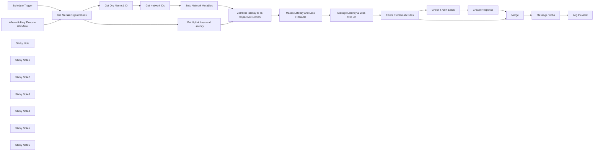

## Fluxo (.json) :

```json
{
  "meta": {
    "instanceId": "257476b1ef58bf3cb6a46e65fac7ee34a53a5e1a8492d5c6e4da5f87c9b82833",
    "templateId": "2054"
  },
  "nodes": [
    {
      "id": "3b18d784-eded-4b74-ac44-b25565049e13",
      "name": "When clicking \"Execute Workflow\"",
      "type": "n8n-nodes-base.manualTrigger",
      "position": [
        380,
        400
      ],
      "parameters": {},
      "typeVersion": 1
    },
    {
      "id": "96eadd32-17c2-44b0-a00b-8e2ddcecaafa",
      "name": "Get Meraki Organizations",
      "type": "n8n-nodes-base.httpRequest",
      "notes": "This node uses an API call to Meraki using the URL https://api.meraki.com/api/v1/organizations\n\nthe Authorization header is what is used to authenticate. You also have to set it to accept json",
      "position": [
        620,
        320
      ],
      "parameters": {
        "url": "https://api.meraki.com/api/v1/organizations",
        "options": {
          "redirect": {
            "redirect": {}
          }
        },
        "sendHeaders": true,
        "authentication": "genericCredentialType",
        "genericAuthType": "httpHeaderAuth",
        "headerParameters": {
          "parameters": [
            {
              "name": "Accept",
              "value": "application/json"
            }
          ]
        }
      },
      "credentials": {
        "httpHeaderAuth": {
          "id": "12",
          "name": "Header Auth account"
        }
      },
      "typeVersion": 4.1
    },
    {
      "id": "444071ea-a364-45a6-9430-0338d2752b18",
      "name": "Get Network IDs",
      "type": "n8n-nodes-base.httpRequest",
      "notes": "This node uses a URL with an expression in the middle to do an API call for each ORG ID that was pulled to pull all the network's for each org",
      "position": [
        1020,
        240
      ],
      "parameters": {
        "url": "=https://api.meraki.com/api/v1/organizations/{{ $json.OrgID }}/networks  ",
        "options": {
          "redirect": {
            "redirect": {}
          }
        },
        "sendHeaders": true,
        "headerParameters": {
          "parameters": [
            {
              "name": "Authorization"
            },
            {
              "name": "Accept",
              "value": "application/json"
            }
          ]
        }
      },
      "typeVersion": 4.1
    },
    {
      "id": "42deea02-e2d2-4ba6-97f7-698c219715a5",
      "name": "Get Org Name & ID",
      "type": "n8n-nodes-base.set",
      "notes": "This takes the output data from the previous node and changes the variables to better suit what we'll be using. ",
      "position": [
        840,
        240
      ],
      "parameters": {
        "fields": {
          "values": [
            {
              "name": "CompanyName",
              "stringValue": "={{ $json.name }}"
            },
            {
              "name": "OrgID",
              "stringValue": "={{ $json.id }}"
            }
          ]
        },
        "include": "selected",
        "options": {}
      },
      "typeVersion": 3.2
    },
    {
      "id": "3d5ce6a8-bf05-4457-88e6-c5ad5a995b1d",
      "name": "Combine latency to its respective Network",
      "type": "n8n-nodes-base.merge",
      "notes": "This node matches on the NetworkID field, so that the networks we pulled earlier and the Loss / Latency can be combined into one dataset",
      "position": [
        1500,
        400
      ],
      "parameters": {
        "mode": "combine",
        "options": {},
        "joinMode": "enrichInput1",
        "mergeByFields": {
          "values": [
            {
              "field1": "NetworkID",
              "field2": "networkId"
            }
          ]
        }
      },
      "notesInFlow": false,
      "typeVersion": 2.1
    },
    {
      "id": "caafd6dd-a2b2-405d-a078-cea3bb615788",
      "name": "Makes Latency and Loss Filterable",
      "type": "n8n-nodes-base.set",
      "notes": "Like before, This takes the output data from the previous node and changes the variables to better suit what we'll be using. ",
      "position": [
        1680,
        400
      ],
      "parameters": {
        "fields": {
          "values": [
            {
              "name": "networkId",
              "stringValue": "={{ $json.networkId }}"
            },
            {
              "name": "NetworkName",
              "stringValue": "={{ $json.NetworkName }}"
            },
            {
              "name": "networkURL",
              "stringValue": "={{ $json.networkURL }}"
            },
            {
              "name": "Serial",
              "stringValue": "={{ $json.serial }}"
            },
            {
              "name": "TS0-Loss",
              "stringValue": "={{ $json.timeSeries[0].lossPercent }}"
            },
            {
              "name": "TS1-Loss",
              "stringValue": "={{ $json.timeSeries[1].lossPercent }}"
            },
            {
              "name": "TS2-Loss",
              "stringValue": "={{ $json.timeSeries[2].lossPercent }}"
            },
            {
              "name": "TS3-Loss",
              "stringValue": "={{ $json.timeSeries[3].lossPercent }}"
            },
            {
              "name": "TS4-Loss",
              "stringValue": "={{ $json.timeSeries[4].lossPercent }}"
            },
            {
              "name": "TS0-Latency",
              "stringValue": "={{ $json.timeSeries[0].latencyMs }}"
            },
            {
              "name": "TS1-Latency",
              "stringValue": "={{ $json.timeSeries[1].latencyMs }}"
            },
            {
              "name": "TS2-Latency",
              "stringValue": "={{ $json.timeSeries[2].latencyMs }}"
            },
            {
              "name": "TS3-Latency",
              "stringValue": "={{ $json.timeSeries[3].latencyMs }}"
            },
            {
              "name": "TS4-Latency",
              "stringValue": "={{ $json.timeSeries[4].latencyMs }}"
            }
          ]
        },
        "include": "selected",
        "options": {}
      },
      "typeVersion": 3.2
    },
    {
      "id": "c695fd89-c884-4794-b0e5-51b91a71ac5c",
      "name": "Filters Problematic sites",
      "type": "n8n-nodes-base.code",
      "notes": "This node uses JavaScript to look at the calculated averages and if they pass the threshold for 300ms Latency or 2% Loss it will pass that site info forward",
      "position": [
        2040,
        400
      ],
      "parameters": {
        "jsCode": "// Function to filter items based on averageLatency and averageLoss\nfunction filterItems(items) {\n  return items.filter(item =>\n    item.AverageLatency >300 || item.AverageLoss > 2\n  );\n}\n\n// Get the input items from the previous node\nconst inputItems = items.map(item => item.json); // Adjust based on your actual data structure\n\n// Filter the items based on the conditions\nconst filteredItems = filterItems(inputItems);\n\n// Return the filtered items to the workflow\nreturn filteredItems.map(item => {\n  return { json: item }; // Format each filtered item as JSON\n});\n"
      },
      "typeVersion": 2
    },
    {
      "id": "6db219fd-f54d-4bf8-b150-9c4f3069cf92",
      "name": "Average Latency & Loss over 5m",
      "type": "n8n-nodes-base.code",
      "notes": "This node uses JavaScript to calculate the average over the last 5 entries of packet loss and latency",
      "position": [
        1860,
        400
      ],
      "parameters": {
        "jsCode": "// Assuming $input.all() is an array of items and each item has a json property\nfunction calculateAverages(inputItems) {\n  return inputItems.map(item => {\n    // Calculate total and average loss\n    const totalLoss = \n      parseFloat(item.json['TS0-Loss']) +\n      parseFloat(item.json['TS1-Loss']) +\n      parseFloat(item.json['TS2-Loss']) +\n      parseFloat(item.json['TS3-Loss']) +\n      parseFloat(item.json['TS4-Loss']);\n    const averageLoss = totalLoss / 5;\n    item.json['AverageLoss'] = averageLoss;\n\n    // Calculate total and average latency\n    const totalLatency = \n      parseFloat(item.json['TS0-Latency']) +\n      parseFloat(item.json['TS1-Latency']) +\n      parseFloat(item.json['TS2-Latency']) +\n      parseFloat(item.json['TS3-Latency']) +\n      parseFloat(item.json['TS4-Latency']);\n    const averageLatency = totalLatency / 5;\n    item.json['AverageLatency'] = averageLatency;\n\n    // Return the modified item\n    return item;\n  });\n}\n\nreturn calculateAverages($input.all());\n"
      },
      "typeVersion": 2
    },
    {
      "id": "f3831843-2596-492d-b800-7d349e443293",
      "name": "Get Uplink Loss and Latency",
      "type": "n8n-nodes-base.httpRequest",
      "notes": "This uses a URL with an expression in the middle so that for each org ID it will pull the Loss and Latency for their uplinks. ",
      "position": [
        840,
        400
      ],
      "parameters": {
        "url": "=https://api.meraki.com/api/v1/organizations/{{ $json.id }}/devices/uplinksLossAndLatency?timespan=300",
        "options": {
          "redirect": {
            "redirect": {}
          }
        },
        "sendHeaders": true,
        "authentication": "genericCredentialType",
        "genericAuthType": "httpHeaderAuth",
        "headerParameters": {
          "parameters": [
            {
              "name": "Accept",
              "value": "application/json"
            }
          ]
        }
      },
      "credentials": {
        "httpHeaderAuth": {
          "id": "12",
          "name": "Header Auth account"
        }
      },
      "typeVersion": 4.1
    },
    {
      "id": "87c3f32c-de4f-48fd-a711-3521a008c245",
      "name": "Schedule Trigger",
      "type": "n8n-nodes-base.scheduleTrigger",
      "notes": "schedules the workflow to run every 5 minutes mon-fri 8am-5pm",
      "position": [
        380,
        240
      ],
      "parameters": {
        "rule": {
          "interval": [
            {
              "field": "cronExpression",
              "expression": "*/5 8-16 * * 1-5"
            }
          ]
        }
      },
      "typeVersion": 1.1
    },
    {
      "id": "572adb5c-6745-4b4e-89d8-a97835c3d486",
      "name": "Sets Network Variables",
      "type": "n8n-nodes-base.set",
      "notes": "Like before, This takes the output data from the previous node and changes the variables to better suit what we'll be using. ",
      "position": [
        1220,
        240
      ],
      "parameters": {
        "fields": {
          "values": [
            {
              "name": "NetworkID",
              "stringValue": "={{ $json.id }}"
            },
            {
              "name": "NetworkName",
              "stringValue": "={{ $json.name }}"
            },
            {
              "name": "networkURL",
              "stringValue": "={{ $json.url }}"
            }
          ]
        },
        "include": "selected",
        "options": {}
      },
      "typeVersion": 3.2
    },
    {
      "id": "01717ed3-1012-4eda-9da9-567038132e06",
      "name": "Merge",
      "type": "n8n-nodes-base.merge",
      "notes": "This looks at the problematic sites as well as the info from the database. It will pass on all non-matching as if the site name matches with the database then that means we have an open alert for that site already.",
      "position": [
        2720,
        300
      ],
      "parameters": {
        "mode": "combine",
        "options": {},
        "joinMode": "keepNonMatches",
        "mergeByFields": {
          "values": [
            {
              "field1": "NetworkName",
              "field2": "NetworkName"
            }
          ]
        },
        "outputDataFrom": "input2"
      },
      "typeVersion": 2.1
    },
    {
      "id": "a20f6f7c-0c92-4db9-903b-e322d67b536d",
      "name": "Check if Alert Exists",
      "type": "n8n-nodes-base.redis",
      "notes": "This node Looks to see if the alert already exists in the Redis database. If it does exist it won't alert us in Teams",
      "position": [
        2300,
        240
      ],
      "parameters": {
        "key": "={{ $json.NetworkName }}",
        "options": {
          "dotNotation": "={{ true }}"
        },
        "operation": "get",
        "propertyName": "NetworkName"
      },
      "typeVersion": 1,
      "alwaysOutputData": true
    },
    {
      "id": "63590446-2938-443a-adbe-bfc0ba89008c",
      "name": "Create Response",
      "type": "n8n-nodes-base.code",
      "notes": "If the alert isn't in the database all the Redis will respond with is \"null\" \n\nother n8n nodes see null as (no data) and show blank which is fair. So I made this node to look at the null responses and make a response of \"false\" for a \"alertExists\" variable. that way we have something to filter on",
      "position": [
        2500,
        240
      ],
      "parameters": {
        "jsCode": "return items.map(item => {\n  // Check if the 'NetworkName' property is not null, indicating an alert exists.\n  // If 'NetworkName' is null, no alert exists for this network.\n  const alertExists = item.json.NetworkName !== null;\n\n  // Set the alertExists property correctly based on the condition.\n  item.json.alertExists = alertExists;\n\n  return item;\n});\n"
      },
      "typeVersion": 2
    },
    {
      "id": "c63e2a45-bf5e-455f-8012-9868d55aa3e2",
      "name": "Message Techs",
      "type": "n8n-nodes-base.microsoftTeams",
      "notes": "sends an alert to Dispatch with info related to the site.",
      "position": [
        2920,
        300
      ],
      "parameters": {
        "chatId": "19:bfd41d9621e544c88ae9f2f275e373b5@thread.v2",
        "message": "=<strong>Loss & Latency Alert</strong> <br><br>\n<strong>Network Name:</strong> <a href=\"{{ $json.networkURL }}\">{{ $json.NetworkName }}</a> <br>\n<strong>Average Loss:</strong> {{ $json.AverageLoss }}% <br>\n<strong>Average Latency:</strong> {{ $json.AverageLatency }} <br> ",
        "options": {},
        "resource": "chatMessage"
      },
      "typeVersion": 1.1
    },
    {
      "id": "b4ae54cd-8345-4611-9fbe-32e7537855a9",
      "name": "Log the Alert",
      "type": "n8n-nodes-base.redis",
      "notes": "Logs the alert and sets the TTL to 3h, after 3h Redis will delete the entry and if the site is still having issues, the next run of the workflow will notify us again",
      "position": [
        3120,
        300
      ],
      "parameters": {
        "key": "={{ $('Merge').item.json.NetworkName }}",
        "ttl": 10800,
        "value": "={{ $('Merge').item.json.NetworkName }}",
        "expire": true,
        "keyType": "string",
        "operation": "set"
      },
      "typeVersion": 1,
      "alwaysOutputData": true
    },
    {
      "id": "05416de5-a0c0-4ff8-bfc5-3d26f0d88139",
      "name": "Sticky Note",
      "type": "n8n-nodes-base.stickyNote",
      "position": [
        573.394087003982,
        143.69977924944794
      ],
      "parameters": {
        "width": 791.5865288559442,
        "height": 462.84878343542437,
        "content": "## Pulling in Info \nThis section pulls in all the data we will need to see any possible errors and generate our alert\n"
      },
      "typeVersion": 1
    },
    {
      "id": "aeb1c8a6-3cec-4899-83e2-098d0b1a9703",
      "name": "Sticky Note1",
      "type": "n8n-nodes-base.stickyNote",
      "position": [
        1464,
        211
      ],
      "parameters": {
        "width": 688.5000872281419,
        "height": 411.1258278145692,
        "content": "## Changing data\nThis section pulls together the data we got from the first section and sets everything up to be notified "
      },
      "typeVersion": 1
    },
    {
      "id": "9ca9e89b-61ce-4b3f-af8e-bf03daff6710",
      "name": "Sticky Note2",
      "type": "n8n-nodes-base.stickyNote",
      "position": [
        2260,
        60
      ],
      "parameters": {
        "width": 1015.6997792494475,
        "height": 614.8167770419421,
        "content": "## Notify\nThis last section is for the push of the alert as well as storing the alert as to not re-notify every time the workflow runs"
      },
      "typeVersion": 1
    },
    {
      "id": "801879be-e83b-4c74-b8ac-b20157ca32d1",
      "name": "Sticky Note3",
      "type": "n8n-nodes-base.stickyNote",
      "position": [
        600,
        640
      ],
      "parameters": {
        "width": 673.6064168725538,
        "height": 394.26386951839356,
        "content": "## Explanation\nusing an HTTP request you will can do a get request for all Organizations your Meraki account has access to. \n\nYou will have to Generate your own API key inside of the Meraki Dashboard explained here https://documentation.meraki.com/General_Administration/Other_Topics/Cisco_Meraki_Dashboard_API\n\nYou will have to add two headers to your HTTPS node Authorization and Accept. the 1st is how you'll authenticate with Meraki and the second is how it will know how to answer the request. \n\nUsing the same methods you'll do a get for Organizations, Network IDs and Uplink stats\n\nUsing the Set nodes to organize the data in a \"neat\" way"
      },
      "typeVersion": 1
    },
    {
      "id": "2b028326-0776-4b9b-bdf2-d79949809092",
      "name": "Sticky Note4",
      "type": "n8n-nodes-base.stickyNote",
      "position": [
        1480,
        660
      ],
      "parameters": {
        "width": 645.9603701592033,
        "height": 389.89870424786454,
        "content": "## Explanation\nthe Merge node will combine the Networks with their respective stats by matching on NetworkID and networkid and enriching the input \n\nagain we add a set node to better organize the statistics of the uplinks. \n\nThe first JS node will average the 5 Time stamps of Latency and Packet loss \n\nThe last JS node will send the data forward only for sites that pass the threshold (in this example 300ms latency and 2% packet loss) "
      },
      "typeVersion": 1
    },
    {
      "id": "f7c1448d-3a03-4196-bde6-a1aea92f28ad",
      "name": "Sticky Note5",
      "type": "n8n-nodes-base.stickyNote",
      "position": [
        2300,
        700
      ],
      "parameters": {
        "width": 913.6905067516504,
        "height": 523.763772544089,
        "content": "## Explanation \nwe will send the problematic sites to both the Redis node and the Merge node. \n\nThe Redis node does a get request to see if a key exists matching the Network name in Meraki. If so it will respond with the Network name, If not it will respond with \"null\" \n\nthe n8n nodes view \"null\" as no data (which isn't exactly wrong as it literally is no data) but the next node will just say the input is blank so I've added the JS node to look at the output and respond if an alert does or doesn't exist based on the response of the Redis node. \n\nThis time we Merge looking at the NetworkName and keep all non-matching. The reason for this is because if they match, that means the key in the database exists, meaning we've already sent a message that the site is having issues. \n\nWe send the tickets forth that don't match and we will send a teams message that will notify of a Network passing the threshold for issues. I've included the Network URL and re-written the message to include a hyperlink that way the alert can be used to take you straight to the problematic site. \n\nFinally we log the site in the database with a TTL of 3h, this way if the error has not been fixed in 3h we will get another message. \n"
      },
      "typeVersion": 1
    },
    {
      "id": "4f4d40ef-8e7d-420a-8273-4cfefd3af6e9",
      "name": "Sticky Note6",
      "type": "n8n-nodes-base.stickyNote",
      "position": [
        1460,
        -320
      ],
      "parameters": {
        "width": 670.6963066922013,
        "height": 366.61782280504275,
        "content": "## other usecases \n If you feel confident enough the Teams nodes can be replaced with a node that can generate a ticket for your PSA such as ConnectWise Mange. That way these are generating tickets rather than just messages. "
      },
      "typeVersion": 1
    }
  ],
  "pinData": {},
  "connections": {
    "Merge": {
      "main": [
        [
          {
            "node": "Message Techs",
            "type": "main",
            "index": 0
          }
        ]
      ]
    },
    "Message Techs": {
      "main": [
        [
          {
            "node": "Log the Alert",
            "type": "main",
            "index": 0
          }
        ]
      ]
    },
    "Create Response": {
      "main": [
        [
          {
            "node": "Merge",
            "type": "main",
            "index": 0
          }
        ]
      ]
    },
    "Get Network IDs": {
      "main": [
        [
          {
            "node": "Sets Network Variables",
            "type": "main",
            "index": 0
          }
        ]
      ]
    },
    "Schedule Trigger": {
      "main": [
        [
          {
            "node": "Get Meraki Organizations",
            "type": "main",
            "index": 0
          }
        ]
      ]
    },
    "Get Org Name & ID": {
      "main": [
        [
          {
            "node": "Get Network IDs",
            "type": "main",
            "index": 0
          }
        ]
      ]
    },
    "Check if Alert Exists": {
      "main": [
        [
          {
            "node": "Create Response",
            "type": "main",
            "index": 0
          }
        ]
      ]
    },
    "Sets Network Variables": {
      "main": [
        [
          {
            "node": "Combine latency to its respective Network",
            "type": "main",
            "index": 0
          }
        ]
      ]
    },
    "Get Meraki Organizations": {
      "main": [
        [
          {
            "node": "Get Org Name & ID",
            "type": "main",
            "index": 0
          },
          {
            "node": "Get Uplink Loss and Latency",
            "type": "main",
            "index": 0
          }
        ]
      ]
    },
    "Filters Problematic sites": {
      "main": [
        [
          {
            "node": "Check if Alert Exists",
            "type": "main",
            "index": 0
          },
          {
            "node": "Merge",
            "type": "main",
            "index": 1
          }
        ]
      ]
    },
    "Get Uplink Loss and Latency": {
      "main": [
        [
          {
            "node": "Combine latency to its respective Network",
            "type": "main",
            "index": 1
          }
        ]
      ]
    },
    "Average Latency & Loss over 5m": {
      "main": [
        [
          {
            "node": "Filters Problematic sites",
            "type": "main",
            "index": 0
          }
        ]
      ]
    },
    "When clicking \"Execute Workflow\"": {
      "main": [
        [
          {
            "node": "Get Meraki Organizations",
            "type": "main",
            "index": 0
          }
        ]
      ]
    },
    "Makes Latency and Loss Filterable": {
      "main": [
        [
          {
            "node": "Average Latency & Loss over 5m",
            "type": "main",
            "index": 0
          }
        ]
      ]
    },
    "Combine latency to its respective Network": {
      "main": [
        [
          {
            "node": "Makes Latency and Loss Filterable",
            "type": "main",
            "index": 0
          }
        ]
      ]
    }
  }
}
```

<a id="template-309"></a>

## Template 309 - Resposta HTML para endpoint /my-form

- **Nome:** Resposta HTML para endpoint /my-form
- **Descrição:** Expõe um endpoint HTTP que recebe requisições e responde com uma página HTML estática.
- **Funcionalidade:** • Exposição de endpoint HTTP: Disponibiliza um caminho (/my-form) que recebe requisições externas.
• Resposta com HTML estático: Retorna uma página HTML completa como corpo da resposta.
• Definição de cabeçalho HTTP: Define o cabeçalho Content-Type como text/html; charset=UTF-8 para a resposta.
• Inclusão de recursos via CDN: A página incorpora CSS e JavaScript do Bootstrap através de links CDN.
- **Ferramentas:** • Bootstrap: Biblioteca CSS/JS utilizada para estilizar a página e fornecer componentes visuais.
• jsDelivr CDN: Rede de distribuição de conteúdo usada para servir os arquivos do Bootstrap.


## Fluxo visual


## Fluxo (.json) :

```json
{
  "nodes": [
    {
      "name": "Respond to Webhook",
      "type": "n8n-nodes-base.respondToWebhook",
      "position": [
        450,
        150
      ],
      "parameters": {
        "options": {
          "responseHeaders": {
            "entries": [
              {
                "name": "Content-Type",
                "value": "text/html; charset=UTF-8"
              }
            ]
          }
        },
        "respondWith": "text",
        "responseBody": "<!doctype html>\n<html lang=\"en\">\n  <head>\n    <meta charset=\"utf-8\">\n    <meta name=\"viewport\" content=\"width=device-width, initial-scale=1\">\n\n    <link href=\"https://cdn.jsdelivr.net/npm/bootstrap@5.1.3/dist/css/bootstrap.min.css\" rel=\"stylesheet\" integrity=\"sha384-1BmE4kWBq78iYhFldvKuhfTAU6auU8tT94WrHftjDbrCEXSU1oBoqyl2QvZ6jIW3\" crossorigin=\"anonymous\">\n\n    <title>Hello, world!</title>\n  </head>\n  <body>\n    <h1>Hello, world!</h1>\n\n    <script src=\"https://cdn.jsdelivr.net/npm/bootstrap@5.1.3/dist/js/bootstrap.bundle.min.js\" integrity=\"sha384-ka7Sk0Gln4gmtz2MlQnikT1wXgYsOg+OMhuP+IlRH9sENBO0LRn5q+8nbTov4+1p\" crossorigin=\"anonymous\"></script>\n  </body>\n</html>\n"
      },
      "typeVersion": 1
    },
    {
      "name": "Webhook",
      "type": "n8n-nodes-base.webhook",
      "position": [
        250,
        150
      ],
      "webhookId": "db437850-0e90-4eb7-b383-f8438ea1bd66",
      "parameters": {
        "path": "my-form",
        "options": {},
        "responseMode": "responseNode"
      },
      "typeVersion": 1
    }
  ],
  "connections": {
    "Webhook": {
      "main": [
        [
          {
            "node": "Respond to Webhook",
            "type": "main",
            "index": 0
          }
        ]
      ]
    }
  }
}
```

<a id="template-310"></a>

## Template 310 - Notificar tickets não atribuídos no Slack

- **Nome:** Notificar tickets não atribuídos no Slack
- **Descrição:** Busca tickets não atribuídos no Zendesk e envia uma lista formatada para um canal do Slack, podendo ser executado manualmente ou por agendamento.
- **Funcionalidade:** • Acionamento manual e agendado: permite executar a verificação ao clicar ou automaticamente todos os dias às 16:30.
• Consulta de tickets não atribuídos: realiza uma pesquisa com filtros para localizar tickets sem responsável (assignee:none) e com status anterior a pending.
• Recuperação completa de resultados: obtém todos os tickets correspondentes sem limite de páginação.
• Formatação da mensagem: monta uma lista com link para a visualização do ticket no agente, ID, status em maiúsculas e assunto.
• Envio para canal do Slack: publica a mensagem formatada no canal específico para notificar a equipe.
- **Ferramentas:** • Zendesk: sistema de suporte ao cliente usado para armazenar e consultar tickets.
• Slack: plataforma de comunicação usada para receber a notificação com a lista de tickets.


## Fluxo visual

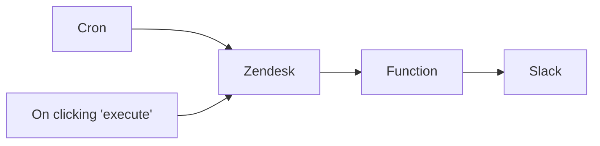

## Fluxo (.json) :

```json
{
  "id": 23,
  "name": "Zendesk-to-slack",
  "nodes": [
    {
      "name": "On clicking 'execute'",
      "type": "n8n-nodes-base.manualTrigger",
      "position": [
        360,
        350
      ],
      "parameters": {},
      "typeVersion": 1
    },
    {
      "name": "Cron",
      "type": "n8n-nodes-base.cron",
      "color": "#068906",
      "position": [
        360,
        560
      ],
      "parameters": {
        "triggerTimes": {
          "item": [
            {
              "hour": 16,
              "minute": 30
            }
          ]
        }
      },
      "typeVersion": 1
    },
    {
      "name": "Function",
      "type": "n8n-nodes-base.function",
      "position": [
        690,
        460
      ],
      "parameters": {
        "functionCode": "// Create our Slack message\n// This will output a list of Ticket URLs with the status and the subject\n// 12345 [STATUS] - Ticket Subject\nlet message = \"*Unassigned Tickets*\\n\\n\";\n\n// Loop the input items\nfor (item of items) {\n  // Append the ticket information to the message\n  message += \"*<\" + item.json.url.replace(\"api/v2\",\"agent\").replace(\".json\",\"\") + \"|\" + item.json.id + \">* [\" + item.json.status.toUpperCase() + \"] - \" + item.json.subject + \"\\n\"; \n}\n\n// Return our message\nreturn [{json: {message}}];"
      },
      "typeVersion": 1
    },
    {
      "name": "Slack",
      "type": "n8n-nodes-base.slack",
      "position": [
        870,
        460
      ],
      "parameters": {
        "text": "={{$json[\"message\"]}}",
        "channel": "jarvis-test",
        "attachments": [],
        "otherOptions": {}
      },
      "credentials": {
        "slackApi": {
          "id": "2",
          "name": "Slack"
        }
      },
      "typeVersion": 1
    },
    {
      "name": "Zendesk",
      "type": "n8n-nodes-base.zendesk",
      "position": [
        510,
        460
      ],
      "parameters": {
        "options": {
          "query": "assignee:none status<pending"
        },
        "operation": "getAll",
        "returnAll": true
      },
      "credentials": {
        "zendeskApi": {
          "id": "1",
          "name": "Zendesk"
        }
      },
      "typeVersion": 1
    }
  ],
  "active": false,
  "settings": {},
  "connections": {
    "Cron": {
      "main": [
        [
          {
            "node": "Zendesk",
            "type": "main",
            "index": 0
          }
        ]
      ]
    },
    "Zendesk": {
      "main": [
        [
          {
            "node": "Function",
            "type": "main",
            "index": 0
          }
        ]
      ]
    },
    "Function": {
      "main": [
        [
          {
            "node": "Slack",
            "type": "main",
            "index": 0
          }
        ]
      ]
    },
    "On clicking 'execute'": {
      "main": [
        [
          {
            "node": "Zendesk",
            "type": "main",
            "index": 0
          }
        ]
      ]
    }
  }
}
```

<a id="template-311"></a>

## Template 311 - Exportar payload para Excel

- **Nome:** Exportar payload para Excel
- **Descrição:** Recebe dados via requisição HTTP POST, converte-os em uma planilha XLSX e retorna o arquivo para download.
- **Funcionalidade:** • Recepção de requisições HTTP POST: Inicia o fluxo ao receber um POST no endpoint configurado.
• Separação de itens do campo body: Divide uma lista presente no campo 'body' em registros individuais para processamento.
• Conversão para planilha XLSX: Gera um arquivo no formato .xlsx a partir dos registros processados.
• Resposta com download de arquivo: Retorna o arquivo gerado como resposta binária, definindo o nome do arquivo via parâmetro de consulta 'filename' ou usando "Export" como padrão.
- **Ferramentas:** • Endpoint HTTP (Webhook): Ponto de entrada que recebe os dados via POST.
• Processador de listas: Componente que divide um campo com lista em itens individuais para transformação.
• Gerador de planilhas XLSX: Componente que cria o arquivo .xlsx a partir dos dados.
• Resposta HTTP binária: Serviço que envia o arquivo resultante como download para o solicitante.


## Fluxo visual

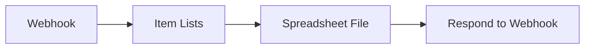

## Fluxo (.json) :

```json
{
  "nodes": [
    {
      "name": "Webhook",
      "type": "n8n-nodes-base.webhook",
      "position": [
        340,
        0
      ],
      "webhookId": "c1616754-4dec-4b00-a8b5-d1cb5f75bf11",
      "parameters": {
        "path": "c1616754-4dec-4b00-a8b5-d1cb5f75bf11",
        "options": {},
        "httpMethod": "POST",
        "responseMode": "responseNode"
      },
      "typeVersion": 1
    },
    {
      "name": "Item Lists",
      "type": "n8n-nodes-base.itemLists",
      "position": [
        560,
        0
      ],
      "parameters": {
        "options": {},
        "fieldToSplitOut": "=body"
      },
      "typeVersion": 1
    },
    {
      "name": "Spreadsheet File",
      "type": "n8n-nodes-base.spreadsheetFile",
      "position": [
        780,
        0
      ],
      "parameters": {
        "options": {},
        "operation": "toFile",
        "fileFormat": "xlsx"
      },
      "typeVersion": 1
    },
    {
      "name": "Respond to Webhook",
      "type": "n8n-nodes-base.respondToWebhook",
      "position": [
        1020,
        0
      ],
      "parameters": {
        "options": {
          "responseHeaders": {
            "entries": [
              {
                "name": "content-disposition",
                "value": "=attachment; filename=\"{{$node[\"Webhook\"].json[\"query\"][\"filename\"]? $node[\"Webhook\"].json[\"query\"][\"filename\"] : \"Export\"}}.xlsx\""
              }
            ]
          }
        },
        "respondWith": "binary"
      },
      "typeVersion": 1
    }
  ],
  "connections": {
    "Webhook": {
      "main": [
        [
          {
            "node": "Item Lists",
            "type": "main",
            "index": 0
          }
        ]
      ]
    },
    "Item Lists": {
      "main": [
        [
          {
            "node": "Spreadsheet File",
            "type": "main",
            "index": 0
          }
        ]
      ]
    },
    "Spreadsheet File": {
      "main": [
        [
          {
            "node": "Respond to Webhook",
            "type": "main",
            "index": 0
          }
        ]
      ]
    }
  }
}
```

<a id="template-312"></a>

## Template 312 - Remoção de execuções com mais de 10 dias

- **Nome:** Remoção de execuções com mais de 10 dias
- **Descrição:** Lista execuções do sistema e apaga automaticamente as que começaram há mais de 10 dias. Pode ser executado manualmente para testes ou por agendamento.
- **Funcionalidade:** • Acionamento manual: Permite executar o fluxo manualmente para testar a limpeza de execuções.
• Agendamento diário: Executa a verificação periodicamente em horário configurado (agendador).
• Listagem de execuções: Recupera todas as execuções disponíveis para avaliação.
• Filtragem por data: Verifica o campo startedAt e identifica execuções iniciadas antes de 10 dias atrás.
• Exclusão de execuções antigas: Remove as execuções identificadas como mais antigas que 10 dias usando a API do sistema.
• Ação nula para recentes: Mantém execuções mais recentes sem alterações (no-op).
- **Ferramentas:** • API de gerenciamento de execuções: Endpoint usado para listar e excluir execuções do ambiente.
• Credenciais de API: Conta/credenciais usadas para autenticar requisições na API do sistema.
• Agendador de tarefas: Componente responsável por disparar o fluxo em horários pré-definidos.

## Fluxo visual

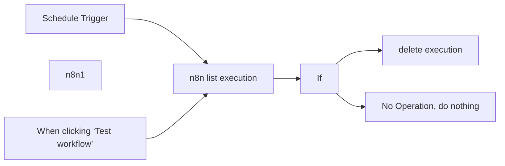

## Fluxo (.json) :

```json
{
  "meta": {
    "instanceId": "d68b0885df4f6057c27649c0cc1cdbf154a8c3c6de34051d82d8f9164d66f031"
  },
  "nodes": [
    {
      "id": "648130c4-5195-4b91-995b-443624019cd0",
      "name": "When clicking ‘Test workflow’",
      "type": "n8n-nodes-base.manualTrigger",
      "position": [
        820,
        280
      ],
      "parameters": {},
      "typeVersion": 1
    },
    {
      "id": "c25e5656-9ce2-4429-98f5-f86a88a8fe16",
      "name": "n8n1",
      "type": "n8n-nodes-base.n8n",
      "position": [
        2380,
        140
      ],
      "parameters": {
        "filters": {},
        "options": {},
        "resource": "execution",
        "returnAll": true,
        "requestOptions": {}
      },
      "credentials": {
        "n8nApi": {
          "id": "23",
          "name": "n8n account"
        }
      },
      "typeVersion": 1
    },
    {
      "id": "93acd82f-22ce-435c-b89e-a3f8ae876bc5",
      "name": "n8n list execution",
      "type": "n8n-nodes-base.n8n",
      "position": [
        1040,
        380
      ],
      "parameters": {
        "filters": {},
        "options": {},
        "resource": "execution",
        "returnAll": true,
        "requestOptions": {}
      },
      "credentials": {
        "n8nApi": {
          "id": "23",
          "name": "n8n account"
        }
      },
      "typeVersion": 1
    },
    {
      "id": "da03ff80-480d-4616-8aed-dd955d5e92d8",
      "name": "If",
      "type": "n8n-nodes-base.if",
      "position": [
        1260,
        380
      ],
      "parameters": {
        "options": {},
        "conditions": {
          "options": {
            "version": 2,
            "leftValue": "",
            "caseSensitive": true,
            "typeValidation": "strict"
          },
          "combinator": "and",
          "conditions": [
            {
              "id": "6a124591-3347-4224-a997-a7824de12c96",
              "operator": {
                "type": "dateTime",
                "operation": "before"
              },
              "leftValue": "={{ $json.startedAt }}",
              "rightValue": "={{ new Date(Date.now() - 10 * 24 * 60 * 60 * 1000).toISOString();  }}"
            }
          ]
        }
      },
      "typeVersion": 2.2
    },
    {
      "id": "6bc96f0a-5ed9-43f9-91e8-ced15ae53ef5",
      "name": "Schedule Trigger",
      "type": "n8n-nodes-base.scheduleTrigger",
      "position": [
        820,
        500
      ],
      "parameters": {
        "rule": {
          "interval": [
            {
              "triggerAtHour": 4,
              "triggerAtMinute": 44
            }
          ]
        }
      },
      "typeVersion": 1.2
    },
    {
      "id": "272f94d2-fcb5-4e6a-a32e-655ac1db9a00",
      "name": "delete execution",
      "type": "n8n-nodes-base.n8n",
      "position": [
        1480,
        280
      ],
      "parameters": {
        "resource": "execution",
        "operation": "delete",
        "executionId": "={{ $json.id }}",
        "requestOptions": {}
      },
      "credentials": {
        "n8nApi": {
          "id": "23",
          "name": "n8n account"
        }
      },
      "typeVersion": 1
    },
    {
      "id": "b2067d59-3678-400a-a464-cb7aab62413f",
      "name": "No Operation, do nothing",
      "type": "n8n-nodes-base.noOp",
      "position": [
        1480,
        480
      ],
      "parameters": {},
      "typeVersion": 1
    }
  ],
  "pinData": {},
  "connections": {
    "If": {
      "main": [
        [
          {
            "node": "delete execution",
            "type": "main",
            "index": 0
          }
        ],
        [
          {
            "node": "No Operation, do nothing",
            "type": "main",
            "index": 0
          }
        ]
      ]
    },
    "Schedule Trigger": {
      "main": [
        [
          {
            "node": "n8n list execution",
            "type": "main",
            "index": 0
          }
        ]
      ]
    },
    "n8n list execution": {
      "main": [
        [
          {
            "node": "If",
            "type": "main",
            "index": 0
          }
        ]
      ]
    },
    "When clicking ‘Test workflow’": {
      "main": [
        [
          {
            "node": "n8n list execution",
            "type": "main",
            "index": 0
          }
        ]
      ]
    }
  }
}
```

<a id="template-313"></a>

## Template 313 - Gerador de imagens via Hugging Face (FLUX)

- **Nome:** Gerador de imagens via Hugging Face (FLUX)
- **Descrição:** Flux é um fluxo que recebe um prompt e um estilo de usuário, gera uma imagem usando modelos de texto-para-imagem hospedados no Hugging Face e entrega a imagem através de uma página web ou mensagem de erro.
- **Funcionalidade:** • Formulário público: Exibe um formulário que captura o prompt do usuário e a opção de estilo.
• Roteamento por estilo: Seleciona templates de estilo pré-definidos com base na escolha do usuário.
• Geração de imagem por API: Envia o prompt combinado com o estilo para um modelo de geração de imagens (Hugging Face) e obtém o resultado.
• Upload e hospedagem: Faz upload da imagem gerada para um bucket S3 compatível para hospedagem pública.
• Página de resposta: Serve uma página web com a imagem gerada e miniaturas das renderizações recentes.
• Tratamento de erro: Retorna uma resposta de erro amigável quando a API de geração falha.
• Configurável por modelos: Permite trocar o modelo de geração usado alterando a URL do endpoint.
- **Ferramentas:** • Hugging Face Inference API: Serviço de execução de modelos de texto-para-imagem (ex.: black-forest-labs/FLUX.1-schnell) usado para gerar as imagens.
• Cloudflare R2 (S3 compatível): Armazenamento público para hospedar as imagens geradas via endpoint S3.
• Repositórios de modelos de difusão (ex.: FLUX, Hyper-SD, LoRA): Modelos e LoRAs disponíveis que podem ser usados como backend para geração de imagens.

## Fluxo visual

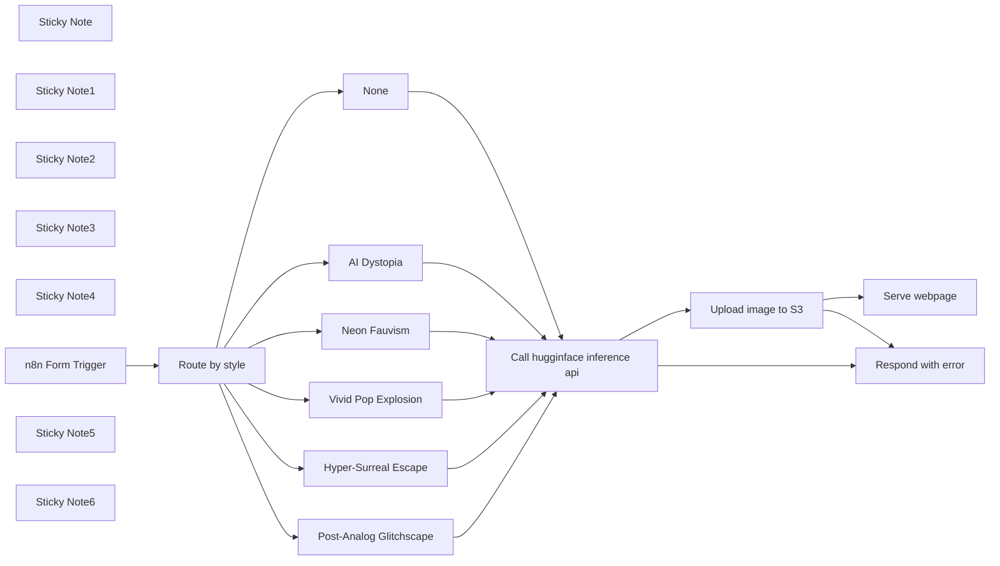

## Fluxo (.json) :

```json
{
  "nodes": [
    {
      "id": "6abe578b-d503-4da5-9af8-f9977de71139",
      "name": "Vivid Pop Explosion",
      "type": "n8n-nodes-base.set",
      "notes": " ",
      "position": [
        380,
        980
      ],
      "parameters": {
        "options": {},
        "assignments": {
          "assignments": [
            {
              "id": "9ec60f33-b940-40a6-9f8a-cb944b7065f1",
              "name": "stylePrompt",
              "type": "string",
              "value": "=rule of thirds, golden ratio, hyper-maximalist, vibrant neon, high-contrast, octane render, photorealism, 8k ::7 --ar 16:9 --s 1000\n\nDesign a fun, energetic scene filled with bold, neon colors, and playful shapes that pop off the screen. The image should evoke a sense of joy and movement, using fluid, organic forms and exaggerated, cartoon-like proportions. Focus on creating a lively atmosphere with contrasting, saturated tones and dynamic lighting. Use a mix of asymmetrical and balanced compositions to create a playful visual flow. Render in 8K with a hyper-maximalist approach using Octane Render for vibrant, high-gloss textures and photorealistic lighting effects. Include:"
            }
          ]
        },
        "includeOtherFields": true
      },
      "notesInFlow": true,
      "typeVersion": 3.4
    },
    {
      "id": "7de1ea42-3b18-4bfb-8ea4-a8b6c8d16763",
      "name": "AI Dystopia",
      "type": "n8n-nodes-base.set",
      "notes": " ",
      "position": [
        380,
        620
      ],
      "parameters": {
        "options": {},
        "assignments": {
          "assignments": [
            {
              "id": "9ec60f33-b940-40a6-9f8a-cb944b7065f1",
              "name": "stylePrompt",
              "type": "string",
              "value": "=golden ratio, rule of thirds, cyberpunk, glitch art, octane render, cinematic realism, 8k ::7 --ar 16:9 --s 1000\n\nGenerate a futuristic, cyberpunk dystopia with metallic textures, digital glitches, and neon lights. Blend cold, dystopian structures with traces of organic life. Use photorealistic lighting and dynamic reflections to enhance the visual depth of the scene. Include:"
            }
          ]
        },
        "includeOtherFields": true
      },
      "notesInFlow": true,
      "typeVersion": 3.4
    },
    {
      "id": "aa17c288-78e0-48d9-9c60-0e63e351d0b6",
      "name": "Post-Analog Glitchscape",
      "type": "n8n-nodes-base.set",
      "notes": " ",
      "position": [
        380,
        420
      ],
      "parameters": {
        "options": {},
        "assignments": {
          "assignments": [
            {
              "id": "9ec60f33-b940-40a6-9f8a-cb944b7065f1",
              "name": "stylePrompt",
              "type": "string",
              "value": "=rule of thirds, asymmetric composition, glitch art, pixelation, VHS noise, octane render, unreal engine, 8k ::7 --ar 16:9 --s 1200\nDesign a glitchy, post-analog world with digital decay and broken visuals. Utilize pixelated elements, VHS noise, and neon glitches to create a fragmented aesthetic. Use bold, contrasting colors against muted backgrounds for a high-contrast, otherworldly feel. The composition should follow asymmetrical rules, focusing on chaotic yet intentional visual balance. Include:"
            }
          ]
        },
        "includeOtherFields": true
      },
      "notesInFlow": true,
      "typeVersion": 3.4
    },
    {
      "id": "769ff46c-630f-456d-ae19-4c6496270fda",
      "name": "Neon Fauvism",
      "type": "n8n-nodes-base.set",
      "notes": " ",
      "position": [
        380,
        800
      ],
      "parameters": {
        "options": {},
        "assignments": {
          "assignments": [
            {
              "id": "9ec60f33-b940-40a6-9f8a-cb944b7065f1",
              "name": "stylePrompt",
              "type": "string",
              "value": "=asymmetric composition, golden ratio, neon colors, abstract forms, octane render, cinematic realism, unreal engine, 8k ::7 --ar 16:9 --s 1000\nCreate a bold, vivid composition using neon colors and fluid shapes that break away from reality. Focus on abstract forms, blending Fauvism's exaggerated color palette with modern digital art techniques. Use asymmetric composition and dynamic lighting. Render with a vibrant, high-energy aesthetic. Include:"
            }
          ]
        },
        "includeOtherFields": true
      },
      "notesInFlow": true,
      "typeVersion": 3.4
    },
    {
      "id": "ccc67dcb-84e6-476a-9bc2-b5382b700d5e",
      "name": "None",
      "type": "n8n-nodes-base.set",
      "notes": " ",
      "position": [
        380,
        1160
      ],
      "parameters": {
        "options": {},
        "assignments": {
          "assignments": [
            {
              "id": "9ec60f33-b940-40a6-9f8a-cb944b7065f1",
              "name": "stylePrompt",
              "type": "string",
              "value": "=Include: "
            }
          ]
        },
        "includeOtherFields": true
      },
      "notesInFlow": true,
      "typeVersion": 3.4
    },
    {
      "id": "fea2039c-48e5-4077-af2c-ea72838e1a5d",
      "name": "Serve webpage",
      "type": "n8n-nodes-base.respondToWebhook",
      "position": [
        1460,
        580
      ],
      "parameters": {
        "options": {},
        "respondWith": "text",
        "responseBody": "=<!DOCTYPE html>\n<html lang=\"en\">\n<head>\n    <meta charset=\"UTF-8\">\n    <meta name=\"viewport\" content=\"width=device-width, initial-scale=1.0\">\n    <title>Flux Image Generation Result</title>\n    <style>\n        body {\n            font-family: 'Open Sans', Tahoma, Geneva, Verdana, sans-serif;\n            display: flex;\n            flex-direction: column;\n            align-items: center;\n            justify-content: center;\n            min-height: 100vh;\n            background-color: #121212;\n            color: #e0e0e0;\n        }\n        .container {\n            margin-top: 2em;\n            width: 90%;\n            max-width: 670px; /* Increased the max-width for the main image area */\n            text-align: center;\n            background: #1e1e1e;\n            padding: 24px;\n            border-radius: 12px;\n            box-shadow: 0 8px 16px rgba(0, 0, 0, 0.3);\n            margin-bottom: 24px;\n        }\n        .image-container {\n            margin-bottom: 20px;\n        }\n        .image-container img {\n            max-width: 100%;\n            height: auto;\n            border-radius: 12px;\n            border: 2px solid #333;\n        }\n        .style-text {\n            font-size: 18px;\n            margin-bottom: 20px;\n            color: #bbb;\n        }\n        .cta {\n            display: block;\n            width: 100%;\n            margin: 20px 0 0;\n            padding: 18px 0;\n            border: none;\n            border-radius: 6px;\n            text-decoration: none;\n            color: #fff;\n            background-color: #1C9985;\n            font-size: 18px;\n            font-weight: 400;\n            cursor: pointer;\n            transition: all 0.3s ease;\n        }\n        .cta:hover {\n            background-color: #20B69E;\n            transform: translateY(-2px);\n            box-shadow: 0 4px 8px rgba(0, 0, 0, 0.2);\n        }\n        /* New section for recent renders */\n        .recent-renders {\n            display: flex;\n            justify-content: space-between;\n            flex-wrap: wrap;\n            gap: 16px;\n            margin-top: 24px;\n            max-width: 670px;\n        }\n        .recent-render img {\n            width: 100%;\n            max-width: 180px;\n            height: auto;\n            border-radius: 8px;\n            border: 2px solid #333;\n        }\n        .recent-render {\n            flex: 1;\n            max-width: 200px;\n            background-color: #2c2c2c;\n            padding: 10px;\n            border-radius: 10px;\n            margin-bottom: 3 rem;\n        }\n    </style>\n</head>\n<body>\n    <div class=\"container\">\n        <div class=\"image-container\">\n            \n        </div>\n        <div class=\"style-text\">Style: {{ $('Route by style').item.json.Style }}</div>\n        <a href=\"https://n8n.io/workflows/2417-flux-ai-image-generator?utm_source=30day\" class=\"cta\">Duplicate this AI template</a>\n    </div>\n    \n    <!-- New section to display the last 4 renders -->\n    <div class=\"recent-renders\">\n        <div class=\"recent-render\">\n            \n        </div>\n        <div class=\"recent-render\">\n            \n        </div>\n        <div class=\"recent-render\">\n            \n        </div>\n        <div class=\"recent-render\">\n            \n        </div>\n    </div>\n</body>\n</html>\n"
      },
      "typeVersion": 1.1
    },
    {
      "id": "2df7b738-9584-48b4-8adc-cafb0c026928",
      "name": "Respond with error",
      "type": "n8n-nodes-base.respondToWebhook",
      "position": [
        1460,
        820
      ],
      "parameters": {
        "options": {},
        "respondWith": "json",
        "responseBody": "{\n  \"formSubmittedText\": \"Flux API failed. It does this ~10% of the time. Refresh and try again.\"\n}"
      },
      "typeVersion": 1.1
    },
    {
      "id": "54cba7c4-db24-4abb-9638-ee66236d8676",
      "name": "Sticky Note",
      "type": "n8n-nodes-base.stickyNote",
      "position": [
        -20,
        440
      ],
      "parameters": {
        "color": 7,
        "width": 205.9419250888625,
        "height": 107.99633347519193,
        "content": "### Set style prompt\nEach Edit fields node after the Switch sets `stylePrompt`, used in huggingface node."
      },
      "typeVersion": 1
    },
    {
      "id": "f4aa76f8-d35f-4332-aa39-0c34582618eb",
      "name": "Sticky Note1",
      "type": "n8n-nodes-base.stickyNote",
      "position": [
        720,
        840
      ],
      "parameters": {
        "color": 7,
        "width": 419.0156901664085,
        "height": 226.2264013670822,
        "content": "### Run flux model\nIn `Call huggingface inference api` You can change `black-forest-labs/FLUX.1-schnell` in URL parameter to other models:\n- `black-forest-labs/FLUX.1-dev`\n- `Shakker-Labs/FLUX.1-dev-LoRA-AntiBlur`\n- `XLabs-AI/flux-RealismLora`\n- `ByteDance/Hyper-SD`\n\n[See more models on huggingface.co](https://huggingface.co/models?pipeline_tag=text-to-image&sort=trending)\n"
      },
      "typeVersion": 1
    },
    {
      "id": "2b0b29ce-82c2-4428-bf12-cb25262e5291",
      "name": "Sticky Note2",
      "type": "n8n-nodes-base.stickyNote",
      "position": [
        1120,
        440
      ],
      "parameters": {
        "color": 7,
        "width": 247.37323750873333,
        "height": 90.99855957953969,
        "content": "### Host image on S3\n[Cloudflare](https://cloudflare.com) has free S3 compatible hosting. They call it \"R2\"."
      },
      "typeVersion": 1
    },
    {
      "id": "6fccc88f-9e72-49a3-952d-b7b1d9612091",
      "name": "Upload image to S3",
      "type": "n8n-nodes-base.s3",
      "onError": "continueErrorOutput",
      "position": [
        1120,
        580
      ],
      "parameters": {
        "fileName": "=fg-{{ $execution.id }}.jpg",
        "operation": "upload",
        "bucketName": "flux-generator",
        "additionalFields": {}
      },
      "credentials": {
        "s3": {
          "id": "HZqaz9hPFlZp3BZ7",
          "name": "S3 account"
        }
      },
      "typeVersion": 1
    },
    {
      "id": "7824dc49-c546-424e-8ba9-5f34b190d5f0",
      "name": "Sticky Note3",
      "type": "n8n-nodes-base.stickyNote",
      "position": [
        1460,
        440
      ],
      "parameters": {
        "color": 7,
        "width": 302.9292231993488,
        "height": 90.99855957953969,
        "content": "### Respond to Form\nServe a webform with image on success. On error, send message to form."
      },
      "typeVersion": 1
    },
    {
      "id": "71739ba4-b8db-439e-b8c3-06f3208126e3",
      "name": "Hyper-Surreal Escape",
      "type": "n8n-nodes-base.set",
      "notes": " ",
      "position": [
        380,
        240
      ],
      "parameters": {
        "options": {},
        "assignments": {
          "assignments": [
            {
              "id": "9ec60f33-b940-40a6-9f8a-cb944b7065f1",
              "name": "stylePrompt",
              "type": "string",
              "value": "=golden ratio, rule of thirds, cyberpunk, glitch art, octane render, cinematic realism, 8k ::7 --ar 16:9 --s 1000\nCreate a hyper-realistic yet surreal landscape that bends reality, incorporating dreamlike elements and exaggerated proportions. Use vibrant, almost neon colors, and focus on a sense of wonder, play, and fantasy. Include:\n"
            }
          ]
        },
        "includeOtherFields": true
      },
      "notesInFlow": true,
      "typeVersion": 3.4
    },
    {
      "id": "dcfdb152-a055-4f0f-baa5-7cf8afba36ae",
      "name": "Sticky Note4",
      "type": "n8n-nodes-base.stickyNote",
      "position": [
        -320,
        440
      ],
      "parameters": {
        "color": 7,
        "width": 186.9444130878394,
        "height": 103.99685726445023,
        "content": "### Serve form to user\nCaptures `Prompt to flux` and `Style` from user."
      },
      "typeVersion": 1
    },
    {
      "id": "310f6c63-9441-4332-82dc-09b56e4f625a",
      "name": "n8n Form Trigger",
      "type": "n8n-nodes-base.formTrigger",
      "position": [
        -280,
        660
      ],
      "webhookId": "a35eb005-f795-4c85-9d00-0fe9797cb509",
      "parameters": {
        "path": "flux4free",
        "options": {},
        "formTitle": "flux.schnell image generator",
        "formFields": {
          "values": [
            {
              "fieldType": "textarea",
              "fieldLabel": "Prompt to flux",
              "placeholder": " An astronaut riding a horse in 35mm style",
              "requiredField": true
            },
            {
              "fieldType": "dropdown",
              "fieldLabel": "Style",
              "fieldOptions": {
                "values": [
                  {
                    "option": "Hyper-Surreal Escape"
                  },
                  {
                    "option": "Neon Fauvism"
                  },
                  {
                    "option": "Post-Analog Glitchscape"
                  },
                  {
                    "option": "AI Dystopia"
                  },
                  {
                    "option": "Vivid Pop Explosion"
                  }
                ]
              }
            }
          ]
        },
        "responseMode": "responseNode",
        "formDescription": "No ads, no BS. Uses hugginface inference API."
      },
      "typeVersion": 2.1
    },
    {
      "id": "ad10a84f-851a-40f8-b10e-18356c4eeed6",
      "name": "Call hugginface inference api",
      "type": "n8n-nodes-base.httpRequest",
      "notes": " ",
      "onError": "continueErrorOutput",
      "position": [
        740,
        660
      ],
      "parameters": {
        "url": "https://api-inference.huggingface.co/models/black-forest-labs/FLUX.1-schnell",
        "method": "POST",
        "options": {},
        "sendBody": true,
        "sendHeaders": true,
        "authentication": "genericCredentialType",
        "bodyParameters": {
          "parameters": [
            {
              "name": "inputs",
              "value": "=Depict {{ $json['Prompt to flux'] }}\n\nStyle: {{ $json.stylePrompt }}"
            }
          ]
        },
        "genericAuthType": "httpHeaderAuth",
        "headerParameters": {
          "parameters": [
            {}
          ]
        }
      },
      "credentials": {
        "httpHeaderAuth": {
          "id": "r98SNEAnA5arilQO",
          "name": "huggingface-nathan"
        }
      },
      "notesInFlow": true,
      "typeVersion": 4.2
    },
    {
      "id": "e740dd3c-e23e-485b-bb4c-bb0515897a08",
      "name": "Sticky Note5",
      "type": "n8n-nodes-base.stickyNote",
      "position": [
        -880,
        600
      ],
      "parameters": {
        "color": 7,
        "width": 506.8102696237577,
        "height": 337.24177957113216,
        "content": "### Watch Set Up Video 👇\n[](https://youtu.be/Rv_1jt5WvtY)\n\n"
      },
      "typeVersion": 1
    },
    {
      "id": "71d01821-3e0d-4c08-8571-58a158817e2c",
      "name": "Sticky Note6",
      "type": "n8n-nodes-base.stickyNote",
      "position": [
        -880,
        440
      ],
      "parameters": {
        "color": 7,
        "width": 506.8102696237577,
        "height": 134.27496896630808,
        "content": "# flux image generator\nBuilt by [@maxtkacz](https://x.com/maxtkacz) as part of the [30 Day AI Sprint](https://30dayaisprint.notion.site/)\nCheck out the project's [Notion page](https://30dayaisprint.notion.site/Flux-image-generator-bc94a8d2de8447c6ab70aacf2c4179f2) for more details"
      },
      "typeVersion": 1
    },
    {
      "id": "0cc26680-ba63-464f-ba84-68c2616f95e2",
      "name": "Route by style",
      "type": "n8n-nodes-base.switch",
      "position": [
        0,
        640
      ],
      "parameters": {
        "rules": {
          "values": [
            {
              "outputKey": "Hyper-Surreal Escape",
              "conditions": {
                "options": {
                  "leftValue": "",
                  "caseSensitive": true,
                  "typeValidation": "strict"
                },
                "combinator": "and",
                "conditions": [
                  {
                    "operator": {
                      "type": "string",
                      "operation": "equals"
                    },
                    "leftValue": "={{ $json.Style }}",
                    "rightValue": "Hyper-Surreal Escape"
                  }
                ]
              },
              "renameOutput": true
            },
            {
              "outputKey": "Post-Analog Glitchscape",
              "conditions": {
                "options": {
                  "leftValue": "",
                  "caseSensitive": true,
                  "typeValidation": "strict"
                },
                "combinator": "and",
                "conditions": [
                  {
                    "id": "106969fa-994c-4b1e-b693-fc0b48ce5f3d",
                    "operator": {
                      "name": "filter.operator.equals",
                      "type": "string",
                      "operation": "equals"
                    },
                    "leftValue": "={{ $json.Style }}",
                    "rightValue": "Post-Analog Glitchscape"
                  }
                ]
              },
              "renameOutput": true
            },
            {
              "outputKey": "AI Dystopia",
              "conditions": {
                "options": {
                  "leftValue": "",
                  "caseSensitive": true,
                  "typeValidation": "strict"
                },
                "combinator": "and",
                "conditions": [
                  {
                    "id": "24318e7d-4dc1-4369-b045-bb7d0a484def",
                    "operator": {
                      "name": "filter.operator.equals",
                      "type": "string",
                      "operation": "equals"
                    },
                    "leftValue": "={{ $json.Style }}",
                    "rightValue": "AI Dystopia"
                  }
                ]
              },
              "renameOutput": true
            },
            {
              "outputKey": "Neon Fauvism",
              "conditions": {
                "options": {
                  "leftValue": "",
                  "caseSensitive": true,
                  "typeValidation": "strict"
                },
                "combinator": "and",
                "conditions": [
                  {
                    "id": "a80911ff-67fc-416d-b135-0401c336d6d8",
                    "operator": {
                      "name": "filter.operator.equals",
                      "type": "string",
                      "operation": "equals"
                    },
                    "leftValue": "={{ $json.Style }}",
                    "rightValue": "Neon Fauvism"
                  }
                ]
              },
              "renameOutput": true
            },
            {
              "outputKey": "Vivid Pop Explosion",
              "conditions": {
                "options": {
                  "leftValue": "",
                  "caseSensitive": true,
                  "typeValidation": "strict"
                },
                "combinator": "and",
                "conditions": [
                  {
                    "id": "7fdeec28-194e-415e-8da2-8bac90e4c011",
                    "operator": {
                      "name": "filter.operator.equals",
                      "type": "string",
                      "operation": "equals"
                    },
                    "leftValue": "={{ $json.Style }}",
                    "rightValue": "Vivid Pop Explosion"
                  }
                ]
              },
              "renameOutput": true
            }
          ]
        },
        "options": {
          "fallbackOutput": "extra"
        }
      },
      "typeVersion": 3.1
    }
  ],
  "pinData": {},
  "connections": {
    "None": {
      "main": [
        [
          {
            "node": "Call hugginface inference api",
            "type": "main",
            "index": 0
          }
        ]
      ]
    },
    "AI Dystopia": {
      "main": [
        [
          {
            "node": "Call hugginface inference api",
            "type": "main",
            "index": 0
          }
        ]
      ]
    },
    "Neon Fauvism": {
      "main": [
        [
          {
            "node": "Call hugginface inference api",
            "type": "main",
            "index": 0
          }
        ]
      ]
    },
    "Route by style": {
      "main": [
        [
          {
            "node": "Hyper-Surreal Escape",
            "type": "main",
            "index": 0
          }
        ],
        [
          {
            "node": "Post-Analog Glitchscape",
            "type": "main",
            "index": 0
          }
        ],
        [
          {
            "node": "AI Dystopia",
            "type": "main",
            "index": 0
          }
        ],
        [
          {
            "node": "Neon Fauvism",
            "type": "main",
            "index": 0
          }
        ],
        [
          {
            "node": "Vivid Pop Explosion",
            "type": "main",
            "index": 0
          }
        ],
        [
          {
            "node": "None",
            "type": "main",
            "index": 0
          }
        ]
      ]
    },
    "n8n Form Trigger": {
      "main": [
        [
          {
            "node": "Route by style",
            "type": "main",
            "index": 0
          }
        ]
      ]
    },
    "Upload image to S3": {
      "main": [
        [
          {
            "node": "Serve webpage",
            "type": "main",
            "index": 0
          }
        ],
        [
          {
            "node": "Respond with error",
            "type": "main",
            "index": 0
          }
        ]
      ]
    },
    "Vivid Pop Explosion": {
      "main": [
        [
          {
            "node": "Call hugginface inference api",
            "type": "main",
            "index": 0
          }
        ]
      ]
    },
    "Hyper-Surreal Escape": {
      "main": [
        [
          {
            "node": "Call hugginface inference api",
            "type": "main",
            "index": 0
          }
        ]
      ]
    },
    "Post-Analog Glitchscape": {
      "main": [
        [
          {
            "node": "Call hugginface inference api",
            "type": "main",
            "index": 0
          }
        ]
      ]
    },
    "Call hugginface inference api": {
      "main": [
        [
          {
            "node": "Upload image to S3",
            "type": "main",
            "index": 0
          }
        ],
        [
          {
            "node": "Respond with error",
            "type": "main",
            "index": 0
          }
        ]
      ]
    }
  }
}
```

<a id="template-314"></a>

## Template 314 - Webhook que retorna XML

- **Nome:** Webhook que retorna XML
- **Descrição:** Recebe uma requisição, monta um payload simples, converte para XML e responde ao solicitante com o XML gerado.
- **Funcionalidade:** • Recepção de requisição via webhook: Inicia o fluxo ao receber uma chamada HTTP no endpoint configurado.
• Montagem de payload: Cria um objeto contendo os campos 'number' e 'string' com valores definidos.
• Conversão JSON para XML: Transforma o objeto JSON em uma string XML apropriada.
• Resposta com cabeçalho de conteúdo: Retorna ao remetente o XML gerado com o cabeçalho Content-Type definido como application/xml.
- **Ferramentas:** • Nenhuma: O fluxo não utiliza serviços externos; gera e retorna o XML internamente.

## Fluxo visual


## Fluxo (.json) :

```json
{
  "meta": {
    "instanceId": "8c8c5237b8e37b006a7adce87f4369350c58e41f3ca9de16196d3197f69eabcd"
  },
  "nodes": [
    {
      "id": "302c87d4-2c92-40a0-9a77-cef4ddd7db6d",
      "name": "XML",
      "type": "n8n-nodes-base.xml",
      "position": [
        840,
        440
      ],
      "parameters": {
        "mode": "jsonToxml",
        "options": {}
      },
      "typeVersion": 1
    },
    {
      "id": "88ba5ee7-4788-452f-9d64-bf192fe90e5f",
      "name": "Set",
      "type": "n8n-nodes-base.set",
      "position": [
        660,
        440
      ],
      "parameters": {
        "values": {
          "number": [
            {
              "name": "number",
              "value": 1
            }
          ],
          "string": [
            {
              "name": "string",
              "value": "my text"
            }
          ]
        },
        "options": {},
        "keepOnlySet": true
      },
      "typeVersion": 1
    },
    {
      "id": "6cda9dc3-0fdd-4f3a-aecf-0ff0efd28c33",
      "name": "Respond to Webhook",
      "type": "n8n-nodes-base.respondToWebhook",
      "position": [
        1020,
        440
      ],
      "parameters": {
        "options": {
          "responseHeaders": {
            "entries": [
              {
                "name": "content-type",
                "value": "application/xml"
              }
            ]
          }
        },
        "respondWith": "text",
        "responseBody": "={{ $json.data }}"
      },
      "typeVersion": 1
    },
    {
      "id": "94644433-fb9b-4532-81d2-d9673eb6e15e",
      "name": "Webhook",
      "type": "n8n-nodes-base.webhook",
      "position": [
        480,
        440
      ],
      "webhookId": "89fb6783-adc5-4cbc-bacc-dbd7b85df403",
      "parameters": {
        "path": "test",
        "options": {},
        "responseMode": "responseNode"
      },
      "typeVersion": 1
    }
  ],
  "connections": {
    "Set": {
      "main": [
        [
          {
            "node": "XML",
            "type": "main",
            "index": 0
          }
        ]
      ]
    },
    "XML": {
      "main": [
        [
          {
            "node": "Respond to Webhook",
            "type": "main",
            "index": 0
          }
        ]
      ]
    },
    "Webhook": {
      "main": [
        [
          {
            "node": "Set",
            "type": "main",
            "index": 0
          }
        ]
      ]
    }
  }
}
```

<a id="template-315"></a>

## Template 315 - Responder perguntas do Obsidian com dados do Airtable

- **Nome:** Responder perguntas do Obsidian com dados do Airtable
- **Descrição:** Fluxo que recebe perguntas selecionadas no Obsidian, interpreta a intenção com um modelo de linguagem, busca registros relevantes no Airtable e devolve a resposta diretamente no Obsidian.
- **Funcionalidade:** • Receber seleção do Obsidian via webhook: Aceita texto selecionado enviado pelo plugin de webhook do Obsidian.
• Interpretação da pergunta com modelo de linguagem: Usa um modelo de AI para entender a consulta do usuário e definir ações.
• Busca de dados no Airtable: Executa pesquisa na base e tabela configuradas para obter registros relevantes.
• Composição da resposta: Monta uma resposta baseada nos resultados da busca e na interpretação da pergunta.
• Envio da resposta de volta ao Obsidian: Retorna a resposta diretamente ao pedido original no Obsidian para inserção automática ou exibição.
- **Ferramentas:** • Obsidian (com plugin Post Webhook): Aplicação de notas usada para enviar seleções de texto via webhook e receber respostas.
• Airtable: Banco de dados online onde os registros são pesquisados conforme a consulta.
• OpenAI (modelo gpt-4o-mini): Modelo de linguagem usado para interpretar a pergunta do usuário e gerar respostas.

## Fluxo visual

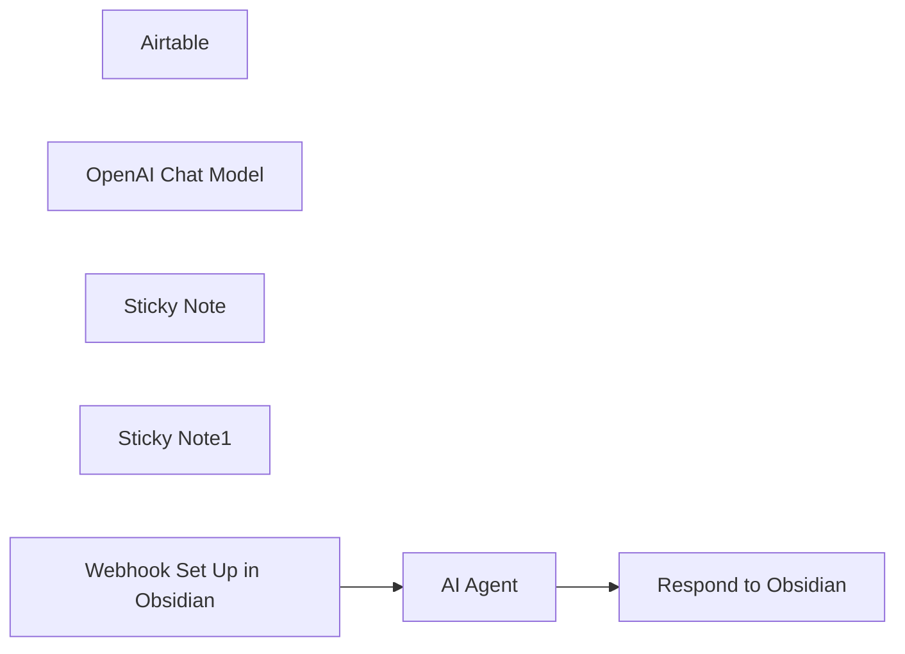

## Fluxo (.json) :

```json
{
  "id": "aZSJ2BZQhNduZZ8w",
  "meta": {
    "instanceId": "d47f3738b860eed937a1b18d7345fa2c65cf4b4957554e29477cb064a7039870",
    "templateCredsSetupCompleted": true
  },
  "name": "Get Airtable data in Obsidian Notes",
  "tags": [
    {
      "id": "zalLN3OHeRqcq4di",
      "name": "Obsidian",
      "createdAt": "2024-12-01T19:07:59.925Z",
      "updatedAt": "2024-12-01T19:07:59.925Z"
    }
  ],
  "nodes": [
    {
      "id": "584cfe61-7f1b-4deb-ab4b-45a5ffd20daf",
      "name": "Airtable",
      "type": "n8n-nodes-base.airtableTool",
      "position": [
        540,
        340
      ],
      "parameters": {
        "base": {
          "__rl": true,
          "mode": "list",
          "value": "appP3ocJy1rXIo6ko",
          "cachedResultUrl": "https://airtable.com/appP3ocJy1rXIo6ko",
          "cachedResultName": "table"
        },
        "table": {
          "__rl": true,
          "mode": "list",
          "value": "tblywtlpPtGQMTJRm",
          "cachedResultUrl": "https://airtable.com/appP3ocJy1rXIo6ko/tblywtlpPtGQMTJRm",
          "cachedResultName": "Dummy"
        },
        "options": {},
        "operation": "search"
      },
      "credentials": {
        "airtableTokenApi": {
          "id": "yiZ7ZC1md4geZovu",
          "name": "Airtable Personal Access Token account"
        }
      },
      "typeVersion": 2.1
    },
    {
      "id": "8a100c92-7971-464b-b3c0-18272f0a0bef",
      "name": "OpenAI Chat Model",
      "type": "@n8n/n8n-nodes-langchain.lmChatOpenAi",
      "position": [
        220,
        340
      ],
      "parameters": {
        "model": "gpt-4o-mini",
        "options": {}
      },
      "credentials": {
        "openAiApi": {
          "id": "q8L9oWVM7QyzYEE5",
          "name": "OpenAi account"
        }
      },
      "typeVersion": 1
    },
    {
      "id": "98887b9b-2eae-4a2e-af2b-d40c1786c5a2",
      "name": "AI Agent",
      "type": "@n8n/n8n-nodes-langchain.agent",
      "position": [
        280,
        200
      ],
      "parameters": {
        "text": "={{ $json.body.content }}",
        "options": {},
        "promptType": "define"
      },
      "typeVersion": 1.6
    },
    {
      "id": "91296976-3d78-4a9e-9f4c-a4136abcca4e",
      "name": "Sticky Note",
      "type": "n8n-nodes-base.stickyNote",
      "position": [
        -160,
        -260
      ],
      "parameters": {
        "color": 7,
        "width": 497.9113826976365,
        "height": 389.9939760040372,
        "content": "[](https://www.youtube.com/watch?v=2PIdeTgsENo)"
      },
      "typeVersion": 1
    },
    {
      "id": "7adae874-d388-4265-aff8-28a1970bd0fb",
      "name": "Sticky Note1",
      "type": "n8n-nodes-base.stickyNote",
      "position": [
        360,
        -240
      ],
      "parameters": {
        "width": 563.3824678865192,
        "height": 368.0048034646952,
        "content": "## Get Airtable Data in Obsidian with AI Agent\n<-- Watch the video to see it in action!\n\n**How to Set Up:**\n- Install the [Post Webhook Plugin](https://github.com/Masterb1234/obsidian-post-webhook/) in Obsidian.\n- Insert the n8n Webhook URL into the Post Webhook plugin settings.\n- Configure Your Airtable Node to match your workflow needs.\n\n\n**How to Use:**\n- Highlight text containing a question about your Airtable data.\n- Open the Obsidian Command Palette (Ctrl+P) and choose 'Send Selection to [Your Webhook]'.\n- Click, wait for the AI Agent to process your request, and see the result appear below your selected text."
      },
      "typeVersion": 1
    },
    {
      "id": "52c40581-656d-45b5-b366-d67cf2474312",
      "name": "Respond to Obsidian",
      "type": "n8n-nodes-base.respondToWebhook",
      "position": [
        700,
        200
      ],
      "parameters": {
        "options": {},
        "respondWith": "text",
        "responseBody": "={{ $json.output }}"
      },
      "typeVersion": 1.1
    },
    {
      "id": "f2bf502e-5e6f-4e71-8c4f-27ec2dc5ab67",
      "name": "Webhook Set Up in Obsidian",
      "type": "n8n-nodes-base.webhook",
      "position": [
        -40,
        200
      ],
      "webhookId": "59fc8248-d3f7-4dbc-bdf3-39d59e427160",
      "parameters": {
        "path": "59fc8248-d3f7-4dbc-bdf3-39d59e427160",
        "options": {},
        "httpMethod": "POST",
        "responseMode": "responseNode"
      },
      "typeVersion": 2
    }
  ],
  "active": true,
  "pinData": {},
  "settings": {
    "executionOrder": "v1"
  },
  "versionId": "dab99881-2d04-4113-9a4e-2f942fdf1c24",
  "connections": {
    "AI Agent": {
      "main": [
        [
          {
            "node": "Respond to Obsidian",
            "type": "main",
            "index": 0
          }
        ]
      ]
    },
    "Airtable": {
      "ai_tool": [
        [
          {
            "node": "AI Agent",
            "type": "ai_tool",
            "index": 0
          }
        ]
      ]
    },
    "OpenAI Chat Model": {
      "ai_languageModel": [
        [
          {
            "node": "AI Agent",
            "type": "ai_languageModel",
            "index": 0
          }
        ]
      ]
    },
    "Webhook Set Up in Obsidian": {
      "main": [
        [
          {
            "node": "AI Agent",
            "type": "main",
            "index": 0
          }
        ]
      ]
    }
  }
}
```

<a id="template-316"></a>

## Template 316 - Checagem de status online do Twitch

- **Nome:** Checagem de status online do Twitch
- **Descrição:** Fluxo para verificar se um usuário do Twitch está ao vivo consultando a API GraphQL do Twitch e avaliando o campo de stream.
- **Funcionalidade:** • Disparo manual para teste: inicia o processo manualmente para validar o fluxo.
• Fornecer nome de usuário: aceita um nome de usuário do Twitch como entrada para a verificação.
• Consulta à API do Twitch: realiza uma query GraphQL para obter informações de stream do usuário (id, contagem de espectadores, título, tipo e id do jogo).
• Determinar status online/offline: verifica se o campo de stream é nulo; qualquer valor presente indica que o usuário está online.
- **Ferramentas:** • Twitch GraphQL API: endpoint público (https://gql.twitch.tv/gql) usado para consultar dados de usuário e stream no Twitch; suporta chamadas anônimas com um client-id público utilizado pelo site.

## Fluxo visual

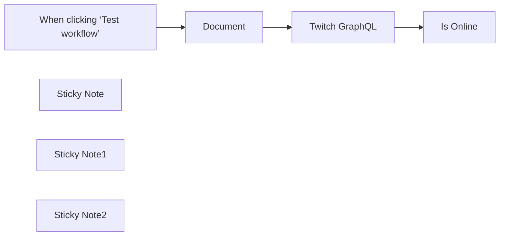

## Fluxo (.json) :

```json
{
  "nodes": [
    {
      "id": "fcd82fb8-4ba9-4379-96fd-4dca17a35fa3",
      "name": "Document",
      "type": "n8n-nodes-base.set",
      "position": [
        -600,
        240
      ],
      "parameters": {
        "options": {},
        "assignments": {
          "assignments": [
            {
              "id": "dba7b91b-17e3-4096-92aa-a6e5fe60eb55",
              "name": "twitch",
              "type": "string",
              "value": "YOUR-TWITCH-USERNAME"
            }
          ]
        }
      },
      "typeVersion": 3.4
    },
    {
      "id": "5c608f47-3d94-4c87-926f-36eb5564c778",
      "name": "Twitch GraphQL",
      "type": "n8n-nodes-base.graphql",
      "position": [
        -380,
        240
      ],
      "parameters": {
        "query": "={\n  user(login: \"{{ $('Document').item.json.twitch }}\") {\n    stream {\n      id\n      viewersCount\n      title\n      type\n      game {\n        id\n      }\n    }\n  }\n}",
        "endpoint": "https://gql.twitch.tv/gql",
        "variables": "=",
        "requestFormat": "json",
        "headerParametersUi": {
          "parameter": [
            {
              "name": "client-id",
              "value": "kimne78kx3ncx6brgo4mv6wki5h1ko"
            }
          ]
        }
      },
      "typeVersion": 1
    },
    {
      "id": "fcc08d0d-33ea-427c-bdea-2e219baa7191",
      "name": "Is Online",
      "type": "n8n-nodes-base.if",
      "position": [
        -160,
        240
      ],
      "parameters": {
        "options": {},
        "conditions": {
          "options": {
            "version": 2,
            "leftValue": "",
            "caseSensitive": true,
            "typeValidation": "strict"
          },
          "combinator": "and",
          "conditions": [
            {
              "id": "311e3b31-03e7-4763-8b4a-ebc9a18b77fd",
              "operator": {
                "type": "object",
                "operation": "notEmpty",
                "singleValue": true
              },
              "leftValue": "={{ $json.data.user.stream }}",
              "rightValue": ""
            }
          ]
        }
      },
      "typeVersion": 2.2
    },
    {
      "id": "95dd5830-accb-41a6-9790-d43324da1156",
      "name": "When clicking ‘Test workflow’",
      "type": "n8n-nodes-base.manualTrigger",
      "position": [
        -860,
        240
      ],
      "parameters": {},
      "typeVersion": 1
    },
    {
      "id": "fa6b56b3-4ed5-4a3d-a549-654e226b535e",
      "name": "Sticky Note",
      "type": "n8n-nodes-base.stickyNote",
      "position": [
        -680,
        40
      ],
      "parameters": {
        "content": "The document node serves as sample source for `twitch` username to check\n"
      },
      "typeVersion": 1
    },
    {
      "id": "3b151013-eebd-4f9e-99f1-71d4c1d25774",
      "name": "Sticky Note1",
      "type": "n8n-nodes-base.stickyNote",
      "position": [
        -460,
        420
      ],
      "parameters": {
        "content": "the value of `client-id` parameter is a fixed known value used by twitch for anonymous call used in their website\n"
      },
      "typeVersion": 1
    },
    {
      "id": "39578fdc-f0b8-449f-9246-980dd181d058",
      "name": "Sticky Note2",
      "type": "n8n-nodes-base.stickyNote",
      "position": [
        -240,
        40
      ],
      "parameters": {
        "content": "we need only to check the value of `stream` if `null` to know if the user offline. Any value will denote the user is online"
      },
      "typeVersion": 1
    }
  ],
  "pinData": {},
  "connections": {
    "Document": {
      "main": [
        [
          {
            "node": "Twitch GraphQL",
            "type": "main",
            "index": 0
          }
        ]
      ]
    },
    "Twitch GraphQL": {
      "main": [
        [
          {
            "node": "Is Online",
            "type": "main",
            "index": 0
          }
        ]
      ]
    },
    "When clicking ‘Test workflow’": {
      "main": [
        [
          {
            "node": "Document",
            "type": "main",
            "index": 0
          }
        ]
      ]
    }
  }
}
```

<a id="template-317"></a>

## Template 317 - Receber webhooks de pagamento do Ko-fi

- **Nome:** Receber webhooks de pagamento do Ko-fi
- **Descrição:** Recebe webhooks de pagamentos enviados pelo Ko-fi, valida o token de verificação e encaminha os dados para tratamentos diferentes conforme o tipo de pagamento.
- **Funcionalidade:** • Recepção de webhook HTTP POST: Escuta requisições enviadas pela plataforma Ko-fi.
• Preparação do payload: Extrai e normaliza o corpo útil da requisição para uso posterior.
• Validação do token de verificação: Compara o token recebido com o token configurado para garantir autenticidade.
• Roteamento por tipo de pagamento: Direciona o fluxo conforme o campo "type" (Donation, Subscription, Shop Order).
• Mapeamento de campos por tipo: Cria objetos com campos relevantes (nome, mensagem, valor, moeda, email, itens de loja, etc.) para cada tipo de evento.
• Tratamento de assinaturas: Verifica se o pagamento de assinatura é o primeiro pagamento e encaminha de acordo.
• Falha controlada: Interrompe e retorna erro quando o token de verificação é inválido, evitando processamento indevido.
- **Ferramentas:** • Ko-fi: Plataforma que envia webhooks de pagamentos, doações, assinaturas e pedidos de loja contendo os dados do evento.

## Fluxo visual

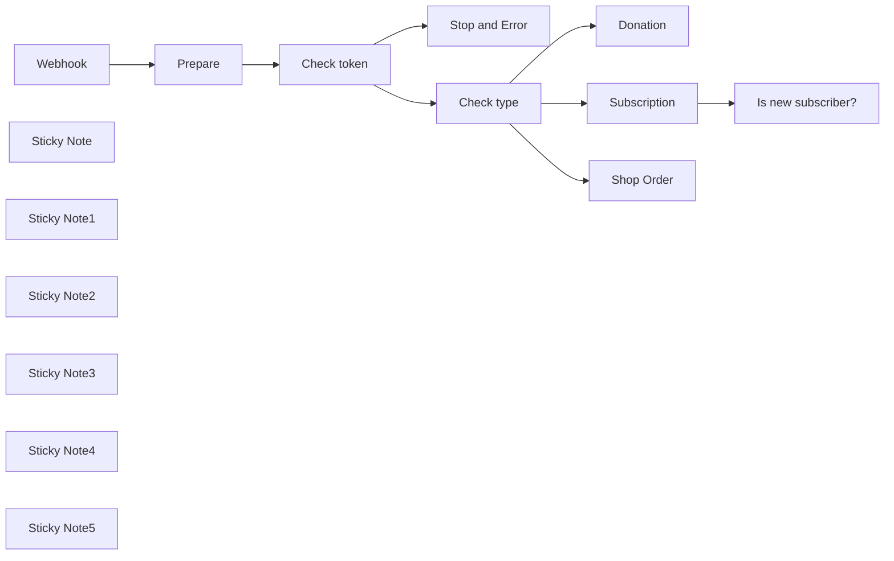

## Fluxo (.json) :

```json
{
  "meta": {
    "instanceId": "568298fde06d3db80a2eea77fe5bf45f0c7bb898dea20b769944e9ac7c6c5a80"
  },
  "nodes": [
    {
      "id": "99bbf837-2834-4cae-af13-37b6cdf963bb",
      "name": "Webhook",
      "type": "n8n-nodes-base.webhook",
      "position": [
        -480,
        -40
      ],
      "webhookId": "83f4e1de-2011-487c-a9f7-be6ccbac0782",
      "parameters": {
        "path": "83f4e1de-2011-487c-a9f7-be6ccbac0782",
        "options": {},
        "httpMethod": "POST"
      },
      "typeVersion": 2
    },
    {
      "id": "0f7c13ea-196b-40a7-bf1e-4829caaaba4c",
      "name": "Stop and Error",
      "type": "n8n-nodes-base.stopAndError",
      "position": [
        180,
        60
      ],
      "parameters": {
        "errorMessage": "Invalid verification token"
      },
      "typeVersion": 1
    },
    {
      "id": "7ddb4cfc-5917-4b19-acf8-c7db3eaab56a",
      "name": "Donation",
      "type": "n8n-nodes-base.set",
      "position": [
        400,
        -420
      ],
      "parameters": {
        "options": {},
        "assignments": {
          "assignments": [
            {
              "id": "67607a8e-55e2-46ec-92f5-1c8ef3addf9c",
              "name": "from_name",
              "type": "string",
              "value": "={{ $json.body.from_name }}"
            },
            {
              "id": "3e6e86ac-b6c2-4b5f-9e33-22367b9fb9e5",
              "name": "message",
              "type": "string",
              "value": "={{ $json.body.message }}"
            },
            {
              "id": "4973525a-21b0-442c-8919-24c312f3ff0c",
              "name": "amount",
              "type": "string",
              "value": "={{ $json.body.amount }}"
            },
            {
              "id": "b7e2d9e1-61c2-4ad1-9cbd-d8a754993fbe",
              "name": "url",
              "type": "string",
              "value": "={{ $json.body.email }}"
            },
            {
              "id": "da26860f-c1c4-4918-9447-ed080e921fe7",
              "name": "currency",
              "type": "string",
              "value": "={{ $json.body.currency }}"
            },
            {
              "id": "380dbd53-eb04-4659-aa54-b6bde0ba7034",
              "name": "is_public",
              "type": "string",
              "value": "={{ $json.body.is_public }}"
            },
            {
              "id": "4fd65c21-3043-4513-96b3-d2e11656e94a",
              "name": "timestamp",
              "type": "string",
              "value": "={{ $json.body.timestamp }}"
            }
          ]
        }
      },
      "typeVersion": 3.4
    },
    {
      "id": "9c29ae0e-d80c-4613-ba11-535cc59d5603",
      "name": "Subscription",
      "type": "n8n-nodes-base.set",
      "position": [
        400,
        -140
      ],
      "parameters": {
        "options": {},
        "assignments": {
          "assignments": [
            {
              "id": "886b9cca-15b1-49b4-a123-6f3ceb46279e",
              "name": "timestamp",
              "type": "string",
              "value": "={{ $json.body.timestamp }}"
            },
            {
              "id": "3c4d9c0e-3cd6-41d2-8223-c48f1dcccedc",
              "name": "from_name",
              "type": "string",
              "value": "={{ $json.body.from_name }}"
            },
            {
              "id": "7199ad4d-06ad-4bed-939b-e97d6d118d9b",
              "name": "message",
              "type": "string",
              "value": "={{ $json.body.message }}"
            },
            {
              "id": "270eeac1-b7f9-4cfb-9ac8-b0799b36482e",
              "name": "amount",
              "type": "string",
              "value": "={{ $json.body.amount }}"
            },
            {
              "id": "dbf3a671-715c-4e29-96d5-2767b6a620d8",
              "name": "url",
              "type": "string",
              "value": "={{ $json.body.url }}"
            },
            {
              "id": "79ae8427-e5fe-470f-bdc0-df0d8bcbad00",
              "name": "email",
              "type": "string",
              "value": "={{ $json.body.email }}"
            },
            {
              "id": "90c73e4d-197a-4ba3-b6fb-b7b79b62e69c",
              "name": "currency",
              "type": "string",
              "value": "={{ $json.body.currency }}"
            },
            {
              "id": "3e23aaad-70f4-429b-bee1-3ae0156aaa86",
              "name": "is_first_subscription_payment",
              "type": "string",
              "value": "={{ $json.body.is_first_subscription_payment }}"
            },
            {
              "id": "3ca5ca22-d8b7-4a90-a97e-aaed032ef705",
              "name": "tier_name",
              "type": "string",
              "value": "={{ $json.body.tier_name }}"
            },
            {
              "id": "1347258b-1f6d-4d44-bd64-95fb948cbff9",
              "name": "is_public",
              "type": "string",
              "value": "={{ $json.body.is_public }}"
            }
          ]
        }
      },
      "typeVersion": 3.4
    },
    {
      "id": "a050d88e-bbe8-4ee1-b1c6-31782b5b2f20",
      "name": "Shop Order",
      "type": "n8n-nodes-base.set",
      "position": [
        400,
        140
      ],
      "parameters": {
        "options": {},
        "assignments": {
          "assignments": [
            {
              "id": "9f2d01f6-d172-4aea-b2ea-e64857592191",
              "name": "from_name",
              "type": "string",
              "value": "={{ $json.body.from_name }}"
            },
            {
              "id": "bbc1fcba-ec29-4599-9d78-4e1a37ecede3",
              "name": "amount",
              "type": "string",
              "value": "={{ $json.body.amount }}"
            },
            {
              "id": "2ea190ac-700b-4682-9baa-7d733f89b819",
              "name": "email",
              "type": "string",
              "value": "={{ $json.body.email }}"
            },
            {
              "id": "eb0af9d5-9650-4457-b0fd-44f679972a79",
              "name": "currency",
              "type": "string",
              "value": "={{ $json.body.currency }}"
            },
            {
              "id": "9acec88b-61d5-4520-bf51-f71b4e2e26f6",
              "name": "shop_items",
              "type": "array",
              "value": "={{ $json.body.shop_items }}"
            },
            {
              "id": "2e1fb035-b32c-492f-9705-7159ef0b2c5d",
              "name": "url",
              "type": "string",
              "value": "={{ $json.body.url }}"
            }
          ]
        }
      },
      "typeVersion": 3.4
    },
    {
      "id": "f9926fda-9a37-467e-b86b-ce9dbb051a88",
      "name": "Is new subscriber?",
      "type": "n8n-nodes-base.if",
      "position": [
        620,
        -140
      ],
      "parameters": {
        "options": {},
        "conditions": {
          "options": {
            "version": 2,
            "leftValue": "",
            "caseSensitive": true,
            "typeValidation": "strict"
          },
          "combinator": "and",
          "conditions": [
            {
              "id": "87fbcc71-a0a4-4820-bb67-9551d44e0500",
              "operator": {
                "name": "filter.operator.equals",
                "type": "string",
                "operation": "equals"
              },
              "leftValue": "={{ $json.is_first_subscription_payment }}",
              "rightValue": "true"
            }
          ]
        }
      },
      "typeVersion": 2.2
    },
    {
      "id": "b158a59d-5166-4469-b999-5235768855c0",
      "name": "Prepare",
      "type": "n8n-nodes-base.set",
      "position": [
        -260,
        -40
      ],
      "parameters": {
        "options": {},
        "assignments": {
          "assignments": [
            {
              "id": "aabaa149-d74b-464c-bbb6-12e2e8a884d9",
              "name": "verificationToken",
              "type": "string",
              "value": "7dd9d4ef-8412-4add-a0d0-b548ad4564b9"
            },
            {
              "id": "c2f7a7ce-99b0-44c7-b2cf-1ebf85e0917d",
              "name": "body",
              "type": "object",
              "value": "={{ $json.body.data }}"
            }
          ]
        }
      },
      "typeVersion": 3.4
    },
    {
      "id": "a4fd9607-6d5b-4fbd-a4ce-53e9960887e0",
      "name": "Check token",
      "type": "n8n-nodes-base.if",
      "position": [
        -40,
        -40
      ],
      "parameters": {
        "options": {},
        "conditions": {
          "options": {
            "version": 2,
            "leftValue": "",
            "caseSensitive": true,
            "typeValidation": "strict"
          },
          "combinator": "and",
          "conditions": [
            {
              "id": "439af86e-c768-4165-ae64-86cd32a07084",
              "operator": {
                "name": "filter.operator.equals",
                "type": "string",
                "operation": "equals"
              },
              "leftValue": "={{ $json.body.verification_token }}",
              "rightValue": "={{ $json.verificationToken }}"
            }
          ]
        }
      },
      "typeVersion": 2.2
    },
    {
      "id": "6c34228e-434c-4ab3-b0ce-0b5c1721ffc8",
      "name": "Check type",
      "type": "n8n-nodes-base.switch",
      "position": [
        180,
        -140
      ],
      "parameters": {
        "rules": {
          "values": [
            {
              "conditions": {
                "options": {
                  "version": 2,
                  "leftValue": "",
                  "caseSensitive": true,
                  "typeValidation": "strict"
                },
                "combinator": "and",
                "conditions": [
                  {
                    "id": "edd5eaa2-60c7-459a-9846-b952b390b1db",
                    "operator": {
                      "type": "string",
                      "operation": "equals"
                    },
                    "leftValue": "={{ $json.body.type }}",
                    "rightValue": "Donation"
                  }
                ]
              }
            },
            {
              "conditions": {
                "options": {
                  "version": 2,
                  "leftValue": "",
                  "caseSensitive": true,
                  "typeValidation": "strict"
                },
                "combinator": "and",
                "conditions": [
                  {
                    "id": "0cc7f0bf-4d1b-45a5-88ed-5b84050222f8",
                    "operator": {
                      "name": "filter.operator.equals",
                      "type": "string",
                      "operation": "equals"
                    },
                    "leftValue": "={{ $json.body.type }}",
                    "rightValue": "Subscription"
                  }
                ]
              }
            },
            {
              "conditions": {
                "options": {
                  "version": 2,
                  "leftValue": "",
                  "caseSensitive": true,
                  "typeValidation": "strict"
                },
                "combinator": "and",
                "conditions": [
                  {
                    "id": "a1b74233-7700-434b-be5c-76129c4cd88c",
                    "operator": {
                      "name": "filter.operator.equals",
                      "type": "string",
                      "operation": "equals"
                    },
                    "leftValue": "={{ $json.body.type }}",
                    "rightValue": "Shop Order"
                  }
                ]
              }
            }
          ]
        },
        "options": {}
      },
      "typeVersion": 3.2
    },
    {
      "id": "87fd0134-5eb4-4c47-acb5-137f24e819f4",
      "name": "Sticky Note",
      "type": "n8n-nodes-base.stickyNote",
      "position": [
        -300,
        -140
      ],
      "parameters": {
        "color": 6,
        "width": 200,
        "height": 260,
        "content": "### Set verification token\nSet your Ko-fi  verification token in this node. Available [here](https://ko-fi.com/manage/webhooks)."
      },
      "typeVersion": 1
    },
    {
      "id": "78ac15cb-1336-424e-a235-6e7a66090b9d",
      "name": "Sticky Note1",
      "type": "n8n-nodes-base.stickyNote",
      "position": [
        -520,
        -140
      ],
      "parameters": {
        "color": 6,
        "width": 200,
        "height": 260,
        "content": "### Setup your webhook\nFind your webhook URL in this node and set it  [here](https://ko-fi.com/manage/webhooks)."
      },
      "typeVersion": 1
    },
    {
      "id": "30892b66-66fb-4926-b817-e280cbadf5ea",
      "name": "Sticky Note2",
      "type": "n8n-nodes-base.stickyNote",
      "position": [
        360,
        -520
      ],
      "parameters": {
        "color": 7,
        "width": 540,
        "height": 260,
        "content": "### We received a donation\nDo your thing."
      },
      "typeVersion": 1
    },
    {
      "id": "3b849d93-ffa5-4dfe-8743-d43ca7d06e60",
      "name": "Sticky Note3",
      "type": "n8n-nodes-base.stickyNote",
      "position": [
        360,
        -240
      ],
      "parameters": {
        "color": 7,
        "width": 540,
        "height": 260,
        "content": "### We received a payment for a subscription\nDo your thing."
      },
      "typeVersion": 1
    },
    {
      "id": "bff1913d-1c18-4447-8448-aa059d7b020f",
      "name": "Sticky Note4",
      "type": "n8n-nodes-base.stickyNote",
      "position": [
        360,
        40
      ],
      "parameters": {
        "color": 7,
        "width": 540,
        "height": 260,
        "content": "### We received a shop order\nDo your thing."
      },
      "typeVersion": 1
    },
    {
      "id": "07da890d-5cc8-4f51-b0c2-c50831c84a64",
      "name": "Sticky Note5",
      "type": "n8n-nodes-base.stickyNote",
      "position": [
        -520,
        -560
      ],
      "parameters": {
        "width": 860,
        "height": 400,
        "content": "## Receive and handle Ko-fi payment webhooks \nThis workflow receives [Ko-fi payment webhooks](https://ko-fi.com/manage/webhooks), checks the verification token and then check what kind of payment it is.\n\n### Set up\n1. Edit the `Webhook` node and find your webhook URL.\n2. Go to your [Ko-fi webhooks settings](https://ko-fi.com/manage/webhooks) and set your URL\n3. Get your `verification token` from the same page (under advanced) and set it in the `Prepare` node\n4. Enable your workflow and test it from [Ko-fi webhooks settings](https://ko-fi.com/manage/webhooks)\n5. Profit 🎉\n\n**👋 Hello! I'm Audun / xqus** \n🔗 My work: [xqus.com](https://xqus.com)\n💸 n8n shop: [xqus.gumroad.com](https://xqus.gumroad.com)\n\n### Want to trigger my workflow?\nSupport my work on [Ko-fi](https://ko-fi.com/xquscom) 💸"
      },
      "typeVersion": 1
    }
  ],
  "pinData": {},
  "connections": {
    "Prepare": {
      "main": [
        [
          {
            "node": "Check token",
            "type": "main",
            "index": 0
          }
        ]
      ]
    },
    "Webhook": {
      "main": [
        [
          {
            "node": "Prepare",
            "type": "main",
            "index": 0
          }
        ]
      ]
    },
    "Check type": {
      "main": [
        [
          {
            "node": "Donation",
            "type": "main",
            "index": 0
          }
        ],
        [
          {
            "node": "Subscription",
            "type": "main",
            "index": 0
          }
        ],
        [
          {
            "node": "Shop Order",
            "type": "main",
            "index": 0
          }
        ]
      ]
    },
    "Check token": {
      "main": [
        [
          {
            "node": "Check type",
            "type": "main",
            "index": 0
          }
        ],
        [
          {
            "node": "Stop and Error",
            "type": "main",
            "index": 0
          }
        ]
      ]
    },
    "Subscription": {
      "main": [
        [
          {
            "node": "Is new subscriber?",
            "type": "main",
            "index": 0
          }
        ]
      ]
    }
  }
}
```

<a id="template-318"></a>

## Template 318 - Salvar resultados como notas Markdown no Obsidian via Google Drive

- **Nome:** Salvar resultados como notas Markdown no Obsidian via Google Drive
- **Descrição:** Automatiza a criação e atualização de notas Markdown (com frontmatter) e anexos em uma pasta do Google Drive que é sincronizada com um Vault do Obsidian, podendo usar agentes de IA para compor conteúdo e metadados.
- **Funcionalidade:** • Receber resultados de qualquer fluxo: Aceita dados de entrada enviados para o gatilho de execução do fluxo.
• Geração de nota Zettelkasten por IA: Converte JSON de entrada em uma nota atômica com título, conteúdo, tags e referências usando agentes de linguagem.
• Criação de frontmatter YAML por IA: Gera metadados estruturados (título, data, tags, aliases, status, fonte) a partir do conteúdo.
• Reestruturação de JSON: Mapeia a saída da IA para campos usados na nota (title, content, frontmatter, references).
• Salvar nota Markdown no Google Drive: Cria/atualiza arquivos .md com frontmatter e conteúdo usando um template.
• Salvar anexos binários: Detecta e envia attachments binários para a mesma pasta de Drive quando presentes.
• Integração com Obsidian via sincronia e symlink: Recomenda sincronizar a pasta do Google Drive ao desktop e criar um symlink no Vault para que notas e anexos apareçam e se atualizem no Obsidian.
• Fluxo opcional com agentes de IA: Permite inserir agentes para compor título, frontmatter e corpo em vez de usar apenas campos JSON.
- **Ferramentas:** • Google Drive: Armazena os arquivos Markdown e anexos, servindo como pasta sincronizada entre nuvem e desktop.
• Obsidian Vault: Repositório local onde as notas Markdown aparecem ao vincular a pasta do Drive via symlink.
• Google Drive for Desktop (sincronização): Sincroniza a pasta do Drive com o sistema de arquivos local para integração com o Vault.
• OpenAI (modelos de linguagem): Gera notas Zettelkasten e frontmatter YAML a partir dos dados de entrada.
• Sistema operacional (por exemplo, Windows): Uso de comando de symlink (mklink) para criar ligação entre a pasta do Drive e o Vault local.

## Fluxo visual

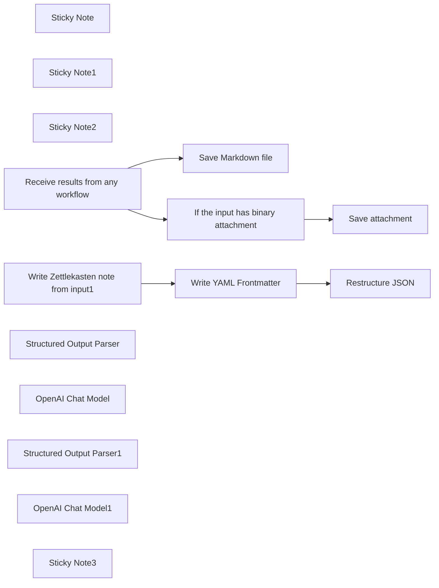

## Fluxo (.json) :

```json
{
  "id": "3wbxkdT6hilhq0Na",
  "meta": {
    "instanceId": "d47f3738b860eed937a1b18d7345fa2c65cf4b4957554e29477cb064a7039870"
  },
  "name": "Workflow Results to Markdown Notes in Your Obsidian Vault, via Google Drive",
  "tags": [],
  "nodes": [
    {
      "id": "be787ece-4118-4063-98b0-41672dd570c0",
      "name": "Sticky Note",
      "type": "n8n-nodes-base.stickyNote",
      "position": [
        560,
        -480
      ],
      "parameters": {
        "width": 440,
        "height": 680,
        "content": "## Connect folder to Obsidian Vault \n**Setup Instructions:**\n- Create a folder in your Google Drive that syncs with your desktop.\n- Configure the Google Drive node as follows:\n   - Assign the newly created folder as the parent-folder.\n   - Specify the filename, appending .md (e.g., `{{ $json.title }}.md`).\n   - Add Markdown content, including optional YAML Frontmatter, in the File Content field.\n- Establish a Symlink between the Google Drive folder and a new folder in your Obsidian Vault."
      },
      "typeVersion": 1
    },
    {
      "id": "a30f3fdc-95a1-44ff-844a-58353dc7e177",
      "name": "Sticky Note1",
      "type": "n8n-nodes-base.stickyNote",
      "position": [
        -800,
        -480
      ],
      "parameters": {
        "width": 440,
        "height": 680,
        "content": "## Workflow results to Obsidian Vault \nThis template automatically creates and updates notes in your Obsidian Vault in real-time from n8n workflow results. Markdown files and attachments saved in Google Drive instantly appear in your Obsidian Vault.\n\n**Send the output of any workflow to the Execute Workflow Trigger beow**"
      },
      "typeVersion": 1
    },
    {
      "id": "d9527913-dad1-4abc-8c86-8c76f53dd513",
      "name": "Save Markdown file",
      "type": "n8n-nodes-base.googleDrive",
      "position": [
        740,
        0
      ],
      "parameters": {
        "name": "={{ $json.title }}.md",
        "content": "=---\n{{ $json.frontmatter }}\n---\n{{ $json.content }}",
        "driveId": {
          "__rl": true,
          "mode": "list",
          "value": "My Drive",
          "cachedResultUrl": "https://drive.google.com/drive/my-drive",
          "cachedResultName": "My Drive"
        },
        "options": {},
        "folderId": {
          "__rl": true,
          "mode": "list",
          "value": "15dvUtfSjaCCXmnOVeIUfeyRd_raI3PnQ",
          "cachedResultUrl": "https://drive.google.com/drive/folders/15dvUtfSjaCCXmnOVeIUfeyRd_raI3PnQ",
          "cachedResultName": "clippings-attachments"
        },
        "operation": "createFromText"
      },
      "credentials": {
        "googleDriveOAuth2Api": {
          "id": "Vpmg4nRArCy8DHiE",
          "name": "Google Drive account"
        }
      },
      "typeVersion": 3
    },
    {
      "id": "6484937e-17fd-444c-916b-1527382927d4",
      "name": "Sticky Note2",
      "type": "n8n-nodes-base.stickyNote",
      "position": [
        1020,
        -380
      ],
      "parameters": {
        "color": 3,
        "width": 460,
        "height": 540,
        "content": "## Create Symlink\nCreate a symlink to integrate your Google Drive Desktop folder with your Obsidian Vault, ensuring that workflow-generated notes stored in Google Drive instantly appear and update in Obsidian.\n\n- **Open an Administrator Command Prompt:**\nPress `Win + S`, type `cmd`, right-click on Command Prompt, and select `Run as Administrator`.\n\n- **Get Folder Paths:**\nIdentify the source path: This is the existing Google Drive folder you want to link to.\nDecide on the target path: This is the folder in your Obsidian Vault where the symlink will be created.\nEnsure the Target Path Does Not Already Exist\n\n- **Run the mklink Command:**\nUse the following syntax to create a directory symbolic link:\n`mklink /D \"Target Path\" \"Source Path\"`\nThe target path is the location in your Vault where the symlink will be created. The source path is the Google Drive folder.\n\n- **Example Command:**\n`mklink /D \"C:\\Users\\YourName\\Vault\\OtherFolder\" \"C:\\Users\\YourName\\Google Drive\\MyFolder\"`"
      },
      "typeVersion": 1
    },
    {
      "id": "fe21a7c2-e8db-46be-87e7-63888bf6e9e7",
      "name": "Receive results from any workflow",
      "type": "n8n-nodes-base.executeWorkflowTrigger",
      "position": [
        -660,
        0
      ],
      "parameters": {},
      "typeVersion": 1
    },
    {
      "id": "8f2399ba-0bda-4a2e-b773-7e28df16e7c2",
      "name": "If the input has binary attachment",
      "type": "n8n-nodes-base.if",
      "position": [
        20,
        -160
      ],
      "parameters": {
        "options": {},
        "conditions": {
          "options": {
            "version": 2,
            "leftValue": "",
            "caseSensitive": true,
            "typeValidation": "strict"
          },
          "combinator": "and",
          "conditions": [
            {
              "id": "9f56b367-2313-4a92-9572-b2d2687aba71",
              "operator": {
                "type": "string",
                "operation": "exists",
                "singleValue": true
              },
              "leftValue": "={{$json[\"binary\"]}}",
              "rightValue": ""
            }
          ]
        }
      },
      "typeVersion": 2.2
    },
    {
      "id": "d7cae1d6-5bfe-4e69-8257-0f7947b51c96",
      "name": "Write Zettlekasten note from input1",
      "type": "@n8n/n8n-nodes-langchain.agent",
      "position": [
        -280,
        240
      ],
      "parameters": {
        "text": "={{ JSON.stringify($json) }}",
        "options": {
          "systemMessage": "You are an expert knowledge management assistant creating a Zettlekasten note from raw input data. Follow these precise steps:\n\n1. Extract key insights and meaningful connections from the provided JSON input.\n\n2. Structure the note using these Zettlekasten principles:\n- Create a clear, atomic central idea\n- Use precise, concise language\n- Link potential connections to other knowledge domains\n- Ensure the note can stand alone as a meaningful knowledge unit\n\n3. Note format:\n- Unique ID: Generate a unique identifier \n- Title: Concise, descriptive headline capturing core insight\n- Content: Synthesized information with clear reasoning\n- Tags: Relevant conceptual tags for future retrieval\n- References: Source of original data (optional)\n\n4. Prioritize intellectual clarity, semantic depth, and potential for future knowledge expansion.\n\nRespond ONLY with the completed Zettlekasten note in JSON format. Do not include any additional commentary or explanation."
        },
        "promptType": "define",
        "hasOutputParser": true
      },
      "typeVersion": 1.7
    },
    {
      "id": "303d6633-8e98-4fbc-8ee1-9f1075bcaa3e",
      "name": "Structured Output Parser",
      "type": "@n8n/n8n-nodes-langchain.outputParserStructured",
      "position": [
        -100,
        420
      ],
      "parameters": {
        "schemaType": "manual",
        "inputSchema": "{\n  \"title\": \"Concise, Descriptive Title\",\n  \"content\": \"Synthesized insights and key information\"\n}"
      },
      "typeVersion": 1.2
    },
    {
      "id": "62800f09-8659-47b8-9a85-7d3d2c07ec1a",
      "name": "OpenAI Chat Model",
      "type": "@n8n/n8n-nodes-langchain.lmChatOpenAi",
      "position": [
        -300,
        420
      ],
      "parameters": {
        "options": {}
      },
      "credentials": {
        "openAiApi": {
          "id": "q8L9oWVM7QyzYEE5",
          "name": "OpenAi account"
        }
      },
      "typeVersion": 1
    },
    {
      "id": "df11dfcb-fb38-4796-9b28-eb1876f68261",
      "name": "Restructure JSON",
      "type": "n8n-nodes-base.set",
      "position": [
        400,
        240
      ],
      "parameters": {
        "options": {},
        "assignments": {
          "assignments": [
            {
              "id": "c9061623-d0d0-4b63-a166-4766d88992aa",
              "name": "title",
              "type": "string",
              "value": "={{ $('Write Zettlekasten note from input1').item.json.output.title }}"
            },
            {
              "id": "9f870307-3cbf-41b3-ba69-309610b2d020",
              "name": "content",
              "type": "string",
              "value": "={{ $('Write Zettlekasten note from input1').item.json.output.content }}"
            },
            {
              "id": "1f40b120-00e4-479f-85b0-3fd903e629cb",
              "name": "frontmatter",
              "type": "string",
              "value": "={{ $json.output.frontmatter }}"
            },
            {
              "id": "5b845683-5a25-486b-92b0-98990fcbf7af",
              "name": "references",
              "type": "string",
              "value": "={{ $('Write Zettlekasten note from input1').item.json.output.references }}"
            }
          ]
        }
      },
      "typeVersion": 3.4
    },
    {
      "id": "2a701cf8-e59d-47ae-83c6-9ac7148bd2c8",
      "name": "Structured Output Parser1",
      "type": "@n8n/n8n-nodes-langchain.outputParserStructured",
      "position": [
        240,
        420
      ],
      "parameters": {
        "jsonSchemaExample": "{\n\t\"frontmatter\": \"frontmatter here\"\n}"
      },
      "typeVersion": 1.2
    },
    {
      "id": "1e4da42e-e945-4be8-88ac-2579857ff3fa",
      "name": "OpenAI Chat Model1",
      "type": "@n8n/n8n-nodes-langchain.lmChatOpenAi",
      "position": [
        60,
        420
      ],
      "parameters": {
        "options": {}
      },
      "credentials": {
        "openAiApi": {
          "id": "q8L9oWVM7QyzYEE5",
          "name": "OpenAi account"
        }
      },
      "typeVersion": 1
    },
    {
      "id": "af5494d8-a53f-48b1-b939-210c882485be",
      "name": "Sticky Note3",
      "type": "n8n-nodes-base.stickyNote",
      "position": [
        -340,
        100
      ],
      "parameters": {
        "color": 4,
        "width": 880,
        "height": 460,
        "content": "## Optional - Use AI Agents for Note Composition\nInstead of directly using JSON parameters for the note's title, YAML frontmatter, and content, you can utilize AI agents to compose these elements. This approach involves inserting the AI-assisted workflow between the webhook and the Google Drive note, instead of the direct connection.\n"
      },
      "typeVersion": 1
    },
    {
      "id": "5d184ea4-88d0-4658-ab94-55246f3507fc",
      "name": "Write YAML Frontmatter",
      "type": "@n8n/n8n-nodes-langchain.agent",
      "position": [
        60,
        240
      ],
      "parameters": {
        "text": "={{ $json.output.content }}",
        "options": {
          "systemMessage": "=Generate comprehensive YAML frontmatter for an Obsidian note, focusing on metadata extraction and organization.\n\nOutput Format:\n```yaml\ntitle: \"{Extract a clear, concise title from input data}\"\ndate: {{ $now.toFormat('yyyy-MM-dd') }}\n\ntags:\n - {Derive 3-4 most relevant conceptual tags}\naliases:\n - {Alternative titles or key phrases}\nstatus: \"draft\"\nsource: \"{Infer original data source if possible}\""
        },
        "promptType": "define",
        "hasOutputParser": true
      },
      "typeVersion": 1.7
    },
    {
      "id": "d2b291be-97af-4bcb-8cc6-b21439bdcfb9",
      "name": "Save attachment",
      "type": "n8n-nodes-base.googleDrive",
      "position": [
        740,
        -180
      ],
      "parameters": {
        "name": "=",
        "driveId": {
          "__rl": true,
          "mode": "list",
          "value": "My Drive",
          "cachedResultUrl": "https://drive.google.com/drive/my-drive",
          "cachedResultName": "My Drive"
        },
        "options": {},
        "folderId": {
          "__rl": true,
          "mode": "list",
          "value": "15dvUtfSjaCCXmnOVeIUfeyRd_raI3PnQ",
          "cachedResultUrl": "https://drive.google.com/drive/folders/15dvUtfSjaCCXmnOVeIUfeyRd_raI3PnQ",
          "cachedResultName": "clippings-attachments"
        },
        "inputDataFieldName": "=data"
      },
      "credentials": {
        "googleDriveOAuth2Api": {
          "id": "Vpmg4nRArCy8DHiE",
          "name": "Google Drive account"
        }
      },
      "typeVersion": 3
    }
  ],
  "active": false,
  "pinData": {
    "Write Zettlekasten note from input1": [
      {
        "json": {
          "output": {
            "id": "note-0235",
            "tags": [
              "Freelance",
              "Employment Trends",
              "Media Industry",
              "Permanent Contracts"
            ],
            "title": "Shift from Freelancers to Permanent Contracts in Media",
            "content": "Recent developments in the media sector indicate a notable trend where freelancers are increasingly being offered permanent contracts, reflecting a shift in employment practices within the industry. This transition aligns with new leadership changes at prominent companies such as WPG Uitgevers and Mybusinessmedia, which may further influence operational dynamics. Additionally, the appointment of Marc Veeningen as the new editor-in-chief of Talpa Networks signifies fresh perspectives in media management, potentially impacting staffing strategies. This trend not only addresses the job security concerns of freelancers but also suggests a recalibration of talent acquisition by media organizations. Such evolutions warrant closer examination of the balance between flexibility and stability in the workforce.",
            "references": "Source: https://www.villamedia.nl/artikel/transfer-thursday-freelancers-naar-vast-contract-een-mooie-klus-bij-de-volkskrant-en-een-nieuwe-directeur-bij-wpg"
          }
        }
      }
    ]
  },
  "settings": {
    "executionOrder": "v1"
  },
  "versionId": "c87bbecc-453d-4b8c-8b86-dcf7e1d6907b",
  "connections": {
    "Restructure JSON": {
      "main": [
        []
      ]
    },
    "OpenAI Chat Model": {
      "ai_languageModel": [
        [
          {
            "node": "Write Zettlekasten note from input1",
            "type": "ai_languageModel",
            "index": 0
          }
        ]
      ]
    },
    "OpenAI Chat Model1": {
      "ai_languageModel": [
        [
          {
            "node": "Write YAML Frontmatter",
            "type": "ai_languageModel",
            "index": 0
          }
        ]
      ]
    },
    "Save Markdown file": {
      "main": [
        []
      ]
    },
    "Write YAML Frontmatter": {
      "main": [
        [
          {
            "node": "Restructure JSON",
            "type": "main",
            "index": 0
          }
        ]
      ]
    },
    "Structured Output Parser": {
      "ai_outputParser": [
        [
          {
            "node": "Write Zettlekasten note from input1",
            "type": "ai_outputParser",
            "index": 0
          }
        ]
      ]
    },
    "Structured Output Parser1": {
      "ai_outputParser": [
        [
          {
            "node": "Write YAML Frontmatter",
            "type": "ai_outputParser",
            "index": 0
          }
        ]
      ]
    },
    "Receive results from any workflow": {
      "main": [
        [
          {
            "node": "If the input has binary attachment",
            "type": "main",
            "index": 0
          },
          {
            "node": "Save Markdown file",
            "type": "main",
            "index": 0
          }
        ]
      ]
    },
    "If the input has binary attachment": {
      "main": [
        [
          {
            "node": "Save attachment",
            "type": "main",
            "index": 0
          }
        ]
      ]
    },
    "Write Zettlekasten note from input1": {
      "main": [
        [
          {
            "node": "Write YAML Frontmatter",
            "type": "main",
            "index": 0
          }
        ]
      ]
    }
  }
}
```

<a id="template-319"></a>

## Template 319 - Alerta de novos vídeos no Telegram

- **Nome:** Alerta de novos vídeos no Telegram
- **Descrição:** Verifica periodicamente um canal do YouTube e envia no Telegram uma mensagem quando há novos vídeos.
- **Funcionalidade:** • Verificação periódica: executa a checagem a cada 30 minutos.
• Captura de vídeos recentes: busca os últimos 4 vídeos do canal especificado e ordena por data.
• Preparação de dados: extrai id, URL e título de cada vídeo para processamento.
• Filtragem de novos vídeos: compara com IDs já vistos e seleciona apenas vídeos não notificados anteriormente.
• Envio de notificações: publica no Telegram o título e o link do vídeo com formatação HTML.
• Atualização de histórico: armazena os IDs processados para evitar notificações duplicadas.
- **Ferramentas:** • YouTube API: fonte dos vídeos do canal, usada para obter informações como id, título e ordenação por data.
• Telegram Bot API: meio de envio das notificações para um chat ou grupo específico.

## Fluxo visual

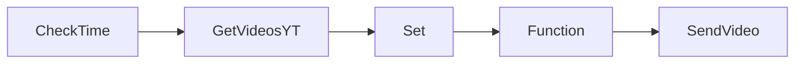

## Fluxo (.json) :

```json
{
  "nodes": [
    {
      "name": "Set",
      "type": "n8n-nodes-base.set",
      "position": [
        500,
        510
      ],
      "parameters": {
        "values": {
          "string": [
            {
              "name": "id",
              "value": "={{$node[\"GetVideosYT\"].json[\"id\"][\"videoId\"]}}"
            },
            {
              "name": "url",
              "value": "=https://youtu.be/{{$node[\"GetVideosYT\"].json[\"id\"][\"videoId\"]}}"
            },
            {
              "name": "title",
              "value": "={{$node[\"GetVideosYT\"].json[\"snippet\"][\"title\"]}}"
            }
          ],
          "boolean": []
        },
        "options": {},
        "keepOnlySet": true
      },
      "typeVersion": 1
    },
    {
      "name": "Function",
      "type": "n8n-nodes-base.function",
      "position": [
        640,
        510
      ],
      "parameters": {
        "functionCode": "const new_items = [];\nconst data = this.getWorkflowStaticData('node');\n\ndata.ids = data.ids || [];\n\nfor (var i=0; i<items.length; i++) {\n  if (data.ids.includes(items[i].json.id)) {\n    break;\n  } else {\n    new_items.push({json: {id: items[i].json.id, url: items[i].json.url, title: items[i].json.title}});\n  }\n}\n\ndata.ids = items.map(item => item.json.id)\nreturn new_items;\n"
      },
      "typeVersion": 1
    },
    {
      "name": "CheckTime",
      "type": "n8n-nodes-base.interval",
      "position": [
        210,
        510
      ],
      "parameters": {
        "unit": "minutes",
        "interval": 30
      },
      "typeVersion": 1
    },
    {
      "name": "GetVideosYT",
      "type": "n8n-nodes-base.youTube",
      "position": [
        370,
        510
      ],
      "parameters": {
        "limit": 4,
        "filters": {
          "channelId": "UCTe5YtigJdZZ3i-za6IkbGQ"
        },
        "options": {
          "order": "date"
        },
        "resource": "video"
      },
      "credentials": {
        "youTubeOAuth2Api": "tubo"
      },
      "typeVersion": 1
    },
    {
      "name": "SendVideo",
      "type": "n8n-nodes-base.telegram",
      "position": [
        790,
        510
      ],
      "parameters": {
        "text": "=Nuovo video di almi su YouTube!\n<b>{{$node[\"Function\"].json[\"title\"]}}</b>\n\n{{$node[\"Function\"].json[\"url\"]}}",
        "chatId": "-1001178002763",
        "additionalFields": {
          "parse_mode": "HTML"
        }
      },
      "credentials": {
        "telegramApi": "bot raspino"
      },
      "typeVersion": 1
    }
  ],
  "connections": {
    "Set": {
      "main": [
        [
          {
            "node": "Function",
            "type": "main",
            "index": 0
          }
        ]
      ]
    },
    "Function": {
      "main": [
        [
          {
            "node": "SendVideo",
            "type": "main",
            "index": 0
          }
        ]
      ]
    },
    "CheckTime": {
      "main": [
        [
          {
            "node": "GetVideosYT",
            "type": "main",
            "index": 0
          }
        ]
      ]
    },
    "GetVideosYT": {
      "main": [
        [
          {
            "node": "Set",
            "type": "main",
            "index": 0
          }
        ]
      ]
    }
  }
}
```

<a id="template-320"></a>

## Template 320 - Classificar keywords como nomes de serviços

- **Nome:** Classificar keywords como nomes de serviços
- **Descrição:** Lê keywords de uma planilha, usa um modelo de linguagem para verificar se cada keyword contém o nome de um software/serviço/app conhecido e grava o resultado na mesma planilha.
- **Funcionalidade:** • Início manual: Permite executar o fluxo manualmente para testes.
• Leitura de keywords: Recupera a lista de keywords de uma planilha do Google.
• Processamento em lotes: Divide as keywords em lotes (tamanho 6) para processamento controlado.
• Controle de taxa de chamadas: Introduz pausas para evitar rate limiting das APIs externas.
• Análise por IA: Envia cada keyword a um modelo de linguagem com instruções para verificar se contém o nome de um software/serviço conhecido e retornar sim ou não.
• Extração estruturada: Converte a resposta da IA em um campo estruturado (Isservice) para uso posterior.
• Atualização da planilha: Escreve o resultado da análise na coluna "Service?" correspondente a cada keyword.
- **Ferramentas:** • Google Sheets: Armazena as keywords de entrada e recebe as atualizações com os resultados da análise.
• Modelo de linguagem (OpenAI, ex.: gpt-4o-mini): Realiza a classificação das keywords e retorna a indicação se a keyword inclui o nome de um software/serviço conhecido.

## Fluxo visual

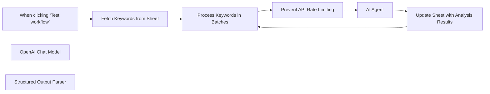

## Fluxo (.json) :

```json
{
  "meta": {
    "instanceId": "cb484ba7b742928a2048bf8829668bed5b5ad9787579adea888f05980292a4a7",
    "templateCredsSetupCompleted": true
  },
  "nodes": [
    {
      "id": "53e93a66-468a-4df8-b2cb-58ff0563f83f",
      "name": "When clicking ‘Test workflow’",
      "type": "n8n-nodes-base.manualTrigger",
      "position": [
        -160,
        0
      ],
      "parameters": {},
      "typeVersion": 1
    },
    {
      "id": "70692fd5-d575-49d2-9e3c-71bdddb0782e",
      "name": "AI Agent",
      "type": "@n8n/n8n-nodes-langchain.agent",
      "position": [
        1000,
        0
      ],
      "parameters": {
        "text": "=keyword: {{ $json.Keyword }}",
        "options": {
          "systemMessage": "=Check the keyword I provided and define if this keyword has a name of the known IT software, service, tool or app as a part of it (for example, ServiceNow or Salesforce) and return yes or no."
        },
        "promptType": "define",
        "hasOutputParser": true
      },
      "typeVersion": 1.7
    },
    {
      "id": "587e6283-32c0-4599-a024-2ce0079bdaeb",
      "name": "OpenAI Chat Model",
      "type": "@n8n/n8n-nodes-langchain.lmChatOpenAi",
      "position": [
        1000,
        240
      ],
      "parameters": {
        "model": {
          "__rl": true,
          "mode": "list",
          "value": "gpt-4o-mini"
        },
        "options": {}
      },
      "credentials": {
        "openAiApi": {
          "id": "ju5aHhTljmCDxSl9",
          "name": "OpenAi account Polina's"
        }
      },
      "typeVersion": 1.2
    },
    {
      "id": "0e3e7d09-202e-47cc-8704-16ab70bc4077",
      "name": "Structured Output Parser",
      "type": "@n8n/n8n-nodes-langchain.outputParserStructured",
      "position": [
        1180,
        240
      ],
      "parameters": {
        "jsonSchemaExample": "{\n\t\"Isservice\": \"yes\"\n}"
      },
      "typeVersion": 1.2
    },
    {
      "id": "900ac097-c6de-41c0-8270-c9de60424d5f",
      "name": "Fetch Keywords from Sheet",
      "type": "n8n-nodes-base.googleSheets",
      "position": [
        120,
        0
      ],
      "parameters": {
        "options": {},
        "sheetName": {
          "__rl": true,
          "mode": "list",
          "value": 1319606837,
          "cachedResultUrl": "https://docs.google.com/spreadsheets/d/1jzDvszQoVDV-jrAunCXqTVsiDxXVLMGqQ1zGXwfy5eU/edit#gid=1319606837",
          "cachedResultName": "Copy of Sheet1 1"
        },
        "documentId": {
          "__rl": true,
          "mode": "list",
          "value": "1jzDvszQoVDV-jrAunCXqTVsiDxXVLMGqQ1zGXwfy5eU",
          "cachedResultUrl": "https://docs.google.com/spreadsheets/d/1jzDvszQoVDV-jrAunCXqTVsiDxXVLMGqQ1zGXwfy5eU/edit?usp=drivesdk",
          "cachedResultName": "AI + agents"
        }
      },
      "credentials": {
        "googleSheetsOAuth2Api": {
          "id": "DeaHa70CotH7MPX6",
          "name": "Google Sheets account NN DB test"
        }
      },
      "typeVersion": 4.5
    },
    {
      "id": "73e208d1-e8d8-4c8b-90f3-06202ed73986",
      "name": "Process Keywords in Batches",
      "type": "n8n-nodes-base.splitInBatches",
      "position": [
        440,
        0
      ],
      "parameters": {
        "options": {},
        "batchSize": 6
      },
      "typeVersion": 3
    },
    {
      "id": "93646bfc-b79d-4ec3-ba8d-8922773fd36b",
      "name": "Prevent API Rate Limiting",
      "type": "n8n-nodes-base.wait",
      "position": [
        720,
        0
      ],
      "webhookId": "035cfc06-099c-453b-aadc-0cce420b8171",
      "parameters": {},
      "typeVersion": 1.1
    },
    {
      "id": "313474f7-a53d-479c-a33e-9327ca29e570",
      "name": "Update Sheet with Analysis Results",
      "type": "n8n-nodes-base.googleSheets",
      "position": [
        1360,
        0
      ],
      "parameters": {
        "columns": {
          "value": {
            "Number": "={{ $('Process Keywords in Batches').item.json.Number }}",
            "Service?": "={{ $json.output.Isservice }}"
          },
          "schema": [
            {
              "id": "Number",
              "type": "string",
              "display": true,
              "removed": false,
              "required": false,
              "displayName": "Number",
              "defaultMatch": false,
              "canBeUsedToMatch": true
            },
            {
              "id": "Service?",
              "type": "string",
              "display": true,
              "required": false,
              "displayName": "Service?",
              "defaultMatch": false,
              "canBeUsedToMatch": true
            },
            {
              "id": "Keyword",
              "type": "string",
              "display": true,
              "removed": true,
              "required": false,
              "displayName": "Keyword",
              "defaultMatch": false,
              "canBeUsedToMatch": true
            },
            {
              "id": "Country",
              "type": "string",
              "display": true,
              "removed": true,
              "required": false,
              "displayName": "Country",
              "defaultMatch": false,
              "canBeUsedToMatch": true
            },
            {
              "id": "Difficulty",
              "type": "string",
              "display": true,
              "removed": true,
              "required": false,
              "displayName": "Difficulty",
              "defaultMatch": false,
              "canBeUsedToMatch": true
            },
            {
              "id": "Volume",
              "type": "string",
              "display": true,
              "removed": true,
              "required": false,
              "displayName": "Volume",
              "defaultMatch": false,
              "canBeUsedToMatch": true
            },
            {
              "id": "CPC",
              "type": "string",
              "display": true,
              "removed": true,
              "required": false,
              "displayName": "CPC",
              "defaultMatch": false,
              "canBeUsedToMatch": true
            },
            {
              "id": "CPS",
              "type": "string",
              "display": true,
              "removed": true,
              "required": false,
              "displayName": "CPS",
              "defaultMatch": false,
              "canBeUsedToMatch": true
            },
            {
              "id": "Parent Keyword",
              "type": "string",
              "display": true,
              "removed": true,
              "required": false,
              "displayName": "Parent Keyword",
              "defaultMatch": false,
              "canBeUsedToMatch": true
            },
            {
              "id": "Last Update",
              "type": "string",
              "display": true,
              "removed": true,
              "required": false,
              "displayName": "Last Update",
              "defaultMatch": false,
              "canBeUsedToMatch": true
            },
            {
              "id": "SERP Features",
              "type": "string",
              "display": true,
              "removed": true,
              "required": false,
              "displayName": "SERP Features",
              "defaultMatch": false,
              "canBeUsedToMatch": true
            },
            {
              "id": "Global volume",
              "type": "string",
              "display": true,
              "removed": true,
              "required": false,
              "displayName": "Global volume",
              "defaultMatch": false,
              "canBeUsedToMatch": true
            },
            {
              "id": "Traffic potential",
              "type": "string",
              "display": true,
              "removed": true,
              "required": false,
              "displayName": "Traffic potential",
              "defaultMatch": false,
              "canBeUsedToMatch": true
            },
            {
              "id": "Global traffic potential",
              "type": "string",
              "display": true,
              "removed": true,
              "required": false,
              "displayName": "Global traffic potential",
              "defaultMatch": false,
              "canBeUsedToMatch": true
            },
            {
              "id": "First seen",
              "type": "string",
              "display": true,
              "removed": true,
              "required": false,
              "displayName": "First seen",
              "defaultMatch": false,
              "canBeUsedToMatch": true
            },
            {
              "id": "Intents",
              "type": "string",
              "display": true,
              "removed": true,
              "required": false,
              "displayName": "Intents",
              "defaultMatch": false,
              "canBeUsedToMatch": true
            },
            {
              "id": "row_number",
              "type": "string",
              "display": true,
              "removed": true,
              "readOnly": true,
              "required": false,
              "displayName": "row_number",
              "defaultMatch": false,
              "canBeUsedToMatch": true
            }
          ],
          "mappingMode": "defineBelow",
          "matchingColumns": [
            "Number"
          ],
          "attemptToConvertTypes": false,
          "convertFieldsToString": false
        },
        "options": {},
        "operation": "update",
        "sheetName": {
          "__rl": true,
          "mode": "list",
          "value": 1319606837,
          "cachedResultUrl": "https://docs.google.com/spreadsheets/d/1jzDvszQoVDV-jrAunCXqTVsiDxXVLMGqQ1zGXwfy5eU/edit#gid=1319606837",
          "cachedResultName": "Copy of Sheet1 1"
        },
        "documentId": {
          "__rl": true,
          "mode": "list",
          "value": "1jzDvszQoVDV-jrAunCXqTVsiDxXVLMGqQ1zGXwfy5eU",
          "cachedResultUrl": "https://docs.google.com/spreadsheets/d/1jzDvszQoVDV-jrAunCXqTVsiDxXVLMGqQ1zGXwfy5eU/edit?usp=drivesdk",
          "cachedResultName": "AI + agents"
        }
      },
      "credentials": {
        "googleSheetsOAuth2Api": {
          "id": "DeaHa70CotH7MPX6",
          "name": "Google Sheets account NN DB test"
        }
      },
      "typeVersion": 4.5
    }
  ],
  "pinData": {},
  "connections": {
    "AI Agent": {
      "main": [
        [
          {
            "node": "Update Sheet with Analysis Results",
            "type": "main",
            "index": 0
          }
        ]
      ]
    },
    "OpenAI Chat Model": {
      "ai_languageModel": [
        [
          {
            "node": "AI Agent",
            "type": "ai_languageModel",
            "index": 0
          }
        ]
      ]
    },
    "Structured Output Parser": {
      "ai_outputParser": [
        [
          {
            "node": "AI Agent",
            "type": "ai_outputParser",
            "index": 0
          }
        ]
      ]
    },
    "Fetch Keywords from Sheet": {
      "main": [
        [
          {
            "node": "Process Keywords in Batches",
            "type": "main",
            "index": 0
          }
        ]
      ]
    },
    "Prevent API Rate Limiting": {
      "main": [
        [
          {
            "node": "AI Agent",
            "type": "main",
            "index": 0
          }
        ]
      ]
    },
    "Process Keywords in Batches": {
      "main": [
        [],
        [
          {
            "node": "Prevent API Rate Limiting",
            "type": "main",
            "index": 0
          }
        ]
      ]
    },
    "When clicking ‘Test workflow’": {
      "main": [
        [
          {
            "node": "Fetch Keywords from Sheet",
            "type": "main",
            "index": 0
          }
        ]
      ]
    },
    "Update Sheet with Analysis Results": {
      "main": [
        [
          {
            "node": "Process Keywords in Batches",
            "type": "main",
            "index": 0
          }
        ]
      ]
    }
  }
}
```

<a id="template-321"></a>

## Template 321 - Gerar imagem via API

- **Nome:** Gerar imagem via API
- **Descrição:** Gera uma imagem personalizada com parâmetros de tamanho, cores, texto e fonte, solicitando o arquivo a uma API externa.
- **Funcionalidade:** • Disparo manual: inicia o fluxo ao clicar em 'Test workflow'.
• Definição de propriedades da imagem: configura tamanho, cor de fundo, cor do texto, texto, tamanho da fonte, família da fonte e tipo de arquivo.
• Montagem de URL com parâmetros: insere tamanho e cores no caminho da URL e adiciona texto, fontSize, tipo e fontFamily como parâmetros de consulta.
• Requisição da imagem: solicita à API externa a imagem gerada com os parâmetros definidos e obtém o arquivo resultante.
- **Ferramentas:** • dummyjson.com: API pública que gera imagens a partir de parâmetros na URL e na query string (tamanho, cores, texto, tamanho e família da fonte, tipo de arquivo).

## Fluxo visual

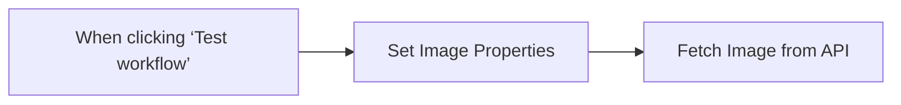

## Fluxo (.json) :

```json
{
  "name": "Generate Image Workflow",
  "tags": [],
  "nodes": [
    {
      "id": "0a657f21-f0fe-4521-be7f-aa245f86f5d3",
      "name": "When clicking ‘Test workflow’",
      "type": "n8n-nodes-base.manualTrigger",
      "position": [
        340,
        -200
      ],
      "parameters": {},
      "typeVersion": 1
    },
    {
      "id": "54ead951-03fb-4741-9e66-bffa0ff42302",
      "name": "Fetch Image from API",
      "type": "n8n-nodes-base.httpRequest",
      "position": [
        780,
        -200
      ],
      "parameters": {
        "url": "=https://dummyjson.com/image/{{ $json.size }}/{{ $json.backgroundColor }}/{{ $json.textColor }}",
        "options": {},
        "sendQuery": true,
        "queryParameters": {
          "parameters": [
            {
              "name": "text",
              "value": "={{ $json.text }}"
            },
            {
              "name": "fontSize",
              "value": "={{ $json.fontSize }}"
            },
            {
              "name": "type",
              "value": "={{ $json.type }}"
            },
            {
              "name": "fontFamily",
              "value": "={{ $json.fontFamily }}"
            }
          ]
        }
      },
      "typeVersion": 4.2
    },
    {
      "id": "9b60f208-7bbc-4c35-9303-797aabef478d",
      "name": "Set Image Properties",
      "type": "n8n-nodes-base.set",
      "position": [
        560,
        -200
      ],
      "parameters": {
        "options": {},
        "assignments": {
          "assignments": [
            {
              "id": "25b4c572-4ba6-4719-b547-8d3787ba557b",
              "name": "size",
              "type": "string",
              "value": "600x400"
            },
            {
              "id": "a6689fdb-b212-4c88-b80f-64aabe61daa1",
              "name": "backgroundColor",
              "type": "string",
              "value": "cc22e3"
            },
            {
              "id": "f9dcc452-4dd5-46fc-948b-39194bf0637d",
              "name": "textColor",
              "type": "string",
              "value": "ffffff"
            },
            {
              "id": "89842462-d3ac-4267-a40a-3e98e8823ef3",
              "name": "text",
              "type": "string",
              "value": "Generated!"
            },
            {
              "id": "59eb064d-1cc3-4b7d-92ec-594dadbd38cd",
              "name": "fontSize",
              "type": "string",
              "value": "100"
            },
            {
              "id": "ccbae0db-559a-4de2-be63-4238feca6498",
              "name": "fontFamily",
              "type": "string",
              "value": "pacifico"
            },
            {
              "id": "ab88695a-d223-4f26-9ded-3e4c965ca28c",
              "name": "type",
              "type": "string",
              "value": "png"
            }
          ]
        }
      },
      "typeVersion": 3.4
    }
  ],
  "active": false,
  "pinData": {},
  "settings": {
    "executionOrder": "v1"
  },
  "versionId": "c2d9939a-6766-4b7c-8331-63a655946208",
  "connections": {
    "Set Image Properties": {
      "main": [
        [
          {
            "node": "Fetch Image from API",
            "type": "main",
            "index": 0
          }
        ]
      ]
    },
    "When clicking ‘Test workflow’": {
      "main": [
        [
          {
            "node": "Set Image Properties",
            "type": "main",
            "index": 0
          }
        ]
      ]
    }
  }
}
```
