# PACK 1999 TEMPLATES PARTE 02 - Bloco 7

Templates neste bloco: 20

## Sumário

- [Template 322 - Salvar vídeos Luma AI no Airtable](#template-322)
- [Template 323 - Sincronizar tickets Zendesk com tarefas Asana](#template-323)
- [Template 324 - Transferência de credenciais entre instâncias](#template-324)
- [Template 325 - Monitor de preços com alerta por e-mail](#template-325)
- [Template 326 - Sincronizar tickets Zendesk para HubSpot (a cada 5 min)](#template-326)
- [Template 327 - Candidatura com extração de CV por IA](#template-327)
- [Template 328 - Criar issue para novo release](#template-328)
- [Template 329 - Prevenir execuções concorrentes com Redis](#template-329)
- [Template 330 - Alerta de phishing Steam para Cloudflare e Valve](#template-330)
- [Template 331 - Conversão HTML para PDF via Webhook](#template-331)
- [Template 332 - Salvar assinantes adicionados a grupo no Airtable](#template-332)
- [Template 333 - Exportar execuções para CSV](#template-333)
- [Template 334 - Webhook de confirmação de reserva para Retell](#template-334)
- [Template 335 - Sincronização de issues do GitHub para Notion](#template-335)
- [Template 336 - Rótulos IA para Gmail](#template-336)
- [Template 337 - Assistente pessoal por voz e texto no Telegram](#template-337)
- [Template 338 - Gerador de imagens Flux via formulário](#template-338)
- [Template 339 - Triagem e agendamento de candidatos com IA](#template-339)
- [Template 340 - Calcular ICP de pessoas a partir de perfis LinkedIn](#template-340)
- [Template 341 - Configurar medoids e limiares para detecção de anomalias](#template-341)

---

<a id="template-322"></a>

## Template 322 - Salvar vídeos Luma AI no Airtable

- **Nome:** Salvar vídeos Luma AI no Airtable
- **Descrição:** Fluxo que recebe respostas via webhook de gerações de vídeo do Luma AI, extrai URLs de vídeo e miniatura e registra/atualiza esses dados em uma base do Airtable para acompanhamento.
- **Funcionalidade:** • Receber webhook de Luma AI: Aceita POSTs contendo o JSON de resposta da geração de vídeo.
• Extrair dados de geração: Captura o ID da geração, URL do vídeo e URL da imagem/thumbnail do payload recebido.
• Verificação condicional: Confirma que existe uma URL de vídeo antes de prosseguir com a atualização.
• Atualizar registro no Airtable: Preenche/atualiza campos como Status (marcando como Done), Video URL, Thumb URL e Generation ID na tabela configurada.
• Configurações centralizadas: Utiliza variáveis de configuração (IDs de base e tabela) para facilitar alterações sem modificar o fluxo.
• Encaminhar dados para execução/log: Exporta dados de execução ao final para fins de rastreamento ou debugging.
- **Ferramentas:** • Luma AI: Serviço que gera vídeos e envia callbacks/webhooks com os assets (vídeo e imagem).
• Airtable: Base de dados utilizada para armazenar e atualizar registros com URLs dos vídeos gerados e metadados.

## Fluxo visual

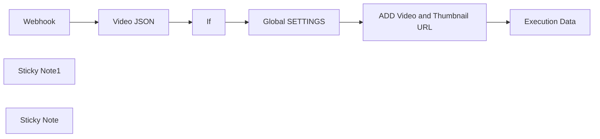

## Fluxo (.json) :

```json
{
  "id": "rYuhIChQyjpGNvuR",
  "meta": {
    "instanceId": "ecc960f484e18b0e09045fd93acf0d47f4cfff25cc212ea348a08ac3aae81850"
  },
  "name": "Luma AI - Webhook Response v1 - AK",
  "tags": [
    {
      "id": "6rb8rVhKZj4t0Kne",
      "name": "Current",
      "createdAt": "2025-02-04T18:13:17.427Z",
      "updatedAt": "2025-02-04T18:13:17.427Z"
    }
  ],
  "nodes": [
    {
      "id": "cb03e151-9931-4917-bf6f-2a1c9e06b896",
      "name": "Webhook",
      "type": "n8n-nodes-base.webhook",
      "position": [
        -560,
        120
      ],
      "webhookId": "cea413b3-fa80-454e-b7c9-ec284a795984",
      "parameters": {
        "path": "luma-ai-response",
        "options": {},
        "httpMethod": "POST"
      },
      "typeVersion": 2
    },
    {
      "id": "33a93e0d-3424-480b-9b55-9124d826b233",
      "name": "Video JSON",
      "type": "n8n-nodes-base.set",
      "position": [
        -360,
        120
      ],
      "parameters": {
        "options": {},
        "assignments": {
          "assignments": [
            {
              "id": "3280111c-573a-4ed0-8a7e-da263558f3d5",
              "name": "video_json",
              "type": "string",
              "value": "={{ $json }}"
            },
            {
              "id": "63a091f2-5a4d-410c-87ec-2ad8f3db8480",
              "name": "luma_video",
              "type": "string",
              "value": "={{ $json.body.assets.video }}"
            },
            {
              "id": "4425f709-12c7-4aeb-b957-c419f79eb5fd",
              "name": "luma_thumb",
              "type": "string",
              "value": "={{ $json.body.assets.image }}"
            },
            {
              "id": "b1eb986c-76af-462f-a685-209bcdc14baa",
              "name": "gen_id",
              "type": "string",
              "value": "={{ $json.id }}"
            }
          ]
        },
        "includeOtherFields": true
      },
      "typeVersion": 3.4
    },
    {
      "id": "103b3a52-dc99-46b4-9d8e-41fa413b7c7b",
      "name": "Execution Data",
      "type": "n8n-nodes-base.executionData",
      "position": [
        480,
        20
      ],
      "parameters": {},
      "typeVersion": 1
    },
    {
      "id": "90f163dd-1b59-4a6c-a5ca-00c52cffacdd",
      "name": "If",
      "type": "n8n-nodes-base.if",
      "position": [
        -160,
        120
      ],
      "parameters": {
        "options": {},
        "conditions": {
          "options": {
            "version": 2,
            "leftValue": "",
            "caseSensitive": true,
            "typeValidation": "strict"
          },
          "combinator": "and",
          "conditions": [
            {
              "id": "ac05d685-5af4-40cf-a4c6-3b717c36d8c5",
              "operator": {
                "type": "string",
                "operation": "notEmpty",
                "singleValue": true
              },
              "leftValue": "={{ $('Video JSON').first().json.body.assets.video }}",
              "rightValue": ""
            }
          ]
        }
      },
      "typeVersion": 2.2
    },
    {
      "id": "9ace2252-e3e0-4321-92c5-1cfcf1b97ebf",
      "name": "Sticky Note1",
      "type": "n8n-nodes-base.stickyNote",
      "position": [
        0,
        -100
      ],
      "parameters": {
        "color": 3,
        "width": 220,
        "content": "## Define your SETTINGS here"
      },
      "typeVersion": 1
    },
    {
      "id": "116048ff-d444-4808-b533-116614386c0c",
      "name": "Global SETTINGS",
      "type": "n8n-nodes-base.set",
      "position": [
        60,
        20
      ],
      "parameters": {
        "options": {},
        "assignments": {
          "assignments": [
            {
              "id": "5e5089e8-6b94-4d2a-aa51-2b8f9caca7c3",
              "name": "airtable_base",
              "type": "string",
              "value": "appvk87mtcwRve5p5"
            },
            {
              "id": "26b5a452-7797-4c84-bd9e-285df13f7089",
              "name": "airtable_table_generated_videos",
              "type": "string",
              "value": "tblOzRFWgcsfttRWK"
            },
            {
              "id": "0dc3ad30-cb06-47b0-8b03-5bd98ac377bf",
              "name": "airtable_table_article_writer",
              "type": "string",
              "value": "tblVTpv8JG5lZRiF2"
            }
          ]
        }
      },
      "typeVersion": 3.4
    },
    {
      "id": "449983cc-ed22-4544-a3df-1e1f7087c810",
      "name": "Sticky Note",
      "type": "n8n-nodes-base.stickyNote",
      "position": [
        -820,
        0
      ],
      "parameters": {
        "color": 3,
        "width": 400,
        "content": "## Make sure this URL for the Webhook matches that in Part 1 of this series"
      },
      "typeVersion": 1
    },
    {
      "id": "eee48ffe-dddc-41c9-ae8d-ca75cd8ce31c",
      "name": "ADD Video and Thumbnail URL",
      "type": "n8n-nodes-base.airtable",
      "position": [
        280,
        20
      ],
      "parameters": {
        "base": {
          "__rl": true,
          "mode": "id",
          "value": "={{ $json.airtable_base }}"
        },
        "table": {
          "__rl": true,
          "mode": "id",
          "value": "={{ $json.airtable_table_generated_videos }}"
        },
        "columns": {
          "value": {
            "Status": "Done",
            "Thumb URL": "={{ $('If').first().json.body.assets.image }}",
            "Video URL": "={{ $('If').first().json.body.assets.video }}",
            "Generation ID": "={{ $('If').first().json.body.id }}"
          },
          "schema": [
            {
              "id": "Generation ID",
              "type": "string",
              "display": true,
              "removed": false,
              "readOnly": false,
              "required": false,
              "displayName": "Generation ID",
              "defaultMatch": false,
              "canBeUsedToMatch": true
            },
            {
              "id": "Status",
              "type": "options",
              "display": true,
              "options": [
                {
                  "name": "Todo",
                  "value": "Todo"
                },
                {
                  "name": "In progress",
                  "value": "In progress"
                },
                {
                  "name": "Done",
                  "value": "Done"
                }
              ],
              "removed": false,
              "readOnly": false,
              "required": false,
              "displayName": "Status",
              "defaultMatch": false,
              "canBeUsedToMatch": true
            },
            {
              "id": "Content Title",
              "type": "string",
              "display": true,
              "removed": false,
              "readOnly": false,
              "required": false,
              "displayName": "Content Title",
              "defaultMatch": false,
              "canBeUsedToMatch": true
            },
            {
              "id": "Video URL",
              "type": "string",
              "display": true,
              "removed": false,
              "readOnly": false,
              "required": false,
              "displayName": "Video URL",
              "defaultMatch": false,
              "canBeUsedToMatch": true
            },
            {
              "id": "Thumb URL",
              "type": "string",
              "display": true,
              "removed": false,
              "readOnly": false,
              "required": false,
              "displayName": "Thumb URL",
              "defaultMatch": false,
              "canBeUsedToMatch": true
            },
            {
              "id": "Prompt",
              "type": "string",
              "display": true,
              "removed": false,
              "readOnly": false,
              "required": false,
              "displayName": "Prompt",
              "defaultMatch": false,
              "canBeUsedToMatch": true
            },
            {
              "id": "Aspect",
              "type": "string",
              "display": true,
              "removed": false,
              "readOnly": false,
              "required": false,
              "displayName": "Aspect",
              "defaultMatch": false,
              "canBeUsedToMatch": true
            },
            {
              "id": "Model",
              "type": "string",
              "display": true,
              "removed": false,
              "readOnly": false,
              "required": false,
              "displayName": "Model",
              "defaultMatch": false,
              "canBeUsedToMatch": true
            },
            {
              "id": "Resolution",
              "type": "string",
              "display": true,
              "removed": false,
              "readOnly": false,
              "required": false,
              "displayName": "Resolution",
              "defaultMatch": false,
              "canBeUsedToMatch": true
            },
            {
              "id": "Length",
              "type": "string",
              "display": true,
              "removed": false,
              "readOnly": false,
              "required": false,
              "displayName": "Length",
              "defaultMatch": false,
              "canBeUsedToMatch": true
            }
          ],
          "mappingMode": "defineBelow",
          "matchingColumns": [
            "Generation ID"
          ],
          "attemptToConvertTypes": false,
          "convertFieldsToString": false
        },
        "options": {},
        "operation": "update"
      },
      "credentials": {
        "airtableTokenApi": {
          "id": "yqBrLbgHXLcwqH0p",
          "name": "AlexK Airtable Personal Access Token account"
        }
      },
      "typeVersion": 2.1
    }
  ],
  "active": true,
  "pinData": {},
  "settings": {
    "executionOrder": "v1"
  },
  "versionId": "82de5303-0dcf-416e-8823-e2a7eff4c5f8",
  "connections": {
    "If": {
      "main": [
        [
          {
            "node": "Global SETTINGS",
            "type": "main",
            "index": 0
          }
        ]
      ]
    },
    "Webhook": {
      "main": [
        [
          {
            "node": "Video JSON",
            "type": "main",
            "index": 0
          }
        ]
      ]
    },
    "Video JSON": {
      "main": [
        [
          {
            "node": "If",
            "type": "main",
            "index": 0
          }
        ]
      ]
    },
    "Global SETTINGS": {
      "main": [
        [
          {
            "node": "ADD Video and Thumbnail URL",
            "type": "main",
            "index": 0
          }
        ]
      ]
    },
    "ADD Video and Thumbnail URL": {
      "main": [
        [
          {
            "node": "Execution Data",
            "type": "main",
            "index": 0
          }
        ]
      ]
    }
  }
}
```

<a id="template-323"></a>

## Template 323 - Sincronizar tickets Zendesk com tarefas Asana

- **Nome:** Sincronizar tickets Zendesk com tarefas Asana
- **Descrição:** Sincroniza novos tickets do Zendesk com o Asana, criando tarefas quando necessário e adicionando comentários em tarefas já vinculadas.
- **Funcionalidade:** • Receber novos tickets do Zendesk: inicia o fluxo a partir de um webhook quando um novo ticket é criado.
• Recuperar dados completos do ticket: busca o ticket para obter campos customizados e o comentário.
• Verificar existência de vínculo Asana: verifica um campo customizado do ticket que armazena o GID da tarefa Asana.
• Adicionar comentário em tarefa existente: se o GID existir, publica o comentário do ticket como comentário HTML na tarefa correspondente no Asana.
• Criar nova tarefa no Asana: se não houver GID, cria uma nova tarefa usando o assunto do ticket e define workspace e responsável.
• Atualizar ticket com referência da tarefa: após criar a tarefa, grava o GID da tarefa no campo customizado do ticket no Zendesk.
- **Ferramentas:** • Zendesk: plataforma de suporte utilizada como fonte de tickets, armazenamento do campo customizado que referencia a tarefa e alvo de atualização.
• Asana: ferramenta de gestão de tarefas utilizada para criar tarefas, atribuí‑las e adicionar comentários sincronizados a partir dos tickets.

## Fluxo visual

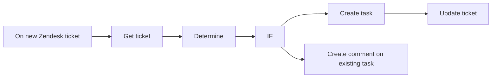

## Fluxo (.json) :

```json
{
  "meta": {
    "instanceId": "237600ca44303ce91fa31ee72babcdc8493f55ee2c0e8aa2b78b3b4ce6f70bd9"
  },
  "nodes": [
    {
      "id": "1c041974-2a1f-4464-be3e-70b8a700f40d",
      "name": "Get ticket",
      "type": "n8n-nodes-base.zendesk",
      "position": [
        460,
        480
      ],
      "parameters": {
        "id": "={{$node[\"On new Zendesk ticket\"].json[\"body\"][\"id\"]}}",
        "operation": "get"
      },
      "credentials": {
        "zendeskApi": {
          "id": "24",
          "name": "[UPDATE ME]"
        }
      },
      "typeVersion": 1
    },
    {
      "id": "a4a05b2a-2382-44af-8226-a2c60bee1ce3",
      "name": "Create task",
      "type": "n8n-nodes-base.asana",
      "position": [
        1000,
        580
      ],
      "parameters": {
        "name": "={{$node[\"Get ticket\"].json[\"subject\"]}}",
        "workspace": "1177253494675264",
        "otherProperties": {
          "assignee": "1202718619090236",
          "assignee_status": "inbox"
        }
      },
      "credentials": {
        "asanaApi": {
          "id": "8",
          "name": "[UPDATE ME]"
        }
      },
      "typeVersion": 1
    },
    {
      "id": "55128ee9-9210-4341-bf9a-2e4ea415b668",
      "name": "IF",
      "type": "n8n-nodes-base.if",
      "position": [
        820,
        480
      ],
      "parameters": {
        "conditions": {
          "string": [
            {
              "value1": "={{$node[\"Determine\"].json[\"Asana GID\"]}}",
              "operation": "isNotEmpty"
            }
          ]
        }
      },
      "typeVersion": 1
    },
    {
      "id": "6319045c-7df8-4031-b738-835f8fe12d06",
      "name": "Update ticket",
      "type": "n8n-nodes-base.zendesk",
      "notes": "Update the Zendesk ticket by adding the Jira issue key to the \"Jira Issue Key\" field.",
      "position": [
        1180,
        580
      ],
      "parameters": {
        "id": "={{$node[\"On new Zendesk ticket\"].json[\"body\"][\"id\"]}}",
        "operation": "update",
        "updateFields": {
          "customFieldsUi": {
            "customFieldsValues": [
              {
                "id": 6707064637597,
                "value": "={{$node[\"Create task\"].json[\"gid\"]}}"
              }
            ]
          }
        }
      },
      "credentials": {
        "zendeskApi": {
          "id": "24",
          "name": "[UPDATE ME]"
        }
      },
      "notesInFlow": true,
      "typeVersion": 1
    },
    {
      "id": "39172e43-def7-4e05-9ce3-6d0bb1c3ff59",
      "name": "Determine",
      "type": "n8n-nodes-base.function",
      "notes": "if issue was created already in Jira",
      "position": [
        640,
        480
      ],
      "parameters": {
        "functionCode": "/* configure here =========================================================== */\n/*  Zendesk field ID which represents the \"Jira Issue Key\" field.\n*/\nconst ISSUE_KEY_FIELD_ID = 6707064637597;\n\n/* ========================================================================== */\nnew_items = [];\n\nfor (item of $items(\"Get ticket\")) {\n    \n    // instantiate a new variable for status\n    var custom_fields = item.json[\"custom_fields\"];\n    var asana_gid = \"\";\n    for (var i = 0; i < custom_fields.length; i++) {\n        if (custom_fields[i].id == ISSUE_KEY_FIELD_ID) {\n            asana_gid = custom_fields[i].value;\n            break;\n        }\n    }\n\n    // push the new item to the new_items array\n    new_items.push({\n        \"Asana GID\": asana_gid\n    });\n}\n\nreturn new_items;"
      },
      "notesInFlow": true,
      "typeVersion": 1
    },
    {
      "id": "26f2aaf3-8b21-429f-bfec-c5876792d4b9",
      "name": "Create comment on existing task",
      "type": "n8n-nodes-base.asana",
      "position": [
        1000,
        380
      ],
      "parameters": {
        "id": "={{$node[\"Determine\"].json[\"Asana GID\"]}}",
        "text": "=<body>{{$node[\"On new Zendesk ticket\"].json[\"body\"][\"comment\"]}}</body>",
        "resource": "taskComment",
        "isTextHtml": true,
        "additionalFields": {}
      },
      "credentials": {
        "asanaApi": {
          "id": "8",
          "name": "[UPDATE ME]"
        }
      },
      "typeVersion": 1
    },
    {
      "id": "bbbf0fc1-3fa7-4a15-a949-c8d9d5e32031",
      "name": "On new Zendesk ticket",
      "type": "n8n-nodes-base.webhook",
      "position": [
        280,
        480
      ],
      "webhookId": "4637a853-0b3a-43d4-9d76-92e1ce87889d",
      "parameters": {
        "path": "4637a853-0b3a-43d4-9d76-92e1ce87889d",
        "options": {},
        "httpMethod": "POST"
      },
      "typeVersion": 1
    }
  ],
  "connections": {
    "IF": {
      "main": [
        [
          {
            "node": "Create comment on existing task",
            "type": "main",
            "index": 0
          }
        ],
        [
          {
            "node": "Create task",
            "type": "main",
            "index": 0
          }
        ]
      ]
    },
    "Determine": {
      "main": [
        [
          {
            "node": "IF",
            "type": "main",
            "index": 0
          }
        ]
      ]
    },
    "Get ticket": {
      "main": [
        [
          {
            "node": "Determine",
            "type": "main",
            "index": 0
          }
        ]
      ]
    },
    "Create task": {
      "main": [
        [
          {
            "node": "Update ticket",
            "type": "main",
            "index": 0
          }
        ]
      ]
    },
    "On new Zendesk ticket": {
      "main": [
        [
          {
            "node": "Get ticket",
            "type": "main",
            "index": 0
          }
        ]
      ]
    }
  }
}
```

<a id="template-324"></a>

## Template 324 - Transferência de credenciais entre instâncias

- **Nome:** Transferência de credenciais entre instâncias
- **Descrição:** Fluxo que permite copiar credenciais de uma instância para outra, extraindo credenciais locais, apresentando opções ao usuário e criando a credencial no destino via API.
- **Funcionalidade:** • Início por formulário: Um formulário simples inicia o processo manualmente.
• Leitura e exportação de credenciais: Executa uma exportação de credenciais via ferramenta de linha de comando e lê o arquivo resultante.
• Conversão para JSON: Converte o arquivo exportado para um objeto JSON manipulável.
• Listagem dinâmica de instâncias: Gera dinamicamente as opções de instância destino a partir das configurações pré-definidas.
• Listagem dinâmica de credenciais: Gera dinamicamente a lista de credenciais disponíveis a partir dos dados exportados.
• Seleção pelo usuário: Permite escolher a instância destino e a credencial a ser copiada por meio de formulários com dropdowns.
• Preparação do payload: Prepara os dados da credencial e as informações da instância escolhida para envio.
• Envio via API: Cria a credencial na instância destino utilizando uma requisição HTTP autenticada com a chave da instância.
• Feedback ao usuário: Exibe uma mensagem de sucesso ou erro após a tentativa de transferência.
- **Ferramentas:** • Ferramenta de exportação via linha de comando: Exporta as credenciais existentes em formato legível para posterior processamento.
• Sistema de arquivos temporário: Armazena o arquivo exportado (/tmp/cred) antes de ser lido e convertido.
• Endpoint HTTP REST da instância destino: Recebe requisições para criar credenciais remotamente usando uma chave de API para autenticação.

## Fluxo visual

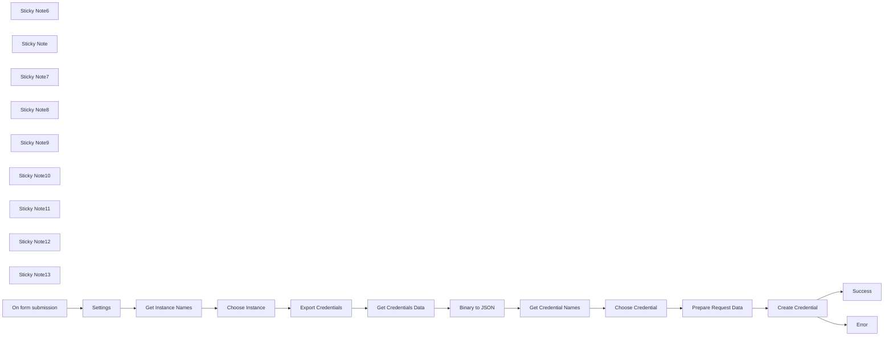

## Fluxo (.json) :

```json
{
  "id": "tlnJNm9t5H3VLU5K",
  "meta": {
    "instanceId": "505c2bdb4483cbbca32871c0acd4b60c83809f177e47e2864f71c1c1760a9b2a",
    "templateCredsSetupCompleted": true
  },
  "name": "Credentials Transfer",
  "tags": [],
  "nodes": [
    {
      "id": "9bb3fd8d-cead-4325-9c77-2c1d203ac805",
      "name": "Success",
      "type": "n8n-nodes-base.form",
      "position": [
        680,
        300
      ],
      "webhookId": "6a630d50-a4b6-4fd7-a7a7-fa0283996903",
      "parameters": {
        "options": {},
        "operation": "completion",
        "completionTitle": "✅ Transfer completed",
        "completionMessage": "=The credential has been transfered."
      },
      "typeVersion": 1
    },
    {
      "id": "0c90e8d6-3230-4139-a625-e8656fe1c4d9",
      "name": "Error",
      "type": "n8n-nodes-base.form",
      "position": [
        680,
        460
      ],
      "webhookId": "bfaa86b9-fddf-47b3-9456-caba547a1f5e",
      "parameters": {
        "options": {},
        "operation": "completion",
        "completionTitle": "⚠️ Transfer failed",
        "completionMessage": "=Please check the workflow settings"
      },
      "typeVersion": 1
    },
    {
      "id": "050bb8b6-faf5-4190-a727-986d7fe6b28a",
      "name": "Create Credential",
      "type": "n8n-nodes-base.httpRequest",
      "onError": "continueErrorOutput",
      "position": [
        460,
        340
      ],
      "parameters": {
        "url": "={{ $json.instance.baseUrl }}/credentials",
        "method": "POST",
        "options": {},
        "sendBody": true,
        "sendHeaders": true,
        "bodyParameters": {
          "parameters": [
            {
              "name": "name",
              "value": "={{ $json.credential.name }}"
            },
            {
              "name": "type",
              "value": "={{ $json.credential.type }}"
            },
            {
              "name": "data",
              "value": "={{ $json.credential.data }}"
            }
          ]
        },
        "headerParameters": {
          "parameters": [
            {
              "name": "X-N8N-API-KEY",
              "value": "={{ $json.instance.apiKey }}"
            }
          ]
        }
      },
      "typeVersion": 4.2
    },
    {
      "id": "17072ec2-526c-49b4-8384-e9ca347b8748",
      "name": "Get Instance Names",
      "type": "n8n-nodes-base.code",
      "position": [
        680,
        -240
      ],
      "parameters": {
        "jsCode": "dropDownValues = [];\n\nfor (const instance of $input.first().json.remoteInstances) {\n  dropDownValues.push({\"option\": instance.name});\n}\n\nreturn { \"options\": JSON.stringify(dropDownValues) };"
      },
      "typeVersion": 2
    },
    {
      "id": "27fdd4c4-5c39-497b-91b3-e468b20e8f8c",
      "name": "Settings",
      "type": "n8n-nodes-base.set",
      "position": [
        460,
        -240
      ],
      "parameters": {
        "options": {},
        "assignments": {
          "assignments": [
            {
              "id": "8a5d50fc-95dc-40b3-a3f2-293521bab29a",
              "name": "remoteInstances",
              "type": "array",
              "value": "=[\n  {\n    \"name\": \"n8n-test-01\",\n    \"apiKey\": \"n8n_api_26b5bb6d39d337bd904f3d89fe88562d456c1cd13af401f490145206f2dc516ffa1fed04a26ae689\",\n    \"baseUrl\": \"https://n8n-test-01.services.octionic.com/api/v1\"\n  }\n]"
            }
          ]
        }
      },
      "typeVersion": 3.4
    },
    {
      "id": "76b7d9d2-c919-42a6-8724-8771d9415e3e",
      "name": "Export Credentials",
      "type": "n8n-nodes-base.executeCommand",
      "position": [
        240,
        40
      ],
      "parameters": {
        "command": "n8n export:credentials --all --pretty --decrypted --output=/tmp/cred"
      },
      "typeVersion": 1
    },
    {
      "id": "b5f53aa1-ccf6-43b0-9f4c-cfc52f99aabf",
      "name": "Get Credentials Data",
      "type": "n8n-nodes-base.readWriteFile",
      "position": [
        460,
        40
      ],
      "parameters": {
        "options": {},
        "fileSelector": "/tmp/cred"
      },
      "typeVersion": 1
    },
    {
      "id": "16fdae2d-f3e6-4030-859a-ecba74dfe4c2",
      "name": "Binary to JSON",
      "type": "n8n-nodes-base.extractFromFile",
      "position": [
        680,
        40
      ],
      "parameters": {
        "options": {},
        "operation": "fromJson"
      },
      "typeVersion": 1
    },
    {
      "id": "3d590285-e82c-4754-8618-2a52fcda6253",
      "name": "Get Credential Names",
      "type": "n8n-nodes-base.code",
      "position": [
        900,
        40
      ],
      "parameters": {
        "jsCode": "dropDownValues = [];\n\nfor (const credential of $input.first().json.data) {\n  dropDownValues.push({\"option\": credential.name});\n}\n\nreturn { \"options\": JSON.stringify(dropDownValues) };"
      },
      "typeVersion": 2
    },
    {
      "id": "21615934-6834-4b4e-b521-942a24f64388",
      "name": "Choose Instance",
      "type": "n8n-nodes-base.form",
      "position": [
        900,
        -240
      ],
      "webhookId": "b1fc6927-ebe8-4a02-9d64-24bf6f6d0db6",
      "parameters": {
        "options": {
          "formTitle": "Select Destination",
          "buttonLabel": "Continue",
          "formDescription": "Choose the n8n instance where the credential should be copied to"
        },
        "defineForm": "json",
        "jsonOutput": "=[\n   {\n      \"fieldLabel\": \"Destination\",\n      \"fieldType\": \"dropdown\",\n      \"requiredField\": true,\n      \"fieldOptions\": {\n        \"values\": {{ $json.options }}\n      }\n   }\n]"
      },
      "typeVersion": 1
    },
    {
      "id": "d36a41c4-6ed3-4939-8562-e3f50ffcd72b",
      "name": "Choose Credential",
      "type": "n8n-nodes-base.form",
      "position": [
        1120,
        40
      ],
      "webhookId": "f732b37b-6623-4629-bc7d-99ebb56a9809",
      "parameters": {
        "options": {
          "formTitle": "Select Credential",
          "buttonLabel": "Copy now",
          "formDescription": "Choose the credential which should be copied"
        },
        "defineForm": "json",
        "jsonOutput": "=[\n   {\n      \"fieldLabel\": \"Credential\",\n      \"fieldType\": \"dropdown\",\n      \"requiredField\": true,\n      \"fieldOptions\": {\n        \"values\": {{ $json.options }}\n      }\n   }\n]"
      },
      "typeVersion": 1
    },
    {
      "id": "4391f0d9-3ed5-4e2b-a761-ab7bf41959f1",
      "name": "Prepare Request Data",
      "type": "n8n-nodes-base.code",
      "position": [
        240,
        340
      ],
      "parameters": {
        "jsCode": "output = {};\n\nfor (const credential of $('Binary to JSON').first().json.data) {\n  if (credential.name == $input.first().json.Credential) {\n    output.credential = credential;\n  }\n}\n\nfor (const instance of $('Settings').first().json.remoteInstances) {\n  if (instance.name == $('Choose Instance').first().json.Destination) {\n    output.instance = instance;\n  }\n}\n\nreturn output;"
      },
      "typeVersion": 2
    },
    {
      "id": "571cd727-218b-4a5d-97fe-a8dcbcf15cce",
      "name": "Sticky Note6",
      "type": "n8n-nodes-base.stickyNote",
      "position": [
        400,
        -340
      ],
      "parameters": {
        "width": 216.47293010628914,
        "height": 255.86856541619233,
        "content": "## Setup instances\nEach instnce requires a name, apiKey and baseURL"
      },
      "typeVersion": 1
    },
    {
      "id": "7f717bed-fac5-4b1e-acc7-a6ad9d1c4be4",
      "name": "Sticky Note",
      "type": "n8n-nodes-base.stickyNote",
      "position": [
        -360,
        -340
      ],
      "parameters": {
        "color": 5,
        "width": 527.8711162255479,
        "height": 223.19907940161124,
        "content": "## Instances config example\n```\n[\n  {\n    \"name\": \"n8n-test\",\n    \"apiKey\": \"XXXXXXXXXXXXXXXXXXXXXXXXXXXXXXX\",\n    \"baseUrl\": \"https://n8n-test.example.com/api/v1\"\n  },\n  {\n    ...\n  }\n]\n```"
      },
      "typeVersion": 1
    },
    {
      "id": "5e27ad60-7e65-452d-8c33-56c6c85911d3",
      "name": "Sticky Note7",
      "type": "n8n-nodes-base.stickyNote",
      "position": [
        180,
        -340
      ],
      "parameters": {
        "color": 7,
        "width": 216.47293010628914,
        "height": 255.86856541619233,
        "content": "A form with no input fields initiates the process.\n*Consider securing the form using Basic Auth.*"
      },
      "typeVersion": 1
    },
    {
      "id": "0b69effa-44e4-41e1-bb5d-934ed19b8488",
      "name": "Sticky Note8",
      "type": "n8n-nodes-base.stickyNote",
      "position": [
        180,
        -60
      ],
      "parameters": {
        "color": 7,
        "width": 655.5152156976209,
        "height": 255.86856541619233,
        "content": "Credentials are being fetched using the cmd tools, since there is no API endpoint available for this. The data is then converted into a JSON object."
      },
      "typeVersion": 1
    },
    {
      "id": "a0f83646-dcf3-4893-bca0-a2b0ec4942b6",
      "name": "Sticky Note9",
      "type": "n8n-nodes-base.stickyNote",
      "position": [
        620,
        -340
      ],
      "parameters": {
        "color": 7,
        "width": 435.9715408127852,
        "height": 255.86856541619233,
        "content": "A list of the instance names is being extracted from the settings and used as dynamic options for the dropdown in a new form page."
      },
      "typeVersion": 1
    },
    {
      "id": "78611a9e-5949-44c4-af23-78e8f689de2b",
      "name": "Sticky Note10",
      "type": "n8n-nodes-base.stickyNote",
      "position": [
        840,
        -60
      ],
      "parameters": {
        "color": 7,
        "width": 435.9715408127852,
        "height": 255.86856541619233,
        "content": "A list of the credential names is being extracted from the settings and used as dynamic options for the dropdown in a new form page."
      },
      "typeVersion": 1
    },
    {
      "id": "23e9b0ea-f6a7-4072-8e87-292ba432a24d",
      "name": "Sticky Note11",
      "type": "n8n-nodes-base.stickyNote",
      "position": [
        180,
        240
      ],
      "parameters": {
        "color": 7,
        "width": 216.47293010628914,
        "height": 255.86856541619233,
        "content": "Based on the selections made by the user, the necessary data is being provided."
      },
      "typeVersion": 1
    },
    {
      "id": "f13a3bce-d92d-4e2c-bb63-b37c4aa89b9b",
      "name": "Sticky Note12",
      "type": "n8n-nodes-base.stickyNote",
      "position": [
        400,
        240
      ],
      "parameters": {
        "color": 7,
        "width": 216.47293010628914,
        "height": 255.86856541619233,
        "content": "The credential data is being transferred to the selected instance based using dynamic authentication"
      },
      "typeVersion": 1
    },
    {
      "id": "1788ed42-44be-41c3-8a45-3d8c74925ded",
      "name": "Sticky Note13",
      "type": "n8n-nodes-base.stickyNote",
      "position": [
        620,
        240
      ],
      "parameters": {
        "color": 7,
        "width": 216.47293010628914,
        "height": 376.16893354714523,
        "content": "Display a confirmation/error message to the user"
      },
      "typeVersion": 1
    },
    {
      "id": "58cbb873-906e-4215-b501-4a1b31fdcbd9",
      "name": "On form submission",
      "type": "n8n-nodes-base.formTrigger",
      "position": [
        240,
        -240
      ],
      "webhookId": "f6c627e5-e93c-4ee1-9605-ebdfa5fff286",
      "parameters": {
        "options": {
          "buttonLabel": "Begin",
          "appendAttribution": false
        },
        "formTitle": "Credential Transfer",
        "formFields": {
          "values": [
            {
              "fieldLabel": " ",
              "placeholder": "Click \"Begin\" to continue"
            }
          ]
        },
        "formDescription": "This tool allows copying a credential to another n8n instance"
      },
      "typeVersion": 2.2
    }
  ],
  "active": true,
  "pinData": {},
  "settings": {
    "executionOrder": "v1"
  },
  "versionId": "e89a409f-c046-4d54-b580-7e2c0a537d1b",
  "connections": {
    "Settings": {
      "main": [
        [
          {
            "node": "Get Instance Names",
            "type": "main",
            "index": 0
          }
        ]
      ]
    },
    "Binary to JSON": {
      "main": [
        [
          {
            "node": "Get Credential Names",
            "type": "main",
            "index": 0
          }
        ]
      ]
    },
    "Choose Instance": {
      "main": [
        [
          {
            "node": "Export Credentials",
            "type": "main",
            "index": 0
          }
        ]
      ]
    },
    "Choose Credential": {
      "main": [
        [
          {
            "node": "Prepare Request Data",
            "type": "main",
            "index": 0
          }
        ]
      ]
    },
    "Create Credential": {
      "main": [
        [
          {
            "node": "Success",
            "type": "main",
            "index": 0
          }
        ],
        [
          {
            "node": "Error",
            "type": "main",
            "index": 0
          }
        ]
      ]
    },
    "Export Credentials": {
      "main": [
        [
          {
            "node": "Get Credentials Data",
            "type": "main",
            "index": 0
          }
        ]
      ]
    },
    "Get Instance Names": {
      "main": [
        [
          {
            "node": "Choose Instance",
            "type": "main",
            "index": 0
          }
        ]
      ]
    },
    "On form submission": {
      "main": [
        [
          {
            "node": "Settings",
            "type": "main",
            "index": 0
          }
        ]
      ]
    },
    "Get Credential Names": {
      "main": [
        [
          {
            "node": "Choose Credential",
            "type": "main",
            "index": 0
          }
        ]
      ]
    },
    "Get Credentials Data": {
      "main": [
        [
          {
            "node": "Binary to JSON",
            "type": "main",
            "index": 0
          }
        ]
      ]
    },
    "Prepare Request Data": {
      "main": [
        [
          {
            "node": "Create Credential",
            "type": "main",
            "index": 0
          }
        ]
      ]
    }
  }
}
```

<a id="template-325"></a>

## Template 325 - Monitor de preços com alerta por e-mail

- **Nome:** Monitor de preços com alerta por e-mail
- **Descrição:** Fluxo que verifica periodicamente preços de produtos em páginas web, guarda histórico em arquivo local e envia notificações por e-mail quando encontra uma queda de preço ou problemas na extração.
- **Funcionalidade:** • Agendamento periódico: Executa verificações a cada 15 minutos.
• Lista de itens monitorados: Mantém uma lista configurável de produtos (slug, URL, seletor CSS, moeda).
• Requisições HTTP a páginas públicas: Faz download do HTML das páginas dos produtos.
• Extração de preço via seletor CSS: Obtém o valor do preço usando seletores CSS configurados por item.
• Normalização e validação do preço: Converte vírgulas para ponto, transforma em número e valida se é maior que zero.
• Persistência local de histórico: Lê e escreve um arquivo JSON local (/data/kopacky.json) com os preços salvos.
• Detecção de redução de preço: Compara o preço atual com o salvo e atualiza o registro se houver queda.
• Notificação por e-mail em caso de preço melhor: Envia e-mail contendo nova e antiga preço e URL quando detecta queda.
• Notificação de erro de extração: Envia e-mail informando slug e URL quando não é possível obter um preço válido.
• Comandos de manutenção: Possui rotina que pode remover o arquivo de dados para limpeza do armazenamento.
- **Ferramentas:** • Páginas web públicas (HTTP): Fontes dos preços a serem extraídos.
• Parser de HTML/CSS selectors: Extrai valores específicos do HTML usando seletores CSS configuráveis.
• Sistema de arquivos local: Armazena e recupera o arquivo JSON com os itens e preços (/data/kopacky.json).
• Servidor SMTP (e-mail): Envia notificações por e-mail sobre variação de preço ou erros.
• Shell/Bash: Executa comandos para verificar existência de arquivo e removê-lo quando necessário.

## Fluxo visual

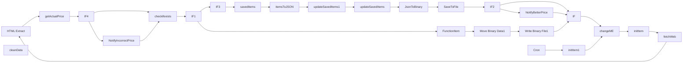

## Fluxo (.json) :

```json
{
  "nodes": [
    {
      "name": "HTML Extract",
      "type": "n8n-nodes-base.htmlExtract",
      "position": [
        -220,
        -390
      ],
      "parameters": {
        "options": {},
        "extractionValues": {
          "values": [
            {
              "key": "price",
              "cssSelector": "={{$node[\"initItem\"].json[\"selector\"]}}"
            }
          ]
        }
      },
      "typeVersion": 1
    },
    {
      "name": "Cron",
      "type": "n8n-nodes-base.cron",
      "position": [
        -1290,
        -390
      ],
      "parameters": {
        "triggerTimes": {
          "item": [
            {
              "mode": "everyX",
              "unit": "minutes",
              "value": 15
            }
          ]
        }
      },
      "typeVersion": 1
    },
    {
      "name": "getActualPrice",
      "type": "n8n-nodes-base.functionItem",
      "position": [
        -20,
        -390
      ],
      "parameters": {
        "functionCode": "const globalData = getWorkflowStaticData('global');\n\nvar price = String(item.price).replace(\",\", \".\");\nprice = parseFloat(price);\n//price = price.replace(/\\D/g, '');\n//item.price = String(item.price).replace(\",\", \".\");\n//item.price = parseFloat(item.price);\n\nitem.priceExists = (price > 0 ? true : false)\nitem.price = price;\n\n// Update its data\nglobalData.actualPrice = item;\n\nreturn item;"
      },
      "typeVersion": 1
    },
    {
      "name": "fetchWeb",
      "type": "n8n-nodes-base.httpRequest",
      "position": [
        -410,
        -390
      ],
      "parameters": {
        "url": "={{$node[\"initItem\"].json[\"link\"]}}",
        "options": {},
        "responseFormat": "string"
      },
      "typeVersion": 1
    },
    {
      "name": "FunctionItem",
      "type": "n8n-nodes-base.functionItem",
      "position": [
        1020,
        -390
      ],
      "parameters": {
        "functionCode": "const globalData = getWorkflowStaticData('global');\n\nglobalData.iteration = 0;\n//var thiselem = $node[\"initItem\"].json;\n\n//const s1 = {'slug': thiselem.slug, \"link\": thiselem.link, \"selector\": thiselem.selector, \"price\":$node[\"getActualPrice\"].json.price, \"currency\": thiselem.currency};\n//const s2 = {'slug': thiselem.slug+'2', \"link\": thiselem.link, \"selector\": thiselem.selector, \"price\":$node[\"getActualPrice\"].json.price, \"currency\": thiselem.currency};\n//const s3 = {'slug': thiselem.slug+'3', \"link\": thiselem.link, \"selector\": thiselem.selector, \"price\":$node[\"getActualPrice\"].json.price, \"currency\": thiselem.currency};\n\nreturn $node[\"changeME\"].json.myWatchers;\n"
      },
      "typeVersion": 1
    },
    {
      "name": "Write Binary File1",
      "type": "n8n-nodes-base.writeBinaryFile",
      "position": [
        1850,
        -390
      ],
      "parameters": {
        "fileName": "/data/kopacky.json",
        "dataPropertyName": "=price"
      },
      "typeVersion": 1
    },
    {
      "name": "Move Binary Data1",
      "type": "n8n-nodes-base.moveBinaryData",
      "position": [
        1420,
        -390
      ],
      "parameters": {
        "mode": "jsonToBinary",
        "options": {},
        "destinationKey": "price"
      },
      "typeVersion": 1
    },
    {
      "name": "IF1",
      "type": "n8n-nodes-base.if",
      "position": [
        550,
        -370
      ],
      "parameters": {
        "conditions": {
          "string": [
            {
              "value1": "={{$node[\"checkifexists\"].json[\"stdout\"]}}",
              "value2": "Exists",
              "operation": "notEqual"
            }
          ]
        }
      },
      "typeVersion": 1
    },
    {
      "name": "checkifexists",
      "type": "n8n-nodes-base.executeCommand",
      "position": [
        410,
        -370
      ],
      "parameters": {
        "command": "if [ -r /data/kopacky.json ]; then echo Exists; fi"
      },
      "typeVersion": 1
    },
    {
      "name": "IF3",
      "type": "n8n-nodes-base.if",
      "position": [
        680,
        110
      ],
      "parameters": {
        "conditions": {
          "string": [
            {
              "value1": "={{$node[\"checkifexists\"].json[\"stdout\"]}}",
              "value2": "Exists"
            }
          ]
        }
      },
      "typeVersion": 1
    },
    {
      "name": "SaveToFile",
      "type": "n8n-nodes-base.writeBinaryFile",
      "position": [
        1650,
        110
      ],
      "parameters": {
        "fileName": "/data/kopacky.json",
        "dataPropertyName": "=price"
      },
      "typeVersion": 1
    },
    {
      "name": "JsonToBinary",
      "type": "n8n-nodes-base.moveBinaryData",
      "position": [
        1500,
        110
      ],
      "parameters": {
        "mode": "jsonToBinary",
        "options": {},
        "destinationKey": "price"
      },
      "typeVersion": 1
    },
    {
      "name": "changeME",
      "type": "n8n-nodes-base.functionItem",
      "color": "#3BDD33",
      "position": [
        -830,
        -390
      ],
      "parameters": {
        "functionCode": "const globalData = getWorkflowStaticData('global');\n\n//{'slug': 'kopacky', 'link': 'https://www.adsport.sk/kopacky-lisovky-adidas-x-19-3-ll-fg-ef0598/#1131861', 'currency': 'EUR'}[]\nvar myWatchers = [\n{'slug': 'kopacky', 'link': 'https://www.adsport.sk/kopacky-lisovky-adidas-x-19-3-ll-fg-ef0598/#1131861', 'selector':'.prices > strong:nth-child(1) > span:nth-child(1)', 'currency': 'EUR'},\n{'slug': 'kopacky2', 'link': 'https://www.adsport.sk/turfy-adidas-ace-tango-17-3-tf-by2203/', 'selector':'.col-xs-4 > strong:nth-child(1) > span:nth-child(1)', 'currency': 'EUR'},\n{'slug': 'mobilcek', 'link': 'https://mobil.bazos.sk/inzerat/112253662/predam-odolny-doogee-s60-52-4g-lte-nfc.php', 'selector':'.listadvlevo > table:nth-child(1) > tbody:nth-child(1) > tr:nth-child(5) > td:nth-child(2) > b:nth-child(2)', 'currency': 'EUR'},\n{'slug': 'ADIZERO RC 2', 'link': 'https://www.adsport.sk/panske-bezecke-topanky-adidas-adizero-rc-2-eg1187/', 'selector':'.col-xs-4 > strong:nth-child(1) > span:nth-child(1)', 'currency': 'EUR'}\n];\n\nitem.myWatchers = myWatchers;\nitem.watchersCount = myWatchers.length;\nglobalData.myWatchers = myWatchers;\n\nreturn item;"
      },
      "typeVersion": 1
    },
    {
      "name": "initItem",
      "type": "n8n-nodes-base.functionItem",
      "position": [
        -620,
        -390
      ],
      "parameters": {
        "functionCode": "const globalData = getWorkflowStaticData('global');\n\nvar counter = globalData.iteration;\n\nitem.myWatchers[counter].watchersCount = item.watchersCount;\nitem.myWatchers[counter].canContinue = (globalData.iteration < item.watchersCount-1 ? true : false);\n//item.myWatchers[counter].canContinue = false;\n\nglobalData.iteration = counter + 1;\n\nreturn item.myWatchers[counter];"
      },
      "typeVersion": 1
    },
    {
      "name": "savedItems",
      "type": "n8n-nodes-base.readBinaryFile",
      "position": [
        850,
        -20
      ],
      "parameters": {
        "filePath": "/data/kopacky.json",
        "dataPropertyName": "savedItems"
      },
      "typeVersion": 1,
      "continueOnFail": true,
      "alwaysOutputData": true
    },
    {
      "name": "itemsToJSON",
      "type": "n8n-nodes-base.moveBinaryData",
      "position": [
        1020,
        -20
      ],
      "parameters": {
        "options": {},
        "sourceKey": "savedItems"
      },
      "typeVersion": 1
    },
    {
      "name": "IF",
      "type": "n8n-nodes-base.if",
      "position": [
        2190,
        -90
      ],
      "parameters": {
        "conditions": {
          "string": [],
          "boolean": [
            {
              "value1": "={{$node[\"initItem\"].json[\"canContinue\"]}}",
              "value2": true
            }
          ]
        }
      },
      "typeVersion": 1
    },
    {
      "name": "initItem1",
      "type": "n8n-nodes-base.functionItem",
      "position": [
        -1060,
        -390
      ],
      "parameters": {
        "functionCode": "const globalData = getWorkflowStaticData('global');\n\nglobalData.iteration = 0;\n\nreturn item;"
      },
      "typeVersion": 1
    },
    {
      "name": "IF2",
      "type": "n8n-nodes-base.if",
      "position": [
        1850,
        110
      ],
      "parameters": {
        "conditions": {
          "number": [
            {
              "value1": "={{$node[\"getActualPrice\"].json[\"price\"]}}",
              "value2": "={{$node[\"updateSavedItems1\"].json[\"oldPrice\"]}}"
            }
          ],
          "string": []
        }
      },
      "typeVersion": 1
    },
    {
      "name": "updateSavedItems",
      "type": "n8n-nodes-base.functionItem",
      "position": [
        1350,
        110
      ],
      "parameters": {
        "functionCode": "const globalData = getWorkflowStaticData('global');\n\nvar myitems = [];\nvar i;\nfor (i = 0; i < item.items.length; i++) { \n  if($node[\"initItem\"].json.slug == item.items[i].slug && $node[\"getActualPrice\"].json.price < item.items[i].price) {\n    item.items[i].price = $node[\"getActualPrice\"].json.price;\n  }\n  myitems.push(item.items[i]);\n} \n\nreturn myitems;\n"
      },
      "typeVersion": 1
    },
    {
      "name": "updateSavedItems1",
      "type": "n8n-nodes-base.functionItem",
      "position": [
        1200,
        -20
      ],
      "parameters": {
        "functionCode": "const globalData = getWorkflowStaticData('global');\nvar oldPrice = null;\nvar myitems = [];\nvar i;\nfor (i = 0; i < item.length; i++) {\n  if($node[\"initItem\"].json.slug == item[i].slug) {\n\n    item[i].link = $node[\"initItem\"].json.link;\n    item[i].selector = $node[\"initItem\"].json.selector;\n    item[i].currency = $node[\"initItem\"].json.currency;\n    \n    if(!item[i].price){\n      item[i].price = $node[\"getActualPrice\"].json.price;\n    }\n    \n    if($node[\"getActualPrice\"].json.price < item[i].price){\n      oldPrice = item[i].price;\n      item[i].price = $node[\"getActualPrice\"].json.price;\n    }\n    \n    \n  }\n  \n  myitems.push(item[i]);\n} \n\n//item.somar = $node[\"initItem\"].json;\n//return globalData.actualPrice;\n\nvar itemm = {};\nitemm.items = myitems;\nitemm.oldPrice = oldPrice;\nreturn itemm;\n"
      },
      "typeVersion": 1
    },
    {
      "name": "cleanData",
      "type": "n8n-nodes-base.executeCommand",
      "notes": "This will remove all storaged data.",
      "position": [
        -1290,
        -560
      ],
      "parameters": {
        "command": "file=\"/data/kopacky.json\"\n[ -f $file ] && rm $file"
      },
      "typeVersion": 1
    },
    {
      "name": "IF4",
      "type": "n8n-nodes-base.if",
      "position": [
        150,
        -390
      ],
      "parameters": {
        "conditions": {
          "string": [],
          "boolean": [
            {
              "value1": "={{$node[\"getActualPrice\"].json[\"priceExists\"]}}"
            }
          ]
        }
      },
      "typeVersion": 1
    },
    {
      "name": "NotifyBetterPrice",
      "type": "n8n-nodes-base.emailSend",
      "position": [
        1850,
        -90
      ],
      "parameters": {
        "html": "=<h2>Nová cena je: {{$node[\"getActualPrice\"].json[\"price\"]}} {{$node[\"initItem\"].json[\"currency\"]}}</h2><br>\nPôvodná cena bola: {{$node[\"updateSavedItems1\"].json[\"oldPrice\"]}} {{$node[\"initItem\"].json[\"currency\"]}}<br>\nURL: {{$node[\"initItem\"].json[\"link\"]}}",
        "text": "=",
        "options": {},
        "subject": "=Nová cena - {{$node[\"initItem\"].json[\"slug\"]}} - {{$node[\"getActualPrice\"].json[\"price\"]}} {{$node[\"initItem\"].json[\"currency\"]}}",
        "toEmail": "sthosstudio@gmail.com",
        "fromEmail": "hostovecky@weyou.sk"
      },
      "credentials": {
        "smtp": "hostovecky@weyou.sk"
      },
      "typeVersion": 1
    },
    {
      "name": "NotifyIncorrectPrice",
      "type": "n8n-nodes-base.emailSend",
      "position": [
        270,
        -690
      ],
      "parameters": {
        "html": "=Please check the link or selector for the item with slug <strong>{{$node[\"initItem\"].json[\"slug\"]}}</strong><br>\nURL: {{$node[\"initItem\"].json[\"link\"]}}",
        "text": "=",
        "options": {},
        "subject": "={{$node[\"initItem\"].json[\"slug\"]}} - Getting price issue.",
        "toEmail": "sthosstudio@gmail.com",
        "fromEmail": "hostovecky@weyou.sk"
      },
      "credentials": {
        "smtp": "hostovecky@weyou.sk"
      },
      "typeVersion": 1
    }
  ],
  "connections": {
    "IF": {
      "main": [
        [
          {
            "node": "changeME",
            "type": "main",
            "index": 0
          }
        ]
      ]
    },
    "IF1": {
      "main": [
        [
          {
            "node": "FunctionItem",
            "type": "main",
            "index": 0
          }
        ],
        [
          {
            "node": "IF3",
            "type": "main",
            "index": 0
          }
        ]
      ]
    },
    "IF2": {
      "main": [
        [
          {
            "node": "NotifyBetterPrice",
            "type": "main",
            "index": 0
          }
        ],
        [
          {
            "node": "IF",
            "type": "main",
            "index": 0
          }
        ]
      ]
    },
    "IF3": {
      "main": [
        [
          {
            "node": "savedItems",
            "type": "main",
            "index": 0
          }
        ]
      ]
    },
    "IF4": {
      "main": [
        [
          {
            "node": "NotifyIncorrectPrice",
            "type": "main",
            "index": 0
          }
        ],
        [
          {
            "node": "checkifexists",
            "type": "main",
            "index": 0
          }
        ]
      ]
    },
    "Cron": {
      "main": [
        [
          {
            "node": "initItem1",
            "type": "main",
            "index": 0
          }
        ]
      ]
    },
    "changeME": {
      "main": [
        [
          {
            "node": "initItem",
            "type": "main",
            "index": 0
          }
        ]
      ]
    },
    "fetchWeb": {
      "main": [
        [
          {
            "node": "HTML Extract",
            "type": "main",
            "index": 0
          }
        ]
      ]
    },
    "initItem": {
      "main": [
        [
          {
            "node": "fetchWeb",
            "type": "main",
            "index": 0
          }
        ]
      ]
    },
    "initItem1": {
      "main": [
        [
          {
            "node": "changeME",
            "type": "main",
            "index": 0
          }
        ]
      ]
    },
    "SaveToFile": {
      "main": [
        [
          {
            "node": "IF2",
            "type": "main",
            "index": 0
          }
        ]
      ]
    },
    "savedItems": {
      "main": [
        [
          {
            "node": "itemsToJSON",
            "type": "main",
            "index": 0
          }
        ]
      ]
    },
    "itemsToJSON": {
      "main": [
        [
          {
            "node": "updateSavedItems1",
            "type": "main",
            "index": 0
          }
        ]
      ]
    },
    "FunctionItem": {
      "main": [
        [
          {
            "node": "Move Binary Data1",
            "type": "main",
            "index": 0
          }
        ]
      ]
    },
    "HTML Extract": {
      "main": [
        [
          {
            "node": "getActualPrice",
            "type": "main",
            "index": 0
          }
        ]
      ]
    },
    "JsonToBinary": {
      "main": [
        [
          {
            "node": "SaveToFile",
            "type": "main",
            "index": 0
          }
        ]
      ]
    },
    "checkifexists": {
      "main": [
        [
          {
            "node": "IF1",
            "type": "main",
            "index": 0
          }
        ]
      ]
    },
    "getActualPrice": {
      "main": [
        [
          {
            "node": "IF4",
            "type": "main",
            "index": 0
          }
        ]
      ]
    },
    "updateSavedItems": {
      "main": [
        [
          {
            "node": "JsonToBinary",
            "type": "main",
            "index": 0
          }
        ]
      ]
    },
    "Move Binary Data1": {
      "main": [
        [
          {
            "node": "Write Binary File1",
            "type": "main",
            "index": 0
          }
        ]
      ]
    },
    "NotifyBetterPrice": {
      "main": [
        [
          {
            "node": "IF",
            "type": "main",
            "index": 0
          }
        ]
      ]
    },
    "updateSavedItems1": {
      "main": [
        [
          {
            "node": "updateSavedItems",
            "type": "main",
            "index": 0
          }
        ]
      ]
    },
    "Write Binary File1": {
      "main": [
        [
          {
            "node": "IF",
            "type": "main",
            "index": 0
          }
        ]
      ]
    },
    "NotifyIncorrectPrice": {
      "main": [
        [
          {
            "node": "checkifexists",
            "type": "main",
            "index": 0
          }
        ]
      ]
    }
  }
}
```

<a id="template-326"></a>

## Template 326 - Sincronizar tickets Zendesk para HubSpot (a cada 5 min)

- **Nome:** Sincronizar tickets Zendesk para HubSpot (a cada 5 min)
- **Descrição:** Fluxo agendado que sincroniza tickets atualizados do Zendesk com o HubSpot, criando ou atualizando tickets e contatos conforme necessário e mantendo IDs externos em ambas as plataformas.
- **Funcionalidade:** • Agendamento periódico: Dispara a execução a cada 5 minutos para verificar atualizações.
• Controle de execução anterior: Recupera e atualiza um timestamp da última execução para consultar apenas alterações recentes.
• Consulta de tickets atualizados: Busca tickets no Zendesk que foram atualizados desde o último timestamp.
• Recuperação de dados do solicitante: Obtém os dados do usuário solicitante de cada ticket para uso na sincronização.
• Junção de dados do ticket e do usuário: Une informações do ticket com os dados do solicitante antes de prosseguir.
• Verificação de vínculo com HubSpot: Detecta se o ticket já possui um identificador externo vinculado ao HubSpot.
• Atualização de ticket existente no HubSpot: Se houver vínculo, atualiza nome e descrição do ticket correspondente no HubSpot.
• Criação de ticket no HubSpot: Se não houver vínculo, cria um novo ticket no HubSpot e associa o contato correspondente.
• Criação/atualização de contato no HubSpot: Cria ou atualiza o contato no HubSpot com base no e-mail do solicitante.
• Sincronização de IDs externos: Após criar ou atualizar recursos no HubSpot, atualiza os campos de external_id no Zendesk para o ticket e para o usuário.
• Persistência do timestamp final: Atualiza o timestamp de última execução ao final do processamento para a próxima verificação.
- **Ferramentas:** • Zendesk: Fonte dos tickets e usuários; armazena e atualiza campos externos (external_id) para vinculação.
• HubSpot: Plataforma onde tickets e contatos são criados ou atualizados e vinculados entre si.

## Fluxo visual

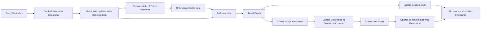

## Fluxo (.json) :

```json
{
  "meta": {
    "instanceId": "237600ca44303ce91fa31ee72babcdc8493f55ee2c0e8aa2b78b3b4ce6f70bd9"
  },
  "nodes": [
    {
      "id": "dcd5f025-9af9-4e3a-96fc-25a33dcc6c00",
      "name": "Ticket Exists",
      "type": "n8n-nodes-base.if",
      "position": [
        900,
        320
      ],
      "parameters": {
        "conditions": {
          "string": [
            {
              "value1": "={{ $json[\"external_id\"] }}",
              "operation": "isNotEmpty"
            }
          ]
        }
      },
      "typeVersion": 1
    },
    {
      "id": "a5e8ec4d-bc80-4153-a677-91be2e7d02b7",
      "name": "Get user data of Ticket requester",
      "type": "n8n-nodes-base.zendesk",
      "position": [
        220,
        480
      ],
      "parameters": {
        "id": "={{ $json[\"requester_id\"] }}",
        "resource": "user",
        "operation": "get"
      },
      "credentials": {
        "zendeskApi": {
          "id": "5",
          "name": "Zendesk account"
        }
      },
      "typeVersion": 1
    },
    {
      "id": "6dc07af8-d446-4704-9a08-e65f89772a9b",
      "name": "Only keep needed data",
      "type": "n8n-nodes-base.set",
      "position": [
        440,
        480
      ],
      "parameters": {
        "values": {
          "number": [
            {
              "name": "id",
              "value": "={{ $json[\"id\"] }}"
            },
            {
              "name": "contactExternalId",
              "value": "={{ $json[\"external_id\"] }}"
            }
          ],
          "string": [
            {
              "name": "contactEmail",
              "value": "={{ $json[\"email\"] }}"
            },
            {
              "name": "contactName",
              "value": "={{ $json[\"name\"] }}"
            }
          ]
        },
        "options": {},
        "keepOnlySet": true
      },
      "typeVersion": 1
    },
    {
      "id": "c3ca22e4-ae76-49ee-b117-f6da9d90ec1a",
      "name": "Add user data",
      "type": "n8n-nodes-base.merge",
      "position": [
        640,
        320
      ],
      "parameters": {
        "mode": "mergeByKey",
        "propertyName1": "requester_id",
        "propertyName2": "id"
      },
      "typeVersion": 1
    },
    {
      "id": "713b919a-3a39-4466-b9b8-cc3575f02e45",
      "name": "Update existing ticket",
      "type": "n8n-nodes-base.hubspot",
      "position": [
        1280,
        300
      ],
      "parameters": {
        "resource": "ticket",
        "ticketId": "={{ $json[\"external_id\"] }}",
        "operation": "update",
        "updateFields": {
          "ticketName": "={{ $json[\"raw_subject\"] }}",
          "description": "={{ $json[\"description\"] }}"
        },
        "authentication": "oAuth2"
      },
      "credentials": {
        "hubspotOAuth2Api": {
          "id": "21",
          "name": "HubSpot account"
        }
      },
      "typeVersion": 1,
      "continueOnFail": true
    },
    {
      "id": "1eb40a93-2d36-4b3e-a39d-f19f369adc4e",
      "name": "Update Zendesk ticket with External Id",
      "type": "n8n-nodes-base.zendesk",
      "position": [
        2020,
        480
      ],
      "parameters": {
        "id": "={{ $node[\"Contact Exists\"].json[\"id\"] }}",
        "operation": "update",
        "updateFields": {
          "externalId": "={{ $json[\"objectId\"] }}"
        }
      },
      "credentials": {
        "zendeskApi": {
          "id": "5",
          "name": "Zendesk account"
        }
      },
      "typeVersion": 1
    },
    {
      "id": "a11c8809-c22f-40f5-a019-79274eba4d70",
      "name": "Get last execution timestamp",
      "type": "n8n-nodes-base.functionItem",
      "position": [
        -260,
        300
      ],
      "parameters": {
        "functionCode": "// Code here will run once per input item.\n// More info and help: https://docs.n8n.io/nodes/n8n-nodes-base.functionItem\n// Tip: You can use luxon for dates and $jmespath for querying JSON structures\n\n// Add a new field called 'myNewField' to the JSON of the item\nconst staticData = getWorkflowStaticData('global');\n\nif(!staticData.lastExecution){\n  staticData.lastExecution = new Date().toISOString();\n}\n\nitem.executionTimeStamp = new Date().toISOString();\nitem.lastExecution = staticData.lastExecution;\n\n\nreturn item;"
      },
      "typeVersion": 1
    },
    {
      "id": "a62685c9-f786-4e7c-9e2d-cdcb1e0a3aea",
      "name": "Get tickets updated after last execution",
      "type": "n8n-nodes-base.zendesk",
      "position": [
        -40,
        300
      ],
      "parameters": {
        "options": {
          "query": "=updated>{{ $json[\"lastExecution\"] }}",
          "sortBy": "updated_at",
          "sortOrder": "desc"
        },
        "operation": "getAll"
      },
      "credentials": {
        "zendeskApi": {
          "id": "5",
          "name": "Zendesk account"
        }
      },
      "typeVersion": 1
    },
    {
      "id": "c1b23aa8-a9f6-4966-b1dc-fe48c203364c",
      "name": "Set new last execution timestamp",
      "type": "n8n-nodes-base.functionItem",
      "position": [
        2360,
        300
      ],
      "parameters": {
        "functionCode": "// Code here will run once per input item.\n// More info and help: https://docs.n8n.io/nodes/n8n-nodes-base.functionItem\n// Tip: You can use luxon for dates and $jmespath for querying JSON structures\n\n// Add a new field called 'myNewField' to the JSON of the item\nconst staticData = getWorkflowStaticData('global');\n\nstaticData.lastExecution = $item(0).$node[\"Get last execution timestamp\"].executionTimeStamp;\n\nreturn item;"
      },
      "executeOnce": true,
      "typeVersion": 1
    },
    {
      "id": "97ae70de-bce8-4861-a256-17002625da58",
      "name": "Every 5 minutes",
      "type": "n8n-nodes-base.cron",
      "position": [
        -460,
        300
      ],
      "parameters": {
        "triggerTimes": {
          "item": [
            {
              "mode": "everyX",
              "unit": "minutes",
              "value": 5
            }
          ]
        }
      },
      "typeVersion": 1
    },
    {
      "id": "1d2dd552-175c-4405-b304-d4136dd2968b",
      "name": "Create new Ticket",
      "type": "n8n-nodes-base.hubspot",
      "position": [
        1780,
        480
      ],
      "parameters": {
        "stageId": "1",
        "resource": "ticket",
        "pipelineId": "0",
        "ticketName": "={{ $node['Ticket Exists'].json[\"raw_subject\"] }}",
        "authentication": "oAuth2",
        "additionalFields": {
          "description": "={{ $node['Ticket Exists'].json[\"description\"] }}",
          "associatedContactIds": "={{ [].concat($node[\"Create or update contact\"].json[\"vid\"]) }}"
        }
      },
      "credentials": {
        "hubspotOAuth2Api": {
          "id": "21",
          "name": "HubSpot account"
        }
      },
      "executeOnce": false,
      "typeVersion": 1
    },
    {
      "id": "e2217f74-f1b2-4449-9937-543758a333ea",
      "name": "Update External Id in Zendesk for contact",
      "type": "n8n-nodes-base.zendesk",
      "position": [
        1520,
        480
      ],
      "parameters": {
        "id": "={{ $node[\"Ticket Exists\"].json[\"requester_id\"] }}",
        "resource": "user",
        "operation": "update",
        "updateFields": {
          "external_id": "={{ $json[\"vid\"] }}"
        }
      },
      "credentials": {
        "zendeskApi": {
          "id": "5",
          "name": "Zendesk account"
        }
      },
      "typeVersion": 1
    },
    {
      "id": "144a3395-9f61-4aad-99e0-4a689145f93d",
      "name": "Create or update contact",
      "type": "n8n-nodes-base.hubspot",
      "position": [
        1280,
        480
      ],
      "parameters": {
        "email": "={{ $json[\"contactEmail\"] }}",
        "resource": "contact",
        "authentication": "oAuth2",
        "additionalFields": {}
      },
      "credentials": {
        "hubspotOAuth2Api": {
          "id": "21",
          "name": "HubSpot account"
        }
      },
      "typeVersion": 1
    }
  ],
  "connections": {
    "Add user data": {
      "main": [
        [
          {
            "node": "Ticket Exists",
            "type": "main",
            "index": 0
          }
        ]
      ]
    },
    "Ticket Exists": {
      "main": [
        [
          {
            "node": "Update existing ticket",
            "type": "main",
            "index": 0
          }
        ],
        [
          {
            "node": "Create or update contact",
            "type": "main",
            "index": 0
          }
        ]
      ]
    },
    "Every 5 minutes": {
      "main": [
        [
          {
            "node": "Get last execution timestamp",
            "type": "main",
            "index": 0
          }
        ]
      ]
    },
    "Create new Ticket": {
      "main": [
        [
          {
            "node": "Update Zendesk ticket with External Id",
            "type": "main",
            "index": 0
          }
        ]
      ]
    },
    "Only keep needed data": {
      "main": [
        [
          {
            "node": "Add user data",
            "type": "main",
            "index": 1
          }
        ]
      ]
    },
    "Update existing ticket": {
      "main": [
        [
          {
            "node": "Set new last execution timestamp",
            "type": "main",
            "index": 0
          }
        ]
      ]
    },
    "Create or update contact": {
      "main": [
        [
          {
            "node": "Update External Id in Zendesk for contact",
            "type": "main",
            "index": 0
          }
        ]
      ]
    },
    "Get last execution timestamp": {
      "main": [
        [
          {
            "node": "Get tickets updated after last execution",
            "type": "main",
            "index": 0
          }
        ]
      ]
    },
    "Get user data of Ticket requester": {
      "main": [
        [
          {
            "node": "Only keep needed data",
            "type": "main",
            "index": 0
          }
        ]
      ]
    },
    "Update Zendesk ticket with External Id": {
      "main": [
        [
          {
            "node": "Set new last execution timestamp",
            "type": "main",
            "index": 0
          }
        ]
      ]
    },
    "Get tickets updated after last execution": {
      "main": [
        [
          {
            "node": "Get user data of Ticket requester",
            "type": "main",
            "index": 0
          },
          {
            "node": "Add user data",
            "type": "main",
            "index": 0
          }
        ]
      ]
    },
    "Update External Id in Zendesk for contact": {
      "main": [
        [
          {
            "node": "Create new Ticket",
            "type": "main",
            "index": 0
          }
        ]
      ]
    }
  }
}
```

<a id="template-327"></a>

## Template 327 - Candidatura com extração de CV por IA

- **Nome:** Candidatura com extração de CV por IA
- **Descrição:** Automatiza o recebimento de CVs em PDF, validação do documento, extração de dados relevantes com IA, geração de uma carta de apresentação curta e armazenamento dos dados no sistema de recrutamento.
- **Funcionalidade:** • Upload de CV em PDF: Recebe o currículo enviado pelo candidato através de um formulário web.
• Extração de texto do PDF: Converte o conteúdo do ficheiro PDF para texto para processamento posterior.
• Classificação de documento: Verifica se o ficheiro é um CV válido; em caso de falha, solicita novo envio.
• Extração contextual com IA: Utiliza um modelo de linguagem com o anúncio de emprego como contexto para extrair informações relevantes do CV (nome, contacto, educação, competências, experiência, etc.).
• Geração de carta de apresentação: Produz uma carta de apresentação curta e formal baseada no CV e no job post.
• Parser de saída estruturada: Mapeia a informação extraída para campos predefinidos para uso em formulários e base de dados.
• Pré-preenchimento e redirecionamento: Encoda os dados extraídos e redireciona o candidato para um segundo formulário já preenchido para revisão e edição.
• Armazenamento e anexo de ficheiro: Cria ou atualiza um registo no sistema de acompanhamento (ATS) e anexa o PDF do CV ao registo.
• Mensagens de sucesso e fluxo de continuação: Informa o candidato sobre o sucesso do envio e orienta para os próximos passos do processo.
- **Ferramentas:** • OpenAI API: Serviço de modelos de linguagem usado para classificar documentos, extrair informações do CV e gerar a carta de apresentação.
• Airtable: Base de dados/ATS utilizada para armazenar os campos extraídos do candidato e guardar o PDF como anexo no registo.

## Fluxo visual

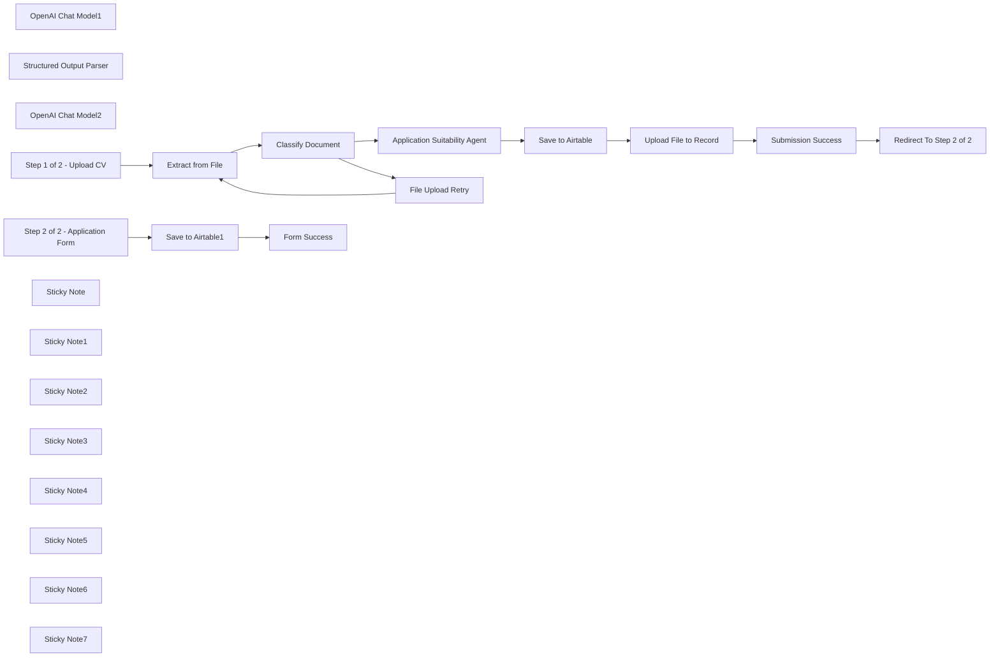

## Fluxo (.json) :

```json
{
  "meta": {
    "instanceId": "408f9fb9940c3cb18ffdef0e0150fe342d6e655c3a9fac21f0f644e8bedabcd9"
  },
  "nodes": [
    {
      "id": "10565888-4a1b-439a-a188-c6ee7990bb63",
      "name": "Extract from File",
      "type": "n8n-nodes-base.extractFromFile",
      "position": [
        860,
        260
      ],
      "parameters": {
        "options": {},
        "operation": "pdf",
        "binaryPropertyName": "File_Upload"
      },
      "typeVersion": 1
    },
    {
      "id": "583aff4b-d9f5-44e7-8e91-4938592b5630",
      "name": "OpenAI Chat Model1",
      "type": "@n8n/n8n-nodes-langchain.lmChatOpenAi",
      "position": [
        1740,
        380
      ],
      "parameters": {
        "options": {}
      },
      "credentials": {
        "openAiApi": {
          "id": "8gccIjcuf3gvaoEr",
          "name": "OpenAi account"
        }
      },
      "typeVersion": 1
    },
    {
      "id": "3a09afd0-0dce-41fd-bec3-783fcb3d01fc",
      "name": "Structured Output Parser",
      "type": "@n8n/n8n-nodes-langchain.outputParserStructured",
      "position": [
        1920,
        380
      ],
      "parameters": {
        "schemaType": "manual",
        "inputSchema": "{\n  \"type\": \"object\",\n  \"properties\": {\n    \"Name\": { \"type\": \"string\" },\n    \"Address\": { \"type\": \"string\" },\n    \"Email\": { \"type\": \"string\" },\n    \"Telephone\": { \"type\": \"string\" },\n    \"Education\": { \"type\": \"string\" },\n    \"Skills & Technologies\": { \"type\": \"string\" },\n    \"Years of Experience\": { \"type\": \"string\" },\n    \"Cover Letter\": { \"type\": \"string\" }\n  }\n}"
      },
      "typeVersion": 1.2
    },
    {
      "id": "541a00d0-1635-48ad-b69e-83b28e178d6e",
      "name": "OpenAI Chat Model2",
      "type": "@n8n/n8n-nodes-langchain.lmChatOpenAi",
      "position": [
        1020,
        420
      ],
      "parameters": {
        "options": {}
      },
      "credentials": {
        "openAiApi": {
          "id": "8gccIjcuf3gvaoEr",
          "name": "OpenAi account"
        }
      },
      "typeVersion": 1
    },
    {
      "id": "19e4ad5b-2f96-491c-bcb3-52cca526ff82",
      "name": "Step 1 of 2 - Upload CV",
      "type": "n8n-nodes-base.formTrigger",
      "position": [
        460,
        220
      ],
      "webhookId": "4cf0f3b7-6282-47af-a7f1-3dfb00a1311d",
      "parameters": {
        "options": {
          "path": "job-application-step1of2",
          "ignoreBots": true,
          "buttonLabel": "Submit",
          "useWorkflowTimezone": true
        },
        "formTitle": "Step 1 of 2: Submit Your CV",
        "formFields": {
          "values": [
            {
              "fieldLabel": "Name",
              "placeholder": "Eg. Sam Smith",
              "requiredField": true
            },
            {
              "fieldType": "file",
              "fieldLabel": "File Upload",
              "multipleFiles": false,
              "requiredField": true,
              "acceptFileTypes": "pdf"
            },
            {
              "fieldType": "dropdown",
              "fieldLabel": "Acknowledgement of Terms",
              "multiselect": true,
              "fieldOptions": {
                "values": [
                  {
                    "option": "I agree to the terms & conditions"
                  }
                ]
              },
              "requiredField": true
            }
          ]
        },
        "responseMode": "lastNode",
        "formDescription": "Thank you for your interest in applying for Acme Inc. To ensure a speedy process, please ensure you following all instructions and fill out all required inputs.\n\nThis step requires you upload your CV in a password-free PDF document. Any document that is not a CV will be rejected."
      },
      "typeVersion": 2.2
    },
    {
      "id": "ec54096b-5f9f-444e-87b1-db99197731f1",
      "name": "Save to Airtable",
      "type": "n8n-nodes-base.airtable",
      "position": [
        2340,
        320
      ],
      "parameters": {
        "base": {
          "__rl": true,
          "mode": "list",
          "value": "appQ6mE9KSzlvaGDT",
          "cachedResultUrl": "https://airtable.com/appQ6mE9KSzlvaGDT",
          "cachedResultName": "Job Applications with AI & Forms"
        },
        "table": {
          "__rl": true,
          "mode": "list",
          "value": "tblUwwRXGnNzesNgr",
          "cachedResultUrl": "https://airtable.com/appQ6mE9KSzlvaGDT/tblUwwRXGnNzesNgr",
          "cachedResultName": "Table 1"
        },
        "columns": {
          "value": {
            "Name": "={{ $json.output.Name }}",
            "Email": "={{ $json.output.Email }}",
            "Address": "={{ $json.output.Address }}",
            "Education": "={{ $json.output.Education }}",
            "Telephone": "={{ $json.output.Telephone }}",
            "Cover Letter": "={{ $json.output['Cover Letter'] }}",
            "Submitted By": "={{ $('Step 1 of 2 - Upload CV').first().json.Name }}",
            "Years of Experience": "={{ $json.output['Years of Experience'] }}",
            "Skills & Technologies": "={{ $json.output['Skills & Technologies'] }}"
          },
          "schema": [
            {
              "id": "Name",
              "type": "string",
              "display": true,
              "removed": false,
              "readOnly": false,
              "required": false,
              "displayName": "Name",
              "defaultMatch": false,
              "canBeUsedToMatch": true
            },
            {
              "id": "File",
              "type": "array",
              "display": true,
              "removed": true,
              "readOnly": false,
              "required": false,
              "displayName": "File",
              "defaultMatch": false,
              "canBeUsedToMatch": true
            },
            {
              "id": "Cover Letter",
              "type": "string",
              "display": true,
              "removed": false,
              "readOnly": false,
              "required": false,
              "displayName": "Cover Letter",
              "defaultMatch": false,
              "canBeUsedToMatch": true
            },
            {
              "id": "Address",
              "type": "string",
              "display": true,
              "removed": false,
              "readOnly": false,
              "required": false,
              "displayName": "Address",
              "defaultMatch": false,
              "canBeUsedToMatch": true
            },
            {
              "id": "Email",
              "type": "string",
              "display": true,
              "removed": false,
              "readOnly": false,
              "required": false,
              "displayName": "Email",
              "defaultMatch": false,
              "canBeUsedToMatch": true
            },
            {
              "id": "Telephone",
              "type": "string",
              "display": true,
              "removed": false,
              "readOnly": false,
              "required": false,
              "displayName": "Telephone",
              "defaultMatch": false,
              "canBeUsedToMatch": true
            },
            {
              "id": "Education",
              "type": "string",
              "display": true,
              "removed": false,
              "readOnly": false,
              "required": false,
              "displayName": "Education",
              "defaultMatch": false,
              "canBeUsedToMatch": true
            },
            {
              "id": "Skills & Technologies",
              "type": "string",
              "display": true,
              "removed": false,
              "readOnly": false,
              "required": false,
              "displayName": "Skills & Technologies",
              "defaultMatch": false,
              "canBeUsedToMatch": true
            },
            {
              "id": "Years of Experience",
              "type": "string",
              "display": true,
              "removed": false,
              "readOnly": false,
              "required": false,
              "displayName": "Years of Experience",
              "defaultMatch": false,
              "canBeUsedToMatch": true
            },
            {
              "id": "Created",
              "type": "string",
              "display": true,
              "removed": true,
              "readOnly": true,
              "required": false,
              "displayName": "Created",
              "defaultMatch": false,
              "canBeUsedToMatch": true
            },
            {
              "id": "Last Modified",
              "type": "string",
              "display": true,
              "removed": true,
              "readOnly": true,
              "required": false,
              "displayName": "Last Modified",
              "defaultMatch": false,
              "canBeUsedToMatch": true
            },
            {
              "id": "Submitted By",
              "type": "string",
              "display": true,
              "removed": false,
              "readOnly": false,
              "required": false,
              "displayName": "Submitted By",
              "defaultMatch": false,
              "canBeUsedToMatch": true
            }
          ],
          "mappingMode": "defineBelow",
          "matchingColumns": []
        },
        "options": {},
        "operation": "create"
      },
      "credentials": {
        "airtableTokenApi": {
          "id": "Und0frCQ6SNVX3VV",
          "name": "Airtable Personal Access Token account"
        }
      },
      "typeVersion": 2.1
    },
    {
      "id": "127965b3-a2c6-443b-942d-8691b5bcb25d",
      "name": "Classify Document",
      "type": "@n8n/n8n-nodes-langchain.textClassifier",
      "position": [
        1020,
        260
      ],
      "parameters": {
        "options": {
          "fallback": "other"
        },
        "inputText": "={{ $json.text }}",
        "categories": {
          "categories": [
            {
              "category": "CV or Resume",
              "description": "This document is a CV or Resume"
            }
          ]
        }
      },
      "typeVersion": 1
    },
    {
      "id": "b82476c8-b285-467f-b344-e1f667f42479",
      "name": "Upload File to Record",
      "type": "n8n-nodes-base.httpRequest",
      "position": [
        2540,
        320
      ],
      "parameters": {
        "url": "=https://content.airtable.com/v0/{{ $('Save to Airtable').params.base.value }}/{{ $json.id }}/File/uploadAttachment",
        "method": "POST",
        "options": {},
        "sendBody": true,
        "authentication": "predefinedCredentialType",
        "bodyParameters": {
          "parameters": [
            {
              "name": "contentType",
              "value": "application/pdf"
            },
            {
              "name": "filename",
              "value": "={{ $workflow.id }}-{{ $execution.id }}.pdf"
            },
            {
              "name": "file",
              "value": "={{ $('Step 1 of 2 - Upload CV').first().binary.File_Upload.data }}"
            }
          ]
        },
        "nodeCredentialType": "airtableTokenApi"
      },
      "credentials": {
        "airtableTokenApi": {
          "id": "Und0frCQ6SNVX3VV",
          "name": "Airtable Personal Access Token account"
        }
      },
      "typeVersion": 4.2
    },
    {
      "id": "ee6f59ee-781f-4ed4-8cec-b7de70a82dac",
      "name": "Form Success",
      "type": "n8n-nodes-base.form",
      "position": [
        3900,
        320
      ],
      "webhookId": "4b154ccc-ad54-4cc2-a239-cf8354fc91bf",
      "parameters": {
        "options": {},
        "operation": "completion",
        "completionTitle": "Application Success",
        "completionMessage": "Thank you for completing the application process.\nYour informaion is filed securely and will be reviewed by our team.\n\nWe will be in touch shortly."
      },
      "typeVersion": 1
    },
    {
      "id": "43d46474-b9f8-4adf-89f8-d4c993641448",
      "name": "Save to Airtable1",
      "type": "n8n-nodes-base.airtable",
      "onError": "continueErrorOutput",
      "position": [
        3720,
        320
      ],
      "parameters": {
        "base": {
          "__rl": true,
          "mode": "list",
          "value": "appQ6mE9KSzlvaGDT",
          "cachedResultUrl": "https://airtable.com/appQ6mE9KSzlvaGDT",
          "cachedResultName": "Job Applications with AI & Forms"
        },
        "table": {
          "__rl": true,
          "mode": "list",
          "value": "tblUwwRXGnNzesNgr",
          "cachedResultUrl": "https://airtable.com/appQ6mE9KSzlvaGDT/tblUwwRXGnNzesNgr",
          "cachedResultName": "Table 1"
        },
        "columns": {
          "value": {
            "Name": "={{ $json.Name }}",
            "Email": "={{ $json.Email }}",
            "Address": "={{ $json.Address }}",
            "Education": "={{ $json.Education }}",
            "Telephone": "={{ $json.Telephone }}",
            "Cover Letter": "={{ $json.output['Cover Letter'] }}",
            "Years of Experience": "={{ $json['Years of Experience'] }}",
            "Skills & Technologies": "={{ $json['Skills & Technologies'] }}"
          },
          "schema": [
            {
              "id": "Name",
              "type": "string",
              "display": true,
              "removed": false,
              "readOnly": false,
              "required": false,
              "displayName": "Name",
              "defaultMatch": false,
              "canBeUsedToMatch": true
            },
            {
              "id": "File",
              "type": "array",
              "display": true,
              "removed": true,
              "readOnly": false,
              "required": false,
              "displayName": "File",
              "defaultMatch": false,
              "canBeUsedToMatch": true
            },
            {
              "id": "Cover Letter",
              "type": "string",
              "display": true,
              "removed": false,
              "readOnly": false,
              "required": false,
              "displayName": "Cover Letter",
              "defaultMatch": false,
              "canBeUsedToMatch": true
            },
            {
              "id": "Address",
              "type": "string",
              "display": true,
              "removed": false,
              "readOnly": false,
              "required": false,
              "displayName": "Address",
              "defaultMatch": false,
              "canBeUsedToMatch": true
            },
            {
              "id": "Email",
              "type": "string",
              "display": true,
              "removed": false,
              "readOnly": false,
              "required": false,
              "displayName": "Email",
              "defaultMatch": false,
              "canBeUsedToMatch": true
            },
            {
              "id": "Telephone",
              "type": "string",
              "display": true,
              "removed": false,
              "readOnly": false,
              "required": false,
              "displayName": "Telephone",
              "defaultMatch": false,
              "canBeUsedToMatch": true
            },
            {
              "id": "Education",
              "type": "string",
              "display": true,
              "removed": false,
              "readOnly": false,
              "required": false,
              "displayName": "Education",
              "defaultMatch": false,
              "canBeUsedToMatch": true
            },
            {
              "id": "Skills & Technologies",
              "type": "string",
              "display": true,
              "removed": false,
              "readOnly": false,
              "required": false,
              "displayName": "Skills & Technologies",
              "defaultMatch": false,
              "canBeUsedToMatch": true
            },
            {
              "id": "Years of Experience",
              "type": "string",
              "display": true,
              "removed": false,
              "readOnly": false,
              "required": false,
              "displayName": "Years of Experience",
              "defaultMatch": false,
              "canBeUsedToMatch": true
            },
            {
              "id": "Created",
              "type": "string",
              "display": true,
              "removed": true,
              "readOnly": true,
              "required": false,
              "displayName": "Created",
              "defaultMatch": false,
              "canBeUsedToMatch": true
            },
            {
              "id": "Last Modified",
              "type": "string",
              "display": true,
              "removed": true,
              "readOnly": true,
              "required": false,
              "displayName": "Last Modified",
              "defaultMatch": false,
              "canBeUsedToMatch": true
            },
            {
              "id": "Submitted By",
              "type": "string",
              "display": true,
              "removed": true,
              "readOnly": false,
              "required": false,
              "displayName": "Submitted By",
              "defaultMatch": false,
              "canBeUsedToMatch": true
            }
          ],
          "mappingMode": "defineBelow",
          "matchingColumns": [
            "Email",
            "Name"
          ]
        },
        "options": {},
        "operation": "update"
      },
      "credentials": {
        "airtableTokenApi": {
          "id": "Und0frCQ6SNVX3VV",
          "name": "Airtable Personal Access Token account"
        }
      },
      "typeVersion": 2.1
    },
    {
      "id": "38115307-824c-4354-917c-b18e93178f87",
      "name": "Step 2 of 2 - Application Form",
      "type": "n8n-nodes-base.formTrigger",
      "position": [
        3520,
        320
      ],
      "webhookId": "db923d6c-ea24-4679-b4ba-d3b142ef8338",
      "parameters": {
        "options": {
          "path": "job-application-step2of2",
          "ignoreBots": true,
          "useWorkflowTimezone": true
        },
        "formTitle": "Step 2 of 2: Application Form",
        "formFields": {
          "values": [
            {
              "fieldLabel": "Name",
              "placeholder": "Eg. Sam Smith",
              "requiredField": true
            },
            {
              "fieldLabel": "Address",
              "requiredField": true
            },
            {
              "fieldType": "email",
              "fieldLabel": "Email",
              "requiredField": true
            },
            {
              "fieldLabel": "Telephone",
              "requiredField": true
            },
            {
              "fieldType": "textarea",
              "fieldLabel": "Education",
              "requiredField": true
            },
            {
              "fieldType": "textarea",
              "fieldLabel": "Skills & Technologies",
              "requiredField": true
            },
            {
              "fieldType": "textarea",
              "fieldLabel": "Years of Experience",
              "requiredField": true
            },
            {
              "fieldType": "textarea",
              "fieldLabel": "Cover Letter",
              "requiredField": true
            },
            {
              "fieldType": "dropdown",
              "fieldLabel": "Acknowledgement of Terms",
              "multiselect": true,
              "fieldOptions": {
                "values": [
                  {
                    "option": "I agree to consent to the terms and conditions"
                  }
                ]
              },
              "requiredField": true
            }
          ]
        },
        "formDescription": "This application form prefills using the CV you submitted. Please make any amendments as required and once satisfied, please submit the form to complete the application process."
      },
      "typeVersion": 2.2
    },
    {
      "id": "1171540b-ebb2-41cb-b9f1-2da335caaece",
      "name": "Sticky Note",
      "type": "n8n-nodes-base.stickyNote",
      "position": [
        300,
        20
      ],
      "parameters": {
        "color": 7,
        "width": 430,
        "height": 381,
        "content": "## 1. Application Form To Upload CV\n[Learn more the Form Trigger node](https://docs.n8n.io/integrations/builtin/core-nodes/n8n-nodes-base.formtrigger/)\n\nOur application process starts with a simple file upload to get the applicant's CV for processing."
      },
      "typeVersion": 1
    },
    {
      "id": "4791901b-31a6-44c3-a1da-9c32b78cf305",
      "name": "Sticky Note1",
      "type": "n8n-nodes-base.stickyNote",
      "position": [
        760,
        17.5
      ],
      "parameters": {
        "color": 7,
        "width": 774,
        "height": 593,
        "content": "## 2. Document Classifier and ReUpload Form\n[Read more about the Text Classifier](https://docs.n8n.io/integrations/builtin/cluster-nodes/root-nodes/n8n-nodes-langchain.text-classifier/)\n\nForm validation remains a critical step and before the introduction of LLMs, classifying document types was a relatively troublesome process. Today, n8n's text classifier node does an excellent job at this task.\n\nContextual validation powered by AI means invalid, incomplete or poorly created applicant CVs can be rejected as a quality check. When this happens in our workflow, we present the user again with the file upload form to retry."
      },
      "typeVersion": 1
    },
    {
      "id": "4dc1a316-15b7-4568-9910-79b4a7989dcb",
      "name": "Sticky Note2",
      "type": "n8n-nodes-base.stickyNote",
      "position": [
        1560,
        -20
      ],
      "parameters": {
        "color": 7,
        "width": 648,
        "height": 584,
        "content": "## 3. Smarter Application Pre-fill with Job Role Context\n[Read more about the Basic LLM node](https://docs.n8n.io/integrations/builtin/cluster-nodes/root-nodes/n8n-nodes-langchain.chainllm)\n\nInformation extraction is a logical next step once we have our PDF contents but we can extend further by only extracting data which is relevant to our job post. This ensure the information we extract is always relevant which saves time for the hiring team.\n\nTo achieve this for this demo, I've included the job post in the prompt for the LLM to compare the CV against. The provides the AI enough context to complete the task successfully."
      },
      "typeVersion": 1
    },
    {
      "id": "76006a7b-32ce-4606-be98-9a7b7b451215",
      "name": "Application Suitability Agent",
      "type": "@n8n/n8n-nodes-langchain.chainLlm",
      "position": [
        1740,
        220
      ],
      "parameters": {
        "text": "=Here is the candidate's CV:\n{{ $json.text }}",
        "messages": {
          "messageValues": [
            {
              "message": "=Extract information from the applicant's CV which is relevant to the job post.\nWhen writing the cover letter, use no more than a few paragraphs. No need to address the hiring company or personnel as this text will be input into an online form.\nUse a formal and professional tone.\nThis is the job post which the cover letter should address:\n\n```\nJob Post: General Operations Manager – Manufacturing Industry\nJob Type: Full-time\nExperience Level: Mid to Senior\n\nAbout Us:\nWe are a forward-thinking manufacturing company committed to innovation, quality, and sustainability. We strive to improve operations, enhance product quality, and implement eco-friendly practices, fostering a productive and collaborative work environment.\n\nJob Description:\nWe are seeking an experienced and dynamic General Operations Manager to lead and optimize our manufacturing processes. The successful candidate will oversee production, enhance efficiency, and implement effective strategies to support our mission. This role is ideal for a seasoned professional with a strong background in operational management and a knack for process improvement.\n\nKey Responsibilities:\n\nOversee and manage production and sales teams across multiple shifts, ensuring seamless 24/6 operations.\nDevelop and implement cost-effective quality control and accountability measures to maintain high manufacturing standards.\nManage inventory and procurement, strategically timing raw material purchases to maximize cost efficiency.\nLead ERP system upgrades or similar digital transformation projects, ensuring timely and budget-friendly execution.\nOptimize credit control and payment terms to improve cash flow while maintaining client relationships.\nAdvocate for sustainable practices, including integrating recycled materials into production processes.\nQualifications:\n\nBachelor's degree in Business Administration or a related field; a Master's in Financial Economics is a plus.\nProven experience in a leadership role within the manufacturing industry.\nExpertise in managing teams, production cycles, and quality assurance.\nProficiency in ERP systems and software such as Stata, Bloomberg Professional, and Thomson Reuters DataStream.\nStrong analytical, decision-making, and organizational skills.\nFamiliarity with capital markets, private equity, or strategic management consulting is a plus.\nPreferred Skills:\n\nAdvanced knowledge of plastics manufacturing, including polyethylene and polypropylene applications.\nExperience in implementing sustainability initiatives and green business practices.\nExcellent communication skills, with a history of collaboration and team-building.\nWhat We Offer:\n\nCompetitive salary and benefits package.\nOpportunities for professional growth and development.\nA collaborative and innovative work environment.\nHow to Apply:\nPlease send your resume and a cover letter highlighting your experience and achievements to [HR Email]. Applications will be reviewed on a rolling basis.\n\nJoin us and drive operational excellence in manufacturing!\n```"
            }
          ]
        },
        "promptType": "define",
        "hasOutputParser": true
      },
      "typeVersion": 1.5
    },
    {
      "id": "cfc6a1a1-d42c-49b1-a93b-4a04e7e88521",
      "name": "Sticky Note3",
      "type": "n8n-nodes-base.stickyNote",
      "position": [
        2240,
        40
      ],
      "parameters": {
        "color": 7,
        "width": 528,
        "height": 524,
        "content": "## 4. Save to Applicant Tracking System\n[Read more about the Airtable node](https://docs.n8n.io/integrations/builtin/app-nodes/n8n-nodes-base.airtable/)\n\nNext, we can complete our simple data capture by integrating and pushing data to our Applicant Tracking System.\n\nHere, we're using Airtable because we can also store PDF files in our rows.\n\nSee our example Airtable here: [https://airtable.com/appQ6mE9KSzlvaGDT/shrIivfe9qH6YEYAs](https://airtable.com/appQ6mE9KSzlvaGDT/shrIivfe9qH6YEYAs)"
      },
      "typeVersion": 1
    },
    {
      "id": "8f21067f-a851-4480-84b8-bb37eddfd7d6",
      "name": "Sticky Note4",
      "type": "n8n-nodes-base.stickyNote",
      "position": [
        2780,
        40
      ],
      "parameters": {
        "color": 7,
        "width": 575.8190139534884,
        "height": 524,
        "content": "## 5. Redirect to Application Form\n[Learn more about Form Ending](https://docs.n8n.io/integrations/builtin/core-nodes/n8n-nodes-base.form/#form-ending)\n\nFinally to complete the form flow for step 1 of 2, we'll use a form ending node to redirect the user to step 2 of 2.\n\nHere, we using query params as part of our redirect as this will pre-fill the form fields in step 2 of 2."
      },
      "typeVersion": 1
    },
    {
      "id": "2ba9cea6-173f-45be-bdda-a6ef061d91f5",
      "name": "Sticky Note5",
      "type": "n8n-nodes-base.stickyNote",
      "position": [
        3380,
        40
      ],
      "parameters": {
        "color": 7,
        "width": 788,
        "height": 524,
        "content": "## 6. Application Form to Amend Details\n[Learn more about Forms](https://docs.n8n.io/integrations/builtin/core-nodes/n8n-nodes-base.form)\n\nIn the second part of the application process, applicants are presented with a form containing multiple fields to complete. This step has often been a source of frustration for many, as they end up duplicating information that’s already in their CV.\n\nIf our redirection with prefilled data works as intended, this issue will be resolved, as the fields will be automatically populated by our LLM during step 1 of 2. This also allows candidates the opportunity to review and refine the application fields before submitting."
      },
      "typeVersion": 1
    },
    {
      "id": "5add63c3-19d4-4035-a718-b1c125a03c67",
      "name": "File Upload Retry",
      "type": "n8n-nodes-base.form",
      "position": [
        1340,
        380
      ],
      "webhookId": "c3e8dc74-c6e0-4d0b-acf3-8bbc2f7c9ae2",
      "parameters": {
        "options": {
          "formTitle": "Please upload a CV",
          "formDescription": "Unfortunately, we were unable to process your previous file upload.\n\nTo continue, you must upload a valid CV in PDF format. "
        },
        "formFields": {
          "values": [
            {
              "fieldType": "file",
              "fieldLabel": "File Upload",
              "multipleFiles": false,
              "requiredField": true,
              "acceptFileTypes": "pdf"
            }
          ]
        }
      },
      "typeVersion": 1
    },
    {
      "id": "cc27b37f-26f5-47c3-9ac2-4412352070e5",
      "name": "Redirect To Step 2 of 2",
      "type": "n8n-nodes-base.form",
      "position": [
        3120,
        280
      ],
      "webhookId": "1b6e2375-e21d-4e4f-a44e-3ef0de95320e",
      "parameters": {
        "operation": "completion",
        "redirectUrl": "=https://<HOST>/form/job-application-step2of2?{{ $('Application Suitability Agent').first().json.output.urlEncode() }}",
        "respondWith": "redirect"
      },
      "typeVersion": 1
    },
    {
      "id": "1cba63a9-57cb-4e17-a601-2bd64fb50dbf",
      "name": "Sticky Note6",
      "type": "n8n-nodes-base.stickyNote",
      "position": [
        -140,
        -240
      ],
      "parameters": {
        "width": 420,
        "height": 640,
        "content": "## Try It Out!\n\n### This n8n template combines form file uploads with AI components to create a simple but effective job application submission flow.\nIt's a perfect low-cost solution without the bells and whistles of the surface yet is highly advanced with its use of AI.\n\n### How it works\n* The application submission process starts with an n8n form trigger to accept CV files in the form of PDFs.\n* The PDF is validated using the text classifier node to determine if it is a valid CV.\n* A basic LLM node is used to extract relevant information from the CV as data capture. A copy of the original job post is included to ensure relevancy.\n* Applicant's data is then sent to an ATS for processing. For our demo, we used airtable because we could attach PDFs to rows.\n* Finally, a second form trigger is used to allow the applicant to amend any of the generated application fields.\n\n\n### Need Help?\nJoin the [Discord](https://discord.com/invite/XPKeKXeB7d) or ask in the [Forum](https://community.n8n.io/)!\n\nHappy Hacking!\n"
      },
      "typeVersion": 1
    },
    {
      "id": "4289f9f2-2286-4bc7-9045-c645ff292341",
      "name": "Sticky Note7",
      "type": "n8n-nodes-base.stickyNote",
      "position": [
        3060,
        460
      ],
      "parameters": {
        "height": 120,
        "content": "### 🚨 Change Base URL here!\nThis redirect requires the full base URL, change it to the host of your n8n instance."
      },
      "typeVersion": 1
    },
    {
      "id": "fca5b2ab-291f-4ac3-b4e1-13911666359f",
      "name": "Submission Success",
      "type": "n8n-nodes-base.form",
      "position": [
        2900,
        280
      ],
      "webhookId": "f3b12dd4-dd5d-47a9-8bc1-727ba7eb5d15",
      "parameters": {
        "options": {
          "formTitle": "CV Submission Successful!",
          "buttonLabel": "Continue",
          "formDescription": "We'll now redirect you to step 2 of 2 - our Application form. Please note, some fields will be prefilled with information from your CV. Feel free to amend this information as needed."
        },
        "formFields": {
          "values": [
            {
              "fieldType": "dropdown",
              "fieldLabel": "Acknowledgement",
              "multiselect": true,
              "fieldOptions": {
                "values": [
                  {
                    "option": "I understand my CV will be held soley for purpose of application and for no more than 90 days."
                  }
                ]
              },
              "requiredField": true
            }
          ]
        }
      },
      "typeVersion": 1
    }
  ],
  "pinData": {},
  "connections": {
    "Save to Airtable": {
      "main": [
        [
          {
            "node": "Upload File to Record",
            "type": "main",
            "index": 0
          }
        ]
      ]
    },
    "Classify Document": {
      "main": [
        [
          {
            "node": "Application Suitability Agent",
            "type": "main",
            "index": 0
          }
        ],
        [
          {
            "node": "File Upload Retry",
            "type": "main",
            "index": 0
          }
        ]
      ]
    },
    "Extract from File": {
      "main": [
        [
          {
            "node": "Classify Document",
            "type": "main",
            "index": 0
          }
        ]
      ]
    },
    "File Upload Retry": {
      "main": [
        [
          {
            "node": "Extract from File",
            "type": "main",
            "index": 0
          }
        ]
      ]
    },
    "Save to Airtable1": {
      "main": [
        [
          {
            "node": "Form Success",
            "type": "main",
            "index": 0
          }
        ],
        [
          {
            "node": "Form Success",
            "type": "main",
            "index": 0
          }
        ]
      ]
    },
    "OpenAI Chat Model1": {
      "ai_languageModel": [
        [
          {
            "node": "Application Suitability Agent",
            "type": "ai_languageModel",
            "index": 0
          }
        ]
      ]
    },
    "OpenAI Chat Model2": {
      "ai_languageModel": [
        [
          {
            "node": "Classify Document",
            "type": "ai_languageModel",
            "index": 0
          }
        ]
      ]
    },
    "Submission Success": {
      "main": [
        [
          {
            "node": "Redirect To Step 2 of 2",
            "type": "main",
            "index": 0
          }
        ]
      ]
    },
    "Upload File to Record": {
      "main": [
        [
          {
            "node": "Submission Success",
            "type": "main",
            "index": 0
          }
        ]
      ]
    },
    "Step 1 of 2 - Upload CV": {
      "main": [
        [
          {
            "node": "Extract from File",
            "type": "main",
            "index": 0
          }
        ]
      ]
    },
    "Structured Output Parser": {
      "ai_outputParser": [
        [
          {
            "node": "Application Suitability Agent",
            "type": "ai_outputParser",
            "index": 0
          }
        ]
      ]
    },
    "Application Suitability Agent": {
      "main": [
        [
          {
            "node": "Save to Airtable",
            "type": "main",
            "index": 0
          }
        ]
      ]
    },
    "Step 2 of 2 - Application Form": {
      "main": [
        [
          {
            "node": "Save to Airtable1",
            "type": "main",
            "index": 0
          }
        ]
      ]
    }
  }
}
```

<a id="template-328"></a>

## Template 328 - Criar issue para novo release

- **Nome:** Criar issue para novo release
- **Descrição:** Verifica periodicamente o último release de um repositório no GitHub e cria uma issue no GitLab se não existir uma issue correspondente para esse release.
- **Funcionalidade:** • Agendamento semanal: Executa a verificação automaticamente uma vez por semana.
• Busca do último release: Recupera o release mais recente de um repositório upstream no GitHub.
• Listagem de issues existentes: Obtém as issues do repositório alvo no GitLab para comparação.
• Detecção de issue duplicada: Verifica se já existe uma issue cujo título contenha a tag do release.
• Criação automática de issue: Se não houver issue correspondente, cria uma nova issue no GitLab com título indicando o release e corpo contendo o link e a descrição do release.
- **Ferramentas:** • GitHub: Fonte dos releases upstream, utilizada para obter informações do último release (tag, URL e descrição).
• GitLab: Repositório alvo onde são listadas as issues existentes e onde a nova issue é criada para notificar sobre o release.

## Fluxo visual

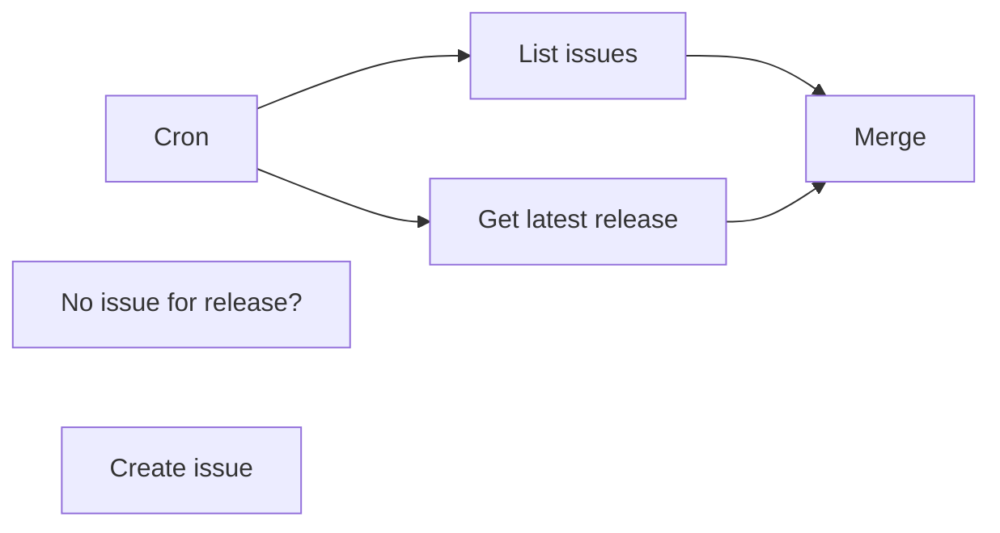

## Fluxo (.json) :

```json
{
  "nodes": [
    {
      "name": "Get latest release",
      "type": "n8n-nodes-base.github",
      "position": [
        540,
        340
      ],
      "parameters": {
        "limit": 1,
        "resource": "release",
        "operation": "getAll"
      },
      "typeVersion": 1
    },
    {
      "name": "Cron",
      "type": "n8n-nodes-base.cron",
      "position": [
        240,
        500
      ],
      "parameters": {
        "triggerTimes": {
          "item": [
            {
              "mode": "everyWeek"
            }
          ]
        }
      },
      "typeVersion": 1
    },
    {
      "name": "Merge",
      "type": "n8n-nodes-base.merge",
      "position": [
        740,
        420
      ],
      "parameters": {},
      "typeVersion": 1
    },
    {
      "name": "No issue for release?",
      "type": "n8n-nodes-base.function",
      "position": [
        920,
        420
      ],
      "parameters": {
        "functionCode": "const _ = require('lodash')\n\n// differentiate merged inputs (didnt find a way to get both inputs into one function invocation)\nconst releases = _.filter(items, i => _.has(i, 'json.assets'))\nif (releases.length != 1) throw new Error(`Invalid release count: ${releases.length}`)\nconst release = releases[0]\nconst issues = _.without(items, release)\n//console.log({release,issues})\n\n// check if there's an issue for the release\nconst matchingIssue = _.find(issues, i => i.json.title.includes(release.json.tag_name))\n//console.log({release,issues,matchingIssue})\n\nif (matchingIssue)\n  return []\nelse\n  return [release]"
      },
      "executeOnce": false,
      "typeVersion": 1
    },
    {
      "name": "Create issue",
      "type": "n8n-nodes-base.gitlab",
      "position": [
        1100,
        420
      ],
      "parameters": {
        "body": "={{$json[\"url\"]}}\n\n{{$json[\"body\"]}}",
        "owner": "txlab",
        "title": "=Upstream release: {{$json[\"tag_name\"]}}",
        "labels": [],
        "repository": "docker-linkcheck",
        "assignee_ids": []
      },
      "typeVersion": 1
    },
    {
      "name": "List issues",
      "type": "n8n-nodes-base.gitlab",
      "position": [
        540,
        500
      ],
      "parameters": {
        "owner": "txlab",
        "resource": "repository",
        "repository": "docker-linkcheck",
        "getRepositoryIssuesFilters": {}
      },
      "typeVersion": 1
    }
  ],
  "connections": {
    "Cron": {
      "main": [
        [
          {
            "node": "Get latest release",
            "type": "main",
            "index": 0
          },
          {
            "node": "List issues",
            "type": "main",
            "index": 0
          }
        ]
      ]
    },
    "Merge": {
      "main": [
        [
          {
            "node": "No release for issue?",
            "type": "main",
            "index": 0
          }
        ]
      ]
    },
    "Start": {
      "main": [
        [
          {
            "node": "Get latest release",
            "type": "main",
            "index": 0
          },
          {
            "node": "List issues",
            "type": "main",
            "index": 0
          }
        ]
      ]
    },
    "List issues": {
      "main": [
        [
          {
            "node": "Merge",
            "type": "main",
            "index": 1
          }
        ]
      ]
    },
    "Get latest release": {
      "main": [
        [
          {
            "node": "Merge",
            "type": "main",
            "index": 0
          }
        ]
      ]
    },
    "No release for issue?": {
      "main": [
        [
          {
            "node": "Create issue",
            "type": "main",
            "index": 0
          }
        ]
      ]
    }
  }
}
```

<a id="template-329"></a>

## Template 329 - Prevenir execuções concorrentes com Redis

- **Nome:** Prevenir execuções concorrentes com Redis
- **Descrição:** Impede que múltiplas instâncias de um mesmo fluxo executem ao mesmo tempo, usando chaves armazenadas em Redis para sinalizar estado e liberar a execução quando finalizado ou expirar o timeout.
- **Funcionalidade:** • Prevenção de concorrência: Verifica no Redis se já existe uma chave indicando que o processo está em execução e impede nova execução se estiver ativa.
• Marcação de início: Define uma chave no Redis com valor (ex.: "working" ou estados) para indicar que o fluxo iniciou.
• Remoção de marcação: Remove a chave no Redis ao finalizar para permitir futuras execuções.
• Consulta de status: Permite recuperar o valor da chave para saber o estado atual da execução (ex.: started, loading, finishing, finished).
• Timeout configurável: Aplica TTL na chave para evitar bloqueios permanentes, permitindo que a marcação expire automaticamente se algo falhar.
• Geração de erro controlada: Interrompe a execução com mensagem de erro quando detecta que outro processo já está em andamento.
• Exemplos de fluxo: Inclui exemplos demonstrando diferentes estados e waits para rastrear progresso e liberar a chave no final.
• Integração entre fluxos: Pode ser acionado por outro fluxo ou manualmente para checagem/set/unset da chave.
- **Ferramentas:** • Redis: Banco de dados em memória usado para armazenar chaves com TTL que sinalizam o estado de execução e controlam a simultaneidade das execuções.

## Fluxo visual

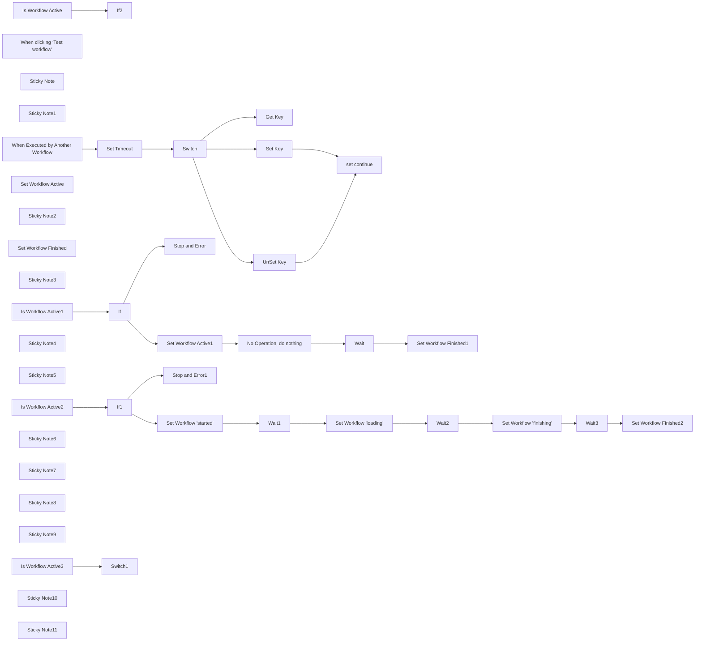

## Fluxo (.json) :

```json
{
  "name": "Prevent concurrent workflow runs using Redis",
  "nodes": [
    {
      "id": "e0729c93-e192-42fb-9ba0-c465d5a38089",
      "name": "When Executed by Another Workflow",
      "type": "n8n-nodes-base.executeWorkflowTrigger",
      "position": [
        -60,
        720
      ],
      "parameters": {
        "workflowInputs": {
          "values": [
            {
              "name": "action"
            },
            {
              "name": "value"
            },
            {
              "name": "key"
            },
            {
              "name": "timeout"
            }
          ]
        }
      },
      "typeVersion": 1.1
    },
    {
      "id": "caee6ecf-76ee-4014-8e85-a2463dcbba86",
      "name": "Switch",
      "type": "n8n-nodes-base.switch",
      "position": [
        380,
        720
      ],
      "parameters": {
        "rules": {
          "values": [
            {
              "outputKey": "get",
              "conditions": {
                "options": {
                  "version": 2,
                  "leftValue": "",
                  "caseSensitive": true,
                  "typeValidation": "strict"
                },
                "combinator": "and",
                "conditions": [
                  {
                    "id": "97af18cf-bcf5-4b86-86fd-1ee82e9adba9",
                    "operator": {
                      "type": "string",
                      "operation": "equals"
                    },
                    "leftValue": "={{ $json.action }}",
                    "rightValue": "get"
                  }
                ]
              },
              "renameOutput": true
            },
            {
              "outputKey": "set",
              "conditions": {
                "options": {
                  "version": 2,
                  "leftValue": "",
                  "caseSensitive": true,
                  "typeValidation": "strict"
                },
                "combinator": "and",
                "conditions": [
                  {
                    "id": "439b4586-bd92-40b7-afbc-9e651032b390",
                    "operator": {
                      "name": "filter.operator.equals",
                      "type": "string",
                      "operation": "equals"
                    },
                    "leftValue": "={{ $json.action }}",
                    "rightValue": "set"
                  }
                ]
              },
              "renameOutput": true
            },
            {
              "outputKey": "unset",
              "conditions": {
                "options": {
                  "version": 2,
                  "leftValue": "",
                  "caseSensitive": true,
                  "typeValidation": "strict"
                },
                "combinator": "and",
                "conditions": [
                  {
                    "id": "56457547-42b6-4e0a-8d1e-cb953f3d6a9d",
                    "operator": {
                      "name": "filter.operator.equals",
                      "type": "string",
                      "operation": "equals"
                    },
                    "leftValue": "={{ $json.action }}",
                    "rightValue": "unset"
                  }
                ]
              },
              "renameOutput": true
            }
          ]
        },
        "options": {}
      },
      "typeVersion": 3.2
    },
    {
      "id": "7427686e-6e17-45d2-b79d-cbf22ce2a839",
      "name": "When clicking ‘Test workflow’",
      "type": "n8n-nodes-base.manualTrigger",
      "position": [
        -700,
        1260
      ],
      "parameters": {},
      "typeVersion": 1
    },
    {
      "id": "922a8778-b800-4fc8-8da9-de3077289fda",
      "name": "If2",
      "type": "n8n-nodes-base.if",
      "position": [
        420,
        220
      ],
      "parameters": {
        "options": {},
        "conditions": {
          "options": {
            "version": 2,
            "leftValue": "",
            "caseSensitive": true,
            "typeValidation": "strict"
          },
          "combinator": "and",
          "conditions": [
            {
              "id": "210ed6f8-0b42-4382-9f42-1deb14cab551",
              "operator": {
                "type": "string",
                "operation": "empty",
                "singleValue": true
              },
              "leftValue": "={{ $json.output }}",
              "rightValue": "[null]"
            }
          ]
        }
      },
      "typeVersion": 2.2
    },
    {
      "id": "3422b389-6f3f-4ff4-8170-48eb284a34ce",
      "name": "Sticky Note",
      "type": "n8n-nodes-base.stickyNote",
      "position": [
        -120,
        -20
      ],
      "parameters": {
        "width": 860,
        "height": 420,
        "content": "## Check if working\nWill output status if something is going on.\n\nInputs:\n- action -> \"get\"\n- key -> a string used for tracking\n\n* Remove unused inputs when calling workflow *"
      },
      "typeVersion": 1
    },
    {
      "id": "78a21b91-d11c-4c85-814a-9074cce64383",
      "name": "Sticky Note1",
      "type": "n8n-nodes-base.stickyNote",
      "position": [
        780,
        -20
      ],
      "parameters": {
        "width": 1080,
        "height": 420,
        "content": "## Set workflow start\n\nInputs:\n- action -> \"set\"\n- key -> a string used for tracking\n- value -> \"working\" by default but you can use whatever, you can use this multiple times in combination with get to track progress of a execution.\n\n* Remove unused inputs when calling workflow *"
      },
      "typeVersion": 1
    },
    {
      "id": "c200a3f4-df46-44a4-8747-180d3df841ab",
      "name": "Is Workflow Active",
      "type": "n8n-nodes-base.executeWorkflow",
      "position": [
        200,
        220
      ],
      "parameters": {
        "options": {},
        "workflowId": {
          "__rl": true,
          "mode": "list",
          "value": "Fx8Ov5MblG2cmRWR",
          "cachedResultName": "template - cocurrent workflow"
        },
        "workflowInputs": {
          "value": {
            "key": "some_workflow_key",
            "action": "get"
          },
          "schema": [
            {
              "id": "action",
              "type": "string",
              "display": true,
              "required": false,
              "displayName": "action",
              "defaultMatch": false,
              "canBeUsedToMatch": true
            },
            {
              "id": "value",
              "type": "string",
              "display": true,
              "removed": true,
              "required": false,
              "displayName": "value",
              "defaultMatch": false,
              "canBeUsedToMatch": true
            },
            {
              "id": "key",
              "type": "string",
              "display": true,
              "required": false,
              "displayName": "key",
              "defaultMatch": false,
              "canBeUsedToMatch": true
            },
            {
              "id": "timeout",
              "type": "string",
              "display": true,
              "removed": true,
              "required": false,
              "displayName": "timeout",
              "defaultMatch": false,
              "canBeUsedToMatch": true
            }
          ],
          "mappingMode": "defineBelow",
          "matchingColumns": [],
          "attemptToConvertTypes": false,
          "convertFieldsToString": true
        }
      },
      "typeVersion": 1.2
    },
    {
      "id": "e56202e7-5227-4002-9d92-861cf76f1840",
      "name": "Set Workflow Active",
      "type": "n8n-nodes-base.executeWorkflow",
      "position": [
        1360,
        220
      ],
      "parameters": {
        "options": {},
        "workflowId": {
          "__rl": true,
          "mode": "list",
          "value": "Fx8Ov5MblG2cmRWR",
          "cachedResultName": "template - cocurrent workflow"
        },
        "workflowInputs": {
          "value": {
            "key": "some_workflow_key",
            "value": "working",
            "action": "set"
          },
          "schema": [
            {
              "id": "action",
              "type": "string",
              "display": true,
              "required": false,
              "displayName": "action",
              "defaultMatch": false,
              "canBeUsedToMatch": true
            },
            {
              "id": "value",
              "type": "string",
              "display": true,
              "required": false,
              "displayName": "value",
              "defaultMatch": false,
              "canBeUsedToMatch": true
            },
            {
              "id": "key",
              "type": "string",
              "display": true,
              "required": false,
              "displayName": "key",
              "defaultMatch": false,
              "canBeUsedToMatch": true
            },
            {
              "id": "timeout",
              "type": "string",
              "display": true,
              "removed": true,
              "required": false,
              "displayName": "timeout",
              "defaultMatch": false,
              "canBeUsedToMatch": true
            }
          ],
          "mappingMode": "defineBelow",
          "matchingColumns": [],
          "attemptToConvertTypes": false,
          "convertFieldsToString": true
        }
      },
      "typeVersion": 1.2
    },
    {
      "id": "2324d74c-b519-462b-af5c-13aa9e02ef88",
      "name": "Sticky Note2",
      "type": "n8n-nodes-base.stickyNote",
      "position": [
        1040,
        440
      ],
      "parameters": {
        "width": 820,
        "height": 640,
        "content": "## Set workflow end\nThis mark workflow end by unsetting the key.\n\nInputs:\n- action -> \"unset\"\n- key -> a string used for tracking\n\n* Remove unused inputs when calling workflow *"
      },
      "typeVersion": 1
    },
    {
      "id": "cfa05881-6b6d-474f-8b5b-9ca1ea4b68dc",
      "name": "Set Workflow Finished",
      "type": "n8n-nodes-base.executeWorkflow",
      "position": [
        1420,
        780
      ],
      "parameters": {
        "options": {},
        "workflowId": {
          "__rl": true,
          "mode": "list",
          "value": "Fx8Ov5MblG2cmRWR",
          "cachedResultName": "template - cocurrent workflow"
        },
        "workflowInputs": {
          "value": {
            "key": "some_workflow_key",
            "action": "unset"
          },
          "schema": [
            {
              "id": "action",
              "type": "string",
              "display": true,
              "required": false,
              "displayName": "action",
              "defaultMatch": false,
              "canBeUsedToMatch": true
            },
            {
              "id": "value",
              "type": "string",
              "display": true,
              "removed": true,
              "required": false,
              "displayName": "value",
              "defaultMatch": false,
              "canBeUsedToMatch": true
            },
            {
              "id": "key",
              "type": "string",
              "display": true,
              "required": false,
              "displayName": "key",
              "defaultMatch": false,
              "canBeUsedToMatch": true
            },
            {
              "id": "timeout",
              "type": "string",
              "display": true,
              "removed": true,
              "required": false,
              "displayName": "timeout",
              "defaultMatch": false,
              "canBeUsedToMatch": true
            }
          ],
          "mappingMode": "defineBelow",
          "matchingColumns": [],
          "attemptToConvertTypes": false,
          "convertFieldsToString": true
        }
      },
      "typeVersion": 1.2
    },
    {
      "id": "33b00dc4-ae18-49e3-9566-592cba18874c",
      "name": "Sticky Note3",
      "type": "n8n-nodes-base.stickyNote",
      "position": [
        -120,
        440
      ],
      "parameters": {
        "color": 3,
        "width": 1120,
        "height": 640,
        "content": "## Redis logic\n\nModify Set Timeout to adjust timeout (in seconds)\n\n"
      },
      "typeVersion": 1
    },
    {
      "id": "5a659a3b-87e9-4652-91e2-11e8742dbf62",
      "name": "Get Key",
      "type": "n8n-nodes-base.redis",
      "position": [
        600,
        520
      ],
      "parameters": {
        "key": "=process_status_{{ $json.key }}",
        "options": {},
        "operation": "get",
        "propertyName": "=output"
      },
      "credentials": {
        "redis": {
          "id": "Z86e3zGaVJ8EUt7c",
          "name": "Redis account"
        }
      },
      "typeVersion": 1
    },
    {
      "id": "494155e9-8461-462c-a441-7eca4385c0b6",
      "name": "Set Key",
      "type": "n8n-nodes-base.redis",
      "position": [
        600,
        720
      ],
      "parameters": {
        "key": "=process_status_{{ $json.key }}",
        "ttl": "={{ $json.timeout }}",
        "value": "={{ $json.value }}",
        "expire": true,
        "operation": "set"
      },
      "credentials": {
        "redis": {
          "id": "Z86e3zGaVJ8EUt7c",
          "name": "Redis account"
        }
      },
      "typeVersion": 1
    },
    {
      "id": "a692e5a3-d781-4293-8d82-2a63ef771d27",
      "name": "UnSet Key",
      "type": "n8n-nodes-base.redis",
      "position": [
        600,
        920
      ],
      "parameters": {
        "key": "=process_status_{{ $json.key }}",
        "operation": "delete"
      },
      "credentials": {
        "redis": {
          "id": "Z86e3zGaVJ8EUt7c",
          "name": "Redis account"
        }
      },
      "typeVersion": 1
    },
    {
      "id": "ce67d06c-1778-4783-b739-2bdc79ec341e",
      "name": "Set Timeout",
      "type": "n8n-nodes-base.set",
      "position": [
        160,
        720
      ],
      "parameters": {
        "options": {},
        "assignments": {
          "assignments": [
            {
              "id": "ec322ae8-d486-4c8e-a175-3b908054ded9",
              "name": "timeout",
              "type": "number",
              "value": 600
            }
          ]
        },
        "includeOtherFields": true
      },
      "typeVersion": 3.4
    },
    {
      "id": "afda543f-247d-4286-ba65-b0f4c4b3b747",
      "name": "set continue",
      "type": "n8n-nodes-base.set",
      "position": [
        820,
        720
      ],
      "parameters": {
        "options": {},
        "assignments": {
          "assignments": [
            {
              "id": "ae33a17b-8db0-47bc-85fc-4fde4be335de",
              "name": "ok",
              "type": "string",
              "value": "true"
            }
          ]
        }
      },
      "typeVersion": 3.4
    },
    {
      "id": "1c026eab-dc40-48dd-972d-dee7f6c0f05b",
      "name": "If",
      "type": "n8n-nodes-base.if",
      "position": [
        340,
        1360
      ],
      "parameters": {
        "options": {},
        "conditions": {
          "options": {
            "version": 2,
            "leftValue": "",
            "caseSensitive": true,
            "typeValidation": "strict"
          },
          "combinator": "and",
          "conditions": [
            {
              "id": "210ed6f8-0b42-4382-9f42-1deb14cab551",
              "operator": {
                "type": "string",
                "operation": "empty",
                "singleValue": true
              },
              "leftValue": "={{ $json.output }}",
              "rightValue": "[null]"
            }
          ]
        }
      },
      "typeVersion": 2.2
    },
    {
      "id": "b603bad0-7f89-429d-a373-37d52ed11a04",
      "name": "Is Workflow Active1",
      "type": "n8n-nodes-base.executeWorkflow",
      "position": [
        120,
        1360
      ],
      "parameters": {
        "options": {},
        "workflowId": {
          "__rl": true,
          "mode": "list",
          "value": "Fx8Ov5MblG2cmRWR",
          "cachedResultName": "template - cocurrent workflow"
        },
        "workflowInputs": {
          "value": {
            "key": "some_workflow_key",
            "action": "get"
          },
          "schema": [
            {
              "id": "action",
              "type": "string",
              "display": true,
              "required": false,
              "displayName": "action",
              "defaultMatch": false,
              "canBeUsedToMatch": true
            },
            {
              "id": "value",
              "type": "string",
              "display": true,
              "removed": true,
              "required": false,
              "displayName": "value",
              "defaultMatch": false,
              "canBeUsedToMatch": true
            },
            {
              "id": "key",
              "type": "string",
              "display": true,
              "required": false,
              "displayName": "key",
              "defaultMatch": false,
              "canBeUsedToMatch": true
            },
            {
              "id": "timeout",
              "type": "string",
              "display": true,
              "removed": true,
              "required": false,
              "displayName": "timeout",
              "defaultMatch": false,
              "canBeUsedToMatch": true
            }
          ],
          "mappingMode": "defineBelow",
          "matchingColumns": [],
          "attemptToConvertTypes": false,
          "convertFieldsToString": true
        }
      },
      "typeVersion": 1.2
    },
    {
      "id": "e73d4271-1844-4b34-9e9b-a2154c3c27ee",
      "name": "Stop and Error",
      "type": "n8n-nodes-base.stopAndError",
      "position": [
        620,
        1460
      ],
      "parameters": {
        "errorMessage": "Already Executing"
      },
      "typeVersion": 1
    },
    {
      "id": "5307c6f7-7533-4f22-ab1a-a324ba2c9836",
      "name": "No Operation, do nothing",
      "type": "n8n-nodes-base.noOp",
      "position": [
        840,
        1260
      ],
      "parameters": {},
      "typeVersion": 1
    },
    {
      "id": "201ffd2d-0c4f-417a-9a82-5035e1530be7",
      "name": "Set Workflow Active1",
      "type": "n8n-nodes-base.executeWorkflow",
      "position": [
        620,
        1260
      ],
      "parameters": {
        "options": {},
        "workflowId": {
          "__rl": true,
          "mode": "list",
          "value": "Fx8Ov5MblG2cmRWR",
          "cachedResultName": "template - cocurrent workflow"
        },
        "workflowInputs": {
          "value": {
            "key": "some_workflow_key",
            "value": "working",
            "action": "set"
          },
          "schema": [
            {
              "id": "action",
              "type": "string",
              "display": true,
              "required": false,
              "displayName": "action",
              "defaultMatch": false,
              "canBeUsedToMatch": true
            },
            {
              "id": "value",
              "type": "string",
              "display": true,
              "required": false,
              "displayName": "value",
              "defaultMatch": false,
              "canBeUsedToMatch": true
            },
            {
              "id": "key",
              "type": "string",
              "display": true,
              "required": false,
              "displayName": "key",
              "defaultMatch": false,
              "canBeUsedToMatch": true
            },
            {
              "id": "timeout",
              "type": "string",
              "display": true,
              "removed": true,
              "required": false,
              "displayName": "timeout",
              "defaultMatch": false,
              "canBeUsedToMatch": true
            }
          ],
          "mappingMode": "defineBelow",
          "matchingColumns": [],
          "attemptToConvertTypes": false,
          "convertFieldsToString": true
        }
      },
      "typeVersion": 1.2
    },
    {
      "id": "71969764-4a75-44b6-a7da-969d8ab73686",
      "name": "Set Workflow Finished1",
      "type": "n8n-nodes-base.executeWorkflow",
      "position": [
        1560,
        1260
      ],
      "parameters": {
        "options": {},
        "workflowId": {
          "__rl": true,
          "mode": "list",
          "value": "Fx8Ov5MblG2cmRWR",
          "cachedResultName": "template - cocurrent workflow"
        },
        "workflowInputs": {
          "value": {
            "key": "some_workflow_key",
            "action": "unset"
          },
          "schema": [
            {
              "id": "action",
              "type": "string",
              "display": true,
              "required": false,
              "displayName": "action",
              "defaultMatch": false,
              "canBeUsedToMatch": true
            },
            {
              "id": "value",
              "type": "string",
              "display": true,
              "removed": true,
              "required": false,
              "displayName": "value",
              "defaultMatch": false,
              "canBeUsedToMatch": true
            },
            {
              "id": "key",
              "type": "string",
              "display": true,
              "required": false,
              "displayName": "key",
              "defaultMatch": false,
              "canBeUsedToMatch": true
            },
            {
              "id": "timeout",
              "type": "string",
              "display": true,
              "removed": true,
              "required": false,
              "displayName": "timeout",
              "defaultMatch": false,
              "canBeUsedToMatch": true
            }
          ],
          "mappingMode": "defineBelow",
          "matchingColumns": [],
          "attemptToConvertTypes": false,
          "convertFieldsToString": true
        }
      },
      "typeVersion": 1.2
    },
    {
      "id": "be5729c1-c867-4364-a406-ccbb4b829de6",
      "name": "Sticky Note4",
      "type": "n8n-nodes-base.stickyNote",
      "position": [
        760,
        1160
      ],
      "parameters": {
        "color": 7,
        "width": 740,
        "height": 260,
        "content": "## Your logic that takes time\nIf a process is ran at the same moment, it will raise a error"
      },
      "typeVersion": 1
    },
    {
      "id": "1d16d72c-0678-4808-8f7d-e7a6e7a20497",
      "name": "Wait",
      "type": "n8n-nodes-base.wait",
      "position": [
        1060,
        1260
      ],
      "webhookId": "e87487db-c8b2-44e2-8d90-0ed189a8116b",
      "parameters": {},
      "typeVersion": 1.1
    },
    {
      "id": "ddfbb5c1-6632-423f-9a0a-0e18497d4c3b",
      "name": "Sticky Note5",
      "type": "n8n-nodes-base.stickyNote",
      "position": [
        -120,
        1120
      ],
      "parameters": {
        "color": 4,
        "width": 1980,
        "height": 500,
        "content": "## Example 1"
      },
      "typeVersion": 1
    },
    {
      "id": "ce9d5b6d-0353-46b9-bee4-84c977bca8de",
      "name": "If1",
      "type": "n8n-nodes-base.if",
      "position": [
        180,
        1920
      ],
      "parameters": {
        "options": {},
        "conditions": {
          "options": {
            "version": 2,
            "leftValue": "",
            "caseSensitive": true,
            "typeValidation": "strict"
          },
          "combinator": "and",
          "conditions": [
            {
              "id": "210ed6f8-0b42-4382-9f42-1deb14cab551",
              "operator": {
                "type": "string",
                "operation": "empty",
                "singleValue": true
              },
              "leftValue": "={{ $json.output }}",
              "rightValue": "[null]"
            }
          ]
        }
      },
      "typeVersion": 2.2
    },
    {
      "id": "1e1bc1cc-5f95-4a1c-892a-90303745bb53",
      "name": "Is Workflow Active2",
      "type": "n8n-nodes-base.executeWorkflow",
      "position": [
        -20,
        1920
      ],
      "parameters": {
        "options": {},
        "workflowId": {
          "__rl": true,
          "mode": "list",
          "value": "Fx8Ov5MblG2cmRWR",
          "cachedResultName": "template - cocurrent workflow"
        },
        "workflowInputs": {
          "value": {
            "key": "some_workflow_key",
            "action": "get"
          },
          "schema": [
            {
              "id": "action",
              "type": "string",
              "display": true,
              "required": false,
              "displayName": "action",
              "defaultMatch": false,
              "canBeUsedToMatch": true
            },
            {
              "id": "value",
              "type": "string",
              "display": true,
              "removed": true,
              "required": false,
              "displayName": "value",
              "defaultMatch": false,
              "canBeUsedToMatch": true
            },
            {
              "id": "key",
              "type": "string",
              "display": true,
              "required": false,
              "displayName": "key",
              "defaultMatch": false,
              "canBeUsedToMatch": true
            },
            {
              "id": "timeout",
              "type": "string",
              "display": true,
              "removed": true,
              "required": false,
              "displayName": "timeout",
              "defaultMatch": false,
              "canBeUsedToMatch": true
            }
          ],
          "mappingMode": "defineBelow",
          "matchingColumns": [],
          "attemptToConvertTypes": false,
          "convertFieldsToString": true
        }
      },
      "typeVersion": 1.2
    },
    {
      "id": "95699b33-61b7-4c3e-8bf9-c716456a387d",
      "name": "Stop and Error1",
      "type": "n8n-nodes-base.stopAndError",
      "position": [
        480,
        2020
      ],
      "parameters": {
        "errorMessage": "Already Executing"
      },
      "typeVersion": 1
    },
    {
      "id": "c8388974-e355-43dd-8d54-f3213998257f",
      "name": "Set Workflow Finished2",
      "type": "n8n-nodes-base.executeWorkflow",
      "position": [
        1720,
        1820
      ],
      "parameters": {
        "options": {},
        "workflowId": {
          "__rl": true,
          "mode": "list",
          "value": "Fx8Ov5MblG2cmRWR",
          "cachedResultName": "template - cocurrent workflow"
        },
        "workflowInputs": {
          "value": {
            "key": "some_workflow_key",
            "action": "unset"
          },
          "schema": [
            {
              "id": "action",
              "type": "string",
              "display": true,
              "required": false,
              "displayName": "action",
              "defaultMatch": false,
              "canBeUsedToMatch": true
            },
            {
              "id": "value",
              "type": "string",
              "display": true,
              "removed": true,
              "required": false,
              "displayName": "value",
              "defaultMatch": false,
              "canBeUsedToMatch": true
            },
            {
              "id": "key",
              "type": "string",
              "display": true,
              "required": false,
              "displayName": "key",
              "defaultMatch": false,
              "canBeUsedToMatch": true
            },
            {
              "id": "timeout",
              "type": "string",
              "display": true,
              "removed": true,
              "required": false,
              "displayName": "timeout",
              "defaultMatch": false,
              "canBeUsedToMatch": true
            }
          ],
          "mappingMode": "defineBelow",
          "matchingColumns": [],
          "attemptToConvertTypes": false,
          "convertFieldsToString": true
        }
      },
      "typeVersion": 1.2
    },
    {
      "id": "6465bf4b-f17d-47c7-a547-a24d4e1cb6a1",
      "name": "Sticky Note6",
      "type": "n8n-nodes-base.stickyNote",
      "position": [
        420,
        1720
      ],
      "parameters": {
        "color": 7,
        "width": 380,
        "height": 260,
        "content": "## Process step 2"
      },
      "typeVersion": 1
    },
    {
      "id": "92d8920c-a267-4306-8a16-3a77de1a1399",
      "name": "Wait1",
      "type": "n8n-nodes-base.wait",
      "position": [
        660,
        1820
      ],
      "webhookId": "e87487db-c8b2-44e2-8d90-0ed189a8116b",
      "parameters": {},
      "typeVersion": 1.1
    },
    {
      "id": "3ac2a634-6eed-4909-aa24-baf606a90bd8",
      "name": "Sticky Note7",
      "type": "n8n-nodes-base.stickyNote",
      "position": [
        -120,
        1680
      ],
      "parameters": {
        "color": 4,
        "width": 1980,
        "height": 1120,
        "content": "## Example 2\nTrack progress\n"
      },
      "typeVersion": 1
    },
    {
      "id": "499e79d9-6553-42c0-ade6-168dc24f5486",
      "name": "Wait2",
      "type": "n8n-nodes-base.wait",
      "position": [
        1080,
        1820
      ],
      "webhookId": "e87487db-c8b2-44e2-8d90-0ed189a8116b",
      "parameters": {},
      "typeVersion": 1.1
    },
    {
      "id": "91c07ab3-68fc-4a2b-8829-f0b12759e861",
      "name": "Wait3",
      "type": "n8n-nodes-base.wait",
      "position": [
        1500,
        1820
      ],
      "webhookId": "e87487db-c8b2-44e2-8d90-0ed189a8116b",
      "parameters": {},
      "typeVersion": 1.1
    },
    {
      "id": "725a0e54-5c5b-447f-af1f-1a77ac4f9fd4",
      "name": "Set Workflow \"started\"",
      "type": "n8n-nodes-base.executeWorkflow",
      "position": [
        480,
        1820
      ],
      "parameters": {
        "options": {},
        "workflowId": {
          "__rl": true,
          "mode": "list",
          "value": "Fx8Ov5MblG2cmRWR",
          "cachedResultName": "template - cocurrent workflow"
        },
        "workflowInputs": {
          "value": {
            "key": "some_workflow_key",
            "value": "started",
            "action": "set"
          },
          "schema": [
            {
              "id": "action",
              "type": "string",
              "display": true,
              "required": false,
              "displayName": "action",
              "defaultMatch": false,
              "canBeUsedToMatch": true
            },
            {
              "id": "value",
              "type": "string",
              "display": true,
              "required": false,
              "displayName": "value",
              "defaultMatch": false,
              "canBeUsedToMatch": true
            },
            {
              "id": "key",
              "type": "string",
              "display": true,
              "required": false,
              "displayName": "key",
              "defaultMatch": false,
              "canBeUsedToMatch": true
            },
            {
              "id": "timeout",
              "type": "string",
              "display": true,
              "removed": true,
              "required": false,
              "displayName": "timeout",
              "defaultMatch": false,
              "canBeUsedToMatch": true
            }
          ],
          "mappingMode": "defineBelow",
          "matchingColumns": [],
          "attemptToConvertTypes": false,
          "convertFieldsToString": true
        }
      },
      "typeVersion": 1.2
    },
    {
      "id": "17c92181-e9ed-4431-938e-49a5b75f761d",
      "name": "Sticky Note8",
      "type": "n8n-nodes-base.stickyNote",
      "position": [
        840,
        1720
      ],
      "parameters": {
        "color": 7,
        "width": 380,
        "height": 260,
        "content": "## Process step 2\n"
      },
      "typeVersion": 1
    },
    {
      "id": "765177ce-5f13-4144-be26-cc532a27cc7c",
      "name": "Sticky Note9",
      "type": "n8n-nodes-base.stickyNote",
      "position": [
        1260,
        1720
      ],
      "parameters": {
        "color": 7,
        "width": 380,
        "height": 260,
        "content": "## Process step 3"
      },
      "typeVersion": 1
    },
    {
      "id": "a84cebe2-57af-4983-b5b5-e33afc478f46",
      "name": "Set Workflow \"finishing\"",
      "type": "n8n-nodes-base.executeWorkflow",
      "position": [
        1320,
        1820
      ],
      "parameters": {
        "options": {},
        "workflowId": {
          "__rl": true,
          "mode": "list",
          "value": "Fx8Ov5MblG2cmRWR",
          "cachedResultName": "template - cocurrent workflow"
        },
        "workflowInputs": {
          "value": {
            "key": "some_workflow_key",
            "value": "finishing",
            "action": "set"
          },
          "schema": [
            {
              "id": "action",
              "type": "string",
              "display": true,
              "required": false,
              "displayName": "action",
              "defaultMatch": false,
              "canBeUsedToMatch": true
            },
            {
              "id": "value",
              "type": "string",
              "display": true,
              "required": false,
              "displayName": "value",
              "defaultMatch": false,
              "canBeUsedToMatch": true
            },
            {
              "id": "key",
              "type": "string",
              "display": true,
              "required": false,
              "displayName": "key",
              "defaultMatch": false,
              "canBeUsedToMatch": true
            },
            {
              "id": "timeout",
              "type": "string",
              "display": true,
              "removed": true,
              "required": false,
              "displayName": "timeout",
              "defaultMatch": false,
              "canBeUsedToMatch": true
            }
          ],
          "mappingMode": "defineBelow",
          "matchingColumns": [],
          "attemptToConvertTypes": false,
          "convertFieldsToString": true
        }
      },
      "typeVersion": 1.2
    },
    {
      "id": "d5cbfac4-847a-4655-93fd-481127dc8a1c",
      "name": "Set Workflow \"loading\"",
      "type": "n8n-nodes-base.executeWorkflow",
      "position": [
        900,
        1820
      ],
      "parameters": {
        "options": {},
        "workflowId": {
          "__rl": true,
          "mode": "list",
          "value": "Fx8Ov5MblG2cmRWR",
          "cachedResultName": "template - cocurrent workflow"
        },
        "workflowInputs": {
          "value": {
            "key": "some_workflow_key",
            "value": "loading",
            "action": "set"
          },
          "schema": [
            {
              "id": "action",
              "type": "string",
              "display": true,
              "required": false,
              "displayName": "action",
              "defaultMatch": false,
              "canBeUsedToMatch": true
            },
            {
              "id": "value",
              "type": "string",
              "display": true,
              "required": false,
              "displayName": "value",
              "defaultMatch": false,
              "canBeUsedToMatch": true
            },
            {
              "id": "key",
              "type": "string",
              "display": true,
              "required": false,
              "displayName": "key",
              "defaultMatch": false,
              "canBeUsedToMatch": true
            },
            {
              "id": "timeout",
              "type": "string",
              "display": true,
              "removed": true,
              "required": false,
              "displayName": "timeout",
              "defaultMatch": false,
              "canBeUsedToMatch": true
            }
          ],
          "mappingMode": "defineBelow",
          "matchingColumns": [],
          "attemptToConvertTypes": false,
          "convertFieldsToString": true
        }
      },
      "typeVersion": 1.2
    },
    {
      "id": "cd70a02f-e95c-4bda-9b89-50a20600787c",
      "name": "Is Workflow Active3",
      "type": "n8n-nodes-base.executeWorkflow",
      "position": [
        40,
        2400
      ],
      "parameters": {
        "options": {},
        "workflowId": {
          "__rl": true,
          "mode": "list",
          "value": "Fx8Ov5MblG2cmRWR",
          "cachedResultName": "template - cocurrent workflow"
        },
        "workflowInputs": {
          "value": {
            "key": "some_workflow_key",
            "action": "get"
          },
          "schema": [
            {
              "id": "action",
              "type": "string",
              "display": true,
              "required": false,
              "displayName": "action",
              "defaultMatch": false,
              "canBeUsedToMatch": true
            },
            {
              "id": "value",
              "type": "string",
              "display": true,
              "removed": true,
              "required": false,
              "displayName": "value",
              "defaultMatch": false,
              "canBeUsedToMatch": true
            },
            {
              "id": "key",
              "type": "string",
              "display": true,
              "required": false,
              "displayName": "key",
              "defaultMatch": false,
              "canBeUsedToMatch": true
            },
            {
              "id": "timeout",
              "type": "string",
              "display": true,
              "removed": true,
              "required": false,
              "displayName": "timeout",
              "defaultMatch": false,
              "canBeUsedToMatch": true
            }
          ],
          "mappingMode": "defineBelow",
          "matchingColumns": [],
          "attemptToConvertTypes": false,
          "convertFieldsToString": true
        }
      },
      "typeVersion": 1.2
    },
    {
      "id": "6e2578e3-05e0-47fd-94da-77f32612b01c",
      "name": "Switch1",
      "type": "n8n-nodes-base.switch",
      "position": [
        260,
        2380
      ],
      "parameters": {
        "rules": {
          "values": [
            {
              "outputKey": "started",
              "conditions": {
                "options": {
                  "version": 2,
                  "leftValue": "",
                  "caseSensitive": true,
                  "typeValidation": "strict"
                },
                "combinator": "and",
                "conditions": [
                  {
                    "id": "e4bb7e4f-2f4a-419c-8618-e4fa01afc472",
                    "operator": {
                      "type": "string",
                      "operation": "equals"
                    },
                    "leftValue": "={{ $json.output }}",
                    "rightValue": "started"
                  }
                ]
              },
              "renameOutput": true
            },
            {
              "outputKey": "loading",
              "conditions": {
                "options": {
                  "version": 2,
                  "leftValue": "",
                  "caseSensitive": true,
                  "typeValidation": "strict"
                },
                "combinator": "and",
                "conditions": [
                  {
                    "id": "4c621e66-a4fe-45be-9d8a-4a2b180e94e7",
                    "operator": {
                      "name": "filter.operator.equals",
                      "type": "string",
                      "operation": "equals"
                    },
                    "leftValue": "={{ $json.output }}",
                    "rightValue": "loading"
                  }
                ]
              },
              "renameOutput": true
            },
            {
              "outputKey": "finished",
              "conditions": {
                "options": {
                  "version": 2,
                  "leftValue": "",
                  "caseSensitive": true,
                  "typeValidation": "strict"
                },
                "combinator": "and",
                "conditions": [
                  {
                    "id": "5b373ed7-550e-4d9c-b2cf-838ca08435ff",
                    "operator": {
                      "name": "filter.operator.equals",
                      "type": "string",
                      "operation": "equals"
                    },
                    "leftValue": "={{ $json.output }}",
                    "rightValue": "finished"
                  }
                ]
              },
              "renameOutput": true
            }
          ]
        },
        "options": {
          "fallbackOutput": "extra"
        }
      },
      "typeVersion": 3.2
    },
    {
      "id": "9403b00f-f6d5-47d4-b06f-8e0c7c39ed5b",
      "name": "Sticky Note10",
      "type": "n8n-nodes-base.stickyNote",
      "position": [
        0,
        2280
      ],
      "parameters": {
        "color": 7,
        "width": 660,
        "height": 340,
        "content": "## Check status of execution\n"
      },
      "typeVersion": 1
    },
    {
      "id": "c3639987-57e6-484a-9094-7f8e99493954",
      "name": "Sticky Note11",
      "type": "n8n-nodes-base.stickyNote",
      "position": [
        -800,
        1140
      ],
      "parameters": {
        "color": 5,
        "width": 400,
        "height": 320,
        "content": "## Connect this anywhere to test !"
      },
      "typeVersion": 1
    }
  ],
  "pinData": {},
  "connections": {
    "If": {
      "main": [
        [
          {
            "node": "Set Workflow Active1",
            "type": "main",
            "index": 0
          }
        ],
        [
          {
            "node": "Stop and Error",
            "type": "main",
            "index": 0
          }
        ]
      ]
    },
    "If1": {
      "main": [
        [
          {
            "node": "Set Workflow \"started\"",
            "type": "main",
            "index": 0
          }
        ],
        [
          {
            "node": "Stop and Error1",
            "type": "main",
            "index": 0
          }
        ]
      ]
    },
    "Wait": {
      "main": [
        [
          {
            "node": "Set Workflow Finished1",
            "type": "main",
            "index": 0
          }
        ]
      ]
    },
    "Wait1": {
      "main": [
        [
          {
            "node": "Set Workflow \"loading\"",
            "type": "main",
            "index": 0
          }
        ]
      ]
    },
    "Wait2": {
      "main": [
        [
          {
            "node": "Set Workflow \"finishing\"",
            "type": "main",
            "index": 0
          }
        ]
      ]
    },
    "Wait3": {
      "main": [
        [
          {
            "node": "Set Workflow Finished2",
            "type": "main",
            "index": 0
          }
        ]
      ]
    },
    "Switch": {
      "main": [
        [
          {
            "node": "Get Key",
            "type": "main",
            "index": 0
          }
        ],
        [
          {
            "node": "Set Key",
            "type": "main",
            "index": 0
          }
        ],
        [
          {
            "node": "UnSet Key",
            "type": "main",
            "index": 0
          }
        ]
      ]
    },
    "Set Key": {
      "main": [
        [
          {
            "node": "set continue",
            "type": "main",
            "index": 0
          }
        ]
      ]
    },
    "UnSet Key": {
      "main": [
        [
          {
            "node": "set continue",
            "type": "main",
            "index": 0
          }
        ]
      ]
    },
    "Set Timeout": {
      "main": [
        [
          {
            "node": "Switch",
            "type": "main",
            "index": 0
          }
        ]
      ]
    },
    "Is Workflow Active": {
      "main": [
        [
          {
            "node": "If2",
            "type": "main",
            "index": 0
          }
        ]
      ]
    },
    "Is Workflow Active1": {
      "main": [
        [
          {
            "node": "If",
            "type": "main",
            "index": 0
          }
        ]
      ]
    },
    "Is Workflow Active2": {
      "main": [
        [
          {
            "node": "If1",
            "type": "main",
            "index": 0
          }
        ]
      ]
    },
    "Is Workflow Active3": {
      "main": [
        [
          {
            "node": "Switch1",
            "type": "main",
            "index": 0
          }
        ]
      ]
    },
    "Set Workflow Active1": {
      "main": [
        [
          {
            "node": "No Operation, do nothing",
            "type": "main",
            "index": 0
          }
        ]
      ]
    },
    "Set Workflow \"loading\"": {
      "main": [
        [
          {
            "node": "Wait2",
            "type": "main",
            "index": 0
          }
        ]
      ]
    },
    "Set Workflow \"started\"": {
      "main": [
        [
          {
            "node": "Wait1",
            "type": "main",
            "index": 0
          }
        ]
      ]
    },
    "No Operation, do nothing": {
      "main": [
        [
          {
            "node": "Wait",
            "type": "main",
            "index": 0
          }
        ]
      ]
    },
    "Set Workflow \"finishing\"": {
      "main": [
        [
          {
            "node": "Wait3",
            "type": "main",
            "index": 0
          }
        ]
      ]
    },
    "When Executed by Another Workflow": {
      "main": [
        [
          {
            "node": "Set Timeout",
            "type": "main",
            "index": 0
          }
        ]
      ]
    },
    "When clicking ‘Test workflow’": {
      "main": [
        []
      ]
    }
  }
}
```

<a id="template-330"></a>

## Template 330 - Alerta de phishing Steam para Cloudflare e Valve

- **Nome:** Alerta de phishing Steam para Cloudflare e Valve
- **Descrição:** Recebe domínios via webhook, valida e verifica nameservers; notifica Valve e, se os NS forem da Cloudflare, também notifica a Cloudflare sobre possível site de phishing do Steam.
- **Funcionalidade:** • Recepção de relatório via webhook: Recebe domínios através de um endpoint protegido por autenticação básica.
• Validação do domínio: Verifica o formato do domínio usando uma expressão regular para evitar entradas inválidas.
• Instalação de ferramentas: Garante que o utilitário 'dig' esteja disponível instalando o pacote bind-tools se necessário.
• Verificação de nameservers: Consulta os nameservers do domínio para confirmar que o domínio é válido e ativo.
• Notificação à Valve: Envia um e-mail para a equipe de segurança da Valve informando sobre o domínio suspeito (phishing Steam) quando o domínio possui nameservers.
• Detecção de Cloudflare: Checa se os nameservers pertencem à Cloudflare.
• Notificação à Cloudflare: Se os nameservers forem da Cloudflare, envia um e-mail específico para a equipe de segurança da Cloudflare.
- **Ferramentas:** • bind-tools (dig): Utilitário DNS usado para consultar records NS e verificar existência de nameservers.
• Mailgun: Serviço de envio de e-mails usado para entregar notificações por e-mail aos destinatários configurados.

## Fluxo visual

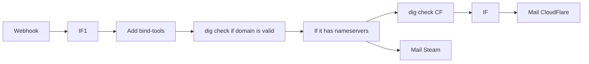

## Fluxo (.json) :

```json
{
  "name": "Steam + CF Report",
  "nodes": [
    {
      "name": "Webhook",
      "type": "n8n-nodes-base.webhook",
      "position": [
        110,
        200
      ],
      "parameters": {
        "path": "steam",
        "responseData": "allEntries",
        "responseMode": "lastNode",
        "authentication": "basicAuth"
      },
      "credentials": {
        "httpBasicAuth": "credentials"
      },
      "retryOnFail": false,
      "typeVersion": 1
    },
    {
      "name": "Add bind-tools",
      "type": "n8n-nodes-base.executeCommand",
      "color": "#FF8000",
      "notes": "Install bind-tools",
      "position": [
        480,
        180
      ],
      "parameters": {
        "command": "=which dig || apk add bind-tools"
      },
      "retryOnFail": true,
      "typeVersion": 1,
      "continueOnFail": true,
      "waitBetweenTries": 1000
    },
    {
      "name": "dig check CF",
      "type": "n8n-nodes-base.executeCommand",
      "color": "#FF8000",
      "notes": "Install bind-tools",
      "position": [
        1300,
        -50
      ],
      "parameters": {
        "command": "=dig NS  {{$node[\"Webhook\"].data[\"query\"][\"q\"]}} +short | grep cloudflare.com.$ | wc -l"
      },
      "retryOnFail": true,
      "typeVersion": 1,
      "continueOnFail": true,
      "waitBetweenTries": 1000
    },
    {
      "name": "IF",
      "type": "n8n-nodes-base.if",
      "position": [
        1550,
        -50
      ],
      "parameters": {
        "conditions": {
          "number": [
            {
              "value1": "= {{$node[\"dig check CF\"].data[\"stdout\"]}}",
              "operation": "larger"
            }
          ]
        }
      },
      "typeVersion": 1
    },
    {
      "name": "Mail CloudFlare",
      "type": "n8n-nodes-base.mailgun",
      "position": [
        1830,
        160
      ],
      "parameters": {
        "text": "=Hello,\n\nI am emailing you to let you know about a Steam phishing website on your network: {{$node[\"Webhook\"].data[\"query\"][\"q\"]}}.\n\nThank you,\nYour Name Here",
        "ccEmail": "yourCCemail",
        "subject": "={{$node[\"Webhook\"].data[\"query\"][\"q\"]}} - Steam Phishing Website on your network",
        "toEmail": "security@cloudflare.com",
        "fromEmail": "yourFROMemail"
      },
      "credentials": {
        "mailgunApi": "Mailgun"
      },
      "typeVersion": 1
    },
    {
      "name": "Mail Steam",
      "type": "n8n-nodes-base.mailgun",
      "position": [
        1830,
        340
      ],
      "parameters": {
        "text": "=Hello,\n\nI am emailing you to let you know about a Steam phishing website: {{$node[\"Webhook\"].data[\"query\"][\"q\"]}}.\n\nThank you,\nYour Name Here",
        "ccEmail": "yourCCemail",
        "subject": "={{$node[\"Webhook\"].data[\"query\"][\"q\"]}} - Steam Phishing Website",
        "toEmail": "security@valvesoftware.com",
        "fromEmail": "yourFROMemail"
      },
      "credentials": {
        "mailgunApi": "Mailgun"
      },
      "typeVersion": 1
    },
    {
      "name": "dig check if domain is valid",
      "type": "n8n-nodes-base.executeCommand",
      "color": "#FF8000",
      "notes": "Install bind-tools",
      "position": [
        720,
        180
      ],
      "parameters": {
        "command": "=dig NS  {{$node[\"Webhook\"].data[\"query\"][\"q\"]}} +short | wc -l"
      },
      "retryOnFail": true,
      "typeVersion": 1,
      "continueOnFail": true,
      "waitBetweenTries": 1000
    },
    {
      "name": "If it has nameservers",
      "type": "n8n-nodes-base.if",
      "position": [
        970,
        180
      ],
      "parameters": {
        "conditions": {
          "number": [
            {
              "value1": "= {{$node[\"dig check if domain is valid\"].data[\"stdout\"]}}",
              "operation": "larger"
            }
          ]
        }
      },
      "typeVersion": 1
    },
    {
      "name": "IF1",
      "type": "n8n-nodes-base.if",
      "position": [
        270,
        200
      ],
      "parameters": {
        "conditions": {
          "string": [
            {
              "value1": "={{$node[\"Webhook\"].data[\"query\"][\"q\"]}}",
              "value2": "/^[a-zA-Z0-9-_.]+$/",
              "operation": "regex"
            }
          ]
        }
      },
      "typeVersion": 1
    }
  ],
  "active": false,
  "settings": {},
  "connections": {
    "IF": {
      "main": [
        [
          {
            "node": "Mail CloudFlare",
            "type": "main",
            "index": 0
          }
        ]
      ]
    },
    "IF1": {
      "main": [
        [
          {
            "node": "Add bind-tools",
            "type": "main",
            "index": 0
          }
        ]
      ]
    },
    "Webhook": {
      "main": [
        [
          {
            "node": "IF1",
            "type": "main",
            "index": 0
          }
        ]
      ]
    },
    "dig check CF": {
      "main": [
        [
          {
            "node": "IF",
            "type": "main",
            "index": 0
          }
        ]
      ]
    },
    "Add bind-tools": {
      "main": [
        [
          {
            "node": "dig check if domain is valid",
            "type": "main",
            "index": 0
          }
        ]
      ]
    },
    "If it has nameservers": {
      "main": [
        [
          {
            "node": "dig check CF",
            "type": "main",
            "index": 0
          },
          {
            "node": "Mail Steam",
            "type": "main",
            "index": 0
          }
        ]
      ]
    },
    "dig check if domain is valid": {
      "main": [
        [
          {
            "node": "If it has nameservers",
            "type": "main",
            "index": 0
          }
        ]
      ]
    }
  }
}
```

<a id="template-331"></a>

## Template 331 - Conversão HTML para PDF via Webhook

- **Nome:** Conversão HTML para PDF via Webhook
- **Descrição:** Recebe uma requisição HTTP, converte um conteúdo HTML em PDF e retorna o PDF gerado como resposta binária.
- **Funcionalidade:** • Receber requisição HTTP: Inicia o fluxo ao receber uma chamada no endpoint configurado.
• Converter HTML para PDF: Transforma o conteúdo HTML definido no fluxo em um arquivo PDF usando um serviço externo.
• Retornar PDF ao solicitante: Responde à requisição com o PDF gerado em formato binário.
- **Ferramentas:** • CustomJS PDF Toolkit: serviço utilizado para converter HTML em PDF a partir do conteúdo HTML fornecido.

## Fluxo visual


## Fluxo (.json) :

```json
{
  "meta": {
    "instanceId": "fcf18fc485cc336a31bc65574fd28e124660f468281b7aad773616b17903afe6",
    "templateCredsSetupCompleted": true
  },
  "nodes": [
    {
      "id": "37bd6cc9-3cc4-442e-94c1-42972c0fce0d",
      "name": "Webhook",
      "type": "n8n-nodes-base.webhook",
      "position": [
        80,
        0
      ],
      "webhookId": "060dbacf-0feb-43d4-b4ac-44011a7dd1a4",
      "parameters": {
        "path": "060dbacf-0feb-43d4-b4ac-44011a7dd1a4",
        "options": {},
        "responseMode": "responseNode"
      },
      "typeVersion": 2
    },
    {
      "id": "3c05c0e4-7121-46d0-b35c-fc39cdd35ae7",
      "name": "Respond to Webhook",
      "type": "n8n-nodes-base.respondToWebhook",
      "position": [
        580,
        0
      ],
      "parameters": {
        "options": {},
        "respondWith": "binary"
      },
      "typeVersion": 1.1
    },
    {
      "id": "3f5ba2a7-148d-4921-b2ca-9dee17a2b278",
      "name": "HTML to PDF",
      "type": "@custom-js/n8n-nodes-pdf-toolkit.html2Pdf",
      "position": [
        340,
        0
      ],
      "parameters": {
        "htmlInput": "<h1>Hello CustomJS!</h1>\n<h2>CustomJS provides the missing toolset for your no-code projects</h2>"
      },
      "credentials": {
        "customJsApi": {
          "id": "SZkqeEHVYyWhaGem",
          "name": "CustomJS account"
        }
      },
      "typeVersion": 1
    }
  ],
  "pinData": {},
  "connections": {
    "Webhook": {
      "main": [
        [
          {
            "node": "HTML to PDF",
            "type": "main",
            "index": 0
          }
        ]
      ]
    },
    "HTML to PDF": {
      "main": [
        [
          {
            "node": "Respond to Webhook",
            "type": "main",
            "index": 0
          }
        ]
      ]
    }
  }
}
```

<a id="template-332"></a>

## Template 332 - Salvar assinantes adicionados a grupo no Airtable

- **Nome:** Salvar assinantes adicionados a grupo no Airtable
- **Descrição:** Quando um assinante é adicionado a um grupo, o fluxo captura os dados e os armazena em uma tabela do Airtable.
- **Funcionalidade:** • Detecção de evento de assinante: Recebe notificações quando um assinante é adicionado a um grupo.
• Extração de dados do assinante: Isola o nome e o email do payload recebido.
• Inserção em base de dados: Adiciona um registro na tabela 'Data' do Airtable com os campos mapeados.
- **Ferramentas:** • MailerLite: Serviço de email marketing que envia eventos quando assinantes são adicionados a grupos.
• Airtable: Plataforma de base de dados/planilha em nuvem usada para armazenar e organizar registros dos assinantes.

## Fluxo visual

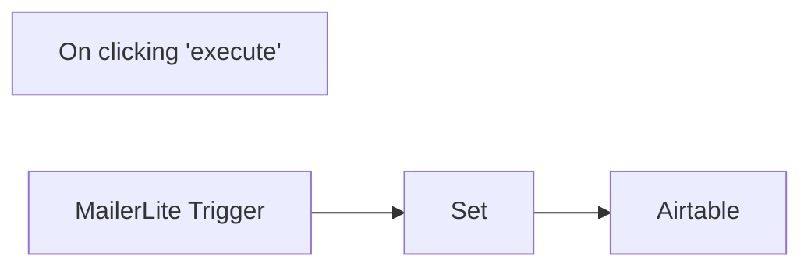

## Fluxo (.json) :

```json
{
  "id": "30",
  "name": "Receive updates when a subscriber is added to a group and strore the information in Airtable",
  "nodes": [
    {
      "name": "On clicking 'execute'",
      "type": "n8n-nodes-base.manualTrigger",
      "disabled": true,
      "position": [
        110,
        600
      ],
      "parameters": {},
      "typeVersion": 1
    },
    {
      "name": "MailerLite Trigger",
      "type": "n8n-nodes-base.mailerLiteTrigger",
      "position": [
        530,
        300
      ],
      "webhookId": "dd15d919-18b3-4af7-a5c9-c4583cdda9f5",
      "parameters": {
        "event": "subscriber.add_to_group"
      },
      "credentials": {
        "mailerLiteApi": "mailerlite"
      },
      "typeVersion": 1
    },
    {
      "name": "Set",
      "type": "n8n-nodes-base.set",
      "position": [
        730,
        300
      ],
      "parameters": {
        "values": {
          "string": [
            {
              "name": "Name",
              "value": "={{$node[\"MailerLite Trigger\"].json[\"data\"][\"subscriber\"][\"name\"]}}"
            },
            {
              "name": "Email",
              "value": "={{$node[\"MailerLite Trigger\"].json[\"data\"][\"subscriber\"][\"email\"]}}"
            }
          ]
        },
        "options": {},
        "keepOnlySet": true
      },
      "typeVersion": 1
    },
    {
      "name": "Airtable",
      "type": "n8n-nodes-base.airtable",
      "position": [
        930,
        300
      ],
      "parameters": {
        "table": "Data",
        "options": {},
        "operation": "append",
        "application": ""
      },
      "credentials": {
        "airtableApi": "airtable-harshil"
      },
      "typeVersion": 1
    }
  ],
  "active": false,
  "settings": {},
  "connections": {
    "Set": {
      "main": [
        [
          {
            "node": "Airtable",
            "type": "main",
            "index": 0
          }
        ]
      ]
    },
    "MailerLite Trigger": {
      "main": [
        [
          {
            "node": "Set",
            "type": "main",
            "index": 0
          }
        ]
      ]
    },
    "On clicking 'execute'": {
      "main": [
        []
      ]
    }
  }
}
```

<a id="template-333"></a>

## Template 333 - Exportar execuções para CSV

- **Nome:** Exportar execuções para CSV
- **Descrição:** Fluxo manual que obtém todas as execuções, converte os dados para CSV e deixa um nó substituível para envio a um armazenamento.
- **Funcionalidade:** • Gatilho manual: Inicia o fluxo ao acionar o teste manualmente.
• Recuperar todas as execuções: Coleta todas as execuções disponíveis, com possibilidade de aplicar filtros por workflow e status.
• Converter para CSV: Converte os registros de execução em um arquivo CSV para facilitar parsing e exportação.
• Nó substituível para armazenamento: Inclui um nó placeholder que deve ser trocado por um destino de armazenamento em nuvem (por exemplo, S3, Google Drive).
• Operação final neutra: Um nó de no-op que finaliza o fluxo sem realizar ações adicionais, útil como ponto de integração futuro.
- **Ferramentas:** • Nenhuma: Não há integrações com ferramentas externas configuradas; o fluxo opera localmente e requer que o nó placeholder seja substituído para enviar os dados a um serviço externo.

## Fluxo visual

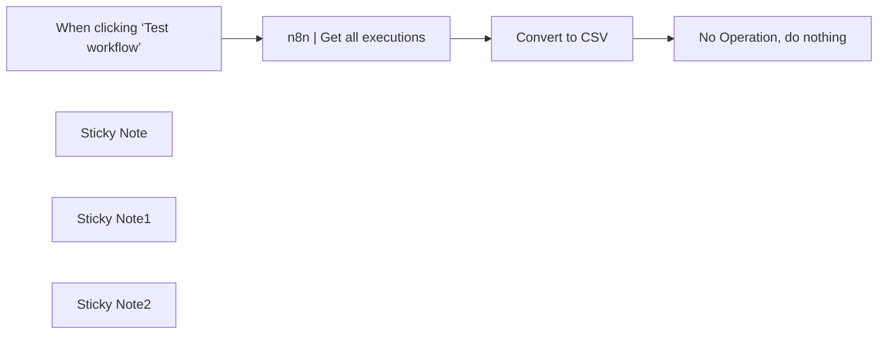

## Fluxo (.json) :

```json
{
  "meta": {
    "instanceId": "d7fca24febd307481e0bbb00524fea1b07b7a70804c772daa0c99b9ce35883b9",
    "templateCredsSetupCompleted": true
  },
  "nodes": [
    {
      "id": "9b5b5af9-8a56-40a3-ad75-1e1186e96439",
      "name": "When clicking ‘Test workflow’",
      "type": "n8n-nodes-base.manualTrigger",
      "position": [
        640,
        360
      ],
      "parameters": {},
      "typeVersion": 1
    },
    {
      "id": "7c99e8d9-ef79-4833-bb0c-5005d210418e",
      "name": "n8n | Get all executions",
      "type": "n8n-nodes-base.n8n",
      "position": [
        880,
        360
      ],
      "parameters": {
        "filters": {},
        "options": {},
        "resource": "execution",
        "returnAll": true
      },
      "credentials": {
        "n8nApi": {
          "id": "3c3kWsiMeyTemNnV",
          "name": "n8n account"
        }
      },
      "typeVersion": 1
    },
    {
      "id": "95ae4ed4-22d4-41dc-be75-ea1224985f80",
      "name": "Convert to CSV",
      "type": "n8n-nodes-base.convertToFile",
      "position": [
        1140,
        360
      ],
      "parameters": {
        "options": {}
      },
      "typeVersion": 1.1
    },
    {
      "id": "07665975-a07c-4c7c-b9ec-cad583b17c07",
      "name": "Sticky Note",
      "type": "n8n-nodes-base.stickyNote",
      "position": [
        800,
        220
      ],
      "parameters": {
        "color": 5,
        "width": 254,
        "height": 355,
        "content": "## Get all executions\n**Workflow and Status Filters can be applied here**"
      },
      "typeVersion": 1
    },
    {
      "id": "14e2f531-5902-4c58-946c-a8571266c5e4",
      "name": "Sticky Note1",
      "type": "n8n-nodes-base.stickyNote",
      "position": [
        1080,
        220
      ],
      "parameters": {
        "color": 4,
        "width": 214.03132502922975,
        "height": 355,
        "content": "## Convert to CSV\n**CSV for easy parsing**"
      },
      "typeVersion": 1
    },
    {
      "id": "e1bc72a9-3378-4dd4-88b0-3fb4eee1fea8",
      "name": "No Operation, do nothing",
      "type": "n8n-nodes-base.noOp",
      "position": [
        1380,
        360
      ],
      "parameters": {},
      "typeVersion": 1
    },
    {
      "id": "066fa340-98d6-4e18-87f0-f995083d041d",
      "name": "Sticky Note2",
      "type": "n8n-nodes-base.stickyNote",
      "position": [
        1320,
        220
      ],
      "parameters": {
        "width": 214.07781344172514,
        "height": 356,
        "content": "## Replace this node\n**Replace this node with any cloud storage destination**"
      },
      "typeVersion": 1
    }
  ],
  "pinData": {},
  "connections": {
    "Convert to CSV": {
      "main": [
        [
          {
            "node": "No Operation, do nothing",
            "type": "main",
            "index": 0
          }
        ]
      ]
    },
    "n8n | Get all executions": {
      "main": [
        [
          {
            "node": "Convert to CSV",
            "type": "main",
            "index": 0
          }
        ]
      ]
    },
    "When clicking ‘Test workflow’": {
      "main": [
        [
          {
            "node": "n8n | Get all executions",
            "type": "main",
            "index": 0
          }
        ]
      ]
    }
  }
}
```

<a id="template-334"></a>

## Template 334 - Webhook de confirmação de reserva para Retell

- **Nome:** Webhook de confirmação de reserva para Retell
- **Descrição:** Recebe um POST enviado pela função personalizada do Retell ao confirmar uma reserva, permite executar lógica adicional e devolve uma resposta em tempo real ao agente de voz.
- **Funcionalidade:** • Recepção do webhook do Retell: captura o POST com contexto da chamada, transcript e parâmetros da função.
• Extração de dados de reserva: obtém informações como nome do hóspede, hotel, tipo de quarto, datas e custo total.
• Execução de lógica personalizada: ponto para inserir validações, chamadas a APIs externas, envio de emails ou geração de respostas dinâmicas por LLM.
• Geração da resposta ao agente: monta e envia a string de resposta que será retornada ao agente de voz em tempo real.
• Template e instruções de uso: inclui orientações para configurar a URL do webhook e adaptar a lógica ao caso de uso.
- **Ferramentas:** • Retell AI: plataforma de agentes de voz que dispara a função personalizada e envia o webhook com o contexto da conversa.
• Serviço de email (SMTP, SendGrid, etc.): para enviar confirmações ou recibos ao hóspede.
• Provedor de LLM (por exemplo OpenAI): para gerar respostas dinâmicas e personalizadas ao usuário.
• Sistemas externos via API (CRM, sistema de reservas, calendário): para criar, atualizar ou sincronizar reservas e contatos.
• Webhook/HTTP: canal padrão usado para comunicação entre o agente de voz e a automação.

## Fluxo visual

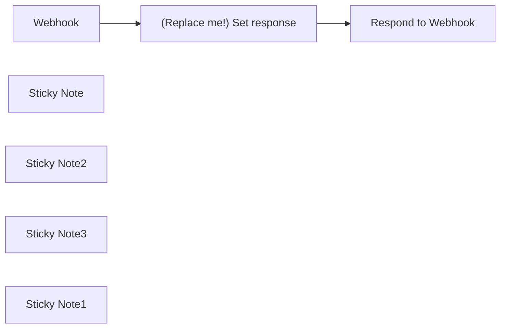

## Fluxo (.json) :

```json
{
  "meta": {
    "instanceId": "f4f5d195bb2162a0972f737368404b18be694648d365d6c6771d7b4909d28167"
  },
  "nodes": [
    {
      "id": "693e094e-0329-455d-9c42-ba398dd40955",
      "name": "Webhook",
      "type": "n8n-nodes-base.webhook",
      "position": [
        -500,
        -160
      ],
      "webhookId": "825f729b-34e1-4c34-8687-f48b7118b749",
      "parameters": {
        "path": "hotel-retell-template",
        "options": {
          "responseData": "={\"response\":\"Your booking is confirmed\"}"
        },
        "httpMethod": "POST"
      },
      "typeVersion": 2
    },
    {
      "id": "6172b8b6-4950-4b7f-a60c-ce782139f24c",
      "name": "Respond to Webhook",
      "type": "n8n-nodes-base.respondToWebhook",
      "position": [
        300,
        -160
      ],
      "parameters": {
        "options": {}
      },
      "typeVersion": 1.1
    },
    {
      "id": "6ebeaeb7-4ec5-4f5d-b8d5-3fd51ca8604c",
      "name": "[Replace me!] Set response",
      "type": "n8n-nodes-base.set",
      "position": [
        -100,
        -160
      ],
      "parameters": {
        "options": {},
        "assignments": {
          "assignments": [
            {
              "id": "4159ec1f-4bd6-4473-90e5-a0c24e2bf302",
              "name": "response",
              "type": "string",
              "value": "Your booking has been confirmed!"
            }
          ]
        }
      },
      "typeVersion": 3.4
    },
    {
      "id": "86c16dd4-0d9d-40bb-a495-02c1a2ac06f1",
      "name": "Sticky Note",
      "type": "n8n-nodes-base.stickyNote",
      "position": [
        -240,
        -340
      ],
      "parameters": {
        "color": 5,
        "width": 400,
        "height": 360,
        "content": "### 🧠 Place your logic here!\nYour Agent logic goes here.\nYou can, for example, use an **AI Agent** to provide information back to your Retell agent and/or **make an action in a third party service**. For example: book an event, add a contact to a CRM, etc. \nSky is the limit! 🙌"
      },
      "typeVersion": 1
    },
    {
      "id": "f8be07ca-1d3f-46cb-b858-bb22b15efe0f",
      "name": "Sticky Note2",
      "type": "n8n-nodes-base.stickyNote",
      "position": [
        -560,
        -340
      ],
      "parameters": {
        "color": 5,
        "width": 220,
        "height": 360,
        "content": "### Retell Custom Function Webhook\nPOST Webhook received from Retell's Custom Function each time it is triggered by Retell's Voice Agent"
      },
      "typeVersion": 1
    },
    {
      "id": "94ec297f-aa00-4358-b1f9-834438548a19",
      "name": "Sticky Note3",
      "type": "n8n-nodes-base.stickyNote",
      "position": [
        200,
        -340
      ],
      "parameters": {
        "color": 5,
        "width": 300,
        "height": 360,
        "content": "### Retell Custom Function Response\nResponse to the webhook that will be provided back to Retell's Voice Agent.\n\n**Modify the response accordingly** if you want anything else than the first incoming input being sent back"
      },
      "typeVersion": 1
    },
    {
      "id": "baff741b-8cd3-4f7d-a56f-5029e1babc26",
      "name": "Sticky Note1",
      "type": "n8n-nodes-base.stickyNote",
      "position": [
        -1500,
        -700
      ],
      "parameters": {
        "color": 7,
        "width": 880,
        "height": 1220,
        "content": "## Connect Retell Voice Agents to Custom Functions\n\n## Overview\n- This workflow allows you to **trigger custom logic in n8n directly from Retell's Voice Agent** using [Custom Functions](https://docs.retellai.com/build/conversation-flow/custom-function#custom-function).\n- It captures a POST webhook from Retell every time a Voice Agent reaches a Custom Function node.\n- You can plug in any logic—call an external API, book a meeting, update a CRM, or even return a dynamic response back to the agent.\n\n## Who is it for\nFor builders using [Retell](https://www.retellai.com/) who want to **extend Voice Agent functionality** with real-time custom workflows or AI-generated responses.\n\n## Prerequisites\n- Have a [Retell AI Account](https://www.retellai.com/)\n- A Retell agent with a Custom Function node in its conversation flow (see template below)\n- Set your n8n webhook URL in the Custom Function configuration (see \"How to use it\" below)\n- (Optional) Familiarity with [Retell's Custom Function docs](https://docs.retellai.com/build/conversation-flow/custom-function#custom-function)\n- Start a conversation with the agent (text or voice)\n\n## Retell Agent Example\nTo get you started, **[we've prepared a Retell Agent](https://drive.google.com/file/d/1rAcsNz-f8SyuOxO0VJ_84oPscYFpir4-/view?usp=sharing)** ready to be imported, that includes the call to this template.\n- Import the agent to your Retell workspace (top-right button [on your agent's page](https://dashboard.retellai.com/agents))\n- You will need to modify the function URL in order to call your own instance.\n- This template is a simple hotel agent that calls the custom function to confirm a booking, passing basic formatted data.\n\n## How it works\n- Retell sends a webhook to n8n whenever a Custom Function is triggered during a call (or test chat).\n- The webhook includes:\n    - Full call context (transcript, call ID, etc.)\n    - Parameters defined in the Retell function node\n- You can process this data and return a response string back to the Voice Agent in real-time.\n\n## How to use it\n1. Copy the webhook URL (e.g. `https://your-instance.app.n8n.cloud/webhook/hotel-retell-template`)\n2. Modify the Retell Custom Function webhook URL (see template description for screenshots)\n    - Edit the function\n    - Modify the URL\n3. Modify the logic in the Set node or replace it with your own custom flow\n4. Deploy and test: Retell will hit your n8n workflow during the conversation\n\n## Extension Ideas\n- Call a third-party API to fetch data (e.g. hotel availability, CRM records)\n- Use an LLM node to generate dynamic responses\n- Trigger a parallel automation (Slack message, calendar invite, etc.)\n\n#### 👉 [Reach out to us](mailto:hello@agentstudio.io) if you're interested in **analyzing your Retell Agent conversations**.\n"
      },
      "typeVersion": 1
    }
  ],
  "pinData": {
    "Webhook": [
      {
        "body": {
          "args": {
            "guest-name": "Mike Smith",
            "hotel-name": "Agent Studios",
            "total-cost": "190",
            "check-in-date": "2025-03-29",
            "check-out-date": "2025-03-30",
            "number-of-nights": 1,
            "room-type-booked": "Deluxe Suite"
          },
          "call": {
            "call_id": "playground",
            "latency": {},
            "call_type": "web_call",
            "tool_mocks": [],
            "transcript": "Agent: \nUser: Hi, I would like to make a reservation for me and my wife on March 29th. We have a budget of 250 euros. Can you help me with that?\nAgent: Good day, and welcome to Agent Studios. I'm Luigi, and I'm here to assist you with your reservation. May I have your name and email address, please?\nUser: My name is Mike Smith, and my email address is mike@yahoo.com.\nAgent: Thank you, Mike. For your stay on March 29th, we have the Deluxe Suite available, which is priced at 190 euros per night. This fits within your budget of 250 euros. Would you like to proceed with booking the Deluxe Suite for one night?\nUser: Yes, that sounds great! Please proceed with the booking for the Deluxe Suite for one night on March 29th.\n",
            "transcript_object": [
              {
                "role": "agent",
                "words": [],
                "content": ""
              },
              {
                "role": "user",
                "words": [
                  {
                    "end": 1,
                    "word": "Hi, ",
                    "start": 1
                  },
                  {
                    "end": 1,
                    "word": "I ",
                    "start": 1
                  },
                  {
                    "end": 1,
                    "word": "would ",
                    "start": 1
                  },
                  {
                    "end": 1,
                    "word": "like ",
                    "start": 1
                  },
                  {
                    "end": 1,
                    "word": "to ",
                    "start": 1
                  },
                  {
                    "end": 1,
                    "word": "make ",
                    "start": 1
                  },
                  {
                    "end": 1,
                    "word": "a ",
                    "start": 1
                  },
                  {
                    "end": 1,
                    "word": "reservation ",
                    "start": 1
                  },
                  {
                    "end": 1,
                    "word": "for ",
                    "start": 1
                  },
                  {
                    "end": 1,
                    "word": "me ",
                    "start": 1
                  },
                  {
                    "end": 1,
                    "word": "and ",
                    "start": 1
                  },
                  {
                    "end": 1,
                    "word": "my ",
                    "start": 1
                  },
                  {
                    "end": 1,
                    "word": "wife ",
                    "start": 1
                  },
                  {
                    "end": 1,
                    "word": "on ",
                    "start": 1
                  },
                  {
                    "end": 1,
                    "word": "March ",
                    "start": 1
                  },
                  {
                    "end": 1,
                    "word": "29th. ",
                    "start": 1
                  },
                  {
                    "end": 1,
                    "word": "We ",
                    "start": 1
                  },
                  {
                    "end": 1,
                    "word": "have ",
                    "start": 1
                  },
                  {
                    "end": 1,
                    "word": "a ",
                    "start": 1
                  },
                  {
                    "end": 1,
                    "word": "budget ",
                    "start": 1
                  },
                  {
                    "end": 1,
                    "word": "of ",
                    "start": 1
                  },
                  {
                    "end": 1,
                    "word": "250 ",
                    "start": 1
                  },
                  {
                    "end": 1,
                    "word": "euros. ",
                    "start": 1
                  },
                  {
                    "end": 1,
                    "word": "Can ",
                    "start": 1
                  },
                  {
                    "end": 1,
                    "word": "you ",
                    "start": 1
                  },
                  {
                    "end": 1,
                    "word": "help ",
                    "start": 1
                  },
                  {
                    "end": 1,
                    "word": "me ",
                    "start": 1
                  },
                  {
                    "end": 1,
                    "word": "with ",
                    "start": 1
                  },
                  {
                    "end": 1,
                    "word": "that?",
                    "start": 1
                  }
                ],
                "content": "Hi, I would like to make a reservation for me and my wife on March 29th. We have a budget of 250 euros. Can you help me with that?"
              },
              {
                "role": "agent",
                "words": [
                  {
                    "end": 2,
                    "word": "Good ",
                    "start": 2
                  },
                  {
                    "end": 2,
                    "word": "day, ",
                    "start": 2
                  },
                  {
                    "end": 2,
                    "word": "and ",
                    "start": 2
                  },
                  {
                    "end": 2,
                    "word": "welcome ",
                    "start": 2
                  },
                  {
                    "end": 2,
                    "word": "to ",
                    "start": 2
                  },
                  {
                    "end": 2,
                    "word": "Agent ",
                    "start": 2
                  },
                  {
                    "end": 2,
                    "word": "Studios ",
                    "start": 2
                  },
                  {
                    "end": 2,
                    "word": "I'm ",
                    "start": 2
                  },
                  {
                    "end": 2,
                    "word": "Luigi, ",
                    "start": 2
                  },
                  {
                    "end": 2,
                    "word": "and ",
                    "start": 2
                  },
                  {
                    "end": 2,
                    "word": "I'm ",
                    "start": 2
                  },
                  {
                    "end": 2,
                    "word": "here ",
                    "start": 2
                  },
                  {
                    "end": 2,
                    "word": "to ",
                    "start": 2
                  },
                  {
                    "end": 2,
                    "word": "assist ",
                    "start": 2
                  },
                  {
                    "end": 2,
                    "word": "you ",
                    "start": 2
                  },
                  {
                    "end": 2,
                    "word": "with ",
                    "start": 2
                  },
                  {
                    "end": 2,
                    "word": "your ",
                    "start": 2
                  },
                  {
                    "end": 2,
                    "word": "reservation. ",
                    "start": 2
                  },
                  {
                    "end": 2,
                    "word": "May ",
                    "start": 2
                  },
                  {
                    "end": 2,
                    "word": "I ",
                    "start": 2
                  },
                  {
                    "end": 2,
                    "word": "have ",
                    "start": 2
                  },
                  {
                    "end": 2,
                    "word": "your ",
                    "start": 2
                  },
                  {
                    "end": 2,
                    "word": "name ",
                    "start": 2
                  },
                  {
                    "end": 2,
                    "word": "and ",
                    "start": 2
                  },
                  {
                    "end": 2,
                    "word": "email ",
                    "start": 2
                  },
                  {
                    "end": 2,
                    "word": "address, ",
                    "start": 2
                  },
                  {
                    "end": 2,
                    "word": "please?",
                    "start": 2
                  }
                ],
                "content": "Good day, and welcome to Agent Studios. I'm Luigi, and I'm here to assist you with your reservation. May I have your name and email address, please?"
              },
              {
                "role": "user",
                "words": [
                  {
                    "end": 3,
                    "word": "My ",
                    "start": 3
                  },
                  {
                    "end": 3,
                    "word": "name ",
                    "start": 3
                  },
                  {
                    "end": 3,
                    "word": "is ",
                    "start": 3
                  },
                  {
                    "end": 3,
                    "word": "Mike ",
                    "start": 3
                  },
                  {
                    "end": 3,
                    "word": "Smith, ",
                    "start": 3
                  },
                  {
                    "end": 3,
                    "word": "and ",
                    "start": 3
                  },
                  {
                    "end": 3,
                    "word": "my ",
                    "start": 3
                  },
                  {
                    "end": 3,
                    "word": "email ",
                    "start": 3
                  },
                  {
                    "end": 3,
                    "word": "address ",
                    "start": 3
                  },
                  {
                    "end": 3,
                    "word": "is ",
                    "start": 3
                  },
                  {
                    "end": 3,
                    "word": "mike@yahoo.com.",
                    "start": 3
                  }
                ],
                "content": "My name is Mike Smith, and my email address is mike@yahoo.com."
              },
              {
                "role": "agent",
                "words": [
                  {
                    "end": 4,
                    "word": "Thank ",
                    "start": 4
                  },
                  {
                    "end": 4,
                    "word": "you, ",
                    "start": 4
                  },
                  {
                    "end": 4,
                    "word": "Mike. ",
                    "start": 4
                  },
                  {
                    "end": 4,
                    "word": "For ",
                    "start": 4
                  },
                  {
                    "end": 4,
                    "word": "your ",
                    "start": 4
                  },
                  {
                    "end": 4,
                    "word": "stay ",
                    "start": 4
                  },
                  {
                    "end": 4,
                    "word": "on ",
                    "start": 4
                  },
                  {
                    "end": 4,
                    "word": "March ",
                    "start": 4
                  },
                  {
                    "end": 4,
                    "word": "29th, ",
                    "start": 4
                  },
                  {
                    "end": 4,
                    "word": "we ",
                    "start": 4
                  },
                  {
                    "end": 4,
                    "word": "have ",
                    "start": 4
                  },
                  {
                    "end": 4,
                    "word": "the ",
                    "start": 4
                  },
                  {
                    "end": 4,
                    "word": "Deluxe ",
                    "start": 4
                  },
                  {
                    "end": 4,
                    "word": "Suite ",
                    "start": 4
                  },
                  {
                    "end": 4,
                    "word": "available, ",
                    "start": 4
                  },
                  {
                    "end": 4,
                    "word": "which ",
                    "start": 4
                  },
                  {
                    "end": 4,
                    "word": "is ",
                    "start": 4
                  },
                  {
                    "end": 4,
                    "word": "priced ",
                    "start": 4
                  },
                  {
                    "end": 4,
                    "word": "at ",
                    "start": 4
                  },
                  {
                    "end": 4,
                    "word": "190 ",
                    "start": 4
                  },
                  {
                    "end": 4,
                    "word": "euros ",
                    "start": 4
                  },
                  {
                    "end": 4,
                    "word": "per ",
                    "start": 4
                  },
                  {
                    "end": 4,
                    "word": "night. ",
                    "start": 4
                  },
                  {
                    "end": 4,
                    "word": "This ",
                    "start": 4
                  },
                  {
                    "end": 4,
                    "word": "fits ",
                    "start": 4
                  },
                  {
                    "end": 4,
                    "word": "within ",
                    "start": 4
                  },
                  {
                    "end": 4,
                    "word": "your ",
                    "start": 4
                  },
                  {
                    "end": 4,
                    "word": "budget ",
                    "start": 4
                  },
                  {
                    "end": 4,
                    "word": "of ",
                    "start": 4
                  },
                  {
                    "end": 4,
                    "word": "250 ",
                    "start": 4
                  },
                  {
                    "end": 4,
                    "word": "euros. ",
                    "start": 4
                  },
                  {
                    "end": 4,
                    "word": "Would ",
                    "start": 4
                  },
                  {
                    "end": 4,
                    "word": "you ",
                    "start": 4
                  },
                  {
                    "end": 4,
                    "word": "like ",
                    "start": 4
                  },
                  {
                    "end": 4,
                    "word": "to ",
                    "start": 4
                  },
                  {
                    "end": 4,
                    "word": "proceed ",
                    "start": 4
                  },
                  {
                    "end": 4,
                    "word": "with ",
                    "start": 4
                  },
                  {
                    "end": 4,
                    "word": "booking ",
                    "start": 4
                  },
                  {
                    "end": 4,
                    "word": "the ",
                    "start": 4
                  },
                  {
                    "end": 4,
                    "word": "Deluxe ",
                    "start": 4
                  },
                  {
                    "end": 4,
                    "word": "Suite ",
                    "start": 4
                  },
                  {
                    "end": 4,
                    "word": "for ",
                    "start": 4
                  },
                  {
                    "end": 4,
                    "word": "one ",
                    "start": 4
                  },
                  {
                    "end": 4,
                    "word": "night?",
                    "start": 4
                  }
                ],
                "content": "Thank you, Mike. For your stay on March 29th, we have the Deluxe Suite available, which is priced at 190 euros per night. This fits within your budget of 250 euros. Would you like to proceed with booking the Deluxe Suite for one night?"
              },
              {
                "role": "user",
                "words": [
                  {
                    "end": 5,
                    "word": "Yes, ",
                    "start": 5
                  },
                  {
                    "end": 5,
                    "word": "that ",
                    "start": 5
                  },
                  {
                    "end": 5,
                    "word": "sounds ",
                    "start": 5
                  },
                  {
                    "end": 5,
                    "word": "great! ",
                    "start": 5
                  },
                  {
                    "end": 5,
                    "word": "Please ",
                    "start": 5
                  },
                  {
                    "end": 5,
                    "word": "proceed ",
                    "start": 5
                  },
                  {
                    "end": 5,
                    "word": "with ",
                    "start": 5
                  },
                  {
                    "end": 5,
                    "word": "the ",
                    "start": 5
                  },
                  {
                    "end": 5,
                    "word": "booking ",
                    "start": 5
                  },
                  {
                    "end": 5,
                    "word": "for ",
                    "start": 5
                  },
                  {
                    "end": 5,
                    "word": "the ",
                    "start": 5
                  },
                  {
                    "end": 5,
                    "word": "Deluxe ",
                    "start": 5
                  },
                  {
                    "end": 5,
                    "word": "Suite ",
                    "start": 5
                  },
                  {
                    "end": 5,
                    "word": "for ",
                    "start": 5
                  },
                  {
                    "end": 5,
                    "word": "one ",
                    "start": 5
                  },
                  {
                    "end": 5,
                    "word": "night ",
                    "start": 5
                  },
                  {
                    "end": 5,
                    "word": "on ",
                    "start": 5
                  },
                  {
                    "end": 5,
                    "word": "March ",
                    "start": 5
                  },
                  {
                    "end": 5,
                    "word": "29th.",
                    "start": 5
                  }
                ],
                "content": "Yes, that sounds great! Please proceed with the booking for the Deluxe Suite for one night on March 29th."
              }
            ],
            "transcript_with_tool_calls": [
              {
                "role": "agent",
                "words": [],
                "content": ""
              },
              {
                "role": "user",
                "words": [
                  {
                    "end": 1,
                    "word": "Hi, ",
                    "start": 1
                  },
                  {
                    "end": 1,
                    "word": "I ",
                    "start": 1
                  },
                  {
                    "end": 1,
                    "word": "would ",
                    "start": 1
                  },
                  {
                    "end": 1,
                    "word": "like ",
                    "start": 1
                  },
                  {
                    "end": 1,
                    "word": "to ",
                    "start": 1
                  },
                  {
                    "end": 1,
                    "word": "make ",
                    "start": 1
                  },
                  {
                    "end": 1,
                    "word": "a ",
                    "start": 1
                  },
                  {
                    "end": 1,
                    "word": "reservation ",
                    "start": 1
                  },
                  {
                    "end": 1,
                    "word": "for ",
                    "start": 1
                  },
                  {
                    "end": 1,
                    "word": "me ",
                    "start": 1
                  },
                  {
                    "end": 1,
                    "word": "and ",
                    "start": 1
                  },
                  {
                    "end": 1,
                    "word": "my ",
                    "start": 1
                  },
                  {
                    "end": 1,
                    "word": "wife ",
                    "start": 1
                  },
                  {
                    "end": 1,
                    "word": "on ",
                    "start": 1
                  },
                  {
                    "end": 1,
                    "word": "March ",
                    "start": 1
                  },
                  {
                    "end": 1,
                    "word": "29th. ",
                    "start": 1
                  },
                  {
                    "end": 1,
                    "word": "We ",
                    "start": 1
                  },
                  {
                    "end": 1,
                    "word": "have ",
                    "start": 1
                  },
                  {
                    "end": 1,
                    "word": "a ",
                    "start": 1
                  },
                  {
                    "end": 1,
                    "word": "budget ",
                    "start": 1
                  },
                  {
                    "end": 1,
                    "word": "of ",
                    "start": 1
                  },
                  {
                    "end": 1,
                    "word": "250 ",
                    "start": 1
                  },
                  {
                    "end": 1,
                    "word": "euros. ",
                    "start": 1
                  },
                  {
                    "end": 1,
                    "word": "Can ",
                    "start": 1
                  },
                  {
                    "end": 1,
                    "word": "you ",
                    "start": 1
                  },
                  {
                    "end": 1,
                    "word": "help ",
                    "start": 1
                  },
                  {
                    "end": 1,
                    "word": "me ",
                    "start": 1
                  },
                  {
                    "end": 1,
                    "word": "with ",
                    "start": 1
                  },
                  {
                    "end": 1,
                    "word": "that?",
                    "start": 1
                  }
                ],
                "content": "Hi, I would like to make a reservation for me and my wife on March 29th. We have a budget of 250 euros. Can you help me with that?"
              },
              {
                "role": "agent",
                "words": [
                  {
                    "end": 2,
                    "word": "Good ",
                    "start": 2
                  },
                  {
                    "end": 2,
                    "word": "day, ",
                    "start": 2
                  },
                  {
                    "end": 2,
                    "word": "and ",
                    "start": 2
                  },
                  {
                    "end": 2,
                    "word": "welcome ",
                    "start": 2
                  },
                  {
                    "end": 2,
                    "word": "to ",
                    "start": 2
                  },
                  {
                    "end": 2,
                    "word": "Agent ",
                    "start": 2
                  },
                  {
                    "end": 2,
                    "word": "Studios ",
                    "start": 2
                  },
                  {
                    "end": 2,
                    "word": "I'm ",
                    "start": 2
                  },
                  {
                    "end": 2,
                    "word": "Luigi, ",
                    "start": 2
                  },
                  {
                    "end": 2,
                    "word": "and ",
                    "start": 2
                  },
                  {
                    "end": 2,
                    "word": "I'm ",
                    "start": 2
                  },
                  {
                    "end": 2,
                    "word": "here ",
                    "start": 2
                  },
                  {
                    "end": 2,
                    "word": "to ",
                    "start": 2
                  },
                  {
                    "end": 2,
                    "word": "assist ",
                    "start": 2
                  },
                  {
                    "end": 2,
                    "word": "you ",
                    "start": 2
                  },
                  {
                    "end": 2,
                    "word": "with ",
                    "start": 2
                  },
                  {
                    "end": 2,
                    "word": "your ",
                    "start": 2
                  },
                  {
                    "end": 2,
                    "word": "reservation. ",
                    "start": 2
                  },
                  {
                    "end": 2,
                    "word": "May ",
                    "start": 2
                  },
                  {
                    "end": 2,
                    "word": "I ",
                    "start": 2
                  },
                  {
                    "end": 2,
                    "word": "have ",
                    "start": 2
                  },
                  {
                    "end": 2,
                    "word": "your ",
                    "start": 2
                  },
                  {
                    "end": 2,
                    "word": "name ",
                    "start": 2
                  },
                  {
                    "end": 2,
                    "word": "and ",
                    "start": 2
                  },
                  {
                    "end": 2,
                    "word": "email ",
                    "start": 2
                  },
                  {
                    "end": 2,
                    "word": "address, ",
                    "start": 2
                  },
                  {
                    "end": 2,
                    "word": "please?",
                    "start": 2
                  }
                ],
                "content": "Good day, and welcome to Agent Studios. I'm Luigi, and I'm here to assist you with your reservation. May I have your name and email address, please?"
              },
              {
                "role": "user",
                "words": [
                  {
                    "end": 3,
                    "word": "My ",
                    "start": 3
                  },
                  {
                    "end": 3,
                    "word": "name ",
                    "start": 3
                  },
                  {
                    "end": 3,
                    "word": "is ",
                    "start": 3
                  },
                  {
                    "end": 3,
                    "word": "Mike ",
                    "start": 3
                  },
                  {
                    "end": 3,
                    "word": "Smith, ",
                    "start": 3
                  },
                  {
                    "end": 3,
                    "word": "and ",
                    "start": 3
                  },
                  {
                    "end": 3,
                    "word": "my ",
                    "start": 3
                  },
                  {
                    "end": 3,
                    "word": "email ",
                    "start": 3
                  },
                  {
                    "end": 3,
                    "word": "address ",
                    "start": 3
                  },
                  {
                    "end": 3,
                    "word": "is ",
                    "start": 3
                  },
                  {
                    "end": 3,
                    "word": "mike@yahoo.com.",
                    "start": 3
                  }
                ],
                "content": "My name is Mike Smith, and my email address is mike@yahoo.com."
              },
              {
                "role": "agent",
                "words": [
                  {
                    "end": 4,
                    "word": "Thank ",
                    "start": 4
                  },
                  {
                    "end": 4,
                    "word": "you, ",
                    "start": 4
                  },
                  {
                    "end": 4,
                    "word": "Mike. ",
                    "start": 4
                  },
                  {
                    "end": 4,
                    "word": "For ",
                    "start": 4
                  },
                  {
                    "end": 4,
                    "word": "your ",
                    "start": 4
                  },
                  {
                    "end": 4,
                    "word": "stay ",
                    "start": 4
                  },
                  {
                    "end": 4,
                    "word": "on ",
                    "start": 4
                  },
                  {
                    "end": 4,
                    "word": "March ",
                    "start": 4
                  },
                  {
                    "end": 4,
                    "word": "29th, ",
                    "start": 4
                  },
                  {
                    "end": 4,
                    "word": "we ",
                    "start": 4
                  },
                  {
                    "end": 4,
                    "word": "have ",
                    "start": 4
                  },
                  {
                    "end": 4,
                    "word": "the ",
                    "start": 4
                  },
                  {
                    "end": 4,
                    "word": "Deluxe ",
                    "start": 4
                  },
                  {
                    "end": 4,
                    "word": "Suite ",
                    "start": 4
                  },
                  {
                    "end": 4,
                    "word": "available, ",
                    "start": 4
                  },
                  {
                    "end": 4,
                    "word": "which ",
                    "start": 4
                  },
                  {
                    "end": 4,
                    "word": "is ",
                    "start": 4
                  },
                  {
                    "end": 4,
                    "word": "priced ",
                    "start": 4
                  },
                  {
                    "end": 4,
                    "word": "at ",
                    "start": 4
                  },
                  {
                    "end": 4,
                    "word": "190 ",
                    "start": 4
                  },
                  {
                    "end": 4,
                    "word": "euros ",
                    "start": 4
                  },
                  {
                    "end": 4,
                    "word": "per ",
                    "start": 4
                  },
                  {
                    "end": 4,
                    "word": "night. ",
                    "start": 4
                  },
                  {
                    "end": 4,
                    "word": "This ",
                    "start": 4
                  },
                  {
                    "end": 4,
                    "word": "fits ",
                    "start": 4
                  },
                  {
                    "end": 4,
                    "word": "within ",
                    "start": 4
                  },
                  {
                    "end": 4,
                    "word": "your ",
                    "start": 4
                  },
                  {
                    "end": 4,
                    "word": "budget ",
                    "start": 4
                  },
                  {
                    "end": 4,
                    "word": "of ",
                    "start": 4
                  },
                  {
                    "end": 4,
                    "word": "250 ",
                    "start": 4
                  },
                  {
                    "end": 4,
                    "word": "euros. ",
                    "start": 4
                  },
                  {
                    "end": 4,
                    "word": "Would ",
                    "start": 4
                  },
                  {
                    "end": 4,
                    "word": "you ",
                    "start": 4
                  },
                  {
                    "end": 4,
                    "word": "like ",
                    "start": 4
                  },
                  {
                    "end": 4,
                    "word": "to ",
                    "start": 4
                  },
                  {
                    "end": 4,
                    "word": "proceed ",
                    "start": 4
                  },
                  {
                    "end": 4,
                    "word": "with ",
                    "start": 4
                  },
                  {
                    "end": 4,
                    "word": "booking ",
                    "start": 4
                  },
                  {
                    "end": 4,
                    "word": "the ",
                    "start": 4
                  },
                  {
                    "end": 4,
                    "word": "Deluxe ",
                    "start": 4
                  },
                  {
                    "end": 4,
                    "word": "Suite ",
                    "start": 4
                  },
                  {
                    "end": 4,
                    "word": "for ",
                    "start": 4
                  },
                  {
                    "end": 4,
                    "word": "one ",
                    "start": 4
                  },
                  {
                    "end": 4,
                    "word": "night?",
                    "start": 4
                  }
                ],
                "content": "Thank you, Mike. For your stay on March 29th, we have the Deluxe Suite available, which is priced at 190 euros per night. This fits within your budget of 250 euros. Would you like to proceed with booking the Deluxe Suite for one night?"
              },
              {
                "role": "user",
                "words": [
                  {
                    "end": 5,
                    "word": "Yes, ",
                    "start": 5
                  },
                  {
                    "end": 5,
                    "word": "that ",
                    "start": 5
                  },
                  {
                    "end": 5,
                    "word": "sounds ",
                    "start": 5
                  },
                  {
                    "end": 5,
                    "word": "great! ",
                    "start": 5
                  },
                  {
                    "end": 5,
                    "word": "Please ",
                    "start": 5
                  },
                  {
                    "end": 5,
                    "word": "proceed ",
                    "start": 5
                  },
                  {
                    "end": 5,
                    "word": "with ",
                    "start": 5
                  },
                  {
                    "end": 5,
                    "word": "the ",
                    "start": 5
                  },
                  {
                    "end": 5,
                    "word": "booking ",
                    "start": 5
                  },
                  {
                    "end": 5,
                    "word": "for ",
                    "start": 5
                  },
                  {
                    "end": 5,
                    "word": "the ",
                    "start": 5
                  },
                  {
                    "end": 5,
                    "word": "Deluxe ",
                    "start": 5
                  },
                  {
                    "end": 5,
                    "word": "Suite ",
                    "start": 5
                  },
                  {
                    "end": 5,
                    "word": "for ",
                    "start": 5
                  },
                  {
                    "end": 5,
                    "word": "one ",
                    "start": 5
                  },
                  {
                    "end": 5,
                    "word": "night ",
                    "start": 5
                  },
                  {
                    "end": 5,
                    "word": "on ",
                    "start": 5
                  },
                  {
                    "end": 5,
                    "word": "March ",
                    "start": 5
                  },
                  {
                    "end": 5,
                    "word": "29th.",
                    "start": 5
                  }
                ],
                "content": "Yes, that sounds great! Please proceed with the booking for the Deluxe Suite for one night on March 29th."
              },
              {
                "name": "send_email_confirmation",
                "role": "tool_call_invocation",
                "arguments": "{\"room-type-booked\":\"Deluxe Suite\",\"number-of-nights\":1,\"check-in-date\":\"2025-03-29\",\"check-out-date\":\"2025-03-30\",\"guest-name\":\"Mike Smith\",\"total-cost\":\"190\",\"hotel-name\":\"Agent Studios\"}",
                "tool_call_id": "ae23cddc1dec67cf"
              }
            ],
            "retell_llm_dynamic_variables": {}
          },
          "name": "send_email_confirmation"
        },
        "query": {},
        "params": {},
        "headers": {
          "host": "your-instance.app.n8n.cloud",
          "accept": "application/json, text/plain, */*",
          "cf-ray": "925f6cd523d6c77a-SEA",
          "cdn-loop": "cloudflare; loops=1; subreqs=1",
          "cf-ew-via": "15",
          "cf-worker": "n8n.cloud",
          "x-real-ip": "100.20.5.228",
          "cf-visitor": "{\"scheme\":\"https\"}",
          "user-agent": "axios/1.7.7",
          "cf-ipcountry": "US",
          "content-type": "application/json",
          "x-is-trusted": "yes",
          "content-length": "12572",
          "accept-encoding": "gzip, br",
          "x-forwarded-for": "100.20.5.228, 172.71.147.101",
          "cf-connecting-ip": "100.20.5.228",
          "x-forwarded-host": "your-instance.app.n8n.cloud",
          "x-forwarded-port": "443",
          "x-forwarded-proto": "https",
          "x-forwarded-server": "traefik-prod-users-gwc-44-68df68bcf-shrw2",
          "x-retell-signature": "v=1742916370585,d=f2a2305f630c02e30127dabb9db80a9756c0ed03318245e5c4b5745620ac7b72"
        },
        "webhookUrl": "https://your-instance.app.n8n.cloud/webhook/hotel-retell-template",
        "executionMode": "production"
      }
    ]
  },
  "connections": {
    "Webhook": {
      "main": [
        [
          {
            "node": "[Replace me!] Set response",
            "type": "main",
            "index": 0
          }
        ]
      ]
    },
    "[Replace me!] Set response": {
      "main": [
        [
          {
            "node": "Respond to Webhook",
            "type": "main",
            "index": 0
          }
        ]
      ]
    }
  }
}
```

<a id="template-335"></a>

## Template 335 - Sincronização de issues do GitHub para Notion

- **Nome:** Sincronização de issues do GitHub para Notion
- **Descrição:** Fluxo que monitora eventos de issues no GitHub e cria, atualiza ou arquiva páginas correspondentes em uma base de dados do Notion conforme a ação realizada.
- **Funcionalidade:** • Detecção de eventos de issues: Inicia o fluxo ao receber eventos de issues de um repositório específico.
• Criação de página no Notion: Cria uma nova página na base de dados quando uma issue é aberta, populando título e propriedades como ID e link.
• Geração de filtros personalizados: Constrói filtros JSON para localizar a página do Notion correspondente a uma issue específica pelo ID.
• Busca de página existente: Procura no banco de dados a página que corresponde à issue usando o filtro gerado.
• Edição de página: Atualiza o título da página no Notion quando a issue é editada.
• Arquivamento de página: Arquiva (deleta) a página no Notion quando a issue é deletada.
• Marcar como fechada/aberta: Marca a propriedade de checkbox como fechada quando a issue é fechada e a limpa quando reaberta.
• Ramificação por ação: Decide qual ação executar (criar, editar, arquivar, fechar, reabrir) com base no tipo de evento recebido.
- **Ferramentas:** • GitHub: Fonte dos eventos de issues que acionam o fluxo, contendo informações como ação, título, ID e link da issue.
• Notion: Base de dados onde são criadas, atualizadas e arquivadas páginas que representam as issues.

## Fluxo visual

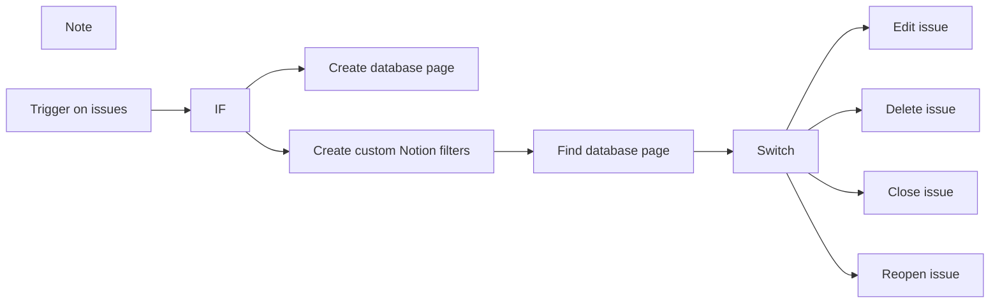

## Fluxo (.json) :

```json
{
  "meta": {
    "instanceId": "237600ca44303ce91fa31ee72babcdc8493f55ee2c0e8aa2b78b3b4ce6f70bd9"
  },
  "nodes": [
    {
      "id": "0bd18974-8414-4b83-b3fb-85d2f6a74164",
      "name": "Create database page",
      "type": "n8n-nodes-base.notion",
      "position": [
        1220,
        400
      ],
      "parameters": {
        "title": "={{$json[\"body\"][\"issue\"][\"title\"]}}",
        "resource": "databasePage",
        "databaseId": "5026700b-6693-473a-8100-8cc6ddef62a6",
        "propertiesUi": {
          "propertyValues": [
            {
              "key": "Issue ID|number",
              "numberValue": "={{$node[\"Trigger on issues\"].json[\"body\"][\"issue\"][\"id\"]}}"
            },
            {
              "key": "Link|url",
              "urlValue": "={{$node[\"Trigger on issues\"].json[\"body\"][\"issue\"][\"html_url\"]}}"
            }
          ]
        }
      },
      "credentials": {
        "notionApi": {
          "id": "9",
          "name": "[UPDATE ME]"
        }
      },
      "typeVersion": 2
    },
    {
      "id": "dfce23fd-7ff8-42d1-9544-694345156080",
      "name": "Note",
      "type": "n8n-nodes-base.stickyNote",
      "position": [
        1220,
        800
      ],
      "parameters": {
        "content": "## IF & Switch\nDepends on what action was taken on an issue in GitHub."
      },
      "typeVersion": 1
    },
    {
      "id": "577e0d7a-0539-414f-8ec8-00ce12807d5b",
      "name": "Find database page",
      "type": "n8n-nodes-base.notion",
      "position": [
        1400,
        600
      ],
      "parameters": {
        "options": {},
        "resource": "databasePage",
        "operation": "getAll",
        "returnAll": true,
        "databaseId": "5026700b-6693-473a-8100-8cc6ddef62a6",
        "filterJson": "={{$node[\"Create custom Notion filters\"].json[\"notionfilter\"]}}",
        "filterType": "json"
      },
      "credentials": {
        "notionApi": {
          "id": "9",
          "name": "[UPDATE ME]"
        }
      },
      "typeVersion": 2
    },
    {
      "id": "91b0586c-eb08-41d0-bbb0-8a03c4a0ac3a",
      "name": "Switch",
      "type": "n8n-nodes-base.switch",
      "position": [
        1580,
        600
      ],
      "parameters": {
        "rules": {
          "rules": [
            {
              "value2": "edited"
            },
            {
              "output": 1,
              "value2": "deleted"
            },
            {
              "output": 2,
              "value2": "closed"
            },
            {
              "output": 3,
              "value2": "reopened"
            }
          ]
        },
        "value1": "={{$node[\"Trigger on issues\"].json[\"body\"][\"action\"]}}",
        "dataType": "string"
      },
      "typeVersion": 1
    },
    {
      "id": "5262e14e-adc2-45d1-9e3f-c0eba013077a",
      "name": "IF",
      "type": "n8n-nodes-base.if",
      "position": [
        1040,
        500
      ],
      "parameters": {
        "conditions": {
          "string": [
            {
              "value1": "={{$node[\"Trigger on issues\"].json[\"body\"][\"action\"]}}",
              "value2": "opened"
            }
          ]
        }
      },
      "typeVersion": 1
    },
    {
      "id": "735ef0b3-70c3-4a88-ad02-35edf8f749c4",
      "name": "Edit issue",
      "type": "n8n-nodes-base.notion",
      "position": [
        1760,
        360
      ],
      "parameters": {
        "pageId": "={{ $node[\"Find database page\"].json[\"id\"] }}",
        "resource": "databasePage",
        "operation": "update",
        "propertiesUi": {
          "propertyValues": [
            {
              "key": "Issue|title",
              "title": "={{$node[\"Trigger on issues\"].json[\"body\"][\"issue\"][\"title\"]}}"
            }
          ]
        }
      },
      "credentials": {
        "notionApi": {
          "id": "9",
          "name": "[UPDATE ME]"
        }
      },
      "typeVersion": 2
    },
    {
      "id": "39b75e78-bd62-40e4-9e88-12c6a1901c34",
      "name": "Delete issue",
      "type": "n8n-nodes-base.notion",
      "position": [
        1760,
        520
      ],
      "parameters": {
        "pageId": "={{$node[\"Find database page\"].json[\"id\"]}}",
        "operation": "archive"
      },
      "credentials": {
        "notionApi": {
          "id": "9",
          "name": "[UPDATE ME]"
        }
      },
      "typeVersion": 2
    },
    {
      "id": "d8fee72d-c19d-4b99-85c2-dcc5d4fa6756",
      "name": "Create custom Notion filters",
      "type": "n8n-nodes-base.function",
      "position": [
        1220,
        600
      ],
      "parameters": {
        "functionCode": "const new_items = [];\nfor (item of $items(\"Trigger on issues\")) {\n\n  // do not process this item if action is created\n  if (item.json[\"body\"][\"action\"] == \"opened\") {\n    continue;\n  }\n\n  // build the output template\n  var new_item = {\n    \"json\": {\n      \"notionfilter\": \"\"\n    }\n  };\n  new_item = JSON.stringify(new_item);\n  new_item = JSON.parse(new_item);\n  new_items.push(new_item);\n\n  // create Notion filter to find specific database page by issue ID\n  notionfilter = {\n    or: [],\n  }\n\n  const filter = {\n    property: 'Issue ID',\n    number: {\n      equals: parseInt(item.json[\"body\"][\"issue\"][\"id\"])\n    }\n  }\n  notionfilter[\"or\"].push(filter);\n\n  new_item.json.notionfilter = JSON.stringify(notionfilter); \n}\n\nreturn new_items;"
      },
      "typeVersion": 1
    },
    {
      "id": "99c69200-d932-4379-9a36-96cd8420f21c",
      "name": "Close issue",
      "type": "n8n-nodes-base.notion",
      "position": [
        1760,
        680
      ],
      "parameters": {
        "pageId": "={{$node[\"Find database page\"].json[\"id\"]}}",
        "resource": "databasePage",
        "operation": "update",
        "propertiesUi": {
          "propertyValues": [
            {
              "key": "Closed|checkbox",
              "checkboxValue": true
            }
          ]
        }
      },
      "credentials": {
        "notionApi": {
          "id": "9",
          "name": "[UPDATE ME]"
        }
      },
      "typeVersion": 2
    },
    {
      "id": "3f4b27d3-33ae-44f8-ab18-1c23ae7cf890",
      "name": "Reopen issue",
      "type": "n8n-nodes-base.notion",
      "position": [
        1760,
        840
      ],
      "parameters": {
        "pageId": "={{$node[\"Find database page\"].json[\"id\"]}}",
        "resource": "databasePage",
        "operation": "update",
        "propertiesUi": {
          "propertyValues": [
            {
              "key": "Closed|checkbox"
            }
          ]
        }
      },
      "credentials": {
        "notionApi": {
          "id": "9",
          "name": "[UPDATE ME]"
        }
      },
      "typeVersion": 2
    },
    {
      "id": "62e1a9d3-3fc6-46de-a048-cf8176f30f94",
      "name": "Trigger on issues",
      "type": "n8n-nodes-base.githubTrigger",
      "position": [
        860,
        500
      ],
      "webhookId": "bc0a0a44-00db-473b-8746-b60b3b36039c",
      "parameters": {
        "owner": "John-n8n",
        "events": [
          "issues"
        ],
        "repository": "DemoRepo"
      },
      "credentials": {
        "githubApi": {
          "id": "20",
          "name": "[UPDATE ME]"
        }
      },
      "typeVersion": 1
    }
  ],
  "connections": {
    "IF": {
      "main": [
        [
          {
            "node": "Create database page",
            "type": "main",
            "index": 0
          }
        ],
        [
          {
            "node": "Create custom Notion filters",
            "type": "main",
            "index": 0
          }
        ]
      ]
    },
    "Switch": {
      "main": [
        [
          {
            "node": "Edit issue",
            "type": "main",
            "index": 0
          }
        ],
        [
          {
            "node": "Delete issue",
            "type": "main",
            "index": 0
          }
        ],
        [
          {
            "node": "Close issue",
            "type": "main",
            "index": 0
          }
        ],
        [
          {
            "node": "Reopen issue",
            "type": "main",
            "index": 0
          }
        ]
      ]
    },
    "Trigger on issues": {
      "main": [
        [
          {
            "node": "IF",
            "type": "main",
            "index": 0
          }
        ]
      ]
    },
    "Find database page": {
      "main": [
        [
          {
            "node": "Switch",
            "type": "main",
            "index": 0
          }
        ]
      ]
    },
    "Create custom Notion filters": {
      "main": [
        [
          {
            "node": "Find database page",
            "type": "main",
            "index": 0
          }
        ]
      ]
    }
  }
}
```

<a id="template-336"></a>

## Template 336 - Rótulos IA para Gmail

- **Nome:** Rótulos IA para Gmail
- **Descrição:** Este fluxo lê mensagens recebidas no Gmail, usa IA para sugerir rótulos (Partnership, Inquiry, Notification) com base no conteúdo, e aplica os rótulos à mensagem.
- **Funcionalidade:** • Detecção de novas mensagens no Gmail: o fluxo monitora e inicia o processamento quando chega uma nova mensagem.
• Extração de conteúdo da mensagem: obtém o corpo da mensagem para análise pela IA.
• Geração de rótulos pela IA: a IA decide quais rótulos são mais adequados com base no conteúdo.
• Recuperação de rótulos existentes: obtém todos os rótulos disponíveis para correspondência.
• Mescla de rótulos: combina os rótulos atribuídos pela IA com rótulos existentes no Gmail.
• Aplicação dos rótulos: adiciona os rótulos final à mensagem no Gmail.
- **Ferramentas:** • Gmail: serviço de email para receber e atualizar mensagens.
• OpenAI: API de modelo de linguagem usada para sugerir rótulos com base no conteúdo do email.


## Fluxo visual

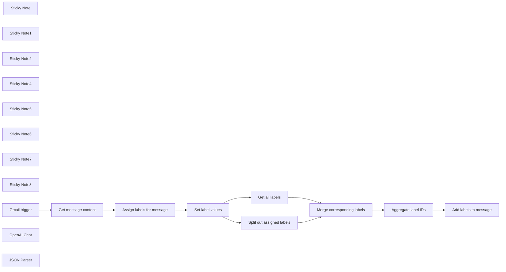

## Fluxo (.json) :

```json
{
  "meta": {
    "instanceId": "d17dadc75de867b08b7744d7ba00e531e75580e2dec35d52f2d34e58481e1fb7",
    "templateCredsSetupCompleted": true
  },
  "nodes": [
    {
      "id": "814e3849-1ae1-4124-bdfc-b72017e9d7c2",
      "name": "Sticky Note",
      "type": "n8n-nodes-base.stickyNote",
      "position": [
        0,
        0
      ],
      "parameters": {
        "color": 4,
        "width": 420.4803040774015,
        "height": 240.57943708322733,
        "content": "## Add AI labels to Gmail messages\nWith this workflow you can automatically set labels for your Gmail message according to its content. \n\nIn this workflow available are 3 labels: \"Partnership\", \"Inquiry\" and \"Notification\". Feel free to adjust labels according to your needs. \n\n**Please remember to set label names both in your Gmail account and workflow.**"
      },
      "typeVersion": 1
    },
    {
      "id": "e83fa311-b5ba-427e-a98e-573394b882dd",
      "name": "Sticky Note1",
      "type": "n8n-nodes-base.stickyNote",
      "position": [
        0,
        260
      ],
      "parameters": {
        "width": 421.0932411886662,
        "height": 257.42916378714597,
        "content": "## ⚠️ Note\n\n1. Complete video guide for this workflow is available [on my YouTube](https://youtu.be/a8Dhj3Zh9vQ). \n2. Remember to add your credentials and configure nodes (covered in the video guide).\n3. If you like this workflow, please subscribe to [my YouTube channel](https://www.youtube.com/@workfloows) and/or [my newsletter](https://workfloows.com/).\n\n**Thank you for your support!**"
      },
      "typeVersion": 1
    },
    {
      "id": "4c20d029-750f-476b-9348-6e250ea64d52",
      "name": "Sticky Note2",
      "type": "n8n-nodes-base.stickyNote",
      "position": [
        440,
        0
      ],
      "parameters": {
        "width": 238.4602598584674,
        "height": 348.5873725349161,
        "content": "### Gmail Trigger\nReceive data from Gmail about new incoming message. \n\n⚠️ Set polling interval according to your needs."
      },
      "typeVersion": 1
    },
    {
      "id": "22923079-80ce-4495-b0f0-da7122195c56",
      "name": "Sticky Note4",
      "type": "n8n-nodes-base.stickyNote",
      "position": [
        1160,
        380
      ],
      "parameters": {
        "width": 241.53974014153226,
        "height": 319.3323098457962,
        "content": "###\n\n\n\n\n\n\n\n\n\n\n### JSON schema\nEdit JSON schema and label names according to your needs.\n\n⚠️ **Label names in system prompt and JSON schema should be the same.**"
      },
      "typeVersion": 1
    },
    {
      "id": "40735a58-daaa-43ac-9658-706c3cf0cbba",
      "name": "Sticky Note5",
      "type": "n8n-nodes-base.stickyNote",
      "position": [
        1900,
        20
      ],
      "parameters": {
        "width": 226.14233872620645,
        "height": 347.0476323933831,
        "content": "### Merge labels\nCombine labels retrieved from Gmail account and assigned by AI together."
      },
      "typeVersion": 1
    },
    {
      "id": "87e0f9e2-a2ff-46cf-896a-138b1bde2d0e",
      "name": "Sticky Note6",
      "type": "n8n-nodes-base.stickyNote",
      "position": [
        2160,
        20
      ],
      "parameters": {
        "width": 452.48413953150185,
        "height": 347.0476323933831,
        "content": "### Aggregarte labels and add to message\nCreate array of label IDs and add to the desired email message in Gmail."
      },
      "typeVersion": 1
    },
    {
      "id": "1d533664-e5e8-4dc8-afac-bfc5996e4bf9",
      "name": "Sticky Note7",
      "type": "n8n-nodes-base.stickyNote",
      "position": [
        700,
        0
      ],
      "parameters": {
        "width": 238.4602598584674,
        "height": 348.5873725349161,
        "content": "### Get message content\nBased on Gmail message ID retrieve body content of the email and pass it to AI chain."
      },
      "typeVersion": 1
    },
    {
      "id": "e613ca64-50ae-4d7c-b0fc-15812dadcd68",
      "name": "Sticky Note8",
      "type": "n8n-nodes-base.stickyNote",
      "position": [
        960,
        0
      ],
      "parameters": {
        "width": 378.57661273793565,
        "height": 348.5873725349161,
        "content": "### Assign labels\nLet the AI decide which labels suit the best content of the message.\n\n⚠️ **Remember to edit system prompt** - modify label names and instructions according to your needs."
      },
      "typeVersion": 1
    },
    {
      "id": "a2005e70-6774-45ce-b9c6-742786f49964",
      "name": "Gmail trigger",
      "type": "n8n-nodes-base.gmailTrigger",
      "position": [
        500,
        180
      ],
      "parameters": {
        "simple": false,
        "filters": {},
        "options": {},
        "pollTimes": {
          "item": [
            {
              "mode": "everyMinute"
            }
          ]
        }
      },
      "credentials": {
        "gmailOAuth2": {
          "id": "SPECSn66s6QHmld9",
          "name": "Gmail account"
        }
      },
      "typeVersion": 1.2
    },
    {
      "id": "4b6f7d21-6155-42b7-93ff-2f530df3692f",
      "name": "Get message content",
      "type": "n8n-nodes-base.gmail",
      "position": [
        760,
        180
      ],
      "webhookId": "b773894c-18c6-454d-9271-6de10be1b7c4",
      "parameters": {
        "messageId": "={{ $json.id }}",
        "operation": "get"
      },
      "credentials": {
        "gmailOAuth2": {
          "id": "SPECSn66s6QHmld9",
          "name": "Gmail account"
        }
      },
      "typeVersion": 2.1
    },
    {
      "id": "ad577660-d9f4-4031-ad16-7021a02bb18e",
      "name": "Assign labels for message",
      "type": "@n8n/n8n-nodes-langchain.chainLlm",
      "position": [
        1020,
        180
      ],
      "parameters": {
        "text": "={{ $('Gmail trigger').item.json.text }}",
        "promptType": "define",
        "hasOutputParser": true
      },
      "typeVersion": 1.5
    },
    {
      "id": "1e11d30f-4c73-4fd0-a365-aeb43bee4252",
      "name": "OpenAI Chat",
      "type": "@n8n/n8n-nodes-langchain.lmChatOpenAi",
      "position": [
        1000,
        400
      ],
      "parameters": {
        "model": {
          "__rl": true,
          "mode": "list",
          "value": "gpt-4o-mini"
        },
        "options": {}
      },
      "credentials": {
        "openAiApi": {
          "id": "PrK67ozsBFqSIYG9",
          "name": "OpenAi account"
        }
      },
      "typeVersion": 1.2
    },
    {
      "id": "4a504b64-fb28-44fb-a80a-6f5e5c5a1949",
      "name": "JSON Parser",
      "type": "@n8n/n8n-nodes-langchain.outputParserStructured",
      "position": [
        1240,
        400
      ],
      "parameters": {
        "schemaType": "manual",
        "inputSchema": "{\n  \"type\": \"object\",\n  \"properties\": {\n    \"labels\": {\n      \"type\": \"array\",\n      \"items\": {\n        \"type\": \"string\",\n        \"enum\": [\"Inquiry\", \"Partnership\", \"Notification\"]\n      }\n    }\n  },\n  \"required\": [\"labels\"]\n}"
      },
      "typeVersion": 1.2
    },
    {
      "id": "f5ac1b01-0980-4ee4-b4f5-5057258eab70",
      "name": "Set label values",
      "type": "n8n-nodes-base.set",
      "position": [
        1400,
        180
      ],
      "parameters": {
        "options": {},
        "assignments": {
          "assignments": [
            {
              "id": "72d11a72-6693-447c-b7ca-4ba1a3579075",
              "name": "labels",
              "type": "array",
              "value": "={{ $json.output.labels }}"
            }
          ]
        }
      },
      "typeVersion": 3.4
    },
    {
      "id": "e368e343-728e-4e2f-a37f-5e203000d090",
      "name": "Get all labels",
      "type": "n8n-nodes-base.gmail",
      "position": [
        1680,
        60
      ],
      "webhookId": "dec6f574-f47c-4b5d-86b9-2b0f6c957145",
      "parameters": {
        "resource": "label",
        "returnAll": true
      },
      "credentials": {
        "gmailOAuth2": {
          "id": "SPECSn66s6QHmld9",
          "name": "Gmail account"
        }
      },
      "typeVersion": 2.1
    },
    {
      "id": "48ce8351-5d04-4697-b68d-bb84286e0b2b",
      "name": "Split out assigned labels",
      "type": "n8n-nodes-base.splitOut",
      "position": [
        1680,
        280
      ],
      "parameters": {
        "options": {},
        "fieldToSplitOut": "labels"
      },
      "typeVersion": 1
    },
    {
      "id": "cc1aa3ac-7427-4761-aacd-caf16c64d7fb",
      "name": "Merge corresponding labels",
      "type": "n8n-nodes-base.merge",
      "position": [
        1960,
        180
      ],
      "parameters": {
        "mode": "combine",
        "options": {},
        "advanced": true,
        "mergeByFields": {
          "values": [
            {
              "field1": "name",
              "field2": "labels"
            }
          ]
        }
      },
      "typeVersion": 3.1
    },
    {
      "id": "97fefda6-5936-42a7-a30a-8de4149aa445",
      "name": "Aggregate label IDs",
      "type": "n8n-nodes-base.aggregate",
      "position": [
        2220,
        180
      ],
      "parameters": {
        "options": {},
        "fieldsToAggregate": {
          "fieldToAggregate": [
            {
              "fieldToAggregate": "id"
            }
          ]
        }
      },
      "typeVersion": 1
    },
    {
      "id": "7befd422-7243-43af-9b34-21c05a069013",
      "name": "Add labels to message",
      "type": "n8n-nodes-base.gmail",
      "position": [
        2440,
        180
      ],
      "webhookId": "4f345fc9-2afd-478b-be3b-d3d28f0fbc82",
      "parameters": {
        "labelIds": "={{ $json.id }}",
        "messageId": "={{ $('Gmail trigger').item.json[\"id\"] }}",
        "operation": "addLabels"
      },
      "credentials": {
        "gmailOAuth2": {
          "id": "SPECSn66s6QHmld9",
          "name": "Gmail account"
        }
      },
      "typeVersion": 2.1
    }
  ],
  "pinData": {
    "Gmail trigger": [
      {
        "id": "1962eb5ee3119d76",
        "to": {
          "html": "<span class=\"mp_address_group\"><span class=\"mp_address_name\">Workfloows Tutorial</span> &lt;<a href=\"mailto:workfloowstutorial@gmail.com\" class=\"mp_address_email\">workfloowstutorial@gmail.com</a>&gt;</span>",
          "text": "\"Workfloows Tutorial\" <workfloowstutorial@gmail.com>",
          "value": [
            {
              "name": "Workfloows Tutorial",
              "address": "workfloowstutorial@gmail.com"
            }
          ]
        },
        "date": "2025-04-13T10:33:05.000Z",
        "from": {
          "html": "<span class=\"mp_address_group\"><span class=\"mp_address_name\">Workfloows</span> &lt;<a href=\"mailto:workfloows@gmail.com\" class=\"mp_address_email\">workfloows@gmail.com</a>&gt;</span>",
          "text": "\"Workfloows\" <workfloows@gmail.com>",
          "value": [
            {
              "name": "Workfloows",
              "address": "workfloows@gmail.com"
            }
          ]
        },
        "html": "<div dir=\"ltr\">Hey! <div><br></div><div>We&#39;d love to cooperate with you - could you please send us your offer? </div><div><br></div><div>Best,</div><div>Oskar</div></div>\n",
        "text": "Hey!\n\nWe'd love to cooperate with you - could you please send us your offer?\n\nBest,\nOskar\n",
        "headers": {
          "to": "To: Workfloows Tutorial <workfloowstutorial@gmail.com>",
          "date": "Date: Sun, 13 Apr 2025 12:33:05 +0200",
          "from": "From: Workfloows <workfloows@gmail.com>",
          "subject": "Subject: Inquiry for cooperation",
          "x-gm-gg": "X-Gm-Gg: ASbGncsLoGTllITLV/hYh7p2Re1X0A4Fd5a1uQb58nQ1FCzXrvjCL9BY2H/6U4fN3wn\r\n\tFkTSzNo0PUVLScNsBjkkOdwaqHhHLT+UzxaAtr8LpnucVTxhWbI08sl8lxjJUsHJwsJwIpSaAqX\r\n\tkKKBKUewdQhcwJNh4P22vOalA=",
          "arc-seal": "ARC-Seal: i=1; a=rsa-sha256; t=1744540397; cv=none;\r\n        d=google.com; s=arc-20240605;\r\n        b=BWNyT3FtnssueCPH4di13k++uCiJsB73BRfuQ63N0/+fUQqAvkZRMdN4cZiSCXpLph\r\n         +ag3l4hgkp9yuE66MQjv18vWzMaUsmaj5obHWe+6x6YcPkMRW/y+gNitCD+mftpYsQpz\r\n         nQpkoyZaY3h9o9vmcUUmOPWCWrUysy8y8sOOhht7Tmekzs3tQj+aLyXJNv+j9SCwvsTE\r\n         yd5uisDlrWv1zfpdUZLwNKZuCP+Jtfr01w3QT/zhBCweOccIJaFzfO4s97q8JgUgRrmx\r\n         JkrsGpSWJZKWPDh44mkmHH+bw43omIJKXYTHN9nOO3vGyqBWdGYlE0T9ZhCetHHyBbpS\r\n         b+Mw==",
          "received": "Received: from mail-sor-f41.google.com (mail-sor-f41.google.com. [209.85.220.41])\r\n        by mx.google.com with SMTPS id 2adb3069b0e04-54c455e2176sor1769457e87.11.2025.04.13.03.33.17\r\n        for <workfloowstutorial@gmail.com>\r\n        (Google Transport Security);\r\n        Sun, 13 Apr 2025 03:33:17 -0700 (PDT)",
          "message-id": "Message-ID: <CA+sg_9eV=X+LusGnDSP8pDrrYZ8SLn2Maq4CYpLrg=uG=7T7DQ@mail.gmail.com>",
          "x-received": "X-Received: by 2002:a2e:bd88:0:b0:30d:629c:4333 with SMTP id\r\n 38308e7fff4ca-31049aacf9dmr29831171fa.34.1744540396464; Sun, 13 Apr 2025\r\n 03:33:16 -0700 (PDT)",
          "return-path": "Return-Path: <workfloows@gmail.com>",
          "content-type": "Content-Type: multipart/alternative; boundary=\"000000000000a0b4660632a67692\"",
          "delivered-to": "Delivered-To: workfloowstutorial@gmail.com",
          "mime-version": "MIME-Version: 1.0",
          "received-spf": "Received-SPF: pass (google.com: domain of workfloows@gmail.com designates 209.85.220.41 as permitted sender) client-ip=209.85.220.41;",
          "x-gm-features": "X-Gm-Features: ATxdqUEDRqHsd35x8e-h-zd4BcGaOVs83Rpm-BRaGlzjaiGxZMiGfgHEjxn3hNE",
          "dkim-signature": "DKIM-Signature: v=1; a=rsa-sha256; c=relaxed/relaxed;\r\n        d=gmail.com; s=20230601; t=1744540397; x=1745145197; dara=google.com;\r\n        h=to:subject:message-id:date:from:mime-version:from:to:cc:subject\r\n         :date:message-id:reply-to;\r\n        bh=yhyki7Kf5bQNf/8oq2uNTa/y/MoSnhI+j3ZqeBT892s=;\r\n        b=Njlov8RLGs/rZIz07rSJIfn8oQDEXgybU4mJ0ujD8T8m7J4NabveIhdobrrHraaZqN\r\n         iwOZHBn0TTWAbuccHjfU+BBB8FvJ4/jfCXKbWSwPIWHd53P1wuTxvXYgbkXX4A/W675L\r\n         zPSVraK4W1heQDTViCc2MmV5+tH6pbe/52xTOwvx8Xf0WTN1Ku3K/DY8EIsnd0OKdrEn\r\n         ml+/LHhVMmwR5lZtte7mTlYi/c5FG8XO95Nh/Ftl22RpuKl1QPFUdJcx+bEVeUh62uHM\r\n         Bd8pyi0y/LVKIqNtL/DIvpt2+bt9TLm7MB2P61KMUAP75qZCparl2MWLR62c8tW7cFqm\r\n         wPHA==",
          "x-gm-message-state": "X-Gm-Message-State: AOJu0YzGNl9So86XWoTm+y0PO71OilI6ljQ/cHqUDKwYpIrbLMy8ZiCe\r\n\ty2NKHmx051OaBkuEbe2bQD3dl78xO6sJPWWrTXUn1mV9b52v6vaQsLXXkQWx5cKuaw9spNE1dpU\r\n\tzsVB7chkTKdZ5HO31p29RiSug2SJ0AZXS",
          "x-google-smtp-source": "X-Google-Smtp-Source: AGHT+IF6PTdq6zPXbZy1CEUmKyNDSavbnDjbcWp5Y3hfiFlZruW8yABRwE9q5LKSffpes/dVbAryLGt6F27ROQMhWMg=",
          "arc-message-signature": "ARC-Message-Signature: i=1; a=rsa-sha256; c=relaxed/relaxed; d=google.com; s=arc-20240605;\r\n        h=to:subject:message-id:date:from:mime-version:dkim-signature;\r\n        bh=yhyki7Kf5bQNf/8oq2uNTa/y/MoSnhI+j3ZqeBT892s=;\r\n        fh=fBYbxd7sNeSi3dX3VeF2+nxOJZdPrQsXgdNq9LWGYGE=;\r\n        b=V70ViYZcIyYaZCIMeEXNv4R6X5fkIYJxel9I6iHuCI2RJLc824inbFBL3Enb/JD8yt\r\n         Sk1iK/RGh+PYMU1FAHeq/uUri2PG1Z9RZc7e7jjLil/nCWpYF91AhFEZE8B7kl5uWKZb\r\n         qA4ASGlYUTJwjoWMpJle0uvlOBksdXIb2Zb5K6kyHe4zlqhHeM6ySiJLEu7bj/eS5TYg\r\n         vnmoySAYAsLH5T/08gj6OwaBWcmqhfMVO8adMkIZe1VZQqC9nKVJJis0I3Hsl9UwhicB\r\n         VDSvEH/KsHrDDqPkSMDHykv1NzBK9cPgQ8cAG4QdgSd3zuEp5uJkxXNycF1NN1cZwRfZ\r\n         eC2A==;\r\n        dara=google.com",
          "authentication-results": "Authentication-Results: mx.google.com;\r\n       dkim=pass header.i=@gmail.com header.s=20230601 header.b=Njlov8RL;\r\n       spf=pass (google.com: domain of workfloows@gmail.com designates 209.85.220.41 as permitted sender) smtp.mailfrom=workfloows@gmail.com;\r\n       dmarc=pass (p=NONE sp=QUARANTINE dis=NONE) header.from=gmail.com;\r\n       dara=pass header.i=@gmail.com",
          "x-google-dkim-signature": "X-Google-DKIM-Signature: v=1; a=rsa-sha256; c=relaxed/relaxed;\r\n        d=1e100.net; s=20230601; t=1744540397; x=1745145197;\r\n        h=to:subject:message-id:date:from:mime-version:x-gm-message-state\r\n         :from:to:cc:subject:date:message-id:reply-to;\r\n        bh=yhyki7Kf5bQNf/8oq2uNTa/y/MoSnhI+j3ZqeBT892s=;\r\n        b=o2krTN0ebufVGn92FP/xtW+t8OQ46Jc9sSrWVXrWihY1hBM7C9fEwuF9svkxx3SB8B\r\n         m8qZVS5TIDCv+JkZKK9jpHw3cD09s/YSr7aPP5bAWibx5UhB1/Ki7Kn0hdgt90LS2Kob\r\n         jr7CP8QrrWfftq7zutBxaVoCdBtTrod/TJKDxDr1b3vFaoN/XxGnUeqj8EoAbdTDf859\r\n         5hmRQUODpJaybi3MDmBzStjIh9rlUBLkt4csANAuUZWX1/b28+HAiT7AOdq9ksbROpgi\r\n         h5LedT5dMXPYU6yU0lQ6kk14R6eX6tHQN3AV5I1kCOaaeArC7NvUK5o8mUH2QDKZgWIe\r\n         DR5A==",
          "arc-authentication-results": "ARC-Authentication-Results: i=1; mx.google.com;\r\n       dkim=pass header.i=@gmail.com header.s=20230601 header.b=Njlov8RL;\r\n       spf=pass (google.com: domain of workfloows@gmail.com designates 209.85.220.41 as permitted sender) smtp.mailfrom=workfloows@gmail.com;\r\n       dmarc=pass (p=NONE sp=QUARANTINE dis=NONE) header.from=gmail.com;\r\n       dara=pass header.i=@gmail.com"
        },
        "subject": "Inquiry for cooperation",
        "labelIds": [
          "UNREAD",
          "IMPORTANT",
          "CATEGORY_PERSONAL",
          "INBOX"
        ],
        "threadId": "1962eb5ee3119d76",
        "messageId": "<CA+sg_9eV=X+LusGnDSP8pDrrYZ8SLn2Maq4CYpLrg=uG=7T7DQ@mail.gmail.com>",
        "textAsHtml": "<p>Hey!</p><p>We&apos;d love to cooperate with you - could you please send us your offer?</p><p>Best,<br/>Oskar</p>",
        "sizeEstimate": 5849
      }
    ]
  },
  "connections": {
    "JSON Parser": {
      "ai_outputParser": [
        [
          {
            "node": "Assign labels for message",
            "type": "ai_outputParser",
            "index": 0
          }
        ]
      ]
    },
    "OpenAI Chat": {
      "ai_languageModel": [
        [
          {
            "node": "Assign labels for message",
            "type": "ai_languageModel",
            "index": 0
          }
        ]
      ]
    },
    "Gmail trigger": {
      "main": [
        [
          {
            "node": "Get message content",
            "type": "main",
            "index": 0
          }
        ]
      ]
    },
    "Get all labels": {
      "main": [
        [
          {
            "node": "Merge corresponding labels",
            "type": "main",
            "index": 0
          }
        ]
      ]
    },
    "Set label values": {
      "main": [
        [
          {
            "node": "Get all labels",
            "type": "main",
            "index": 0
          },
          {
            "node": "Split out assigned labels",
            "type": "main",
            "index": 0
          }
        ]
      ]
    },
    "Aggregate label IDs": {
      "main": [
        [
          {
            "node": "Add labels to message",
            "type": "main",
            "index": 0
          }
        ]
      ]
    },
    "Get message content": {
      "main": [
        [
          {
            "node": "Assign labels for message",
            "type": "main",
            "index": 0
          }
        ]
      ]
    },
    "Assign labels for message": {
      "main": [
        [
          {
            "node": "Set label values",
            "type": "main",
            "index": 0
          }
        ]
      ]
    },
    "Split out assigned labels": {
      "main": [
        [
          {
            "node": "Merge corresponding labels",
            "type": "main",
            "index": 1
          }
        ]
      ]
    },
    "Merge corresponding labels": {
      "main": [
        [
          {
            "node": "Aggregate label IDs",
            "type": "main",
            "index": 0
          }
        ]
      ]
    }
  }
}
```

<a id="template-337"></a>

## Template 337 - Assistente pessoal por voz e texto no Telegram

- **Nome:** Assistente pessoal por voz e texto no Telegram
- **Descrição:** Fluxo que recebe mensagens por Telegram (voz ou texto), processa solicitações com um agente de IA que pode transcrever áudio, buscar e resumir e-mails, consultar o calendário e acessar tarefas/contatos, e responde diretamente ao usuário.
- **Funcionalidade:** • Recepção de mensagens Telegram: recebe atualizações de mensagens de usuários para iniciar o fluxo.
• Detecção de voz ou texto: verifica se a mensagem contém texto ou apenas voz e roteia o processamento adequadamente.
• Download de arquivo de voz: obtém o arquivo de voz enviado pelo usuário quando aplicável.
• Transcrição de áudio: converte mensagens de voz em texto para posterior processamento.
• Agente de IA com instruções personalizadas: processa a entrada do usuário usando um modelo de linguagem e regras do sistema (por exemplo, resumir emails com remetente, data e assunto; filtrar promoções; assumir data atual se não especificada).
• Consulta e resumo de e-mails: busca e-mails não lidos em uma conta e gera resumos conforme as diretrizes.
• Consulta de calendário: recupera eventos a partir de uma data especificada para responder perguntas sobre compromissos.
• Acesso a tarefas e contatos: consulta uma base de dados para obter informações sobre tarefas e contatos para uso nas respostas.
• Memória de contexto por usuário: mantém um buffer de memória por sessão/usuário para conversas contínuas.
• Resposta ao usuário: envia a resposta gerada de volta ao chat do Telegram.
- **Ferramentas:** • Telegram: plataforma de mensagens usada para receber solicitações dos usuários e enviar respostas.
• OpenAI (gpt-4o-mini): serviço de IA utilizado para transcrição de áudio e geração de respostas em linguagem natural.
• Gmail: serviço de e-mail consultado para recuperar e resumir mensagens na caixa de entrada.
• Google Calendar: serviço consultado para recuperar eventos e informações de calendário.
• Baserow: banco de dados online usado para acessar informações de tarefas e contatos.


## Fluxo visual

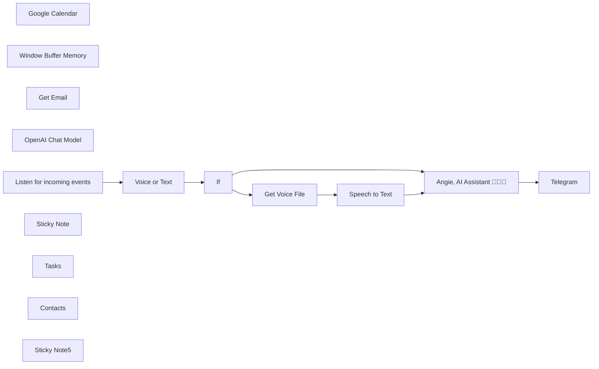

## Fluxo (.json) :

```json
{
  "meta": {
    "instanceId": "2723a3a635131edfcb16103f3d4dbaadf3658e386b4762989cbf49528dccbdbd"
  },
  "nodes": [
    {
      "id": "c70236ea-91ab-4e47-b6f6-63a70ede5d3c",
      "name": "Google Calendar",
      "type": "n8n-nodes-base.googleCalendarTool",
      "position": [
        1000,
        680
      ],
      "parameters": {
        "options": {
          "fields": "=items(summary, start(dateTime))",
          "timeMin": "={{$fromAI(\"date\",\"the date after which to fetch the messages in format YYYY-MM-DDTHH:MM:SS\")}}"
        },
        "calendar": {
          "__rl": true,
          "mode": "list",
          "value": "derekcheungsa@gmail.com",
          "cachedResultName": "derekcheungsa@gmail.com"
        },
        "operation": "getAll"
      },
      "credentials": {
        "googleCalendarOAuth2Api": {
          "id": "qx8JdPX4I5Xk9c46",
          "name": "Google Calendar account"
        }
      },
      "typeVersion": 1.1
    },
    {
      "id": "d2287bea-de47-4180-8ee6-55d4ab1a89da",
      "name": "Window Buffer Memory",
      "type": "@n8n/n8n-nodes-langchain.memoryBufferWindow",
      "position": [
        760,
        680
      ],
      "parameters": {
        "sessionKey": "={{ $('Listen for incoming events').first().json.message.from.id }}",
        "sessionIdType": "customKey"
      },
      "typeVersion": 1.2
    },
    {
      "id": "fa955731-86f6-4e4d-8604-dab5f52dee87",
      "name": "Get Email",
      "type": "n8n-nodes-base.gmailTool",
      "position": [
        880,
        680
      ],
      "parameters": {
        "filters": {
          "labelIds": [
            "INBOX",
            "UNREAD"
          ],
          "readStatus": "unread",
          "receivedAfter": "={{$fromAI(\"date\",\"the date after which to fetch the messages in format YYYY-MM-DDTHH:MM:SS\")}}"
        },
        "operation": "getAll"
      },
      "credentials": {
        "gmailOAuth2": {
          "id": "tojOpzEqFprdxS46",
          "name": "Gmail account"
        }
      },
      "typeVersion": 2.1
    },
    {
      "id": "46511f47-1687-4cbe-ae41-ceb205ed1f11",
      "name": "OpenAI Chat Model",
      "type": "@n8n/n8n-nodes-langchain.lmChatOpenAi",
      "position": [
        640,
        680
      ],
      "parameters": {
        "model": "gpt-4o-mini",
        "options": {}
      },
      "credentials": {
        "openAiApi": {
          "id": "5oYe8Cxj7liOPAKk",
          "name": "Derek T"
        }
      },
      "typeVersion": 1
    },
    {
      "id": "64fe44db-af19-43eb-9ff1-de0a72a9e645",
      "name": "Listen for incoming events",
      "type": "n8n-nodes-base.telegramTrigger",
      "position": [
        -160,
        360
      ],
      "webhookId": "322dce18-f93e-4f86-b9b1-3305519b7834",
      "parameters": {
        "updates": [
          "message"
        ],
        "additionalFields": {}
      },
      "credentials": {
        "telegramApi": {
          "id": "Ov00cT0t4h4AFtZ0",
          "name": "Telegram account"
        }
      },
      "typeVersion": 1
    },
    {
      "id": "e35c04ff-a050-4564-8c1b-5b22b556872f",
      "name": "Telegram",
      "type": "n8n-nodes-base.telegram",
      "onError": "continueErrorOutput",
      "position": [
        1280,
        360
      ],
      "parameters": {
        "text": "={{ $json.output }}",
        "chatId": "={{ $('Listen for incoming events').first().json.message.from.id }}",
        "additionalFields": {
          "parse_mode": "Markdown",
          "appendAttribution": false
        }
      },
      "credentials": {
        "telegramApi": {
          "id": "Ov00cT0t4h4AFtZ0",
          "name": "Telegram account"
        }
      },
      "typeVersion": 1.1
    },
    {
      "id": "e791d4f8-2c19-4c14-a71e-39a04f22e944",
      "name": "If",
      "type": "n8n-nodes-base.if",
      "position": [
        200,
        360
      ],
      "parameters": {
        "options": {},
        "conditions": {
          "options": {
            "version": 2,
            "leftValue": "",
            "caseSensitive": true,
            "typeValidation": "strict"
          },
          "combinator": "and",
          "conditions": [
            {
              "id": "a0bf9719-4272-46f6-ab3b-eda6f7b44fd8",
              "operator": {
                "type": "string",
                "operation": "empty",
                "singleValue": true
              },
              "leftValue": "={{ $json.message.text }}",
              "rightValue": ""
            }
          ]
        }
      },
      "typeVersion": 2.2
    },
    {
      "id": "5bd1788a-3d08-4eb3-8e03-3ce82f44d2a7",
      "name": "Speech to Text",
      "type": "@n8n/n8n-nodes-langchain.openAi",
      "position": [
        620,
        360
      ],
      "parameters": {
        "options": {},
        "resource": "audio",
        "operation": "transcribe"
      },
      "credentials": {
        "openAiApi": {
          "id": "5oYe8Cxj7liOPAKk",
          "name": "Derek T"
        }
      },
      "typeVersion": 1.3
    },
    {
      "id": "b67a2a93-517b-469e-aaa4-32c422710743",
      "name": "Voice or Text",
      "type": "n8n-nodes-base.set",
      "position": [
        40,
        360
      ],
      "parameters": {
        "fields": {
          "values": [
            {
              "name": "text",
              "stringValue": "={{ $json?.message?.text || \"\" }}"
            }
          ]
        },
        "options": {}
      },
      "typeVersion": 3.2
    },
    {
      "id": "8105c39f-9e87-44c4-9215-b3777f0b4164",
      "name": "Get Voice File",
      "type": "n8n-nodes-base.telegram",
      "position": [
        380,
        360
      ],
      "parameters": {
        "fileId": "={{ $('Listen for incoming events').item.json.message.voice.file_id }}",
        "resource": "file"
      },
      "credentials": {
        "telegramApi": {
          "id": "Ov00cT0t4h4AFtZ0",
          "name": "Telegram account"
        }
      },
      "typeVersion": 1.1
    },
    {
      "id": "759b975f-d17c-4386-a5b3-12413f0361f4",
      "name": "Angie, AI Assistant 👩🏻‍🏫",
      "type": "@n8n/n8n-nodes-langchain.agent",
      "position": [
        780,
        360
      ],
      "parameters": {
        "text": "={{ $json.text }}",
        "options": {
          "systemMessage": "=You are a helpful assistant.\n\nToday's date is {{ $now }}.\n\nGuidelines:\n- When fetching emails, filter out any promotional emails. \n- When summarizing emails, include Sender, Message date, subject, and brief summary of email.\n- if the user did not specify a date in the request assume they are asking for today\n- Use baserow tool to answer questions about tasks\n- When answering questions about calendar events, filter out events that don't apply to the question. For example, the question is about events for today, only reply with events for today. Don't mention future events if it's more than 1 week away"
        },
        "promptType": "define"
      },
      "typeVersion": 1.6
    },
    {
      "id": "5537c777-f003-4673-b48a-4993a0c10520",
      "name": "Sticky Note",
      "type": "n8n-nodes-base.stickyNote",
      "position": [
        20,
        260
      ],
      "parameters": {
        "color": 5,
        "width": 496.25,
        "height": 278.75,
        "content": "## Process Telegram Request\n"
      },
      "typeVersion": 1
    },
    {
      "id": "40e92679-b47a-4213-bb23-3f8d086459f2",
      "name": "Tasks",
      "type": "n8n-nodes-base.baserowTool",
      "position": [
        1120,
        680
      ],
      "parameters": {
        "tableId": 372174,
        "databaseId": 146496,
        "additionalOptions": {}
      },
      "credentials": {
        "baserowApi": {
          "id": "jsgACn0VxAPoD0E2",
          "name": "Baserow account"
        }
      },
      "typeVersion": 1
    },
    {
      "id": "570a0647-b571-4ebc-9dfe-40244b5a0b2a",
      "name": "Contacts",
      "type": "n8n-nodes-base.baserowTool",
      "position": [
        1240,
        680
      ],
      "parameters": {
        "tableId": 372177,
        "databaseId": 146496,
        "descriptionType": "manual",
        "toolDescription": "Useful for getting contact information. For example emails or phone numbers.",
        "additionalOptions": {}
      },
      "credentials": {
        "baserowApi": {
          "id": "jsgACn0VxAPoD0E2",
          "name": "Baserow account"
        }
      },
      "typeVersion": 1
    },
    {
      "id": "7fb1d95a-a8d6-4040-9271-5197296be7da",
      "name": "Sticky Note5",
      "type": "n8n-nodes-base.stickyNote",
      "position": [
        -620,
        220
      ],
      "parameters": {
        "color": 5,
        "width": 386.9292441979969,
        "height": 389.78268107403096,
        "content": "## Start here: Step-by Step Youtube Tutorial :star:\n\n[](https://youtu.be/pXjowPc6V2s)\n"
      },
      "typeVersion": 1
    }
  ],
  "pinData": {},
  "connections": {
    "If": {
      "main": [
        [
          {
            "node": "Get Voice File",
            "type": "main",
            "index": 0
          }
        ],
        [
          {
            "node": "Angie, AI Assistant 👩🏻‍🏫",
            "type": "main",
            "index": 0
          }
        ]
      ]
    },
    "Tasks": {
      "ai_tool": [
        [
          {
            "node": "Angie, AI Assistant 👩🏻‍🏫",
            "type": "ai_tool",
            "index": 0
          }
        ]
      ]
    },
    "Contacts": {
      "ai_tool": [
        [
          {
            "node": "Angie, AI Assistant 👩🏻‍🏫",
            "type": "ai_tool",
            "index": 0
          }
        ]
      ]
    },
    "Get Email": {
      "ai_tool": [
        [
          {
            "node": "Angie, AI Assistant 👩🏻‍🏫",
            "type": "ai_tool",
            "index": 0
          }
        ]
      ]
    },
    "Voice or Text": {
      "main": [
        [
          {
            "node": "If",
            "type": "main",
            "index": 0
          }
        ]
      ]
    },
    "Get Voice File": {
      "main": [
        [
          {
            "node": "Speech to Text",
            "type": "main",
            "index": 0
          }
        ]
      ]
    },
    "Speech to Text": {
      "main": [
        [
          {
            "node": "Angie, AI Assistant 👩🏻‍🏫",
            "type": "main",
            "index": 0
          }
        ]
      ]
    },
    "Google Calendar": {
      "ai_tool": [
        [
          {
            "node": "Angie, AI Assistant 👩🏻‍🏫",
            "type": "ai_tool",
            "index": 0
          }
        ]
      ]
    },
    "OpenAI Chat Model": {
      "ai_languageModel": [
        [
          {
            "node": "Angie, AI Assistant 👩🏻‍🏫",
            "type": "ai_languageModel",
            "index": 0
          }
        ]
      ]
    },
    "Window Buffer Memory": {
      "ai_memory": [
        [
          {
            "node": "Angie, AI Assistant 👩🏻‍🏫",
            "type": "ai_memory",
            "index": 0
          }
        ]
      ]
    },
    "Listen for incoming events": {
      "main": [
        [
          {
            "node": "Voice or Text",
            "type": "main",
            "index": 0
          }
        ]
      ]
    },
    "Angie, AI Assistant 👩🏻‍🏫": {
      "main": [
        [
          {
            "node": "Telegram",
            "type": "main",
            "index": 0
          }
        ]
      ]
    }
  }
}
```

<a id="template-338"></a>

## Template 338 - Gerador de imagens Flux via formulário

- **Nome:** Gerador de imagens Flux via formulário
- **Descrição:** Fluxo que recebe um prompt e um estilo via formulário, gera uma imagem usando modelos de difusão na API de inferência e devolve uma página web com a imagem hospedada.
- **Funcionalidade:** • Captura de prompt por formulário: recebe o texto do usuário e a opção de estilo (várias predefinições).
• Roteamento por estilo: mapeia a opção selecionada para um prompt de estilo predefinido (ex.: Hyper-Surreal, Neon Fauvism, Glitchscape, AI Dystopia, Vivid Pop).
• Geração de imagem via API: combina o prompt do usuário com o estilo escolhido e chama a API de inferência para gerar a imagem.
• Configuração de modelo: permite alterar o modelo de inferência usado (ex.: black-forest-labs/FLUX.1-schnell, ByteDance/Hyper-SD, entre outros).
• Upload para armazenamento S3: faz upload da imagem gerada para um bucket S3 compatível, nomeando o arquivo com o ID da execução.
• Servir página web com resultado: responde ao usuário com uma página HTML que exibe a imagem, o estilo aplicado e miniaturas das renderizações recentes.
• Tratamento de erro: retorna uma resposta JSON amigável quando a geração falha, instruindo a tentar novamente.
- **Ferramentas:** • Hugging Face Inference API: serviço de inferência para executar modelos de geração de imagens a partir de texto (suporta diversos modelos de difusão como black-forest-labs/FLUX.1-schnell, ByteDance/Hyper-SD, XLabs-AI/flux-RealismLora, etc.).
• Cloudflare R2 (S3 compatível): armazenamento público compatível com S3 usado para hospedar as imagens geradas e servir URLs acessíveis.


## Fluxo visual

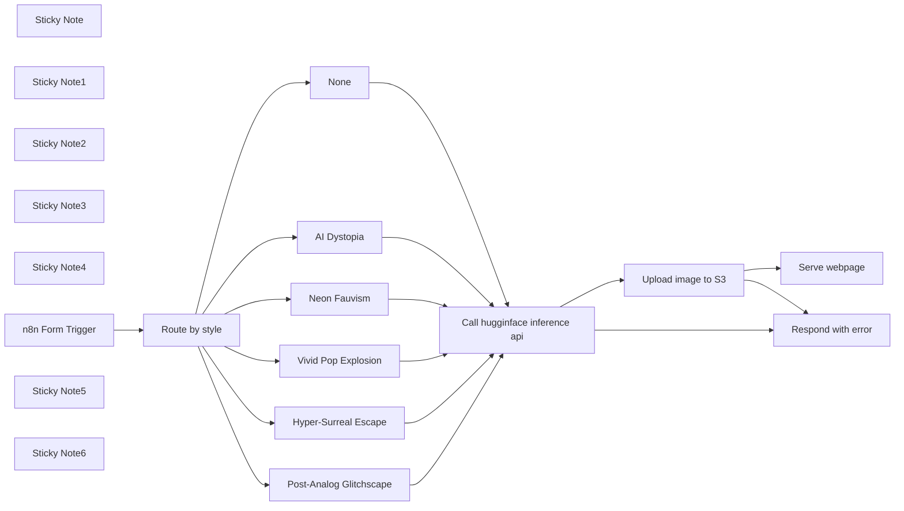

## Fluxo (.json) :

```json
{
  "nodes": [
    {
      "id": "6abe578b-d503-4da5-9af8-f9977de71139",
      "name": "Vivid Pop Explosion",
      "type": "n8n-nodes-base.set",
      "notes": " ",
      "position": [
        380,
        980
      ],
      "parameters": {
        "options": {},
        "assignments": {
          "assignments": [
            {
              "id": "9ec60f33-b940-40a6-9f8a-cb944b7065f1",
              "name": "stylePrompt",
              "type": "string",
              "value": "=rule of thirds, golden ratio, hyper-maximalist, vibrant neon, high-contrast, octane render, photorealism, 8k ::7 --ar 16:9 --s 1000\n\nDesign a fun, energetic scene filled with bold, neon colors, and playful shapes that pop off the screen. The image should evoke a sense of joy and movement, using fluid, organic forms and exaggerated, cartoon-like proportions. Focus on creating a lively atmosphere with contrasting, saturated tones and dynamic lighting. Use a mix of asymmetrical and balanced compositions to create a playful visual flow. Render in 8K with a hyper-maximalist approach using Octane Render for vibrant, high-gloss textures and photorealistic lighting effects. Include:"
            }
          ]
        },
        "includeOtherFields": true
      },
      "notesInFlow": true,
      "typeVersion": 3.4
    },
    {
      "id": "7de1ea42-3b18-4bfb-8ea4-a8b6c8d16763",
      "name": "AI Dystopia",
      "type": "n8n-nodes-base.set",
      "notes": " ",
      "position": [
        380,
        620
      ],
      "parameters": {
        "options": {},
        "assignments": {
          "assignments": [
            {
              "id": "9ec60f33-b940-40a6-9f8a-cb944b7065f1",
              "name": "stylePrompt",
              "type": "string",
              "value": "=golden ratio, rule of thirds, cyberpunk, glitch art, octane render, cinematic realism, 8k ::7 --ar 16:9 --s 1000\n\nGenerate a futuristic, cyberpunk dystopia with metallic textures, digital glitches, and neon lights. Blend cold, dystopian structures with traces of organic life. Use photorealistic lighting and dynamic reflections to enhance the visual depth of the scene. Include:"
            }
          ]
        },
        "includeOtherFields": true
      },
      "notesInFlow": true,
      "typeVersion": 3.4
    },
    {
      "id": "aa17c288-78e0-48d9-9c60-0e63e351d0b6",
      "name": "Post-Analog Glitchscape",
      "type": "n8n-nodes-base.set",
      "notes": " ",
      "position": [
        380,
        420
      ],
      "parameters": {
        "options": {},
        "assignments": {
          "assignments": [
            {
              "id": "9ec60f33-b940-40a6-9f8a-cb944b7065f1",
              "name": "stylePrompt",
              "type": "string",
              "value": "=rule of thirds, asymmetric composition, glitch art, pixelation, VHS noise, octane render, unreal engine, 8k ::7 --ar 16:9 --s 1200\nDesign a glitchy, post-analog world with digital decay and broken visuals. Utilize pixelated elements, VHS noise, and neon glitches to create a fragmented aesthetic. Use bold, contrasting colors against muted backgrounds for a high-contrast, otherworldly feel. The composition should follow asymmetrical rules, focusing on chaotic yet intentional visual balance. Include:"
            }
          ]
        },
        "includeOtherFields": true
      },
      "notesInFlow": true,
      "typeVersion": 3.4
    },
    {
      "id": "769ff46c-630f-456d-ae19-4c6496270fda",
      "name": "Neon Fauvism",
      "type": "n8n-nodes-base.set",
      "notes": " ",
      "position": [
        380,
        800
      ],
      "parameters": {
        "options": {},
        "assignments": {
          "assignments": [
            {
              "id": "9ec60f33-b940-40a6-9f8a-cb944b7065f1",
              "name": "stylePrompt",
              "type": "string",
              "value": "=asymmetric composition, golden ratio, neon colors, abstract forms, octane render, cinematic realism, unreal engine, 8k ::7 --ar 16:9 --s 1000\nCreate a bold, vivid composition using neon colors and fluid shapes that break away from reality. Focus on abstract forms, blending Fauvism's exaggerated color palette with modern digital art techniques. Use asymmetric composition and dynamic lighting. Render with a vibrant, high-energy aesthetic. Include:"
            }
          ]
        },
        "includeOtherFields": true
      },
      "notesInFlow": true,
      "typeVersion": 3.4
    },
    {
      "id": "ccc67dcb-84e6-476a-9bc2-b5382b700d5e",
      "name": "None",
      "type": "n8n-nodes-base.set",
      "notes": " ",
      "position": [
        380,
        1160
      ],
      "parameters": {
        "options": {},
        "assignments": {
          "assignments": [
            {
              "id": "9ec60f33-b940-40a6-9f8a-cb944b7065f1",
              "name": "stylePrompt",
              "type": "string",
              "value": "=Include: "
            }
          ]
        },
        "includeOtherFields": true
      },
      "notesInFlow": true,
      "typeVersion": 3.4
    },
    {
      "id": "fea2039c-48e5-4077-af2c-ea72838e1a5d",
      "name": "Serve webpage",
      "type": "n8n-nodes-base.respondToWebhook",
      "position": [
        1460,
        580
      ],
      "parameters": {
        "options": {},
        "respondWith": "text",
        "responseBody": "=<!DOCTYPE html>\n<html lang=\"en\">\n<head>\n <meta charset=\"UTF-8\">\n <meta name=\"viewport\" content=\"width=device-width, initial-scale=1.0\">\n <title>Flux Image Generation Result</title>\n <style>\n body {\n font-family: 'Open Sans', Tahoma, Geneva, Verdana, sans-serif;\n display: flex;\n flex-direction: column;\n align-items: center;\n justify-content: center;\n min-height: 100vh;\n background-color: #121212;\n color: #e0e0e0;\n }\n .container {\n margin-top: 2em;\n width: 90%;\n max-width: 670px; /* Increased the max-width for the main image area */\n text-align: center;\n background: #1e1e1e;\n padding: 24px;\n border-radius: 12px;\n box-shadow: 0 8px 16px rgba(0, 0, 0, 0.3);\n margin-bottom: 24px;\n }\n .image-container {\n margin-bottom: 20px;\n }\n .image-container img {\n max-width: 100%;\n height: auto;\n border-radius: 12px;\n border: 2px solid #333;\n }\n .style-text {\n font-size: 18px;\n margin-bottom: 20px;\n color: #bbb;\n }\n .cta {\n display: block;\n width: 100%;\n margin: 20px 0 0;\n padding: 18px 0;\n border: none;\n border-radius: 6px;\n text-decoration: none;\n color: #fff;\n background-color: #1C9985;\n font-size: 18px;\n font-weight: 400;\n cursor: pointer;\n transition: all 0.3s ease;\n }\n .cta:hover {\n background-color: #20B69E;\n transform: translateY(-2px);\n box-shadow: 0 4px 8px rgba(0, 0, 0, 0.2);\n }\n /* New section for recent renders */\n .recent-renders {\n display: flex;\n justify-content: space-between;\n flex-wrap: wrap;\n gap: 16px;\n margin-top: 24px;\n max-width: 670px;\n }\n .recent-render img {\n width: 100%;\n max-width: 180px;\n height: auto;\n border-radius: 8px;\n border: 2px solid #333;\n }\n .recent-render {\n flex: 1;\n max-width: 200px;\n background-color: #2c2c2c;\n padding: 10px;\n border-radius: 10px;\n margin-bottom: 3 rem;\n }\n </style>\n</head>\n<body>\n <div class=\"container\">\n <div class=\"image-container\">\n \n </div>\n <div class=\"style-text\">Style: {{ $('Route by style').item.json.Style }}</div>\n <a href=\"https://n8n.io/workflows/2417-flux-ai-image-generator?utm_source=30day\" class=\"cta\">Duplicate this AI template</a>\n </div>\n \n <!-- New section to display the last 4 renders -->\n <div class=\"recent-renders\">\n <div class=\"recent-render\">\n \n </div>\n <div class=\"recent-render\">\n \n </div>\n <div class=\"recent-render\">\n \n </div>\n <div class=\"recent-render\">\n \n </div>\n </div>\n</body>\n</html>\n"
      },
      "typeVersion": 1.1
    },
    {
      "id": "2df7b738-9584-48b4-8adc-cafb0c026928",
      "name": "Respond with error",
      "type": "n8n-nodes-base.respondToWebhook",
      "position": [
        1460,
        820
      ],
      "parameters": {
        "options": {},
        "respondWith": "json",
        "responseBody": "{\n \"formSubmittedText\": \"Flux API failed. It does this ~10% of the time. Refresh and try again.\"\n}"
      },
      "typeVersion": 1.1
    },
    {
      "id": "54cba7c4-db24-4abb-9638-ee66236d8676",
      "name": "Sticky Note",
      "type": "n8n-nodes-base.stickyNote",
      "position": [
        -20,
        440
      ],
      "parameters": {
        "color": 7,
        "width": 205.9419250888625,
        "height": 107.99633347519193,
        "content": "### Set style prompt\nEach Edit fields node after the Switch sets `stylePrompt`, used in huggingface node."
      },
      "typeVersion": 1
    },
    {
      "id": "f4aa76f8-d35f-4332-aa39-0c34582618eb",
      "name": "Sticky Note1",
      "type": "n8n-nodes-base.stickyNote",
      "position": [
        720,
        840
      ],
      "parameters": {
        "color": 7,
        "width": 419.0156901664085,
        "height": 226.2264013670822,
        "content": "### Run flux model\nIn `Call huggingface inference api` You can change `black-forest-labs/FLUX.1-schnell` in URL parameter to other models:\n- `black-forest-labs/FLUX.1-dev`\n- `Shakker-Labs/FLUX.1-dev-LoRA-AntiBlur`\n- `XLabs-AI/flux-RealismLora`\n- `ByteDance/Hyper-SD`\n\n[See more models on huggingface.co](https://huggingface.co/models?pipeline_tag=text-to-image&sort=trending)\n"
      },
      "typeVersion": 1
    },
    {
      "id": "2b0b29ce-82c2-4428-bf12-cb25262e5291",
      "name": "Sticky Note2",
      "type": "n8n-nodes-base.stickyNote",
      "position": [
        1120,
        440
      ],
      "parameters": {
        "color": 7,
        "width": 247.37323750873333,
        "height": 90.99855957953969,
        "content": "### Host image on S3\n[Cloudflare](https://cloudflare.com) has free S3 compatible hosting. They call it \"R2\"."
      },
      "typeVersion": 1
    },
    {
      "id": "6fccc88f-9e72-49a3-952d-b7b1d9612091",
      "name": "Upload image to S3",
      "type": "n8n-nodes-base.s3",
      "onError": "continueErrorOutput",
      "position": [
        1120,
        580
      ],
      "parameters": {
        "fileName": "=fg-{{ $execution.id }}.jpg",
        "operation": "upload",
        "bucketName": "flux-generator",
        "additionalFields": {}
      },
      "credentials": {
        "s3": {
          "id": "HZqaz9hPFlZp3BZ7",
          "name": "S3 account"
        }
      },
      "typeVersion": 1
    },
    {
      "id": "7824dc49-c546-424e-8ba9-5f34b190d5f0",
      "name": "Sticky Note3",
      "type": "n8n-nodes-base.stickyNote",
      "position": [
        1460,
        440
      ],
      "parameters": {
        "color": 7,
        "width": 302.9292231993488,
        "height": 90.99855957953969,
        "content": "### Respond to Form\nServe a webform with image on success. On error, send message to form."
      },
      "typeVersion": 1
    },
    {
      "id": "71739ba4-b8db-439e-b8c3-06f3208126e3",
      "name": "Hyper-Surreal Escape",
      "type": "n8n-nodes-base.set",
      "notes": " ",
      "position": [
        380,
        240
      ],
      "parameters": {
        "options": {},
        "assignments": {
          "assignments": [
            {
              "id": "9ec60f33-b940-40a6-9f8a-cb944b7065f1",
              "name": "stylePrompt",
              "type": "string",
              "value": "=golden ratio, rule of thirds, cyberpunk, glitch art, octane render, cinematic realism, 8k ::7 --ar 16:9 --s 1000\nCreate a hyper-realistic yet surreal landscape that bends reality, incorporating dreamlike elements and exaggerated proportions. Use vibrant, almost neon colors, and focus on a sense of wonder, play, and fantasy. Include:\n"
            }
          ]
        },
        "includeOtherFields": true
      },
      "notesInFlow": true,
      "typeVersion": 3.4
    },
    {
      "id": "dcfdb152-a055-4f0f-baa5-7cf8afba36ae",
      "name": "Sticky Note4",
      "type": "n8n-nodes-base.stickyNote",
      "position": [
        -320,
        440
      ],
      "parameters": {
        "color": 7,
        "width": 186.9444130878394,
        "height": 103.99685726445023,
        "content": "### Serve form to user\nCaptures `Prompt to flux` and `Style` from user."
      },
      "typeVersion": 1
    },
    {
      "id": "310f6c63-9441-4332-82dc-09b56e4f625a",
      "name": "n8n Form Trigger",
      "type": "n8n-nodes-base.formTrigger",
      "position": [
        -280,
        660
      ],
      "webhookId": "a35eb005-f795-4c85-9d00-0fe9797cb509",
      "parameters": {
        "path": "flux4free",
        "options": {},
        "formTitle": "flux.schnell image generator",
        "formFields": {
          "values": [
            {
              "fieldType": "textarea",
              "fieldLabel": "Prompt to flux",
              "placeholder": " An astronaut riding a horse in 35mm style",
              "requiredField": true
            },
            {
              "fieldType": "dropdown",
              "fieldLabel": "Style",
              "fieldOptions": {
                "values": [
                  {
                    "option": "Hyper-Surreal Escape"
                  },
                  {
                    "option": "Neon Fauvism"
                  },
                  {
                    "option": "Post-Analog Glitchscape"
                  },
                  {
                    "option": "AI Dystopia"
                  },
                  {
                    "option": "Vivid Pop Explosion"
                  }
                ]
              }
            }
          ]
        },
        "responseMode": "responseNode",
        "formDescription": "No ads, no BS. Uses hugginface inference API."
      },
      "typeVersion": 2.1
    },
    {
      "id": "ad10a84f-851a-40f8-b10e-18356c4eeed6",
      "name": "Call hugginface inference api",
      "type": "n8n-nodes-base.httpRequest",
      "notes": " ",
      "onError": "continueErrorOutput",
      "position": [
        740,
        660
      ],
      "parameters": {
        "url": "https://api-inference.huggingface.co/models/black-forest-labs/FLUX.1-schnell",
        "method": "POST",
        "options": {},
        "sendBody": true,
        "sendHeaders": true,
        "authentication": "genericCredentialType",
        "bodyParameters": {
          "parameters": [
            {
              "name": "inputs",
              "value": "=Depict {{ $json['Prompt to flux'] }}\n\nStyle: {{ $json.stylePrompt }}"
            }
          ]
        },
        "genericAuthType": "httpHeaderAuth",
        "headerParameters": {
          "parameters": [
            {}
          ]
        }
      },
      "credentials": {
        "httpHeaderAuth": {
          "id": "r98SNEAnA5arilQO",
          "name": "huggingface-nathan"
        }
      },
      "notesInFlow": true,
      "typeVersion": 4.2
    },
    {
      "id": "e740dd3c-e23e-485b-bb4c-bb0515897a08",
      "name": "Sticky Note5",
      "type": "n8n-nodes-base.stickyNote",
      "position": [
        -880,
        600
      ],
      "parameters": {
        "color": 7,
        "width": 506.8102696237577,
        "height": 337.24177957113216,
        "content": "### Watch Set Up Video 👇\n[](https://youtu.be/Rv_1jt5WvtY)\n\n"
      },
      "typeVersion": 1
    },
    {
      "id": "71d01821-3e0d-4c08-8571-58a158817e2c",
      "name": "Sticky Note6",
      "type": "n8n-nodes-base.stickyNote",
      "position": [
        -880,
        440
      ],
      "parameters": {
        "color": 7,
        "width": 506.8102696237577,
        "height": 134.27496896630808,
        "content": "# flux image generator\nBuilt by [@maxtkacz](https://x.com/maxtkacz) as part of the [30 Day AI Sprint](https://30dayaisprint.notion.site/)\nCheck out the project's [Notion page](https://30dayaisprint.notion.site/Flux-image-generator-bc94a8d2de8447c6ab70aacf2c4179f2) for more details"
      },
      "typeVersion": 1
    },
    {
      "id": "0cc26680-ba63-464f-ba84-68c2616f95e2",
      "name": "Route by style",
      "type": "n8n-nodes-base.switch",
      "position": [
        0,
        640
      ],
      "parameters": {
        "rules": {
          "values": [
            {
              "outputKey": "Hyper-Surreal Escape",
              "conditions": {
                "options": {
                  "leftValue": "",
                  "caseSensitive": true,
                  "typeValidation": "strict"
                },
                "combinator": "and",
                "conditions": [
                  {
                    "operator": {
                      "type": "string",
                      "operation": "equals"
                    },
                    "leftValue": "={{ $json.Style }}",
                    "rightValue": "Hyper-Surreal Escape"
                  }
                ]
              },
              "renameOutput": true
            },
            {
              "outputKey": "Post-Analog Glitchscape",
              "conditions": {
                "options": {
                  "leftValue": "",
                  "caseSensitive": true,
                  "typeValidation": "strict"
                },
                "combinator": "and",
                "conditions": [
                  {
                    "id": "106969fa-994c-4b1e-b693-fc0b48ce5f3d",
                    "operator": {
                      "name": "filter.operator.equals",
                      "type": "string",
                      "operation": "equals"
                    },
                    "leftValue": "={{ $json.Style }}",
                    "rightValue": "Post-Analog Glitchscape"
                  }
                ]
              },
              "renameOutput": true
            },
            {
              "outputKey": "AI Dystopia",
              "conditions": {
                "options": {
                  "leftValue": "",
                  "caseSensitive": true,
                  "typeValidation": "strict"
                },
                "combinator": "and",
                "conditions": [
                  {
                    "id": "24318e7d-4dc1-4369-b045-bb7d0a484def",
                    "operator": {
                      "name": "filter.operator.equals",
                      "type": "string",
                      "operation": "equals"
                    },
                    "leftValue": "={{ $json.Style }}",
                    "rightValue": "AI Dystopia"
                  }
                ]
              },
              "renameOutput": true
            },
            {
              "outputKey": "Neon Fauvism",
              "conditions": {
                "options": {
                  "leftValue": "",
                  "caseSensitive": true,
                  "typeValidation": "strict"
                },
                "combinator": "and",
                "conditions": [
                  {
                    "id": "a80911ff-67fc-416d-b135-0401c336d6d8",
                    "operator": {
                      "name": "filter.operator.equals",
                      "type": "string",
                      "operation": "equals"
                    },
                    "leftValue": "={{ $json.Style }}",
                    "rightValue": "Neon Fauvism"
                  }
                ]
              },
              "renameOutput": true
            },
            {
              "outputKey": "Vivid Pop Explosion",
              "conditions": {
                "options": {
                  "leftValue": "",
                  "caseSensitive": true,
                  "typeValidation": "strict"
                },
                "combinator": "and",
                "conditions": [
                  {
                    "id": "7fdeec28-194e-415e-8da2-8bac90e4c011",
                    "operator": {
                      "name": "filter.operator.equals",
                      "type": "string",
                      "operation": "equals"
                    },
                    "leftValue": "={{ $json.Style }}",
                    "rightValue": "Vivid Pop Explosion"
                  }
                ]
              },
              "renameOutput": true
            }
          ]
        },
        "options": {
          "fallbackOutput": "extra"
        }
      },
      "typeVersion": 3.1
    }
  ],
  "pinData": {},
  "connections": {
    "None": {
      "main": [
        [
          {
            "node": "Call hugginface inference api",
            "type": "main",
            "index": 0
          }
        ]
      ]
    },
    "AI Dystopia": {
      "main": [
        [
          {
            "node": "Call hugginface inference api",
            "type": "main",
            "index": 0
          }
        ]
      ]
    },
    "Neon Fauvism": {
      "main": [
        [
          {
            "node": "Call hugginface inference api",
            "type": "main",
            "index": 0
          }
        ]
      ]
    },
    "Route by style": {
      "main": [
        [
          {
            "node": "Hyper-Surreal Escape",
            "type": "main",
            "index": 0
          }
        ],
        [
          {
            "node": "Post-Analog Glitchscape",
            "type": "main",
            "index": 0
          }
        ],
        [
          {
            "node": "AI Dystopia",
            "type": "main",
            "index": 0
          }
        ],
        [
          {
            "node": "Neon Fauvism",
            "type": "main",
            "index": 0
          }
        ],
        [
          {
            "node": "Vivid Pop Explosion",
            "type": "main",
            "index": 0
          }
        ],
        [
          {
            "node": "None",
            "type": "main",
            "index": 0
          }
        ]
      ]
    },
    "n8n Form Trigger": {
      "main": [
        [
          {
            "node": "Route by style",
            "type": "main",
            "index": 0
          }
        ]
      ]
    },
    "Upload image to S3": {
      "main": [
        [
          {
            "node": "Serve webpage",
            "type": "main",
            "index": 0
          }
        ],
        [
          {
            "node": "Respond with error",
            "type": "main",
            "index": 0
          }
        ]
      ]
    },
    "Vivid Pop Explosion": {
      "main": [
        [
          {
            "node": "Call hugginface inference api",
            "type": "main",
            "index": 0
          }
        ]
      ]
    },
    "Hyper-Surreal Escape": {
      "main": [
        [
          {
            "node": "Call hugginface inference api",
            "type": "main",
            "index": 0
          }
        ]
      ]
    },
    "Post-Analog Glitchscape": {
      "main": [
        [
          {
            "node": "Call hugginface inference api",
            "type": "main",
            "index": 0
          }
        ]
      ]
    },
    "Call hugginface inference api": {
      "main": [
        [
          {
            "node": "Upload image to S3",
            "type": "main",
            "index": 0
          }
        ],
        [
          {
            "node": "Respond with error",
            "type": "main",
            "index": 0
          }
        ]
      ]
    }
  }
}
```

<a id="template-339"></a>

## Template 339 - Triagem e agendamento de candidatos com IA

- **Nome:** Triagem e agendamento de candidatos com IA
- **Descrição:** Automatiza a recepção de candidaturas, avaliação automática do CV contra a vaga, geração de questionários, envio de e-mails personalizados e agendamento de entrevistas.
- **Funcionalidade:** • Recepção de candidatura via formulário: Coleta nome, e-mail, telefone, anos de experiência e CV em PDF.
• Armazenamento do CV: Faz upload do arquivo enviado para armazenamento em nuvem e guarda o link.
• Registro do candidato: Cria/atualiza registro do candidato em uma base de dados compartilhada com informações e link do CV.
• Extração de texto do CV: Baixa o PDF e extrai o texto para análise.
• Avaliação por IA: Compara a descrição da vaga com o CV e retorna uma pontuação de adequação (0–1) e um motivo curto.
• Decisão automática: Atualiza o status do candidato (shortlist ou rejeitado) com base em um limiar de pontuação.
• Geração de questionários: Para candidatos aprovados, cria perguntas de entrevista relevantes usando IA e publica um formulário para respostas.
• Coleta e registro de respostas: Recebe as respostas do candidato e as armazena no registro do candidato.
• E-mail personalizado: Gera um e-mail profissional e personalizado via IA e envia ao candidato convidando para continuação do processo.
• Agendamento de entrevista: Verifica disponibilidade, agenda reunião no calendário e atualiza o horário no registro do candidato.
• Geração de perguntas de triagem: Cria perguntas de triagem adicionais via IA e registra-as para uso nas entrevistas.
- **Ferramentas:** • Airtable: Base de dados para registrar candidatos, status, pontuações e respostas aos questionários.
• Google Drive: Armazenamento dos arquivos de CV em PDF e fornecimento de links para acesso.
• OpenAI (modelos GPT): Geração de pontuação e motivo de compatibilidade, criação de questionários, e-mails personalizados, perguntas de triagem e auxílio no agendamento.
• Google Calendar: Agendamento de entrevistas e verificação de disponibilidade do entrevistador.
• Servidor SMTP / serviço de e-mail: Envio dos e-mails personalizados para os candidatos.


## Fluxo visual

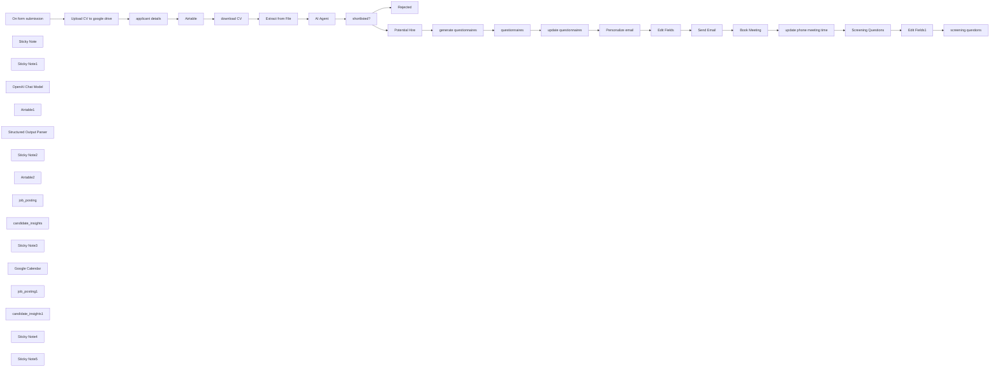

## Fluxo (.json) :

```json
{
  "id": "eMxH0GjgfWEvBDic",
  "meta": {
    "instanceId": "be27b2af86ae3a5dc19ef2a1947644c0aec45fd8c88f29daa7dea6f0ce537691"
  },
  "name": "HR Job Posting and Evaluation with AI",
  "tags": [
    {
      "id": "9ZApRtWeNXlymyQ6",
      "name": "HR",
      "createdAt": "2025-01-08T08:47:43.054Z",
      "updatedAt": "2025-01-08T08:47:43.054Z"
    }
  ],
  "nodes": [
    {
      "id": "450e15b2-bddf-4853-b44e-822facaac14d",
      "name": "On form submission",
      "type": "n8n-nodes-base.formTrigger",
      "position": [
        -700,
        -80
      ],
      "webhookId": "18f7428c-9990-413f-aff3-bdcca1bbbe2d",
      "parameters": {
        "options": {
          "path": "automation-specialist-application",
          "ignoreBots": false,
          "buttonLabel": "Submit",
          "appendAttribution": false,
          "useWorkflowTimezone": true
        },
        "formTitle": "Job Application",
        "formFields": {
          "values": [
            {
              "fieldLabel": "First Name",
              "requiredField": true
            },
            {
              "fieldLabel": "Last Name",
              "requiredField": true
            },
            {
              "fieldType": "email",
              "fieldLabel": "Email",
              "requiredField": true
            },
            {
              "fieldType": "number",
              "fieldLabel": "Phone",
              "requiredField": true
            },
            {
              "fieldType": "number",
              "fieldLabel": "Years of experience",
              "requiredField": true
            },
            {
              "fieldType": "file",
              "fieldLabel": "Upload your CV",
              "requiredField": true,
              "acceptFileTypes": ".pdf"
            }
          ]
        },
        "formDescription": "=Fill this for to apply for the role Automation Specialist:\n\nLocation: Remote\nExperience: Minimum 3 years\nEmployment Type: Full-time\n\nJob Description:\nWe are seeking a highly skilled Automation Specialist with at least 3 years of experience in designing and implementing workflow automation solutions. The ideal candidate will have expertise in tools such as n8n, Zapier, Make.com, or similar platforms, and a strong background in integrating APIs, streamlining processes, and enhancing operational efficiency.\n\nKey Responsibilities:\n\n Develop and implement automated workflows to optimize business processes.\n Integrate third-party APIs and systems to create seamless data flow.\n Analyze, debug, and improve existing automation setups.\n Collaborate with cross-functional teams to identify automation opportunities.\n Monitor and maintain automation systems to ensure reliability.\n\nRequired Skills & Qualifications:\n\n Proven 3+ years of experience in workflow automation and integration.\n Proficiency with tools like n8n, Zapier, or Make.com.\n Strong understanding of APIs, webhooks, and data transformation.\n Familiarity with scripting languages (e.g., JavaScript or Python).\n Excellent problem-solving and communication skills.\n\nPreferred Qualifications:\n\n Experience with database management and cloud services.\n Background in business process analysis or RPA tools.\n\nWhy Join Us?\n\n Opportunity to work on cutting-edge automation projects.\n Supportive and collaborative team environment.\n Competitive salary and benefits package."
      },
      "typeVersion": 2.2
    },
    {
      "id": "5005e9ba-a68a-4795-8a65-22374a182bdb",
      "name": "Airtable",
      "type": "n8n-nodes-base.airtable",
      "position": [
        -60,
        -80
      ],
      "parameters": {
        "base": {
          "__rl": true,
          "mode": "list",
          "value": "appublMkWVQfHkZ09",
          "cachedResultUrl": "https://airtable.com/appublMkWVQfHkZ09",
          "cachedResultName": "Simple applicant tracker"
        },
        "table": {
          "__rl": true,
          "mode": "list",
          "value": "tblllvQaRTSnEr17a",
          "cachedResultUrl": "https://airtable.com/appublMkWVQfHkZ09/tblllvQaRTSnEr17a",
          "cachedResultName": "Applicants"
        },
        "columns": {
          "value": {
            "Name": "={{ $json.Name }}",
            "Phone": "={{ $json.Phone }}",
            "CV Link": "={{ $json[\"CV link\"] }}",
            "Applying for": "=[\"Automation Specialist\"]",
            "Email address": "={{ $json.email }}"
          },
          "schema": [
            {
              "id": "Name",
              "type": "string",
              "display": true,
              "removed": false,
              "readOnly": false,
              "required": false,
              "displayName": "Name",
              "defaultMatch": false,
              "canBeUsedToMatch": true
            },
            {
              "id": "Email address",
              "type": "string",
              "display": true,
              "removed": false,
              "readOnly": false,
              "required": false,
              "displayName": "Email address",
              "defaultMatch": false,
              "canBeUsedToMatch": true
            },
            {
              "id": "Phone",
              "type": "string",
              "display": true,
              "removed": false,
              "readOnly": false,
              "required": false,
              "displayName": "Phone",
              "defaultMatch": false,
              "canBeUsedToMatch": true
            },
            {
              "id": "Stage",
              "type": "options",
              "display": true,
              "options": [
                {
                  "name": "No hire",
                  "value": "No hire"
                },
                {
                  "name": "Interviewing",
                  "value": "Interviewing"
                },
                {
                  "name": "Decision needed",
                  "value": "Decision needed"
                },
                {
                  "name": "Hire",
                  "value": "Hire"
                }
              ],
              "removed": true,
              "readOnly": false,
              "required": false,
              "displayName": "Stage",
              "defaultMatch": false,
              "canBeUsedToMatch": true
            },
            {
              "id": "Applying for",
              "type": "array",
              "display": true,
              "removed": false,
              "readOnly": false,
              "required": false,
              "displayName": "Applying for",
              "defaultMatch": false,
              "canBeUsedToMatch": true
            },
            {
              "id": "CV Link",
              "type": "string",
              "display": true,
              "removed": false,
              "readOnly": false,
              "required": false,
              "displayName": "CV Link",
              "defaultMatch": false,
              "canBeUsedToMatch": true
            },
            {
              "id": "JD CV score",
              "type": "options",
              "display": true,
              "options": [
                {
                  "name": "0 – No hire",
                  "value": "0 – No hire"
                },
                {
                  "name": "1 – Probably no hire",
                  "value": "1 – Probably no hire"
                },
                {
                  "name": "2 – Worth consideration",
                  "value": "2 – Worth consideration"
                },
                {
                  "name": "3 – Good candidate",
                  "value": "3 – Good candidate"
                },
                {
                  "name": "4 – Please hire this person",
                  "value": "4 – Please hire this person"
                }
              ],
              "removed": true,
              "readOnly": false,
              "required": false,
              "displayName": "JD CV score",
              "defaultMatch": false,
              "canBeUsedToMatch": true
            },
            {
              "id": "Phone interview",
              "type": "dateTime",
              "display": true,
              "removed": true,
              "readOnly": false,
              "required": false,
              "displayName": "Phone interview",
              "defaultMatch": false,
              "canBeUsedToMatch": true
            },
            {
              "id": "Phone interviewer",
              "type": "array",
              "display": true,
              "removed": true,
              "readOnly": false,
              "required": false,
              "displayName": "Phone interviewer",
              "defaultMatch": false,
              "canBeUsedToMatch": true
            },
            {
              "id": "Phone interview score",
              "type": "options",
              "display": true,
              "options": [
                {
                  "name": "0 – No hire",
                  "value": "0 – No hire"
                },
                {
                  "name": "1 – Probably no hire",
                  "value": "1 – Probably no hire"
                },
                {
                  "name": "2 – Worth consideration",
                  "value": "2 – Worth consideration"
                },
                {
                  "name": "3 – Good candidate",
                  "value": "3 – Good candidate"
                },
                {
                  "name": "4 – Please hire this person",
                  "value": "4 – Please hire this person"
                }
              ],
              "removed": true,
              "readOnly": false,
              "required": false,
              "displayName": "Phone interview score",
              "defaultMatch": false,
              "canBeUsedToMatch": true
            },
            {
              "id": "Phone interview notes",
              "type": "string",
              "display": true,
              "removed": true,
              "readOnly": false,
              "required": false,
              "displayName": "Phone interview notes",
              "defaultMatch": false,
              "canBeUsedToMatch": true
            },
            {
              "id": "Onsite interview",
              "type": "dateTime",
              "display": true,
              "removed": true,
              "readOnly": false,
              "required": false,
              "displayName": "Onsite interview",
              "defaultMatch": false,
              "canBeUsedToMatch": true
            },
            {
              "id": "Onsite interviewer",
              "type": "array",
              "display": true,
              "removed": true,
              "readOnly": false,
              "required": false,
              "displayName": "Onsite interviewer",
              "defaultMatch": false,
              "canBeUsedToMatch": true
            },
            {
              "id": "Onsite interview score",
              "type": "options",
              "display": true,
              "options": [
                {
                  "name": "0 – No hire",
                  "value": "0 – No hire"
                },
                {
                  "name": "1 – Probably no hire",
                  "value": "1 – Probably no hire"
                },
                {
                  "name": "2 – Worth consideration",
                  "value": "2 – Worth consideration"
                },
                {
                  "name": "3 – Good candidate",
                  "value": "3 – Good candidate"
                },
                {
                  "name": "4 – Please hire this person",
                  "value": "4 – Please hire this person"
                }
              ],
              "removed": true,
              "readOnly": false,
              "required": false,
              "displayName": "Onsite interview score",
              "defaultMatch": false,
              "canBeUsedToMatch": true
            },
            {
              "id": "Onsite interview notes",
              "type": "string",
              "display": true,
              "removed": true,
              "readOnly": false,
              "required": false,
              "displayName": "Onsite interview notes",
              "defaultMatch": false,
              "canBeUsedToMatch": true
            },
            {
              "id": "Attachments",
              "type": "array",
              "display": true,
              "removed": true,
              "readOnly": false,
              "required": false,
              "displayName": "Attachments",
              "defaultMatch": false,
              "canBeUsedToMatch": true
            }
          ],
          "mappingMode": "defineBelow",
          "matchingColumns": []
        },
        "options": {
          "typecast": true
        },
        "operation": "create"
      },
      "credentials": {
        "airtableTokenApi": {
          "id": "gQtK3HX661rFA6KW",
          "name": "gaturanjenga account"
        }
      },
      "typeVersion": 2.1
    },
    {
      "id": "b291527b-9937-4388-a712-2b60dd292f65",
      "name": "Upload CV to google drive",
      "type": "n8n-nodes-base.googleDrive",
      "position": [
        -480,
        -80
      ],
      "parameters": {
        "name": "={{ $binary.Upload_your_CV.fileName }}",
        "driveId": {
          "__rl": true,
          "mode": "list",
          "value": "My Drive"
        },
        "options": {},
        "folderId": {
          "__rl": true,
          "mode": "list",
          "value": "1u_YBpqSU5TjNsu72sQKFMIesb62JKHXz",
          "cachedResultUrl": "https://drive.google.com/drive/folders/1u_YBpqSU5TjNsu72sQKFMIesb62JKHXz",
          "cachedResultName": "HR Test"
        },
        "inputDataFieldName": "Upload_your_CV"
      },
      "credentials": {
        "googleDriveOAuth2Api": {
          "id": "MHcgKR744VHXSe3X",
          "name": "Drive n8n"
        }
      },
      "typeVersion": 3
    },
    {
      "id": "83a965f9-bdb1-42ca-9701-24a82438ea0e",
      "name": "applicant details",
      "type": "n8n-nodes-base.set",
      "position": [
        -260,
        -80
      ],
      "parameters": {
        "options": {},
        "assignments": {
          "assignments": [
            {
              "id": "bffff778-859a-4bb8-b973-39237ce7486e",
              "name": "Name",
              "type": "string",
              "value": "={{ $('On form submission').item.json['First Name'] + \" \" + $('On form submission').item.json['Last Name'] }}"
            },
            {
              "id": "cd6e7372-c65f-4e6f-9612-6ea513bb8e15",
              "name": "Phone",
              "type": "number",
              "value": "={{ $('On form submission').item.json.Phone }}"
            },
            {
              "id": "eb19138e-7ff3-4f0c-ad95-ac33f8835717",
              "name": "email",
              "type": "string",
              "value": "={{ $('On form submission').item.json.Email }}"
            },
            {
              "id": "25172db9-91fb-45da-b036-ee9aea1e8b09",
              "name": "Experience",
              "type": "number",
              "value": "={{ $('On form submission').item.json[\"Years of experience\"] }}"
            },
            {
              "id": "64393285-3770-47e0-bbbb-3c5d5e14f1f4",
              "name": "Applied On",
              "type": "string",
              "value": "={{ $('On form submission').item.json.submittedAt }}"
            },
            {
              "id": "dc052fd6-f57d-4da1-9976-67fcd9496e58",
              "name": "CV link",
              "type": "string",
              "value": "={{ $json.webViewLink }}"
            }
          ]
        }
      },
      "typeVersion": 3.4
    },
    {
      "id": "41038c1c-876d-46a6-9dcc-f40c77e834df",
      "name": "Sticky Note",
      "type": "n8n-nodes-base.stickyNote",
      "position": [
        -720,
        -160
      ],
      "parameters": {
        "color": 3,
        "width": 760,
        "height": 220,
        "content": "## Grab User Details and Update in Airtable\n"
      },
      "typeVersion": 1
    },
    {
      "id": "d0f85487-8e78-4cde-8ecb-a55ab94940cc",
      "name": "Sticky Note1",
      "type": "n8n-nodes-base.stickyNote",
      "position": [
        120,
        -180
      ],
      "parameters": {
        "width": 820,
        "height": 460,
        "content": "## Download the CV and get the job description and requirements.\n- ### Send the details to ChatGPT to score the viability of the candidate"
      },
      "typeVersion": 1
    },
    {
      "id": "334c4580-a0e6-45f0-9b3a-3904eb80b3e8",
      "name": "download CV",
      "type": "n8n-nodes-base.googleDrive",
      "position": [
        140,
        -80
      ],
      "parameters": {
        "fileId": {
          "__rl": true,
          "mode": "url",
          "value": "={{ $json.fields[\"CV Link\"] }}"
        },
        "options": {},
        "operation": "download"
      },
      "credentials": {
        "googleDriveOAuth2Api": {
          "id": "MHcgKR744VHXSe3X",
          "name": "Drive n8n"
        }
      },
      "typeVersion": 3
    },
    {
      "id": "b7d8013a-71bd-49a4-a58f-f63186e1b6d8",
      "name": "Extract from File",
      "type": "n8n-nodes-base.extractFromFile",
      "position": [
        360,
        -80
      ],
      "parameters": {
        "options": {},
        "operation": "pdf"
      },
      "typeVersion": 1
    },
    {
      "id": "22ba7844-9f20-41b1-96bb-f2e33e18d14a",
      "name": "AI Agent",
      "type": "@n8n/n8n-nodes-langchain.agent",
      "position": [
        580,
        -80
      ],
      "parameters": {
        "text": "=Compare the following job description and resume. Assign a qualification score between 0 and 1, where 1 indicates the best match. Provide only the score and the reason for the score in less than 20 words.\nJob Description: Use Airtable tool to get the job description\nResume: \n{{ $json.text }}",
        "options": {},
        "promptType": "define",
        "hasOutputParser": true
      },
      "typeVersion": 1.7
    },
    {
      "id": "5f0317cb-35a5-4e57-938d-0d604c1f7f4f",
      "name": "OpenAI Chat Model",
      "type": "@n8n/n8n-nodes-langchain.lmChatOpenAi",
      "position": [
        500,
        120
      ],
      "parameters": {
        "options": {}
      },
      "credentials": {
        "openAiApi": {
          "id": "0Q6M4JEKewP9VKl8",
          "name": "Bulkbox"
        }
      },
      "typeVersion": 1
    },
    {
      "id": "d040091b-282b-4bb7-8a82-de3030c14b91",
      "name": "Airtable1",
      "type": "n8n-nodes-base.airtableTool",
      "position": [
        700,
        120
      ],
      "parameters": {
        "base": {
          "__rl": true,
          "mode": "list",
          "value": "appublMkWVQfHkZ09",
          "cachedResultUrl": "https://airtable.com/appublMkWVQfHkZ09",
          "cachedResultName": "Simple applicant tracker"
        },
        "table": {
          "__rl": true,
          "mode": "list",
          "value": "tbljhmLdPULqSya0d",
          "cachedResultUrl": "https://airtable.com/appublMkWVQfHkZ09/tbljhmLdPULqSya0d",
          "cachedResultName": "Positions"
        },
        "options": {},
        "operation": "search"
      },
      "credentials": {
        "airtableTokenApi": {
          "id": "gQtK3HX661rFA6KW",
          "name": "gaturanjenga account"
        }
      },
      "typeVersion": 2.1
    },
    {
      "id": "fba48717-a068-44de-a776-6e0c14ebd667",
      "name": "Structured Output Parser",
      "type": "@n8n/n8n-nodes-langchain.outputParserStructured",
      "position": [
        820,
        120
      ],
      "parameters": {
        "jsonSchemaExample": "{\n \"score\": 0.8,\n \"reason\": \"Does not meet required number of experience in years\"\n}"
      },
      "typeVersion": 1.2
    },
    {
      "id": "2eef8181-3e4d-4c66-acd7-d440eb2f6748",
      "name": "Sticky Note2",
      "type": "n8n-nodes-base.stickyNote",
      "position": [
        960,
        -340
      ],
      "parameters": {
        "color": 2,
        "width": 1200,
        "height": 600,
        "content": "## Update Airtable with score and reason for the score\n\n- ### if score is above 0.7, shortlist and continue flow.\n\n## Get questionnaires based on the JD and CV\n\n- ### Update the responses in Airtable"
      },
      "typeVersion": 1
    },
    {
      "id": "ed42fa6c-be05-4d62-aa1f-390b5fc471dd",
      "name": "shortlisted?",
      "type": "n8n-nodes-base.if",
      "position": [
        960,
        -80
      ],
      "parameters": {
        "options": {},
        "conditions": {
          "options": {
            "version": 2,
            "leftValue": "",
            "caseSensitive": true,
            "typeValidation": "strict"
          },
          "combinator": "and",
          "conditions": [
            {
              "id": "7b4950b2-d218-4911-89cd-22a60b7465d8",
              "operator": {
                "type": "number",
                "operation": "gte"
              },
              "leftValue": "={{ $json.output.score }}",
              "rightValue": 0.7
            }
          ]
        }
      },
      "typeVersion": 2.2
    },
    {
      "id": "6df70bee-6a9f-43f6-8c39-46663b572f5c",
      "name": "Rejected",
      "type": "n8n-nodes-base.airtable",
      "position": [
        1240,
        60
      ],
      "parameters": {
        "base": {
          "__rl": true,
          "mode": "list",
          "value": "appublMkWVQfHkZ09",
          "cachedResultUrl": "https://airtable.com/appublMkWVQfHkZ09",
          "cachedResultName": "Simple applicant tracker"
        },
        "table": {
          "__rl": true,
          "mode": "list",
          "value": "tblllvQaRTSnEr17a",
          "cachedResultUrl": "https://airtable.com/appublMkWVQfHkZ09/tblllvQaRTSnEr17a",
          "cachedResultName": "Applicants"
        },
        "columns": {
          "value": {
            "id": "={{ $('Airtable').item.json.id }}",
            "Stage": "No hire",
            "JD CV score": "={{ $json.output.score }}",
            "CV Score Notes": "={{ $json.output.reason }}"
          },
          "schema": [
            {
              "id": "id",
              "type": "string",
              "display": true,
              "removed": false,
              "readOnly": true,
              "required": false,
              "displayName": "id",
              "defaultMatch": true
            },
            {
              "id": "Name",
              "type": "string",
              "display": true,
              "removed": true,
              "readOnly": false,
              "required": false,
              "displayName": "Name",
              "defaultMatch": false,
              "canBeUsedToMatch": true
            },
            {
              "id": "Email address",
              "type": "string",
              "display": true,
              "removed": true,
              "readOnly": false,
              "required": false,
              "displayName": "Email address",
              "defaultMatch": false,
              "canBeUsedToMatch": true
            },
            {
              "id": "Phone",
              "type": "number",
              "display": true,
              "removed": true,
              "readOnly": false,
              "required": false,
              "displayName": "Phone",
              "defaultMatch": false,
              "canBeUsedToMatch": true
            },
            {
              "id": "Stage",
              "type": "options",
              "display": true,
              "options": [
                {
                  "name": "No hire",
                  "value": "No hire"
                },
                {
                  "name": "Interviewing",
                  "value": "Interviewing"
                },
                {
                  "name": "Decision needed",
                  "value": "Decision needed"
                },
                {
                  "name": "Hire",
                  "value": "Hire"
                }
              ],
              "removed": false,
              "readOnly": false,
              "required": false,
              "displayName": "Stage",
              "defaultMatch": false,
              "canBeUsedToMatch": true
            },
            {
              "id": "Applying for",
              "type": "array",
              "display": true,
              "removed": true,
              "readOnly": false,
              "required": false,
              "displayName": "Applying for",
              "defaultMatch": false,
              "canBeUsedToMatch": true
            },
            {
              "id": "CV Link",
              "type": "string",
              "display": true,
              "removed": true,
              "readOnly": false,
              "required": false,
              "displayName": "CV Link",
              "defaultMatch": false,
              "canBeUsedToMatch": true
            },
            {
              "id": "JD CV score",
              "type": "number",
              "display": true,
              "removed": false,
              "readOnly": false,
              "required": false,
              "displayName": "JD CV score",
              "defaultMatch": false,
              "canBeUsedToMatch": true
            },
            {
              "id": "CV Score Notes",
              "type": "string",
              "display": true,
              "removed": false,
              "readOnly": false,
              "required": false,
              "displayName": "CV Score Notes",
              "defaultMatch": false,
              "canBeUsedToMatch": true
            },
            {
              "id": "Phone interview",
              "type": "dateTime",
              "display": true,
              "removed": true,
              "readOnly": false,
              "required": false,
              "displayName": "Phone interview",
              "defaultMatch": false,
              "canBeUsedToMatch": true
            },
            {
              "id": "Phone interviewer",
              "type": "array",
              "display": true,
              "removed": true,
              "readOnly": false,
              "required": false,
              "displayName": "Phone interviewer",
              "defaultMatch": false,
              "canBeUsedToMatch": true
            },
            {
              "id": "Phone interview score",
              "type": "options",
              "display": true,
              "options": [
                {
                  "name": "0 – No hire",
                  "value": "0 – No hire"
                },
                {
                  "name": "1 – Probably no hire",
                  "value": "1 – Probably no hire"
                },
                {
                  "name": "2 – Worth consideration",
                  "value": "2 – Worth consideration"
                },
                {
                  "name": "3 – Good candidate",
                  "value": "3 – Good candidate"
                },
                {
                  "name": "4 – Please hire this person",
                  "value": "4 – Please hire this person"
                }
              ],
              "removed": true,
              "readOnly": false,
              "required": false,
              "displayName": "Phone interview score",
              "defaultMatch": false,
              "canBeUsedToMatch": true
            },
            {
              "id": "Phone interview notes",
              "type": "string",
              "display": true,
              "removed": true,
              "readOnly": false,
              "required": false,
              "displayName": "Phone interview notes",
              "defaultMatch": false,
              "canBeUsedToMatch": true
            },
            {
              "id": "Onsite interview",
              "type": "dateTime",
              "display": true,
              "removed": true,
              "readOnly": false,
              "required": false,
              "displayName": "Onsite interview",
              "defaultMatch": false,
              "canBeUsedToMatch": true
            },
            {
              "id": "Onsite interviewer",
              "type": "array",
              "display": true,
              "removed": true,
              "readOnly": false,
              "required": false,
              "displayName": "Onsite interviewer",
              "defaultMatch": false,
              "canBeUsedToMatch": true
            },
            {
              "id": "Onsite interview score",
              "type": "options",
              "display": true,
              "options": [
                {
                  "name": "0 – No hire",
                  "value": "0 – No hire"
                },
                {
                  "name": "1 – Probably no hire",
                  "value": "1 – Probably no hire"
                },
                {
                  "name": "2 – Worth consideration",
                  "value": "2 – Worth consideration"
                },
                {
                  "name": "3 – Good candidate",
                  "value": "3 – Good candidate"
                },
                {
                  "name": "4 – Please hire this person",
                  "value": "4 – Please hire this person"
                }
              ],
              "removed": true,
              "readOnly": false,
              "required": false,
              "displayName": "Onsite interview score",
              "defaultMatch": false,
              "canBeUsedToMatch": true
            },
            {
              "id": "Onsite interview notes",
              "type": "string",
              "display": true,
              "removed": true,
              "readOnly": false,
              "required": false,
              "displayName": "Onsite interview notes",
              "defaultMatch": false,
              "canBeUsedToMatch": true
            },
            {
              "id": "Attachments",
              "type": "array",
              "display": true,
              "removed": true,
              "readOnly": false,
              "required": false,
              "displayName": "Attachments",
              "defaultMatch": false,
              "canBeUsedToMatch": true
            }
          ],
          "mappingMode": "defineBelow",
          "matchingColumns": [
            "id"
          ]
        },
        "options": {},
        "operation": "update"
      },
      "credentials": {
        "airtableTokenApi": {
          "id": "gQtK3HX661rFA6KW",
          "name": "gaturanjenga account"
        }
      },
      "typeVersion": 2.1
    },
    {
      "id": "888869bb-6fca-4d91-8428-cf5159d410e3",
      "name": "Potential Hire",
      "type": "n8n-nodes-base.airtable",
      "position": [
        1240,
        -140
      ],
      "parameters": {
        "base": {
          "__rl": true,
          "mode": "list",
          "value": "appublMkWVQfHkZ09",
          "cachedResultUrl": "https://airtable.com/appublMkWVQfHkZ09",
          "cachedResultName": "Simple applicant tracker"
        },
        "table": {
          "__rl": true,
          "mode": "list",
          "value": "tblllvQaRTSnEr17a",
          "cachedResultUrl": "https://airtable.com/appublMkWVQfHkZ09/tblllvQaRTSnEr17a",
          "cachedResultName": "Applicants"
        },
        "columns": {
          "value": {
            "id": "={{ $('Airtable').item.json.id }}",
            "Stage": "Interviewing",
            "JD CV score": "={{ $json.output.score }}",
            "CV Score Notes": "={{ $json.output.reason }}"
          },
          "schema": [
            {
              "id": "id",
              "type": "string",
              "display": true,
              "removed": false,
              "readOnly": true,
              "required": false,
              "displayName": "id",
              "defaultMatch": true
            },
            {
              "id": "Name",
              "type": "string",
              "display": true,
              "removed": true,
              "readOnly": false,
              "required": false,
              "displayName": "Name",
              "defaultMatch": false,
              "canBeUsedToMatch": true
            },
            {
              "id": "Email address",
              "type": "string",
              "display": true,
              "removed": true,
              "readOnly": false,
              "required": false,
              "displayName": "Email address",
              "defaultMatch": false,
              "canBeUsedToMatch": true
            },
            {
              "id": "Phone",
              "type": "number",
              "display": true,
              "removed": true,
              "readOnly": false,
              "required": false,
              "displayName": "Phone",
              "defaultMatch": false,
              "canBeUsedToMatch": true
            },
            {
              "id": "Stage",
              "type": "options",
              "display": true,
              "options": [
                {
                  "name": "No hire",
                  "value": "No hire"
                },
                {
                  "name": "Interviewing",
                  "value": "Interviewing"
                },
                {
                  "name": "Decision needed",
                  "value": "Decision needed"
                },
                {
                  "name": "Hire",
                  "value": "Hire"
                }
              ],
              "removed": false,
              "readOnly": false,
              "required": false,
              "displayName": "Stage",
              "defaultMatch": false,
              "canBeUsedToMatch": true
            },
            {
              "id": "Applying for",
              "type": "array",
              "display": true,
              "removed": true,
              "readOnly": false,
              "required": false,
              "displayName": "Applying for",
              "defaultMatch": false,
              "canBeUsedToMatch": true
            },
            {
              "id": "CV Link",
              "type": "string",
              "display": true,
              "removed": true,
              "readOnly": false,
              "required": false,
              "displayName": "CV Link",
              "defaultMatch": false,
              "canBeUsedToMatch": true
            },
            {
              "id": "JD CV score",
              "type": "number",
              "display": true,
              "removed": false,
              "readOnly": false,
              "required": false,
              "displayName": "JD CV score",
              "defaultMatch": false,
              "canBeUsedToMatch": true
            },
            {
              "id": "CV Score Notes",
              "type": "string",
              "display": true,
              "removed": false,
              "readOnly": false,
              "required": false,
              "displayName": "CV Score Notes",
              "defaultMatch": false,
              "canBeUsedToMatch": true
            },
            {
              "id": "Phone interview",
              "type": "dateTime",
              "display": true,
              "removed": true,
              "readOnly": false,
              "required": false,
              "displayName": "Phone interview",
              "defaultMatch": false,
              "canBeUsedToMatch": true
            },
            {
              "id": "Phone interviewer",
              "type": "array",
              "display": true,
              "removed": true,
              "readOnly": false,
              "required": false,
              "displayName": "Phone interviewer",
              "defaultMatch": false,
              "canBeUsedToMatch": true
            },
            {
              "id": "Phone interview score",
              "type": "options",
              "display": true,
              "options": [
                {
                  "name": "0 – No hire",
                  "value": "0 – No hire"
                },
                {
                  "name": "1 – Probably no hire",
                  "value": "1 – Probably no hire"
                },
                {
                  "name": "2 – Worth consideration",
                  "value": "2 – Worth consideration"
                },
                {
                  "name": "3 – Good candidate",
                  "value": "3 – Good candidate"
                },
                {
                  "name": "4 – Please hire this person",
                  "value": "4 – Please hire this person"
                }
              ],
              "removed": true,
              "readOnly": false,
              "required": false,
              "displayName": "Phone interview score",
              "defaultMatch": false,
              "canBeUsedToMatch": true
            },
            {
              "id": "Phone interview notes",
              "type": "string",
              "display": true,
              "removed": true,
              "readOnly": false,
              "required": false,
              "displayName": "Phone interview notes",
              "defaultMatch": false,
              "canBeUsedToMatch": true
            },
            {
              "id": "Onsite interview",
              "type": "dateTime",
              "display": true,
              "removed": true,
              "readOnly": false,
              "required": false,
              "displayName": "Onsite interview",
              "defaultMatch": false,
              "canBeUsedToMatch": true
            },
            {
              "id": "Onsite interviewer",
              "type": "array",
              "display": true,
              "removed": true,
              "readOnly": false,
              "required": false,
              "displayName": "Onsite interviewer",
              "defaultMatch": false,
              "canBeUsedToMatch": true
            },
            {
              "id": "Onsite interview score",
              "type": "options",
              "display": true,
              "options": [
                {
                  "name": "0 – No hire",
                  "value": "0 – No hire"
                },
                {
                  "name": "1 – Probably no hire",
                  "value": "1 – Probably no hire"
                },
                {
                  "name": "2 – Worth consideration",
                  "value": "2 – Worth consideration"
                },
                {
                  "name": "3 – Good candidate",
                  "value": "3 – Good candidate"
                },
                {
                  "name": "4 – Please hire this person",
                  "value": "4 – Please hire this person"
                }
              ],
              "removed": true,
              "readOnly": false,
              "required": false,
              "displayName": "Onsite interview score",
              "defaultMatch": false,
              "canBeUsedToMatch": true
            },
            {
              "id": "Onsite interview notes",
              "type": "string",
              "display": true,
              "removed": true,
              "readOnly": false,
              "required": false,
              "displayName": "Onsite interview notes",
              "defaultMatch": false,
              "canBeUsedToMatch": true
            },
            {
              "id": "Attachments",
              "type": "array",
              "display": true,
              "removed": true,
              "readOnly": false,
              "required": false,
              "displayName": "Attachments",
              "defaultMatch": false,
              "canBeUsedToMatch": true
            }
          ],
          "mappingMode": "defineBelow",
          "matchingColumns": [
            "id"
          ]
        },
        "options": {},
        "operation": "update"
      },
      "credentials": {
        "airtableTokenApi": {
          "id": "gQtK3HX661rFA6KW",
          "name": "gaturanjenga account"
        }
      },
      "typeVersion": 2.1
    },
    {
      "id": "8f59889d-dff7-4eef-85f4-7c6d9e171c17",
      "name": "Airtable2",
      "type": "n8n-nodes-base.airtableTool",
      "position": [
        1560,
        100
      ],
      "parameters": {
        "base": {
          "__rl": true,
          "mode": "list",
          "value": "appublMkWVQfHkZ09",
          "cachedResultUrl": "https://airtable.com/appublMkWVQfHkZ09",
          "cachedResultName": "Simple applicant tracker"
        },
        "table": {
          "__rl": true,
          "mode": "list",
          "value": "tbljhmLdPULqSya0d",
          "cachedResultUrl": "https://airtable.com/appublMkWVQfHkZ09/tbljhmLdPULqSya0d",
          "cachedResultName": "Positions"
        },
        "options": {},
        "operation": "search"
      },
      "credentials": {
        "airtableTokenApi": {
          "id": "gQtK3HX661rFA6KW",
          "name": "gaturanjenga account"
        }
      },
      "typeVersion": 2.1
    },
    {
      "id": "8358ab12-a0b9-4a21-b9eb-7054716b6f5b",
      "name": "generate questionnaires",
      "type": "@n8n/n8n-nodes-langchain.openAi",
      "position": [
        1460,
        -140
      ],
      "parameters": {
        "modelId": {
          "__rl": true,
          "mode": "list",
          "value": "gpt-4o-mini",
          "cachedResultName": "GPT-4O-MINI"
        },
        "options": {},
        "messages": {
          "values": [
            {
              "content": "=Given the following job description and candidate CV, create 5 insightful interview questions to gather more information about the candidate's suitability for the role. The questions should focus on:\n\n Specific projects the candidate has worked on.\n Key responsibilities and achievements in their previous roles.\n Skills relevant to the job description.\n Problem-solving abilities and how they handled challenges.\n Alignment with the company’s goals and values.\n\nProvide the questions in a clear, concise format.\n\nJob Description:\nUse the airtable tool to get the job description\n\nCandidate CV:\n{{ $('Extract from File').item.json.text }}"
            }
          ]
        },
        "jsonOutput": true
      },
      "credentials": {
        "openAiApi": {
          "id": "lcpI0YZU9bebg3uW",
          "name": "OpenAi account"
        }
      },
      "typeVersion": 1.7
    },
    {
      "id": "21ffd179-42d9-4da3-9f1b-e2bbeb9cdee7",
      "name": "questionnaires",
      "type": "n8n-nodes-base.form",
      "position": [
        1820,
        -140
      ],
      "webhookId": "3f654280-b5d0-4392-824f-bc384d91a1df",
      "parameters": {
        "options": {
          "formTitle": "Questionnaires",
          "buttonLabel": "Submit",
          "formDescription": "Kindly fill in the following questions to proceed."
        },
        "formFields": {
          "values": [
            {
              "fieldLabel": "={{ $json.message.content.interview_questions[0].question }}",
              "requiredField": true
            },
            {
              "fieldLabel": "={{ $json.message.content.interview_questions[1].question }}",
              "requiredField": true
            },
            {
              "fieldLabel": "={{ $json.message.content.interview_questions[2].question }}",
              "requiredField": true
            },
            {
              "fieldLabel": "={{ $json.message.content.interview_questions[3].question }}",
              "requiredField": true
            },
            {
              "fieldLabel": "={{ $json.message.content.interview_questions[4].question }}",
              "requiredField": true
            }
          ]
        }
      },
      "typeVersion": 1
    },
    {
      "id": "29a228ca-6b8e-458f-a030-372b50151a94",
      "name": "update questionnaires",
      "type": "n8n-nodes-base.airtable",
      "position": [
        2040,
        -140
      ],
      "parameters": {
        "base": {
          "__rl": true,
          "mode": "list",
          "value": "appublMkWVQfHkZ09",
          "cachedResultUrl": "https://airtable.com/appublMkWVQfHkZ09",
          "cachedResultName": "Simple applicant tracker"
        },
        "table": {
          "__rl": true,
          "mode": "list",
          "value": "tblllvQaRTSnEr17a",
          "cachedResultUrl": "https://airtable.com/appublMkWVQfHkZ09/tblllvQaRTSnEr17a",
          "cachedResultName": "Applicants"
        },
        "columns": {
          "value": {
            "id": "={{ $('Airtable').item.json.id }}",
            "Questonnaires and responses": "={{ $('generate questionnaires').item.json.message.content.interview_questions[0].question }}: {{ $json['Can you describe one of the most complex automation projects you worked on, particularly detailing your role and the technologies you used?'] }}\n\n\n{{ $('generate questionnaires').item.json.message.content.interview_questions[1].question }}: {{ $json['What specific achievements in your previous roles do you believe demonstrate your ability to meet the responsibilities listed in the Automation Specialist position?'] }}\n\n\n{{ $('generate questionnaires').item.json.message.content.interview_questions[2].question }}: {{ $json['Given your experience with automation tools like n8n and APIs, can you provide an example of how you\\'ve successfully integrated different systems to improve operational efficiency?'] }}\n\n\n{{ $('generate questionnaires').item.json.message.content.interview_questions[3].question }}: {{ $json['Describe a challenging situation you faced during a project, how you approached the problem, and what the outcome was.'] }}\n\n\n{{ $('generate questionnaires').item.json.message.content.interview_questions[4].question }}: {{ $json['How do your values and career goals align with our company\\'s mission to optimize and enhance automation solutions?'] }}\n\n"
          },
          "schema": [
            {
              "id": "id",
              "type": "string",
              "display": true,
              "removed": false,
              "readOnly": true,
              "required": false,
              "displayName": "id",
              "defaultMatch": true
            },
            {
              "id": "Name",
              "type": "string",
              "display": true,
              "removed": true,
              "readOnly": false,
              "required": false,
              "displayName": "Name",
              "defaultMatch": false,
              "canBeUsedToMatch": true
            },
            {
              "id": "Email address",
              "type": "string",
              "display": true,
              "removed": true,
              "readOnly": false,
              "required": false,
              "displayName": "Email address",
              "defaultMatch": false,
              "canBeUsedToMatch": true
            },
            {
              "id": "Phone",
              "type": "number",
              "display": true,
              "removed": true,
              "readOnly": false,
              "required": false,
              "displayName": "Phone",
              "defaultMatch": false,
              "canBeUsedToMatch": true
            },
            {
              "id": "Stage",
              "type": "options",
              "display": true,
              "options": [
                {
                  "name": "No hire",
                  "value": "No hire"
                },
                {
                  "name": "Interviewing",
                  "value": "Interviewing"
                },
                {
                  "name": "Decision needed",
                  "value": "Decision needed"
                },
                {
                  "name": "Hire",
                  "value": "Hire"
                }
              ],
              "removed": true,
              "readOnly": false,
              "required": false,
              "displayName": "Stage",
              "defaultMatch": false,
              "canBeUsedToMatch": true
            },
            {
              "id": "Applying for",
              "type": "array",
              "display": true,
              "removed": true,
              "readOnly": false,
              "required": false,
              "displayName": "Applying for",
              "defaultMatch": false,
              "canBeUsedToMatch": true
            },
            {
              "id": "CV Link",
              "type": "string",
              "display": true,
              "removed": true,
              "readOnly": false,
              "required": false,
              "displayName": "CV Link",
              "defaultMatch": false,
              "canBeUsedToMatch": true
            },
            {
              "id": "JD CV score",
              "type": "number",
              "display": true,
              "removed": true,
              "readOnly": false,
              "required": false,
              "displayName": "JD CV score",
              "defaultMatch": false,
              "canBeUsedToMatch": true
            },
            {
              "id": "CV Score Notes",
              "type": "string",
              "display": true,
              "removed": true,
              "readOnly": false,
              "required": false,
              "displayName": "CV Score Notes",
              "defaultMatch": false,
              "canBeUsedToMatch": true
            },
            {
              "id": "Questonnaires and responses",
              "type": "string",
              "display": true,
              "removed": false,
              "readOnly": false,
              "required": false,
              "displayName": "Questonnaires and responses",
              "defaultMatch": false,
              "canBeUsedToMatch": true
            },
            {
              "id": "Phone interview",
              "type": "dateTime",
              "display": true,
              "removed": true,
              "readOnly": false,
              "required": false,
              "displayName": "Phone interview",
              "defaultMatch": false,
              "canBeUsedToMatch": true
            },
            {
              "id": "Phone interviewer",
              "type": "array",
              "display": true,
              "removed": true,
              "readOnly": false,
              "required": false,
              "displayName": "Phone interviewer",
              "defaultMatch": false,
              "canBeUsedToMatch": true
            },
            {
              "id": "Phone interview score",
              "type": "options",
              "display": true,
              "options": [
                {
                  "name": "0 – No hire",
                  "value": "0 – No hire"
                },
                {
                  "name": "1 – Probably no hire",
                  "value": "1 – Probably no hire"
                },
                {
                  "name": "2 – Worth consideration",
                  "value": "2 – Worth consideration"
                },
                {
                  "name": "3 – Good candidate",
                  "value": "3 – Good candidate"
                },
                {
                  "name": "4 – Please hire this person",
                  "value": "4 – Please hire this person"
                }
              ],
              "removed": true,
              "readOnly": false,
              "required": false,
              "displayName": "Phone interview score",
              "defaultMatch": false,
              "canBeUsedToMatch": true
            },
            {
              "id": "Phone interview notes",
              "type": "string",
              "display": true,
              "removed": true,
              "readOnly": false,
              "required": false,
              "displayName": "Phone interview notes",
              "defaultMatch": false,
              "canBeUsedToMatch": true
            },
            {
              "id": "Onsite interview",
              "type": "dateTime",
              "display": true,
              "removed": true,
              "readOnly": false,
              "required": false,
              "displayName": "Onsite interview",
              "defaultMatch": false,
              "canBeUsedToMatch": true
            },
            {
              "id": "Onsite interviewer",
              "type": "array",
              "display": true,
              "removed": true,
              "readOnly": false,
              "required": false,
              "displayName": "Onsite interviewer",
              "defaultMatch": false,
              "canBeUsedToMatch": true
            },
            {
              "id": "Onsite interview score",
              "type": "options",
              "display": true,
              "options": [
                {
                  "name": "0 – No hire",
                  "value": "0 – No hire"
                },
                {
                  "name": "1 – Probably no hire",
                  "value": "1 – Probably no hire"
                },
                {
                  "name": "2 – Worth consideration",
                  "value": "2 – Worth consideration"
                },
                {
                  "name": "3 – Good candidate",
                  "value": "3 – Good candidate"
                },
                {
                  "name": "4 – Please hire this person",
                  "value": "4 – Please hire this person"
                }
              ],
              "removed": true,
              "readOnly": false,
              "required": false,
              "displayName": "Onsite interview score",
              "defaultMatch": false,
              "canBeUsedToMatch": true
            },
            {
              "id": "Onsite interview notes",
              "type": "string",
              "display": true,
              "removed": true,
              "readOnly": false,
              "required": false,
              "displayName": "Onsite interview notes",
              "defaultMatch": false,
              "canBeUsedToMatch": true
            },
            {
              "id": "Attachments",
              "type": "array",
              "display": true,
              "removed": true,
              "readOnly": false,
              "required": false,
              "displayName": "Attachments",
              "defaultMatch": false,
              "canBeUsedToMatch": true
            }
          ],
          "mappingMode": "defineBelow",
          "matchingColumns": [
            "id"
          ]
        },
        "options": {},
        "operation": "update"
      },
      "credentials": {
        "airtableTokenApi": {
          "id": "gQtK3HX661rFA6KW",
          "name": "gaturanjenga account"
        }
      },
      "typeVersion": 2.1
    },
    {
      "id": "9a72a172-4272-4715-8e57-75ca010bc0e5",
      "name": "job_posting",
      "type": "n8n-nodes-base.airtableTool",
      "position": [
        2300,
        100
      ],
      "parameters": {
        "base": {
          "__rl": true,
          "mode": "list",
          "value": "appublMkWVQfHkZ09",
          "cachedResultUrl": "https://airtable.com/appublMkWVQfHkZ09",
          "cachedResultName": "Simple applicant tracker"
        },
        "table": {
          "__rl": true,
          "mode": "list",
          "value": "tbljhmLdPULqSya0d",
          "cachedResultUrl": "https://airtable.com/appublMkWVQfHkZ09/tbljhmLdPULqSya0d",
          "cachedResultName": "Positions"
        },
        "options": {},
        "operation": "search"
      },
      "credentials": {
        "airtableTokenApi": {
          "id": "gQtK3HX661rFA6KW",
          "name": "gaturanjenga account"
        }
      },
      "typeVersion": 2.1
    },
    {
      "id": "28c210c8-5684-4683-a168-5a02b39eb0f2",
      "name": "candidate_insights",
      "type": "n8n-nodes-base.airtableTool",
      "position": [
        2420,
        100
      ],
      "parameters": {
        "id": "={{ $('update questionnaires').item.json.id }}",
        "base": {
          "__rl": true,
          "mode": "list",
          "value": "appublMkWVQfHkZ09",
          "cachedResultUrl": "https://airtable.com/appublMkWVQfHkZ09",
          "cachedResultName": "Simple applicant tracker"
        },
        "table": {
          "__rl": true,
          "mode": "list",
          "value": "tblllvQaRTSnEr17a",
          "cachedResultUrl": "https://airtable.com/appublMkWVQfHkZ09/tblllvQaRTSnEr17a",
          "cachedResultName": "Applicants"
        },
        "options": {}
      },
      "credentials": {
        "airtableTokenApi": {
          "id": "gQtK3HX661rFA6KW",
          "name": "gaturanjenga account"
        }
      },
      "typeVersion": 2.1
    },
    {
      "id": "6e6f43f4-43a7-426f-b3c7-264a7980c771",
      "name": "Personalize email",
      "type": "@n8n/n8n-nodes-langchain.openAi",
      "position": [
        2260,
        -140
      ],
      "parameters": {
        "modelId": {
          "__rl": true,
          "mode": "list",
          "value": "gpt-4o",
          "cachedResultName": "GPT-4O"
        },
        "options": {},
        "messages": {
          "values": [
            {
              "content": "=Craft a personalized email to the interviewee, expressing interest in continuing the conversation over a phone call. The email should mention strengths or achievements from their CV or questionnaire responses, and include a polite request to have the phone conversation. Ensure the tone is professional and warm.\n\nProvide an output of \nTo:\nSubject:\nEmail Content:\n\nInputs:\n\n The candidate's CV.\n The job description.\n The candidate's questionnaire responses stored in Airtable.\n\n\nExample email:\nDear [Candidate's Name],\n\nThank you for submitting your application and responses to the questionnaire for the [Job Title] position. We were impressed by [specific strength or achievement from their CV or questionnaire, e.g., \"your experience in automating workflows using n8n, which aligns closely with our goals\"].\n\nWe’d love to continue the conversation to discuss your experience further. \n\nLooking forward to speaking with you soon.\n\n\n\nNOTE: \nSign off the email with\n\nRegards,\nFrancis"
            }
          ]
        },
        "jsonOutput": true
      },
      "credentials": {
        "openAiApi": {
          "id": "lcpI0YZU9bebg3uW",
          "name": "OpenAi account"
        }
      },
      "typeVersion": 1.7
    },
    {
      "id": "ee3f1a4e-d262-461d-93c5-9aed81de9825",
      "name": "Edit Fields",
      "type": "n8n-nodes-base.set",
      "position": [
        2620,
        -140
      ],
      "parameters": {
        "options": {},
        "assignments": {
          "assignments": [
            {
              "id": "b3d6e85e-c478-452d-aafc-c325dfbe2c9b",
              "name": "To",
              "type": "string",
              "value": "={{ $json.message.content.To }}"
            },
            {
              "id": "f24eb1d5-fa61-48ce-8685-a0b2022bf576",
              "name": "Subject",
              "type": "string",
              "value": "={{ $json.message.content.Subject }}"
            },
            {
              "id": "25de1423-b66a-4389-906f-8b0c9c1d3826",
              "name": "Email Content",
              "type": "string",
              "value": "={{ $json.message.content['Email Content'] }}"
            }
          ]
        }
      },
      "typeVersion": 3.4
    },
    {
      "id": "7454b4ea-1b43-4a4a-8623-7848c13298c7",
      "name": "Send Email",
      "type": "n8n-nodes-base.emailSend",
      "position": [
        2840,
        -140
      ],
      "parameters": {
        "text": "={{ $json['Email Content'] }}",
        "options": {
          "appendAttribution": false
        },
        "subject": "={{ $json.Subject }}",
        "toEmail": "={{ $json.To }}",
        "fromEmail": "gatura@bulkbox.co.ke",
        "emailFormat": "text"
      },
      "credentials": {
        "smtp": {
          "id": "FRchTiFJGPeC5YNE",
          "name": "SMTP account"
        }
      },
      "typeVersion": 2.1
    },
    {
      "id": "92be970b-8514-4842-bbc9-f6680681df60",
      "name": "Sticky Note3",
      "type": "n8n-nodes-base.stickyNote",
      "position": [
        2220,
        -280
      ],
      "parameters": {
        "color": 5,
        "width": 1340,
        "height": 480,
        "content": "## Personalize email and send\n\n## Schedule Meeting and update meeting time in AIrtable"
      },
      "typeVersion": 1
    },
    {
      "id": "38a7f43b-f7b2-4dda-8dea-045d637870e8",
      "name": "Book Meeting",
      "type": "@n8n/n8n-nodes-langchain.openAi",
      "position": [
        3060,
        -140
      ],
      "parameters": {
        "modelId": {
          "__rl": true,
          "mode": "list",
          "value": "gpt-4o",
          "cachedResultName": "GPT-4O"
        },
        "options": {},
        "messages": {
          "values": [
            {
              "content": "=Check the interviewer's calendar for available 30-minute time slots within working hours (8 AM - 5 PM) the next day. Schedule the meeting and confirm the time with the candidate. Ensure that the meeting time is aligned with the candidate's and interviewer's availability.\n\nInputs:\n\n The interviewer's calendar for scheduling.\n Today's date: {{ $today }}\n\nUse the calendar tool to book the meeting\n\n\nGive back the follwoing information:\nStart time:\nEnd time:"
            }
          ]
        },
        "jsonOutput": true
      },
      "credentials": {
        "openAiApi": {
          "id": "lcpI0YZU9bebg3uW",
          "name": "OpenAi account"
        }
      },
      "typeVersion": 1.7
    },
    {
      "id": "b6a94b8c-8c92-49f2-931b-44d23f627152",
      "name": "Google Calendar",
      "type": "n8n-nodes-base.googleCalendarTool",
      "position": [
        3160,
        80
      ],
      "parameters": {
        "end": "={{ $fromAI(\"end_time\", \"The end time for the meeting\", \"string\", \"2025-01-01T09:00:00Z\") }}",
        "start": "={{ $fromAI(\"start_time\", \"The start time for the meeting\", \"string\", \"2025-01-01T09:00:00Z\") }}\n",
        "calendar": {
          "__rl": true,
          "mode": "list",
          "value": "gaturanjenga@gmail.com",
          "cachedResultName": "gaturanjenga@gmail.com"
        },
        "additionalFields": {
          "location": "=Online"
        }
      },
      "credentials": {
        "googleCalendarOAuth2Api": {
          "id": "nzPOQoEN0ibAA9xT",
          "name": "Google Calendar account"
        }
      },
      "typeVersion": 1.2
    },
    {
      "id": "9ff2433f-c2f8-4716-aa22-92fb1e4028dd",
      "name": "update phone meeting time",
      "type": "n8n-nodes-base.airtable",
      "position": [
        3440,
        -140
      ],
      "parameters": {
        "base": {
          "__rl": true,
          "mode": "list",
          "value": "appublMkWVQfHkZ09",
          "cachedResultUrl": "https://airtable.com/appublMkWVQfHkZ09",
          "cachedResultName": "Simple applicant tracker"
        },
        "table": {
          "__rl": true,
          "mode": "list",
          "value": "tblllvQaRTSnEr17a",
          "cachedResultUrl": "https://airtable.com/appublMkWVQfHkZ09/tblllvQaRTSnEr17a",
          "cachedResultName": "Applicants"
        },
        "columns": {
          "value": {
            "id": "={{ $('update questionnaires').item.json.id }}",
            "Phone interview": "={{ $json.message.content['Start time'] }}"
          },
          "schema": [
            {
              "id": "id",
              "type": "string",
              "display": true,
              "removed": false,
              "readOnly": true,
              "required": false,
              "displayName": "id",
              "defaultMatch": true
            },
            {
              "id": "Name",
              "type": "string",
              "display": true,
              "removed": true,
              "readOnly": false,
              "required": false,
              "displayName": "Name",
              "defaultMatch": false,
              "canBeUsedToMatch": true
            },
            {
              "id": "Email address",
              "type": "string",
              "display": true,
              "removed": true,
              "readOnly": false,
              "required": false,
              "displayName": "Email address",
              "defaultMatch": false,
              "canBeUsedToMatch": true
            },
            {
              "id": "Phone",
              "type": "number",
              "display": true,
              "removed": true,
              "readOnly": false,
              "required": false,
              "displayName": "Phone",
              "defaultMatch": false,
              "canBeUsedToMatch": true
            },
            {
              "id": "Stage",
              "type": "options",
              "display": true,
              "options": [
                {
                  "name": "No hire",
                  "value": "No hire"
                },
                {
                  "name": "Interviewing",
                  "value": "Interviewing"
                },
                {
                  "name": "Decision needed",
                  "value": "Decision needed"
                },
                {
                  "name": "Hire",
                  "value": "Hire"
                }
              ],
              "removed": true,
              "readOnly": false,
              "required": false,
              "displayName": "Stage",
              "defaultMatch": false,
              "canBeUsedToMatch": true
            },
            {
              "id": "Applying for",
              "type": "array",
              "display": true,
              "removed": true,
              "readOnly": false,
              "required": false,
              "displayName": "Applying for",
              "defaultMatch": false,
              "canBeUsedToMatch": true
            },
            {
              "id": "CV Link",
              "type": "string",
              "display": true,
              "removed": true,
              "readOnly": false,
              "required": false,
              "displayName": "CV Link",
              "defaultMatch": false,
              "canBeUsedToMatch": true
            },
            {
              "id": "JD CV score",
              "type": "number",
              "display": true,
              "removed": true,
              "readOnly": false,
              "required": false,
              "displayName": "JD CV score",
              "defaultMatch": false,
              "canBeUsedToMatch": true
            },
            {
              "id": "CV Score Notes",
              "type": "string",
              "display": true,
              "removed": true,
              "readOnly": false,
              "required": false,
              "displayName": "CV Score Notes",
              "defaultMatch": false,
              "canBeUsedToMatch": true
            },
            {
              "id": "Questonnaires and responses",
              "type": "string",
              "display": true,
              "removed": true,
              "readOnly": false,
              "required": false,
              "displayName": "Questonnaires and responses",
              "defaultMatch": false,
              "canBeUsedToMatch": true
            },
            {
              "id": "Phone interview",
              "type": "dateTime",
              "display": true,
              "removed": false,
              "readOnly": false,
              "required": false,
              "displayName": "Phone interview",
              "defaultMatch": false,
              "canBeUsedToMatch": true
            },
            {
              "id": "Phone interviewer",
              "type": "array",
              "display": true,
              "removed": true,
              "readOnly": false,
              "required": false,
              "displayName": "Phone interviewer",
              "defaultMatch": false,
              "canBeUsedToMatch": true
            },
            {
              "id": "Phone interview score",
              "type": "options",
              "display": true,
              "options": [
                {
                  "name": "0 – No hire",
                  "value": "0 – No hire"
                },
                {
                  "name": "1 – Probably no hire",
                  "value": "1 – Probably no hire"
                },
                {
                  "name": "2 – Worth consideration",
                  "value": "2 – Worth consideration"
                },
                {
                  "name": "3 – Good candidate",
                  "value": "3 – Good candidate"
                },
                {
                  "name": "4 – Please hire this person",
                  "value": "4 – Please hire this person"
                }
              ],
              "removed": true,
              "readOnly": false,
              "required": false,
              "displayName": "Phone interview score",
              "defaultMatch": false,
              "canBeUsedToMatch": true
            },
            {
              "id": "Phone interview notes",
              "type": "string",
              "display": true,
              "removed": true,
              "readOnly": false,
              "required": false,
              "displayName": "Phone interview notes",
              "defaultMatch": false,
              "canBeUsedToMatch": true
            },
            {
              "id": "Onsite interview",
              "type": "dateTime",
              "display": true,
              "removed": true,
              "readOnly": false,
              "required": false,
              "displayName": "Onsite interview",
              "defaultMatch": false,
              "canBeUsedToMatch": true
            },
            {
              "id": "Onsite interviewer",
              "type": "array",
              "display": true,
              "removed": true,
              "readOnly": false,
              "required": false,
              "displayName": "Onsite interviewer",
              "defaultMatch": false,
              "canBeUsedToMatch": true
            },
            {
              "id": "Onsite interview score",
              "type": "options",
              "display": true,
              "options": [
                {
                  "name": "0 – No hire",
                  "value": "0 – No hire"
                },
                {
                  "name": "1 – Probably no hire",
                  "value": "1 – Probably no hire"
                },
                {
                  "name": "2 – Worth consideration",
                  "value": "2 – Worth consideration"
                },
                {
                  "name": "3 – Good candidate",
                  "value": "3 – Good candidate"
                },
                {
                  "name": "4 – Please hire this person",
                  "value": "4 – Please hire this person"
                }
              ],
              "removed": true,
              "readOnly": false,
              "required": false,
              "displayName": "Onsite interview score",
              "defaultMatch": false,
              "canBeUsedToMatch": true
            },
            {
              "id": "Onsite interview notes",
              "type": "string",
              "display": true,
              "removed": true,
              "readOnly": false,
              "required": false,
              "displayName": "Onsite interview notes",
              "defaultMatch": false,
              "canBeUsedToMatch": true
            },
            {
              "id": "Attachments",
              "type": "array",
              "display": true,
              "removed": true,
              "readOnly": false,
              "required": false,
              "displayName": "Attachments",
              "defaultMatch": false,
              "canBeUsedToMatch": true
            }
          ],
          "mappingMode": "defineBelow",
          "matchingColumns": [
            "id"
          ]
        },
        "options": {},
        "operation": "update"
      },
      "credentials": {
        "airtableTokenApi": {
          "id": "gQtK3HX661rFA6KW",
          "name": "gaturanjenga account"
        }
      },
      "typeVersion": 2.1
    },
    {
      "id": "a9233b89-c4a4-4c68-bb88-ce34381f9c99",
      "name": "Screening Questions",
      "type": "@n8n/n8n-nodes-langchain.openAi",
      "position": [
        3660,
        -140
      ],
      "parameters": {
        "modelId": {
          "__rl": true,
          "mode": "list",
          "value": "gpt-4o",
          "cachedResultName": "GPT-4O"
        },
        "options": {},
        "messages": {
          "values": [
            {
              "content": "=Given the job description, along with the candidate's CV and their responses to the questionnaires, generate a list of screening questions that will help gauge the candidate's suitability for the role. The questions should focus on understanding the candidate’s relevant experience, skills, and cultural fit. The questions should take into account both the job description and the candidate's background and responses. Provide a minimum of 5 questions.\n\nUse the tools to get the job description and the applicant's responses to the questionnaires.\n\nApplicant's CV:\n{{ $('Extract from File').item.json.text }}\n\n\nGive the output as various sentences as a paragraph with every new question in a new line:\nScreening Questions:"
            }
          ]
        },
        "jsonOutput": true
      },
      "credentials": {
        "openAiApi": {
          "id": "lcpI0YZU9bebg3uW",
          "name": "OpenAi account"
        }
      },
      "typeVersion": 1.7
    },
    {
      "id": "de53c452-bd8f-4bdb-88a9-152f287bd796",
      "name": "job_posting1",
      "type": "n8n-nodes-base.airtableTool",
      "position": [
        3680,
        80
      ],
      "parameters": {
        "base": {
          "__rl": true,
          "mode": "list",
          "value": "appublMkWVQfHkZ09",
          "cachedResultUrl": "https://airtable.com/appublMkWVQfHkZ09",
          "cachedResultName": "Simple applicant tracker"
        },
        "table": {
          "__rl": true,
          "mode": "list",
          "value": "tbljhmLdPULqSya0d",
          "cachedResultUrl": "https://airtable.com/appublMkWVQfHkZ09/tbljhmLdPULqSya0d",
          "cachedResultName": "Positions"
        },
        "options": {},
        "operation": "search"
      },
      "credentials": {
        "airtableTokenApi": {
          "id": "gQtK3HX661rFA6KW",
          "name": "gaturanjenga account"
        }
      },
      "typeVersion": 2.1
    },
    {
      "id": "dcca85af-d194-427c-83a1-3ef686e4e4c4",
      "name": "candidate_insights1",
      "type": "n8n-nodes-base.airtableTool",
      "position": [
        3880,
        80
      ],
      "parameters": {
        "id": "={{ $('update questionnaires').item.json.id }}",
        "base": {
          "__rl": true,
          "mode": "list",
          "value": "appublMkWVQfHkZ09",
          "cachedResultUrl": "https://airtable.com/appublMkWVQfHkZ09",
          "cachedResultName": "Simple applicant tracker"
        },
        "table": {
          "__rl": true,
          "mode": "list",
          "value": "tblllvQaRTSnEr17a",
          "cachedResultUrl": "https://airtable.com/appublMkWVQfHkZ09/tblllvQaRTSnEr17a",
          "cachedResultName": "Applicants"
        },
        "options": {}
      },
      "credentials": {
        "airtableTokenApi": {
          "id": "gQtK3HX661rFA6KW",
          "name": "gaturanjenga account"
        }
      },
      "typeVersion": 2.1
    },
    {
      "id": "092bc9a2-7d22-436c-a625-f182a55caf06",
      "name": "screening questions",
      "type": "n8n-nodes-base.airtable",
      "position": [
        4240,
        -140
      ],
      "parameters": {
        "base": {
          "__rl": true,
          "mode": "list",
          "value": "appublMkWVQfHkZ09",
          "cachedResultUrl": "https://airtable.com/appublMkWVQfHkZ09",
          "cachedResultName": "Simple applicant tracker"
        },
        "table": {
          "__rl": true,
          "mode": "list",
          "value": "tblllvQaRTSnEr17a",
          "cachedResultUrl": "https://airtable.com/appublMkWVQfHkZ09/tblllvQaRTSnEr17a",
          "cachedResultName": "Applicants"
        },
        "columns": {
          "value": {
            "id": "={{ $('update phone meeting time').item.json.id }}",
            "Phne interview screening questions": "={{ $json['Screening Questions'] }}"
          },
          "schema": [
            {
              "id": "id",
              "type": "string",
              "display": true,
              "removed": false,
              "readOnly": true,
              "required": false,
              "displayName": "id",
              "defaultMatch": true
            },
            {
              "id": "Name",
              "type": "string",
              "display": true,
              "removed": true,
              "readOnly": false,
              "required": false,
              "displayName": "Name",
              "defaultMatch": false,
              "canBeUsedToMatch": true
            },
            {
              "id": "Email address",
              "type": "string",
              "display": true,
              "removed": true,
              "readOnly": false,
              "required": false,
              "displayName": "Email address",
              "defaultMatch": false,
              "canBeUsedToMatch": true
            },
            {
              "id": "Phone",
              "type": "number",
              "display": true,
              "removed": true,
              "readOnly": false,
              "required": false,
              "displayName": "Phone",
              "defaultMatch": false,
              "canBeUsedToMatch": true
            },
            {
              "id": "Stage",
              "type": "options",
              "display": true,
              "options": [
                {
                  "name": "No hire",
                  "value": "No hire"
                },
                {
                  "name": "Interviewing",
                  "value": "Interviewing"
                },
                {
                  "name": "Decision needed",
                  "value": "Decision needed"
                },
                {
                  "name": "Hire",
                  "value": "Hire"
                }
              ],
              "removed": true,
              "readOnly": false,
              "required": false,
              "displayName": "Stage",
              "defaultMatch": false,
              "canBeUsedToMatch": true
            },
            {
              "id": "Applying for",
              "type": "array",
              "display": true,
              "removed": true,
              "readOnly": false,
              "required": false,
              "displayName": "Applying for",
              "defaultMatch": false,
              "canBeUsedToMatch": true
            },
            {
              "id": "CV Link",
              "type": "string",
              "display": true,
              "removed": true,
              "readOnly": false,
              "required": false,
              "displayName": "CV Link",
              "defaultMatch": false,
              "canBeUsedToMatch": true
            },
            {
              "id": "JD CV score",
              "type": "number",
              "display": true,
              "removed": true,
              "readOnly": false,
              "required": false,
              "displayName": "JD CV score",
              "defaultMatch": false,
              "canBeUsedToMatch": true
            },
            {
              "id": "CV Score Notes",
              "type": "string",
              "display": true,
              "removed": true,
              "readOnly": false,
              "required": false,
              "displayName": "CV Score Notes",
              "defaultMatch": false,
              "canBeUsedToMatch": true
            },
            {
              "id": "Questonnaires and responses",
              "type": "string",
              "display": true,
              "removed": true,
              "readOnly": false,
              "required": false,
              "displayName": "Questonnaires and responses",
              "defaultMatch": false,
              "canBeUsedToMatch": true
            },
            {
              "id": "Phone interview",
              "type": "string",
              "display": true,
              "removed": true,
              "readOnly": false,
              "required": false,
              "displayName": "Phone interview",
              "defaultMatch": false,
              "canBeUsedToMatch": true
            },
            {
              "id": "Phne interview screening questions",
              "type": "string",
              "display": true,
              "removed": false,
              "readOnly": false,
              "required": false,
              "displayName": "Phne interview screening questions",
              "defaultMatch": false,
              "canBeUsedToMatch": true
            },
            {
              "id": "Phone interviewer",
              "type": "array",
              "display": true,
              "removed": true,
              "readOnly": false,
              "required": false,
              "displayName": "Phone interviewer",
              "defaultMatch": false,
              "canBeUsedToMatch": true
            },
            {
              "id": "Phone interview score",
              "type": "options",
              "display": true,
              "options": [
                {
                  "name": "0 – No hire",
                  "value": "0 – No hire"
                },
                {
                  "name": "1 – Probably no hire",
                  "value": "1 – Probably no hire"
                },
                {
                  "name": "2 – Worth consideration",
                  "value": "2 – Worth consideration"
                },
                {
                  "name": "3 – Good candidate",
                  "value": "3 – Good candidate"
                },
                {
                  "name": "4 – Please hire this person",
                  "value": "4 – Please hire this person"
                }
              ],
              "removed": true,
              "readOnly": false,
              "required": false,
              "displayName": "Phone interview score",
              "defaultMatch": false,
              "canBeUsedToMatch": true
            },
            {
              "id": "Phone interview notes",
              "type": "string",
              "display": true,
              "removed": true,
              "readOnly": false,
              "required": false,
              "displayName": "Phone interview notes",
              "defaultMatch": false,
              "canBeUsedToMatch": true
            },
            {
              "id": "Onsite interview",
              "type": "dateTime",
              "display": true,
              "removed": true,
              "readOnly": false,
              "required": false,
              "displayName": "Onsite interview",
              "defaultMatch": false,
              "canBeUsedToMatch": true
            },
            {
              "id": "Onsite interviewer",
              "type": "array",
              "display": true,
              "removed": true,
              "readOnly": false,
              "required": false,
              "displayName": "Onsite interviewer",
              "defaultMatch": false,
              "canBeUsedToMatch": true
            },
            {
              "id": "Onsite interview score",
              "type": "options",
              "display": true,
              "options": [
                {
                  "name": "0 – No hire",
                  "value": "0 – No hire"
                },
                {
                  "name": "1 – Probably no hire",
                  "value": "1 – Probably no hire"
                },
                {
                  "name": "2 – Worth consideration",
                  "value": "2 – Worth consideration"
                },
                {
                  "name": "3 – Good candidate",
                  "value": "3 – Good candidate"
                },
                {
                  "name": "4 – Please hire this person",
                  "value": "4 – Please hire this person"
                }
              ],
              "removed": true,
              "readOnly": false,
              "required": false,
              "displayName": "Onsite interview score",
              "defaultMatch": false,
              "canBeUsedToMatch": true
            },
            {
              "id": "Onsite interview notes",
              "type": "string",
              "display": true,
              "removed": true,
              "readOnly": false,
              "required": false,
              "displayName": "Onsite interview notes",
              "defaultMatch": false,
              "canBeUsedToMatch": true
            },
            {
              "id": "Attachments",
              "type": "array",
              "display": true,
              "removed": true,
              "readOnly": false,
              "required": false,
              "displayName": "Attachments",
              "defaultMatch": false,
              "canBeUsedToMatch": true
            }
          ],
          "mappingMode": "defineBelow",
          "matchingColumns": [
            "id"
          ]
        },
        "options": {},
        "operation": "update"
      },
      "credentials": {
        "airtableTokenApi": {
          "id": "gQtK3HX661rFA6KW",
          "name": "gaturanjenga account"
        }
      },
      "typeVersion": 2.1
    },
    {
      "id": "c466c71b-ab9d-41f0-9467-975f62a80ad6",
      "name": "Edit Fields1",
      "type": "n8n-nodes-base.set",
      "position": [
        4020,
        -140
      ],
      "parameters": {
        "options": {},
        "assignments": {
          "assignments": [
            {
              "id": "d51edc4a-60cd-41fe-8cc3-afc3c266d588",
              "name": "Screening Questions",
              "type": "string",
              "value": "={{ $json.message.content['Screening Questions'] }}"
            }
          ]
        }
      },
      "typeVersion": 3.4
    },
    {
      "id": "4bfab808-9353-4293-8e21-f8ca64095aaa",
      "name": "Sticky Note4",
      "type": "n8n-nodes-base.stickyNote",
      "position": [
        3640,
        -200
      ],
      "parameters": {
        "width": 720,
        "height": 420,
        "content": "## Generate Screening Questions and post to Airtable"
      },
      "typeVersion": 1
    },
    {
      "id": "9635d334-8ff7-4c16-813e-d91a5765c252",
      "name": "Sticky Note5",
      "type": "n8n-nodes-base.stickyNote",
      "position": [
        -1300,
        -300
      ],
      "parameters": {
        "width": 580,
        "height": 460,
        "content": "## Actions\n- ### Change the `Form Description` with the job description you are hiring for.\n- ### Make sure to check and change the prompts if need be to suit your use case.\n- ### Use the Simple Applicant Tracker template on Airtable to set up the tables required."
      },
      "typeVersion": 1
    }
  ],
  "active": false,
  "pinData": {},
  "settings": {
    "timezone": "Africa/Nairobi",
    "executionOrder": "v1"
  },
  "versionId": "64ab9bc5-f060-49e7-aa78-819114c88f5b",
  "connections": {
    "AI Agent": {
      "main": [
        [
          {
            "node": "shortlisted?",
            "type": "main",
            "index": 0
          }
        ]
      ]
    },
    "Airtable": {
      "main": [
        [
          {
            "node": "download CV",
            "type": "main",
            "index": 0
          }
        ]
      ]
    },
    "Airtable1": {
      "ai_tool": [
        [
          {
            "node": "AI Agent",
            "type": "ai_tool",
            "index": 0
          }
        ]
      ]
    },
    "Airtable2": {
      "ai_tool": [
        [
          {
            "node": "generate questionnaires",
            "type": "ai_tool",
            "index": 0
          }
        ]
      ]
    },
    "Send Email": {
      "main": [
        [
          {
            "node": "Book Meeting",
            "type": "main",
            "index": 0
          }
        ]
      ]
    },
    "Edit Fields": {
      "main": [
        [
          {
            "node": "Send Email",
            "type": "main",
            "index": 0
          }
        ]
      ]
    },
    "download CV": {
      "main": [
        [
          {
            "node": "Extract from File",
            "type": "main",
            "index": 0
          }
        ]
      ]
    },
    "job_posting": {
      "ai_tool": [
        [
          {
            "node": "Personalize email",
            "type": "ai_tool",
            "index": 0
          }
        ]
      ]
    },
    "Book Meeting": {
      "main": [
        [
          {
            "node": "update phone meeting time",
            "type": "main",
            "index": 0
          }
        ]
      ]
    },
    "Edit Fields1": {
      "main": [
        [
          {
            "node": "screening questions",
            "type": "main",
            "index": 0
          }
        ]
      ]
    },
    "job_posting1": {
      "ai_tool": [
        [
          {
            "node": "Screening Questions",
            "type": "ai_tool",
            "index": 0
          }
        ]
      ]
    },
    "shortlisted?": {
      "main": [
        [
          {
            "node": "Potential Hire",
            "type": "main",
            "index": 0
          }
        ],
        [
          {
            "node": "Rejected",
            "type": "main",
            "index": 0
          }
        ]
      ]
    },
    "Potential Hire": {
      "main": [
        [
          {
            "node": "generate questionnaires",
            "type": "main",
            "index": 0
          }
        ]
      ]
    },
    "questionnaires": {
      "main": [
        [
          {
            "node": "update questionnaires",
            "type": "main",
            "index": 0
          }
        ]
      ]
    },
    "Google Calendar": {
      "ai_tool": [
        [
          {
            "node": "Book Meeting",
            "type": "ai_tool",
            "index": 0
          }
        ]
      ]
    },
    "Extract from File": {
      "main": [
        [
          {
            "node": "AI Agent",
            "type": "main",
            "index": 0
          }
        ]
      ]
    },
    "OpenAI Chat Model": {
      "ai_languageModel": [
        [
          {
            "node": "AI Agent",
            "type": "ai_languageModel",
            "index": 0
          }
        ]
      ]
    },
    "Personalize email": {
      "main": [
        [
          {
            "node": "Edit Fields",
            "type": "main",
            "index": 0
          }
        ]
      ]
    },
    "applicant details": {
      "main": [
        [
          {
            "node": "Airtable",
            "type": "main",
            "index": 0
          }
        ]
      ]
    },
    "On form submission": {
      "main": [
        [
          {
            "node": "Upload CV to google drive",
            "type": "main",
            "index": 0
          }
        ]
      ]
    },
    "candidate_insights": {
      "ai_tool": [
        [
          {
            "node": "Personalize email",
            "type": "ai_tool",
            "index": 0
          }
        ]
      ]
    },
    "Screening Questions": {
      "main": [
        [
          {
            "node": "Edit Fields1",
            "type": "main",
            "index": 0
          }
        ]
      ]
    },
    "candidate_insights1": {
      "ai_tool": [
        [
          {
            "node": "Screening Questions",
            "type": "ai_tool",
            "index": 0
          }
        ]
      ]
    },
    "update questionnaires": {
      "main": [
        [
          {
            "node": "Personalize email",
            "type": "main",
            "index": 0
          }
        ]
      ]
    },
    "generate questionnaires": {
      "main": [
        [
          {
            "node": "questionnaires",
            "type": "main",
            "index": 0
          }
        ]
      ]
    },
    "Structured Output Parser": {
      "ai_outputParser": [
        [
          {
            "node": "AI Agent",
            "type": "ai_outputParser",
            "index": 0
          }
        ]
      ]
    },
    "Upload CV to google drive": {
      "main": [
        [
          {
            "node": "applicant details",
            "type": "main",
            "index": 0
          }
        ]
      ]
    },
    "update phone meeting time": {
      "main": [
        [
          {
            "node": "Screening Questions",
            "type": "main",
            "index": 0
          }
        ]
      ]
    }
  }
}
```

<a id="template-340"></a>

## Template 340 - Calcular ICP de pessoas a partir de perfis LinkedIn

- **Nome:** Calcular ICP de pessoas a partir de perfis LinkedIn
- **Descrição:** Lê URLs de perfis LinkedIn em uma planilha, extrai informações do perfil, calcula uma pontuação ICP e atualiza a planilha com o resultado.
- **Funcionalidade:** • Início manual: permite disparar o fluxo de forma manual para processar registros.
• Leitura de dados da planilha: recupera linhas contendo URLs de perfis e metadados necessários.
• Extração e análise do perfil LinkedIn: usa um serviço de análise para extrair nome, cargo, empresa, localização, conexões, seguidores, seção 'About' e avaliar interesse em IA, senioridade e profundidade técnica.
• Cálculo do ICP: atribui pontos com base em interesse em IA, profundidade técnica e senioridade e soma para gerar o ICP Score.
• Formatação e preparação de dados: organiza o resultado (número da linha, URL do LinkedIn, ICP Score) para atualização.
• Atualização da planilha: grava a pontuação ICP e campos relacionados na linha correspondente da planilha.
- **Ferramentas:** • Google Sheets: armazena os registros de pessoas, fornece leitura e atualização das linhas da planilha.
• LinkedIn: fonte pública dos perfis que serão analisados.
• Serviço de extração e análise por IA: API que processa a página do LinkedIn para extrair campos estruturados e classificar níveis (interesse em IA, senioridade, profundidade técnica) e retornar o ICP Score.


## Fluxo visual

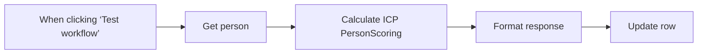

## Fluxo (.json) :

```json
{
  "meta": {
    "instanceId": "257476b1ef58bf3cb6a46e65fac7ee34a53a5e1a8492d5c6e4da5f87c9b82833"
  },
  "nodes": [
    {
      "id": "45ae6e88-3fda-4e95-84db-085a895cc564",
      "name": "When clicking ‘Test workflow’",
      "type": "n8n-nodes-base.manualTrigger",
      "position": [
        260,
        -100
      ],
      "parameters": {},
      "typeVersion": 1
    },
    {
      "id": "09f71a7c-1219-426d-8563-fa05654cab44",
      "name": "Calculate ICP PersonScoring",
      "type": "n8n-nodes-base.airtop",
      "position": [
        700,
        -100
      ],
      "parameters": {
        "url": "={{ $json['Linkedin_URL_Person'] }}",
        "prompt": "Please extract the following information from the LinkedIn profile page:\n\n1. **Full Name**: Extract the full name of the individual.\n2. **Current or Most Recent Job Title**: Identify the job title next to the logo of the current or last employer.\n3a. **Current or Most Recent Employer**: Extract the name of the first company in the employment experience block. \n3b. Linkedin Company URL of the Current or Most Recent Employer: Extract the link of the first company in the employment experience block\n4. **Location**: Extract the location of the individual.\n5. **Number of Connections**: Extract the number of connections the individual has.\n6. **Number of Followers**: Extract the number of followers the individual has.\n7. **About Section Text**: Extract the text from the 'About' section.\n8. **Interest Level in AI**: Determine the person's interest level in AI (e.g., beginner, intermediate, advanced, expert).\n9. **Seniority Level**: Determine the seniority level of the person (e.g., junior, mid-level, senior, executive).\n10. **Technical Depth**: Determine the technical depth of the person (e.g., basic, intermediate, advanced, expert).\n11. **ICP Score**: Calculate the ICP Score based on the following criteria:\n    - AI Interest: beginner-5 pts, intermediate-10 pts, advanced-25 pts, expert-35 pts\n    - Technical Depth: basic-5 pts, intermediate-15 pts, advanced-25 pts, expert-35 pts\n    - Seniority Level: junior-5 pts, mid-level-15 pts, senior-25 pts, executive-30 pts\n    - Sum the points to get the ICP Score.\n\nEnsure that the extracted information is accurate and formatted according to the specified output schema.\n\nFor example, if the LinkedIn profile is of a senior software engineer with a strong interest in AI, return the following output:\n{\n  \"full_name\": \"Jane Doe\",\n  \"current_or_last_employer\": \"Tech Innovations Inc.\",\n  \"current_or_last_title\": \"Senior Software Engineer\",\n  \"location\": \"San Francisco, CA\",\n  \"number_of_connections\": 500,\n  \"number_of_followers\": 300,\n  \"about_section_text\": \"Experienced software engineer with a passion for developing innovative programs that expedite the efficiency and effectiveness of organizational success.\",\n  \"ai_interest_level\": \"advanced\",\n  \"seniority_level\": \"senior\",\n  \"technical_depth\": \"advanced\",\n  \"icp_score\": 85\n}\n",
        "resource": "extraction",
        "operation": "query",
        "sessionMode": "new",
        "additionalFields": {
          "outputSchema": "{\n  \"type\": \"object\",\n  \"properties\": {\n    \"full_name\": {\n      \"type\": \"string\",\n      \"description\": \"The full name of the individual.\"\n    },\n    \"current_or_last_title\": {\n      \"type\": \"string\",\n      \"description\": \"The job title next to the logo of the current or last employer.\"\n    },\n    \"current_or_last_employer\": {\n      \"type\": \"string\",\n      \"description\": \"The name of the first company in the employment experience block.\"\n    },\n    \"linkedin_company_url\": {\n      \"type\": \"string\",\n      \"description\": \"The LinkedIn URL of the first company in the employment experience block.\"\n    },\n    \"location\": {\n      \"type\": \"string\",\n      \"description\": \"The location of the individual.\"\n    },\n    \"number_of_connections\": {\n      \"type\": \"integer\",\n      \"description\": \"The number of connections the individual has.\"\n    },\n    \"number_of_followers\": {\n      \"type\": \"integer\",\n      \"description\": \"The number of followers the individual has.\"\n    },\n    \"about_section_text\": {\n      \"type\": \"string\",\n      \"description\": \"The text from the 'About' section.\"\n    },\n    \"ai_interest_level\": {\n      \"type\": \"string\",\n      \"description\": \"The person's interest level in AI.\"\n    },\n    \"seniority_level\": {\n      \"type\": \"string\",\n      \"description\": \"The seniority level of the person.\"\n    },\n    \"technical_depth\": {\n      \"type\": \"string\",\n      \"description\": \"The technical depth of the person.\"\n    },\n    \"icp_score\": {\n      \"type\": \"integer\",\n      \"description\": \"The ICP Score calculated based on AI interest, technical depth, and seniority level.\"\n    }\n  },\n  \"required\": [\n    \"full_name\",\n    \"current_or_last_title\",\n    \"current_or_last_employer\",\n    \"linkedin_company_url\",\n    \"location\",\n    \"number_of_connections\",\n    \"number_of_followers\",\n    \"about_section_text\",\n    \"ai_interest_level\",\n    \"seniority_level\",\n    \"technical_depth\",\n    \"icp_score\"\n  ],\n  \"additionalProperties\": false,\n  \"$schema\": \"http://json-schema.org/draft-07/schema#\"\n}\n"
        }
      },
      "typeVersion": 1
    },
    {
      "id": "28c2c1d4-f43f-46c6-b21d-fbaf5fed4efa",
      "name": "Format response",
      "type": "n8n-nodes-base.code",
      "position": [
        900,
        -100
      ],
      "parameters": {
        "mode": "runOnceForEachItem",
        "jsCode": "const row_number = $('Get person').item.json.row_number\nconst Linkedin_URL_Person = $('Get person').item.json.Linkedin_URL_Person\nconst ICP_Score_Person = JSON.parse($input.item.json.data.modelResponse).icp_score\n\nreturn { json: {\n  row_number,\n  Linkedin_URL_Person,\n  ICP_Score_Person\n}};"
      },
      "typeVersion": 2
    },
    {
      "id": "1646b60c-21f2-4222-bc4c-8660184fa46a",
      "name": "Update row",
      "type": "n8n-nodes-base.googleSheets",
      "position": [
        1120,
        -100
      ],
      "parameters": {
        "columns": {
          "value": {},
          "schema": [
            {
              "id": "Linkedin_URL_Person",
              "type": "string",
              "display": true,
              "required": false,
              "displayName": "Linkedin_URL_Person",
              "defaultMatch": false,
              "canBeUsedToMatch": true
            },
            {
              "id": "ICP_Score_Person",
              "type": "string",
              "display": true,
              "required": false,
              "displayName": "ICP_Score_Person",
              "defaultMatch": false,
              "canBeUsedToMatch": true
            },
            {
              "id": "row_number",
              "type": "string",
              "display": true,
              "removed": false,
              "readOnly": true,
              "required": false,
              "displayName": "row_number",
              "defaultMatch": false,
              "canBeUsedToMatch": true
            }
          ],
          "mappingMode": "autoMapInputData",
          "matchingColumns": [
            "row_number"
          ],
          "attemptToConvertTypes": false,
          "convertFieldsToString": false
        },
        "options": {},
        "operation": "update",
        "sheetName": {
          "__rl": true,
          "mode": "list",
          "value": "gid=0",
          "cachedResultUrl": "https://docs.google.com/spreadsheets/d/1WC_awgb-Ohtb0f4o_OJgRcvunTLuS8kFQgk6l8fkR2Q/edit#gid=0",
          "cachedResultName": "Person"
        },
        "documentId": {
          "__rl": true,
          "mode": "list",
          "value": "1WC_awgb-Ohtb0f4o_OJgRcvunTLuS8kFQgk6l8fkR2Q",
          "cachedResultUrl": "https://docs.google.com/spreadsheets/d/1WC_awgb-Ohtb0f4o_OJgRcvunTLuS8kFQgk6l8fkR2Q/edit?usp=drivesdk",
          "cachedResultName": "ICP Score for Template"
        }
      },
      "typeVersion": 4.5
    },
    {
      "id": "5a151773-1075-4a9f-9637-6241e7137638",
      "name": "Get person",
      "type": "n8n-nodes-base.googleSheets",
      "position": [
        480,
        -100
      ],
      "parameters": {
        "options": {},
        "sheetName": {
          "__rl": true,
          "mode": "list",
          "value": "gid=0",
          "cachedResultUrl": "https://docs.google.com/spreadsheets/d/1WC_awgb-Ohtb0f4o_OJgRcvunTLuS8kFQgk6l8fkR2Q/edit#gid=0",
          "cachedResultName": "Person"
        },
        "documentId": {
          "__rl": true,
          "mode": "list",
          "value": "1WC_awgb-Ohtb0f4o_OJgRcvunTLuS8kFQgk6l8fkR2Q",
          "cachedResultUrl": "https://docs.google.com/spreadsheets/d/1WC_awgb-Ohtb0f4o_OJgRcvunTLuS8kFQgk6l8fkR2Q/edit?usp=drivesdk",
          "cachedResultName": "ICP Score for Template"
        }
      },
      "typeVersion": 4.5
    }
  ],
  "pinData": {},
  "connections": {
    "Get person": {
      "main": [
        [
          {
            "node": "Calculate ICP PersonScoring",
            "type": "main",
            "index": 0
          }
        ]
      ]
    },
    "Format response": {
      "main": [
        [
          {
            "node": "Update row",
            "type": "main",
            "index": 0
          }
        ]
      ]
    },
    "Calculate ICP PersonScoring": {
      "main": [
        [
          {
            "node": "Format response",
            "type": "main",
            "index": 0
          }
        ]
      ]
    },
    "When clicking ‘Test workflow’": {
      "main": [
        [
          {
            "node": "Get person",
            "type": "main",
            "index": 0
          }
        ]
      ]
    }
  }
}
```

<a id="template-341"></a>

## Template 341 - Configurar medoids e limiares para detecção de anomalias

- **Nome:** Configurar medoids e limiares para detecção de anomalias
- **Descrição:** Fluxo preparatório que identifica pontos representativos (medoids) de cada classe de cultura e calcula limiares de similaridade para permitir posterior detecção de anomalias.
- **Funcionalidade:** • Inicialização de variáveis de cluster: Define URL do cluster e coleção alvo para operações vetoriais.
• Contagem total de pontos: Obtém o número total de pontos na coleção para uso em consultas posteriores.
• Cálculo de distribuições por cultura: Executa consultas de facet para saber quais culturas existem e seus tamanhos.
• Medoid por matriz de distância: Para cada cultura, chama a API de matriz de distâncias, constrói matriz esparsa e escolhe o ponto mais representativo (medoid) com base em somatório de similaridades.
• Marcação de medoid na base: Atualiza o payload do ponto escolhido para sinalizar que é um medoid (is_medoid).
• Medoid por embedding textual multimodal: Gera embedding de descrição textual da cultura com modelo multimodal, busca a imagem mais próxima a essa descrição e marca esse ponto como medoid textual (is_text_anchor_medoid).
• Cálculo de limiar de classe: Para cada medoid obtém-se o vetor, calcula-se o vetor oposto, busca-se o ponto mais distante dentro da mesma classe e define-se a similaridade desse ponto como limiar de anomalia; salva esse limiar no payload do medoid.
• Persistência de metadados para detecção: Armazena os medoids e seus limiares na coleção para uso posterior em pipelines de detecção de anomalias.
- **Ferramentas:** • Qdrant Cloud: Banco de vetores usado para armazenar vetores, executar buscas vetoriais, consultas facet e gerar matriz de distâncias por cluster.
• Voyage AI (Embeddings API): Serviço de embeddings multimodais usado para transformar descrições textuais das culturas em vetores de consulta.
• SciPy (biblioteca Python): Biblioteca usada para construir e manipular matrizes esparsas e calcular o medoid a partir da matriz de distâncias.
• Python (runtime): Ambiente para executar código personalizado (ex.: cálculo em Python para escolher medoid a partir da matriz esparsa).
• Kaggle (dataset "crops"): Fonte dos dados de imagens de culturas utilizados para popular a coleção e treinar/avaliar representatividade.
• Google Cloud Storage: Local sugerido para hospedar o dataset de imagens antes do upload para o banco de vetores.


## Fluxo visual

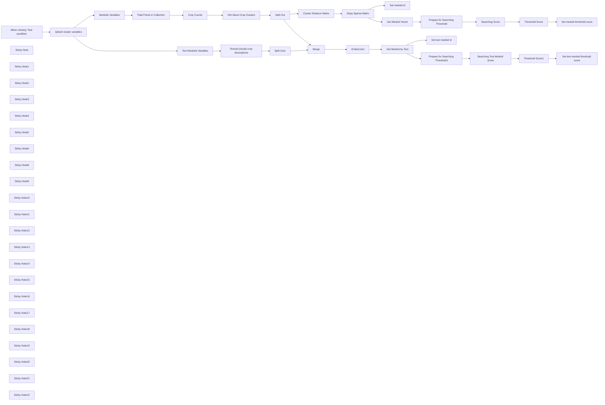

## Fluxo (.json) :

```json
{
  "id": "m9aACcHqydEbH4nR",
  "meta": {
    "instanceId": "205b3bc06c96f2dc835b4f00e1cbf9a937a74eeb3b47c99d0c30b0586dbf85aa"
  },
  "name": "[2/3] Set up medoids (2 types) for anomaly detection (crops dataset)",
  "tags": [
    {
      "id": "spMntyrlE9ydvWFA",
      "name": "anomaly-detection",
      "createdAt": "2024-12-08T22:05:15.945Z",
      "updatedAt": "2024-12-09T12:50:19.287Z"
    }
  ],
  "nodes": [
    {
      "id": "edaa871e-2b79-400e-8328-333d250bfdd2",
      "name": "When clicking ‘Test workflow’",
      "type": "n8n-nodes-base.manualTrigger",
      "position": [
        -660,
        -220
      ],
      "parameters": {},
      "typeVersion": 1
    },
    {
      "id": "ebd964de-faa4-4dc0-9245-cc9154b9ce02",
      "name": "Total Points in Collection",
      "type": "n8n-nodes-base.httpRequest",
      "position": [
        180,
        -220
      ],
      "parameters": {
        "url": "={{ $('Qdrant cluster variables').item.json.qdrantCloudURL }}/collections/{{ $('Qdrant cluster variables').item.json.collectionName }}/points/count",
        "method": "POST",
        "options": {},
        "jsonBody": "={\n \"exact\": true\n}",
        "sendBody": true,
        "specifyBody": "json",
        "authentication": "predefinedCredentialType",
        "nodeCredentialType": "qdrantApi"
      },
      "credentials": {
        "qdrantApi": {
          "id": "it3j3hP9FICqhgX6",
          "name": "QdrantApi account"
        }
      },
      "typeVersion": 4.2
    },
    {
      "id": "b51f6344-d090-4341-a908-581b78664b07",
      "name": "Cluster Distance Matrix",
      "type": "n8n-nodes-base.httpRequest",
      "position": [
        1200,
        -360
      ],
      "parameters": {
        "url": "={{ $('Qdrant cluster variables').first().json.qdrantCloudURL }}/collections/{{ $('Qdrant cluster variables').first().json.collectionName }}/points/search/matrix/offsets",
        "method": "POST",
        "options": {},
        "jsonBody": "={{\n{\n \"sample\": $json.maxClusterSize,\n \"limit\": $json.maxClusterSize,\n \"using\": \"voyage\",\n \"filter\": {\n \"must\": {\n \"key\": \"crop_name\",\n \"match\": { \"value\": $json.cropName }\n }\n }\n}\n}}",
        "sendBody": true,
        "specifyBody": "json",
        "authentication": "predefinedCredentialType",
        "nodeCredentialType": "qdrantApi"
      },
      "credentials": {
        "qdrantApi": {
          "id": "it3j3hP9FICqhgX6",
          "name": "QdrantApi account"
        }
      },
      "typeVersion": 4.2
    },
    {
      "id": "bebe5249-b138-4d7a-84b8-51eaed4331b8",
      "name": "Scipy Sparse Matrix",
      "type": "n8n-nodes-base.code",
      "position": [
        1460,
        -360
      ],
      "parameters": {
        "mode": "runOnceForEachItem",
        "language": "python",
        "pythonCode": "from scipy.sparse import coo_array\n\ncluster = _input.item.json['result']\n\nscores = list(cluster['scores'])\noffsets_row = list(cluster['offsets_row'])\noffsets_col = list(cluster['offsets_col'])\n\ncluster_matrix = coo_array((scores, (offsets_row, offsets_col)))\nthe_most_similar_to_others = cluster_matrix.sum(axis=1).argmax()\n\nreturn {\n \"json\": {\n \"medoid_id\": cluster[\"ids\"][the_most_similar_to_others]\n }\n}\n"
      },
      "typeVersion": 2
    },
    {
      "id": "006c38bb-a271-40e1-9c5b-5a0a29ea96de",
      "name": "Set medoid id",
      "type": "n8n-nodes-base.httpRequest",
      "position": [
        2000,
        -680
      ],
      "parameters": {
        "url": "={{ $('Qdrant cluster variables').first().json.qdrantCloudURL }}/collections/{{ $('Qdrant cluster variables').first().json.collectionName }}/points/payload",
        "method": "POST",
        "options": {},
        "jsonBody": "={{\n{\n \"payload\": {\"is_medoid\": true},\n \"points\": [$json.medoid_id]\n}\n}}",
        "sendBody": true,
        "specifyBody": "json",
        "authentication": "predefinedCredentialType",
        "nodeCredentialType": "qdrantApi"
      },
      "credentials": {
        "qdrantApi": {
          "id": "it3j3hP9FICqhgX6",
          "name": "QdrantApi account"
        }
      },
      "typeVersion": 4.2
    },
    {
      "id": "aeeccfc5-67bf-4047-8a5a-8830e4fc87e8",
      "name": "Get Medoid Vector",
      "type": "n8n-nodes-base.httpRequest",
      "position": [
        2000,
        -360
      ],
      "parameters": {
        "url": "={{ $('Qdrant cluster variables').first().json.qdrantCloudURL }}/collections/{{ $('Qdrant cluster variables').first().json.collectionName }}/points",
        "method": "POST",
        "options": {},
        "jsonBody": "={{\n{\n \"ids\": [$json.medoid_id],\n \"with_vector\": true,\n \"with_payload\": true\n}\n}}",
        "sendBody": true,
        "specifyBody": "json",
        "authentication": "predefinedCredentialType",
        "nodeCredentialType": "qdrantApi"
      },
      "credentials": {
        "qdrantApi": {
          "id": "it3j3hP9FICqhgX6",
          "name": "QdrantApi account"
        }
      },
      "typeVersion": 4.2
    },
    {
      "id": "11fe54d5-9dc8-49ce-9e3f-1103ace0a3d5",
      "name": "Prepare for Searching Threshold",
      "type": "n8n-nodes-base.set",
      "position": [
        2240,
        -360
      ],
      "parameters": {
        "options": {},
        "assignments": {
          "assignments": [
            {
              "id": "6faa5949-968c-42bf-8ce8-cf2403566eba",
              "name": "oppositeOfCenterVector",
              "type": "array",
              "value": "={{ $json.result[0].vector.voyage.map(value => value * -1)}}"
            },
            {
              "id": "84eb42be-2ea5-4a76-9c76-f21a962360a3",
              "name": "cropName",
              "type": "string",
              "value": "={{ $json.result[0].payload.crop_name }}"
            },
            {
              "id": "b68d2e42-0dde-4875-bb59-056f29b6ac0a",
              "name": "centerId",
              "type": "string",
              "value": "={{ $json.result[0].id }}"
            }
          ]
        }
      },
      "typeVersion": 3.4
    },
    {
      "id": "4051b488-2e2e-4d33-9cc9-e1403c9173ed",
      "name": "Searching Score",
      "type": "n8n-nodes-base.httpRequest",
      "position": [
        2500,
        -360
      ],
      "parameters": {
        "url": "={{ $('Qdrant cluster variables').first().json.qdrantCloudURL }}/collections/{{ $('Qdrant cluster variables').first().json.collectionName }}/points/query",
        "method": "POST",
        "options": {},
        "jsonBody": "={{\n{\n \"query\": $json.oppositeOfCenterVector,\n \"using\": \"voyage\",\n \"exact\": true,\n \"filter\": {\n \"must\": [\n {\n \"key\": \"crop_name\",\n \"match\": {\"value\": $json.cropName }\n }\n ]\n },\n \"limit\": $('Medoids Variables').first().json.furthestFromCenter,\n \"with_payload\": true\n}\n}}",
        "sendBody": true,
        "specifyBody": "json",
        "authentication": "predefinedCredentialType",
        "nodeCredentialType": "qdrantApi"
      },
      "credentials": {
        "qdrantApi": {
          "id": "it3j3hP9FICqhgX6",
          "name": "QdrantApi account"
        }
      },
      "typeVersion": 4.2
    },
    {
      "id": "1c6cb6ee-ce3a-4d1a-b1b4-1e59e9a8f5b6",
      "name": "Threshold Score",
      "type": "n8n-nodes-base.set",
      "position": [
        2760,
        -360
      ],
      "parameters": {
        "options": {},
        "assignments": {
          "assignments": [
            {
              "id": "579a2ee4-0ab2-4fde-909a-01166624c9d8",
              "name": "thresholdScore",
              "type": "number",
              "value": "={{ $json.result.points.last().score * -1 }}"
            },
            {
              "id": "11eab775-f709-40a9-b0fe-d1059b67de05",
              "name": "centerId",
              "type": "string",
              "value": "={{ $('Prepare for Searching Threshold').item.json.centerId }}"
            }
          ]
        }
      },
      "typeVersion": 3.4
    },
    {
      "id": "1bab1b9e-7b80-4ef3-8e3d-be4874792e58",
      "name": "Set medoid threshold score",
      "type": "n8n-nodes-base.httpRequest",
      "position": [
        2940,
        -360
      ],
      "parameters": {
        "url": "={{ $('Qdrant cluster variables').first().json.qdrantCloudURL }}/collections/{{ $('Qdrant cluster variables').first().json.collectionName }}/points/payload",
        "method": "POST",
        "options": {},
        "jsonBody": "={{\n{\n \"payload\": {\"is_medoid_cluster_threshold\": $json.thresholdScore },\n \"points\": [$json.centerId]\n}\n}}",
        "sendBody": true,
        "specifyBody": "json",
        "authentication": "predefinedCredentialType",
        "nodeCredentialType": "qdrantApi"
      },
      "credentials": {
        "qdrantApi": {
          "id": "it3j3hP9FICqhgX6",
          "name": "QdrantApi account"
        }
      },
      "typeVersion": 4.2
    },
    {
      "id": "cd5af197-4d79-49c2-aba6-a20571bd5c2e",
      "name": "Split Out1",
      "type": "n8n-nodes-base.splitOut",
      "position": [
        860,
        80
      ],
      "parameters": {
        "options": {
          "destinationFieldName": ""
        },
        "fieldToSplitOut": "['text anchors']"
      },
      "typeVersion": 1
    },
    {
      "id": "956c126c-8bd6-4390-8704-3f0a5a2ce479",
      "name": "Merge",
      "type": "n8n-nodes-base.merge",
      "position": [
        1200,
        -80
      ],
      "parameters": {
        "mode": "combine",
        "options": {},
        "fieldsToMatchString": "cropName"
      },
      "typeVersion": 3
    },
    {
      "id": "54a5d467-4985-49b5-9f13-e6563acf08b3",
      "name": "Textual (visual) crop descriptions",
      "type": "n8n-nodes-base.set",
      "position": [
        380,
        80
      ],
      "parameters": {
        "mode": "raw",
        "options": {},
        "jsonOutput": "{\"text anchors\": [{\"cropName\": \"pearl_millet(bajra)\", \"cropDescription\": \"pearl_millet(bajra) - Tall stalks with cylindrical, spiked green grain heads.\"},\n{\"cropName\": \"tobacco-plant\", \"cropDescription\": \"tobacco-plant - Broad, oval leaves and small tubular flowers, typically pink or white.\"},\n{\"cropName\": \"cherry\", \"cropDescription\": \"cherry - Small, glossy red fruits on a medium-sized tree with slender branches and serrated leaves.\"},\n{\"cropName\": \"cotton\", \"cropDescription\": \"cotton - Bushy plant with fluffy white fiber-filled pods and lobed green leaves.\"},\n{\"cropName\": \"banana\", \"cropDescription\": \"banana - Tall herbaceous plant with broad, elongated green leaves and hanging bunches of yellow fruits.\"},\n{\"cropName\": \"cucumber\", \"cropDescription\": \"cucumber - Creeping vine with yellow flowers and elongated green cylindrical fruits.\"},\n{\"cropName\": \"maize\", \"cropDescription\": \"maize - Tall stalks with broad leaves, tassels at the top, and ears of corn sheathed in husks.\"},\n{\"cropName\": \"wheat\", \"cropDescription\": \"wheat - Slender, upright stalks with narrow green leaves and golden, spiky grain heads.\"},\n{\"cropName\": \"clove\", \"cropDescription\": \"clove - Small tree with oval green leaves and clusters of unopened reddish flower buds.\"},\n{\"cropName\": \"jowar\", \"cropDescription\": \"jowar - Tall grass-like plant with broad leaves and round, compact grain clusters at the top.\"},\n{\"cropName\": \"olive-tree\", \"cropDescription\": \"olive-tree - Medium-sized tree with silvery-green leaves and small oval green or black fruits.\"},\n{\"cropName\": \"soyabean\", \"cropDescription\": \"soyabean - Bushy plant with trifoliate green leaves and small pods containing rounded beans.\"},\n{\"cropName\": \"coffee-plant\", \"cropDescription\": \"coffee-plant - Shrub with shiny dark green leaves and clusters of small white flowers, followed by red berries.\"},\n{\"cropName\": \"rice\", \"cropDescription\": \"rice - Short, water-loving grass with narrow green leaves and drooping golden grain heads.\"},\n{\"cropName\": \"lemon\", \"cropDescription\": \"lemon - Small tree with glossy green leaves and oval yellow fruits.\"},\n{\"cropName\": \"mustard-oil\", \"cropDescription\": \"mustard-oil - Small herbaceous plant with yellow flowers and slender seed pods.\"},\n{\"cropName\": \"vigna-radiati(mung)\", \"cropDescription\": \"vigna-radiati(mung) - Low-growing plant with trifoliate leaves and small green pods containing mung beans.\"},\n{\"cropName\": \"coconut\", \"cropDescription\": \"coconut - Tall palm tree with feathery leaves and large round fibrous fruits.\"},\n{\"cropName\": \"gram\", \"cropDescription\": \"gram - Low bushy plant with feathery leaves and small pods containing round seeds.\"},\n{\"cropName\": \"pineapple\", \"cropDescription\": \"pineapple - Low plant with spiky, sword-shaped leaves and large, spiky golden fruits.\"},\n{\"cropName\": \"sugarcane\", \"cropDescription\": \"sugarcane - Tall, jointed stalks with long narrow leaves and a sweet interior.\"},\n{\"cropName\": \"sunflower\", \"cropDescription\": \"sunflower - Tall plant with rough green leaves and large bright yellow flower heads.\"},\n{\"cropName\": \"chilli\", \"cropDescription\": \"chilli - Small bushy plant with slender green or red elongated fruits.\"},\n{\"cropName\": \"fox_nut(makhana)\", \"cropDescription\": \"fox_nut(makhana) - Aquatic plant with floating round leaves and spiny white seeds.\"},\n{\"cropName\": \"jute\", \"cropDescription\": \"jute - Tall plant with long, straight stalks and narrow green leaves.\"},\n{\"cropName\": \"papaya\", \"cropDescription\": \"papaya - Medium-sized tree with hollow trunk, large lobed leaves, and yellow-orange pear-shaped fruits.\"},\n{\"cropName\": \"tea\", \"cropDescription\": \"tea - Small shrub with glossy dark green leaves and small white flowers.\"},\n{\"cropName\": \"cardamom\", \"cropDescription\": \"cardamom - Low tropical plant with broad leaves and clusters of small, light green pods.\"},\n{\"cropName\": \"almond\", \"cropDescription\": \"almond - Medium-sized tree with serrated leaves and oval green pods containing edible nuts.\"}]}\n"
      },
      "typeVersion": 3.4
    },
    {
      "id": "14c25e76-8a2c-4df8-98ea-b2f31b15fd1f",
      "name": "Embed text",
      "type": "n8n-nodes-base.httpRequest",
      "position": [
        1460,
        -80
      ],
      "parameters": {
        "url": "https://api.voyageai.com/v1/multimodalembeddings",
        "method": "POST",
        "options": {},
        "jsonBody": "={{\n{\n \"inputs\": [\n {\n \"content\": [\n {\n \"type\": \"text\",\n \"text\": $json.cropDescription\n }\n ]\n }\n ],\n \"model\": \"voyage-multimodal-3\",\n \"input_type\": \"query\"\n}\n}}",
        "sendBody": true,
        "specifyBody": "json",
        "authentication": "genericCredentialType",
        "genericAuthType": "httpHeaderAuth"
      },
      "credentials": {
        "httpHeaderAuth": {
          "id": "Vb0RNVDnIHmgnZOP",
          "name": "Voyage API"
        }
      },
      "typeVersion": 4.2
    },
    {
      "id": "8763db0a-9a92-4ffd-8a40-c7db614b735f",
      "name": "Get Medoid by Text",
      "type": "n8n-nodes-base.httpRequest",
      "position": [
        1640,
        -80
      ],
      "parameters": {
        "url": "={{ $('Qdrant cluster variables').first().json.qdrantCloudURL }}/collections/{{ $('Qdrant cluster variables').first().json.collectionName }}/points/query",
        "method": "POST",
        "options": {},
        "jsonBody": "={{\n{\n \"query\": $json.data[0].embedding,\n \"using\": \"voyage\",\n \"exact\": true,\n \"filter\": {\n \"must\": [\n {\n \"key\": \"crop_name\",\n \"match\": {\"value\": $('Merge').item.json.cropName }\n }\n ]\n },\n \"limit\": 1,\n \"with_payload\": true,\n \"with_vector\": true\n}\n}}",
        "sendBody": true,
        "specifyBody": "json",
        "authentication": "predefinedCredentialType",
        "nodeCredentialType": "qdrantApi"
      },
      "credentials": {
        "qdrantApi": {
          "id": "it3j3hP9FICqhgX6",
          "name": "QdrantApi account"
        }
      },
      "typeVersion": 4.2
    },
    {
      "id": "5c770ca2-6e1a-4c4b-80e0-dcbeeda43a0f",
      "name": "Set text medoid id",
      "type": "n8n-nodes-base.httpRequest",
      "position": [
        2000,
        160
      ],
      "parameters": {
        "url": "={{ $('Qdrant cluster variables').first().json.qdrantCloudURL }}/collections/{{ $('Qdrant cluster variables').first().json.collectionName }}/points/payload",
        "method": "POST",
        "options": {},
        "jsonBody": "={{\n{\n \"payload\": {\"is_text_anchor_medoid\": true},\n \"points\": [$json.result.points[0].id]\n}\n}}",
        "sendBody": true,
        "specifyBody": "json",
        "authentication": "predefinedCredentialType",
        "nodeCredentialType": "qdrantApi"
      },
      "credentials": {
        "qdrantApi": {
          "id": "it3j3hP9FICqhgX6",
          "name": "QdrantApi account"
        }
      },
      "typeVersion": 4.2
    },
    {
      "id": "c08ff472-51ab-4c3d-b9c0-2170fda2ccef",
      "name": "Prepare for Searching Threshold1",
      "type": "n8n-nodes-base.set",
      "position": [
        2300,
        80
      ],
      "parameters": {
        "options": {},
        "assignments": {
          "assignments": [
            {
              "id": "6faa5949-968c-42bf-8ce8-cf2403566eba",
              "name": "oppositeOfCenterVector",
              "type": "array",
              "value": "={{ $json.result.points[0].vector.voyage.map(value => value * -1)}}"
            },
            {
              "id": "84eb42be-2ea5-4a76-9c76-f21a962360a3",
              "name": "cropName",
              "type": "string",
              "value": "={{ $json.result.points[0].payload.crop_name }}"
            },
            {
              "id": "b68d2e42-0dde-4875-bb59-056f29b6ac0a",
              "name": "centerId",
              "type": "string",
              "value": "={{ $json.result.points[0].id }}"
            }
          ]
        }
      },
      "typeVersion": 3.4
    },
    {
      "id": "84ba4de5-aa9b-43fb-89cb-70db0b3ca334",
      "name": "Threshold Score1",
      "type": "n8n-nodes-base.set",
      "position": [
        2820,
        80
      ],
      "parameters": {
        "options": {},
        "assignments": {
          "assignments": [
            {
              "id": "579a2ee4-0ab2-4fde-909a-01166624c9d8",
              "name": "thresholdScore",
              "type": "number",
              "value": "={{ $json.result.points.last().score * -1 }}"
            },
            {
              "id": "11eab775-f709-40a9-b0fe-d1059b67de05",
              "name": "centerId",
              "type": "string",
              "value": "={{ $('Prepare for Searching Threshold1').item.json.centerId }}"
            }
          ]
        }
      },
      "typeVersion": 3.4
    },
    {
      "id": "f490d224-38a8-4087-889d-1addb4472471",
      "name": "Searching Text Medoid Score",
      "type": "n8n-nodes-base.httpRequest",
      "position": [
        2560,
        80
      ],
      "parameters": {
        "url": "={{ $('Qdrant cluster variables').first().json.qdrantCloudURL }}/collections/{{ $('Qdrant cluster variables').first().json.collectionName }}/points/query",
        "method": "POST",
        "options": {},
        "jsonBody": "={{\n{\n \"query\": $json.oppositeOfCenterVector,\n \"using\": \"voyage\",\n \"exact\": true,\n \"filter\": {\n \"must\": [\n {\n \"key\": \"crop_name\",\n \"match\": {\"value\": $json.cropName }\n }\n ]\n },\n \"limit\": $('Text Medoids Variables').first().json.furthestFromCenter,\n \"with_payload\": true\n}\n}}",
        "sendBody": true,
        "specifyBody": "json",
        "authentication": "predefinedCredentialType",
        "nodeCredentialType": "qdrantApi"
      },
      "credentials": {
        "qdrantApi": {
          "id": "it3j3hP9FICqhgX6",
          "name": "QdrantApi account"
        }
      },
      "typeVersion": 4.2
    },
    {
      "id": "f5035aca-1706-4c8d-bd26-49b3451ae04b",
      "name": "Medoids Variables",
      "type": "n8n-nodes-base.set",
      "position": [
        -140,
        -220
      ],
      "parameters": {
        "options": {},
        "assignments": {
          "assignments": [
            {
              "id": "5eb23ad2-aacd-468f-9a27-ef2b63e6bd08",
              "name": "furthestFromCenter",
              "type": "number",
              "value": 5
            }
          ]
        }
      },
      "typeVersion": 3.4
    },
    {
      "id": "c9cad66d-4a76-4092-bfd6-4860493f942a",
      "name": "Text Medoids Variables",
      "type": "n8n-nodes-base.set",
      "position": [
        -140,
        80
      ],
      "parameters": {
        "options": {},
        "assignments": {
          "assignments": [
            {
              "id": "5eb23ad2-aacd-468f-9a27-ef2b63e6bd08",
              "name": "furthestFromCenter",
              "type": "number",
              "value": 1
            }
          ]
        }
      },
      "typeVersion": 3.4
    },
    {
      "id": "ecab63f7-7a72-425a-8f5a-0c707e7f77bc",
      "name": "Qdrant cluster variables",
      "type": "n8n-nodes-base.set",
      "position": [
        -420,
        -220
      ],
      "parameters": {
        "options": {},
        "assignments": {
          "assignments": [
            {
              "id": "58b7384d-fd0c-44aa-9f8e-0306a99be431",
              "name": "qdrantCloudURL",
              "type": "string",
              "value": "=https://152bc6e2-832a-415c-a1aa-fb529f8baf8d.eu-central-1-0.aws.cloud.qdrant.io"
            },
            {
              "id": "e34c4d88-b102-43cc-a09e-e0553f2da23a",
              "name": "collectionName",
              "type": "string",
              "value": "=agricultural-crops"
            }
          ]
        }
      },
      "typeVersion": 3.4
    },
    {
      "id": "6e81f0b0-3843-467e-9c93-40026e57fa91",
      "name": "Info About Crop Clusters",
      "type": "n8n-nodes-base.set",
      "position": [
        600,
        -220
      ],
      "parameters": {
        "options": {},
        "assignments": {
          "assignments": [
            {
              "id": "5327b254-b703-4a34-a398-f82edb1d6d6b",
              "name": "=cropsNumber",
              "type": "number",
              "value": "={{ $json.result.hits.length }}"
            },
            {
              "id": "79168efa-11b8-4a7b-8851-da9c8cbd700b",
              "name": "maxClusterSize",
              "type": "number",
              "value": "={{ Math.max(...$json.result.hits.map(item => item.count)) }}"
            },
            {
              "id": "e1367cec-9629-4c69-a8d7-3eeae3ac94d3",
              "name": "cropNames",
              "type": "array",
              "value": "={{ $json.result.hits.map(item => item.value)}}"
            }
          ]
        }
      },
      "typeVersion": 3.4
    },
    {
      "id": "20191c0a-5310-48f2-8be4-1d160f237db2",
      "name": "Crop Counts",
      "type": "n8n-nodes-base.httpRequest",
      "position": [
        380,
        -220
      ],
      "parameters": {
        "url": "={{ $('Qdrant cluster variables').first().json.qdrantCloudURL }}/collections/{{ $('Qdrant cluster variables').first().json.collectionName }}/facet",
        "method": "POST",
        "options": {},
        "jsonBody": "={{\n{\n \"key\": \"crop_name\",\n \"limit\": $json.result.count,\n \"exact\": true\n}\n}}",
        "sendBody": true,
        "specifyBody": "json",
        "authentication": "predefinedCredentialType",
        "nodeCredentialType": "qdrantApi"
      },
      "credentials": {
        "qdrantApi": {
          "id": "it3j3hP9FICqhgX6",
          "name": "QdrantApi account"
        }
      },
      "typeVersion": 4.2
    },
    {
      "id": "a81103bb-6522-49a2-8102-83c7e004b9b3",
      "name": "Sticky Note",
      "type": "n8n-nodes-base.stickyNote",
      "position": [
        -1260,
        -340
      ],
      "parameters": {
        "width": 520,
        "height": 240,
        "content": "## Setting Up Medoids for Anomaly Detection\n### Preparatory workflow to set cluster centres and cluster threshold scores, so anomalies can be detected based on these thresholds\nHere, we're using two approaches to set up these centres: the upper branch is the *\"distance matrix approach\"*, and the lower is the *\"multimodal embedding model approach\"*."
      },
      "typeVersion": 1
    },
    {
      "id": "38fc8252-7e27-450d-b09e-59ceaebc5378",
      "name": "Sticky Note1",
      "type": "n8n-nodes-base.stickyNote",
      "position": [
        -420,
        -340
      ],
      "parameters": {
        "height": 80,
        "content": "Once again, variables for Qdrant: cluster URL and a collection we're working with"
      },
      "typeVersion": 1
    },
    {
      "id": "2d0e3b52-d382-428c-9b37-870f4c53b8e7",
      "name": "Sticky Note2",
      "type": "n8n-nodes-base.stickyNote",
      "position": [
        -140,
        -360
      ],
      "parameters": {
        "height": 100,
        "content": "Which point in the cluster we're using to draw threshold on: the furthest one from center, or the 2nd, ... Xth furthest one;"
      },
      "typeVersion": 1
    },
    {
      "id": "b0b300f3-e2c9-4c36-8a1d-6705932c296c",
      "name": "Sticky Note3",
      "type": "n8n-nodes-base.stickyNote",
      "position": [
        380,
        -500
      ],
      "parameters": {
        "width": 180,
        "height": 240,
        "content": "Here we are getting [facet counts](https://qdrant.tech/documentation/concepts/payload/?q=facet#facet-counts): information which unique values are there behind *\"crop_name\"* payload and how many points have these values (for example, we have 31 *\"cucumber\"* and 29 *\"cotton\"*)"
      },
      "typeVersion": 1
    },
    {
      "id": "0d2584da-5fd0-4830-b329-c78b0debf584",
      "name": "Sticky Note4",
      "type": "n8n-nodes-base.stickyNote",
      "position": [
        -140,
        260
      ],
      "parameters": {
        "height": 120,
        "content": "Which point in the cluster we're using to draw threshold on: the furthest one from center, or the 2nd, ... Xth furthest one;\n<this is the 2nd approach>"
      },
      "typeVersion": 1
    },
    {
      "id": "f4c98469-d426-415c-916d-1bc442cf6a21",
      "name": "Sticky Note5",
      "type": "n8n-nodes-base.stickyNote",
      "position": [
        120,
        -400
      ],
      "parameters": {
        "height": 140,
        "content": "We need to get the [total amount of points](https://qdrant.tech/documentation/concepts/points/?q=count#counting-points) in Qdrant collection to use it as a `limit` in the *\"Crop Counts\"* node, so we won't lose any information;\n<not the best practice per se>"
      },
      "typeVersion": 1
    },
    {
      "id": "037af9df-34c4-488d-8c89-561ac25247c4",
      "name": "Sticky Note6",
      "type": "n8n-nodes-base.stickyNote",
      "position": [
        600,
        -640
      ],
      "parameters": {
        "width": 220,
        "height": 380,
        "content": "Here we're extracting and gathering all the information about crop clusters, so we can call [Qdrant distance matrix API](https://qdrant.tech/documentation/concepts/explore/?q=distance+#distance-matrix) for each cluster.\nWe're propagating **the biggest cluster size** (of labeled data, in our case all data is labeled; for real use cases don't call distance matrix API if your labeled data is more than a couple of hundreds), **the number of unique crop values** and **unique crop values** themselves. We will run the algorithm once per unique crop cluster (to find it's center and threshold)."
      },
      "typeVersion": 1
    },
    {
      "id": "b4e635e3-233d-4358-ad11-250a2b14a2f7",
      "name": "Sticky Note8",
      "type": "n8n-nodes-base.stickyNote",
      "position": [
        380,
        260
      ],
      "parameters": {
        "height": 200,
        "content": "Hardcoded descriptions on how each crop usually looks; They were generated with chatGPT, and that can be technically done directly in n8n based on the crop name or a crop picture (we need a good description of how the most normal specimen of a crop looks like)"
      },
      "typeVersion": 1
    },
    {
      "id": "4fda1841-e7e3-4bd2-acf2-ee7338598184",
      "name": "Sticky Note9",
      "type": "n8n-nodes-base.stickyNote",
      "position": [
        1200,
        -800
      ],
      "parameters": {
        "height": 400,
        "content": "Calling [distance matrix API](https://qdrant.tech/documentation/concepts/explore/?q=distance+#distance-matrix) once per cluster. \n\n`sample` - how many points we are sampling (here filtered by `crop_name` field, so we are sampling within each cluster, and since we are passing the biggest cluster size to `sample`, we will get all points from each cluster.\n\n`limit` is the number of neighbours distance to which we will see calculated. Since we want all pairwise distances between the points within a cluster, here we're once again setting an upper limit equal to the biggest cluster size; "
      },
      "typeVersion": 1
    },
    {
      "id": "19c4bb6d-abcb-423b-b883-48c779d0307d",
      "name": "Split Out",
      "type": "n8n-nodes-base.splitOut",
      "position": [
        860,
        -220
      ],
      "parameters": {
        "include": "allOtherFields",
        "options": {
          "destinationFieldName": "cropName"
        },
        "fieldToSplitOut": "cropNames"
      },
      "typeVersion": 1
    },
    {
      "id": "f6d74ced-1998-4dbd-ab04-ca1b6ea409a5",
      "name": "Sticky Note10",
      "type": "n8n-nodes-base.stickyNote",
      "position": [
        840,
        -60
      ],
      "parameters": {
        "width": 150,
        "height": 80,
        "content": "Splitting out into each unique crop cluster"
      },
      "typeVersion": 1
    },
    {
      "id": "b3adb2bc-61f5-42ff-bb5d-11faa12189b7",
      "name": "Sticky Note11",
      "type": "n8n-nodes-base.stickyNote",
      "position": [
        1460,
        -640
      ],
      "parameters": {
        "width": 180,
        "height": 240,
        "content": "Using distance matrix generated by Qdrant and `coo_array` from `scipy`, we're finding a **representative** for each cluster (point which is the most similar to all other points within a cluster, based on the **Cosine** distance)"
      },
      "typeVersion": 1
    },
    {
      "id": "d9d3953e-8b69-4b6a-86f2-b2d2db28d4ad",
      "name": "Sticky Note12",
      "type": "n8n-nodes-base.stickyNote",
      "position": [
        1200,
        100
      ],
      "parameters": {
        "height": 280,
        "content": "To find a **representative** with this approach, we:\n1) Embed descriptions of crops with the same Voyage model we used for images (we can do so, since model is multimodal)\n2) For each (crop) cluster, find an image the closest by **Cosine** similarity metric to this embedded description. We will consider it a perfect representative of the cluster"
      },
      "typeVersion": 1
    },
    {
      "id": "8751efd4-d85e-4dc8-86ef-90073d49b6df",
      "name": "Sticky Note13",
      "type": "n8n-nodes-base.stickyNote",
      "position": [
        1460,
        100
      ],
      "parameters": {
        "width": 160,
        "height": 140,
        "content": "Embedding descriptions with Voyage model \n[Note] mind `input_type`, it's *\"query\"*"
      },
      "typeVersion": 1
    },
    {
      "id": "652bc70a-4e6f-416a-977b-5d29ae9cb4f0",
      "name": "Sticky Note14",
      "type": "n8n-nodes-base.stickyNote",
      "position": [
        1640,
        100
      ],
      "parameters": {
        "height": 260,
        "content": "Find the closest image to the description embeddings (done per cluster)\n[Note] Mind `exact` parameter\n[Note] `limit` is 1 because vector database always returns points sorted by distance from the most similar one to the least\n[Note] `using` parameter is here because our vectors uploaded in the previous pipeline are named *\"voyage\"*."
      },
      "typeVersion": 1
    },
    {
      "id": "a5836982-0de0-4692-883c-267602468ed2",
      "name": "Set text medoid threshold score",
      "type": "n8n-nodes-base.httpRequest",
      "position": [
        3000,
        80
      ],
      "parameters": {
        "url": "={{ $('Qdrant cluster variables').first().json.qdrantCloudURL }}/collections/{{ $('Qdrant cluster variables').first().json.collectionName }}/points/payload",
        "method": "POST",
        "options": {},
        "jsonBody": "={{\n{\n \"payload\": {\"is_text_anchor_medoid_cluster_threshold\": $json.thresholdScore },\n \"points\": [$json.centerId]\n}\n}}",
        "sendBody": true,
        "specifyBody": "json",
        "authentication": "predefinedCredentialType",
        "nodeCredentialType": "qdrantApi"
      },
      "credentials": {
        "qdrantApi": {
          "id": "it3j3hP9FICqhgX6",
          "name": "QdrantApi account"
        }
      },
      "typeVersion": 4.2
    },
    {
      "id": "5354d197-be5e-4add-b721-9e5e3943e53d",
      "name": "Sticky Note15",
      "type": "n8n-nodes-base.stickyNote",
      "position": [
        1960,
        -460
      ],
      "parameters": {
        "width": 200,
        "height": 80,
        "content": "Fetching vectors of centres by their IDs"
      },
      "typeVersion": 1
    },
    {
      "id": "93043602-92bc-40ac-b967-ddb7289e5d22",
      "name": "Sticky Note16",
      "type": "n8n-nodes-base.stickyNote",
      "position": [
        2000,
        -820
      ],
      "parameters": {
        "height": 100,
        "content": "Set in Qdrant *\"is_medoid\"* [payloads](https://qdrant.tech/documentation/concepts/payload/) for points which were defined as centres by *\"distance matrix approach\"*"
      },
      "typeVersion": 1
    },
    {
      "id": "cb1364ad-e21c-4336-9a5b-15e80c2ed2f2",
      "name": "Sticky Note17",
      "type": "n8n-nodes-base.stickyNote",
      "position": [
        2280,
        260
      ],
      "parameters": {
        "height": 180,
        "content": "Here, we don't have to fetch a vector by point id as in the *\"distance matrix approach\"*, since [an API call in the previous node](https://api.qdrant.tech/api-reference/search/query-points) is able to return vectors stored in Qdrant as a response, while the distance matrix API returns only points IDs."
      },
      "typeVersion": 1
    },
    {
      "id": "6d735a28-a93e-41f1-9889-2557a1dd7aec",
      "name": "Sticky Note18",
      "type": "n8n-nodes-base.stickyNote",
      "position": [
        1980,
        320
      ],
      "parameters": {
        "height": 140,
        "content": "Set in Qdrant *\"is_text_anchor_medoid\"* [payloads](https://qdrant.tech/documentation/concepts/payload/) for points which were defined as centres by *\"multimodal embedding model approach\"*."
      },
      "typeVersion": 1
    },
    {
      "id": "7c6796a9-260b-41c0-9ac7-feb5d4d95c19",
      "name": "Sticky Note19",
      "type": "n8n-nodes-base.stickyNote",
      "position": [
        2240,
        -500
      ],
      "parameters": {
        "width": 440,
        "height": 100,
        "content": "Starting from here, this and the three following nodes are analogous for both methods, with a difference only in variable names. The goal is to find a **class (cluster) threshold score** so we can use it for anomaly detection (for each class).\n"
      },
      "typeVersion": 1
    },
    {
      "id": "5025936d-d49c-4cc1-a675-3bde71627c40",
      "name": "Sticky Note20",
      "type": "n8n-nodes-base.stickyNote",
      "position": [
        2280,
        -180
      ],
      "parameters": {
        "height": 220,
        "content": "Finding the most dissimilar point to a centre vector (within each class) is equivalent to finding the most similar point to the [opposite](https://mathinsight.org/image/vector_opposite) of a centre vector, aka the centre vector with all coordinates multiplied by -1. It is always true with **Cosine** vector similarity metric (that we're using)."
      },
      "typeVersion": 1
    },
    {
      "id": "fa9026e4-0c92-4755-92a0-5e400b5f04c9",
      "name": "Sticky Note21",
      "type": "n8n-nodes-base.stickyNote",
      "position": [
        2580,
        -140
      ],
      "parameters": {
        "width": 520,
        "height": 140,
        "content": "So here, we found the most dissimilar point within the crop class to the class centre (or the Xth dissimilar point, depending on a variable set in the beginning of this pipeline). Our **threshold score** is the similarity score between this point and the class centre. Now we're saving it as meta information of each class centre point. All preparatory work for anomaly detection is done."
      },
      "typeVersion": 1
    },
    {
      "id": "8e172a7c-6865-4daf-9d9c-86e0dba2c0a2",
      "name": "Sticky Note22",
      "type": "n8n-nodes-base.stickyNote",
      "position": [
        -900,
        -820
      ],
      "parameters": {
        "color": 4,
        "width": 540,
        "height": 300,
        "content": "### For anomaly detection\n1. The first pipeline is uploading (crops) dataset to Qdrant's collection.\n2. **This is the second pipeline, to set up cluster (class) centres in this Qdrant collection & cluster (class) threshold scores.**\n3. The third one is the anomaly detection tool, which takes any image as input and uses all preparatory work done with Qdrant (crops) collection.\n\n### To recreate it\nYou'll have to upload [crops](https://www.kaggle.com/datasets/mdwaquarazam/agricultural-crops-image-classification) dataset from Kaggle to your own Google Storage bucket, and re-create APIs/connections to [Qdrant Cloud](https://qdrant.tech/documentation/quickstart-cloud/) (you can use **Free Tier** cluster), Voyage AI API & Google Cloud Storage\n\n**In general, pipelines are adaptable to any dataset of images**\n"
      },
      "typeVersion": 1
    }
  ],
  "active": false,
  "pinData": {},
  "settings": {
    "executionOrder": "v1"
  },
  "versionId": "a23fc305-7ecd-4754-b208-2d964d9b1eda",
  "connections": {
    "Merge": {
      "main": [
        [
          {
            "node": "Embed text",
            "type": "main",
            "index": 0
          }
        ]
      ]
    },
    "Split Out": {
      "main": [
        [
          {
            "node": "Cluster Distance Matrix",
            "type": "main",
            "index": 0
          },
          {
            "node": "Merge",
            "type": "main",
            "index": 0
          }
        ]
      ]
    },
    "Embed text": {
      "main": [
        [
          {
            "node": "Get Medoid by Text",
            "type": "main",
            "index": 0
          }
        ]
      ]
    },
    "Split Out1": {
      "main": [
        [
          {
            "node": "Merge",
            "type": "main",
            "index": 1
          }
        ]
      ]
    },
    "Crop Counts": {
      "main": [
        [
          {
            "node": "Info About Crop Clusters",
            "type": "main",
            "index": 0
          }
        ]
      ]
    },
    "Set medoid id": {
      "main": [
        []
      ]
    },
    "Searching Score": {
      "main": [
        [
          {
            "node": "Threshold Score",
            "type": "main",
            "index": 0
          }
        ]
      ]
    },
    "Threshold Score": {
      "main": [
        [
          {
            "node": "Set medoid threshold score",
            "type": "main",
            "index": 0
          }
        ]
      ]
    },
    "Threshold Score1": {
      "main": [
        [
          {
            "node": "Set text medoid threshold score",
            "type": "main",
            "index": 0
          }
        ]
      ]
    },
    "Get Medoid Vector": {
      "main": [
        [
          {
            "node": "Prepare for Searching Threshold",
            "type": "main",
            "index": 0
          }
        ]
      ]
    },
    "Medoids Variables": {
      "main": [
        [
          {
            "node": "Total Points in Collection",
            "type": "main",
            "index": 0
          }
        ]
      ]
    },
    "Get Medoid by Text": {
      "main": [
        [
          {
            "node": "Set text medoid id",
            "type": "main",
            "index": 0
          },
          {
            "node": "Prepare for Searching Threshold1",
            "type": "main",
            "index": 0
          }
        ]
      ]
    },
    "Scipy Sparse Matrix": {
      "main": [
        [
          {
            "node": "Set medoid id",
            "type": "main",
            "index": 0
          },
          {
            "node": "Get Medoid Vector",
            "type": "main",
            "index": 0
          }
        ]
      ]
    },
    "Text Medoids Variables": {
      "main": [
        [
          {
            "node": "Textual (visual) crop descriptions",
            "type": "main",
            "index": 0
          }
        ]
      ]
    },
    "Cluster Distance Matrix": {
      "main": [
        [
          {
            "node": "Scipy Sparse Matrix",
            "type": "main",
            "index": 0
          }
        ]
      ]
    },
    "Info About Crop Clusters": {
      "main": [
        [
          {
            "node": "Split Out",
            "type": "main",
            "index": 0
          }
        ]
      ]
    },
    "Qdrant cluster variables": {
      "main": [
        [
          {
            "node": "Medoids Variables",
            "type": "main",
            "index": 0
          },
          {
            "node": "Text Medoids Variables",
            "type": "main",
            "index": 0
          }
        ]
      ]
    },
    "Total Points in Collection": {
      "main": [
        [
          {
            "node": "Crop Counts",
            "type": "main",
            "index": 0
          }
        ]
      ]
    },
    "Searching Text Medoid Score": {
      "main": [
        [
          {
            "node": "Threshold Score1",
            "type": "main",
            "index": 0
          }
        ]
      ]
    },
    "Prepare for Searching Threshold": {
      "main": [
        [
          {
            "node": "Searching Score",
            "type": "main",
            "index": 0
          }
        ]
      ]
    },
    "Prepare for Searching Threshold1": {
      "main": [
        [
          {
            "node": "Searching Text Medoid Score",
            "type": "main",
            "index": 0
          }
        ]
      ]
    },
    "When clicking ‘Test workflow’": {
      "main": [
        [
          {
            "node": "Qdrant cluster variables",
            "type": "main",
            "index": 0
          }
        ]
      ]
    },
    "Textual (visual) crop descriptions": {
      "main": [
        [
          {
            "node": "Split Out1",
            "type": "main",
            "index": 0
          }
        ]
      ]
    }
  }
}
```
