# PACK 1999 TEMPLATES PARTE 02 - Bloco 9

Templates neste bloco: 20

## Sumário

- [Template 362 - Extrair títulos e URLs do HackerNoon](#template-362)
- [Template 363 - Envio PayPal manual (senderBatchId 123)](#template-363)
- [Template 364 - Obter pipeline no CircleCI](#template-364)
- [Template 365 - Resumo e sentimento de notícias cripto](#template-365)
- [Template 366 - Atualizar contatos do GetResponse por campanha](#template-366)
- [Template 367 - Resumos automáticos de vídeos do YouTube para Discord](#template-367)
- [Template 368 - Classificar e reatribuir bugs com OpenAI](#template-368)
- [Template 369 - Salvar páginas do Notion como vetores no Supabase](#template-369)
- [Template 370 - Assistente inteligente para pais (Telegram)](#template-370)
- [Template 371 - Notificar estrelas GitHub no Slack](#template-371)
- [Template 372 - Execução manual de função AWS Lambda](#template-372)
- [Template 373 - Comparador de LLMs locais](#template-373)
- [Template 374 - Arquivar Discover Weekly no Spotify](#template-374)
- [Template 375 - Geração de FAQs e JSON por planilha](#template-375)
- [Template 376 - Gerar llms.txt a partir do export do Screaming Frog](#template-376)
- [Template 377 - Pesquisa e enriquecimento de empresas por domínio](#template-377)
- [Template 378 - Receber atualizações de tarefas no Flow](#template-378)
- [Template 379 - Envio automático de e-mails para clientes](#template-379)
- [Template 380 - Retomar execução primária via callback de processo externo](#template-380)
- [Template 381 - Upload em lote para pasta do Google Drive](#template-381)

---

<a id="template-362"></a>

## Template 362 - Extrair títulos e URLs do HackerNoon

- **Nome:** Extrair títulos e URLs do HackerNoon
- **Descrição:** Obtém a página inicial do HackerNoon e extrai os títulos e URLs dos artigos listados.
- **Funcionalidade:** • Inicialização manual: inicia o processo quando executado manualmente.
• Requisição da página: busca o HTML da página https://hackernoon.com/.
• Extração de elementos h2: identifica os blocos que contêm os títulos dos artigos.
• Extração de link e URL: para cada bloco extraído, obtém o texto do link (título) e o atributo href (URL).
• Saída estruturada: produz uma lista de itens com campos 'title' e 'url' para uso posterior.
- **Ferramentas:** • HackerNoon: site de notícias e artigos que serve como fonte dos títulos e URLs extraídos.

## Fluxo visual

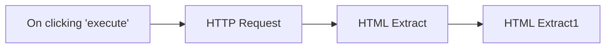

## Fluxo (.json) :

```json
{
  "nodes": [
    {
      "name": "On clicking 'execute'",
      "type": "n8n-nodes-base.manualTrigger",
      "position": [
        250,
        300
      ],
      "parameters": {},
      "typeVersion": 1
    },
    {
      "name": "HTTP Request",
      "type": "n8n-nodes-base.httpRequest",
      "position": [
        450,
        300
      ],
      "parameters": {
        "url": "https://hackernoon.com/",
        "options": {},
        "responseFormat": "string"
      },
      "typeVersion": 1
    },
    {
      "name": "HTML Extract",
      "type": "n8n-nodes-base.htmlExtract",
      "position": [
        650,
        300
      ],
      "parameters": {
        "options": {},
        "extractionValues": {
          "values": [
            {
              "key": "item",
              "cssSelector": "h2",
              "returnArray": true,
              "returnValue": "html"
            }
          ]
        }
      },
      "typeVersion": 1
    },
    {
      "name": "HTML Extract1",
      "type": "n8n-nodes-base.htmlExtract",
      "position": [
        850,
        300
      ],
      "parameters": {
        "options": {},
        "dataPropertyName": "item",
        "extractionValues": {
          "values": [
            {
              "key": "title",
              "cssSelector": "a"
            },
            {
              "key": "url",
              "attribute": "href",
              "cssSelector": "a",
              "returnValue": "attribute"
            }
          ]
        }
      },
      "typeVersion": 1
    }
  ],
  "connections": {
    "HTML Extract": {
      "main": [
        [
          {
            "node": "HTML Extract1",
            "type": "main",
            "index": 0
          }
        ]
      ]
    },
    "HTTP Request": {
      "main": [
        [
          {
            "node": "HTML Extract",
            "type": "main",
            "index": 0
          }
        ]
      ]
    },
    "On clicking 'execute'": {
      "main": [
        [
          {
            "node": "HTTP Request",
            "type": "main",
            "index": 0
          }
        ]
      ]
    }
  }
}
```

<a id="template-363"></a>

## Template 363 - Envio PayPal manual (senderBatchId 123)

- **Nome:** Envio PayPal manual (senderBatchId 123)
- **Descrição:** Ao ser acionado manualmente, o fluxo realiza uma chamada à API do PayPal para enviar um pagamento ou lote utilizando o senderBatchId configurado.
- **Funcionalidade:** • Gatilho manual: Inicia o fluxo quando o usuário clica em 'execute'.
• Envio de pagamentos via PayPal: Realiza a operação de pagamento/lote usando o senderBatchId configurado (123).
• Uso de credenciais para autenticação: Utiliza credenciais da API do PayPal para autorizar a chamada.
• Suporte a campos adicionais: Possibilidade de incluir campos extras de configuração (não preenchidos neste fluxo).
- **Ferramentas:** • PayPal: Plataforma de pagamentos online que fornece APIs para enviar e gerenciar pagamentos e transferências.

## Fluxo visual


## Fluxo (.json) :

```json
{
  "name": "",
  "nodes": [
    {
      "name": "On clicking 'execute'",
      "type": "n8n-nodes-base.manualTrigger",
      "position": [
        540,
        240
      ],
      "parameters": {},
      "typeVersion": 1
    },
    {
      "name": "PayPal",
      "type": "n8n-nodes-base.payPal",
      "position": [
        730,
        240
      ],
      "parameters": {
        "senderBatchId": "123",
        "additionalFields": {}
      },
      "credentials": {
        "payPalApi": "paypal-credentials"
      },
      "typeVersion": 1
    }
  ],
  "active": false,
  "settings": {},
  "connections": {
    "On clicking 'execute'": {
      "main": [
        [
          {
            "node": "PayPal",
            "type": "main",
            "index": 0
          }
        ]
      ]
    }
  }
}
```

<a id="template-364"></a>

## Template 364 - Obter pipeline no CircleCI

- **Nome:** Obter pipeline no CircleCI
- **Descrição:** Fluxo que inicia manualmente e consulta informações de um pipeline de um projeto no CircleCI usando a API.
- **Funcionalidade:** • Gatilho manual: inicia a execução do fluxo quando o usuário clica em executar.
• Consulta de pipeline: realiza uma chamada à API do CircleCI para obter os dados de um pipeline de um projeto específico (identificado por VCS e project slug).
• Autenticação via API: utiliza credenciais de API para autenticar a requisição ao CircleCI.
- **Ferramentas:** • CircleCI: plataforma de integração contínua que expõe API para consultar e gerenciar pipelines de projetos.

## Fluxo visual

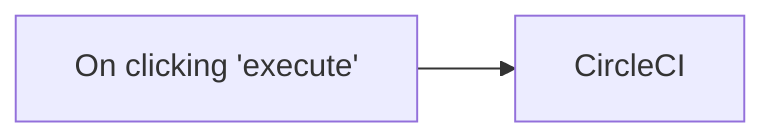

## Fluxo (.json) :

```json
{
  "id": "84",
  "name": "Get a pipeline in CircleCI",
  "nodes": [
    {
      "name": "On clicking 'execute'",
      "type": "n8n-nodes-base.manualTrigger",
      "position": [
        250,
        300
      ],
      "parameters": {},
      "typeVersion": 1
    },
    {
      "name": "CircleCI",
      "type": "n8n-nodes-base.circleCi",
      "position": [
        450,
        300
      ],
      "parameters": {
        "vcs": "",
        "projectSlug": ""
      },
      "credentials": {
        "circleCiApi": ""
      },
      "typeVersion": 1
    }
  ],
  "active": false,
  "settings": {},
  "connections": {
    "On clicking 'execute'": {
      "main": [
        [
          {
            "node": "CircleCI",
            "type": "main",
            "index": 0
          }
        ]
      ]
    }
  }
}
```

<a id="template-365"></a>

## Template 365 - Resumo e sentimento de notícias cripto

- **Nome:** Resumo e sentimento de notícias cripto
- **Descrição:** Recebe um pedido do usuário, agrega notícias de várias fontes sobre o termo solicitado, analisa e devolve um resumo e avaliação de sentimento via mensagem.
- **Funcionalidade:** • Recepção de mensagens via Telegram: Escuta mensagens de usuários para iniciar a análise.
• Armazenamento de sessão: Registra o chat ID do usuário para gerenciar a sessão e enviar respostas.
• Extração de palavra-chave por IA: Interpreta a mensagem do usuário e identifica um único termo relevante para busca.
• Agregação de notícias via RSS: Puxa artigos de diversas fontes de notícias cripto em tempo real.
• Fusão e filtragem de artigos: Combina todos os artigos e filtra apenas os que mencionam a palavra-chave extraída.
• Construção de prompt contextual: Monta um prompt com títulos e links dos artigos filtrados para alimentar o modelo de linguagem.
• Análise e resumo por IA: Usa um modelo avançado para resumir as notícias e avaliar o sentimento do mercado em relação ao termo.
• Envio da resposta ao usuário: Formata o resultado e envia a síntese final de volta ao usuário via Telegram.
- **Ferramentas:** • Telegram: Plataforma de mensagens usada para receber consultas dos usuários e enviar respostas.
• OpenAI (GPT-4o / gpt-4o-mini): Modelos de linguagem usados para extrair a palavra-chave, resumir notícias e analisar sentimento.
• Cointelegraph (RSS): Fonte de notícias sobre criptomoedas usada para agregação de artigos.
• Bitcoin Magazine (RSS): Fonte de notícias e análises sobre Bitcoin e criptomoedas.
• CoinDesk (RSS): Fonte de notícias e mercado de criptoativos.
• Bitcoinist (RSS): Portal de notícias sobre criptomoedas.
• NewsBTC (RSS): Fonte de notícias e análises de mercado cripto.
• CryptoPotato (RSS): Portal de notícias sobre blockchain e criptoativos.
• 99Bitcoins (RSS): Fonte de conteúdos e guias relacionados a criptomoedas.
• CryptoBriefing (RSS): Fonte de notícias, análises e pesquisas de criptoativos.
• Crypto.news (RSS): Agregador/fonte de notícias do setor cripto.

## Fluxo visual

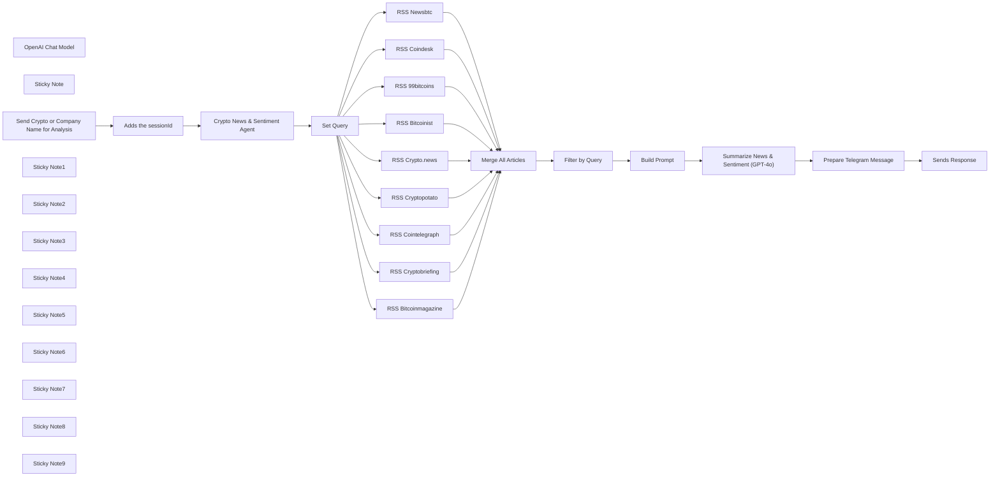

## Fluxo (.json) :

```json
{
  "id": "8v4dynjkHSLVGJSG",
  "meta": {
    "instanceId": "a5283507e1917a33cc3ae615b2e7d5ad2c1e50955e6f831272ddd5ab816f3fb6",
    "templateCredsSetupCompleted": true
  },
  "name": "Crypto News & Sentiment",
  "tags": [],
  "nodes": [
    {
      "id": "e10ed4da-ab3e-4ff0-b489-a3ed9e88e042",
      "name": "OpenAI Chat Model",
      "type": "@n8n/n8n-nodes-langchain.lmChatOpenAi",
      "position": [
        -1340,
        1520
      ],
      "parameters": {
        "model": {
          "__rl": true,
          "mode": "list",
          "value": "gpt-4o-mini"
        },
        "options": {}
      },
      "credentials": {
        "openAiApi": {
          "id": "yUizd8t0sD5wMYVG",
          "name": "OpenAi account"
        }
      },
      "typeVersion": 1.2
    },
    {
      "id": "edb76989-766a-43e6-bf49-3896a1d257dd",
      "name": "Set Query",
      "type": "n8n-nodes-base.set",
      "position": [
        -780,
        1340
      ],
      "parameters": {
        "options": {},
        "assignments": {
          "assignments": [
            {
              "id": "9128e9e7-d1b8-4e89-8422-849b8dd519d8",
              "name": "query",
              "type": "string",
              "value": "={{ $json.output }}"
            },
            {
              "id": "b6adc989-7d3c-4dbb-a659-603591cf1f58",
              "name": "sessionId",
              "type": "string",
              "value": "={{ $('Adds the sessionId').item.json.sessionId }}"
            }
          ]
        }
      },
      "typeVersion": 3.4
    },
    {
      "id": "0ef0571a-d0c2-4f05-898e-1aed56b02d56",
      "name": "Crypto News & Sentiment Agent",
      "type": "@n8n/n8n-nodes-langchain.agent",
      "position": [
        -1280,
        1340
      ],
      "parameters": {
        "text": "={{ $('Send Crypto or Company Name for Analysis').item.json.message.text }}",
        "options": {
          "systemMessage": "Your job is to analyze the keyword of the question and output it as a single word."
        },
        "promptType": "define"
      },
      "typeVersion": 1.8
    },
    {
      "id": "8f7859fa-e80c-4c0e-b8b5-5593d5108f5f",
      "name": "RSS Cointelegraph",
      "type": "n8n-nodes-base.rssFeedRead",
      "position": [
        -160,
        500
      ],
      "parameters": {
        "url": "https://cointelegraph.com/rss",
        "options": {}
      },
      "typeVersion": 1.1
    },
    {
      "id": "5ce9dc61-de8e-4b3a-a0e2-4c077a28e0d4",
      "name": "RSS Bitcoinmagazine",
      "type": "n8n-nodes-base.rssFeedRead",
      "position": [
        -160,
        660
      ],
      "parameters": {
        "url": "https://bitcoinmagazine.com/.rss/full/",
        "options": {}
      },
      "typeVersion": 1.1
    },
    {
      "id": "d2491728-8a51-4384-adfa-8636f8d8cacd",
      "name": "RSS Coindesk",
      "type": "n8n-nodes-base.rssFeedRead",
      "position": [
        -160,
        820
      ],
      "parameters": {
        "url": "https://www.coindesk.com/arc/outboundfeeds/rss/",
        "options": {}
      },
      "typeVersion": 1.1
    },
    {
      "id": "60b17a68-b7b0-444f-8bbc-4d9ccfba6892",
      "name": "RSS Bitcoinist",
      "type": "n8n-nodes-base.rssFeedRead",
      "position": [
        -160,
        980
      ],
      "parameters": {
        "url": "https://bitcoinist.com/feed/",
        "options": {}
      },
      "typeVersion": 1.1
    },
    {
      "id": "82b50de0-68a7-4660-b6d9-fa01922c2492",
      "name": "RSS Newsbtc",
      "type": "n8n-nodes-base.rssFeedRead",
      "position": [
        -160,
        1140
      ],
      "parameters": {
        "url": "https://www.newsbtc.com/feed/",
        "options": {}
      },
      "typeVersion": 1.1
    },
    {
      "id": "90f9a5be-8eb2-4073-9c18-50478ba4890b",
      "name": "RSS Cryptopotato",
      "type": "n8n-nodes-base.rssFeedRead",
      "position": [
        -160,
        1500
      ],
      "parameters": {
        "url": "https://cryptopotato.com/feed/",
        "options": {}
      },
      "typeVersion": 1.1
    },
    {
      "id": "6428c19d-c66c-4577-b6ca-8c0c82a757fa",
      "name": "RSS 99bitcoins",
      "type": "n8n-nodes-base.rssFeedRead",
      "position": [
        -160,
        1680
      ],
      "parameters": {
        "url": "https://99bitcoins.com/feed/",
        "options": {}
      },
      "typeVersion": 1.1
    },
    {
      "id": "b2fc6584-cd64-4b90-91cf-b9bfdc483203",
      "name": "RSS Cryptobriefing",
      "type": "n8n-nodes-base.rssFeedRead",
      "position": [
        -160,
        1860
      ],
      "parameters": {
        "url": "https://cryptobriefing.com/feed/",
        "options": {}
      },
      "typeVersion": 1.1
    },
    {
      "id": "8be5859b-bb82-4ece-9aa5-5bfbc27e4cca",
      "name": "RSS Crypto.news",
      "type": "n8n-nodes-base.rssFeedRead",
      "position": [
        -160,
        2020
      ],
      "parameters": {
        "url": "https://crypto.news/feed/",
        "options": {}
      },
      "typeVersion": 1.1
    },
    {
      "id": "b5f393de-a3da-47a4-8a19-ebf53c29051d",
      "name": "Merge All Articles",
      "type": "n8n-nodes-base.merge",
      "position": [
        520,
        1180
      ],
      "parameters": {
        "numberInputs": 10
      },
      "typeVersion": 3.1
    },
    {
      "id": "ce4da50f-ecff-4d13-a90d-e62db6bc3ef9",
      "name": "Filter by Query",
      "type": "n8n-nodes-base.code",
      "position": [
        760,
        1320
      ],
      "parameters": {
        "jsCode": "const term = $node[\"Set Query\"].json.query.toLowerCase();\nreturn items.filter(item => {\n  const j            = item.json;\n  const title        = (j.title || \"\").toLowerCase();\n  const snippet      = (j.contentSnippet || j.description || \"\").toLowerCase();\n  const fullContent  = (j.content || \"\").toLowerCase();\n  return title.includes(term)\n      || snippet.includes(term)\n      || fullContent.includes(term);\n});"
      },
      "typeVersion": 2
    },
    {
      "id": "566e842f-8e2c-491c-87b5-5f1d322a9de8",
      "name": "Build Prompt",
      "type": "n8n-nodes-base.code",
      "position": [
        1080,
        1320
      ],
      "parameters": {
        "jsCode": "const q   = $node[\"Set Query\"].json.query;\nconst list = items\n  .map(i => `- ${i.json.title} (${i.json.link})`)\n  .join(\"\\n\");\nconst prompt = `\nYou are a crypto-industry news analyst.\nSummarize current news and market sentiment for **${q}** based on these articles:\n${list}\n\nAnswer in 3 parts:\n1. Summary of News\n2. Market Sentiment\n3. Links to reference news articles\n`;\nreturn [{ json: { prompt } }];"
      },
      "typeVersion": 2
    },
    {
      "id": "2f5b2eb5-bc2e-432d-b0c8-44c6822b831b",
      "name": "Sticky Note",
      "type": "n8n-nodes-base.stickyNote",
      "position": [
        2080,
        1020
      ],
      "parameters": {
        "color": 3,
        "width": 300,
        "height": 580,
        "content": "## Send Telegram Response\n\nSends the final AI-generated summary to the user.\n⚠️ Replace chatId with a dynamic value like << Telegram ID here >> to ensure it sends to the right user."
      },
      "typeVersion": 1
    },
    {
      "id": "d9f178d6-b834-4a18-b8a5-ab1261b99ca6",
      "name": "Adds the sessionId",
      "type": "n8n-nodes-base.set",
      "position": [
        -1740,
        1340
      ],
      "parameters": {
        "options": {},
        "assignments": {
          "assignments": [
            {
              "id": "87c63e75-94e4-432c-b15f-8762aa340215",
              "name": "sessionId",
              "type": "string",
              "value": "={{ $json.message.chat.id }}"
            }
          ]
        }
      },
      "typeVersion": 3.4
    },
    {
      "id": "4dd3e531-ab2a-4930-a127-08adb5bde409",
      "name": "Summarize News & Sentiment (GPT-4o)",
      "type": "@n8n/n8n-nodes-langchain.openAi",
      "position": [
        1360,
        1320
      ],
      "parameters": {
        "modelId": {
          "__rl": true,
          "mode": "list",
          "value": "gpt-4o",
          "cachedResultName": "GPT-4O"
        },
        "options": {},
        "messages": {
          "values": [
            {
              "content": "={{ $node[\"Build Prompt\"].json.prompt }}"
            },
            {
              "role": "assistant",
              "content": "You are a crypto‐industry news analyst. Summarize sentiment clearly and concisely."
            }
          ]
        }
      },
      "credentials": {
        "openAiApi": {
          "id": "yUizd8t0sD5wMYVG",
          "name": "OpenAi account"
        }
      },
      "typeVersion": 1.8
    },
    {
      "id": "b0da1d25-9c17-49a1-85f4-82425e7c9f91",
      "name": "Prepare Telegram Message",
      "type": "n8n-nodes-base.set",
      "position": [
        1780,
        1320
      ],
      "parameters": {
        "options": {},
        "assignments": {
          "assignments": [
            {
              "id": "565fb705-ac83-4a96-9343-2e29e348cc4f",
              "name": "summary",
              "type": "string",
              "value": "={{ $json.message.content }}"
            }
          ]
        }
      },
      "typeVersion": 3.4
    },
    {
      "id": "95cb909b-51f4-4661-9db5-e8181a7efffe",
      "name": "Sends Response",
      "type": "n8n-nodes-base.telegram",
      "position": [
        2180,
        1320
      ],
      "webhookId": "8018c16f-426e-4a8b-8fbf-55cc013d1226",
      "parameters": {
        "text": "={{ $json.summary }}",
        "chatId": "<< Add Telegram ID here >>",
        "additionalFields": {
          "appendAttribution": false
        }
      },
      "credentials": {
        "telegramApi": {
          "id": "YDlV4LtcNcmNqk4y",
          "name": "Crypto_News_and_Sentiment_bot"
        }
      },
      "typeVersion": 1.2
    },
    {
      "id": "a783bddf-7d70-4345-88f3-c474a50bdea0",
      "name": "Send Crypto or Company Name for Analysis",
      "type": "n8n-nodes-base.telegramTrigger",
      "position": [
        -2180,
        1340
      ],
      "webhookId": "37a1f055-1670-472d-9850-d89555b7ed47",
      "parameters": {
        "updates": [
          "message"
        ],
        "additionalFields": {}
      },
      "credentials": {
        "telegramApi": {
          "id": "YDlV4LtcNcmNqk4y",
          "name": "Crypto_News_and_Sentiment_bot"
        }
      },
      "typeVersion": 1.2
    },
    {
      "id": "d847a178-c0f2-482b-8773-ac0362435dfd",
      "name": "Sticky Note1",
      "type": "n8n-nodes-base.stickyNote",
      "position": [
        -2320,
        1200
      ],
      "parameters": {
        "color": 4,
        "width": 380,
        "height": 360,
        "content": "## Telegram Setup \nThis bot listens for incoming messages in Telegram. To use it, create a bot with @BotFather and paste your bot token into the credentials."
      },
      "typeVersion": 1
    },
    {
      "id": "75ee14cf-6236-4f45-b864-b422f18c8214",
      "name": "Sticky Note2",
      "type": "n8n-nodes-base.stickyNote",
      "position": [
        -1860,
        1220
      ],
      "parameters": {
        "width": 360,
        "height": 320,
        "content": "## Initialize Chat Session\nStores the user's chat ID as sessionId, which is used to manage conversation memory across steps."
      },
      "typeVersion": 1
    },
    {
      "id": "674f2555-752d-4ffc-894c-efd705f32887",
      "name": "Sticky Note3",
      "type": "n8n-nodes-base.stickyNote",
      "position": [
        -1440,
        1200
      ],
      "parameters": {
        "color": 6,
        "width": 600,
        "height": 460,
        "content": "##  Extract Keyword \nThis AI agent parses the user input and returns a single-word keyword to help match relevant news articles."
      },
      "typeVersion": 1
    },
    {
      "id": "bece27b1-bc60-44f7-bdc9-6ec61f7a2e5b",
      "name": "Sticky Note4",
      "type": "n8n-nodes-base.stickyNote",
      "position": [
        -320,
        300
      ],
      "parameters": {
        "color": 5,
        "width": 460,
        "height": 1980,
        "content": "## News Aggregators\nPulls articles from major crypto news sources. You can add more RSS feeds here to expand coverage."
      },
      "typeVersion": 1
    },
    {
      "id": "7f7a2949-4147-4ab9-bb52-99c1bb2205ed",
      "name": "Sticky Note5",
      "type": "n8n-nodes-base.stickyNote",
      "position": [
        440,
        980
      ],
      "parameters": {
        "color": 2,
        "width": 480,
        "height": 760,
        "content": "## Merge & Filter News\nCombines all RSS articles and filters them using the extracted keyword to match only relevant results."
      },
      "typeVersion": 1
    },
    {
      "id": "d19d53c0-7d23-4ccb-9a68-dc2855e5b73d",
      "name": "Sticky Note6",
      "type": "n8n-nodes-base.stickyNote",
      "position": [
        1000,
        1140
      ],
      "parameters": {
        "color": 7,
        "width": 260,
        "height": 360,
        "content": "## Prepare AI Prompt\nConstructs the input prompt for GPT-4o with a list of filtered articles. Output includes summary, sentiment, and article links."
      },
      "typeVersion": 1
    },
    {
      "id": "17607891-ed84-4cca-ad3d-c398e5652a8c",
      "name": "Sticky Note7",
      "type": "n8n-nodes-base.stickyNote",
      "position": [
        1320,
        1100
      ],
      "parameters": {
        "color": 3,
        "width": 340,
        "height": 440,
        "content": "## Summarize News & Sentiment (GPT-4o)\nUses OpenAI GPT-4o to generate a concise summary of the news, analyze market sentiment, and return formatted results.\n\n"
      },
      "typeVersion": 1
    },
    {
      "id": "9d47eb56-4469-4f42-84a1-6f76bb7fa598",
      "name": "Sticky Note8",
      "type": "n8n-nodes-base.stickyNote",
      "position": [
        1720,
        1060
      ],
      "parameters": {
        "color": 6,
        "height": 460,
        "content": "## Format for Telegram\n\nExtracts the AI summary and prepares it for Telegram delivery. Change the variable if you want to include other data.\n\n\n"
      },
      "typeVersion": 1
    },
    {
      "id": "7c02860b-f865-4ff9-baeb-0903a76278d9",
      "name": "Sticky Note9",
      "type": "n8n-nodes-base.stickyNote",
      "position": [
        1140,
        320
      ],
      "parameters": {
        "width": 520,
        "content": "## ✅ How to Use This Template\n \n🛠 1. Connect your Telegram bot\n🤖 2. Add your OpenAI credentials\n📰 3. Customize the RSS feeds (optional)\n✅ 4. Start your bot and send a query like “Bitcoin” or “NFT”"
      },
      "typeVersion": 1
    }
  ],
  "active": false,
  "pinData": {},
  "settings": {
    "executionOrder": "v1"
  },
  "versionId": "ae250264-5df8-4341-b198-5272baeadc38",
  "connections": {
    "Set Query": {
      "main": [
        [
          {
            "node": "RSS Cointelegraph",
            "type": "main",
            "index": 0
          },
          {
            "node": "RSS Bitcoinmagazine",
            "type": "main",
            "index": 0
          },
          {
            "node": "RSS Coindesk",
            "type": "main",
            "index": 0
          },
          {
            "node": "RSS Bitcoinist",
            "type": "main",
            "index": 0
          },
          {
            "node": "RSS Newsbtc",
            "type": "main",
            "index": 0
          },
          {
            "node": "RSS Cryptopotato",
            "type": "main",
            "index": 0
          },
          {
            "node": "RSS 99bitcoins",
            "type": "main",
            "index": 0
          },
          {
            "node": "RSS Cryptobriefing",
            "type": "main",
            "index": 0
          },
          {
            "node": "RSS Crypto.news",
            "type": "main",
            "index": 0
          }
        ]
      ]
    },
    "RSS Newsbtc": {
      "main": [
        [
          {
            "node": "Merge All Articles",
            "type": "main",
            "index": 4
          }
        ]
      ]
    },
    "Build Prompt": {
      "main": [
        [
          {
            "node": "Summarize News & Sentiment (GPT-4o)",
            "type": "main",
            "index": 0
          }
        ]
      ]
    },
    "RSS Coindesk": {
      "main": [
        [
          {
            "node": "Merge All Articles",
            "type": "main",
            "index": 2
          }
        ]
      ]
    },
    "RSS 99bitcoins": {
      "main": [
        [
          {
            "node": "Merge All Articles",
            "type": "main",
            "index": 7
          }
        ]
      ]
    },
    "RSS Bitcoinist": {
      "main": [
        [
          {
            "node": "Merge All Articles",
            "type": "main",
            "index": 3
          }
        ]
      ]
    },
    "Filter by Query": {
      "main": [
        [
          {
            "node": "Build Prompt",
            "type": "main",
            "index": 0
          }
        ]
      ]
    },
    "RSS Crypto.news": {
      "main": [
        [
          {
            "node": "Merge All Articles",
            "type": "main",
            "index": 9
          }
        ]
      ]
    },
    "RSS Cryptopotato": {
      "main": [
        [
          {
            "node": "Merge All Articles",
            "type": "main",
            "index": 6
          }
        ]
      ]
    },
    "OpenAI Chat Model": {
      "ai_languageModel": [
        [
          {
            "node": "Crypto News & Sentiment Agent",
            "type": "ai_languageModel",
            "index": 0
          }
        ]
      ]
    },
    "RSS Cointelegraph": {
      "main": [
        [
          {
            "node": "Merge All Articles",
            "type": "main",
            "index": 0
          }
        ]
      ]
    },
    "Adds the sessionId": {
      "main": [
        [
          {
            "node": "Crypto News & Sentiment Agent",
            "type": "main",
            "index": 0
          }
        ]
      ]
    },
    "Merge All Articles": {
      "main": [
        [
          {
            "node": "Filter by Query",
            "type": "main",
            "index": 0
          }
        ]
      ]
    },
    "RSS Cryptobriefing": {
      "main": [
        [
          {
            "node": "Merge All Articles",
            "type": "main",
            "index": 8
          }
        ]
      ]
    },
    "RSS Bitcoinmagazine": {
      "main": [
        [
          {
            "node": "Merge All Articles",
            "type": "main",
            "index": 1
          }
        ]
      ]
    },
    "Prepare Telegram Message": {
      "main": [
        [
          {
            "node": "Sends Response",
            "type": "main",
            "index": 0
          }
        ]
      ]
    },
    "Crypto News & Sentiment Agent": {
      "main": [
        [
          {
            "node": "Set Query",
            "type": "main",
            "index": 0
          }
        ]
      ]
    },
    "Summarize News & Sentiment (GPT-4o)": {
      "main": [
        [
          {
            "node": "Prepare Telegram Message",
            "type": "main",
            "index": 0
          }
        ]
      ]
    },
    "Send Crypto or Company Name for Analysis": {
      "main": [
        [
          {
            "node": "Adds the sessionId",
            "type": "main",
            "index": 0
          }
        ]
      ]
    }
  }
}
```

<a id="template-366"></a>

## Template 366 - Atualizar contatos do GetResponse por campanha

- **Nome:** Atualizar contatos do GetResponse por campanha
- **Descrição:** Ao ser executado manualmente, o fluxo obtém todos os contatos de uma conta GetResponse, verifica a campanha de cada contato e atualiza a campanha quando necessário.
- **Funcionalidade:** • Inicialização manual: Permite iniciar a execução do fluxo manualmente.
• Recuperar todos os contatos: Obtém a lista completa de contatos da conta GetResponse.
• Verificação da campanha do contato: Para cada contato, verifica se o nome da campanha é diferente de "n8n".
• Atualizar campanha do contato: Quando a campanha for diferente, atualiza o contato definindo o campo de campanha para o ID "WRVXO" usando o ID do contato.
• Ramo sem ação: Para contatos que já pertencem à campanha desejada, o fluxo segue sem realizar alterações (no-op).
- **Ferramentas:** • GetResponse: Plataforma de e-mail marketing e gestão de contatos utilizada para recuperar e atualizar registros de contatos.

## Fluxo visual

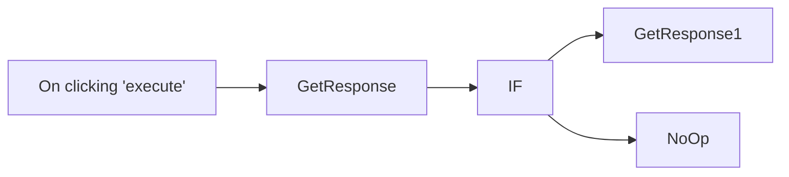

## Fluxo (.json) :

```json
{
  "id": "116",
  "name": "Get all the contacts from GetResponse and update them",
  "nodes": [
    {
      "name": "On clicking 'execute'",
      "type": "n8n-nodes-base.manualTrigger",
      "position": [
        250,
        300
      ],
      "parameters": {},
      "typeVersion": 1
    },
    {
      "name": "GetResponse",
      "type": "n8n-nodes-base.getResponse",
      "position": [
        450,
        300
      ],
      "parameters": {
        "options": {},
        "operation": "getAll",
        "returnAll": true
      },
      "credentials": {
        "getResponseApi": "getresponse-api"
      },
      "typeVersion": 1
    },
    {
      "name": "IF",
      "type": "n8n-nodes-base.if",
      "position": [
        650,
        300
      ],
      "parameters": {
        "conditions": {
          "string": [
            {
              "value1": "={{$node[\"GetResponse\"].json[\"campaign\"][\"name\"]}}",
              "value2": "n8n",
              "operation": "notEqual"
            }
          ]
        }
      },
      "typeVersion": 1
    },
    {
      "name": "GetResponse1",
      "type": "n8n-nodes-base.getResponse",
      "position": [
        860,
        200
      ],
      "parameters": {
        "contactId": "={{$node[\"IF\"].json[\"contactId\"]}}",
        "operation": "update",
        "updateFields": {
          "campaignId": "WRVXO"
        }
      },
      "credentials": {
        "getResponseApi": "getresponse-api"
      },
      "typeVersion": 1
    },
    {
      "name": "NoOp",
      "type": "n8n-nodes-base.noOp",
      "position": [
        860,
        400
      ],
      "parameters": {},
      "typeVersion": 1
    }
  ],
  "active": false,
  "settings": {},
  "connections": {
    "IF": {
      "main": [
        [
          {
            "node": "GetResponse1",
            "type": "main",
            "index": 0
          }
        ],
        [
          {
            "node": "NoOp",
            "type": "main",
            "index": 0
          }
        ]
      ]
    },
    "GetResponse": {
      "main": [
        [
          {
            "node": "IF",
            "type": "main",
            "index": 0
          }
        ]
      ]
    },
    "On clicking 'execute'": {
      "main": [
        [
          {
            "node": "GetResponse",
            "type": "main",
            "index": 0
          }
        ]
      ]
    }
  }
}
```

<a id="template-367"></a>

## Template 367 - Resumos automáticos de vídeos do YouTube para Discord

- **Nome:** Resumos automáticos de vídeos do YouTube para Discord
- **Descrição:** Monitora um canal do YouTube, obtém a transcrição em inglês dos vídeos, gera um resumo com IA e publica uma mensagem formatada no Discord.
- **Funcionalidade:** • Monitoramento de novos vídeos via feed: Aciona a automação quando há um vídeo novo no canal especificado.
• Recuperação de metadados de legendas: Consulta a API para listar as legendas disponíveis do vídeo.
• Seleção de legendas em inglês: Identifica e escolhe a legenda em inglês quando disponível.
• Download e conversão da legenda: Baixa o arquivo de legenda e extrai o texto da transcrição.
• Resumo com IA: Envia a transcrição para um modelo de linguagem para gerar três pontos resumindo o vídeo e por que assisti-lo.
• Publicação no Discord: Envia uma mensagem formatada via webhook com título, resumo e link do vídeo.
• Gerenciamento de credenciais: Usa autorização para acessar as APIs (conta do canal para legendas e webhook para postagem).
• Guia de configuração incluído: Nota com instruções e link para ajudar a configurar o ID do canal e permissões.
- **Ferramentas:** • YouTube Data API: Fornece o feed de vídeos e endpoints para listar e baixar legendas do vídeo.
• OpenAI (gpt-3.5-turbo): Gera resumos concisos a partir da transcrição do vídeo.
• Discord (webhook): Permite publicar mensagens formatadas diretamente em um canal do Discord.

## Fluxo visual

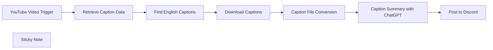

## Fluxo (.json) :

```json
{
  "id": "LF8gz3iz74u45a5i",
  "meta": {
    "instanceId": "889f0d7d968f3b02a88433e2529a399907d2ca89e329934b608193beaa2301f8"
  },
  "name": "YouTube Videos with AI Summaries on Discord",
  "tags": [],
  "nodes": [
    {
      "id": "48c87027-7eea-40b9-a73c-4e002b748783",
      "name": "YouTube Video Trigger",
      "type": "n8n-nodes-base.rssFeedReadTrigger",
      "position": [
        560,
        220
      ],
      "parameters": {
        "feedUrl": "https://www.youtube.com/feeds/videos.xml?channel_id=UC08Fah8EIryeOZRkjBRohcQ",
        "pollTimes": {
          "item": [
            {
              "mode": "everyMinute"
            }
          ]
        }
      },
      "typeVersion": 1
    },
    {
      "id": "56166228-b365-4043-b48c-098b4de71f6f",
      "name": "Retrieve Caption Data",
      "type": "n8n-nodes-base.httpRequest",
      "position": [
        780,
        220
      ],
      "parameters": {
        "url": "https://www.googleapis.com/youtube/v3/captions",
        "options": {},
        "sendQuery": true,
        "authentication": "predefinedCredentialType",
        "queryParameters": {
          "parameters": [
            {
              "name": "videoId",
              "value": "={{ $json.id.match(/(?:[^:]*:){2}\\s*(.*)/)[1] }}"
            },
            {
              "name": "part",
              "value": "snippet"
            }
          ]
        },
        "nodeCredentialType": "youTubeOAuth2Api"
      },
      "credentials": {
        "youTubeOAuth2Api": {
          "id": "uy3xy1Ks2ATwRGr4",
          "name": "Creator Magic - YouTube account"
        }
      },
      "typeVersion": 4.2
    },
    {
      "id": "c029ac6f-3071-4045-83f6-2dede0c1f358",
      "name": "Download Captions",
      "type": "n8n-nodes-base.httpRequest",
      "position": [
        1220,
        220
      ],
      "parameters": {
        "url": "=https://www.googleapis.com/youtube/v3/captions/{{ $json.caption.id }}",
        "options": {},
        "authentication": "predefinedCredentialType",
        "nodeCredentialType": "youTubeOAuth2Api"
      },
      "credentials": {
        "youTubeOAuth2Api": {
          "id": "uy3xy1Ks2ATwRGr4",
          "name": "Creator Magic - YouTube account"
        }
      },
      "typeVersion": 4.2
    },
    {
      "id": "8b45dc14-f10f-4b50-8ca6-a9d0ccfee4dc",
      "name": "Caption File Conversion",
      "type": "n8n-nodes-base.extractFromFile",
      "position": [
        1440,
        220
      ],
      "parameters": {
        "options": {},
        "operation": "text",
        "destinationKey": "content"
      },
      "typeVersion": 1
    },
    {
      "id": "6527adb4-9087-40eb-b63a-8c4cdf5d0a40",
      "name": "Caption Summary with ChatGPT",
      "type": "@n8n/n8n-nodes-langchain.openAi",
      "position": [
        1660,
        220
      ],
      "parameters": {
        "modelId": {
          "__rl": true,
          "mode": "list",
          "value": "gpt-3.5-turbo",
          "cachedResultName": "GPT-3.5-TURBO"
        },
        "options": {},
        "messages": {
          "values": [
            {
              "content": "=Summarise this transcript into three bullet points to sum up what the video is about and why someone should watch it: {{ $json[\"content\"] }}"
            }
          ]
        }
      },
      "credentials": {
        "openAiApi": {
          "id": "QpdCHVaJVRd9NNYl",
          "name": "OpenAi account"
        }
      },
      "typeVersion": 1.3
    },
    {
      "id": "2c83f230-bc37-4efb-9ee9-842bcefa0ef4",
      "name": "Post to Discord",
      "type": "n8n-nodes-base.discord",
      "position": [
        2000,
        220
      ],
      "parameters": {
        "content": "=🌟 New Video Alert! 🌟\n\n**{{ $('YouTube Video Trigger').item.json[\"title\"] }}**\n\n*What’s it about?*\n\n{{ $json[\"message\"][\"content\"] }}\n\n[Watch NOW]({{ $('YouTube Video Trigger').item.json[\"link\"] }}) and remember to share your thoughts!",
        "options": {},
        "authentication": "webhook"
      },
      "credentials": {
        "discordWebhookApi": {
          "id": "QQxpAIskycvb8fIE",
          "name": "Discord Webhook account"
        }
      },
      "typeVersion": 2
    },
    {
      "id": "8408887e-1d89-402c-b350-93d5f96f4dea",
      "name": "Find English Captions",
      "type": "n8n-nodes-base.set",
      "position": [
        1000,
        220
      ],
      "parameters": {
        "options": {},
        "assignments": {
          "assignments": [
            {
              "id": "eaf7dcb5-91cf-4405-917b-38845f0ef78d",
              "name": "caption",
              "type": "object",
              "value": "={{ $jmespath( $json.items, \"[?snippet.language == 'en'] | [0]\" ) }}"
            }
          ]
        }
      },
      "typeVersion": 3.3
    },
    {
      "id": "71cc0977-1695-4797-9df2-b0a98e41d3de",
      "name": "Sticky Note",
      "type": "n8n-nodes-base.stickyNote",
      "position": [
        500,
        -20
      ],
      "parameters": {
        "width": 448.11859838274916,
        "height": 417.2722371967648,
        "content": "### Summarise Your YouTube Videos with AI for Discord\n\n📽️ [Watch the Video Tutorial](https://mrc.fm/ai2d)\n\n* Add your [YouTube channel ID](https://www.youtube.com/account_advanced) to the URL in the first node: `https://www.youtube.com/feeds/videos.xml?channel_id=YOUR_CHANNEL_ID`.\n\n* Ensure authorization with the YouTube channel that you want to download captions from."
      },
      "typeVersion": 1
    }
  ],
  "active": false,
  "pinData": {},
  "settings": {
    "executionOrder": "v1"
  },
  "versionId": "e8fc6758-02ef-4b65-8ab5-474bd8e3862a",
  "connections": {
    "Download Captions": {
      "main": [
        [
          {
            "node": "Caption File Conversion",
            "type": "main",
            "index": 0
          }
        ]
      ]
    },
    "Find English Captions": {
      "main": [
        [
          {
            "node": "Download Captions",
            "type": "main",
            "index": 0
          }
        ]
      ]
    },
    "Retrieve Caption Data": {
      "main": [
        [
          {
            "node": "Find English Captions",
            "type": "main",
            "index": 0
          }
        ]
      ]
    },
    "YouTube Video Trigger": {
      "main": [
        [
          {
            "node": "Retrieve Caption Data",
            "type": "main",
            "index": 0
          }
        ]
      ]
    },
    "Caption File Conversion": {
      "main": [
        [
          {
            "node": "Caption Summary with ChatGPT",
            "type": "main",
            "index": 0
          }
        ]
      ]
    },
    "Caption Summary with ChatGPT": {
      "main": [
        [
          {
            "node": "Post to Discord",
            "type": "main",
            "index": 0
          }
        ]
      ]
    }
  }
}
```

<a id="template-368"></a>

## Template 368 - Classificar e reatribuir bugs com OpenAI

- **Nome:** Classificar e reatribuir bugs com OpenAI
- **Descrição:** Ao detectar um bug recém-criado ou atualizado em uma equipe específica, o fluxo usa IA para identificar a equipe responsável e atualiza o ticket; notifica um canal caso a IA não encontre uma equipe adequada.
- **Funcionalidade:** • Detecção de evento de issue: Inicia quando um issue é criado ou atualizado em uma equipe definida.
• Filtragem de tickets relevantes: Processa apenas tickets do tipo bug, em estado de triagem e com descrição preenchida.
• Preparação de contexto: Mantém uma lista configurável de equipes e canal de notificação para uso pela IA.
• Classificação por IA: Envia título e descrição do bug para um modelo de linguagem que escolhe a equipe apropriada entre as opções fornecidas.
• Recuperação de times: Busca a lista completa de times para mapear o nome retornado pela IA ao ID do time no sistema.
• Atualização do ticket: Reatribui o issue para o time identificado pela IA.
• Notificação em canal: Se a IA não conseguir identificar um time adequado, envia uma mensagem ao canal configurado para triagem manual.
- **Ferramentas:** • Linear: Plataforma de rastreamento de issues onde os bugs são detectados e atualizados.
• OpenAI: Serviço de modelo de linguagem usado para classificar qual equipe deve trabalhar no bug.
• Slack: Canal de comunicação usado para notificar quando a IA não encontra uma equipe apropriada.

## Fluxo visual

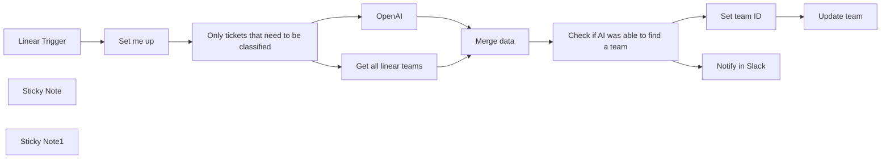

## Fluxo (.json) :

```json
{
  "meta": {
    "instanceId": "cb484ba7b742928a2048bf8829668bed5b5ad9787579adea888f05980292a4a7"
  },
  "nodes": [
    {
      "id": "8920dc6e-b2fb-4446-8cb3-f3f6d626dcb3",
      "name": "Linear Trigger",
      "type": "n8n-nodes-base.linearTrigger",
      "position": [
        420,
        360
      ],
      "webhookId": "a02faf62-684f-44bb-809f-e962c9ede70d",
      "parameters": {
        "teamId": "7a330c36-4b39-4bf1-922e-b4ceeb91850a",
        "resources": [
          "issue"
        ],
        "authentication": "oAuth2"
      },
      "credentials": {
        "linearOAuth2Api": {
          "id": "02MqKUMdPxr9t3mX",
          "name": "Nik's Linear Creds"
        }
      },
      "typeVersion": 1
    },
    {
      "id": "61214884-62f9-4a00-9517-e2d51b44d0ae",
      "name": "Only tickets that need to be classified",
      "type": "n8n-nodes-base.filter",
      "position": [
        1000,
        360
      ],
      "parameters": {
        "options": {},
        "conditions": {
          "options": {
            "leftValue": "",
            "caseSensitive": true,
            "typeValidation": "strict"
          },
          "combinator": "and",
          "conditions": [
            {
              "id": "bc3a756d-b2b6-407b-91c9-a1cd9da004e0",
              "operator": {
                "type": "string",
                "operation": "notContains"
              },
              "leftValue": "={{ $('Linear Trigger').item.json.data.description }}",
              "rightValue": "Add a description here"
            },
            {
              "id": "f3d8d0fc-332d-41a6-aef8-1f221bf30c0e",
              "operator": {
                "name": "filter.operator.equals",
                "type": "string",
                "operation": "equals"
              },
              "leftValue": "={{ $('Linear Trigger').item.json.data.state.id }}",
              "rightValue": "6b9a8eec-82dc-453a-878b-50f4c98d3e53"
            },
            {
              "id": "9cdb55b2-3ca9-43bd-84b0-ef025b59ce18",
              "operator": {
                "type": "number",
                "operation": "gt"
              },
              "leftValue": "={{ $('Linear Trigger').item.json.data.labels.filter(label => label.id === 'f2b6e3e9-b42d-4106-821c-6a08dcb489a9').length }}",
              "rightValue": 0
            }
          ]
        }
      },
      "typeVersion": 2
    },
    {
      "id": "da4d8e0c-895b-4a84-8319-438f971af403",
      "name": "Sticky Note",
      "type": "n8n-nodes-base.stickyNote",
      "position": [
        1000,
        111.31510859283728
      ],
      "parameters": {
        "color": 7,
        "height": 219.68489140716272,
        "content": "### When does this fire?\nIn our setup we have a general team in Linear where we post new tickets to. Additionally, the bug needs to have a certain label and the description needs to be filled. \nYou're of course free to adjust this to your needs\n👇"
      },
      "typeVersion": 1
    },
    {
      "id": "b7e3a328-96c4-4082-93a9-0cb331367190",
      "name": "Update team",
      "type": "n8n-nodes-base.linear",
      "position": [
        2160,
        280
      ],
      "parameters": {
        "issueId": "={{ $('Linear Trigger').item.json.data.id }}",
        "operation": "update",
        "updateFields": {
          "teamId": "={{ $json.teamId }}"
        }
      },
      "credentials": {
        "linearApi": {
          "id": "oYIZvhmcNt5JWTCP",
          "name": "Nik's Linear Key"
        }
      },
      "typeVersion": 1
    },
    {
      "id": "858764ce-cd24-4399-88ce-cf69e676beaa",
      "name": "Get all linear teams",
      "type": "n8n-nodes-base.httpRequest",
      "position": [
        1300,
        540
      ],
      "parameters": {
        "url": "https://api.linear.app/graphql",
        "method": "POST",
        "options": {},
        "sendBody": true,
        "authentication": "predefinedCredentialType",
        "bodyParameters": {
          "parameters": [
            {
              "name": "query",
              "value": "{ teams { nodes { id name } } }"
            }
          ]
        },
        "nodeCredentialType": "linearOAuth2Api"
      },
      "credentials": {
        "linearOAuth2Api": {
          "id": "02MqKUMdPxr9t3mX",
          "name": "Nik's Linear Creds"
        }
      },
      "typeVersion": 3
    },
    {
      "id": "167f0c66-5bfb-4dd7-a345-81f4d62df2c4",
      "name": "Set team ID",
      "type": "n8n-nodes-base.set",
      "position": [
        2000,
        280
      ],
      "parameters": {
        "options": {},
        "assignments": {
          "assignments": [
            {
              "id": "a46c4476-b851-4112-ac72-e805308c5ab7",
              "name": "teamId",
              "type": "string",
              "value": "={{ $('Get all linear teams').first().json.data.teams.nodes.find(team => team.name === $json.message.content).id }}"
            }
          ]
        }
      },
      "typeVersion": 3.3
    },
    {
      "id": "36363240-2b03-4af8-8987-0db95094403b",
      "name": "Set me up",
      "type": "n8n-nodes-base.set",
      "position": [
        700,
        360
      ],
      "parameters": {
        "options": {},
        "assignments": {
          "assignments": [
            {
              "id": "a56f24c8-0a28-4dd2-885a-cb6a081a5bf4",
              "name": "teams",
              "type": "string",
              "value": "- [Adore][Is responsible for every persona that is not Enterprise. This includes signup journeys, trials, n8n Cloud, the Canvas building experience and more, the nodes detail view (NDV), the nodes panel, the workflows list and the executions view] \n- [Payday][Is responsible for the Enterprise persona. This includes making sure n8n is performant, the enterprise features SSO, LDAP, SAML, Log streaming, environments, queue mode, version control, external storage. Additionally the team looks out for the execution logic in n8n and how branching works] \n- [Nodes][This team is responsible for everything that is related to a specific node in n8n] \n- [Other][This is a placeholder if you don't know to which team something belongs]"
            },
            {
              "id": "d672cb59-72be-4fc8-9327-2623795f225d",
              "name": "slackChannel",
              "type": "string",
              "value": "#yourChannelName"
            }
          ]
        }
      },
      "typeVersion": 3.3
    },
    {
      "id": "49f2a157-b037-46d9-a6d7-97f8a72ee093",
      "name": "Sticky Note1",
      "type": "n8n-nodes-base.stickyNote",
      "position": [
        581.3284642016245,
        85.15358950105212
      ],
      "parameters": {
        "color": 5,
        "width": 349.85308830334156,
        "height": 439.62604295396085,
        "content": "## Setup\n1. Add your Linear and OpenAi credentials\n2. Change the team in the `Linear Trigger` to match your needs\n3. Customize your teams and their areas of responsibility in the `Set me up` node. Please use the format `[Teamname][Description/Areas of responsibility]`. Also make sure that the teamnames match the names in Linear exactly.\n4. Change the Slack channel in the `Set me up` node to your Slack channel of choice."
      },
      "typeVersion": 1
    },
    {
      "id": "8cdb3d0d-4fd3-4ea2-957f-daf746934728",
      "name": "Check if AI was able to find a team",
      "type": "n8n-nodes-base.if",
      "position": [
        1780,
        380
      ],
      "parameters": {
        "options": {},
        "conditions": {
          "options": {
            "leftValue": "",
            "caseSensitive": true,
            "typeValidation": "strict"
          },
          "combinator": "and",
          "conditions": [
            {
              "id": "86bfb688-3ecc-4360-b83a-d706bb11c8f9",
              "operator": {
                "type": "string",
                "operation": "notEquals"
              },
              "leftValue": "={{ $json.message.content }}",
              "rightValue": "Other"
            }
          ]
        }
      },
      "typeVersion": 2
    },
    {
      "id": "a4cb20ca-658a-4b30-9185-5af9a32a7e20",
      "name": "Notify in Slack",
      "type": "n8n-nodes-base.slack",
      "position": [
        2000,
        460
      ],
      "parameters": {
        "text": "The AI was not able to identify a fitting team for a bug",
        "select": "channel",
        "channelId": {
          "__rl": true,
          "mode": "name",
          "value": "={{ $('Set me up').first().json.slackChannel }}"
        },
        "otherOptions": {}
      },
      "credentials": {
        "slackApi": {
          "id": "376",
          "name": "Idea Bot"
        }
      },
      "typeVersion": 2.1
    },
    {
      "id": "393b2392-80be-4a68-9240-dc1065e0081a",
      "name": "Merge data",
      "type": "n8n-nodes-base.merge",
      "position": [
        1600,
        380
      ],
      "parameters": {
        "mode": "chooseBranch"
      },
      "typeVersion": 2.1
    },
    {
      "id": "f25da511-b255-4a53-ba4e-5765916e90be",
      "name": "OpenAI",
      "type": "@n8n/n8n-nodes-langchain.openAi",
      "position": [
        1220,
        360
      ],
      "parameters": {
        "modelId": {
          "__rl": true,
          "mode": "list",
          "value": "gpt-4-32k-0314",
          "cachedResultName": "GPT-4-32K-0314"
        },
        "options": {},
        "messages": {
          "values": [
            {
              "role": "system",
              "content": "I need you to classify a bug ticket and tell me which team should work on it"
            },
            {
              "role": "system",
              "content": "All possible teams will be described in the following format: [Teamname][Areas of responsibility] "
            },
            {
              "role": "system",
              "content": "=The possible teams are the following:\n {{ $('Set me up').first().json.teams }}"
            },
            {
              "role": "system",
              "content": "=This is the bug that we're trying to classify:\nTitle: {{ $('Linear Trigger').first().json.data.title }}\nDescription: {{ $('Linear Trigger').first().json.data.description }}"
            },
            {
              "content": "Which team should work on this bug?"
            },
            {
              "role": "system",
              "content": "Do not respond with anything else than the name of the team from the list you were given"
            }
          ]
        }
      },
      "credentials": {
        "openAiApi": {
          "id": "VQtv7frm7eLiEDnd",
          "name": "OpenAi account 7"
        }
      },
      "typeVersion": 1
    }
  ],
  "pinData": {
    "Linear Trigger": [
      {
        "url": "https://linear.app/n8n/issue/N8N-6945/cannot-scroll-the-canvas-after-duplicating-or-pausing-a-note",
        "data": {
          "id": "94a4b770-3c80-4099-9376-ffe951f633db",
          "url": "https://linear.app/n8n/issue/N8N-6945/cannot-scroll-the-canvas-after-duplicating-or-pausing-a-note",
          "team": {
            "id": "7a330c36-4b39-4bf1-922e-b4ceeb91850a",
            "key": "N8N",
            "name": "Engineering"
          },
          "state": {
            "id": "6b9a8eec-82dc-453a-878b-50f4c98d3e53",
            "name": "Triage",
            "type": "triage",
            "color": "#FC7840"
          },
          "title": "cannot scroll the canvas after duplicating or pausing a note",
          "labels": [
            {
              "id": "f2b6e3e9-b42d-4106-821c-6a08dcb489a9",
              "name": "type/bug",
              "color": "#eb5757"
            }
          ],
          "number": 6945,
          "teamId": "7a330c36-4b39-4bf1-922e-b4ceeb91850a",
          "cycleId": null,
          "dueDate": null,
          "stateId": "6b9a8eec-82dc-453a-878b-50f4c98d3e53",
          "trashed": null,
          "botActor": {
            "name": "Unknown",
            "type": "apiKey"
          },
          "estimate": null,
          "labelIds": [
            "f2b6e3e9-b42d-4106-821c-6a08dcb489a9"
          ],
          "parentId": null,
          "priority": 0,
          "createdAt": "2023-09-12T12:51:41.696Z",
          "creatorId": "49ae7598-ae5d-42e6-8a03-9f6038a0d37a",
          "projectId": null,
          "sortOrder": -154747,
          "startedAt": null,
          "triagedAt": null,
          "updatedAt": "2024-02-29T16:00:27.794Z",
          "archivedAt": null,
          "assigneeId": null,
          "boardOrder": 0,
          "canceledAt": null,
          "identifier": "N8N-6945",
          "completedAt": null,
          "description": "## Description\n\nAfter using the canvas for a while I always had issues where the scrolling would stop working. I finally found a way to reproduce the issue reliably.\n\n## Expected\n\nI would like to always be able to scroll the canvas using CMD + click\n\n## Actual\n\nSometimes when using the app the scrolling stops working and you have to refresh to get it back to work.\n\n## Steps or workflow to reproduce (with screenshots/recordings)\n\n**n8n version:** \\[Deployment type\\] \\[version\\]\n\n1. Add any nodes to the canvas\n2. Click either the Duplicate or Pause buttons that appear when hovering over a node\n3. Try scrolling using CMD/CTRL + Click. Scrolling should no longer work while it should still work\n\nCreated by Omar",
          "snoozedById": null,
          "autoClosedAt": null,
          "slaStartedAt": null,
          "priorityLabel": "No priority",
          "slaBreachesAt": null,
          "subscriberIds": [
            "49ae7598-ae5d-42e6-8a03-9f6038a0d37a"
          ],
          "autoArchivedAt": null,
          "snoozedUntilAt": null,
          "descriptionData": "{\"type\":\"doc\",\"content\":[{\"type\":\"heading\",\"attrs\":{\"level\":2,\"id\":\"d836020f-77f5-4ae0-9d6e-a69bd4567656\"},\"content\":[{\"type\":\"text\",\"text\":\"Description\"}]},{\"type\":\"paragraph\",\"content\":[{\"type\":\"text\",\"text\":\"After using the canvas for a while I always had issues where the scrolling would stop working. I finally found a way to reproduce the issue reliably.\"}]},{\"type\":\"heading\",\"attrs\":{\"level\":2,\"id\":\"4125614d-17b0-4530-bfc0-384d43bf80f9\"},\"content\":[{\"type\":\"text\",\"text\":\"Expected\"}]},{\"type\":\"paragraph\",\"content\":[{\"type\":\"text\",\"text\":\"I would like to always be able to scroll the canvas using CMD + click\"}]},{\"type\":\"heading\",\"attrs\":{\"level\":2,\"id\":\"3e8caaae-c152-46c1-a604-f0f9c75fb8c9\"},\"content\":[{\"type\":\"text\",\"text\":\"Actual\"}]},{\"type\":\"paragraph\",\"content\":[{\"type\":\"text\",\"text\":\"Sometimes when using the app the scrolling stops working and you have to refresh to get it back to work.\"}]},{\"type\":\"heading\",\"attrs\":{\"level\":2,\"id\":\"73e4d549-a030-4b0c-b7d8-bcfa69d1b832\"},\"content\":[{\"type\":\"text\",\"text\":\"Steps or workflow to reproduce (with screenshots/recordings)\"}]},{\"type\":\"paragraph\",\"content\":[{\"type\":\"text\",\"text\":\"n8n version:\",\"marks\":[{\"type\":\"strong\",\"attrs\":{}}]},{\"type\":\"text\",\"text\":\" [Deployment type] [version]\"}]},{\"type\":\"ordered_list\",\"attrs\":{\"order\":1},\"content\":[{\"type\":\"list_item\",\"content\":[{\"type\":\"paragraph\",\"content\":[{\"type\":\"text\",\"text\":\"Add any nodes to the canvas\"}]}]},{\"type\":\"list_item\",\"content\":[{\"type\":\"paragraph\",\"content\":[{\"type\":\"text\",\"text\":\"Click either the Duplicate or Pause buttons that appear when hovering over a node\"}]}]},{\"type\":\"list_item\",\"content\":[{\"type\":\"paragraph\",\"content\":[{\"type\":\"text\",\"text\":\"Try scrolling using CMD/CTRL + Click. Scrolling should no longer work while it should still work\"}]}]}]},{\"type\":\"paragraph\",\"content\":[{\"type\":\"text\",\"text\":\"Created by Omar\"}]}]}",
          "startedTriageAt": "2023-09-12T12:51:41.825Z",
          "subIssueSortOrder": null,
          "projectMilestoneId": null,
          "previousIdentifiers": [],
          "externalUserCreatorId": null,
          "lastAppliedTemplateId": null
        },
        "type": "Issue",
        "actor": {
          "id": "49ae7598-ae5d-42e6-8a03-9f6038a0d37a",
          "name": "Niklas Hatje"
        },
        "action": "update",
        "createdAt": "2024-02-29T16:00:27.794Z",
        "webhookId": "2120ca07-c896-413a-ab8d-a270e14c1d9e",
        "updatedFrom": {
          "updatedAt": "2024-02-29T16:00:27.794Z",
          "description": "## Description\n\nAfter using the canvas for a while I always had issues where the scrolling would stop working. I finally found a way to reproduce the issue reliably.\n\n## Expected\n\nI would like to always be able to scroll the canvas using CMD + click\n\n## Actual\n\nSometimes when using the app the scrolling stops working and you have to refresh to get it back to work.\n\n## Steps or workflow to reproduce (with screenshots/recordings)\n\n**n8n version:** \\[Deployment type\\] \\[version\\]\n\n1. Add any nodes to the canvas\n2. Click either the Duplicate or Pause buttons that appear when hovering over a node\n3. Try scrolling using CMD/CTRL + Click. Scrolling should no longer work while it should still work\n\nCreated by: Omar",
          "descriptionData": "{\"type\":\"doc\",\"content\":[{\"type\":\"heading\",\"attrs\":{\"id\":\"d836020f-77f5-4ae0-9d6e-a69bd4567656\",\"level\":2},\"content\":[{\"text\":\"Description\",\"type\":\"text\"}]},{\"type\":\"paragraph\",\"content\":[{\"text\":\"After using the canvas for a while I always had issues where the scrolling would stop working. I finally found a way to reproduce the issue reliably.\",\"type\":\"text\"}]},{\"type\":\"heading\",\"attrs\":{\"id\":\"4125614d-17b0-4530-bfc0-384d43bf80f9\",\"level\":2},\"content\":[{\"text\":\"Expected\",\"type\":\"text\"}]},{\"type\":\"paragraph\",\"content\":[{\"text\":\"I would like to always be able to scroll the canvas using CMD + click\",\"type\":\"text\"}]},{\"type\":\"heading\",\"attrs\":{\"id\":\"3e8caaae-c152-46c1-a604-f0f9c75fb8c9\",\"level\":2},\"content\":[{\"text\":\"Actual\",\"type\":\"text\"}]},{\"type\":\"paragraph\",\"content\":[{\"text\":\"Sometimes when using the app the scrolling stops working and you have to refresh to get it back to work.\",\"type\":\"text\"}]},{\"type\":\"heading\",\"attrs\":{\"id\":\"73e4d549-a030-4b0c-b7d8-bcfa69d1b832\",\"level\":2},\"content\":[{\"text\":\"Steps or workflow to reproduce (with screenshots/recordings)\",\"type\":\"text\"}]},{\"type\":\"paragraph\",\"content\":[{\"text\":\"n8n version:\",\"type\":\"text\",\"marks\":[{\"type\":\"strong\",\"attrs\":{}}]},{\"text\":\" [Deployment type] [version]\",\"type\":\"text\"}]},{\"type\":\"ordered_list\",\"attrs\":{\"order\":1},\"content\":[{\"type\":\"list_item\",\"content\":[{\"type\":\"paragraph\",\"content\":[{\"text\":\"Add any nodes to the canvas\",\"type\":\"text\"}]}]},{\"type\":\"list_item\",\"content\":[{\"type\":\"paragraph\",\"content\":[{\"text\":\"Click either the Duplicate or Pause buttons that appear when hovering over a node\",\"type\":\"text\"}]}]},{\"type\":\"list_item\",\"content\":[{\"type\":\"paragraph\",\"content\":[{\"text\":\"Try scrolling using CMD/CTRL + Click. Scrolling should no longer work while it should still work\",\"type\":\"text\"}]}]}]},{\"type\":\"paragraph\",\"content\":[{\"text\":\"Created by: Omar\",\"type\":\"text\"}]}]}"
        },
        "organizationId": "1c35bbc6-9cd4-427e-8bc5-e5d370a9869f",
        "webhookTimestamp": 1709222430026
      }
    ]
  },
  "connections": {
    "OpenAI": {
      "main": [
        [
          {
            "node": "Merge data",
            "type": "main",
            "index": 0
          }
        ]
      ]
    },
    "Set me up": {
      "main": [
        [
          {
            "node": "Only tickets that need to be classified",
            "type": "main",
            "index": 0
          }
        ]
      ]
    },
    "Merge data": {
      "main": [
        [
          {
            "node": "Check if AI was able to find a team",
            "type": "main",
            "index": 0
          }
        ]
      ]
    },
    "Set team ID": {
      "main": [
        [
          {
            "node": "Update team",
            "type": "main",
            "index": 0
          }
        ]
      ]
    },
    "Linear Trigger": {
      "main": [
        [
          {
            "node": "Set me up",
            "type": "main",
            "index": 0
          }
        ]
      ]
    },
    "Get all linear teams": {
      "main": [
        [
          {
            "node": "Merge data",
            "type": "main",
            "index": 1
          }
        ]
      ]
    },
    "Check if AI was able to find a team": {
      "main": [
        [
          {
            "node": "Set team ID",
            "type": "main",
            "index": 0
          }
        ],
        [
          {
            "node": "Notify in Slack",
            "type": "main",
            "index": 0
          }
        ]
      ]
    },
    "Only tickets that need to be classified": {
      "main": [
        [
          {
            "node": "OpenAI",
            "type": "main",
            "index": 0
          },
          {
            "node": "Get all linear teams",
            "type": "main",
            "index": 0
          }
        ]
      ]
    }
  }
}
```

<a id="template-369"></a>

## Template 369 - Salvar páginas do Notion como vetores no Supabase

- **Nome:** Salvar páginas do Notion como vetores no Supabase
- **Descrição:** Automatiza a captura de páginas do Notion, processa o conteúdo em texto, gera embeddings com OpenAI e armazena os documentos vetoriais em uma tabela do Supabase.
- **Funcionalidade:** • Monitoramento de banco de dados do Notion: detecta novas páginas adicionadas e inicia o processo automaticamente.
• Extração de conteúdo de blocos: recupera todos os blocos de uma página para obter o texto completo.
• Filtragem de mídia: exclui blocos do tipo imagem e vídeo para focar em conteúdo textual.
• Concatenação e resumo do conteúdo: junta os blocos em um único texto preparado para criação de embeddings.
• Criação de metadados: anexa informações como pageId, createdTime e pageTitle a cada documento.
• Divisão em chunks: segmenta o texto em partes menores (chunks) com sobreposição para melhor representação.
• Geração de embeddings: utiliza o serviço de embeddings para transformar cada chunk em vetores numéricos.
• Inserção em banco vetorial: armazena os documentos e seus embeddings na tabela configurada no Supabase.
• Requisito de tabela vetorial: exige que o projeto Supabase possua uma tabela com coluna vetorial previamente configurada.
- **Ferramentas:** • Notion: plataforma para criação e organização de páginas e blocos de conteúdo.
• OpenAI: serviço para gerar embeddings (representações vetoriais) a partir de texto.
• Supabase: banco de dados que armazena os documentos e vetores em uma tabela com coluna vetorial.

## Fluxo visual

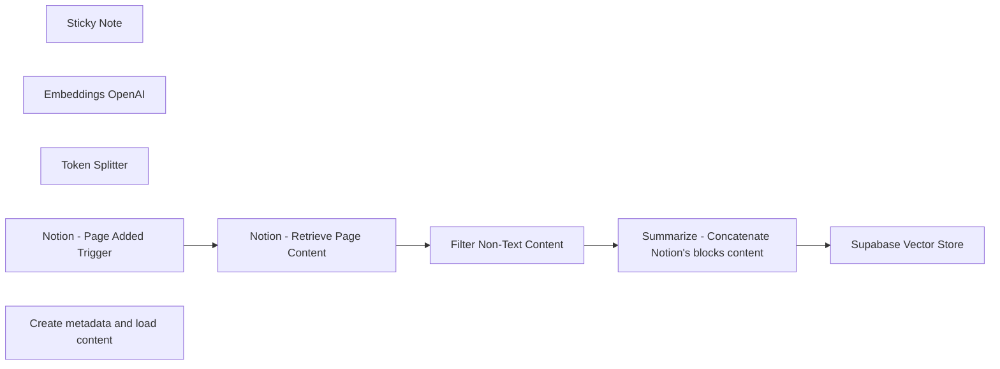

## Fluxo (.json) :

```json
{
  "id": "DvP6IHWymTIVg8Up",
  "meta": {
    "instanceId": "b9faf72fe0d7c3be94b3ebff0778790b50b135c336412d28fd4fca2cbbf8d1f5",
    "templateCredsSetupCompleted": true
  },
  "name": "Store Notion's Pages as Vector Documents into Supabase with OpenAI",
  "tags": [],
  "nodes": [
    {
      "id": "495609cd-4ca0-426d-8413-69e771398188",
      "name": "Sticky Note",
      "type": "n8n-nodes-base.stickyNote",
      "position": [
        480,
        400
      ],
      "parameters": {
        "width": 637.1327972412109,
        "height": 1113.7434387207031,
        "content": "## Store Notion's Pages as Vector Documents into Supabase\n\n**This workflow assumes you have a Supabase project with a table that has a vector column. If you don't have it, follow the instructions here:** [Supabase Vector Columns Guide](https://supabase.com/docs/guides/ai/vector-columns)\n\n## Workflow Description\n\nThis workflow automates the process of storing Notion pages as vector documents in a Supabase database with a vector column. The steps are as follows:\n\n1. **Notion Page Added Trigger**:\n - Monitors a specified Notion database for newly added pages. You can create a specific Notion database where you copy the pages you want to store in Supabase.\n - Node: `Page Added in Notion Database`\n\n2. **Retrieve Page Content**:\n - Fetches all block content from the newly added Notion page.\n - Node: `Get Blocks Content`\n\n3. **Filter Non-Text Content**:\n - Excludes blocks of type \"image\" and \"video\" to focus on textual content.\n - Node: `Filter - Exclude Media Content`\n\n4. **Summarize Content**:\n - Concatenates the Notion blocks content to create a single text for embedding.\n - Node: `Summarize - Concatenate Notion's blocks content`\n\n5. **Store in Supabase**:\n - Stores the processed documents and their embeddings into a Supabase table with a vector column.\n - Node: `Store Documents in Supabase`\n\n6. **Generate Embeddings**:\n - Utilizes OpenAI's API to generate embeddings for the textual content.\n - Node: `Generate Text Embeddings`\n\n\n7. **Create Metadata and Load Content**:\n - Loads the block content and creates associated metadata, such as page ID and block ID.\n - Node: `Load Block Content & Create Metadata`\n\n8. **Split Content into Chunks**:\n - Divides the text into smaller chunks for easier processing and embedding generation.\n - Node: `Token Splitter`\n\n\n\n"
      },
      "typeVersion": 1
    },
    {
      "id": "3f3e65dc-2b26-407c-87e5-52ba3b315fed",
      "name": "Embeddings OpenAI",
      "type": "@n8n/n8n-nodes-langchain.embeddingsOpenAi",
      "position": [
        2200,
        760
      ],
      "parameters": {
        "options": {}
      },
      "typeVersion": 1
    },
    {
      "id": "6d2579b8-376f-44c3-82e8-9dc608efd98b",
      "name": "Token Splitter",
      "type": "@n8n/n8n-nodes-langchain.textSplitterTokenSplitter",
      "position": [
        2340,
        960
      ],
      "parameters": {
        "chunkSize": 256,
        "chunkOverlap": 30
      },
      "typeVersion": 1
    },
    {
      "id": "79b3c147-08ca-4db4-9116-958a868cbfd9",
      "name": "Notion - Page Added Trigger",
      "type": "n8n-nodes-base.notionTrigger",
      "position": [
        1180,
        520
      ],
      "parameters": {
        "simple": false,
        "pollTimes": {
          "item": [
            {
              "mode": "everyMinute"
            }
          ]
        },
        "databaseId": {
          "__rl": true,
          "mode": "list",
          "value": "",
          "cachedResultUrl": "",
          "cachedResultName": ""
        }
      },
      "typeVersion": 1
    },
    {
      "id": "e4a6f524-e3f5-4d02-949a-8523f2d21965",
      "name": "Notion - Retrieve Page Content",
      "type": "n8n-nodes-base.notion",
      "position": [
        1400,
        520
      ],
      "parameters": {
        "blockId": {
          "__rl": true,
          "mode": "url",
          "value": "={{ $json.url }}"
        },
        "resource": "block",
        "operation": "getAll",
        "returnAll": true
      },
      "typeVersion": 2.2
    },
    {
      "id": "bfebc173-8d4b-4f8f-a625-4622949dd545",
      "name": "Filter Non-Text Content",
      "type": "n8n-nodes-base.filter",
      "position": [
        1620,
        520
      ],
      "parameters": {
        "options": {},
        "conditions": {
          "options": {
            "leftValue": "",
            "caseSensitive": true,
            "typeValidation": "strict"
          },
          "combinator": "and",
          "conditions": [
            {
              "id": "e5b605e5-6d05-4bca-8f19-a859e474620f",
              "operator": {
                "type": "string",
                "operation": "notEquals"
              },
              "leftValue": "={{ $json.type }}",
              "rightValue": "image"
            },
            {
              "id": "c7415859-5ffd-4c78-b497-91a3d6303b6f",
              "operator": {
                "type": "string",
                "operation": "notEquals"
              },
              "leftValue": "={{ $json.type }}",
              "rightValue": "video"
            }
          ]
        }
      },
      "typeVersion": 2
    },
    {
      "id": "b04939f9-355a-430b-a069-b11800066313",
      "name": "Summarize - Concatenate Notion's blocks content",
      "type": "n8n-nodes-base.summarize",
      "position": [
        1920,
        520
      ],
      "parameters": {
        "options": {
          "outputFormat": "separateItems"
        },
        "fieldsToSummarize": {
          "values": [
            {
              "field": "content",
              "separateBy": "\n",
              "aggregation": "concatenate"
            }
          ]
        }
      },
      "typeVersion": 1
    },
    {
      "id": "0e64dbb5-20c1-4b90-b818-a1726aaf5112",
      "name": "Create metadata and load content",
      "type": "@n8n/n8n-nodes-langchain.documentDefaultDataLoader",
      "position": [
        2320,
        760
      ],
      "parameters": {
        "options": {
          "metadata": {
            "metadataValues": [
              {
                "name": "pageId",
                "value": "={{ $('Notion - Page Added Trigger').item.json.id }}"
              },
              {
                "name": "createdTime",
                "value": "={{ $('Notion - Page Added Trigger').item.json.created_time }}"
              },
              {
                "name": "pageTitle",
                "value": "={{ $('Notion - Page Added Trigger').item.json.properties.Page.title[0].text.content }}"
              }
            ]
          }
        },
        "jsonData": "={{ $('Summarize - Concatenate Notion's blocks content').item.json.concatenated_content }}",
        "jsonMode": "expressionData"
      },
      "typeVersion": 1
    },
    {
      "id": "187aba6f-eaed-4427-8d40-b9da025fb37d",
      "name": "Supabase Vector Store",
      "type": "@n8n/n8n-nodes-langchain.vectorStoreSupabase",
      "position": [
        2200,
        520
      ],
      "parameters": {
        "mode": "insert",
        "options": {},
        "tableName": {
          "__rl": true,
          "mode": "list",
          "value": "",
          "cachedResultName": ""
        }
      },
      "typeVersion": 1
    }
  ],
  "active": false,
  "pinData": {},
  "settings": {
    "executionOrder": "v1"
  },
  "versionId": "77f6b6f7-d699-4a7e-b3e7-fe8a60bde7ba",
  "connections": {
    "Token Splitter": {
      "ai_textSplitter": [
        [
          {
            "node": "Create metadata and load content",
            "type": "ai_textSplitter",
            "index": 0
          }
        ]
      ]
    },
    "Embeddings OpenAI": {
      "ai_embedding": [
        [
          {
            "node": "Supabase Vector Store",
            "type": "ai_embedding",
            "index": 0
          }
        ]
      ]
    },
    "Filter Non-Text Content": {
      "main": [
        [
          {
            "node": "Summarize - Concatenate Notion's blocks content",
            "type": "main",
            "index": 0
          }
        ]
      ]
    },
    "Notion - Page Added Trigger": {
      "main": [
        [
          {
            "node": "Notion - Retrieve Page Content",
            "type": "main",
            "index": 0
          }
        ]
      ]
    },
    "Notion - Retrieve Page Content": {
      "main": [
        [
          {
            "node": "Filter Non-Text Content",
            "type": "main",
            "index": 0
          }
        ]
      ]
    },
    "Create metadata and load content": {
      "ai_document": [
        [
          {
            "node": "Supabase Vector Store",
            "type": "ai_document",
            "index": 0
          }
        ]
      ]
    },
    "Summarize - Concatenate Notion's blocks content": {
      "main": [
        [
          {
            "node": "Supabase Vector Store",
            "type": "main",
            "index": 0
          }
        ]
      ]
    }
  }
}
```

<a id="template-370"></a>

## Template 370 - Assistente inteligente para pais (Telegram)

- **Nome:** Assistente inteligente para pais (Telegram)
- **Descrição:** Fluxo que recebe mensagens e arquivos via Telegram, processa voz e texto, mantém memória contextual e orquestra agentes especializados para executar tarefas familiares e criar conteúdos.
- **Funcionalidade:** • Recepção de mensagens e arquivos pelo Telegram: Detecta texto, mensagens de voz e documentos enviados pelo usuário.
• Download e transcrição de áudio: Baixa arquivos de voz e os transcreve para texto para posterior processamento.
• Roteamento e orquestração de agentes: Um assistente central decide qual agente especializado deve executar a tarefa (email, calendário, contatos, criação de conteúdo, busca na web, calculadora).
• Regras de delegação para comunicações: Para qualquer comunicação escrita, delega a criação ao agente de conteúdo com instruções claras sobre público, tom e idioma.
• Armazenamento de memória vetorial: Salva mensagens relevantes como vetores com metadados para uso futuro e contexto.
• Processamento e ingestão de documentos: Carrega e transforma documentos recebidos para inserção no armazenamento de memória.
• Recuperação de contexto por sessão: Recupera informações relevantes da memória por ID de conversa para melhorar decisões e respostas.
• Uso de modelo conversacional para decidir ações: Utiliza um modelo de linguagem para interpretar intenção e gerar instruções para os agentes.
• Resposta ao usuário no Telegram: Envia a resposta final (ou a confirmação da ação) de volta ao chat do usuário.
- **Ferramentas:** • Telegram API: Canal de comunicação com o usuário para receber mensagens, arquivos e enviar respostas.
• OpenAI: Fornece transcrição de áudio, modelo de conversação e geração de embeddings para memória.
• Qdrant: Banco de vetores para armazenar e recuperar memórias e contexto da família.
• Tavily (API de busca): Realiza buscas na web para coletar fatos e ideias quando necessário.
• Wikipedia: Fonte pública de conhecimento para complementar informações.
• Serviços de Email/Calendário/Contatos: Integrações externas utilizadas pelos agentes especializados para enviar emails, criar eventos e gerenciar contatos em nome do usuário.


## Fluxo visual

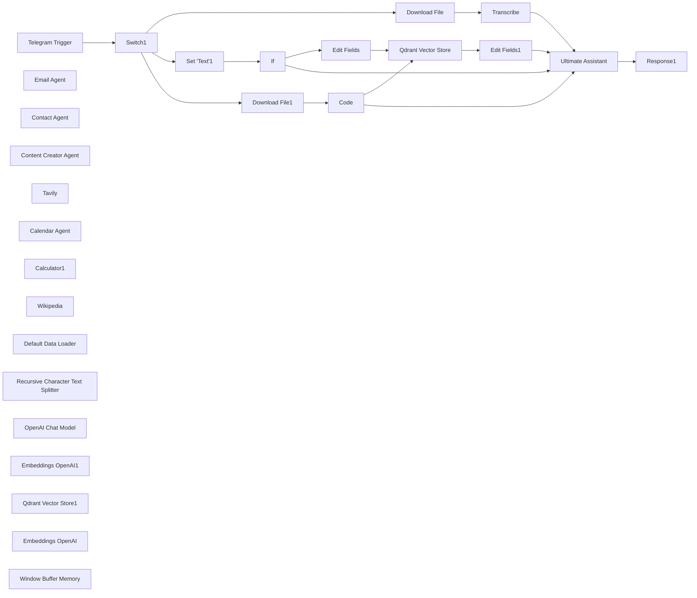

## Fluxo (.json) :

```json
{
  "id": "gFI0IHQrprv83RUU",
  "meta": {
    "instanceId": "fe6ecd76466cab7a915757a3c6d3a0bd1630ec8396b6ebc38945ac2ef61f7eb1",
    "templateCredsSetupCompleted": true
  },
  "name": "Parents smart bot",
  "tags": [
    {
      "id": "5oVNN9LitL7XAvBg",
      "name": "Parents bot",
      "createdAt": "2025-04-22T21:45:09.291Z",
      "updatedAt": "2025-04-22T21:45:09.291Z"
    }
  ],
  "nodes": [
    {
      "id": "a1117c0e-8fcc-4de6-b5c3-fe76ea10b975",
      "name": "Telegram Trigger",
      "type": "n8n-nodes-base.telegramTrigger",
      "position": [
        -560,
        20
      ],
      "webhookId": "a9b9daf6-4fb2-4c08-a7e3-8dc69a155511",
      "parameters": {
        "updates": [
          "message"
        ],
        "additionalFields": {
          "download": true
        }
      },
      "credentials": {
        "telegramApi": {
          "id": "FXdJyw1yYOOUGF1m",
          "name": "Telegram account"
        }
      },
      "typeVersion": 1.2
    },
    {
      "id": "b22f36e2-563d-428e-a4dc-41d5135d3174",
      "name": "Ultimate Assistant",
      "type": "@n8n/n8n-nodes-langchain.agent",
      "position": [
        1820,
        0
      ],
      "parameters": {
        "text": "={{ $json.text }} {{ $json.fullPrompt }}\n",
        "options": {
          "systemMessage": "=# Overview\nYou are the central brain of a smart personal assistant built especially for busy parents.  \nYour job is to understand the user's intent and delegate the request to the most appropriate specialized agent (tool).  \nYou do not generate content yourself — only orchestrate which tool should do what.\n\nYou’re here to help parents stay organized, reduce cognitive load, and make their lives easier – whether it's managing appointments, messaging people, creating content, or helping with daily logistics.\n\n## Tools\n- Email Agent: Use this tool to take action in email.\n- Calendar Agent: Use this tool to take action in calendar.\n- Contact Agent: Use this to get, update, or add contacts (like the doctor, the teacher, family, etc).\n- Content Creator Agent: Use this for generating any written content — reminders, messages, summaries, posts, etc.\n- Tavily: Use this to search the web and gather quick facts or ideas.\n- Calculator: Use this tool to perform calculations or evaluate numerical expressions when needed\n\n## Rules\n- Never write emails, posts, or summaries yourself. Always delegate to the appropriate Agent.\n- When sending an email or creating an event that involves people, you must first get their contact details via the Contact Agent, then pass them to the relevant tool.\n- When a task involves written communication (like messages, reminders, social posts, or summaries), use the Content Creator Agent. Include in your instruction:\n  - What kind of content is needed\n  - Who it is for (e.g. wife, teacher, LinkedIn)\n  - What the tone should be (supportive, excited, reflective)\n  - That it should be written in Hebrew\n\n- If the request is to \"write a post\" or \"LinkedIn post\", instruct the Content Creator Agent to use **LinkedIn Mode**.\n\n## Special Use Cases\n- Natural language reminders like “Doctor appointment for Maya on Tuesday at 16:00” → use Calendar Agent.\n- Quick tasks like “Send a thank-you message to the kindergarten teacher” → use Contact Agent → then Email Agent.\n- Content requests like “Write a LinkedIn post about parenting and tech” → instruct the Content Creator Agent accordingly.\n\n## Tone\nAlways be warm, calm, and empathetic — like a personal family assistant.  \nUse simple, human language that’s gentle, proactive, and respectful.  \nAssume you’re often speaking to a multitasking parent (especially mom 😅).\n\n## Final Check Before Responding\n- 🔄 **Language**: Ensure your final response is in **Hebrew**. If not, translate it accurately while keeping the tone and meaning.\n- 💬 **Tone**: Ensure the final message is soft, personal, and appropriate for a family context.\n- Do not send robotic or dry messages — always aim for warmth and helpfulness.\n\n---\n\n## Output Structure\nWhenever you delegate a task to the Content Creator Agent, provide it with:\n- A short, clear instruction of what to write\n- Target audience (e.g. my wife, my team, LinkedIn)\n- Desired tone (e.g. friendly, professional, celebratory)\n- Indicate Hebrew as the language\n"
        },
        "promptType": "define"
      },
      "typeVersion": 1.7
    },
    {
      "id": "f7874c27-c85c-438f-bdef-7ac9fce3b305",
      "name": "Email Agent",
      "type": "@n8n/n8n-nodes-langchain.toolWorkflow",
      "position": [
        1700,
        440
      ],
      "parameters": {
        "name": "emailAgent",
        "workflowId": {
          "__rl": true,
          "mode": "list",
          "value": "MuzLEMDHERvU0CMD",
          "cachedResultName": "Email Agent"
        },
        "description": "Call this tool for any email actions.",
        "workflowInputs": {
          "value": {},
          "schema": [],
          "mappingMode": "defineBelow",
          "matchingColumns": [],
          "attemptToConvertTypes": false,
          "convertFieldsToString": false
        }
      },
      "typeVersion": 2
    },
    {
      "id": "4e75c746-beb8-45b6-bfbc-1edf184dc2d4",
      "name": "Contact Agent",
      "type": "@n8n/n8n-nodes-langchain.toolWorkflow",
      "position": [
        1940,
        440
      ],
      "parameters": {
        "name": "contactAgent",
        "workflowId": {
          "__rl": true,
          "mode": "list",
          "value": "IsSUyrla7wc1cDLE",
          "cachedResultName": "🤖Contact Agent"
        },
        "description": "Call this tool for any contact related actions.",
        "workflowInputs": {
          "value": {},
          "schema": [],
          "mappingMode": "defineBelow",
          "matchingColumns": [],
          "attemptToConvertTypes": false,
          "convertFieldsToString": false
        }
      },
      "typeVersion": 2
    },
    {
      "id": "63f55d55-1a46-49d2-9113-2db2edf6682a",
      "name": "Content Creator Agent",
      "type": "@n8n/n8n-nodes-langchain.toolWorkflow",
      "position": [
        2080,
        440
      ],
      "parameters": {
        "name": "contentCreator",
        "workflowId": {
          "__rl": true,
          "mode": "list",
          "value": "MTO7R5h1y1XSuN5o",
          "cachedResultName": "Content Agent"
        },
        "description": "Call this tool whenever you need to create any kind of written content for the user.  \nThis includes but is not limited to: reminders, messages, summaries, emails, posts, or even fun or empathetic replies.  \n",
        "workflowInputs": {
          "value": {},
          "schema": [],
          "mappingMode": "defineBelow",
          "matchingColumns": [],
          "attemptToConvertTypes": false,
          "convertFieldsToString": false
        }
      },
      "typeVersion": 2
    },
    {
      "id": "cdd8d779-053b-4147-8f0b-85db923711bf",
      "name": "Tavily",
      "type": "@n8n/n8n-nodes-langchain.toolHttpRequest",
      "position": [
        2200,
        440
      ],
      "parameters": {
        "url": "https://api.tavily.com/search",
        "method": "POST",
        "jsonBody": "{\n    \"api_key\": \"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\",\n    \"query\": \"{searchTerm}\",\n    \"search_depth\": \"basic\",\n    \"include_answer\": true,\n    \"topic\": \"news\",\n    \"include_raw_content\": true,\n    \"max_results\": 3\n} ",
        "sendBody": true,
        "specifyBody": "json",
        "toolDescription": "Use this tool to search the internet",
        "placeholderDefinitions": {
          "values": [
            {
              "name": "searchTerm",
              "type": "string",
              "description": "What the user has requested to search the internet for"
            }
          ]
        }
      },
      "typeVersion": 1.1
    },
    {
      "id": "aabea6d5-06b5-4c70-b140-78a6edc277ca",
      "name": "Calendar Agent",
      "type": "@n8n/n8n-nodes-langchain.toolWorkflow",
      "position": [
        1820,
        440
      ],
      "parameters": {
        "name": "calendarAgent",
        "workflowId": {
          "__rl": true,
          "mode": "list",
          "value": "QbIV4MIEmgQG4nUa",
          "cachedResultName": "Calender Agent"
        },
        "description": "Call this tool for any calendar action.",
        "workflowInputs": {
          "value": {},
          "schema": [],
          "mappingMode": "defineBelow",
          "matchingColumns": [],
          "attemptToConvertTypes": false,
          "convertFieldsToString": false
        }
      },
      "typeVersion": 2
    },
    {
      "id": "5dc59107-b53e-47a3-9dc6-cdafe449f8da",
      "name": "Download File",
      "type": "n8n-nodes-base.telegram",
      "position": [
        0,
        -160
      ],
      "webhookId": "83bb7385-33f6-4105-8294-1a91c0ebbee5",
      "parameters": {
        "fileId": "={{ $json.message.voice.file_id }}",
        "resource": "file"
      },
      "credentials": {
        "telegramApi": {
          "id": "FXdJyw1yYOOUGF1m",
          "name": "Telegram account"
        }
      },
      "typeVersion": 1.2
    },
    {
      "id": "9d7d1d10-4266-4b31-9f2f-cc249be68b65",
      "name": "Transcribe",
      "type": "@n8n/n8n-nodes-langchain.openAi",
      "position": [
        200,
        -160
      ],
      "parameters": {
        "options": {},
        "resource": "audio",
        "operation": "transcribe"
      },
      "credentials": {
        "openAiApi": {
          "id": "4dCIIzau81oRIK8h",
          "name": "OpenAi account"
        }
      },
      "typeVersion": 1.6
    },
    {
      "id": "6ef56cfc-702f-4007-9d7a-d0778805b892",
      "name": "Calculator1",
      "type": "@n8n/n8n-nodes-langchain.toolCalculator",
      "position": [
        2320,
        440
      ],
      "parameters": {},
      "typeVersion": 1
    },
    {
      "id": "d4ce9e05-bbba-47e7-a23b-8a2aed82dc7b",
      "name": "Set 'Text'1",
      "type": "n8n-nodes-base.set",
      "position": [
        240,
        20
      ],
      "parameters": {
        "options": {},
        "assignments": {
          "assignments": [
            {
              "id": "fe7ecc99-e1e8-4a5e-bdd6-6fce9757b234",
              "name": "text",
              "type": "string",
              "value": "={{ $json.message.text }}"
            }
          ]
        }
      },
      "typeVersion": 3.4
    },
    {
      "id": "fde8c340-fcf2-4bc3-a23d-d669ec9a58b0",
      "name": "Switch1",
      "type": "n8n-nodes-base.switch",
      "position": [
        -240,
        20
      ],
      "parameters": {
        "rules": {
          "values": [
            {
              "outputKey": "Voice",
              "conditions": {
                "options": {
                  "version": 2,
                  "leftValue": "",
                  "caseSensitive": true,
                  "typeValidation": "strict"
                },
                "combinator": "and",
                "conditions": [
                  {
                    "id": "198d228f-dd5a-4a53-9cb9-de6fc2adff2b",
                    "operator": {
                      "type": "string",
                      "operation": "exists",
                      "singleValue": true
                    },
                    "leftValue": "={{ $json.message.voice.file_id }}",
                    "rightValue": ""
                  }
                ]
              },
              "renameOutput": true
            },
            {
              "outputKey": "Text",
              "conditions": {
                "options": {
                  "version": 2,
                  "leftValue": "",
                  "caseSensitive": true,
                  "typeValidation": "strict"
                },
                "combinator": "and",
                "conditions": [
                  {
                    "id": "8c844924-b2ed-48b0-935c-c66a8fd0c778",
                    "operator": {
                      "type": "string",
                      "operation": "exists",
                      "singleValue": true
                    },
                    "leftValue": "={{ $json.message.text }}",
                    "rightValue": ""
                  }
                ]
              },
              "renameOutput": true
            },
            {
              "outputKey": "File",
              "conditions": {
                "options": {
                  "version": 2,
                  "leftValue": "",
                  "caseSensitive": true,
                  "typeValidation": "strict"
                },
                "combinator": "and",
                "conditions": [
                  {
                    "id": "42930344-1ca2-4298-aa5e-4e8884602e5f",
                    "operator": {
                      "type": "object",
                      "operation": "exists",
                      "singleValue": true
                    },
                    "leftValue": "",
                    "rightValue": ""
                  }
                ]
              },
              "renameOutput": true
            }
          ]
        },
        "options": {}
      },
      "typeVersion": 3.2
    },
    {
      "id": "f529779d-a9f8-4854-96ec-c8780a90c8ae",
      "name": "Response1",
      "type": "n8n-nodes-base.telegram",
      "position": [
        2320,
        0
      ],
      "webhookId": "5dced4b9-5066-4036-a4d4-14fc07edd53c",
      "parameters": {
        "text": "={{ $json.output }}",
        "chatId": "={{ $('Telegram Trigger').item.json.message.chat.id }}",
        "additionalFields": {
          "appendAttribution": false
        }
      },
      "credentials": {
        "telegramApi": {
          "id": "FXdJyw1yYOOUGF1m",
          "name": "Telegram account"
        }
      },
      "typeVersion": 1.2
    },
    {
      "id": "87dead2c-0287-44cf-9650-78004a35af4a",
      "name": "Wikipedia",
      "type": "@n8n/n8n-nodes-langchain.toolWikipedia",
      "position": [
        2440,
        440
      ],
      "parameters": {},
      "typeVersion": 1
    },
    {
      "id": "40084dad-2aa7-4b51-af93-de38fcd585b5",
      "name": "Qdrant Vector Store",
      "type": "@n8n/n8n-nodes-langchain.vectorStoreQdrant",
      "position": [
        720,
        460
      ],
      "parameters": {
        "mode": "insert",
        "options": {},
        "qdrantCollection": {
          "__rl": true,
          "mode": "list",
          "value": "family-memory",
          "cachedResultName": "family-memory"
        }
      },
      "credentials": {
        "qdrantApi": {
          "id": "8vZ7qiEVfdQtZNeK",
          "name": "QdrantApi account"
        }
      },
      "typeVersion": 1.1
    },
    {
      "id": "91f01d4b-6afc-4698-91c9-83c06fe2a209",
      "name": "Default Data Loader",
      "type": "@n8n/n8n-nodes-langchain.documentDefaultDataLoader",
      "position": [
        840,
        660
      ],
      "parameters": {
        "options": {},
        "jsonData": "={{ $json.text }}\n",
        "jsonMode": "expressionData"
      },
      "typeVersion": 1
    },
    {
      "id": "d34f1e08-2521-4fc2-aa06-017f148b57f7",
      "name": "Recursive Character Text Splitter",
      "type": "@n8n/n8n-nodes-langchain.textSplitterRecursiveCharacterTextSplitter",
      "position": [
        860,
        840
      ],
      "parameters": {
        "options": {}
      },
      "typeVersion": 1
    },
    {
      "id": "f0fbf5b5-32bc-4051-b1b1-4741899716e1",
      "name": "OpenAI Chat Model",
      "type": "@n8n/n8n-nodes-langchain.lmChatOpenAi",
      "position": [
        1720,
        160
      ],
      "parameters": {
        "model": {
          "__rl": true,
          "mode": "list",
          "value": "gpt-3.5-turbo",
          "cachedResultName": "gpt-3.5-turbo"
        },
        "options": {}
      },
      "credentials": {
        "openAiApi": {
          "id": "4dCIIzau81oRIK8h",
          "name": "OpenAi account"
        }
      },
      "typeVersion": 1.2
    },
    {
      "id": "e4b062ff-255f-42e8-b0c1-4c5545e71097",
      "name": "Embeddings OpenAI1",
      "type": "@n8n/n8n-nodes-langchain.embeddingsOpenAi",
      "position": [
        700,
        720
      ],
      "parameters": {
        "model": "text-embedding-ada-002",
        "options": {
          "stripNewLines": true
        }
      },
      "credentials": {
        "openAiApi": {
          "id": "4dCIIzau81oRIK8h",
          "name": "OpenAi account"
        }
      },
      "typeVersion": 1.2
    },
    {
      "id": "508156dc-fa2e-41f2-a8bf-633d4cab2a9f",
      "name": "Qdrant Vector Store1",
      "type": "@n8n/n8n-nodes-langchain.vectorStoreQdrant",
      "position": [
        2580,
        440
      ],
      "parameters": {
        "mode": "retrieve-as-tool",
        "topK": 5,
        "options": {},
        "toolName": "memory_store",
        "toolDescription": "Call this tool to Retrieve relevant family information to give context to the assistant's decisions. Includes names, roles, events, and personal preferences.\n",
        "qdrantCollection": {
          "__rl": true,
          "mode": "list",
          "value": "family-memory",
          "cachedResultName": "family-memory"
        }
      },
      "credentials": {
        "qdrantApi": {
          "id": "8vZ7qiEVfdQtZNeK",
          "name": "QdrantApi account"
        }
      },
      "typeVersion": 1.1
    },
    {
      "id": "84db19a0-8eec-4aea-abfd-e94d88905a56",
      "name": "Embeddings OpenAI",
      "type": "@n8n/n8n-nodes-langchain.embeddingsOpenAi",
      "position": [
        2560,
        580
      ],
      "parameters": {
        "options": {}
      },
      "credentials": {
        "openAiApi": {
          "id": "4dCIIzau81oRIK8h",
          "name": "OpenAi account"
        }
      },
      "typeVersion": 1.2
    },
    {
      "id": "4b5ea288-2d75-4bb8-91b0-e900c44dda1f",
      "name": "Window Buffer Memory",
      "type": "@n8n/n8n-nodes-langchain.memoryBufferWindow",
      "position": [
        1860,
        200
      ],
      "parameters": {
        "sessionKey": "={{ $('Telegram Trigger').item.json.message.chat.id }}",
        "sessionIdType": "customKey"
      },
      "typeVersion": 1.3
    },
    {
      "id": "9c9c0578-d849-4250-9d99-8d500272031f",
      "name": "Download File1",
      "type": "n8n-nodes-base.telegram",
      "position": [
        -240,
        280
      ],
      "webhookId": "83bb7385-33f6-4105-8294-1a91c0ebbee5",
      "parameters": {
        "fileId": "={{ $json.message.document.file_id }}\n",
        "resource": "file"
      },
      "credentials": {
        "telegramApi": {
          "id": "FXdJyw1yYOOUGF1m",
          "name": "Telegram account"
        }
      },
      "typeVersion": 1.2
    },
    {
      "id": "b67a9ed8-2095-4402-ab93-c99363e5f496",
      "name": "Code",
      "type": "n8n-nodes-base.code",
      "onError": "continueErrorOutput",
      "position": [
        -280,
        560
      ],
      "parameters": {
        "jsCode": "const fileContent = JSON.parse(Buffer.from($input.first().binary.data.data, 'base64').toString());\nreturn fileContent.map(item => ({\n  json: {\n    id: item.id,\n    text: item.text,\n    metadata: item.metadata,\n  }\n}));\n"
      },
      "retryOnFail": true,
      "typeVersion": 2
    },
    {
      "id": "f4fcbe6b-998f-44bb-bbcf-cc7829fc280a",
      "name": "If",
      "type": "n8n-nodes-base.if",
      "position": [
        460,
        20
      ],
      "parameters": {
        "options": {},
        "conditions": {
          "options": {
            "version": 2,
            "leftValue": "",
            "caseSensitive": true,
            "typeValidation": "strict"
          },
          "combinator": "and",
          "conditions": [
            {
              "id": "79412a1a-5b1e-48d9-85c0-f514590d4de6",
              "operator": {
                "type": "string",
                "operation": "regex"
              },
              "leftValue": "={{$json.text}}",
              "rightValue": "/(מיה|שוהם|נוי|גן|חוג|רופא|סבתא|שישי|שלישי|תזכורת|יש|ביום|בעבודה|בבית ספר)/i"
            }
          ]
        }
      },
      "typeVersion": 2.2
    },
    {
      "id": "03ce3bd2-768a-4e08-b985-dad287900fa9",
      "name": "Edit Fields",
      "type": "n8n-nodes-base.set",
      "position": [
        480,
        260
      ],
      "parameters": {
        "options": {},
        "assignments": {
          "assignments": [
            {
              "id": "e7ce88f3-4e65-46cd-9c10-800ce2f83ae4",
              "name": "text",
              "type": "string",
              "value": "={{ $json.text }}"
            },
            {
              "id": "2e4f47c6-a94d-4d69-b5c0-b366a99914c1",
              "name": "metadata.source",
              "type": "string",
              "value": "\"user_message\""
            },
            {
              "id": "dbfd95ac-3101-4548-a1a1-441d34ee455c",
              "name": "metadata.timestamp",
              "type": "string",
              "value": "={{ $now }}"
            }
          ]
        }
      },
      "typeVersion": 3.4
    },
    {
      "id": "0537e668-1fd9-4b19-9d33-fc4d89fb89f9",
      "name": "Edit Fields1",
      "type": "n8n-nodes-base.set",
      "position": [
        1260,
        460
      ],
      "parameters": {
        "options": {},
        "assignments": {
          "assignments": [
            {
              "id": "e6fad62f-160d-4bed-bcdf-ba4bcef72e23",
              "name": "fullPrompt",
              "type": "string",
              "value": "={{ $json.text }}{{ $json.pageContent ? '\\n\\nהקשר מזיכרון:\\n' + $json.pageContent + '\\n(נשמר בתאריך: ' + $json.metadata.timestamp + ')' : '' }}\n"
            }
          ]
        }
      },
      "typeVersion": 3.4
    }
  ],
  "active": true,
  "pinData": {},
  "settings": {
    "executionOrder": "v1"
  },
  "versionId": "4fe8a9b0-c21f-4441-a479-7cadd57c57a6",
  "connections": {
    "If": {
      "main": [
        [
          {
            "node": "Edit Fields",
            "type": "main",
            "index": 0
          }
        ],
        [
          {
            "node": "Ultimate Assistant",
            "type": "main",
            "index": 0
          }
        ]
      ]
    },
    "Code": {
      "main": [
        [
          {
            "node": "Qdrant Vector Store",
            "type": "main",
            "index": 0
          }
        ],
        [
          {
            "node": "Ultimate Assistant",
            "type": "main",
            "index": 0
          }
        ]
      ]
    },
    "Tavily": {
      "ai_tool": [
        [
          {
            "node": "Ultimate Assistant",
            "type": "ai_tool",
            "index": 0
          }
        ]
      ]
    },
    "Switch1": {
      "main": [
        [
          {
            "node": "Download File",
            "type": "main",
            "index": 0
          }
        ],
        [
          {
            "node": "Set 'Text'1",
            "type": "main",
            "index": 0
          }
        ],
        [
          {
            "node": "Download File1",
            "type": "main",
            "index": 0
          }
        ]
      ]
    },
    "Wikipedia": {
      "ai_tool": [
        [
          {
            "node": "Ultimate Assistant",
            "type": "ai_tool",
            "index": 0
          }
        ]
      ]
    },
    "Transcribe": {
      "main": [
        [
          {
            "node": "Ultimate Assistant",
            "type": "main",
            "index": 0
          }
        ]
      ]
    },
    "Calculator1": {
      "ai_tool": [
        [
          {
            "node": "Ultimate Assistant",
            "type": "ai_tool",
            "index": 0
          }
        ]
      ]
    },
    "Edit Fields": {
      "main": [
        [
          {
            "node": "Qdrant Vector Store",
            "type": "main",
            "index": 0
          }
        ]
      ]
    },
    "Email Agent": {
      "ai_tool": [
        [
          {
            "node": "Ultimate Assistant",
            "type": "ai_tool",
            "index": 0
          }
        ]
      ]
    },
    "Set 'Text'1": {
      "main": [
        [
          {
            "node": "If",
            "type": "main",
            "index": 0
          }
        ]
      ]
    },
    "Edit Fields1": {
      "main": [
        [
          {
            "node": "Ultimate Assistant",
            "type": "main",
            "index": 0
          }
        ]
      ]
    },
    "Contact Agent": {
      "ai_tool": [
        [
          {
            "node": "Ultimate Assistant",
            "type": "ai_tool",
            "index": 0
          }
        ]
      ]
    },
    "Download File": {
      "main": [
        [
          {
            "node": "Transcribe",
            "type": "main",
            "index": 0
          }
        ]
      ]
    },
    "Calendar Agent": {
      "ai_tool": [
        [
          {
            "node": "Ultimate Assistant",
            "type": "ai_tool",
            "index": 0
          }
        ]
      ]
    },
    "Download File1": {
      "main": [
        [
          {
            "node": "Code",
            "type": "main",
            "index": 0
          }
        ]
      ]
    },
    "Telegram Trigger": {
      "main": [
        [
          {
            "node": "Switch1",
            "type": "main",
            "index": 0
          }
        ]
      ]
    },
    "Embeddings OpenAI": {
      "ai_embedding": [
        [
          {
            "node": "Qdrant Vector Store1",
            "type": "ai_embedding",
            "index": 0
          }
        ]
      ]
    },
    "OpenAI Chat Model": {
      "ai_languageModel": [
        [
          {
            "node": "Ultimate Assistant",
            "type": "ai_languageModel",
            "index": 0
          }
        ]
      ]
    },
    "Embeddings OpenAI1": {
      "ai_embedding": [
        [
          {
            "node": "Qdrant Vector Store",
            "type": "ai_embedding",
            "index": 0
          }
        ]
      ]
    },
    "Ultimate Assistant": {
      "main": [
        [
          {
            "node": "Response1",
            "type": "main",
            "index": 0
          }
        ]
      ]
    },
    "Default Data Loader": {
      "ai_document": [
        [
          {
            "node": "Qdrant Vector Store",
            "type": "ai_document",
            "index": 0
          }
        ]
      ]
    },
    "Qdrant Vector Store": {
      "main": [
        [
          {
            "node": "Edit Fields1",
            "type": "main",
            "index": 0
          }
        ]
      ]
    },
    "Qdrant Vector Store1": {
      "ai_tool": [
        [
          {
            "node": "Ultimate Assistant",
            "type": "ai_tool",
            "index": 0
          }
        ]
      ]
    },
    "Window Buffer Memory": {
      "ai_memory": [
        [
          {
            "node": "Ultimate Assistant",
            "type": "ai_memory",
            "index": 0
          }
        ]
      ]
    },
    "Content Creator Agent": {
      "ai_tool": [
        [
          {
            "node": "Ultimate Assistant",
            "type": "ai_tool",
            "index": 0
          }
        ]
      ]
    },
    "Recursive Character Text Splitter": {
      "ai_textSplitter": [
        [
          {
            "node": "Default Data Loader",
            "type": "ai_textSplitter",
            "index": 0
          }
        ]
      ]
    }
  }
}
```

<a id="template-371"></a>

## Template 371 - Notificar estrelas GitHub no Slack

- **Nome:** Notificar estrelas GitHub no Slack
- **Descrição:** Monitora estrelas de um repositório no GitHub e envia notificações ao Slack quando uma estrela é adicionada ou removida.
- **Funcionalidade:** • Monitoramento de eventos do repositório: Observa eventos de estrela no repositório configurado.
• Verificação da ação do evento: Determina se a ação do evento é criação (star adicionada) ou outra ação (por exemplo, remoção).
• Notificação de adição de estrela: Envia mensagem ao canal do Slack com o usuário que deu a estrela, avatar, link e contagem atual de estrelas quando uma estrela é adicionada.
• Notificação de remoção de estrela: Envia mensagem ao canal do Slack com o usuário que removeu a estrela, avatar, link e contagem atual de estrelas quando uma estrela é removida.
• Uso de sinalização visual: Utiliza cores diferentes nas notificações para diferenciar adições (verde) e remoções (vermelho).
- **Ferramentas:** • GitHub: Repositório e fonte dos eventos de estrela (fornece dados do evento, usuário, avatar, link e contagem de estrelas).
• Slack: Canal de comunicação onde as notificações são postadas para informar a equipe sobre adições ou remoções de estrelas.


## Fluxo visual

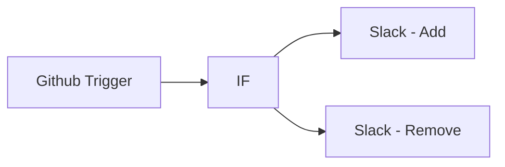

## Fluxo (.json) :

```json
{
  "nodes": [
    {
      "name": "Github Trigger",
      "type": "n8n-nodes-base.githubTrigger",
      "position": [
        500,
        350
      ],
      "parameters": {
        "owner": "n8n-io",
        "events": [
          "star"
        ],
        "repository": "n8n"
      },
      "credentials": {
        "githubApi": ""
      },
      "typeVersion": 1
    },
    {
      "name": "IF",
      "type": "n8n-nodes-base.if",
      "position": [
        700,
        350
      ],
      "parameters": {
        "conditions": {
          "string": [
            {
              "value1": "={{$node[\"Github Trigger\"].data[\"body\"][\"action\"]}}",
              "value2": "created"
            }
          ]
        }
      },
      "typeVersion": 1
    },
    {
      "name": "Slack - Add",
      "type": "n8n-nodes-base.slack",
      "position": [
        900,
        250
      ],
      "parameters": {
        "channel": "#general",
        "attachments": [
          {
            "text": "=The project has now: {{$node[\"Github Trigger\"].data[\"body\"][\"repository\"][\"stargazers_count\"]}} Stars",
            "color": "#88FF00",
            "title": "=Got new star from: {{$node[\"Github Trigger\"].data[\"body\"][\"sender\"][\"login\"]}}",
            "image_url": "={{$node[\"Github Trigger\"].data[\"body\"][\"sender\"][\"avatar_url\"]}}",
            "title_link": "={{$node[\"Github Trigger\"].data[\"body\"][\"sender\"][\"html_url\"]}}"
          }
        ],
        "otherOptions": {}
      },
      "credentials": {
        "slackApi": ""
      },
      "typeVersion": 1
    },
    {
      "name": "Slack - Remove",
      "type": "n8n-nodes-base.slack",
      "position": [
        900,
        450
      ],
      "parameters": {
        "channel": "#general",
        "attachments": [
          {
            "text": "=The project has now: {{$node[\"Github Trigger\"].data[\"body\"][\"repository\"][\"stargazers_count\"]}} Stars",
            "color": "#ff0000",
            "title": "=Star got removed by: {{$node[\"Github Trigger\"].data[\"body\"][\"sender\"][\"login\"]}}",
            "image_url": "={{$node[\"Github Trigger\"].data[\"body\"][\"sender\"][\"avatar_url\"]}}",
            "title_link": "={{$node[\"Github Trigger\"].data[\"body\"][\"sender\"][\"html_url\"]}}"
          }
        ],
        "otherOptions": {}
      },
      "credentials": {
        "slackApi": ""
      },
      "typeVersion": 1
    }
  ],
  "connections": {
    "IF": {
      "main": [
        [
          {
            "node": "Slack - Add",
            "type": "main",
            "index": 0
          }
        ],
        [
          {
            "node": "Slack - Remove",
            "type": "main",
            "index": 0
          }
        ]
      ]
    },
    "Github Trigger": {
      "main": [
        [
          {
            "node": "IF",
            "type": "main",
            "index": 0
          }
        ]
      ]
    }
  }
}
```

<a id="template-372"></a>

## Template 372 - Execução manual de função AWS Lambda

- **Nome:** Execução manual de função AWS Lambda
- **Descrição:** Ao acionar manualmente, o fluxo invoca uma função AWS Lambda específica e retorna o resultado da execução.
- **Funcionalidade:** • Gatilho manual: inicia o fluxo quando o usuário clica em executar.
• Invocação de função AWS Lambda: chama a função especificada pelo ARN e aguarda sua resposta.
• Autenticação com credenciais AWS: utiliza credenciais configuradas para autorizar a chamada à função Lambda.
- **Ferramentas:** • AWS Lambda: serviço de computação serverless que executa a função hello-world-sample (ARN arn:aws:lambda:ap-south-1:100558637562:function:hello-world-sample) para processar a solicitação e retornar um resultado.


## Fluxo visual

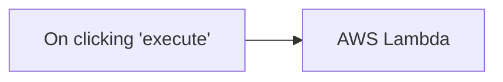

## Fluxo (.json) :

```json
{
  "nodes": [
    {
      "name": "On clicking 'execute'",
      "type": "n8n-nodes-base.manualTrigger",
      "position": [
        250,
        300
      ],
      "parameters": {},
      "typeVersion": 1
    },
    {
      "name": "AWS Lambda",
      "type": "n8n-nodes-base.awsLambda",
      "position": [
        450,
        300
      ],
      "parameters": {
        "function": "arn:aws:lambda:ap-south-1:100558637562:function:hello-world-sample"
      },
      "credentials": {
        "aws": "amudhan-aws"
      },
      "typeVersion": 1
    }
  ],
  "connections": {
    "On clicking 'execute'": {
      "main": [
        [
          {
            "node": "AWS Lambda",
            "type": "main",
            "index": 0
          }
        ]
      ]
    }
  }
}
```

<a id="template-373"></a>

## Template 373 - Comparador de LLMs locais

- **Nome:** Comparador de LLMs locais
- **Descrição:** Recebe mensagens de chat, executa o mesmo prompt em múltiplos modelos locais carregados no LM Studio, mede tempos de resposta, calcula métricas de legibilidade e, opcionalmente, grava os resultados em uma planilha.
- **Funcionalidade:** • Recepção de mensagens via webhook: Inicia o fluxo ao receber uma mensagem de chat.
• Descoberta de modelos ativos: Consulta o servidor LM Studio para listar os modelos carregados.
• Execução sequencial por modelo: Divide a lista de modelos e executa o mesmo prompt em cada modelo separadamente.
• Configuração dinâmica de sistema e parâmetros: Permite inserir um system prompt e ajustar temperatura, top_p e presence penalty para controlar o comportamento dos modelos.
• Captura de tempo de início e fim: Registra timestamps antes e depois da chamada ao modelo para calcular latência/tempo total.
• Análise textual automatizada: Executa cálculos de contagem de palavras, contagem de sentenças, comprimento médio de sentença, comprimento médio de palavra e score de legibilidade Flesch-Kincaid.
• Preparação e formatação dos dados: Consolida resposta, metadados e métricas para armazenamento ou revisão.
• Armazenamento opcional em planilha: Envia resultados analisados para uma Google Sheet para acompanhamento e comparação entre execuções.
- **Ferramentas:** • LM Studio (servidor local): Hospeda e expõe os modelos LLM localmente via API compatível, permitindo consultas e testes.
• Google Sheets: Planilha online usada para registrar prompts, respostas, tempos e métricas para análise e acompanhamento.
• API compatível com OpenAI (endpoint local): Interface HTTP usada para invocar os modelos locais com parâmetros como temperature e top_p.
• Fonte de chat/webhook: Origem externa das mensagens de entrada que disparam o fluxo de avaliação.


## Fluxo visual

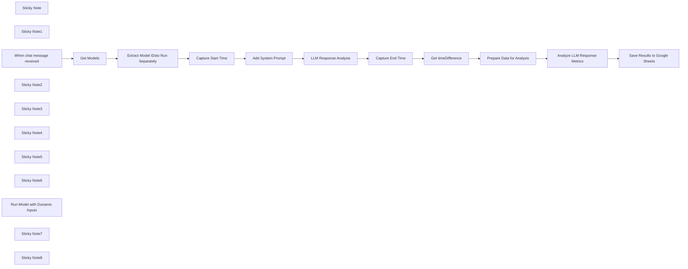

## Fluxo (.json) :

```json
{
  "id": "WulUYgcXvako9hBy",
  "meta": {
    "instanceId": "d6b86682c7e02b79169c1a61ad0484dcda5bc8b0ea70f1a95dac239c2abfd057",
    "templateCredsSetupCompleted": true
  },
  "name": "Testing Mulitple Local LLM with LM Studio",
  "tags": [
    {
      "id": "RkTiZTdbLvr6uzSg",
      "name": "Training",
      "createdAt": "2024-06-18T16:09:35.806Z",
      "updatedAt": "2024-06-18T16:09:35.806Z"
    },
    {
      "id": "W3xdiSeIujD7XgBA",
      "name": "Template",
      "createdAt": "2024-06-18T22:15:34.874Z",
      "updatedAt": "2024-06-18T22:15:34.874Z"
    }
  ],
  "nodes": [
    {
      "id": "08c457ef-5c1f-46d8-a53e-f492b11c83f9",
      "name": "Sticky Note",
      "type": "n8n-nodes-base.stickyNote",
      "position": [
        1600,
        420
      ],
      "parameters": {
        "color": 6,
        "width": 478.38709677419376,
        "height": 347.82258064516134,
        "content": "## 🧠Text Analysis\n### Readability Score Ranges:\nWhen testing model responses, readability scores can range across different levels. Here’s a breakdown:\n\n- **90–100**: Very easy to read (5th grade or below)\n- **80–89**: Easy to read (6th grade)\n- **70–79**: Fairly easy to read (7th grade)\n- **60–69**: Standard (8th to 9th grade)\n- **50–59**: Fairly difficult (10th to 12th grade)\n- **30–49**: Difficult (College)\n- **0–29**: Very difficult (College graduate)\n- **Below 0**: Extremely difficult (Post-graduate level)\n"
      },
      "typeVersion": 1
    },
    {
      "id": "7801734c-5eb9-4abd-b234-e406462931f7",
      "name": "Get Models",
      "type": "n8n-nodes-base.httpRequest",
      "onError": "continueErrorOutput",
      "position": [
        20,
        180
      ],
      "parameters": {
        "url": "http://192.168.1.179:1234/v1/models",
        "options": {
          "timeout": 10000,
          "allowUnauthorizedCerts": false
        }
      },
      "typeVersion": 4.2
    },
    {
      "id": "5ee93d9a-ad2e-4ea9-838e-2c12a168eae6",
      "name": "Sticky Note1",
      "type": "n8n-nodes-base.stickyNote",
      "position": [
        -140,
        -100
      ],
      "parameters": {
        "width": 377.6129032258063,
        "height": 264.22580645161304,
        "content": "##  ⚙️ 2. Update Local IP\nUpdate the **'Base URL'** `http://192.168.1.1:1234/v1/models` in the workflow to match the IP of your LM Studio server. (Running LM Server)[https://lmstudio.ai/docs/basics/server]\n\nThis node will query the LM Studio server to retrieve a list of all loaded model IDs at the time of the query. If you change or add models to LM Studio, you’ll need to rerun this node to get an updated list of active LLMs.\n"
      },
      "typeVersion": 1
    },
    {
      "id": "f2b6a6ed-0ef1-4f2c-8350-9abd59d08e61",
      "name": "When chat message received",
      "type": "@n8n/n8n-nodes-langchain.chatTrigger",
      "position": [
        -300,
        180
      ],
      "webhookId": "39c3c6d5-ea06-4faa-b0e3-4e77a05b0297",
      "parameters": {
        "options": {}
      },
      "typeVersion": 1.1
    },
    {
      "id": "dbaf0ad1-9027-4317-a996-33a3fcc9e258",
      "name": "Sticky Note2",
      "type": "n8n-nodes-base.stickyNote",
      "position": [
        -740,
        200
      ],
      "parameters": {
        "width": 378.75806451612857,
        "height": 216.12903225806457,
        "content": "## 🛠️1. Setup - LM Studio\nFirst, download and install [LM Studio](https://lmstudio.ai/). Identify which LLM models you want to use for testing.\n\nNext, the selected models are loaded into the server capabilities to prepare them for testing. For a detailed guide on how to set up multiple models, refer to the [LM Studio Basics](https://lmstudio.ai/docs/basics) documentation.\n"
      },
      "typeVersion": 1
    },
    {
      "id": "36770fd1-7863-4c42-a68d-8d240ae3683b",
      "name": "Sticky Note3",
      "type": "n8n-nodes-base.stickyNote",
      "position": [
        360,
        400
      ],
      "parameters": {
        "width": 570.0000000000002,
        "height": 326.0645161290325,
        "content": "##  3. 💡Update the LM Settings\n\nFrom here, you can modify the following\n parameters to fine-tune model behavior:\n\n- **Temperature**: Controls randomness. Higher values (e.g., 1.0) produce more diverse results, while lower values (e.g., 0.2) make responses more focused and deterministic.\n- **Top P**: Adjusts nucleus sampling, where the model considers only a subset of probable tokens. A lower value (e.g., 0.5) narrows the response range.\n- **Presence Penalty**: Penalizes new tokens based on their presence in the input, encouraging the model to generate more varied responses.\n"
      },
      "typeVersion": 1
    },
    {
      "id": "6b36f094-a3bf-4ff7-9385-4f7a2c80d54f",
      "name": "Get timeDifference",
      "type": "n8n-nodes-base.dateTime",
      "position": [
        1600,
        160
      ],
      "parameters": {
        "endDate": "={{ $json.endDateTime }}",
        "options": {},
        "operation": "getTimeBetweenDates",
        "startDate": "={{ $('Capture Start Time').item.json.startDateTime }}"
      },
      "typeVersion": 2
    },
    {
      "id": "a0b8f29d-2f2f-4fcf-a54a-dff071e321e5",
      "name": "Sticky Note4",
      "type": "n8n-nodes-base.stickyNote",
      "position": [
        1900,
        -260
      ],
      "parameters": {
        "width": 304.3225806451618,
        "height": 599.7580645161281,
        "content": "##  📊4. Create Google Sheet (Optional)\n1. First, create a Google Sheet with the following headers:\n   - Prompt\n   - Time Sent\n   - Time Received\n   - Total Time Spent\n   - Model\n   - Response\n   - Readability Score\n   - Average Word Length\n   - Word Count\n   - Sentence Count\n   - Average Sentence Length\n2. After creating the sheet, update the corresponding Google Sheets node in the workflow to map the data fields correctly.\n"
      },
      "typeVersion": 1
    },
    {
      "id": "d376a5fb-4e07-42a3-aa0c-8ccc1b9feeb7",
      "name": "Sticky Note5",
      "type": "n8n-nodes-base.stickyNote",
      "position": [
        -760,
        -200
      ],
      "parameters": {
        "color": 5,
        "width": 359.2903225806448,
        "height": 316.9032258064518,
        "content": "## 🏗️Setup Steps\n1. **Download and Install LM Studio**: Ensure LM Studio is correctly installed on your machine.\n2. **Update the Base URL**: Replace the base URL with the IP address of your LLM instance. Ensure the connection is established.\n3. **Configure LLM Settings**: Verify that your LLM models are properly set up and configured in LM Studio.\n4. **Create a Google Sheet**: Set up a Google Sheet with the necessary headers (Prompt, Time Sent, Time Received, etc.) to track your testing results.\n"
      },
      "typeVersion": 1
    },
    {
      "id": "b21cad30-573e-4adf-a1d0-f34cf9628819",
      "name": "Sticky Note6",
      "type": "n8n-nodes-base.stickyNote",
      "position": [
        560,
        -160
      ],
      "parameters": {
        "width": 615.8064516129025,
        "height": 272.241935483871,
        "content": "## 📖Prompting Multiple LLMs\n\nWhen testing for specific outcomes (such as conciseness or readability), you can add a **System Prompt** in the LLM Chain to guide the models' responses.\n\n**System Prompt Suggestion**:\n- Focus on ensuring that responses are concise, clear, and easily understandable by a 5th-grade reading level. \n- This prompt will help you compare models based on how well they meet readability standards and stay on point.\n  \nAdjust the prompt to fit your desired testing criteria.\n"
      },
      "typeVersion": 1
    },
    {
      "id": "dd5f7e7b-bc69-4b67-90e6-2077b6b93148",
      "name": "Run Model with Dunamic Inputs",
      "type": "@n8n/n8n-nodes-langchain.lmChatOpenAi",
      "position": [
        1020,
        400
      ],
      "parameters": {
        "model": "={{ $node['Extract Model IDsto Run Separately'].json.id }}",
        "options": {
          "topP": 1,
          "baseURL": "http://192.168.1.179:1234/v1",
          "timeout": 250000,
          "temperature": 1,
          "presencePenalty": 0
        }
      },
      "credentials": {
        "openAiApi": {
          "id": "LBE5CXY4yeWrZCsy",
          "name": "OpenAi account"
        }
      },
      "typeVersion": 1
    },
    {
      "id": "a0ee6c9a-cf76-4633-9c43-a7dc10a1f73e",
      "name": "Analyze LLM Response Metrics",
      "type": "n8n-nodes-base.code",
      "position": [
        2000,
        160
      ],
      "parameters": {
        "jsCode": "// Get the input data from n8n\nconst inputData = items.map(item => item.json);\n\n// Function to count words in a string\nfunction countWords(text) {\n    return text.trim().split(/\\s+/).length;\n}\n\n// Function to count sentences in a string\nfunction countSentences(text) {\n    const sentences = text.match(/[^.!?]+[.!?]+/g) || [];\n    return sentences.length;\n}\n\n// Function to calculate average sentence length\nfunction averageSentenceLength(text) {\n    const sentences = text.match(/[^.!?]+[.!?]+/g) || [];\n    const sentenceLengths = sentences.map(sentence => sentence.trim().split(/\\s+/).length);\n    const totalWords = sentenceLengths.reduce((acc, val) => acc + val, 0);\n    return sentenceLengths.length ? (totalWords / sentenceLengths.length) : 0;\n}\n\n// Function to calculate average word length\nfunction averageWordLength(text) {\n    const words = text.trim().split(/\\s+/);\n    const totalCharacters = words.reduce((acc, word) => acc + word.length, 0);\n    return words.length ? (totalCharacters / words.length) : 0;\n}\n\n// Function to calculate Flesch-Kincaid Readability Score\nfunction fleschKincaidReadability(text) {\n    // Split text into sentences (approximate)\n    const sentences = text.match(/[^.!?]+[.!?]*[\\n]*/g) || [];\n    // Split text into words\n    const words = text.trim().split(/\\s+/);\n    // Estimate syllable count by matching vowel groups\n    const syllableCount = (text.toLowerCase().match(/[aeiouy]{1,2}/g) || []).length;\n\n    const sentenceCount = sentences.length;\n    const wordCount = words.length;\n\n    // Avoid division by zero\n    if (wordCount === 0 || sentenceCount === 0) return 0;\n\n    const averageWordsPerSentence = wordCount / sentenceCount;\n    const averageSyllablesPerWord = syllableCount / wordCount;\n\n    // Flesch-Kincaid formula\n    return 206.835 - (1.015 * averageWordsPerSentence) - (84.6 * averageSyllablesPerWord);\n}\n\n\n// Prepare the result array for n8n output\nconst resultArray = [];\n\n// Loop through the input data and analyze each LLM response\ninputData.forEach(item => {\n    const llmResponse = item.llm_response;\n\n    // Perform the analyses\n    const wordCount = countWords(llmResponse);\n    const sentenceCount = countSentences(llmResponse);\n    const avgSentenceLength = averageSentenceLength(llmResponse);\n    const readabilityScore = fleschKincaidReadability(llmResponse);\n    const avgWordLength = averageWordLength(llmResponse);\n\n    // Structure the output to include original input and new calculated values\n    resultArray.push({\n        json: {\n            llm_response: item.llm_response,\n            prompt: item.prompt,\n            model: item.model,\n            start_time: item.start_time,\n            end_time: item.end_time,\n            time_diff: item.time_diff,\n            word_count: wordCount,\n            sentence_count: sentenceCount,\n            average_sent_length: avgSentenceLength,\n            readability_score: readabilityScore,\n            average_word_length: avgWordLength\n        }\n    });\n});\n\n// Return the result array to n8n\nreturn resultArray;\n"
      },
      "typeVersion": 2
    },
    {
      "id": "adef5d92-cb7e-417e-acbb-1a5d6c26426a",
      "name": "Save Results to Google Sheets",
      "type": "n8n-nodes-base.googleSheets",
      "position": [
        2180,
        160
      ],
      "parameters": {
        "columns": {
          "value": {
            "Model": "={{ $('Extract Model IDsto Run Separately').item.json.id }}",
            "Prompt": "={{ $json.prompt }}",
            "Response ": "={{ $('LLM Response Analysis').item.json.text }}",
            "TIme Sent": "={{ $json.start_time }}",
            "Word_count": "={{ $json.word_count }}",
            "Sentence_count": "={{ $json.sentence_count }}",
            "Time Recieved ": "={{ $json.end_time }}",
            "Total TIme spent ": "={{ $json.time_diff }}",
            "readability_score": "={{ $json.readability_score }}",
            "Average_sent_length": "={{ $json.average_sent_length }}",
            "average_word_length": "={{ $json.average_word_length }}"
          },
          "schema": [
            {
              "id": "Prompt",
              "type": "string",
              "display": true,
              "required": false,
              "displayName": "Prompt",
              "defaultMatch": false,
              "canBeUsedToMatch": true
            },
            {
              "id": "TIme Sent",
              "type": "string",
              "display": true,
              "required": false,
              "displayName": "TIme Sent",
              "defaultMatch": false,
              "canBeUsedToMatch": true
            },
            {
              "id": "Time Recieved ",
              "type": "string",
              "display": true,
              "required": false,
              "displayName": "Time Recieved ",
              "defaultMatch": false,
              "canBeUsedToMatch": true
            },
            {
              "id": "Total TIme spent ",
              "type": "string",
              "display": true,
              "required": false,
              "displayName": "Total TIme spent ",
              "defaultMatch": false,
              "canBeUsedToMatch": true
            },
            {
              "id": "Model",
              "type": "string",
              "display": true,
              "required": false,
              "displayName": "Model",
              "defaultMatch": false,
              "canBeUsedToMatch": true
            },
            {
              "id": "Response ",
              "type": "string",
              "display": true,
              "required": false,
              "displayName": "Response ",
              "defaultMatch": false,
              "canBeUsedToMatch": true
            },
            {
              "id": "readability_score",
              "type": "string",
              "display": true,
              "removed": false,
              "required": false,
              "displayName": "readability_score",
              "defaultMatch": false,
              "canBeUsedToMatch": true
            },
            {
              "id": "average_word_length",
              "type": "string",
              "display": true,
              "removed": false,
              "required": false,
              "displayName": "average_word_length",
              "defaultMatch": false,
              "canBeUsedToMatch": true
            },
            {
              "id": "Word_count",
              "type": "string",
              "display": true,
              "removed": false,
              "required": false,
              "displayName": "Word_count",
              "defaultMatch": false,
              "canBeUsedToMatch": true
            },
            {
              "id": "Sentence_count",
              "type": "string",
              "display": true,
              "removed": false,
              "required": false,
              "displayName": "Sentence_count",
              "defaultMatch": false,
              "canBeUsedToMatch": true
            },
            {
              "id": "Average_sent_length",
              "type": "string",
              "display": true,
              "removed": false,
              "required": false,
              "displayName": "Average_sent_length",
              "defaultMatch": false,
              "canBeUsedToMatch": true
            }
          ],
          "mappingMode": "defineBelow",
          "matchingColumns": []
        },
        "options": {},
        "operation": "append",
        "sheetName": {
          "__rl": true,
          "mode": "list",
          "value": "gid=0",
          "cachedResultUrl": "https://docs.google.com/spreadsheets/d/1GdoTjKOrhWOqSZb-AoLNlXgRGBdXKSbXpy-EsZaPGvg/edit#gid=0",
          "cachedResultName": "Sheet1"
        },
        "documentId": {
          "__rl": true,
          "mode": "list",
          "value": "1GdoTjKOrhWOqSZb-AoLNlXgRGBdXKSbXpy-EsZaPGvg",
          "cachedResultUrl": "https://docs.google.com/spreadsheets/d/1GdoTjKOrhWOqSZb-AoLNlXgRGBdXKSbXpy-EsZaPGvg/edit?usp=drivesdk",
          "cachedResultName": "Teacking LLM Success"
        }
      },
      "credentials": {
        "googleSheetsOAuth2Api": {
          "id": "DMnEU30APvssJZwc",
          "name": "Google Sheets account"
        }
      },
      "typeVersion": 4.5
    },
    {
      "id": "2e147670-67af-4dde-8ba8-90b685238599",
      "name": "Capture End Time",
      "type": "n8n-nodes-base.dateTime",
      "position": [
        1380,
        160
      ],
      "parameters": {
        "options": {},
        "outputFieldName": "endDateTime"
      },
      "typeVersion": 2
    },
    {
      "id": "5a8d3334-b7f8-4f14-8026-055db795bb1f",
      "name": "Capture Start Time",
      "type": "n8n-nodes-base.dateTime",
      "position": [
        520,
        160
      ],
      "parameters": {
        "options": {},
        "outputFieldName": "startDateTime"
      },
      "typeVersion": 2
    },
    {
      "id": "c42d1748-a10d-4792-8526-5ea1c542eeec",
      "name": "Prepare Data for Analysis",
      "type": "n8n-nodes-base.set",
      "position": [
        1800,
        160
      ],
      "parameters": {
        "options": {},
        "assignments": {
          "assignments": [
            {
              "id": "920ffdcc-2ae1-4ccb-bc54-049d9d84bd42",
              "name": "llm_response",
              "type": "string",
              "value": "={{ $('LLM Response Analysis').item.json.text }}"
            },
            {
              "id": "c3e70e1b-055c-4a91-aeb0-3d00d41af86d",
              "name": "prompt",
              "type": "string",
              "value": "={{ $('When chat message received').item.json.chatInput }}"
            },
            {
              "id": "cfa45a85-7e60-4a09-b1ed-f9ad51161254",
              "name": "model",
              "type": "string",
              "value": "={{ $('Extract Model IDsto Run Separately').item.json.id }}"
            },
            {
              "id": "a49758c8-4828-41d9-b1d8-4e64dc06920b",
              "name": "start_time",
              "type": "string",
              "value": "={{ $('Capture Start Time').item.json.startDateTime }}"
            },
            {
              "id": "6206be8f-f088-4c4d-8a84-96295937afe2",
              "name": "end_time",
              "type": "string",
              "value": "={{ $('Capture End Time').item.json.endDateTime }}"
            },
            {
              "id": "421b52f9-6184-4bfa-b36a-571e1ea40ce4",
              "name": "time_diff",
              "type": "string",
              "value": "={{ $json.timeDifference.days }}"
            }
          ]
        }
      },
      "typeVersion": 3.4
    },
    {
      "id": "04679ba8-f13c-4453-99ac-970095bffc20",
      "name": "Extract Model IDsto Run Separately",
      "type": "n8n-nodes-base.splitOut",
      "position": [
        300,
        160
      ],
      "parameters": {
        "options": {},
        "fieldToSplitOut": "data"
      },
      "typeVersion": 1
    },
    {
      "id": "97cdd050-5538-47e1-a67a-ea6e90e89b19",
      "name": "Sticky Note7",
      "type": "n8n-nodes-base.stickyNote",
      "position": [
        2240,
        -160
      ],
      "parameters": {
        "width": 330.4677419354838,
        "height": 182.9032258064516,
        "content": "### Optional\nYou can just delete the google sheet node, and review the results by hand.  \n\nUtilizing the google sheet, allows you to provide mulitple prompts and review the analysis against all of those runs."
      },
      "typeVersion": 1
    },
    {
      "id": "5a1558ec-54e8-4860-b3db-edcb47c52413",
      "name": "Add System Prompt",
      "type": "n8n-nodes-base.set",
      "position": [
        740,
        160
      ],
      "parameters": {
        "options": {},
        "assignments": {
          "assignments": [
            {
              "id": "fd48436f-8242-4c01-a7c3-246d28a8639f",
              "name": "system_prompt",
              "type": "string",
              "value": "Ensure that messages are concise and to the point readable by a 5th grader."
            }
          ]
        },
        "includeOtherFields": true
      },
      "typeVersion": 3.4
    },
    {
      "id": "74df223b-17ab-4189-a171-78224522e1c7",
      "name": "LLM Response Analysis",
      "type": "@n8n/n8n-nodes-langchain.chainLlm",
      "position": [
        1000,
        160
      ],
      "parameters": {
        "text": "={{ $('When chat message received').item.json.chatInput }}",
        "messages": {
          "messageValues": [
            {
              "message": "={{ $json.system_prompt }}"
            }
          ]
        },
        "promptType": "define"
      },
      "typeVersion": 1.4
    },
    {
      "id": "65d8b0d3-7285-4c64-8ca5-4346e68ec075",
      "name": "Sticky Note8",
      "type": "n8n-nodes-base.stickyNote",
      "position": [
        380,
        780
      ],
      "parameters": {
        "color": 3,
        "width": 570.0000000000002,
        "height": 182.91935483870984,
        "content": "##  🚀Pro Tip \n\nIf you are getting strange results, ensure that you are Deleting the previous chat (next to the Chat Button) to ensure you aren't bleeding responses into the next chat. "
      },
      "typeVersion": 1
    }
  ],
  "active": false,
  "pinData": {},
  "settings": {
    "timezone": "America/Denver",
    "executionOrder": "v1"
  },
  "versionId": "a80bee71-8e21-40ff-8803-42d38f316bfb",
  "connections": {
    "Get Models": {
      "main": [
        [
          {
            "node": "Extract Model IDsto Run Separately",
            "type": "main",
            "index": 0
          }
        ]
      ]
    },
    "Capture End Time": {
      "main": [
        [
          {
            "node": "Get timeDifference",
            "type": "main",
            "index": 0
          }
        ]
      ]
    },
    "Add System Prompt": {
      "main": [
        [
          {
            "node": "LLM Response Analysis",
            "type": "main",
            "index": 0
          }
        ]
      ]
    },
    "Capture Start Time": {
      "main": [
        [
          {
            "node": "Add System Prompt",
            "type": "main",
            "index": 0
          }
        ]
      ]
    },
    "Get timeDifference": {
      "main": [
        [
          {
            "node": "Prepare Data for Analysis",
            "type": "main",
            "index": 0
          }
        ]
      ]
    },
    "LLM Response Analysis": {
      "main": [
        [
          {
            "node": "Capture End Time",
            "type": "main",
            "index": 0
          }
        ]
      ]
    },
    "Prepare Data for Analysis": {
      "main": [
        [
          {
            "node": "Analyze LLM Response Metrics",
            "type": "main",
            "index": 0
          }
        ]
      ]
    },
    "When chat message received": {
      "main": [
        [
          {
            "node": "Get Models",
            "type": "main",
            "index": 0
          }
        ]
      ]
    },
    "Analyze LLM Response Metrics": {
      "main": [
        [
          {
            "node": "Save Results to Google Sheets",
            "type": "main",
            "index": 0
          }
        ]
      ]
    },
    "Run Model with Dunamic Inputs": {
      "ai_languageModel": [
        [
          {
            "node": "LLM Response Analysis",
            "type": "ai_languageModel",
            "index": 0
          }
        ]
      ]
    },
    "Extract Model IDsto Run Separately": {
      "main": [
        [
          {
            "node": "Capture Start Time",
            "type": "main",
            "index": 0
          }
        ]
      ]
    }
  }
}
```

<a id="template-374"></a>

## Template 374 - Arquivar Discover Weekly no Spotify

- **Nome:** Arquivar Discover Weekly no Spotify
- **Descrição:** Automatiza o arquivamento semanal das faixas da playlist Discover Weekly para uma playlist de arquivo, garantindo que apenas faixas únicas sejam adicionadas para evitar duplicatas.
- **Funcionalidade:** • Agendamento semanal: Executa o fluxo automaticamente conforme expressão cron (ex.: toda segunda-feira às 08:30).
• Listagem de playlists do usuário: Recupera todas as playlists pertencentes ao usuário para identificação.
• Identificação de playlists alvo: Localiza a playlist "Discover Weekly" e a playlist de arquivo pelo nome.
• Recuperação de faixas: Obtém todas as faixas das duas playlists identificadas.
• Comparação e filtragem de faixas únicas: Compara faixas usando o identificador único (track.uri) para selecionar somente as faixas presentes no Discover Weekly e ausentes no arquivo.
• Verificação antes de adicionar: Confere se há faixas novas a serem adicionadas antes de executar a operação de inserção.
• Adição ao playlist de arquivo: Adiciona as faixas únicas encontradas à playlist de arquivo, evitando duplicações.
• Ações posteriores opcionais: Permite encadear notificações ou outras ações após a atualização do arquivo (ex.: envio de notificação).
- **Ferramentas:** • Spotify: Plataforma de streaming usada para listar playlists, obter faixas e adicionar faixas a playlists do usuário.
• Servidor de notificações (opcional, ex.: NTFY): Pode ser usado para enviar notificações após o arquivamento das faixas.


## Fluxo visual

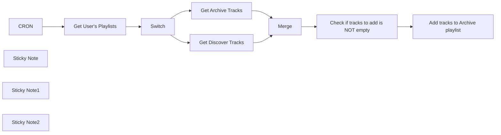

## Fluxo (.json) :

```json
{
  "meta": {
    "instanceId": "dbd383feb42b0206c833e3d762df280d0cce35cf96037fb2d6f3533c171dc540"
  },
  "nodes": [
    {
      "id": "b605b875-85cf-4210-8027-ce7b9b7069b9",
      "name": "CRON",
      "type": "n8n-nodes-base.scheduleTrigger",
      "notes": "Every Monday @ 8:30am",
      "position": [
        820,
        360
      ],
      "parameters": {
        "rule": {
          "interval": [
            {
              "field": "cronExpression",
              "expression": "30 8 * * MON"
            }
          ]
        }
      },
      "notesInFlow": true,
      "typeVersion": 1.1
    },
    {
      "id": "edd9d7b6-9ac4-4acf-8f4b-4cbe943dfd34",
      "name": "Get User's Playlists",
      "type": "n8n-nodes-base.spotify",
      "position": [
        1060,
        360
      ],
      "parameters": {
        "resource": "playlist",
        "operation": "getUserPlaylists",
        "returnAll": true
      },
      "credentials": {
        "spotifyOAuth2Api": {
          "id": "",
          "name": "Placeholder"
        }
      },
      "typeVersion": 1
    },
    {
      "id": "98cf8fdc-556a-452a-8df6-16a98c17613e",
      "name": "Switch",
      "type": "n8n-nodes-base.switch",
      "notes": "Find Discover and Archive playlist by name",
      "position": [
        1280,
        360
      ],
      "parameters": {
        "rules": {
          "rules": [
            {
              "value2": "Discover Weekly",
              "outputKey": "disc"
            },
            {
              "value2": "Discover Weekly Archive",
              "outputKey": "arch"
            }
          ]
        },
        "value1": "={{ $json.name }}",
        "dataType": "string"
      },
      "notesInFlow": true,
      "typeVersion": 2
    },
    {
      "id": "d27ee5c1-86d8-4a6a-adcb-90bf59280550",
      "name": "Get Discover Tracks",
      "type": "n8n-nodes-base.spotify",
      "position": [
        1560,
        240
      ],
      "parameters": {
        "id": "={{ $json.uri }}",
        "resource": "playlist",
        "operation": "getTracks",
        "returnAll": true
      },
      "credentials": {
        "spotifyOAuth2Api": {
          "id": "",
          "name": "Placeholder"
        }
      },
      "typeVersion": 1
    },
    {
      "id": "e276dce6-d3d2-41a0-96b6-68e115ed198e",
      "name": "Get Archive Tracks",
      "type": "n8n-nodes-base.spotify",
      "position": [
        1560,
        460
      ],
      "parameters": {
        "id": "={{ $json.uri }}",
        "resource": "playlist",
        "operation": "getTracks",
        "returnAll": true
      },
      "credentials": {
        "spotifyOAuth2Api": {
          "id": "",
          "name": "Placeholder"
        }
      },
      "typeVersion": 1
    },
    {
      "id": "c619085b-424d-4ff5-b3eb-fa0eed05ce0d",
      "name": "Merge",
      "type": "n8n-nodes-base.merge",
      "position": [
        1840,
        360
      ],
      "parameters": {
        "mode": "combine",
        "options": {},
        "joinMode": "keepNonMatches",
        "mergeByFields": {
          "values": [
            {
              "field1": "track.uri",
              "field2": "track.uri"
            }
          ]
        },
        "outputDataFrom": "input1"
      },
      "typeVersion": 2.1,
      "alwaysOutputData": true
    },
    {
      "id": "6981f3b3-e1d4-415b-b2c2-d05646271270",
      "name": "Sticky Note",
      "type": "n8n-nodes-base.stickyNote",
      "position": [
        1760,
        180
      ],
      "parameters": {
        "color": 7,
        "width": 262,
        "height": 354,
        "content": "#### Purpose\n\nCompares tracks using `Combine` operation to output **non-matching** Discover Weekly tracks to ensure that duplicates are not appended to the Archive playlist"
      },
      "typeVersion": 1
    },
    {
      "id": "65a9ef93-afac-4f86-9203-73e24bcdb500",
      "name": "Check if tracks to add is NOT empty",
      "type": "n8n-nodes-base.if",
      "position": [
        2100,
        360
      ],
      "parameters": {
        "options": {},
        "conditions": {
          "options": {
            "leftValue": "",
            "caseSensitive": true,
            "typeValidation": "strict"
          },
          "combinator": "and",
          "conditions": [
            {
              "id": "81f9e3a7-eef0-462c-9d82-db894b19a110",
              "operator": {
                "type": "object",
                "operation": "notEmpty",
                "singleValue": true
              },
              "leftValue": "={{ $json }}",
              "rightValue": ""
            }
          ]
        }
      },
      "typeVersion": 2
    },
    {
      "id": "604717ae-90ab-412b-bc83-15399d18c0d4",
      "name": "Add tracks to Archive playlist",
      "type": "n8n-nodes-base.spotify",
      "position": [
        2360,
        220
      ],
      "parameters": {
        "id": "={{ $('Switch').all(1).first().json.uri }}",
        "trackID": "={{ $json.track.uri }}",
        "resource": "playlist",
        "additionalFields": {}
      },
      "credentials": {
        "spotifyOAuth2Api": {
          "id": "",
          "name": "Placeholder"
        }
      },
      "typeVersion": 1
    },
    {
      "id": "34ddb49e-ebfe-46ff-a348-959befe5e86c",
      "name": "Sticky Note1",
      "type": "n8n-nodes-base.stickyNote",
      "position": [
        2580,
        280
      ],
      "parameters": {
        "color": 7,
        "width": 634,
        "height": 190,
        "content": "### Do anything else here\n\nFor example, in my personal workflow, after the tracks have been added to to my Archive playlist, I send a `POST` request to my self-hosted [NTFY](https://docs.ntfy.sh) server to notify me that my Discover Weekly playlist has refreshed, and I also provide the links to easily open the playlists within the notification that is sent.\n\nThe possibilities are endless with n8n!"
      },
      "typeVersion": 1
    },
    {
      "id": "c5c18f22-2c1f-4e65-83fc-7f89c5e44828",
      "name": "Sticky Note2",
      "type": "n8n-nodes-base.stickyNote",
      "position": [
        820,
        -418.42807424594014
      ],
      "parameters": {
        "color": 4,
        "width": 605.1751740139206,
        "height": 733.4280742459401,
        "content": "## README\n\nThis workflow will automatically archive your Spotify `Discover Weekly` playlist to a separate playlist. One additional caveat this workflow addresses is it will compare the refreshed `Discover Weekly` tracks against your archive playlist's existing tracks to ensure only unique tracks are added to your archive playlist. This helps reduce clutter within the archive playlist. \n\n### Setup Instructions (Required)\n1. **Within your Spotify account, create a new playlist**\n  You may name this playlist whatever you like. The default name within the workflow is `Discover Weekly Archive`. If you decide on another name, ensure you update the `Switch` node output with the key of `arch` to the name of the playlist you set.\n\n2. **Create your Spotify credential(s) and update each Spotify node with your created credential**\n  Follow the instructions within the [n8n docs](https://docs.n8n.io/integrations/builtin/credentials/spotify/) to create your Spotify credential, then select the credential in the `Get User's Playlists`, `Get Discover Tracks`, `Get Archive Tracks`, and `Add tracks to Archive playlist` nodes.\n\n3. **Activate the workflow to run workflow based on the Cron expression set in the `Schedule` trigger node.**\n\n### Optional Setup\n- Update the Cron expression within the `Schedule` trigger node with an earlier or later time if your `GENERIC_TIMEZONE` is set. You may also consider setting the workflow timezone as well. For assistance with Cron expressions, refer to the [n8n docs](https://docs.n8n.io/integrations/builtin/core-nodes/n8n-nodes-base.scheduletrigger/#generate-a-custom-cron-expression).\n- Add nodes to the end of the workflow to send notifications, update a spreadsheet, or any other operation/action you'd like to perform in conjunction with archiving your Discover Weekly tracks\n- Setup a error workflow to handle any thing that goes wrong within the workflow. You can find an example [here](https://n8n.io/workflows/696-send-email-via-gmail-on-workflow-error/) or more information concerning handling errors within the [n8n docs](https://docs.n8n.io/courses/level-two/chapter-4/).\n"
      },
      "typeVersion": 1
    }
  ],
  "pinData": {},
  "connections": {
    "CRON": {
      "main": [
        [
          {
            "node": "Get User's Playlists",
            "type": "main",
            "index": 0
          }
        ]
      ]
    },
    "Merge": {
      "main": [
        [
          {
            "node": "Check if tracks to add is NOT empty",
            "type": "main",
            "index": 0
          }
        ]
      ]
    },
    "Switch": {
      "main": [
        [
          {
            "node": "Get Discover Tracks",
            "type": "main",
            "index": 0
          }
        ],
        [
          {
            "node": "Get Archive Tracks",
            "type": "main",
            "index": 0
          }
        ]
      ]
    },
    "Get Archive Tracks": {
      "main": [
        [
          {
            "node": "Merge",
            "type": "main",
            "index": 1
          }
        ]
      ]
    },
    "Get Discover Tracks": {
      "main": [
        [
          {
            "node": "Merge",
            "type": "main",
            "index": 0
          }
        ]
      ]
    },
    "Get User's Playlists": {
      "main": [
        [
          {
            "node": "Switch",
            "type": "main",
            "index": 0
          }
        ]
      ]
    },
    "Check if tracks to add is NOT empty": {
      "main": [
        [
          {
            "node": "Add tracks to Archive playlist",
            "type": "main",
            "index": 0
          }
        ]
      ]
    }
  }
}
```

<a id="template-375"></a>

## Template 375 - Geração de FAQs e JSON por planilha

- **Nome:** Geração de FAQs e JSON por planilha
- **Descrição:** Fluxo que lê dados de Google Sheets, gera templates de perguntas e respostas, completa respostas com IA quando necessário e exporta os resultados como arquivos JSON em Google Drive, atualizando o status na planilha e possibilitando envio a um CMS.
- **Funcionalidade:** • Leitura de planilhas: Varre folhas específicas de um documento do Google Sheets para obter serviços ou categorias a processar.
• Geração de templates Q&A: Cria conjuntos padrão de perguntas e respostas para cada serviço ou categoria com placeholders preenchidos.
• Decisão de complemento por IA: Identifica quais respostas precisam de enriquecimento automático com base em um campo indicador.
• Completar respostas com IA: Envia entradas ao modelo de linguagem para produzir versões mais naturais e completas das respostas quando solicitado.
• Formatação e agregação: Formata pares pergunta-resposta, combina texto do usuário e retorno da IA, e agrega os itens para saída final.
• Exportação para Drive: Gera arquivos JSON formatados e salva em pastas específicas do Google Drive organizadas por tipo.
• Atualização de status: Marca as linhas processadas na planilha como concluídas após geração dos arquivos.
• Integração com CMS/HTTP: Permite encaminhar os JSONs para sistemas externos (CMSs) via APIs ou integrações pré-configuradas.
- **Ferramentas:** • Google Sheets: Fonte dos dados de serviços e categorias, onde as linhas são lidas e posteriormente marcadas como processadas.
• Google Drive: Armazenamento dos arquivos JSON gerados, organizados por pastas correspondentes aos tipos de integração.
• OpenAI (modelo de linguagem): Serviço de IA usado para completar e melhorar respostas quando indicado.
• CMSs (Strapi, WordPress, Webflow): Destinos possíveis para envio dos JSONs gerados, via integrações ou chamadas HTTP.
• APIs/HTTP Request: Meio genérico para enviar os esquemas JSON ou integrar com serviços que não possuem conector nativo.


## Fluxo visual

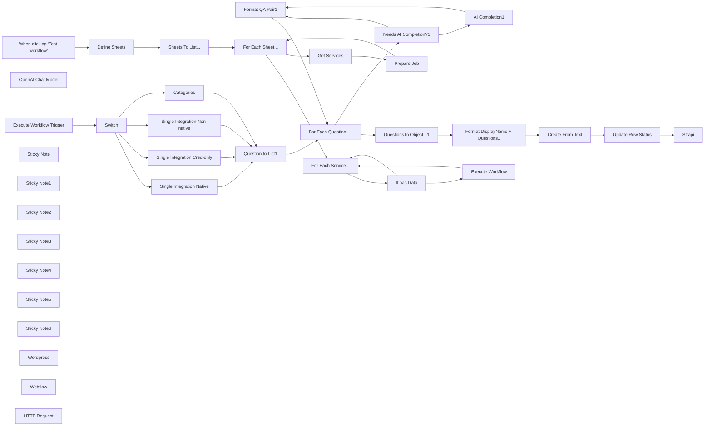

## Fluxo (.json) :

```json
{
  "meta": {
    "instanceId": "ff412ab2a6cd55af5dedbbab9b8e43f0f3a0cb16fb794fa8d3837f957b771ad2"
  },
  "nodes": [
    {
      "id": "9c3c06eb-8b48-4229-9b16-7fe7c4f886c3",
      "name": "When clicking ‘Test workflow’",
      "type": "n8n-nodes-base.manualTrigger",
      "position": [
        78.44447107090468,
        520
      ],
      "parameters": {},
      "typeVersion": 1
    },
    {
      "id": "2a8d8297-18de-4e1f-b44b-93842f7c1709",
      "name": "OpenAI Chat Model",
      "type": "@n8n/n8n-nodes-langchain.lmChatOpenAi",
      "position": [
        1678.4444710709047,
        2020
      ],
      "parameters": {
        "model": "gpt-4o-mini",
        "options": {}
      },
      "typeVersion": 1
    },
    {
      "id": "a6c24857-ad3b-4561-b40b-8520064e861b",
      "name": "Format QA Pair1",
      "type": "n8n-nodes-base.set",
      "position": [
        2018.4444710709047,
        1880
      ],
      "parameters": {
        "options": {},
        "assignments": {
          "assignments": [
            {
              "id": "2c1bd408-29f0-487b-9a33-7513d5bbfe23",
              "name": "question",
              "type": "string",
              "value": "={{ $('Needs AI Completion?1').item.json.question }}"
            },
            {
              "id": "02ffc3b7-3d77-4dfe-ba3f-2052f5cc9e83",
              "name": "answer",
              "type": "string",
              "value": "={{\n[\n  $('Needs AI Completion?1').item.json.answer,\n  $json.text\n    ? $json.text[0].toLowerCase() + $json.text.substring(1, $json.text.length)\n    : '',\n  $('Needs AI Completion?1').item.json.append || '',\n].join(' ').trim()\n}}"
            }
          ]
        }
      },
      "typeVersion": 3.4
    },
    {
      "id": "2b4712cb-371c-45bc-a024-363ae951b0ac",
      "name": "For Each Question...1",
      "type": "n8n-nodes-base.splitInBatches",
      "position": [
        1238.4444710709047,
        1400
      ],
      "parameters": {
        "options": {}
      },
      "typeVersion": 3
    },
    {
      "id": "8f7cefc1-9fc0-474b-a81e-bf573068258b",
      "name": "Question to List1",
      "type": "n8n-nodes-base.splitOut",
      "position": [
        1038.4444710709047,
        1400
      ],
      "parameters": {
        "options": {},
        "fieldToSplitOut": "data"
      },
      "typeVersion": 1
    },
    {
      "id": "9aeb5858-d6d4-4541-8a0d-851740d948ae",
      "name": "Questions to Object...1",
      "type": "n8n-nodes-base.aggregate",
      "position": [
        1978.4444710709047,
        1380
      ],
      "parameters": {
        "options": {},
        "aggregate": "aggregateAllItemData"
      },
      "typeVersion": 1
    },
    {
      "id": "2c1d56c5-20f2-4691-ab89-87edf9902a5f",
      "name": "Format DisplayName + Questions1",
      "type": "n8n-nodes-base.set",
      "position": [
        2198.444471070905,
        1380
      ],
      "parameters": {
        "options": {},
        "assignments": {
          "assignments": [
            {
              "id": "66318f17-a3bd-4bcf-b326-50208b503143",
              "name": "name",
              "type": "string",
              "value": "={{ $('Execute Workflow Trigger').first().json.data.displayName || $('Execute Workflow Trigger').first().json.data['Category name'] }}"
            },
            {
              "id": "a83abac5-ddc6-4316-a916-7eab338f97cf",
              "name": "questions",
              "type": "array",
              "value": "={{ $json.data }}"
            }
          ]
        }
      },
      "typeVersion": 3.4
    },
    {
      "id": "5147d5ef-f56d-49b0-9be8-0af7ccb8cdae",
      "name": "Create From Text",
      "type": "n8n-nodes-base.googleDrive",
      "position": [
        2380,
        1380
      ],
      "parameters": {
        "name": "={{ $json.name + '-' + $now.format('yyyyMMdd') }}",
        "content": "={{ JSON.stringify($json, null, 4) }}",
        "driveId": {
          "__rl": true,
          "mode": "list",
          "value": ""
        },
        "options": {},
        "folderId": {
          "__rl": true,
          "mode": "id",
          "value": "={{ $('Execute Workflow Trigger').first().json.outdir }}"
        },
        "operation": "createFromText"
      },
      "typeVersion": 3
    },
    {
      "id": "9abc3871-8103-4659-9afa-93142dabec01",
      "name": "Define Sheets",
      "type": "n8n-nodes-base.set",
      "position": [
        518.4444710709047,
        520
      ],
      "parameters": {
        "mode": "raw",
        "options": {},
        "jsonOutput": "{\n  \"data\": [\n    \"Single Integration Native\",\n    \"Single Integration Cred-only\",\n    \"Single Integration Non-native\",\n    \"Categories\"\n  ]\n}\n"
      },
      "typeVersion": 3.4
    },
    {
      "id": "417b1c53-ec19-4f59-9580-b6080d3bc103",
      "name": "Sheets To List...",
      "type": "n8n-nodes-base.splitOut",
      "position": [
        698.4444710709047,
        520
      ],
      "parameters": {
        "options": {},
        "fieldToSplitOut": "data"
      },
      "typeVersion": 1
    },
    {
      "id": "d8495ac2-7f45-4dd5-8eb5-d95c9e572dd3",
      "name": "Get Services",
      "type": "n8n-nodes-base.googleSheets",
      "position": [
        1098.4444710709047,
        660
      ],
      "parameters": {
        "options": {
          "returnAllMatches": "returnAllMatches"
        },
        "filtersUI": {
          "values": [
            {
              "lookupColumn": "=status"
            }
          ]
        },
        "sheetName": {
          "__rl": true,
          "mode": "name",
          "value": "={{ $json.data }}"
        },
        "documentId": {
          "__rl": true,
          "mode": "list",
          "value": ""
        }
      },
      "typeVersion": 4.3,
      "alwaysOutputData": true
    },
    {
      "id": "e5b7ebe7-0e0f-4f61-8a14-afc51eb37270",
      "name": "Single Integration Cred-only",
      "type": "n8n-nodes-base.set",
      "position": [
        778.4444710709047,
        1400
      ],
      "parameters": {
        "mode": "raw",
        "options": {},
        "jsonOutput": "={\n  \"data\": [\n    {\n      \"question\": \"How can I set up {{ $json.data.displayName }} integration in n8n?\",\n      \"answer\": \"To use {{ $json.data.displayName }} integration in n8n, start by adding the HTTP Request node to your workflow canvas and authenticate it using a predefined credential type. This allows you to perform custom operations, without additional authentication setup. Once connected, you can make custom API calls to {{ $json.data.displayName }} to query the data you need using the URLs you provide, for example:\",\n      \"ai_example\": \"Assume useris advanced in n8n integration and sending HTTP requests, focus instead on examples operations and/or use-cases such as creating records, updating records, or retrieving data.\",\n      \"ai_completion\": {{ true }}\n    },\n    {\n      \"question\": \"Do I need any special permissions or API keys to integrate {{ $json.data.displayName }} with n8n?\",\n      \"answer\": \"Yes, you need an API key with the necessary permissions to integrate {{ $json.data.displayName }} with n8n. You will typically need to use the {{ $json.data.displayName }} API docs to construct your request via the HTTP Request node. Ensure the API key has the appropriate access rights for the data and actions you want to automate within your workflows.\",\n      \"ai_completion\": {{ false }}\n    },\n    {\n      \"question\": \"Can I combine {{ $json.data.displayName }} with other apps in n8n workflows?\",\n      \"answer\": \"Definitely! n8n enables you to create workflows that combine {{ $json.data.displayName }} with other apps and services. For instance,\",\n      \"ai_completion\": {{ true }}\n    },\n    {\n      \"question\": \"What are some common use cases for {{ $json.data.displayName }} integrations with n8n?\",\n      \"answer\": \"Common use cases for {{ $json.data.displayName }} automation include\",\n      \"append\": \"With n8n, you can customize these workflows to fit your specific needs and extend them by adding other 400+ integrations or incorporating advanced AI logic.\",\n      \"ai_completion\": {{ true }}\n    },\n    {\n      \"question\": \"How does n8n’s pricing model benefit me when integrating {{ $json.data.displayName }}?\",\n      \"answer\": \"n8n’s pricing model is designed to be both affordable and scalable, which is particularly beneficial when integrating with {{ $json.data.displayName }}. Unlike other platforms that charge per operation or task, n8n charges only for full workflow executions. This means you can create complex workflows with {{ $json.data.displayName }}, involving thousands of tasks or steps, without worrying about escalating costs. For example, if your {{ $json.data.displayName }} workflows perform around 100k tasks, you could be paying $500+/month on other platforms, but with n8n's pro plan, you start at around $50. This approach allows you to scale your {{ $json.data.displayName }} integrations efficiently while maintaining predictable costs.\",\n      \"ai_completion\": {{ false }}\n    }\n  ]\n}"
      },
      "typeVersion": 3.4
    },
    {
      "id": "e2cc607b-8502-4beb-ace5-8670af845134",
      "name": "Single Integration Native",
      "type": "n8n-nodes-base.set",
      "position": [
        778.4444710709047,
        1240
      ],
      "parameters": {
        "mode": "raw",
        "options": {},
        "jsonOutput": "={\n  \"data\": [\n    {\n      \"question\": \"How can I set up {{ $json.data.displayName }} integration in n8n?\",\n      \"answer\": \"To use {{ $json.data.displayName }} integration in n8n, start by adding the {{ $json.data.displayName }} node to your workflow. You'll need to authenticate your {{ $json.data.displayName }} account using supported authentication methods. Once connected, you can choose from the list of supported actions or make custom API calls via the HTTP Request node, for example:\",\n      \"ai_completion\": {{ true }}\n    },\n    {\n      \"question\": \"Do I need any special permissions or API keys to integrate {{ $json.data.displayName }} with n8n?\",\n      \"answer\": \"Yes, you will typically need an API key, token, or similar credentials to add {{ $json.data.displayName }} integration to n8n. These can usually be found in your account settings for the service. Ensure that your credentials have the necessary permissions to access and manage the data or actions you want to automate within your workflows.\",\n      \"ai_completion\": {{ false }}\n    },\n    {\n      \"question\": \"Can I combine {{ $json.data.displayName }} with other apps in n8n workflows?\",\n      \"answer\": \"Definitely! n8n enables you to create workflows that combine {{ $json.data.displayName }} with other apps and services. For instance,\",\n      \"ai_completion\": {{ true }}\n    },\n    {\n      \"question\": \"What are some common use cases for {{ $json.data.displayName }} integrations with n8n?\",\n      \"answer\": \"Common use cases for {{ $json.data.displayName }} automation include\",\n      \"append\": \"With n8n, you can customize these workflows to fit your specific needs and extend them by adding other 400+ integrations or incorporating advanced AI logic.\",\n      \"ai_completion\": {{ true }}\n    },\n    {\n      \"question\": \"How does n8n’s pricing model benefit me when integrating {{ $json.data.displayName }}?\",\n      \"answer\": \"n8n’s pricing model is designed to be both affordable and scalable, which is particularly beneficial when integrating with {{ $json.data.displayName }}. Unlike other platforms that charge per operation or task, n8n charges only for full workflow executions. This means you can create complex workflows with {{ $json.data.displayName }}, involving thousands of tasks or steps, without worrying about escalating costs. For example, if your {{ $json.data.displayName }} workflows perform around 100k tasks, you could be paying $500+/month on other platforms, but with n8n's pro plan, you start at around $50. This approach allows you to scale your {{ $json.data.displayName }} integrations efficiently while maintaining predictable costs.\",\n    \"ai_completion\": {{ false }}\n    }\n  ]\n}"
      },
      "typeVersion": 3.4
    },
    {
      "id": "ce1905c2-f41a-4dea-bd03-a9ae1e893326",
      "name": "Categories",
      "type": "n8n-nodes-base.set",
      "position": [
        778.4444710709047,
        1760
      ],
      "parameters": {
        "mode": "raw",
        "options": {},
        "jsonOutput": "={{\n{\n  \"data\": [\n    {\n      \"question\": `What types of ${$json.data['Category name']} tools can I integrate with n8n?`,\n      \"answer\": `n8n offers integrations with a wide range of ${$json.data['Category name']} tools, including`,\n      \"append\": `These integrations allow you to streamline your ${$json.data['Category name']} workflows, automate repetitive tasks, and improve collaboration across your team.`,\n      \"ai_completion\": true\n    },\n    {\n      \"question\": `Are there any specific requirements or limitations for using ${$json.data['Category name']} integrations?`,\n      \"answer\": `Yes, each ${$json.data['Category name']} integration may have specific requirements. For example,`,\n      \"append\": `n8n offers a significant number of pre-built ${$json.data['Category name']} integrations (called nodes). If n8n doesn't support the integration you need, use the HTTP Request node or custom code to connect to the service's API. Be sure to review the integration documentation for any app-specific prerequisites. Additionally, consider any API rate limits or usage constraints that might affect your workflows.`,\n      \"ai_completion\": true\n    },\n    {\n      \"question\": `What are some popular use cases for ${$json.data['Category name']} integrations in n8n?`,\n      \"answer\": `${$json.data['Category name']} integrations with n8n offer a variety of practical use cases. For example:`,\n      \"ai_completion\": true,\n      \"ai_completion_format\": \"list\"\n    },\n    {\n      \"question\": `How does n8n’s pricing model benefit ${$json.data['Category name']} workflows?`,\n      \"answer\": `n8n's pricing model, which charges only for full workflow executions rather than individual tasks or steps, is particularly advantageous for ${$json.data['Category name']} workflows. This means you can build complex, multi-step workflows involving various ${$json.data['Category name']} tools without worrying about cost increases due to the number of operations. For example, if your ${$json.data['Category name']} workflows perform around 100k tasks, you could be paying $500+/month on other platforms, but with n8n's pro plan, you start at around $50. This approach allows you to scale your ${$json.data['Category name']} integrations efficiently while maintaining predictable costs.`,\n      \"ai_completion\": false\n    },\n    {\n      \"question\": `How can I leverage n8n's AI capabilities in my ${$json.data['Category name']} workflows?`,\n      \"answer\": `n8n offers powerful AI capabilities that can enhance your ${$json.data['Category name']} workflows. For example, you can integrate AI tools like OpenAI with n8n to`,\n      \"append\": `To add AI capabilities, navigate to the AI category in n8n's integrations directory and set up the integration with your chosen AI service. This combination of AI and ${$json.data['Category name']} integrations can significantly boost your development efficiency and innovation.`,\n      \"ai_completion\": true\n    }\n  ]\n}\n}}"
      },
      "typeVersion": 3.4
    },
    {
      "id": "344c93e6-3ed9-4dd0-8a38-c2f853ef3cc1",
      "name": "For Each Sheet...",
      "type": "n8n-nodes-base.splitInBatches",
      "position": [
        918.4444710709047,
        520
      ],
      "parameters": {
        "options": {}
      },
      "typeVersion": 3
    },
    {
      "id": "e5776c79-51e4-4469-8cf7-dff009ee0ffd",
      "name": "Execute Workflow Trigger",
      "type": "n8n-nodes-base.executeWorkflowTrigger",
      "position": [
        298.4444710709047,
        1400
      ],
      "parameters": {},
      "typeVersion": 1
    },
    {
      "id": "76aca3a6-c3ff-41fa-9fdf-30839df85669",
      "name": "Execute Workflow",
      "type": "n8n-nodes-base.executeWorkflow",
      "position": [
        1898.4444710709047,
        660
      ],
      "parameters": {
        "mode": "each",
        "options": {},
        "workflowId": "={{ $workflow.id }}"
      },
      "typeVersion": 1,
      "alwaysOutputData": true
    },
    {
      "id": "663b1ce2-ccb5-43d1-8871-c5fa7412151c",
      "name": "Prepare Job",
      "type": "n8n-nodes-base.set",
      "position": [
        1278.4444710709047,
        660
      ],
      "parameters": {
        "options": {},
        "assignments": {
          "assignments": [
            {
              "id": "2755153b-d38c-4aba-be8f-f72c3bf91cf2",
              "name": "sheet",
              "type": "string",
              "value": "={{ $('For Each Sheet...').item.json.data }}"
            },
            {
              "id": "eed4a03a-451b-4b74-b591-ce970d84f990",
              "name": "data",
              "type": "object",
              "value": "={{ $json }}"
            },
            {
              "id": "ee73316c-0316-4389-aa13-4bb145637262",
              "name": "outdir",
              "type": "string",
              "value": "={{\n{\n  \"Single Integration Native\": \"Insert the corresponding Google Drive folder ID here\",\n  \"Single Integration Cred-only\": \"Insert the corresponding Google Drive folder ID here\",\n  \"Single Integration Non-native\": \"Insert the corresponding Google Drive folder ID here\",\n  \"Categories\": \"Insert the corresponding Google Drive folder ID here\",\n}[$('For Each Sheet...').item.json.data]\n}}"
            }
          ]
        }
      },
      "typeVersion": 3.4
    },
    {
      "id": "087249d0-d001-49c3-8695-e0e3f02b66e2",
      "name": "For Each Service...",
      "type": "n8n-nodes-base.splitInBatches",
      "position": [
        1498.4444710709047,
        520
      ],
      "parameters": {
        "options": {
          "reset": false
        }
      },
      "typeVersion": 3
    },
    {
      "id": "edd9e2c7-9477-4145-bb1f-1424ccb2080f",
      "name": "Update Row Status",
      "type": "n8n-nodes-base.googleSheets",
      "position": [
        2558.444471070905,
        1380
      ],
      "parameters": {
        "columns": {
          "value": {
            "status": "done",
            "row_number": "={{ $('Execute Workflow Trigger').first().json.data.row_number }}"
          },
          "schema": [
            {
              "id": "displayName",
              "type": "string",
              "display": true,
              "required": false,
              "displayName": "displayName",
              "defaultMatch": false,
              "canBeUsedToMatch": true
            },
            {
              "id": "status",
              "type": "string",
              "display": true,
              "required": false,
              "displayName": "status",
              "defaultMatch": false,
              "canBeUsedToMatch": true
            },
            {
              "id": "row_number",
              "type": "string",
              "display": true,
              "removed": false,
              "readOnly": true,
              "required": false,
              "displayName": "row_number",
              "defaultMatch": false,
              "canBeUsedToMatch": true
            }
          ],
          "mappingMode": "defineBelow",
          "matchingColumns": [
            "row_number"
          ]
        },
        "options": {},
        "operation": "update",
        "sheetName": {
          "__rl": true,
          "mode": "name",
          "value": "={{ $('Execute Workflow Trigger').first().json.sheet }}"
        },
        "documentId": {
          "__rl": true,
          "mode": "list",
          "value": ""
        }
      },
      "typeVersion": 4.4
    },
    {
      "id": "454ccacd-104c-4cad-b52e-72447a49fb04",
      "name": "Single Integration Non-native",
      "type": "n8n-nodes-base.set",
      "position": [
        778.4444710709047,
        1580
      ],
      "parameters": {
        "mode": "raw",
        "options": {},
        "jsonOutput": "={{\n{\n  \"data\": [\n    {\n      \"question\": `How can I set up ${$json.data.displayName} integration in n8n?`,\n      \"answer\": `To use ${$json.data.displayName} integration in n8n, start by adding the HTTP Request node to your workflow canvas and authenticate it using a generic authentication method. Once connected, you can make custom API calls to ${$json.data.displayName} to query the data you need using the URLs you provide, for example:`,\n      \"ai_example\": \"Assume useris advanced in n8n integration and sending HTTP requests, focus instead on examples operations and/or use-cases such as creating records, updating records, or retrieving data.\",\n      \"ai_completion\": true\n    },\n{\n      \"question\": `Do I need any special permissions or API keys to integrate ${$json.data.displayName} with n8n?`,\n      \"answer\": `Yes, with generic authentication, you'll typically need to provide endpoint URLs, headers, parameters, and any other authentication details specific to **${$json.data.displayName}**:  - Find the&nbsp;**${$json.data.displayName}** API documentation and see if the API supports HTTP requests;  - Most APIs require some form of authentication and you can configure this in the HTTP Request mode (Basic Auth, Custom Auth, Digest Auth, Header Auth, OAuth1 API, OAuth2 API, Query Auth).`,\n      \"ai_completion\": false\n    },\n{\n      \"question\": `Can I combine ${$json.data.displayName} with other apps in n8n workflows?`,\n      \"answer\": `Definitely! n8n enables you to create workflows that combine ${$json.data.displayName} with other apps and services. For instance,`,\n      \"ai_completion\": true\n    },\n    {\n      \"question\": `What are some common use cases for ${$json.data.displayName} integrations with n8n?`,\n      \"answer\": `Common use cases for ${$json.data.displayName} automation include`,\n      \"append\": `With n8n, you can customize these workflows to fit your specific needs and extend them by adding other 400+ integrations or incorporating advanced AI logic.`,\n      \"ai_completion\": true\n    },\n    {\n      \"question\": `How does n8n’s pricing model benefit me when integrating ${$json.data.displayName}?`,\n      \"answer\": `n8n's pricing model is designed to be both affordable and scalable, which is particularly beneficial when integrating with ${ $json.data.displayName}. Unlike other platforms that charge per operation or task, n8n charges only for full workflow executions. This means you can create complex workflows with ${ $json.data.displayName}, involving thousands of tasks or steps, without worrying about escalating costs. For example, if your ${ $json.data.displayName} workflows perform around 100k tasks, you could be paying $500+/month on other platforms, but with n8n's pro plan, you start at around $50. This approach allows you to scale your ${ $json.data.displayName} integrations efficiently while maintaining predictable costs.`,\n      \"ai_completion\": false\n    }\n  ]\n}\n}}"
      },
      "typeVersion": 3.4
    },
    {
      "id": "660fda59-4222-489a-a19a-b3ae0ed7c66f",
      "name": "If has Data",
      "type": "n8n-nodes-base.if",
      "position": [
        1678.4444710709047,
        640
      ],
      "parameters": {
        "options": {},
        "conditions": {
          "options": {
            "leftValue": "",
            "caseSensitive": true,
            "typeValidation": "strict"
          },
          "combinator": "and",
          "conditions": [
            {
              "id": "aea0bac0-4d4a-4359-8df0-1309c3126376",
              "operator": {
                "type": "object",
                "operation": "notEmpty",
                "singleValue": true
              },
              "leftValue": "={{ $json.data }}",
              "rightValue": ""
            }
          ]
        }
      },
      "typeVersion": 2
    },
    {
      "id": "911aece8-1137-48d4-85f6-ee15ebfdc299",
      "name": "Sticky Note",
      "type": "n8n-nodes-base.stickyNote",
      "position": [
        1238.4444710709047,
        620
      ],
      "parameters": {
        "width": 193.4545454545455,
        "height": 317.09090909090907,
        "content": "\n\n\n\n\n\n\n\n\n\n\n\n\n\n\n\n\n\n### 🚨 Set Destination Folders Here"
      },
      "typeVersion": 1
    },
    {
      "id": "44d206a7-049c-4721-8934-2308a4b67821",
      "name": "Needs AI Completion?1",
      "type": "n8n-nodes-base.switch",
      "position": [
        1458.4444710709047,
        1780
      ],
      "parameters": {
        "rules": {
          "values": [
            {
              "outputKey": "TEXT_REPLACE",
              "conditions": {
                "options": {
                  "leftValue": "",
                  "caseSensitive": true,
                  "typeValidation": "strict"
                },
                "combinator": "and",
                "conditions": [
                  {
                    "operator": {
                      "type": "boolean",
                      "operation": "false",
                      "singleValue": true
                    },
                    "leftValue": "={{ $json.ai_completion }}",
                    "rightValue": ""
                  }
                ]
              },
              "renameOutput": true
            },
            {
              "outputKey": "AI_COMPLETE",
              "conditions": {
                "options": {
                  "leftValue": "",
                  "caseSensitive": true,
                  "typeValidation": "strict"
                },
                "combinator": "and",
                "conditions": [
                  {
                    "id": "f3fcd8ea-6cfa-4658-86c3-3ace9b81d3f2",
                    "operator": {
                      "type": "boolean",
                      "operation": "true",
                      "singleValue": true
                    },
                    "leftValue": "={{ $json.ai_completion }}",
                    "rightValue": ""
                  }
                ]
              },
              "renameOutput": true
            }
          ]
        },
        "options": {}
      },
      "typeVersion": 3
    },
    {
      "id": "14999c7a-2497-46db-b3b5-ede6a9c89dcb",
      "name": "Sticky Note1",
      "type": "n8n-nodes-base.stickyNote",
      "position": [
        -20,
        320
      ],
      "parameters": {
        "color": 7,
        "width": 322.9750655002858,
        "height": 374.7055783044638,
        "content": "## Trigger event\nThis could be changed to whatever trigger event you need: an app event, a schedule, a webhook call, another workflow or an AI chat. Sometimes, the HTTP Request node might already serve as your starting point."
      },
      "typeVersion": 1
    },
    {
      "id": "99a4ca3b-3ad0-48a7-84d7-eb83b61e938b",
      "name": "Switch",
      "type": "n8n-nodes-base.switch",
      "position": [
        538.4444710709047,
        1400
      ],
      "parameters": {
        "rules": {
          "values": [
            {
              "outputKey": "Single - Native",
              "conditions": {
                "options": {
                  "leftValue": "",
                  "caseSensitive": true,
                  "typeValidation": "strict"
                },
                "combinator": "and",
                "conditions": [
                  {
                    "operator": {
                      "type": "string",
                      "operation": "equals"
                    },
                    "leftValue": "={{ $json.sheet }}",
                    "rightValue": "Single Integration Native"
                  }
                ]
              },
              "renameOutput": true
            },
            {
              "outputKey": "Single - Cred Only",
              "conditions": {
                "options": {
                  "leftValue": "",
                  "caseSensitive": true,
                  "typeValidation": "strict"
                },
                "combinator": "and",
                "conditions": [
                  {
                    "id": "6dcb9e09-5eb6-4527-9c22-7eb8867643f4",
                    "operator": {
                      "name": "filter.operator.equals",
                      "type": "string",
                      "operation": "equals"
                    },
                    "leftValue": "={{ $json.sheet }}",
                    "rightValue": "Single Integration Cred-only"
                  }
                ]
              },
              "renameOutput": true
            },
            {
              "outputKey": "Single - Non Native",
              "conditions": {
                "options": {
                  "leftValue": "",
                  "caseSensitive": true,
                  "typeValidation": "strict"
                },
                "combinator": "and",
                "conditions": [
                  {
                    "id": "04ee4ccd-9efc-46a9-9521-fe50fb0c3087",
                    "operator": {
                      "name": "filter.operator.equals",
                      "type": "string",
                      "operation": "equals"
                    },
                    "leftValue": "={{ $json.sheet }}",
                    "rightValue": "Single Integration Non-native"
                  }
                ]
              },
              "renameOutput": true
            },
            {
              "outputKey": "Categories",
              "conditions": {
                "options": {
                  "leftValue": "",
                  "caseSensitive": true,
                  "typeValidation": "strict"
                },
                "combinator": "and",
                "conditions": [
                  {
                    "id": "21579253-15c5-4cb4-869b-5760322ae5b5",
                    "operator": {
                      "name": "filter.operator.equals",
                      "type": "string",
                      "operation": "equals"
                    },
                    "leftValue": "={{ $json.sheet }}",
                    "rightValue": "Categories"
                  }
                ]
              },
              "renameOutput": true
            }
          ]
        },
        "options": {}
      },
      "typeVersion": 3
    },
    {
      "id": "7fe047c7-716c-4ac3-8b7c-c07949c579a4",
      "name": "Sticky Note2",
      "type": "n8n-nodes-base.stickyNote",
      "position": [
        459.1561069271204,
        320
      ],
      "parameters": {
        "color": 7,
        "width": 1627.0681704544622,
        "height": 636.4009080766225,
        "content": "## Prepare data in Google Sheets\nThis part of the workflow prepares the data for reading from a Google Sheets document containing information about different services or categories. Here's an example of Google Sheet: https://docs.google.com/spreadsheets/d/1DCf-phfLWvuTwu02bumx-qykVQeFANnacTTAkRj5tZk/edit?usp=sharing"
      },
      "typeVersion": 1
    },
    {
      "id": "cb3dc532-40db-437d-97ec-f522e6087b7c",
      "name": "Sticky Note3",
      "type": "n8n-nodes-base.stickyNote",
      "position": [
        498.4444710709047,
        1080
      ],
      "parameters": {
        "color": 7,
        "width": 513.3200522929088,
        "height": 840.0651105548446,
        "content": "## Create your Q&A templates\nFor each service or category, this part of the workflow generates a set of standard questions and answers covering setup, permissions, integrations, use cases, and pricing benefits. You can modify here the input that you will feed to AI."
      },
      "typeVersion": 1
    },
    {
      "id": "b4095a1b-91aa-4abc-8ed5-d6ca7271ee6c",
      "name": "Sticky Note4",
      "type": "n8n-nodes-base.stickyNote",
      "position": [
        1238.4444710709047,
        1640
      ],
      "parameters": {
        "color": 7,
        "width": 989.1782467385665,
        "height": 523.7514972875132,
        "content": "## Complete your Q&A templates with AI\n* An AI model (OpenAI's GPT) is used to enhance or complete some of the answers, making the content more comprehensive and natural-sounding.\n* The workflow formats the Q&A pairs, combining AI-generated content with predefined answers where applicable."
      },
      "typeVersion": 1
    },
    {
      "id": "d944dfd9-4bfc-4fb0-8655-3269f6caa8ef",
      "name": "Sticky Note5",
      "type": "n8n-nodes-base.stickyNote",
      "position": [
        1858.4444710709047,
        1200
      ],
      "parameters": {
        "color": 7,
        "width": 907.1258470912726,
        "height": 396.4865508957922,
        "content": "## Generate JSON schemas and upload to Google Drive\n* The generated files are saved to specific folders in Google Drive, organized by the type of integration (native, credential-only, non-native) or category.\n* After processing each service or category, it updates the status in the original Google Sheets document to mark it as completed."
      },
      "typeVersion": 1
    },
    {
      "id": "e21d2a42-021f-4f8e-889d-68a851e9e688",
      "name": "Strapi",
      "type": "n8n-nodes-base.strapi",
      "position": [
        2978.444471070905,
        1380
      ],
      "parameters": {
        "operation": "create"
      },
      "typeVersion": 1
    },
    {
      "id": "92ba57a7-a37a-4d67-9db9-7fa2fe72eec5",
      "name": "Sticky Note6",
      "type": "n8n-nodes-base.stickyNote",
      "position": [
        2918.444471070905,
        1100
      ],
      "parameters": {
        "color": 7,
        "width": 437.8755022115163,
        "height": 1073.2774375197612,
        "content": "## Send the JSON schemas to your CMS\nThis step is up to you to finish: you can choose either pre-built n8n nodes to connect with your CMS or use the HTTP Request node if you CMS is not supported directly in n8n."
      },
      "typeVersion": 1
    },
    {
      "id": "a42de52f-292b-4b60-ba6d-ff1a672a9758",
      "name": "Wordpress",
      "type": "n8n-nodes-base.wordpress",
      "position": [
        2978.444471070905,
        1580
      ],
      "parameters": {
        "additionalFields": {}
      },
      "credentials": {
        "wordpressApi": {
          "id": "dk1CzqTOkihXrjym",
          "name": "Wordpress account"
        }
      },
      "typeVersion": 1
    },
    {
      "id": "abcad9f3-9f05-40e7-8925-32c59b1a6355",
      "name": "Webflow",
      "type": "n8n-nodes-base.webflow",
      "position": [
        2978.444471070905,
        1780
      ],
      "parameters": {
        "operation": "create"
      },
      "typeVersion": 2
    },
    {
      "id": "60942673-646f-43df-8c0c-c78975ea38c4",
      "name": "HTTP Request",
      "type": "n8n-nodes-base.httpRequest",
      "position": [
        2978.444471070905,
        1980
      ],
      "parameters": {
        "options": {}
      },
      "typeVersion": 4.2
    },
    {
      "id": "d0a97b0c-1271-48e7-8587-5aae565b9d95",
      "name": "AI Completion1",
      "type": "@n8n/n8n-nodes-langchain.chainLlm",
      "position": [
        1678.4444710709047,
        1880
      ],
      "parameters": {
        "text": "=### The question\n{{ $json.question }}\n### Prefered answer format\n{{ $json.ai_completion_format ? 'markdown bullet list' : 'markdown' }}\n### User's answer\n{{ $json.answer }}\n{{\n$json.ai_example\n  ? `### Guidance\\nWhen giving answer, follow this blueprint: ${$json.ai_example}`\n  : ''\n}}",
        "messages": {
          "messageValues": [
            {
              "message": "=You are assisting with writing a FAQ for the service, {{ $('Execute Workflow Trigger').first().json.data.displayName || $('Execute Workflow Trigger').first().json.data['Category name'] }}. Complete the user's answer in regards to the given question. Ensure the answer is consistent by assuming the tone and style of the user's answer. Give your answer as succinctly as you can with no more than 3 sentences. Do not mention the user or use markdown, return plain text only as this output will be directly appended."
            }
          ]
        },
        "promptType": "define"
      },
      "executeOnce": false,
      "typeVersion": 1.4
    }
  ],
  "pinData": {},
  "connections": {
    "Switch": {
      "main": [
        [
          {
            "node": "Single Integration Native",
            "type": "main",
            "index": 0
          }
        ],
        [
          {
            "node": "Single Integration Cred-only",
            "type": "main",
            "index": 0
          }
        ],
        [
          {
            "node": "Single Integration Non-native",
            "type": "main",
            "index": 0
          }
        ],
        [
          {
            "node": "Categories",
            "type": "main",
            "index": 0
          }
        ]
      ]
    },
    "Categories": {
      "main": [
        [
          {
            "node": "Question to List1",
            "type": "main",
            "index": 0
          }
        ]
      ]
    },
    "If has Data": {
      "main": [
        [
          {
            "node": "Execute Workflow",
            "type": "main",
            "index": 0
          }
        ],
        [
          {
            "node": "For Each Service...",
            "type": "main",
            "index": 0
          }
        ]
      ]
    },
    "Prepare Job": {
      "main": [
        [
          {
            "node": "For Each Sheet...",
            "type": "main",
            "index": 0
          }
        ]
      ]
    },
    "Get Services": {
      "main": [
        [
          {
            "node": "Prepare Job",
            "type": "main",
            "index": 0
          }
        ]
      ]
    },
    "Define Sheets": {
      "main": [
        [
          {
            "node": "Sheets To List...",
            "type": "main",
            "index": 0
          }
        ]
      ]
    },
    "AI Completion1": {
      "main": [
        [
          {
            "node": "Format QA Pair1",
            "type": "main",
            "index": 0
          }
        ]
      ]
    },
    "Format QA Pair1": {
      "main": [
        [
          {
            "node": "For Each Question...1",
            "type": "main",
            "index": 0
          }
        ]
      ]
    },
    "Create From Text": {
      "main": [
        [
          {
            "node": "Update Row Status",
            "type": "main",
            "index": 0
          }
        ]
      ]
    },
    "Execute Workflow": {
      "main": [
        [
          {
            "node": "For Each Service...",
            "type": "main",
            "index": 0
          }
        ]
      ]
    },
    "For Each Sheet...": {
      "main": [
        [
          {
            "node": "For Each Service...",
            "type": "main",
            "index": 0
          }
        ],
        [
          {
            "node": "Get Services",
            "type": "main",
            "index": 0
          }
        ]
      ]
    },
    "OpenAI Chat Model": {
      "ai_languageModel": [
        [
          {
            "node": "AI Completion1",
            "type": "ai_languageModel",
            "index": 0
          }
        ]
      ]
    },
    "Question to List1": {
      "main": [
        [
          {
            "node": "For Each Question...1",
            "type": "main",
            "index": 0
          }
        ]
      ]
    },
    "Sheets To List...": {
      "main": [
        [
          {
            "node": "For Each Sheet...",
            "type": "main",
            "index": 0
          }
        ]
      ]
    },
    "Update Row Status": {
      "main": [
        [
          {
            "node": "Strapi",
            "type": "main",
            "index": 0
          }
        ]
      ]
    },
    "For Each Service...": {
      "main": [
        null,
        [
          {
            "node": "If has Data",
            "type": "main",
            "index": 0
          }
        ]
      ]
    },
    "For Each Question...1": {
      "main": [
        [
          {
            "node": "Questions to Object...1",
            "type": "main",
            "index": 0
          }
        ],
        [
          {
            "node": "Needs AI Completion?1",
            "type": "main",
            "index": 0
          }
        ]
      ]
    },
    "Needs AI Completion?1": {
      "main": [
        [
          {
            "node": "Format QA Pair1",
            "type": "main",
            "index": 0
          }
        ],
        [
          {
            "node": "AI Completion1",
            "type": "main",
            "index": 0
          }
        ]
      ]
    },
    "Questions to Object...1": {
      "main": [
        [
          {
            "node": "Format DisplayName + Questions1",
            "type": "main",
            "index": 0
          }
        ]
      ]
    },
    "Execute Workflow Trigger": {
      "main": [
        [
          {
            "node": "Switch",
            "type": "main",
            "index": 0
          }
        ]
      ]
    },
    "Single Integration Native": {
      "main": [
        [
          {
            "node": "Question to List1",
            "type": "main",
            "index": 0
          }
        ]
      ]
    },
    "Single Integration Cred-only": {
      "main": [
        [
          {
            "node": "Question to List1",
            "type": "main",
            "index": 0
          }
        ]
      ]
    },
    "Single Integration Non-native": {
      "main": [
        [
          {
            "node": "Question to List1",
            "type": "main",
            "index": 0
          }
        ]
      ]
    },
    "Format DisplayName + Questions1": {
      "main": [
        [
          {
            "node": "Create From Text",
            "type": "main",
            "index": 0
          }
        ]
      ]
    },
    "When clicking ‘Test workflow’": {
      "main": [
        [
          {
            "node": "Define Sheets",
            "type": "main",
            "index": 0
          }
        ]
      ]
    }
  }
}
```

<a id="template-376"></a>

## Template 376 - Gerar llms.txt a partir do export do Screaming Frog

- **Nome:** Gerar llms.txt a partir do export do Screaming Frog
- **Descrição:** Gera um arquivo llms.txt contendo uma lista estruturada de URLs, títulos e descrições a partir de um arquivo CSV exportado pelo Screaming Frog, com filtros e opção de classificação por modelo de linguagem.
- **Funcionalidade:** • Formulário de entrada: Recebe nome do site, breve descrição e o arquivo CSV exportado pelo Screaming Frog.
• Extração de dados do CSV: Lê o arquivo enviado e transforma as colunas em campos utilizáveis pelo fluxo.
• Mapeamento de campos úteis: Define campos principais (URL, título, meta description, status, indexabilidade, tipo de conteúdo e contagem de palavras) com suporte a nomes de coluna em vários idiomas.
• Filtragem de URLs: Mantém apenas páginas indexáveis com status 200 e tipo de conteúdo text/html; permite adicionar filtros adicionais como contagem de palavras ou caminhos específicos.
• Classificação opcional por LLM: Permite usar um modelo de linguagem para identificar páginas com conteúdo de alta qualidade (úteis) e separar conteúdo irrelevante.
• Formatação das linhas do llms.txt: Gera linhas no formato "- [título](link): descrição" ou "- [título](link)" quando não há descrição.
• Concatenação e montagem do arquivo: Agrupa todas as linhas, adicionando título e descrição do site no início do arquivo.
• Geração do arquivo final e opções de entrega: Cria o arquivo llms.txt para download e permite substituir a etapa final por upload automático para serviços de armazenamento.
- **Ferramentas:** • Screaming Frog SEO Spider: Ferramenta de rastreamento de sites usada para gerar o export CSV (idealmente internal_html.csv).
• Modelos OpenAI (ou outro LLM): Usado opcionalmente para classificar páginas como conteúdo útil ou não e ajudar a refinar a seleção de URLs.
• Google Drive / OneDrive (opcional): Exemplos de serviços de armazenamento onde o arquivo llms.txt pode ser enviado automaticamente em vez de ser baixado localmente.


## Fluxo visual

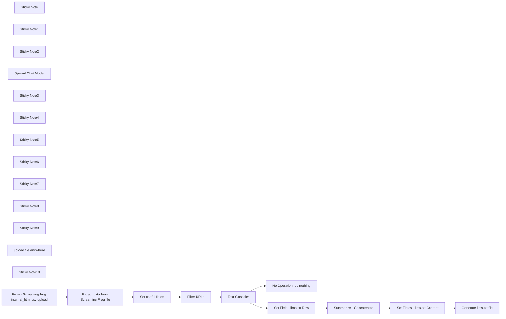

## Fluxo (.json) :

```json
{
  "id": "",
  "meta": {
    "instanceId": "",
    "templateCredsSetupCompleted": true
  },
  "name": "Generate AI-Ready llms.txt Files from Screaming Frog Website Crawls",
  "tags": [],
  "nodes": [
    {
      "id": "ca701618-b2d5-48ee-a503-d3513d018a65",
      "name": "Sticky Note",
      "type": "n8n-nodes-base.stickyNote",
      "position": [
        360,
        -500
      ],
      "parameters": {
        "color": 7,
        "width": 360,
        "height": 860,
        "content": "## Form - Screaming Frog internal_html.csv upload  \n\nThis form node is used to trigger the workflow.  \n\nIt contains **three input fields**:  \n- Name of the website  \n- Short description of the website  \n- **Screaming Frog** export containing the internal URLs  \n\n\n\nIt is recommended to use the **internal_html.csv** export, but **internal_all.csv** will also work, as the workflow includes a filter to process only indexable URLs.\n"
      },
      "typeVersion": 1
    },
    {
      "id": "bc040ca0-f38d-4458-a60c-17f71dbfd1ea",
      "name": "Sticky Note1",
      "type": "n8n-nodes-base.stickyNote",
      "position": [
        780,
        -500
      ],
      "parameters": {
        "color": 7,
        "width": 360,
        "height": 860,
        "content": "## Extract data from Screaming Frog file\n\nThis node extracts data from the **CSV file** provided by the user.  \n\nIt produces an output that is **easily usable** in the following nodes.  \n\n⚠️ **Caution:**  \nIf the uploaded file is **not** the expected Screaming Frog export, the workflow will still proceed but will likely **fail in the next steps** due to missing required fields.  \n\n"
      },
      "typeVersion": 1
    },
    {
      "id": "f71a7d10-847d-48e7-8820-ec0c1e7ea055",
      "name": "Sticky Note2",
      "type": "n8n-nodes-base.stickyNote",
      "position": [
        1200,
        -500
      ],
      "parameters": {
        "color": 7,
        "width": 360,
        "height": 860,
        "content": "## Set Useful Fields  \n\nThis node sets **7 key fields** from the Screaming Frog export:  \n\n- `url` → from the **\"Address\"** column  \n- `title` → from the **\"Title 1\"** column  \n- `description` → from the **\"Meta Description 1\"** column  \n- `status` → from the **\"Status Code\"** column  \n- `indexability` → from the **\"Indexability\"** column  \n- `content_type` → from the **\"Content Type\"** column  \n- `word_count` → from the **\"Word Count\"** column  \n\n\n**Multi-language compatibility**  \nIf you're using Screaming Frog in **French, Italian, German, or Spanish**, the column names will be different.  \nHowever, the workflow is designed to handle this, so it will **still work correctly**! 🥳\n"
      },
      "typeVersion": 1
    },
    {
      "id": "6f6546b8-adeb-4998-ae19-d93525337eb7",
      "name": "Set useful fields",
      "type": "n8n-nodes-base.set",
      "position": [
        1340,
        60
      ],
      "parameters": {
        "options": {},
        "assignments": {
          "assignments": [
            {
              "id": "0e7d4a06-83fc-4834-93fe-2e758cbe2307",
              "name": "url",
              "type": "string",
              "value": "={{ $json.Address || $json.Adresse || $json.Dirección || $json.Indirizzo }}"
            },
            {
              "id": "c82f4d4c-9d0b-4c7d-9647-5d0240b58643",
              "name": "title",
              "type": "string",
              "value": "={{ $json['Title 1'] || $json['Titolo 1'] || $json['Titolo 1'] || $json['Título 1'] || $json['Titel 1'] }}"
            },
            {
              "id": "abea81db-ce3b-4ac1-bd21-09ccfffb567a",
              "name": "description",
              "type": "string",
              "value": "={{ $json['Meta Description 1'] || $json['Meta description 1'] }}"
            },
            {
              "id": "2ca75d74-70f8-400b-b862-9da186135915",
              "name": "statut",
              "type": "string",
              "value": "={{ $json['Status Code'] || $json['Code HTTP'] || $json['Status-Code'] || $json['Código de respuesta'] || $json['Codice di stato']}}"
            },
            {
              "id": "754d3202-38b0-4d79-ba24-8078b3244307",
              "name": "indexability",
              "type": "string",
              "value": "={{ $json.Indexability || $json.Indexabilité || $json.Indicizzabilità || $json.Indexabilidad || $json.Indexierbarkeit}}"
            },
            {
              "id": "8bc6583d-bb34-4d22-b310-fe79bb8ac85d",
              "name": "content_type",
              "type": "string",
              "value": "={{ $json['Content Type'] || $json['Type de contenu'] || $json['Tipo di contenuto'] || $json['Tipo de contenido'] || $json['Inhaltstyp']}}"
            },
            {
              "id": "c874ba1a-769e-43d3-9555-8c9914ca9b76",
              "name": "word_count",
              "type": "string",
              "value": "={{ $json['Word Count'] || $json['Nombre de mots'] || $json['Conteggio delle parole'] || $json['Conteggio delle parole'] || $json['Recuento de palabras'] || $json['Wortanzahl'] }}"
            }
          ]
        }
      },
      "typeVersion": 3.4
    },
    {
      "id": "1a9af7a0-d2d5-44cb-9770-2d5a1e5706f4",
      "name": "Text Classifier",
      "type": "@n8n/n8n-nodes-langchain.textClassifier",
      "disabled": true,
      "position": [
        2260,
        60
      ],
      "parameters": {
        "options": {},
        "inputText": "=url : {{ $json.url }}\ntitle : {{ $json.title }}\ndescription : {{ $json.description }}\nwords count : {{ $json.word_count }}",
        "categories": {
          "categories": [
            {
              "category": "useful_content",
              "description": "Pages that are likely to contain high-quality content, making them suitable for inclusion in a file that aids content discovery for an LLM. "
            },
            {
              "category": "other_content",
              "description": "Pages that should not be included (e.g., pagination, or low-value content)."
            }
          ]
        }
      },
      "typeVersion": 1
    },
    {
      "id": "74a4e378-4228-4142-92ca-e541efde2b15",
      "name": "OpenAI Chat Model",
      "type": "@n8n/n8n-nodes-langchain.lmChatOpenAi",
      "position": [
        2180,
        240
      ],
      "parameters": {
        "model": {
          "__rl": true,
          "mode": "list",
          "value": "gpt-4o-mini"
        },
        "options": {}
      },
      "credentials": {
        "openAiApi": {
          "id": "",
          "name": "OpenAi Connection"
        }
      },
      "typeVersion": 1.2
    },
    {
      "id": "63dc6cfe-bc73-43b5-8c7d-4f5fd6501d3b",
      "name": "No Operation, do nothing",
      "type": "n8n-nodes-base.noOp",
      "position": [
        2580,
        200
      ],
      "parameters": {},
      "typeVersion": 1
    },
    {
      "id": "cb555b99-9e63-4b6b-a1fc-512b5467d666",
      "name": "Sticky Note3",
      "type": "n8n-nodes-base.stickyNote",
      "position": [
        1620,
        -500
      ],
      "parameters": {
        "color": 7,
        "width": 360,
        "height": 860,
        "content": "## Filter URLs \n\nThis **filter node** is used to keep only the URLs that meet the following conditions:  \n- `status` = **200**  \n- `indexability` = **indexable**  \n- `content_type` contains **text/html**  \n\n\nThese filters are even **more useful** if the uploaded file is an **internal_all.csv** instead of an **internal_html.csv**.  \n\n### **Tips:**  \nYou can **add more filters** to refine the URLs included in your `llms.txt` file.  \n\n💡 **Examples:**  \n- **Filter by word count** → Ensure pages contain **enough text content**.  \n- **Filter by URL path** → Keep only **specific folders or categories** in the `llms.txt` file.  \n- **Filter by meta description** → Exclude URLs **without a meta description**, as this field will be used in the `llms.txt` file to describe each piece of content.  \n"
      },
      "typeVersion": 1
    },
    {
      "id": "e34e56e2-5cc8-4e50-bfb0-3aa2e5e04abf",
      "name": "Filter URLs",
      "type": "n8n-nodes-base.filter",
      "position": [
        1740,
        60
      ],
      "parameters": {
        "options": {},
        "conditions": {
          "options": {
            "version": 2,
            "leftValue": "",
            "caseSensitive": true,
            "typeValidation": "strict"
          },
          "combinator": "and",
          "conditions": [
            {
              "id": "cef4feaa-1c46-45b1-92b7-f5c2051b1dc5",
              "operator": {
                "type": "number",
                "operation": "equals"
              },
              "leftValue": "={{ Number($json.statut) }}",
              "rightValue": 200
            },
            {
              "id": "bb821656-9740-4da4-8aa9-f65ad098c470",
              "operator": {
                "type": "boolean",
                "operation": "true",
                "singleValue": true
              },
              "leftValue": "={{ [\"Indexable\", \"Indicizzabile\", \"Indexierbar\"].includes($json.indexability) }}",
              "rightValue": "={{ \"Indexable\" || \"Indicizzabile\" }}"
            },
            {
              "id": "5c93ddb8-8091-406a-bc04-fa14e8b73fb9",
              "operator": {
                "type": "string",
                "operation": "contains"
              },
              "leftValue": "={{ $json.content_type }}",
              "rightValue": "text/html"
            }
          ]
        }
      },
      "typeVersion": 2.2
    },
    {
      "id": "b98f19a8-afd3-4d26-8063-dee3ee75055f",
      "name": "Sticky Note4",
      "type": "n8n-nodes-base.stickyNote",
      "position": [
        2040,
        -800
      ],
      "parameters": {
        "color": 2,
        "width": 740,
        "height": 1160,
        "content": "## Text Classifier\n\n🚫 **This node is deactivated by default** in the template.  \n\nYou can **enable it** if you want to add a more **\"intelligent\" 🤓 filter** to refine the URLs included in the `llms.txt` file, helping LLMs discover and prioritize valuable content.\n\n### How It Works:\nThis node has **two outputs**:  \n- **`useful_content`** → Pages that are **likely to contain high-quality content**, making them suitable for inclusion in a file that **aids content discovery for an LLM**.  \n- **`other_content`** → Pages that should **not** be included (e.g., pagination or low-value content).  \n\n\nYou can **modify the description** in the node to fine-tune the classification according to your needs.  \n\n### Input Fields:\n- **url** → `{{ $json.url }}`  \n- **title** → `{{ $json.title }}`  \n- **description** → `{{ $json.description }}`  \n- **word_count** → `{{ $json.word_count }}`  \n\n### Why use an LLM?  \nA **language model (LLM)** can **analyze** the **URL, title, and description** to identify pages that **most likely contain meaningful and relevant content**.  \nThis allows it to **prioritize valuable pages** and structure the data for **better content discovery and training purposes**. \n\n### **For large websites**  \nIf you have a **very large website**, consider using a **Loop Over Items** node to make the workflow **more robust** and ensure all pages are processed.  \nAlso, using a **Loop Over Items** node make it **easier** to handle:  \n- **Timeouts** \n- **API quotas** \n- **Other scalability issues**\n\n### Tokens usage\nFinally, keep in mind that **more pages mean more tokens and more billed LLM API calls**.\n\n\n\n\n\n\n\n"
      },
      "typeVersion": 1
    },
    {
      "id": "63e3ea7a-cec3-442c-9812-771def0a9949",
      "name": "Sticky Note5",
      "type": "n8n-nodes-base.stickyNote",
      "position": [
        2840,
        -500
      ],
      "parameters": {
        "color": 7,
        "width": 360,
        "height": 860,
        "content": "## Set Field - llms.txt Row\n\nThis node **sets** the row format for the `llms.txt` file.  \n\n### Row Structure:\nEach row follows this format:  \n\n- `- [title](link): description`  \n\nIf the URL **has no description** (from the **Meta Description** in the Screaming Frog export), the row will be:  \n\n- `- [title](link)`  \n"
      },
      "typeVersion": 1
    },
    {
      "id": "78f58220-feb5-4044-b994-39a0e4f1e9e4",
      "name": "Sticky Note6",
      "type": "n8n-nodes-base.stickyNote",
      "position": [
        3260,
        -500
      ],
      "parameters": {
        "color": 7,
        "width": 360,
        "height": 860,
        "content": "## Summarize - Concatenate\n\nThis node concatenates all the output from the previous node, ensuring each row is on a separate line."
      },
      "typeVersion": 1
    },
    {
      "id": "7a119633-7cd3-4de5-a1cd-7f708e1abf4a",
      "name": "Sticky Note7",
      "type": "n8n-nodes-base.stickyNote",
      "position": [
        3680,
        -500
      ],
      "parameters": {
        "color": 7,
        "width": 360,
        "height": 860,
        "content": "## Set Fields - llms.txt Content\n\nThis node sets the content of the `llms.txt` file using:\n\n- The **website title** provided in the form (first node).\n- The **website description** provided in the form (first node).\n- The output from the previous node, which includes all the URLs, their titles, and their descriptions that will appear in the `llms.txt` file.\n"
      },
      "typeVersion": 1
    },
    {
      "id": "554f6858-68e8-4b35-a6c4-21bed6832323",
      "name": "Sticky Note8",
      "type": "n8n-nodes-base.stickyNote",
      "position": [
        4100,
        -500
      ],
      "parameters": {
        "color": 7,
        "width": 360,
        "height": 860,
        "content": "## Generate llms.txt file\n\nThis node **creates** the `llms.txt` file, which can be **downloaded directly** within n8n. \n"
      },
      "typeVersion": 1
    },
    {
      "id": "24bdefba-e2f2-41f0-93e7-9f8d2fc11f43",
      "name": "Sticky Note9",
      "type": "n8n-nodes-base.stickyNote",
      "position": [
        4520,
        -500
      ],
      "parameters": {
        "color": 7,
        "width": 360,
        "height": 860,
        "content": "## upload file anywhere\n\nInstead of downloading the file directly from the n8n workflow, you can **replace this node node** with a Drive node (e.g., **Google Drive** or **OneDrive**) to upload the `llms.txt` file to a folder of your choice.  \n  \n**Name the file properly** (e.g., include the website name) to make it easier to find and distinguish between files when working on multiple websites.  \n"
      },
      "typeVersion": 1
    },
    {
      "id": "a3be51e3-810c-40a7-a996-98a3d383c2b9",
      "name": "Summarize - Concatenate",
      "type": "n8n-nodes-base.summarize",
      "position": [
        3380,
        40
      ],
      "parameters": {
        "options": {},
        "fieldsToSummarize": {
          "values": [
            {
              "field": "llmTxtRow",
              "separateBy": "\n",
              "aggregation": "concatenate"
            }
          ]
        }
      },
      "typeVersion": 1.1
    },
    {
      "id": "8d3a892a-3d11-4d8a-8ec6-84f8f3af1183",
      "name": "Set Fields - llms.txt Content",
      "type": "n8n-nodes-base.set",
      "position": [
        3820,
        40
      ],
      "parameters": {
        "options": {},
        "assignments": {
          "assignments": [
            {
              "id": "97062a99-e944-4e1e-89b1-62cf9e3462dd",
              "name": "llmsTxtFile",
              "type": "string",
              "value": "=# {{ $('Form - Screaming frog internal_html.csv upload').item.json['What is the name of your website?'] }}\n> {{ $('Form - Screaming frog internal_html.csv upload').item.json['Can you provide a short description of your website? (in the language of the website)'] }}\n\n{{ $json.concatenated_llmTxtRow }}"
            }
          ]
        }
      },
      "typeVersion": 3.4
    },
    {
      "id": "bc2a692a-47ea-4bf1-a102-e607fd544158",
      "name": "upload file anywhere",
      "type": "n8n-nodes-base.noOp",
      "position": [
        4640,
        40
      ],
      "parameters": {},
      "typeVersion": 1
    },
    {
      "id": "404510a2-35b2-44cf-9d02-eb0abcf4e9b3",
      "name": "Set Field - llms.txt Row",
      "type": "n8n-nodes-base.set",
      "position": [
        2960,
        40
      ],
      "parameters": {
        "options": {},
        "assignments": {
          "assignments": [
            {
              "id": "95e75caa-8110-476b-9cb1-73c15361fa56",
              "name": "llmTxtRow",
              "type": "string",
              "value": "=- [{{ $json.title }}]({{ $json.url }}){{ $json.description ? ': ' + $json.description : '' }}"
            }
          ]
        }
      },
      "typeVersion": 3.4
    },
    {
      "id": "f54d51f2-17bc-4c58-b177-0e77e16f7b72",
      "name": "Sticky Note10",
      "type": "n8n-nodes-base.stickyNote",
      "position": [
        -420,
        -1020
      ],
      "parameters": {
        "color": 5,
        "width": 700,
        "height": 1380,
        "content": "# Generate AI-Ready llms.txt Files from Screaming Frog Website Crawls  \n\nThis workflow helps you generate an **llms.txt** file (if you're unfamiliar with it, check out [this article](https://towardsdatascience.com/llms-txt-414d5121bcb3/)) using a **Screaming Frog export**.  \n\n[Screaming Frog](https://www.screamingfrog.co.uk/seo-spider/) is a well-known website crawler.  \nYou can easily crawl a website. Then, export the **\"internal_html\"** section in CSV format.  \n\n## How It Works: \n\nA **form** allows you to enter:  \n- The **name of the website**  \n- A **short description**  \n- The **internal_html.csv** file from your Screaming Frog export  \n\n\nOnce the form is submitted, the **workflow is triggered automatically**, and you can **download the llms.txt file directly from n8n**. \n\n## Downloading the File\nSince the last node in this workflow is **\"Convert to File\"**, you will need to **download the file directly from the n8n UI**.  \nHowever, you can easily **add a node** (e.g., Google Drive, OneDrive) to automatically upload the file **wherever you want**.  \n\n## AI-Powered Filtering (Optional):  \nThis workflow includes a **text classifier node**, which is **deactivated by default**.  \n- You can **activate it** to apply a more **intelligent filter** to select URLs for the `llms.txt` file.  \n- Consider modifying the **description** in the classifier node to specify the type of URLs you want to include.  \n\n## How to Use This Workflow  \n\n1. **Crawl the website** you want to generate an `llms.txt` file for using **Screaming Frog**.  \n2. **Export the \"internal_html\"** section in CSV format.  \n     \n3. In **n8n**, click **\"Test Workflow\"**, fill in the form, and **upload** the `internal_html.csv` file.  \n4. Once the workflow is complete, go to the **\"Export to File\"** node and **download the output**.  \n\n**That's it! You now have your llms.txt file!**  \n\n\n\n**Recommended Usage:**  \nUse this workflow **directly in the n8n UI by clicking** 'Test Workflow' and uploading the file in the form."
      },
      "typeVersion": 1
    },
    {
      "id": "e33104af-802a-43f2-b26d-f368f7de2fd7",
      "name": "Form - Screaming frog internal_html.csv upload",
      "type": "n8n-nodes-base.formTrigger",
      "position": [
        460,
        60
      ],
      "webhookId": "8791f39a-3d81-405c-b177-0a733ebf74cb",
      "parameters": {
        "options": {
          "buttonLabel": "Get the llms.txt file"
        },
        "formTitle": "llms.txt Generator - From Screaming Frog export",
        "formFields": {
          "values": [
            {
              "fieldLabel": "What is the name of your website?",
              "placeholder": "Example : The best website ever",
              "requiredField": true
            },
            {
              "fieldLabel": "Can you provide a short description of your website? (in the language of the website)",
              "placeholder": "Example : This is the best website ever because all the content is engaging and valuable.",
              "requiredField": true
            },
            {
              "fieldType": "file",
              "fieldLabel": "screaming_frog_export",
              "multipleFiles": false,
              "requiredField": true,
              "acceptFileTypes": ".csv"
            }
          ]
        },
        "responseMode": "lastNode",
        "formDescription": "Generate a simple llms.txt file from a Screaming Frog Export\nIt is recommended to use the internal_html.csv export, although internal_all.csv will also work.\n\nFill in the fields in this form.Just fill in the fields in this form  😄"
      },
      "typeVersion": 2.2
    },
    {
      "id": "f6b17fdd-a098-411e-8d53-3f6e638cc3ba",
      "name": "Extract data from Screaming Frog file",
      "type": "n8n-nodes-base.extractFromFile",
      "position": [
        900,
        60
      ],
      "parameters": {
        "options": {},
        "operation": "xls",
        "binaryPropertyName": "screaming_frog_export"
      },
      "typeVersion": 1
    },
    {
      "id": "6bbd8d1f-3322-4c6d-af08-c842386239ce",
      "name": "Generate llms.txt file",
      "type": "n8n-nodes-base.convertToFile",
      "position": [
        4220,
        40
      ],
      "parameters": {
        "options": {
          "encoding": "utf8",
          "fileName": "llms.txt"
        },
        "operation": "toText",
        "sourceProperty": "llmsTxtFile"
      },
      "typeVersion": 1.1
    }
  ],
  "active": false,
  "pinData": {},
  "settings": {
    "executionOrder": "v1"
  },
  "versionId": "",
  "connections": {
    "Filter URLs": {
      "main": [
        [
          {
            "node": "Text Classifier",
            "type": "main",
            "index": 0
          }
        ]
      ]
    },
    "Text Classifier": {
      "main": [
        [
          {
            "node": "Set Field - llms.txt Row",
            "type": "main",
            "index": 0
          }
        ],
        [
          {
            "node": "No Operation, do nothing",
            "type": "main",
            "index": 0
          }
        ]
      ]
    },
    "OpenAI Chat Model": {
      "ai_languageModel": [
        [
          {
            "node": "Text Classifier",
            "type": "ai_languageModel",
            "index": 0
          }
        ]
      ]
    },
    "Set useful fields": {
      "main": [
        [
          {
            "node": "Filter URLs",
            "type": "main",
            "index": 0
          }
        ]
      ]
    },
    "Generate llms.txt file": {
      "main": [
        []
      ]
    },
    "Summarize - Concatenate": {
      "main": [
        [
          {
            "node": "Set Fields - llms.txt Content",
            "type": "main",
            "index": 0
          }
        ]
      ]
    },
    "Set Field - llms.txt Row": {
      "main": [
        [
          {
            "node": "Summarize - Concatenate",
            "type": "main",
            "index": 0
          }
        ]
      ]
    },
    "Set Fields - llms.txt Content": {
      "main": [
        [
          {
            "node": "Generate llms.txt file",
            "type": "main",
            "index": 0
          }
        ]
      ]
    },
    "Extract data from Screaming Frog file": {
      "main": [
        [
          {
            "node": "Set useful fields",
            "type": "main",
            "index": 0
          }
        ]
      ]
    },
    "Form - Screaming frog internal_html.csv upload": {
      "main": [
        [
          {
            "node": "Extract data from Screaming Frog file",
            "type": "main",
            "index": 0
          }
        ]
      ]
    }
  }
}
```

<a id="template-377"></a>

## Template 377 - Pesquisa e enriquecimento de empresas por domínio

- **Nome:** Pesquisa e enriquecimento de empresas por domínio
- **Descrição:** Automatiza a leitura de domínios em uma planilha, consulta dados de empresas via API e grava os resultados de volta na mesma planilha.
- **Funcionalidade:** • Disparo manual para iniciar o processo: permite executar a rotina sob demanda.
• Leitura de linhas da planilha: obtém todas as entradas de um documento do Google Sheets.
• Filtragem de registros não processados: seleciona apenas linhas com o campo processed_at vazio.
• Processamento sequencial em lotes: realiza consultas uma a uma para controlar a concorrência.
• Consulta de enriquecimento por domínio: chama a API de enriquecimento (ProspectLens) usando o domínio da linha.
• Retentativa e continuação em caso de erro: tenta novamente a chamada e continua sem interromper todo o fluxo em falhas pontuais.
• Atualização da planilha com dados retornados: grava campos como nome, descrição, tráfego, funding, localização, site, ano de fundação, última rodada e timestamp de processamento.
• Armazenamento seguro do payload: salva uma representação JSON dos dados (limitada a 2000 caracteres) para referência.
• Marcação de registro processado: adiciona processed_at com timestamp ISO para evitar reprocessamento.
- **Ferramentas:** • Google Sheets: planilha usada para ler domínios e atualizar registros com os dados enriquecidos.
• ProspectLens (via APIRoad marketplace): API de enriquecimento de empresas por domínio, fornecendo informações como tráfego, funding, descrição e dados de contato.
• APIRoad (autenticação por header): gateway/serviço de autenticação usado para autorizar chamadas à API ProspectLens.


## Fluxo visual

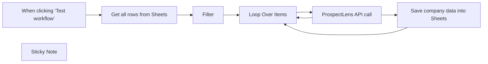

## Fluxo (.json) :

```json
{
  "id": "wwvUsosYUyMfpGbB",
  "meta": {
    "instanceId": "5b860a91d7844b5237bb51cc58691ca8c3dc5b576f42d4d6bbedfb8d43d58ece",
    "templateCredsSetupCompleted": true
  },
  "name": "ProspectLens company research",
  "tags": [],
  "nodes": [
    {
      "id": "fd68acdf-ed1e-4f69-a046-fcdaa626acca",
      "name": "When clicking ‘Test workflow’",
      "type": "n8n-nodes-base.manualTrigger",
      "position": [
        720,
        400
      ],
      "parameters": {},
      "typeVersion": 1
    },
    {
      "id": "d4e4875a-e41f-4248-937a-a4658c23eb5e",
      "name": "Filter",
      "type": "n8n-nodes-base.filter",
      "notes": "Only process rows which have empty processed_at field",
      "position": [
        1160,
        400
      ],
      "parameters": {
        "options": {
          "looseTypeValidation": true
        },
        "conditions": {
          "options": {
            "leftValue": "",
            "caseSensitive": true,
            "typeValidation": "loose"
          },
          "combinator": "and",
          "conditions": [
            {
              "id": "5aca0836-4797-41d3-8094-f3a170e5a3c9",
              "operator": {
                "type": "string",
                "operation": "empty",
                "singleValue": true
              },
              "leftValue": "={{ $json.processed_at }}",
              "rightValue": ""
            }
          ]
        }
      },
      "notesInFlow": true,
      "typeVersion": 2
    },
    {
      "id": "e12c1846-dd38-414c-8e2e-8d0834ad8668",
      "name": "Sticky Note",
      "type": "n8n-nodes-base.stickyNote",
      "position": [
        880,
        20
      ],
      "parameters": {
        "width": 725,
        "height": 316.25,
        "content": "## Company research via Google Sheets and ProspectLens\n\nGet your API key:\nhttps://apiroad.net/marketplace/apis/prospectlens\n\nCopy Google Sheet template:\nhttps://docs.google.com/spreadsheets/d/1S2S18hvfBoFsUgRYPyizH6uv7WwI218frvOqu2bV3wk/edit?gid=0#gid=0"
      },
      "typeVersion": 1
    },
    {
      "id": "b0385041-92c4-41a4-b0e8-9f2a7cc6fd56",
      "name": "Save company data into Sheets",
      "type": "n8n-nodes-base.googleSheets",
      "position": [
        2000,
        380
      ],
      "parameters": {
        "columns": {
          "value": {
            "data": "={{ JSON.stringify($json.data).substr(0, 2000) }}",
            "name": "={{ $json.data.properties.title }}",
            "funds": "={{ $json.data.info.funding_rounds_summary.funding_total.value }}",
            "domain": "={{ $('Filter').item.json.domain }}",
            "traffic": "={{ $json.data.info.semrush_summary.semrush_visits_latest_month }}",
            "location": "={{ $json.data.info.semrush_location_list[0].location_identifiers[0].value }}",
            "description": "={{ $json.data.properties.short_description }}",
            "domain_name": "={{ $json.data.info.company_about_fields.website.hostname }}",
            "processed_at": "={{ (new Date).toISOString()  }}",
            "year_founded": "={{ $json.data.info.overview_fields_extended.founded_on.value }}",
            "funding_round": "={{ $json.data.info.funding_rounds_summary.last_funding_type }}",
            "last_funding_at": "={{ $json.data.info.funding_rounds_summary.last_funding_at }}"
          },
          "schema": [
            {
              "id": "domain",
              "type": "string",
              "display": true,
              "removed": false,
              "required": false,
              "displayName": "domain",
              "defaultMatch": false,
              "canBeUsedToMatch": true
            },
            {
              "id": "name",
              "type": "string",
              "display": true,
              "removed": false,
              "required": false,
              "displayName": "name",
              "defaultMatch": false,
              "canBeUsedToMatch": true
            },
            {
              "id": "description",
              "type": "string",
              "display": true,
              "removed": false,
              "required": false,
              "displayName": "description",
              "defaultMatch": false,
              "canBeUsedToMatch": true
            },
            {
              "id": "processed_at",
              "type": "string",
              "display": true,
              "required": false,
              "displayName": "processed_at",
              "defaultMatch": false,
              "canBeUsedToMatch": true
            },
            {
              "id": "data",
              "type": "string",
              "display": true,
              "required": false,
              "displayName": "data",
              "defaultMatch": false,
              "canBeUsedToMatch": true
            },
            {
              "id": "domain_name",
              "type": "string",
              "display": true,
              "required": false,
              "displayName": "domain_name",
              "defaultMatch": false,
              "canBeUsedToMatch": true
            },
            {
              "id": "traffic",
              "type": "string",
              "display": true,
              "required": false,
              "displayName": "traffic",
              "defaultMatch": false,
              "canBeUsedToMatch": true
            },
            {
              "id": "location",
              "type": "string",
              "display": true,
              "removed": false,
              "required": false,
              "displayName": "location",
              "defaultMatch": false,
              "canBeUsedToMatch": true
            },
            {
              "id": "funds",
              "type": "string",
              "display": true,
              "removed": false,
              "required": false,
              "displayName": "funds",
              "defaultMatch": false,
              "canBeUsedToMatch": true
            },
            {
              "id": "year_founded",
              "type": "string",
              "display": true,
              "removed": false,
              "required": false,
              "displayName": "year_founded",
              "defaultMatch": false,
              "canBeUsedToMatch": true
            },
            {
              "id": "funding_round",
              "type": "string",
              "display": true,
              "removed": false,
              "required": false,
              "displayName": "funding_round",
              "defaultMatch": false,
              "canBeUsedToMatch": true
            },
            {
              "id": "last_funding_at",
              "type": "string",
              "display": true,
              "removed": false,
              "required": false,
              "displayName": "last_funding_at",
              "defaultMatch": false,
              "canBeUsedToMatch": true
            },
            {
              "id": "row_number",
              "type": "string",
              "display": true,
              "removed": true,
              "readOnly": true,
              "required": false,
              "displayName": "row_number",
              "defaultMatch": false,
              "canBeUsedToMatch": true
            }
          ],
          "mappingMode": "defineBelow",
          "matchingColumns": [
            "domain"
          ]
        },
        "options": {},
        "operation": "update",
        "sheetName": {
          "__rl": true,
          "mode": "list",
          "value": "gid=0",
          "cachedResultUrl": "https://docs.google.com/spreadsheets/d/1X2hKT8cD6fTQUdALg91EwQDCM58YNY4pHe-7rmESzlk/edit#gid=0",
          "cachedResultName": "Sheet1"
        },
        "documentId": {
          "__rl": true,
          "mode": "list",
          "value": "1X2hKT8cD6fTQUdALg91EwQDCM58YNY4pHe-7rmESzlk",
          "cachedResultUrl": "https://docs.google.com/spreadsheets/d/1X2hKT8cD6fTQUdALg91EwQDCM58YNY4pHe-7rmESzlk/edit?usp=drivesdk",
          "cachedResultName": "n8n_prospectlens"
        }
      },
      "credentials": {
        "googleSheetsOAuth2Api": {
          "id": "vowsrhMIxy2PRDbH",
          "name": "Google Sheets account"
        }
      },
      "typeVersion": 4.4
    },
    {
      "id": "e048f8d0-57c2-43ac-bedf-1a517b203df3",
      "name": "Loop Over Items",
      "type": "n8n-nodes-base.splitInBatches",
      "notes": "Used to keep low concurrency (1 thread)",
      "position": [
        1400,
        380
      ],
      "parameters": {
        "options": {}
      },
      "notesInFlow": true,
      "typeVersion": 3
    },
    {
      "id": "b6898b5e-dba5-425d-8f9b-d996dcb6cff2",
      "name": "ProspectLens API call",
      "type": "n8n-nodes-base.httpRequest",
      "notes": "ProspectLens API",
      "onError": "continueErrorOutput",
      "maxTries": 2,
      "position": [
        1680,
        380
      ],
      "parameters": {
        "url": "=https://prospectlens.apiroad.net/lookup?domain={{ $json.domain }}",
        "options": {
          "response": {
            "response": {}
          }
        },
        "authentication": "genericCredentialType",
        "genericAuthType": "httpHeaderAuth"
      },
      "credentials": {
        "httpHeaderAuth": {
          "id": "tcCkO83Qn399Hizf",
          "name": "APIRoad auth"
        }
      },
      "notesInFlow": true,
      "retryOnFail": true,
      "typeVersion": 4.2
    },
    {
      "id": "4c625e34-728c-49ae-8e22-4b4a343354cb",
      "name": "Get all rows from Sheets",
      "type": "n8n-nodes-base.googleSheets",
      "position": [
        940,
        400
      ],
      "parameters": {
        "options": {},
        "sheetName": {
          "__rl": true,
          "mode": "list",
          "value": "gid=0",
          "cachedResultUrl": "https://docs.google.com/spreadsheets/d/1X2hKT8cD6fTQUdALg91EwQDCM58YNY4pHe-7rmESzlk/edit#gid=0",
          "cachedResultName": "Sheet1"
        },
        "documentId": {
          "__rl": true,
          "mode": "list",
          "value": "1X2hKT8cD6fTQUdALg91EwQDCM58YNY4pHe-7rmESzlk",
          "cachedResultUrl": "https://docs.google.com/spreadsheets/d/1X2hKT8cD6fTQUdALg91EwQDCM58YNY4pHe-7rmESzlk/edit?usp=drivesdk",
          "cachedResultName": "n8n_prospectlens"
        }
      },
      "credentials": {
        "googleSheetsOAuth2Api": {
          "id": "vowsrhMIxy2PRDbH",
          "name": "Google Sheets account"
        }
      },
      "typeVersion": 4.4
    }
  ],
  "active": false,
  "pinData": {},
  "settings": {
    "executionOrder": "v1"
  },
  "versionId": "ea844f9f-c06e-4a0c-98db-a670709c2025",
  "connections": {
    "Filter": {
      "main": [
        [
          {
            "node": "Loop Over Items",
            "type": "main",
            "index": 0
          }
        ]
      ]
    },
    "Loop Over Items": {
      "main": [
        [],
        [
          {
            "node": "ProspectLens API call",
            "type": "main",
            "index": 0
          }
        ]
      ]
    },
    "ProspectLens API call": {
      "main": [
        [
          {
            "node": "Save company data into Sheets",
            "type": "main",
            "index": 0
          }
        ],
        [
          {
            "node": "Loop Over Items",
            "type": "main",
            "index": 0
          }
        ]
      ]
    },
    "Get all rows from Sheets": {
      "main": [
        [
          {
            "node": "Filter",
            "type": "main",
            "index": 0
          }
        ]
      ]
    },
    "Save company data into Sheets": {
      "main": [
        [
          {
            "node": "Loop Over Items",
            "type": "main",
            "index": 0
          }
        ]
      ]
    },
    "When clicking ‘Test workflow’": {
      "main": [
        [
          {
            "node": "Get all rows from Sheets",
            "type": "main",
            "index": 0
          }
        ]
      ]
    }
  }
}
```

<a id="template-378"></a>

## Template 378 - Receber atualizações de tarefas no Flow

- **Nome:** Receber atualizações de tarefas no Flow
- **Descrição:** Escuta atualizações em tarefas específicas na plataforma Flow e dispara ações quando ocorrerem alterações.
- **Funcionalidade:** • Monitoramento de tarefas específicas: recebe atualizações apenas para IDs de tarefa configurados.
• Gatilho em tempo real: inicia o fluxo imediatamente ao detectar alterações na tarefa.
• Autenticação via API: utiliza credenciais para conectar-se e autorizar o recebimento de eventos da plataforma.
- **Ferramentas:** • Flow: plataforma que gerencia tarefas e envia eventos de atualização via API para integração com automações.

## Fluxo visual

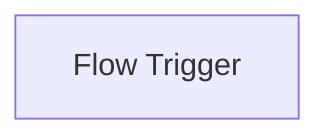

## Fluxo (.json) :

```json
{
  "id": "133",
  "name": "Receive updates for specified tasks in Flow",
  "nodes": [
    {
      "name": "Flow Trigger",
      "type": "n8n-nodes-base.flowTrigger",
      "position": [
        650,
        250
      ],
      "parameters": {
        "taskIds": "",
        "resource": "task"
      },
      "credentials": {
        "flowApi": ""
      },
      "typeVersion": 1
    }
  ],
  "active": false,
  "settings": {},
  "connections": {}
}
```

<a id="template-379"></a>

## Template 379 - Envio automático de e-mails para clientes

- **Nome:** Envio automático de e-mails para clientes
- **Descrição:** Leitura periódica de uma planilha com mensagens para clientes, filtragem por status e data atual, envio de e-mails personalizados e atualização do status na planilha.
- **Funcionalidade:** • Agendamento periódico: verifica a planilha a cada minuto para localizar novos itens a processar.
• Leitura de dados da planilha: obtém linhas contendo ID, Name, Email, Title, Subject, Date e Status.
• Filtragem por status e campos obrigatórios: seleciona apenas itens com Status igual a "Waiting for sending" e que possuam Title, Subject, Email, Name e Date preenchidos.
• Verificação de data atual: compara a data do item (formato yyyy/MM/dd) com o dia atual e processa apenas os que correspondem.
• Preparação e mesclagem de campos: organiza e combina os campos necessários (por exemplo email, name, ID) antes das próximas etapas.
• Envio de e-mail personalizado: envia mensagens aos destinatários usando os campos da planilha para assunto e conteúdo.
• Atualização de status na planilha: atualiza a linha correspondente, marcando o item como "Sent successfully" com base no ID.
- **Ferramentas:** • Google Sheets: armazena as mensagens, contatos, datas e status; fornece os dados lidos e permite atualizar o status dos envios.
• Gmail: serviço usado para enviar os e-mails personalizados aos destinatários.

## Fluxo visual

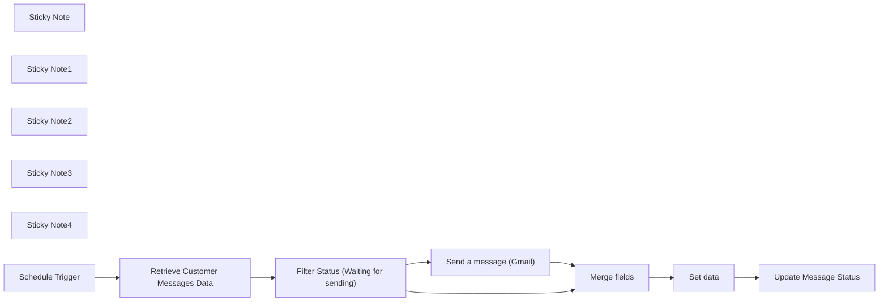

## Fluxo (.json) :

```json
{
  "meta": {
    "instanceId": "257476b1ef58bf3cb6a46e65fac7ee34a53a5e1a8492d5c6e4da5f87c9b82833",
    "templateId": "2088"
  },
  "nodes": [
    {
      "id": "0e4c65ce-95e9-4a32-bc5c-0461cb339764",
      "name": "Filter Status (Waiting for sending)",
      "type": "n8n-nodes-base.filter",
      "position": [
        1670,
        1110
      ],
      "parameters": {
        "options": {
          "looseTypeValidation": true
        },
        "conditions": {
          "options": {
            "leftValue": "",
            "caseSensitive": true,
            "typeValidation": "loose"
          },
          "combinator": "and",
          "conditions": [
            {
              "id": "401b79a0-a079-4ea0-805b-a963d9206031",
              "operator": {
                "name": "filter.operator.equals",
                "type": "string",
                "operation": "equals"
              },
              "leftValue": "={{ $json.Status }}",
              "rightValue": "Waiting for sending"
            },
            {
              "id": "74ec18c7-e4cc-4d82-ba05-0ec4781cbb9f",
              "operator": {
                "type": "string",
                "operation": "exists",
                "singleValue": true
              },
              "leftValue": "={{ $json.Title }}",
              "rightValue": ""
            },
            {
              "id": "6e293a16-48cd-40bb-9882-09b456a97d58",
              "operator": {
                "type": "string",
                "operation": "exists",
                "singleValue": true
              },
              "leftValue": "={{ $json.Subject }}",
              "rightValue": ""
            },
            {
              "id": "a02d2518-e979-4a17-ab00-dda6723d9945",
              "operator": {
                "type": "string",
                "operation": "exists",
                "singleValue": true
              },
              "leftValue": "={{ $json.Email }}",
              "rightValue": ""
            },
            {
              "id": "bea4e49e-cf8a-4f05-bd6f-bdce0c5d8533",
              "operator": {
                "type": "string",
                "operation": "exists",
                "singleValue": true
              },
              "leftValue": "={{ $json.Name }}",
              "rightValue": ""
            },
            {
              "id": "e33eb064-34c6-4dea-b454-10f4fb7fe630",
              "operator": {
                "type": "string",
                "operation": "exists",
                "singleValue": true
              },
              "leftValue": "={{ $json.Date }}",
              "rightValue": ""
            },
            {
              "id": "1abe48e3-ba4d-4318-900d-fd58097d55ec",
              "operator": {
                "type": "dateTime",
                "operation": "equals"
              },
              "leftValue": "={{ DateTime.fromFormat($json[\"Date\"], 'yyyy/MM/dd').startOf('day')}}",
              "rightValue": "={{ $now.startOf('day')}}"
            }
          ]
        }
      },
      "typeVersion": 2
    },
    {
      "id": "27f33448-a016-4ac8-aea3-2ca267fb1628",
      "name": "Set data",
      "type": "n8n-nodes-base.set",
      "position": [
        2290,
        1090
      ],
      "parameters": {
        "fields": {
          "values": [
            {
              "name": "email",
              "stringValue": "={{ $json.Email }}"
            },
            {
              "name": "name",
              "stringValue": "={{ $json.Name }}"
            },
            {
              "name": "ID",
              "stringValue": "={{ $json.ID }}"
            }
          ]
        },
        "include": "selected",
        "options": {}
      },
      "typeVersion": 3.2
    },
    {
      "id": "badf1d45-21e0-40a5-bcc4-c434f43c04d4",
      "name": "Sticky Note",
      "type": "n8n-nodes-base.stickyNote",
      "position": [
        390,
        250
      ],
      "parameters": {
        "width": 922.8914139860617,
        "height": 1171.2381808131183,
        "content": "# Node Descriptions\n\n## Retrieve Customer Messages Data (Google Sheets Node ):\n**Purpose and Use Cases:**\nThe primary purpose of this node is to retrieve data from a Google Sheets document that contains information about messages to customers. This could be used in various scenarios, such as:\n\n- Compiling a list of customer contacts for outreach campaigns.\n- Gathering feedback or responses stored in a spreadsheet.\n- Automating the process of updating customer records or tracking communications.\n\n\n## Filter Items by Current Date Node:\n- **Purpose:** Filters input items based on comparison with the current date.\n- **Parameters:**\n  - **JavaScript Code:** Compares item dates with the current date for filtering.\n- **Functionality:** Ensures only items with dates matching the current date are passed along.\n\n ### Note : The date format should be in this form (year/month/day) to be accepted.\n\n## Gmail Node:\n- **Purpose:** Likely sends emails using Gmail based on filtered items.\n- **Parameters:**\n  - **Recipient:** Extracted from input data.\n  - **Subject:** Extracted from input data.\n  - **Email Content:** Extracted from input data.\n\n## Update Message Status(Google Sheets Node ):\n- **Purpose:** Updates specific columns in the Google Sheets document.\n- **Parameters:**\n  - **Operation:** Update mode.\n  - **Columns:** Defines which columns to update with values from input data.\n\n## Filter Status (Waiting for sending) Node:\n- **Purpose:** Filters items based on specific status criteria.\n- **Parameters:**\n  - **Conditions:** Filters based on status, title, subject, email, name, and date.\n\n## Set data Node:\n- **Purpose:** Sets specified fields with extracted values from input data.\n\n## Merge feild Node:\n- **Purpose:** Merges fields from different sources based on position.\n\nFeel free to utilize these detailed descriptions to understand and enhance the workflow further.\n"
      },
      "typeVersion": 1
    },
    {
      "id": "0f1cd01b-4cf0-4998-9c51-02c2c9c4aa2b",
      "name": "Sticky Note1",
      "type": "n8n-nodes-base.stickyNote",
      "position": [
        1330,
        870
      ],
      "parameters": {
        "width": 1386.7301333853884,
        "height": 539.317352764935,
        "content": "# The Workflow"
      },
      "typeVersion": 1
    },
    {
      "id": "421b47fd-4707-41ec-97e4-7256be22b75d",
      "name": "Sticky Note2",
      "type": "n8n-nodes-base.stickyNote",
      "position": [
        380,
        240
      ],
      "parameters": {
        "color": 7,
        "width": 2358.9018586668417,
        "height": 1194.0044652590357,
        "content": "\n"
      },
      "typeVersion": 1
    },
    {
      "id": "dfb3d998-14fc-4d2a-af9e-19c7da8060f9",
      "name": "Sticky Note3",
      "type": "n8n-nodes-base.stickyNote",
      "position": [
        1330,
        255
      ],
      "parameters": {
        "width": 342.9710297084147,
        "height": 601.2740375761717,
        "content": "## Copy this template to get started :\n- [Google Sheets](https://docs.google.com/spreadsheets/d/1efCCzfeUX0AETz2wsULQN90OBCOKK-gBoDaptzcBHdE/edit?usp=sharing)\n\n## Workflow Nodes Documentation:\n\n1. [Schedule Trigger](https://docs.n8n.io/integrations/builtin/core-nodes/n8n-nodes-base.scheduletrigger/)\n2. [Filter Items by Current Date](https://docs.n8n.io/nodes/n8n-nodes-base.code.html)\n3. [Gmail](https://docs.n8n.io/nodes/n8n-nodes-base.gmail.html)\n4. [Google Sheets](https://docs.n8n.io/nodes/n8n-nodes-base.googleSheets.html)\n5. [Filter Status (Waiting for sending)](https://docs.n8n.io/nodes/n8n-nodes-base.filter.html)\n6. [Set data](https://docs.n8n.io/nodes/n8n-nodes-base.set.html)\n7. [Merge feild](https://docs.n8n.io/nodes/n8n-nodes-base.merge.html)\n"
      },
      "typeVersion": 1
    },
    {
      "id": "4ed5a195-fd49-465e-9a14-fa64cd96056b",
      "name": "Sticky Note4",
      "type": "n8n-nodes-base.stickyNote",
      "position": [
        1690,
        250
      ],
      "parameters": {
        "width": 1024.157503378047,
        "height": 602.8437691253422,
        "content": "## Workflow Overview:\n\nThe workflow begins with the \"Google Sheets Trigger\" node, which monitors a specified Google Sheet for new row additions. Upon detection of a new row, the workflow progresses to the \"Filter Status (Waiting for sending)\" node, where items are filtered based on specific conditions.\n\nSubsequently, the workflow moves to the \"Filter Items by Current Date\" node, which filters items based on the current date. Items matching the current date are then processed further.\n\nThe filtered items are then forwarded to the \"Gmail\" node, where personalized emails are composed and sent to recipients based on the Google Sheet data. Finally, the workflow updates the Google Sheet using the \"Google Sheets\" node with the status of the sent emails and other relevant information."
      },
      "typeVersion": 1
    },
    {
      "id": "d156f0da-53e7-499b-b652-5ca0c3c9e237",
      "name": "Schedule Trigger",
      "type": "n8n-nodes-base.scheduleTrigger",
      "position": [
        1350,
        1110
      ],
      "parameters": {
        "rule": {
          "interval": [
            {
              "field": "minutes",
              "minutesInterval": 1
            }
          ]
        }
      },
      "typeVersion": 1.1
    },
    {
      "id": "e398e809-b00f-4edb-af94-d236cfb80703",
      "name": "Retrieve Customer Messages Data",
      "type": "n8n-nodes-base.googleSheets",
      "position": [
        1510,
        1110
      ],
      "parameters": {
        "options": {},
        "sheetName": {
          "__rl": true,
          "mode": "list",
          "value": "gid=0",
          "cachedResultUrl": "https://docs.google.com/spreadsheets/d/126qQdkEWt_4Vkxvu6G80rBeFdIp_a8ISMz-898fa2D4/edit#gid=0",
          "cachedResultName": "Page"
        },
        "documentId": {
          "__rl": true,
          "mode": "list",
          "value": "126qQdkEWt_4Vkxvu6G80rBeFdIp_a8ISMz-898fa2D4",
          "cachedResultUrl": "https://docs.google.com/spreadsheets/d/126qQdkEWt_4Vkxvu6G80rBeFdIp_a8ISMz-898fa2D4/edit?usp=drivesdk",
          "cachedResultName": "Copy of Sending Messages to Customers"
        }
      },
      "credentials": {
        "googleSheetsOAuth2Api": {
          "id": "9",
          "name": "Nik's Google"
        }
      },
      "typeVersion": 4.2
    },
    {
      "id": "6de55876-3924-4fdc-aae7-b901a2ce72be",
      "name": "Update Message Status",
      "type": "n8n-nodes-base.googleSheets",
      "position": [
        2490,
        1090
      ],
      "parameters": {
        "columns": {
          "value": {
            "ID": "={{ $json.ID }}",
            "Status": "Sent successfully"
          },
          "schema": [
            {
              "id": "ID",
              "type": "string",
              "display": true,
              "removed": false,
              "required": false,
              "displayName": "ID",
              "defaultMatch": false,
              "canBeUsedToMatch": true
            },
            {
              "id": "Name",
              "type": "string",
              "display": true,
              "removed": true,
              "required": false,
              "displayName": "Name",
              "defaultMatch": false,
              "canBeUsedToMatch": true
            },
            {
              "id": "Email",
              "type": "string",
              "display": true,
              "removed": true,
              "required": false,
              "displayName": "Email",
              "defaultMatch": false,
              "canBeUsedToMatch": true
            },
            {
              "id": "Date",
              "type": "string",
              "display": true,
              "removed": true,
              "required": false,
              "displayName": "Date",
              "defaultMatch": false,
              "canBeUsedToMatch": true
            },
            {
              "id": "Status",
              "type": "string",
              "display": true,
              "removed": false,
              "required": false,
              "displayName": "Status",
              "defaultMatch": false,
              "canBeUsedToMatch": true
            },
            {
              "id": "Title",
              "type": "string",
              "display": true,
              "removed": true,
              "required": false,
              "displayName": "Title",
              "defaultMatch": false,
              "canBeUsedToMatch": true
            },
            {
              "id": "Subject",
              "type": "string",
              "display": true,
              "removed": true,
              "required": false,
              "displayName": "Subject",
              "defaultMatch": false,
              "canBeUsedToMatch": true
            },
            {
              "id": "row_number",
              "type": "string",
              "display": true,
              "removed": true,
              "readOnly": true,
              "required": false,
              "displayName": "row_number",
              "defaultMatch": false,
              "canBeUsedToMatch": true
            }
          ],
          "mappingMode": "defineBelow",
          "matchingColumns": [
            "ID"
          ]
        },
        "options": {},
        "operation": "update",
        "sheetName": {
          "__rl": true,
          "mode": "list",
          "value": "gid=0",
          "cachedResultUrl": "https://docs.google.com/spreadsheets/d/126qQdkEWt_4Vkxvu6G80rBeFdIp_a8ISMz-898fa2D4/edit#gid=0",
          "cachedResultName": "Page"
        },
        "documentId": {
          "__rl": true,
          "mode": "list",
          "value": "126qQdkEWt_4Vkxvu6G80rBeFdIp_a8ISMz-898fa2D4",
          "cachedResultUrl": "https://docs.google.com/spreadsheets/d/126qQdkEWt_4Vkxvu6G80rBeFdIp_a8ISMz-898fa2D4/edit?usp=drivesdk",
          "cachedResultName": "Copy of Sending Messages to Customers"
        }
      },
      "credentials": {
        "googleSheetsOAuth2Api": {
          "id": "9",
          "name": "Nik's Google"
        }
      },
      "typeVersion": 4.2
    },
    {
      "id": "0401bfe7-de72-407a-a7f7-70b7da52e9c9",
      "name": "Send a message (Gmail)",
      "type": "n8n-nodes-base.gmail",
      "position": [
        1900,
        980
      ],
      "parameters": {
        "sendTo": "={{ $json.Email }}",
        "message": "={{ $json.Subject }}",
        "options": {},
        "subject": "={{ $json.Title }}",
        "emailType": "text"
      },
      "credentials": {
        "gmailOAuth2": {
          "id": "3",
          "name": "Gmail account"
        }
      },
      "notesInFlow": false,
      "typeVersion": 2.1,
      "alwaysOutputData": false
    },
    {
      "id": "94ff4e81-41c6-479e-bcb5-c9786935a954",
      "name": "Merge fields",
      "type": "n8n-nodes-base.merge",
      "position": [
        2110,
        1090
      ],
      "parameters": {
        "mode": "combine",
        "options": {},
        "combinationMode": "mergeByPosition"
      },
      "typeVersion": 2.1
    }
  ],
  "pinData": {},
  "connections": {
    "Set data": {
      "main": [
        [
          {
            "node": "Update Message Status",
            "type": "main",
            "index": 0
          }
        ]
      ]
    },
    "Merge fields": {
      "main": [
        [
          {
            "node": "Set data",
            "type": "main",
            "index": 0
          }
        ]
      ]
    },
    "Schedule Trigger": {
      "main": [
        [
          {
            "node": "Retrieve Customer Messages Data",
            "type": "main",
            "index": 0
          }
        ]
      ]
    },
    "Send a message (Gmail)": {
      "main": [
        [
          {
            "node": "Merge fields",
            "type": "main",
            "index": 0
          }
        ]
      ]
    },
    "Retrieve Customer Messages Data": {
      "main": [
        [
          {
            "node": "Filter Status (Waiting for sending)",
            "type": "main",
            "index": 0
          }
        ]
      ]
    },
    "Filter Status (Waiting for sending)": {
      "main": [
        [
          {
            "node": "Merge fields",
            "type": "main",
            "index": 1
          },
          {
            "node": "Send a message (Gmail)",
            "type": "main",
            "index": 0
          }
        ]
      ]
    }
  }
}
```

<a id="template-380"></a>

## Template 380 - Retomar execução primária via callback de processo externo

- **Nome:** Retomar execução primária via callback de processo externo
- **Descrição:** Fluxo que inicia uma execução primária, lança um processo externo independente passando uma URL de retorno (resumeUrl), pausa aguardando esse callback e, quando recebido, retoma a execução combinando dados da execução primária e do processo externo.
- **Funcionalidade:** • Início manual da execução primária: permite disparar o fluxo para teste e geração do contexto inicial.
• Registro de contexto primário: armazena informações de contexto que devem ser preservadas até o fim da execução.
• Inicialização de processo independente: envia um POST para um serviço externo simulando um processo separado e fornecendo a resumeUrl.
• Pausa até callback externo: o fluxo principal é pausado e somente é retomado quando o serviço externo chama a resumeUrl.
• Recebimento de dados do processo externo: o processo independente envia informações (por exemplo, conteúdo de uma piada) no callback.
• União de dados primário + secundário: após o callback, os dados do contexto primário e os dados recebidos são combinados para uso posterior.
• Aceitação única do callback: apenas o primeiro callback que usa a resumeUrl retoma a execução; callbacks subsequentes não são aceitos.
• Simulação de tempo de serviço e obtenção de conteúdo: inclui passos que obtêm uma piada de um serviço público e simulam processamento antes de disparar o callback.
- **Ferramentas:** • Serviço HTTP local: endpoint local usado para simular o processo externo e receber callbacks (ex.: http://127.0.0.1:5678).
• JokeAPI (v2.jokeapi.dev): API pública usada para obter uma piada de programação como dado de exemplo.

## Fluxo visual

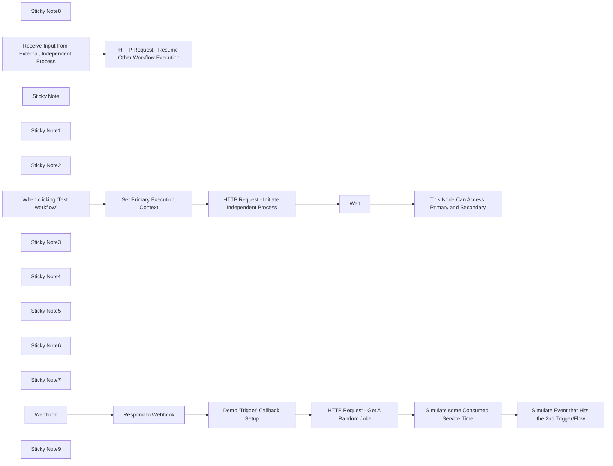

## Fluxo (.json) :

```json
{
  "meta": {
    "instanceId": "37c9b6d3ee04c3e15f526d799209783b3fa8da2950c0e8241dc8ad516d7eb4df"
  },
  "nodes": [
    {
      "id": "ba9d786a-0698-4306-adba-40c928c1a340",
      "name": "Sticky Note8",
      "type": "n8n-nodes-base.stickyNote",
      "position": [
        840,
        1100
      ],
      "parameters": {
        "width": 718.7339166606896,
        "height": 141.09832891056485,
        "content": "## Independent \"Async\" Process\nThis could be anything that eventually triggers another workflow and passes through something (e.g. resumeUrl) that identifies the original workflow execution that needs to be joined.\nFor instance, this could be a Telegram conversation where the trigger is watching for a message containing a \"reply\" to something that was originally sent out via Telegram."
      },
      "typeVersion": 1
    },
    {
      "id": "d90e6fa4-2f88-4446-8522-e3ae7b1334d2",
      "name": "When clicking ‘Test workflow’",
      "type": "n8n-nodes-base.manualTrigger",
      "position": [
        400,
        400
      ],
      "parameters": {},
      "typeVersion": 1
    },
    {
      "id": "a76364e9-ef28-4ad8-88a3-68ac23fed0c1",
      "name": "Wait",
      "type": "n8n-nodes-base.wait",
      "position": [
        1100,
        400
      ],
      "webhookId": "253803de-f2d4-4519-8014-62d0ef80b988",
      "parameters": {
        "resume": "webhook",
        "options": {},
        "httpMethod": "POST"
      },
      "typeVersion": 1.1
    },
    {
      "id": "fa83bc05-ee83-4150-ac5e-68e6b14e37d2",
      "name": "HTTP Request - Initiate Independent Process",
      "type": "n8n-nodes-base.httpRequest",
      "position": [
        860,
        400
      ],
      "parameters": {
        "url": "=http://127.0.0.1:5678/webhook/{{ $('Set Primary Execution Context').first().json.simulatedExternalProcessWorkflowId }}",
        "method": "POST",
        "options": {},
        "sendBody": true,
        "bodyParameters": {
          "parameters": [
            {
              "name": "resumeUrlForWaitingExecution",
              "value": "={{ $execution.resumeUrl }}"
            }
          ]
        }
      },
      "typeVersion": 4.2
    },
    {
      "id": "a2aad4e1-e305-43cb-9e59-21c92ae351b1",
      "name": "Sticky Note",
      "type": "n8n-nodes-base.stickyNote",
      "position": [
        780,
        280
      ],
      "parameters": {
        "width": 593,
        "height": 107,
        "content": "## Only One Item Will Work\nIf the previous steps could result in multiple initiations via the `Secondary Trigger` below, **only the first one** will resume the workflow.  Others will be rejected."
      },
      "typeVersion": 1
    },
    {
      "id": "4065389a-8af6-440d-94d6-1a2261e75818",
      "name": "HTTP Request - Resume Other Workflow Execution",
      "type": "n8n-nodes-base.httpRequest",
      "position": [
        1100,
        780
      ],
      "parameters": {
        "url": "={{ $json.body.resumeUrlForWaitingExecution.replace($env.WEBHOOK_URL, 'http://127.0.0.1:5678') }}",
        "method": "POST",
        "options": {},
        "sendBody": true,
        "bodyParameters": {
          "parameters": [
            {
              "name": "jokeFromIndependentProcess",
              "value": "={{ $('Receive Input from External, Independent Process').first().json.body.joke }}"
            },
            {
              "name": "setupFromIndependentProcess",
              "value": "={{ $('Receive Input from External, Independent Process').first().json.body.setup }}"
            },
            {
              "name": "deliveryFromIndependentProcess",
              "value": "={{ $('Receive Input from External, Independent Process').first().json.body.delivery }}"
            }
          ]
        }
      },
      "typeVersion": 4.2
    },
    {
      "id": "d0ef28a5-7a4f-4c60-8070-1da0016f9bb6",
      "name": "Sticky Note1",
      "type": "n8n-nodes-base.stickyNote",
      "position": [
        380,
        600
      ],
      "parameters": {
        "width": 590,
        "height": 179,
        "content": "## Secondary Trigger From Independent Process\nWhen something runs the workflow through this trigger, it is a completely separate execution.  By passing through the resumeUrl from the **Primary Execution**, it is possible to join back into it via the \"webhook callback\" to the `Wait` node.\n* Note: This trigger could be anything that would support input including the `resumeUrl`, not just a webhook.  The `Webhook` node is just used to demonstrate a separate trigger."
      },
      "typeVersion": 1
    },
    {
      "id": "f0c82308-166f-44e4-84c0-65c2f5d65bf5",
      "name": "This Node Can Access Primary and Secondary",
      "type": "n8n-nodes-base.set",
      "position": [
        1340,
        520
      ],
      "parameters": {
        "options": {},
        "assignments": {
          "assignments": [
            {
              "id": "91dfddea-5498-41dc-a423-830bb67638cc",
              "name": "somethingFromPrimaryExecution",
              "type": "string",
              "value": "={{ $('Set Primary Execution Context').first().json.someContextItem }}"
            },
            {
              "id": "beb6454f-3148-44a1-a681-4691f5fc6c06",
              "name": "somethingFromSecondaryExecution",
              "type": "string",
              "value": "={{ $('Wait').item.json.body.jokeFromIndependentProcess }}"
            }
          ]
        }
      },
      "typeVersion": 3.4
    },
    {
      "id": "a0b6fd7d-fc69-47c9-bc17-14a57c4eb628",
      "name": "Set Primary Execution Context",
      "type": "n8n-nodes-base.set",
      "position": [
        620,
        400
      ],
      "parameters": {
        "options": {},
        "assignments": {
          "assignments": [
            {
              "id": "4e85d854-9326-4045-9636-facd38d681f1",
              "name": "someContextItem",
              "type": "string",
              "value": "this value is only available / in-scope from the primary execution's previous-nodes"
            },
            {
              "id": "0c1f5a1b-b087-4414-b558-3e4ff809e9ab",
              "name": "simulatedExternalProcessWorkflowId",
              "type": "string",
              "value": "21cea9f6-d55f-4c47-b6a2-158cce1811cd"
            }
          ]
        }
      },
      "typeVersion": 3.4
    },
    {
      "id": "e4d59b9a-536b-42c6-901e-afb4e4897efd",
      "name": "Sticky Note2",
      "type": "n8n-nodes-base.stickyNote",
      "position": [
        300,
        280
      ],
      "parameters": {
        "width": 357.8809516773294,
        "height": 80,
        "content": "## Primary Trigger/Execution\n"
      },
      "typeVersion": 1
    },
    {
      "id": "a7370b71-3c0e-4bff-b786-0b353938bcfe",
      "name": "Receive Input from External, Independent Process",
      "type": "n8n-nodes-base.webhook",
      "position": [
        420,
        780
      ],
      "webhookId": "3064395b-378c-4755-9634-ce40cc4733a6",
      "parameters": {
        "path": "3064395b-378c-4755-9634-ce40cc4733a6",
        "options": {},
        "httpMethod": "POST"
      },
      "typeVersion": 2
    },
    {
      "id": "8f1ef649-f5df-498c-9aa4-a1dc00613cef",
      "name": "Sticky Note3",
      "type": "n8n-nodes-base.stickyNote",
      "position": [
        1040,
        391
      ],
      "parameters": {
        "color": 4,
        "width": 218,
        "height": 557,
        "content": "\n\n\n\n\n\n\n\n\n\n\n\n\n\n\n\n\nThese are the nodes that combine the `Secondary` execution back to the `Primary` execution via the `resumeUrl`."
      },
      "typeVersion": 1
    },
    {
      "id": "dacae6ab-9039-4b80-af59-21ca9c958bc0",
      "name": "Sticky Note4",
      "type": "n8n-nodes-base.stickyNote",
      "position": [
        180,
        211.1677791891891
      ],
      "parameters": {
        "color": 5,
        "width": 1415.7138930630392,
        "height": 792.7070677927813,
        "content": "# Main Workflow - Keep these together in the same workflow instance"
      },
      "typeVersion": 1
    },
    {
      "id": "442f3d39-5a1b-4534-95a2-7c47ce150bb1",
      "name": "Sticky Note5",
      "type": "n8n-nodes-base.stickyNote",
      "position": [
        180,
        1040
      ],
      "parameters": {
        "color": 5,
        "width": 1410.9085229279067,
        "height": 411.48103707206576,
        "content": "# Simulated External Independent Process\nCut/Paste these nodes into a separate workflow instance\nThen activate the trigger\nThen activate the workflow"
      },
      "typeVersion": 1
    },
    {
      "id": "d9b3d85f-b2f6-48f4-9bfc-3e134e2d4f20",
      "name": "Sticky Note6",
      "type": "n8n-nodes-base.stickyNote",
      "position": [
        580,
        360
      ],
      "parameters": {
        "color": 3,
        "width": 180.88095167732934,
        "height": 217,
        "content": "## Update Me"
      },
      "typeVersion": 1
    },
    {
      "id": "38738f2c-d478-4cba-95be-a52536843bcd",
      "name": "Sticky Note7",
      "type": "n8n-nodes-base.stickyNote",
      "position": [
        1280,
        420
      ],
      "parameters": {
        "color": 3,
        "height": 306.5674498803857,
        "content": "## Execute This Node to Test"
      },
      "typeVersion": 1
    },
    {
      "id": "de9913e4-ea3f-4378-a851-7d7925679bd6",
      "name": "Respond to Webhook",
      "type": "n8n-nodes-base.respondToWebhook",
      "position": [
        480,
        1260
      ],
      "parameters": {
        "options": {}
      },
      "typeVersion": 1.1
    },
    {
      "id": "e84ad080-9239-44ee-bc73-d16496813241",
      "name": "Simulate Event that Hits the 2nd Trigger/Flow",
      "type": "n8n-nodes-base.httpRequest",
      "position": [
        1360,
        1260
      ],
      "parameters": {
        "url": "=http://127.0.0.1:5678/webhook/{{ $('Demo \"Trigger\" Callback Setup').first().json.triggerTargetWorkflowId }}",
        "method": "POST",
        "options": {},
        "sendBody": true,
        "bodyParameters": {
          "parameters": [
            {
              "name": "resumeUrlForWaitingExecution",
              "value": "={{ $('Webhook').item.json.body.resumeUrlForWaitingExecution }}"
            },
            {
              "name": "joke",
              "value": "={{ $('HTTP Request - Get A Random Joke').item.json.joke }}"
            }
          ]
        }
      },
      "typeVersion": 4.2
    },
    {
      "id": "4fb07c03-1df0-4703-9d26-22cff17137bf",
      "name": "Simulate some Consumed Service Time",
      "type": "n8n-nodes-base.wait",
      "position": [
        1140,
        1260
      ],
      "webhookId": "d055185f-2515-4f30-824d-5d0fa346c3bc",
      "parameters": {
        "amount": 2
      },
      "typeVersion": 1.1
    },
    {
      "id": "66f3cf0a-62dc-4c85-a832-143f45280dd5",
      "name": "HTTP Request - Get A Random Joke",
      "type": "n8n-nodes-base.httpRequest",
      "position": [
        920,
        1260
      ],
      "parameters": {
        "url": "https://v2.jokeapi.dev/joke/Programming",
        "options": {},
        "sendQuery": true,
        "queryParameters": {
          "parameters": [
            {
              "name": "blacklistFlags",
              "value": "nsfw,religious,political,racist,sexist,explicit"
            },
            {
              "name": "type",
              "value": "single"
            }
          ]
        }
      },
      "typeVersion": 4.2
    },
    {
      "id": "873a6d02-6393-4354-b7fe-c9c1f2e84339",
      "name": "Demo \"Trigger\" Callback Setup",
      "type": "n8n-nodes-base.set",
      "position": [
        700,
        1260
      ],
      "parameters": {
        "options": {},
        "assignments": {
          "assignments": [
            {
              "id": "c6cfe1c1-257b-4785-8ae9-8945e3c7bcd9",
              "name": "triggerTargetWorkflowId",
              "type": "string",
              "value": "3064395b-378c-4755-9634-ce40cc4733a6"
            }
          ]
        }
      },
      "typeVersion": 3.4
    },
    {
      "id": "a8eafdc2-e4b0-42b1-b0aa-7e3cb3972b4b",
      "name": "Webhook",
      "type": "n8n-nodes-base.webhook",
      "disabled": true,
      "position": [
        280,
        1260
      ],
      "webhookId": "21cea9f6-d55f-4c47-b6a2-158cce1811cd",
      "parameters": {
        "path": "21cea9f6-d55f-4c47-b6a2-158cce1811cd",
        "options": {},
        "httpMethod": "POST",
        "responseMode": "responseNode"
      },
      "typeVersion": 2
    },
    {
      "id": "77282136-69ec-4f23-b222-30817498b47d",
      "name": "Sticky Note9",
      "type": "n8n-nodes-base.stickyNote",
      "position": [
        662,
        1220
      ],
      "parameters": {
        "color": 3,
        "width": 171,
        "height": 217,
        "content": "## Update Me"
      },
      "typeVersion": 1
    }
  ],
  "pinData": {},
  "connections": {
    "Wait": {
      "main": [
        [
          {
            "node": "This Node Can Access Primary and Secondary",
            "type": "main",
            "index": 0
          }
        ]
      ]
    },
    "Webhook": {
      "main": [
        [
          {
            "node": "Respond to Webhook",
            "type": "main",
            "index": 0
          }
        ]
      ]
    },
    "Respond to Webhook": {
      "main": [
        [
          {
            "node": "Demo \"Trigger\" Callback Setup",
            "type": "main",
            "index": 0
          }
        ]
      ]
    },
    "Demo \"Trigger\" Callback Setup": {
      "main": [
        [
          {
            "node": "HTTP Request - Get A Random Joke",
            "type": "main",
            "index": 0
          }
        ]
      ]
    },
    "Set Primary Execution Context": {
      "main": [
        [
          {
            "node": "HTTP Request - Initiate Independent Process",
            "type": "main",
            "index": 0
          }
        ]
      ]
    },
    "HTTP Request - Get A Random Joke": {
      "main": [
        [
          {
            "node": "Simulate some Consumed Service Time",
            "type": "main",
            "index": 0
          }
        ]
      ]
    },
    "When clicking ‘Test workflow’": {
      "main": [
        [
          {
            "node": "Set Primary Execution Context",
            "type": "main",
            "index": 0
          }
        ]
      ]
    },
    "Simulate some Consumed Service Time": {
      "main": [
        [
          {
            "node": "Simulate Event that Hits the 2nd Trigger/Flow",
            "type": "main",
            "index": 0
          }
        ]
      ]
    },
    "HTTP Request - Initiate Independent Process": {
      "main": [
        [
          {
            "node": "Wait",
            "type": "main",
            "index": 0
          }
        ]
      ]
    },
    "Receive Input from External, Independent Process": {
      "main": [
        [
          {
            "node": "HTTP Request - Resume Other Workflow Execution",
            "type": "main",
            "index": 0
          }
        ]
      ]
    }
  }
}
```

<a id="template-381"></a>

## Template 381 - Upload em lote para pasta do Google Drive

- **Nome:** Upload em lote para pasta do Google Drive
- **Descrição:** Processa submissões de formulário contendo múltiplos arquivos e um nome de pasta; verifica ou cria a pasta indicada e faz o upload de todos os arquivos para ela mantendo os nomes originais.
- **Funcionalidade:** • Captura de submissão de formulário: Inicia o fluxo ao receber um envio com arquivos e nome de pasta.
• Suporte a múltiplos arquivos: Aceita e processa vários arquivos enviados de uma só vez.
• Leitura do nome da pasta alvo: Recebe o nome da pasta destino a partir do formulário.
• Verificação de existência da pasta: Pesquisa se já existe uma pasta com o nome especificado em um diretório pai definido.
• Criação automática de pasta: Cria a pasta no Drive caso ela não exista.
• Preparação dos arquivos para upload: Separa os arquivos binários individualmente preservando seus nomes.
• Upload para a pasta correta: Envia cada arquivo para a pasta existente ou recém-criada, mantendo a organização e nomes originais.
- **Ferramentas:** • Formulário web: Interface para o usuário enviar múltiplos arquivos e indicar o nome da pasta destino.
• Google Drive: Serviço de armazenamento usado para buscar/crear pastas e armazenar os arquivos enviados.

## Fluxo visual

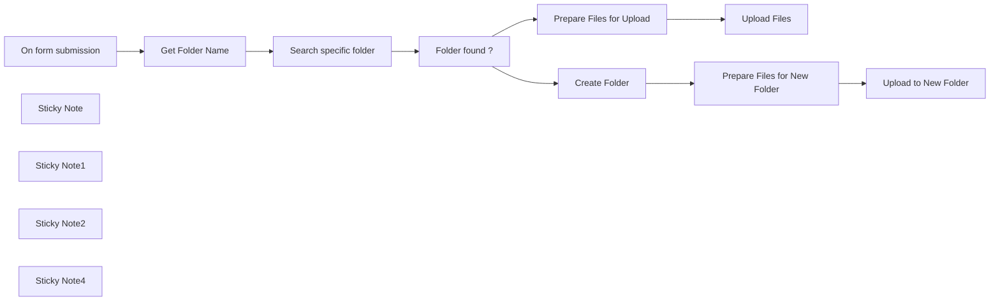

## Fluxo (.json) :

```json
{
  "meta": {
    "instanceId": "d4d7965840e96e50a3e02959a8487c692901dfa8d5cc294134442c67ce1622d3",
    "templateCredsSetupCompleted": true
  },
  "nodes": [
    {
      "id": "9252c041-d6b2-49fe-8edb-8d8cb8a1341d",
      "name": "On form submission",
      "type": "n8n-nodes-base.formTrigger",
      "position": [
        240,
        0
      ],
      "webhookId": "0c5c8b39-06a7-4d07-95be-b729d2a9eb6f",
      "parameters": {
        "options": {},
        "formTitle": "Batch File Upload to Google Drive",
        "formFields": {
          "values": [
            {
              "fieldType": "file",
              "fieldLabel": "file",
              "requiredField": true
            },
            {
              "fieldLabel": "folderName",
              "requiredField": true
            }
          ]
        },
        "formDescription": "Use this form to upload multiple files to a specific Google Drive folder. Simply select your files and specify your target folder name. If the folder doesn't exist yet, we'll create it automatically for you. This streamlined process allows you to organize and store multiple files in one go, saving you time and effort."
      },
      "typeVersion": 2.2
    },
    {
      "id": "e27712ac-238d-4b45-b842-a044dc40dccd",
      "name": "Get Folder Name",
      "type": "n8n-nodes-base.set",
      "position": [
        560,
        0
      ],
      "parameters": {
        "options": {},
        "assignments": {
          "assignments": [
            {
              "id": "1b997842-86f3-4bce-b8d2-e8d73387dae1",
              "name": "folderName",
              "type": "string",
              "value": "={{ $json.folderName }}"
            }
          ]
        }
      },
      "typeVersion": 3.4
    },
    {
      "id": "555e761a-ea79-40eb-b36f-72fbcc642fda",
      "name": "Search specific folder",
      "type": "n8n-nodes-base.googleDrive",
      "position": [
        800,
        0
      ],
      "parameters": {
        "filter": {},
        "options": {},
        "resource": "fileFolder",
        "queryString": "=mimeType='application/vnd.google-apps.folder' and name = '{{ $json.folderName }}' and '<folderId>' in parents\n",
        "searchMethod": "query"
      },
      "credentials": {
        "googleDriveOAuth2Api": {
          "id": "2SIFnsVfdw9nx9I4",
          "name": "Google Drive account"
        }
      },
      "executeOnce": false,
      "typeVersion": 3,
      "alwaysOutputData": true
    },
    {
      "id": "2a92c031-44e5-4e07-89ff-058251c43027",
      "name": "Folder found ?",
      "type": "n8n-nodes-base.if",
      "position": [
        1280,
        0
      ],
      "parameters": {
        "options": {},
        "conditions": {
          "options": {
            "version": 2,
            "leftValue": "",
            "caseSensitive": true,
            "typeValidation": "strict"
          },
          "combinator": "and",
          "conditions": [
            {
              "id": "11abd7e3-d90b-4bb1-a8ba-d3cbc4333d8f",
              "operator": {
                "type": "object",
                "operation": "notEmpty",
                "singleValue": true
              },
              "leftValue": "={{ $json }}",
              "rightValue": ""
            }
          ]
        }
      },
      "typeVersion": 2.2
    },
    {
      "id": "e413cdc8-8424-41d3-8791-e036392a16ac",
      "name": "Create Folder",
      "type": "n8n-nodes-base.googleDrive",
      "position": [
        1680,
        100
      ],
      "parameters": {
        "name": "={{ $('On form submission').item.json.folderName }}",
        "driveId": {
          "__rl": true,
          "mode": "list",
          "value": "My Drive"
        },
        "options": {},
        "folderId": {
          "__rl": true,
          "mode": "list",
          "value": "17sGS9HdmAtgpd5rC1sVuiIUGyw2hq9IY",
          "cachedResultUrl": "https://drive.google.com/drive/folders/17sGS9HdmAtgpd5rC1sVuiIUGyw2hq9IY",
          "cachedResultName": "n8n"
        },
        "resource": "folder"
      },
      "credentials": {
        "googleDriveOAuth2Api": {
          "id": "2SIFnsVfdw9nx9I4",
          "name": "Google Drive account"
        }
      },
      "typeVersion": 3
    },
    {
      "id": "aada549c-3bbd-453b-9d48-4ab25446d8ce",
      "name": "Upload Files",
      "type": "n8n-nodes-base.googleDrive",
      "position": [
        2180,
        -100
      ],
      "parameters": {
        "name": "={{ $json.fileName }}",
        "driveId": {
          "__rl": true,
          "mode": "list",
          "value": "My Drive"
        },
        "options": {},
        "folderId": {
          "__rl": true,
          "mode": "id",
          "value": "={{ $('Search specific folder').item.json.id }}"
        },
        "inputDataFieldName": "=data"
      },
      "credentials": {
        "googleDriveOAuth2Api": {
          "id": "2SIFnsVfdw9nx9I4",
          "name": "Google Drive account"
        }
      },
      "typeVersion": 3
    },
    {
      "id": "7b4bcb6e-3b63-4243-8f38-a18f3d5d44f2",
      "name": "Prepare Files for Upload",
      "type": "n8n-nodes-base.code",
      "position": [
        1920,
        -100
      ],
      "parameters": {
        "jsCode": "let results = [];\nconst items = $(\"On form submission\").all()\n\nfor (item of items) {\n    for (key of Object.keys(item.binary)) {\n        results.push({\n            json: {\n                fileName: item.binary[key].fileName\n            },\n            binary: {\n                data: item.binary[key],\n            }\n        });\n    }\n}\n\nreturn results;"
      },
      "typeVersion": 2
    },
    {
      "id": "1d08ef78-68e7-4901-80fc-17923344fee3",
      "name": "Prepare Files for New Folder",
      "type": "n8n-nodes-base.code",
      "position": [
        1920,
        100
      ],
      "parameters": {
        "jsCode": "let results = [];\nconst items = $(\"On form submission\").all()\n\nfor (item of items) {\n    for (key of Object.keys(item.binary)) {\n        results.push({\n            json: {\n                fileName: item.binary[key].fileName\n            },\n            binary: {\n                data: item.binary[key],\n            }\n        });\n    }\n}\n\nreturn results;"
      },
      "typeVersion": 2
    },
    {
      "id": "557d2c63-7bbb-4280-b16e-71c6d900973b",
      "name": "Upload to New Folder",
      "type": "n8n-nodes-base.googleDrive",
      "position": [
        2180,
        100
      ],
      "parameters": {
        "name": "={{ $json.fileName }}",
        "driveId": {
          "__rl": true,
          "mode": "list",
          "value": "My Drive"
        },
        "options": {},
        "folderId": {
          "__rl": true,
          "mode": "id",
          "value": "={{ $('Create Folder').item.json.id }}"
        },
        "inputDataFieldName": "=data"
      },
      "credentials": {
        "googleDriveOAuth2Api": {
          "id": "2SIFnsVfdw9nx9I4",
          "name": "Google Drive account"
        }
      },
      "typeVersion": 3
    },
    {
      "id": "e90ccfb0-cf21-45d2-860e-bc2049ed9682",
      "name": "Sticky Note",
      "type": "n8n-nodes-base.stickyNote",
      "position": [
        -400,
        -200
      ],
      "parameters": {
        "color": 5,
        "width": 520,
        "height": 520,
        "content": "# 🗂️ Bulk File Upload to Google Drive with Folder Management\n\n## Overview\nThis workflow processes a form submission that accepts:\n- Multiple file uploads (any format)\n- Target folder name input\n\nThe workflow automatically:\n- Checks if the specified folder exists in Google Drive\n- Creates the folder if it doesn't exist\n- Uploads all files to the correct folder\n- Maintains original file names and structure\n\nPerfect for batch uploading files while keeping your Drive organized!\n"
      },
      "typeVersion": 1
    },
    {
      "id": "cd00c8a3-42e3-44f4-89b3-663da809346c",
      "name": "Sticky Note1",
      "type": "n8n-nodes-base.stickyNote",
      "position": [
        1100,
        -440
      ],
      "parameters": {
        "color": 5,
        "width": 460,
        "height": 380,
        "content": "## 🔄 Decision Point: Folder Check\nThe workflow splits into two paths based on folder existence:\n- ✅ TRUE: Use existing folder path\n- 🆕 FALSE: Create new folder path\n\n## 🗂️ Existing Folder Path (Upper)\n1. Prepare Files for Upload: Splits files for individual processing\n2. Upload Files: Uploads to existing folder maintaining structure\n\n## 📁 New Folder Path (Lower)\n1. Create Folder: Generates new folder in Drive\n2. Prepare Files for New Folder: Splits files for individual processing\n3. Upload to New Folder: Uploads to newly created folder"
      },
      "typeVersion": 1
    },
    {
      "id": "a0b1ff8a-3308-41da-bb4b-01b50cccc456",
      "name": "Sticky Note2",
      "type": "n8n-nodes-base.stickyNote",
      "position": [
        1920,
        -340
      ],
      "parameters": {
        "color": 5,
        "width": 360,
        "height": 200,
        "content": "## ⚙️ File Processing Notes\n- All binary files are split individually for proper upload handling\n- Original file names and structure are preserved\n- Both paths ensure identical file organization\n\nalso see https://n8n.io/workflows/1621-split-out-binary-data/"
      },
      "typeVersion": 1
    },
    {
      "id": "c16b2105-638d-4d48-b39d-ff8772375674",
      "name": "Sticky Note4",
      "type": "n8n-nodes-base.stickyNote",
      "position": [
        400,
        -340
      ],
      "parameters": {
        "color": 5,
        "width": 660,
        "height": 280,
        "content": "## 🔍 Search Query Pattern\n\nThe following search pattern looks for a folder with the specified name in a particular parent folder:\nMake sure to replace <folderId>\n\n```javascript\nmimeType='application/vnd.google-apps.folder' and name = '{{ $json.folderName }}' and '<folderId>' in parents\n```\n\n**Important**: Marl Always Output Data so you can check also if nothing found."
      },
      "typeVersion": 1
    }
  ],
  "pinData": {},
  "connections": {
    "Create Folder": {
      "main": [
        [
          {
            "node": "Prepare Files for New Folder",
            "type": "main",
            "index": 0
          }
        ]
      ]
    },
    "Folder found ?": {
      "main": [
        [
          {
            "node": "Prepare Files for Upload",
            "type": "main",
            "index": 0
          }
        ],
        [
          {
            "node": "Create Folder",
            "type": "main",
            "index": 0
          }
        ]
      ]
    },
    "Get Folder Name": {
      "main": [
        [
          {
            "node": "Search specific folder",
            "type": "main",
            "index": 0
          }
        ]
      ]
    },
    "On form submission": {
      "main": [
        [
          {
            "node": "Get Folder Name",
            "type": "main",
            "index": 0
          }
        ]
      ]
    },
    "Search specific folder": {
      "main": [
        [
          {
            "node": "Folder found ?",
            "type": "main",
            "index": 0
          }
        ]
      ]
    },
    "Prepare Files for Upload": {
      "main": [
        [
          {
            "node": "Upload Files",
            "type": "main",
            "index": 0
          }
        ]
      ]
    },
    "Prepare Files for New Folder": {
      "main": [
        [
          {
            "node": "Upload to New Folder",
            "type": "main",
            "index": 0
          }
        ]
      ]
    }
  }
}
```
