# PACK 1999 TEMPLATES PARTE 02 - Bloco 10

Templates neste bloco: 20

## Sumário

- [Template 382 - Criar usuário no Intercom](#template-382)
- [Template 383 - Acesso manual à coleção Cockpit](#template-383)
- [Template 384 - Enriquecimento de contatos LinkedIn a partir de planilha](#template-384)
- [Template 385 - Processamento AI de chamadas de vendas para Notion](#template-385)
- [Template 386 - Gerador simples de imagens (OpenAI)](#template-386)
- [Template 387 - Upload público para DigitalOcean Spaces](#template-387)
- [Template 388 - Envio diário de follow-up para contatos HubSpot](#template-388)
- [Template 389 - Arquivar emails não estrelados](#template-389)
- [Template 390 - Salvar ideias do Slack em planilha](#template-390)
- [Template 391 - Monitoramento de preços - Zalando](#template-391)
- [Template 392 - Recuperar todos os registros do Shopify](#template-392)
- [Template 393 - Gerador SEO de blogs com IA e Telegram](#template-393)
- [Template 394 - Contos infantis em inglês para Telegram (automático)](#template-394)
- [Template 395 - Restaurar workflows do GitHub](#template-395)
- [Template 396 - Extrair e resumir informações de empresas do Indeed](#template-396)
- [Template 397 - Alerta de erro via Slack](#template-397)
- [Template 398 - Obter valor da chave Redis 'hello'](#template-398)
- [Template 399 - Geração automática de histórias infantis em árabe](#template-399)
- [Template 400 - Tickets automáticos Slack → Linear com IA](#template-400)
- [Template 401 - Gerar tokens long-lived do Facebook](#template-401)

---

<a id="template-382"></a>

## Template 382 - Criar usuário no Intercom

- **Nome:** Criar usuário no Intercom
- **Descrição:** Fluxo que cria um novo usuário no Intercom quando é executado manualmente.
- **Funcionalidade:** • Disparo manual: inicia o fluxo quando o usuário aciona a execução.
• Criação de usuário por e-mail: envia dados usando o e-mail como identificador para criar o usuário no Intercom.
• Campos adicionais opcionais: possibilita o envio de campos extras ao criar o usuário.
• Autenticação via API: utiliza credenciais da API do Intercom para realizar a operação.
- **Ferramentas:** • Intercom: Plataforma de mensagens e gestão de clientes que permite criar e gerenciar perfis de usuários via API.

## Fluxo visual


## Fluxo (.json) :

```json
{
  "id": "91",
  "name": "Create a new user in Intercom",
  "nodes": [
    {
      "name": "On clicking 'execute'",
      "type": "n8n-nodes-base.manualTrigger",
      "position": [
        600,
        250
      ],
      "parameters": {},
      "typeVersion": 1
    },
    {
      "name": "Intercom",
      "type": "n8n-nodes-base.intercom",
      "position": [
        800,
        250
      ],
      "parameters": {
        "idValue": "",
        "identifierType": "email",
        "additionalFields": {}
      },
      "credentials": {
        "intercomApi": ""
      },
      "typeVersion": 1
    }
  ],
  "active": false,
  "settings": {},
  "connections": {
    "On clicking 'execute'": {
      "main": [
        [
          {
            "node": "Intercom",
            "type": "main",
            "index": 0
          }
        ]
      ]
    }
  }
}
```

<a id="template-383"></a>

## Template 383 - Acesso manual à coleção Cockpit

- **Nome:** Acesso manual à coleção Cockpit
- **Descrição:** Este fluxo é iniciado manualmente e realiza operações na coleção 'samplecollection' por meio da API do Cockpit.
- **Funcionalidade:** • Início manual: o fluxo é disparado quando o usuário clica em 'execute'.
• Interação com coleção 'samplecollection': executa chamadas à coleção para recuperar, criar ou atualizar registros conforme configurado.
• Autenticação: utiliza credenciais configuradas para autenticar as requisições à API do Cockpit.
- **Ferramentas:** • Cockpit: plataforma headless CMS acessada via API para gerenciar a coleção 'samplecollection' e seus registros.

## Fluxo visual

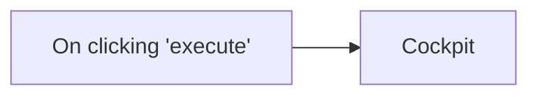

## Fluxo (.json) :

```json
{
  "nodes": [
    {
      "name": "On clicking 'execute'",
      "type": "n8n-nodes-base.manualTrigger",
      "position": [
        750,
        360
      ],
      "parameters": {},
      "typeVersion": 1
    },
    {
      "name": "Cockpit",
      "type": "n8n-nodes-base.cockpit",
      "position": [
        950,
        360
      ],
      "parameters": {
        "options": {},
        "collection": "samplecollection"
      },
      "credentials": {
        "cockpitApi": "cockpit api"
      },
      "typeVersion": 1
    }
  ],
  "connections": {
    "On clicking 'execute'": {
      "main": [
        [
          {
            "node": "Cockpit",
            "type": "main",
            "index": 0
          }
        ]
      ]
    }
  }
}
```

<a id="template-384"></a>

## Template 384 - Enriquecimento de contatos LinkedIn a partir de planilha

- **Nome:** Enriquecimento de contatos LinkedIn a partir de planilha
- **Descrição:** Automatiza a leitura de URLs de perfis LinkedIn em uma planilha, consulta uma API externa para obter e-mails e dados públicos do perfil e atualiza a planilha com as informações obtidas.
- **Funcionalidade:** • Agendamento periódico: executa o fluxo em intervalos definidos para verificar novas linhas na planilha.
• Leitura de URLs: lê linhas de uma planilha do Google contendo URLs do LinkedIn e IDs associados.
• Filtragem condicional: processa apenas as linhas que têm a URL do LinkedIn preenchida e campos principais vazios (Nome, Gênero, Cargo, Resumo).
• Consulta à API externa: envia uma requisição POST para a API de busca de e-mail do LinkedIn fornecendo a URL do perfil e o ID para obter e-mail e dados do perfil.
• Mesclagem de dados: combina os dados retornados pela API com os dados originais da linha.
• Mapeamento e formatação de campos: extrai e organiza campos como nome completo, gênero, e-mail, resumo, educação, habilidades, foto, cargo, localização e link do LinkedIn.
• Atualização da planilha: atualiza a linha correspondente na planilha usando o ID como chave de correspondência para gravar os campos enriquecidos.
• Ramo inativo: ignora (sem operação) as linhas que não atendem aos critérios de processamento.
- **Ferramentas:** • Google Sheets: armazena as URLs do LinkedIn e recebe as atualizações dos dados enriquecidos.
• Prospeo.io LinkedIn Email Finder API: serviço externo que recebe uma URL de LinkedIn e retorna e-mail e informações públicas do perfil para enriquecimento de dados.

## Fluxo visual

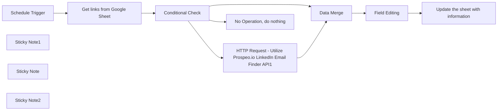

## Fluxo (.json) :

```json
{
  "meta": {
    "instanceId": "21754f977ce20b07e6fe64be3fbc663f6e6f730423d6e46c6cd2bf5b5e70a383"
  },
  "nodes": [
    {
      "id": "49a3829e-3127-4761-8ac0-edaa6d0224c2",
      "name": "HTTP Request - Utilize Prospeo.io LinkedIn Email Finder API1",
      "type": "n8n-nodes-base.httpRequest",
      "position": [
        3820,
        680
      ],
      "parameters": {
        "url": "https://api.prospeo.io/linkedin-email-finder",
        "method": "POST",
        "options": {},
        "sendBody": true,
        "sendHeaders": true,
        "bodyParameters": {
          "parameters": [
            {
              "name": "url",
              "value": "={{ $json['Linkden URL'] }}"
            },
            {
              "name": "id",
              "value": "={{ $json.ID }}"
            }
          ]
        },
        "headerParameters": {
          "parameters": [
            {
              "name": "X-KEY",
              "value": "43b7e4f5c6558ccaa539e0e5f5778f09"
            }
          ]
        }
      },
      "typeVersion": 4.1
    },
    {
      "id": "705aef1b-5e45-4fe8-b1fd-5ebb5d461dd5",
      "name": "No Operation, do nothing",
      "type": "n8n-nodes-base.noOp",
      "position": [
        3760,
        1140
      ],
      "parameters": {},
      "typeVersion": 1
    },
    {
      "id": "f2b8a1b8-13b6-4de3-9cde-336494bf31dc",
      "name": "Schedule Trigger",
      "type": "n8n-nodes-base.scheduleTrigger",
      "position": [
        3140,
        940
      ],
      "parameters": {
        "rule": {
          "interval": [
            {
              "field": "minutes"
            }
          ]
        }
      },
      "typeVersion": 1.1
    },
    {
      "id": "28b1d9c4-c89e-460d-8a5b-0fea42d2d1d8",
      "name": "Sticky Note1",
      "type": "n8n-nodes-base.stickyNote",
      "position": [
        3660,
        460
      ],
      "parameters": {
        "color": 4,
        "width": 468.54622634118857,
        "height": 380.67540639666913,
        "content": "- Utilized the following API: \n  - [Prospeo.io LinkedIn Email Finder API](https://prospeo.io/api/linkedin-email-finder)\n\n- **Benefit:**\n  - The benefit of this API is to provide an efficient way to find email addresses of users on LinkedIn, aiding in updating and enriching data more accurately and comprehensively in Google Sheets or any other system used in the workflow.\n"
      },
      "typeVersion": 1
    },
    {
      "id": "d8edc9fa-3012-46ab-9ed2-473f55213e78",
      "name": "Conditional Check",
      "type": "n8n-nodes-base.if",
      "position": [
        3520,
        940
      ],
      "parameters": {
        "options": {},
        "conditions": {
          "options": {
            "leftValue": "",
            "caseSensitive": true,
            "typeValidation": "strict"
          },
          "combinator": "and",
          "conditions": [
            {
              "id": "2b355bc4-0ef4-415a-a437-d8ed6538c1e3",
              "operator": {
                "type": "string",
                "operation": "empty",
                "singleValue": true
              },
              "leftValue": "={{ $json.Name }}",
              "rightValue": ""
            },
            {
              "id": "1757a7d7-ce91-4df1-b54d-c9285f88e3ee",
              "operator": {
                "type": "string",
                "operation": "empty",
                "singleValue": true
              },
              "leftValue": "={{ $json.Gender }}",
              "rightValue": ""
            },
            {
              "id": "78089c18-e9d6-40e5-8d0c-e2b96c1f1348",
              "operator": {
                "type": "string",
                "operation": "empty",
                "singleValue": true
              },
              "leftValue": "={{ $json['Job Title'] }}",
              "rightValue": ""
            },
            {
              "id": "0ee10296-113d-4467-92d7-368111426cf5",
              "operator": {
                "type": "string",
                "operation": "empty",
                "singleValue": true
              },
              "leftValue": "={{ $json.Summery }}",
              "rightValue": ""
            },
            {
              "id": "2ec7486d-e753-4c87-a6df-10056c7ee4b2",
              "operator": {
                "type": "string",
                "operation": "notEmpty",
                "singleValue": true
              },
              "leftValue": "={{ $json['Linkden URL'] }}",
              "rightValue": ""
            }
          ]
        }
      },
      "typeVersion": 2
    },
    {
      "id": "bdf82dbf-7b6b-4d42-9a6a-34d5cfb691ad",
      "name": "Field Editing",
      "type": "n8n-nodes-base.set",
      "position": [
        4100,
        900
      ],
      "parameters": {
        "fields": {
          "values": [
            {
              "name": "Name",
              "stringValue": "={{ $json.response.full_name }}"
            },
            {
              "name": "Gender",
              "stringValue": "={{ $json.response.gender }}"
            },
            {
              "name": "Email",
              "stringValue": "={{ $json.response.email.email }}"
            },
            {
              "name": "Summary",
              "stringValue": "={{ $json.response.summary}}"
            },
            {
              "name": "Education",
              "stringValue": "={{ $json.response.education[0].school.name }}"
            },
            {
              "name": "Skills",
              "stringValue": "={{ $json.response.skills }}"
            },
            {
              "name": "Picture",
              "stringValue": "={{ $json.response.picture }}"
            },
            {
              "name": "Job Title",
              "stringValue": "={{ $json.response.job_title }}"
            },
            {
              "name": "Location",
              "stringValue": "={{ $json.response.location.raw }}"
            },
            {
              "name": "Linkden link",
              "stringValue": "={{ $json.response.linkedin }}"
            },
            {
              "name": "ID",
              "stringValue": "={{ $json.ID }}"
            }
          ]
        },
        "include": "selected",
        "options": {}
      },
      "typeVersion": 3.2
    },
    {
      "id": "897734e2-5d05-4480-a24b-e4b3ae44dce6",
      "name": "Data Merge",
      "type": "n8n-nodes-base.merge",
      "position": [
        3860,
        900
      ],
      "parameters": {
        "mode": "combine",
        "options": {},
        "combinationMode": "mergeByPosition"
      },
      "typeVersion": 2.1
    },
    {
      "id": "92a9861d-9e42-4fe2-84a7-03b3b0dbb1b0",
      "name": "Sticky Note",
      "type": "n8n-nodes-base.stickyNote",
      "position": [
        2300,
        520
      ],
      "parameters": {
        "color": 5,
        "width": 803.4846614963799,
        "height": 938.2393052135303,
        "content": "\n- **Schedule Trigger:**\n  - Description: This node triggers the workflow based on a defined schedule interval, in this case, based on minutes.\n  - Documentation: [Schedule Trigger Node](https://docs.n8n.io/nodes/n8n-nodes-base.scheduleTrigger)\n\n- **Google Sheets Read:**\n  - Description: This node reads data from a Google Sheets document and sheet based on the provided document ID and sheet name.\n  - Documentation: [Google Sheets Node](https://docs.n8n.io/nodes/n8n-nodes-base.googleSheets)\n\n- **Conditional Check:**\n  - Description: This node checks multiple conditions based on the input data and performs further actions based on the conditions.\n  - Documentation: [Conditional Node](https://docs.n8n.io/nodes/n8n-nodes-base.if)\n\n- **HTTP Request:**\n  - Description: This node sends an HTTP POST request to a specified URL with the provided headers and body parameters.\n  - Documentation: [HTTP Request Node](https://docs.n8n.io/nodes/n8n-nodes-base.httpRequest)\n\n- **No Operation, do nothing:**\n  - Description: This node does not perform any operation and is used as a placeholder.\n  - Documentation: [No Operation Node](https://docs.n8n.io/nodes/n8n-nodes-base.noOp)\n\n\n- **Data Merge:**\n  - Description: This node merges data based on the specified mode and combination settings to combine multiple fields into a single object.\n  - Documentation: [Merge Node](https://docs.n8n.io/nodes/n8n-nodes-base.merge)\n\n- **Field Editing:**\n  - Description: This node edits fields by setting specific values for each field based on the provided input data.\n  - Documentation: [Set Node](https://docs.n8n.io/nodes/n8n-nodes-base.set)\n\n\n- **Google Sheets Update:**\n  - Description: This node updates data in a Google Sheets document and sheet based on the specified columns and values.\n  - Documentation: [Google Sheets Node](https://docs.n8n.io/nodes/n8n-nodes-base.googleSheets)\n\n"
      },
      "typeVersion": 1
    },
    {
      "id": "644f38d3-ccf0-4ce3-b759-e129e1074512",
      "name": "Sticky Note2",
      "type": "n8n-nodes-base.stickyNote",
      "position": [
        2260,
        240
      ],
      "parameters": {
        "width": 2292.975584892399,
        "height": 1214.0709576942727,
        "content": "## Find contact information for linkedin profile URLs stored in a Google Sheet\n**Video link.** [Guide](https://www.canva.com/design/DAF9a_UBxWY/xSSlSUzRdxCPtfgx9RzGSg/watch?utm_content=DAF9a_UBxWY&utm_campaign=designshare&utm_medium=link&utm_source=editor)"
      },
      "typeVersion": 1
    },
    {
      "id": "8ddaddad-b976-46c5-b8a1-e49ecb493e87",
      "name": "Get links from Google Sheet",
      "type": "n8n-nodes-base.googleSheets",
      "position": [
        3340,
        940
      ],
      "parameters": {
        "options": {},
        "sheetName": {
          "__rl": true,
          "mode": "list",
          "value": "gid=0",
          "cachedResultUrl": "https://docs.google.com/spreadsheets/d/1ochnGSCy8V5Mz-nr51dBmugqR50m62K7d6pvbwOHewo/edit#gid=0",
          "cachedResultName": "الورقة1"
        },
        "documentId": {
          "__rl": true,
          "mode": "list",
          "value": "1ochnGSCy8V5Mz-nr51dBmugqR50m62K7d6pvbwOHewo",
          "cachedResultUrl": "https://docs.google.com/spreadsheets/d/1ochnGSCy8V5Mz-nr51dBmugqR50m62K7d6pvbwOHewo/edit?usp=drivesdk",
          "cachedResultName": "linkden URls"
        }
      },
      "credentials": {
        "googleSheetsOAuth2Api": {
          "id": "L5CnisK8R3BgVGcO",
          "name": "Omar sheet"
        }
      },
      "typeVersion": 4.2
    },
    {
      "id": "0923a13d-1097-432d-b22e-375fec9f383e",
      "name": "Update the sheet with information",
      "type": "n8n-nodes-base.googleSheets",
      "position": [
        4320,
        900
      ],
      "parameters": {
        "columns": {
          "value": {
            "ID": "={{ $json.ID }}",
            "Name": "={{ $json.Name }}",
            "Email": "={{ $json.Email }}",
            "Gender": "={{ $json.Gender }}",
            "Skills": "={{ $json.Skills }}",
            "Picture": "={{ $json.Picture }}",
            "Summery": "={{ $json.Summary }}",
            "Location": "={{ $json.Location }}",
            "Education": "={{ $json.Education }}",
            "Job Title": "={{ $json['Job Title'] }}"
          },
          "schema": [
            {
              "id": "ID",
              "type": "string",
              "display": true,
              "removed": false,
              "required": false,
              "displayName": "ID",
              "defaultMatch": false,
              "canBeUsedToMatch": true
            },
            {
              "id": "Linkden URL",
              "type": "string",
              "display": true,
              "removed": true,
              "required": false,
              "displayName": "Linkden URL",
              "defaultMatch": false,
              "canBeUsedToMatch": true
            },
            {
              "id": "Name",
              "type": "string",
              "display": true,
              "required": false,
              "displayName": "Name",
              "defaultMatch": false,
              "canBeUsedToMatch": true
            },
            {
              "id": "Gender",
              "type": "string",
              "display": true,
              "required": false,
              "displayName": "Gender",
              "defaultMatch": false,
              "canBeUsedToMatch": true
            },
            {
              "id": "Email",
              "type": "string",
              "display": true,
              "required": false,
              "displayName": "Email",
              "defaultMatch": false,
              "canBeUsedToMatch": true
            },
            {
              "id": "Education",
              "type": "string",
              "display": true,
              "removed": false,
              "required": false,
              "displayName": "Education",
              "defaultMatch": false,
              "canBeUsedToMatch": true
            },
            {
              "id": "Location",
              "type": "string",
              "display": true,
              "removed": false,
              "required": false,
              "displayName": "Location",
              "defaultMatch": false,
              "canBeUsedToMatch": true
            },
            {
              "id": "Job Title",
              "type": "string",
              "display": true,
              "required": false,
              "displayName": "Job Title",
              "defaultMatch": false,
              "canBeUsedToMatch": true
            },
            {
              "id": "Summery",
              "type": "string",
              "display": true,
              "required": false,
              "displayName": "Summery",
              "defaultMatch": false,
              "canBeUsedToMatch": true
            },
            {
              "id": "Skills",
              "type": "string",
              "display": true,
              "removed": false,
              "required": false,
              "displayName": "Skills",
              "defaultMatch": false,
              "canBeUsedToMatch": true
            },
            {
              "id": "Picture",
              "type": "string",
              "display": true,
              "removed": false,
              "required": false,
              "displayName": "Picture",
              "defaultMatch": false,
              "canBeUsedToMatch": true
            },
            {
              "id": "row_number",
              "type": "string",
              "display": true,
              "removed": true,
              "readOnly": true,
              "required": false,
              "displayName": "row_number",
              "defaultMatch": false,
              "canBeUsedToMatch": true
            }
          ],
          "mappingMode": "defineBelow",
          "matchingColumns": [
            "ID"
          ]
        },
        "options": {},
        "operation": "update",
        "sheetName": {
          "__rl": true,
          "mode": "list",
          "value": "gid=0",
          "cachedResultUrl": "https://docs.google.com/spreadsheets/d/1ochnGSCy8V5Mz-nr51dBmugqR50m62K7d6pvbwOHewo/edit#gid=0",
          "cachedResultName": "الورقة1"
        },
        "documentId": {
          "__rl": true,
          "mode": "list",
          "value": "1ochnGSCy8V5Mz-nr51dBmugqR50m62K7d6pvbwOHewo",
          "cachedResultUrl": "https://docs.google.com/spreadsheets/d/1ochnGSCy8V5Mz-nr51dBmugqR50m62K7d6pvbwOHewo/edit?usp=drivesdk",
          "cachedResultName": "linkden URls"
        }
      },
      "credentials": {
        "googleSheetsOAuth2Api": {
          "id": "L5CnisK8R3BgVGcO",
          "name": "Omar sheet"
        }
      },
      "typeVersion": 4.2
    }
  ],
  "pinData": {},
  "connections": {
    "Data Merge": {
      "main": [
        [
          {
            "node": "Field Editing",
            "type": "main",
            "index": 0
          }
        ]
      ]
    },
    "Field Editing": {
      "main": [
        [
          {
            "node": "Update the sheet with information",
            "type": "main",
            "index": 0
          }
        ]
      ]
    },
    "Schedule Trigger": {
      "main": [
        [
          {
            "node": "Get links from Google Sheet",
            "type": "main",
            "index": 0
          }
        ]
      ]
    },
    "Conditional Check": {
      "main": [
        [
          {
            "node": "Data Merge",
            "type": "main",
            "index": 1
          },
          {
            "node": "HTTP Request - Utilize Prospeo.io LinkedIn Email Finder API1",
            "type": "main",
            "index": 0
          }
        ],
        [
          {
            "node": "No Operation, do nothing",
            "type": "main",
            "index": 0
          }
        ]
      ]
    },
    "Get links from Google Sheet": {
      "main": [
        [
          {
            "node": "Conditional Check",
            "type": "main",
            "index": 0
          }
        ]
      ]
    },
    "HTTP Request - Utilize Prospeo.io LinkedIn Email Finder API1": {
      "main": [
        [
          {
            "node": "Data Merge",
            "type": "main",
            "index": 0
          }
        ]
      ]
    }
  }
}
```

<a id="template-385"></a>

## Template 385 - Processamento AI de chamadas de vendas para Notion

- **Nome:** Processamento AI de chamadas de vendas para Notion
- **Descrição:** Recebe saída de IA de um outro fluxo e processa dados extraídos de chamadas de vendas (resumo, próximos passos, sentimento, concorrentes, integrações, objeções e casos de uso), criando ou atualizando registros em bases externas.
- **Funcionalidade:** • Recepção de dados AI: Recebe o objeto de saída gerado por um fluxo de IA externo.
• Atualização do resumo da chamada: Grava resumo, próximos passos, sentimento e pontos de dor do cliente em um registro existente.
• Processamento de concorrentes: Extrai dados de concorrentes e cria páginas separadas com resumo, status, sentimento, preço e relação com a chamada.
• Processamento de integrações: Extrai ferramentas/integrations mencionadas e cria registros com status, resumo de uso e relação à chamada.
• Processamento de casos de uso: Divide cada caso de uso e cria entradas com tags de departamento/indústria, resumo e status de implementação.
• Tratamento de objeções: Separa as tags de objeção, formata para multi-select e atualiza o registro com tags e resumo da objeção.
• Agregação e mesclagem: Agrupa itens divididos em objetos únicos para simplificar atualizações em lote.
• Controle de taxa (rate limiting): Introduz esperas entre operações que atualizam serviços externos para evitar limitações de API.
• Relacionamento entre registros: Garante que todos os itens criados (concorrentes, integrações, casos de uso) estejam ligados ao resumo da chamada original.
- **Ferramentas:** • Notion: Base de dados para armazenar e atualizar registros de chamadas, concorrentes, integrações, casos de uso e objeções.
• Serviço de IA externo: Gera a saída estruturada (AIoutput) com resumo da chamada, concorrentes, integrações, objeções e casos de uso que alimentam o fluxo.
• CRMs (Pipedrive / Salesforce): Integração planejada para sincronizar dados comerciais e enriquecer o fluxo (indicação de uso futuro).

## Fluxo visual

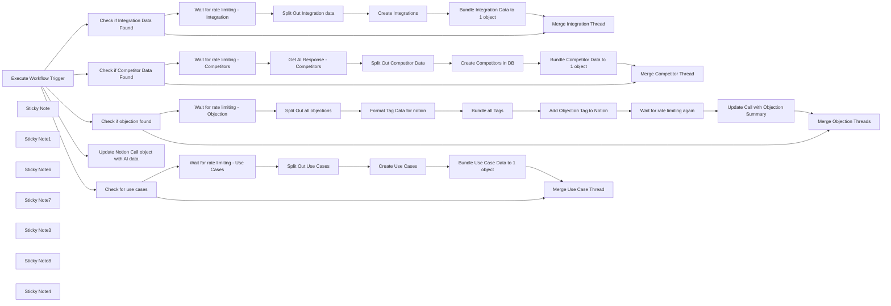

## Fluxo (.json) :

```json
{
  "meta": {
    "instanceId": "cb484ba7b742928a2048bf8829668bed5b5ad9787579adea888f05980292a4a7",
    "templateCredsSetupCompleted": true
  },
  "nodes": [
    {
      "id": "ffcd401c-3c2d-4fc5-92d7-bd55394e2dc9",
      "name": "Check if Competitor Data Found",
      "type": "n8n-nodes-base.if",
      "position": [
        2780,
        240
      ],
      "parameters": {
        "options": {},
        "conditions": {
          "options": {
            "version": 2,
            "leftValue": "",
            "caseSensitive": true,
            "typeValidation": "loose"
          },
          "combinator": "and",
          "conditions": [
            {
              "id": "9d720bd5-f29b-4ac8-92b4-ee2d5df074fe",
              "operator": {
                "type": "array",
                "operation": "lengthGte",
                "rightType": "number"
              },
              "leftValue": "={{ $('Execute Workflow Trigger').item.json.AIoutput.Competitors }}",
              "rightValue": 1
            }
          ]
        },
        "looseTypeValidation": true
      },
      "typeVersion": 2.2
    },
    {
      "id": "65d9cd7a-d0a7-4892-a199-40f4d35a0240",
      "name": "Check if Integration Data Found",
      "type": "n8n-nodes-base.if",
      "position": [
        2800,
        -400
      ],
      "parameters": {
        "options": {},
        "conditions": {
          "options": {
            "version": 2,
            "leftValue": "",
            "caseSensitive": true,
            "typeValidation": "strict"
          },
          "combinator": "and",
          "conditions": [
            {
              "id": "9d720bd5-f29b-4ac8-92b4-ee2d5df074fe",
              "operator": {
                "type": "array",
                "operation": "lengthGte",
                "rightType": "number"
              },
              "leftValue": "={{ $json.AIoutput.Integrations }}",
              "rightValue": 1
            }
          ]
        }
      },
      "typeVersion": 2.2
    },
    {
      "id": "c48921de-d1f8-48a0-b076-6cd6ff2442f6",
      "name": "Execute Workflow Trigger",
      "type": "n8n-nodes-base.executeWorkflowTrigger",
      "position": [
        2280,
        -400
      ],
      "parameters": {},
      "typeVersion": 1
    },
    {
      "id": "74a0d14a-2020-4993-890a-1581da809060",
      "name": "Check if objection found",
      "type": "n8n-nodes-base.if",
      "position": [
        2900,
        -1020
      ],
      "parameters": {
        "options": {},
        "conditions": {
          "options": {
            "version": 2,
            "leftValue": "",
            "caseSensitive": true,
            "typeValidation": "strict"
          },
          "combinator": "and",
          "conditions": [
            {
              "id": "0fb03927-4c00-4479-b8e3-6298afa4d41e",
              "operator": {
                "type": "string",
                "operation": "notEmpty",
                "singleValue": true
              },
              "leftValue": "={{ $json.AIoutput.Objection.Nature }}",
              "rightValue": "null"
            }
          ]
        }
      },
      "typeVersion": 2.2
    },
    {
      "id": "3e0fad7e-1a08-44ac-8212-ccc96f61669d",
      "name": "Create Competitors in DB",
      "type": "n8n-nodes-base.notion",
      "position": [
        3580,
        80
      ],
      "parameters": {
        "title": "={{ $('Execute Workflow Trigger').item.json.metaData.title }}",
        "options": {
          "icon": "🤺"
        },
        "resource": "databasePage",
        "databaseId": {
          "__rl": true,
          "mode": "list",
          "value": "1375b6e0-c94f-8010-9161-c65e2c0f093a",
          "cachedResultUrl": "https://www.notion.so/1375b6e0c94f80109161c65e2c0f093a",
          "cachedResultName": "Competitors Database"
        },
        "propertiesUi": {
          "propertyValues": [
            {
              "key": "Competitor Status|select",
              "selectValue": "={{ $json['aiResponse.Competitors'].Tag }}"
            },
            {
              "key": "Summary|rich_text",
              "textContent": "={{ $json['aiResponse.Competitors'].Reason }}"
            },
            {
              "key": "Pricing Summary|rich_text",
              "textContent": "={{ $json['aiResponse.Competitors'].Pricing ? $json['aiResponse.Competitors'].Pricing : 'None Found' }}"
            },
            {
              "key": "Competitor Tracked?|checkbox",
              "checkboxValue": "={{ typeof $json['aiResponse.Competitors'].Known === 'string' ? false : $json['aiResponse.Competitors'].Known }}"
            },
            {
              "key": "Name|title",
              "title": "={{ $json['aiResponse.Competitors'].Name }}"
            },
            {
              "key": "Sales Call Summaries|relation",
              "relationValue": [
                "={{ $('Execute Workflow Trigger').item.json.notionData[0].id }}"
              ]
            },
            {
              "key": "Competitor Sentiment|multi_select",
              "multiSelectValue": "={{ $json['aiResponse.Competitors'].Sentiment }}"
            },
            {
              "key": "Mentioned Date|date",
              "date": "={{ $('Execute Workflow Trigger').item.json.metaData.started }}"
            }
          ]
        }
      },
      "credentials": {
        "notionApi": {
          "id": "80",
          "name": "Notion david-internal"
        }
      },
      "retryOnFail": true,
      "typeVersion": 2.2,
      "waitBetweenTries": 3000
    },
    {
      "id": "7f917a42-a25b-41bb-b904-0fd44e9c2b78",
      "name": "Create Integrations",
      "type": "n8n-nodes-base.notion",
      "position": [
        3400,
        -560
      ],
      "parameters": {
        "title": "={{ $('Execute Workflow Trigger').item.json.metaData.title }}",
        "options": {
          "icon": "⚙️"
        },
        "resource": "databasePage",
        "databaseId": {
          "__rl": true,
          "mode": "list",
          "value": "1375b6e0-c94f-80f2-a449-c47795337c3d",
          "cachedResultUrl": "https://www.notion.so/1375b6e0c94f80f2a449c47795337c3d",
          "cachedResultName": "Integrations Database"
        },
        "propertiesUi": {
          "propertyValues": [
            {
              "key": "Name|title",
              "title": "={{ $json[\"AIoutput.Integrations\"].IntegrationName }}"
            },
            {
              "key": "IntegrationStatus|select",
              "selectValue": "={{ $json[\"AIoutput.Integrations\"].IntegrationStatus }}"
            },
            {
              "key": "Summary|rich_text",
              "textContent": "={{ $json[\"AIoutput.Integrations\"].SummaryOfUse }}"
            },
            {
              "key": "UsageStatus|select",
              "selectValue": "={{ $json[\"AIoutput.Integrations\"].UsageStatus }}"
            },
            {
              "key": "Sales Call Summaries|relation",
              "relationValue": [
                "={{ $('Execute Workflow Trigger').item.json.notionData[0].id }}"
              ]
            }
          ]
        }
      },
      "credentials": {
        "notionApi": {
          "id": "80",
          "name": "Notion david-internal"
        }
      },
      "retryOnFail": true,
      "typeVersion": 2.2,
      "waitBetweenTries": 3000
    },
    {
      "id": "54585eef-41b9-4ee5-ba1b-6ed502b2b7f9",
      "name": "Update Call with Objection Summary",
      "type": "n8n-nodes-base.notion",
      "position": [
        4320,
        -1180
      ],
      "parameters": {
        "pageId": {
          "__rl": true,
          "mode": "id",
          "value": "={{ $('Execute Workflow Trigger').item.json.notionData[0].id }}"
        },
        "options": {},
        "resource": "databasePage",
        "operation": "update",
        "propertiesUi": {
          "propertyValues": [
            {
              "key": "Objection Summary|rich_text",
              "textContent": "={{ $('Execute Workflow Trigger').item.json.AIoutput.Objection.Nature }}"
            }
          ]
        }
      },
      "credentials": {
        "notionApi": {
          "id": "80",
          "name": "Notion david-internal"
        }
      },
      "retryOnFail": true,
      "typeVersion": 2.2,
      "waitBetweenTries": 3000
    },
    {
      "id": "031a430a-1ac1-4aec-ae21-de7450f03855",
      "name": "Sticky Note",
      "type": "n8n-nodes-base.stickyNote",
      "position": [
        2720,
        -760
      ],
      "parameters": {
        "color": 7,
        "width": 1480,
        "height": 620,
        "content": "## Integration Data Processing\nIf it's found, we add it to Notion. "
      },
      "typeVersion": 1
    },
    {
      "id": "ee4e0519-0969-4cb2-a4fd-fdba6313192d",
      "name": "Sticky Note1",
      "type": "n8n-nodes-base.stickyNote",
      "position": [
        2720,
        -120
      ],
      "parameters": {
        "color": 7,
        "width": 1480,
        "height": 620,
        "content": "## Competitor Data Processing"
      },
      "typeVersion": 1
    },
    {
      "id": "9518c874-1788-415c-965a-6c90321e501d",
      "name": "Sticky Note6",
      "type": "n8n-nodes-base.stickyNote",
      "position": [
        2140,
        -760
      ],
      "parameters": {
        "color": 7,
        "width": 560,
        "height": 620,
        "content": "## Receives AI Data from other workflow\n"
      },
      "typeVersion": 1
    },
    {
      "id": "951ba353-afef-4061-91b1-5fe8c6cd9b38",
      "name": "Sticky Note7",
      "type": "n8n-nodes-base.stickyNote",
      "position": [
        1780,
        -960
      ],
      "parameters": {
        "width": 340,
        "height": 820,
        "content": "\n## CallForge - The AI Gong Sales Call Processor\nCallForge allows you to extract important information for different departments from your Sales Gong Calls. \n\n### AI Output Processor\nOnce the AI data is generated, it is then added (or not!) to the Notion Database here. This is also where the Pipedrive or Salesforce integration will be added once that portion is complete. "
      },
      "typeVersion": 1
    },
    {
      "id": "24bde4bf-24bb-4c76-80fc-6bd80806b76a",
      "name": "Sticky Note3",
      "type": "n8n-nodes-base.stickyNote",
      "position": [
        2720,
        -1260
      ],
      "parameters": {
        "color": 7,
        "width": 2140,
        "height": 480,
        "content": "## Objection Data Processing\n"
      },
      "typeVersion": 1
    },
    {
      "id": "b271cddb-2dc4-4b68-91c0-60bae45c0f63",
      "name": "Sticky Note8",
      "type": "n8n-nodes-base.stickyNote",
      "position": [
        2720,
        520
      ],
      "parameters": {
        "color": 7,
        "width": 1480,
        "height": 620,
        "content": "## Use Case Processing"
      },
      "typeVersion": 1
    },
    {
      "id": "5277d26b-ca62-466c-b0fd-88f0a55dbe6c",
      "name": "Check for use cases",
      "type": "n8n-nodes-base.if",
      "position": [
        2860,
        960
      ],
      "parameters": {
        "options": {},
        "conditions": {
          "options": {
            "version": 2,
            "leftValue": "",
            "caseSensitive": true,
            "typeValidation": "strict"
          },
          "combinator": "and",
          "conditions": [
            {
              "id": "7f182ff7-b5cf-44d0-9645-9200bb7afa24",
              "operator": {
                "type": "array",
                "operation": "lengthGte",
                "rightType": "number"
              },
              "leftValue": "={{ $json.AIoutput.UseCases }}",
              "rightValue": 1
            }
          ]
        }
      },
      "typeVersion": 2.2
    },
    {
      "id": "ba4f7b4c-613a-42fe-9228-c9c12d2677d8",
      "name": "Sticky Note4",
      "type": "n8n-nodes-base.stickyNote",
      "position": [
        2720,
        -1640
      ],
      "parameters": {
        "color": 7,
        "width": 420,
        "height": 360,
        "content": "## Core Data Processing\n"
      },
      "typeVersion": 1
    },
    {
      "id": "85880852-03e8-4d7e-bdc6-ed381f16d425",
      "name": "Update Notion Call object with AI data",
      "type": "n8n-nodes-base.notion",
      "position": [
        2840,
        -1520
      ],
      "parameters": {
        "pageId": {
          "__rl": true,
          "mode": "id",
          "value": "={{ $('Execute Workflow Trigger').item.json.notionData[0].id }}"
        },
        "options": {},
        "resource": "databasePage",
        "operation": "update",
        "propertiesUi": {
          "propertyValues": [
            {
              "key": "Call Summary|rich_text",
              "textContent": "={{ $json.AIoutput.CallSummary }}"
            },
            {
              "key": "Next Steps|rich_text",
              "textContent": "={{ $json.AIoutput.NextSteps.map(step => `• ${step}`).join('\\n\\n') }}"
            },
            {
              "key": "Sentiment|select",
              "selectValue": "={{ $json.AIoutput.Sentiment }}"
            },
            {
              "key": "Customer Pain Points|rich_text",
              "textContent": "={{ $json.AIoutput.CustomerPainPoints.map(painPoint => `• ${painPoint}`).join('\\n\\n') }}"
            }
          ]
        }
      },
      "credentials": {
        "notionApi": {
          "id": "80",
          "name": "Notion david-internal"
        }
      },
      "retryOnFail": true,
      "typeVersion": 2.2,
      "waitBetweenTries": 3000
    },
    {
      "id": "74185c7e-8872-47f3-ace5-256e102d043b",
      "name": "Split Out all objections",
      "type": "n8n-nodes-base.splitOut",
      "position": [
        3360,
        -1180
      ],
      "parameters": {
        "include": "selectedOtherFields",
        "options": {},
        "fieldToSplitOut": "AIoutput.Objection.ObjectionTags",
        "fieldsToInclude": "id"
      },
      "typeVersion": 1
    },
    {
      "id": "41ecf92b-d6ee-4111-8684-afbfe45d760c",
      "name": "Format Tag Data for notion",
      "type": "n8n-nodes-base.set",
      "position": [
        3560,
        -1180
      ],
      "parameters": {
        "options": {},
        "assignments": {
          "assignments": [
            {
              "id": "d1b2c0c4-71de-429e-9220-d5ece2030180",
              "name": "tag",
              "type": "object",
              "value": "={\"name\": \"{{ $json[\"AIoutput.Objection.ObjectionTags\"] }}\"}"
            }
          ]
        }
      },
      "typeVersion": 3.4
    },
    {
      "id": "c0aa2bcc-0dee-4eeb-a93c-7aeb76ed3acf",
      "name": "Bundle all Tags",
      "type": "n8n-nodes-base.aggregate",
      "position": [
        3720,
        -1180
      ],
      "parameters": {
        "options": {
          "mergeLists": false
        },
        "fieldsToAggregate": {
          "fieldToAggregate": [
            {
              "fieldToAggregate": "tag"
            }
          ]
        }
      },
      "typeVersion": 1
    },
    {
      "id": "dca88d3e-9dc2-45be-b0d7-728d4f7ed641",
      "name": "Add Objection Tag to Notion",
      "type": "n8n-nodes-base.httpRequest",
      "position": [
        3920,
        -1180
      ],
      "parameters": {
        "url": "=https://api.notion.com/v1/pages/{{ $('Execute Workflow Trigger').item.json.notionData[0].id }}",
        "method": "PATCH",
        "options": {},
        "jsonBody": "={\n    \"object\": \"page\",\n    \"id\": \"{{ $('Execute Workflow Trigger').item.json.notionData[0].id }}\",\n    \"properties\": {\n    \"Objections\": {\n      \"multi_select\": {{ $json.tag.toJsonString() }}\n    }\n  }\n}",
        "sendBody": true,
        "sendHeaders": true,
        "specifyBody": "json",
        "authentication": "predefinedCredentialType",
        "headerParameters": {
          "parameters": [
            {
              "name": "Notion-Version",
              "value": "2022-06-28"
            }
          ]
        },
        "nodeCredentialType": "notionApi"
      },
      "credentials": {
        "notionApi": {
          "id": "80",
          "name": "Notion david-internal"
        }
      },
      "retryOnFail": true,
      "typeVersion": 4.2,
      "waitBetweenTries": 3000
    },
    {
      "id": "85816770-807e-4cbb-98ab-ddf20c2066a0",
      "name": "Wait for rate limiting again",
      "type": "n8n-nodes-base.wait",
      "position": [
        4100,
        -1180
      ],
      "webhookId": "d5d6be58-6adb-4cff-a05a-c96b5647b72e",
      "parameters": {
        "amount": 4
      },
      "typeVersion": 1.1
    },
    {
      "id": "99fd790e-9ba1-4a8c-86cd-981ecef6d4f4",
      "name": "Merge Objection Threads",
      "type": "n8n-nodes-base.set",
      "position": [
        4660,
        -1000
      ],
      "parameters": {
        "options": {},
        "assignments": {
          "assignments": [
            {
              "id": "d8fc65ad-2b05-40c1-84c7-7bda819f0f1f",
              "name": "aiResponse",
              "type": "object",
              "value": "={{ $('Execute Workflow Trigger').item.json.aiResponse }}"
            }
          ]
        }
      },
      "typeVersion": 3.4
    },
    {
      "id": "f71aa765-c10f-4ace-8051-8416b7cfefce",
      "name": "Wait for rate limiting - Integration",
      "type": "n8n-nodes-base.wait",
      "position": [
        3000,
        -560
      ],
      "webhookId": "9b4c5462-04ef-44ec-a7cf-a061e8c9e108",
      "parameters": {
        "amount": 3
      },
      "typeVersion": 1.1
    },
    {
      "id": "df0772d8-8612-4830-ae66-ba9db77e654e",
      "name": "Split Out Integration data",
      "type": "n8n-nodes-base.splitOut",
      "position": [
        3200,
        -560
      ],
      "parameters": {
        "include": "selectedOtherFields",
        "options": {},
        "fieldToSplitOut": "AIoutput.Integrations",
        "fieldsToInclude": "id"
      },
      "typeVersion": 1
    },
    {
      "id": "40775bc5-2678-41c3-a651-000edba9920f",
      "name": "Bundle Integration Data to 1 object",
      "type": "n8n-nodes-base.aggregate",
      "position": [
        3600,
        -560
      ],
      "parameters": {
        "options": {},
        "aggregate": "aggregateAllItemData",
        "destinationFieldName": "tagdata"
      },
      "typeVersion": 1
    },
    {
      "id": "b4f2a517-a685-4bca-a994-7d395c2743e5",
      "name": "Merge Integration Thread",
      "type": "n8n-nodes-base.set",
      "position": [
        3860,
        -380
      ],
      "parameters": {
        "options": {},
        "assignments": {
          "assignments": [
            {
              "id": "513c8505-75dd-4ecf-9bd7-4f51cbb12f81",
              "name": "AIoutput",
              "type": "string",
              "value": "={{ $json.AIoutput }}"
            }
          ]
        }
      },
      "typeVersion": 3.4
    },
    {
      "id": "c606e481-b664-4a64-923d-ffa7d0c50cb9",
      "name": "Wait for rate limiting - Competitors",
      "type": "n8n-nodes-base.wait",
      "position": [
        3000,
        80
      ],
      "webhookId": "1cf8f53b-5981-4ba1-84b4-8f1921b9b417",
      "parameters": {
        "amount": 3
      },
      "typeVersion": 1.1
    },
    {
      "id": "1f75b7ab-a452-4f36-92d9-ec0358144f0d",
      "name": "Wait for rate limiting - Objection",
      "type": "n8n-nodes-base.wait",
      "position": [
        3160,
        -1180
      ],
      "webhookId": "5dae7747-7d12-4e66-990c-bca7ce6fc0d2",
      "parameters": {
        "amount": 3
      },
      "typeVersion": 1.1
    },
    {
      "id": "6a2f1dd6-e5a5-4b68-9b62-98491621e47d",
      "name": "Wait for rate limiting - Use Cases",
      "type": "n8n-nodes-base.wait",
      "position": [
        3080,
        800
      ],
      "webhookId": "ba9f17ac-4fec-47c1-80e4-31e6d81e47f6",
      "parameters": {
        "amount": 3
      },
      "typeVersion": 1.1
    },
    {
      "id": "6cb3ba0d-733d-4f51-bfbf-57e350e4ab93",
      "name": "Split Out Use Cases",
      "type": "n8n-nodes-base.splitOut",
      "position": [
        3280,
        800
      ],
      "parameters": {
        "options": {},
        "fieldToSplitOut": "AIoutput.UseCases"
      },
      "typeVersion": 1
    },
    {
      "id": "4a669d54-ea1b-44a8-a7de-afa79d171467",
      "name": "Create Use Cases",
      "type": "n8n-nodes-base.notion",
      "position": [
        3500,
        800
      ],
      "parameters": {
        "title": "={{ $('Execute Workflow Trigger').item.json.metaData.title }}",
        "options": {
          "icon": "💼"
        },
        "resource": "databasePage",
        "databaseId": {
          "__rl": true,
          "mode": "list",
          "value": "17c5b6e0-c94f-80e8-bf90-f290e8c78f9d",
          "cachedResultUrl": "https://www.notion.so/17c5b6e0c94f80e8bf90f290e8c78f9d",
          "cachedResultName": "Use Cases"
        },
        "propertiesUi": {
          "propertyValues": [
            {
              "key": "Department Tag|multi_select",
              "multiSelectValue": "={{ $json.DepartmentTags }}"
            },
            {
              "key": "Industry Tag|multi_select",
              "multiSelectValue": "={{ $json.IndustryTags }}"
            },
            {
              "key": "Summary|title",
              "title": "={{ $json.Summary }}"
            },
            {
              "key": "Sales Call Summaries|relation",
              "relationValue": [
                "={{ $('Execute Workflow Trigger').item.json.notionData[0].id }}"
              ]
            },
            {
              "key": "Implementation|select",
              "selectValue": "={{ $json.ImplementationStatus }}"
            }
          ]
        }
      },
      "credentials": {
        "notionApi": {
          "id": "2B3YIiD4FMsF9Rjn",
          "name": "Angelbot Notion"
        }
      },
      "retryOnFail": true,
      "typeVersion": 2.2,
      "waitBetweenTries": 3000
    },
    {
      "id": "e07e56a3-5f2f-4bc6-995a-af3944c72983",
      "name": "Bundle Use Case Data to 1 object",
      "type": "n8n-nodes-base.aggregate",
      "position": [
        3700,
        800
      ],
      "parameters": {
        "options": {},
        "aggregate": "aggregateAllItemData",
        "destinationFieldName": "tagdata"
      },
      "typeVersion": 1
    },
    {
      "id": "76f2d3cb-9bf9-4f8c-994c-45766080dbcb",
      "name": "Bundle Competitor Data to 1 object",
      "type": "n8n-nodes-base.aggregate",
      "position": [
        3800,
        80
      ],
      "parameters": {
        "options": {},
        "aggregate": "aggregateAllItemData",
        "destinationFieldName": "tagdata"
      },
      "typeVersion": 1
    },
    {
      "id": "9ddf3b34-8b9e-4149-8946-51e208973c37",
      "name": "Split Out Competitor Data",
      "type": "n8n-nodes-base.splitOut",
      "position": [
        3360,
        80
      ],
      "parameters": {
        "include": "selectedOtherFields",
        "options": {},
        "fieldToSplitOut": "aiResponse.Competitors",
        "fieldsToInclude": "id"
      },
      "typeVersion": 1
    },
    {
      "id": "ac4879fc-21a1-49e5-a388-67550032bcd4",
      "name": "Get AI Response - Competitors",
      "type": "n8n-nodes-base.set",
      "position": [
        3180,
        80
      ],
      "parameters": {
        "options": {},
        "assignments": {
          "assignments": [
            {
              "id": "d8fc65ad-2b05-40c1-84c7-7bda819f0f1f",
              "name": "aiResponse",
              "type": "object",
              "value": "={{ $('Execute Workflow Trigger').item.json.AIoutput }}"
            }
          ]
        }
      },
      "typeVersion": 3.4
    },
    {
      "id": "063bdedc-fa58-4c05-9ba4-523b4297c4f2",
      "name": "Merge Competitor Thread",
      "type": "n8n-nodes-base.set",
      "position": [
        4000,
        260
      ],
      "parameters": {
        "options": {},
        "assignments": {
          "assignments": [
            {
              "id": "d8fc65ad-2b05-40c1-84c7-7bda819f0f1f",
              "name": "aiResponse",
              "type": "object",
              "value": "={{ $('Execute Workflow Trigger').item.json.AIoutput }}"
            }
          ]
        }
      },
      "typeVersion": 3.4
    },
    {
      "id": "c2f253ec-8659-4ead-aed3-e319fb165b90",
      "name": "Merge Use Case Thread",
      "type": "n8n-nodes-base.set",
      "position": [
        4000,
        980
      ],
      "parameters": {
        "options": {},
        "assignments": {
          "assignments": [
            {
              "id": "d8fc65ad-2b05-40c1-84c7-7bda819f0f1f",
              "name": "aiResponse",
              "type": "object",
              "value": "={{ $('Execute Workflow Trigger').item.json.aiResponse }}"
            }
          ]
        }
      },
      "typeVersion": 3.4
    }
  ],
  "pinData": {},
  "connections": {
    "Bundle all Tags": {
      "main": [
        [
          {
            "node": "Add Objection Tag to Notion",
            "type": "main",
            "index": 0
          }
        ]
      ]
    },
    "Create Use Cases": {
      "main": [
        [
          {
            "node": "Bundle Use Case Data to 1 object",
            "type": "main",
            "index": 0
          }
        ]
      ]
    },
    "Check for use cases": {
      "main": [
        [
          {
            "node": "Wait for rate limiting - Use Cases",
            "type": "main",
            "index": 0
          }
        ],
        [
          {
            "node": "Merge Use Case Thread",
            "type": "main",
            "index": 0
          }
        ]
      ]
    },
    "Create Integrations": {
      "main": [
        [
          {
            "node": "Bundle Integration Data to 1 object",
            "type": "main",
            "index": 0
          }
        ]
      ]
    },
    "Split Out Use Cases": {
      "main": [
        [
          {
            "node": "Create Use Cases",
            "type": "main",
            "index": 0
          }
        ]
      ]
    },
    "Merge Competitor Thread": {
      "main": [
        []
      ]
    },
    "Merge Objection Threads": {
      "main": [
        []
      ]
    },
    "Check if objection found": {
      "main": [
        [
          {
            "node": "Wait for rate limiting - Objection",
            "type": "main",
            "index": 0
          }
        ],
        [
          {
            "node": "Merge Objection Threads",
            "type": "main",
            "index": 0
          }
        ]
      ]
    },
    "Create Competitors in DB": {
      "main": [
        [
          {
            "node": "Bundle Competitor Data to 1 object",
            "type": "main",
            "index": 0
          }
        ]
      ]
    },
    "Execute Workflow Trigger": {
      "main": [
        [
          {
            "node": "Check if Integration Data Found",
            "type": "main",
            "index": 0
          },
          {
            "node": "Check if Competitor Data Found",
            "type": "main",
            "index": 0
          },
          {
            "node": "Check if objection found",
            "type": "main",
            "index": 0
          },
          {
            "node": "Update Notion Call object with AI data",
            "type": "main",
            "index": 0
          },
          {
            "node": "Check for use cases",
            "type": "main",
            "index": 0
          }
        ]
      ]
    },
    "Merge Integration Thread": {
      "main": [
        []
      ]
    },
    "Split Out all objections": {
      "main": [
        [
          {
            "node": "Format Tag Data for notion",
            "type": "main",
            "index": 0
          }
        ]
      ]
    },
    "Split Out Competitor Data": {
      "main": [
        [
          {
            "node": "Create Competitors in DB",
            "type": "main",
            "index": 0
          }
        ]
      ]
    },
    "Format Tag Data for notion": {
      "main": [
        [
          {
            "node": "Bundle all Tags",
            "type": "main",
            "index": 0
          }
        ]
      ]
    },
    "Split Out Integration data": {
      "main": [
        [
          {
            "node": "Create Integrations",
            "type": "main",
            "index": 0
          }
        ]
      ]
    },
    "Add Objection Tag to Notion": {
      "main": [
        [
          {
            "node": "Wait for rate limiting again",
            "type": "main",
            "index": 0
          }
        ]
      ]
    },
    "Wait for rate limiting again": {
      "main": [
        [
          {
            "node": "Update Call with Objection Summary",
            "type": "main",
            "index": 0
          }
        ]
      ]
    },
    "Get AI Response - Competitors": {
      "main": [
        [
          {
            "node": "Split Out Competitor Data",
            "type": "main",
            "index": 0
          }
        ]
      ]
    },
    "Check if Competitor Data Found": {
      "main": [
        [
          {
            "node": "Wait for rate limiting - Competitors",
            "type": "main",
            "index": 0
          }
        ],
        [
          {
            "node": "Merge Competitor Thread",
            "type": "main",
            "index": 0
          }
        ]
      ]
    },
    "Check if Integration Data Found": {
      "main": [
        [
          {
            "node": "Wait for rate limiting - Integration",
            "type": "main",
            "index": 0
          }
        ],
        [
          {
            "node": "Merge Integration Thread",
            "type": "main",
            "index": 0
          }
        ]
      ]
    },
    "Bundle Use Case Data to 1 object": {
      "main": [
        [
          {
            "node": "Merge Use Case Thread",
            "type": "main",
            "index": 0
          }
        ]
      ]
    },
    "Bundle Competitor Data to 1 object": {
      "main": [
        [
          {
            "node": "Merge Competitor Thread",
            "type": "main",
            "index": 0
          }
        ]
      ]
    },
    "Update Call with Objection Summary": {
      "main": [
        [
          {
            "node": "Merge Objection Threads",
            "type": "main",
            "index": 0
          }
        ]
      ]
    },
    "Wait for rate limiting - Objection": {
      "main": [
        [
          {
            "node": "Split Out all objections",
            "type": "main",
            "index": 0
          }
        ]
      ]
    },
    "Wait for rate limiting - Use Cases": {
      "main": [
        [
          {
            "node": "Split Out Use Cases",
            "type": "main",
            "index": 0
          }
        ]
      ]
    },
    "Bundle Integration Data to 1 object": {
      "main": [
        [
          {
            "node": "Merge Integration Thread",
            "type": "main",
            "index": 0
          }
        ]
      ]
    },
    "Wait for rate limiting - Competitors": {
      "main": [
        [
          {
            "node": "Get AI Response - Competitors",
            "type": "main",
            "index": 0
          }
        ]
      ]
    },
    "Wait for rate limiting - Integration": {
      "main": [
        [
          {
            "node": "Split Out Integration data",
            "type": "main",
            "index": 0
          }
        ]
      ]
    }
  }
}
```

<a id="template-386"></a>

## Template 386 - Gerador simples de imagens (OpenAI)

- **Nome:** Gerador simples de imagens (OpenAI)
- **Descrição:** Gera imagens a partir de prompts enviados por um formulário e retorna a imagem gerada para download.
- **Funcionalidade:** • Recepção de prompt e opções: Recebe do usuário o texto do prompt e a opção de tamanho através de um formulário.
• Geração de imagem via API: Envia o prompt ao modelo de imagem GPT-Image-1 para criar a imagem.
• Conversão de resposta em arquivo: Converte a resposta em base64 para um arquivo binário apropriado para download.
• Retorno ao usuário: Entrega a imagem gerada de volta ao formulário para que o usuário possa visualizar e baixar.
- **Ferramentas:** • OpenAI API: Serviço de geração de imagens utilizando o modelo GPT-Image-1.

## Fluxo visual

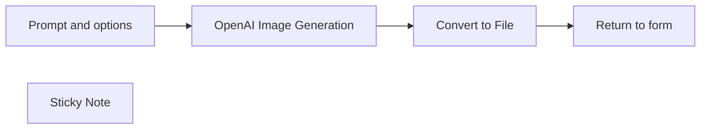

## Fluxo (.json) :

```json
{
  "id": "AqWXpCre4fsPEkAH",
  "meta": {
    "instanceId": "7dfa146768a036d27a67d125f90ea637bfb301bd4fd25d0086548016421d44bd"
  },
  "name": "Simple OpenAI Image Generator",
  "tags": [],
  "nodes": [
    {
      "id": "526c24bc-3bc5-48c3-ae1e-5b0c0352d07f",
      "name": "Convert to File",
      "type": "n8n-nodes-base.convertToFile",
      "position": [
        440,
        0
      ],
      "parameters": {
        "options": {},
        "operation": "toBinary",
        "sourceProperty": "data[0].b64_json"
      },
      "typeVersion": 1.1
    },
    {
      "id": "20fdcc11-5e8a-4788-b3a3-e556996b59f7",
      "name": "Prompt and options",
      "type": "n8n-nodes-base.formTrigger",
      "position": [
        0,
        0
      ],
      "webhookId": "b749da3f-836f-4996-a8ee-bc26f8677582",
      "parameters": {
        "options": {},
        "formTitle": "OpenAI Image Generator",
        "formFields": {
          "values": [
            {
              "fieldLabel": "Prompt",
              "placeholder": "Snow-covered mountain village in the Alps",
              "requiredField": true
            },
            {
              "fieldType": "dropdown",
              "fieldLabel": "Image size",
              "fieldOptions": {
                "values": [
                  {
                    "option": "1024x1024"
                  },
                  {
                    "option": "1024x1536"
                  },
                  {
                    "option": "1536x1024"
                  }
                ]
              },
              "requiredField": true
            }
          ]
        }
      },
      "typeVersion": 2.2
    },
    {
      "id": "eb220b1f-2091-492a-931f-1f2e344b32a6",
      "name": "OpenAI Image Generation",
      "type": "n8n-nodes-base.httpRequest",
      "position": [
        220,
        0
      ],
      "parameters": {
        "url": "https://api.openai.com/v1/images/generations",
        "method": "POST",
        "options": {},
        "sendBody": true,
        "sendHeaders": true,
        "authentication": "predefinedCredentialType",
        "bodyParameters": {
          "parameters": [
            {
              "name": "model",
              "value": "gpt-image-1"
            },
            {
              "name": "prompt",
              "value": "={{ $json.Prompt }}"
            },
            {
              "name": "n",
              "value": "={{ 1 }}"
            },
            {
              "name": "size",
              "value": "={{ $json['Image size'] }}"
            }
          ]
        },
        "nodeCredentialType": "openAiApi"
      },
      "credentials": {
        "openAiApi": {
          "id": "x1byAha0t8ltLIeW",
          "name": "OpenAi account"
        }
      },
      "typeVersion": 4.2
    },
    {
      "id": "86718927-490e-4d97-9b0c-1118e2ccdcb6",
      "name": "Return to form",
      "type": "n8n-nodes-base.form",
      "position": [
        660,
        0
      ],
      "webhookId": "745af4a8-ab3c-4267-aa8d-a8998cc534e5",
      "parameters": {
        "options": {
          "formTitle": "Result"
        },
        "operation": "completion",
        "respondWith": "returnBinary",
        "completionTitle": "Result",
        "completionMessage": "Here is the created image:"
      },
      "typeVersion": 1
    },
    {
      "id": "a069f63f-139e-4157-a44a-448224f2c119",
      "name": "Sticky Note",
      "type": "n8n-nodes-base.stickyNote",
      "position": [
        -600,
        0
      ],
      "parameters": {
        "width": 500,
        "height": 620,
        "content": "# Welcome to my Simple OpenAI Image Generator Workflow!\n\nThis workflow creates an image with the new OpenAI image model \"GPT-Image-1\" based on a form input.\n\n## This workflow has the following sequence:\n\n1. Form trigger (image prompt and image size input)\n2. Generate the Image via OpenAI API.\n3. Return the image to the input form for download.\n\n## The following accesses are required for the workflow:\n- OpenAI API access: [Documentation](https://docs.n8n.io/integrations/builtin/credentials/openai/)\n\nYou can contact me via LinkedIn, if you have any questions: https://www.linkedin.com/in/friedemann-schuetz"
      },
      "typeVersion": 1
    }
  ],
  "active": false,
  "pinData": {},
  "settings": {
    "executionOrder": "v1"
  },
  "versionId": "d2376df0-9c26-4723-9e97-07fc226e7a53",
  "connections": {
    "Convert to File": {
      "main": [
        [
          {
            "node": "Return to form",
            "type": "main",
            "index": 0
          }
        ]
      ]
    },
    "Prompt and options": {
      "main": [
        [
          {
            "node": "OpenAI Image Generation",
            "type": "main",
            "index": 0
          }
        ]
      ]
    },
    "OpenAI Image Generation": {
      "main": [
        [
          {
            "node": "Convert to File",
            "type": "main",
            "index": 0
          }
        ]
      ]
    }
  }
}
```

<a id="template-387"></a>

## Template 387 - Upload público para DigitalOcean Spaces

- **Nome:** Upload público para DigitalOcean Spaces
- **Descrição:** Recebe um arquivo enviado via formulário, armazena no espaço público do DigitalOcean e retorna o link público ao usuário.
- **Funcionalidade:** • Coleta de arquivo via formulário: Inicia o fluxo quando o usuário envia o formulário com um arquivo obrigatório.
• Manutenção do nome original do arquivo: Usa o nome do arquivo enviado como nome no armazenamento.
• Upload para armazenamento público: Envia o arquivo para um bucket configurado com permissão pública (publicRead).
• Retorno do caminho público: Gera e exibe ao usuário a URL pública do arquivo armazenado após conclusão.
- **Ferramentas:** • DigitalOcean Spaces (CDN): Armazenamento compatível com S3 usado para hospedar arquivos publicamente e servir via CDN.

## Fluxo visual

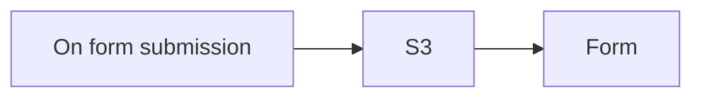

## Fluxo (.json) :

```json
{
  "id": "CYv2u2izrgZWk5bK",
  "meta": {
    "instanceId": "b77b374d91a001765a8bf2832badc1f8fcc5407c99c4c6f3f68d6413d663ef83",
    "templateCredsSetupCompleted": true
  },
  "name": "DigialOceanUpload",
  "tags": [
    {
      "id": "6YbZxCb4ODJ2Rmva",
      "name": "admin",
      "createdAt": "2024-12-01T14:18:53.184Z",
      "updatedAt": "2024-12-01T14:18:53.184Z"
    }
  ],
  "nodes": [
    {
      "id": "dedd8475-1f90-4c6e-a7b3-d4246648fcec",
      "name": "On form submission",
      "type": "n8n-nodes-base.formTrigger",
      "position": [
        200,
        340
      ],
      "webhookId": "f506f7cd-dded-491a-b56e-fb4e0eade910",
      "parameters": {
        "options": {},
        "formTitle": "Upload File",
        "formFields": {
          "values": [
            {
              "fieldType": "file",
              "fieldLabel": "File to Upload",
              "requiredField": true
            }
          ]
        },
        "formDescription": "Upload the file to the public storage area"
      },
      "typeVersion": 2.2
    },
    {
      "id": "bbaed371-3860-4370-8103-16b7b955cd7e",
      "name": "S3",
      "type": "n8n-nodes-base.s3",
      "position": [
        360,
        340
      ],
      "parameters": {
        "fileName": "={{ $json['File to Upload'][0].filename }}",
        "operation": "upload",
        "bucketName": "dailyai",
        "additionalFields": {
          "acl": "publicRead"
        },
        "binaryPropertyName": "File_to_Upload"
      },
      "credentials": {
        "s3": {
          "id": "FHy0lHKFlTe0nVPv",
          "name": "Digital Ocean Spaces"
        }
      },
      "typeVersion": 1
    },
    {
      "id": "da21e508-a62f-49dd-ac1c-6ed4b9a307a6",
      "name": "Form",
      "type": "n8n-nodes-base.form",
      "position": [
        540,
        340
      ],
      "webhookId": "cea10f93-617e-4762-9c40-582a8d159240",
      "parameters": {
        "options": {},
        "operation": "completion",
        "completionTitle": "Your file path is below!",
        "completionMessage": "=https://dailyai.nyc3.cdn.digitaloceanspaces.com/{{ $('On form submission').first().json['File to Upload'][0].filename }}"
      },
      "typeVersion": 1
    }
  ],
  "active": true,
  "pinData": {
    "On form submission": [
      {
        "json": {
          "formMode": "production",
          "submittedAt": "2024-12-19T13:00:27.445-05:00",
          "File to Upload": [
            {
              "size": 986986,
              "filename": "prompt_booster.png",
              "mimetype": "image/png"
            }
          ]
        }
      }
    ]
  },
  "settings": {
    "executionOrder": "v1"
  },
  "versionId": "e7f5d777-36c3-4601-8eef-dc1ab68cf67e",
  "connections": {
    "S3": {
      "main": [
        [
          {
            "node": "Form",
            "type": "main",
            "index": 0
          }
        ]
      ]
    },
    "On form submission": {
      "main": [
        [
          {
            "node": "S3",
            "type": "main",
            "index": 0
          }
        ]
      ]
    }
  }
}
```

<a id="template-388"></a>

## Template 388 - Envio diário de follow-up para contatos HubSpot

- **Nome:** Envio diário de follow-up para contatos HubSpot
- **Descrição:** Verifica contatos do CRM que foram contactados anteriormente e, se apropriado, envia um email de follow-up e registra essa interação no CRM.
- **Funcionalidade:** • Agendamento diário às 9h: executa a automação uma vez por dia no horário definido.
• Busca de contatos com última data de contato conhecida: procura contatos no CRM que possuam registro de último contato.
• Ordenação por data de último contato: organiza os resultados em ordem crescente para priorizar os mais antigos.
• Filtragem por último contato anterior a 30 dias: seleciona apenas contatos cujo último contato ocorreu há mais de um mês.
• Recuperação de engagements/associações: obtém as interações existentes do contato para avaliar histórico.
• Verificação de contagem de interações: continua somente se houver exatamente uma interação anterior (ex.: apenas um outreach anterior).
• Preparação de email: monta assunto, corpo e destinatário do follow-up com dados do contato.
• Envio do email de follow-up: envia a mensagem para o contato selecionado.
• Registro da interação no CRM: cria um registro de engagement do tipo email associado ao contato para atualizar o histórico.
- **Ferramentas:** • Gmail: serviço de email usado para enviar as mensagens de follow-up ao destinatário.
• HubSpot: CRM utilizado para buscar contatos, consultar a data do último contato, recuperar interações anteriores e registrar o novo engagement.

## Fluxo visual

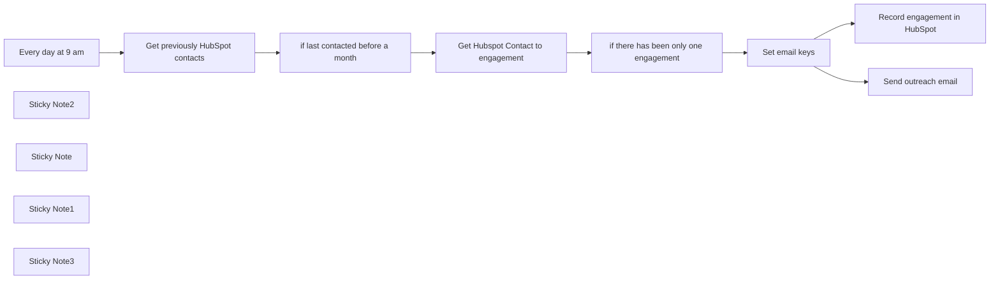

## Fluxo (.json) :

```json
{
  "nodes": [
    {
      "id": "3a0ba7f4-ac41-49b0-a055-b993c82f2680",
      "name": "Every day at 9 am",
      "type": "n8n-nodes-base.scheduleTrigger",
      "position": [
        340,
        1280
      ],
      "parameters": {
        "rule": {
          "interval": [
            {
              "triggerAtHour": 9
            }
          ]
        }
      },
      "typeVersion": 1.1
    },
    {
      "id": "5fa47f36-3206-44b9-965a-0d27b10acc21",
      "name": "Sticky Note2",
      "type": "n8n-nodes-base.stickyNote",
      "position": [
        740,
        980
      ],
      "parameters": {
        "width": 348.2877732355713,
        "height": 595.2986206729652,
        "content": "## Search for all contacts that last contact date for is known\n\n1. Setup Oauth2 creds using n8n docs\nhttps://docs.n8n.io/integrations/builtin/trigger-nodes/n8n-nodes-base.hubspottrigger/\n\n### Be careful with scopes. Scopes must be exactly as defined in the n8n docs\n\n\n\n\n\n\n\n\n\n\n\n\n\n\n\n\n### To make this more effective, we sort ascending by last contact date."
      },
      "typeVersion": 1
    },
    {
      "id": "16b6fadf-ff1d-4670-b148-151cfbd242d5",
      "name": "Send outreach email",
      "type": "n8n-nodes-base.gmail",
      "position": [
        2040,
        1060
      ],
      "parameters": {
        "sendTo": "={{ $json.to }}",
        "message": "={{ $json.html }}",
        "options": {
          "senderName": "Mutasem from n8n",
          "appendAttribution": false
        },
        "subject": "={{ $json.subject }}"
      },
      "credentials": {
        "gmailOAuth2": {
          "id": "rd2agqPeJBD2377h",
          "name": "Work Gmail"
        }
      },
      "typeVersion": 2.1
    },
    {
      "id": "a89ec3bd-7bb0-4dde-a9eb-800842073fc9",
      "name": "Sticky Note",
      "type": "n8n-nodes-base.stickyNote",
      "position": [
        2000,
        1300
      ],
      "parameters": {
        "color": 3,
        "width": 289.74216745960825,
        "height": 402.1775107197669,
        "content": "## Record engagement in Hubspot\n\nOnce engagement is added, last contact date is updated and won't show up in search results for another month.\n"
      },
      "typeVersion": 1
    },
    {
      "id": "687509ed-4d25-4597-bade-1802348e42c9",
      "name": "Sticky Note1",
      "type": "n8n-nodes-base.stickyNote",
      "position": [
        260,
        980
      ],
      "parameters": {
        "color": 5,
        "width": 407.25356360335365,
        "height": 242.51175804432177,
        "content": "## Send followup email using Gmail to Hubspot contacts \n\nFollowing up at the right time is one of the most important parts of sales. This workflow uses Gmail to send outreach emails to Hubspot contacts that have already been contacted only once more than a month ago, and records the engagement in Hubspot. "
      },
      "typeVersion": 1
    },
    {
      "id": "e66f48c9-0e19-4089-a4a4-d9e87b56898a",
      "name": "Record engagement in HubSpot",
      "type": "n8n-nodes-base.hubspot",
      "position": [
        2080,
        1500
      ],
      "parameters": {
        "type": "email",
        "metadata": {
          "html": "={{ $json.html }}",
          "subject": "={{ $json.subject }}",
          "toEmail": [
            "={{ $json.to }}"
          ],
          "firstName": "Mutasem",
          "fromEmail": "mutasem@n8n.io"
        },
        "resource": "engagement",
        "authentication": "oAuth2",
        "additionalFields": {
          "associations": {
            "contactIds": "={{ $json.id }}"
          }
        }
      },
      "credentials": {
        "hubspotOAuth2Api": {
          "id": "Gxwfj6z9NwaEC3P5",
          "name": "HubSpot account 3"
        }
      },
      "typeVersion": 2
    },
    {
      "id": "f90770cf-aa6c-4148-b471-2b28ed978f72",
      "name": "Get previously HubSpot contacts",
      "type": "n8n-nodes-base.hubspot",
      "position": [
        840,
        1280
      ],
      "parameters": {
        "operation": "search",
        "authentication": "oAuth2",
        "filterGroupsUi": {
          "filterGroupsValues": [
            {
              "filtersUi": {
                "filterValues": [
                  {
                    "operator": "HAS_PROPERTY",
                    "propertyName": "notes_last_contacted|datetime"
                  }
                ]
              }
            }
          ]
        },
        "additionalFields": {
          "sortBy": "notes_last_contacted",
          "direction": "ASCENDING",
          "properties": [
            "firstname",
            "lastname",
            "email",
            "notes_last_contacted"
          ]
        }
      },
      "credentials": {
        "hubspotOAuth2Api": {
          "id": "Gxwfj6z9NwaEC3P5",
          "name": "HubSpot account 3"
        }
      },
      "typeVersion": 2
    },
    {
      "id": "751fd345-9fec-4c7c-b20b-1db86ce6df10",
      "name": "if last contacted before a month",
      "type": "n8n-nodes-base.if",
      "position": [
        1120,
        1280
      ],
      "parameters": {
        "options": {},
        "conditions": {
          "options": {
            "leftValue": "",
            "caseSensitive": true,
            "typeValidation": "strict"
          },
          "combinator": "and",
          "conditions": [
            {
              "id": "8d9ad7ef-6e1a-486c-9fac-419ad2660ace",
              "operator": {
                "type": "dateTime",
                "operation": "before"
              },
              "leftValue": "={{ $json.properties.notes_last_contacted }}",
              "rightValue": "={{ DateTime.now().minus({days: 30}) }}"
            }
          ]
        }
      },
      "typeVersion": 2
    },
    {
      "id": "52596987-ef7f-4dd7-98e7-6c3aaf6c2853",
      "name": "Get Hubspot Contact to engagement",
      "type": "n8n-nodes-base.httpRequest",
      "position": [
        1340,
        1280
      ],
      "parameters": {
        "url": "=https://api.hubapi.com/crm-associations/v1/associations/{{ $json.id }}/HUBSPOT_DEFINED/9",
        "options": {},
        "authentication": "predefinedCredentialType",
        "nodeCredentialType": "hubspotOAuth2Api"
      },
      "credentials": {
        "hubspotOAuth2Api": {
          "id": "Gxwfj6z9NwaEC3P5",
          "name": "HubSpot account 3"
        }
      },
      "typeVersion": 4.1
    },
    {
      "id": "fe0bc120-8bee-41fa-a896-3c9ff8cf3a29",
      "name": "if there has been only one engagement",
      "type": "n8n-nodes-base.if",
      "position": [
        1560,
        1280
      ],
      "parameters": {
        "options": {},
        "conditions": {
          "options": {
            "leftValue": "",
            "caseSensitive": true,
            "typeValidation": "strict"
          },
          "combinator": "and",
          "conditions": [
            {
              "id": "07c7e29c-eed1-4872-a9f7-b833bb0cafca",
              "operator": {
                "type": "number",
                "operation": "equals"
              },
              "leftValue": "={{ $json.results.length }}",
              "rightValue": 1
            }
          ]
        }
      },
      "typeVersion": 2
    },
    {
      "id": "512909c7-104b-4507-b91e-aa5b5a9410e5",
      "name": "Set email keys",
      "type": "n8n-nodes-base.set",
      "position": [
        1820,
        1280
      ],
      "parameters": {
        "options": {},
        "assignments": {
          "assignments": [
            {
              "id": "f3ecc873-2d60-4f2d-bc40-81f9379c725b",
              "name": "html",
              "type": "string",
              "value": "=Hey {{ $json.properties.firstname }},\n\nJust want to follow up on my previous email, since I have not \n heard from you. Have you had the chance to consider n8n? \n\nCheers,\n\nMutasem"
            },
            {
              "id": "9f4f5b68-984b-415e-a110-a35ded22dd41",
              "name": "subject",
              "type": "string",
              "value": "Follow up on n8n"
            },
            {
              "id": "5362aa67-f3fa-4a6e-b6e8-4c50cc7a3192",
              "name": "to",
              "type": "string",
              "value": "={{ $('Get previously HubSpot contacts').item.json.properties.email }}"
            },
            {
              "id": "5b11e503-868d-4fca-bb44-59bb44d597a8",
              "name": "id",
              "type": "string",
              "value": "={{ $('Get previously HubSpot contacts').item.json.id }}"
            }
          ]
        }
      },
      "typeVersion": 3.3
    },
    {
      "id": "c0e5472d-5208-4df7-89e8-380c2dab9642",
      "name": "Sticky Note3",
      "type": "n8n-nodes-base.stickyNote",
      "position": [
        1300,
        1060
      ],
      "parameters": {
        "color": 4,
        "width": 490.3275896931988,
        "height": 496.3776986502359,
        "content": "## Get pervious engagements. Avoid sending follow ups if first eng\n\n### Here we simply follow up if there has only been outreach email before.\n\n\n\n\n\n\n\n\n\n\n\n\n\n\n\n\n\n\n### We could the engagements here and their types and perform more advanced filtering. "
      },
      "typeVersion": 1
    }
  ],
  "pinData": {},
  "connections": {
    "Set email keys": {
      "main": [
        [
          {
            "node": "Record engagement in HubSpot",
            "type": "main",
            "index": 0
          },
          {
            "node": "Send outreach email",
            "type": "main",
            "index": 0
          }
        ]
      ]
    },
    "Every day at 9 am": {
      "main": [
        [
          {
            "node": "Get previously HubSpot contacts",
            "type": "main",
            "index": 0
          }
        ]
      ]
    },
    "Get previously HubSpot contacts": {
      "main": [
        [
          {
            "node": "if last contacted before a month",
            "type": "main",
            "index": 0
          }
        ]
      ]
    },
    "if last contacted before a month": {
      "main": [
        [
          {
            "node": "Get Hubspot Contact to engagement",
            "type": "main",
            "index": 0
          }
        ]
      ]
    },
    "Get Hubspot Contact to engagement": {
      "main": [
        [
          {
            "node": "if there has been only one engagement",
            "type": "main",
            "index": 0
          }
        ]
      ]
    },
    "if there has been only one engagement": {
      "main": [
        [
          {
            "node": "Set email keys",
            "type": "main",
            "index": 0
          }
        ]
      ]
    }
  }
}
```

<a id="template-389"></a>

## Template 389 - Arquivar emails não estrelados

- **Nome:** Arquivar emails não estrelados
- **Descrição:** Executa à meia-noite nos dias úteis para processar os emails recebidos no último dia, arquivando mensagens/conversas que não estejam marcadas com estrela e preservando as que estiverem.
- **Funcionalidade:** • Agendamento noturno: Executa automaticamente à meia-noite de segunda a sexta-feira.
• Coleta de emails recentes: Busca mensagens da caixa de entrada recebidas no último dia.
• Identificação de emails com estrela: Verifica se as conversas/msgs possuem o rótulo de estrela.
• Arquivar conversas não marcadas: Remove o rótulo de entrada (INBOX) de threads que não devem ser mantidas.
• Arquivar mensagens individuais: Processa cada mensagem da conversa para remover da caixa de entrada quando aplicável.
• Preservar emails marcados: Mantém emails com estrela na caixa de entrada para referência posterior.
- **Ferramentas:** • Gmail: Conta Gmail com autorização usada para listar, inspecionar rótulos e remover o rótulo de entrada (arquivar) de mensagens e conversas.

## Fluxo visual

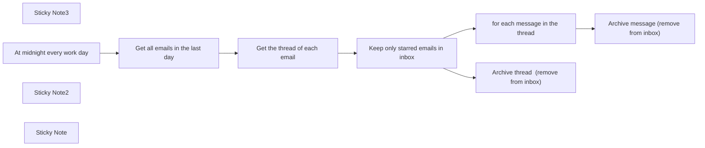

## Fluxo (.json) :

```json
{
  "nodes": [
    {
      "id": "b1afd02d-6edf-4540-bf32-09d87cb8a27b",
      "name": "Sticky Note3",
      "type": "n8n-nodes-base.stickyNote",
      "position": [
        320,
        220
      ],
      "parameters": {
        "color": 5,
        "width": 379,
        "height": 80,
        "content": "### 👨‍🎤 Setup\n1. Add your Gmail creds"
      },
      "typeVersion": 1
    },
    {
      "id": "3481e6c3-7706-4c7f-8ca6-c96f76d82021",
      "name": "At midnight every work day",
      "type": "n8n-nodes-base.scheduleTrigger",
      "position": [
        400,
        340
      ],
      "parameters": {
        "rule": {
          "interval": [
            {
              "field": "cronExpression",
              "expression": "0 0 * * 1-5"
            }
          ]
        }
      },
      "typeVersion": 1
    },
    {
      "id": "3c74e4fd-e919-4acb-8092-658f2e71513b",
      "name": "Sticky Note2",
      "type": "n8n-nodes-base.stickyNote",
      "position": [
        380,
        520
      ],
      "parameters": {
        "color": 7,
        "width": 202,
        "height": 100,
        "content": "👆 Set your schedule. I use this for work emails. For personal emails, I run this daily."
      },
      "typeVersion": 1
    },
    {
      "id": "de421702-d012-4ea1-826e-1a4756ff4856",
      "name": "Get all emails in the last day",
      "type": "n8n-nodes-base.gmail",
      "position": [
        620,
        340
      ],
      "parameters": {
        "filters": {
          "q": "label:inbox",
          "receivedBefore": "={{ $now.minus({days: 1}) }}"
        },
        "resource": "thread",
        "returnAll": true
      },
      "credentials": {
        "gmailOAuth2": {
          "id": "8",
          "name": "Work Gmail account"
        }
      },
      "retryOnFail": true,
      "typeVersion": 2
    },
    {
      "id": "ef43b756-5f9c-4c8d-830a-8ccb71562618",
      "name": "Get the thread of each email",
      "type": "n8n-nodes-base.gmail",
      "position": [
        840,
        340
      ],
      "parameters": {
        "options": {},
        "resource": "thread",
        "threadId": "={{ $json.id }}",
        "operation": "get"
      },
      "credentials": {
        "gmailOAuth2": {
          "id": "8",
          "name": "Work Gmail account"
        }
      },
      "retryOnFail": true,
      "typeVersion": 2
    },
    {
      "id": "bfc3b7e1-651a-4eb5-8882-b21d120d982b",
      "name": "Keep only starred emails in inbox",
      "type": "n8n-nodes-base.filter",
      "position": [
        1060,
        340
      ],
      "parameters": {
        "conditions": {
          "boolean": [
            {
              "value1": "={{ JSON.stringify($json.messages).includes('STARRED') }}"
            }
          ]
        }
      },
      "typeVersion": 1
    },
    {
      "id": "3d8145dc-577d-4e9b-83a7-fdf06afa1b96",
      "name": "for each message in the thread",
      "type": "n8n-nodes-base.itemLists",
      "position": [
        1480,
        520
      ],
      "parameters": {
        "options": {},
        "fieldToSplitOut": "messages"
      },
      "typeVersion": 2
    },
    {
      "id": "1a9083a8-ffd2-403e-bf53-9b9eee87ff5b",
      "name": "Archive message (remove from inbox)",
      "type": "n8n-nodes-base.gmail",
      "position": [
        1700,
        520
      ],
      "parameters": {
        "labelIds": "=INBOX",
        "messageId": "={{ $json.id }}",
        "operation": "removeLabels"
      },
      "credentials": {
        "gmailOAuth2": {
          "id": "8",
          "name": "Work Gmail account"
        }
      },
      "retryOnFail": true,
      "typeVersion": 2
    },
    {
      "id": "c51240d0-88cb-461b-82ba-929a2d8a9dde",
      "name": "Archive thread  (remove from inbox)",
      "type": "n8n-nodes-base.gmail",
      "position": [
        1340,
        300
      ],
      "parameters": {
        "labelIds": "=INBOX",
        "resource": "thread",
        "threadId": "={{ $json.id }}",
        "operation": "removeLabels"
      },
      "credentials": {
        "gmailOAuth2": {
          "id": "8",
          "name": "Work Gmail account"
        }
      },
      "retryOnFail": true,
      "typeVersion": 2
    },
    {
      "id": "3ca7074f-c912-456c-92e4-08cac8833471",
      "name": "Sticky Note",
      "type": "n8n-nodes-base.stickyNote",
      "position": [
        1060,
        520
      ],
      "parameters": {
        "color": 7,
        "width": 202,
        "height": 100,
        "content": "⭐ Keep starred emails in inbox.. Archive everything else!"
      },
      "typeVersion": 1
    }
  ],
  "pinData": {},
  "connections": {
    "At midnight every work day": {
      "main": [
        [
          {
            "node": "Get all emails in the last day",
            "type": "main",
            "index": 0
          }
        ]
      ]
    },
    "Get the thread of each email": {
      "main": [
        [
          {
            "node": "Keep only starred emails in inbox",
            "type": "main",
            "index": 0
          }
        ]
      ]
    },
    "Get all emails in the last day": {
      "main": [
        [
          {
            "node": "Get the thread of each email",
            "type": "main",
            "index": 0
          }
        ]
      ]
    },
    "for each message in the thread": {
      "main": [
        [
          {
            "node": "Archive message (remove from inbox)",
            "type": "main",
            "index": 0
          }
        ]
      ]
    },
    "Keep only starred emails in inbox": {
      "main": [
        [
          {
            "node": "Archive thread  (remove from inbox)",
            "type": "main",
            "index": 0
          },
          {
            "node": "for each message in the thread",
            "type": "main",
            "index": 0
          }
        ]
      ]
    }
  }
}
```

<a id="template-390"></a>

## Template 390 - Salvar ideias do Slack em planilha

- **Nome:** Salvar ideias do Slack em planilha
- **Descrição:** Recebe comandos do Slack (/idea) e registra as ideias em uma planilha do Google Sheets, enviando uma mensagem de acompanhamento ao autor.
- **Funcionalidade:** • Receber comando via Slash Command: captura a submissão feita pelo usuário no Slack usando o comando /idea.
• Filtrar por comando: processa apenas entradas cujo comando seja /idea, permitindo adicionar outros comandos no futuro.
• Gravar na planilha: adiciona ou atualiza uma linha na Planilha Google com as colunas Name (texto da ideia) e Creator (nome do usuário).
• Enviar mensagem de acompanhamento: envia uma mensagem de retorno ao usuário via URL de resposta do Slack, pedindo mais detalhes e fornecendo o link para a planilha.
• Configuração da planilha: permite definir a URL da planilha para onde os dados serão salvos, facilitando a configuração inicial e a troca de ambiente.
- **Ferramentas:** • Slack: recebe o comando /idea e fornece a URL de resposta para envio de mensagens ao usuário.
• Planilhas Google: armazena as entradas em colunas Name e Creator para registro e acompanhamento das ideias.

## Fluxo visual

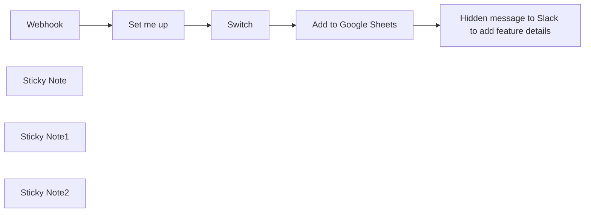

## Fluxo (.json) :

```json
{
  "meta": {
    "instanceId": "257476b1ef58bf3cb6a46e65fac7ee34a53a5e1a8492d5c6e4da5f87c9b82833",
    "templateId": "2141"
  },
  "nodes": [
    {
      "id": "ec952e64-698b-4e3a-a82d-4474a3bf8b6b",
      "name": "Webhook",
      "type": "n8n-nodes-base.webhook",
      "position": [
        900,
        460
      ],
      "webhookId": "0f85cfa2-29d7-48c8-bea1-298a61a07b77",
      "parameters": {
        "path": "slack-trigger",
        "options": {},
        "httpMethod": "POST"
      },
      "typeVersion": 1
    },
    {
      "id": "c6bc7004-9bec-48a3-99f2-e0d89e32730c",
      "name": "Sticky Note",
      "type": "n8n-nodes-base.stickyNote",
      "position": [
        380,
        240
      ],
      "parameters": {
        "color": 7,
        "width": 446,
        "height": 321,
        "content": "## Needed pre-work: Add a Slack App\n1. Visit https://api.slack.com/apps, click on `New App` and choose a name and workspace.\n2. Click on `OAuth & Permissions` and scroll down to Scopes -> Bot token Scopes\n3. Add the `chat:write` scope\n4. Head over to `Slash Commands` and click on `Create New Command`\n5. Use `/idea` as the command\n6. Copy the test URL from the **Webhook** node into `Request URL`\n7. Add whatever feels best to the description and usage hint\n8. Go to `Install app` and click install"
      },
      "typeVersion": 1
    },
    {
      "id": "e8850a88-b91a-4496-b8d2-a391f17e67ad",
      "name": "Sticky Note1",
      "type": "n8n-nodes-base.stickyNote",
      "position": [
        1100,
        198.48837209302332
      ],
      "parameters": {
        "color": 5,
        "width": 331,
        "height": 404.36834060988355,
        "content": "## Setup\n1. Create a Google Sheets document with the columns `Name` and `Creator`\n2. Add your Google Sheets credentials \n3. Fill the setup node below\n4. Create your Slack app (*see other sticky*)\n5. Click `Test` workflow and use the `/idea` comment in Slack\n6. Activate the workflow and exchange the Request URL with the production URL from the webhook"
      },
      "typeVersion": 1
    },
    {
      "id": "f1814a18-9301-4e86-9023-e16c5704db65",
      "name": "Set me up",
      "type": "n8n-nodes-base.set",
      "position": [
        1220,
        460
      ],
      "parameters": {
        "options": {},
        "assignments": {
          "assignments": [
            {
              "id": "9bcc3fa7-a09e-48f0-b4ff-2c78264dec2d",
              "name": "Google Sheets URL",
              "type": "string",
              "value": "https://docs.google.com/spreadsheets/d/17mugx8JYjbxaTMK9aqDkJywbc0NlNmStGYq-M5fKmG8/edit#gid=0"
            }
          ]
        }
      },
      "typeVersion": 3.3
    },
    {
      "id": "4824c23f-6477-4ee7-a6a0-2b83eaf61430",
      "name": "Sticky Note2",
      "type": "n8n-nodes-base.stickyNote",
      "position": [
        1460,
        380
      ],
      "parameters": {
        "color": 7,
        "height": 224.48192284396475,
        "content": "You can easily support more commands, like `/bug` or `/pain` here"
      },
      "typeVersion": 1
    },
    {
      "id": "f8966efa-0576-48b9-89fe-bf49f10d703b",
      "name": "Switch",
      "type": "n8n-nodes-base.switch",
      "position": [
        1520,
        460
      ],
      "parameters": {
        "rules": {
          "values": [
            {
              "outputKey": "New idea",
              "conditions": {
                "options": {
                  "leftValue": "",
                  "caseSensitive": true,
                  "typeValidation": "strict"
                },
                "combinator": "and",
                "conditions": [
                  {
                    "operator": {
                      "type": "string",
                      "operation": "equals"
                    },
                    "leftValue": "={{ $('Webhook').item.json.body.command }}",
                    "rightValue": "/idea"
                  }
                ]
              },
              "renameOutput": true
            },
            {
              "outputKey": "Add more here",
              "conditions": {
                "options": {
                  "leftValue": "",
                  "caseSensitive": true,
                  "typeValidation": "strict"
                },
                "combinator": "and",
                "conditions": [
                  {
                    "id": "25221a2c-18e9-47f6-a112-0edc85b63cda",
                    "operator": {
                      "name": "filter.operator.equals",
                      "type": "string",
                      "operation": "equals"
                    },
                    "leftValue": "={{ $('Webhook').item.json.body.command }}",
                    "rightValue": "/some-other-command"
                  }
                ]
              },
              "renameOutput": true
            }
          ]
        },
        "options": {}
      },
      "typeVersion": 3
    },
    {
      "id": "1caf810e-8b40-4430-8840-8e17a176b67a",
      "name": "Add to Google Sheets",
      "type": "n8n-nodes-base.googleSheets",
      "position": [
        1780,
        360
      ],
      "parameters": {
        "columns": {
          "value": {
            "Name": "={{ $('Webhook').item.json.body.text }}",
            "Creator": "={{ $('Webhook').item.json.body.user_name }}"
          },
          "schema": [
            {
              "id": "Name",
              "type": "string",
              "display": true,
              "removed": false,
              "required": false,
              "displayName": "Name",
              "defaultMatch": false,
              "canBeUsedToMatch": true
            },
            {
              "id": "Creator",
              "type": "string",
              "display": true,
              "required": false,
              "displayName": "Creator",
              "defaultMatch": false,
              "canBeUsedToMatch": true
            }
          ],
          "mappingMode": "defineBelow",
          "matchingColumns": [
            "Name"
          ]
        },
        "options": {
          "cellFormat": "USER_ENTERED"
        },
        "operation": "appendOrUpdate",
        "sheetName": {
          "__rl": true,
          "mode": "list",
          "value": "gid=0",
          "cachedResultUrl": "https://docs.google.com/spreadsheets/d/17mugx8JYjbxaTMK9aqDkJywbc0NlNmStGYq-M5fKmG8/edit#gid=0",
          "cachedResultName": "Sheet1"
        },
        "documentId": {
          "__rl": true,
          "mode": "url",
          "value": "={{ $json['Google Sheets URL'] }}"
        }
      },
      "typeVersion": 4.3
    },
    {
      "id": "51f80b29-4b8c-4e2a-9da9-a7409763af0c",
      "name": "Hidden message to Slack to add feature details",
      "type": "n8n-nodes-base.httpRequest",
      "position": [
        2000,
        360
      ],
      "parameters": {
        "url": "={{ $('Webhook').item.json.body.response_url }}",
        "method": "POST",
        "options": {},
        "sendBody": true,
        "bodyParameters": {
          "parameters": [
            {
              "name": "text",
              "value": "=Thanks for adding the idea `{{ $('Webhook').item.json[\"body\"][\"text\"] }}` <@{{$('Webhook').item.json[\"body\"][\"user_id\"]}}> :rocket: Please make sure to add some details and a hypothesis to it to make it easier for us to work with it.\n\n:point_right: <{{ $('Set me up').item.json[\"Google Sheets URL\"] }}|Add your details here>"
            }
          ]
        }
      },
      "typeVersion": 3
    }
  ],
  "pinData": {},
  "connections": {
    "Switch": {
      "main": [
        [
          {
            "node": "Add to Google Sheets",
            "type": "main",
            "index": 0
          }
        ]
      ]
    },
    "Webhook": {
      "main": [
        [
          {
            "node": "Set me up",
            "type": "main",
            "index": 0
          }
        ]
      ]
    },
    "Set me up": {
      "main": [
        [
          {
            "node": "Switch",
            "type": "main",
            "index": 0
          }
        ]
      ]
    },
    "Add to Google Sheets": {
      "main": [
        [
          {
            "node": "Hidden message to Slack to add feature details",
            "type": "main",
            "index": 0
          }
        ]
      ]
    }
  }
}
```

<a id="template-391"></a>

## Template 391 - Monitoramento de preços - Zalando

- **Nome:** Monitoramento de preços - Zalando
- **Descrição:** Monitora preços de produtos do Zalando, registra histórico de preços e notifica por email quando o preço atingir o valor desejado.
- **Funcionalidade:** • Coleta de produtos via formulário web: permite adicionar links de produtos e o preço alvo desejado.
• Agendamento de checagens: executa verificações periódicas definidas pelo usuário.
• Leitura da lista de produtos: consulta uma planilha que contém os produtos a serem monitorados.
• Raspagem da página do produto: acessa a página do produto para obter o HTML e extrair informações.
• Formatação dos dados: extrai e formata preço, nome, link e data de atualização a partir do HTML.
• Registro do histórico: acrescenta uma entrada na planilha de histórico com o preço e a data atual.
• Atualização da planilha de produtos: atualiza a linha do produto na planilha principal com o preço e nome mais recentes.
• Alerta de redução de preço: compara o preço atual com o preço alvo definido e aciona uma notificação se estiver abaixo.
• Notificação por email: envia um email com detalhes do produto quando o preço reduzir abaixo do alvo.
- **Ferramentas:** • Formulário web: interface para o usuário cadastrar o link do produto e o preço alvo.
• Google Sheets: armazena a lista de produtos e o histórico de preços.
• Gmail: serviço utilizado para enviar notificações por email sobre reduções de preço.
• Zalando (site): fonte dos dados do produto, cujas páginas são raspadas para obter preço e nome.

## Fluxo visual

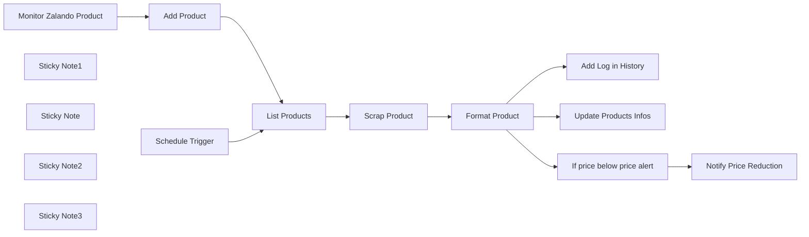

## Fluxo (.json) :

```json
{
  "nodes": [
    {
      "id": "db39e47c-df1f-4fec-86e5-fc391cce68da",
      "name": "Add Log in History",
      "type": "n8n-nodes-base.googleSheets",
      "position": [
        1360,
        540
      ],
      "parameters": {
        "columns": {
          "value": {},
          "schema": [
            {
              "id": "price",
              "type": "string",
              "display": true,
              "removed": false,
              "required": false,
              "displayName": "price",
              "defaultMatch": false,
              "canBeUsedToMatch": true
            },
            {
              "id": "name",
              "type": "string",
              "display": true,
              "removed": false,
              "required": false,
              "displayName": "name",
              "defaultMatch": false,
              "canBeUsedToMatch": true
            },
            {
              "id": "link",
              "type": "string",
              "display": true,
              "removed": false,
              "required": false,
              "displayName": "link",
              "defaultMatch": false,
              "canBeUsedToMatch": true
            },
            {
              "id": "update",
              "type": "string",
              "display": true,
              "removed": false,
              "required": false,
              "displayName": "update",
              "defaultMatch": false,
              "canBeUsedToMatch": true
            }
          ],
          "mappingMode": "autoMapInputData",
          "matchingColumns": [
            "update"
          ]
        },
        "options": {},
        "operation": "appendOrUpdate",
        "sheetName": {
          "__rl": true,
          "mode": "list",
          "value": 440562612,
          "cachedResultUrl": "https://docs.google.com/spreadsheets/d/1sM66Rk10ZOhQKbawVB-xZ2WYhBeSr6wnJqvX6Aspbkg/edit#gid=440562612",
          "cachedResultName": "Pricing History"
        },
        "documentId": {
          "__rl": true,
          "mode": "list",
          "value": "1sM66Rk10ZOhQKbawVB-xZ2WYhBeSr6wnJqvX6Aspbkg",
          "cachedResultUrl": "https://docs.google.com/spreadsheets/d/1sM66Rk10ZOhQKbawVB-xZ2WYhBeSr6wnJqvX6Aspbkg/edit?usp=drivesdk",
          "cachedResultName": "Zalando Links"
        }
      },
      "credentials": {
        "googleSheetsOAuth2Api": {
          "id": "1nTQmlgxR0AJJDGA",
          "name": "n8ninja - Sheet"
        }
      },
      "typeVersion": 4.3
    },
    {
      "id": "56733bdb-8dc7-4c78-9df2-5ee147afe061",
      "name": "Update Products Infos",
      "type": "n8n-nodes-base.googleSheets",
      "position": [
        1360,
        360
      ],
      "parameters": {
        "columns": {
          "value": {},
          "schema": [
            {
              "id": "link",
              "type": "string",
              "display": true,
              "removed": false,
              "required": false,
              "displayName": "link",
              "defaultMatch": false,
              "canBeUsedToMatch": true
            },
            {
              "id": "price",
              "type": "string",
              "display": true,
              "required": false,
              "displayName": "price",
              "defaultMatch": false,
              "canBeUsedToMatch": true
            },
            {
              "id": "name",
              "type": "string",
              "display": true,
              "required": false,
              "displayName": "name",
              "defaultMatch": false,
              "canBeUsedToMatch": true
            },
            {
              "id": "row_number",
              "type": "string",
              "display": true,
              "removed": true,
              "readOnly": true,
              "required": false,
              "displayName": "row_number",
              "defaultMatch": false,
              "canBeUsedToMatch": true
            }
          ],
          "mappingMode": "autoMapInputData",
          "matchingColumns": [
            "link"
          ]
        },
        "options": {},
        "operation": "update",
        "sheetName": {
          "__rl": true,
          "mode": "list",
          "value": "gid=0",
          "cachedResultUrl": "https://docs.google.com/spreadsheets/d/1sM66Rk10ZOhQKbawVB-xZ2WYhBeSr6wnJqvX6Aspbkg/edit#gid=0",
          "cachedResultName": "Links"
        },
        "documentId": {
          "__rl": true,
          "mode": "list",
          "value": "1sM66Rk10ZOhQKbawVB-xZ2WYhBeSr6wnJqvX6Aspbkg",
          "cachedResultUrl": "https://docs.google.com/spreadsheets/d/1sM66Rk10ZOhQKbawVB-xZ2WYhBeSr6wnJqvX6Aspbkg/edit?usp=drivesdk",
          "cachedResultName": "Zalando Links"
        }
      },
      "credentials": {
        "googleSheetsOAuth2Api": {
          "id": "1nTQmlgxR0AJJDGA",
          "name": "n8ninja - Sheet"
        }
      },
      "typeVersion": 4.3
    },
    {
      "id": "f87196d7-26ec-41d6-af04-c4b57f3ea899",
      "name": "If price below price alert",
      "type": "n8n-nodes-base.if",
      "position": [
        1360,
        740
      ],
      "parameters": {
        "options": {},
        "conditions": {
          "options": {
            "leftValue": "",
            "caseSensitive": true,
            "typeValidation": "strict"
          },
          "combinator": "and",
          "conditions": [
            {
              "id": "0466f2d9-de7a-4017-933a-acda8fb84191",
              "operator": {
                "type": "number",
                "operation": "lte"
              },
              "leftValue": "={{ parseFloat($json.price) }}",
              "rightValue": "={{ parseFloat($('List Products').item.json.price_alert) }}"
            }
          ]
        }
      },
      "typeVersion": 2
    },
    {
      "id": "2663fb7a-08ab-45b7-b6d3-4eea495185c4",
      "name": "List Products",
      "type": "n8n-nodes-base.googleSheets",
      "position": [
        600,
        540
      ],
      "parameters": {
        "options": {},
        "sheetName": {
          "__rl": true,
          "mode": "list",
          "value": "gid=0",
          "cachedResultUrl": "https://docs.google.com/spreadsheets/d/1sM66Rk10ZOhQKbawVB-xZ2WYhBeSr6wnJqvX6Aspbkg/edit#gid=0",
          "cachedResultName": "Links"
        },
        "documentId": {
          "__rl": true,
          "mode": "list",
          "value": "1sM66Rk10ZOhQKbawVB-xZ2WYhBeSr6wnJqvX6Aspbkg",
          "cachedResultUrl": "https://docs.google.com/spreadsheets/d/1sM66Rk10ZOhQKbawVB-xZ2WYhBeSr6wnJqvX6Aspbkg/edit?usp=drivesdk",
          "cachedResultName": "Zalando Links"
        }
      },
      "credentials": {
        "googleSheetsOAuth2Api": {
          "id": "1nTQmlgxR0AJJDGA",
          "name": "n8ninja - Sheet"
        }
      },
      "typeVersion": 4.3
    },
    {
      "id": "5ae11ccd-ed5e-4e08-8f42-b3a1c45323df",
      "name": "Format Product",
      "type": "n8n-nodes-base.set",
      "position": [
        1060,
        540
      ],
      "parameters": {
        "options": {},
        "assignments": {
          "assignments": [
            {
              "id": "77ef948b-e4a4-4695-a5e6-bbb21b99f177",
              "name": "price",
              "type": "string",
              "value": "={{ parseFloat($json.data.split('\"twitter:data1\" content=\"')[1].split('\"')[0].split('&nbsp;')[1]) }}"
            },
            {
              "id": "cf241232-d85d-40d7-bf5c-6d49336d6ce1",
              "name": "name",
              "type": "string",
              "value": "={{ $json.data.split('<title>')[1].split('</title>')[0].split('-')[0] }} {{ $json.data.split('<title>')[1].split('</title>')[0].split('-')[1] }} {{ $json.data.split('<title>')[1].split('</title>')[0].split('-')[2] }}"
            },
            {
              "id": "ca07eca0-8bad-4997-a124-e8636eb07bd5",
              "name": "link",
              "type": "string",
              "value": "={{ $('List Products').item.json.link }}"
            },
            {
              "id": "c2d92a0f-56cc-4b74-bbd3-d8a1bb0d6cd7",
              "name": "update",
              "type": "string",
              "value": "={{ $now.format('D') }}"
            },
            {
              "id": "af33b7f1-8367-4f05-bc7e-03d119c3ac76",
              "name": "",
              "type": "string",
              "value": ""
            }
          ]
        }
      },
      "typeVersion": 3.3
    },
    {
      "id": "ae11877a-e83e-44c9-b6f2-b5cd0c8a3c1e",
      "name": "Schedule Trigger",
      "type": "n8n-nodes-base.scheduleTrigger",
      "position": [
        380,
        540
      ],
      "parameters": {
        "rule": {
          "interval": [
            {}
          ]
        }
      },
      "typeVersion": 1.1
    },
    {
      "id": "8361e609-0185-4939-92c4-07ec7826bdab",
      "name": "Scrap Product",
      "type": "n8n-nodes-base.httpRequest",
      "position": [
        820,
        540
      ],
      "parameters": {
        "url": "={{ $json.link }}",
        "options": {}
      },
      "typeVersion": 4.1
    },
    {
      "id": "6a98aad8-9475-4243-948a-b904cde4687a",
      "name": "Notify Price Reduction",
      "type": "n8n-nodes-base.gmail",
      "position": [
        1600,
        720
      ],
      "parameters": {
        "sendTo": "n8n.ninja@gmail.com",
        "message": "=<h3>Price reduction alert for {{ $('Format Product').item.json[\"name\"] }}</h3>\n\n<p>New price {{ $('Format Product').item.json[\"price\"] }} CHF is bellow {{ $('List Products').item.json[\"price_alert\"] }} CHF</p>\n\nView product: {{ $('List Products').item.json[\"link\"] }}\n\n\n",
        "options": {},
        "subject": "=⚠️ Price Reduction: {{ $('Format Product').item.json.name }}\n"
      },
      "credentials": {
        "gmailOAuth2": {
          "id": "DMcPDN0IHPwGmI7f",
          "name": "Gmail account"
        }
      },
      "typeVersion": 2.1
    },
    {
      "id": "427f51a9-7ebf-42df-bb97-e0a17a37d2cb",
      "name": "Monitor Zalando Product",
      "type": "n8n-nodes-base.formTrigger",
      "position": [
        380,
        280
      ],
      "webhookId": "6da9a655-b46b-454d-bb96-32e203627a20",
      "parameters": {
        "path": "6da9a655-b46b-454d-bb96-32e203627a20",
        "options": {},
        "formTitle": "Add Product",
        "formFields": {
          "values": [
            {
              "fieldLabel": "link",
              "requiredField": true
            },
            {
              "fieldType": "number",
              "fieldLabel": "price_alert",
              "requiredField": true
            }
          ]
        },
        "formDescription": "Past in a Zalando URL and the price bellow you would like to be notified"
      },
      "typeVersion": 2
    },
    {
      "id": "39711d6f-d699-415b-9a1b-3971839e7e8a",
      "name": "Add Product",
      "type": "n8n-nodes-base.googleSheets",
      "position": [
        580,
        280
      ],
      "parameters": {
        "columns": {
          "value": {
            "link": "={{ $json.link }}",
            "price_alert": "={{ $json.price_alert }}"
          },
          "schema": [
            {
              "id": "link",
              "type": "string",
              "display": true,
              "removed": false,
              "required": false,
              "displayName": "link",
              "defaultMatch": false,
              "canBeUsedToMatch": true
            },
            {
              "id": "price_alert",
              "type": "string",
              "display": true,
              "required": false,
              "displayName": "price_alert",
              "defaultMatch": false,
              "canBeUsedToMatch": true
            },
            {
              "id": "price",
              "type": "string",
              "display": true,
              "removed": true,
              "required": false,
              "displayName": "price",
              "defaultMatch": false,
              "canBeUsedToMatch": true
            },
            {
              "id": "name",
              "type": "string",
              "display": true,
              "removed": true,
              "required": false,
              "displayName": "name",
              "defaultMatch": false,
              "canBeUsedToMatch": true
            },
            {
              "id": "update",
              "type": "string",
              "display": true,
              "removed": true,
              "required": false,
              "displayName": "update",
              "defaultMatch": false,
              "canBeUsedToMatch": true
            }
          ],
          "mappingMode": "defineBelow",
          "matchingColumns": [
            "link"
          ]
        },
        "options": {},
        "operation": "appendOrUpdate",
        "sheetName": {
          "__rl": true,
          "mode": "list",
          "value": "gid=0",
          "cachedResultUrl": "https://docs.google.com/spreadsheets/d/1sM66Rk10ZOhQKbawVB-xZ2WYhBeSr6wnJqvX6Aspbkg/edit#gid=0",
          "cachedResultName": "Links"
        },
        "documentId": {
          "__rl": true,
          "mode": "list",
          "value": "1sM66Rk10ZOhQKbawVB-xZ2WYhBeSr6wnJqvX6Aspbkg",
          "cachedResultUrl": "https://docs.google.com/spreadsheets/d/1sM66Rk10ZOhQKbawVB-xZ2WYhBeSr6wnJqvX6Aspbkg/edit?usp=drivesdk",
          "cachedResultName": "Zalando Links"
        }
      },
      "credentials": {
        "googleSheetsOAuth2Api": {
          "id": "1nTQmlgxR0AJJDGA",
          "name": "n8ninja - Sheet"
        }
      },
      "typeVersion": 4.3,
      "alwaysOutputData": true
    },
    {
      "id": "881acff3-1736-4d53-8c3b-3354ec2da07b",
      "name": "Sticky Note1",
      "type": "n8n-nodes-base.stickyNote",
      "position": [
        400,
        -191
      ],
      "parameters": {
        "color": 6,
        "width": 275.01592825011585,
        "height": 439.37809705210145,
        "content": "# Setup\n### 1/ Add Your credentials\n[Google SHeet](https://docs.n8n.io/integrations/builtin/credentials/google/)\n\n### 2/ Create a Google Spreadsheet that will be your database.\nCopy this template: \nhttps://docs.google.com/spreadsheets/d/1sM66Rk10ZOhQKbawVB-xZ2WYhBeSr6wnJqvX6Aspbkg/edit?usp=sharing\n\n### 3/ Add products to monitor from this form \n# 👇"
      },
      "typeVersion": 1
    },
    {
      "id": "92ae590a-bf1d-4c17-a654-f281379fcee6",
      "name": "Sticky Note",
      "type": "n8n-nodes-base.stickyNote",
      "position": [
        1620,
        600
      ],
      "parameters": {
        "color": 6,
        "width": 275.01592825011585,
        "height": 93.37809705210145,
        "content": "### Fill with your email\n# 👇"
      },
      "typeVersion": 1
    },
    {
      "id": "8834da7f-7ca1-4cad-98b9-2335bfc81b8f",
      "name": "Sticky Note2",
      "type": "n8n-nodes-base.stickyNote",
      "position": [
        40,
        580
      ],
      "parameters": {
        "color": 6,
        "width": 275.01592825011585,
        "height": 136.37809705210145,
        "content": "### Change frequency 👉🏻\n\n(don't put less than once a day, or you will need to also add the hour in the format product node)\n"
      },
      "typeVersion": 1
    },
    {
      "id": "b1838412-6c3e-4519-8946-f6aeff0c9e8d",
      "name": "Sticky Note3",
      "type": "n8n-nodes-base.stickyNote",
      "position": [
        900,
        340
      ],
      "parameters": {
        "color": 7,
        "width": 202.64787116404852,
        "height": 85.79488430601403,
        "content": "### Crafted by the\n## [🥷 n8n.ninja](n8n.ninja)"
      },
      "typeVersion": 1
    }
  ],
  "pinData": {},
  "connections": {
    "Add Product": {
      "main": [
        [
          {
            "node": "List Products",
            "type": "main",
            "index": 0
          }
        ]
      ]
    },
    "List Products": {
      "main": [
        [
          {
            "node": "Scrap Product",
            "type": "main",
            "index": 0
          }
        ]
      ]
    },
    "Scrap Product": {
      "main": [
        [
          {
            "node": "Format Product",
            "type": "main",
            "index": 0
          }
        ]
      ]
    },
    "Format Product": {
      "main": [
        [
          {
            "node": "Add Log in History",
            "type": "main",
            "index": 0
          },
          {
            "node": "Update Products Infos",
            "type": "main",
            "index": 0
          },
          {
            "node": "If price below price alert",
            "type": "main",
            "index": 0
          }
        ]
      ]
    },
    "Schedule Trigger": {
      "main": [
        [
          {
            "node": "List Products",
            "type": "main",
            "index": 0
          }
        ]
      ]
    },
    "Monitor Zalando Product": {
      "main": [
        [
          {
            "node": "Add Product",
            "type": "main",
            "index": 0
          }
        ]
      ]
    },
    "If price below price alert": {
      "main": [
        [
          {
            "node": "Notify Price Reduction",
            "type": "main",
            "index": 0
          }
        ]
      ]
    }
  }
}
```

<a id="template-392"></a>

## Template 392 - Recuperar todos os registros do Shopify

- **Nome:** Recuperar todos os registros do Shopify
- **Descrição:** Ao clicar em executar, o fluxo conecta à conta Shopify e recupera todos os registros disponíveis por meio da API.
- **Funcionalidade:** • Início manual: o fluxo é disparado manualmente ao clicar em executar.
• Conexão autenticada com Shopify: utiliza credenciais configuradas para acessar a loja.
• Recuperação completa de dados: executa uma operação para obter todos os registros disponíveis na conta Shopify.
- **Ferramentas:** • Shopify: plataforma de comércio eletrônico usada para hospedar a loja; o fluxo acessa sua API para obter dados da loja (produtos, pedidos e outros registros).

## Fluxo visual

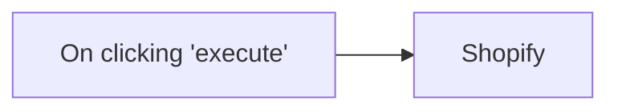

## Fluxo (.json) :

```json
{
  "nodes": [
    {
      "name": "On clicking 'execute'",
      "type": "n8n-nodes-base.manualTrigger",
      "position": [
        230,
        310
      ],
      "parameters": {},
      "typeVersion": 1
    },
    {
      "name": "Shopify",
      "type": "n8n-nodes-base.shopify",
      "position": [
        430,
        310
      ],
      "parameters": {
        "options": {},
        "operation": "getAll"
      },
      "credentials": {
        "shopifyApi": "shopify_creds"
      },
      "typeVersion": 1
    }
  ],
  "connections": {
    "On clicking 'execute'": {
      "main": [
        [
          {
            "node": "Shopify",
            "type": "main",
            "index": 0
          }
        ]
      ]
    }
  }
}
```

<a id="template-393"></a>

## Template 393 - Gerador SEO de blogs com IA e Telegram

- **Nome:** Gerador SEO de blogs com IA e Telegram
- **Descrição:** Automatiza a pesquisa, criação e entrega de posts de blog otimizados para SEO a partir de consultas enviadas por formulário ou Telegram.
- **Funcionalidade:** • Receber consultas de pesquisa: aceita tópicos e briefs enviados por um formulário web ou por mensagens no Telegram.
• Realizar pesquisa atualizada: executa buscas para coletar informações e fontes recentes antes da redação.
• Gerar conteúdo do blog otimizado para SEO: produz rascunhos extensos e estruturados, incluindo título, introdução, subtítulos e CTA, seguindo requisitos de estilo.
• Criar slug, título e meta descrição: gera metadados concisos e alinhados a diretrizes de SEO e do cliente.
• Extrair e estruturar metadados: valida e formata saídas em JSON com campos como título, subtítulo, conteúdo e hashtags.
• Agregar e combinar detalhes do blog: compila resultados de vários passos em um conteúdo final pronto para publicação.
• Enviar conteúdo por Telegram: publica ou envia o post final e materiais derivados para um chat específico.
• Armazenar contexto de sessão: mantém um histórico limitado para preservar contexto entre execuções e melhorar continuidade.
- **Ferramentas:** • OpenAI (gpt-4o-mini): modelo de linguagem usado para gerar o conteúdo do blog e criar metadados estruturados.
• Perplexity: serviço de pesquisa para obter informações atualizadas, fontes e dados de apoio.
• Telegram: canal de comunicação para receber triggers e distribuir o conteúdo final aos destinatários.
• Formulário Web / Webhook: interface para que usuários submetam queries e briefs que disparam a automação.

## Fluxo visual

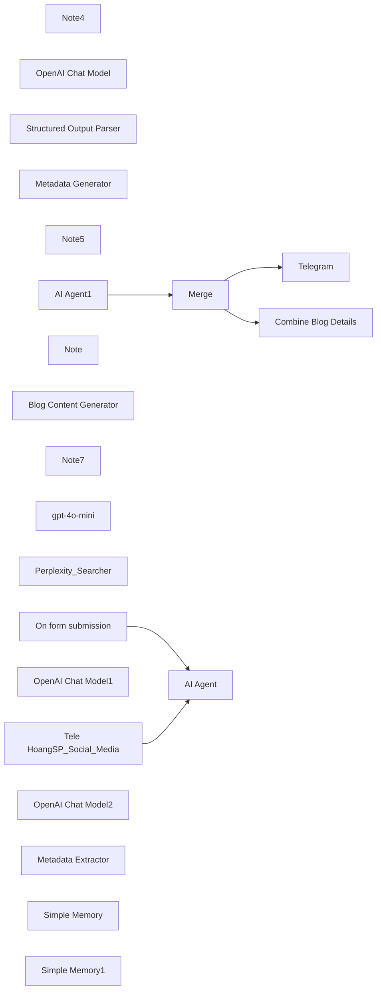

## Fluxo (.json) :

```json
{
  "id": "Xfz2YRxH6qFfpqHw",
  "meta": {
    "instanceId": "2b69b24ad1a51b447e1a0d6f8c70b16aca715ccfaf123eb531f92865766fce1c",
    "templateId": "seo_blog_generator_gpt4o_perplexity_telegram",
    "templateCredsSetupCompleted": true
  },
  "name": "SEO Blog Generator with GPT-4o, Perplexity, and Telegram Integration",
  "tags": [],
  "nodes": [
    {
      "id": "17ab0b24-b1eb-4e4e-a249-9889c9876fe4",
      "name": "Note4",
      "type": "n8n-nodes-base.stickyNote",
      "position": [
        880,
        180
      ],
      "parameters": {
        "color": 3,
        "width": 420,
        "height": 440,
        "content": "## Write SEO Optimized Blog Post\n\n\n"
      },
      "typeVersion": 1
    },
    {
      "id": "6bf602e0-ad29-47e6-93d7-79fd2a4228c2",
      "name": "OpenAI Chat Model",
      "type": "@n8n/n8n-nodes-langchain.lmChatOpenAi",
      "position": [
        1480,
        -120
      ],
      "parameters": {
        "model": {
          "__rl": true,
          "mode": "list",
          "value": "gpt-4o-mini"
        },
        "options": {}
      },
      "credentials": {
        "openAiApi": {
          "id": "qX50oKgUA6tXfxne",
          "name": "ChatBot Content"
        }
      },
      "typeVersion": 1.2
    },
    {
      "id": "8a3739ac-9492-400c-b5b8-eeb305647752",
      "name": "Structured Output Parser",
      "type": "@n8n/n8n-nodes-langchain.outputParserStructured",
      "position": [
        1740,
        -100
      ],
      "parameters": {
        "jsonSchemaExample": "{\n\"slug\": \"rpo-benefits-recruitment\",\n\"title\": \"7 Key Advantages of RPO for Modern Recruitment\",\n\"meta\": \"Explore how Recruitment Process Outsourcing (RPO) enhances hiring efficiency, reduces costs, and expands talent pools for businesses seeking top candidates.\"\n}"
      },
      "typeVersion": 1.2
    },
    {
      "id": "af02ee94-4c26-4be5-bd21-09e020bff876",
      "name": "Metadata Generator",
      "type": "@n8n/n8n-nodes-langchain.agent",
      "position": [
        1500,
        -300
      ],
      "parameters": {
        "text": "=**Create a slug, blog post title, and meta description for the following blog post:**\n\n{{ $json.output }}\n\n**Slug Guidelines:**\n- Keep it concise (4-5 words maximum).\n- Include the primary keyword related to recruitment or HR.\n- Use hyphens to separate words.\n- Avoid unnecessary words, articles, or prepositions.\n- Ensure it reflects the main topic of the blog post.\n- Make it readable and relevant for both users and search engines.\n\n**Title Guidelines:**\n- Avoid AI words like \"Transform\" or \"Revolutionize\" and similar overused terms.\n- Avoid using a colon (:) in the title.\n- Never structure it as a primary/secondary title separated by a colon.\n- Include the primary keyword related to recruitment or HR (e.g., 'AI in recruitment' or 'talent acquisition trends').\n- Clearly inform users what they can expect from reading the blog post.\n- Be concise and engaging, ideally 50-60 characters long.\n- Incorporate power words that appeal to HR professionals and recruiters.\n\n**Meta Description Guidelines:**\n- Avoid AI words like \"Transform\" or \"Revolutionize\" and similar overused terms.\n- Be concise: Limit to 150-160 characters to ensure full visibility in search results.\n- Include keywords: Naturally incorporate primary recruitment-related keywords to enhance relevance and visibility.\n- Provide value: Clearly convey the benefits or insights readers will gain from the article.\n- Be engaging: Use action-oriented language or a thought-provoking question to encourage clicks.\n- Align with content: Accurately reflect the blog post's content to meet user expectations and reduce bounce rates.\n- Highlight expertise: Subtly emphasize SocialFind's authority in the recruitment field.\n\nYour output must be a single valid JSON object with these 3 fields:\n-slug: The slug\n-title: The blog post title\n-meta: The meta description  \n\nEach should be presented without any additional text, explanation, quotation marks, or formatting.\n",
        "options": {},
        "promptType": "define",
        "hasOutputParser": true
      },
      "typeVersion": 1.8
    },
    {
      "id": "4756c8f2-406e-4a56-adb0-0c4708dabe6a",
      "name": "Merge",
      "type": "n8n-nodes-base.merge",
      "position": [
        2020,
        140
      ],
      "parameters": {
        "mode": "combine",
        "options": {},
        "combineBy": "combineByPosition"
      },
      "typeVersion": 3
    },
    {
      "id": "bf05eaf3-2522-488e-893d-1ed9b2ed88b2",
      "name": "Note5",
      "type": "n8n-nodes-base.stickyNote",
      "position": [
        220,
        240
      ],
      "parameters": {
        "color": 4,
        "width": 620,
        "height": 300,
        "content": "## Perplexity Research\n\n\n"
      },
      "typeVersion": 1
    },
    {
      "id": "22e8c044-ed98-495a-957e-c5e3fecc2b7d",
      "name": "On form submission",
      "type": "n8n-nodes-base.formTrigger",
      "position": [
        -260,
        260
      ],
      "webhookId": "a29cbcd3-9d11-4f7c-9aad-14681c356c53",
      "parameters": {
        "options": {},
        "formTitle": "Blog Factory",
        "formFields": {
          "values": [
            {
              "fieldType": "textarea",
              "fieldLabel": "Research Query",
              "placeholder": "=What are the most common challenges facing Canadian employers regarding recruitment and why would they want to hire a recruiting firm to solve these problems.",
              "requiredField": true
            }
          ]
        },
        "formDescription": "Create SEO optimized blog posts"
      },
      "typeVersion": 2.2
    },
    {
      "id": "6e6d4952-793f-4dc5-8d29-219d420149a9",
      "name": "Note",
      "type": "n8n-nodes-base.stickyNote",
      "position": [
        360,
        580
      ],
      "parameters": {
        "width": 460,
        "height": 500,
        "content": "## Sample Generic Search Terms and write content\n\nYou are part of a marketing team that creates high-quality blog posts for the Men's Health Consulting and Workflow Automation industry based in Da Nang City, Vietnam.\n\nYour goal is to create engaging, SEO-optimized content that positions you as an authority in the Men's Health Consulting industry and attracts leads.\n\nUpon receiving the information, your team will post a blog on the most trending topics in Men's Health Consulting and Care. As a copywriter/blogger, you are provided with the following information:\n\n- Query: The main topic for the blog post, representing the most trending news in the Men's Health field.\n\n- Other Keywords: A list of high-volume keywords related to Men's Health Consulting and Support and Care. Incorporate these keywords naturally into the blog post when relevant, without forcing it or changing the meaning of the post.\n\n- Research findings: Detailed information from credible sources relevant to the blog topic. Your post should be based on this research.\n\nWith this information, write a comprehensive blog post that:\n\n- Include the query in the blog title, H2 heading, and the beginning of the introduction.\n\n- Incorporate all the details from the research findings, including the source URL for potential hyperlinks.\n\n- Be detailed and informative, demonstrating the company's expertise in Urology consulting and the support and care process for automation.\n\n- Use a professional but engaging tone, highlighting interesting developments and challenges in the industry.\n\n- Speak in a natural and logical manner, making it easy for readers to follow.\n\n- Be 1500 to 2000 words long.\n\n- Be written at a level that can be read by people who are interested in learning more. And want to receive additional care and support to solve the problem of interest.\n\nAdditional Requirements:\n- Include practical lessons or helpful tips for recruiters and HR professionals.\n\n- Highlight how the topic relates to the company's services or expertise.\n\n- Include a call to action (CTA) that encourages readers to explore the company's services or contact you for more information.\n\nCreate an entire blog post draft in your first output. Don't stop or cut it short.\n\nYour output should be the blog post and nothing else.\n\nHere are the details for this blog post project:\nQuery: [Execute previous nodes for preview]"
      },
      "typeVersion": 1
    },
    {
      "id": "f81c9505-111f-473a-94b6-c79364410810",
      "name": "Blog Content Generator",
      "type": "@n8n/n8n-nodes-langchain.agent",
      "position": [
        920,
        260
      ],
      "parameters": {
        "text": "=You are part of a marketing team that creates high-quality blog posts for the Men's Health Consulting and Workflow Automation industry based in Da Nang City, Vietnam.\n\nYour goal is to create engaging, SEO-optimized content that positions you as an authority in the Men's Health Consulting industry and attracts leads.\n\nUpon receiving the information, your team will post a blog on the most trending topics in Men's Health Consulting and Care. As a copywriter/blogger, you are provided with the following information:\n\n- Query: The main topic for the blog post, representing the most trending news in the Men's Health field.\n\n- Other Keywords: A list of high-volume keywords related to Men's Health Consulting and Support and Care. Incorporate these keywords naturally into the blog post when relevant, without forcing it or changing the meaning of the post.\n\n- Research findings: Detailed information from credible sources relevant to the blog topic. Your post should be based on this research.\n\nWith this information, write a comprehensive blog post that:\n\n- Include the query in the blog title, H2 heading, and the beginning of the introduction.\n\n- Incorporate all the details from the research findings, including the source URL for potential hyperlinks.\n\n- Be detailed and informative, demonstrating the company's expertise in Urology consulting and the support and care process for automation.\n\n- Use a professional but engaging tone, highlighting interesting developments and challenges in the industry.\n\n- Speak in a natural and logical manner, making it easy for readers to follow.\n\n- Be 1500 to 2000 words long.\n\n- Be written at a level that can be read by people who are interested in learning more. And want to receive additional care and support to solve the problem of interest.\n\nAdditional Requirements:\n- Include practical lessons or helpful tips for recruiters and HR professionals.\n\n- Highlight how the topic relates to the company's services or expertise.\n\n- Include a call to action (CTA) that encourages readers to explore the company's services or contact you for more information.\n\nCreate an entire blog post draft in your first output. Don't stop or cut it short.\n\nYour output should be the blog post and nothing else.\n\nHere are the details for this blog post project:\nQuery: {{ $json.output }}\n\n\n\n\n",
        "options": {},
        "promptType": "define"
      },
      "typeVersion": 1.8
    },
    {
      "id": "1ee6bb8f-6441-4ed9-83e0-d0839b2d0e01",
      "name": "Note7",
      "type": "n8n-nodes-base.stickyNote",
      "position": [
        1440,
        -380
      ],
      "parameters": {
        "color": 7,
        "width": 440,
        "height": 440,
        "content": "## Create Title, Slug & Meta\n\n\n"
      },
      "typeVersion": 1
    },
    {
      "id": "30f0fa84-9918-4bf6-86e4-ef8f1dcf079c",
      "name": "gpt-4o-mini",
      "type": "@n8n/n8n-nodes-langchain.lmChatOpenAi",
      "position": [
        920,
        460
      ],
      "parameters": {
        "model": {
          "__rl": true,
          "mode": "list",
          "value": "gpt-4o-mini"
        },
        "options": {}
      },
      "credentials": {
        "openAiApi": {
          "id": "qX50oKgUA6tXfxne",
          "name": "ChatBot Content"
        }
      },
      "typeVersion": 1.2
    },
    {
      "id": "d2d83cc5-1502-4b04-ac12-0bb351a90e58",
      "name": "Combine Blog Details",
      "type": "n8n-nodes-base.aggregate",
      "position": [
        2620,
        160
      ],
      "parameters": {
        "options": {},
        "aggregate": "aggregateAllItemData"
      },
      "typeVersion": 1
    },
    {
      "id": "bbb5b2c7-18a1-49f7-88d5-ebc0c585d128",
      "name": "Perplexity_Searcher",
      "type": "@n8n/n8n-nodes-langchain.toolWorkflow",
      "position": [
        700,
        420
      ],
      "parameters": {
        "name": "Perplexity_Searcher",
        "workflowId": {
          "__rl": true,
          "mode": "id",
          "value": "5uapJIjLLhwnhX0n"
        },
        "description": "=Tôi sử dụng AI agent này để tìm kiếm những thông tin mới nhất. Nhằm phục vụ cho việc tìm kiếm thông tin, dữ liệu với đầy đủ thông tin mới nhất.",
        "workflowInputs": {
          "value": {},
          "schema": [],
          "mappingMode": "defineBelow",
          "matchingColumns": [],
          "attemptToConvertTypes": false,
          "convertFieldsToString": false
        }
      },
      "typeVersion": 2.1
    },
    {
      "id": "e0d9a29e-2dd9-42ff-a0b8-d81c02014b05",
      "name": "Tele HoangSP_Social_Media",
      "type": "n8n-nodes-base.telegramTrigger",
      "position": [
        -260,
        440
      ],
      "webhookId": "302be40c-6f54-4447-88a9-1c415a1fd72d",
      "parameters": {
        "updates": [
          "message"
        ],
        "additionalFields": {}
      },
      "credentials": {
        "telegramApi": {
          "id": "mjSBJIunOl3D8zbe",
          "name": "Telegram account"
        }
      },
      "typeVersion": 1.1
    },
    {
      "id": "95cc8220-d484-4ec9-a191-46a749de94a2",
      "name": "AI Agent",
      "type": "@n8n/n8n-nodes-langchain.agent",
      "position": [
        480,
        260
      ],
      "parameters": {
        "text": "=Tôi là một bác sĩ y khoa làm việc trong lĩnh vực y tế, chuyên môn của tôi là các Vấn đề liên quan đến bệnh Nam Khoa. \n- Tôi muốn dùng dữ liệu này để tìm kiếm thông tin, dựa trên từ khoá mà tôi đưa và để tìm những thông tin mới nhất có liên quan. \n\n- Chuẩn bị nội dung/ nguồn cho việc viết blog.\n\n- Hãy đưa ra những list nội dung đầu dòng ngắn gọn, hiệu quả để làm nội dung chính cho những blog sắp tới.\n\nĐây là nội dung tôi đưa vào tìm kiếm: {{ $json['Research Query'] }}\nHoặc nội dung này: {{ $json.message.text }}",
        "options": {
          "systemMessage": "Bạn làm việc rất chuyên nghiệp trong lĩnh vực của mình"
        },
        "promptType": "define"
      },
      "typeVersion": 1.8
    },
    {
      "id": "1321ee35-f97d-475f-81cb-de00f833c89b",
      "name": "OpenAI Chat Model1",
      "type": "@n8n/n8n-nodes-langchain.lmChatOpenAi",
      "position": [
        420,
        420
      ],
      "parameters": {
        "model": {
          "__rl": true,
          "mode": "list",
          "value": "gpt-4o-mini"
        },
        "options": {}
      },
      "credentials": {
        "openAiApi": {
          "id": "ScDgXbCy0e7Omp6y",
          "name": "OpenAi account 3"
        }
      },
      "typeVersion": 1.2
    },
    {
      "id": "88ed96de-99da-4e8d-ba61-c7742109bc06",
      "name": "AI Agent1",
      "type": "@n8n/n8n-nodes-langchain.agent",
      "position": [
        1520,
        360
      ],
      "parameters": {
        "text": "=\nExtract a JSON object from the following content: {{ $json.output }}.\nThe object must contain the following fields:\n{\n  \"title\": string,\n  \"subtitle\": string,\n  \"content\": string,\n  \"hashtags\": [string]\n}\nIf any field is missing, infer it based on the content. Respond only with the JSON object. Do not include explanations.\n\n",
        "options": {},
        "promptType": "define",
        "hasOutputParser": true
      },
      "typeVersion": 1.8
    },
    {
      "id": "cad725b7-9360-4f4a-8f72-1034f09192b5",
      "name": "OpenAI Chat Model2",
      "type": "@n8n/n8n-nodes-langchain.lmChatOpenAi",
      "position": [
        1480,
        700
      ],
      "parameters": {
        "model": {
          "__rl": true,
          "mode": "list",
          "value": "gpt-4o-mini"
        },
        "options": {}
      },
      "credentials": {
        "openAiApi": {
          "id": "ScDgXbCy0e7Omp6y",
          "name": "OpenAi account 3"
        }
      },
      "typeVersion": 1.2
    },
    {
      "id": "5e5e91c5-787e-4c6e-99bf-a2d08638b26f",
      "name": "Metadata Extractor",
      "type": "@n8n/n8n-nodes-langchain.outputParserStructured",
      "position": [
        1740,
        640
      ],
      "parameters": {
        "schemaType": "manual",
        "inputSchema": "{\n  \"type\": \"object\",\n  \"properties\": {\n    \"title\": {\n      \"type\": \"string\"\n    },\n    \"subtitle\": {\n      \"type\": \"string\"\n    },\n    \"content\": {\n      \"type\": \"string\"\n    },\n    \"hashtags\": {\n      \"type\": \"array\",\n      \"items\": {\n        \"type\": \"string\"\n      },\n      \"maxItems\": 5\n    }\n  },\n  \"required\": [\"title\", \"content\"]\n}\n"
      },
      "typeVersion": 1.2
    },
    {
      "id": "38fd2a3b-bbc3-41d5-9d13-eb61b67709cb",
      "name": "Telegram",
      "type": "n8n-nodes-base.telegram",
      "position": [
        2620,
        380
      ],
      "webhookId": "13eeb1fb-8890-430b-b988-3e90fdf032c9",
      "parameters": {
        "text": "={{ $json.output.title }}\n{{ $json.output.title }}\n{{ $json.output.subtitle }}\n{{ $json.output.content }}",
        "chatId": "={{ $('Tele HoangSP_Social_Media').item.json.message.chat.id }}",
        "additionalFields": {
          "appendAttribution": false,
          "disable_notification": false
        }
      },
      "credentials": {
        "telegramApi": {
          "id": "1kmgeuArwvrmbfeu",
          "name": "Telegram account 2"
        }
      },
      "typeVersion": 1.2
    },
    {
      "id": "6a165afa-074d-4f2c-9f3b-2c8f02f3ae46",
      "name": "Simple Memory",
      "type": "@n8n/n8n-nodes-langchain.memoryBufferWindow",
      "position": [
        1600,
        540
      ],
      "parameters": {
        "sessionKey": "={{ $json.output }}",
        "sessionIdType": "customKey",
        "contextWindowLength": 10
      },
      "typeVersion": 1.3
    },
    {
      "id": "433b5974-6bd9-4bd8-a718-e9a1970de35b",
      "name": "Simple Memory1",
      "type": "@n8n/n8n-nodes-langchain.memoryBufferWindow",
      "position": [
        1600,
        -60
      ],
      "parameters": {
        "sessionKey": "={{ $json.output }}",
        "sessionIdType": "customKey",
        "contextWindowLength": 10
      },
      "typeVersion": 1.3
    }
  ],
  "active": false,
  "pinData": {},
  "settings": {
    "executionOrder": "v1"
  },
  "versionId": "ecebdadc-5bb8-43e7-bd42-48fd894195b1",
  "connections": {
    "Merge": {
      "main": [
        [
          {
            "node": "Telegram",
            "type": "main",
            "index": 0
          },
          {
            "node": "Combine Blog Details",
            "type": "main",
            "index": 0
          }
        ]
      ]
    },
    "AI Agent": {
      "main": [
        [
          {
            "node": "Copywriter AI Agent",
            "type": "main",
            "index": 0
          }
        ]
      ]
    },
    "Telegram": {
      "main": [
        []
      ]
    },
    "AI Agent1": {
      "main": [
        [
          {
            "node": "Merge",
            "type": "main",
            "index": 1
          }
        ]
      ]
    },
    "gpt-4o-mini": {
      "ai_languageModel": [
        [
          {
            "node": "Copywriter AI Agent",
            "type": "ai_languageModel",
            "index": 0
          }
        ]
      ]
    },
    "Simple Memory": {
      "ai_memory": [
        [
          {
            "node": "AI Agent1",
            "type": "ai_memory",
            "index": 0
          }
        ]
      ]
    },
    "Simple Memory1": {
      "ai_memory": [
        [
          {
            "node": "Create Title, Slug, Meta",
            "type": "ai_memory",
            "index": 0
          }
        ]
      ]
    },
    "OpenAI Chat Model": {
      "ai_languageModel": [
        [
          {
            "node": "Create Title, Slug, Meta",
            "type": "ai_languageModel",
            "index": 0
          }
        ]
      ]
    },
    "On form submission": {
      "main": [
        [
          {
            "node": "AI Agent",
            "type": "main",
            "index": 0
          }
        ]
      ]
    },
    "OpenAI Chat Model1": {
      "ai_languageModel": [
        [
          {
            "node": "AI Agent",
            "type": "ai_languageModel",
            "index": 0
          }
        ]
      ]
    },
    "OpenAI Chat Model2": {
      "ai_languageModel": [
        [
          {
            "node": "AI Agent1",
            "type": "ai_languageModel",
            "index": 0
          }
        ]
      ]
    },
    "Copywriter AI Agent": {
      "main": [
        [
          {
            "node": "Create Title, Slug, Meta",
            "type": "main",
            "index": 0
          },
          {
            "node": "AI Agent1",
            "type": "main",
            "index": 0
          }
        ]
      ]
    },
    "Combine Blog Details": {
      "main": [
        []
      ]
    },
    "Call n8n Workflow Tool": {
      "ai_tool": [
        [
          {
            "node": "AI Agent",
            "type": "ai_tool",
            "index": 0
          }
        ]
      ]
    },
    "Create Title, Slug, Meta": {
      "main": [
        [
          {
            "node": "Merge",
            "type": "main",
            "index": 0
          }
        ]
      ]
    },
    "Structured Output Parser": {
      "ai_outputParser": [
        [
          {
            "node": "Create Title, Slug, Meta",
            "type": "ai_outputParser",
            "index": 0
          }
        ]
      ]
    },
    "Structured Output Parser1": {
      "ai_outputParser": [
        [
          {
            "node": "AI Agent1",
            "type": "ai_outputParser",
            "index": 0
          }
        ]
      ]
    },
    "Tele HoangSP_Social_Media": {
      "main": [
        [
          {
            "node": "AI Agent",
            "type": "main",
            "index": 0
          }
        ]
      ]
    }
  }
}
```

<a id="template-394"></a>

## Template 394 - Contos infantis em inglês para Telegram (automático)

- **Nome:** Contos infantis em inglês para Telegram (automático)
- **Descrição:** Gera automaticamente contos infantis em inglês e publica o texto, o áudio narrado e uma ilustração no chat do Telegram configurado.
- **Funcionalidade:** • Gatilho agendado: inicia o fluxo em intervalos regulares (a cada 12 horas).
• Geração de história com IA: cria contos curtos, envolventes e educativos em inglês (aproximadamente 900 caracteres).
• Divisão de texto: fragmenta textos longos para garantir processamento consistente pela IA.
• Criação de prompt para imagem: resume personagens e descreve a cena sem incluir texto para produzir ilustrações apropriadas.
• Geração de áudio: converte o texto da história em áudio por síntese de voz.
• Geração de imagem: produz imagens relacionadas à história, garantindo que não haja texto na imagem.
• Envio ao Telegram: publica a história em texto, envia o arquivo de áudio e a imagem ao chat configurado.
• Configuração de destino: permite definir o chatId para onde as mensagens serão enviadas.
• Execuções controladas: algumas etapas podem ser marcadas para executar apenas uma vez quando necessário.
- **Ferramentas:** • OpenAI: fornece modelos de linguagem para criação das histórias, geração de prompts e serviços de imagem e áudio (ex.: GPT para texto, e geração de imagens/áudio).
• Telegram Bot API: entrega mensagens de texto, arquivos de áudio e fotos ao chat ou canal configurado.

## Fluxo visual

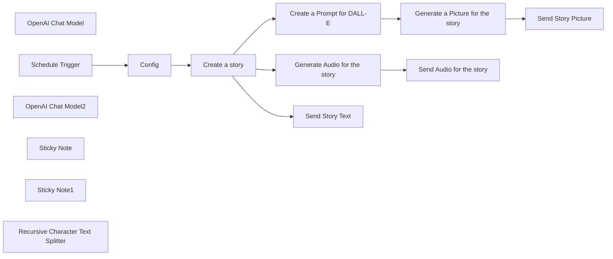

## Fluxo (.json) :

```json
{
  "meta": {
    "instanceId": "84ba6d895254e080ac2b4916d987aa66b000f88d4d919a6b9c76848f9b8a7616",
    "templateId": "2233"
  },
  "nodes": [
    {
      "id": "757a7e67-073a-4fa1-b571-2ddd147b35f6",
      "name": "OpenAI Chat Model",
      "type": "@n8n/n8n-nodes-langchain.lmChatOpenAi",
      "position": [
        1000,
        1240
      ],
      "parameters": {
        "model": "gpt-3.5-turbo-16k-0613",
        "options": {}
      },
      "credentials": {
        "openAiApi": {
          "id": "kDo5LhPmHS2WQE0b",
          "name": "OpenAi account"
        }
      },
      "typeVersion": 1
    },
    {
      "id": "761ed83a-2cfb-474a-b596-922e5a7e2717",
      "name": "Schedule Trigger",
      "type": "n8n-nodes-base.scheduleTrigger",
      "position": [
        660,
        1060
      ],
      "parameters": {
        "rule": {
          "interval": [
            {
              "field": "hours",
              "hoursInterval": 12
            }
          ]
        }
      },
      "typeVersion": 1.1
    },
    {
      "id": "41faf334-30d6-4cc0-9a94-9c486ec3fa6c",
      "name": "OpenAI Chat Model2",
      "type": "@n8n/n8n-nodes-langchain.lmChatOpenAi",
      "position": [
        1520,
        1420
      ],
      "parameters": {
        "options": {}
      },
      "credentials": {
        "openAiApi": {
          "id": "kDo5LhPmHS2WQE0b",
          "name": "OpenAi account"
        }
      },
      "typeVersion": 1
    },
    {
      "id": "d9ad0a3a-2ce6-4071-8262-8176b3eecf36",
      "name": "Sticky Note",
      "type": "n8n-nodes-base.stickyNote",
      "position": [
        1780,
        220
      ],
      "parameters": {
        "width": 1004.4263690337257,
        "height": 811.7188223885136,
        "content": "### Setting Up a Workflow for \"AI-Powered Children's English Storytelling on Telegram\"\n\nIn this guide, we will walk you through the process of setting up a workflow to create and share captivating children's stories using the provided configuration. Let's dive into the steps required to bring these imaginative tales to life on your Telegram channel:\n\n#### Steps to Setup the Workflow:\n1. **Import the Workflow:**\n   - Copy the provided workflow JSON configuration.\n   - In your n8n instance, go to Workflows and select \"Import from JSON.\"\n   - Paste the configuration and import the workflow.\n\n2. **Configure Node Credentials:**\n   - For nodes requiring API credentials (OpenAI and Telegram), create credentials with the appropriate API keys or tokens.\n\n3. **Set Node Parameters:**\n   - Modify node parameters as needed, such as chat IDs, prompts, and intervals.\n   - Change the chatId in Config node to the ID of the chat you want the story to be posted.\n\n4. **Ensure Data Flow:**\n   - Check the connections between nodes to ensure a smooth flow of data and actions.\n\n5. **Execute Once:**\n   - Activate the \"executeOnce\" option in nodes where necessary to trigger actions only once during setup.\n\n6. **Test the Workflow:**\n   - Run the workflow to verify that each node functions correctly and data is processed as expected.\n\n7. **Enable Recurring Triggers:**\n   - Confirm that the Schedule Trigger node is set to trigger the workflow at the desired interval (every 12 hours).\n\n8. **Initiate Workflow:**\n   - Once everything is configured correctly, activate the workflow to start generating and sharing children's stories on Telegram.\n\nBy following these steps meticulously, you can seamlessly establish and operate the workflow designed to create captivating children's stories for your audience. Embrace the power of automation to inspire young minds and foster a love for storytelling through engaging narratives shared on Telegram.\n"
      },
      "typeVersion": 1
    },
    {
      "id": "b550e4ff-167d-4b12-8dff-0511a435cd7c",
      "name": "Create a Prompt for DALL-E",
      "type": "@n8n/n8n-nodes-langchain.chainSummarization",
      "position": [
        1500,
        1280
      ],
      "parameters": {
        "options": {
          "summarizationMethodAndPrompts": {
            "values": {
              "prompt": "Summarize the characters in this story based on their appearance and describe them if they are humans or animals and how they look like and what kind of are they, the prompt should be no-text in the picture, make sure the text is free from any prohibited or inappropriate content:\n\n\n\n\"{text}\"\n\n\nCONCISE SUMMARY:",
              "summarizationMethod": "stuff"
            }
          }
        }
      },
      "typeVersion": 2
    },
    {
      "id": "024a3615-9e90-4e47-81e3-21febfc2f0c9",
      "name": "Sticky Note1",
      "type": "n8n-nodes-base.stickyNote",
      "position": [
        380,
        240
      ],
      "parameters": {
        "width": 611.6882702103559,
        "height": 651.7145525871413,
        "content": "### Use Case for Setting Up a Workflow for Children's Stories\n\nCheck this example: [https://t.me/st0ries95](https://t.me/st0ries95)\n\n\nThe workflow for children's stories serves as a valuable tool for content creators, educators, and parents looking to engage children with imaginative and educational storytelling. Here are some key use cases for this workflow:\n\n1. **Content Creation:** The workflow streamlines the process of creating captivating children's stories by providing a structured framework and automation for story generation, audio creation, and image production.\n\n2. **Educational Resources:** Teachers can use this workflow to develop educational materials that incorporate storytelling to make learning more engaging and interactive for students.\n\n3. **Parental Engagement:** Parents can utilize the workflow to share personalized stories with their children, fostering a love for reading and creativity while bonding over shared storytelling experiences.\n\n4. **Community Building:** Organizations and community groups can leverage the workflow to create and share children's stories as a way to connect with their audience and promote literacy and creativity.\n\n5. **Inspiring Young Minds:** By automating the process of creating and sharing enchanting children's stories, this workflow aims to inspire young minds, spark imagination, and instill a passion for storytelling in children.\n\nOverall, the use case for this workflow extends to various settings where storytelling plays a significant role in engaging, educating, and entertaining children, making it a versatile tool for enhancing the storytelling experience.\n"
      },
      "typeVersion": 1
    },
    {
      "id": "11bfff09-33c6-48ab-b9e6-2e5349a87ca5",
      "name": "Recursive Character Text Splitter",
      "type": "@n8n/n8n-nodes-langchain.textSplitterRecursiveCharacterTextSplitter",
      "position": [
        1160,
        1260
      ],
      "parameters": {
        "options": {},
        "chunkSize": 500,
        "chunkOverlap": 300
      },
      "typeVersion": 1
    },
    {
      "id": "9da21054-961e-4b7a-973e-1c180571ce92",
      "name": "Create a story",
      "type": "@n8n/n8n-nodes-langchain.chainSummarization",
      "position": [
        1080,
        1060
      ],
      "parameters": {
        "options": {
          "summarizationMethodAndPrompts": {
            "values": {
              "prompt": "Create a captivating short tale for kids, whisking them away to magical lands brimming with wisdom. Explore diverse themes in a fun and simple way, weaving in valuable messages. Dive into cultural adventures with lively language that sparks curiosity. Let your story inspire young minds through enchanting narratives that linger long after the last word. Begin crafting your imaginative tale now! (Approximately 900 characters)\n\n\n\"{text}\"\n\nCONCISE SUMMARY:",
              "summarizationMethod": "stuff"
            }
          }
        },
        "chunkingMode": "advanced"
      },
      "executeOnce": true,
      "typeVersion": 2
    },
    {
      "id": "35579446-e11c-416b-b34a-b31e8461a1b3",
      "name": "Generate Audio for the story",
      "type": "@n8n/n8n-nodes-langchain.openAi",
      "position": [
        1520,
        1060
      ],
      "parameters": {
        "input": "={{ $json.response.text }}",
        "options": {},
        "resource": "audio"
      },
      "credentials": {
        "openAiApi": {
          "id": "kDo5LhPmHS2WQE0b",
          "name": "OpenAi account"
        }
      },
      "executeOnce": true,
      "typeVersion": 1.3
    },
    {
      "id": "453d149f-a2a7-4fc9-ba3b-85b42df1c29b",
      "name": "Generate a Picture for the story",
      "type": "@n8n/n8n-nodes-langchain.openAi",
      "position": [
        1840,
        1280
      ],
      "parameters": {
        "prompt": "=Produce an image ensuring that no text is generated within the visual content. {{ $json.response.text }}",
        "options": {},
        "resource": "image"
      },
      "credentials": {
        "openAiApi": {
          "id": "kDo5LhPmHS2WQE0b",
          "name": "OpenAi account"
        }
      },
      "typeVersion": 1.3
    },
    {
      "id": "8f324f12-b21e-4d0c-b7fa-5e2f93ba08aa",
      "name": "Send Story Text",
      "type": "n8n-nodes-base.telegram",
      "position": [
        1520,
        840
      ],
      "parameters": {
        "text": "={{ $json.response.text }}",
        "chatId": "={{ $('Config').item.json.chatId }}",
        "additionalFields": {
          "appendAttribution": false
        }
      },
      "credentials": {
        "telegramApi": {
          "id": "k3RE6o9brmFRFE9p",
          "name": "Telegram account"
        }
      },
      "typeVersion": 1.1
    },
    {
      "id": "51a08f75-1c34-48a0-86de-b47e435ef618",
      "name": "Send Audio for the story",
      "type": "n8n-nodes-base.telegram",
      "position": [
        1720,
        1060
      ],
      "parameters": {
        "chatId": "={{ $('Config').item.json.chatId }}",
        "operation": "sendAudio",
        "binaryData": true,
        "additionalFields": {
          "caption": "End of the Story for today ....."
        }
      },
      "credentials": {
        "telegramApi": {
          "id": "k3RE6o9brmFRFE9p",
          "name": "Telegram account"
        }
      },
      "typeVersion": 1.1
    },
    {
      "id": "3f890a4d-26ea-452a-8ed5-917282e8b0d8",
      "name": "Send Story Picture",
      "type": "n8n-nodes-base.telegram",
      "position": [
        2020,
        1280
      ],
      "parameters": {
        "chatId": "={{ $('Config').item.json.chatId }}",
        "operation": "sendPhoto",
        "binaryData": true,
        "additionalFields": {}
      },
      "credentials": {
        "telegramApi": {
          "id": "k3RE6o9brmFRFE9p",
          "name": "Telegram account"
        }
      },
      "typeVersion": 1.1
    },
    {
      "id": "1cbec52c-b545-45df-885f-57c287f81017",
      "name": "Config",
      "type": "n8n-nodes-base.set",
      "position": [
        880,
        1060
      ],
      "parameters": {
        "options": {},
        "assignments": {
          "assignments": [
            {
              "id": "327667cb-b5b0-4f6f-915c-544696ed8e5a",
              "name": "chatId",
              "type": "string",
              "value": "-4170994782"
            }
          ]
        }
      },
      "typeVersion": 3.3
    }
  ],
  "pinData": {},
  "connections": {
    "Config": {
      "main": [
        [
          {
            "node": "Create a story",
            "type": "main",
            "index": 0
          }
        ]
      ]
    },
    "Create a story": {
      "main": [
        [
          {
            "node": "Generate Audio for the story",
            "type": "main",
            "index": 0
          },
          {
            "node": "Create a Prompt for DALL-E",
            "type": "main",
            "index": 0
          },
          {
            "node": "Send Story Text",
            "type": "main",
            "index": 0
          }
        ]
      ]
    },
    "Schedule Trigger": {
      "main": [
        [
          {
            "node": "Config",
            "type": "main",
            "index": 0
          }
        ]
      ]
    },
    "OpenAI Chat Model": {
      "ai_languageModel": [
        [
          {
            "node": "Create a story",
            "type": "ai_languageModel",
            "index": 0
          }
        ]
      ]
    },
    "OpenAI Chat Model2": {
      "ai_languageModel": [
        [
          {
            "node": "Create a Prompt for DALL-E",
            "type": "ai_languageModel",
            "index": 0
          }
        ]
      ]
    },
    "Create a Prompt for DALL-E": {
      "main": [
        [
          {
            "node": "Generate a Picture for the story",
            "type": "main",
            "index": 0
          }
        ]
      ]
    },
    "Generate Audio for the story": {
      "main": [
        [
          {
            "node": "Send Audio for the story",
            "type": "main",
            "index": 0
          }
        ]
      ]
    },
    "Generate a Picture for the story": {
      "main": [
        [
          {
            "node": "Send Story Picture",
            "type": "main",
            "index": 0
          }
        ]
      ]
    },
    "Recursive Character Text Splitter": {
      "ai_textSplitter": [
        [
          {
            "node": "Create a story",
            "type": "ai_textSplitter",
            "index": 0
          }
        ]
      ]
    }
  }
}
```

<a id="template-395"></a>

## Template 395 - Restaurar workflows do GitHub

- **Nome:** Restaurar workflows do GitHub
- **Descrição:** Restaura workflows salvos em um repositório GitHub para o ambiente, criando apenas os que ainda não existem para evitar duplicatas.
- **Funcionalidade:** • Gatilho manual: Permite iniciar o processo de restauração manualmente para testes ou execuções pontuais.
• Configuração global: Define parâmetros reutilizáveis (proprietário do repositório, nome do repositório e caminho das workflows) para facilitar ajustes.
• Listagem de arquivos do repositório: Recupera todos os arquivos presentes na pasta especificada do repositório GitHub.
• Recuperação de cada arquivo: Baixa o conteúdo de cada arquivo identificado no repositório.
• Decodificação de conteúdo: Converte o conteúdo retornado em base64 para o JSON da workflow e extrai o nome do arquivo como nome da workflow.
• Obtenção das workflows existentes no ambiente: Lista as workflows já presentes para comparação.
• Comparação e filtragem: Compara nomes e mantém apenas as workflows do GitHub que não existem localmente, evitando sobrescritas.
• Criação condicional de workflows: Cria novas workflows a partir do conteúdo dos arquivos filtrados; ignora arquivos quando o nome já existe no ambiente.
- **Ferramentas:** • GitHub: Repositório remoto onde estão salvos os arquivos JSON das workflows; usado para listar e recuperar o conteúdo dos arquivos.

## Fluxo visual

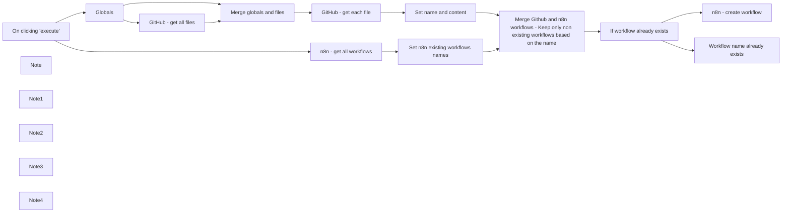

## Fluxo (.json) :

```json
{
  "id": "uoBZx3eMvLMxlHCS",
  "meta": {
    "instanceId": "f4f5d195bb2162a0972f737368404b18be694648d365d6c6771d7b4909d28167",
    "templateCredsSetupCompleted": true
  },
  "name": "[OPS] Restore workflows from GitHub to n8n",
  "tags": [],
  "nodes": [
    {
      "id": "540d147a-8185-4f3e-b2f4-522a19eb6b10",
      "name": "On clicking 'execute'",
      "type": "n8n-nodes-base.manualTrigger",
      "position": [
        -700,
        780
      ],
      "parameters": {},
      "typeVersion": 1
    },
    {
      "id": "7040674c-57b4-453d-acd4-69cbeff64180",
      "name": "Globals",
      "type": "n8n-nodes-base.set",
      "position": [
        -500,
        680
      ],
      "parameters": {
        "values": {
          "string": [
            {
              "name": "repo.owner",
              "value": "n8n-io"
            },
            {
              "name": "repo.name",
              "value": "n8n-backups"
            },
            {
              "name": "repo.path",
              "value": "workflows/"
            }
          ]
        },
        "options": {}
      },
      "typeVersion": 1
    },
    {
      "id": "2b3a2856-4024-4fb0-b068-6bace0e6592c",
      "name": "Note",
      "type": "n8n-nodes-base.stickyNote",
      "position": [
        -1140,
        600
      ],
      "parameters": {
        "color": 2,
        "width": 389.78906250000017,
        "height": 464.79920462713443,
        "content": "## Workflow - Restore Backups\nThis workflow will restore backed-up workflows from Github. \nIt is launch by testing the workflow\n\n### Setup\nOpen Globals and update the values below\n**repo.owner:** This is your Github username\n**repo.name:** This is the name of your repository\n**repo.path:** This is the folder where your workflows are saved, within the repository.\n\nIf your username was `n8n-io` and your repository was called `n8n-backups` and you wanted the workflows to go into a `workflows` folder you would set:\n\nrepo.owner - n8n-io\nrepo.name - n8n-backups\nrepo.path - workflows"
      },
      "typeVersion": 1
    },
    {
      "id": "ba2d3355-df53-43e2-a4b2-2e031b71d687",
      "name": "Workflow name already exists",
      "type": "n8n-nodes-base.noOp",
      "position": [
        1180,
        880
      ],
      "parameters": {},
      "typeVersion": 1
    },
    {
      "id": "f012be7a-fb56-4a92-b2e5-e5ec316624e8",
      "name": "If workflow already exists",
      "type": "n8n-nodes-base.if",
      "position": [
        860,
        760
      ],
      "parameters": {
        "options": {},
        "conditions": {
          "options": {
            "leftValue": "",
            "caseSensitive": true,
            "typeValidation": "strict"
          },
          "combinator": "and",
          "conditions": [
            {
              "id": "063d51c7-0b7a-48a4-82b3-76b370fc4265",
              "operator": {
                "type": "string",
                "operation": "exists",
                "singleValue": true
              },
              "leftValue": "={{ $('Merge Github and n8n workflows - Keep only non existing workflows based on the name').item.json.name }}",
              "rightValue": ""
            }
          ]
        }
      },
      "typeVersion": 2
    },
    {
      "id": "d1d698f2-0ccf-4865-9ecd-9e10e725d12d",
      "name": "Set n8n existing workflows names",
      "type": "n8n-nodes-base.set",
      "position": [
        320,
        880
      ],
      "parameters": {
        "options": {},
        "assignments": {
          "assignments": [
            {
              "id": "6be8c184-8fb7-47a9-ad42-d0dc3db1eea4",
              "name": "name",
              "type": "string",
              "value": "={{ $json.name }}"
            }
          ]
        }
      },
      "typeVersion": 3.3
    },
    {
      "id": "d9c58650-ca2d-47c8-a887-59407fa70e1d",
      "name": "GitHub - get all files",
      "type": "n8n-nodes-base.github",
      "position": [
        -280,
        540
      ],
      "parameters": {
        "owner": {
          "__rl": true,
          "mode": "name",
          "value": "={{$node[\"Globals\"].json[\"repo\"][\"owner\"]}}"
        },
        "filePath": "={{$node[\"Globals\"].json[\"repo\"][\"path\"]}}",
        "resource": "file",
        "operation": "list",
        "repository": {
          "__rl": true,
          "mode": "name",
          "value": "={{$node[\"Globals\"].json[\"repo\"][\"name\"]}}"
        }
      },
      "credentials": {
        "githubApi": {
          "id": "vL0n4BqAk6e4zDd7",
          "name": "GitHub account"
        }
      },
      "typeVersion": 1
    },
    {
      "id": "7bff36b1-d526-402b-bff8-7ce2af050e2d",
      "name": "n8n - get all workflows",
      "type": "n8n-nodes-base.n8n",
      "position": [
        -500,
        880
      ],
      "parameters": {
        "filters": {}
      },
      "credentials": {
        "n8nApi": {
          "id": "RzT15uIVuSWu3ioX",
          "name": "n8n account"
        }
      },
      "typeVersion": 1
    },
    {
      "id": "277f6400-409a-4ba0-8ad7-1241768b669a",
      "name": "GitHub - get each file",
      "type": "n8n-nodes-base.github",
      "position": [
        140,
        660
      ],
      "parameters": {
        "owner": {
          "__rl": true,
          "mode": "name",
          "value": "={{ $json.repo.owner }}"
        },
        "filePath": "={{ $json.path }}",
        "resource": "file",
        "operation": "get",
        "repository": {
          "__rl": true,
          "mode": "name",
          "value": "={{ $json.repo.name }}"
        },
        "asBinaryProperty": false,
        "additionalParameters": {}
      },
      "credentials": {
        "githubApi": {
          "id": "vL0n4BqAk6e4zDd7",
          "name": "GitHub account"
        }
      },
      "typeVersion": 1
    },
    {
      "id": "b59f5e23-729a-41fb-be4b-1aebc573393b",
      "name": "Set name and content",
      "type": "n8n-nodes-base.set",
      "position": [
        340,
        660
      ],
      "parameters": {
        "options": {},
        "assignments": {
          "assignments": [
            {
              "id": "714b0cfd-9f06-4e2f-b73d-30ef39dc40e3",
              "name": "content",
              "type": "string",
              "value": "={{ $json.content.base64Decode() }}"
            },
            {
              "id": "6f48ed58-d55a-4ee4-8cf2-373941aaa341",
              "name": "name",
              "type": "string",
              "value": "={{ $json.name.replace(\".json\", \"\") }}"
            }
          ]
        }
      },
      "typeVersion": 3.3
    },
    {
      "id": "6f642a8c-9997-42b2-b9d7-3c1f02e0e26a",
      "name": "n8n - create workflow",
      "type": "n8n-nodes-base.n8n",
      "position": [
        1180,
        660
      ],
      "parameters": {
        "operation": "create",
        "workflowObject": "={{ $('Set name and content').item.json.content }}"
      },
      "credentials": {
        "n8nApi": {
          "id": "RzT15uIVuSWu3ioX",
          "name": "n8n account"
        }
      },
      "typeVersion": 1
    },
    {
      "id": "b4ce8bdb-8c76-4c10-bf48-3664ec2f924b",
      "name": "Note1",
      "type": "n8n-nodes-base.stickyNote",
      "position": [
        -360,
        340
      ],
      "parameters": {
        "color": 2,
        "width": 861.4145066375679,
        "height": 478.9952882299376,
        "content": "## Get all Github files\n1. List all the files from your repository\n2. Get each file as a JSON. \n3. The content, retrieved as base64, is converted in the \"Set Name and Content\" node\n\n\nThe \"Set Name and Content\" node creates a list of workflows with name and content, in order to compare it with the existing n8n workflows in the workspace."
      },
      "typeVersion": 1
    },
    {
      "id": "5ff560b9-8c43-401c-869f-2b4a2e13cacc",
      "name": "Merge globals and files",
      "type": "n8n-nodes-base.merge",
      "position": [
        -60,
        660
      ],
      "parameters": {
        "mode": "combine",
        "options": {},
        "combinationMode": "multiplex"
      },
      "typeVersion": 2.1
    },
    {
      "id": "008d21d9-007b-44da-8d1a-bd334ba54d61",
      "name": "Merge Github and n8n workflows - Keep only non existing workflows based on the name",
      "type": "n8n-nodes-base.merge",
      "position": [
        640,
        760
      ],
      "parameters": {
        "mode": "combine",
        "options": {},
        "joinMode": "keepNonMatches",
        "mergeByFields": {
          "values": [
            {
              "field1": "name",
              "field2": "name"
            }
          ]
        },
        "outputDataFrom": "input1"
      },
      "typeVersion": 2.1,
      "alwaysOutputData": true
    },
    {
      "id": "c7ffe214-1d7b-4f4f-87c1-36d9cb8e43a9",
      "name": "Note2",
      "type": "n8n-nodes-base.stickyNote",
      "position": [
        560,
        940
      ],
      "parameters": {
        "color": 2,
        "width": 260.44696745223945,
        "height": 196.65095879641083,
        "content": "## Merge Github and n8n workflows\n\nHere, we only keep the workflows from Github that doesn't already exist in n8n workspace, based on the name"
      },
      "typeVersion": 1
    },
    {
      "id": "3d84fd1c-c49b-4db0-951a-e38d50dae47b",
      "name": "Note3",
      "type": "n8n-nodes-base.stickyNote",
      "position": [
        1360,
        720
      ],
      "parameters": {
        "color": 2,
        "width": 344.0461264465236,
        "height": 237.66186698228626,
        "content": "## Create n8n workflow\n\nCreate the n8n workflow using:\n- Content saved in Github\n- Name of the file in Github\n\n\nIf the workflow name already exist in n8n, then the workflow is not created - to avoid duplicates."
      },
      "typeVersion": 1
    },
    {
      "id": "144a0b2e-d7b2-443d-91a5-96c09ef16b8e",
      "name": "Note4",
      "type": "n8n-nodes-base.stickyNote",
      "position": [
        -280,
        980
      ],
      "parameters": {
        "color": 2,
        "width": 378.7476641422645,
        "height": 182.45487519360773,
        "content": "## Get existing n8n workflows\n\n1. Get all workflows\n2. Prepare a list of workflows in order to compare it with the workflows saved in the Github repo."
      },
      "typeVersion": 1
    }
  ],
  "active": false,
  "pinData": {},
  "settings": {
    "executionOrder": "v1"
  },
  "versionId": "b7a0e558-1c40-4ff8-aaed-b6e3a8ab6b8c",
  "connections": {
    "Globals": {
      "main": [
        [
          {
            "node": "GitHub - get all files",
            "type": "main",
            "index": 0
          },
          {
            "node": "Merge globals and files",
            "type": "main",
            "index": 1
          }
        ]
      ]
    },
    "Set name and content": {
      "main": [
        [
          {
            "node": "Merge Github and n8n workflows - Keep only non existing workflows based on the name",
            "type": "main",
            "index": 0
          }
        ]
      ]
    },
    "On clicking 'execute'": {
      "main": [
        [
          {
            "node": "Globals",
            "type": "main",
            "index": 0
          },
          {
            "node": "n8n - get all workflows",
            "type": "main",
            "index": 0
          }
        ]
      ]
    },
    "GitHub - get all files": {
      "main": [
        [
          {
            "node": "Merge globals and files",
            "type": "main",
            "index": 0
          }
        ]
      ]
    },
    "GitHub - get each file": {
      "main": [
        [
          {
            "node": "Set name and content",
            "type": "main",
            "index": 0
          }
        ]
      ]
    },
    "Merge globals and files": {
      "main": [
        [
          {
            "node": "GitHub - get each file",
            "type": "main",
            "index": 0
          }
        ]
      ]
    },
    "n8n - get all workflows": {
      "main": [
        [
          {
            "node": "Set n8n existing workflows names",
            "type": "main",
            "index": 0
          }
        ]
      ]
    },
    "If workflow already exists": {
      "main": [
        [
          {
            "node": "n8n - create workflow",
            "type": "main",
            "index": 0
          }
        ],
        [
          {
            "node": "Workflow name already exists",
            "type": "main",
            "index": 0
          }
        ]
      ]
    },
    "Set n8n existing workflows names": {
      "main": [
        [
          {
            "node": "Merge Github and n8n workflows - Keep only non existing workflows based on the name",
            "type": "main",
            "index": 1
          }
        ]
      ]
    },
    "Merge Github and n8n workflows - Keep only non existing workflows based on the name": {
      "main": [
        [
          {
            "node": "If workflow already exists",
            "type": "main",
            "index": 0
          }
        ]
      ]
    }
  }
}
```

<a id="template-396"></a>

## Template 396 - Extrair e resumir informações de empresas do Indeed

- **Nome:** Extrair e resumir informações de empresas do Indeed
- **Descrição:** Automatiza a captura, extração e sumarização de informações de páginas de empresas no Indeed, enviando os resultados para um webhook configurável.
- **Funcionalidade:** • Gatilho manual: Inicia o fluxo através de um acionamento manual de teste.
• Definição de consulta: Permite definir o termo de busca da empresa e a zona do serviço de proxy.
• Requisição via Bright Data Web Unlocker: Faz requisição ao serviço de desbloqueio para obter a página da empresa do Indeed em formato bruto/markdown.
• Conversão Markdown→HTML: Transforma o conteúdo Markdown retornado em HTML para visualização ou envio.
• Extração textual com LLM: Converte o Markdown em dados textuais estruturados usando um modelo de linguagem.
• Sumarização com LLM: Gera um resumo conciso do conteúdo extraído.
• Agente AI para formatação e envio: Formata o resultado em JSON estruturado e envia para um endpoint webhook.
• Notificações via webhook: Envia tanto o HTML convertido quanto o resumo final para um URL de webhook configurado.
- **Ferramentas:** • Indeed: Fonte de dados alvo (páginas de empresas) para extração de informações.
• Bright Data Web Unlocker: Serviço de proxy/desbloqueio usado para acessar e obter o conteúdo do Indeed de forma confiável.
• Google Gemini (PaLM) API: Modelo de linguagem usado para extração de texto, formatação, sumarização e execução de agente AI.
• Serviço de Webhook (ex.: webhook.site): Endpoint configurável para receber notificações e resultados do fluxo.

## Fluxo visual

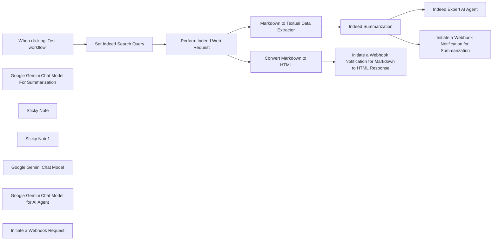

## Fluxo (.json) :

```json
{
  "id": "i89dNLYeOVdTwtcL",
  "meta": {
    "instanceId": "885b4fb4a6a9c2cb5621429a7b972df0d05bb724c20ac7dac7171b62f1c7ef40",
    "templateCredsSetupCompleted": true
  },
  "name": "Extract & Summarize Indeed Company Info with Bright Data and Google Gemini",
  "tags": [
    {
      "id": "Kujft2FOjmOVQAmJ",
      "name": "Engineering",
      "createdAt": "2025-04-09T01:31:00.558Z",
      "updatedAt": "2025-04-09T01:31:00.558Z"
    },
    {
      "id": "ddPkw7Hg5dZhQu2w",
      "name": "AI",
      "createdAt": "2025-04-13T05:38:08.053Z",
      "updatedAt": "2025-04-13T05:38:08.053Z"
    },
    {
      "id": "rKOa98eAi3IETrLu",
      "name": "HR",
      "createdAt": "2025-04-13T04:59:30.580Z",
      "updatedAt": "2025-04-13T04:59:30.580Z"
    }
  ],
  "nodes": [
    {
      "id": "f5b44c95-12f2-44c1-a736-034127a713bb",
      "name": "When clicking ‘Test workflow’",
      "type": "n8n-nodes-base.manualTrigger",
      "position": [
        200,
        -440
      ],
      "parameters": {},
      "typeVersion": 1
    },
    {
      "id": "c199c5a7-d015-4f48-9fef-a5a1e5b5acd4",
      "name": "Google Gemini Chat Model For Summarization",
      "type": "@n8n/n8n-nodes-langchain.lmChatGoogleGemini",
      "position": [
        1320,
        -260
      ],
      "parameters": {
        "options": {},
        "modelName": "models/gemini-2.0-flash-exp"
      },
      "credentials": {
        "googlePalmApi": {
          "id": "YeO7dHZnuGBVQKVZ",
          "name": "Google Gemini(PaLM) Api account"
        }
      },
      "typeVersion": 1
    },
    {
      "id": "f6c1d4a7-ed4c-412f-af26-8714171ecc62",
      "name": "Sticky Note",
      "type": "n8n-nodes-base.stickyNote",
      "position": [
        20,
        -860
      ],
      "parameters": {
        "width": 400,
        "height": 300,
        "content": "## Note\n\nDeals with the Indeed Company web scraping by utilizing Bright Data Web Unlocker Product.\n\nThe Basic LLM Chain, Summarization and AI Agent are being used to demonstrate the usage of the N8N AI capabilities.\n\n**Please make sure to set the Indeed search query and update the Webhook Notification URL**"
      },
      "typeVersion": 1
    },
    {
      "id": "f9625614-1051-48ec-b406-8df920bb9b92",
      "name": "Sticky Note1",
      "type": "n8n-nodes-base.stickyNote",
      "position": [
        480,
        -860
      ],
      "parameters": {
        "width": 480,
        "height": 300,
        "content": "## LLM Usages\n\nGoogle Gemini Flash Exp model is being used.\n\nBasic LLM Chain Data Extractor.\n\nSummarization Chain is being used for the summarization of search results.\n\nThe AI Agent formats the search result and pushes it to the Webhook via HTTP Request"
      },
      "typeVersion": 1
    },
    {
      "id": "9697517c-6587-4279-a123-28ad8cd8a085",
      "name": "Set Indeed Search Query",
      "type": "n8n-nodes-base.set",
      "position": [
        440,
        -440
      ],
      "parameters": {
        "options": {},
        "assignments": {
          "assignments": [
            {
              "id": "3aedba66-f447-4d7a-93c0-8158c5e795f9",
              "name": "search_query",
              "type": "string",
              "value": "Starbucks"
            },
            {
              "id": "4e7ee31d-da89-422f-8079-2ff2d357a0ba",
              "name": "zone",
              "type": "string",
              "value": "web_unlocker1"
            }
          ]
        }
      },
      "typeVersion": 3.4
    },
    {
      "id": "23122a41-d127-4e19-951c-4e143db2c5e6",
      "name": "Perform Indeed Web Request",
      "type": "n8n-nodes-base.httpRequest",
      "position": [
        720,
        -440
      ],
      "parameters": {
        "url": "https://api.brightdata.com/request",
        "method": "POST",
        "options": {},
        "sendBody": true,
        "sendHeaders": true,
        "authentication": "genericCredentialType",
        "bodyParameters": {
          "parameters": [
            {
              "name": "zone",
              "value": "={{ $json.zone }}"
            },
            {
              "name": "url",
              "value": "=https://www.indeed.com/cmp/{{ encodeURI($json.search_query) }}?product=unlocker&method=api"
            },
            {
              "name": "format",
              "value": "raw"
            },
            {
              "name": "data_format",
              "value": "markdown"
            }
          ]
        },
        "genericAuthType": "httpHeaderAuth",
        "headerParameters": {
          "parameters": [
            {}
          ]
        }
      },
      "credentials": {
        "httpHeaderAuth": {
          "id": "kdbqXuxIR8qIxF7y",
          "name": "Header Auth account"
        }
      },
      "typeVersion": 4.2
    },
    {
      "id": "38a9c763-666e-4e0c-9b16-9205a7fa2d23",
      "name": "Indeed Expert AI Agent",
      "type": "@n8n/n8n-nodes-langchain.agent",
      "position": [
        1680,
        -440
      ],
      "parameters": {
        "text": "=You are an Indeed Expert. You need to format the search result  and push it to the Webhook via HTTP Request. Here is the search result - {{ $('Markdown to Textual Data Extractor').item.json.text }}",
        "options": {},
        "promptType": "define"
      },
      "typeVersion": 1.8
    },
    {
      "id": "0715b1ee-c377-43f4-8353-11188cb9dbf7",
      "name": "Google Gemini Chat Model",
      "type": "@n8n/n8n-nodes-langchain.lmChatGoogleGemini",
      "position": [
        1040,
        -220
      ],
      "parameters": {
        "options": {},
        "modelName": "models/gemini-2.0-flash-exp"
      },
      "credentials": {
        "googlePalmApi": {
          "id": "YeO7dHZnuGBVQKVZ",
          "name": "Google Gemini(PaLM) Api account"
        }
      },
      "typeVersion": 1
    },
    {
      "id": "8fab1a0e-c550-4167-be2f-3a9eeaf49111",
      "name": "Markdown to Textual Data Extractor",
      "type": "@n8n/n8n-nodes-langchain.chainLlm",
      "position": [
        940,
        -440
      ],
      "parameters": {
        "text": "=You need to analyze the below markdown and convert to textual data.\n\n{{ $json.data }}",
        "messages": {
          "messageValues": [
            {
              "message": "You are a markdown expert"
            }
          ]
        },
        "promptType": "define"
      },
      "typeVersion": 1.6
    },
    {
      "id": "e49296ca-b88b-4db7-864d-9431312d74f3",
      "name": "Indeed Summarization",
      "type": "@n8n/n8n-nodes-langchain.chainSummarization",
      "position": [
        1320,
        -440
      ],
      "parameters": {
        "options": {}
      },
      "typeVersion": 2
    },
    {
      "id": "53233fe9-5f70-4df8-82c3-7ef84d136e04",
      "name": "Convert Markdown to HTML",
      "type": "n8n-nodes-base.markdown",
      "position": [
        1180,
        -820
      ],
      "parameters": {
        "mode": "markdownToHtml",
        "options": {},
        "markdown": "={{ $json.data }}"
      },
      "typeVersion": 1
    },
    {
      "id": "6e681d88-dc8c-4087-ae03-45e91dd925cd",
      "name": "Initiate a Webhook Notification for Markdown to HTML Response",
      "type": "n8n-nodes-base.httpRequest",
      "position": [
        1440,
        -820
      ],
      "parameters": {
        "url": "https://webhook.site/daf9d591-a130-4010-b1d3-0c66f8fcf467",
        "options": {},
        "sendBody": true,
        "bodyParameters": {
          "parameters": [
            {
              "name": "html_response",
              "value": "={{ $json.data }}"
            }
          ]
        }
      },
      "typeVersion": 4.2
    },
    {
      "id": "ac059d7a-f4e0-43d6-a056-933a4696553b",
      "name": "Google Gemini Chat Model for AI Agent",
      "type": "@n8n/n8n-nodes-langchain.lmChatGoogleGemini",
      "position": [
        1620,
        -200
      ],
      "parameters": {
        "options": {},
        "modelName": "models/gemini-2.0-flash-exp"
      },
      "credentials": {
        "googlePalmApi": {
          "id": "YeO7dHZnuGBVQKVZ",
          "name": "Google Gemini(PaLM) Api account"
        }
      },
      "typeVersion": 1
    },
    {
      "id": "d77cad4d-8899-4345-bf29-ba21cef946cd",
      "name": "Initiate a Webhook Request",
      "type": "@n8n/n8n-nodes-langchain.toolHttpRequest",
      "position": [
        1920,
        -200
      ],
      "parameters": {
        "url": "https://webhook.site/daf9d591-a130-4010-b1d3-0c66f8fcf467",
        "method": "POST",
        "sendBody": true,
        "parametersBody": {
          "values": [
            {
              "name": "search_summary",
              "value": "={{ $json.response.text }}",
              "valueProvider": "fieldValue"
            },
            {
              "name": "search_result"
            }
          ]
        },
        "toolDescription": "Extract the response and format a structured JSON response"
      },
      "typeVersion": 1.1
    },
    {
      "id": "b94deec3-3394-4fb3-b700-9ed3ced877ca",
      "name": "Initiate a Webhook Notification for Summarization",
      "type": "n8n-nodes-base.httpRequest",
      "position": [
        1780,
        -700
      ],
      "parameters": {
        "url": "https://webhook.site/daf9d591-a130-4010-b1d3-0c66f8fcf467",
        "options": {},
        "sendBody": true,
        "bodyParameters": {
          "parameters": [
            {
              "name": "summary",
              "value": "={{ $json.response.text }}"
            }
          ]
        }
      },
      "typeVersion": 4.2
    }
  ],
  "active": false,
  "pinData": {},
  "settings": {
    "executionOrder": "v1"
  },
  "versionId": "dd804e78-abaa-48f4-82ab-6dbfdec43ef3",
  "connections": {
    "Indeed Summarization": {
      "main": [
        [
          {
            "node": "Indeed Expert AI Agent",
            "type": "main",
            "index": 0
          },
          {
            "node": "Initiate a Webhook Notification for Summarization",
            "type": "main",
            "index": 0
          }
        ]
      ]
    },
    "Indeed Expert AI Agent": {
      "main": [
        []
      ]
    },
    "Set Indeed Search Query": {
      "main": [
        [
          {
            "node": "Perform Indeed Web Request",
            "type": "main",
            "index": 0
          }
        ]
      ]
    },
    "Convert Markdown to HTML": {
      "main": [
        [
          {
            "node": "Initiate a Webhook Notification for Markdown to HTML Response",
            "type": "main",
            "index": 0
          }
        ]
      ]
    },
    "Google Gemini Chat Model": {
      "ai_languageModel": [
        [
          {
            "node": "Markdown to Textual Data Extractor",
            "type": "ai_languageModel",
            "index": 0
          }
        ]
      ]
    },
    "Initiate a Webhook Request": {
      "ai_tool": [
        [
          {
            "node": "Indeed Expert AI Agent",
            "type": "ai_tool",
            "index": 0
          }
        ]
      ]
    },
    "Perform Indeed Web Request": {
      "main": [
        [
          {
            "node": "Markdown to Textual Data Extractor",
            "type": "main",
            "index": 0
          },
          {
            "node": "Convert Markdown to HTML",
            "type": "main",
            "index": 0
          }
        ]
      ]
    },
    "When clicking ‘Test workflow’": {
      "main": [
        [
          {
            "node": "Set Indeed Search Query",
            "type": "main",
            "index": 0
          }
        ]
      ]
    },
    "Markdown to Textual Data Extractor": {
      "main": [
        [
          {
            "node": "Indeed Summarization",
            "type": "main",
            "index": 0
          }
        ]
      ]
    },
    "Google Gemini Chat Model for AI Agent": {
      "ai_languageModel": [
        [
          {
            "node": "Indeed Expert AI Agent",
            "type": "ai_languageModel",
            "index": 0
          }
        ]
      ]
    },
    "Google Gemini Chat Model For Summarization": {
      "ai_languageModel": [
        [
          {
            "node": "Indeed Summarization",
            "type": "ai_languageModel",
            "index": 0
          }
        ]
      ]
    }
  }
}
```

<a id="template-397"></a>

## Template 397 - Alerta de erro via Slack

- **Nome:** Alerta de erro via Slack
- **Descrição:** Quando uma execução falha, o fluxo envia uma mensagem formatada para um canal do Slack com detalhes do erro.
- **Funcionalidade:** • Gatilho de erro: inicia o fluxo automaticamente ao detectar uma execução com falha.
• Construção de mensagem: monta uma mensagem contendo o nome do workflow, link da execução, último nó executado e a mensagem de erro.
• Envio para canal Slack: publica a mensagem no canal definido usando as credenciais configuradas.
• Reutilização e configuração: permite adicionar credenciais do Slack e anexar este fluxo como fluxo de erro a outros fluxos para centralizar alertas.
- **Ferramentas:** • Slack: plataforma de comunicação utilizada para receber notificações e alertas em um canal específico.

## Fluxo visual

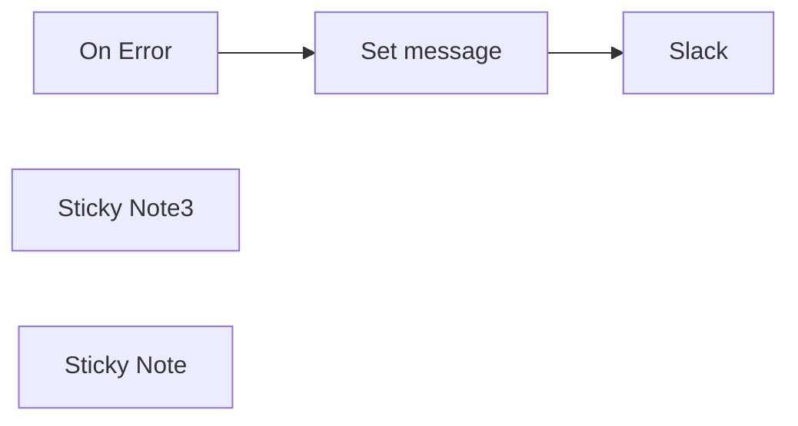

## Fluxo (.json) :

```json
{
  "nodes": [
    {
      "id": "eb305364-de39-4b9e-ad6e-eea54ebf712d",
      "name": "Slack",
      "type": "n8n-nodes-base.slack",
      "position": [
        740,
        300
      ],
      "parameters": {
        "text": "={{ $json.message }}",
        "select": "channel",
        "channelId": {
          "__rl": true,
          "mode": "name",
          "value": "#alerts-n8n-workflows"
        },
        "otherOptions": {}
      },
      "credentials": {
        "slackApi": {
          "id": "26",
          "name": "Cloudbot bot token"
        }
      },
      "typeVersion": 2.1
    },
    {
      "id": "9babcea6-ac7c-4a75-bd4c-f3d6a54c0ec7",
      "name": "On Error",
      "type": "n8n-nodes-base.errorTrigger",
      "position": [
        220,
        300
      ],
      "parameters": {},
      "typeVersion": 1
    },
    {
      "id": "134acca3-d4a7-485c-ab45-5a2721ed6a2c",
      "name": "Set message",
      "type": "n8n-nodes-base.set",
      "position": [
        480,
        300
      ],
      "parameters": {
        "values": {
          "string": [
            {
              "name": "message",
              "value": "=:warning: [prod] workflow `{{$json[\"workflow\"][\"name\"]}}` failed to run! <{{ $json.execution.url }}|execution>\n\nerror message from node: {{ $json.execution.lastNodeExecuted }}\n {{ $json.execution.error.message }}"
            }
          ]
        },
        "options": {},
        "keepOnlySet": true
      },
      "typeVersion": 1
    },
    {
      "id": "b6dfce1e-95c0-43c4-8a81-098b33130232",
      "name": "Sticky Note3",
      "type": "n8n-nodes-base.stickyNote",
      "position": [
        140,
        100
      ],
      "parameters": {
        "color": 5,
        "width": 424.4907862645661,
        "height": 154.7766688696994,
        "content": "### 👨‍🎤 Setup\n1. Add Slack creds\n2. Add this error workflow to other workflows\nhttps://docs.n8n.io/flow-logic/error-handling/#create-and-set-an-error-workflow"
      },
      "typeVersion": 1
    },
    {
      "id": "619e2628-6860-47ca-9e6a-9294ea123f8f",
      "name": "Sticky Note",
      "type": "n8n-nodes-base.stickyNote",
      "position": [
        480,
        480
      ],
      "parameters": {
        "width": 241,
        "height": 80,
        "content": "### 👆🏽 Adjust error message here"
      },
      "typeVersion": 1
    }
  ],
  "pinData": {},
  "connections": {
    "On Error": {
      "main": [
        [
          {
            "node": "Set message",
            "type": "main",
            "index": 0
          }
        ]
      ]
    },
    "Set message": {
      "main": [
        [
          {
            "node": "Slack",
            "type": "main",
            "index": 0
          }
        ]
      ]
    }
  }
}
```

<a id="template-398"></a>

## Template 398 - Obter valor da chave Redis 'hello'

- **Nome:** Obter valor da chave Redis 'hello'
- **Descrição:** Ao ser executado manualmente, o fluxo consulta um servidor Redis e recupera o valor armazenado na chave "hello".
- **Funcionalidade:** • Início manual: inicia o fluxo mediante execução manual pelo usuário.
• Recuperação de dados do Redis: lê o valor associado à chave "hello" em um servidor Redis.
• Uso de credenciais armazenadas: utiliza credenciais pré-configuradas para conectar-se ao servidor Redis de forma segura.
- **Ferramentas:** • Redis: armazenamento em memória do tipo chave-valor utilizado para guardar e recuperar rapidamente dados; neste fluxo é consultada a chave "hello".

## Fluxo visual


## Fluxo (.json) :

```json
{
  "nodes": [
    {
      "name": "On clicking 'execute'",
      "type": "n8n-nodes-base.manualTrigger",
      "position": [
        270,
        320
      ],
      "parameters": {},
      "typeVersion": 1
    },
    {
      "name": "Redis",
      "type": "n8n-nodes-base.redis",
      "position": [
        470,
        320
      ],
      "parameters": {
        "key": "hello",
        "options": {},
        "operation": "get"
      },
      "credentials": {
        "redis": "redis-docker_creds"
      },
      "typeVersion": 1
    }
  ],
  "connections": {
    "On clicking 'execute'": {
      "main": [
        [
          {
            "node": "Redis",
            "type": "main",
            "index": 0
          }
        ]
      ]
    }
  }
}
```

<a id="template-399"></a>

## Template 399 - Geração automática de histórias infantis em árabe

- **Nome:** Geração automática de histórias infantis em árabe
- **Descrição:** Fluxo agendado que cria contos infantis, traduz para árabe, gera imagens e áudio correspondentes e publica o resultado em um canal do Telegram.
- **Funcionalidade:** • Geração automática de histórias: Cria contos curtos e cativantes para crianças usando modelos de linguagem com parâmetros de estilo e tamanho.
• Agendamento: Executa o processo periodicamente (intervalo configurável) para produção automática de conteúdo.
• Tradução para árabe adaptada a crianças: Traduz o texto gerado para árabe com linguagem simples e lição moral acessível às crianças.
• Fragmentação de texto: Divide textos longos em partes (chunking) para processamento e tradução eficientes.
• Criação de prompt para imagem: Gera um prompt conciso e sem texto para criação de imagem baseada nos personagens da história.
• Geração de imagem sem texto no conteúdo visual: Produz imagens a partir do prompt gerado, assegurando ausência de texto na imagem.
• Geração de áudio: Converte o texto final em áudio para narração da história.
• Publicação em canal: Envia o texto, a imagem e o áudio gerados para um canal do Telegram com legendas configuráveis.
• Configuração de credenciais e opções: Permite ajustar credenciais de APIs e parâmetros de geração (modelos, tamanhos de chunk, sobreposição).
- **Ferramentas:** • OpenAI API (GPT-4 Turbo e APIs de imagem/áudio): Usada para gerar texto das histórias, traduzir, criar prompts para imagens, gerar imagens e produzir arquivos de áudio.
• Telegram: Canal de comunicação para publicar o texto, as imagens e os arquivos de áudio resultantes.

## Fluxo visual

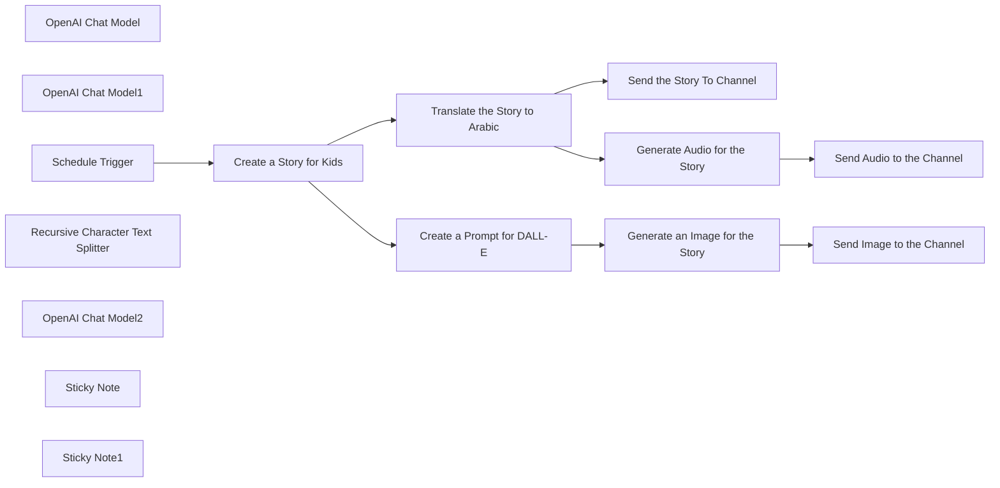

## Fluxo (.json) :

```json
{
  "meta": {
    "instanceId": "84ba6d895254e080ac2b4916d987aa66b000f88d4d919a6b9c76848f9b8a7616",
    "templateId": "2234"
  },
  "nodes": [
    {
      "id": "e0f68f60-f036-4103-a9fc-d6cb80b6f8a2",
      "name": "OpenAI Chat Model",
      "type": "@n8n/n8n-nodes-langchain.lmChatOpenAi",
      "position": [
        1980,
        1100
      ],
      "parameters": {
        "model": "gpt-4-turbo",
        "options": {}
      },
      "credentials": {
        "openAiApi": {
          "id": "kDo5LhPmHS2WQE0b",
          "name": "OpenAi account"
        }
      },
      "typeVersion": 1
    },
    {
      "id": "23779dea-c21d-42da-b493-09394bc64436",
      "name": "OpenAI Chat Model1",
      "type": "@n8n/n8n-nodes-langchain.lmChatOpenAi",
      "position": [
        2420,
        660
      ],
      "parameters": {
        "model": "gpt-4-turbo",
        "options": {}
      },
      "credentials": {
        "openAiApi": {
          "id": "kDo5LhPmHS2WQE0b",
          "name": "OpenAi account"
        }
      },
      "typeVersion": 1
    },
    {
      "id": "af59863e-12c5-414c-bf64-dd6712e3aa7b",
      "name": "Schedule Trigger",
      "type": "n8n-nodes-base.scheduleTrigger",
      "position": [
        1680,
        960
      ],
      "parameters": {
        "rule": {
          "interval": [
            {
              "field": "hours",
              "hoursInterval": 12
            }
          ]
        }
      },
      "typeVersion": 1.1
    },
    {
      "id": "bc2ad02b-72c9-4132-96e8-b64487f589f7",
      "name": "Recursive Character Text Splitter",
      "type": "@n8n/n8n-nodes-langchain.textSplitterRecursiveCharacterTextSplitter",
      "position": [
        2160,
        1140
      ],
      "parameters": {
        "options": {},
        "chunkSize": 500,
        "chunkOverlap": 300
      },
      "typeVersion": 1
    },
    {
      "id": "cb11a8bb-bdca-43cb-a586-7f93471d58f7",
      "name": "OpenAI Chat Model2",
      "type": "@n8n/n8n-nodes-langchain.lmChatOpenAi",
      "position": [
        2420,
        1300
      ],
      "parameters": {
        "options": {}
      },
      "credentials": {
        "openAiApi": {
          "id": "kDo5LhPmHS2WQE0b",
          "name": "OpenAi account"
        }
      },
      "typeVersion": 1
    },
    {
      "id": "9d02b910-a467-4d4d-a2fa-32d1d3361d21",
      "name": "Create a Prompt for DALL-E",
      "type": "@n8n/n8n-nodes-langchain.chainSummarization",
      "position": [
        2400,
        1080
      ],
      "parameters": {
        "options": {
          "summarizationMethodAndPrompts": {
            "values": {
              "prompt": "Summarize the characters in this story based on their appearance and describe them if they are humans or animals and how they look like and what kind of are they, the prompt should be no-text in the picture.\n\n\n\n\n\"{text}\"\n\n\nCONCISE SUMMARY:",
              "summarizationMethod": "stuff"
            }
          }
        }
      },
      "typeVersion": 2
    },
    {
      "id": "4723dd65-96f5-41c1-9ff6-f1a344d96241",
      "name": "Generate an Image for the Story",
      "type": "@n8n/n8n-nodes-langchain.openAi",
      "position": [
        2860,
        1080
      ],
      "parameters": {
        "prompt": "=Produce an image ensuring that no text is generated within the visual content. {{ $json.response.text }}",
        "options": {},
        "resource": "image"
      },
      "credentials": {
        "openAiApi": {
          "id": "kDo5LhPmHS2WQE0b",
          "name": "OpenAi account"
        }
      },
      "typeVersion": 1.3
    },
    {
      "id": "70b7f55a-31c4-456b-8273-8250bac74409",
      "name": "Generate Audio for the Story",
      "type": "@n8n/n8n-nodes-langchain.openAi",
      "position": [
        2640,
        820
      ],
      "parameters": {
        "input": "={{ $json.response.text }}",
        "options": {},
        "resource": "audio"
      },
      "credentials": {
        "openAiApi": {
          "id": "kDo5LhPmHS2WQE0b",
          "name": "OpenAi account"
        }
      },
      "executeOnce": true,
      "typeVersion": 1.3
    },
    {
      "id": "c381dbe4-6112-441c-b213-8a2d218f4cc2",
      "name": "Send the Story To Channel",
      "type": "n8n-nodes-base.telegram",
      "position": [
        3160,
        480
      ],
      "parameters": {
        "text": "={{ $json.response.text }}",
        "chatId": "=-4170994782",
        "additionalFields": {
          "appendAttribution": false
        }
      },
      "credentials": {
        "telegramApi": {
          "id": "k3RE6o9brmFRFE9p",
          "name": "Telegram account"
        }
      },
      "typeVersion": 1.1
    },
    {
      "id": "78289bfa-54b4-4acb-b513-7a0134a010f3",
      "name": "Send Image to the Channel",
      "type": "n8n-nodes-base.telegram",
      "position": [
        3180,
        1080
      ],
      "parameters": {
        "chatId": "=-4170994782",
        "operation": "sendPhoto",
        "binaryData": true,
        "additionalFields": {}
      },
      "credentials": {
        "telegramApi": {
          "id": "k3RE6o9brmFRFE9p",
          "name": "Telegram account"
        }
      },
      "typeVersion": 1.1
    },
    {
      "id": "f779047b-6dec-4e4e-ae09-4dd91f961d08",
      "name": "Sticky Note",
      "type": "n8n-nodes-base.stickyNote",
      "position": [
        380,
        240
      ],
      "parameters": {
        "width": 1224.7156767468991,
        "height": 1282.378312060854,
        "content": "# Template for Kids' Story in Arabic\n\nThe n8n template for creating kids' stories in Arabic provides a versatile platform for storytellers to captivate young audiences with educational and interactive tales. Along with its core functionalities, this template allows for customization to suit various use cases and can be set up effortlessly.\n\nCheck this example: [https://t.me/st0ries95](https://t.me/st0ries95)\n\n\n## Node Functionalities\n\n\n## Automated Storytelling Process\n\n\n## Use Cases\n1. **Educational Platforms**:\n   Educational platforms can automate the creation and distribution of educational stories in Arabic for children using this template. By incorporating visual and auditory elements into the storytelling process, educational platforms can enhance learning experiences and engage young learners effectively.\n\n2. **Children's Libraries**:\n   Children's libraries can utilize this template to curate and share a diverse collection of Arabic stories with young readers. The automated generation of visual content and audio files enhances the storytelling experience, encouraging children to immerse themselves in new worlds and characters through captivating narratives.\n\n3. **Language Learning Apps**:\n   Language learning apps focused on Arabic can integrate this template to offer culturally rich storytelling experiences for children learning the language. By translating stories into Arabic and supplementing them with visual and auditory components, these apps can facilitate language acquisition in an enjoyable and interactive manner.\n\n## Configuration Guide for Nodes\n\n### OpenAI Chat Model Nodes:\n- **Credentials**: Provide the necessary API credentials for the OpenAI GPT-4 Turbo model.\n- **Options**: Configure any specific options required for the chat model.\n\n### Create a Prompt for DALL-E Node:\n- **Prompts Customization**: Customize prompts to generate relevant visual content for the stories.\n- **Summarization Method and Prompts**: Define the summarization method and prompts for generating visual content without text.\n\n### Generate an Image for the Story Node:\n- **Resource**: Specify the type of resource (image).\n- **Prompt**: Set up the prompt for producing an image without text within the visual content.\n\n### Generate Audio for the Story Node:\n- **Resource**: Select the type of resource (audio).\n- **Input**: Define the input text for generating audio files.\n\n### Translate the Story to Arabic Node:\n- **Chunking Mode**: Choose the chunking mode (advanced).\n- **Summarization Method and Prompts**: Set the summarization method and prompts for translating the story into Arabic.\n\n### Send the Story To Channel Node:\n- **Chat ID**: Provide the chat ID where the story text will be sent.\n- **Text**: Configure the text to be sent to the channel.\n\nBy configuring each node as per the guidelines above, users can effectively set up and customize the n8n template for kids' stories in Arabic, tailoring it to specific use cases and delivering a seamless and engaging storytelling experience for young audiences.\n"
      },
      "typeVersion": 1
    },
    {
      "id": "5ef92ebc-e4e4-4165-a7df-9f94802f8e27",
      "name": "Sticky Note1",
      "type": "n8n-nodes-base.stickyNote",
      "position": [
        1620,
        240
      ],
      "parameters": {
        "width": 1811.9647367735226,
        "height": 1280.7253282813103,
        "content": ""
      },
      "typeVersion": 1
    },
    {
      "id": "76d2b256-8083-42d9-8465-63b2f9c73a67",
      "name": "Translate the Story to Arabic",
      "type": "@n8n/n8n-nodes-langchain.chainSummarization",
      "position": [
        2400,
        480
      ],
      "parameters": {
        "options": {
          "summarizationMethodAndPrompts": {
            "values": {
              "prompt": "Translate this story texts to \"Arabic\" and make it easy to understands for kids with easy words and moral lesson :\n\n\n\"{text}\"\n\n\n",
              "summarizationMethod": "stuff"
            }
          }
        },
        "chunkingMode": "advanced"
      },
      "executeOnce": true,
      "typeVersion": 2
    },
    {
      "id": "126e463e-f1e8-4cd2-856d-aaaebc279797",
      "name": "Send Audio to the Channel",
      "type": "n8n-nodes-base.telegram",
      "position": [
        3180,
        820
      ],
      "parameters": {
        "chatId": "-4170994782",
        "operation": "sendAudio",
        "binaryData": true,
        "additionalFields": {
          "caption": "نهاية القصة ... "
        }
      },
      "credentials": {
        "telegramApi": {
          "id": "k3RE6o9brmFRFE9p",
          "name": "Telegram account"
        }
      },
      "typeVersion": 1.1
    },
    {
      "id": "162049a0-620a-4044-966a-27b665827b60",
      "name": "Create a Story for Kids",
      "type": "@n8n/n8n-nodes-langchain.chainSummarization",
      "position": [
        1980,
        960
      ],
      "parameters": {
        "options": {
          "summarizationMethodAndPrompts": {
            "values": {
              "prompt": "Create a captivating short tale for kids, whisking them away to magical lands brimming with wisdom. Explore diverse themes in a fun and simple way, weaving in valuable messages. Dive into cultural adventures with lively language that sparks curiosity. Let your story inspire young minds through enchanting narratives that linger long after the last word. Begin crafting your imaginative tale now! (Approximately 900 characters)\n\n\n\"{text}\"\n\nCONCISE SUMMARY:",
              "summarizationMethod": "stuff"
            }
          }
        },
        "chunkingMode": "advanced"
      },
      "executeOnce": true,
      "typeVersion": 2
    }
  ],
  "pinData": {},
  "connections": {
    "Schedule Trigger": {
      "main": [
        [
          {
            "node": "Create a Story for Kids",
            "type": "main",
            "index": 0
          }
        ]
      ]
    },
    "OpenAI Chat Model": {
      "ai_languageModel": [
        [
          {
            "node": "Create a Story for Kids",
            "type": "ai_languageModel",
            "index": 0
          }
        ]
      ]
    },
    "OpenAI Chat Model1": {
      "ai_languageModel": [
        [
          {
            "node": "Translate the Story to Arabic",
            "type": "ai_languageModel",
            "index": 0
          }
        ]
      ]
    },
    "OpenAI Chat Model2": {
      "ai_languageModel": [
        [
          {
            "node": "Create a Prompt for DALL-E",
            "type": "ai_languageModel",
            "index": 0
          }
        ]
      ]
    },
    "Create a Story for Kids": {
      "main": [
        [
          {
            "node": "Translate the Story to Arabic",
            "type": "main",
            "index": 0
          },
          {
            "node": "Create a Prompt for DALL-E",
            "type": "main",
            "index": 0
          }
        ]
      ]
    },
    "Create a Prompt for DALL-E": {
      "main": [
        [
          {
            "node": "Generate an Image for the Story",
            "type": "main",
            "index": 0
          }
        ]
      ]
    },
    "Generate Audio for the Story": {
      "main": [
        [
          {
            "node": "Send Audio to the Channel",
            "type": "main",
            "index": 0
          }
        ]
      ]
    },
    "Translate the Story to Arabic": {
      "main": [
        [
          {
            "node": "Send the Story To Channel",
            "type": "main",
            "index": 0
          },
          {
            "node": "Generate Audio for the Story",
            "type": "main",
            "index": 0
          }
        ]
      ]
    },
    "Generate an Image for the Story": {
      "main": [
        [
          {
            "node": "Send Image to the Channel",
            "type": "main",
            "index": 0
          }
        ]
      ]
    },
    "Recursive Character Text Splitter": {
      "ai_textSplitter": [
        [
          {
            "node": "Create a Story for Kids",
            "type": "ai_textSplitter",
            "index": 0
          }
        ]
      ]
    }
  }
}
```

<a id="template-400"></a>

## Template 400 - Tickets automáticos Slack → Linear com IA

- **Nome:** Tickets automáticos Slack → Linear com IA
- **Descrição:** Monitora um canal do Slack em busca de mensagens sinalizadas com o emoji de ticket, verifica duplicatas em Linear, gera conteúdo do ticket via IA e cria issues no Linear com metadados.
- **Funcionalidade:** • Monitoramento de canal do Slack: Verifica periodicamente um canal específico em busca de novas mensagens.
• Filtragem por emoji de ticket: Processa apenas mensagens que contenham o emoji de ticket para sinalizar solicitações.
• Extração de dados da mensagem: Captura id, usuário, timestamp, permalink e texto original da mensagem.
• Verificação de duplicatas em Linear: Consulta issues existentes e extrai hashes inseridos nas descrições para evitar criar tickets duplicados.
• Geração de conteúdo via IA: Usa um modelo de linguagem para criar título descritivo, resumo acionável, sugestões de resolução e prioridade.
• Criação automática de issue em Linear: Cria um ticket com título, descrição detalhada, sugestões, prioridade e metadados da mensagem original.
- **Ferramentas:** • Slack: Fonte das mensagens dos usuários; canal monitorado para identificar solicitações sinalizadas.
• Linear: Sistema de gerenciamento de issues onde são consultadas issues existentes e criados novos tickets.
• OpenAI (ChatGPT): Gera título, resumo, ideias de resolução e determina prioridade com base no conteúdo da mensagem.

## Fluxo visual

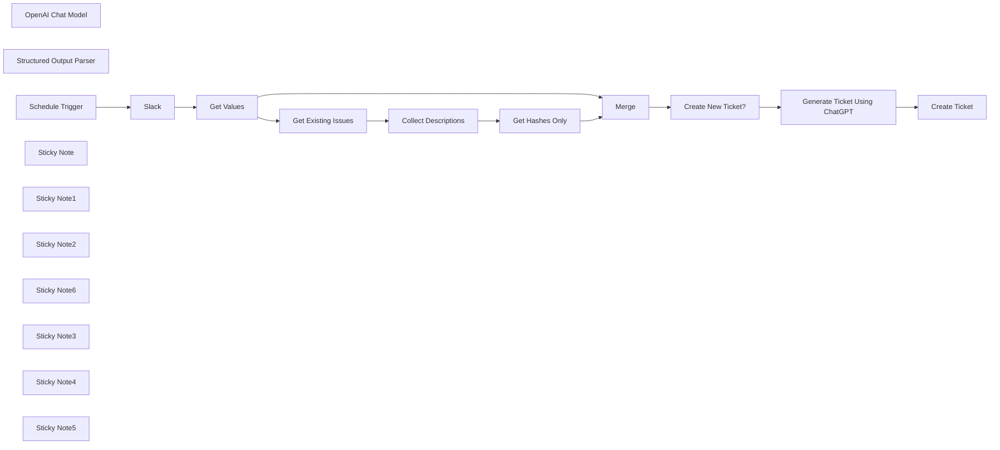

## Fluxo (.json) :

```json
{
  "meta": {
    "instanceId": "26ba763460b97c249b82942b23b6384876dfeb9327513332e743c5f6219c2b8e"
  },
  "nodes": [
    {
      "id": "2b3112a9-046e-4aae-8fcc-95bddf3bb02e",
      "name": "Slack",
      "type": "n8n-nodes-base.slack",
      "position": [
        828,
        327
      ],
      "parameters": {
        "limit": 10,
        "query": "in:#n8n-tickets has::ticket:",
        "options": {},
        "operation": "search"
      },
      "credentials": {
        "slackApi": {
          "id": "VfK3js0YdqBdQLGP",
          "name": "Slack account"
        }
      },
      "typeVersion": 2.2
    },
    {
      "id": "65fd6821-4d19-436c-81d9-9bdb0f5efddd",
      "name": "OpenAI Chat Model",
      "type": "@n8n/n8n-nodes-langchain.lmChatOpenAi",
      "position": [
        1920,
        480
      ],
      "parameters": {
        "options": {}
      },
      "credentials": {
        "openAiApi": {
          "id": "8gccIjcuf3gvaoEr",
          "name": "OpenAi account"
        }
      },
      "typeVersion": 1
    },
    {
      "id": "85125704-7363-40de-af84-f267f8c7e919",
      "name": "Structured Output Parser",
      "type": "@n8n/n8n-nodes-langchain.outputParserStructured",
      "position": [
        2100,
        480
      ],
      "parameters": {
        "jsonSchema": "{\n  \"type\": \"object\",\n  \"properties\": {\n    \"title\": { \"type\": \"string\" },\n    \"summary\": { \"type\": \"string\" },\n    \"ideas\": {\n      \"type\": \"array\",\n      \"items\": { \"type\": \"string\" }\n    },\n    \"priority\": { \"type\": \"string\" }\n  }\n}"
      },
      "typeVersion": 1.1
    },
    {
      "id": "eda8851a-1929-4f2f-9149-627c0fe62fbc",
      "name": "Schedule Trigger",
      "type": "n8n-nodes-base.scheduleTrigger",
      "position": [
        628,
        327
      ],
      "parameters": {
        "rule": {
          "interval": [
            {
              "field": "minutes"
            }
          ]
        }
      },
      "typeVersion": 1.2
    },
    {
      "id": "ad0d56b5-5caf-4fc0-bdbb-4e6207e4eb03",
      "name": "Sticky Note",
      "type": "n8n-nodes-base.stickyNote",
      "position": [
        580,
        112.87898199907983
      ],
      "parameters": {
        "color": 7,
        "width": 432.4578914269739,
        "height": 427.09547550768553,
        "content": "## 1. Query Slack for Messages \n[Read more about the Slack Trigger](https://docs.n8n.io/integrations/builtin/app-nodes/n8n-nodes-base.slack)\n\nSlack API search uses the same search syntax found in the app. Here, we'll use it to filter the latest messages with the ticket emoji within our designated channel called #n8n-tickets. "
      },
      "typeVersion": 1
    },
    {
      "id": "d4ebe5b3-6d9a-4547-8af8-0985206c4ca4",
      "name": "Sticky Note1",
      "type": "n8n-nodes-base.stickyNote",
      "position": [
        1040,
        180.44851541532478
      ],
      "parameters": {
        "color": 7,
        "width": 711.6907825442045,
        "height": 632.7258798316449,
        "content": "## 2. Decide If We Need to Create a New Ticket \n[Read more about using Linear](https://docs.n8n.io/integrations/builtin/app-nodes/n8n-nodes-base.linear)\n\nFor generated issues, we add the message id to the description of the message so that we can check them at this point in the workflow to avoid duplicates."
      },
      "typeVersion": 1
    },
    {
      "id": "b2920271-6698-47a4-8cac-ea4cec7b47d6",
      "name": "Get Values",
      "type": "n8n-nodes-base.set",
      "position": [
        1100,
        360
      ],
      "parameters": {
        "mode": "raw",
        "options": {},
        "jsonOutput": "={\n  \"id\": \"#{{ $json.permalink.split('/').last() }}\",\n  \"type\": \"{{ $json.type }}\",\n  \"title\": \"__NOT_SET__\",\n  \"channel\": \"{{ $json.channel.name }}\",\n  \"user\": \"{{ $json.username }} ({{ $json.user }})\",\n  \"ts\": \"{{ $json.ts }}\",\n  \"permalink\": \"{{ $json.permalink }}\",\n  \"message\": \"{{ $json.text.replaceAll('\"','\\\\\"').replaceAll('\\n', '\\\\n') }}\"\n}"
      },
      "typeVersion": 3.3
    },
    {
      "id": "c4a4db2a-5d1c-4726-8c98-aef57fdcfaa6",
      "name": "Create New Ticket?",
      "type": "n8n-nodes-base.if",
      "position": [
        1600,
        360
      ],
      "parameters": {
        "options": {},
        "conditions": {
          "options": {
            "leftValue": "",
            "caseSensitive": true,
            "typeValidation": "strict"
          },
          "combinator": "and",
          "conditions": [
            {
              "id": "c11109b6-ee45-4b52-adc3-4be5fe420202",
              "operator": {
                "type": "boolean",
                "operation": "false",
                "singleValue": true
              },
              "leftValue": "={{ Boolean(($json.hashes ?? []).includes($json.id)) }}",
              "rightValue": "=false"
            }
          ]
        }
      },
      "typeVersion": 2
    },
    {
      "id": "46acb0de-1df1-4116-8aaf-704ec6644d7c",
      "name": "Sticky Note2",
      "type": "n8n-nodes-base.stickyNote",
      "position": [
        1780,
        80
      ],
      "parameters": {
        "color": 7,
        "width": 530.6864600881105,
        "height": 578.3950618708791,
        "content": "## 3. Use AI to Generate Ticket Contents\n[Read more about using Basic LLM Chain](https://docs.n8n.io/integrations/builtin/cluster-nodes/root-nodes/n8n-nodes-langchain.chainllm)\n\nFor this demo, we've instructed the AI to do the following:\n* Generate a descriptive title of the issue\n* Summarise the user message into an actionable request.\n* Determine a prority based on tone and context of the user message. \n* Can offer possible fixes through use of tools or RAG. (not implemented)\n"
      },
      "typeVersion": 1
    },
    {
      "id": "503d4ae7-9d5b-4dab-94a2-da28bc0e49da",
      "name": "Sticky Note6",
      "type": "n8n-nodes-base.stickyNote",
      "position": [
        200,
        120
      ],
      "parameters": {
        "width": 359.6648027457353,
        "height": 400.4748439127683,
        "content": "## Try It Out!\n### This workflow does the following:\n* Monitors a Slack channel for new user messages asking for assistance\n* Only user messages which are tagged with the ticket(🎫) emoji are processed.\n* Linear is first checked to see if a ticket was created for the user message.\n* User messages are sent to ChatGPT to generate title, description and priority.\n* Support ticket is created in Linear.\n\n### Need Help?\nJoin the [Discord](https://discord.com/invite/XPKeKXeB7d) or ask in the [Forum](https://community.n8n.io/)!\n\nHappy Hacking!"
      },
      "typeVersion": 1
    },
    {
      "id": "11e423a4-36b6-4ecd-8bf7-58a7d4a1aa9a",
      "name": "Get Existing Issues",
      "type": "n8n-nodes-base.linear",
      "position": [
        1260,
        360
      ],
      "parameters": {
        "operation": "getAll"
      },
      "credentials": {
        "linearApi": {
          "id": "Nn0F7T9FtvRUtEbe",
          "name": "Linear account"
        }
      },
      "typeVersion": 1,
      "alwaysOutputData": true
    },
    {
      "id": "413fde96-346a-468e-80b7-d465bd8add14",
      "name": "Generate Ticket Using ChatGPT",
      "type": "@n8n/n8n-nodes-langchain.chainLlm",
      "position": [
        1920,
        320
      ],
      "parameters": {
        "text": "=The \"user issue\" is enclosed by 3 backticks:\n```\n{{ $('Get Values').item.json.message }}\n```\nYou will complete the following 4 tasks:\n1. Generate a title intended for a support ticket based on the user issue only. Be descriptive but use no more than 10 words.\n2. Summarise the user issue only by identifying the key expectations and steps that were taken to reach the conclusion.\n3. Offer at most 3 suggestions to debug or resolve the user issue only. ignore the previous issues for this task.\n4. Identify the urgency of the user issue only and denote the priority as one of \"low\", \"medium\", \"high\" or \"urgent\". If you cannot determine the urgency of the issue, then assign the \"low\" priority. Also consider that requests which require action either today or tomorrow should be prioritised as \"high\".",
        "promptType": "define",
        "hasOutputParser": true
      },
      "typeVersion": 1.4
    },
    {
      "id": "66aecf53-6e8a-4ee8-88c3-be6b7d8d0527",
      "name": "Sticky Note3",
      "type": "n8n-nodes-base.stickyNote",
      "position": [
        2340,
        206
      ],
      "parameters": {
        "color": 7,
        "width": 374.7406065828194,
        "height": 352.3865785298774,
        "content": "## 4. Create New Ticket in Linear\n[Read more about using Linear](https://docs.n8n.io/integrations/builtin/app-nodes/n8n-nodes-base.linear)\n\nWith our ticket contents generated, we can now create our ticket in Linear for support to handle.\n"
      },
      "typeVersion": 1
    },
    {
      "id": "f7898b7b-f60a-4315-a870-8c8ec4ad848f",
      "name": "Create Ticket",
      "type": "n8n-nodes-base.linear",
      "position": [
        2480,
        380
      ],
      "parameters": {
        "title": "={{ $json.output.title }}",
        "teamId": "1c721608-321d-4132-ac32-6e92d04bb487",
        "additionalFields": {
          "stateId": "92962324-3d1f-4cf8-993b-0c982cc95245",
          "priorityId": "={{ { 'urgent': 1, 'high': 2, 'medium': 3, 'low': 4 }[$json.output.priority.toLowerCase()] ?? 0 }}",
          "description": "=## {{ $json.output.summary }}\n\n### Suggestions\n{{ $json.output.ideas.map(idea => '* ' + idea).join('\\n') }}\n\n## Original Message\n{{ $('Get Values').item.json[\"user\"] }} asks:\n> {{ $('Get Values').item.json[\"message\"] }}\n\n### Metadata\nchannel: {{ $('Get Values').item.json.channel }}\nts: {{ $('Get Values').item.json.ts }}\npermalink: {{ $('Get Values').item.json.permalink }}\nhash: {{ $('Get Values').item.json.id }}\n"
        }
      },
      "credentials": {
        "linearApi": {
          "id": "Nn0F7T9FtvRUtEbe",
          "name": "Linear account"
        }
      },
      "typeVersion": 1
    },
    {
      "id": "0b706c12-6ce0-41af-ad4b-9d98d7d03a41",
      "name": "Merge",
      "type": "n8n-nodes-base.merge",
      "position": [
        1440,
        360
      ],
      "parameters": {
        "mode": "combine",
        "options": {},
        "combinationMode": "multiplex"
      },
      "typeVersion": 2.1
    },
    {
      "id": "d5b30127-f237-459d-860a-2589e3b54fb8",
      "name": "Get Hashes Only",
      "type": "n8n-nodes-base.set",
      "position": [
        1260,
        640
      ],
      "parameters": {
        "options": {},
        "assignments": {
          "assignments": [
            {
              "id": "9b0e8527-ea17-4b1e-ba62-287111f4b37e",
              "name": "hashes",
              "type": "array",
              "value": "={{ $json.descriptions.map(desc => desc.match(/hash\\:\\s([\\w#]+)/i)[1]) }}"
            }
          ]
        }
      },
      "typeVersion": 3.3
    },
    {
      "id": "9de103e1-b6a4-4454-b1b9-73eff730fcb6",
      "name": "Collect Descriptions",
      "type": "n8n-nodes-base.aggregate",
      "position": [
        1260,
        500
      ],
      "parameters": {
        "options": {},
        "fieldsToAggregate": {
          "fieldToAggregate": [
            {
              "renameField": true,
              "outputFieldName": "descriptions",
              "fieldToAggregate": "description"
            }
          ]
        }
      },
      "typeVersion": 1,
      "alwaysOutputData": true
    },
    {
      "id": "af34916f-7888-4d41-aee6-752b78e88c0c",
      "name": "Sticky Note4",
      "type": "n8n-nodes-base.stickyNote",
      "position": [
        780,
        300
      ],
      "parameters": {
        "width": 204.96868508214473,
        "height": 296.735132421306,
        "content": "\n\n\n\n\n\n\n\n\n\n\n\n\n\n\n\n🚨**Required**\n* Set the Slack channel to monitor here."
      },
      "typeVersion": 1
    },
    {
      "id": "58ab44f7-5fe5-4804-8bf1-36f351d86528",
      "name": "Sticky Note5",
      "type": "n8n-nodes-base.stickyNote",
      "position": [
        2440,
        360
      ],
      "parameters": {
        "width": 183.49787916474958,
        "height": 296.735132421306,
        "content": "\n\n\n\n\n\n\n\n\n\n\n\n\n\n\n\n🚨**Required**\n* Set the Linear Team Name or ID here."
      },
      "typeVersion": 1
    }
  ],
  "pinData": {},
  "connections": {
    "Merge": {
      "main": [
        [
          {
            "node": "Create New Ticket?",
            "type": "main",
            "index": 0
          }
        ]
      ]
    },
    "Slack": {
      "main": [
        [
          {
            "node": "Get Values",
            "type": "main",
            "index": 0
          }
        ]
      ]
    },
    "Get Values": {
      "main": [
        [
          {
            "node": "Merge",
            "type": "main",
            "index": 0
          },
          {
            "node": "Get Existing Issues",
            "type": "main",
            "index": 0
          }
        ]
      ]
    },
    "Get Hashes Only": {
      "main": [
        [
          {
            "node": "Merge",
            "type": "main",
            "index": 1
          }
        ]
      ]
    },
    "Schedule Trigger": {
      "main": [
        [
          {
            "node": "Slack",
            "type": "main",
            "index": 0
          }
        ]
      ]
    },
    "OpenAI Chat Model": {
      "ai_languageModel": [
        [
          {
            "node": "Generate Ticket Using ChatGPT",
            "type": "ai_languageModel",
            "index": 0
          }
        ]
      ]
    },
    "Create New Ticket?": {
      "main": [
        [
          {
            "node": "Generate Ticket Using ChatGPT",
            "type": "main",
            "index": 0
          }
        ]
      ]
    },
    "Get Existing Issues": {
      "main": [
        [
          {
            "node": "Collect Descriptions",
            "type": "main",
            "index": 0
          }
        ]
      ]
    },
    "Collect Descriptions": {
      "main": [
        [
          {
            "node": "Get Hashes Only",
            "type": "main",
            "index": 0
          }
        ]
      ]
    },
    "Structured Output Parser": {
      "ai_outputParser": [
        [
          {
            "node": "Generate Ticket Using ChatGPT",
            "type": "ai_outputParser",
            "index": 0
          }
        ]
      ]
    },
    "Generate Ticket Using ChatGPT": {
      "main": [
        [
          {
            "node": "Create Ticket",
            "type": "main",
            "index": 0
          }
        ]
      ]
    }
  }
}
```

<a id="template-401"></a>

## Template 401 - Gerar tokens long-lived do Facebook

- **Nome:** Gerar tokens long-lived do Facebook
- **Descrição:** Fluxo para trocar um token de usuário curto por um token de usuário de longa duração e, opcionalmente, obter o token de uma página ligada a esse usuário.
- **Funcionalidade:** • Configurar parâmetros necessários: Permite inserir client_id, client_secret, user_access_token e app_scoped_user_id.
• Trocar token de usuário: Realiza chamada ao endpoint OAuth do Facebook para obter um access_token de longa duração a partir de um fb_exchange_token.
• Obter token de página: Usa o token de usuário de longa duração para listar contas/páginas do usuário e retornar o access_token da página correspondente.
• Retornar resposta completa: Solicita a resposta completa das requisições HTTP para depuração e inspeção.
- **Ferramentas:** • Facebook Graph API: API usada para troca de tokens (endpoint /oauth/access_token) e para listar contas/páginas do usuário (/USER_ID/accounts).
• Plataforma Facebook Developer / Facebook Login: Requer um app com client_id e client_secret para realizar a troca de tokens e autenticação.


## Fluxo visual

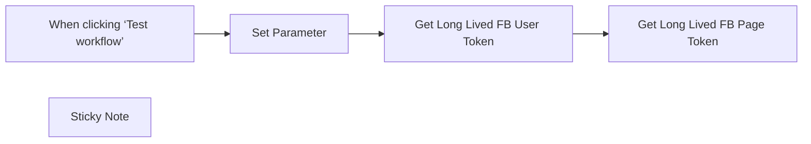

## Fluxo (.json) :

```json
{
  "id": "iA0rm7IWi7xmY5sQ",
  "meta": {
    "instanceId": "08daa2aa5b6032ff63690600b74f68f5b0f34a3b100102e019b35c4419168977",
    "templateCredsSetupCompleted": true
  },
  "name": "Get Long Lived Facebook User or Page Access Token",
  "tags": [],
  "nodes": [
    {
      "id": "2a5077ad-89ee-4659-93a9-e01bcceba0ad",
      "name": "When clicking ‘Test workflow’",
      "type": "n8n-nodes-base.manualTrigger",
      "position": [
        480,
        280
      ],
      "parameters": {},
      "typeVersion": 1
    },
    {
      "id": "e2c7ce4c-fbf9-4552-8a9e-5b41d72c8921",
      "name": "Get Long Lived FB User Token",
      "type": "n8n-nodes-base.httpRequest",
      "position": [
        1000,
        280
      ],
      "parameters": {
        "url": "https://graph.facebook.com/v20.0/oauth/access_token",
        "options": {
          "response": {
            "response": {
              "fullResponse": true
            }
          }
        },
        "sendQuery": true,
        "queryParameters": {
          "parameters": [
            {
              "name": " grant_type",
              "value": "fb_exchange_token"
            },
            {
              "name": " client_id",
              "value": "={{ $json[' client_id'] }}"
            },
            {
              "name": " client_secret",
              "value": "={{ $json[' client_secret'] }}"
            },
            {
              "name": " fb_exchange_token",
              "value": "={{ $json.user_access_token }}"
            }
          ]
        }
      },
      "typeVersion": 4.2
    },
    {
      "id": "4e898760-43cd-4d4f-a76c-555175fb2a27",
      "name": "Get Long Lived FB Page Token",
      "type": "n8n-nodes-base.httpRequest",
      "position": [
        1280,
        280
      ],
      "parameters": {
        "url": "=https://graph.facebook.com/v20.0/{{ $('Set Parameter').item.json.app_scoped_user_id }}/accounts",
        "method": "=GET",
        "options": {
          "response": {
            "response": {
              "fullResponse": true
            }
          }
        },
        "sendQuery": true,
        "queryParameters": {
          "parameters": [
            {
              "name": " access_token",
              "value": "={{ $json.body.access_token }}"
            }
          ]
        }
      },
      "typeVersion": 4.2
    },
    {
      "id": "6ac48498-014f-4721-9629-acd3bd1329e7",
      "name": "Sticky Note",
      "type": "n8n-nodes-base.stickyNote",
      "position": [
        640,
        -87.08653868552273
      ],
      "parameters": {
        "width": 260.14166686078653,
        "height": 552.0076928452548,
        "content": "## Set Required Facebook Parameter \n- client_id\n- client_secret\n- user_access_token\n- app-scoped-user-id (optional)\n\n## according to this doc\n https://developers.facebook.com/docs/facebook-login/guides/access-tokens/get-long-lived/"
      },
      "typeVersion": 1
    },
    {
      "id": "11a68266-f7ec-4c56-9327-c4fd0e4478f6",
      "name": "Set Parameter",
      "type": "n8n-nodes-base.set",
      "position": [
        700,
        280
      ],
      "parameters": {
        "options": {},
        "assignments": {
          "assignments": [
            {
              "id": "b1f6b8a1-dc25-4b1e-9aa3-0c0e452ae2de",
              "name": " client_id",
              "type": "string",
              "value": "xxxx"
            },
            {
              "id": "9a63879a-c359-49ad-9fec-19c9e4c78dd6",
              "name": " client_secret",
              "type": "string",
              "value": "yyyy"
            },
            {
              "id": "6971a841-ed5e-4d96-bdab-1eaec2d51ccc",
              "name": "user_access_token",
              "type": "string",
              "value": "zzzzz"
            },
            {
              "id": "c75d5e50-62ea-4ee0-bfaa-5f79cf4d147e",
              "name": "app_scoped_user_id",
              "type": "string",
              "value": "uuuuuu"
            }
          ]
        }
      },
      "typeVersion": 3.4
    }
  ],
  "active": false,
  "pinData": {},
  "settings": {
    "executionOrder": "v1"
  },
  "versionId": "390c37ce-2c9a-4341-bcb4-2f669f65e209",
  "connections": {
    "Set Parameter": {
      "main": [
        [
          {
            "node": "Get Long Lived FB User Token",
            "type": "main",
            "index": 0
          }
        ]
      ]
    },
    "Get Long Lived FB User Token": {
      "main": [
        [
          {
            "node": "Get Long Lived FB Page Token",
            "type": "main",
            "index": 0
          }
        ]
      ]
    },
    "When clicking ‘Test workflow’": {
      "main": [
        [
          {
            "node": "Set Parameter",
            "type": "main",
            "index": 0
          }
        ]
      ]
    }
  }
}
```
