# PACK 1999 TEMPLATES PARTE 03 - Bloco 1

Templates neste bloco: 20

## Sumário

- [Template 402 - Extrair códigos SWIFT por país](#template-402)
- [Template 403 - Gerenciar assinante MailerLite](#template-403)
- [Template 404 - Atribuição automática de tickets Zendesk por proprietário Pipedrive](#template-404)
- [Template 405 - Atualizar reunião Zoom e redirecionar página WordPress](#template-405)
- [Template 406 - Publicar itens RSS no BlueSky](#template-406)
- [Template 407 - Salvar novos e-mails em planilha](#template-407)
- [Template 408 - Acesso à pasta Box 'n8n-rocks' por acionamento manual](#template-408)
- [Template 409 - Monitoramento de vagas do Upwork e notificação](#template-409)
- [Template 410 - Alerta de uso de recursos do VPS por e-mail](#template-410)
- [Template 411 - Gerar histórias de empresas a partir do LinkedIn](#template-411)
- [Template 412 - Adicionar inscritos ao Airtable](#template-412)
- [Template 413 - Triagem automática de tickets e criação no JIRA](#template-413)
- [Template 414 - Converter vídeo do YouTube em post SEO](#template-414)
- [Template 415 - Acender luz em cor específica ao atualizar repositório GitHub](#template-415)
- [Template 416 - Gatilho de eventos do GitLab](#template-416)
- [Template 417 - Triagem e criação automática de tickets](#template-417)
- [Template 418 - Importar avaliações Trustpilot para Google Sheets](#template-418)
- [Template 419 - Backup de workflows no GitHub](#template-419)
- [Template 420 - Geração automática de histórias infantis em árabe](#template-420)
- [Template 421 - Publicar último vídeo do YouTube no X](#template-421)

---

<a id="template-402"></a>

## Template 402 - Extrair códigos SWIFT por país

- **Nome:** Extrair códigos SWIFT por país
- **Descrição:** Raspa o site theswiftcodes.com para coletar nomes de bancos, códigos SWIFT, cidades e filiais por país, normaliza o país para código ISO e grava os registros em uma coleção MongoDB, usando cache local para as páginas HTML.
- **Funcionalidade:** • Inicialização e preparo: cria diretório de cache local para armazenar páginas HTML.
• Extração da lista de países: busca a página de navegação por país e obtém os links de cada país.
• Processamento em lotes de países: divide a lista de países em batches e processa um país por vez.
• Normalização do nome do país: chama um serviço externo para converter o nome do país em código ISO.
• Definição de página a raspar e geração de URL: determina a página atual a ser raspada e monta a URL completa.
• Cache de páginas HTML: gera nome de arquivo baseado na URL e verifica se a página já está em cache para evitar downloads repetidos.
• Download e escrita em cache: baixa a página HTML quando não existe em cache e a grava no diretório local.
• Extração de dados da página: extrai nomes de bancos, códigos SWIFT, cidades, filiais e link para a próxima página a partir do HTML.
• Paginação automática: detecta botão "next" e atualiza o fluxo para continuar raspando páginas subsequentes do mesmo país.
• Preparação de documentos: monta documentos com iso_code, country, page, name, branch, city, swift_code e timestamps (createdAt, updatedAt).
• Inserção em banco de dados: insere os documentos preparados em uma coleção do MongoDB.
• Controle de ritmo: inclui pequenas esperas entre requisições para reduzir carga no site alvo.
- **Ferramentas:** • theswiftcodes.com: site fonte que contém listas por país com tabelas de bancos e códigos SWIFT.
• uProc (serviço de normalização de países): API externa usada para normalizar nomes de países e obter códigos ISO.
• MongoDB: banco de dados que armazena os documentos resultantes com os dados extraídos.
• Sistema de arquivos local: diretório de cache (/home/node/.cache/scrapper) usado para armazenar e reutilizar páginas HTML baixadas.

## Fluxo visual

```mermaid
flowchart LR
    N1["On clicking 'execute'"]
    N2["HTTP Request"]
    N3["HTML Extract"]
    N4["SplitInBatches"]
    N5["HTTP Request1"]
    N6["HTML Extract1"]
    N7["MongoDB1"]
    N8["uProc"]
    N9["Prepare Documents"]
    N10["More Countries"]
    N11["Set Page to Scrape"]
    N12["More Pages"]
    N13["Set More Pages"]
    N14["Set"]
    N15["Generate filename"]
    N16["Read Binary File"]
    N17["File exists?"]
    N18["Write Binary File"]
    N19["Read Binary File1"]
    N20["Wait"]
    N21["Prepare countries"]
    N22["Create Directory"]
    N23["MongoDB"]

    N14 --> N15
    N20 --> N5
    N8 --> N11
    N7 --> N13
    N12 --> N11
    N12 --> N10
    N17 --> N19
    N17 --> N20
    N3 --> N21
    N2 --> N3
    N6 --> N9
    N5 --> N18
    N10 --> N4
    N13 --> N12
    N4 --> N8
    N22 --> N2
    N16 --> N17
    N15 --> N16
    N9 --> N7
    N21 --> N4
    N19 --> N6
    N18 --> N19
    N11 --> N14
    N1 --> N22
```

## Fluxo (.json) :

```json
{
  "id": "14",
  "name": "extract_swifts",
  "nodes": [
    {
      "name": "On clicking 'execute'",
      "type": "n8n-nodes-base.manualTrigger",
      "position": [
        -140,
        820
      ],
      "parameters": {},
      "typeVersion": 1
    },
    {
      "name": "HTTP Request",
      "type": "n8n-nodes-base.httpRequest",
      "position": [
        320,
        820
      ],
      "parameters": {
        "url": "https://www.theswiftcodes.com/browse-by-country/",
        "options": {},
        "responseFormat": "string"
      },
      "typeVersion": 1
    },
    {
      "name": "HTML Extract",
      "type": "n8n-nodes-base.htmlExtract",
      "position": [
        510,
        820
      ],
      "parameters": {
        "options": {},
        "extractionValues": {
          "values": [
            {
              "key": "countries",
              "attribute": "href",
              "cssSelector": "ol > li > a",
              "returnArray": true,
              "returnValue": "attribute"
            }
          ]
        }
      },
      "typeVersion": 1
    },
    {
      "name": "SplitInBatches",
      "type": "n8n-nodes-base.splitInBatches",
      "position": [
        910,
        820
      ],
      "parameters": {
        "options": {
          "reset": false
        },
        "batchSize": 1
      },
      "typeVersion": 1
    },
    {
      "name": "HTTP Request1",
      "type": "n8n-nodes-base.httpRequest",
      "position": [
        2250,
        740
      ],
      "parameters": {
        "url": "={{$node[\"Set\"].json[\"url\"]}}",
        "options": {},
        "responseFormat": "file"
      },
      "typeVersion": 1
    },
    {
      "name": "HTML Extract1",
      "type": "n8n-nodes-base.htmlExtract",
      "position": [
        2750,
        590
      ],
      "parameters": {
        "options": {},
        "sourceData": "binary",
        "extractionValues": {
          "values": [
            {
              "key": "next_button",
              "attribute": "href",
              "cssSelector": "span.next > a",
              "returnValue": "attribute"
            },
            {
              "key": "names",
              "cssSelector": "td.table-name",
              "returnArray": true
            },
            {
              "key": "swifts",
              "cssSelector": "td.table-swift",
              "returnArray": true
            },
            {
              "key": "cities",
              "cssSelector": "td.table-city",
              "returnArray": true
            },
            {
              "key": "branches",
              "cssSelector": "td.table-branch",
              "returnArray": true
            }
          ]
        }
      },
      "typeVersion": 1
    },
    {
      "name": "MongoDB1",
      "type": "n8n-nodes-base.mongoDb",
      "position": [
        3280,
        590
      ],
      "parameters": {
        "fields": "iso_code,country,page,name,branch,city,swift_code,createdAt,updatedAt",
        "options": {
          "dateFields": "createdAt,updatedAt"
        },
        "operation": "insert",
        "collection": "swifts.meetup"
      },
      "credentials": {
        "mongoDb": "db-mongo"
      },
      "typeVersion": 1
    },
    {
      "name": "uProc",
      "type": "n8n-nodes-base.uproc",
      "position": [
        1100,
        820
      ],
      "parameters": {
        "tool": "getCountryNormalized",
        "group": "geographic",
        "country": "={{$node[\"SplitInBatches\"].json[\"country\"].replace(/[/0-9]/g, \"\")}}",
        "additionalOptions": {}
      },
      "credentials": {
        "uprocApi": "uproc-miquel"
      },
      "typeVersion": 1
    },
    {
      "name": "Prepare Documents",
      "type": "n8n-nodes-base.function",
      "position": [
        2930,
        590
      ],
      "parameters": {
        "functionCode": "var newItems = [];\n\nfor (i = 0; i < items[0].json.swifts.length; i++) {\n  var item = {\n    iso_code: $node['uProc'].json.message.code,\n    country: $node['SplitInBatches'].json.country.replace(/[-/0-9]/g, \"\"),\n    page: $node['Set Page to Scrape'].json.page,\n    name: items[0].json.names[i],\n    city: items[0].json.cities[i],\n    branch: items[0].json.branches[i],\n    swift_code: items[0].json.swifts[i],\n    createdAt: new Date(),\n    updatedAt: new Date()\n  }\n  newItems.push({json: item});\n}\n\nreturn newItems;\n\n"
      },
      "typeVersion": 1
    },
    {
      "name": "More Countries",
      "type": "n8n-nodes-base.if",
      "position": [
        2810,
        1100
      ],
      "parameters": {
        "conditions": {
          "string": [
            {
              "value1": "={{$node[\"SplitInBatches\"].context[\"noItemsLeft\"] + \"\"}}",
              "value2": "true"
            }
          ]
        }
      },
      "typeVersion": 1
    },
    {
      "name": "Set Page to Scrape",
      "type": "n8n-nodes-base.functionItem",
      "position": [
        1290,
        680
      ],
      "parameters": {
        "functionCode": "const staticData = getWorkflowStaticData('global');\n\nitem.page = \"\";\nif (staticData.page && staticData.page.length) {\n  item.page = staticData.page;\n} else {\n  item.page = $node['SplitInBatches'].json.country;\n}\nreturn item;\n"
      },
      "typeVersion": 1
    },
    {
      "name": "More Pages",
      "type": "n8n-nodes-base.if",
      "position": [
        3070,
        1020
      ],
      "parameters": {
        "conditions": {
          "string": [
            {
              "value1": "={{$json[\"more_pages\"] + \"\"}}",
              "value2": "true"
            }
          ]
        }
      },
      "typeVersion": 1
    },
    {
      "name": "Set More Pages",
      "type": "n8n-nodes-base.function",
      "position": [
        3470,
        590
      ],
      "parameters": {
        "functionCode": "var next_page = $node['HTML Extract1'].json.next_button && $node['HTML Extract1'].json.next_button.length ? $node['HTML Extract1'].json.next_button : \"\";\nvar more_pages = next_page.length > 0;\nconst staticData = getWorkflowStaticData('global');\n\n//all current items are after date: needs pagination\nif (more_pages) {\n  staticData.page = next_page;\n} else {\n  //don't check more items in previous pages;\n  delete staticData.page;\n}\n\nreturn [\n  {\n    json: {\n      more_pages: more_pages\n    }\n  }\n];\n"
      },
      "typeVersion": 1
    },
    {
      "name": "Set",
      "type": "n8n-nodes-base.set",
      "position": [
        1440,
        680
      ],
      "parameters": {
        "values": {
          "string": [
            {
              "name": "url",
              "value": "=https://www.theswiftcodes.com{{$node[\"Set Page to Scrape\"].json[\"page\"]}}"
            }
          ]
        },
        "options": {}
      },
      "typeVersion": 1
    },
    {
      "name": "Generate filename",
      "type": "n8n-nodes-base.functionItem",
      "position": [
        1600,
        610
      ],
      "parameters": {
        "functionCode": "var generateNameFromUrl = function(url){\n    return url.replace(/[^a-z0-9]/gi, \"_\");\n}\n\nitem.file = generateNameFromUrl(item.url) + \".html\"\nreturn item;"
      },
      "typeVersion": 1
    },
    {
      "name": "Read Binary File",
      "type": "n8n-nodes-base.readBinaryFile",
      "position": [
        1770,
        610
      ],
      "parameters": {
        "filePath": "=/home/node/.cache/scrapper/{{$json[\"file\"]}}"
      },
      "typeVersion": 1,
      "continueOnFail": true,
      "alwaysOutputData": true
    },
    {
      "name": "File exists?",
      "type": "n8n-nodes-base.if",
      "position": [
        1950,
        610
      ],
      "parameters": {
        "conditions": {
          "string": [
            {
              "value1": "={{$node[\"Read Binary File\"].binary.data.mimeType}}",
              "value2": "text/html"
            }
          ]
        }
      },
      "typeVersion": 1
    },
    {
      "name": "Write Binary File",
      "type": "n8n-nodes-base.writeBinaryFile",
      "position": [
        2400,
        740
      ],
      "parameters": {
        "fileName": "=/home/node/.cache/scrapper/{{$node[\"Generate filename\"].json[\"file\"]}}",
        "dataPropertyName": "=data"
      },
      "typeVersion": 1
    },
    {
      "name": "Read Binary File1",
      "type": "n8n-nodes-base.readBinaryFile",
      "position": [
        2570,
        590
      ],
      "parameters": {
        "filePath": "=/home/node/.cache/scrapper/{{$json[\"file\"]}}"
      },
      "typeVersion": 1,
      "continueOnFail": true,
      "alwaysOutputData": true
    },
    {
      "name": "Wait",
      "type": "n8n-nodes-base.function",
      "position": [
        2090,
        740
      ],
      "parameters": {
        "functionCode": "const waitTimeSeconds = 1;\n\nreturn new Promise((resolve) => {\n  setTimeout(() => {\n    resolve([]);\n  }, waitTimeSeconds * 1000);\n});\n"
      },
      "typeVersion": 1,
      "continueOnFail": true,
      "alwaysOutputData": true
    },
    {
      "name": "Prepare countries",
      "type": "n8n-nodes-base.function",
      "position": [
        700,
        820
      ],
      "parameters": {
        "functionCode": "return items[0].json.countries.map(function(country) {\n  return {\n  json: {country: country}\n  }\n});"
      },
      "typeVersion": 1
    },
    {
      "name": "Create Directory",
      "type": "n8n-nodes-base.executeCommand",
      "position": [
        70,
        820
      ],
      "parameters": {
        "command": "mkdir -p  /home/node/.cache/scrapper/"
      },
      "typeVersion": 1,
      "continueOnFail": true
    },
    {
      "name": "MongoDB",
      "type": "n8n-nodes-base.mongoDb",
      "disabled": true,
      "position": [
        3100,
        520
      ],
      "parameters": {
        "query": "={\"swift_code\": \"{{$json[\"swift_code\"]}}\"}",
        "options": {},
        "collection": "swifts.meetup"
      },
      "credentials": {
        "mongoDb": "db-mongo"
      },
      "executeOnce": false,
      "typeVersion": 1,
      "alwaysOutputData": true
    }
  ],
  "active": false,
  "settings": {},
  "connections": {
    "Set": {
      "main": [
        [
          {
            "node": "Generate filename",
            "type": "main",
            "index": 0
          }
        ]
      ]
    },
    "Wait": {
      "main": [
        [
          {
            "node": "HTTP Request1",
            "type": "main",
            "index": 0
          }
        ]
      ]
    },
    "uProc": {
      "main": [
        [
          {
            "node": "Set Page to Scrape",
            "type": "main",
            "index": 0
          }
        ]
      ]
    },
    "MongoDB": {
      "main": [
        []
      ]
    },
    "MongoDB1": {
      "main": [
        [
          {
            "node": "Set More Pages",
            "type": "main",
            "index": 0
          }
        ]
      ]
    },
    "More Pages": {
      "main": [
        [
          {
            "node": "Set Page to Scrape",
            "type": "main",
            "index": 0
          }
        ],
        [
          {
            "node": "More Countries",
            "type": "main",
            "index": 0
          }
        ]
      ]
    },
    "File exists?": {
      "main": [
        [
          {
            "node": "Read Binary File1",
            "type": "main",
            "index": 0
          }
        ],
        [
          {
            "node": "Wait",
            "type": "main",
            "index": 0
          }
        ]
      ]
    },
    "HTML Extract": {
      "main": [
        [
          {
            "node": "Prepare countries",
            "type": "main",
            "index": 0
          }
        ]
      ]
    },
    "HTTP Request": {
      "main": [
        [
          {
            "node": "HTML Extract",
            "type": "main",
            "index": 0
          }
        ]
      ]
    },
    "HTML Extract1": {
      "main": [
        [
          {
            "node": "Prepare Documents",
            "type": "main",
            "index": 0
          }
        ]
      ]
    },
    "HTTP Request1": {
      "main": [
        [
          {
            "node": "Write Binary File",
            "type": "main",
            "index": 0
          }
        ]
      ]
    },
    "More Countries": {
      "main": [
        [],
        [
          {
            "node": "SplitInBatches",
            "type": "main",
            "index": 0
          }
        ]
      ]
    },
    "Set More Pages": {
      "main": [
        [
          {
            "node": "More Pages",
            "type": "main",
            "index": 0
          }
        ]
      ]
    },
    "SplitInBatches": {
      "main": [
        [
          {
            "node": "uProc",
            "type": "main",
            "index": 0
          }
        ]
      ]
    },
    "Create Directory": {
      "main": [
        [
          {
            "node": "HTTP Request",
            "type": "main",
            "index": 0
          }
        ]
      ]
    },
    "Read Binary File": {
      "main": [
        [
          {
            "node": "File exists?",
            "type": "main",
            "index": 0
          }
        ]
      ]
    },
    "Generate filename": {
      "main": [
        [
          {
            "node": "Read Binary File",
            "type": "main",
            "index": 0
          }
        ]
      ]
    },
    "Prepare Documents": {
      "main": [
        [
          {
            "node": "MongoDB1",
            "type": "main",
            "index": 0
          }
        ]
      ]
    },
    "Prepare countries": {
      "main": [
        [
          {
            "node": "SplitInBatches",
            "type": "main",
            "index": 0
          }
        ]
      ]
    },
    "Read Binary File1": {
      "main": [
        [
          {
            "node": "HTML Extract1",
            "type": "main",
            "index": 0
          }
        ]
      ]
    },
    "Write Binary File": {
      "main": [
        [
          {
            "node": "Read Binary File1",
            "type": "main",
            "index": 0
          }
        ]
      ]
    },
    "Set Page to Scrape": {
      "main": [
        [
          {
            "node": "Set",
            "type": "main",
            "index": 0
          }
        ]
      ]
    },
    "On clicking 'execute'": {
      "main": [
        [
          {
            "node": "Create Directory",
            "type": "main",
            "index": 0
          }
        ]
      ]
    }
  }
}
```

<a id="template-403"></a>

## Template 403 - Gerenciar assinante MailerLite

- **Nome:** Gerenciar assinante MailerLite
- **Descrição:** Cria um assinante com email e nome, atualiza um campo personalizado e recupera os dados do assinante.
- **Funcionalidade:** • Acionamento manual: inicia o fluxo quando o usuário executa manualmente.
• Criação de assinante: adiciona um novo assinante usando o email e o nome fornecidos.
• Atualização de assinante: atualiza campos personalizados do assinante (ex.: cidade) usando o email como identificador.
• Recuperação de assinante: obtém os dados atualizados do assinante após a modificação.
- **Ferramentas:** • MailerLite: plataforma de email marketing para gerenciar contatos, permitindo criar, atualizar e consultar assinantes via API.


## Fluxo visual

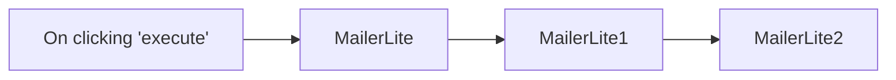

## Fluxo (.json) :

```json
{
  "id": "96",
  "name": "Create, update and get a subscriber using the MailerLite node",
  "nodes": [
    {
      "name": "On clicking 'execute'",
      "type": "n8n-nodes-base.manualTrigger",
      "position": [
        310,
        300
      ],
      "parameters": {},
      "typeVersion": 1
    },
    {
      "name": "MailerLite",
      "type": "n8n-nodes-base.mailerLite",
      "position": [
        510,
        300
      ],
      "parameters": {
        "email": "harshil@n8n.io",
        "additionalFields": {
          "name": "Harshil"
        }
      },
      "credentials": {
        "mailerLiteApi": "mailerlite"
      },
      "typeVersion": 1
    },
    {
      "name": "MailerLite1",
      "type": "n8n-nodes-base.mailerLite",
      "position": [
        710,
        300
      ],
      "parameters": {
        "operation": "update",
        "subscriberId": "={{$node[\"MailerLite\"].json[\"email\"]}}",
        "updateFields": {
          "customFieldsUi": {
            "customFieldsValues": [
              {
                "value": "Berlin",
                "fieldId": "city"
              }
            ]
          }
        }
      },
      "credentials": {
        "mailerLiteApi": "mailerlite"
      },
      "typeVersion": 1
    },
    {
      "name": "MailerLite2",
      "type": "n8n-nodes-base.mailerLite",
      "position": [
        910,
        300
      ],
      "parameters": {
        "operation": "get",
        "subscriberId": "={{$node[\"MailerLite\"].json[\"email\"]}}"
      },
      "credentials": {
        "mailerLiteApi": "mailerlite"
      },
      "typeVersion": 1
    }
  ],
  "active": false,
  "settings": {},
  "connections": {
    "MailerLite": {
      "main": [
        [
          {
            "node": "MailerLite1",
            "type": "main",
            "index": 0
          }
        ]
      ]
    },
    "MailerLite1": {
      "main": [
        [
          {
            "node": "MailerLite2",
            "type": "main",
            "index": 0
          }
        ]
      ]
    },
    "On clicking 'execute'": {
      "main": [
        [
          {
            "node": "MailerLite",
            "type": "main",
            "index": 0
          }
        ]
      ]
    }
  }
}
```

<a id="template-404"></a>

## Template 404 - Atribuição automática de tickets Zendesk por proprietário Pipedrive

- **Nome:** Atribuição automática de tickets Zendesk por proprietário Pipedrive
- **Descrição:** Verifica periodicamente tickets novos no Zendesk, busca o solicitante no Pipedrive e, se encontrado, reatribui o ticket ao proprietário do contato; caso contrário adiciona uma nota interna.
- **Funcionalidade:** • Agendamento periódico: Executa o processo a cada 5 minutos para verificar novos tickets.
• Controle de última execução: Mantém um timestamp da última execução para buscar apenas tickets criados depois desse momento.
• Busca de tickets recentes: Recupera tickets do Zendesk criados após o último timestamp armazenado.
• Enriquecimento com dados do solicitante: Obtém informações do solicitante do ticket (email e id).
• Pesquisa de contato no Pipedrive: Procura o solicitante pelo email no Pipedrive para identificar o contato correspondente.
• Obtenção do proprietário do contato: Recupera o usuário proprietário do contato no Pipedrive e seu email.
• Mapeamento com agentes Zendesk: Busca agentes e administradores no Zendesk para relacionar emails a IDs de agentes.
• Reatribuição de ticket: Se o contato existir e houver proprietário correspondente, atualiza o ticket no Zendesk para atribuí-lo ao proprietário.
• Registro de caso não encontrado: Se o solicitante não for encontrado no Pipedrive, adiciona uma nota interna ao ticket indicando que não foi encontrado.
• Atualização do timestamp: Ao final das ações relevantes atualiza o timestamp de última execução para futuras buscas.
- **Ferramentas:** • Zendesk: Plataforma de atendimento para buscar, atualizar tickets e consultar usuários (solicitantes, agentes e administradores).
• Pipedrive: CRM usado para pesquisar contatos pelo email e obter informações do proprietário do contato.

## Fluxo visual

```mermaid
flowchart LR
    N1["Get last execution timestamp"]
    N2["Set new last execution timestamp"]
    N3["Get tickets created after last execution"]
    N4["Get requester information"]
    N5["Keep only needed requester information"]
    N6["Keep only requester owner email"]
    N7["Every 5 minutes"]
    N8["Add requester information to ticket data"]
    N9["Search requester in pipedrive"]
    N10["Get owner information of Pipedrive contact"]
    N11["Get agents and admins"]
    N12["Keep only email and Id"]
    N13["Add Pipedrive agent data to pipedrive contact information"]
    N14["Add contact owner to ticket data"]
    N15["Contact exists in Pipedrive"]
    N16["Change assignee to Pipedrive contact owner"]
    N17["Add a note requester not found"]

    N7 --> N1
    N11 --> N12
    N12 --> N13
    N4 --> N5
    N15 --> N16
    N15 --> N17
    N1 --> N3
    N9 --> N10
    N17 --> N2
    N6 --> N13
    N14 --> N15
    N5 --> N8
    N8 --> N9
    N8 --> N14
    N3 --> N8
    N3 --> N4
    N16 --> N2
    N10 --> N6
    N13 --> N14
```

## Fluxo (.json) :

```json
{
  "meta": {
    "instanceId": "237600ca44303ce91fa31ee72babcdc8493f55ee2c0e8aa2b78b3b4ce6f70bd9"
  },
  "nodes": [
    {
      "id": "9d40c0b9-498f-421c-b731-3a387402b69a",
      "name": "Get last execution timestamp",
      "type": "n8n-nodes-base.functionItem",
      "position": [
        380,
        360
      ],
      "parameters": {
        "functionCode": "// Code here will run once per input item.\n// More info and help: https://docs.n8n.io/nodes/n8n-nodes-base.functionItem\n// Tip: You can use luxon for dates and $jmespath for querying JSON structures\n\n// Add a new field called 'myNewField' to the JSON of the item\nconst staticData = getWorkflowStaticData('global');\n\nif(!staticData.lastExecution){\n  staticData.lastExecution = new Date().getTime();\n}\n\nitem.executionTimeStamp = new Date().getTime();\nitem.lastExecution = staticData.lastExecution;\n\n\nreturn item;"
      },
      "typeVersion": 1
    },
    {
      "id": "ddb12f68-1f6b-41fb-bfd4-038697ce4d75",
      "name": "Set new last execution timestamp",
      "type": "n8n-nodes-base.functionItem",
      "position": [
        3280,
        380
      ],
      "parameters": {
        "functionCode": "// Code here will run once per input item.\n// More info and help: https://docs.n8n.io/nodes/n8n-nodes-base.functionItem\n// Tip: You can use luxon for dates and $jmespath for querying JSON structures\n\n// Add a new field called 'myNewField' to the JSON of the item\nconst staticData = getWorkflowStaticData('global');\n\nstaticData.lastExecution = $item(0).$node[\"Get last execution timestamp\"].executionTimeStamp;\n\nreturn item;"
      },
      "executeOnce": true,
      "typeVersion": 1
    },
    {
      "id": "42888df0-1f7e-4990-87b3-3226a474110e",
      "name": "Get tickets created after last execution",
      "type": "n8n-nodes-base.zendesk",
      "position": [
        620,
        360
      ],
      "parameters": {
        "options": {
          "query": "=created>{{ $json[\"lastExecution\"] }}",
          "sortBy": "updated_at",
          "sortOrder": "desc"
        },
        "operation": "getAll"
      },
      "credentials": {
        "zendeskApi": {
          "id": "5",
          "name": "Zendesk account"
        }
      },
      "typeVersion": 1
    },
    {
      "id": "2f0f71f6-3d4c-4895-9313-7f47e3b2ed86",
      "name": "Get requester information",
      "type": "n8n-nodes-base.zendesk",
      "position": [
        840,
        460
      ],
      "parameters": {
        "id": "={{ $json[\"requester_id\"] }}",
        "resource": "user",
        "operation": "get"
      },
      "credentials": {
        "zendeskApi": {
          "id": "5",
          "name": "Zendesk account"
        }
      },
      "typeVersion": 1
    },
    {
      "id": "284fd54b-bd7b-4fbb-8a14-0c4fa62a3200",
      "name": "Keep only needed requester information",
      "type": "n8n-nodes-base.set",
      "position": [
        1060,
        460
      ],
      "parameters": {
        "values": {
          "number": [
            {
              "name": "requester_id",
              "value": "={{ $json[\"id\"] }}"
            }
          ],
          "string": [
            {
              "name": "requester_email",
              "value": "={{ $json[\"email\"] }}"
            }
          ]
        },
        "options": {},
        "keepOnlySet": true
      },
      "typeVersion": 1
    },
    {
      "id": "17c3b860-60cb-4885-b503-9086b461bde0",
      "name": "Keep only requester owner email",
      "type": "n8n-nodes-base.set",
      "position": [
        2000,
        480
      ],
      "parameters": {
        "values": {
          "string": [
            {
              "name": "requester_pipedrive_email",
              "value": "={{ $node[\"Search requester in pipedrive\"].json[\"primary_email\"] }}"
            },
            {
              "name": "requester_pipedrive_owner_email",
              "value": "={{ $json[\"data\"].email }}"
            }
          ]
        },
        "options": {},
        "keepOnlySet": true
      },
      "typeVersion": 1
    },
    {
      "id": "a4ccf1d7-5d9f-4c4e-a5b9-c54ed77c5c44",
      "name": "Every 5 minutes",
      "type": "n8n-nodes-base.cron",
      "position": [
        160,
        360
      ],
      "parameters": {
        "triggerTimes": {
          "item": [
            {
              "mode": "everyX",
              "unit": "minutes",
              "value": 5
            }
          ]
        }
      },
      "typeVersion": 1
    },
    {
      "id": "99fb51d8-0d93-4db9-868d-757046d1bdc2",
      "name": "Add requester information to ticket data",
      "type": "n8n-nodes-base.merge",
      "position": [
        1280,
        380
      ],
      "parameters": {
        "mode": "mergeByKey",
        "propertyName1": "requester_id",
        "propertyName2": "requester_id"
      },
      "typeVersion": 1
    },
    {
      "id": "a4c7acd0-b2b6-48bb-b7b7-d2826ddb1f9d",
      "name": "Search requester in pipedrive",
      "type": "n8n-nodes-base.pipedrive",
      "position": [
        1560,
        480
      ],
      "parameters": {
        "term": "={{ $json[\"requester_email\"] }}",
        "resource": "person",
        "operation": "search",
        "additionalFields": {
          "fields": "email"
        }
      },
      "credentials": {
        "pipedriveApi": {
          "id": "1",
          "name": "Pipedrive account"
        }
      },
      "typeVersion": 1
    },
    {
      "id": "7a8a3bf3-9f57-40ad-a31f-45522264f101",
      "name": "Get owner information of Pipedrive contact",
      "type": "n8n-nodes-base.httpRequest",
      "position": [
        1780,
        480
      ],
      "parameters": {
        "url": "=https://n8n.pipedrive.com/api/v1/users/{{$json[\"owner\"][\"id\"]}}",
        "options": {},
        "authentication": "predefinedCredentialType",
        "nodeCredentialType": "pipedriveApi"
      },
      "credentials": {
        "pipedriveApi": {
          "id": "1",
          "name": "Pipedrive account"
        }
      },
      "typeVersion": 2
    },
    {
      "id": "64a7fc0c-ddb4-4d84-86a6-3e9bd361ce46",
      "name": "Get agents and admins",
      "type": "n8n-nodes-base.zendesk",
      "position": [
        1780,
        700
      ],
      "parameters": {
        "filters": {
          "role": [
            "agent",
            "admin"
          ]
        },
        "resource": "user",
        "operation": "getAll",
        "returnAll": true
      },
      "credentials": {
        "zendeskApi": {
          "id": "5",
          "name": "Zendesk account"
        }
      },
      "typeVersion": 1
    },
    {
      "id": "0117d5f8-e9b2-46c9-9777-7ae82e002cc2",
      "name": "Keep only email and Id",
      "type": "n8n-nodes-base.set",
      "position": [
        2000,
        700
      ],
      "parameters": {
        "values": {
          "string": [
            {
              "name": "agent_email",
              "value": "={{ $json[\"email\"] }}"
            },
            {
              "name": "agent_id",
              "value": "={{ $json[\"id\"] }}"
            }
          ]
        },
        "options": {},
        "keepOnlySet": true
      },
      "typeVersion": 1
    },
    {
      "id": "eaa7b072-0499-4b3a-96af-433d3afc12f9",
      "name": "Add Pipedrive agent data to pipedrive contact information",
      "type": "n8n-nodes-base.merge",
      "position": [
        2280,
        500
      ],
      "parameters": {
        "mode": "mergeByKey",
        "propertyName1": "requester_pipedrive_owner_email",
        "propertyName2": "agent_email"
      },
      "typeVersion": 1
    },
    {
      "id": "b9619e3d-c951-47ae-bbb5-db50e7ae5abe",
      "name": "Add contact owner to ticket data",
      "type": "n8n-nodes-base.merge",
      "position": [
        2540,
        400
      ],
      "parameters": {
        "mode": "mergeByKey",
        "propertyName1": "requester_email",
        "propertyName2": "requester_pipedrive_email"
      },
      "typeVersion": 1
    },
    {
      "id": "14f88f5f-2bab-42f2-bea7-a7566e6d45b1",
      "name": "Contact exists in Pipedrive",
      "type": "n8n-nodes-base.if",
      "position": [
        2760,
        400
      ],
      "parameters": {
        "conditions": {
          "string": [
            {
              "value1": "={{ $json[\"agent_id\"] }}",
              "operation": "isNotEmpty"
            }
          ]
        }
      },
      "typeVersion": 1
    },
    {
      "id": "38da1ccc-3d23-41cd-84b3-6fc249aedca5",
      "name": "Change assignee to Pipedrive contact owner",
      "type": "n8n-nodes-base.zendesk",
      "position": [
        3020,
        380
      ],
      "parameters": {
        "id": "={{ $json[\"id\"] }}",
        "operation": "update",
        "updateFields": {
          "assigneeEmail": "={{$json[\"requester_pipedrive_owner_email\"]}}"
        }
      },
      "credentials": {
        "zendeskApi": {
          "id": "5",
          "name": "Zendesk account"
        }
      },
      "typeVersion": 1
    },
    {
      "id": "4295e0e2-88e8-4f93-8432-47fff452cfc5",
      "name": "Add a note requester not found",
      "type": "n8n-nodes-base.zendesk",
      "position": [
        3020,
        580
      ],
      "parameters": {
        "id": "={{ $json[\"id\"] }}",
        "operation": "update",
        "updateFields": {
          "internalNote": "Requester not found in Pipedrive"
        }
      },
      "credentials": {
        "zendeskApi": {
          "id": "5",
          "name": "Zendesk account"
        }
      },
      "typeVersion": 1
    }
  ],
  "connections": {
    "Every 5 minutes": {
      "main": [
        [
          {
            "node": "Get last execution timestamp",
            "type": "main",
            "index": 0
          }
        ]
      ]
    },
    "Get agents and admins": {
      "main": [
        [
          {
            "node": "Keep only email and Id",
            "type": "main",
            "index": 0
          }
        ]
      ]
    },
    "Keep only email and Id": {
      "main": [
        [
          {
            "node": "Add Pipedrive agent data to pipedrive contact information",
            "type": "main",
            "index": 1
          }
        ]
      ]
    },
    "Get requester information": {
      "main": [
        [
          {
            "node": "Keep only needed requester information",
            "type": "main",
            "index": 0
          }
        ]
      ]
    },
    "Contact exists in Pipedrive": {
      "main": [
        [
          {
            "node": "Change assignee to Pipedrive contact owner",
            "type": "main",
            "index": 0
          }
        ],
        [
          {
            "node": "Add a note requester not found",
            "type": "main",
            "index": 0
          }
        ]
      ]
    },
    "Get last execution timestamp": {
      "main": [
        [
          {
            "node": "Get tickets created after last execution",
            "type": "main",
            "index": 0
          }
        ]
      ]
    },
    "Search requester in pipedrive": {
      "main": [
        [
          {
            "node": "Get owner information of Pipedrive contact",
            "type": "main",
            "index": 0
          }
        ]
      ]
    },
    "Add a note requester not found": {
      "main": [
        [
          {
            "node": "Set new last execution timestamp",
            "type": "main",
            "index": 0
          }
        ]
      ]
    },
    "Keep only requester owner email": {
      "main": [
        [
          {
            "node": "Add Pipedrive agent data to pipedrive contact information",
            "type": "main",
            "index": 0
          }
        ]
      ]
    },
    "Add contact owner to ticket data": {
      "main": [
        [
          {
            "node": "Contact exists in Pipedrive",
            "type": "main",
            "index": 0
          }
        ]
      ]
    },
    "Keep only needed requester information": {
      "main": [
        [
          {
            "node": "Add requester information to ticket data",
            "type": "main",
            "index": 1
          }
        ]
      ]
    },
    "Add requester information to ticket data": {
      "main": [
        [
          {
            "node": "Search requester in pipedrive",
            "type": "main",
            "index": 0
          },
          {
            "node": "Add contact owner to ticket data",
            "type": "main",
            "index": 0
          }
        ]
      ]
    },
    "Get tickets created after last execution": {
      "main": [
        [
          {
            "node": "Add requester information to ticket data",
            "type": "main",
            "index": 0
          },
          {
            "node": "Get requester information",
            "type": "main",
            "index": 0
          }
        ]
      ]
    },
    "Change assignee to Pipedrive contact owner": {
      "main": [
        [
          {
            "node": "Set new last execution timestamp",
            "type": "main",
            "index": 0
          }
        ]
      ]
    },
    "Get owner information of Pipedrive contact": {
      "main": [
        [
          {
            "node": "Keep only requester owner email",
            "type": "main",
            "index": 0
          }
        ]
      ]
    },
    "Add Pipedrive agent data to pipedrive contact information": {
      "main": [
        [
          {
            "node": "Add contact owner to ticket data",
            "type": "main",
            "index": 1
          }
        ]
      ]
    }
  }
}
```

<a id="template-405"></a>

## Template 405 - Atualizar reunião Zoom e redirecionar página WordPress

- **Nome:** Atualizar reunião Zoom e redirecionar página WordPress
- **Descrição:** Agenda periodicamente a atualização de uma reunião Zoom, atualiza uma página do WordPress para redirecionar automaticamente para a reunião e notifica um canal no Slack.
- **Funcionalidade:** • Disparo agendado: executa o fluxo periodicamente (a cada 360 dias às 03:00) para iniciar a atualização da reunião.
• Atualizar reunião Zoom: cria/atualiza uma reunião com título 'New Meeting', tipo recorrente, fuso horário America/New_York e configurações (silenciar ao entrar, permitir ingresso antes do anfitrião, vídeo dos participantes ativo).
• Atualizar página WordPress: altera o conteúdo de uma página específica inserindo uma meta tag de redirecionamento para o link de acesso da reunião e uma mensagem de aguarde.
• Notificar Slack: envia uma mensagem para um canal informando que a reunião recorrente foi atualizada e inclui o link de acesso.
- **Ferramentas:** • Zoom: plataforma de videoconferência usada para criar/atualizar a reunião e obter o link de entrada.
• WordPress: sistema de gerenciamento de conteúdo onde a página é atualizada para redirecionar os visitantes automaticamente para a reunião.
• Slack: ferramenta de comunicação usada para notificar um canal sobre a atualização da reunião.


## Fluxo visual

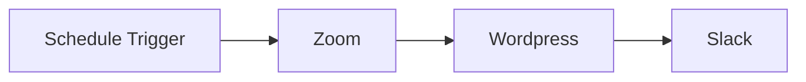

## Fluxo (.json) :

```json
{
  "nodes": [
    {
      "name": "Zoom",
      "type": "n8n-nodes-base.zoom",
      "position": [
        1340,
        580
      ],
      "parameters": {
        "topic": "New Meeting",
        "authentication": "oAuth2",
        "additionalFields": {
          "type": 3,
          "settings": {
            "muteUponEntry": true,
            "joinBeforeHost": true,
            "participantVideo": true
          },
          "timeZone": "America/New_York"
        }
      },
      "typeVersion": 1
    },
    {
      "name": "Schedule Trigger",
      "type": "n8n-nodes-base.scheduleTrigger",
      "notes": "Cron trigger to reset zoom meeting on the auto-redirect link",
      "position": [
        1120,
        580
      ],
      "parameters": {
        "rule": {
          "interval": [
            {
              "daysInterval": 360,
              "triggerAtHour": 3
            }
          ]
        }
      },
      "typeVersion": 1.2
    },
    {
      "name": "Wordpress",
      "type": "n8n-nodes-base.wordpress",
      "position": [
        1560,
        580
      ],
      "parameters": {
        "pageId": "123 (Create a page in WP, copy the ID of the page, paste it here)",
        "resource": "page",
        "operation": "update",
        "updateFields": {
          "content": "=\n<meta http-equiv=\"refresh\" content=\"0;{{ $json.join_url }}\">\n<p>Redirecting, please wait a moment. Meeting will begin shortly&#8230;</p>"
        }
      },
      "typeVersion": 1
    },
    {
      "name": "Slack",
      "type": "n8n-nodes-base.slack",
      "position": [
        1780,
        580
      ],
      "parameters": {
        "text": "=Zoom recurring meeting updated!\n{{ $('Zoom').item.json.join_url }}",
        "select": "channel",
        "channelId": {
          "__rl": true,
          "mode": "list",
          "value": "abc123",
          "cachedResultName": "my-slack-channel"
        },
        "otherOptions": {
          "includeLinkToWorkflow": true
        }
      },
      "typeVersion": 2.2
    }
  ],
  "pinData": {},
  "connections": {
    "Zoom": {
      "main": [
        [
          {
            "node": "Wordpress",
            "type": "main",
            "index": 0
          }
        ]
      ]
    },
    "Wordpress": {
      "main": [
        [
          {
            "node": "Slack",
            "type": "main",
            "index": 0
          }
        ]
      ]
    },
    "Schedule Trigger": {
      "main": [
        [
          {
            "node": "Zoom",
            "type": "main",
            "index": 0
          }
        ]
      ]
    }
  }
}
```

<a id="template-406"></a>

## Template 406 - Publicar itens RSS no BlueSky

- **Nome:** Publicar itens RSS no BlueSky
- **Descrição:** Cria automaticamente publicações no BlueSky para cada novo item de um feed RSS, incluindo imagem, link, título, descrição e trecho do conteúdo.
- **Funcionalidade:** • Monitoramento de feed RSS: Verifica periodicamente um feed RSS e detecta novos itens.
• Autenticação na conta BlueSky: Cria uma sessão usando credenciais para obter autorização antes de publicar.
• Captura da data atual: Anexa a data e hora atual ao registro do post.
• Download de imagem do item: Recupera a imagem vinculada no item do feed (enclosure).
• Upload da imagem para a conta: Envia a imagem para o serviço de armazenamento da plataforma para obter referência de blob.
• Criação de post com embed externo: Publica um registro contendo texto, link externo, título, descrição e thumbnail referenciando o blob enviado.
• Personalização de texto e idioma: Insere trecho do conteúdo do feed como texto da publicação e define o idioma (por exemplo, es-ES).
- **Ferramentas:** • Feed RSS: Fonte dos itens a serem publicados, fornece título, link, conteúdo e imagem.
• BlueSky (bsky.social) API: Plataforma utilizada para autenticação, upload de blobs (imagens) e criação de registros/publicações.


## Fluxo visual

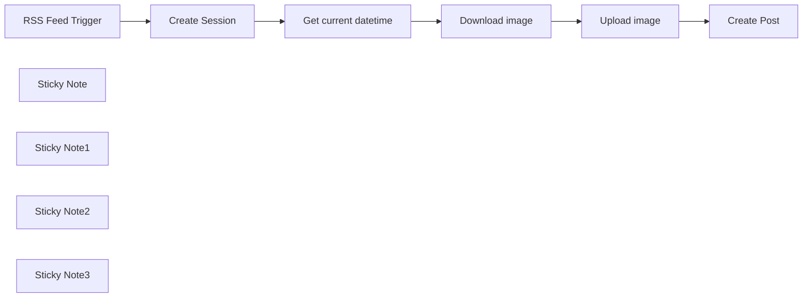

## Fluxo (.json) :

```json
{
  "nodes": [
    {
      "id": "25a28584-ae1b-4d14-9261-80be8f3c6727",
      "name": "Create Post",
      "type": "n8n-nodes-base.httpRequest",
      "position": [
        520,
        0
      ],
      "parameters": {
        "url": "https://bsky.social/xrpc/com.atproto.repo.createRecord",
        "method": "POST",
        "options": {
          "response": {
            "response": {
              "neverError": true,
              "responseFormat": "json"
            }
          }
        },
        "jsonBody": "={\n  \"repo\": \"{{ $node['Create Session'].json['did'] }}\",\n  \"collection\": \"app.bsky.feed.post\",\n  \"record\": {\n    \"text\": {{ JSON.stringify($node['RSS Feed Trigger'].json['content:encodedSnippet']) }},\n    \"$type\": \"app.bsky.feed.post\",\n    \"embed\": {\n      \"$type\": \"app.bsky.embed.external\",\n      \"external\": {\n          \"uri\": \"{{ $node['RSS Feed Trigger'].json['link'] }}\",\n          \"title\": \"{{ $node['RSS Feed Trigger'].json['lintitlek'] }}\",\n          \"description\": \"{{ $node['RSS Feed Trigger'].json['contentSnippet'] }}\",\n          \"thumb\": {\n            \"$type\": \"{{ $json.blob.$type }}\",\n            \"ref\": {\n              \"$link\": \"{{ $json['blob']['ref']['$link'] }}\"\n            },\n            \"mimeType\": \"{{ $json.blob.mimeType }}\",\n            \"size\": {{ $json.blob.size }}\n          }\n        }\n    },\n    \"createdAt\": \"{{ $node['Get current datetime'].json['currentDate'] }}\",\n    \"langs\": [ \"es-ES\" ]\n  }\n}\n",
        "sendBody": true,
        "sendHeaders": true,
        "specifyBody": "json",
        "headerParameters": {
          "parameters": [
            {
              "name": "Authorization",
              "value": "=Bearer {{ $item(\"0\").$node[\"Create Session\"].json[\"accessJwt\"] }}"
            }
          ]
        }
      },
      "notesInFlow": true,
      "typeVersion": 4.1
    },
    {
      "id": "b9d02b7f-f73d-4b53-a1ef-c693a0847bb2",
      "name": "Upload image",
      "type": "n8n-nodes-base.httpRequest",
      "position": [
        320,
        0
      ],
      "parameters": {
        "url": "https://bsky.social/xrpc/com.atproto.repo.uploadBlob",
        "method": "POST",
        "options": {},
        "sendBody": true,
        "contentType": "binaryData",
        "sendHeaders": true,
        "headerParameters": {
          "parameters": [
            {
              "name": "Authorization",
              "value": "=Bearer {{ $item(\"0\").$node[\"Create Session\"].json[\"accessJwt\"] }}"
            },
            {
              "name": "Content-Type",
              "value": "={{ $json.enclosure.type }}"
            }
          ]
        },
        "inputDataFieldName": "data"
      },
      "notesInFlow": true,
      "typeVersion": 4.1
    },
    {
      "id": "3593c517-03af-483f-b0d3-c538840a55d9",
      "name": "Download image",
      "type": "n8n-nodes-base.httpRequest",
      "position": [
        120,
        0
      ],
      "parameters": {
        "url": "={{ $('RSS Feed Trigger').item.json.enclosure.url }}",
        "options": {
          "response": {
            "response": {
              "responseFormat": "file"
            }
          }
        }
      },
      "typeVersion": 4.2,
      "alwaysOutputData": false
    },
    {
      "id": "71edf797-6aac-44dd-b988-a8b7e5667bac",
      "name": "Create Session",
      "type": "n8n-nodes-base.httpRequest",
      "position": [
        -320,
        0
      ],
      "parameters": {
        "url": "https://bsky.social/xrpc/com.atproto.server.createSession",
        "method": "POST",
        "options": {},
        "sendBody": true,
        "bodyParameters": {
          "parameters": [
            {
              "name": "identifier",
              "value": "<your username here>"
            },
            {
              "name": "password",
              "value": "<your app password here>"
            }
          ]
        }
      },
      "notesInFlow": true,
      "typeVersion": 4.1
    },
    {
      "id": "c28b280f-c169-4f03-9f93-20655cc0c095",
      "name": "RSS Feed Trigger",
      "type": "n8n-nodes-base.rssFeedReadTrigger",
      "position": [
        -580,
        0
      ],
      "parameters": {
        "feedUrl": "<your feed URL here>",
        "pollTimes": {
          "item": [
            {
              "mode": "everyMinute"
            }
          ]
        }
      },
      "typeVersion": 1
    },
    {
      "id": "1217c82c-694a-48dd-82d3-2ca5c24891c7",
      "name": "Sticky Note",
      "type": "n8n-nodes-base.stickyNote",
      "position": [
        -380,
        -120
      ],
      "parameters": {
        "width": 220,
        "height": 300,
        "content": "### Configure your credentials\nCreate [an app password](https://bsky.app/settings/app-passwords) first"
      },
      "typeVersion": 1
    },
    {
      "id": "5e08fd12-8ba0-4c58-b813-0ffefb5be37c",
      "name": "Sticky Note1",
      "type": "n8n-nodes-base.stickyNote",
      "position": [
        460,
        -120
      ],
      "parameters": {
        "width": 210,
        "height": 300,
        "content": "### Customize the text \nYou can customize the message text here"
      },
      "typeVersion": 1
    },
    {
      "id": "3c472b8f-928a-44bc-b75d-56c7b263f490",
      "name": "Get current datetime",
      "type": "n8n-nodes-base.dateTime",
      "position": [
        -100,
        0
      ],
      "parameters": {
        "options": {}
      },
      "typeVersion": 2
    },
    {
      "id": "5d9905af-1194-41ff-acfd-773611092bee",
      "name": "Sticky Note2",
      "type": "n8n-nodes-base.stickyNote",
      "position": [
        60,
        -120
      ],
      "parameters": {
        "width": 220,
        "height": 300,
        "content": "### Image preview \nBy default retrieved from the feed, but you can configure a custom one here from an URL"
      },
      "typeVersion": 1
    },
    {
      "id": "faeaf1bd-560e-4606-8a67-48ae8a18f17a",
      "name": "Sticky Note3",
      "type": "n8n-nodes-base.stickyNote",
      "position": [
        -140,
        -400
      ],
      "parameters": {
        "color": 5,
        "width": 420,
        "height": 180,
        "content": "## Post new RSS feed items as BlueSky posts\nThis will create a BlueSky post with each new RSS feed item, including the feed title, post image, link and content (up to 200 characters)"
      },
      "typeVersion": 1
    }
  ],
  "pinData": {},
  "connections": {
    "Upload image": {
      "main": [
        [
          {
            "node": "Create Post",
            "type": "main",
            "index": 0
          }
        ]
      ]
    },
    "Create Session": {
      "main": [
        [
          {
            "node": "Get current datetime",
            "type": "main",
            "index": 0
          }
        ]
      ]
    },
    "Download image": {
      "main": [
        [
          {
            "node": "Upload image",
            "type": "main",
            "index": 0
          }
        ]
      ]
    },
    "RSS Feed Trigger": {
      "main": [
        [
          {
            "node": "Create Session",
            "type": "main",
            "index": 0
          }
        ]
      ]
    },
    "Get current datetime": {
      "main": [
        [
          {
            "node": "Download image",
            "type": "main",
            "index": 0
          }
        ]
      ]
    }
  }
}
```

<a id="template-407"></a>

## Template 407 - Salvar novos e-mails em planilha

- **Nome:** Salvar novos e-mails em planilha
- **Descrição:** Este fluxo monitora a chegada de novos e-mails e registra remetente, assunto e conteúdo em uma planilha como novas linhas.
- **Funcionalidade:** • Monitoramento de e-mails: Verifica a caixa de entrada periodicamente para detectar novos e-mails.
• Extração de campos do e-mail: Obtém remetente, assunto e um trecho do corpo do e-mail.
• Inserção na planilha: Adiciona os dados extraídos como uma nova linha em um documento de planilha especificado.
• Configuração de mapeamento: Permite definir quais colunas da planilha recebem cada campo do e-mail.
• Operação automática periódica: Executa a verificação automaticamente em intervalos regulares (por exemplo, a cada minuto).
- **Ferramentas:** • Gmail: Serviço de e-mail usado para receber e detectar novos e-mails.
• Google Sheets: Planilha online usada para armazenar cada e-mail como uma nova linha.


## Fluxo visual

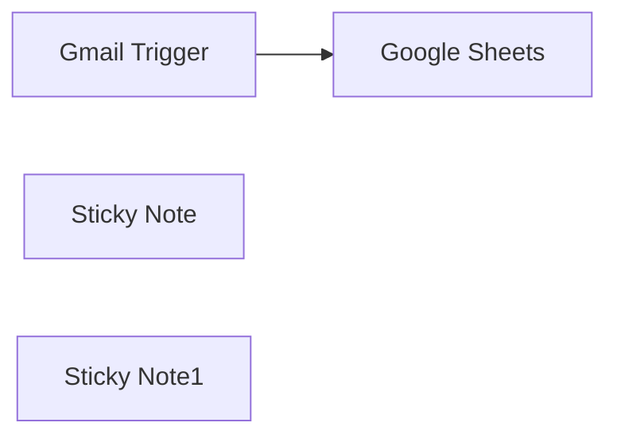

## Fluxo (.json) :

```json
{
  "id": "dCLvOuZgc8tToQwu",
  "meta": {
    "instanceId": "14e4c77104722ab186539dfea5182e419aecc83d85963fe13f6de862c875ebfa",
    "templateCredsSetupCompleted": true
  },
  "name": "Add new incoming emails to a Google Sheets spreadsheet as a new row.",
  "tags": [],
  "nodes": [
    {
      "id": "4db1f92f-6425-41c4-8f26-94e13ef5cd1f",
      "name": "Gmail Trigger",
      "type": "n8n-nodes-base.gmailTrigger",
      "notes": "Gmail Trigger\n",
      "position": [
        -200,
        -20
      ],
      "parameters": {
        "filters": {},
        "pollTimes": {
          "item": [
            {
              "mode": "everyMinute"
            }
          ]
        }
      },
      "credentials": {
        "gmailOAuth2": {
          "id": "",
          "name": ""
        }
      },
      "notesInFlow": true,
      "typeVersion": 1.2
    },
    {
      "id": "77c70cbd-fca7-4925-9a47-e2c903b8a64e",
      "name": "Google Sheets",
      "type": "n8n-nodes-base.googleSheets",
      "position": [
        180,
        -20
      ],
      "parameters": {
        "columns": {
          "value": {
            "body": "={{ $json.snippet }}",
            "Subject": "={{ $json.Subject }}",
            "Sender Email": "={{ $json.From }}"
          },
          "schema": [
            {
              "id": "Sender Email",
              "type": "string",
              "display": true,
              "required": false,
              "displayName": "Sender Email",
              "defaultMatch": false,
              "canBeUsedToMatch": true
            },
            {
              "id": "Subject",
              "type": "string",
              "display": true,
              "required": false,
              "displayName": "Subject",
              "defaultMatch": false,
              "canBeUsedToMatch": true
            },
            {
              "id": "body",
              "type": "string",
              "display": true,
              "required": false,
              "displayName": "body",
              "defaultMatch": false,
              "canBeUsedToMatch": true
            }
          ],
          "mappingMode": "defineBelow",
          "matchingColumns": [],
          "attemptToConvertTypes": false,
          "convertFieldsToString": false
        },
        "options": {},
        "operation": "append",
        "sheetName": {
          "__rl": true,
          "mode": "list",
          "value": "gid=0",
          "cachedResultUrl": "",
          "cachedResultName": ""
        },
        "documentId": {
          "__rl": true,
          "mode": "list",
          "value": "1o28BFBtzzsnwN01VTcfRp2BUyAFi9e-91H_b920_gJc",
          "cachedResultUrl": "",
          "cachedResultName": ""
        }
      },
      "credentials": {
        "googleSheetsOAuth2Api": {
          "id": "",
          "name": ""
        }
      },
      "typeVersion": 4.5
    },
    {
      "id": "0bc68783-e959-40f7-8cc3-a8800e62029a",
      "name": "Sticky Note",
      "type": "n8n-nodes-base.stickyNote",
      "position": [
        -260,
        -80
      ],
      "parameters": {
        "color": 2,
        "width": 660,
        "height": 260,
        "content": "### Add new incoming emails to a Google Sheets spreadsheet as a new row.\n"
      },
      "typeVersion": 1
    },
    {
      "id": "90a94a4d-60fc-40d2-8b1e-1bf01c98d789",
      "name": "Sticky Note1",
      "type": "n8n-nodes-base.stickyNote",
      "position": [
        -260,
        200
      ],
      "parameters": {
        "color": 2,
        "width": 660,
        "content": "## Description :\nThis n8n workflow automates the process of storing email details in a spreadsheet whenever a new email is received. It utilizes the Email Trigger node to detect incoming emails and then extracts the sender, subject, and email content, which are subsequently saved into a spreadsheet (e.g., Google Sheets or an Excel file). This ensures a structured record of emails for further processing, analysis, or reporting.\n\nYou can customize this workflow as per your requirements, such as adding additional columns in the spreadsheet to store more details or modifying it for different use cases, like lead tracking, customer inquiries, or automated email logging. "
      },
      "typeVersion": 1
    }
  ],
  "active": false,
  "pinData": {},
  "settings": {
    "executionOrder": "v1"
  },
  "versionId": "d8ab2b16-b091-455b-ad43-8e117a49e297",
  "connections": {
    "Gmail Trigger": {
      "main": [
        [
          {
            "node": "Google Sheets",
            "type": "main",
            "index": 0
          }
        ]
      ]
    }
  }
}
```

<a id="template-408"></a>

## Template 408 - Acesso à pasta Box 'n8n-rocks' por acionamento manual

- **Nome:** Acesso à pasta Box 'n8n-rocks' por acionamento manual
- **Descrição:** Fluxo que, ao ser acionado manualmente, conecta-se ao Box e realiza operações sobre a pasta nomeada 'n8n-rocks' utilizando credenciais autenticadas.
- **Funcionalidade:** • Acionamento manual: inicia o fluxo quando o usuário executa manualmente.
• Conexão autenticada ao Box: estabelece acesso à conta Box usando credenciais configuradas.
• Operação em pasta específica: interage com a pasta chamada 'n8n-rocks' (criação/verificação/gerenciamento conforme configuração).
- **Ferramentas:** • Box: serviço de armazenamento em nuvem utilizado para acessar e gerenciar pastas e arquivos.


## Fluxo visual

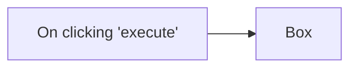

## Fluxo (.json) :

```json
{
  "nodes": [
    {
      "name": "On clicking 'execute'",
      "type": "n8n-nodes-base.manualTrigger",
      "position": [
        250,
        300
      ],
      "parameters": {},
      "typeVersion": 1
    },
    {
      "name": "Box",
      "type": "n8n-nodes-base.box",
      "position": [
        450,
        300
      ],
      "parameters": {
        "name": "n8n-rocks",
        "options": {},
        "resource": "folder"
      },
      "credentials": {
        "boxOAuth2Api": "box"
      },
      "typeVersion": 1
    }
  ],
  "connections": {
    "On clicking 'execute'": {
      "main": [
        [
          {
            "node": "Box",
            "type": "main",
            "index": 0
          }
        ]
      ]
    }
  }
}
```

<a id="template-409"></a>

## Template 409 - Monitoramento de vagas do Upwork e notificação

- **Nome:** Monitoramento de vagas do Upwork e notificação
- **Descrição:** Consulta periodicamente vagas no Upwork a partir de URLs configuradas, identifica anúncios novos comparando com o banco de dados, salva entradas inéditas e envia notificações para um canal de comunicação.
- **Funcionalidade:** • Agendamento periódico: executa a consulta a cada 10 minutos.
• Verificação de horário de trabalho: só prossegue se a hora atual estiver dentro do intervalo configurado (entre 2 e 15).
• Definição de parâmetros de busca: permite configurar múltiplas URLs de pesquisa e o código de país do proxy.
• Consulta à API do serviço de scraping: envia os parâmetros e recebe a lista de vagas.
• Detecção de duplicatas: verifica no banco de dados por registros com mesmo título e orçamento antes de processar.
• Filtragem de novas vagas: separa apenas os anúncios não encontrados anteriormente.
• Armazenamento de novas entradas: insere as vagas inéditas no banco de dados com campos como título, link, pagamento, orçamento, habilidades e data.
• Notificação: envia mensagem formatada com os detalhes da vaga para um canal (Slack).
- **Ferramentas:** • Upwork: fonte das vagas que serão consultadas e analisadas.
• Apify: serviço que executa o scraper e fornece os resultados via API.
• MongoDB: banco de dados usado para armazenar e consultar vagas já processadas.
• Slack: canal de comunicação para envio de notificações sobre novas vagas.
• Proxy configurável por país: permite realizar requisições originando de um país específico para melhorar a cobertura geográfica.


## Fluxo visual

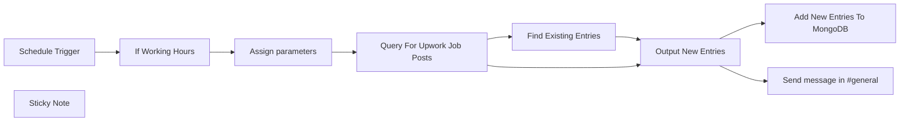

## Fluxo (.json) :

```json
{
  "meta": {
    "instanceId": "2f9460831fcdb0e9a4494f0630367cfe2968282072e2d27c6ee6ab0a4c165a36",
    "templateCredsSetupCompleted": true
  },
  "nodes": [
    {
      "id": "140f236c-8946-4ca8-b18f-0af99107b15c",
      "name": "Assign parameters",
      "type": "n8n-nodes-base.set",
      "position": [
        300,
        80
      ],
      "parameters": {
        "options": {},
        "assignments": {
          "assignments": [
            {
              "id": "b836ba12-262a-4fed-a31d-9e2f6514137a",
              "name": "startUrls",
              "type": "array",
              "value": "=[\n    {\n      \"url\": \"https://www.upwork.com/nx/search/jobs/?nbs=1&q=python\",\n      \"method\": \"GET\"\n    },\n{\n            \"url\": \"https://www.upwork.com/nx/search/jobs/?nbs=1&q=java\",\n            \"method\": \"GET\"\n        }\n  ]"
            },
            {
              "id": "5f7ba5cc-a8fc-4f67-9feb-6243d08462f9",
              "name": "proxyCountryCode",
              "type": "string",
              "value": "FR"
            }
          ]
        }
      },
      "typeVersion": 3.4
    },
    {
      "id": "d1863b34-d35f-477c-bb94-8a77ff08b51d",
      "name": "Query For Upwork Job Posts",
      "type": "n8n-nodes-base.httpRequest",
      "position": [
        520,
        80
      ],
      "parameters": {
        "url": "=https://api.apify.com/v2/acts/arlusm~upwork-scraper-with-fresh-job-posts/run-sync-get-dataset-items",
        "method": "POST",
        "options": {},
        "sendBody": true,
        "authentication": "genericCredentialType",
        "bodyParameters": {
          "parameters": [
            {
              "name": "startUrls",
              "value": "={{ $json.startUrls }}"
            },
            {
              "name": "proxyCountryCode",
              "value": "={{ $json.proxyCountryCode }}"
            }
          ]
        },
        "genericAuthType": "httpQueryAuth"
      },
      "credentials": {
        "httpQueryAuth": {
          "id": "WajVMGJs8zYL5VdP",
          "name": "Query Auth account"
        }
      },
      "typeVersion": 4.2
    },
    {
      "id": "a923af43-f417-470c-af97-2a50dc0c0d79",
      "name": "Schedule Trigger",
      "type": "n8n-nodes-base.scheduleTrigger",
      "position": [
        -100,
        80
      ],
      "parameters": {
        "rule": {
          "interval": [
            {
              "field": "minutes",
              "minutesInterval": 10
            }
          ]
        }
      },
      "typeVersion": 1.2
    },
    {
      "id": "26322972-4ecd-4f8e-a1fc-81607a911c22",
      "name": "If Working Hours",
      "type": "n8n-nodes-base.if",
      "position": [
        80,
        80
      ],
      "parameters": {
        "options": {},
        "conditions": {
          "options": {
            "version": 2,
            "leftValue": "",
            "caseSensitive": true,
            "typeValidation": "loose"
          },
          "combinator": "and",
          "conditions": [
            {
              "id": "795a6d51-0ea0-4493-bc1e-a1807a2cbd77",
              "operator": {
                "type": "number",
                "operation": "gt"
              },
              "leftValue": "={{ $json.Hour }}",
              "rightValue": 2
            },
            {
              "id": "f9ba101d-226d-4d6a-aab8-62229762a046",
              "operator": {
                "type": "number",
                "operation": "lt"
              },
              "leftValue": "={{ $json.Hour }}",
              "rightValue": 15
            }
          ]
        },
        "looseTypeValidation": true
      },
      "typeVersion": 2.2
    },
    {
      "id": "d68cb363-df1f-4601-b194-c1dc044b0c6a",
      "name": "Find Existing Entries",
      "type": "n8n-nodes-base.mongoDb",
      "position": [
        720,
        -40
      ],
      "parameters": {
        "query": "={\n  \"title\": \"{{ $json.title }}\",\n  \"budget\": \"{{ $json.budget }}\"\n}\n",
        "options": {},
        "collection": "n8n"
      },
      "credentials": {
        "mongoDb": {
          "id": "aXU1Q0utjxwEpfEk",
          "name": "MongoDB account"
        }
      },
      "typeVersion": 1.1,
      "alwaysOutputData": false
    },
    {
      "id": "82a6a26a-9fd5-4ce5-986f-e0aeb0c43fcc",
      "name": "Output New Entries",
      "type": "n8n-nodes-base.merge",
      "position": [
        940,
        80
      ],
      "parameters": {
        "mode": "combine",
        "options": {},
        "joinMode": "keepNonMatches",
        "fieldsToMatchString": "title, budget"
      },
      "typeVersion": 3
    },
    {
      "id": "361603e9-d173-42e2-a170-de08725ffd24",
      "name": "Add New Entries To MongoDB",
      "type": "n8n-nodes-base.mongoDb",
      "position": [
        1160,
        -40
      ],
      "parameters": {
        "fields": "title,link,paymentType,budget,projectLength,shortBio,skills,publishedDate,normalizedDate,searchUrl",
        "options": {},
        "operation": "insert",
        "collection": "n8n"
      },
      "credentials": {
        "mongoDb": {
          "id": "aXU1Q0utjxwEpfEk",
          "name": "MongoDB account"
        }
      },
      "typeVersion": 1.1
    },
    {
      "id": "e13787c6-f3e5-4bad-afcc-b1c3387a866c",
      "name": "Sticky Note",
      "type": "n8n-nodes-base.stickyNote",
      "position": [
        220,
        -240
      ],
      "parameters": {
        "height": 260,
        "content": "## Setup\n1. Add MongoDB, Slack credentials\n2. Add a query auth credential where the key='token' and the value being your apify token\n3. Modify the 'Assign parameters' node to include the Upwork URLs you want to query for"
      },
      "typeVersion": 1
    },
    {
      "id": "bc83acf0-b28b-48ff-bcb1-695404f30282",
      "name": "Send message in #general",
      "type": "n8n-nodes-base.slack",
      "position": [
        1160,
        200
      ],
      "webhookId": "7b8d0119-c115-4ed3-9d2d-ea8d58edfae6",
      "parameters": {
        "text": "=Job Title : {{ $json.title }}\nPublished : {{ $json.publishedDate }}\nLink : {{ $json.link }}\nPayment Type: {{ $json.paymentType }}\nBudget: {{ $json.budget }}\nSkills: {{ $json.skills }}\nBio: {{ $json.shortBio }}",
        "select": "channel",
        "channelId": {
          "__rl": true,
          "mode": "name",
          "value": "#general"
        },
        "otherOptions": {}
      },
      "credentials": {
        "slackApi": {
          "id": "nilit1oFWL3xhyvx",
          "name": "Slack account"
        }
      },
      "typeVersion": 2.3
    }
  ],
  "pinData": {},
  "connections": {
    "If Working Hours": {
      "main": [
        [
          {
            "node": "Assign parameters",
            "type": "main",
            "index": 0
          }
        ]
      ]
    },
    "Schedule Trigger": {
      "main": [
        [
          {
            "node": "If Working Hours",
            "type": "main",
            "index": 0
          }
        ]
      ]
    },
    "Assign parameters": {
      "main": [
        [
          {
            "node": "Query For Upwork Job Posts",
            "type": "main",
            "index": 0
          }
        ]
      ]
    },
    "Output New Entries": {
      "main": [
        [
          {
            "node": "Add New Entries To MongoDB",
            "type": "main",
            "index": 0
          },
          {
            "node": "Send message in #general",
            "type": "main",
            "index": 0
          }
        ]
      ]
    },
    "Find Existing Entries": {
      "main": [
        [
          {
            "node": "Output New Entries",
            "type": "main",
            "index": 0
          }
        ]
      ]
    },
    "Query For Upwork Job Posts": {
      "main": [
        [
          {
            "node": "Find Existing Entries",
            "type": "main",
            "index": 0
          },
          {
            "node": "Output New Entries",
            "type": "main",
            "index": 1
          }
        ]
      ]
    }
  }
}
```

<a id="template-410"></a>

## Template 410 - Alerta de uso de recursos do VPS por e-mail

- **Nome:** Alerta de uso de recursos do VPS por e-mail
- **Descrição:** Monitora CPU, RAM e disco de um VPS a cada 15 minutos e envia um e-mail quando algum recurso excede o limite configurado (80%).
- **Funcionalidade:** • Agendamento periódico: executa a verificação a cada 15 minutos.
• Coleta remota de métricas via SSH: obtém uso de RAM, disco e CPU no VPS.
• Extração e formatação dos valores: usa comandos do sistema para calcular porcentagens e formatar resultados.
• Agregação dos resultados: combina as leituras de CPU, RAM e disco em um único registro.
• Comparação com limiar configurável: verifica se qualquer métrica é maior ou igual a 80%.
• Notificação por e-mail: envia alerta contendo valores de CPU, RAM e disco quando o limiar é atingido.
• Observações de configuração: inclui lembretes para atualizar endereços de e-mail e ajustar o limiar se necessário.
- **Ferramentas:** • Acesso SSH ao VPS: executa comandos remotos para coletar métricas do servidor.
• Utilitários do sistema (free, df, top, awk, sed): utilizados para calcular e extrair as porcentagens de RAM, disco e CPU.
• Servidor SMTP / conta de e-mail: responsável pelo envio das notificações por e-mail.

## Fluxo visual

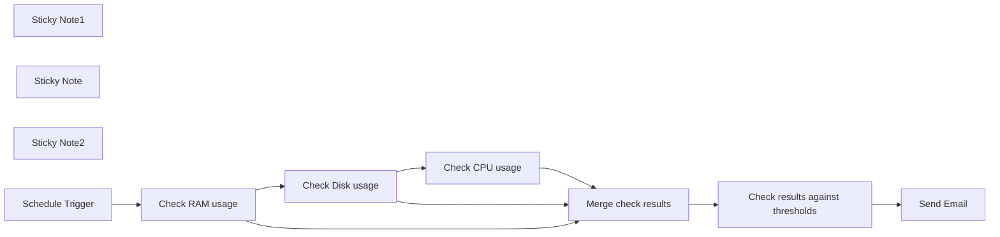

## Fluxo (.json) :

```json
{
  "nodes": [
    {
      "id": "ba168090-4727-4b72-a0cf-3f15ef3a9f17",
      "name": "Send Email",
      "type": "n8n-nodes-base.emailSend",
      "position": [
        580,
        360
      ],
      "parameters": {
        "text": "=System resources are above the threshold.\n\nCPU: {{ $json.CPU.toNumber().round(2) }}%\nRAM: {{ $json.RAM.toNumber().round(2) }}%\nDisk: {{ $json.Disk.toNumber().round(2) }}%",
        "options": {},
        "subject": "System Resource Alert",
        "toEmail": "change@me.com",
        "fromEmail": "change@me.com"
      },
      "credentials": {
        "smtp": {
          "id": "EuaQtRc5t8pWPY9b",
          "name": "SMTP account"
        }
      },
      "typeVersion": 1
    },
    {
      "id": "79afc30f-c3db-4ba1-8f0d-a1000b5e0abe",
      "name": "Check RAM usage",
      "type": "n8n-nodes-base.ssh",
      "position": [
        160,
        40
      ],
      "parameters": {
        "command": "free | awk '/Mem:/ {printf \"%.2f\", (1 - $7/$2) * 100}'"
      },
      "credentials": {
        "sshPassword": {
          "id": "VMCCUQkaq46q3CpB",
          "name": "SSH Password account"
        }
      },
      "executeOnce": false,
      "typeVersion": 1
    },
    {
      "id": "d09aa314-8d60-42a8-9933-d7e8d73e2c7d",
      "name": "Check Disk usage",
      "type": "n8n-nodes-base.ssh",
      "position": [
        380,
        40
      ],
      "parameters": {
        "command": "df -h | awk '$NF==\"/\"{printf \"%.2f\", $5}'"
      },
      "credentials": {
        "sshPassword": {
          "id": "VMCCUQkaq46q3CpB",
          "name": "SSH Password account"
        }
      },
      "executeOnce": false,
      "typeVersion": 1
    },
    {
      "id": "bc6a0df2-f4cc-484a-ac39-c92e8795175e",
      "name": "Check CPU usage",
      "type": "n8n-nodes-base.ssh",
      "position": [
        580,
        40
      ],
      "parameters": {
        "command": "top -bn 1 | grep \"Cpu(s)\" | sed \"s/.*, *\\([0-9.]*\\)%* id.*/\\1/\" | awk '{print 100 - $1}'"
      },
      "credentials": {
        "sshPassword": {
          "id": "VMCCUQkaq46q3CpB",
          "name": "SSH Password account"
        }
      },
      "executeOnce": false,
      "typeVersion": 1
    },
    {
      "id": "de0df734-1e4a-4bf0-9f7d-d60b52e06f48",
      "name": "Merge check results",
      "type": "n8n-nodes-base.merge",
      "position": [
        -40,
        380
      ],
      "parameters": {
        "mode": "combineBySql",
        "query": "SELECT input1.stdout as CPU, input2.stdout as Disk, input3.stdout as RAM FROM input1 LEFT JOIN input2 ON input1.name = input2.id LEFT JOIN input3 ON input1.name = input3.id",
        "numberInputs": 3
      },
      "typeVersion": 3
    },
    {
      "id": "7b7d6c0a-3f46-48b3-aa1d-191839540196",
      "name": "Check results against thresholds",
      "type": "n8n-nodes-base.if",
      "position": [
        240,
        380
      ],
      "parameters": {
        "conditions": {
          "number": [
            {
              "value1": "={{ $json.CPU }}",
              "value2": 80,
              "operation": "largerEqual"
            },
            {
              "value1": "={{ $json.Disk }}",
              "value2": 80,
              "operation": "largerEqual"
            },
            {
              "value1": "={{ $json.RAM }}",
              "value2": 80,
              "operation": "largerEqual"
            }
          ]
        },
        "combineOperation": "any"
      },
      "typeVersion": 1
    },
    {
      "id": "92331c38-cab8-4719-8746-6fb341954516",
      "name": "Sticky Note1",
      "type": "n8n-nodes-base.stickyNote",
      "position": [
        560,
        260
      ],
      "parameters": {
        "width": 320,
        "height": 280,
        "content": "## Update email addresses\nUpdate From and To email addresses in this node to receive notifications"
      },
      "typeVersion": 1
    },
    {
      "id": "3117fdbc-fde9-469b-bd47-59f45c349162",
      "name": "Sticky Note",
      "type": "n8n-nodes-base.stickyNote",
      "position": [
        -260,
        -120
      ],
      "parameters": {
        "width": 320,
        "height": 260,
        "content": "## Check VPS resource usage every 15 minutes\nThis workflow checks VPS CPU, RAM and Disk usage every 15 minutes and if any of it exceeds 80% will inform you by email"
      },
      "typeVersion": 1
    },
    {
      "id": "45b4c33a-8f02-4535-b67f-56d9d0aaf2ae",
      "name": "Sticky Note2",
      "type": "n8n-nodes-base.stickyNote",
      "position": [
        180,
        260
      ],
      "parameters": {
        "width": 360,
        "height": 280,
        "content": "## Update threshold\nIf needed, you can increase/decrease the 80% threshold in this node individually per resource "
      },
      "typeVersion": 1
    },
    {
      "id": "0bf83ea8-b1c4-40f7-8a60-39f765e8ec2c",
      "name": "Schedule Trigger",
      "type": "n8n-nodes-base.scheduleTrigger",
      "position": [
        -40,
        40
      ],
      "parameters": {
        "rule": {
          "interval": [
            {
              "field": "minutes",
              "minutesInterval": 15
            }
          ]
        }
      },
      "typeVersion": 1.2
    }
  ],
  "pinData": {},
  "connections": {
    "Check CPU usage": {
      "main": [
        [
          {
            "node": "Merge check results",
            "type": "main",
            "index": 0
          }
        ]
      ]
    },
    "Check RAM usage": {
      "main": [
        [
          {
            "node": "Check Disk usage",
            "type": "main",
            "index": 0
          },
          {
            "node": "Merge check results",
            "type": "main",
            "index": 2
          }
        ]
      ]
    },
    "Check Disk usage": {
      "main": [
        [
          {
            "node": "Check CPU usage",
            "type": "main",
            "index": 0
          },
          {
            "node": "Merge check results",
            "type": "main",
            "index": 1
          }
        ]
      ]
    },
    "Schedule Trigger": {
      "main": [
        [
          {
            "node": "Check RAM usage",
            "type": "main",
            "index": 0
          }
        ]
      ]
    },
    "Merge check results": {
      "main": [
        [
          {
            "node": "Check results against thresholds",
            "type": "main",
            "index": 0
          }
        ]
      ]
    },
    "Check results against thresholds": {
      "main": [
        [
          {
            "node": "Send Email",
            "type": "main",
            "index": 0
          }
        ]
      ]
    }
  }
}
```

<a id="template-411"></a>

## Template 411 - Gerar histórias de empresas a partir do LinkedIn

- **Nome:** Gerar histórias de empresas a partir do LinkedIn
- **Descrição:** Extrai dados de uma página de empresa no LinkedIn via Bright Data, converte essas informações em uma história detalhada e produz um resumo conciso usando modelos de linguagem.
- **Funcionalidade:** • Gatilho manual: inicia o processo de extração e geração de histórias manualmente.
• Definição da URL do LinkedIn: permite configurar qual página de empresa será processada.
• Acionamento do scraper Bright Data: solicita a execução de um dataset para capturar a página alvo.
• Monitoramento de snapshot: verifica periodicamente o status da captura (com espera de 30 segundos entre tentativas) até o snapshot ficar pronto.
• Download do snapshot: baixa o resultado em formato JSON quando a captura estiver concluída.
• Verificação de erros: checa se houve erros na captura antes de prosseguir com o processamento.
• Extração e formatação com LLM: converte o JSON de entrada em uma história completa e estruturada usando um modelo de linguagem.
• Pré-processamento e carregamento de documentos: divide o texto em trechos e prepara os documentos para sumarização.
• Geração de resumo conciso: produz um resumo curto e direto da história gerada.
• Notificações via webhook: envia o conteúdo extraído e o resumo para um endpoint HTTP configurado (útil para testes ou integração).
- **Ferramentas:** • Bright Data: serviço de raspagem e captura de páginas web usado para acionar datasets e obter snapshots com os dados extraídos.
• LinkedIn: fonte de dados (página de empresa) de onde as informações são coletadas.
• Google Gemini (PaLM): modelo de linguagem usado para extrair, formatar e resumir o conteúdo em forma de história.
• Webhook.site: endpoint HTTP de teste/receptor usado para receber e verificar os resultados enviados pelo fluxo.

## Fluxo visual

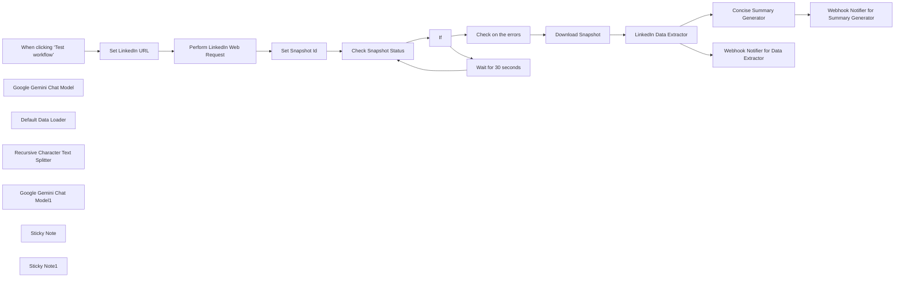

## Fluxo (.json) :

```json
{
  "id": "q1DorytEoEw1QLGj",
  "meta": {
    "instanceId": "885b4fb4a6a9c2cb5621429a7b972df0d05bb724c20ac7dac7171b62f1c7ef40",
    "templateCredsSetupCompleted": true
  },
  "name": "Generate Company Stories from LinkedIn with Bright Data & Google Gemini",
  "tags": [
    {
      "id": "ddPkw7Hg5dZhQu2w",
      "name": "AI",
      "createdAt": "2025-04-13T05:38:08.053Z",
      "updatedAt": "2025-04-13T05:38:08.053Z"
    },
    {
      "id": "rKOa98eAi3IETrLu",
      "name": "HR",
      "createdAt": "2025-04-13T04:59:30.580Z",
      "updatedAt": "2025-04-13T04:59:30.580Z"
    }
  ],
  "nodes": [
    {
      "id": "1424195e-79ec-48e8-9bb6-fbae072aca81",
      "name": "When clicking ‘Test workflow’",
      "type": "n8n-nodes-base.manualTrigger",
      "position": [
        -1440,
        245
      ],
      "parameters": {},
      "typeVersion": 1
    },
    {
      "id": "509519c2-efe9-4191-87af-9c5c782350d6",
      "name": "Google Gemini Chat Model",
      "type": "@n8n/n8n-nodes-langchain.lmChatGoogleGemini",
      "notes": "Gemini Experimental Model",
      "position": [
        696,
        540
      ],
      "parameters": {
        "options": {},
        "modelName": "models/gemini-2.0-flash-thinking-exp-01-21"
      },
      "credentials": {
        "googlePalmApi": {
          "id": "YeO7dHZnuGBVQKVZ",
          "name": "Google Gemini(PaLM) Api account"
        }
      },
      "notesInFlow": true,
      "typeVersion": 1
    },
    {
      "id": "3be8be65-38c2-4500-8676-925bdf7844ac",
      "name": "Default Data Loader",
      "type": "@n8n/n8n-nodes-langchain.documentDefaultDataLoader",
      "position": [
        816,
        542.5
      ],
      "parameters": {
        "options": {}
      },
      "typeVersion": 1
    },
    {
      "id": "65b72f55-6424-487b-a622-879589d43344",
      "name": "Recursive Character Text Splitter",
      "type": "@n8n/n8n-nodes-langchain.textSplitterRecursiveCharacterTextSplitter",
      "position": [
        904,
        740
      ],
      "parameters": {
        "options": {},
        "chunkOverlap": 100
      },
      "typeVersion": 1
    },
    {
      "id": "4ab31927-5372-4a8f-83b5-355bcd6eaae2",
      "name": "If",
      "type": "n8n-nodes-base.if",
      "position": [
        -340,
        170
      ],
      "parameters": {
        "options": {},
        "conditions": {
          "options": {
            "version": 2,
            "leftValue": "",
            "caseSensitive": true,
            "typeValidation": "strict"
          },
          "combinator": "and",
          "conditions": [
            {
              "id": "6a7e5360-4cb5-4806-892e-5c85037fa71c",
              "operator": {
                "type": "string",
                "operation": "equals"
              },
              "leftValue": "={{ $('Check Snapshot Status').item.json.status }}",
              "rightValue": "ready"
            }
          ]
        }
      },
      "typeVersion": 2.2
    },
    {
      "id": "30382d3b-6ba8-4a96-93ce-9d22fc547793",
      "name": "Set Snapshot Id",
      "type": "n8n-nodes-base.set",
      "position": [
        -780,
        245
      ],
      "parameters": {
        "options": {},
        "assignments": {
          "assignments": [
            {
              "id": "2c3369c6-9206-45d7-9349-f577baeaf189",
              "name": "snapshot_id",
              "type": "string",
              "value": "={{ $json.snapshot_id }}"
            }
          ]
        }
      },
      "typeVersion": 3.4
    },
    {
      "id": "a4867b6f-fa91-4b83-befc-9ce97c10228c",
      "name": "Download Snapshot",
      "type": "n8n-nodes-base.httpRequest",
      "position": [
        100,
        120
      ],
      "parameters": {
        "url": "=https://api.brightdata.com/datasets/v3/snapshot/{{ $json.snapshot_id }}",
        "options": {
          "timeout": 10000
        },
        "sendQuery": true,
        "authentication": "genericCredentialType",
        "genericAuthType": "httpHeaderAuth",
        "queryParameters": {
          "parameters": [
            {
              "name": "format",
              "value": "json"
            }
          ]
        }
      },
      "credentials": {
        "httpHeaderAuth": {
          "id": "kdbqXuxIR8qIxF7y",
          "name": "Header Auth account"
        }
      },
      "typeVersion": 4.2
    },
    {
      "id": "16580d94-23fc-45d6-a282-640148b602d3",
      "name": "Set LinkedIn URL",
      "type": "n8n-nodes-base.set",
      "position": [
        -1220,
        245
      ],
      "parameters": {
        "options": {},
        "assignments": {
          "assignments": [
            {
              "id": "47f839a1-df2a-4972-9dad-597a8af0bf75",
              "name": "url",
              "type": "string",
              "value": "https://il.linkedin.com/company/bright-data"
            }
          ]
        }
      },
      "typeVersion": 3.4
    },
    {
      "id": "be007904-269a-4823-bdd8-1ba5b4f69f5c",
      "name": "Google Gemini Chat Model1",
      "type": "@n8n/n8n-nodes-langchain.lmChatGoogleGemini",
      "position": [
        408,
        340
      ],
      "parameters": {
        "options": {},
        "modelName": "models/gemini-2.0-flash-exp"
      },
      "credentials": {
        "googlePalmApi": {
          "id": "YeO7dHZnuGBVQKVZ",
          "name": "Google Gemini(PaLM) Api account"
        }
      },
      "typeVersion": 1
    },
    {
      "id": "56a08c75-5122-483e-af0e-da1dd3e08eaf",
      "name": "Check on the errors",
      "type": "n8n-nodes-base.if",
      "position": [
        -120,
        120
      ],
      "parameters": {
        "options": {},
        "conditions": {
          "options": {
            "version": 2,
            "leftValue": "",
            "caseSensitive": true,
            "typeValidation": "strict"
          },
          "combinator": "and",
          "conditions": [
            {
              "id": "b267071c-7102-407b-a98d-f613bcb1a106",
              "operator": {
                "type": "string",
                "operation": "equals"
              },
              "leftValue": "={{ $json.errors.toString() }}",
              "rightValue": "0"
            }
          ]
        }
      },
      "typeVersion": 2.2
    },
    {
      "id": "6925a606-1108-4605-9124-c74d3df555ac",
      "name": "Sticky Note",
      "type": "n8n-nodes-base.stickyNote",
      "position": [
        -1420,
        -100
      ],
      "parameters": {
        "width": 400,
        "height": 280,
        "content": "## Note\n\nDeals with the LinkedIn data extraction using the Bright Data Web Scrapper API.\n\nThe information extraction and summarization are being used to demonstrate the usage of the N8N AI capabilities.\n\n**Please make sure to set the LinkedIn URL and Webhook Notification URL**"
      },
      "typeVersion": 1
    },
    {
      "id": "a5f977db-14e5-4652-b2d3-0a1b0470be9a",
      "name": "Sticky Note1",
      "type": "n8n-nodes-base.stickyNote",
      "position": [
        -940,
        -100
      ],
      "parameters": {
        "width": 420,
        "height": 280,
        "content": "## LLM Usages\n\nGoogle Gemini Flash Exp model is being used.\n\nInformation extraction is being used for formatting the LinkedIn response to produce a story.\n\nSummarization Chain is being used for summarization of the content"
      },
      "typeVersion": 1
    },
    {
      "id": "ae6377e2-6ca0-4218-affd-d3c81c16d996",
      "name": "Perform LinkedIn Web Request",
      "type": "n8n-nodes-base.httpRequest",
      "position": [
        -1000,
        245
      ],
      "parameters": {
        "url": "https://api.brightdata.com/datasets/v3/trigger",
        "method": "POST",
        "options": {},
        "jsonBody": "=[\n  {\n    \"url\": \"{{ $json.url }}\"\n  }\n]",
        "sendBody": true,
        "sendQuery": true,
        "sendHeaders": true,
        "specifyBody": "json",
        "authentication": "genericCredentialType",
        "genericAuthType": "httpHeaderAuth",
        "queryParameters": {
          "parameters": [
            {
              "name": "dataset_id",
              "value": "gd_l1vikfnt1wgvvqz95w"
            },
            {
              "name": "include_errors",
              "value": "true"
            }
          ]
        },
        "headerParameters": {
          "parameters": [
            {}
          ]
        }
      },
      "credentials": {
        "httpHeaderAuth": {
          "id": "kdbqXuxIR8qIxF7y",
          "name": "Header Auth account"
        }
      },
      "typeVersion": 4.2
    },
    {
      "id": "9a1e8d92-24a9-481c-b81f-5e37bca46fe2",
      "name": "Check Snapshot Status",
      "type": "n8n-nodes-base.httpRequest",
      "position": [
        -560,
        245
      ],
      "parameters": {
        "url": "=https://api.brightdata.com/datasets/v3/progress/{{ $json.snapshot_id }}",
        "options": {},
        "sendHeaders": true,
        "authentication": "genericCredentialType",
        "genericAuthType": "httpHeaderAuth",
        "headerParameters": {
          "parameters": [
            {}
          ]
        }
      },
      "credentials": {
        "httpHeaderAuth": {
          "id": "kdbqXuxIR8qIxF7y",
          "name": "Header Auth account"
        }
      },
      "typeVersion": 4.2
    },
    {
      "id": "543d6087-c1d8-4f98-9b7c-fedbce9b0215",
      "name": "LinkedIn Data Extractor",
      "type": "@n8n/n8n-nodes-langchain.informationExtractor",
      "position": [
        320,
        120
      ],
      "parameters": {
        "text": "=Write a complete story of the provided company information in JSON. Use the following Company info to produce a story or a blog post. Make sure to incorporate all the provided company context.\n\nHere's the Company Info in JSON - {{ $json.input }}",
        "options": {
          "systemPromptTemplate": "You are an expert data formatter"
        },
        "attributes": {
          "attributes": [
            {
              "name": "company_story",
              "required": true,
              "description": "Detailed Company Info"
            }
          ]
        }
      },
      "typeVersion": 1
    },
    {
      "id": "d07c83f0-5adf-4d5a-976a-b344aa8a853e",
      "name": "Concise Summary Generator",
      "type": "@n8n/n8n-nodes-langchain.chainSummarization",
      "position": [
        712,
        320
      ],
      "parameters": {
        "options": {
          "summarizationMethodAndPrompts": {
            "values": {
              "prompt": "=Write a concise summary of the following:\n\n\n{{ $json.output.company_story }}\n\n",
              "combineMapPrompt": "=Write a concise summary of the following:\n\n\n\n\n\nCONCISE SUMMARY: {{ $json.output.company_story }}"
            }
          }
        },
        "operationMode": "documentLoader"
      },
      "typeVersion": 2
    },
    {
      "id": "0867753e-c3ab-473e-960a-344573cdde29",
      "name": "Webhook Notifier for Data Extractor",
      "type": "n8n-nodes-base.httpRequest",
      "position": [
        834,
        -80
      ],
      "parameters": {
        "url": "https://webhook.site/ce41e056-c097-48c8-a096-9b876d3abbf7",
        "options": {},
        "sendBody": true,
        "bodyParameters": {
          "parameters": [
            {
              "name": "response",
              "value": "={{ $json.output }}"
            }
          ]
        }
      },
      "typeVersion": 4.2
    },
    {
      "id": "d666cbb8-64bf-47b9-802a-d78ed5caa128",
      "name": "Webhook Notifier for Summary Generator",
      "type": "n8n-nodes-base.httpRequest",
      "position": [
        1192,
        320
      ],
      "parameters": {
        "url": "https://webhook.site/ce41e056-c097-48c8-a096-9b876d3abbf7",
        "options": {},
        "sendBody": true,
        "bodyParameters": {
          "parameters": [
            {
              "name": "response",
              "value": "={{ $json.response.text }}"
            }
          ]
        }
      },
      "typeVersion": 4.2
    },
    {
      "id": "fbd962be-5003-4039-b17e-fc0f16c2edf7",
      "name": "Wait for 30 seconds",
      "type": "n8n-nodes-base.wait",
      "position": [
        -120,
        345
      ],
      "webhookId": "f2aafd71-61f2-4aa4-8290-fa3bbe3d46b9",
      "parameters": {
        "amount": 30
      },
      "typeVersion": 1.1
    }
  ],
  "active": false,
  "pinData": {},
  "settings": {
    "executionOrder": "v1"
  },
  "versionId": "0f4279a9-1593-421e-825e-850cdae1bb97",
  "connections": {
    "If": {
      "main": [
        [
          {
            "node": "Check on the errors",
            "type": "main",
            "index": 0
          }
        ],
        [
          {
            "node": "Wait for 30 seconds",
            "type": "main",
            "index": 0
          }
        ]
      ]
    },
    "Set Snapshot Id": {
      "main": [
        [
          {
            "node": "Check Snapshot Status",
            "type": "main",
            "index": 0
          }
        ]
      ]
    },
    "Set LinkedIn URL": {
      "main": [
        [
          {
            "node": "Perform LinkedIn Web Request",
            "type": "main",
            "index": 0
          }
        ]
      ]
    },
    "Download Snapshot": {
      "main": [
        [
          {
            "node": "LinkedIn Data Extractor",
            "type": "main",
            "index": 0
          }
        ]
      ]
    },
    "Check on the errors": {
      "main": [
        [
          {
            "node": "Download Snapshot",
            "type": "main",
            "index": 0
          }
        ]
      ]
    },
    "Default Data Loader": {
      "ai_document": [
        [
          {
            "node": "Concise Summary Generator",
            "type": "ai_document",
            "index": 0
          }
        ]
      ]
    },
    "Wait for 30 seconds": {
      "main": [
        [
          {
            "node": "Check Snapshot Status",
            "type": "main",
            "index": 0
          }
        ]
      ]
    },
    "Check Snapshot Status": {
      "main": [
        [
          {
            "node": "If",
            "type": "main",
            "index": 0
          }
        ]
      ]
    },
    "LinkedIn Data Extractor": {
      "main": [
        [
          {
            "node": "Concise Summary Generator",
            "type": "main",
            "index": 0
          },
          {
            "node": "Webhook Notifier for Data Extractor",
            "type": "main",
            "index": 0
          }
        ]
      ]
    },
    "Google Gemini Chat Model": {
      "ai_languageModel": [
        [
          {
            "node": "Concise Summary Generator",
            "type": "ai_languageModel",
            "index": 0
          }
        ]
      ]
    },
    "Concise Summary Generator": {
      "main": [
        [
          {
            "node": "Webhook Notifier for Summary Generator",
            "type": "main",
            "index": 0
          }
        ]
      ]
    },
    "Google Gemini Chat Model1": {
      "ai_languageModel": [
        [
          {
            "node": "LinkedIn Data Extractor",
            "type": "ai_languageModel",
            "index": 0
          }
        ]
      ]
    },
    "Perform LinkedIn Web Request": {
      "main": [
        [
          {
            "node": "Set Snapshot Id",
            "type": "main",
            "index": 0
          }
        ]
      ]
    },
    "Recursive Character Text Splitter": {
      "ai_textSplitter": [
        [
          {
            "node": "Default Data Loader",
            "type": "ai_textSplitter",
            "index": 0
          }
        ]
      ]
    },
    "When clicking ‘Test workflow’": {
      "main": [
        [
          {
            "node": "Set LinkedIn URL",
            "type": "main",
            "index": 0
          }
        ]
      ]
    }
  }
}
```

<a id="template-412"></a>

## Template 412 - Adicionar inscritos ao Airtable

- **Nome:** Adicionar inscritos ao Airtable
- **Descrição:** Captura novos inscritos de uma lista do GetResponse e adiciona seus dados (nome e e-mail) em uma tabela do Airtable.
- **Funcionalidade:** • Captura de inscrição: monitora eventos de 'subscribe' em uma lista específica do GetResponse e inicia o fluxo.
• Mapeamento de campos: extrai o nome e o e-mail do contato recebido e prepara os campos 'Name' e 'Email'.
• Inserção em banco: adiciona um novo registro na tabela do Airtable com os dados do contato.
- **Ferramentas:** • GetResponse: plataforma de e-mail marketing utilizada para detectar novas inscrições em uma lista específica.
• Airtable: base de dados/tabela online onde os contatos (nome e e-mail) são armazenados como novos registros.

## Fluxo visual

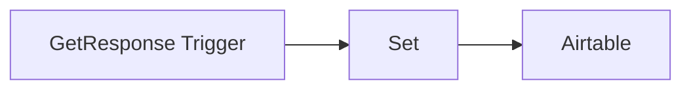

## Fluxo (.json) :

```json
{
  "nodes": [
    {
      "name": "Airtable",
      "type": "n8n-nodes-base.airtable",
      "position": [
        1090,
        340
      ],
      "parameters": {
        "table": "Table 1",
        "options": {},
        "operation": "append",
        "application": ""
      },
      "credentials": {
        "airtableApi": "Airtable Credentials n8n"
      },
      "typeVersion": 1
    },
    {
      "name": "Set",
      "type": "n8n-nodes-base.set",
      "position": [
        890,
        340
      ],
      "parameters": {
        "values": {
          "string": [
            {
              "name": "Name",
              "value": "={{$json[\"contact_name\"]}}"
            },
            {
              "name": "Email",
              "value": "={{$json[\"contact_email\"]}}"
            }
          ]
        },
        "options": {},
        "keepOnlySet": true
      },
      "typeVersion": 1
    },
    {
      "name": "GetResponse Trigger",
      "type": "n8n-nodes-base.getResponseTrigger",
      "position": [
        690,
        340
      ],
      "webhookId": "4bdfc1fa-44bc-4293-987c-fb512327e845",
      "parameters": {
        "events": [
          "subscribe"
        ],
        "listIds": [
          "qtPk7"
        ],
        "options": {}
      },
      "credentials": {
        "getResponseApi": "GetResponse API Credentials"
      },
      "typeVersion": 1
    }
  ],
  "connections": {
    "Set": {
      "main": [
        [
          {
            "node": "Airtable",
            "type": "main",
            "index": 0
          }
        ]
      ]
    },
    "GetResponse Trigger": {
      "main": [
        [
          {
            "node": "Set",
            "type": "main",
            "index": 0
          }
        ]
      ]
    }
  }
}
```

<a id="template-413"></a>

## Template 413 - Triagem automática de tickets e criação no JIRA

- **Nome:** Triagem automática de tickets e criação no JIRA
- **Descrição:** Monitora uma caixa de entrada compartilhada do Outlook por e-mails de suporte, processa cada mensagem com um modelo de linguagem para rotular, priorizar e rescrever o conteúdo, e cria automaticamente uma issue no JIRA com os dados gerados.
- **Funcionalidade:** • Monitoramento agendado da caixa de entrada: Verifica periodicamente mensagens recebidas em uma conta de suporte.
• Filtragem por mensagens recentes: Busca apenas e-mails recebidos após um intervalo configurado (ex.: última hora).
• Evitar duplicidade de processamento: Marca mensagens já processadas para não tratá-las novamente.
• Conversão de corpo HTML para Markdown: Transforma o conteúdo do e-mail em formato de texto mais simples para análise.
• Triagem por IA: Usa um modelo de linguagem para classificar labels, definir prioridade e gerar título e descrição claros e factuais.
• Parser estruturado de saída: Extrai campos estruturados (labels, prioridade, resumo, descrição) do resultado da IA para uso automático.
• Criação automática de issue no JIRA: Gera uma issue com labels, prioridade e descrição fornecidos pela IA.
- **Ferramentas:** • Microsoft Outlook: Caixa de entrada compartilhada usada para receber os pedidos de suporte.
• OpenAI (modelo de linguagem): Responsável por classificar, priorizar e reescrever o resumo e a descrição dos tickets.
• JIRA: Sistema de gestão de issues onde são criadas as tarefas a partir dos e-mails de suporte.

## Fluxo visual

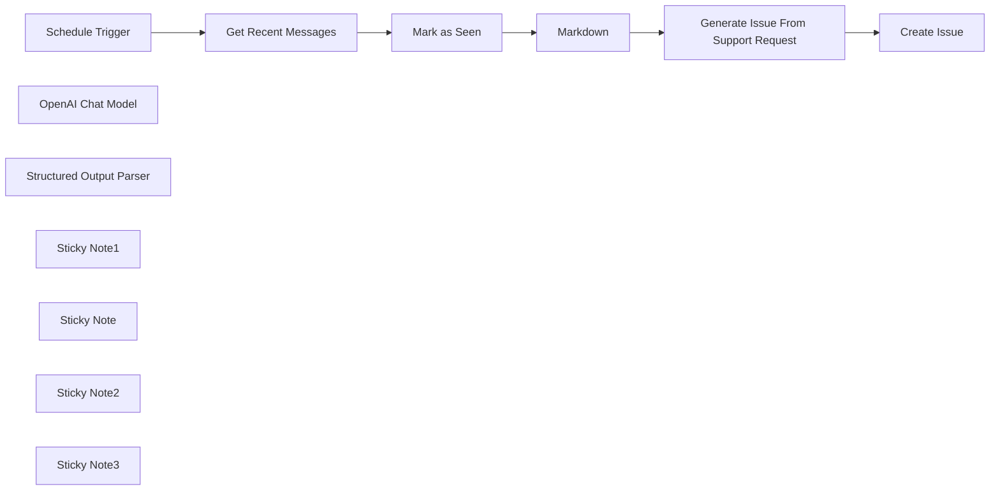

## Fluxo (.json) :

```json
{
  "meta": {
    "instanceId": "408f9fb9940c3cb18ffdef0e0150fe342d6e655c3a9fac21f0f644e8bedabcd9",
    "templateCredsSetupCompleted": true
  },
  "nodes": [
    {
      "id": "154458b0-dde3-4224-9fa8-d38a025aa0d3",
      "name": "Schedule Trigger",
      "type": "n8n-nodes-base.scheduleTrigger",
      "position": [
        -640,
        -140
      ],
      "parameters": {
        "rule": {
          "interval": [
            {
              "field": "hours"
            }
          ]
        }
      },
      "typeVersion": 1.2
    },
    {
      "id": "0fc88546-50ef-4183-8fb2-dcea939f3bcf",
      "name": "Get Recent Messages",
      "type": "n8n-nodes-base.microsoftOutlook",
      "position": [
        -440,
        -140
      ],
      "webhookId": "48619a9a-d7a5-47af-983d-146e377d8767",
      "parameters": {
        "fields": [
          "body",
          "categories",
          "conversationId",
          "from",
          "hasAttachments",
          "internetMessageId",
          "sender",
          "subject",
          "toRecipients",
          "receivedDateTime",
          "webLink"
        ],
        "output": "fields",
        "options": {},
        "filtersUI": {
          "values": {
            "filters": {
              "receivedAfter": "={{ $now.minus({ \"hour\": 1 }).toISO() }}"
            }
          }
        },
        "operation": "getAll"
      },
      "credentials": {
        "microsoftOutlookOAuth2Api": {
          "id": "EWg6sbhPKcM5y3Mr",
          "name": "Microsoft Outlook account"
        }
      },
      "typeVersion": 2
    },
    {
      "id": "d056be7e-43ed-4fea-8aef-36579c656633",
      "name": "OpenAI Chat Model",
      "type": "@n8n/n8n-nodes-langchain.lmChatOpenAi",
      "position": [
        280,
        40
      ],
      "parameters": {
        "model": {
          "__rl": true,
          "mode": "list",
          "value": "gpt-4o-mini"
        },
        "options": {}
      },
      "credentials": {
        "openAiApi": {
          "id": "8gccIjcuf3gvaoEr",
          "name": "OpenAi account"
        }
      },
      "typeVersion": 1.2
    },
    {
      "id": "e4b6fd9d-2506-45bf-bd80-a81a2c04306b",
      "name": "Structured Output Parser",
      "type": "@n8n/n8n-nodes-langchain.outputParserStructured",
      "position": [
        480,
        40
      ],
      "parameters": {
        "schemaType": "manual",
        "inputSchema": "{\n  \"type\": \"object\",\n  \"properties\": {\n    \"labels\": {\n      \"type\": \"array\",\n      \"items\": { \"type\": \"string\" }\n    },\n    \"priority\": { \"type\": \"number\" },\n    \"summary\": { \"type\": \"string\" },\n    \"description\": { \"type\": \"string\" }\n  }\n}"
      },
      "typeVersion": 1.2
    },
    {
      "id": "3cef25fc-2581-4556-bf54-7704815d98b3",
      "name": "Sticky Note1",
      "type": "n8n-nodes-base.stickyNote",
      "position": [
        0,
        -340
      ],
      "parameters": {
        "color": 7,
        "width": 700,
        "height": 540,
        "content": "## 2. Automate Generation and Triaging of Ticket\n[Read more about the Basic LLM node](https://docs.n8n.io/integrations/builtin/cluster-nodes/root-nodes/n8n-nodes-langchain.chainllm)\n\nNew tickets always need to be properly labelled and prioritised but it's not always possible to get to update all incoming tickets if you're light on hands. Using an AI is a great use-case for triaging of tickets as its contextual understanding helps automates this step."
      },
      "typeVersion": 1
    },
    {
      "id": "d6ba8c9b-3e39-442f-8b79-cafe11c15a18",
      "name": "Markdown",
      "type": "n8n-nodes-base.markdown",
      "position": [
        100,
        -140
      ],
      "parameters": {
        "html": "={{ $json.body.content }}",
        "options": {}
      },
      "typeVersion": 1
    },
    {
      "id": "fb7c6d7c-df30-43de-8f37-9e394a8ad7aa",
      "name": "Create Issue",
      "type": "n8n-nodes-base.jira",
      "position": [
        900,
        -140
      ],
      "parameters": {
        "project": {
          "__rl": true,
          "mode": "id",
          "value": "10000"
        },
        "summary": "={{ $json.output.summary }}",
        "issueType": {
          "__rl": true,
          "mode": "id",
          "value": "10000"
        },
        "additionalFields": {
          "labels": "={{ $json.output.labels }}",
          "priority": {
            "__rl": true,
            "mode": "id",
            "value": "={{ $json.output.priority }}"
          },
          "description": "={{ $json.output.description }}"
        }
      },
      "credentials": {
        "jiraSoftwareCloudApi": {
          "id": "IH5V74q6PusewNjD",
          "name": "Jira SW Cloud account"
        }
      },
      "typeVersion": 1
    },
    {
      "id": "9e26f402-36da-40e1-a736-db4fe16de54a",
      "name": "Mark as Seen",
      "type": "n8n-nodes-base.removeDuplicates",
      "position": [
        -240,
        -140
      ],
      "parameters": {
        "options": {},
        "operation": "removeItemsSeenInPreviousExecutions",
        "dedupeValue": "={{ $json.id }}"
      },
      "typeVersion": 2
    },
    {
      "id": "b5f49877-e494-4712-a937-1f348198700e",
      "name": "Sticky Note",
      "type": "n8n-nodes-base.stickyNote",
      "position": [
        -740,
        -340
      ],
      "parameters": {
        "color": 7,
        "width": 720,
        "height": 540,
        "content": "## 1. Watch Outlook Inbox for Support Emails\n[Learn more about the Outlook node](https://docs.n8n.io/integrations/builtin/app-nodes/n8n-nodes-base.microsoftoutlook/)\n\n**This template assumes a shared inbox specifically for support tickets!** If you have a general inbox, you may need to classify and filter each message which might become costly. The \"remove duplicates\" node (ie. \"Mark as seen\") ensures we only process each email exactly once."
      },
      "typeVersion": 1
    },
    {
      "id": "b9d08834-14ad-4cdf-bc20-411033eee5b7",
      "name": "Sticky Note2",
      "type": "n8n-nodes-base.stickyNote",
      "position": [
        720,
        -340
      ],
      "parameters": {
        "color": 7,
        "width": 460,
        "height": 440,
        "content": "## 3. Create Issue in JIRA\n[Read more about the JIRA node](https://docs.n8n.io/integrations/builtin/app-nodes/n8n-nodes-base.jira/)\n\nThis is only a simple example to create an issue in JIRA but easily extendable to add much more!"
      },
      "typeVersion": 1
    },
    {
      "id": "e6942a39-1893-44cf-a846-c6b4d9c37e92",
      "name": "Sticky Note3",
      "type": "n8n-nodes-base.stickyNote",
      "position": [
        -1160,
        -720
      ],
      "parameters": {
        "width": 380,
        "height": 940,
        "content": "## Try It Out!\n### This n8n template watches an outlook shared inbox for support messages and creates an equivalent issue item in JIRA.\n\n### How it works\n* A scheduled trigger fetches recent Outlook messages from an shared inbox which collects support requests.\n* These support requests are filtered to ensure they are only processed once and their HTML body is converted to markdown for easier parsing.\n* Each support request is then triaged via an AI Agent which adds appropriate labels, assesses priority and summarises a title and description of the original request.\n* Finally, the AI generated values are used to create an issue in JIRA to be actioned.\n\n### How to use\n* Ensure the messages fetched are solely support requests otherwise you'll need to classify messages before processing them.\n* Specify the labels and priorities to use in the system prompt of the AI agent.\n\n### Requirements\n* Outlook for incoming support\n* OpenAI for LLM\n* JIRA for issue management\n\n### Customising this workflow\n* Consider automating more steps after the issue is created such as attempting issue resolution or capacity planning.\n\n\n### Need Help?\nJoin the [Discord](https://discord.com/invite/XPKeKXeB7d) or ask in the [Forum](https://community.n8n.io/)!\n\nHappy Hacking!"
      },
      "typeVersion": 1
    },
    {
      "id": "71a906b2-7b01-43a8-aa82-7d9810d95e23",
      "name": "Generate Issue From Support Request",
      "type": "@n8n/n8n-nodes-langchain.chainLlm",
      "position": [
        300,
        -140
      ],
      "parameters": {
        "text": "=Reported by {{ $json.from.emailAddress.name }} <{{ $json.from.emailAddress.address }}>\nReported at: {{ $now.toISO() }}\nSummary: {{ $json.subject }}\nDescription:\n{{ $json.data.replaceAll('\\n', ' ') }}",
        "messages": {
          "messageValues": [
            {
              "message": "=Your are JIRA triage assistant who's task is to\n1) classify and label the given issue.\n2) Prioritise the given issue.\n3) Rewrite the issue summary and description.\n\n## Labels\nUse one or more. Use words wrapped in \"[]\" (square brackets):\n* Technical\n* Account\n* Access\n* Billing\n* Product\n* Training\n* Feedback\n* Complaints\n* Security\n* Privacy\n\n## Priority\n* 1 - highest\n* 2 - high\n* 3 - medium\n* 4 - low\n* 5 - lowest\n\n## Write Summary and Description\n* Remove emotional and anedotal phrases or information\n* Keep to the facts of the matter\n* Highlight what was attempted and is/was failing"
            }
          ]
        },
        "promptType": "define",
        "hasOutputParser": true
      },
      "typeVersion": 1.6
    }
  ],
  "pinData": {},
  "connections": {
    "Markdown": {
      "main": [
        [
          {
            "node": "Generate Issue From Support Request",
            "type": "main",
            "index": 0
          }
        ]
      ]
    },
    "Mark as Seen": {
      "main": [
        [
          {
            "node": "Markdown",
            "type": "main",
            "index": 0
          }
        ]
      ]
    },
    "Schedule Trigger": {
      "main": [
        [
          {
            "node": "Get Recent Messages",
            "type": "main",
            "index": 0
          }
        ]
      ]
    },
    "OpenAI Chat Model": {
      "ai_languageModel": [
        [
          {
            "node": "Generate Issue From Support Request",
            "type": "ai_languageModel",
            "index": 0
          }
        ]
      ]
    },
    "Get Recent Messages": {
      "main": [
        [
          {
            "node": "Mark as Seen",
            "type": "main",
            "index": 0
          }
        ]
      ]
    },
    "Structured Output Parser": {
      "ai_outputParser": [
        [
          {
            "node": "Generate Issue From Support Request",
            "type": "ai_outputParser",
            "index": 0
          }
        ]
      ]
    },
    "Generate Issue From Support Request": {
      "main": [
        [
          {
            "node": "Create Issue",
            "type": "main",
            "index": 0
          }
        ]
      ]
    }
  }
}
```

<a id="template-414"></a>

## Template 414 - Converter vídeo do YouTube em post SEO

- **Nome:** Converter vídeo do YouTube em post SEO
- **Descrição:** Automatiza a transformação de um vídeo do YouTube em um post de blog otimizado para SEO, gerando também uma imagem e enviando tudo por email.
- **Funcionalidade:** • Definir variáveis: Permite configurar o URL do vídeo do YouTube e o email do destinatário.
• Obter transcrição do vídeo: Recupera a transcrição do vídeo (requer legendas/captions) via API.
• Gerar post de blog otimizado para SEO: Analisa a transcrição, identifica tópicos e palavras-chave, e cria título, descrição, prompt de imagem e conteúdo estruturado.
• Gerar imagem para o blog: Cria uma imagem a partir do prompt do blog usando uma API de geração de imagens.
• Converter Markdown para HTML: Converte o conteúdo em Markdown para HTML pronto para envio por email.
• Baixar imagem gerada: Faz o download da imagem temporária para anexar ao email.
• Enviar email com conteúdo e anexo: Envia o post (HTML), descrição e imagem para o endereço de email configurado.
- **Ferramentas:** • YouTube: Fonte do vídeo e da transcrição/legendas.
• Dumpling AI: API usada para obter transcrições do YouTube e para gerar imagens a partir de prompts.
• OpenAI (GPT-4o): Modelo de linguagem usado para criar o post de blog otimizado para SEO.
• Gmail: Serviço de email usado para enviar o post gerado e o anexo ao destinatário.

## Fluxo visual

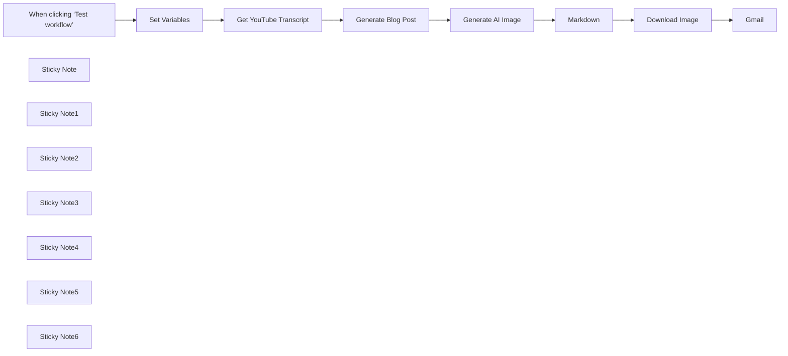

## Fluxo (.json) :

```json
{
  "id": "A0xnegTHL43LL3eP",
  "meta": {
    "instanceId": "a1ae5c8dc6c65e674f9c3947d083abcc749ef2546dff9f4ff01de4d6a36ebfe6",
    "templateCredsSetupCompleted": true
  },
  "name": "Convert YouTube Videos into SEO Blog Posts",
  "tags": [],
  "nodes": [
    {
      "id": "c79371d9-c1be-48d4-a2c7-d97a12f4e23c",
      "name": "When clicking ‘Test workflow’",
      "type": "n8n-nodes-base.manualTrigger",
      "position": [
        0,
        0
      ],
      "parameters": {},
      "typeVersion": 1
    },
    {
      "id": "7812d81b-3fe8-42a0-8ac8-53161c345e60",
      "name": "Get YouTube Transcript",
      "type": "n8n-nodes-base.httpRequest",
      "position": [
        440,
        0
      ],
      "parameters": {
        "url": "https://app.dumplingai.com/api/v1/get-youtube-transcript",
        "method": "POST",
        "options": {},
        "sendBody": true,
        "authentication": "genericCredentialType",
        "bodyParameters": {
          "parameters": [
            {
              "name": "videoUrl",
              "value": "={{ $json['YouTube Video Url'] }}"
            },
            {
              "name": "includeTimestamps",
              "value": "={{false}}"
            }
          ]
        },
        "genericAuthType": "httpHeaderAuth"
      },
      "credentials": {
        "httpBearerAuth": {
          "id": "0pq31j7wKqOIHFaR",
          "name": "Dumpling AI Bearer Auth account"
        },
        "httpHeaderAuth": {
          "id": "ASc5gIQaW1c63ZhO",
          "name": "Dumpling AI Auth"
        }
      },
      "typeVersion": 4.2
    },
    {
      "id": "bd25a5d9-c2a2-49fa-a73a-dc1d65875629",
      "name": "Sticky Note",
      "type": "n8n-nodes-base.stickyNote",
      "position": [
        140,
        -260
      ],
      "parameters": {
        "width": 260,
        "height": 240,
        "content": "## Set Variables\nSet your variables here, such as:\n- YouTube Video URL: The YouTube video you want to convert into a SEO Blog Post\n- Recipient Email Address: This is the email we send all generated content to at the end of the workflow.\n"
      },
      "typeVersion": 1
    },
    {
      "id": "52e1de35-84ee-4019-aa5f-3502e6b728e1",
      "name": "Sticky Note1",
      "type": "n8n-nodes-base.stickyNote",
      "position": [
        360,
        180
      ],
      "parameters": {
        "width": 280,
        "height": 200,
        "content": "## Get YouTube Transcript\nThis step gets the transcript of the YouTube video with Dumpling AI. The target video must have captions or subtitles enabled. You can modify this to specify a language.\n "
      },
      "typeVersion": 1
    },
    {
      "id": "ec94d583-7e25-4ac4-8fb9-beb369832355",
      "name": "Set Variables",
      "type": "n8n-nodes-base.set",
      "position": [
        220,
        0
      ],
      "parameters": {
        "options": {},
        "assignments": {
          "assignments": [
            {
              "id": "a777e7e9-4334-4a6a-8a4c-f3b6bf5fc94b",
              "name": "YouTube Video Url",
              "type": "string",
              "value": "https://www.youtube.com/watch?v=Dpie2Cd4iB4"
            },
            {
              "id": "257054fa-5348-475e-965e-5ecd03d901bd",
              "name": "Recipient Email Address",
              "type": "string",
              "value": "example@example.com"
            }
          ]
        }
      },
      "typeVersion": 3.4
    },
    {
      "id": "fa1b0e6f-3892-4bc8-8fd8-c96d3a596991",
      "name": "Generate Blog Post",
      "type": "@n8n/n8n-nodes-langchain.openAi",
      "position": [
        660,
        0
      ],
      "parameters": {
        "modelId": {
          "__rl": true,
          "mode": "list",
          "value": "gpt-4o",
          "cachedResultName": "GPT-4O"
        },
        "options": {},
        "messages": {
          "values": [
            {
              "role": "system",
              "content": "Write a detailed SEO-optimized blog post using the provided YouTube video transcript.\n\nUse the transcript content as the foundation for the blog, extracting key ideas, topics, and themes to highlight. Ensure the blog post is structured with clear headings, subheadings, and paragraphs, incorporating SEO keywords naturally. The tone should be engaging and informative, targeted towards readers interested in the video's subject matter.\n\n- Identify the main topics and themes of the transcript.\n- Extract key points, arguments, or stories present in the transcript.\n- Determine suitable SEO keywords related to the content and integrate them meaningfully.\n- Craft a title that is both engaging and SEO-friendly.\n- Write a comprehensive and well-structured blog post with an introduction, body, and conclusion.\n- Use bullet points, lists, or numbers if necessary for clarity and readability.\n\n# Steps\n\n1. **Transcript Analysis**: Begin by thoroughly reading the provided transcript to understand the core messages and detailed content.\n   \n2. **Identify Key Points**: Extract important points, arguments, or themes that should be highlighted in the blog post.\n\n3. **SEO Keyword Research**: Determine relevant SEO keywords that align with the content’s themes and audiences.\n\n4. **Blog Structuring**: Create an outline for the blog post, arranging sections logically with appropriate headings (H2, H3) for SEO.\n\n5. **Content Writing**: Write each section based on the transcript’s content, ensuring the inclusion of SEO keywords and maintaining a clear and engaging tone.\n\n6. **Review and Edit**: Proofread for grammatical accuracy and SEO optimization. Ensure smooth flow and coherence.\n\n# Output Format\n\nRespond in the following JSON format:\n```json\n{\n  \"title\": \"string\",\n  \"blogImagePrompt\": \"string\",\n  \"description\": \"string\",\n  \"content\": \"string\"\n}\n```\n\n- Title: Craft an SEO-friendly engaging title.\n- Blog Image Prompt: Provide a textual prompt that can be used to generate an image relevant to the blog post content. We prefer abstract images.\n- Description: Summarize the blog post in a concise and engaging way.\n- Content: Write a comprehensive blog using the transcript as reference, structured with clear headings and engaging content.\n\n# Examples\n\n### Input\n[YouTube Transcript]\n\n### Output\n```json\n{\n  \"title\": \"Understanding Renewable Energy: A Path to Sustainability\",\n  \"blogImagePrompt\": \"An illustration of various renewable energy sources like solar panels and wind turbines.\",\n  \"description\": \"Explore the importance and impact of renewable energy on our planet. This blog delves into key themes and actionable insights from the transcript, providing a comprehensive understanding of sustainable energy solutions.\",\n  \"content\": \"Introduction: Renewable energy is transforming our world...\\nBody: Today's pressing challenges around fossil fuels...\\nConclusion: In embracing renewable energy, we...\"\n}\n```\n\n(This example reflects the JSON structure. Use real content from the transcript to fill these sections.)"
            },
            {
              "content": "={{ $json.transcript }}"
            }
          ]
        },
        "jsonOutput": true
      },
      "credentials": {
        "openAiApi": {
          "id": "fdhWALG84tBLgSZT",
          "name": "OpenAi account"
        }
      },
      "typeVersion": 1.8
    },
    {
      "id": "50bfb015-554d-48f3-aa81-130677620fdd",
      "name": "Sticky Note2",
      "type": "n8n-nodes-base.stickyNote",
      "position": [
        660,
        -340
      ],
      "parameters": {
        "width": 260,
        "height": 320,
        "content": "## Generate Blog Post\nHere we get GPT-4o (or a model of your choice) to generate a detailed SEO blog post. We ask for:\n- title \n- description\n- blogImagePrompt\n- content\n\nTo improve this step, you can consider generating section by section or replacing this with an AI Agent with research capabilities"
      },
      "typeVersion": 1
    },
    {
      "id": "ecc499c0-776e-4cb1-8361-6f05e0cda021",
      "name": "Generate AI Image",
      "type": "n8n-nodes-base.httpRequest",
      "position": [
        1036,
        0
      ],
      "parameters": {
        "url": "https://app.dumplingai.com/api/v1/generate-ai-image",
        "method": "POST",
        "options": {},
        "jsonBody": "={\n  \"model\": \"FLUX.1-dev\",\n  \"input\": {\n    \"prompt\": \"{{ $json.message.content.blogImagePrompt }}\"\n  }\n}",
        "sendBody": true,
        "specifyBody": "json",
        "authentication": "genericCredentialType",
        "genericAuthType": "httpHeaderAuth"
      },
      "credentials": {
        "httpBearerAuth": {
          "id": "0pq31j7wKqOIHFaR",
          "name": "Dumpling AI Bearer Auth account"
        },
        "httpHeaderAuth": {
          "id": "ASc5gIQaW1c63ZhO",
          "name": "Dumpling AI Auth"
        }
      },
      "typeVersion": 4.2
    },
    {
      "id": "c0e5dfef-5314-4d30-836a-e9e4d13e4679",
      "name": "Sticky Note3",
      "type": "n8n-nodes-base.stickyNote",
      "position": [
        980,
        180
      ],
      "parameters": {
        "height": 260,
        "content": "## Generate Blog Image\nHere we use the FLUX.1-dev model via Dumpling AI to generate a image for the blog post. Feel free to use the image model you prefer. You may need to update to a more powerful (expensive) model if you want text in your images."
      },
      "typeVersion": 1
    },
    {
      "id": "7d7c0463-7d19-46a3-be5a-d5bd47b82032",
      "name": "Gmail",
      "type": "n8n-nodes-base.gmail",
      "position": [
        1696,
        0
      ],
      "webhookId": "93615493-65f6-41ab-9ea7-2f6ffb8cbc40",
      "parameters": {
        "sendTo": "={{ $('Set Variables').item.json['Recipient Email Address'] }}",
        "message": "=Description: {{ $('Generate Blog Post').item.json.message.content.description }}\n\nContent:\n{{ $('Markdown').item.json.htmlContent }}",
        "options": {
          "attachmentsUi": {
            "attachmentsBinary": [
              {}
            ]
          }
        },
        "subject": "={{ $('Generate Blog Post').item.json.message.content.title }}"
      },
      "credentials": {
        "gmailOAuth2": {
          "id": "g5pJ3U0ehy2NiEiI",
          "name": "Gmail account"
        }
      },
      "typeVersion": 2.1
    },
    {
      "id": "5af18f00-3d7d-4db4-ab2b-595ef7e8adc3",
      "name": "Markdown",
      "type": "n8n-nodes-base.markdown",
      "position": [
        1256,
        0
      ],
      "parameters": {
        "mode": "markdownToHtml",
        "options": {},
        "markdown": "={{ $('Generate Blog Post').item.json.message.content.content }}",
        "destinationKey": "htmlContent"
      },
      "typeVersion": 1
    },
    {
      "id": "ca2b7c3e-44e9-4043-916a-b44c3ef662f2",
      "name": "Download Image",
      "type": "n8n-nodes-base.httpRequest",
      "position": [
        1476,
        0
      ],
      "parameters": {
        "url": "={{ $('Generate AI Image').item.json.images[0].url }}",
        "options": {}
      },
      "typeVersion": 4.2
    },
    {
      "id": "a7414823-fc14-4981-97bb-d14f4622172e",
      "name": "Sticky Note4",
      "type": "n8n-nodes-base.stickyNote",
      "position": [
        1180,
        -200
      ],
      "parameters": {
        "width": 260,
        "height": 180,
        "content": "## Convert Markdown to HTML\nOpenAI LLMs tend to output markdown. We need to convert to HTML for formatting in the the Gmail node."
      },
      "typeVersion": 1
    },
    {
      "id": "a0213875-25cb-48b1-b845-e14b2e83efac",
      "name": "Sticky Note5",
      "type": "n8n-nodes-base.stickyNote",
      "position": [
        1400,
        180
      ],
      "parameters": {
        "width": 260,
        "height": 180,
        "content": "## Download Image for Attachment\nThe image URL is a temporary URL, so we need to download the image and attach it to the email being sent."
      },
      "typeVersion": 1
    },
    {
      "id": "35307e5f-662b-41ab-89fb-3519d790fa52",
      "name": "Sticky Note6",
      "type": "n8n-nodes-base.stickyNote",
      "position": [
        1620,
        -200
      ],
      "parameters": {
        "width": 260,
        "height": 180,
        "content": "## Send blog post via email for next steps\nWe send all generated content to your email address so you have a record of all generations and can get it ready for publication"
      },
      "typeVersion": 1
    }
  ],
  "active": false,
  "pinData": {},
  "settings": {
    "executionOrder": "v1"
  },
  "versionId": "f91b5401-28b5-435c-a147-64bc124b1993",
  "connections": {
    "Markdown": {
      "main": [
        [
          {
            "node": "Download Image",
            "type": "main",
            "index": 0
          }
        ]
      ]
    },
    "Set Variables": {
      "main": [
        [
          {
            "node": "Get YouTube Transcript",
            "type": "main",
            "index": 0
          }
        ]
      ]
    },
    "Download Image": {
      "main": [
        [
          {
            "node": "Gmail",
            "type": "main",
            "index": 0
          }
        ]
      ]
    },
    "Generate AI Image": {
      "main": [
        [
          {
            "node": "Markdown",
            "type": "main",
            "index": 0
          }
        ]
      ]
    },
    "Generate Blog Post": {
      "main": [
        [
          {
            "node": "Generate AI Image",
            "type": "main",
            "index": 0
          }
        ]
      ]
    },
    "Get YouTube Transcript": {
      "main": [
        [
          {
            "node": "Generate Blog Post",
            "type": "main",
            "index": 0
          }
        ]
      ]
    },
    "When clicking ‘Test workflow’": {
      "main": [
        [
          {
            "node": "Set Variables",
            "type": "main",
            "index": 0
          }
        ]
      ]
    }
  }
}
```

<a id="template-415"></a>

## Template 415 - Acender luz em cor específica ao atualizar repositório GitHub

- **Nome:** Acender luz em cor específica ao atualizar repositório GitHub
- **Descrição:** Ao detectar qualquer atualização em um repositório do GitHub, liga uma luz e define sua cor para um valor RGB específico (padrão vermelho).
- **Funcionalidade:** • Detecção de atualizações no repositório: Monitora eventos do repositório (pull requests, issues, pushes e outros) e dispara a automação ao ocorrerem.
• Ativação e configuração da luz: Envia uma chamada ao sistema de automação residencial para ligar a entidade de luz especificada e ajustar a cor RGB.
• Configuração personalizável: Permite definir o entity_id da luz e o valor RGB desejado (padrão [255,0,0]).
• Uso de credenciais: Autentica-se nos serviços externos configurados para realizar as ações de forma segura.
- **Ferramentas:** • GitHub: Plataforma para hospedagem de código e controle de versões, responsável por gerar os eventos de atualização que disparam o fluxo.
• Home Assistant: Plataforma de automação residencial utilizada para controlar dispositivos, receber a chamada de serviço e aplicar a cor RGB na entidade de luz.

## Fluxo visual

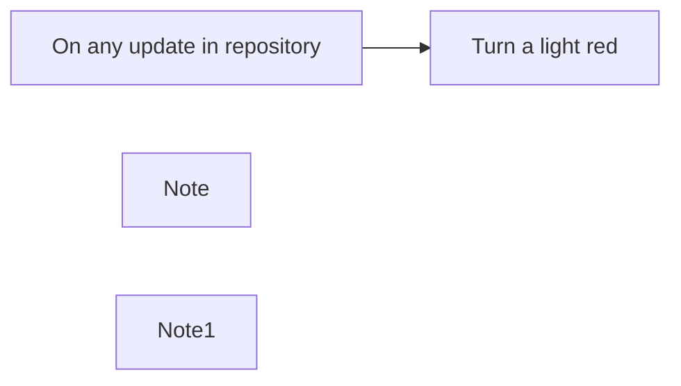

## Fluxo (.json) :

```json
{
  "meta": {
    "instanceId": "a2434c94d549548a685cca39cc4614698e94f527bcea84eefa363f1037ae14cd"
  },
  "nodes": [
    {
      "id": "161c2837-6a3c-4492-93d0-c094b8788362",
      "name": "On any update in repository",
      "type": "n8n-nodes-base.githubTrigger",
      "position": [
        620,
        520
      ],
      "webhookId": "9f16fefe-dacf-48b8-a576-48ed0599e911",
      "parameters": {
        "owner": "dummydavid",
        "events": [
          "*"
        ],
        "repository": "DemoRepo"
      },
      "credentials": {
        "githubApi": {
          "id": "20",
          "name": "[UPDATE ME]"
        }
      },
      "typeVersion": 1
    },
    {
      "id": "2703e869-60e0-4906-9fd2-35a5e54aae1f",
      "name": "Turn a light red",
      "type": "n8n-nodes-base.homeAssistant",
      "position": [
        840,
        520
      ],
      "parameters": {
        "domain": "light",
        "service": "turn_on",
        "resource": "service",
        "operation": "call",
        "serviceAttributes": {
          "attributes": [
            {
              "name": "entity_id",
              "value": "light.lamp"
            },
            {
              "name": "rgb_color",
              "value": "={{[255,0,0]}}"
            }
          ]
        }
      },
      "credentials": {
        "homeAssistantApi": {
          "id": "21",
          "name": "home.davidsha.me"
        }
      },
      "typeVersion": 1
    },
    {
      "id": "bbbd01eb-9409-414e-bc85-c615add05580",
      "name": "Note",
      "type": "n8n-nodes-base.stickyNote",
      "position": [
        160,
        420
      ],
      "parameters": {
        "width": 378,
        "height": 351,
        "content": "## Turn on a light to a specific color on any update in GitHub repository\nThis workflow turns a light red when an update is made to a GitHub repository. By default, updates include pull requests, issues, pushes just to name a few.\n\n### How it works\n1. Triggers off on the `On any update in repository` node.\n2. Uses Home Assistant to turn on a light and then configure the light to turn red."
      },
      "typeVersion": 1
    },
    {
      "id": "33dfde3b-a4b5-468d-8d13-9d3577563f9b",
      "name": "Note1",
      "type": "n8n-nodes-base.stickyNote",
      "position": [
        840,
        700
      ],
      "parameters": {
        "width": 315,
        "height": 248,
        "content": "### Configure light here\nIt is likely the name of the light that you want to turn a specific colour is not called `light.lamp`. In which case, please head to your Home Assistant instance and find the light taking note of it's `entity_id`. See discussion [here](https://community.home-assistant.io/t/find-the-entity-id-of-a-yeelight-light-in-manual-mode-or-automatic-mode-doesnt-work/165557) for help.\n\nIf you would also like to change the colour the light turns to, do so with an [RGB color picker](https://www.google.com/search?q=rgb+color+picker&oq=rgb+colo&aqs=chrome.0.0i67i433j69i57j0i67l4j0i512l4.6248j0j7&sourceid=chrome&ie=UTF-8). Default colour is red (255,0,0)."
      },
      "typeVersion": 1
    }
  ],
  "connections": {
    "On any update in repository": {
      "main": [
        [
          {
            "node": "Turn a light red",
            "type": "main",
            "index": 0
          }
        ]
      ]
    }
  }
}
```

<a id="template-416"></a>

## Template 416 - Gatilho de eventos do GitLab

- **Nome:** Gatilho de eventos do GitLab
- **Descrição:** Este fluxo inicia quando qualquer evento ocorre no repositório n8n-io/n8n-docs do GitLab, permitindo ações subsequentes baseadas nesses eventos.
- **Funcionalidade:** • Detecção de eventos do repositório: Recebe webhooks para todos os tipos de eventos configurados no repositório especificado.
• Monitoramento por proprietário e repositório: Vinculado especificamente ao repositório n8n-io/n8n-docs para foco em eventos desse projeto.
• Suporte a todos os tipos de eventos: Configurado para escutar qualquer evento (events: "*").
• Autenticação via credenciais de API: Utiliza credenciais para autenticar a origem dos eventos e garantir segurança.
- **Ferramentas:** • GitLab: Plataforma de hospedagem de código e sistema de controle de versão que envia webhooks com eventos do repositório.

## Fluxo visual

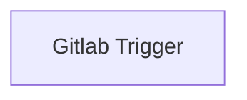

## Fluxo (.json) :

```json
{
  "nodes": [
    {
      "name": "Gitlab Trigger",
      "type": "n8n-nodes-base.gitlabTrigger",
      "position": [
        460,
        480
      ],
      "webhookId": "0e855b27-6465-42be-9610-c61b2e09cef9",
      "parameters": {
        "owner": "n8n-io",
        "events": [
          "*"
        ],
        "repository": "n8n-docs"
      },
      "credentials": {
        "gitlabApi": "gitlab_creds"
      },
      "typeVersion": 1
    }
  ],
  "connections": {}
}
```

<a id="template-417"></a>

## Template 417 - Triagem e criação automática de tickets

- **Nome:** Triagem e criação automática de tickets
- **Descrição:** Monitora um endereço de e-mail de suporte, usa inteligência artificial para triagem (rótulos, prioridade e resumo) e cria issues correspondentes em um sistema de gestão.
- **Funcionalidade:** • Agendamento periódico: Executa verificações regulares da caixa de entrada em intervalos definidos.
• Filtragem de mensagens: Captura apenas e-mails direcionados ao endereço de suporte (filtro to:support@example.com).
• Evitar duplicatas: Marca e ignora mensagens já processadas para não duplicar ações.
• Conversão de conteúdo: Converte o corpo das mensagens de HTML para formato Markdown para facilitar o processamento.
• Triagem com IA: Utiliza um modelo de linguagem para classificar rótulos adequados, atribuir prioridade e reescrever título e descrição do ticket com linguagem factual.
• Saída estruturada: Garante retorno em formato estruturado (labels, priority, summary, description) para uso automático.
• Criação automática de issue: Gera um item de issue no sistema de gestão com título, descrição, prioridade e rótulos aplicados.
- **Ferramentas:** • Gmail: Fonte das mensagens de suporte, usada para buscar e ler e-mails filtrados.
• OpenAI (modelo de linguagem): Responsável pela triagem automática, classificação de rótulos, priorização e reescrita dos textos (ex.: gpt-4o-mini).
• Linear: Plataforma de gestão de issues onde são criados os tickets com título, descrição, prioridade e rótulos.

## Fluxo visual

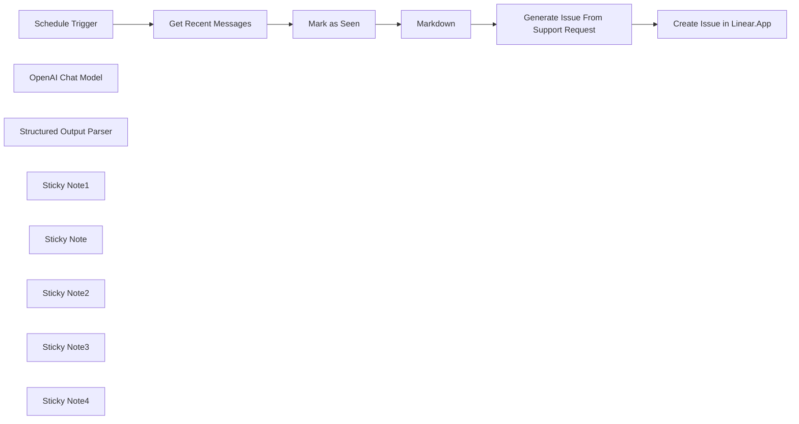

## Fluxo (.json) :

```json
{
  "meta": {
    "instanceId": "408f9fb9940c3cb18ffdef0e0150fe342d6e655c3a9fac21f0f644e8bedabcd9",
    "templateCredsSetupCompleted": true
  },
  "nodes": [
    {
      "id": "1c583599-826d-4a02-bfd9-f22f020f4af7",
      "name": "Schedule Trigger",
      "type": "n8n-nodes-base.scheduleTrigger",
      "position": [
        -640,
        -140
      ],
      "parameters": {
        "rule": {
          "interval": [
            {
              "field": "hours"
            }
          ]
        }
      },
      "typeVersion": 1.2
    },
    {
      "id": "aaddc5fd-4b05-4ee2-9f71-222b14fb05d6",
      "name": "OpenAI Chat Model",
      "type": "@n8n/n8n-nodes-langchain.lmChatOpenAi",
      "position": [
        280,
        40
      ],
      "parameters": {
        "model": {
          "__rl": true,
          "mode": "list",
          "value": "gpt-4o-mini"
        },
        "options": {}
      },
      "credentials": {
        "openAiApi": {
          "id": "8gccIjcuf3gvaoEr",
          "name": "OpenAi account"
        }
      },
      "typeVersion": 1.2
    },
    {
      "id": "cd2a47fb-3e04-464d-bcac-00e84952d72c",
      "name": "Structured Output Parser",
      "type": "@n8n/n8n-nodes-langchain.outputParserStructured",
      "position": [
        480,
        40
      ],
      "parameters": {
        "schemaType": "manual",
        "inputSchema": "{\n  \"type\": \"object\",\n  \"properties\": {\n    \"labels\": {\n      \"type\": \"array\",\n      \"items\": { \"type\": \"string\" }\n    },\n    \"priority\": { \"type\": \"number\" },\n    \"summary\": { \"type\": \"string\" },\n    \"description\": { \"type\": \"string\" }\n  }\n}"
      },
      "typeVersion": 1.2
    },
    {
      "id": "48234689-66fd-4a5e-b940-5e6e07a95ad9",
      "name": "Sticky Note1",
      "type": "n8n-nodes-base.stickyNote",
      "position": [
        0,
        -340
      ],
      "parameters": {
        "color": 7,
        "width": 700,
        "height": 540,
        "content": "## 2. Automate Generation and Triaging of Ticket\n[Read more about the Basic LLM node](https://docs.n8n.io/integrations/builtin/cluster-nodes/root-nodes/n8n-nodes-langchain.chainllm)\n\nNew tickets always need to be properly labelled and prioritised but it's not always possible to get to update all incoming tickets if you're light on hands. Using an AI is a great use-case for triaging of tickets as its contextual understanding helps automates this step."
      },
      "typeVersion": 1
    },
    {
      "id": "c25fd99f-4898-479f-bf63-a79c3ca084fc",
      "name": "Markdown",
      "type": "n8n-nodes-base.markdown",
      "position": [
        100,
        -140
      ],
      "parameters": {
        "html": "={{ $json.html }}",
        "options": {}
      },
      "typeVersion": 1
    },
    {
      "id": "b27f5e33-d149-4395-84b2-e1e1070c8a0b",
      "name": "Mark as Seen",
      "type": "n8n-nodes-base.removeDuplicates",
      "position": [
        -220,
        -140
      ],
      "parameters": {
        "options": {},
        "operation": "removeItemsSeenInPreviousExecutions",
        "dedupeValue": "={{ $json.id }}"
      },
      "typeVersion": 2
    },
    {
      "id": "e282e452-0dbb-4d00-b319-13840264feda",
      "name": "Sticky Note",
      "type": "n8n-nodes-base.stickyNote",
      "position": [
        -740,
        -340
      ],
      "parameters": {
        "color": 7,
        "width": 720,
        "height": 540,
        "content": "## 1. Watch Gmail Inbox for Support Emails\n[Learn more about the Gmail node](https://docs.n8n.io/integrations/builtin/app-nodes/n8n-nodes-base.gmail/)\n\n**This template assumes a group email specifically for support tickets!** If you have a general inbox, you may need to classify and filter each message which might become costly. The \"remove duplicates\" node (ie. \"Mark as seen\") ensures we only process each email exactly once."
      },
      "typeVersion": 1
    },
    {
      "id": "d43db00e-bfd4-4b18-ad33-4bccb3373d09",
      "name": "Sticky Note2",
      "type": "n8n-nodes-base.stickyNote",
      "position": [
        720,
        -340
      ],
      "parameters": {
        "color": 7,
        "width": 460,
        "height": 440,
        "content": "## 3. Create Issue in Linear.App\n[Read more about the Linear.App node](https://docs.n8n.io/integrations/builtin/app-nodes/n8n-nodes-base.linear)\n\nThis is only a simple example to create an issue in Linear.App but easily extendable to add much more!"
      },
      "typeVersion": 1
    },
    {
      "id": "13f657aa-5af1-4af4-af04-f81a13d2ce29",
      "name": "Sticky Note3",
      "type": "n8n-nodes-base.stickyNote",
      "position": [
        -1160,
        -720
      ],
      "parameters": {
        "width": 380,
        "height": 940,
        "content": "## Try It Out!\n### This n8n template watches a Gmail inbox for support messages and creates an equivalent issue item in Linear.\n\n### How it works\n* A scheduled trigger fetches recent Gmail messages from the inbox which collects support requests.\n* These support requests are filtered to ensure they are only processed once and their HTML body is converted to markdown for easier parsing.\n* Each support request is then triaged via an AI Agent which adds appropriate labels, assesses priority and summarises a title and description of the original request.\n* Finally, the AI generated values are used to create an issue in Linear to be actioned.\n\n### How to use\n* Ensure the messages fetched are solely support requests otherwise you'll need to classify messages before processing them.\n* Specify the labels and priorities to use in the system prompt of the AI agent.\n\n### Requirements\n* Gmail for incoming support messages\n* OpenAI for LLM\n* Linear for issue management\n\n### Customising this workflow\n* Consider automating more steps after the issue is created such as attempting issue resolution or capacity planning.\n\n\n### Need Help?\nJoin the [Discord](https://discord.com/invite/XPKeKXeB7d) or ask in the [Forum](https://community.n8n.io/)!\n\nHappy Hacking!"
      },
      "typeVersion": 1
    },
    {
      "id": "684a5300-41c9-4ec4-8780-d1797e4dcfa2",
      "name": "Generate Issue From Support Request",
      "type": "@n8n/n8n-nodes-langchain.chainLlm",
      "position": [
        300,
        -140
      ],
      "parameters": {
        "text": "=Reported by {{ $json.from.value[0].name }} <{{ $json.from.value[0].address }}>\nReported at: {{ $now.toISO() }}\nSummary: {{ $json.subject }}\nDescription:\n{{ $json.data.replaceAll('\\n', ' ') }}",
        "messages": {
          "messageValues": [
            {
              "message": "=Your are Issues triage assistant who's task is to\n1) classify and label the given issue.\n2) Prioritise the given issue.\n3) Rewrite the issue summary and description.\n\n## Labels\nUse one or more labels.\n* Technical\n* Account\n* Access\n* Billing\n* Product\n* Training\n* Feedback\n* Complaints\n* Security\n* Privacy\n\n## Priority\n* 1 - highest\n* 2 - high\n* 3 - medium\n* 4 - low\n* 5 - lowest\n\n## Write Summary and Description\n* Remove emotional and anedotal phrases or information\n* Keep to the facts of the matter\n* Highlight what was attempted and is/was failing"
            }
          ]
        },
        "promptType": "define",
        "hasOutputParser": true
      },
      "typeVersion": 1.6
    },
    {
      "id": "50aa5f53-680a-4518-a3a5-b97c3bd82af3",
      "name": "Get Recent Messages",
      "type": "n8n-nodes-base.gmail",
      "position": [
        -440,
        -140
      ],
      "webhookId": "f3528949-056d-4013-ab62-9694e72b38cd",
      "parameters": {
        "limit": 1,
        "simple": false,
        "filters": {
          "q": "to:support@example.com"
        },
        "options": {},
        "operation": "getAll"
      },
      "credentials": {
        "gmailOAuth2": {
          "id": "Sf5Gfl9NiFTNXFWb",
          "name": "Gmail account"
        }
      },
      "typeVersion": 2.1
    },
    {
      "id": "a7a41e51-3852-43f3-98b9-d67bab4f8e41",
      "name": "Create Issue in Linear.App",
      "type": "n8n-nodes-base.linear",
      "position": [
        900,
        -140
      ],
      "parameters": {
        "title": "={{ $json.output.summary }}",
        "teamId": "1c721608-321d-4132-ac32-6e92d04bb487",
        "additionalFields": {
          "stateId": "92962324-3d1f-4cf8-993b-0c982cc95245",
          "priorityId": "={{ $json.output.priority ?? 3 }}",
          "description": "={{ $json.output.description }}\n\n{{ $json.output.labels.map(label => `#${label}`).join(' ') }}"
        }
      },
      "credentials": {
        "linearApi": {
          "id": "Nn0F7T9FtvRUtEbe",
          "name": "Linear account"
        }
      },
      "typeVersion": 1
    },
    {
      "id": "4593cd01-8fa3-4828-ba77-21082a2f31fb",
      "name": "Sticky Note4",
      "type": "n8n-nodes-base.stickyNote",
      "position": [
        -500,
        40
      ],
      "parameters": {
        "color": 5,
        "height": 120,
        "content": "### Gmail Filters\nHere we're using the filter `to:support@example.com` to capture support requests."
      },
      "typeVersion": 1
    }
  ],
  "pinData": {},
  "connections": {
    "Markdown": {
      "main": [
        [
          {
            "node": "Generate Issue From Support Request",
            "type": "main",
            "index": 0
          }
        ]
      ]
    },
    "Mark as Seen": {
      "main": [
        [
          {
            "node": "Markdown",
            "type": "main",
            "index": 0
          }
        ]
      ]
    },
    "Schedule Trigger": {
      "main": [
        [
          {
            "node": "Get Recent Messages",
            "type": "main",
            "index": 0
          }
        ]
      ]
    },
    "OpenAI Chat Model": {
      "ai_languageModel": [
        [
          {
            "node": "Generate Issue From Support Request",
            "type": "ai_languageModel",
            "index": 0
          }
        ]
      ]
    },
    "Get Recent Messages": {
      "main": [
        [
          {
            "node": "Mark as Seen",
            "type": "main",
            "index": 0
          }
        ]
      ]
    },
    "Structured Output Parser": {
      "ai_outputParser": [
        [
          {
            "node": "Generate Issue From Support Request",
            "type": "ai_outputParser",
            "index": 0
          }
        ]
      ]
    },
    "Generate Issue From Support Request": {
      "main": [
        [
          {
            "node": "Create Issue in Linear.App",
            "type": "main",
            "index": 0
          }
        ]
      ]
    }
  }
}
```

<a id="template-418"></a>

## Template 418 - Importar avaliações Trustpilot para Google Sheets

- **Nome:** Importar avaliações Trustpilot para Google Sheets
- **Descrição:** Automatiza a coleta de avaliações públicas de uma empresa no Trustpilot e grava os dados em duas abas de uma planilha Google, incluindo um formato preparado para importação no HelpfulCrowd.
- **Funcionalidade:** • Início manual e agendado: permite executar via teste manual ou por agendamento periódico.
• Configuração de alvo e limite: define o identificador da empresa (company_id) e o número máximo de páginas a raspar (max_page).
• Requisições paginadas ao Trustpilot: consulta as páginas de avaliações usando o parâmetro page, com intervalo de 5s entre requisições e parada ao receber 404 ou quando não houver mais reviews.
• Extração de dados embutidos: localiza e lê o JSON contido no script __NEXT_DATA__ da página para obter a lista de avaliações.
• Transformação de campos: mapeia os campos relevantes (Date, Author, Body, Heading, Rating, Location, review_id) para uso em planilhas.
• Separação de registros: divide a lista de reviews em itens individuais para processamento e exportação linha a linha.
• Escrita e atualização em planilhas: insere ou atualiza linhas em abas do Google Sheets utilizando review_id como chave para evitar duplicados (appendOrUpdate).
• Geração de formato HelpfulCrowd: prepara colunas específicas (product_id, rating, title, feedback, customer_name, review_date, verified, media slots, status) compatíveis com importação no HelpfulCrowd.
• Controle básico de erros e logs: detecta falta de dados e registra avisos quando não encontra o conteúdo esperado na página.
- **Ferramentas:** • Trustpilot: fonte pública das avaliações de consumidores; o fluxo faz requisições às páginas de reviews da empresa para coletar dados.
• Google Sheets: destino das avaliações; armazena os dados em duas abas (uma geral e outra no formato HelpfulCrowd) e permite operações de inserção/atualização por ID.
• HelpfulCrowd: destino de importação esperado — o fluxo formata uma aba para compatibilidade com o processo de importação dessa plataforma.
• Biblioteca de parsing HTML (cheerio): utilizada para carregar o HTML da página e extrair o JSON presente no script __NEXT_DATA__, facilitando a extração dos reviews.

## Fluxo visual

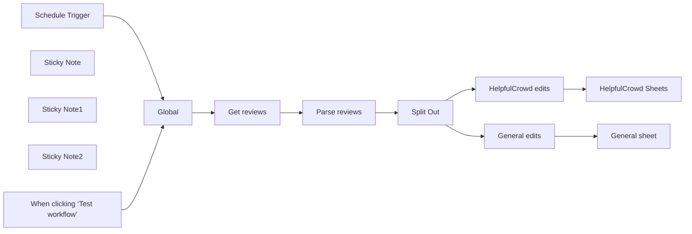

## Fluxo (.json) :

```json
{
  "id": "DqvkhR9nzoPQKxGh",
  "meta": {
    "instanceId": "e634e668fe1fc93a75c4f2a7fc0dad807ca318b79654157eadb9578496acbc76"
  },
  "name": "Scrape Trustpilot Reviews to Google Sheets",
  "tags": [],
  "nodes": [
    {
      "id": "6680358c-de48-4459-aac7-dd7b903e542d",
      "name": "When clicking ‘Test workflow’",
      "type": "n8n-nodes-base.manualTrigger",
      "position": [
        -1300,
        340
      ],
      "parameters": {},
      "typeVersion": 1
    },
    {
      "id": "896d5dcb-d2cf-4a86-8c84-7997bc7a2d0a",
      "name": "Sticky Note",
      "type": "n8n-nodes-base.stickyNote",
      "position": [
        -1000,
        40
      ],
      "parameters": {
        "width": 232,
        "height": 346,
        "content": "## Edit this node 👇\n\nChange to the name of the company registered on Trustpilot and the maximum number of pages to scrape"
      },
      "typeVersion": 1
    },
    {
      "id": "4d208d18-991b-4dfd-a717-8f752ea74a90",
      "name": "Get reviews",
      "type": "n8n-nodes-base.httpRequest",
      "position": [
        -700,
        220
      ],
      "parameters": {
        "url": "=https://trustpilot.com/review/{{ $json.company_id }}",
        "options": {
          "pagination": {
            "pagination": {
              "parameters": {
                "parameters": [
                  {
                    "name": "page",
                    "value": "={{ $pageCount + 1 }}"
                  }
                ]
              },
              "maxRequests": "={{ $json.max_page }}",
              "requestInterval": 5000,
              "limitPagesFetched": true,
              "paginationCompleteWhen": "receiveSpecificStatusCodes",
              "statusCodesWhenComplete": "404"
            }
          }
        },
        "sendQuery": true,
        "queryParameters": {
          "parameters": [
            {
              "name": "sort",
              "value": "recency"
            }
          ]
        }
      },
      "typeVersion": 4.2
    },
    {
      "id": "b3e4c576-a9f4-48c8-ad27-696c0e0fc69d",
      "name": "Global",
      "type": "n8n-nodes-base.set",
      "position": [
        -960,
        220
      ],
      "parameters": {
        "options": {},
        "assignments": {
          "assignments": [
            {
              "id": "556e201d-242a-4c0e-bc13-787c2b60f800",
              "name": "company_id",
              "type": "string",
              "value": "n8n.io"
            },
            {
              "id": "a1f239df-df08-41d8-8b78-d6502266a581",
              "name": "max_page",
              "type": "number",
              "value": 100
            }
          ]
        }
      },
      "typeVersion": 3.4
    },
    {
      "id": "f2dd1771-cba9-408f-93bd-2e83201edae9",
      "name": "Parse reviews",
      "type": "n8n-nodes-base.code",
      "position": [
        -480,
        220
      ],
      "parameters": {
        "jsCode": "const cheerio = require('cheerio');\n\nasync function getReviewsFromPage(content) {\n    try {\n        const $ = cheerio.load(content);\n        const scriptTag = $('#__NEXT_DATA__');\n        \n        if (!scriptTag.length) {\n            console.warn(\"Warning: Could not find review data in page\");\n            return [];\n        }\n\n        const reviewsRaw = JSON.parse(scriptTag.html());\n        return reviewsRaw.props.pageProps.reviews || [];\n    } catch (error) {\n        console.error(`Error fetching reviews: ${error.message}`);\n        return [];\n    }\n}\n\nasync function scrapeTrustpilotReviews() {\n    let reviewsData = [];\n    \n    for (let page = 0; page < $input.all().length; page++) {\n        console.log(`\\nScraping page ${page}...`);\n        const content = $input.all()[page].json.data;\n        const reviews = await getReviewsFromPage(content);\n        \n        if (!reviews.length) {\n            console.log(\"No more reviews found.\");\n            break;\n        }\n\n        console.log(`Found ${reviews.length} reviews on page ${page}`);\n        reviews.forEach(review => {\n            const data = {\n                Date: new Date(review.dates.publishedDate).toISOString().split('T')[0],\n                Author: review.consumer.displayName,\n                Body: review.text,\n                Heading: review.title,\n                Rating: review.rating,\n                Location: review.consumer.countryCode\n            };\n            reviewsData.push(review);\n        });\n    }\n    \n    return reviewsData;\n}\n\nconst reviews = await scrapeTrustpilotReviews();\n\n\nreturn {reviews:reviews};"
      },
      "typeVersion": 2
    },
    {
      "id": "b5204815-4feb-4311-a153-205933a325b2",
      "name": "HelpfulCrowd edits",
      "type": "n8n-nodes-base.set",
      "position": [
        -40,
        460
      ],
      "parameters": {
        "options": {},
        "assignments": {
          "assignments": [
            {
              "id": "e57e50a2-cf1c-4e9c-bcab-38c97ffc79d4",
              "name": "product_id",
              "type": "string",
              "value": ""
            },
            {
              "id": "acce9f30-1bae-4e75-9f96-a8590642e47c",
              "name": "rating",
              "type": "string",
              "value": "={{ $json.rating }}"
            },
            {
              "id": "6662028a-6c37-4a79-9d60-ea38d514b7b9",
              "name": "title",
              "type": "string",
              "value": "={{ $json.title }}"
            },
            {
              "id": "3bfe0ca5-d154-420f-8fbc-bd091472edb5",
              "name": "feedback",
              "type": "string",
              "value": "={{ $json.text }}"
            },
            {
              "id": "aa3e14f3-5f83-41fb-a2e2-fa8e2cfd74e6",
              "name": "customer_name",
              "type": "string",
              "value": "={{ $json.consumer.displayName }}"
            },
            {
              "id": "9048a66b-8c70-424f-a849-56f989be0b52",
              "name": "customer_email",
              "type": "string",
              "value": ""
            },
            {
              "id": "08cfc9c4-48fd-4ac7-ae4c-78bceaa3e745",
              "name": "comment",
              "type": "string",
              "value": ""
            },
            {
              "id": "90ec5664-4fcc-43d1-be72-144c3ea48475",
              "name": "status",
              "type": "string",
              "value": "={{ $json.pending ? 'pending' : 'published' }}"
            },
            {
              "id": "7076f725-b6c2-4c24-b517-c84f78ae69dc",
              "name": "review_date",
              "type": "string",
              "value": "={{ $json.dates.publishedDate.split('T')[0] }}"
            },
            {
              "id": "92c79888-dfb4-4be8-9f0d-c140a151ef0e",
              "name": "verified",
              "type": "string",
              "value": "={{ $json.labels.verification.isVerified ? 'yes' : 'no' }}"
            },
            {
              "id": "93e7b8b9-aea6-4ca4-bc7b-1e5469ddb39e",
              "name": "media_1",
              "type": "string",
              "value": ""
            },
            {
              "id": "5a2688d3-c9dd-4f5e-a975-f4357c752c95",
              "name": "media_2",
              "type": "string",
              "value": ""
            },
            {
              "id": "c6bbf887-bc47-4f9e-a3b0-bb6ba403b5b3",
              "name": "media_3",
              "type": "string",
              "value": ""
            },
            {
              "id": "218d7c77-44f1-4c22-a82c-8d7b49dcaf4a",
              "name": "media_4",
              "type": "string",
              "value": ""
            },
            {
              "id": "893356ab-fe8a-4500-be7b-d000fe78ebb7",
              "name": "media_5",
              "type": "string",
              "value": ""
            },
            {
              "id": "50355cf7-2d4d-49da-b62d-695916d9db77",
              "name": "review_id",
              "type": "string",
              "value": "={{ $json.id }}"
            }
          ]
        }
      },
      "typeVersion": 3.4
    },
    {
      "id": "746bca7f-7d79-403b-b281-37c74db04b50",
      "name": "Split Out",
      "type": "n8n-nodes-base.splitOut",
      "position": [
        -260,
        220
      ],
      "parameters": {
        "options": {},
        "fieldToSplitOut": "reviews"
      },
      "typeVersion": 1
    },
    {
      "id": "fc5aa26e-8b12-435b-8229-549c3034dc5b",
      "name": "General edits",
      "type": "n8n-nodes-base.set",
      "position": [
        -40,
        -60
      ],
      "parameters": {
        "options": {},
        "assignments": {
          "assignments": [
            {
              "id": "e57e50a2-cf1c-4e9c-bcab-38c97ffc79d4",
              "name": "Date",
              "type": "string",
              "value": "={{ $json.dates.publishedDate }}"
            },
            {
              "id": "fcbae9ed-47c4-4084-87b4-c8dac07396ba",
              "name": "Author",
              "type": "string",
              "value": "={{ $('Parse reviews').item.json.reviews[0].consumer.displayName }}"
            },
            {
              "id": "829a0a42-c7fb-4de2-9fa3-dd0c6dbf5624",
              "name": "Body",
              "type": "string",
              "value": "={{ $json.text }}"
            },
            {
              "id": "26c1bca9-b08c-43f7-90f9-eaa8b9666515",
              "name": "Heading",
              "type": "string",
              "value": "={{ $json.title }}"
            },
            {
              "id": "8855995e-f45d-4ae7-bd22-f9b406a16913",
              "name": "Rating",
              "type": "string",
              "value": "={{ $json.rating }}"
            },
            {
              "id": "bcf78f11-1c72-4305-9a02-fe2c937249f9",
              "name": "Location",
              "type": "string",
              "value": "={{ $json.consumer.countryCode }}"
            },
            {
              "id": "50355cf7-2d4d-49da-b62d-695916d9db77",
              "name": "review_id",
              "type": "string",
              "value": "={{ $json.id }}"
            }
          ]
        }
      },
      "typeVersion": 3.4
    },
    {
      "id": "13f3720d-0753-49fc-a5e6-1473d5411e29",
      "name": "General sheet",
      "type": "n8n-nodes-base.googleSheets",
      "position": [
        360,
        -60
      ],
      "parameters": {
        "columns": {
          "value": {
            "Body": "={{ $json.Body }}",
            "Date": "={{ $json.Date }}",
            "Author": "={{ $json.Author }}",
            "Rating": "={{ $json.Rating }}",
            "Heading": "={{ $json.Heading }}",
            "Location": "={{ $json.Location }}",
            "review_id": "={{ $json.review_id }}"
          },
          "schema": [
            {
              "id": "Date",
              "type": "string",
              "display": true,
              "removed": false,
              "required": false,
              "displayName": "Date",
              "defaultMatch": false,
              "canBeUsedToMatch": true
            },
            {
              "id": "Author",
              "type": "string",
              "display": true,
              "removed": false,
              "required": false,
              "displayName": "Author",
              "defaultMatch": false,
              "canBeUsedToMatch": true
            },
            {
              "id": "Body",
              "type": "string",
              "display": true,
              "removed": false,
              "required": false,
              "displayName": "Body",
              "defaultMatch": false,
              "canBeUsedToMatch": true
            },
            {
              "id": "Heading",
              "type": "string",
              "display": true,
              "removed": false,
              "required": false,
              "displayName": "Heading",
              "defaultMatch": false,
              "canBeUsedToMatch": true
            },
            {
              "id": "Rating",
              "type": "string",
              "display": true,
              "removed": false,
              "required": false,
              "displayName": "Rating",
              "defaultMatch": false,
              "canBeUsedToMatch": true
            },
            {
              "id": "Location",
              "type": "string",
              "display": true,
              "removed": false,
              "required": false,
              "displayName": "Location",
              "defaultMatch": false,
              "canBeUsedToMatch": true
            },
            {
              "id": "review_id",
              "type": "string",
              "display": true,
              "removed": false,
              "required": false,
              "displayName": "review_id",
              "defaultMatch": false,
              "canBeUsedToMatch": true
            }
          ],
          "mappingMode": "defineBelow",
          "matchingColumns": [
            "review_id"
          ],
          "attemptToConvertTypes": false,
          "convertFieldsToString": false
        },
        "options": {},
        "operation": "appendOrUpdate",
        "sheetName": {
          "__rl": true,
          "mode": "list",
          "value": 323953858,
          "cachedResultUrl": "https://docs.google.com/spreadsheets/d/1yf_RYZGFHpMyOvD3RKGSvIFY2vumvI4474Qm_1t4-jM/edit#gid=323953858",
          "cachedResultName": "trustpilot"
        },
        "documentId": {
          "__rl": true,
          "mode": "list",
          "value": "1yf_RYZGFHpMyOvD3RKGSvIFY2vumvI4474Qm_1t4-jM",
          "cachedResultUrl": "https://docs.google.com/spreadsheets/d/1yf_RYZGFHpMyOvD3RKGSvIFY2vumvI4474Qm_1t4-jM/edit?usp=drivesdk",
          "cachedResultName": "Squarespace automation"
        }
      },
      "credentials": {
        "googleSheetsOAuth2Api": {
          "id": "JgI9maibw5DnBXRP",
          "name": "Google Sheets account"
        }
      },
      "typeVersion": 4.5
    },
    {
      "id": "0ffeed7c-7787-461f-a47b-704fa665dcc6",
      "name": "HelpfulCrowd Sheets",
      "type": "n8n-nodes-base.googleSheets",
      "position": [
        380,
        460
      ],
      "parameters": {
        "columns": {
          "value": {
            "title": "={{ $('HelpfulCrowd edits').item.json.title }}",
            "comment": "={{ $('HelpfulCrowd edits').item.json.comment }}",
            "rating*": "={{ $('HelpfulCrowd edits').item.json.rating }}",
            "status*": "={{ $('HelpfulCrowd edits').item.json.status }}",
            "verified": "={{ $('HelpfulCrowd edits').item.json.verified }}",
            "feedback*": "={{ $('HelpfulCrowd edits').item.json.feedback }}",
            "review_id": "={{ $('HelpfulCrowd edits').item.json.review_id }}",
            "product_id*": "={{ $('HelpfulCrowd edits').item.json.product_id }}",
            "review_date*": "={{ $('HelpfulCrowd edits').item.json.review_date }}",
            "customer_email": "={{ $('HelpfulCrowd edits').item.json.customer_email }}",
            "customer_name*": "={{ $('HelpfulCrowd edits').item.json.customer_name }}"
          },
          "schema": [
            {
              "id": "product_id*",
              "type": "string",
              "display": true,
              "required": false,
              "displayName": "product_id*",
              "defaultMatch": false,
              "canBeUsedToMatch": true
            },
            {
              "id": "rating*",
              "type": "string",
              "display": true,
              "required": false,
              "displayName": "rating*",
              "defaultMatch": false,
              "canBeUsedToMatch": true
            },
            {
              "id": "title",
              "type": "string",
              "display": true,
              "required": false,
              "displayName": "title",
              "defaultMatch": false,
              "canBeUsedToMatch": true
            },
            {
              "id": "feedback*",
              "type": "string",
              "display": true,
              "required": false,
              "displayName": "feedback*",
              "defaultMatch": false,
              "canBeUsedToMatch": true
            },
            {
              "id": "customer_name*",
              "type": "string",
              "display": true,
              "required": false,
              "displayName": "customer_name*",
              "defaultMatch": false,
              "canBeUsedToMatch": true
            },
            {
              "id": "customer_email",
              "type": "string",
              "display": true,
              "required": false,
              "displayName": "customer_email",
              "defaultMatch": false,
              "canBeUsedToMatch": true
            },
            {
              "id": "comment",
              "type": "string",
              "display": true,
              "required": false,
              "displayName": "comment",
              "defaultMatch": false,
              "canBeUsedToMatch": true
            },
            {
              "id": "status*",
              "type": "string",
              "display": true,
              "required": false,
              "displayName": "status*",
              "defaultMatch": false,
              "canBeUsedToMatch": true
            },
            {
              "id": "review_date*",
              "type": "string",
              "display": true,
              "required": false,
              "displayName": "review_date*",
              "defaultMatch": false,
              "canBeUsedToMatch": true
            },
            {
              "id": "verified",
              "type": "string",
              "display": true,
              "required": false,
              "displayName": "verified",
              "defaultMatch": false,
              "canBeUsedToMatch": true
            },
            {
              "id": "media_1",
              "type": "string",
              "display": true,
              "required": false,
              "displayName": "media_1",
              "defaultMatch": false,
              "canBeUsedToMatch": true
            },
            {
              "id": "media_2",
              "type": "string",
              "display": true,
              "required": false,
              "displayName": "media_2",
              "defaultMatch": false,
              "canBeUsedToMatch": true
            },
            {
              "id": "media_3",
              "type": "string",
              "display": true,
              "required": false,
              "displayName": "media_3",
              "defaultMatch": false,
              "canBeUsedToMatch": true
            },
            {
              "id": "media_4",
              "type": "string",
              "display": true,
              "required": false,
              "displayName": "media_4",
              "defaultMatch": false,
              "canBeUsedToMatch": true
            },
            {
              "id": "media_5",
              "type": "string",
              "display": true,
              "required": false,
              "displayName": "media_5",
              "defaultMatch": false,
              "canBeUsedToMatch": true
            },
            {
              "id": "review_id",
              "type": "string",
              "display": true,
              "removed": false,
              "required": false,
              "displayName": "review_id",
              "defaultMatch": false,
              "canBeUsedToMatch": true
            }
          ],
          "mappingMode": "defineBelow",
          "matchingColumns": [
            "review_id"
          ],
          "attemptToConvertTypes": false,
          "convertFieldsToString": false
        },
        "options": {},
        "operation": "appendOrUpdate",
        "sheetName": {
          "__rl": true,
          "mode": "list",
          "value": 1811842087,
          "cachedResultUrl": "https://docs.google.com/spreadsheets/d/1yf_RYZGFHpMyOvD3RKGSvIFY2vumvI4474Qm_1t4-jM/edit#gid=1811842087",
          "cachedResultName": "helpfulcrowd"
        },
        "documentId": {
          "__rl": true,
          "mode": "list",
          "value": "1yf_RYZGFHpMyOvD3RKGSvIFY2vumvI4474Qm_1t4-jM",
          "cachedResultUrl": "https://docs.google.com/spreadsheets/d/1yf_RYZGFHpMyOvD3RKGSvIFY2vumvI4474Qm_1t4-jM/edit?usp=drivesdk",
          "cachedResultName": "Squarespace automation"
        }
      },
      "credentials": {
        "googleSheetsOAuth2Api": {
          "id": "JgI9maibw5DnBXRP",
          "name": "Google Sheets account"
        }
      },
      "typeVersion": 4.5
    },
    {
      "id": "23f1b89f-ef06-4908-b00a-fa7b1f47b945",
      "name": "Sticky Note1",
      "type": "n8n-nodes-base.stickyNote",
      "position": [
        340,
        80
      ],
      "parameters": {
        "width": 252,
        "height": 166,
        "content": "## Clone this spreadsheet\n\nhttps://docs.google.com/spreadsheets/d/19nndnEO186vNmApxce8bA1AnLYrY8bR8VgYlwOU_FYA/edit?gid=0#gid=0"
      },
      "typeVersion": 1
    },
    {
      "id": "2864095b-d6d5-4e58-bd33-0c0b0441df1e",
      "name": "Sticky Note2",
      "type": "n8n-nodes-base.stickyNote",
      "position": [
        340,
        360
      ],
      "parameters": {
        "width": 252,
        "height": 326,
        "content": "### HelpfulCrowd column\n\nCheck this docs\nhttps://www.guides.helpfulcrowd.com/en/article/import-product-reviews-wof0oy/"
      },
      "typeVersion": 1
    },
    {
      "id": "d1f55902-441c-4658-ade9-033e89d9681b",
      "name": "Schedule Trigger",
      "type": "n8n-nodes-base.scheduleTrigger",
      "position": [
        -1300,
        120
      ],
      "parameters": {
        "rule": {
          "interval": [
            {}
          ]
        }
      },
      "typeVersion": 1.2
    }
  ],
  "active": false,
  "pinData": {},
  "settings": {
    "executionOrder": "v1"
  },
  "versionId": "a4b9bac7-f986-4744-9eeb-1e8faa1bab67",
  "connections": {
    "Global": {
      "main": [
        [
          {
            "node": "Get reviews",
            "type": "main",
            "index": 0
          }
        ]
      ]
    },
    "Split Out": {
      "main": [
        [
          {
            "node": "HelpfulCrowd edits",
            "type": "main",
            "index": 0
          },
          {
            "node": "General edits",
            "type": "main",
            "index": 0
          }
        ]
      ]
    },
    "Get reviews": {
      "main": [
        [
          {
            "node": "Parse reviews",
            "type": "main",
            "index": 0
          }
        ]
      ]
    },
    "General edits": {
      "main": [
        [
          {
            "node": "General sheet",
            "type": "main",
            "index": 0
          }
        ]
      ]
    },
    "Parse reviews": {
      "main": [
        [
          {
            "node": "Split Out",
            "type": "main",
            "index": 0
          }
        ]
      ]
    },
    "Schedule Trigger": {
      "main": [
        [
          {
            "node": "Global",
            "type": "main",
            "index": 0
          }
        ]
      ]
    },
    "HelpfulCrowd edits": {
      "main": [
        [
          {
            "node": "HelpfulCrowd Sheets",
            "type": "main",
            "index": 0
          }
        ]
      ]
    },
    "When clicking ‘Test workflow’": {
      "main": [
        [
          {
            "node": "Global",
            "type": "main",
            "index": 0
          }
        ]
      ]
    }
  }
}
```

<a id="template-419"></a>

## Template 419 - Backup de workflows no GitHub

- **Nome:** Backup de workflows no GitHub
- **Descrição:** Este fluxo lista workflows de uma API local, compara cada workflow com o arquivo correspondente em um repositório remoto e cria ou atualiza arquivos JSON no repositório conforme necessário.
- **Funcionalidade:** • Disparos manuais e agendados: Permite execução sob demanda e execução automática diária (agendada).
• Definição de variáveis globais: Armazena proprietário, nome do repositório e caminho onde os backups serão salvos.
• Listagem de workflows via API: Consulta um endpoint local para obter a lista de workflows disponíveis.
• Conversão em itens individuais: Divide a lista em itens separados para processamento um a um.
• Processamento sequencial (batch): Processa cada workflow individualmente garantindo execução um por vez.
• Obtenção de detalhes de cada workflow: Busca os dados completos de cada workflow pelo seu ID na API local.
• Recuperação do arquivo no repositório remoto: Tenta obter o arquivo JSON correspondente no repositório para comparação.
• Comparação de conteúdo JSON: Ordena e compara o JSON do repositório com o JSON atual para detectar estados 'same', 'different' ou 'new'.
• Criação ou atualização de arquivos no repositório: Cria novo arquivo se o workflow for novo ou edita o arquivo existente se houver diferença, incluindo mensagem de commit com o status.
• Continuação em caso de falha: Permite que o fluxo continue mesmo que a recuperação do arquivo remoto falhe, tratando novos ou inexistentes como 'new'.
- **Ferramentas:** • GitHub: Repositório remoto utilizado para armazenar os backups como arquivos JSON e receber commits via API.
• API REST local: Endpoint HTTP (por exemplo http://localhost:8443/rest/workflows) utilizado para listar e obter detalhes dos workflows a serem versionados.

## Fluxo visual

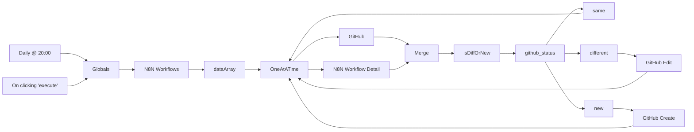

## Fluxo (.json) :

```json
{
  "nodes": [
    {
      "name": "On clicking 'execute'",
      "type": "n8n-nodes-base.manualTrigger",
      "position": [
        0,
        150
      ],
      "parameters": {},
      "typeVersion": 1
    },
    {
      "name": "dataArray",
      "type": "n8n-nodes-base.function",
      "position": [
        450,
        300
      ],
      "parameters": {
        "functionCode": "const newItems = [];\nfor (item of items[0].json.data) {\n  newItems.push({json: item});\n}\nreturn newItems;"
      },
      "typeVersion": 1
    },
    {
      "name": "N8N Workflows",
      "type": "n8n-nodes-base.httpRequest",
      "position": [
        300,
        300
      ],
      "parameters": {
        "url": "http://localhost:8443/rest/workflows",
        "options": {}
      },
      "typeVersion": 1
    },
    {
      "name": "GitHub",
      "type": "n8n-nodes-base.github",
      "position": [
        800,
        130
      ],
      "parameters": {
        "owner": "={{$node[\"Globals\"].json[\"repo\"][\"owner\"]}}",
        "filePath": "={{$node[\"Globals\"].json[\"repo\"][\"path\"]}}{{$json[\"name\"]}}.json",
        "resource": "file",
        "operation": "get",
        "repository": "={{$node[\"Globals\"].json[\"repo\"][\"name\"]}}",
        "asBinaryProperty": false
      },
      "credentials": {
        "githubApi": "GitHub"
      },
      "typeVersion": 1,
      "continueOnFail": true,
      "alwaysOutputData": true
    },
    {
      "name": "Merge",
      "type": "n8n-nodes-base.merge",
      "position": [
        1000,
        300
      ],
      "parameters": {},
      "typeVersion": 1
    },
    {
      "name": "N8N Workflow Detail",
      "type": "n8n-nodes-base.httpRequest",
      "position": [
        800,
        460
      ],
      "parameters": {
        "url": "=http://localhost:8443/rest/workflows/{{$json[\"id\"]}}",
        "options": {}
      },
      "typeVersion": 1
    },
    {
      "name": "github_status",
      "type": "n8n-nodes-base.switch",
      "position": [
        1300,
        300
      ],
      "parameters": {
        "rules": {
          "rules": [
            {
              "value2": "same"
            },
            {
              "output": 1,
              "value2": "different"
            },
            {
              "output": 2,
              "value2": "new"
            }
          ]
        },
        "value1": "={{$json[\"github_status\"]}}",
        "dataType": "string"
      },
      "typeVersion": 1
    },
    {
      "name": "same",
      "type": "n8n-nodes-base.noOp",
      "position": [
        1500,
        130
      ],
      "parameters": {},
      "typeVersion": 1
    },
    {
      "name": "different",
      "type": "n8n-nodes-base.noOp",
      "position": [
        1500,
        300
      ],
      "parameters": {},
      "typeVersion": 1
    },
    {
      "name": "new",
      "type": "n8n-nodes-base.noOp",
      "position": [
        1500,
        460
      ],
      "parameters": {},
      "typeVersion": 1
    },
    {
      "name": "GitHub Edit",
      "type": "n8n-nodes-base.github",
      "position": [
        1700,
        180
      ],
      "parameters": {
        "owner": "={{$node[\"Globals\"].json[\"repo\"][\"owner\"]}}",
        "filePath": "={{$node[\"Globals\"].json[\"repo\"][\"path\"]}}{{$node[\"N8N Workflow Detail\"].json[\"data\"][\"name\"]}}.json",
        "resource": "file",
        "operation": "edit",
        "repository": "={{$node[\"Globals\"].json[\"repo\"][\"name\"]}}",
        "fileContent": "={{$node[\"isDiffOrNew\"].json[\"n8n_data_stringy\"]}}",
        "commitMessage": "=[N8N Backup] {{$node[\"N8N Workflow Detail\"].json[\"data\"][\"name\"]}}.json ({{$json[\"github_status\"]}})"
      },
      "credentials": {
        "githubApi": "GitHub"
      },
      "typeVersion": 1
    },
    {
      "name": "GitHub Create",
      "type": "n8n-nodes-base.github",
      "position": [
        1700,
        460
      ],
      "parameters": {
        "owner": "={{$node[\"Globals\"].json[\"repo\"][\"owner\"]}}",
        "filePath": "={{$node[\"Globals\"].json[\"repo\"][\"path\"]}}{{$node[\"N8N Workflow Detail\"].json[\"data\"][\"name\"]}}.json",
        "resource": "file",
        "repository": "={{$node[\"Globals\"].json[\"repo\"][\"name\"]}}",
        "fileContent": "={{$node[\"isDiffOrNew\"].json[\"n8n_data_stringy\"]}}",
        "commitMessage": "=[N8N Backup] {{$node[\"N8N Workflow Detail\"].json[\"data\"][\"name\"]}}.json ({{$json[\"github_status\"]}})"
      },
      "credentials": {
        "githubApi": "GitHub"
      },
      "typeVersion": 1
    },
    {
      "name": "isDiffOrNew",
      "type": "n8n-nodes-base.function",
      "position": [
        1150,
        300
      ],
      "parameters": {
        "functionCode": "// File Returned with Content\nif (Object.keys(items[0].json).includes(\"content\")) {\n  // Get JSON Objects\n  var origWorkflow = eval(\"(\"+Buffer.from(items[0].json.content, 'base64').toString()+\")\");\n  var n8nWorkflow = (items[1].json.data);\n  \n  // Order JSON Objects\n  var orderedOriginal = {}\n  var orderedActual = {}\n  \n  Object.keys(origWorkflow).sort().forEach(function(key) {\n    orderedOriginal[key] = origWorkflow[key];\n  });\n  \n  Object.keys(n8nWorkflow).sort().forEach(function(key) {\n    orderedActual[key] = n8nWorkflow[key];\n  });\n  \n  // Determine Difference\n  if ( JSON.stringify(orderedOriginal) === JSON.stringify(orderedActual) ) {\n    items[0].json.github_status = \"same\";\n    items[0].json.content_decoded = orderedOriginal;\n  } else {\n    items[0].json.github_status = \"different\";\n    items[0].json.content_decoded = orderedOriginal;\n    items[0].json.n8n_data_stringy = JSON.stringify(orderedActual, null, 2);\n  }\n// No File Returned / New Workflow\n} else {\n  // Order JSON Object\n  var n8nWorkflow = (items[1].json.data);\n  var orderedActual = {}\n  Object.keys(n8nWorkflow).sort().forEach(function(key) {\n    orderedActual[key] = n8nWorkflow[key];\n  });\n  \n  // Proper Formatting\n  items[0].json.github_status = \"new\";\n  items[0].json.n8n_data_stringy = JSON.stringify(orderedActual, null, 2);\n}\n\n// Return Items\nreturn items;"
      },
      "typeVersion": 1
    },
    {
      "name": "Daily @ 20:00",
      "type": "n8n-nodes-base.cron",
      "position": [
        0,
        450
      ],
      "parameters": {
        "triggerTimes": {
          "item": [
            {
              "hour": 20,
              "minute": 11
            }
          ]
        }
      },
      "typeVersion": 1
    },
    {
      "name": "OneAtATime",
      "type": "n8n-nodes-base.splitInBatches",
      "position": [
        600,
        300
      ],
      "parameters": {
        "options": {},
        "batchSize": 1
      },
      "typeVersion": 1
    },
    {
      "name": "Globals",
      "type": "n8n-nodes-base.set",
      "position": [
        150,
        300
      ],
      "parameters": {
        "values": {
          "string": [
            {
              "name": "repo.owner",
              "value": "octocat"
            },
            {
              "name": "repo.name",
              "value": "Hello-World"
            },
            {
              "name": "repo.path",
              "value": "my-team/n8n/workflows/"
            }
          ]
        },
        "options": {}
      },
      "typeVersion": 1
    }
  ],
  "connections": {
    "new": {
      "main": [
        [
          {
            "node": "GitHub Create",
            "type": "main",
            "index": 0
          }
        ]
      ]
    },
    "same": {
      "main": [
        [
          {
            "node": "OneAtATime",
            "type": "main",
            "index": 0
          }
        ]
      ]
    },
    "Merge": {
      "main": [
        [
          {
            "node": "isDiffOrNew",
            "type": "main",
            "index": 0
          }
        ]
      ]
    },
    "GitHub": {
      "main": [
        [
          {
            "node": "Merge",
            "type": "main",
            "index": 0
          }
        ]
      ]
    },
    "Globals": {
      "main": [
        [
          {
            "node": "N8N Workflows",
            "type": "main",
            "index": 0
          }
        ]
      ]
    },
    "dataArray": {
      "main": [
        [
          {
            "node": "OneAtATime",
            "type": "main",
            "index": 0
          }
        ]
      ]
    },
    "different": {
      "main": [
        [
          {
            "node": "GitHub Edit",
            "type": "main",
            "index": 0
          }
        ]
      ]
    },
    "OneAtATime": {
      "main": [
        [
          {
            "node": "GitHub",
            "type": "main",
            "index": 0
          },
          {
            "node": "N8N Workflow Detail",
            "type": "main",
            "index": 0
          }
        ]
      ]
    },
    "GitHub Edit": {
      "main": [
        [
          {
            "node": "OneAtATime",
            "type": "main",
            "index": 0
          }
        ]
      ]
    },
    "isDiffOrNew": {
      "main": [
        [
          {
            "node": "github_status",
            "type": "main",
            "index": 0
          }
        ]
      ]
    },
    "Daily @ 20:00": {
      "main": [
        [
          {
            "node": "Globals",
            "type": "main",
            "index": 0
          }
        ]
      ]
    },
    "GitHub Create": {
      "main": [
        [
          {
            "node": "OneAtATime",
            "type": "main",
            "index": 0
          }
        ]
      ]
    },
    "N8N Workflows": {
      "main": [
        [
          {
            "node": "dataArray",
            "type": "main",
            "index": 0
          }
        ]
      ]
    },
    "github_status": {
      "main": [
        [
          {
            "node": "same",
            "type": "main",
            "index": 0
          }
        ],
        [
          {
            "node": "different",
            "type": "main",
            "index": 0
          }
        ],
        [
          {
            "node": "new",
            "type": "main",
            "index": 0
          }
        ]
      ]
    },
    "N8N Workflow Detail": {
      "main": [
        [
          {
            "node": "Merge",
            "type": "main",
            "index": 1
          }
        ]
      ]
    },
    "On clicking 'execute'": {
      "main": [
        [
          {
            "node": "Globals",
            "type": "main",
            "index": 0
          }
        ]
      ]
    }
  }
}
```

<a id="template-420"></a>

## Template 420 - Geração automática de histórias infantis em árabe

- **Nome:** Geração automática de histórias infantis em árabe
- **Descrição:** Fluxo automatizado que cria contos curtos para crianças, traduz e simplifica para árabe, gera imagem e áudio relacionados e publica o resultado em um canal.
- **Funcionalidade:** • Agendamento periódico: Executa o processo automaticamente em intervalos regulares (a cada 12 horas).
• Geração de história: Cria contos curtos, criativos e educativos direcionados ao público infantil (aproximadamente 900 caracteres).
• Fragmentação de texto para processamento: Divide o conteúdo em trechos para permitir processamento e resumo eficientes quando necessário.
• Tradução e simplificação para árabe: Tradução do texto para árabe com linguagem simples e lição moral adequada para crianças.
• Criação de prompt para imagem: Gera um prompt conciso para produzir imagens sem texto no conteúdo visual.
• Geração de imagem: Produz imagens ilustrativas baseadas no prompt gerado, adequadas para acompanhar a história.
• Geração de áudio: Converte o texto da história em áudio para reprodução.
• Publicação em canal: Envia o texto da história, a imagem e o arquivo de áudio para um canal específico no Telegram.
- **Ferramentas:** • OpenAI (modelos GPT-4 e APIs multimodais): Utilizado para gerar o texto da história, criar prompts para imagens e gerar áudio a partir do texto.
• Serviço de imagens (modelo de geração de imagens): Produz ilustrações sem texto conforme o prompt criado.
• Telegram: Plataforma usada para publicar o texto, as imagens e os arquivos de áudio em um canal público.

## Fluxo visual

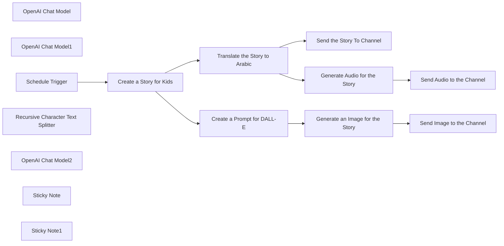

## Fluxo (.json) :

```json
{
  "meta": {
    "instanceId": "84ba6d895254e080ac2b4916d987aa66b000f88d4d919a6b9c76848f9b8a7616",
    "templateId": "2234"
  },
  "nodes": [
    {
      "id": "e0f68f60-f036-4103-a9fc-d6cb80b6f8a2",
      "name": "OpenAI Chat Model",
      "type": "@n8n/n8n-nodes-langchain.lmChatOpenAi",
      "position": [
        1980,
        1100
      ],
      "parameters": {
        "model": "gpt-4-turbo",
        "options": {}
      },
      "credentials": {
        "openAiApi": {
          "id": "kDo5LhPmHS2WQE0b",
          "name": "OpenAi account"
        }
      },
      "typeVersion": 1
    },
    {
      "id": "23779dea-c21d-42da-b493-09394bc64436",
      "name": "OpenAI Chat Model1",
      "type": "@n8n/n8n-nodes-langchain.lmChatOpenAi",
      "position": [
        2420,
        660
      ],
      "parameters": {
        "model": "gpt-4-turbo",
        "options": {}
      },
      "credentials": {
        "openAiApi": {
          "id": "kDo5LhPmHS2WQE0b",
          "name": "OpenAi account"
        }
      },
      "typeVersion": 1
    },
    {
      "id": "af59863e-12c5-414c-bf64-dd6712e3aa7b",
      "name": "Schedule Trigger",
      "type": "n8n-nodes-base.scheduleTrigger",
      "position": [
        1680,
        960
      ],
      "parameters": {
        "rule": {
          "interval": [
            {
              "field": "hours",
              "hoursInterval": 12
            }
          ]
        }
      },
      "typeVersion": 1.1
    },
    {
      "id": "bc2ad02b-72c9-4132-96e8-b64487f589f7",
      "name": "Recursive Character Text Splitter",
      "type": "@n8n/n8n-nodes-langchain.textSplitterRecursiveCharacterTextSplitter",
      "position": [
        2160,
        1140
      ],
      "parameters": {
        "options": {},
        "chunkSize": 500,
        "chunkOverlap": 300
      },
      "typeVersion": 1
    },
    {
      "id": "cb11a8bb-bdca-43cb-a586-7f93471d58f7",
      "name": "OpenAI Chat Model2",
      "type": "@n8n/n8n-nodes-langchain.lmChatOpenAi",
      "position": [
        2420,
        1300
      ],
      "parameters": {
        "options": {}
      },
      "credentials": {
        "openAiApi": {
          "id": "kDo5LhPmHS2WQE0b",
          "name": "OpenAi account"
        }
      },
      "typeVersion": 1
    },
    {
      "id": "9d02b910-a467-4d4d-a2fa-32d1d3361d21",
      "name": "Create a Prompt for DALL-E",
      "type": "@n8n/n8n-nodes-langchain.chainSummarization",
      "position": [
        2400,
        1080
      ],
      "parameters": {
        "options": {
          "summarizationMethodAndPrompts": {
            "values": {
              "prompt": "Summarize the characters in this story based on their appearance and describe them if they are humans or animals and how they look like and what kind of are they, the prompt should be no-text in the picture.\n\n\n\n\n\"{text}\"\n\n\nCONCISE SUMMARY:",
              "summarizationMethod": "stuff"
            }
          }
        }
      },
      "typeVersion": 2
    },
    {
      "id": "4723dd65-96f5-41c1-9ff6-f1a344d96241",
      "name": "Generate an Image for the Story",
      "type": "@n8n/n8n-nodes-langchain.openAi",
      "position": [
        2860,
        1080
      ],
      "parameters": {
        "prompt": "=Produce an image ensuring that no text is generated within the visual content. {{ $json.response.text }}",
        "options": {},
        "resource": "image"
      },
      "credentials": {
        "openAiApi": {
          "id": "kDo5LhPmHS2WQE0b",
          "name": "OpenAi account"
        }
      },
      "typeVersion": 1.3
    },
    {
      "id": "70b7f55a-31c4-456b-8273-8250bac74409",
      "name": "Generate Audio for the Story",
      "type": "@n8n/n8n-nodes-langchain.openAi",
      "position": [
        2640,
        820
      ],
      "parameters": {
        "input": "={{ $json.response.text }}",
        "options": {},
        "resource": "audio"
      },
      "credentials": {
        "openAiApi": {
          "id": "kDo5LhPmHS2WQE0b",
          "name": "OpenAi account"
        }
      },
      "executeOnce": true,
      "typeVersion": 1.3
    },
    {
      "id": "c381dbe4-6112-441c-b213-8a2d218f4cc2",
      "name": "Send the Story To Channel",
      "type": "n8n-nodes-base.telegram",
      "position": [
        3160,
        480
      ],
      "parameters": {
        "text": "={{ $json.response.text }}",
        "chatId": "=-4170994782",
        "additionalFields": {
          "appendAttribution": false
        }
      },
      "credentials": {
        "telegramApi": {
          "id": "k3RE6o9brmFRFE9p",
          "name": "Telegram account"
        }
      },
      "typeVersion": 1.1
    },
    {
      "id": "78289bfa-54b4-4acb-b513-7a0134a010f3",
      "name": "Send Image to the Channel",
      "type": "n8n-nodes-base.telegram",
      "position": [
        3180,
        1080
      ],
      "parameters": {
        "chatId": "=-4170994782",
        "operation": "sendPhoto",
        "binaryData": true,
        "additionalFields": {}
      },
      "credentials": {
        "telegramApi": {
          "id": "k3RE6o9brmFRFE9p",
          "name": "Telegram account"
        }
      },
      "typeVersion": 1.1
    },
    {
      "id": "f779047b-6dec-4e4e-ae09-4dd91f961d08",
      "name": "Sticky Note",
      "type": "n8n-nodes-base.stickyNote",
      "position": [
        380,
        240
      ],
      "parameters": {
        "width": 1224.7156767468991,
        "height": 1282.378312060854,
        "content": "# Template for Kids' Story in Arabic\n\nThe n8n template for creating kids' stories in Arabic provides a versatile platform for storytellers to captivate young audiences with educational and interactive tales. Along with its core functionalities, this template allows for customization to suit various use cases and can be set up effortlessly.\n\nCheck this example: [https://t.me/st0ries95](https://t.me/st0ries95)\n\n\n## Node Functionalities\n\n\n## Automated Storytelling Process\n\n\n## Use Cases\n1. **Educational Platforms**:\n Educational platforms can automate the creation and distribution of educational stories in Arabic for children using this template. By incorporating visual and auditory elements into the storytelling process, educational platforms can enhance learning experiences and engage young learners effectively.\n\n2. **Children's Libraries**:\n Children's libraries can utilize this template to curate and share a diverse collection of Arabic stories with young readers. The automated generation of visual content and audio files enhances the storytelling experience, encouraging children to immerse themselves in new worlds and characters through captivating narratives.\n\n3. **Language Learning Apps**:\n Language learning apps focused on Arabic can integrate this template to offer culturally rich storytelling experiences for children learning the language. By translating stories into Arabic and supplementing them with visual and auditory components, these apps can facilitate language acquisition in an enjoyable and interactive manner.\n\n## Configuration Guide for Nodes\n\n### OpenAI Chat Model Nodes:\n- **Credentials**: Provide the necessary API credentials for the OpenAI GPT-4 Turbo model.\n- **Options**: Configure any specific options required for the chat model.\n\n### Create a Prompt for DALL-E Node:\n- **Prompts Customization**: Customize prompts to generate relevant visual content for the stories.\n- **Summarization Method and Prompts**: Define the summarization method and prompts for generating visual content without text.\n\n### Generate an Image for the Story Node:\n- **Resource**: Specify the type of resource (image).\n- **Prompt**: Set up the prompt for producing an image without text within the visual content.\n\n### Generate Audio for the Story Node:\n- **Resource**: Select the type of resource (audio).\n- **Input**: Define the input text for generating audio files.\n\n### Translate the Story to Arabic Node:\n- **Chunking Mode**: Choose the chunking mode (advanced).\n- **Summarization Method and Prompts**: Set the summarization method and prompts for translating the story into Arabic.\n\n### Send the Story To Channel Node:\n- **Chat ID**: Provide the chat ID where the story text will be sent.\n- **Text**: Configure the text to be sent to the channel.\n\nBy configuring each node as per the guidelines above, users can effectively set up and customize the n8n template for kids' stories in Arabic, tailoring it to specific use cases and delivering a seamless and engaging storytelling experience for young audiences.\n"
      },
      "typeVersion": 1
    },
    {
      "id": "5ef92ebc-e4e4-4165-a7df-9f94802f8e27",
      "name": "Sticky Note1",
      "type": "n8n-nodes-base.stickyNote",
      "position": [
        1620,
        240
      ],
      "parameters": {
        "width": 1811.9647367735226,
        "height": 1280.7253282813103,
        "content": ""
      },
      "typeVersion": 1
    },
    {
      "id": "76d2b256-8083-42d9-8465-63b2f9c73a67",
      "name": "Translate the Story to Arabic",
      "type": "@n8n/n8n-nodes-langchain.chainSummarization",
      "position": [
        2400,
        480
      ],
      "parameters": {
        "options": {
          "summarizationMethodAndPrompts": {
            "values": {
              "prompt": "Translate this story texts to \"Arabic\" and make it easy to understands for kids with easy words and moral lesson :\n\n\n\"{text}\"\n\n\n",
              "summarizationMethod": "stuff"
            }
          }
        },
        "chunkingMode": "advanced"
      },
      "executeOnce": true,
      "typeVersion": 2
    },
    {
      "id": "126e463e-f1e8-4cd2-856d-aaaebc279797",
      "name": "Send Audio to the Channel",
      "type": "n8n-nodes-base.telegram",
      "position": [
        3180,
        820
      ],
      "parameters": {
        "chatId": "-4170994782",
        "operation": "sendAudio",
        "binaryData": true,
        "additionalFields": {
          "caption": "نهاية القصة ... "
        }
      },
      "credentials": {
        "telegramApi": {
          "id": "k3RE6o9brmFRFE9p",
          "name": "Telegram account"
        }
      },
      "typeVersion": 1.1
    },
    {
      "id": "162049a0-620a-4044-966a-27b665827b60",
      "name": "Create a Story for Kids",
      "type": "@n8n/n8n-nodes-langchain.chainSummarization",
      "position": [
        1980,
        960
      ],
      "parameters": {
        "options": {
          "summarizationMethodAndPrompts": {
            "values": {
              "prompt": "Create a captivating short tale for kids, whisking them away to magical lands brimming with wisdom. Explore diverse themes in a fun and simple way, weaving in valuable messages. Dive into cultural adventures with lively language that sparks curiosity. Let your story inspire young minds through enchanting narratives that linger long after the last word. Begin crafting your imaginative tale now! (Approximately 900 characters)\n\n\n\"{text}\"\n\nCONCISE SUMMARY:",
              "summarizationMethod": "stuff"
            }
          }
        },
        "chunkingMode": "advanced"
      },
      "executeOnce": true,
      "typeVersion": 2
    }
  ],
  "pinData": {},
  "connections": {
    "Schedule Trigger": {
      "main": [
        [
          {
            "node": "Create a Story for Kids",
            "type": "main",
            "index": 0
          }
        ]
      ]
    },
    "OpenAI Chat Model": {
      "ai_languageModel": [
        [
          {
            "node": "Create a Story for Kids",
            "type": "ai_languageModel",
            "index": 0
          }
        ]
      ]
    },
    "OpenAI Chat Model1": {
      "ai_languageModel": [
        [
          {
            "node": "Translate the Story to Arabic",
            "type": "ai_languageModel",
            "index": 0
          }
        ]
      ]
    },
    "OpenAI Chat Model2": {
      "ai_languageModel": [
        [
          {
            "node": "Create a Prompt for DALL-E",
            "type": "ai_languageModel",
            "index": 0
          }
        ]
      ]
    },
    "Create a Story for Kids": {
      "main": [
        [
          {
            "node": "Translate the Story to Arabic",
            "type": "main",
            "index": 0
          },
          {
            "node": "Create a Prompt for DALL-E",
            "type": "main",
            "index": 0
          }
        ]
      ]
    },
    "Create a Prompt for DALL-E": {
      "main": [
        [
          {
            "node": "Generate an Image for the Story",
            "type": "main",
            "index": 0
          }
        ]
      ]
    },
    "Generate Audio for the Story": {
      "main": [
        [
          {
            "node": "Send Audio to the Channel",
            "type": "main",
            "index": 0
          }
        ]
      ]
    },
    "Translate the Story to Arabic": {
      "main": [
        [
          {
            "node": "Send the Story To Channel",
            "type": "main",
            "index": 0
          },
          {
            "node": "Generate Audio for the Story",
            "type": "main",
            "index": 0
          }
        ]
      ]
    },
    "Generate an Image for the Story": {
      "main": [
        [
          {
            "node": "Send Image to the Channel",
            "type": "main",
            "index": 0
          }
        ]
      ]
    },
    "Recursive Character Text Splitter": {
      "ai_textSplitter": [
        [
          {
            "node": "Create a Story for Kids",
            "type": "ai_textSplitter",
            "index": 0
          }
        ]
      ]
    }
  }
}
```

<a id="template-421"></a>

## Template 421 - Publicar último vídeo do YouTube no X

- **Nome:** Publicar último vídeo do YouTube no X
- **Descrição:** Detecta novos vídeos em um canal do YouTube e automatiza a criação, validação e publicação de uma postagem no X, registrando as ações e enviando notificações.
- **Funcionalidade:** • Busca de novos vídeos: Verifica o canal do YouTube em busca dos vídeos mais recentes.
• Remoção de duplicados: Evita repostar vídeos já processados, comparando histórico entre execuções.
• Geração de texto com IA: Cria um texto envolvente para o X usando um modelo da OpenAI a partir do título e descrição do vídeo.
• Verificação e ajuste do limite de caracteres: Confere se o post está dentro do limite (<=220 caracteres) e reescreve quando necessário, mantendo o link do YouTube ao final.
• Registro em planilha: Adiciona o post gerado em uma planilha do Google Sheets e atualiza a linha com o link após a publicação.
• Publicação no X: Publica o post gerado na conta do X e atualiza o registro com a URL do post.
• Notificações opcionais: Envia alertas ou conteúdos para canais de comunicação como Discord, Slack e email (Gmail).
• Testes e agendamento: Permite execução manual para testes e possui configuração para checagens periódicas (ex.: a cada 2 horas, atualmente desabilitada).
- **Ferramentas:** • YouTube: Fonte dos vídeos a serem promovidos (canal específico).
• X (Twitter): Plataforma onde as postagens são publicadas.
• Google Sheets: Armazena registros dos posts, status e links gerados.
• OpenAI: Gera e reescreve o texto das postagens usando modelos de linguagem.
• Discord: Canal opcional para envio de notificações sobre novos posts.
• Slack: Canal opcional para envio de notificações internas.
• Gmail: Envio opcional de notificações por email.

## Fluxo visual

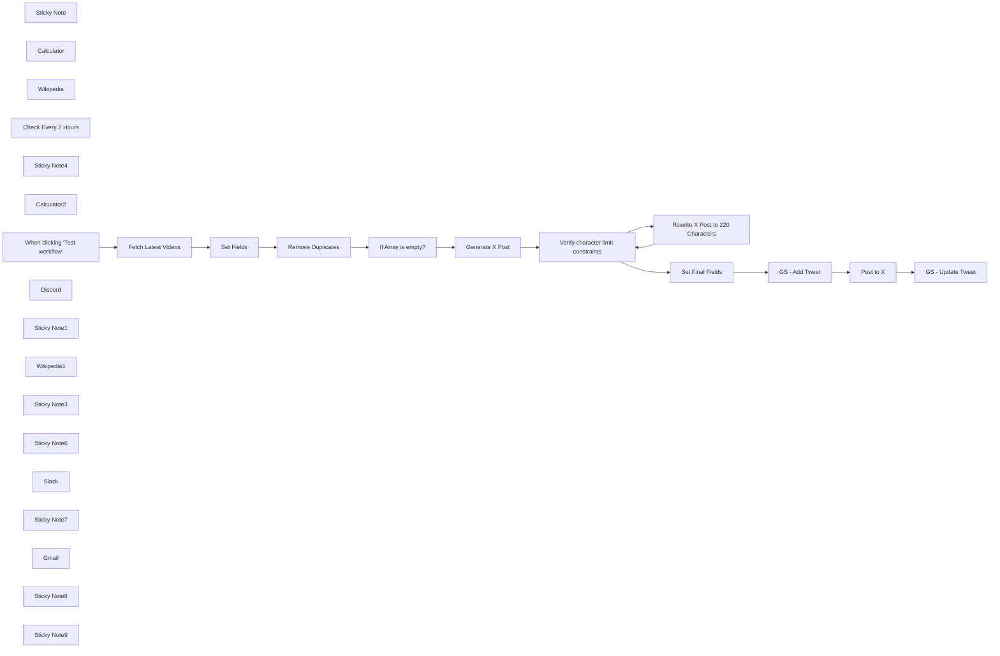

## Fluxo (.json) :

```json
{
  "id": "AuwhspweKSACE1WQ",
  "meta": {
    "instanceId": "d868e3d040e7bda892c81b17cf446053ea25d2556fcef89cbe19dd61a3e876e9"
  },
  "name": "YouTube to X Post- AlexK1919",
  "tags": [
    {
      "id": "QsH2EXuw2e7YCv0K",
      "name": "OpenAI",
      "createdAt": "2024-11-15T04:05:20.872Z",
      "updatedAt": "2024-11-15T04:05:20.872Z"
    },
    {
      "id": "igCGAN1PI4iVpikM",
      "name": "YouTube",
      "createdAt": "2024-11-21T18:59:47.189Z",
      "updatedAt": "2024-11-21T18:59:47.189Z"
    },
    {
      "id": "nxU3PfnwjUr2YUdo",
      "name": "X",
      "createdAt": "2024-11-21T18:59:49.170Z",
      "updatedAt": "2024-11-21T18:59:49.170Z"
    }
  ],
  "nodes": [
    {
      "id": "6aef04f2-b744-4749-99bd-4ad8aa21ad09",
      "name": "Post to X",
      "type": "n8n-nodes-base.twitter",
      "position": [
        1400,
        100
      ],
      "parameters": {
        "text": "={{ $('Verify character limit constraints').item.json.message.content.post }}",
        "additionalFields": {}
      },
      "credentials": {
        "twitterOAuth2Api": {
          "id": "0VkIx1OfmRAYb4Az",
          "name": "Alex Kim X account"
        }
      },
      "typeVersion": 2
    },
    {
      "id": "827ab988-786a-490e-8831-cfee3851a9ac",
      "name": "Sticky Note",
      "type": "n8n-nodes-base.stickyNote",
      "position": [
        -560,
        -100
      ],
      "parameters": {
        "color": 4,
        "width": 450,
        "height": 970,
        "content": "## Fetch the latest YouTube video and dedupe\n\nEnter your YouTube Channel ID in the \"Channel ID\" field of this node. You can find your [Channel ID here](https://youtube.com/account_advanced)."
      },
      "typeVersion": 1
    },
    {
      "id": "8e99c377-7d14-473b-a6e4-a190702ad8a9",
      "name": "Fetch Latest Videos",
      "type": "n8n-nodes-base.youTube",
      "position": [
        -500,
        100
      ],
      "parameters": {
        "limit": 2,
        "filters": {
          "channelId": "UC3JB8Cnync-WCDYKwOYSQUg",
          "publishedAfter": "={{ new Date(new Date().getTime() - 1200 * 60000).toISOString() }}"
        },
        "options": {},
        "resource": "video"
      },
      "credentials": {
        "youTubeOAuth2Api": {
          "id": "xwcVTsTddECg5vyd",
          "name": "AlexK1919 YouTube account"
        }
      },
      "typeVersion": 1
    },
    {
      "id": "c9ea0b72-2293-4aab-84b4-5e6599f5e04d",
      "name": "Calculator",
      "type": "@n8n/n8n-nodes-langchain.toolCalculator",
      "position": [
        0,
        300
      ],
      "parameters": {},
      "typeVersion": 1
    },
    {
      "id": "e81decde-6a60-4ea0-a3ff-64cbdccc1f88",
      "name": "Wikipedia",
      "type": "@n8n/n8n-nodes-langchain.toolWikipedia",
      "position": [
        120,
        300
      ],
      "parameters": {},
      "typeVersion": 1
    },
    {
      "id": "870a58ba-6d0f-42e5-ad07-040b8d81e780",
      "name": "Check Every 2 Hours",
      "type": "n8n-nodes-base.scheduleTrigger",
      "disabled": true,
      "position": [
        -900,
        100
      ],
      "parameters": {
        "rule": {
          "interval": [
            {
              "field": "hours",
              "hoursInterval": 2,
              "triggerAtMinute": "={{ Math.floor(Math.random() * 60) }}"
            }
          ]
        }
      },
      "typeVersion": 1.2
    },
    {
      "id": "4af4e893-7c94-4a73-9d88-1426be8725f7",
      "name": "Sticky Note4",
      "type": "n8n-nodes-base.stickyNote",
      "position": [
        380,
        -100
      ],
      "parameters": {
        "color": 4,
        "width": 637,
        "height": 969,
        "content": "## Validate: Is Post under 240 characters?\nIf the generated tweet does not meet length constraints, regenerate it."
      },
      "typeVersion": 1
    },
    {
      "id": "8c4f51cd-3e25-4d45-a677-1bf27277c2f8",
      "name": "Calculator2",
      "type": "@n8n/n8n-nodes-langchain.toolCalculator",
      "position": [
        680,
        240
      ],
      "parameters": {},
      "typeVersion": 1
    },
    {
      "id": "2eff94c8-5ab8-4fba-8480-39d34077784c",
      "name": "GS - Add Tweet",
      "type": "n8n-nodes-base.googleSheets",
      "position": [
        1120,
        100
      ],
      "parameters": {
        "columns": {
          "value": {
            "xid": "={{ Math.random().toString(36).substr(2, 12) }}",
            "date": "={{ new Date().toISOString().split('T')[0] }}",
            "post": "={{ $json.message.content.post }}",
            "time": "={{ new Date().toLocaleTimeString('en-US', { hour12: false }) }}",
            "status": "Post written",
            "channel": "X"
          },
          "schema": [
            {
              "id": "xid",
              "type": "string",
              "display": true,
              "required": false,
              "displayName": "xid",
              "defaultMatch": false,
              "canBeUsedToMatch": true
            },
            {
              "id": "status",
              "type": "string",
              "display": true,
              "required": false,
              "displayName": "status",
              "defaultMatch": false,
              "canBeUsedToMatch": true
            },
            {
              "id": "date",
              "type": "string",
              "display": true,
              "required": false,
              "displayName": "date",
              "defaultMatch": false,
              "canBeUsedToMatch": true
            },
            {
              "id": "time",
              "type": "string",
              "display": true,
              "required": false,
              "displayName": "time",
              "defaultMatch": false,
              "canBeUsedToMatch": true
            },
            {
              "id": "channel",
              "type": "string",
              "display": true,
              "required": false,
              "displayName": "channel",
              "defaultMatch": false,
              "canBeUsedToMatch": true
            },
            {
              "id": "post",
              "type": "string",
              "display": true,
              "required": false,
              "displayName": "post",
              "defaultMatch": false,
              "canBeUsedToMatch": true
            },
            {
              "id": "image_url",
              "type": "string",
              "display": true,
              "required": false,
              "displayName": "image_url",
              "defaultMatch": false,
              "canBeUsedToMatch": true
            },
            {
              "id": "video_url",
              "type": "string",
              "display": true,
              "required": false,
              "displayName": "video_url",
              "defaultMatch": false,
              "canBeUsedToMatch": true
            }
          ],
          "mappingMode": "defineBelow",
          "matchingColumns": []
        },
        "options": {
          "useAppend": true
        },
        "operation": "append",
        "sheetName": {
          "__rl": true,
          "mode": "list",
          "value": "gid=0",
          "cachedResultUrl": "https://docs.google.com/spreadsheets/d/1Ql9TGAzZCSdSqrHvkZLcsBPoNMAjNpPVsELkumP2heM/edit#gid=0",
          "cachedResultName": "Sheet1"
        },
        "documentId": {
          "__rl": true,
          "mode": "list",
          "value": "1Ql9TGAzZCSdSqrHvkZLcsBPoNMAjNpPVsELkumP2heM",
          "cachedResultUrl": "https://docs.google.com/spreadsheets/d/1Ql9TGAzZCSdSqrHvkZLcsBPoNMAjNpPVsELkumP2heM/edit?usp=drivesdk",
          "cachedResultName": "AlexK1919 Social Posts"
        }
      },
      "credentials": {
        "googleSheetsOAuth2Api": {
          "id": "IpY8N9VFCXJLC1hv",
          "name": "AlexK1919 Google Sheets account"
        }
      },
      "typeVersion": 4.3
    },
    {
      "id": "21f25b2d-e9d3-46df-a2c9-53f3a8c14b8b",
      "name": "GS - Update Tweet",
      "type": "n8n-nodes-base.googleSheets",
      "position": [
        1400,
        300
      ],
      "parameters": {
        "columns": {
          "value": {
            "xid": "={{ $('GS - Add Tweet').item.json.xid }}",
            "date": "={{ new Date().toISOString().split('T')[0] }}",
            "post": "={{ $json.text }}",
            "time": "={{ new Date().toLocaleTimeString('en-US', { hour12: false }) }}",
            "status": "Posted to X",
            "channel": "X",
            "post_url": "=https://twitter.com/alexkim/status/{{ $json.id }}"
          },
          "schema": [
            {
              "id": "xid",
              "type": "string",
              "display": true,
              "removed": false,
              "required": false,
              "displayName": "xid",
              "defaultMatch": false,
              "canBeUsedToMatch": true
            },
            {
              "id": "status",
              "type": "string",
              "display": true,
              "removed": false,
              "required": false,
              "displayName": "status",
              "defaultMatch": false,
              "canBeUsedToMatch": true
            },
            {
              "id": "date",
              "type": "string",
              "display": true,
              "removed": false,
              "required": false,
              "displayName": "date",
              "defaultMatch": false,
              "canBeUsedToMatch": true
            },
            {
              "id": "time",
              "type": "string",
              "display": true,
              "removed": false,
              "required": false,
              "displayName": "time",
              "defaultMatch": false,
              "canBeUsedToMatch": true
            },
            {
              "id": "channel",
              "type": "string",
              "display": true,
              "removed": false,
              "required": false,
              "displayName": "channel",
              "defaultMatch": false,
              "canBeUsedToMatch": true
            },
            {
              "id": "post",
              "type": "string",
              "display": true,
              "removed": false,
              "required": false,
              "displayName": "post",
              "defaultMatch": false,
              "canBeUsedToMatch": true
            },
            {
              "id": "post_url",
              "type": "string",
              "display": true,
              "removed": false,
              "required": false,
              "displayName": "post_url",
              "defaultMatch": false,
              "canBeUsedToMatch": true
            },
            {
              "id": "image_url",
              "type": "string",
              "display": true,
              "removed": false,
              "required": false,
              "displayName": "image_url",
              "defaultMatch": false,
              "canBeUsedToMatch": true
            },
            {
              "id": "video_url",
              "type": "string",
              "display": true,
              "removed": false,
              "required": false,
              "displayName": "video_url",
              "defaultMatch": false,
              "canBeUsedToMatch": true
            }
          ],
          "mappingMode": "defineBelow",
          "matchingColumns": [
            "xid"
          ]
        },
        "options": {},
        "operation": "appendOrUpdate",
        "sheetName": {
          "__rl": true,
          "mode": "list",
          "value": "gid=0",
          "cachedResultUrl": "https://docs.google.com/spreadsheets/d/1Ql9TGAzZCSdSqrHvkZLcsBPoNMAjNpPVsELkumP2heM/edit#gid=0",
          "cachedResultName": "Sheet1"
        },
        "documentId": {
          "__rl": true,
          "mode": "list",
          "value": "1Ql9TGAzZCSdSqrHvkZLcsBPoNMAjNpPVsELkumP2heM",
          "cachedResultUrl": "https://docs.google.com/spreadsheets/d/1Ql9TGAzZCSdSqrHvkZLcsBPoNMAjNpPVsELkumP2heM/edit?usp=drivesdk",
          "cachedResultName": "AlexK1919 Social Posts"
        }
      },
      "credentials": {
        "googleSheetsOAuth2Api": {
          "id": "IpY8N9VFCXJLC1hv",
          "name": "AlexK1919 Google Sheets account"
        }
      },
      "typeVersion": 4.3
    },
    {
      "id": "8ce4484b-a7fd-4988-8240-e9c09a4a00be",
      "name": "When clicking \"Test workflow\"",
      "type": "n8n-nodes-base.manualTrigger",
      "position": [
        -900,
        300
      ],
      "parameters": {},
      "typeVersion": 1
    },
    {
      "id": "24f9bc85-8892-4418-8ab6-ef73986adc79",
      "name": "Discord",
      "type": "n8n-nodes-base.discord",
      "position": [
        1680,
        100
      ],
      "parameters": {
        "content": "=New X Post:\n{{ $('GS - Add Tweet Again').item.json.Content }}\n\n{{ $json.URL }} ",
        "options": {},
        "authentication": "webhook"
      },
      "typeVersion": 2
    },
    {
      "id": "3526581f-7b71-4396-a3a3-4c676cf1c69b",
      "name": "Remove Duplicates",
      "type": "n8n-nodes-base.removeDuplicates",
      "position": [
        -500,
        300
      ],
      "parameters": {
        "options": {
          "scope": "workflow",
          "historySize": 10000
        },
        "operation": "removeItemsSeenInPreviousExecutions",
        "dedupeValue": "={{ $json.id.videoId }}"
      },
      "typeVersion": 2
    },
    {
      "id": "c152651f-12d3-4766-8b4b-43f93b7b06ee",
      "name": "Sticky Note1",
      "type": "n8n-nodes-base.stickyNote",
      "position": [
        -60,
        -100
      ],
      "parameters": {
        "color": 4,
        "width": 390,
        "height": 970,
        "content": "## Generate X Post"
      },
      "typeVersion": 1
    },
    {
      "id": "af1dd938-81f9-464a-865a-2a89882bae90",
      "name": "Generate X Post",
      "type": "@n8n/n8n-nodes-langchain.openAi",
      "position": [
        0,
        100
      ],
      "parameters": {
        "modelId": {
          "__rl": true,
          "mode": "list",
          "value": "gpt-4o-mini",
          "cachedResultName": "GPT-4O-MINI"
        },
        "options": {},
        "messages": {
          "values": [
            {
              "content": "=Write an engaging post about my latest YouTube video for X (Twitter) of no more than 220 characters in length. Link to the video at https://youtu.be/{{ $('Set Fields').first().json.id.videoId }} use this title and description:  {{ $('Set Fields').first().json.snippet.title }} {{ $('Set Fields').first().json.snippet.description }}. If there is no description available, use your best guess as to the context of the video. Make sure the YouTube link is at the end of the content."
            },
            {
              "role": "assistant",
              "content": "Be witty. Humanize the content. No emojis."
            }
          ]
        },
        "jsonOutput": true
      },
      "credentials": {
        "openAiApi": {
          "id": "ysxujEYFiY5ozRTS",
          "name": "AlexK OpenAi Key"
        }
      },
      "typeVersion": 1.3
    },
    {
      "id": "a522b20c-9cb1-47ec-ab26-d7a444154a51",
      "name": "Set Fields",
      "type": "n8n-nodes-base.set",
      "position": [
        -300,
        100
      ],
      "parameters": {
        "options": {},
        "assignments": {
          "assignments": [
            {
              "id": "c2e2eecd-ca73-40c9-a364-4713030ab451",
              "name": "id.videoId",
              "type": "string",
              "value": "={{ $json.id.videoId }}"
            }
          ]
        },
        "includeOtherFields": true
      },
      "typeVersion": 3.4
    },
    {
      "id": "82139047-3ed5-4cc3-9e7e-9567e2f51c20",
      "name": "Wikipedia1",
      "type": "@n8n/n8n-nodes-langchain.toolWikipedia",
      "position": [
        800,
        240
      ],
      "parameters": {},
      "typeVersion": 1
    },
    {
      "id": "6ad77986-f18f-44f0-aff6-fe77282bf55a",
      "name": "Rewrite X Post to 220 Characters",
      "type": "@n8n/n8n-nodes-langchain.openAi",
      "position": [
        680,
        40
      ],
      "parameters": {
        "modelId": {
          "__rl": true,
          "mode": "list",
          "value": "gpt-4o-mini",
          "cachedResultName": "GPT-4O-MINI"
        },
        "options": {},
        "messages": {
          "values": [
            {
              "content": "=Rewrite the content so it is less than 220 characters long in total length. Content:  {{ $('Generate X Post').item.json.message.content.post }}\nMake sure the YouTube Link is at the end of the content."
            },
            {
              "role": "assistant",
              "content": "Be witty. Humanize the content. No emojis."
            }
          ]
        },
        "jsonOutput": true
      },
      "credentials": {
        "openAiApi": {
          "id": "ysxujEYFiY5ozRTS",
          "name": "AlexK OpenAi Key"
        }
      },
      "typeVersion": 1.3
    },
    {
      "id": "e55adf1f-8d1d-4bb6-aa6a-89459fd81773",
      "name": "Verify character limit constraints",
      "type": "n8n-nodes-base.if",
      "position": [
        440,
        100
      ],
      "parameters": {
        "options": {},
        "conditions": {
          "options": {
            "version": 1,
            "leftValue": "",
            "caseSensitive": true,
            "typeValidation": "strict"
          },
          "combinator": "and",
          "conditions": [
            {
              "id": "0a6ebbb6-4b14-4c7e-9390-215e32921663",
              "operator": {
                "type": "number",
                "operation": "gt"
              },
              "leftValue": "={{ $json.message.content.post.length }}",
              "rightValue": 280
            }
          ]
        }
      },
      "typeVersion": 2
    },
    {
      "id": "00beb197-aed5-472d-9515-9f0002cc22ae",
      "name": "Sticky Note3",
      "type": "n8n-nodes-base.stickyNote",
      "position": [
        1060,
        -100
      ],
      "parameters": {
        "color": 4,
        "width": 230,
        "height": 970,
        "content": "## Add to Google Sheet"
      },
      "typeVersion": 1
    },
    {
      "id": "f871304f-b39f-46ee-8b22-5f0050eb2b8e",
      "name": "Sticky Note6",
      "type": "n8n-nodes-base.stickyNote",
      "position": [
        1340,
        -100
      ],
      "parameters": {
        "color": 4,
        "width": 230,
        "height": 970,
        "content": "## Post to X and update Google Sheet with Post Link"
      },
      "typeVersion": 1
    },
    {
      "id": "c4d0c37b-658d-4208-9d94-39d27c7d7f36",
      "name": "Slack",
      "type": "n8n-nodes-base.slack",
      "position": [
        1680,
        300
      ],
      "webhookId": "f2269822-19a4-43a4-9a91-06bc69d183b4",
      "parameters": {
        "otherOptions": {}
      },
      "typeVersion": 2.2
    },
    {
      "id": "6caf1d2d-49d2-4b28-9f23-04389bdaa079",
      "name": "Sticky Note7",
      "type": "n8n-nodes-base.stickyNote",
      "position": [
        1620,
        -100
      ],
      "parameters": {
        "color": 5,
        "width": 230,
        "height": 970,
        "content": "## Optional functions"
      },
      "typeVersion": 1
    },
    {
      "id": "c5528fc1-0416-4295-bdaa-12441099f037",
      "name": "Gmail",
      "type": "n8n-nodes-base.gmail",
      "position": [
        1680,
        500
      ],
      "webhookId": "3404c1a8-9118-48aa-ba03-e9e436f5a7a6",
      "parameters": {
        "options": {}
      },
      "credentials": {
        "gmailOAuth2": {
          "id": "7eQtesjR8Fht0INE",
          "name": "AlexK1919 Gmail"
        }
      },
      "typeVersion": 2.1
    },
    {
      "id": "e9ac1049-9b87-47a5-8fd1-333cc8c77664",
      "name": "Set Final Fields",
      "type": "n8n-nodes-base.set",
      "position": [
        680,
        440
      ],
      "parameters": {
        "options": {},
        "includeOtherFields": true
      },
      "typeVersion": 3.4
    },
    {
      "id": "955d51f0-3de9-41f7-a92f-8e7bf9e4d53c",
      "name": "If Array is empty?",
      "type": "n8n-nodes-base.if",
      "position": [
        -300,
        300
      ],
      "parameters": {
        "options": {},
        "conditions": {
          "options": {
            "version": 2,
            "leftValue": "",
            "caseSensitive": true,
            "typeValidation": "strict"
          },
          "combinator": "and",
          "conditions": [
            {
              "id": "adfea7c7-ed64-4e1e-a9c3-dc5e33aa1147",
              "operator": {
                "type": "array",
                "operation": "empty",
                "singleValue": true
              },
              "leftValue": "={{ $('Remove Duplicates').all() }}",
              "rightValue": ""
            }
          ]
        }
      },
      "typeVersion": 2.2
    },
    {
      "id": "c088bbe1-2008-4473-9874-dc5595f082b7",
      "name": "Sticky Note8",
      "type": "n8n-nodes-base.stickyNote",
      "position": [
        -1000,
        -100
      ],
      "parameters": {
        "color": 5,
        "width": 390,
        "height": 970,
        "content": "# Use AI to Promote Your Latest YouTube Video on X"
      },
      "typeVersion": 1
    },
    {
      "id": "03adde36-d864-486a-9190-2e7d27b9f3f2",
      "name": "Sticky Note9",
      "type": "n8n-nodes-base.stickyNote",
      "position": [
        -1300,
        -100
      ],
      "parameters": {
        "color": 6,
        "width": 250,
        "height": 970,
        "content": "# AlexK1919 \n\n\n#### I’m Alex Kim, an AI-Native Workflow Automation Architect Building Solutions to Optimize your Personal and Professional Life.\n\n### About Me\nhttps://beacons.ai/alexk1919\n\n### Products Used \n[OpenAI](https://openai.com)\n[X](https://x.com/)\n[YouTube](https://youtube.com/)\n"
      },
      "typeVersion": 1
    }
  ],
  "active": false,
  "pinData": {},
  "settings": {
    "executionOrder": "v1"
  },
  "versionId": "5661b96c-9838-4af3-8570-3098acec0bff",
  "connections": {
    "Post to X": {
      "main": [
        [
          {
            "node": "GS - Update Tweet",
            "type": "main",
            "index": 0
          }
        ]
      ]
    },
    "Wikipedia": {
      "ai_tool": [
        [
          {
            "node": "Generate X Post",
            "type": "ai_tool",
            "index": 0
          }
        ]
      ]
    },
    "Calculator": {
      "ai_tool": [
        [
          {
            "node": "Generate X Post",
            "type": "ai_tool",
            "index": 0
          }
        ]
      ]
    },
    "Set Fields": {
      "main": [
        [
          {
            "node": "Remove Duplicates",
            "type": "main",
            "index": 0
          }
        ]
      ]
    },
    "Wikipedia1": {
      "ai_tool": [
        [
          {
            "node": "Rewrite X Post to 220 Characters",
            "type": "ai_tool",
            "index": 0
          }
        ]
      ]
    },
    "Calculator2": {
      "ai_tool": [
        [
          {
            "node": "Rewrite X Post to 220 Characters",
            "type": "ai_tool",
            "index": 0
          }
        ]
      ]
    },
    "GS - Add Tweet": {
      "main": [
        [
          {
            "node": "Post to X",
            "type": "main",
            "index": 0
          }
        ]
      ]
    },
    "Generate X Post": {
      "main": [
        [
          {
            "node": "Verify character limit constraints",
            "type": "main",
            "index": 0
          }
        ]
      ]
    },
    "Set Final Fields": {
      "main": [
        [
          {
            "node": "GS - Add Tweet",
            "type": "main",
            "index": 0
          }
        ]
      ]
    },
    "GS - Update Tweet": {
      "main": [
        []
      ]
    },
    "Remove Duplicates": {
      "main": [
        [
          {
            "node": "If Array is empty?",
            "type": "main",
            "index": 0
          }
        ]
      ]
    },
    "If Array is empty?": {
      "main": [
        [],
        [
          {
            "node": "Generate X Post",
            "type": "main",
            "index": 0
          }
        ]
      ]
    },
    "Check Every 2 Hours": {
      "main": [
        []
      ]
    },
    "Fetch Latest Videos": {
      "main": [
        [
          {
            "node": "Set Fields",
            "type": "main",
            "index": 0
          }
        ]
      ]
    },
    "When clicking \"Test workflow\"": {
      "main": [
        [
          {
            "node": "Fetch Latest Videos",
            "type": "main",
            "index": 0
          }
        ]
      ]
    },
    "Rewrite X Post to 220 Characters": {
      "main": [
        [
          {
            "node": "Verify character limit constraints",
            "type": "main",
            "index": 0
          }
        ]
      ]
    },
    "Verify character limit constraints": {
      "main": [
        [
          {
            "node": "Rewrite X Post to 220 Characters",
            "type": "main",
            "index": 0
          }
        ],
        [
          {
            "node": "Set Final Fields",
            "type": "main",
            "index": 0
          }
        ]
      ]
    }
  }
}
```
