# PACK 1999 TEMPLATES PARTE 03 - Bloco 3

Templates neste bloco: 20

## Sumário

- [Template 442 - Criar tabela e inserir registro no PostgreSQL](#template-442)
- [Template 443 - Envio de SMS via Mocean](#template-443)
- [Template 444 - Scraping de avaliações Amazon e criação de criativos](#template-444)
- [Template 445 - Reagendar vencidas e limpar tarefas concluídas](#template-445)
- [Template 446 - Atualização automática de prioridades via IA](#template-446)
- [Template 447 - Notificações de artigos Readwise via Telegram](#template-447)
- [Template 448 - Converter JSON de email para CSV](#template-448)
- [Template 449 - Qualificação automática de leads e envio de outreach por email](#template-449)
- [Template 450 - Sincronizar Liked Songs para Playlist](#template-450)
- [Template 451 - Extrair e resumir artigos da Wikipedia](#template-451)
- [Template 452 - Salvar anexos Gmail no Drive com remetente](#template-452)
- [Template 453 - Exemplos de uso dos modelos OpenAI](#template-453)
- [Template 454 - Autoclose e reengajamento de tickets JIRA](#template-454)
- [Template 455 - Relatório semanal de falhas](#template-455)
- [Template 456 - Resumo diário de reuniões](#template-456)
- [Template 457 - Monitoramento de servidores web](#template-457)
- [Template 458 - Gatilho para e-mails enviados pelo Mailjet](#template-458)
- [Template 459 - Classificação e rascunho de respostas para formulários CF7](#template-459)
- [Template 460 - Filtro de profanidade no Telegram](#template-460)
- [Template 461 - Enriquecimento de contato HubSpot](#template-461)

---

<a id="template-442"></a>

## Template 442 - Criar tabela e inserir registro no PostgreSQL

- **Nome:** Criar tabela e inserir registro no PostgreSQL
- **Descrição:** Fluxo que cria uma tabela chamada 'test' em um banco PostgreSQL e insere um registro com os campos id e name.
- **Funcionalidade:** • Disparo manual: inicia o fluxo ao clicar para executar.
• Criação de tabela: executa uma consulta SQL para criar a tabela 'test' com colunas id (INT) e name (VARCHAR) e define id como chave primária.
• Preparação de dados: define os campos de entrada 'id' e 'name', atribuindo o valor 'n8n' ao campo name.
• Inserção de dados: insere os valores definidos nas colunas id e name da tabela 'test'.
- **Ferramentas:** • PostgreSQL: banco de dados relacional usado para executar a consulta de criação de tabela e armazenar os registros.


## Fluxo visual

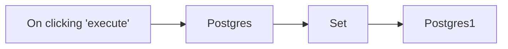

## Fluxo (.json) :

```json
{
  "nodes": [
    {
      "name": "On clicking 'execute'",
      "type": "n8n-nodes-base.manualTrigger",
      "position": [
        260,
        290
      ],
      "parameters": {},
      "typeVersion": 1
    },
    {
      "name": "Set",
      "type": "n8n-nodes-base.set",
      "position": [
        660,
        290
      ],
      "parameters": {
        "values": {
          "number": [
            {
              "name": "id"
            }
          ],
          "string": [
            {
              "name": "name",
              "value": "n8n"
            }
          ]
        },
        "options": {}
      },
      "typeVersion": 1,
      "alwaysOutputData": false
    },
    {
      "name": "Postgres",
      "type": "n8n-nodes-base.postgres",
      "position": [
        460,
        290
      ],
      "parameters": {
        "query": "CREATE TABLE test (id INT, name VARCHAR(255), PRIMARY KEY (id));",
        "operation": "executeQuery"
      },
      "credentials": {
        "postgres": "postgres_docker_creds"
      },
      "typeVersion": 1,
      "alwaysOutputData": true
    },
    {
      "name": "Postgres1",
      "type": "n8n-nodes-base.postgres",
      "position": [
        860,
        290
      ],
      "parameters": {
        "table": "test",
        "columns": "id, name"
      },
      "credentials": {
        "postgres": "postgres_docker_creds"
      },
      "typeVersion": 1
    }
  ],
  "connections": {
    "Set": {
      "main": [
        [
          {
            "node": "Postgres1",
            "type": "main",
            "index": 0
          }
        ]
      ]
    },
    "Postgres": {
      "main": [
        [
          {
            "node": "Set",
            "type": "main",
            "index": 0
          }
        ]
      ]
    },
    "On clicking 'execute'": {
      "main": [
        [
          {
            "node": "Postgres",
            "type": "main",
            "index": 0
          }
        ]
      ]
    }
  }
}
```

<a id="template-443"></a>

## Template 443 - Envio de SMS via Mocean

- **Nome:** Envio de SMS via Mocean
- **Descrição:** Fluxo que envia uma mensagem SMS através da API Mocean quando é acionado manualmente.
- **Funcionalidade:** • Disparo manual: Inicia o fluxo ao clicar em executar.
• Envio de SMS: Envia uma mensagem para o destinatário especificado usando os campos de remetente, destinatário e texto da mensagem.
• Uso de credenciais: Utiliza credenciais configuradas da API Mocean para autenticar o envio.
- **Ferramentas:** • Mocean: Serviço de envio de SMS via API que permite enviar mensagens de texto autenticadas através de credenciais.


## Fluxo visual

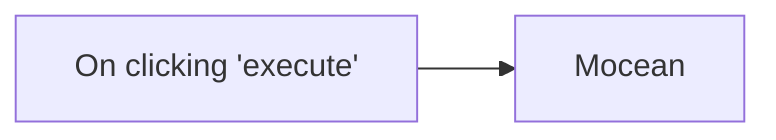

## Fluxo (.json) :

```json
{
  "id": "59",
  "name": "Send an SMS using the Mocean node",
  "nodes": [
    {
      "name": "On clicking 'execute'",
      "type": "n8n-nodes-base.manualTrigger",
      "position": [
        590,
        260
      ],
      "parameters": {},
      "typeVersion": 1
    },
    {
      "name": "Mocean",
      "type": "n8n-nodes-base.mocean",
      "position": [
        790,
        260
      ],
      "parameters": {
        "to": "",
        "from": "",
        "message": ""
      },
      "credentials": {
        "moceanApi": "mocean"
      },
      "typeVersion": 1
    }
  ],
  "active": false,
  "settings": {},
  "connections": {
    "On clicking 'execute'": {
      "main": [
        [
          {
            "node": "Mocean",
            "type": "main",
            "index": 0
          }
        ]
      ]
    }
  }
}
```

<a id="template-444"></a>

## Template 444 - Scraping de avaliações Amazon e criação de criativos

- **Nome:** Scraping de avaliações Amazon e criação de criativos
- **Descrição:** Automatiza a coleta de avaliações de um produto Amazon, armazena os dados em uma planilha, resume os pontos fracos detectados usando um modelo de linguagem e gera um criativo de imagem para campanhas, enviando tudo por e-mail para a equipe de mídia.
- **Funcionalidade:** • Coleta via formulário web: Recebe a URL do produto Amazon enviada por um formulário público.
• Disparo de scraping remoto: Envia a URL para a API de coleta (Bright Data) para iniciar a captura de avaliações.
• Polling de progresso: Verifica periodicamente o estado do snapshot até os dados estarem prontos.
• Recuperação de snapshot: Faz o download dos resultados em formato JSON quando a captura estiver concluída.
• Armazenamento estruturado: Insere todas as avaliações e metadados em uma planilha Google Sheets (usando um template predefinido).
• Agregação de texto: Consolida os textos das avaliações para facilitar a análise em lote.
• Análise por LLM: Envia as avaliações agregadas a um modelo de linguagem para gerar um resumo dos pontos fracos dos concorrentes (sem citar nomes).
• Geração de criativo visual: Usa uma API de imagens com parâmetros orientados pelo resumo para criar um arte 1080x1080 focada em oportunidades/points de dor.
• Distribuição por e-mail: Envia o resumo e o criativo gerado para os responsáveis de mídia via e-mail (com anexo).
• Instruções e template integrados: Fornece links e notas para usar o template de Google Sheets e configurar rapidamente o fluxo.
- **Ferramentas:** • Formulário web (webhook): Interface para o usuário enviar a URL do produto.
• Bright Data: Plataforma de coleta/scraping que executa datasets e fornece snapshots com as avaliações.
• Google Sheets: Armazena e organiza todas as avaliações e metadados em um template de planilha.
• OpenAI: Modelo de linguagem para resumir avaliações e serviço de geração de imagens para criar o criativo.
• Gmail: Serviço de envio de e-mail para distribuir o resumo e o criativo à equipe de mídia.


## Fluxo visual

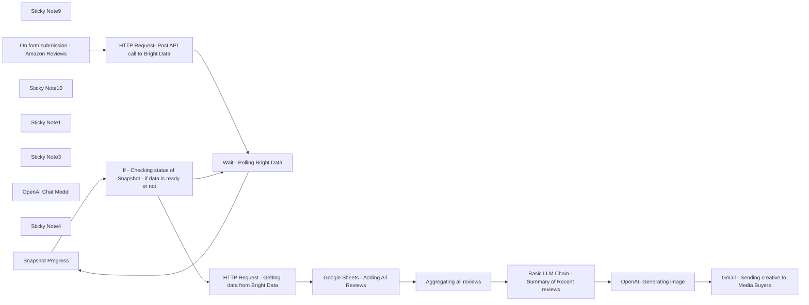

## Fluxo (.json) :

```json
{
  "meta": {
    "instanceId": "1eadd5bc7c3d70c587c28f782511fd898c6bf6d97963d92e836019d2039d1c79"
  },
  "nodes": [
    {
      "id": "58da2884-6dd9-446e-beca-cacae1e8df7c",
      "name": "Sticky Note9",
      "type": "n8n-nodes-base.stickyNote",
      "position": [
        4940,
        340
      ],
      "parameters": {
        "color": 4,
        "width": 1280,
        "height": 320,
        "content": "=======================================\n            WORKFLOW ASSISTANCE\n=======================================\nFor any questions or support, please contact:\n    Yaron@nofluff.online\n\nExplore more tips and tutorials here:\n   - YouTube: https://www.youtube.com/@YaronBeen/videos\n   - LinkedIn: https://www.linkedin.com/in/yaronbeen/\n=======================================\nBright Data Docs: https://docs.brightdata.com/introduction\n"
      },
      "typeVersion": 1
    },
    {
      "id": "d2aa5abc-6a8b-4ad3-9b87-1349f3dd80b9",
      "name": "Snapshot Progress",
      "type": "n8n-nodes-base.httpRequest",
      "position": [
        7540,
        760
      ],
      "parameters": {
        "url": "=https://api.brightdata.com/datasets/v3/progress/{{ $('HTTP Request- Post API call to Bright Data').item.json.snapshot_id }}",
        "options": {},
        "sendHeaders": true,
        "headerParameters": {
          "parameters": [
            {
              "name": "Authorization",
              "value": "Bearer <YOUR_BRIGHT_DATA_API_KEY>"
            }
          ]
        }
      },
      "typeVersion": 4.2
    },
    {
      "id": "fba84a88-1775-4bc9-85cb-1bda621b4c2c",
      "name": "Sticky Note10",
      "type": "n8n-nodes-base.stickyNote",
      "position": [
        8600,
        540
      ],
      "parameters": {
        "width": 195,
        "height": 646,
        "content": "In this workflow, I use Google Sheets to store the results. \n\nYou can use my template to get started faster:\n\n1. [Click on this link to get the template](https://docs.google.com/spreadsheets/d/1IR-yMQwEFTjbTCSPvVlQ54zQsnG0IRauTjPGoBWmR8U/edit?usp=sharing)\n2. Make a copy of the Sheets\n3. Add the URL to this node \n\n\n"
      },
      "typeVersion": 1
    },
    {
      "id": "4b235825-1445-42d1-a9fa-d017974819fe",
      "name": "Sticky Note1",
      "type": "n8n-nodes-base.stickyNote",
      "position": [
        6560,
        840
      ],
      "parameters": {
        "width": 220,
        "height": 440,
        "content": "Add your competitors Amazon link here.\n"
      },
      "typeVersion": 1
    },
    {
      "id": "d6a75b46-e968-4dab-962d-1f81b643b768",
      "name": "HTTP Request- Post API call to Bright Data",
      "type": "n8n-nodes-base.httpRequest",
      "position": [
        6920,
        840
      ],
      "parameters": {
        "url": "https://api.brightdata.com/datasets/v3/trigger",
        "method": "POST",
        "options": {},
        "jsonBody": "=[\n  {\n    \"url\": \"{{ $json['Amazon Product URL'] }}\"\n  }\n]",
        "sendBody": true,
        "sendQuery": true,
        "sendHeaders": true,
        "specifyBody": "json",
        "queryParameters": {
          "parameters": [
            {
              "name": "dataset_id",
              "value": "gd_le8e811kzy4ggddlq"
            },
            {
              "name": "include_errors",
              "value": "true"
            }
          ]
        },
        "headerParameters": {
          "parameters": [
            {
              "name": "Authorization",
              "value": "Bearer <YOUR_BRIGHT_DATA_API_KEY>"
            }
          ]
        }
      },
      "typeVersion": 4.2
    },
    {
      "id": "50a6c73a-dd82-40af-ad5a-88ef4fd5fc7c",
      "name": "Wait - Polling Bright Data",
      "type": "n8n-nodes-base.wait",
      "position": [
        7300,
        760
      ],
      "webhookId": "8005a2b3-2195-479e-badb-d90e4240e699",
      "parameters": {
        "unit": "minutes",
        "amount": 1
      },
      "executeOnce": false,
      "typeVersion": 1.1
    },
    {
      "id": "8af8f713-6d5d-4113-ad5e-86b29fc8f441",
      "name": "If - Checking status of Snapshot - if data is ready or not",
      "type": "n8n-nodes-base.if",
      "position": [
        7740,
        760
      ],
      "parameters": {
        "options": {},
        "conditions": {
          "options": {
            "version": 2,
            "leftValue": "",
            "caseSensitive": true,
            "typeValidation": "strict"
          },
          "combinator": "and",
          "conditions": [
            {
              "id": "7932282b-71bb-4bbb-ab73-4978e554de7e",
              "operator": {
                "name": "filter.operator.equals",
                "type": "string",
                "operation": "equals"
              },
              "leftValue": "={{ $json.status }}",
              "rightValue": "running"
            }
          ]
        }
      },
      "typeVersion": 2.2
    },
    {
      "id": "98166378-3766-4c69-b891-48891a18e175",
      "name": "HTTP Request - Getting data from Bright Data",
      "type": "n8n-nodes-base.httpRequest",
      "position": [
        8020,
        780
      ],
      "parameters": {
        "url": "=https://api.brightdata.com/datasets/v3/snapshot/{{ $('HTTP Request- Post API call to Bright Data').item.json.snapshot_id }}",
        "options": {},
        "sendQuery": true,
        "sendHeaders": true,
        "queryParameters": {
          "parameters": [
            {
              "name": "format",
              "value": "json"
            }
          ]
        },
        "headerParameters": {
          "parameters": [
            {
              "name": "Authorization",
              "value": "Bearer <YOUR_BRIGHT_DATA_API_KEY>"
            }
          ]
        }
      },
      "typeVersion": 4.2
    },
    {
      "id": "217cc982-0550-4e27-afd5-12b46eafcd04",
      "name": "Sticky Note3",
      "type": "n8n-nodes-base.stickyNote",
      "position": [
        7240,
        620
      ],
      "parameters": {
        "color": 4,
        "width": 940,
        "height": 400,
        "content": "Bright Data Getting Reviews\n"
      },
      "typeVersion": 1
    },
    {
      "id": "5fd57531-25f4-4b10-9d95-bbeda1b336cf",
      "name": "OpenAI Chat Model",
      "type": "@n8n/n8n-nodes-langchain.lmChatOpenAi",
      "position": [
        9620,
        1060
      ],
      "parameters": {
        "model": {
          "__rl": true,
          "mode": "list",
          "value": "gpt-4o-mini"
        },
        "options": {}
      },
      "credentials": {
        "openAiApi": {
          "id": "MX2lQOZcGpmRvdVD",
          "name": "OpenAi account 2"
        }
      },
      "typeVersion": 1.2
    },
    {
      "id": "d79c7504-0ccc-4491-bf7a-3697b31fa71a",
      "name": "Sticky Note4",
      "type": "n8n-nodes-base.stickyNote",
      "position": [
        9480,
        600
      ],
      "parameters": {
        "width": 360,
        "height": 820,
        "content": "Adjust This Prompt with:\n1. Add info about your company and offer.\n\n2. The template requires the LLM to generate a summary of recent reviews but you can adjust it\n\n\n"
      },
      "typeVersion": 1
    },
    {
      "id": "413669e5-2b75-499d-ba00-766b3cce0d69",
      "name": "Google Sheets - Adding All Reviews",
      "type": "n8n-nodes-base.googleSheets",
      "position": [
        8640,
        840
      ],
      "parameters": {
        "columns": {
          "value": {},
          "schema": [
            {
              "id": "url",
              "type": "string",
              "display": true,
              "required": false,
              "displayName": "url",
              "defaultMatch": false,
              "canBeUsedToMatch": true
            },
            {
              "id": "product_name",
              "type": "string",
              "display": true,
              "required": false,
              "displayName": "product_name",
              "defaultMatch": false,
              "canBeUsedToMatch": true
            },
            {
              "id": "product_rating",
              "type": "string",
              "display": true,
              "required": false,
              "displayName": "product_rating",
              "defaultMatch": false,
              "canBeUsedToMatch": true
            },
            {
              "id": "product_rating_object",
              "type": "string",
              "display": true,
              "required": false,
              "displayName": "product_rating_object",
              "defaultMatch": false,
              "canBeUsedToMatch": true
            },
            {
              "id": "product_rating_max",
              "type": "string",
              "display": true,
              "required": false,
              "displayName": "product_rating_max",
              "defaultMatch": false,
              "canBeUsedToMatch": true
            },
            {
              "id": "rating",
              "type": "string",
              "display": true,
              "required": false,
              "displayName": "rating",
              "defaultMatch": false,
              "canBeUsedToMatch": true
            },
            {
              "id": "author_name",
              "type": "string",
              "display": true,
              "required": false,
              "displayName": "author_name",
              "defaultMatch": false,
              "canBeUsedToMatch": true
            },
            {
              "id": "asin",
              "type": "string",
              "display": true,
              "required": false,
              "displayName": "asin",
              "defaultMatch": false,
              "canBeUsedToMatch": true
            },
            {
              "id": "product_rating_count",
              "type": "string",
              "display": true,
              "required": false,
              "displayName": "product_rating_count",
              "defaultMatch": false,
              "canBeUsedToMatch": true
            },
            {
              "id": "review_header",
              "type": "string",
              "display": true,
              "required": false,
              "displayName": "review_header",
              "defaultMatch": false,
              "canBeUsedToMatch": true
            },
            {
              "id": "review_id",
              "type": "string",
              "display": true,
              "required": false,
              "displayName": "review_id",
              "defaultMatch": false,
              "canBeUsedToMatch": true
            },
            {
              "id": "review_text",
              "type": "string",
              "display": true,
              "required": false,
              "displayName": "review_text",
              "defaultMatch": false,
              "canBeUsedToMatch": true
            },
            {
              "id": "author_id",
              "type": "string",
              "display": true,
              "required": false,
              "displayName": "author_id",
              "defaultMatch": false,
              "canBeUsedToMatch": true
            },
            {
              "id": "author_link",
              "type": "string",
              "display": true,
              "required": false,
              "displayName": "author_link",
              "defaultMatch": false,
              "canBeUsedToMatch": true
            },
            {
              "id": "badge",
              "type": "string",
              "display": true,
              "required": false,
              "displayName": "badge",
              "defaultMatch": false,
              "canBeUsedToMatch": true
            },
            {
              "id": "brand",
              "type": "string",
              "display": true,
              "required": false,
              "displayName": "brand",
              "defaultMatch": false,
              "canBeUsedToMatch": true
            },
            {
              "id": "review_posted_date",
              "type": "string",
              "display": true,
              "required": false,
              "displayName": "review_posted_date",
              "defaultMatch": false,
              "canBeUsedToMatch": true
            },
            {
              "id": "review_country",
              "type": "string",
              "display": true,
              "required": false,
              "displayName": "review_country",
              "defaultMatch": false,
              "canBeUsedToMatch": true
            },
            {
              "id": "review_images",
              "type": "string",
              "display": true,
              "required": false,
              "displayName": "review_images",
              "defaultMatch": false,
              "canBeUsedToMatch": true
            },
            {
              "id": "helpful_count",
              "type": "string",
              "display": true,
              "required": false,
              "displayName": "helpful_count",
              "defaultMatch": false,
              "canBeUsedToMatch": true
            },
            {
              "id": "is_amazon_vine",
              "type": "string",
              "display": true,
              "required": false,
              "displayName": "is_amazon_vine",
              "defaultMatch": false,
              "canBeUsedToMatch": true
            },
            {
              "id": "is_verified",
              "type": "string",
              "display": true,
              "required": false,
              "displayName": "is_verified",
              "defaultMatch": false,
              "canBeUsedToMatch": true
            },
            {
              "id": "variant_asin",
              "type": "string",
              "display": true,
              "required": false,
              "displayName": "variant_asin",
              "defaultMatch": false,
              "canBeUsedToMatch": true
            },
            {
              "id": "variant_name",
              "type": "string",
              "display": true,
              "required": false,
              "displayName": "variant_name",
              "defaultMatch": false,
              "canBeUsedToMatch": true
            },
            {
              "id": "videos",
              "type": "string",
              "display": true,
              "required": false,
              "displayName": "videos",
              "defaultMatch": false,
              "canBeUsedToMatch": true
            },
            {
              "id": "timestamp",
              "type": "string",
              "display": true,
              "removed": false,
              "required": false,
              "displayName": "timestamp",
              "defaultMatch": false,
              "canBeUsedToMatch": true
            },
            {
              "id": "input",
              "type": "string",
              "display": true,
              "removed": false,
              "required": false,
              "displayName": "input",
              "defaultMatch": false,
              "canBeUsedToMatch": true
            }
          ],
          "mappingMode": "autoMapInputData",
          "matchingColumns": [],
          "attemptToConvertTypes": false,
          "convertFieldsToString": false
        },
        "options": {},
        "operation": "append",
        "sheetName": {
          "__rl": true,
          "mode": "list",
          "value": "gid=0",
          "cachedResultUrl": "https://docs.google.com/spreadsheets/d/1IR-yMQwEFTjbTCSPvVlQ54zQsnG0IRauTjPGoBWmR8U/edit#gid=0",
          "cachedResultName": "input"
        },
        "documentId": {
          "__rl": true,
          "mode": "list",
          "value": "1IR-yMQwEFTjbTCSPvVlQ54zQsnG0IRauTjPGoBWmR8U",
          "cachedResultUrl": "https://docs.google.com/spreadsheets/d/1IR-yMQwEFTjbTCSPvVlQ54zQsnG0IRauTjPGoBWmR8U/edit?usp=drivesdk",
          "cachedResultName": "NoFluff-N8N-Sheet-Template- AMAZON Reviews Scraping WIth Bright Data"
        }
      },
      "credentials": {
        "googleSheetsOAuth2Api": {
          "id": "4RJOMlGAcB9ZoYfm",
          "name": "Google Sheets account 2"
        }
      },
      "typeVersion": 4.3,
      "alwaysOutputData": true
    },
    {
      "id": "e1d58479-4008-4801-8523-fa2304ea9ef0",
      "name": "On form submission - Amazon Reviews",
      "type": "n8n-nodes-base.formTrigger",
      "position": [
        6620,
        980
      ],
      "webhookId": "8d0269c7-d1fc-45a1-a411-19634a1e0b82",
      "parameters": {
        "options": {},
        "formTitle": "Please Paste The URL of the Amazon Product",
        "formFields": {
          "values": [
            {
              "fieldLabel": "Amazon Product URL",
              "placeholder": "https://www.amazon.com/Quencher-Cupholder-Compatible-Insulated-Stainless/dp/B0DCDQ1RFV",
              "requiredField": true
            }
          ]
        }
      },
      "typeVersion": 2.2
    },
    {
      "id": "2d79e9d2-a867-447e-91f9-b90c2e56427a",
      "name": "Aggregating all reviews",
      "type": "n8n-nodes-base.aggregate",
      "position": [
        9140,
        840
      ],
      "parameters": {
        "options": {},
        "fieldsToAggregate": {
          "fieldToAggregate": [
            {
              "renameField": true,
              "outputFieldName": "Aggregated_reviews",
              "fieldToAggregate": "review_text"
            }
          ]
        }
      },
      "typeVersion": 1
    },
    {
      "id": "937ef1c4-32b3-4966-abb4-f4ae09aa12a7",
      "name": "Basic LLM Chain - Summary of Recent reviews",
      "type": "@n8n/n8n-nodes-langchain.chainLlm",
      "position": [
        9520,
        840
      ],
      "parameters": {
        "text": "=Read the following reviews, these are reviews of our competitors:\n{{ $json.Aggregated_reviews }}\n\n---\nAfter reading them, summarize their weakest points.\nDon't mention the competitor name.\n\n",
        "promptType": "define"
      },
      "typeVersion": 1.6
    },
    {
      "id": "2ccf1e0f-a738-44ee-bd8f-65a02a92ca91",
      "name": "OpenAI- Generating image",
      "type": "@n8n/n8n-nodes-langchain.openAi",
      "position": [
        10160,
        840
      ],
      "parameters": {
        "prompt": "={\n  \"ad_dimensions\": {\n    \"width\": 1080,\n    \"height\": 1080\n  },\n  \"target_audience\": \"B2C customer\",\n  \"pain_points_source\": \"choose one pain point based on this {{ $json.text }}\",\n  \"ad_requirements\": {\n    \"image_style\": \"weird-and-fun\",\n    \"weird_objects\": [\n      \"Fruit with Faces\",\n      \"Realistic People\"\n    ],\n    \"focus\": \"address the biggest pain point of competitors\",\n    \"avoid_naming_competitors\": true,\n    \"headline\": {\n      \"position\": \"No\",\n      \"text_only\": \"No\",\n      \"other_text\": \"No\"\n    },\n    \"background\": [\n      \"bold red\",\n      \"black\"\n    ]\n  }\n}",
        "options": {},
        "resource": "image"
      },
      "credentials": {
        "openAiApi": {
          "id": "MX2lQOZcGpmRvdVD",
          "name": "OpenAi account 2"
        }
      },
      "typeVersion": 1.8
    },
    {
      "id": "ebb11f25-66f5-495e-a7bc-4212c6db10d5",
      "name": "Gmail - Sending creative to Media Buyers",
      "type": "n8n-nodes-base.gmail",
      "position": [
        10580,
        840
      ],
      "webhookId": "41184a90-65fd-49a8-b0de-d838b94c790c",
      "parameters": {
        "sendTo": "yaron.been@gmail.com",
        "message": "=Hey, \n\nWe have analyzed our competitors recent reviews.\nAnalysis data:\n{{ $today }}\n\nHere's a summary:\n{{ $('Basic LLM Chain - Summary of Recent reviews').item.json.text }}\n\nPlease see attached an AI generated 1080x1080 image which you can use in Meta ads.\n\n",
        "options": {
          "attachmentsUi": {
            "attachmentsBinary": [
              {}
            ]
          }
        },
        "subject": "=Static Creatives Based on Our competitor {{ $now }}",
        "emailType": "text"
      },
      "credentials": {
        "gmailOAuth2": {
          "id": "TLJ5oxgGtoxdGOTZ",
          "name": "Gmail account 2"
        }
      },
      "typeVersion": 2.1
    }
  ],
  "pinData": {
    "Basic LLM Chain - Summary of Recent reviews": [
      {
        "text": "The reviews highlight several common weaknesses among the products:\n\n1. **Quality Control Issues**: Some customers reported receiving cups with dents or damages upon arrival, raising concerns about packaging and quality assurance during shipping.\n\n2. **Durability Concerns**: While many praised the durability, a few mentioned that the cups could spill if tipped over, indicating that they might not be fully leak-proof.\n\n3. **Ease of Use**: Several users experienced difficulties with lids getting stuck or indicated that the tumblers are not spill-proof, particularly when used for non-water beverages.\n\n4. **Size and Weight**: A few reviewers commented on the heaviness of larger sizes, suggesting they may not be convenient for frequent carrying, especially for those with smaller bags or during outings.\n\n5. **Cleaning Issues**: Some users noted that certain models could be challenging to clean, particularly if not hand-washed to maintain appearance.\n\n6. **Authenticity Doubts**: There were instances where customers questioned the authenticity of the product based on packaging or markings, which could affect their overall satisfaction.\n\n7. **Price**: A few reviewers mentioned that while the products are of good quality, they are considered pricey, leading to questions about whether the value matches the cost. \n\nOverall, despite many positive comments, issues related to packaging, spillability, and price emerged as notable weaknesses."
      }
    ]
  },
  "connections": {
    "OpenAI Chat Model": {
      "ai_languageModel": [
        [
          {
            "node": "Basic LLM Chain - Summary of Recent reviews",
            "type": "ai_languageModel",
            "index": 0
          }
        ]
      ]
    },
    "Snapshot Progress": {
      "main": [
        [
          {
            "node": "If - Checking status of Snapshot - if data is ready or not",
            "type": "main",
            "index": 0
          }
        ]
      ]
    },
    "Aggregating all reviews": {
      "main": [
        [
          {
            "node": "Basic LLM Chain - Summary of Recent reviews",
            "type": "main",
            "index": 0
          }
        ]
      ]
    },
    "OpenAI- Generating image": {
      "main": [
        [
          {
            "node": "Gmail - Sending creative to Media Buyers",
            "type": "main",
            "index": 0
          }
        ]
      ]
    },
    "Wait - Polling Bright Data": {
      "main": [
        [
          {
            "node": "Snapshot Progress",
            "type": "main",
            "index": 0
          }
        ]
      ]
    },
    "Google Sheets - Adding All Reviews": {
      "main": [
        [
          {
            "node": "Aggregating all reviews",
            "type": "main",
            "index": 0
          }
        ]
      ]
    },
    "On form submission - Amazon Reviews": {
      "main": [
        [
          {
            "node": "HTTP Request- Post API call to Bright Data",
            "type": "main",
            "index": 0
          }
        ]
      ]
    },
    "HTTP Request- Post API call to Bright Data": {
      "main": [
        [
          {
            "node": "Wait - Polling Bright Data",
            "type": "main",
            "index": 0
          }
        ]
      ]
    },
    "Basic LLM Chain - Summary of Recent reviews": {
      "main": [
        [
          {
            "node": "OpenAI- Generating image",
            "type": "main",
            "index": 0
          }
        ]
      ]
    },
    "HTTP Request - Getting data from Bright Data": {
      "main": [
        [
          {
            "node": "Google Sheets - Adding All Reviews",
            "type": "main",
            "index": 0
          }
        ]
      ]
    },
    "If - Checking status of Snapshot - if data is ready or not": {
      "main": [
        [
          {
            "node": "Wait - Polling Bright Data",
            "type": "main",
            "index": 0
          }
        ],
        [
          {
            "node": "HTTP Request - Getting data from Bright Data",
            "type": "main",
            "index": 0
          }
        ]
      ]
    }
  }
}
```

<a id="template-445"></a>

## Template 445 - Reagendar vencidas e limpar tarefas concluídas

- **Nome:** Reagendar vencidas e limpar tarefas concluídas
- **Descrição:** Automatiza a verificação diária de tarefas de um usuário no Asana, reagendando tarefas vencidas e removendo tarefas concluídas para manter o workspace organizado.
- **Funcionalidade:** • Agendamento diário: Executa a verificação automaticamente todos os dias às 7h.
• Recuperação de tarefas do usuário: Busca todas as tarefas atribuídas a um usuário em um workspace específico, usando filtro de data de conclusão.
• Obtenção de detalhes da tarefa: Recupera informações completas de cada tarefa para avaliação.
• Verificação de status aberto: Identifica se a tarefa ainda não foi marcada como concluída.
• Detecção de data de vencimento no passado: Compara a data de vencimento da tarefa com a data atual.
• Reagendamento de tarefas vencidas: Atualiza a data de vencimento de tarefas abertas vencidas para a data de hoje.
• Limpeza de tarefas concluídas: Remove tarefas que já foram concluídas para reduzir o acúmulo de itens.
- **Ferramentas:** • Asana: Plataforma de gestão de tarefas usada para listar, obter detalhes, atualizar datas de vencimento e excluir tarefas.

## Fluxo visual

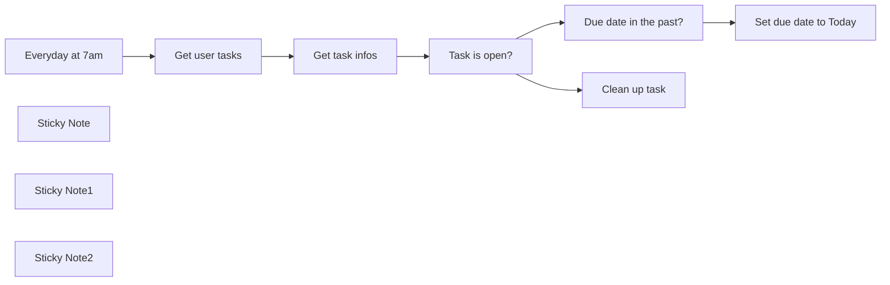

## Fluxo (.json) :

```json
{
  "id": "RJ4PaYq0JBr29KJm",
  "meta": {
    "instanceId": "e3de7ac3dee198637aeea8f82bd3b7f55121370bf7582aeef633e085d2f68ac8"
  },
  "name": "Reschedule overdue Asana tasks and clean up completed tasks",
  "tags": [
    {
      "id": "oMfA3lEfbqs7MU2P",
      "name": "Template",
      "createdAt": "2025-01-06T20:33:18.396Z",
      "updatedAt": "2025-01-06T20:33:18.396Z"
    }
  ],
  "nodes": [
    {
      "id": "9262720e-2beb-4426-a472-3d7bf8bc28af",
      "name": "Everyday at 7am",
      "type": "n8n-nodes-base.scheduleTrigger",
      "position": [
        80,
        -520
      ],
      "parameters": {
        "rule": {
          "interval": [
            {
              "triggerAtHour": 7
            }
          ]
        }
      },
      "typeVersion": 1.2
    },
    {
      "id": "0d074451-5d61-4ed4-86a8-f6cdf002e84b",
      "name": "Get user tasks",
      "type": "n8n-nodes-base.asana",
      "position": [
        320,
        -520
      ],
      "parameters": {
        "filters": {
          "assignee": "1201727447190193",
          "workspace": "1201727656813934",
          "completed_since": "={{ DateTime.now().format('yyyy-MM-dd') }}"
        },
        "operation": "getAll",
        "returnAll": true
      },
      "credentials": {
        "asanaApi": {
          "id": "u7fFpY0SmMcpBCdn",
          "name": "Asana account"
        }
      },
      "typeVersion": 1
    },
    {
      "id": "14939268-9bda-4fc1-9fef-aa6a74c2365a",
      "name": "Get task infos",
      "type": "n8n-nodes-base.asana",
      "position": [
        540,
        -520
      ],
      "parameters": {
        "id": "={{ $json.gid }}",
        "operation": "get"
      },
      "credentials": {
        "asanaApi": {
          "id": "u7fFpY0SmMcpBCdn",
          "name": "Asana account"
        }
      },
      "typeVersion": 1
    },
    {
      "id": "e7d9a37c-66b7-46b9-b228-7372cb0d7b09",
      "name": "Task is open?",
      "type": "n8n-nodes-base.if",
      "position": [
        780,
        -520
      ],
      "parameters": {
        "options": {},
        "conditions": {
          "options": {
            "version": 2,
            "leftValue": "",
            "caseSensitive": true,
            "typeValidation": "strict"
          },
          "combinator": "and",
          "conditions": [
            {
              "id": "145d9367-7662-4ed9-8195-bf9b35c78d6b",
              "operator": {
                "type": "boolean",
                "operation": "false",
                "singleValue": true
              },
              "leftValue": "={{ $json.completed }}",
              "rightValue": "false"
            }
          ]
        }
      },
      "typeVersion": 2.2
    },
    {
      "id": "11ae0bbb-8d76-4623-9a24-2c2a36600dd3",
      "name": "Due date in the past?",
      "type": "n8n-nodes-base.if",
      "position": [
        1020,
        -640
      ],
      "parameters": {
        "options": {},
        "conditions": {
          "options": {
            "version": 2,
            "leftValue": "",
            "caseSensitive": true,
            "typeValidation": "loose"
          },
          "combinator": "and",
          "conditions": [
            {
              "id": "dbecabb3-8075-4cc0-94af-b678c8af8f66",
              "operator": {
                "type": "number",
                "operation": "lt"
              },
              "leftValue": "={{ $json.due_on.replaceAll(\"-\",\"\") }}",
              "rightValue": "={{ DateTime.now().format('yyyyMMdd') }}"
            }
          ]
        },
        "looseTypeValidation": true
      },
      "typeVersion": 2.2
    },
    {
      "id": "282d79c7-e74a-4249-ad37-b4d81655a206",
      "name": "Set due date to Today",
      "type": "n8n-nodes-base.asana",
      "position": [
        1280,
        -680
      ],
      "parameters": {
        "id": "={{ $json.gid }}",
        "operation": "update",
        "otherProperties": {
          "due_on": "={{ DateTime.now().format('yyyy-MM-dd') }}"
        }
      },
      "credentials": {
        "asanaApi": {
          "id": "u7fFpY0SmMcpBCdn",
          "name": "Asana account"
        }
      },
      "typeVersion": 1
    },
    {
      "id": "7cc18243-d3d4-4624-a906-a1617e411b0c",
      "name": "Clean up task",
      "type": "n8n-nodes-base.asana",
      "position": [
        1020,
        -440
      ],
      "parameters": {
        "id": "={{ $json.gid }}",
        "operation": "delete"
      },
      "credentials": {
        "asanaApi": {
          "id": "u7fFpY0SmMcpBCdn",
          "name": "Asana account"
        }
      },
      "typeVersion": 1
    },
    {
      "id": "f4aafa1f-8c5b-4fd1-9aca-fd096508dbfb",
      "name": "Sticky Note",
      "type": "n8n-nodes-base.stickyNote",
      "position": [
        40,
        -800
      ],
      "parameters": {
        "color": 5,
        "width": 640,
        "height": 240,
        "content": "### ⚙️ Set Up \n\n1. Add your **Asana** credentials\n2. Schedule the workflow to run at desired intervals (e.g., daily or weekly).\n3. Select your **Workspace Name** and your **Assignee Name** (user) in the **Get user tasks** node\n4. *(Optional) Tailor filtering conditions to match your preferred due-date rules and removal criteria.*\n5. **Activate the workflow** and watch your Asana workspace stay up to date and clutter-free."
      },
      "typeVersion": 1
    },
    {
      "id": "e4fcbdee-5dd0-40dc-b1ef-f7b8ce00dd03",
      "name": "Sticky Note1",
      "type": "n8n-nodes-base.stickyNote",
      "position": [
        60,
        -360
      ],
      "parameters": {
        "color": 7,
        "width": 160,
        "height": 100,
        "content": "👆 \nUpdate the **Scheduler** here"
      },
      "typeVersion": 1
    },
    {
      "id": "195f467d-1124-4216-ab0e-048c6a9fc752",
      "name": "Sticky Note2",
      "type": "n8n-nodes-base.stickyNote",
      "position": [
        280,
        -360
      ],
      "parameters": {
        "color": 7,
        "width": 200,
        "height": 100,
        "content": "👆 \nSelect your **Workspace Name** & **Assignee Name** here"
      },
      "typeVersion": 1
    }
  ],
  "active": false,
  "pinData": {},
  "settings": {
    "timezone": "Europe/Paris",
    "executionOrder": "v1"
  },
  "versionId": "fdc51229-75f4-4489-a7f7-1f36a35d43ac",
  "connections": {
    "Task is open?": {
      "main": [
        [
          {
            "node": "Due date in the past?",
            "type": "main",
            "index": 0
          }
        ],
        [
          {
            "node": "Clean up task",
            "type": "main",
            "index": 0
          }
        ]
      ]
    },
    "Get task infos": {
      "main": [
        [
          {
            "node": "Task is open?",
            "type": "main",
            "index": 0
          }
        ]
      ]
    },
    "Get user tasks": {
      "main": [
        [
          {
            "node": "Get task infos",
            "type": "main",
            "index": 0
          }
        ]
      ]
    },
    "Everyday at 7am": {
      "main": [
        [
          {
            "node": "Get user tasks",
            "type": "main",
            "index": 0
          }
        ]
      ]
    },
    "Due date in the past?": {
      "main": [
        [
          {
            "node": "Set due date to Today",
            "type": "main",
            "index": 0
          }
        ]
      ]
    }
  }
}
```

<a id="template-446"></a>

## Template 446 - Atualização automática de prioridades via IA

- **Nome:** Atualização automática de prioridades via IA
- **Descrição:** Varre tarefas de uma caixa de entrada, classifica cada item usando um modelo de linguagem e atualiza a prioridade da tarefa no Todoist com base em um mapa de projetos e prioridades.
- **Funcionalidade:** • Agendamento periódico: Executa a automação em intervalos definidos para verificar novas tarefas.
• Mapeamento de projetos para prioridades: Mantém uma lista configurável de projetos com valores de prioridade associados.
• Recuperação de tarefas da caixa de entrada: Obtém todas as tarefas de um projeto específico para processamento.
• Filtragem de subtarefas: Ignora tarefas que sejam subtarefas para evitar atualizações indevidas.
• Classificação por IA: Envia o conteúdo da tarefa para um modelo de linguagem para determinar a qual projeto ela pertence.
• Validação da classificação: Verifica se o projeto retornado pela IA está na lista configurada e evita agir se for "other" ou inválido.
• Atualização de prioridade: Se a classificação for válida, atualiza a prioridade da tarefa no Todoist usando o valor definido no mapa.
- **Ferramentas:** • Todoist: Serviço de gerenciamento de tarefas usado para ler tarefas da caixa de entrada e atualizar a prioridade das tarefas via API.
• OpenAI: Serviço de modelos de linguagem usado para categorizar o conteúdo das tarefas e determinar o projeto correspondente.

## Fluxo visual

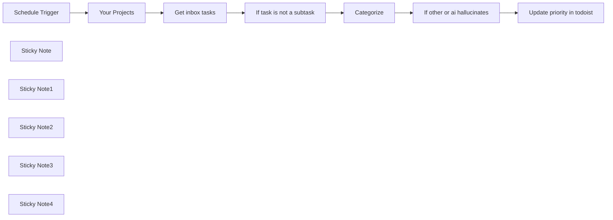

## Fluxo (.json) :

```json
{
  "nodes": [
    {
      "id": "d45cf237-dbbc-48ed-a7f0-fa9506ae1d67",
      "name": "Update priority in todoist",
      "type": "n8n-nodes-base.todoist",
      "position": [
        2060,
        520
      ],
      "parameters": {
        "taskId": "={{ $('Get inbox tasks').item.json.id }}",
        "operation": "update",
        "updateFields": {
          "priority": "={{ $('Your Projects').first().json.projects[$json.message.content] }}"
        }
      },
      "credentials": {
        "todoistApi": {
          "id": "1",
          "name": "Todoist account"
        }
      },
      "retryOnFail": true,
      "typeVersion": 2,
      "waitBetweenTries": 5000
    },
    {
      "id": "4d0ebf98-5a1d-4dfd-85df-da182b3c5099",
      "name": "Schedule Trigger",
      "type": "n8n-nodes-base.scheduleTrigger",
      "position": [
        600,
        520
      ],
      "parameters": {
        "rule": {
          "interval": [
            {}
          ]
        }
      },
      "typeVersion": 1.2
    },
    {
      "id": "a950e470-6885-42f4-9b17-7b2c2525d3e4",
      "name": "Get inbox tasks",
      "type": "n8n-nodes-base.todoist",
      "position": [
        1020,
        520
      ],
      "parameters": {
        "filters": {
          "projectId": "938017196"
        },
        "operation": "getAll",
        "returnAll": true
      },
      "credentials": {
        "todoistApi": {
          "id": "1",
          "name": "Todoist account"
        }
      },
      "retryOnFail": true,
      "typeVersion": 2,
      "waitBetweenTries": 5000
    },
    {
      "id": "093bcb2e-79b7-427e-b13d-540a5b28f427",
      "name": "Sticky Note",
      "type": "n8n-nodes-base.stickyNote",
      "position": [
        540,
        200
      ],
      "parameters": {
        "color": 3,
        "width": 358.6620209059232,
        "height": 256.5853658536585,
        "content": "## 💫 To setup this template\n\n1. Add your Todoist credentials\n2. Add your OpenAI credentials\n3. Set your project names and add priority"
      },
      "typeVersion": 1
    },
    {
      "id": "430290e7-1732-46fe-a38d-fa6dc7f78a26",
      "name": "Sticky Note1",
      "type": "n8n-nodes-base.stickyNote",
      "position": [
        800,
        700
      ],
      "parameters": {
        "width": 192.77351916376313,
        "height": 80,
        "content": " 👆🏽 Add your projects and priority here"
      },
      "typeVersion": 1
    },
    {
      "id": "6d5a1b7e-f7fa-4a1b-848c-1b4e79f6f667",
      "name": "Sticky Note2",
      "type": "n8n-nodes-base.stickyNote",
      "position": [
        1020,
        420
      ],
      "parameters": {
        "width": 192.77351916376313,
        "height": 80,
        "content": " 👇🏽 Add your Todoist credentials here"
      },
      "typeVersion": 1
    },
    {
      "id": "feff35d2-e37d-48a5-9a90-c5a2efde688f",
      "name": "Sticky Note3",
      "type": "n8n-nodes-base.stickyNote",
      "position": [
        2060,
        420
      ],
      "parameters": {
        "width": 192.77351916376313,
        "height": 80,
        "content": " 👇🏽 Add your Todoist credentials here"
      },
      "typeVersion": 1
    },
    {
      "id": "e454ebfe-47f6-4e39-8b89-d706da742911",
      "name": "Sticky Note4",
      "type": "n8n-nodes-base.stickyNote",
      "position": [
        1540,
        700
      ],
      "parameters": {
        "width": 192.77351916376313,
        "height": 80,
        "content": " 👆🏽 Add your OpenAI credentials here"
      },
      "typeVersion": 1
    },
    {
      "id": "a79effcb-6904-4abf-835b-e1ccd94ca429",
      "name": "Your Projects",
      "type": "n8n-nodes-base.set",
      "position": [
        820,
        520
      ],
      "parameters": {
        "options": {},
        "assignments": {
          "assignments": [
            {
              "id": "50dc1412-21f8-4158-898d-3940a146586b",
              "name": "projects",
              "type": "object",
              "value": "={{ {\n apartment: 1,\n health: 2,\n german: 3\n} }}"
            }
          ]
        }
      },
      "typeVersion": 3.4
    },
    {
      "id": "b5988629-2225-455f-b579-73e60449d2a3",
      "name": "Categorize",
      "type": "@n8n/n8n-nodes-langchain.openAi",
      "position": [
        1460,
        520
      ],
      "parameters": {
        "modelId": {
          "__rl": true,
          "mode": "list",
          "value": "gpt-4o-mini",
          "cachedResultName": "GPT-4O-MINI"
        },
        "options": {},
        "messages": {
          "values": [
            {
              "role": "system",
              "content": "=Categorize the user's todo item to a project. Return the project name or just \"other\" if it does not belong to a project."
            },
            {
              "content": "=Projects:\n{{ $('Your Projects').first().json.projects.keys().join('\\n') }}\n\nTodo item:\n{{ $('Get inbox tasks').item.json.content }}"
            }
          ]
        }
      },
      "credentials": {
        "openAiApi": {
          "id": "9",
          "name": "n8n OpenAi"
        }
      },
      "typeVersion": 1.4
    },
    {
      "id": "0dca3953-c0ac-4319-9323-c3aed9488bfb",
      "name": "If task is not a subtask",
      "type": "n8n-nodes-base.filter",
      "position": [
        1240,
        520
      ],
      "parameters": {
        "options": {},
        "conditions": {
          "options": {
            "leftValue": "",
            "caseSensitive": true,
            "typeValidation": "strict"
          },
          "combinator": "and",
          "conditions": [
            {
              "id": "36dd4bc9-1282-4342-89dd-1dac81c7290e",
              "operator": {
                "type": "string",
                "operation": "empty",
                "singleValue": true
              },
              "leftValue": "={{ $json.parent_id }}",
              "rightValue": ""
            }
          ]
        }
      },
      "typeVersion": 2.1
    },
    {
      "id": "12e25a81-dbde-4542-a137-365329da415e",
      "name": "If other or ai hallucinates",
      "type": "n8n-nodes-base.filter",
      "position": [
        1820,
        520
      ],
      "parameters": {
        "options": {},
        "conditions": {
          "options": {
            "leftValue": "",
            "caseSensitive": true,
            "typeValidation": "strict"
          },
          "combinator": "and",
          "conditions": [
            {
              "id": "c4f69265-abe1-451c-8462-e68ff3b06799",
              "operator": {
                "type": "array",
                "operation": "contains",
                "rightType": "any"
              },
              "leftValue": "={{ $('Your Projects').first().json.projects.keys() }}",
              "rightValue": "={{ $json.message.content }}"
            }
          ]
        }
      },
      "typeVersion": 2.1
    }
  ],
  "pinData": {},
  "connections": {
    "Categorize": {
      "main": [
        [
          {
            "node": "If other or ai hallucinates",
            "type": "main",
            "index": 0
          }
        ]
      ]
    },
    "Your Projects": {
      "main": [
        [
          {
            "node": "Get inbox tasks",
            "type": "main",
            "index": 0
          }
        ]
      ]
    },
    "Get inbox tasks": {
      "main": [
        [
          {
            "node": "If task is not a subtask",
            "type": "main",
            "index": 0
          }
        ]
      ]
    },
    "Schedule Trigger": {
      "main": [
        [
          {
            "node": "Your Projects",
            "type": "main",
            "index": 0
          }
        ]
      ]
    },
    "If task is not a subtask": {
      "main": [
        [
          {
            "node": "Categorize",
            "type": "main",
            "index": 0
          }
        ]
      ]
    },
    "If other or ai hallucinates": {
      "main": [
        [
          {
            "node": "Update priority in todoist",
            "type": "main",
            "index": 0
          }
        ]
      ]
    }
  }
}
```

<a id="template-447"></a>

## Template 447 - Notificações de artigos Readwise via Telegram

- **Nome:** Notificações de artigos Readwise via Telegram
- **Descrição:** Detecta novos artigos disponíveis no Readwise e envia cada um como mensagem para um chat do Telegram, mantendo um registro do último horário sincronizado.
- **Funcionalidade:** • Execução agendada e manual: Inicia o fluxo automaticamente a cada 10 minutos ou por execução manual.
• Leitura do timestamp de sincronização: Lê um arquivo local que armazena o último horário de sincronização (last_synced).
• Consulta à API com filtro de atualização: Solicita à API do Readwise os itens atualizados desde o último timestamp.
• Filtragem e preparação de itens: Seleciona apenas documentos com categoria 'article' e sem filhos, formatando título, autor, resumo, URL e data.
• Envio de mensagens: Envia cada artigo como mensagem formatada para um chat específico do Telegram.
• Atualização do timestamp persistente: Após processar os itens, atualiza o last_synced para o horário atual e grava de volta no arquivo.
- **Ferramentas:** • Readwise: API usada para recuperar o estado e os documentos atualizados, permitindo filtragem por data de atualização.
• Telegram: Plataforma de mensagens usada para entregar notificações dos artigos em um chat.
• Armazenamento local (arquivo): Arquivo no sistema de arquivos utilizado para guardar o timestamp de última sincronização entre execuções.


## Fluxo visual

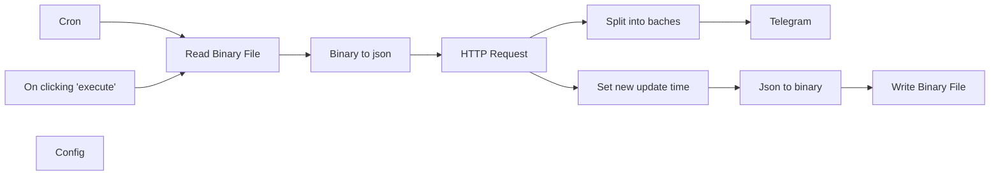

## Fluxo (.json) :

```json
{
  "nodes": [
    {
      "name": "On clicking 'execute'",
      "type": "n8n-nodes-base.manualTrigger",
      "position": [
        340,
        380
      ],
      "parameters": {},
      "typeVersion": 1
    },
    {
      "name": "Write Binary File",
      "type": "n8n-nodes-base.writeBinaryFile",
      "position": [
        1680,
        280
      ],
      "parameters": {
        "fileName": "={{$node[\"Config\"].parameter[\"values\"][\"string\"][0][\"value\"]}}"
      },
      "typeVersion": 1
    },
    {
      "name": "Read Binary File",
      "type": "n8n-nodes-base.readBinaryFile",
      "position": [
        580,
        460
      ],
      "parameters": {
        "filePath": "={{$node[\"Config\"].parameter[\"values\"][\"string\"][0][\"value\"]}}"
      },
      "typeVersion": 1,
      "continueOnFail": true,
      "alwaysOutputData": true
    },
    {
      "name": "HTTP Request",
      "type": "n8n-nodes-base.httpRequest",
      "position": [
        1020,
        460
      ],
      "parameters": {
        "url": "https://readwise.io/reader/api/state/",
        "options": {},
        "authentication": "headerAuth",
        "queryParametersUi": {
          "parameter": [
            {
              "name": "schemaVersion",
              "value": "5"
            },
            {
              "name": "filter[updated_at][gt]",
              "value": "={{$json[\"last_synced\"]}}"
            }
          ]
        },
        "headerParametersUi": {
          "parameter": []
        }
      },
      "credentials": {
        "httpHeaderAuth": {
          "id": "10",
          "name": "Header Auth account"
        }
      },
      "typeVersion": 1
    },
    {
      "name": "Telegram",
      "type": "n8n-nodes-base.telegram",
      "position": [
        1480,
        460
      ],
      "parameters": {
        "text": "={{$json[\"title\"]}} by {{$json[\"author\"]}}\n\n{{$json[\"summary\"]}}\n\n{{$json[\"url\"]}}",
        "chatId": "={{$node[\"Config\"].parameter[\"values\"][\"number\"][0][\"value\"]}}",
        "additionalFields": {}
      },
      "credentials": {
        "telegramApi": {
          "id": "2",
          "name": "my bot"
        }
      },
      "typeVersion": 1
    },
    {
      "name": "Binary to json",
      "type": "n8n-nodes-base.moveBinaryData",
      "position": [
        800,
        460
      ],
      "parameters": {
        "options": {}
      },
      "typeVersion": 1,
      "alwaysOutputData": true
    },
    {
      "name": "Json to binary",
      "type": "n8n-nodes-base.moveBinaryData",
      "position": [
        1480,
        280
      ],
      "parameters": {
        "mode": "jsonToBinary",
        "options": {}
      },
      "typeVersion": 1
    },
    {
      "name": "Set new update time",
      "type": "n8n-nodes-base.functionItem",
      "position": [
        1280,
        280
      ],
      "parameters": {
        "functionCode": "return {\n  last_synced: new Date().getTime()\n};"
      },
      "typeVersion": 1
    },
    {
      "name": "Split into baches",
      "type": "n8n-nodes-base.function",
      "position": [
        1280,
        460
      ],
      "parameters": {
        "functionCode": "const newValue = Object.values(items[0].json.documents).filter(it => it.category === 'article').filter(it => it.children.length === 0).map(it => ({\n  json: {\n      url: it.url,\n  title: it.title,\n  author: it.author,\n  summary: it.summary,\n  saved_at: new Date(it.saved_at),\n  }\n}))\n\n\nreturn newValue;"
      },
      "typeVersion": 1
    },
    {
      "name": "Cron",
      "type": "n8n-nodes-base.cron",
      "position": [
        340,
        540
      ],
      "parameters": {
        "triggerTimes": {
          "item": [
            {
              "mode": "everyX",
              "unit": "minutes",
              "value": 10
            }
          ]
        }
      },
      "typeVersion": 1
    },
    {
      "name": "Config",
      "type": "n8n-nodes-base.set",
      "position": [
        800,
        300
      ],
      "parameters": {
        "values": {
          "number": [
            {
              "name": "Telegram chat it",
              "value": 19999
            }
          ],
          "string": [
            {
              "name": "file path",
              "value": "/whatever/readwiseLastSynced.json"
            }
          ]
        },
        "options": {}
      },
      "typeVersion": 1
    }
  ],
  "connections": {
    "Cron": {
      "main": [
        [
          {
            "node": "Read Binary File",
            "type": "main",
            "index": 0
          }
        ]
      ]
    },
    "HTTP Request": {
      "main": [
        [
          {
            "node": "Split into baches",
            "type": "main",
            "index": 0
          },
          {
            "node": "Set new update time",
            "type": "main",
            "index": 0
          }
        ]
      ]
    },
    "Binary to json": {
      "main": [
        [
          {
            "node": "HTTP Request",
            "type": "main",
            "index": 0
          }
        ]
      ]
    },
    "Json to binary": {
      "main": [
        [
          {
            "node": "Write Binary File",
            "type": "main",
            "index": 0
          }
        ]
      ]
    },
    "Read Binary File": {
      "main": [
        [
          {
            "node": "Binary to json",
            "type": "main",
            "index": 0
          }
        ]
      ]
    },
    "Split into baches": {
      "main": [
        [
          {
            "node": "Telegram",
            "type": "main",
            "index": 0
          }
        ]
      ]
    },
    "Set new update time": {
      "main": [
        [
          {
            "node": "Json to binary",
            "type": "main",
            "index": 0
          }
        ]
      ]
    },
    "On clicking 'execute'": {
      "main": [
        [
          {
            "node": "Read Binary File",
            "type": "main",
            "index": 0
          }
        ]
      ]
    }
  }
}
```

<a id="template-448"></a>

## Template 448 - Converter JSON de email para CSV

- **Nome:** Converter JSON de email para CSV
- **Descrição:** Extrai um arquivo JSON recebido por email e converte os dados em um arquivo CSV salvo localmente.
- **Funcionalidade:** • Receber email com anexo JSON: Busca a mensagem de email mais recente contendo um arquivo JSON.
• Extrair conteúdo do anexo: Isola e prepara os dados binários do anexo para processamento.
• Converter JSON em planilha CSV: Converte os dados JSON em formato tabular e cria o arquivo users_spreadsheet.csv.
- **Ferramentas:** • Gmail: Conta de email usada para receber mensagens com arquivos JSON.
• Sistema de arquivos: Local ou serviço de armazenamento onde o arquivo CSV resultante é salvo (users_spreadsheet.csv).

## Fluxo visual

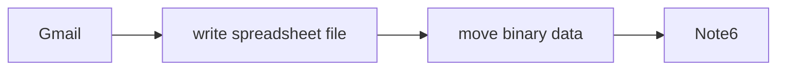

## Fluxo (.json) :

```json
{
  "nodes": [
    {
      "name": "Gmail",
      "type": "n8n-nodes-base.gmail",
      "notes": "Get email with JSON file",
      "position": [
        620,
        140
      ],
      "parameters": {
        "limit": 1,
        "operation": "getAll",
        "additionalFields": {}
      },
      "credentials": {
        "gmailOAuth2": {
          "id": "16",
          "name": "gmail"
        }
      },
      "notesInFlow": true,
      "typeVersion": 1
    },
    {
      "name": "write spreadsheet file",
      "type": "n8n-nodes-base.spreadsheetFile",
      "position": [
        980,
        140
      ],
      "parameters": {
        "options": {
          "fileName": "users_spreadsheet.csv"
        },
        "operation": "toFile",
        "fileFormat": "csv"
      },
      "typeVersion": 1
    },
    {
      "name": "move binary data ",
      "type": "n8n-nodes-base.moveBinaryData",
      "position": [
        800,
        140
      ],
      "parameters": {
        "options": {}
      },
      "typeVersion": 1
    },
    {
      "name": "Note6",
      "type": "n8n-nodes-base.stickyNote",
      "position": [
        200,
        160
      ],
      "parameters": {
        "width": 320,
        "height": 80,
        "content": "## JSON file > Sheets"
      },
      "typeVersion": 1
    }
  ],
  "connections": {
    "Gmail": {
      "main": [
        [
          {
            "node": "move binary data ",
            "type": "main",
            "index": 0
          }
        ]
      ]
    },
    "move binary data ": {
      "main": [
        [
          {
            "node": "write spreadsheet file",
            "type": "main",
            "index": 0
          }
        ]
      ]
    }
  }
}
```

<a id="template-449"></a>

## Template 449 - Qualificação automática de leads e envio de outreach por email

- **Nome:** Qualificação automática de leads e envio de outreach por email
- **Descrição:** Captura leads de um formulário, valida o email, pontua o fit do cliente, registra o engajamento no CRM e envia um email de prospecção quando o lead for relevante.
- **Funcionalidade:** • Captura de lead via formulário: inicia o fluxo a partir da submissão de um formulário web.
• Verificação de email: valida se o endereço fornecido é válido antes de prosseguir.
• Filtragem de emails inválidos: interrompe o processo para emails considerados inválidos.
• Pontuação de fit do cliente: consulta um serviço externo para obter um score de adequação do lead.
• Avaliação condicional por score: encaminha apenas leads com score alto (por exemplo, >60) para ações de follow-up.
• Busca/associação no CRM: pesquisa o contato pelo email no CRM e obtém/define identificadores necessários.
• Preparação e envio de email de outreach: monta assunto e corpo do email e envia ao lead qualificado.
• Registro de engajamento no CRM: cria um registro de email/engajamento associado ao contato no CRM.
• Modo de teste do formulário: permite submeter dados de teste para validar o fluxo antes de ativar em produção.
- **Ferramentas:** • Serviço de formulário/webhook: coleta submissões de leads a partir de um formulário web.
• Hunter: serviço de verificação de validade de endereços de email.
• MadKudu: plataforma de lead scoring para avaliar o fit do cliente.
• HubSpot: CRM usado para buscar/associar contatos e registrar engajamentos (emails enviados).
• Gmail: provedor de email usado para enviar as mensagens de outreach.
• Calendly: link de agendamento incluído no corpo do email para facilitar marcação de reuniões.

## Fluxo visual

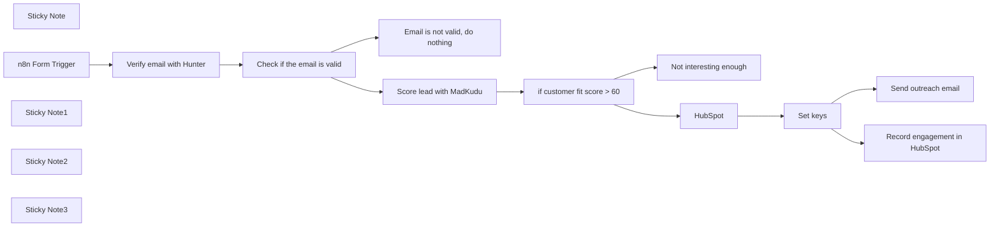

## Fluxo (.json) :

```json
{
  "nodes": [
    {
      "id": "3890c4a4-0649-457f-9dd7-1e688f4a0024",
      "name": "Sticky Note",
      "type": "n8n-nodes-base.stickyNote",
      "position": [
        320,
        160
      ],
      "parameters": {
        "color": 5,
        "width": 731,
        "height": 210.61602497398542,
        "content": "### 👨‍🎤 Setup\n1. Add you **MadKudu**, **Hunter**, and **Gmail** credentials \n2. Setup your **HubSpot** Oauth2 creds using [n8n docs](https://docs.n8n.io/integrations/builtin/trigger-nodes/n8n-nodes-base.hubspottrigger/)\n3. Set the email content and subject\n4. Click the Test Workflow button, enter your email and check the Slack channel\n5. Activate the workflow and use the form trigger production URL to collect your leads in a smart way "
      },
      "typeVersion": 1
    },
    {
      "id": "77a064c2-852b-4526-aa8b-9a25d3a56844",
      "name": "n8n Form Trigger",
      "type": "n8n-nodes-base.formTrigger",
      "position": [
        380,
        420
      ],
      "webhookId": "09f63412-7c4a-4752-93cd-ff1c87774226",
      "parameters": {
        "path": "0bf8840f-1cc4-46a9-86af-a3fa8da80608",
        "options": {},
        "formTitle": "Contact us",
        "formFields": {
          "values": [
            {
              "fieldLabel": "What's your business email?"
            }
          ]
        },
        "formDescription": "We'll get back to you soon"
      },
      "typeVersion": 2
    },
    {
      "id": "9e0ea519-0022-4b9b-853a-6d627f2d427b",
      "name": "Check if the email is valid",
      "type": "n8n-nodes-base.if",
      "position": [
        800,
        420
      ],
      "parameters": {
        "options": {},
        "conditions": {
          "options": {
            "leftValue": "",
            "caseSensitive": true,
            "typeValidation": "strict"
          },
          "combinator": "and",
          "conditions": [
            {
              "id": "54d84c8a-63ee-40ed-8fb2-301fff0194ba",
              "operator": {
                "name": "filter.operator.equals",
                "type": "string",
                "operation": "equals"
              },
              "leftValue": "={{ $json.status }}",
              "rightValue": "valid"
            }
          ]
        }
      },
      "typeVersion": 2
    },
    {
      "id": "431c30eb-f9c8-4487-b75c-ee5fcf51a401",
      "name": "Sticky Note1",
      "type": "n8n-nodes-base.stickyNote",
      "position": [
        380,
        560
      ],
      "parameters": {
        "color": 7,
        "width": 162,
        "height": 139,
        "content": "👆 You can exchange this with any form you like (*e.g. Typeform, Google forms, Survey Monkey...*)"
      },
      "typeVersion": 1
    },
    {
      "id": "eed9a59d-f0a7-4c0c-a36d-1258580f4fac",
      "name": "Sticky Note2",
      "type": "n8n-nodes-base.stickyNote",
      "position": [
        1360,
        500
      ],
      "parameters": {
        "color": 7,
        "width": 162,
        "height": 84,
        "content": "👆 Adjust the fit as you see necessary"
      },
      "typeVersion": 1
    },
    {
      "id": "e57ed336-8c89-453a-8632-1ea6ec6c5617",
      "name": "Email is not valid, do nothing",
      "type": "n8n-nodes-base.noOp",
      "position": [
        1140,
        560
      ],
      "parameters": {},
      "typeVersion": 1
    },
    {
      "id": "7588462f-7e6c-4273-bead-9ae3d362e341",
      "name": "Score lead with MadKudu",
      "type": "n8n-nodes-base.httpRequest",
      "position": [
        1140,
        320
      ],
      "parameters": {
        "url": "=https://api.madkudu.com/v1/persons?email={{ $json.email }}",
        "options": {},
        "authentication": "genericCredentialType",
        "genericAuthType": "httpHeaderAuth"
      },
      "credentials": {
        "httpHeaderAuth": {
          "id": "71W5Bt9g1G9GOhVL",
          "name": "MadKudu Lead score"
        }
      },
      "typeVersion": 4.1
    },
    {
      "id": "eac6b41d-fe4f-4cf4-92f5-6a00dcb68c4d",
      "name": "Verify email with Hunter",
      "type": "n8n-nodes-base.hunter",
      "position": [
        600,
        420
      ],
      "parameters": {
        "email": "={{ $json['What\\'s your business email?'] }}",
        "operation": "emailVerifier"
      },
      "credentials": {
        "hunterApi": {
          "id": "ecwmdHFSBU5GGnV1",
          "name": "Hunter account"
        }
      },
      "typeVersion": 1
    },
    {
      "id": "51c86cbb-2a43-4ced-9787-6c95db62f390",
      "name": "Not interesting enough",
      "type": "n8n-nodes-base.noOp",
      "position": [
        1660,
        460
      ],
      "parameters": {},
      "typeVersion": 1
    },
    {
      "id": "9f0daa67-6685-44b5-a802-8b70f8b91985",
      "name": "if customer fit score > 60",
      "type": "n8n-nodes-base.if",
      "position": [
        1380,
        320
      ],
      "parameters": {
        "options": {},
        "conditions": {
          "options": {
            "leftValue": "",
            "caseSensitive": true,
            "typeValidation": "strict"
          },
          "combinator": "and",
          "conditions": [
            {
              "id": "c23d7b34-a4ae-421f-bd7a-6a3ebb05aafe",
              "operator": {
                "type": "number",
                "operation": "gt"
              },
              "leftValue": "={{ $json.properties.customer_fit.score }}",
              "rightValue": 60
            }
          ]
        }
      },
      "typeVersion": 2
    },
    {
      "id": "57bf0a97-bf58-43cc-8ab5-e3f298eac5f6",
      "name": "Send outreach email",
      "type": "n8n-nodes-base.gmail",
      "position": [
        2100,
        120
      ],
      "parameters": {
        "sendTo": "={{ $json.to }}",
        "message": "={{ $json.html }}",
        "options": {
          "senderName": "Mutasem from n8n",
          "appendAttribution": false
        },
        "subject": "={{ $json.subject }}"
      },
      "credentials": {
        "gmailOAuth2": {
          "id": "rd2agqPeJBD2377h",
          "name": "Work Gmail"
        }
      },
      "typeVersion": 2.1
    },
    {
      "id": "a93ee7c1-4b77-45ed-9eb8-2757fbeb2b78",
      "name": "Set keys",
      "type": "n8n-nodes-base.set",
      "position": [
        1840,
        260
      ],
      "parameters": {
        "options": {},
        "assignments": {
          "assignments": [
            {
              "id": "f3ecc873-2d60-4f2d-bc40-81f9379c725b",
              "name": "html",
              "type": "string",
              "value": "=Hello,\n\nThank you for filling out our form. We are excited to be able to help you.\n\nFeel free to schedle a 30-minute call with me here: www.calendly.com/schedule/mutasem\n\nCheers,\n\nMutasem"
            },
            {
              "id": "9f4f5b68-984b-415e-a110-a35ded22dd41",
              "name": "subject",
              "type": "string",
              "value": "Why n8n?"
            },
            {
              "id": "5362aa67-f3fa-4a6e-b6e8-4c50cc7a3192",
              "name": "to",
              "type": "string",
              "value": "={{ $json.properties.email.value }}"
            },
            {
              "id": "ec4ccaef-374f-4fbc-9dda-3b743a00a146",
              "name": "id",
              "type": "number",
              "value": "={{ $json.vid }}"
            }
          ]
        }
      },
      "typeVersion": 3.3
    },
    {
      "id": "f04e7151-b4c9-4294-8e3e-24830e601d6b",
      "name": "Record engagement in HubSpot",
      "type": "n8n-nodes-base.hubspot",
      "position": [
        2100,
        420
      ],
      "parameters": {
        "type": "email",
        "metadata": {
          "html": "={{ $json.html }}",
          "subject": "={{ $json.subject }}",
          "toEmail": [
            "={{ $json.to }}"
          ],
          "firstName": "Mutasem",
          "fromEmail": "mutasem@n8n.io"
        },
        "resource": "engagement",
        "authentication": "oAuth2",
        "additionalFields": {
          "associations": {
            "contactIds": "={{ $json.id }}"
          }
        }
      },
      "credentials": {
        "hubspotOAuth2Api": {
          "id": "Gxwfj6z9NwaEC3P5",
          "name": "HubSpot account 3"
        }
      },
      "typeVersion": 2
    },
    {
      "id": "92bd62d3-7180-4da6-a52b-31048b48b983",
      "name": "Sticky Note3",
      "type": "n8n-nodes-base.stickyNote",
      "position": [
        1820,
        160
      ],
      "parameters": {
        "color": 7,
        "width": 162,
        "height": 84,
        "content": "👇🏽  Change the content here"
      },
      "typeVersion": 1
    },
    {
      "id": "cab7bcd9-67af-4cf0-988d-fb2b37b3db8f",
      "name": "HubSpot",
      "type": "n8n-nodes-base.hubspot",
      "position": [
        1620,
        180
      ],
      "parameters": {
        "email": "={{ $json.email }}",
        "options": {},
        "authentication": "oAuth2",
        "additionalFields": {}
      },
      "credentials": {
        "hubspotOAuth2Api": {
          "id": "Gxwfj6z9NwaEC3P5",
          "name": "HubSpot account 3"
        }
      },
      "typeVersion": 2
    }
  ],
  "pinData": {
    "n8n Form Trigger": [
      {
        "formMode": "test",
        "submittedAt": "2024-02-22T13:59:54.709Z",
        "What's your business email?": "jan@n8n.io"
      }
    ]
  },
  "connections": {
    "HubSpot": {
      "main": [
        [
          {
            "node": "Set keys",
            "type": "main",
            "index": 0
          }
        ]
      ]
    },
    "Set keys": {
      "main": [
        [
          {
            "node": "Send outreach email",
            "type": "main",
            "index": 0
          },
          {
            "node": "Record engagement in HubSpot",
            "type": "main",
            "index": 0
          }
        ]
      ]
    },
    "n8n Form Trigger": {
      "main": [
        [
          {
            "node": "Verify email with Hunter",
            "type": "main",
            "index": 0
          }
        ]
      ]
    },
    "Score lead with MadKudu": {
      "main": [
        [
          {
            "node": "if customer fit score > 60",
            "type": "main",
            "index": 0
          }
        ]
      ]
    },
    "Verify email with Hunter": {
      "main": [
        [
          {
            "node": "Check if the email is valid",
            "type": "main",
            "index": 0
          }
        ]
      ]
    },
    "if customer fit score > 60": {
      "main": [
        [
          {
            "node": "HubSpot",
            "type": "main",
            "index": 0
          }
        ],
        [
          {
            "node": "Not interesting enough",
            "type": "main",
            "index": 0
          }
        ]
      ]
    },
    "Check if the email is valid": {
      "main": [
        [
          {
            "node": "Score lead with MadKudu",
            "type": "main",
            "index": 0
          }
        ],
        [
          {
            "node": "Email is not valid, do nothing",
            "type": "main",
            "index": 0
          }
        ]
      ]
    }
  }
}
```

<a id="template-450"></a>

## Template 450 - Sincronizar Liked Songs para Playlist

- **Nome:** Sincronizar Liked Songs para Playlist
- **Descrição:** Sincroniza automaticamente as músicas curtidas do usuário com uma playlist alvo, adicionando faixas faltantes e removendo as que deixaram de ser curtidas.
- **Funcionalidade:** • Agendamento diário: inicia a sincronização automaticamente em horário agendado (ex.: todo dia à meia-noite).
• Leitura das músicas curtidas: obtém todas as faixas presentes em "Liked Songs" do usuário.
• Localização da playlist alvo: identifica a playlist de destino pelo nome configurado em variável.
• Comparação de conteúdos: compara URIs das faixas entre a lista de músicas curtidas e a playlist alvo para detectar diferenças.
• Adição de faixas faltantes: adiciona à playlist as faixas que estão curtidas mas ausentes na playlist.
• Remoção de faixas não curtidas: remove da playlist as faixas que não constam mais nas músicas curtidas.
• Contagem e notificações: contabiliza quantas faixas foram adicionadas e removidas e envia resumos de execução.
• Registro de duração: registra o timestamp de início para calcular o tempo total da sincronização.
- **Ferramentas:** • Spotify: plataforma de streaming usada para ler as músicas curtidas do usuário, listar playlists e adicionar/remover faixas na playlist alvo.
• Gotify: serviço de notificações utilizado para enviar mensagens de resumo sobre músicas adicionadas e removidas.

## Fluxo visual

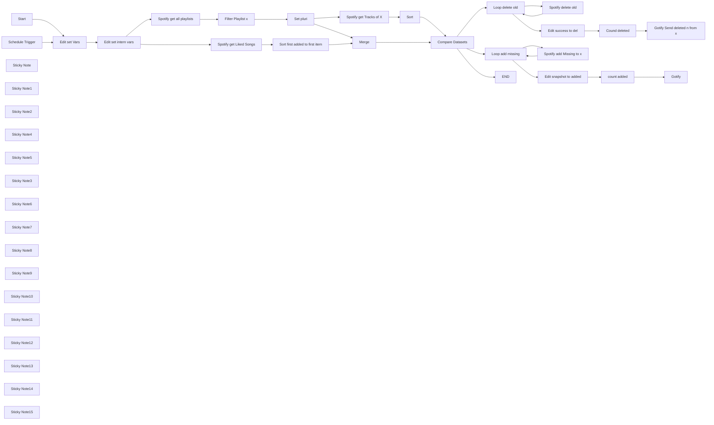

## Fluxo (.json) :

```json
{
  "id": "gemC8tYGZk3LtBHG",
  "meta": {
    "instanceId": "14252f55409b74bfbc2ebbc1f88f70ee3158c04314bae8b95b4a969a5a5972e3",
    "templateCredsSetupCompleted": false
  },
  "name": "Spotify Sync Liked Songs to Playlist",
  "tags": [
    {
      "id": "TYGC4owzlQuowxvB",
      "name": "Spotify",
      "createdAt": "2024-03-14T16:54:47.712Z",
      "updatedAt": "2024-03-14T16:54:47.712Z"
    }
  ],
  "nodes": [
    {
      "id": "7767a08e-43f0-4c07-968c-06dab188bf86",
      "name": "Start",
      "type": "n8n-nodes-base.manualTrigger",
      "position": [
        160,
        220
      ],
      "parameters": {},
      "typeVersion": 1
    },
    {
      "id": "9193f532-335e-4a6a-886e-64849f6fab55",
      "name": "Schedule Trigger",
      "type": "n8n-nodes-base.scheduleTrigger",
      "position": [
        180,
        -100
      ],
      "parameters": {
        "rule": {
          "interval": [
            {}
          ]
        }
      },
      "typeVersion": 1.1
    },
    {
      "id": "41cffeb0-9dd5-4f71-8519-19f7339e2102",
      "name": "Sort first added to first item",
      "type": "n8n-nodes-base.sort",
      "position": [
        1480,
        -60
      ],
      "parameters": {
        "options": {},
        "sortFieldsUi": {
          "sortField": [
            {
              "fieldName": "added_at"
            }
          ]
        }
      },
      "typeVersion": 1
    },
    {
      "id": "ed77edb1-25d4-4330-a6ad-3864117172e3",
      "name": "Gotify Send deleted n from x",
      "type": "n8n-nodes-base.gotify",
      "position": [
        3540,
        220
      ],
      "parameters": {
        "message": "=### Sync of Lieblingssongs to {{ $('Edit set Vars').item.json.varplaylistto }} finished.\n#### Deleted {{ $json.count_del }} Songs in {{ (($now.toUnixInteger()-$('Edit set intern vars').item.json.timestart)/60).toFixed(1) }} Minutes from {{ $('Edit set Vars').item.json.varplaylistto }}.",
        "options": {
          "contentType": "text/markdown"
        },
        "additionalFields": {}
      },
      "typeVersion": 1
    },
    {
      "id": "f9e03838-03ea-44de-b3d5-6adb94f2324b",
      "name": "Loop delete old",
      "type": "n8n-nodes-base.splitInBatches",
      "position": [
        2560,
        300
      ],
      "parameters": {
        "options": {}
      },
      "typeVersion": 3
    },
    {
      "id": "2aa10aab-fd65-4be3-95da-2471bacde57c",
      "name": "Spotify delete old",
      "type": "n8n-nodes-base.spotify",
      "position": [
        2820,
        320
      ],
      "parameters": {
        "id": "={{ $('Set pluri').item.json.setpluri }}",
        "trackID": "={{ $json.track.uri }}",
        "resource": "playlist",
        "operation": "delete"
      },
      "typeVersion": 1,
      "alwaysOutputData": false
    },
    {
      "id": "71a4391d-280b-4cbc-be5b-16f9bb02c161",
      "name": "Edit set Vars",
      "type": "n8n-nodes-base.set",
      "position": [
        480,
        100
      ],
      "parameters": {
        "options": {},
        "assignments": {
          "assignments": [
            {
              "id": "1bacf493-c2bf-47f8-bcb4-a83010d8da57",
              "name": "varplaylistto",
              "type": "string",
              "value": "CHANGE MEEEEEEEEE"
            }
          ]
        }
      },
      "typeVersion": 3.3
    },
    {
      "id": "b0f18395-2bee-4e92-8905-a2faf8b8617b",
      "name": "Edit success to del",
      "type": "n8n-nodes-base.set",
      "position": [
        3180,
        240
      ],
      "parameters": {
        "options": {},
        "assignments": {
          "assignments": [
            {
              "id": "2aab653d-b7ee-4d50-b8e5-fcae0c0da1f4",
              "name": "del",
              "type": "string",
              "value": "={{ $json.success }}"
            }
          ]
        }
      },
      "typeVersion": 3.3
    },
    {
      "id": "d205de9e-fefd-4a9b-933b-932e19873ee3",
      "name": "Filter Playlist x",
      "type": "n8n-nodes-base.filter",
      "position": [
        1480,
        160
      ],
      "parameters": {
        "options": {},
        "conditions": {
          "options": {
            "version": 1,
            "leftValue": "",
            "caseSensitive": true,
            "typeValidation": "strict"
          },
          "combinator": "and",
          "conditions": [
            {
              "id": "0665f0f3-fb32-4391-b1a9-ce1dee887392",
              "operator": {
                "name": "filter.operator.equals",
                "type": "string",
                "operation": "equals"
              },
              "leftValue": "={{ $json.name }}",
              "rightValue": "={{ $('Edit set Vars').item.json.varplaylistto }}"
            }
          ]
        }
      },
      "typeVersion": 2
    },
    {
      "id": "5f81aa3f-631d-41c8-aaf7-0bced69ecb7a",
      "name": "Compare Datasets",
      "type": "n8n-nodes-base.compareDatasets",
      "position": [
        2260,
        20
      ],
      "parameters": {
        "options": {},
        "mergeByFields": {
          "values": [
            {
              "field1": "track.uri",
              "field2": "track.uri"
            }
          ]
        }
      },
      "typeVersion": 2.3
    },
    {
      "id": "7c86ca31-1e78-47d2-8c97-b796aa9b3eff",
      "name": "count added",
      "type": "n8n-nodes-base.summarize",
      "position": [
        3320,
        -280
      ],
      "parameters": {
        "options": {},
        "fieldsToSummarize": {
          "values": [
            {
              "field": "added"
            }
          ]
        }
      },
      "typeVersion": 1
    },
    {
      "id": "80e6c5f5-6ca1-44a5-8f6a-2181854f3ad8",
      "name": "Loop add missing",
      "type": "n8n-nodes-base.splitInBatches",
      "position": [
        2560,
        -240
      ],
      "parameters": {
        "options": {}
      },
      "executeOnce": false,
      "typeVersion": 3
    },
    {
      "id": "399c4489-82d3-4ca4-b875-5a3988cc1e56",
      "name": "Spotify add Missing to x",
      "type": "n8n-nodes-base.spotify",
      "position": [
        2740,
        -200
      ],
      "parameters": {
        "id": "={{ $json.setpluri }}",
        "trackID": "={{ $json.track.uri }}",
        "resource": "playlist",
        "additionalFields": {}
      },
      "retryOnFail": true,
      "typeVersion": 1,
      "alwaysOutputData": false
    },
    {
      "id": "598693f1-9716-45b7-a53b-d4b16a9dbd5d",
      "name": "Edit snapshot to added",
      "type": "n8n-nodes-base.set",
      "position": [
        3160,
        -280
      ],
      "parameters": {
        "options": {},
        "assignments": {
          "assignments": [
            {
              "id": "2aab653d-b7ee-4d50-b8e5-fcae0c0da1f4",
              "name": "added",
              "type": "string",
              "value": "={{ $json.snapshot_id }}"
            }
          ]
        }
      },
      "typeVersion": 3.3
    },
    {
      "id": "29b6f2c3-7c03-4c22-9c40-12224adc36a9",
      "name": "Sticky Note",
      "type": "n8n-nodes-base.stickyNote",
      "position": [
        2480,
        -380
      ],
      "parameters": {
        "color": 7,
        "width": 552.0433138756023,
        "height": 424.7557420711291,
        "content": "### Spotify add all missing song from your Liked Songs to the Playlist."
      },
      "typeVersion": 1
    },
    {
      "id": "2e6b61ee-67dd-473f-aca6-4bf81d348474",
      "name": "Sticky Note1",
      "type": "n8n-nodes-base.stickyNote",
      "position": [
        2480,
        140
      ],
      "parameters": {
        "color": 7,
        "width": 526.4961431470259,
        "height": 334.0270849934536,
        "content": "### Spotify remove all songs that aren't in your Liked Songs anymore."
      },
      "typeVersion": 1
    },
    {
      "id": "a7a32504-0805-4898-a054-3a9d1cbfdf00",
      "name": "Sticky Note2",
      "type": "n8n-nodes-base.stickyNote",
      "position": [
        120,
        -180
      ],
      "parameters": {
        "color": 7,
        "width": 208.40632224018503,
        "height": 218.09160104224037,
        "content": "Run the workflow every 24h at 0 o'clock"
      },
      "typeVersion": 1
    },
    {
      "id": "240bb516-434c-4050-af5c-8ecf3c270077",
      "name": "Sticky Note4",
      "type": "n8n-nodes-base.stickyNote",
      "position": [
        1280,
        -202
      ],
      "parameters": {
        "color": 7,
        "width": 961.006341450897,
        "height": 611.5473181162548,
        "content": "## Compare the content of your Liked Songs and the target Playlist "
      },
      "typeVersion": 1
    },
    {
      "id": "cd4fe1c5-88da-4925-b95e-a03c9cfb14fc",
      "name": "Sticky Note5",
      "type": "n8n-nodes-base.stickyNote",
      "position": [
        420,
        -80
      ],
      "parameters": {
        "color": 3,
        "width": 365.4656320955345,
        "height": 271.1720790719926,
        "content": "# Edit here!"
      },
      "typeVersion": 1
    },
    {
      "id": "aa447ed6-9522-4f25-b0b6-7c8592b3d71a",
      "name": "Sticky Note3",
      "type": "n8n-nodes-base.stickyNote",
      "position": [
        380,
        -20
      ],
      "parameters": {
        "width": 362.28928697919184,
        "height": 267.99573395564994,
        "content": "## Change the value to the name of your target playlist."
      },
      "typeVersion": 1
    },
    {
      "id": "a7fd9f12-3f06-4613-9797-2cd754af4e44",
      "name": "Cound deleted",
      "type": "n8n-nodes-base.summarize",
      "position": [
        3320,
        231
      ],
      "parameters": {
        "options": {},
        "fieldsToSummarize": {
          "values": [
            {
              "field": "del"
            }
          ]
        }
      },
      "typeVersion": 1
    },
    {
      "id": "ebdc4b9d-09a9-4a41-b2a3-f9488decafd7",
      "name": "Sort",
      "type": "n8n-nodes-base.sort",
      "position": [
        2100,
        160
      ],
      "parameters": {
        "options": {
          "disableDotNotation": false
        },
        "sortFieldsUi": {
          "sortField": [
            {
              "fieldName": "added_at"
            }
          ]
        }
      },
      "typeVersion": 1
    },
    {
      "id": "1285f8fd-423a-418f-9ba0-b2e43f3f55d7",
      "name": "Set pluri",
      "type": "n8n-nodes-base.set",
      "position": [
        1680,
        160
      ],
      "parameters": {
        "options": {},
        "assignments": {
          "assignments": [
            {
              "id": "f1589697-556f-451d-aada-55d2b0892eb2",
              "name": "setpluri",
              "type": "string",
              "value": "={{ $json.uri }}"
            }
          ]
        }
      },
      "typeVersion": 3.3
    },
    {
      "id": "55e994d9-cb66-4a30-9cda-ec373f5135a7",
      "name": "Merge",
      "type": "n8n-nodes-base.merge",
      "position": [
        1700,
        -60
      ],
      "parameters": {
        "mode": "combine",
        "options": {},
        "combinationMode": "multiplex"
      },
      "typeVersion": 2.1
    },
    {
      "id": "83e47b30-dc30-4978-9de4-087f711f05b3",
      "name": "Gotify",
      "type": "n8n-nodes-base.gotify",
      "position": [
        3520,
        -300
      ],
      "parameters": {
        "message": "=### Sync of Liked Songs to {{ $('Edit set Vars').item.json.varplaylistto }} finished.\n#### Added {{ $('count added').item.json.count_added }} Songs in {{ (($now.toUnixInteger()-$('Edit set intern vars').item.json.timestart)/60).toFixed(1) }} Minutes to {{ $('Edit set Vars').item.json.varplaylistto }}.",
        "options": {
          "contentType": "text/markdown"
        },
        "additionalFields": {}
      },
      "typeVersion": 1
    },
    {
      "id": "d58f4a88-d760-4d6f-a43f-d38575b5fa64",
      "name": "Edit set intern vars",
      "type": "n8n-nodes-base.set",
      "position": [
        880,
        80
      ],
      "parameters": {
        "options": {},
        "assignments": {
          "assignments": [
            {
              "id": "88b47bd3-d1b6-4c7d-bec2-1606d8c39bde",
              "name": "timestart",
              "type": "string",
              "value": "={{ $now.toUnixInteger()}}"
            }
          ]
        }
      },
      "typeVersion": 3.3
    },
    {
      "id": "5bfaaa09-5310-49af-be6b-df0495eebefc",
      "name": "Sticky Note6",
      "type": "n8n-nodes-base.stickyNote",
      "position": [
        1120,
        -150
      ],
      "parameters": {
        "color": 3,
        "width": 326.5743290776694,
        "height": 513.8509299486715,
        "content": "# Edit here!"
      },
      "typeVersion": 1
    },
    {
      "id": "0e47be4b-668b-4167-a191-2680f5750798",
      "name": "Sticky Note7",
      "type": "n8n-nodes-base.stickyNote",
      "position": [
        1080,
        -87
      ],
      "parameters": {
        "width": 331.1762445648999,
        "height": 481.41944245487934,
        "content": "### You need to add your own spotify account here."
      },
      "typeVersion": 1
    },
    {
      "id": "b15d1e35-03bc-4ee9-b425-38b73f832807",
      "name": "END",
      "type": "n8n-nodes-base.noOp",
      "position": [
        2580,
        0
      ],
      "parameters": {},
      "typeVersion": 1
    },
    {
      "id": "2ea585b8-645b-499d-8bef-9579f7283a38",
      "name": "Sticky Note8",
      "type": "n8n-nodes-base.stickyNote",
      "position": [
        3140,
        131
      ],
      "parameters": {
        "color": 5,
        "width": 322.2176178216457,
        "height": 271.6789308744022,
        "content": "## (Optional) \n### Count the number of songs that were deleted"
      },
      "typeVersion": 1
    },
    {
      "id": "bec19dea-11f6-4ac3-96c2-5b0b13079cab",
      "name": "Sticky Note9",
      "type": "n8n-nodes-base.stickyNote",
      "position": [
        3120,
        -400
      ],
      "parameters": {
        "color": 5,
        "width": 322.2176178216457,
        "height": 271.6789308744022,
        "content": "## (Optional) \n### Count the number of songs that were added"
      },
      "typeVersion": 1
    },
    {
      "id": "44731884-1a40-49ca-bdc8-08f135e97fba",
      "name": "Sticky Note10",
      "type": "n8n-nodes-base.stickyNote",
      "position": [
        1840,
        37
      ],
      "parameters": {
        "color": 3,
        "width": 210.26363071246638,
        "height": 252.15185862696416,
        "content": "# Edit here!"
      },
      "typeVersion": 1
    },
    {
      "id": "e9654402-2c58-458e-a235-ed1dd09bbc61",
      "name": "Sticky Note11",
      "type": "n8n-nodes-base.stickyNote",
      "position": [
        1800,
        100
      ],
      "parameters": {
        "width": 223.1734532257829,
        "height": 240.4901386983871,
        "content": "### You need to add your own spotify account here."
      },
      "typeVersion": 1
    },
    {
      "id": "2d924a96-a313-448d-b563-abd4c56e8af9",
      "name": "Sticky Note12",
      "type": "n8n-nodes-base.stickyNote",
      "position": [
        2800,
        180
      ],
      "parameters": {
        "color": 3,
        "width": 210.26363071246638,
        "height": 252.15185862696416,
        "content": "# Edit here!"
      },
      "typeVersion": 1
    },
    {
      "id": "9cbe2e02-7e5d-47b8-a333-5d09767790d6",
      "name": "Sticky Note13",
      "type": "n8n-nodes-base.stickyNote",
      "position": [
        2760,
        240
      ],
      "parameters": {
        "width": 223.1734532257829,
        "height": 240.4901386983871,
        "content": "### You need to add your own spotify account here."
      },
      "typeVersion": 1
    },
    {
      "id": "f1d30def-79d5-4efe-9f24-d36866e971ee",
      "name": "Sticky Note14",
      "type": "n8n-nodes-base.stickyNote",
      "position": [
        2740,
        -340
      ],
      "parameters": {
        "color": 3,
        "width": 210.26363071246638,
        "height": 252.15185862696416,
        "content": "# Edit here!"
      },
      "typeVersion": 1
    },
    {
      "id": "957dc82b-6fe0-4018-add9-d904b8a1af9f",
      "name": "Sticky Note15",
      "type": "n8n-nodes-base.stickyNote",
      "position": [
        2700,
        -280
      ],
      "parameters": {
        "width": 223.1734532257829,
        "height": 240.4901386983871,
        "content": "### You need to add your own spotify account here."
      },
      "typeVersion": 1
    },
    {
      "id": "b63c2dcc-da0c-4074-bfa5-69aaeaa9e1db",
      "name": "Spotify get Liked Songs",
      "type": "n8n-nodes-base.spotify",
      "position": [
        1160,
        -20
      ],
      "parameters": {
        "resource": "library",
        "returnAll": true
      },
      "typeVersion": 1
    },
    {
      "id": "808389ac-65a8-444f-99a7-08eab4b48b3e",
      "name": "Spotify get all playlists",
      "type": "n8n-nodes-base.spotify",
      "position": [
        1160,
        200
      ],
      "parameters": {
        "resource": "playlist",
        "operation": "getUserPlaylists",
        "returnAll": true
      },
      "typeVersion": 1
    },
    {
      "id": "6232b653-27ba-4986-9f53-b5d9dfa2e6b8",
      "name": "Spotify get Tracks of X",
      "type": "n8n-nodes-base.spotify",
      "position": [
        1880,
        160
      ],
      "parameters": {
        "id": "={{ $json.setpluri }}",
        "resource": "playlist",
        "operation": "getTracks",
        "returnAll": true
      },
      "typeVersion": 1,
      "alwaysOutputData": false
    }
  ],
  "active": false,
  "pinData": {},
  "settings": {
    "timezone": "Europe/Berlin",
    "executionOrder": "v1"
  },
  "versionId": "04d88525-7f76-435b-b70c-a7ace2517815",
  "connections": {
    "Sort": {
      "main": [
        [
          {
            "node": "Compare Datasets",
            "type": "main",
            "index": 1
          }
        ]
      ]
    },
    "Merge": {
      "main": [
        [
          {
            "node": "Compare Datasets",
            "type": "main",
            "index": 0
          }
        ]
      ]
    },
    "Start": {
      "main": [
        [
          {
            "node": "Edit set Vars",
            "type": "main",
            "index": 0
          }
        ]
      ]
    },
    "Set pluri": {
      "main": [
        [
          {
            "node": "Spotify get Tracks of X",
            "type": "main",
            "index": 0
          },
          {
            "node": "Merge",
            "type": "main",
            "index": 1
          }
        ]
      ]
    },
    "count added": {
      "main": [
        [
          {
            "node": "Gotify",
            "type": "main",
            "index": 0
          }
        ]
      ]
    },
    "Cound deleted": {
      "main": [
        [
          {
            "node": "Gotify Send deleted n from x",
            "type": "main",
            "index": 0
          }
        ]
      ]
    },
    "Edit set Vars": {
      "main": [
        [
          {
            "node": "Edit set intern vars",
            "type": "main",
            "index": 0
          }
        ]
      ]
    },
    "Loop delete old": {
      "main": [
        [
          {
            "node": "Edit success to del",
            "type": "main",
            "index": 0
          }
        ],
        [
          {
            "node": "Spotify delete old",
            "type": "main",
            "index": 0
          }
        ]
      ]
    },
    "Compare Datasets": {
      "main": [
        [
          {
            "node": "Loop add missing",
            "type": "main",
            "index": 0
          }
        ],
        [
          {
            "node": "END",
            "type": "main",
            "index": 0
          }
        ],
        [
          {
            "node": "END",
            "type": "main",
            "index": 0
          }
        ],
        [
          {
            "node": "Loop delete old",
            "type": "main",
            "index": 0
          }
        ]
      ]
    },
    "Loop add missing": {
      "main": [
        [
          {
            "node": "Edit snapshot to added",
            "type": "main",
            "index": 0
          }
        ],
        [
          {
            "node": "Spotify add Missing to x",
            "type": "main",
            "index": 0
          }
        ]
      ]
    },
    "Schedule Trigger": {
      "main": [
        [
          {
            "node": "Edit set Vars",
            "type": "main",
            "index": 0
          }
        ]
      ]
    },
    "Filter Playlist x": {
      "main": [
        [
          {
            "node": "Set pluri",
            "type": "main",
            "index": 0
          }
        ]
      ]
    },
    "Spotify delete old": {
      "main": [
        [
          {
            "node": "Loop delete old",
            "type": "main",
            "index": 0
          }
        ]
      ]
    },
    "Edit success to del": {
      "main": [
        [
          {
            "node": "Cound deleted",
            "type": "main",
            "index": 0
          }
        ]
      ]
    },
    "Edit set intern vars": {
      "main": [
        [
          {
            "node": "Spotify get Liked Songs",
            "type": "main",
            "index": 0
          },
          {
            "node": "Spotify get all playlists",
            "type": "main",
            "index": 0
          }
        ]
      ]
    },
    "Edit snapshot to added": {
      "main": [
        [
          {
            "node": "count added",
            "type": "main",
            "index": 0
          }
        ]
      ]
    },
    "Spotify get Liked Songs": {
      "main": [
        [
          {
            "node": "Sort first added to first item",
            "type": "main",
            "index": 0
          }
        ]
      ]
    },
    "Spotify get Tracks of X": {
      "main": [
        [
          {
            "node": "Sort",
            "type": "main",
            "index": 0
          }
        ]
      ]
    },
    "Spotify add Missing to x": {
      "main": [
        [
          {
            "node": "Loop add missing",
            "type": "main",
            "index": 0
          }
        ]
      ]
    },
    "Spotify get all playlists": {
      "main": [
        [
          {
            "node": "Filter Playlist x",
            "type": "main",
            "index": 0
          }
        ]
      ]
    },
    "Sort first added to first item": {
      "main": [
        [
          {
            "node": "Merge",
            "type": "main",
            "index": 0
          }
        ]
      ]
    }
  }
}
```

<a id="template-451"></a>

## Template 451 - Extrair e resumir artigos da Wikipedia

- **Nome:** Extrair e resumir artigos da Wikipedia
- **Descrição:** Extrai o conteúdo de uma página da Wikipedia usando Bright Data, formata o texto com um modelo de linguagem e gera um resumo conciso, enviando o resultado para um webhook.
- **Funcionalidade:** • Acionamento manual: Inicia o fluxo manualmente para testar a extração e resumo.
• Configuração de URL e zona Bright Data: Define a página da Wikipedia alvo e a zona do Bright Data para scraping.
• Requisição via Bright Data: Solicita a página web através da API do Bright Data e recebe o HTML bruto.
• Extração e formatação com LLM: Converte o HTML em conteúdo legível e estruturado usando um modelo de linguagem.
• Geração de resumo conciso: Resume o conteúdo extraído em um texto curto e objetivo, usando chunking avançado para textos longos.
• Notificação via webhook: Envia o resumo final a um endpoint HTTP configurável.
• Suporte a troca de modelo: Permite substituir o modelo de linguagem por outros provedores conforme necessidade.
- **Ferramentas:** • Wikipedia: Fonte pública de conteúdo a ser extraído.
• Bright Data: Serviço de scraping/proxy que acessa a página alvo usando uma zona (ex.: web_unlocker) e retorna o conteúdo bruto.
• Google Gemini (PaLM): Modelos de linguagem usados para formatar o texto extraído e gerar o resumo (ex.: gemini-2.0-pro-exp, gemini-2.0-flash-exp).
• Webhook (ex.: webhook.site): Endpoint HTTP usado para receber as notificações com o resumo gerado.

## Fluxo visual

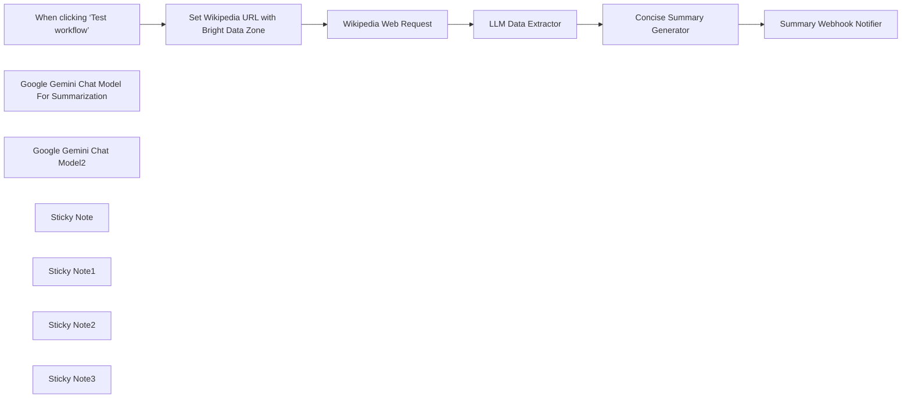

## Fluxo (.json) :

```json
{
  "id": "sczRNO4u1HYc5YV7",
  "meta": {
    "instanceId": "885b4fb4a6a9c2cb5621429a7b972df0d05bb724c20ac7dac7171b62f1c7ef40",
    "templateCredsSetupCompleted": true
  },
  "name": "Extract & Summarize Wikipedia Data with Bright Data and Gemini AI",
  "tags": [
    {
      "id": "Kujft2FOjmOVQAmJ",
      "name": "Engineering",
      "createdAt": "2025-04-09T01:31:00.558Z",
      "updatedAt": "2025-04-09T01:31:00.558Z"
    },
    {
      "id": "ddPkw7Hg5dZhQu2w",
      "name": "AI",
      "createdAt": "2025-04-13T05:38:08.053Z",
      "updatedAt": "2025-04-13T05:38:08.053Z"
    }
  ],
  "nodes": [
    {
      "id": "0f4b4939-6356-4672-ae61-8d1daf66a168",
      "name": "When clicking ‘Test workflow’",
      "type": "n8n-nodes-base.manualTrigger",
      "position": [
        340,
        -440
      ],
      "parameters": {},
      "typeVersion": 1
    },
    {
      "id": "167e060a-c36c-462a-826c-81ef379c824b",
      "name": "Google Gemini Chat Model For Summarization",
      "type": "@n8n/n8n-nodes-langchain.lmChatGoogleGemini",
      "position": [
        1520,
        -60
      ],
      "parameters": {
        "options": {},
        "modelName": "models/gemini-2.0-flash-exp"
      },
      "credentials": {
        "googlePalmApi": {
          "id": "YeO7dHZnuGBVQKVZ",
          "name": "Google Gemini(PaLM) Api account"
        }
      },
      "typeVersion": 1
    },
    {
      "id": "a51f2634-8b59-4feb-be39-674e8f198714",
      "name": "Google Gemini Chat Model2",
      "type": "@n8n/n8n-nodes-langchain.lmChatGoogleGemini",
      "position": [
        1000,
        -240
      ],
      "parameters": {
        "options": {},
        "modelName": "models/gemini-2.0-pro-exp"
      },
      "credentials": {
        "googlePalmApi": {
          "id": "YeO7dHZnuGBVQKVZ",
          "name": "Google Gemini(PaLM) Api account"
        }
      },
      "typeVersion": 1
    },
    {
      "id": "a1ec001f-6e97-4efb-91d9-9a037fbf472c",
      "name": "Summary Webhook Notifier",
      "type": "n8n-nodes-base.httpRequest",
      "position": [
        1860,
        -280
      ],
      "parameters": {
        "url": "https://webhook.site/ce41e056-c097-48c8-a096-9b876d3abbf7",
        "options": {},
        "sendBody": true,
        "bodyParameters": {
          "parameters": [
            {
              "name": "summary",
              "value": "={{ $json.response.text }}"
            }
          ]
        }
      },
      "typeVersion": 4.2
    },
    {
      "id": "f4dd93b5-2a33-4ac7-a0c9-9e0956bea363",
      "name": "Sticky Note",
      "type": "n8n-nodes-base.stickyNote",
      "position": [
        340,
        -820
      ],
      "parameters": {
        "width": 400,
        "height": 300,
        "content": "## Note\n\nThis template deals with the Wikipedia data extraction and summarization of content with the Bright Data. \n\nThe LLM Data Extractor is responsible for producing a human readable content.\n\nThe Concise Summary Generator node is responsible for generating the concise summary of the Wikipedia extracted info.\n\n**Please make sure to update the Wikipedia URL with Bright Data Zone. Also make sure to set the Webhook Notification URL.**"
      },
      "typeVersion": 1
    },
    {
      "id": "9bd6f913-c526-4e54-81f8-8885a0fe974f",
      "name": "Sticky Note1",
      "type": "n8n-nodes-base.stickyNote",
      "position": [
        780,
        -820
      ],
      "parameters": {
        "width": 500,
        "height": 300,
        "content": "## LLM Usages\n\nGoogle Gemini Flash Exp model is being used to demonstrate the data extraction and summarization aspects.\n\nBasic LLM Chain is being used for extracting the html to text\n\nSummarization Chain is being used for summarization of the Wikipedia data.\n\n**Note - Replace Google Gemini with the Open AI or suitable LLM providers of your choice.**"
      },
      "typeVersion": 1
    },
    {
      "id": "30008ce4-4de2-43c5-bb03-94db58262f86",
      "name": "Wikipedia Web Request",
      "type": "n8n-nodes-base.httpRequest",
      "position": [
        780,
        -440
      ],
      "parameters": {
        "url": "https://api.brightdata.com/request",
        "method": "POST",
        "options": {},
        "sendBody": true,
        "sendHeaders": true,
        "authentication": "genericCredentialType",
        "bodyParameters": {
          "parameters": [
            {
              "name": "zone",
              "value": "={{ $json.zone }}"
            },
            {
              "name": "url",
              "value": "={{ $json.url }}"
            },
            {
              "name": "format",
              "value": "raw"
            }
          ]
        },
        "genericAuthType": "httpHeaderAuth",
        "headerParameters": {
          "parameters": [
            {}
          ]
        }
      },
      "credentials": {
        "httpHeaderAuth": {
          "id": "kdbqXuxIR8qIxF7y",
          "name": "Header Auth account"
        }
      },
      "typeVersion": 4.2
    },
    {
      "id": "28656a7d-4bd8-41c8-8471-50d19d88e7f2",
      "name": "LLM Data Extractor",
      "type": "@n8n/n8n-nodes-langchain.chainLlm",
      "position": [
        1000,
        -440
      ],
      "parameters": {
        "text": "={{ $json.data }}",
        "messages": {
          "messageValues": [
            {
              "message": "You are an expert Data Formatter. Make sure to format the data in a human readable manner. Please output the human readable content without your own thoughts"
            }
          ]
        },
        "promptType": "define",
        "hasOutputParser": true
      },
      "typeVersion": 1.6
    },
    {
      "id": "7045af3b-9e74-42ef-92f0-f8d3266f2890",
      "name": "Concise Summary Generator",
      "type": "@n8n/n8n-nodes-langchain.chainSummarization",
      "position": [
        1440,
        -280
      ],
      "parameters": {
        "options": {
          "summarizationMethodAndPrompts": {
            "values": {
              "prompt": "Write a concise summary of the following:\n\n\n\"{text}\"\n"
            }
          }
        },
        "chunkingMode": "advanced"
      },
      "typeVersion": 2
    },
    {
      "id": "0cc843c1-252a-4c18-9856-5c7dfc732072",
      "name": "Set Wikipedia URL with Bright Data Zone",
      "type": "n8n-nodes-base.set",
      "notes": "Set the URL which you are interested to scrap the data",
      "position": [
        560,
        -440
      ],
      "parameters": {
        "options": {},
        "assignments": {
          "assignments": [
            {
              "id": "1c132dd6-31e4-453b-a8cf-cad9845fe55b",
              "name": "url",
              "type": "string",
              "value": "https://en.wikipedia.org/wiki/Cloud_computing?product=unlocker&method=api"
            },
            {
              "id": "0fa387df-2511-4228-b6aa-237cceb3e9c7",
              "name": "zone",
              "type": "string",
              "value": "web_unlocker1"
            }
          ]
        }
      },
      "notesInFlow": true,
      "typeVersion": 3.4
    },
    {
      "id": "6cb9930f-1924-4762-8150-f5cd0e063348",
      "name": "Sticky Note2",
      "type": "n8n-nodes-base.stickyNote",
      "position": [
        940,
        -500
      ],
      "parameters": {
        "color": 4,
        "width": 380,
        "height": 420,
        "content": "## Basic LLM Chain Data Extractor\n"
      },
      "typeVersion": 1
    },
    {
      "id": "47811535-bce5-4946-aaa6-baef87db1100",
      "name": "Sticky Note3",
      "type": "n8n-nodes-base.stickyNote",
      "position": [
        1400,
        -340
      ],
      "parameters": {
        "color": 5,
        "width": 340,
        "height": 420,
        "content": "## Summarization Chain\n"
      },
      "typeVersion": 1
    }
  ],
  "active": false,
  "pinData": {},
  "settings": {
    "executionOrder": "v1"
  },
  "versionId": "5b5e78fb-6e5a-4b92-838c-6c4060618e9c",
  "connections": {
    "LLM Data Extractor": {
      "main": [
        [
          {
            "node": "Concise Summary Generator",
            "type": "main",
            "index": 0
          }
        ]
      ]
    },
    "Wikipedia Web Request": {
      "main": [
        [
          {
            "node": "LLM Data Extractor",
            "type": "main",
            "index": 0
          }
        ]
      ]
    },
    "Concise Summary Generator": {
      "main": [
        [
          {
            "node": "Summary Webhook Notifier",
            "type": "main",
            "index": 0
          }
        ]
      ]
    },
    "Google Gemini Chat Model2": {
      "ai_languageModel": [
        [
          {
            "node": "LLM Data Extractor",
            "type": "ai_languageModel",
            "index": 0
          }
        ]
      ]
    },
    "When clicking ‘Test workflow’": {
      "main": [
        [
          {
            "node": "Set Wikipedia URL with Bright Data Zone",
            "type": "main",
            "index": 0
          }
        ]
      ]
    },
    "Set Wikipedia URL with Bright Data Zone": {
      "main": [
        [
          {
            "node": "Wikipedia Web Request",
            "type": "main",
            "index": 0
          }
        ]
      ]
    },
    "Google Gemini Chat Model For Summarization": {
      "ai_languageModel": [
        [
          {
            "node": "Concise Summary Generator",
            "type": "ai_languageModel",
            "index": 0
          }
        ]
      ]
    }
  }
}
```

<a id="template-452"></a>

## Template 452 - Salvar anexos Gmail no Drive com remetente

- **Nome:** Salvar anexos Gmail no Drive com remetente
- **Descrição:** Recebe e-mails com anexos e salva cada anexo no Google Drive, adicionando o endereço do remetente ao nome do arquivo.
- **Funcionalidade:** • Monitoramento de e-mail: Verifica regularmente a caixa de entrada em busca de novos e-mails que contenham anexos.
• Download automático de anexos: Faz o download dos anexos recebidos para processamento.
• Separação de anexos: Converte cada anexo em um item separado para tratamento individual.
• Renomear arquivos: Gera um nome de arquivo que combina o nome original do anexo com o endereço de e-mail do remetente.
• Upload para armazenamento em nuvem: Envia os arquivos renomeados para a pasta raiz do Google Drive.
- **Ferramentas:** • Gmail: Serviço de e-mail usado para receber mensagens e fornecer anexos.
• Google Drive: Serviço de armazenamento em nuvem usado para salvar os arquivos enviados.

## Fluxo visual

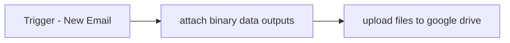

## Fluxo (.json) :

```json
{
  "meta": {
    "instanceId": "1a23006df50de49624f69e85993be557d137b6efe723a867a7d68a84e0b32704"
  },
  "nodes": [
    {
      "id": "3c7ae816-6ce2-4b6b-893e-75c6b8756555",
      "name": "Trigger - New Email",
      "type": "n8n-nodes-base.gmailTrigger",
      "notes": "has:attachment",
      "position": [
        680,
        300
      ],
      "parameters": {
        "simple": false,
        "filters": {
          "q": "has:attachment"
        },
        "options": {
          "downloadAttachments": true
        },
        "pollTimes": {
          "item": [
            {
              "mode": "everyMinute"
            }
          ]
        }
      },
      "notesInFlow": true,
      "typeVersion": 1.1
    },
    {
      "id": "b87b2211-03d3-4742-98c9-977ae4a8d581",
      "name": "attach binary data outputs",
      "type": "n8n-nodes-base.function",
      "position": [
        900,
        300
      ],
      "parameters": {
        "functionCode": "let results = [];\n\nfor (item of items) {\n    for (key of Object.keys(item.binary)) {\n        results.push({\n            json: {\n                fileName: item.binary[key].fileName\n            },\n            binary: {\n                data: item.binary[key],\n            }\n        });\n    }\n}\n\nreturn results;"
      },
      "typeVersion": 1
    },
    {
      "id": "f8e19c97-0983-4365-bc63-179605050ef2",
      "name": "upload files to google drive",
      "type": "n8n-nodes-base.googleDrive",
      "position": [
        1140,
        300
      ],
      "parameters": {
        "name": "={{ $json.fileName.split(\".\")[0] + \"-\" + $('Trigger - New Email').item.json.from.value[0].address + \".\" + $json.fileName.split(\".\")[1]}}",
        "driveId": {
          "__rl": true,
          "mode": "list",
          "value": "My Drive",
          "cachedResultUrl": "https://drive.google.com/drive/my-drive",
          "cachedResultName": "My Drive"
        },
        "options": {},
        "folderId": {
          "__rl": true,
          "mode": "list",
          "value": "root",
          "cachedResultUrl": "https://drive.google.com/drive",
          "cachedResultName": "/ (Root folder)"
        }
      },
      "typeVersion": 3
    }
  ],
  "pinData": {},
  "connections": {
    "Trigger - New Email": {
      "main": [
        [
          {
            "node": "attach binary data outputs",
            "type": "main",
            "index": 0
          }
        ]
      ]
    },
    "attach binary data outputs": {
      "main": [
        [
          {
            "node": "upload files to google drive",
            "type": "main",
            "index": 0
          }
        ]
      ]
    }
  }
}
```

<a id="template-453"></a>

## Template 453 - Exemplos de uso dos modelos OpenAI

- **Nome:** Exemplos de uso dos modelos OpenAI
- **Descrição:** Fluxo de exemplos que demonstra várias chamadas à API OpenAI para sumarização, tradução, edição de texto, transcrição de áudio e geração de imagens e HTML.
- **Funcionalidade:** • Transcrição de áudio: carrega um arquivo de áudio e o envia para transcrição usando o modelo de voz.
• Geração de resumo (Tl;dr): produz resumos do texto de entrada usando tanto endpoints de completions quanto de chat (ChatGPT/GPT).
• Tradução para alemão: aplica operação de edição/tradução para converter textos para alemão.
• Uso de mensagens de sistema/usuário: exemplifica como definir instruções de sistema e conteúdo do usuário para guiar respostas do modelo de chat.
• Chamada programática ao ChatGPT: constrói um array de mensagens (system/user) via código e faz requisição HTTP ao endpoint de chat completions.
• Geração de prompt para imagem: usa o resultado de texto para criar um prompt voltado à criação de imagem estilo comic dos anos 60.
• Geração de imagens: cria múltiplas imagens a partir do prompt gerado (várias variações e tamanho configurado).
• Criação de HTML/SVG: gera código HTML que contém um SVG com formas coloridas usando um modelo de texto/ código.
• Respostas múltiplas curtas: demonstra geração de várias respostas breves (útil para respostas rápidas de e-mail).
• Exemplos e notas explicativas: inclui anotações e exemplos prontos para orientar uso e limitações (e.g., recomendação para não executar todo o fluxo de uma vez).
- **Ferramentas:** • OpenAI (modelos de linguagem, ex.: GPT-3.5 / ChatGPT, text-davinci-003): usado para sumarização, geração de texto, edição e respostas em conversa.
• OpenAI DALL·E: usado para geração de imagens a partir de prompts (várias variações e tamanhos configuráveis).
• OpenAI Whisper: serviço de transcrição de áudio para texto.
• Sistema de arquivos local: armazenamento e leitura de arquivos de áudio para envio ao serviço de transcrição.
• Requisições HTTP: comunicação direta com APIs externas para chamadas ao endpoint de chat completions quando necessário.

## Fluxo visual

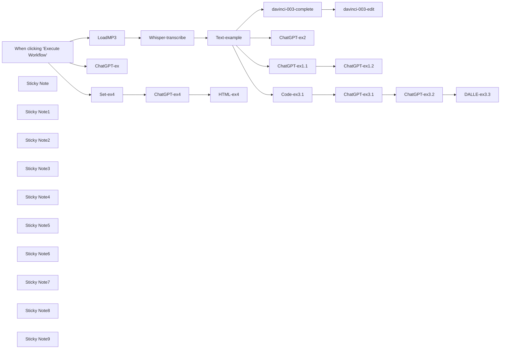

## Fluxo (.json) :

```json
{
  "id": "147",
  "meta": {
    "instanceId": "dfdeafd1c3ed2ee08eeab8c2fa0c3f522066931ed8138ccd35dc20a1e69decd3"
  },
  "name": "OpenAI-model-examples",
  "tags": [],
  "nodes": [
    {
      "id": "ad6dc2cd-21cc-4563-86ba-f78cc4a55543",
      "name": "When clicking \"Execute Workflow\"",
      "type": "n8n-nodes-base.manualTrigger",
      "position": [
        -640,
        380
      ],
      "parameters": {},
      "typeVersion": 1
    },
    {
      "id": "b370da23-ead4-4221-b7fe-a9d943f7fbb9",
      "name": "davinci-003-complete",
      "type": "n8n-nodes-base.openAi",
      "position": [
        1160,
        60
      ],
      "parameters": {
        "prompt": "={{ $json.text }}\n\nTl;dr:",
        "options": {
          "maxTokens": 500
        }
      },
      "credentials": {
        "openAiApi": {
          "id": "63",
          "name": "OpenAi account"
        }
      },
      "typeVersion": 1
    },
    {
      "id": "5e04f355-36c0-4540-8e65-68118cb73135",
      "name": "ChatGPT-ex2",
      "type": "n8n-nodes-base.openAi",
      "position": [
        1160,
        740
      ],
      "parameters": {
        "prompt": {
          "messages": [
            {
              "role": "system",
              "content": "=You are an assistant. Always add 5 emojis to the end of your answer."
            },
            {
              "content": "=Write tl;dr of the wollowing text: {{ $json.text}}"
            }
          ]
        },
        "options": {
          "maxTokens": 500,
          "temperature": 0.8
        },
        "resource": "chat"
      },
      "credentials": {
        "openAiApi": {
          "id": "63",
          "name": "OpenAi account"
        }
      },
      "typeVersion": 1
    },
    {
      "id": "16a7cf80-16e3-44f9-b15c-7501417fe38f",
      "name": "davinci-003-edit",
      "type": "n8n-nodes-base.openAi",
      "position": [
        1340,
        60
      ],
      "parameters": {
        "input": "={{ $json.text }}",
        "options": {},
        "operation": "edit",
        "instruction": "translate to German"
      },
      "credentials": {
        "openAiApi": {
          "id": "63",
          "name": "OpenAi account"
        }
      },
      "typeVersion": 1
    },
    {
      "id": "95254870-65c3-4714-83fb-20ba2c0ca007",
      "name": "ChatGPT-ex1.1",
      "type": "n8n-nodes-base.openAi",
      "position": [
        1160,
        380
      ],
      "parameters": {
        "prompt": {
          "messages": [
            {
              "content": "=Write a Tl;dr of the followint text: {{ $json.text }}"
            }
          ]
        },
        "options": {
          "maxTokens": 500
        },
        "resource": "chat"
      },
      "credentials": {
        "openAiApi": {
          "id": "63",
          "name": "OpenAi account"
        }
      },
      "typeVersion": 1
    },
    {
      "id": "be9c4820-18b0-46fd-a5a0-51a5dc3ebed5",
      "name": "ChatGPT-ex1.2",
      "type": "n8n-nodes-base.openAi",
      "position": [
        1340,
        380
      ],
      "parameters": {
        "prompt": {
          "messages": [
            {
              "content": "=Translate to German the following text: {{ $json.message.content }}"
            }
          ]
        },
        "options": {
          "maxTokens": 500
        },
        "resource": "chat"
      },
      "credentials": {
        "openAiApi": {
          "id": "63",
          "name": "OpenAi account"
        }
      },
      "typeVersion": 1
    },
    {
      "id": "c52c875b-5270-44ac-bfca-ce25124e3d04",
      "name": "Text-example",
      "type": "n8n-nodes-base.code",
      "position": [
        540,
        380
      ],
      "parameters": {
        "jsCode": "return [\n {\n \"text\": \"Science Underground with your host, Anissa Ramirez. In this episode, how to stop your bathroom mirror from fogging up with a little dash of science. I'm Anissa Ramirez and this is Science Underground. We've all been there. You come out of the shower and you go to the mirror and you can't see yourself because the mirror is fogged up. You can't see anything until you first clear off the surface. Every morning it's the same thing. Shower, fog, shower, fog, shower, fog. There's gotta be a better way. Well, there is. Before you take the next shower, wipe a bit of shaving cream on the surface of the mirror and keep it there for about 30 seconds. Then wipe it off. The next time you take a shower, that part of the mirror that was covered with shaving cream will be amazingly fog free. And the shaving cream will keep the water from fogging up for a few weeks. So what's going on? Well, the fog on your mirror is made out of little itty bitty water droplets. If you were to look at the surface of the mirror under the microscope, you will see that the surface looks like a newly waxed car. The water forms beads, preventing you from seeing yourself in the mirror. When you add shaving cream to the surface of the mirror, the water droplets are no longer beads. They are a thin, smoothed out layer of water. Just like the surface of an old car that hasn't been waxed. Scientists would say that the shaving cream has changed the surface tension of the mirror. So there you have it. There's the answer. The secret to fogless mirrors is shaving cream. A little dab of science will do you. I'm Anissa Ramirez, and this was Science Underground.\"\n }\n];"
      },
      "typeVersion": 1
    },
    {
      "id": "45d3bad7-0e9a-426b-b4e9-b3568181d9dc",
      "name": "Code-ex3.1",
      "type": "n8n-nodes-base.code",
      "position": [
        1160,
        1100
      ],
      "parameters": {
        "jsCode": "var intext = $input.first().json;\n\nvar messages = [\n {\"role\": \"system\", \"content\": \"You are a helpful assistant. Write a Tl;dr of each user message\"},\n {\"role\": \"user\", \"content\": intext.text}\n];\n\nreturn {\"messages\":messages};"
      },
      "typeVersion": 1
    },
    {
      "id": "4db3de05-51a7-46ea-a818-508bdcb04582",
      "name": "ChatGPT-ex3.1",
      "type": "n8n-nodes-base.httpRequest",
      "position": [
        1340,
        1100
      ],
      "parameters": {
        "url": "https://api.openai.com/v1/chat/completions",
        "method": "POST",
        "options": {},
        "sendBody": true,
        "authentication": "predefinedCredentialType",
        "bodyParameters": {
          "parameters": [
            {
              "name": "model",
              "value": "gpt-3.5-turbo"
            },
            {
              "name": "temperature",
              "value": "={{ parseFloat(0.8) }}"
            },
            {
              "name": "n",
              "value": "={{ Number(1) }}"
            },
            {
              "name": "max_tokens",
              "value": "={{ Number(500) }}"
            },
            {
              "name": "messages",
              "value": "={{ $json.messages }}"
            }
          ]
        },
        "nodeCredentialType": "openAiApi"
      },
      "credentials": {
        "openAiApi": {
          "id": "63",
          "name": "OpenAi account"
        }
      },
      "typeVersion": 3
    },
    {
      "id": "709fcd7c-deb3-469d-b16b-62d4d36d100d",
      "name": "ChatGPT-ex3.2",
      "type": "n8n-nodes-base.openAi",
      "position": [
        1880,
        1100
      ],
      "parameters": {
        "prompt": {
          "messages": [
            {
              "role": "system",
              "content": "=You are now a DALLE-2 prompt generation tool that will generate a suitable prompt. Write a promt to create a cover image relevant to the user input. The image should be in a comic style of the 60-s."
            },
            {
              "content": "={{ $json.choices[0].message.content }}"
            }
          ]
        },
        "options": {
          "maxTokens": 500,
          "temperature": 0.8
        },
        "resource": "chat"
      },
      "credentials": {
        "openAiApi": {
          "id": "63",
          "name": "OpenAi account"
        }
      },
      "typeVersion": 1
    },
    {
      "id": "6b32cc45-5ba2-4605-b690-3929ec9acecf",
      "name": "Sticky Note",
      "type": "n8n-nodes-base.stickyNote",
      "position": [
        900,
        -60
      ],
      "parameters": {
        "width": 746.6347949130579,
        "height": 295.50954755505853,
        "content": "## The old way of using text completion and text edit\n### Davinci model is 10 times more expensive then ChatGPT, consider switching to the new API:\nhttps://openai.com/blog/introducing-chatgpt-and-whisper-apis\n"
      },
      "typeVersion": 1
    },
    {
      "id": "3cc74d77-7b02-40fd-83d8-f540d5ff34ab",
      "name": "Sticky Note1",
      "type": "n8n-nodes-base.stickyNote",
      "position": [
        -160,
        260
      ],
      "parameters": {
        "width": 428.4578974150008,
        "height": 316.6202633391793,
        "content": "## Whisper-1 example\n### Prepare your audio file and send it to whisper-1 transcription model"
      },
      "typeVersion": 1
    },
    {
      "id": "6ba8069a-485c-497c-8b27-4c7562fbccab",
      "name": "Sticky Note2",
      "type": "n8n-nodes-base.stickyNote",
      "position": [
        380,
        280
      ],
      "parameters": {
        "width": 421.9002034748082,
        "height": 302.4086532331564,
        "content": "## An example of transcribed text\n### Please pause this node when using real audio files"
      },
      "typeVersion": 1
    },
    {
      "id": "c71001e6-b80f-41dd-bcdd-10927014b374",
      "name": "Sticky Note3",
      "type": "n8n-nodes-base.stickyNote",
      "position": [
        900,
        280
      ],
      "parameters": {
        "width": 747.8556016477869,
        "height": 288.18470714667706,
        "content": "## ChatGPT example 1.1 and 1.2 \n### Write a Tl;dr of the text input\n### Translate it to German\n### only user content provided"
      },
      "typeVersion": 1
    },
    {
      "id": "4605be68-4c57-404f-8624-e095c8e86ff9",
      "name": "Sticky Note4",
      "type": "n8n-nodes-base.stickyNote",
      "position": [
        900,
        620
      ],
      "parameters": {
        "width": 742.9723747088658,
        "height": 288.18470714667706,
        "content": "## ChatGPT example 2 \n### Use system content to provide general instruction\n### Manual setup of system and user content"
      },
      "typeVersion": 1
    },
    {
      "id": "f5b72d7a-655a-4cc9-b722-b75429889d1d",
      "name": "Sticky Note5",
      "type": "n8n-nodes-base.stickyNote",
      "position": [
        900,
        960
      ],
      "parameters": {
        "width": 739.309954504675,
        "height": 288.18470714667706,
        "content": "## ChatGPT example 3.1\n### When using ChatGPT programmatically, create an array of system / user / assistant contents and append them one after another\n### Call ChatGPT API via HTTP Request node to provide all messages at once"
      },
      "typeVersion": 1
    },
    {
      "id": "a003a4db-1960-4867-8dfe-3114cf0742f3",
      "name": "DALLE-ex3.3",
      "type": "n8n-nodes-base.openAi",
      "position": [
        2060,
        1100
      ],
      "parameters": {
        "prompt": "={{ $json.message.content }}",
        "options": {
          "n": 4,
          "size": "512x512"
        },
        "resource": "image"
      },
      "credentials": {
        "openAiApi": {
          "id": "63",
          "name": "OpenAi account"
        }
      },
      "typeVersion": 1
    },
    {
      "id": "d71a01ff-4d47-4675-964c-c47820d3989b",
      "name": "Sticky Note6",
      "type": "n8n-nodes-base.stickyNote",
      "position": [
        1720,
        960
      ],
      "parameters": {
        "width": 611.1252473579985,
        "height": 284.52228694248623,
        "content": "## ChatGPT example 3.2 & DALLE-2 example 3.3\n### Use ChatGPT to create a prompt for a cover image of the Tl;dr message\n### Use OpenAI node to generate 4 images using the auto-generated prompt"
      },
      "typeVersion": 1
    },
    {
      "id": "f5a55cfe-c110-4833-9668-1f1ba895860f",
      "name": "ChatGPT-ex4",
      "type": "n8n-nodes-base.openAi",
      "position": [
        1240,
        1420
      ],
      "parameters": {
        "model": "gpt-3.5-turbo-0301",
        "prompt": {
          "messages": [
            {
              "content": "={{ $json.prompt }}"
            }
          ]
        },
        "options": {
          "maxTokens": 500,
          "temperature": 0.5
        },
        "resource": "chat"
      },
      "credentials": {
        "openAiApi": {
          "id": "63",
          "name": "OpenAi account"
        }
      },
      "typeVersion": 1
    },
    {
      "id": "8a9f7a20-187c-4494-8005-b10d066d04e2",
      "name": "Set-ex4",
      "type": "n8n-nodes-base.set",
      "position": [
        1060,
        1420
      ],
      "parameters": {
        "values": {
          "string": [
            {
              "name": "model",
              "value": "code-davinci-002"
            },
            {
              "name": "suffix",
              "value": "</svg>"
            },
            {
              "name": "prompt",
              "value": "=Create an HTML code with and SVG tag that contains random shapes of various colors. Include triangles, lines, ellipses and other shapes"
            }
          ]
        },
        "options": {},
        "keepOnlySet": true
      },
      "typeVersion": 1
    },
    {
      "id": "68fcc6a2-761c-42ac-8778-313c8db7d53c",
      "name": "HTML-ex4",
      "type": "n8n-nodes-base.html",
      "position": [
        1420,
        1420
      ],
      "parameters": {
        "html": "{{$json.message.content }}"
      },
      "typeVersion": 1
    },
    {
      "id": "1f70cf3f-b6a9-4ea7-9486-c7565e6951b7",
      "name": "Sticky Note7",
      "type": "n8n-nodes-base.stickyNote",
      "position": [
        900,
        1300
      ],
      "parameters": {
        "width": 739.309954504675,
        "height": 288.18470714667706,
        "content": "## ChatGPT example 4\n### Generate HTML code that contains SVG image"
      },
      "typeVersion": 1
    },
    {
      "id": "d857acd9-ea74-44d2-ac89-66b1fac4645f",
      "name": "Sticky Note8",
      "type": "n8n-nodes-base.stickyNote",
      "position": [
        900,
        1640
      ],
      "parameters": {
        "width": 739.309954504675,
        "height": 288.18470714667706,
        "content": "## ChatGPT example 5\n### Provide several outputs. Useful for quick replies (i.e. in Gmail / Outlook)"
      },
      "typeVersion": 1
    },
    {
      "id": "fe64533a-4cd4-4adc-a48a-8abf3f2d61d7",
      "name": "ChatGPT-ex",
      "type": "n8n-nodes-base.openAi",
      "position": [
        1160,
        1760
      ],
      "parameters": {
        "model": "gpt-3.5-turbo-0301",
        "prompt": {
          "messages": [
            {
              "role": "system",
              "content": "Act as an e-mail client. Provide a five to eight word answers to a given user messages."
            },
            {
              "content": "Hi There! My name is Jack.\n\nI'm sending you an overview of my pricelist attached.\nCould you please reply to me within 3 days?\n\nBest regards and have a nice day,\nJack"
            }
          ]
        },
        "options": {
          "n": 3,
          "maxTokens": 15,
          "temperature": 0.8
        },
        "resource": "chat"
      },
      "credentials": {
        "openAiApi": {
          "id": "63",
          "name": "OpenAi account"
        }
      },
      "typeVersion": 1
    },
    {
      "id": "6c9f8a70-99ae-4310-8e6a-26cc6f75b3a2",
      "name": "LoadMP3",
      "type": "n8n-nodes-base.readBinaryFiles",
      "disabled": true,
      "position": [
        -80,
        380
      ],
      "parameters": {
        "fileSelector": "/home/node/.n8n/OpenAI-article/Using Science to Stop Your Mirror From Fogging Up.mp3"
      },
      "typeVersion": 1
    },
    {
      "id": "0edc1996-6484-4e62-a47b-5666dfbb3546",
      "name": "Whisper-transcribe",
      "type": "n8n-nodes-base.httpRequest",
      "disabled": true,
      "position": [
        100,
        380
      ],
      "parameters": {
        "url": "https://api.openai.com/v1/audio/transcriptions",
        "method": "POST",
        "options": {},
        "sendBody": true,
        "contentType": "multipart-form-data",
        "authentication": "predefinedCredentialType",
        "bodyParameters": {
          "parameters": [
            {
              "name": "model",
              "value": "whisper-1"
            },
            {
              "name": "file",
              "parameterType": "formBinaryData",
              "inputDataFieldName": "data"
            }
          ]
        },
        "nodeCredentialType": "openAiApi"
      },
      "credentials": {
        "openAiApi": {
          "id": "63",
          "name": "OpenAi account"
        }
      },
      "typeVersion": 3
    },
    {
      "id": "c12ba294-bdcd-4ece-8370-fa6a83a8ef0b",
      "name": "Sticky Note9",
      "type": "n8n-nodes-base.stickyNote",
      "position": [
        -840,
        260
      ],
      "parameters": {
        "width": 596.9600747621192,
        "height": 320.63203364295396,
        "content": "## Do not run the whole workflow, it's rather slow\n### Better execute the last node of each branch or simply disconnect branches that are not needed"
      },
      "typeVersion": 1
    }
  ],
  "active": false,
  "pinData": {},
  "settings": {},
  "versionId": "972cd971-9e7e-4a1d-b3fb-6f061e23e96f",
  "connections": {
    "LoadMP3": {
      "main": [
        [
          {
            "node": "Whisper-transcribe",
            "type": "main",
            "index": 0
          }
        ]
      ]
    },
    "Set-ex4": {
      "main": [
        [
          {
            "node": "ChatGPT-ex4",
            "type": "main",
            "index": 0
          }
        ]
      ]
    },
    "Code-ex3.1": {
      "main": [
        [
          {
            "node": "ChatGPT-ex3.1",
            "type": "main",
            "index": 0
          }
        ]
      ]
    },
    "ChatGPT-ex4": {
      "main": [
        [
          {
            "node": "HTML-ex4",
            "type": "main",
            "index": 0
          }
        ]
      ]
    },
    "Text-example": {
      "main": [
        [
          {
            "node": "davinci-003-complete",
            "type": "main",
            "index": 0
          },
          {
            "node": "ChatGPT-ex1.1",
            "type": "main",
            "index": 0
          },
          {
            "node": "ChatGPT-ex2",
            "type": "main",
            "index": 0
          },
          {
            "node": "Code-ex3.1",
            "type": "main",
            "index": 0
          }
        ]
      ]
    },
    "ChatGPT-ex1.1": {
      "main": [
        [
          {
            "node": "ChatGPT-ex1.2",
            "type": "main",
            "index": 0
          }
        ]
      ]
    },
    "ChatGPT-ex3.1": {
      "main": [
        [
          {
            "node": "ChatGPT-ex3.2",
            "type": "main",
            "index": 0
          }
        ]
      ]
    },
    "ChatGPT-ex3.2": {
      "main": [
        [
          {
            "node": "DALLE-ex3.3",
            "type": "main",
            "index": 0
          }
        ]
      ]
    },
    "Whisper-transcribe": {
      "main": [
        [
          {
            "node": "Text-example",
            "type": "main",
            "index": 0
          }
        ]
      ]
    },
    "davinci-003-complete": {
      "main": [
        [
          {
            "node": "davinci-003-edit",
            "type": "main",
            "index": 0
          }
        ]
      ]
    },
    "When clicking \"Execute Workflow\"": {
      "main": [
        [
          {
            "node": "LoadMP3",
            "type": "main",
            "index": 0
          },
          {
            "node": "Set-ex4",
            "type": "main",
            "index": 0
          },
          {
            "node": "ChatGPT-ex",
            "type": "main",
            "index": 0
          }
        ]
      ]
    }
  }
}
```

<a id="template-454"></a>

## Template 454 - Autoclose e reengajamento de tickets JIRA

- **Nome:** Autoclose e reengajamento de tickets JIRA
- **Descrição:** Verifica periodicamente issues JIRA sem resolução por mais de 7 dias, analisa o histórico, tenta resolver automaticamente com base na base de conhecimento e toma ações apropriadas (fechar, notificar ou pedir mais informações).
- **Funcionalidade:** • Agendamento diário: Executa uma verificação periódica para encontrar issues não resolvidas há mais de 7 dias.
• Listagem de issues longas: Busca e seleciona issues em estados definidos (To Do, In Progress) com mais de 7 dias.
• Processamento paralelo de cada issue: Trata cada issue separadamente para melhorar desempenho.
• Agregação de histórico de comentários: Combina todos os comentários e metadados da issue para criar um contexto completo.
• Simplificação do thread para IA: Formata e limpa o histórico para entrada eficiente em modelos de linguagem.
• Classificação do estado atual da issue: Classifica como resolvido, pendente por mais informação ou ainda esperando resposta.
• Agente de base de conhecimento: Usa IA para pesquisar informações relevantes (issues semelhantes e documentos) e tentar gerar uma solução factual.
• Publicação de resposta automática: Se for encontrada uma solução, publica a resposta na issue e fecha-a automaticamente.
• Análise de sentimento em resoluções: Avalia satisfação do usuário quando a issue é resolvida para decidir entre pedir feedback ou escalar.
• Notificações e escalonamento: Envia mensagens para um canal de trabalho quando encontra tickets sem atenção ou resoluções negativas.
• Mensagens de lembrete: Gera lembretes curtos e claros quando a issue aguarda resposta do usuário e adiciona como comentário.
• Mensagens de autoclose e pedido de feedback: Ao fechar automaticamente, adiciona comentários finais e, se apropriado, solicita avaliação do usuário.
- **Ferramentas:** • JIRA (Cloud): Fonte principal de issues, comentários e operações de atualização (consultas, busca de issues similares e alteração de status).
• OpenAI (modelo de linguagem): Avaliação do estado, geração de respostas, criação de lembretes e interpretação do histórico de conversas.
• Notion (base de conhecimento): Pesquisa de documentos e páginas relevantes para fundamentar respostas geradas pela IA.
• Slack: Canal de notificação para alertar equipes sobre tickets sem atenção ou resoluções com sentimento negativo.

## Fluxo visual

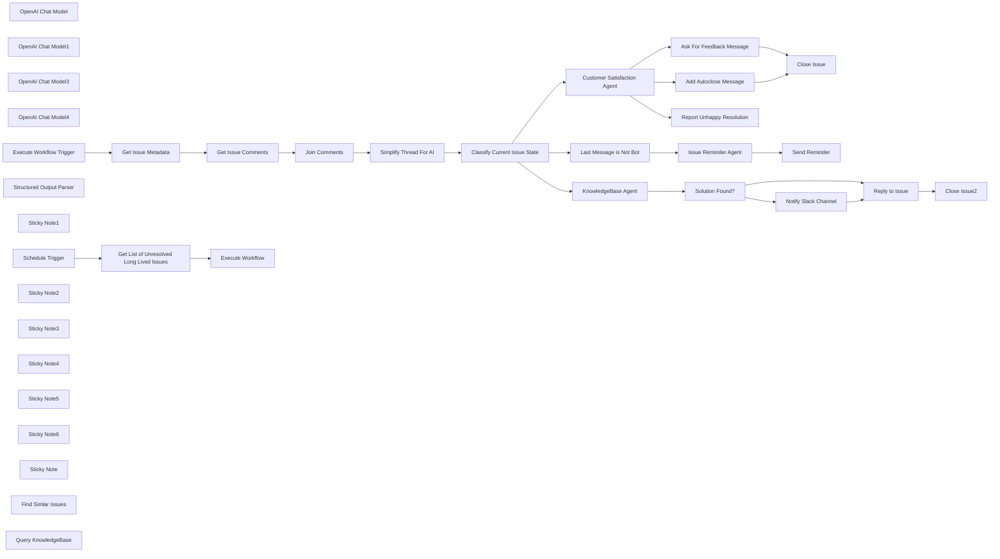

## Fluxo (.json) :

```json
{
  "meta": {
    "instanceId": "408f9fb9940c3cb18ffdef0e0150fe342d6e655c3a9fac21f0f644e8bedabcd9"
  },
  "nodes": [
    {
      "id": "645799b0-7ddb-4acb-a95d-3b04eadff445",
      "name": "OpenAI Chat Model",
      "type": "@n8n/n8n-nodes-langchain.lmChatOpenAi",
      "position": [
        1480,
        20
      ],
      "parameters": {
        "model": "gpt-4o-mini",
        "options": {}
      },
      "credentials": {
        "openAiApi": {
          "id": "8gccIjcuf3gvaoEr",
          "name": "OpenAi account"
        }
      },
      "typeVersion": 1
    },
    {
      "id": "e2923385-2f73-439c-9d5c-5a3c560993cb",
      "name": "OpenAI Chat Model1",
      "type": "@n8n/n8n-nodes-langchain.lmChatOpenAi",
      "position": [
        2040,
        420
      ],
      "parameters": {
        "model": "gpt-4o-mini",
        "options": {}
      },
      "credentials": {
        "openAiApi": {
          "id": "8gccIjcuf3gvaoEr",
          "name": "OpenAi account"
        }
      },
      "typeVersion": 1
    },
    {
      "id": "c24728f9-73b9-45f7-9c4e-aee872c59714",
      "name": "OpenAI Chat Model3",
      "type": "@n8n/n8n-nodes-langchain.lmChatOpenAi",
      "position": [
        3180,
        -80
      ],
      "parameters": {
        "model": "gpt-4o-mini",
        "options": {}
      },
      "credentials": {
        "openAiApi": {
          "id": "8gccIjcuf3gvaoEr",
          "name": "OpenAi account"
        }
      },
      "typeVersion": 1
    },
    {
      "id": "0bc19e46-4a65-45fb-9571-d1f00d204c63",
      "name": "OpenAI Chat Model4",
      "type": "@n8n/n8n-nodes-langchain.lmChatOpenAi",
      "position": [
        2060,
        -261
      ],
      "parameters": {
        "model": "gpt-4o-mini",
        "options": {}
      },
      "credentials": {
        "openAiApi": {
          "id": "8gccIjcuf3gvaoEr",
          "name": "OpenAi account"
        }
      },
      "typeVersion": 1
    },
    {
      "id": "0c631234-125d-476b-b97a-2837d6a32f2b",
      "name": "Schedule Trigger",
      "type": "n8n-nodes-base.scheduleTrigger",
      "position": [
        -272,
        -180
      ],
      "parameters": {
        "rule": {
          "interval": [
            {}
          ]
        }
      },
      "typeVersion": 1.2
    },
    {
      "id": "96c9931d-d286-42f8-9629-2641eaa368b9",
      "name": "Get Issue Comments",
      "type": "n8n-nodes-base.jira",
      "position": [
        748,
        -180
      ],
      "parameters": {
        "options": {},
        "issueKey": "={{ $json.key }}",
        "resource": "issueComment",
        "operation": "getAll"
      },
      "credentials": {
        "jiraSoftwareCloudApi": {
          "id": "IH5V74q6PusewNjD",
          "name": "Jira SW Cloud account"
        }
      },
      "typeVersion": 1
    },
    {
      "id": "18a2770d-5240-4837-8837-4821f73ec560",
      "name": "Close Issue",
      "type": "n8n-nodes-base.jira",
      "position": [
        2660,
        -741
      ],
      "parameters": {
        "issueKey": "={{ $('Get Issue Metadata').item.json.key }}",
        "operation": "update",
        "updateFields": {
          "statusId": {
            "__rl": true,
            "mode": "list",
            "value": "31",
            "cachedResultName": "Done"
          }
        }
      },
      "credentials": {
        "jiraSoftwareCloudApi": {
          "id": "IH5V74q6PusewNjD",
          "name": "Jira SW Cloud account"
        }
      },
      "typeVersion": 1
    },
    {
      "id": "83e81448-26c7-4c29-a17a-409c53e05881",
      "name": "Send Reminder",
      "type": "n8n-nodes-base.jira",
      "position": [
        3500,
        -220
      ],
      "parameters": {
        "comment": "={{ $json.text }}\n(this is an automated message)",
        "options": {},
        "issueKey": "={{ $('Get Issue Metadata').item.json.key }}",
        "resource": "issueComment"
      },
      "credentials": {
        "jiraSoftwareCloudApi": {
          "id": "IH5V74q6PusewNjD",
          "name": "Jira SW Cloud account"
        }
      },
      "typeVersion": 1
    },
    {
      "id": "5fed9245-4af9-4de7-b021-750d2ba39e63",
      "name": "Join Comments",
      "type": "n8n-nodes-base.aggregate",
      "position": [
        928,
        -180
      ],
      "parameters": {
        "options": {},
        "aggregate": "aggregateAllItemData"
      },
      "typeVersion": 1
    },
    {
      "id": "34712dd3-0348-4709-8a68-07279242910c",
      "name": "Add Autoclose Message",
      "type": "n8n-nodes-base.jira",
      "position": [
        2460,
        -561
      ],
      "parameters": {
        "comment": "=Autoclosing due to inactivity. Please create a new ticket if you require additional support. Thank you!\n(this is an automated message)",
        "options": {},
        "issueKey": "={{ $('Get Issue Metadata').item.json.key }}",
        "resource": "issueComment"
      },
      "credentials": {
        "jiraSoftwareCloudApi": {
          "id": "IH5V74q6PusewNjD",
          "name": "Jira SW Cloud account"
        }
      },
      "typeVersion": 1
    },
    {
      "id": "c43a3b66-838b-4970-a85f-dc0370437388",
      "name": "Ask For Feedback Message",
      "type": "n8n-nodes-base.jira",
      "position": [
        2460,
        -741
      ],
      "parameters": {
        "comment": "=[~accountid:{{ $('Get Issue Metadata').item.json.reporter_accountId }}]\n\nWe think the issue is resolved so we're autoclosing it. If you've been satisified with our service, please leave us a 5 start review here: [link](link/to/review_site)\n\nPlease feel free to create another ticket if you need further assistance.\n(this is an automated message)",
        "options": {},
        "issueKey": "={{ $('Get Issue Metadata').item.json.key }}",
        "resource": "issueComment"
      },
      "credentials": {
        "jiraSoftwareCloudApi": {
          "id": "IH5V74q6PusewNjD",
          "name": "Jira SW Cloud account"
        }
      },
      "typeVersion": 1
    },
    {
      "id": "3223ce45-9e5e-471c-9015-75e9f28088e9",
      "name": "Simplify Thread For AI",
      "type": "n8n-nodes-base.set",
      "position": [
        1108,
        -180
      ],
      "parameters": {
        "options": {},
        "assignments": {
          "assignments": [
            {
              "id": "f65c5971-c90d-47f2-823f-37fd03d8e9c7",
              "name": "thread",
              "type": "array",
              "value": "={{\n$json.data.map(comment => {\n const { accountId, displayName } = comment.author;\n\n const message = comment.body.content.map(item =>\n `<${item.type}>${item.content\n .filter(c => c.text || c.content)\n .map(c => c.content\n ? c.content\n .filter(cc => c.text || c.content)\n .map(cc => cc.text)\n .join(' ')\n : c.text\n )}</${item.type}>`\n ).join('');\n return `${displayName} (accountId: ${accountId}) says: ${message}`;\n})\n\n}}"
            },
            {
              "id": "7b98b2db-3417-472f-bea2-a7aebe30184c",
              "name": "topic",
              "type": "string",
              "value": "={{\n[\n `title: ${$('Get Issue Metadata').item.json.title}`,\n `original message: ${$('Get Issue Metadata').item.json.description.replaceAll(/\\n/g, ' ')}`,\n `reported by: ${$('Get Issue Metadata').item.json.reporter}`\n].join('\\n')\n}}"
            }
          ]
        }
      },
      "typeVersion": 3.4
    },
    {
      "id": "e6f91099-1fe6-4930-8dda-b19330edb599",
      "name": "Solution Found?",
      "type": "n8n-nodes-base.if",
      "position": [
        2440,
        220
      ],
      "parameters": {
        "options": {},
        "conditions": {
          "options": {
            "version": 2,
            "leftValue": "",
            "caseSensitive": true,
            "typeValidation": "strict"
          },
          "combinator": "and",
          "conditions": [
            {
              "id": "0e71783b-3072-421a-852c-58940d0dd7cd",
              "operator": {
                "type": "boolean",
                "operation": "true",
                "singleValue": true
              },
              "leftValue": "={{ $json.output.solution_found }}",
              "rightValue": ""
            }
          ]
        }
      },
      "typeVersion": 2.2
    },
    {
      "id": "696348a5-c955-47eb-ab44-f56652587944",
      "name": "Reply to Issue",
      "type": "n8n-nodes-base.jira",
      "position": [
        2760,
        220
      ],
      "parameters": {
        "comment": "=Hey there!\n{{ $('KnowledgeBase Agent').item.json.output.response }}\nWe'll close this issue now but feel free to create a new one if needed.\n(this is an automated message)",
        "options": {},
        "issueKey": "={{ $('Get Issue Metadata').item.json.key }}",
        "resource": "issueComment"
      },
      "credentials": {
        "jiraSoftwareCloudApi": {
          "id": "IH5V74q6PusewNjD",
          "name": "Jira SW Cloud account"
        }
      },
      "typeVersion": 1
    },
    {
      "id": "4d4562c7-f5ed-44b8-9292-9c1a75d51173",
      "name": "Last Message is Not Bot",
      "type": "n8n-nodes-base.if",
      "position": [
        3000,
        -220
      ],
      "parameters": {
        "options": {},
        "conditions": {
          "options": {
            "version": 2,
            "leftValue": "",
            "caseSensitive": true,
            "typeValidation": "strict"
          },
          "combinator": "and",
          "conditions": [
            {
              "id": "6e07d5dc-01b2-4735-8fc1-983fc57dfaaf",
              "operator": {
                "type": "boolean",
                "operation": "true",
                "singleValue": true
              },
              "leftValue": "={{ !$('Simplify Thread For AI').item.json.thread.last().includes('this is an automated message') }}",
              "rightValue": ""
            }
          ]
        }
      },
      "typeVersion": 2.2
    },
    {
      "id": "e1ca19da-c030-478b-a488-dcb08d9be97e",
      "name": "Structured Output Parser",
      "type": "@n8n/n8n-nodes-langchain.outputParserStructured",
      "position": [
        2400,
        420
      ],
      "parameters": {
        "schemaType": "manual",
        "inputSchema": "{\n\t\"type\": \"object\",\n\t\"properties\": {\n\t\t\"solution_found\": {\n\t\t\t\"type\": \"boolean\"\n\t\t},\n \"short_summary_of_issue\": {\n \"type\": \"string\"\n },\n\t\t\"response\": {\n\t\t\t\"type\": \"string\"\n\t\t}\n\t}\n}"
      },
      "typeVersion": 1.2
    },
    {
      "id": "596ef421-beb0-4523-a313-3f6ccd9e8f0c",
      "name": "Get Issue Metadata",
      "type": "n8n-nodes-base.set",
      "position": [
        568,
        -180
      ],
      "parameters": {
        "options": {},
        "assignments": {
          "assignments": [
            {
              "id": "200706ea-6936-48ae-a46c-38d6e2eff558",
              "name": "key",
              "type": "string",
              "value": "={{ $json.key }}"
            },
            {
              "id": "3e3584bf-dc5c-408a-896c-1660710860f6",
              "name": "title",
              "type": "string",
              "value": "={{ $json.fields.summary }}"
            },
            {
              "id": "e1d89014-5e07-4752-9e7c-ae8d4cba6f6e",
              "name": "url",
              "type": "string",
              "value": "={{\n[\n 'https:/',\n $json.self.extractDomain(),\n 'browse',\n $json.key\n ].join('/')\n}}"
            },
            {
              "id": "df1cca88-1c57-475d-968e-999f6c25dba7",
              "name": "date",
              "type": "string",
              "value": "={{ DateTime.fromISO($json.fields.created).format('yyyy-MM-dd') }}"
            },
            {
              "id": "7fc9c625-e741-43bb-9223-b8024fc86cc7",
              "name": "reporter",
              "type": "string",
              "value": "={{ $json.fields.reporter.displayName }}"
            },
            {
              "id": "17bf06ae-fcad-4eb3-add8-11ac85e9a68e",
              "name": "reporter_url",
              "type": "string",
              "value": "={{\n[\n 'https:/',\n $json.fields.reporter.self.extractDomain(),\n 'jira',\n 'people',\n $json.fields.reporter.accountId\n ].join('/')\n}}"
            },
            {
              "id": "7624642f-f76b-41ec-b402-280b64d46400",
              "name": "reporter_accountId",
              "type": "string",
              "value": "={{ $json.fields.reporter.accountId }}"
            },
            {
              "id": "0fa1d73f-4e8b-435b-a78d-37e95c85c87c",
              "name": "description",
              "type": "string",
              "value": "={{ $json.fields.description }}"
            }
          ]
        }
      },
      "typeVersion": 3.4
    },
    {
      "id": "23bb0cf8-c682-416c-a809-e9ca6fc480ef",
      "name": "Notify Slack Channel",
      "type": "n8n-nodes-base.slack",
      "position": [
        2600,
        380
      ],
      "parameters": {
        "select": "channel",
        "blocksUi": "={{\n{\n\t\"blocks\": [\n\t\t{\n\t\t\t\"type\": \"section\",\n\t\t\t\"text\": {\n\t\t\t\t\"type\": \"mrkdwn\",\n\t\t\t\t\"text\": \"Hey there 👋\\nI found a zombie ticket that no one has taken a look at yet.\"\n\t\t\t}\n\t\t},\n\t\t{\n\t\t\t\"type\": \"section\",\n\t\t\t\"text\": {\n\t\t\t\t\"type\": \"mrkdwn\",\n\t\t\t\t\"text\": `*[${$('Get Issue Metadata').item.json.key}] ${$('Get Issue Metadata').item.json.title}*\\n${$('KnowledgeBase Agent').item.json.output.short_summary_of_issue}\\n👤 <${$('Get Issue Metadata').item.json.reporter_url}|${$('Get Issue Metadata').item.json.reporter}> 📅 ${$('Get Issue Metadata').item.json.date} 🔗 <${$('Get Issue Metadata').item.json.url}|Link to Issue>\\n`\n\t\t\t}\n\t\t},\n\t\t{\n\t\t\t\"type\": \"divider\"\n\t\t},\n\t\t{\n\t\t\t\"type\": \"section\",\n\t\t\t\"text\": {\n\t\t\t\t\"type\": \"mrkdwn\",\n\t\t\t\t\"text\": \"I couldn't find an answer in the knowledgebase so I've notified the user and closed the ticket. Thanks!\"\n\t\t\t}\n\t\t}\n\t]\n}\n}}",
        "channelId": {
          "__rl": true,
          "mode": "list",
          "value": "C07S0NQ04D7",
          "cachedResultName": "n8n-jira"
        },
        "messageType": "block",
        "otherOptions": {}
      },
      "credentials": {
        "slackApi": {
          "id": "VfK3js0YdqBdQLGP",
          "name": "Slack account"
        }
      },
      "typeVersion": 2.2
    },
    {
      "id": "21076f8f-8462-4a5a-8831-709a138639c5",
      "name": "Close Issue2",
      "type": "n8n-nodes-base.jira",
      "position": [
        2920,
        220
      ],
      "parameters": {
        "issueKey": "={{ $('Get Issue Metadata').item.json.key }}",
        "operation": "update",
        "updateFields": {
          "statusId": {
            "__rl": true,
            "mode": "list",
            "value": "31",
            "cachedResultName": "Done"
          }
        }
      },
      "credentials": {
        "jiraSoftwareCloudApi": {
          "id": "IH5V74q6PusewNjD",
          "name": "Jira SW Cloud account"
        }
      },
      "typeVersion": 1
    },
    {
      "id": "6c9b30c5-d061-4b4d-b4fa-596ca0768297",
      "name": "Get List of Unresolved Long Lived Issues",
      "type": "n8n-nodes-base.jira",
      "position": [
        -72,
        -180
      ],
      "parameters": {
        "limit": 10,
        "options": {
          "jql": "status IN (\"To Do\", \"In Progress\") AND created <= -7d"
        },
        "operation": "getAll"
      },
      "credentials": {
        "jiraSoftwareCloudApi": {
          "id": "IH5V74q6PusewNjD",
          "name": "Jira SW Cloud account"
        }
      },
      "typeVersion": 1
    },
    {
      "id": "1c6c2919-c48b-47bb-a975-f184bd9e95dd",
      "name": "Sticky Note1",
      "type": "n8n-nodes-base.stickyNote",
      "position": [
        -337.3183708039286,
        -425.6402206027777
      ],
      "parameters": {
        "color": 7,
        "width": 640.6500163735489,
        "height": 484.114789072283,
        "content": "## 1. Search For Unresolved Long-lived JIRA Issues\n[Learn more about the JIRA node](https://docs.n8n.io/integrations/builtin/app-nodes/n8n-nodes-base.jira)\n\nIn this demonstration, we'll define \"long-lived\" as any issue which is unresolved after 7 days. Adjust to fit your own criteria.\n\nWe'll also use the Execute Workflow node to run the issues separate in parallel. This is a performance optimisation and if not required, the alternative is to use a loop node instead."
      },
      "typeVersion": 1
    },
    {
      "id": "f21d95a7-0cef-4110-a3b9-59c562b2ea24",
      "name": "Execute Workflow",
      "type": "n8n-nodes-base.executeWorkflow",
      "position": [
        128,
        -180
      ],
      "parameters": {
        "mode": "each",
        "options": {},
        "workflowId": {
          "__rl": true,
          "mode": "id",
          "value": "={{ $workflow.id }}"
        }
      },
      "typeVersion": 1.1
    },
    {
      "id": "e9f9e6e6-c66d-4e50-b4d4-3931b8cf40c9",
      "name": "Execute Workflow Trigger",
      "type": "n8n-nodes-base.executeWorkflowTrigger",
      "position": [
        388,
        -180
      ],
      "parameters": {},
      "typeVersion": 1
    },
    {
      "id": "91b5e024-6141-47e8-99ff-9ac25df7df48",
      "name": "Sticky Note2",
      "type": "n8n-nodes-base.stickyNote",
      "position": [
        320,
        -353.43597793972225
      ],
      "parameters": {
        "color": 7,
        "width": 956.5422324510927,
        "height": 411.91054640922755,
        "content": "## 2. Retrieves and Combine JIRA Issue Comments\n[Learn more about the JIRA node](https://docs.n8n.io/integrations/builtin/app-nodes/n8n-nodes-base.jira)\n\nTo provide the necessary information for our AI agents, we'll fetch and combine all the issue's comments along with our issue. This gives a accurate history of the the issues progress (or lack thereof!)."
      },
      "typeVersion": 1
    },
    {
      "id": "9b545aa8-d2df-4500-8af0-ee55b0fcc736",
      "name": "Sticky Note3",
      "type": "n8n-nodes-base.stickyNote",
      "position": [
        1300,
        -381.8893508540474
      ],
      "parameters": {
        "color": 7,
        "width": 653.0761795166852,
        "height": 583.0290516595711,
        "content": "## 3. Classify the Current State of the Issue\n[Learn more about the Text Classifier node](https://docs.n8n.io/integrations/builtin/cluster-nodes/root-nodes/n8n-nodes-langchain.text-classifier)\n\nToday's AI/LLMs are well suited for solving contextual problems like determining issue state. Here, we can use the text classifier node to analyse the issue as a whole to determine our next move. Almost like a really, really smart Switch node!\n\nThere are 3 branches we want to take: Check if a resolution was reached, blocked issues and auto-resolving when no team member has yet to respond."
      },
      "typeVersion": 1
    },
    {
      "id": "abe0da8f-4107-4641-b992-1a31f71ce530",
      "name": "Sticky Note4",
      "type": "n8n-nodes-base.stickyNote",
      "position": [
        1980,
        -820
      ],
      "parameters": {
        "color": 7,
        "width": 896.1509781357872,
        "height": 726.4699654775604,
        "content": "## 4. Sentiment Analysis on Issue Resolution\n[Read more about the Sentiment Analysis node](https://docs.n8n.io/integrations/builtin/cluster-nodes/root-nodes/n8n-nodes-langchain.sentimentanalysis)\n\nThe Sentiment Analysis node is a convenient method of assessing\ncustomer satisfaction from resolved issues. Here, when resolution\nis detected as positive, we can ask use the opportunity to\ncapitalise of the favourable experience which in this example,\nis to ask for a review. In the opposite vein, if the exchange has\nbeen negative, we can escalate in an attempt to improve\nthe situation before closing the ticket.\n\nAI can equip teams to provide unrivalled customer support\nwhich can differentiate themselves significantly against\nthe competition."
      },
      "typeVersion": 1
    },
    {
      "id": "d9c97501-e2cf-4a7e-86cc-c295d69db939",
      "name": "Customer Satisfaction Agent",
      "type": "@n8n/n8n-nodes-langchain.sentimentAnalysis",
      "position": [
        2060,
        -400
      ],
      "parameters": {
        "options": {},
        "inputText": "=issue:\n{{ $('Simplify Thread For AI').item.json.topic }}\n\ncomments:\n{{ $('Simplify Thread For AI').item.json.thread.join('\\n') }}"
      },
      "typeVersion": 1
    },
    {
      "id": "2829d591-8347-4683-be10-663872c08546",
      "name": "Sticky Note5",
      "type": "n8n-nodes-base.stickyNote",
      "position": [
        1980,
        -60
      ],
      "parameters": {
        "color": 7,
        "width": 1120.504487917144,
        "height": 675.5857025907994,
        "content": "## 5. Attempt to Resolve The Issue With KnowledgeBase\n[Read more about the AI Agent node](https://docs.n8n.io/integrations/builtin/cluster-nodes/root-nodes/n8n-nodes-langchain.agent/)\n\nWhen the issue is unaddressed, we can attempt to resolve the issue automatically using AI. Here an AI agent can easily be deployed with\naccess to knowledge tools to research and generate solutions for the user. Since n8n v1.62.1, AI Tools Agents can attach nodes directly as\ntools providing a very easy way to linking documents to the LLM.\n\nHere, we use both the JIRA tool to search for similar issues and the notion tool to query for product pages. If a solution can be generated,\nwe create a new comment with the solution and attach it to the issue. If not, then we can leave a simple message notifying the user that we could not do so. Finally, we close the issue as no further action can likely be taken in this case."
      },
      "typeVersion": 1
    },
    {
      "id": "112c9fd3-c104-4a68-8e58-96a317fef854",
      "name": "KnowledgeBase Agent",
      "type": "@n8n/n8n-nodes-langchain.agent",
      "position": [
        2060,
        220
      ],
      "parameters": {
        "text": "=issue:\n{{ $('Simplify Thread For AI').item.json.topic }}\n\ncomments:\n{{ $('Simplify Thread For AI').item.json.thread.join('\\n') }}",
        "options": {
          "systemMessage": "Help the user answer their question using the company's knowledgebase. Your answer must be based factually on documents retrieved from the knowledge. If no relevant information is found or the information is insufficent to answer the user's query, you must tell the user so and not mislead the user. If you don't know the answer, it is okay to say you don't know."
        },
        "promptType": "define",
        "hasOutputParser": true
      },
      "typeVersion": 1.6
    },
    {
      "id": "c27e0679-29a0-45d7-ada7-9727975b5069",
      "name": "Sticky Note6",
      "type": "n8n-nodes-base.stickyNote",
      "position": [
        2900,
        -421.245651256349
      ],
      "parameters": {
        "color": 7,
        "width": 801.0347525891818,
        "height": 507.581094640126,
        "content": "## 6. Notify for Unanswered Questions or Response Waiting\n[Read more about the Basic LLM Chain node](https://docs.n8n.io/integrations/builtin/cluster-nodes/root-nodes/n8n-nodes-langchain.chainllm/)\n\nIn this step, where signals indicate that the issue is not yet ready to be close, we can try to re-engage issue participants by summarize the conversation so far and sending a reminder comment for any pending actions that were requested. This action can help reduce the number of issues which linger for too long."
      },
      "typeVersion": 1
    },
    {
      "id": "0a7da82e-789b-401c-80d0-de3ade51942c",
      "name": "Issue Reminder Agent",
      "type": "@n8n/n8n-nodes-langchain.chainLlm",
      "position": [
        3180,
        -220
      ],
      "parameters": {
        "text": "=issue:\n{{ $('Simplify Thread For AI').item.json.topic }}\n\ncomments:\n{{ $('Simplify Thread For AI').item.json.thread }}",
        "messages": {
          "messageValues": [
            {
              "message": "=The user has a pending issue and some time has passed since the last update. Analyse the last message in this thread and generate a short reminder message to add to the issue comments which summarizes and reiterates what pending action or information is required. Return only the message."
            }
          ]
        },
        "promptType": "define"
      },
      "typeVersion": 1.4
    },
    {
      "id": "2847136e-b95b-4906-89af-ceb180abb9b0",
      "name": "Sticky Note",
      "type": "n8n-nodes-base.stickyNote",
      "position": [
        -820,
        -560
      ],
      "parameters": {
        "width": 454.99286536248565,
        "height": 619.151728428442,
        "content": "## Try It Out!\n\n### This n8n template is designed to assist and improve customer support team member capacity by automating the resolution of long-lived and forgotten JIRA issues.\n\n* Schedule Trigger runs daily to check for long-lived unresolved issues and imports them into the workflow.\n* Each Issue is handled as a separate subworkflow by using an execute workflow node. This allows parallel processing.\n* A report is generated from the issue using its comment history allowing the issue to be classified by AI - determining the state and progress of the issue.\n* If determined to be resolved, sentiment analysis is performed to track customer satisfaction. If negative, a slack message is sent to escalate, otherwise the issue is closed automatically.\n* If no response has been initiated, an AI agent will attempt to search and resolve the issue itself using similar resolved issues or from the notion database. If a solution is found, it is posted to the issue and closed.\n* If the issue is blocked and waiting for responses, then a reminder message is added.\n\n### Need Help?\nJoin the [Discord](https://discord.com/invite/XPKeKXeB7d) or ask in the [Forum](https://community.n8n.io/)!"
      },
      "typeVersion": 1
    },
    {
      "id": "9edb0847-5dcf-4357-a1d4-537a126e277b",
      "name": "Find Simlar Issues",
      "type": "n8n-nodes-base.jiraTool",
      "position": [
        2160,
        420
      ],
      "parameters": {
        "limit": 4,
        "options": {
          "jql": "=text ~ \"{{ $fromAI('title', 'the title of the current issue', 'string', '') }}\" AND status IN (\"In Progress\", \"Done\")"
        },
        "operation": "getAll",
        "descriptionType": "manual",
        "toolDescription": "Call this tool to search for similar issues in JIRA."
      },
      "credentials": {
        "jiraSoftwareCloudApi": {
          "id": "IH5V74q6PusewNjD",
          "name": "Jira SW Cloud account"
        }
      },
      "typeVersion": 1
    },
    {
      "id": "573c1b75-35ae-40f0-aa6e-c1372f83569b",
      "name": "Query KnowledgeBase",
      "type": "n8n-nodes-base.notionTool",
      "position": [
        2280,
        420
      ],
      "parameters": {
        "text": "={{ $fromAI('search_terms', 'relevant terms to search for information on the current issue', 'string', '') }}",
        "limit": 4,
        "options": {},
        "operation": "search",
        "descriptionType": "manual",
        "toolDescription": "Search the knowledgebase for information relevant to the issue."
      },
      "credentials": {
        "notionApi": {
          "id": "iHBHe7ypzz4mZExM",
          "name": "Notion account"
        }
      },
      "typeVersion": 2.2
    },
    {
      "id": "1274f6ff-16d9-4d86-b75a-59755390a07c",
      "name": "Report Unhappy Resolution",
      "type": "n8n-nodes-base.slack",
      "position": [
        2660,
        -400
      ],
      "parameters": {
        "text": "=",
        "select": "channel",
        "blocksUi": "={{\n{\n\t\"blocks\": [\n\t\t{\n\t\t\t\"type\": \"section\",\n\t\t\t\"text\": {\n\t\t\t\t\"type\": \"mrkdwn\",\n\t\t\t\t\"text\": \"Hey there 👋\\nI found a unclosed ticket which was resolved but thread overall has a negative sentiment score. Please address or close the ticket.\"\n\t\t\t}\n\t\t},\n\t\t{\n\t\t\t\"type\": \"section\",\n\t\t\t\"text\": {\n\t\t\t\t\"type\": \"mrkdwn\",\n\t\t\t\t\"text\": `*[${$('Get Issue Metadata').item.json.key}] ${$('Get Issue Metadata').item.json.title}*\\n${$('KnowledgeBase Agent').item.json.output.short_summary_of_issue}\\n👤 <${$('Get Issue Metadata').item.json.reporter_url}|${$('Get Issue Metadata').item.json.reporter}> 📅 ${$('Get Issue Metadata').item.json.date} 🔗 <${$('Get Issue Metadata').item.json.url}|Link to Issue>\\n`\n\t\t\t}\n\t\t},\n\t\t{\n\t\t\t\"type\": \"divider\"\n\t\t},\n\t\t{\n\t\t\t\"type\": \"section\",\n\t\t\t\"text\": {\n\t\t\t\t\"type\": \"mrkdwn\",\n\t\t\t\t\"text\": \"Thanks!\"\n\t\t\t}\n\t\t}\n\t]\n}\n}}",
        "channelId": {
          "__rl": true,
          "mode": "list",
          "value": "C07S0NQ04D7",
          "cachedResultName": "n8n-jira"
        },
        "messageType": "block",
        "otherOptions": {}
      },
      "credentials": {
        "slackApi": {
          "id": "VfK3js0YdqBdQLGP",
          "name": "Slack account"
        }
      },
      "typeVersion": 2.2
    },
    {
      "id": "3226d576-c3ae-444a-b0c5-ac797d25dd2e",
      "name": "Classify Current Issue State",
      "type": "@n8n/n8n-nodes-langchain.textClassifier",
      "position": [
        1480,
        -140
      ],
      "parameters": {
        "options": {},
        "inputText": "=issue:\n{{ $('Simplify Thread For AI').item.json.topic }}\n\ncomments:\n{{ $('Simplify Thread For AI').item.json.thread.join('\\n') || 'There are no comments' }}",
        "categories": {
          "categories": [
            {
              "category": "resolved",
              "description": "There are human comments and a resolution was found and/or accepted"
            },
            {
              "category": "pending more information",
              "description": "There are human comments but no resolution has been reached yet"
            },
            {
              "category": "still waiting",
              "description": "Reporter is still waiting on a response. Ignoring automated messages, there are no comments."
            }
          ]
        }
      },
      "executeOnce": false,
      "typeVersion": 1
    }
  ],
  "pinData": {},
  "connections": {
    "Join Comments": {
      "main": [
        [
          {
            "node": "Simplify Thread For AI",
            "type": "main",
            "index": 0
          }
        ]
      ]
    },
    "Reply to Issue": {
      "main": [
        [
          {
            "node": "Close Issue2",
            "type": "main",
            "index": 0
          }
        ]
      ]
    },
    "Solution Found?": {
      "main": [
        [
          {
            "node": "Reply to Issue",
            "type": "main",
            "index": 0
          }
        ],
        [
          {
            "node": "Notify Slack Channel",
            "type": "main",
            "index": 0
          }
        ]
      ]
    },
    "Schedule Trigger": {
      "main": [
        [
          {
            "node": "Get List of Unresolved Long Lived Issues",
            "type": "main",
            "index": 0
          }
        ]
      ]
    },
    "OpenAI Chat Model": {
      "ai_languageModel": [
        [
          {
            "node": "Classify Current Issue State",
            "type": "ai_languageModel",
            "index": 0
          }
        ]
      ]
    },
    "Find Simlar Issues": {
      "ai_tool": [
        [
          {
            "node": "KnowledgeBase Agent",
            "type": "ai_tool",
            "index": 0
          }
        ]
      ]
    },
    "Get Issue Comments": {
      "main": [
        [
          {
            "node": "Join Comments",
            "type": "main",
            "index": 0
          }
        ]
      ]
    },
    "Get Issue Metadata": {
      "main": [
        [
          {
            "node": "Get Issue Comments",
            "type": "main",
            "index": 0
          }
        ]
      ]
    },
    "OpenAI Chat Model1": {
      "ai_languageModel": [
        [
          {
            "node": "KnowledgeBase Agent",
            "type": "ai_languageModel",
            "index": 0
          }
        ]
      ]
    },
    "OpenAI Chat Model3": {
      "ai_languageModel": [
        [
          {
            "node": "Issue Reminder Agent",
            "type": "ai_languageModel",
            "index": 0
          }
        ]
      ]
    },
    "OpenAI Chat Model4": {
      "ai_languageModel": [
        [
          {
            "node": "Customer Satisfaction Agent",
            "type": "ai_languageModel",
            "index": 0
          }
        ]
      ]
    },
    "KnowledgeBase Agent": {
      "main": [
        [
          {
            "node": "Solution Found?",
            "type": "main",
            "index": 0
          }
        ]
      ]
    },
    "Query KnowledgeBase": {
      "ai_tool": [
        [
          {
            "node": "KnowledgeBase Agent",
            "type": "ai_tool",
            "index": 0
          }
        ]
      ]
    },
    "Issue Reminder Agent": {
      "main": [
        [
          {
            "node": "Send Reminder",
            "type": "main",
            "index": 0
          }
        ]
      ]
    },
    "Notify Slack Channel": {
      "main": [
        [
          {
            "node": "Reply to Issue",
            "type": "main",
            "index": 0
          }
        ]
      ]
    },
    "Add Autoclose Message": {
      "main": [
        [
          {
            "node": "Close Issue",
            "type": "main",
            "index": 0
          }
        ]
      ]
    },
    "Simplify Thread For AI": {
      "main": [
        [
          {
            "node": "Classify Current Issue State",
            "type": "main",
            "index": 0
          }
        ]
      ]
    },
    "Last Message is Not Bot": {
      "main": [
        [
          {
            "node": "Issue Reminder Agent",
            "type": "main",
            "index": 0
          }
        ]
      ]
    },
    "Ask For Feedback Message": {
      "main": [
        [
          {
            "node": "Close Issue",
            "type": "main",
            "index": 0
          }
        ]
      ]
    },
    "Execute Workflow Trigger": {
      "main": [
        [
          {
            "node": "Get Issue Metadata",
            "type": "main",
            "index": 0
          }
        ]
      ]
    },
    "Structured Output Parser": {
      "ai_outputParser": [
        [
          {
            "node": "KnowledgeBase Agent",
            "type": "ai_outputParser",
            "index": 0
          }
        ]
      ]
    },
    "Customer Satisfaction Agent": {
      "main": [
        [
          {
            "node": "Ask For Feedback Message",
            "type": "main",
            "index": 0
          }
        ],
        [
          {
            "node": "Add Autoclose Message",
            "type": "main",
            "index": 0
          }
        ],
        [
          {
            "node": "Report Unhappy Resolution",
            "type": "main",
            "index": 0
          }
        ]
      ]
    },
    "Classify Current Issue State": {
      "main": [
        [
          {
            "node": "Customer Satisfaction Agent",
            "type": "main",
            "index": 0
          }
        ],
        [
          {
            "node": "Last Message is Not Bot",
            "type": "main",
            "index": 0
          }
        ],
        [
          {
            "node": "KnowledgeBase Agent",
            "type": "main",
            "index": 0
          }
        ]
      ]
    },
    "Get List of Unresolved Long Lived Issues": {
      "main": [
        [
          {
            "node": "Execute Workflow",
            "type": "main",
            "index": 0
          }
        ]
      ]
    }
  }
}
```

<a id="template-455"></a>

## Template 455 - Relatório semanal de falhas

- **Nome:** Relatório semanal de falhas
- **Descrição:** Gera e envia semanalmente uma lista com as execuções que falharam no último período de 7 dias para um workflow selecionado.
- **Funcionalidade:** • Agendamento semanal: Executa automaticamente a cada 7 dias.
• Recuperação de execuções anteriores: Busca todas as execuções do workflow configurado para análise.
• Filtragem por período e falha: Seleciona execuções iniciadas nos últimos 7 dias que não terminaram com sucesso.
• Geração de mensagem por falha: Monta uma mensagem contendo o nome do workflow, link da execução e a data de início.
• Agregação de mensagens: Consolida todas as mensagens individuais em um único relatório.
• Envio pelo canal configurado: Envia o relatório agregado para o chat configurado via mensageria.
- **Ferramentas:** • Telegram: Plataforma de mensagens usada para enviar o relatório final ao chat configurado.
• API de histórico de execuções do ambiente: Interface que fornece o histórico e metadados das execuções do workflow para análise.

## Fluxo visual

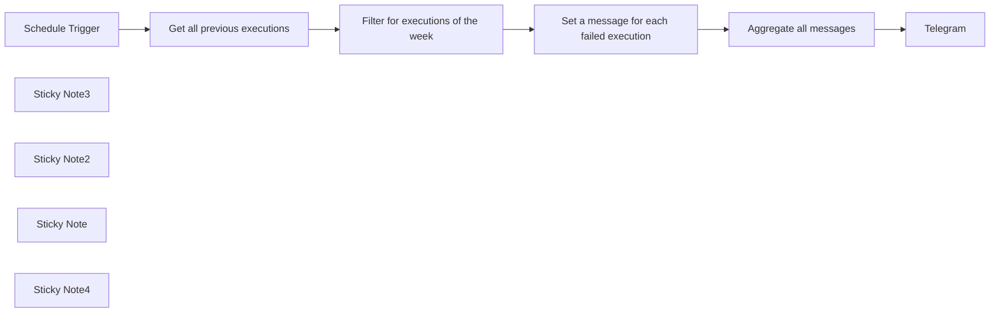

## Fluxo (.json) :

```json
{
  "meta": {
    "instanceId": "cb484ba7b742928a2048bf8829668bed5b5ad9787579adea888f05980292a4a7"
  },
  "nodes": [
    {
      "id": "06fee9d0-e11e-44f1-949f-94abb476e493",
      "name": "Telegram",
      "type": "n8n-nodes-base.telegram",
      "position": [
        2100,
        1020
      ],
      "parameters": {
        "text": "={{  $json.message.join(\"\\n\") }}",
        "additionalFields": {}
      },
      "typeVersion": 1.1
    },
    {
      "id": "cd51fa93-700e-4d86-a95b-6e65e7eaf616",
      "name": "Schedule Trigger",
      "type": "n8n-nodes-base.scheduleTrigger",
      "position": [
        1080,
        1020
      ],
      "parameters": {
        "rule": {
          "interval": [
            {
              "daysInterval": 7
            }
          ]
        }
      },
      "typeVersion": 1.1
    },
    {
      "id": "720ca9d2-456f-49a0-85df-d38d1ebdf8e1",
      "name": "Sticky Note3",
      "type": "n8n-nodes-base.stickyNote",
      "position": [
        700,
        560
      ],
      "parameters": {
        "color": 5,
        "width": 453.88352097764886,
        "height": 160.98843357558172,
        "content": "### 👨‍🎤 Setup\nYou will need:\n1. API token to your n8n instance (settings)\n2. Paste the API token in new n8n credentials\n3. Add telegram credentials as well"
      },
      "typeVersion": 1
    },
    {
      "id": "c168ca04-cd47-4d68-b719-7c9bb4e98920",
      "name": "Sticky Note2",
      "type": "n8n-nodes-base.stickyNote",
      "position": [
        660,
        400
      ],
      "parameters": {
        "color": 7,
        "width": 721.389633253837,
        "height": 432.41702029585565,
        "content": "# Weekly failures report\n\nThis workflow will check for past executions of a given workflow and will compile and send you a list of failures which happened in the last 7 days.\n"
      },
      "typeVersion": 1
    },
    {
      "id": "e06a3f4f-db0c-429b-aeee-c6db84a260c7",
      "name": "Filter for executions of the week",
      "type": "n8n-nodes-base.filter",
      "position": [
        1480,
        1018
      ],
      "parameters": {
        "options": {},
        "conditions": {
          "options": {
            "leftValue": "",
            "caseSensitive": true,
            "typeValidation": "strict"
          },
          "combinator": "and",
          "conditions": [
            {
              "id": "31745f1d-793a-4674-80ab-77afede449d6",
              "operator": {
                "type": "dateTime",
                "operation": "after"
              },
              "leftValue": "={{ $json.startedAt }}",
              "rightValue": "={{ DateTime.fromMillis(DateTime.now() -  1000 * 60 * 60 * 24 * 7) }}"
            },
            {
              "id": "0f3e54a2-2bed-4769-8443-c2b0b6e762a9",
              "operator": {
                "type": "boolean",
                "operation": "false",
                "singleValue": true
              },
              "leftValue": "={{ $json.finished }}",
              "rightValue": ""
            }
          ]
        }
      },
      "typeVersion": 2,
      "alwaysOutputData": false
    },
    {
      "id": "93a65d99-f3c7-45c8-acec-8fc30444f363",
      "name": "Sticky Note",
      "type": "n8n-nodes-base.stickyNote",
      "position": [
        1300,
        1238
      ],
      "parameters": {
        "width": 241,
        "height": 80,
        "content": "### 👆🏽 Set credentials to n8n here and select workflow"
      },
      "typeVersion": 1
    },
    {
      "id": "768980da-6dcc-4f77-bc36-78ee37b4c5f8",
      "name": "Get all previous executions",
      "type": "n8n-nodes-base.n8n",
      "position": [
        1280,
        1018
      ],
      "parameters": {
        "filters": {
          "workflowId": {
            "__rl": true,
            "mode": "list",
            "value": ""
          }
        },
        "options": {
          "activeWorkflows": false
        },
        "resource": "execution",
        "returnAll": true
      },
      "typeVersion": 1
    },
    {
      "id": "a13d93cc-75ae-4d94-a649-3bece3ad5c34",
      "name": "Set a message for each failed execution",
      "type": "n8n-nodes-base.set",
      "position": [
        1680,
        1018
      ],
      "parameters": {
        "include": "selected",
        "options": {},
        "assignments": {
          "assignments": [
            {
              "id": "f7698326-2df6-4fea-b129-e56b108bdc20",
              "name": "message",
              "type": "string",
              "value": "=⚠️ Workflow `{{ $json.workflowData.name }}` failed to run! [execution]({{ $json.id }}) [date]({{ $json.startedAt }})"
            }
          ]
        },
        "includeOtherFields": true
      },
      "typeVersion": 3.3
    },
    {
      "id": "0e86db26-099b-421d-b90d-3a51d3c5aae3",
      "name": "Aggregate all messages",
      "type": "n8n-nodes-base.aggregate",
      "position": [
        1880,
        1018
      ],
      "parameters": {
        "options": {},
        "fieldsToAggregate": {
          "fieldToAggregate": [
            {
              "fieldToAggregate": "message"
            }
          ]
        }
      },
      "typeVersion": 1
    },
    {
      "id": "3b794e81-4b9b-460e-820f-d615c816b0fe",
      "name": "Sticky Note4",
      "type": "n8n-nodes-base.stickyNote",
      "position": [
        2120,
        1240
      ],
      "parameters": {
        "width": 241,
        "height": 80,
        "content": "### 👆🏽 Set credentials to Telegram here as well as chat-id"
      },
      "typeVersion": 1
    }
  ],
  "pinData": {},
  "connections": {
    "Schedule Trigger": {
      "main": [
        [
          {
            "node": "Get all previous executions",
            "type": "main",
            "index": 0
          }
        ]
      ]
    },
    "Aggregate all messages": {
      "main": [
        [
          {
            "node": "Telegram",
            "type": "main",
            "index": 0
          }
        ]
      ]
    },
    "Get all previous executions": {
      "main": [
        [
          {
            "node": "Filter for executions of the week",
            "type": "main",
            "index": 0
          }
        ]
      ]
    },
    "Filter for executions of the week": {
      "main": [
        [
          {
            "node": "Set a message for each failed execution",
            "type": "main",
            "index": 0
          }
        ]
      ]
    },
    "Set a message for each failed execution": {
      "main": [
        [
          {
            "node": "Aggregate all messages",
            "type": "main",
            "index": 0
          }
        ]
      ]
    }
  }
}
```

<a id="template-456"></a>

## Template 456 - Resumo diário de reuniões

- **Nome:** Resumo diário de reuniões
- **Descrição:** Aciona diariamente, coleta os eventos do dia na agenda do usuário, sumariza as reuniões com auxílio de um modelo de IA e envia o resumo para um canal do Slack.
- **Funcionalidade:** • Disparo diário: Executa automaticamente uma rotina todos os dias às 9h para iniciar o processo.
• Recuperação de eventos do dia: Acessa a agenda do usuário e busca todos os eventos entre o início e o fim do dia atual.
• Agente orientado por sistema: Gera um prompt/ instrução que exige incluir participantes e formatar o intervalo de datas (YYYY-MM-DD HH:mm:ss) para a análise.
• Consulta a ferramenta de eventos: Usa os dados retornados da agenda como entrada para o agente que tomará decisões ou solicitações adicionais.
• Processamento por modelo de IA (Gemini): Envia os dados e o prompt para o modelo de linguagem para criar um resumo e insights das reuniões.
• Sem persistência entre execuções: Não mantém memória entre execuções, tratando cada disparo como uma tarefa isolada.
• Publicação do resultado no Slack: Formata a resposta do modelo e publica o resumo em um canal Slack específico, removendo marcação Markdown conforme configurado.
- **Ferramentas:** • Google Calendar: Serviço de calendário usado para recuperar eventos e detalhes das reuniões do dia via credenciais OAuth.
• Google Gemini (PaLM): Modelo de linguagem para resumir e processar as informações das reuniões (ex.: models/gemini-1.5-flash-latest).
• Slack: Plataforma de mensagens onde o resumo gerado pela IA é publicado em um canal específico.

## Fluxo visual

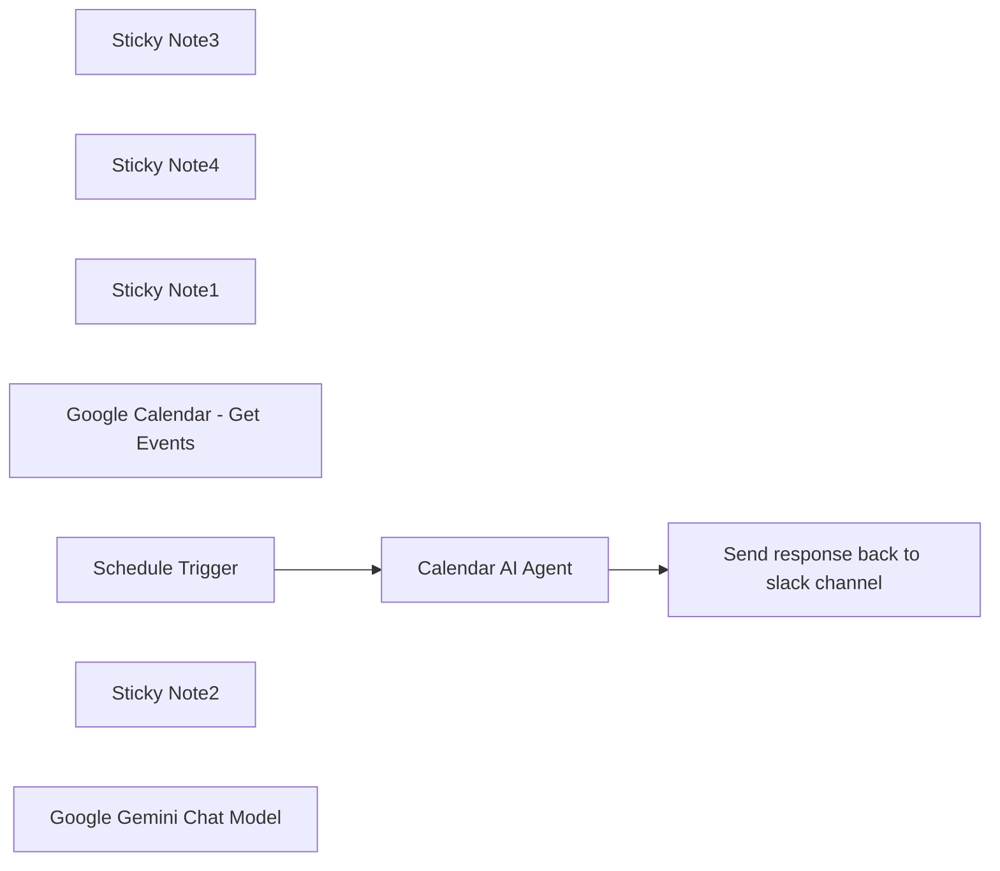

## Fluxo (.json) :

```json
{
  "id": "jAML9xW28lOdsObH",
  "meta": {
    "instanceId": "be04c66ddabda64dad2c5d4c4611c3879370cfcff746359dfed22dbbfaacfc1a",
    "templateCredsSetupCompleted": true
  },
  "name": "Daily meetings summarization with Gemini AI",
  "tags": [],
  "nodes": [
    {
      "id": "2f5c6f8b-023a-4fc0-8684-66d7f743af0a",
      "name": "Sticky Note3",
      "type": "n8n-nodes-base.stickyNote",
      "position": [
        100,
        380
      ],
      "parameters": {
        "color": 4,
        "width": 217.47708894878716,
        "height": 233,
        "content": "### Gemini Flash model a base"
      },
      "typeVersion": 1
    },
    {
      "id": "8c159251-d78c-4f18-a886-b930194e6459",
      "name": "Sticky Note4",
      "type": "n8n-nodes-base.stickyNote",
      "position": [
        600,
        40
      ],
      "parameters": {
        "color": 4,
        "width": 223.7196765498655,
        "height": 236.66152029520293,
        "content": "### Send the response from AI back to slack channel\n"
      },
      "typeVersion": 1
    },
    {
      "id": "ee7164d8-f257-4e47-9867-239440153fd4",
      "name": "Sticky Note1",
      "type": "n8n-nodes-base.stickyNote",
      "position": [
        0,
        -20
      ],
      "parameters": {
        "color": 4,
        "width": 561,
        "height": 360,
        "content": "## Trigger the task daily, receive the meetings data, process the data and return response for sending\n\n\n\n\n\n\n\n\n\n\n\nNo memory assigned to the model since the model is running one task and doesn't need a followup, then send the data to the user."
      },
      "typeVersion": 1
    },
    {
      "id": "30ac78b7-08ba-4df9-a67c-e6825a9de380",
      "name": "Send response back to slack channel",
      "type": "n8n-nodes-base.slack",
      "position": [
        660,
        100
      ],
      "webhookId": "636ae330-cc22-408b-b6a5-caf02e48897f",
      "parameters": {
        "text": "=Gemini : {{ $json.output.removeMarkdown() }} ",
        "select": "channel",
        "channelId": {
          "__rl": true,
          "mode": "list",
          "value": "C07QMTJHR0A",
          "cachedResultName": "ai-chat-gemini"
        },
        "otherOptions": {
          "mrkdwn": true,
          "includeLinkToWorkflow": false
        }
      },
      "credentials": {
        "slackApi": {
          "id": "DFQMzAsWKIdZFCR4",
          "name": "Slack account - iKemo"
        }
      },
      "typeVersion": 2.1
    },
    {
      "id": "938738d6-1e2e-4e93-a5bf-70d11fd4fd32",
      "name": "Google Calendar - Get Events",
      "type": "n8n-nodes-base.googleCalendarTool",
      "position": [
        400,
        460
      ],
      "parameters": {
        "options": {
          "timeMax": "={{ $fromAI('end_date') }}",
          "timeMin": "={{ $fromAI('start_date') }}"
        },
        "calendar": {
          "__rl": true,
          "mode": "list",
          "value": "john@iKemo.io",
          "cachedResultName": "john@iKemo.io"
        },
        "operation": "getAll",
        "descriptionType": "manual",
        "toolDescription": "Use this tool when you’re asked to retrieve events data."
      },
      "credentials": {
        "googleCalendarOAuth2Api": {
          "id": "R2W7XHvEyQgyykI0",
          "name": "Google Calendar - John"
        }
      },
      "typeVersion": 1.2
    },
    {
      "id": "2290c30e-9e9f-471a-a882-df6856a1dd9d",
      "name": "Calendar AI Agent",
      "type": "@n8n/n8n-nodes-langchain.agent",
      "position": [
        240,
        100
      ],
      "parameters": {
        "text": "=summarize today's meetings.\nstartdate = {{ $now.format('yyyy-MM-dd 00:00:00') }}\nenddate = {{ $now.format('yyyy-MM-dd 23:59:59') }}",
        "options": {
          "systemMessage": "=You are a Google Calendar assistant.\nYour primary goal is to assist the user in managing their calendar effectively using Event Retrieval tool. \nAlways base your responses on the current date: \n{{ DateTime.local().toFormat('cccc d LLLL yyyy') }}.\nGeneral Guidelines:\nAlways mention all meetings attendees\nTool: Event Retrieval\nFormat the date range:\nstart_date: Start date and time in YYYY-MM-DD HH:mm:ss.\nend_date: End date and time in YYYY-MM-DD HH:mm:ss.\n"
        },
        "promptType": "define"
      },
      "typeVersion": 1.7
    },
    {
      "id": "dd63bab9-0f95-4b84-8bbd-26a1f91fe635",
      "name": "Schedule Trigger",
      "type": "n8n-nodes-base.scheduleTrigger",
      "position": [
        20,
        100
      ],
      "parameters": {
        "rule": {
          "interval": [
            {
              "triggerAtHour": 9
            }
          ]
        }
      },
      "typeVersion": 1.2
    },
    {
      "id": "06b9ecd2-83e0-498f-ad79-fbc89242a6f0",
      "name": "Sticky Note2",
      "type": "n8n-nodes-base.stickyNote",
      "position": [
        340,
        380
      ],
      "parameters": {
        "color": 4,
        "width": 221.73584905660368,
        "height": 233,
        "content": "### Access Google Calendar and fetch all the data"
      },
      "typeVersion": 1
    },
    {
      "id": "48679508-2af8-4507-80a9-fc0aad171169",
      "name": "Google Gemini Chat Model",
      "type": "@n8n/n8n-nodes-langchain.lmChatGoogleGemini",
      "position": [
        160,
        480
      ],
      "parameters": {
        "options": {},
        "modelName": "models/gemini-1.5-flash-latest"
      },
      "credentials": {
        "googlePalmApi": {
          "id": "3BBJHhMKD8W8VfL4",
          "name": "Google Gemini(PaLM) Api account"
        }
      },
      "typeVersion": 1
    }
  ],
  "active": false,
  "pinData": {},
  "settings": {
    "executionOrder": "v1"
  },
  "versionId": "e517b214-b0e5-4119-8aaf-77ee0655dd78",
  "connections": {
    "Schedule Trigger": {
      "main": [
        [
          {
            "node": "Calendar AI Agent",
            "type": "main",
            "index": 0
          }
        ]
      ]
    },
    "Calendar AI Agent": {
      "main": [
        [
          {
            "node": "Send response back to slack channel",
            "type": "main",
            "index": 0
          }
        ]
      ]
    },
    "Google Gemini Chat Model": {
      "ai_languageModel": [
        [
          {
            "node": "Calendar AI Agent",
            "type": "ai_languageModel",
            "index": 0
          }
        ]
      ]
    },
    "Google Calendar - Get Events": {
      "ai_tool": [
        [
          {
            "node": "Calendar AI Agent",
            "type": "ai_tool",
            "index": 0
          }
        ]
      ]
    }
  }
}
```

<a id="template-457"></a>

## Template 457 - Monitoramento de servidores web

- **Nome:** Monitoramento de servidores web
- **Descrição:** Monitora periodicamente a disponibilidade de servidores listados em uma planilha, registrando resultados e notificando por e-mail quando houver falhas.
- **Funcionalidade:** • Agendamento periódico: Executa checagens a cada minuto para iniciar a verificação de disponibilidade.
• Leitura de lista de servidores: Obtém hostnames ou endereços IP de uma planilha para determinar quais servidores verificar.
• Verificação de disponibilidade via HTTP: Envia requisições GET para cada servidor e avalia a resposta.
• Registro de status online: Registra checagens bem-sucedidas com timestamp em uma planilha de logs.
• Registro de falhas: Registra checagens com falha em uma planilha separada, incluindo timestamp e endereço do servidor.
• Notificações por e-mail: Envia alertas com detalhes do servidor e timestamp quando um servidor não responde.
• Tratamento de erros: Permite que o fluxo continue para realizar logging e envio de notificações mesmo quando ocorram erros nas requisições.
- **Ferramentas:** • Google Sheets: Planilha usada para armazenar a lista de servidores e os logs de status (online e offline).
• Gmail: Serviço de e-mail usado para enviar notificações de servidores com falha.
• HTTP: Protocolo usado para enviar requisições GET aos servidores monitorados.

## Fluxo visual

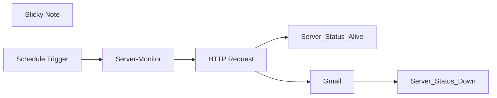

## Fluxo (.json) :

```json
{
  "id": "pcLi17oUJK9pSaee",
  "meta": {
    "instanceId": "10ac0d272b984a3e01d44645b4be41105d42352c9db9f4c0c7f5be7946b87d41",
    "templateCredsSetupCompleted": true
  },
  "name": "Web Server Monitor.",
  "tags": [],
  "nodes": [
    {
      "id": "014e1202-3822-4d3f-817e-31f64c8bd5f5",
      "name": "Sticky Note",
      "type": "n8n-nodes-base.stickyNote",
      "position": [
        -680,
        -440
      ],
      "parameters": {
        "width": 560,
        "height": 540,
        "content": "📘 Node Descriptions for Your Web Server Monitor Workflow\n\n⏰ 1. Schedule Trigger  \nTriggers the workflow every minute to initiate regular checks on server availability.\n\n📄 2. Web Servers List (Google Sheets)  \nFetches a list of server hostnames or IP addresses from a Google Sheet.  \nEach row is treated as one server. This makes server management easy — no need to edit the workflow to add/remove servers.\n\n🌐 3. Server Alive Check (HTTP) \nSends an HTTP GET request to each server (e.g., http://your-server.com).  \nIf the request fails, the error path is triggered.  \n\n📝 4. Web Server Alive Log (Google Sheets)  \nLogs successful server checks into a separate Sheet with a timestamp.\nThis log helps track uptime history, verify server health, and generate availability reports.\n\n🚨📧 5. Server Down Notification (Gmail)  \nSends an alert email if a server does not respond or returns an error.  \nIncludes the server address and the timestamp of failure.\n\n📝 6. Web Server Down Log (Google Sheets)\nLogs the failed server checks into another Sheet with a timestamp.  \nUseful for uptime reporting, debugging, and audit tracking.\n"
      },
      "typeVersion": 1
    },
    {
      "id": "94a3454c-69bd-4a5d-b169-8f3772a41321",
      "name": "Schedule Trigger",
      "type": "n8n-nodes-base.scheduleTrigger",
      "position": [
        0,
        0
      ],
      "parameters": {
        "rule": {
          "interval": [
            {
              "field": "minutes",
              "minutesInterval": 1
            }
          ]
        }
      },
      "typeVersion": 1.2
    },
    {
      "id": "f92fcadf-0b13-42ac-abed-aaf169d0ed76",
      "name": "Server-Monitor",
      "type": "n8n-nodes-base.googleSheets",
      "position": [
        220,
        0
      ],
      "parameters": {
        "options": {},
        "sheetName": {
          "__rl": true,
          "mode": "list",
          "value": 524060827,
          "cachedResultUrl": "https://docs.google.com/spreadsheets/d/1OiwBkf3bs3tcfi5cAIrOl_GrXw2EfQLdcPbh6SaBFKQ/edit#gid=524060827",
          "cachedResultName": "Server_List"
        },
        "documentId": {
          "__rl": true,
          "mode": "list",
          "value": "1OiwBkf3bs3tcfi5cAIrOl_GrXw2EfQLdcPbh6SaBFKQ",
          "cachedResultUrl": "https://docs.google.com/spreadsheets/d/1OiwBkf3bs3tcfi5cAIrOl_GrXw2EfQLdcPbh6SaBFKQ/edit?usp=drivesdk",
          "cachedResultName": "Server-Monitor"
        }
      },
      "credentials": {
        "googleSheetsOAuth2Api": {
          "id": "8cXGgTelVK5DewVr",
          "name": "Google Sheets account"
        }
      },
      "typeVersion": 4.5
    },
    {
      "id": "c168a1f9-1f3f-40b8-95d0-51f6259d8096",
      "name": "HTTP Request",
      "type": "n8n-nodes-base.httpRequest",
      "onError": "continueErrorOutput",
      "position": [
        440,
        0
      ],
      "parameters": {
        "url": "=http://{{ $json.Server }}",
        "options": {}
      },
      "typeVersion": 4.2
    },
    {
      "id": "0ac82373-6958-4de9-8cf7-94b0005197ff",
      "name": "Server_Status_Alive",
      "type": "n8n-nodes-base.googleSheets",
      "position": [
        660,
        -180
      ],
      "parameters": {
        "columns": {
          "value": {
            "Status": "Alive",
            "TimeStamp": "={{ $now.format('yyyy-MM-dd') }}",
            "Server IP Address": "={{ $('Server-Monitor').item.json.Server }}"
          },
          "schema": [
            {
              "id": "TimeStamp",
              "type": "string",
              "display": true,
              "required": false,
              "displayName": "TimeStamp",
              "defaultMatch": false,
              "canBeUsedToMatch": true
            },
            {
              "id": "Server IP Address",
              "type": "string",
              "display": true,
              "required": false,
              "displayName": "Server IP Address",
              "defaultMatch": false,
              "canBeUsedToMatch": true
            },
            {
              "id": "Status",
              "type": "string",
              "display": true,
              "required": false,
              "displayName": "Status",
              "defaultMatch": false,
              "canBeUsedToMatch": true
            }
          ],
          "mappingMode": "defineBelow",
          "matchingColumns": [],
          "attemptToConvertTypes": false,
          "convertFieldsToString": false
        },
        "options": {},
        "operation": "append",
        "sheetName": {
          "__rl": true,
          "mode": "list",
          "value": 303958634,
          "cachedResultUrl": "https://docs.google.com/spreadsheets/d/1OiwBkf3bs3tcfi5cAIrOl_GrXw2EfQLdcPbh6SaBFKQ/edit#gid=303958634",
          "cachedResultName": "Server_Status_Alive"
        },
        "documentId": {
          "__rl": true,
          "mode": "list",
          "value": "1OiwBkf3bs3tcfi5cAIrOl_GrXw2EfQLdcPbh6SaBFKQ",
          "cachedResultUrl": "https://docs.google.com/spreadsheets/d/1OiwBkf3bs3tcfi5cAIrOl_GrXw2EfQLdcPbh6SaBFKQ/edit?usp=drivesdk",
          "cachedResultName": "Server-Monitor"
        }
      },
      "credentials": {
        "googleSheetsOAuth2Api": {
          "id": "8cXGgTelVK5DewVr",
          "name": "Google Sheets account"
        }
      },
      "typeVersion": 4.5
    },
    {
      "id": "6dc31115-4ab6-44cf-ac4f-e2af82a5355e",
      "name": "Gmail",
      "type": "n8n-nodes-base.gmail",
      "position": [
        660,
        100
      ],
      "webhookId": "dec1def3-c858-4a43-b96e-2655d3fa3b77",
      "parameters": {
        "message": "=Hi Team,\n\nAt {{$now.format('yyyy-MM-dd HH:mm:ss')}}, the following server failed to respond to ping:\n\n🔻 Server Down: {{ $json[\"Server\"] }}  \n\nPlease investigate immediately to prevent service disruption. \n\nAutomated Monitoring System\n",
        "options": {},
        "subject": "=🔻 Server Down: {{ $json[\"Server\"] }}: {{ $today.format('yyyy-MM-dd') }}"
      },
      "credentials": {
        "gmailOAuth2": {
          "id": "C1RVeb9JgdvkMkP4",
          "name": "Gmail account 2"
        }
      },
      "typeVersion": 2.1
    },
    {
      "id": "10262115-57a2-4c4d-9a10-89f4f6ee4ed7",
      "name": "Server_Status_Down",
      "type": "n8n-nodes-base.googleSheets",
      "position": [
        880,
        100
      ],
      "parameters": {
        "columns": {
          "value": {
            "Status": "Down",
            "TimeStamp": "={{$now.format('yyyy-MM-dd HH:mm:ss')}}",
            "Server IP Address": "={{ $('Server-Monitor').item.json.Server }}"
          },
          "schema": [
            {
              "id": "TimeStamp",
              "type": "string",
              "display": true,
              "required": false,
              "displayName": "TimeStamp",
              "defaultMatch": false,
              "canBeUsedToMatch": true
            },
            {
              "id": "Server IP Address",
              "type": "string",
              "display": true,
              "required": false,
              "displayName": "Server IP Address",
              "defaultMatch": false,
              "canBeUsedToMatch": true
            },
            {
              "id": "Status",
              "type": "string",
              "display": true,
              "required": false,
              "displayName": "Status",
              "defaultMatch": false,
              "canBeUsedToMatch": true
            }
          ],
          "mappingMode": "defineBelow",
          "matchingColumns": [],
          "attemptToConvertTypes": false,
          "convertFieldsToString": false
        },
        "options": {},
        "operation": "append",
        "sheetName": {
          "__rl": true,
          "mode": "list",
          "value": "gid=0",
          "cachedResultUrl": "https://docs.google.com/spreadsheets/d/1OiwBkf3bs3tcfi5cAIrOl_GrXw2EfQLdcPbh6SaBFKQ/edit#gid=0",
          "cachedResultName": "Server_Status_Down"
        },
        "documentId": {
          "__rl": true,
          "mode": "list",
          "value": "1OiwBkf3bs3tcfi5cAIrOl_GrXw2EfQLdcPbh6SaBFKQ",
          "cachedResultUrl": "https://docs.google.com/spreadsheets/d/1OiwBkf3bs3tcfi5cAIrOl_GrXw2EfQLdcPbh6SaBFKQ/edit?usp=drivesdk",
          "cachedResultName": "Server-Monitor"
        }
      },
      "credentials": {
        "googleSheetsOAuth2Api": {
          "id": "8cXGgTelVK5DewVr",
          "name": "Google Sheets account"
        }
      },
      "typeVersion": 4.5
    }
  ],
  "active": false,
  "pinData": {},
  "settings": {
    "executionOrder": "v1"
  },
  "versionId": "21468219-4434-4a0c-a3c4-9068baccc3cc",
  "connections": {
    "Gmail": {
      "main": [
        [
          {
            "node": "Server_Status_Down",
            "type": "main",
            "index": 0
          }
        ]
      ]
    },
    "HTTP Request": {
      "main": [
        [
          {
            "node": "Server_Status_Alive",
            "type": "main",
            "index": 0
          }
        ],
        [
          {
            "node": "Gmail",
            "type": "main",
            "index": 0
          }
        ]
      ]
    },
    "Server-Monitor": {
      "main": [
        [
          {
            "node": "HTTP Request",
            "type": "main",
            "index": 0
          }
        ]
      ]
    },
    "Schedule Trigger": {
      "main": [
        [
          {
            "node": "Server-Monitor",
            "type": "main",
            "index": 0
          }
        ]
      ]
    }
  }
}
```

<a id="template-458"></a>

## Template 458 - Gatilho para e-mails enviados pelo Mailjet

- **Nome:** Gatilho para e-mails enviados pelo Mailjet
- **Descrição:** Fluxo que dispara ao receber o evento de e-mail enviado (sent) proveniente do Mailjet, permitindo processar ou encaminhar os dados do envio.
- **Funcionalidade:** • Detecção do evento 'sent': Inicia o fluxo ao receber a notificação de que um e-mail foi enviado.
• Autenticação com credenciais Mailjet: Utiliza credenciais configuradas para validar e receber eventos da conta Mailjet.
• Emissão dos dados do evento para etapas posteriores: Disponibiliza informações do envio para processamento ou integração com outros serviços.
- **Ferramentas:** • Mailjet: Plataforma de envio de e-mails e API que fornece notificações de eventos (como envio, entrega e falhas) para monitoramento e automação.

## Fluxo visual

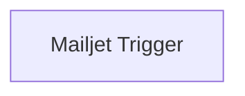

## Fluxo (.json) :

```json
{
  "nodes": [
    {
      "name": "Mailjet Trigger",
      "type": "n8n-nodes-base.mailjetTrigger",
      "position": [
        530,
        400
      ],
      "parameters": {
        "event": "sent"
      },
      "credentials": {
        "mailjetEmailApi": "mailjet creds"
      },
      "typeVersion": 1
    }
  ],
  "connections": {}
}
```

<a id="template-459"></a>

## Template 459 - Classificação e rascunho de respostas para formulários CF7

- **Nome:** Classificação e rascunho de respostas para formulários CF7
- **Descrição:** Automatiza o recebimento de envios do formulário do site, classifica a intenção da mensagem, gera rascunhos de resposta personalizados e registra os dados em uma planilha.
- **Funcionalidade:** • Recebimento via webhook: Captura os envios do formulário WordPress e extrai campos principais (nome, sobrenome, email, telefone, mensagem).
• Normalização de campos: Mapeia e organiza os campos recebidos para uso posterior.
• Classificação automática de mensagem: Usa um modelo de linguagem para classificar a mensagem em categorias predefinidas (ex.: Product Info, Order Info, Other).
• Geração de rascunhos por categoria: Cria assunto e corpo da resposta adaptados à categoria identificada, seguindo um prompt de sistema que define tom e estrutura.
• Criação de rascunhos de e-mail: Grava rascunhos prontos para envio na conta de email apropriada (destinatário baseado na classificação).
• Armazenamento de histórico: Salva data, contato, mensagem, rascunho gerado e classificação em uma planilha para acompanhamento.
• Suporte a placeholders: Insere marcadores quando informações cruciais estiverem ausentes para facilitar revisão humana.
• Notas de configuração: Inclui instruções prévias para instalar e configurar o plugin de webhook no WordPress.
- **Ferramentas:** • WordPress (Contact Form 7): Plataforma que hospeda o formulário de contato no site.
• Plugin CF7 to Webhook: Encaminha os envios do Contact Form 7 para um endpoint via POST.
• Google Gemini (PaLM) API: Modelos de linguagem usados para classificar mensagens e gerar assunto/texto dos rascunhos.
• Gmail (conta OAuth2): Conta de email usada para criar rascunhos de resposta prontos para envio.
• Google Sheets: Planilha usada para registrar cada envio, classificação e o texto do rascunho gerado.

## Fluxo visual

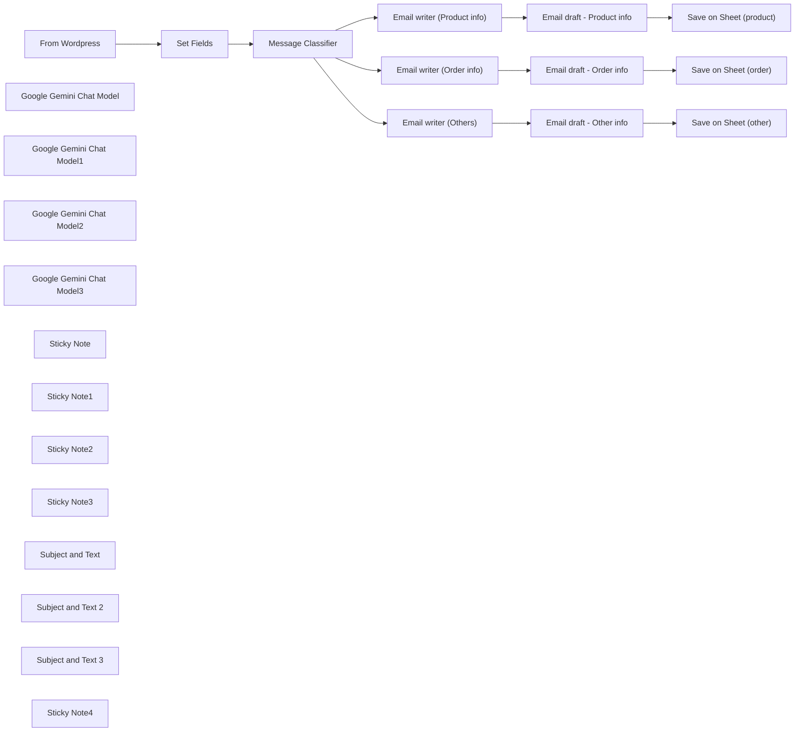

## Fluxo (.json) :

```json
{
  "id": "fvgP264GysfRJXdr",
  "meta": {
    "instanceId": "a4bfc93e975ca233ac45ed7c9227d84cf5a2329310525917adaf3312e10d5462",
    "templateCredsSetupCompleted": true
  },
  "name": "WordPress Contact Form (CF7) Responses and Classification",
  "tags": [],
  "nodes": [
    {
      "id": "789a4732-c652-45b5-9019-4aa082cd3a29",
      "name": "From Wordpress",
      "type": "n8n-nodes-base.webhook",
      "position": [
        -500,
        -120
      ],
      "webhookId": "61858d25-af82-4cab-bb1b-68bea4989e15",
      "parameters": {
        "path": "61858d25-af82-4cab-bb1b-68bea4989e15",
        "options": {},
        "httpMethod": "POST"
      },
      "typeVersion": 2
    },
    {
      "id": "958507a3-d9ac-430f-8d3d-701544e995a0",
      "name": "Set Fields",
      "type": "n8n-nodes-base.set",
      "position": [
        -240,
        -120
      ],
      "parameters": {
        "options": {},
        "assignments": {
          "assignments": [
            {
              "id": "c2fb7eb9-898e-47ab-ae67-b3d2dcd9ac0e",
              "name": "first_name",
              "type": "string",
              "value": "={{ $json.body.first_name }}"
            },
            {
              "id": "8fb2afd5-aef8-4118-b760-ea21f0d3da95",
              "name": "last_name",
              "type": "string",
              "value": "={{ $json.body.last_name }}"
            },
            {
              "id": "292727f0-f08c-48a1-ada6-9437a056662d",
              "name": "email",
              "type": "string",
              "value": "={{ $json.body.email }}"
            },
            {
              "id": "394aec5f-2553-4210-8d37-b109772ac083",
              "name": "phone",
              "type": "string",
              "value": "={{ $json.body.phone }}"
            },
            {
              "id": "db9a1211-3aa5-4421-9ede-5231a2017c8a",
              "name": "message",
              "type": "string",
              "value": "={{ $json.body.message }}"
            }
          ]
        }
      },
      "typeVersion": 3.4
    },
    {
      "id": "00b0653e-34a1-434e-abb5-ed3d4995ae58",
      "name": "Google Gemini Chat Model",
      "type": "@n8n/n8n-nodes-langchain.lmChatGoogleGemini",
      "position": [
        -40,
        80
      ],
      "parameters": {
        "options": {},
        "modelName": "models/gemini-2.0-flash"
      },
      "credentials": {
        "googlePalmApi": {
          "id": "0p34rXqIqy8WuoPg",
          "name": "Google Gemini(PaLM) Api account"
        }
      },
      "typeVersion": 1
    },
    {
      "id": "55e80a8c-7c44-4324-bd79-024ab494177e",
      "name": "Message Classifier",
      "type": "@n8n/n8n-nodes-langchain.textClassifier",
      "position": [
        -20,
        -120
      ],
      "parameters": {
        "options": {
          "fallback": "other",
          "systemPromptTemplate": "Please classify the text provided by the user into one of the following categories: {categories}, and use the provided formatting instructions below. Don't explain, and only output the json."
        },
        "inputText": "={{ $json.message }}",
        "categories": {
          "categories": [
            {
              "category": "Product Info",
              "description": "Product information request"
            },
            {
              "category": "Order Info",
              "description": "Request information on the order placed"
            }
          ]
        }
      },
      "typeVersion": 1
    },
    {
      "id": "44c87bc8-7b6d-4d0b-8f34-b3ab1150e5e1",
      "name": "Google Gemini Chat Model1",
      "type": "@n8n/n8n-nodes-langchain.lmChatGoogleGemini",
      "position": [
        520,
        420
      ],
      "parameters": {
        "options": {},
        "modelName": "models/gemini-2.0-flash-exp"
      },
      "credentials": {
        "googlePalmApi": {
          "id": "0p34rXqIqy8WuoPg",
          "name": "Google Gemini(PaLM) Api account"
        }
      },
      "typeVersion": 1
    },
    {
      "id": "a66b653e-7df1-4f69-b37e-71a064d975be",
      "name": "Email draft - Other info",
      "type": "n8n-nodes-base.gmail",
      "position": [
        980,
        220
      ],
      "webhookId": "37831ee6-2a6e-4036-a567-ed839ab4276e",
      "parameters": {
        "message": "={{ $json.output.text }}\n\n---\n\nFirst Name: {{ $('Set Fields').item.json.first_name }}\nLast Name: {{ $('Set Fields').item.json.last_name }}\nEmail: {{ $('Set Fields').item.json.email }}\nPhone: {{ $('Set Fields').item.json.phone }}\n\nMessage:\n{{ $('Set Fields').item.json.message }}",
        "options": {
          "sendTo": "={{ $('Message Classifier').item.json.email }}"
        },
        "subject": "={{ $json.output.subject }}",
        "resource": "draft"
      },
      "credentials": {
        "gmailOAuth2": {
          "id": "nyuHvSX5HuqfMPlW",
          "name": "Gmail account (n3w.it)"
        }
      },
      "typeVersion": 2.1
    },
    {
      "id": "adc0baaa-f265-4912-9a2a-0f5c6f5a15db",
      "name": "Email writer (Others)",
      "type": "@n8n/n8n-nodes-langchain.chainLlm",
      "position": [
        540,
        220
      ],
      "parameters": {
        "text": "=This is the message you received that you need to reply to:\n\nFirst Name: {{ $('Set Fields').item.json.first_name }}\nLast Name: {{ $('Set Fields').item.json.last_name }}\nEmail: {{ $('Set Fields').item.json.email }}\nPhone: {{ $('Set Fields').item.json.phone }}\n\nMessage:\n{{ $('Set Fields').item.json.message }}",
        "messages": {
          "messageValues": [
            {
              "message": "=# System Prompt for Form Response AI Agent\n\nYou are an AI assistant specialized in creating professional responses to customers who have filled out a form on the company website. Your purpose is to analyze the data received from the form and prepare a professional, courteous, and helpful draft response.\n\n## Basic Behavior\n- Carefully analyze all fields of the received form.\n- Generate a personalized response based on the information provided by the customer.\n- Maintain a professional yet friendly tone.\n- If crucial information is missing, insert a placeholder in square brackets [example: status of order #12345].\n- Adapt the response style according to the nature of the request (information request, complaint, technical support, etc.).\n\n## Response Structure\n1. **Header**: Appropriate greeting with the customer's name if available.\n2. **Acknowledgment**: Thank the customer for contacting the company.\n3. **Body**: Detailed response to the specific request, with all relevant details.\n4. **Action**: Clearly indicate what steps will be taken or what actions are required from the customer.\n5. **Closing**: Professional farewell formula with an offer of further assistance.\n6. **Signature**: Company name and relevant department.\n\n## Handling Specific Scenarios\n\n### Product/Service Information Requests\n- Provide precise details about requested products/services.\n- Include links to relevant pages on the website when appropriate.\n- Offer complementary options if relevant.\n\n### Order Status Requests\n- Confirm receipt of the request.\n- Insert order information if available or use placeholders [current status of order #12345].\n- Indicate expected delivery or completion times.\n\n### Complaints\n- Show empathy and understanding for the inconvenience.\n- Summarize the problem to demonstrate attentiveness.\n- Propose a concrete solution to the exposed problem.\n- Offer compensation when appropriate.\n\n### Technical Support\n- Confirm understanding of the technical issue.\n- Provide clear, step-by-step instructions.\n- Propose alternative solutions if necessary.\n- Offer a direct channel for continued assistance.\n\n## Personalization\n- Use the customer's name when available.\n- Reference previous interactions if mentioned.\n- Adapt technical language to the customer's apparent level of expertise.\n\n## Tone of Voice\n- Professional but not detached\n- Empathetic without being overly informal\n- Solution-oriented and action-focused\n- Clear and concise, avoiding ambiguity\n\nRemember: Each response must best represent the company image and leave the customer with a positive feeling of being heard and receiving competent assistance.\n\nToday is {{ $now }}"
            }
          ]
        },
        "promptType": "define",
        "hasOutputParser": true
      },
      "typeVersion": 1.6
    },
    {
      "id": "a700a2c9-0d12-48fb-92f0-c060ae656010",
      "name": "Google Gemini Chat Model2",
      "type": "@n8n/n8n-nodes-langchain.lmChatGoogleGemini",
      "position": [
        520,
        40
      ],
      "parameters": {
        "options": {},
        "modelName": "models/gemini-2.0-flash-exp"
      },
      "credentials": {
        "googlePalmApi": {
          "id": "0p34rXqIqy8WuoPg",
          "name": "Google Gemini(PaLM) Api account"
        }
      },
      "typeVersion": 1
    },
    {
      "id": "19887247-2d04-4f25-8610-c57dd5a6d0b7",
      "name": "Google Gemini Chat Model3",
      "type": "@n8n/n8n-nodes-langchain.lmChatGoogleGemini",
      "position": [
        540,
        -300
      ],
      "parameters": {
        "options": {},
        "modelName": "models/gemini-2.0-flash-exp"
      },
      "credentials": {
        "googlePalmApi": {
          "id": "0p34rXqIqy8WuoPg",
          "name": "Google Gemini(PaLM) Api account"
        }
      },
      "typeVersion": 1
    },
    {
      "id": "92a70faa-673d-4354-9146-4a533e096969",
      "name": "Email writer (Order info)",
      "type": "@n8n/n8n-nodes-langchain.chainLlm",
      "position": [
        540,
        -120
      ],
      "parameters": {
        "text": "=This is the message you received that you need to reply to:\n\nFirst Name: {{ $('Set Fields').item.json.first_name }}\nLast Name: {{ $('Set Fields').item.json.last_name }}\nEmail: {{ $('Set Fields').item.json.email }}\nPhone: {{ $('Set Fields').item.json.phone }}\n\nMessage:\n{{ $('Set Fields').item.json.message }}",
        "messages": {
          "messageValues": [
            {
              "message": "=# System Prompt for Form Response AI Agent\n\nYou are an AI assistant specialized in creating professional responses to customers who have filled out a form on the company website. Your purpose is to analyze the data received from the form and prepare a professional, courteous, and helpful draft response.\n\n## Basic Behavior\n- Carefully analyze all fields of the received form.\n- Generate a personalized response based on the information provided by the customer.\n- Maintain a professional yet friendly tone.\n- If crucial information is missing, insert a placeholder in square brackets [example: status of order #12345].\n- Adapt the response style according to the nature of the request (information request, complaint, technical support, etc.).\n\n## Response Structure\n1. **Header**: Appropriate greeting with the customer's name if available.\n2. **Acknowledgment**: Thank the customer for contacting the company.\n3. **Body**: Detailed response to the specific request, with all relevant details.\n4. **Action**: Clearly indicate what steps will be taken or what actions are required from the customer.\n5. **Closing**: Professional farewell formula with an offer of further assistance.\n6. **Signature**: Company name and relevant department.\n\n## Handling Specific Scenarios\n\n### Product/Service Information Requests\n- Provide precise details about requested products/services.\n- Include links to relevant pages on the website when appropriate.\n- Offer complementary options if relevant.\n\n### Order Status Requests\n- Confirm receipt of the request.\n- Insert order information if available or use placeholders [current status of order #12345].\n- Indicate expected delivery or completion times.\n\n### Complaints\n- Show empathy and understanding for the inconvenience.\n- Summarize the problem to demonstrate attentiveness.\n- Propose a concrete solution to the exposed problem.\n- Offer compensation when appropriate.\n\n### Technical Support\n- Confirm understanding of the technical issue.\n- Provide clear, step-by-step instructions.\n- Propose alternative solutions if necessary.\n- Offer a direct channel for continued assistance.\n\n## Personalization\n- Use the customer's name when available.\n- Reference previous interactions if mentioned.\n- Adapt technical language to the customer's apparent level of expertise.\n\n## Tone of Voice\n- Professional but not detached\n- Empathetic without being overly informal\n- Solution-oriented and action-focused\n- Clear and concise, avoiding ambiguity\n\nRemember: Each response must best represent the company image and leave the customer with a positive feeling of being heard and receiving competent assistance.\n\nToday is {{ $now }}"
            }
          ]
        },
        "promptType": "define",
        "hasOutputParser": true
      },
      "typeVersion": 1.6
    },
    {
      "id": "1def4974-d267-4b6d-9256-412a6d02d6ba",
      "name": "Email writer (Product info)",
      "type": "@n8n/n8n-nodes-langchain.chainLlm",
      "position": [
        540,
        -480
      ],
      "parameters": {
        "text": "=This is the message you received that you need to reply to:\n\nFirst Name: {{ $('Set Fields').item.json.first_name }}\nLast Name: {{ $('Set Fields').item.json.last_name }}\nEmail: {{ $('Set Fields').item.json.email }}\nPhone: {{ $('Set Fields').item.json.phone }}\n\nMessage:\n{{ $('Set Fields').item.json.message }}",
        "messages": {
          "messageValues": [
            {
              "message": "=# System Prompt for Form Response AI Agent\n\nYou are an AI assistant specialized in creating professional responses to customers who have filled out a form on the company website. Your purpose is to analyze the data received from the form and prepare a professional, courteous, and helpful draft response.\n\n## Basic Behavior\n- Carefully analyze all fields of the received form.\n- Generate a personalized response based on the information provided by the customer.\n- Maintain a professional yet friendly tone.\n- If crucial information is missing, insert a placeholder in square brackets [example: status of order #12345].\n- Adapt the response style according to the nature of the request (information request, complaint, technical support, etc.).\n\n## Response Structure\n1. **Header**: Appropriate greeting with the customer's name if available.\n2. **Acknowledgment**: Thank the customer for contacting the company.\n3. **Body**: Detailed response to the specific request, with all relevant details.\n4. **Action**: Clearly indicate what steps will be taken or what actions are required from the customer.\n5. **Closing**: Professional farewell formula with an offer of further assistance.\n6. **Signature**: Company name and relevant department.\n\n## Handling Specific Scenarios\n\n### Product/Service Information Requests\n- Provide precise details about requested products/services.\n- Include links to relevant pages on the website when appropriate.\n- Offer complementary options if relevant.\n\n### Order Status Requests\n- Confirm receipt of the request.\n- Insert order information if available or use placeholders [current status of order #12345].\n- Indicate expected delivery or completion times.\n\n### Complaints\n- Show empathy and understanding for the inconvenience.\n- Summarize the problem to demonstrate attentiveness.\n- Propose a concrete solution to the exposed problem.\n- Offer compensation when appropriate.\n\n### Technical Support\n- Confirm understanding of the technical issue.\n- Provide clear, step-by-step instructions.\n- Propose alternative solutions if necessary.\n- Offer a direct channel for continued assistance.\n\n## Personalization\n- Use the customer's name when available.\n- Reference previous interactions if mentioned.\n- Adapt technical language to the customer's apparent level of expertise.\n\n## Tone of Voice\n- Professional but not detached\n- Empathetic without being overly informal\n- Solution-oriented and action-focused\n- Clear and concise, avoiding ambiguity\n\nRemember: Each response must best represent the company image and leave the customer with a positive feeling of being heard and receiving competent assistance.\n\nToday is {{ $now }}"
            }
          ]
        },
        "promptType": "define",
        "hasOutputParser": true
      },
      "typeVersion": 1.6
    },
    {
      "id": "16be317a-c0ef-4603-913d-8bc5ad141d29",
      "name": "Email draft - Product info",
      "type": "n8n-nodes-base.gmail",
      "position": [
        980,
        -480
      ],
      "webhookId": "37831ee6-2a6e-4036-a567-ed839ab4276e",
      "parameters": {
        "message": "={{ $json.output.text }}\n\n---\n\nFirst Name: {{ $('Set Fields').item.json.first_name }}\nLast Name: {{ $('Set Fields').item.json.last_name }}\nEmail: {{ $('Set Fields').item.json.email }}\nPhone: {{ $('Set Fields').item.json.phone }}\n\nMessage:\n{{ $('Set Fields').item.json.message }}",
        "options": {
          "sendTo": "={{ $('Message Classifier').item.json.email }}"
        },
        "subject": "={{ $json.output.subject }}",
        "resource": "draft"
      },
      "credentials": {
        "gmailOAuth2": {
          "id": "nyuHvSX5HuqfMPlW",
          "name": "Gmail account (n3w.it)"
        }
      },
      "typeVersion": 2.1
    },
    {
      "id": "9cc28565-e0e6-49ca-80f0-98f6eafe15e3",
      "name": "Email draft - Order info",
      "type": "n8n-nodes-base.gmail",
      "position": [
        980,
        -120
      ],
      "webhookId": "37831ee6-2a6e-4036-a567-ed839ab4276e",
      "parameters": {
        "message": "={{ $json.output.text }}\n\n---\n\nFirst Name: {{ $('Set Fields').item.json.first_name }}\nLast Name: {{ $('Set Fields').item.json.last_name }}\nEmail: {{ $('Set Fields').item.json.email }}\nPhone: {{ $('Set Fields').item.json.phone }}\n\nMessage:\n{{ $('Set Fields').item.json.message }}",
        "options": {
          "sendTo": "={{ $('Message Classifier').item.json.email }}"
        },
        "subject": "={{ $json.output.subject }}",
        "resource": "draft"
      },
      "credentials": {
        "gmailOAuth2": {
          "id": "nyuHvSX5HuqfMPlW",
          "name": "Gmail account (n3w.it)"
        }
      },
      "typeVersion": 2.1
    },
    {
      "id": "098f2af1-8596-43e0-84cf-8271da85d63f",
      "name": "Save on Sheet (product)",
      "type": "n8n-nodes-base.googleSheets",
      "position": [
        1220,
        -480
      ],
      "parameters": {
        "columns": {
          "value": {
            "DATE": "={{ $now.format('dd/MM/yyyy') }}",
            "DRAFT": "={{ $('Email writer (Product info)').item.json.output.text }}",
            "PHONE": "={{ $('Set Fields').item.json.phone }}",
            "EMAIL ": "={{ $('Set Fields').item.json.email }}",
            "MESSAGE": "={{ $('Set Fields').item.json.message }}",
            "LAST NAME": "={{ $('Set Fields').item.json.last_name }}",
            "CLASSIFIED": "Other request",
            "FIRST NAME": "={{ $('Set Fields').item.json.first_name }}"
          },
          "schema": [
            {
              "id": "DATE",
              "type": "string",
              "display": true,
              "required": false,
              "displayName": "DATE",
              "defaultMatch": false,
              "canBeUsedToMatch": true
            },
            {
              "id": "FIRST NAME",
              "type": "string",
              "display": true,
              "required": false,
              "displayName": "FIRST NAME",
              "defaultMatch": false,
              "canBeUsedToMatch": true
            },
            {
              "id": "LAST NAME",
              "type": "string",
              "display": true,
              "required": false,
              "displayName": "LAST NAME",
              "defaultMatch": false,
              "canBeUsedToMatch": true
            },
            {
              "id": "EMAIL ",
              "type": "string",
              "display": true,
              "required": false,
              "displayName": "EMAIL ",
              "defaultMatch": false,
              "canBeUsedToMatch": true
            },
            {
              "id": "PHONE",
              "type": "string",
              "display": true,
              "required": false,
              "displayName": "PHONE",
              "defaultMatch": false,
              "canBeUsedToMatch": true
            },
            {
              "id": "MESSAGE",
              "type": "string",
              "display": true,
              "required": false,
              "displayName": "MESSAGE",
              "defaultMatch": false,
              "canBeUsedToMatch": true
            },
            {
              "id": "CLASSIFIED",
              "type": "string",
              "display": true,
              "required": false,
              "displayName": "CLASSIFIED",
              "defaultMatch": false,
              "canBeUsedToMatch": true
            },
            {
              "id": "DRAFT",
              "type": "string",
              "display": true,
              "removed": false,
              "required": false,
              "displayName": "DRAFT",
              "defaultMatch": false,
              "canBeUsedToMatch": true
            }
          ],
          "mappingMode": "defineBelow",
          "matchingColumns": [],
          "attemptToConvertTypes": false,
          "convertFieldsToString": false
        },
        "options": {},
        "operation": "append",
        "sheetName": {
          "__rl": true,
          "mode": "list",
          "value": "gid=0",
          "cachedResultUrl": "https://docs.google.com/spreadsheets/d/18nEagLwTPmJUN9UAJ2rEqZKB9C6LLD18bUpuY5vdOw4/edit#gid=0",
          "cachedResultName": "Foglio1"
        },
        "documentId": {
          "__rl": true,
          "mode": "list",
          "value": "18nEagLwTPmJUN9UAJ2rEqZKB9C6LLD18bUpuY5vdOw4",
          "cachedResultUrl": "https://docs.google.com/spreadsheets/d/18nEagLwTPmJUN9UAJ2rEqZKB9C6LLD18bUpuY5vdOw4/edit?usp=drivesdk",
          "cachedResultName": "Contact Form 7"
        }
      },
      "credentials": {
        "googleSheetsOAuth2Api": {
          "id": "JYR6a64Qecd6t8Hb",
          "name": "Google Sheets account"
        }
      },
      "typeVersion": 4.5
    },
    {
      "id": "545afc6a-b6b1-445f-856a-cde7d8a0f2f6",
      "name": "Save on Sheet (order)",
      "type": "n8n-nodes-base.googleSheets",
      "position": [
        1220,
        -120
      ],
      "parameters": {
        "columns": {
          "value": {
            "DATE": "={{ $now.format('dd/MM/yyyy') }}",
            "DRAFT": "={{ $('Email writer (Order info)').item.json.output.text }}",
            "PHONE": "={{ $('Set Fields').item.json.phone }}",
            "EMAIL ": "={{ $('Set Fields').item.json.email }}",
            "MESSAGE": "={{ $('Set Fields').item.json.message }}",
            "LAST NAME": "={{ $('Set Fields').item.json.last_name }}",
            "CLASSIFIED": "Other request",
            "FIRST NAME": "={{ $('Set Fields').item.json.first_name }}"
          },
          "schema": [
            {
              "id": "DATE",
              "type": "string",
              "display": true,
              "required": false,
              "displayName": "DATE",
              "defaultMatch": false,
              "canBeUsedToMatch": true
            },
            {
              "id": "FIRST NAME",
              "type": "string",
              "display": true,
              "required": false,
              "displayName": "FIRST NAME",
              "defaultMatch": false,
              "canBeUsedToMatch": true
            },
            {
              "id": "LAST NAME",
              "type": "string",
              "display": true,
              "required": false,
              "displayName": "LAST NAME",
              "defaultMatch": false,
              "canBeUsedToMatch": true
            },
            {
              "id": "EMAIL ",
              "type": "string",
              "display": true,
              "required": false,
              "displayName": "EMAIL ",
              "defaultMatch": false,
              "canBeUsedToMatch": true
            },
            {
              "id": "PHONE",
              "type": "string",
              "display": true,
              "required": false,
              "displayName": "PHONE",
              "defaultMatch": false,
              "canBeUsedToMatch": true
            },
            {
              "id": "MESSAGE",
              "type": "string",
              "display": true,
              "required": false,
              "displayName": "MESSAGE",
              "defaultMatch": false,
              "canBeUsedToMatch": true
            },
            {
              "id": "CLASSIFIED",
              "type": "string",
              "display": true,
              "required": false,
              "displayName": "CLASSIFIED",
              "defaultMatch": false,
              "canBeUsedToMatch": true
            },
            {
              "id": "DRAFT",
              "type": "string",
              "display": true,
              "removed": false,
              "required": false,
              "displayName": "DRAFT",
              "defaultMatch": false,
              "canBeUsedToMatch": true
            }
          ],
          "mappingMode": "defineBelow",
          "matchingColumns": [],
          "attemptToConvertTypes": false,
          "convertFieldsToString": false
        },
        "options": {},
        "operation": "append",
        "sheetName": {
          "__rl": true,
          "mode": "list",
          "value": "gid=0",
          "cachedResultUrl": "https://docs.google.com/spreadsheets/d/18nEagLwTPmJUN9UAJ2rEqZKB9C6LLD18bUpuY5vdOw4/edit#gid=0",
          "cachedResultName": "Foglio1"
        },
        "documentId": {
          "__rl": true,
          "mode": "list",
          "value": "18nEagLwTPmJUN9UAJ2rEqZKB9C6LLD18bUpuY5vdOw4",
          "cachedResultUrl": "https://docs.google.com/spreadsheets/d/18nEagLwTPmJUN9UAJ2rEqZKB9C6LLD18bUpuY5vdOw4/edit?usp=drivesdk",
          "cachedResultName": "Contact Form 7"
        }
      },
      "credentials": {
        "googleSheetsOAuth2Api": {
          "id": "JYR6a64Qecd6t8Hb",
          "name": "Google Sheets account"
        }
      },
      "typeVersion": 4.5
    },
    {
      "id": "6a8fb3a0-f31a-4177-98cb-de607e412772",
      "name": "Save on Sheet (other)",
      "type": "n8n-nodes-base.googleSheets",
      "position": [
        1220,
        220
      ],
      "parameters": {
        "columns": {
          "value": {
            "DATE": "={{ $now.format('dd/MM/yyyy') }}",
            "DRAFT": "={{ $('Email writer (Others)').item.json.output.text }}",
            "PHONE": "={{ $('Set Fields').item.json.phone }}",
            "EMAIL ": "={{ $('Set Fields').item.json.email }}",
            "MESSAGE": "={{ $('Set Fields').item.json.message }}",
            "LAST NAME": "={{ $('Set Fields').item.json.last_name }}",
            "CLASSIFIED": "Other request",
            "FIRST NAME": "={{ $('Set Fields').item.json.first_name }}"
          },
          "schema": [
            {
              "id": "DATE",
              "type": "string",
              "display": true,
              "required": false,
              "displayName": "DATE",
              "defaultMatch": false,
              "canBeUsedToMatch": true
            },
            {
              "id": "FIRST NAME",
              "type": "string",
              "display": true,
              "required": false,
              "displayName": "FIRST NAME",
              "defaultMatch": false,
              "canBeUsedToMatch": true
            },
            {
              "id": "LAST NAME",
              "type": "string",
              "display": true,
              "required": false,
              "displayName": "LAST NAME",
              "defaultMatch": false,
              "canBeUsedToMatch": true
            },
            {
              "id": "EMAIL ",
              "type": "string",
              "display": true,
              "required": false,
              "displayName": "EMAIL ",
              "defaultMatch": false,
              "canBeUsedToMatch": true
            },
            {
              "id": "PHONE",
              "type": "string",
              "display": true,
              "required": false,
              "displayName": "PHONE",
              "defaultMatch": false,
              "canBeUsedToMatch": true
            },
            {
              "id": "MESSAGE",
              "type": "string",
              "display": true,
              "required": false,
              "displayName": "MESSAGE",
              "defaultMatch": false,
              "canBeUsedToMatch": true
            },
            {
              "id": "CLASSIFIED",
              "type": "string",
              "display": true,
              "required": false,
              "displayName": "CLASSIFIED",
              "defaultMatch": false,
              "canBeUsedToMatch": true
            },
            {
              "id": "DRAFT",
              "type": "string",
              "display": true,
              "removed": false,
              "required": false,
              "displayName": "DRAFT",
              "defaultMatch": false,
              "canBeUsedToMatch": true
            }
          ],
          "mappingMode": "defineBelow",
          "matchingColumns": [],
          "attemptToConvertTypes": false,
          "convertFieldsToString": false
        },
        "options": {},
        "operation": "append",
        "sheetName": {
          "__rl": true,
          "mode": "list",
          "value": "gid=0",
          "cachedResultUrl": "https://docs.google.com/spreadsheets/d/18nEagLwTPmJUN9UAJ2rEqZKB9C6LLD18bUpuY5vdOw4/edit#gid=0",
          "cachedResultName": "Foglio1"
        },
        "documentId": {
          "__rl": true,
          "mode": "list",
          "value": "18nEagLwTPmJUN9UAJ2rEqZKB9C6LLD18bUpuY5vdOw4",
          "cachedResultUrl": "https://docs.google.com/spreadsheets/d/18nEagLwTPmJUN9UAJ2rEqZKB9C6LLD18bUpuY5vdOw4/edit?usp=drivesdk",
          "cachedResultName": "Contact Form 7"
        }
      },
      "credentials": {
        "googleSheetsOAuth2Api": {
          "id": "JYR6a64Qecd6t8Hb",
          "name": "Google Sheets account"
        }
      },
      "typeVersion": 4.5
    },
    {
      "id": "bec108fe-4a5c-4d75-b589-1d74245f4bb9",
      "name": "Sticky Note",
      "type": "n8n-nodes-base.stickyNote",
      "position": [
        -520,
        -360
      ],
      "parameters": {
        "color": 6,
        "width": 800,
        "height": 140,
        "content": "## PRELIMINARY STEP\n- Download the Wordpress Plugin [CF7 to Webhook](https://wordpress.org/plugins/cf7-to-zapier/) and install it\n- Go to webhook tab on Wordpress and set the url of the n8n Webhook trigger\n- Set the POST request"
      },
      "typeVersion": 1
    },
    {
      "id": "e82d4a99-0839-4ef3-a89f-25c1fdcfd636",
      "name": "Sticky Note1",
      "type": "n8n-nodes-base.stickyNote",
      "position": [
        -80,
        -180
      ],
      "parameters": {
        "width": 360,
        "height": 200,
        "content": "Set your own classification categories"
      },
      "typeVersion": 1
    },
    {
      "id": "6e9967e0-21ca-4307-9fbc-e846e63e03ac",
      "name": "Sticky Note2",
      "type": "n8n-nodes-base.stickyNote",
      "position": [
        520,
        -600
      ],
      "parameters": {
        "width": 320,
        "height": 1140,
        "content": "Create the draft of the reply email by dividing it into subject and text ready to be sent"
      },
      "typeVersion": 1
    },
    {
      "id": "7390f9c8-d243-4d15-b887-ab8c61c32948",
      "name": "Sticky Note3",
      "type": "n8n-nodes-base.stickyNote",
      "position": [
        940,
        -600
      ],
      "parameters": {
        "width": 180,
        "height": 1140,
        "content": "send the draft to the correct department's company email"
      },
      "typeVersion": 1
    },
    {
      "id": "002e8fc9-92f2-4453-bc16-58068f372bf4",
      "name": "Subject and Text",
      "type": "@n8n/n8n-nodes-langchain.outputParserStructured",
      "position": [
        720,
        -300
      ],
      "parameters": {
        "schemaType": "manual",
        "inputSchema": "{\n\t\"type\": \"object\",\n\t\"properties\": {\n\t\t\"subject\": {\n\t\t\t\"type\": \"string\"\n\t\t},\n\t\t\"text\": {\n\t\t\t\"type\": \"string\"\n\t\t}\n\t}\n}"
      },
      "typeVersion": 1.2
    },
    {
      "id": "c5b3690c-47c2-4faa-90fd-84556658f4a5",
      "name": "Subject and Text 2",
      "type": "@n8n/n8n-nodes-langchain.outputParserStructured",
      "position": [
        720,
        20
      ],
      "parameters": {
        "schemaType": "manual",
        "inputSchema": "{\n\t\"type\": \"object\",\n\t\"properties\": {\n\t\t\"subject\": {\n\t\t\t\"type\": \"string\"\n\t\t},\n\t\t\"text\": {\n\t\t\t\"type\": \"string\"\n\t\t}\n\t}\n}"
      },
      "typeVersion": 1.2
    },
    {
      "id": "d1498232-9ecd-4abd-ae84-f8936bcbb2b8",
      "name": "Subject and Text 3",
      "type": "@n8n/n8n-nodes-langchain.outputParserStructured",
      "position": [
        740,
        420
      ],
      "parameters": {
        "schemaType": "manual",
        "inputSchema": "{\n\t\"type\": \"object\",\n\t\"properties\": {\n\t\t\"subject\": {\n\t\t\t\"type\": \"string\"\n\t\t},\n\t\t\"text\": {\n\t\t\t\"type\": \"string\"\n\t\t}\n\t}\n}"
      },
      "typeVersion": 1.2
    },
    {
      "id": "05fa4b16-4328-49f0-bb31-6b2a0f4b1df4",
      "name": "Sticky Note4",
      "type": "n8n-nodes-base.stickyNote",
      "position": [
        -520,
        -680
      ],
      "parameters": {
        "color": 3,
        "width": 800,
        "height": 280,
        "content": "# WordPress Contact Form (CF7) Responses and Classification \n\nThis workflow optimizes the management of inquiries received through a contact form on a WordPress site, automating the process of classification, response drafting, and data storage.\n\nThis workflow is particularly useful for businesses that receive multiple daily inquiries and want to improve their efficiency in managing customer communications. "
      },
      "typeVersion": 1
    }
  ],
  "active": false,
  "pinData": {},
  "settings": {
    "executionOrder": "v1"
  },
  "versionId": "0c27484c-95ca-45c4-89cb-eada3117c9a3",
  "connections": {
    "Set Fields": {
      "main": [
        [
          {
            "node": "Message Classifier",
            "type": "main",
            "index": 0
          }
        ]
      ]
    },
    "From Wordpress": {
      "main": [
        [
          {
            "node": "Set Fields",
            "type": "main",
            "index": 0
          }
        ]
      ]
    },
    "Subject and Text": {
      "ai_outputParser": [
        [
          {
            "node": "Email writer (Product info)",
            "type": "ai_outputParser",
            "index": 0
          }
        ]
      ]
    },
    "Message Classifier": {
      "main": [
        [
          {
            "node": "Email writer (Product info)",
            "type": "main",
            "index": 0
          }
        ],
        [
          {
            "node": "Email writer (Order info)",
            "type": "main",
            "index": 0
          }
        ],
        [
          {
            "node": "Email writer (Others)",
            "type": "main",
            "index": 0
          }
        ]
      ]
    },
    "Subject and Text 2": {
      "ai_outputParser": [
        [
          {
            "node": "Email writer (Order info)",
            "type": "ai_outputParser",
            "index": 0
          }
        ]
      ]
    },
    "Subject and Text 3": {
      "ai_outputParser": [
        [
          {
            "node": "Email writer (Others)",
            "type": "ai_outputParser",
            "index": 0
          }
        ]
      ]
    },
    "Email writer (Others)": {
      "main": [
        [
          {
            "node": "Email draft - Other info",
            "type": "main",
            "index": 0
          }
        ]
      ]
    },
    "Email draft - Order info": {
      "main": [
        [
          {
            "node": "Save on Sheet (order)",
            "type": "main",
            "index": 0
          }
        ]
      ]
    },
    "Email draft - Other info": {
      "main": [
        [
          {
            "node": "Save on Sheet (other)",
            "type": "main",
            "index": 0
          }
        ]
      ]
    },
    "Google Gemini Chat Model": {
      "ai_languageModel": [
        [
          {
            "node": "Message Classifier",
            "type": "ai_languageModel",
            "index": 0
          }
        ]
      ]
    },
    "Email writer (Order info)": {
      "main": [
        [
          {
            "node": "Email draft - Order info",
            "type": "main",
            "index": 0
          }
        ]
      ]
    },
    "Google Gemini Chat Model1": {
      "ai_languageModel": [
        [
          {
            "node": "Email writer (Others)",
            "type": "ai_languageModel",
            "index": 0
          }
        ]
      ]
    },
    "Google Gemini Chat Model2": {
      "ai_languageModel": [
        [
          {
            "node": "Email writer (Order info)",
            "type": "ai_languageModel",
            "index": 0
          }
        ]
      ]
    },
    "Google Gemini Chat Model3": {
      "ai_languageModel": [
        [
          {
            "node": "Email writer (Product info)",
            "type": "ai_languageModel",
            "index": 0
          }
        ]
      ]
    },
    "Email draft - Product info": {
      "main": [
        [
          {
            "node": "Save on Sheet (product)",
            "type": "main",
            "index": 0
          }
        ]
      ]
    },
    "Email writer (Product info)": {
      "main": [
        [
          {
            "node": "Email draft - Product info",
            "type": "main",
            "index": 0
          }
        ]
      ]
    }
  }
}
```

<a id="template-460"></a>

## Template 460 - Filtro de profanidade no Telegram

- **Nome:** Filtro de profanidade no Telegram
- **Descrição:** Monitora mensagens recebidas no Telegram, analisa o conteúdo quanto à profanidade usando a API do Google Perspective e responde automaticamente quando a mensagem é considerada tóxica.
- **Funcionalidade:** • Monitoramento de mensagens do Telegram: captura mensagens recebidas em um chat para análise.
• Análise de profanidade: encaminha o texto da mensagem para a API do Google Perspective para obter a pontuação de profanidade.
• Avaliação condicional: compara a pontuação de profanidade com o limiar (0.7) para determinar se a mensagem é tóxica.
• Resposta automática e citada: envia uma resposta ao chat citando a mensagem original quando a profanidade ultrapassa o limiar, com a mensagem "I don't tolerate toxic language!".
- **Ferramentas:** • Telegram: plataforma de mensagens utilizada para receber mensagens dos usuários e enviar respostas automáticas.
• Google Perspective API: serviço de análise de conteúdo que fornece pontuações de probabilidade de profanidade para textos.

## Fluxo (.json) :

```json
{
  "\"IF\"": "{",
  "\"main\"": "[",
  "\"name\"": "\"NoOp\",",
  "\"node\"": "\"IF\",",
  "\"text\"": "\"I don't tolerate toxic language!\",",
  "\"type\"": "\"main\",",
  "\"index\"": "0",
  "\"nodes\"": "[",
  "\"chatId\"": "\"={{$node[\\\"Telegram Trigger\\\"].json[\\\"message\\\"][\\\"chat\\\"][\\\"id\\\"]}}\",",
  "\"number\"": "[",
  "\"value1\"": "\"={{$json[\\\"attributeScores\\\"][\\\"PROFANITY\\\"][\\\"summaryScore\\\"][\\\"value\\\"]}}\",",
  "\"value2\"": "0.7,",
  "\"options\"": "{",
  "\"updates\"": "[",
  "\"position\"": "[",
  "\"languages\"": "\"en\"",
  "\"operation\"": "\"larger\"",
  "\"webhookId\"": "\"2d0805da-143e-40c9-b327-242b1f052c31\",",
  "\"conditions\"": "{",
  "\"parameters\"": "{},",
  "\"connections\"": "{",
  "\"credentials\"": "{",
  "\"telegramApi\"": "\"telegram_habot\"",
  "\"typeVersion\"": "1",
  "\"attributeName\"": "\"profanity\"",
  "\"Telegram Trigger\"": "{",
  "\"additionalFields\"": "{",
  "\"Google Perspective\"": "{",
  "\"reply_to_message_id\"": "\"={{$node[\\\"Telegram Trigger\\\"].json[\\\"message\\\"][\\\"message_id\\\"]}}\"",
  "\"requestedAttributesUi\"": "{",
  "\"requestedAttributesValues\"": "[",
  "\"googlePerspectiveOAuth2Api\"": "\"perspective_api\""
}
```

<a id="template-461"></a>

## Template 461 - Enriquecimento de contato HubSpot

- **Nome:** Enriquecimento de contato HubSpot
- **Descrição:** Enriquece automaticamente um contato no HubSpot com dados adicionais obtidos a partir do email do contato sempre que um evento de contato é recebido.
- **Funcionalidade:** • Detecção de evento de contato: Inicia o fluxo ao receber um evento relacionado a um contato via webhook.
• Recuperação de contato: Obtém os detalhes do contato no CRM usando o identificador do evento.
• Enriquecimento por email: Consulta dados externos usando o email do contato para obter informações como localização e emprego.
• Atualização do contato: Atualiza o registro do contato no CRM com cidade, cargo e nome da empresa retornados pelo serviço de enriquecimento.
- **Ferramentas:** • HubSpot: Plataforma CRM utilizada para armazenar, recuperar e atualizar os dados do contato.
• Clearbit: Serviço de enriquecimento de dados que fornece informações de pessoa e emprego a partir do email.

## Fluxo visual

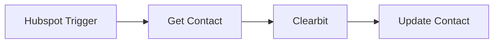

## Fluxo (.json) :

```json
{
  "nodes": [
    {
      "name": "Clearbit",
      "type": "n8n-nodes-base.clearbit",
      "position": [
        850,
        300
      ],
      "parameters": {
        "email": "={{$json[\"properties\"][\"email\"][\"value\"]}}",
        "resource": "person",
        "additionalFields": {}
      },
      "credentials": {
        "clearbitApi": {
          "id": "296",
          "name": "Clearbit account"
        }
      },
      "typeVersion": 1
    },
    {
      "name": "Hubspot Trigger",
      "type": "n8n-nodes-base.hubspotTrigger",
      "position": [
        450,
        300
      ],
      "webhookId": "b9c442e0-6f98-4d6f-8170-7135c4dbd850",
      "parameters": {
        "eventsUi": {
          "eventValues": [
            {}
          ]
        },
        "additionalFields": {}
      },
      "credentials": {
        "hubspotDeveloperApi": {
          "id": "295",
          "name": "Hubspot Developer account"
        }
      },
      "typeVersion": 1
    },
    {
      "name": "Get Contact",
      "type": "n8n-nodes-base.hubspot",
      "position": [
        650,
        300
      ],
      "parameters": {
        "resource": "contact",
        "contactId": "={{$json[\"contactId\"]}}",
        "operation": "get",
        "authentication": "oAuth2",
        "additionalFields": {}
      },
      "credentials": {
        "hubspotOAuth2Api": {
          "id": "268",
          "name": "HubSpot@Test Account"
        }
      },
      "typeVersion": 1
    },
    {
      "name": "Update Contact",
      "type": "n8n-nodes-base.hubspot",
      "position": [
        1050,
        300
      ],
      "parameters": {
        "email": "={{$json[\"email\"]}}",
        "resource": "contact",
        "authentication": "oAuth2",
        "additionalFields": {
          "city": "={{$json[\"geo\"][\"city\"]}}",
          "jobTitle": "={{$json[\"employment\"][\"title\"]}}",
          "companyName": "={{$json[\"employment\"][\"name\"]}}"
        }
      },
      "credentials": {
        "hubspotOAuth2Api": {
          "id": "268",
          "name": "HubSpot@Test Account"
        }
      },
      "typeVersion": 1
    }
  ],
  "connections": {
    "Clearbit": {
      "main": [
        [
          {
            "node": "Update Contact",
            "type": "main",
            "index": 0
          }
        ]
      ]
    },
    "Get Contact": {
      "main": [
        [
          {
            "node": "Clearbit",
            "type": "main",
            "index": 0
          }
        ]
      ]
    },
    "Hubspot Trigger": {
      "main": [
        [
          {
            "node": "Get Contact",
            "type": "main",
            "index": 0
          }
        ]
      ]
    }
  }
}
```
