# PACK 1999 TEMPLATES PARTE 03 - Bloco 4

Templates neste bloco: 20

## Sumário

- [Template 462 - Upload de imagem para Dropbox e listagem de pasta](#template-462)
- [Template 463 - Enviar logo e listar pasta Nextcloud](#template-463)
- [Template 464 - Capturar novos itens do RSS com imagem](#template-464)
- [Template 465 - Triagem automática de currículos por e-mail](#template-465)
- [Template 466 - Geração de vídeo 360° de prova virtual (Kling)](#template-466)
- [Template 467 - Backup de workflows no Drive](#template-467)
- [Template 468 - Sincronização Shopify → Zendesk](#template-468)
- [Template 469 - Gatilho de novos pedidos Shopify](#template-469)
- [Template 470 - Resumo automático de Google Docs para Planilha](#template-470)
- [Template 471 - Processador AI de chamadas Gong](#template-471)
- [Template 472 - Consultar usuário GitHub via Slack](#template-472)
- [Template 473 - Validação de email de novos contatos HubSpot](#template-473)
- [Template 474 - Salvar oportunidades de vendas a partir de e-mails](#template-474)
- [Template 475 - Publicação automática e sob demanda de tweets](#template-475)
- [Template 476 - Ativador/Desativador de workflows via Telegram](#template-476)
- [Template 477 - Combinar nomes e saudações por idioma](#template-477)
- [Template 478 - Summarizador e analisador de Playlists/Vídeos YouTube com IA](#template-478)
- [Template 479 - Notificação automática de novas faturas](#template-479)
- [Template 480 - Agente AI para Slack via webhook](#template-480)
- [Template 481 - Extrair despesas de emails para planilha](#template-481)

---

<a id="template-462"></a>

## Template 462 - Upload de imagem para Dropbox e listagem de pasta

- **Nome:** Upload de imagem para Dropbox e listagem de pasta
- **Descrição:** Ao ser executado manualmente, o fluxo baixa uma imagem via HTTP, envia para uma pasta no Dropbox e, em seguida, lista o conteúdo dessa pasta.
- **Funcionalidade:** • Disparo manual: Inicia o fluxo quando o usuário aciona a execução manualmente.
• Verificação/uso da pasta remota: Acessa ou referencia a pasta destino no armazenamento remoto antes da operação de arquivo.
• Download de arquivo via HTTP: Baixa uma imagem a partir de uma URL externa em formato de arquivo binário.
• Upload de arquivo binário para armazenamento: Envia o arquivo baixado para um caminho específico na conta de armazenamento remoto (/n8n/file.png).
• Listagem de conteúdo da pasta: Depois do upload, lista os arquivos presentes na pasta destino para confirmar ou exibir o resultado.
- **Ferramentas:** • Dropbox: Armazenamento em nuvem usado para salvar o arquivo enviado.
• Servidor HTTP de hospedagem de arquivos/imagens: Fonte externa onde a imagem é baixada antes do envio ao armazenamento.

## Fluxo visual

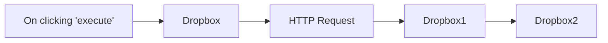

## Fluxo (.json) :

```json
{
  "nodes": [
    {
      "name": "On clicking 'execute'",
      "type": "n8n-nodes-base.manualTrigger",
      "position": [
        50,
        200
      ],
      "parameters": {},
      "typeVersion": 1
    },
    {
      "name": "Dropbox",
      "type": "n8n-nodes-base.dropbox",
      "position": [
        250,
        200
      ],
      "parameters": {
        "path": "/n8n",
        "resource": "folder"
      },
      "credentials": {
        "dropboxApi": "dropbox_accesstoken"
      },
      "typeVersion": 1
    },
    {
      "name": "Dropbox1",
      "type": "n8n-nodes-base.dropbox",
      "position": [
        650,
        200
      ],
      "parameters": {
        "path": "/n8n/file.png",
        "binaryData": true
      },
      "credentials": {
        "dropboxApi": "dropbox_accesstoken"
      },
      "typeVersion": 1
    },
    {
      "name": "HTTP Request",
      "type": "n8n-nodes-base.httpRequest",
      "position": [
        450,
        200
      ],
      "parameters": {
        "url": "https://n8n.io/n8n-logo.png",
        "options": {},
        "responseFormat": "file"
      },
      "typeVersion": 1
    },
    {
      "name": "Dropbox2",
      "type": "n8n-nodes-base.dropbox",
      "position": [
        850,
        200
      ],
      "parameters": {
        "path": "/n8n",
        "resource": "folder",
        "operation": "list"
      },
      "credentials": {
        "dropboxApi": "dropbox_accesstoken"
      },
      "typeVersion": 1
    }
  ],
  "connections": {
    "Dropbox": {
      "main": [
        [
          {
            "node": "HTTP Request",
            "type": "main",
            "index": 0
          }
        ]
      ]
    },
    "Dropbox1": {
      "main": [
        [
          {
            "node": "Dropbox2",
            "type": "main",
            "index": 0
          }
        ]
      ]
    },
    "HTTP Request": {
      "main": [
        [
          {
            "node": "Dropbox1",
            "type": "main",
            "index": 0
          }
        ]
      ]
    },
    "On clicking 'execute'": {
      "main": [
        [
          {
            "node": "Dropbox",
            "type": "main",
            "index": 0
          }
        ]
      ]
    }
  }
}
```

<a id="template-463"></a>

## Template 463 - Enviar logo e listar pasta Nextcloud

- **Nome:** Enviar logo e listar pasta Nextcloud
- **Descrição:** Baixa uma imagem de uma URL, garante a existência de uma pasta no Nextcloud, realiza o upload do arquivo e lista o conteúdo da pasta para verificação.
- **Funcionalidade:** • Início manual: permite executar o fluxo manualmente ao clicar em executar.
• Garantir pasta no Nextcloud: cria ou verifica a existência da pasta "n8n" no armazenamento.
• Download de arquivo via HTTP: baixa a imagem a partir de uma URL como dado binário.
• Upload de arquivo binário: envia o arquivo baixado para o caminho "n8n/logo.png" no Nextcloud.
• Listagem de pasta: obtém a lista de arquivos presentes na pasta "n8n" após o upload.
- **Ferramentas:** • Nextcloud: armazenamento de arquivos em nuvem acessível via API para criar pastas, enviar e listar arquivos.
• Serviço de arquivos via HTTP: origem pública do arquivo a ser baixado por URL.

## Fluxo visual

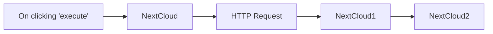

## Fluxo (.json) :

```json
{
  "nodes": [
    {
      "name": "On clicking 'execute'",
      "type": "n8n-nodes-base.manualTrigger",
      "position": [
        20,
        180
      ],
      "parameters": {},
      "typeVersion": 1
    },
    {
      "name": "HTTP Request",
      "type": "n8n-nodes-base.httpRequest",
      "position": [
        420,
        180
      ],
      "parameters": {
        "url": "https://n8n.io/n8n-logo.png",
        "options": {},
        "responseFormat": "file"
      },
      "typeVersion": 1
    },
    {
      "name": "NextCloud",
      "type": "n8n-nodes-base.nextCloud",
      "position": [
        220,
        180
      ],
      "parameters": {
        "path": "n8n",
        "resource": "folder"
      },
      "credentials": {
        "nextCloudApi": "nextcloud_creds"
      },
      "typeVersion": 1
    },
    {
      "name": "NextCloud1",
      "type": "n8n-nodes-base.nextCloud",
      "position": [
        620,
        180
      ],
      "parameters": {
        "path": "n8n/logo.png",
        "binaryDataUpload": true
      },
      "credentials": {
        "nextCloudApi": "nextcloud_creds"
      },
      "typeVersion": 1
    },
    {
      "name": "NextCloud2",
      "type": "n8n-nodes-base.nextCloud",
      "position": [
        820,
        180
      ],
      "parameters": {
        "path": "n8n",
        "resource": "folder",
        "operation": "list"
      },
      "credentials": {
        "nextCloudApi": "nextcloud_creds"
      },
      "typeVersion": 1
    }
  ],
  "connections": {
    "NextCloud": {
      "main": [
        [
          {
            "node": "HTTP Request",
            "type": "main",
            "index": 0
          }
        ]
      ]
    },
    "NextCloud1": {
      "main": [
        [
          {
            "node": "NextCloud2",
            "type": "main",
            "index": 0
          }
        ]
      ]
    },
    "HTTP Request": {
      "main": [
        [
          {
            "node": "NextCloud1",
            "type": "main",
            "index": 0
          }
        ]
      ]
    },
    "On clicking 'execute'": {
      "main": [
        [
          {
            "node": "NextCloud",
            "type": "main",
            "index": 0
          }
        ]
      ]
    }
  }
}
```

<a id="template-464"></a>

## Template 464 - Capturar novos itens do RSS com imagem

- **Nome:** Capturar novos itens do RSS com imagem
- **Descrição:** Verifica periodicamente um feed RSS, filtra somente os itens novos e extrai a imagem presente no conteúdo do artigo.
- **Funcionalidade:** • Agendamento periódico: Executa a verificação a cada 5 minutos.
• Leitura do feed RSS: Busca os itens do feed fornecido.
• Filtragem de campos: Extrai título, subtítulo, autor, URL, data e o conteúdo HTML de cada item.
• Deduplicação de itens novos: Compara datas com um histórico armazenado e passa apenas itens que ainda não foram processados.
• Extração de imagem do conteúdo: Analisa o HTML do conteúdo e captura o atributo src da primeira imagem.
• Fluxo condicional: A extração de imagens é efetuada somente para os itens identificados como novos.
- **Ferramentas:** • The Verge RSS Feed: Fonte de artigos e metadados usada como entrada (http://www.theverge.com/rss/full.xml).
• Páginas web / HTML dos artigos: Conteúdo dos artigos usado para extrair a URL da imagem presente no HTML.

## Fluxo visual

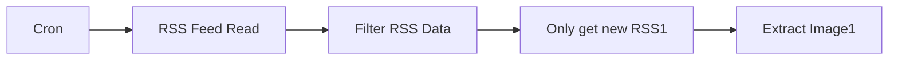

## Fluxo (.json) :

```json
{
  "id": 8,
  "name": "Get only new RSS with Photo",
  "nodes": [
    {
      "name": "Cron",
      "type": "n8n-nodes-base.cron",
      "position": [
        1050,
        920
      ],
      "parameters": {
        "triggerTimes": {
          "item": [
            {
              "mode": "everyX",
              "unit": "minutes",
              "value": 5
            }
          ]
        }
      },
      "typeVersion": 1
    },
    {
      "name": "RSS Feed Read",
      "type": "n8n-nodes-base.rssFeedRead",
      "position": [
        1220,
        920
      ],
      "parameters": {
        "url": "http://www.theverge.com/rss/full.xml"
      },
      "executeOnce": true,
      "typeVersion": 1
    },
    {
      "name": "Extract Image1",
      "type": "n8n-nodes-base.htmlExtract",
      "position": [
        1740,
        920
      ],
      "parameters": {
        "options": {},
        "dataPropertyName": "=content",
        "extractionValues": {
          "values": [
            {
              "key": "image",
              "attribute": "src",
              "cssSelector": "img",
              "returnValue": "attribute"
            }
          ]
        }
      },
      "typeVersion": 1
    },
    {
      "name": "Filter RSS Data",
      "type": "n8n-nodes-base.set",
      "position": [
        1390,
        920
      ],
      "parameters": {
        "values": {
          "string": [
            {
              "name": "Title",
              "value": "={{$node[\"RSS Feed Read\"].json[\"title\"]}}"
            },
            {
              "name": "Subtitle",
              "value": "={{$json[\"contentSnippet\"]}}"
            },
            {
              "name": "Author",
              "value": "={{$json[\"creator\"]}}"
            },
            {
              "name": "URL",
              "value": "={{$node[\"RSS Feed Read\"].json[\"link\"]}}"
            },
            {
              "name": "Date",
              "value": "={{$node[\"RSS Feed Read\"].json[\"pubDate\"]}}"
            },
            {
              "name": "content",
              "value": "={{$json[\"content\"]}}"
            }
          ]
        },
        "options": {},
        "keepOnlySet": true
      },
      "typeVersion": 1
    },
    {
      "name": "Only get new RSS1",
      "type": "n8n-nodes-base.function",
      "position": [
        1560,
        920
      ],
      "parameters": {
        "functionCode": "const staticData = getWorkflowStaticData('global');\nconst newRSSIds = items.map(item => item.json[\"Date\"]);\nconst oldRSSIds = staticData.oldRSSIds; \n\nif (!oldRSSIds) {\n  staticData.oldRSSIds = newRSSIds;\n  return items;\n}\n\n\nconst actualNewRSSIds = newRSSIds.filter((id) => !oldRSSIds.includes(id));\nconst actualNewRSS = items.filter((data) => actualNewRSSIds.includes(data.json['Date']));\nstaticData.oldRSSIds = [...actualNewRSSIds, ...oldRSSIds];\n\nreturn actualNewRSS;\n"
      },
      "typeVersion": 1
    }
  ],
  "active": false,
  "settings": {},
  "connections": {
    "Cron": {
      "main": [
        [
          {
            "node": "RSS Feed Read",
            "type": "main",
            "index": 0
          }
        ]
      ]
    },
    "RSS Feed Read": {
      "main": [
        [
          {
            "node": "Filter RSS Data",
            "type": "main",
            "index": 0
          }
        ]
      ]
    },
    "Extract Image1": {
      "main": [
        []
      ]
    },
    "Filter RSS Data": {
      "main": [
        [
          {
            "node": "Only get new RSS1",
            "type": "main",
            "index": 0
          }
        ]
      ]
    },
    "Only get new RSS1": {
      "main": [
        [
          {
            "node": "Extract Image1",
            "type": "main",
            "index": 0
          }
        ]
      ]
    }
  }
}
```

<a id="template-465"></a>

## Template 465 - Triagem automática de currículos por e-mail

- **Nome:** Triagem automática de currículos por e-mail
- **Descrição:** Automatiza a leitura e avaliação de currículos recebidos por e-mail e registra os resultados em uma planilha.
- **Funcionalidade:** • Monitoramento de e-mails com anexos: detecta novas mensagens não lidas que contenham anexos.
• Download de anexos de e-mail: baixa os arquivos anexados para processamento.
• Extração de texto de PDFs: converte o conteúdo dos currículos em PDF para texto pesquisável.
• Avaliação automatizada de currículos: utiliza um modelo de linguagem para analisar o texto do currículo e atribuir uma pontuação.
• Extração de informações de contato: identifica e extrai nome, e-mail e perfil do LinkedIn presentes no currículo.
• Saída estruturada: organiza os dados extraídos em um esquema predefinido (nome, e-mail, LinkedIn, pontuação).
• Registro em planilha: adiciona os resultados e o texto do currículo a uma linha em uma planilha para acompanhamento.
• Requisitos de configuração: exige chave de API do provedor de IA, credenciais OAuth e APIs de planilha/drive habilitadas.
- **Ferramentas:** • Gmail: serviço de e-mail utilizado para receber e monitorar mensagens com currículos anexados.
• Google Drive: armazenamento e acesso aos arquivos anexados.
• Google Sheets: planilha utilizada para registrar os resultados da avaliação.
• OpenAI: provedor de modelo de linguagem para analisar currículos e extrair informações.
• Google Cloud Console: plataforma para habilitar APIs e criar credenciais OAuth 2.0 necessárias.

## Fluxo visual

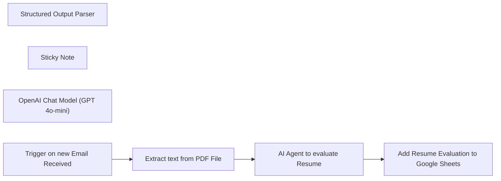

## Fluxo (.json) :

```json
{
  "meta": {
    "instanceId": "ddc2592f2c048b3a9255de9457632cead183ed1f8d682593ea74c5b20f968a76",
    "templateCredsSetupCompleted": true
  },
  "nodes": [
    {
      "id": "53cc8017-5310-4205-85e0-8cc839693601",
      "name": "Structured Output Parser",
      "type": "@n8n/n8n-nodes-langchain.outputParserStructured",
      "position": [
        720,
        400
      ],
      "parameters": {
        "schemaType": "manual",
        "inputSchema": "{\n\t\"type\": \"object\",\n\t\"properties\": {\n\t\t\"name\": {\n\t\t\t\"type\": \"string\"\n\t\t},\n      \"email\": {\n\t\t\t\"type\": \"string\"\n\t\t},\n      \"linkedin\": {\n\t\t\t\"type\": \"string\"\n\t\t},\n      \"score\": {\n\t\t\t\"type\": \"string\"\n\t\t}\n\t\t\n\t}\n}"
      },
      "typeVersion": 1.2
    },
    {
      "id": "ea0c00d3-25c8-4523-88ff-d61d6665ecf7",
      "name": "Sticky Note",
      "type": "n8n-nodes-base.stickyNote",
      "position": [
        -760,
        160
      ],
      "parameters": {
        "width": 480,
        "height": 260,
        "content": "## Resume Screener from Gmail to Sheets\n\n### 📃Before you get started, you'll need:\n- [n8n installation](https://n8n.partnerlinks.io/n8nTTVideoGenTemplate) \n- [OpenAI API Key](https://platform.openai.com/api-keys)\n- Google Sheets API enabled in [Google Cloud Console](https://console.cloud.google.com/apis/api/sheets.googleapis.com/overview)\n- Google Drive API enabled in [Google Cloud Console](https://console.cloud.google.com/apis/api/drive.googleapis.com/overview)\n- OAuth 2.0 Client ID and Client Secret from your [Google Cloud Console Credentials](https://console.cloud.google.com/apis/credentials)\n"
      },
      "typeVersion": 1
    },
    {
      "id": "e4f3aef9-750a-48bb-899b-bd4a810032f2",
      "name": "Extract text from PDF File",
      "type": "n8n-nodes-base.extractFromFile",
      "position": [
        320,
        180
      ],
      "parameters": {
        "options": {},
        "operation": "pdf",
        "binaryPropertyName": "attachment_0"
      },
      "typeVersion": 1
    },
    {
      "id": "5418cfae-25da-4f58-99ef-d6957d8819a8",
      "name": "AI Agent to evaluate Resume",
      "type": "@n8n/n8n-nodes-langchain.agent",
      "position": [
        540,
        180
      ],
      "parameters": {
        "text": "=Here is the resume:\n\n{{ $json.text }}",
        "options": {
          "systemMessage": "You are an invaluable assistant. You were given a resume. You have to help me analyze the resume and give it a score based on the details available in the resume. Also, extract the name, email, and LinkedIn profile from the resume."
        },
        "promptType": "define",
        "hasOutputParser": true
      },
      "typeVersion": 1.8
    },
    {
      "id": "dce8e431-9d5c-4aa1-a0eb-c2a27de2d7f9",
      "name": "OpenAI Chat Model (GPT 4o-mini)",
      "type": "@n8n/n8n-nodes-langchain.lmChatOpenAi",
      "position": [
        520,
        400
      ],
      "parameters": {
        "model": {
          "__rl": true,
          "mode": "list",
          "value": "gpt-4o-mini"
        },
        "options": {}
      },
      "credentials": {
        "openAiApi": {
          "id": "PMxepoh6OuVxbpg1",
          "name": "OpenAi account"
        }
      },
      "typeVersion": 1.2
    },
    {
      "id": "e7fdaf75-11ad-40c2-84a0-13c52f6f2eb1",
      "name": "Add Resume Evaluation to Google Sheets",
      "type": "n8n-nodes-base.googleSheets",
      "position": [
        920,
        180
      ],
      "parameters": {
        "columns": {
          "value": {
            "Name": "={{ $json.output.name }}",
            "Email": "={{ $json.output.email }}",
            "Score": "={{ $json.output.score }}",
            "LinkedIn": "={{ $json.output.linkedin }}",
            "Resume text": "={{ $('Extract text from PDF File').item.json.text }}"
          },
          "schema": [
            {
              "id": "Name",
              "type": "string",
              "display": true,
              "required": false,
              "displayName": "Name",
              "defaultMatch": false,
              "canBeUsedToMatch": true
            },
            {
              "id": "Email",
              "type": "string",
              "display": true,
              "required": false,
              "displayName": "Email",
              "defaultMatch": false,
              "canBeUsedToMatch": true
            },
            {
              "id": "LinkedIn",
              "type": "string",
              "display": true,
              "removed": false,
              "required": false,
              "displayName": "LinkedIn",
              "defaultMatch": false,
              "canBeUsedToMatch": true
            },
            {
              "id": "Score",
              "type": "string",
              "display": true,
              "required": false,
              "displayName": "Score",
              "defaultMatch": false,
              "canBeUsedToMatch": true
            },
            {
              "id": "Resume text",
              "type": "string",
              "display": true,
              "required": false,
              "displayName": "Resume text",
              "defaultMatch": false,
              "canBeUsedToMatch": true
            }
          ],
          "mappingMode": "defineBelow",
          "matchingColumns": [],
          "attemptToConvertTypes": false,
          "convertFieldsToString": false
        },
        "options": {
          "useAppend": true
        },
        "operation": "append",
        "sheetName": {
          "__rl": true,
          "mode": "list",
          "value": 781640061,
          "cachedResultUrl": "https://docs.google.com/spreadsheets/d/1SGYsuJI2YJVztZZmSLsFZ0lbUHnxm0V9r3c8S5-2q74/edit#gid=781640061",
          "cachedResultName": "Resume Score"
        },
        "documentId": {
          "__rl": true,
          "mode": "list",
          "value": "1SGYsuJI2YJVztZZmSLsFZ0lbUHnxm0V9r3c8S5-2q74",
          "cachedResultUrl": "https://docs.google.com/spreadsheets/d/1SGYsuJI2YJVztZZmSLsFZ0lbUHnxm0V9r3c8S5-2q74/edit?usp=drivesdk",
          "cachedResultName": "Lead Generation"
        }
      },
      "credentials": {
        "googleSheetsOAuth2Api": {
          "id": "kzZGQmdAV5cPfymZ",
          "name": "Google Sheets (server@hic)"
        }
      },
      "typeVersion": 4.5
    },
    {
      "id": "0ad65e2b-665d-4b77-a941-b15a7ffbfb89",
      "name": "Trigger on new Email Received",
      "type": "n8n-nodes-base.gmailTrigger",
      "position": [
        60,
        180
      ],
      "parameters": {
        "simple": false,
        "filters": {
          "q": "has:attachment",
          "labelIds": [
            "UNREAD"
          ],
          "readStatus": "unread"
        },
        "options": {
          "downloadAttachments": true
        },
        "pollTimes": {
          "item": [
            {
              "mode": "everyHour",
              "minute": 1
            }
          ]
        }
      },
      "credentials": {
        "gmailOAuth2": {
          "id": "tPOAqAl9y3adqJD6",
          "name": "Gmail account (hire@hic)"
        }
      },
      "typeVersion": 1.2
    }
  ],
  "pinData": {},
  "connections": {
    "Structured Output Parser": {
      "ai_outputParser": [
        [
          {
            "node": "AI Agent to evaluate Resume",
            "type": "ai_outputParser",
            "index": 0
          }
        ]
      ]
    },
    "Extract text from PDF File": {
      "main": [
        [
          {
            "node": "AI Agent to evaluate Resume",
            "type": "main",
            "index": 0
          }
        ]
      ]
    },
    "AI Agent to evaluate Resume": {
      "main": [
        [
          {
            "node": "Add Resume Evaluation to Google Sheets",
            "type": "main",
            "index": 0
          }
        ]
      ]
    },
    "Trigger on new Email Received": {
      "main": [
        [
          {
            "node": "Extract text from PDF File",
            "type": "main",
            "index": 0
          }
        ]
      ]
    },
    "OpenAI Chat Model (GPT 4o-mini)": {
      "ai_languageModel": [
        [
          {
            "node": "AI Agent to evaluate Resume",
            "type": "ai_languageModel",
            "index": 0
          }
        ]
      ]
    }
  }
}
```

<a id="template-466"></a>

## Template 466 - Geração de vídeo 360° de prova virtual (Kling)

- **Nome:** Geração de vídeo 360° de prova virtual (Kling)
- **Descrição:** Gera vídeos 360° de prova virtual para roupas a partir de imagens de modelo e das peças, utilizando a API Kling para criar imagens try-on e transformar a imagem resultante em um vídeo final com URL de saída.
- **Funcionalidade:** • Definição de parâmetros iniciais: permite informar chave de API, URLs de imagem do modelo e das roupas, e prompt padrão para o vídeo.
• Envio de tarefa de try-on virtual (ai_try_on): submete model_input e dress_input ou upper_input + lower_input para gerar a imagem do modelo vestindo a peça.
• Suporte a lote: aceita configuração de batch_size (ex.: 1) para processamento de múltiplas instâncias.
• Espera e verificação de status de imagem: mecanismo de espera/polling que monitora até o status "completed" ou "failed".
• Geração de vídeo a partir da imagem: quando a imagem estiver pronta, submete tarefa de video_generation com prompt para criar o vídeo 360°.
• Espera e verificação de status de vídeo: polling até conclusão ou falha da geração de vídeo.
• Extração do URL final do vídeo: captura e disponibiliza a URL do arquivo de vídeo gerado.
• Tratamento básico de falhas: detecta status "failed" e evita seguir para etapas subsequentes quando apropriado.
- **Ferramentas:** • PiAPI (Kling model): API externa (https://api.piapi.ai) que executa o try-on virtual e a geração de vídeo usando o modelo "kling".
• Hospedagem de imagens e mídia (fornecida pelo usuário): serviços de armazenamento ou CDN para disponibilizar as imagens de modelo/roupas e hospedar o vídeo final (ex.: S3, CDN, ou similar).

## Fluxo visual

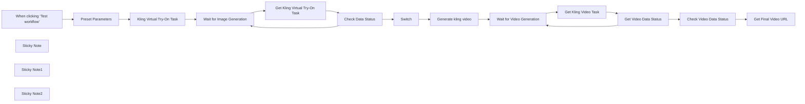

## Fluxo (.json) :

```json
{
  "id": "xQ0xqhNzFeEdBpFK",
  "meta": {
    "instanceId": "1e003a7ea4715b6b35e9947791386a7d07edf3b5bf8d4c9b7ee4fdcbec0447d7"
  },
  "name": "Generate 360° Virtual Try-on Videos for Clothing with Kling API",
  "tags": [],
  "nodes": [
    {
      "id": "978b4ac4-0357-4d2b-8a02-7da04e6f3f1f",
      "name": "When clicking ‘Test workflow’",
      "type": "n8n-nodes-base.manualTrigger",
      "position": [
        160,
        140
      ],
      "parameters": {},
      "typeVersion": 1
    },
    {
      "id": "54d1c23f-3a13-4ec0-9b3b-3806e5faae18",
      "name": "Kling Virtual Try-On Task",
      "type": "n8n-nodes-base.httpRequest",
      "position": [
        620,
        140
      ],
      "parameters": {
        "url": "https://api.piapi.ai/api/v1/task",
        "method": "POST",
        "options": {},
        "jsonBody": "={\n  \"model\": \"kling\",\n  \"task_type\": \"ai_try_on\",\n  \"input\": {\n    \"model_input\": \"{{ $json.model_input }}\",\n    \"dress_input\": \"{{ $json.dress_input }}\",\n    \"upper_input\": \"{{ $json.upper_input }}\",\n    \"lower_input\": \"{{ $json.lower_input }}\",\n    \"batch_size\": 1\n  }\n} ",
        "sendBody": true,
        "sendHeaders": true,
        "specifyBody": "json",
        "headerParameters": {
          "parameters": [
            {
              "name": "x-api-key",
              "value": "={{ $json['x-api-key'] }}"
            }
          ]
        }
      },
      "typeVersion": 4.2
    },
    {
      "id": "5be9d932-c102-4a7e-b995-09c6bf17026c",
      "name": "Switch",
      "type": "n8n-nodes-base.switch",
      "position": [
        960,
        200
      ],
      "parameters": {
        "rules": {
          "values": [
            {
              "conditions": {
                "options": {
                  "version": 2,
                  "leftValue": "",
                  "caseSensitive": true,
                  "typeValidation": "strict"
                },
                "combinator": "and",
                "conditions": [
                  {
                    "id": "5f61ee56-4ebe-411f-95e6-b47d9741e7a2",
                    "operator": {
                      "type": "string",
                      "operation": "equals"
                    },
                    "leftValue": "={{ $json.data.status }}",
                    "rightValue": "completed"
                  }
                ]
              }
            }
          ]
        },
        "options": {}
      },
      "typeVersion": 3.2
    },
    {
      "id": "cdda4f40-1580-4a5a-a7f4-f1e4fbf7ceb4",
      "name": "Get Kling Video Task",
      "type": "n8n-nodes-base.httpRequest",
      "position": [
        1180,
        440
      ],
      "parameters": {
        "url": "=https://api.piapi.ai/api/v1/task/{{ $json.data.task_id }}",
        "options": {},
        "sendHeaders": true,
        "headerParameters": {
          "parameters": [
            {
              "name": "x-api-key",
              "value": "={{ $('Preset Parameters').item.json['x-api-key'] }}"
            }
          ]
        }
      },
      "typeVersion": 4.2
    },
    {
      "id": "3e794d14-b55f-4936-90af-8237977d6635",
      "name": "Generate kling video",
      "type": "n8n-nodes-base.httpRequest",
      "position": [
        1140,
        200
      ],
      "parameters": {
        "url": "https://api.piapi.ai/api/v1/task",
        "method": "POST",
        "options": {},
        "jsonBody": "={\n    \"model\": \"kling\",\n    \"task_type\": \"video_generation\",\n    \"input\": {\n        \"version\": \"1.6\",\n        \"image_url\": \"{{ $json.data.output.works[0].image.resource }}\",\n        \"prompt\": \"{{ $('Preset Parameters').item.json.generate_video_prompt }}\"\n    }\n} ",
        "sendBody": true,
        "sendHeaders": true,
        "specifyBody": "json",
        "headerParameters": {
          "parameters": [
            {
              "name": "x-api-key",
              "value": "={{ $('Preset Parameters').item.json['x-api-key'] }}"
            }
          ]
        }
      },
      "typeVersion": 4.2
    },
    {
      "id": "3ae849b2-4bd4-454f-a759-e44a9736100d",
      "name": "Preset Parameters",
      "type": "n8n-nodes-base.set",
      "position": [
        380,
        140
      ],
      "parameters": {
        "mode": "raw",
        "options": {},
        "jsonOutput": "{\n  \"x-api-key\":\"\",\n  \"model_input\": \"\",\n  \"dress_input\": \"\",\n  \"upper_input\":\"\",\n  \"lower_input\":\"\",\n  \"generate_video_prompt\": \"Walk on the catwalk, turn around, and finally stand still and pose\"\n}\n"
      },
      "typeVersion": 3.4
    },
    {
      "id": "18c606e3-82e2-4c09-a87e-6bbc71363c1c",
      "name": "Get Kling Virtual Try-On Task",
      "type": "n8n-nodes-base.httpRequest",
      "position": [
        420,
        460
      ],
      "parameters": {
        "url": "=https://api.piapi.ai/api/v1/task/{{ $json.data.task_id }}",
        "options": {},
        "sendHeaders": true,
        "headerParameters": {
          "parameters": [
            {
              "name": "x-api-key",
              "value": "={{ $('Preset Parameters').item.json['x-api-key'] }}"
            }
          ]
        }
      },
      "typeVersion": 4.2
    },
    {
      "id": "becf3d7b-d468-4b4a-b22f-d6d747e52664",
      "name": "Check Data Status",
      "type": "n8n-nodes-base.if",
      "position": [
        640,
        460
      ],
      "parameters": {
        "options": {},
        "conditions": {
          "options": {
            "version": 2,
            "leftValue": "",
            "caseSensitive": true,
            "typeValidation": "strict"
          },
          "combinator": "or",
          "conditions": [
            {
              "id": "e97a02cc-8d1d-4500-bce5-0a296c792b76",
              "operator": {
                "name": "filter.operator.equals",
                "type": "string",
                "operation": "equals"
              },
              "leftValue": "={{ $json.data.status }}",
              "rightValue": "completed"
            },
            {
              "id": "50b63a7a-52b5-4766-a859-96ac1ff949ec",
              "operator": {
                "name": "filter.operator.equals",
                "type": "string",
                "operation": "equals"
              },
              "leftValue": "={{ $json.data.status }}",
              "rightValue": "failed"
            }
          ]
        }
      },
      "typeVersion": 2.2
    },
    {
      "id": "d8ec251d-d47c-4341-909d-abdea385c1f9",
      "name": "Wait for Image Generation",
      "type": "n8n-nodes-base.wait",
      "position": [
        160,
        460
      ],
      "webhookId": "af79053d-1291-4dd2-889e-4593dbbb2512",
      "parameters": {},
      "typeVersion": 1.1
    },
    {
      "id": "88e3067f-0b1f-472a-937b-926c6d208453",
      "name": "Wait for Video Generation",
      "type": "n8n-nodes-base.wait",
      "position": [
        920,
        440
      ],
      "webhookId": "af79053d-1291-4dd2-889e-4593dbbb2512",
      "parameters": {},
      "typeVersion": 1.1
    },
    {
      "id": "36d75678-918f-42c5-97a7-7a13d1eacbd4",
      "name": "Check Video Data Status",
      "type": "n8n-nodes-base.switch",
      "position": [
        1560,
        180
      ],
      "parameters": {
        "rules": {
          "values": [
            {
              "conditions": {
                "options": {
                  "version": 2,
                  "leftValue": "",
                  "caseSensitive": true,
                  "typeValidation": "strict"
                },
                "combinator": "and",
                "conditions": [
                  {
                    "id": "5f61ee56-4ebe-411f-95e6-b47d9741e7a2",
                    "operator": {
                      "type": "string",
                      "operation": "equals"
                    },
                    "leftValue": "={{ $json.data.status }}",
                    "rightValue": "completed"
                  }
                ]
              }
            }
          ]
        },
        "options": {}
      },
      "typeVersion": 3.2
    },
    {
      "id": "7356d963-83c0-47a1-a728-9191f66d2f57",
      "name": "Get Video Data Status",
      "type": "n8n-nodes-base.if",
      "position": [
        1400,
        440
      ],
      "parameters": {
        "options": {},
        "conditions": {
          "options": {
            "version": 2,
            "leftValue": "",
            "caseSensitive": true,
            "typeValidation": "strict"
          },
          "combinator": "or",
          "conditions": [
            {
              "id": "e97a02cc-8d1d-4500-bce5-0a296c792b76",
              "operator": {
                "name": "filter.operator.equals",
                "type": "string",
                "operation": "equals"
              },
              "leftValue": "={{ $json.data.status }}",
              "rightValue": "completed"
            },
            {
              "id": "50b63a7a-52b5-4766-a859-96ac1ff949ec",
              "operator": {
                "name": "filter.operator.equals",
                "type": "string",
                "operation": "equals"
              },
              "leftValue": "={{ $json.data.status }}",
              "rightValue": "failed"
            }
          ]
        }
      },
      "typeVersion": 2.2
    },
    {
      "id": "9ef52637-ccc9-4817-8c14-5c54fa0af178",
      "name": "Get Final Video URL",
      "type": "n8n-nodes-base.set",
      "position": [
        1760,
        180
      ],
      "parameters": {
        "mode": "raw",
        "options": {},
        "jsonOutput": "={\n  \"video_url\": \"{{ $json.data.output.video_url }}\"\n}\n "
      },
      "typeVersion": 3.4
    },
    {
      "id": "9a0194bd-59a5-45b1-a6e2-db0605eb4d7a",
      "name": "Sticky Note",
      "type": "n8n-nodes-base.stickyNote",
      "position": [
        140,
        -120
      ],
      "parameters": {
        "width": 460,
        "height": 220,
        "content": "## Generate 360° Virtual Try-on Videos for Clothing with Kling API (unofficial)\nThis tool is designed for e-commerce platforms, fashion brands, content creators, and content influencers. By uploading model and clothing images and linking your PiAPI account, you can swiftly generate a realistic video of the model sporting the outfit with a 360° turn, offering an immersive viewing experience."
      },
      "typeVersion": 1
    },
    {
      "id": "629697ae-cd49-4e8e-953d-a2f091ed9202",
      "name": "Sticky Note1",
      "type": "n8n-nodes-base.stickyNote",
      "position": [
        120,
        700
      ],
      "parameters": {
        "width": 340,
        "height": 200,
        "content": "## Generate Virtual Try-on Image\nUpload model url, users have two solutions to upload clothing url: \n1. Upload `dress_input`\n2. Upload 'upper_input` and 'lower_input`"
      },
      "typeVersion": 1
    },
    {
      "id": "710bd0f0-8b5a-469a-8b31-b6f738dc7f79",
      "name": "Sticky Note2",
      "type": "n8n-nodes-base.stickyNote",
      "position": [
        1640,
        460
      ],
      "parameters": {
        "width": 340,
        "content": "## Generate Final Video \nWait for generation and get the output url in the final node."
      },
      "typeVersion": 1
    }
  ],
  "active": false,
  "pinData": {},
  "settings": {
    "executionOrder": "v1"
  },
  "versionId": "97ee31dd-b8be-4b37-bbed-363ac35d5268",
  "connections": {
    "Switch": {
      "main": [
        [
          {
            "node": "Generate kling video",
            "type": "main",
            "index": 0
          }
        ]
      ]
    },
    "Check Data Status": {
      "main": [
        [
          {
            "node": "Switch",
            "type": "main",
            "index": 0
          }
        ],
        [
          {
            "node": "Wait for Image Generation",
            "type": "main",
            "index": 0
          }
        ]
      ]
    },
    "Preset Parameters": {
      "main": [
        [
          {
            "node": "Kling Virtual Try-On Task",
            "type": "main",
            "index": 0
          }
        ]
      ]
    },
    "Generate kling video": {
      "main": [
        [
          {
            "node": "Wait for Video Generation",
            "type": "main",
            "index": 0
          }
        ]
      ]
    },
    "Get Kling Video Task": {
      "main": [
        [
          {
            "node": "Get Video Data Status",
            "type": "main",
            "index": 0
          }
        ]
      ]
    },
    "Get Video Data Status": {
      "main": [
        [
          {
            "node": "Check Video Data Status",
            "type": "main",
            "index": 0
          }
        ],
        [
          {
            "node": "Wait for Video Generation",
            "type": "main",
            "index": 0
          }
        ]
      ]
    },
    "Check Video Data Status": {
      "main": [
        [
          {
            "node": "Get Final Video URL",
            "type": "main",
            "index": 0
          }
        ]
      ]
    },
    "Kling Virtual Try-On Task": {
      "main": [
        [
          {
            "node": "Wait for Image Generation",
            "type": "main",
            "index": 0
          }
        ]
      ]
    },
    "Wait for Image Generation": {
      "main": [
        [
          {
            "node": "Get Kling Virtual Try-On Task",
            "type": "main",
            "index": 0
          }
        ]
      ]
    },
    "Wait for Video Generation": {
      "main": [
        [
          {
            "node": "Get Kling Video Task",
            "type": "main",
            "index": 0
          }
        ]
      ]
    },
    "Get Kling Virtual Try-On Task": {
      "main": [
        [
          {
            "node": "Check Data Status",
            "type": "main",
            "index": 0
          }
        ]
      ]
    },
    "When clicking ‘Test workflow’": {
      "main": [
        [
          {
            "node": "Preset Parameters",
            "type": "main",
            "index": 0
          }
        ]
      ]
    }
  }
}
```

<a id="template-467"></a>

## Template 467 - Backup de workflows no Drive

- **Nome:** Backup de workflows no Drive
- **Descrição:** Cria backups dos workflows como arquivos JSON em uma pasta do Google Drive e remove pastas de backup antigas. Pode ser executado manualmente ou a cada 4 horas.
- **Funcionalidade:** • Criação de pasta de backup: Gera uma nova pasta nomeada com data e hora para armazenar os backups.
• Exportação de workflows para JSON: Converte cada workflow em um arquivo JSON pronto para armazenamento.
• Upload de arquivos para a pasta: Envia os arquivos JSON para a pasta de backup recém-criada no Google Drive.
• Rotação e limpeza de backups antigos: Lista as pastas de backup existentes e exclui permanentemente as que não correspondem à pasta recém-criada.
• Execução manual e agendada: Permite iniciar o processo manualmente ou automaticamente a cada 4 horas.
- **Ferramentas:** • Google Drive: Armazenamento em nuvem usado para criar pastas e salvar os arquivos de backup (JSON).
• Serviço de gerenciamento de workflows (API): Fonte dos workflows que são exportados e convertidos para arquivos JSON.

## Fluxo visual

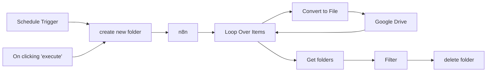

## Fluxo (.json) :

```json
{
  "meta": {
    "instanceId": "db80165df40cb07c0377167c050b3f9ab0b0fb04f0e8cae0dc53f5a8527103ca",
    "templateCredsSetupCompleted": true
  },
  "nodes": [
    {
      "id": "62edf095-a02a-4b8d-a7b1-e194ae0d3652",
      "name": "On clicking 'execute'",
      "type": "n8n-nodes-base.manualTrigger",
      "position": [
        -660,
        1100
      ],
      "parameters": {},
      "typeVersion": 1
    },
    {
      "id": "1e10875b-f54b-43a8-a7a2-43d4fcbf248d",
      "name": "n8n",
      "type": "n8n-nodes-base.n8n",
      "position": [
        -300,
        1220
      ],
      "parameters": {
        "filters": {},
        "requestOptions": {}
      },
      "credentials": {
        "n8nApi": {
          "id": "uqWyCDytVt4ZKbVE",
          "name": "Phoenix✅"
        }
      },
      "retryOnFail": true,
      "typeVersion": 1,
      "alwaysOutputData": true
    },
    {
      "id": "1f5caabb-d76b-4744-be76-97e9abea1ddc",
      "name": "Loop Over Items",
      "type": "n8n-nodes-base.splitInBatches",
      "position": [
        -100,
        1220
      ],
      "parameters": {
        "options": {}
      },
      "typeVersion": 3
    },
    {
      "id": "755e0803-c5c0-48a7-9c0c-44f8d5718d0b",
      "name": "create new folder",
      "type": "n8n-nodes-base.googleDrive",
      "position": [
        -480,
        1220
      ],
      "parameters": {
        "name": "=Workflow Backups {{ $now.format('cccc t dd-MM-yyyy') }}",
        "driveId": {
          "__rl": true,
          "mode": "list",
          "value": "My Drive"
        },
        "options": {},
        "folderId": {
          "__rl": true,
          "mode": "list",
          "value": "1hnHubRgcstU8OgV8BPwPNivfTZT5g2Wf",
          "cachedResultUrl": "https://drive.google.com/drive/folders/1hnHubRgcstU8OgV8BPwPNivfTZT5g2Wf",
          "cachedResultName": "Workflow Backups"
        },
        "resource": "folder"
      },
      "credentials": {
        "googleDriveOAuth2Api": {
          "id": "HqlejV5xP0lqTq5e",
          "name": "Google Drive account✅"
        }
      },
      "typeVersion": 3
    },
    {
      "id": "22874532-6d87-4a72-bb51-dd8c6e03c0c1",
      "name": "Convert to File",
      "type": "n8n-nodes-base.convertToFile",
      "position": [
        120,
        1320
      ],
      "parameters": {
        "options": {
          "format": true,
          "fileName": "={{ $json.name + \".json\" }} "
        },
        "operation": "toJson"
      },
      "typeVersion": 1.1
    },
    {
      "id": "0b0155f1-15bc-4580-af6e-7dec3b0d5737",
      "name": "Google Drive",
      "type": "n8n-nodes-base.googleDrive",
      "position": [
        300,
        1320
      ],
      "parameters": {
        "name": "={{ $('Loop Over Items').item.json.name + \".json\" }}",
        "driveId": {
          "__rl": true,
          "mode": "list",
          "value": "My Drive"
        },
        "options": {},
        "folderId": {
          "__rl": true,
          "mode": "id",
          "value": "={{ $('create new folder').item.json.id }}"
        }
      },
      "credentials": {
        "googleDriveOAuth2Api": {
          "id": "HqlejV5xP0lqTq5e",
          "name": "Google Drive account✅"
        }
      },
      "typeVersion": 3
    },
    {
      "id": "c7b73036-1831-4dd6-8dd9-fef1356a184c",
      "name": "Schedule Trigger",
      "type": "n8n-nodes-base.scheduleTrigger",
      "position": [
        -660,
        1360
      ],
      "parameters": {
        "rule": {
          "interval": [
            {
              "field": "hours",
              "hoursInterval": 4
            }
          ]
        }
      },
      "typeVersion": 1.2
    },
    {
      "id": "666dcf95-928c-4270-808f-755a9771a410",
      "name": "Filter",
      "type": "n8n-nodes-base.filter",
      "position": [
        300,
        1120
      ],
      "parameters": {
        "options": {
          "ignoreCase": true
        },
        "conditions": {
          "options": {
            "version": 2,
            "leftValue": "",
            "caseSensitive": false,
            "typeValidation": "loose"
          },
          "combinator": "and",
          "conditions": [
            {
              "id": "538fc29d-2693-4c62-9848-bdcaf8566909",
              "operator": {
                "type": "string",
                "operation": "notEquals"
              },
              "leftValue": "={{ $json.id }}",
              "rightValue": "={{ $('create new folder').item.json.id }}"
            }
          ]
        },
        "looseTypeValidation": true
      },
      "typeVersion": 2.2
    },
    {
      "id": "f6f44cbe-a98e-4a49-8c4c-59ebe02db9e5",
      "name": "delete folder",
      "type": "n8n-nodes-base.googleDrive",
      "position": [
        480,
        1120
      ],
      "parameters": {
        "options": {
          "deletePermanently": true
        },
        "resource": "folder",
        "operation": "deleteFolder",
        "folderNoRootId": {
          "__rl": true,
          "mode": "id",
          "value": "={{ $json.id }}"
        }
      },
      "credentials": {
        "googleDriveOAuth2Api": {
          "id": "HqlejV5xP0lqTq5e",
          "name": "Google Drive account✅"
        }
      },
      "typeVersion": 3
    },
    {
      "id": "d96a009f-08d3-4f0d-9f70-f9e0de9b9f91",
      "name": "Get folders",
      "type": "n8n-nodes-base.googleDrive",
      "position": [
        120,
        1120
      ],
      "parameters": {
        "filter": {
          "folderId": {
            "__rl": true,
            "mode": "list",
            "value": "1hnHubRgcstU8OgV8BPwPNivfTZT5g2Wf",
            "cachedResultUrl": "https://drive.google.com/drive/folders/1hnHubRgcstU8OgV8BPwPNivfTZT5g2Wf",
            "cachedResultName": "Workflow Backups"
          }
        },
        "options": {},
        "resource": "fileFolder"
      },
      "credentials": {
        "googleDriveOAuth2Api": {
          "id": "HqlejV5xP0lqTq5e",
          "name": "Google Drive account✅"
        }
      },
      "typeVersion": 3
    }
  ],
  "pinData": {},
  "connections": {
    "n8n": {
      "main": [
        [
          {
            "node": "Loop Over Items",
            "type": "main",
            "index": 0
          }
        ]
      ]
    },
    "Filter": {
      "main": [
        [
          {
            "node": "delete folder",
            "type": "main",
            "index": 0
          }
        ]
      ]
    },
    "Get folders": {
      "main": [
        [
          {
            "node": "Filter",
            "type": "main",
            "index": 0
          }
        ]
      ]
    },
    "Google Drive": {
      "main": [
        [
          {
            "node": "Loop Over Items",
            "type": "main",
            "index": 0
          }
        ]
      ]
    },
    "delete folder": {
      "main": [
        []
      ]
    },
    "Convert to File": {
      "main": [
        [
          {
            "node": "Google Drive",
            "type": "main",
            "index": 0
          }
        ]
      ]
    },
    "Loop Over Items": {
      "main": [
        [
          {
            "node": "Get folders",
            "type": "main",
            "index": 0
          }
        ],
        [
          {
            "node": "Convert to File",
            "type": "main",
            "index": 0
          }
        ]
      ]
    },
    "Schedule Trigger": {
      "main": [
        [
          {
            "node": "create new folder",
            "type": "main",
            "index": 0
          }
        ]
      ]
    },
    "create new folder": {
      "main": [
        [
          {
            "node": "n8n",
            "type": "main",
            "index": 0
          }
        ]
      ]
    },
    "On clicking 'execute'": {
      "main": [
        [
          {
            "node": "create new folder",
            "type": "main",
            "index": 0
          }
        ]
      ]
    }
  }
}
```

<a id="template-468"></a>

## Template 468 - Sincronização Shopify → Zendesk

- **Nome:** Sincronização Shopify → Zendesk
- **Descrição:** Sincroniza clientes atualizados no Shopify com os usuários do Zendesk, criando contatos quando inexistentes e atualizando o telefone quando necessário.
- **Funcionalidade:** • Detecção de atualização de cliente: inicia o fluxo ao receber eventos de atualização de cliente vindos do Shopify.
• Busca de contato por email: pesquisa no Zendesk se já existe um usuário com o mesmo email do cliente.
• Mapeamento de campos essenciais: extrai e mantém apenas o ID, email e telefone retornados pelo Zendesk para uso posterior.
• Mesclagem de dados: combina os dados do Shopify com os dados encontrados no Zendesk para determinar ações.
• Criação de contato no Zendesk: cria um novo usuário no Zendesk quando não há correspondência por email.
• Atualização condicional de telefone: atualiza o telefone do usuário no Zendesk apenas se o valor for diferente do armazenado.
• Evitar ações desnecessárias: segue por um caminho sem operação quando não há alterações relevantes a aplicar.
- **Ferramentas:** • Shopify: plataforma de comércio eletrônico que fornece eventos de clientes e os dados de contato utilizados para sincronização.
• Zendesk: plataforma de suporte ao cliente que armazena usuários/contatos e permite busca, criação e atualização via API.


## Fluxo visual

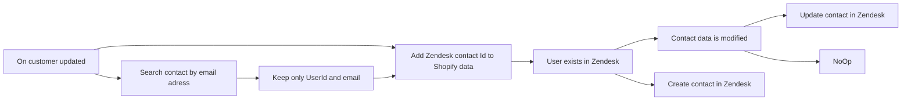

## Fluxo (.json) :

```json
{
  "meta": {
    "instanceId": "237600ca44303ce91fa31ee72babcdc8493f55ee2c0e8aa2b78b3b4ce6f70bd9"
  },
  "nodes": [
    {
      "id": "94fc73af-a35d-4d5c-a192-6190d2a731ff",
      "name": "Keep only UserId and email",
      "type": "n8n-nodes-base.set",
      "position": [
        1200,
        260
      ],
      "parameters": {
        "values": {
          "number": [
            {
              "name": "ZendeskUserId",
              "value": "={{ $json[\"id\"] }}"
            }
          ],
          "string": [
            {
              "name": "ZendeskEmail",
              "value": "={{ $json[\"email\"] }}"
            },
            {
              "name": "ZendeskPhone",
              "value": "={{ $json[\"phone\"]  }}"
            }
          ]
        },
        "options": {},
        "keepOnlySet": true
      },
      "typeVersion": 1
    },
    {
      "id": "6decc852-d5b9-40c4-b51e-832283637027",
      "name": "User exists in Zendesk",
      "type": "n8n-nodes-base.if",
      "position": [
        1660,
        140
      ],
      "parameters": {
        "conditions": {
          "number": [
            {
              "value1": "={{ $json[\"ZendeskUserId\"] }}",
              "operation": "isNotEmpty"
            }
          ]
        }
      },
      "typeVersion": 1
    },
    {
      "id": "70fa2ad7-c43c-4d22-ba6d-89495f8b5794",
      "name": "Add Zendesk contact Id to Shopify data",
      "type": "n8n-nodes-base.merge",
      "position": [
        1420,
        140
      ],
      "parameters": {
        "mode": "mergeByKey",
        "propertyName1": "email",
        "propertyName2": "ZendeskEmail"
      },
      "typeVersion": 1
    },
    {
      "id": "346d3e04-433c-4b43-868f-729d3ee67ee2",
      "name": "On customer updated",
      "type": "n8n-nodes-base.shopifyTrigger",
      "position": [
        740,
        120
      ],
      "webhookId": "a0d5e8ea-3f53-496e-a41b-cb022f715b43",
      "parameters": {
        "topic": "customers/update"
      },
      "credentials": {
        "shopifyApi": {
          "id": "10",
          "name": "Shopify account"
        }
      },
      "typeVersion": 1
    },
    {
      "id": "a2ff1fa3-d67a-4abb-94ae-f22cad7de359",
      "name": "NoOp",
      "type": "n8n-nodes-base.noOp",
      "position": [
        2160,
        180
      ],
      "parameters": {},
      "typeVersion": 1
    },
    {
      "id": "41418930-0898-4602-88a3-cf4238f32890",
      "name": "Contact data is modified",
      "type": "n8n-nodes-base.if",
      "position": [
        1940,
        80
      ],
      "parameters": {
        "conditions": {
          "string": [
            {
              "value1": "={{ $json[\"phone\"] }}",
              "value2": "={{ $json[\"ZendeskPhone\"] }}",
              "operation": "notEqual"
            }
          ]
        }
      },
      "typeVersion": 1
    },
    {
      "id": "ee1791fb-eaa0-4829-af3b-e72d7b3e80d5",
      "name": "Create contact in Zendesk",
      "type": "n8n-nodes-base.zendesk",
      "position": [
        1940,
        240
      ],
      "parameters": {
        "name": "={{ $json[\"first_name\"] }} {{ $json[\"last_name\"] }}",
        "resource": "user",
        "additionalFields": {
          "email": "={{ $json[\"email\"] }}",
          "phone": "={{ $json[\"phone\"] ?? ' ' }}"
        }
      },
      "credentials": {
        "zendeskApi": {
          "id": "5",
          "name": "Zendesk account"
        }
      },
      "typeVersion": 1
    },
    {
      "id": "67dc85c6-39af-43cc-951e-bcfd31b73e46",
      "name": "Update contact in Zendesk",
      "type": "n8n-nodes-base.zendesk",
      "position": [
        2160,
        -20
      ],
      "parameters": {
        "id": "={{ $json[\"ZendeskUserId\"] }}",
        "resource": "user",
        "operation": "update",
        "updateFields": {
          "phone": "={{ $json[\"phone\"] ?? 0}}"
        }
      },
      "credentials": {
        "zendeskApi": {
          "id": "5",
          "name": "Zendesk account"
        }
      },
      "typeVersion": 1
    },
    {
      "id": "9ab30a51-e599-4361-b170-b18b9d4021cb",
      "name": "Search contact by email adress",
      "type": "n8n-nodes-base.zendesk",
      "position": [
        1000,
        260
      ],
      "parameters": {
        "limit": 1,
        "filters": {
          "query": "={{ $json[\"email\"] }}"
        },
        "resource": "user",
        "operation": "search"
      },
      "credentials": {
        "zendeskApi": {
          "id": "5",
          "name": "Zendesk account"
        }
      },
      "typeVersion": 1,
      "alwaysOutputData": true
    }
  ],
  "connections": {
    "On customer updated": {
      "main": [
        [
          {
            "node": "Add Zendesk contact Id to Shopify data",
            "type": "main",
            "index": 0
          },
          {
            "node": "Search contact by email adress",
            "type": "main",
            "index": 0
          }
        ]
      ]
    },
    "User exists in Zendesk": {
      "main": [
        [
          {
            "node": "Contact data is modified",
            "type": "main",
            "index": 0
          }
        ],
        [
          {
            "node": "Create contact in Zendesk",
            "type": "main",
            "index": 0
          }
        ]
      ]
    },
    "Contact data is modified": {
      "main": [
        [
          {
            "node": "Update contact in Zendesk",
            "type": "main",
            "index": 0
          }
        ],
        [
          {
            "node": "NoOp",
            "type": "main",
            "index": 0
          }
        ]
      ]
    },
    "Keep only UserId and email": {
      "main": [
        [
          {
            "node": "Add Zendesk contact Id to Shopify data",
            "type": "main",
            "index": 1
          }
        ]
      ]
    },
    "Search contact by email adress": {
      "main": [
        [
          {
            "node": "Keep only UserId and email",
            "type": "main",
            "index": 0
          }
        ]
      ]
    },
    "Add Zendesk contact Id to Shopify data": {
      "main": [
        [
          {
            "node": "User exists in Zendesk",
            "type": "main",
            "index": 0
          }
        ]
      ]
    }
  }
}
```

<a id="template-469"></a>

## Template 469 - Gatilho de novos pedidos Shopify

- **Nome:** Gatilho de novos pedidos Shopify
- **Descrição:** Este fluxo inicia quando um novo pedido é criado na loja Shopify, permitindo que os dados do pedido sejam processados por passos posteriores.
- **Funcionalidade:** • Detecção de novos pedidos: Inicia o fluxo ao receber o evento de criação de pedido (orders/create).
• Recepção via webhook: Utiliza um webhook para capturar em tempo real os dados do pedido.
• Autenticação com a loja: Usa credenciais da loja para validar e autorizar a recepção dos eventos.
• Disponibilização dos dados: Torna os dados do pedido acessíveis para ações posteriores, como notificações, integrações ou armazenamento.
- **Ferramentas:** • Shopify: Plataforma de e-commerce que gera os pedidos e fornece webhooks para notificação em tempo real.


## Fluxo visual

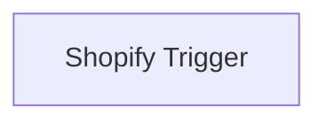

## Fluxo (.json) :

```json
{
  "nodes": [
    {
      "name": "Shopify Trigger",
      "type": "n8n-nodes-base.shopifyTrigger",
      "position": [
        450,
        450
      ],
      "webhookId": "fd11b3d8-ff82-4902-89cc-c93b36ae38e7",
      "parameters": {
        "topic": "orders/create"
      },
      "credentials": {
        "shopifyApi": "shopify_creds"
      },
      "typeVersion": 1
    }
  ],
  "connections": {}
}
```

<a id="template-470"></a>

## Template 470 - Resumo automático de Google Docs para Planilha

- **Nome:** Resumo automático de Google Docs para Planilha
- **Descrição:** Automatiza a detecção de novos documentos em uma pasta do Google Drive, extrai o conteúdo, gera um resumo com IA e grava o resumo e metadados em uma planilha do Google Sheets.
- **Funcionalidade:** • Detecção de novos arquivos: Monitora uma pasta específica do Google Drive e aciona quando um novo documento é criado.
• Recuperação de conteúdo do documento: Obtém o conteúdo do Google Docs a partir do link/ID do arquivo.
• Geração de resumo por IA: Envia o conteúdo do documento para um modelo de linguagem (prompt de sumarização) para produzir um resumo conciso.
• Uso de ferramentas auxiliares pela IA: Permite enriquecer respostas usando fontes externas como enciclopédia e calculadora quando necessário.
• Armazenamento em planilha: Anexa o resumo gerado e metadados relevantes em uma Google Sheet configurada.
• Registro de metadados: Captura e grava informações do autor/modificador (nome e e-mail) juntamente com o resumo.
• Mapeamento de colunas configurável: Define colunas específicas na planilha para Nome, Email e Resumo do conteúdo.
- **Ferramentas:** • Google Drive: Armazena os documentos e serve como fonte de gatilho ao detectar novos arquivos em uma pasta definida.
• Google Docs: Fonte dos conteúdos dos documentos a serem processados e sumarizados.
• Google Sheets: Destino final onde resumos e metadados são registrados e organizados.
• OpenAI (gpt-4o-mini): Modelo de IA usado para gerar resumos concisos do conteúdo dos documentos.
• Wikipedia: Recurso de consulta contextual para enriquecer respostas e fornecer contexto adicional quando necessário.
• Calculadora: Ferramenta para realizar operações numéricas caso o resumo ou análise exija cálculos.


## Fluxo visual

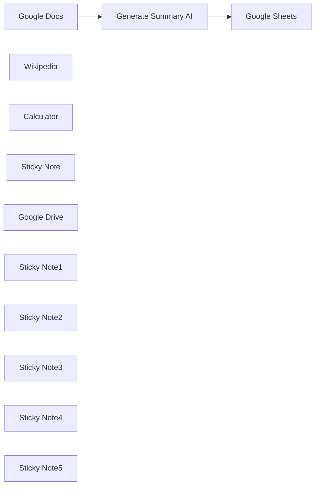

## Fluxo (.json) :

```json
{
  "id": "aswQJmksAOmHmn8c",
  "meta": {
    "instanceId": "14e4c77104722ab186539dfea5182e419aecc83d85963fe13f6de862c875ebfa"
  },
  "name": "Fetch the Most Recent Document from Google Drive",
  "tags": [
    {
      "id": "uScnF9NzR3PLIyvU",
      "name": "Published",
      "createdAt": "2025-03-21T07:22:28.491Z",
      "updatedAt": "2025-03-21T07:22:28.491Z"
    }
  ],
  "nodes": [
    {
      "id": "d9df98fe-bf03-45bd-9cb9-ed32371b7970",
      "name": "Google Docs",
      "type": "n8n-nodes-base.googleDocs",
      "position": [
        100,
        500
      ],
      "parameters": {
        "operation": "get",
        "documentURL": "={{ $json.id }}"
      },
      "credentials": {
        "googleDocsOAuth2Api": {
          "id": "",
          "name": ""
        }
      },
      "typeVersion": 2
    },
    {
      "id": "46daf9a2-0d13-49c3-8272-e366888e1960",
      "name": "Wikipedia",
      "type": "@n8n/n8n-nodes-langchain.toolWikipedia",
      "position": [
        440,
        440
      ],
      "parameters": {},
      "typeVersion": 1
    },
    {
      "id": "9dafd444-257c-4f44-9550-1dbd19dc44d4",
      "name": "Calculator",
      "type": "@n8n/n8n-nodes-langchain.toolCalculator",
      "position": [
        700,
        440
      ],
      "parameters": {},
      "typeVersion": 1
    },
    {
      "id": "259a7fa0-4b37-453e-a730-fb2fc7bc3eb0",
      "name": "Google Sheets",
      "type": "n8n-nodes-base.googleSheets",
      "position": [
        1040,
        540
      ],
      "parameters": {
        "columns": {
          "value": {
            "Name": "={{ $('Google Drive ').item.json.lastModifyingUser.displayName }}",
            "Email ": "={{ $('Google Drive ').item.json.lastModifyingUser.emailAddress }}",
            "Summarise Conetent data ": "={{ $json.message.content }}"
          },
          "schema": [
            {
              "id": "Email ",
              "type": "string",
              "display": true,
              "required": false,
              "displayName": "Email ",
              "defaultMatch": false,
              "canBeUsedToMatch": true
            },
            {
              "id": "Name",
              "type": "string",
              "display": true,
              "removed": false,
              "required": false,
              "displayName": "Name",
              "defaultMatch": false,
              "canBeUsedToMatch": true
            },
            {
              "id": "Summarise Conetent data ",
              "type": "string",
              "display": true,
              "required": false,
              "displayName": "Summarise Conetent data ",
              "defaultMatch": false,
              "canBeUsedToMatch": true
            }
          ],
          "mappingMode": "defineBelow",
          "matchingColumns": []
        },
        "options": {},
        "operation": "append",
        "sheetName": {
          "__rl": true,
          "mode": "list",
          "value": "gid=0",
          "cachedResultUrl": "",
          "cachedResultName": "Sheet1"
        },
        "documentId": {
          "__rl": true,
          "mode": "url",
          "value": "",
          "__regex": "https://(?:drive|docs)\\.google\\.com(?:/.*|)/d/([0-9a-zA-Z\\-_]+)(?:/.*|)"
        }
      },
      "credentials": {
        "googleSheetsOAuth2Api": {
          "id": "",
          "name": ""
        }
      },
      "typeVersion": 4.5
    },
    {
      "id": "d5b63de6-bc9a-4e44-a9a2-85026a16aec7",
      "name": "Sticky Note",
      "type": "n8n-nodes-base.stickyNote",
      "position": [
        -320,
        180
      ],
      "parameters": {
        "color": 5,
        "height": 260,
        "content": "## Get Latest File\n"
      },
      "typeVersion": 1
    },
    {
      "id": "d00720d9-a344-48c9-9c31-7c4391ecda70",
      "name": "Google Drive ",
      "type": "n8n-nodes-base.googleDriveTrigger",
      "notes": "Received the doc",
      "position": [
        -240,
        260
      ],
      "parameters": {
        "event": "fileCreated",
        "options": {},
        "pollTimes": {
          "item": [
            {
              "mode": "everyMinute"
            }
          ]
        },
        "triggerOn": "specificFolder",
        "folderToWatch": {
          "__rl": true,
          "mode": "url",
          "value": ""
        }
      },
      "credentials": {
        "googleDriveOAuth2Api": {
          "id": "",
          "name": ""
        }
      },
      "notesInFlow": true,
      "typeVersion": 1
    },
    {
      "id": "4e326b5d-f116-4de7-bf4b-bac11772e54d",
      "name": "Sticky Note1",
      "type": "n8n-nodes-base.stickyNote",
      "position": [
        20,
        400
      ],
      "parameters": {
        "color": 5,
        "width": 260,
        "height": 260,
        "content": "## Get Document Content\n"
      },
      "typeVersion": 1
    },
    {
      "id": "b2f25e20-0c61-4af4-b2b5-dbeb20720c3b",
      "name": "Sticky Note2",
      "type": "n8n-nodes-base.stickyNote",
      "position": [
        380,
        200
      ],
      "parameters": {
        "color": 5,
        "width": 440,
        "height": 380,
        "content": "## AI Summarization\n"
      },
      "typeVersion": 1
    },
    {
      "id": "af9b81f3-b65d-4957-8471-978dc90970f2",
      "name": "Sticky Note3",
      "type": "n8n-nodes-base.stickyNote",
      "position": [
        920,
        420
      ],
      "parameters": {
        "color": 5,
        "width": 300,
        "height": 280,
        "content": "## Store Summary in Sheet\n"
      },
      "typeVersion": 1
    },
    {
      "id": "4cd99298-968b-4a47-bcf9-b4e006d8dab0",
      "name": "Generate Summary AI",
      "type": "@n8n/n8n-nodes-langchain.openAi",
      "position": [
        460,
        280
      ],
      "parameters": {
        "modelId": {
          "__rl": true,
          "mode": "list",
          "value": "gpt-4o-mini",
          "cachedResultName": "GPT-4O-MINI"
        },
        "options": {},
        "messages": {
          "values": [
            {
              "content": "=Summarise the below content\n {{ $json.content }}"
            }
          ]
        }
      },
      "typeVersion": 1.7
    },
    {
      "id": "af7afd98-8707-4db6-acb0-796427f6e304",
      "name": "Sticky Note4",
      "type": "n8n-nodes-base.stickyNote",
      "position": [
        0,
        0
      ],
      "parameters": {
        "color": 5,
        "width": 800,
        "height": 80,
        "content": "# Google Doc Summarizer to Google Sheets\n"
      },
      "typeVersion": 1
    },
    {
      "id": "d0c4ae80-d120-457a-975d-7cfcb963b922",
      "name": "Sticky Note5",
      "type": "n8n-nodes-base.stickyNote",
      "position": [
        -260,
        760
      ],
      "parameters": {
        "color": 5,
        "width": 1280,
        "content": "## Description\nThis workflow streamlines and automates the end-to-end process of managing recently added document files in Google Drive. It begins by identifying the most recently uploaded .doc file in a designated folder within Google Drive. The document's content is then directly retrieved and passed through an AI-powered summarization model that condenses the content into a concise and meaningful summary. Finally, the summarized content, along with relevant metadata such as the document's name, upload date, and other details, is systematically stored in a Google Sheet. This ensures easy reference, enhanced organization, and quick access to key information, making it an ideal solution for managing and summarizing large volumes of document data efficiently."
      },
      "typeVersion": 1
    }
  ],
  "active": false,
  "pinData": {},
  "settings": {
    "executionOrder": "v1"
  },
  "versionId": "b3ee0a62-7c2f-4dc4-9e2c-f16211e02008",
  "connections": {
    "Wikipedia": {
      "ai_tool": [
        [
          {
            "node": "Generate Summary AI",
            "type": "ai_tool",
            "index": 0
          }
        ]
      ]
    },
    "Calculator": {
      "ai_tool": [
        [
          {
            "node": "Generate Summary AI",
            "type": "ai_tool",
            "index": 0
          }
        ]
      ]
    },
    "Google Docs": {
      "main": [
        [
          {
            "node": "Generate Summary AI",
            "type": "main",
            "index": 0
          }
        ]
      ]
    },
    "Google Drive ": {
      "main": [
        [
          {
            "node": "Google Docs",
            "type": "main",
            "index": 0
          }
        ]
      ]
    },
    "Generate Summary AI": {
      "main": [
        [
          {
            "node": "Google Sheets",
            "type": "main",
            "index": 0
          }
        ]
      ]
    }
  }
}
```

<a id="template-471"></a>

## Template 471 - Processador AI de chamadas Gong

- **Nome:** Processador AI de chamadas Gong
- **Descrição:** Automatiza a ingestão, deduplicação e processamento de gravações de chamadas do Gong, criando registros pai em uma base de dados e acionando um fluxo de IA para extrair dados estruturados, com avisos de progresso via Slack.
- **Funcionalidade:** • Detecção e ingestão de chamadas: Recebe lotes de chamadas para processamento.
• Deduplicação contra histórico: Compara IDs de chamadas com registros existentes e processa apenas chamadas novas.
• Criação de objeto pai na base de dados: Cria uma página/registro pai (Notion) para relacionar os dados gerados pela IA.
• Processamento individual por chamada: Executa um subfluxo de IA para cada chamada, passando metadados e o ID do pai.
• Atualização de progresso em tempo real: Envia mensagem inicial no Slack e atualiza progresso enquanto processa cada chamada.
• Agregação de resultados: Agrupa chamadas processadas e dados do objeto pai para fins de relatório e auditoria.
• Notificação de conclusão: Envia alerta no Slack quando o lote é completamente processado.
• Resiliência e retry: Implementa tentativas e lógica de reexecução para lidar com falhas e limitações de API (rate limiting).
- **Ferramentas:** • Notion: Armazenamento do objeto pai e propriedades detalhadas das chamadas (metadados, links, campos personalizados).
• Slack: Canal de notificação para avisos de início, progresso e conclusão do processamento.
• Gong: Fonte das gravações e metadados das chamadas (IDs, URLs, timestamps).
• Salesforce: Enriquecimento de dados com IDs, estágios e links de oportunidades/contas.
• Serviço de IA externo / subfluxo de IA: Processa o conteúdo das chamadas para extrair insights e gerar dados estruturados.


## Fluxo visual

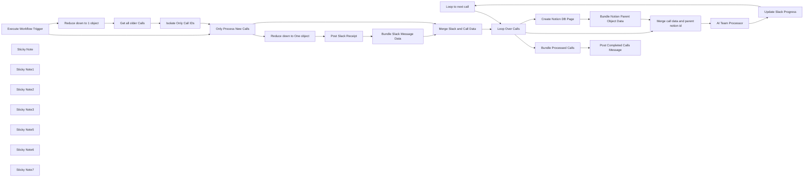

## Fluxo (.json) :

```json
{
  "meta": {
    "instanceId": "cb484ba7b742928a2048bf8829668bed5b5ad9787579adea888f05980292a4a7",
    "templateCredsSetupCompleted": true
  },
  "nodes": [
    {
      "id": "3af140c3-03eb-4eeb-ad31-71f94bc37790",
      "name": "Loop to next call",
      "type": "n8n-nodes-base.noOp",
      "position": [
        4820,
        120
      ],
      "parameters": {},
      "typeVersion": 1
    },
    {
      "id": "8904df21-c993-4c3d-84e6-4418990cb52f",
      "name": "Execute Workflow Trigger",
      "type": "n8n-nodes-base.executeWorkflowTrigger",
      "position": [
        700,
        -40
      ],
      "parameters": {},
      "typeVersion": 1
    },
    {
      "id": "d85f05bd-c680-4b41-b67a-8126b3ed29b0",
      "name": "Create Notion DB Page",
      "type": "n8n-nodes-base.notion",
      "position": [
        3240,
        60
      ],
      "parameters": {
        "title": "={{ $json.metaData.title }}",
        "options": {
          "icon": "📞"
        },
        "resource": "databasePage",
        "databaseId": {
          "__rl": true,
          "mode": "list",
          "value": "1a85b6e0-c94f-81a3-aa21-e3ccf8296d72",
          "cachedResultUrl": "https://www.notion.so/1a85b6e0c94f81a3aa21e3ccf8296d72",
          "cachedResultName": "Sales Call Summaries Demo"
        },
        "propertiesUi": {
          "propertyValues": [
            {
              "key": "Call Date|date",
              "date": "={{ $json.metaData.started }}"
            },
            {
              "key": "Recording URL|url",
              "urlValue": "={{ $json.metaData.url }}"
            },
            {
              "key": "Company|rich_text",
              "textContent": "={{ $json.metaData.CompanyName }}"
            },
            {
              "key": "Call Name|title",
              "title": "={{ $json.metaData.title }}"
            },
            {
              "key": "Gong Call ID|rich_text",
              "textContent": "={{ $json.metaData.GongCallID }}"
            },
            {
              "key": "SF Opp ID|rich_text",
              "textContent": "={{ $json.sfOpp[0].SFOppId }}"
            },
            {
              "key": "SF Opp Stage|select",
              "selectValue": "={{ $json.sfOpp[0].sfStage }}"
            },
            {
              "key": "SF Company ID|rich_text",
              "textContent": "={{ $json.sfOpp[0].companyAccountId }}"
            },
            {
              "key": "SF Opp Won|checkbox",
              "checkboxValue": "={{ $json.sfOpp[0].IsWon }}"
            },
            {
              "key": "SF Opp Closed|checkbox",
              "checkboxValue": "={{ $json.sfOpp[0].IsClosed }}"
            },
            {
              "key": "Company Size|select",
              "selectValue": "={{ $json.sfOpp[0].Employees }}"
            },
            {
              "key": "Sales Rep|multi_select",
              "multiSelectValue": "={{ $json.Attendees.internalNames }}"
            },
            {
              "key": "SF Opp Link|url",
              "urlValue": "=https://data-drive-1632.lightning.force.com/lightning/r/Opportunity/{{ $json.sfOpp[0].SFOppId }}/view"
            },
            {
              "key": "SF Company Link|url",
              "urlValue": "=https://data-drive-1632.lightning.force.com/lightning/r/Account/{{ $json.sfOpp[0].companyAccountId }}/view"
            }
          ]
        }
      },
      "credentials": {
        "notionApi": {
          "id": "2B3YIiD4FMsF9Rjn",
          "name": "Angelbot Notion"
        }
      },
      "retryOnFail": true,
      "typeVersion": 2.2,
      "waitBetweenTries": 3000
    },
    {
      "id": "739aaf26-6807-4f09-a7a5-50b9605e76cb",
      "name": "Sticky Note",
      "type": "n8n-nodes-base.stickyNote",
      "position": [
        620,
        -280
      ],
      "parameters": {
        "color": 7,
        "width": 1240,
        "height": 600,
        "content": "## Process Queue Logic\nIf the run fails for any reason, it can be rerun on only the remaining calls, allowing for greater resilisience in api calls. The main issue I ran into was Notion rate limiting."
      },
      "typeVersion": 1
    },
    {
      "id": "cb8ecb7b-6e90-4394-8161-5b327c17d9c5",
      "name": "Sticky Note1",
      "type": "n8n-nodes-base.stickyNote",
      "position": [
        2700,
        -280
      ],
      "parameters": {
        "color": 7,
        "width": 1360,
        "height": 600,
        "content": "## Loop over calls for analysis and Create Parent \n## DB Object to relate other DB objects to\nThe output is a structured JSON object that is then \npassed into a subworkflow for processing in a linear fashion. "
      },
      "typeVersion": 1
    },
    {
      "id": "49b472b7-d47e-4057-9c43-4b471605059f",
      "name": "Sticky Note2",
      "type": "n8n-nodes-base.stickyNote",
      "position": [
        4080,
        -340
      ],
      "parameters": {
        "color": 7,
        "width": 420,
        "height": 660,
        "content": "## Pass Parent Notion ID and Call data into AI Subworkflow for final prompt processing\nThis allows for multiple agents to process and generate structured data from the calls."
      },
      "typeVersion": 1
    },
    {
      "id": "b1c39cf4-b101-4e7f-9c74-da43e09769fd",
      "name": "Sticky Note3",
      "type": "n8n-nodes-base.stickyNote",
      "position": [
        4520,
        -340
      ],
      "parameters": {
        "color": 7,
        "width": 520,
        "height": 660,
        "content": "## Alert on Progress\nIn Slack, a progress alert is generated and updated in real time to keep the company updated on the progress of the call processing. "
      },
      "typeVersion": 1
    },
    {
      "id": "0ed6b796-8817-461f-958f-49ad2b4157cb",
      "name": "Sticky Note5",
      "type": "n8n-nodes-base.stickyNote",
      "position": [
        3460,
        -600
      ],
      "parameters": {
        "color": 7,
        "width": 600,
        "height": 300,
        "content": "## Alert Slack Job Complete\nSince this runs in the background, this alerts the team that job finished successfully. "
      },
      "typeVersion": 1
    },
    {
      "id": "e537ba92-c909-4da6-b1b0-d5d1fb643bd3",
      "name": "Sticky Note6",
      "type": "n8n-nodes-base.stickyNote",
      "position": [
        260,
        -500
      ],
      "parameters": {
        "color": 5,
        "width": 340,
        "height": 820,
        "content": "\n## CallForge - The AI Gong Sales Call Processor\nCallForge allows you to extract important information for different departments from your Sales Gong Calls. \n\n### Call Processor\nThis is where the parent object in notion is generated to store the AI Call data once it's generated. This is done first so that it can be passed into multiple sub objects for storage. Once that's done, it's passed into the AI Processor."
      },
      "typeVersion": 1
    },
    {
      "id": "af52e980-56a5-4875-878a-495898b345ec",
      "name": "Sticky Note7",
      "type": "n8n-nodes-base.stickyNote",
      "position": [
        1880,
        -360
      ],
      "parameters": {
        "color": 7,
        "width": 800,
        "height": 300,
        "content": "## Alert Slack Job Started\nSince this runs in the background, this alerts the team that job has begun successfully."
      },
      "typeVersion": 1
    },
    {
      "id": "67d4605b-f6d5-41ff-bbe1-90e002456fc1",
      "name": "Post Slack Receipt",
      "type": "n8n-nodes-base.slack",
      "position": [
        2260,
        -220
      ],
      "webhookId": "11dd0884-adc7-40f4-a8a3-f3082a0324fc",
      "parameters": {
        "text": "=Queu Started, Processing {{ $json.data.length }} calls.",
        "select": "channel",
        "channelId": {
          "__rl": true,
          "mode": "list",
          "value": "C080KBCK1TL",
          "cachedResultName": "project-call-forge-alerts"
        },
        "otherOptions": {}
      },
      "credentials": {
        "slackApi": {
          "id": "OfRxDxHFIqk1q44a",
          "name": "Knowledge Ninja n8n labs auth"
        }
      },
      "typeVersion": 2.2
    },
    {
      "id": "6d779b87-ce83-40bd-b068-9082f6849429",
      "name": "AI Team Processor",
      "type": "n8n-nodes-base.executeWorkflow",
      "position": [
        4160,
        -40
      ],
      "parameters": {
        "options": {},
        "workflowId": {
          "__rl": true,
          "mode": "list",
          "value": "4Uol9xlNKyNH213f",
          "cachedResultName": "AI Team Processor Demo"
        }
      },
      "typeVersion": 1.1
    },
    {
      "id": "59848476-c4ec-47ec-9b1c-f206c0749b1e",
      "name": "Update Slack Progress",
      "type": "n8n-nodes-base.slack",
      "position": [
        4580,
        -40
      ],
      "webhookId": "d69dcd59-add1-4fd1-99c0-eee5c6a7fc4f",
      "parameters": {
        "ts": "={{ $('Loop Over Calls').item.json.slackdata[0].message.ts }}",
        "text": "=Queu Started, Processing calls.\nProgress: {{$node[\"Loop Over Calls\"].context[\"currentRunIndex\"]+1;}}/{{ $('Reduce down to One object').item.json.data.length }}",
        "channelId": {
          "__rl": true,
          "mode": "id",
          "value": "C080KBCK1TL"
        },
        "operation": "update",
        "otherOptions": {},
        "updateFields": {}
      },
      "credentials": {
        "slackApi": {
          "id": "OfRxDxHFIqk1q44a",
          "name": "Knowledge Ninja n8n labs auth"
        }
      },
      "typeVersion": 2.2
    },
    {
      "id": "32a2235e-cbdd-45e2-9cb4-991ea1397274",
      "name": "Merge call data and parent notion id",
      "type": "n8n-nodes-base.merge",
      "position": [
        3720,
        -40
      ],
      "parameters": {
        "mode": "combine",
        "options": {},
        "combineBy": "combineByPosition"
      },
      "typeVersion": 3
    },
    {
      "id": "6f91bc31-3249-45f6-9114-7e1d8347cf89",
      "name": "Reduce down to 1 object",
      "type": "n8n-nodes-base.aggregate",
      "position": [
        980,
        100
      ],
      "parameters": {
        "options": {},
        "aggregate": "aggregateAllItemData"
      },
      "typeVersion": 1
    },
    {
      "id": "1d23b540-696c-4d3e-8c23-fac6a84bc6f3",
      "name": "Get all older Calls",
      "type": "n8n-nodes-base.notion",
      "position": [
        1220,
        100
      ],
      "parameters": {
        "options": {},
        "resource": "databasePage",
        "operation": "getAll",
        "returnAll": true,
        "databaseId": {
          "__rl": true,
          "mode": "list",
          "value": "1a85b6e0-c94f-81a3-aa21-e3ccf8296d72",
          "cachedResultUrl": "https://www.notion.so/1a85b6e0c94f81a3aa21e3ccf8296d72",
          "cachedResultName": "Sales Call Summaries Demo"
        }
      },
      "credentials": {
        "notionApi": {
          "id": "2B3YIiD4FMsF9Rjn",
          "name": "Angelbot Notion"
        }
      },
      "typeVersion": 2.2
    },
    {
      "id": "50a3f35e-7637-4eb2-ae9e-11f214307dc0",
      "name": "Isolate Only Call IDs",
      "type": "n8n-nodes-base.set",
      "position": [
        1440,
        100
      ],
      "parameters": {
        "options": {},
        "assignments": {
          "assignments": [
            {
              "id": "328e6ac8-88f3-4c2f-b8e8-d4a0756efd24",
              "name": "Call ID",
              "type": "string",
              "value": "={{ $json.property_gong_call_id ? $json.property_gong_call_id : \"none\" }}"
            }
          ]
        }
      },
      "typeVersion": 3.4
    },
    {
      "id": "fb5c0970-3a05-4c38-8568-6ed175520db5",
      "name": "Only Process New Calls",
      "type": "n8n-nodes-base.compareDatasets",
      "position": [
        1680,
        -40
      ],
      "parameters": {
        "options": {},
        "resolve": "preferInput1",
        "mergeByFields": {
          "values": [
            {
              "field1": "metaData.GongCallID",
              "field2": "Call ID"
            }
          ]
        }
      },
      "typeVersion": 2.3
    },
    {
      "id": "e4c8d925-af53-4855-a002-cbc02c45a9c8",
      "name": "Reduce down to One object",
      "type": "n8n-nodes-base.aggregate",
      "position": [
        2020,
        -220
      ],
      "parameters": {
        "options": {},
        "aggregate": "aggregateAllItemData"
      },
      "typeVersion": 1
    },
    {
      "id": "b6fb9553-42f3-46ca-a0b5-a97288e99e17",
      "name": "Bundle Slack Message Data",
      "type": "n8n-nodes-base.aggregate",
      "position": [
        2480,
        -220
      ],
      "parameters": {
        "options": {},
        "aggregate": "aggregateAllItemData",
        "destinationFieldName": "slackdata"
      },
      "typeVersion": 1
    },
    {
      "id": "ba121e87-d25f-4867-848d-37b353db7ddb",
      "name": "Merge Slack and Call Data",
      "type": "n8n-nodes-base.merge",
      "position": [
        2800,
        -80
      ],
      "parameters": {
        "mode": "combine",
        "options": {},
        "combineBy": "combineAll"
      },
      "typeVersion": 3
    },
    {
      "id": "bfd969e7-87a1-42cd-b23a-2b550772e171",
      "name": "Loop Over Calls",
      "type": "n8n-nodes-base.splitInBatches",
      "position": [
        3020,
        -80
      ],
      "parameters": {
        "options": {}
      },
      "typeVersion": 3
    },
    {
      "id": "1f7dea30-dffe-4cc2-a912-c73ed1c8db50",
      "name": "Bundle Notion Parent Object Data",
      "type": "n8n-nodes-base.aggregate",
      "position": [
        3440,
        60
      ],
      "parameters": {
        "options": {},
        "aggregate": "aggregateAllItemData",
        "destinationFieldName": "notionData"
      },
      "typeVersion": 1
    },
    {
      "id": "e2e2108c-00e0-48c8-8c5c-ef86edc93481",
      "name": "Bundle Processed Calls",
      "type": "n8n-nodes-base.aggregate",
      "position": [
        3540,
        -480
      ],
      "parameters": {
        "options": {},
        "aggregate": "aggregateAllItemData"
      },
      "typeVersion": 1
    },
    {
      "id": "21884d73-45fd-4bb0-b3b6-e225383b5f62",
      "name": "Post Completed Calls Message",
      "type": "n8n-nodes-base.slack",
      "position": [
        3840,
        -480
      ],
      "webhookId": "9d4f5a56-5be9-4373-8961-3627498713dd",
      "parameters": {
        "text": "=Queu Processed, {{ $json.data.length }} calls successfully added to Database.",
        "select": "channel",
        "channelId": {
          "__rl": true,
          "mode": "list",
          "value": "C080KBCK1TL",
          "cachedResultName": "project-call-forge-alerts"
        },
        "otherOptions": {}
      },
      "credentials": {
        "slackApi": {
          "id": "OfRxDxHFIqk1q44a",
          "name": "Knowledge Ninja n8n labs auth"
        }
      },
      "typeVersion": 2.2
    }
  ],
  "pinData": {},
  "connections": {
    "Loop Over Calls": {
      "main": [
        [
          {
            "node": "Bundle Processed Calls",
            "type": "main",
            "index": 0
          }
        ],
        [
          {
            "node": "Merge call data and parent notion id",
            "type": "main",
            "index": 0
          },
          {
            "node": "Create Notion DB Page",
            "type": "main",
            "index": 0
          }
        ]
      ]
    },
    "AI Team Processor": {
      "main": [
        [
          {
            "node": "Update Slack Progress",
            "type": "main",
            "index": 0
          }
        ]
      ]
    },
    "Loop to next call": {
      "main": [
        [
          {
            "node": "Loop Over Calls",
            "type": "main",
            "index": 0
          }
        ]
      ]
    },
    "Post Slack Receipt": {
      "main": [
        [
          {
            "node": "Bundle Slack Message Data",
            "type": "main",
            "index": 0
          }
        ]
      ]
    },
    "Get all older Calls": {
      "main": [
        [
          {
            "node": "Isolate Only Call IDs",
            "type": "main",
            "index": 0
          }
        ]
      ]
    },
    "Create Notion DB Page": {
      "main": [
        [
          {
            "node": "Bundle Notion Parent Object Data",
            "type": "main",
            "index": 0
          }
        ]
      ]
    },
    "Isolate Only Call IDs": {
      "main": [
        [
          {
            "node": "Only Process New Calls",
            "type": "main",
            "index": 1
          }
        ]
      ]
    },
    "Update Slack Progress": {
      "main": [
        [
          {
            "node": "Loop to next call",
            "type": "main",
            "index": 0
          }
        ]
      ]
    },
    "Bundle Processed Calls": {
      "main": [
        [
          {
            "node": "Post Completed Calls Message",
            "type": "main",
            "index": 0
          }
        ]
      ]
    },
    "Only Process New Calls": {
      "main": [
        [
          {
            "node": "Reduce down to One object",
            "type": "main",
            "index": 0
          },
          {
            "node": "Merge Slack and Call Data",
            "type": "main",
            "index": 1
          }
        ]
      ]
    },
    "Reduce down to 1 object": {
      "main": [
        [
          {
            "node": "Get all older Calls",
            "type": "main",
            "index": 0
          }
        ]
      ]
    },
    "Execute Workflow Trigger": {
      "main": [
        [
          {
            "node": "Only Process New Calls",
            "type": "main",
            "index": 0
          },
          {
            "node": "Reduce down to 1 object",
            "type": "main",
            "index": 0
          }
        ]
      ]
    },
    "Bundle Slack Message Data": {
      "main": [
        [
          {
            "node": "Merge Slack and Call Data",
            "type": "main",
            "index": 0
          }
        ]
      ]
    },
    "Merge Slack and Call Data": {
      "main": [
        [
          {
            "node": "Loop Over Calls",
            "type": "main",
            "index": 0
          }
        ]
      ]
    },
    "Reduce down to One object": {
      "main": [
        [
          {
            "node": "Post Slack Receipt",
            "type": "main",
            "index": 0
          }
        ]
      ]
    },
    "Bundle Notion Parent Object Data": {
      "main": [
        [
          {
            "node": "Merge call data and parent notion id",
            "type": "main",
            "index": 1
          }
        ]
      ]
    },
    "Merge call data and parent notion id": {
      "main": [
        [
          {
            "node": "AI Team Processor",
            "type": "main",
            "index": 0
          }
        ]
      ]
    }
  }
}
```

<a id="template-472"></a>

## Template 472 - Consultar usuário GitHub via Slack

- **Nome:** Consultar usuário GitHub via Slack
- **Descrição:** Recebe um pedido via Slack, obtém informações de um usuário no GitHub e publica um resumo com possíveis endereços de email no canal solicitado.
- **Funcionalidade:** • Receber comando do Slack: Aceita um pedido onde o texto contém o login do usuário do GitHub.
• Consultar API GraphQL do GitHub: Recupera nome, empresa, localização, avatar, email público e commits recentes do usuário.
• Extrair e deduplicar emails: Coleta emails públicos e de commits, removendo duplicatas.
• Filtrar emails 'noreply': Remove endereços gerados automaticamente pelo GitHub (users.noreply.github.com).
• Publicar resultado no canal: Envia uma mensagem formatada ao canal do Slack com nome, emails, empresa, localização e imagem de avatar.
- **Ferramentas:** • Slack: Plataforma de mensagens usada para receber o comando de entrada e enviar a resposta ao canal.
• GitHub (API GraphQL): Fonte de dados para obter informações do usuário e histórico de commits.


## Fluxo visual

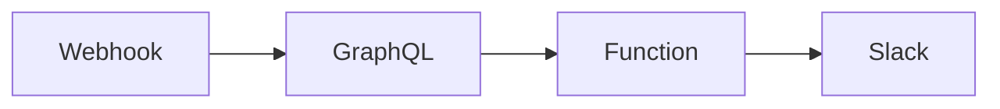

## Fluxo (.json) :

```json
{
  "id": "5",
  "name": "Slack-GitHub User Info",
  "nodes": [
    {
      "name": "Webhook",
      "type": "n8n-nodes-base.webhook",
      "position": [
        300,
        300
      ],
      "webhookId": "dacd64a7-a83e-4492-b8fe-363453906d0d",
      "parameters": {
        "path": "dacd64a7-a83e-4492-b8fe-363453906d0d",
        "options": {},
        "httpMethod": "POST"
      },
      "typeVersion": 1
    },
    {
      "name": "GraphQL",
      "type": "n8n-nodes-base.graphql",
      "position": [
        500,
        300
      ],
      "parameters": {
        "query": "=query {\nuser(login:\"{{$node[\"Webhook\"].json[\"body\"][\"text\"]}}\"){\nname\ncompany\nlocation\navatarUrl\nemail\npullRequests(last: 25) {\nedges {\nnode {\ncommits(last:25) {\nnodes {\ncommit {\nauthor {\nemail\nname\n}\n}\n}\n}\n}\n}\n}\n}\n}",
        "endpoint": "https://api.github.com/graphql",
        "requestFormat": "json",
        "responseFormat": "string",
        "headerParametersUi": {
          "parameter": [
            {
              "name": "User-Agent",
              "value": "n8n"
            },
            {
              "name": "Authorization",
              "value": "bearer <Personal Token>"
            }
          ]
        }
      },
      "typeVersion": 1
    },
    {
      "name": "Function",
      "type": "n8n-nodes-base.function",
      "position": [
        700,
        300
      ],
      "parameters": {
        "functionCode": "let emails = [];\nlet tempEmails = [];\nconst name = $node[\"GraphQL\"].json[\"data\"][\"data\"][\"user\"][\"name\"];\nconst publicEmail = $node[\"GraphQL\"].json[\"data\"][\"data\"][\"user\"][\"email\"];\nconst username = $node[\"Webhook\"].json[\"body\"][\"text\"];\nconst nameRegex = new RegExp(name,\"g\")\n\nif(publicEmail){\n// if public email address exists, push it to the tempEmails array\n  tempEmails.push(publicEmail)\n}\n\n// looping through the pull requests\nfor(const edge of items[0].json.data.data.user.pullRequests.edges){\n // looping through the commits\n  for(node of edge.node.commits.nodes){\n\n    // Checks the name associated with the email address\n    if(nameRegex.test(node.commit.author.name)|| node.commit.author.name == username) {\n     // if name equals to contributors name or username, push the email address in tempEmails\n      tempEmails.push(node.commit.author.email)\n    }\n  }\n}\n\n// Remove duplicates\nemails = [...new Set(tempEmails)]\n\n// RegEx Pattern for email address generated by GitHub\nlet re = /^\\w+(.)*@users.noreply.github.com/\n\n// Remove the email addresses Generated by GitHub\nemails = emails.filter(email => !re.test(email))\n\n\nreturn [{json:{emails,}}]\n"
      },
      "typeVersion": 1
    },
    {
      "name": "Slack",
      "type": "n8n-nodes-base.slack",
      "position": [
        900,
        300
      ],
      "parameters": {
        "channel": "={{$node[\"Webhook\"].json[\"body\"][\"channel_id\"]}}",
        "attachments": [
          {
            "title": "=GitHub Details for: {{$node[\"Webhook\"].json[\"body\"][\"text\"]}}"
          },
          {
            "text": "=*Name:*  {{$node[\"GraphQL\"].json[\"data\"][\"data\"][\"user\"][\"name\"]}}\n*Email:* {{$node[\"Function\"].json[\"emails\"].join(', ')}}\n*Company:* {{$node[\"GraphQL\"].json[\"data\"][\"data\"][\"user\"][\"company\"]}}\n*Location:* {{$node[\"GraphQL\"].json[\"data\"][\"data\"][\"user\"][\"location\"]}}"
          },
          {
            "thumb_url": "={{$node[\"GraphQL\"].json[\"data\"][\"data\"][\"user\"][\"avatarUrl\"]}}"
          }
        ],
        "otherOptions": {},
        "authentication": "oAuth2"
      },
      "credentials": {
        "slackOAuth2Api": "Slack OAuth2"
      },
      "typeVersion": 1
    }
  ],
  "active": false,
  "settings": {},
  "connections": {
    "GraphQL": {
      "main": [
        [
          {
            "node": "Function",
            "type": "main",
            "index": 0
          }
        ]
      ]
    },
    "Webhook": {
      "main": [
        [
          {
            "node": "GraphQL",
            "type": "main",
            "index": 0
          }
        ]
      ]
    },
    "Function": {
      "main": [
        [
          {
            "node": "Slack",
            "type": "main",
            "index": 0
          }
        ]
      ]
    }
  }
}
```

<a id="template-473"></a>

## Template 473 - Validação de email de novos contatos HubSpot

- **Nome:** Validação de email de novos contatos HubSpot
- **Descrição:** Valida o endereço de email de novos contatos criados no HubSpot e envia alerta no Slack caso o email seja considerado suspeito.
- **Funcionalidade:** • Detecção de novo contato: inicia o fluxo quando um contato é criado no HubSpot.
• Recuperação do email do contato: busca a propriedade de email do registro criado.
• Validação do email: consulta um serviço de validação para verificar deliverability, validade do domínio e se o email é descartável.
• Análise de risco: marca o email como suspeito se a deliverability não for "GOOD", se o domínio for inválido ou se o email for descartável.
• Notificação: envia uma mensagem para um canal do Slack com informações do contato quando o email é considerado suspeito.
- **Ferramentas:** • HubSpot: plataforma de CRM usada como origem dos contatos e para recuperar propriedades do contato.
• One Simple API: serviço de validação de emails que verifica deliverability, validade de domínio e se o email é descartável.
• Slack: ferramenta de comunicação utilizada para enviar alertas sobre contatos com emails suspeitos.


## Fluxo visual

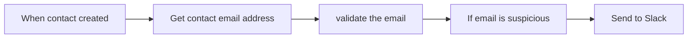

## Fluxo (.json) :

```json
{
  "id": 88,
  "name": "Check for valid Hubspot contact email",
  "nodes": [
    {
      "name": "When contact created",
      "type": "n8n-nodes-base.hubspotTrigger",
      "position": [
        540,
        480
      ],
      "webhookId": "d24ffb14-1e00-4d4e-b3b8-a812690c40d5",
      "parameters": {
        "eventsUi": {
          "eventValues": [
            {}
          ]
        },
        "additionalFields": {}
      },
      "credentials": {
        "hubspotDeveloperApi": {
          "id": "58",
          "name": "Hubspot Developer account"
        }
      },
      "typeVersion": 1
    },
    {
      "name": "Get contact email address",
      "type": "n8n-nodes-base.hubspot",
      "position": [
        720,
        480
      ],
      "parameters": {
        "resource": "contact",
        "contactId": "={{$json[\"contactId\"] ? 151 : 151}}",
        "operation": "get",
        "additionalFields": {
          "properties": [
            "email"
          ],
          "propertyMode": "valueOnly"
        }
      },
      "credentials": {
        "hubspotApi": {
          "id": "57",
          "name": "Hubspot account"
        }
      },
      "typeVersion": 1
    },
    {
      "name": "validate the email",
      "type": "n8n-nodes-base.oneSimpleApi",
      "position": [
        900,
        480
      ],
      "parameters": {
        "resource": "utility",
        "emailAddress": "={{$json[\"properties\"][\"email\"][\"value\"]}}"
      },
      "credentials": {
        "oneSimpleApi": {
          "id": "33",
          "name": "One Simple account"
        }
      },
      "typeVersion": 1
    },
    {
      "name": "If email is suspicious",
      "type": "n8n-nodes-base.if",
      "notes": "IF\ndeliverability is not good\nOR\nDomain is not valid\nOR\nEmail is Disposable",
      "position": [
        1080,
        480
      ],
      "parameters": {
        "conditions": {
          "string": [
            {
              "value1": "={{$json[\"deliverability\"]}}",
              "value2": "GOOD",
              "operation": "notEqual"
            }
          ],
          "boolean": [
            {
              "value1": "={{$json[\"is_domain_valid\"]}}"
            },
            {
              "value1": "={{$json[\"is_email_disposable\"]}}",
              "value2": true
            }
          ]
        },
        "combineOperation": "any"
      },
      "typeVersion": 1
    },
    {
      "name": "Send to Slack",
      "type": "n8n-nodes-base.slack",
      "position": [
        1280,
        460
      ],
      "parameters": {
        "text": "=:warning: New Contact with Suspicious Email :warning:\n*Name: * {{$node[\"Item Lists\"].json[\"contact\"][\"fields\"][\"core\"][\"firstname\"][\"normalizedValue\"]}} {{$node[\"Item Lists\"].json[\"contact\"][\"fields\"][\"core\"][\"lastname\"][\"normalizedValue\"]}}\n*Email: * {{$node[\"Item Lists\"].json[\"contact\"][\"fields\"][\"core\"][\"email\"][\"normalizedValue\"]}}\n*Creator: * {{$node[\"Item Lists\"].json[\"contact\"][\"createdByUser\"]}}",
        "channel": "#hubspot-alerts",
        "attachments": [],
        "otherOptions": {}
      },
      "credentials": {
        "slackApi": {
          "id": "53",
          "name": "Slack Access Token"
        }
      },
      "typeVersion": 1
    }
  ],
  "active": false,
  "settings": {},
  "connections": {
    "validate the email": {
      "main": [
        [
          {
            "node": "If email is suspicious",
            "type": "main",
            "index": 0
          }
        ]
      ]
    },
    "When contact created": {
      "main": [
        [
          {
            "node": "Get contact email address",
            "type": "main",
            "index": 0
          }
        ]
      ]
    },
    "If email is suspicious": {
      "main": [
        [
          {
            "node": "Send to Slack",
            "type": "main",
            "index": 0
          }
        ]
      ]
    },
    "Get contact email address": {
      "main": [
        [
          {
            "node": "validate the email",
            "type": "main",
            "index": 0
          }
        ]
      ]
    }
  }
}
```

<a id="template-474"></a>

## Template 474 - Salvar oportunidades de vendas a partir de e-mails

- **Nome:** Salvar oportunidades de vendas a partir de e-mails
- **Descrição:** Detecta e resume e-mails rotulados como vendas e cria oportunidades no Odoo usando um modelo de IA para gerar a descrição.
- **Funcionalidade:** • Monitoramento de e-mails com rótulo de vendas: Verifica periodicamente (a cada hora) a presença de novos e-mails marcados com um rótulo específico.
• Extração de metadados do e-mail: Captura assunto, remetente e conteúdo do e-mail para uso na criação da oportunidade.
• Resumo do conteúdo com IA: Gera um resumo conciso do corpo do e-mail, extraindo informações relevantes como orçamento, prazos e um resumo geral.
• Criação automática de oportunidade: Cria uma nova oportunidade no CRM com nome baseado no assunto, e-mail do remetente e descrição contendo o resumo gerado.
• Armazenamento estruturado: Salva o resumo e os detalhes do contato dentro do registro de oportunidade para referência futura.
- **Ferramentas:** • Gmail: Fornece acesso aos e-mails, rótulos e conteúdo das mensagens para serem processados.
• OpenAI: Gera resumos e extrai informações relevantes do texto do e-mail usando um modelo de linguagem.
• Odoo: Sistema CRM onde as oportunidades de vendas são criadas e armazenadas.


## Fluxo visual

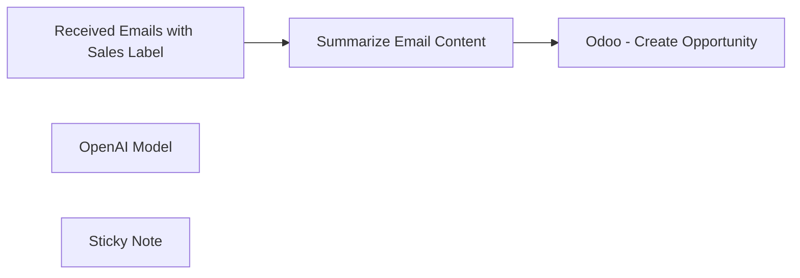

## Fluxo (.json) :

```json
{
  "id": "NPGAfBzz4nv8lTpl",
  "meta": {
    "instanceId": "d40a25503b797861fe81ffcf2649da2a83b8677ac1ef2ee6b6872aa9b52454b8",
    "templateCredsSetupCompleted": true
  },
  "name": "Save New Sales Opportunities",
  "tags": [],
  "nodes": [
    {
      "id": "64b02b70-e7f2-4df0-852f-b6959af8d8c5",
      "name": "Received Emails with Sales Label",
      "type": "n8n-nodes-base.gmailTrigger",
      "position": [
        760,
        540
      ],
      "parameters": {
        "simple": false,
        "filters": {
          "labelIds": [
            "Label_8035866011660570111"
          ]
        },
        "options": {},
        "pollTimes": {
          "item": [
            {
              "mode": "everyHour"
            }
          ]
        }
      },
      "credentials": {
        "gmailOAuth2": {
          "id": "hCIbT7XsRrtmzCCJ",
          "name": "Gmail account"
        }
      },
      "typeVersion": 1.1
    },
    {
      "id": "6dca3c61-98ba-4d18-bc5c-9c762e12f13b",
      "name": "Odoo - Create Opportunity",
      "type": "n8n-nodes-base.odoo",
      "position": [
        1500,
        540
      ],
      "parameters": {
        "resource": "opportunity",
        "opportunityName": "={{ $('Received Emails with Sales Label').item.json.headers.subject }}",
        "additionalFields": {
          "email_from": "={{ $('Received Emails with Sales Label').item.json.from.value[0].address }}",
          "description": "={{ $json.response.text }}"
        }
      },
      "credentials": {
        "odooApi": {
          "id": "5XAxrqqPxY5dzcoP",
          "name": "Odoo account"
        }
      },
      "typeVersion": 1
    },
    {
      "id": "a57e0e51-50d3-49de-8dc6-6fe592604765",
      "name": "OpenAI Model",
      "type": "@n8n/n8n-nodes-langchain.lmOpenAi",
      "position": [
        1040,
        720
      ],
      "parameters": {
        "model": {
          "__rl": true,
          "mode": "list",
          "value": "gpt-3.5-turbo-instruct"
        },
        "options": {}
      },
      "credentials": {
        "openAiApi": {
          "id": "8F3dAS1qjFM6mYbD",
          "name": "OpenAi account"
        }
      },
      "typeVersion": 1
    },
    {
      "id": "a6de25a3-3967-4957-bc98-4cb774a53dda",
      "name": "Sticky Note",
      "type": "n8n-nodes-base.stickyNote",
      "position": [
        700,
        220
      ],
      "parameters": {
        "width": 446.44549763033154,
        "height": 261.8821936357484,
        "content": "## Summarize emails and save them as notes on sales opportunity in Odoo\n\nSet up steps:\n* Configure Google Cloud credentials with Gmail access\n* Configure OpenAI credentials\n* Configure Odoo credentials\n "
      },
      "typeVersion": 1
    },
    {
      "id": "8705b4de-1334-4ff2-8d5d-60ec96cfb8cd",
      "name": "Summarize Email Content",
      "type": "@n8n/n8n-nodes-langchain.chainSummarization",
      "position": [
        1060,
        540
      ],
      "parameters": {
        "options": {
          "summarizationMethodAndPrompts": {
            "values": {
              "prompt": "=Write a concise summary of the following sales inquiry:\n\" {{ $json.text }}\"\nInclude structured information such as project budget, timelines, industry and a general summary\n\nCONCISE SUMMARY: \n",
              "combineMapPrompt": "=Write a concise summary of the following sales inquiry:\n\"{{ $json.text }}\"\nExtract information such as project budget, timelines and a general summary.\n\nCONCISE SUMMARY: \n"
            }
          }
        }
      },
      "typeVersion": 2
    }
  ],
  "active": false,
  "pinData": {
    "Summarize Email Content": [
      {
        "json": {
          "response": {
            "text": "Mihai Farcas, Procurement Manager at Innovative Solutions Inc, is interested in incorporating CloudConnect Pro platform into their upcoming projects. They are impressed by its capabilities in cloud integration, data management, and flexibility. They request detailed information on pricing, implementation options, support services, and case studies for enterprise-level deployments. They are eager to learn more and hope for a mutually beneficial partnership. "
          }
        }
      }
    ],
    "Received Emails with Sales Label": [
      {
        "json": {
          "id": "1903f41a3a4813f4",
          "to": {
            "html": "<span class=\"mp_address_group\"><span class=\"mp_address_name\">Mihai Farcas</span> &lt;<a href=\"mailto:farcasmihai91@gmail.com\" class=\"mp_address_email\">farcasmihai91@gmail.com</a>&gt;</span>",
            "text": "\"Mihai Farcas\" <farcasmihai91@gmail.com>",
            "value": [
              {
                "name": "Mihai Farcas",
                "address": "farcasmihai91@gmail.com"
              }
            ]
          },
          "date": "2024-06-22T09:23:01.000Z",
          "from": {
            "html": "<span class=\"mp_address_group\"><span class=\"mp_address_name\">Mihai Farcas</span> &lt;<a href=\"mailto:contact@mihai.ltd\" class=\"mp_address_email\">contact@mihai.ltd</a>&gt;</span>",
            "text": "\"Mihai Farcas\" <contact@mihai.ltd>",
            "value": [
              {
                "name": "Mihai Farcas",
                "address": "contact@mihai.ltd"
              }
            ]
          },
          "html": "<div dir=\"ltr\"><p>Dear Alex,</p><p>I hope this email finds you well.</p><p>My name is Mihai Farcas, and I&#39;m the Procurement Manager at Innovative Solutions Inc. We are a leading provider of cutting-edge technological solutions for businesses across various industries.</p><p>I&#39;m reaching out to you today to express our strong interest in your company&#39;s CloudConnect Pro platform. We&#39;ve been thoroughly impressed by its capabilities in cloud integration, data management, and overall flexibility. Our research indicates that it could be an excellent fit for our clients&#39; needs, particularly in the areas of streamlining workflows and enhancing data accessibility.</p><p>We are currently exploring the possibility of incorporating CloudConnect Pro into our upcoming projects. To this end, we would appreciate it if you could provide us with detailed information on pricing, implementation options, and support services for enterprise-level deployments.  Additionally, any case studies or testimonials from companies similar to ours would be most welcome.</p><p>Given the urgency of our projects, a prompt response would be greatly appreciated. We are eager to learn more about how CloudConnect Pro can contribute to our success and look forward to the possibility of a mutually beneficial partnership.</p><p>Thank you for your time and consideration.</p><p><br></p><p>Sincerely,</p><p>Mihai Farcas</p><p>Procurement Manager</p><p>Innovative Solutions Inc.</p></div>\n",
          "text": "Dear Alex,\n\nI hope this email finds you well.\n\nMy name is Mihai Farcas, and I'm the Procurement Manager at Innovative\nSolutions Inc. We are a leading provider of cutting-edge technological\nsolutions for businesses across various industries.\n\nI'm reaching out to you today to express our strong interest in your\ncompany's CloudConnect Pro platform. We've been thoroughly impressed by its\ncapabilities in cloud integration, data management, and overall\nflexibility. Our research indicates that it could be an excellent fit for\nour clients' needs, particularly in the areas of streamlining workflows and\nenhancing data accessibility.\n\nWe are currently exploring the possibility of incorporating CloudConnect\nPro into our upcoming projects. To this end, we would appreciate it if you\ncould provide us with detailed information on pricing, implementation\noptions, and support services for enterprise-level deployments.\nAdditionally, any case studies or testimonials from companies similar to\nours would be most welcome.\n\nGiven the urgency of our projects, a prompt response would be greatly\nappreciated. We are eager to learn more about how CloudConnect Pro can\ncontribute to our success and look forward to the possibility of a mutually\nbeneficial partnership.\n\nThank you for your time and consideration.\n\n\nSincerely,\n\nMihai Farcas\n\nProcurement Manager\n\nInnovative Solutions Inc.\n",
          "headers": {
            "to": "To: Mihai Farcas <farcasmihai91@gmail.com>",
            "date": "Date: Sat, 22 Jun 2024 12:23:01 +0300",
            "from": "From: Mihai Farcas <contact@mihai.ltd>",
            "subject": "Subject: Urgent Inquiry for CloudConnect Pro Integration",
            "message-id": "Message-ID: <CAGDzDQR5BWWjU40G26dg4AZuiMKZ5b0GtdUyn-2FbfMFs2yJwg@mail.gmail.com>",
            "content-type": "Content-Type: multipart/alternative; boundary=\"00000000000064dc5b061b7718a6\"",
            "mime-version": "MIME-Version: 1.0"
          },
          "subject": "Urgent Inquiry for CloudConnect Pro Integration",
          "labelIds": [
            "Label_8035866011660570111",
            "IMPORTANT",
            "SENT",
            "INBOX"
          ],
          "threadId": "1903f3f36f29657c",
          "messageId": "<CAGDzDQR5BWWjU40G26dg4AZuiMKZ5b0GtdUyn-2FbfMFs2yJwg@mail.gmail.com>",
          "textAsHtml": "<p>Dear Alex,</p><p>I hope this email finds you well.</p><p>My name is Mihai Farcas, and I&apos;m the Procurement Manager at Innovative<br/>Solutions Inc. We are a leading provider of cutting-edge technological<br/>solutions for businesses across various industries.</p><p>I&apos;m reaching out to you today to express our strong interest in your<br/>company&apos;s CloudConnect Pro platform. We&apos;ve been thoroughly impressed by its<br/>capabilities in cloud integration, data management, and overall<br/>flexibility. Our research indicates that it could be an excellent fit for<br/>our clients&apos; needs, particularly in the areas of streamlining workflows and<br/>enhancing data accessibility.</p><p>We are currently exploring the possibility of incorporating CloudConnect<br/>Pro into our upcoming projects. To this end, we would appreciate it if you<br/>could provide us with detailed information on pricing, implementation<br/>options, and support services for enterprise-level deployments.<br/>Additionally, any case studies or testimonials from companies similar to<br/>ours would be most welcome.</p><p>Given the urgency of our projects, a prompt response would be greatly<br/>appreciated. We are eager to learn more about how CloudConnect Pro can<br/>contribute to our success and look forward to the possibility of a mutually<br/>beneficial partnership.</p><p>Thank you for your time and consideration.</p><p>Sincerely,</p><p>Mihai Farcas</p><p>Procurement Manager</p><p>Innovative Solutions Inc.</p>",
          "sizeEstimate": 3554
        }
      }
    ]
  },
  "settings": {
    "executionOrder": "v1"
  },
  "versionId": "8c905538-5613-464b-b5a0-87e266a507c7",
  "connections": {
    "OpenAI Model": {
      "ai_languageModel": [
        [
          {
            "node": "Summarize Email Content",
            "type": "ai_languageModel",
            "index": 0
          }
        ]
      ]
    },
    "Summarize Email Content": {
      "main": [
        [
          {
            "node": "Odoo - Create Opportunity",
            "type": "main",
            "index": 0
          }
        ]
      ]
    },
    "Received Emails with Sales Label": {
      "main": [
        [
          {
            "node": "Summarize Email Content",
            "type": "main",
            "index": 0
          }
        ]
      ]
    }
  }
}
```

<a id="template-475"></a>

## Template 475 - Publicação automática e sob demanda de tweets

- **Nome:** Publicação automática e sob demanda de tweets
- **Descrição:** Automatiza a criação, validação e publicação de tweets com uma voz de influenciador definida, permitindo execução agendada ou manual.
- **Funcionalidade:** • Publicação agendada: Agenda publicações a cada 6 horas.
• Randomização do minuto de postagem: Randomiza os minutos do horário agendado para parecer natural.
• Disparo manual: Permite gerar e publicar um tweet sob demanda quando executado manualmente.
• Configuração de perfil de influenciador: Define nicho, estilo de escrita e fontes de inspiração para guiar a geração do conteúdo.
• Geração de tweet por IA: Gera um tweet otimizado para viralidade seguindo o perfil configurado e incluindo hashtags e emojis quando relevante.
• Validação de comprimento: Verifica se o tweet respeita o limite de 280 caracteres e aciona regeneração se necessário.
• Publicação na conta: Publica o tweet gerado diretamente na conta X/Twitter configurada.
- **Ferramentas:** • OpenAI (GPT-4-Turbo-Preview): Gera o conteúdo do tweet com base no perfil, estilo e inspirações fornecidos.
• X (Twitter) API: Conta para publicar os tweets automaticamente via API.

## Fluxo visual

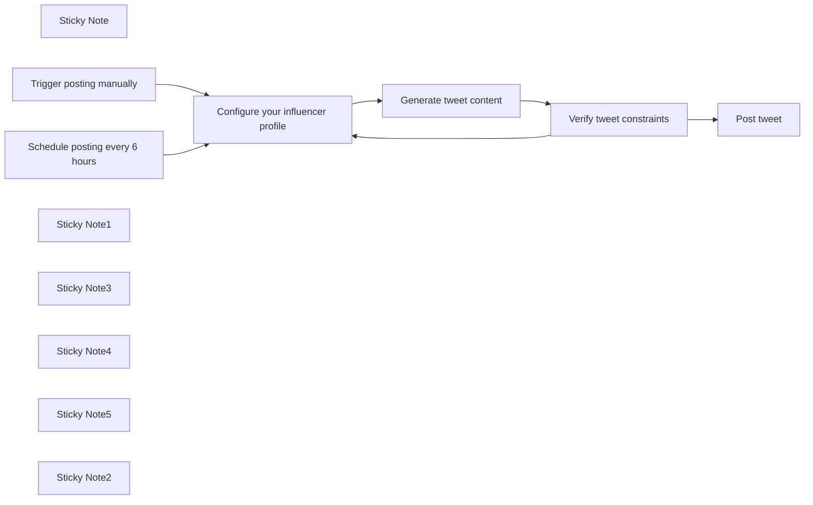

## Fluxo (.json) :

```json
{
  "meta": {
    "instanceId": "cb484ba7b742928a2048bf8829668bed5b5ad9787579adea888f05980292a4a7"
  },
  "nodes": [
    {
      "id": "ea9ddb4c-af49-480c-8b73-221b3741069d",
      "name": "Sticky Note",
      "type": "n8n-nodes-base.stickyNote",
      "position": [
        920,
        400
      ],
      "parameters": {
        "width": 389,
        "height": 265,
        "content": "## Scheduled posting \nWrite a tweet every 6 hours and randomize the minutes that it's posted at to make it seem natural.\n"
      },
      "typeVersion": 1
    },
    {
      "id": "9650b047-7d5e-4ed2-948c-d5be77a94b5d",
      "name": "Post tweet",
      "type": "n8n-nodes-base.twitter",
      "position": [
        2940,
        520
      ],
      "parameters": {
        "text": "={{ $json.message.content.tweet }}",
        "additionalFields": {}
      },
      "credentials": {
        "twitterOAuth2Api": {
          "id": "b3qa9dBp2PxbufK3",
          "name": "X account"
        }
      },
      "typeVersion": 2
    },
    {
      "id": "fd7fc941-37de-4f88-87c0-f62ad1ebe2d6",
      "name": "Schedule posting every 6 hours",
      "type": "n8n-nodes-base.scheduleTrigger",
      "position": [
        1140,
        500
      ],
      "parameters": {
        "rule": {
          "interval": [
            {
              "field": "hours",
              "hoursInterval": 6,
              "triggerAtMinute": "={{ Math.floor(Math.random() * 60) }}"
            }
          ]
        }
      },
      "typeVersion": 1.1
    },
    {
      "id": "107fd741-5c17-4cd6-98aa-088bf8df523d",
      "name": "Trigger posting manually",
      "type": "n8n-nodes-base.manualTrigger",
      "position": [
        1140,
        820
      ],
      "parameters": {},
      "typeVersion": 1
    },
    {
      "id": "831cd431-56e5-482e-a8a5-e5c5ac078ba4",
      "name": "Sticky Note1",
      "type": "n8n-nodes-base.stickyNote",
      "position": [
        1360,
        400
      ],
      "parameters": {
        "width": 389,
        "height": 265,
        "content": "## Configure influencer profile \nSet your target niche, writing style, and inspiration.\n"
      },
      "typeVersion": 1
    },
    {
      "id": "791c0be9-6396-4768-ab6b-3ca7fe49fbea",
      "name": "Sticky Note3",
      "type": "n8n-nodes-base.stickyNote",
      "position": [
        1800,
        400
      ],
      "parameters": {
        "width": 389,
        "height": 265,
        "content": "## Generate tweet\nGenerate a potentially viral tweet based on your configuration."
      },
      "typeVersion": 1
    },
    {
      "id": "3b2872cf-38f9-4cfd-befd-ad792219c313",
      "name": "Sticky Note4",
      "type": "n8n-nodes-base.stickyNote",
      "position": [
        2240,
        400
      ],
      "parameters": {
        "width": 389,
        "height": 265,
        "content": "## Validate tweet\nIf the generated tweet does not meet length constraints, regenerate it."
      },
      "typeVersion": 1
    },
    {
      "id": "364310a1-0367-4ce2-a91b-9a9c4d9387a0",
      "name": "Sticky Note5",
      "type": "n8n-nodes-base.stickyNote",
      "position": [
        2680,
        400
      ],
      "parameters": {
        "width": 389,
        "height": 265,
        "content": "## Post the tweet\nPost the tweet to your X account."
      },
      "typeVersion": 1
    },
    {
      "id": "c666ba9f-d28d-449b-8e20-65c0150cba5b",
      "name": "Verify tweet constraints",
      "type": "n8n-nodes-base.if",
      "position": [
        2480,
        500
      ],
      "parameters": {
        "options": {},
        "conditions": {
          "options": {
            "leftValue": "",
            "caseSensitive": true,
            "typeValidation": "strict"
          },
          "combinator": "and",
          "conditions": [
            {
              "id": "0a6ebbb6-4b14-4c7e-9390-215e32921663",
              "operator": {
                "type": "number",
                "operation": "gt"
              },
              "leftValue": "={{ $json.message.content.tweet.length }}",
              "rightValue": 280
            }
          ]
        }
      },
      "typeVersion": 2
    },
    {
      "id": "9bf25238-98ba-4201-aecc-22be27f095c8",
      "name": "Sticky Note2",
      "type": "n8n-nodes-base.stickyNote",
      "position": [
        920,
        720
      ],
      "parameters": {
        "width": 389,
        "height": 265,
        "content": "## On-demand posting \nWrite a tweet on demand, when you manually run your workflow.\n"
      },
      "typeVersion": 1
    },
    {
      "id": "4b95c041-a70e-42f9-9467-26de2abe6b7a",
      "name": "Generate tweet content",
      "type": "@n8n/n8n-nodes-langchain.openAi",
      "position": [
        1900,
        500
      ],
      "parameters": {
        "modelId": {
          "__rl": true,
          "mode": "list",
          "value": "gpt-4-turbo-preview",
          "cachedResultName": "GPT-4-TURBO-PREVIEW"
        },
        "options": {},
        "messages": {
          "values": [
            {
              "role": "system",
              "content": "=You are a successful modern Twitter influencer. Your tweets always go viral. "
            },
            {
              "role": "system",
              "content": "=You have a specific writing style: {{ $json.style }}"
            },
            {
              "role": "system",
              "content": "=You follow the principles described in your inspiration sources closely and you write your tweets based on that: {{ $json.inspiration }}"
            },
            {
              "role": "system",
              "content": "=You have a very specific niche: {{ $json.niche }}"
            },
            {
              "role": "system",
              "content": "=Answer with the viral tweet and nothing else as a response. Keep the tweet within 280 characters. Current date and time are {{DateTime.now()}}. Add hashtags and emojis where relevant."
            },
            {
              "content": "Write a tweet that is certain to go viral. Take your time in writing it. Think. Use the vast knowledge you have."
            }
          ]
        },
        "jsonOutput": true
      },
      "credentials": {
        "openAiApi": {
          "id": "294",
          "name": "Alex's OpenAI Account"
        }
      },
      "typeVersion": 1
    },
    {
      "id": "18f1af3a-58b3-4a4d-a8ad-3657da9c41ba",
      "name": "Configure your influencer profile",
      "type": "n8n-nodes-base.set",
      "position": [
        1580,
        500
      ],
      "parameters": {
        "options": {},
        "assignments": {
          "assignments": [
            {
              "id": "45268b04-68a1-420f-9ad2-950844d16af1",
              "name": "niche",
              "type": "string",
              "value": "Modern Stoicism. You tweet about the greatest stoics, their ideas, their quotes, and how their wisdom applies in today's modern life. You love sharing personal stories and experiences."
            },
            {
              "id": "d95f4a1c-ab1c-4eca-8732-3d7a087f82d8",
              "name": "style",
              "type": "string",
              "value": "All of your tweets are very personal. "
            },
            {
              "id": "1ee088f7-7021-48c0-bcb7-d1011eb0db3d",
              "name": "inspiration",
              "type": "string",
              "value": "Your inspiration comes from tens of books on stoicism, psychology, and how to influence people. Books such as \"Contagious\" by Jonah Bergen, \"How To Be Internet Famous\" by Brendan Cox, \"How to Win Friends and Influence People\" by Dale Carnegie, and \"Influencers and Creators\" by Robert V Kozinets, Ulrike Gretzel, Rossella Gambetti strongly influence the way you write your tweets. "
            }
          ]
        }
      },
      "typeVersion": 3.3
    }
  ],
  "pinData": {},
  "connections": {
    "Generate tweet content": {
      "main": [
        [
          {
            "node": "Verify tweet constraints",
            "type": "main",
            "index": 0
          }
        ]
      ]
    },
    "Trigger posting manually": {
      "main": [
        [
          {
            "node": "Configure your influencer profile",
            "type": "main",
            "index": 0
          }
        ]
      ]
    },
    "Verify tweet constraints": {
      "main": [
        [
          {
            "node": "Configure your influencer profile",
            "type": "main",
            "index": 0
          }
        ],
        [
          {
            "node": "Post tweet",
            "type": "main",
            "index": 0
          }
        ]
      ]
    },
    "Schedule posting every 6 hours": {
      "main": [
        [
          {
            "node": "Configure your influencer profile",
            "type": "main",
            "index": 0
          }
        ]
      ]
    },
    "Configure your influencer profile": {
      "main": [
        [
          {
            "node": "Generate tweet content",
            "type": "main",
            "index": 0
          }
        ]
      ]
    }
  }
}
```

<a id="template-476"></a>

## Template 476 - Ativador/Desativador de workflows via Telegram

- **Nome:** Ativador/Desativador de workflows via Telegram
- **Descrição:** Recebe comandos via Telegram para ativar ou desativar workflows remotos, filtrando quem pode enviar comandos e escolhendo o workflow alvo por palavras-chave.
- **Funcionalidade:** • Recepção de comandos via Telegram: Ouve mensagens diretas enviadas ao bot para iniciar a automação.
• Filtragem por chat ID: Permite que apenas mensagens de um chat específico sejam aceitas para executar ações.
• Interpretação de comando inicial: Identifica se a mensagem começa com /start (ativar) ou /stop (desativar).
• Identificação do alvo por palavra-chave: Analisa o restante do texto para decidir qual workflow deve ser afetado (ex.: marketing, sales — as palavras-chave são configuráveis).
• Chamadas à API de gerenciamento: Envia requisições autenticadas para ativar ou desativar o workflow correspondente com base na seleção.
• Interface segura por credenciais: Requer chave/API para executar ações de ativação/desativação.
- **Ferramentas:** • Telegram Bot API: Recebe mensagens do usuário e dispara os comandos para o fluxo.
• API de gerenciamento de workflows: Interface HTTP autenticada usada para ativar ou desativar workflows remotamente (requere ID do workflow e credenciais).

## Fluxo visual

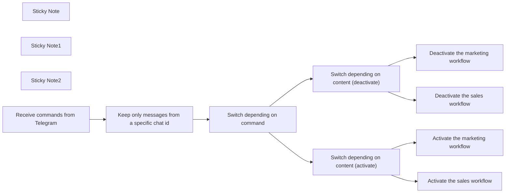

## Fluxo (.json) :

```json
{
  "meta": {
    "instanceId": "82a17fa4a0b8e81bf77e5ab999d980f392150f2a9541fde626dc5f74857b1f54"
  },
  "nodes": [
    {
      "id": "814ab819-7a0d-4647-a8e2-56d90616b4b2",
      "name": "Sticky Note",
      "type": "n8n-nodes-base.stickyNote",
      "position": [
        962,
        306
      ],
      "parameters": {
        "width": 307,
        "height": 1003.1537835638735,
        "content": "### Switch depending on content\n0 = if command contains the word \"marketing\"\n1 = if command contains the word \"sales\""
      },
      "typeVersion": 1
    },
    {
      "id": "0c263242-1369-4cd5-83b7-4e2e8ffe99bb",
      "name": "Keep only messages from a specific chat id",
      "type": "n8n-nodes-base.filter",
      "position": [
        480,
        520
      ],
      "parameters": {
        "conditions": {
          "number": [
            {
              "value1": "={{ $json.message.chat.id }}",
              "value2": null,
              "operation": "equal"
            }
          ]
        }
      },
      "typeVersion": 1
    },
    {
      "id": "8dd8b974-bfdc-4a80-bb94-3d5994872f70",
      "name": "Sticky Note1",
      "type": "n8n-nodes-base.stickyNote",
      "position": [
        660,
        311
      ],
      "parameters": {
        "height": 382,
        "content": "### Switch depending on command\n0 = /stop\n1 = /start"
      },
      "typeVersion": 1
    },
    {
      "id": "fd76d706-01df-453d-b8ad-d3ad1b379fb4",
      "name": "Deactivate the marketing workflow",
      "type": "n8n-nodes-base.n8n",
      "position": [
        1380,
        480
      ],
      "parameters": {
        "operation": "deactivate",
        "workflowId": {
          "__rl": true,
          "mode": "url",
          "value": ""
        }
      },
      "credentials": {
        "n8nApi": {
          "id": "hHsMs7R7sstUSWGD",
          "name": "n8n account"
        }
      },
      "typeVersion": 1
    },
    {
      "id": "b2c976ca-e78f-4b0a-8337-45c66939d30c",
      "name": "Deactivate the sales workflow",
      "type": "n8n-nodes-base.n8n",
      "position": [
        1380,
        680
      ],
      "parameters": {
        "operation": "deactivate",
        "workflowId": {
          "__rl": true,
          "mode": "url",
          "value": ""
        }
      },
      "credentials": {
        "n8nApi": {
          "id": "hHsMs7R7sstUSWGD",
          "name": "n8n account"
        }
      },
      "typeVersion": 1
    },
    {
      "id": "8187bb9d-685b-4955-b7e0-3375a9461bc8",
      "name": "Activate the marketing workflow",
      "type": "n8n-nodes-base.n8n",
      "position": [
        1380,
        940
      ],
      "parameters": {
        "operation": "activate",
        "workflowId": {
          "__rl": true,
          "mode": "url",
          "value": "",
          "__regex": ".*/workflow/([0-9a-zA-Z]{1,})"
        }
      },
      "credentials": {
        "n8nApi": {
          "id": "hHsMs7R7sstUSWGD",
          "name": "n8n account"
        }
      },
      "typeVersion": 1
    },
    {
      "id": "87d219be-77d0-4e29-9137-d55bdfae4aa7",
      "name": "Switch depending on content (activate)",
      "type": "n8n-nodes-base.switch",
      "position": [
        1040,
        960
      ],
      "parameters": {
        "rules": {
          "rules": [
            {
              "value2": "usdc",
              "operation": "contains",
              "outputKey": "0"
            },
            {
              "value2": "hsuite",
              "operation": "contains",
              "outputKey": "1"
            }
          ]
        },
        "value1": "={{ $json.message.text }}",
        "dataType": "string"
      },
      "typeVersion": 2
    },
    {
      "id": "fa5f346d-5ad2-4ef3-b715-e45ffb7dfd29",
      "name": "Sticky Note2",
      "type": "n8n-nodes-base.stickyNote",
      "position": [
        60,
        740
      ],
      "parameters": {
        "width": 846,
        "height": 575.2554922701386,
        "content": "# Telegram N8N workflow (de)activator\n\n## What does it do?\nThis workflow helps you to quickly activate or deactivate a workflow through Telegram. Sometimes we are not able to access a PC to resolve an issue if something goes wrong with a workflow. If you, like me, use Telegram to send yourself error reports, you can quickly react in case of urgency. Just by sending '/stop' combined with the name you use for a workflow, you can deactivate a workflow, or reactivate it with '/start'. For example '/stop marketing'.\n\nWalkthrough: https://watch.screencastify.com/v/uWQ88gZKj57WTGOOqSW2 (6min)\n\n## Instructions\n1. Create a Telegram API key through botfather (https://t.me/botfather). Add it to the telegram credentials.\n2. For the N8N nodes, go to settings in your n8n instance. Then 'n8n API' and 'create an API key'. \n3. To ensure that only we can send commands to the bot, we need the chat ID of our DM with our newly created bot. Open the the Telegram trigger and click on 'listen to events'.\n4. Go to Telegram and send a direct message to the bot, this will trigger the Telegram node.\n5. Go to the filter node and fill in the chat id you want to filter for with the data you got from the test event in the Telegram node.\n6. In the first Switch node you can find the commands, in this case it is '/start' and '/stop'. When you send a message to your bot starting with either of those, it will go to the next switch nodes.\n7. Next it will check what other word it contains. As an example I have used the words 'marketing' and 'sales', both corresponding to a marketing and sales workflow. \n8. The last nodes will either activate or deactivate a workflow."
      },
      "typeVersion": 1
    },
    {
      "id": "d16753af-c1d7-4b60-89da-82432a0b06c1",
      "name": "Receive commands from Telegram",
      "type": "n8n-nodes-base.telegramTrigger",
      "position": [
        260,
        520
      ],
      "webhookId": "5fe48950-9a59-4b47-b568-6d2f4c624288",
      "parameters": {
        "updates": [
          "message"
        ],
        "additionalFields": {}
      },
      "credentials": {
        "telegramApi": {
          "id": "Wn8jg2h69jw2f9Pu",
          "name": "Telegram account 2"
        }
      },
      "typeVersion": 1
    },
    {
      "id": "83a5dc1b-00c9-46b2-9941-78f42d2e06e5",
      "name": "Activate the sales workflow",
      "type": "n8n-nodes-base.n8n",
      "position": [
        1380,
        1160
      ],
      "parameters": {
        "operation": "activate",
        "workflowId": {
          "__rl": true,
          "mode": "url",
          "value": "",
          "__regex": ".*/workflow/([0-9a-zA-Z]{1,})"
        }
      },
      "credentials": {
        "n8nApi": {
          "id": "hHsMs7R7sstUSWGD",
          "name": "n8n account"
        }
      },
      "typeVersion": 1
    },
    {
      "id": "2bf6ebf2-f94e-4359-bea8-a041bf669644",
      "name": "Switch depending on command",
      "type": "n8n-nodes-base.switch",
      "position": [
        720,
        520
      ],
      "parameters": {
        "rules": {
          "rules": [
            {
              "value2": "/stop",
              "operation": "startsWith",
              "outputKey": "0"
            },
            {
              "value2": "/start",
              "operation": "startsWith",
              "outputKey": "1"
            }
          ]
        },
        "value1": "={{ $json.message.text }}",
        "dataType": "string"
      },
      "typeVersion": 2
    },
    {
      "id": "a6888317-39b5-4b3d-97a8-c9bf0e90eddb",
      "name": "Switch depending on content (deactivate)",
      "type": "n8n-nodes-base.switch",
      "position": [
        1040,
        500
      ],
      "parameters": {
        "rules": {
          "rules": [
            {
              "value2": "marketing",
              "operation": "contains",
              "outputKey": "0"
            },
            {
              "value2": "sales",
              "operation": "contains",
              "outputKey": "1"
            }
          ]
        },
        "value1": "={{ $json.message.text }}",
        "dataType": "string"
      },
      "typeVersion": 2
    }
  ],
  "connections": {
    "Switch depending on command": {
      "main": [
        [
          {
            "node": "Switch depending on content (deactivate)",
            "type": "main",
            "index": 0
          }
        ],
        [
          {
            "node": "Switch depending on content (activate)",
            "type": "main",
            "index": 0
          }
        ]
      ]
    },
    "Receive commands from Telegram": {
      "main": [
        [
          {
            "node": "Keep only messages from a specific chat id",
            "type": "main",
            "index": 0
          }
        ]
      ]
    },
    "Switch depending on content (activate)": {
      "main": [
        [
          {
            "node": "Activate the marketing workflow",
            "type": "main",
            "index": 0
          }
        ],
        [
          {
            "node": "Activate the sales workflow",
            "type": "main",
            "index": 0
          }
        ]
      ]
    },
    "Switch depending on content (deactivate)": {
      "main": [
        [
          {
            "node": "Deactivate the marketing workflow",
            "type": "main",
            "index": 0
          }
        ],
        [
          {
            "node": "Deactivate the sales workflow",
            "type": "main",
            "index": 0
          }
        ]
      ]
    },
    "Keep only messages from a specific chat id": {
      "main": [
        [
          {
            "node": "Switch depending on command",
            "type": "main",
            "index": 0
          }
        ]
      ]
    }
  }
}
```

<a id="template-477"></a>

## Template 477 - Combinar nomes e saudações por idioma

- **Nome:** Combinar nomes e saudações por idioma
- **Descrição:** Combina dois conjuntos de dados de exemplo — um com nomes e idiomas e outro com saudações e idiomas — unindo-os pelo campo de idioma para produzir itens com nome, idioma e saudação.
- **Funcionalidade:** • Geração de dados de nomes: Cria um conjunto de exemplo com campos name e language.
• Geração de dados de saudações: Cria um conjunto de exemplo com campos greeting e language.
• Combinação por campo comum: Une os dois conjuntos de dados combinando os itens que possuem o mesmo valor no campo language, produzindo registros enriquecidos com name, language e greeting.
- **Ferramentas:** • Dados locais: Conjuntos de dados de exemplo gerados internamente (nomes, idiomas e saudações), sem integração com serviços externos.

## Fluxo visual

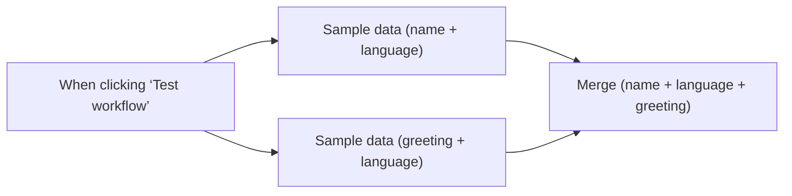

## Fluxo (.json) :

```json
{
  "meta": {
    "instanceId": "257476b1ef58bf3cb6a46e65fac7ee34a53a5e1a8492d5c6e4da5f87c9b82833"
  },
  "nodes": [
    {
      "id": "f7f8068b-52c9-4038-bd67-9ee50136e4fd",
      "name": "When clicking ‘Test workflow’",
      "type": "n8n-nodes-base.manualTrigger",
      "position": [
        380,
        240
      ],
      "parameters": {},
      "typeVersion": 1
    },
    {
      "id": "860e5e46-a04d-41cb-b91a-c9f02603bcdf",
      "name": "Sample data (name + language)",
      "type": "n8n-nodes-base.code",
      "position": [
        600,
        160
      ],
      "parameters": {
        "jsCode": "return [\n  {\n    json: {\n      name: 'Stefan',\n      language: 'de',\n    }\n  },\n  {\n    json: {\n      name: 'Jim',\n      language: 'en',\n    }\n  },\n  {\n    json: {\n      name: 'Hans',\n      language: 'de',\n    }\n  }\n];"
      },
      "typeVersion": 2
    },
    {
      "id": "5c6a867b-fd8a-49b7-ac35-ff84ed6d89f7",
      "name": "Sample data (greeting + language)",
      "type": "n8n-nodes-base.code",
      "position": [
        600,
        320
      ],
      "parameters": {
        "jsCode": "return [\n\t  {\n    json: {\n      greeting: 'Hello',\n      language: 'en',\n    }\n  },\n  {\n    json: {\n      greeting: 'Hallo',\n      language: 'de',\n    }\n  }\n];"
      },
      "typeVersion": 2
    },
    {
      "id": "08fca489-8f4c-4327-9919-922bd1be1cd5",
      "name": "Merge (name + language + greeting)",
      "type": "n8n-nodes-base.merge",
      "position": [
        820,
        240
      ],
      "parameters": {
        "mode": "combine",
        "options": {},
        "fieldsToMatchString": "language"
      },
      "typeVersion": 3
    }
  ],
  "pinData": {},
  "connections": {
    "Sample data (name + language)": {
      "main": [
        [
          {
            "node": "Merge (name + language + greeting)",
            "type": "main",
            "index": 0
          }
        ]
      ]
    },
    "Sample data (greeting + language)": {
      "main": [
        [
          {
            "node": "Merge (name + language + greeting)",
            "type": "main",
            "index": 1
          }
        ]
      ]
    },
    "When clicking ‘Test workflow’": {
      "main": [
        [
          {
            "node": "Sample data (name + language)",
            "type": "main",
            "index": 0
          },
          {
            "node": "Sample data (greeting + language)",
            "type": "main",
            "index": 0
          }
        ]
      ]
    }
  }
}
```

<a id="template-478"></a>

## Template 478 - Summarizador e analisador de Playlists/Vídeos YouTube com IA

- **Nome:** Summarizador e analisador de Playlists/Vídeos YouTube com IA
- **Descrição:** Fluxo que transforma vídeos ou playlists do YouTube em uma base de conhecimento consultável: coleta metadados e transcrições, gera resumos e embeddings, indexa o conteúdo e responde perguntas usando recuperação por similaridade.
- **Funcionalidade:** • Recepção via chat: aceita URL de vídeo ou playlist enviada pelo usuário.
• Detecção de intenção: identifica se o input é playlist, vídeo ou nenhum e extrai ID e parâmetro de limite.
• Gerenciamento de contexto: armazena e atualiza estado da sessão (URL, ID, limite, status) para continuidade.
• Coleta de metadados: obtém título, descrição e lista de vídeos da playlist a partir das páginas do YouTube.
• Extração de transcrições: recupera legendas/transcritos de cada vídeo para processamento.
• Resumo de transcritos: produz resumos estruturados por vídeo usando um modelo de linguagem.
• Geração de embeddings: cria vetores representativos dos trechos de texto para indexação.
• Armazenamento e indexação: salva embeddings em uma base vetorial e atualiza o status do processamento.
• Busca e resposta (RAG): responde perguntas do usuário consultando os embeddings e a memória de chat.
• Controle de processamento: evita reprocessamento se já houver dados indexados e permite limitar quantos vídeos da playlist processar.
• Síntese final: agrega resumos individuais e produz um sumário abrangente e detalhado para o usuário.
- **Ferramentas:** • Google Gemini (PaLM): modelo de linguagem usado para resumo, análise conversacional e geração de embeddings (text-embedding-004).
• Qdrant: banco vetorial para armazenar e recuperar embeddings por similaridade.
• Redis: armazenamento de contexto e estado de sessão (metadados de processamento).
• YouTube: fonte de vídeos, metadados e transcrições (legendas) utilizados como conteúdo base.
• play-dl (modificado): biblioteca/rotina para extrair e parsear metadados de páginas de vídeo e playlists a partir do HTML.

## Fluxo visual

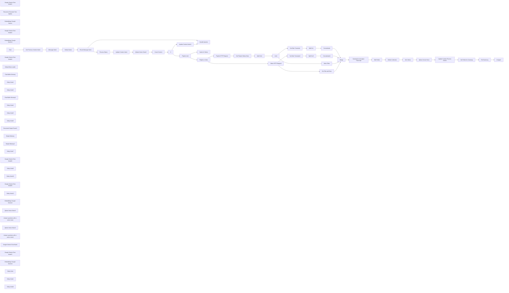

## Fluxo (.json) :

```json
{
  "id": "4Tq5HZBdETVe7jEb",
  "meta": {
    "instanceId": "2cb7a61f866faf57392b91b31f47e08a2b3640258f0abd08dd71f087f3243a5a",
    "templateCredsSetupCompleted": true
  },
  "name": "⚡AI-Powered YouTube Playlist & Video Summarization and Analysis v2",
  "tags": [],
  "nodes": [
    {
      "id": "505077d1-a2e4-4b0d-99d6-756940022c3d",
      "name": "Google Gemini Chat Model1",
      "type": "@n8n/n8n-nodes-langchain.lmChatGoogleGemini",
      "position": [
        -440,
        -40
      ],
      "parameters": {
        "options": {},
        "modelName": "models/gemini-2.0-pro-exp"
      },
      "credentials": {
        "googlePalmApi": {
          "id": "2zwuT5znDglBrUCO",
          "name": "Google Gemini(PaLM) Api account"
        }
      },
      "typeVersion": 1
    },
    {
      "id": "5da369db-b801-4653-888d-0e6042620298",
      "name": "Handle Queries",
      "type": "@n8n/n8n-nodes-langchain.agent",
      "position": [
        -160,
        -280
      ],
      "parameters": {
        "text": "={{ $('Chat').item.json.chatInput }}",
        "options": {
          "systemMessage": "=You are an intelligent assistant that can respond to queries related to the content of a Youtube Playlist or a single Video.\n\n# YOUR TASK\nDecide if the user has provided the info required and reply accordingly. If there is no url in context you have to suggest the user to provide one. \n\n\n1. If the user provided a YouTube Playlist or Video URL: reply in structured markdown format to the user based on the formulated questions and context. Assume the user is here because they don't won't / have time to watch such videos so:\n- Use the tool called `chat_playlist_data`, which can analyze YouTube videos. Use this tool effectively to process video content and generate structured summaries.\n- Your answers needs to be exhaustive and minimise bullet points\n- Be verbose in your response\n\n2. 1. If the user provided a YouTube Playlist or Video URL:\n- Do not ask for more specific details - always try to summarize the videos with the data from the tool `chat_playlist_data`\n- Never reply \"already provided a detailed summary\" - always try to summarize again the videos with more info from the tool `chat_playlist_data` - even if you have already provided the data before (so repeat yourself).\n\n3. If the user HAS NOT provided a YouTube Playlist URL or a invaid URL: gently invite the user to provide the URL so you can process it. \n\n# Rules\n\n## YouTube Playlist URL Definition\n- A URL from www.youtube.com or youtube.com.\n- Contains the query parameter `list=` followed by a playlist ID.\n- Example: https://www.youtube.com/playlist?list=PLXXXXXX (where PLXXXXXX is the playlist ID).\n\n## YouTube Video URL Definition\n- A URL from www.youtube.com, youtube.com, or youtu.be.\n- For www.youtube.com or youtube.com, it contains the query parameter `v=` followed by a video ID.\n- For youtu.be, it follows the format https://youtu.be/VIDEO_ID.\n- Examples:\n  - https://www.youtube.com/watch?v=VIDEO_ID (where VIDEO_ID is the video ID).\n  - https://youtu.be/VIDEO_ID\n- Does NOT have a query parameter `list=`\n\n# Context\n{\n  \"intent\": {{ $('Default Intent').item.json.output?.intent || \"NONE\" }},\n  \"url\": {{ $('Default Intent').item.json.output?.url || \"\" }},\n  \"id\": {{ $('Default Intent').item.json.output?.id || \"\" }},\n  \"limit\": {{ $('Default Intent').item.json.output?.limit || 0 }},\n  \"status\": {{ $('Default Intent').item.json.output?.status || 'PENDING' }}\n}"
        },
        "promptType": "define"
      },
      "typeVersion": 1.7
    },
    {
      "id": "866bf387-3482-4615-94d5-fd72d5db21da",
      "name": "Split Out",
      "type": "n8n-nodes-base.splitOut",
      "position": [
        1380,
        -200
      ],
      "parameters": {
        "include": "selectedOtherFields",
        "options": {},
        "fieldToSplitOut": "transcript",
        "fieldsToInclude": "youtubeId"
      },
      "typeVersion": 1
    },
    {
      "id": "359404ce-4bc9-4e4d-9a26-22b9f9b176c9",
      "name": "Summarize & Analyze Transcript",
      "type": "@n8n/n8n-nodes-langchain.chainLlm",
      "position": [
        660,
        540
      ],
      "parameters": {
        "text": "=Please analyze the given text and create a structured summary following these guidelines:\n\n1. Break down the content into main topics using Level 2 headers (##)\n2. Under each header:\n   - List only the most essential concepts and key points\n   - Use bullet points for clarity\n   - Keep explanations concise\n   - Preserve technical accuracy\n   - Highlight key terms in bold\n3. Format requirements:\n   - Use markdown formatting\n   - Keep bullet points simple (no nesting)\n   - Bold important terms using **term**\n   - Use tables for comparisons\n   - Include relevant technical details\n\nPlease provide a clear, structured summary that captures the core concepts while maintaining technical accuracy.\n\n**Make sure the summary is 300-400 max characters long.**\n\nInclude metadata such as video number, id, and title in the summary.\n\n**Here is the text**\n\nVideo number: {{ $json.video_number }}\nTitle: {{ $json.title }}\nYoutube ID: {{ $json.youtubeId }}\nTranscript:\n{{ $json.transcript_text }}",
        "promptType": "define"
      },
      "typeVersion": 1.4
    },
    {
      "id": "036765df-6da4-4430-bcea-af4066fb7c24",
      "name": "Concatenate",
      "type": "n8n-nodes-base.summarize",
      "position": [
        1700,
        -200
      ],
      "parameters": {
        "options": {},
        "fieldsToSplitBy": "youtubeId",
        "fieldsToSummarize": {
          "values": [
            {
              "field": "transcript.text",
              "separateBy": " ",
              "aggregation": "concatenate"
            }
          ]
        }
      },
      "typeVersion": 1
    },
    {
      "id": "9152725c-15ca-41a0-8f98-108834e0c8be",
      "name": "Split Out1",
      "type": "n8n-nodes-base.splitOut",
      "position": [
        660,
        40
      ],
      "parameters": {
        "options": {},
        "fieldToSplitOut": "videos"
      },
      "typeVersion": 1
    },
    {
      "id": "fee0e045-614a-41f0-ac75-051dff773e77",
      "name": "Limit",
      "type": "n8n-nodes-base.limit",
      "position": [
        860,
        40
      ],
      "parameters": {
        "maxItems": "={{ $('Update Context Intent').item.json.output.limit }}"
      },
      "typeVersion": 1
    },
    {
      "id": "a691c1c7-d8c4-4eab-861b-f7cfcbeb0fc8",
      "name": "Qdrant Vector Store",
      "type": "@n8n/n8n-nodes-langchain.vectorStoreQdrant",
      "position": [
        1680,
        480
      ],
      "parameters": {
        "mode": "insert",
        "options": {},
        "qdrantCollection": {
          "__rl": true,
          "mode": "id",
          "value": "={{ $('Update Context Intent').first().json.output.id }}"
        }
      },
      "credentials": {
        "qdrantApi": {
          "id": "mb8rw8tmUeP6aPJm",
          "name": "QdrantApi account"
        }
      },
      "typeVersion": 1
    },
    {
      "id": "c3949e8f-0deb-4106-aaa5-e64403024243",
      "name": "Recursive Character Text Splitter",
      "type": "@n8n/n8n-nodes-langchain.textSplitterRecursiveCharacterTextSplitter",
      "position": [
        1800,
        860
      ],
      "parameters": {
        "options": {},
        "chunkSize": 1200,
        "chunkOverlap": 200
      },
      "typeVersion": 1
    },
    {
      "id": "a3b23c6b-14c0-4805-8220-7c6166268276",
      "name": "Embeddings Google Gemini",
      "type": "@n8n/n8n-nodes-langchain.embeddingsGoogleGemini",
      "position": [
        1660,
        700
      ],
      "parameters": {
        "modelName": "models/text-embedding-004"
      },
      "credentials": {
        "googlePalmApi": {
          "id": "2zwuT5znDglBrUCO",
          "name": "Google Gemini(PaLM) Api account"
        }
      },
      "typeVersion": 1
    },
    {
      "id": "6f4ee00d-dcdc-4468-9713-115912c1e571",
      "name": "Google Gemini Chat Model2",
      "type": "@n8n/n8n-nodes-langchain.lmChatGoogleGemini",
      "position": [
        640,
        740
      ],
      "parameters": {
        "options": {},
        "modelName": "models/gemini-2.0-flash"
      },
      "credentials": {
        "googlePalmApi": {
          "id": "2zwuT5znDglBrUCO",
          "name": "Google Gemini(PaLM) Api account"
        }
      },
      "typeVersion": 1
    },
    {
      "id": "75442631-512e-4b0e-a5a8-ed3e3a3e1f94",
      "name": "Embeddings Google Gemini1",
      "type": "@n8n/n8n-nodes-langchain.embeddingsGoogleGemini",
      "position": [
        -120,
        320
      ],
      "parameters": {
        "modelName": "models/text-embedding-004"
      },
      "credentials": {
        "googlePalmApi": {
          "id": "2zwuT5znDglBrUCO",
          "name": "Google Gemini(PaLM) Api account"
        }
      },
      "typeVersion": 1
    },
    {
      "id": "c33ceeca-9bf0-4dd2-b8df-fc2a1ccdf512",
      "name": "Chat",
      "type": "@n8n/n8n-nodes-langchain.chatTrigger",
      "position": [
        -2780,
        -460
      ],
      "webhookId": "e66183cc-1eed-4968-b34b-bcecf1bb55e8",
      "parameters": {
        "public": true,
        "options": {
          "loadPreviousSession": "notSupported"
        },
        "initialMessages": "Hi there! 👋\nPlease provide a URL of a Youtube playlist you would like me to analise."
      },
      "typeVersion": 1.1
    },
    {
      "id": "06bb2dfd-027c-4902-9559-2de080f6c145",
      "name": "Video Titles",
      "type": "n8n-nodes-base.splitOut",
      "position": [
        1160,
        40
      ],
      "parameters": {
        "options": {},
        "fieldToSplitOut": "id,title"
      },
      "typeVersion": 1
    },
    {
      "id": "d9bbdda2-ef26-4b6c-94d0-7542f88f1530",
      "name": "Merge",
      "type": "n8n-nodes-base.merge",
      "position": [
        1700,
        20
      ],
      "parameters": {
        "mode": "combineBySql",
        "query": "SELECT \n  ROW_NUMBER() AS video_number,\n  input1.youtubeId, input2.title, input1.concatenated_transcript_text as transcript_text FROM input1 LEFT JOIN input2 ON input1.youtubeId = input2.id"
      },
      "typeVersion": 3
    },
    {
      "id": "e6febdb9-370b-478d-b470-d6c2d3314d7b",
      "name": "Edit Fields",
      "type": "n8n-nodes-base.set",
      "position": [
        980,
        540
      ],
      "parameters": {
        "options": {},
        "assignments": {
          "assignments": [
            {
              "id": "b5e935c5-4973-40a3-adb9-fa76904d2ed9",
              "name": "video_number",
              "type": "number",
              "value": "={{ $('Merge').item.json.video_number }}"
            },
            {
              "id": "e98f417d-123f-4a85-b2f7-64430e7b0250",
              "name": "youtubeId",
              "type": "string",
              "value": "={{ $('Merge').item.json.youtubeId }}"
            },
            {
              "id": "d0ced7fd-c9a3-4a09-bf09-e4b5e45dd03d",
              "name": "title",
              "type": "string",
              "value": "={{ $('Merge').item.json.title }}"
            },
            {
              "id": "31a80e6d-9b02-4d21-b888-1a00c036a04b",
              "name": "summary",
              "type": "string",
              "value": "={{ $json.text }}"
            },
            {
              "id": "ef12f3f2-3d63-4e78-835f-7da004393a07",
              "name": "transcript_text",
              "type": "string",
              "value": "={{ $('Merge').item.json.transcript_text }}"
            },
            {
              "id": "afa841e2-6f8b-4b27-9f28-10368ee32c2e",
              "name": "playlistId",
              "type": "string",
              "value": "={{ $('Update Context Intent').first().json.output.id }}"
            }
          ]
        }
      },
      "typeVersion": 3.4
    },
    {
      "id": "2736a1e6-a982-4f60-aa8d-658e9a3e9193",
      "name": "AI Agent",
      "type": "@n8n/n8n-nodes-langchain.agent",
      "position": [
        2720,
        480
      ],
      "parameters": {
        "text": "=Please analyze the given \"Transcript summary\" and create a full summary overview, following the below guidelines.\n\n1. Provide a full descriptive break down of the content of each video. Assume the user does not won't or have time to watch such videos, so:\n- Your summary needs to be exhaustive, descriptive, and minimise bullet points\n- Your summary needs to captures all the core concepts while maintaining technical accuracy\n- Your summary will be verbose\n\n2. Consider that the intent of the user is not to watch the videos but rather have all the content required and summaries from on the \"Transcript summary\".\n\n3. Use the tool called `chat_playlist_data`, which can analyze YouTube videos. Use this tool effectively to process video content and generate structured summaries.\n\nUser message:\n{{ $('Chat').item.json.chatInput }}\n\nTranscript summary:\n{{ $('Full Summary').item.json.concatenated_summary }}",
        "agent": "conversationalAgent",
        "options": {},
        "promptType": "define"
      },
      "executeOnce": true,
      "typeVersion": 1.7
    },
    {
      "id": "cf1e5c50-9c89-465f-beca-482cbd9affba",
      "name": "Google Gemini Chat Model4",
      "type": "@n8n/n8n-nodes-langchain.lmChatGoogleGemini",
      "position": [
        2520,
        720
      ],
      "parameters": {
        "options": {},
        "modelName": "models/gemini-2.0-flash"
      },
      "credentials": {
        "googlePalmApi": {
          "id": "2zwuT5znDglBrUCO",
          "name": "Google Gemini(PaLM) Api account"
        }
      },
      "typeVersion": 1
    },
    {
      "id": "1cbcec5e-b58c-4fce-b944-08c47a7385db",
      "name": "Delete Collection",
      "type": "n8n-nodes-base.httpRequest",
      "onError": "continueRegularOutput",
      "position": [
        1340,
        480
      ],
      "parameters": {
        "url": "=https://3114dbb7-bd13-4807-8815-c3c8784f66d6.eu-west-1-0.aws.cloud.qdrant.io/collections/{{ $('Update Context Intent').first().json.playlistID }}/points/delete",
        "method": "POST",
        "options": {},
        "jsonBody": "{\n  \"filter\": {}\n}",
        "sendBody": true,
        "sendHeaders": true,
        "specifyBody": "json",
        "authentication": "predefinedCredentialType",
        "headerParameters": {
          "parameters": [
            {
              "name": "Content-Type",
              "value": "application/json"
            }
          ]
        },
        "nodeCredentialType": "qdrantApi"
      },
      "credentials": {
        "qdrantApi": {
          "id": "mb8rw8tmUeP6aPJm",
          "name": "QdrantApi account"
        }
      },
      "executeOnce": true,
      "typeVersion": 4.2
    },
    {
      "id": "16d7eaec-1d98-42dd-89aa-2681a9d1697d",
      "name": "Default Data Loader",
      "type": "@n8n/n8n-nodes-langchain.documentDefaultDataLoader",
      "position": [
        1820,
        700
      ],
      "parameters": {
        "options": {
          "metadata": {
            "metadataValues": [
              {
                "name": "video_number",
                "value": "={{ $input.item.json.video_number }}"
              },
              {
                "name": "=youtubeId",
                "value": "={{ $input.item.json.youtubeId }}"
              },
              {
                "name": "summary",
                "value": "={{ $input.item.json.summary }}"
              },
              {
                "name": "title",
                "value": "={{ $input.item.json.title }}"
              },
              {
                "name": "playlistId",
                "value": "={{ $input.item.json.playlistId }}"
              }
            ]
          }
        }
      },
      "typeVersion": 1
    },
    {
      "id": "d3bc9db2-7618-46fd-b825-2cc0ad45fc22",
      "name": "Chat Buffer Memory",
      "type": "@n8n/n8n-nodes-langchain.memoryBufferWindow",
      "position": [
        -260,
        -40
      ],
      "parameters": {
        "sessionKey": "={{ $('Chat').item.json.sessionId }}",
        "sessionIdType": "customKey",
        "contextWindowLength": 10
      },
      "typeVersion": 1.3
    },
    {
      "id": "fb55b13f-880f-404c-9446-9f8a238c8a5c",
      "name": "Full Summary",
      "type": "n8n-nodes-base.summarize",
      "position": [
        2520,
        480
      ],
      "parameters": {
        "options": {},
        "fieldsToSummarize": {
          "values": [
            {
              "field": "summary",
              "separateBy": "\n",
              "aggregation": "concatenate"
            }
          ]
        }
      },
      "typeVersion": 1.1
    },
    {
      "id": "efc2fc99-c738-425e-9ee1-669e378e197f",
      "name": "Sticky Note2",
      "type": "n8n-nodes-base.stickyNote",
      "position": [
        -560,
        -400
      ],
      "parameters": {
        "color": 7,
        "width": 1080,
        "height": 900,
        "content": "## RAG & Reply to User Query\n- Retrieves and provides answers to user queries combining retrieval-augmented generation.\n- Processes messages without specific routing rules.\n     "
      },
      "typeVersion": 1
    },
    {
      "id": "0040adf6-2cfc-4b79-ba81-b76740bfd158",
      "name": "Sticky Note3",
      "type": "n8n-nodes-base.stickyNote",
      "position": [
        560,
        -400
      ],
      "parameters": {
        "color": 7,
        "width": 1380,
        "height": 700,
        "content": "## Fetch and prepare Playlist video transcripts data for processing \n- Collects and organizes playlist video transcripts.\n- Prepares data for analysis and summarization."
      },
      "typeVersion": 1
    },
    {
      "id": "59b29fc5-5d88-40c0-a273-9dc71d9f009e",
      "name": "Chat Buffer Memory1",
      "type": "@n8n/n8n-nodes-langchain.memoryBufferWindow",
      "position": [
        2700,
        720
      ],
      "parameters": {
        "sessionKey": "={{ $('Chat').item.json.sessionId }}",
        "sessionIdType": "customKey",
        "contextWindowLength": 10
      },
      "typeVersion": 1.3
    },
    {
      "id": "afb6f6be-d299-402e-a9c6-2c60fbf4974e",
      "name": "YouTube Transcript",
      "type": "n8n-nodes-youtube-transcription-dmr.youtubeTranscripter",
      "position": [
        1160,
        -200
      ],
      "parameters": {
        "videoId": "={{ $json.id }}",
        "continueOnFail": true
      },
      "typeVersion": 1
    },
    {
      "id": "9a43eb4a-9d4c-4fce-b19c-94485aa8af76",
      "name": "Sticky Note4",
      "type": "n8n-nodes-base.stickyNote",
      "position": [
        560,
        340
      ],
      "parameters": {
        "color": 7,
        "width": 640,
        "height": 700,
        "content": "## Summarize & Analyze Transcript\n- Creates summarized data from transcripts."
      },
      "typeVersion": 1
    },
    {
      "id": "676677f0-3dae-4873-a449-92930ced534e",
      "name": "Sticky Note5",
      "type": "n8n-nodes-base.stickyNote",
      "position": [
        1240,
        340
      ],
      "parameters": {
        "color": 7,
        "width": 980,
        "height": 700,
        "content": "## Store Embeddings\n- Saves embedded data for future use.\n- Updates current context to maintain the flow of the conversation.     "
      },
      "typeVersion": 1
    },
    {
      "id": "9ecd4d0d-b8bd-4a5d-981f-49fa515c17be",
      "name": "Sticky Note6",
      "type": "n8n-nodes-base.stickyNote",
      "position": [
        2260,
        340
      ],
      "parameters": {
        "color": 7,
        "width": 940,
        "height": 880,
        "content": "## First Summary Analysis\n- Conducts initial analysis of summarized data.\n- Return to the user insights from processed transcripts."
      },
      "typeVersion": 1
    },
    {
      "id": "45ae8377-0848-45fb-a7a3-aba8d44e3d35",
      "name": "Message Intent",
      "type": "@n8n/n8n-nodes-langchain.agent",
      "onError": "continueRegularOutput",
      "position": [
        -2260,
        -460
      ],
      "parameters": {
        "text": "= {{ $('Chat').item.json.chatInput }}",
        "options": {
          "systemMessage": "=**# YOUR TASK:**\nPlease analyze the user's message and decide if the user has provided the info required - and ALWAYS reply using the **Output format** defined below.\n\n# Output format\nYou use the following JSON structure to reply, don't include anything else, and alway inlude all the fields:\n```\n{\n  \"intent\": PLAYLIST|VIDEO|NONE,\n  \"url\": Youtube Playlist or Video URL or empty string,\n  \"id\": Youtube Playlist or Video ID or empty string,\n  \"limit\": number, default 0,\n  \"status\": Previous context status `{{ $json.context_intent?.status }}` or \"PENDING\"\n}\n```\n\n## INTENT field GUIDELINES:\n\n**Respond with \"PLAYLIST\" if:**\n- The messsage contains a valid Youtube Playlist URL\n\n**Respond with \"VIDEO\" if:**\n- The messsage contains a valid Youtube Video URL\n\n**Respond with \"NONE\" if:**\n- The messsage does not contains a valid Youtube Playlist or Video URL\n\n## LIMIT field GUIDELINE:\nIf the \"Previous Context\" intent or the current intent is a Playlist: Based on current or most recent user message, check if there is an indication of how many videos to process, otherwise default to 0.\n\n## STATUS field GUIDELINE\nIf intent is a Playlist or Video and _different_ from the the \"Previous Context\" then use \"PENDING\" since the user intent is to run a new process. Otherwise use the \"Previous Context\" status value.\n\n\n# Rules for Playlist and Video\n\n## YouTube Playlist URL Definition\n- A URL from www.youtube.com or youtube.com.\n- Contains the query parameter `&list=` followed by a playlist ID.\n- Example: https://www.youtube.com/...&list=PLXXXXXX (where PLXXXXXX is the playlist ID).\n\n## YouTube Video URL Definition\n- A URL from www.youtube.com, youtube.com, or youtu.be.\n- For www.youtube.com or youtube.com, it contains the query parameter `v=` followed by a video ID.\n- For youtu.be, it follows the format https://youtu.be/VIDEO_ID.\n- Examples:\n  - https://www.youtube.com/watch?v=VIDEO_ID (where VIDEO_ID is the video ID).\n  - https://youtu.be/VIDEO_ID\n- IMPORTANT: YouTube Video URL **Does NOT have a query parameter `list=`**\n\n\n# Previous Context\n{{ JSON.stringify($json.context_intent) }}\n"
        },
        "promptType": "define",
        "hasOutputParser": true
      },
      "retryOnFail": true,
      "typeVersion": 1.7,
      "alwaysOutputData": true
    },
    {
      "id": "a29403f0-ed5c-465c-a43d-84e8dee69662",
      "name": "Structured Output Parser1",
      "type": "@n8n/n8n-nodes-langchain.outputParserStructured",
      "position": [
        -2020,
        -220
      ],
      "parameters": {
        "jsonSchemaExample": "{\n  \"intent\": \"PLAYLIST|VIDEO|NONE\",\n  \"url\": \"Youtube Playlist or Video URL or empty string,\",\n  \"id\": \"Youtube Playlist or Video ID or empty string,\",\n  \"limit\": \"number of playlist videos to process or 0\",\n  \"status\": \"PENDING|READY|DONE\"\n}"
      },
      "typeVersion": 1.2
    },
    {
      "id": "b3f43325-aa7b-47f3-8bbb-e27fa0c44a1e",
      "name": "Update Context Intent",
      "type": "n8n-nodes-base.redis",
      "position": [
        -1160,
        -640
      ],
      "parameters": {
        "key": "=context_intent_{{ $('Chat').item.json.sessionId }}",
        "value": "=intent {{ $('Process Status').item.json.output?.intent || null }} url {{ $('Process Status').item.json.output?.url || \"\" }} id {{ $('Process Status').item.json.output?.id || \"\" }} limit {{ $('Process Status').item.json.output?.limit || 0 }} status {{ $('Process Status').item.json.output?.status || 'PENDING'  }}",
        "keyType": "hash",
        "operation": "set",
        "valueIsJSON": false
      },
      "credentials": {
        "redis": {
          "id": "mA0f9F1ROUThyrRW",
          "name": "Redis account"
        }
      },
      "typeVersion": 1
    },
    {
      "id": "9c296501-049c-44b5-ae8d-8dda2c523278",
      "name": "Get Previous Context Intent",
      "type": "n8n-nodes-base.redis",
      "onError": "continueRegularOutput",
      "position": [
        -2440,
        -460
      ],
      "parameters": {
        "key": "=context_intent_{{ $('Chat').item.json.sessionId }}",
        "keyType": "hash",
        "options": {
          "dotNotation": false
        },
        "operation": "get",
        "valueIsJSON": false,
        "propertyName": "context_intent"
      },
      "credentials": {
        "redis": {
          "id": "mA0f9F1ROUThyrRW",
          "name": "Redis account"
        }
      },
      "typeVersion": 1,
      "alwaysOutputData": true
    },
    {
      "id": "9499d9f2-7d6d-432b-bdde-b4b98b90b224",
      "name": "Route Message Intent",
      "type": "n8n-nodes-base.switch",
      "position": [
        -1700,
        -460
      ],
      "parameters": {
        "rules": {
          "values": [
            {
              "outputKey": "PROCESS",
              "conditions": {
                "options": {
                  "version": 2,
                  "leftValue": "",
                  "caseSensitive": true,
                  "typeValidation": "strict"
                },
                "combinator": "and",
                "conditions": [
                  {
                    "id": "44e008af-4a1a-429d-adb6-039e74b643a6",
                    "operator": {
                      "type": "boolean",
                      "operation": "true",
                      "singleValue": true
                    },
                    "leftValue": "={{ \n  ($json.output.intent == \"VIDEO\" || $json.output.intent == \"PLAYLIST\")\n  && $json.output.status != \"DONE\" \n}}",
                    "rightValue": "/PLAYLIST|VIDEO/"
                  }
                ]
              },
              "renameOutput": true
            },
            {
              "outputKey": "QUERY",
              "conditions": {
                "options": {
                  "version": 2,
                  "leftValue": "",
                  "caseSensitive": true,
                  "typeValidation": "strict"
                },
                "combinator": "and",
                "conditions": [
                  {
                    "id": "12641857-945d-4470-968e-f3f805bfe1cd",
                    "operator": {
                      "type": "boolean",
                      "operation": "true",
                      "singleValue": true
                    },
                    "leftValue": "={{ \n  $json.output.intent == \"NONE\" || $json.output.status == \"DONE\"\n}}",
                    "rightValue": "NONE"
                  }
                ]
              },
              "renameOutput": true
            }
          ]
        },
        "options": {
          "fallbackOutput": "extra"
        }
      },
      "typeVersion": 3.2
    },
    {
      "id": "dfd329e8-98b1-4ae8-8cc1-a1a5215b1c09",
      "name": "Process Status",
      "type": "n8n-nodes-base.code",
      "position": [
        -1340,
        -640
      ],
      "parameters": {
        "jsCode": "// Loop over input items and add a new field called 'myNewField' to the JSON of each one\nif ($input.last().json.output.intent == 'VIDEO') {\n  $input.last().json.output.status = 'READY'\n}\n\nelse if ($input.last().json.output.intent == 'PLAYLIST' && parseInt($input.last().json.output.limit) > 0) {\n  $input.last().json.output.status = 'READY'\n}\n\nelse {\n  $input.last().json.output = {\n    intent: $('Default Intent').first().json.output.intent,\n    url: $('Default Intent').first().json.output.url,\n    id: $('Default Intent').first().json.output.id,\n    limit: $('Default Intent').first().json.output.limit,\n    status: 'PENDING',\n  }\n}\n\n\nreturn $input.all();"
      },
      "typeVersion": 2
    },
    {
      "id": "c84c21c6-0948-4628-b7a8-7cd2a5602cdc",
      "name": "Simple Memory",
      "type": "@n8n/n8n-nodes-langchain.memoryBufferWindow",
      "position": [
        -2180,
        -220
      ],
      "parameters": {
        "sessionKey": "=intent_{{ $('Chat').item.json.sessionId }}",
        "sessionIdType": "customKey"
      },
      "typeVersion": 1.3
    },
    {
      "id": "8ad2e1d1-b657-47cd-afa5-4fc49dc7e0e6",
      "name": "Simple Memory3",
      "type": "@n8n/n8n-nodes-langchain.memoryBufferWindow",
      "position": [
        1040,
        -1180
      ],
      "parameters": {
        "sessionKey": "=pl_n_{{ $('Chat').item.json.sessionId }}",
        "sessionIdType": "customKey"
      },
      "typeVersion": 1.3
    },
    {
      "id": "cf4d7c73-d9b1-42da-9ccc-6abccde4110c",
      "name": "Sticky Note7",
      "type": "n8n-nodes-base.stickyNote",
      "position": [
        -2540,
        -620
      ],
      "parameters": {
        "color": 7,
        "width": 1080,
        "height": 580,
        "content": "## Message intent routing\n- Retrieves the previous context for continuity.\n- Ensures data integrity before processing.\n- Routes incoming messages based on intent.\n     "
      },
      "typeVersion": 1
    },
    {
      "id": "c0ecf826-b803-421a-aa2a-cb713131fbb7",
      "name": "Google Gemini Chat Model6",
      "type": "@n8n/n8n-nodes-langchain.lmChatGoogleGemini",
      "position": [
        -2340,
        -220
      ],
      "parameters": {
        "options": {},
        "modelName": "models/gemini-2.0-flash-lite"
      },
      "credentials": {
        "googlePalmApi": {
          "id": "2zwuT5znDglBrUCO",
          "name": "Google Gemini(PaLM) Api account"
        }
      },
      "typeVersion": 1
    },
    {
      "id": "513a8c71-e982-47df-87bd-1e3d3ae9c613",
      "name": "Sticky Note9",
      "type": "n8n-nodes-base.stickyNote",
      "position": [
        -1420,
        -1020
      ],
      "parameters": {
        "color": 7,
        "width": 460,
        "height": 580,
        "content": "## Update Context\n- Updates any issues detected in the context.\n- Prepares data for workflow progression.\n     "
      },
      "typeVersion": 1
    },
    {
      "id": "d4a9d7aa-dfee-418f-900a-9649f0405861",
      "name": "Sticky Note10",
      "type": "n8n-nodes-base.stickyNote",
      "position": [
        800,
        -1480
      ],
      "parameters": {
        "color": 7,
        "width": 480,
        "height": 460,
        "content": "## Ask number of Playlist videos to process"
      },
      "typeVersion": 1
    },
    {
      "id": "f89481a4-64a2-4895-821f-effe48f7d331",
      "name": "Numb of Videos",
      "type": "@n8n/n8n-nodes-langchain.agent",
      "position": [
        900,
        -1380
      ],
      "parameters": {
        "text": "={{ $('Chat').item.json.chatInput }}",
        "options": {
          "systemMessage": "=**Objective:**\n\nWe are here because the user wants to analyse a playlist in context, but we are missing how many videos he would like to process. Please reply to the user asking user to provide a number.\n\n## Context\n{{ JSON.stringify($json.output) }}"
        },
        "promptType": "define"
      },
      "typeVersion": 1.7
    },
    {
      "id": "bb8fa898-4953-4148-8339-2d205b86fc91",
      "name": "Default Intent",
      "type": "n8n-nodes-base.code",
      "position": [
        -1920,
        -460
      ],
      "parameters": {
        "jsCode": "if(\n  ($('Message Intent').first().json?.output?.intent == 'NONE' \n     || Object.keys($('Message Intent').first().json?.output || {}).length == 0)\n  && Object.keys($('Get Previous Context Intent').first().json.context_intent).length > 0\n) {\n  //use prev context intent\n  if(!$input.first().json.output) {\n    $input.first().json.output = {}\n  }\n  $input.first().json.output.intent = $('Get Previous Context Intent').first().json.context_intent?.intent || \"NONE\";\n  $input.first().json.output.url = $('Get Previous Context Intent').first().json.context_intent?.url || \"\";\n  $input.first().json.output.id = $('Get Previous Context Intent').first().json.context_intent?.id || \"\";\n  $input.first().json.output.limit = $('Get Previous Context Intent').first().json.context_intent?.limit || 0;\n  $input.first().json.output.status = $('Get Previous Context Intent').first().json.context_intent?.status || \"PENDING\";\n} else {\n  // $input.first().json.output.intent = $('Message Intent').first().json.context_intent?.intent || \"NONE\";\n  // $input.first().json.output.url = $('Message Intent').first().json.context_intent?.url || \"\";\n  // $input.first().json.output.id = $('Message Intent').first().json.context_intent?.id || \"\";\n  // $input.first().json.output.limit = $('Message Intent').first().json.context_intent?.limit || 0;\n  // $input.first().json.output.status = $('Message Intent').first().json.context_intent?.status || \"PENDING\";\n}\n\n// else use message intent\n\nreturn $input.all();"
      },
      "typeVersion": 2
    },
    {
      "id": "0f1d1bb6-22c0-4b65-beaf-eaf4401d7550",
      "name": "Playlist Limit",
      "type": "n8n-nodes-base.if",
      "position": [
        160,
        -860
      ],
      "parameters": {
        "options": {},
        "conditions": {
          "options": {
            "version": 2,
            "leftValue": "",
            "caseSensitive": true,
            "typeValidation": "strict"
          },
          "combinator": "and",
          "conditions": [
            {
              "id": "6ee01f0a-9533-4fb3-b023-cfcc422d9011",
              "operator": {
                "name": "filter.operator.equals",
                "type": "string",
                "operation": "equals"
              },
              "leftValue": "={{ $('Process Status').item.json.output.intent }}",
              "rightValue": "PLAYLIST"
            },
            {
              "id": "e9575bb2-3c60-498b-b2c7-436b62e5195c",
              "operator": {
                "type": "number",
                "operation": "lte"
              },
              "leftValue": "={{ parseInt($('Process Status').item.json.output.limit) }}",
              "rightValue": 0
            }
          ]
        }
      },
      "typeVersion": 2.2
    },
    {
      "id": "083c17aa-de83-4f3c-8d71-f665903ce3d5",
      "name": "Playlist or Video",
      "type": "n8n-nodes-base.switch",
      "position": [
        160,
        -640
      ],
      "parameters": {
        "rules": {
          "values": [
            {
              "outputKey": "VIDEO",
              "conditions": {
                "options": {
                  "version": 2,
                  "leftValue": "",
                  "caseSensitive": true,
                  "typeValidation": "strict"
                },
                "combinator": "and",
                "conditions": [
                  {
                    "id": "cc3ec644-7c3d-4d9f-b7a7-89b85824e3e3",
                    "operator": {
                      "name": "filter.operator.equals",
                      "type": "string",
                      "operation": "equals"
                    },
                    "leftValue": "={{ $('Route Message Intent').item.json.output.intent }}",
                    "rightValue": "VIDEO"
                  }
                ]
              },
              "renameOutput": true
            },
            {
              "outputKey": "PLAYLIST",
              "conditions": {
                "options": {
                  "version": 2,
                  "leftValue": "",
                  "caseSensitive": true,
                  "typeValidation": "strict"
                },
                "combinator": "and",
                "conditions": [
                  {
                    "id": "33beac83-b96b-4e76-9d18-e22df163ea4d",
                    "operator": {
                      "type": "string",
                      "operation": "equals"
                    },
                    "leftValue": "={{ $('Route Message Intent').item.json.output.intent }}",
                    "rightValue": "PLAYLIST"
                  }
                ]
              },
              "renameOutput": true
            }
          ]
        },
        "options": {}
      },
      "typeVersion": 3.2
    },
    {
      "id": "0626bc2d-9e3a-4a4f-a331-62e8b6c69840",
      "name": "Get Fields for Summary",
      "type": "n8n-nodes-base.code",
      "position": [
        2340,
        480
      ],
      "parameters": {
        "jsCode": "return $('Edit Fields').all();"
      },
      "typeVersion": 2
    },
    {
      "id": "4aaaed18-ce90-4296-aba2-b5fa9492655d",
      "name": "Update Context Process Done1",
      "type": "n8n-nodes-base.redis",
      "position": [
        2040,
        480
      ],
      "parameters": {
        "key": "=context_intent_{{ $('Chat').first().json.sessionId }}",
        "value": "=intent {{ $('Process Status').first().json.output?.intent || null }} url {{ $('Process Status').first().json.output?.url || \"\" }} id {{ $('Process Status').first().json.output?.id || \"\" }} limit {{ $('Process Status').first().json.output?.limit || 0 }} status DONE",
        "keyType": "hash",
        "operation": "set",
        "valueIsJSON": false
      },
      "credentials": {
        "redis": {
          "id": "mA0f9F1ROUThyrRW",
          "name": "Redis account"
        }
      },
      "executeOnce": true,
      "typeVersion": 1
    },
    {
      "id": "d3f71d59-a158-43e2-bfbd-a3bec20dea5b",
      "name": "Google Gemini Chat Model8",
      "type": "@n8n/n8n-nodes-langchain.lmChatGoogleGemini",
      "position": [
        880,
        -1180
      ],
      "parameters": {
        "options": {},
        "modelName": "models/gemini-2.0-flash-thinking-exp"
      },
      "credentials": {
        "googlePalmApi": {
          "id": "2zwuT5znDglBrUCO",
          "name": "Google Gemini(PaLM) Api account"
        }
      },
      "typeVersion": 1
    },
    {
      "id": "fa6b8a79-436e-4742-9732-cd5c1b2d3c88",
      "name": "Playlist HTTP Request",
      "type": "n8n-nodes-base.httpRequest",
      "position": [
        660,
        -200
      ],
      "parameters": {
        "url": "={{ $('Update Context Intent').item.json.output.url }}",
        "options": {}
      },
      "typeVersion": 4.2
    },
    {
      "id": "99d6da96-8983-4e7d-8343-b9ac975f5d20",
      "name": "YouTube Transcript1",
      "type": "n8n-nodes-youtube-transcription-dmr.youtubeTranscripter",
      "position": [
        1200,
        -860
      ],
      "parameters": {
        "videoId": "={{ $('Update Context Intent').item.json.output.id }}",
        "continueOnFail": true
      },
      "typeVersion": 1
    },
    {
      "id": "41a07802-3fba-42fa-8482-f526a7e1b173",
      "name": "Video HTTP Request",
      "type": "n8n-nodes-base.httpRequest",
      "position": [
        900,
        -860
      ],
      "parameters": {
        "url": "={{ $('Update Context Intent').item.json.output.url }}",
        "options": {}
      },
      "typeVersion": 4.2
    },
    {
      "id": "02103114-9c22-49b1-9dee-746b84cdef66",
      "name": "Get Title and Desc",
      "type": "n8n-nodes-base.code",
      "position": [
        1200,
        -640
      ],
      "parameters": {
        "jsCode": "/**\n * This code node contains a modified version of play-dl,\n * which is licensed under the GNU General Public License Version 3 (GPLv3).\n *\n * Original Library Name: play-dl\n * Original Library Source: https://github.com/play-dl/play-dl/tree/main\n * Original Library License: GNU General Public License Version 3 (GPLv3)\n * (See: https://www.gnu.org/licenses/gpl-3.0.en.html)\n *\n * Modifications were made to the original library for use within this N8N workflow.\n * These modifications are also licensed under the GNU General Public License Version 3 (GPLv3).\n *\n * This program is distributed in the hope that it will be useful,\n * but WITHOUT ANY WARRANTY; without even the implied warranty of\n * MERCHANTABILITY or FITNESS FOR A PARTICULAR PURPOSE.  See the\n * GNU General Public License for more details.\n *\n * You should have received a copy of the GNU General Public License\n * along with this program.  If not, see <https://www.gnu.org/licenses/>.\n */\n\n\n/**\n * Basic function to get specific data (title, description, duration)\n * from pre-fetched HTML body data of a YouTube video page.\n * Assumes the HTML body is passed as the first argument.\n *\n * @param {string} body HTML body data of the YouTube video page.\n * @param {string} video_id YouTube video ID.\n * @param {string} url YouTube video URL.\n * @returns {Promise<{title: string, description: string, duration: number}>} Video Basic Info.\n * @throws {Error} If video ID cannot be extracted, captcha is detected,\n * or necessary data cannot be parsed.\n */\nasync function video_basic_info(body, video_id, url) {\n  // --- Input Validation ---\n  if (typeof body !== 'string') {\n    throw new Error('body parameter must be a string of HTML');\n  }\n  if (typeof video_id !== 'string' || !video_id.trim()) {\n    throw new Error('video_id parameter must be a non-empty string');\n  }\n  if (typeof url !== 'string' || !url.trim()) {\n    throw new Error('url parameter must be a non-empty URL string');\n  }\n\n  // --- Captcha Check ---\n  // Added check for consent page as well\n  if (body.includes('Our systems have detected unusual traffic') || body.includes('consent.google.com')) {\n    throw new Error('Captcha or Consent page encountered: YouTube likely requires interaction or detected bot-like activity.');\n  }\n\n  // --- Extract Player Data ---\n  let player_data;\n  try {\n    // More robust regex to find ytInitialPlayerResponse, stopping at the next semicolon\n    const player_data_match = body.match(/var ytInitialPlayerResponse\\s*=\\s*({.+?});\\s*(?:var |</script)/);\n    if (!player_data_match || !player_data_match[1]) {\n      // Fallback attempt with simpler split (less reliable)\n      const split_data = body.split('var ytInitialPlayerResponse = ');\n      player_data = split_data?.[1]?.split(';</script>')?.[0];\n    } else {\n      player_data = player_data_match[1];\n    }\n\n    if (!player_data) {\n      // Check for common failure indicators in the HTML if data isn't found\n      if (body.includes('<title>YouTube</title>') && !body.includes('videoDetails')) {\n        throw new Error('Could not find ytInitialPlayerResponse data. The page might be a generic YouTube page, not a video page, or the structure changed.');\n      }\n      throw new Error('Could not find ytInitialPlayerResponse data.');\n    }\n  } catch (error) {\n    console.log(\"Error during player_data extraction:\", error);\n    throw new Error(`Failed during player data extraction: ${error}`);\n  }\n\n\n  let player_response;\n  try {\n    player_response = JSON.parse(player_data);\n  } catch (e) {\n    console.log(\"Raw player_data that failed parsing:\", player_data.substring(0, 500) + '...'); // Log start of data\n    throw new Error(`Failed to parse ytInitialPlayerResponse JSON: ${e}`);\n  }\n\n  // --- Extract Required Video Details ---\n  // Use optional chaining for safety\n  const vid = player_response?.videoDetails;\n\n  // Add more robust checking, including playability status\n  if (!vid) {\n    const playabilityStatus = player_response?.playabilityStatus;\n    let reason = \"videoDetails object not found in the response.\";\n    if (playabilityStatus?.status && playabilityStatus.status !== 'OK') {\n      reason = ` Playability status: ${playabilityStatus.status}. Reason: ${playabilityStatus.reason ||\n        playabilityStatus.errorScreen?.playerErrorMessageRenderer?.reason?.simpleText ||\n        playabilityStatus.errorScreen?.playerKavRenderer?.reason?.simpleText ||\n        'No specific reason provided.'\n        }`;\n    } else if (playabilityStatus?.status === 'OK' && !vid) {\n      reason = \" Playability status is OK, but videoDetails is still missing. Response structure might have changed.\";\n    }\n    throw new Error(`Could not get video details. ${reason}`);\n  }\n\n  // --- Return Simplified Data ---\n  // Ensure values exist before accessing, provide defaults if necessary\n  return {\n    title: vid.title || 'N/A',\n    description: vid.shortDescription || '', // Default to empty string if missing\n    duration: Number(vid.lengthSeconds) || 0, // Default to 0 if missing/invalid\n  };\n}\n\n\nreturn video_basic_info($input.first().json.data, $('Update Context Intent').first().json.output.id, $('Update Context Intent').first().json.output.url);"
      },
      "retryOnFail": true,
      "typeVersion": 2,
      "alwaysOutputData": true,
      "waitBetweenTries": 500
    },
    {
      "id": "6cea694e-0147-4cd0-a601-9b232813a1d3",
      "name": "Split Out2",
      "type": "n8n-nodes-base.splitOut",
      "position": [
        1440,
        -860
      ],
      "parameters": {
        "include": "selectedOtherFields",
        "options": {},
        "fieldToSplitOut": "transcript",
        "fieldsToInclude": "youtubeId"
      },
      "typeVersion": 1
    },
    {
      "id": "c479fb51-e17d-477a-b40b-65458cc3e679",
      "name": "Concatenate1",
      "type": "n8n-nodes-base.summarize",
      "position": [
        1660,
        -860
      ],
      "parameters": {
        "options": {},
        "fieldsToSplitBy": "youtubeId",
        "fieldsToSummarize": {
          "values": [
            {
              "field": "transcript.text",
              "separateBy": " ",
              "aggregation": "concatenate"
            }
          ]
        }
      },
      "typeVersion": 1
    },
    {
      "id": "ccca5021-248b-4a98-af6b-ee92b2d63dca",
      "name": "Sticky Note12",
      "type": "n8n-nodes-base.stickyNote",
      "position": [
        800,
        -1000
      ],
      "parameters": {
        "color": 7,
        "width": 1140,
        "height": 560,
        "content": "## Fetch and prepare single video transcripts data for processing\n- Retrieves and pre-processes single video transcripts.\n- Prepares data for analysis and summarization.\n"
      },
      "typeVersion": 1
    },
    {
      "id": "1e9ecc6e-2b4d-4ae8-8949-d4b92eaf9287",
      "name": "Get Videos",
      "type": "n8n-nodes-base.code",
      "position": [
        1520,
        480
      ],
      "parameters": {
        "jsCode": "return $('Edit Fields').all();"
      },
      "typeVersion": 2
    },
    {
      "id": "f8ea7a40-b1f9-4dc2-959d-0e765331b191",
      "name": "Get Playlist Videos Data",
      "type": "n8n-nodes-base.code",
      "position": [
        860,
        -200
      ],
      "parameters": {
        "jsCode": "/**\n * This code node contains a modified version of play-dl,\n * which is licensed under the GNU General Public License Version 3 (GPLv3).\n *\n * Original Library Name: play-dl\n * Original Library Source: https://github.com/play-dl/play-dl/tree/main\n * Original Library License: GNU General Public License Version 3 (GPLv3)\n * (See: https://www.gnu.org/licenses/gpl-3.0.en.html)\n *\n * Modifications were made to the original library for use within this N8N workflow.\n * These modifications are also licensed under the GNU General Public License Version 3 (GPLv3).\n *\n * This program is distributed in the hope that it will be useful,\n * but WITHOUT ANY WARRANTY; without even the implied warranty of\n * MERCHANTABILITY or FITNESS FOR A PARTICULAR PURPOSE.  See the\n * GNU General Public License for more details.\n *\n * You should have received a copy of the GNU General Public License\n * along with this program.  If not, see <https://www.gnu.org/licenses/>.\n */\n\n\n/**\n * Gets YouTube playlist info from a playlist url.\n *\n * Example\n * ```js\n * const playlist = await play.playlist_info('youtube playlist url')\n *\n * const playlist = await play.playlist_info('youtube playlist url', { incomplete : true })\n * ```\n * @param body HTML body of the playlist page\n * @param url Playlist URL\n * @returns YouTube Playlist\n */\nfunction playlist_info(body, url) {\n  let url_ = url.trim();\n  if (body.indexOf('Our systems have detected unusual traffic from your computer network.') !== -1)\n    throw new Error('Captcha page: YouTube has detected that you are a bot!');\n\n  const response = JSON.parse(\n    body\n      .split('var ytInitialData = ')[1]\n      .split(';</script>')[0]\n      .split(/;\\s*(var|const|let)\\s/)[0]\n  );\n\n  if (response.alerts) {\n    if (response.alerts[0].alertWithButtonRenderer?.type === 'INFO') {\n      throw new Error(\n        `While parsing playlist url\\n${response.alerts[0].alertWithButtonRenderer.text.simpleText}`\n      );\n    } else if (response.alerts[0].alertRenderer?.type === 'ERROR')\n      throw new Error(`While parsing playlist url\\n${response.alerts[0].alertRenderer.text.runs[0].text}`);\n    else throw new Error('While parsing playlist url\\nUnknown Playlist Error');\n  }\n  if (response.currentVideoEndpoint) {\n    return getWatchPlaylist(response, body, url_);\n  } else return getNormalPlaylist(response, body);\n}\n\n/**\n * Function to parse Playlist from YouTube search\n * @param data html data of that request\n * @param limit No. of videos to parse\n * @returns Array of YouTube Video objects.\n */\nfunction getPlaylistVideos(data, limit = Infinity) {\n  const videos = [];\n\n  for (let i = 0; i < data.length; i++) {\n    if (limit === videos.length) break;\n    const info = data[i].playlistVideoRenderer;\n    if (!info || !info.shortBylineText) continue;\n\n    videos.push({\n      id: info.videoId,\n      duration: parseInt(info.lengthSeconds) || 0,\n      duration_raw: info.lengthText?.simpleText ?? '0:00',\n      thumbnails: info.thumbnail.thumbnails,\n      title: info.title.runs[0].text,\n      upcoming: info.upcomingEventData?.startTime\n        ? new Date(parseInt(info.upcomingEventData.startTime) * 1000)\n        : undefined,\n      channel: {\n        id: info.shortBylineText.runs[0].navigationEndpoint.browseEndpoint.browseId || undefined,\n        name: info.shortBylineText.runs[0].text || undefined,\n        url: `https://www.youtube.com${info.shortBylineText.runs[0].navigationEndpoint.browseEndpoint.canonicalBaseUrl ||\n          info.shortBylineText.runs[0].navigationEndpoint.commandMetadata.webCommandMetadata.url\n          }`,\n        icon: undefined\n      }\n    });\n  }\n  return videos;\n}\n\n\nfunction getWatchPlaylist(response, body, url) {\n  const playlist_details = response.contents.twoColumnWatchNextResults.playlist?.playlist;\n  if (!playlist_details)\n    throw new Error(\"Watch playlist unavailable due to YouTube layout changes.\")\n\n  const videos = getWatchPlaylistVideos(playlist_details.contents);\n  const videoCount = playlist_details.totalVideos;\n  const channel = playlist_details.shortBylineText?.runs?.[0];\n  const badge = playlist_details.badges?.[0]?.metadataBadgeRenderer?.style.toLowerCase();\n\n  return {\n    id: playlist_details.playlistId || '',\n    title: playlist_details.title || '',\n    videoCount: parseInt(videoCount) || 0,\n    videos: videos,\n    url: url,\n    channel: {\n      id: channel?.navigationEndpoint?.browseEndpoint?.browseId || null,\n      name: channel?.text || null,\n      url: `https://www.youtube.com${channel?.navigationEndpoint?.browseEndpoint?.canonicalBaseUrl ||\n        channel?.navigationEndpoint?.commandMetadata?.webCommandMetadata?.url\n        }`,\n      verified: Boolean(badge?.includes('verified')),\n      artist: Boolean(badge?.includes('artist'))\n    }\n  };\n}\n\nfunction getNormalPlaylist(response, body) {\n  const json_data =\n    response.contents.twoColumnBrowseResultsRenderer.tabs[0].tabRenderer.content.sectionListRenderer.contents[0]\n      .itemSectionRenderer.contents[0].playlistVideoListRenderer.contents;\n  const playlist_details = response.sidebar.playlistSidebarRenderer.items;\n  const videos = getPlaylistVideos(json_data, 100);\n\n  const data = playlist_details[0].playlistSidebarPrimaryInfoRenderer;\n  if (!data.title.runs || !data.title.runs.length) throw new Error('Failed to Parse Playlist info.');\n\n  const author = playlist_details[1]?.playlistSidebarSecondaryInfoRenderer.videoOwner;\n  const views = data.stats.length === 3 ? data.stats[1].simpleText.replace(/\\D/g, '') : 0;\n  const lastUpdate =\n    data.stats\n      .find((x) => 'runs' in x && x['runs'].find((y) => y.text.toLowerCase().includes('last update')))\n      ?.runs.pop()?.text ?? null;\n  const videosCount = data.stats[0].runs[0].text.replace(/\\D/g, '') || 0;\n\n  return {\n    id: data.title.runs[0].navigationEndpoint.watchEndpoint.playlistId,\n    title: data.title.runs[0].text,\n    videoCount: parseInt(videosCount) || 0,\n    lastUpdate: lastUpdate,\n    views: parseInt(views) || 0,\n    videos: videos,\n    url: `https://www.youtube.com/playlist?list=${data.title.runs[0].navigationEndpoint.watchEndpoint.playlistId}`,\n    link: `https://www.youtube.com${data.title.runs[0].navigationEndpoint.commandMetadata.webCommandMetadata.url}`,\n    channel: author\n      ? {\n        name: author.videoOwnerRenderer.title.runs[0].text,\n        id: author.videoOwnerRenderer.title.runs[0].navigationEndpoint.browseEndpoint.browseId,\n        url: `https://www.youtube.com${author.videoOwnerRenderer.navigationEndpoint.commandMetadata.webCommandMetadata.url ||\n          author.videoOwnerRenderer.navigationEndpoint.browseEndpoint.canonicalBaseUrl\n          }`,\n        icons: author.videoOwnerRenderer.thumbnail.thumbnails ?? []\n      }\n      : {},\n    thumbnail: data.thumbnailRenderer.playlistVideoThumbnailRenderer?.thumbnail.thumbnails.length\n      ? data.thumbnailRenderer.playlistVideoThumbnailRenderer.thumbnail.thumbnails[\n      data.thumbnailRenderer.playlistVideoThumbnailRenderer.thumbnail.thumbnails.length - 1\n      ]\n      : null\n  };\n}\n\nfunction parseDuration(text) {\n  if (!text) return 0;\n  const split = text.split(':');\n\n  switch (split.length) {\n    case 2:\n      return parseInt(split[0]) * 60 + parseInt(split[1]);\n\n    case 3:\n      return parseInt(split[0]) * 60 * 60 + parseInt(split[1]) * 60 + parseInt(split[2]);\n\n    default:\n      return 0;\n  }\n}\n\nfunction getWatchPlaylistVideos(data, limit = Infinity) {\n  const videos = [];\n\n  for (let i = 0; i < data.length; i++) {\n    if (limit === videos.length) break;\n    const info = data[i].playlistPanelVideoRenderer;\n    if (!info || !info.shortBylineText) continue;\n    const channel_info = info.shortBylineText.runs[0];\n\n    videos.push({\n      id: info.videoId,\n      duration: parseDuration(info.lengthText?.simpleText) || 0,\n      duration_raw: info.lengthText?.simpleText ?? '0:00',\n      thumbnails: info.thumbnail.thumbnails,\n      title: info.title.simpleText,\n      upcoming:\n        info.thumbnailOverlays[0].thumbnailOverlayTimeStatusRenderer?.style === 'UPCOMING' || undefined,\n      channel: {\n        id: channel_info.navigationEndpoint.browseEndpoint.browseId || undefined,\n        name: channel_info.text || undefined,\n        url: `https://www.youtube.com${channel_info.navigationEndpoint.browseEndpoint.canonicalBaseUrl ||\n          channel_info.navigationEndpoint.commandMetadata.webCommandMetadata.url\n          }`,\n        icon: undefined\n      }\n    });\n  }\n\n  return videos;\n}\n\n\nreturn playlist_info($input.first().json.data, $('Update Context Intent').first().json.output.url);"
      },
      "retryOnFail": true,
      "typeVersion": 2,
      "alwaysOutputData": true,
      "waitBetweenTries": 500
    },
    {
      "id": "71b60b8e-06df-45a8-85a3-7b9e938fb6f0",
      "name": "Embeddings Google Gemini2",
      "type": "@n8n/n8n-nodes-langchain.embeddingsGoogleGemini",
      "position": [
        2640,
        1060
      ],
      "parameters": {
        "modelName": "models/text-embedding-004"
      },
      "credentials": {
        "googlePalmApi": {
          "id": "2zwuT5znDglBrUCO",
          "name": "Google Gemini(PaLM) Api account"
        }
      },
      "typeVersion": 1
    },
    {
      "id": "58feccf5-1b97-4c88-b274-444e177f4515",
      "name": "Qdrant Vector Store3",
      "type": "@n8n/n8n-nodes-langchain.vectorStoreQdrant",
      "position": [
        -100,
        160
      ],
      "parameters": {
        "options": {},
        "qdrantCollection": {
          "__rl": true,
          "mode": "id",
          "value": "={{ $('Default Intent').first().json.output?.id }}"
        }
      },
      "credentials": {
        "qdrantApi": {
          "id": "mb8rw8tmUeP6aPJm",
          "name": "QdrantApi account"
        }
      },
      "typeVersion": 1.1
    },
    {
      "id": "6cff2236-3e78-4e8c-bb3d-5140f106c530",
      "name": "Answer questions with a vector store",
      "type": "@n8n/n8n-nodes-langchain.toolVectorStore",
      "position": [
        180,
        -40
      ],
      "parameters": {
        "name": "chat_playlist_data",
        "topK": 10,
        "description": "=Retrive data about the Playlist or Video from the vector store.\nplaylistId or youtubeId: {{ $('Default Intent').item.json.output?.id }}\n\n**User Message:**\n{{ $('Chat').item.json.chatInput }}"
      },
      "typeVersion": 1
    },
    {
      "id": "312081d9-9279-4700-a432-e9f878d5361e",
      "name": "Qdrant Vector Store4",
      "type": "@n8n/n8n-nodes-langchain.vectorStoreQdrant",
      "position": [
        2700,
        900
      ],
      "parameters": {
        "options": {},
        "qdrantCollection": {
          "__rl": true,
          "mode": "id",
          "value": "={{ $('Default Intent').first().json.output?.id }}"
        }
      },
      "credentials": {
        "qdrantApi": {
          "id": "mb8rw8tmUeP6aPJm",
          "name": "QdrantApi account"
        }
      },
      "typeVersion": 1.1
    },
    {
      "id": "f5cba8b5-226d-4b0a-8cb6-a51728ac8247",
      "name": "Answer questions with a vector store1",
      "type": "@n8n/n8n-nodes-langchain.toolVectorStore",
      "position": [
        2860,
        700
      ],
      "parameters": {
        "name": "chat_playlist_data",
        "topK": 6,
        "description": "=User Message:\n{{ $('Chat').item.json.chatInput }}"
      },
      "typeVersion": 1
    },
    {
      "id": "22f18788-b47f-4187-9146-28e6de5ec7a6",
      "name": "Google Gemini Chat Model",
      "type": "@n8n/n8n-nodes-langchain.lmChatGoogleGemini",
      "position": [
        3000,
        900
      ],
      "parameters": {
        "options": {},
        "modelName": "models/gemini-2.0-flash"
      },
      "credentials": {
        "googlePalmApi": {
          "id": "2zwuT5znDglBrUCO",
          "name": "Google Gemini(PaLM) Api account"
        }
      },
      "typeVersion": 1
    },
    {
      "id": "2aa52dd2-169b-43dc-8202-1d60f5fd55c0",
      "name": "Google Gemini Chat Model3",
      "type": "@n8n/n8n-nodes-langchain.lmChatGoogleGemini",
      "position": [
        220,
        160
      ],
      "parameters": {
        "options": {},
        "modelName": "models/gemini-2.0-flash"
      },
      "credentials": {
        "googlePalmApi": {
          "id": "2zwuT5znDglBrUCO",
          "name": "Google Gemini(PaLM) Api account"
        }
      },
      "typeVersion": 1
    },
    {
      "id": "d96d3670-ab95-4afc-a275-33f03383a204",
      "name": "Qdrant Vector Store2",
      "type": "@n8n/n8n-nodes-langchain.vectorStoreQdrant",
      "position": [
        -820,
        -880
      ],
      "parameters": {
        "mode": "load",
        "prompt": "Are there any documents in the store?",
        "options": {},
        "qdrantCollection": {
          "__rl": true,
          "mode": "id",
          "value": "={{ $('Process Status').item.json.output?.id }}"
        }
      },
      "credentials": {
        "qdrantApi": {
          "id": "mb8rw8tmUeP6aPJm",
          "name": "QdrantApi account"
        }
      },
      "typeVersion": 1,
      "alwaysOutputData": true
    },
    {
      "id": "7c289d61-09b2-461e-b771-8781f60828c7",
      "name": "Embeddings Google Gemini4",
      "type": "@n8n/n8n-nodes-langchain.embeddingsGoogleGemini",
      "position": [
        -840,
        -640
      ],
      "parameters": {
        "modelName": "models/text-embedding-004"
      },
      "credentials": {
        "googlePalmApi": {
          "id": "2zwuT5znDglBrUCO",
          "name": "Google Gemini(PaLM) Api account"
        }
      },
      "typeVersion": 1
    },
    {
      "id": "59be01b0-3ff9-4cc2-b569-c0cb4dcae3ec",
      "name": "If",
      "type": "n8n-nodes-base.if",
      "position": [
        -260,
        -880
      ],
      "parameters": {
        "options": {},
        "conditions": {
          "options": {
            "version": 2,
            "leftValue": "",
            "caseSensitive": true,
            "typeValidation": "strict"
          },
          "combinator": "and",
          "conditions": [
            {
              "id": "795da689-23c3-49d5-a312-ca18e2c9d5e3",
              "operator": {
                "type": "number",
                "operation": "gt"
              },
              "leftValue": "={{ $json.count_document }}",
              "rightValue": 0
            }
          ]
        }
      },
      "typeVersion": 2.2
    },
    {
      "id": "ab9bc74d-9659-44fe-aa08-4878609ef808",
      "name": "Count Content",
      "type": "n8n-nodes-base.summarize",
      "position": [
        -460,
        -880
      ],
      "parameters": {
        "options": {},
        "fieldsToSummarize": {
          "values": [
            {
              "field": "document"
            }
          ]
        }
      },
      "typeVersion": 1.1
    },
    {
      "id": "5c953435-1052-4e1c-9d2f-2439ba944b28",
      "name": "Sticky Note",
      "type": "n8n-nodes-base.stickyNote",
      "position": [
        20,
        -1020
      ],
      "parameters": {
        "color": 7,
        "width": 500,
        "height": 580,
        "content": "## Process or ask for more details\n- Decides next steps based on workflow conditions e.g. missing number of playlist videos to process.\n- Route to Playlist or Video processing."
      },
      "typeVersion": 1
    },
    {
      "id": "78760cd2-74db-482d-b660-bd53a3184b95",
      "name": "Sticky Note1",
      "type": "n8n-nodes-base.stickyNote",
      "position": [
        -920,
        -1020
      ],
      "parameters": {
        "color": 7,
        "width": 880,
        "height": 580,
        "content": "## Already Processed? \n- Check if we already have embeddings in the vector store."
      },
      "typeVersion": 1
    },
    {
      "id": "a8dc1b1e-2ba9-4b85-9f2f-c3d07ec67c32",
      "name": "Update Context Intent1",
      "type": "n8n-nodes-base.redis",
      "position": [
        -460,
        -640
      ],
      "parameters": {
        "key": "=context_intent_{{ $('Chat').item.json.sessionId }}",
        "value": "=intent {{ $('Process Status').item.json.output?.intent || null }} url {{ $('Process Status').item.json.output?.url || \"\" }} id {{ $('Process Status').item.json.output?.id || \"\" }} limit {{ $('Process Status').item.json.output?.limit || 0 }} status DONE",
        "keyType": "hash",
        "operation": "set",
        "valueIsJSON": false
      },
      "credentials": {
        "redis": {
          "id": "mA0f9F1ROUThyrRW",
          "name": "Redis account"
        }
      },
      "typeVersion": 1
    },
    {
      "id": "36ea2e25-8d29-4ec6-bc6a-15c98153c390",
      "name": "Sticky Note8",
      "type": "n8n-nodes-base.stickyNote",
      "position": [
        -2540,
        20
      ],
      "parameters": {
        "width": 1080,
        "height": 1320,
        "content": "# AI-Powered YouTube Playlist & Video Summarization and Analysis Chat Bot\n\nThis N8N workflow transforms YouTube playlists or individual videos into interactive knowledge bases. Instead of watching videos, users can chat with the workflow to get summaries and answers based on the video transcripts.\n\n## How it Works:\n\n1.  **Chat Interaction & Intent Detection:**\n    * The workflow starts via a chat interface (`Chat Trigger`), prompting the user for a YouTube playlist or video URL.\n    * It retrieves any previous conversation context stored in Redis.\n    * A Google Gemini AI agent (`Message Intent`) analyzes the user's input to determine if it contains a valid YouTube playlist URL, a video URL, or neither (`NONE`). It extracts the URL, the corresponding ID (Playlist ID or Video ID), and checks if the user specified a limit for the number of playlist videos to process.\n    * The workflow maintains context (like the current URL, ID, and processing status) using Redis (`Update Context Intent`, `Get Previous Context Intent`).\n\n2.  **Routing & Pre-processing Checks:**\n    * Based on the detected intent and whether the content needs processing, a `Switch` node (`Route Message Intent`) directs the workflow.\n    * If a valid URL is provided and hasn't been processed yet (`status != 'DONE'`), it proceeds to the processing pipeline.\n    * It checks if embeddings for the given ID already exist in the Qdrant vector store (`Qdrant Vector Store2`, `If`). If they do, it skips processing and moves to the query handling stage.\n    * If the input is a playlist URL but no video limit is specified (`limit=0`), it prompts the user to provide one (`Numb of Videos` agent).\n\n3.  **Video/Playlist Processing Pipeline:**\n    * **Data Fetching:**\n        * For **Playlists**: Fetches the playlist page (`Playlist HTTP Request`), extracts video details using custom code (`Get Playlist Videos Data`), limits the videos if specified (`Limit`), and then fetches the transcript for each video (`YouTube Transcript`).\n        * For **Videos**: Fetches the video page (`Video HTTP Request`), extracts title/description (`Get Title and Desc`), and fetches the transcript (`YouTube Transcript1`).\n    * **Transcript Processing & Summarization:**\n        * Transcripts are retrieved using the `youtubeTranscripter` node.\n        * Transcripts are concatenated (`Concatenate`, `Concatenate1`).\n        * Data (like video ID, title, transcript text) is merged and structured (`Merge`, `Edit Fields`).\n        * Each video's transcript is summarized by a Google Gemini AI chain (`Summarize & Analyze Transcript`).\n    * **Embedding & Storage:**\n        * Any existing data for the playlist/video ID is cleared from the Qdrant vector store (`Delete Collection`).\n        * The processed transcripts (potentially alongside summaries/metadata) are loaded (`Default Data Loader`).\n        * Text is split into manageable chunks (`Recursive Character Text Splitter`).\n        * Google Gemini generates vector embeddings for the text chunks (`Embeddings Google Gemini`).\n        * These embeddings are stored in a Qdrant collection, indexed by the playlist or video ID (`Qdrant Vector Store`).\n    * **Status Update & Final Summary:**\n        * The context status in Redis is updated to 'DONE' (`Update Context Process Done1`).\n        * All individual video summaries are combined (`Full Summary`).\n        * An AI agent (`AI Agent`) may generate a final, comprehensive summary or response based on the processed data, using a tool to query the vector store (`Answer questions with a vector store1`).\n\n4.  **Query Handling (Chatting with Content):**\n    * If the user's input is identified as a query rather than a new URL to process (or if processing for a URL is complete), the workflow activates the main query handler.\n    * A conversational AI agent (`Handle Queries`), powered by Google Gemini and equipped with chat memory (`Chat Buffer Memory`), answers user questions.\n    * This agent uses a specialized tool (`Answer questions with a vector store`) that retrieves relevant information directly from the Qdrant vector store based on the user's query and the stored embeddings."
      },
      "typeVersion": 1
    }
  ],
  "active": true,
  "pinData": {},
  "settings": {
    "executionOrder": "v1"
  },
  "versionId": "7c1d0978-ccea-4618-bcbf-560b34f77023",
  "connections": {
    "If": {
      "main": [
        [
          {
            "node": "Update Context Intent1",
            "type": "main",
            "index": 0
          }
        ],
        [
          {
            "node": "Playlist Limit",
            "type": "main",
            "index": 0
          }
        ]
      ]
    },
    "Chat": {
      "main": [
        [
          {
            "node": "Get Previous Context Intent",
            "type": "main",
            "index": 0
          }
        ]
      ]
    },
    "Limit": {
      "main": [
        [
          {
            "node": "YouTube Transcript",
            "type": "main",
            "index": 0
          },
          {
            "node": "Video Titles",
            "type": "main",
            "index": 0
          }
        ]
      ]
    },
    "Merge": {
      "main": [
        [
          {
            "node": "Summarize & Analyze Transcript",
            "type": "main",
            "index": 0
          }
        ]
      ]
    },
    "Split Out": {
      "main": [
        [
          {
            "node": "Concatenate",
            "type": "main",
            "index": 0
          }
        ]
      ]
    },
    "Get Videos": {
      "main": [
        [
          {
            "node": "Qdrant Vector Store",
            "type": "main",
            "index": 0
          }
        ]
      ]
    },
    "Split Out1": {
      "main": [
        [
          {
            "node": "Limit",
            "type": "main",
            "index": 0
          }
        ]
      ]
    },
    "Split Out2": {
      "main": [
        [
          {
            "node": "Concatenate1",
            "type": "main",
            "index": 0
          }
        ]
      ]
    },
    "Concatenate": {
      "main": [
        [
          {
            "node": "Merge",
            "type": "main",
            "index": 0
          }
        ]
      ]
    },
    "Edit Fields": {
      "main": [
        [
          {
            "node": "Delete Collection",
            "type": "main",
            "index": 0
          }
        ]
      ]
    },
    "Concatenate1": {
      "main": [
        [
          {
            "node": "Merge",
            "type": "main",
            "index": 0
          }
        ]
      ]
    },
    "Full Summary": {
      "main": [
        [
          {
            "node": "AI Agent",
            "type": "main",
            "index": 0
          }
        ]
      ]
    },
    "Video Titles": {
      "main": [
        [
          {
            "node": "Merge",
            "type": "main",
            "index": 1
          }
        ]
      ]
    },
    "Count Content": {
      "main": [
        [
          {
            "node": "If",
            "type": "main",
            "index": 0
          }
        ]
      ]
    },
    "Simple Memory": {
      "ai_memory": [
        [
          {
            "node": "Message Intent",
            "type": "ai_memory",
            "index": 0
          }
        ]
      ]
    },
    "Default Intent": {
      "main": [
        [
          {
            "node": "Route Message Intent",
            "type": "main",
            "index": 0
          }
        ]
      ]
    },
    "Message Intent": {
      "main": [
        [
          {
            "node": "Default Intent",
            "type": "main",
            "index": 0
          }
        ],
        []
      ]
    },
    "Playlist Limit": {
      "main": [
        [
          {
            "node": "Numb of Videos",
            "type": "main",
            "index": 0
          }
        ],
        [
          {
            "node": "Playlist or Video",
            "type": "main",
            "index": 0
          }
        ]
      ]
    },
    "Process Status": {
      "main": [
        [
          {
            "node": "Update Context Intent",
            "type": "main",
            "index": 0
          }
        ]
      ]
    },
    "Simple Memory3": {
      "ai_memory": [
        [
          {
            "node": "Numb of Videos",
            "type": "ai_memory",
            "index": 0
          }
        ]
      ]
    },
    "Delete Collection": {
      "main": [
        [
          {
            "node": "Get Videos",
            "type": "main",
            "index": 0
          }
        ]
      ]
    },
    "Playlist or Video": {
      "main": [
        [
          {
            "node": "Video HTTP Request",
            "type": "main",
            "index": 0
          }
        ],
        [
          {
            "node": "Playlist HTTP Request",
            "type": "main",
            "index": 0
          }
        ]
      ]
    },
    "Chat Buffer Memory": {
      "ai_memory": [
        [
          {
            "node": "Handle Queries",
            "type": "ai_memory",
            "index": 0
          }
        ]
      ]
    },
    "Get Title and Desc": {
      "main": [
        [
          {
            "node": "Merge",
            "type": "main",
            "index": 1
          }
        ]
      ]
    },
    "Video HTTP Request": {
      "main": [
        [
          {
            "node": "YouTube Transcript1",
            "type": "main",
            "index": 0
          },
          {
            "node": "Get Title and Desc",
            "type": "main",
            "index": 0
          }
        ]
      ]
    },
    "YouTube Transcript": {
      "main": [
        [
          {
            "node": "Split Out",
            "type": "main",
            "index": 0
          }
        ]
      ]
    },
    "Chat Buffer Memory1": {
      "ai_memory": [
        [
          {
            "node": "AI Agent",
            "type": "ai_memory",
            "index": 0
          }
        ]
      ]
    },
    "Default Data Loader": {
      "ai_document": [
        [
          {
            "node": "Qdrant Vector Store",
            "type": "ai_document",
            "index": 0
          }
        ]
      ]
    },
    "Qdrant Vector Store": {
      "main": [
        [
          {
            "node": "Update Context Process Done1",
            "type": "main",
            "index": 0
          }
        ]
      ]
    },
    "YouTube Transcript1": {
      "main": [
        [
          {
            "node": "Split Out2",
            "type": "main",
            "index": 0
          }
        ]
      ]
    },
    "Qdrant Vector Store2": {
      "main": [
        [
          {
            "node": "Count Content",
            "type": "main",
            "index": 0
          }
        ]
      ]
    },
    "Qdrant Vector Store3": {
      "ai_tool": [
        []
      ],
      "ai_vectorStore": [
        [
          {
            "node": "Answer questions with a vector store",
            "type": "ai_vectorStore",
            "index": 0
          }
        ]
      ]
    },
    "Qdrant Vector Store4": {
      "ai_vectorStore": [
        [
          {
            "node": "Answer questions with a vector store1",
            "type": "ai_vectorStore",
            "index": 0
          }
        ]
      ]
    },
    "Route Message Intent": {
      "main": [
        [
          {
            "node": "Process Status",
            "type": "main",
            "index": 0
          }
        ],
        [
          {
            "node": "Handle Queries",
            "type": "main",
            "index": 0
          }
        ],
        [
          {
            "node": "Handle Queries",
            "type": "main",
            "index": 0
          }
        ]
      ]
    },
    "Playlist HTTP Request": {
      "main": [
        [
          {
            "node": "Get Playlist Videos Data",
            "type": "main",
            "index": 0
          }
        ]
      ]
    },
    "Update Context Intent": {
      "main": [
        [
          {
            "node": "Qdrant Vector Store2",
            "type": "main",
            "index": 0
          }
        ]
      ]
    },
    "Get Fields for Summary": {
      "main": [
        [
          {
            "node": "Full Summary",
            "type": "main",
            "index": 0
          }
        ]
      ]
    },
    "Update Context Intent1": {
      "main": [
        [
          {
            "node": "Handle Queries",
            "type": "main",
            "index": 0
          }
        ]
      ]
    },
    "Embeddings Google Gemini": {
      "ai_embedding": [
        [
          {
            "node": "Qdrant Vector Store",
            "type": "ai_embedding",
            "index": 0
          }
        ]
      ]
    },
    "Get Playlist Videos Data": {
      "main": [
        [
          {
            "node": "Split Out1",
            "type": "main",
            "index": 0
          }
        ]
      ]
    },
    "Google Gemini Chat Model": {
      "ai_languageModel": [
        [
          {
            "node": "Answer questions with a vector store1",
            "type": "ai_languageModel",
            "index": 0
          }
        ]
      ]
    },
    "Embeddings Google Gemini1": {
      "ai_embedding": [
        [
          {
            "node": "Qdrant Vector Store3",
            "type": "ai_embedding",
            "index": 0
          }
        ]
      ]
    },
    "Embeddings Google Gemini2": {
      "ai_embedding": [
        [
          {
            "node": "Qdrant Vector Store4",
            "type": "ai_embedding",
            "index": 0
          }
        ]
      ]
    },
    "Embeddings Google Gemini4": {
      "ai_embedding": [
        [
          {
            "node": "Qdrant Vector Store2",
            "type": "ai_embedding",
            "index": 0
          }
        ]
      ]
    },
    "Google Gemini Chat Model1": {
      "ai_languageModel": [
        [
          {
            "node": "Handle Queries",
            "type": "ai_languageModel",
            "index": 0
          }
        ]
      ]
    },
    "Google Gemini Chat Model2": {
      "ai_languageModel": [
        [
          {
            "node": "Summarize & Analyze Transcript",
            "type": "ai_languageModel",
            "index": 0
          }
        ]
      ]
    },
    "Google Gemini Chat Model3": {
      "ai_languageModel": [
        [
          {
            "node": "Answer questions with a vector store",
            "type": "ai_languageModel",
            "index": 0
          }
        ]
      ]
    },
    "Google Gemini Chat Model4": {
      "ai_languageModel": [
        [
          {
            "node": "AI Agent",
            "type": "ai_languageModel",
            "index": 0
          }
        ]
      ]
    },
    "Google Gemini Chat Model6": {
      "ai_languageModel": [
        [
          {
            "node": "Message Intent",
            "type": "ai_languageModel",
            "index": 0
          }
        ]
      ]
    },
    "Google Gemini Chat Model8": {
      "ai_languageModel": [
        [
          {
            "node": "Numb of Videos",
            "type": "ai_languageModel",
            "index": 0
          }
        ]
      ]
    },
    "Structured Output Parser1": {
      "ai_outputParser": [
        [
          {
            "node": "Message Intent",
            "type": "ai_outputParser",
            "index": 0
          }
        ]
      ]
    },
    "Get Previous Context Intent": {
      "main": [
        [
          {
            "node": "Message Intent",
            "type": "main",
            "index": 0
          }
        ]
      ]
    },
    "Update Context Process Done1": {
      "main": [
        [
          {
            "node": "Get Fields for Summary",
            "type": "main",
            "index": 0
          }
        ]
      ]
    },
    "Summarize & Analyze Transcript": {
      "main": [
        [
          {
            "node": "Edit Fields",
            "type": "main",
            "index": 0
          }
        ]
      ]
    },
    "Recursive Character Text Splitter": {
      "ai_textSplitter": [
        [
          {
            "node": "Default Data Loader",
            "type": "ai_textSplitter",
            "index": 0
          }
        ]
      ]
    },
    "Answer questions with a vector store": {
      "ai_tool": [
        [
          {
            "node": "Handle Queries",
            "type": "ai_tool",
            "index": 0
          }
        ]
      ]
    },
    "Answer questions with a vector store1": {
      "ai_tool": [
        [
          {
            "node": "AI Agent",
            "type": "ai_tool",
            "index": 0
          }
        ]
      ]
    }
  }
}
```

<a id="template-479"></a>

## Template 479 - Notificação automática de novas faturas

- **Nome:** Notificação automática de novas faturas
- **Descrição:** Monitora a caixa de entrada por e-mails de fatura, extrai o valor total do anexo e notifica a equipe ou o responsável financeiro conforme o valor.
- **Funcionalidade:** • Monitoramento de e-mails: verifica periodicamente a caixa de entrada para novos e-mails.
• Identificação de faturas no conteúdo: filtra mensagens cujo corpo contenha a palavra "invoice".
• Extração do valor total da fatura: processa o anexo da fatura para extrair o total usando reconhecimento de documento.
• Roteamento condicional por valor: quando o total extraído for maior que 1000, encaminha para aprovação do gestor financeiro.
• Notificação da equipe: publica uma mensagem no canal de equipe com valor, remetente e assunto da fatura.
• Encaminhamento de anexo: anexa o documento original ao e-mail enviado ao responsável financeiro.
- **Ferramentas:** • Gmail (IMAP): acesso à caixa de entrada para leitura de novos e-mails.
• Serviço de OCR de faturas (Mindee): realiza extração automática de campos estruturados das faturas anexadas.
• Slack: canal de comunicação para enviar notificações à equipe com detalhes da fatura.
• Servidor SMTP (Mailtrap): envia e-mails ao gestor financeiro incluindo o anexo da fatura.

## Fluxo visual

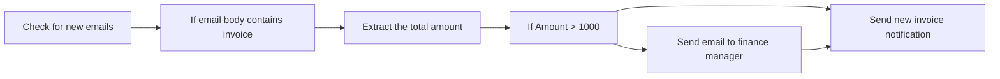

## Fluxo (.json) :

```json
{
  "id": 91,
  "name": "New invoice email notification",
  "nodes": [
    {
      "name": "Check for new emails",
      "type": "n8n-nodes-base.emailReadImap",
      "position": [
        500,
        300
      ],
      "parameters": {
        "format": "resolved",
        "mailbox": "Inbox",
        "options": {
          "allowUnauthorizedCerts": true
        }
      },
      "credentials": {
        "imap": {
          "id": "24",
          "name": "GMAIL"
        }
      },
      "typeVersion": 1
    },
    {
      "name": "If email body contains invoice",
      "type": "n8n-nodes-base.if",
      "position": [
        700,
        300
      ],
      "parameters": {
        "conditions": {
          "string": [
            {
              "value1": "={{$json[\"text\"].toLowerCase()}}",
              "value2": "invoice",
              "operation": "contains"
            }
          ]
        },
        "combineOperation": "any"
      },
      "typeVersion": 1
    },
    {
      "name": "Extract the total amount",
      "type": "n8n-nodes-base.mindee",
      "position": [
        900,
        280
      ],
      "parameters": {
        "rawData": true,
        "resource": "invoice",
        "binaryPropertyName": "attachment_0"
      },
      "credentials": {
        "mindeeInvoiceApi": {
          "id": "62",
          "name": "Mindee Invoice account"
        }
      },
      "typeVersion": 1
    },
    {
      "name": "Send new invoice notification",
      "type": "n8n-nodes-base.slack",
      "position": [
        1580,
        300
      ],
      "parameters": {
        "text": ":new: There is a new invoice to pay :new:",
        "channel": "team-accounts",
        "blocksUi": {
          "blocksValues": []
        },
        "attachments": [
          {
            "color": "#FFBF00",
            "fields": {
              "item": [
                {
                  "short": true,
                  "title": "Amount",
                  "value": "={{$node[\"If Amount > 1000\"].json[\"predictions\"][0][\"total_incl\"][\"amount\"]}}"
                },
                {
                  "short": false,
                  "title": "From",
                  "value": "={{$node[\"Check for new emails\"].json[\"from\"][\"value\"][0][\"address\"]}}"
                },
                {
                  "short": true,
                  "title": "Subject",
                  "value": "={{$node[\"Check for new emails\"].json[\"subject\"]}}"
                }
              ]
            },
            "footer": "=*Date:* {{$node[\"Check for new emails\"].json[\"date\"]}}"
          }
        ],
        "otherOptions": {}
      },
      "credentials": {
        "slackApi": {
          "id": "53",
          "name": "Slack Access Token"
        }
      },
      "typeVersion": 1
    },
    {
      "name": "Send email to finance manager",
      "type": "n8n-nodes-base.emailSend",
      "position": [
        1340,
        120
      ],
      "parameters": {
        "text": "Hi,\n\nThere is a new high value invoice to be paid that you may need to approve.\n\n~ n8n workflow",
        "options": {},
        "subject": "New high value invoice",
        "toEmail": "finance-manager@company.tld",
        "fromEmail": "n8n@noreply.tld",
        "attachments": "attachment_0"
      },
      "credentials": {
        "smtp": {
          "id": "26",
          "name": "mailtrap"
        }
      },
      "typeVersion": 1
    },
    {
      "name": "If Amount > 1000",
      "type": "n8n-nodes-base.if",
      "position": [
        1080,
        280
      ],
      "parameters": {
        "conditions": {
          "number": [
            {
              "value1": "={{$json[\"predictions\"][0][\"total_incl\"][\"amount\"]}}",
              "value2": 1000,
              "operation": "larger"
            }
          ]
        }
      },
      "typeVersion": 1
    }
  ],
  "active": false,
  "settings": {},
  "connections": {
    "If Amount > 1000": {
      "main": [
        [
          {
            "node": "Send email to finance manager",
            "type": "main",
            "index": 0
          }
        ],
        [
          {
            "node": "Send new invoice notification",
            "type": "main",
            "index": 0
          }
        ]
      ]
    },
    "Check for new emails": {
      "main": [
        [
          {
            "node": "If email body contains invoice",
            "type": "main",
            "index": 0
          }
        ]
      ]
    },
    "Extract the total amount": {
      "main": [
        [
          {
            "node": "If Amount > 1000",
            "type": "main",
            "index": 0
          }
        ]
      ]
    },
    "Send email to finance manager": {
      "main": [
        [
          {
            "node": "Send new invoice notification",
            "type": "main",
            "index": 0
          }
        ]
      ]
    },
    "If email body contains invoice": {
      "main": [
        [
          {
            "node": "Extract the total amount",
            "type": "main",
            "index": 0
          }
        ]
      ]
    }
  }
}
```

<a id="template-480"></a>

## Template 480 - Agente AI para Slack via webhook

- **Nome:** Agente AI para Slack via webhook
- **Descrição:** Recebe mensagens do Slack via POST, processa o texto com um agente de IA que utiliza histórico de conversa e retorna a resposta ao canal do Slack.
- **Funcionalidade:** • Recepção de mensagens via webhook POST: Captura payloads enviados pelo Slack para iniciar o fluxo.
• Encaminhamento ao agente de IA: Envia o texto recebido para um agente que processa o pedido com um prompt de sistema configurado.
• Processamento por modelo de linguagem: Usa um modelo de IA para gerar a resposta baseada no conteúdo do usuário.
• Persistência de contexto/ memória: Armazena histórico de conversas usando um identificador de sessão extraído do payload para manter contexto nas interações seguintes.
• Envio de resposta ao canal do Slack: Publica a resposta gerada no canal de origem, referenciando o texto e o usuário que enviou a mensagem.
- **Ferramentas:** • Slack: Plataforma de mensagens usada para enviar eventos (webhooks) e receber respostas no canal.
• Google Gemini (modelo de linguagem): Serviço de IA utilizado para processar prompts e gerar respostas em linguagem natural.
• Endpoint HTTPS público: Ponto de entrada público para receber requisições POST do Slack de forma segura.

## Fluxo visual

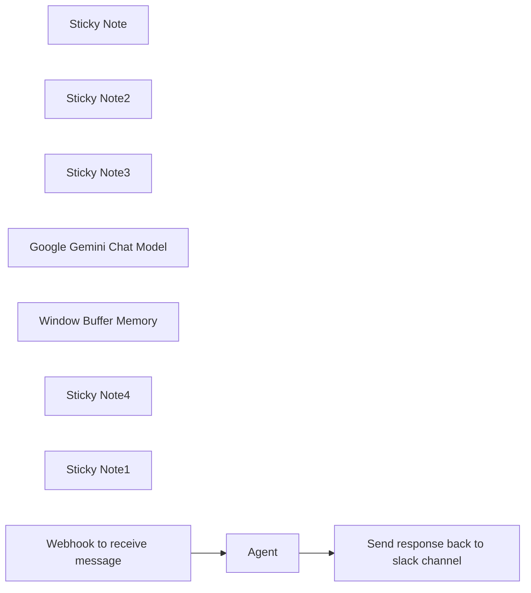

## Fluxo (.json) :

```json
{
  "meta": {
    "instanceId": "84ba6d895254e080ac2b4916d987aa66b000f88d4d919a6b9c76848f9b8a7616",
    "templateId": "2370"
  },
  "nodes": [
    {
      "id": "2ce91ec6-0a8c-438a-8a18-216001c9ee07",
      "name": "Sticky Note",
      "type": "n8n-nodes-base.stickyNote",
      "position": [
        380,
        240
      ],
      "parameters": {
        "width": 407.6388140161723,
        "height": 490.24769122000794,
        "content": "## This is a POST Webhook endpoint\n\nMake sure to configure this webhook using a https:// wraper and dont use the default http://localhost:5678 as that will not be recognized by your slack webhook\n\n\nOnce the data has been sent to your webhook, the next step will be passing it via an AI Agent to process data based on the queries we pass to our agent.\n\nTo have some sort of a memory, be sure to set the slack token to the memory node. This way you can refer to other chats from the history.\n\nThe final message is relayed back to slack as a new message. Since we can not wait longer than 3000 ms for slack response, we will create anew message with reference to the input we passed.\n\nWe can advance this using the tools or data sources for it to be more custom tailored for your company.\n"
      },
      "typeVersion": 1
    },
    {
      "id": "7a0c84a8-90ef-4de8-b120-700c94c35a51",
      "name": "Sticky Note2",
      "type": "n8n-nodes-base.stickyNote",
      "position": [
        1180,
        560
      ],
      "parameters": {
        "color": 4,
        "width": 221.73584905660368,
        "height": 233,
        "content": "### Conversation history is stored in memory using the body token as the chatsession id"
      },
      "typeVersion": 1
    },
    {
      "id": "9b843e0e-42a6-4125-8c59-a7d5620a15f7",
      "name": "Sticky Note3",
      "type": "n8n-nodes-base.stickyNote",
      "position": [
        942.5229110512129,
        560
      ],
      "parameters": {
        "color": 4,
        "width": 217.47708894878716,
        "height": 233,
        "content": "### The chat LLM to process the prompt. Use any AI model here"
      },
      "typeVersion": 1
    },
    {
      "id": "4efa968f-ebf5-42ec-80d3-907ef2622c61",
      "name": "Google Gemini Chat Model",
      "type": "@n8n/n8n-nodes-langchain.lmChatGoogleGemini",
      "position": [
        1020,
        640
      ],
      "parameters": {
        "options": {},
        "modelName": "models/gemini-1.5-flash-latest"
      },
      "typeVersion": 1
    },
    {
      "id": "fd1efd7c-7cd0-4edf-960e-19bd4567293e",
      "name": "Window Buffer Memory",
      "type": "@n8n/n8n-nodes-langchain.memoryBufferWindow",
      "position": [
        1260,
        660
      ],
      "parameters": {
        "sessionKey": "={{ $('Webhook to receive message').item.json.body.token }}",
        "sessionIdType": "customKey",
        "contextWindowLength": 10
      },
      "typeVersion": 1.2
    },
    {
      "id": "60d1eb77-492d-4a18-8cec-fa3f6ef8d707",
      "name": "Sticky Note4",
      "type": "n8n-nodes-base.stickyNote",
      "position": [
        1467.5148247978436,
        260
      ],
      "parameters": {
        "color": 4,
        "width": 223.7196765498655,
        "height": 236.66152029520293,
        "content": "### Send the response from AI back to slack channel\n"
      },
      "typeVersion": 1
    },
    {
      "id": "186069c0-5c79-4738-9924-de33998658bc",
      "name": "Sticky Note1",
      "type": "n8n-nodes-base.stickyNote",
      "position": [
        840,
        180
      ],
      "parameters": {
        "color": 4,
        "width": 561.423180592992,
        "height": 340.09703504043114,
        "content": "## Receive a POST webhook, process data and return response"
      },
      "typeVersion": 1
    },
    {
      "id": "2bfce117-a769-46e1-a028-ed0c7ba62653",
      "name": "Send response back to slack channel",
      "type": "n8n-nodes-base.slack",
      "position": [
        1540,
        320
      ],
      "parameters": {
        "text": "={{ $('Webhook to receive message').item.json.body.user_name }}: {{ $('Webhook to receive message').item.json.body.text }}\n\nEffibotics Bot: {{ $json.output.removeMarkdown() }} ",
        "select": "channel",
        "channelId": {
          "__rl": true,
          "mode": "id",
          "value": "={{ $('Webhook to receive message').item.json.body.channel_id }}"
        },
        "otherOptions": {
          "mrkdwn": true,
          "sendAsUser": "Effibotics Bot",
          "includeLinkToWorkflow": false
        }
      },
      "typeVersion": 2.1
    },
    {
      "id": "cfcf2bbc-8ed5-4a9f-8f35-cf2715686ebe",
      "name": "Webhook to receive message",
      "type": "n8n-nodes-base.webhook",
      "position": [
        880,
        320
      ],
      "webhookId": "28b84545-96aa-42f5-990b-aa8783a320ca",
      "parameters": {
        "path": "slack-bot",
        "options": {
          "responseData": ""
        },
        "httpMethod": "POST"
      },
      "typeVersion": 1
    },
    {
      "id": "dc93e588-fc0b-4561-88a5-e1cccd48323f",
      "name": "Agent",
      "type": "@n8n/n8n-nodes-langchain.agent",
      "position": [
        1100,
        320
      ],
      "parameters": {
        "text": "={{ $json.body.text }}",
        "options": {
          "systemMessage": "You are Effibotics AI personal assistant. Your task will be to provide helpful assistance and advice related to automation and such tasks. "
        }
      },
      "typeVersion": 1
    }
  ],
  "pinData": {},
  "connections": {
    "Agent": {
      "main": [
        [
          {
            "node": "Send response back to slack channel",
            "type": "main",
            "index": 0
          }
        ]
      ]
    },
    "Window Buffer Memory": {
      "ai_memory": [
        [
          {
            "node": "Agent",
            "type": "ai_memory",
            "index": 0
          }
        ]
      ]
    },
    "Google Gemini Chat Model": {
      "ai_languageModel": [
        [
          {
            "node": "Agent",
            "type": "ai_languageModel",
            "index": 0
          }
        ]
      ]
    },
    "Webhook to receive message": {
      "main": [
        [
          {
            "node": "Agent",
            "type": "main",
            "index": 0
          }
        ]
      ]
    }
  }
}
```

<a id="template-481"></a>

## Template 481 - Extrair despesas de emails para planilha

- **Nome:** Extrair despesas de emails para planilha
- **Descrição:** Automatiza a extração de informações de recibos recebidos por email e adiciona os valores como novas linhas em uma planilha do Google Sheets.
- **Funcionalidade:** • Monitoramento de caixa de entrada: Verifica a existência de novos e-mails na caixa de entrada.
• Filtragem por assunto: Identifica e-mails relevantes usando padrões de assunto (por exemplo: expenses, reciept).
• Extração de dados de recibos: Processa anexos de recibo para extrair data, categoria, moeda e valor total.
• Geração de descrição: Deriva a descrição do gasto a partir do assunto do e-mail (ex.: parte após um '-').
• Mapeamento de colunas: Formata os campos extraídos para colunas Date, Description, Category, Currency e Amount.
• Inserção em planilha: Anexa os dados formatados como nova linha em uma planilha do Google Sheets.
- **Ferramentas:** • Gmail/IMAP: Serviço de e-mail usado para ler mensagens e baixar anexos.
• Mindee Receipt API: Serviço de OCR/extração de dados para analisar recibos e obter campos estruturados.
• Google Sheets: Planilha online usada para armazenar e consolidar os registros de despesas.

## Fluxo visual

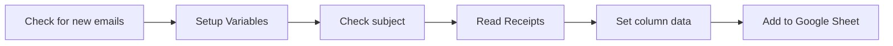

## Fluxo (.json) :

```json
{
  "id": 90,
  "name": "Extract expenses from emails and add to Google Sheet",
  "nodes": [
    {
      "name": "Check subject",
      "type": "n8n-nodes-base.if",
      "position": [
        800,
        300
      ],
      "parameters": {
        "conditions": {
          "string": [
            {
              "value1": "={{$json[\"subject\"].toLowerCase()}}",
              "value2": "=/{{$json[\"subjectPatterns\"].toLowerCase()}}/",
              "operation": "regex"
            }
          ]
        },
        "combineOperation": "any"
      },
      "typeVersion": 1
    },
    {
      "name": "Setup Variables",
      "type": "n8n-nodes-base.set",
      "position": [
        620,
        300
      ],
      "parameters": {
        "values": {
          "string": [
            {
              "name": "subjectPatterns",
              "value": "(expenses|reciept)"
            }
          ]
        },
        "options": {}
      },
      "typeVersion": 1
    },
    {
      "name": "Check for new emails",
      "type": "n8n-nodes-base.emailReadImap",
      "position": [
        440,
        300
      ],
      "parameters": {
        "format": "resolved",
        "mailbox": "Inbox",
        "options": {
          "allowUnauthorizedCerts": true
        }
      },
      "credentials": {
        "imap": {
          "id": "24",
          "name": "GMAIL"
        }
      },
      "typeVersion": 1
    },
    {
      "name": "Read Receipts",
      "type": "n8n-nodes-base.mindee",
      "position": [
        1020,
        280
      ],
      "parameters": {
        "binaryPropertyName": "attachment_0"
      },
      "credentials": {
        "mindeeReceiptApi": {
          "id": "61",
          "name": "Mindee Receipt account"
        }
      },
      "typeVersion": 1
    },
    {
      "name": "Set column data",
      "type": "n8n-nodes-base.set",
      "position": [
        1200,
        280
      ],
      "parameters": {
        "values": {
          "string": [
            {
              "name": "Date",
              "value": "={{$json[\"date\"]}}"
            },
            {
              "name": "Description",
              "value": "={{$node[\"Check for new emails\"].json[\"subject\"].split(\"-\")[1]}}"
            },
            {
              "name": "Category",
              "value": "={{$json[\"category\"]}}"
            },
            {
              "name": "Currency",
              "value": "={{$json[\"currency\"]}}"
            },
            {
              "name": "Amount",
              "value": "={{$json[\"total\"]}}"
            }
          ]
        },
        "options": {}
      },
      "typeVersion": 1
    },
    {
      "name": "Add to Google Sheet",
      "type": "n8n-nodes-base.googleSheets",
      "position": [
        1380,
        280
      ],
      "parameters": {
        "range": "A:E",
        "options": {},
        "sheetId": "1xAtx1ORZYKu4urgqpOe3DawFjiWeOZO0VCVvOlQYnaE",
        "operation": "append",
        "authentication": "oAuth2"
      },
      "credentials": {
        "googleSheetsOAuth2Api": {
          "id": "8",
          "name": "Sheets"
        }
      },
      "typeVersion": 1
    }
  ],
  "active": false,
  "settings": {},
  "connections": {
    "Check subject": {
      "main": [
        [
          {
            "node": "Read Receipts",
            "type": "main",
            "index": 0
          }
        ]
      ]
    },
    "Read Receipts": {
      "main": [
        [
          {
            "node": "Set column data",
            "type": "main",
            "index": 0
          }
        ]
      ]
    },
    "Set column data": {
      "main": [
        [
          {
            "node": "Add to Google Sheet",
            "type": "main",
            "index": 0
          }
        ]
      ]
    },
    "Setup Variables": {
      "main": [
        [
          {
            "node": "Check subject",
            "type": "main",
            "index": 0
          }
        ]
      ]
    },
    "Check for new emails": {
      "main": [
        [
          {
            "node": "Setup Variables",
            "type": "main",
            "index": 0
          }
        ]
      ]
    }
  }
}
```
