# PACK 1999 TEMPLATES PARTE 03 - Bloco 5

Templates neste bloco: 20

## Sumário

- [Template 482 - Chatbot Slack com RAG para equipe](#template-482)
- [Template 483 - Chatbot Slack via Slash Commands](#template-483)
- [Template 484 - Scraper com Selenium e OpenAI](#template-484)
- [Template 485 - Baixar imagem e enviar para FTP](#template-485)
- [Template 486 - Atualizar títulos e descrições de produtos Printify](#template-486)
- [Template 487 - Criação e atualização de Lead Salesforce](#template-487)
- [Template 488 - Gerar tarefas Todoist via Telegram](#template-488)
- [Template 489 - Criar e gerenciar canal no Microsoft Teams](#template-489)
- [Template 490 - Classificação automática de e-mails](#template-490)
- [Template 491 - Conversão de data via execução manual](#template-491)
- [Template 492 - Notificações de novo cliente Help Scout](#template-492)
- [Template 493 - Monitor de carteira USDT TRC20 a cada 15 minutos](#template-493)
- [Template 494 - Publicar imagem no LinkedIn a partir de URL](#template-494)
- [Template 495 - Agente AI para gerar tarefas e comunicar participantes](#template-495)
- [Template 496 - Notificação de venda no Gumroad](#template-496)
- [Template 497 - Notificações de notas de reunião para Marketing](#template-497)
- [Template 498 - Atribuição automática de negócios](#template-498)
- [Template 499 - Notificação de pedidos Uber Eats para registro de despesas](#template-499)
- [Template 500 - Converter texto em fala via OpenAI](#template-500)
- [Template 501 - Chat com memória usando Supabase e Gemini](#template-501)

---

<a id="template-482"></a>

## Template 482 - Chatbot Slack com RAG para equipe

- **Nome:** Chatbot Slack com RAG para equipe
- **Descrição:** Fluxo que responde a menções no Slack usando recuperação aumentada por busca (RAG) sobre documentos internos, consultando fontes armazenadas e retornando respostas formatadas em threads do Slack.
- **Funcionalidade:** • Receber menções no Slack: Aciona o fluxo quando o bot é mencionado em um canal.
• Busca por documentos (RAG): Consulta uma base vetorial para recuperar trechos relevantes de documentos internos.
• Geração de embeddings: Converte fragmentos de texto em vetores para indexação e busca semântica.
• Indexação e atualização da coleção: Criação, limpeza e inserção de arquivos na coleção vetorial para manter dados atualizados.
• Download e conversão de arquivos do Google Drive: Obtém arquivos de uma pasta e converte documentos para texto antes do processamento.
• Segmentação de texto (token splitter): Divide documentos em trechos menores com sobreposição para melhor busca e contexto.
• Memória de sessão: Mantém um histórico curto de conversa por usuário/canal para contexto em interações subsequentes.
• Uso de modelo de linguagem: Gera respostas sintetizadas e formatadas para o Slack, incluindo citações e referências a documentos.
• Resposta no Slack em thread: Envia a resposta gerada como mensagem no canal, vinculada à thread original para organização.
• Acionamento manual para manutenção: Permite testes e operações manuais para criar ou atualizar a coleção vetorial.
- **Ferramentas:** • Slack: Plataforma de comunicação onde o bot recebe menções e posta respostas em threads.
• Qdrant (vetor DB): Armazenamento vetorial usado para indexar e recuperar trechos de documentos.
• OpenAI (embeddings): Serviço para gerar embeddings que representam semanticamente trechos de texto.
• Anthropic (Claude): Modelo de linguagem utilizado para gerar respostas e dialogar com usuários.
• Google Drive: Repositório de documentos internos que são baixados e convertidos em texto para indexação.
• API HTTP genérica: Chamadas para criar/limpar coleções e gerenciar pontos na base vetorial (uso de endpoints externos).

## Fluxo visual

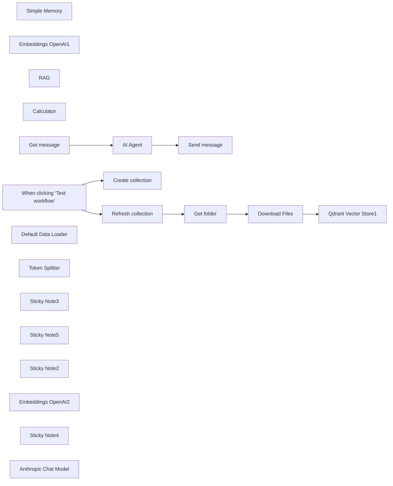

## Fluxo (.json) :

```json
{
  "id": "SHpLY12UobbcWRnl",
  "meta": {
    "instanceId": "a4bfc93e975ca233ac45ed7c9227d84cf5a2329310525917adaf3312e10d5462",
    "templateCredsSetupCompleted": true
  },
  "name": "Slack AI Chatbot with RAG for company staff",
  "tags": [],
  "nodes": [
    {
      "id": "df994f64-af5b-49f5-ad83-5c4b69983d41",
      "name": "AI Agent",
      "type": "@n8n/n8n-nodes-langchain.agent",
      "position": [
        -780,
        340
      ],
      "parameters": {
        "text": "={{ $json.blocks[0].elements[0].elements[1].text }}",
        "options": {
          "systemMessage": "=You are an AI assistant  connected to the company's internal knowledge base through a RAG (Retrieval Augmented Generation) system. Your purpose is to help team members quickly find and understand information from company documents.\n\nCORE RESPONSIBILITIES:\n- Respond to queries about company policies, procedures, documentation, and internal knowledge\n- Provide concise, accurate information retrieved from the company's document repository\n- Format responses appropriately for Slack (use markdown for clarity)\n- Cite the specific document source when providing information\n\nINTERACTION GUIDELINES:\n- Keep responses brief and to the point (aim for 3-5 sentences when possible)\n- Use bullet points for lists or step-by-step instructions\n- Include direct quotes from documents when relevant, using > for blockquotes\n- When unable to find information, clearly state this and suggest alternative resources\n\nTECHNICAL CONTEXT:\n- You receive queries through Slack messages\n- You use the RAG tool in n8n to search and retrieve relevant document sections\n- All responses should be crafted for readability on Slack's interface\n\nRESPONSE STRUCTURE:\n1. Direct answer to the question (1-2 sentences)\n2. Supporting details from retrieved documents (2-3 sentences or bullet points)\n3. Source citation (document name and date if available)\n4. Follow-up suggestion if applicable (1 sentence)\n\nAlways prioritize accuracy over speed. If multiple documents contain relevant information, synthesize the most important points rather than providing all details. If the query is ambiguous, ask a clarifying question before searching.\n\nRemember that you are a tool to empower employees, not replace human judgment. When questions involve complex decision-making, provide the relevant information and encourage the user to consult with appropriate team members.\n\nDate; {{ $now }}"
        },
        "promptType": "define"
      },
      "typeVersion": 1.8
    },
    {
      "id": "047141fc-a7a0-4532-ae45-da0f2cc27b69",
      "name": "Simple Memory",
      "type": "@n8n/n8n-nodes-langchain.memoryBufferWindow",
      "position": [
        -720,
        600
      ],
      "parameters": {
        "sessionKey": "={{ $('Get message').item.json.channel }}_{{ $('Get message').item.json.blocks[0].elements[0].elements[0].user_id }}",
        "sessionIdType": "customKey",
        "contextWindowLength": 10
      },
      "typeVersion": 1.3
    },
    {
      "id": "f7da4458-3dc5-43b8-a97d-dac3e599543c",
      "name": "Embeddings OpenAI1",
      "type": "@n8n/n8n-nodes-langchain.embeddingsOpenAi",
      "position": [
        -460,
        800
      ],
      "parameters": {
        "options": {}
      },
      "credentials": {
        "openAiApi": {
          "id": "4zwP0MSr8zkNvvV9",
          "name": "OpenAi account"
        }
      },
      "typeVersion": 1.2
    },
    {
      "id": "14a6052f-e619-4d19-99aa-42253c45a913",
      "name": "RAG",
      "type": "@n8n/n8n-nodes-langchain.vectorStoreQdrant",
      "position": [
        -420,
        620
      ],
      "parameters": {
        "mode": "retrieve-as-tool",
        "topK": 10,
        "options": {},
        "toolName": "company_info",
        "toolDescription": "Get business documents",
        "qdrantCollection": {
          "__rl": true,
          "mode": "id",
          "value": "COLLECTION"
        }
      },
      "credentials": {
        "qdrantApi": {
          "id": "iyQ6MQiVaF3VMBmt",
          "name": "QdrantApi account"
        }
      },
      "typeVersion": 1.1
    },
    {
      "id": "c6334fd2-0d54-4980-857e-079be08959a5",
      "name": "Calculator",
      "type": "@n8n/n8n-nodes-langchain.toolCalculator",
      "position": [
        -560,
        600
      ],
      "parameters": {},
      "typeVersion": 1
    },
    {
      "id": "87a629b9-980f-4d0d-9fee-5efa560770d2",
      "name": "Get message",
      "type": "n8n-nodes-base.slackTrigger",
      "position": [
        -1040,
        340
      ],
      "webhookId": "3146b3e9-4cfc-493f-882c-57c865380115",
      "parameters": {
        "options": {},
        "trigger": [
          "app_mention"
        ],
        "channelId": {
          "__rl": true,
          "mode": "list",
          "value": "C08L6SEPWMB",
          "cachedResultName": "n8n-test"
        }
      },
      "credentials": {
        "slackApi": {
          "id": "QjSyGP8ykppazXDW",
          "name": "Slack account (Token)"
        }
      },
      "typeVersion": 1
    },
    {
      "id": "939b309d-1828-4159-b1dc-4a1629069c37",
      "name": "Send message",
      "type": "n8n-nodes-base.slack",
      "position": [
        -420,
        340
      ],
      "webhookId": "946ab278-f815-4bd3-a20d-49ba59d76659",
      "parameters": {
        "text": "={{ $json.output }}",
        "select": "channel",
        "channelId": {
          "__rl": true,
          "mode": "list",
          "value": "C08L6SEPWMB",
          "cachedResultName": "n8n-test"
        },
        "otherOptions": {
          "mrkdwn": true,
          "thread_ts": {
            "replyValues": {
              "thread_ts": "={{ $('Get message').item.json.event_ts }}",
              "reply_broadcast": true
            }
          },
          "unfurl_links": true,
          "includeLinkToWorkflow": false
        }
      },
      "credentials": {
        "slackApi": {
          "id": "QjSyGP8ykppazXDW",
          "name": "Slack account (Token)"
        }
      },
      "typeVersion": 2.3
    },
    {
      "id": "50be03ea-ab0c-48cb-b95a-b096e51c3d16",
      "name": "When clicking ‘Test workflow’",
      "type": "n8n-nodes-base.manualTrigger",
      "position": [
        -1120,
        -1020
      ],
      "parameters": {},
      "typeVersion": 1
    },
    {
      "id": "2a765d76-59c6-49c3-95b4-429e5439da37",
      "name": "Create collection",
      "type": "n8n-nodes-base.httpRequest",
      "position": [
        -820,
        -1160
      ],
      "parameters": {
        "url": "https://QDRANTURL/collections/COLLECTION",
        "method": "POST",
        "options": {},
        "jsonBody": "{\n  \"filter\": {}\n}",
        "sendBody": true,
        "sendHeaders": true,
        "specifyBody": "json",
        "authentication": "genericCredentialType",
        "genericAuthType": "httpHeaderAuth",
        "headerParameters": {
          "parameters": [
            {
              "name": "Content-Type",
              "value": "application/json"
            }
          ]
        }
      },
      "credentials": {
        "httpHeaderAuth": {
          "id": "qhny6r5ql9wwotpn",
          "name": "Qdrant API (Hetzner)"
        }
      },
      "typeVersion": 4.2
    },
    {
      "id": "66eb2691-4316-4470-aa6d-9696beff6cf2",
      "name": "Refresh collection",
      "type": "n8n-nodes-base.httpRequest",
      "position": [
        -820,
        -900
      ],
      "parameters": {
        "url": "https://QDRANTURL/collections/COLLECTION/points/delete",
        "method": "POST",
        "options": {},
        "jsonBody": "{\n  \"filter\": {}\n}",
        "sendBody": true,
        "sendHeaders": true,
        "specifyBody": "json",
        "authentication": "genericCredentialType",
        "genericAuthType": "httpHeaderAuth",
        "headerParameters": {
          "parameters": [
            {
              "name": "Content-Type",
              "value": "application/json"
            }
          ]
        }
      },
      "credentials": {
        "httpHeaderAuth": {
          "id": "qhny6r5ql9wwotpn",
          "name": "Qdrant API (Hetzner)"
        }
      },
      "typeVersion": 4.2
    },
    {
      "id": "c0e16404-d82c-418e-b384-d9cc5dceeab6",
      "name": "Get folder",
      "type": "n8n-nodes-base.googleDrive",
      "position": [
        -600,
        -900
      ],
      "parameters": {
        "filter": {
          "driveId": {
            "__rl": true,
            "mode": "list",
            "value": "My Drive",
            "cachedResultUrl": "https://drive.google.com/drive/my-drive",
            "cachedResultName": "My Drive"
          },
          "folderId": {
            "__rl": true,
            "mode": "id",
            "value": "=test-whatsapp"
          }
        },
        "options": {},
        "resource": "fileFolder"
      },
      "credentials": {
        "googleDriveOAuth2Api": {
          "id": "HEy5EuZkgPZVEa9w",
          "name": "Google Drive account (n3w.it)"
        }
      },
      "typeVersion": 3
    },
    {
      "id": "ed9768aa-e381-4d53-b0b4-702833e388b9",
      "name": "Download Files",
      "type": "n8n-nodes-base.googleDrive",
      "position": [
        -380,
        -900
      ],
      "parameters": {
        "fileId": {
          "__rl": true,
          "mode": "id",
          "value": "={{ $json.id }}"
        },
        "options": {
          "googleFileConversion": {
            "conversion": {
              "docsToFormat": "text/plain"
            }
          }
        },
        "operation": "download"
      },
      "credentials": {
        "googleDriveOAuth2Api": {
          "id": "HEy5EuZkgPZVEa9w",
          "name": "Google Drive account (n3w.it)"
        }
      },
      "typeVersion": 3
    },
    {
      "id": "0da72902-4338-4610-a48c-ad2762690623",
      "name": "Default Data Loader",
      "type": "@n8n/n8n-nodes-langchain.documentDefaultDataLoader",
      "position": [
        20,
        -700
      ],
      "parameters": {
        "options": {},
        "dataType": "binary"
      },
      "typeVersion": 1
    },
    {
      "id": "8783e0bc-df82-4bee-9340-5c788e7f7d3c",
      "name": "Token Splitter",
      "type": "@n8n/n8n-nodes-langchain.textSplitterTokenSplitter",
      "position": [
        0,
        -520
      ],
      "parameters": {
        "chunkSize": 300,
        "chunkOverlap": 30
      },
      "typeVersion": 1
    },
    {
      "id": "d3872217-ff7e-4ed7-9992-ab2b6f5af9e1",
      "name": "Sticky Note3",
      "type": "n8n-nodes-base.stickyNote",
      "position": [
        -620,
        -1220
      ],
      "parameters": {
        "color": 6,
        "width": 880,
        "height": 220,
        "content": "# STEP 1\n\n## Create Qdrant Collection\nChange:\n- QDRANTURL\n- COLLECTION"
      },
      "typeVersion": 1
    },
    {
      "id": "887598e8-5ac2-4433-9bd6-779a028eab14",
      "name": "Qdrant Vector Store1",
      "type": "@n8n/n8n-nodes-langchain.vectorStoreQdrant",
      "position": [
        -140,
        -900
      ],
      "parameters": {
        "mode": "insert",
        "options": {},
        "qdrantCollection": {
          "__rl": true,
          "mode": "id",
          "value": "=COLLECTION"
        }
      },
      "credentials": {
        "qdrantApi": {
          "id": "iyQ6MQiVaF3VMBmt",
          "name": "QdrantApi account"
        }
      },
      "typeVersion": 1
    },
    {
      "id": "d0ab0fb8-e4b8-49e2-9d40-74c9855af7b0",
      "name": "Sticky Note5",
      "type": "n8n-nodes-base.stickyNote",
      "position": [
        -840,
        -960
      ],
      "parameters": {
        "color": 4,
        "width": 620,
        "height": 400,
        "content": "# STEP 2\n\n\n\n\n\n\n\n\n\n\n\n\n## Documents vectorization with Qdrant and Google Drive\nChange:\n- QDRANTURL\n- COLLECTION"
      },
      "typeVersion": 1
    },
    {
      "id": "f3311b6f-1130-41c7-ab3a-447bb617be1b",
      "name": "Sticky Note2",
      "type": "n8n-nodes-base.stickyNote",
      "position": [
        -1140,
        -1500
      ],
      "parameters": {
        "color": 3,
        "width": 1400,
        "height": 200,
        "content": "# Slack AI Chatbot Workflow with RAG\n\nImagine having an AI chatbot on Slack that seamlessly integrates with your company’s workflow, automating repetitive requests. No more digging through emails or documents to find answers about IT requests, company policies, or vacation days—just ask the bot, and it will instantly provide the right information.\n\nWith its 24/7 availability, the chatbot ensures that team members get immediate support without waiting for a colleague to be online, making assistance faster and more efficient."
      },
      "typeVersion": 1
    },
    {
      "id": "b81155d1-6382-4bd8-96a1-09b063f95c43",
      "name": "Embeddings OpenAI2",
      "type": "@n8n/n8n-nodes-langchain.embeddingsOpenAi",
      "position": [
        -140,
        -680
      ],
      "parameters": {
        "options": {}
      },
      "typeVersion": 1.1
    },
    {
      "id": "7754f8bd-56c2-46c9-85da-d9a49ccf5c81",
      "name": "Sticky Note4",
      "type": "n8n-nodes-base.stickyNote",
      "position": [
        -1060,
        -340
      ],
      "parameters": {
        "width": 900,
        "height": 640,
        "content": "# STEP 3\nCreate a Slack Bot [here](https://api.slack.com) and add it to your Slack (Private o Public) channel.\n\nSet \"Scope Subscribe to Bot Event\":\n- app_mention \n- message.channels\n\nSet Bot Token Scopes:\n- app_mentions:read\n- channels:history\n- channels:manage\n- channels:read\n- chat:write\n- files:read\n- groups:history\n- groups:read\n- im:history\n- im:read\n- mpim:history\n- mpim:read\n- reactions:read\n- reactions:write\n- usergroups:read\n- users:read\n\nIn RAG Qdrant node change: \n- COLLECTION"
      },
      "typeVersion": 1
    },
    {
      "id": "9933da43-8797-40ed-b399-49ddeb369e42",
      "name": "Anthropic Chat Model",
      "type": "@n8n/n8n-nodes-langchain.lmChatAnthropic",
      "position": [
        -900,
        600
      ],
      "parameters": {
        "model": {
          "__rl": true,
          "mode": "list",
          "value": "claude-3-7-sonnet-20250219",
          "cachedResultName": "Claude 3.7 Sonnet"
        },
        "options": {}
      },
      "credentials": {
        "anthropicApi": {
          "id": "NNTZAD0Gmf7lcniq",
          "name": "Anthropic account"
        }
      },
      "typeVersion": 1.3
    }
  ],
  "active": false,
  "pinData": {},
  "settings": {
    "executionOrder": "v1"
  },
  "versionId": "9ed2f0d0-c463-4942-be0c-e5b606973048",
  "connections": {
    "RAG": {
      "ai_tool": [
        [
          {
            "node": "AI Agent",
            "type": "ai_tool",
            "index": 0
          }
        ]
      ]
    },
    "AI Agent": {
      "main": [
        [
          {
            "node": "Send message",
            "type": "main",
            "index": 0
          }
        ]
      ]
    },
    "Calculator": {
      "ai_tool": [
        [
          {
            "node": "AI Agent",
            "type": "ai_tool",
            "index": 0
          }
        ]
      ]
    },
    "Get folder": {
      "main": [
        [
          {
            "node": "Download Files",
            "type": "main",
            "index": 0
          }
        ]
      ]
    },
    "Get message": {
      "main": [
        [
          {
            "node": "AI Agent",
            "type": "main",
            "index": 0
          }
        ]
      ]
    },
    "Simple Memory": {
      "ai_memory": [
        [
          {
            "node": "AI Agent",
            "type": "ai_memory",
            "index": 0
          }
        ]
      ]
    },
    "Download Files": {
      "main": [
        [
          {
            "node": "Qdrant Vector Store1",
            "type": "main",
            "index": 0
          }
        ]
      ]
    },
    "Token Splitter": {
      "ai_textSplitter": [
        [
          {
            "node": "Default Data Loader",
            "type": "ai_textSplitter",
            "index": 0
          }
        ]
      ]
    },
    "Embeddings OpenAI1": {
      "ai_embedding": [
        [
          {
            "node": "RAG",
            "type": "ai_embedding",
            "index": 0
          }
        ]
      ]
    },
    "Embeddings OpenAI2": {
      "ai_embedding": [
        [
          {
            "node": "Qdrant Vector Store1",
            "type": "ai_embedding",
            "index": 0
          }
        ]
      ]
    },
    "Refresh collection": {
      "main": [
        [
          {
            "node": "Get folder",
            "type": "main",
            "index": 0
          }
        ]
      ]
    },
    "Default Data Loader": {
      "ai_document": [
        [
          {
            "node": "Qdrant Vector Store1",
            "type": "ai_document",
            "index": 0
          }
        ]
      ]
    },
    "Anthropic Chat Model": {
      "ai_languageModel": [
        [
          {
            "node": "AI Agent",
            "type": "ai_languageModel",
            "index": 0
          }
        ]
      ]
    },
    "When clicking ‘Test workflow’": {
      "main": [
        [
          {
            "node": "Create collection",
            "type": "main",
            "index": 0
          },
          {
            "node": "Refresh collection",
            "type": "main",
            "index": 0
          }
        ]
      ]
    }
  }
}
```

<a id="template-483"></a>

## Template 483 - Chatbot Slack via Slash Commands

- **Nome:** Chatbot Slack via Slash Commands
- **Descrição:** Fluxo que processa comandos slash do Slack, gera respostas com um modelo de linguagem e publica a resposta no canal indicado.
- **Funcionalidade:** • Receber comandos Slash do Slack: aceita requisições HTTP POST de comandos configurados no Slack e retorna resposta imediata com código 204.
• Roteamento por comando: identifica qual slash command foi acionado (por exemplo /ask ou /another) e direciona o fluxo correspondente.
• Geração de resposta por IA: envia o texto recebido ao modelo de linguagem para criar a mensagem AI baseada no conteúdo do comando.
• Envio de mensagem para canal Slack: publica a resposta gerada no canal especificado pelo payload (channel_id).
• Suporte a múltiplos comandos: permite adicionar e alternar entre diferentes slash commands para comportamentos distintos.
• Uso de modelo configurável: permite definir qual modelo de linguagem será usado para gerar as respostas.
- **Ferramentas:** • Slack Slash Commands: mecanismo do Slack para disparar comandos personalizados que enviam payloads (incluindo channel_id e texto) para um endpoint.
• OpenAI (gpt-4o-mini): modelo de linguagem usado para gerar as respostas AI a partir do texto enviado pelo usuário.
• Endpoint Webhook público (HTTP): ponto de entrada público que recebe as requisições POST do Slack e encaminha para processamento.

## Fluxo visual

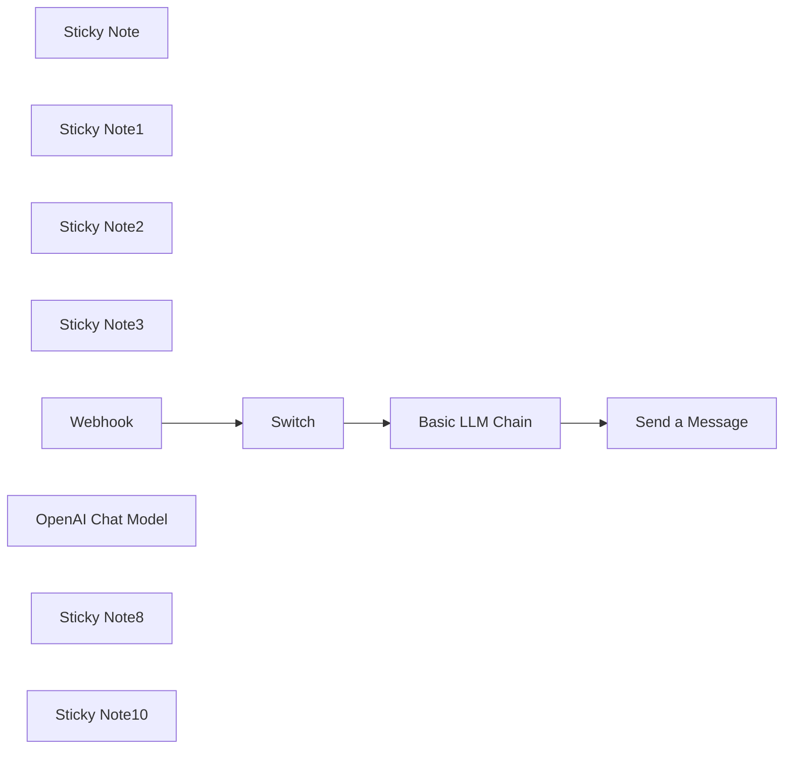

## Fluxo (.json) :

```json
{
  "id": "PGLFPj5y01s26rE1",
  "meta": {
    "instanceId": "b68f2515130d1ee83f4af1a6f2ca359fc9bb8cdbe875ca10b6f944f99aa931b5",
    "templateCredsSetupCompleted": true
  },
  "name": "My workflow 6",
  "tags": [],
  "nodes": [
    {
      "id": "82670f40-2e3b-4e02-ae52-f2c918c3aa1c",
      "name": "Sticky Note",
      "type": "n8n-nodes-base.stickyNote",
      "position": [
        -80,
        -600
      ],
      "parameters": {
        "color": 7,
        "width": 280,
        "height": 380,
        "content": "## Command Trigger\n\nCopy the webhook URL, paste it into the Request URL of the Slack slash command, and complete the creation.\n\n\n웹훅 URL을 복사하여 슬랙 슬래시 커맨드의 Request URL에 붙이고 생성을 완료하세요."
      },
      "typeVersion": 1
    },
    {
      "id": "28f56691-0ad5-47b1-974b-1ece4890933b",
      "name": "Sticky Note1",
      "type": "n8n-nodes-base.stickyNote",
      "position": [
        260,
        -600
      ],
      "parameters": {
        "color": 7,
        "height": 380,
        "content": "## Command Switch\n\nSwitch each slash command.\n\n각 슬래시 커맨드를 분기하세요."
      },
      "typeVersion": 1
    },
    {
      "id": "9dc9ca95-e29d-44d9-9e09-b2a72d9ad23a",
      "name": "Sticky Note2",
      "type": "n8n-nodes-base.stickyNote",
      "position": [
        600,
        -600
      ],
      "parameters": {
        "color": 7,
        "width": 360,
        "height": 380,
        "content": "## Create AI Messages"
      },
      "typeVersion": 1
    },
    {
      "id": "025c5a59-06b6-4b6d-b3e0-aa782a133c97",
      "name": "Sticky Note3",
      "type": "n8n-nodes-base.stickyNote",
      "position": [
        1060,
        -600
      ],
      "parameters": {
        "color": 7,
        "height": 340,
        "content": "## Send a Slack Message"
      },
      "typeVersion": 1
    },
    {
      "id": "cb60e9b0-a9a8-4dd6-9aa3-9d22c7f5f537",
      "name": "Webhook",
      "type": "n8n-nodes-base.webhook",
      "position": [
        -20,
        -380
      ],
      "webhookId": "1bd05fcf-8286-491f-ae13-f0e6bff4aca6",
      "parameters": {
        "path": "1bd05fcf-8286-491f-ae13-f0e6bff4aca6",
        "options": {
          "responseCode": {
            "values": {
              "responseCode": 204
            }
          }
        },
        "httpMethod": "POST"
      },
      "typeVersion": 2
    },
    {
      "id": "d60cfb45-df3d-4ab1-8e7e-1b2e81bc5b34",
      "name": "Switch",
      "type": "n8n-nodes-base.switch",
      "position": [
        320,
        -380
      ],
      "parameters": {
        "rules": {
          "values": [
            {
              "outputKey": "ask",
              "conditions": {
                "options": {
                  "version": 2,
                  "leftValue": "",
                  "caseSensitive": true,
                  "typeValidation": "strict"
                },
                "combinator": "and",
                "conditions": [
                  {
                    "operator": {
                      "type": "string",
                      "operation": "equals"
                    },
                    "leftValue": "={{ $json.body.command }}",
                    "rightValue": "/ask"
                  }
                ]
              },
              "renameOutput": true
            },
            {
              "outputKey": "another",
              "conditions": {
                "options": {
                  "version": 2,
                  "leftValue": "",
                  "caseSensitive": true,
                  "typeValidation": "strict"
                },
                "combinator": "and",
                "conditions": [
                  {
                    "id": "a0924665-de21-4d9b-a1d1-c9f41f74ee09",
                    "operator": {
                      "name": "filter.operator.equals",
                      "type": "string",
                      "operation": "equals"
                    },
                    "leftValue": "={{ $json.body.command }}",
                    "rightValue": "/another"
                  }
                ]
              },
              "renameOutput": true
            }
          ]
        },
        "options": {}
      },
      "typeVersion": 3.2
    },
    {
      "id": "810ac4dd-8241-4486-b183-74cbde3d58e7",
      "name": "Basic LLM Chain",
      "type": "@n8n/n8n-nodes-langchain.chainLlm",
      "position": [
        640,
        -500
      ],
      "parameters": {
        "text": "={{ $json.body.text }}",
        "promptType": "define"
      },
      "typeVersion": 1.5
    },
    {
      "id": "f173fe2d-45e7-460c-aa33-d5509b6d59b9",
      "name": "OpenAI Chat Model",
      "type": "@n8n/n8n-nodes-langchain.lmChatOpenAi",
      "position": [
        720,
        -340
      ],
      "parameters": {
        "model": {
          "__rl": true,
          "mode": "list",
          "value": "gpt-4o-mini"
        },
        "options": {}
      },
      "typeVersion": 1.2
    },
    {
      "id": "4752da4c-b013-4469-a3bc-386d3ab3d15d",
      "name": "Send a Message",
      "type": "n8n-nodes-base.slack",
      "position": [
        1120,
        -460
      ],
      "webhookId": "a37abc2a-6e8c-4c00-8543-3f313b300df6",
      "parameters": {
        "text": "={{ $json.text }}",
        "select": "channel",
        "channelId": {
          "__rl": true,
          "mode": "id",
          "value": "={{ $('Webhook').item.json.body.channel_id }}"
        },
        "otherOptions": {
          "includeLinkToWorkflow": false
        }
      },
      "typeVersion": 2.3
    },
    {
      "id": "c2f5dbcc-8283-47ab-b19a-810ad526d519",
      "name": "Sticky Note8",
      "type": "n8n-nodes-base.stickyNote",
      "position": [
        -80,
        -1060
      ],
      "parameters": {
        "color": 7,
        "width": 340,
        "height": 400,
        "content": "## 슬랙 Slash Command와 채널 메시지로 챗봇 만들기 🤖\n\n이 튜토리얼에서는 n8n을 활용해 슬랙에서 동작하는 AI 챗봇을 만드는 방법을 알려드립니다. 슬래시 커맨드를 통한 개인 메시지부터 공개 채널에서의 자동 응답까지, 실용적인 챗봇 구현 방법을 단계별로 설명합니다. 슬랙 앱 설정부터 n8n 노드 구성, 웹훅 트리거 설정, AI 봇 연동까지 하나하나 자세히 다룹니다.\n\n유튜브 링크:\nhttps://www.youtube.com/watch?v=UpudYFCWaIM\n"
      },
      "typeVersion": 1
    },
    {
      "id": "4ecdfdfa-8886-47c6-b9df-ac45321b0cea",
      "name": "Sticky Note10",
      "type": "n8n-nodes-base.stickyNote",
      "position": [
        300,
        -1060
      ],
      "parameters": {
        "color": 7,
        "width": 340,
        "height": 400,
        "content": "## Create an AI chatbot with Slack slash commands! 🤖\n\nIn this tutorial, we'll show you how to create an AI chatbot that works in Slack using n8n. We'll explain step by step how to implement a practical chatbot, from personal messages through slash commands to automatic responses in public channels. We'll cover everything in detail, from Slack app configuration to n8n node setup, webhook trigger configuration, and AI bot integration.\n\nThe YouTube video is provided in Korean.\n\nYoutube Link:\nhttps://www.youtube.com/watch?v=UpudYFCWaIM\n"
      },
      "typeVersion": 1
    }
  ],
  "active": false,
  "pinData": {},
  "settings": {
    "executionOrder": "v1"
  },
  "versionId": "de554ae6-98d5-4841-9ed6-cb68d2c1bc7f",
  "connections": {
    "Switch": {
      "main": [
        [
          {
            "node": "Basic LLM Chain",
            "type": "main",
            "index": 0
          }
        ]
      ]
    },
    "Webhook": {
      "main": [
        [
          {
            "node": "Switch",
            "type": "main",
            "index": 0
          }
        ]
      ]
    },
    "Basic LLM Chain": {
      "main": [
        [
          {
            "node": "Send a Message",
            "type": "main",
            "index": 0
          }
        ]
      ]
    },
    "OpenAI Chat Model": {
      "ai_languageModel": [
        [
          {
            "node": "Basic LLM Chain",
            "type": "ai_languageModel",
            "index": 0
          }
        ]
      ]
    }
  }
}
```

<a id="template-484"></a>

## Template 484 - Scraper com Selenium e OpenAI

- **Nome:** Scraper com Selenium e OpenAI
- **Descrição:** Fluxo que recebe requisições via webhook, localiza páginas relevantes, navega (com ou sem cookies de sessão), captura screenshots e usa modelos de IA para extrair os dados solicitados.
- **Funcionalidade:** • Recepção de requisição via webhook: Aceita payloads com assunto, URL alvo, dados a extrair e cookies de sessão.
• Busca e identificação de URL relevante: Pesquisa no Google por páginas do domínio relacionadas ao assunto e extrai a melhor URL.
• Criação e configuração de sessão de navegador: Inicia um container Selenium configurado (user-agent, argumentos anti-deteção) e ajusta tamanho da janela.
• Limpeza de sinais de automação: Executa script para ocultar propriedades que identificariam Selenium (navigator.webdriver, plugins, languages, etc.).
• Injeção de cookies de sessão: Converte atributos de sameSite e injeta cookies fornecidos para acessar áreas autenticadas quando necessário.
• Navegação com/sem cookies: Abre a URL alvo ou a URL identificada pela busca, com fluxo diferenciado conforme presença de cookies.
• Captura de screenshot e conversão: Tira screenshots do navegador, converte em arquivo/binário e prepara para análise.
• Análise de imagem com IA: Envia a imagem para um modelo OpenAI para identificar se a página está bloqueada por WAF ou extrair informações visuais relevantes.
• Extração estruturada de dados via IA: Usa prompts e extratores para mapear os campos solicitados pelo cliente em formato estruturado, com fallback para NA quando não encontrado.
• Tratamento de erros e respostas: Diferencia respostas para sucesso, bloqueio, falta de URL ou erros de página, removendo sessões e retornando códigos HTTP apropriados.
• Limpeza e encerramento de sessão: Remove sessões Selenium ao final ou em caso de erro para evitar vazamento de recursos.
• Debug de IP/proxy: Navega para uma página de verificação de IP (ip-api.com) para validar o IP usado quando se emprega proxy.
- **Ferramentas:** • Selenium (container): Motor de automação de navegador usado para abrir páginas, injetar cookies e capturar screenshots.
• OpenAI (GPT-4/GPT-4o): Modelo de IA para analisar screenshots e extrair informações estruturadas a partir do conteúdo visual/textual.
• Google Search: Motor de busca usado para localizar a URL mais relevante no domínio informado.
• Serviço de proxy residencial (ex.: GeoNode): Recomendado para roteamento de tráfego e redução de bloqueios durante scraping em escala.
• ip-api.com: Serviço usado para verificar o IP público visto pelo navegador (debug de proxy/IP).
• Extensão de captura de cookies / Repositório GitHub associado: Ferramenta opcional para coletar cookies de sessão do navegador e permitir scraping em áreas autenticadas (implementação/documentação disponível no repositório do projeto).

## Fluxo visual

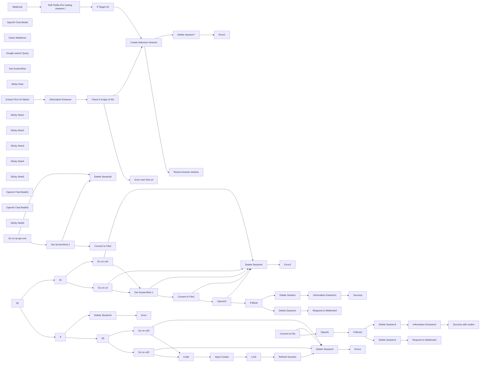

## Fluxo (.json) :

```json
{
  "id": "kZ3aL4r7xc96Q7lp",
  "meta": {
    "instanceId": "b8b2c0d20b02864cf66adc9cbefc86e9e56de0252b653d37ba6613341b5e0bef",
    "templateCredsSetupCompleted": true
  },
  "name": "Selenium Ultimate Scraper Workflow",
  "tags": [],
  "nodes": [
    {
      "id": "20d35d68-db49-4183-a913-85ad06c13912",
      "name": "Extract First Url Match",
      "type": "n8n-nodes-base.html",
      "position": [
        1820,
        540
      ],
      "parameters": {
        "options": {},
        "operation": "extractHtmlContent",
        "extractionValues": {
          "values": [
            {
              "key": "Url Find ",
              "attribute": "href",
              "cssSelector": "=a[href*=\"https://\"][href*=\"{{ $('Edit Fields (For testing prupose )').item.json['Website Domaine'] }}\"]\n",
              "returnArray": true,
              "returnValue": "attribute"
            }
          ]
        }
      },
      "typeVersion": 1.2
    },
    {
      "id": "9167ea20-fc9c-4d75-bf4d-bb2016079dd0",
      "name": "OpenAI Chat Model",
      "type": "@n8n/n8n-nodes-langchain.lmChatOpenAi",
      "position": [
        2060,
        700
      ],
      "parameters": {
        "model": "gpt-4o",
        "options": {}
      },
      "credentials": {
        "openAiApi": {
          "id": "FmszNHDDVS32ud21",
          "name": "OpenAi account"
        }
      },
      "typeVersion": 1
    },
    {
      "id": "42a8646d-1b0b-4309-a87d-9c8aeb355a28",
      "name": "Clean Webdriver ",
      "type": "n8n-nodes-base.httpRequest",
      "notes": "Script to delete traces of selenium in the browser ",
      "position": [
        3120,
        560
      ],
      "parameters": {
        "url": "=http://selenium_chrome:4444/wd/hub/session/{{ $('Create Selenium Session').item.json.value.sessionId }}/execute/sync",
        "method": "POST",
        "options": {},
        "jsonBody": "{\n  \"script\": \"Object.defineProperty(navigator, 'webdriver', { get: () => undefined }); window.navigator.chrome = { runtime: {} }; Object.defineProperty(navigator, 'languages', { get: () => ['en-US', 'en'] }); Object.defineProperty(navigator, 'plugins', { get: () => [1, 2, 3, 4, 5] });\",\n  \"args\": []\n}\n",
        "sendBody": true,
        "specifyBody": "json"
      },
      "notesInFlow": false,
      "typeVersion": 4.2
    },
    {
      "id": "107dd8de-e341-4819-a493-94ed57fd0f33",
      "name": "Delete Session",
      "type": "n8n-nodes-base.httpRequest",
      "position": [
        5180,
        920
      ],
      "parameters": {
        "url": "=http://selenium_chrome:4444/wd/hub/session/{{ $('Create Selenium Session').item.json.value.sessionId }}",
        "method": "DELETE",
        "options": {}
      },
      "typeVersion": 4.2
    },
    {
      "id": "8c7ec6bc-d417-48c2-a6f2-ecce27803671",
      "name": "Delete Session2",
      "type": "n8n-nodes-base.httpRequest",
      "position": [
        6740,
        -160
      ],
      "parameters": {
        "url": "=http://selenium_chrome:4444/wd/hub/session/{{ $('Create Selenium Session').item.json.value.sessionId }}",
        "method": "DELETE",
        "options": {}
      },
      "typeVersion": 4.2
    },
    {
      "id": "e43ecd94-b7f2-4f73-a9fa-b829de9e0296",
      "name": "If Block1",
      "type": "n8n-nodes-base.if",
      "position": [
        6520,
        -20
      ],
      "parameters": {
        "options": {},
        "conditions": {
          "options": {
            "version": 2,
            "leftValue": "",
            "caseSensitive": true,
            "typeValidation": "strict"
          },
          "combinator": "and",
          "conditions": [
            {
              "id": "e6e6e15d-1cfe-48be-8ea0-f112e9781c9d",
              "operator": {
                "name": "filter.operator.equals",
                "type": "string",
                "operation": "equals"
              },
              "leftValue": "={{ $json.content }}",
              "rightValue": "BLOCK"
            }
          ]
        }
      },
      "typeVersion": 2.2
    },
    {
      "id": "08e46f63-41b5-4606-8f2c-df9e96c9c34e",
      "name": "Delete Session3",
      "type": "n8n-nodes-base.httpRequest",
      "position": [
        6740,
        60
      ],
      "parameters": {
        "url": "=http://selenium_chrome:4444/wd/hub/session/{{ $('Create Selenium Session').item.json.value.sessionId }}",
        "method": "DELETE",
        "options": {}
      },
      "typeVersion": 4.2
    },
    {
      "id": "b47d9b22-9a59-4c7a-8cba-9487f18207ee",
      "name": "Limit",
      "type": "n8n-nodes-base.limit",
      "position": [
        5120,
        -100
      ],
      "parameters": {},
      "typeVersion": 1
    },
    {
      "id": "541622f7-562b-4e8a-93e5-61e6e918ff52",
      "name": "Delete Session1",
      "type": "n8n-nodes-base.httpRequest",
      "position": [
        5180,
        720
      ],
      "parameters": {
        "url": "=http://selenium_chrome:4444/wd/hub/session/{{ $('Create Selenium Session').item.json.value.sessionId }}",
        "method": "DELETE",
        "options": {}
      },
      "typeVersion": 4.2
    },
    {
      "id": "825be0d7-9dd3-4a2f-8c3d-fd405f59a5d6",
      "name": "Delete Session4",
      "type": "n8n-nodes-base.httpRequest",
      "onError": "continueRegularOutput",
      "position": [
        5780,
        260
      ],
      "parameters": {
        "url": "=http://selenium_chrome:4444/wd/hub/session/{{ $('Create Selenium Session').item.json.value.sessionId }}",
        "method": "DELETE",
        "options": {}
      },
      "retryOnFail": false,
      "typeVersion": 4.2
    },
    {
      "id": "56f6f4f6-f737-4de8-bdfe-029546909677",
      "name": "Success with cookie",
      "type": "n8n-nodes-base.respondToWebhook",
      "position": [
        7260,
        60
      ],
      "parameters": {
        "options": {
          "responseCode": 200
        }
      },
      "typeVersion": 1.1
    },
    {
      "id": "c6939773-e230-45e1-bf76-d0299c2c7066",
      "name": "Respond to Webhook2",
      "type": "n8n-nodes-base.respondToWebhook",
      "position": [
        6920,
        -160
      ],
      "parameters": {
        "options": {
          "responseCode": 200
        },
        "respondWith": "json",
        "responseBody": "{\n  \"Success \": \"Request has been block by the targeted website\"\n}"
      },
      "typeVersion": 1.1
    },
    {
      "id": "ea921f11-323f-4c79-8cc6-779b39498b05",
      "name": "Code",
      "type": "n8n-nodes-base.code",
      "position": [
        4700,
        -100
      ],
      "parameters": {
        "jsCode": "// Récupère les données du nœud Webhook (en remplaçant \"Webhook\" par le nom du nœud Webhook dans votre workflow)\nconst webhookData = $node[\"Webhook\"].json;\n\n// Fonction pour convertir la valeur de sameSite\nfunction convertSameSite(value) {\n    // Conversion spécifique des valeurs de sameSite\n    const conversionMap = {\n        \"unspecified\": \"None\",\n        \"lax\": \"Lax\",\n        \"strict\": \"Strict\"\n    };\n    \n    // Si la valeur existe dans le tableau de conversion, on la convertit\n    if (value in conversionMap) {\n        return conversionMap[value];\n    }\n    \n    // Si la valeur est déjà une des valeurs acceptées par Selenium\n    const allowedValues = [\"Strict\", \"Lax\", \"None\"];\n    if (allowedValues.includes(value)) {\n        return value;\n    } else {\n        // Si la valeur n'est pas reconnue, on la remplace par \"Lax\" (par défaut)\n        return \"Lax\";\n    }\n}\n\n// Vérifiez et traitez les données des cookies\nif (webhookData.body && webhookData.body.cookies) {\n    let items = [];\n    for (const cookieObject of webhookData.body.cookies) {\n        if (cookieObject.cookie) {\n            // Convertir la valeur de sameSite\n            cookieObject.cookie.sameSite = convertSameSite(cookieObject.cookie.sameSite);\n            \n            // Ajouter le cookie à la liste des items\n            items.push({\n                json: cookieObject.cookie\n            });\n        }\n    }\n    return items;\n}\n\n// Si les cookies ne sont pas trouvés, renvoyer un tableau vide\nreturn [];\n"
      },
      "typeVersion": 2
    },
    {
      "id": "c3d77928-eefc-4903-9b4f-b14bd6f34e3c",
      "name": "Delete Session5",
      "type": "n8n-nodes-base.httpRequest",
      "onError": "continueRegularOutput",
      "position": [
        3940,
        360
      ],
      "parameters": {
        "url": "=http://selenium_chrome:4444/wd/hub/session/{{ $('Create Selenium Session').item.json.value.sessionId }}",
        "method": "DELETE",
        "options": {}
      },
      "retryOnFail": false,
      "typeVersion": 4.2
    },
    {
      "id": "036cfce6-8082-4539-bb0e-980368679fe5",
      "name": "Error",
      "type": "n8n-nodes-base.respondToWebhook",
      "position": [
        4120,
        360
      ],
      "parameters": {
        "options": {
          "responseCode": 404
        },
        "respondWith": "json",
        "responseBody": "{\n  \"Error\": \"Cookies are note for the targeted url\"\n}"
      },
      "typeVersion": 1.1
    },
    {
      "id": "09d6a99b-d8b3-40c9-b74a-14014e3647e2",
      "name": "Error1",
      "type": "n8n-nodes-base.respondToWebhook",
      "position": [
        6000,
        260
      ],
      "parameters": {
        "options": {
          "responseCode": 500
        }
      },
      "typeVersion": 1.1
    },
    {
      "id": "0b1f3442-6b70-405f-b597-642e9c982b82",
      "name": "Error2",
      "type": "n8n-nodes-base.respondToWebhook",
      "position": [
        3060,
        780
      ],
      "parameters": {
        "options": {
          "responseCode": 500
        }
      },
      "typeVersion": 1.1
    },
    {
      "id": "4d0112bb-cbfd-45c6-961a-964bd8f59cac",
      "name": "If",
      "type": "n8n-nodes-base.if",
      "position": [
        3760,
        200
      ],
      "parameters": {
        "options": {},
        "conditions": {
          "options": {
            "version": 2,
            "leftValue": "",
            "caseSensitive": true,
            "typeValidation": "strict"
          },
          "combinator": "and",
          "conditions": [
            {
              "id": "1bffbc80-9913-46e7-a594-ebc26948c83b",
              "operator": {
                "type": "string",
                "operation": "contains"
              },
              "leftValue": "={{ $('Webhook').item.json.body.cookies[0].cookie.domain }}",
              "rightValue": "={{ $('Webhook').item.json.body.Url }}"
            }
          ]
        }
      },
      "typeVersion": 2.2
    },
    {
      "id": "58a50b80-df4c-4b6f-a682-72237f4dbdef",
      "name": "Inject Cookie",
      "type": "n8n-nodes-base.httpRequest",
      "onError": "continueRegularOutput",
      "position": [
        4900,
        -100
      ],
      "parameters": {
        "url": "=http://selenium_chrome:4444/wd/hub/session/{{ $('Create Selenium Session').item.json.value.sessionId }}/cookie",
        "method": "POST",
        "options": {},
        "jsonBody": "={\n  \"cookie\": {\n    \"name\": \"{{ $json.name }}\",\n    \"value\": \"{{ $json.value }}\",\n    \"domain\": \"{{ $json.domain }}\",\n    \"path\": \"{{ $json.path }}\",\n    \"secure\": {{ $json.secure }},\n    \"httpOnly\": {{ $json.httpOnly }},\n    \"sameSite\": \"{{ $json.sameSite }}\",\n    \"expirationDate\": {{ $json.expirationDate }}\n  }\n}",
        "sendBody": true,
        "specifyBody": "json"
      },
      "typeVersion": 4.2
    },
    {
      "id": "39f7401b-b6b7-4f0c-9afc-8f144d394350",
      "name": "Respond to Webhook3",
      "type": "n8n-nodes-base.respondToWebhook",
      "position": [
        5400,
        720
      ],
      "parameters": {
        "options": {
          "responseCode": 200
        },
        "respondWith": "json",
        "responseBody": "{\n  \"Success \": \"Request has been block by the targeted website\"\n}"
      },
      "typeVersion": 1.1
    },
    {
      "id": "80b107cc-2f6c-46f0-a597-e85594634492",
      "name": "Success",
      "type": "n8n-nodes-base.respondToWebhook",
      "position": [
        5740,
        920
      ],
      "parameters": {
        "options": {
          "responseKey": "={{ $json.output }}",
          "responseCode": 200
        }
      },
      "typeVersion": 1.1
    },
    {
      "id": "94a97354-07d9-428e-989c-ef066f9b4d8a",
      "name": "Go on url",
      "type": "n8n-nodes-base.httpRequest",
      "onError": "continueErrorOutput",
      "position": [
        3900,
        780
      ],
      "parameters": {
        "url": "=http://selenium_chrome:4444/wd/hub/session/{{ $('Create Selenium Session').item.json.value.sessionId }}/url",
        "method": "POST",
        "options": {},
        "jsonBody": "={\n  \"url\": \"{{ $('Webhook').item.json.body['Target Url'] }}\"\n}\n",
        "sendBody": true,
        "specifyBody": "json"
      },
      "retryOnFail": true,
      "typeVersion": 4.2
    },
    {
      "id": "fd044cf3-594d-48af-bbd1-f2d9adedcbc1",
      "name": "Delete Session6",
      "type": "n8n-nodes-base.httpRequest",
      "onError": "continueRegularOutput",
      "position": [
        4360,
        1200
      ],
      "parameters": {
        "url": "=http://selenium_chrome:4444/wd/hub/session/{{ $('Create Selenium Session').item.json.value.sessionId }}",
        "method": "DELETE",
        "options": {}
      },
      "retryOnFail": false,
      "typeVersion": 4.2
    },
    {
      "id": "7c28c3b6-1141-4609-8774-cb6b4d842b97",
      "name": "Error3",
      "type": "n8n-nodes-base.respondToWebhook",
      "position": [
        4520,
        1200
      ],
      "parameters": {
        "options": {
          "responseCode": 500
        },
        "respondWith": "json",
        "responseBody": "{\n  \"Error\": \"Page crash on the extracted url\"\n}"
      },
      "typeVersion": 1.1
    },
    {
      "id": "52f78923-156f-4861-88ba-f0253c483bd9",
      "name": "Information Extractor",
      "type": "@n8n/n8n-nodes-langchain.informationExtractor",
      "position": [
        2040,
        540
      ],
      "parameters": {
        "text": "={{ $json['Url Find '][1] }}{{ $json['Url Find '][2] }}{{ $json['Url Find '][3] }}",
        "options": {
          "systemPromptTemplate": "=You are an expert extraction algorithm.\nOnly extract relevant url from the unstructured urls array.\nA relevant url is a url whre you can find relevant information about this subject : {{ $('Edit Fields (For testing prupose )').item.json.Subject }}, on this domaine name : {{ $('Edit Fields (For testing prupose )').item.json['Website Domaine'] }}.\nIf you do not know the value of an attribute asked to extract, you need \\ attribute's value as NA."
        },
        "attributes": {
          "attributes": [
            {
              "name": "Good_url_for_etract_information",
              "required": true,
              "description": "=The url where I can extract relevant infroamtion on this subject : {{ $('Edit Fields (For testing prupose )').item.json.Subject }} on this domaine name : {{ $('Edit Fields (For testing prupose )').item.json['Website Domaine'] }}"
            }
          ]
        }
      },
      "typeVersion": 1
    },
    {
      "id": "6ac249e2-a9d8-4590-b050-3a0a2472fa3c",
      "name": "Check if empty of NA",
      "type": "n8n-nodes-base.if",
      "position": [
        2440,
        540
      ],
      "parameters": {
        "options": {},
        "conditions": {
          "options": {
            "version": 2,
            "leftValue": "",
            "caseSensitive": true,
            "typeValidation": "strict"
          },
          "combinator": "or",
          "conditions": [
            {
              "id": "9470fb6c-e367-4af7-a697-275e724fe771",
              "operator": {
                "type": "string",
                "operation": "empty",
                "singleValue": true
              },
              "leftValue": "={{ $json.output.Good_url_for_etract_information }}",
              "rightValue": ""
            },
            {
              "id": "8518e9a9-5b0c-4699-97c5-d9b7b1943918",
              "operator": {
                "name": "filter.operator.equals",
                "type": "string",
                "operation": "equals"
              },
              "leftValue": "={{ $json.output.Good_url_for_etract_information }}",
              "rightValue": "NA"
            }
          ]
        }
      },
      "typeVersion": 2.2
    },
    {
      "id": "f380eff7-3d18-4791-9dac-8a88d3fdcc4f",
      "name": "If Block",
      "type": "n8n-nodes-base.if",
      "position": [
        4960,
        840
      ],
      "parameters": {
        "options": {},
        "conditions": {
          "options": {
            "version": 2,
            "leftValue": "",
            "caseSensitive": true,
            "typeValidation": "strict"
          },
          "combinator": "and",
          "conditions": [
            {
              "id": "e6e6e15d-1cfe-48be-8ea0-f112e9781c9d",
              "operator": {
                "type": "string",
                "operation": "contains"
              },
              "leftValue": "={{ $json.content }}",
              "rightValue": "BLOCK"
            }
          ]
        }
      },
      "typeVersion": 2.2
    },
    {
      "id": "43382397-89b5-4b90-9016-49109ec04baf",
      "name": "Google search Query ",
      "type": "n8n-nodes-base.httpRequest",
      "position": [
        1600,
        540
      ],
      "parameters": {
        "url": "=https://www.google.com/search?q=site:{{ $json['Website Domaine'] }}+{{$json.Subject}}&oq=site&gs_lcrp=EgZjaHJvbWUqCAgAEEUYJxg7MggIABBFGCcYOzIICAEQRRgnGDsyBggCEEUYOzIRCAMQRRg5GEMYyQMYgAQYigUyBggEEEUYQDIGCAUQRRg9MgYIBhBFGD0yBggHEEUYPdIBCDEwNTRqMGo3qAIAsAIA&sourceid=chrome&ie=UTF-8",
        "options": {}
      },
      "typeVersion": 4.2
    },
    {
      "id": "d34256af-1b43-4f64-853c-cf063b8c6b68",
      "name": "Create Selenium Session",
      "type": "n8n-nodes-base.httpRequest",
      "onError": "continueErrorOutput",
      "position": [
        2680,
        640
      ],
      "parameters": {
        "url": "http://selenium_chrome:4444/wd/hub/session",
        "method": "POST",
        "options": {
          "timeout": 5000
        },
        "jsonBody": "{\n  \"capabilities\": {\n    \"alwaysMatch\": {\n      \"browserName\": \"chrome\",\n      \"goog:chromeOptions\": {\n        \"args\": [  \n          \"--disable-blink-features=AutomationControlled\",\n          \"--user-agent=Mozilla/5.0 (Windows NT 10.0; Win64; x64) AppleWebKit/537.36 (KHTML, like Gecko) Chrome/58.0.3029.110 Safari/537.3\"\n        ]\n      }\n    }\n  }\n}\n",
        "sendBody": true,
        "specifyBody": "json"
      },
      "retryOnFail": true,
      "typeVersion": 4.2
    },
    {
      "id": "4f0f696c-9637-4c7d-82ae-1f5c36bb9cd1",
      "name": "Get ScreenShot 1",
      "type": "n8n-nodes-base.httpRequest",
      "onError": "continueErrorOutput",
      "position": [
        4420,
        840
      ],
      "parameters": {
        "url": "=http://selenium_chrome:4444/wd/hub/session/{{ $('Create Selenium Session').item.json.value.sessionId }}/screenshot",
        "options": {}
      },
      "typeVersion": 4.2
    },
    {
      "id": "ba72c0cf-217a-4411-80f6-ca28ccdb0151",
      "name": "Refresh browser",
      "type": "n8n-nodes-base.httpRequest",
      "onError": "continueErrorOutput",
      "position": [
        5320,
        -100
      ],
      "parameters": {
        "url": "=http:///selenium_chrome:4444/wd/hub/session/{{ $('Create Selenium Session').item.json.value.sessionId }}/refresh",
        "method": "POST",
        "options": {},
        "jsonBody": "{}",
        "sendBody": true,
        "specifyBody": "json"
      },
      "typeVersion": 4.2
    },
    {
      "id": "b6ba7068-399a-467d-ba58-7f47d650e2f1",
      "name": "Get ScreenShot ",
      "type": "n8n-nodes-base.httpRequest",
      "onError": "continueErrorOutput",
      "position": [
        5880,
        -20
      ],
      "parameters": {
        "url": "=http://selenium_chrome:4444/wd/hub/session/{{ $('Create Selenium Session').item.json.value.sessionId }}/screenshot",
        "options": {}
      },
      "typeVersion": 4.2
    },
    {
      "id": "792649be-0ee2-442f-bc21-d0c297cea227",
      "name": "Convert to File",
      "type": "n8n-nodes-base.convertToFile",
      "onError": "continueErrorOutput",
      "position": [
        6160,
        -20
      ],
      "parameters": {
        "options": {},
        "operation": "toBinary",
        "sourceProperty": "value"
      },
      "typeVersion": 1.1
    },
    {
      "id": "49e58759-bedf-4f38-a96c-bd18e67b8aaf",
      "name": "Convert to File1",
      "type": "n8n-nodes-base.convertToFile",
      "onError": "continueErrorOutput",
      "position": [
        4600,
        840
      ],
      "parameters": {
        "options": {},
        "operation": "toBinary",
        "sourceProperty": "value"
      },
      "typeVersion": 1.1
    },
    {
      "id": "3735f5f5-665e-4649-b1c2-84a4a8699f70",
      "name": "Delete Session7",
      "type": "n8n-nodes-base.httpRequest",
      "onError": "continueRegularOutput",
      "position": [
        2920,
        780
      ],
      "parameters": {
        "url": "=http://selenium_chrome:4444/wd/hub/session/{{ $('Create Selenium Session').item.json.value.sessionId }}",
        "method": "DELETE",
        "options": {}
      },
      "retryOnFail": false,
      "typeVersion": 4.2
    },
    {
      "id": "1b8b1e0c-f465-4963-869c-0e7086922151",
      "name": "Sticky Note",
      "type": "n8n-nodes-base.stickyNote",
      "position": [
        920,
        -1023.3944834469928
      ],
      "parameters": {
        "color": 4,
        "width": 851.2111300888805,
        "height": 1333.3079943516484,
        "content": "## N8N Ultimate Scraper - Workflow\n\nThis workflow's objective is to collect data from any website page, whether it requires login or not.\n\nFor example, you can collect the number of stars of the n8n-ultimate-scraper project on GitHub.\n\n## Requirements\n**Selenium Container**: Selenium is an open-source automation framework for web applications, enabling browser control and interaction through scripts in various programming languages.\nYou can deploy the Docker Compose file from the associated GitHub project to set up your Selenium container and configuration: https://github.com/Touxan/n8n-ultimate-scraper\n\n**Residential Proxy Server**: To scrape data at scale without being blocked, I personally recommend GeoNode. They offer affordable, high-quality residential proxies: https://geonode.com/invite/98895\n\n**OpenAI API Key**: For using GPT-4.\n\n## Optional\nSession Cookies Collection: To use login functionality with the n8n Ultimate Scraper, you need to collect session cookies from the target website. You can do this using the extension created for this application in the GitHub project: https://github.com/Touxan/n8n-ultimate-scraper. Follow the installation procedure to use it.\n\n## How to use \nDeploy the project with all the requiremnts and request your webhook.\n\n**Example of request**:\ncurl -X POST http://localhost:5678/webhook-test/yourwebhookid \\\n-H \"Content-Type: application/json\" \\\n-d '{\n  \"subject\": \"Hugging Face\",\n  \"Url\": \"github.com\",\n  \"Target data\": [\n    {\n      \"DataName\": \"Followers\",\n      \"description\": \"The number of followers of the GitHub page\"\n    },\n    {\n      \"DataName\": \"Total Stars\",\n      \"description\": \"The total numbers of stars on the different repos\"\n    }\n  ],\n  \"cookies\": []\n}'\n\nYou can also scrape link like this : \ncurl -X POST http://localhost:5678/webhook-test/67d77918-2d5b-48c1-ae73-2004b32125f0 \\\n-H \"Content-Type: application/json\" \\\n-d '{\n  \"Target Url\": \"https://github.com\",\n  \"Target data\": [\n    {\n      \"DataName\": \"Followers\",\n      \"description\": \"The number of followers of the GitHub page\"\n    },\n    {\n      \"DataName\": \"Total Stars\",\n      \"description\": \"The total numbers of stars on the different repo\"\n    }\n]\n}'\n\n**Note**\nThe maximum nimber of Target data is 5."
      },
      "typeVersion": 1
    },
    {
      "id": "4d743518-4fcb-4e9f-aff7-a8959a78ccaf",
      "name": "Edit Fields (For testing prupose )",
      "type": "n8n-nodes-base.set",
      "position": [
        1160,
        540
      ],
      "parameters": {
        "options": {},
        "assignments": {
          "assignments": [
            {
              "id": "3895040f-0a21-47ee-a73f-d3c7fd6edf36",
              "name": "Subject",
              "type": "string",
              "value": "={{ $json.body.subject }}"
            },
            {
              "id": "304e4240-513f-4c87-ae9d-4efda7d0c4ab",
              "name": "Website Domaine",
              "type": "string",
              "value": "={{ $json.body.Url }}"
            }
          ]
        }
      },
      "typeVersion": 3.4
    },
    {
      "id": "62b0a416-71a2-4d2b-83f9-8c5465c72006",
      "name": "Get ScreenShot 2",
      "type": "n8n-nodes-base.httpRequest",
      "onError": "continueErrorOutput",
      "position": [
        6200,
        851
      ],
      "parameters": {
        "url": "=http://selenium_chrome:4444/wd/hub/session/{{ $('Create Selenium Session').item.json.value.sessionId }}/screenshot",
        "options": {}
      },
      "typeVersion": 4.2
    },
    {
      "id": "6a5b1a08-c47a-435e-8e0b-648cb8282a90",
      "name": "Convert to File2",
      "type": "n8n-nodes-base.convertToFile",
      "onError": "continueErrorOutput",
      "position": [
        6440,
        851
      ],
      "parameters": {
        "options": {},
        "operation": "toBinary",
        "sourceProperty": "value"
      },
      "typeVersion": 1.1
    },
    {
      "id": "a2aa5d45-5f41-41f7-a8ee-07c145b73d89",
      "name": "Go on ip-api.com",
      "type": "n8n-nodes-base.httpRequest",
      "onError": "continueErrorOutput",
      "position": [
        5960,
        851
      ],
      "parameters": {
        "url": "=http://selenium_chrome:4444/wd/hub/session/{{ $('Create Selenium Session').item.json.value.sessionId }}/url",
        "method": "POST",
        "options": {},
        "jsonBody": "={\n  \"url\": \"https://ip-api.com/\"\n}\n",
        "sendBody": true,
        "specifyBody": "json"
      },
      "retryOnFail": true,
      "typeVersion": 4.2
    },
    {
      "id": "8ddde1d2-0b09-45ca-88ef-db24352b095e",
      "name": "Delete Session8",
      "type": "n8n-nodes-base.httpRequest",
      "onError": "continueRegularOutput",
      "position": [
        6440,
        1071
      ],
      "parameters": {
        "url": "=http://selenium_chrome:4444/wd/hub/session/{{ $('Create Selenium Session').item.json.value.sessionId }}",
        "method": "DELETE",
        "options": {}
      },
      "retryOnFail": false,
      "typeVersion": 4.2
    },
    {
      "id": "78ffd8e1-b4b8-444c-8a7d-410172d3a7f8",
      "name": "Sticky Note1",
      "type": "n8n-nodes-base.stickyNote",
      "position": [
        5920,
        727
      ],
      "parameters": {
        "color": 6,
        "width": 784.9798841202522,
        "height": 520.0741248156677,
        "content": "## Debug IP\n\nThis small debug flow aims to check the IP you're requesting with, in case you're using a proxy"
      },
      "typeVersion": 1
    },
    {
      "id": "be5de434-5f07-40bc-a1e6-aece9ad211b4",
      "name": "Sticky Note2",
      "type": "n8n-nodes-base.stickyNote",
      "position": [
        1580,
        420
      ],
      "parameters": {
        "width": 751.8596006980003,
        "height": 430.433007240277,
        "content": "## Search\n\n**Description** :\nThis part aims to search on Google for the subject and find the URL of the subject page based on the input URL."
      },
      "typeVersion": 1
    },
    {
      "id": "ffbb3c92-245b-4635-9adf-17d24f236bff",
      "name": "Error can't find url",
      "type": "n8n-nodes-base.respondToWebhook",
      "position": [
        2800,
        280
      ],
      "parameters": {
        "options": {
          "responseCode": 404
        },
        "respondWith": "json",
        "responseBody": "{\n  \"Error\": \"Can't find url\"\n}"
      },
      "typeVersion": 1.1
    },
    {
      "id": "088ad72c-907a-409a-9fa4-00a16d396e1b",
      "name": "Sticky Note3",
      "type": "n8n-nodes-base.stickyNote",
      "position": [
        2420,
        420
      ],
      "parameters": {
        "width": 827.9448220213314,
        "height": 502.0185388323068,
        "content": "## Selenium Session\n\n**Description**:\nCreation and configuration of the Selenium session."
      },
      "typeVersion": 1
    },
    {
      "id": "00b8bf19-b34e-42ed-bb2a-3fbfa5f02a25",
      "name": "Resize browser window",
      "type": "n8n-nodes-base.httpRequest",
      "position": [
        2920,
        560
      ],
      "parameters": {
        "url": "=http://selenium_chrome:4444/wd/hub/session/{{ $json.value.sessionId }}/window/rect",
        "method": "POST",
        "options": {},
        "jsonBody": "{\n  \"width\": 1920,\n  \"height\": 1080,\n  \"x\": 0,\n  \"y\": 0\n}\n",
        "sendBody": true,
        "specifyBody": "json"
      },
      "typeVersion": 4.2
    },
    {
      "id": "007354a1-3f00-4ae9-ab53-54ded5eed563",
      "name": "Sticky Note4",
      "type": "n8n-nodes-base.stickyNote",
      "position": [
        3500,
        -300
      ],
      "parameters": {
        "width": 3939.555135735299,
        "height": 821.0847869745435,
        "content": "## Scrape with cookies session\n\n**Description**\nThis part goes to the extracted URL, injects the cookies passed into the webhook, takes a screenshot of the webpage, and analyzes the image with GPT to extract the targeted data."
      },
      "typeVersion": 1
    },
    {
      "id": "5ab44e1b-6878-4af5-bfd8-1f1e5cbee3a7",
      "name": "Sticky Note5",
      "type": "n8n-nodes-base.stickyNote",
      "position": [
        3500,
        580
      ],
      "parameters": {
        "width": 3336.952424000919,
        "height": 821.0847869745435,
        "content": "## Scrape without cookies session\n\n**Description**\nSame as the 'Scrape with cookies session' flow, but without the cookie injection"
      },
      "typeVersion": 1
    },
    {
      "id": "4fc7e290-0c60-4efe-ac3f-eb71ce5e457b",
      "name": "OpenAI",
      "type": "@n8n/n8n-nodes-langchain.openAi",
      "position": [
        6340,
        -20
      ],
      "parameters": {
        "text": "=Analyse this image and extract revlant infromation about this subject : {{ $('Webhook').item.json.body.subject }}. \n\nIf the webpage seem block by waf, or don't have any relant information about the subject reurn BLOCK with out any aditinonal information.",
        "modelId": {
          "__rl": true,
          "mode": "list",
          "value": "gpt-4o",
          "cachedResultName": "GPT-4O"
        },
        "options": {
          "detail": "auto",
          "maxTokens": 300
        },
        "resource": "image",
        "inputType": "base64",
        "operation": "analyze"
      },
      "credentials": {
        "openAiApi": {
          "id": "FmszNHDDVS32ud21",
          "name": "OpenAi account"
        }
      },
      "typeVersion": 1.5
    },
    {
      "id": "b039ed2a-94da-4a37-b794-7fb1721a8ab3",
      "name": "OpenAI1",
      "type": "@n8n/n8n-nodes-langchain.openAi",
      "onError": "continueErrorOutput",
      "position": [
        4780,
        840
      ],
      "parameters": {
        "text": "=Analyse this image and extract revlant infromation about this subject : {{ $('Webhook').item.json.body.subject }}. \n\nIf the webpage seem block by waf, or don't have any relant information about the subject reurn BLOCK with out any aditinonal information.",
        "modelId": {
          "__rl": true,
          "mode": "list",
          "value": "gpt-4o",
          "cachedResultName": "GPT-4O"
        },
        "options": {
          "detail": "auto",
          "maxTokens": 300
        },
        "resource": "image",
        "inputType": "base64",
        "operation": "analyze"
      },
      "credentials": {
        "openAiApi": {
          "id": "FmszNHDDVS32ud21",
          "name": "OpenAi account"
        }
      },
      "typeVersion": 1.5
    },
    {
      "id": "c69364ce-c7e3-4f7a-ae0c-bad97643da30",
      "name": "Information Extractor1",
      "type": "@n8n/n8n-nodes-langchain.informationExtractor",
      "position": [
        5400,
        920
      ],
      "parameters": {
        "text": "={{ $('OpenAI1').item.json.content }}",
        "options": {
          "systemPromptTemplate": "You are an expert extraction algorithm.\nOnly extract relevant information from the text.\nIf you do not know the value of an attribute asked to extract, set the attribute's value to NA."
        },
        "attributes": {
          "attributes": [
            {
              "name": "={{ $('Webhook').item.json.body['Target data'][0].DataName }}",
              "description": "={{ $('Webhook').item.json.body['Target data'][0].description }}"
            },
            {
              "name": "={{ $('Webhook').item.json.body['Target data'][1].DataName }}",
              "description": "=The total number of stars on all project"
            },
            {
              "name": "={{ $('Webhook').item.json.body['Target data'][2].DataName }}",
              "description": "={{ $('Webhook').item.json.body['Target data'][2].description }}"
            },
            {
              "name": "={{ $('Webhook').item.json.body['Target data'][3].DataName }}",
              "description": "={{ $('Webhook').item.json.body['Target data'][3].description }}"
            },
            {
              "name": "={{ $('Webhook').item.json.body['Target data'][4].DataName }}",
              "description": "={{ $('Webhook').item.json.body['Target data'][4].description }}"
            }
          ]
        }
      },
      "typeVersion": 1
    },
    {
      "id": "0e756adb-a6ba-421f-9d21-374e7fa74781",
      "name": "OpenAI Chat Model1",
      "type": "@n8n/n8n-nodes-langchain.lmChatOpenAi",
      "position": [
        5400,
        1140
      ],
      "parameters": {
        "model": "gpt-4o-mini",
        "options": {}
      },
      "credentials": {
        "openAiApi": {
          "id": "FmszNHDDVS32ud21",
          "name": "OpenAi account"
        }
      },
      "typeVersion": 1
    },
    {
      "id": "920e9315-7de4-4a23-adbe-36338ea18097",
      "name": "Information Extractor2",
      "type": "@n8n/n8n-nodes-langchain.informationExtractor",
      "position": [
        6920,
        60
      ],
      "parameters": {
        "text": "={{ $('OpenAI').item.json.content }}",
        "options": {
          "systemPromptTemplate": "You are an expert extraction algorithm.\nOnly extract relevant information from the text.\nIf you do not know the value of an attribute asked to extract, set the attribute's value to NA. If the attribute is empty you can omit it."
        },
        "attributes": {
          "attributes": [
            {
              "name": "={{ $('Webhook').item.json.body['Target data'][0].DataName }}",
              "description": "={{ $('Webhook').item.json.body['Target data'][0].description }}"
            },
            {
              "name": "={{ $('Webhook').item.json.body['Target data'][1].DataName }}",
              "description": "=The total number of stars on all project"
            },
            {
              "name": "={{ $('Webhook').item.json.body['Target data'][2].DataName }}",
              "description": "={{ $('Webhook').item.json.body['Target data'][2].description }}"
            },
            {
              "name": "={{ $('Webhook').item.json.body['Target data'][3].DataName }}",
              "description": "={{ $('Webhook').item.json.body['Target data'][3].description }}"
            },
            {
              "name": "={{ $('Webhook').item.json.body['Target data'][4].DataName }}",
              "description": "={{ $('Webhook').item.json.body['Target data'][4].description }}"
            }
          ]
        }
      },
      "typeVersion": 1
    },
    {
      "id": "aa98d16e-d20c-4a8f-8eaf-1f64751dd8ea",
      "name": "OpenAI Chat Model2",
      "type": "@n8n/n8n-nodes-langchain.lmChatOpenAi",
      "position": [
        6940,
        220
      ],
      "parameters": {
        "model": "gpt-4o-mini",
        "options": {}
      },
      "credentials": {
        "openAiApi": {
          "id": "FmszNHDDVS32ud21",
          "name": "OpenAi account"
        }
      },
      "typeVersion": 1
    },
    {
      "id": "ba41b87e-feb7-4753-95b3-d569d54d8756",
      "name": "Sticky Note6",
      "type": "n8n-nodes-base.stickyNote",
      "position": [
        1820,
        -680
      ],
      "parameters": {
        "color": 3,
        "width": 813.0685668942513,
        "height": 507.4126722815008,
        "content": "## Proxy\n\n**Configuration**\n\nTo configure your proxy with the project, follow the instructions on the GitHub project: https://github.com/Touxan/n8n-ultimate-scraper. To configure the docker-compose, you also need to add this argument to the 'Create Selenium Session' node : --proxy-server=address:port.\n\n### ⚠️Warning⚠️\n Selenium does not support proxy authentication, so you need to add your server IP to the proxy whitelist. On GeoNode, it's here: https://app.geonode.com/whitelist-ip!"
      },
      "typeVersion": 1
    },
    {
      "id": "194bbecc-a5b3-4c5f-a17f-94703a44f196",
      "name": "Webhook",
      "type": "n8n-nodes-base.webhook",
      "position": [
        940,
        540
      ],
      "webhookId": "67d77918-2d5b-48c1-ae73-2004b32125f0",
      "parameters": {
        "path": "67d77918-2d5b-48c1-ae73-2004b32125f0",
        "options": {},
        "httpMethod": "POST",
        "responseMode": "responseNode"
      },
      "typeVersion": 2
    },
    {
      "id": "513389b0-0930-48d8-8cbb-e3575a0276ae",
      "name": "If Target Url",
      "type": "n8n-nodes-base.if",
      "position": [
        1380,
        620
      ],
      "parameters": {
        "options": {},
        "conditions": {
          "options": {
            "version": 2,
            "leftValue": "",
            "caseSensitive": true,
            "typeValidation": "strict"
          },
          "combinator": "and",
          "conditions": [
            {
              "id": "4b608dcd-a175-4019-82c2-560320a2abce",
              "operator": {
                "type": "string",
                "operation": "empty",
                "singleValue": true
              },
              "leftValue": "={{ $('Webhook').item.json.body['Target Url'] }}",
              "rightValue": ""
            }
          ]
        }
      },
      "typeVersion": 2.2
    },
    {
      "id": "4ca0aee7-0dd2-4c78-b99b-8c188a3917f4",
      "name": "If1",
      "type": "n8n-nodes-base.if",
      "position": [
        3700,
        900
      ],
      "parameters": {
        "options": {},
        "conditions": {
          "options": {
            "version": 2,
            "leftValue": "",
            "caseSensitive": true,
            "typeValidation": "strict"
          },
          "combinator": "and",
          "conditions": [
            {
              "id": "ff919945-b8c2-492a-b496-8617e9147389",
              "operator": {
                "type": "string",
                "operation": "notEmpty",
                "singleValue": true
              },
              "leftValue": "={{ $('Webhook').item.json.body['Target Url'] }}",
              "rightValue": ""
            }
          ]
        }
      },
      "typeVersion": 2.2
    },
    {
      "id": "baa4dc94-67f3-4683-b8c7-6b6e856e7c64",
      "name": "Go on url1",
      "type": "n8n-nodes-base.httpRequest",
      "onError": "continueErrorOutput",
      "position": [
        3900,
        960
      ],
      "parameters": {
        "url": "=http://selenium_chrome:4444/wd/hub/session/{{ $('Create Selenium Session').item.json.value.sessionId }}/url",
        "method": "POST",
        "options": {},
        "jsonBody": "={\n  \"url\": \"{{ $('Information Extractor').item.json.output.Good_url_for_etract_information }}\"\n}\n",
        "sendBody": true,
        "specifyBody": "json"
      },
      "retryOnFail": true,
      "typeVersion": 4.2
    },
    {
      "id": "2c439b0e-7c78-4ae8-b653-3f02b3834aa8",
      "name": "If2",
      "type": "n8n-nodes-base.if",
      "position": [
        3340,
        560
      ],
      "parameters": {
        "options": {},
        "conditions": {
          "options": {
            "version": 2,
            "leftValue": "",
            "caseSensitive": true,
            "typeValidation": "loose"
          },
          "combinator": "and",
          "conditions": [
            {
              "id": "2a1bfc1e-28a6-45d1-9581-53b632af90e0",
              "operator": {
                "type": "string",
                "operation": "notEmpty",
                "singleValue": true
              },
              "leftValue": "={{ $('Webhook').item.json.body.cookies }}",
              "rightValue": ""
            }
          ]
        },
        "looseTypeValidation": true
      },
      "typeVersion": 2.2
    },
    {
      "id": "fc3260da-9131-4850-a581-55a27ce4428d",
      "name": "Go on url2",
      "type": "n8n-nodes-base.httpRequest",
      "onError": "continueErrorOutput",
      "position": [
        4260,
        -20
      ],
      "parameters": {
        "url": "=http://selenium_chrome:4444/wd/hub/session/{{ $('Create Selenium Session').item.json.value.sessionId }}/url",
        "method": "POST",
        "options": {},
        "jsonBody": "={\n  \"url\": \"{{ $('Webhook').item.json.body['Target Url'] }}\"\n}\n",
        "sendBody": true,
        "specifyBody": "json"
      },
      "retryOnFail": true,
      "typeVersion": 4.2
    },
    {
      "id": "fe345010-1fa3-4d2c-8bc2-e87f6aeeb0d9",
      "name": "If3",
      "type": "n8n-nodes-base.if",
      "position": [
        4060,
        100
      ],
      "parameters": {
        "options": {},
        "conditions": {
          "options": {
            "version": 2,
            "leftValue": "",
            "caseSensitive": true,
            "typeValidation": "strict"
          },
          "combinator": "and",
          "conditions": [
            {
              "id": "ff919945-b8c2-492a-b496-8617e9147389",
              "operator": {
                "type": "string",
                "operation": "notEmpty",
                "singleValue": true
              },
              "leftValue": "={{ $('Webhook').item.json.body['Target Url'] }}",
              "rightValue": ""
            }
          ]
        }
      },
      "typeVersion": 2.2
    },
    {
      "id": "1aae02ec-3a22-4dd5-aea4-819758f130c1",
      "name": "Go on url3",
      "type": "n8n-nodes-base.httpRequest",
      "onError": "continueErrorOutput",
      "position": [
        4260,
        160
      ],
      "parameters": {
        "url": "=http://selenium_chrome:4444/wd/hub/session/{{ $('Create Selenium Session').item.json.value.sessionId }}/url",
        "method": "POST",
        "options": {},
        "jsonBody": "={\n  \"url\": \"{{ $('Information Extractor').item.json.output.Good_url_for_etract_information }}\"\n}\n",
        "sendBody": true,
        "specifyBody": "json"
      },
      "retryOnFail": true,
      "typeVersion": 4.2
    }
  ],
  "active": true,
  "pinData": {},
  "settings": {
    "executionOrder": "v1"
  },
  "versionId": "e0ae7ac4-4be7-4b9c-9247-1475ffd297b1",
  "connections": {
    "If": {
      "main": [
        [
          {
            "node": "If3",
            "type": "main",
            "index": 0
          }
        ],
        [
          {
            "node": "Delete Session5",
            "type": "main",
            "index": 0
          }
        ]
      ]
    },
    "If1": {
      "main": [
        [
          {
            "node": "Go on url",
            "type": "main",
            "index": 0
          }
        ],
        [
          {
            "node": "Go on url1",
            "type": "main",
            "index": 0
          }
        ]
      ]
    },
    "If2": {
      "main": [
        [
          {
            "node": "If",
            "type": "main",
            "index": 0
          }
        ],
        [
          {
            "node": "If1",
            "type": "main",
            "index": 0
          }
        ]
      ]
    },
    "If3": {
      "main": [
        [
          {
            "node": "Go on url2",
            "type": "main",
            "index": 0
          }
        ],
        [
          {
            "node": "Go on url3",
            "type": "main",
            "index": 0
          }
        ]
      ]
    },
    "Code": {
      "main": [
        [
          {
            "node": "Inject Cookie",
            "type": "main",
            "index": 0
          }
        ]
      ]
    },
    "Limit": {
      "main": [
        [
          {
            "node": "Refresh browser",
            "type": "main",
            "index": 0
          }
        ]
      ]
    },
    "OpenAI": {
      "main": [
        [
          {
            "node": "If Block1",
            "type": "main",
            "index": 0
          }
        ]
      ]
    },
    "OpenAI1": {
      "main": [
        [
          {
            "node": "If Block",
            "type": "main",
            "index": 0
          }
        ],
        [
          {
            "node": "Delete Session6",
            "type": "main",
            "index": 0
          }
        ]
      ]
    },
    "Webhook": {
      "main": [
        [
          {
            "node": "Edit Fields (For testing prupose )",
            "type": "main",
            "index": 0
          }
        ]
      ]
    },
    "If Block": {
      "main": [
        [
          {
            "node": "Delete Session1",
            "type": "main",
            "index": 0
          }
        ],
        [
          {
            "node": "Delete Session",
            "type": "main",
            "index": 0
          }
        ]
      ]
    },
    "Go on url": {
      "main": [
        [
          {
            "node": "Get ScreenShot 1",
            "type": "main",
            "index": 0
          }
        ],
        [
          {
            "node": "Delete Session6",
            "type": "main",
            "index": 0
          }
        ]
      ]
    },
    "If Block1": {
      "main": [
        [
          {
            "node": "Delete Session2",
            "type": "main",
            "index": 0
          }
        ],
        [
          {
            "node": "Delete Session3",
            "type": "main",
            "index": 0
          }
        ]
      ]
    },
    "Go on url1": {
      "main": [
        [
          {
            "node": "Get ScreenShot 1",
            "type": "main",
            "index": 0
          }
        ],
        [
          {
            "node": "Delete Session6",
            "type": "main",
            "index": 0
          }
        ]
      ]
    },
    "Go on url2": {
      "main": [
        [
          {
            "node": "Code",
            "type": "main",
            "index": 0
          }
        ],
        [
          {
            "node": "Delete Session4",
            "type": "main",
            "index": 0
          }
        ]
      ]
    },
    "Go on url3": {
      "main": [
        [
          {
            "node": "Code",
            "type": "main",
            "index": 0
          }
        ],
        [
          {
            "node": "Delete Session4",
            "type": "main",
            "index": 0
          }
        ]
      ]
    },
    "If Target Url": {
      "main": [
        [
          {
            "node": "Google search Query ",
            "type": "main",
            "index": 0
          }
        ],
        [
          {
            "node": "Create Selenium Session",
            "type": "main",
            "index": 0
          }
        ]
      ]
    },
    "Inject Cookie": {
      "main": [
        [
          {
            "node": "Limit",
            "type": "main",
            "index": 0
          }
        ]
      ]
    },
    "Delete Session": {
      "main": [
        [
          {
            "node": "Information Extractor1",
            "type": "main",
            "index": 0
          }
        ]
      ]
    },
    "Convert to File": {
      "main": [
        [
          {
            "node": "OpenAI",
            "type": "main",
            "index": 0
          }
        ],
        [
          {
            "node": "Delete Session4",
            "type": "main",
            "index": 0
          }
        ]
      ]
    },
    "Delete Session1": {
      "main": [
        [
          {
            "node": "Respond to Webhook3",
            "type": "main",
            "index": 0
          }
        ]
      ]
    },
    "Delete Session2": {
      "main": [
        [
          {
            "node": "Respond to Webhook2",
            "type": "main",
            "index": 0
          }
        ]
      ]
    },
    "Delete Session3": {
      "main": [
        [
          {
            "node": "Information Extractor2",
            "type": "main",
            "index": 0
          }
        ]
      ]
    },
    "Delete Session4": {
      "main": [
        [
          {
            "node": "Error1",
            "type": "main",
            "index": 0
          }
        ]
      ]
    },
    "Delete Session5": {
      "main": [
        [
          {
            "node": "Error",
            "type": "main",
            "index": 0
          }
        ]
      ]
    },
    "Delete Session6": {
      "main": [
        [
          {
            "node": "Error3",
            "type": "main",
            "index": 0
          }
        ]
      ]
    },
    "Delete Session7": {
      "main": [
        [
          {
            "node": "Error2",
            "type": "main",
            "index": 0
          }
        ]
      ]
    },
    "Get ScreenShot ": {
      "main": [
        [
          {
            "node": "Convert to File",
            "type": "main",
            "index": 0
          }
        ],
        [
          {
            "node": "Delete Session4",
            "type": "main",
            "index": 0
          }
        ]
      ]
    },
    "Refresh browser": {
      "main": [
        [
          {
            "node": "Get ScreenShot ",
            "type": "main",
            "index": 0
          }
        ],
        [
          {
            "node": "Delete Session4",
            "type": "main",
            "index": 0
          }
        ]
      ]
    },
    "Clean Webdriver ": {
      "main": [
        [
          {
            "node": "If2",
            "type": "main",
            "index": 0
          }
        ]
      ]
    },
    "Convert to File1": {
      "main": [
        [
          {
            "node": "OpenAI1",
            "type": "main",
            "index": 0
          }
        ],
        [
          {
            "node": "Delete Session6",
            "type": "main",
            "index": 0
          }
        ]
      ]
    },
    "Get ScreenShot 1": {
      "main": [
        [
          {
            "node": "Convert to File1",
            "type": "main",
            "index": 0
          }
        ],
        [
          {
            "node": "Delete Session6",
            "type": "main",
            "index": 0
          }
        ]
      ]
    },
    "Get ScreenShot 2": {
      "main": [
        [
          {
            "node": "Convert to File2",
            "type": "main",
            "index": 0
          }
        ],
        [
          {
            "node": "Delete Session8",
            "type": "main",
            "index": 0
          }
        ]
      ]
    },
    "Go on ip-api.com": {
      "main": [
        [
          {
            "node": "Get ScreenShot 2",
            "type": "main",
            "index": 0
          }
        ],
        [
          {
            "node": "Delete Session8",
            "type": "main",
            "index": 0
          }
        ]
      ]
    },
    "OpenAI Chat Model": {
      "ai_languageModel": [
        [
          {
            "node": "Information Extractor",
            "type": "ai_languageModel",
            "index": 0
          }
        ]
      ]
    },
    "OpenAI Chat Model1": {
      "ai_languageModel": [
        [
          {
            "node": "Information Extractor1",
            "type": "ai_languageModel",
            "index": 0
          }
        ]
      ]
    },
    "OpenAI Chat Model2": {
      "ai_languageModel": [
        [
          {
            "node": "Information Extractor2",
            "type": "ai_languageModel",
            "index": 0
          }
        ]
      ]
    },
    "Check if empty of NA": {
      "main": [
        [
          {
            "node": "Error can't find url",
            "type": "main",
            "index": 0
          }
        ],
        [
          {
            "node": "Create Selenium Session",
            "type": "main",
            "index": 0
          }
        ]
      ]
    },
    "Google search Query ": {
      "main": [
        [
          {
            "node": "Extract First Url Match",
            "type": "main",
            "index": 0
          }
        ]
      ]
    },
    "Information Extractor": {
      "main": [
        [
          {
            "node": "Check if empty of NA",
            "type": "main",
            "index": 0
          }
        ]
      ]
    },
    "Resize browser window": {
      "main": [
        [
          {
            "node": "Clean Webdriver ",
            "type": "main",
            "index": 0
          }
        ]
      ]
    },
    "Information Extractor1": {
      "main": [
        [
          {
            "node": "Success",
            "type": "main",
            "index": 0
          }
        ]
      ]
    },
    "Information Extractor2": {
      "main": [
        [
          {
            "node": "Success with cookie",
            "type": "main",
            "index": 0
          }
        ]
      ]
    },
    "Create Selenium Session": {
      "main": [
        [
          {
            "node": "Resize browser window",
            "type": "main",
            "index": 0
          }
        ],
        [
          {
            "node": "Delete Session7",
            "type": "main",
            "index": 0
          }
        ]
      ]
    },
    "Extract First Url Match": {
      "main": [
        [
          {
            "node": "Information Extractor",
            "type": "main",
            "index": 0
          }
        ]
      ]
    },
    "Edit Fields (For testing prupose )": {
      "main": [
        [
          {
            "node": "If Target Url",
            "type": "main",
            "index": 0
          }
        ]
      ]
    }
  }
}
```

<a id="template-485"></a>

## Template 485 - Baixar imagem e enviar para FTP

- **Nome:** Baixar imagem e enviar para FTP
- **Descrição:** Ao ser executado manualmente, o fluxo baixa uma imagem de uma URL e a envia para um servidor FTP, em seguida lista o diretório de destino para verificação.
- **Funcionalidade:** • Gatilho manual: Inicia o processo quando o usuário executa o fluxo.
• Download de arquivo via HTTP: Faz o download da imagem a partir de uma URL pública e prepara o arquivo para envio.
• Upload para servidor FTP: Envia o arquivo baixado para um caminho específico no servidor FTP (/upload/n8n_logo.png).
• Listagem de diretório no FTP: Lista o conteúdo do diretório de destino (/upload/) para confirmar que o arquivo foi enviado.
- **Ferramentas:** • Servidor HTTP público: Fonte da imagem disponibilizada por URL para download.
• Servidor FTP: Armazenamento remoto que recebe o upload do arquivo e permite listar o conteúdo do diretório.

## Fluxo visual

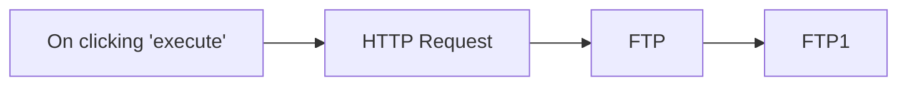

## Fluxo (.json) :

```json
{
  "nodes": [
    {
      "name": "On clicking 'execute'",
      "type": "n8n-nodes-base.manualTrigger",
      "position": [
        250,
        350
      ],
      "parameters": {},
      "typeVersion": 1
    },
    {
      "name": "FTP",
      "type": "n8n-nodes-base.ftp",
      "position": [
        650,
        350
      ],
      "parameters": {
        "path": "/upload/n8n_logo.png",
        "operation": "upload"
      },
      "credentials": {
        "ftp": "ftp_creds"
      },
      "typeVersion": 1
    },
    {
      "name": "FTP1",
      "type": "n8n-nodes-base.ftp",
      "position": [
        850,
        350
      ],
      "parameters": {
        "path": "/upload/",
        "operation": "list"
      },
      "credentials": {
        "ftp": "ftp_creds"
      },
      "typeVersion": 1
    },
    {
      "name": "HTTP Request",
      "type": "n8n-nodes-base.httpRequest",
      "position": [
        450,
        350
      ],
      "parameters": {
        "url": "https://n8n.io/n8n-logo.png",
        "options": {},
        "responseFormat": "file"
      },
      "typeVersion": 1
    }
  ],
  "connections": {
    "FTP": {
      "main": [
        [
          {
            "node": "FTP1",
            "type": "main",
            "index": 0
          }
        ]
      ]
    },
    "HTTP Request": {
      "main": [
        [
          {
            "node": "FTP",
            "type": "main",
            "index": 0
          }
        ]
      ]
    },
    "On clicking 'execute'": {
      "main": [
        [
          {
            "node": "HTTP Request",
            "type": "main",
            "index": 0
          }
        ]
      ]
    }
  }
}
```

<a id="template-486"></a>

## Template 486 - Atualizar títulos e descrições de produtos Printify

- **Nome:** Atualizar títulos e descrições de produtos Printify
- **Descrição:** Automatiza a geração e atualização de título, descrição e palavra-chave de produtos usando instruções de marca e IA, registrando e sincronizando resultados entre uma planilha e a API do Printify.
- **Funcionalidade:** • Gatilho por atualização na planilha: Inicia o processo quando a coluna de upload é alterada.
• Recuperação de lojas e produtos: Busca lojas e listas de produtos da conta Printify.
• Extração de dados do produto: Isola id, título e descrição originais para processamento.
• Definição de diretrizes de marca e instruções customizadas: Armazena tom e instruções para orientar a geração de conteúdo.
• Controle do número de variações: Configura quantas opções de título/descrição gerar.
• Geração de palavra-chave, título e descrição com IA: Usa um modelo para criar texto otimizado para canais de venda.
• Enriquecimento por fontes auxiliares: Possibilidade de consultar fontes externas e realizar cálculos para contextualizar o conteúdo.
• Registro e atualização na planilha: Adiciona e atualiza linhas com status, títulos gerados e descrições.
• Atualização do produto na plataforma: Envia alterações de título e descrição para o produto via API Printify.
• Lógica condicional e controle de fluxo: Processa apenas itens marcados para upload e gerencia a ordem de execução.
- **Ferramentas:** • Printify: Plataforma de gestão de produtos e API para atualizar títulos e descrições.
• OpenAI: Modelo de linguagem para gerar palavra-chave, título e descrição otimizados.
• Google Sheets: Planilha usada como gatilho, repositório de status e armazenagem de resultados.
• Wikipedia: Fonte de pesquisa para enriquecer conteúdo e contexto dos produtos.
• Ferramenta de cálculo: Utilizada para operações numéricas ou regras auxiliares durante o processamento.

## Fluxo visual

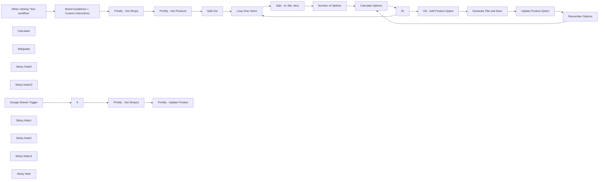

## Fluxo (.json) :

```json
{
  "id": "1V1gcK6vyczRqdZC",
  "meta": {
    "instanceId": "d868e3d040e7bda892c81b17cf446053ea25d2556fcef89cbe19dd61a3e876e9",
    "templateCredsSetupCompleted": true
  },
  "name": "Printify Automation - Update Title and Description - AlexK1919",
  "tags": [
    {
      "id": "NBHymnfw5EIluMXO",
      "name": "Printify",
      "createdAt": "2024-11-27T18:26:34.584Z",
      "updatedAt": "2024-11-27T18:26:34.584Z"
    },
    {
      "id": "QsH2EXuw2e7YCv0K",
      "name": "OpenAI",
      "createdAt": "2024-11-15T04:05:20.872Z",
      "updatedAt": "2024-11-15T04:05:20.872Z"
    }
  ],
  "nodes": [
    {
      "id": "313b16dc-2583-42f3-a0f7-487e75d7a7ec",
      "name": "When clicking ‘Test workflow’",
      "type": "n8n-nodes-base.manualTrigger",
      "position": [
        -700,
        -100
      ],
      "parameters": {},
      "typeVersion": 1
    },
    {
      "id": "fd59c09f-64cd-4e8a-80b1-d1abd9a52a5c",
      "name": "Printify - Get Shops",
      "type": "n8n-nodes-base.httpRequest",
      "position": [
        -60,
        -100
      ],
      "parameters": {
        "url": "https://api.printify.com/v1/shops.json",
        "options": {},
        "authentication": "genericCredentialType",
        "genericAuthType": "httpHeaderAuth"
      },
      "credentials": {
        "httpHeaderAuth": {
          "id": "vBaDp4RbmXnEx2rj",
          "name": "AlexK1919 Printify Header Auth"
        }
      },
      "typeVersion": 4.2
    },
    {
      "id": "8fa6a094-02f5-46c4-90d4-c17de302b004",
      "name": "Printify - Get Products",
      "type": "n8n-nodes-base.httpRequest",
      "position": [
        140,
        -100
      ],
      "parameters": {
        "url": "=https://api.printify.com/v1/shops/{{ $json.id }}/products.json",
        "options": {},
        "authentication": "genericCredentialType",
        "genericAuthType": "httpHeaderAuth"
      },
      "credentials": {
        "httpHeaderAuth": {
          "id": "vBaDp4RbmXnEx2rj",
          "name": "AlexK1919 Printify Header Auth"
        }
      },
      "typeVersion": 4.2
    },
    {
      "id": "00cdd85f-75ef-480b-aa58-d732b764337f",
      "name": "Split Out",
      "type": "n8n-nodes-base.splitOut",
      "position": [
        340,
        -100
      ],
      "parameters": {
        "options": {},
        "fieldToSplitOut": "data"
      },
      "typeVersion": 1
    },
    {
      "id": "564b02c3-38ce-411d-b1ca-e1a4b75310e4",
      "name": "Loop Over Items",
      "type": "n8n-nodes-base.splitInBatches",
      "position": [
        540,
        -100
      ],
      "parameters": {
        "options": {}
      },
      "typeVersion": 3
    },
    {
      "id": "95ea265f-7043-46ef-8513-67cf9407bda5",
      "name": "Split - id, title, desc",
      "type": "n8n-nodes-base.splitOut",
      "position": [
        740,
        -100
      ],
      "parameters": {
        "include": "selectedOtherFields",
        "options": {},
        "fieldToSplitOut": "id",
        "fieldsToInclude": "title, description"
      },
      "typeVersion": 1
    },
    {
      "id": "93ec8766-6ab3-4331-91fd-9aad24b587e9",
      "name": "Calculator",
      "type": "@n8n/n8n-nodes-langchain.toolCalculator",
      "position": [
        2240,
        80
      ],
      "parameters": {},
      "typeVersion": 1
    },
    {
      "id": "a9adf75e-bce3-4e0a-af44-e5e23b16b2f6",
      "name": "Wikipedia",
      "type": "@n8n/n8n-nodes-langchain.toolWikipedia",
      "position": [
        2120,
        80
      ],
      "parameters": {},
      "typeVersion": 1
    },
    {
      "id": "36272d91-a100-498d-8f24-2e93f2a1bb5b",
      "name": "Printify - Update Product",
      "type": "n8n-nodes-base.httpRequest",
      "position": [
        2080,
        500
      ],
      "parameters": {
        "url": "=https://api.printify.com/v1/shops/{{ $json.id }}/products/{{ $('Google Sheets Trigger').item.json.product_id }}.json",
        "method": "PUT",
        "options": {},
        "sendBody": true,
        "authentication": "genericCredentialType",
        "bodyParameters": {
          "parameters": [
            {
              "name": "=title",
              "value": "={{ $('Google Sheets Trigger').item.json.product_title }}"
            },
            {
              "name": "description",
              "value": "={{ $('Google Sheets Trigger').item.json.product_desc }}"
            }
          ]
        },
        "genericAuthType": "httpHeaderAuth"
      },
      "credentials": {
        "httpHeaderAuth": {
          "id": "vBaDp4RbmXnEx2rj",
          "name": "AlexK1919 Printify Header Auth"
        }
      },
      "typeVersion": 4.2
    },
    {
      "id": "63f9c4f5-cf6a-444a-af47-ea0e45b506ac",
      "name": "Brand Guidelines + Custom Instructions",
      "type": "n8n-nodes-base.set",
      "position": [
        -420,
        -100
      ],
      "parameters": {
        "options": {},
        "assignments": {
          "assignments": [
            {
              "id": "887815dd-21d5-41d7-b429-5f4361cf93b3",
              "name": "brand_name",
              "type": "string",
              "value": "AlexK1919"
            },
            {
              "id": "cbaa3dc0-825c-44e4-8a27-061f49daf249",
              "name": "brand_tone",
              "type": "string",
              "value": "informal, instructional, trustoworthy"
            },
            {
              "id": "0bd1358e-4586-407e-848e-8257923ed1b8",
              "name": "custom_instructions",
              "type": "string",
              "value": "re-write for the coming Christmas season"
            }
          ]
        }
      },
      "typeVersion": 3.4
    },
    {
      "id": "8e99d571-753c-4aca-bdd5-0a8dfb6f5aca",
      "name": "Sticky Note9",
      "type": "n8n-nodes-base.stickyNote",
      "position": [
        -1000,
        -340
      ],
      "parameters": {
        "color": 6,
        "width": 250,
        "height": 1066.0405523297766,
        "content": "# AlexK1919 \n\n\n#### I’m Alex Kim, an AI-Native Workflow Automation Architect Building Solutions to Optimize your Personal and Professional Life.\n\n\n### About Me\nhttps://beacons.ai/alexk1919\n\n### Products Used \n[OpenAI](https://openai.com)\n[Printify](https://printify.com/)\n\n[Google Sheets Template for this Workflow](https://docs.google.com/spreadsheets/d/12Y7M5YSUW1e8UUOjupzctOrEtgMK-0Wb32zcVpNcfjk/edit?gid=0#gid=0)"
      },
      "typeVersion": 1
    },
    {
      "id": "59ad5fd5-8960-421e-9d8b-1da34dd54b92",
      "name": "Sticky Note10",
      "type": "n8n-nodes-base.stickyNote",
      "position": [
        -120,
        -340
      ],
      "parameters": {
        "color": 4,
        "width": 1020.0792140594992,
        "height": 1064.4036342575048,
        "content": "# \nYou can swap out the API calls to similar services like Printful, Vistaprint, etc."
      },
      "typeVersion": 1
    },
    {
      "id": "25faf7eb-c83d-4740-b3a9-762b652f67d6",
      "name": "Google Sheets Trigger",
      "type": "n8n-nodes-base.googleSheetsTrigger",
      "position": [
        1480,
        500
      ],
      "parameters": {
        "event": "rowUpdate",
        "options": {
          "columnsToWatch": [
            "upload"
          ]
        },
        "pollTimes": {
          "item": [
            {
              "mode": "everyMinute"
            }
          ]
        },
        "sheetName": {
          "__rl": true,
          "mode": "list",
          "value": "gid=0",
          "cachedResultUrl": "https://docs.google.com/spreadsheets/d/1A6Phr6QwnMltm1_O6dVGAzmSPlOwuwp7RbCiLSvd9l0/edit#gid=0",
          "cachedResultName": "Sheet1"
        },
        "documentId": {
          "__rl": true,
          "mode": "list",
          "value": "1A6Phr6QwnMltm1_O6dVGAzmSPlOwuwp7RbCiLSvd9l0",
          "cachedResultUrl": "https://docs.google.com/spreadsheets/d/1A6Phr6QwnMltm1_O6dVGAzmSPlOwuwp7RbCiLSvd9l0/edit?usp=drivesdk",
          "cachedResultName": "Printify - AlexK1919"
        }
      },
      "credentials": {
        "googleSheetsTriggerOAuth2Api": {
          "id": "qrn9YcLkT3BSPIPA",
          "name": "AlexK191 Google Sheets Trigger account"
        }
      },
      "typeVersion": 1
    },
    {
      "id": "c1f3a7f5-ddc5-4d3d-a5ae-8663c31e7376",
      "name": "Printify - Get Shops1",
      "type": "n8n-nodes-base.httpRequest",
      "position": [
        1880,
        500
      ],
      "parameters": {
        "url": "https://api.printify.com/v1/shops.json",
        "options": {},
        "authentication": "genericCredentialType",
        "genericAuthType": "httpHeaderAuth"
      },
      "credentials": {
        "httpHeaderAuth": {
          "id": "vBaDp4RbmXnEx2rj",
          "name": "AlexK1919 Printify Header Auth"
        }
      },
      "typeVersion": 4.2
    },
    {
      "id": "b38cdb40-9784-43d6-b1d2-4d30340d2c1f",
      "name": "GS - Add Product Option",
      "type": "n8n-nodes-base.googleSheets",
      "position": [
        1880,
        -100
      ],
      "parameters": {
        "columns": {
          "value": {
            "xid": "={{ Math.random().toString(36).substr(2, 12) }}",
            "date": "={{ new Date().toISOString().split('T')[0] }}",
            "time": "={{ new Date().toLocaleTimeString('en-US', { hour12: false }) }}",
            "status": "Product Processing"
          },
          "schema": [
            {
              "id": "xid",
              "type": "string",
              "display": true,
              "required": false,
              "displayName": "xid",
              "defaultMatch": false,
              "canBeUsedToMatch": true
            },
            {
              "id": "status",
              "type": "string",
              "display": true,
              "required": false,
              "displayName": "status",
              "defaultMatch": false,
              "canBeUsedToMatch": true
            },
            {
              "id": "date",
              "type": "string",
              "display": true,
              "required": false,
              "displayName": "date",
              "defaultMatch": false,
              "canBeUsedToMatch": true
            },
            {
              "id": "time",
              "type": "string",
              "display": true,
              "required": false,
              "displayName": "time",
              "defaultMatch": false,
              "canBeUsedToMatch": true
            },
            {
              "id": "product_id",
              "type": "string",
              "display": true,
              "removed": false,
              "required": false,
              "displayName": "product_id",
              "defaultMatch": false,
              "canBeUsedToMatch": true
            },
            {
              "id": "original_title",
              "type": "string",
              "display": true,
              "removed": false,
              "required": false,
              "displayName": "original_title",
              "defaultMatch": false,
              "canBeUsedToMatch": true
            },
            {
              "id": "product_title",
              "type": "string",
              "display": true,
              "removed": false,
              "required": false,
              "displayName": "product_title",
              "defaultMatch": false,
              "canBeUsedToMatch": true
            },
            {
              "id": "original_desc",
              "type": "string",
              "display": true,
              "removed": false,
              "required": false,
              "displayName": "original_desc",
              "defaultMatch": false,
              "canBeUsedToMatch": true
            },
            {
              "id": "product_desc",
              "type": "string",
              "display": true,
              "removed": false,
              "required": false,
              "displayName": "product_desc",
              "defaultMatch": false,
              "canBeUsedToMatch": true
            },
            {
              "id": "product_url",
              "type": "string",
              "display": true,
              "removed": false,
              "required": false,
              "displayName": "product_url",
              "defaultMatch": false,
              "canBeUsedToMatch": true
            },
            {
              "id": "image_url",
              "type": "string",
              "display": true,
              "removed": false,
              "required": false,
              "displayName": "image_url",
              "defaultMatch": false,
              "canBeUsedToMatch": true
            },
            {
              "id": "video_url",
              "type": "string",
              "display": true,
              "removed": false,
              "required": false,
              "displayName": "video_url",
              "defaultMatch": false,
              "canBeUsedToMatch": true
            }
          ],
          "mappingMode": "defineBelow",
          "matchingColumns": []
        },
        "options": {
          "useAppend": true
        },
        "operation": "append",
        "sheetName": {
          "__rl": true,
          "mode": "list",
          "value": "gid=0",
          "cachedResultUrl": "https://docs.google.com/spreadsheets/d/1Ql9TGAzZCSdSqrHvkZLcsBPoNMAjNpPVsELkumP2heM/edit#gid=0",
          "cachedResultName": "Sheet1"
        },
        "documentId": {
          "__rl": true,
          "mode": "list",
          "value": "1A6Phr6QwnMltm1_O6dVGAzmSPlOwuwp7RbCiLSvd9l0",
          "cachedResultUrl": "https://docs.google.com/spreadsheets/d/1A6Phr6QwnMltm1_O6dVGAzmSPlOwuwp7RbCiLSvd9l0/edit?usp=drivesdk",
          "cachedResultName": "Printify - AlexK1919"
        }
      },
      "credentials": {
        "googleSheetsOAuth2Api": {
          "id": "IpY8N9VFCXJLC1hv",
          "name": "AlexK1919 Google Sheets account"
        }
      },
      "typeVersion": 4.3
    },
    {
      "id": "da735862-b67d-443e-8f45-e425ef518145",
      "name": "Update Product Option",
      "type": "n8n-nodes-base.googleSheets",
      "position": [
        2440,
        -100
      ],
      "parameters": {
        "columns": {
          "value": {
            "xid": "={{ $('GS - Add Product Option').item.json.xid }}",
            "status": "Option added",
            "keyword": "={{ $json.message.content.keyword }}",
            "product_id": "={{ $('Split - id, title, desc').item.json.id }}",
            "product_desc": "={{ $json.message.content.description }}",
            "original_desc": "={{ $('Split - id, title, desc').item.json.description }}",
            "product_title": "={{ $json.message.content.title }}",
            "original_title": "={{ $('Split - id, title, desc').item.json.title }}"
          },
          "schema": [
            {
              "id": "xid",
              "type": "string",
              "display": true,
              "removed": false,
              "required": false,
              "displayName": "xid",
              "defaultMatch": false,
              "canBeUsedToMatch": true
            },
            {
              "id": "status",
              "type": "string",
              "display": true,
              "required": false,
              "displayName": "status",
              "defaultMatch": false,
              "canBeUsedToMatch": true
            },
            {
              "id": "upload",
              "type": "string",
              "display": true,
              "removed": false,
              "required": false,
              "displayName": "upload",
              "defaultMatch": false,
              "canBeUsedToMatch": true
            },
            {
              "id": "date",
              "type": "string",
              "display": true,
              "required": false,
              "displayName": "date",
              "defaultMatch": false,
              "canBeUsedToMatch": true
            },
            {
              "id": "time",
              "type": "string",
              "display": true,
              "required": false,
              "displayName": "time",
              "defaultMatch": false,
              "canBeUsedToMatch": true
            },
            {
              "id": "product_id",
              "type": "string",
              "display": true,
              "removed": false,
              "required": false,
              "displayName": "product_id",
              "defaultMatch": false,
              "canBeUsedToMatch": true
            },
            {
              "id": "keyword",
              "type": "string",
              "display": true,
              "removed": false,
              "required": false,
              "displayName": "keyword",
              "defaultMatch": false,
              "canBeUsedToMatch": true
            },
            {
              "id": "original_title",
              "type": "string",
              "display": true,
              "removed": false,
              "required": false,
              "displayName": "original_title",
              "defaultMatch": false,
              "canBeUsedToMatch": true
            },
            {
              "id": "product_title",
              "type": "string",
              "display": true,
              "required": false,
              "displayName": "product_title",
              "defaultMatch": false,
              "canBeUsedToMatch": true
            },
            {
              "id": "original_desc",
              "type": "string",
              "display": true,
              "removed": false,
              "required": false,
              "displayName": "original_desc",
              "defaultMatch": false,
              "canBeUsedToMatch": true
            },
            {
              "id": "product_desc",
              "type": "string",
              "display": true,
              "required": false,
              "displayName": "product_desc",
              "defaultMatch": false,
              "canBeUsedToMatch": true
            },
            {
              "id": "product_url",
              "type": "string",
              "display": true,
              "required": false,
              "displayName": "product_url",
              "defaultMatch": false,
              "canBeUsedToMatch": true
            },
            {
              "id": "image_url",
              "type": "string",
              "display": true,
              "required": false,
              "displayName": "image_url",
              "defaultMatch": false,
              "canBeUsedToMatch": true
            },
            {
              "id": "video_url",
              "type": "string",
              "display": true,
              "required": false,
              "displayName": "video_url",
              "defaultMatch": false,
              "canBeUsedToMatch": true
            }
          ],
          "mappingMode": "defineBelow",
          "matchingColumns": [
            "xid"
          ]
        },
        "options": {},
        "operation": "appendOrUpdate",
        "sheetName": {
          "__rl": true,
          "mode": "list",
          "value": "gid=0",
          "cachedResultUrl": "https://docs.google.com/spreadsheets/d/1A6Phr6QwnMltm1_O6dVGAzmSPlOwuwp7RbCiLSvd9l0/edit#gid=0",
          "cachedResultName": "Sheet1"
        },
        "documentId": {
          "__rl": true,
          "mode": "list",
          "value": "1A6Phr6QwnMltm1_O6dVGAzmSPlOwuwp7RbCiLSvd9l0",
          "cachedResultUrl": "https://docs.google.com/spreadsheets/d/1A6Phr6QwnMltm1_O6dVGAzmSPlOwuwp7RbCiLSvd9l0/edit?usp=drivesdk",
          "cachedResultName": "Printify - AlexK1919"
        }
      },
      "credentials": {
        "googleSheetsOAuth2Api": {
          "id": "IpY8N9VFCXJLC1hv",
          "name": "AlexK1919 Google Sheets account"
        }
      },
      "typeVersion": 4.5
    },
    {
      "id": "b8eeb5b9-e048-4844-8712-b9fed848c041",
      "name": "Sticky Note1",
      "type": "n8n-nodes-base.stickyNote",
      "position": [
        927.0167061883853,
        -340
      ],
      "parameters": {
        "color": 5,
        "width": 454.85441546185024,
        "height": 1064.2140159143948,
        "content": "# Set the Number of Options you'd like for the Title and Description"
      },
      "typeVersion": 1
    },
    {
      "id": "0e705827-9fc9-42d7-9c6a-7597de767acb",
      "name": "Sticky Note2",
      "type": "n8n-nodes-base.stickyNote",
      "position": [
        1409,
        -340
      ],
      "parameters": {
        "color": 4,
        "width": 1429.3228597821253,
        "height": 692.9832938116144,
        "content": "# Process Title and Description Options"
      },
      "typeVersion": 1
    },
    {
      "id": "c0a829b4-6902-4a8d-81a8-70fb1fdf4634",
      "name": "Sticky Note11",
      "type": "n8n-nodes-base.stickyNote",
      "position": [
        -560,
        -340
      ],
      "parameters": {
        "color": 5,
        "width": 410,
        "height": 1067.57654641223,
        "content": "# Update your Brand Guidelines before running this workflow\nYou can also add custom instructions for the AI node."
      },
      "typeVersion": 1
    },
    {
      "id": "6c50977f-6245-4d57-9cde-8ed8a572af21",
      "name": "If1",
      "type": "n8n-nodes-base.if",
      "position": [
        1680,
        -100
      ],
      "parameters": {
        "options": {},
        "conditions": {
          "options": {
            "version": 2,
            "leftValue": "",
            "caseSensitive": true,
            "typeValidation": "strict"
          },
          "combinator": "and",
          "conditions": [
            {
              "id": "22bf0855-c742-4a72-99c9-5ed72a96969a",
              "operator": {
                "type": "number",
                "operation": "equals"
              },
              "leftValue": "={{ $json.result }}",
              "rightValue": 0
            }
          ]
        }
      },
      "typeVersion": 2.2
    },
    {
      "id": "82e2812b-59e6-4ac7-9238-7ee44052843b",
      "name": "Number of Options",
      "type": "n8n-nodes-base.set",
      "position": [
        1100,
        -100
      ],
      "parameters": {
        "options": {},
        "assignments": {
          "assignments": [
            {
              "id": "e65d9a41-d8a0-40b8-82e6-7f4dd90f0aa7",
              "name": "number_of_options",
              "type": "string",
              "value": "3"
            }
          ]
        }
      },
      "typeVersion": 3.4
    },
    {
      "id": "0476bdb9-6979-41a2-bbe2-63b41ea5ce80",
      "name": "Calculate Options",
      "type": "n8n-nodes-base.code",
      "position": [
        1480,
        -100
      ],
      "parameters": {
        "mode": "runOnceForEachItem",
        "jsCode": "// Get the input data from the previous node\nconst inputData = $json[\"number_of_options\"]; // Fetch the \"number_of_options\" field\n\n// Convert the input to an integer\nconst initialValue = parseInt(inputData, 10);\n\n// Add 1 to retain the initial value and calculate the new value\nconst numberOfOptions = initialValue + 1;\nconst result = numberOfOptions - 1;\n\n// Return both values\nreturn {\n  number_of_options: numberOfOptions,\n  result,\n};\n"
      },
      "typeVersion": 2
    },
    {
      "id": "d0e57d93-26f3-43c2-8663-5ef22706fd60",
      "name": "Remember Options",
      "type": "n8n-nodes-base.set",
      "position": [
        2680,
        40
      ],
      "parameters": {
        "options": {},
        "assignments": {
          "assignments": [
            {
              "id": "e47b9073-6b83-4444-9fde-3a70326fde1f",
              "name": "number_of_options",
              "type": "number",
              "value": "={{ $('Calculate Options').item.json.result - 1 }}"
            }
          ]
        }
      },
      "typeVersion": 3.4
    },
    {
      "id": "e6ce46c9-0339-449f-8f38-c6fbe26a7a96",
      "name": "Sticky Note",
      "type": "n8n-nodes-base.stickyNote",
      "position": [
        1409.6877789299706,
        380
      ],
      "parameters": {
        "color": 4,
        "width": 1429.3228597821253,
        "height": 342.36777743061157,
        "content": "# Update Title and Description"
      },
      "typeVersion": 1
    },
    {
      "id": "14233023-2e76-4cd4-a6fa-e8f67cac3e59",
      "name": "Generate Title and Desc",
      "type": "@n8n/n8n-nodes-langchain.openAi",
      "position": [
        2080,
        -100
      ],
      "parameters": {
        "modelId": {
          "__rl": true,
          "mode": "list",
          "value": "gpt-4o-mini",
          "cachedResultName": "GPT-4O-MINI"
        },
        "options": {},
        "messages": {
          "values": [
            {
              "content": "=Write an engaging product title and description for this product: \nTitle: {{ $('Split - id, title, desc').item.json.title }}\nDescription: {{ $('Split - id, title, desc').item.json.description }}\n\nDefine a keyword for this product and use it to write the new Title and Description.\n\nThis product will be listed via Printify and posted across various sales channels such as Shopfiy, Etsy, Amazon, and TikTok Shops. This product will be promoted across social media channels."
            },
            {
              "role": "assistant",
              "content": "Be witty. Humanize the content. No emojis."
            },
            {
              "role": "system",
              "content": "You are an ecommerce master and excel at creating content for products."
            },
            {
              "role": "assistant",
              "content": "=Brand Guidelines:\nBrand Name: {{ $('Brand Guidelines + Custom Instructions').item.json.brand_name }}\nBrand Tone: {{ $('Brand Guidelines + Custom Instructions').item.json.brand_tone }}"
            },
            {
              "role": "system",
              "content": "={{ $('Brand Guidelines + Custom Instructions').item.json.custom_instructions }}"
            },
            {
              "role": "system",
              "content": "Output:\nKeyword\nTitle\nDescription"
            }
          ]
        },
        "jsonOutput": true
      },
      "credentials": {
        "openAiApi": {
          "id": "ysxujEYFiY5ozRTS",
          "name": "AlexK OpenAi Key"
        }
      },
      "typeVersion": 1.3
    },
    {
      "id": "41391fd2-d0b9-436f-a44b-29bd1db9bc72",
      "name": "If",
      "type": "n8n-nodes-base.if",
      "position": [
        1680,
        500
      ],
      "parameters": {
        "options": {},
        "conditions": {
          "options": {
            "version": 2,
            "leftValue": "",
            "caseSensitive": true,
            "typeValidation": "strict"
          },
          "combinator": "and",
          "conditions": [
            {
              "id": "d9c78fa8-c2ba-4c08-b5d2-848112caa1cc",
              "operator": {
                "name": "filter.operator.equals",
                "type": "string",
                "operation": "equals"
              },
              "leftValue": "={{ $json.upload }}",
              "rightValue": "yes"
            }
          ]
        }
      },
      "typeVersion": 2.2
    }
  ],
  "active": true,
  "pinData": {},
  "settings": {
    "executionOrder": "v1"
  },
  "versionId": "62c1c130-55a2-4a4c-8695-8b59a626f1fe",
  "connections": {
    "If": {
      "main": [
        [
          {
            "node": "Printify - Get Shops1",
            "type": "main",
            "index": 0
          }
        ]
      ]
    },
    "If1": {
      "main": [
        [
          {
            "node": "Loop Over Items",
            "type": "main",
            "index": 0
          }
        ],
        [
          {
            "node": "GS - Add Product Option",
            "type": "main",
            "index": 0
          }
        ]
      ]
    },
    "Split Out": {
      "main": [
        [
          {
            "node": "Loop Over Items",
            "type": "main",
            "index": 0
          }
        ]
      ]
    },
    "Wikipedia": {
      "ai_tool": [
        [
          {
            "node": "Generate Title and Desc",
            "type": "ai_tool",
            "index": 0
          }
        ]
      ]
    },
    "Calculator": {
      "ai_tool": [
        [
          {
            "node": "Generate Title and Desc",
            "type": "ai_tool",
            "index": 0
          }
        ]
      ]
    },
    "Loop Over Items": {
      "main": [
        [],
        [
          {
            "node": "Split - id, title, desc",
            "type": "main",
            "index": 0
          }
        ]
      ]
    },
    "Remember Options": {
      "main": [
        [
          {
            "node": "Calculate Options",
            "type": "main",
            "index": 0
          }
        ]
      ]
    },
    "Calculate Options": {
      "main": [
        [
          {
            "node": "If1",
            "type": "main",
            "index": 0
          }
        ]
      ]
    },
    "Number of Options": {
      "main": [
        [
          {
            "node": "Calculate Options",
            "type": "main",
            "index": 0
          }
        ]
      ]
    },
    "Printify - Get Shops": {
      "main": [
        [
          {
            "node": "Printify - Get Products",
            "type": "main",
            "index": 0
          }
        ]
      ]
    },
    "Google Sheets Trigger": {
      "main": [
        [
          {
            "node": "If",
            "type": "main",
            "index": 0
          }
        ]
      ]
    },
    "Printify - Get Shops1": {
      "main": [
        [
          {
            "node": "Printify - Update Product",
            "type": "main",
            "index": 0
          }
        ]
      ]
    },
    "Update Product Option": {
      "main": [
        [
          {
            "node": "Remember Options",
            "type": "main",
            "index": 0
          }
        ]
      ]
    },
    "GS - Add Product Option": {
      "main": [
        [
          {
            "node": "Generate Title and Desc",
            "type": "main",
            "index": 0
          }
        ]
      ]
    },
    "Generate Title and Desc": {
      "main": [
        [
          {
            "node": "Update Product Option",
            "type": "main",
            "index": 0
          }
        ]
      ]
    },
    "Printify - Get Products": {
      "main": [
        [
          {
            "node": "Split Out",
            "type": "main",
            "index": 0
          }
        ]
      ]
    },
    "Split - id, title, desc": {
      "main": [
        [
          {
            "node": "Number of Options",
            "type": "main",
            "index": 0
          }
        ]
      ]
    },
    "When clicking ‘Test workflow’": {
      "main": [
        [
          {
            "node": "Brand Guidelines + Custom Instructions",
            "type": "main",
            "index": 0
          }
        ]
      ]
    },
    "Brand Guidelines + Custom Instructions": {
      "main": [
        [
          {
            "node": "Printify - Get Shops",
            "type": "main",
            "index": 0
          }
        ]
      ]
    }
  }
}
```

<a id="template-487"></a>

## Template 487 - Criação e atualização de Lead Salesforce

- **Nome:** Criação e atualização de Lead Salesforce
- **Descrição:** Fluxo acionado manualmente que cria um lead no Salesforce, atualiza seu campo de cidade e adiciona uma nota associada.
- **Funcionalidade:** • Gatilho manual: Inicia o fluxo quando o usuário clica em executar.
• Criação de lead: Cria um novo lead com Company = CompanyInc e LastName = DudeOne.
• Atualização de lead: Atualiza o lead recém-criado definindo a cidade como Berlin.
• Adição de nota: Anexa uma nota ao lead com o título 'Deal Won!'.
- **Ferramentas:** • Salesforce: Plataforma de CRM utilizada para criar registros de leads, atualizar campos e anexar notas.

## Fluxo visual

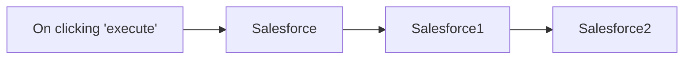

## Fluxo (.json) :

```json
{
  "nodes": [
    {
      "name": "On clicking 'execute'",
      "type": "n8n-nodes-base.manualTrigger",
      "position": [
        420,
        260
      ],
      "parameters": {},
      "typeVersion": 1
    },
    {
      "name": "Salesforce",
      "type": "n8n-nodes-base.salesforce",
      "position": [
        620,
        260
      ],
      "parameters": {
        "company": "CompanyInc",
        "lastname": "DudeOne",
        "additionalFields": {}
      },
      "credentials": {
        "salesforceOAuth2Api": "salesforce_creds"
      },
      "typeVersion": 1
    },
    {
      "name": "Salesforce1",
      "type": "n8n-nodes-base.salesforce",
      "position": [
        810,
        260
      ],
      "parameters": {
        "leadId": "={{$node[\"Salesforce\"].json[\"id\"]}}",
        "operation": "update",
        "updateFields": {
          "city": "Berlin"
        }
      },
      "credentials": {
        "salesforceOAuth2Api": "salesforce_creds"
      },
      "typeVersion": 1
    },
    {
      "name": "Salesforce2",
      "type": "n8n-nodes-base.salesforce",
      "position": [
        1020,
        260
      ],
      "parameters": {
        "title": "Deal Won!",
        "leadId": "={{$node[\"Salesforce\"].json[\"id\"]}}",
        "options": {},
        "operation": "addNote"
      },
      "credentials": {
        "salesforceOAuth2Api": "salesforce_creds"
      },
      "typeVersion": 1
    }
  ],
  "connections": {
    "Salesforce": {
      "main": [
        [
          {
            "node": "Salesforce1",
            "type": "main",
            "index": 0
          }
        ]
      ]
    },
    "Salesforce1": {
      "main": [
        [
          {
            "node": "Salesforce2",
            "type": "main",
            "index": 0
          }
        ]
      ]
    },
    "On clicking 'execute'": {
      "main": [
        [
          {
            "node": "Salesforce",
            "type": "main",
            "index": 0
          }
        ]
      ]
    }
  }
}
```

<a id="template-488"></a>

## Template 488 - Gerar tarefas Todoist via Telegram

- **Nome:** Gerar tarefas Todoist via Telegram
- **Descrição:** Converte mensagens de voz ou texto recebidas no Telegram em tarefas no Todoist, decompondo projetos em subtarefas com prioridade e enviando confirmação ao usuário.
- **Funcionalidade:** • Recebimento de mensagens: Escuta mensagens de voz e texto enviadas por usuários no Telegram.
• Detecção de tipo de mensagem: Identifica se a entrada é áudio ou texto para encaminhar o processamento correto.
• Download de áudio: Busca o arquivo de voz enviado para processamento.
• Transcrição de áudio: Converte mensagens de voz em texto para análise posterior.
• Preparação do texto: Normaliza e prepara o conteúdo para o modelo de linguagem.
• Decomposição em subtarefas: Usa um modelo de linguagem para dividir a descrição em subtarefas acionáveis e mensuráveis.
• Formatação JSON para Todoist: Gera saída em JSON conforme o formato exigido pelo sistema de criação de tarefas (conteúdo e prioridade).
• Criação de tarefas: Insere as tarefas geradas no projeto especificado no Todoist com as prioridades atribuídas.
• Confirmação ao usuário: Envia uma mensagem de retorno no Telegram com detalhes e link da tarefa criada.
• Validação estruturada: Garante que a saída esteja em formato JSON válido antes de criar as tarefas.
- **Ferramentas:** • Telegram: Plataforma de mensagens usada para receber entradas de voz e texto dos usuários.
• OpenAI (modelos de chat e Whisper): Serviço de inteligência artificial usado para analisar o texto, gerar subtarefas e transcrever áudio para texto.
• Todoist: Serviço de gestão de tarefas onde as subtarefas são criadas com conteúdo e prioridade.

## Fluxo visual

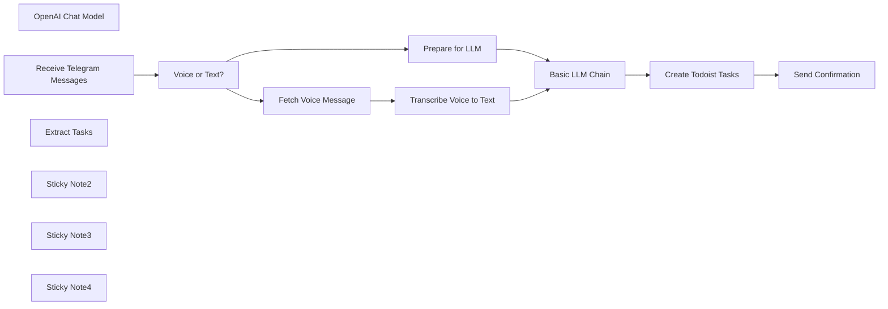

## Fluxo (.json) :

```json
{
  "meta": {
    "instanceId": "b41148c809c7896d124743d940fc0964703e540af66564ef95e25a4ceea61c77",
    "templateCredsSetupCompleted": true
  },
  "nodes": [
    {
      "id": "e87d3723-7e7a-4ff3-bffb-b2bd2096bd34",
      "name": "OpenAI Chat Model",
      "type": "@n8n/n8n-nodes-langchain.lmChatOpenAi",
      "position": [
        1080,
        260
      ],
      "parameters": {
        "model": {
          "__rl": true,
          "mode": "list",
          "value": "gpt-4o-mini"
        },
        "options": {}
      },
      "credentials": {
        "openAiApi": {
          "id": "uFPD9I4pWJ4xUVf7",
          "name": "OpenAi account"
        }
      },
      "typeVersion": 1.2
    },
    {
      "id": "d25bf3ea-0de4-4317-9205-651f8a1a6ba8",
      "name": "Basic LLM Chain",
      "type": "@n8n/n8n-nodes-langchain.chainLlm",
      "position": [
        1060,
        40
      ],
      "parameters": {
        "text": "={{ $json.text }}",
        "messages": {
          "messageValues": [
            {
              "message": "=Okay, I've further refined the system prompt to include only the \"content\" and \"priority\" fields in the JSON output for the Todoist tool. Here's the updated prompt:\n\n**System Prompt:**\n\n```\nYou are an AI agent acting as a project management assistant. The user will provide you with a task or project description. Your job is to break down this task or project into smaller, manageable sub-tasks. You will then format each sub-task into a JSON object suitable for input to the \"Todoist\" tool and provide these JSON objects in a list.\n\n**Requirements:**\n\n1.  **Sub-Task Decomposition:** Break down the task or project provided by the user into logical and actionable sub-tasks. Each sub-task should be self-contained, completable, and measurable.\n2.  **JSON Format for Todoist:** Format each sub-task as a JSON object with the following structure:\n\n    ```json\n    {\n      \"content\": \"[Task Description]\",\n      \"priority\": [Priority Level (1-4, where 4 is highest)]\n    }\n    ```\n\n    *   `content`: A clear and concise description of the task.\n    *   `priority`: An integer representing the task priority, ranging from 1 (lowest) to 4 (highest). Consider the importance and urgency of the task when assigning the priority.\n\n3.  **Tool Usage - Todoist JSON Output:** After decomposing the project into sub-tasks, you **MUST** format each sub-task into the JSON structure specified above and present all the JSON objects in a Python list. This list will be the direct input to the \"Todoist\" tool.\n\n4.  **Contextual Understanding:** Fully understand the context of the task or project provided by the user. If necessary, ask for additional information or clarification to resolve any ambiguities.\n\n5.  **Limitations:**\n\n    *   Avoid very general or abstract sub-tasks.\n    *   Ensure that each sub-task is completable and measurable.\n    *   When creating sub-tasks, consider the user's skills and resources.\n    *   Ensure all the output is valid JSON format within a python list\n\n**User Input:**\n\nThe user will provide you with a task or project description in the following format:\n\n```\nProject Description: [User's Entered Task or Project Description]\n```\n\n**Example:**\n\n**User Input:**\n\n```\nProject Description: Plan a team offsite.\n```\n\n**LLM Response:**\n\n```python\n[\n  {\n    \"content\": \"Research potential offsite locations.\",\n    \"priority\": 3\n  },\n  {\n    \"content\": \"Determine the budget for the offsite.\",\n    \"priority\": 4\n  },\n  {\n    \"content\": \"Send out a survey to gather team preferences.\",\n    \"priority\": 3\n  },\n  {\n    \"content\": \"Book the chosen venue.\",\n    \"priority\": 4\n  },\n  {\n    \"content\": \"Plan team-building activities.\",\n    \"priority\": 2\n  }\n]\n```\n\n**Key Changes and Explanations:**\n\n*   **Simplified JSON Structure:** The JSON object now only includes `content` and `priority`.\n*   **Example Updated:** The example response reflects the simplified JSON format.\n*   **Conciseness:** The prompt is now more concise, focusing only on the necessary fields.\n\n**Jinja2 Template Version**\n\n```python\nfrom jinja2 import Template\n\ntemplate_string = \"\"\"\nYou are an AI agent acting as a project management assistant. The user will provide you with a task or project description. Your job is to break down this task or project into smaller, manageable sub-tasks. You will then format each sub-task into a JSON object suitable for input to the \"Todoist\" tool and provide these JSON objects in a list.\n\n**Requirements:**\n\n1.  **Sub-Task Decomposition:** Break down the task or project provided by the user into logical and actionable sub-tasks. Each sub-task should be self-contained, completable, and measurable.\n2.  **JSON Format for Todoist:** Format each sub-task as a JSON object with the following structure:\n\n    ```json\n    {\n      \"content\": \"[Task Description]\",\n      \"priority\": [Priority Level (1-4, where 4 is highest)]\n    }\n    ```\n\n    *   `content`: A clear and concise description of the task.\n    *   `priority`: An integer representing the task priority, ranging from 1 (lowest) to 4 (highest). Consider the importance and urgency of the task when assigning the priority.\n\n3.  **Tool Usage - Todoist JSON Output:** After decomposing the project into sub-tasks, you **MUST** format each sub-task into the JSON structure specified above and present all the JSON objects in a Python list. This list will be the direct input to the \"Todoist\" tool.\n\n4.  **Contextual Understanding:** Fully understand the context of the task or project provided by the user. If necessary, ask for additional information or clarification to resolve any ambiguities.\n\n5.  **Limitations:**\n\n    *   Avoid very general or abstract sub-tasks.\n    *   Ensure that each sub-task is completable and measurable.\n    *   When creating sub-tasks, consider the user's skills and resources.\n    *   Ensure all the output is valid JSON format within a python list\n\n**User Input:**\n\nThe user will provide you with a task or project description in the following format:\n\n```\nProject Description: {{ project_description }}\n```\n\n**Example:**\n\n**User Input:**\n\n```\nProject Description: Plan a team offsite.\n```\n\n**LLM Response:**\n\n```python\n[\n  {\n    \"content\": \"Research potential offsite locations.\",\n    \"priority\": 3\n  },\n  {\n    \"content\": \"Determine the budget for the offsite.\",\n    \"priority\": 4\n  },\n  {\n    \"content\": \"Send out a survey to gather team preferences.\",\n    \"priority\": 3\n  },\n  {\n    \"content\": \"Book the chosen venue.\",\n    \"priority\": 4\n  },\n  {\n    \"content\": \"Plan team-building activities.\",\n    \"priority\": 2\n  }\n]\n```\n\"\"\"\n\ntemplate = Template(template_string)\n\n# Example Usage\nproject_description = \"Plan a team offsite.\"\nprompt = template.render(project_description=project_description)\n\nprint(prompt)\n```\n \n"
            }
          ]
        },
        "promptType": "define",
        "hasOutputParser": true
      },
      "typeVersion": 1.5
    },
    {
      "id": "ddfe59c5-574c-470b-b2cc-efa05da74972",
      "name": "Receive Telegram Messages",
      "type": "n8n-nodes-base.telegramTrigger",
      "position": [
        -220,
        -100
      ],
      "webhookId": "4e2cd560-ae4e-4ed7-a8ea-984518404e51",
      "parameters": {
        "updates": [
          "message"
        ],
        "additionalFields": {}
      },
      "credentials": {
        "telegramApi": {
          "id": "lff3pLERRdQmkmeV",
          "name": "Telegram account"
        }
      },
      "typeVersion": 1.1
    },
    {
      "id": "23f2cedd-bcd2-4a94-acc1-8829b30553dc",
      "name": "Voice or Text?",
      "type": "n8n-nodes-base.switch",
      "position": [
        140,
        -20
      ],
      "parameters": {
        "rules": {
          "values": [
            {
              "outputKey": "Audio",
              "conditions": {
                "options": {
                  "version": 2,
                  "leftValue": "",
                  "caseSensitive": true,
                  "typeValidation": "strict"
                },
                "combinator": "and",
                "conditions": [
                  {
                    "id": "af30c479-4542-405f-b315-37c50c4e2bef",
                    "operator": {
                      "type": "string",
                      "operation": "exists",
                      "singleValue": true
                    },
                    "leftValue": "={{ $json.message.voice.file_id }}",
                    "rightValue": ""
                  }
                ]
              },
              "renameOutput": true
            },
            {
              "outputKey": "Text",
              "conditions": {
                "options": {
                  "version": 2,
                  "leftValue": "",
                  "caseSensitive": true,
                  "typeValidation": "strict"
                },
                "combinator": "and",
                "conditions": [
                  {
                    "id": "a3ca8cd4-fbb2-40b5-829a-24724f2fbc85",
                    "operator": {
                      "type": "string",
                      "operation": "exists",
                      "singleValue": true
                    },
                    "leftValue": "={{ $json.message.text || \"\" }}",
                    "rightValue": ""
                  }
                ]
              },
              "renameOutput": true
            },
            {
              "outputKey": "Error",
              "conditions": {
                "options": {
                  "version": 2,
                  "leftValue": "",
                  "caseSensitive": true,
                  "typeValidation": "strict"
                },
                "combinator": "and",
                "conditions": [
                  {
                    "id": "9bcfdee0-2f09-4037-a7b9-689ef392371d",
                    "operator": {
                      "type": "string",
                      "operation": "exists",
                      "singleValue": true
                    },
                    "leftValue": "error",
                    "rightValue": ""
                  }
                ]
              },
              "renameOutput": true
            }
          ]
        },
        "options": {}
      },
      "typeVersion": 3.2
    },
    {
      "id": "128e8268-a256-4256-8757-9ece8be86d75",
      "name": "Fetch Voice Message",
      "type": "n8n-nodes-base.telegram",
      "position": [
        500,
        -120
      ],
      "webhookId": "23645237-4943-4c32-b18c-97c410cc3409",
      "parameters": {
        "fileId": "={{ $json.message.voice.file_id }}",
        "resource": "file"
      },
      "credentials": {
        "telegramApi": {
          "id": "lff3pLERRdQmkmeV",
          "name": "Telegram account"
        }
      },
      "typeVersion": 1.2
    },
    {
      "id": "d8219ba5-bb33-44f5-a9a2-65fd16be335b",
      "name": "Transcribe Voice to Text",
      "type": "@n8n/n8n-nodes-langchain.openAi",
      "position": [
        720,
        -120
      ],
      "parameters": {
        "options": {},
        "resource": "audio",
        "operation": "translate"
      },
      "credentials": {
        "openAiApi": {
          "id": "uFPD9I4pWJ4xUVf7",
          "name": "OpenAi account"
        }
      },
      "typeVersion": 1.8
    },
    {
      "id": "0c5f5568-fd14-4c65-8661-ebc5803158ce",
      "name": "Prepare for LLM",
      "type": "n8n-nodes-base.set",
      "position": [
        620,
        100
      ],
      "parameters": {
        "options": {},
        "assignments": {
          "assignments": [
            {
              "id": "b324a329-3c49-4f7f-b683-74331b7fe7f8",
              "name": "=text",
              "type": "string",
              "value": "={{$json.message.text}}"
            }
          ]
        }
      },
      "typeVersion": 3.4
    },
    {
      "id": "76ed8f5c-59f7-4cb9-9e59-25ac7e9e8c60",
      "name": "Extract Tasks",
      "type": "@n8n/n8n-nodes-langchain.outputParserStructured",
      "position": [
        1220,
        260
      ],
      "parameters": {
        "jsonSchemaExample": "  {\n    \"content\": \"Send out invitations.\",\n    \"priority\": 3\n  }"
      },
      "typeVersion": 1.2
    },
    {
      "id": "7d0dbcb7-aac1-4eea-8f0b-6173148bfd3f",
      "name": "Create Todoist Tasks",
      "type": "n8n-nodes-base.todoist",
      "position": [
        1620,
        40
      ],
      "parameters": {
        "content": "={{ $json.output.content }}",
        "options": {
          "priority": "={{ $json.output.priority }}"
        },
        "project": {
          "__rl": true,
          "mode": "list",
          "value": "2349786654",
          "cachedResultName": "Task"
        }
      },
      "credentials": {
        "todoistApi": {
          "id": "yqSn5VBXyA4R6hgt",
          "name": "Todoist account"
        }
      },
      "typeVersion": 2.1
    },
    {
      "id": "544b3f63-8ac1-4f81-9c24-943df16d9324",
      "name": "Send Confirmation",
      "type": "n8n-nodes-base.telegram",
      "position": [
        1880,
        40
      ],
      "webhookId": "5699aecd-e061-4b7f-af7b-4a23eb7201c6",
      "parameters": {
        "text": "=Task : {{ $json.content }} Task Link :{{ $json.url }}",
        "chatId": "={{ $('Receive Telegram Messages').item.json.message.chat.id }}",
        "additionalFields": {}
      },
      "credentials": {
        "telegramApi": {
          "id": "lff3pLERRdQmkmeV",
          "name": "Telegram account"
        }
      },
      "typeVersion": 1.2
    },
    {
      "id": "b244f935-3047-4581-84ac-b01b2f962c1d",
      "name": "Sticky Note2",
      "type": "n8n-nodes-base.stickyNote",
      "position": [
        -260,
        -240
      ],
      "parameters": {
        "width": 260,
        "height": 320,
        "content": " \n**This workflow listens for incoming voice or text messages from Telegram users.** "
      },
      "typeVersion": 1
    },
    {
      "id": "fa99930d-8e75-4f1e-aa9b-47c38e611538",
      "name": "Sticky Note3",
      "type": "n8n-nodes-base.stickyNote",
      "position": [
        440,
        -220
      ],
      "parameters": {
        "width": 460,
        "height": 260,
        "content": " **Voice messages are fetched from Telegram and transcribed into text using OpenAI's Whisper API.**  "
      },
      "typeVersion": 1
    },
    {
      "id": "beb460c9-0412-40c4-a3cf-76660eb0e1b8",
      "name": "Sticky Note4",
      "type": "n8n-nodes-base.stickyNote",
      "position": [
        1000,
        -60
      ],
      "parameters": {
        "width": 380,
        "height": 440,
        "content": " \n**The LLM (OpenAI Chat Model) analyzes the text and breaks it down into tasks and sub-tasks, formatted for Todoist.**  "
      },
      "typeVersion": 1
    }
  ],
  "pinData": {},
  "connections": {
    "Extract Tasks": {
      "ai_outputParser": [
        [
          {
            "node": "Basic LLM Chain",
            "type": "ai_outputParser",
            "index": 0
          }
        ]
      ]
    },
    "Voice or Text?": {
      "main": [
        [
          {
            "node": "Fetch Voice Message",
            "type": "main",
            "index": 0
          }
        ],
        [
          {
            "node": "Prepare for LLM",
            "type": "main",
            "index": 0
          }
        ]
      ]
    },
    "Basic LLM Chain": {
      "main": [
        [
          {
            "node": "Create Todoist Tasks",
            "type": "main",
            "index": 0
          }
        ]
      ]
    },
    "Prepare for LLM": {
      "main": [
        [
          {
            "node": "Basic LLM Chain",
            "type": "main",
            "index": 0
          }
        ]
      ]
    },
    "OpenAI Chat Model": {
      "ai_languageModel": [
        [
          {
            "node": "Basic LLM Chain",
            "type": "ai_languageModel",
            "index": 0
          }
        ]
      ]
    },
    "Fetch Voice Message": {
      "main": [
        [
          {
            "node": "Transcribe Voice to Text",
            "type": "main",
            "index": 0
          }
        ]
      ]
    },
    "Create Todoist Tasks": {
      "main": [
        [
          {
            "node": "Send Confirmation",
            "type": "main",
            "index": 0
          }
        ]
      ]
    },
    "Transcribe Voice to Text": {
      "main": [
        [
          {
            "node": "Basic LLM Chain",
            "type": "main",
            "index": 0
          }
        ]
      ]
    },
    "Receive Telegram Messages": {
      "main": [
        [
          {
            "node": "Voice or Text?",
            "type": "main",
            "index": 0
          }
        ]
      ]
    }
  }
}
```

<a id="template-489"></a>

## Template 489 - Criar e gerenciar canal no Microsoft Teams

- **Nome:** Criar e gerenciar canal no Microsoft Teams
- **Descrição:** Ao ser acionado manualmente, o fluxo cria um canal em um time do Microsoft Teams, renomeia esse canal e envia uma mensagem para ele.
- **Funcionalidade:** • Gatilho manual: inicia o fluxo quando o usuário clica em executar.
• Criação de canal: cria um novo canal no time especificado com o nome "n8n-docs-demo".
• Atualização de canal: renomeia o canal criado para "n8n-documentation-demo".
• Envio de mensagem ao canal: publica a mensagem "n8n rocks!" no canal atualizado.
- **Ferramentas:** • Microsoft Teams: plataforma de comunicação e colaboração usada para criar e gerenciar canais dentro de um time e enviar mensagens aos canais.

## Fluxo visual

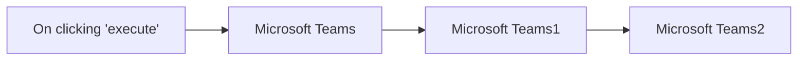

## Fluxo (.json) :

```json
{
  "nodes": [
    {
      "name": "On clicking 'execute'",
      "type": "n8n-nodes-base.manualTrigger",
      "position": [
        540,
        360
      ],
      "parameters": {},
      "typeVersion": 1
    },
    {
      "name": "Microsoft Teams",
      "type": "n8n-nodes-base.microsoftTeams",
      "position": [
        740,
        360
      ],
      "parameters": {
        "name": "n8n-docs-demo",
        "teamId": "d6b83b00-085d-472c-a6d9-8c2c32c1424e",
        "options": {}
      },
      "credentials": {
        "microsoftTeamsOAuth2Api": "teams_n8n"
      },
      "typeVersion": 1
    },
    {
      "name": "Microsoft Teams1",
      "type": "n8n-nodes-base.microsoftTeams",
      "position": [
        940,
        360
      ],
      "parameters": {
        "teamId": "={{$node[\"Microsoft Teams\"].parameter[\"teamId\"]}}",
        "channelId": "={{$node[\"Microsoft Teams\"].json[\"id\"]}}",
        "operation": "update",
        "updateFields": {
          "name": "n8n-documentation-demo"
        }
      },
      "credentials": {
        "microsoftTeamsOAuth2Api": "teams_n8n"
      },
      "typeVersion": 1
    },
    {
      "name": "Microsoft Teams2",
      "type": "n8n-nodes-base.microsoftTeams",
      "position": [
        1140,
        360
      ],
      "parameters": {
        "teamId": "={{$node[\"Microsoft Teams\"].parameter[\"teamId\"]}}",
        "message": "n8n rocks!",
        "resource": "channelMessage",
        "channelId": "={{$node[\"Microsoft Teams\"].json[\"id\"]}}",
        "messageType": "text"
      },
      "credentials": {
        "microsoftTeamsOAuth2Api": "teams_n8n"
      },
      "typeVersion": 1
    }
  ],
  "connections": {
    "Microsoft Teams": {
      "main": [
        [
          {
            "node": "Microsoft Teams1",
            "type": "main",
            "index": 0
          }
        ]
      ]
    },
    "Microsoft Teams1": {
      "main": [
        [
          {
            "node": "Microsoft Teams2",
            "type": "main",
            "index": 0
          }
        ]
      ]
    },
    "On clicking 'execute'": {
      "main": [
        [
          {
            "node": "Microsoft Teams",
            "type": "main",
            "index": 0
          }
        ]
      ]
    }
  }
}
```

<a id="template-490"></a>

## Template 490 - Classificação automática de e-mails

- **Nome:** Classificação automática de e-mails
- **Descrição:** Monitora a caixa de entrada do Gmail, classifica automaticamente o conteúdo dos e-mails usando um modelo de IA e aplica rótulos correspondentes para organização; oferece opção de gerar rascunhos de resposta por IA.
- **Funcionalidade:** • Monitoramento periódico da caixa de entrada: Verifica novos e-mails a cada minuto para iniciar o processamento.
• Extração de conteúdo do e-mail: Recupera texto/HTML do e-mail para análise automática.
• Classificação por IA: Classifica o e-mail em categorias predefinidas (High Priority, KS Work Related, Promotion, Other) usando um modelo de linguagem.
• Aplicação de rótulos no Gmail: Adiciona rótulos específicos ao e-mail conforme a categoria identificada.
• Geração de rascunhos de resposta por IA (opcional): Cria rascunhos de resposta com tom profissional e instruções configuradas para responder como o usuário.
• Configuração personalizável: Permite ajustar categorias e mapear cada categoria para rótulos do Gmail conforme necessidade.
- **Ferramentas:** • Gmail: Provedor de e-mail usado para monitorar a caixa de entrada, aplicar rótulos e criar rascunhos de mensagens.
• Google Gemini (PaLM API): Modelo de linguagem usado para classificar o conteúdo dos e-mails e gerar respostas automatizadas.

## Fluxo visual

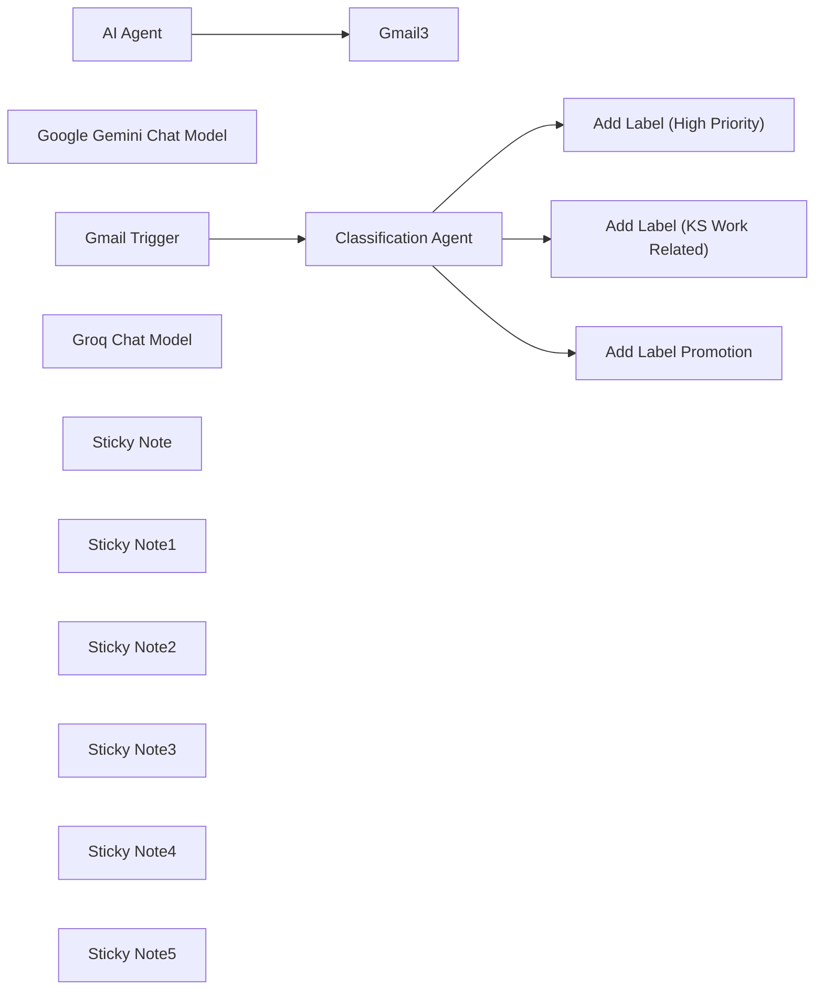

## Fluxo (.json) :

```json
{
  "id": "m8gr0YZgCx5Qrsia",
  "meta": {
    "instanceId": "b795c85ef5703ecdc784a39956949c45a099b0c52b9adbeeed744965b5aed696",
    "templateCredsSetupCompleted": true
  },
  "name": "(G) - Email Classification",
  "tags": [],
  "nodes": [
    {
      "id": "0226578d-4741-42f2-8a7b-c750f75be78d",
      "name": "Gmail Trigger",
      "type": "n8n-nodes-base.gmailTrigger",
      "position": [
        0,
        0
      ],
      "parameters": {
        "simple": false,
        "filters": {},
        "options": {},
        "pollTimes": {
          "item": [
            {
              "mode": "everyMinute"
            }
          ]
        }
      },
      "credentials": {
        "gmailOAuth2": {
          "id": "YNdPYS7HyXbJjy7l",
          "name": "Gmail account (jkp@kajonkietsuksa.ac.th)"
        }
      },
      "typeVersion": 1.2
    },
    {
      "id": "48d0ee27-d4d6-4db4-843c-d9c18b934945",
      "name": "Google Gemini Chat Model",
      "type": "@n8n/n8n-nodes-langchain.lmChatGoogleGemini",
      "position": [
        220,
        320
      ],
      "parameters": {
        "options": {},
        "modelName": "models/gemini-2.0-flash-001"
      },
      "credentials": {
        "googlePalmApi": {
          "id": "ZK3aD9k31PG9XVBd",
          "name": "Guitar's Gemini (babystoreroom@gmail.com)"
        }
      },
      "typeVersion": 1
    },
    {
      "id": "d7e8bed4-cadc-41e3-b793-cc8affb177cc",
      "name": "AI Agent",
      "type": "@n8n/n8n-nodes-langchain.agent",
      "disabled": true,
      "position": [
        1420,
        60
      ],
      "parameters": {
        "text": "=Here's the email context: {{ $('Classification Agent').item.json.text }}",
        "options": {
          "systemMessage": "You are my personal assistant for Kajonkietsuksa School.\nYour role is to help me with any work-related tasks.\nOne of your main responsibilities is to write professional and polite reply emails whenever I receive an email in my inbox. Act as me, don't include something like \"here's a potential reply email or other\"\n\nWhen writing a reply email:\n\nStart by acknowledging the sender's message.\n\nAnswer their questions or address their requests clearly and directly.\n\nMaintain a polite, professional, and helpful tone.\n\nKeep the language simple and easy to understand.\n\nIf additional action is required from me, mention that I will get back to them soon.\n\nAlways end the email with a courteous closing line, such as \"Thank you\" or \"Best regards.\"\n\nKeep your writing style consistent with a warm yet formal communication style that reflects the reputation of Kajonkietsuksa School.\n\n"
        },
        "promptType": "define"
      },
      "typeVersion": 1.8
    },
    {
      "id": "3b5cabb7-346f-4b69-b3f4-c61e78e2d8c7",
      "name": "Groq Chat Model",
      "type": "@n8n/n8n-nodes-langchain.lmChatGroq",
      "disabled": true,
      "position": [
        1440,
        180
      ],
      "parameters": {
        "model": "meta-llama/llama-4-scout-17b-16e-instruct",
        "options": {}
      },
      "credentials": {
        "groqApi": {
          "id": "ssFnosV0K9CllUnY",
          "name": "(G) Groq account (jkp@kajonkietsuksa.ac.th)"
        }
      },
      "typeVersion": 1
    },
    {
      "id": "43984fb2-7a26-4e13-95ee-c29f0d9f2f24",
      "name": "Gmail3",
      "type": "n8n-nodes-base.gmail",
      "disabled": true,
      "position": [
        1780,
        60
      ],
      "webhookId": "64df877a-5475-447d-860b-b62d4418d841",
      "parameters": {
        "message": "={{ $json.output }}",
        "options": {},
        "subject": "=Re: {{ $('Gmail Trigger').item.json.headers.subject }}",
        "resource": "draft"
      },
      "credentials": {
        "gmailOAuth2": {
          "id": "YNdPYS7HyXbJjy7l",
          "name": "Gmail account (jkp@kajonkietsuksa.ac.th)"
        }
      },
      "typeVersion": 2.1
    },
    {
      "id": "c269ec5e-f882-4458-ab52-46b719731309",
      "name": "Classification Agent",
      "type": "@n8n/n8n-nodes-langchain.textClassifier",
      "position": [
        240,
        0
      ],
      "parameters": {
        "options": {
          "systemPromptTemplate": "Please classify the text provided by the user into one of the following categories: {categories}, and use the provided formatting instructions below. Don't explain, and only output the json."
        },
        "inputText": "={{ $json.text || $json.html }}",
        "categories": {
          "categories": [
            {
              "category": "High Priority",
              "description": "Emails requiring immediate attention or action, typically from key stakeholders, clients, or decision-makers. These emails often contain time-sensitive requests, deadlines, or escalated issues. Keywords: urgent, ASAP, immediate, deadline, action required, high priority"
            },
            {
              "category": "KS Work Related",
              "description": "Anything related to my school or education. Keyword: Kajonkietsuksa School, Kajonkietsuksa, School"
            },
            {
              "category": "Promotion",
              "description": "Anything related to updating on promotions. Keywords: newsletter, promotion, offer, sale, campaign, marketing, launch"
            },
            {
              "category": "Other",
              "description": "If you don't know what category is this email."
            }
          ]
        }
      },
      "typeVersion": 1
    },
    {
      "id": "17be38df-c225-4d19-81ec-e205ff4b9f3c",
      "name": "Sticky Note",
      "type": "n8n-nodes-base.stickyNote",
      "position": [
        60,
        260
      ],
      "parameters": {
        "color": 4,
        "width": 300,
        "height": 80,
        "content": "### 2) Change to your desire LLMs"
      },
      "typeVersion": 1
    },
    {
      "id": "3e8ac267-c2ac-49cb-ad53-536510faa1a4",
      "name": "Sticky Note1",
      "type": "n8n-nodes-base.stickyNote",
      "position": [
        -80,
        -60
      ],
      "parameters": {
        "color": 4,
        "content": "### 1) Change to your gmail's credential"
      },
      "typeVersion": 1
    },
    {
      "id": "f5e2c92d-3335-4ed0-915e-f7edeb0b5a92",
      "name": "Sticky Note2",
      "type": "n8n-nodes-base.stickyNote",
      "position": [
        220,
        -380
      ],
      "parameters": {
        "color": 4,
        "width": 340,
        "content": "### 3) Login to your gmail inbox\n* Create a label with \"+\" icon\n* Change the color of your choice"
      },
      "typeVersion": 1
    },
    {
      "id": "4a8a7424-f9dd-42b1-b803-5d0dbe076956",
      "name": "Sticky Note3",
      "type": "n8n-nodes-base.stickyNote",
      "position": [
        220,
        -160
      ],
      "parameters": {
        "color": 4,
        "width": 320,
        "content": "### 4) Agent instruction\n* Input the category name that you just created in gmail.\n* Description = Tell agent about how should it classify your email. Keywords can be useful to let your agent classify the email context."
      },
      "typeVersion": 1
    },
    {
      "id": "24c7ef4e-7a68-4240-980b-02b994300084",
      "name": "Add Label Promotion",
      "type": "n8n-nodes-base.gmail",
      "position": [
        700,
        200
      ],
      "webhookId": "4e089f5f-58ea-4c8d-8870-3d155a81f0b7",
      "parameters": {
        "labelIds": [
          "Label_4917715854276709190"
        ],
        "messageId": "={{ $json.id }}",
        "operation": "addLabels"
      },
      "credentials": {
        "gmailOAuth2": {
          "id": "YNdPYS7HyXbJjy7l",
          "name": "Gmail account (jkp@kajonkietsuksa.ac.th)"
        }
      },
      "typeVersion": 2.1
    },
    {
      "id": "759f8cbe-4674-49e5-a52b-2acf208ffb22",
      "name": "Add Label (KS Work Related)",
      "type": "n8n-nodes-base.gmail",
      "position": [
        700,
        0
      ],
      "webhookId": "4e089f5f-58ea-4c8d-8870-3d155a81f0b7",
      "parameters": {
        "labelIds": [
          "Label_4956837555783205638"
        ],
        "messageId": "={{ $json.id }}",
        "operation": "addLabels"
      },
      "credentials": {
        "gmailOAuth2": {
          "id": "YNdPYS7HyXbJjy7l",
          "name": "Gmail account (jkp@kajonkietsuksa.ac.th)"
        }
      },
      "typeVersion": 2.1
    },
    {
      "id": "d07fe962-16c0-401a-b194-5ce7e6ad9746",
      "name": "Add Label (High Priority)",
      "type": "n8n-nodes-base.gmail",
      "position": [
        700,
        -200
      ],
      "webhookId": "4e089f5f-58ea-4c8d-8870-3d155a81f0b7",
      "parameters": {
        "labelIds": [
          "Label_3750994713301985229"
        ],
        "messageId": "={{ $json.id }}",
        "operation": "addLabels"
      },
      "credentials": {
        "gmailOAuth2": {
          "id": "YNdPYS7HyXbJjy7l",
          "name": "Gmail account (jkp@kajonkietsuksa.ac.th)"
        }
      },
      "typeVersion": 2.1
    },
    {
      "id": "7d0c9bd5-6150-4afa-9344-8bb3c1a6b01c",
      "name": "Sticky Note4",
      "type": "n8n-nodes-base.stickyNote",
      "position": [
        660,
        -320
      ],
      "parameters": {
        "color": 4,
        "width": 320,
        "content": "### 5) Add Label Nodes\n* In this option \"Label Names or IDs\" -> Select the category to match with the Classification Agent Node."
      },
      "typeVersion": 1
    },
    {
      "id": "d57ecacb-a479-4bf7-b9b4-b9e14e30dcd7",
      "name": "Sticky Note5",
      "type": "n8n-nodes-base.stickyNote",
      "position": [
        980,
        60
      ],
      "parameters": {
        "color": 4,
        "width": 220,
        "content": "### 6) Add-on\n* You can add more category of your choice!"
      },
      "typeVersion": 1
    }
  ],
  "active": true,
  "pinData": {},
  "settings": {
    "executionOrder": "v1"
  },
  "versionId": "c94df4ec-be75-449f-82fa-4e1f8878104a",
  "connections": {
    "AI Agent": {
      "main": [
        [
          {
            "node": "Gmail3",
            "type": "main",
            "index": 0
          }
        ]
      ]
    },
    "Gmail Trigger": {
      "main": [
        [
          {
            "node": "Classification Agent",
            "type": "main",
            "index": 0
          }
        ]
      ]
    },
    "Groq Chat Model": {
      "ai_languageModel": [
        [
          {
            "node": "AI Agent",
            "type": "ai_languageModel",
            "index": 0
          }
        ]
      ]
    },
    "Classification Agent": {
      "main": [
        [
          {
            "node": "Add Label (High Priority)",
            "type": "main",
            "index": 0
          }
        ],
        [
          {
            "node": "Add Label (KS Work Related)",
            "type": "main",
            "index": 0
          }
        ],
        [
          {
            "node": "Add Label Promotion",
            "type": "main",
            "index": 0
          }
        ]
      ]
    },
    "Google Gemini Chat Model": {
      "ai_languageModel": [
        [
          {
            "node": "Classification Agent",
            "type": "ai_languageModel",
            "index": 0
          }
        ]
      ]
    },
    "Add Label (KS Work Related)": {
      "main": [
        []
      ]
    }
  }
}
```

<a id="template-491"></a>

## Template 491 - Conversão de data via execução manual

- **Nome:** Conversão de data via execução manual
- **Descrição:** Fluxo iniciado manualmente que interpreta uma data no formato DD/MM/YYYY e a normaliza para um formato de data padrão.
- **Funcionalidade:** • Início manual: permite executar o fluxo manualmente ao clicar em 'execute'.
• Conversão de data: recebe a string '14/02/2020' no formato DD/MM/YYYY e a interpreta/normaliza para um formato de data padrão.
- **Ferramentas:** • Nenhuma: não há ferramentas externas integradas; o fluxo processa a informação internamente.

## Fluxo visual

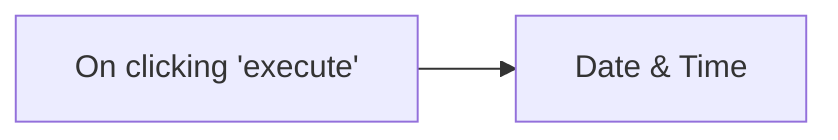

## Fluxo (.json) :

```json
{
  "nodes": [
    {
      "name": "On clicking 'execute'",
      "type": "n8n-nodes-base.manualTrigger",
      "position": [
        250,
        300
      ],
      "parameters": {},
      "typeVersion": 1
    },
    {
      "name": "Date & Time",
      "type": "n8n-nodes-base.dateTime",
      "position": [
        450,
        300
      ],
      "parameters": {
        "value": "14/02/2020",
        "options": {
          "fromFormat": "DD/MM/YYYY"
        }
      },
      "typeVersion": 1
    }
  ],
  "connections": {
    "On clicking 'execute'": {
      "main": [
        [
          {
            "node": "Date & Time",
            "type": "main",
            "index": 0
          }
        ]
      ]
    }
  }
}
```

<a id="template-492"></a>

## Template 492 - Notificações de novo cliente Help Scout

- **Nome:** Notificações de novo cliente Help Scout
- **Descrição:** Recebe atualizações quando um novo cliente é criado no Help Scout e aciona a automação para processar esses dados.
- **Funcionalidade:** • Detecção do evento customer.created: inicia o fluxo ao receber o evento de criação de cliente.
• Recebimento do payload do cliente: captura os dados do cliente criado enviados pelo webhook.
• Autenticação via OAuth2: utiliza credenciais OAuth2 para conectar-se à conta do Help Scout.
• Exposição por webhook com ID único: disponibiliza um ponto de entrada para receber os eventos do Help Scout.
• Preparação para integrações posteriores: organiza e encaminha os dados para outras automações ou sistemas.
- **Ferramentas:** • Help Scout: plataforma de atendimento ao cliente que envia eventos e webhooks sobre a criação e atualização de clientes.

## Fluxo visual

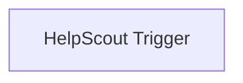

## Fluxo (.json) :

```json
{
  "id": "61",
  "name": "Receive updates when a customer is created in HelpScout",
  "nodes": [
    {
      "name": "HelpScout Trigger",
      "type": "n8n-nodes-base.helpScoutTrigger",
      "position": [
        690,
        260
      ],
      "webhookId": "aaaf8b3f-8247-4d98-ae65-8c6626aade95",
      "parameters": {
        "events": [
          "customer.created"
        ]
      },
      "credentials": {
        "helpScoutOAuth2Api": "helpscout"
      },
      "typeVersion": 1
    }
  ],
  "active": false,
  "settings": {},
  "connections": {}
}
```

<a id="template-493"></a>

## Template 493 - Monitor de carteira USDT TRC20 a cada 15 minutos

- **Nome:** Monitor de carteira USDT TRC20 a cada 15 minutos
- **Descrição:** Monitora transferências TRC20 relacionadas a uma carteira TRON, recuperando e formatando transações recentes para posterior processamento ou notificação.
- **Funcionalidade:** • Agendamento periódico: Executa a verificação automaticamente a cada 15 minutos.
• Configuração de carteira e limite: Permite definir o endereço da carteira TRC20 e o número de transações a consultar por requisição.
• Consulta de transferências TRC20: Realiza chamada à API pública para obter histórico de transferências relacionadas ao endereço configurado.
• Expansão de resultados: Divide a resposta em registros individuais para processamento linha a linha.
• Filtragem temporal e por destinatário: Seleciona apenas transferências recebidas destinadas à carteira configurada e ocorridas nos últimos 15 minutos.
• Normalização e formatação de campos: Extrai e formata informações relevantes (moeda, rede, remetente, destinatário, valor convertido com decimais, status, resultado e URL da transação).
• Agregação final: Combina os registros formatados em uma lista única para saída posterior.
- **Ferramentas:** • TronScan API: Serviço público que fornece dados de transferências TRC20 (https://apilist.tronscanapi.com) para consultar histórico e detalhes de transações.
• Blockchain TRON: Rede onde ocorrem as transferências USDT TRC20 que estão sendo monitoradas.

## Fluxo visual

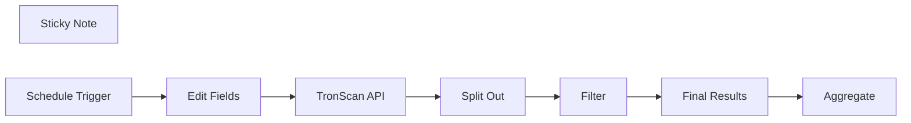

## Fluxo (.json) :

```json
{
  "meta": {
    "instanceId": "dbd43d88d26a9e30d8aadc002c9e77f1400c683dd34efe3778d43d27250dde50"
  },
  "nodes": [
    {
      "id": "6d80ce75-833e-4565-9b03-0280e29d5b47",
      "name": "Split Out",
      "type": "n8n-nodes-base.splitOut",
      "notes": "Format response",
      "position": [
        920,
        600
      ],
      "parameters": {
        "options": {
          "destinationFieldName": "Transfers"
        },
        "fieldToSplitOut": "token_transfers"
      },
      "notesInFlow": true,
      "typeVersion": 1
    },
    {
      "id": "a6a299cf-4c43-46c1-98a8-e4ce6cd3ca48",
      "name": "Edit Fields",
      "type": "n8n-nodes-base.set",
      "notes": "Wallet Config",
      "position": [
        640,
        600
      ],
      "parameters": {
        "fields": {
          "values": [
            {
              "name": "Your Wallet Address",
              "stringValue": "<Your TRC20 Wallet Address here>"
            },
            {
              "name": "Number of transactions to retrieve per request",
              "type": "numberValue",
              "numberValue": "20"
            }
          ]
        },
        "options": {}
      },
      "notesInFlow": true,
      "typeVersion": 3.2
    },
    {
      "id": "e4e91632-bccb-468f-bbb4-a918a5815bbe",
      "name": "Filter",
      "type": "n8n-nodes-base.filter",
      "notes": "Received in last 15m only",
      "position": [
        1060,
        600
      ],
      "parameters": {
        "conditions": {
          "number": [
            {
              "value1": "={{ $json.Transfers.block_ts }}",
              "value2": "={{ Date.now() - 900000 }}",
              "operation": "smallerEqual"
            }
          ],
          "string": [
            {
              "value1": "={{ $json.Transfers.to_address }}",
              "value2": "={{ $('Edit Fields').item.json['Your Wallet Address'] }}",
              "operation": "regex"
            }
          ]
        }
      },
      "notesInFlow": true,
      "typeVersion": 1
    },
    {
      "id": "1f9f2f52-bbbe-4d4c-a309-64424f9392c0",
      "name": "Sticky Note",
      "type": "n8n-nodes-base.stickyNote",
      "position": [
        460,
        460
      ],
      "parameters": {
        "color": 4,
        "width": 1120.1887804878038,
        "height": 353.65439024390236,
        "content": "## USDT TRC20 Wallet Tracker\n**This workflow** Is a basic concept of integrating your TRC20 wallet with n8n nodes.\n\n"
      },
      "typeVersion": 1
    },
    {
      "id": "31c8c3db-8f48-4cd7-ae1b-9caf579ebb9b",
      "name": "TronScan API",
      "type": "n8n-nodes-base.httpRequest",
      "notes": "Request Wallet Status",
      "position": [
        780,
        600
      ],
      "parameters": {
        "url": "https://apilist.tronscanapi.com/api/filter/trc20/transfers",
        "options": {
          "timeout": 10000,
          "redirect": {
            "redirect": {}
          },
          "allowUnauthorizedCerts": true
        },
        "sendQuery": true,
        "sendHeaders": true,
        "queryParameters": {
          "parameters": [
            {
              "name": "limit",
              "value": "={{ $json['Number of transactions to retrieve'] | '20' }}"
            },
            {
              "name": "start",
              "value": "0"
            },
            {
              "name": "sort",
              "value": "-timestamp"
            },
            {
              "name": "count",
              "value": "true"
            },
            {
              "name": "filterTokenValue",
              "value": "0"
            },
            {
              "name": "relatedAddress",
              "value": "={{ $json['Your Wallet Address']}}"
            }
          ]
        },
        "headerParameters": {
          "parameters": [
            {
              "name": "User-Agent",
              "value": "Mozilla/5.0 (Windows NT 10.0; Win64; x64; rv:122.0) Gecko/20100101 Firefox/122.0"
            },
            {
              "name": "Accept",
              "value": "application/json, text/plain, */*"
            },
            {
              "name": "Accept-Language",
              "value": "en-US,en;q=0.5"
            },
            {
              "name": "Accept-Encoding",
              "value": "gzip, deflate, br"
            },
            {
              "name": "Origin",
              "value": "https://tronscan.org"
            },
            {
              "name": "DNT",
              "value": "1"
            },
            {
              "name": "Connection",
              "value": "keep-alive"
            },
            {
              "name": "Referer",
              "value": "https://tronscan.org/"
            },
            {
              "name": "Sec-Fetch-Dest",
              "value": "empty"
            },
            {
              "name": "Sec-Fetch-Mode",
              "value": "cors"
            },
            {
              "name": "Sec-Fetch-Site",
              "value": "cross-site"
            },
            {
              "name": "Sec-GPC",
              "value": "1"
            },
            {
              "name": "Pragma",
              "value": "no-cache"
            },
            {
              "name": "Cache-Control",
              "value": "no-cache"
            }
          ]
        }
      },
      "notesInFlow": true,
      "typeVersion": 4.1
    },
    {
      "id": "d9e1df8b-0bd7-41c4-a4a9-5df909821534",
      "name": "Final Results",
      "type": "n8n-nodes-base.set",
      "notes": "Keep only required fields",
      "position": [
        1220,
        600
      ],
      "parameters": {
        "fields": {
          "values": [
            {
              "name": "Coin",
              "stringValue": "={{ $json.Transfers.tokenInfo.tokenName }} ({{ $json.Transfers.tokenInfo.tokenAbbr }})"
            },
            {
              "name": "Network",
              "stringValue": "={{ $json.Transfers.tokenInfo.tokenType }}"
            },
            {
              "name": "From Address",
              "stringValue": "={{ $json.Transfers.from_address.replace($('Edit Fields').item.json['Your Wallet Address'],\"Your Wallet Address\") || $json.Transfers.from_address_tag.from_address_tag }}"
            },
            {
              "name": "To Address",
              "stringValue": "={{ $json.Transfers.to_address.replace($('Edit Fields').item.json['Your Wallet Address'],\"Your Wallet Address\") }}"
            },
            {
              "name": "Amount",
              "stringValue": "={{ ($('Filter').item.json[\"Transfers\"][\"tokenInfo\"][\"tokenAbbr\"]+' ' + (($json.Transfers.trigger_info.parameter._value || $json.Transfers.quant) / Math.pow(10, $json.Transfers.tokenInfo.tokenDecimal)).toFixed(2)).replace('USDT ','\\$') }}"
            },
            {
              "name": "Record Type",
              "stringValue": "={{ $json.Transfers.event_type }}"
            },
            {
              "name": "Record Status",
              "stringValue": "={{ ($json.Transfers.confirmed+'').replace('true','Confirmed').replace('false','Not confirmed yet.') }}"
            },
            {
              "name": "Transaction Result",
              "stringValue": "={{ $json.Transfers.finalResult.replace('SUCCESS','Received') }}"
            },
            {
              "name": "Record URL",
              "stringValue": "=https://tronscan.org/#/transaction/{{ $json.Transfers.transaction_id }}"
            }
          ]
        },
        "include": "none",
        "options": {}
      },
      "notesInFlow": true,
      "typeVersion": 3.2
    },
    {
      "id": "e6fcf3ba-ac81-49ce-86b5-a51df76dbf00",
      "name": "Schedule Trigger",
      "type": "n8n-nodes-base.scheduleTrigger",
      "notes": "Run Every 15 minutes",
      "position": [
        500,
        600
      ],
      "parameters": {
        "rule": {
          "interval": [
            {
              "field": "minutes",
              "minutesInterval": 15
            }
          ]
        }
      },
      "notesInFlow": true,
      "typeVersion": 1.1
    },
    {
      "id": "5149f131-a87e-40ed-88df-7fb0591fe31c",
      "name": "Aggregate",
      "type": "n8n-nodes-base.aggregate",
      "notes": "Combine records into one list",
      "position": [
        1400,
        600
      ],
      "parameters": {
        "options": {},
        "aggregate": "aggregateAllItemData",
        "destinationFieldName": "Transactions"
      },
      "notesInFlow": true,
      "typeVersion": 1,
      "alwaysOutputData": false
    }
  ],
  "pinData": {},
  "connections": {
    "Filter": {
      "main": [
        [
          {
            "node": "Final Results",
            "type": "main",
            "index": 0
          }
        ]
      ]
    },
    "Split Out": {
      "main": [
        [
          {
            "node": "Filter",
            "type": "main",
            "index": 0
          }
        ]
      ]
    },
    "Edit Fields": {
      "main": [
        [
          {
            "node": "TronScan API",
            "type": "main",
            "index": 0
          }
        ]
      ]
    },
    "TronScan API": {
      "main": [
        [
          {
            "node": "Split Out",
            "type": "main",
            "index": 0
          }
        ]
      ]
    },
    "Final Results": {
      "main": [
        [
          {
            "node": "Aggregate",
            "type": "main",
            "index": 0
          }
        ]
      ]
    },
    "Schedule Trigger": {
      "main": [
        [
          {
            "node": "Edit Fields",
            "type": "main",
            "index": 0
          }
        ]
      ]
    }
  }
}
```

<a id="template-494"></a>

## Template 494 - Publicar imagem no LinkedIn a partir de URL

- **Nome:** Publicar imagem no LinkedIn a partir de URL
- **Descrição:** Inicia manualmente, baixa uma imagem de uma URL pública e publica um post com essa imagem em um perfil do LinkedIn.
- **Funcionalidade:** • Início manual: o fluxo é acionado manualmente pelo usuário ao clicar em executar.
• Download de imagem via URL: faz uma requisição HTTP para obter a imagem como arquivo.
• Publicação no LinkedIn: cria um post no LinkedIn como perfil especificado, anexando a imagem e incluindo um texto de descrição.
- **Ferramentas:** • Serviço de hospedagem de imagens: armazena e serve o arquivo de imagem acessível por URL para download.
• LinkedIn: plataforma para publicar posts em perfis pessoais via API, permitindo anexar mídia (imagens) e texto.

## Fluxo visual

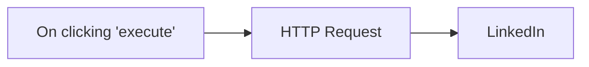

## Fluxo (.json) :

```json
{
  "nodes": [
    {
      "name": "On clicking 'execute'",
      "type": "n8n-nodes-base.manualTrigger",
      "position": [
        250,
        300
      ],
      "parameters": {},
      "typeVersion": 1
    },
    {
      "name": "HTTP Request",
      "type": "n8n-nodes-base.httpRequest",
      "position": [
        440,
        300
      ],
      "parameters": {
        "url": "https://n8n.io/n8n-logo.png",
        "options": {},
        "responseFormat": "file"
      },
      "typeVersion": 1
    },
    {
      "name": "LinkedIn",
      "type": "n8n-nodes-base.linkedIn",
      "position": [
        640,
        300
      ],
      "parameters": {
        "text": "this is a test image post",
        "person": "gZG0JALzuy",
        "postAs": "person",
        "additionalFields": {},
        "shareMediaCategory": "IMAGE"
      },
      "credentials": {
        "linkedInOAuth2Api": "linkedin_demo"
      },
      "typeVersion": 1
    }
  ],
  "connections": {
    "HTTP Request": {
      "main": [
        [
          {
            "node": "LinkedIn",
            "type": "main",
            "index": 0
          }
        ]
      ]
    },
    "On clicking 'execute'": {
      "main": [
        [
          {
            "node": "HTTP Request",
            "type": "main",
            "index": 0
          }
        ]
      ]
    }
  }
}
```

<a id="template-495"></a>

## Template 495 - Agente AI para gerar tarefas e comunicar participantes

- **Nome:** Agente AI para gerar tarefas e comunicar participantes
- **Descrição:** Automatiza a extração de transcrições de reuniões, analisa conteúdo com IA, cria tarefas e notifica participantes, além de agendar chamadas quando necessário.
- **Funcionalidade:** • Captura de evento de reunião: Inicia o fluxo quando uma reunião é finalizada.
• Recuperação de transcrição: Obtém título, participantes, sentenças e resumo via API de transcrição.
• Análise com IA: Gera resumo em bullets, identifica action items e decide ações (criar tarefas, notificar ou agendar).
• Criação de tarefas estruturadas: Gera tarefas detalhadas (nome, descrição, data, prioridade, projeto) a serem salvas na base de tarefas.
• Notificação aos participantes: Envia e-mails com resumo e tarefas específicas para cada participante, excluindo o usuário principal.
• Agendamento de follow-up: Cria eventos de calendário com link do Google Meet quando for necessário agendar uma chamada.
• Separação e inserção: Divide itens em registros individuais e os insere como entradas na base de tarefas.
• Alertas de configuração: Inclui lembretes para substituir chaves API e conexões externas antes do uso.
- **Ferramentas:** • Fireflies.ai: Serviço de transcrição e armazenamento de conteúdo de reuniões acessível via API GraphQL.
• OpenAI (modelo GPT-4o): Processamento e análise de texto para gerar resumos, identificar action items e decidir ações automatizadas.
• Airtable: Banco de dados para registrar e gerenciar tarefas geradas a partir das reuniões.
• Gmail: Envio de notificações por e-mail aos participantes com resumos e tarefas atribuídas.
• Google Calendar: Agendamento de eventos e criação de links de videoconferência (Google Meet).

## Fluxo visual

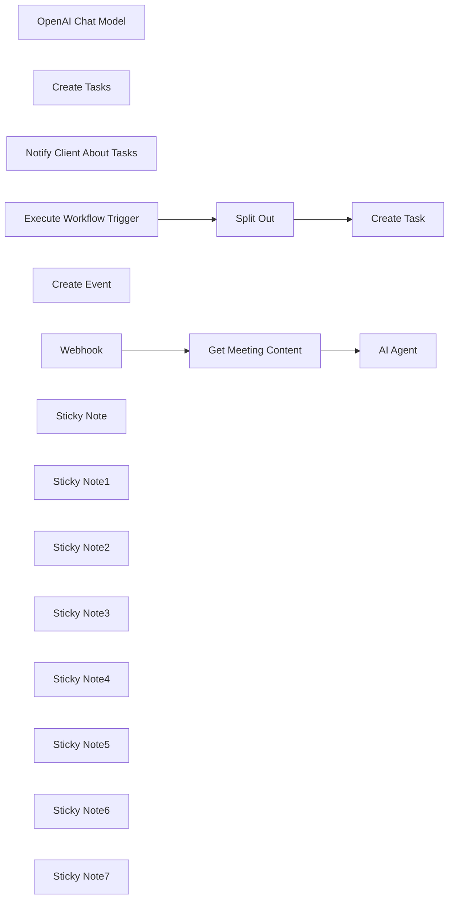

## Fluxo (.json) :

```json
{
  "nodes": [
    {
      "id": "38972c5c-09f4-4120-a468-731e720914e1",
      "name": "AI Agent",
      "type": "@n8n/n8n-nodes-langchain.agent",
      "position": [
        900,
        -240
      ],
      "parameters": {
        "text": "=Title: {{ $json.data.transcript.title }}\n\nParticipants: {{ $json.data.transcript.participants }}\n\nTranscript: {{ JSON.stringify($json.data.transcript.sentences) }}\n\nBullet gist:{{ $json.data.transcript.summary.bullet_gist }}",
        "agent": "openAiFunctionsAgent",
        "options": {
          "systemMessage": "=You get my calls' transcripts from Firefiles.\nThere can be meetings about projects. You can understand if it's about a project if meeting's title contains \"project\". If so - you need to:\n1. Analyze transcript, use tool \"Create Tasks\" to create tasks for me in my AirTable base.\n2. You need to use tool \"Notify Client About Tasks\" to nofity client about his tasks.\n3. If transcript contains info there's a call needed - you'll use \"Create Event\" tool to create call on Google Meet\nCurrent date: {{ $now }}"
        },
        "promptType": "define"
      },
      "typeVersion": 1.7
    },
    {
      "id": "db5c1bfa-b979-4749-84c8-8cd7d777748c",
      "name": "OpenAI Chat Model",
      "type": "@n8n/n8n-nodes-langchain.lmChatOpenAi",
      "position": [
        880,
        40
      ],
      "parameters": {
        "model": "gpt-4o",
        "options": {}
      },
      "credentials": {
        "openAiApi": {
          "id": "9RivS2BmSh1DDBFm",
          "name": "OpenAi account 3"
        }
      },
      "typeVersion": 1
    },
    {
      "id": "334873ba-ec5c-42b3-b8d0-def79d07c0aa",
      "name": "Create Tasks",
      "type": "@n8n/n8n-nodes-langchain.toolWorkflow",
      "position": [
        1040,
        40
      ],
      "parameters": {
        "name": "create_task",
        "schemaType": "manual",
        "workflowId": {
          "__rl": true,
          "mode": "list",
          "value": "Jo0BiizccacaChkH",
          "cachedResultName": "Firefiles AI Agent"
        },
        "description": "=Use this tool to create a task. \nFor task creation use only action items for me [YOUR NAME HERE], don't use action items for other participants.",
        "inputSchema": "{\n    \"type\": \"object\",\n    \"properties\": {\n      \"items\": {\n        \"type\": \"array\",\n        \"description\": \"An array of tasks\",\n        \"items\": {\n          \"type\": \"object\",\n          \"properties\": {\n            \"name\": {\n              \"type\": \"string\",\n              \"description\": \"The name of the task\"\n            },\n            \"description\": {\n              \"type\": \"string\",\n              \"description\": \"A detailed description of the task\"\n            },\n            \"due_date\": {\n              \"type\": \"string\",\n              \"description\": \"Due Date\"\n            },\n            \"priority\": {\n              \"type\": \"string\",\n              \"description\": \"Priority. . Please capitalize first letter\"\n            },\n            \"project_name\": {\n              \"type\": \"string\",\n              \"description\": \"Name of the project. Word 'Project' shouldn't be included\"\n            }\n          },\n          \"required\": [\n            \"name\",\n            \"description\",\n            \"due_date\",\n            \"priority\"\n          ],\n          \"additionalProperties\": false\n        }\n      }\n    },\n    \"required\": [\n      \"items\"\n    ],\n    \"additionalProperties\": false\n}",
        "specifyInputSchema": true
      },
      "typeVersion": 1.3
    },
    {
      "id": "7fd03a80-71e9-4c47-9870-7a3ad4916149",
      "name": "Notify Client About Tasks",
      "type": "n8n-nodes-base.gmailTool",
      "position": [
        1180,
        40
      ],
      "webhookId": "519d9406-10ef-4ae1-a747-d278002cac9e",
      "parameters": {
        "sendTo": "={{ $fromAI(\"participant_email\",\"participant email \",\"string\") }}",
        "message": "=Summary:\n{{ $json.data.transcript.summary.bullet_gist }}\n\nAction Items:\n{{ $fromAI(\"participant_action_items\",\"participant action items \",\"string\") }}",
        "options": {
          "appendAttribution": false
        },
        "subject": "Meeting Summary",
        "emailType": "text",
        "descriptionType": "manual",
        "toolDescription": "=Use the tool to notify a participant of the meeting with meeting summary and his tasks.\nIMPORTANT: \n1. Please notify participants except for me. My email: [YOUR EMAIL HERE]\n2. When working with tasks - please send only the participant's tasks."
      },
      "credentials": {
        "gmailOAuth2": {
          "id": "LhdnHxP8WcSDEHw3",
          "name": "Gmail account 3"
        }
      },
      "typeVersion": 2.1
    },
    {
      "id": "094a0e52-a4fa-4078-9b96-80568acb9c51",
      "name": "Execute Workflow Trigger",
      "type": "n8n-nodes-base.executeWorkflowTrigger",
      "position": [
        460,
        420
      ],
      "parameters": {},
      "typeVersion": 1
    },
    {
      "id": "e59e5a29-4509-45cc-9130-181ea432553c",
      "name": "Split Out",
      "type": "n8n-nodes-base.splitOut",
      "position": [
        680,
        420
      ],
      "parameters": {
        "options": {},
        "fieldToSplitOut": "query.items"
      },
      "typeVersion": 1
    },
    {
      "id": "dc664650-f74e-4574-95a0-dd4a9bf181a1",
      "name": "Create Task",
      "type": "n8n-nodes-base.airtable",
      "position": [
        900,
        420
      ],
      "parameters": {
        "base": {
          "__rl": true,
          "mode": "list",
          "value": "appndgSF4faN4jPXi",
          "cachedResultUrl": "https://airtable.com/appndgSF4faN4jPXi",
          "cachedResultName": "Philipp's Base"
        },
        "table": {
          "__rl": true,
          "mode": "list",
          "value": "tblaCSndQsSF3gq7Z",
          "cachedResultUrl": "https://airtable.com/appndgSF4faN4jPXi/tblaCSndQsSF3gq7Z",
          "cachedResultName": "Tasks"
        },
        "columns": {
          "value": {
            "Name": "={{ $json.name }}",
            "Project": "={{ [$json.project_name] }}",
            "Due Date": "={{ $json.due_date }}",
            "Priority": "={{ $json.priority }}",
            "Description": "={{ $json.description }}"
          },
          "schema": [
            {
              "id": "Name",
              "type": "string",
              "display": true,
              "removed": false,
              "readOnly": false,
              "required": false,
              "displayName": "Name",
              "defaultMatch": false,
              "canBeUsedToMatch": true
            },
            {
              "id": "Description",
              "type": "string",
              "display": true,
              "removed": false,
              "readOnly": false,
              "required": false,
              "displayName": "Description",
              "defaultMatch": false,
              "canBeUsedToMatch": true
            },
            {
              "id": "Priority",
              "type": "options",
              "display": true,
              "options": [
                {
                  "name": "Low",
                  "value": "Low"
                },
                {
                  "name": "Medium",
                  "value": "Medium"
                },
                {
                  "name": "Urgent",
                  "value": "Urgent"
                },
                {
                  "name": "low",
                  "value": "low"
                },
                {
                  "name": "medium",
                  "value": "medium"
                },
                {
                  "name": "urgent",
                  "value": "urgent"
                }
              ],
              "removed": false,
              "readOnly": false,
              "required": false,
              "displayName": "Priority",
              "defaultMatch": false,
              "canBeUsedToMatch": true
            },
            {
              "id": "Due Date",
              "type": "dateTime",
              "display": true,
              "removed": false,
              "readOnly": false,
              "required": false,
              "displayName": "Due Date",
              "defaultMatch": false,
              "canBeUsedToMatch": true
            },
            {
              "id": "Project",
              "type": "array",
              "display": true,
              "removed": false,
              "readOnly": false,
              "required": false,
              "displayName": "Project",
              "defaultMatch": false,
              "canBeUsedToMatch": true
            }
          ],
          "mappingMode": "defineBelow",
          "matchingColumns": []
        },
        "options": {
          "typecast": true
        },
        "operation": "create"
      },
      "credentials": {
        "airtableTokenApi": {
          "id": "XT7hvl1w201jtBhx",
          "name": "Philipp Airtable Personal Access Token account"
        }
      },
      "typeVersion": 2.1
    },
    {
      "id": "6d6f9094-b0b3-495e-ade8-d80c03e727b0",
      "name": "Create Event",
      "type": "n8n-nodes-base.googleCalendarTool",
      "position": [
        1340,
        40
      ],
      "parameters": {
        "end": "={{ $fromAI(\"end_date_time\",\"Date and time of meeting end\",\"string\") }}",
        "start": "={{ $fromAI(\"start_date_time\",\"Date and time of meeting start\",\"string\") }}",
        "calendar": {
          "__rl": true,
          "mode": "list",
          "value": "philipp@lowcoding.dev",
          "cachedResultName": "philipp@lowcoding.dev"
        },
        "descriptionType": "manual",
        "toolDescription": "=Use tool to create Google Calendar Event. Use this tool only when transcript contains information that call should be scheduled.",
        "additionalFields": {
          "summary": "={{ $fromAI(\"meeting_name\",\"Meeting name\",\"string\") }}",
          "attendees": [
            "={{ $fromAI(\"email\",\"client email\",\"string\") }}"
          ],
          "conferenceDataUi": {
            "conferenceDataValues": {
              "conferenceSolution": "hangoutsMeet"
            }
          }
        }
      },
      "credentials": {
        "googleCalendarOAuth2Api": {
          "id": "E5Ufn31vrZLKzh4n",
          "name": "Google Calendar account"
        }
      },
      "typeVersion": 1.2
    },
    {
      "id": "2406fc01-fd28-403c-9378-473e8748e0dd",
      "name": "Webhook",
      "type": "n8n-nodes-base.webhook",
      "position": [
        480,
        -240
      ],
      "webhookId": "df852a9f-5ea3-43f2-bd49-d045aba5e9c9",
      "parameters": {
        "path": "df852a9f-5ea3-43f2-bd49-d045aba5e9c9",
        "options": {},
        "httpMethod": "POST"
      },
      "typeVersion": 2
    },
    {
      "id": "fe28fa98-4946-4379-970e-6df1a79e2a1e",
      "name": "Get Meeting Content",
      "type": "n8n-nodes-base.httpRequest",
      "position": [
        700,
        -240
      ],
      "parameters": {
        "url": "https://api.fireflies.ai/graphql",
        "method": "POST",
        "options": {},
        "jsonBody": "={\n  \"query\": \"query Transcript($transcriptId: String!) { transcript(id: $transcriptId) { title participants speakers { id name } sentences { speaker_name text } summary { bullet_gist } } }\",\n  \"variables\": {\n    \"transcriptId\": \"{{ $json.meetingId }}\"\n  }\n}",
        "sendBody": true,
        "sendHeaders": true,
        "specifyBody": "json",
        "headerParameters": {
          "parameters": [
            {
              "name": "Authorization",
              "value": "Bearer [YOUR API KEY HERE]"
            }
          ]
        }
      },
      "typeVersion": 4.2
    },
    {
      "id": "5eadd00a-9095-4bf3-80ed-e7bc5c49390d",
      "name": "Sticky Note",
      "type": "n8n-nodes-base.stickyNote",
      "position": [
        620,
        -360
      ],
      "parameters": {
        "color": 4,
        "height": 80,
        "content": "### Replace API key for Fireflies\n"
      },
      "typeVersion": 1
    },
    {
      "id": "93cee18c-2215-4a63-af7b-ddf45729f5e4",
      "name": "Sticky Note1",
      "type": "n8n-nodes-base.stickyNote",
      "position": [
        1180,
        200
      ],
      "parameters": {
        "color": 4,
        "height": 80,
        "content": "### Replace connections for Airtable and Google\n"
      },
      "typeVersion": 1
    },
    {
      "id": "4d792723-4507-486f-9dc7-62bf1b927edd",
      "name": "Sticky Note2",
      "type": "n8n-nodes-base.stickyNote",
      "position": [
        380,
        340
      ],
      "parameters": {
        "width": 820,
        "height": 280,
        "content": "### Scenario 2 - Create Tasks tool"
      },
      "typeVersion": 1
    },
    {
      "id": "c5520210-86db-4639-9f8c-ac9055407232",
      "name": "Sticky Note3",
      "type": "n8n-nodes-base.stickyNote",
      "position": [
        380,
        -460
      ],
      "parameters": {
        "width": 1100,
        "height": 760,
        "content": "### Scenario 1 - AI agent"
      },
      "typeVersion": 1
    },
    {
      "id": "48d47e44-b7bf-49b3-814b-6969ce97108d",
      "name": "Sticky Note4",
      "type": "n8n-nodes-base.stickyNote",
      "position": [
        800,
        180
      ],
      "parameters": {
        "color": 4,
        "height": 80,
        "content": "### Replace OpenAI connection\n"
      },
      "typeVersion": 1
    },
    {
      "id": "afe4bffa-8937-4c31-8513-0acc6b8858ce",
      "name": "Sticky Note5",
      "type": "n8n-nodes-base.stickyNote",
      "position": [
        -360,
        60
      ],
      "parameters": {
        "color": 7,
        "width": 280,
        "height": 566,
        "content": "### Set up steps\n\n#### Preparation\n1. **Create Accounts**:\n   - [N8N](https://n8n.partnerlinks.io/2hr10zpkki6a): For workflow automation.\n   - [Airtable](https://airtable.com/): For database hosting and management.\n   - [Fireflies](https://fireflies.ai/): For recording meetings.\n\n#### N8N Workflow\n\n1. **Configure the Webhook**: \n   - Set up a webhook to capture meeting completion events and integrate it with Fireflies.\n\n2. **Retrieve Meeting Content**: \n   - Use GraphQL API requests to extract meeting details and transcripts, ensuring appropriate authentication through Bearer tokens.\n\n3. **AI Processing Setup**: \n   - Define system messages for AI tasks and configure connections to the AI chat model (e.g., OpenAI's GPT) to process transcripts.\n\n4. **Task Creation Logic**: \n   - Create structured tasks based on AI output, ensuring necessary details are captured and records are created in Airtable.\n\n5. **Client Notifications**: \n   - Use an email node to notify clients about their tasks, ensuring communications are client-specific.\n\n6. **Scheduling Follow-Up Calls**: \n   - Set up Google Calendar events if follow-up meetings are required, populating details from the original meeting context.\n\n7. **Final Testing**: \n   - Conduct tests to ensure each part of the workflow is functional and seamless, making adjustments as needed based on feedback."
      },
      "typeVersion": 1
    },
    {
      "id": "cbb81fa7-4a97-4a7e-82ce-05250b2c82cf",
      "name": "Sticky Note6",
      "type": "n8n-nodes-base.stickyNote",
      "position": [
        -360,
        -460
      ],
      "parameters": {
        "color": 7,
        "width": 636.2128494576581,
        "height": 497.1532689930921,
        "content": "\n## AI Agent for project management and meetings with Airtable and Fireflies\n**Made by [Philipp Bekher](https://www.linkedin.com/in/philipp-bekher-5437171a4/) from community [5minAI](https://www.skool.com/5minai-2861)**\n\nManaging action items from meetings can often lead to missed tasks and poor follow-up. This automation alleviates that issue by automatically generating tasks from meeting transcripts, keeping everyone informed about their responsibilities and streamlining communication.\n\nThe workflow leverages n8n to create a Smart Agent that listens for completed meeting transcripts, processes them using AI, and generates tasks in Airtable. Key functionalities include:\n- Capturing completed meeting events through webhooks.\n- Extracting relevant meeting details such as transcripts and participants using API calls.\n- Generating structured tasks from meeting discussions and sending notifications to clients.\n\n"
      },
      "typeVersion": 1
    },
    {
      "id": "6d367721-875d-4d43-bd55-9801796a0e9f",
      "name": "Sticky Note7",
      "type": "n8n-nodes-base.stickyNote",
      "position": [
        -60,
        60
      ],
      "parameters": {
        "color": 7,
        "width": 330.5152611046425,
        "height": 239.5888196628349,
        "content": "### ... or watch set up video [10 min]\n[](https://www.youtube.com/watch?v=0TyX7G00x3A)\n"
      },
      "typeVersion": 1
    }
  ],
  "pinData": {},
  "connections": {
    "Webhook": {
      "main": [
        [
          {
            "node": "Get Meeting Content",
            "type": "main",
            "index": 0
          }
        ]
      ]
    },
    "AI Agent": {
      "main": [
        []
      ]
    },
    "Split Out": {
      "main": [
        [
          {
            "node": "Create Task",
            "type": "main",
            "index": 0
          }
        ]
      ]
    },
    "Create Event": {
      "ai_tool": [
        [
          {
            "node": "AI Agent",
            "type": "ai_tool",
            "index": 0
          }
        ]
      ]
    },
    "Create Tasks": {
      "ai_tool": [
        [
          {
            "node": "AI Agent",
            "type": "ai_tool",
            "index": 0
          }
        ]
      ]
    },
    "OpenAI Chat Model": {
      "ai_languageModel": [
        [
          {
            "node": "AI Agent",
            "type": "ai_languageModel",
            "index": 0
          }
        ]
      ]
    },
    "Get Meeting Content": {
      "main": [
        [
          {
            "node": "AI Agent",
            "type": "main",
            "index": 0
          }
        ]
      ]
    },
    "Execute Workflow Trigger": {
      "main": [
        [
          {
            "node": "Split Out",
            "type": "main",
            "index": 0
          }
        ]
      ]
    },
    "Notify Client About Tasks": {
      "ai_tool": [
        [
          {
            "node": "AI Agent",
            "type": "ai_tool",
            "index": 0
          }
        ]
      ]
    }
  }
}
```

<a id="template-496"></a>

## Template 496 - Notificação de venda no Gumroad

- **Nome:** Notificação de venda no Gumroad
- **Descrição:** Este fluxo recebe atualizações em tempo real sempre que uma venda é realizada no Gumroad.
- **Funcionalidade:** • Detecção de nova venda: inicia o fluxo quando uma venda é registrada no sistema.
• Recepção de dados da transação via webhook: captura detalhes da venda como produto, valor e informações do comprador.
• Ponto de partida para ações automáticas: fornece o evento de venda para acionar processos ou integrações posteriores.
- **Ferramentas:** • Gumroad: plataforma para venda de produtos digitais que envia notificações de vendas e detalhes de transações via webhook.

## Fluxo visual

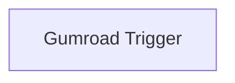

## Fluxo (.json) :

```json
{
  "id": "34",
  "name": "Receive updates when a sale is made in Gumroad",
  "nodes": [
    {
      "name": "Gumroad Trigger",
      "type": "n8n-nodes-base.gumroadTrigger",
      "position": [
        1310,
        700
      ],
      "webhookId": "d72f9547-0530-4733-9e8b-3e3b1beec2eb",
      "parameters": {
        "resource": "sale"
      },
      "credentials": {
        "gumroadApi": "gumroad"
      },
      "typeVersion": 1
    }
  ],
  "active": false,
  "settings": {},
  "connections": {}
}
```

<a id="template-497"></a>

## Template 497 - Notificações de notas de reunião para Marketing

- **Nome:** Notificações de notas de reunião para Marketing
- **Descrição:** Envia uma notificação ao canal do Mattermost quando uma nova página de notas de reunião do time Marketing é adicionada no Notion.
- **Funcionalidade:** • Monitoramento da base do Notion: verifica periodicamente (a cada hora) se novas páginas foram adicionadas a uma base específica.
• Filtragem por equipe: valida se a propriedade "Team" da página é igual a "Marketing" antes de prosseguir.
• Envio de notificação detalhada: publica no canal do Mattermost uma mensagem contendo a agenda, a data e um link para a página do Notion (converte o ID para URL sem hífens).
• Ação alternativa silenciosa: quando a página não for do time Marketing, o fluxo não realiza nenhuma ação adicional.
- **Ferramentas:** • Notion: fonte das páginas de notas de reunião, contendo propriedades como Team, Agenda, Date e id.
• Mattermost: plataforma de mensagens onde é enviada a notificação para um canal específico.

## Fluxo visual

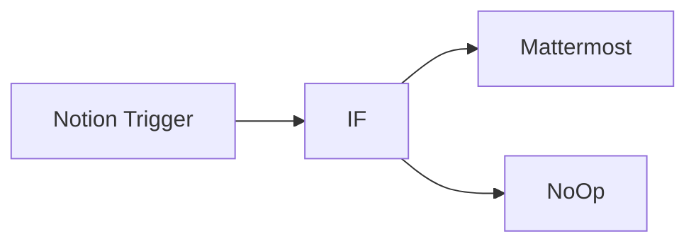

## Fluxo (.json) :

```json
{
  "nodes": [
    {
      "name": "Notion Trigger",
      "type": "n8n-nodes-base.notionTrigger",
      "position": [
        270,
        350
      ],
      "parameters": {
        "event": "pageAddedToDatabase",
        "pollTimes": {
          "item": [
            {
              "mode": "everyHour"
            }
          ]
        },
        "databaseId": "6ea34c0d-67e8-4614-ad5c-68c665a34763"
      },
      "credentials": {
        "notionApi": ""
      },
      "typeVersion": 1
    },
    {
      "name": "IF",
      "type": "n8n-nodes-base.if",
      "position": [
        470,
        350
      ],
      "parameters": {
        "conditions": {
          "string": [
            {
              "value1": "={{$json[\"Team\"]}}",
              "value2": "Marketing"
            }
          ]
        }
      },
      "typeVersion": 1
    },
    {
      "name": "Mattermost",
      "type": "n8n-nodes-base.mattermost",
      "position": [
        670,
        250
      ],
      "parameters": {
        "message": "=New meeting notes were added.\nAgenda: {{$json[\"Agenda\"]}}\nDate: {{$json[\"Date\"][\"start\"]}}\nLink: https://notion.so/{{$json[\"id\"].replace(/-/g,'')}}",
        "channelId": "64cae1bh6pggtcupfd4ztwby4r",
        "attachments": [],
        "otherOptions": {}
      },
      "credentials": {
        "mattermostApi": ""
      },
      "typeVersion": 1
    },
    {
      "name": "NoOp",
      "type": "n8n-nodes-base.noOp",
      "position": [
        668,
        495
      ],
      "parameters": {},
      "typeVersion": 1
    }
  ],
  "connections": {
    "IF": {
      "main": [
        [
          {
            "node": "Mattermost",
            "type": "main",
            "index": 0
          }
        ],
        [
          {
            "node": "NoOp",
            "type": "main",
            "index": 0
          }
        ]
      ]
    },
    "Notion Trigger": {
      "main": [
        [
          {
            "node": "IF",
            "type": "main",
            "index": 0
          }
        ]
      ]
    }
  }
}
```

<a id="template-498"></a>

## Template 498 - Atribuição automática de negócios

- **Nome:** Atribuição automática de negócios
- **Descrição:** Automatiza a identificação de negócios sem responsável e os distribui entre representantes de vendas com base no país da empresa e no número de funcionários.
- **Funcionalidade:** • Agendamento periódico: Executa o processo em um intervalo configurável para verificar novos negócios.
• Recuperação de negócios: Consulta a API para listar negócios com propriedades e associações relevantes.
• Separação de registros: Processa cada negócio individualmente para avaliar se precisa de atribuição.
• Filtragem de negócios não atribuídos: Identifica apenas os negócios que não têm proprietário definido.
• Obtenção de contato associado: Busca o contato relacionado ao negócio para então localizar a empresa.
• Obtenção de empresa do contato: Recupera informações da empresa associada, como país e número de funcionários.
• Decisão por região: Define fluxos distintos com base no país da empresa (ex.: Estados Unidos, Alemanha, fallback).
• Decisão por porte da empresa: Dentro de cada região, escolhe o responsável conforme faixas de número de funcionários.
• Atualização do dono do negócio: Atribui o representante escolhido como proprietário do negócio via API.
• Saída de fallback: Possui caminho alternativo para casos que não se encaixam nos critérios definidos (pode ser usado para notificação).
- **Ferramentas:** • HubSpot CRM: Plataforma para consultar e atualizar negócios, contatos e empresas via API usando autenticação OAuth2.

## Fluxo visual

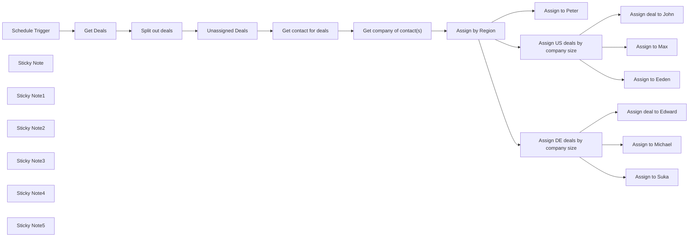

## Fluxo (.json) :

```json
{
  "meta": {
    "instanceId": "257476b1ef58bf3cb6a46e65fac7ee34a53a5e1a8492d5c6e4da5f87c9b82833"
  },
  "nodes": [
    {
      "id": "e087fb9b-d299-441b-8508-a36a389acb0d",
      "name": "Schedule Trigger",
      "type": "n8n-nodes-base.scheduleTrigger",
      "position": [
        820,
        360
      ],
      "parameters": {
        "rule": {
          "interval": [
            {
              "daysInterval": 2,
              "triggerAtHour": 7
            }
          ]
        }
      },
      "typeVersion": 1.1
    },
    {
      "id": "5d272d3d-7b35-4ac3-8646-28d7136b3e5b",
      "name": "Get Deals",
      "type": "n8n-nodes-base.httpRequest",
      "position": [
        1020,
        360
      ],
      "parameters": {
        "url": "https://api.hubapi.com/crm/v3/objects/deals?properties=dealname,amount,hubspot_owner_id&associations=contacts",
        "options": {},
        "authentication": "predefinedCredentialType",
        "nodeCredentialType": "hubspotOAuth2Api"
      },
      "credentials": {
        "hubspotOAuth2Api": {
          "id": "WEONgGVHLYPjIE6k",
          "name": "HubSpot account"
        }
      },
      "typeVersion": 4.1
    },
    {
      "id": "26862c28-fc42-41f5-9435-c69082282e8a",
      "name": "Get contact for deals",
      "type": "n8n-nodes-base.httpRequest",
      "position": [
        1600,
        360
      ],
      "parameters": {
        "url": "=https://api.hubapi.com/crm/v3/objects/contacts/{{ $json.associations.contacts.results[0].id }}?associations=company",
        "options": {},
        "authentication": "predefinedCredentialType",
        "nodeCredentialType": "hubspotOAuth2Api"
      },
      "credentials": {
        "hubspotOAuth2Api": {
          "id": "WEONgGVHLYPjIE6k",
          "name": "HubSpot account"
        }
      },
      "typeVersion": 4.1
    },
    {
      "id": "d2281e4c-abaf-43da-9299-ea60eaf61d49",
      "name": "Unassigned Deals",
      "type": "n8n-nodes-base.filter",
      "position": [
        1420,
        360
      ],
      "parameters": {
        "options": {},
        "conditions": {
          "options": {
            "leftValue": "",
            "caseSensitive": true,
            "typeValidation": "strict"
          },
          "combinator": "and",
          "conditions": [
            {
              "id": "2ad0a847-9729-4528-94d1-edf133f51c76",
              "operator": {
                "type": "string",
                "operation": "empty",
                "singleValue": true
              },
              "leftValue": "={{ $json.properties.hubspot_owner_id }}",
              "rightValue": ""
            }
          ]
        }
      },
      "typeVersion": 2
    },
    {
      "id": "aebd4001-6693-4b04-acc6-be27cb374f92",
      "name": "Split out deals",
      "type": "n8n-nodes-base.splitOut",
      "position": [
        1220,
        360
      ],
      "parameters": {
        "options": {},
        "fieldToSplitOut": "results"
      },
      "typeVersion": 1
    },
    {
      "id": "1aeb829d-7683-429f-b806-1e223111d0b0",
      "name": "Assign by Region",
      "type": "n8n-nodes-base.switch",
      "position": [
        2000,
        360
      ],
      "parameters": {
        "rules": {
          "values": [
            {
              "outputKey": "US",
              "conditions": {
                "options": {
                  "leftValue": "",
                  "caseSensitive": true,
                  "typeValidation": "strict"
                },
                "combinator": "and",
                "conditions": [
                  {
                    "operator": {
                      "type": "string",
                      "operation": "equals"
                    },
                    "leftValue": "={{ $json.properties.country }}",
                    "rightValue": "United States"
                  }
                ]
              },
              "renameOutput": true
            },
            {
              "outputKey": "DE",
              "conditions": {
                "options": {
                  "leftValue": "",
                  "caseSensitive": true,
                  "typeValidation": "strict"
                },
                "combinator": "and",
                "conditions": [
                  {
                    "id": "a6b1d56d-766e-44e1-9c8a-778205e67b6e",
                    "operator": {
                      "name": "filter.operator.equals",
                      "type": "string",
                      "operation": "equals"
                    },
                    "leftValue": "={{ $json.properties.country }}",
                    "rightValue": "Germany"
                  }
                ]
              },
              "renameOutput": true
            }
          ]
        },
        "options": {
          "fallbackOutput": "extra"
        }
      },
      "typeVersion": 3
    },
    {
      "id": "f795ab2e-14c8-4e7a-961e-035c877f627d",
      "name": "Assign deal to John",
      "type": "n8n-nodes-base.hubspot",
      "position": [
        2420,
        -440
      ],
      "parameters": {
        "dealId": {
          "__rl": true,
          "mode": "id",
          "value": "={{ $('Unassigned Deals').item.json.id }}"
        },
        "resource": "deal",
        "operation": "update",
        "updateFields": {
          "dealOwner": {
            "__rl": true,
            "mode": "list",
            "value": ""
          }
        },
        "authentication": "oAuth2"
      },
      "credentials": {
        "hubspotOAuth2Api": {
          "id": "WEONgGVHLYPjIE6k",
          "name": "HubSpot account"
        }
      },
      "typeVersion": 2
    },
    {
      "id": "212cc657-88df-406e-856d-00a797ac39eb",
      "name": "Assign to Max",
      "type": "n8n-nodes-base.hubspot",
      "position": [
        2420,
        -260
      ],
      "parameters": {
        "dealId": {
          "__rl": true,
          "mode": "id",
          "value": "={{ $('Unassigned Deals').item.json.id }}"
        },
        "resource": "deal",
        "operation": "update",
        "updateFields": {
          "dealOwner": {
            "__rl": true,
            "mode": "list",
            "value": 1265816794,
            "cachedResultName": "niklas@n8n.io"
          }
        },
        "authentication": "oAuth2"
      },
      "credentials": {
        "hubspotOAuth2Api": {
          "id": "WEONgGVHLYPjIE6k",
          "name": "HubSpot account"
        }
      },
      "typeVersion": 2
    },
    {
      "id": "7daef91a-051b-495a-9122-d737fff97c04",
      "name": "Assign to Eeden",
      "type": "n8n-nodes-base.hubspot",
      "position": [
        2420,
        -80
      ],
      "parameters": {
        "dealId": {
          "__rl": true,
          "mode": "id",
          "value": "={{ $('Unassigned Deals').item.json.id }}"
        },
        "resource": "deal",
        "operation": "update",
        "updateFields": {
          "dealOwner": {
            "__rl": true,
            "mode": "list",
            "value": 1265816794,
            "cachedResultName": "niklas@n8n.io"
          }
        },
        "authentication": "oAuth2"
      },
      "credentials": {
        "hubspotOAuth2Api": {
          "id": "WEONgGVHLYPjIE6k",
          "name": "HubSpot account"
        }
      },
      "typeVersion": 2
    },
    {
      "id": "aa310e68-4056-44b6-8074-a26ce5d2d21a",
      "name": "Assign to Peter",
      "type": "n8n-nodes-base.hubspot",
      "position": [
        2220,
        780
      ],
      "parameters": {
        "dealId": {
          "__rl": true,
          "mode": "id",
          "value": "={{ $('Unassigned Deals').item.json.id }}"
        },
        "resource": "deal",
        "operation": "update",
        "updateFields": {
          "dealOwner": {
            "__rl": true,
            "mode": "list",
            "value": 1265816794,
            "cachedResultName": "niklas@n8n.io"
          }
        },
        "authentication": "oAuth2"
      },
      "credentials": {
        "hubspotOAuth2Api": {
          "id": "WEONgGVHLYPjIE6k",
          "name": "HubSpot account"
        }
      },
      "typeVersion": 2
    },
    {
      "id": "e538b71d-fb97-479f-8b78-9705347aed82",
      "name": "Get company of contact(s)",
      "type": "n8n-nodes-base.httpRequest",
      "position": [
        1800,
        360
      ],
      "parameters": {
        "url": "=https://api.hubapi.com/crm/v3/objects/companies/{{ $json.associations.companies.results[0].id }}?properties=name,domain,city,country,numberofemployees",
        "options": {},
        "authentication": "predefinedCredentialType",
        "nodeCredentialType": "hubspotOAuth2Api"
      },
      "credentials": {
        "hubspotOAuth2Api": {
          "id": "WEONgGVHLYPjIE6k",
          "name": "HubSpot account"
        }
      },
      "typeVersion": 4.1
    },
    {
      "id": "a8722ed3-8d75-4aa0-9b14-101279007c51",
      "name": "Assign US deals by company size",
      "type": "n8n-nodes-base.switch",
      "position": [
        2220,
        -260
      ],
      "parameters": {
        "rules": {
          "values": [
            {
              "outputKey": "John",
              "conditions": {
                "options": {
                  "leftValue": "",
                  "caseSensitive": true,
                  "typeValidation": "loose"
                },
                "combinator": "and",
                "conditions": [
                  {
                    "operator": {
                      "type": "number",
                      "operation": "lte"
                    },
                    "leftValue": "={{ $json.properties.numberofemployees }}",
                    "rightValue": 50
                  }
                ]
              },
              "renameOutput": true
            },
            {
              "outputKey": "Max",
              "conditions": {
                "options": {
                  "leftValue": "",
                  "caseSensitive": true,
                  "typeValidation": "loose"
                },
                "combinator": "and",
                "conditions": [
                  {
                    "id": "2f8e57b1-2fce-49b4-8bae-cf6b0164d1f0",
                    "operator": {
                      "type": "number",
                      "operation": "lte"
                    },
                    "leftValue": "={{ $json.properties.numberofemployees }}",
                    "rightValue": 499
                  }
                ]
              },
              "renameOutput": true
            },
            {
              "outputKey": "Eeden",
              "conditions": {
                "options": {
                  "leftValue": "",
                  "caseSensitive": true,
                  "typeValidation": "loose"
                },
                "combinator": "and",
                "conditions": [
                  {
                    "id": "4357fb25-fbe5-4b19-85df-62db07d4443b",
                    "operator": {
                      "type": "number",
                      "operation": "gte"
                    },
                    "leftValue": "={{ $json.properties.numberofemployees }}",
                    "rightValue": 500
                  }
                ]
              },
              "renameOutput": true
            }
          ]
        },
        "options": {
          "looseTypeValidation": true
        }
      },
      "typeVersion": 3
    },
    {
      "id": "3b71b6c3-fa4c-49a5-9670-347790bff24d",
      "name": "Sticky Note",
      "type": "n8n-nodes-base.stickyNote",
      "position": [
        440,
        320
      ],
      "parameters": {
        "color": 5,
        "width": 343.16392083375575,
        "height": 209.46215382440343,
        "content": "## Setup\n1. Add your **Hubspot** credentials\n2. Customize your criterias for assigning deals in the `Assign by Region` and the following `Assign` nodes\n3. Make sure deals are assigned to the right salesrep in the Hubspot nodes at the end\n4. Activate the workflow"
      },
      "typeVersion": 1
    },
    {
      "id": "abb2a4d3-d636-4fca-b6ce-4e4f13601d11",
      "name": "Sticky Note1",
      "type": "n8n-nodes-base.stickyNote",
      "position": [
        820,
        260
      ],
      "parameters": {
        "color": 7,
        "width": 150,
        "height": 80,
        "content": "👇 You can adjust the interval here."
      },
      "typeVersion": 1
    },
    {
      "id": "a4180a3b-4916-419d-aa6c-906660c7f2b7",
      "name": "Sticky Note2",
      "type": "n8n-nodes-base.stickyNote",
      "position": [
        1980,
        260
      ],
      "parameters": {
        "color": 5,
        "width": 150,
        "height": 80,
        "content": "👇 Adjust this to your needs"
      },
      "typeVersion": 1
    },
    {
      "id": "0e11d724-62fe-4b3e-b324-b63704c3ae64",
      "name": "Sticky Note3",
      "type": "n8n-nodes-base.stickyNote",
      "position": [
        2160,
        -480
      ],
      "parameters": {
        "color": 5,
        "width": 423.7165713477844,
        "height": 558.5236393851941,
        "content": "Adjust this and make sure the right people are assigned for the criteria"
      },
      "typeVersion": 1
    },
    {
      "id": "e6aec357-5faa-468f-8e33-020f5e280731",
      "name": "Sticky Note4",
      "type": "n8n-nodes-base.stickyNote",
      "position": [
        2180,
        140
      ],
      "parameters": {
        "color": 5,
        "width": 423.7165713477844,
        "height": 558.5236393851941,
        "content": "Adjust this and make sure the right people are assigned for the criteria"
      },
      "typeVersion": 1
    },
    {
      "id": "8c3a39ef-5263-4cc4-bbbe-54dfffde57b7",
      "name": "Sticky Note5",
      "type": "n8n-nodes-base.stickyNote",
      "position": [
        2380,
        780
      ],
      "parameters": {
        "color": 7,
        "width": 175.43767910969322,
        "height": 105.43767910969324,
        "content": "👈 This is the fallback. You could also notify you on Slack or something instead"
      },
      "typeVersion": 1
    },
    {
      "id": "76029d66-9719-4f05-beb9-4ad33e17dbfd",
      "name": "Assign deal to Edward",
      "type": "n8n-nodes-base.hubspot",
      "position": [
        2420,
        180
      ],
      "parameters": {
        "dealId": {
          "__rl": true,
          "mode": "id",
          "value": "={{ $('Unassigned Deals').item.json.id }}"
        },
        "resource": "deal",
        "operation": "update",
        "updateFields": {
          "dealOwner": {
            "__rl": true,
            "mode": "list",
            "value": 1265816794,
            "cachedResultName": "niklas@n8n.io"
          }
        },
        "authentication": "oAuth2"
      },
      "credentials": {
        "hubspotOAuth2Api": {
          "id": "WEONgGVHLYPjIE6k",
          "name": "HubSpot account"
        }
      },
      "typeVersion": 2
    },
    {
      "id": "ef86d907-d226-484f-ae72-70a58e9c8710",
      "name": "Assign to Michael",
      "type": "n8n-nodes-base.hubspot",
      "position": [
        2420,
        360
      ],
      "parameters": {
        "dealId": {
          "__rl": true,
          "mode": "id",
          "value": "={{ $('Unassigned Deals').item.json.id }}"
        },
        "resource": "deal",
        "operation": "update",
        "updateFields": {
          "dealOwner": {
            "__rl": true,
            "mode": "list",
            "value": 1265816794,
            "cachedResultName": "niklas@n8n.io"
          }
        },
        "authentication": "oAuth2"
      },
      "credentials": {
        "hubspotOAuth2Api": {
          "id": "WEONgGVHLYPjIE6k",
          "name": "HubSpot account"
        }
      },
      "typeVersion": 2
    },
    {
      "id": "cf2a5259-5cdb-441b-a2f0-2a0d84e1595a",
      "name": "Assign to Suka",
      "type": "n8n-nodes-base.hubspot",
      "position": [
        2420,
        540
      ],
      "parameters": {
        "dealId": {
          "__rl": true,
          "mode": "id",
          "value": "={{ $('Unassigned Deals').item.json.id }}"
        },
        "resource": "deal",
        "operation": "update",
        "updateFields": {
          "dealOwner": {
            "__rl": true,
            "mode": "list",
            "value": 1265816794,
            "cachedResultName": "niklas@n8n.io"
          }
        },
        "authentication": "oAuth2"
      },
      "credentials": {
        "hubspotOAuth2Api": {
          "id": "WEONgGVHLYPjIE6k",
          "name": "HubSpot account"
        }
      },
      "typeVersion": 2
    },
    {
      "id": "bcc1e859-f1b2-4a9f-ac65-d20380fdee89",
      "name": "Assign DE deals by company size",
      "type": "n8n-nodes-base.switch",
      "position": [
        2220,
        360
      ],
      "parameters": {
        "rules": {
          "values": [
            {
              "outputKey": "Michael",
              "conditions": {
                "options": {
                  "leftValue": "",
                  "caseSensitive": true,
                  "typeValidation": "loose"
                },
                "combinator": "and",
                "conditions": [
                  {
                    "operator": {
                      "type": "number",
                      "operation": "lte"
                    },
                    "leftValue": "={{ $json.properties.numberofemployees }}",
                    "rightValue": 100000
                  }
                ]
              },
              "renameOutput": true
            },
            {
              "outputKey": "Suka",
              "conditions": {
                "options": {
                  "leftValue": "",
                  "caseSensitive": true,
                  "typeValidation": "loose"
                },
                "combinator": "and",
                "conditions": [
                  {
                    "id": "2f8e57b1-2fce-49b4-8bae-cf6b0164d1f0",
                    "operator": {
                      "type": "number",
                      "operation": "lte"
                    },
                    "leftValue": "={{ $json.properties.numberofemployees }}",
                    "rightValue": 499
                  }
                ]
              },
              "renameOutput": true
            },
            {
              "outputKey": "Eeden",
              "conditions": {
                "options": {
                  "leftValue": "",
                  "caseSensitive": true,
                  "typeValidation": "loose"
                },
                "combinator": "and",
                "conditions": [
                  {
                    "id": "4357fb25-fbe5-4b19-85df-62db07d4443b",
                    "operator": {
                      "type": "number",
                      "operation": "gte"
                    },
                    "leftValue": "={{ $json.properties.numberofemployees }}",
                    "rightValue": 500
                  }
                ]
              },
              "renameOutput": true
            }
          ]
        },
        "options": {
          "looseTypeValidation": true
        }
      },
      "typeVersion": 3
    }
  ],
  "pinData": {
    "Get Deals": [
      {
        "results": [
          {
            "id": "8978336453",
            "archived": false,
            "createdAt": "2023-09-19T16:45:21.309Z",
            "updatedAt": "2023-09-19T16:47:41.086Z",
            "properties": {
              "amount": "100",
              "dealname": "My test deal",
              "createdate": "2023-09-19T16:45:21.309Z",
              "hs_object_id": "8978336453",
              "hubspot_owner_id": "1265816794",
              "hs_lastmodifieddate": "2023-09-19T16:47:41.086Z"
            }
          },
          {
            "id": "11043508927",
            "archived": false,
            "createdAt": "2024-02-22T10:10:54.184Z",
            "updatedAt": "2024-02-22T10:13:09.271Z",
            "properties": {
              "amount": "500",
              "dealname": "My n8n deal",
              "createdate": "2024-02-22T10:10:54.184Z",
              "hs_object_id": "11043508927",
              "hubspot_owner_id": "",
              "hs_lastmodifieddate": "2024-02-22T10:13:09.271Z"
            },
            "associations": {
              "contacts": {
                "results": [
                  {
                    "id": "1",
                    "type": "deal_to_contact"
                  }
                ]
              }
            }
          }
        ]
      }
    ],
    "Get contact for deals": [
      {
        "id": "1",
        "archived": false,
        "createdAt": "2023-08-28T10:06:13.015Z",
        "updatedAt": "2024-02-22T10:56:31.742Z",
        "properties": {
          "email": "emailmaria@hubspot.com",
          "lastname": "Johnson (Sample Contact)",
          "firstname": "Maria",
          "createdate": "2023-08-28T10:06:13.015Z",
          "hs_object_id": "1",
          "lastmodifieddate": "2024-02-22T10:56:31.742Z"
        },
        "associations": {
          "companies": {
            "results": [
              {
                "id": "10209902291",
                "type": "contact_to_company"
              },
              {
                "id": "10209902291",
                "type": "contact_to_company_unlabeled"
              }
            ]
          }
        }
      }
    ],
    "Get company of contact(s)": [
      {
        "id": "10209902291",
        "archived": false,
        "createdAt": "2024-02-22T10:56:27.833Z",
        "updatedAt": "2024-02-22T10:56:32.390Z",
        "properties": {
          "city": "San Francisco",
          "name": "Stripe",
          "domain": "stripe.com",
          "country": "United States",
          "createdate": "2024-02-22T10:56:27.833Z",
          "hs_object_id": "10209902291",
          "numberofemployees": "10000",
          "hs_lastmodifieddate": "2024-02-22T10:56:32.390Z"
        }
      }
    ]
  },
  "connections": {
    "Get Deals": {
      "main": [
        [
          {
            "node": "Split out deals",
            "type": "main",
            "index": 0
          }
        ]
      ]
    },
    "Split out deals": {
      "main": [
        [
          {
            "node": "Unassigned Deals",
            "type": "main",
            "index": 0
          }
        ]
      ]
    },
    "Assign by Region": {
      "main": [
        [
          {
            "node": "Assign US deals by company size",
            "type": "main",
            "index": 0
          }
        ],
        [
          {
            "node": "Assign DE deals by company size",
            "type": "main",
            "index": 0
          }
        ],
        [
          {
            "node": "Assign to Peter",
            "type": "main",
            "index": 0
          }
        ]
      ]
    },
    "Schedule Trigger": {
      "main": [
        [
          {
            "node": "Get Deals",
            "type": "main",
            "index": 0
          }
        ]
      ]
    },
    "Unassigned Deals": {
      "main": [
        [
          {
            "node": "Get contact for deals",
            "type": "main",
            "index": 0
          }
        ]
      ]
    },
    "Get contact for deals": {
      "main": [
        [
          {
            "node": "Get company of contact(s)",
            "type": "main",
            "index": 0
          }
        ]
      ]
    },
    "Get company of contact(s)": {
      "main": [
        [
          {
            "node": "Assign by Region",
            "type": "main",
            "index": 0
          }
        ]
      ]
    },
    "Assign DE deals by company size": {
      "main": [
        [
          {
            "node": "Assign deal to Edward",
            "type": "main",
            "index": 0
          }
        ],
        [
          {
            "node": "Assign to Michael",
            "type": "main",
            "index": 0
          }
        ],
        [
          {
            "node": "Assign to Suka",
            "type": "main",
            "index": 0
          }
        ]
      ]
    },
    "Assign US deals by company size": {
      "main": [
        [
          {
            "node": "Assign deal to John",
            "type": "main",
            "index": 0
          }
        ],
        [
          {
            "node": "Assign to Max",
            "type": "main",
            "index": 0
          }
        ],
        [
          {
            "node": "Assign to Eeden",
            "type": "main",
            "index": 0
          }
        ]
      ]
    }
  }
}
```

<a id="template-499"></a>

## Template 499 - Notificação de pedidos Uber Eats para registro de despesas

- **Nome:** Notificação de pedidos Uber Eats para registro de despesas
- **Descrição:** Captura e-mails de pedidos do Uber Eats, extrai dados (valor, loja, data e hora) e envia uma mensagem formatada para um canal do Slack com um botão que abre um link para registrar a despesa.
- **Funcionalidade:** • Detecção de e-mails de pedido: Monitora a caixa de entrada e obtém e-mails cujo assunto indica um pedido via Uber Eats.
• Extração de dados do e-mail: Usa expressões regulares para extrair preço, nome do estabelecimento, data e hora do corpo do e-mail.
• Processamento em lote: Percorre múltiplos e-mails/itens para tratar vários pedidos de forma sequencial.
• Envio formatado ao canal: Envia uma mensagem estruturada ao Slack com bloco contendo detalhes do pedido.
• Ação direta para registro de despesa: Inclui um botão com deep link (moze3://expense) preenchido com parâmetros para facilitar o registro da despesa.
• Gatilhos para execução: Possibilita execução manual para testes e agendamento periódico para verificação automática.
- **Ferramentas:** • Gmail: Fonte dos e-mails de notificação de pedidos e mecanismo para ler mensagens.
• Slack: Canal de comunicação utilizado para notificar com mensagem formatada e botão de ação.
• Uber Eats: Serviço que envia as confirmações de pedido usadas como origem dos dados.
• Moze (app de despesas): Aplicativo de registro de despesas acessado via deep link (moze3://expense) para preencher rapidamente o lançamento.

## Fluxo visual

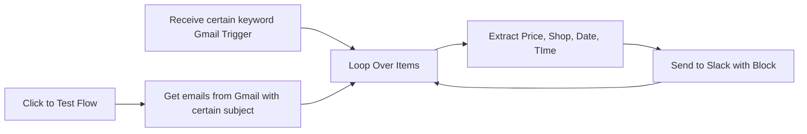

## Fluxo (.json) :

```json
{
  "id": "dDInVHNAfSedBUCb",
  "meta": {
    "instanceId": "fddb3e91967f1012c95dd02bf5ad21f279fc44715f47a7a96a33433621caa253"
  },
  "name": "外送記帳",
  "tags": [],
  "nodes": [
    {
      "id": "09c19ba1-45f2-43af-9985-3508d801c1b7",
      "name": "Loop Over Items",
      "type": "n8n-nodes-base.splitInBatches",
      "position": [
        440,
        0
      ],
      "parameters": {
        "options": {}
      },
      "typeVersion": 3
    },
    {
      "id": "18625b1d-f8ff-4e48-8b64-a9d42d24eccc",
      "name": "Click to Test Flow",
      "type": "n8n-nodes-base.manualTrigger",
      "position": [
        40,
        0
      ],
      "parameters": {},
      "typeVersion": 1
    },
    {
      "id": "649933c4-b16b-46de-9038-7d8c0b3d8e88",
      "name": "Get emails from Gmail with certain subject",
      "type": "n8n-nodes-base.gmail",
      "position": [
        220,
        0
      ],
      "webhookId": "99c4deca-17c7-47ae-a38c-50344938e792",
      "parameters": {
        "simple": false,
        "filters": {
          "q": "subject:透過 Uber Eats 系統送出的訂單"
        },
        "options": {},
        "operation": "getAll",
        "returnAll": true
      },
      "credentials": {
        "gmailOAuth2": {
          "id": "34rX9kxKlJadOY6u",
          "name": "Gmail account"
        }
      },
      "typeVersion": 2.1
    },
    {
      "id": "b2118a34-52ad-4464-b7ea-7f3105536fad",
      "name": "Receive certain keyword Gmail Trigger",
      "type": "n8n-nodes-base.gmailTrigger",
      "position": [
        120,
        -180
      ],
      "parameters": {
        "simple": false,
        "filters": {
          "q": "subject:透過 Uber Eats 系統送出的訂單"
        },
        "options": {},
        "pollTimes": {
          "item": [
            {
              "mode": "everyHour",
              "minute": 30
            }
          ]
        }
      },
      "credentials": {
        "gmailOAuth2": {
          "id": "34rX9kxKlJadOY6u",
          "name": "Gmail account"
        }
      },
      "typeVersion": 1.2
    },
    {
      "id": "00986543-d01a-4b11-bbaa-60c73a1dae02",
      "name": "Extract Price, Shop, Date, TIme",
      "type": "n8n-nodes-base.set",
      "position": [
        620,
        60
      ],
      "parameters": {
        "options": {},
        "assignments": {
          "assignments": [
            {
              "id": "c24405f8-267f-4933-a178-1b51145d62bf",
              "name": "price",
              "type": "string",
              "value": "={{ $json[\"text\"].match(/\\$(\\d+(\\.\\d{2})?)/)[1] }}"
            },
            {
              "id": "968cf7cd-6e28-4328-a829-3fe2cb327643",
              "name": "shop",
              "type": "string",
              "value": "={{ $json[\"text\"].match(/以下是您在([\\一-\\龥a-zA-Z0-9\\s]+)訂購/)[1] }}"
            },
            {
              "id": "53642bcb-f3a6-4086-bdc1-2f8d27927462",
              "name": "date",
              "type": "string",
              "value": "={{ $json[\"text\"].match(/Date: (\\d{4}年\\d{1,2}月\\d{1,2}日)/)[1].replace(\"年\", \".\").replace(\"月\", \".\").replace(\"日\", \"\") }}"
            },
            {
              "id": "cd227132-971b-4970-8b5d-724463efe036",
              "name": "time",
              "type": "string",
              "value": "={{ \n  $json[\"text\"].match(/(上午|下午) (\\d{1,2}):(\\d{2})/) ? \n  ($json[\"text\"].match(/(上午|下午) (\\d{1,2}):(\\d{2})/)[1] === '下午' && $json[\"text\"].match(/(上午|下午) (\\d{1,2}):(\\d{2})/)[2] !== '12' \n    ? (parseInt($json[\"text\"].match(/(上午|下午) (\\d{1,2}):(\\d{2})/)[2]) + 12) + ':' + $json[\"text\"].match(/(上午|下午) (\\d{1,2}):(\\d{2})/)[3] \n    : $json[\"text\"].match(/(上午|下午) (\\d{1,2}):(\\d{2})/)[2] + ':' + $json[\"text\"].match(/(上午|下午) (\\d{1,2}):(\\d{2})/)[3]\n  )\n  : null \n}}"
            }
          ]
        }
      },
      "typeVersion": 3.4
    },
    {
      "id": "3d8f97ea-4a0d-4939-898f-8a0ca9415e7d",
      "name": "Send to Slack with Block",
      "type": "n8n-nodes-base.slack",
      "position": [
        800,
        60
      ],
      "webhookId": "0e812732-74d2-4924-8db3-6b9234965937",
      "parameters": {
        "text": "=Ubereat 訂餐資訊: \n商家:  {{ $json.shop }}\n金額: {{ $json.price }}\n日期: {{ $json.date }}\n\n記帳網址:\nmoze3://expense?amount={{ $json.price }}&account=信用卡&subcategory=外送&store={{ $json.shop }}&date={{ $json.date }}",
        "select": "channel",
        "blocksUi": "={\n\t\"blocks\": [\n\t\t{\n\t\t\t\"type\": \"section\",\n\t\t\t\"text\": {\n\t\t\t\t\"type\": \"mrkdwn\",\n\t\t\t\t\"text\": \"Ubereat 訂餐資訊:\\n\\n*商家:* {{ $json.shop }}\\n*金額:* {{ $json.price }}\\n*日期:* {{ $json.date }}\"\n\t\t\t}\n\t\t},\n\t\t{\n\t\t\t\"type\": \"divider\"\n\t\t},\n\t\t{\n\t\t\t\"type\": \"section\",\n\t\t\t\"text\": {\n\t\t\t\t\"type\": \"mrkdwn\",\n\t\t\t\t\"text\": \"Moze 記帳請點我\"\n\t\t\t},\n\t\t\t\"accessory\": {\n\t\t\t\t\"type\": \"button\",\n\t\t\t\t\"text\": {\n\t\t\t\t\t\"type\": \"plain_text\",\n\t\t\t\t\t\"text\": \"記帳\",\n\t\t\t\t\t\"emoji\": true\n\t\t\t\t},\n\t\t\t\t\"value\": \"click\",\n\t\t\t\t\"url\": \"moze3://expense?amount={{ $json.price }}&account=信用卡&subcategory=外送&store={{ $json.shop }}&date={{ $json.date }}&&project=生活開銷&&time={{ $json.time }}\",\n\t\t\t\t\"action_id\": \"button-action\"\n\t\t\t}\n\t\t}\n\t]\n}",
        "channelId": {
          "__rl": true,
          "mode": "list",
          "value": "C0883CJM1UH",
          "cachedResultName": "外送記帳自動化"
        },
        "messageType": "block",
        "otherOptions": {},
        "authentication": "oAuth2"
      },
      "credentials": {
        "slackOAuth2Api": {
          "id": "sD1J9ZLyEhcglrRa",
          "name": "Slack account"
        }
      },
      "typeVersion": 2.3
    }
  ],
  "active": true,
  "pinData": {},
  "settings": {
    "executionOrder": "v1"
  },
  "versionId": "0840254c-0058-47fe-9b22-7fbb93144788",
  "connections": {
    "Loop Over Items": {
      "main": [
        [],
        [
          {
            "node": "Extract Price, Shop, Date, TIme",
            "type": "main",
            "index": 0
          }
        ]
      ]
    },
    "Click to Test Flow": {
      "main": [
        [
          {
            "node": "Get emails from Gmail with certain subject",
            "type": "main",
            "index": 0
          }
        ]
      ]
    },
    "Send to Slack with Block": {
      "main": [
        [
          {
            "node": "Loop Over Items",
            "type": "main",
            "index": 0
          }
        ]
      ]
    },
    "Extract Price, Shop, Date, TIme": {
      "main": [
        [
          {
            "node": "Send to Slack with Block",
            "type": "main",
            "index": 0
          }
        ]
      ]
    },
    "Receive certain keyword Gmail Trigger": {
      "main": [
        [
          {
            "node": "Loop Over Items",
            "type": "main",
            "index": 0
          }
        ]
      ]
    },
    "Get emails from Gmail with certain subject": {
      "main": [
        [
          {
            "node": "Loop Over Items",
            "type": "main",
            "index": 0
          }
        ]
      ]
    }
  }
}
```

<a id="template-500"></a>

## Template 500 - Converter texto em fala via OpenAI

- **Nome:** Converter texto em fala via OpenAI
- **Descrição:** Converte texto em áudio .mp3 usando a API de Text-to-Speech da OpenAI, com seleção de voz e retorno do arquivo em formato binário.
- **Funcionalidade:** • Entrada de texto configurável: Permite definir o texto que será convertido em fala.
• Seleção de voz: Permite escolher a voz (por exemplo, "alloy") utilizada na síntese.
• Envio de requisição ao endpoint TTS da OpenAI: Envia o texto e parâmetros (modelo tts-1, voice) para a API com autenticação.
• Recepção de áudio .mp3 em formato binário: Recebe o áudio gerado pela API pronto para download ou processamento posterior.
• Uso de credenciais de API: Requer uma chave de API válida para autenticar as requisições.
- **Ferramentas:** • OpenAI Text-to-Speech API: Serviço que gera arquivos de áudio (.mp3) a partir de texto usando o modelo tts-1.


## Fluxo visual

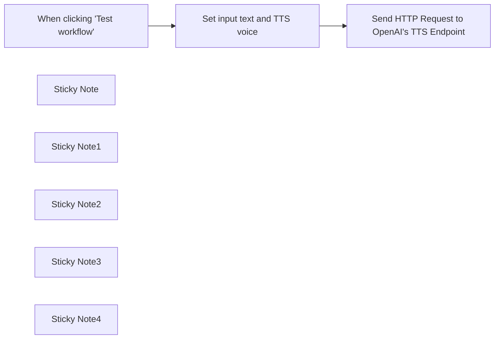

## Fluxo (.json) :

```json
{
  "id": "6Yzmlp5xF6oHo1VW",
  "meta": {
    "instanceId": "173f55e6572798fa42ea9c5c92623a3c3308080d3fcd2bd784d26d855b1ce820"
  },
  "name": "Text to Speech (OpenAI)",
  "tags": [],
  "nodes": [
    {
      "id": "938fedbd-e34c-40af-af2f-b9c669e1a6e9",
      "name": "When clicking \"Test workflow\"",
      "type": "n8n-nodes-base.manualTrigger",
      "position": [
        380,
        380
      ],
      "parameters": {},
      "typeVersion": 1
    },
    {
      "id": "1d59db5d-8fe6-4292-a221-a0d0194c6e0c",
      "name": "Set input text and TTS voice",
      "type": "n8n-nodes-base.set",
      "position": [
        760,
        380
      ],
      "parameters": {
        "mode": "raw",
        "options": {},
        "jsonOutput": "{\n  \"input_text\": \"The quick brown fox jumped over the lazy dog.\",\n  \"voice\": \"alloy\"\n}\n"
      },
      "typeVersion": 3.2
    },
    {
      "id": "9d54de1d-59b7-4c1f-9e88-13572da5292c",
      "name": "Send HTTP Request to OpenAI's TTS Endpoint",
      "type": "n8n-nodes-base.httpRequest",
      "position": [
        1120,
        380
      ],
      "parameters": {
        "url": "https://api.openai.com/v1/audio/speech",
        "method": "POST",
        "options": {},
        "sendBody": true,
        "sendHeaders": true,
        "authentication": "predefinedCredentialType",
        "bodyParameters": {
          "parameters": [
            {
              "name": "model",
              "value": "tts-1"
            },
            {
              "name": "input",
              "value": "={{ $json.input_text }}"
            },
            {
              "name": "voice",
              "value": "={{ $json.voice }}"
            }
          ]
        },
        "headerParameters": {
          "parameters": [
            {
              "name": "Authorization",
              "value": "Bearer $OPENAI_API_KEY"
            }
          ]
        },
        "nodeCredentialType": "openAiApi"
      },
      "credentials": {
        "openAiApi": {
          "id": "VokTSv2Eg5m5aDg7",
          "name": "OpenAi account"
        }
      },
      "typeVersion": 4.1
    },
    {
      "id": "1ce72c9c-aa6f-4a18-9d5a-3971686a51ec",
      "name": "Sticky Note",
      "type": "n8n-nodes-base.stickyNote",
      "position": [
        280,
        256
      ],
      "parameters": {
        "width": 273,
        "height": 339,
        "content": "## Workflow Trigger\nYou can replace this manual trigger with another trigger type as required by your use case."
      },
      "typeVersion": 1
    },
    {
      "id": "eb487535-5f36-465e-aeee-e9ff62373e53",
      "name": "Sticky Note1",
      "type": "n8n-nodes-base.stickyNote",
      "position": [
        660,
        257
      ],
      "parameters": {
        "width": 273,
        "height": 335,
        "content": "## Manually Set OpenAI TTS Configuration\n"
      },
      "typeVersion": 1
    },
    {
      "id": "36b380bd-0703-4b60-83cb-c4ad9265864d",
      "name": "Sticky Note2",
      "type": "n8n-nodes-base.stickyNote",
      "position": [
        1020,
        260
      ],
      "parameters": {
        "width": 302,
        "height": 335,
        "content": "## Send Request to OpenAI TTS API\n"
      },
      "typeVersion": 1
    },
    {
      "id": "ff35ff28-62b5-49c8-a657-795aa916b524",
      "name": "Sticky Note3",
      "type": "n8n-nodes-base.stickyNote",
      "position": [
        660,
        620
      ],
      "parameters": {
        "color": 4,
        "width": 273,
        "height": 278,
        "content": "### Configuration Options\n- \"input_text\" is the text you would like to be turned into speech, and can be replaced with a programmatic value for your use case. Bear in mind that the maximum number of tokens per API call is 4,000.\n\n- \"voice\" is the voice used by the TTS model. The default is alloy, other options can be found here: [OpenAI TTS Docs](https://platform.openai.com/docs/guides/text-to-speech)"
      },
      "typeVersion": 1
    },
    {
      "id": "5f7ef80e-b5c8-41df-9411-525fafc2d910",
      "name": "Sticky Note4",
      "type": "n8n-nodes-base.stickyNote",
      "position": [
        1020,
        620
      ],
      "parameters": {
        "color": 4,
        "width": 299,
        "height": 278,
        "content": "### Output\nThe output returned by OpenAI's TTS endpoint is a .mp3 audio file (binary).\n\n\n### Credentials\nTo use this workflow, you'll have to configure and provide a valid OpenAI credential.\n"
      },
      "typeVersion": 1
    }
  ],
  "active": false,
  "pinData": {},
  "settings": {
    "executionOrder": "v1"
  },
  "versionId": "19d67805-e208-4f0e-af44-c304e66e8ce8",
  "connections": {
    "Set input text and TTS voice": {
      "main": [
        [
          {
            "node": "Send HTTP Request to OpenAI's TTS Endpoint",
            "type": "main",
            "index": 0
          }
        ]
      ]
    },
    "When clicking \"Test workflow\"": {
      "main": [
        [
          {
            "node": "Set input text and TTS voice",
            "type": "main",
            "index": 0
          }
        ]
      ]
    }
  }
}
```

<a id="template-501"></a>

## Template 501 - Chat com memória usando Supabase e Gemini

- **Nome:** Chat com memória usando Supabase e Gemini
- **Descrição:** Fluxo de teste para um agente conversacional que utiliza o modelo Gemini para gerar respostas, armazena e recupera contexto em uma base Supabase Postgres e atualiza campos de registos quando necessário.
- **Funcionalidade:** • Disparo manual de teste: Inicia o fluxo quando o utilizador aciona o teste manualmente.
• Definição de variáveis de entrada de exemplo: Preenche session_id, nome e entrada de chat para simular uma conversa.
• Geração de resposta com modelo LLM: Envia a entrada do utilizador ao modelo Gemini 2.0 Flash para obter resposta.
• Memória baseada em Postgres: Armazena e recupera o histórico de mensagens usando uma tabela Supabase, associada a session_id, com janela de contexto configurada (20 mensagens).
• Agente que combina LLM e memória: Usa a memória armazenada e o modelo de linguagem para produzir respostas contextualizadas.
• Atualização condicional de registos: Atualiza campos adicionais (por exemplo, nome) na tabela quando o registo correspondente tem valores nulos.
- **Ferramentas:** • Google PaLM (Gemini 2.0 Flash): Serviço de modelo de linguagem para gerar respostas conversacionais.
• Supabase (Postgres + API): Base de dados Postgres hospedada e API para armazenar mensagens de chat, recuperar contexto por sessão e atualizar registros.


## Fluxo visual

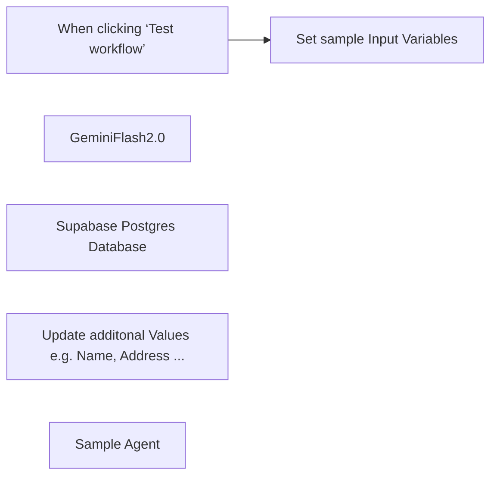

## Fluxo (.json) :

```json
{
  "id": "gUx6hY0bOoReluxE",
  "meta": {
    "instanceId": "5ce52989094be90be3b3bdd9ed9cee1d7ce1fcecaa598afaec4a50646d32e291",
    "templateCredsSetupCompleted": true
  },
  "name": "Supabase Setup Postgres",
  "tags": [
    {
      "id": "fSDcaaN3w5sV5e3S",
      "name": "Templates",
      "createdAt": "2025-02-23T15:20:47.262Z",
      "updatedAt": "2025-02-23T15:20:47.262Z"
    }
  ],
  "nodes": [
    {
      "id": "c2c95cc1-d10e-40c9-9663-625e8a2ab30b",
      "name": "When clicking ‘Test workflow’",
      "type": "n8n-nodes-base.manualTrigger",
      "position": [
        340,
        -80
      ],
      "parameters": {},
      "typeVersion": 1
    },
    {
      "id": "30a4ae0f-c7ae-4b00-b826-a0a2759f2dd5",
      "name": "Set sample Input Variables",
      "type": "n8n-nodes-base.set",
      "position": [
        600,
        -80
      ],
      "parameters": {
        "options": {},
        "assignments": {
          "assignments": [
            {
              "id": "ed7bc826-fd48-4c9e-8ba7-11e4e7bb73ac",
              "name": "session_id",
              "type": "string",
              "value": "=491634502879"
            },
            {
              "id": "d381c930-a92f-404f-ac91-ad6437d6b0c9",
              "name": "name",
              "type": "string",
              "value": "=Genn Sverster"
            },
            {
              "id": "4ead1fb5-098b-4cbc-bc78-d65b188ca5b0",
              "name": "chatInput",
              "type": "string",
              "value": "=wie gehts dir?"
            }
          ]
        }
      },
      "typeVersion": 3.4
    },
    {
      "id": "f56b629c-5374-43ce-b55b-efd7f14f1231",
      "name": "GeminiFlash2.0",
      "type": "@n8n/n8n-nodes-langchain.lmChatGoogleGemini",
      "position": [
        840,
        140
      ],
      "parameters": {
        "options": {},
        "modelName": "models/gemini-2.0-flash"
      },
      "credentials": {
        "googlePalmApi": {
          "id": "clmB8ZYJMHaHmnsu",
          "name": "Stardawn#1"
        }
      },
      "typeVersion": 1
    },
    {
      "id": "1da22e93-504e-4616-bac3-dabd9a4b145a",
      "name": "Supabase Postgres Database",
      "type": "@n8n/n8n-nodes-langchain.memoryPostgresChat",
      "position": [
        1100,
        140
      ],
      "parameters": {
        "tableName": "whatsapp_messages3",
        "sessionKey": "={{ $json.session_id }}",
        "sessionIdType": "customKey",
        "contextWindowLength": 20
      },
      "credentials": {
        "postgres": {
          "id": "B2m18ScvYBKPNF9s",
          "name": "Supabase SD - N8N Demo Chatbot"
        }
      },
      "typeVersion": 1.3
    },
    {
      "id": "29a7eb84-2244-41e1-99c0-5daaeb80cf6e",
      "name": "Update additonal Values e.g. Name, Address ...",
      "type": "n8n-nodes-base.supabase",
      "position": [
        1300,
        -80
      ],
      "parameters": {
        "filters": {
          "conditions": [
            {
              "keyName": "session_id",
              "keyValue": "={{ $('Set sample Input Variables').item.json.session_id }}",
              "condition": "eq"
            },
            {
              "keyName": "name",
              "keyValue": "NULL",
              "condition": "is"
            }
          ]
        },
        "tableId": "whatsapp_messages3",
        "fieldsUi": {
          "fieldValues": [
            {
              "fieldId": "name",
              "fieldValue": "={{ $('Set sample Input Variables').item.json.name }}"
            }
          ]
        },
        "matchType": "allFilters",
        "operation": "update"
      },
      "credentials": {
        "supabaseApi": {
          "id": "GHuUG6pmPATBHgob",
          "name": "N8N Chatbot"
        }
      },
      "typeVersion": 1
    },
    {
      "id": "8094fdd7-f238-47dc-94f9-5e962d5f0c2f",
      "name": "Sample Agent ",
      "type": "@n8n/n8n-nodes-langchain.agent",
      "position": [
        960,
        -80
      ],
      "parameters": {
        "text": "={{ $json.chatInput }}",
        "options": {
          "systemMessage": "You are a helpful assistant"
        },
        "promptType": "define"
      },
      "typeVersion": 1.7
    }
  ],
  "active": false,
  "pinData": {},
  "settings": {
    "executionOrder": "v1"
  },
  "versionId": "49fd22da-2875-49be-a3c0-6c0fcf378a8e",
  "connections": {
    "Sample Agent ": {
      "main": [
        [
          {
            "node": "Update additonal Values e.g. Name, Address ...",
            "type": "main",
            "index": 0
          }
        ]
      ]
    },
    "GeminiFlash2.0": {
      "ai_languageModel": [
        [
          {
            "node": "Sample Agent ",
            "type": "ai_languageModel",
            "index": 0
          }
        ]
      ]
    },
    "Set sample Input Variables": {
      "main": [
        [
          {
            "node": "Sample Agent ",
            "type": "main",
            "index": 0
          }
        ]
      ]
    },
    "Supabase Postgres Database": {
      "ai_memory": [
        [
          {
            "node": "Sample Agent ",
            "type": "ai_memory",
            "index": 0
          }
        ]
      ]
    },
    "When clicking ‘Test workflow’": {
      "main": [
        [
          {
            "node": "Set sample Input Variables",
            "type": "main",
            "index": 0
          }
        ]
      ]
    }
  }
}
```
