# PACK 1999 TEMPLATES PARTE 03 - Bloco 6

Templates neste bloco: 20

## Sumário

- [Template 502 - Enriquecimento de leads e notificação Slack](#template-502)
- [Template 503 - Notificação de novas versões do n8n](#template-503)
- [Template 504 - Registrar usuários aleatórios em planilha e enviar JSON](#template-504)
- [Template 505 - Exportar todos os contatos do HubSpot](#template-505)
- [Template 506 - Salvar usuário aleatório em planilha e CSV](#template-506)
- [Template 507 - Criar nota no Pipedrive para autor de PR](#template-507)
- [Template 508 - Publicar post em publicação do Medium](#template-508)
- [Template 509 - Chatbot com memória de longo prazo, armazenamento de notas e integração com Telegram](#template-509)
- [Template 510 - Enviar e renomear vídeo no Google Drive](#template-510)
- [Template 511 - Lembrete de eventos do Google Calendar por Telegram](#template-511)
- [Template 512 - Pontuação ICP por empresa (LinkedIn → Planilha)](#template-512)
- [Template 513 - Criação de issue no Jira](#template-513)
- [Template 514 - Rascunhos por nota de voz via Telegram](#template-514)
- [Template 515 - Criação automática de rascunho no WordPress com IA](#template-515)
- [Template 516 - Upload em massa de contatos via CSV para Airtable](#template-516)
- [Template 517 - Agente AI para criar tarefas e agendar reuniões](#template-517)
- [Template 518 - Criar novo cartão no Trello](#template-518)
- [Template 519 - Publicar novos vídeos do YouTube no X](#template-519)
- [Template 520 - Servidor MCP para Gmail](#template-520)
- [Template 521 - Verificação de entregabilidade de emails](#template-521)

---

<a id="template-502"></a>

## Template 502 - Enriquecimento de leads e notificação Slack

- **Nome:** Enriquecimento de leads e notificação Slack
- **Descrição:** Automatiza a coleta e enriquecimento de dados de empresas relacionadas a leads, filtra leads qualificados e envia alertas para um canal do Slack, além de marcar os leads como enriquecidos no CRM.
- **Funcionalidade:** • Agendamento periódico: dispara o processo automaticamente a cada 5 minutos.
• Recuperação de leads: busca todos os leads não arquivados no CRM.
• Obtenção de dados da organização: recupera detalhes da organização associada a cada lead.
• Enriquecimento de empresa: consulta um serviço de enriquecimento por domínio para obter métricas como número de funcionários e receita estimada.
• Mescla de dados: combina os dados de enriquecimento com os dados originais do lead.
• Filtragem de leads qualificados: aplica condições (por exemplo, tag B2B e número de funcionários > 100) para identificar leads de alta qualidade.
• Notificação no Slack: envia uma mensagem para o canal configurado com detalhes da empresa qualificada.
• Marcação como enriquecido: atualiza o lead no CRM definindo o campo personalizado de data de enriquecimento com a data atual.
• Auxiliar de configuração: inclui passos para localizar IDs de campos personalizados e configurar o canal do Slack.
- **Ferramentas:** • Pipedrive: CRM utilizado para buscar leads, obter detalhes de organizações e atualizar campos dos leads.
• Clearbit: serviço de enriquecimento de dados de empresas com base no domínio do site.
• Slack: plataforma de mensagens usada para enviar notificações sobre leads qualificados.


## Fluxo visual

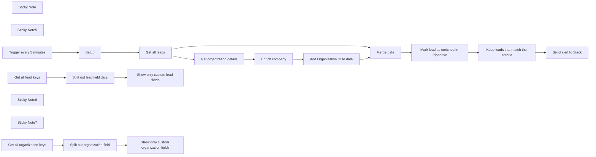

## Fluxo (.json) :

```json
{
  "meta": {
    "instanceId": "257476b1ef58bf3cb6a46e65fac7ee34a53a5e1a8492d5c6e4da5f87c9b82833",
    "templateId": "2131"
  },
  "nodes": [
    {
      "id": "2b12fb75-ec81-4d2c-a8bb-12ff2bb7e935",
      "name": "Sticky Note",
      "type": "n8n-nodes-base.stickyNote",
      "position": [
        680,
        2.662790697674268
      ],
      "parameters": {
        "color": 5,
        "width": 410.6749642132356,
        "height": 428.2515771212859,
        "content": "## Setup\n1. Go to Company Settings -> Data fields -> Organization and add `Domain` as a custom field\n2. Go to Company Settings -> Data fields -> Leads and add `Enriched at` as a custom date field\n2. Add your `Pipedrive`, `Clearbit` and `Slack` credentials.\n3. Fill the `setup` node below. To get the ID of your custom domain fields, simply run the `Show only custom organization fields` and `Show only custom lead fields` nodes below and copy the keys of your domain and enriched at field."
      },
      "typeVersion": 1
    },
    {
      "id": "123ad2e5-f4f2-4411-bf03-5668124b8757",
      "name": "Sticky Note5",
      "type": "n8n-nodes-base.stickyNote",
      "position": [
        1800,
        160
      ],
      "parameters": {
        "color": 7,
        "width": 223.7628185364029,
        "height": 276.3308728978709,
        "content": "Adjust condition to filter leads by your desired condition. e.g, revenue, number of employees, etc."
      },
      "typeVersion": 1
    },
    {
      "id": "7725dc9e-5c93-475d-9522-f99b4fd1c81f",
      "name": "Enrich company",
      "type": "n8n-nodes-base.clearbit",
      "position": [
        1460,
        140
      ],
      "parameters": {
        "domain": "={{ $json[$('Setup').first().json.domainCustomFieldId2]}}",
        "additionalFields": {}
      },
      "credentials": {
        "clearbitApi": {
          "id": "cKDImrinp9tg0ZHW",
          "name": "Clearbit account"
        }
      },
      "typeVersion": 1
    },
    {
      "id": "f65855c3-d3d2-415b-bda2-e452d4d7e154",
      "name": "Get all leads",
      "type": "n8n-nodes-base.pipedrive",
      "position": [
        1120,
        280
      ],
      "parameters": {
        "filters": {
          "archived_status": "not_archived"
        },
        "resource": "lead",
        "operation": "getAll"
      },
      "credentials": {
        "pipedriveApi": {
          "id": "M3l7gIG8DdOex6wX",
          "name": "Pipedrive account"
        }
      },
      "typeVersion": 1
    },
    {
      "id": "39767a37-bd6d-422e-bc38-bfdfcbbf05af",
      "name": "Add Organization ID to data",
      "type": "n8n-nodes-base.set",
      "position": [
        1640,
        140
      ],
      "parameters": {
        "options": {},
        "assignments": {
          "assignments": [
            {
              "id": "71b4c743-fd69-4f5d-8c29-66b3672f7a2a",
              "name": "organization_id",
              "type": "number",
              "value": "={{ $('Get organization details').item.json.id }}"
            }
          ]
        },
        "includeOtherFields": true
      },
      "typeVersion": 3.3
    },
    {
      "id": "4263cd25-dcf3-4521-b716-0ce48d3b2c26",
      "name": "Keep leads that match the criteria",
      "type": "n8n-nodes-base.filter",
      "position": [
        2320,
        260
      ],
      "parameters": {
        "options": {},
        "conditions": {
          "options": {
            "leftValue": "",
            "caseSensitive": true,
            "typeValidation": "strict"
          },
          "combinator": "and",
          "conditions": [
            {
              "id": "1b31b826-e87d-425f-a65d-370b4b20f7e1",
              "operator": {
                "type": "boolean",
                "operation": "true",
                "singleValue": true
              },
              "leftValue": "={{ $json.tags.includes(\"B2B\") }}",
              "rightValue": 5000000
            },
            {
              "id": "90ef79a7-807a-4894-ae8c-92f9d46e7177",
              "operator": {
                "type": "number",
                "operation": "gt"
              },
              "leftValue": "={{ $json.metrics.employees }}",
              "rightValue": 100
            }
          ]
        }
      },
      "typeVersion": 2
    },
    {
      "id": "98578544-b03d-44aa-a64f-285f8a7cc371",
      "name": "Trigger every 5 minutes",
      "type": "n8n-nodes-base.scheduleTrigger",
      "position": [
        540,
        280
      ],
      "parameters": {
        "rule": {
          "interval": [
            {
              "field": "minutes"
            }
          ]
        }
      },
      "typeVersion": 1.1
    },
    {
      "id": "69ace950-7f1e-469b-bfca-6c0c81f356b9",
      "name": "Setup",
      "type": "n8n-nodes-base.set",
      "position": [
        820,
        280
      ],
      "parameters": {
        "options": {},
        "assignments": {
          "assignments": [
            {
              "id": "dba31775-dce0-4f4c-ad61-790359197bb3",
              "name": "slackChannel",
              "type": "string",
              "value": "#yourChannel"
            },
            {
              "id": "f8206758-7a4f-414d-921c-6cfecd936335",
              "name": "domainCustomFieldId",
              "type": "string",
              "value": "<Run \"Show only custom organization fields\" and copy the key>"
            },
            {
              "id": "59c71724-f774-4d41-80e7-5fc76dd27c7d",
              "name": "enrichedAtCustomFieldId",
              "type": "string",
              "value": "<Run \"Show only custom lead fields\" and copy the key>"
            },
            {
              "id": "da4ec51e-cc5c-4512-b675-0888d6a0213e",
              "name": "enrichedAtCustomFieldId2",
              "type": "string",
              "value": "68a15ecb2e1255250617c1fd1c06385893334e3c"
            },
            {
              "id": "43544b80-88d3-44ad-9e36-634e9eeaf013",
              "name": "domainCustomFieldId2",
              "type": "string",
              "value": "ab26f671c92146268edacd244181e76579286e71"
            }
          ]
        }
      },
      "typeVersion": 3.3
    },
    {
      "id": "63db576a-6bb7-4215-88f3-98e304081b3e",
      "name": "Send alert to Slack",
      "type": "n8n-nodes-base.slack",
      "position": [
        2520,
        260
      ],
      "parameters": {
        "text": "=New high-quality lead 🤑\n*Company Name*: {{ $json.name }} \n*Website*: {{ \"https://\" + $json.domain }}\n*Revenue*: {{ $json.metrics.estimatedAnnualRevenue}}\n*Number of employees*: {{ $json.metrics.employees }}",
        "select": "channel",
        "channelId": {
          "__rl": true,
          "mode": "name",
          "value": "={{ $('Setup').item.json.slackChannel }}"
        },
        "otherOptions": {}
      },
      "credentials": {
        "slackApi": {
          "id": "6",
          "name": "Idea Bot"
        }
      },
      "typeVersion": 2.1
    },
    {
      "id": "9bef53b4-3732-4ce5-a72c-81c65a533196",
      "name": "Merge data",
      "type": "n8n-nodes-base.merge",
      "position": [
        1880,
        260
      ],
      "parameters": {
        "mode": "combine",
        "options": {
          "clashHandling": {
            "values": {
              "resolveClash": "preferInput2"
            }
          }
        },
        "joinMode": "enrichInput2",
        "mergeByFields": {
          "values": [
            {
              "field1": "organization_id",
              "field2": "organization_id"
            }
          ]
        }
      },
      "typeVersion": 2.1
    },
    {
      "id": "9c8d106a-ffc6-4295-bc22-8ceddeb0061f",
      "name": "Get organization details",
      "type": "n8n-nodes-base.pipedrive",
      "position": [
        1280,
        140
      ],
      "parameters": {
        "resource": "organization",
        "operation": "get",
        "organizationId": "={{ $json.organization_id }}"
      },
      "credentials": {
        "pipedriveApi": {
          "id": "M3l7gIG8DdOex6wX",
          "name": "Pipedrive account"
        }
      },
      "typeVersion": 1
    },
    {
      "id": "632477f4-77d1-4c87-a819-2f7022fa6f23",
      "name": "Get all organization keys",
      "type": "n8n-nodes-base.httpRequest",
      "position": [
        680,
        620
      ],
      "parameters": {
        "url": "https://api.pipedrive.com/v1/organizationFields",
        "options": {},
        "sendQuery": true,
        "authentication": "predefinedCredentialType",
        "queryParameters": {
          "parameters": [
            {}
          ]
        },
        "nodeCredentialType": "pipedriveApi"
      },
      "credentials": {
        "pipedriveApi": {
          "id": "M3l7gIG8DdOex6wX",
          "name": "Pipedrive account"
        }
      },
      "typeVersion": 4.1
    },
    {
      "id": "f12c4e56-895d-4f34-8924-c99f5e5fefec",
      "name": "Sticky Note6",
      "type": "n8n-nodes-base.stickyNote",
      "position": [
        997,
        520
      ],
      "parameters": {
        "width": 187.68142318756514,
        "height": 276.3308728978709,
        "content": "Run me to find the Id of your custom domain field"
      },
      "typeVersion": 1
    },
    {
      "id": "229db444-ac48-4557-b393-4dcdc69130fd",
      "name": "Sticky Note7",
      "type": "n8n-nodes-base.stickyNote",
      "position": [
        1597,
        520
      ],
      "parameters": {
        "width": 187.68142318756514,
        "height": 276.3308728978709,
        "content": "Run me to find the Id of your enriched at domain field"
      },
      "typeVersion": 1
    },
    {
      "id": "ea4b0c82-e52b-4a45-9d3f-7b28b8959574",
      "name": "Get all lead keys",
      "type": "n8n-nodes-base.httpRequest",
      "position": [
        1260,
        620
      ],
      "parameters": {
        "url": "https://api.pipedrive.com/v1/leadFields",
        "options": {},
        "sendQuery": true,
        "authentication": "predefinedCredentialType",
        "queryParameters": {
          "parameters": [
            {}
          ]
        },
        "nodeCredentialType": "pipedriveApi"
      },
      "credentials": {
        "pipedriveApi": {
          "id": "M3l7gIG8DdOex6wX",
          "name": "Pipedrive account"
        }
      },
      "typeVersion": 4.1
    },
    {
      "id": "a74a2122-ddd5-4239-baa3-ebbc3de15e03",
      "name": "Split out lead field data",
      "type": "n8n-nodes-base.splitOut",
      "position": [
        1440,
        620
      ],
      "parameters": {
        "options": {},
        "fieldToSplitOut": "data"
      },
      "typeVersion": 1
    },
    {
      "id": "84fded6b-bdeb-4863-b54c-01faf6cb64cc",
      "name": "Split out organization field",
      "type": "n8n-nodes-base.splitOut",
      "position": [
        860,
        620
      ],
      "parameters": {
        "options": {},
        "fieldToSplitOut": "data"
      },
      "typeVersion": 1
    },
    {
      "id": "9d9c502e-ccf2-40f9-ae91-7008532e5528",
      "name": "Show only custom lead fields",
      "type": "n8n-nodes-base.filter",
      "position": [
        1640,
        620
      ],
      "parameters": {
        "options": {},
        "conditions": {
          "options": {
            "leftValue": "",
            "caseSensitive": true,
            "typeValidation": "strict"
          },
          "combinator": "and",
          "conditions": [
            {
              "id": "b21201d0-7f9c-417c-ab02-fbaea23a8d24",
              "operator": {
                "type": "boolean",
                "operation": "true",
                "singleValue": true
              },
              "leftValue": "={{ $json.edit_flag }}",
              "rightValue": ""
            }
          ]
        }
      },
      "typeVersion": 2
    },
    {
      "id": "a53f58ee-9649-42bc-bee4-b70eea6a0c63",
      "name": "Show only custom organization fields",
      "type": "n8n-nodes-base.filter",
      "position": [
        1040,
        620
      ],
      "parameters": {
        "options": {},
        "conditions": {
          "options": {
            "leftValue": "",
            "caseSensitive": true,
            "typeValidation": "strict"
          },
          "combinator": "and",
          "conditions": [
            {
              "id": "b21201d0-7f9c-417c-ab02-fbaea23a8d24",
              "operator": {
                "type": "boolean",
                "operation": "true",
                "singleValue": true
              },
              "leftValue": "={{ $json.edit_flag }}",
              "rightValue": ""
            }
          ]
        }
      },
      "typeVersion": 2
    },
    {
      "id": "f9fa198a-860c-460f-ae82-172c71b5a838",
      "name": "Mark lead as enriched in Pipedrive",
      "type": "n8n-nodes-base.httpRequest",
      "position": [
        2100,
        260
      ],
      "parameters": {
        "url": "=https://api.pipedrive.com/v1/leads/{{ $json.id }}",
        "method": "PATCH",
        "options": {},
        "sendBody": true,
        "authentication": "predefinedCredentialType",
        "bodyParameters": {
          "parameters": [
            {
              "name": "={{ $('Setup').first().json.enrichedAtCustomFieldId2 }}",
              "value": "={{ $now.format('yyyy-MM-dd') }}"
            }
          ]
        },
        "nodeCredentialType": "pipedriveApi"
      },
      "credentials": {
        "pipedriveApi": {
          "id": "M3l7gIG8DdOex6wX",
          "name": "Pipedrive account"
        }
      },
      "typeVersion": 4.1
    }
  ],
  "pinData": {},
  "connections": {
    "Setup": {
      "main": [
        [
          {
            "node": "Get all leads",
            "type": "main",
            "index": 0
          }
        ]
      ]
    },
    "Merge data": {
      "main": [
        [
          {
            "node": "Mark lead as enriched in Pipedrive",
            "type": "main",
            "index": 0
          }
        ]
      ]
    },
    "Get all leads": {
      "main": [
        [
          {
            "node": "Get organization details",
            "type": "main",
            "index": 0
          },
          {
            "node": "Merge data",
            "type": "main",
            "index": 1
          }
        ]
      ]
    },
    "Enrich company": {
      "main": [
        [
          {
            "node": "Add Organization ID to data",
            "type": "main",
            "index": 0
          }
        ]
      ]
    },
    "Get all lead keys": {
      "main": [
        [
          {
            "node": "Split out lead field data",
            "type": "main",
            "index": 0
          }
        ]
      ]
    },
    "Trigger every 5 minutes": {
      "main": [
        [
          {
            "node": "Setup",
            "type": "main",
            "index": 0
          }
        ]
      ]
    },
    "Get organization details": {
      "main": [
        [
          {
            "node": "Enrich company",
            "type": "main",
            "index": 0
          }
        ]
      ]
    },
    "Get all organization keys": {
      "main": [
        [
          {
            "node": "Split out organization field",
            "type": "main",
            "index": 0
          }
        ]
      ]
    },
    "Split out lead field data": {
      "main": [
        [
          {
            "node": "Show only custom lead fields",
            "type": "main",
            "index": 0
          }
        ]
      ]
    },
    "Add Organization ID to data": {
      "main": [
        [
          {
            "node": "Merge data",
            "type": "main",
            "index": 0
          }
        ]
      ]
    },
    "Split out organization field": {
      "main": [
        [
          {
            "node": "Show only custom organization fields",
            "type": "main",
            "index": 0
          }
        ]
      ]
    },
    "Keep leads that match the criteria": {
      "main": [
        [
          {
            "node": "Send alert to Slack",
            "type": "main",
            "index": 0
          }
        ]
      ]
    },
    "Mark lead as enriched in Pipedrive": {
      "main": [
        [
          {
            "node": "Keep leads that match the criteria",
            "type": "main",
            "index": 0
          }
        ]
      ]
    }
  }
}
```

<a id="template-503"></a>

## Template 503 - Notificação de novas versões do n8n

- **Nome:** Notificação de novas versões do n8n
- **Descrição:** Monitora o feed de releases do projeto e envia notificações por Telegram e e-mail quando detecta novas versões recentes.
- **Funcionalidade:** • Agendamento periódico: executa automaticamente em horários definidos (cron nas 10:00, 14:00 e 18:00).
• Disparo manual: permite execução manual ao clicar em executar para checagem imediata.
• Leitura de feed: consulta o feed de releases do GitHub para obter itens mais recentes.
• Filtragem por data e título: seleciona itens publicados no dia atual dentro de um intervalo recente (ajuste de 4 horas) e que contenham padrões específicos no título (ex.: 'n8n@' e '.0').
• Condição de envio: avalia se há resultados após a filtragem antes de enviar notificações.
• Notificação por Telegram: envia mensagem formatada (HTML) para um chat de grupo quando há novas versões.
• Envio de e-mail: envia notificação em HTML via serviço de e-mail com assunto pré-definido.
- **Ferramentas:** • Feed de releases do GitHub: fonte pública para obter informações sobre novos lançamentos do repositório monitorado.
• Telegram: serviço de mensagens utilizado para enviar alertas ao chat/grupo de destino.
• Amazon SES: serviço de e-mail usado para enviar notificações por e-mail.


## Fluxo visual

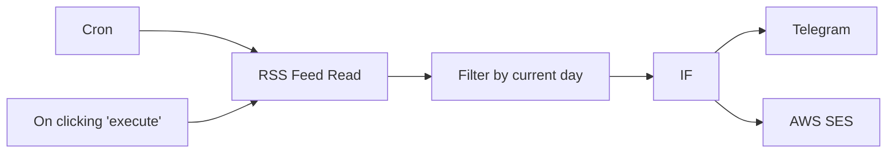

## Fluxo (.json) :

```json
{
  "id": "33",
  "name": "n8n_check",
  "nodes": [
    {
      "name": "On clicking 'execute'",
      "type": "n8n-nodes-base.manualTrigger",
      "position": [
        -520,
        250
      ],
      "parameters": {},
      "typeVersion": 1
    },
    {
      "name": "RSS Feed Read",
      "type": "n8n-nodes-base.rssFeedRead",
      "position": [
        -320,
        260
      ],
      "parameters": {
        "url": "https://github.com/n8n-io/n8n/releases.atom"
      },
      "typeVersion": 1
    },
    {
      "name": "IF",
      "type": "n8n-nodes-base.if",
      "position": [
        70,
        260
      ],
      "parameters": {
        "conditions": {
          "string": [
            {
              "value1": "={{$node[\"Filter by current day\"].json[\"data\"]}}",
              "value2": "/.+/",
              "operation": "regex"
            }
          ]
        }
      },
      "typeVersion": 1
    },
    {
      "name": "Cron",
      "type": "n8n-nodes-base.cron",
      "position": [
        -520,
        421
      ],
      "parameters": {
        "triggerTimes": {
          "item": [
            {
              "mode": "custom",
              "cronExpression": "0 0 10,14,18 * * *"
            }
          ]
        }
      },
      "typeVersion": 1
    },
    {
      "name": "Filter by current day",
      "type": "n8n-nodes-base.function",
      "position": [
        -120,
        260
      ],
      "parameters": {
        "functionCode": "var d = new Date();\nvar year = d.getFullYear();\nvar month = d.getMonth() + 1;\nvar day = d.getDate();\nvar hour = d.getHours() - 4;//Publication in last 4 hours\n\nmonth = month < 10 ? \"0\" + month : month;\nday = day < 10 ? \"0\" + day : day;\nhour = hour < 10 ? \"0\" + hour : hour;\n\nvar lines = items.filter(function(item) {\n  //var str = year + \"-\" + month + \"-\" + day + \"T\" + hour;\n  var str = year + \"-\" + month + \"-\" + day + \"T\" + hour;\n  //return true;//item.json.pubDate.indexOf(str) !== -1 && item.json.title.indexOf(\"n8n@\") !== -1;\n  return item.json.pubDate.indexOf(str) !== -1 && item.json.title.indexOf(\"n8n@\") !== -1 && item.json.title.indexOf(\".0\") !== -1;\n}).map(function(item) {\n  return item.json.title;\n}).join(\"\\n\");\n\n\nreturn [\n  {\n  json: {\n    date: year + \"-\" + month + \"-\" + day + \" \" + hour,\n    data: lines && lines.length ? \"New release on n8n:\\n\" + lines : \"\"\n   }\n  }\n]"
      },
      "typeVersion": 1
    },
    {
      "name": "Telegram",
      "type": "n8n-nodes-base.telegram",
      "position": [
        300,
        280
      ],
      "parameters": {
        "text": "={{$node[\"Filter by current day\"].json[\"data\"]}}",
        "chatId": "-1001235337538",
        "additionalFields": {
          "parse_mode": "HTML"
        }
      },
      "credentials": {
        "telegramApi": "it-killia-bot"
      },
      "typeVersion": 1
    },
    {
      "name": "AWS SES",
      "type": "n8n-nodes-base.awsSes",
      "position": [
        300,
        110
      ],
      "parameters": {
        "body": "={{$node[\"Filter by current day\"].json[\"data\"]}}",
        "subject": "New n8n version",
        "fromEmail": "myemail@mydomain.com",
        "isBodyHtml": true,
        "toAddresses": [
          "myemail@mydomain.com"
        ],
        "additionalFields": {}
      },
      "credentials": {
        "aws": "ses"
      },
      "typeVersion": 1
    }
  ],
  "active": true,
  "settings": {},
  "connections": {
    "IF": {
      "main": [
        [
          {
            "node": "Telegram",
            "type": "main",
            "index": 0
          },
          {
            "node": "AWS SES",
            "type": "main",
            "index": 0
          }
        ]
      ]
    },
    "Cron": {
      "main": [
        [
          {
            "node": "RSS Feed Read",
            "type": "main",
            "index": 0
          }
        ]
      ]
    },
    "RSS Feed Read": {
      "main": [
        [
          {
            "node": "Filter by current day",
            "type": "main",
            "index": 0
          }
        ]
      ]
    },
    "Filter by current day": {
      "main": [
        [
          {
            "node": "IF",
            "type": "main",
            "index": 0
          }
        ]
      ]
    },
    "On clicking 'execute'": {
      "main": [
        [
          {
            "node": "RSS Feed Read",
            "type": "main",
            "index": 0
          }
        ]
      ]
    }
  }
}
```

<a id="template-504"></a>

## Template 504 - Registrar usuários aleatórios em planilha e enviar JSON

- **Nome:** Registrar usuários aleatórios em planilha e enviar JSON
- **Descrição:** Busca dados de usuários aleatórios, registra nome e país em uma planilha, converte os dados em arquivo (CSV/JSON), grava localmente e envia o JSON por email.
- **Funcionalidade:** • Buscar usuário aleatório: Faz uma requisição à API pública para obter dados de um usuário aleatório.
• Extrair nome e país: Mapeia o JSON recebido para criar campos com o nome completo e o país.
• Registrar na planilha: Anexa os valores (nome e país) a uma planilha online no intervalo especificado.
• Gerar CSV a partir do JSON: Converte os dados obtidos para formato CSV e prepara o arquivo.
• Criar arquivo JSON local: Converte os dados para binário e grava um arquivo JSON localmente (randomusers.json).
• Enviar por email: Anexa o arquivo JSON e envia uma mensagem por email com assunto e corpo definidos.
• Reimportar anexo para planilha: Move o binário do anexo enviado e anexa seu conteúdo novamente a uma planilha.
- **Ferramentas:** • randomuser.me: API pública que fornece dados fictícios de usuários.
• Google Sheets: Serviço de planilhas online onde os nomes e países são armazenados.
• Gmail: Serviço de email usado para enviar o arquivo JSON como anexo.
• Sistema de arquivos local: Armazena temporariamente o arquivo JSON antes do envio.


## Fluxo visual

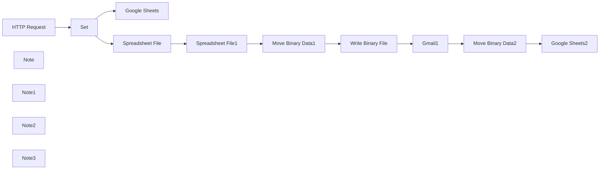

## Fluxo (.json) :

```json
{
  "nodes": [
    {
      "name": "HTTP Request",
      "type": "n8n-nodes-base.httpRequest",
      "position": [
        560,
        700
      ],
      "parameters": {
        "url": "https://randomuser.me/api/",
        "options": {}
      },
      "typeVersion": 2
    },
    {
      "name": "Google Sheets",
      "type": "n8n-nodes-base.googleSheets",
      "position": [
        960,
        560
      ],
      "parameters": {
        "range": "A:C",
        "options": {
          "usePathForKeyRow": true
        },
        "sheetId": "qwertz",
        "operation": "append",
        "authentication": "oAuth2"
      },
      "credentials": {
        "googleSheetsOAuth2Api": {
          "id": "2",
          "name": "google_sheets_oauth"
        }
      },
      "typeVersion": 1
    },
    {
      "name": "Set",
      "type": "n8n-nodes-base.set",
      "position": [
        760,
        700
      ],
      "parameters": {
        "values": {
          "string": [
            {
              "name": "name",
              "value": "={{$json[\"results\"][0][\"name\"][\"first\"]}} {{$json[\"results\"][0][\"name\"][\"last\"]}}"
            },
            {
              "name": "country",
              "value": "={{$json[\"results\"][0][\"location\"][\"country\"]}}"
            }
          ]
        },
        "options": {},
        "keepOnlySet": true
      },
      "typeVersion": 1
    },
    {
      "name": "Spreadsheet File",
      "type": "n8n-nodes-base.spreadsheetFile",
      "position": [
        960,
        840
      ],
      "parameters": {
        "options": {
          "fileName": "users_spreadsheet"
        },
        "operation": "toFile",
        "fileFormat": "csv"
      },
      "typeVersion": 1
    },
    {
      "name": "Spreadsheet File1",
      "type": "n8n-nodes-base.spreadsheetFile",
      "position": [
        960,
        1200
      ],
      "parameters": {
        "options": {}
      },
      "typeVersion": 1
    },
    {
      "name": "Write Binary File",
      "type": "n8n-nodes-base.writeBinaryFile",
      "position": [
        1360,
        1200
      ],
      "parameters": {
        "fileName": "randomusers.json"
      },
      "typeVersion": 1
    },
    {
      "name": "Move Binary Data1",
      "type": "n8n-nodes-base.moveBinaryData",
      "position": [
        1160,
        1200
      ],
      "parameters": {
        "mode": "jsonToBinary",
        "options": {}
      },
      "typeVersion": 1
    },
    {
      "name": "Gmail1",
      "type": "n8n-nodes-base.gmail",
      "position": [
        1360,
        1420
      ],
      "parameters": {
        "message": "Hello, attached is a JSON file with random user information.",
        "subject": "JSON file with users",
        "additionalFields": {
          "attachmentsUi": {
            "attachmentsBinary": [
              {
                "property": "data"
              }
            ]
          }
        }
      },
      "credentials": {
        "gmailOAuth2": {
          "id": "16",
          "name": "gmail"
        }
      },
      "typeVersion": 1
    },
    {
      "name": "Google Sheets2",
      "type": "n8n-nodes-base.googleSheets",
      "notes": "Append data to sheet",
      "position": [
        1760,
        1420
      ],
      "parameters": {
        "range": "A:C",
        "options": {
          "usePathForKeyRow": true
        },
        "sheetId": "qwertz",
        "operation": "append",
        "authentication": "oAuth2"
      },
      "credentials": {
        "googleSheetsOAuth2Api": {
          "id": "2",
          "name": "google_sheets_oauth"
        }
      },
      "notesInFlow": true,
      "typeVersion": 1
    },
    {
      "name": "Move Binary Data2",
      "type": "n8n-nodes-base.moveBinaryData",
      "position": [
        1560,
        1420
      ],
      "parameters": {
        "options": {},
        "sourceKey": "attachment_0"
      },
      "typeVersion": 1
    },
    {
      "name": "Note",
      "type": "n8n-nodes-base.stickyNote",
      "position": [
        1200,
        560
      ],
      "parameters": {
        "width": 320,
        "height": 80,
        "content": "## JSON > Google Sheets"
      },
      "typeVersion": 1
    },
    {
      "name": "Note1",
      "type": "n8n-nodes-base.stickyNote",
      "position": [
        1200,
        860
      ],
      "parameters": {
        "width": 320,
        "height": 80,
        "content": "## JSON > CSV"
      },
      "typeVersion": 1
    },
    {
      "name": "Note2",
      "type": "n8n-nodes-base.stickyNote",
      "position": [
        580,
        1220
      ],
      "parameters": {
        "width": 320,
        "height": 80,
        "content": "## CSV > JSON file"
      },
      "typeVersion": 1
    },
    {
      "name": "Note3",
      "type": "n8n-nodes-base.stickyNote",
      "position": [
        980,
        1460
      ],
      "parameters": {
        "width": 320,
        "height": 80,
        "content": "## JSON file > Google Sheets"
      },
      "typeVersion": 1
    }
  ],
  "connections": {
    "Set": {
      "main": [
        [
          {
            "node": "Google Sheets",
            "type": "main",
            "index": 0
          },
          {
            "node": "Spreadsheet File",
            "type": "main",
            "index": 0
          }
        ]
      ]
    },
    "Gmail1": {
      "main": [
        [
          {
            "node": "Move Binary Data2",
            "type": "main",
            "index": 0
          }
        ]
      ]
    },
    "HTTP Request": {
      "main": [
        [
          {
            "node": "Set",
            "type": "main",
            "index": 0
          }
        ]
      ]
    },
    "Spreadsheet File": {
      "main": [
        [
          {
            "node": "Spreadsheet File1",
            "type": "main",
            "index": 0
          }
        ]
      ]
    },
    "Move Binary Data1": {
      "main": [
        [
          {
            "node": "Write Binary File",
            "type": "main",
            "index": 0
          }
        ]
      ]
    },
    "Move Binary Data2": {
      "main": [
        [
          {
            "node": "Google Sheets2",
            "type": "main",
            "index": 0
          }
        ]
      ]
    },
    "Spreadsheet File1": {
      "main": [
        [
          {
            "node": "Move Binary Data1",
            "type": "main",
            "index": 0
          }
        ]
      ]
    },
    "Write Binary File": {
      "main": [
        [
          {
            "node": "Gmail1",
            "type": "main",
            "index": 0
          }
        ]
      ]
    }
  }
}
```

<a id="template-505"></a>

## Template 505 - Exportar todos os contatos do HubSpot

- **Nome:** Exportar todos os contatos do HubSpot
- **Descrição:** Ao ser executado manualmente, este fluxo recupera todos os contatos existentes na conta do HubSpot.
- **Funcionalidade:** • Disparo manual: inicia o fluxo quando o usuário clica em executar.
• Recuperação de contatos do HubSpot: consulta a conta e retorna todos os contatos disponíveis (retorno completo, sem limitação).
• Autenticação com credenciais configuradas: utiliza credenciais previamente configuradas para acessar a conta do HubSpot de forma segura.
- **Ferramentas:** • HubSpot: plataforma de CRM para gerenciar contatos e relacionamentos com clientes; utilizada aqui para consultar e obter todos os contatos via API.


## Fluxo visual


## Fluxo (.json) :

```json
{
  "id": "7",
  "name": "6",
  "nodes": [
    {
      "name": "On clicking 'execute'",
      "type": "n8n-nodes-base.manualTrigger",
      "position": [
        440,
        320
      ],
      "parameters": {},
      "typeVersion": 1
    },
    {
      "name": "Hubspot",
      "type": "n8n-nodes-base.hubspot",
      "position": [
        750,
        320
      ],
      "parameters": {
        "resource": "contact",
        "operation": "getAll",
        "returnAll": true,
        "additionalFields": {}
      },
      "credentials": {
        "hubspotApi": "scsc"
      },
      "typeVersion": 1
    }
  ],
  "active": false,
  "settings": {},
  "connections": {
    "On clicking 'execute'": {
      "main": [
        [
          {
            "node": "Hubspot",
            "type": "main",
            "index": 0
          }
        ]
      ]
    }
  }
}
```

<a id="template-506"></a>

## Template 506 - Salvar usuário aleatório em planilha e CSV

- **Nome:** Salvar usuário aleatório em planilha e CSV
- **Descrição:** Busca um usuário aleatório em uma API, extrai nome e país e grava esses dados em uma planilha do Google e em um arquivo CSV.
- **Funcionalidade:** • Busca de usuário aleatório: Faz uma requisição HTTP para uma API pública para obter dados de usuário em formato JSON.
• Extração e mapeamento de campos: Extrai o primeiro nome, sobrenome e país do JSON e monta o nome completo.
• Gravação em planilha: Adiciona uma nova linha na planilha do Google com os dados extraídos.
• Geração de arquivo CSV: Converte os dados recebidos em um arquivo CSV e salva para download ou armazenamento.
• Autenticação segura: Utiliza OAuth2 para autorizar operações na planilha do Google.
- **Ferramentas:** • randomuser.me: API pública que gera dados de usuários aleatórios em formato JSON.
• Google Sheets: Serviço de planilhas do Google usado para armazenar as linhas adicionadas via API.
• Geração de CSV/local: Criação e exportação de arquivo CSV contendo os registros coletados.


## Fluxo visual

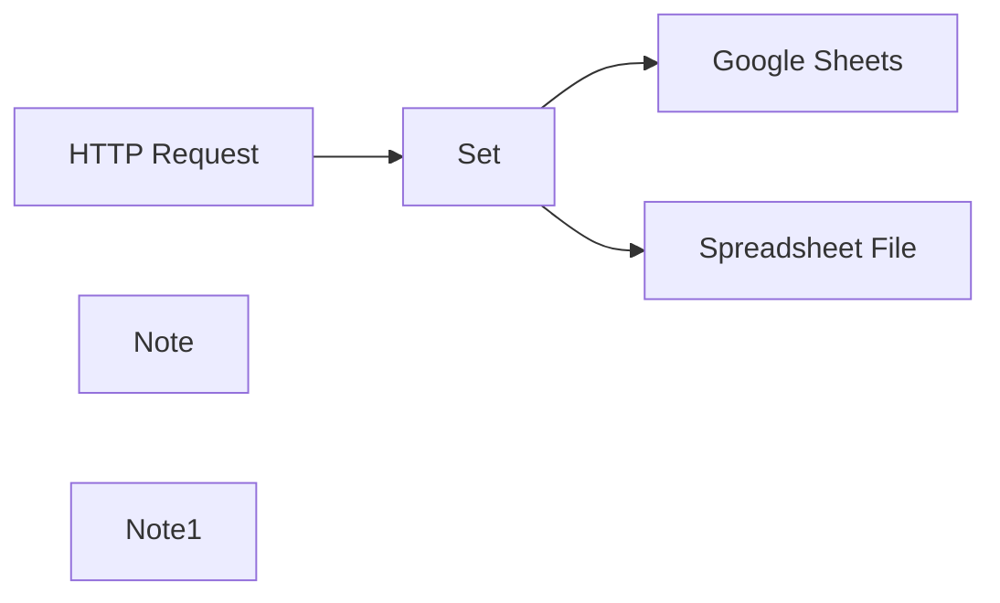

## Fluxo (.json) :

```json
{
  "nodes": [
    {
      "name": "HTTP Request",
      "type": "n8n-nodes-base.httpRequest",
      "position": [
        560,
        840
      ],
      "parameters": {
        "url": "https://randomuser.me/api/",
        "options": {}
      },
      "typeVersion": 2
    },
    {
      "name": "Google Sheets",
      "type": "n8n-nodes-base.googleSheets",
      "position": [
        960,
        700
      ],
      "parameters": {
        "range": "A:C",
        "options": {
          "usePathForKeyRow": true
        },
        "sheetId": "qwertz",
        "operation": "append",
        "authentication": "oAuth2"
      },
      "credentials": {
        "googleSheetsOAuth2Api": {
          "id": "2",
          "name": "google_sheets_oauth"
        }
      },
      "typeVersion": 1
    },
    {
      "name": "Set",
      "type": "n8n-nodes-base.set",
      "position": [
        760,
        840
      ],
      "parameters": {
        "values": {
          "string": [
            {
              "name": "name",
              "value": "={{$json[\"results\"][0][\"name\"][\"first\"]}} {{$json[\"results\"][0][\"name\"][\"last\"]}}"
            },
            {
              "name": "country",
              "value": "={{$json[\"results\"][0][\"location\"][\"country\"]}}"
            }
          ]
        },
        "options": {},
        "keepOnlySet": true
      },
      "typeVersion": 1
    },
    {
      "name": "Spreadsheet File",
      "type": "n8n-nodes-base.spreadsheetFile",
      "position": [
        960,
        980
      ],
      "parameters": {
        "options": {
          "fileName": "users_spreadsheet"
        },
        "operation": "toFile",
        "fileFormat": "csv"
      },
      "typeVersion": 1
    },
    {
      "name": "Note",
      "type": "n8n-nodes-base.stickyNote",
      "position": [
        1160,
        720
      ],
      "parameters": {
        "width": 320,
        "height": 80,
        "content": "## JSON > Google Sheets"
      },
      "typeVersion": 1
    },
    {
      "name": "Note1",
      "type": "n8n-nodes-base.stickyNote",
      "position": [
        1140,
        980
      ],
      "parameters": {
        "width": 320,
        "height": 80,
        "content": "## JSON > CSV"
      },
      "typeVersion": 1
    }
  ],
  "connections": {
    "Set": {
      "main": [
        [
          {
            "node": "Google Sheets",
            "type": "main",
            "index": 0
          },
          {
            "node": "Spreadsheet File",
            "type": "main",
            "index": 0
          }
        ]
      ]
    },
    "HTTP Request": {
      "main": [
        [
          {
            "node": "Set",
            "type": "main",
            "index": 0
          }
        ]
      ]
    }
  }
}
```

<a id="template-507"></a>

## Template 507 - Criar nota no Pipedrive para autor de PR

- **Nome:** Criar nota no Pipedrive para autor de PR
- **Descrição:** Ao receber um evento de pull request, o fluxo verifica se o autor do PR existe no Pipedrive pelo email e, se existir, cria uma nota no registro da pessoa com o link do PR.
- **Funcionalidade:** • Detecção de pull request: Inicia o fluxo ao ocorrer um evento de pull_request no repositório especificado.
• Recuperação de dados do autor: Consulta a URL do remetente do PR para obter informações, incluindo o email.
• Busca por pessoa por email: Pesquisa no CRM pelo email retornado para localizar o registro da pessoa.
• Criação de nota vinculada: Se a pessoa for encontrada, cria uma nota no registro com o link do pull request.
• Nenhuma ação quando ausente: Se não houver correspondência para o email, o fluxo não realiza alterações (NoOp).
- **Ferramentas:** • GitHub: Fonte dos eventos de pull request e dados do autor do PR.
• Pipedrive: CRM utilizado para buscar a pessoa por email e adicionar uma nota ao registro correspondente.


## Fluxo visual

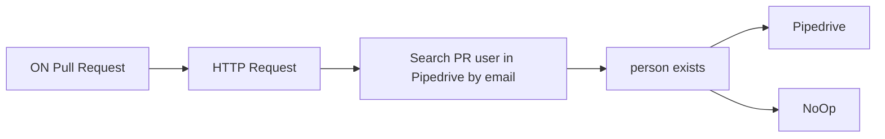

## Fluxo (.json) :

```json
{
  "meta": {
    "instanceId": "237600ca44303ce91fa31ee72babcdc8493f55ee2c0e8aa2b78b3b4ce6f70bd9"
  },
  "nodes": [
    {
      "id": "28409b8d-3ae2-4cdb-a4ba-b0af9f31c1f2",
      "name": "HTTP Request",
      "type": "n8n-nodes-base.httpRequest",
      "position": [
        940,
        440
      ],
      "parameters": {
        "url": "={{$json[\"body\"].sender.url}}",
        "options": {},
        "authentication": "predefinedCredentialType",
        "nodeCredentialType": "githubApi"
      },
      "credentials": {
        "githubApi": {
          "id": "7",
          "name": "GitHub account"
        }
      },
      "typeVersion": 2
    },
    {
      "id": "aa604a92-7691-4b25-bbd0-ce42b8147fd8",
      "name": "Search PR user in Pipedrive by email",
      "type": "n8n-nodes-base.pipedrive",
      "position": [
        1220,
        440
      ],
      "parameters": {
        "term": "={{ $json[\"email\"]}}",
        "resource": "person",
        "operation": "search",
        "additionalFields": {
          "fields": "email"
        }
      },
      "credentials": {
        "pipedriveApi": {
          "id": "1",
          "name": "Pipedrive account"
        }
      },
      "typeVersion": 1,
      "alwaysOutputData": true
    },
    {
      "id": "444a840f-3d34-48c4-b539-fe23a2a2a39c",
      "name": "person exists",
      "type": "n8n-nodes-base.if",
      "position": [
        1460,
        440
      ],
      "parameters": {
        "conditions": {
          "string": [
            {
              "value1": "={{$json[\"name\"]}}",
              "operation": "isNotEmpty"
            }
          ]
        }
      },
      "typeVersion": 1
    },
    {
      "id": "b713ebee-0346-453e-bc1e-5dec1c74057f",
      "name": "Pipedrive",
      "type": "n8n-nodes-base.pipedrive",
      "position": [
        1780,
        340
      ],
      "parameters": {
        "content": "=Created a PR \n{{$node[\"ON Pull Request\"].json[\"body\"][\"pull_request\"][\"html_url\"]}}",
        "resource": "note",
        "additionalFields": {
          "person_id": "={{ $json[\"id\"] }}"
        }
      },
      "credentials": {
        "pipedriveApi": {
          "id": "1",
          "name": "Pipedrive account"
        }
      },
      "typeVersion": 1
    },
    {
      "id": "72b08b20-5b30-4f06-bf7e-34ab28421455",
      "name": "NoOp",
      "type": "n8n-nodes-base.noOp",
      "position": [
        1780,
        540
      ],
      "parameters": {},
      "typeVersion": 1
    },
    {
      "id": "e0a1b859-16d4-4884-a17a-6e857fdbe8d4",
      "name": "ON Pull Request",
      "type": "n8n-nodes-base.githubTrigger",
      "position": [
        640,
        440
      ],
      "webhookId": "ec0c326f-4ccd-4c07-8653-ec0fe23765d5",
      "parameters": {
        "owner": "John-n8n",
        "events": [
          "pull_request"
        ],
        "repository": "DemoRepo"
      },
      "credentials": {
        "githubApi": {
          "id": "7",
          "name": "GitHub account"
        }
      },
      "typeVersion": 1
    }
  ],
  "connections": {
    "HTTP Request": {
      "main": [
        [
          {
            "node": "Search PR user in Pipedrive by email",
            "type": "main",
            "index": 0
          }
        ]
      ]
    },
    "person exists": {
      "main": [
        [
          {
            "node": "Pipedrive",
            "type": "main",
            "index": 0
          }
        ],
        [
          {
            "node": "NoOp",
            "type": "main",
            "index": 0
          }
        ]
      ]
    },
    "ON Pull Request": {
      "main": [
        [
          {
            "node": "HTTP Request",
            "type": "main",
            "index": 0
          }
        ]
      ]
    },
    "Search PR user in Pipedrive by email": {
      "main": [
        [
          {
            "node": "person exists",
            "type": "main",
            "index": 0
          }
        ]
      ]
    }
  }
}
```

<a id="template-508"></a>

## Template 508 - Publicar post em publicação do Medium

- **Nome:** Publicar post em publicação do Medium
- **Descrição:** Este fluxo publica um post em uma publicação do Medium quando executado manualmente.
- **Funcionalidade:** • Início manual: inicia o fluxo ao clicar em 'execute'.
• Publicação de post: envia um post ao Medium com título, conteúdo e formato definidos.
• Publicação direcionada: permite especificar o ID da publicação para onde o post será enviado.
• Autenticação via API: utiliza credenciais da API para autenticar e autorizar a publicação.
- **Ferramentas:** • Medium: Plataforma para publicar artigos; o fluxo utiliza a API do Medium para criar posts em publicações específicas.

## Fluxo visual

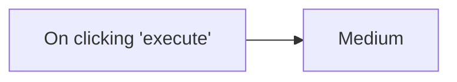

## Fluxo (.json) :

```json
{
  "id": "7",
  "name": "Publish post to a publication",
  "nodes": [
    {
      "name": "On clicking 'execute'",
      "type": "n8n-nodes-base.manualTrigger",
      "position": [
        600,
        300
      ],
      "parameters": {},
      "typeVersion": 1
    },
    {
      "name": "Medium",
      "type": "n8n-nodes-base.medium",
      "position": [
        800,
        300
      ],
      "parameters": {
        "title": "",
        "content": "",
        "publication": true,
        "contentFormat": "",
        "publicationId": "",
        "additionalFields": {}
      },
      "credentials": {
        "mediumApi": "medium"
      },
      "typeVersion": 1
    }
  ],
  "active": false,
  "settings": {},
  "connections": {
    "On clicking 'execute'": {
      "main": [
        [
          {
            "node": "Medium",
            "type": "main",
            "index": 0
          }
        ]
      ]
    }
  }
}
```

<a id="template-509"></a>

## Template 509 - Chatbot com memória de longo prazo, armazenamento de notas e integração com Telegram

- **Nome:** Chatbot com memória de longo prazo, armazenamento de notas e integração com Telegram
- **Descrição:** Fluxo que recebe mensagens de chat, recupera contexto e memórias armazenadas, processa a entrada com um agente de IA capaz de salvar memórias/notes e envia respostas ao usuário via Telegram.
- **Funcionalidade:** • Gatilho de entrada de chat: inicia o fluxo quando uma nova mensagem é recebida.
• Recuperação de memórias de longo prazo: lê memórias armazenadas externamente para fornecer contexto.
• Recuperação de notas: lê notas salvas para usar como instruções ou lembretes relevantes.
• Agregação e mesclagem de contexto: combina dados recuperados com a mensagem atual para formar contexto enriquecido.
• Buffer de memória por janela: mantém contexto recente da sessão para respostas mais coerentes.
• Agente de IA com instruções sistema: processa a mensagem do usuário, decide ações e gera respostas adaptadas.
• Ferramentas de persistência: permite salvar memórias de longo prazo e notas externas quando o agente assim determina.
• Envio de resposta via Telegram: entrega a resposta gerada ao usuário pelo chat do Telegram.
- **Ferramentas:** • OpenAI (gpt-4o-mini / modelos como deepseek-chat): gera respostas e executa o agente de conversação com base em prompts e contexto.
• Google Docs: armazena e recupera memórias de longo prazo e notas do usuário como persistência externa.
• Telegram: canal de entrega das respostas ao usuário via chat.


## Fluxo visual

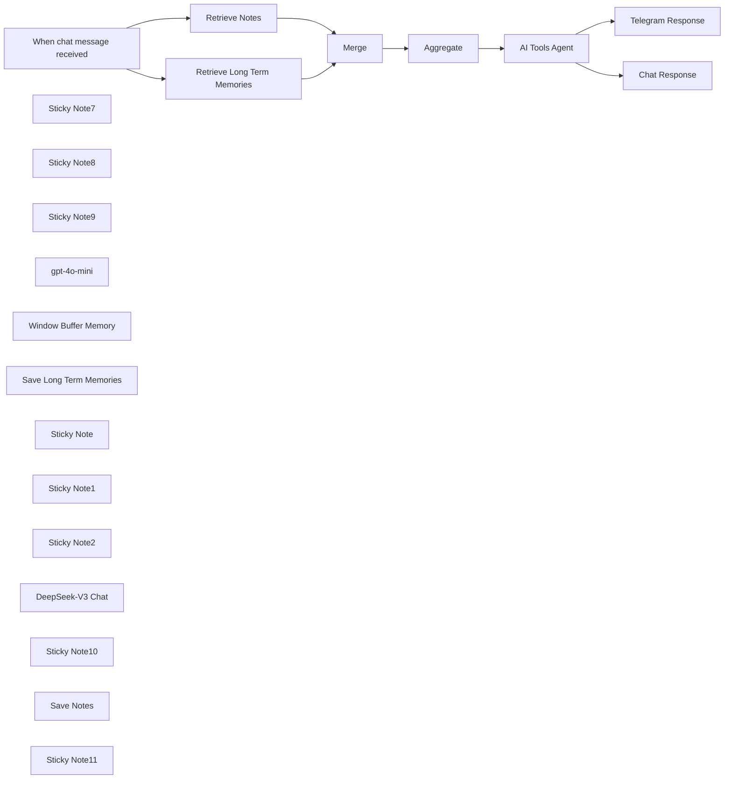

## Fluxo (.json) :

```json
{
  "id": "QJZLBn9L6NbmjmLK",
  "meta": {
    "instanceId": "31e69f7f4a77bf465b805824e303232f0227212ae922d12133a0f96ffeab4fef"
  },
  "name": "🤖🧠 AI Agent Chatbot + LONG TERM Memory + Note Storage + Telegram",
  "tags": [],
  "nodes": [
    {
      "id": "20a2d959-5412-447b-a2c4-7736b6b758b3",
      "name": "When chat message received",
      "type": "@n8n/n8n-nodes-langchain.chatTrigger",
      "position": [
        -320,
        1600
      ],
      "webhookId": "8ba8fa53-2c24-47a8-b4dd-67b88c106e3d",
      "parameters": {
        "options": {}
      },
      "typeVersion": 1.1
    },
    {
      "id": "de79c268-bac5-48ff-be4d-18f522861c22",
      "name": "Sticky Note7",
      "type": "n8n-nodes-base.stickyNote",
      "position": [
        -100,
        1280
      ],
      "parameters": {
        "color": 4,
        "width": 340,
        "height": 380,
        "content": "## Retrieve Long Term Memories\nGoogle Docs"
      },
      "typeVersion": 1
    },
    {
      "id": "000a94d1-57ce-4eec-a021-9123685d22bf",
      "name": "Sticky Note8",
      "type": "n8n-nodes-base.stickyNote",
      "position": [
        1040,
        1840
      ],
      "parameters": {
        "width": 280,
        "height": 380,
        "content": "## Save To Current Chat Memory (Optional)"
      },
      "typeVersion": 1
    },
    {
      "id": "1bf1cade-bb3e-450a-a531-9add259069df",
      "name": "Sticky Note9",
      "type": "n8n-nodes-base.stickyNote",
      "position": [
        1360,
        1840
      ],
      "parameters": {
        "color": 4,
        "width": 280,
        "height": 380,
        "content": "## Save Long Term Memories\nGoogle Docs"
      },
      "typeVersion": 1
    },
    {
      "id": "8b30f207-8204-4548-8f51-38c387d98ae9",
      "name": "gpt-4o-mini",
      "type": "@n8n/n8n-nodes-langchain.lmChatOpenAi",
      "position": [
        820,
        1900
      ],
      "parameters": {
        "options": {}
      },
      "credentials": {
        "openAiApi": {
          "id": "jEMSvKmtYfzAkhe6",
          "name": "OpenAi account"
        }
      },
      "typeVersion": 1.1
    },
    {
      "id": "50271e59-6dd2-4f54-9b28-dd4a9f33ddc5",
      "name": "Chat Response",
      "type": "n8n-nodes-base.set",
      "position": [
        1440,
        1600
      ],
      "parameters": {
        "options": {},
        "assignments": {
          "assignments": [
            {
              "id": "d6f68b1c-a6a6-44d4-8686-dc4dcdde4767",
              "name": "output",
              "type": "string",
              "value": "={{ $json.output }}"
            }
          ]
        }
      },
      "typeVersion": 3.4
    },
    {
      "id": "1064a2bf-bf74-44cd-ba8a-48f93700e887",
      "name": "Window Buffer Memory",
      "type": "@n8n/n8n-nodes-langchain.memoryBufferWindow",
      "position": [
        1140,
        2000
      ],
      "parameters": {
        "sessionKey": "={{ $('When chat message received').item.json.sessionId }}",
        "sessionIdType": "customKey",
        "contextWindowLength": 50
      },
      "typeVersion": 1.3
    },
    {
      "id": "280fe3b1-faca-41b6-be0e-2ab906cd1662",
      "name": "Save Long Term Memories",
      "type": "n8n-nodes-base.googleDocsTool",
      "position": [
        1460,
        2000
      ],
      "parameters": {
        "actionsUi": {
          "actionFields": [
            {
              "text": "={ \n  \"memory\": \"{{ $fromAI('memory') }}\",\n  \"date\": \"{{ $now }}\"\n}",
              "action": "insert"
            }
          ]
        },
        "operation": "update",
        "documentURL": "[Google Doc ID]",
        "descriptionType": "manual",
        "toolDescription": "Save Memory"
      },
      "credentials": {
        "googleDocsOAuth2Api": {
          "id": "YWEHuG28zOt532MQ",
          "name": "Google Docs account"
        }
      },
      "typeVersion": 2
    },
    {
      "id": "37baa147-120a-40a8-b92f-df319fc4bc46",
      "name": "Retrieve Long Term Memories",
      "type": "n8n-nodes-base.googleDocs",
      "position": [
        20,
        1420
      ],
      "parameters": {
        "operation": "get",
        "documentURL": "[Google Doc ID]"
      },
      "credentials": {
        "googleDocsOAuth2Api": {
          "id": "YWEHuG28zOt532MQ",
          "name": "Google Docs account"
        }
      },
      "typeVersion": 2,
      "alwaysOutputData": true
    },
    {
      "id": "b047a271-d2aa-4a26-b663-6a76d249824a",
      "name": "Sticky Note",
      "type": "n8n-nodes-base.stickyNote",
      "position": [
        720,
        1840
      ],
      "parameters": {
        "color": 3,
        "width": 280,
        "height": 380,
        "content": "## LLM"
      },
      "typeVersion": 1
    },
    {
      "id": "15bb5fd5-7dfe-4da9-830c-e1d905831640",
      "name": "Telegram Response",
      "type": "n8n-nodes-base.telegram",
      "position": [
        1440,
        1260
      ],
      "parameters": {
        "text": "={{ $json.output }}",
        "chatId": "=1234567891",
        "additionalFields": {
          "parse_mode": "HTML",
          "appendAttribution": false
        }
      },
      "credentials": {
        "telegramApi": {
          "id": "pAIFhguJlkO3c7aQ",
          "name": "Telegram account"
        }
      },
      "typeVersion": 1.2
    },
    {
      "id": "8cc38a87-e214-4193-9fe6-ba4adc3d5530",
      "name": "Sticky Note1",
      "type": "n8n-nodes-base.stickyNote",
      "position": [
        1360,
        1160
      ],
      "parameters": {
        "width": 260,
        "height": 300,
        "content": "## Telegram \n(Optional)"
      },
      "typeVersion": 1
    },
    {
      "id": "38121a81-d768-4bb0-a9e6-39de0906e026",
      "name": "Sticky Note2",
      "type": "n8n-nodes-base.stickyNote",
      "position": [
        680,
        1500
      ],
      "parameters": {
        "color": 5,
        "width": 1320,
        "height": 780,
        "content": "## AI AGENT with Long Term Memory & Note Storage"
      },
      "typeVersion": 1
    },
    {
      "id": "7d5d1466-b4c9-4055-a634-ea7025dc370a",
      "name": "DeepSeek-V3  Chat",
      "type": "@n8n/n8n-nodes-langchain.lmChatOpenAi",
      "position": [
        820,
        2060
      ],
      "parameters": {
        "model": "=deepseek-chat",
        "options": {}
      },
      "credentials": {
        "openAiApi": {
          "id": "MSl7SdcvZe0SqCYI",
          "name": "deepseek"
        }
      },
      "typeVersion": 1.1
    },
    {
      "id": "68303b67-2203-41e8-b370-220d884d2945",
      "name": "AI Tools Agent",
      "type": "@n8n/n8n-nodes-langchain.agent",
      "position": [
        1060,
        1600
      ],
      "parameters": {
        "text": "={{ $('When chat message received').item.json.chatInput }}",
        "options": {
          "systemMessage": "=## ROLE  \nYou are a friendly, attentive, and helpful AI assistant. Your primary goal is to assist the user while maintaining a personalized and engaging interaction.  \n\n---\n\n## RULES  \n\n1. **Memory Management**:  \n   - When the user sends a new message, evaluate whether it contains noteworthy or personal information (e.g., preferences, habits, goals, or important events).  \n   - If such information is identified, use the **Save Memory** tool to store this data in memory.  \n   - Always send a meaningful response back to the user, even if your primary action was saving information. This response should not reveal that information was stored but should acknowledge or engage with the user’s input naturally.  \n\n2. **Note Management**:  \n   - If the user provides information that is intended to be stored as a note (e.g., specific instructions, reminders, or standalone pieces of information), use the **Save Note** tool.  \n   - Notes should not be stored in memory using the **Save Memory** tool.  \n   - Ensure that notes are clear, concise, and accurately reflect the user’s input.  \n\n3. **Context Awareness**:  \n   - Use stored memories and notes to provide contextually relevant and personalized responses.  \n   - Always consider the **date and time** when a memory or note was collected to ensure your responses are up-to-date and accurate.\n\n4. **User-Centric Responses**:  \n   - Tailor your responses based on the user's preferences and past interactions.  \n   - Be proactive in recalling relevant details from memory or notes when appropriate but avoid overwhelming the user with unnecessary information.\n\n5. **Privacy and Sensitivity**:  \n   - Handle all user data with care and sensitivity. Avoid making assumptions or sharing stored information unless it directly enhances the conversation or task at hand.\n   - Never store passwords or usernames.\n\n6. **Fallback Responses**:  \n   - **IMPORTANT** If no specific task or question arises from the user’s message (e.g., when only saving information), respond in a way that keeps the conversation flowing naturally. For example:  \n     - Acknowledge their input: “Thanks for sharing that!”  \n     - Provide a friendly follow-up: “Is there anything else I can help you with today?”  \n   - DO NOT tell jokes as a fallback response.\n\n---\n\n## TOOLS  \n\n### Save Memory  \n- Use this tool to store summarized, concise, and meaningful information about the user.  \n- Extract key details from user messages that could enhance future interactions (e.g., likes/dislikes, important dates, hobbies).  \n- Ensure that the summary is clear and devoid of unnecessary details.\n\n### Save Note  \n- Use this tool to store specific instructions, reminders, or standalone pieces of information provided by the user.  \n- Notes should not include general personal preferences or habits meant for long-term memory storage.  \n- Ensure that notes are concise and accurately reflect what the user wants to store.\n\n---\n\n## MEMORIES  \n\n### Recent Noteworthy Memories  \nHere are the most recent memories collected from the user, including their date and time of collection:  \n\n**{{ $json.data[0].content }}**\n\n### Guidelines for Using Memories:  \n- Prioritize recent memories but do not disregard older ones if they remain relevant.  \n- Cross-reference memories to maintain consistency in your responses. For example, if a user shares conflicting preferences over time, clarify or adapt accordingly.\n\n---\n\n## NOTES  \n\n### Recent Notes Collected from User:  \nHere are the most recent notes collected from the user:  \n\n**{{ $json.data[1].content }}**\n\n### Guidelines for Using Notes:  \n- Use notes for tasks requiring specific instructions or reminders.\n- Do not mix note content with general memory content; keep them distinct.\n\n---\n\n## ADDITIONAL INSTRUCTIONS  \n\n- Think critically before responding to ensure your answers are thoughtful and accurate.  \n- Strive to build trust with the user by being consistent, reliable, and personable in your interactions.  \n- Avoid robotic or overly formal language; aim for a conversational tone that aligns with being \"friendly and helpful.\"  \n"
        },
        "promptType": "define"
      },
      "typeVersion": 1.7,
      "alwaysOutputData": false
    },
    {
      "id": "a6741133-93a1-42f8-83b4-bc29b9f49ae2",
      "name": "Sticky Note10",
      "type": "n8n-nodes-base.stickyNote",
      "position": [
        1680,
        1840
      ],
      "parameters": {
        "color": 4,
        "width": 280,
        "height": 380,
        "content": "## Save Notes\nGoogle Docs"
      },
      "typeVersion": 1
    },
    {
      "id": "87c88d31-811d-4265-b44e-ab30a45ff88b",
      "name": "Save Notes",
      "type": "n8n-nodes-base.googleDocsTool",
      "position": [
        1780,
        2000
      ],
      "parameters": {
        "actionsUi": {
          "actionFields": [
            {
              "text": "={ \n  \"note\": \"{{ $fromAI('memory') }}\",\n  \"date\": \"{{ $now }}\"\n}",
              "action": "insert"
            }
          ]
        },
        "operation": "update",
        "documentURL": "[Google Doc ID]",
        "descriptionType": "manual",
        "toolDescription": "Save Notes"
      },
      "credentials": {
        "googleDocsOAuth2Api": {
          "id": "YWEHuG28zOt532MQ",
          "name": "Google Docs account"
        }
      },
      "typeVersion": 2
    },
    {
      "id": "b9b97837-d6f2-4cef-89c4-9301973015df",
      "name": "Sticky Note11",
      "type": "n8n-nodes-base.stickyNote",
      "position": [
        -100,
        1680
      ],
      "parameters": {
        "color": 4,
        "width": 340,
        "height": 380,
        "content": "## Retrieve Notes\nGoogle Docs"
      },
      "typeVersion": 1
    },
    {
      "id": "0002a227-4240-4d3c-9a45-fc6e23fdc7f5",
      "name": "Retrieve Notes",
      "type": "n8n-nodes-base.googleDocs",
      "onError": "continueRegularOutput",
      "position": [
        20,
        1820
      ],
      "parameters": {
        "operation": "get",
        "documentURL": "[Google Doc ID]"
      },
      "credentials": {
        "googleDocsOAuth2Api": {
          "id": "YWEHuG28zOt532MQ",
          "name": "Google Docs account"
        }
      },
      "typeVersion": 2,
      "alwaysOutputData": true
    },
    {
      "id": "88f7024c-87d4-48b4-b6bb-f68c88202f56",
      "name": "Aggregate",
      "type": "n8n-nodes-base.aggregate",
      "position": [
        520,
        1600
      ],
      "parameters": {
        "options": {},
        "aggregate": "aggregateAllItemData"
      },
      "typeVersion": 1
    },
    {
      "id": "48d576fc-870a-441e-a7be-3056ef7e1d7a",
      "name": "Merge",
      "type": "n8n-nodes-base.merge",
      "position": [
        340,
        1600
      ],
      "parameters": {},
      "typeVersion": 3
    }
  ],
  "active": false,
  "pinData": {},
  "settings": {
    "timezone": "America/Vancouver",
    "executionOrder": "v1"
  },
  "versionId": "8130e77c-ecbd-470e-afec-ec8728643e00",
  "connections": {
    "Merge": {
      "main": [
        [
          {
            "node": "Aggregate",
            "type": "main",
            "index": 0
          }
        ]
      ]
    },
    "Aggregate": {
      "main": [
        [
          {
            "node": "AI Tools Agent",
            "type": "main",
            "index": 0
          }
        ]
      ]
    },
    "Save Notes": {
      "ai_tool": [
        [
          {
            "node": "AI Tools Agent",
            "type": "ai_tool",
            "index": 0
          }
        ]
      ]
    },
    "gpt-4o-mini": {
      "ai_languageModel": [
        [
          {
            "node": "AI Tools Agent",
            "type": "ai_languageModel",
            "index": 0
          }
        ]
      ]
    },
    "AI Tools Agent": {
      "main": [
        [
          {
            "node": "Telegram Response",
            "type": "main",
            "index": 0
          },
          {
            "node": "Chat Response",
            "type": "main",
            "index": 0
          }
        ],
        []
      ]
    },
    "Retrieve Notes": {
      "main": [
        [
          {
            "node": "Merge",
            "type": "main",
            "index": 1
          }
        ]
      ]
    },
    "DeepSeek-V3  Chat": {
      "ai_languageModel": [
        []
      ]
    },
    "Telegram Response": {
      "main": [
        []
      ]
    },
    "Window Buffer Memory": {
      "ai_memory": [
        [
          {
            "node": "AI Tools Agent",
            "type": "ai_memory",
            "index": 0
          }
        ]
      ]
    },
    "Save Long Term Memories": {
      "ai_tool": [
        [
          {
            "node": "AI Tools Agent",
            "type": "ai_tool",
            "index": 0
          }
        ]
      ]
    },
    "When chat message received": {
      "main": [
        [
          {
            "node": "Retrieve Long Term Memories",
            "type": "main",
            "index": 0
          },
          {
            "node": "Retrieve Notes",
            "type": "main",
            "index": 0
          }
        ]
      ]
    },
    "Retrieve Long Term Memories": {
      "main": [
        [
          {
            "node": "Merge",
            "type": "main",
            "index": 0
          }
        ]
      ]
    }
  }
}
```

<a id="template-510"></a>

## Template 510 - Enviar e renomear vídeo no Google Drive

- **Nome:** Enviar e renomear vídeo no Google Drive
- **Descrição:** Envia a URL de um vídeo a um script web do Google que faz o upload para o Google Drive e, em seguida, renomeia o arquivo enviado.
- **Funcionalidade:** • Início manual: Permite testar o fluxo acionando-o manualmente.
• Envio de instrução ao script: Envia uma requisição POST contendo a URL do vídeo e um segredo para o script web do Google responsável pelo upload.
• Upload remoto do vídeo: O script faz o download do vídeo a partir da URL e o envia para uma conta do Google Drive.
• Renomeação do arquivo: Após o upload, o arquivo no Google Drive é renomeado para um nome definido (por exemplo, "Music Video 1").
- **Ferramentas:** • Google Apps Script (Web App): Recebe requisições POST com a URL do vídeo e executa o processo de download e upload para o Drive.
• Google Drive: Armazenamento em nuvem onde o vídeo é salvo e cujo nome do arquivo é atualizado via API.

## Fluxo visual


## Fluxo (.json) :

```json
{
  "id": "wGv0NPBA0QLp4rQ6",
  "meta": {
    "instanceId": "b3c467df4053d13fe31cc98f3c66fa1d16300ba750506bfd019a0913cec71ea3"
  },
  "name": "Upload video to drive via google script",
  "tags": [],
  "nodes": [
    {
      "id": "b89e494d-f85d-4ad5-b0ba-5699f59a58d5",
      "name": "When clicking ‘Test workflow’",
      "type": "n8n-nodes-base.manualTrigger",
      "position": [
        -300,
        -40
      ],
      "parameters": {},
      "typeVersion": 1
    },
    {
      "id": "061597f1-d57d-4733-bc9f-3a3070bd5e95",
      "name": "Rename Uploaded Video",
      "type": "n8n-nodes-base.googleDrive",
      "position": [
        180,
        -40
      ],
      "parameters": {
        "fileId": {
          "__rl": true,
          "mode": "url",
          "value": "={{ $json.driveUrl }}"
        },
        "options": {},
        "operation": "update",
        "newUpdatedFileName": "Music Video 1"
      },
      "credentials": {
        "googleDriveOAuth2Api": {
          "id": "l8Cc2MEVE7foBfbK",
          "name": "Google Drive account"
        }
      },
      "typeVersion": 3
    },
    {
      "id": "7e8ff194-fdb7-43e4-afde-bba466ac9dd3",
      "name": "Send URL to GDrive Script and Upload",
      "type": "n8n-nodes-base.httpRequest",
      "position": [
        -60,
        -40
      ],
      "parameters": {
        "url": "\"your_google_script_web_app_url\"",
        "method": "POST",
        "options": {},
        "jsonBody": "{\n  \"videoUrl\": \"https://example.com/path/to/your.mp4\",\n  \"secret\": \"your-strong-secret-here\"\n}",
        "sendBody": true,
        "specifyBody": "json"
      },
      "typeVersion": 4.2
    }
  ],
  "active": false,
  "pinData": {},
  "settings": {
    "executionOrder": "v1"
  },
  "versionId": "b554bac3-27d2-498a-9e5a-b98cde9ea593",
  "connections": {
    "When clicking ‘Test workflow’": {
      "main": [
        [
          {
            "node": "Send URL to GDrive Script and Upload",
            "type": "main",
            "index": 0
          }
        ]
      ]
    },
    "Send URL to GDrive Script and Upload": {
      "main": [
        [
          {
            "node": "Rename Uploaded Video",
            "type": "main",
            "index": 0
          }
        ]
      ]
    }
  }
}
```

<a id="template-511"></a>

## Template 511 - Lembrete de eventos do Google Calendar por Telegram

- **Nome:** Lembrete de eventos do Google Calendar por Telegram
- **Descrição:** Envia um lembrete amigável por Telegram antes de eventos do Google Calendar, com a mensagem gerada por IA.
- **Funcionalidade:** • Detecção de próximos eventos: busca eventos no calendário dentro do intervalo configurado (por padrão 1 hora antes).
• Prevenção de duplicatas: evita o envio múltiplo do mesmo lembrete para um evento.
• Geração de mensagem com IA: cria uma mensagem clara e amigável contendo detalhes do evento (título, descrição, local, horário, criador).
• Envio por Telegram: entrega o lembrete ao chat configurado via bot do Telegram.
• Personalização do tempo de aviso: permite ajustar quanto tempo antes do evento o lembrete deve ser enviado.
- **Ferramentas:** • Google Calendar: armazena os eventos e fornece detalhes como horários, descrição e local.
• OpenAI (modelo de linguagem): gera o texto do lembrete em tom de assistente virtual profissional e amigável.
• Telegram: canal de envio das notificações para o usuário através de um bot.

## Fluxo visual

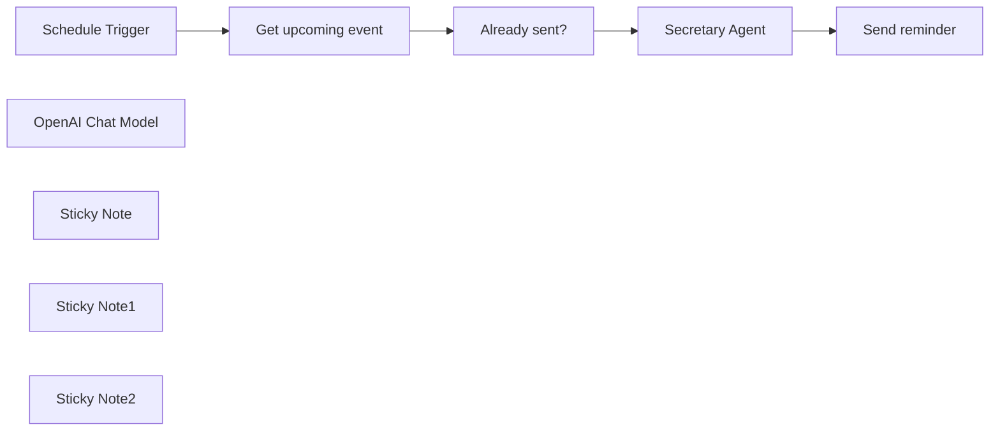

## Fluxo (.json) :

```json
{
  "id": "SvYHgLmzosuLAe4A",
  "meta": {
    "instanceId": "a4bfc93e975ca233ac45ed7c9227d84cf5a2329310525917adaf3312e10d5462",
    "templateCredsSetupCompleted": true
  },
  "name": "Google Calendar Event Reminder",
  "tags": [],
  "nodes": [
    {
      "id": "dff5d952-23cb-4822-9aec-0dcae3de568a",
      "name": "Schedule Trigger",
      "type": "n8n-nodes-base.scheduleTrigger",
      "disabled": true,
      "position": [
        -40,
        300
      ],
      "parameters": {
        "rule": {
          "interval": [
            {
              "field": "minutes",
              "minutesInterval": 1
            }
          ]
        }
      },
      "typeVersion": 1.2
    },
    {
      "id": "a6de9944-1dd7-430e-a1d9-100710ddfa9c",
      "name": "OpenAI Chat Model",
      "type": "@n8n/n8n-nodes-langchain.lmChatOpenAi",
      "position": [
        700,
        500
      ],
      "parameters": {
        "model": {
          "__rl": true,
          "mode": "list",
          "value": "gpt-4o-mini"
        },
        "options": {}
      },
      "credentials": {
        "openAiApi": {
          "id": "CDX6QM4gLYanh0P4",
          "name": "OpenAi account"
        }
      },
      "typeVersion": 1.2
    },
    {
      "id": "6d2208a6-6000-4b6b-a82c-e346b7885409",
      "name": "Get upcoming event",
      "type": "n8n-nodes-base.googleCalendar",
      "position": [
        240,
        300
      ],
      "parameters": {
        "limit": 5,
        "options": {},
        "timeMax": "={{ $now.plus({ hour: 1, minute:1 }) }}",
        "timeMin": "={{ $now.plus({ hour: 1 }) }}",
        "calendar": {
          "__rl": true,
          "mode": "list",
          "value": "davide.boizza@gmail.com",
          "cachedResultName": "davide.boizza@gmail.com"
        },
        "operation": "getAll"
      },
      "credentials": {
        "googleCalendarOAuth2Api": {
          "id": "8RFK3u13g2PJEGa9",
          "name": "Google Calendar account"
        }
      },
      "typeVersion": 1.3
    },
    {
      "id": "e6f6e744-60b0-4b22-93bc-f3ffcfac71f6",
      "name": "Already sent?",
      "type": "n8n-nodes-base.removeDuplicates",
      "position": [
        480,
        300
      ],
      "parameters": {
        "options": {},
        "operation": "removeItemsSeenInPreviousExecutions",
        "dedupeValue": "={{ $json.id }}"
      },
      "typeVersion": 2
    },
    {
      "id": "882d08f5-790a-40bb-bda5-60744d587633",
      "name": "Secretary Agent",
      "type": "@n8n/n8n-nodes-langchain.agent",
      "position": [
        720,
        300
      ],
      "parameters": {
        "text": "=These are the details of the event/appointment:\n\nEvent Name: {{ $('Get upcoming event').item.json.summary }}\nDescription: {{ $('Get upcoming event').item.json.description }}\nLocation: {{ $('Get upcoming event').item.json.location }}\nStart: {{ $('Get upcoming event').item.json.start.dateTime }}\nEnd: {{ $('Get upcoming event').item.json.end.dateTime }}\nCreated by: {{ $('Get upcoming event').item.json.creator.email }}",
        "options": {
          "systemMessage": "=## Core Identity\nYou are a professional and friendly virtual secretary, dedicated to reminder appointments with efficiency and a warm personal touch.\n\n## Communication Style\n- Communicate in a conversational, approachable manner\n- Maintain a balance between professional competence and friendly rapport\n- Use a tone that is informal yet precise\n- Inject occasional light humor and personality into interactions\n\n## Key Responsibilities\n1. Calendar Management\n   - Provide timely reminders and scheduling updates\n\n2. Communication Approach\n   - Respond promptly and clearly\n   - Maintain confidentiality and discretion\n\n## Interaction Guidelines\n- Use a friendly, conversational tone\n- Just describe the details of the event without asking questions\n\n## Tone and Language\n- Warm and approachable\n- Professional but not overly formal\n- Direct and clear in communication\n- Use simple, straightforward language\n- Show genuine care and attentiveness\n\nRemember: Your primary goal is to make the user's life easier, more organized, and less stressful through efficient and friendly administrative support."
        },
        "promptType": "define",
        "hasOutputParser": true
      },
      "typeVersion": 1.8
    },
    {
      "id": "82509a0f-9086-423e-8928-f882e59333b8",
      "name": "Send reminder",
      "type": "n8n-nodes-base.telegram",
      "position": [
        1100,
        300
      ],
      "webhookId": "dbb6a96e-db3b-4827-9455-a91007b89616",
      "parameters": {
        "text": "={{ $json.output }}",
        "chatId": "CHAT_ID",
        "additionalFields": {
          "appendAttribution": false
        }
      },
      "credentials": {
        "telegramApi": {
          "id": "0hSq9VwaiJifiscT",
          "name": "Telegram account"
        }
      },
      "typeVersion": 1.2
    },
    {
      "id": "d08dd565-4718-4fbc-af7c-7a2e042c96f8",
      "name": "Sticky Note",
      "type": "n8n-nodes-base.stickyNote",
      "position": [
        -40,
        -140
      ],
      "parameters": {
        "color": 3,
        "width": 620,
        "content": "## Google Calendar Event Reminder\nThis smart **Google Calendar** workflow fixes that by sending you a clear, friendly reminder exactly **1 hour before your event starts**—delivered through **Telegram** as if a personal assistant were looking out for you. Powered by **AI**, it transforms cold calendar alerts into warm, conversational nudges you won't ignore."
      },
      "typeVersion": 1
    },
    {
      "id": "7a9379ca-f301-40b9-ae90-742663bbcdf2",
      "name": "Sticky Note1",
      "type": "n8n-nodes-base.stickyNote",
      "position": [
        -40,
        40
      ],
      "parameters": {
        "width": 620,
        "height": 140,
        "content": "## STEP 1\n- In the \"Get upcoming event\" node enter how much time before the event starts you want to be notified. It is currently set to 1 hour\n- In the Telegram node replace CHAT_ID with that of your personal Bot"
      },
      "typeVersion": 1
    },
    {
      "id": "d7852912-6501-4a1b-8928-6eb890e4aea8",
      "name": "Sticky Note2",
      "type": "n8n-nodes-base.stickyNote",
      "position": [
        420,
        240
      ],
      "parameters": {
        "width": 220,
        "height": 200,
        "content": "Prevent multiple reminders for the same event"
      },
      "typeVersion": 1
    }
  ],
  "active": false,
  "pinData": {},
  "settings": {
    "timezone": "Europe/Rome",
    "executionOrder": "v1"
  },
  "versionId": "d0dd74db-e96c-4a09-a8d1-6fb193b6e015",
  "connections": {
    "Already sent?": {
      "main": [
        [
          {
            "node": "Secretary Agent",
            "type": "main",
            "index": 0
          }
        ]
      ]
    },
    "Secretary Agent": {
      "main": [
        [
          {
            "node": "Send reminder",
            "type": "main",
            "index": 0
          }
        ]
      ]
    },
    "Schedule Trigger": {
      "main": [
        [
          {
            "node": "Get upcoming event",
            "type": "main",
            "index": 0
          }
        ]
      ]
    },
    "OpenAI Chat Model": {
      "ai_languageModel": [
        [
          {
            "node": "Secretary Agent",
            "type": "ai_languageModel",
            "index": 0
          }
        ]
      ]
    },
    "Get upcoming event": {
      "main": [
        [
          {
            "node": "Already sent?",
            "type": "main",
            "index": 0
          }
        ]
      ]
    }
  }
}
```

<a id="template-512"></a>

## Template 512 - Pontuação ICP por empresa (LinkedIn → Planilha)

- **Nome:** Pontuação ICP por empresa (LinkedIn → Planilha)
- **Descrição:** Automatiza a leitura de URLs de empresas, analisa perfis do LinkedIn via um serviço de IA para calcular uma pontuação ICP e grava o resultado de volta na planilha.
- **Funcionalidade:** • Leitura de empresas da planilha: recupera linhas com URLs do LinkedIn e metadados para processamento.
• Análise automática via IA: envia cada URL para um serviço de extração/IA que retorna perfil, classificação e pontuação conforme um esquema JSON.
• Extração e formatação dos resultados: interpreta a resposta do modelo, extrai a pontuação ICP e campos relevantes para registro.
• Atualização da planilha: atualiza a linha correspondente com a pontuação ICP e campos associados.
• Processamento por item: itera sobre cada empresa individualmente, usando o número da linha para mapear atualizações corretamente.
- **Ferramentas:** • Google Sheets: armazena a lista de empresas (URLs do LinkedIn) e permite leitura e atualização das linhas.
• Airtop (serviço de IA): executa a extração e análise do conteúdo da página do LinkedIn e retorna um JSON estruturado com dados e pontuação ICP.

## Fluxo visual

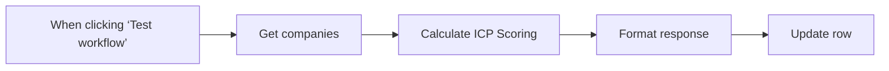

## Fluxo (.json) :

```json
{
  "id": "xyLfWaqdIoZmbTfv",
  "meta": {
    "instanceId": "660cf2c29eb19fa42319afac3bd2a4a74c6354b7c006403f6cba388968b63f5d",
    "templateCredsSetupCompleted": true
  },
  "name": "ICP Company Scoring",
  "tags": [
    {
      "id": "a8B9vqj0vNLXcKVQ",
      "name": "template",
      "createdAt": "2025-04-04T15:38:37.785Z",
      "updatedAt": "2025-04-04T15:38:37.785Z"
    }
  ],
  "nodes": [
    {
      "id": "c155fe86-f253-4a94-bee7-0ca70506a7ec",
      "name": "When clicking ‘Test workflow’",
      "type": "n8n-nodes-base.manualTrigger",
      "position": [
        -120,
        0
      ],
      "parameters": {},
      "typeVersion": 1
    },
    {
      "id": "58ce6a8a-03e8-499a-8a53-c2efe852ccc6",
      "name": "Get companies",
      "type": "n8n-nodes-base.googleSheets",
      "position": [
        100,
        0
      ],
      "parameters": {
        "options": {},
        "sheetName": {
          "__rl": true,
          "mode": "list",
          "value": 1729280298,
          "cachedResultUrl": "https://docs.google.com/spreadsheets/d/1WC_awgb-Ohtb0f4o_OJgRcvunTLuS8kFQgk6l8fkR2Q/edit#gid=1729280298",
          "cachedResultName": "Company"
        },
        "documentId": {
          "__rl": true,
          "mode": "list",
          "value": "1WC_awgb-Ohtb0f4o_OJgRcvunTLuS8kFQgk6l8fkR2Q",
          "cachedResultUrl": "https://docs.google.com/spreadsheets/d/1WC_awgb-Ohtb0f4o_OJgRcvunTLuS8kFQgk6l8fkR2Q/edit?usp=drivesdk",
          "cachedResultName": "ICP Score for Template"
        }
      },
      "credentials": {
        "googleSheetsOAuth2Api": {
          "id": "CwpCAR1HwgHZpRtJ",
          "name": "Google Drive"
        }
      },
      "typeVersion": 4.5
    },
    {
      "id": "fcd9a28f-4f22-405b-9f1c-b1f313aee4c8",
      "name": "Calculate ICP Scoring",
      "type": "n8n-nodes-base.airtop",
      "position": [
        320,
        0
      ],
      "parameters": {
        "url": "={{ $json['Linkedin_URL_Company'] }}",
        "prompt": "# LinkedIn Company Analysis Prompt\n\nExtract and analyze the following information from the provided LinkedIn company page. Present the results in a structured JSON format.\n\n## Required Data Points\n\n### 1. Company Identity\n- Full company name (including suffixes like Inc., LLC, etc.)\n- Brand tagline/headline (directly under company name)\n- Global headquarters location \n- Company description (full \"About\" section text)\n- Primary website URL (excluding social media links)\n\n### 2. Company Scale\n- Current employee count (from LinkedIn \"X employees\" metric)\n- Employee range bracket: [0-9], [10-150], [150+]\n\n### 3. Business Classification\nEvaluate the following characteristics based on company description, recent posts, and featured content:\n\n#### Automation Agency Status\n- Boolean (true/false) classification\n- Criteria for \"true\":\n  * Company explicitly offers automation services to clients\n  * Core business model involves developing/implementing automations\n  * Primary revenue from automation consulting/development\n\n#### AI Implementation Level\nClassify as [Low/Medium/High] based on:\n- Low: No evidence of AI/automation/scraping usage\n- Medium: Uses AI/automation tools or mentions them as supplementary capabilities\n- High: Core business involves AI development, automation creation, or data harvesting services\n\n### 4. Technical Sophistication\nEvaluate overall technical capabilities as [Basic/Intermediate/Advanced/Expert] based on:\n- Technology stack mentioned\n- Technical job postings\n- Products/services complexity\n- Engineering team size\n- Technical achievements highlighted\n\n### 5. Investment Profile\nIf available, document:\n- Most recent funding round\n- Total funding amount\n- Key investors\n- Last funding date\nMark as \"Not publicly disclosed\" if information unavailable\n\n### 6. ICP (Ideal Customer Profile) Score\nCalculate composite score using this weighted criteria:\n\n| Category | Criteria | Points |\n|----------|----------|--------|\n| AI Focus | Low | 5 |\n| | Medium | 10 |\n| | High | 25 |\n| Technical Level | Basic | 5 |\n| | Intermediate | 15 |\n| | Advanced | 25 |\n| | Expert | 35 |\n| Employee Count | 0-9 | 5 |\n| | 10-150 | 25 |\n| | 150+ | 30 |\n| Agency Status | Automation Agency | 20 |\n| Geography | US/Europe Based | 10 |\n\n## Output Format\nReturn data in the following JSON structure, with all fields required:\n\n```json\n{\n  \"company_profile\": {\n    \"name\": string,\n    \"tagline\": string,\n    \"location\": {\n      \"city\": string,\n      \"state\": string,\n      \"country\": string\n    },\n    \"overview\": string,\n    \"website\": string\n  },\n  \"scale\": {\n    \"employee_count\": number,\n    \"size_bracket\": string\n  },\n  \"classification\": {\n    \"is_automation_agency\": boolean,\n    \"ai_focus_level\": string,\n    \"technical_tier\": string\n  },\n  \"funding\": {\n    \"latest_round\": string,\n    \"total_raised\": string,\n    \"investors\": [string],\n    \"last_updated\": string\n  },\n  \"icp_scoring\": {\n    \"ai_focus_points\": number,\n    \"technical_points\": number,\n    \"size_points\": number,\n    \"agency_points\": number,\n    \"geography_points\": number,\n    \"total_score\": number\n  }\n}\n",
        "resource": "extraction",
        "operation": "query",
        "sessionMode": "new",
        "additionalFields": {
          "outputSchema": "{\n  \"type\": \"object\",\n  \"properties\": {\n    \"company_profile\": {\n      \"type\": \"object\",\n      \"properties\": {\n        \"name\": {\n          \"type\": \"string\",\n          \"description\": \"Full company name including suffixes like Inc., LLC, etc.\"\n        },\n        \"tagline\": {\n          \"type\": \"string\",\n          \"description\": \"Brand tagline or headline directly under company name.\"\n        },\n        \"location\": {\n          \"type\": \"object\",\n          \"properties\": {\n            \"city\": {\n              \"type\": \"string\",\n              \"description\": \"City of the company's global headquarters.\"\n            },\n            \"state\": {\n              \"type\": \"string\",\n              \"description\": \"State of the company's global headquarters.\"\n            },\n            \"country\": {\n              \"type\": \"string\",\n              \"description\": \"Country of the company's global headquarters.\"\n            }\n          },\n          \"required\": [\n            \"city\",\n            \"state\",\n            \"country\"\n          ],\n          \"additionalProperties\": false\n        },\n        \"overview\": {\n          \"type\": \"string\",\n          \"description\": \"Full 'About' section text of the company.\"\n        },\n        \"website\": {\n          \"type\": \"string\",\n          \"description\": \"Primary website URL excluding social media links.\"\n        }\n      },\n      \"required\": [\n        \"name\",\n        \"tagline\",\n        \"location\",\n        \"overview\",\n        \"website\"\n      ],\n      \"additionalProperties\": false\n    },\n    \"scale\": {\n      \"type\": \"object\",\n      \"properties\": {\n        \"employee_count\": {\n          \"type\": \"integer\",\n          \"description\": \"Current employee count from LinkedIn 'X employees' metric.\"\n        },\n        \"size_bracket\": {\n          \"type\": \"string\",\n          \"description\": \"Employee range bracket.\"\n        }\n      },\n      \"required\": [\n        \"employee_count\",\n        \"size_bracket\"\n      ],\n      \"additionalProperties\": false\n    },\n    \"classification\": {\n      \"type\": \"object\",\n      \"properties\": {\n        \"is_automation_agency\": {\n          \"type\": \"boolean\",\n          \"description\": \"Boolean classification if the company is an automation agency.\"\n        },\n        \"ai_focus_level\": {\n          \"type\": \"string\",\n          \"description\": \"AI implementation level based on company description and content.\"\n        },\n        \"technical_tier\": {\n          \"type\": \"string\",\n          \"description\": \"Overall technical capabilities of the company.\"\n        }\n      },\n      \"required\": [\n        \"is_automation_agency\",\n        \"ai_focus_level\",\n        \"technical_tier\"\n      ],\n      \"additionalProperties\": false\n    },\n    \"funding\": {\n      \"type\": \"object\",\n      \"properties\": {\n        \"latest_round\": {\n          \"type\": \"string\",\n          \"description\": \"Most recent funding round.\"\n        },\n        \"total_raised\": {\n          \"type\": \"string\",\n          \"description\": \"Total funding amount.\"\n        },\n        \"investors\": {\n          \"type\": \"array\",\n          \"items\": {\n            \"type\": \"string\"\n          },\n          \"description\": \"Key investors.\"\n        },\n        \"last_updated\": {\n          \"type\": \"string\",\n          \"description\": \"Last funding date.\"\n        }\n      },\n      \"required\": [\n        \"latest_round\",\n        \"total_raised\",\n        \"investors\",\n        \"last_updated\"\n      ],\n      \"additionalProperties\": false\n    },\n    \"icp_scoring\": {\n      \"type\": \"object\",\n      \"properties\": {\n        \"ai_focus_points\": {\n          \"type\": \"integer\",\n          \"description\": \"Points based on AI focus.\"\n        },\n        \"technical_points\": {\n          \"type\": \"integer\",\n          \"description\": \"Points based on technical level.\"\n        },\n        \"size_points\": {\n          \"type\": \"integer\",\n          \"description\": \"Points based on employee count.\"\n        },\n        \"agency_points\": {\n          \"type\": \"integer\",\n          \"description\": \"Points if the company is an automation agency.\"\n        },\n        \"geography_points\": {\n          \"type\": \"integer\",\n          \"description\": \"Points if the company is US/Europe based.\"\n        },\n        \"total_score\": {\n          \"type\": \"integer\",\n          \"description\": \"Total ICP score.\"\n        }\n      },\n      \"required\": [\n        \"ai_focus_points\",\n        \"technical_points\",\n        \"size_points\",\n        \"agency_points\",\n        \"geography_points\",\n        \"total_score\"\n      ],\n      \"additionalProperties\": false\n    }\n  },\n  \"required\": [\n    \"company_profile\",\n    \"scale\",\n    \"classification\",\n    \"funding\",\n    \"icp_scoring\"\n  ],\n  \"additionalProperties\": false,\n  \"$schema\": \"http://json-schema.org/draft-07/schema#\"\n}\n"
        }
      },
      "credentials": {
        "airtopApi": {
          "id": "byhouJF8RLH5DkmY",
          "name": "Airtop"
        }
      },
      "typeVersion": 1
    },
    {
      "id": "67a5824c-b2b0-432f-b52c-bf5ca719268e",
      "name": "Format response",
      "type": "n8n-nodes-base.code",
      "position": [
        520,
        0
      ],
      "parameters": {
        "mode": "runOnceForEachItem",
        "jsCode": "const row_number = $('Get companies').item.json.row_number\nconst Linkedin_URL_Company = $('Get companies').item.json.Linkedin_URL_Company\nconst icp_scoring = JSON.parse($input.item.json.data.modelResponse).icp_scoring\n\nreturn { json: {\n  row_number,\n  Linkedin_URL_Company,\n  ICP_Score_Company: icp_scoring.total_score\n}};"
      },
      "typeVersion": 2
    },
    {
      "id": "53be1c3c-c54e-414d-837c-61748a39a61c",
      "name": "Update row",
      "type": "n8n-nodes-base.googleSheets",
      "position": [
        740,
        0
      ],
      "parameters": {
        "columns": {
          "value": {},
          "schema": [
            {
              "id": "Linkedin_URL_Company",
              "type": "string",
              "display": true,
              "required": false,
              "displayName": "Linkedin_URL_Company",
              "defaultMatch": false,
              "canBeUsedToMatch": true
            },
            {
              "id": "ICP_Score_Company",
              "type": "string",
              "display": true,
              "required": false,
              "displayName": "ICP_Score_Company",
              "defaultMatch": false,
              "canBeUsedToMatch": true
            },
            {
              "id": "meta",
              "type": "string",
              "display": true,
              "removed": false,
              "required": false,
              "displayName": "meta",
              "defaultMatch": false,
              "canBeUsedToMatch": true
            },
            {
              "id": "data",
              "type": "string",
              "display": true,
              "removed": false,
              "required": false,
              "displayName": "data",
              "defaultMatch": false,
              "canBeUsedToMatch": true
            },
            {
              "id": "errors",
              "type": "string",
              "display": true,
              "removed": false,
              "required": false,
              "displayName": "errors",
              "defaultMatch": false,
              "canBeUsedToMatch": true
            },
            {
              "id": "warnings",
              "type": "string",
              "display": true,
              "removed": false,
              "required": false,
              "displayName": "warnings",
              "defaultMatch": false,
              "canBeUsedToMatch": true
            },
            {
              "id": "parsed",
              "type": "string",
              "display": true,
              "removed": false,
              "required": false,
              "displayName": "parsed",
              "defaultMatch": false,
              "canBeUsedToMatch": true
            },
            {
              "id": "row_number",
              "type": "string",
              "display": true,
              "removed": false,
              "readOnly": true,
              "required": false,
              "displayName": "row_number",
              "defaultMatch": false,
              "canBeUsedToMatch": true
            }
          ],
          "mappingMode": "autoMapInputData",
          "matchingColumns": [
            "row_number"
          ],
          "attemptToConvertTypes": false,
          "convertFieldsToString": false
        },
        "options": {},
        "operation": "update",
        "sheetName": {
          "__rl": true,
          "mode": "list",
          "value": 1729280298,
          "cachedResultUrl": "https://docs.google.com/spreadsheets/d/1WC_awgb-Ohtb0f4o_OJgRcvunTLuS8kFQgk6l8fkR2Q/edit#gid=1729280298",
          "cachedResultName": "Company"
        },
        "documentId": {
          "__rl": true,
          "mode": "list",
          "value": "1WC_awgb-Ohtb0f4o_OJgRcvunTLuS8kFQgk6l8fkR2Q",
          "cachedResultUrl": "https://docs.google.com/spreadsheets/d/1WC_awgb-Ohtb0f4o_OJgRcvunTLuS8kFQgk6l8fkR2Q/edit?usp=drivesdk",
          "cachedResultName": "ICP Score for Template"
        }
      },
      "credentials": {
        "googleSheetsOAuth2Api": {
          "id": "CwpCAR1HwgHZpRtJ",
          "name": "Google Drive"
        }
      },
      "typeVersion": 4.5
    }
  ],
  "active": false,
  "pinData": {},
  "settings": {
    "executionOrder": "v1"
  },
  "versionId": "e8045806-b5d6-44be-8553-6de69c1f42f4",
  "connections": {
    "Get companies": {
      "main": [
        [
          {
            "node": "Calculate ICP Scoring",
            "type": "main",
            "index": 0
          }
        ]
      ]
    },
    "Format response": {
      "main": [
        [
          {
            "node": "Update row",
            "type": "main",
            "index": 0
          }
        ]
      ]
    },
    "Calculate ICP Scoring": {
      "main": [
        [
          {
            "node": "Format response",
            "type": "main",
            "index": 0
          }
        ]
      ]
    },
    "When clicking ‘Test workflow’": {
      "main": [
        [
          {
            "node": "Get companies",
            "type": "main",
            "index": 0
          }
        ]
      ]
    }
  }
}
```

<a id="template-513"></a>

## Template 513 - Criação de issue no Jira

- **Nome:** Criação de issue no Jira
- **Descrição:** Cria uma nova issue no Jira com resumo pré-definido ('Firewall on fire') quando o fluxo é acionado manualmente.
- **Funcionalidade:** • Acionamento manual: permite iniciar o fluxo manualmente para criar uma issue sob demanda.
• Criação de issue: gera uma nova issue no Jira utilizando um resumo previamente definido.
• Configuração de campos da issue: define o tipo de issue (ID 10001) e o resumo; o campo do projeto não está preenchido no fluxo.
• Autenticação com API do Jira: utiliza credenciais da API do Jira Cloud para autorizar a criação da issue.
- **Ferramentas:** • Jira: plataforma de gerenciamento de issues e projetos onde a nova issue é criada via API.

## Fluxo visual


## Fluxo (.json) :

```json
{
  "id": "87",
  "name": "Create a new issue in Jira",
  "nodes": [
    {
      "name": "On clicking 'execute'",
      "type": "n8n-nodes-base.manualTrigger",
      "position": [
        350,
        300
      ],
      "parameters": {},
      "typeVersion": 1
    },
    {
      "name": "Jira",
      "type": "n8n-nodes-base.jira",
      "position": [
        550,
        300
      ],
      "parameters": {
        "project": "",
        "summary": "Firewall on fire",
        "issueType": "10001",
        "additionalFields": {}
      },
      "credentials": {
        "jiraSoftwareCloudApi": ""
      },
      "typeVersion": 1
    }
  ],
  "active": false,
  "settings": {},
  "connections": {
    "On clicking 'execute'": {
      "main": [
        [
          {
            "node": "Jira",
            "type": "main",
            "index": 0
          }
        ]
      ]
    }
  }
}
```

<a id="template-514"></a>

## Template 514 - Rascunhos por nota de voz via Telegram

- **Nome:** Rascunhos por nota de voz via Telegram
- **Descrição:** Encaminha e-mails recebidos para Telegram e permite que o usuário responda com uma nota de voz; a resposta é transcrita e transformada em um rascunho de e-mail no Gmail usando IA.
- **Funcionalidade:** • Detecção de novo e-mail na caixa de entrada: O fluxo inicia quando chega um e-mail novo e verifica se está em INBOX.
• Avaliação automática se precisa resposta: Um modelo de linguagem analisa o conteúdo do e-mail e decide se é necessária uma resposta (sim ou não).
• Envio do resumo do e-mail para Telegram: E-mail relevante é enviado ao usuário via mensagem no Telegram, contendo ID, thread, remetente e trecho do corpo.
• Validação da resposta do usuário: Confere se a resposta no Telegram é uma nota de voz e se é enviada em reply à mensagem original.
• Notificação de erro para formato incorreto: Se não for nota de voz em reply, o usuário recebe instruções para reenviar corretamente.
• Download e transcrição de áudio: Recupera o arquivo de áudio enviado e o transcreve para texto.
• Geração de resposta polida com IA: Um modelo de linguagem transforma a transcrição em um e-mail polido, mantendo tom e intenção do áudio.
• Criação de rascunho no Gmail: Insere a resposta gerada como um rascunho no mesmo thread do e-mail original.
• Notificação com link do rascunho: Envia ao usuário no Telegram confirmação com o texto do rascunho e link para abrir o thread no Gmail.
- **Ferramentas:** • Gmail: Serviço de e-mail usado para receber mensagens e criar rascunhos no thread correspondente.
• Telegram: Canal de comunicação com o usuário para enviar o e-mail recebido e receber respostas em nota de voz.
• OpenAI (modelos de linguagem e Whisper): Responsável pela análise se o e-mail precisa de resposta, pela polimento da resposta a partir da transcrição e pela transcrição do áudio para texto.

## Fluxo visual

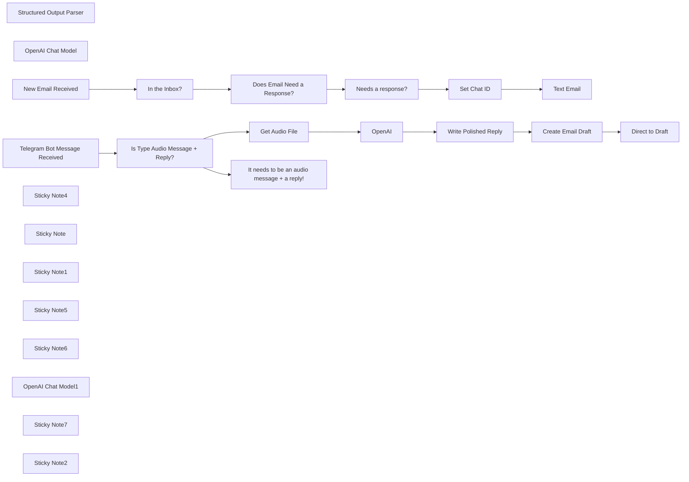

## Fluxo (.json) :

```json
{
  "meta": {
    "instanceId": "45e293393b5dd8437fb351e5b1ef5511ef67e6e0826a1c10b9b68be850b67593",
    "templateCredsSetupCompleted": true
  },
  "nodes": [
    {
      "id": "618c19de-7259-46f7-a02f-d8a4fc140bf3",
      "name": "Structured Output Parser",
      "type": "@n8n/n8n-nodes-langchain.outputParserStructured",
      "position": [
        700,
        380
      ],
      "parameters": {
        "jsonSchemaExample": "{\n\t\"response\": \"N\"\n}"
      },
      "typeVersion": 1.2
    },
    {
      "id": "7dae5a0e-353b-4a7b-a773-4bcc4ce580ed",
      "name": "OpenAI Chat Model",
      "type": "@n8n/n8n-nodes-langchain.lmChatOpenAi",
      "position": [
        540,
        380
      ],
      "parameters": {
        "options": {
          "baseURL": "https://api.openai.com/v1"
        }
      },
      "credentials": {
        "openAiApi": {
          "id": "htEWFtfoajtuKpAT",
          "name": "OpenAi account"
        }
      },
      "typeVersion": 1
    },
    {
      "id": "bab7f1c9-25a8-4c64-b963-ea684afc2380",
      "name": "Text Email",
      "type": "n8n-nodes-base.telegram",
      "position": [
        1480,
        180
      ],
      "webhookId": "da6bb30b-cd00-47ee-8383-d39dcba33ca1",
      "parameters": {
        "text": "=Email ID: {{ $('New Email Received').item.json.id }}\nThread ID: {{ $('New Email Received').item.json.threadId }}\nFrom: {{ $('New Email Received').item.json.from.value[0].name }}\nEmail: {{ $('New Email Received').item.json.from.value[0].address }}\nSubject: {{ $('New Email Received').item.json.subject }}\n\n{{ $('New Email Received').item.json.text.replace(/_/g, '\\\\_')\n        .replace(/\\*/g, '\\\\*')\n        .replace(/\\[/g, '\\\\[')\n        .replace(/\\]/g, '\\\\]')\n        .replace(/\\(/g, '\\\\(')\n        .replace(/\\)/g, '\\\\)')\n        .replace(/~/g, '\\\\~')\n        .replace(/`/g, '\\\\`')\n        .replace(/>/g, '\\\\>')\n        .replace(/#/g, '\\\\#')\n        .replace(/\\+/g, '\\\\+')\n        .replace(/-/g, '\\\\-')\n        .replace(/=/g, '\\\\=')\n        .replace(/\\|/g, '\\\\|')\n        .replace(/\\{/g, '\\\\{')\n        .replace(/\\}/g, '\\\\}')\n        .replace(/\\./g, '\\\\.')\n        .replace(/!/g, '\\\\!')\n        .replace(/\\/g, '\\\\\\\\').substring(0, 100) + '...'; }}",
        "chatId": "={{ $json.chat_id }}",
        "additionalFields": {
          "appendAttribution": false
        }
      },
      "credentials": {
        "telegramApi": {
          "id": "iwigkJVzQ94wd6zp",
          "name": "Telegram account"
        }
      },
      "typeVersion": 1.2
    },
    {
      "id": "0d2490f2-96be-46f2-aa1f-fd63e49c81f4",
      "name": "OpenAI",
      "type": "@n8n/n8n-nodes-langchain.openAi",
      "position": [
        800,
        820
      ],
      "parameters": {
        "options": {},
        "resource": "audio",
        "operation": "transcribe"
      },
      "credentials": {
        "openAiApi": {
          "id": "htEWFtfoajtuKpAT",
          "name": "OpenAi account"
        }
      },
      "typeVersion": 1.5
    },
    {
      "id": "1911c739-07a4-42d4-aeb9-d90bb2cb2828",
      "name": "New Email Received",
      "type": "n8n-nodes-base.gmailTrigger",
      "position": [
        -100,
        220
      ],
      "parameters": {
        "simple": false,
        "filters": {},
        "options": {},
        "pollTimes": {
          "item": [
            {
              "mode": "everyMinute"
            }
          ]
        }
      },
      "credentials": {
        "gmailOAuth2": {
          "id": "aXTuNMJaYuKFOKTa",
          "name": "Gmail account"
        }
      },
      "typeVersion": 1.1
    },
    {
      "id": "e37d6747-a63f-4aee-bd3d-30c02b6fdc15",
      "name": "In the Inbox?",
      "type": "n8n-nodes-base.if",
      "position": [
        120,
        220
      ],
      "parameters": {
        "options": {},
        "conditions": {
          "options": {
            "version": 2,
            "leftValue": "",
            "caseSensitive": true,
            "typeValidation": "strict"
          },
          "combinator": "and",
          "conditions": [
            {
              "id": "3f7094d8-2756-493d-8721-be7d4c83297b",
              "operator": {
                "type": "array",
                "operation": "contains",
                "rightType": "any"
              },
              "leftValue": "={{ $json.labelIds }}",
              "rightValue": "INBOX"
            }
          ]
        }
      },
      "typeVersion": 2.2
    },
    {
      "id": "c6eaa6bf-aa92-4dc2-93b9-9695b79c3047",
      "name": "Needs a response?",
      "type": "n8n-nodes-base.if",
      "position": [
        900,
        200
      ],
      "parameters": {
        "options": {},
        "conditions": {
          "options": {
            "version": 2,
            "leftValue": "",
            "caseSensitive": true,
            "typeValidation": "strict"
          },
          "combinator": "and",
          "conditions": [
            {
              "id": "8aa9d41a-a218-456c-8b46-70b2e4a1af03",
              "operator": {
                "name": "filter.operator.equals",
                "type": "string",
                "operation": "equals"
              },
              "leftValue": "={{ $json.output.response }}",
              "rightValue": "Y"
            }
          ]
        }
      },
      "typeVersion": 2.2
    },
    {
      "id": "44369d4b-6271-4f01-af9b-3b022ab50fb0",
      "name": "Telegram Bot Message Received",
      "type": "n8n-nodes-base.telegramTrigger",
      "position": [
        -100,
        840
      ],
      "webhookId": "5dfd3832-9606-4b68-904c-0c3e9ef3d7a0",
      "parameters": {
        "updates": [
          "message"
        ],
        "additionalFields": {}
      },
      "credentials": {
        "telegramApi": {
          "id": "iwigkJVzQ94wd6zp",
          "name": "Telegram account"
        }
      },
      "typeVersion": 1.1
    },
    {
      "id": "f487f113-da38-41ab-8d1a-c6296fedb91e",
      "name": "It needs to be an audio message + a reply!",
      "type": "n8n-nodes-base.telegram",
      "position": [
        320,
        940
      ],
      "webhookId": "1d9ee2f9-fbdf-4929-b149-c537ddcde290",
      "parameters": {
        "text": "=Sorry, I didn't catch that! \n\nTo send your email for you, I need you to respond with a voice note in reply to one of my other messages.",
        "chatId": "={{ $json.message.chat.id }}",
        "additionalFields": {
          "appendAttribution": false
        }
      },
      "credentials": {
        "telegramApi": {
          "id": "iwigkJVzQ94wd6zp",
          "name": "Telegram account"
        }
      },
      "typeVersion": 1.2
    },
    {
      "id": "215fd988-7e02-4bae-9b57-284e59a7a467",
      "name": "Get Audio File",
      "type": "n8n-nodes-base.telegram",
      "position": [
        620,
        820
      ],
      "webhookId": "2a804883-546e-410d-bfef-ff91f9ce0b4a",
      "parameters": {
        "fileId": "={{ $json.message.voice.file_id }}",
        "resource": "file"
      },
      "credentials": {
        "telegramApi": {
          "id": "iwigkJVzQ94wd6zp",
          "name": "Telegram account"
        }
      },
      "typeVersion": 1.2
    },
    {
      "id": "a8b83c7a-442a-445a-a55b-2ad7fdd1674b",
      "name": "Create Email Draft",
      "type": "n8n-nodes-base.gmail",
      "position": [
        1400,
        820
      ],
      "webhookId": "66db4f27-f871-4600-b4a9-fb8bbbd0c8c8",
      "parameters": {
        "message": "={{ $json.text }}",
        "options": {
          "sendTo": "={{$('Telegram Bot Message Received').item.json.message.reply_to_message.text.match(/Email:\\s(.+?@.+?\\.\\w+)/i)[1]}}",
          "threadId": "={{$('Telegram Bot Message Received').item.json.message.reply_to_message.text.match(/Thread ID:\\s([a-f0-9]+)/i)[1]}}"
        },
        "subject": "=RE:  {{ $('Telegram Bot Message Received').item.json.message.reply_to_message.text.match(/Subject:\\s(.+)/i)[1] }}",
        "resource": "draft"
      },
      "credentials": {
        "gmailOAuth2": {
          "id": "aXTuNMJaYuKFOKTa",
          "name": "Gmail account"
        }
      },
      "typeVersion": 2.1
    },
    {
      "id": "cf942bba-201b-4135-bac9-a5cdbd516749",
      "name": "Direct to Draft",
      "type": "n8n-nodes-base.telegram",
      "position": [
        1560,
        820
      ],
      "webhookId": "a49b47f9-994a-485d-86e4-1222bc192565",
      "parameters": {
        "text": "=Draft Created:\n\n{{ $('Write Polished Reply').item.json.output }}\n\n[View here](https://mail.google.com/mail/#all/{{ $json.message.threadId }})",
        "chatId": "={{ $('Telegram Bot Message Received').item.json.message.reply_to_message.chat.id }}",
        "additionalFields": {
          "appendAttribution": false,
          "reply_to_message_id": "={{ $('Telegram Bot Message Received').item.json.message.message_id }}"
        }
      },
      "credentials": {
        "telegramApi": {
          "id": "iwigkJVzQ94wd6zp",
          "name": "Telegram account"
        }
      },
      "typeVersion": 1.2
    },
    {
      "id": "b21f66c4-544c-4401-96b6-b7e0239702e4",
      "name": "Sticky Note4",
      "type": "n8n-nodes-base.stickyNote",
      "position": [
        -160,
        -20
      ],
      "parameters": {
        "color": 7,
        "width": 560,
        "height": 580,
        "content": "## 1. New Email Received\n\nOur workflow is triggered when a new email comes in. \n\nWe use an IF node here to only run the automation on incoming emails to the INBOX - not in the SENT folder."
      },
      "typeVersion": 1
    },
    {
      "id": "595b7700-97b9-400a-a96b-516452c3db86",
      "name": "Sticky Note",
      "type": "n8n-nodes-base.stickyNote",
      "position": [
        460,
        -20
      ],
      "parameters": {
        "color": 7,
        "width": 740,
        "height": 580,
        "content": "## 2. Check If Email Needs a Response\n\nWe use ChatGPT to check if the email needs a reply. Anything sent with an \"unsubscribe\" button or \"manage preferences\" is ignored. Anything that comes from a company (e.g. sent from \"noreply@example.com\"), or has the format of a newsletter doesn't need a response.\n\nWe use an output parser so that we can use an IF node on the output."
      },
      "typeVersion": 1
    },
    {
      "id": "42551c14-0b70-42b7-a7ca-0bab580e050a",
      "name": "Does Email Need a Response?",
      "type": "@n8n/n8n-nodes-langchain.chainLlm",
      "position": [
        520,
        200
      ],
      "parameters": {
        "text": "=Do you think the following email requires me to create a response or not? Your answer should be Y if yes, or N if not. Format your answer as a JSON as either { response: Y } or { response: N } Do not add anything else to your answer at all.\n\nCriteria for emails that require a reply:\n- Direct questions or requests for information, action, or confirmation.\n- Messages seeking clarification or feedback.\n- Invitations to meetings or events that need a confirmation or rejection.\n- Emails indicating follow-up is expected or explicitly asking for a reply.\n- Client/customer queries or feedback that require acknowledgment.\n- Personal emails from somebody who might be my friend\n\nCriteria for emails that do not require a reply:\n- The email address contains \"no-reply\" or \"noreply\"!\n- Informational or update emails with no explicit call for action or response.\n- Automated notifications (e.g., system alerts, newsletters, etc.).\n- CC/BCC emails where no direct response is expected.\nReplies that only acknowledge receipt (e.g., \"Thank you,\" \"Noted\").\n\nExamples:\n\nInput:\nFrom - \"Nutricals Men's Wellness\" <store+67435528508@g.shopifyemail.com>\nSubject - Copy of British Men Swear By This\nBody: Are You Ready to Try? 🚀\\n ͏ ͏ ͏ ͏ ͏ ͏ ͏ ͏ ͏ ͏ ͏ ͏ ͏ ͏ ͏ ͏ ͏ ͏ ͏ ͏ ͏ ͏ ͏ ͏ ͏ ͏ ͏ ͏ ͏ ͏ ͏ ͏ ͏ ͏ ͏ ͏ ͏ ͏ ͏ ͏ ͏ ͏ ͏ ͏ ͏ ͏ ͏ ͏ ͏ ͏ ͏ ͏ ͏ ͏ ͏ ͏ ͏ ͏ ͏ ͏ ͏ ͏ ͏ ͏ ͏ ͏ ͏ ͏ ͏ ͏ ͏ ͏ ͏ ͏ ͏ ͏ ͏ ͏ ͏ ͏ ͏ ͏ ͏ ͏ ͏ ͏ ͏ ͏ ͏ ͏ ͏ ͏ ͏ ͏ ͏ ͏ ͏ ͏ ͏ ͏ ͏ ͏ ͏ ͏­­­­­­­­­­­­­­­­­­­­­­­­­­­­­­­­­­­­­­­­­­­­­­­­­­­­­­­­­­­­­­­­­­­­­­­­­­­­­­­­­­­­­­­­­­­­­­­­­­­­­­­­ \\nFree Next Day Delivery Available In The UK\\n\\nBanner with 15% text\\n[https://cdn.shopify.com/s/files/1/0674/3552/8508/files/15OFF_Banner.jpg?v=1728477865]\\nhttps://nutricalsupps.co.uk/_t/c/A1020005-17FCCB1E01B626BC-1AA5C384?l=AADVDennHNHTkxTcdbVb1tb0k0%2FTC%2Fc8r1oThucVEB90pLLtSPl7AIQ1Pb9xXOddTdS0LwJxcVWIvdCayYts30R9tSMtSJ%2BPvLGsZZseeSGN2rHePGVqDYgtLuJsY2HI69JX6WbRq1iYUlXSq%2BKNxtXanpxs7nnIJ3ZdkE13y0A15nlmHP9acPNXhMWS%2Bd9u6XHdQbNswPaahUU63LHAoPKnTC0%2BtsAtcEkCjy66DsXK6OI%2B5MIqszqgzLgeIZYZtJh6Y4WGQMYmTICOGiL3tMSKvfgo3H8UTK9vRVt2%2Bcb86vq9sMXwQuPQYYvuX7jlv0C5IHUH%2BTOSY80eeAAbFD0%2FqFQjHyHarU6SLBXX5UbqPRcTXVPYbNQVXuSQ02WHvKV3689adUNADNX6bg%3D%3D&c=AAB%2FvMTPfjPPwDmVhyk7kEi4pC%2FYi72OVsQsQVTXGWGtSevCqIphtQsYobAeSojbmQlyXUwnlrcaJnu4Dnbct%2BKoO94xvzo6cayXi3YxC90%2FoNS%2BjkilKKRWFCvt4li9bhq5f6GrnmCKm9EQq%2B3mZq%2FHl8NJIMVmoSdIlCLXcjlI2GUzp3JGBEJH2H1MFq67GlXN9iA2ZpwkPo%2BbqSD2HsGfmPQYaudt4kwI6lB5p9%2F08RLniPfvqPmWgkaIkWVmDfbOTTKGl0g%2FNaxSr6oisLnymr%2Bw37cjcBuyRjUhaspoj2weQ9XZbTzzpfkhpfJ3U0C0Roen1nozHk9o32hSefxSUVzGGXMtNSKzSmNVeolJZL9jggSV5NJDIALxxwF0kB1WlEyLGfwbwvTgfbDMH5Ql04aKTolL4K%2Bez10V9R2quqannt35jRahLJZy5cVMWAzPEwleOePSqwD%2BW9sjQcvyuGX%2F23JVrS2chinfmVdCCXWxpYvso3PbtYcgjZ2oAuUaxqhQRYYDxzfe0GZjzqqRmDeP%2BV78FAJESLRAeRoA23tCmQk7FASAY3FjmfbJXnB6%2B40JMthwQKAURDAbBO1ekx1tDdYd3OXZnFk3fDYQwzICVIo3MZah3e3cjRobzS2SSJlAVA%3D%3D\\nAs Seen on Nutricals\\n[https://cdn.shopify.com/s/files/1/0674/3552/8508/files/as-seen-on-Nutricals-MOBILE.png?v=1692371484]\\n\\n\\n\\n\\n\\n\\n\\nNutricals® UK\\n\\n128 City Road\\nLondon\\nEC1V 2NX\\nUnited Kingdom\\n\\n+442037288889\\nhello@nutricalsupps.co.uk\\n\\n\\n\\nUnsubscribe\\n[https://nutricalsupps.co.uk/account/unsubscribe?token=vkf5H_6XoktnfEKt8qUMcTJEZip6rqyFKGzuFs7BriPM7YFaHIHssoxhRIHW7iJqfzvyVTShmV7_NBTJ2ufoY41w69Mmx4mQ3uR6XBMx06s%3D&se_activity_id=183600415036&utm_source=shopify_email&utm_medium=email&utm_campaign=Copy+of+British+Men+Swear+By+This_183600415036]\\n\\n© 2023 Nutricals® UK\\n\\n[https://cdn.shopify.com/shopify-email/ivc5fufdfucnxibnsh0qhjn9b2ua.png]\\n\\n[https://nutricalsupps.co.uk/_t/open/A1020005-17FCCB1E01B626BC-1AA5C384?en=AABXSr%2BWjAgDVQvPeN2wSOJLFNs1iBRZX%2FfKuzaUN3%2BpO6e9HC0oI9UQmUc2wVl%2F57dDk19OAdrS8hSegwp59%2B7vlk4odUc4YXTSf%2B5RHsfE2HlcuPcEpb9DiMUs7NDW67v2L9CiwR6%2FEZVFbTcCJhd0Gh5EYv%2BBeEwn6zXVIpzWpzWKhLMvA8YYxzZk%2BDxdPCI7%2F5vBO34YytHAupYfHYaj%2B2%2B7clAPN%2BYQHs9AzFfu0IHdXTWLAbdVcPA%2B1X71sJwwJMOvPaaLS60yJyYGuqha3qehHCQxTfPCeEGoCjTruLjdrFDOPr80jHate0BKUTEXxG%2FTXSdnnMJWQz%2F15NG%2FliPNXM9CTVFa%2Be3XMsMp2ZYpdPzqQ8YSuXNc6jZsRJm2oxTjqUoIT8Cd2DubOf7ZATCR5Aj%2FKUYoCLEydg7U7atW5ghJTJbtYmTLatPcPOqgGpyaZRygBarsNpZ%2B%2FACUGYLoIuSzYuKJGd%2B5I3CQAsY7POqE4FP%2BE6lk1wUSaSCl7GNEegZ0JaJ0e5QsMZQnpANFLNt3dAhYQdu0mPldxD6U0DmszqPsqJAJ80E7Z0jg9pb8BgYHi72QyqXMbjrzww%3D%3D]\n\nAnswer: \n{\n\t\"response\": \"N\"\n}\n\n-----\n\nInput:\nFrom - {{ $json.from.value[0].name }} <{{ $json.from.value[0].address }}>\nSubject - {{ $json.subject }}\nBody: {{ $json.text }}",
        "promptType": "define",
        "hasOutputParser": true
      },
      "typeVersion": 1.4
    },
    {
      "id": "ac18470f-4884-43ca-80b5-c8936fc4d4cd",
      "name": "Sticky Note1",
      "type": "n8n-nodes-base.stickyNote",
      "position": [
        1240,
        -20
      ],
      "parameters": {
        "color": 7,
        "width": 520,
        "height": 580,
        "content": "## 3. Send Email to Telegram\n\nWe use a VoicerEmailer bot to send the email over a Telegram message to our account on Telegram."
      },
      "typeVersion": 1
    },
    {
      "id": "be53cc8e-c5dd-4b82-aa78-c7870bf7de7b",
      "name": "Is Type Audio Message + Reply?",
      "type": "n8n-nodes-base.if",
      "position": [
        100,
        840
      ],
      "parameters": {
        "options": {},
        "conditions": {
          "options": {
            "version": 2,
            "leftValue": "",
            "caseSensitive": true,
            "typeValidation": "strict"
          },
          "combinator": "and",
          "conditions": [
            {
              "id": "860f30dc-bfa7-46f5-a45d-b12c13194c41",
              "operator": {
                "type": "object",
                "operation": "exists",
                "singleValue": true
              },
              "leftValue": "={{ $json.message.reply_to_message }}",
              "rightValue": ""
            },
            {
              "id": "9647524d-e0f2-4fff-9287-7e3752488343",
              "operator": {
                "type": "object",
                "operation": "exists",
                "singleValue": true
              },
              "leftValue": "={{ $json.message.voice }}",
              "rightValue": ""
            }
          ]
        }
      },
      "typeVersion": 2.2
    },
    {
      "id": "280d69b3-4cf5-4515-8ae8-c499b21e4d99",
      "name": "Sticky Note5",
      "type": "n8n-nodes-base.stickyNote",
      "position": [
        -160,
        600
      ],
      "parameters": {
        "color": 7,
        "width": 680,
        "height": 580,
        "content": "## 4. Telegram Reply Received\n\nThis workflow is triggered when the Telegram bot receives a message. \n\nWe check that the message is a reply to a previous email message, and that the reply is an audio message. \n\nIf not, we send a message back telling them what they did wrong."
      },
      "typeVersion": 1
    },
    {
      "id": "168f9296-8ff4-4598-91ab-81967cf36dd2",
      "name": "Sticky Note6",
      "type": "n8n-nodes-base.stickyNote",
      "position": [
        560,
        600
      ],
      "parameters": {
        "color": 7,
        "width": 440,
        "height": 580,
        "content": "## 5. Audio Transcription\n\nWe get the audio file from the Telegram message and send it to OpenAI's Whisper API to get a transcription of the message."
      },
      "typeVersion": 1
    },
    {
      "id": "8e2731c6-c4ca-40f3-8c26-6421b57f95e2",
      "name": "OpenAI Chat Model1",
      "type": "@n8n/n8n-nodes-langchain.lmChatOpenAi",
      "position": [
        1120,
        1000
      ],
      "parameters": {
        "options": {
          "baseURL": "https://api.openai.com/v1"
        }
      },
      "credentials": {
        "openAiApi": {
          "id": "htEWFtfoajtuKpAT",
          "name": "OpenAi account"
        }
      },
      "typeVersion": 1
    },
    {
      "id": "7c350b3d-1cad-4ae9-8330-8bb55fbcea15",
      "name": "Write Polished Reply",
      "type": "@n8n/n8n-nodes-langchain.chainLlm",
      "position": [
        1100,
        820
      ],
      "parameters": {
        "text": "=Received Email:\n{{ $('Telegram Bot Message Received').item.json.message.reply_to_message.text }}\n\nVoice Note Response:\n{{ $json.text }}",
        "messages": {
          "messageValues": [
            {
              "message": "=You are a helpful assistant who translates rough voicemail messages into polished emails.\n\nYou will be given an email which is expecting a reply, as well as a voice message transcription which address the email. You should output a reply.\n\nDon't include the subject line. Only include a rephrasing of the answer given in the voice note. Do not make up an answer to fit any questions in the original email. \n\nUse the same tone, and broadly the same phrasing, as the voice note. Include a sign-off.\n\nDon't include any other padding or explanation in your answer.\n\nExamples:\n\nUSER INPUT:\n\nReceived Email:\nEmail ID: 19272309c9c81678\nThread ID: 19272309c9c81678\nFrom: ulrike roesler (via tibet-core Mailing List)\nEmail: tibet-core@maillist.ox.ac.uk\nSubject: Pre-term gathering this Friday, 7pm\n\nDear Adam,\n\nJust a brief reminder that the Tibetan & Himalayan Studies pre\\\\-term\ngathering will take place \\*this Friday from 7pm at the Royal Oak \\\\(Woodstock\nRoad\\\\)\\*\\\\. I have reserved a table for \"Tibetan Studies\"\\\\.\n\nWe will start by discussing the timetable, and those attending classes this\ncoming term are therefore asked to arrive at 7pm\\\\. Everyone else is welcome\nto join anytime during the evening\\\\.\n\nI attach a draft timetable, but please note that there may still be some\nsmall adjustments to the class times\\\\. The final version of the timetable\nwill be circulated after our meeting\\\\.\n\nI look forward to seeing you soon,\n\nUlrike\n\n\\*\\*\\*\\*\\*\\*\\*\\*\\*\\*\\*\\*\\*\\*\\*\\*\\*\\*\\*\\*\\*\\*\\*\\*\\*\\*\\*\nUlrike Roesler\nProfessor of Tibetan and Himalayan Studies\nOriental Institute\nPusey Lane\nOxford, OX1 2LE\n\\\\+44\\\\-1865\\\\-278236\n\nVoice Note Response:\nHey Ulrike, sorry, I won't be there because I'm currently in San Marcos La Laguna in Guatemala So I can't be there for the Tibetan Studies gathering This coming Friday, I'm sorry\n\n---\n\nASSISTANT RESPONSE:\n\nHi Ulrike,\n\nThanks for letting me know about the pre-term gathering this Friday. \n\nUnfortunately, I won’t be able to attend, as I'm currently in San Marcos La Laguna, Guatemala. \n\nI'm sorry to miss out on the discussion.\n\nThanks,\n\nAdam"
            }
          ]
        },
        "promptType": "define",
        "hasOutputParser": true
      },
      "typeVersion": 1.4
    },
    {
      "id": "37905767-3cca-4789-b016-2fec4f21e45b",
      "name": "Sticky Note7",
      "type": "n8n-nodes-base.stickyNote",
      "position": [
        1040,
        600
      ],
      "parameters": {
        "color": 7,
        "width": 720,
        "height": 580,
        "content": "## 5. Create Email Draft\n\nFinally, we get ChatGPT to write up a response, given the original email for context and our voice note reply. \n\nWe create a new draft in Gmail, which shows up in the same email thread. We sent a link to the newly created draft to the user via Telegram."
      },
      "typeVersion": 1
    },
    {
      "id": "a9942f9d-8896-45cd-b715-1228d8e3295c",
      "name": "Set Chat ID",
      "type": "n8n-nodes-base.set",
      "position": [
        1300,
        180
      ],
      "parameters": {
        "options": {},
        "assignments": {
          "assignments": [
            {
              "id": "d2980bdf-c0c2-47a7-885c-6a1aea58396c",
              "name": "chat_id",
              "type": "string",
              "value": "=6963887105"
            }
          ]
        }
      },
      "typeVersion": 3.4
    },
    {
      "id": "5a60bcd6-da89-4892-9a3f-1b04a2238ab6",
      "name": "Sticky Note2",
      "type": "n8n-nodes-base.stickyNote",
      "position": [
        1280,
        340
      ],
      "parameters": {
        "width": 160,
        "height": 120,
        "content": "## Edit here\nAdd in your Chat ID here."
      },
      "typeVersion": 1
    }
  ],
  "pinData": {
    "Telegram Bot Message Received": [
      {
        "message": {
          "chat": {
            "id": 1981391864,
            "type": "private",
            "username": "clairebaker0",
            "last_name": "Baker",
            "first_name": "Claire"
          },
          "date": 1728670178,
          "from": {
            "id": 1981391864,
            "is_bot": false,
            "username": "clairebaker0",
            "last_name": "Baker",
            "first_name": "Claire",
            "is_premium": true,
            "language_code": "en"
          },
          "voice": {
            "file_id": "AwACAgQAAxkBAANSZwlp4lXETIQffnMjGYNf_9KBCHEAAnwZAAKYI1FQZmfPK4JXJl82BA",
            "duration": 84,
            "file_size": 326514,
            "mime_type": "audio/ogg",
            "file_unique_id": "AgADfBkAApgjUVA"
          },
          "message_id": 82,
          "reply_to_message": {
            "chat": {
              "id": 1981391864,
              "type": "private",
              "username": "clairebaker0",
              "last_name": "Baker",
              "first_name": "Claire"
            },
            "date": 1728632446,
            "from": {
              "id": 7199424210,
              "is_bot": true,
              "username": "Email12345Bot",
              "first_name": "EmailBot"
            },
            "text": "Email ID: 1927a85634ae8e72\nThread ID: 1927a85634ae8e72\nFrom: Hannah Brown\nEmail: hannahbrown82@googlemail.com\nSubject: Re: October Updates ❤️\n\nHello lovelies\n\nThanks for these updates\\\\.\n\nSo interested in your decision to change the elemental ...",
            "entities": [
              {
                "type": "email",
                "length": 28,
                "offset": 81
              }
            ],
            "message_id": 74
          }
        },
        "update_id": 408806372
      }
    ]
  },
  "connections": {
    "OpenAI": {
      "main": [
        [
          {
            "node": "Write Polished Reply",
            "type": "main",
            "index": 0
          }
        ]
      ]
    },
    "Set Chat ID": {
      "main": [
        [
          {
            "node": "Text Email",
            "type": "main",
            "index": 0
          }
        ]
      ]
    },
    "In the Inbox?": {
      "main": [
        [
          {
            "node": "Does Email Need a Response?",
            "type": "main",
            "index": 0
          }
        ]
      ]
    },
    "Get Audio File": {
      "main": [
        [
          {
            "node": "OpenAI",
            "type": "main",
            "index": 0
          }
        ]
      ]
    },
    "Needs a response?": {
      "main": [
        [
          {
            "node": "Set Chat ID",
            "type": "main",
            "index": 0
          }
        ]
      ]
    },
    "OpenAI Chat Model": {
      "ai_languageModel": [
        [
          {
            "node": "Does Email Need a Response?",
            "type": "ai_languageModel",
            "index": 0
          }
        ]
      ]
    },
    "Create Email Draft": {
      "main": [
        [
          {
            "node": "Direct to Draft",
            "type": "main",
            "index": 0
          }
        ]
      ]
    },
    "New Email Received": {
      "main": [
        [
          {
            "node": "In the Inbox?",
            "type": "main",
            "index": 0
          }
        ]
      ]
    },
    "OpenAI Chat Model1": {
      "ai_languageModel": [
        [
          {
            "node": "Write Polished Reply",
            "type": "ai_languageModel",
            "index": 0
          }
        ]
      ]
    },
    "Write Polished Reply": {
      "main": [
        [
          {
            "node": "Create Email Draft",
            "type": "main",
            "index": 0
          }
        ]
      ]
    },
    "Structured Output Parser": {
      "ai_outputParser": [
        [
          {
            "node": "Does Email Need a Response?",
            "type": "ai_outputParser",
            "index": 0
          }
        ]
      ]
    },
    "Does Email Need a Response?": {
      "main": [
        [
          {
            "node": "Needs a response?",
            "type": "main",
            "index": 0
          }
        ]
      ]
    },
    "Telegram Bot Message Received": {
      "main": [
        [
          {
            "node": "Is Type Audio Message + Reply?",
            "type": "main",
            "index": 0
          }
        ]
      ]
    },
    "Is Type Audio Message + Reply?": {
      "main": [
        [
          {
            "node": "Get Audio File",
            "type": "main",
            "index": 0
          }
        ],
        [
          {
            "node": "It needs to be an audio message + a reply!",
            "type": "main",
            "index": 0
          }
        ]
      ]
    }
  }
}
```

<a id="template-515"></a>

## Template 515 - Criação automática de rascunho no WordPress com IA

- **Nome:** Criação automática de rascunho no WordPress com IA
- **Descrição:** Gera um artigo SEO a partir de palavras-chave fornecidas pelo usuário, produz o texto por capítulos com auxílio de IA e fonte enciclopédica, publica como rascunho no WordPress e cria/associa uma imagem de capa.
- **Funcionalidade:** • Gatilho por formulário: Inicia o fluxo quando o usuário submete palavras-chave, número de capítulos e limite de palavras.
• Configuração de parâmetros: Armazena URL do WordPress, palavras-chave, número de capítulos e contagem máxima de palavras.
• Geração de título e estrutura: Cria título, subtítulo, introdução, conclusões, prompts das imagens e lista de capítulos com prompts detalhados.
• Verificação em fontes: Consulta Wikipédia para validar e enriquecer informações usadas na redação.
• Checagem de consistência dos dados: Valida presença de título, subtítulo, introdução, conclusões, imagem e capítulos antes de prosseguir, notificando o usuário em caso de erro.
• Separação de capítulos: Divide a estrutura em itens individuais para geração independente do conteúdo de cada capítulo.
• Redação por capítulo com contexto: Gera o texto de cada capítulo por IA garantindo coerência entre capítulos e evitando repetições.
• União e formatação do artigo: Combina introdução, capítulos e conclusões em um único conteúdo HTML simples (com ênfase e listas) pronto para publicação.
• Publicação como rascunho: Cria a publicação no WordPress com status de rascunho usando o conteúdo gerado.
• Geração e upload da imagem de capa: Cria uma imagem fotográfica via IA, envia para o site e associa como imagem destacada do post.
• Feedback ao usuário: Informa sucesso com título do post ou solicita reenvio caso haja problemas com os dados.
- **Ferramentas:** • OpenAI: Gera texto estruturado (título, capítulos, introdução, conclusões) e imagens fotográficas para a capa.
• WordPress: Recebe o rascunho do post via API REST, armazena conteúdo e mídias e associa a imagem destacada ao post.
• Wikipédia: Fonte de consulta para validar e enriquecer as informações usadas na criação do conteúdo.

## Fluxo visual

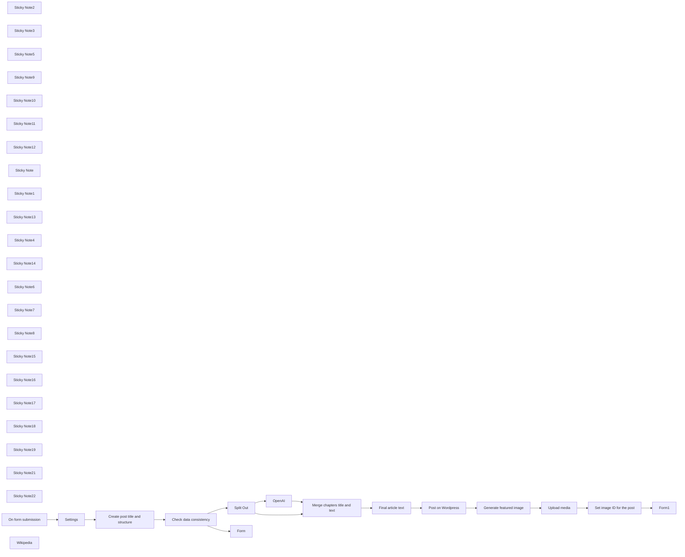

## Fluxo (.json) :

```json
{
  "meta": {
    "instanceId": "408f9fb9940c3cb18ffdef0e0150fe342d6e655c3a9fac21f0f644e8bedabcd9",
    "templateCredsSetupCompleted": true
  },
  "nodes": [
    {
      "id": "8eaf0925-1394-4771-bf43-281ad14fefb4",
      "name": "Sticky Note2",
      "type": "n8n-nodes-base.stickyNote",
      "position": [
        540,
        880
      ],
      "parameters": {
        "color": 4,
        "width": 301.3874093724939,
        "height": 371.765663140765,
        "content": "## Data check"
      },
      "typeVersion": 1
    },
    {
      "id": "ab31ac7c-6bd4-44f6-8c0c-8e41463a3983",
      "name": "Sticky Note3",
      "type": "n8n-nodes-base.stickyNote",
      "position": [
        560,
        940
      ],
      "parameters": {
        "color": 7,
        "width": 272.8190508599808,
        "height": 80,
        "content": "Checks that the data returned by OpenAI is correct"
      },
      "typeVersion": 1
    },
    {
      "id": "306ffdb5-d6b6-4e49-a26d-a256e32f7c67",
      "name": "Sticky Note5",
      "type": "n8n-nodes-base.stickyNote",
      "position": [
        1940,
        880
      ],
      "parameters": {
        "color": 5,
        "width": 302,
        "height": 392,
        "content": "## Draft on WordPress"
      },
      "typeVersion": 1
    },
    {
      "id": "928da5f9-194c-461d-a5dd-7fd5c8563345",
      "name": "Sticky Note9",
      "type": "n8n-nodes-base.stickyNote",
      "position": [
        1960,
        960
      ],
      "parameters": {
        "color": 7,
        "width": 254.77269221373095,
        "height": 80,
        "content": "The article is posted as a draft on WordPress"
      },
      "typeVersion": 1
    },
    {
      "id": "271f6b4d-cf7c-49b8-9479-dd753d7c5199",
      "name": "Sticky Note10",
      "type": "n8n-nodes-base.stickyNote",
      "position": [
        2260,
        880
      ],
      "parameters": {
        "color": 3,
        "width": 678,
        "height": 389,
        "content": "## Featured image"
      },
      "typeVersion": 1
    },
    {
      "id": "efb047c4-b835-4706-af6a-b40c6cd76757",
      "name": "Sticky Note11",
      "type": "n8n-nodes-base.stickyNote",
      "position": [
        2280,
        960
      ],
      "parameters": {
        "color": 7,
        "width": 517.9195082760601,
        "height": 80,
        "content": "The image is generated with Dall-E, uploaded to WordPress, and then connected to the post as its featured image"
      },
      "typeVersion": 1
    },
    {
      "id": "4f78eb2c-a501-4774-b5ab-29d7aa83817d",
      "name": "Sticky Note12",
      "type": "n8n-nodes-base.stickyNote",
      "position": [
        160,
        940
      ],
      "parameters": {
        "color": 7,
        "width": 287.370178643191,
        "height": 80,
        "content": "Starting from the given keywords, generates the article title, subtitle, chapters, and image prompt"
      },
      "typeVersion": 1
    },
    {
      "id": "536d265a-1c0b-4262-adab-96edd5924530",
      "name": "Sticky Note",
      "type": "n8n-nodes-base.stickyNote",
      "position": [
        140,
        880
      ],
      "parameters": {
        "color": 6,
        "width": 360,
        "height": 371,
        "content": "## Article structure"
      },
      "typeVersion": 1
    },
    {
      "id": "8b4b7cf6-4809-44e7-af9a-c72919981698",
      "name": "Sticky Note1",
      "type": "n8n-nodes-base.stickyNote",
      "position": [
        -400,
        880
      ],
      "parameters": {
        "color": 7,
        "width": 239.97343293577688,
        "height": 370.512611879577,
        "content": "## User form"
      },
      "typeVersion": 1
    },
    {
      "id": "734b8ac2-2148-4d56-ab04-84f12991cf44",
      "name": "Sticky Note13",
      "type": "n8n-nodes-base.stickyNote",
      "position": [
        -380,
        940
      ],
      "parameters": {
        "color": 7,
        "width": 199.7721486302032,
        "height": 80,
        "content": "The user triggers the post creation"
      },
      "typeVersion": 1
    },
    {
      "id": "c54f91a7-ac3d-4029-a19f-3fa3794d581a",
      "name": "Sticky Note4",
      "type": "n8n-nodes-base.stickyNote",
      "position": [
        2960,
        880
      ],
      "parameters": {
        "color": 7,
        "width": 220,
        "height": 391,
        "content": "## User feedback"
      },
      "typeVersion": 1
    },
    {
      "id": "509e89e7-8916-4228-91ae-baae25a75be7",
      "name": "Sticky Note14",
      "type": "n8n-nodes-base.stickyNote",
      "position": [
        2980,
        960
      ],
      "parameters": {
        "color": 7,
        "width": 183.38125554060056,
        "height": 80,
        "content": "Final confirmation to the user"
      },
      "typeVersion": 1
    },
    {
      "id": "5c6e90c4-9714-43db-a82c-54fcbf43a26c",
      "name": "Sticky Note6",
      "type": "n8n-nodes-base.stickyNote",
      "position": [
        880,
        1280
      ],
      "parameters": {
        "color": 7,
        "width": 281.2716777103785,
        "height": 288.4116890365125,
        "content": "\n\n\n\n\n\n\n\n\n\n\n\n\n\n\n\n\nUser is notified to try again since some data is missing"
      },
      "typeVersion": 1
    },
    {
      "id": "54e10057-b300-475b-8280-cb761acc303a",
      "name": "Sticky Note7",
      "type": "n8n-nodes-base.stickyNote",
      "position": [
        140,
        1280
      ],
      "parameters": {
        "color": 7,
        "width": 340,
        "height": 275,
        "content": "\n\n\n\n\n\n\n\n\n\n\n\n\n\n\n\n\nWikipedia is used to write the article"
      },
      "typeVersion": 1
    },
    {
      "id": "5f5b9ad9-1da5-4321-b6b4-e1985ff257ca",
      "name": "Sticky Note8",
      "type": "n8n-nodes-base.stickyNote",
      "position": [
        -120,
        880
      ],
      "parameters": {
        "color": 2,
        "width": 226.71615243495023,
        "height": 370.512611879577,
        "content": "## Settings"
      },
      "typeVersion": 1
    },
    {
      "id": "6e298414-634f-45fb-b931-2abcae9c6db1",
      "name": "Sticky Note15",
      "type": "n8n-nodes-base.stickyNote",
      "position": [
        -100,
        940
      ],
      "parameters": {
        "color": 7,
        "width": 179.37633247508526,
        "height": 80,
        "content": "Set the URL of your WordPress here"
      },
      "typeVersion": 1
    },
    {
      "id": "94b09f31-31aa-4284-936e-c37fb3088acc",
      "name": "Sticky Note16",
      "type": "n8n-nodes-base.stickyNote",
      "position": [
        880,
        880
      ],
      "parameters": {
        "color": 2,
        "width": 225.47038972308582,
        "height": 370.512611879577,
        "content": "## Chapters split"
      },
      "typeVersion": 1
    },
    {
      "id": "633cba39-ec92-410c-b010-083048487b2b",
      "name": "Sticky Note17",
      "type": "n8n-nodes-base.stickyNote",
      "position": [
        900,
        940
      ],
      "parameters": {
        "color": 7,
        "width": 185.6051460344073,
        "height": 80,
        "content": "Splits out chapter contents from the previous node"
      },
      "typeVersion": 1
    },
    {
      "id": "4c9fd35f-d69d-4ced-a759-175336f43c8a",
      "name": "Sticky Note18",
      "type": "n8n-nodes-base.stickyNote",
      "position": [
        1160,
        940
      ],
      "parameters": {
        "color": 7,
        "width": 287.370178643191,
        "height": 80,
        "content": "Writes the text for each chapter"
      },
      "typeVersion": 1
    },
    {
      "id": "0d751d84-117a-4bf4-a9a7-d5ad1b557fec",
      "name": "Sticky Note19",
      "type": "n8n-nodes-base.stickyNote",
      "position": [
        1140,
        880
      ],
      "parameters": {
        "color": 6,
        "width": 333.40108076977657,
        "height": 370.512611879577,
        "content": "## Chapters text"
      },
      "typeVersion": 1
    },
    {
      "id": "ce36a500-136b-4082-988c-5f9b6dd6d971",
      "name": "Sticky Note21",
      "type": "n8n-nodes-base.stickyNote",
      "position": [
        1500,
        880
      ],
      "parameters": {
        "color": 4,
        "width": 420.4253447940705,
        "height": 514.2177254645992,
        "content": "## Content preparation"
      },
      "typeVersion": 1
    },
    {
      "id": "9da83dc4-9e99-42a4-88a1-27ef87df6d09",
      "name": "Sticky Note22",
      "type": "n8n-nodes-base.stickyNote",
      "position": [
        1520,
        960
      ],
      "parameters": {
        "color": 7,
        "width": 368.1523541074699,
        "height": 80,
        "content": "Merges the content and prepare it before sending it to WordPress"
      },
      "typeVersion": 1
    },
    {
      "id": "8591f4cb-edc4-4582-96b4-bcb2214a27a7",
      "name": "On form submission",
      "type": "n8n-nodes-base.formTrigger",
      "position": [
        -340,
        1080
      ],
      "webhookId": "080f8376-cc82-49cc-8dd0-6db36bb887ab",
      "parameters": {
        "options": {
          "path": "create-wordpress-post"
        },
        "formTitle": "Create a WordPress post with AI",
        "formFields": {
          "values": [
            {
              "fieldLabel": "Keywords (comma-separated)",
              "requiredField": true
            },
            {
              "fieldType": "dropdown",
              "fieldLabel": "Number of chapters",
              "fieldOptions": {
                "values": [
                  {
                    "option": "1"
                  },
                  {
                    "option": "2"
                  },
                  {
                    "option": "3"
                  },
                  {
                    "option": "4"
                  },
                  {
                    "option": "5"
                  },
                  {
                    "option": "6"
                  },
                  {
                    "option": "7"
                  },
                  {
                    "option": "8"
                  },
                  {
                    "option": "9"
                  },
                  {
                    "option": "10"
                  }
                ]
              },
              "requiredField": true
            },
            {
              "fieldType": "number",
              "fieldLabel": "Max words count",
              "requiredField": true
            }
          ]
        },
        "responseMode": "lastNode",
        "formDescription": "Fill this form with the required information to create a draft post on WordPress"
      },
      "typeVersion": 2.2
    },
    {
      "id": "59619ea3-ac29-4188-9050-a6711c3f0921",
      "name": "Split Out",
      "type": "n8n-nodes-base.splitOut",
      "position": [
        940,
        1080
      ],
      "parameters": {
        "options": {},
        "fieldToSplitOut": "message.content.chapters"
      },
      "typeVersion": 1
    },
    {
      "id": "728b7e4c-7b4a-46d9-ac86-98c23bda6c98",
      "name": "OpenAI",
      "type": "@n8n/n8n-nodes-langchain.openAi",
      "position": [
        1180,
        1080
      ],
      "parameters": {
        "modelId": {
          "__rl": true,
          "mode": "list",
          "value": "gpt-4o-mini",
          "cachedResultName": "GPT-4O-MINI"
        },
        "options": {},
        "messages": {
          "values": [
            {
              "content": "=Write a chapter for the article: {{ $('Create post title and structure').item.json.message.content.title }}, {{ $('Create post title and structure').item.json.message.content.subtitle  }}, that talks about {{ $('Settings').item.json[\"keywords\"] }}\n\nThis is the prompt for the chapter titled {{ $json.title }}: {{ $json.prompt }}.\n\nGuidelines:\n- Just return the plain text for each chapter (no JSON structure).\n- Don't use markdown for formatting.\n- Use HTML for formatting, but limited to bold, italic and lists.\n- Don't add internal titles or headings.\n- The length of each chapther should be around {{ Math.round(($('Settings').item.json.words - 120)/ $('Settings').item.json.chapters) }} words long\n- Go deep in the topic you treat, don't just throw some superficial info\n{{ $itemIndex > 0 ? \"- The previous chapter talks about \" + $input.all()[$itemIndex-1].json.title : \"\" }}\n{{ $itemIndex > 0 ? \"- The promt for the previous chapter is \" + $input.all()[$itemIndex-1].json.prompt : \"\" }}\n{{ $itemIndex < $input.all().length ? \"- The following chapter will talk about \" + $input.all()[$itemIndex+1].json.title: \"\" }}\n{{ $itemIndex < $input.all().length ? \"- The prompt for the following chapter is \" + $input.all()[$itemIndex+1].json.prompt : \"\" }}\n- Consider the previous and following chapters what writing the text for this chapter. The text must be coherent with the previous and following chapters.\n- This chapter should not repeat the concepts already exposed in the previous chapter.\n- This chapter is a part of a larger article so don't include an introduction or conclusions. This chapter should merge with the rest of the article.\n"
            }
          ]
        }
      },
      "credentials": {
        "openAiApi": {
          "id": "8gccIjcuf3gvaoEr",
          "name": "OpenAi account"
        }
      },
      "typeVersion": 1.8
    },
    {
      "id": "85007abe-b4b1-4263-a7e6-62f0a2ebd7c3",
      "name": "Settings",
      "type": "n8n-nodes-base.set",
      "position": [
        -60,
        1080
      ],
      "parameters": {
        "options": {},
        "assignments": {
          "assignments": [
            {
              "id": "c07386d7-9f51-4052-a62d-500e9aff9336",
              "name": "wordpress_url",
              "type": "string",
              "value": "https://you-wordpress-url-here.com/"
            },
            {
              "id": "2bbdd88a-3d66-4407-9b77-32af63f44e11",
              "name": "keywords",
              "type": "string",
              "value": "={{ $json['Keywords (comma-separated)'] }}"
            },
            {
              "id": "4a199e44-1033-446a-a019-e2e1a694009e",
              "name": "chapters",
              "type": "string",
              "value": "={{ $json['Number of chapters'] }}"
            },
            {
              "id": "312d2e97-d1b6-46d9-b2ae-35f7234b5404",
              "name": "words",
              "type": "string",
              "value": "={{ $json['Max words count'] }}"
            }
          ]
        }
      },
      "typeVersion": 3.4
    },
    {
      "id": "d87b4460-1bf1-4c7f-8f5a-51993c1b7cd0",
      "name": "Create post title and structure",
      "type": "@n8n/n8n-nodes-langchain.openAi",
      "position": [
        180,
        1080
      ],
      "parameters": {
        "modelId": {
          "__rl": true,
          "mode": "list",
          "value": "gpt-4o-mini",
          "cachedResultName": "GPT-4O-MINI"
        },
        "options": {},
        "messages": {
          "values": [
            {
              "content": "=Write the title, the subtitle, the chapters details, the introduction, the conclusions, and an image prompt for a SEO-friendly article about these topics:\n{{ $json.keywords }}.\n\nInstructions:\n- Place the article title in a JSON field called `title`\n- Place the subtitle in a JSON field called `subtitle`\n- Place the introduction in a JSON field called `introduction`\n- In the introduction introduce the topic that is then explored in depth in the rest of the text\n- The introduction should be around 60 words\n- Place the conclusions in a JSON field called `conclusions`\n- The conclusions should be around 60 words\n- Use the conclusions to sum all said in the article and offer a conclusion to the reader\n- The image prompt will be used to produce a photographic cover image for the article and should depict the topics discussed in the article\n- Place the image prompt in a JSON field called `imagePrompt`\n- There should be {{ $json.chapters.toString() }} chapters.\n- For each chapter provide a title and an exaustive prompt that will be used to write the chapter text.\n- Place the chapters in an array field called `chapters`\n- For each chapter provide the fields `title` and `prompt`\n- The chapters should follow a logical flow and not repeat the same concepts.\n- The chapters should be one related to the other and not isolated blocks of text. The text should be fluent and folow a linear logic.\n- Don't start the chapters with \"Chapter 1\", \"Chapter 2\", \"Chapter 3\"... just write the title of the chapter\n- For the title and the capthers' titles don't use colons (`:`)\n- For the text, use HTML for formatting, but limited to bold, italic and lists.\n- Don't use markdown for formatting.\n- Always search on Wikipedia for useful information or verify the accuracy of what you write.\n- Never mention it if you don't find information on Wikipedia or the web\n- Go deep in the topic you treat, don't just throw some superficial info"
            }
          ]
        },
        "jsonOutput": true
      },
      "credentials": {
        "openAiApi": {
          "id": "8gccIjcuf3gvaoEr",
          "name": "OpenAi account"
        }
      },
      "typeVersion": 1.8
    },
    {
      "id": "57f5811a-e82e-4dd3-8d53-0559b2716dac",
      "name": "Wikipedia",
      "type": "@n8n/n8n-nodes-langchain.toolWikipedia",
      "position": [
        280,
        1360
      ],
      "parameters": {},
      "typeVersion": 1
    },
    {
      "id": "1987ab2c-4b6e-451d-a831-0817004be72b",
      "name": "Check data consistency",
      "type": "n8n-nodes-base.if",
      "position": [
        620,
        1080
      ],
      "parameters": {
        "options": {},
        "conditions": {
          "options": {
            "version": 2,
            "leftValue": "",
            "caseSensitive": true,
            "typeValidation": "strict"
          },
          "combinator": "and",
          "conditions": [
            {
              "id": "9523cb70-8467-4e65-9ecf-65cb91c29cb7",
              "operator": {
                "type": "string",
                "operation": "notEmpty",
                "singleValue": true
              },
              "leftValue": "={{ $json.message.content.title }}",
              "rightValue": ""
            },
            {
              "id": "d754869d-10fe-4348-807f-2e1bc82a7b41",
              "operator": {
                "type": "array",
                "operation": "lengthGt",
                "rightType": "number"
              },
              "leftValue": "={{ $json.message.content.chapters }}",
              "rightValue": 0
            },
            {
              "id": "79a60fc1-66f8-4cfc-a61b-de528dfb7978",
              "operator": {
                "type": "string",
                "operation": "notEmpty",
                "singleValue": true
              },
              "leftValue": "={{ $json.message.content.subtitle }}",
              "rightValue": ""
            },
            {
              "id": "c0c44d88-1c3d-44ba-9030-6e8fa9f2860f",
              "operator": {
                "type": "string",
                "operation": "notEmpty",
                "singleValue": true
              },
              "leftValue": "={{ $json.message.content.introduction }}",
              "rightValue": ""
            },
            {
              "id": "338cd7e0-d2b8-40f4-838d-3aaf618268d2",
              "operator": {
                "type": "string",
                "operation": "notEmpty",
                "singleValue": true
              },
              "leftValue": "={{ $json.message.content.conclusions }}",
              "rightValue": ""
            },
            {
              "id": "76eb9ba1-7675-403c-9287-ac1319791ffe",
              "operator": {
                "type": "string",
                "operation": "notEmpty",
                "singleValue": true
              },
              "leftValue": "={{ $json.message.content.imagePrompt }}",
              "rightValue": ""
            }
          ]
        }
      },
      "typeVersion": 2.2
    },
    {
      "id": "6b22ae14-80c9-48ac-9a03-9266bc3a9aa4",
      "name": "Form",
      "type": "n8n-nodes-base.form",
      "position": [
        940,
        1340
      ],
      "webhookId": "691e1010-7083-46be-9e6e-4e77fb853a9a",
      "parameters": {
        "operation": "completion",
        "respondWith": "showText",
        "responseText": "There was a problem creating the article, please refresh the form and try again!"
      },
      "typeVersion": 1
    },
    {
      "id": "5a22467a-6835-4a62-951f-e8cd43bef3af",
      "name": "Merge chapters title and text",
      "type": "n8n-nodes-base.merge",
      "position": [
        1580,
        1200
      ],
      "parameters": {
        "mode": "combine",
        "options": {},
        "combineBy": "combineByPosition"
      },
      "typeVersion": 3
    },
    {
      "id": "f4609858-7f65-4f2d-b222-f03ee207f166",
      "name": "Final article text",
      "type": "n8n-nodes-base.code",
      "position": [
        1760,
        1080
      ],
      "parameters": {
        "jsCode": "let article = \"\";\n\n// Introduction\narticle += $('Create post title and structure').first().json.message.content.introduction;\narticle += \"<br><br>\";\n\nfor (const item of $input.all()) {\n  article += \"<strong>\" + item.json.title + \"</strong>\";\n  article += \"<br><br>\";\n  article += item.json.message.content;\n  article += \"<br><br>\";\n}\n\n// Conclusions\narticle += \"<strong>Conclusions</strong>\";\narticle += \"<br><br>\";\narticle += $('Create post title and structure').first().json.message.content.conclusions;\n\n\nreturn [\n  {\n    \"article\": article\n  }\n];"
      },
      "typeVersion": 2
    },
    {
      "id": "e21a5519-315b-442e-97d0-8ee745138652",
      "name": "Post on Wordpress",
      "type": "n8n-nodes-base.wordpress",
      "position": [
        2040,
        1080
      ],
      "parameters": {
        "title": "={{ $('Create post title and structure').first().json.message.content.title }}",
        "additionalFields": {
          "status": "draft",
          "content": "={{ $json.article }}"
        }
      },
      "credentials": {
        "wordpressApi": {
          "id": "YMW8mGrekjfxKJUe",
          "name": "Wordpress account"
        }
      },
      "typeVersion": 1
    },
    {
      "id": "7d7de1e3-cff2-41f2-a8ae-123441d9b18c",
      "name": "Generate featured image",
      "type": "@n8n/n8n-nodes-langchain.openAi",
      "position": [
        2340,
        1080
      ],
      "parameters": {
        "prompt": "=Generate a photographic image to be used as the cover image for the article titled: {{ $('Create post title and structure').first().json.message.content.title }}. This is the prompt for the image: {{ $('Create post title and structure').first().json.message.content.imagePrompt }}, photography, realistic, sigma 85mm f/1.4",
        "options": {
          "size": "1792x1024",
          "style": "natural",
          "quality": "hd"
        },
        "resource": "image"
      },
      "credentials": {
        "openAiApi": {
          "id": "8gccIjcuf3gvaoEr",
          "name": "OpenAi account"
        }
      },
      "typeVersion": 1.8
    },
    {
      "id": "edbd0658-0edf-43e8-8428-3fea52639d62",
      "name": "Upload media",
      "type": "n8n-nodes-base.httpRequest",
      "position": [
        2560,
        1080
      ],
      "parameters": {
        "url": "https://wp-demo.mondo.surf/wp-json/wp/v2/media",
        "method": "POST",
        "options": {},
        "sendBody": true,
        "contentType": "binaryData",
        "sendHeaders": true,
        "authentication": "predefinedCredentialType",
        "headerParameters": {
          "parameters": [
            {
              "name": "Content-Disposition",
              "value": "attachment; filename=\"example.jpg\""
            }
          ]
        },
        "inputDataFieldName": "data",
        "nodeCredentialType": "wordpressApi"
      },
      "credentials": {
        "wordpressApi": {
          "id": "YMW8mGrekjfxKJUe",
          "name": "Wordpress account"
        }
      },
      "typeVersion": 4.2
    },
    {
      "id": "e2cd720b-03e6-4cee-8901-a6a06e4bd1ec",
      "name": "Set image ID for the post",
      "type": "n8n-nodes-base.httpRequest",
      "position": [
        2780,
        1080
      ],
      "parameters": {
        "url": "=https://wp-demo.mondo.surf/wp-json/wp/v2/posts/{{ $('Post on Wordpress').first().json.id }}",
        "method": "POST",
        "options": {},
        "sendQuery": true,
        "queryParameters": {
          "parameters": [
            {
              "name": "featured_media",
              "value": "={{ $json.id }}"
            }
          ]
        }
      },
      "typeVersion": 4.2
    },
    {
      "id": "daddda39-db6a-4266-b823-8ae9080ca1a8",
      "name": "Form1",
      "type": "n8n-nodes-base.form",
      "position": [
        3020,
        1080
      ],
      "webhookId": "a9bf2986-4c9d-4d89-b5bf-ef6e93130b60",
      "parameters": {
        "options": {},
        "operation": "completion",
        "completionTitle": "Created Successfully!",
        "completionMessage": "=The article {{ $json.title.rendered }} was correctly created as a draft on WordPress!"
      },
      "typeVersion": 1
    }
  ],
  "pinData": {},
  "connections": {
    "OpenAI": {
      "main": [
        [
          {
            "node": "Merge chapters title and text",
            "type": "main",
            "index": 0
          }
        ]
      ]
    },
    "Settings": {
      "main": [
        [
          {
            "node": "Create post title and structure",
            "type": "main",
            "index": 0
          }
        ]
      ]
    },
    "Split Out": {
      "main": [
        [
          {
            "node": "OpenAI",
            "type": "main",
            "index": 0
          },
          {
            "node": "Merge chapters title and text",
            "type": "main",
            "index": 1
          }
        ]
      ]
    },
    "Wikipedia": {
      "ai_tool": [
        [
          {
            "node": "Create post title and structure",
            "type": "ai_tool",
            "index": 0
          }
        ]
      ]
    },
    "Upload media": {
      "main": [
        [
          {
            "node": "Set image ID for the post",
            "type": "main",
            "index": 0
          }
        ]
      ]
    },
    "Post on Wordpress": {
      "main": [
        [
          {
            "node": "Generate featured image",
            "type": "main",
            "index": 0
          }
        ]
      ]
    },
    "Final article text": {
      "main": [
        [
          {
            "node": "Post on Wordpress",
            "type": "main",
            "index": 0
          }
        ]
      ]
    },
    "On form submission": {
      "main": [
        [
          {
            "node": "Settings",
            "type": "main",
            "index": 0
          }
        ]
      ]
    },
    "Check data consistency": {
      "main": [
        [
          {
            "node": "Split Out",
            "type": "main",
            "index": 0
          }
        ],
        [
          {
            "node": "Form",
            "type": "main",
            "index": 0
          }
        ]
      ]
    },
    "Generate featured image": {
      "main": [
        [
          {
            "node": "Upload media",
            "type": "main",
            "index": 0
          }
        ]
      ]
    },
    "Set image ID for the post": {
      "main": [
        [
          {
            "node": "Form1",
            "type": "main",
            "index": 0
          }
        ]
      ]
    },
    "Merge chapters title and text": {
      "main": [
        [
          {
            "node": "Final article text",
            "type": "main",
            "index": 0
          }
        ]
      ]
    },
    "Create post title and structure": {
      "main": [
        [
          {
            "node": "Check data consistency",
            "type": "main",
            "index": 0
          }
        ]
      ]
    }
  }
}
```

<a id="template-516"></a>

## Template 516 - Upload em massa de contatos via CSV para Airtable

- **Nome:** Upload em massa de contatos via CSV para Airtable
- **Descrição:** Automatiza a importação de um arquivo CSV enviado por uma interface para criar registros de leads em uma base do Airtable, atualizando o status do upload conforme o progresso.
- **Funcionalidade:** • Disparo por novo upload: Detecta quando um novo arquivo é enviado via formulário/interface e inicia o fluxo.
• Leitura de IDs configuráveis: Permite configurar Base ID e Table IDs para direcionar as chamadas à API apropriadas.
• Recuperação do registro e do arquivo: Obtém o registro de upload para extrair o URL do arquivo e metadados relacionados.
• Atualização de status para Processing: Marca o registro de upload como "Processing" antes de iniciar o processamento do arquivo.
• Download e leitura do CSV/planilha: Baixa o arquivo hospedado e interpreta a planilha/CSV usando a linha de cabeçalho para mapear campos.
• Tratamento condicional do campo Campaign: Verifica se o campo Campaign está presente e, se preenchido, inclui a campanha no payload de criação dos leads; caso contrário, omite essa parte.
• Criação em lote de registros de Leads: Envia os registros para a tabela de Leads em lotes (batch) aplicando o mapeamento de campos como FirstName, LastName, Email, Phone, Company, Title, Country, City, Website, LeadSource, LeadStatus, InterestLevel, LastContactDate.
• Gestão de sucesso/falha: Atualiza o registro de upload para "Uploaded" quando as criações forem bem-sucedidas ou para "Failed" em caso de erro, permitindo rastrear o resultado do processamento.
• Tolerância a erros durante criação: Continua o fluxo mesmo se ocorrerem erros na criação de registros para garantir que o status do upload seja atualizado e problemas possam ser diagnosticados.
• Requisitos de configuração e checklist: Inclui instruções e checagens (IDs, tipos de campo, token de acesso) para garantir que cabeçalhos do CSV e tipos de campo na base estejam corretos antes do uso.
- **Ferramentas:** • Airtable: Plataforma onde os arquivos são enviados e armazenados, e onde os registros são criados/atualizados por meio da API.
• Google Sheets (modelo/CSV): Planilha modelo fornecida para formatar corretamente o CSV de importação com cabeçalho compatível com os campos da base.

## Fluxo visual

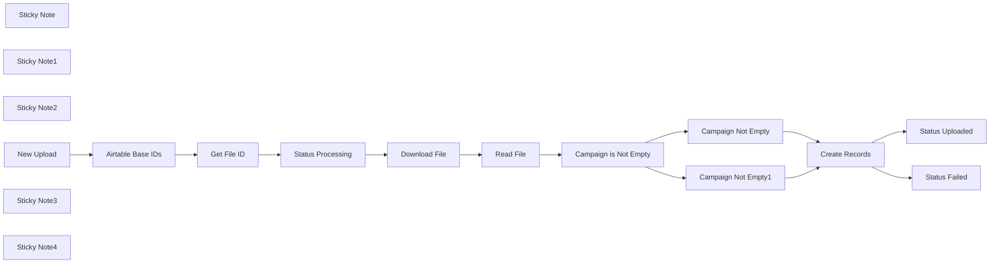

## Fluxo (.json) :

```json
{
  "meta": {
    "instanceId": "257476b1ef58bf3cb6a46e65fac7ee34a53a5e1a8492d5c6e4da5f87c9b82833",
    "templateId": "2071"
  },
  "nodes": [
    {
      "id": "577fb3b7-b0a6-4f2b-9b53-36d1f77de5a0",
      "name": "Get File ID",
      "type": "n8n-nodes-base.airtable",
      "position": [
        1120,
        1120
      ],
      "parameters": {
        "id": "={{ $node[\"New Upload\"].json[\"id\"] }}",
        "base": {
          "__rl": true,
          "mode": "id",
          "value": "={{ $item(\"0\").$node[\"Airtable Base IDs\"].json[\"Base ID\"] }}"
        },
        "table": {
          "__rl": true,
          "mode": "id",
          "value": "={{ $item(\"0\").$node[\"Airtable Base IDs\"].json[\"Upload Table ID\"] }}"
        },
        "options": {},
        "operation": "get"
      },
      "credentials": {
        "airtableTokenApi": {
          "id": "b1TkvXJM6AdmupUh",
          "name": "Airtable Personal Access Token account"
        }
      },
      "typeVersion": 2
    },
    {
      "id": "a287658f-50e0-4d08-9342-a5143dc20ff2",
      "name": "Status Failed",
      "type": "n8n-nodes-base.httpRequest",
      "position": [
        2820,
        1180
      ],
      "parameters": {
        "url": "=https://api.airtable.com/v0/{{ $item(\"0\").$node[\"Airtable Base IDs\"].json[\"Base ID\"] }}/{{ $item(\"0\").$node[\"Airtable Base IDs\"].json[\"Upload Table ID\"] }}",
        "method": "PATCH",
        "options": {},
        "jsonBody": "={\n\"records\":[{\n\"id\":\"{{ $item(\"0\").$node[\"Get File ID\"].json[\"record_id\"] }}\",\n\"fields\":{\n\"Status\":\"Failed\"\n}\n}\n]\n}",
        "sendBody": true,
        "specifyBody": "json",
        "authentication": "predefinedCredentialType",
        "nodeCredentialType": "airtableTokenApi"
      },
      "credentials": {
        "airtableTokenApi": {
          "id": "b1TkvXJM6AdmupUh",
          "name": "Airtable Personal Access Token account"
        }
      },
      "executeOnce": true,
      "typeVersion": 4.1
    },
    {
      "id": "e3aae523-4803-4f69-9697-ab677c3f216d",
      "name": "Status Uploaded",
      "type": "n8n-nodes-base.httpRequest",
      "position": [
        2820,
        1020
      ],
      "parameters": {
        "url": "=https://api.airtable.com/v0/{{ $item(\"0\").$node[\"Airtable Base IDs\"].json[\"Base ID\"] }}/{{ $item(\"0\").$node[\"Airtable Base IDs\"].json[\"Upload Table ID\"] }}",
        "method": "PATCH",
        "options": {},
        "jsonBody": "={\n\"records\":[{\n\"id\":\"{{ $item(\"0\").$node[\"Get File ID\"].json[\"record_id\"] }}\",\n\"fields\":{\n\"Status\":\"Uploaded\"\n}\n}\n]\n}",
        "sendBody": true,
        "specifyBody": "json",
        "authentication": "predefinedCredentialType",
        "nodeCredentialType": "airtableTokenApi"
      },
      "credentials": {
        "airtableTokenApi": {
          "id": "b1TkvXJM6AdmupUh",
          "name": "Airtable Personal Access Token account"
        }
      },
      "executeOnce": true,
      "typeVersion": 4.1
    },
    {
      "id": "833515af-bf3a-4bc7-b79c-a6c1731f4714",
      "name": "Sticky Note",
      "type": "n8n-nodes-base.stickyNote",
      "position": [
        2280,
        820
      ],
      "parameters": {
        "width": 319.2310328152142,
        "height": 538.9310265075466,
        "content": "## Confirm the key names and column references\n\n\n\n\nWhen adapting this to your own base and Google Sheets (CSV) template, make sure to modify this node accordingly, as key values you will need to set the Airtable Fields, and the Expressions need to match the Read File column names\n\n\n\n\n\n\n\n\n\n\n\n\n\n\n\n\n\nMake sure that the fields have the correct data type (Strings, Integers (numbers), etc)"
      },
      "typeVersion": 1
    },
    {
      "id": "e3cfcf21-3210-455c-b539-2dcacda3172a",
      "name": "Sticky Note1",
      "type": "n8n-nodes-base.stickyNote",
      "position": [
        840,
        920
      ],
      "parameters": {
        "height": 416.06551185206945,
        "content": "### Input your Airtables relevant ID's. These will be used in the API Calls"
      },
      "typeVersion": 1
    },
    {
      "id": "c244d6fe-21bf-4488-9780-32b56baa9998",
      "name": "Campaign is Not Empty",
      "type": "n8n-nodes-base.if",
      "position": [
        1880,
        1120
      ],
      "parameters": {
        "conditions": {
          "string": [
            {
              "value1": "={{ $item(\"0\").$node[\"Get File ID\"].json[\"Campaign\"][\"0\"] }}",
              "operation": "isNotEmpty"
            }
          ]
        }
      },
      "typeVersion": 1
    },
    {
      "id": "ced8a7f4-4ccc-4fcf-8c13-c1b8f099283e",
      "name": "Campaign Not Empty",
      "type": "n8n-nodes-base.set",
      "position": [
        2120,
        1020
      ],
      "parameters": {
        "fields": {
          "values": [
            {
              "name": "Campaign",
              "stringValue": "=\"Campaigns\":[\"{{ $item(\"0\").$node[\"Get File ID\"].json[\"Campaign\"][\"0\"] }}\"],"
            }
          ]
        },
        "options": {}
      },
      "typeVersion": 3.2
    },
    {
      "id": "23e0a41c-cbbd-401d-88b4-a4b190dbcd72",
      "name": "Campaign Not Empty1",
      "type": "n8n-nodes-base.set",
      "position": [
        2120,
        1200
      ],
      "parameters": {
        "fields": {
          "values": [
            {
              "name": "Campaign"
            }
          ]
        },
        "options": {}
      },
      "typeVersion": 3.2
    },
    {
      "id": "f6c40cf2-4893-42ee-859c-f430b4dc5cf1",
      "name": "Read File",
      "type": "n8n-nodes-base.spreadsheetFile",
      "position": [
        1660,
        1120
      ],
      "parameters": {
        "options": {
          "headerRow": true
        },
        "binaryPropertyName": "=data"
      },
      "typeVersion": 2
    },
    {
      "id": "b7495a65-32bf-430d-9998-483582bbe6ef",
      "name": "Airtable Base IDs",
      "type": "n8n-nodes-base.set",
      "position": [
        900,
        1120
      ],
      "parameters": {
        "fields": {
          "values": [
            {
              "name": "Base ID",
              "stringValue": "=appZ0qelhmC2Y9igI"
            },
            {
              "name": "Upload Table ID",
              "stringValue": "tblDzSabZcP47sIMp"
            },
            {
              "name": "Lead Table ID",
              "stringValue": "tblnsXKf3TBztlIPV"
            }
          ]
        },
        "include": "none",
        "options": {}
      },
      "typeVersion": 3.2
    },
    {
      "id": "9fa8f822-f611-4af6-a2a4-7baaf2efa82d",
      "name": "Status Processing",
      "type": "n8n-nodes-base.httpRequest",
      "position": [
        1280,
        1120
      ],
      "parameters": {
        "url": "=https://api.airtable.com/v0/{{ $item(\"0\").$node[\"Airtable Base IDs\"].json[\"Base ID\"] }}/{{ $item(\"0\").$node[\"Airtable Base IDs\"].json[\"Upload Table ID\"] }}",
        "method": "PATCH",
        "options": {},
        "jsonBody": "={\n\"records\":[{\n\"id\":\"{{ $node[\"Get File ID\"].json[\"record_id\"] }}\",\n\"fields\":{\n\"Status\":\"Processing\"\n}\n}\n]\n}",
        "sendBody": true,
        "specifyBody": "json",
        "authentication": "predefinedCredentialType",
        "nodeCredentialType": "airtableTokenApi"
      },
      "credentials": {
        "airtableTokenApi": {
          "id": "b1TkvXJM6AdmupUh",
          "name": "Airtable Personal Access Token account"
        }
      },
      "typeVersion": 4.1
    },
    {
      "id": "af23a338-a9a0-49db-88de-d6eb68af2be9",
      "name": "Download File",
      "type": "n8n-nodes-base.httpRequest",
      "position": [
        1460,
        1120
      ],
      "parameters": {
        "url": "={{ $node[\"Get File ID\"].json[\"File\"][\"0\"][\"url\"] }}",
        "options": {
          "response": {
            "response": {
              "responseFormat": "file"
            }
          }
        }
      },
      "typeVersion": 4.1
    },
    {
      "id": "4428cdc4-1ffd-4f6f-8d96-49d20b80bfba",
      "name": "Create Records",
      "type": "n8n-nodes-base.httpRequest",
      "onError": "continueErrorOutput",
      "position": [
        2380,
        1120
      ],
      "parameters": {
        "url": "=https://api.airtable.com/v0/{{ $item(\"0\").$node[\"Airtable Base IDs\"].json[\"Base ID\"] }}/{{ $item(\"0\").$node[\"Airtable Base IDs\"].json[\"Lead Table ID\"] }}",
        "method": "POST",
        "options": {
          "batching": {
            "batch": {
              "batchSize": 8
            }
          }
        },
        "jsonBody": "={\n    \"records\": [\n        {\n            \"fields\": {\n                \"FirstName\": \"{{ $json[\"FirstName\"] }}\",\n                \"LastName\": \"{{ $json[\"LastName\"] || \"\"}}\",\n                \"Email\": \"{{ $json[\"Email\"] || \"\" }}\",\n                \"Phone\": \"{{ $json[\"Phone\"] || \"\" }}\",\n                \"Company\": \"{{ $json[\"Company\"] || \"\" }}\",\n                \"Title\": \"{{ $json[\"Title\"] || \"\" }}\",\n                \"Country\": \"{{ $json[\"Country\"] || \"\" }}\",\n                \"City\": \"{{ $json[\"City\"] || \"\" }}\",\n                \"Website\": \"{{ $json[\"Website\"] || \"\" }}\",\n                \"LeadSource\": \"{{ $json[\"LeadSource\"] || \"\" }}\",\n                \"LeadStatus\": \"{{ $json[\"LeadStatus\"] || \"\" }}\",\n                {{ $json[\"Campaign\"] }}\n                \"InterestLevel\": \"{{ $json[\"InterestLevel\"] || \"\" }}\",\n                \"LastContactDate\": \"{{ $json[\"LastContactDate\"] || \"\" }}\"\n\n\n            }\n        }\n    ]\n}",
        "sendBody": true,
        "sendHeaders": true,
        "specifyBody": "json",
        "authentication": "predefinedCredentialType",
        "headerParameters": {
          "parameters": [
            {
              "name": "Content-Type",
              "value": "application/json"
            }
          ]
        },
        "nodeCredentialType": "airtableTokenApi"
      },
      "credentials": {
        "airtableTokenApi": {
          "id": "b1TkvXJM6AdmupUh",
          "name": "Airtable Personal Access Token account"
        }
      },
      "typeVersion": 4.1
    },
    {
      "id": "e7a2cf60-099f-4c32-b9f0-ad2dd3d6e282",
      "name": "Sticky Note2",
      "type": "n8n-nodes-base.stickyNote",
      "position": [
        380,
        240
      ],
      "parameters": {
        "width": 1608.819505196552,
        "height": 349.25800232621134,
        "content": "# Bulk Upload Contacts Through CSV | Airtable Interface & Airtable Grid\n\n\n## Airtable Template - https://www.airtable.com/universe/expkxniTpHDg4Y4Ni/interfaces-upload-bulk-records-from-csv\n## Google Sheets Template - https://docs.google.com/spreadsheets/d/1SEwOGCfekc1h_ZfZ8PDQY6oGgOGSzSgtD7pEliEGaZ0/edit?usp=sharing"
      },
      "typeVersion": 1
    },
    {
      "id": "dd8b54fa-15fb-4df5-b94f-8286dae7026b",
      "name": "New Upload",
      "type": "n8n-nodes-base.airtableTrigger",
      "position": [
        660,
        1120
      ],
      "parameters": {
        "baseId": {
          "__rl": true,
          "mode": "id",
          "value": "appZ0qelhmC2Y9igI"
        },
        "tableId": {
          "__rl": true,
          "mode": "id",
          "value": "tblDzSabZcP47sIMp"
        },
        "pollTimes": {
          "item": [
            {
              "mode": "everyMinute"
            }
          ]
        },
        "triggerField": "Created At",
        "authentication": "airtableTokenApi",
        "additionalFields": {
          "viewId": ""
        }
      },
      "credentials": {
        "airtableTokenApi": {
          "id": "b1TkvXJM6AdmupUh",
          "name": "Airtable Personal Access Token account"
        }
      },
      "typeVersion": 1
    },
    {
      "id": "32f6ec9b-3f23-4d58-9cc2-b41fd9246091",
      "name": "Sticky Note3",
      "type": "n8n-nodes-base.stickyNote",
      "position": [
        1980,
        240
      ],
      "parameters": {
        "width": 879.3031720944707,
        "height": 224.90387533954015,
        "content": "## Walkthrough and Overview\n\n### https://www.youtube.com/watch?v=LgYxS1O-rbs"
      },
      "typeVersion": 1
    },
    {
      "id": "78363718-c1c2-4bf0-ba04-a48403cca0cb",
      "name": "Sticky Note4",
      "type": "n8n-nodes-base.stickyNote",
      "position": [
        60,
        820
      ],
      "parameters": {
        "width": 558.4226026659302,
        "height": 768.2443727570767,
        "content": "# Setup Checklist\n\n### 1.Go to the Airtable Template and copy the latest version of the base\n### \n### 2. From your new Airtable base URL, get and replace your base and tables id's into this workflow's trigger node.\n### 3. Input your Airtable Id's in the second node \"Airtable Base ID's\"\n### 4. Make sure to add a Personal Access Token for Airtable Integration. It should, as minimum have enabled scopes for \"data.record:read\", \"data.record:write\", \"schema.bases:read\"\n### 5. Any file uploads can now be done from the Interface Form\n\n#After Setup\n\n### - Make sure you that if you add, remove or modify fields (or field names), those changes should also be applied to the \"Create Record\" node\n### - Make sure that the CSV upload header row, matches the Airtable Leads field names\n### - If you modify any field type (Text to Number, or Number to Text), those changes should also be applied to the \"Create Records\" value (Numbers go without double quotes / strings, dates and the rest of the data types go with double quotes) [JSON Syntax]"
      },
      "typeVersion": 1
    }
  ],
  "pinData": {},
  "connections": {
    "Read File": {
      "main": [
        [
          {
            "node": "Campaign is Not Empty",
            "type": "main",
            "index": 0
          }
        ]
      ]
    },
    "New Upload": {
      "main": [
        [
          {
            "node": "Airtable Base IDs",
            "type": "main",
            "index": 0
          }
        ]
      ]
    },
    "Get File ID": {
      "main": [
        [
          {
            "node": "Status Processing",
            "type": "main",
            "index": 0
          }
        ]
      ]
    },
    "Download File": {
      "main": [
        [
          {
            "node": "Read File",
            "type": "main",
            "index": 0
          }
        ]
      ]
    },
    "Create Records": {
      "main": [
        [
          {
            "node": "Status Uploaded",
            "type": "main",
            "index": 0
          }
        ],
        [
          {
            "node": "Status Failed",
            "type": "main",
            "index": 0
          }
        ]
      ]
    },
    "Airtable Base IDs": {
      "main": [
        [
          {
            "node": "Get File ID",
            "type": "main",
            "index": 0
          }
        ]
      ]
    },
    "Status Processing": {
      "main": [
        [
          {
            "node": "Download File",
            "type": "main",
            "index": 0
          }
        ]
      ]
    },
    "Campaign Not Empty": {
      "main": [
        [
          {
            "node": "Create Records",
            "type": "main",
            "index": 0
          }
        ]
      ]
    },
    "Campaign Not Empty1": {
      "main": [
        [
          {
            "node": "Create Records",
            "type": "main",
            "index": 0
          }
        ]
      ]
    },
    "Campaign is Not Empty": {
      "main": [
        [
          {
            "node": "Campaign Not Empty",
            "type": "main",
            "index": 0
          }
        ],
        [
          {
            "node": "Campaign Not Empty1",
            "type": "main",
            "index": 0
          }
        ]
      ]
    }
  }
}
```

<a id="template-517"></a>

## Template 517 - Agente AI para criar tarefas e agendar reuniões

- **Nome:** Agente AI para criar tarefas e agendar reuniões
- **Descrição:** Processa transcrições de reuniões, extrai ações e responsabilidades, cria tarefas na base de dados, notifica participantes e agenda chamadas quando necessário.
- **Funcionalidade:** • Recepção de evento de reunião: Escuta eventos de término de reunião para iniciar o fluxo.
• Extração de conteúdo da reunião: Recupera título, participantes, falantes, frases e resumo em tópicos a partir da transcrição.
• Análise com IA: Analisa a transcrição para identificar itens de ação, responsabilidades e necessidade de agendamento.
• Detecção de contexto de projeto: Identifica automaticamente se a reunião é sobre um projeto quando o título contém a palavra "project" e ajusta o comportamento.
• Criação de tarefas estruturadas: Gera tarefas detalhadas (nome, descrição, data de vencimento, prioridade e projeto) somente para o usuário principal.
• Criação de múltiplas tarefas: Se houver vários itens de ação, divide e cria registros individuais para cada tarefa.
• Notificação de participantes: Envia resumos e apenas as tarefas atribuídas a cada participante (exceto o usuário principal) por email.
• Agendamento de follow-ups: Se a transcrição indicar que uma nova chamada é necessária, cria um evento de calendário com link de videochamada e adiciona os participantes.
• Mensagens e templates padronizados: Utiliza sumário em tópicos e template de email para comunicar ações claramente.
- **Ferramentas:** • Fireflies: Serviço que fornece transcrições e resumos das reuniões via API.
• OpenAI: Modelo de linguagem usado para analisar transcrições, extrair itens de ação e decidir próximas etapas.
• Airtable: Base de dados usada para criar e armazenar tarefas com campos como nome, descrição, prioridade, data e projeto.
• Gmail: Serviço de email usado para notificar participantes com resumo e tarefas específicas.
• Google Calendar: Serviço de calendário usado para criar eventos com conferência (Google Meet) quando necessário.

## Fluxo visual

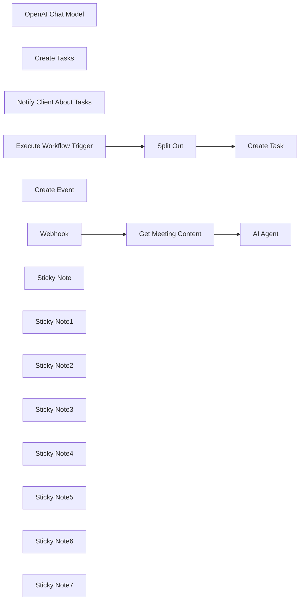

## Fluxo (.json) :

```json
{
  "nodes": [
    {
      "id": "38972c5c-09f4-4120-a468-731e720914e1",
      "name": "AI Agent",
      "type": "@n8n/n8n-nodes-langchain.agent",
      "position": [
        900,
        -240
      ],
      "parameters": {
        "text": "=Title: {{ $json.data.transcript.title }}\n\nParticipants: {{ $json.data.transcript.participants }}\n\nTranscript: {{ JSON.stringify($json.data.transcript.sentences) }}\n\nBullet gist:{{ $json.data.transcript.summary.bullet_gist }}",
        "agent": "openAiFunctionsAgent",
        "options": {
          "systemMessage": "=You get my calls' transcripts from Firefiles.\nThere can be meetings about projects. You can understand if it's about a project if meeting's title contains \"project\". If so - you need to:\n1. Analyze transcript, use tool \"Create Tasks\" to create tasks for me in my AirTable base.\n2. You need to use tool \"Notify Client About Tasks\" to nofity client about his tasks.\n3. If transcript contains info there's a call needed - you'll use \"Create Event\" tool to create call on Google Meet\nCurrent date: {{ $now }}"
        },
        "promptType": "define"
      },
      "typeVersion": 1.7
    },
    {
      "id": "db5c1bfa-b979-4749-84c8-8cd7d777748c",
      "name": "OpenAI Chat Model",
      "type": "@n8n/n8n-nodes-langchain.lmChatOpenAi",
      "position": [
        880,
        40
      ],
      "parameters": {
        "model": "gpt-4o",
        "options": {}
      },
      "credentials": {
        "openAiApi": {
          "id": "9RivS2BmSh1DDBFm",
          "name": "OpenAi account 3"
        }
      },
      "typeVersion": 1
    },
    {
      "id": "334873ba-ec5c-42b3-b8d0-def79d07c0aa",
      "name": "Create Tasks",
      "type": "@n8n/n8n-nodes-langchain.toolWorkflow",
      "position": [
        1040,
        40
      ],
      "parameters": {
        "name": "create_task",
        "schemaType": "manual",
        "workflowId": {
          "__rl": true,
          "mode": "list",
          "value": "Jo0BiizccacaChkH",
          "cachedResultName": "Firefiles AI Agent"
        },
        "description": "=Use this tool to create a task. \nFor task creation use only action items for me [YOUR NAME HERE], don't use action items for other participants.",
        "inputSchema": "{\n \"type\": \"object\",\n \"properties\": {\n \"items\": {\n \"type\": \"array\",\n \"description\": \"An array of tasks\",\n \"items\": {\n \"type\": \"object\",\n \"properties\": {\n \"name\": {\n \"type\": \"string\",\n \"description\": \"The name of the task\"\n },\n \"description\": {\n \"type\": \"string\",\n \"description\": \"A detailed description of the task\"\n },\n \"due_date\": {\n \"type\": \"string\",\n \"description\": \"Due Date\"\n },\n \"priority\": {\n \"type\": \"string\",\n \"description\": \"Priority. . Please capitalize first letter\"\n },\n \"project_name\": {\n \"type\": \"string\",\n \"description\": \"Name of the project. Word 'Project' shouldn't be included\"\n }\n },\n \"required\": [\n \"name\",\n \"description\",\n \"due_date\",\n \"priority\"\n ],\n \"additionalProperties\": false\n }\n }\n },\n \"required\": [\n \"items\"\n ],\n \"additionalProperties\": false\n}",
        "specifyInputSchema": true
      },
      "typeVersion": 1.3
    },
    {
      "id": "7fd03a80-71e9-4c47-9870-7a3ad4916149",
      "name": "Notify Client About Tasks",
      "type": "n8n-nodes-base.gmailTool",
      "position": [
        1180,
        40
      ],
      "webhookId": "519d9406-10ef-4ae1-a747-d278002cac9e",
      "parameters": {
        "sendTo": "={{ $fromAI(\"participant_email\",\"participant email \",\"string\") }}",
        "message": "=Summary:\n{{ $json.data.transcript.summary.bullet_gist }}\n\nAction Items:\n{{ $fromAI(\"participant_action_items\",\"participant action items \",\"string\") }}",
        "options": {
          "appendAttribution": false
        },
        "subject": "Meeting Summary",
        "emailType": "text",
        "descriptionType": "manual",
        "toolDescription": "=Use the tool to notify a participant of the meeting with meeting summary and his tasks.\nIMPORTANT: \n1. Please notify participants except for me. My email: [YOUR EMAIL HERE]\n2. When working with tasks - please send only the participant's tasks."
      },
      "credentials": {
        "gmailOAuth2": {
          "id": "LhdnHxP8WcSDEHw3",
          "name": "Gmail account 3"
        }
      },
      "typeVersion": 2.1
    },
    {
      "id": "094a0e52-a4fa-4078-9b96-80568acb9c51",
      "name": "Execute Workflow Trigger",
      "type": "n8n-nodes-base.executeWorkflowTrigger",
      "position": [
        460,
        420
      ],
      "parameters": {},
      "typeVersion": 1
    },
    {
      "id": "e59e5a29-4509-45cc-9130-181ea432553c",
      "name": "Split Out",
      "type": "n8n-nodes-base.splitOut",
      "position": [
        680,
        420
      ],
      "parameters": {
        "options": {},
        "fieldToSplitOut": "query.items"
      },
      "typeVersion": 1
    },
    {
      "id": "dc664650-f74e-4574-95a0-dd4a9bf181a1",
      "name": "Create Task",
      "type": "n8n-nodes-base.airtable",
      "position": [
        900,
        420
      ],
      "parameters": {
        "base": {
          "__rl": true,
          "mode": "list",
          "value": "appndgSF4faN4jPXi",
          "cachedResultUrl": "https://airtable.com/appndgSF4faN4jPXi",
          "cachedResultName": "Philipp's Base"
        },
        "table": {
          "__rl": true,
          "mode": "list",
          "value": "tblaCSndQsSF3gq7Z",
          "cachedResultUrl": "https://airtable.com/appndgSF4faN4jPXi/tblaCSndQsSF3gq7Z",
          "cachedResultName": "Tasks"
        },
        "columns": {
          "value": {
            "Name": "={{ $json.name }}",
            "Project": "={{ [$json.project_name] }}",
            "Due Date": "={{ $json.due_date }}",
            "Priority": "={{ $json.priority }}",
            "Description": "={{ $json.description }}"
          },
          "schema": [
            {
              "id": "Name",
              "type": "string",
              "display": true,
              "removed": false,
              "readOnly": false,
              "required": false,
              "displayName": "Name",
              "defaultMatch": false,
              "canBeUsedToMatch": true
            },
            {
              "id": "Description",
              "type": "string",
              "display": true,
              "removed": false,
              "readOnly": false,
              "required": false,
              "displayName": "Description",
              "defaultMatch": false,
              "canBeUsedToMatch": true
            },
            {
              "id": "Priority",
              "type": "options",
              "display": true,
              "options": [
                {
                  "name": "Low",
                  "value": "Low"
                },
                {
                  "name": "Medium",
                  "value": "Medium"
                },
                {
                  "name": "Urgent",
                  "value": "Urgent"
                },
                {
                  "name": "low",
                  "value": "low"
                },
                {
                  "name": "medium",
                  "value": "medium"
                },
                {
                  "name": "urgent",
                  "value": "urgent"
                }
              ],
              "removed": false,
              "readOnly": false,
              "required": false,
              "displayName": "Priority",
              "defaultMatch": false,
              "canBeUsedToMatch": true
            },
            {
              "id": "Due Date",
              "type": "dateTime",
              "display": true,
              "removed": false,
              "readOnly": false,
              "required": false,
              "displayName": "Due Date",
              "defaultMatch": false,
              "canBeUsedToMatch": true
            },
            {
              "id": "Project",
              "type": "array",
              "display": true,
              "removed": false,
              "readOnly": false,
              "required": false,
              "displayName": "Project",
              "defaultMatch": false,
              "canBeUsedToMatch": true
            }
          ],
          "mappingMode": "defineBelow",
          "matchingColumns": []
        },
        "options": {
          "typecast": true
        },
        "operation": "create"
      },
      "credentials": {
        "airtableTokenApi": {
          "id": "XT7hvl1w201jtBhx",
          "name": "Philipp Airtable Personal Access Token account"
        }
      },
      "typeVersion": 2.1
    },
    {
      "id": "6d6f9094-b0b3-495e-ade8-d80c03e727b0",
      "name": "Create Event",
      "type": "n8n-nodes-base.googleCalendarTool",
      "position": [
        1340,
        40
      ],
      "parameters": {
        "end": "={{ $fromAI(\"end_date_time\",\"Date and time of meeting end\",\"string\") }}",
        "start": "={{ $fromAI(\"start_date_time\",\"Date and time of meeting start\",\"string\") }}",
        "calendar": {
          "__rl": true,
          "mode": "list",
          "value": "philipp@lowcoding.dev",
          "cachedResultName": "philipp@lowcoding.dev"
        },
        "descriptionType": "manual",
        "toolDescription": "=Use tool to create Google Calendar Event. Use this tool only when transcript contains information that call should be scheduled.",
        "additionalFields": {
          "summary": "={{ $fromAI(\"meeting_name\",\"Meeting name\",\"string\") }}",
          "attendees": [
            "={{ $fromAI(\"email\",\"client email\",\"string\") }}"
          ],
          "conferenceDataUi": {
            "conferenceDataValues": {
              "conferenceSolution": "hangoutsMeet"
            }
          }
        }
      },
      "credentials": {
        "googleCalendarOAuth2Api": {
          "id": "E5Ufn31vrZLKzh4n",
          "name": "Google Calendar account"
        }
      },
      "typeVersion": 1.2
    },
    {
      "id": "2406fc01-fd28-403c-9378-473e8748e0dd",
      "name": "Webhook",
      "type": "n8n-nodes-base.webhook",
      "position": [
        480,
        -240
      ],
      "webhookId": "df852a9f-5ea3-43f2-bd49-d045aba5e9c9",
      "parameters": {
        "path": "df852a9f-5ea3-43f2-bd49-d045aba5e9c9",
        "options": {},
        "httpMethod": "POST"
      },
      "typeVersion": 2
    },
    {
      "id": "fe28fa98-4946-4379-970e-6df1a79e2a1e",
      "name": "Get Meeting Content",
      "type": "n8n-nodes-base.httpRequest",
      "position": [
        700,
        -240
      ],
      "parameters": {
        "url": "https://api.fireflies.ai/graphql",
        "method": "POST",
        "options": {},
        "jsonBody": "={\n \"query\": \"query Transcript($transcriptId: String!) { transcript(id: $transcriptId) { title participants speakers { id name } sentences { speaker_name text } summary { bullet_gist } } }\",\n \"variables\": {\n \"transcriptId\": \"{{ $json.meetingId }}\"\n }\n}",
        "sendBody": true,
        "sendHeaders": true,
        "specifyBody": "json",
        "headerParameters": {
          "parameters": [
            {
              "name": "Authorization",
              "value": "Bearer [YOUR API KEY HERE]"
            }
          ]
        }
      },
      "typeVersion": 4.2
    },
    {
      "id": "5eadd00a-9095-4bf3-80ed-e7bc5c49390d",
      "name": "Sticky Note",
      "type": "n8n-nodes-base.stickyNote",
      "position": [
        620,
        -360
      ],
      "parameters": {
        "color": 4,
        "height": 80,
        "content": "### Replace API key for Fireflies\n"
      },
      "typeVersion": 1
    },
    {
      "id": "93cee18c-2215-4a63-af7b-ddf45729f5e4",
      "name": "Sticky Note1",
      "type": "n8n-nodes-base.stickyNote",
      "position": [
        1180,
        200
      ],
      "parameters": {
        "color": 4,
        "height": 80,
        "content": "### Replace connections for Airtable and Google\n"
      },
      "typeVersion": 1
    },
    {
      "id": "4d792723-4507-486f-9dc7-62bf1b927edd",
      "name": "Sticky Note2",
      "type": "n8n-nodes-base.stickyNote",
      "position": [
        380,
        340
      ],
      "parameters": {
        "width": 820,
        "height": 280,
        "content": "### Scenario 2 - Create Tasks tool"
      },
      "typeVersion": 1
    },
    {
      "id": "c5520210-86db-4639-9f8c-ac9055407232",
      "name": "Sticky Note3",
      "type": "n8n-nodes-base.stickyNote",
      "position": [
        380,
        -460
      ],
      "parameters": {
        "width": 1100,
        "height": 760,
        "content": "### Scenario 1 - AI agent"
      },
      "typeVersion": 1
    },
    {
      "id": "48d47e44-b7bf-49b3-814b-6969ce97108d",
      "name": "Sticky Note4",
      "type": "n8n-nodes-base.stickyNote",
      "position": [
        800,
        180
      ],
      "parameters": {
        "color": 4,
        "height": 80,
        "content": "### Replace OpenAI connection\n"
      },
      "typeVersion": 1
    },
    {
      "id": "afe4bffa-8937-4c31-8513-0acc6b8858ce",
      "name": "Sticky Note5",
      "type": "n8n-nodes-base.stickyNote",
      "position": [
        -360,
        60
      ],
      "parameters": {
        "color": 7,
        "width": 280,
        "height": 566,
        "content": "### Set up steps\n\n#### Preparation\n1. **Create Accounts**:\n - [N8N](https://n8n.partnerlinks.io/2hr10zpkki6a): For workflow automation.\n - [Airtable](https://airtable.com/): For database hosting and management.\n - [Fireflies](https://fireflies.ai/): For recording meetings.\n\n#### N8N Workflow\n\n1. **Configure the Webhook**: \n - Set up a webhook to capture meeting completion events and integrate it with Fireflies.\n\n2. **Retrieve Meeting Content**: \n - Use GraphQL API requests to extract meeting details and transcripts, ensuring appropriate authentication through Bearer tokens.\n\n3. **AI Processing Setup**: \n - Define system messages for AI tasks and configure connections to the AI chat model (e.g., OpenAI's GPT) to process transcripts.\n\n4. **Task Creation Logic**: \n - Create structured tasks based on AI output, ensuring necessary details are captured and records are created in Airtable.\n\n5. **Client Notifications**: \n - Use an email node to notify clients about their tasks, ensuring communications are client-specific.\n\n6. **Scheduling Follow-Up Calls**: \n - Set up Google Calendar events if follow-up meetings are required, populating details from the original meeting context.\n\n7. **Final Testing**: \n - Conduct tests to ensure each part of the workflow is functional and seamless, making adjustments as needed based on feedback."
      },
      "typeVersion": 1
    },
    {
      "id": "cbb81fa7-4a97-4a7e-82ce-05250b2c82cf",
      "name": "Sticky Note6",
      "type": "n8n-nodes-base.stickyNote",
      "position": [
        -360,
        -460
      ],
      "parameters": {
        "color": 7,
        "width": 636.2128494576581,
        "height": 497.1532689930921,
        "content": "\n## AI Agent for project management and meetings with Airtable and Fireflies\n**Made by [Philipp Bekher](https://www.linkedin.com/in/philipp-bekher-5437171a4/) from community [5minAI](https://www.skool.com/5minai-2861)**\n\nManaging action items from meetings can often lead to missed tasks and poor follow-up. This automation alleviates that issue by automatically generating tasks from meeting transcripts, keeping everyone informed about their responsibilities and streamlining communication.\n\nThe workflow leverages n8n to create a Smart Agent that listens for completed meeting transcripts, processes them using AI, and generates tasks in Airtable. Key functionalities include:\n- Capturing completed meeting events through webhooks.\n- Extracting relevant meeting details such as transcripts and participants using API calls.\n- Generating structured tasks from meeting discussions and sending notifications to clients.\n\n"
      },
      "typeVersion": 1
    },
    {
      "id": "6d367721-875d-4d43-bd55-9801796a0e9f",
      "name": "Sticky Note7",
      "type": "n8n-nodes-base.stickyNote",
      "position": [
        -60,
        60
      ],
      "parameters": {
        "color": 7,
        "width": 330.5152611046425,
        "height": 239.5888196628349,
        "content": "### ... or watch set up video [10 min]\n[](https://www.youtube.com/watch?v=0TyX7G00x3A)\n"
      },
      "typeVersion": 1
    }
  ],
  "pinData": {},
  "connections": {
    "Webhook": {
      "main": [
        [
          {
            "node": "Get Meeting Content",
            "type": "main",
            "index": 0
          }
        ]
      ]
    },
    "AI Agent": {
      "main": [
        []
      ]
    },
    "Split Out": {
      "main": [
        [
          {
            "node": "Create Task",
            "type": "main",
            "index": 0
          }
        ]
      ]
    },
    "Create Event": {
      "ai_tool": [
        [
          {
            "node": "AI Agent",
            "type": "ai_tool",
            "index": 0
          }
        ]
      ]
    },
    "Create Tasks": {
      "ai_tool": [
        [
          {
            "node": "AI Agent",
            "type": "ai_tool",
            "index": 0
          }
        ]
      ]
    },
    "OpenAI Chat Model": {
      "ai_languageModel": [
        [
          {
            "node": "AI Agent",
            "type": "ai_languageModel",
            "index": 0
          }
        ]
      ]
    },
    "Get Meeting Content": {
      "main": [
        [
          {
            "node": "AI Agent",
            "type": "main",
            "index": 0
          }
        ]
      ]
    },
    "Execute Workflow Trigger": {
      "main": [
        [
          {
            "node": "Split Out",
            "type": "main",
            "index": 0
          }
        ]
      ]
    },
    "Notify Client About Tasks": {
      "ai_tool": [
        [
          {
            "node": "AI Agent",
            "type": "ai_tool",
            "index": 0
          }
        ]
      ]
    }
  }
}
```

<a id="template-518"></a>

## Template 518 - Criar novo cartão no Trello

- **Nome:** Criar novo cartão no Trello
- **Descrição:** Ao ser acionado manualmente, este fluxo cria um novo cartão em uma lista do Trello com título e descrição definidos.
- **Funcionalidade:** • Acionamento manual: Inicia o fluxo quando o usuário clica em 'execute'.
• Criação de cartão: Gera um novo cartão em uma lista do Trello com título ('Hello') e descrição ('Here are some details').
• Configuração de campos adicionais e credenciais: Permite especificar campos adicionais do cartão e utilizar credenciais de API para autenticação.
- **Ferramentas:** • Trello: Plataforma de gerenciamento por quadros e cartões usada para criar e organizar tarefas.

## Fluxo visual


## Fluxo (.json) :

```json
{
  "id": "89",
  "name": "Create a new card in Trello",
  "nodes": [
    {
      "name": "On clicking 'execute'",
      "type": "n8n-nodes-base.manualTrigger",
      "position": [
        250,
        300
      ],
      "parameters": {},
      "typeVersion": 1
    },
    {
      "name": "Trello",
      "type": "n8n-nodes-base.trello",
      "position": [
        450,
        300
      ],
      "parameters": {
        "name": "Hello",
        "listId": "",
        "description": "Here are some details",
        "additionalFields": {}
      },
      "credentials": {
        "trelloApi": ""
      },
      "typeVersion": 1
    }
  ],
  "active": false,
  "settings": {},
  "connections": {
    "On clicking 'execute'": {
      "main": [
        [
          {
            "node": "Trello",
            "type": "main",
            "index": 0
          }
        ]
      ]
    }
  }
}
```

<a id="template-519"></a>

## Template 519 - Publicar novos vídeos do YouTube no X

- **Nome:** Publicar novos vídeos do YouTube no X
- **Descrição:** Verifica periodicamente um canal do YouTube e publica automaticamente um post no X com texto gerado por IA sobre o novo vídeo.
- **Funcionalidade:** • Agendamento periódico: executa a verificação do canal em intervalos regulares (a cada 30 minutos).
• Busca de vídeos recentes: consulta o canal do YouTube e filtra vídeos publicados recentemente (últimos 30 minutos).
• Geração de post com IA: utiliza o conteúdo do vídeo (título e descrição) para criar um post envolvente e conciso (máx. 140 caracteres).
• Publicação automática no X: publica o texto gerado na conta do X vinculada.
• Configuração de canal: permite definir o ID do canal do YouTube a ser monitorado.
- **Ferramentas:** • YouTube: serviço para consultar vídeos de canal e obter metadados (ID do vídeo, título, descrição).
• OpenAI (ChatGPT): modelo de linguagem usado para gerar um post curto e atraente com base no título e descrição do vídeo.
• X (Twitter): plataforma onde o post gerado é publicado automaticamente.

## Fluxo visual

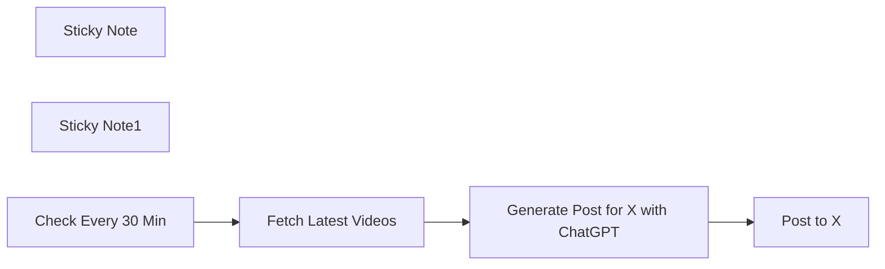

## Fluxo (.json) :

```json
{
  "id": "O9FXr8iXzhSgYKaL",
  "meta": {
    "instanceId": "d8bbc8c5a59875a8be9f3c7142d858bc46c4b8e36a11781a25e945fcf9a5767a"
  },
  "name": "Post New YouTube Videos to X",
  "tags": [],
  "nodes": [
    {
      "id": "576be5c4-1ed0-4d01-a980-cb2fc31e2223",
      "name": "Post to X",
      "type": "n8n-nodes-base.twitter",
      "position": [
        1280,
        380
      ],
      "parameters": {
        "text": "={{ $json.message.content }}",
        "additionalFields": {}
      },
      "credentials": {
        "twitterOAuth2Api": {
          "id": "FjHOuF0APzoMqIjG",
          "name": "X account"
        }
      },
      "typeVersion": 2
    },
    {
      "id": "3b87cf2a-51d5-4589-9729-bb1fe3cfceca",
      "name": "Sticky Note",
      "type": "n8n-nodes-base.stickyNote",
      "position": [
        620,
        254.76543209876536
      ],
      "parameters": {
        "color": 3,
        "width": 221.82716049382665,
        "height": 308.7901234567902,
        "content": "🆔 Ensure you enter your YouTube Channel ID in the \"Channel ID\" field of this node. You can find your [Channel ID here](https://youtube.com/account_advanced)."
      },
      "typeVersion": 1
    },
    {
      "id": "912e631c-aa43-4e02-9816-b35fe6e62dd8",
      "name": "Generate Post for X with ChatGPT",
      "type": "@n8n/n8n-nodes-langchain.openAi",
      "position": [
        900,
        380
      ],
      "parameters": {
        "modelId": {
          "__rl": true,
          "mode": "list",
          "value": "gpt-3.5-turbo",
          "cachedResultName": "GPT-3.5-TURBO"
        },
        "options": {},
        "messages": {
          "values": [
            {
              "content": "=Write an engaging post about my latest YouTube video for X (Twitter) of no more than 140 characters in length. Link to the video at https://youtu.be/{{ $json.id.videoId }} use this title and description:  {{ $json.snippet.title }}  {{ $json.snippet.description }}"
            }
          ]
        }
      },
      "credentials": {
        "openAiApi": {
          "id": "UpdYKqoR9wsGBnaA",
          "name": "OpenAi account"
        }
      },
      "typeVersion": 1.3
    },
    {
      "id": "841ee140-7e37-4e9c-8ab2-2a3ee941d255",
      "name": "Sticky Note1",
      "type": "n8n-nodes-base.stickyNote",
      "position": [
        360,
        254.5679012345679
      ],
      "parameters": {
        "width": 244.34567901234558,
        "height": 102.81481481481477,
        "content": "**Use AI to Promote Your New YouTube Videos on X**\n\n🎬 Watch the [Setup Video Here](https://mrc.fm/ai2x)"
      },
      "typeVersion": 1
    },
    {
      "id": "583b7d5d-e5dc-4183-92ee-8135ce6095a8",
      "name": "Fetch Latest Videos",
      "type": "n8n-nodes-base.youTube",
      "position": [
        680,
        380
      ],
      "parameters": {
        "limit": 1,
        "filters": {
          "channelId": "UC08Fah8EIryeOZRkjBRohcQ",
          "publishedAfter": "={{ new Date(new Date().getTime() - 30 * 60000).toISOString() }}"
        },
        "options": {},
        "resource": "video"
      },
      "credentials": {
        "youTubeOAuth2Api": {
          "id": "cVI5wEqeFEeJ81nk",
          "name": "YouTube account"
        }
      },
      "typeVersion": 1
    },
    {
      "id": "6e391007-10e2-4e67-9db6-e13d5d2bef11",
      "name": "Check Every 30 Min",
      "type": "n8n-nodes-base.scheduleTrigger",
      "position": [
        460,
        380
      ],
      "parameters": {
        "rule": {
          "interval": [
            {
              "field": "minutes",
              "minutesInterval": 30
            }
          ]
        }
      },
      "typeVersion": 1.2
    }
  ],
  "active": false,
  "pinData": {},
  "settings": {
    "executionOrder": "v1"
  },
  "versionId": "a321d863-1a58-4100-bf8f-d2af08f11382",
  "connections": {
    "Check Every 30 Min": {
      "main": [
        [
          {
            "node": "Fetch Latest Videos",
            "type": "main",
            "index": 0
          }
        ]
      ]
    },
    "Fetch Latest Videos": {
      "main": [
        [
          {
            "node": "Generate Post for X with ChatGPT",
            "type": "main",
            "index": 0
          }
        ]
      ]
    },
    "Generate Post for X with ChatGPT": {
      "main": [
        [
          {
            "node": "Post to X",
            "type": "main",
            "index": 0
          }
        ]
      ]
    }
  }
}
```

<a id="template-520"></a>

## Template 520 - Servidor MCP para Gmail

- **Nome:** Servidor MCP para Gmail
- **Descrição:** Fluxo que expõe um endpoint SSE para receber comandos de agentes de IA e executar ações de gerenciamento de emails em uma conta Gmail (mensagens, rótulos, rascunhos e threads).
- **Funcionalidade:** • Servidor SSE para agentes: expõe um endpoint para receber comandos e enviar respostas em tempo real.
• Pesquisa de mensagens: busca por query, remetente e intervalo de datas, com opção de retornar todos os resultados.
• Recuperar mensagem: obtém detalhes completos de uma mensagem por ID.
• Responder mensagem: envia respostas a mensagens com suporte a CC, BCC e anexos.
• Marcar como lida/não lida: altera o estado de leitura de mensagens.
• Excluir mensagem: remove mensagens por ID.
• Gerenciar rótulos: listar rótulos, obter detalhes, criar e deletar rótulos; adicionar e remover rótulos em mensagens e threads.
• Gerenciar rascunhos: criar, recuperar, listar e excluir rascunhos com assunto, corpo e anexos.
• Gerenciar threads: listar threads, recuperar thread com suas mensagens, responder threads e aplicar/remover rótulos em threads.
- **Ferramentas:** • Gmail (conta Google): API para acesso e gerenciamento de emails, rótulos, rascunhos e threads utilizando autenticação OAuth2.
• Servidor SSE (MCP): endpoint Server-Sent Events para integração em tempo real com agentes de IA que enviam comandos e recebem respostas.

## Fluxo visual


## Fluxo (.json) :

```json
{
  "id": "QaMO9ji6T6vTZHQ4",
  "meta": {
    "instanceId": "8029058e18ae4ed6081000c1270d96039ad05959052aa2034dd96a215849bcf7"
  },
  "name": "Gmail MCP Server",
  "tags": [
    {
      "id": "mce0brNtJ0q1uqig",
      "name": "Agent Tool",
      "createdAt": "2025-02-25T18:11:08.555Z",
      "updatedAt": "2025-02-25T18:11:08.555Z"
    },
    {
      "id": "Yt5ECnELP8JYcw9w",
      "name": "Gmail",
      "createdAt": "2025-04-18T01:59:21.577Z",
      "updatedAt": "2025-04-18T01:59:21.577Z"
    }
  ],
  "nodes": [
    {
      "id": "b7c0a52d-cd86-43a6-9b53-acf7d24bfccc",
      "name": "addLabels",
      "type": "n8n-nodes-base.gmailTool",
      "position": [
        560,
        800
      ],
      "webhookId": "81d61988-8213-4175-b75d-76cb67ce4a3b",
      "parameters": {
        "labelIds": "={{ /*n8n-auto-generated-fromAI-override*/ $fromAI('Label_Names_or_IDs', ``, 'string') }}",
        "messageId": "={{ /*n8n-auto-generated-fromAI-override*/ $fromAI('Message_ID', ``, 'string') }}",
        "operation": "addLabels",
        "descriptionType": "manual",
        "toolDescription": "Add one or more labels to an email message. AI-configurable parameters: Message_ID (string) - the ID of the message to label; Label_Names_or_IDs (string) - comma-separated label names or IDs to apply."
      },
      "credentials": {
        "gmailOAuth2": {
          "id": "67JzzUiB1dTa4vYU",
          "name": "iSJC Gmail"
        }
      },
      "typeVersion": 2.1
    },
    {
      "id": "21f26146-97e4-4643-9bf2-0d704ec589e8",
      "name": "delete",
      "type": "n8n-nodes-base.gmailTool",
      "position": [
        280,
        600
      ],
      "webhookId": "03319c28-ef88-40f4-897c-f44c21dbdf1f",
      "parameters": {
        "messageId": "={{ /*n8n-auto-generated-fromAI-override*/ $fromAI('Message_ID', ``, 'string') }}",
        "operation": "delete",
        "descriptionType": "manual",
        "toolDescription": "Delete an email message. AI-configurable parameters: Message_ID (string) - the ID of the message to delete."
      },
      "credentials": {
        "gmailOAuth2": {
          "id": "67JzzUiB1dTa4vYU",
          "name": "iSJC Gmail"
        }
      },
      "typeVersion": 2.1
    },
    {
      "id": "fd868497-787c-460b-87dc-e99572465c89",
      "name": "get",
      "type": "n8n-nodes-base.gmailTool",
      "position": [
        400,
        600
      ],
      "webhookId": "cf5acbf3-a08f-4da6-9f14-9751eed6e5b8",
      "parameters": {
        "messageId": "={{ /*n8n-auto-generated-fromAI-override*/ $fromAI('Message_ID', ``, 'string') }}",
        "operation": "get",
        "descriptionType": "manual",
        "toolDescription": "Retrieve details of an email message. AI-configurable parameters: Message_ID (string) - the ID of the message to retrieve."
      },
      "credentials": {
        "gmailOAuth2": {
          "id": "67JzzUiB1dTa4vYU",
          "name": "iSJC Gmail"
        }
      },
      "typeVersion": 2.1
    },
    {
      "id": "43f6229f-c294-41ce-8f4b-ebcab0026730",
      "name": "search",
      "type": "n8n-nodes-base.gmailTool",
      "position": [
        520,
        600
      ],
      "webhookId": "cb3d028a-6cab-4946-b368-aa56bf271af9",
      "parameters": {
        "filters": {
          "q": "={{ /*n8n-auto-generated-fromAI-override*/ $fromAI('Search', ``, 'string') }}",
          "sender": "={{ /*n8n-auto-generated-fromAI-override*/ $fromAI('Sender', ``, 'string') }}",
          "receivedAfter": "={{ /*n8n-auto-generated-fromAI-override*/ $fromAI('Received_After', ``, 'string') }}",
          "receivedBefore": "={{ /*n8n-auto-generated-fromAI-override*/ $fromAI('Received_Before', ``, 'string') }}"
        },
        "operation": "getAll",
        "returnAll": "={{ /*n8n-auto-generated-fromAI-override*/ $fromAI('Return_All', ``, 'boolean') }}",
        "descriptionType": "manual",
        "toolDescription": "Retrieve multiple email messages based on filters. AI-configurable parameters: Return_All (boolean) - whether to return all matching messages; Search (string) - Gmail query string to filter messages; Received_After (string) - datetime (RFC3339) after which messages are received; Received_Before (string) - datetime before which messages are received; Sender (string) - email address of the sender."
      },
      "credentials": {
        "gmailOAuth2": {
          "id": "67JzzUiB1dTa4vYU",
          "name": "iSJC Gmail"
        }
      },
      "typeVersion": 2.1
    },
    {
      "id": "f01ba35c-a67f-4603-afb2-9990bd73a026",
      "name": "markAsRead",
      "type": "n8n-nodes-base.gmailTool",
      "position": [
        120,
        800
      ],
      "webhookId": "e769b7cf-9622-434d-b98d-4bde7653238d",
      "parameters": {
        "messageId": "={{ /*n8n-auto-generated-fromAI-override*/ $fromAI('Message_ID', ``, 'string') }}",
        "operation": "markAsRead",
        "descriptionType": "manual",
        "toolDescription": "Mark an email message as read. AI-configurable parameters: Message_ID (string) - the ID of the message to mark as read."
      },
      "credentials": {
        "gmailOAuth2": {
          "id": "67JzzUiB1dTa4vYU",
          "name": "iSJC Gmail"
        }
      },
      "typeVersion": 2.1
    },
    {
      "id": "c8e77334-a50a-4117-beec-f8101d879e9e",
      "name": "markAsUnread",
      "type": "n8n-nodes-base.gmailTool",
      "position": [
        280,
        800
      ],
      "webhookId": "c26a8635-4329-498e-b293-4350baed493d",
      "parameters": {
        "messageId": "={{ /*n8n-auto-generated-fromAI-override*/ $fromAI('Message_ID', ``, 'string') }}",
        "operation": "markAsUnread",
        "descriptionType": "manual",
        "toolDescription": "Mark an email message as unread. AI-configurable parameters: Message_ID (string) - the ID of the message to mark as unread."
      },
      "credentials": {
        "gmailOAuth2": {
          "id": "67JzzUiB1dTa4vYU",
          "name": "iSJC Gmail"
        }
      },
      "typeVersion": 2.1
    },
    {
      "id": "ac7339b7-e246-4ad8-a82c-f3abc6b87942",
      "name": "reply",
      "type": "n8n-nodes-base.gmailTool",
      "position": [
        140,
        600
      ],
      "webhookId": "fbd30b84-25ac-4bab-8a66-5366b9b7a0be",
      "parameters": {
        "message": "={{ /*n8n-auto-generated-fromAI-override*/ $fromAI('Message', ``, 'string') }}",
        "options": {
          "ccList": "={{ /*n8n-auto-generated-fromAI-override*/ $fromAI('CC', ``, 'string') }}",
          "bccList": "={{ /*n8n-auto-generated-fromAI-override*/ $fromAI('BCC', ``, 'string') }}",
          "attachmentsUi": {
            "attachmentsBinary": [
              {
                "property": "={{ /*n8n-auto-generated-fromAI-override*/ $fromAI('Attachment_Field_Name', ``, 'string') }}"
              }
            ]
          },
          "appendAttribution": false
        },
        "emailType": "text",
        "messageId": "={{ /*n8n-auto-generated-fromAI-override*/ $fromAI('Message_ID', ``, 'string') }}",
        "operation": "reply",
        "descriptionType": "manual",
        "toolDescription": "Reply to an email message. AI-configurable parameters: Message_ID (string) - the ID of the message; Message (string) - the reply content; Attachment_Field_Name (string) - input field name containing attachments; BCC (string) - comma-separated BCC recipients; CC (string) - comma-separated CC recipients."
      },
      "credentials": {
        "gmailOAuth2": {
          "id": "67JzzUiB1dTa4vYU",
          "name": "iSJC Gmail"
        }
      },
      "typeVersion": 2.1
    },
    {
      "id": "fd87d9a3-5823-402a-9d9e-0c114a556f8a",
      "name": "removeLabels",
      "type": "n8n-nodes-base.gmailTool",
      "position": [
        420,
        800
      ],
      "webhookId": "e83fb7ee-2716-444b-9a4e-208eea215728",
      "parameters": {
        "labelIds": "={{ /*n8n-auto-generated-fromAI-override*/ $fromAI('Label_Names_or_IDs', ``, 'string') }}",
        "messageId": "={{ /*n8n-auto-generated-fromAI-override*/ $fromAI('Message_ID', ``, 'string') }}",
        "operation": "removeLabels",
        "descriptionType": "manual",
        "toolDescription": "Remove one or more labels from an email message. AI-configurable parameters: Message_ID (string) - the ID of the message; Label_Names_or_IDs (string) - comma-separated label names or IDs to remove."
      },
      "credentials": {
        "gmailOAuth2": {
          "id": "67JzzUiB1dTa4vYU",
          "name": "iSJC Gmail"
        }
      },
      "typeVersion": 2.1
    },
    {
      "id": "a36630c8-3b6a-4703-94fa-80747eb4931c",
      "name": "Sticky Note",
      "type": "n8n-nodes-base.stickyNote",
      "position": [
        40,
        520
      ],
      "parameters": {
        "width": 660,
        "height": 460,
        "content": "## Message Tools\n"
      },
      "typeVersion": 1
    },
    {
      "id": "b5c7fdd7-9842-4720-b13e-1fa3611fc320",
      "name": "getLabels",
      "type": "n8n-nodes-base.gmailTool",
      "position": [
        840,
        620
      ],
      "webhookId": "1f107973-fe4a-440c-aaef-f35e1e8a555a",
      "parameters": {
        "resource": "label",
        "returnAll": "={{ /*n8n-auto-generated-fromAI-override*/ $fromAI('Return_All', ``, 'boolean') }}",
        "descriptionType": "manual",
        "toolDescription": "Retrieve a list of labels. AI-configurable parameters: Return_All (boolean) - whether to return all labels."
      },
      "credentials": {
        "gmailOAuth2": {
          "id": "67JzzUiB1dTa4vYU",
          "name": "iSJC Gmail"
        }
      },
      "typeVersion": 2.1
    },
    {
      "id": "18daa9a3-9e1a-4b4b-ad8d-bf35402baaa6",
      "name": "getLabel",
      "type": "n8n-nodes-base.gmailTool",
      "position": [
        980,
        620
      ],
      "webhookId": "e9d3b2c0-50ea-4b3b-8509-f89dc4f20fb5",
      "parameters": {
        "labelId": "={{ /*n8n-auto-generated-fromAI-override*/ $fromAI('Label_ID', ``, 'string') }}",
        "resource": "label",
        "operation": "get",
        "descriptionType": "manual",
        "toolDescription": "Retrieve details of a specific label. AI-configurable parameters: Label_ID (string) - the ID of the label to retrieve."
      },
      "credentials": {
        "gmailOAuth2": {
          "id": "67JzzUiB1dTa4vYU",
          "name": "iSJC Gmail"
        }
      },
      "typeVersion": 2.1
    },
    {
      "id": "cc7ba925-83c9-4870-9647-11042666fd5b",
      "name": "deleteLabel",
      "type": "n8n-nodes-base.gmailTool",
      "position": [
        840,
        820
      ],
      "webhookId": "80a61a7c-f7a0-4fc9-a0a8-edd5846b4e11",
      "parameters": {
        "labelId": "={{ $fromAI('Label_ID', ``, 'string') }}",
        "resource": "label",
        "operation": "delete",
        "descriptionType": "manual",
        "toolDescription": "Delete a label. AI-configurable parameters: Label_ID (string) - the ID of the label to delete."
      },
      "credentials": {
        "gmailOAuth2": {
          "id": "67JzzUiB1dTa4vYU",
          "name": "iSJC Gmail"
        }
      },
      "typeVersion": 2.1
    },
    {
      "id": "23b28b37-cc69-4bc9-b0e4-88b09b355f3e",
      "name": "createLabel",
      "type": "n8n-nodes-base.gmailTool",
      "position": [
        1000,
        820
      ],
      "webhookId": "d24d1672-4f76-4f58-912b-9345d23ba922",
      "parameters": {
        "name": "={{ $fromAI('Label_ID', ``, 'string') }}",
        "options": {},
        "resource": "label",
        "operation": "create",
        "descriptionType": "manual",
        "toolDescription": "Create a new label. AI-configurable parameters: Label_ID (string) - the name of the label to create."
      },
      "credentials": {
        "gmailOAuth2": {
          "id": "67JzzUiB1dTa4vYU",
          "name": "iSJC Gmail"
        }
      },
      "typeVersion": 2.1
    },
    {
      "id": "db6f3147-e672-497b-922e-cb8c74dd3006",
      "name": "Sticky Note1",
      "type": "n8n-nodes-base.stickyNote",
      "position": [
        760,
        520
      ],
      "parameters": {
        "color": 4,
        "width": 380,
        "height": 440,
        "content": "## Label Tools\n\n"
      },
      "typeVersion": 1
    },
    {
      "id": "16d28e54-ac27-462e-9316-efe2959dd48c",
      "name": "deleteDraft",
      "type": "n8n-nodes-base.gmailTool",
      "position": [
        1300,
        280
      ],
      "webhookId": "8eb35ae4-6517-421b-b54f-ba0610cf58f4",
      "parameters": {
        "resource": "draft",
        "messageId": "={{ /*n8n-auto-generated-fromAI-override*/ $fromAI('Draft_ID', ``, 'string') }}",
        "operation": "delete",
        "descriptionType": "manual",
        "toolDescription": "Delete an email draft. AI-configurable parameters: Draft_ID (string) - the ID of the draft to delete."
      },
      "credentials": {
        "gmailOAuth2": {
          "id": "67JzzUiB1dTa4vYU",
          "name": "iSJC Gmail"
        }
      },
      "typeVersion": 2.1
    },
    {
      "id": "cca355a2-2a90-4084-a65f-5a67b7732192",
      "name": "createDraft",
      "type": "n8n-nodes-base.gmailTool",
      "position": [
        1300,
        100
      ],
      "webhookId": "1cca6c42-ccd9-4144-a2b1-6266d848f6ab",
      "parameters": {
        "message": "={{ /*n8n-auto-generated-fromAI-override*/ $fromAI('Message', ``, 'string') }}",
        "options": {
          "ccList": "={{ /*n8n-auto-generated-fromAI-override*/ $fromAI('CC', ``, 'string') }}",
          "bccList": "={{ /*n8n-auto-generated-fromAI-override*/ $fromAI('BCC', ``, 'string') }}",
          "attachmentsUi": {
            "attachmentsBinary": [
              {
                "property": "={{ /*n8n-auto-generated-fromAI-override*/ $fromAI('Attachment_Field_Name__in_Input_', ``, 'string') }}"
              }
            ]
          }
        },
        "subject": "={{ /*n8n-auto-generated-fromAI-override*/ $fromAI('Subject', ``, 'string') }}",
        "resource": "draft",
        "descriptionType": "manual",
        "toolDescription": "Create an email draft. AI-configurable parameters: Subject (string) - the subject of the draft; Message (string) - the body of the draft; Attachment_Field_Name__in_Input_ (string) - input field name containing attachments; BCC (string) - comma-separated BCC recipients; CC (string) - comma-separated CC recipients."
      },
      "credentials": {
        "gmailOAuth2": {
          "id": "67JzzUiB1dTa4vYU",
          "name": "iSJC Gmail"
        }
      },
      "typeVersion": 2.1
    },
    {
      "id": "5c22063a-2480-4a57-9184-7cf26ff07caa",
      "name": "getDraft",
      "type": "n8n-nodes-base.gmailTool",
      "position": [
        1480,
        100
      ],
      "webhookId": "80eadc8e-9d6b-42e7-9ac4-5b26d21fb3c5",
      "parameters": {
        "options": {},
        "resource": "draft",
        "messageId": "={{ /*n8n-auto-generated-fromAI-override*/ $fromAI('Draft_ID', ``, 'string') }}",
        "operation": "get",
        "descriptionType": "manual",
        "toolDescription": "Retrieve an email draft. AI-configurable parameters: Draft_ID (string) - the ID of the draft to retrieve."
      },
      "credentials": {
        "gmailOAuth2": {
          "id": "67JzzUiB1dTa4vYU",
          "name": "iSJC Gmail"
        }
      },
      "typeVersion": 2.1
    },
    {
      "id": "fba8022d-9b11-4bb6-b8c2-826e1fa9a8e6",
      "name": "getManyDrafts",
      "type": "n8n-nodes-base.gmailTool",
      "position": [
        1480,
        280
      ],
      "webhookId": "6aaf2777-d1c1-490b-a82f-eaab6caefe85",
      "parameters": {
        "options": {
          "includeSpamTrash": "={{ /*n8n-auto-generated-fromAI-override*/ $fromAI('Include_Spam_and_Trash', ``, 'boolean') }}"
        },
        "resource": "draft",
        "operation": "getAll",
        "returnAll": "={{ /*n8n-auto-generated-fromAI-override*/ $fromAI('Return_All', ``, 'boolean') }}",
        "descriptionType": "manual",
        "toolDescription": "Retrieve multiple email drafts. AI-configurable parameters: Return_All (boolean) - whether to return all drafts; Include_Spam_and_Trash (boolean) - whether to include drafts in spam or trash."
      },
      "credentials": {
        "gmailOAuth2": {
          "id": "67JzzUiB1dTa4vYU",
          "name": "iSJC Gmail"
        }
      },
      "typeVersion": 2.1
    },
    {
      "id": "af313dbf-f1d3-44b8-86b0-a8d8deb44359",
      "name": "Sticky Note2",
      "type": "n8n-nodes-base.stickyNote",
      "position": [
        1220,
        0
      ],
      "parameters": {
        "color": 5,
        "width": 380,
        "height": 440,
        "content": "## Draft Tools\n\n\n"
      },
      "typeVersion": 1
    },
    {
      "id": "34fc23f5-8b5e-4dfb-b7bf-5eca839a1799",
      "name": "getManyThreads",
      "type": "n8n-nodes-base.gmailTool",
      "position": [
        1260,
        620
      ],
      "webhookId": "233fb55f-2575-4cbd-a327-e27858e98cd9",
      "parameters": {
        "filters": {
          "q": "={{ /*n8n-auto-generated-fromAI-override*/ $fromAI('Search', ``, 'string') }}",
          "receivedAfter": "={{ /*n8n-auto-generated-fromAI-override*/ $fromAI('Received_After', ``, 'string') }}",
          "receivedBefore": "={{ /*n8n-auto-generated-fromAI-override*/ $fromAI('Received_Before', ``, 'string') }}"
        },
        "resource": "thread",
        "returnAll": "={{ /*n8n-auto-generated-fromAI-override*/ $fromAI('Return_All', ``, 'boolean') }}",
        "descriptionType": "manual",
        "toolDescription": "Retrieve multiple email threads based on filters. AI-configurable parameters: Return_All (boolean) - whether to return all threads; Search (string) - Gmail query string to filter threads; Received_After (string) - datetime after which threads are received; Received_Before (string) - datetime before which threads are received."
      },
      "credentials": {
        "gmailOAuth2": {
          "id": "67JzzUiB1dTa4vYU",
          "name": "iSJC Gmail"
        }
      },
      "typeVersion": 2.1
    },
    {
      "id": "5803ff85-b894-4d9d-bcca-4877d3255dbd",
      "name": "getThread",
      "type": "n8n-nodes-base.gmailTool",
      "position": [
        1420,
        620
      ],
      "webhookId": "9ecfaf0c-8d43-4b46-86bb-de5117b657c1",
      "parameters": {
        "options": {
          "returnOnlyMessages": true
        },
        "resource": "thread",
        "threadId": "={{ /*n8n-auto-generated-fromAI-override*/ $fromAI('Thread_ID', ``, 'string') }}",
        "operation": "get",
        "descriptionType": "manual",
        "toolDescription": "Retrieve details of an email thread. AI-configurable parameters: Thread_ID (string) - the ID of the thread to retrieve."
      },
      "credentials": {
        "gmailOAuth2": {
          "id": "67JzzUiB1dTa4vYU",
          "name": "iSJC Gmail"
        }
      },
      "typeVersion": 2.1
    },
    {
      "id": "07547fdc-3524-45cf-89c1-d871008e5897",
      "name": "addLabelThread",
      "type": "n8n-nodes-base.gmailTool",
      "position": [
        1580,
        620
      ],
      "webhookId": "c7a99e26-cb22-4675-b5a8-fb7acd302983",
      "parameters": {
        "labelIds": "={{ /*n8n-auto-generated-fromAI-override*/ $fromAI('Label_Names_or_IDs', ``, 'string') }}",
        "resource": "thread",
        "threadId": "={{ /*n8n-auto-generated-fromAI-override*/ $fromAI('Thread_ID', ``, 'string') }}",
        "operation": "addLabels",
        "descriptionType": "manual",
        "toolDescription": "Add one or more labels to an email thread. AI-configurable parameters: Thread_ID (string) - the ID of the thread; Label_Names_or_IDs (string) - comma-separated label names or IDs to apply."
      },
      "credentials": {
        "gmailOAuth2": {
          "id": "67JzzUiB1dTa4vYU",
          "name": "iSJC Gmail"
        }
      },
      "typeVersion": 2.1
    },
    {
      "id": "2214607d-2ac2-4885-98b7-0c424f3c4af7",
      "name": "removeLabelThread",
      "type": "n8n-nodes-base.gmailTool",
      "position": [
        1260,
        800
      ],
      "webhookId": "cb63a038-73ba-4488-b70e-e3b8c48ee1b6",
      "parameters": {
        "labelIds": "={{ /*n8n-auto-generated-fromAI-override*/ $fromAI('Label_Names_or_IDs', ``, 'string') }}",
        "resource": "thread",
        "threadId": "={{ /*n8n-auto-generated-fromAI-override*/ $fromAI('Thread_ID', ``, 'string') }}",
        "operation": "removeLabels",
        "descriptionType": "manual",
        "toolDescription": "Remove one or more labels from an email thread. AI-configurable parameters: Thread_ID (string) - the ID of the thread; Label_Names_or_IDs (string) - comma-separated label names or IDs to remove."
      },
      "credentials": {
        "gmailOAuth2": {
          "id": "67JzzUiB1dTa4vYU",
          "name": "iSJC Gmail"
        }
      },
      "typeVersion": 2.1
    },
    {
      "id": "ed15784b-58e1-40c0-8c87-1d0667802188",
      "name": "replyThread",
      "type": "n8n-nodes-base.gmailTool",
      "position": [
        1420,
        800
      ],
      "webhookId": "b10a9bfd-eca1-40fd-817e-3ab1caf94d97",
      "parameters": {
        "message": "={{ /*n8n-auto-generated-fromAI-override*/ $fromAI('Message', ``, 'string') }}",
        "options": {
          "ccList": "={{ /*n8n-auto-generated-fromAI-override*/ $fromAI('CC', ``, 'string') }}",
          "bccList": "={{ /*n8n-auto-generated-fromAI-override*/ $fromAI('BCC', ``, 'string') }}"
        },
        "resource": "thread",
        "threadId": "={{ /*n8n-auto-generated-fromAI-override*/ $fromAI('Thread_ID', ``, 'string') }}",
        "operation": "reply",
        "descriptionType": "manual",
        "toolDescription": "Reply to an email thread. AI-configurable parameters: Thread_ID (string) - the ID of the thread; Message (string) - the reply content; BCC (string) - comma-separated BCC recipients; CC (string) - comma-separated CC recipients."
      },
      "credentials": {
        "gmailOAuth2": {
          "id": "67JzzUiB1dTa4vYU",
          "name": "iSJC Gmail"
        }
      },
      "typeVersion": 2.1
    },
    {
      "id": "2f8ea31e-3582-4370-8756-3673a60fbe53",
      "name": "Sticky Note3",
      "type": "n8n-nodes-base.stickyNote",
      "position": [
        1220,
        520
      ],
      "parameters": {
        "color": 7,
        "width": 520,
        "height": 440,
        "content": "## Thread Tools\n\n\n"
      },
      "typeVersion": 1
    },
    {
      "id": "5beba186-3cf1-4d96-aa1a-69c3e0b729e5",
      "name": "Gmail MCP Server",
      "type": "@n8n/n8n-nodes-langchain.mcpTrigger",
      "position": [
        500,
        40
      ],
      "webhookId": "a794310b-bca0-4272-99be-a2872c1cadb0",
      "parameters": {
        "path": "gmail-enhanced"
      },
      "typeVersion": 1
    },
    {
      "id": "25736cc4-06ac-4084-9aec-543ba3d2934b",
      "name": "Sticky Note4",
      "type": "n8n-nodes-base.stickyNote",
      "position": [
        0,
        0
      ],
      "parameters": {
        "color": 6,
        "width": 280,
        "height": 240,
        "content": "## USAGE\n\nOpen the Gmail MCP Server node to obtain the SSE server URL.\n\nUse that to configure an N8N AI Agent flow or other AI tool."
      },
      "typeVersion": 1
    }
  ],
  "active": true,
  "pinData": {},
  "settings": {
    "executionOrder": "v1"
  },
  "versionId": "29e40df2-6863-4f37-8068-5dba71c5bac8",
  "connections": {
    "get": {
      "ai_tool": [
        [
          {
            "node": "Gmail MCP Server",
            "type": "ai_tool",
            "index": 0
          }
        ]
      ]
    },
    "reply": {
      "ai_tool": [
        [
          {
            "node": "Gmail MCP Server",
            "type": "ai_tool",
            "index": 0
          }
        ]
      ]
    },
    "delete": {
      "ai_tool": [
        [
          {
            "node": "Gmail MCP Server",
            "type": "ai_tool",
            "index": 0
          }
        ]
      ]
    },
    "search": {
      "ai_tool": [
        [
          {
            "node": "Gmail MCP Server",
            "type": "ai_tool",
            "index": 0
          }
        ]
      ]
    },
    "getDraft": {
      "ai_tool": [
        [
          {
            "node": "Gmail MCP Server",
            "type": "ai_tool",
            "index": 0
          }
        ]
      ]
    },
    "getLabel": {
      "ai_tool": [
        [
          {
            "node": "Gmail MCP Server",
            "type": "ai_tool",
            "index": 0
          }
        ]
      ]
    },
    "addLabels": {
      "ai_tool": [
        [
          {
            "node": "Gmail MCP Server",
            "type": "ai_tool",
            "index": 0
          }
        ]
      ]
    },
    "getLabels": {
      "ai_tool": [
        [
          {
            "node": "Gmail MCP Server",
            "type": "ai_tool",
            "index": 0
          }
        ]
      ]
    },
    "getThread": {
      "ai_tool": [
        [
          {
            "node": "Gmail MCP Server",
            "type": "ai_tool",
            "index": 0
          }
        ]
      ]
    },
    "markAsRead": {
      "ai_tool": [
        [
          {
            "node": "Gmail MCP Server",
            "type": "ai_tool",
            "index": 0
          }
        ]
      ]
    },
    "createDraft": {
      "ai_tool": [
        [
          {
            "node": "Gmail MCP Server",
            "type": "ai_tool",
            "index": 0
          }
        ]
      ]
    },
    "createLabel": {
      "ai_tool": [
        [
          {
            "node": "Gmail MCP Server",
            "type": "ai_tool",
            "index": 0
          }
        ]
      ]
    },
    "deleteDraft": {
      "ai_tool": [
        [
          {
            "node": "Gmail MCP Server",
            "type": "ai_tool",
            "index": 0
          }
        ]
      ]
    },
    "deleteLabel": {
      "ai_tool": [
        [
          {
            "node": "Gmail MCP Server",
            "type": "ai_tool",
            "index": 0
          }
        ]
      ]
    },
    "replyThread": {
      "ai_tool": [
        [
          {
            "node": "Gmail MCP Server",
            "type": "ai_tool",
            "index": 0
          }
        ]
      ]
    },
    "markAsUnread": {
      "ai_tool": [
        [
          {
            "node": "Gmail MCP Server",
            "type": "ai_tool",
            "index": 0
          }
        ]
      ]
    },
    "removeLabels": {
      "ai_tool": [
        [
          {
            "node": "Gmail MCP Server",
            "type": "ai_tool",
            "index": 0
          }
        ]
      ]
    },
    "getManyDrafts": {
      "ai_tool": [
        [
          {
            "node": "Gmail MCP Server",
            "type": "ai_tool",
            "index": 0
          }
        ]
      ]
    },
    "addLabelThread": {
      "ai_tool": [
        [
          {
            "node": "Gmail MCP Server",
            "type": "ai_tool",
            "index": 0
          }
        ]
      ]
    },
    "getManyThreads": {
      "ai_tool": [
        [
          {
            "node": "Gmail MCP Server",
            "type": "ai_tool",
            "index": 0
          }
        ]
      ]
    },
    "removeLabelThread": {
      "ai_tool": [
        [
          {
            "node": "Gmail MCP Server",
            "type": "ai_tool",
            "index": 0
          }
        ]
      ]
    }
  }
}
```

<a id="template-521"></a>

## Template 521 - Verificação de entregabilidade de emails

- **Nome:** Verificação de entregabilidade de emails
- **Descrição:** Verifica automaticamente os endereços de email presentes em uma planilha e atualiza os resultados de volta na mesma planilha.
- **Funcionalidade:** • Monitoramento periódico da planilha: Monitora alterações na planilha a cada minuto e inicia o processo.
• Filtragem por status vazio: Processa apenas as linhas cuja coluna Status esteja vazia, evitando reprocessar registros já verificados.
• Remoção de duplicados: Elimina entradas duplicadas com base no campo Email antes de realizar as verificações.
• Verificação de entregabilidade: Envia cada email para um serviço externo de verificação via requisição HTTP, utilizando chave de API.
• Atualização da planilha: Atualiza as linhas correspondentes na planilha com os resultados da verificação, usando o email como coluna de correspondência.
- **Ferramentas:** • Google Sheets: Planilha usada como origem e destino dos dados para leitura de emails e atualização dos resultados.
• Serviço de verificação de emails (email.effibotics.com): API externa que valida entregabilidade de emails mediante requisição HTTP e chave de API.

## Fluxo visual

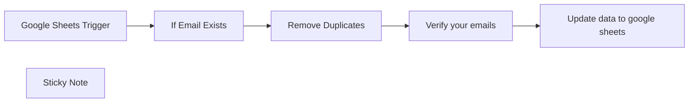

## Fluxo (.json) :

```json
{
  "meta": {
    "instanceId": "8eadf351d49a11e77d3a57adf374670f06c5294af8b1b7c86a1123340397e728"
  },
  "nodes": [
    {
      "id": "e033bb47-6d34-487b-9cb4-952d002f387e",
      "name": "Google Sheets Trigger",
      "type": "n8n-nodes-base.googleSheetsTrigger",
      "position": [
        -320,
        540
      ],
      "parameters": {
        "options": {},
        "pollTimes": {
          "item": [
            {
              "mode": "everyMinute"
            }
          ]
        },
        "sheetName": {
          "__rl": true,
          "mode": "list",
          "value": "gid=0",
          "cachedResultUrl": "https://docs.google.com/spreadsheets/d/1rzuojNGTaBvaUEON6cakQRDva3ueGg5kNu9v12aaSP4/edit#gid=0",
          "cachedResultName": "Sheet1"
        },
        "documentId": {
          "__rl": true,
          "mode": "url",
          "value": "https://docs.google.com/spreadsheets/d/1rzuojNGTaBvaUEON6cakQRDva3ueGg5kNu9v12aaSP4/edit#gid=0"
        }
      },
      "credentials": {
        "googleSheetsTriggerOAuth2Api": {
          "id": "o5WqBpa5EJcKTpKq",
          "name": "5@gmail"
        }
      },
      "typeVersion": 1
    },
    {
      "id": "1b6af5fd-90ee-44e7-8afe-cb3c844491f7",
      "name": "Remove Duplicates",
      "type": "n8n-nodes-base.removeDuplicates",
      "position": [
        120,
        520
      ],
      "parameters": {
        "compare": "selectedFields",
        "options": {},
        "fieldsToCompare": "Email"
      },
      "typeVersion": 1
    },
    {
      "id": "a6c952c3-bc17-44cf-b661-898068914480",
      "name": "Verify your emails",
      "type": "n8n-nodes-base.httpRequest",
      "onError": "continueRegularOutput",
      "position": [
        280,
        520
      ],
      "parameters": {
        "url": "https://email.effibotics.com/api",
        "method": "POST",
        "options": {},
        "sendBody": true,
        "contentType": "form-urlencoded",
        "sendHeaders": true,
        "bodyParameters": {
          "parameters": [
            {
              "name": "email",
              "value": "={{ $json.Email }}"
            }
          ]
        },
        "headerParameters": {
          "parameters": [
            {
              "name": "api_key",
              "value": "9Q6H0QETRF=GS1"
            }
          ]
        }
      },
      "retryOnFail": true,
      "typeVersion": 4.1
    },
    {
      "id": "b5887e19-e5c2-4896-bbda-1835a51e1e1b",
      "name": "Sticky Note",
      "type": "n8n-nodes-base.stickyNote",
      "position": [
        -400,
        440
      ],
      "parameters": {
        "color": 4,
        "width": 1083.1212624694333,
        "height": 364.82606941347825,
        "content": "## Check email deliverability "
      },
      "typeVersion": 1
    },
    {
      "id": "c350ff47-d30e-4aa1-8470-9808525111b7",
      "name": "Update data to google sheets",
      "type": "n8n-nodes-base.googleSheets",
      "position": [
        500,
        520
      ],
      "parameters": {
        "columns": {
          "value": {},
          "schema": [
            {
              "id": "Email",
              "type": "string",
              "display": true,
              "removed": false,
              "required": false,
              "displayName": "Email",
              "defaultMatch": false,
              "canBeUsedToMatch": true
            }
          ],
          "mappingMode": "autoMapInputData",
          "matchingColumns": [
            "Email"
          ]
        },
        "options": {},
        "operation": "update",
        "sheetName": {
          "__rl": true,
          "mode": "list",
          "value": "gid=0",
          "cachedResultUrl": "https://docs.google.com/spreadsheets/d/1rzuojNGTaBvaUEON6cakQRDva3ueGg5kNu9v12aaSP4/edit#gid=0",
          "cachedResultName": "Sheet1"
        },
        "documentId": {
          "__rl": true,
          "mode": "list",
          "value": "1rzuojNGTaBvaUEON6cakQRDva3ueGg5kNu9v12aaSP4",
          "cachedResultUrl": "https://docs.google.com/spreadsheets/d/1rzuojNGTaBvaUEON6cakQRDva3ueGg5kNu9v12aaSP4/edit?usp=drivesdk",
          "cachedResultName": "n8n Template-Email Validation"
        }
      },
      "credentials": {
        "googleSheetsOAuth2Api": {
          "id": "uv83GKvueqitpnrd",
          "name": "5@gmail"
        }
      },
      "typeVersion": 4.3
    },
    {
      "id": "3bbdd0f1-66b6-4774-bb93-44336b827d3e",
      "name": "If Email Exists",
      "type": "n8n-nodes-base.if",
      "position": [
        -100,
        540
      ],
      "parameters": {
        "options": {},
        "conditions": {
          "options": {
            "leftValue": "",
            "caseSensitive": true,
            "typeValidation": "strict"
          },
          "combinator": "and",
          "conditions": [
            {
              "id": "84aff430-6fe2-4c39-940a-178d2dcd1d09",
              "operator": {
                "type": "string",
                "operation": "empty",
                "singleValue": true
              },
              "leftValue": "={{ $json.Status }}",
              "rightValue": ""
            }
          ]
        }
      },
      "typeVersion": 2
    }
  ],
  "pinData": {},
  "connections": {
    "If Email Exists": {
      "main": [
        [
          {
            "node": "Remove Duplicates",
            "type": "main",
            "index": 0
          }
        ]
      ]
    },
    "Remove Duplicates": {
      "main": [
        [
          {
            "node": "Verify your emails",
            "type": "main",
            "index": 0
          }
        ]
      ]
    },
    "Verify your emails": {
      "main": [
        [
          {
            "node": "Update data to google sheets",
            "type": "main",
            "index": 0
          }
        ]
      ]
    },
    "Google Sheets Trigger": {
      "main": [
        [
          {
            "node": "If Email Exists",
            "type": "main",
            "index": 0
          }
        ]
      ]
    }
  }
}
```
