# PACK 1999 TEMPLATES PARTE 03 - Bloco 7

Templates neste bloco: 20

## Sumário

- [Template 522 - Gerar link de pagamento Stripe](#template-522)
- [Template 523 - Relatório de nós desatualizados](#template-523)
- [Template 524 - Agente de gestão de e-mails automatizado](#template-524)
- [Template 525 - Respostas de chat com buscas em tempo real](#template-525)
- [Template 526 - Backup diário de VPS na Contabo](#template-526)
- [Template 527 - Conversão de XML para JSON](#template-527)
- [Template 528 - Validação automática de foto de passaporte](#template-528)
- [Template 529 - Postar mensagem no canal RocketChat](#template-529)
- [Template 530 - Coleta de SERPs para pesquisa de SEO](#template-530)
- [Template 531 - Contribuições automáticas para LinkedIn Advice](#template-531)
- [Template 532 - Geração de volume de busca SEO](#template-532)
- [Template 533 - Gerenciamento automático de snapshots DigitalOcean](#template-533)
- [Template 534 - Criar postagem e comentar no Reddit](#template-534)
- [Template 535 - Envio de SMS com sms77](#template-535)
- [Template 536 - Gerador de artigos por formulário com IA](#template-536)
- [Template 537 - Extrair e salvar preços de livros](#template-537)
- [Template 538 - Criar e listar registros no Stackby](#template-538)
- [Template 539 - Relatório semanal automatizado do Google Analytics](#template-539)
- [Template 540 - Criar, atualizar e obter atividade no Strava](#template-540)
- [Template 541 - Envio diário de estatísticas do Instagram](#template-541)

---

<a id="template-522"></a>

## Template 522 - Gerar link de pagamento Stripe

- **Nome:** Gerar link de pagamento Stripe
- **Descrição:** Recebe dados de um formulário, cria um produto com preço na Stripe e gera um link de pagamento, redirecionando o usuário para concluir o pagamento.
- **Funcionalidade:** • Recepção via formulário: coleta título e preço a partir de um formulário web.
• Conversão de preço para centavos: converte o valor informado multiplicando por 100 para enviar como unit_amount.
• Criação de produto na Stripe: cria um produto com nome, preço padrão e moeda definidos.
• Geração de link de pagamento: cria um payment link associado ao preço gerado.
• Redirecionamento do usuário: responde ao webhook redirecionando o usuário para a URL do link de pagamento.
- **Ferramentas:** • Stripe: Plataforma de pagamentos utilizada para criar produtos, definir preços e gerar links de pagamento.

## Fluxo visual

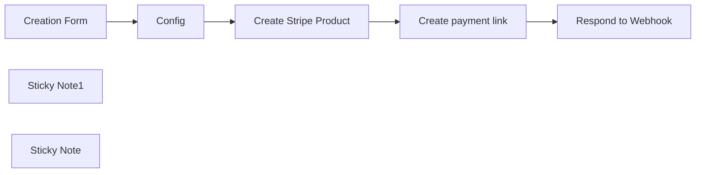

## Fluxo (.json) :

```json
{
  "meta": {
    "instanceId": "8418cffce8d48086ec0a73fd90aca708aa07591f2fefa6034d87fe12a09de26e"
  },
  "nodes": [
    {
      "id": "4503cef2-4882-43c6-bdb9-b94c75da5776",
      "name": "Create Stripe Product",
      "type": "n8n-nodes-base.httpRequest",
      "position": [
        780,
        300
      ],
      "parameters": {
        "url": "https://api.stripe.com/v1/products",
        "method": "POST",
        "options": {},
        "sendBody": true,
        "contentType": "form-urlencoded",
        "authentication": "predefinedCredentialType",
        "bodyParameters": {
          "parameters": [
            {
              "name": "name",
              "value": "={{ $json.title }}"
            },
            {
              "name": "default_price_data[unit_amount]",
              "value": "={{ $json.price }}"
            },
            {
              "name": "default_price_data[currency]",
              "value": "={{ $json.currency }}"
            }
          ]
        },
        "nodeCredentialType": "stripeApi"
      },
      "credentials": {
        "stripeApi": {
          "id": "qjose8z3RR7Xzm7b",
          "name": "Stripe Dev"
        }
      },
      "typeVersion": 4.1
    },
    {
      "id": "80306e70-b57f-4697-9a9f-1835d2525c2f",
      "name": "Create payment link",
      "type": "n8n-nodes-base.httpRequest",
      "position": [
        980,
        300
      ],
      "parameters": {
        "url": "https://api.stripe.com/v1/payment_links",
        "method": "POST",
        "options": {},
        "sendBody": true,
        "contentType": "form-urlencoded",
        "authentication": "predefinedCredentialType",
        "bodyParameters": {
          "parameters": [
            {
              "name": "line_items[0][price]",
              "value": "={{ $json.default_price }}"
            },
            {
              "name": "line_items[0][quantity]",
              "value": "1"
            }
          ]
        },
        "nodeCredentialType": "stripeApi"
      },
      "credentials": {
        "stripeApi": {
          "id": "qjose8z3RR7Xzm7b",
          "name": "Stripe Dev"
        }
      },
      "typeVersion": 4.1
    },
    {
      "id": "31d7450e-0f44-4c16-aec4-fe9213ff7c83",
      "name": "Config",
      "type": "n8n-nodes-base.set",
      "notes": "Setup your flow",
      "position": [
        580,
        300
      ],
      "parameters": {
        "include": "selected",
        "options": {},
        "assignments": {
          "assignments": [
            {
              "id": "038b54b7-9559-444e-8653-c5256a5b784e",
              "name": "currency",
              "type": "string",
              "value": "EUR"
            },
            {
              "id": "e86962bb-7af4-41be-94f6-6ee6b8569eef",
              "name": "price",
              "type": "number",
              "value": "={{ $json.price * 100}}"
            }
          ]
        },
        "includeFields": "title",
        "includeOtherFields": true
      },
      "notesInFlow": true,
      "typeVersion": 3.3
    },
    {
      "id": "10fb462a-8302-4281-9cd3-68bc00e69177",
      "name": "Creation Form",
      "type": "n8n-nodes-base.formTrigger",
      "position": [
        380,
        300
      ],
      "webhookId": "1c6fe52c-48ab-4688-b5ae-7e24361aa603",
      "parameters": {
        "path": "my-form-id",
        "formTitle": "Create a payment link",
        "formFields": {
          "values": [
            {
              "fieldLabel": "title",
              "requiredField": true
            },
            {
              "fieldType": "number",
              "fieldLabel": "price",
              "requiredField": true
            }
          ]
        },
        "responseMode": "responseNode"
      },
      "typeVersion": 2
    },
    {
      "id": "daf2d495-f31f-45e0-945a-a6e94be43b25",
      "name": "Sticky Note1",
      "type": "n8n-nodes-base.stickyNote",
      "position": [
        580,
        0
      ],
      "parameters": {
        "color": 6,
        "width": 275.01592825011585,
        "height": 261.76027109756643,
        "content": "# Setup\n### 1/ Add Your credentials\n[Stripe](https://docs.n8n.io/integrations/builtin/credentials/stripe/)\n\n### 2/ And fill the config node\n# 👇"
      },
      "typeVersion": 1
    },
    {
      "id": "9d298026-d858-4613-97c1-ac0cbd895ece",
      "name": "Sticky Note",
      "type": "n8n-nodes-base.stickyNote",
      "position": [
        880,
        160
      ],
      "parameters": {
        "color": 7,
        "width": 202.64787116404852,
        "height": 85.79488430601403,
        "content": "### Crafted by the\n## [🥷 n8n.ninja](https://n8n.ninja)"
      },
      "typeVersion": 1
    },
    {
      "id": "5c8a17a3-7b2c-4760-a48a-02549f766967",
      "name": "Respond to Webhook",
      "type": "n8n-nodes-base.respondToWebhook",
      "position": [
        1200,
        300
      ],
      "parameters": {
        "options": {},
        "redirectURL": "={{ $json.url }}",
        "respondWith": "redirect"
      },
      "typeVersion": 1
    }
  ],
  "pinData": {},
  "connections": {
    "Config": {
      "main": [
        [
          {
            "node": "Create Stripe Product",
            "type": "main",
            "index": 0
          }
        ]
      ]
    },
    "Creation Form": {
      "main": [
        [
          {
            "node": "Config",
            "type": "main",
            "index": 0
          }
        ]
      ]
    },
    "Create payment link": {
      "main": [
        [
          {
            "node": "Respond to Webhook",
            "type": "main",
            "index": 0
          }
        ]
      ]
    },
    "Create Stripe Product": {
      "main": [
        [
          {
            "node": "Create payment link",
            "type": "main",
            "index": 0
          }
        ]
      ]
    }
  }
}
```

<a id="template-523"></a>

## Template 523 - Relatório de nós desatualizados

- **Nome:** Relatório de nós desatualizados
- **Descrição:** Percorre os workflows da instância, compara a versão de cada nó com a versão mais recente disponível e gera um resumo dos nós que precisam ser atualizados.
- **Funcionalidade:** • Gatilho manual: Inicia a verificação quando o usuário aciona o teste do fluxo.
• Configuração da URL da instância: Permite definir a URL base da instância a ser consultada.
• Recuperação de tipos de nós e versões: Faz requisição à API da instância para obter os tipos de nós e suas versões disponíveis.
• Extração da última versão: Processa os dados dos tipos de nós para determinar a versão mais recente de cada tipo.
• Listagem de workflows: Obtém a lista de todos os workflows existentes na instância.
• Consulta de detalhes do workflow: Para cada workflow, recupera os detalhes e lista os nós que contém.
• Comparação de versões: Compara a versão usada por cada nó em um workflow com a versão mais recente conhecida.
• Coleta de informações dos nós desatualizados: Gera registros com nome do workflow, id, nome do nó, tipo, versão atual e última versão disponível.
• Agregação e formatação do resultado: Agrupa os resultados por workflow e prepara uma saída legível com os nós que precisam de atualização.
- **Ferramentas:** • API da instância de automação: Endpoint HTTP autenticado usado para recuperar a lista de workflows, detalhes de cada workflow e metadados dos tipos de nós (nomes e versões).

## Fluxo visual

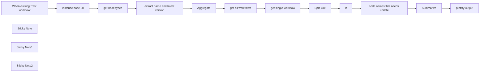

## Fluxo (.json) :

```json
{
  "meta": {
    "instanceId": "1dd912a1610cd0376bae7bb8f1b5838d2b601f42ac66a48e012166bb954fed5a",
    "templateId": "2301"
  },
  "nodes": [
    {
      "id": "a6d8c7aa-c75c-4aaa-8fe2-e23f3da2b8f5",
      "name": "get node types",
      "type": "n8n-nodes-base.httpRequest",
      "position": [
        820,
        240
      ],
      "parameters": {
        "url": "={{ $json.instanceBaseUrl }}/types/nodes.json",
        "options": {},
        "authentication": "predefinedCredentialType",
        "nodeCredentialType": "n8nApi"
      },
      "credentials": {
        "n8nApi": {
          "id": "xhyxmtPC3UwZ7HmL",
          "name": "n8n account"
        }
      },
      "typeVersion": 4.2
    },
    {
      "id": "55bedad2-0096-4a59-8818-9bdbe9799230",
      "name": "When clicking ‘Test workflow’",
      "type": "n8n-nodes-base.manualTrigger",
      "position": [
        380,
        240
      ],
      "parameters": {},
      "typeVersion": 1
    },
    {
      "id": "dc37402e-558d-4c6c-883e-450f161d5766",
      "name": "Split Out",
      "type": "n8n-nodes-base.splitOut",
      "position": [
        1040,
        480
      ],
      "parameters": {
        "include": "selectedOtherFields",
        "options": {
          "destinationFieldName": "node"
        },
        "fieldToSplitOut": "nodes",
        "fieldsToInclude": "name, id"
      },
      "typeVersion": 1
    },
    {
      "id": "dcaec125-684a-4b50-8cb8-fcce9763929b",
      "name": "If",
      "type": "n8n-nodes-base.if",
      "position": [
        1240,
        480
      ],
      "parameters": {
        "options": {
          "looseTypeValidation": true
        },
        "conditions": {
          "options": {
            "leftValue": "",
            "caseSensitive": true,
            "typeValidation": "loose"
          },
          "combinator": "and",
          "conditions": [
            {
              "id": "1c65a9cf-dd60-4d3f-8fe6-05e5877ab58a",
              "operator": {
                "type": "boolean",
                "operation": "notEquals"
              },
              "leftValue": "={{ !!$('Aggregate').first().json.data.find(n => n.name === $json.node.type) }}",
              "rightValue": false
            },
            {
              "id": "dbc80785-274f-424c-9862-bed0ec7e4b63",
              "operator": {
                "type": "number",
                "operation": "lt"
              },
              "leftValue": "={{ $json.node.typeVersion }}",
              "rightValue": "={{ $('Aggregate').first().json.data.find(n => n.name === $json.node.type).version }}"
            }
          ]
        }
      },
      "typeVersion": 2
    },
    {
      "id": "da0d6443-81c8-4d0a-bd2d-300ce83726ad",
      "name": "Aggregate",
      "type": "n8n-nodes-base.aggregate",
      "position": [
        1240,
        240
      ],
      "parameters": {
        "options": {},
        "aggregate": "aggregateAllItemData"
      },
      "typeVersion": 1
    },
    {
      "id": "df683591-1342-4140-9505-359320c08ec0",
      "name": "extract name and latest version",
      "type": "n8n-nodes-base.code",
      "position": [
        1040,
        240
      ],
      "parameters": {
        "jsCode": "// Loop over input items and add a new field called 'myNewField' to the JSON of each one\nfor (const item of $input.all()) {\n  item.json.myNewField = 1;\n}\n\nreturn $input.all().map(({json}) => {\n  const typeVersion = Array.isArray(json.version) ? Math.max(...json.version) : json.version;\n  return {\n    name: json.name,\n    version: typeVersion\n  }\n})"
      },
      "typeVersion": 2
    },
    {
      "id": "cfa7c46e-4292-4d56-8311-a4659ed519fa",
      "name": "Summarize",
      "type": "n8n-nodes-base.summarize",
      "position": [
        820,
        720
      ],
      "parameters": {
        "options": {},
        "fieldsToSplitBy": "workflowName, workflowId",
        "fieldsToSummarize": {
          "values": [
            {
              "field": "info",
              "aggregation": "append"
            }
          ]
        }
      },
      "typeVersion": 1
    },
    {
      "id": "10ba8fe4-bab4-4c5f-a6ed-cd5bcf0b8b04",
      "name": "get all workflows",
      "type": "n8n-nodes-base.n8n",
      "position": [
        600,
        480
      ],
      "parameters": {
        "filters": {},
        "requestOptions": {}
      },
      "credentials": {
        "n8nApi": {
          "id": "xhyxmtPC3UwZ7HmL",
          "name": "n8n account"
        }
      },
      "typeVersion": 1
    },
    {
      "id": "a2fcba1a-866b-48d5-92e6-a3b98a8afbdc",
      "name": "Sticky Note",
      "type": "n8n-nodes-base.stickyNote",
      "position": [
        553.7882961480204,
        420
      ],
      "parameters": {
        "width": 433.34242668485376,
        "height": 205.3908222102156,
        "content": "Check information for all workflows or a single workflow, activate corresponding node"
      },
      "typeVersion": 1
    },
    {
      "id": "7a1216f0-5d25-46d1-9965-023d9eedbe6c",
      "name": "prettify output",
      "type": "n8n-nodes-base.set",
      "position": [
        1040,
        720
      ],
      "parameters": {
        "options": {},
        "assignments": {
          "assignments": [
            {
              "id": "e24c81f9-fca3-4b74-bdc1-50d6933b56e7",
              "name": "workflow",
              "type": "string",
              "value": "={{ $json.workflowName }}"
            },
            {
              "id": "79c3faaa-5707-49a6-8b9c-7290bcf066bb",
              "name": "Id",
              "type": "string",
              "value": "={{ $json.workflowId }}"
            },
            {
              "id": "6c7732db-84bb-4a54-85ce-05ce60553208",
              "name": "outdated_nodes",
              "type": "array",
              "value": "={{ $json.appended_info }}"
            }
          ]
        }
      },
      "typeVersion": 3.4
    },
    {
      "id": "99d2fda2-ec3d-4d03-95cb-96c2a04b43d6",
      "name": "instance base url",
      "type": "n8n-nodes-base.set",
      "position": [
        600,
        240
      ],
      "parameters": {
        "options": {},
        "assignments": {
          "assignments": [
            {
              "id": "ad3ffe8a-2a48-45ad-9171-bd6bffa02488",
              "name": "instanceBaseUrl",
              "type": "string",
              "value": "http://localhost:5432"
            }
          ]
        }
      },
      "typeVersion": 3.4
    },
    {
      "id": "906e1743-1f52-4d7b-b796-75f2a9c5a131",
      "name": "Sticky Note1",
      "type": "n8n-nodes-base.stickyNote",
      "position": [
        548.1243191057811,
        152.6859339432964
      ],
      "parameters": {
        "width": 228.883554909967,
        "height": 240.99660770750089,
        "content": "Set your instance URL here, it should not include API and version"
      },
      "typeVersion": 1
    },
    {
      "id": "e9a330ae-df1f-4830-9420-afdf4ca9bbbe",
      "name": "Sticky Note2",
      "type": "n8n-nodes-base.stickyNote",
      "position": [
        800,
        159.81134247982766
      ],
      "parameters": {
        "width": 192.26610453220889,
        "height": 238.64272871402878,
        "content": "Get n8n API key in settings > n8n API"
      },
      "typeVersion": 1
    },
    {
      "id": "b85366ba-ecbd-493e-a1c7-a081e51d0eb2",
      "name": "get single workflow",
      "type": "n8n-nodes-base.n8n",
      "disabled": true,
      "position": [
        820,
        480
      ],
      "parameters": {
        "operation": "get",
        "workflowId": {
          "__rl": true,
          "mode": "list",
          "value": "03L3B0pAuGRa8cfx",
          "cachedResultName": "My workflow 40 (#03L3B0pAuGRa8cfx)"
        },
        "requestOptions": {}
      },
      "credentials": {
        "n8nApi": {
          "id": "xhyxmtPC3UwZ7HmL",
          "name": "n8n account"
        }
      },
      "typeVersion": 1
    },
    {
      "id": "669b3b8c-e835-455b-a3f8-c1c5ba411020",
      "name": "node names that needs update",
      "type": "n8n-nodes-base.set",
      "position": [
        600,
        720
      ],
      "parameters": {
        "options": {},
        "assignments": {
          "assignments": [
            {
              "id": "01a01bc8-ffd8-4985-bd01-8ffb4dbaee6c",
              "name": "workflowName",
              "type": "string",
              "value": "={{ $json.name }}"
            },
            {
              "id": "dc199eab-92b1-46bd-8999-38d64ca37623",
              "name": "info",
              "type": "object",
              "value": "=\n{\n\"name\": \"{{ $json.node.name }}\",\n\"type\": \"{{ $json.node.type }}\",\n\"version\": {{ $json.node.typeVersion }},\n\"latestVersion\": {{ $('Aggregate').first().json.data.find(n => n.name === $json.node.type).version }}\n}"
            },
            {
              "id": "fe268266-f0ab-47d8-bb6d-a9fefe82f527",
              "name": "workflowId",
              "type": "string",
              "value": "={{ $json.id }}"
            }
          ]
        }
      },
      "typeVersion": 3.4
    }
  ],
  "pinData": {},
  "connections": {
    "If": {
      "main": [
        [
          {
            "node": "node names that needs update",
            "type": "main",
            "index": 0
          }
        ]
      ]
    },
    "Aggregate": {
      "main": [
        [
          {
            "node": "get all workflows",
            "type": "main",
            "index": 0
          }
        ]
      ]
    },
    "Split Out": {
      "main": [
        [
          {
            "node": "If",
            "type": "main",
            "index": 0
          }
        ]
      ]
    },
    "Summarize": {
      "main": [
        [
          {
            "node": "prettify output",
            "type": "main",
            "index": 0
          }
        ]
      ]
    },
    "get node types": {
      "main": [
        [
          {
            "node": "extract name and latest version",
            "type": "main",
            "index": 0
          }
        ]
      ]
    },
    "get all workflows": {
      "main": [
        [
          {
            "node": "get single workflow",
            "type": "main",
            "index": 0
          }
        ]
      ]
    },
    "instance base url": {
      "main": [
        [
          {
            "node": "get node types",
            "type": "main",
            "index": 0
          }
        ]
      ]
    },
    "get single workflow": {
      "main": [
        [
          {
            "node": "Split Out",
            "type": "main",
            "index": 0
          }
        ]
      ]
    },
    "node names that needs update": {
      "main": [
        [
          {
            "node": "Summarize",
            "type": "main",
            "index": 0
          }
        ]
      ]
    },
    "extract name and latest version": {
      "main": [
        [
          {
            "node": "Aggregate",
            "type": "main",
            "index": 0
          }
        ]
      ]
    },
    "When clicking ‘Test workflow’": {
      "main": [
        [
          {
            "node": "instance base url",
            "type": "main",
            "index": 0
          }
        ]
      ]
    }
  }
}
```

<a id="template-524"></a>

## Template 524 - Agente de gestão de e-mails automatizado

- **Nome:** Agente de gestão de e-mails automatizado
- **Descrição:** Fluxo que interpreta solicitações via modelo de linguagem e realiza ações de e-mail (enviar, rascunho, buscar, rotular, marcar como não lido e responder) de forma automatizada.
- **Funcionalidade:** • Recebe solicitações de outro fluxo: inicia a automação quando executado por outro processo.
• Interpretação com modelo de linguagem: usa um modelo para entender a solicitação do usuário e decidir quais ações de e-mail executar.
• Envio de e-mails em HTML: envia mensagens formatadas profissionalmente em HTML e assina como "Nate".
• Criação de rascunhos HTML: gera rascunhos de e-mail quando o usuário pede um rascunho.
• Recuperação de e-mails com filtros: busca mensagens com limite e filtro por remetente.
• Recuperação e uso de rótulos: obtém rótulos disponíveis e aplica rótulos a mensagens específicas.
• Marcar e-mails como não lidos: sinaliza mensagens como não lidas utilizando o ID da mensagem.
• Responder e-mails: responde a mensagens existentes usando o ID da mensagem.
• Tratamento de saída: encaminha resultados para fluxo de sucesso ou retorna mensagem de tentativa novamente em caso de erro.
- **Ferramentas:** • OpenAI (gpt-4o): modelo de linguagem utilizado para interpretar instruções, gerar assunto/corpo/destinatário e decidir quais operações de e-mail executar.
• Gmail (conta OAuth2): provê envio de e-mails, criação de rascunhos, recuperação de mensagens, listagem de rótulos, aplicação de rótulos e marcação de mensagens como não lidas.

## Fluxo visual

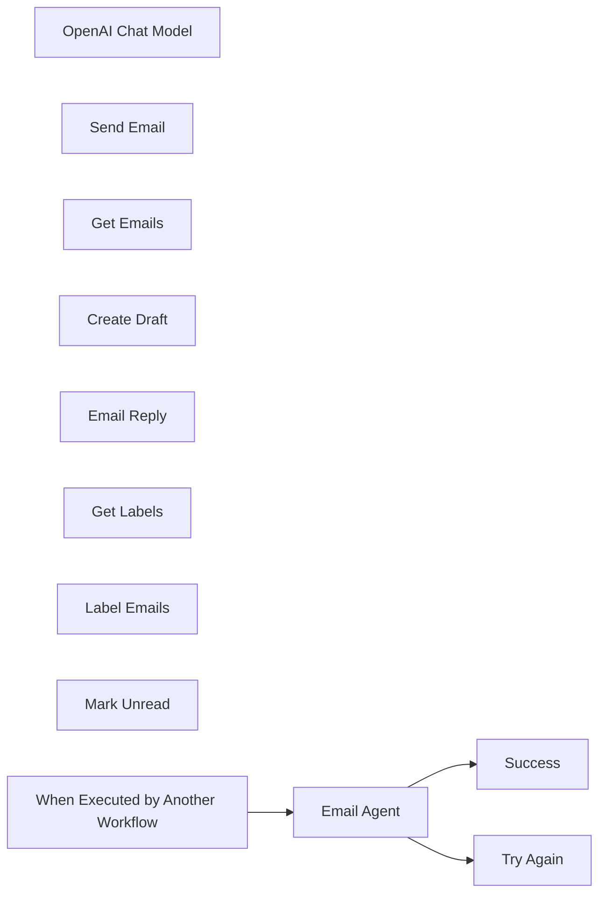

## Fluxo (.json) :

```json
{
  "id": "C3hLlOS4O6ZJtVFy",
  "meta": {
    "instanceId": "95e5a8c2e51c83e33b232ea792bbe3f063c094c33d9806a5565cb31759e1ad39",
    "templateCredsSetupCompleted": true
  },
  "name": "🤖Email Agent",
  "tags": [],
  "nodes": [
    {
      "id": "c98bcc4d-20a9-4b29-a4aa-f6b6e7bb1f1b",
      "name": "OpenAI Chat Model",
      "type": "@n8n/n8n-nodes-langchain.lmChatOpenAi",
      "position": [
        560,
        680
      ],
      "parameters": {
        "model": "gpt-4o",
        "options": {}
      },
      "credentials": {
        "openAiApi": {
          "id": "BP9v81AwJlpYGStD",
          "name": "OpenAi account"
        }
      },
      "typeVersion": 1
    },
    {
      "id": "0505c1f0-53d1-4988-843f-eb9eac2d7856",
      "name": "Try Again",
      "type": "n8n-nodes-base.set",
      "position": [
        1640,
        500
      ],
      "parameters": {
        "options": {},
        "assignments": {
          "assignments": [
            {
              "id": "7ab380a2-a8d3-421c-ab4e-748ea8fb7904",
              "name": "response",
              "type": "string",
              "value": "Unable to perform task. Please try again."
            }
          ]
        }
      },
      "typeVersion": 3.4
    },
    {
      "id": "97393469-bde9-4a13-8d89-68ac6a4305db",
      "name": "Success",
      "type": "n8n-nodes-base.set",
      "position": [
        1640,
        320
      ],
      "parameters": {
        "options": {},
        "assignments": {
          "assignments": [
            {
              "id": "39c2f302-03be-4464-a17a-d7cc481d6d44",
              "name": "=response",
              "type": "string",
              "value": "={{$json.output}}"
            }
          ]
        }
      },
      "typeVersion": 3.4
    },
    {
      "id": "0f7ba4a7-44b1-41ce-8904-9a78e8e03be4",
      "name": "Email Agent",
      "type": "@n8n/n8n-nodes-langchain.agent",
      "onError": "continueErrorOutput",
      "position": [
        1040,
        400
      ],
      "parameters": {
        "text": "={{ $json.query }}",
        "options": {
          "systemMessage": "=# Overview\nYou are an email management assistant. All emails must be formatted professionally in HTML and signed off as \"Nate.\" \n\n**Email Management Tools**   \n   - Use \"Send Email\" to send emails.  \n   - Use \"Create Draft\" if the user asks for a draft.  \n   - Use \"Get Emails\" to retrieve emails when requested.\n   - Use \"Get Labels\" to retrieve labels.\n   - Use \"Mark Unread\" to mark an email as unread. You must use \"Get Emails\" first so you have the message ID of the email to flag.\n   - Use \"Label Email\" to flag an email. You must use \"Get Emails\" first so you have the message ID of the email to flag. Then you must use \"Get Labels\" so you have the label ID.\n   - Use \"Email Reply\" to reply to an email. You must use \"Get Emails\" first so you have the message ID of the email to reply to.\n\n## Final Notes\n- Here is the current date/time: {{ $now }}"
        },
        "promptType": "define"
      },
      "typeVersion": 1.6
    },
    {
      "id": "9e043f46-3e1a-431a-9495-b34e251de785",
      "name": "Send Email",
      "type": "n8n-nodes-base.gmailTool",
      "position": [
        720,
        760
      ],
      "webhookId": "86c8c4b1-13bb-4ebe-acb9-30e1d7082d55",
      "parameters": {
        "sendTo": "={{ $fromAI(\"emailAddress\") }}",
        "message": "={{ $fromAI(\"emailBody\") }}",
        "options": {
          "appendAttribution": false
        },
        "subject": "={{ $fromAI(\"subject\") }}"
      },
      "credentials": {
        "gmailOAuth2": {
          "id": "MHutgNQIvAz7qMgP",
          "name": "Gmail account"
        }
      },
      "typeVersion": 2.1
    },
    {
      "id": "fc850981-86fa-4714-a47a-27d5ed2f4944",
      "name": "Get Emails",
      "type": "n8n-nodes-base.gmailTool",
      "position": [
        1360,
        860
      ],
      "webhookId": "af4b3298-9037-44b0-aa12-2acbfbb5e66f",
      "parameters": {
        "limit": "={{ $fromAI(\"limit\",\"how many emails the user wants\") }}",
        "simple": false,
        "filters": {
          "sender": "={{ $fromAI(\"sender\",\"who the emails are from\") }}"
        },
        "options": {},
        "operation": "getAll"
      },
      "credentials": {
        "gmailOAuth2": {
          "id": "MHutgNQIvAz7qMgP",
          "name": "Gmail account"
        }
      },
      "typeVersion": 2.1
    },
    {
      "id": "c460b943-04a8-4598-9e70-be4f5d4d2303",
      "name": "Create Draft",
      "type": "n8n-nodes-base.gmailTool",
      "position": [
        1200,
        880
      ],
      "webhookId": "17016bce-d7d7-428a-a56c-f6ea122db8be",
      "parameters": {
        "message": "={{ $fromAI(\"emailBody\") }}",
        "options": {
          "sendTo": "={{ $fromAI(\"emailAddress\") }}"
        },
        "subject": "={{ $fromAI(\"subject\") }}",
        "resource": "draft",
        "emailType": "html"
      },
      "credentials": {
        "gmailOAuth2": {
          "id": "MHutgNQIvAz7qMgP",
          "name": "Gmail account"
        }
      },
      "typeVersion": 2.1
    },
    {
      "id": "500202a6-a9be-45ac-be3d-33e0928fb830",
      "name": "Email Reply",
      "type": "n8n-nodes-base.gmailTool",
      "position": [
        880,
        820
      ],
      "webhookId": "114785e6-a859-432b-81b4-c490c1c35b1c",
      "parameters": {
        "message": "={{ $fromAI(\"emailBody\") }}",
        "options": {
          "appendAttribution": false
        },
        "messageId": "={{ $fromAI(\"ID\",\"the message ID\") }}",
        "operation": "reply"
      },
      "credentials": {
        "gmailOAuth2": {
          "id": "MHutgNQIvAz7qMgP",
          "name": "Gmail account"
        }
      },
      "typeVersion": 2.1
    },
    {
      "id": "b05ce6a1-ae44-4d46-a32b-c6d2250794b1",
      "name": "Get Labels",
      "type": "n8n-nodes-base.gmailTool",
      "position": [
        1480,
        800
      ],
      "webhookId": "9e08b59e-792d-4566-83f1-9263c9ad86ae",
      "parameters": {
        "resource": "label",
        "returnAll": true
      },
      "credentials": {
        "gmailOAuth2": {
          "id": "MHutgNQIvAz7qMgP",
          "name": "Gmail account"
        }
      },
      "typeVersion": 2.1
    },
    {
      "id": "88c2635f-5088-4f0c-b5f8-c4a5f73ffc79",
      "name": "Label Emails",
      "type": "n8n-nodes-base.gmailTool",
      "position": [
        1040,
        860
      ],
      "webhookId": "0e951529-2e6d-40bf-ac40-fc0947e242e2",
      "parameters": {
        "labelIds": "={{ $fromAI(\"labelID\") }}",
        "messageId": "={{ $fromAI(\"ID\",\"the ID of the message\") }}",
        "operation": "addLabels"
      },
      "credentials": {
        "gmailOAuth2": {
          "id": "MHutgNQIvAz7qMgP",
          "name": "Gmail account"
        }
      },
      "typeVersion": 2.1
    },
    {
      "id": "8f3771c3-cf3d-4481-8a6d-4ead60291649",
      "name": "Mark Unread",
      "type": "n8n-nodes-base.gmailTool",
      "position": [
        1620,
        740
      ],
      "webhookId": "a35af9d8-f67d-4ff9-803f-59ec6356e795",
      "parameters": {
        "messageId": "={{ $fromAI(\"messageID\") }}",
        "operation": "markAsUnread"
      },
      "credentials": {
        "gmailOAuth2": {
          "id": "MHutgNQIvAz7qMgP",
          "name": "Gmail account"
        }
      },
      "typeVersion": 2.1
    },
    {
      "id": "053be115-2ecf-4d22-8f7f-93ad7271bf80",
      "name": "When Executed by Another Workflow",
      "type": "n8n-nodes-base.executeWorkflowTrigger",
      "position": [
        800,
        400
      ],
      "parameters": {
        "inputSource": "passthrough"
      },
      "typeVersion": 1.1
    }
  ],
  "active": false,
  "pinData": {},
  "settings": {
    "executionOrder": "v1"
  },
  "versionId": "e76750a7-4129-45a9-83ff-321a6ba6d324",
  "connections": {
    "Get Emails": {
      "ai_tool": [
        [
          {
            "node": "Email Agent",
            "type": "ai_tool",
            "index": 0
          }
        ]
      ]
    },
    "Get Labels": {
      "ai_tool": [
        [
          {
            "node": "Email Agent",
            "type": "ai_tool",
            "index": 0
          }
        ]
      ]
    },
    "Send Email": {
      "ai_tool": [
        [
          {
            "node": "Email Agent",
            "type": "ai_tool",
            "index": 0
          }
        ]
      ]
    },
    "Email Agent": {
      "main": [
        [
          {
            "node": "Success",
            "type": "main",
            "index": 0
          }
        ],
        [
          {
            "node": "Try Again",
            "type": "main",
            "index": 0
          }
        ]
      ]
    },
    "Email Reply": {
      "ai_tool": [
        [
          {
            "node": "Email Agent",
            "type": "ai_tool",
            "index": 0
          }
        ]
      ]
    },
    "Mark Unread": {
      "ai_tool": [
        [
          {
            "node": "Email Agent",
            "type": "ai_tool",
            "index": 0
          }
        ]
      ]
    },
    "Create Draft": {
      "ai_tool": [
        [
          {
            "node": "Email Agent",
            "type": "ai_tool",
            "index": 0
          }
        ]
      ]
    },
    "Label Emails": {
      "ai_tool": [
        [
          {
            "node": "Email Agent",
            "type": "ai_tool",
            "index": 0
          }
        ]
      ]
    },
    "OpenAI Chat Model": {
      "ai_languageModel": [
        [
          {
            "node": "Email Agent",
            "type": "ai_languageModel",
            "index": 0
          }
        ]
      ]
    },
    "When Executed by Another Workflow": {
      "main": [
        [
          {
            "node": "Email Agent",
            "type": "main",
            "index": 0
          }
        ]
      ]
    }
  }
}
```

<a id="template-525"></a>

## Template 525 - Respostas de chat com buscas em tempo real

- **Nome:** Respostas de chat com buscas em tempo real
- **Descrição:** Fluxo que enriquece respostas de chat usando um modelo de linguagem para interpretar consultas e realizar buscas web em tempo real, retornando os resultados ao usuário e enviando notificações por webhook.
- **Funcionalidade:** • Recepção de mensagens de chat: Inicia o processo ao receber uma mensagem do usuário.
• Interpretação de consultas por LLM: Usa um modelo de linguagem para entender a intenção do usuário e decidir ações.
• Busca em tempo real: Executa buscas web atualizadas para obter informações relevantes.
• Seleção de mecanismo de busca: Suporta Google, Bing e Yandex conforme apropriado para a consulta.
• Agregação de resultados ao chat: Incorpora os resultados de busca na resposta enviada ao usuário.
• Notificação via webhook: Envia automaticamente as respostas ou resultados a um endpoint HTTP externo.
• Contexto de conversa persistente: Mantém histórico recente da conversa para respostas mais coerentes.
- **Ferramentas:** • Google Gemini (PaLM) API: Modelo de linguagem usado para interpretar perguntas e gerar respostas.
• Bright Data MCP Search (Bright Data): Serviço de busca e raspagem que executa pesquisas em mecanismos como Google, Bing e Yandex e retorna resultados estruturados.
• Google Search: Motor de busca utilizado para consultas quando apropriado.
• Bing Search: Motor de busca alternativo para consultas relevantes.
• Yandex Search: Motor de busca adicional para determinadas consultas.
• Webhook endpoint (webhook.site): Endpoint HTTP usado para receber notificações das respostas geradas.

## Fluxo visual

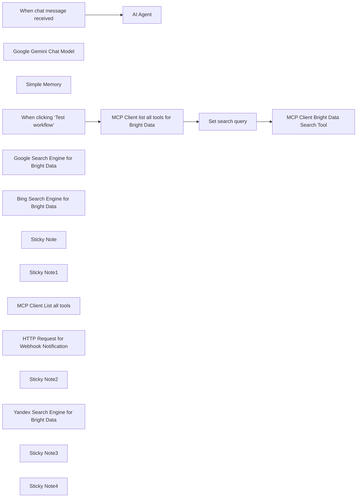

## Fluxo (.json) :

```json
{
  "id": "8jdT4wXjV5NljqKa",
  "meta": {
    "instanceId": "885b4fb4a6a9c2cb5621429a7b972df0d05bb724c20ac7dac7171b62f1c7ef40",
    "templateCredsSetupCompleted": true
  },
  "name": "Enhance Chat Responses with Real-Time Search Data via Bright Data & Gemini AI",
  "tags": [
    {
      "id": "Kujft2FOjmOVQAmJ",
      "name": "Engineering",
      "createdAt": "2025-04-09T01:31:00.558Z",
      "updatedAt": "2025-04-09T01:31:00.558Z"
    },
    {
      "id": "ZOwtAMLepQaGW76t",
      "name": "Building Blocks",
      "createdAt": "2025-04-13T15:23:40.462Z",
      "updatedAt": "2025-04-13T15:23:40.462Z"
    },
    {
      "id": "ddPkw7Hg5dZhQu2w",
      "name": "AI",
      "createdAt": "2025-04-13T05:38:08.053Z",
      "updatedAt": "2025-04-13T05:38:08.053Z"
    }
  ],
  "nodes": [
    {
      "id": "7294b048-5804-4620-a53e-52df293c3df1",
      "name": "When chat message received",
      "type": "@n8n/n8n-nodes-langchain.chatTrigger",
      "position": [
        -460,
        160
      ],
      "webhookId": "3ad383ee-ded9-4a46-9165-9af0bad6c450",
      "parameters": {
        "options": {}
      },
      "typeVersion": 1.1
    },
    {
      "id": "8ff09a26-ffa4-451d-9452-35b8f2936cab",
      "name": "AI Agent",
      "type": "@n8n/n8n-nodes-langchain.agent",
      "position": [
        -140,
        60
      ],
      "parameters": {
        "options": {
          "systemMessage": "You are a helpful assistant.\n\nUse MCP Search Engine assistant tools for Bright Data for Google, Bing or Yandex Search. \n\nImportant: Return the response to Chat and also perform the webhook notification of responses.\n\nUse the relevant tool in the order of execution. "
        }
      },
      "typeVersion": 1.8
    },
    {
      "id": "92352366-7fe5-407d-aa34-96ac19b13284",
      "name": "Google Gemini Chat Model",
      "type": "@n8n/n8n-nodes-langchain.lmChatGoogleGemini",
      "position": [
        -240,
        280
      ],
      "parameters": {
        "options": {},
        "modelName": "models/gemini-2.0-flash-exp"
      },
      "credentials": {
        "googlePalmApi": {
          "id": "YeO7dHZnuGBVQKVZ",
          "name": "Google Gemini(PaLM) Api account"
        }
      },
      "typeVersion": 1
    },
    {
      "id": "b6d947d1-9752-4aff-834c-de99ff1ad903",
      "name": "Simple Memory",
      "type": "@n8n/n8n-nodes-langchain.memoryBufferWindow",
      "position": [
        -60,
        280
      ],
      "parameters": {},
      "typeVersion": 1.3
    },
    {
      "id": "73273d82-2a2f-41a2-ad1c-369f7a05ebe1",
      "name": "When clicking ‘Test workflow’",
      "type": "n8n-nodes-base.manualTrigger",
      "position": [
        -480,
        -200
      ],
      "parameters": {},
      "typeVersion": 1
    },
    {
      "id": "39464933-03e0-46a2-ba3b-ab96aa14461e",
      "name": "MCP Client list all tools for Bright Data",
      "type": "n8n-nodes-mcp.mcpClient",
      "position": [
        -260,
        -200
      ],
      "parameters": {},
      "credentials": {
        "mcpClientApi": {
          "id": "JtatFSfA2kkwctYa",
          "name": "MCP Client (STDIO) account"
        }
      },
      "typeVersion": 1
    },
    {
      "id": "9d0d498f-10da-4a66-9e59-1773089d5d7c",
      "name": "MCP Client Bright Data Search Tool",
      "type": "n8n-nodes-mcp.mcpClient",
      "position": [
        160,
        -200
      ],
      "parameters": {
        "toolName": "={{ $('MCP Client list all tools for Bright Data').item.json.tools[0].name }}",
        "operation": "executeTool",
        "toolParameters": "={\n   \"query\": \"{{ $json.search_query }}\",\n   \"engine\": \"google\"\n} "
      },
      "credentials": {
        "mcpClientApi": {
          "id": "JtatFSfA2kkwctYa",
          "name": "MCP Client (STDIO) account"
        }
      },
      "typeVersion": 1
    },
    {
      "id": "346fd1f7-be97-47b6-b767-74382dc90979",
      "name": "Set search query",
      "type": "n8n-nodes-base.set",
      "position": [
        -60,
        -200
      ],
      "parameters": {
        "options": {},
        "assignments": {
          "assignments": [
            {
              "id": "214e61a0-3587-453f-baf5-eac013990857",
              "name": "search_query",
              "type": "string",
              "value": "Bright Data"
            }
          ]
        }
      },
      "typeVersion": 3.4
    },
    {
      "id": "1dc4dabe-d651-4b43-b561-4528be14e578",
      "name": "Google Search Engine for Bright Data",
      "type": "n8n-nodes-mcp.mcpClientTool",
      "notes": "Scrape search results from Google, Bing or Yandex. Returns SERP results in markdown (URL, title, description)",
      "position": [
        240,
        540
      ],
      "parameters": {
        "toolName": "search_engine",
        "operation": "executeTool",
        "toolParameters": "={\n   \"query\": \"{{ $json.chatInput }}\",\n   \"engine\": \"google\"\n}"
      },
      "credentials": {
        "mcpClientApi": {
          "id": "JtatFSfA2kkwctYa",
          "name": "MCP Client (STDIO) account"
        }
      },
      "notesInFlow": true,
      "typeVersion": 1
    },
    {
      "id": "029f5e0e-070f-47a7-8c77-2b59ca01ada4",
      "name": "Bing Search Engine for Bright Data",
      "type": "n8n-nodes-mcp.mcpClientTool",
      "notes": "Scrape search results from Google, Bing or Yandex. Returns SERP results in markdown (URL, title, description)",
      "position": [
        40,
        540
      ],
      "parameters": {
        "toolName": "search_engine",
        "operation": "executeTool",
        "toolParameters": "={\n   \"query\": \"{{ $json.chatInput }}\",\n   \"engine\": \"bing\"\n} "
      },
      "credentials": {
        "mcpClientApi": {
          "id": "JtatFSfA2kkwctYa",
          "name": "MCP Client (STDIO) account"
        }
      },
      "notesInFlow": true,
      "typeVersion": 1
    },
    {
      "id": "580d37de-deb9-49cf-b9b8-4d14edca28f2",
      "name": "Sticky Note",
      "type": "n8n-nodes-base.stickyNote",
      "position": [
        -40,
        460
      ],
      "parameters": {
        "color": 4,
        "width": 640,
        "height": 240,
        "content": "## Bright Data Search Engines"
      },
      "typeVersion": 1
    },
    {
      "id": "bb77ba7c-c70e-4912-96f6-4f63b966c7a9",
      "name": "Sticky Note1",
      "type": "n8n-nodes-base.stickyNote",
      "position": [
        -100,
        -260
      ],
      "parameters": {
        "color": 3,
        "width": 460,
        "height": 260,
        "content": "## Bright Data Google Search"
      },
      "typeVersion": 1
    },
    {
      "id": "ecdd9f42-f56c-4bdb-b778-cd3b7545bb37",
      "name": "MCP Client List all tools",
      "type": "n8n-nodes-mcp.mcpClientTool",
      "position": [
        260,
        280
      ],
      "parameters": {},
      "credentials": {
        "mcpClientApi": {
          "id": "JtatFSfA2kkwctYa",
          "name": "MCP Client (STDIO) account"
        }
      },
      "typeVersion": 1
    },
    {
      "id": "a1adfa84-6e1a-4b5c-9148-feddb1e6ab72",
      "name": "HTTP Request for Webhook Notification",
      "type": "@n8n/n8n-nodes-langchain.toolHttpRequest",
      "position": [
        500,
        240
      ],
      "parameters": {
        "url": "https://webhook.site/daf9d591-a130-4010-b1d3-0c66f8fcf467",
        "method": "POST",
        "sendBody": true,
        "parametersBody": {
          "values": [
            {
              "name": "chat_response"
            }
          ]
        },
        "toolDescription": "Webhook notification for search responses"
      },
      "typeVersion": 1.1
    },
    {
      "id": "ae88bb19-170f-443f-b777-561cf2e3be25",
      "name": "Sticky Note2",
      "type": "n8n-nodes-base.stickyNote",
      "position": [
        -100,
        -400
      ],
      "parameters": {
        "width": 440,
        "height": 120,
        "content": "## Disclaimer\nThis template is only available on n8n self-hosted as it's making use of the community node for MCP Client."
      },
      "typeVersion": 1
    },
    {
      "id": "80ac697d-2c4a-4f97-82aa-edcabbf7ef6f",
      "name": "Yandex Search Engine for Bright Data",
      "type": "n8n-nodes-mcp.mcpClientTool",
      "notes": "Scrape search results from Google, Bing or Yandex. Returns SERP results in markdown (URL, title, description)",
      "position": [
        460,
        540
      ],
      "parameters": {
        "toolName": "search_engine",
        "operation": "executeTool",
        "toolParameters": "={\n   \"query\": \"{{ $json.chatInput }}\",\n   \"engine\": \"yandex\"\n}"
      },
      "credentials": {
        "mcpClientApi": {
          "id": "JtatFSfA2kkwctYa",
          "name": "MCP Client (STDIO) account"
        }
      },
      "notesInFlow": true,
      "typeVersion": 1
    },
    {
      "id": "dfb2117d-782f-44d9-baca-1ee4b0fef863",
      "name": "Sticky Note3",
      "type": "n8n-nodes-base.stickyNote",
      "position": [
        -940,
        -40
      ],
      "parameters": {
        "color": 5,
        "width": 400,
        "height": 220,
        "content": "## Note\nUse Bright Data MCP Search Engine assistant tools to perform Google, Bing or Yandex Search.\n\nThe AI Agent will make use of suitable search engine-based tools, returns the response to Chat and also performs the Webhook notification call for sending the AI responses via the MCP Client tools.\n\nSource - https://github.com/luminati-io/brightdata-mcp"
      },
      "typeVersion": 1
    },
    {
      "id": "694b3381-8ebe-4afb-be93-019715c0c2cf",
      "name": "Sticky Note4",
      "type": "n8n-nodes-base.stickyNote",
      "position": [
        -440,
        460
      ],
      "parameters": {
        "width": 300,
        "height": 180,
        "content": "## LLM Usage\nGoogle Gemini is employed by the AI agent to understand and interpret user queries. Based on this interpretation, the agent initiates a call to the appropriate MCP client to perform the required web search task."
      },
      "typeVersion": 1
    }
  ],
  "active": false,
  "pinData": {},
  "settings": {
    "executionOrder": "v1"
  },
  "versionId": "2382b23d-fd06-4f10-bcbd-f09a944a1c8d",
  "connections": {
    "Simple Memory": {
      "ai_memory": [
        [
          {
            "node": "AI Agent",
            "type": "ai_memory",
            "index": 0
          }
        ]
      ]
    },
    "Set search query": {
      "main": [
        [
          {
            "node": "MCP Client Bright Data Search Tool",
            "type": "main",
            "index": 0
          }
        ]
      ]
    },
    "Google Gemini Chat Model": {
      "ai_languageModel": [
        [
          {
            "node": "AI Agent",
            "type": "ai_languageModel",
            "index": 0
          }
        ]
      ]
    },
    "MCP Client List all tools": {
      "ai_tool": [
        [
          {
            "node": "AI Agent",
            "type": "ai_tool",
            "index": 0
          }
        ]
      ]
    },
    "When chat message received": {
      "main": [
        [
          {
            "node": "AI Agent",
            "type": "main",
            "index": 0
          }
        ]
      ]
    },
    "When clicking ‘Test workflow’": {
      "main": [
        [
          {
            "node": "MCP Client list all tools for Bright Data",
            "type": "main",
            "index": 0
          }
        ]
      ]
    },
    "Bing Search Engine for Bright Data": {
      "ai_tool": [
        [
          {
            "node": "AI Agent",
            "type": "ai_tool",
            "index": 0
          }
        ]
      ]
    },
    "Google Search Engine for Bright Data": {
      "ai_tool": [
        [
          {
            "node": "AI Agent",
            "type": "ai_tool",
            "index": 0
          }
        ]
      ]
    },
    "Yandex Search Engine for Bright Data": {
      "ai_tool": [
        [
          {
            "node": "AI Agent",
            "type": "ai_tool",
            "index": 0
          }
        ]
      ]
    },
    "HTTP Request for Webhook Notification": {
      "ai_tool": [
        [
          {
            "node": "AI Agent",
            "type": "ai_tool",
            "index": 0
          }
        ]
      ]
    },
    "MCP Client list all tools for Bright Data": {
      "main": [
        [
          {
            "node": "Set search query",
            "type": "main",
            "index": 0
          }
        ]
      ]
    }
  }
}
```

<a id="template-526"></a>

## Template 526 - Backup diário de VPS na Contabo

- **Nome:** Backup diário de VPS na Contabo
- **Descrição:** Automatiza a criação de snapshots das VPS hospedadas na Contabo, verificando snapshots existentes, removendo quando necessário e criando novos backups com nome e descrição baseados na data.
- **Funcionalidade:** • Agendamento diário: executa o processo automaticamente todo dia (meia-noite).
• Autenticação na API: realiza login com credenciais (CLIENT_ID, CLIENT_SECRET, API_USER, API_PASSWORD) para obter token de acesso.
• Listagem de instâncias: obtém a lista de VPSs a serem processadas.
• Verificação de snapshots existentes: consulta snapshots por instância para decidir ações.
• Remoção de snapshot antigo: exclui snapshot existente quando encontrado.
• Criação de novo snapshot: cria snapshot com nome e descrição que incluem a data formatada.
• Geração de UUIDs para requisições: cria x-request-id e x-trace-id únicos para cada requisição.
• Execução manual para testes: permite disparar o fluxo manualmente para verificação.
- **Ferramentas:** • Contabo (API e autenticação): serviço de hospedagem cujas APIs são usadas para autenticar, listar instâncias, listar snapshots, excluir e criar snapshots.
• uuidgenerator.net: serviço público para geração de UUIDs (version4) usados nos cabeçalhos de requisição.
• Painel do Cliente Contabo: local para obtenção das credenciais de API necessárias (CLIENT_ID, CLIENT_SECRET, API_USER, API_PASSWORD).

## Fluxo visual

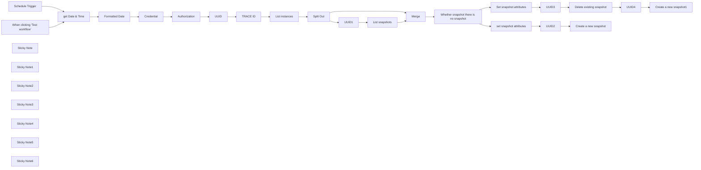

## Fluxo (.json) :

```json
{
  "meta": {
    "instanceId": "84ba6d895254e080ac2b4916d987aa66b000f88d4d919a6b9c76848f9b8a7616",
    "templateId": "2403"
  },
  "nodes": [
    {
      "id": "15739f4e-3267-4655-9118-d3c617652f23",
      "name": "Set snapshot attributes",
      "type": "n8n-nodes-base.set",
      "position": [
        3460,
        840
      ],
      "parameters": {
        "options": {},
        "assignments": {
          "assignments": [
            {
              "id": "71a51067-08ed-4300-a831-48f1d7d2ada2",
              "name": "data[0].snapshotId",
              "type": "string",
              "value": "={{ $json.data[0].snapshotId }}"
            },
            {
              "id": "00161e54-f324-4f6e-a5df-d27d1c4b7706",
              "name": "displayName",
              "type": "string",
              "value": "={{ $json.displayName }}"
            },
            {
              "id": "b4fbf9e6-c634-4dc7-b75e-44aa048b2e32",
              "name": "instanceId",
              "type": "number",
              "value": "={{ $json.instanceId }}"
            }
          ]
        }
      },
      "typeVersion": 3.4
    },
    {
      "id": "c82ed7b8-c723-46eb-b0fc-1d9da7265a1a",
      "name": "Schedule Trigger",
      "type": "n8n-nodes-base.scheduleTrigger",
      "position": [
        540,
        660
      ],
      "parameters": {
        "rule": {
          "interval": [
            {}
          ]
        }
      },
      "typeVersion": 1.2
    },
    {
      "id": "68b9319b-00b8-480b-b8bc-447e78d4e983",
      "name": "When clicking ‘Test workflow’",
      "type": "n8n-nodes-base.manualTrigger",
      "position": [
        540,
        880
      ],
      "parameters": {},
      "typeVersion": 1
    },
    {
      "id": "657f763f-fc10-4d71-aabd-c9af6c041f4f",
      "name": "Credential",
      "type": "n8n-nodes-base.set",
      "position": [
        1260,
        780
      ],
      "parameters": {
        "options": {},
        "assignments": {
          "assignments": [
            {
              "id": "135cfcc3-050e-4128-b6b0-b8905d160498",
              "name": "CLIENT_ID",
              "type": "string",
              "value": ""
            },
            {
              "id": "b05aa3e9-80c6-474f-b653-8e49654e3da7",
              "name": "CLIENT_SECRET",
              "type": "string",
              "value": ""
            },
            {
              "id": "72c345ba-674e-4db2-946e-bb4a9e6f8763",
              "name": "API_USER",
              "type": "string",
              "value": ""
            },
            {
              "id": "7d1d03e3-86cc-4fd1-9d2a-a3771d913565",
              "name": "API_PASSWORD",
              "type": "string",
              "value": ""
            }
          ]
        }
      },
      "typeVersion": 3.4
    },
    {
      "id": "c74b0511-0eaf-4ae5-b6f2-8dd06186e826",
      "name": "Sticky Note",
      "type": "n8n-nodes-base.stickyNote",
      "position": [
        1200,
        480
      ],
      "parameters": {
        "width": 427,
        "height": 519,
        "content": "## Credential\n\nInformation required to access Contabo API\n\n- CLIENT_ID\n- CLIENT_SECRET\n- API_USER\n- API_PASSWORD\n\n[Contabo Credential](https://my.contabo.com/api/details)\n\n[Contabo API Doc](https://api.contabo.com/)"
      },
      "typeVersion": 1
    },
    {
      "id": "4d991799-ba21-4154-886b-d25901245176",
      "name": "Authorization",
      "type": "n8n-nodes-base.httpRequest",
      "position": [
        1460,
        780
      ],
      "parameters": {
        "url": "https://auth.contabo.com/auth/realms/contabo/protocol/openid-connect/token",
        "method": "POST",
        "options": {},
        "sendBody": true,
        "sendHeaders": true,
        "bodyParameters": {
          "parameters": [
            {
              "name": "client_id",
              "value": "={{ $json.CLIENT_ID }}"
            },
            {
              "name": "client_secret",
              "value": "={{ $json.CLIENT_SECRET }}"
            },
            {
              "name": "username",
              "value": "={{ $json.API_USER }}"
            },
            {
              "name": "password",
              "value": "={{ $json.API_PASSWORD }}"
            },
            {
              "name": "grant_type",
              "value": "password"
            }
          ]
        },
        "headerParameters": {
          "parameters": [
            {
              "name": "Content-Type",
              "value": "application/x-www-form-urlencoded"
            }
          ]
        }
      },
      "typeVersion": 4.2
    },
    {
      "id": "c9bd2ce9-5587-4155-b3ca-192caa48be4c",
      "name": "List instances",
      "type": "n8n-nodes-base.httpRequest",
      "position": [
        2240,
        780
      ],
      "parameters": {
        "url": "https://api.contabo.com/v1/compute/instances",
        "options": {},
        "sendHeaders": true,
        "headerParameters": {
          "parameters": [
            {
              "name": "Content-Type",
              "value": "application/json"
            },
            {
              "name": "Authorization",
              "value": "={{ $('Authorization').item.json['token_type'] }} {{ $('Authorization').item.json['access_token'] }}"
            },
            {
              "name": "x-request-id",
              "value": "={{ $('UUID').item.json['data'] }}"
            },
            {
              "name": "x-trace-id",
              "value": "={{ $('TRACE ID').item.json['data'] }}"
            }
          ]
        }
      },
      "typeVersion": 4.2
    },
    {
      "id": "52caf65c-d46a-4ff0-8b01-5ced05fd083d",
      "name": "Split Out",
      "type": "n8n-nodes-base.splitOut",
      "position": [
        2440,
        780
      ],
      "parameters": {
        "options": {},
        "fieldToSplitOut": "data"
      },
      "typeVersion": 1
    },
    {
      "id": "e152da50-7067-4f9d-91a0-564626633330",
      "name": "UUID",
      "type": "n8n-nodes-base.httpRequest",
      "position": [
        1740,
        780
      ],
      "parameters": {
        "url": "https://www.uuidgenerator.net/api/version4",
        "options": {}
      },
      "typeVersion": 4.2
    },
    {
      "id": "8c86a299-d8b3-4806-b885-37d67e9ba8a4",
      "name": "TRACE ID",
      "type": "n8n-nodes-base.httpRequest",
      "position": [
        1960,
        780
      ],
      "parameters": {
        "url": "https://www.uuidgenerator.net/api/version4",
        "options": {}
      },
      "typeVersion": 4.2
    },
    {
      "id": "6ab188c6-dfc3-4e9e-83b8-32bc778917e4",
      "name": "Sticky Note1",
      "type": "n8n-nodes-base.stickyNote",
      "position": [
        1720,
        477.28137513294257
      ],
      "parameters": {
        "width": 411.2199570815453,
        "height": 521.9218381008977,
        "content": "## get UUID\n\nGenerates the UUIDs that will be used in the 'x-request-id' and 'x-trace-id'\n\n[uuidgenerator](https://www.uuidgenerator.net/api)"
      },
      "typeVersion": 1
    },
    {
      "id": "41364273-55db-411b-a59a-0faf01857806",
      "name": "List snapshots",
      "type": "n8n-nodes-base.httpRequest",
      "position": [
        2860,
        680
      ],
      "parameters": {
        "url": "=https://api.contabo.com/v1/compute/instances/{{ $('Split Out').item.json['instanceId'] }}/snapshots",
        "options": {},
        "sendHeaders": true,
        "headerParameters": {
          "parameters": [
            {
              "name": "Content-Type",
              "value": "application/json"
            },
            {
              "name": "Authorization",
              "value": "={{ $('Authorization').item.json['token_type'] }} {{ $('Authorization').item.json['access_token'] }}"
            },
            {
              "name": "x-request-id",
              "value": "={{ $('UUID1').item.json['data'] }}"
            },
            {
              "name": "x-trace-id",
              "value": "={{ $('TRACE ID').item.json['data'] }}"
            }
          ]
        }
      },
      "typeVersion": 4.2
    },
    {
      "id": "919fed8d-704e-4b1f-9358-f2a4422b7132",
      "name": "UUID1",
      "type": "n8n-nodes-base.httpRequest",
      "position": [
        2680,
        680
      ],
      "parameters": {
        "url": "https://www.uuidgenerator.net/api/version4",
        "options": {}
      },
      "typeVersion": 4.2
    },
    {
      "id": "630975b0-41f6-4025-9b7e-a464c2b5f4fa",
      "name": "Sticky Note2",
      "type": "n8n-nodes-base.stickyNote",
      "position": [
        2200,
        480
      ],
      "parameters": {
        "width": 384,
        "height": 279,
        "content": "## List your instances     "
      },
      "typeVersion": 1
    },
    {
      "id": "f1a39319-5743-4836-8840-5d2b51746682",
      "name": "Sticky Note3",
      "type": "n8n-nodes-base.stickyNote",
      "position": [
        2640,
        480
      ],
      "parameters": {
        "width": 733.0237288135586,
        "height": 467.2593220338978,
        "content": "## List existing Snapshots\n\n- Generates a new UUID for the request\n\n- Checks if the instance already has a Snapshot"
      },
      "typeVersion": 1
    },
    {
      "id": "5f453f4f-f509-4613-9692-c16e1a8d3c53",
      "name": "Merge",
      "type": "n8n-nodes-base.merge",
      "position": [
        3040,
        820
      ],
      "parameters": {
        "mode": "combine",
        "options": {},
        "combineBy": "combineByPosition"
      },
      "typeVersion": 3
    },
    {
      "id": "2e12506f-4e8d-4053-b662-d1ff9d33ecf7",
      "name": "get Date & Time",
      "type": "n8n-nodes-base.dateTime",
      "position": [
        840,
        780
      ],
      "parameters": {
        "options": {
          "timezone": "America/Sao_Paulo"
        }
      },
      "retryOnFail": true,
      "typeVersion": 2
    },
    {
      "id": "c06bf642-253f-4cec-8c0f-97edff450c1b",
      "name": "Delete existing snapshot",
      "type": "n8n-nodes-base.httpRequest",
      "position": [
        3780,
        840
      ],
      "parameters": {
        "url": "=https://api.contabo.com/v1/compute/instances/{{ $('Set snapshot attributes').item.json['instanceId'] }}/snapshots/{{ $('Set snapshot attributes').item.json['data'][0].snapshotId }}",
        "method": "DELETE",
        "options": {},
        "sendHeaders": true,
        "headerParameters": {
          "parameters": [
            {
              "name": "Content-Type",
              "value": "application/json"
            },
            {
              "name": "Authorization",
              "value": "={{ $('Authorization').item.json['token_type'] }} {{ $('Authorization').item.json['access_token'] }}"
            },
            {
              "name": "x-request-id",
              "value": "={{ $('UUID3').item.json['data'] }}"
            },
            {
              "name": "x-trace-id",
              "value": "={{ $('TRACE ID').item.json['data'] }}"
            }
          ]
        }
      },
      "retryOnFail": true,
      "typeVersion": 4.2
    },
    {
      "id": "f7a1d94d-c10d-400a-b9ed-7135def2d809",
      "name": "Create a new snapshot",
      "type": "n8n-nodes-base.httpRequest",
      "position": [
        4360,
        660
      ],
      "parameters": {
        "url": "=https://api.contabo.com/v1/compute/instances/{{ $('set snapshot attributes').item.json['instanceId'] }}/snapshots",
        "method": "POST",
        "options": {},
        "sendBody": true,
        "sendHeaders": true,
        "bodyParameters": {
          "parameters": [
            {
              "name": "name",
              "value": "={{ $('Formatted Date').item.json['formattedDate'] }}"
            },
            {
              "name": "description",
              "value": "={{ $('set snapshot attributes').item.json['displayName'] }} {{ $('Formatted Date').item.json['formattedDate'] }}"
            }
          ]
        },
        "headerParameters": {
          "parameters": [
            {
              "name": "Content-Type",
              "value": "application/json"
            },
            {
              "name": "Authorization",
              "value": "={{ $('Authorization').item.json['token_type'] }} {{ $('Authorization').item.json['access_token'] }}"
            },
            {
              "name": "x-request-id",
              "value": "={{ $('UUID2').item.json['data'] }}"
            },
            {
              "name": "x-trace-id",
              "value": "={{ $('TRACE ID').item.json['data'] }}"
            }
          ]
        }
      },
      "retryOnFail": true,
      "typeVersion": 4.2
    },
    {
      "id": "dfc5ba84-89e3-4567-a466-393016843391",
      "name": "Create a new snapshot1",
      "type": "n8n-nodes-base.httpRequest",
      "position": [
        4200,
        840
      ],
      "parameters": {
        "url": "=https://api.contabo.com/v1/compute/instances/{{ $('Set snapshot attributes').item.json['instanceId'] }}/snapshots",
        "method": "POST",
        "options": {},
        "sendBody": true,
        "sendHeaders": true,
        "bodyParameters": {
          "parameters": [
            {
              "name": "name",
              "value": "={{ $('Formatted Date').item.json['formattedDate'] }}"
            },
            {
              "name": "description",
              "value": "={{ $('Set snapshot attributes').item.json['displayName'] }} {{ $('Formatted Date').item.json['formattedDate'] }}"
            }
          ]
        },
        "headerParameters": {
          "parameters": [
            {
              "name": "Content-Type",
              "value": "application/json"
            },
            {
              "name": "Authorization",
              "value": "={{ $('Authorization').item.json['token_type'] }} {{ $('Authorization').item.json['access_token'] }}"
            },
            {
              "name": "x-request-id",
              "value": "={{ $('UUID4').item.json['data'] }}"
            },
            {
              "name": "x-trace-id",
              "value": "={{ $('TRACE ID').item.json['data'] }}"
            }
          ]
        }
      },
      "retryOnFail": true,
      "typeVersion": 4.2
    },
    {
      "id": "d6b69037-14a9-4e01-be34-a7975503554d",
      "name": "UUID2",
      "type": "n8n-nodes-base.httpRequest",
      "position": [
        4200,
        660
      ],
      "parameters": {
        "url": "https://www.uuidgenerator.net/api/version4",
        "options": {}
      },
      "typeVersion": 4.2
    },
    {
      "id": "1d80d4d5-1f5f-4cf1-9540-8a4b84edda38",
      "name": "UUID3",
      "type": "n8n-nodes-base.httpRequest",
      "position": [
        3620,
        840
      ],
      "parameters": {
        "url": "https://www.uuidgenerator.net/api/version4",
        "options": {}
      },
      "typeVersion": 4.2
    },
    {
      "id": "f3ede6e8-5ca2-418b-8e60-03b817857cf2",
      "name": "UUID4",
      "type": "n8n-nodes-base.httpRequest",
      "position": [
        4020,
        840
      ],
      "parameters": {
        "url": "https://www.uuidgenerator.net/api/version4",
        "options": {}
      },
      "typeVersion": 4.2
    },
    {
      "id": "d1995aef-531f-471e-a16d-7c75b1f3ae4c",
      "name": "Sticky Note4",
      "type": "n8n-nodes-base.stickyNote",
      "position": [
        3440,
        480
      ],
      "parameters": {
        "width": 486.8901611698841,
        "height": 467.87473554386463,
        "content": "## Delete existing snapshot by id\n"
      },
      "typeVersion": 1
    },
    {
      "id": "8b408e6d-9574-4fa4-bc7e-7a543aa0bad6",
      "name": "Sticky Note5",
      "type": "n8n-nodes-base.stickyNote",
      "position": [
        3980,
        480
      ],
      "parameters": {
        "width": 576.6684015952959,
        "height": 468.61270146235483,
        "content": "## Create a new snapshot"
      },
      "typeVersion": 1
    },
    {
      "id": "a41e7b87-8e46-44ea-8ca5-08f7d1a36f47",
      "name": "Sticky Note6",
      "type": "n8n-nodes-base.stickyNote",
      "position": [
        380,
        240
      ],
      "parameters": {
        "width": 769.2098244001793,
        "height": 415.52346358766624,
        "content": "## Contabo Backups Workflow\nThis workflow will automatically backup (snapshot) your VPS's hosted on Contabo every day at midnight.\n\n### Setup\nOpen **Credential** and update the values ​​below\n\n- **CLIENT_ID**\n- **CLIENT_SECRET**\n- **API_USER**\n- **API_PASSWORD**\n\nYou will find this information in the [Customer Control Panel.](https://my.contabo.com/api/details)\n\nWorkflow created by [Marcos Antonio](https://www.linkedin.com/in/compromitto/)\n[Linkedin](https://www.linkedin.com/in/compromitto/)\n[GitHub](https://github.com/dubcom) 🇧🇷"
      },
      "typeVersion": 1
    },
    {
      "id": "eb412eff-cf8b-44e8-b0ad-21798504f11d",
      "name": "Formatted Date",
      "type": "n8n-nodes-base.dateTime",
      "position": [
        1020,
        780
      ],
      "parameters": {
        "date": "={{ $json.currentDate }}",
        "format": "custom",
        "options": {},
        "operation": "formatDate",
        "customFormat": "dd-MM-yyyy"
      },
      "typeVersion": 2
    },
    {
      "id": "67413ee0-38db-4917-adcd-be9c6cb4f5cc",
      "name": "Whether snapshot there is no snapshot",
      "type": "n8n-nodes-base.if",
      "position": [
        3220,
        820
      ],
      "parameters": {
        "options": {},
        "conditions": {
          "options": {
            "leftValue": "",
            "caseSensitive": true,
            "typeValidation": "strict"
          },
          "combinator": "and",
          "conditions": [
            {
              "id": "2bd58580-020f-411b-b25d-e63467d615bc",
              "operator": {
                "type": "array",
                "operation": "empty",
                "singleValue": true
              },
              "leftValue": "={{ $('List snapshots').item.json['data'] }}",
              "rightValue": ""
            }
          ]
        }
      },
      "typeVersion": 2
    },
    {
      "id": "464f52f5-bc1d-402c-81d2-4db24f675871",
      "name": "set snapshot attributes",
      "type": "n8n-nodes-base.set",
      "position": [
        4020,
        660
      ],
      "parameters": {
        "options": {},
        "assignments": {
          "assignments": [
            {
              "id": "b9af7eb7-bd87-4949-ac95-e40025c3c419",
              "name": "instanceId",
              "type": "string",
              "value": "={{ $json.instanceId }}"
            },
            {
              "id": "3d8cb230-4512-4b65-be3a-6ea59cb80ddd",
              "name": "displayName",
              "type": "string",
              "value": "={{ $json.displayName }}"
            }
          ]
        }
      },
      "typeVersion": 3.4
    }
  ],
  "pinData": {},
  "connections": {
    "UUID": {
      "main": [
        [
          {
            "node": "TRACE ID",
            "type": "main",
            "index": 0
          }
        ]
      ]
    },
    "Merge": {
      "main": [
        [
          {
            "node": "Whether snapshot there is no snapshot",
            "type": "main",
            "index": 0
          }
        ]
      ]
    },
    "UUID1": {
      "main": [
        [
          {
            "node": "List snapshots",
            "type": "main",
            "index": 0
          }
        ]
      ]
    },
    "UUID2": {
      "main": [
        [
          {
            "node": "Create a new snapshot",
            "type": "main",
            "index": 0
          }
        ]
      ]
    },
    "UUID3": {
      "main": [
        [
          {
            "node": "Delete existing snapshot",
            "type": "main",
            "index": 0
          }
        ]
      ]
    },
    "UUID4": {
      "main": [
        [
          {
            "node": "Create a new snapshot1",
            "type": "main",
            "index": 0
          }
        ]
      ]
    },
    "TRACE ID": {
      "main": [
        [
          {
            "node": "List instances",
            "type": "main",
            "index": 0
          }
        ]
      ]
    },
    "Split Out": {
      "main": [
        [
          {
            "node": "UUID1",
            "type": "main",
            "index": 0
          },
          {
            "node": "Merge",
            "type": "main",
            "index": 1
          }
        ]
      ]
    },
    "Credential": {
      "main": [
        [
          {
            "node": "Authorization",
            "type": "main",
            "index": 0
          }
        ]
      ]
    },
    "Authorization": {
      "main": [
        [
          {
            "node": "UUID",
            "type": "main",
            "index": 0
          }
        ]
      ]
    },
    "Formatted Date": {
      "main": [
        [
          {
            "node": "Credential",
            "type": "main",
            "index": 0
          }
        ]
      ]
    },
    "List instances": {
      "main": [
        [
          {
            "node": "Split Out",
            "type": "main",
            "index": 0
          }
        ]
      ]
    },
    "List snapshots": {
      "main": [
        [
          {
            "node": "Merge",
            "type": "main",
            "index": 0
          }
        ]
      ]
    },
    "get Date & Time": {
      "main": [
        [
          {
            "node": "Formatted Date",
            "type": "main",
            "index": 0
          }
        ]
      ]
    },
    "Schedule Trigger": {
      "main": [
        [
          {
            "node": "get Date & Time",
            "type": "main",
            "index": 0
          }
        ]
      ]
    },
    "Set snapshot attributes": {
      "main": [
        [
          {
            "node": "UUID3",
            "type": "main",
            "index": 0
          }
        ]
      ]
    },
    "set snapshot attributes": {
      "main": [
        [
          {
            "node": "UUID2",
            "type": "main",
            "index": 0
          }
        ]
      ]
    },
    "Delete existing snapshot": {
      "main": [
        [
          {
            "node": "UUID4",
            "type": "main",
            "index": 0
          }
        ]
      ]
    },
    "When clicking ‘Test workflow’": {
      "main": [
        [
          {
            "node": "get Date & Time",
            "type": "main",
            "index": 0
          }
        ]
      ]
    },
    "Whether snapshot there is no snapshot": {
      "main": [
        [
          {
            "node": "set snapshot attributes",
            "type": "main",
            "index": 0
          }
        ],
        [
          {
            "node": "Set snapshot attributes",
            "type": "main",
            "index": 0
          }
        ]
      ]
    }
  }
}
```

<a id="template-527"></a>

## Template 527 - Conversão de XML para JSON

- **Nome:** Conversão de XML para JSON
- **Descrição:** Converte uma string XML fornecida em um objeto JSON estruturado quando o fluxo é executado manualmente.
- **Funcionalidade:** • Execução manual: Inicia o processamento ao clicar em executar.
• Definição da entrada XML: Fornece uma string contendo o documento XML a ser convertido.
• Conversão de XML para JSON: Parser que transforma o XML em JSON, preservando atributos com a chave "$" e mantendo a raiz explícita conforme configuração.
• Saída estruturada: Gera o JSON resultante em uma propriedade de dados para uso em etapas seguintes.
- **Ferramentas:** • Nenhuma externa: O fluxo não utiliza serviços externos; todo o processamento é realizado internamente no fluxo.

## Fluxo visual

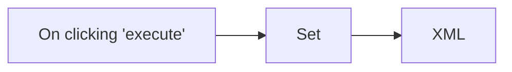

## Fluxo (.json) :

```json
{
  "id": "3",
  "name": "XML Conversion",
  "nodes": [
    {
      "name": "On clicking 'execute'",
      "type": "n8n-nodes-base.manualTrigger",
      "position": [
        250,
        300
      ],
      "parameters": {},
      "typeVersion": 1
    },
    {
      "name": "Set",
      "type": "n8n-nodes-base.set",
      "position": [
        510,
        300
      ],
      "parameters": {
        "values": {
          "string": [
            {
              "name": "xml",
              "value": "<?xml version=\"1.0\" encoding=\"utf-8\"?> <ORDERS05>   <IDOC BEGIN=\"1\">     <EDI_DC40 SEGMENT=\"1\">       <TABNAM>EDI_DC40</TABNAM>     </EDI_DC40>   </IDOC> </ORDERS05>"
            }
          ]
        },
        "keepOnlySet": true
      },
      "typeVersion": 1
    },
    {
      "name": "XML",
      "type": "n8n-nodes-base.xml",
      "position": [
        740,
        300
      ],
      "parameters": {
        "options": {
          "attrkey": "$",
          "mergeAttrs": false,
          "explicitRoot": true
        },
        "dataPropertyName": "xml"
      },
      "typeVersion": 1
    }
  ],
  "active": false,
  "settings": {},
  "connections": {
    "Set": {
      "main": [
        [
          {
            "node": "XML",
            "type": "main",
            "index": 0
          }
        ]
      ]
    },
    "On clicking 'execute'": {
      "main": [
        [
          {
            "node": "Set",
            "type": "main",
            "index": 0
          }
        ]
      ]
    }
  }
}
```

<a id="template-528"></a>

## Template 528 - Validação automática de foto de passaporte

- **Nome:** Validação automática de foto de passaporte
- **Descrição:** Fluxo que importa retratos, prepara as imagens e usa um modelo de visão para verificar se cada foto atende às diretrizes de passaporte do Reino Unido, retornando uma resposta estruturada sobre validade e motivos.
- **Funcionalidade:** • Importar fotos a partir de armazenamento: Recebe uma lista de URLs de fotos para validação.
• Processar cada foto individualmente: Converte a lista em itens separados para análise sequencial.
• Baixar arquivos de imagem: Recupera as fotos a partir do serviço de armazenamento informado.
• Redimensionar imagens para análise: Ajusta as imagens para dimensões apropriadas ao modelo de visão (ex.: 1024x1024 quando necessário).
• Avaliar conformidade com regras do Reino Unido: Utiliza um modelo multimodal para verificar critérios como fundo, expressão, presença de outros objetos/pessoas, qualidade e dimensões mínimas.
• Gerar saída estruturada: Retorna campos padronizados como is_valid, photo_description e reasons para integração posterior.
• Facilitar integração automática: Saída pronta para salvar em bases ou acionar outros processos automatizados.
- **Ferramentas:** • Google Drive: Armazenamento e fornecimento dos arquivos de imagem (download das fotos para análise).
• Google Gemini (PaLM) API: Modelo multimodal de linguagem/visão utilizado para analisar as imagens de acordo com as diretrizes e gerar uma resposta estruturada.

## Fluxo visual

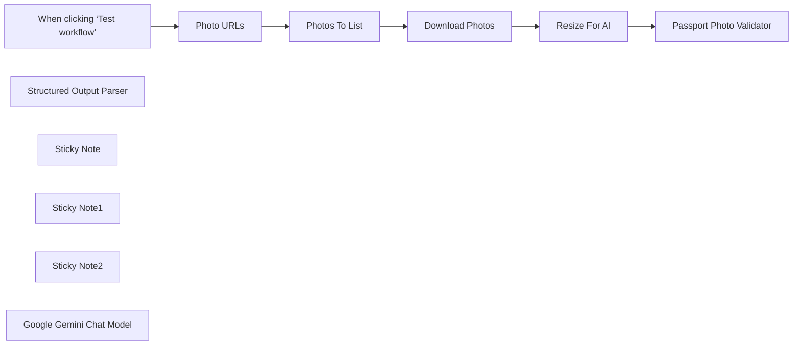

## Fluxo (.json) :

```json
{
  "meta": {
    "instanceId": "408f9fb9940c3cb18ffdef0e0150fe342d6e655c3a9fac21f0f644e8bedabcd9"
  },
  "nodes": [
    {
      "id": "6c78b4c7-993b-410d-93e7-e11b3052e53b",
      "name": "When clicking ‘Test workflow’",
      "type": "n8n-nodes-base.manualTrigger",
      "position": [
        0,
        420
      ],
      "parameters": {},
      "typeVersion": 1
    },
    {
      "id": "c2ab6497-6d6d-483b-bd43-494ae95394c0",
      "name": "Structured Output Parser",
      "type": "@n8n/n8n-nodes-langchain.outputParserStructured",
      "position": [
        1440,
        600
      ],
      "parameters": {
        "schemaType": "manual",
        "inputSchema": "{\n\t\"type\": \"object\",\n\t\"properties\": {\n\t\t\"is_valid\": { \"type\": \"boolean\" },\n        \"photo_description\": {\n          \"type\": \"string\",\n          \"description\": \"describe the appearance of the person(s), object(s) if any and the background in the image. Mention any colours of each if possible.\"\n        },\n\t\t\"reasons\": {\n          \"type\": \"array\",\n          \"items\": { \"type\": \"string\" }\n        }\n\t}\n}"
      },
      "typeVersion": 1.2
    },
    {
      "id": "b23f5298-17c7-49ac-a8ca-78e006b2d294",
      "name": "Photo URLs",
      "type": "n8n-nodes-base.set",
      "position": [
        360,
        380
      ],
      "parameters": {
        "options": {},
        "assignments": {
          "assignments": [
            {
              "id": "6baa3e08-8957-454e-8ee9-d5414a0ff990",
              "name": "data",
              "type": "array",
              "value": "={{\n[\n{\n  \"name\": \"portrait_1\",\n  \"url\": \"https://drive.google.com/file/d/1zs963iFkO-3g2rKak8Hcy555h55D8gjF/view?usp=sharing\"\n},\n{\n  \"name\": \"portrait_2\",\n  \"url\": \"https://drive.google.com/file/d/19FyDcs68dZauQSEf6SEulJMag51SPsFy/view?usp=sharing\"\n},\n{\n  \"name\": \"portrait_3\",\n  \"url\": \"https://drive.google.com/file/d/1gbXjfNYE7Tvuw_riFmHMKoqPPu696VfW/view?usp=sharing\",\n\n},\n{\n  \"name\": \"portrait_4\",\n  \"url\": \"https://drive.google.com/file/d/1s19hYdxgfMkrnU25l6YIDq-myQr1tQMa/view?usp=sharing\"\n},\n{\n  \"name\": \"portrait_5\",\n  \"url\": \"https://drive.google.com/file/d/193FqIXJWAKj6O2SmOj3cLBfypHBkgdI5/view?usp=sharing\"\n}\n]\n}}"
            }
          ]
        }
      },
      "typeVersion": 3.4
    },
    {
      "id": "8d445f73-dff7-485b-87e2-5b64da09cbf0",
      "name": "Photos To List",
      "type": "n8n-nodes-base.splitOut",
      "position": [
        520,
        380
      ],
      "parameters": {
        "options": {},
        "fieldToSplitOut": "data"
      },
      "typeVersion": 1
    },
    {
      "id": "7fb3b829-88a7-42ec-abfd-3ddaa042c916",
      "name": "Download Photos",
      "type": "n8n-nodes-base.googleDrive",
      "position": [
        680,
        380
      ],
      "parameters": {
        "fileId": {
          "__rl": true,
          "mode": "url",
          "value": "={{ $json.url }}"
        },
        "options": {},
        "operation": "download"
      },
      "credentials": {
        "googleDriveOAuth2Api": {
          "id": "yOwz41gMQclOadgu",
          "name": "Google Drive account"
        }
      },
      "typeVersion": 3
    },
    {
      "id": "b8644f6d-691f-49bc-b0fe-33a68c59638d",
      "name": "Resize For AI",
      "type": "n8n-nodes-base.editImage",
      "position": [
        1060,
        440
      ],
      "parameters": {
        "width": 1024,
        "height": 1024,
        "options": {},
        "operation": "resize",
        "resizeOption": "onlyIfLarger"
      },
      "typeVersion": 1
    },
    {
      "id": "ecb266f2-0d2d-4cbe-a641-26735f0bdf18",
      "name": "Sticky Note",
      "type": "n8n-nodes-base.stickyNote",
      "position": [
        280,
        180
      ],
      "parameters": {
        "color": 7,
        "width": 594,
        "height": 438,
        "content": "## 1. Import Photos To Validate\n[Read more about using Google Drive](https://docs.n8n.io/integrations/builtin/app-nodes/n8n-nodes-base.googledrive)\n\nIn this demonstration, we'll import 5 different portraits to test our AI vision model. For convenience, we'll use Google Drive but feel free to swap this out for other sources such as other storage or by using webhooks."
      },
      "typeVersion": 1
    },
    {
      "id": "a1034923-0905-4cdd-a6bf-21d28aa3dd71",
      "name": "Sticky Note1",
      "type": "n8n-nodes-base.stickyNote",
      "position": [
        900,
        180
      ],
      "parameters": {
        "color": 7,
        "width": 774,
        "height": 589.25,
        "content": "## 2. Verify Passport Photo Validity Using AI Vision Model\n[Learn more about Basic LLM Chain](https://docs.n8n.io/integrations/builtin/cluster-nodes/root-nodes/n8n-nodes-langchain.chainllm)\n\nVerifying if a photo is suitable for a passport photo is a great use-case for AI vision and to automate the process is an equally great use-case for using n8n. Here's we've pasted in the UK governments guidelines copied from gov.uk and have asked the AI to validate the incoming photos following those rules. A structured output parser is used to simplify the AI response which can be used to update a database or backend of your choosing."
      },
      "typeVersion": 1
    },
    {
      "id": "af231ee5-adff-4d27-ba5f-8c04ddd4892d",
      "name": "Sticky Note2",
      "type": "n8n-nodes-base.stickyNote",
      "position": [
        -140,
        0
      ],
      "parameters": {
        "width": 386,
        "height": 610.0104651162792,
        "content": "## Try It Out!\n\n### This workflow takes a portrait and verifies if it makes for a valid passport photo. It achieves this by using an AI vision model following the UK government guidance.\n\nOpenAI's vision model was found to perform well for understanding photographs and so is recommended for this type of workflow. However, any capable vision model should work.\n\n### Need Help?\nJoin the [Discord](https://discord.com/invite/XPKeKXeB7d) or ask in the [Forum](https://community.n8n.io/)!"
      },
      "typeVersion": 1
    },
    {
      "id": "e07e1655-2683-4e21-b2b7-e0c0bfb569c0",
      "name": "Passport Photo Validator",
      "type": "@n8n/n8n-nodes-langchain.chainLlm",
      "position": [
        1240,
        440
      ],
      "parameters": {
        "text": "Assess if the image is a valid according to the passport photo criteria as set by the UK Government.",
        "messages": {
          "messageValues": [
            {
              "message": "=You help verify passport photo validity.\n\n## Rules for digital photos\nhttps://www.gov.uk/photos-for-passports\n\n### The quality of your digital photo\nYour photo must be:\n* clear and in focus\n* in colour\n* unaltered by computer software\n* at least 600 pixels wide and 750 pixels tall\n* at least 50KB and no more than 10MB\n\n### What your digital photo must show\nThe digital photo must:\n* contain no other objects or people\n* be taken against a plain white or light-coloured background\n* be in clear contrast to the background\n* not have ‘red eye’\n* If you’re using a photo taken on your own device, include your head, shoulders and upper body. Do not crop your photo - it will be done for you.\n\nIn your photo you must:\n* be facing forwards and looking straight at the camera\n* have a plain expression and your mouth closed\n* have your eyes open and visible\n* not have hair in front of your eyes\n* not have a head covering (unless it’s for religious or medical reasons)\n* not have anything covering your face\n* not have any shadows on your face or behind you - shadows on light background are okay\n* Do not wear glasses in your photo unless you have to do so. If you must wear glasses, they cannot be sunglasses or tinted glasses, and you must make sure your eyes are not covered by the frames or any glare, reflection or shadow.\n\n### Photos of babies and children\n* Children must be on their own in the picture. Babies must not be holding toys or using dummies.\n* Children under 6 do not have to be looking directly at the camera or have a plain expression.\n* Children under one do not have to have their eyes open. You can support their head with your hand, but your hand must not be visible in the photo.\n* Children under one should lie on a plain light-coloured sheet. Take the photo from above.\n\n"
            },
            {
              "type": "HumanMessagePromptTemplate",
              "messageType": "imageBinary"
            }
          ]
        },
        "promptType": "define",
        "hasOutputParser": true
      },
      "typeVersion": 1.4
    },
    {
      "id": "0a36ba22-90b2-4abf-943b-c1cc8e7317d5",
      "name": "Google Gemini Chat Model",
      "type": "@n8n/n8n-nodes-langchain.lmChatGoogleGemini",
      "position": [
        1240,
        600
      ],
      "parameters": {
        "options": {},
        "modelName": "models/gemini-1.5-pro-latest"
      },
      "credentials": {
        "googlePalmApi": {
          "id": "dSxo6ns5wn658r8N",
          "name": "Google Gemini(PaLM) Api account"
        }
      },
      "typeVersion": 1
    }
  ],
  "pinData": {},
  "connections": {
    "Photo URLs": {
      "main": [
        [
          {
            "node": "Photos To List",
            "type": "main",
            "index": 0
          }
        ]
      ]
    },
    "Resize For AI": {
      "main": [
        [
          {
            "node": "Passport Photo Validator",
            "type": "main",
            "index": 0
          }
        ]
      ]
    },
    "Photos To List": {
      "main": [
        [
          {
            "node": "Download Photos",
            "type": "main",
            "index": 0
          }
        ]
      ]
    },
    "Download Photos": {
      "main": [
        [
          {
            "node": "Resize For AI",
            "type": "main",
            "index": 0
          }
        ]
      ]
    },
    "Google Gemini Chat Model": {
      "ai_languageModel": [
        [
          {
            "node": "Passport Photo Validator",
            "type": "ai_languageModel",
            "index": 0
          }
        ]
      ]
    },
    "Structured Output Parser": {
      "ai_outputParser": [
        [
          {
            "node": "Passport Photo Validator",
            "type": "ai_outputParser",
            "index": 0
          }
        ]
      ]
    },
    "When clicking ‘Test workflow’": {
      "main": [
        [
          {
            "node": "Photo URLs",
            "type": "main",
            "index": 0
          }
        ]
      ]
    }
  }
}
```

<a id="template-529"></a>

## Template 529 - Postar mensagem no canal RocketChat

- **Nome:** Postar mensagem no canal RocketChat
- **Descrição:** Ao ser executado manualmente, o fluxo publica uma mensagem pré-definida no canal #general do RocketChat.
- **Funcionalidade:** • Gatilho manual: inicia o fluxo quando o usuário executa manualmente.
• Publicar mensagem: envia o texto "Hello everyone" para um canal especificado.
• Seleção de canal: permite definir o canal de destino (ex.: #general).
• Suporte a opções e anexos: inclui campos para opções e anexos (atualmente vazios).
• Uso de credenciais: utiliza credenciais configuradas para autenticação na conta do RocketChat.
- **Ferramentas:** • RocketChat: plataforma de comunicação em equipe utilizada para publicar mensagens em canais, exigindo autenticação via credenciais/API.


## Fluxo visual


## Fluxo (.json) :

```json
{
  "id": "90",
  "name": "Post a message to a channel in RocketChat",
  "nodes": [
    {
      "name": "On clicking 'execute'",
      "type": "n8n-nodes-base.manualTrigger",
      "position": [
        250,
        300
      ],
      "parameters": {},
      "typeVersion": 1
    },
    {
      "name": "Rocketchat",
      "type": "n8n-nodes-base.rocketchat",
      "position": [
        450,
        300
      ],
      "parameters": {
        "text": "Hello everyone",
        "channel": "#general",
        "options": {},
        "attachments": []
      },
      "credentials": {
        "rocketchatApi": "Rocket"
      },
      "typeVersion": 1
    }
  ],
  "active": false,
  "settings": {},
  "connections": {
    "On clicking 'execute'": {
      "main": [
        [
          {
            "node": "Rocketchat",
            "type": "main",
            "index": 0
          }
        ]
      ]
    }
  }
}
```

<a id="template-530"></a>

## Template 530 - Coleta de SERPs para pesquisa de SEO

- **Nome:** Coleta de SERPs para pesquisa de SEO
- **Descrição:** Fluxo que busca resultados do Google para uma lista de palavras-chave, processa os resultados orgânicos, atribui posições e exporta os dados para a sua base.
- **Funcionalidade:** • Importação de palavras-chave: obtém palavras-chave de uma fonte externa ou usa uma lista definida manualmente.
• Enfileiramento e requisições ao ScrapingRobot: envia requisições POST ao serviço de scraping para buscar SERPs do Google, com suporte a requisições em lote.
• Extração e estruturação de resultados SERP: captura resultados orgânicos, anúncios e perguntas relacionadas (People Also Ask).
• Separação de resultados em linhas individuais: divide arrays de resultados em itens separados para processamento detalhado.
• Filtragem de resultados inválidos: remove ou ignora entradas sem título para evitar registros vazios.
• Atribuição de consulta e posição: associa cada resultado à consulta pesquisada e calcula a posição de ranking (1, 2, 3 ...).
• Saída para base de dados do usuário: prepara os dados para serem gravados ou atualizados no seu repositório (por exemplo Airtable).
- **Ferramentas:** • ScrapingRobot API: serviço de scraping que realiza buscas no Google e retorna dados SERP via API.
• Google Search: fonte dos resultados de pesquisa consultados.
• Base de dados do usuário (por exemplo Airtable): destino para armazenar ou atualizar os dados de rankings coletados.


## Fluxo visual

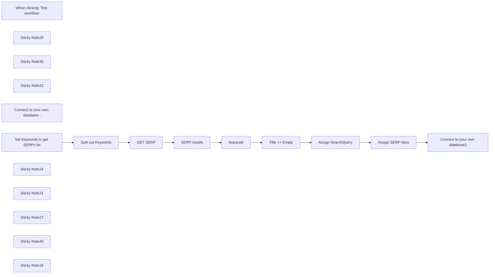

## Fluxo (.json) :

```json
{
  "meta": {
    "instanceId": "6b6a2db47bdf8371d21090c511052883cc9a3f6af5d0d9d567c702d74a18820e"
  },
  "nodes": [
    {
      "id": "f4570aad-db25-4dcd-8589-b1c8335935de",
      "name": "When clicking ‘Test workflow’",
      "type": "n8n-nodes-base.manualTrigger",
      "position": [
        200,
        2800
      ],
      "parameters": {},
      "typeVersion": 1
    },
    {
      "id": "92aae60e-5fcd-4588-9a41-92e7c1b7f2ff",
      "name": "SERP results",
      "type": "n8n-nodes-base.set",
      "position": [
        1286,
        2800
      ],
      "parameters": {
        "options": {},
        "assignments": {
          "assignments": [
            {
              "id": "b3e662aa-7ace-45ca-815a-0ad1d65ef7a0",
              "name": "organicResults",
              "type": "array",
              "value": "={{ $json.result.organicResults }}"
            },
            {
              "id": "ac655bf2-181f-4117-a7d6-aa4ec2738bd9",
              "name": "peopleAlsoAsk",
              "type": "array",
              "value": "={{ $json.result.peopleAlsoAsk }}"
            },
            {
              "id": "9e045f00-006e-4b8b-863d-cb25d682b69d",
              "name": "searchQuery",
              "type": "string",
              "value": "={{ $json.result.searchQuery.term }}"
            },
            {
              "id": "08c1f92b-deac-4951-863f-721e0714739b",
              "name": "paidAds",
              "type": "string",
              "value": "={{ $json.result.paidResults }}"
            }
          ]
        }
      },
      "notesInFlow": true,
      "typeVersion": 3.4
    },
    {
      "id": "e8a7a918-7afd-4c2b-8b79-1c5652362a53",
      "name": "Separate",
      "type": "n8n-nodes-base.splitOut",
      "notes": "Split SERP into rows",
      "position": [
        1457,
        2800
      ],
      "parameters": {
        "options": {},
        "fieldToSplitOut": "organicResults"
      },
      "notesInFlow": true,
      "typeVersion": 1
    },
    {
      "id": "e2683fec-1a04-47ff-82b9-11749921a34c",
      "name": "Title <> Empty",
      "type": "n8n-nodes-base.filter",
      "notes": "Title is not empty",
      "position": [
        1637,
        2800
      ],
      "parameters": {
        "options": {},
        "conditions": {
          "options": {
            "leftValue": "",
            "caseSensitive": true,
            "typeValidation": "strict"
          },
          "combinator": "and",
          "conditions": [
            {
              "id": "6dd422fc-0b66-4d7e-9b40-ee4a6d713e83",
              "operator": {
                "type": "string",
                "operation": "notEmpty",
                "singleValue": true
              },
              "leftValue": "={{ $json.title }}",
              "rightValue": ""
            }
          ]
        }
      },
      "notesInFlow": true,
      "typeVersion": 2
    },
    {
      "id": "e2a21776-86f4-4c99-973c-19e5ede4eab3",
      "name": "Assign SERP #pos",
      "type": "n8n-nodes-base.code",
      "notes": "Assign SERP position",
      "position": [
        2020,
        2800
      ],
      "parameters": {
        "jsCode": "const items = $input.all(); // Get all input items\n\n// Group items by searchQuery\nconst groupedItems = items.reduce((acc, item) => {\n  const searchQuery = item.json.searchQuery || 'default';\n  if (!acc[searchQuery]) {\n    acc[searchQuery] = [];\n  }\n  acc[searchQuery].push(item);\n  return acc;\n}, {});\n\n// Assign positions within each group\nconst result = Object.values(groupedItems).flatMap(group => \n  group.map((item, index) => ({\n    json: {\n      ...item.json,\n      position: index + 1, // Add the position based on the index within the group\n    },\n  }))\n);\n\nreturn result; // Return the modified items"
      },
      "notesInFlow": true,
      "typeVersion": 2
    },
    {
      "id": "34a38c07-6439-4177-a12a-a2f6295cd914",
      "name": "GET SERP",
      "type": "n8n-nodes-base.httpRequest",
      "notes": "SERP results - scrapingRobot\n\nhttps://dashboard.scrapingrobot.com/dashboard",
      "position": [
        1106,
        2800
      ],
      "parameters": {
        "url": "https://api.scrapingrobot.com",
        "method": "POST",
        "options": {
          "batching": {
            "batch": {
              "batchSize": 20
            }
          }
        },
        "jsonBody": "={\n  \"url\": \"https://www.google.com\",\n  \"module\": \"GoogleScraper\",\n  \"params\": {\n    \"query\": \"{{ $json[\"Keyword\"] }}\"\n  }\n}  ",
        "sendBody": true,
        "sendHeaders": true,
        "specifyBody": "json",
        "authentication": "genericCredentialType",
        "genericAuthType": "httpQueryAuth",
        "headerParameters": {
          "parameters": [
            {
              "name": "accept",
              "value": "application/json"
            }
          ]
        }
      },
      "credentials": {
        "httpQueryAuth": {
          "id": "6DyKxvSsLAZLluDL",
          "name": "Query Auth - Scraping Robot"
        },
        "httpHeaderAuth": {
          "id": "QWp7emU1xKIVm5GD",
          "name": "Header Auth - Scraping Robot"
        }
      },
      "notesInFlow": false,
      "retryOnFail": false,
      "typeVersion": 4.2
    },
    {
      "id": "6bf86303-6aa1-4afd-834b-35bc84b1fd82",
      "name": "Sticky Note29",
      "type": "n8n-nodes-base.stickyNote",
      "position": [
        356,
        2760
      ],
      "parameters": {
        "color": 7,
        "width": 669.4820758928554,
        "height": 205.68165856370325,
        "content": "**Get data from airtable and check if already done** "
      },
      "typeVersion": 1
    },
    {
      "id": "0ff2885f-f372-40c5-94e4-f1d90a66b6b7",
      "name": "Sticky Note30",
      "type": "n8n-nodes-base.stickyNote",
      "position": [
        1046,
        2760
      ],
      "parameters": {
        "color": 7,
        "width": 208.81803918109597,
        "height": 205.68165856370314,
        "content": "**POST to Scraping Robot API** "
      },
      "typeVersion": 1
    },
    {
      "id": "ee9e47b4-5137-4909-8c3d-3cb023517e03",
      "name": "Sticky Note22",
      "type": "n8n-nodes-base.stickyNote",
      "position": [
        360,
        2980
      ],
      "parameters": {
        "color": 3,
        "width": 284.87764467541297,
        "height": 119.14378614369562,
        "content": "**REQUIRED**\nConnect to your database of keywords. Name the column 'Keyword' or alternatively enter keywords in the `Set Keywords to get SERPs for` array"
      },
      "typeVersion": 1
    },
    {
      "id": "fee9236d-4c04-4d05-90a3-fbff8e15c4f8",
      "name": "Connect to your own database - ",
      "type": "n8n-nodes-base.noOp",
      "position": [
        420,
        2800
      ],
      "parameters": {},
      "typeVersion": 1
    },
    {
      "id": "d506d14f-1871-4176-97a2-09da6062729b",
      "name": "Set Keywords to get SERPs for",
      "type": "n8n-nodes-base.set",
      "notes": "Array of keywords",
      "position": [
        660,
        2800
      ],
      "parameters": {
        "options": {},
        "assignments": {
          "assignments": [
            {
              "id": "859ba768-9ae1-4d11-bab9-6b5f085adc59",
              "name": "Keyword",
              "type": "array",
              "value": "[\"constant contact email automation\", \"business worfklow software\", \"n8n automation\"]"
            }
          ]
        }
      },
      "notesInFlow": true,
      "typeVersion": 3.4
    },
    {
      "id": "d65f61f6-5c6b-4145-915b-af4cb56da1cb",
      "name": "Sticky Note24",
      "type": "n8n-nodes-base.stickyNote",
      "position": [
        1040,
        2980
      ],
      "parameters": {
        "color": 3,
        "width": 284.87764467541297,
        "height": 150.1322172211123,
        "content": "**REQUIRED**\nUpdate the Auth parameter to your own [Scraping Robot](https://billing.scrapingrobot.com/aff.php?aff=2) token\n\n**Query Auth parameter**\nname - token\nvalue - your-own-api-key"
      },
      "typeVersion": 1
    },
    {
      "id": "bea785be-b146-4bd8-92f5-f7e14127d969",
      "name": "Sticky Note31",
      "type": "n8n-nodes-base.stickyNote",
      "position": [
        1420,
        2760
      ],
      "parameters": {
        "color": 7,
        "width": 749.5454794091054,
        "height": 205.68165856370314,
        "content": "**Splits out queries for organic search and assigns them a ranking 1-10** "
      },
      "typeVersion": 1
    },
    {
      "id": "e7e3ce78-a8ec-45e2-9fb9-c4f615085985",
      "name": "Sticky Note27",
      "type": "n8n-nodes-base.stickyNote",
      "position": [
        2200,
        2740
      ],
      "parameters": {
        "color": 7,
        "width": 231.51775697271012,
        "height": 223.71949738241096,
        "content": "**Update record in own Database**"
      },
      "typeVersion": 1
    },
    {
      "id": "02ccb470-a6a6-49f3-9bda-7429c5dd3150",
      "name": "Connect to your own database2",
      "type": "n8n-nodes-base.noOp",
      "position": [
        2263,
        2800
      ],
      "parameters": {},
      "typeVersion": 1
    },
    {
      "id": "92922d26-3e68-47dd-94eb-b6be13161efe",
      "name": "Assign SearchQuery",
      "type": "n8n-nodes-base.set",
      "position": [
        1820,
        2800
      ],
      "parameters": {
        "options": {},
        "assignments": {
          "assignments": [
            {
              "id": "e69839b4-9ab5-4792-b6c0-a4d0e1172fa8",
              "name": "searchQuery",
              "type": "string",
              "value": "={{ $('SERP results').item.json.searchQuery }}"
            }
          ]
        },
        "includeOtherFields": true
      },
      "typeVersion": 3.4
    },
    {
      "id": "53d835d0-d656-4255-abe2-b4bfb23f455e",
      "name": "Split out Keywords",
      "type": "n8n-nodes-base.splitOut",
      "position": [
        860,
        2800
      ],
      "parameters": {
        "options": {},
        "fieldToSplitOut": "Keyword"
      },
      "typeVersion": 1
    },
    {
      "id": "5dc6f9b0-4f75-4e71-bd3d-86fa41d862b9",
      "name": "Sticky Note40",
      "type": "n8n-nodes-base.stickyNote",
      "position": [
        2200,
        2980
      ],
      "parameters": {
        "color": 3,
        "width": 284.87764467541297,
        "height": 91.91340067739628,
        "content": "**REQUIRED** \nOutput the data to your own data source e.g. Airtable"
      },
      "typeVersion": 1
    },
    {
      "id": "6b2bf27e-de9b-41da-9f27-17a6541fd2f9",
      "name": "Sticky Note18",
      "type": "n8n-nodes-base.stickyNote",
      "position": [
        -540,
        2400
      ],
      "parameters": {
        "color": 4,
        "width": 697.67602815855,
        "height": 735.4043641289052,
        "content": "## Get Google Search Results (SERPs) for SEO Research\n\n## Use Case\nResearch search engine rankings for SEO analysis:\n- You need to track keyword rankings for your website\n- You want to analyze competitor positions in search results\n- You need data for SEO competition analysis\n- You want to monitor SERP changes over time\n\n## What this Workflow Does\nThe workflow uses ScrapingRobot API to fetch Google search results:\n- Retrieves SERP data for your target keywords\n- Captures URL rankings and page titles\n- Processes up to 5000 searches with free account\n- Organizes results for SEO analysis\n\n## Setup\n1. Create a [ScrapingRobot account](https://billing.scrapingrobot.com/aff.php?aff=2) and get your API key\n2. Add your ScrapingRobot API key to the HTTP Request node's `GET SERP` token parameter\n3. Either connect your keyword database (column name \"Keyword\") or use the \"Set Keywords\" node\n4. Configure your preferred output database connection\n\n## How to Adjust it to Your Needs\n- Modify keyword source to pull from different databases\n- Adjust the number of SERP results to capture\n- Customize output format for your reporting needs\n\n\nMade by Simon @ [automake.io](https://automake.io)"
      },
      "typeVersion": 1
    }
  ],
  "pinData": {},
  "connections": {
    "GET SERP": {
      "main": [
        [
          {
            "node": "SERP results",
            "type": "main",
            "index": 0
          }
        ]
      ]
    },
    "Separate": {
      "main": [
        [
          {
            "node": "Title <> Empty",
            "type": "main",
            "index": 0
          }
        ]
      ]
    },
    "SERP results": {
      "main": [
        [
          {
            "node": "Separate",
            "type": "main",
            "index": 0
          }
        ]
      ]
    },
    "Title <> Empty": {
      "main": [
        [
          {
            "node": "Assign SearchQuery",
            "type": "main",
            "index": 0
          }
        ]
      ]
    },
    "Assign SERP #pos": {
      "main": [
        [
          {
            "node": "Connect to your own database2",
            "type": "main",
            "index": 0
          }
        ]
      ]
    },
    "Assign SearchQuery": {
      "main": [
        [
          {
            "node": "Assign SERP #pos",
            "type": "main",
            "index": 0
          }
        ]
      ]
    },
    "Split out Keywords": {
      "main": [
        [
          {
            "node": "GET SERP",
            "type": "main",
            "index": 0
          }
        ]
      ]
    },
    "Set Keywords to get SERPs for": {
      "main": [
        [
          {
            "node": "Split out Keywords",
            "type": "main",
            "index": 0
          }
        ]
      ]
    },
    "Connect to your own database - ": {
      "main": [
        [
          {
            "node": "Set Keywords to get SERPs for",
            "type": "main",
            "index": 0
          }
        ]
      ]
    },
    "When clicking ‘Test workflow’": {
      "main": [
        [
          {
            "node": "Connect to your own database - ",
            "type": "main",
            "index": 0
          }
        ]
      ]
    }
  }
}
```

<a id="template-531"></a>

## Template 531 - Contribuições automáticas para LinkedIn Advice

- **Nome:** Contribuições automáticas para LinkedIn Advice
- **Descrição:** Automatiza a descoberta de artigos na seção LinkedIn Advice, gera contribuições únicas com IA para os tópicos dos artigos e publica/armazenas essas contribuições.
- **Funcionalidade:** • Gatilho semanal e manual: Executa automaticamente toda segunda-feira às 08:00 ou por teste manual.
• Definição de tema de busca: Permite especificar o tópico usado na pesquisa de artigos.
• Busca por artigos: Pesquisa resultados no Google para localizar artigos da área "linkedin.com/advice" relacionados ao tópico.
• Extração de links: Identifica e extrai URLs de artigos da página de resultados.
• Desduplicação de links: Mescla e filtra resultados para evitar processar o mesmo artigo mais de uma vez.
• Recuperação e extração de conteúdo: Busca o HTML dos artigos e extrai título, tópicos e contribuições de outros usuários.
• Geração de contribuições por IA: Cria conselhos únicos e originais para cada tópico do artigo usando um modelo de linguagem.
• Publicação e armazenamento: Publica as contribuições em um canal Slack e salva título, URL e texto no banco de dados para acompanhamento.
- **Ferramentas:** • Google Search: Fonte de pesquisa para localizar artigos relevantes na web.
• LinkedIn (site): Fonte dos artigos e das contribuições de usuários que são analisadas.
• OpenAI (modelo de linguagem): Gera o texto das contribuições únicas e criativas para cada tópico.
• Slack: Canal de comunicação usado para publicar e compartilhar as contribuições geradas.
• NocoDB: Banco de dados utilizado para armazenar os títulos, URLs e contribuições para registro e acompanhamento.


## Fluxo visual

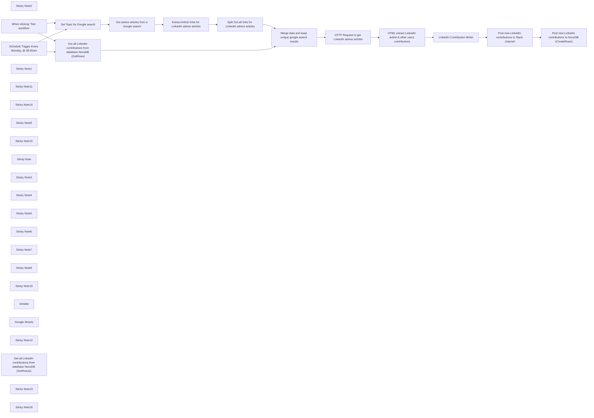

## Fluxo (.json) :

```json
{
  "meta": {
    "instanceId": "38d37c49298b42c645e6a7693766d7c3522b24e54454034f955422b5d7af611c"
  },
  "nodes": [
    {
      "id": "dd9e2f9c-225a-4b6b-9904-293206a477e4",
      "name": "Get advice articles from a Google search",
      "type": "n8n-nodes-base.httpRequest",
      "position": [
        1040,
        360
      ],
      "parameters": {
        "url": "=https://www.google.com/search?q=site%3Alinkedin.com%2Fadvice+{{ $json.Topic }}",
        "options": {
          "batching": {
            "batch": {
              "batchSize": 25
            }
          }
        }
      },
      "typeVersion": 4.2
    },
    {
      "id": "0e2bcaeb-65a0-400a-a15e-0840723d8144",
      "name": "Sticky Note2",
      "type": "n8n-nodes-base.stickyNote",
      "position": [
        980,
        320
      ],
      "parameters": {
        "color": 2,
        "width": 621.7044818991839,
        "height": 566.8592254014303,
        "content": "\n\n\n\n\n\n\n\n\n\n\n\n\n\n\n\n\n\n## 1. Get advice articles from a Google search**\nUses an HTTP request to perform a Google search for LinkedIn advice articles based on a predefined query.\n\n## 2. Extract Article links for LinkedIn advice articles\nThis Code node extracts LinkedIn article URLs from the Google search results by using a regular expression. It pulls all article links related to LinkedIn advice.\n\n## 3. Split Out all links for LinkedIn advice articles\nSplits the list of extracted LinkedIn article links into individual items. This allows each article to be processed one at a time in the following steps.\n"
      },
      "typeVersion": 1
    },
    {
      "id": "68eefc93-6c82-4687-bb4d-52345e5a5094",
      "name": "When clicking ‘Test workflow’",
      "type": "n8n-nodes-base.manualTrigger",
      "position": [
        520,
        80
      ],
      "parameters": {},
      "typeVersion": 1
    },
    {
      "id": "af3fdd03-d28a-4f49-b213-8202b1d154df",
      "name": "Merge data and keep unique google search results",
      "type": "n8n-nodes-base.merge",
      "position": [
        1700,
        200
      ],
      "parameters": {
        "mode": "combine",
        "options": {},
        "joinMode": "keepNonMatches",
        "mergeByFields": {
          "values": [
            {
              "field1": "URL",
              "field2": "matches"
            }
          ]
        },
        "outputDataFrom": "input2"
      },
      "typeVersion": 2.1
    },
    {
      "id": "632c54cc-b1d7-4034-93bf-82dd206761f0",
      "name": "Extract Article links for LinkedIn advice articles",
      "type": "n8n-nodes-base.code",
      "position": [
        1240,
        360
      ],
      "parameters": {
        "jsCode": "// n8n Code node script\nconst text = $json.data;\n\n// Define the regex pattern\nconst regexPattern = /https://www\\.linkedin\\.com/advice/[^%&\\s\"']+/g;\n\n// Execute the regex pattern on the text\nconst matches = text.match(regexPattern);\n\n// Output the matches\nreturn {\n  matches: matches || []\n};\n\n\n"
      },
      "typeVersion": 2
    },
    {
      "id": "81f0a962-fef8-4a46-a709-21cc2db02e55",
      "name": "Split Out all links for LinkedIn advice articles",
      "type": "n8n-nodes-base.splitOut",
      "position": [
        1440,
        360
      ],
      "parameters": {
        "options": {},
        "fieldToSplitOut": "matches"
      },
      "typeVersion": 1
    },
    {
      "id": "65e4efa0-c746-4e77-9ccb-01c8afc5860c",
      "name": "Schedule Trigger Every Monday, @ 08:00am",
      "type": "n8n-nodes-base.scheduleTrigger",
      "position": [
        520,
        280
      ],
      "parameters": {
        "rule": {
          "interval": [
            {
              "field": "weeks",
              "triggerAtDay": [
                1
              ],
              "triggerAtHour": 8
            }
          ]
        }
      },
      "typeVersion": 1.2
    },
    {
      "id": "86fe3695-c1fd-4154-b1ba-f0737406da4a",
      "name": "LinkedIn Contribution Writer",
      "type": "@n8n/n8n-nodes-langchain.openAi",
      "position": [
        2360,
        200
      ],
      "parameters": {
        "modelId": {
          "__rl": true,
          "mode": "list",
          "value": "gpt-4o-mini",
          "cachedResultName": "GPT-4O-MINI"
        },
        "options": {
          "temperature": 0.7
        },
        "messages": {
          "values": [
            {
              "content": "=Read the following collaborative article and provide your own helpful collaboration. The article has various topics that each need to be answered. Write me a paragraph of helpful advice for each topic and format your response as outlined in the template below.\n\n-------------\nARTICLE TITLE\n{{ $json.ArticleTitle }}\n\nTOPICS WITHIN THE LINKEDIN ARTICLE:\n{{ $json.ArticleTopics }}\n\nOTHER CONTRIBUTIONS TO THE LINKEDIN ARTICLE:\n{{ $json.ArticleContributions }}\n-------------\n\nYour advice must be unique and something that no one else has recommended before on the article, or in any of the topics. The response needs to be raw and genuine to elicit conversation and engagement.\n\nFormat your output in text and follow the template below. Only populate the template with as many topics as were provided in the original request \n\ni.e: if there were only 4 topics in the original request then only provide 4 pieces of advice:\n\nOUTPUT TEMPLATE\n\n1. [Topic #1 from Article]\n[Advice for Topic]\n\n2. [Topic #2 from Article]\n[Advice for Topic]\n\n3. [Topic #3 from Article]\n[Advice for Topic]\n\n4. [Topic #4 from Article]\n[Advice for Topic]\n\n5. [Topic #5 from Article]\n[Advice for Topic]\n\n6. [Topic #6 from Article]\n[Advice for Topic]"
            }
          ]
        }
      },
      "credentials": {
        "openAiApi": {
          "id": "t5MoHQt5nn0nWWnw",
          "name": "OpenAi Account (darryn@optimus01.co.za)"
        }
      },
      "typeVersion": 1.4
    },
    {
      "id": "aaeba3e6-2d74-463a-8ba7-9f84826fee1b",
      "name": "Post new LinkedIn contributions to NocoDB (CreateRows)",
      "type": "n8n-nodes-base.nocoDb",
      "position": [
        3020,
        200
      ],
      "parameters": {
        "table": "mpagw9n92ran52o",
        "fieldsUi": {
          "fieldValues": [
            {
              "fieldName": "Post Title",
              "fieldValue": "={{ $('HTML extract LinkedIn article & other users contributions').item.json.ArticleTitle }}"
            },
            {
              "fieldName": "URL",
              "fieldValue": "={{ $('Merge data and keep unique google search results').item.json.matches }}"
            },
            {
              "fieldName": "Contribution",
              "fieldValue": "={{ $('LinkedIn Contribution Writer').item.json.message.content }}"
            },
            {
              "fieldName": "Topic",
              "fieldValue": "Lead Generation"
            },
            {
              "fieldName": "Person",
              "fieldValue": "Cassie"
            }
          ]
        },
        "operation": "create",
        "projectId": "psdqqm1bzphkodc",
        "authentication": "nocoDbApiToken"
      },
      "credentials": {
        "nocoDbApiToken": {
          "id": "5PYJKB4ihzHtKLqx",
          "name": "NocoDB Account (darryn@optimus01.co.za)"
        }
      },
      "typeVersion": 3
    },
    {
      "id": "4d6bca6e-2392-48c1-906f-ff5f439f4897",
      "name": "Post new LinkedIn contributions to Slack channel",
      "type": "n8n-nodes-base.slack",
      "position": [
        2740,
        200
      ],
      "parameters": {
        "text": "=↓ 📝 ARTICLE:\n{{ $('HTML extract LinkedIn article & other users contributions').item.json.ArticleTitle }}\n{{ $('Merge data and keep unique google search results').item.json.matches }}\n\n↓ 💡 ADVICE:\n{{ $json.message.content }}\n------------------------------------------------------",
        "select": "channel",
        "channelId": {
          "__rl": true,
          "mode": "list",
          "value": "C07CFN279HT",
          "cachedResultName": "cass-linkedin-advice"
        },
        "otherOptions": {
          "mrkdwn": true,
          "unfurl_links": true,
          "includeLinkToWorkflow": false
        },
        "authentication": "oAuth2"
      },
      "credentials": {
        "slackOAuth2Api": {
          "id": "xkCA23zAF89RcovP",
          "name": "Slack Account (OAuth)  (darryn@optimus01.co.za)"
        }
      },
      "typeVersion": 2.2
    },
    {
      "id": "ffc7984b-7199-421a-9fe1-8ffe2aa8e7b3",
      "name": "Get all LinkedIn contributions from database NocoDB (GetRows)",
      "type": "n8n-nodes-base.nocoDb",
      "position": [
        1240,
        80
      ],
      "parameters": {
        "table": "mpagw9n92ran52o",
        "options": {},
        "operation": "getAll",
        "projectId": "psdqqm1bzphkodc",
        "returnAll": true,
        "authentication": "nocoDbApiToken"
      },
      "credentials": {
        "nocoDbApiToken": {
          "id": "5PYJKB4ihzHtKLqx",
          "name": "NocoDB Account (darryn@optimus01.co.za)"
        }
      },
      "typeVersion": 3
    },
    {
      "id": "a9cd9135-e6d8-4350-861d-87af50413297",
      "name": "HTML extract LinkedIn article & other users contributions",
      "type": "n8n-nodes-base.html",
      "position": [
        2160,
        200
      ],
      "parameters": {
        "options": {},
        "operation": "extractHtmlContent",
        "extractionValues": {
          "values": [
            {
              "key": "ArticleTitle",
              "cssSelector": ".pulse-title"
            },
            {
              "key": "ArticleTopics",
              "cssSelector": ".article-main__content"
            },
            {
              "key": "ArticleContributions",
              "cssSelector": ".contribution__text"
            }
          ]
        }
      },
      "typeVersion": 1
    },
    {
      "id": "5496fe68-6c77-4520-9479-141a4a20643f",
      "name": "HTTP Request to get LinkedIn advice articles",
      "type": "n8n-nodes-base.httpRequest",
      "position": [
        1960,
        200
      ],
      "parameters": {
        "url": "={{ $json.matches }}",
        "options": {}
      },
      "typeVersion": 4.2
    },
    {
      "id": "b7235009-6bbb-4701-aeb4-c287b2782a88",
      "name": "Sticky Note1",
      "type": "n8n-nodes-base.stickyNote",
      "position": [
        -365,
        -33
      ],
      "parameters": {
        "color": 7,
        "width": 366.75796434038665,
        "height": 473.77664315100793,
        "content": "## What this workflow does\n1. **`Triggers Weekly`**: The workflow is set to run every Monday at 8:00 AM.\n2. **`Search Google for LinkedIn Advice Articles`**: Uses a predefined Google search URL to find the latest LinkedIn advice articles based on the user's area of expertise.\n3. **`Extract LinkedIn Article Links`**: A code node extracts all LinkedIn advice article links from the search results.\n4. **`Retrieve Article Content`**: For each article link, the workflow retrieves the HTML content and extracts the article title, topics, and existing contributions.\n5. **`Generate AI-Powered Contributions`**: The workflow sends the extracted article content to an AI model, which generates unique, helpful advice for each topic within the article.\n6. **`Post to Slack & NocoDB`**: The AI-generated contributions, along with the article links, are posted to a designated Slack channel and stored in a NocoDB database for future reference."
      },
      "typeVersion": 1
    },
    {
      "id": "6aff94a1-1a65-4d24-ab87-b8ff72ea33b5",
      "name": "Sticky Note11",
      "type": "n8n-nodes-base.stickyNote",
      "position": [
        20,
        -33
      ],
      "parameters": {
        "color": 6,
        "width": 396.6384066163515,
        "height": 282.5799404564392,
        "content": "### Get More Templates Like This 👇\n[](http://onlinethinking.io/community)\n"
      },
      "typeVersion": 1
    },
    {
      "id": "89d13f57-4a7d-4071-8089-c28b5708c122",
      "name": "Sticky Note14",
      "type": "n8n-nodes-base.stickyNote",
      "position": [
        -364,
        460
      ],
      "parameters": {
        "width": 366.36771813959956,
        "height": 329.9474713935157,
        "content": "## Setup\n1. **`Google Search URL`**: Update the Google search URL with the relevant LinkedIn advice query for your field (e.g., \"site:linkedin.com/advice 'marketing automation'\").\n\n2. **`Slack Integration`**: Connect your Slack account and specify the Slack channel where you want the contributions to be posted.\n\n3. **`NocoDB Integration`**: Set up your NocoDB project to store the generated contributions along with the article titles and links."
      },
      "typeVersion": 1
    },
    {
      "id": "11ca526c-2512-4c66-8dbf-0f9cdec13d9f",
      "name": "Sticky Note9",
      "type": "n8n-nodes-base.stickyNote",
      "position": [
        -380,
        -200
      ],
      "parameters": {
        "color": 7,
        "width": 812.3060553462686,
        "height": 1198.0013690558965,
        "content": "## Become A LinkedIn Top Voice with AI\nBuilt for the [Let's Automate It Community](http://onlinethinking.io/community) by [Optimus Agency](https://optimus01.co.za/)\n\nThis workflow helps users maintain a consistent presence on LinkedIn by automating the discovery of new advice articles and generating unique contributions using AI. It is ideal for professionals who want to engage with LinkedIn content regularly without spending too much time manually searching and drafting responses."
      },
      "typeVersion": 1
    },
    {
      "id": "9536318f-46a5-4ef4-bffc-395d3d2d1af8",
      "name": "Sticky Note15",
      "type": "n8n-nodes-base.stickyNote",
      "position": [
        -364,
        810
      ],
      "parameters": {
        "color": 7,
        "width": 781.0904623817446,
        "height": 169.84805961144036,
        "content": "## How to customize this workflow\n- **`Change Search Terms`**: Modify the Google search URL to focus on a different LinkedIn topic or expertise area.\n- **`Adjust Trigger Frequency`**: The workflow is set to run weekly, but you can adjust the frequency by changing the schedule trigger.\n- **`Enhance Contribution Quality`**: Customize the AI model's prompt to generate contributions that align with your brand voice or content strategy."
      },
      "typeVersion": 1
    },
    {
      "id": "5fab6cb9-5191-46a1-81ef-10b330f11b8b",
      "name": "Sticky Note",
      "type": "n8n-nodes-base.stickyNote",
      "position": [
        1086,
        -200
      ],
      "parameters": {
        "color": 6,
        "width": 419.095339329518,
        "height": 463.432215862633,
        "content": "## Get all LinkedIn contributions from database NocoDB (GetRows)\nThis node retrieves all LinkedIn contributions stored in a specified NocoDB table. It performs a \"getAll\" operation to fetch all rows from the\n\n\n"
      },
      "typeVersion": 1
    },
    {
      "id": "0c2e26c9-be23-4755-81db-dd5167b84f52",
      "name": "Sticky Note3",
      "type": "n8n-nodes-base.stickyNote",
      "position": [
        1620,
        -60
      ],
      "parameters": {
        "color": 7,
        "width": 253.48029435813578,
        "height": 446.9376941946034,
        "content": "## Merge data and keep unique google search results\nThis node merges and filters the extracted article links, ensuring that only unique LinkedIn article URLs are processed. It prevents duplicate article links from being handled.\n"
      },
      "typeVersion": 1
    },
    {
      "id": "f086bb56-9cff-4dc0-a345-868eca20b12c",
      "name": "Sticky Note4",
      "type": "n8n-nodes-base.stickyNote",
      "position": [
        1895.9759156157297,
        160
      ],
      "parameters": {
        "color": 5,
        "width": 426.673961735047,
        "height": 550.9285363859362,
        "content": "\n\n\n\n\n\n\n\n\n\n\n\n\n\n\n\n\n## 1. HTTP Request to get LinkedIn advice articles\nSends an HTTP request to retrieve the HTML content of each LinkedIn article link. This node fetches the actual web page content from LinkedIn articles.\n\n## 2. HTML extract LinkedIn article & other users contributions\nThis node extracts relevant information from the HTML of LinkedIn articles, including the article title, topics discussed, and contributions made by other users.\n"
      },
      "typeVersion": 1
    },
    {
      "id": "3d44a074-55a5-4eb3-b18a-40564f452646",
      "name": "Sticky Note5",
      "type": "n8n-nodes-base.stickyNote",
      "position": [
        2674,
        -56
      ],
      "parameters": {
        "color": 3,
        "width": 242.07228127555214,
        "height": 451.5087489779234,
        "content": "## Post new LinkedIn contributions to Slack channel\nPosts the AI-generated LinkedIn contributions to a specified Slack channel. This allows the contributions to be shared with a team or for record-keeping.\n"
      },
      "typeVersion": 1
    },
    {
      "id": "cb052b4e-51a8-45be-8684-bd46f48b8017",
      "name": "Sticky Note6",
      "type": "n8n-nodes-base.stickyNote",
      "position": [
        2940,
        -55
      ],
      "parameters": {
        "color": 6,
        "width": 280.61885357253936,
        "height": 570.1315791275019,
        "content": "## Post new LinkedIn contributions to NocoDB (CreateRows)\nStores the AI-generated LinkedIn contributions in a NocoDB database. It saves the article title, link, and the contribution itself for future reference and tracking."
      },
      "typeVersion": 1
    },
    {
      "id": "d1bbbc22-4913-4558-8bea-faa437c27e0b",
      "name": "Sticky Note7",
      "type": "n8n-nodes-base.stickyNote",
      "position": [
        2951,
        399
      ],
      "parameters": {
        "color": 7,
        "width": 259.5924775143092,
        "height": 104.96722916838547,
        "content": "### `NocoDB` can be swapped with another service like `Airtable` or `Google Sheets`"
      },
      "typeVersion": 1
    },
    {
      "id": "343da68f-09a7-4602-91e9-3ee47e23a936",
      "name": "Sticky Note8",
      "type": "n8n-nodes-base.stickyNote",
      "position": [
        1100,
        -40
      ],
      "parameters": {
        "color": 7,
        "width": 392.21847914963246,
        "height": 80,
        "content": "### `NocoDB` can be swapped with another service like `Airtable` or `Google Sheets`"
      },
      "typeVersion": 1
    },
    {
      "id": "ed17e693-da43-49b9-bc4b-cae8a8503ee8",
      "name": "Sticky Note10",
      "type": "n8n-nodes-base.stickyNote",
      "position": [
        2344,
        -56
      ],
      "parameters": {
        "width": 309.45427591228105,
        "height": 447.75689268844843,
        "content": "## LinkedIn Contribution Writer\nUses an AI model to generate unique contributions based on the extracted content from LinkedIn articles. The generated advice is tailored for each topic within the article.\n"
      },
      "typeVersion": 1
    },
    {
      "id": "653d839f-ea48-4e3c-a4a8-09dbeea59ed6",
      "name": "Airtable",
      "type": "n8n-nodes-base.airtable",
      "position": [
        80,
        627
      ],
      "parameters": {
        "options": {},
        "resource": "base",
        "authentication": "airtableOAuth2Api"
      },
      "credentials": {
        "airtableOAuth2Api": {
          "id": "goKNRHmMmQG5kexN",
          "name": "Airtable Account (darryn@optimus01.co.za)"
        }
      },
      "typeVersion": 2.1
    },
    {
      "id": "4b4ba215-5a51-45dc-81ba-80b789ffe269",
      "name": "Google Sheets",
      "type": "n8n-nodes-base.googleSheets",
      "position": [
        260,
        627
      ],
      "parameters": {
        "options": {},
        "sheetName": {
          "__rl": true,
          "mode": "list",
          "value": 966510578,
          "cachedResultUrl": "https://docs.google.com/spreadsheets/d/1C7R_Xb5pfWlctEtgpOrXTz2O1I59VOBNIQJb2mWDWiI/edit#gid=966510578",
          "cachedResultName": "Appointments (Smile)"
        },
        "documentId": {
          "__rl": true,
          "mode": "list",
          "value": "1C7R_Xb5pfWlctEtgpOrXTz2O1I59VOBNIQJb2mWDWiI",
          "cachedResultUrl": "https://docs.google.com/spreadsheets/d/1C7R_Xb5pfWlctEtgpOrXTz2O1I59VOBNIQJb2mWDWiI/edit?usp=drivesdk",
          "cachedResultName": "Orthodontist - Dr. Choma"
        }
      },
      "credentials": {
        "googleSheetsOAuth2Api": {
          "id": "G62pZQANOhZoAYVs",
          "name": "Google Sheets Account (darryn@optimus01.co.za)"
        }
      },
      "typeVersion": 4.5
    },
    {
      "id": "b98516e8-897f-4bf1-aa1a-1783f6b2d957",
      "name": "Sticky Note12",
      "type": "n8n-nodes-base.stickyNote",
      "position": [
        21,
        270
      ],
      "parameters": {
        "color": 7,
        "width": 394.73627201205596,
        "height": 521.5579232475401,
        "content": "## Tools That Are Interchangeable\n\n\n\n\n\n\n\n\n\n\n\n\n\n\n\n### `NocoDB` can be swapped with another service like `Airtable` or `Google Sheets`"
      },
      "typeVersion": 1
    },
    {
      "id": "22849372-db4d-44ab-aea2-224d4c6bfd77",
      "name": "Get all LinkedIn contributions from database NocoDB (GetRows)1",
      "type": "n8n-nodes-base.nocoDb",
      "position": [
        160,
        347
      ],
      "parameters": {
        "table": "mpagw9n92ran52o",
        "options": {},
        "operation": "getAll",
        "projectId": "psdqqm1bzphkodc",
        "returnAll": true,
        "authentication": "nocoDbApiToken"
      },
      "credentials": {
        "nocoDbApiToken": {
          "id": "5PYJKB4ihzHtKLqx",
          "name": "NocoDB Account (darryn@optimus01.co.za)"
        }
      },
      "typeVersion": 3
    },
    {
      "id": "0af1eb81-9592-4d5d-a628-18f7895e5401",
      "name": "Set Topic for Google search",
      "type": "n8n-nodes-base.set",
      "position": [
        800,
        360
      ],
      "parameters": {
        "options": {},
        "assignments": {
          "assignments": [
            {
              "id": "cf3ef4d0-2688-4fe1-9801-a8519bd293f7",
              "name": "Topic",
              "type": "string",
              "value": "Paid Advertising"
            }
          ]
        }
      },
      "typeVersion": 3.4
    },
    {
      "id": "493d93d3-d426-4d8d-9b18-ec5855ee891a",
      "name": "Sticky Note13",
      "type": "n8n-nodes-base.stickyNote",
      "position": [
        740,
        320
      ],
      "parameters": {
        "color": 7,
        "width": 221.13234187060237,
        "height": 399.35935838473415,
        "content": "\n\n\n\n\n\n\n\n\n\n\n\n\n\n\n\n\n\n\n## Set Topic for Google search\nThis node sets a specific topic to be used in subsequent steps of the workflow. "
      },
      "typeVersion": 1
    },
    {
      "id": "e8b12df1-32b5-4f8f-b3d0-9fc68366f9a8",
      "name": "Sticky Note16",
      "type": "n8n-nodes-base.stickyNote",
      "position": [
        738.8518697906181,
        732.2671893604936
      ],
      "parameters": {
        "color": 4,
        "width": 223.88348808302658,
        "height": 80,
        "content": "## 👆 EDIT THE FIELD HERE "
      },
      "typeVersion": 1
    }
  ],
  "pinData": {},
  "connections": {
    "Set Topic for Google search": {
      "main": [
        [
          {
            "node": "Get advice articles from a Google search",
            "type": "main",
            "index": 0
          }
        ]
      ]
    },
    "LinkedIn Contribution Writer": {
      "main": [
        [
          {
            "node": "Post new LinkedIn contributions to Slack channel",
            "type": "main",
            "index": 0
          }
        ]
      ]
    },
    "When clicking ‘Test workflow’": {
      "main": [
        [
          {
            "node": "Get all LinkedIn contributions from database NocoDB (GetRows)",
            "type": "main",
            "index": 0
          },
          {
            "node": "Set Topic for Google search",
            "type": "main",
            "index": 0
          }
        ]
      ]
    },
    "Get advice articles from a Google search": {
      "main": [
        [
          {
            "node": "Extract Article links for LinkedIn advice articles",
            "type": "main",
            "index": 0
          }
        ]
      ]
    },
    "Schedule Trigger Every Monday, @ 08:00am": {
      "main": [
        [
          {
            "node": "Get all LinkedIn contributions from database NocoDB (GetRows)",
            "type": "main",
            "index": 0
          },
          {
            "node": "Set Topic for Google search",
            "type": "main",
            "index": 0
          }
        ]
      ]
    },
    "HTTP Request to get LinkedIn advice articles": {
      "main": [
        [
          {
            "node": "HTML extract LinkedIn article & other users contributions",
            "type": "main",
            "index": 0
          }
        ]
      ]
    },
    "Merge data and keep unique google search results": {
      "main": [
        [
          {
            "node": "HTTP Request to get LinkedIn advice articles",
            "type": "main",
            "index": 0
          }
        ]
      ]
    },
    "Post new LinkedIn contributions to Slack channel": {
      "main": [
        [
          {
            "node": "Post new LinkedIn contributions to NocoDB (CreateRows)",
            "type": "main",
            "index": 0
          }
        ]
      ]
    },
    "Split Out all links for LinkedIn advice articles": {
      "main": [
        [
          {
            "node": "Merge data and keep unique google search results",
            "type": "main",
            "index": 1
          }
        ]
      ]
    },
    "Extract Article links for LinkedIn advice articles": {
      "main": [
        [
          {
            "node": "Split Out all links for LinkedIn advice articles",
            "type": "main",
            "index": 0
          }
        ]
      ]
    },
    "HTML extract LinkedIn article & other users contributions": {
      "main": [
        [
          {
            "node": "LinkedIn Contribution Writer",
            "type": "main",
            "index": 0
          }
        ]
      ]
    },
    "Get all LinkedIn contributions from database NocoDB (GetRows)": {
      "main": [
        [
          {
            "node": "Merge data and keep unique google search results",
            "type": "main",
            "index": 0
          }
        ]
      ]
    }
  }
}
```

<a id="template-532"></a>

## Template 532 - Geração de volume de busca SEO

- **Nome:** Geração de volume de busca SEO
- **Descrição:** Coleta métricas de volume de busca e tendências históricas para uma lista de palavras-chave usando a API do Google Ads e entrega os resultados para a base de dados do usuário.
- **Funcionalidade:** • Entrada de até 20 palavras-chave: Permite fornecer uma lista (até 20) de termos para análise.
• Requisição ao Google Ads Keyword Planner: Envia chamadas ao endpoint generateKeywordHistoricalMetrics para obter métricas.
• Processamento por palavra-chave: Divide e trata os resultados individualmente para cada palavra-chave.
• Captura de métricas principais: Retorna volume mensal, tendência histórica, competição e indicadores de dificuldade.
• Retry em falhas: Reexecuta solicitações automaticamente em caso de falhas na requisição.
• Saída para base externa: Atualiza ou envia os resultados para a base de dados do usuário (planilha, Airtable ou banco de dados).
• Teste manual: Permite disparar o fluxo manualmente para testes e validação.
- **Ferramentas:** • Google Ads API (Keyword Planner): API usada para gerar métricas históricas e volume de busca por palavra-chave (endpoint generateKeywordHistoricalMetrics).
• Conta Google Ads / Credenciais: Conta e tokens necessários (developer-token, login-customer-id, customer_id) para autenticação e uso da API.
• Banco de dados / Google Sheets / Airtable: Destinos possíveis para armazenar e atualizar os resultados obtidos.


## Fluxo visual

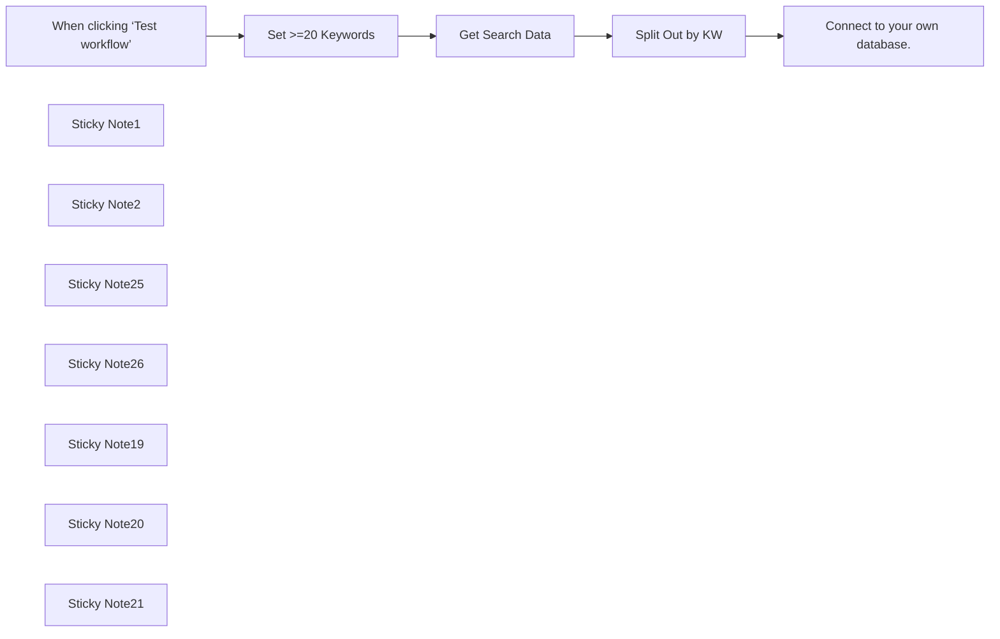

## Fluxo (.json) :

```json
{
  "meta": {
    "instanceId": "6b6a2db47bdf8371d21090c511052883cc9a3f6af5d0d9d567c702d74a18820e"
  },
  "nodes": [
    {
      "id": "f4570aad-db25-4dcd-8589-b1c8335935de",
      "name": "When clicking ‘Test workflow’",
      "type": "n8n-nodes-base.manualTrigger",
      "position": [
        480,
        1800
      ],
      "parameters": {},
      "typeVersion": 1
    },
    {
      "id": "1c1be9d6-3fd5-44c2-a7dd-d291b9efe65b",
      "name": "Sticky Note1",
      "type": "n8n-nodes-base.stickyNote",
      "position": [
        -260,
        1360
      ],
      "parameters": {
        "color": 4,
        "width": 657.3293805248016,
        "height": 843.3412992154545,
        "content": "## Generate SEO Keyword Search Volume Data using Google API\n\n## Use Case\nGenerate accurate search volume data for SEO keyword research:\n- You have a list of potential keywords to target for your website SEO but don't know their actual search volume\n- You need historical data to identify seasonal trends in keyword popularity\n- You want to assess keyword difficulty to prioritize your content strategy\n- You need data-driven insights for planning your SEO campaigns\n\n## What this Workflow Does\nThe workflow connects to Google's Keyword Planner API to retrieve keyword metrics for your SEO research:\n\n- Fetches monthly search volume for each keyword\n- Provides historical trends data for the past 12 months\n- Calculates keyword difficulty scores\n- Delivers competition metrics from Google Ads\n\n\n## Setup\n1. Fill the `Set 20 Keywords` with up to 20 Keywords of your choosing in an array e.g. [\"keyword 1\", \"keyword 2\",...]\n2. Create a Google Ads API account and add credentials to `Get Search Data` node\n3. Replace the `Connect to your own database` with your own database for the output\n\n\n## How to Adjust it to Your Needs\n- Change the `Set 20 Keywords` node input to a source of your choosing e.g. Airtable database with 20 keywords\n- Connect to output source of your choosing \n\n\nMade by Simon @ automake.io"
      },
      "typeVersion": 1
    },
    {
      "id": "adbbe4ee-d671-4b9b-b619-47f7522e2af4",
      "name": "Split Out by KW",
      "type": "n8n-nodes-base.splitOut",
      "position": [
        1180,
        1800
      ],
      "parameters": {
        "options": {},
        "fieldToSplitOut": "results"
      },
      "notesInFlow": true,
      "typeVersion": 1
    },
    {
      "id": "654c95b4-1018-496e-a0eb-75fddfd98d68",
      "name": "Sticky Note2",
      "type": "n8n-nodes-base.stickyNote",
      "position": [
        622.1526025594685,
        1740
      ],
      "parameters": {
        "color": 7,
        "width": 250.00985945500486,
        "height": 249.10159911061476,
        "content": "**Set up to 20 keywords** "
      },
      "typeVersion": 1
    },
    {
      "id": "0ddcd5f2-fb3b-425c-95d3-f22b9b99c3c4",
      "name": "Sticky Note25",
      "type": "n8n-nodes-base.stickyNote",
      "position": [
        1400,
        1740
      ],
      "parameters": {
        "color": 7,
        "width": 231.51775697271012,
        "height": 213.62075341687063,
        "content": "**Update record in own Database**"
      },
      "typeVersion": 1
    },
    {
      "id": "dca7e597-4aa9-440b-8861-2453a5e455fe",
      "name": "Sticky Note26",
      "type": "n8n-nodes-base.stickyNote",
      "position": [
        891.5919235222407,
        1740
      ],
      "parameters": {
        "color": 7,
        "width": 475.3228796552902,
        "height": 250.67161641737852,
        "content": "**POST request to Google API for Keyword Data**"
      },
      "typeVersion": 1
    },
    {
      "id": "217565a9-0c8b-4725-bbda-bcd1968567ac",
      "name": "Sticky Note19",
      "type": "n8n-nodes-base.stickyNote",
      "position": [
        620,
        2000
      ],
      "parameters": {
        "color": 3,
        "width": 248.59379819295242,
        "height": 94.39142091152823,
        "content": "**REQUIRED**\nRemove pinned data in 'Set >= 20 Keywords' to test and connect to own datasource if desired"
      },
      "typeVersion": 1
    },
    {
      "id": "a836e364-0526-47aa-938a-d32cc47efbd8",
      "name": "Sticky Note20",
      "type": "n8n-nodes-base.stickyNote",
      "position": [
        880,
        2000
      ],
      "parameters": {
        "color": 3,
        "width": 723.161826981043,
        "height": 217.5249520543415,
        "content": "**REQUIRED**\nAt this time 15/10/2024 this API endpoint is the latest, it will need to be updated as it changes\nhttps://developers.google.com/google-ads/api/docs/concepts/call-structure\n\n**Replace the following in the HTTP request with your own account values**\n- URL >> customer_id must be your own account customer id e.g. '1234567890' in https://googleads.googleapis.com/v16/customers/1234567890:generateKeywordHistoricalMetrics\n- developer-token\n- login-customer-id"
      },
      "typeVersion": 1
    },
    {
      "id": "3dac2fe3-8710-49cc-87ed-918972d00354",
      "name": "Sticky Note21",
      "type": "n8n-nodes-base.stickyNote",
      "position": [
        1400,
        1640
      ],
      "parameters": {
        "color": 3,
        "width": 284.87764467541297,
        "height": 80,
        "content": "**REQUIRED**\nConnect to your own database / GSheet / Airtable base to output these"
      },
      "typeVersion": 1
    },
    {
      "id": "806fd20d-4bc4-41a3-9ef7-77561e2cfc0c",
      "name": "Set >=20 Keywords",
      "type": "n8n-nodes-base.set",
      "notes": "Insert up to 20 keywords to test",
      "position": [
        680,
        1800
      ],
      "parameters": {
        "options": {},
        "assignments": {
          "assignments": [
            {
              "id": "973e949e-1afd-4378-8482-d2168532eff6",
              "name": "Keyword",
              "type": "array",
              "value": "=[\"workflow automation software\", \"enterprise workflow automation\", \"finance automation software\", \"saas automation platform\", \"automation roi calculator\", \"hr process automation\", \"data synchronization software\", \"n8n workflow automation\", \"scalable business operations\", \"n8n vs zapier\", \"lead generation automation\", \"automation consulting services\", \"n8n automation\", \"marketing automation tools\", \"custom automation solutions\", \"ecommerce automation solutions\", \"business process automation\", \"small business automation\", \"no code automation\", \"crm automation integration\"] "
            }
          ]
        }
      },
      "notesInFlow": true,
      "typeVersion": 3.4
    },
    {
      "id": "430d4950-1e49-460e-bb9b-56e0e825e621",
      "name": "Connect to your own database.",
      "type": "n8n-nodes-base.noOp",
      "position": [
        1460,
        1800
      ],
      "parameters": {},
      "typeVersion": 1
    },
    {
      "id": "464cfe3f-3a3f-4ec0-882d-861e48916e0b",
      "name": "Get Search Data",
      "type": "n8n-nodes-base.httpRequest",
      "notes": "Seed KW with Vol & Comp\n\nhttps://developers.google.com/google-ads/api/docs/concepts/call-structure Google API call structure",
      "position": [
        960,
        1800
      ],
      "parameters": {
        "url": "https://googleads.googleapis.com/v16/customers/{customer_id}:generateKeywordHistoricalMetrics",
        "method": "POST",
        "options": {},
        "sendBody": true,
        "sendHeaders": true,
        "authentication": "predefinedCredentialType",
        "bodyParameters": {
          "parameters": [
            {
              "name": "keywords",
              "value": "={{ $json.Keyword }}"
            },
            {
              "name": "keywordPlanNetwork",
              "value": "GOOGLE_SEARCH"
            }
          ]
        },
        "headerParameters": {
          "parameters": [
            {
              "name": "content-type",
              "value": "application/json"
            },
            {
              "name": "developer-token",
              "value": "replace-with-value"
            },
            {
              "name": "login-customer-id",
              "value": "replace-with-value"
            }
          ]
        },
        "nodeCredentialType": "googleAdsOAuth2Api"
      },
      "credentials": {
        "googleAdsOAuth2Api": {
          "id": "1Htz9e3PoJufbctg",
          "name": "Google Ads account"
        }
      },
      "notesInFlow": false,
      "retryOnFail": true,
      "typeVersion": 4.2
    }
  ],
  "pinData": {
    "Set >=20 Keywords": [
      {
        "Keyword": [
          "workflow automation software",
          "enterprise workflow automation",
          "finance automation software",
          "saas automation platform",
          "automation roi calculator",
          "hr process automation",
          "data synchronization software",
          "n8n workflow automation",
          "scalable business operations",
          "n8n vs zapier",
          "lead generation automation",
          "automation consulting services",
          "n8n automation",
          "marketing automation tools",
          "custom automation solutions",
          "ecommerce automation solutions",
          "business process automation",
          "small business automation",
          "no code automation",
          "crm automation integration"
        ]
      }
    ]
  },
  "connections": {
    "Get Search Data": {
      "main": [
        [
          {
            "node": "Split Out by KW",
            "type": "main",
            "index": 0
          }
        ]
      ]
    },
    "Split Out by KW": {
      "main": [
        [
          {
            "node": "Connect to your own database.",
            "type": "main",
            "index": 0
          }
        ]
      ]
    },
    "Set >=20 Keywords": {
      "main": [
        [
          {
            "node": "Get Search Data",
            "type": "main",
            "index": 0
          }
        ]
      ]
    },
    "When clicking ‘Test workflow’": {
      "main": [
        [
          {
            "node": "Set >=20 Keywords",
            "type": "main",
            "index": 0
          }
        ]
      ]
    }
  }
}
```

<a id="template-533"></a>

## Template 533 - Gerenciamento automático de snapshots DigitalOcean

- **Nome:** Gerenciamento automático de snapshots DigitalOcean
- **Descrição:** Automatiza a manutenção de snapshots de Droplets no DigitalOcean, removendo snapshots antigos quando excedem um limite e criando novos backups periodicamente.
- **Funcionalidade:** • Agendamento periódico: Executa o processo automaticamente a cada 48 horas (configurável).
• Listagem de Droplets: Recupera todos os Droplets da conta para processar cada um.
• Recuperação de snapshots por Droplet: Obtém a lista de snapshots associados a cada Droplet.
• Verificação de limite de snapshots: Verifica se o número de snapshots atingiu ou excedeu o limite configurado (padrão: 4).
• Exclusão de snapshots antigos: Remove snapshots antigos quando o limite é excedido para manter apenas os mais recentes.
• Criação de novo snapshot: Gera um novo snapshot para o Droplet após a limpeza, garantindo backups atualizados.
• Configurabilidade: Permite ajustar a frequência de execução e o limite de snapshots a manter.
- **Ferramentas:** • DigitalOcean: Plataforma de infraestrutura em nuvem utilizada para gerenciar Droplets e snapshots através da API.


## Fluxo visual

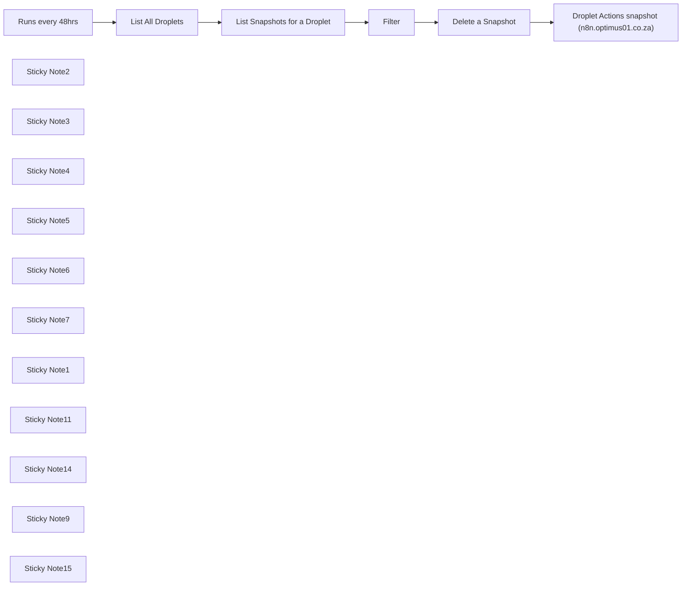

## Fluxo (.json) :

```json
{
  "meta": {
    "instanceId": "38d37c49298b42c645e6a7693766d7c3522b24e54454034f955422b5d7af611c"
  },
  "nodes": [
    {
      "id": "b6582c37-00c3-467c-95cb-fc6eb7ccd27d",
      "name": "Filter",
      "type": "n8n-nodes-base.filter",
      "position": [
        1080,
        420
      ],
      "parameters": {
        "conditions": {
          "number": [
            {
              "value1": "={{ $json.meta.total }}",
              "value2": 4,
              "operation": "largerEqual"
            }
          ]
        }
      },
      "typeVersion": 1
    },
    {
      "id": "54b0f895-7e56-40eb-bc6c-f657457d004a",
      "name": "List Snapshots for a Droplet",
      "type": "n8n-nodes-base.httpRequest",
      "position": [
        840,
        420
      ],
      "parameters": {
        "url": "=https://api.digitalocean.com/v2/droplets/{{ $json.droplets[0].id }}/snapshots ",
        "options": {},
        "authentication": "headerAuth"
      },
      "credentials": {
        "httpHeaderAuth": {
          "id": "1kwUrzy4cJXZx48R",
          "name": "Digital Ocean Account (darryn@optimus01.co.za)"
        }
      },
      "typeVersion": 1,
      "alwaysOutputData": false
    },
    {
      "id": "7c47438f-db04-41f7-aed6-a460d0a6889b",
      "name": "List All Droplets",
      "type": "n8n-nodes-base.httpRequest",
      "notes": "f3bc462f9219860aafe79747ee369e2f79ccd7f9b096dfe66b55d946871e8942",
      "position": [
        600,
        420
      ],
      "parameters": {
        "url": "https://api.digitalocean.com/v2/droplets",
        "options": {},
        "authentication": "headerAuth"
      },
      "credentials": {
        "httpHeaderAuth": {
          "id": "1kwUrzy4cJXZx48R",
          "name": "Digital Ocean Account (darryn@optimus01.co.za)"
        }
      },
      "typeVersion": 1
    },
    {
      "id": "e751f6a4-0fdc-4be5-84f0-fecba100da09",
      "name": "Delete a Snapshot",
      "type": "n8n-nodes-base.httpRequest",
      "notes": "f3bc462f9219860aafe79747ee369e2f79ccd7f9b096dfe66b55d946871e8942",
      "position": [
        1320,
        420
      ],
      "parameters": {
        "url": "=https://api.digitalocean.com/v2/snapshots/{{ $json.snapshots[0].id }}",
        "options": {},
        "requestMethod": "DELETE",
        "authentication": "headerAuth"
      },
      "credentials": {
        "httpHeaderAuth": {
          "id": "1kwUrzy4cJXZx48R",
          "name": "Digital Ocean Account (darryn@optimus01.co.za)"
        }
      },
      "typeVersion": 1
    },
    {
      "id": "d4cc4a72-f909-4c10-bada-e5c731e46c5e",
      "name": "Droplet Actions snapshot (n8n.optimus01.co.za)",
      "type": "n8n-nodes-base.httpRequest",
      "notes": "f3bc462f9219860aafe79747ee369e2f79ccd7f9b096dfe66b55d946871e8942",
      "position": [
        1560,
        420
      ],
      "parameters": {
        "url": "=https://api.digitalocean.com/v2/droplets/{{ $('List All Droplets').item.json.droplets[0].id }}/actions ",
        "options": {},
        "requestMethod": "POST",
        "authentication": "headerAuth",
        "bodyParametersUi": {
          "parameter": [
            {
              "name": "type",
              "value": "snapshot"
            }
          ]
        }
      },
      "credentials": {
        "httpHeaderAuth": {
          "id": "1kwUrzy4cJXZx48R",
          "name": "Digital Ocean Account (darryn@optimus01.co.za)"
        }
      },
      "typeVersion": 1
    },
    {
      "id": "4f3be74a-add7-4a2c-99df-d5d47f17efee",
      "name": "Runs every 48hrs",
      "type": "n8n-nodes-base.cron",
      "position": [
        360,
        420
      ],
      "parameters": {
        "triggerTimes": {
          "item": [
            {
              "mode": "everyX",
              "value": 48
            }
          ]
        }
      },
      "typeVersion": 1
    },
    {
      "id": "518a7b8c-adf6-448e-9f4a-5acc0f31523d",
      "name": "Sticky Note2",
      "type": "n8n-nodes-base.stickyNote",
      "position": [
        300,
        180
      ],
      "parameters": {
        "color": 7,
        "width": 232.0445295774649,
        "height": 411.1655661971828,
        "content": "## Trigger workflow every 48 hours\n\nThis node triggers the workflow to run every 48 hours. You can adjust the frequency if needed to suit your snapshot management requirements."
      },
      "typeVersion": 1
    },
    {
      "id": "70fe9177-e770-4f19-8fbc-3782167dda55",
      "name": "Sticky Note3",
      "type": "n8n-nodes-base.stickyNote",
      "position": [
        540,
        180
      ],
      "parameters": {
        "color": 5,
        "width": 232.0445295774649,
        "height": 411.1655661971829,
        "content": "## Get all droplets from DigitalOcean\nFetches a list of all the droplets in your DigitalOcean account. This is the first step in managing snapshots for each droplet.\n"
      },
      "typeVersion": 1
    },
    {
      "id": "04d74698-0198-45c8-8a79-183fd5f19820",
      "name": "Sticky Note4",
      "type": "n8n-nodes-base.stickyNote",
      "position": [
        780,
        180
      ],
      "parameters": {
        "color": 5,
        "width": 232.0445295774649,
        "height": 412.3020619718309,
        "content": "## Retrieve snapshots for a droplet\nRetrieves all the snapshots associated with a specific droplet. This ensures that we know how many snapshots currently exist for each droplet.\n"
      },
      "typeVersion": 1
    },
    {
      "id": "4a971e9a-dfdf-4932-8280-3991a83c2a72",
      "name": "Sticky Note5",
      "type": "n8n-nodes-base.stickyNote",
      "position": [
        1020,
        180
      ],
      "parameters": {
        "color": 7,
        "width": 232.0445295774649,
        "height": 411.1655661971828,
        "content": "## Check if there are more than 4 snapshots\nChecks if the number of snapshots for a droplet is equal to or greater than 4. If true, it proceeds to delete the oldest snapshot.\n"
      },
      "typeVersion": 1
    },
    {
      "id": "bb9a553a-a8fc-4b72-b0e0-704ebaf8b806",
      "name": "Sticky Note6",
      "type": "n8n-nodes-base.stickyNote",
      "position": [
        1260,
        180
      ],
      "parameters": {
        "color": 5,
        "width": 232.0445295774649,
        "height": 411.1655661971829,
        "content": "## Delete the oldest snapshot\nDeletes the oldest snapshot from the droplet if the number of snapshots exceeds the limit (4 in this case), based on the filter's condition.\n"
      },
      "typeVersion": 1
    },
    {
      "id": "1811812f-db56-494a-8ffa-d64cc6f5037c",
      "name": "Sticky Note7",
      "type": "n8n-nodes-base.stickyNote",
      "position": [
        1500,
        180
      ],
      "parameters": {
        "color": 5,
        "width": 232.0445295774649,
        "height": 411.1655661971829,
        "content": "## Create a new snapshot\nCreates a new snapshot for the droplet after cleaning up the old snapshots. Ensures that backups are always up to date."
      },
      "typeVersion": 1
    },
    {
      "id": "cb2bd85e-578b-4888-9625-ffed7249082c",
      "name": "Sticky Note1",
      "type": "n8n-nodes-base.stickyNote",
      "position": [
        -545,
        200
      ],
      "parameters": {
        "color": 7,
        "width": 366.75796434038665,
        "height": 381.1643518785302,
        "content": "### What this workflow does\n1. **`Runs every 48 hours`**: The workflow is triggered by a cron node that runs every 48 hours, ensuring timely snapshot management.\n2. **`List all droplets`**: The workflow retrieves all droplets in the DigitalOcean account.\n3. **`Retrieve snapshots`**: For each droplet, the workflow retrieves a list of existing snapshots.\n4. **`Filter snapshots`**: If the number of snapshots exceeds 4, the workflow filters for snapshots that need to be deleted.\n5. **`Delete snapshots`**: Excess snapshots are automatically deleted based on the filter criteria.\n6. **`Create new snapshot`**: After cleaning up, the workflow creates a new snapshot for each droplet, ensuring that backups are always up-to-date."
      },
      "typeVersion": 1
    },
    {
      "id": "7fbb406b-9343-4d3c-9876-80cb3b7bd51e",
      "name": "Sticky Note11",
      "type": "n8n-nodes-base.stickyNote",
      "position": [
        -165,
        240
      ],
      "parameters": {
        "color": 6,
        "width": 396.6384066163515,
        "height": 282.5799404564392,
        "content": "### Get More Templates Like This 👇\n[](http://onlinethinking.io/community)\n"
      },
      "typeVersion": 1
    },
    {
      "id": "8afb93b2-e547-4f3b-be25-5ab85a3f477d",
      "name": "Sticky Note14",
      "type": "n8n-nodes-base.stickyNote",
      "position": [
        -545,
        600
      ],
      "parameters": {
        "width": 777.0408639013781,
        "height": 201.45195676871373,
        "content": "## Setup\n1. **`DigitalOcean API Key`**: You’ll need to configure the HTTP Request nodes with your DigitalOcean API key. This key is required for authenticating requests to list droplets, retrieve snapshots, delete snapshots, and create new ones.\n2. **`Snapshot Threshold`**: By default, the workflow is set to keep no more than 4 snapshots per droplet. This can be adjusted by modifying the filter node conditions.\n3. **`Set Execution Frequency`**: The cron node is set to run every 48 hours, but you can adjust the timing to suit your needs."
      },
      "typeVersion": 1
    },
    {
      "id": "325a4b9c-9bd4-4f29-8595-98f0579d15c1",
      "name": "Sticky Note9",
      "type": "n8n-nodes-base.stickyNote",
      "position": [
        -560,
        60
      ],
      "parameters": {
        "color": 7,
        "width": 809.515353297114,
        "height": 944.3745310796205,
        "content": "## Automate Droplet Snapshot Management on DigitalOcean\nBuilt for the [Let's Automate It Community](http://onlinethinking.io/community) by [Optimus Agency](https://optimus01.co.za/)\n\nThis workflow automates the management of DigitalOcean Droplet snapshots by keeping the number of snapshots under a defined limit, deleting the oldest ones, and ensuring new snapshots are created at regular intervals."
      },
      "typeVersion": 1
    },
    {
      "id": "9540cfa4-4b72-40c2-b1d1-5bf3f9bd7884",
      "name": "Sticky Note15",
      "type": "n8n-nodes-base.stickyNote",
      "position": [
        -545,
        820
      ],
      "parameters": {
        "color": 7,
        "width": 777.0408639013781,
        "height": 168.5111194243667,
        "content": "## How to customize this workflow\n- **`Adjust Snapshot Limit`**: Change the value in the filter node if you want to keep more or fewer snapshots.\n- **`Modify Run Frequency`**: The workflow runs every 48 hours by default. You can change the frequency in the cron node to run more or less often.\n- **`Enhance with Notifications`**: You can add a notification node (e.g., Slack or email) to alert you when snapshots are deleted or created."
      },
      "typeVersion": 1
    }
  ],
  "pinData": {},
  "connections": {
    "Filter": {
      "main": [
        [
          {
            "node": "Delete a Snapshot",
            "type": "main",
            "index": 0
          }
        ]
      ]
    },
    "Runs every 48hrs": {
      "main": [
        [
          {
            "node": "List All Droplets",
            "type": "main",
            "index": 0
          }
        ]
      ]
    },
    "Delete a Snapshot": {
      "main": [
        [
          {
            "node": "Droplet Actions snapshot (n8n.optimus01.co.za)",
            "type": "main",
            "index": 0
          }
        ]
      ]
    },
    "List All Droplets": {
      "main": [
        [
          {
            "node": "List Snapshots for a Droplet",
            "type": "main",
            "index": 0
          }
        ]
      ]
    },
    "List Snapshots for a Droplet": {
      "main": [
        [
          {
            "node": "Filter",
            "type": "main",
            "index": 0
          }
        ]
      ]
    }
  }
}
```

<a id="template-534"></a>

## Template 534 - Criar postagem e comentar no Reddit

- **Nome:** Criar postagem e comentar no Reddit
- **Descrição:** Automatiza a publicação de uma postagem em um subreddit, recupera os dados da postagem criada e adiciona um comentário nela.
- **Funcionalidade:** • Gatilho manual: Inicia o fluxo quando o usuário clica para executar.
• Criação de postagem: Publica um novo post em um subreddit especificado com título e texto definidos.
• Recuperação de postagem: Obtém os dados da postagem recém-criada usando o ID retornado.
• Adição de comentário: Publica um comentário na postagem utilizando o ID obtido.
- **Ferramentas:** • Reddit: Plataforma de comunidade para publicar posts e comentários; requer autenticação OAuth2 para operações de criação e leitura.


## Fluxo visual

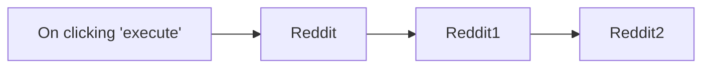

## Fluxo (.json) :

```json
{
  "nodes": [
    {
      "name": "On clicking 'execute'",
      "type": "n8n-nodes-base.manualTrigger",
      "position": [
        270,
        340
      ],
      "parameters": {},
      "typeVersion": 1
    },
    {
      "name": "Reddit",
      "type": "n8n-nodes-base.reddit",
      "position": [
        470,
        340
      ],
      "parameters": {
        "text": "This post was created using the Reddit node in n8n",
        "title": "Created from n8n",
        "subreddit": "n8n"
      },
      "credentials": {
        "redditOAuth2Api": "Reddit OAuth Credentials"
      },
      "typeVersion": 1
    },
    {
      "name": "Reddit1",
      "type": "n8n-nodes-base.reddit",
      "position": [
        670,
        340
      ],
      "parameters": {
        "postId": "={{$json[\"id\"]}}",
        "operation": "get",
        "subreddit": "={{$node[\"Reddit\"].parameter[\"subreddit\"]}}"
      },
      "credentials": {
        "redditOAuth2Api": "Reddit OAuth Credentials"
      },
      "typeVersion": 1
    },
    {
      "name": "Reddit2",
      "type": "n8n-nodes-base.reddit",
      "position": [
        870,
        340
      ],
      "parameters": {
        "postId": "={{$json[\"id\"]}}",
        "resource": "postComment",
        "commentText": "This comment was added from n8n!"
      },
      "credentials": {
        "redditOAuth2Api": "Reddit OAuth Credentials"
      },
      "typeVersion": 1
    }
  ],
  "connections": {
    "Reddit": {
      "main": [
        [
          {
            "node": "Reddit1",
            "type": "main",
            "index": 0
          }
        ]
      ]
    },
    "Reddit1": {
      "main": [
        [
          {
            "node": "Reddit2",
            "type": "main",
            "index": 0
          }
        ]
      ]
    },
    "On clicking 'execute'": {
      "main": [
        [
          {
            "node": "Reddit",
            "type": "main",
            "index": 0
          }
        ]
      ]
    }
  }
}
```

<a id="template-535"></a>

## Template 535 - Envio de SMS com sms77

- **Nome:** Envio de SMS com sms77
- **Descrição:** Este fluxo envia uma mensagem SMS através da API sms77 quando é acionado manualmente.
- **Funcionalidade:** • Disparo manual: Inicia o fluxo ao clicar em 'execute'.
• Envio de SMS: Envia uma mensagem de texto com o conteúdo "Hello from n8n!" para destinatários configurados.
• Autenticação: Utiliza credenciais da API sms77 para autenticar a requisição de envio.
- **Ferramentas:** • sms77: Serviço/API de envio de SMS utilizado para entregar mensagens de texto; requer chave de API para autenticação.


## Fluxo visual

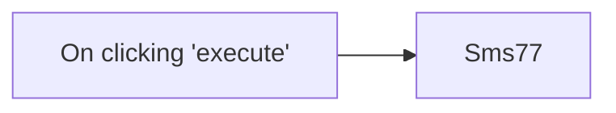

## Fluxo (.json) :

```json
{
  "id": "92",
  "name": "Sending an SMS using sms77",
  "nodes": [
    {
      "name": "On clicking 'execute'",
      "type": "n8n-nodes-base.manualTrigger",
      "position": [
        250,
        300
      ],
      "parameters": {},
      "typeVersion": 1
    },
    {
      "name": "Sms77",
      "type": "n8n-nodes-base.sms77",
      "position": [
        450,
        300
      ],
      "parameters": {
        "message": "Hello from n8n!"
      },
      "credentials": {
        "sms77Api": ""
      },
      "typeVersion": 1
    }
  ],
  "active": false,
  "settings": {},
  "connections": {
    "On clicking 'execute'": {
      "main": [
        [
          {
            "node": "Sms77",
            "type": "main",
            "index": 0
          }
        ]
      ]
    }
  }
}
```

<a id="template-536"></a>

## Template 536 - Gerador de artigos por formulário com IA

- **Nome:** Gerador de artigos por formulário com IA
- **Descrição:** Automatiza a criação de artigos a partir de um formulário, usando IA para gerar outline e seções, salvando arquivos no Google Drive e registrando links no Google Sheets.
- **Funcionalidade:** • Coleta de dados por formulário: Recebe título, contagem de palavras, palavras-chave, links e instruções adicionais.
• Registro em planilha: Registra os dados do pedido na Google Sheets para rastreamento.
• Criação de pasta no Drive: Cria uma pasta dedicada no Google Drive para armazenar os arquivos gerados.
• Geração de outline por IA: Produz um esboço detalhado em Markdown com base no brief recebido.
• Upload do outline: Converte o outline em arquivo e envia para a pasta criada no Drive.
• Quebra do outline em seções: Divide o outline em seções gerenciáveis para processamento individual.
• Geração de seções por IA: Escreve cada seção marcada, respeitando tom e instruções, processando uma seção por vez.
• Reformatação seletiva: Aplica formatação adicional (subtítulos, bullets) a seções específicas para variar o estilo.
• Ordenação e agregação: Organiza as seções na ordem correta, adiciona quebras de linha e monta o artigo final.
• Conversão e upload do artigo: Converte o artigo em arquivo de texto e faz upload para o Drive.
• Atualização de links na planilha: Atualiza a Google Sheets com os links do outline e do artigo gerados.
- **Ferramentas:** • Formulário web (webhook): Captura entradas do usuário através de um formulário online.
• Google Sheets: Armazena e atualiza o registro dos pedidos e links dos documentos gerados.
• Google Drive: Armazena a pasta, o arquivo de outline e o arquivo final do artigo.
• OpenAI (GPT-4o-mini): Gera o outline, escreve e reformata seções do conteúdo usando IA.


## Fluxo visual

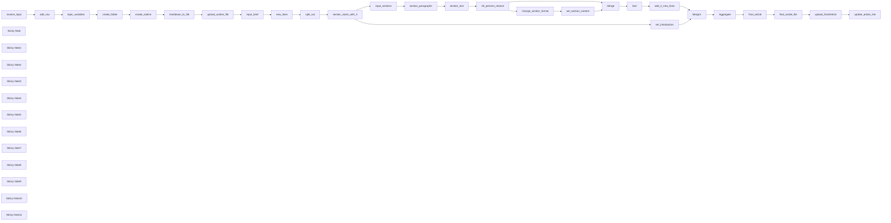

## Fluxo (.json) :

```json
{
  "meta": {
    "instanceId": "be27b2af86ae3a5dc19ef2a1947644c0aec45fd8c88f29daa7dea6f0ce537691"
  },
  "nodes": [
    {
      "id": "11abe711-000c-4960-9f07-4e124532ba83",
      "name": "create_folder",
      "type": "n8n-nodes-base.googleDrive",
      "position": [
        20,
        440
      ],
      "parameters": {
        "name": "={{ $('topic_variables').item.json.Title }}",
        "driveId": {
          "__rl": true,
          "mode": "list",
          "value": "My Drive"
        },
        "options": {},
        "folderId": {
          "__rl": true,
          "mode": "list",
          "value": "root",
          "cachedResultUrl": "https://drive.google.com/drive",
          "cachedResultName": "/ (Root folder)"
        },
        "resource": "folder"
      },
      "credentials": {
        "googleDriveOAuth2Api": {
          "id": "MHcgKR744VHXSe3X",
          "name": "Drive n8n"
        }
      },
      "typeVersion": 3
    },
    {
      "id": "8198bcdb-3082-43d8-84aa-77e292b56e05",
      "name": "input_brief",
      "type": "n8n-nodes-base.set",
      "position": [
        1040,
        440
      ],
      "parameters": {
        "options": {},
        "assignments": {
          "assignments": [
            {
              "id": "eff28505-c438-4c44-8db4-188797b1e5f3",
              "name": "content",
              "type": "string",
              "value": "={{ $('create_outline').item.json.message.content }}"
            }
          ]
        }
      },
      "typeVersion": 3.4
    },
    {
      "id": "9b2be845-91c5-4fa8-9007-c0cee4058ddd",
      "name": "new_lines",
      "type": "n8n-nodes-base.set",
      "position": [
        1260,
        440
      ],
      "parameters": {
        "options": {},
        "assignments": {
          "assignments": [
            {
              "id": "dda6ee09-0629-4ebc-a4cf-80ebe0172dee",
              "name": "content",
              "type": "array",
              "value": "={{ $json.content.split(/(?:\\r?\\n){2}## /) }}"
            }
          ]
        }
      },
      "typeVersion": 3.4
    },
    {
      "id": "e5228041-32e7-4834-9d87-6b7152bf97e3",
      "name": "input_sections",
      "type": "n8n-nodes-base.set",
      "position": [
        1980,
        480
      ],
      "parameters": {
        "options": {},
        "assignments": {
          "assignments": [
            {
              "id": "4b2dbae1-2e78-46f4-8be7-6240abf5c1d6",
              "name": "content",
              "type": "string",
              "value": "={{ $json.content.replace($json.content,$json.content+\"⟵\") }}"
            }
          ]
        }
      },
      "typeVersion": 3.4
    },
    {
      "id": "4b7020ae-d38e-437c-871e-02f78012f691",
      "name": "section_text",
      "type": "n8n-nodes-base.set",
      "position": [
        2540,
        480
      ],
      "parameters": {
        "options": {},
        "assignments": {
          "assignments": [
            {
              "id": "1bc2b4fc-7cc9-4aea-b733-5d062b3ee648",
              "name": "message",
              "type": "string",
              "value": "={{ $json.message.content }}"
            },
            {
              "id": "3f599644-8c86-46c6-8048-1166cced462a",
              "name": "idx",
              "type": "number",
              "value": "={{ $('section_paragraphs').item.pairedItem.item }}"
            }
          ]
        }
      },
      "typeVersion": 3.4
    },
    {
      "id": "599af95b-391c-4d57-868d-0db6eaa39da1",
      "name": "Merge",
      "type": "n8n-nodes-base.merge",
      "position": [
        3660,
        480
      ],
      "parameters": {},
      "typeVersion": 3
    },
    {
      "id": "0aa60c0b-0537-4539-8312-0be3cfa6c4de",
      "name": "Sort",
      "type": "n8n-nodes-base.sort",
      "position": [
        3880,
        480
      ],
      "parameters": {
        "options": {},
        "sortFieldsUi": {
          "sortField": [
            {
              "fieldName": "idx"
            }
          ]
        }
      },
      "typeVersion": 1
    },
    {
      "id": "f19ef511-bf86-4c4c-9adf-731704bf64ae",
      "name": "Aggregate",
      "type": "n8n-nodes-base.aggregate",
      "position": [
        4500,
        360
      ],
      "parameters": {
        "options": {
          "mergeLists": true
        },
        "fieldsToAggregate": {
          "fieldToAggregate": [
            {
              "fieldToAggregate": "message"
            }
          ]
        }
      },
      "typeVersion": 1
    },
    {
      "id": "568fd895-fce6-4af8-89de-26e51ae5a66d",
      "name": "final_article",
      "type": "n8n-nodes-base.set",
      "position": [
        4700,
        360
      ],
      "parameters": {
        "options": {},
        "assignments": {
          "assignments": [
            {
              "id": "f410b139-0e21-41ed-9848-260e4bf7cf33",
              "name": "article",
              "type": "string",
              "value": "={{ $json.message.join() }}"
            }
          ]
        }
      },
      "typeVersion": 3.4
    },
    {
      "id": "771f197a-02e1-4809-9505-e1a3900581f0",
      "name": "set_introduction",
      "type": "n8n-nodes-base.set",
      "position": [
        1980,
        300
      ],
      "parameters": {
        "options": {},
        "assignments": {
          "assignments": [
            {
              "id": "21f3dd4b-db14-472b-94b6-7165206f94e7",
              "name": "message",
              "type": "string",
              "value": "={{ $json.content+\"\\n\\n\" }}"
            }
          ]
        }
      },
      "typeVersion": 3.4
    },
    {
      "id": "3ad780e5-1dcd-43f0-816c-e6f2608461d5",
      "name": "Merge1",
      "type": "n8n-nodes-base.merge",
      "position": [
        4280,
        320
      ],
      "parameters": {},
      "typeVersion": 3
    },
    {
      "id": "1902e5e3-10c2-49e8-8da1-9d1cd6ae681c",
      "name": "receive_topic",
      "type": "n8n-nodes-base.formTrigger",
      "position": [
        -580,
        440
      ],
      "webhookId": "578f48e7-78a0-4450-b301-a66ca5fe822d",
      "parameters": {
        "path": "generator",
        "options": {
          "respondWithOptions": {
            "values": {
              "formSubmittedText": "={{ \"Nice work! Your content is generating.\".bold()}} Allow 3-5 minutes for your finished article."
            }
          }
        },
        "formTitle": "Content Genrator",
        "formFields": {
          "values": [
            {
              "fieldLabel": "What is the title of the content?",
              "requiredField": true
            },
            {
              "fieldType": "number",
              "fieldLabel": "How many words should the content have?",
              "requiredField": true
            },
            {
              "fieldLabel": "What is the primary keyword for the content?",
              "requiredField": true
            },
            {
              "fieldLabel": "What are the secondary keywords for the content?"
            },
            {
              "fieldLabel": "Are there any internal links that should be included in the content?",
              "placeholder": "If so, list here. Including multiple? Separate using commas (link1.com, link2.com)"
            },
            {
              "fieldLabel": "Are there any external links that should be included in the content?",
              "placeholder": "If so, list here. Including multiple? Separate using commas (link1.com, link2.com)"
            },
            {
              "fieldLabel": "Additional instructions or specific requirements for the content."
            }
          ]
        }
      },
      "typeVersion": 2.1
    },
    {
      "id": "af8d14aa-d095-4bce-a525-8427e0f450e2",
      "name": "add_row",
      "type": "n8n-nodes-base.googleSheets",
      "position": [
        -380,
        440
      ],
      "parameters": {
        "columns": {
          "value": {
            "Title": "={{ $json['What is the title of the content?'] }}",
            "Word Count": "={{ $json['How many words should the content have?'] }}",
            "External Links": "={{ $json['Are there any external links that should be included in the content?'] }}",
            "Internal Links": "={{ $json['Are there any internal links that should be included in the content?'] }}",
            "Primary Keyword": "={{ $json['What is the primary keyword for the content?'] }}",
            "Secondary Keyword(s)": "={{ $json['What are the secondary keywords for the content?'] }}",
            "Additional Instructions": "={{ $json['Additional instructions or specific requirements for the content.'] }}"
          },
          "schema": [
            {
              "id": "Title",
              "type": "string",
              "display": true,
              "required": false,
              "displayName": "Title",
              "defaultMatch": false,
              "canBeUsedToMatch": true
            },
            {
              "id": "Word Count",
              "type": "string",
              "display": true,
              "required": false,
              "displayName": "Word Count",
              "defaultMatch": false,
              "canBeUsedToMatch": true
            },
            {
              "id": "Primary Keyword",
              "type": "string",
              "display": true,
              "required": false,
              "displayName": "Primary Keyword",
              "defaultMatch": false,
              "canBeUsedToMatch": true
            },
            {
              "id": "Secondary Keyword(s)",
              "type": "string",
              "display": true,
              "required": false,
              "displayName": "Secondary Keyword(s)",
              "defaultMatch": false,
              "canBeUsedToMatch": true
            },
            {
              "id": "Internal Links",
              "type": "string",
              "display": true,
              "required": false,
              "displayName": "Internal Links",
              "defaultMatch": false,
              "canBeUsedToMatch": true
            },
            {
              "id": "External Links",
              "type": "string",
              "display": true,
              "required": false,
              "displayName": "External Links",
              "defaultMatch": false,
              "canBeUsedToMatch": true
            },
            {
              "id": "Additional Instructions",
              "type": "string",
              "display": true,
              "required": false,
              "displayName": "Additional Instructions",
              "defaultMatch": false,
              "canBeUsedToMatch": true
            },
            {
              "id": "Outline Doc",
              "type": "string",
              "display": true,
              "removed": true,
              "required": false,
              "displayName": "Outline Doc",
              "defaultMatch": false,
              "canBeUsedToMatch": true
            },
            {
              "id": "Article Doc",
              "type": "string",
              "display": true,
              "removed": true,
              "required": false,
              "displayName": "Article Doc",
              "defaultMatch": false,
              "canBeUsedToMatch": true
            },
            {
              "id": "Website URL",
              "type": "string",
              "display": true,
              "removed": true,
              "required": false,
              "displayName": "Website URL",
              "defaultMatch": false,
              "canBeUsedToMatch": true
            }
          ],
          "mappingMode": "defineBelow",
          "matchingColumns": []
        },
        "options": {},
        "operation": "append",
        "sheetName": {
          "__rl": true,
          "mode": "list",
          "value": "gid=0",
          "cachedResultUrl": "https://docs.google.com/spreadsheets/d/1qslCOQCBepqvixsp2RzILDxBlME5siXJRLFF8yC9jlc/edit#gid=0",
          "cachedResultName": "Sheet1"
        },
        "documentId": {
          "__rl": true,
          "mode": "list",
          "value": "1qslCOQCBepqvixsp2RzILDxBlME5siXJRLFF8yC9jlc",
          "cachedResultUrl": "https://docs.google.com/spreadsheets/d/1qslCOQCBepqvixsp2RzILDxBlME5siXJRLFF8yC9jlc/edit?usp=drivesdk",
          "cachedResultName": " Generator"
        }
      },
      "credentials": {
        "googleSheetsOAuth2Api": {
          "id": "Epe0euL6qKcOzKeG",
          "name": "google"
        }
      },
      "typeVersion": 4.5
    },
    {
      "id": "3f240ed3-9eff-4ae1-91ec-689a96f1c97e",
      "name": "topic_variables",
      "type": "n8n-nodes-base.set",
      "position": [
        -200,
        440
      ],
      "parameters": {
        "options": {},
        "assignments": {
          "assignments": [
            {
              "id": "dae56384-1e23-46c7-923f-7635d45eaa35",
              "name": "Title",
              "type": "string",
              "value": "={{ $('receive_topic').item.json['What is the title of the content?'] }}"
            },
            {
              "id": "2c0ac2a3-6b45-4b63-b9f6-c3d51d064203",
              "name": "Word Count",
              "type": "number",
              "value": "={{ $('receive_topic').item.json['How many words should the content have?'] }}"
            },
            {
              "id": "c05d869d-098e-442a-ab8b-21e6feea5987",
              "name": "Primary Keyword",
              "type": "string",
              "value": "={{ $('receive_topic').item.json['What is the primary keyword for the content?'] }}"
            },
            {
              "id": "133a25e4-8f18-44c3-b743-9dee224688e3",
              "name": "Secondary Keywords",
              "type": "array",
              "value": "={{ $if($('receive_topic').item.json['What are the secondary keywords for the content?'].includes(','),$('receive_topic').item.json['What are the secondary keywords for the content?'].split(','),$('receive_topic').item.json['What are the secondary keywords for the content?']) }}"
            },
            {
              "id": "9d77b794-445d-4613-aa04-01ebe004f454",
              "name": "Internal Links",
              "type": "array",
              "value": "={{ $if($('receive_topic').item.json['Are there any external links that should be included in the content?'].includes(','),$('receive_topic').item.json['Are there any internal links that should be included in the content?'].split(','),$('receive_topic').item.json['Are there any internal links that should be included in the content?']) }}"
            },
            {
              "id": "24e92ba2-2448-40b6-af62-749351ff1483",
              "name": "External Links",
              "type": "array",
              "value": "={{ $if($('receive_topic').item.json['Are there any external links that should be included in the content?'].includes(','),$('receive_topic').item.json['Are there any external links that should be included in the content?'].split(','),$('receive_topic').item.json['Are there any external links that should be included in the content?']) }}"
            },
            {
              "id": "7466794b-7994-4d54-a72e-feab7d383556",
              "name": "Additional Instructions",
              "type": "string",
              "value": "={{ $('receive_topic').item.json['Additional instructions or specific requirements for the content.'] }}"
            }
          ]
        }
      },
      "typeVersion": 3.4
    },
    {
      "id": "d4715acb-0f04-45e2-a476-32cec57a840a",
      "name": "markdown_to_file",
      "type": "n8n-nodes-base.convertToFile",
      "position": [
        600,
        440
      ],
      "parameters": {
        "options": {},
        "operation": "toText",
        "sourceProperty": "message.content"
      },
      "typeVersion": 1.1
    },
    {
      "id": "58db0daf-09cb-420d-a0a0-1fac4f2d97ea",
      "name": "split_out",
      "type": "n8n-nodes-base.splitOut",
      "position": [
        1480,
        440
      ],
      "parameters": {
        "options": {},
        "fieldToSplitOut": "content"
      },
      "typeVersion": 1
    },
    {
      "id": "02ed3e37-038e-497d-83af-e8f720b3811d",
      "name": "section_starts_with_#",
      "type": "n8n-nodes-base.if",
      "position": [
        1700,
        440
      ],
      "parameters": {
        "options": {},
        "conditions": {
          "options": {
            "version": 2,
            "leftValue": "",
            "caseSensitive": true,
            "typeValidation": "strict"
          },
          "combinator": "and",
          "conditions": [
            {
              "id": "3a8dc0bb-2bcf-416d-b28e-360a1173042c",
              "operator": {
                "type": "string",
                "operation": "startsWith"
              },
              "leftValue": "={{ $json.content }}",
              "rightValue": "#"
            }
          ]
        }
      },
      "typeVersion": 2.2
    },
    {
      "id": "b3b0138a-ca44-411e-8ecd-7a951fe22919",
      "name": "25_percent_chance",
      "type": "n8n-nodes-base.if",
      "position": [
        2760,
        480
      ],
      "parameters": {
        "options": {},
        "conditions": {
          "options": {
            "version": 2,
            "leftValue": "",
            "caseSensitive": true,
            "typeValidation": "strict"
          },
          "combinator": "and",
          "conditions": [
            {
              "id": "71cd7f94-f30d-4eb5-8c31-a0674ef3ffc9",
              "operator": {
                "type": "number",
                "operation": "equals"
              },
              "leftValue": "={{ Math.ceil($('section_paragraphs').all().length * 0.25) }}",
              "rightValue": "={{ $json.idx }}"
            }
          ]
        }
      },
      "typeVersion": 2.2
    },
    {
      "id": "70015edc-babc-4123-9589-ac4c70345fa7",
      "name": "set_section_content",
      "type": "n8n-nodes-base.set",
      "position": [
        3400,
        420
      ],
      "parameters": {
        "options": {},
        "assignments": {
          "assignments": [
            {
              "id": "071e977f-6534-4635-a2a5-9178709bdfc9",
              "name": "message",
              "type": "string",
              "value": "={{ $json.message.content }}"
            },
            {
              "id": "b1678132-2e98-4fc2-b303-7e89083c287e",
              "name": "=idx",
              "type": "number",
              "value": "={{ Math.ceil($('section_paragraphs').all().length * 0.25) }}"
            }
          ]
        }
      },
      "typeVersion": 3.4
    },
    {
      "id": "e413900a-dc61-4150-93ac-308032ec4aed",
      "name": "add_2_new_lines",
      "type": "n8n-nodes-base.code",
      "position": [
        4100,
        480
      ],
      "parameters": {
        "jsCode": "// Create an array to hold the rearranged items\nconst rearrangedItems = [];\n\n// Loop over input items and push each message into the rearrangedItems array\nfor (const item of $input.all()) {\n  rearrangedItems[item.json.idx] = {\n    json: {\n      message: item.json.message + '\\n\\n' // Add two new lines at the end of each message\n    }\n  };\n}\n\n// Return the rearranged items\nreturn rearrangedItems.filter(Boolean); // Filter out any undefined entries\n"
      },
      "typeVersion": 2
    },
    {
      "id": "25110a53-8627-4598-bc11-f2217856e10d",
      "name": "final_article_file",
      "type": "n8n-nodes-base.convertToFile",
      "position": [
        4940,
        360
      ],
      "parameters": {
        "options": {},
        "operation": "toText",
        "sourceProperty": "article",
        "binaryPropertyName": "final_article"
      },
      "typeVersion": 1.1
    },
    {
      "id": "0122e867-252d-4e54-8576-5bd3ddc7a464",
      "name": "upload_fiinalArticle",
      "type": "n8n-nodes-base.googleDrive",
      "position": [
        5160,
        360
      ],
      "parameters": {
        "name": "={{ $('topic_variables').item.json['Primary Keyword'] }}",
        "driveId": {
          "__rl": true,
          "mode": "list",
          "value": "My Drive"
        },
        "options": {},
        "folderId": {
          "__rl": true,
          "mode": "id",
          "value": "={{ $('create_folder').item.json.id }}"
        }
      },
      "credentials": {
        "googleDriveOAuth2Api": {
          "id": "MHcgKR744VHXSe3X",
          "name": "Drive n8n"
        }
      },
      "typeVersion": 3
    },
    {
      "id": "e4fa62e3-6c05-4e99-a53e-ede197e2ca02",
      "name": "update_article_link",
      "type": "n8n-nodes-base.googleSheets",
      "position": [
        5380,
        360
      ],
      "parameters": {
        "columns": {
          "value": {
            "Title": "={{ $('add_row').item.json.Title }}",
            "Article Doc": "={{ $('upload_fiinalArticle').item.json.webViewLink }}",
            "Outline Doc": "={{ $('upload_outline_file').item.json.webViewLink }}"
          },
          "schema": [
            {
              "id": "Title",
              "type": "string",
              "display": true,
              "removed": false,
              "required": false,
              "displayName": "Title",
              "defaultMatch": false,
              "canBeUsedToMatch": true
            },
            {
              "id": "Word Count",
              "type": "string",
              "display": true,
              "removed": true,
              "required": false,
              "displayName": "Word Count",
              "defaultMatch": false,
              "canBeUsedToMatch": true
            },
            {
              "id": "Primary Keyword",
              "type": "string",
              "display": true,
              "removed": true,
              "required": false,
              "displayName": "Primary Keyword",
              "defaultMatch": false,
              "canBeUsedToMatch": true
            },
            {
              "id": "Secondary Keyword(s)",
              "type": "string",
              "display": true,
              "removed": true,
              "required": false,
              "displayName": "Secondary Keyword(s)",
              "defaultMatch": false,
              "canBeUsedToMatch": true
            },
            {
              "id": "Internal Links",
              "type": "string",
              "display": true,
              "removed": true,
              "required": false,
              "displayName": "Internal Links",
              "defaultMatch": false,
              "canBeUsedToMatch": true
            },
            {
              "id": "External Links",
              "type": "string",
              "display": true,
              "removed": true,
              "required": false,
              "displayName": "External Links",
              "defaultMatch": false,
              "canBeUsedToMatch": true
            },
            {
              "id": "Additional Instructions",
              "type": "string",
              "display": true,
              "removed": true,
              "required": false,
              "displayName": "Additional Instructions",
              "defaultMatch": false,
              "canBeUsedToMatch": true
            },
            {
              "id": "Outline Doc",
              "type": "string",
              "display": true,
              "required": false,
              "displayName": "Outline Doc",
              "defaultMatch": false,
              "canBeUsedToMatch": true
            },
            {
              "id": "Article Doc",
              "type": "string",
              "display": true,
              "required": false,
              "displayName": "Article Doc",
              "defaultMatch": false,
              "canBeUsedToMatch": true
            },
            {
              "id": "Website URL",
              "type": "string",
              "display": true,
              "removed": true,
              "required": false,
              "displayName": "Website URL",
              "defaultMatch": false,
              "canBeUsedToMatch": true
            },
            {
              "id": "row_number",
              "type": "string",
              "display": true,
              "removed": true,
              "readOnly": true,
              "required": false,
              "displayName": "row_number",
              "defaultMatch": false,
              "canBeUsedToMatch": true
            }
          ],
          "mappingMode": "defineBelow",
          "matchingColumns": [
            "Title"
          ]
        },
        "options": {},
        "operation": "update",
        "sheetName": {
          "__rl": true,
          "mode": "list",
          "value": "gid=0",
          "cachedResultUrl": "https://docs.google.com/spreadsheets/d/1qslCOQCBepqvixsp2RzILDxBlME5siXJRLFF8yC9jlc/edit#gid=0",
          "cachedResultName": "Sheet1"
        },
        "documentId": {
          "__rl": true,
          "mode": "list",
          "value": "1qslCOQCBepqvixsp2RzILDxBlME5siXJRLFF8yC9jlc",
          "cachedResultUrl": "https://docs.google.com/spreadsheets/d/1qslCOQCBepqvixsp2RzILDxBlME5siXJRLFF8yC9jlc/edit?usp=drivesdk",
          "cachedResultName": " Generator"
        }
      },
      "credentials": {
        "googleSheetsOAuth2Api": {
          "id": "Epe0euL6qKcOzKeG",
          "name": "google"
        }
      },
      "typeVersion": 4.5
    },
    {
      "id": "578cc443-0261-401c-a948-44f69773cfd7",
      "name": "upload_outline_file",
      "type": "n8n-nodes-base.googleDrive",
      "position": [
        820,
        440
      ],
      "parameters": {
        "name": "=O: {{ $('topic_variables').item.json['Primary Keyword'] }}",
        "driveId": {
          "__rl": true,
          "mode": "list",
          "value": "My Drive"
        },
        "options": {},
        "folderId": {
          "__rl": true,
          "mode": "id",
          "value": "={{ $('create_folder').item.json.id }}"
        }
      },
      "credentials": {
        "googleDriveOAuth2Api": {
          "id": "MHcgKR744VHXSe3X",
          "name": "Drive n8n"
        }
      },
      "typeVersion": 3
    },
    {
      "id": "d1e70bea-ea88-4b02-9516-ea791b569cd8",
      "name": "section_paragraphs",
      "type": "@n8n/n8n-nodes-langchain.openAi",
      "position": [
        2180,
        480
      ],
      "parameters": {
        "modelId": {
          "__rl": true,
          "mode": "list",
          "value": "gpt-4o-mini",
          "cachedResultName": "GPT-4O-MINI"
        },
        "options": {},
        "messages": {
          "values": [
            {
              "role": "system",
              "content": "You're a helpful, intelligent writing assistant"
            },
            {
              "content": "=The following is an outline of an award winning article. Your task is to write one section and one section only: the one marked by a \"⟵\". Tone of voice: 50% spartan, casual.\n\n------\n\n{{ $json.content }}"
            }
          ]
        }
      },
      "credentials": {
        "openAiApi": {
          "id": "0Q6M4JEKewP9VKl8",
          "name": "Bulkbox"
        }
      },
      "typeVersion": 1.5
    },
    {
      "id": "87cf609d-682d-4e17-a1a4-185908a2411c",
      "name": "change_section_format",
      "type": "@n8n/n8n-nodes-langchain.openAi",
      "position": [
        3020,
        420
      ],
      "parameters": {
        "modelId": {
          "__rl": true,
          "mode": "list",
          "value": "gpt-4o-mini",
          "cachedResultName": "GPT-4O-MINI"
        },
        "options": {},
        "messages": {
          "values": [
            {
              "role": "system",
              "content": "You're a helpful, intelligent writing assistant"
            },
            {
              "content": "=Edit the following text to break up the flow. Add bullet points and subheadings where needed for variety. Use Markdown(atx) format."
            },
            {
              "content": "=# Making use of AI Writing Tools\n\nIncorporating AI into your writing workflow requires a strong understanding of the available tools and how they can boost your productivity. Whether you're a novel writer looking to streamline your plot development process or a content marketer aiming to optimize your SEO, AI tools can significantly enhance your efficiency. Among the most versatile tools is ChatGPT, designed by OpenAI. It assists with content generation, ideation, automatic formatting, and translation. Thanks to its machine learning capabilities, the quality of the content it helps generate improves over time based on your input and feedback.\n\nFor those primarily concerned with editing and proofreading, tools like Grammarly and ProWritingAid offer high-quality solutions to streamline the QA process. Using natural language processing, these tools instantly assess your writing for grammatical errors, stylistic issues, and clarity improvements. Both Grammarly and ProWritingAid provide real-time suggestions, allowing you to refine your writing quickly and efficiently. They also offer detailed reports to help you understand patterns in your writing and areas for improvement.\n"
            },
            {
              "role": "assistant",
              "content": "# Making use of AI Writing Tools\n\nIncorporating AI into your writing workflow requires a strong understanding of the available tools and how they can boost your productivity. Whether you're a novel writer looking to streamline your plot development process or a content marketer aiming to optimize your SEO, below are a few of the hottest AI tools you can use to improve your productivity.\n\n## AI Writing Tools\n\nAmong the most versatile is ChatGPT, designed by OpenAI. This tool is designed to assist with:\n\n- Content generation,\n- Ideation,\n- Automatic formatting, &\n- Translation\n\nThanks to its machine learning capabilities, the quality of the content it helps you generate even improves over time based on your input and feedback.\n\n## AI Editing Tools\n\nFor those primarily concerned with editing and proofreading, on the other hand, here are a few high-quality tools you can use to skip the QA.\n\n- Grammarly,\n- ProWritingAid\n\nUsing natural language processing, these tools instantly assess your writing for grammatical errors, stylistic issues, and clarity improvements. Both Grammarly and ProWritingAid provide suggestions in real-time, allowing you to refine your writing quickly and efficiently. They also offer detailed reports that help you understand patterns in your writing and areas for improvement.\n"
            },
            {
              "content": "={{ $json.message }}"
            }
          ]
        }
      },
      "credentials": {
        "openAiApi": {
          "id": "0Q6M4JEKewP9VKl8",
          "name": "Bulkbox"
        }
      },
      "typeVersion": 1.5
    },
    {
      "id": "eecf903b-3d60-4c6e-9972-78803e34682a",
      "name": "create_outline",
      "type": "@n8n/n8n-nodes-langchain.openAi",
      "position": [
        220,
        440
      ],
      "parameters": {
        "modelId": {
          "__rl": true,
          "mode": "list",
          "value": "gpt-4o-mini",
          "cachedResultName": "GPT-4O-MINI"
        },
        "options": {},
        "messages": {
          "values": [
            {
              "role": "system",
              "content": "You're a helpful, intelligent writing assistant"
            },
            {
              "content": "Use the following JSON brief to write an engaging, comprehensive outline in Markdown format (atx). Tone of voice 50% spartan, casual."
            },
            {
              "content": "={\n\"title\": \"Accessibility in Retail: How to Make Ypur Store More Accessible\",\n\"wordCount\": 1000,\n\"primaryKeword\":\"accessibility in retail\",\n\"secondaryKeywords\":[\"accessible e-commerce\", \"how to make your website more accessible\"],\n\"internalLinks\": [\"https://www.ontario.ca/page/how-make-websites-accessible\"],\n\"externalLinks\": [\"https://www.forbes.com/sites/forbesbusinesscouncil/2023/03/20/understanding-the-importance-of-web-accessibility/\"]\n\"additionalinstructions\": \"Don't pitch the company at all - make it very informative and provide sa uch value as you can.\"\n}"
            },
            {
              "role": "assistant",
              "content": "=# Accessibility in Retail: How to Make Your Store More Accessible.\n\nOnline arketplaces have become more popular since the mid-90swjen retail juggernauts like Amazon intially burst onto the scene. Amd while it's true that nearly everybody buyd products in e-commerce store these days, it's crucial to understand that not all consumers have the same needs. \nOver one billion people have diabilities worldwide, meaning up to 15% of the globale population may need assistive technology to use online shopping platforms. Addressing thei needs is critical if you want to maximize your reach & customer experience. \nSo, how exactly does digital accessibility impact businesses, and what can we (practically) do bout it? Read on for answers below.\n\n## Introduction\n- Briefly define what \"accessibility in retail\" means.\n- Highlight the importance of retail accessibility.\n\n## Significance of Accessility in Retail\n- Discuss how creating an accessible retail space can broaden market reach.\n- Discuss some benefits of retail accessibility. \n- Share valuable insights about retail accessibility from [forbes](https://www.forbes.com/sites/forbesbusinesscouncil/2023/03/20/understanding-the-importance-of-web-accessibility/))\n\n## Exploring Accessible E-comerce: The New Normal in Retail\n- Explain the rise and importance of e-commerce in today's retail landscape.\n- Highlight how e-commerce has opened up more possibilities for accessibility in retail.\n\n## Guidance to Make E-commerce Stores Accessible\n- Present some of the key accessibility standards for online stores.\n- Offer brief step-by-step guide on how to make your website accessible.\n- INdicate the best practices in creating accessible e-commerce stores, citing resources from [\"Ontario.ca\"](https://www.ontario.ca/page/how-make-websites-accessible))\n\n## Physical Store Accessibility: Not to be Overlooked\n- Assert the need for physical store accessibility in addition to online stores.\n- Enumerate practical solutions for enhancing physical store accessibility.\n\n## Encouraging Continuous Efforts for Accessibility\n- Inspire readers to continually strive for better accessibility in theire retail environments.\n- Reiterate the benefits of and the need for accessibility in the retail sector for a more inclusive feature.\n\n## Conclusion\n- Sumarixe the key points and lessons learned about retail accessibility. \n- Encourage readers to implement the suggestions provided."
            },
            {
              "content": "={\n\"title\": \"{{ $('topic_variables').item.json.Title }}\",\n\"wordCount\": {{ $('topic_variables').item.json['Word Count'] }},\n\"primaryKeyword\":\"{{ $('topic_variables').item.json['Primary Keyword'] }}\",\n\"secondaryKeywords\": {{ $('topic_variables').item.json['Secondary Keywords'] }},\n\"internaLinks\": {{ $('topic_variables').item.json['Internal Links'] }},\n\"externalLinks\": {{ $('topic_variables').item.json['External Links'] }},\n\"additionalinstructions\":\"{{ $('topic_variables').item.json['Additional Instructions'] }}\"\n}"
            }
          ]
        }
      },
      "credentials": {
        "openAiApi": {
          "id": "0Q6M4JEKewP9VKl8",
          "name": "Bulkbox"
        }
      },
      "typeVersion": 1.5
    },
    {
      "id": "202dfc30-15c9-4a60-b281-33a4f0fad97e",
      "name": "Sticky Note",
      "type": "n8n-nodes-base.stickyNote",
      "position": [
        -1240,
        280
      ],
      "parameters": {
        "color": 4,
        "width": 626.3622313971345,
        "height": 534.5136001658811,
        "content": "## Overview\n### This workflow automates the generation of high-quality content using AI and integrates with tools like Google Drive and Google Sheets for content management and organization.\n\n## Key Features:\n- ### **Form-Based Content Input**: Collects user inputs via a form, including title, word count, keywords, and additional instructions.\n- ### **AI-Generated Content Outline**: Creates an outline using AI based on user inputs.\n- ### **Detailed Section Processing**: Each section of the content is refined individually.\n- ### **Content Aggregation**: Combines all sections into a cohesive article.\n- ### **Document Management**:\n      - Saves generated content and outlines to Google Drive.\n      - Updates links to generated content in Google Sheets.\n\n## Prerequisites:\n- ### Google Drive and Google Sheets API: Ensure the respective OAuth2 credentials are configured in n8n.\n- ### OpenAI API Key: Required for AI-powered content generation."
      },
      "typeVersion": 1
    },
    {
      "id": "397a506f-2a58-4cb1-a181-cf32b2d4a936",
      "name": "Sticky Note1",
      "type": "n8n-nodes-base.stickyNote",
      "position": [
        -600,
        300
      ],
      "parameters": {
        "color": 2,
        "width": 522.4076473360327,
        "height": 269.1338026993484,
        "content": "- ### Captures user inputs like title, word count, keywords, and additional instructions for content generation. This is the starting point of the workflow\n\n- ### Parses form inputs into variables for easy access and consistent use in the workflow"
      },
      "typeVersion": 1
    },
    {
      "id": "deac2389-35af-4acc-9904-df539fff603f",
      "name": "Sticky Note2",
      "type": "n8n-nodes-base.stickyNote",
      "position": [
        0,
        320
      ],
      "parameters": {
        "width": 152.8844206522747,
        "height": 245.20095123019289,
        "content": "### Creates a folder in Google Drive to store the generated content and outline"
      },
      "typeVersion": 1
    },
    {
      "id": "371fdd93-437c-456b-95a1-f14d0334595e",
      "name": "Sticky Note3",
      "type": "n8n-nodes-base.stickyNote",
      "position": [
        220,
        340
      ],
      "parameters": {
        "width": 263.93285146915525,
        "height": 203.07913264447978,
        "content": "### Sends user inputs to an AI model to generate a detailed content outline in Markdown format.\"\n"
      },
      "typeVersion": 1
    },
    {
      "id": "3f9c4cd6-c384-47da-ab90-4e87696da121",
      "name": "Sticky Note4",
      "type": "n8n-nodes-base.stickyNote",
      "position": [
        560,
        380
      ],
      "parameters": {
        "width": 376.89591040356845,
        "height": 193.50599205681746,
        "content": "### Uploads the AI-generated outline to the Google Drive folder created earlier."
      },
      "typeVersion": 1
    },
    {
      "id": "50ce135a-8fb6-4486-be7c-7ba0d066e6a2",
      "name": "Sticky Note5",
      "type": "n8n-nodes-base.stickyNote",
      "position": [
        1040,
        380
      ],
      "parameters": {
        "width": 540.5966144525913,
        "height": 159.0426859412338,
        "content": "### Breaks the AI-generated outline into manageable sections. Each section will be individually processed to ensure clarity, structure, and relevance."
      },
      "typeVersion": 1
    },
    {
      "id": "5d272c75-a2bc-4847-95bd-2ba13555d7c5",
      "name": "Sticky Note6",
      "type": "n8n-nodes-base.stickyNote",
      "position": [
        2140,
        300
      ],
      "parameters": {
        "color": 7,
        "width": 1360.0574487564681,
        "height": 295.93859634480214,
        "content": "### Refines each section using AI. Adds formatting, adjusts tone, and enhances readability. Ensures the content meets high-quality standards before merging into a full article."
      },
      "typeVersion": 1
    },
    {
      "id": "1d8b9e13-1ba0-4298-aeef-9322e610128e",
      "name": "Sticky Note7",
      "type": "n8n-nodes-base.stickyNote",
      "position": [
        3655.31702494026,
        280
      ],
      "parameters": {
        "color": 7,
        "width": 723.7577183524706,
        "height": 299.4686919365027,
        "content": "### Aligns all sections in the correct order. Prepares the refined content for aggregation into a single, cohesive article"
      },
      "typeVersion": 1
    },
    {
      "id": "9c6cdb3b-1be2-48d1-b6c1-0e5438816b5b",
      "name": "Sticky Note8",
      "type": "n8n-nodes-base.stickyNote",
      "position": [
        4500,
        260
      ],
      "parameters": {
        "width": 301.26809976103766,
        "height": 198.29256235064872,
        "content": "### Joins all ordered sections into a unified article. Ensures the flow and structure of the final content remain consistent and logical"
      },
      "typeVersion": 1
    },
    {
      "id": "bfc18c66-7d7b-48b1-9d87-d159b53ca4ec",
      "name": "Sticky Note9",
      "type": "n8n-nodes-base.stickyNote",
      "position": [
        4940,
        240
      ],
      "parameters": {
        "width": 320.41438093636225,
        "height": 213.60958729090797,
        "content": "### Converts the aggregated article into a downloadable text file. Uploads it to the Google Drive folder created earlier, ready for review and sharing."
      },
      "typeVersion": 1
    },
    {
      "id": "e6378913-abed-41de-91d4-e30cc83fb3cf",
      "name": "Sticky Note10",
      "type": "n8n-nodes-base.stickyNote",
      "position": [
        5340,
        200
      ],
      "parameters": {
        "width": 192.13429706168935,
        "height": 255.7314058766213,
        "content": "### Records the generated outline and article links in a Google Sheets document. This ensures easy access and tracking of the generated content for future use."
      },
      "typeVersion": 1
    },
    {
      "id": "e6ebb536-2d4f-4c3a-88ab-6145aef59046",
      "name": "Sticky Note11",
      "type": "n8n-nodes-base.stickyNote",
      "position": [
        5580,
        300
      ],
      "parameters": {
        "color": 4,
        "width": 570.2733502743432,
        "height": 280.62157140454303,
        "content": "## Next Steps: Automate Social Media Posting\n\n- ### Your content creation process is now complete! You can take automation to the next level by integrating this workflow with social media platforms such as Twitter, LinkedIn, or Facebook.\n    - Use the generated article to create tailored posts for each platform.\n    - Add nodes for social media integrations (e.g., Twitter, Facebook, or LinkedIn API).\n    - Schedule posts using a timestamp or trigger them based on specific events.\n\n### This enhancement allows you to seamlessly distribute your content across multiple channels, ensuring a wider reach and saving even more time!"
      },
      "typeVersion": 1
    }
  ],
  "pinData": {},
  "connections": {
    "Sort": {
      "main": [
        [
          {
            "node": "add_2_new_lines",
            "type": "main",
            "index": 0
          }
        ]
      ]
    },
    "Merge": {
      "main": [
        [
          {
            "node": "Sort",
            "type": "main",
            "index": 0
          }
        ]
      ]
    },
    "Merge1": {
      "main": [
        [
          {
            "node": "Aggregate",
            "type": "main",
            "index": 0
          }
        ]
      ]
    },
    "add_row": {
      "main": [
        [
          {
            "node": "topic_variables",
            "type": "main",
            "index": 0
          }
        ]
      ]
    },
    "Aggregate": {
      "main": [
        [
          {
            "node": "final_article",
            "type": "main",
            "index": 0
          }
        ]
      ]
    },
    "new_lines": {
      "main": [
        [
          {
            "node": "split_out",
            "type": "main",
            "index": 0
          }
        ]
      ]
    },
    "split_out": {
      "main": [
        [
          {
            "node": "section_starts_with_#",
            "type": "main",
            "index": 0
          }
        ]
      ]
    },
    "input_brief": {
      "main": [
        [
          {
            "node": "new_lines",
            "type": "main",
            "index": 0
          }
        ]
      ]
    },
    "section_text": {
      "main": [
        [
          {
            "node": "25_percent_chance",
            "type": "main",
            "index": 0
          }
        ]
      ]
    },
    "create_folder": {
      "main": [
        [
          {
            "node": "create_outline",
            "type": "main",
            "index": 0
          }
        ]
      ]
    },
    "final_article": {
      "main": [
        [
          {
            "node": "final_article_file",
            "type": "main",
            "index": 0
          }
        ]
      ]
    },
    "receive_topic": {
      "main": [
        [
          {
            "node": "add_row",
            "type": "main",
            "index": 0
          }
        ]
      ]
    },
    "create_outline": {
      "main": [
        [
          {
            "node": "markdown_to_file",
            "type": "main",
            "index": 0
          }
        ]
      ]
    },
    "input_sections": {
      "main": [
        [
          {
            "node": "section_paragraphs",
            "type": "main",
            "index": 0
          }
        ]
      ]
    },
    "add_2_new_lines": {
      "main": [
        [
          {
            "node": "Merge1",
            "type": "main",
            "index": 1
          }
        ]
      ]
    },
    "topic_variables": {
      "main": [
        [
          {
            "node": "create_folder",
            "type": "main",
            "index": 0
          }
        ]
      ]
    },
    "markdown_to_file": {
      "main": [
        [
          {
            "node": "upload_outline_file",
            "type": "main",
            "index": 0
          }
        ]
      ]
    },
    "set_introduction": {
      "main": [
        [
          {
            "node": "Merge1",
            "type": "main",
            "index": 0
          }
        ]
      ]
    },
    "25_percent_chance": {
      "main": [
        [
          {
            "node": "change_section_format",
            "type": "main",
            "index": 0
          }
        ],
        [
          {
            "node": "Merge",
            "type": "main",
            "index": 1
          }
        ]
      ]
    },
    "final_article_file": {
      "main": [
        [
          {
            "node": "upload_fiinalArticle",
            "type": "main",
            "index": 0
          }
        ]
      ]
    },
    "section_paragraphs": {
      "main": [
        [
          {
            "node": "section_text",
            "type": "main",
            "index": 0
          }
        ]
      ]
    },
    "set_section_content": {
      "main": [
        [
          {
            "node": "Merge",
            "type": "main",
            "index": 0
          }
        ]
      ]
    },
    "upload_outline_file": {
      "main": [
        [
          {
            "node": "input_brief",
            "type": "main",
            "index": 0
          }
        ]
      ]
    },
    "upload_fiinalArticle": {
      "main": [
        [
          {
            "node": "update_article_link",
            "type": "main",
            "index": 0
          }
        ]
      ]
    },
    "change_section_format": {
      "main": [
        [
          {
            "node": "set_section_content",
            "type": "main",
            "index": 0
          }
        ]
      ]
    },
    "section_starts_with_#": {
      "main": [
        [
          {
            "node": "set_introduction",
            "type": "main",
            "index": 0
          }
        ],
        [
          {
            "node": "input_sections",
            "type": "main",
            "index": 0
          }
        ]
      ]
    }
  }
}
```

<a id="template-537"></a>

## Template 537 - Extrair e salvar preços de livros

- **Nome:** Extrair e salvar preços de livros
- **Descrição:** Fluxo que busca uma página de catálogo de livros, extrai informações estruturadas sobre cada livro e grava os resultados em uma planilha do Google Sheets.
- **Funcionalidade:** • Início manual: Permite disparar o processo manualmente para testes.
• Obtenção de conteúdo web via proxy de extração: Busca o HTML da página de categoria de livros através de um serviço de acesso remoto.
• Extração de informações com modelo de linguagem: Usa um modelo de linguagem para transformar o texto da página em um JSON estruturado com título, preço, disponibilidade, URL do produto e URL da imagem.
• Validação por esquema e instruções do sistema: Força a saída em um array JSON chamado "results" e permite omitir atributos desconhecidos.
• Separação de registros: Divide o array de resultados em entradas individuais para processamento em linhas.
• Inserção em planilha: Anexa cada registro como uma nova linha em uma aba específica de uma planilha do Google, mapeando colunas como nome, price, availability, image e link.
- **Ferramentas:** • Jina.ai (serviço proxy/http): Recupera o conteúdo da página web e converte/serve o HTML para processamento.
• OpenAI (modelo de linguagem): Processa texto livre e extrai dados estruturados conforme o prompt e o esquema definido.
• Google Sheets: Armazena os registros extraídos em uma planilha compartilhada (aba específica para preços de livros).
• Books to Scrape (books.toscrape.com): Site de origem dos dados dos livros que é consultado para extração.


## Fluxo visual

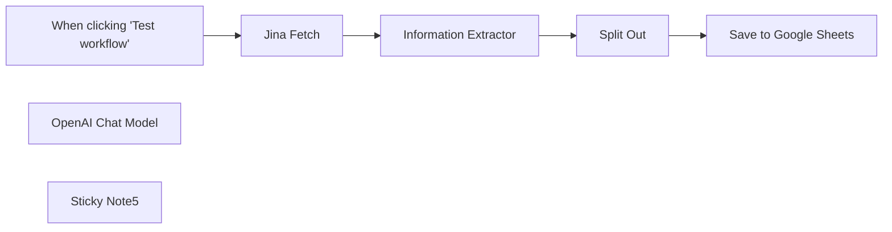

## Fluxo (.json) :

```json
{
  "nodes": [
    {
      "id": "c3ef40df-084e-435c-9a11-3aa0a2f94f36",
      "name": "When clicking \"Test workflow\"",
      "type": "n8n-nodes-base.manualTrigger",
      "position": [
        740,
        520
      ],
      "parameters": {},
      "typeVersion": 1
    },
    {
      "id": "e0583472-a450-4582-83bc-84a014bea543",
      "name": "Split Out",
      "type": "n8n-nodes-base.splitOut",
      "position": [
        1640,
        520
      ],
      "parameters": {
        "options": {},
        "fieldToSplitOut": "output.results"
      },
      "typeVersion": 1
    },
    {
      "id": "b8aa573d-5b63-4669-900f-bcc915b6ad41",
      "name": "Save to Google Sheets",
      "type": "n8n-nodes-base.googleSheets",
      "position": [
        1900,
        520
      ],
      "parameters": {
        "columns": {
          "value": {},
          "schema": [
            {
              "id": "name",
              "type": "string",
              "display": true,
              "removed": false,
              "required": false,
              "displayName": "name",
              "defaultMatch": false,
              "canBeUsedToMatch": true
            },
            {
              "id": "price",
              "type": "string",
              "display": true,
              "removed": false,
              "required": false,
              "displayName": "price",
              "defaultMatch": false,
              "canBeUsedToMatch": true
            },
            {
              "id": "availability",
              "type": "string",
              "display": true,
              "removed": false,
              "required": false,
              "displayName": "availability",
              "defaultMatch": false,
              "canBeUsedToMatch": true
            },
            {
              "id": "image",
              "type": "string",
              "display": true,
              "removed": false,
              "required": false,
              "displayName": "image",
              "defaultMatch": false,
              "canBeUsedToMatch": true
            },
            {
              "id": "link",
              "type": "string",
              "display": true,
              "removed": false,
              "required": false,
              "displayName": "link",
              "defaultMatch": false,
              "canBeUsedToMatch": true
            }
          ],
          "mappingMode": "autoMapInputData",
          "matchingColumns": [
            "Book prices"
          ]
        },
        "options": {},
        "operation": "append",
        "sheetName": {
          "__rl": true,
          "mode": "list",
          "value": 258629074,
          "cachedResultUrl": "https://docs.google.com/spreadsheets/d/1VDbfi2PpeheD2ZlO6feX3RdMeSsm0XukQlNVW8uVcuo/edit#gid=258629074",
          "cachedResultName": "Sheet2"
        },
        "documentId": {
          "__rl": true,
          "mode": "list",
          "value": "1VDbfi2PpeheD2ZlO6feX3RdMeSsm0XukQlNVW8uVcuo",
          "cachedResultUrl": "https://docs.google.com/spreadsheets/d/1VDbfi2PpeheD2ZlO6feX3RdMeSsm0XukQlNVW8uVcuo/edit?usp=drivesdk",
          "cachedResultName": "Book Prices"
        }
      },
      "credentials": {
        "googleSheetsOAuth2Api": {
          "id": "GHRceL2SKjXxz0Dx",
          "name": "Google Sheets account"
        }
      },
      "typeVersion": 4.2
    },
    {
      "id": "a63c3ab3-6aab-43b2-8af6-8b00e24e0ee6",
      "name": "OpenAI Chat Model",
      "type": "@n8n/n8n-nodes-langchain.lmChatOpenAi",
      "position": [
        1300,
        700
      ],
      "parameters": {
        "options": {}
      },
      "credentials": {
        "openAiApi": {
          "id": "5oYe8Cxj7liOPAKk",
          "name": "Derek T"
        }
      },
      "typeVersion": 1
    },
    {
      "id": "40326966-0c46-4df2-8d80-fa014e05b693",
      "name": "Information Extractor",
      "type": "@n8n/n8n-nodes-langchain.informationExtractor",
      "position": [
        1260,
        520
      ],
      "parameters": {
        "text": "={{ $json.data }}",
        "options": {
          "systemPromptTemplate": "You are an expert extraction algorithm.\nOnly extract relevant information from the text.\nIf you do not know the value of an attribute asked to extract, you may omit the attribute's value.\nAlways output the data in a json array called results.  Each book should have a title, price, availability and product_url, image_url"
        },
        "schemaType": "manual",
        "inputSchema": "{\n  \"results\": {\n      \"type\": \"array\",\n      \"items\": {\n          \"type\": \"object\",\n          \"properties\": {\n            \"price\": {\n              \"type\": \"string\"\n              },\n            \"title\": {\n              \"type\": \"string\"\n            },\n            \"image_url\": {\n              \"type\": \"string\"\n            },\n            \"product_url\": {\n              \"type\": \"string\"\n            },\n            \"availability\": {\n              \"type\": \"string\"\n            }            \n           }\n      }\n  }\n}"
      },
      "typeVersion": 1
    },
    {
      "id": "8ddca560-8da7-4090-b865-0523f95ca463",
      "name": "Jina Fetch",
      "type": "n8n-nodes-base.httpRequest",
      "position": [
        1020,
        520
      ],
      "parameters": {
        "url": "https://r.jina.ai/http://books.toscrape.com/catalogue/category/books/historical-fiction_4/index.html",
        "options": {
          "allowUnauthorizedCerts": true
        },
        "authentication": "genericCredentialType",
        "genericAuthType": "httpHeaderAuth"
      },
      "credentials": {
        "httpHeaderAuth": {
          "id": "ALBmOXmADcPmyHr1",
          "name": "jina"
        }
      },
      "typeVersion": 4.1
    },
    {
      "id": "b1745cea-fdbe-4f14-b09c-884549beac7e",
      "name": "Sticky Note5",
      "type": "n8n-nodes-base.stickyNote",
      "position": [
        80,
        320
      ],
      "parameters": {
        "color": 5,
        "width": 587,
        "height": 570,
        "content": "## Start here: Step-by Step Youtube Tutorial :star:\n\n[](https://youtu.be/f3AJYXHirr8)\n\n[Google Sheet Example](https://docs.google.com/spreadsheets/d/1VDbfi2PpeheD2ZlO6feX3RdMeSsm0XukQlNVW8uVcuo/edit?usp=sharing)\n\n\n"
      },
      "typeVersion": 1
    }
  ],
  "pinData": {},
  "connections": {
    "Split Out": {
      "main": [
        [
          {
            "node": "Save to Google Sheets",
            "type": "main",
            "index": 0
          }
        ]
      ]
    },
    "Jina Fetch": {
      "main": [
        [
          {
            "node": "Information Extractor",
            "type": "main",
            "index": 0
          }
        ]
      ]
    },
    "OpenAI Chat Model": {
      "ai_languageModel": [
        [
          {
            "node": "Information Extractor",
            "type": "ai_languageModel",
            "index": 0
          }
        ]
      ]
    },
    "Information Extractor": {
      "main": [
        [
          {
            "node": "Split Out",
            "type": "main",
            "index": 0
          }
        ]
      ]
    },
    "When clicking \"Test workflow\"": {
      "main": [
        [
          {
            "node": "Jina Fetch",
            "type": "main",
            "index": 0
          }
        ]
      ]
    }
  }
}
```

<a id="template-538"></a>

## Template 538 - Criar e listar registros no Stackby

- **Nome:** Criar e listar registros no Stackby
- **Descrição:** Ao executar manualmente, o fluxo cria um registro com campos ID e Name em uma tabela do Stackby e, em seguida, lista os registros dessa mesma tabela.
- **Funcionalidade:** • Gatilho manual: inicia o fluxo quando o usuário executa manualmente.
• Definição de dados: define campos estáticos (ID = 1 e Name = "n8n").
• Inserção na tabela: envia os campos especificados para a tabela "Table 1" usando o stackId fornecido.
• Recuperação de registros: lista os registros da mesma tabela reutilizando os parâmetros de tabela e stackId definidos anteriormente.
- **Ferramentas:** • Stackby: serviço de planilhas/banco de dados em nuvem que permite armazenar, gerenciar e consultar registros por tabela via API.

## Fluxo visual

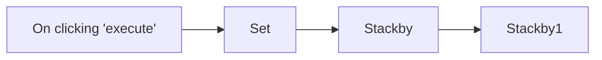

## Fluxo (.json) :

```json
{
  "nodes": [
    {
      "name": "On clicking 'execute'",
      "type": "n8n-nodes-base.manualTrigger",
      "position": [
        250,
        300
      ],
      "parameters": {},
      "typeVersion": 1
    },
    {
      "name": "Set",
      "type": "n8n-nodes-base.set",
      "position": [
        450,
        300
      ],
      "parameters": {
        "values": {
          "number": [
            {
              "name": "ID",
              "value": 1
            }
          ],
          "string": [
            {
              "name": "Name",
              "value": "n8n"
            }
          ]
        },
        "options": {}
      },
      "typeVersion": 1
    },
    {
      "name": "Stackby",
      "type": "n8n-nodes-base.stackby",
      "position": [
        650,
        300
      ],
      "parameters": {
        "table": "Table 1",
        "columns": "ID, Name",
        "stackId": "stbgReRhlmmAgT2suT"
      },
      "credentials": {
        "stackbyApi": "Stackby API credentials"
      },
      "typeVersion": 1
    },
    {
      "name": "Stackby1",
      "type": "n8n-nodes-base.stackby",
      "position": [
        850,
        300
      ],
      "parameters": {
        "table": "={{$node[\"Stackby\"].parameter[\"table\"]}}",
        "stackId": "={{$node[\"Stackby\"].parameter[\"stackId\"]}}",
        "operation": "list",
        "additionalFields": {}
      },
      "credentials": {
        "stackbyApi": "Stackby API credentials"
      },
      "typeVersion": 1
    }
  ],
  "connections": {
    "Set": {
      "main": [
        [
          {
            "node": "Stackby",
            "type": "main",
            "index": 0
          }
        ]
      ]
    },
    "Stackby": {
      "main": [
        [
          {
            "node": "Stackby1",
            "type": "main",
            "index": 0
          }
        ]
      ]
    },
    "On clicking 'execute'": {
      "main": [
        [
          {
            "node": "Set",
            "type": "main",
            "index": 0
          }
        ]
      ]
    }
  }
}
```

<a id="template-539"></a>

## Template 539 - Relatório semanal automatizado do Google Analytics

- **Nome:** Relatório semanal automatizado do Google Analytics
- **Descrição:** Coleta métricas de engajamento, resultados de busca e visualizações por país para a semana atual e a semana anterior, agrega e formata os dados em um relatório HTML e envia por e-mail.
- **Funcionalidade:** • Agendamento e gatilho manual: permite executar o fluxo automaticamente em base agendada ou testar manualmente.
• Coleta de métricas de engajamento de páginas: obtém dados como visualizações de página, usuários ativos, visualizações por usuário e eventos para esta semana e a anterior.
• Coleta de resultados de busca orgânica: obtém métricas relacionadas à busca (cliques, impressões, posição média, CTR, sessões engajadas) por página para comparar semanas.
• Coleta de visualizações por país: recupera usuários ativos, novos usuários, taxa de engajamento e sessões por país para ambas as semanas.
• Parse e transformação: limpa e transforma as respostas brutas em objetos simplificados e codificados para transporte interno.
• Agregação dos dados: reúne todos os conjuntos de dados (engajamento, busca, país) em uma estrutura única para processamento posterior.
• Formatação em HTML: gera conteúdo HTML com tabelas comparativas e cabeçalho com data para inclusão no corpo do e-mail.
• Envio por e-mail: envia o relatório HTML para o destinatário configurado com assunto personalizado.
• Suporte a credenciais e identificação de propriedade: utiliza credenciais OAuth e o ID da propriedade para acessar os dados analíticos.
- **Ferramentas:** • Google Analytics (GA4): fonte principal dos dados de engajamento, métricas de busca orgânica e métricas por país.
• Gmail: serviço utilizado para enviar o relatório formatado por e-mail.

## Fluxo visual

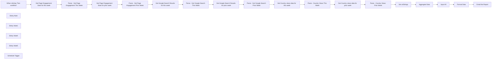

## Fluxo (.json) :

```json
{
  "id": "21IdmArlNT9LlaFf",
  "meta": {
    "instanceId": "d868e3d040e7bda892c81b17cf446053ea25d2556fcef89cbe19dd61a3e876e9",
    "templateCredsSetupCompleted": true
  },
  "name": "Automate Google Analytics Reporting - AlexK1919",
  "tags": [
    {
      "id": "BimZXo1NKE7JdlXm",
      "name": "Google Analytics",
      "createdAt": "2024-11-13T18:08:04.053Z",
      "updatedAt": "2024-11-13T18:08:04.053Z"
    },
    {
      "id": "nezaWFCGa7eZsVKu",
      "name": "Utility",
      "createdAt": "2024-11-13T18:08:08.207Z",
      "updatedAt": "2024-11-13T18:08:08.207Z"
    }
  ],
  "nodes": [
    {
      "id": "1b3a0365-92e0-4b51-9a5f-2562b7f3de39",
      "name": "When clicking ‘Test workflow’",
      "type": "n8n-nodes-base.manualTrigger",
      "position": [
        560,
        940
      ],
      "parameters": {},
      "typeVersion": 1
    },
    {
      "id": "5c35f802-82e7-457a-9f11-4d9026cbf0e0",
      "name": "Sticky Note",
      "type": "n8n-nodes-base.stickyNote",
      "position": [
        760,
        360
      ],
      "parameters": {
        "color": 6,
        "width": 1270.4518485107694,
        "height": 209.13454984057833,
        "content": "# Aggregate Google Analytics data and Email the results\n\nThis workflow will check for country views, page engagement and google search console results. It will take this week's data and compare it to last week's data.\n\n[Credit to Keith Rumjahn for the original workflow, which I modified.](https://rumjahn.com/how-i-used-a-i-to-be-an-seo-expert-and-analyzed-my-google-analytics-data-in-n8n-and-make-com/)"
      },
      "typeVersion": 1
    },
    {
      "id": "54288de3-60ec-4119-a067-e6b8e67949b9",
      "name": "Sticky Note1",
      "type": "n8n-nodes-base.stickyNote",
      "position": [
        760,
        600
      ],
      "parameters": {
        "color": 4,
        "width": 1269.8517211291685,
        "height": 745.919853945687,
        "content": "## Property ID\n\n1. Create your [Google Analytics Credentials](https://docs.n8n.io/integrations/builtin/credentials/google/oauth-single-service/?utm_source=n8n_app&utm_medium=credential_settings&utm_campaign=create_new_credentials_modal)\n2. Enter your [property ID](https://developers.google.com/analytics/devguides/reporting/data/v1/property-id) or Choose from the List of Properties."
      },
      "typeVersion": 1
    },
    {
      "id": "cc1c37f3-6354-4413-9ee1-473509fc23e7",
      "name": "Get Page Engagement Stats for this week",
      "type": "n8n-nodes-base.googleAnalytics",
      "position": [
        840,
        740
      ],
      "parameters": {
        "simple": false,
        "returnAll": true,
        "metricsGA4": {
          "metricValues": [
            {
              "name": "screenPageViews",
              "listName": "other"
            },
            {
              "name": "activeUsers",
              "listName": "other"
            },
            {
              "name": "screenPageViewsPerUser",
              "listName": "other"
            },
            {
              "name": "eventCount",
              "listName": "other"
            }
          ]
        },
        "propertyId": {
          "__rl": true,
          "mode": "list",
          "value": "420633845",
          "cachedResultUrl": "https://analytics.google.com/analytics/web/#/p420633845/",
          "cachedResultName": "Kenetic Brand Builders"
        },
        "dimensionsGA4": {
          "dimensionValues": [
            {
              "name": "unifiedScreenName",
              "listName": "other"
            }
          ]
        },
        "additionalFields": {
          "keepEmptyRows": true
        }
      },
      "credentials": {
        "googleAnalyticsOAuth2": {
          "id": "8OdVzOGJqhJ3ti8k",
          "name": "KBB Google Analytics account"
        }
      },
      "typeVersion": 2
    },
    {
      "id": "c6b8f171-0e43-4d55-9ba0-c17a8cddca5b",
      "name": "Get Page Engagement Stats for prior week",
      "type": "n8n-nodes-base.googleAnalytics",
      "position": [
        1240,
        740
      ],
      "parameters": {
        "simple": false,
        "endDate": "={{$today.minus({days: 7})}}",
        "dateRange": "custom",
        "returnAll": true,
        "startDate": "={{$today.minus({days: 14})}}",
        "metricsGA4": {
          "metricValues": [
            {
              "name": "screenPageViews",
              "listName": "other"
            },
            {
              "name": "activeUsers",
              "listName": "other"
            },
            {
              "name": "screenPageViewsPerUser",
              "listName": "other"
            },
            {
              "name": "eventCount",
              "listName": "other"
            }
          ]
        },
        "propertyId": {
          "__rl": true,
          "mode": "list",
          "value": "420633845",
          "cachedResultUrl": "https://analytics.google.com/analytics/web/#/p420633845/",
          "cachedResultName": "Kenetic Brand Builders"
        },
        "dimensionsGA4": {
          "dimensionValues": [
            {
              "name": "unifiedScreenName",
              "listName": "other"
            }
          ]
        },
        "additionalFields": {
          "keepEmptyRows": true
        }
      },
      "credentials": {
        "googleAnalyticsOAuth2": {
          "id": "8OdVzOGJqhJ3ti8k",
          "name": "KBB Google Analytics account"
        }
      },
      "typeVersion": 2
    },
    {
      "id": "3c056c98-055d-4dc5-870d-d9c01c467714",
      "name": "Get Google Search Results for this week",
      "type": "n8n-nodes-base.googleAnalytics",
      "position": [
        1640,
        740
      ],
      "parameters": {
        "simple": false,
        "returnAll": true,
        "metricsGA4": {
          "metricValues": [
            {
              "name": "activeUsers",
              "listName": "other"
            },
            {
              "name": "engagedSessions",
              "listName": "other"
            },
            {
              "name": "engagementRate",
              "listName": "other"
            },
            {
              "name": "eventCount",
              "listName": "other"
            },
            {
              "name": "organicGoogleSearchAveragePosition",
              "listName": "other"
            },
            {
              "name": "organicGoogleSearchClickThroughRate",
              "listName": "other"
            },
            {
              "name": "organicGoogleSearchClicks",
              "listName": "other"
            },
            {
              "name": "organicGoogleSearchImpressions",
              "listName": "other"
            }
          ]
        },
        "propertyId": {
          "__rl": true,
          "mode": "list",
          "value": "420633845",
          "cachedResultUrl": "https://analytics.google.com/analytics/web/#/p420633845/",
          "cachedResultName": "Kenetic Brand Builders"
        },
        "dimensionsGA4": {
          "dimensionValues": [
            {
              "name": "landingPagePlusQueryString",
              "listName": "other"
            }
          ]
        },
        "additionalFields": {
          "keepEmptyRows": true
        }
      },
      "credentials": {
        "googleAnalyticsOAuth2": {
          "id": "8OdVzOGJqhJ3ti8k",
          "name": "KBB Google Analytics account"
        }
      },
      "typeVersion": 2
    },
    {
      "id": "ea5cdc7a-b00b-45d6-86e9-dd2a61451cca",
      "name": "Get Country views data for this week",
      "type": "n8n-nodes-base.googleAnalytics",
      "position": [
        1240,
        940
      ],
      "parameters": {
        "simple": false,
        "returnAll": true,
        "metricsGA4": {
          "metricValues": [
            {
              "name": "activeUsers",
              "listName": "other"
            },
            {
              "name": "newUsers",
              "listName": "other"
            },
            {
              "name": "engagementRate",
              "listName": "other"
            },
            {
              "name": "engagedSessions",
              "listName": "other"
            },
            {
              "name": "eventCount",
              "listName": "other"
            },
            {
              "listName": "other"
            },
            {
              "name": "sessions",
              "listName": "other"
            }
          ]
        },
        "propertyId": {
          "__rl": true,
          "mode": "list",
          "value": "420633845",
          "cachedResultUrl": "https://analytics.google.com/analytics/web/#/p420633845/",
          "cachedResultName": "Kenetic Brand Builders"
        },
        "dimensionsGA4": {
          "dimensionValues": [
            {
              "name": "country",
              "listName": "other"
            }
          ]
        },
        "additionalFields": {
          "keepEmptyRows": true
        }
      },
      "credentials": {
        "googleAnalyticsOAuth2": {
          "id": "8OdVzOGJqhJ3ti8k",
          "name": "KBB Google Analytics account"
        }
      },
      "typeVersion": 2
    },
    {
      "id": "d52e9084-d00b-490f-b107-ed9904423a03",
      "name": "Sticky Note4",
      "type": "n8n-nodes-base.stickyNote",
      "position": [
        500,
        360
      ],
      "parameters": {
        "color": 6,
        "width": 231.71528995536218,
        "height": 986.0715248510506,
        "content": "## AlexK1919 \n\n\nI’m Alex Kim, an AI-Native Workflow Automation Architect Building Solutions to Optimize your Personal and Professional Life.\n\n[Info](https://beacons.ai/alexk1919)"
      },
      "typeVersion": 1
    },
    {
      "id": "d1160f2f-80ca-4900-8b85-d94073cf38e3",
      "name": "Aggregate Data",
      "type": "n8n-nodes-base.code",
      "position": [
        1040,
        1140
      ],
      "parameters": {
        "jsCode": "// Helper function to decode and parse a URL-encoded JSON string\nfunction decodeUrlString(urlString) {\n    try {\n        const decoded = JSON.parse(decodeURIComponent(urlString));\n        console.log('Decoded URL string:', JSON.stringify(decoded, null, 2));\n        return decoded;\n    } catch (error) {\n        console.log('Error decoding URL string:', error.message);\n        return [];\n    }\n}\n\n// Main function to aggregate data\nfunction aggregateData(items) {\n    // Extract each urlString from the input\n    const data = items[0]?.json; // Get the first JSON object from input\n\n    if (!data) {\n        console.log('No data found in input items.');\n        return {};\n    }\n\n    // Decode each urlString\n    const engagementStatsThisWeek = decodeUrlString(data.urlString1 || '');\n    const engagementStatsPriorWeek = decodeUrlString(data.urlString2 || '');\n    const searchResultsThisWeek = decodeUrlString(data.urlString3 || '');\n    const searchResultsLastWeek = decodeUrlString(data.urlString4 || '');\n    const countryViewsThisWeek = decodeUrlString(data.urlString5 || '');\n    const countryViewsLastWeek = decodeUrlString(data.urlString6 || '');\n\n    // Aggregate the decoded data into a structured object\n    const aggregatedData = {\n        engagementStats: {\n            thisWeek: engagementStatsThisWeek,\n            priorWeek: engagementStatsPriorWeek,\n        },\n        searchResults: {\n            thisWeek: searchResultsThisWeek,\n            lastWeek: searchResultsLastWeek,\n        },\n        countryViews: {\n            thisWeek: countryViewsThisWeek,\n            lastWeek: countryViewsLastWeek,\n        },\n    };\n\n    console.log('Final Aggregated Data:', JSON.stringify(aggregatedData, null, 2));\n    return aggregatedData;\n}\n\n// Get input data from all nodes\nconst items = $input.all();\nconsole.log('Input items to Aggregate Data:', JSON.stringify(items, null, 2));\n\n// Perform aggregation\nconst aggregatedResult = aggregateData(items);\n\n// Output the aggregated result for downstream processing\nreturn { json: aggregatedResult };\n"
      },
      "typeVersion": 2
    },
    {
      "id": "14fea93c-7d9c-4f58-96a3-b241f6b0bcec",
      "name": "Get Google Search Results for prior week",
      "type": "n8n-nodes-base.googleAnalytics",
      "position": [
        840,
        940
      ],
      "parameters": {
        "simple": false,
        "endDate": "={{$today.minus({days: 7})}}",
        "dateRange": "custom",
        "returnAll": true,
        "startDate": "={{$today.minus({days: 14})}}",
        "metricsGA4": {
          "metricValues": [
            {
              "name": "activeUsers",
              "listName": "other"
            },
            {
              "name": "engagedSessions",
              "listName": "other"
            },
            {
              "name": "engagementRate",
              "listName": "other"
            },
            {
              "name": "eventCount",
              "listName": "other"
            },
            {
              "name": "organicGoogleSearchAveragePosition",
              "listName": "other"
            },
            {
              "name": "organicGoogleSearchClickThroughRate",
              "listName": "other"
            },
            {
              "name": "organicGoogleSearchClicks",
              "listName": "other"
            },
            {
              "name": "organicGoogleSearchImpressions",
              "listName": "other"
            }
          ]
        },
        "propertyId": {
          "__rl": true,
          "mode": "list",
          "value": "420633845",
          "cachedResultUrl": "https://analytics.google.com/analytics/web/#/p420633845/",
          "cachedResultName": "Kenetic Brand Builders"
        },
        "dimensionsGA4": {
          "dimensionValues": [
            {
              "name": "landingPagePlusQueryString",
              "listName": "other"
            }
          ]
        },
        "additionalFields": {
          "keepEmptyRows": true
        }
      },
      "credentials": {
        "googleAnalyticsOAuth2": {
          "id": "8OdVzOGJqhJ3ti8k",
          "name": "KBB Google Analytics account"
        }
      },
      "typeVersion": 2
    },
    {
      "id": "436c7977-0214-4b23-924a-3915c0f27d28",
      "name": "Get Country views data for prior week",
      "type": "n8n-nodes-base.googleAnalytics",
      "position": [
        1640,
        940
      ],
      "parameters": {
        "simple": false,
        "endDate": "={{$today.minus({days: 7})}}",
        "dateRange": "custom",
        "returnAll": true,
        "startDate": "={{$today.minus({days: 14})}}",
        "metricsGA4": {
          "metricValues": [
            {
              "name": "activeUsers",
              "listName": "other"
            },
            {
              "name": "newUsers",
              "listName": "other"
            },
            {
              "name": "engagementRate",
              "listName": "other"
            },
            {
              "name": "engagedSessions",
              "listName": "other"
            },
            {
              "name": "eventCount",
              "listName": "other"
            },
            {
              "listName": "other"
            },
            {
              "name": "sessions",
              "listName": "other"
            }
          ]
        },
        "propertyId": {
          "__rl": true,
          "mode": "list",
          "value": "420633845",
          "cachedResultUrl": "https://analytics.google.com/analytics/web/#/p420633845/",
          "cachedResultName": "Kenetic Brand Builders"
        },
        "dimensionsGA4": {
          "dimensionValues": [
            {
              "name": "country",
              "listName": "other"
            }
          ]
        },
        "additionalFields": {
          "keepEmptyRows": true
        }
      },
      "credentials": {
        "googleAnalyticsOAuth2": {
          "id": "8OdVzOGJqhJ3ti8k",
          "name": "KBB Google Analytics account"
        }
      },
      "typeVersion": 2
    },
    {
      "id": "15f3edcb-2e31-4faa-8db2-62da69bbfe8d",
      "name": "Parse - Get Page Engagement This Week",
      "type": "n8n-nodes-base.code",
      "position": [
        1040,
        740
      ],
      "parameters": {
        "jsCode": "function transformToUrlString(items) {\n    // Debug logging\n    console.log('Input items:', JSON.stringify(items, null, 2));\n    \n    // Check if items is an array and has content\n    if (!Array.isArray(items) || items.length === 0) {\n        console.log('Items is not an array or is empty');\n        throw new Error('Invalid data structure');\n    }\n\n    // Check if first item exists and has json property\n    if (!items[0] || !items[0].json) {\n        console.log('First item is missing or has no json property');\n        throw new Error('Invalid data structure');\n    }\n\n    // Get the analytics data\n    const analyticsData = items[0].json;\n    \n    // Check if analyticsData has rows\n    if (!analyticsData || !Array.isArray(analyticsData.rows)) {\n        console.log('Analytics data is missing or has no rows array');\n        throw new Error('Invalid data structure');\n    }\n    \n    // Map each row to a simplified object\n    const simplified = analyticsData.rows.map(row => {\n        if (!row.dimensionValues?.[0]?.value || !row.metricValues?.length) {\n            console.log('Invalid row structure:', row);\n            throw new Error('Invalid row structure');\n        }\n        \n        return {\n            page: row.dimensionValues[0].value,\n            pageViews: parseInt(row.metricValues[0].value) || 0,\n            activeUsers: parseInt(row.metricValues[1].value) || 0,\n            viewsPerUser: parseFloat(row.metricValues[2].value) || 0,\n            eventCount: parseInt(row.metricValues[3].value) || 0\n        };\n    });\n    \n    // Convert to JSON string and encode for URL\n    return encodeURIComponent(JSON.stringify(simplified));\n}\n\n// Get input data and transform it\nconst urlString = transformToUrlString($input.all());\n\n// Return the result\nreturn { json: { urlString } };"
      },
      "typeVersion": 2
    },
    {
      "id": "46cd21cd-c7f4-45cb-a724-db8a122f9de3",
      "name": "Parse - Get Page Engagement Prior Week",
      "type": "n8n-nodes-base.code",
      "position": [
        1440,
        740
      ],
      "parameters": {
        "jsCode": "function transformToUrlString(items) {\n    // Debug logging\n    console.log('Input items:', JSON.stringify(items, null, 2));\n    \n    // Check if items is an array and has content\n    if (!Array.isArray(items) || items.length === 0) {\n        console.log('Items is not an array or is empty');\n        throw new Error('Invalid data structure');\n    }\n\n    // Check if first item exists and has json property\n    if (!items[0] || !items[0].json) {\n        console.log('First item is missing or has no json property');\n        throw new Error('Invalid data structure');\n    }\n\n    // Get the analytics data\n    const analyticsData = items[0].json;\n    \n    // Check if analyticsData has rows\n    if (!analyticsData || !Array.isArray(analyticsData.rows)) {\n        console.log('Analytics data is missing or has no rows array');\n        throw new Error('Invalid data structure');\n    }\n    \n    // Filter out invalid rows and map each valid row to a simplified object\n    const simplified = analyticsData.rows\n        .filter(row => {\n            // Check if row is valid and its properties exist\n            const isValid = row \n                && row.dimensionValues \n                && row.dimensionValues[0] \n                && row.dimensionValues[0].value \n                && row.metricValues \n                && row.metricValues.length > 0;\n            \n            if (!isValid) {\n                console.log('Ignoring invalid or null row:', row);\n            }\n            return isValid;\n        })\n        .map(row => ({\n            page: row.dimensionValues[0].value,\n            pageViews: parseInt(row.metricValues[0].value) || 0,\n            activeUsers: parseInt(row.metricValues[1]?.value) || 0,\n            viewsPerUser: parseFloat(row.metricValues[2]?.value) || 0,\n            eventCount: parseInt(row.metricValues[3]?.value) || 0\n        }));\n    \n    // Convert to JSON string and encode for URL\n    return encodeURIComponent(JSON.stringify(simplified));\n}\n\n// Get input data and transform it\nconst urlString = transformToUrlString($input.all());\n\n// Return the result\nreturn { json: { urlString } };\n"
      },
      "typeVersion": 2
    },
    {
      "id": "6bef6c5c-74a1-4566-8b8d-372414ae9b0d",
      "name": "Parse - Get Google Search This Week",
      "type": "n8n-nodes-base.code",
      "position": [
        1840,
        740
      ],
      "parameters": {
        "jsCode": "function transformToUrlString(items) {\n    // Check if items is an array and get the JSON property\n    const data = items[0]?.json;\n\n    if (!data || !Array.isArray(data.rows)) {\n        console.log('No valid data found');\n        return encodeURIComponent(JSON.stringify([]));\n    }\n\n    try {\n        // Process each row, skipping invalid or null entries\n        const simplified = data.rows\n            .filter(row => {\n                // Skip null rows or rows without dimensionValues or metricValues\n                const isValid = row && row.dimensionValues && Array.isArray(row.metricValues);\n                if (!isValid) {\n                    console.log('Skipping invalid row:', row);\n                }\n                return isValid;\n            })\n            .map(row => ({\n                page: row.dimensionValues[0]?.value || 'Unknown',\n                activeUsers: parseInt(row.metricValues[0]?.value) || 0,\n                engagedSessions: parseInt(row.metricValues[1]?.value) || 0,\n                engagementRate: parseFloat(row.metricValues[2]?.value) || 0.0,\n                eventCount: parseInt(row.metricValues[3]?.value) || 0,\n                avgPosition: parseFloat(row.metricValues[4]?.value) || 0.0,\n                ctr: parseFloat(row.metricValues[5]?.value) || 0.0,\n                clicks: parseInt(row.metricValues[6]?.value) || 0,\n                impressions: parseInt(row.metricValues[7]?.value) || 0\n            }));\n\n        // Encode the simplified data as a URL-safe string\n        return encodeURIComponent(JSON.stringify(simplified));\n    } catch (error) {\n        console.log('Error processing data:', error.message);\n        throw new Error('Invalid data structure');\n    }\n}\n\n// Get the input data\nconst items = $input.all();\n\n// Process the data\nconst result = transformToUrlString(items);\n\n// Return the result\nreturn { json: { urlString: result } };\n"
      },
      "typeVersion": 2
    },
    {
      "id": "d0c2b575-6bf0-40d7-80e9-c4f1702df7c8",
      "name": "Parse - Get Google Search Prior Week",
      "type": "n8n-nodes-base.code",
      "position": [
        1040,
        940
      ],
      "parameters": {
        "jsCode": "function transformToUrlString(items) {\n    // Ensure the input is valid and contains data\n    const data = items[0]?.json;\n\n    if (!data || !Array.isArray(data.rows)) {\n        console.log('No valid data found');\n        return encodeURIComponent(JSON.stringify([]));\n    }\n\n    try {\n        // Process each row, skipping null or invalid rows\n        const simplified = data.rows\n            .filter(row => {\n                // Skip null rows\n                const isValid = row && row.dimensionValues && Array.isArray(row.metricValues);\n                if (!isValid) {\n                    console.log('Skipping invalid or null row:', row);\n                }\n                return isValid;\n            })\n            .map(row => ({\n                page: row.dimensionValues[0]?.value || 'Unknown',\n                activeUsers: parseInt(row.metricValues[0]?.value) || 0,\n                engagedSessions: parseInt(row.metricValues[1]?.value) || 0,\n                engagementRate: parseFloat(row.metricValues[2]?.value) || 0.0,\n                eventCount: parseInt(row.metricValues[3]?.value) || 0,\n                avgPosition: parseFloat(row.metricValues[4]?.value) || 0.0,\n                ctr: parseFloat(row.metricValues[5]?.value) || 0.0,\n                clicks: parseInt(row.metricValues[6]?.value) || 0,\n                impressions: parseInt(row.metricValues[7]?.value) || 0\n            }));\n\n        // If no valid rows, return an empty array\n        if (simplified.length === 0) {\n            console.log('No valid rows to process');\n            return encodeURIComponent(JSON.stringify([]));\n        }\n\n        // Encode the simplified data as a URL-safe string\n        return encodeURIComponent(JSON.stringify(simplified));\n    } catch (error) {\n        console.log('Error processing data:', error.message);\n        throw new Error('Invalid data structure');\n    }\n}\n\n// Get the input data\nconst items = $input.all();\n\n// Process the data\nconst result = transformToUrlString(items);\n\n// Return the result\nreturn { json: { urlString: result } };\n"
      },
      "typeVersion": 2
    },
    {
      "id": "1fca2a6c-1b60-4860-ad60-3e0696f2cb07",
      "name": "Parse - Country Views This Week",
      "type": "n8n-nodes-base.code",
      "position": [
        1440,
        940
      ],
      "parameters": {
        "jsCode": "function transformToUrlString(items) {\n    // In n8n, we need to check if items is an array and get the json property\n    const data = items[0].json;\n    \n    if (!data || !data.rows) {\n        console.log('No valid data found');\n        return encodeURIComponent(JSON.stringify([]));\n    }\n    \n    try {\n        // Process each row\n        const simplified = data.rows.map(row => ({\n            country: row.dimensionValues[0].value,\n            activeUsers: parseInt(row.metricValues[0].value) || 0,\n            newUsers: parseInt(row.metricValues[1].value) || 0,\n            engagementRate: parseFloat(row.metricValues[2].value) || 0,\n            engagedSessions: parseInt(row.metricValues[3].value) || 0,\n            eventCount: parseInt(row.metricValues[4].value) || 0,\n            totalUsers: parseInt(row.metricValues[5].value) || 0,\n            sessions: parseInt(row.metricValues[6].value) || 0\n        }));\n        \n        return encodeURIComponent(JSON.stringify(simplified));\n    } catch (error) {\n        console.log('Error processing data:', error);\n        throw new Error('Invalid data structure');\n    }\n}\n\n// Get the input data\nconst items = $input.all();\n\n// Process the data\nconst result = transformToUrlString(items);\n\n// Return the result\nreturn { json: { urlString: result } };"
      },
      "typeVersion": 2
    },
    {
      "id": "23679bde-bf02-465a-a656-5eeea0e82f34",
      "name": "Parse - Country Views Prior Week",
      "type": "n8n-nodes-base.code",
      "position": [
        1840,
        940
      ],
      "parameters": {
        "jsCode": "function transformToUrlString(items) {\n    // Ensure the input is valid and contains data\n    const data = items[0]?.json;\n\n    if (!data || !Array.isArray(data.rows)) {\n        console.log('No valid data found');\n        return encodeURIComponent(JSON.stringify([]));\n    }\n\n    try {\n        // Process each row, skipping invalid or null rows\n        const simplified = data.rows\n            .filter(row => {\n                // Skip null rows or rows without required properties\n                const isValid = row && row.dimensionValues && Array.isArray(row.metricValues);\n                if (!isValid) {\n                    console.log('Skipping invalid or null row:', row);\n                }\n                return isValid;\n            })\n            .map(row => ({\n                country: row.dimensionValues[0]?.value || 'Unknown',\n                activeUsers: parseInt(row.metricValues[0]?.value) || 0,\n                newUsers: parseInt(row.metricValues[1]?.value) || 0,\n                engagementRate: parseFloat(row.metricValues[2]?.value) || 0.0,\n                engagedSessions: parseInt(row.metricValues[3]?.value) || 0,\n                eventCount: parseInt(row.metricValues[4]?.value) || 0,\n                totalUsers: parseInt(row.metricValues[5]?.value) || 0,\n                sessions: parseInt(row.metricValues[6]?.value) || 0\n            }));\n\n        // If no valid rows, return an empty array\n        if (simplified.length === 0) {\n            console.log('No valid rows to process');\n            return encodeURIComponent(JSON.stringify([]));\n        }\n\n        // Encode the simplified data as a URL-safe string\n        return encodeURIComponent(JSON.stringify(simplified));\n    } catch (error) {\n        console.log('Error processing data:', error.message);\n        throw new Error('Invalid data structure');\n    }\n}\n\n// Get the input data\nconst items = $input.all();\n\n// Process the data\nconst result = transformToUrlString(items);\n\n// Return the result\nreturn { json: { urlString: result } };\n"
      },
      "typeVersion": 2
    },
    {
      "id": "d6797f36-d715-4821-9747-cea5c87dc2cb",
      "name": "Set urlStrings",
      "type": "n8n-nodes-base.set",
      "position": [
        840,
        1140
      ],
      "parameters": {
        "options": {},
        "assignments": {
          "assignments": [
            {
              "id": "93efb02f-f2f2-4e52-aa7a-3ccd1fb171cc",
              "name": "urlString1",
              "type": "string",
              "value": "={{ $('Parse - Get Page Engagement This Week').first().json.urlString }}"
            },
            {
              "id": "5dea3377-0af2-48da-8666-5ee9452e25c5",
              "name": "urlString2",
              "type": "string",
              "value": "={{ $('Parse - Get Page Engagement Prior Week').first().json.urlString }}"
            },
            {
              "id": "c6aa5d4d-d1e5-4493-96fd-60b2298ff6da",
              "name": "urlString3",
              "type": "string",
              "value": "={{ $('Parse - Get Google Search This Week').first().json.urlString }}"
            },
            {
              "id": "711cb4fa-3e8c-4ad6-9b25-e2447d7492d1",
              "name": "urlString4",
              "type": "string",
              "value": "={{ $('Parse - Get Google Search Prior Week').first().json.urlString }}"
            },
            {
              "id": "775bc64a-7986-48fb-a36d-4101158b83f0",
              "name": "urlString5",
              "type": "string",
              "value": "={{ $('Parse - Country Views This Week').first().json.urlString }}"
            },
            {
              "id": "a6ae27a0-89b5-4a6f-8328-327750835c8d",
              "name": "urlString6",
              "type": "string",
              "value": "={{ $('Parse - Country Views Prior Week').first().json.urlString }}"
            }
          ]
        }
      },
      "typeVersion": 3.4
    },
    {
      "id": "5990f2af-1fc4-4ed5-aea6-c46bebb463a8",
      "name": "Format Data",
      "type": "n8n-nodes-base.code",
      "position": [
        840,
        1480
      ],
      "parameters": {
        "jsCode": "const input = $input.first().json;\n\n// Extract data\nconst engagementStats = input.engagementStats || {};\nconst searchResults = input.searchResults || {};\nconst countryViews = input.countryViews || {};\n\n// Helper function to generate HTML for a table\nfunction generateTable(headers, rows, color) {\n    let table = `<table border=\"1\" style=\"border-collapse:collapse; width:100%; border:1px solid ${color};\">`;\n    // Add table headers\n    table += `<thead style=\"background-color:${color}; color:white;\"><tr>`;\n    headers.forEach(header => {\n        table += `<th style=\"padding:8px; text-align:left; border:1px solid ${color};\">${header}</th>`;\n    });\n    table += '</tr></thead>';\n    // Add table rows\n    table += '<tbody>';\n    rows.forEach(row => {\n        table += '<tr>';\n        row.forEach(cell => {\n            table += `<td style=\"padding:8px; border:1px solid ${color};\">${cell}</td>`;\n        });\n        table += '</tr>';\n    });\n    table += '</tbody></table>';\n    return table;\n}\n\n// Get today's date\nconst today = new Date();\nconst formattedDate = today.toLocaleDateString(undefined, {\n    year: 'numeric',\n    month: 'long',\n    day: 'numeric',\n});\n\n// Generate HTML content\nconst title = `GA Report for ${formattedDate}`;\nlet htmlContent = `<h1 style=\"text-align:center; color:#333;\">${title}</h1>`;\n\n// Colors for each segment\nconst engagementColor = '#4CAF50';\nconst searchColor = '#2196F3';\nconst countryColor = '#FF9800';\n\nhtmlContent += `<h2 style=\"color:${engagementColor};\">Engagement Stats</h2>`;\nhtmlContent += `<h3 style=\"color:#333;\">This Week</h3>`;\nif (engagementStats.thisWeek?.length) {\n    const headers = ['Page', 'Page Views', 'Active Users', 'Views per User', 'Event Count'];\n    const rows = engagementStats.thisWeek.map(stat => [\n        stat.page,\n        stat.pageViews,\n        stat.activeUsers,\n        stat.viewsPerUser.toFixed(2),\n        stat.eventCount,\n    ]);\n    htmlContent += generateTable(headers, rows, engagementColor);\n} else {\n    htmlContent += `<p style=\"color:${engagementColor};\">No data available for this week.</p>`;\n}\n\nhtmlContent += `<h3 style=\"color:#333;\">Prior Week</h3>`;\nif (engagementStats.priorWeek?.length) {\n    const headers = ['Page', 'Page Views', 'Active Users', 'Views per User', 'Event Count'];\n    const rows = engagementStats.priorWeek.map(stat => [\n        stat.page,\n        stat.pageViews,\n        stat.activeUsers,\n        stat.viewsPerUser.toFixed(2),\n        stat.eventCount,\n    ]);\n    htmlContent += generateTable(headers, rows, engagementColor);\n} else {\n    htmlContent += `<p style=\"color:${engagementColor};\">No data available for prior week.</p>`;\n}\n\nhtmlContent += `<h2 style=\"color:${searchColor};\">Search Results</h2>`;\nhtmlContent += `<h3 style=\"color:#333;\">This Week</h3>`;\nif (searchResults.thisWeek?.length) {\n    const headers = ['Page', 'Active Users', 'Engaged Sessions', 'Engagement Rate', 'Event Count', 'Avg Position', 'CTR', 'Clicks', 'Impressions'];\n    const rows = searchResults.thisWeek.map(result => [\n        result.page,\n        result.activeUsers,\n        result.engagedSessions,\n        result.engagementRate.toFixed(2),\n        result.eventCount,\n        result.avgPosition.toFixed(2),\n        result.ctr.toFixed(2),\n        result.clicks,\n        result.impressions,\n    ]);\n    htmlContent += generateTable(headers, rows, searchColor);\n} else {\n    htmlContent += `<p style=\"color:${searchColor};\">No data available for this week.</p>`;\n}\n\nhtmlContent += `<h3 style=\"color:#333;\">Last Week</h3>`;\nif (searchResults.lastWeek?.length) {\n    const headers = ['Page', 'Active Users', 'Engaged Sessions', 'Engagement Rate', 'Event Count', 'Avg Position', 'CTR', 'Clicks', 'Impressions'];\n    const rows = searchResults.lastWeek.map(result => [\n        result.page,\n        result.activeUsers,\n        result.engagedSessions,\n        result.engagementRate.toFixed(2),\n        result.eventCount,\n        result.avgPosition.toFixed(2),\n        result.ctr.toFixed(2),\n        result.clicks,\n        result.impressions,\n    ]);\n    htmlContent += generateTable(headers, rows, searchColor);\n} else {\n    htmlContent += `<p style=\"color:${searchColor};\">No data available for last week.</p>`;\n}\n\nhtmlContent += `<h2 style=\"color:${countryColor};\">Country Views</h2>`;\nhtmlContent += `<h3 style=\"color:#333;\">This Week</h3>`;\nif (countryViews.thisWeek?.length) {\n    const headers = ['Country', 'Active Users', 'New Users', 'Engagement Rate', 'Engaged Sessions', 'Event Count', 'Total Users', 'Sessions'];\n    const rows = countryViews.thisWeek.map(view => [\n        view.country,\n        view.activeUsers,\n        view.newUsers,\n        view.engagementRate.toFixed(2),\n        view.engagedSessions,\n        view.eventCount,\n        view.totalUsers,\n        view.sessions,\n    ]);\n    htmlContent += generateTable(headers, rows, countryColor);\n} else {\n    htmlContent += `<p style=\"color:${countryColor};\">No data available for this week.</p>`;\n}\n\nhtmlContent += `<h3 style=\"color:#333;\">Last Week</h3>`;\nif (countryViews.lastWeek?.length) {\n    const headers = ['Country', 'Active Users', 'New Users', 'Engagement Rate', 'Engaged Sessions', 'Event Count', 'Total Users', 'Sessions'];\n    const rows = countryViews.lastWeek.map(view => [\n        view.country,\n        view.activeUsers,\n        view.newUsers,\n        view.engagementRate.toFixed(2),\n        view.engagedSessions,\n        view.eventCount,\n        view.totalUsers,\n        view.sessions,\n    ]);\n    htmlContent += generateTable(headers, rows, countryColor);\n} else {\n    htmlContent += `<p style=\"color:${countryColor};\">No data available for last week.</p>`;\n}\n\n// Output the title and formatted HTML\nreturn {\n    json: {\n        title,\n        htmlContent,\n    }\n};\n"
      },
      "typeVersion": 2
    },
    {
      "id": "74ad1eef-3a5b-4939-83ee-be0c4b6c13cb",
      "name": "Input All",
      "type": "n8n-nodes-base.code",
      "position": [
        1240,
        1140
      ],
      "parameters": {
        "jsCode": "console.log($input.all());\nreturn $input.all();\n"
      },
      "typeVersion": 2
    },
    {
      "id": "019a40de-80c8-4ede-a86b-babb2c6288eb",
      "name": "Sticky Note5",
      "type": "n8n-nodes-base.stickyNote",
      "position": [
        760,
        1380
      ],
      "parameters": {
        "color": 5,
        "width": 1264.897623827279,
        "height": 295.7350020039967,
        "content": "## Format the data and Email"
      },
      "typeVersion": 1
    },
    {
      "id": "f81326ce-ac35-4463-8444-e9c2b7be027b",
      "name": "Email the Report",
      "type": "n8n-nodes-base.gmail",
      "position": [
        1040,
        1480
      ],
      "webhookId": "80d4d964-449a-4599-b2de-bca9c8822bbd",
      "parameters": {
        "sendTo": "info@alexk1919.com",
        "message": "={{ $json.htmlContent }}",
        "options": {
          "senderName": "Alex Kim"
        },
        "subject": "=KBB {{ $json.title }}"
      },
      "credentials": {
        "gmailOAuth2": {
          "id": "7eQtesjR8Fht0INE",
          "name": "AlexK1919 Gmail"
        }
      },
      "typeVersion": 2.1
    },
    {
      "id": "9358a6bc-3696-4647-b02d-891c597d1cb6",
      "name": "Schedule Trigger",
      "type": "n8n-nodes-base.scheduleTrigger",
      "position": [
        560,
        1140
      ],
      "parameters": {
        "rule": {
          "interval": [
            {}
          ]
        }
      },
      "typeVersion": 1.2
    }
  ],
  "active": false,
  "pinData": {},
  "settings": {
    "timezone": "America/Los_Angeles",
    "executionOrder": "v1"
  },
  "versionId": "34428c27-6f55-44a6-9b0b-f3de72fe2383",
  "connections": {
    "Input All": {
      "main": [
        [
          {
            "node": "Format Data",
            "type": "main",
            "index": 0
          }
        ]
      ]
    },
    "Format Data": {
      "main": [
        [
          {
            "node": "Email the Report",
            "type": "main",
            "index": 0
          }
        ]
      ]
    },
    "Aggregate Data": {
      "main": [
        [
          {
            "node": "Input All",
            "type": "main",
            "index": 0
          }
        ]
      ]
    },
    "Set urlStrings": {
      "main": [
        [
          {
            "node": "Aggregate Data",
            "type": "main",
            "index": 0
          }
        ]
      ]
    },
    "Parse - Country Views This Week": {
      "main": [
        [
          {
            "node": "Get Country views data for prior week",
            "type": "main",
            "index": 0
          }
        ]
      ]
    },
    "Parse - Country Views Prior Week": {
      "main": [
        [
          {
            "node": "Set urlStrings",
            "type": "main",
            "index": 0
          }
        ]
      ]
    },
    "When clicking ‘Test workflow’": {
      "main": [
        [
          {
            "node": "Get Page Engagement Stats for this week",
            "type": "main",
            "index": 0
          }
        ]
      ]
    },
    "Parse - Get Google Search This Week": {
      "main": [
        [
          {
            "node": "Get Google Search Results for prior week",
            "type": "main",
            "index": 0
          }
        ]
      ]
    },
    "Get Country views data for this week": {
      "main": [
        [
          {
            "node": "Parse - Country Views This Week",
            "type": "main",
            "index": 0
          }
        ]
      ]
    },
    "Parse - Get Google Search Prior Week": {
      "main": [
        [
          {
            "node": "Get Country views data for this week",
            "type": "main",
            "index": 0
          }
        ]
      ]
    },
    "Get Country views data for prior week": {
      "main": [
        [
          {
            "node": "Parse - Country Views Prior Week",
            "type": "main",
            "index": 0
          }
        ]
      ]
    },
    "Parse - Get Page Engagement This Week": {
      "main": [
        [
          {
            "node": "Get Page Engagement Stats for prior week",
            "type": "main",
            "index": 0
          }
        ]
      ]
    },
    "Parse - Get Page Engagement Prior Week": {
      "main": [
        [
          {
            "node": "Get Google Search Results for this week",
            "type": "main",
            "index": 0
          }
        ]
      ]
    },
    "Get Google Search Results for this week": {
      "main": [
        [
          {
            "node": "Parse - Get Google Search This Week",
            "type": "main",
            "index": 0
          }
        ]
      ]
    },
    "Get Page Engagement Stats for this week": {
      "main": [
        [
          {
            "node": "Parse - Get Page Engagement This Week",
            "type": "main",
            "index": 0
          }
        ]
      ]
    },
    "Get Google Search Results for prior week": {
      "main": [
        [
          {
            "node": "Parse - Get Google Search Prior Week",
            "type": "main",
            "index": 0
          }
        ]
      ]
    },
    "Get Page Engagement Stats for prior week": {
      "main": [
        [
          {
            "node": "Parse - Get Page Engagement Prior Week",
            "type": "main",
            "index": 0
          }
        ]
      ]
    }
  }
}
```

<a id="template-540"></a>

## Template 540 - Criar, atualizar e obter atividade no Strava

- **Nome:** Criar, atualizar e obter atividade no Strava
- **Descrição:** Fluxo manual que cria uma atividade no Strava, atualiza sua descrição e recupera os detalhes da atividade.
- **Funcionalidade:** • Acionamento manual: Inicia o fluxo ao clicar em executar.
• Criação de atividade: Cria uma nova atividade no Strava com nome, tipo, data/hora de início, tempo decorrido e distância.
• Atualização de atividade: Atualiza a atividade criada, alterando campos como a descrição.
• Recuperação de dados da atividade: Solicita e obtém os detalhes atualizados da atividade criada.
- **Ferramentas:** • Strava: Plataforma de rastreamento e registro de atividades físicas, usada para criar, atualizar e consultar atividades.

## Fluxo visual

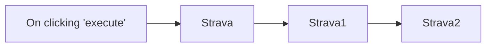

## Fluxo (.json) :

```json
{
  "id": "93",
  "name": "Create, update, and get activity in Strava",
  "nodes": [
    {
      "name": "On clicking 'execute'",
      "type": "n8n-nodes-base.manualTrigger",
      "position": [
        270,
        340
      ],
      "parameters": {},
      "typeVersion": 1
    },
    {
      "name": "Strava",
      "type": "n8n-nodes-base.strava",
      "position": [
        470,
        340
      ],
      "parameters": {
        "name": "Morning Run",
        "type": "Run",
        "startDate": "2020-10-01T18:30:00.000Z",
        "elapsedTime": 3600,
        "additionalFields": {
          "distance": 1000
        }
      },
      "credentials": {
        "stravaOAuth2Api": "strava"
      },
      "typeVersion": 1
    },
    {
      "name": "Strava1",
      "type": "n8n-nodes-base.strava",
      "position": [
        670,
        340
      ],
      "parameters": {
        "operation": "update",
        "activityId": "={{$node[\"Strava\"].json[\"id\"]}}",
        "updateFields": {
          "description": "Morning run in the park"
        }
      },
      "credentials": {
        "stravaOAuth2Api": "strava"
      },
      "typeVersion": 1
    },
    {
      "name": "Strava2",
      "type": "n8n-nodes-base.strava",
      "position": [
        870,
        340
      ],
      "parameters": {
        "operation": "get",
        "activityId": "={{$node[\"Strava\"].json[\"id\"]}}"
      },
      "credentials": {
        "stravaOAuth2Api": "strava"
      },
      "typeVersion": 1
    }
  ],
  "active": false,
  "settings": {},
  "connections": {
    "Strava": {
      "main": [
        [
          {
            "node": "Strava1",
            "type": "main",
            "index": 0
          }
        ]
      ]
    },
    "Strava1": {
      "main": [
        [
          {
            "node": "Strava2",
            "type": "main",
            "index": 0
          }
        ]
      ]
    },
    "On clicking 'execute'": {
      "main": [
        [
          {
            "node": "Strava",
            "type": "main",
            "index": 0
          }
        ]
      ]
    }
  }
}
```

<a id="template-541"></a>

## Template 541 - Envio diário de estatísticas do Instagram

- **Nome:** Envio diário de estatísticas do Instagram
- **Descrição:** Este fluxo coleta estatísticas de uma planilha e envia um resumo diário para um canal do Mattermost.
- **Funcionalidade:** • Agendamento diário às 08:00: Dispara o fluxo automaticamente todas as manhãs às 8h.
• Captura da data atual: Obtém a data e o dia da semana do momento de execução.
• Formatação da data: Converte a data para o formato DD-MM-YYYY para apresentação.
• Leitura de dados da planilha: Busca informações da conta, número de seguidores e quantidade de posts em uma planilha externa.
• Composição e envio de mensagem: Monta uma mensagem com conta, seguidores e posts e publica no canal definido do Mattermost.
- **Ferramentas:** • Google Sheets: Armazenamento das estatísticas do Instagram e leitura dos dados via API/integração.
• Mattermost: Plataforma de chat/colaboração usada para publicar o relatório diário no canal destinado.

## Fluxo visual

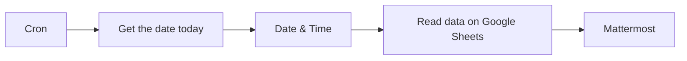

## Fluxo (.json) :

```json
{
  "id": "3",
  "name": "StatsInstagram",
  "nodes": [
    {
      "name": "Mattermost",
      "type": "n8n-nodes-base.mattermost",
      "position": [
        1030,
        290
      ],
      "parameters": {
        "message": "=Bonjour ! Voici les stats de notre Instagram {{$json[\"Compte\"]}} en ce beau matin du {{$node[\"Date & Time\"].json[\"day_today\"]}} {{$node[\"Date & Time\"].json[\"data\"]}}\nLe nombre de Followers est de : {{$json[\"Followers\"]}}\nNous avons réalisé : {{$json[\"Posts\"]}} posts, \nBravo !",
        "channelId": "xxxxxxx",
        "attachments": [],
        "otherOptions": {}
      },
      "credentials": {
        "mattermostApi": "API"
      },
      "typeVersion": 1
    },
    {
      "name": "Date & Time",
      "type": "n8n-nodes-base.dateTime",
      "position": [
        640,
        290
      ],
      "parameters": {
        "value": "={{$json[\"date_today\"]}}",
        "custom": true,
        "options": {},
        "toFormat": "DD-MM-YYYY"
      },
      "typeVersion": 1
    },
    {
      "name": "Cron",
      "type": "n8n-nodes-base.cron",
      "position": [
        310,
        290
      ],
      "parameters": {
        "triggerTimes": {
          "item": [
            {
              "hour": 8
            }
          ]
        }
      },
      "typeVersion": 1
    },
    {
      "name": "Get the date today",
      "type": "n8n-nodes-base.function",
      "position": [
        470,
        290
      ],
      "parameters": {
        "functionCode": "var date = new Date().toISOString();\nvar day = new Date().getDay();\nconst weekday = [\"Dimanche\", \"Lundi\", \"Mardi\", \"Mercredi\", \"Jeudi\", \"Vendredi\", \"Samedi\"];\n\nitems[0].json.date_today = date;\nitems[0].json.day_today = weekday[day];\n\nreturn items;\n"
      },
      "typeVersion": 1
    },
    {
      "name": "Read data on Google Sheets",
      "type": "n8n-nodes-base.googleSheets",
      "position": [
        850,
        290
      ],
      "parameters": {
        "range": "cells",
        "options": {},
        "sheetId": "sheetID",
        "authentication": "oAuth2"
      },
      "credentials": {
        "googleSheetsOAuth2Api": "GoogleAPI"
      },
      "typeVersion": 1
    }
  ],
  "active": false,
  "settings": {},
  "connections": {
    "Cron": {
      "main": [
        [
          {
            "node": "Get the date today",
            "type": "main",
            "index": 0
          }
        ]
      ]
    },
    "Date & Time": {
      "main": [
        [
          {
            "node": "Read data on Google Sheets",
            "type": "main",
            "index": 0
          }
        ]
      ]
    },
    "Get the date today": {
      "main": [
        [
          {
            "node": "Date & Time",
            "type": "main",
            "index": 0
          }
        ]
      ]
    },
    "Read data on Google Sheets": {
      "main": [
        [
          {
            "node": "Mattermost",
            "type": "main",
            "index": 0
          }
        ]
      ]
    }
  }
}
```
