# PACK 1999 TEMPLATES PARTE 03 - Bloco 8

Templates neste bloco: 20

## Sumário

- [Template 542 - Bloqueio de execução com Redis](#template-542)
- [Template 543 - Entrevista contínua por IA sobre exame prático (RU)](#template-543)
- [Template 544 - Organizador semanal de coffee chats](#template-544)
- [Template 545 - Criar organização no Affinity](#template-545)
- [Template 546 - Chatbot Telegram com múltiplas sessões](#template-546)
- [Template 547 - Gerar e publicar posts a partir de planilha](#template-547)
- [Template 548 - Bot Telegram para buscar ferramentas No-Code](#template-548)
- [Template 549 - Upload de imagens via Slack para S3](#template-549)
- [Template 550 - Notificar novos releases do GitHub por e-mail](#template-550)
- [Template 551 - Monitoramento de Sentimento - Linear](#template-551)
- [Template 552 - Bot Telegram com IA e geração de imagens](#template-552)
- [Template 553 - Processamento em lotes com verificação de término](#template-553)
- [Template 554 - Cancelar inscrição de contatos Mautic via e-mail](#template-554)
- [Template 555 - Atualização dinâmica de DNS da Namecheap](#template-555)
- [Template 556 - Validação de email de novos contatos do Mautic](#template-556)
- [Template 557 - Recuperador de workflow com QA](#template-557)
- [Template 558 - Relatório semanal de SEO com A.I.](#template-558)
- [Template 559 - Remover PII de arquivos CSV no Drive](#template-559)
- [Template 560 - Captura periódica da posição da ISS](#template-560)
- [Template 561 - Encaminhar emails filtrados para Telegram](#template-561)

---

<a id="template-542"></a>

## Template 542 - Bloqueio de execução com Redis

- **Nome:** Bloqueio de execução com Redis
- **Descrição:** Verifica uma flag armazenada em Redis para evitar execuções concorrentes e executa um workflow alvo apenas quando o status estiver ocioso.
- **Funcionalidade:** • Agendamento periódico: Dispara a verificação a cada intervalo configurado (a cada 5 segundos).
• Verificação de status: Lê uma chave dinâmica em Redis (workflowStatus_{workflow.id}) para determinar o estado atual.
• Prevenção de concorrência: Interrompe a execução se a flag indicar que o workflow alvo já está em execução.
• Inicialização de lock: Quando não existe flag ou o status é 'idle', define a flag como 'running' antes de iniciar a execução.
• Execução do workflow alvo: Aciona a execução do workflow identificado pelo ID configurado.
• Liberação do lock: Ao término da execução, atualiza a flag para 'idle'.
• Reset manual: Possibilidade de resetar a flag para 'idle' manualmente para recuperação em caso de falhas não planejadas.
- **Ferramentas:** • Redis: Armazenamento chave-valor usado para guardar e consultar a flag de status ('running' / 'idle') que controla se o workflow alvo pode ser executado.

## Fluxo visual

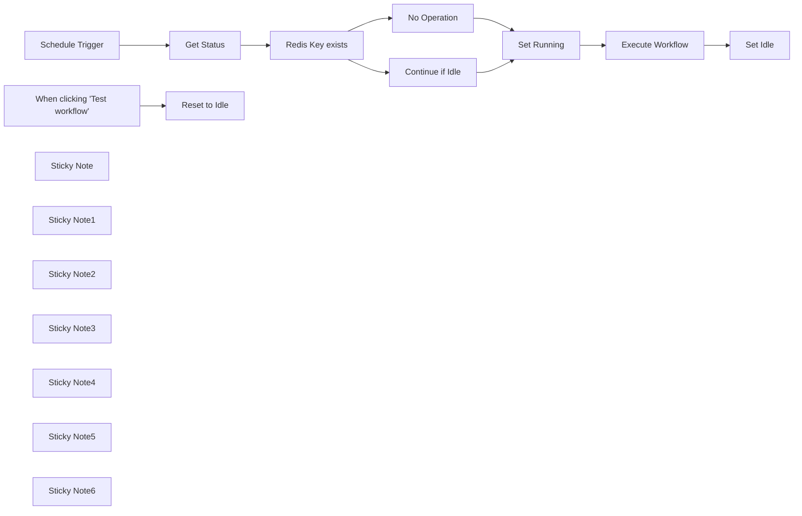

## Fluxo (.json) :

```json
{
  "meta": {
    "instanceId": "378c072a34d9e63949fd9cf26b8d28ff276a486e303f0d8963f23e1d74169c1b"
  },
  "nodes": [
    {
      "id": "3035a456-e783-4ac3-a6b7-1925a81672c1",
      "name": "Execute Workflow",
      "type": "n8n-nodes-base.executeWorkflow",
      "onError": "continueRegularOutput",
      "position": [
        1980,
        440
      ],
      "parameters": {
        "options": {},
        "workflowId": "4cnnwIeC9Sr5ngGZ"
      },
      "typeVersion": 1,
      "alwaysOutputData": true
    },
    {
      "id": "c2d4d0f3-5f84-41de-9a06-4cd5a19e3337",
      "name": "Schedule Trigger",
      "type": "n8n-nodes-base.scheduleTrigger",
      "position": [
        860,
        440
      ],
      "parameters": {
        "rule": {
          "interval": [
            {
              "field": "seconds",
              "secondsInterval": 5
            }
          ]
        }
      },
      "typeVersion": 1.2
    },
    {
      "id": "deb51138-4f68-4e8e-8118-d29bd4b79cd6",
      "name": "Get Status",
      "type": "n8n-nodes-base.redis",
      "position": [
        1080,
        440
      ],
      "parameters": {
        "key": "=workflowStatus_{{ $workflow.id }}",
        "options": {},
        "operation": "get",
        "propertyName": "=workflowStatus"
      },
      "credentials": {
        "redis": {
          "id": "Hvn2Vf7bGjmFgDr0",
          "name": "Redis account"
        }
      },
      "typeVersion": 1
    },
    {
      "id": "73d4e23e-7860-4ac1-8f90-781817e2c98b",
      "name": "Set Running",
      "type": "n8n-nodes-base.redis",
      "position": [
        1760,
        440
      ],
      "parameters": {
        "key": "=workflowStatus_{{ $workflow.id }}",
        "value": "running",
        "operation": "set"
      },
      "credentials": {
        "redis": {
          "id": "Hvn2Vf7bGjmFgDr0",
          "name": "Redis account"
        }
      },
      "typeVersion": 1
    },
    {
      "id": "c7bc785f-dbb0-48be-98ef-d0f940be7749",
      "name": "Set Idle",
      "type": "n8n-nodes-base.redis",
      "position": [
        2200,
        440
      ],
      "parameters": {
        "key": "=workflowStatus_{{ $workflow.id }}",
        "value": "idle",
        "operation": "set"
      },
      "credentials": {
        "redis": {
          "id": "Hvn2Vf7bGjmFgDr0",
          "name": "Redis account"
        }
      },
      "typeVersion": 1
    },
    {
      "id": "f65c374e-f189-4d43-9b45-53776a74cbf2",
      "name": "Continue if Idle",
      "type": "n8n-nodes-base.filter",
      "position": [
        1540,
        360
      ],
      "parameters": {
        "options": {},
        "conditions": {
          "options": {
            "leftValue": "",
            "caseSensitive": true,
            "typeValidation": "strict"
          },
          "combinator": "and",
          "conditions": [
            {
              "id": "0c6308f0-1c96-41a9-b821-97031454d555",
              "operator": {
                "name": "filter.operator.equals",
                "type": "string",
                "operation": "equals"
              },
              "leftValue": "={{ $json.workflowStatus }}",
              "rightValue": "idle"
            }
          ]
        }
      },
      "typeVersion": 2
    },
    {
      "id": "45956f6b-52bf-48d2-8c68-0aa1fa338f8f",
      "name": "Redis Key exists",
      "type": "n8n-nodes-base.if",
      "position": [
        1300,
        440
      ],
      "parameters": {
        "options": {},
        "conditions": {
          "options": {
            "leftValue": "",
            "caseSensitive": true,
            "typeValidation": "strict"
          },
          "combinator": "and",
          "conditions": [
            {
              "id": "a844597a-21f9-4869-9abb-4e4b1530931a",
              "operator": {
                "type": "string",
                "operation": "notEmpty",
                "singleValue": true
              },
              "leftValue": "={{ $json.workflowStatus }}",
              "rightValue": ""
            }
          ]
        }
      },
      "typeVersion": 2
    },
    {
      "id": "29896363-cb31-4940-9cef-a993b931484d",
      "name": "No Operation",
      "type": "n8n-nodes-base.noOp",
      "position": [
        1540,
        520
      ],
      "parameters": {},
      "typeVersion": 1
    },
    {
      "id": "7a8b0ceb-0c9c-4aa5-9cbb-68a7aee3641f",
      "name": "When clicking \"Test workflow\"",
      "type": "n8n-nodes-base.manualTrigger",
      "disabled": true,
      "position": [
        860,
        740
      ],
      "parameters": {},
      "typeVersion": 1
    },
    {
      "id": "d9ab7f18-fe96-4514-a576-49e50575185f",
      "name": "Reset to Idle",
      "type": "n8n-nodes-base.redis",
      "disabled": true,
      "position": [
        1080,
        740
      ],
      "parameters": {
        "key": "=workflowStatus_{{ $workflow.id }}",
        "value": "idle",
        "operation": "set"
      },
      "credentials": {
        "redis": {
          "id": "Hvn2Vf7bGjmFgDr0",
          "name": "Redis account"
        }
      },
      "typeVersion": 1
    },
    {
      "id": "043e00ca-d191-4b54-b0ec-c14e87a5facb",
      "name": "Sticky Note",
      "type": "n8n-nodes-base.stickyNote",
      "position": [
        811,
        614
      ],
      "parameters": {
        "color": 5,
        "width": 433,
        "height": 300,
        "content": "## Troubleshooting\nUnplanned server outage? Need to reset the flag? Disable the schedule trigger, activate these nodes and run the **Reset to Idle** node manually."
      },
      "typeVersion": 1
    },
    {
      "id": "dc045338-4e41-41f3-b197-704e7560c54a",
      "name": "Sticky Note1",
      "type": "n8n-nodes-base.stickyNote",
      "position": [
        1696,
        320
      ],
      "parameters": {
        "color": 7,
        "width": 222,
        "height": 281,
        "content": "This updates the flag, indicating, that the workflow is currently running"
      },
      "typeVersion": 1
    },
    {
      "id": "5b8dae2f-c2cf-4e16-b4a2-bc97bb64b9e0",
      "name": "Sticky Note2",
      "type": "n8n-nodes-base.stickyNote",
      "position": [
        810.8170310701956,
        320
      ],
      "parameters": {
        "width": 205.18296892980436,
        "height": 280,
        "content": "## Set Interval\nDefine how frequently the main workflow should run."
      },
      "typeVersion": 1
    },
    {
      "id": "d55419d3-84e4-4b73-ae4c-a719d94f9bae",
      "name": "Sticky Note3",
      "type": "n8n-nodes-base.stickyNote",
      "position": [
        1248,
        286
      ],
      "parameters": {
        "color": 7,
        "width": 445,
        "height": 382,
        "content": "If the flag stored in Redis already exists and indicates, that the worklow is still running, another execution will be prevented. In that case this workflow ends here."
      },
      "typeVersion": 1
    },
    {
      "id": "55ab702d-0feb-4d13-a42c-f9aed6d4389d",
      "name": "Sticky Note4",
      "type": "n8n-nodes-base.stickyNote",
      "position": [
        1920,
        320
      ],
      "parameters": {
        "width": 218,
        "height": 281,
        "content": "## Set Workflow ID\nSet the ID of the main workflow which should be executed\n"
      },
      "typeVersion": 1
    },
    {
      "id": "7d469990-d3d7-41a1-9a59-7fcf76472342",
      "name": "Sticky Note5",
      "type": "n8n-nodes-base.stickyNote",
      "position": [
        1020,
        320
      ],
      "parameters": {
        "color": 7,
        "width": 222,
        "height": 281,
        "content": "This checks for a dynamic flag (containing the workflow ID) which represents if the workflow is currently running."
      },
      "typeVersion": 1
    },
    {
      "id": "0d96a5e4-40a2-4abf-96be-7e17c187bc3d",
      "name": "Sticky Note6",
      "type": "n8n-nodes-base.stickyNote",
      "position": [
        2140,
        320
      ],
      "parameters": {
        "color": 7,
        "width": 222,
        "height": 281,
        "content": "This updates the flag, indicating, that the workflow is currently idle"
      },
      "typeVersion": 1
    }
  ],
  "pinData": {},
  "connections": {
    "Get Status": {
      "main": [
        [
          {
            "node": "Redis Key exists",
            "type": "main",
            "index": 0
          }
        ]
      ]
    },
    "Set Running": {
      "main": [
        [
          {
            "node": "Execute Workflow",
            "type": "main",
            "index": 0
          }
        ]
      ]
    },
    "No Operation": {
      "main": [
        [
          {
            "node": "Set Running",
            "type": "main",
            "index": 0
          }
        ]
      ]
    },
    "Continue if Idle": {
      "main": [
        [
          {
            "node": "Set Running",
            "type": "main",
            "index": 0
          }
        ]
      ]
    },
    "Execute Workflow": {
      "main": [
        [
          {
            "node": "Set Idle",
            "type": "main",
            "index": 0
          }
        ]
      ]
    },
    "Redis Key exists": {
      "main": [
        [
          {
            "node": "Continue if Idle",
            "type": "main",
            "index": 0
          }
        ],
        [
          {
            "node": "No Operation",
            "type": "main",
            "index": 0
          }
        ]
      ]
    },
    "Schedule Trigger": {
      "main": [
        [
          {
            "node": "Get Status",
            "type": "main",
            "index": 0
          }
        ]
      ]
    },
    "When clicking \"Test workflow\"": {
      "main": [
        [
          {
            "node": "Reset to Idle",
            "type": "main",
            "index": 0
          }
        ]
      ]
    }
  }
}
```

<a id="template-543"></a>

## Template 543 - Entrevista contínua por IA sobre exame prático (RU)

- **Nome:** Entrevista contínua por IA sobre exame prático (RU)
- **Descrição:** Fluxo que conduz uma entrevista contínua conduzida por um agente de IA sobre a experiência do usuário no exame prático de condução do Reino Unido, gravando respostas em sessão e exportando os dados para análise, com tela de conclusão que exibe a transcrição.
- **Funcionalidade:** • Início de sessão via formulário: captura o nome do participante e inicia uma nova sessão com identificador único.
• Geração de perguntas por IA: utiliza um modelo de linguagem para formular perguntas abertas e follow-ons em formato JSON estruturado.
• Loop de entrevista: apresenta uma pergunta por vez via formulário, recebe a resposta do usuário e itera até o usuário solicitar o término.
• Armazenamento de sessão em tempo real: grava cada par pergunta/resposta em uma lista de sessão persistente para construir a transcrição.
• Persistência para análise: exporta registros da sessão para uma planilha para posterior análise e partilha com a equipa.
• Encerramento gracioso da sessão: ao detectar o pedido de encerramento, limpa a memória da sessão e redireciona o usuário para uma tela de conclusão.
• Exibição da transcrição: recupera a sessão pelo ID e gera uma página HTML com o resumo cronológico das perguntas e respostas.
- **Ferramentas:** • Forms (formularios web): interface pública para iniciar a entrevista e coletar respostas dos participantes.
• Upstash (Redis): datastore rápido para guardar sessões, mensagens e construir a transcrição em tempo real.
• Groq (modelo LLM / Llama 3.2 via API): provê o agente de IA que gera as perguntas e decide quando terminar a entrevista, retornando JSON estruturado.
• Google Sheets: armazena as entradas da entrevista para análise, partilha e arquivamento.
• Webhook / servidor de hospedagem: endpoint público que recebe o ID da sessão e retorna a página de conclusão com a transcrição.

## Fluxo visual

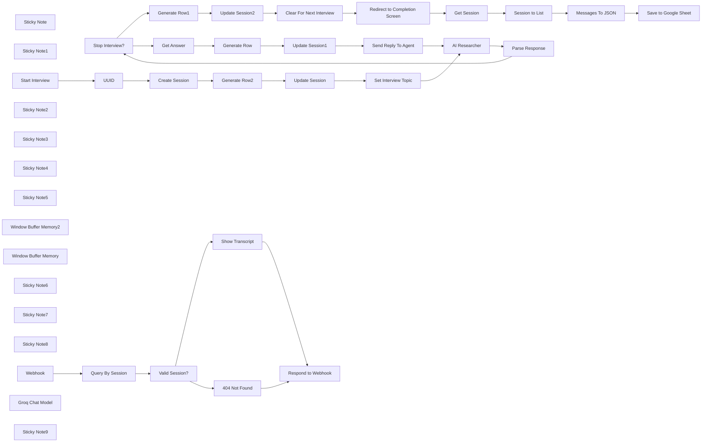

## Fluxo (.json) :

```json
{
  "nodes": [
    {
      "id": "d73e5113-119f-4e62-9872-48e6a971d760",
      "name": "Stop Interview?",
      "type": "n8n-nodes-base.if",
      "position": [
        3380,
        920
      ],
      "parameters": {
        "options": {},
        "conditions": {
          "options": {
            "version": 2,
            "leftValue": "",
            "caseSensitive": true,
            "typeValidation": "strict"
          },
          "combinator": "and",
          "conditions": [
            {
              "id": "3cf788a6-94d0-4223-9caa-30b8e4df8e01",
              "operator": {
                "type": "boolean",
                "operation": "true",
                "singleValue": true
              },
              "leftValue": "={{ $json.output.stop_interview }}",
              "rightValue": ""
            }
          ]
        }
      },
      "typeVersion": 2.2
    },
    {
      "id": "cda3c487-97fa-4037-b9a0-0802f4a02727",
      "name": "Generate Row",
      "type": "n8n-nodes-base.set",
      "position": [
        3740,
        1200
      ],
      "parameters": {
        "options": {},
        "assignments": {
          "assignments": [
            {
              "id": "06146a75-b67a-42cf-aa6f-241f23c47b9a",
              "name": "timestamp",
              "type": "string",
              "value": "={{ $now.toISO() }}"
            },
            {
              "id": "b0278c64-58a7-487d-b7ba-d102fb5d4a0c",
              "name": "type",
              "type": "string",
              "value": "next_question"
            },
            {
              "id": "ba034ca1-408e-422f-b071-dab0ef12fb48",
              "name": "question",
              "type": "string",
              "value": "={{ $('Parse Response').item.json.output.question }}"
            },
            {
              "id": "a2231f6e-f507-408e-b598-53888cf8d4b5",
              "name": "answer",
              "type": "string",
              "value": "={{ $('Get Answer').item.json.answer }}"
            }
          ]
        }
      },
      "typeVersion": 3.4
    },
    {
      "id": "3486f9ae-6a19-4f1f-be46-15376053e71f",
      "name": "Generate Row1",
      "type": "n8n-nodes-base.set",
      "position": [
        3580,
        760
      ],
      "parameters": {
        "options": {},
        "assignments": {
          "assignments": [
            {
              "id": "06146a75-b67a-42cf-aa6f-241f23c47b9a",
              "name": "timestamp",
              "type": "string",
              "value": "={{ $now.toISO() }}"
            },
            {
              "id": "b0278c64-58a7-487d-b7ba-d102fb5d4a0c",
              "name": "type",
              "type": "string",
              "value": "stop_interview"
            },
            {
              "id": "ba034ca1-408e-422f-b071-dab0ef12fb48",
              "name": "question",
              "type": "string",
              "value": "=None"
            },
            {
              "id": "a2231f6e-f507-408e-b598-53888cf8d4b5",
              "name": "answer",
              "type": "string",
              "value": "=None"
            }
          ]
        }
      },
      "typeVersion": 3.4
    },
    {
      "id": "a0e5d40d-e956-4ded-891f-ce5d0f55935f",
      "name": "Clear For Next Interview",
      "type": "@n8n/n8n-nodes-langchain.memoryManager",
      "position": [
        3900,
        760
      ],
      "parameters": {
        "mode": "delete",
        "deleteMode": "all"
      },
      "typeVersion": 1.1
    },
    {
      "id": "66a33fcb-a902-4159-a025-2dff426c1fce",
      "name": "Sticky Note",
      "type": "n8n-nodes-base.stickyNote",
      "position": [
        2580,
        860
      ],
      "parameters": {
        "width": 180,
        "height": 260,
        "content": "\n\n\n\n\n\n\n\n\n\n\n\n\n\n\n### 🚨 Set Interview Topic Here!"
      },
      "typeVersion": 1
    },
    {
      "id": "5cfb7114-a773-4c76-bb3b-7c004be5f799",
      "name": "Send Reply To Agent",
      "type": "n8n-nodes-base.set",
      "position": [
        4060,
        1200
      ],
      "parameters": {
        "options": {},
        "assignments": {
          "assignments": [
            {
              "id": "06a9c730-4756-4bc8-a394-6ff249cf7117",
              "name": "answer",
              "type": "string",
              "value": "={{ $('Get Answer').item.json.answer }}"
            }
          ]
        }
      },
      "typeVersion": 3.4
    },
    {
      "id": "aa30c462-7dfa-40a7-8e63-bed29b30213c",
      "name": "Sticky Note1",
      "type": "n8n-nodes-base.stickyNote",
      "position": [
        1880,
        1060
      ],
      "parameters": {
        "color": 7,
        "width": 490,
        "height": 220,
        "content": "## 1. Setup Interview\n[Learn more about the form trigger node](https://docs.n8n.io/integrations/builtin/core-nodes/n8n-nodes-base.formtrigger)\n\nThe form trigger node will be our entry point into this workflow and to start, we'll just ask for the user's name to start the interview.\nOur session storage will be using Redis via Upstash.com (you can use regular redis btw!) - whichever way, this ensures a highly scalable system able to handle many users."
      },
      "typeVersion": 1
    },
    {
      "id": "5353a7c8-d0e4-429a-ab68-c54d9b845a43",
      "name": "Start Interview",
      "type": "n8n-nodes-base.formTrigger",
      "position": [
        1880,
        880
      ],
      "webhookId": "8d849295-ed30-41ab-a17c-464227cec8fb",
      "parameters": {
        "options": {
          "path": "driving-lessons-survey",
          "ignoreBots": true,
          "buttonLabel": "Begin Interview!",
          "appendAttribution": true,
          "useWorkflowTimezone": true
        },
        "formTitle": "=UK Practical Driving Test Satisfaction Interview",
        "formFields": {
          "values": [
            {
              "fieldLabel": "What is your name?",
              "placeholder": "ie. Sam Smith",
              "requiredField": true
            }
          ]
        },
        "responseMode": "lastNode",
        "formDescription": "=Thanks for taking part in our Interview. You will be presented with an unending series of questions to help us with your experiences in preparing for and taking the UK Practical Driving Test.\n\nThe interviewer is an AI agent and the questions are dynamically generated. When you're done with answer, simple say STOP to exit the interview. Sessions are deleted after 24 hours."
      },
      "typeVersion": 2.2
    },
    {
      "id": "c88a829f-c4b4-4ad4-b121-32b15fae9980",
      "name": "Sticky Note2",
      "type": "n8n-nodes-base.stickyNote",
      "position": [
        2840,
        600
      ],
      "parameters": {
        "color": 7,
        "width": 614,
        "height": 280,
        "content": "## 2. AI Researcher for Endless Interview Questions\n[Learn more about the AI Agent node](https://docs.n8n.io/integrations/builtin/cluster-nodes/root-nodes/n8n-nodes-langchain.agent/)\n\nAn AI interviewer is an interesting take on a role traditionally understood as expensive and time-consuming - both in preparation and execution. What if this could be handed off to an AI/LLM, which could perform when it suits the interviewee and ask a never-ending list of open and follow-on questions for deeper insights?\n\nThis is what this AI researcher agent is designed to do! Upon activation, a loop is created where the agent generates the question and the user answers via the form node. This continues until the user asks to stop the interview."
      },
      "typeVersion": 1
    },
    {
      "id": "10e5dbe0-0163-4c21-8811-9ce9a2a5063b",
      "name": "Sticky Note3",
      "type": "n8n-nodes-base.stickyNote",
      "position": [
        3580,
        1380
      ],
      "parameters": {
        "color": 7,
        "width": 580,
        "height": 202,
        "content": "## 3. Record Answers and Prep for Next Question\n[Learn more about the n8n Form node](https://docs.n8n.io/integrations/builtin/core-nodes/n8n-nodes-base.form/)\n\nThe interview is no good if we can't record the answers somewhere for later analysis! Using n8n form node to capture the answer, we can simple push our new question and answer pair to our Redis session to build our transcript before continuing the loop with the agent."
      },
      "typeVersion": 1
    },
    {
      "id": "0a0cc961-d364-40d2-9ece-cef7d17c4b45",
      "name": "Sticky Note4",
      "type": "n8n-nodes-base.stickyNote",
      "position": [
        3820,
        460
      ],
      "parameters": {
        "color": 7,
        "width": 528,
        "height": 253,
        "content": "## 4. Graciously End the Interview\n[Read more about the Chat Manager node](https://docs.n8n.io/integrations/builtin/cluster-nodes/sub-nodes/n8n-nodes-langchain.memorymanager/)\n\nOnce the AI/LLM detects the user wishes to end the interview (which is done by the user explicitly saying in the form), then the loop breaks and we conclude the interview session and displaying the confirmation screen.\n\nFor this demo, I've created a special confirmation screen which also displays the transcript. This is done by redirecting to a webhook URL. If you don't need this, feel free to change this to \"show completion screen\" instead.\n"
      },
      "typeVersion": 1
    },
    {
      "id": "279d9a67-1d3b-4ffe-a152-33164ef9e2c8",
      "name": "Get Answer",
      "type": "n8n-nodes-base.form",
      "position": [
        3580,
        1200
      ],
      "webhookId": "d96bb88d-db84-4a68-8f02-bcff9cb8429e",
      "parameters": {
        "options": {
          "formTitle": "={{ $json.output.question }}",
          "buttonLabel": "Next Question",
          "formDescription": "Please answer the question or type \"stop interview\" to end the interview."
        },
        "formFields": {
          "values": [
            {
              "fieldType": "textarea",
              "fieldLabel": "answer",
              "requiredField": true
            }
          ]
        }
      },
      "typeVersion": 1
    },
    {
      "id": "4e284505-afc3-4e3e-88c8-38021efbf3c1",
      "name": "Sticky Note5",
      "type": "n8n-nodes-base.stickyNote",
      "position": [
        1280,
        500
      ],
      "parameters": {
        "width": 522.6976744186048,
        "height": 787.6241860465118,
        "content": "## Try it out! \n\n### Conducting user interviews have been traditionally difficult due to preparation, timing and execution costs. What if we let an AI/LLM do it instead?\n\nThis template enables automated AI/LLM powered user interviews using n8n forms and an AI agent where the question and answers are recorded in a google sheet for later analysis. A powerful tool for any researcher.\n\n### Check out the full showcase post here: https://community.n8n.io/t/build-your-own-ai-interview-agents-with-n8n-forms/62312\n\n### How it works\n* A form trigger is used to start the interview and a new session is created in redis to capture the transcript.\n* An AI agent is then tasked to ask questions to the user regarding the topic of the interview. This is setup as a loop so the questions never stop unless the user wishes to end the interview.\n* Each answer is recorded in our session set up earlier between questions.\n* Finally, when the user requests to end the interview we break the loop and show the interview completion screen.\n\n### Why Redis?\nRedis is a fast key-value datastore which makes it ideal for sessions. This ensures the interview flow stays snappy between questions. For my live demo, I used Upstash.com which has a generous free tier.\n\n\n### Need Help?\nJoin the [Discord](https://discord.com/invite/XPKeKXeB7d) or ask in the [Forum](https://community.n8n.io/)!\n\nHappy Hacking!\n"
      },
      "typeVersion": 1
    },
    {
      "id": "ff37e943-851f-4ea7-bcab-b33150881b72",
      "name": "Set Interview Topic",
      "type": "n8n-nodes-base.set",
      "position": [
        2620,
        880
      ],
      "parameters": {
        "options": {},
        "assignments": {
          "assignments": [
            {
              "id": "386f91e1-cc3e-4912-84e3-5ecdbf5412c8",
              "name": "answer",
              "type": "string",
              "value": "=Hello, my name is {{ $('Start Interview').first().json['What is your name?'] }}"
            },
            {
              "id": "492d5ecc-4e76-4297-b8a7-9ca4f801c855",
              "name": "interview_topic",
              "type": "string",
              "value": "Your experience preparing for and taking the UK practical driving test"
            }
          ]
        }
      },
      "typeVersion": 3.4
    },
    {
      "id": "446937bc-a599-4184-b52e-be0607d62d94",
      "name": "UUID",
      "type": "n8n-nodes-base.crypto",
      "position": [
        2020,
        880
      ],
      "parameters": {
        "action": "generate"
      },
      "typeVersion": 1
    },
    {
      "id": "da94c22a-4b26-4898-bde8-b57b5bf01f15",
      "name": "Generate Row2",
      "type": "n8n-nodes-base.set",
      "position": [
        2300,
        880
      ],
      "parameters": {
        "options": {},
        "assignments": {
          "assignments": [
            {
              "id": "06146a75-b67a-42cf-aa6f-241f23c47b9a",
              "name": "timestamp",
              "type": "string",
              "value": "={{ $now.toISO() }}"
            },
            {
              "id": "b0278c64-58a7-487d-b7ba-d102fb5d4a0c",
              "name": "type",
              "type": "string",
              "value": "start_interview"
            },
            {
              "id": "ba034ca1-408e-422f-b071-dab0ef12fb48",
              "name": "question",
              "type": "string",
              "value": "=What is your name?"
            },
            {
              "id": "a2231f6e-f507-408e-b598-53888cf8d4b5",
              "name": "answer",
              "type": "string",
              "value": "={{ $('Start Interview').first().json['What is your name?'] }}"
            }
          ]
        }
      },
      "typeVersion": 3.4
    },
    {
      "id": "9aba23d7-04af-4478-b39b-417f0917597d",
      "name": "Create Session",
      "type": "n8n-nodes-base.redis",
      "position": [
        2160,
        880
      ],
      "parameters": {
        "key": "=session_{{ $('UUID').item.json.data }}",
        "ttl": "={{ 60 * 60 * 24 }}",
        "value": "={{ [] }}",
        "expire": true,
        "keyType": "list",
        "operation": "set"
      },
      "credentials": {
        "redis": {
          "id": "AbPH1yYQ924bVUqm",
          "name": "Upstash (ai interviewer)"
        }
      },
      "typeVersion": 1
    },
    {
      "id": "217c9866-a162-41c6-b123-189869a6cb58",
      "name": "Update Session",
      "type": "n8n-nodes-base.redis",
      "position": [
        2440,
        880
      ],
      "parameters": {
        "list": "=session_{{ $('UUID').first().json.data }}",
        "tail": true,
        "operation": "push",
        "messageData": "={{ $json.toJsonString() }}"
      },
      "credentials": {
        "redis": {
          "id": "AbPH1yYQ924bVUqm",
          "name": "Upstash (ai interviewer)"
        }
      },
      "typeVersion": 1
    },
    {
      "id": "95e8b7c4-4f27-49f3-b509-5238c0f7bd5d",
      "name": "Update Session1",
      "type": "n8n-nodes-base.redis",
      "position": [
        3900,
        1200
      ],
      "parameters": {
        "list": "=session_{{ $('UUID').first().json.data }}",
        "tail": true,
        "operation": "push",
        "messageData": "={{ $json.toJsonString() }}"
      },
      "credentials": {
        "redis": {
          "id": "AbPH1yYQ924bVUqm",
          "name": "Upstash (ai interviewer)"
        }
      },
      "typeVersion": 1
    },
    {
      "id": "afaa55dd-844e-4bf3-8a31-3a0953caaf69",
      "name": "Update Session2",
      "type": "n8n-nodes-base.redis",
      "position": [
        3740,
        760
      ],
      "parameters": {
        "list": "=session_{{ $('UUID').first().json.data }}",
        "tail": true,
        "operation": "push",
        "messageData": "={{ $json.toJsonString() }}"
      },
      "credentials": {
        "redis": {
          "id": "AbPH1yYQ924bVUqm",
          "name": "Upstash (ai interviewer)"
        }
      },
      "typeVersion": 1
    },
    {
      "id": "c381d598-1902-4789-ac15-65ac2124fbdd",
      "name": "Valid Session?",
      "type": "n8n-nodes-base.if",
      "position": [
        5080,
        1240
      ],
      "parameters": {
        "options": {},
        "conditions": {
          "options": {
            "version": 2,
            "leftValue": "",
            "caseSensitive": true,
            "typeValidation": "strict"
          },
          "combinator": "and",
          "conditions": [
            {
              "id": "500d6ca9-2a04-40f0-98e8-aa4290e6a30d",
              "operator": {
                "type": "array",
                "operation": "exists",
                "singleValue": true
              },
              "leftValue": "={{ $json.data }}",
              "rightValue": ""
            }
          ]
        }
      },
      "typeVersion": 2.2
    },
    {
      "id": "f26ccdaa-4f94-4acb-894b-341648aee8b0",
      "name": "Respond to Webhook",
      "type": "n8n-nodes-base.respondToWebhook",
      "position": [
        5440,
        1240
      ],
      "parameters": {
        "options": {
          "responseCode": 200,
          "responseHeaders": {
            "entries": [
              {
                "name": "Content-Type",
                "value": "text/html"
              }
            ]
          }
        },
        "respondWith": "text",
        "responseBody": "={{ $json.html }}"
      },
      "typeVersion": 1.1
    },
    {
      "id": "09a05dc6-4a21-4df0-a83d-5e1b986090f8",
      "name": "Window Buffer Memory2",
      "type": "@n8n/n8n-nodes-langchain.memoryBufferWindow",
      "position": [
        3000,
        1120
      ],
      "parameters": {
        "sessionKey": "={{ $('UUID').first().json.data }}",
        "sessionIdType": "customKey"
      },
      "typeVersion": 1.2
    },
    {
      "id": "26f87c7d-9e2c-41e8-b7eb-3c249a69f905",
      "name": "Window Buffer Memory",
      "type": "@n8n/n8n-nodes-langchain.memoryBufferWindow",
      "position": [
        3900,
        920
      ],
      "parameters": {
        "sessionKey": "={{ $('UUID').first().json.data }}",
        "sessionIdType": "customKey"
      },
      "typeVersion": 1.2
    },
    {
      "id": "ab891c71-af03-49c9-b281-d0058374260b",
      "name": "Sticky Note6",
      "type": "n8n-nodes-base.stickyNote",
      "position": [
        4180,
        740
      ],
      "parameters": {
        "width": 276.4353488372094,
        "height": 320.31553488372094,
        "content": "\n\n\n\n\n\n\n\n\n\n\n\n\n\n\n### 🚨 Set Your Webhook URL here!\nFor this demo, we want to show a customised completion screen with transcript so it's necessary to redirect to a webhook (see step 6)."
      },
      "typeVersion": 1
    },
    {
      "id": "7a063851-1bea-4e34-897c-4038d08b845e",
      "name": "Redirect to Completion Screen",
      "type": "n8n-nodes-base.form",
      "position": [
        4260,
        760
      ],
      "webhookId": "9fdedf1b-e413-4fc3-94a4-9cc24bffff8a",
      "parameters": {
        "operation": "completion",
        "redirectUrl": "=https://<host>/webhook/<uuid-if-using-n8n-cloud>/ai-interview-transcripts/{{ $('UUID').first().json.data }}",
        "respondWith": "redirect"
      },
      "typeVersion": 1
    },
    {
      "id": "b67b3fa5-faf6-402b-9b9e-c783869770ca",
      "name": "Sticky Note7",
      "type": "n8n-nodes-base.stickyNote",
      "position": [
        4640,
        1220
      ],
      "parameters": {
        "color": 5,
        "width": 236.3564651162793,
        "height": 345.82027906976737,
        "content": "\n\n\n\n\n\n\n\n\n\n\n\n\n\n\n### 🚨 This is the webhook we want to redirect to!\nIf you're on n8n cloud, you may want to copy the webhook url generated here and use it as the form ending's redirect url."
      },
      "typeVersion": 1
    },
    {
      "id": "583d1572-2d6f-4ca4-9e31-33dc1481e87a",
      "name": "Sticky Note8",
      "type": "n8n-nodes-base.stickyNote",
      "position": [
        4580,
        980
      ],
      "parameters": {
        "color": 7,
        "width": 588,
        "height": 207,
        "content": "## 6. Display the Transcript\n[Read more about the Webhook Trigger](https://docs.n8n.io/integrations/builtin/core-nodes/n8n-nodes-base.webhook)\n\nThis step is totally optional. For a nicer user experience, I use this webhook mini-flow to display the user's transcript for the completion screen. It works by capturing the session_id in the webhook's url and searching for it in our redis database. If a match is found the transcript is fetched and rendered into a webpage using the HTML node and returned to the user. If no match is found, a 404 message is displayed instead."
      },
      "typeVersion": 1
    },
    {
      "id": "5fcf86b9-3fa3-48f5-a4a4-a1e261a48b49",
      "name": "Webhook",
      "type": "n8n-nodes-base.webhook",
      "position": [
        4700,
        1240
      ],
      "webhookId": "78df12c4-ccd0-46dd-be0d-4445c2bd04f2",
      "parameters": {
        "path": "ai-interview-transcripts/:session_id",
        "options": {
          "ignoreBots": true
        },
        "responseMode": "responseNode"
      },
      "typeVersion": 2
    },
    {
      "id": "6df57307-feef-4be5-861d-fdc0b92d1ef6",
      "name": "404 Not Found",
      "type": "n8n-nodes-base.html",
      "position": [
        5260,
        1320
      ],
      "parameters": {
        "html": "\n<html lang='en'>\n\n\t<head>\n\t\t<meta charset='UTF-8' />\n\t\t<meta name='viewport' content='width=device-width, initial-scale=1.0' />\n\t\t<link rel='icon' type='image/png' href='https://n8n.io/favicon.ico' />\n\t\t<link\n\t\t\thref='https://fonts.googleapis.com/css?family=Open+Sans'\n\t\t\trel='stylesheet'\n\t\t\ttype='text/css'\n\t\t/>\n\n\t\t<title>Driving Practice Test 2024 Survey</title>\n\n\t\t<style>\n\t\t\t*, ::after, ::before { box-sizing: border-box; margin: 0; padding: 0; } body { font-family:\n\t\t\tOpen Sans, sans-serif; font-weight: 400; font-size: 12px; display: flex; flex-direction:\n\t\t\tcolumn; justify-content: start; background-color: #FBFCFE; } .container { margin: auto;\n\t\t\ttext-align: center; padding-top: 24px; width: 448px; } .card { padding: 24px;\n\t\t\tbackground-color: white; border: 1px solid #DBDFE7; border-radius: 8px; box-shadow: 0px 4px\n\t\t\t16px 0px #634DFF0F; margin-bottom: 16px; } .n8n-link a { color: #7E8186; font-weight: 600;\n\t\t\tfont-size: 12px; text-decoration: none; } .n8n-link svg { display: inline-block;\n\t\t\tvertical-align: middle; } .header h1 { color: #525356; font-size: 20px; font-weight: 400;\n\t\t\tpadding-bottom: 8px; } .header p { color: #7E8186; font-size: 14px; font-weight: 400; }\n\t\t</style>\n\t</head>\n\n\t<body>\n\t\t<div class='container'>\n\t\t\t<section>\n\t\t\t\t<div class='card'>\n\t\t\t\t\t<div class='header'>\n\t\t\t\t\t\t<h1>404 Not Found</h1>\n\t\t\t\t\t\t<p>The requested session does not exist.</p>\n                      <p>Your session may have expired.</p>\n                    </div>\n\t\t\t\t</div>\n\t\t\t\t\t<div class='n8n-link'>\n\t\t\t\t\t\t<a href=\"https://n8n.partnerlinks.io/ee7izbliiw0n\" target='_blank'>\n\t\t\t\t\t\t\tForm automated with\n\t\t\t\t\t\t\t<svg\n\t\t\t\t\t\t\t\twidth='73'\n\t\t\t\t\t\t\t\theight='20'\n\t\t\t\t\t\t\t\tviewBox='0 0 73 20'\n\t\t\t\t\t\t\t\tfill='none'\n\t\t\t\t\t\t\t\txmlns='http://www.w3.org/2000/svg'\n\t\t\t\t\t\t\t>\n\t\t\t\t\t\t\t\t<path\n\t\t\t\t\t\t\t\t\tfill-rule='evenodd'\n\t\t\t\t\t\t\t\t\tclip-rule='evenodd'\n\t\t\t\t\t\t\t\t\td='M40.2373 4C40.2373 6.20915 38.4464 8 36.2373 8C34.3735 8 32.8074 6.72525 32.3633 5H26.7787C25.801 5 24.9666 5.70685 24.8059 6.6712L24.6415 7.6576C24.4854 8.59415 24.0116 9.40925 23.3417 10C24.0116 10.5907 24.4854 11.4058 24.6415 12.3424L24.8059 13.3288C24.9666 14.2931 25.801 15 26.7787 15H28.3633C28.8074 13.2747 30.3735 12 32.2373 12C34.4464 12 36.2373 13.7908 36.2373 16C36.2373 18.2092 34.4464 20 32.2373 20C30.3735 20 28.8074 18.7253 28.3633 17H26.7787C24.8233 17 23.1546 15.5864 22.8331 13.6576L22.6687 12.6712C22.508 11.7069 21.6736 11 20.6959 11H19.0645C18.5652 12.64 17.0406 13.8334 15.2373 13.8334C13.434 13.8334 11.9094 12.64 11.4101 11H9.06449C8.56519 12.64 7.04059 13.8334 5.2373 13.8334C3.02817 13.8334 1.2373 12.0424 1.2373 9.83335C1.2373 7.6242 3.02817 5.83335 5.2373 5.83335C7.16069 5.83335 8.76699 7.19085 9.15039 9H11.3242C11.7076 7.19085 13.3139 5.83335 15.2373 5.83335C17.1607 5.83335 18.767 7.19085 19.1504 9H20.6959C21.6736 9 22.508 8.29315 22.6687 7.3288L22.8331 6.3424C23.1546 4.41365 24.8233 3 26.7787 3H32.3633C32.8074 1.27478 34.3735 0 36.2373 0C38.4464 0 40.2373 1.79086 40.2373 4ZM38.2373 4C38.2373 5.10455 37.3419 6 36.2373 6C35.1327 6 34.2373 5.10455 34.2373 4C34.2373 2.89543 35.1327 2 36.2373 2C37.3419 2 38.2373 2.89543 38.2373 4ZM5.2373 11.8334C6.34189 11.8334 7.23729 10.9379 7.23729 9.83335C7.23729 8.72875 6.34189 7.83335 5.2373 7.83335C4.13273 7.83335 3.2373 8.72875 3.2373 9.83335C3.2373 10.9379 4.13273 11.8334 5.2373 11.8334ZM15.2373 11.8334C16.3419 11.8334 17.2373 10.9379 17.2373 9.83335C17.2373 8.72875 16.3419 7.83335 15.2373 7.83335C14.1327 7.83335 13.2373 8.72875 13.2373 9.83335C13.2373 10.9379 14.1327 11.8334 15.2373 11.8334ZM32.2373 18C33.3419 18 34.2373 17.1045 34.2373 16C34.2373 14.8954 33.3419 14 32.2373 14C31.1327 14 30.2373 14.8954 30.2373 16C30.2373 17.1045 31.1327 18 32.2373 18Z'\n\t\t\t\t\t\t\t\t\tfill='#EA4B71'\n\t\t\t\t\t\t\t\t/>\n\t\t\t\t\t\t\t\t<path\n\t\t\t\t\t\t\t\t\td='M44.2393 15.0007H46.3277V10.5791C46.3277 9.12704 47.2088 8.49074 48.204 8.49074C49.183 8.49074 49.9498 9.14334 49.9498 10.4812V15.0007H52.038V10.057C52.038 7.91969 50.798 6.67969 48.8567 6.67969C47.633 6.67969 46.9477 7.16914 46.4582 7.80544H46.3277L46.1482 6.84284H44.2393V15.0007Z'\n\t\t\t\t\t\t\t\t\tfill='#101330'\n\t\t\t\t\t\t\t\t/>\n\t\t\t\t\t\t\t\t<path\n\t\t\t\t\t\t\t\t\td='M60.0318 9.50205V9.40415C60.7498 9.0452 61.4678 8.4252 61.4678 7.20155C61.4678 5.43945 60.0153 4.37891 58.0088 4.37891C55.9528 4.37891 54.4843 5.5047 54.4843 7.23415C54.4843 8.4089 55.1698 9.0452 55.9203 9.40415V9.50205C55.0883 9.79575 54.0928 10.6768 54.0928 12.1452C54.0928 13.9237 55.5613 15.1637 57.9923 15.1637C60.4233 15.1637 61.8428 13.9237 61.8428 12.1452C61.8428 10.6768 60.8638 9.81205 60.0318 9.50205ZM57.9923 5.87995C58.8083 5.87995 59.4118 6.40205 59.4118 7.2831C59.4118 8.16415 58.7918 8.6863 57.9923 8.6863C57.1928 8.6863 56.5238 8.16415 56.5238 7.2831C56.5238 6.38575 57.1603 5.87995 57.9923 5.87995ZM57.9923 13.5974C57.0458 13.5974 56.2793 12.9937 56.2793 11.9658C56.2793 11.0358 56.9153 10.3342 57.9758 10.3342C59.0203 10.3342 59.6568 11.0195 59.6568 11.9984C59.6568 12.9937 58.9223 13.5974 57.9923 13.5974Z'\n\t\t\t\t\t\t\t\t\tfill='#101330'\n\t\t\t\t\t\t\t\t/>\n\t\t\t\t\t\t\t\t<path\n\t\t\t\t\t\t\t\t\td='M63.9639 15.0007H66.0524V10.5791C66.0524 9.12704 66.9334 8.49074 67.9289 8.49074C68.9079 8.49074 69.6744 9.14334 69.6744 10.4812V15.0007H71.7629V10.057C71.7629 7.91969 70.5229 6.67969 68.5814 6.67969C67.3579 6.67969 66.6724 7.16914 66.1829 7.80544H66.0524L65.8729 6.84284H63.9639V15.0007Z'\n\t\t\t\t\t\t\t\t\tfill='#101330'\n\t\t\t\t\t\t\t\t/>\n\t\t\t\t\t\t\t</svg>\n\t\t\t\t\t\t</a>\n\t\t\t\t\t</div>\n\t\t\t</section>\n\t\t</div>\n\t</body>\n\n</html>"
      },
      "typeVersion": 1.2
    },
    {
      "id": "0e968154-ead5-4194-834e-0d1175e7c1d9",
      "name": "AI Researcher",
      "type": "@n8n/n8n-nodes-langchain.agent",
      "position": [
        2900,
        920
      ],
      "parameters": {
        "text": "={{ $json.answer }}",
        "options": {
          "systemMessage": "=You are a user research expert interviewing a user on the topic of \"{{ $('Set Interview Topic').first().json.interview_topic }}\".\n\n* Your task is to ask open-ended questions relevant to the interview topic.\n* Ask only one question at a time. Analyse the previous question and ask new question each time. If there is an opportunity to dig deeper into a previous answer, do so but limit to 1 follow-on question.\n* Keep asking questions until the user requests to stop the interview. When the user requests to stop the interview and no question is required, \"question\" is an empty string.\n* Use a friendly and polite tone when asking questions.\n* If the user answers are inrelevant to the question, ask the question again or move on to another question.\n* If the user's answer is beyond the scope of the interview, ignore the answer and ask if the user would like to stop the interview.\n*You must format your response using the following json schema as we require pre processing before responding to the user.\n```\n{\n  \"type\":\"object\",\n  \"properties\": {\n    \"stop_interview\": { \"type\": \"boolean\" },\n    \"question\": { \"type\": [\"string\", \"null\"] }\n  }\n}\n```\n* Output only the json object and do not prefix or suffix the message with extraneous text."
        },
        "promptType": "define",
        "hasOutputParser": true
      },
      "typeVersion": 1.7
    },
    {
      "id": "969d4094-1046-4f53-bf8b-5ae7e50bd3ed",
      "name": "Parse Response",
      "type": "n8n-nodes-base.set",
      "position": [
        3220,
        920
      ],
      "parameters": {
        "options": {},
        "assignments": {
          "assignments": [
            {
              "id": "bf61134c-e24c-453e-97ef-5edd25726148",
              "name": "output",
              "type": "object",
              "value": "={{\n$json.output\n  .replace('```json', '')\n  .replace('```', '')\n  .parseJson()\n}}"
            }
          ]
        }
      },
      "typeVersion": 3.4
    },
    {
      "id": "323b73c4-8c77-48a9-a549-f3e863ba72c2",
      "name": "Groq Chat Model",
      "type": "@n8n/n8n-nodes-langchain.lmChatGroq",
      "position": [
        2860,
        1120
      ],
      "parameters": {
        "model": "llama-3.2-90b-text-preview",
        "options": {}
      },
      "credentials": {
        "groqApi": {
          "id": "YQVoV5K9FREww7t1",
          "name": "Groq account"
        }
      },
      "typeVersion": 1
    },
    {
      "id": "bf4518c4-8e59-450e-be5a-92f31cf38528",
      "name": "Show Transcript",
      "type": "n8n-nodes-base.html",
      "position": [
        5260,
        1140
      ],
      "parameters": {
        "html": "\n<html lang='en'>\n\n\t<head>\n\t\t<meta charset='UTF-8' />\n\t\t<meta name='viewport' content='width=device-width, initial-scale=1.0' />\n\t\t<link rel='icon' type='image/png' href='https://n8n.io/favicon.ico' />\n\t\t<link\n\t\t\thref='https://fonts.googleapis.com/css?family=Open+Sans'\n\t\t\trel='stylesheet'\n\t\t\ttype='text/css'\n\t\t/>\n\n\t\t<title>AI Interviewer Transcripts</title>\n\n\t\t<style>\n\t\t\t*, ::after, ::before { box-sizing: border-box; margin: 0; padding: 0; } body { font-family:\n\t\t\tOpen Sans, sans-serif; font-weight: 400; font-size: 12px; display: flex; flex-direction:\n\t\t\tcolumn; justify-content: start; background-color: #FBFCFE; } .container { margin: auto;\n\t\t\ttext-align: center; padding-top: 24px; width: 448px; } .card { padding: 24px;\n\t\t\tbackground-color: white; border: 1px solid #DBDFE7; border-radius: 8px; box-shadow: 0px 4px\n\t\t\t16px 0px #634DFF0F; margin-bottom: 16px; } .n8n-link a { color: #7E8186; font-weight: 600;\n\t\t\tfont-size: 12px; text-decoration: none; } .n8n-link svg { display: inline-block;\n\t\t\tvertical-align: middle; } .header h1 { color: #525356; font-size: 20px; font-weight: 400;\n\t\t\tpadding-bottom: 8px; } .header p { color: #7E8186; font-size: 14px; font-weight: 400; }\n\t\t</style>\n\t</head>\n\n\t<body>\n\t\t<div class='container' style=\"width:640px\">\n\t\t\t<section>\n\t\t\t\t<div class='card'>\n\t\t\t\t\t<div class='header'>\n\t\t\t\t\t\t<h1>Thanks for Completing the Interview!</h1>\n\t\t\t\t\t\t<p style=\"margin-bottom:12px;\">If you liked this demo, <br/>please follow me on <a href=\"http://linkedin.com/in/jimleuk\" target=\"_blank\">http://linkedin.com/in/jimleuk</a> and\n                          <a href=\"https://x.com/jimle_uk\" target=\"_blank\">https://x.com/jimle_uk</a>\n                        </p>\n                        <p>\n                          <a href=\"https://n8n.partnerlinks.io/ee7izbliiw0n\" target=\"_blank\">\n                            Support my work! Sign up to n8n using this link 🙏\n                          </a>\n                        </p>\n                    </div>\n\t\t\t\t</div>\n                <div class='card' >\n\t\t\t\t\t<div class='header'>\n\t\t\t\t\t\t<h1>Transcript</h1>\n                      <p style=\"color:#ccc;margin-bottom:24px;font-size:0.8rem\">This session is deleted within 24 hours.</p>\n                        {{\n                          $json.data\n                            .map(item => JSON.parse(item))\n                            .filter(item => item.type === 'next_question')\n                            .map(item => `\n                              <div style=\"display:flex;flex-direction:row;margin-bottom: 16px;\">\n                                <div style=\"width: 60px;padding-right: 5px;text-align: left;color: #ccc;\">\n                                  ${DateTime.fromISO(item.timestamp).format('dd MMM, hh:mm')}\n                                </div>\n                                <div style=\"width:100%\">\n                                  <div style=\"\n    border: 1px solid #ccc;\n    padding: 10px;\n    border-radius: 5px;\n    background-color: #f8f7f7;\n    text-align: right;\n    margin-bottom: 5px;\n\">${item.question}</div>\n                                  <div style=\"\n    border: 1px solid #c7ccec;\n    padding: 10px;\n    border-radius: 5px;\n    background-color: #f5f5fc;\n    text-align: left;\n    color: #2e2e84;\n\">${item.answer}</div>\n                                </div>\n                              </div>\n                           `)\n                            .join('\\n')\n                        }}\n    \t\t\t\t</div>\n\t\t\t\t</div>\n\t\t\t\t\t<div class='n8n-link'>\n\t\t\t\t\t\t<a href=\"https://n8n.partnerlinks.io/ee7izbliiw0n\" target='_blank'>\n\t\t\t\t\t\t\tForm automated with\n\t\t\t\t\t\t\t<svg\n\t\t\t\t\t\t\t\twidth='73'\n\t\t\t\t\t\t\t\theight='20'\n\t\t\t\t\t\t\t\tviewBox='0 0 73 20'\n\t\t\t\t\t\t\t\tfill='none'\n\t\t\t\t\t\t\t\txmlns='http://www.w3.org/2000/svg'\n\t\t\t\t\t\t\t>\n\t\t\t\t\t\t\t\t<path\n\t\t\t\t\t\t\t\t\tfill-rule='evenodd'\n\t\t\t\t\t\t\t\t\tclip-rule='evenodd'\n\t\t\t\t\t\t\t\t\td='M40.2373 4C40.2373 6.20915 38.4464 8 36.2373 8C34.3735 8 32.8074 6.72525 32.3633 5H26.7787C25.801 5 24.9666 5.70685 24.8059 6.6712L24.6415 7.6576C24.4854 8.59415 24.0116 9.40925 23.3417 10C24.0116 10.5907 24.4854 11.4058 24.6415 12.3424L24.8059 13.3288C24.9666 14.2931 25.801 15 26.7787 15H28.3633C28.8074 13.2747 30.3735 12 32.2373 12C34.4464 12 36.2373 13.7908 36.2373 16C36.2373 18.2092 34.4464 20 32.2373 20C30.3735 20 28.8074 18.7253 28.3633 17H26.7787C24.8233 17 23.1546 15.5864 22.8331 13.6576L22.6687 12.6712C22.508 11.7069 21.6736 11 20.6959 11H19.0645C18.5652 12.64 17.0406 13.8334 15.2373 13.8334C13.434 13.8334 11.9094 12.64 11.4101 11H9.06449C8.56519 12.64 7.04059 13.8334 5.2373 13.8334C3.02817 13.8334 1.2373 12.0424 1.2373 9.83335C1.2373 7.6242 3.02817 5.83335 5.2373 5.83335C7.16069 5.83335 8.76699 7.19085 9.15039 9H11.3242C11.7076 7.19085 13.3139 5.83335 15.2373 5.83335C17.1607 5.83335 18.767 7.19085 19.1504 9H20.6959C21.6736 9 22.508 8.29315 22.6687 7.3288L22.8331 6.3424C23.1546 4.41365 24.8233 3 26.7787 3H32.3633C32.8074 1.27478 34.3735 0 36.2373 0C38.4464 0 40.2373 1.79086 40.2373 4ZM38.2373 4C38.2373 5.10455 37.3419 6 36.2373 6C35.1327 6 34.2373 5.10455 34.2373 4C34.2373 2.89543 35.1327 2 36.2373 2C37.3419 2 38.2373 2.89543 38.2373 4ZM5.2373 11.8334C6.34189 11.8334 7.23729 10.9379 7.23729 9.83335C7.23729 8.72875 6.34189 7.83335 5.2373 7.83335C4.13273 7.83335 3.2373 8.72875 3.2373 9.83335C3.2373 10.9379 4.13273 11.8334 5.2373 11.8334ZM15.2373 11.8334C16.3419 11.8334 17.2373 10.9379 17.2373 9.83335C17.2373 8.72875 16.3419 7.83335 15.2373 7.83335C14.1327 7.83335 13.2373 8.72875 13.2373 9.83335C13.2373 10.9379 14.1327 11.8334 15.2373 11.8334ZM32.2373 18C33.3419 18 34.2373 17.1045 34.2373 16C34.2373 14.8954 33.3419 14 32.2373 14C31.1327 14 30.2373 14.8954 30.2373 16C30.2373 17.1045 31.1327 18 32.2373 18Z'\n\t\t\t\t\t\t\t\t\tfill='#EA4B71'\n\t\t\t\t\t\t\t\t/>\n\t\t\t\t\t\t\t\t<path\n\t\t\t\t\t\t\t\t\td='M44.2393 15.0007H46.3277V10.5791C46.3277 9.12704 47.2088 8.49074 48.204 8.49074C49.183 8.49074 49.9498 9.14334 49.9498 10.4812V15.0007H52.038V10.057C52.038 7.91969 50.798 6.67969 48.8567 6.67969C47.633 6.67969 46.9477 7.16914 46.4582 7.80544H46.3277L46.1482 6.84284H44.2393V15.0007Z'\n\t\t\t\t\t\t\t\t\tfill='#101330'\n\t\t\t\t\t\t\t\t/>\n\t\t\t\t\t\t\t\t<path\n\t\t\t\t\t\t\t\t\td='M60.0318 9.50205V9.40415C60.7498 9.0452 61.4678 8.4252 61.4678 7.20155C61.4678 5.43945 60.0153 4.37891 58.0088 4.37891C55.9528 4.37891 54.4843 5.5047 54.4843 7.23415C54.4843 8.4089 55.1698 9.0452 55.9203 9.40415V9.50205C55.0883 9.79575 54.0928 10.6768 54.0928 12.1452C54.0928 13.9237 55.5613 15.1637 57.9923 15.1637C60.4233 15.1637 61.8428 13.9237 61.8428 12.1452C61.8428 10.6768 60.8638 9.81205 60.0318 9.50205ZM57.9923 5.87995C58.8083 5.87995 59.4118 6.40205 59.4118 7.2831C59.4118 8.16415 58.7918 8.6863 57.9923 8.6863C57.1928 8.6863 56.5238 8.16415 56.5238 7.2831C56.5238 6.38575 57.1603 5.87995 57.9923 5.87995ZM57.9923 13.5974C57.0458 13.5974 56.2793 12.9937 56.2793 11.9658C56.2793 11.0358 56.9153 10.3342 57.9758 10.3342C59.0203 10.3342 59.6568 11.0195 59.6568 11.9984C59.6568 12.9937 58.9223 13.5974 57.9923 13.5974Z'\n\t\t\t\t\t\t\t\t\tfill='#101330'\n\t\t\t\t\t\t\t\t/>\n\t\t\t\t\t\t\t\t<path\n\t\t\t\t\t\t\t\t\td='M63.9639 15.0007H66.0524V10.5791C66.0524 9.12704 66.9334 8.49074 67.9289 8.49074C68.9079 8.49074 69.6744 9.14334 69.6744 10.4812V15.0007H71.7629V10.057C71.7629 7.91969 70.5229 6.67969 68.5814 6.67969C67.3579 6.67969 66.6724 7.16914 66.1829 7.80544H66.0524L65.8729 6.84284H63.9639V15.0007Z'\n\t\t\t\t\t\t\t\t\tfill='#101330'\n\t\t\t\t\t\t\t\t/>\n\t\t\t\t\t\t\t</svg>\n\t\t\t\t\t\t</a>\n\t\t\t\t\t</div>\n\t\t\t</section>\n\t\t</div>\n\t</body>\n\n</html>"
      },
      "typeVersion": 1.2
    },
    {
      "id": "dff24e45-8e57-4dfc-8b65-9d315b406bd2",
      "name": "Save to Google Sheet",
      "type": "n8n-nodes-base.googleSheets",
      "position": [
        5040,
        760
      ],
      "parameters": {
        "columns": {
          "value": {
            "name": "{{ $('Start Interview').first().json['What is your name?'] }}",
            "session_id": "={{ $('UUID').first().json.data }}"
          },
          "schema": [
            {
              "id": "session_id",
              "type": "string",
              "display": true,
              "required": false,
              "displayName": "session_id",
              "defaultMatch": false,
              "canBeUsedToMatch": true
            },
            {
              "id": "timestamp",
              "type": "string",
              "display": true,
              "required": false,
              "displayName": "timestamp",
              "defaultMatch": false,
              "canBeUsedToMatch": true
            },
            {
              "id": "name",
              "type": "string",
              "display": true,
              "required": false,
              "displayName": "name",
              "defaultMatch": false,
              "canBeUsedToMatch": true
            },
            {
              "id": "type",
              "type": "string",
              "display": true,
              "required": false,
              "displayName": "type",
              "defaultMatch": false,
              "canBeUsedToMatch": true
            },
            {
              "id": "question",
              "type": "string",
              "display": true,
              "required": false,
              "displayName": "question",
              "defaultMatch": false,
              "canBeUsedToMatch": true
            },
            {
              "id": "answer",
              "type": "string",
              "display": true,
              "required": false,
              "displayName": "answer",
              "defaultMatch": false,
              "canBeUsedToMatch": true
            }
          ],
          "mappingMode": "autoMapInputData",
          "matchingColumns": []
        },
        "options": {
          "useAppend": true
        },
        "operation": "append",
        "sheetName": {
          "__rl": true,
          "mode": "list",
          "value": 1695693704,
          "cachedResultUrl": "https://docs.google.com/spreadsheets/d/1wKjVdm7HeufJkHrUJn_bW9bFI_blm0laoI_jgXKDe0Q/edit#gid=1695693704",
          "cachedResultName": "transcripts"
        },
        "documentId": {
          "__rl": true,
          "mode": "list",
          "value": "1wKjVdm7HeufJkHrUJn_bW9bFI_blm0laoI_jgXKDe0Q",
          "cachedResultUrl": "https://docs.google.com/spreadsheets/d/1wKjVdm7HeufJkHrUJn_bW9bFI_blm0laoI_jgXKDe0Q/edit?usp=drivesdk",
          "cachedResultName": "AI Researcher with n8n Forms"
        }
      },
      "credentials": {
        "googleSheetsOAuth2Api": {
          "id": "FsFwFchwmgtBu5l7",
          "name": "Google Sheets account"
        }
      },
      "typeVersion": 4.5
    },
    {
      "id": "8eb03a1c-02e4-4d49-bf68-bb148585828f",
      "name": "Session to List",
      "type": "n8n-nodes-base.splitOut",
      "position": [
        4700,
        760
      ],
      "parameters": {
        "options": {},
        "fieldToSplitOut": "session"
      },
      "typeVersion": 1
    },
    {
      "id": "c594aa2b-a29d-42e4-8799-1c557d78932d",
      "name": "Messages To JSON",
      "type": "n8n-nodes-base.set",
      "position": [
        4860,
        760
      ],
      "parameters": {
        "mode": "raw",
        "options": {},
        "jsonOutput": "={{\n{\n  ...$json.session.parseJson(),\n  session_id: `session_${$('UUID').first().json.data}`,\n  name: $('Start Interview').first().json['What is your name?'],\n}\n}}"
      },
      "typeVersion": 3.4
    },
    {
      "id": "106bd688-6ccc-4a6a-9b52-ee7187d9aebe",
      "name": "Sticky Note9",
      "type": "n8n-nodes-base.stickyNote",
      "position": [
        4540,
        420
      ],
      "parameters": {
        "color": 7,
        "width": 508,
        "height": 293,
        "content": "## 5. Save the Interview to Sheets\n[Read more about the Google Sheets node](https://docs.n8n.io/integrations/builtin/app-nodes/n8n-nodes-base.googlesheets/)\n\nFor easier data-sharing, we can have the workflow upload the session messages into data analysis tools for our team members.\n\nFor this demo, Google Sheets is an easy option. We'll pull the entire session out of redis and upload the messages one by one to sheets.\n\n### Check out the example sheet here: https://docs.google.com/spreadsheets/d/1wKjVdm7HeufJkHrUJn_bW9bFI_blm0laoI_jgXKDe0Q/edit?usp=sharing"
      },
      "typeVersion": 1
    },
    {
      "id": "b7754724-7473-4245-8b54-85c370a2b1be",
      "name": "Query By Session",
      "type": "n8n-nodes-base.redis",
      "position": [
        4920,
        1240
      ],
      "parameters": {
        "key": "=session_{{ $('Webhook').first().json.params.session_id }}",
        "options": {},
        "operation": "get",
        "propertyName": "data"
      },
      "credentials": {
        "redis": {
          "id": "AbPH1yYQ924bVUqm",
          "name": "Upstash (ai interviewer)"
        }
      },
      "typeVersion": 1
    },
    {
      "id": "4b6a0db6-1d33-4ed3-a955-7562e0dba1f0",
      "name": "Get Session",
      "type": "n8n-nodes-base.redis",
      "position": [
        4540,
        760
      ],
      "parameters": {
        "key": "=session_{{ $('UUID').first().json.data }}",
        "keyType": "list",
        "options": {},
        "operation": "get",
        "propertyName": "session"
      },
      "credentials": {
        "redis": {
          "id": "AbPH1yYQ924bVUqm",
          "name": "Upstash (ai interviewer)"
        }
      },
      "executeOnce": true,
      "typeVersion": 1
    }
  ],
  "pinData": {},
  "connections": {
    "UUID": {
      "main": [
        [
          {
            "node": "Create Session",
            "type": "main",
            "index": 0
          }
        ]
      ]
    },
    "Webhook": {
      "main": [
        [
          {
            "node": "Query By Session",
            "type": "main",
            "index": 0
          }
        ]
      ]
    },
    "Get Answer": {
      "main": [
        [
          {
            "node": "Generate Row",
            "type": "main",
            "index": 0
          }
        ]
      ]
    },
    "Get Session": {
      "main": [
        [
          {
            "node": "Session to List",
            "type": "main",
            "index": 0
          }
        ]
      ]
    },
    "Generate Row": {
      "main": [
        [
          {
            "node": "Update Session1",
            "type": "main",
            "index": 0
          }
        ]
      ]
    },
    "404 Not Found": {
      "main": [
        [
          {
            "node": "Respond to Webhook",
            "type": "main",
            "index": 0
          }
        ]
      ]
    },
    "AI Researcher": {
      "main": [
        [
          {
            "node": "Parse Response",
            "type": "main",
            "index": 0
          }
        ]
      ]
    },
    "Generate Row1": {
      "main": [
        [
          {
            "node": "Update Session2",
            "type": "main",
            "index": 0
          }
        ]
      ]
    },
    "Generate Row2": {
      "main": [
        [
          {
            "node": "Update Session",
            "type": "main",
            "index": 0
          }
        ]
      ]
    },
    "Create Session": {
      "main": [
        [
          {
            "node": "Generate Row2",
            "type": "main",
            "index": 0
          }
        ]
      ]
    },
    "Parse Response": {
      "main": [
        [
          {
            "node": "Stop Interview?",
            "type": "main",
            "index": 0
          }
        ]
      ]
    },
    "Update Session": {
      "main": [
        [
          {
            "node": "Set Interview Topic",
            "type": "main",
            "index": 0
          }
        ]
      ]
    },
    "Valid Session?": {
      "main": [
        [
          {
            "node": "Show Transcript",
            "type": "main",
            "index": 0
          }
        ],
        [
          {
            "node": "404 Not Found",
            "type": "main",
            "index": 0
          }
        ]
      ]
    },
    "Groq Chat Model": {
      "ai_languageModel": [
        [
          {
            "node": "AI Researcher",
            "type": "ai_languageModel",
            "index": 0
          }
        ]
      ]
    },
    "Session to List": {
      "main": [
        [
          {
            "node": "Messages To JSON",
            "type": "main",
            "index": 0
          }
        ]
      ]
    },
    "Show Transcript": {
      "main": [
        [
          {
            "node": "Respond to Webhook",
            "type": "main",
            "index": 0
          }
        ]
      ]
    },
    "Start Interview": {
      "main": [
        [
          {
            "node": "UUID",
            "type": "main",
            "index": 0
          }
        ]
      ]
    },
    "Stop Interview?": {
      "main": [
        [
          {
            "node": "Generate Row1",
            "type": "main",
            "index": 0
          }
        ],
        [
          {
            "node": "Get Answer",
            "type": "main",
            "index": 0
          }
        ]
      ]
    },
    "Update Session1": {
      "main": [
        [
          {
            "node": "Send Reply To Agent",
            "type": "main",
            "index": 0
          }
        ]
      ]
    },
    "Update Session2": {
      "main": [
        [
          {
            "node": "Clear For Next Interview",
            "type": "main",
            "index": 0
          }
        ]
      ]
    },
    "Messages To JSON": {
      "main": [
        [
          {
            "node": "Save to Google Sheet",
            "type": "main",
            "index": 0
          }
        ]
      ]
    },
    "Query By Session": {
      "main": [
        [
          {
            "node": "Valid Session?",
            "type": "main",
            "index": 0
          }
        ]
      ]
    },
    "Send Reply To Agent": {
      "main": [
        [
          {
            "node": "AI Researcher",
            "type": "main",
            "index": 0
          }
        ]
      ]
    },
    "Set Interview Topic": {
      "main": [
        [
          {
            "node": "AI Researcher",
            "type": "main",
            "index": 0
          }
        ]
      ]
    },
    "Window Buffer Memory": {
      "ai_memory": [
        [
          {
            "node": "Clear For Next Interview",
            "type": "ai_memory",
            "index": 0
          }
        ]
      ]
    },
    "Window Buffer Memory2": {
      "ai_memory": [
        [
          {
            "node": "AI Researcher",
            "type": "ai_memory",
            "index": 0
          }
        ]
      ]
    },
    "Clear For Next Interview": {
      "main": [
        [
          {
            "node": "Redirect to Completion Screen",
            "type": "main",
            "index": 0
          }
        ]
      ]
    },
    "Redirect to Completion Screen": {
      "main": [
        [
          {
            "node": "Get Session",
            "type": "main",
            "index": 0
          }
        ]
      ]
    }
  }
}
```

<a id="template-544"></a>

## Template 544 - Organizador semanal de coffee chats

- **Nome:** Organizador semanal de coffee chats
- **Descrição:** Automatiza a formação e o anúncio de grupos semanais para coffee chats entre membros de um canal, além de enviar convites de calendário para os participantes.
- **Funcionalidade:** • Gatilho semanal: inicia o fluxo automaticamente toda segunda-feira às 10h.
• Coleta de participantes: obtém a lista de usuários presentes no canal especificado.
• Formação de grupos aleatórios: embaralha os participantes e divide em grupos com tamanho ideal de 3, ajustando para evitar grupos de uma pessoa.
• Anúncio no canal: publica uma saudação e lista os grupos formados no canal.
• Envio de convites no calendário: cria eventos no calendário com os participantes como convidados e configura conferência (Google Meet).
• Uso de parâmetros dinâmicos: utiliza IDs de canal, e-mails dos usuários e calendário configurados no fluxo para operar.
- **Ferramentas:** • Mattermost: plataforma de mensagens usada para recuperar usuários do canal e anunciar os grupos.
• Google Calendar: serviço de calendário usado para criar eventos, adicionar participantes e gerar link de conferência (Google Meet/Hangouts Meet).

## Fluxo visual

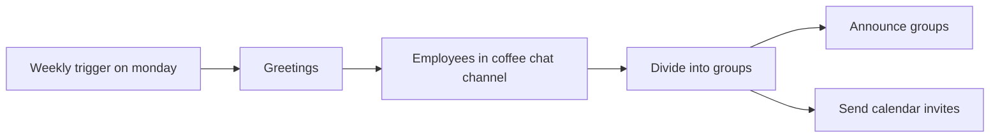

## Fluxo (.json) :

```json
{
  "id": "7",
  "name": "Coffee Bot (Mattermost)",
  "nodes": [
    {
      "name": "Divide into groups",
      "type": "n8n-nodes-base.function",
      "position": [
        1060,
        300
      ],
      "parameters": {
        "functionCode": "const ideal_group_size = 3;\nlet groups = [];\nlet data_as_array = [];\nlet newItems = [];\n\n// Take all the users and add them to an array\nfor (let j = 0; j < items.length; j++) {\n  data_as_array.push({username: items[j].json.username, email: items[j].json.email});\n}\n\n// Fisher-Yates (aka Knuth) Shuffle\nfunction shuffle(array) {\n  var currentIndex = array.length, temporaryValue, randomIndex;\n\n  // While there remain elements to shuffle...\n  while (0 !== currentIndex) {\n\n    // Pick a remaining element...\n    randomIndex = Math.floor(Math.random() * currentIndex);\n    currentIndex -= 1;\n\n    // And swap it with the current element.\n    temporaryValue = array[currentIndex];\n    array[currentIndex] = array[randomIndex];\n    array[randomIndex] = temporaryValue;\n  }\n\n  return array;\n}\n\n// Randomize the sequence of names in the array\ndata_as_array = shuffle(data_as_array);\n\n// Create groups of ideal group size (3)\nfor (let i = 0; i < data_as_array.length; i += ideal_group_size) {\n  groups.push(data_as_array.slice(i, i + ideal_group_size));\n}\n\n// Make sure that no group has just one person. If it does, take\n// one from previous group and add it to that group \nfor (let k = 0; k < groups.length; k++) {\n  if (groups[k].length === 1) {\n    groups[k].push(groups[k-1].shift());\n  }\n}\n\nfor (let l = 0; l < groups.length; l++) {\n    newItems.push({json: {groupsUsername: groups[l].map(a=> a.username), groupsEmail: groups[l].map(b=> b.email)}})\n}\n\nreturn newItems;"
      },
      "typeVersion": 1
    },
    {
      "name": "Greetings",
      "type": "n8n-nodes-base.mattermost",
      "position": [
        650,
        300
      ],
      "parameters": {
        "message": "👋 Happy Monday\n\nGroups for this week's virtual coffee are:",
        "channelId": "Enter Your Channel ID",
        "attachments": [],
        "otherOptions": {}
      },
      "credentials": {
        "mattermostApi": "Mattermost Cred"
      },
      "typeVersion": 1
    },
    {
      "name": "Weekly trigger on monday",
      "type": "n8n-nodes-base.cron",
      "position": [
        450,
        300
      ],
      "parameters": {
        "triggerTimes": {
          "item": [
            {
              "hour": 10,
              "mode": "everyWeek"
            }
          ]
        }
      },
      "typeVersion": 1
    },
    {
      "name": "Announce groups",
      "type": "n8n-nodes-base.mattermost",
      "position": [
        1250,
        200
      ],
      "parameters": {
        "message": "=☀️ {{$node[\"Divide into groups\"].json[\"groupsUsername\"].join(', ')}}",
        "channelId": "=",
        "attachments": [],
        "otherOptions": {}
      },
      "credentials": {
        "mattermostApi": "Mattermost Cred"
      },
      "typeVersion": 1
    },
    {
      "name": "Employees in coffee chat channel",
      "type": "n8n-nodes-base.mattermost",
      "position": [
        850,
        300
      ],
      "parameters": {
        "resource": "user",
        "operation": "getAll",
        "additionalFields": {
          "inChannel": "={{$node[\"Greetings\"].parameter[\"channelId\"]}}"
        }
      },
      "credentials": {
        "mattermostApi": "Mattermost Cred"
      },
      "typeVersion": 1
    },
    {
      "name": "Send calendar invites",
      "type": "n8n-nodes-base.googleCalendar",
      "position": [
        1250,
        400
      ],
      "parameters": {
        "end": "2020-12-17T18:38:49.000Z",
        "start": "2020-12-17T18:08:49.000Z",
        "calendar": "Enter Your Google Calendar",
        "additionalFields": {
          "summary": "n8n coffee catchup",
          "attendees": [
            "={{$node[\"Divide into groups\"].json[\"groupsEmail\"].join(',')}}"
          ],
          "guestsCanModify": true,
          "conferenceDataUi": {
            "conferenceDataValues": {
              "conferenceSolution": "hangoutsMeet"
            }
          }
        }
      },
      "credentials": {
        "googleCalendarOAuth2Api": "Google Calendar Cred"
      },
      "typeVersion": 1
    }
  ],
  "active": false,
  "settings": {},
  "connections": {
    "Greetings": {
      "main": [
        [
          {
            "node": "Employees in coffee chat channel",
            "type": "main",
            "index": 0
          }
        ]
      ]
    },
    "Divide into groups": {
      "main": [
        [
          {
            "node": "Announce groups",
            "type": "main",
            "index": 0
          },
          {
            "node": "Send calendar invites",
            "type": "main",
            "index": 0
          }
        ]
      ]
    },
    "Weekly trigger on monday": {
      "main": [
        [
          {
            "node": "Greetings",
            "type": "main",
            "index": 0
          }
        ]
      ]
    },
    "Employees in coffee chat channel": {
      "main": [
        [
          {
            "node": "Divide into groups",
            "type": "main",
            "index": 0
          }
        ]
      ]
    }
  }
}
```

<a id="template-545"></a>

## Template 545 - Criar organização no Affinity

- **Nome:** Criar organização no Affinity
- **Descrição:** Fluxo acionado manualmente que cria uma nova organização no Affinity utilizando os dados fornecidos.
- **Funcionalidade:** • Disparo manual: inicia o fluxo ao clicar em executar.
• Criação de organização: envia nome e domínio para criar uma nova organização no Affinity.
• Campos adicionais: permite incluir campos adicionais na requisição de criação.
• Autenticação via API: utiliza credenciais da API para autorizar a operação.
- **Ferramentas:** • Affinity: plataforma de CRM e inteligência de relacionamentos com API para gerenciar e criar organizações e contatos.

## Fluxo visual

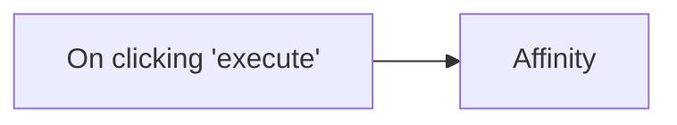

## Fluxo (.json) :

```json
{
  "id": "95",
  "name": "Create an organization in Affinity",
  "nodes": [
    {
      "name": "On clicking 'execute'",
      "type": "n8n-nodes-base.manualTrigger",
      "position": [
        400,
        250
      ],
      "parameters": {},
      "typeVersion": 1
    },
    {
      "name": "Affinity",
      "type": "n8n-nodes-base.affinity",
      "position": [
        600,
        250
      ],
      "parameters": {
        "name": "",
        "domain": "",
        "additionalFields": {}
      },
      "credentials": {
        "affinityApi": ""
      },
      "typeVersion": 1
    }
  ],
  "active": false,
  "settings": {},
  "connections": {
    "On clicking 'execute'": {
      "main": [
        [
          {
            "node": "Affinity",
            "type": "main",
            "index": 0
          }
        ]
      ]
    }
  }
}
```

<a id="template-546"></a>

## Template 546 - Chatbot Telegram com múltiplas sessões

- **Nome:** Chatbot Telegram com múltiplas sessões
- **Descrição:** Um chatbot para Telegram que usa IA para responder mensagens e gerenciar múltiplas sessões de conversa, permitindo criar, retomar, consultar e resumir sessões, além de responder a perguntas contextuais.
- **Funcionalidade:** • Recepção de mensagens do Telegram: Escuta e processa mensagens e comandos enviados pelos usuários.
• Criação de nova sessão (/new): Desativa a sessão anterior, cria uma nova sessão ativa e notifica o usuário.
• Consulta de sessão atual (/current): Retorna ao usuário qual é a sessão marcada como atual.
• Retomar sessão (/resume <id>): Permite definir uma sessão passada como a sessão atual para continuar a conversa.
• Resumo de conversa (/summary): Compila o histórico de prompts e respostas da sessão e gera um resumo conciso via IA.
• Perguntas sobre histórico (/question <texto>): Envia uma pergunta que será respondida pela IA com base no histórico completo da sessão.
• Geração de respostas com IA: Usa modelos de linguagem para produzir respostas às mensagens do usuário e para a cadeia de sumarização.
• Registro do histórico: Salva prompt, resposta, data e sessão em uma planilha para auditoria e recuperação posterior.
- **Ferramentas:** • Telegram: Canal de comunicação utilizado para receber mensagens dos usuários e enviar respostas.
• Google Sheets: Armazena o estado das sessões (atual/expirada) e o banco de dados com histórico de prompts, respostas e datas.
• OpenAI (modelo GPT): Fornece a capacidade de geração de linguagem e sumarização utilizada para responder mensagens, sumarizar histórico e responder perguntas contextuais.

## Fluxo visual

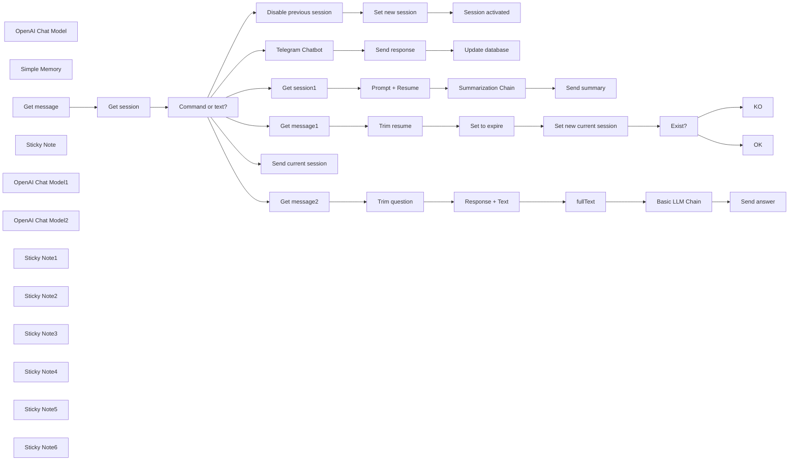

## Fluxo (.json) :

```json
{
  "id": "A7dRnMf9WybO8O02",
  "meta": {
    "instanceId": "a4bfc93e975ca233ac45ed7c9227d84cf5a2329310525917adaf3312e10d5462",
    "templateCredsSetupCompleted": true
  },
  "name": "Telegram ChatBot with multiple sessions",
  "tags": [],
  "nodes": [
    {
      "id": "d3104851-90ec-4f0c-ab4d-aee5a6faf81b",
      "name": "OpenAI Chat Model",
      "type": "@n8n/n8n-nodes-langchain.lmChatOpenAi",
      "position": [
        640,
        1180
      ],
      "parameters": {
        "model": {
          "__rl": true,
          "mode": "list",
          "value": "gpt-4o-mini"
        },
        "options": {}
      },
      "credentials": {
        "openAiApi": {
          "id": "4zwP0MSr8zkNvvV9",
          "name": "OpenAi account"
        }
      },
      "typeVersion": 1.2
    },
    {
      "id": "e25050a1-e49b-4b46-8452-ce7b3388c7f3",
      "name": "Simple Memory",
      "type": "@n8n/n8n-nodes-langchain.memoryBufferWindow",
      "position": [
        780,
        1180
      ],
      "parameters": {
        "sessionKey": "={{ $('Get session').item.json.SESSION }}",
        "sessionIdType": "customKey",
        "contextWindowLength": 100
      },
      "typeVersion": 1.3
    },
    {
      "id": "d50951ae-e9a2-492c-8ff5-a039ca6975e4",
      "name": "Get message",
      "type": "n8n-nodes-base.telegramTrigger",
      "position": [
        -520,
        -60
      ],
      "webhookId": "8d87dcf7-1608-4255-a1f1-03b700a42f0e",
      "parameters": {
        "updates": [
          "message"
        ],
        "additionalFields": {}
      },
      "credentials": {
        "telegramApi": {
          "id": "rQ5q95W7uKesMDx4",
          "name": "Telegram account Fastewb"
        }
      },
      "typeVersion": 1.2
    },
    {
      "id": "1bc9aa0f-8af8-47b8-b7d7-6bfd9280b65f",
      "name": "Command or text?",
      "type": "n8n-nodes-base.switch",
      "position": [
        -20,
        -60
      ],
      "parameters": {
        "rules": {
          "values": [
            {
              "outputKey": "New session",
              "conditions": {
                "options": {
                  "version": 2,
                  "leftValue": "",
                  "caseSensitive": true,
                  "typeValidation": "strict"
                },
                "combinator": "and",
                "conditions": [
                  {
                    "id": "955f3c39-0732-4a63-b3f7-70ab0753a68a",
                    "operator": {
                      "type": "string",
                      "operation": "startsWith"
                    },
                    "leftValue": "={{ $('Get message').item.json.message.text }}",
                    "rightValue": "/new"
                  }
                ]
              },
              "renameOutput": true
            },
            {
              "outputKey": "Current session",
              "conditions": {
                "options": {
                  "version": 2,
                  "leftValue": "",
                  "caseSensitive": true,
                  "typeValidation": "strict"
                },
                "combinator": "and",
                "conditions": [
                  {
                    "id": "790f64bc-f3cc-4ef4-9d43-80853742fee6",
                    "operator": {
                      "type": "string",
                      "operation": "startsWith"
                    },
                    "leftValue": "={{ $('Get message').item.json.message.text }}",
                    "rightValue": "/current"
                  }
                ]
              },
              "renameOutput": true
            },
            {
              "outputKey": "Resume session",
              "conditions": {
                "options": {
                  "version": 2,
                  "leftValue": "",
                  "caseSensitive": true,
                  "typeValidation": "strict"
                },
                "combinator": "and",
                "conditions": [
                  {
                    "id": "39f35352-aee4-4a16-b82f-7f58ab8120f0",
                    "operator": {
                      "type": "string",
                      "operation": "startsWith"
                    },
                    "leftValue": "={{ $('Get message').item.json.message.text }}",
                    "rightValue": "/resume"
                  }
                ]
              },
              "renameOutput": true
            },
            {
              "outputKey": "Summary ",
              "conditions": {
                "options": {
                  "version": 2,
                  "leftValue": "",
                  "caseSensitive": true,
                  "typeValidation": "strict"
                },
                "combinator": "and",
                "conditions": [
                  {
                    "id": "270d71bf-8ecf-46e7-a601-cc5d1dc58e72",
                    "operator": {
                      "name": "filter.operator.equals",
                      "type": "string",
                      "operation": "equals"
                    },
                    "leftValue": "={{ $('Get message').item.json.message.text }}",
                    "rightValue": "/summary"
                  }
                ]
              },
              "renameOutput": true
            },
            {
              "outputKey": "Question",
              "conditions": {
                "options": {
                  "version": 2,
                  "leftValue": "",
                  "caseSensitive": true,
                  "typeValidation": "strict"
                },
                "combinator": "and",
                "conditions": [
                  {
                    "id": "55fe98fa-e39a-41b3-983f-359a8e730f21",
                    "operator": {
                      "type": "string",
                      "operation": "startsWith"
                    },
                    "leftValue": "={{ $('Get message').item.json.message.text }}",
                    "rightValue": "/question"
                  }
                ]
              },
              "renameOutput": true
            }
          ]
        },
        "options": {
          "fallbackOutput": "extra"
        }
      },
      "typeVersion": 3.2
    },
    {
      "id": "4a405332-99a8-4ec9-84d5-89f9f5f1610f",
      "name": "Get session",
      "type": "n8n-nodes-base.googleSheets",
      "position": [
        -260,
        -60
      ],
      "parameters": {
        "options": {
          "returnFirstMatch": true
        },
        "filtersUI": {
          "values": [
            {
              "lookupValue": "current",
              "lookupColumn": "STATE"
            }
          ]
        },
        "sheetName": {
          "__rl": true,
          "mode": "list",
          "value": 207843712,
          "cachedResultUrl": "https://docs.google.com/spreadsheets/d/1MCJLAqKP0Y7Qr68ZYoSSBeEVyKI1QgAAZnlEiyqkzXo/edit#gid=207843712",
          "cachedResultName": "Session"
        },
        "documentId": {
          "__rl": true,
          "mode": "list",
          "value": "1MCJLAqKP0Y7Qr68ZYoSSBeEVyKI1QgAAZnlEiyqkzXo",
          "cachedResultUrl": "https://docs.google.com/spreadsheets/d/1MCJLAqKP0Y7Qr68ZYoSSBeEVyKI1QgAAZnlEiyqkzXo/edit?usp=drivesdk",
          "cachedResultName": "Chatbot with session"
        }
      },
      "credentials": {
        "googleSheetsOAuth2Api": {
          "id": "JYR6a64Qecd6t8Hb",
          "name": "Google Sheets account"
        }
      },
      "typeVersion": 4.5
    },
    {
      "id": "860fa8d5-6c9b-476b-857b-9c47a023d72f",
      "name": "Disable previous session",
      "type": "n8n-nodes-base.googleSheets",
      "position": [
        640,
        -760
      ],
      "parameters": {
        "columns": {
          "value": {
            "STATE": "expire",
            "SESSION": "={{ $('Get session').item.json.SESSION }}"
          },
          "schema": [
            {
              "id": "SESSION",
              "type": "string",
              "display": true,
              "removed": false,
              "required": false,
              "displayName": "SESSION",
              "defaultMatch": false,
              "canBeUsedToMatch": true
            },
            {
              "id": "STATE",
              "type": "string",
              "display": true,
              "removed": false,
              "required": false,
              "displayName": "STATE",
              "defaultMatch": false,
              "canBeUsedToMatch": true
            },
            {
              "id": "row_number",
              "type": "string",
              "display": true,
              "removed": true,
              "readOnly": true,
              "required": false,
              "displayName": "row_number",
              "defaultMatch": false,
              "canBeUsedToMatch": true
            }
          ],
          "mappingMode": "defineBelow",
          "matchingColumns": [
            "SESSION"
          ],
          "attemptToConvertTypes": false,
          "convertFieldsToString": false
        },
        "options": {},
        "operation": "update",
        "sheetName": {
          "__rl": true,
          "mode": "list",
          "value": 207843712,
          "cachedResultUrl": "https://docs.google.com/spreadsheets/d/1MCJLAqKP0Y7Qr68ZYoSSBeEVyKI1QgAAZnlEiyqkzXo/edit#gid=207843712",
          "cachedResultName": "Session"
        },
        "documentId": {
          "__rl": true,
          "mode": "list",
          "value": "1MCJLAqKP0Y7Qr68ZYoSSBeEVyKI1QgAAZnlEiyqkzXo",
          "cachedResultUrl": "https://docs.google.com/spreadsheets/d/1MCJLAqKP0Y7Qr68ZYoSSBeEVyKI1QgAAZnlEiyqkzXo/edit?usp=drivesdk",
          "cachedResultName": "Chatbot with session"
        }
      },
      "credentials": {
        "googleSheetsOAuth2Api": {
          "id": "JYR6a64Qecd6t8Hb",
          "name": "Google Sheets account"
        }
      },
      "typeVersion": 4.5
    },
    {
      "id": "6ff1cf54-5406-4c86-a77e-8424208d4728",
      "name": "Set new session",
      "type": "n8n-nodes-base.googleSheets",
      "position": [
        960,
        -760
      ],
      "parameters": {
        "columns": {
          "value": {
            "STATE": "current",
            "SESSION": "={{ $('Get message').item.json.update_id }}"
          },
          "schema": [
            {
              "id": "SESSION",
              "type": "string",
              "display": true,
              "required": false,
              "displayName": "SESSION",
              "defaultMatch": false,
              "canBeUsedToMatch": true
            },
            {
              "id": "STATE",
              "type": "string",
              "display": true,
              "removed": false,
              "required": false,
              "displayName": "STATE",
              "defaultMatch": false,
              "canBeUsedToMatch": true
            }
          ],
          "mappingMode": "defineBelow",
          "matchingColumns": [],
          "attemptToConvertTypes": false,
          "convertFieldsToString": false
        },
        "options": {},
        "operation": "append",
        "sheetName": {
          "__rl": true,
          "mode": "list",
          "value": 207843712,
          "cachedResultUrl": "https://docs.google.com/spreadsheets/d/1MCJLAqKP0Y7Qr68ZYoSSBeEVyKI1QgAAZnlEiyqkzXo/edit#gid=207843712",
          "cachedResultName": "Session"
        },
        "documentId": {
          "__rl": true,
          "mode": "list",
          "value": "1MCJLAqKP0Y7Qr68ZYoSSBeEVyKI1QgAAZnlEiyqkzXo",
          "cachedResultUrl": "https://docs.google.com/spreadsheets/d/1MCJLAqKP0Y7Qr68ZYoSSBeEVyKI1QgAAZnlEiyqkzXo/edit?usp=drivesdk",
          "cachedResultName": "Chatbot with session"
        }
      },
      "credentials": {
        "googleSheetsOAuth2Api": {
          "id": "JYR6a64Qecd6t8Hb",
          "name": "Google Sheets account"
        }
      },
      "typeVersion": 4.5
    },
    {
      "id": "be9c755a-0c52-453c-b448-98975d4c6e87",
      "name": "Session activated",
      "type": "n8n-nodes-base.telegram",
      "position": [
        1240,
        -760
      ],
      "webhookId": "fa5e7641-068c-40cb-b490-a6809e74c629",
      "parameters": {
        "text": "New session activated",
        "chatId": "={{ $('Get message').item.json.message.from.id }}",
        "additionalFields": {
          "appendAttribution": false
        }
      },
      "credentials": {
        "telegramApi": {
          "id": "rQ5q95W7uKesMDx4",
          "name": "Telegram account Fastewb"
        }
      },
      "typeVersion": 1.2
    },
    {
      "id": "31478ec5-c1de-43db-ac9d-9b34f68e951c",
      "name": "Send response",
      "type": "n8n-nodes-base.telegram",
      "position": [
        1100,
        980
      ],
      "webhookId": "fa5e7641-068c-40cb-b490-a6809e74c629",
      "parameters": {
        "text": "={{ $json.output }}",
        "chatId": "={{ $('Get message').item.json.message.from.id }}",
        "additionalFields": {
          "appendAttribution": false
        }
      },
      "credentials": {
        "telegramApi": {
          "id": "rQ5q95W7uKesMDx4",
          "name": "Telegram account Fastewb"
        }
      },
      "typeVersion": 1.2
    },
    {
      "id": "be35b9a6-2914-409f-bc9c-6199ccb9e4ed",
      "name": "Update database",
      "type": "n8n-nodes-base.googleSheets",
      "position": [
        1420,
        980
      ],
      "parameters": {
        "columns": {
          "value": {
            "DATE": "={{$now}}",
            "PROMPT": "={{ $('Get message').item.json.message.text }}",
            "SESSION": "={{ $('Get session').item.json.SESSION }}",
            "RESPONSE": "={{ $('Telegram Chatbot').item.json.output }}"
          },
          "schema": [
            {
              "id": "SESSION",
              "type": "string",
              "display": true,
              "required": false,
              "displayName": "SESSION",
              "defaultMatch": false,
              "canBeUsedToMatch": true
            },
            {
              "id": "DATE",
              "type": "string",
              "display": true,
              "required": false,
              "displayName": "DATE",
              "defaultMatch": false,
              "canBeUsedToMatch": true
            },
            {
              "id": "PROMPT",
              "type": "string",
              "display": true,
              "required": false,
              "displayName": "PROMPT",
              "defaultMatch": false,
              "canBeUsedToMatch": true
            },
            {
              "id": "RESPONSE",
              "type": "string",
              "display": true,
              "required": false,
              "displayName": "RESPONSE",
              "defaultMatch": false,
              "canBeUsedToMatch": true
            }
          ],
          "mappingMode": "defineBelow",
          "matchingColumns": [],
          "attemptToConvertTypes": false,
          "convertFieldsToString": false
        },
        "options": {},
        "operation": "append",
        "sheetName": {
          "__rl": true,
          "mode": "list",
          "value": "gid=0",
          "cachedResultUrl": "https://docs.google.com/spreadsheets/d/1MCJLAqKP0Y7Qr68ZYoSSBeEVyKI1QgAAZnlEiyqkzXo/edit#gid=0",
          "cachedResultName": "Database"
        },
        "documentId": {
          "__rl": true,
          "mode": "list",
          "value": "1MCJLAqKP0Y7Qr68ZYoSSBeEVyKI1QgAAZnlEiyqkzXo",
          "cachedResultUrl": "https://docs.google.com/spreadsheets/d/1MCJLAqKP0Y7Qr68ZYoSSBeEVyKI1QgAAZnlEiyqkzXo/edit?usp=drivesdk",
          "cachedResultName": "Chatbot with session"
        }
      },
      "credentials": {
        "googleSheetsOAuth2Api": {
          "id": "JYR6a64Qecd6t8Hb",
          "name": "Google Sheets account"
        }
      },
      "typeVersion": 4.5
    },
    {
      "id": "dacc79e0-56ff-47d6-b09f-16ebfb31cbfa",
      "name": "Sticky Note",
      "type": "n8n-nodes-base.stickyNote",
      "position": [
        -540,
        -540
      ],
      "parameters": {
        "color": 3,
        "width": 620,
        "height": 360,
        "content": "# Telegram ChatBot with multiple sessions\n\nThis workflow creates an **AI-powered Telegram chatbot** with **session management**, allowing users to:  \n- **Start new conversations** (`/new`).  \n- **Check current sessions** (`/current`).  \n- **Resume past sessions** (`/resume`).  \n- **Get summaries** (`/summary`).  \n- **Ask questions** (`/question`). \n\n- Clone [this sheet](https://docs.google.com/spreadsheets/d/1MCJLAqKP0Y7Qr68ZYoSSBeEVyKI1QgAAZnlEiyqkzXo/edit?usp=sharing)"
      },
      "typeVersion": 1
    },
    {
      "id": "55751f99-ee2e-429b-99cd-fef30eb56fb8",
      "name": "Summarization Chain",
      "type": "@n8n/n8n-nodes-langchain.chainSummarization",
      "position": [
        1040,
        200
      ],
      "parameters": {
        "options": {
          "summarizationMethodAndPrompts": {
            "values": {
              "prompt": "=Write a concise summary of the following:\n\n\n\"{{ $json.fullText }}\"\n\n\nCONCISE SUMMARY:",
              "combineMapPrompt": "=Write a concise summary of the following:\n\n\n\"{{ $json.fullText }}\"\n\n\nCONCISE SUMMARY:"
            }
          }
        }
      },
      "typeVersion": 2
    },
    {
      "id": "c7f0d136-4a77-4bc8-b2ef-b03fa41ad1ff",
      "name": "OpenAI Chat Model1",
      "type": "@n8n/n8n-nodes-langchain.lmChatOpenAi",
      "position": [
        1020,
        380
      ],
      "parameters": {
        "model": {
          "__rl": true,
          "mode": "list",
          "value": "gpt-4o-mini"
        },
        "options": {}
      },
      "credentials": {
        "openAiApi": {
          "id": "4zwP0MSr8zkNvvV9",
          "name": "OpenAi account"
        }
      },
      "typeVersion": 1.2
    },
    {
      "id": "a455cf00-2f72-4377-ac2a-d65ab8c30e31",
      "name": "OpenAI Chat Model2",
      "type": "@n8n/n8n-nodes-langchain.lmChatOpenAi",
      "position": [
        1660,
        800
      ],
      "parameters": {
        "model": {
          "__rl": true,
          "mode": "list",
          "value": "gpt-4o-mini"
        },
        "options": {}
      },
      "credentials": {
        "openAiApi": {
          "id": "4zwP0MSr8zkNvvV9",
          "name": "OpenAi account"
        }
      },
      "typeVersion": 1.2
    },
    {
      "id": "e55082e4-4e65-4fbb-8850-d3b64093eab6",
      "name": "Basic LLM Chain",
      "type": "@n8n/n8n-nodes-langchain.chainLlm",
      "position": [
        1680,
        600
      ],
      "parameters": {
        "text": "=Question:\n{{ $json.question }}",
        "messages": {
          "messageValues": [
            {
              "message": "=You have to answer the questions that are asked by analyzing the following text:\n\n{{ $json.fullText }}"
            }
          ]
        },
        "promptType": "define"
      },
      "typeVersion": 1.6
    },
    {
      "id": "1e670eaa-fd9f-4e79-b2a8-bd43240455db",
      "name": "Get message1",
      "type": "n8n-nodes-base.set",
      "position": [
        600,
        -100
      ],
      "parameters": {
        "options": {},
        "assignments": {
          "assignments": [
            {
              "id": "56bf47bc-e84c-4cee-8aa0-927f3d2e31c5",
              "name": "text",
              "type": "string",
              "value": "={{ $('Get message').item.json.message.text }}"
            }
          ]
        }
      },
      "typeVersion": 3.4
    },
    {
      "id": "65771b1e-47fc-439d-a1ea-9901bac047d8",
      "name": "Set to expire",
      "type": "n8n-nodes-base.googleSheets",
      "position": [
        1040,
        -100
      ],
      "parameters": {
        "columns": {
          "value": {
            "STATE": "expire",
            "SESSION": "={{ $('Get session').item.json.SESSION }}"
          },
          "schema": [
            {
              "id": "SESSION",
              "type": "string",
              "display": true,
              "removed": false,
              "required": false,
              "displayName": "SESSION",
              "defaultMatch": false,
              "canBeUsedToMatch": true
            },
            {
              "id": "STATE",
              "type": "string",
              "display": true,
              "removed": false,
              "required": false,
              "displayName": "STATE",
              "defaultMatch": false,
              "canBeUsedToMatch": true
            },
            {
              "id": "row_number",
              "type": "string",
              "display": true,
              "removed": true,
              "readOnly": true,
              "required": false,
              "displayName": "row_number",
              "defaultMatch": false,
              "canBeUsedToMatch": true
            }
          ],
          "mappingMode": "defineBelow",
          "matchingColumns": [
            "SESSION"
          ],
          "attemptToConvertTypes": false,
          "convertFieldsToString": false
        },
        "options": {},
        "operation": "update",
        "sheetName": {
          "__rl": true,
          "mode": "list",
          "value": 207843712,
          "cachedResultUrl": "https://docs.google.com/spreadsheets/d/1MCJLAqKP0Y7Qr68ZYoSSBeEVyKI1QgAAZnlEiyqkzXo/edit#gid=207843712",
          "cachedResultName": "Session"
        },
        "documentId": {
          "__rl": true,
          "mode": "list",
          "value": "1MCJLAqKP0Y7Qr68ZYoSSBeEVyKI1QgAAZnlEiyqkzXo",
          "cachedResultUrl": "https://docs.google.com/spreadsheets/d/1MCJLAqKP0Y7Qr68ZYoSSBeEVyKI1QgAAZnlEiyqkzXo/edit?usp=drivesdk",
          "cachedResultName": "Chatbot with session"
        }
      },
      "credentials": {
        "googleSheetsOAuth2Api": {
          "id": "JYR6a64Qecd6t8Hb",
          "name": "Google Sheets account"
        }
      },
      "typeVersion": 4.5
    },
    {
      "id": "d18268f6-8792-4a66-aa32-35b596e7fcad",
      "name": "Exist?",
      "type": "n8n-nodes-base.if",
      "position": [
        1540,
        -100
      ],
      "parameters": {
        "options": {},
        "conditions": {
          "options": {
            "version": 2,
            "leftValue": "",
            "caseSensitive": true,
            "typeValidation": "strict"
          },
          "combinator": "and",
          "conditions": [
            {
              "id": "1710e38c-80d1-49ba-9814-2b2c6b3c3b8d",
              "operator": {
                "type": "object",
                "operation": "empty",
                "singleValue": true
              },
              "leftValue": "={{ $json }}",
              "rightValue": ""
            }
          ]
        }
      },
      "typeVersion": 2.2
    },
    {
      "id": "6eeb7e4d-8af0-4d71-981d-66a39f4870a3",
      "name": "OK",
      "type": "n8n-nodes-base.telegram",
      "position": [
        1880,
        -40
      ],
      "webhookId": "fa5e7641-068c-40cb-b490-a6809e74c629",
      "parameters": {
        "text": "=The current session is {{ $json.SESSION }}",
        "chatId": "={{ $('Get message').item.json.message.from.id }}",
        "additionalFields": {
          "appendAttribution": false
        }
      },
      "credentials": {
        "telegramApi": {
          "id": "rQ5q95W7uKesMDx4",
          "name": "Telegram account Fastewb"
        }
      },
      "typeVersion": 1.2
    },
    {
      "id": "1a6b9065-154f-4c43-9406-110636884f3d",
      "name": "KO",
      "type": "n8n-nodes-base.telegram",
      "position": [
        1880,
        -200
      ],
      "webhookId": "fa5e7641-068c-40cb-b490-a6809e74c629",
      "parameters": {
        "text": "=This session doesn't exist",
        "chatId": "={{ $('Get message').item.json.message.from.id }}",
        "additionalFields": {
          "appendAttribution": false
        }
      },
      "credentials": {
        "telegramApi": {
          "id": "rQ5q95W7uKesMDx4",
          "name": "Telegram account Fastewb"
        }
      },
      "typeVersion": 1.2
    },
    {
      "id": "a2463ecc-fc82-401d-bf1b-6104f4b379e6",
      "name": "Trim resume",
      "type": "n8n-nodes-base.code",
      "position": [
        820,
        -100
      ],
      "parameters": {
        "jsCode": "for (const item of $input.all()) {\n  const text = item.json.text || '';\n  const match = text.match(//resume\\s+(.*)/);\n\n  if (match) {\n    item.json.resume = match[1].trim();\n  } else {\n    item.json.resume = null; \n  }\n}\n\nreturn $input.all();"
      },
      "typeVersion": 2
    },
    {
      "id": "c24a0c1d-290f-4e0c-8da9-98de14a65e2b",
      "name": "Get session1",
      "type": "n8n-nodes-base.googleSheets",
      "position": [
        600,
        200
      ],
      "parameters": {
        "options": {},
        "filtersUI": {
          "values": [
            {
              "lookupValue": "={{ $('Get session').item.json.SESSION }}",
              "lookupColumn": "SESSION"
            }
          ]
        },
        "sheetName": {
          "__rl": true,
          "mode": "list",
          "value": "gid=0",
          "cachedResultUrl": "https://docs.google.com/spreadsheets/d/1MCJLAqKP0Y7Qr68ZYoSSBeEVyKI1QgAAZnlEiyqkzXo/edit#gid=0",
          "cachedResultName": "Database"
        },
        "documentId": {
          "__rl": true,
          "mode": "list",
          "value": "1MCJLAqKP0Y7Qr68ZYoSSBeEVyKI1QgAAZnlEiyqkzXo",
          "cachedResultUrl": "https://docs.google.com/spreadsheets/d/1MCJLAqKP0Y7Qr68ZYoSSBeEVyKI1QgAAZnlEiyqkzXo/edit?usp=drivesdk",
          "cachedResultName": "Chatbot with session"
        }
      },
      "credentials": {
        "googleSheetsOAuth2Api": {
          "id": "JYR6a64Qecd6t8Hb",
          "name": "Google Sheets account"
        }
      },
      "typeVersion": 4.5
    },
    {
      "id": "84cc4b12-ab2b-4509-a2e3-1c4d952904c5",
      "name": "Prompt + Resume",
      "type": "n8n-nodes-base.code",
      "position": [
        820,
        200
      ],
      "parameters": {
        "jsCode": "let fullText = '';\n\nfor (const item of $input.all()) {\n  const prompt = item.json.PROMPT || '';\n  const response = item.json.RESPONSE || '';\n  fullText += `PROMPT: ${prompt}\\nRESPONSE: ${response}\\n`;\n}\nconst chat_id=$('Get message').first().json.message.from.id\n\nreturn [{ json: { fullText, chat_id } }];\n"
      },
      "typeVersion": 2
    },
    {
      "id": "3ae34388-95a0-41d7-8f20-7fa74817dab8",
      "name": "Send summary",
      "type": "n8n-nodes-base.telegram",
      "position": [
        1420,
        200
      ],
      "webhookId": "fa5e7641-068c-40cb-b490-a6809e74c629",
      "parameters": {
        "text": "={{ $json.response.text }}",
        "chatId": "={{ $('Prompt + Resume').item.json.chat_id }}",
        "additionalFields": {
          "appendAttribution": false
        }
      },
      "credentials": {
        "telegramApi": {
          "id": "rQ5q95W7uKesMDx4",
          "name": "Telegram account Fastewb"
        }
      },
      "typeVersion": 1.2
    },
    {
      "id": "d38eb058-29a3-4500-b6de-f700b8f501e9",
      "name": "Get message2",
      "type": "n8n-nodes-base.set",
      "position": [
        620,
        600
      ],
      "parameters": {
        "options": {},
        "assignments": {
          "assignments": [
            {
              "id": "56bf47bc-e84c-4cee-8aa0-927f3d2e31c5",
              "name": "text",
              "type": "string",
              "value": "={{ $('Get message').item.json.message.text }}"
            }
          ]
        }
      },
      "typeVersion": 3.4
    },
    {
      "id": "ee6713b5-6264-43e8-86a4-f9584049f05b",
      "name": "Trim question",
      "type": "n8n-nodes-base.code",
      "position": [
        860,
        600
      ],
      "parameters": {
        "jsCode": "for (const item of $input.all()) {\n  const text = item.json.text || '';\n  const match = text.match(//question\\s+(.*)/);\n\n  if (match) {\n    item.json.question = match[1].trim();\n  } else {\n    item.json.question = null; // oppure \"\" se preferisci\n  }\n}\n\nreturn $input.all();"
      },
      "typeVersion": 2
    },
    {
      "id": "65482069-1c41-4977-8f18-75f192866fdd",
      "name": "Set new current session",
      "type": "n8n-nodes-base.googleSheets",
      "position": [
        1280,
        -100
      ],
      "parameters": {
        "columns": {
          "value": {
            "STATE": "current",
            "SESSION": "={{ $('Trim resume').item.json.resume }}"
          },
          "schema": [
            {
              "id": "SESSION",
              "type": "string",
              "display": true,
              "removed": false,
              "required": false,
              "displayName": "SESSION",
              "defaultMatch": false,
              "canBeUsedToMatch": true
            },
            {
              "id": "STATE",
              "type": "string",
              "display": true,
              "removed": false,
              "required": false,
              "displayName": "STATE",
              "defaultMatch": false,
              "canBeUsedToMatch": true
            },
            {
              "id": "row_number",
              "type": "string",
              "display": true,
              "removed": true,
              "readOnly": true,
              "required": false,
              "displayName": "row_number",
              "defaultMatch": false,
              "canBeUsedToMatch": true
            }
          ],
          "mappingMode": "defineBelow",
          "matchingColumns": [
            "SESSION"
          ],
          "attemptToConvertTypes": false,
          "convertFieldsToString": false
        },
        "options": {},
        "operation": "update",
        "sheetName": {
          "__rl": true,
          "mode": "list",
          "value": 207843712,
          "cachedResultUrl": "https://docs.google.com/spreadsheets/d/1MCJLAqKP0Y7Qr68ZYoSSBeEVyKI1QgAAZnlEiyqkzXo/edit#gid=207843712",
          "cachedResultName": "Session"
        },
        "documentId": {
          "__rl": true,
          "mode": "list",
          "value": "1MCJLAqKP0Y7Qr68ZYoSSBeEVyKI1QgAAZnlEiyqkzXo",
          "cachedResultUrl": "https://docs.google.com/spreadsheets/d/1MCJLAqKP0Y7Qr68ZYoSSBeEVyKI1QgAAZnlEiyqkzXo/edit?usp=drivesdk",
          "cachedResultName": "Chatbot with session"
        }
      },
      "credentials": {
        "googleSheetsOAuth2Api": {
          "id": "JYR6a64Qecd6t8Hb",
          "name": "Google Sheets account"
        }
      },
      "notesInFlow": false,
      "typeVersion": 4.5,
      "alwaysOutputData": true
    },
    {
      "id": "91ef2595-acca-4efd-8331-3450fa466d33",
      "name": "Response + Text",
      "type": "n8n-nodes-base.googleSheets",
      "position": [
        1140,
        600
      ],
      "parameters": {
        "options": {},
        "filtersUI": {
          "values": [
            {
              "lookupValue": "={{ $('Get session').item.json.SESSION }}",
              "lookupColumn": "SESSION"
            }
          ]
        },
        "sheetName": {
          "__rl": true,
          "mode": "list",
          "value": "gid=0",
          "cachedResultUrl": "https://docs.google.com/spreadsheets/d/1MCJLAqKP0Y7Qr68ZYoSSBeEVyKI1QgAAZnlEiyqkzXo/edit#gid=0",
          "cachedResultName": "Database"
        },
        "documentId": {
          "__rl": true,
          "mode": "list",
          "value": "1MCJLAqKP0Y7Qr68ZYoSSBeEVyKI1QgAAZnlEiyqkzXo",
          "cachedResultUrl": "https://docs.google.com/spreadsheets/d/1MCJLAqKP0Y7Qr68ZYoSSBeEVyKI1QgAAZnlEiyqkzXo/edit?usp=drivesdk",
          "cachedResultName": "Chatbot with session"
        }
      },
      "credentials": {
        "googleSheetsOAuth2Api": {
          "id": "JYR6a64Qecd6t8Hb",
          "name": "Google Sheets account"
        }
      },
      "typeVersion": 4.5
    },
    {
      "id": "2fbaf240-c01e-48dc-90bf-cc655eb7cd4d",
      "name": "fullText",
      "type": "n8n-nodes-base.code",
      "position": [
        1440,
        600
      ],
      "parameters": {
        "jsCode": "let fullText = '';\n\nfor (const item of $input.all()) {\n  const prompt = item.json.PROMPT || '';\n  const response = item.json.RESPONSE || '';\n  fullText += `PROMPT: ${prompt}\\nRESPONSE: ${response}\\n`;\n}\nconst chat_id=$('Get message').first().json.message.from.id;\nconst question=$('Trim question').first().json.question;\n\nreturn [{ json: { fullText, chat_id, question } }];\n"
      },
      "typeVersion": 2
    },
    {
      "id": "30e29b4f-da86-4cee-b875-7985b5d82b7e",
      "name": "Send answer",
      "type": "n8n-nodes-base.telegram",
      "position": [
        2080,
        600
      ],
      "webhookId": "fa5e7641-068c-40cb-b490-a6809e74c629",
      "parameters": {
        "text": "={{ $json.text }}",
        "chatId": "={{ $('fullText').item.json.chat_id }}",
        "additionalFields": {
          "appendAttribution": false
        }
      },
      "credentials": {
        "telegramApi": {
          "id": "rQ5q95W7uKesMDx4",
          "name": "Telegram account Fastewb"
        }
      },
      "typeVersion": 1.2
    },
    {
      "id": "41e2b5b3-25a2-411c-929a-ad4c22f45cd1",
      "name": "Send current session",
      "type": "n8n-nodes-base.telegram",
      "position": [
        620,
        -440
      ],
      "webhookId": "fa5e7641-068c-40cb-b490-a6809e74c629",
      "parameters": {
        "text": "=The current session is {{ $('Get session').item.json.SESSION }}",
        "chatId": "={{ $('Get message').item.json.message.from.id }}",
        "additionalFields": {
          "appendAttribution": false
        }
      },
      "credentials": {
        "telegramApi": {
          "id": "rQ5q95W7uKesMDx4",
          "name": "Telegram account Fastewb"
        }
      },
      "typeVersion": 1.2
    },
    {
      "id": "e30bb12b-8e46-4fe4-81b7-72ce036d431f",
      "name": "Sticky Note1",
      "type": "n8n-nodes-base.stickyNote",
      "position": [
        640,
        -880
      ],
      "parameters": {
        "width": 580,
        "height": 80,
        "content": "## NEW SESSION\n"
      },
      "typeVersion": 1
    },
    {
      "id": "7e23ee2d-b4ee-4be8-969b-c713039dacdf",
      "name": "Sticky Note2",
      "type": "n8n-nodes-base.stickyNote",
      "position": [
        620,
        -560
      ],
      "parameters": {
        "width": 580,
        "height": 80,
        "content": "## GET CURRENT SESSION\n"
      },
      "typeVersion": 1
    },
    {
      "id": "5b10cf55-3730-4e0c-8db7-49c82e9b1350",
      "name": "Sticky Note3",
      "type": "n8n-nodes-base.stickyNote",
      "position": [
        600,
        -220
      ],
      "parameters": {
        "width": 580,
        "height": 80,
        "content": "## RESUME SESSION\n"
      },
      "typeVersion": 1
    },
    {
      "id": "f0932a2c-ebf2-4179-972a-073e5edfa50d",
      "name": "Sticky Note4",
      "type": "n8n-nodes-base.stickyNote",
      "position": [
        600,
        100
      ],
      "parameters": {
        "width": 580,
        "height": 80,
        "content": "## GET SUMMARY\n"
      },
      "typeVersion": 1
    },
    {
      "id": "9d9fdca4-870b-4ef4-9415-2fb750eb6466",
      "name": "Sticky Note5",
      "type": "n8n-nodes-base.stickyNote",
      "position": [
        620,
        500
      ],
      "parameters": {
        "width": 580,
        "height": 80,
        "content": "## SEND QUESTION\n"
      },
      "typeVersion": 1
    },
    {
      "id": "aa55d92a-ec31-42c3-8b17-fa9d81d99c31",
      "name": "Sticky Note6",
      "type": "n8n-nodes-base.stickyNote",
      "position": [
        640,
        860
      ],
      "parameters": {
        "width": 580,
        "height": 80,
        "content": "## CHATBOT\n"
      },
      "typeVersion": 1
    },
    {
      "id": "fa4dd49c-881b-41d2-84b4-82cbd3e62d0e",
      "name": "Telegram Chatbot",
      "type": "@n8n/n8n-nodes-langchain.agent",
      "position": [
        640,
        980
      ],
      "parameters": {
        "text": "={{ $('Get message').item.json.message.text }}",
        "options": {
          "systemMessage": "=Sei un assitente virtuale:\n\nData e ora corrente: {{ $now }}"
        },
        "promptType": "define"
      },
      "typeVersion": 1.9
    }
  ],
  "active": false,
  "pinData": {},
  "settings": {
    "timezone": "Europe/Rome",
    "executionOrder": "v1"
  },
  "versionId": "c6d418c0-aec9-498a-b5c7-318a3e4efe0b",
  "connections": {
    "Exist?": {
      "main": [
        [
          {
            "node": "KO",
            "type": "main",
            "index": 0
          }
        ],
        [
          {
            "node": "OK",
            "type": "main",
            "index": 0
          }
        ]
      ]
    },
    "fullText": {
      "main": [
        [
          {
            "node": "Basic LLM Chain",
            "type": "main",
            "index": 0
          }
        ]
      ]
    },
    "Get message": {
      "main": [
        [
          {
            "node": "Get session",
            "type": "main",
            "index": 0
          }
        ]
      ]
    },
    "Get session": {
      "main": [
        [
          {
            "node": "Command or text?",
            "type": "main",
            "index": 0
          }
        ]
      ]
    },
    "Trim resume": {
      "main": [
        [
          {
            "node": "Set to expire",
            "type": "main",
            "index": 0
          }
        ]
      ]
    },
    "Get message1": {
      "main": [
        [
          {
            "node": "Trim resume",
            "type": "main",
            "index": 0
          }
        ]
      ]
    },
    "Get message2": {
      "main": [
        [
          {
            "node": "Trim question",
            "type": "main",
            "index": 0
          }
        ]
      ]
    },
    "Get session1": {
      "main": [
        [
          {
            "node": "Prompt + Resume",
            "type": "main",
            "index": 0
          }
        ]
      ]
    },
    "Send response": {
      "main": [
        [
          {
            "node": "Update database",
            "type": "main",
            "index": 0
          }
        ]
      ]
    },
    "Set to expire": {
      "main": [
        [
          {
            "node": "Set new current session",
            "type": "main",
            "index": 0
          }
        ]
      ]
    },
    "Simple Memory": {
      "ai_memory": [
        [
          {
            "node": "Telegram Chatbot",
            "type": "ai_memory",
            "index": 0
          }
        ]
      ]
    },
    "Trim question": {
      "main": [
        [
          {
            "node": "Response + Text",
            "type": "main",
            "index": 0
          }
        ]
      ]
    },
    "Basic LLM Chain": {
      "main": [
        [
          {
            "node": "Send answer",
            "type": "main",
            "index": 0
          }
        ]
      ]
    },
    "Prompt + Resume": {
      "main": [
        [
          {
            "node": "Summarization Chain",
            "type": "main",
            "index": 0
          }
        ]
      ]
    },
    "Response + Text": {
      "main": [
        [
          {
            "node": "fullText",
            "type": "main",
            "index": 0
          }
        ]
      ]
    },
    "Set new session": {
      "main": [
        [
          {
            "node": "Session activated",
            "type": "main",
            "index": 0
          }
        ]
      ]
    },
    "Command or text?": {
      "main": [
        [
          {
            "node": "Disable previous session",
            "type": "main",
            "index": 0
          }
        ],
        [
          {
            "node": "Send current session",
            "type": "main",
            "index": 0
          }
        ],
        [
          {
            "node": "Get message1",
            "type": "main",
            "index": 0
          }
        ],
        [
          {
            "node": "Get session1",
            "type": "main",
            "index": 0
          }
        ],
        [
          {
            "node": "Get message2",
            "type": "main",
            "index": 0
          }
        ],
        [
          {
            "node": "Telegram Chatbot",
            "type": "main",
            "index": 0
          }
        ]
      ]
    },
    "Telegram Chatbot": {
      "main": [
        [
          {
            "node": "Send response",
            "type": "main",
            "index": 0
          }
        ]
      ]
    },
    "OpenAI Chat Model": {
      "ai_languageModel": [
        [
          {
            "node": "Telegram Chatbot",
            "type": "ai_languageModel",
            "index": 0
          }
        ]
      ]
    },
    "OpenAI Chat Model1": {
      "ai_languageModel": [
        [
          {
            "node": "Summarization Chain",
            "type": "ai_languageModel",
            "index": 0
          }
        ]
      ]
    },
    "OpenAI Chat Model2": {
      "ai_languageModel": [
        [
          {
            "node": "Basic LLM Chain",
            "type": "ai_languageModel",
            "index": 0
          }
        ]
      ]
    },
    "Summarization Chain": {
      "main": [
        [
          {
            "node": "Send summary",
            "type": "main",
            "index": 0
          }
        ]
      ]
    },
    "Set new current session": {
      "main": [
        [
          {
            "node": "Exist?",
            "type": "main",
            "index": 0
          }
        ]
      ]
    },
    "Disable previous session": {
      "main": [
        [
          {
            "node": "Set new session",
            "type": "main",
            "index": 0
          }
        ]
      ]
    }
  }
}
```

<a id="template-547"></a>

## Template 547 - Gerar e publicar posts a partir de planilha

- **Nome:** Gerar e publicar posts a partir de planilha
- **Descrição:** Lê ideias de uma planilha, gera posts usando IA, publica na rede social alvo e registra o resultado de publicação.
- **Funcionalidade:** • Leitura de ideias: Recupera ideias de conteúdo e a plataforma alvo a partir de uma planilha.
• Geração de post com IA: Cria texto de post conciso e envolvente com base na ideia usando um modelo de linguagem.
• Verificação de plataforma: Avalia para qual rede social o post deve ser enviado e direciona o fluxo conforme o resultado.
• Publicação condicional: Publica automaticamente no Twitter quando a plataforma indicada for Twitter.
• Registro de resultados: Anexa ao final da planilha o status de publicação, o texto gerado e o timestamp.
- **Ferramentas:** • Google Sheets: Armazena ideias de conteúdo, plataforma alvo e recebe o registro de publicações.
• OpenAI (modelo GPT): Gera o texto do post a partir da ideia fornecida.
• Twitter: Serviço de publicação para enviar o post quando a plataforma indicada for Twitter.

## Fluxo visual

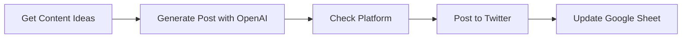

## Fluxo (.json) :

```json
{
  "nodes": [
    {
      "name": "Get Content Ideas",
      "type": "n8n-nodes-base.googleSheets",
      "position": [
        200,
        300
      ],
      "parameters": {
        "range": "Sheet1!A:C",
        "sheetId": "YOUR_GOOGLE_SHEET_ID"
      },
      "credentials": {
        "googleSheetsOAuth2Api": "YOUR_GOOGLE_SHEETS_CREDENTIALS"
      },
      "typeVersion": 1
    },
    {
      "name": "Generate Post with OpenAI",
      "type": "n8n-nodes-base.openAi",
      "position": [
        500,
        300
      ],
      "parameters": {
        "model": "gpt-4",
        "prompt": "Create a social media post for {{$node[\"Get Content Ideas\"].json[\"Platform\"]}} based on this idea: {{$node[\"Get Content Ideas\"].json[\"Idea\"]}}. Keep it engaging and concise."
      },
      "credentials": {
        "openAIApi": "YOUR_OPENAI_CREDENTIALS"
      },
      "typeVersion": 1
    },
    {
      "name": "Check Platform",
      "type": "n8n-nodes-base.if",
      "position": [
        800,
        300
      ],
      "parameters": {
        "conditions": {
          "string": [
            {
              "value1": "{{$node[\"Get Content Ideas\"].json[\"Platform\"]}}",
              "value2": "Twitter",
              "operation": "equal"
            }
          ]
        }
      },
      "typeVersion": 1
    },
    {
      "name": "Post to Twitter",
      "type": "n8n-nodes-base.twitter",
      "position": [
        1000,
        200
      ],
      "parameters": {
        "text": "{{$node[\"Generate Post with OpenAI\"].json[\"text\"]}}"
      },
      "credentials": {
        "twitterOAuth1Api": "YOUR_TWITTER_CREDENTIALS"
      },
      "typeVersion": 1
    },
    {
      "name": "Update Google Sheet",
      "type": "n8n-nodes-base.googleSheets",
      "position": [
        1200,
        300
      ],
      "parameters": {
        "range": "Sheet1!D:F",
        "values": "Posted,{{$node[\"Generate Post with OpenAI\"].json[\"text\"]}},{{Date.now()}}",
        "sheetId": "YOUR_GOOGLE_SHEET_ID",
        "updateOperation": "append"
      },
      "credentials": {
        "googleSheetsOAuth2Api": "YOUR_GOOGLE_SHEETS_CREDENTIALS"
      },
      "typeVersion": 1
    }
  ],
  "connections": {
    "Check Platform": {
      "main": [
        [
          {
            "node": "Post to Twitter",
            "type": "main"
          }
        ]
      ]
    },
    "Post to Twitter": {
      "main": [
        [
          {
            "node": "Update Google Sheet",
            "type": "main"
          }
        ]
      ]
    },
    "Get Content Ideas": {
      "main": [
        [
          {
            "node": "Generate Post with OpenAI",
            "type": "main"
          }
        ]
      ]
    },
    "Generate Post with OpenAI": {
      "main": [
        [
          {
            "node": "Check Platform",
            "type": "main"
          }
        ]
      ]
    }
  }
}
```

<a id="template-548"></a>

## Template 548 - Bot Telegram para buscar ferramentas No-Code

- **Nome:** Bot Telegram para buscar ferramentas No-Code
- **Descrição:** Bot de Telegram que responde com imagem e descrição de ferramentas No-Code consultando uma base de dados Strapi e traduzindo a descrição para o idioma do usuário.
- **Funcionalidade:** • Responder ao comando /start: envia uma mensagem de boas-vindas e instruções ao usuário.
• Receber nome da ferramenta: captura o texto enviado pelo usuário como consulta.
• Buscar dados na base: realiza uma requisição HTTP ao backend para obter Name, Img e Description da ferramenta.
• Enviar imagem da ferramenta: envia a foto vinculada ao registro retornado.
• Traduzir descrição automaticamente: executa um comando local de tradução para converter a descrição para o idioma do usuário.
• Enviar descrição formatada: envia uma mensagem com o nome em destaque e a descrição traduzida usando formatação HTML.
- **Ferramentas:** • Telegram: plataforma de mensagens usada para receber consultas dos usuários e enviar textos e fotos.
• Strapi (API HTTP): CMS/headless que serve como base de dados onde estão registrados os registros de ferramentas No-Code.
• Ferramenta de tradução local: utilitário de linha de comando (/usr/bin/translate) usado para traduzir o texto da descrição para o idioma do usuário.

## Fluxo visual

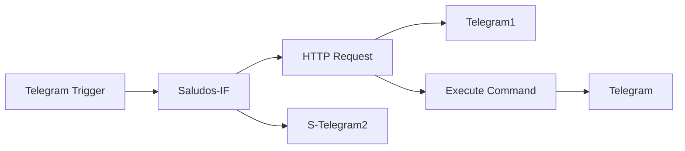

## Fluxo (.json) :

```json
{
  "id": "30",
  "name": "N8N Español - NocodeBot",
  "nodes": [
    {
      "name": "HTTP Request",
      "type": "n8n-nodes-base.httpRequest",
      "notes": "Lee los datos de Strapi",
      "position": [
        630,
        350
      ],
      "parameters": {
        "url": "=http://s.covid-remote.work:1337/nocodes?Name={{$json[\"message\"][\"text\"].toLowerCase()}}",
        "options": {}
      },
      "notesInFlow": true,
      "typeVersion": 1
    },
    {
      "name": "Telegram",
      "type": "n8n-nodes-base.telegram",
      "position": [
        950,
        280
      ],
      "parameters": {
        "text": "=------------------------------------------------       \n<b>{{$node[\"HTTP Request\"].json[\"0\"][\"Name\"].toUpperCase()}} </b>\n------------------------------------------------\n|-<b>Descripción:</b>\n|<pre>{{$node[\"Execute Command\"].json[\"stdout\"]}}</pre>",
        "chatId": "={{$node[\"Telegram Trigger\"].json[\"message\"][\"chat\"][\"id\"]}}",
        "additionalFields": {
          "parse_mode": "HTML"
        }
      },
      "credentials": {
        "telegramApi": "NocodeTranslateBot"
      },
      "typeVersion": 1
    },
    {
      "name": "Telegram1",
      "type": "n8n-nodes-base.telegram",
      "position": [
        800,
        130
      ],
      "parameters": {
        "file": "={{$json[\"0\"][\"Img\"]}}",
        "chatId": "={{$node[\"Telegram Trigger\"].json[\"message\"][\"chat\"][\"id\"]}}",
        "operation": "sendPhoto",
        "additionalFields": {}
      },
      "credentials": {
        "telegramApi": "NocodeTranslateBot"
      },
      "typeVersion": 1
    },
    {
      "name": "Execute Command",
      "type": "n8n-nodes-base.executeCommand",
      "position": [
        790,
        390
      ],
      "parameters": {
        "command": "=/usr/bin/translate --brief -t {{$node[\"Telegram Trigger\"].json[\"message\"][\"from\"][\"language_code\"]}} \"{{$json[\"0\"][\"Description\"]}}\""
      },
      "typeVersion": 1
    },
    {
      "name": "Telegram Trigger",
      "type": "n8n-nodes-base.telegramTrigger",
      "position": [
        290,
        130
      ],
      "webhookId": "9673bd65-53ef-4561-bfe1-a55fab0f77b0",
      "parameters": {
        "updates": [
          "*"
        ],
        "additionalFields": {}
      },
      "credentials": {
        "telegramApi": "NocodeTranslateBot"
      },
      "typeVersion": 1
    },
    {
      "name": "Saludos-IF",
      "type": "n8n-nodes-base.if",
      "position": [
        450,
        270
      ],
      "parameters": {
        "conditions": {
          "string": [
            {
              "value1": "={{$node[\"Telegram Trigger\"].json[\"message\"][\"text\"]}}",
              "value2": "/start"
            }
          ]
        }
      },
      "typeVersion": 1
    },
    {
      "name": "S-Telegram2",
      "type": "n8n-nodes-base.telegram",
      "position": [
        630,
        130
      ],
      "parameters": {
        "text": "=Hola, **{{$json[\"message\"][\"chat\"][\"first_name\"]}}**  🙌\nEste bot ha sido desarrollado para @comunidadn8n\nPuedes escribir el nombre de alguna herramienta No-Code y si la tenemos registrada en nuestra Base de datos te responderemos con la descripción en tu idioma.\n\nPuedes probar escribiendo alguno de estos nombres:\n\n- Airtable\n- Stripe\n- Webflow",
        "chatId": "={{$node[\"Telegram Trigger\"].json[\"message\"][\"chat\"][\"id\"]}}",
        "additionalFields": {
          "parse_mode": "Markdown"
        }
      },
      "credentials": {
        "telegramApi": "NocodeTranslateBot"
      },
      "typeVersion": 1
    }
  ],
  "active": true,
  "settings": {},
  "connections": {
    "Saludos-IF": {
      "main": [
        [
          {
            "node": "S-Telegram2",
            "type": "main",
            "index": 0
          }
        ],
        [
          {
            "node": "HTTP Request",
            "type": "main",
            "index": 0
          }
        ]
      ]
    },
    "HTTP Request": {
      "main": [
        [
          {
            "node": "Telegram1",
            "type": "main",
            "index": 0
          },
          {
            "node": "Execute Command",
            "type": "main",
            "index": 0
          }
        ]
      ]
    },
    "Execute Command": {
      "main": [
        [
          {
            "node": "Telegram",
            "type": "main",
            "index": 0
          }
        ]
      ]
    },
    "Telegram Trigger": {
      "main": [
        [
          {
            "node": "Saludos-IF",
            "type": "main",
            "index": 0
          }
        ]
      ]
    }
  }
}
```

<a id="template-549"></a>

## Template 549 - Upload de imagens via Slack para S3

- **Nome:** Upload de imagens via Slack para S3
- **Descrição:** Recebe submissões de modais do Slack com arquivos enviados pelos usuários, faz o download dos arquivos, armazena-os em um bucket de objetos (S3) e publica os links resultantes em um canal do Slack.
- **Funcionalidade:** • Recepção de eventos do Slack: escuta e valida payloads de submissões e interações provenientes do Slack.
• Abertura de modais interativos: apresenta modais para seleção de pasta ou criação de nova pasta antes do upload.
• Roteamento de ações: identifica e encaminha diferentes tipos de interações (ex.: view_submission, block_actions, callback_id) para o fluxo adequado.
• Seleção ou criação de pasta: permite ao usuário criar uma nova pasta ou selecionar uma existente para organizar os arquivos enviados.
• Processamento em lote: separa múltiplos arquivos enviados na submissão e itera sobre cada um para processamento individual.
• Download seguro dos arquivos: baixa o binário dos arquivos a partir das URLs privadas do Slack usando credenciais apropriadas.
• Upload para armazenamento de objetos: envia cada arquivo para um bucket S3 com nome de arquivo estruturado pela pasta + nome do arquivo.
• Agregação de resultados: combina respostas de sucesso e falha para construir uma mensagem consolidada para o usuário.
• Notificação final no Slack: publica no canal configurado uma mensagem com os links (ou avisos de falha) dos arquivos processados.
• Resposta imediata ao Slack: responde ao webhook para confirmar/fechar o modal e evitar timeouts na integração.
- **Ferramentas:** • Slack: Plataforma de mensagens e API utilizada para interações com modais, envio e download de arquivos e publicação de mensagens no canal.
• AWS S3: Serviço de armazenamento de objetos utilizado como bucket para hospedar os arquivos enviados e gerar URLs de acesso.


## Fluxo visual

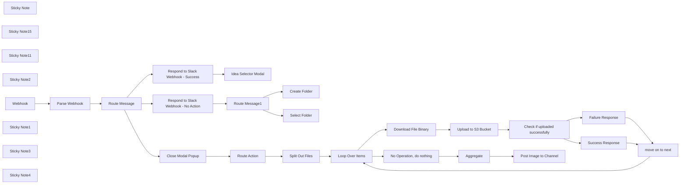

## Fluxo (.json) :

```json
{
  "nodes": [
    {
      "id": "ec2683b4-06ae-4255-bf20-b6c5850f4fc5",
      "name": "Parse Webhook",
      "type": "n8n-nodes-base.set",
      "position": [
        -480,
        1100
      ],
      "parameters": {
        "options": {},
        "assignments": {
          "assignments": [
            {
              "id": "e63f9299-a19d-4ba1-93b0-59f458769fb2",
              "name": "response",
              "type": "object",
              "value": "={{ $json.body.payload }}"
            }
          ]
        }
      },
      "typeVersion": 3.3
    },
    {
      "id": "bb178ce9-3177-433e-a877-3635be7c3705",
      "name": "Sticky Note",
      "type": "n8n-nodes-base.stickyNote",
      "position": [
        -820,
        740
      ],
      "parameters": {
        "color": 7,
        "width": 466.8168310000617,
        "height": 567.6433222116042,
        "content": "\n## Events Webhook Trigger\nThe first node receives all messages from Slack API via Subscription Events API. You can find more information about setting up the subscription events API by [clicking here](https://api.slack.com/apis/connections/events-api). \n\nThe second node extracts the payload from slack into an object that n8n can understand.  "
      },
      "typeVersion": 1
    },
    {
      "id": "04d35926-1c7d-406b-90f1-9641680cb3b7",
      "name": "Sticky Note15",
      "type": "n8n-nodes-base.stickyNote",
      "position": [
        -340,
        420
      ],
      "parameters": {
        "color": 7,
        "width": 566.0553219408072,
        "height": 1390.6748140207737,
        "content": "\n## Efficient Slack Interaction Handling with n8n\n\nThis section of the workflow is designed to efficiently manage and route messages and submissions from Slack based on specific triggers and conditions. When a Slack interaction occurs—such as a user triggering a vulnerability scan or generating a report through a modal—the workflow intelligently routes the message to the appropriate action:\n\n- **Dynamic Routing**: Uses conditions to determine the nature of the Slack interaction, whether it's a direct command to initiate a scan or a request to generate a report.\n- **Modal Management**: Differentiates actions based on modal titles and `callback_id`s, ensuring that each type of submission is processed according to its context.\n- **Streamlined Responses**: After routing, the workflow promptly handles the necessary responses or actions, including closing modal popups and responding to Slack with appropriate confirmation or data.\n\n**Purpose**: This mechanism ensures that all interactions within Slack are handled quickly and accurately, automating responses and actions in real-time to enhance user experience and workflow efficiency."
      },
      "typeVersion": 1
    },
    {
      "id": "e6a046b1-1c8b-4585-b257-117f562dd30f",
      "name": "Sticky Note11",
      "type": "n8n-nodes-base.stickyNote",
      "position": [
        240,
        520
      ],
      "parameters": {
        "color": 7,
        "width": 396.6025898621133,
        "height": 1553.6713675640199,
        "content": "\n## Display Modal Popup\nThis section pops open a modal window that is later used to send data into TheHive. \n\nModals can be customized to perform all sorts of actions. And they are natively mobile! You can see a screenshot of the Slack Modals on the right. \n\nLearn more about them by [clicking here](https://api.slack.com/surfaces/modals)"
      },
      "typeVersion": 1
    },
    {
      "id": "93b094eb-4a0a-4639-b343-932b7f261b0d",
      "name": "Close Modal Popup",
      "type": "n8n-nodes-base.respondToWebhook",
      "position": [
        -320,
        2180
      ],
      "parameters": {
        "options": {},
        "respondWith": "json",
        "responseBody": "{\n  \"response_action\": \"clear\"\n}"
      },
      "typeVersion": 1.1
    },
    {
      "id": "6d67a6f5-9966-40a9-a9ad-db514027257b",
      "name": "Sticky Note2",
      "type": "n8n-nodes-base.stickyNote",
      "position": [
        240,
        860
      ],
      "parameters": {
        "color": 5,
        "width": 376.26546828439086,
        "height": 113.6416448104651,
        "content": "### 🙋 Don't forget your slack credentials!\nThankfully n8n makes it easy, as long as you've added credentials to a normal slack node, these http nodes are a snap to change via the drop down. "
      },
      "typeVersion": 1
    },
    {
      "id": "3222f63e-036f-43b6-9d60-a9d1a19bafa5",
      "name": "Idea Selector Modal",
      "type": "n8n-nodes-base.httpRequest",
      "position": [
        320,
        1000
      ],
      "parameters": {
        "url": "https://slack.com/api/views.open",
        "method": "POST",
        "options": {},
        "jsonBody": "=  {\n    \"trigger_id\": \"{{ $('Parse Webhook').item.json['response']['trigger_id'] }}\",\n    \"external_id\": \"Image Uploader\",\n    \"view\": {\n\t\"title\": {\n\t\t\"type\": \"plain_text\",\n\t\t\"text\": \"File Upload - Select\",\n\t\t\"emoji\": true\n\t},\n\t\"type\": \"modal\",\n\t\"external_id\": \"file_upload_selector\",\n\t\"close\": {\n\t\t\"type\": \"plain_text\",\n\t\t\"text\": \"Cancel\",\n\t\t\"emoji\": true\n\t},\n\t\"blocks\": [\n\t\t{\n\t\t\t\"type\": \"section\",\n\t\t\t\"block_id\": \"greeting_section\",\n\t\t\t\"text\": {\n\t\t\t\t\"type\": \"plain_text\",\n\t\t\t\t\"text\": \":wave: Hey {{ $('Route Message').item.json.response.user.username }}!\\n\\nNeed to upload an image to a public repository? If so, you've come to the right place. Use the form below to upload your images to our public S3 CDN. You will get a message with the link to the file after submission. This tool only accepts .jpg, .png, and .pdf uploads.\",\n\t\t\t\t\"emoji\": true\n\t\t\t}\n\t\t},\n\t\t{\n\t\t\t\"type\": \"divider\",\n\t\t\t\"block_id\": \"divider_1\"\n\t\t},\n\t\t{\n\t\t\t\"type\": \"actions\",\n\t\t\t\"block_id\": \"folder_type_selection\",\n\t\t\t\"elements\": [\n\t\t\t\t{\n\t\t\t\t\t\"type\": \"radio_buttons\",\n\t\t\t\t\t\"options\": [\n\t\t\t\t\t\t{\n\t\t\t\t\t\t\t\"text\": {\n\t\t\t\t\t\t\t\t\"type\": \"plain_text\",\n\t\t\t\t\t\t\t\t\"text\": \"Create New Folder\",\n\t\t\t\t\t\t\t\t\"emoji\": true\n\t\t\t\t\t\t\t},\n\t\t\t\t\t\t\t\"value\": \"createfolder\"\n\t\t\t\t\t\t},\n\t\t\t\t\t\t{\n\t\t\t\t\t\t\t\"text\": {\n\t\t\t\t\t\t\t\t\"type\": \"plain_text\",\n\t\t\t\t\t\t\t\t\"text\": \"Use Existing Folder\",\n\t\t\t\t\t\t\t\t\"emoji\": true\n\t\t\t\t\t\t\t},\n\t\t\t\t\t\t\t\"value\": \"selectfolder\"\n\t\t\t\t\t\t}\n\t\t\t\t\t],\n\t\t\t\t\t\"action_id\": \"folder-type\"\n\t\t\t\t}\n\t\t\t]\n\t\t}\n\t]\n}\n}",
        "sendBody": true,
        "jsonQuery": "{\n  \"Content-type\": \"application/json\"\n}",
        "sendQuery": true,
        "specifyBody": "json",
        "specifyQuery": "json",
        "authentication": "predefinedCredentialType",
        "nodeCredentialType": "slackApi"
      },
      "credentials": {
        "slackApi": {
          "id": "GjRorC99RZt4Wnrp",
          "name": "Image Upload Bot"
        }
      },
      "typeVersion": 4.2
    },
    {
      "id": "a23e7c3b-7f20-4832-a4f0-a696e661accf",
      "name": "Route Message",
      "type": "n8n-nodes-base.switch",
      "position": [
        -300,
        1100
      ],
      "parameters": {
        "rules": {
          "values": [
            {
              "outputKey": "Idea Selector",
              "conditions": {
                "options": {
                  "version": 1,
                  "leftValue": "",
                  "caseSensitive": true,
                  "typeValidation": "strict"
                },
                "combinator": "and",
                "conditions": [
                  {
                    "operator": {
                      "type": "string",
                      "operation": "equals"
                    },
                    "leftValue": "={{ $json.response.callback_id }}",
                    "rightValue": "idea_selector"
                  }
                ]
              },
              "renameOutput": true
            },
            {
              "outputKey": "Block Action",
              "conditions": {
                "options": {
                  "version": 1,
                  "leftValue": "",
                  "caseSensitive": true,
                  "typeValidation": "strict"
                },
                "combinator": "and",
                "conditions": [
                  {
                    "id": "a0374196-2553-4916-bc55-c2ea663a7c1f",
                    "operator": {
                      "name": "filter.operator.equals",
                      "type": "string",
                      "operation": "equals"
                    },
                    "leftValue": "={{ $json.response.type }}",
                    "rightValue": "block_actions"
                  }
                ]
              },
              "renameOutput": true
            },
            {
              "outputKey": "Submit Data",
              "conditions": {
                "options": {
                  "version": 1,
                  "leftValue": "",
                  "caseSensitive": true,
                  "typeValidation": "strict"
                },
                "combinator": "and",
                "conditions": [
                  {
                    "id": "65daa75f-2e17-4ba0-8fd8-2ac2159399e3",
                    "operator": {
                      "name": "filter.operator.equals",
                      "type": "string",
                      "operation": "equals"
                    },
                    "leftValue": "={{ $json.response.type }}",
                    "rightValue": "view_submission"
                  }
                ]
              },
              "renameOutput": true
            }
          ]
        },
        "options": {
          "fallbackOutput": "none"
        }
      },
      "typeVersion": 3
    },
    {
      "id": "91cde8d3-2eca-4a00-a2cc-61a4f2d3280f",
      "name": "Route Message1",
      "type": "n8n-nodes-base.switch",
      "position": [
        40,
        1400
      ],
      "parameters": {
        "rules": {
          "values": [
            {
              "outputKey": "Create Folder",
              "conditions": {
                "options": {
                  "version": 1,
                  "leftValue": "",
                  "caseSensitive": true,
                  "typeValidation": "strict"
                },
                "combinator": "and",
                "conditions": [
                  {
                    "id": "02868fd8-2577-4c6d-af5e-a1963cb2f786",
                    "operator": {
                      "name": "filter.operator.equals",
                      "type": "string",
                      "operation": "equals"
                    },
                    "leftValue": "={{ $json.response.view.state.values.folder_type_selection['folder-type'].selected_option.value }}",
                    "rightValue": "createfolder"
                  }
                ]
              },
              "renameOutput": true
            },
            {
              "outputKey": "Select Folder",
              "conditions": {
                "options": {
                  "version": 1,
                  "leftValue": "",
                  "caseSensitive": true,
                  "typeValidation": "strict"
                },
                "combinator": "and",
                "conditions": [
                  {
                    "id": "211e13e8-3433-42d3-8884-ad89f2fee5d0",
                    "operator": {
                      "name": "filter.operator.equals",
                      "type": "string",
                      "operation": "equals"
                    },
                    "leftValue": "={{ $json.response.view.state.values.folder_type_selection['folder-type'].selected_option.value }}",
                    "rightValue": "selectfolder"
                  }
                ]
              },
              "renameOutput": true
            }
          ]
        },
        "options": {
          "fallbackOutput": "none"
        }
      },
      "typeVersion": 3
    },
    {
      "id": "0dd0e945-8a1d-4ba8-b711-e8ccc4a98ec1",
      "name": "Create Folder",
      "type": "n8n-nodes-base.httpRequest",
      "position": [
        320,
        1320
      ],
      "parameters": {
        "url": "https://slack.com/api/views.push",
        "method": "POST",
        "options": {},
        "jsonBody": "=  {\n    \"trigger_id\": \"{{ $('Parse Webhook').item.json['response']['trigger_id'] }}\",\n    \"view\": {\n\t\"title\": {\n\t\t\"type\": \"plain_text\",\n\t\t\"text\": \"File Upload - New Folder\",\n\t\t\"emoji\": true\n\t},\n\t\"submit\": {\n\t\t\"type\": \"plain_text\",\n\t\t\"text\": \"Upload\",\n\t\t\"emoji\": true\n\t},\n\t\"type\": \"modal\",\n\t\"external_id\": \"file_upload_new_folder\",\n\t\"close\": {\n\t\t\"type\": \"plain_text\",\n\t\t\"text\": \"Cancel\",\n\t\t\"emoji\": true\n\t},\n\t\"blocks\": [\n\t\t{\n\t\t\t\"type\": \"section\",\n\t\t\t\"block_id\": \"greeting_section\",\n\t\t\t\"text\": {\n\t\t\t\t\"type\": \"plain_text\",\n\t\t\t\t\"text\": \":wave: Hey there!\\n\\nNeed to upload an image to a public repository? If so, you've come to the right place. Use the form below to upload your images to our public S3 CDN. You will get a message with the link to the file after submission. This tool only accepts .jpg, .png, and .pdf uploads.\",\n\t\t\t\t\"emoji\": true\n\t\t\t}\n\t\t},\n\t\t{\n\t\t\t\"type\": \"divider\",\n\t\t\t\"block_id\": \"divider_1\"\n\t\t},\n\t\t{\n\t\t\t\"type\": \"input\",\n\t\t\t\"block_id\": \"folder_name_block\",\n\t\t\t\"element\": {\n\t\t\t\t\"type\": \"plain_text_input\",\n\t\t\t\t\"action_id\": \"folder_name_input_action\",\n\t\t\t\t\"placeholder\": {\n\t\t\t\t\t\"type\": \"plain_text\",\n\t\t\t\t\t\"text\": \"example_folder_name\"\n\t\t\t\t}\n\t\t\t},\n\t\t\t\"label\": {\n\t\t\t\t\"type\": \"plain_text\",\n\t\t\t\t\"text\": \"Folder Name\",\n\t\t\t\t\"emoji\": true\n\t\t\t}\n\t\t},\n\t\t{\n\t\t\t\"type\": \"context\",\n\t\t\t\"block_id\": \"folder_creation_context\",\n\t\t\t\"elements\": [\n\t\t\t\t{\n\t\t\t\t\t\"type\": \"plain_text\",\n\t\t\t\t\t\"text\": \"This will create a new folder in the CDN.\",\n\t\t\t\t\t\"emoji\": true\n\t\t\t\t}\n\t\t\t]\n\t\t},\n\t\t{\n\t\t\t\"type\": \"input\",\n\t\t\t\"block_id\": \"input_block_file\",\n\t\t\t\"label\": {\n\t\t\t\t\"type\": \"plain_text\",\n\t\t\t\t\"text\": \"Image File Binary\"\n\t\t\t},\n\t\t\t\"element\": {\n\t\t\t\t\"type\": \"file_input\",\n\t\t\t\t\"action_id\": \"file_input_action\",\n\t\t\t\t\"filetypes\": [\n\t\t\t\t\t\"jpg\",\n\t\t\t\t\t\"png\",\n\t\t\t\t\t\"pdf\"\n\t\t\t\t],\n\t\t\t\t\"max_files\": 10\n\t\t\t}\n\t\t},\n\t\t{\n\t\t\t\"type\": \"context\",\n\t\t\t\"elements\": [\n\t\t\t\t{\n\t\t\t\t\t\"type\": \"plain_text\",\n\t\t\t\t\t\"text\": \"You can upload up to 10 files at a time.\",\n\t\t\t\t\t\"emoji\": true\n\t\t\t\t}\n\t\t\t]\n\t\t}\n\t]\n}\n}",
        "sendBody": true,
        "jsonQuery": "{\n  \"Content-type\": \"application/json\"\n}",
        "sendQuery": true,
        "specifyBody": "json",
        "specifyQuery": "json",
        "authentication": "predefinedCredentialType",
        "nodeCredentialType": "slackApi"
      },
      "credentials": {
        "slackApi": {
          "id": "GjRorC99RZt4Wnrp",
          "name": "Image Upload Bot"
        }
      },
      "typeVersion": 4.2
    },
    {
      "id": "d4cdcd35-b28e-4d01-a35f-20d239f92fca",
      "name": "Select Folder",
      "type": "n8n-nodes-base.httpRequest",
      "position": [
        320,
        1560
      ],
      "parameters": {
        "url": "https://slack.com/api/views.push",
        "method": "POST",
        "options": {},
        "jsonBody": "=  {\n    \"trigger_id\": \"{{ $('Parse Webhook').item.json['response']['trigger_id'] }}\",\n    \"view\": {\n\t\"title\": {\n\t\t\"type\": \"plain_text\",\n\t\t\"text\": \"File Upload - Old Folder\",\n\t\t\"emoji\": true\n\t},\n\t\"submit\": {\n\t\t\"type\": \"plain_text\",\n\t\t\"text\": \"Upload\",\n\t\t\"emoji\": true\n\t},\n\t\"type\": \"modal\",\n\t\"external_id\": \"file_upload_old_folder\",\n\t\"close\": {\n\t\t\"type\": \"plain_text\",\n\t\t\"text\": \"Cancel\",\n\t\t\"emoji\": true\n\t},\n\t\"blocks\": [\n\t\t{\n\t\t\t\"type\": \"section\",\n\t\t\t\"block_id\": \"greeting_section\",\n\t\t\t\"text\": {\n\t\t\t\t\"type\": \"plain_text\",\n\t\t\t\t\"text\": \":wave: Hey there!\\n\\nNeed to upload an image to a public repository? If so, you've come to the right place. Use the form below to upload your images to our public S3 CDN. You will get a message with the link to the file after submission. This tool only accepts .jpg, .png, and .pdf uploads.\",\n\t\t\t\t\"emoji\": true\n\t\t\t}\n\t\t},\n\t\t{\n\t\t\t\"type\": \"divider\",\n\t\t\t\"block_id\": \"divider_1\"\n\t\t},\n\t\t{\n\t\t\t\"type\": \"input\",\n\t\t\t\"block_id\": \"tool_selector\",\n\t\t\t\"element\": {\n\t\t\t\t\"type\": \"external_select\",\n\t\t\t\t\"placeholder\": {\n\t\t\t\t\t\"type\": \"plain_text\",\n\t\t\t\t\t\"text\": \"Search For Existing Folder Name\",\n\t\t\t\t\t\"emoji\": true\n\t\t\t\t},\n\t\t\t\t\"action_id\": \"folder_selector\"\n\t\t\t},\n\t\t\t\"label\": {\n\t\t\t\t\"type\": \"plain_text\",\n\t\t\t\t\"text\": \"Folder Selector\",\n\t\t\t\t\"emoji\": true\n\t\t\t}\n\t\t},\n\t\t{\n\t\t\t\"type\": \"context\",\n\t\t\t\"elements\": [\n\t\t\t\t{\n\t\t\t\t\t\"type\": \"plain_text\",\n\t\t\t\t\t\"text\": \"To see all folders, type in 'all'\",\n\t\t\t\t\t\"emoji\": true\n\t\t\t\t}\n\t\t\t]\n\t\t},\n\t\t{\n\t\t\t\"type\": \"input\",\n\t\t\t\"block_id\": \"input_block_file\",\n\t\t\t\"label\": {\n\t\t\t\t\"type\": \"plain_text\",\n\t\t\t\t\"text\": \"Image File Binary\"\n\t\t\t},\n\t\t\t\"element\": {\n\t\t\t\t\"type\": \"file_input\",\n\t\t\t\t\"action_id\": \"file_input_action\",\n\t\t\t\t\"filetypes\": [\n\t\t\t\t\t\"jpg\",\n\t\t\t\t\t\"png\",\n\t\t\t\t\t\"pdf\"\n\t\t\t\t],\n\t\t\t\t\"max_files\": 10\n\t\t\t}\n\t\t},\n\t\t{\n\t\t\t\"type\": \"context\",\n\t\t\t\"elements\": [\n\t\t\t\t{\n\t\t\t\t\t\"type\": \"plain_text\",\n\t\t\t\t\t\"text\": \"You can upload up to 10 files at a time.\",\n\t\t\t\t\t\"emoji\": true\n\t\t\t\t}\n\t\t\t]\n\t\t}\n\t]\n}\n}",
        "sendBody": true,
        "jsonQuery": "{\n  \"Content-type\": \"application/json\"\n}",
        "sendQuery": true,
        "specifyBody": "json",
        "specifyQuery": "json",
        "authentication": "predefinedCredentialType",
        "nodeCredentialType": "slackApi"
      },
      "credentials": {
        "slackApi": {
          "id": "GjRorC99RZt4Wnrp",
          "name": "Image Upload Bot"
        }
      },
      "typeVersion": 4.2
    },
    {
      "id": "997821dc-c8e8-45f5-87e9-d006fe6b5de7",
      "name": "Loop Over Items",
      "type": "n8n-nodes-base.splitInBatches",
      "position": [
        460,
        2140
      ],
      "parameters": {
        "options": {}
      },
      "typeVersion": 3
    },
    {
      "id": "e7ae5827-2fe3-411b-9689-f0f6b2d9dfc0",
      "name": "Success Response",
      "type": "n8n-nodes-base.set",
      "position": [
        1440,
        2360
      ],
      "parameters": {
        "options": {},
        "assignments": {
          "assignments": [
            {
              "id": "bd5f7054-0259-45a4-b01e-11c63b76c18e",
              "name": "link",
              "type": "string",
              "value": "=https://uploads.n8n.io/{{ $('Parse Webhook').item.json.response.view.state.values.folder_name_block?.folder_name_input_action?.value ? $('Parse Webhook').item.json.response.view.state.values.folder_name_block.folder_name_input_action.value.replace(/\\s+/g, '_') : $('Parse Webhook').item.json.response.view.state.values.tool_selector.folder_selector.selected_option.value }}/{{ $('Split Out Files').item.json.name.replace(/\\s+/g, '_') }}"
            },
            {
              "id": "2ed40d88-8ca5-4fe6-9387-3b021fe00dcf",
              "name": "slackresponse",
              "type": "string",
              "value": "={\"type\":\"section\",\"text\":{\"type\":\"mrkdwn\",\"text\":\"`https://uploads.n8n.io/{{ $('Parse Webhook').item.json.response.view.state.values.folder_name_block?.folder_name_input_action?.value ? $('Parse Webhook').item.json.response.view.state.values.folder_name_block.folder_name_input_action.value.replace(/\\s+/g, '_') : $('Parse Webhook').item.json.response.view.state.values.tool_selector.folder_selector.selected_option.value }}/{{ $('Split Out Files').item.json.name.replace(/\\s+/g, '_') }}`\"}}"
            }
          ]
        }
      },
      "typeVersion": 3.4
    },
    {
      "id": "72f1af25-faef-4556-8b71-97deb03b7755",
      "name": "Check if uploaded successfully",
      "type": "n8n-nodes-base.if",
      "position": [
        1160,
        2420
      ],
      "parameters": {
        "options": {},
        "conditions": {
          "options": {
            "version": 2,
            "leftValue": "",
            "caseSensitive": true,
            "typeValidation": "strict"
          },
          "combinator": "and",
          "conditions": [
            {
              "id": "8b51d4d6-feb6-4e1a-9077-9bd88207d3b7",
              "operator": {
                "type": "boolean",
                "operation": "true",
                "singleValue": true
              },
              "leftValue": "={{ $json.success }}",
              "rightValue": ""
            }
          ]
        }
      },
      "typeVersion": 2.2
    },
    {
      "id": "912e8689-53e0-4919-a664-b9025b4618b6",
      "name": "move on to next",
      "type": "n8n-nodes-base.noOp",
      "position": [
        1800,
        2360
      ],
      "parameters": {},
      "typeVersion": 1
    },
    {
      "id": "69d94e2e-9ff8-42ae-8969-bbe4b11976d2",
      "name": "No Operation, do nothing",
      "type": "n8n-nodes-base.noOp",
      "position": [
        760,
        1940
      ],
      "parameters": {},
      "typeVersion": 1
    },
    {
      "id": "8c43201b-97ee-419a-81a3-5cd9c204022a",
      "name": "Aggregate",
      "type": "n8n-nodes-base.aggregate",
      "position": [
        980,
        1940
      ],
      "parameters": {
        "options": {
          "mergeLists": false
        },
        "fieldsToAggregate": {
          "fieldToAggregate": [
            {
              "fieldToAggregate": "slackresponse"
            }
          ]
        }
      },
      "typeVersion": 1
    },
    {
      "id": "792eaa0e-e281-451a-b582-4e3ecef9cb20",
      "name": "Route Action",
      "type": "n8n-nodes-base.switch",
      "position": [
        -80,
        2180
      ],
      "parameters": {
        "rules": {
          "values": [
            {
              "outputKey": "File Upload",
              "conditions": {
                "options": {
                  "version": 1,
                  "leftValue": "",
                  "caseSensitive": true,
                  "typeValidation": "strict"
                },
                "combinator": "and",
                "conditions": [
                  {
                    "id": "54f7e9ca-23d5-428c-8148-41f27cafffd8",
                    "operator": {
                      "name": "filter.operator.equals",
                      "type": "string",
                      "operation": "equals"
                    },
                    "leftValue": "t",
                    "rightValue": "f"
                  }
                ]
              },
              "renameOutput": true
            }
          ]
        },
        "options": {
          "fallbackOutput": 0
        }
      },
      "typeVersion": 3
    },
    {
      "id": "3877766c-dc3f-4e4e-9921-5ef36c7ae787",
      "name": "Webhook",
      "type": "n8n-nodes-base.webhook",
      "position": [
        -720,
        1100
      ],
      "webhookId": "7f9dd2fb-e324-4f72-8fbf-d1f6b4fa5c79",
      "parameters": {
        "path": "slack-image-upload-bot",
        "options": {},
        "httpMethod": "POST",
        "responseMode": "responseNode"
      },
      "typeVersion": 2
    },
    {
      "id": "b2ee67cb-dd60-4775-aa1a-8d52e192991a",
      "name": "Sticky Note1",
      "type": "n8n-nodes-base.stickyNote",
      "position": [
        -320,
        2080
      ],
      "parameters": {
        "color": 7,
        "width": 940,
        "height": 300,
        "content": "## Split Files out for processing\nTakes the single response from Slack and splits out the file objects to loop across them."
      },
      "typeVersion": 1
    },
    {
      "id": "c28de034-b4d6-4f78-a91b-0667830a7632",
      "name": "Sticky Note3",
      "type": "n8n-nodes-base.stickyNote",
      "position": [
        640,
        2180
      ],
      "parameters": {
        "color": 7,
        "width": 1360,
        "height": 540,
        "content": "## Loop through files to upload to S3 Cloudflare Bucket\nThe success and failure path report back to slack once all files are uploaded. "
      },
      "typeVersion": 1
    },
    {
      "id": "141cb7dc-d9a3-4440-b60f-7a3b3dd8f831",
      "name": "Failure Response",
      "type": "n8n-nodes-base.set",
      "position": [
        1460,
        2560
      ],
      "parameters": {
        "options": {},
        "assignments": {
          "assignments": [
            {
              "id": "bd5f7054-0259-45a4-b01e-11c63b76c18e",
              "name": "link",
              "type": "string",
              "value": "=Unable to upload {{ $('Parse Webhook').item.json.response.view.state.values.folder_name_block?.folder_name_input_action?.value ? $('Parse Webhook').item.json.response.view.state.values.folder_name_block.folder_name_input_action.value.replace(/\\s+/g, '_') : $('Parse Webhook').item.json.response.view.state.values.tool_selector.folder_selector.selected_option.value }}/{{ $('Split Out Files').item.json.name.replace(/\\s+/g, '_') }}"
            },
            {
              "id": "39bbddba-e7a4-44cf-aab4-a90669548454",
              "name": "slackresponse",
              "type": "string",
              "value": "={\"type\":\"section\",\"text\":{\"type\":\"mrkdwn\",\"text\":\":warning:Unable to upload: `https://uploads.n8n.io/{{ $('Parse Webhook').item.json.response.view.state.values.folder_name_block?.folder_name_input_action?.value ? $('Parse Webhook').item.json.response.view.state.values.folder_name_block.folder_name_input_action.value.replace(/\\s+/g, '_') : $('Parse Webhook').item.json.response.view.state.values.tool_selector.folder_selector.selected_option.value }}/{{ $('Split Out Files').item.json.name.replace(/\\s+/g, '_') }}`\"}}"
            }
          ]
        }
      },
      "typeVersion": 3.4
    },
    {
      "id": "e947e3b4-a016-4d9e-a647-53a666d4c1b9",
      "name": "Sticky Note4",
      "type": "n8n-nodes-base.stickyNote",
      "position": [
        640,
        1780
      ],
      "parameters": {
        "color": 7,
        "width": 1080,
        "height": 380,
        "content": "## Combine Success and failure responses in final message\nAllows for the workflow to fail gracefully. "
      },
      "typeVersion": 1
    },
    {
      "id": "7e7275c8-976b-493d-bfd8-7180517bac53",
      "name": "Respond to Slack Webhook - Success",
      "type": "n8n-nodes-base.respondToWebhook",
      "position": [
        40,
        1000
      ],
      "parameters": {
        "options": {},
        "respondWith": "noData"
      },
      "typeVersion": 1.1
    },
    {
      "id": "d508c32d-414d-4316-8fdc-e1c8687f6fa8",
      "name": "Respond to Slack Webhook - No Action",
      "type": "n8n-nodes-base.respondToWebhook",
      "position": [
        -140,
        1400
      ],
      "parameters": {
        "options": {},
        "respondWith": "noData"
      },
      "typeVersion": 1.1
    },
    {
      "id": "b2a06a70-4ec6-4d10-94e6-0467009af01e",
      "name": "Download File Binary",
      "type": "n8n-nodes-base.httpRequest",
      "position": [
        760,
        2420
      ],
      "parameters": {
        "url": "={{ $json.url_private_download }}",
        "options": {
          "response": {
            "response": {
              "responseFormat": "file"
            }
          }
        },
        "authentication": "predefinedCredentialType",
        "nodeCredentialType": "slackApi"
      },
      "credentials": {
        "slackApi": {
          "id": "bqdMGoCMwzFKzBXQ",
          "name": "Image Upload Bot User Token"
        }
      },
      "typeVersion": 4.2
    },
    {
      "id": "3ea9d291-233b-4f25-8538-f9427e55001b",
      "name": "Upload to S3 Bucket",
      "type": "n8n-nodes-base.s3",
      "position": [
        960,
        2420
      ],
      "parameters": {
        "fileName": "={{ $('Parse Webhook').item.json.response.view.state.values.folder_name_block?.folder_name_input_action?.value ? $('Parse Webhook').item.json.response.view.state.values.folder_name_block.folder_name_input_action.value.replace(/\\s+/g, '_') : $('Parse Webhook').item.json.response.view.state.values.tool_selector.folder_selector.selected_option.value }}/{{ $('Split Out Files').item.json.name.replace(/\\s+/g, '_') }}",
        "operation": "upload",
        "bucketName": "n8n-uploads",
        "additionalFields": {}
      },
      "credentials": {
        "s3": {
          "id": "5sdH8lDK8m8bje6X",
          "name": "S3 account"
        }
      },
      "typeVersion": 1
    },
    {
      "id": "e1182b20-d90d-4f53-96e7-90b36aff7053",
      "name": "Post Image to Channel",
      "type": "n8n-nodes-base.slack",
      "position": [
        1420,
        1940
      ],
      "webhookId": "050fb588-26db-489d-86c0-9ac5d573108d",
      "parameters": {
        "text": "New Files Uploaded",
        "select": "channel",
        "blocksUi": "={\n\t\"blocks\": [\n\t\t{\n\t\t\t\"type\": \"section\",\n\t\t\t\"text\": {\n\t\t\t\t\"type\": \"mrkdwn\",\n\t\t\t\t\"text\": \":file_folder: *{{ $('Parse Webhook').item.json.response.view.state.values.folder_name_block?.folder_name_input_action?.value ? $('Parse Webhook').item.json.response.view.state.values.folder_name_block.folder_name_input_action.value.replace(/\\s+/g, '_') : $('Parse Webhook').item.json.response.view.state.values.tool_selector.folder_selector.selected_option.value }}*\"\n\t\t\t}\n\t\t},\n\t\t{\n\t\t\t\"type\": \"divider\"\n\t\t},\n\t\t{\n\t\t\t\"type\": \"section\",\n\t\t\t\"text\": {\n\t\t\t\t\"type\": \"mrkdwn\",\n\t\t\t\t\"text\": \"*Here are the file URLs you uploaded:*\"\n\t\t\t}\n\t\t},\n\t\t{{ $('Aggregate').item.json.slackresponse }}\n\t]\n}",
        "channelId": {
          "__rl": true,
          "mode": "id",
          "value": "C081EHWKKH6"
        },
        "messageType": "block",
        "otherOptions": {}
      },
      "credentials": {
        "slackApi": {
          "id": "GjRorC99RZt4Wnrp",
          "name": "Image Upload Bot"
        }
      },
      "typeVersion": 2.2
    },
    {
      "id": "39814189-fbc3-46c0-992a-41623d7d0e7b",
      "name": "Split Out Files",
      "type": "n8n-nodes-base.splitOut",
      "position": [
        140,
        2180
      ],
      "parameters": {
        "options": {},
        "fieldToSplitOut": "response.view.state.values.input_block_file.file_input_action.files"
      },
      "typeVersion": 1
    }
  ],
  "pinData": {
    "Webhook": [
      {
        "body": {
          "payload": "{\"type\":\"view_submission\",\"team\":{\"id\":\"T07JRGYN3KR\",\"domain\":\"n8n-labs\"},\"user\":{\"id\":\"U07K60SESLB\",\"username\":\"angel\",\"name\":\"angel\",\"team_id\":\"T07JRGYN3KR\"},\"api_app_id\":\"A07S1KHUHRD\",\"token\":\"dBcQKoCOKOLa2AkgMZH3EGvt\",\"trigger_id\":\"8124283638884.7637576751671.e215c65a755f3dcb5523094558e07a50\",\"view\":{\"id\":\"V0848FGHQ2C\",\"team_id\":\"T07JRGYN3KR\",\"type\":\"modal\",\"blocks\":[{\"type\":\"section\",\"block_id\":\"greeting_section\",\"text\":{\"type\":\"plain_text\",\"text\":\":wave: Hey there!\\n\\nNeed to upload an image to a public repository? If so, you've come to the right place. Use the form below to upload your images to our public S3 CDN. You will get a message with the link to the file after submission. This tool only accepts .jpg, .png, and .pdf uploads.\",\"emoji\":true}},{\"type\":\"divider\",\"block_id\":\"divider_1\"},{\"type\":\"input\",\"block_id\":\"tool_selector\",\"label\":{\"type\":\"plain_text\",\"text\":\"Folder Selector\",\"emoji\":true},\"optional\":false,\"dispatch_action\":false,\"element\":{\"type\":\"external_select\",\"action_id\":\"folder_selector\",\"placeholder\":{\"type\":\"plain_text\",\"text\":\"Search For Existing Folder Name\",\"emoji\":true}}},{\"type\":\"context\",\"block_id\":\"2nw+9\",\"elements\":[{\"type\":\"plain_text\",\"text\":\"To see all folders, type in 'all'\",\"emoji\":true}]},{\"type\":\"input\",\"block_id\":\"input_block_file\",\"label\":{\"type\":\"plain_text\",\"text\":\"Image File Binary\",\"emoji\":true},\"optional\":false,\"dispatch_action\":false,\"element\":{\"type\":\"file_input\",\"action_id\":\"file_input_action\",\"filetypes\":[\"jpg\",\"jpeg\",\"png\",\"pdf\"],\"max_files\":10,\"max_file_size_bytes\":10000000}},{\"type\":\"context\",\"block_id\":\"PsTmm\",\"elements\":[{\"type\":\"plain_text\",\"text\":\"You can upload up to 10 files at a time.\",\"emoji\":true}]}],\"private_metadata\":\"\",\"callback_id\":\"\",\"state\":{\"values\":{\"tool_selector\":{\"folder_selector\":{\"type\":\"external_select\",\"selected_option\":{\"text\":{\"type\":\"plain_text\",\"text\":\"\\�\\� test_folder\",\"emoji\":true},\"value\":\"test_folder\"}}},\"input_block_file\":{\"file_input_action\":{\"type\":\"file_input\",\"files\":[{\"id\":\"F0848GKNTB2\",\"created\":1733297013,\"timestamp\":1733297013,\"name\":\"loveslack.png\",\"title\":\"loveslack.png\",\"mimetype\":\"image/png\",\"filetype\":\"png\",\"pretty_type\":\"PNG\",\"user\":\"U07K60SESLB\",\"user_team\":\"T07JRGYN3KR\",\"editable\":false,\"size\":31334,\"mode\":\"hosted\",\"is_external\":false,\"external_type\":\"\",\"is_public\":false,\"public_url_shared\":false,\"display_as_bot\":false,\"username\":\"\",\"url_private\":\"https://files.slack.com/files-pri/T07JRGYN3KR-F0848GKNTB2/loveslack.png\",\"url_private_download\":\"https://files.slack.com/files-pri/T07JRGYN3KR-F0848GKNTB2/download/loveslack.png\",\"media_display_type\":\"unknown\",\"thumb_64\":\"https://files.slack.com/files-tmb/T07JRGYN3KR-F0848GKNTB2-930517eeb6/loveslack_64.png\",\"thumb_80\":\"https://files.slack.com/files-tmb/T07JRGYN3KR-F0848GKNTB2-930517eeb6/loveslack_80.png\",\"thumb_360\":\"https://files.slack.com/files-tmb/T07JRGYN3KR-F0848GKNTB2-930517eeb6/loveslack_360.png\",\"thumb_360_w\":360,\"thumb_360_h\":360,\"thumb_160\":\"https://files.slack.com/files-tmb/T07JRGYN3KR-F0848GKNTB2-930517eeb6/loveslack_160.png\",\"original_w\":400,\"original_h\":400,\"thumb_tiny\":\"AwAwADDTooqFrhQ+MEgd6BN2JSQoyTgUKwYZBzUVx/qtw5A5qqkzbsZwDU31sPSxoUVHCSVOenapKoSdxGO1ST2rPmJ3nHAPNaBAIIPeozAnV+QPWmKSbGWjb4ijDIHH4ULaxplnOQPXoKil1CKMhYxux1I4Ap96nmQCRTkDn6ipaLjHZMVryNThAWHqKsIwdAy9DWXFCzsM/KD3NacaCNAo6ChO5c4xWw6q16rtGu0EgHkCrNFMhOzuYptnLZxtU9zWlZjEGwkkLxzU7KrDDDNCqFGFGBQJtt3GCEBs5OPSpKKKSSWw27n/2Q==\",\"permalink\":\"https://n8n-labs.slack.com/files/U07K60SESLB/F0848GKNTB2/loveslack.png\",\"permalink_public\":\"https://slack-files.com/T07JRGYN3KR-F0848GKNTB2-135b89a0c2\",\"comments_count\":0,\"shares\":{},\"channels\":[],\"groups\":[],\"ims\":[],\"has_more_shares\":false,\"has_rich_preview\":false,\"file_access\":\"visible\"}]}}}},\"hash\":\"1733296393.EXon8ZjS\",\"title\":{\"type\":\"plain_text\",\"text\":\"File Upload - Old Folder\",\"emoji\":true},\"clear_on_close\":false,\"notify_on_close\":false,\"close\":{\"type\":\"plain_text\",\"text\":\"Cancel\",\"emoji\":true},\"submit\":{\"type\":\"plain_text\",\"text\":\"Upload\",\"emoji\":true},\"previous_view_id\":\"V083KJV6BDH\",\"root_view_id\":\"V083KJV6BDH\",\"app_id\":\"A07S1KHUHRD\",\"external_id\":\"file_upload_old_folder\",\"app_installed_team_id\":\"T07JRGYN3KR\",\"bot_id\":\"B07SG49L53M\"},\"response_urls\":[],\"is_enterprise_install\":false,\"enterprise\":null}"
        },
        "query": {},
        "params": {},
        "headers": {
          "host": "internal.users.n8n.cloud",
          "accept": "application/json,*/*",
          "x-real-ip": "10.255.0.2",
          "user-agent": "Slackbot 1.0 (+https://api.slack.com/robots)",
          "content-type": "application/x-www-form-urlencoded",
          "content-length": "6177",
          "accept-encoding": "gzip,deflate",
          "x-forwarded-for": "10.255.0.2",
          "x-forwarded-host": "internal.users.n8n.cloud",
          "x-forwarded-port": "443",
          "x-forwarded-proto": "https",
          "x-slack-signature": "v0=33ddc24aff06b872a518fafa28b78939ea0c88696498b5054d2624f096e02293",
          "x-forwarded-server": "076ef9270428",
          "x-slack-request-timestamp": "1733297021"
        },
        "webhookUrl": "https://internal.users.n8n.cloud/webhook/slack-image-upload-bot",
        "executionMode": "production"
      }
    ]
  },
  "connections": {
    "Webhook": {
      "main": [
        [
          {
            "node": "Parse Webhook",
            "type": "main",
            "index": 0
          }
        ]
      ]
    },
    "Aggregate": {
      "main": [
        [
          {
            "node": "Post Image to Channel",
            "type": "main",
            "index": 0
          }
        ]
      ]
    },
    "Route Action": {
      "main": [
        [
          {
            "node": "Split Out Files",
            "type": "main",
            "index": 0
          }
        ]
      ]
    },
    "Parse Webhook": {
      "main": [
        [
          {
            "node": "Route Message",
            "type": "main",
            "index": 0
          }
        ]
      ]
    },
    "Route Message": {
      "main": [
        [
          {
            "node": "Respond to Slack Webhook - Success",
            "type": "main",
            "index": 0
          }
        ],
        [
          {
            "node": "Respond to Slack Webhook - No Action",
            "type": "main",
            "index": 0
          }
        ],
        [
          {
            "node": "Close Modal Popup",
            "type": "main",
            "index": 0
          }
        ]
      ]
    },
    "Route Message1": {
      "main": [
        [
          {
            "node": "Create Folder",
            "type": "main",
            "index": 0
          }
        ],
        [
          {
            "node": "Select Folder",
            "type": "main",
            "index": 0
          }
        ]
      ]
    },
    "Loop Over Items": {
      "main": [
        [
          {
            "node": "No Operation, do nothing",
            "type": "main",
            "index": 0
          }
        ],
        [
          {
            "node": "Download File Binary",
            "type": "main",
            "index": 0
          }
        ]
      ]
    },
    "Split Out Files": {
      "main": [
        [
          {
            "node": "Loop Over Items",
            "type": "main",
            "index": 0
          }
        ]
      ]
    },
    "move on to next": {
      "main": [
        [
          {
            "node": "Loop Over Items",
            "type": "main",
            "index": 0
          }
        ]
      ]
    },
    "Failure Response": {
      "main": [
        [
          {
            "node": "move on to next",
            "type": "main",
            "index": 0
          }
        ]
      ]
    },
    "Success Response": {
      "main": [
        [
          {
            "node": "move on to next",
            "type": "main",
            "index": 0
          }
        ]
      ]
    },
    "Close Modal Popup": {
      "main": [
        [
          {
            "node": "Route Action",
            "type": "main",
            "index": 0
          }
        ]
      ]
    },
    "Upload to S3 Bucket": {
      "main": [
        [
          {
            "node": "Check if uploaded successfully",
            "type": "main",
            "index": 0
          }
        ]
      ]
    },
    "Download File Binary": {
      "main": [
        [
          {
            "node": "Upload to S3 Bucket",
            "type": "main",
            "index": 0
          }
        ]
      ]
    },
    "No Operation, do nothing": {
      "main": [
        [
          {
            "node": "Aggregate",
            "type": "main",
            "index": 0
          }
        ]
      ]
    },
    "Check if uploaded successfully": {
      "main": [
        [
          {
            "node": "Success Response",
            "type": "main",
            "index": 0
          }
        ],
        [
          {
            "node": "Failure Response",
            "type": "main",
            "index": 0
          }
        ]
      ]
    },
    "Respond to Slack Webhook - Success": {
      "main": [
        [
          {
            "node": "Idea Selector Modal",
            "type": "main",
            "index": 0
          }
        ]
      ]
    },
    "Respond to Slack Webhook - No Action": {
      "main": [
        [
          {
            "node": "Route Message1",
            "type": "main",
            "index": 0
          }
        ]
      ]
    }
  }
}
```

<a id="template-550"></a>

## Template 550 - Notificar novos releases do GitHub por e-mail

- **Nome:** Notificar novos releases do GitHub por e-mail
- **Descrição:** Verifica diariamente o último release de um repositório GitHub e envia um e-mail com o conteúdo formatado caso tenha sido publicado nas últimas 24 horas.
- **Funcionalidade:** • Agendamento diário: executa a verificação uma vez por dia.
• Consulta ao repositório GitHub: busca o último release via API pública.
• Verificação de novidade: determina se o release foi publicado nas últimas 24 horas.
• Extração do conteúdo do release: isola o corpo (texto) do release para envio.
• Conversão de Markdown para HTML: transforma o corpo em HTML para apresentação no e-mail.
• Envio de e-mail: envia uma mensagem com o conteúdo do release convertido para destinatários configurados.
- **Ferramentas:** • GitHub API: fonte dos dados dos releases do repositório.
• Servidor SMTP / serviço de e-mail: responsável por enviar as notificações por e-mail.


## Fluxo visual

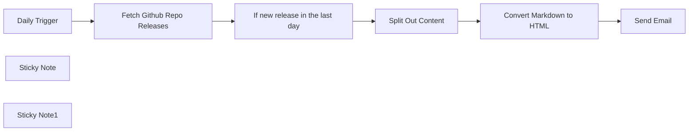

## Fluxo (.json) :

```json
{
  "nodes": [
    {
      "id": "a4c46baf-ff6d-489f-9c77-a5e4cfe6b580",
      "name": "Fetch Github Repo Releases",
      "type": "n8n-nodes-base.httpRequest",
      "position": [
        640,
        240
      ],
      "parameters": {
        "url": "https://api.github.com/repos/n8n-io/n8n/releases/latest",
        "options": {}
      },
      "typeVersion": 4.2
    },
    {
      "id": "aba391ad-eedc-4cf7-a770-646eba11e3fe",
      "name": "Split Out Content",
      "type": "n8n-nodes-base.splitOut",
      "position": [
        1100,
        140
      ],
      "parameters": {
        "options": {},
        "fieldToSplitOut": "body"
      },
      "typeVersion": 1
    },
    {
      "id": "ea29ed9d-5b34-46f2-87c6-2bacf4b7d7bf",
      "name": "Convert Markdown to HTML",
      "type": "n8n-nodes-base.markdown",
      "position": [
        1280,
        140
      ],
      "parameters": {
        "mode": "markdownToHtml",
        "options": {},
        "markdown": "={{ $json.body }}",
        "destinationKey": "html"
      },
      "typeVersion": 1
    },
    {
      "id": "53bf597d-3f64-4375-9632-c8aed38e88df",
      "name": "Daily Trigger",
      "type": "n8n-nodes-base.scheduleTrigger",
      "position": [
        380,
        240
      ],
      "parameters": {
        "rule": {
          "interval": [
            {}
          ]
        }
      },
      "typeVersion": 1.2
    },
    {
      "id": "14bf72aa-167b-44e4-ba6c-f20f1c366b93",
      "name": "Sticky Note",
      "type": "n8n-nodes-base.stickyNote",
      "position": [
        540,
        140
      ],
      "parameters": {
        "width": 288,
        "height": 300,
        "content": "Change **url** for Github Repo here"
      },
      "typeVersion": 1
    },
    {
      "id": "c80704a9-f103-4977-b604-f07994d1d1f8",
      "name": "Sticky Note1",
      "type": "n8n-nodes-base.stickyNote",
      "position": [
        1420,
        60
      ],
      "parameters": {
        "width": 288,
        "height": 300,
        "content": "Change **to Email** here"
      },
      "typeVersion": 1
    },
    {
      "id": "5b9ea851-df78-4366-a3e0-b5afb563e5ae",
      "name": "Send Email",
      "type": "n8n-nodes-base.emailSend",
      "position": [
        1520,
        140
      ],
      "parameters": {
        "html": "={{ $json.html }}",
        "options": {},
        "subject": "New n8n release",
        "toEmail": "email@example.com",
        "fromEmail": "email@example.com"
      },
      "credentials": {
        "smtp": {
          "id": "ybCScjWtYAxhpByf",
          "name": "SMTP account - internal use only"
        }
      },
      "typeVersion": 2.1
    },
    {
      "id": "775c38ba-7d29-4956-a913-a2136c317591",
      "name": "If new release in the last day",
      "type": "n8n-nodes-base.if",
      "position": [
        860,
        240
      ],
      "parameters": {
        "options": {},
        "conditions": {
          "options": {
            "version": 2,
            "leftValue": "",
            "caseSensitive": true,
            "typeValidation": "strict"
          },
          "combinator": "and",
          "conditions": [
            {
              "id": "77d364d3-a340-49d2-abf8-e38d7dceb8d6",
              "operator": {
                "type": "dateTime",
                "operation": "after"
              },
              "leftValue": "={{ $json.published_at.toDateTime() }}",
              "rightValue": "={{ DateTime.utc().minus(1, 'days') }}"
            }
          ]
        }
      },
      "typeVersion": 2.2
    }
  ],
  "pinData": {},
  "connections": {
    "Send Email": {
      "main": [
        []
      ]
    },
    "Daily Trigger": {
      "main": [
        [
          {
            "node": "Fetch Github Repo Releases",
            "type": "main",
            "index": 0
          }
        ]
      ]
    },
    "Split Out Content": {
      "main": [
        [
          {
            "node": "Convert Markdown to HTML",
            "type": "main",
            "index": 0
          }
        ]
      ]
    },
    "Convert Markdown to HTML": {
      "main": [
        [
          {
            "node": "Send Email",
            "type": "main",
            "index": 0
          }
        ]
      ]
    },
    "Fetch Github Repo Releases": {
      "main": [
        [
          {
            "node": "If new release in the last day",
            "type": "main",
            "index": 0
          }
        ]
      ]
    },
    "If new release in the last day": {
      "main": [
        [
          {
            "node": "Split Out Content",
            "type": "main",
            "index": 0
          }
        ]
      ]
    }
  }
}
```

<a id="template-551"></a>

## Template 551 - Monitoramento de Sentimento - Linear

- **Nome:** Monitoramento de Sentimento - Linear
- **Descrição:** Este fluxo monitora issues atualizadas no Linear, realiza análise de sentimento das conversas e registra os resultados em uma base para notificar a equipe quando o sentimento se tornar negativo.
- **Funcionalidade:** • Coleta periódica de issues: Verifica issues atualizadas no Linear em intervalos regulares (ex.: a cada 30 minutos).
• Extração de comentários: Reúne o histórico de comentários de cada issue para análise contextual.
• Análise de sentimento e resumo: Usa um modelo de linguagem para classificar o sentimento (positivo, negativo, neutro) e gerar um resumo da conversa.
• Armazenamento e atualização de resultados: Registra ou atualiza registros em uma base de dados mantendo o histórico de sentimento (anterior e atual).
• Detecção de transição para negativo: Compara sentimento anterior e atual para identificar quando um issue passa de não-negativo para negativo.
• Evitar notificações duplicadas: Filtra notificações repetidas combinando identificador do issue e data de modificação.
• Notificação de equipe: Envia avisos para um canal de comunicação quando há transições para sentimento negativo.
- **Ferramentas:** • Linear.app: Fonte de issues e comentários via API GraphQL para identificar tickets atualizados.
• OpenAI: Modelo de linguagem usado para avaliar sentimento e gerar um resumo das conversas.
• Airtable: Base para armazenar, atualizar e versionar o estado de sentimento de cada issue.
• Slack: Canal de notificação para alertar a equipe sobre issues que passaram a ter sentimento negativo.

## Fluxo visual

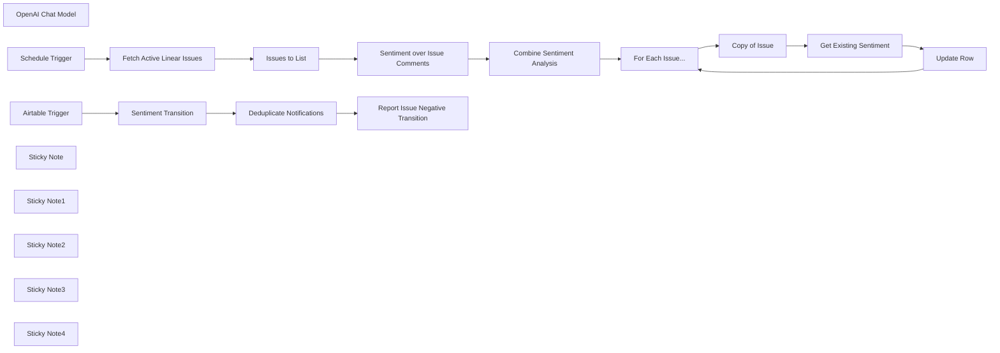

## Fluxo (.json) :

```json
{
  "nodes": [
    {
      "id": "82fd6023-2cc3-416e-83b7-fda24d07d77a",
      "name": "Issues to List",
      "type": "n8n-nodes-base.splitOut",
      "position": [
        40,
        -100
      ],
      "parameters": {
        "options": {},
        "fieldToSplitOut": "data.issues.nodes"
      },
      "typeVersion": 1
    },
    {
      "id": "9cc77786-e14f-47c6-a3cf-60c2830612e6",
      "name": "OpenAI Chat Model",
      "type": "@n8n/n8n-nodes-langchain.lmChatOpenAi",
      "position": [
        360,
        80
      ],
      "parameters": {
        "options": {}
      },
      "credentials": {
        "openAiApi": {
          "id": "8gccIjcuf3gvaoEr",
          "name": "OpenAi account"
        }
      },
      "typeVersion": 1
    },
    {
      "id": "821d4a60-81a4-4915-9c13-3d978cc0114b",
      "name": "Combine Sentiment Analysis",
      "type": "n8n-nodes-base.set",
      "position": [
        700,
        -80
      ],
      "parameters": {
        "mode": "raw",
        "options": {},
        "jsonOutput": "={{\n{\n  ...$('Issues to List').item.json,\n  ...$json.output\n}\n}}"
      },
      "typeVersion": 3.4
    },
    {
      "id": "fe6560f6-2e1b-4442-a2af-bd5a1623f213",
      "name": "Sentiment over Issue Comments",
      "type": "@n8n/n8n-nodes-langchain.informationExtractor",
      "position": [
        360,
        -80
      ],
      "parameters": {
        "text": "={{\n$json.comments.nodes.map(node => [\n  `${node.user.displayName} commented on ${node.createdAt}:`,\n   node.body\n].join('\\n')).join('---\\n')\n}}",
        "options": {},
        "attributes": {
          "attributes": [
            {
              "name": "sentiment",
              "required": true,
              "description": "One of positive, negative or neutral"
            },
            {
              "name": "sentimentSummary",
              "description": "Describe the sentiment of the conversation"
            }
          ]
        }
      },
      "typeVersion": 1
    },
    {
      "id": "4fd0345d-e5bf-426d-8403-e2217e19bbea",
      "name": "Copy of Issue",
      "type": "n8n-nodes-base.set",
      "position": [
        1200,
        -60
      ],
      "parameters": {
        "mode": "raw",
        "options": {},
        "jsonOutput": "={{ $json }}"
      },
      "typeVersion": 3.4
    },
    {
      "id": "6d103d67-451e-4780-8f52-f4dba4b42860",
      "name": "For Each Issue...",
      "type": "n8n-nodes-base.splitInBatches",
      "position": [
        1020,
        -60
      ],
      "parameters": {
        "options": {}
      },
      "typeVersion": 3
    },
    {
      "id": "032702d9-27d8-4735-b978-20b55bc1a74f",
      "name": "Get Existing Sentiment",
      "type": "n8n-nodes-base.airtable",
      "position": [
        1380,
        -60
      ],
      "parameters": {
        "base": {
          "__rl": true,
          "mode": "list",
          "value": "appViDaeaFw4qv9La",
          "cachedResultUrl": "https://airtable.com/appViDaeaFw4qv9La",
          "cachedResultName": "Sentiment Analysis over Issue Comments"
        },
        "table": {
          "__rl": true,
          "mode": "list",
          "value": "tblhO0sfRhKP6ibS8",
          "cachedResultUrl": "https://airtable.com/appViDaeaFw4qv9La/tblhO0sfRhKP6ibS8",
          "cachedResultName": "Table 1"
        },
        "options": {
          "fields": [
            "Issue ID",
            "Current Sentiment"
          ]
        },
        "operation": "search",
        "filterByFormula": "={Issue ID} = '{{ $json.identifier || 'XYZ' }}'"
      },
      "credentials": {
        "airtableTokenApi": {
          "id": "Und0frCQ6SNVX3VV",
          "name": "Airtable Personal Access Token account"
        }
      },
      "typeVersion": 2.1,
      "alwaysOutputData": true
    },
    {
      "id": "f2ded6fa-8b0f-4a34-868c-13c19f725c98",
      "name": "Update Row",
      "type": "n8n-nodes-base.airtable",
      "position": [
        1560,
        -60
      ],
      "parameters": {
        "base": {
          "__rl": true,
          "mode": "list",
          "value": "appViDaeaFw4qv9La",
          "cachedResultUrl": "https://airtable.com/appViDaeaFw4qv9La",
          "cachedResultName": "Sentiment Analysis over Issue Comments"
        },
        "table": {
          "__rl": true,
          "mode": "list",
          "value": "tblhO0sfRhKP6ibS8",
          "cachedResultUrl": "https://airtable.com/appViDaeaFw4qv9La/tblhO0sfRhKP6ibS8",
          "cachedResultName": "Table 1"
        },
        "columns": {
          "value": {
            "Summary": "={{ $('Copy of Issue').item.json.sentimentSummary || '' }}",
            "Assigned": "={{ $('Copy of Issue').item.json.assignee.name }}",
            "Issue ID": "={{ $('Copy of Issue').item.json.identifier }}",
            "Issue Title": "={{ $('Copy of Issue').item.json.title }}",
            "Issue Created": "={{ $('Copy of Issue').item.json.createdAt }}",
            "Issue Updated": "={{ $('Copy of Issue').item.json.updatedAt }}",
            "Current Sentiment": "={{ $('Copy of Issue').item.json.sentiment.toSentenceCase() }}",
            "Previous Sentiment": "={{ !$json.isEmpty() ? $json['Current Sentiment'] : 'N/A' }}"
          },
          "schema": [
            {
              "id": "id",
              "type": "string",
              "display": true,
              "removed": true,
              "readOnly": true,
              "required": false,
              "displayName": "id",
              "defaultMatch": true
            },
            {
              "id": "Issue ID",
              "type": "string",
              "display": true,
              "removed": false,
              "readOnly": false,
              "required": false,
              "displayName": "Issue ID",
              "defaultMatch": false,
              "canBeUsedToMatch": true
            },
            {
              "id": "Previous Sentiment",
              "type": "options",
              "display": true,
              "options": [
                {
                  "name": "Positive",
                  "value": "Positive"
                },
                {
                  "name": "Negative",
                  "value": "Negative"
                },
                {
                  "name": "Neutral",
                  "value": "Neutral"
                },
                {
                  "name": "N/A",
                  "value": "N/A"
                }
              ],
              "removed": false,
              "readOnly": false,
              "required": false,
              "displayName": "Previous Sentiment",
              "defaultMatch": false,
              "canBeUsedToMatch": true
            },
            {
              "id": "Current Sentiment",
              "type": "options",
              "display": true,
              "options": [
                {
                  "name": "Positive",
                  "value": "Positive"
                },
                {
                  "name": "Negative",
                  "value": "Negative"
                },
                {
                  "name": "Neutral",
                  "value": "Neutral"
                },
                {
                  "name": "N/A",
                  "value": "N/A"
                }
              ],
              "removed": false,
              "readOnly": false,
              "required": false,
              "displayName": "Current Sentiment",
              "defaultMatch": false,
              "canBeUsedToMatch": true
            },
            {
              "id": "Summary",
              "type": "string",
              "display": true,
              "removed": false,
              "readOnly": false,
              "required": false,
              "displayName": "Summary",
              "defaultMatch": false,
              "canBeUsedToMatch": true
            },
            {
              "id": "Issue Title",
              "type": "string",
              "display": true,
              "removed": false,
              "readOnly": false,
              "required": false,
              "displayName": "Issue Title",
              "defaultMatch": false,
              "canBeUsedToMatch": true
            },
            {
              "id": "Issue Created",
              "type": "dateTime",
              "display": true,
              "removed": false,
              "readOnly": false,
              "required": false,
              "displayName": "Issue Created",
              "defaultMatch": false,
              "canBeUsedToMatch": true
            },
            {
              "id": "Issue Updated",
              "type": "dateTime",
              "display": true,
              "removed": false,
              "readOnly": false,
              "required": false,
              "displayName": "Issue Updated",
              "defaultMatch": false,
              "canBeUsedToMatch": true
            },
            {
              "id": "Assigned",
              "type": "string",
              "display": true,
              "removed": false,
              "readOnly": false,
              "required": false,
              "displayName": "Assigned",
              "defaultMatch": false,
              "canBeUsedToMatch": true
            },
            {
              "id": "Created",
              "type": "string",
              "display": true,
              "removed": true,
              "readOnly": true,
              "required": false,
              "displayName": "Created",
              "defaultMatch": false,
              "canBeUsedToMatch": true
            },
            {
              "id": "Last Modified",
              "type": "string",
              "display": true,
              "removed": true,
              "readOnly": true,
              "required": false,
              "displayName": "Last Modified",
              "defaultMatch": false,
              "canBeUsedToMatch": true
            }
          ],
          "mappingMode": "defineBelow",
          "matchingColumns": [
            "Issue ID"
          ]
        },
        "options": {},
        "operation": "upsert"
      },
      "credentials": {
        "airtableTokenApi": {
          "id": "Und0frCQ6SNVX3VV",
          "name": "Airtable Personal Access Token account"
        }
      },
      "typeVersion": 2.1
    },
    {
      "id": "e6fb0b8f-2469-4b66-b9e2-f4f3c0a613af",
      "name": "Airtable Trigger",
      "type": "n8n-nodes-base.airtableTrigger",
      "position": [
        1900,
        -40
      ],
      "parameters": {
        "baseId": {
          "__rl": true,
          "mode": "id",
          "value": "appViDaeaFw4qv9La"
        },
        "tableId": {
          "__rl": true,
          "mode": "id",
          "value": "tblhO0sfRhKP6ibS8"
        },
        "pollTimes": {
          "item": [
            {
              "mode": "everyHour"
            }
          ]
        },
        "triggerField": "Current Sentiment",
        "authentication": "airtableTokenApi",
        "additionalFields": {}
      },
      "credentials": {
        "airtableTokenApi": {
          "id": "Und0frCQ6SNVX3VV",
          "name": "Airtable Personal Access Token account"
        }
      },
      "typeVersion": 1
    },
    {
      "id": "669762c4-860b-43ad-b677-72d4564e1c29",
      "name": "Sentiment Transition",
      "type": "n8n-nodes-base.switch",
      "position": [
        2080,
        -40
      ],
      "parameters": {
        "rules": {
          "values": [
            {
              "outputKey": "NON-NEGATIVE to NEGATIVE",
              "conditions": {
                "options": {
                  "version": 2,
                  "leftValue": "",
                  "caseSensitive": true,
                  "typeValidation": "strict"
                },
                "combinator": "and",
                "conditions": [
                  {
                    "operator": {
                      "type": "boolean",
                      "operation": "true",
                      "singleValue": true
                    },
                    "leftValue": "={{ $json.fields[\"Previous Sentiment\"] !== 'Negative' && $json.fields[\"Current Sentiment\"] === 'Negative' }}",
                    "rightValue": ""
                  }
                ]
              },
              "renameOutput": true
            }
          ]
        },
        "options": {
          "fallbackOutput": "none"
        }
      },
      "typeVersion": 3.2
    },
    {
      "id": "2fbcfbea-3989-459b-8ca7-b65c130a479b",
      "name": "Fetch Active Linear Issues",
      "type": "n8n-nodes-base.graphql",
      "position": [
        -140,
        -100
      ],
      "parameters": {
        "query": "=query (\n  $filter: IssueFilter\n) {\n  issues(\n    filter: $filter\n  ) {\n    nodes {\n      id\n      identifier\n      title\n      description\n      url\n      createdAt\n      updatedAt\n      assignee {\n        name\n      }\n      comments {\n        nodes {\n          id\n          createdAt\n          user {\n            displayName\n          }\n          body\n        }\n      }\n    }\n  }\n}",
        "endpoint": "https://api.linear.app/graphql",
        "variables": "={{\n{\n  \"filter\": {\n    updatedAt: { gte: $now.minus(30, 'minutes').toISO() }\n  }\n}\n}}",
        "requestFormat": "json",
        "authentication": "headerAuth"
      },
      "credentials": {
        "httpHeaderAuth": {
          "id": "XME2Ubkuy9hpPEM5",
          "name": "Linear.app (heightio)"
        }
      },
      "typeVersion": 1
    },
    {
      "id": "aaf1c25e-c398-4715-88bf-bd98daafc10f",
      "name": "Schedule Trigger",
      "type": "n8n-nodes-base.scheduleTrigger",
      "position": [
        -340,
        -100
      ],
      "parameters": {
        "rule": {
          "interval": [
            {
              "field": "minutes",
              "minutesInterval": 30
            }
          ]
        }
      },
      "typeVersion": 1.2
    },
    {
      "id": "b3e2df39-90ce-4ebf-aa68-05499965ec30",
      "name": "Deduplicate Notifications",
      "type": "n8n-nodes-base.removeDuplicates",
      "position": [
        2280,
        -40
      ],
      "parameters": {
        "options": {},
        "operation": "removeItemsSeenInPreviousExecutions",
        "dedupeValue": "={{ $json.fields[\"Issue ID\"] }}:{{ $json.fields['Last Modified'] }}"
      },
      "typeVersion": 2
    },
    {
      "id": "2a116475-32cd-4c9d-bfc1-3bd494f79a49",
      "name": "Report Issue Negative Transition",
      "type": "n8n-nodes-base.slack",
      "position": [
        2480,
        -40
      ],
      "webhookId": "612f1001-3fcc-480b-a835-05f9e2d56a5f",
      "parameters": {
        "text": "={{ $('Deduplicate Notifications').all().length }} Issues have transitions to Negative Sentiment",
        "select": "channel",
        "blocksUi": "={{\n{\n  \"blocks\": [\n    {\n      \"type\": \"section\",\n      \"text\": {\n          \"type\": \"mrkdwn\",\n          \"text\": \":rotating_light: The following Issues transitioned to Negative Sentiment\"\n      }\n    },\n    {\n        \"type\": \"divider\"\n    },\n    ...($('Deduplicate Notifications').all().map(item => (\n      {\n        \"type\": \"section\",\n        \"text\": {\n            \"type\": \"mrkdwn\",\n            \"text\": `*<https://linear.app/myOrg/issue/${$json.fields['Issue ID']}|${$json.fields['Issue ID']} ${$json.fields['Issue Title']}>*\\n${$json.fields.Summary}`\n        }\n      }\n    )))\n  ]\n}\n}}",
        "channelId": {
          "__rl": true,
          "mode": "list",
          "value": "C0749JVFERK",
          "cachedResultName": "n8n-tickets"
        },
        "messageType": "block",
        "otherOptions": {}
      },
      "credentials": {
        "slackApi": {
          "id": "VfK3js0YdqBdQLGP",
          "name": "Slack account"
        }
      },
      "executeOnce": true,
      "typeVersion": 2.3
    },
    {
      "id": "1f3d30b6-de31-45a8-a872-554c339f112f",
      "name": "Sticky Note",
      "type": "n8n-nodes-base.stickyNote",
      "position": [
        -420,
        -320
      ],
      "parameters": {
        "color": 7,
        "width": 660,
        "height": 440,
        "content": "## 1. Continuously Monitor Active Linear Issues\n[Learn more about the GraphQL node](https://docs.n8n.io/integrations/builtin/core-nodes/n8n-nodes-base.graphql)\n\nTo keep up with the latest changes in our active Linear tickets, we'll need to use Linear's GraphQL endpoint because filtering is currently unavailable in the official Linear.app node.\n\nFor this demonstration, we'll check for updated tickets every 30mins."
      },
      "typeVersion": 1
    },
    {
      "id": "9024512d-5cb9-4e9f-b6e1-495d1a32118a",
      "name": "Sticky Note1",
      "type": "n8n-nodes-base.stickyNote",
      "position": [
        260,
        -320
      ],
      "parameters": {
        "color": 7,
        "width": 640,
        "height": 560,
        "content": "## 2. Sentiment Analysis on Current Issue Activity\n[Learn more about the Information Extractor node](https://docs.n8n.io/integrations/builtin/cluster-nodes/root-nodes/n8n-nodes-langchain.information-extractor)\n\nWith our recently updated posts, we can use our AI to perform a quick sentiment analysis on the ongoing conversation to check the overall mood of the support issue. This is a great way to check how things are generally going in the support queue; positive should be normal but negative could indicate some uncomfortableness or even frustration."
      },
      "typeVersion": 1
    },
    {
      "id": "233ebd6d-38cb-4f2d-84b5-29c97d30d77b",
      "name": "Sticky Note2",
      "type": "n8n-nodes-base.stickyNote",
      "position": [
        920,
        -320
      ],
      "parameters": {
        "color": 7,
        "width": 840,
        "height": 560,
        "content": "## 3. Capture and Track Results in Airtable\n[Learn more about the Airtable node](https://docs.n8n.io/integrations/builtin/app-nodes/n8n-nodes-base.airtable)\n\nNext, we can capture this analysis in our insights database as means for human review. When the issue is new, we can create a new row but if the issue exists, we will update it's existing row instead.\n\nWhen updating an existing row, we move its previous \"current sentiment\" value into the \"previous sentiment\" column and replace with our new current sentiment. This gives us a \"sentiment transition\" which will be useful in the next step.\n\nCheck out the Airtable here: https://airtable.com/appViDaeaFw4qv9La/shrq6HgeYzpW6uwXL"
      },
      "typeVersion": 1
    },
    {
      "id": "a2229225-b580-43cb-b234-4f69cb5924fd",
      "name": "Sticky Note3",
      "type": "n8n-nodes-base.stickyNote",
      "position": [
        1800,
        -320
      ],
      "parameters": {
        "color": 7,
        "width": 920,
        "height": 560,
        "content": "## 4. Get Notified when Sentiment becomes Negative\n[Learn more about the Slack node](https://docs.n8n.io/integrations/builtin/app-nodes/n8n-nodes-base.slack/)\n\nA good use-case for tracking sentiment transitions could be to be alerted if ever an issue moves from a non-negative sentiment to a negative one. This could be a signal of issue handling troubles which may require attention before it escalates.\n\nIn this demonstration, we use the Airtable trigger to catch rows which have their sentiment column updated and check for the non-negative-to-negative sentiment transition using the switch node. For those matching rows, we combine add send a notification via slack. A cool trick is to use the \"remove duplication\" node to prevent repeat notifications for the same updates - here we combine the Linear issue key and the row's last modified date."
      },
      "typeVersion": 1
    },
    {
      "id": "6f26769e-ec5d-46d0-ae0a-34148b24e6a2",
      "name": "Sticky Note4",
      "type": "n8n-nodes-base.stickyNote",
      "position": [
        -940,
        -720
      ],
      "parameters": {
        "width": 480,
        "height": 840,
        "content": "## Try It Out!\n### This n8n template performs continous monitoring on Linear Issue conversations performing sentiment analysis and alerting when the sentiment becomes negative.\nThis is helpful to quickly identify difficult customer support situations early and prioritising them before they get out of hand.\n\n## How it works\n* A scheduled trigger is used to fetch recently updated issues in Linear using the GraphQL node.\n* Each issue's comments thread is passed into a simple Information Extractor node to identify the overall sentiment.\n* The resulting sentiment analysis combined with the some issue details are uploaded to Airtable for review.\n* When the template is re-run at a later date, each issue is re-analysed for sentiment\n* Each issue's new sentiment state is saved to the airtable whilst its previous state is moved to the \"previous sentiment\" column.\n* An Airtable trigger is used to watch for recently updated rows\n* Each matching Airtable row is filtered to check if it has a previous non-negative state but now has a negative state in its current sentiment.\n* The results are sent via notification to a team slack channel for priority.\n\n**Check out the sample Airtable here**: https://airtable.com/appViDaeaFw4qv9La/shrq6HgeYzpW6uwXL\n\n## How to use\n* Modify the GraphQL filter to fetch issues to a relevant issue type, team or person.\n* Update the Slack channel to ensure messages are sent to the correct location.\n\n### Need Help?\nJoin the [Discord](https://discord.com/invite/XPKeKXeB7d) or ask in the [Forum](https://community.n8n.io/)!\n\nHappy Hacking!"
      },
      "typeVersion": 1
    }
  ],
  "pinData": {},
  "connections": {
    "Update Row": {
      "main": [
        [
          {
            "node": "For Each Issue...",
            "type": "main",
            "index": 0
          }
        ]
      ]
    },
    "Copy of Issue": {
      "main": [
        [
          {
            "node": "Get Existing Sentiment",
            "type": "main",
            "index": 0
          }
        ]
      ]
    },
    "Issues to List": {
      "main": [
        [
          {
            "node": "Sentiment over Issue Comments",
            "type": "main",
            "index": 0
          }
        ]
      ]
    },
    "Airtable Trigger": {
      "main": [
        [
          {
            "node": "Sentiment Transition",
            "type": "main",
            "index": 0
          }
        ]
      ]
    },
    "Schedule Trigger": {
      "main": [
        [
          {
            "node": "Fetch Active Linear Issues",
            "type": "main",
            "index": 0
          }
        ]
      ]
    },
    "For Each Issue...": {
      "main": [
        [],
        [
          {
            "node": "Copy of Issue",
            "type": "main",
            "index": 0
          }
        ]
      ]
    },
    "OpenAI Chat Model": {
      "ai_languageModel": [
        [
          {
            "node": "Sentiment over Issue Comments",
            "type": "ai_languageModel",
            "index": 0
          }
        ]
      ]
    },
    "Sentiment Transition": {
      "main": [
        [
          {
            "node": "Deduplicate Notifications",
            "type": "main",
            "index": 0
          }
        ]
      ]
    },
    "Get Existing Sentiment": {
      "main": [
        [
          {
            "node": "Update Row",
            "type": "main",
            "index": 0
          }
        ]
      ]
    },
    "Deduplicate Notifications": {
      "main": [
        [
          {
            "node": "Report Issue Negative Transition",
            "type": "main",
            "index": 0
          }
        ]
      ]
    },
    "Combine Sentiment Analysis": {
      "main": [
        [
          {
            "node": "For Each Issue...",
            "type": "main",
            "index": 0
          }
        ]
      ]
    },
    "Fetch Active Linear Issues": {
      "main": [
        [
          {
            "node": "Issues to List",
            "type": "main",
            "index": 0
          }
        ]
      ]
    },
    "Sentiment over Issue Comments": {
      "main": [
        [
          {
            "node": "Combine Sentiment Analysis",
            "type": "main",
            "index": 0
          }
        ]
      ]
    }
  }
}
```

<a id="template-552"></a>

## Template 552 - Bot Telegram com IA e geração de imagens

- **Nome:** Bot Telegram com IA e geração de imagens
- **Descrição:** Um bot que recebe mensagens do usuário no Telegram, mantém contexto de conversa, responde usando um modelo de linguagem e gera/envia imagens quando solicitado.
- **Funcionalidade:** • Recepção de mensagens do Telegram: Escuta e processa atualizações e mensagens dos usuários.
• Memória de contexto por sessão: Mantém uma janela de contexto (últimas 10 mensagens) por chat para preservar histórico curto da conversa.
• Assistente conversacional com IA: Usa um modelo de linguagem avançado para gerar respostas personalizadas e aborda o usuário pelo nome em cada interação.
• Geração de imagens: Quando solicitado, gera imagens usando um modelo de geração (Dall-E-3) a partir de prompts do usuário.
• Envio de imagens e links: Fornece o link da imagem gerada na resposta final e envia a imagem ao usuário como documento no Telegram.
• Configuração de parâmetros do modelo: Permite ajustar temperatura e penalidade de frequência para controlar o estilo das respostas.
- **Ferramentas:** • OpenAI (modelos de linguagem e geração de imagens): Fornece o modelo de conversação (ex.: GPT-4o) e o serviço de geração de imagens (Dall-E-3).
• Telegram API: Canal de comunicação para receber mensagens dos usuários e enviar respostas e arquivos (imagens/documentos).

## Fluxo visual

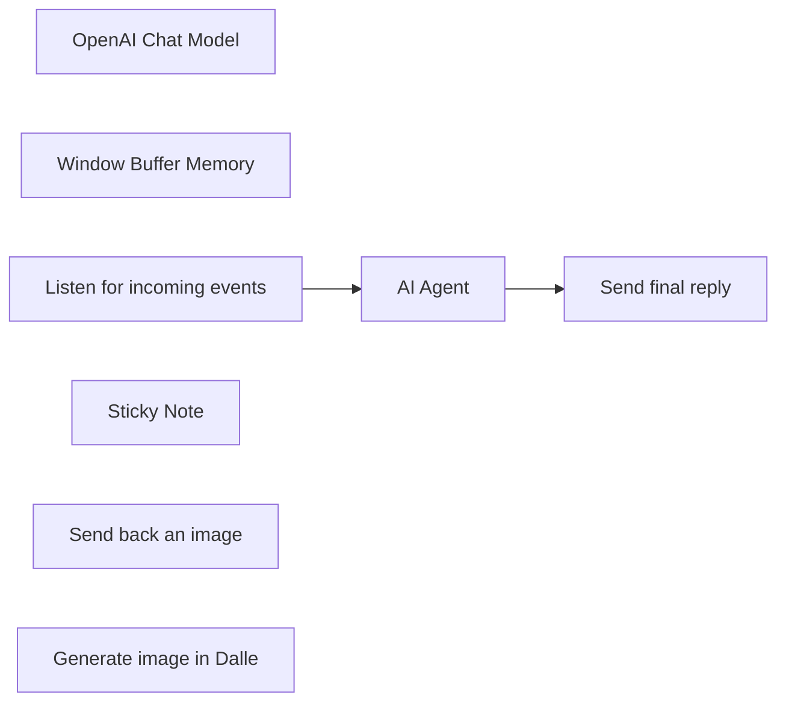

## Fluxo (.json) :

```json
{
  "id": "U8EOTtZvmZPMYc6m",
  "meta": {
    "instanceId": "fb924c73af8f703905bc09c9ee8076f48c17b596ed05b18c0ff86915ef8a7c4a",
    "templateCredsSetupCompleted": true
  },
  "name": "Agentic Telegram AI bot with LangChain nodes and new tools",
  "tags": [],
  "nodes": [
    {
      "id": "13b3488e-af72-4d89-bef4-e9b895e3bf76",
      "name": "OpenAI Chat Model",
      "type": "@n8n/n8n-nodes-langchain.lmChatOpenAi",
      "position": [
        1640,
        580
      ],
      "parameters": {
        "model": "gpt-4o",
        "options": {
          "temperature": 0.7,
          "frequencyPenalty": 0.2
        }
      },
      "credentials": {
        "openAiApi": {
          "id": "rveqdSfp7pCRON1T",
          "name": "Ted's Tech Talks OpenAi"
        }
      },
      "typeVersion": 1
    },
    {
      "id": "864937a1-43f6-4055-bdea-61ab07db9903",
      "name": "Window Buffer Memory",
      "type": "@n8n/n8n-nodes-langchain.memoryBufferWindow",
      "position": [
        1760,
        580
      ],
      "parameters": {
        "sessionKey": "=chat_with_{{ $('Listen for incoming events').first().json.message.chat.id }}",
        "contextWindowLength": 10
      },
      "typeVersion": 1
    },
    {
      "id": "4ef838d4-feaa-4bd3-b2c7-ccd938be4373",
      "name": "Listen for incoming events",
      "type": "n8n-nodes-base.telegramTrigger",
      "position": [
        1580,
        360
      ],
      "webhookId": "322dce18-f93e-4f86-b9b1-3305519b7834",
      "parameters": {
        "updates": [
          "*"
        ],
        "additionalFields": {}
      },
      "credentials": {
        "telegramApi": {
          "id": "9dexJXnlVPA6wt8K",
          "name": "Chat & Sound"
        }
      },
      "typeVersion": 1
    },
    {
      "id": "fed51c41-2846-4a1a-a5f5-ce121ee7fe88",
      "name": "Sticky Note",
      "type": "n8n-nodes-base.stickyNote",
      "position": [
        1460,
        180
      ],
      "parameters": {
        "color": 7,
        "width": 926.3188190787038,
        "height": 553.452795998601,
        "content": "## Generate an image with Dall-E-3 and send it via Telegram"
      },
      "typeVersion": 1
    },
    {
      "id": "1c7a204b-3ed7-47bd-a434-202b05272d18",
      "name": "Send final reply",
      "type": "n8n-nodes-base.telegram",
      "onError": "continueErrorOutput",
      "position": [
        2140,
        360
      ],
      "parameters": {
        "text": "={{ $json.output }}",
        "chatId": "={{ $('Listen for incoming events').first().json.message.from.id }}",
        "additionalFields": {
          "appendAttribution": false
        }
      },
      "credentials": {
        "telegramApi": {
          "id": "9dexJXnlVPA6wt8K",
          "name": "Chat & Sound"
        }
      },
      "typeVersion": 1.1
    },
    {
      "id": "bebbe9d4-47ba-4c13-9e1e-d36bfe6e472e",
      "name": "Send back an image",
      "type": "n8n-nodes-base.telegramTool",
      "position": [
        2020,
        580
      ],
      "parameters": {
        "file": "={{ $fromAI(\"url\", \"a valid url of an image\", \"string\", \" \") }}",
        "chatId": "={{ $('Listen for incoming events').first().json.message.from.id }}",
        "operation": "sendDocument",
        "additionalFields": {}
      },
      "credentials": {
        "telegramApi": {
          "id": "9dexJXnlVPA6wt8K",
          "name": "Chat & Sound"
        }
      },
      "typeVersion": 1.2
    },
    {
      "id": "38f2410d-bd55-4ddf-8aaa-4e28919de78f",
      "name": "Generate image in Dalle",
      "type": "@n8n/n8n-nodes-langchain.toolHttpRequest",
      "position": [
        1880,
        580
      ],
      "parameters": {
        "url": "https://api.openai.com/v1/images/generations",
        "method": "POST",
        "sendBody": true,
        "authentication": "predefinedCredentialType",
        "parametersBody": {
          "values": [
            {
              "name": "model",
              "value": "dall-e-3",
              "valueProvider": "fieldValue"
            },
            {
              "name": "prompt"
            }
          ]
        },
        "toolDescription": "Call this tool to request a Dall-E-3 model, when the user asks to draw something. If you gеt a response from this tool, forward it to the Telegram tool.",
        "nodeCredentialType": "openAiApi"
      },
      "credentials": {
        "openAiApi": {
          "id": "rveqdSfp7pCRON1T",
          "name": "Ted's Tech Talks OpenAi"
        }
      },
      "typeVersion": 1.1
    },
    {
      "id": "34265eab-9f37-475a-a2ae-a6c37c69c595",
      "name": "AI Agent",
      "type": "@n8n/n8n-nodes-langchain.agent",
      "position": [
        1780,
        360
      ],
      "parameters": {
        "text": "={{ $json.message.text }}",
        "options": {
          "systemMessage": "=You are a helpful assistant. You are communicating with a user named {{ $json.message.from.first_name }}. Address the user by name every time. If the user asks for an image, always send the link to the image in the final reply."
        },
        "promptType": "define"
      },
      "typeVersion": 1.7
    }
  ],
  "active": false,
  "pinData": {},
  "settings": {
    "executionOrder": "v1"
  },
  "versionId": "b36989c5-295a-4df6-84e9-776815509bc9",
  "connections": {
    "AI Agent": {
      "main": [
        [
          {
            "node": "Send final reply",
            "type": "main",
            "index": 0
          }
        ]
      ]
    },
    "OpenAI Chat Model": {
      "ai_languageModel": [
        [
          {
            "node": "AI Agent",
            "type": "ai_languageModel",
            "index": 0
          }
        ]
      ]
    },
    "Send back an image": {
      "ai_tool": [
        [
          {
            "node": "AI Agent",
            "type": "ai_tool",
            "index": 0
          }
        ]
      ]
    },
    "Window Buffer Memory": {
      "ai_memory": [
        [
          {
            "node": "AI Agent",
            "type": "ai_memory",
            "index": 0
          }
        ]
      ]
    },
    "Generate image in Dalle": {
      "ai_tool": [
        [
          {
            "node": "AI Agent",
            "type": "ai_tool",
            "index": 0
          }
        ]
      ]
    },
    "Listen for incoming events": {
      "main": [
        [
          {
            "node": "AI Agent",
            "type": "main",
            "index": 0
          }
        ]
      ]
    }
  }
}
```

<a id="template-553"></a>

## Template 553 - Processamento em lotes com verificação de término

- **Nome:** Processamento em lotes com verificação de término
- **Descrição:** Gera dez itens e processa cada um individualmente em lotes; verifica uma condição para encerrar o loop e, se atendida, emite uma mensagem de término.
- **Funcionalidade:** • Geração de itens: Cria 10 itens numerados de 0 a 9.
• Divisão em lotes: Processa os itens em lotes de tamanho 1 para controle sequencial.
• Verificação condicional: Em cada lote, verifica se o índice de execução atual é igual a 5.
• Ramo de término: Quando a condição é verdadeira, emite a mensagem "Loop Ended".
• Continuação do loop: Quando a condição não é atendida, continua com o próximo lote.
- **Ferramentas:** • Nenhuma ferramenta externa: O fluxo opera sem integrações externas, utilizando apenas lógica interna.

## Fluxo visual

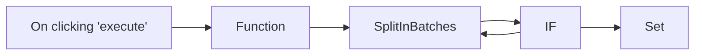

## Fluxo (.json) :

```json
{
  "nodes": [
    {
      "name": "On clicking 'execute'",
      "type": "n8n-nodes-base.manualTrigger",
      "position": [
        430,
        310
      ],
      "parameters": {},
      "typeVersion": 1
    },
    {
      "name": "Function",
      "type": "n8n-nodes-base.function",
      "position": [
        630,
        310
      ],
      "parameters": {
        "functionCode": "const newItems = [];\n\nfor (let i=0;i<10;i++) {\n  newItems.push({json:{i}});\n}\n\nreturn newItems;"
      },
      "typeVersion": 1
    },
    {
      "name": "SplitInBatches",
      "type": "n8n-nodes-base.splitInBatches",
      "position": [
        830,
        310
      ],
      "parameters": {
        "options": {},
        "batchSize": 1
      },
      "typeVersion": 1
    },
    {
      "name": "IF",
      "type": "n8n-nodes-base.if",
      "position": [
        1030,
        460
      ],
      "parameters": {
        "conditions": {
          "number": [
            {
              "value1": "={{$node[\"SplitInBatches\"].context[\"currentRunIndex\"];}}",
              "value2": 5,
              "operation": "equal"
            }
          ],
          "boolean": []
        }
      },
      "typeVersion": 1
    },
    {
      "name": "Set",
      "type": "n8n-nodes-base.set",
      "position": [
        1230,
        360
      ],
      "parameters": {
        "values": {
          "string": [
            {
              "name": "Message",
              "value": "Loop Ended"
            }
          ]
        },
        "options": {},
        "keepOnlySet": true
      },
      "typeVersion": 1
    }
  ],
  "connections": {
    "IF": {
      "main": [
        [
          {
            "node": "Set",
            "type": "main",
            "index": 0
          }
        ],
        [
          {
            "node": "SplitInBatches",
            "type": "main",
            "index": 0
          }
        ]
      ]
    },
    "Function": {
      "main": [
        [
          {
            "node": "SplitInBatches",
            "type": "main",
            "index": 0
          }
        ]
      ]
    },
    "SplitInBatches": {
      "main": [
        [
          {
            "node": "IF",
            "type": "main",
            "index": 0
          }
        ]
      ]
    },
    "On clicking 'execute'": {
      "main": [
        [
          {
            "node": "Function",
            "type": "main",
            "index": 0
          }
        ]
      ]
    }
  }
}
```

<a id="template-554"></a>

## Template 554 - Cancelar inscrição de contatos Mautic via e-mail

- **Nome:** Cancelar inscrição de contatos Mautic via e-mail
- **Descrição:** Monitora e-mails de entrada para detectar pedidos automáticos de cancelamento e, quando o remetente existir no CRM, atualiza segmentos e responde com uma mensagem de confirmação.
- **Funcionalidade:** • Monitoramento de e-mail: Verifica a caixa de entrada a cada minuto, incluindo spam e lixo eletrônico, em busca de mensagens relevantes.
• Detecção de pedido automático de cancelamento: Identifica e-mails cujo campo "To" contém a palavra "unsubscribe" e que não foram enviados pelo próprio endereço configurado.
• Extração do endereço de remetente: Extrai o e-mail do campo From (tratando formatos com e sem '<...>').
• Remoção de duplicatas: Agrupa e processa apenas endereços de e-mail únicos antes da busca no CRM.
• Busca de contato no CRM: Procura o contato por e-mail; se existir, executa ações de gerenciamento de segmentação.
• Atualização de segmentos: Adiciona o contato ao segmento de não-subscritos e remove do segmento de newsletter.
• Envio de resposta automática: Responde ao remetente com uma mensagem de confirmação de cancelamento configurada.
• Opção de lista de "Não Contatar": Inclui um passo (desativado por padrão) para marcar o contato na lista de não contatar do CRM.
- **Ferramentas:** • Gmail: Fonte de e-mails para detecção de pedidos de cancelamento e canal para enviar respostas automáticas.
• Mautic: CRM/marketing para buscar contatos por e-mail, adicionar/remover segmentos e opcionalmente marcar como "Não Contatar".

## Fluxo visual

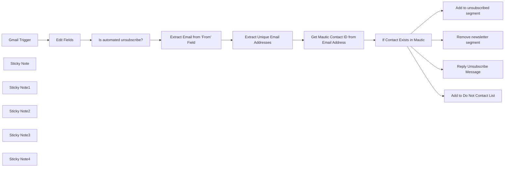

## Fluxo (.json) :

```json
{
  "meta": {
    "instanceId": "f0efd559def66ddc761033b0b2eb86ed3edec31121f2c1aa92ed05e63303529a"
  },
  "name": "Unsubscribe Mautic contacts from automated unsubscribe emails",
  "tags": [],
  "nodes": [
    {
      "id": "55d6a64b-88e2-4162-a93a-b31ad32b94fd",
      "name": "Gmail Trigger",
      "type": "n8n-nodes-base.gmailTrigger",
      "position": [
        140,
        860
      ],
      "parameters": {
        "filters": {
          "includeSpamTrash": true
        },
        "pollTimes": {
          "item": [
            {
              "mode": "everyMinute"
            }
          ]
        }
      },
      "credentials": {
        "gmailOAuth2": {
          "id": "3",
          "name": "Gmail account"
        }
      },
      "typeVersion": 1
    },
    {
      "id": "a697b58c-e0c8-42e0-8211-49caf46ce222",
      "name": "Is automated unsubscribe?",
      "type": "n8n-nodes-base.if",
      "position": [
        460,
        1000
      ],
      "parameters": {
        "conditions": {
          "string": [
            {
              "value1": "= {{ $json[\"To\"] }}",
              "value2": "unsubscribe",
              "operation": "contains"
            },
            {
              "value1": "={{ $json[\"From\"] }}",
              "value2": "={{ $node[\"Edit Fields\"].json[\"emailAddress\"] }}",
              "operation": "notEqual"
            }
          ]
        }
      },
      "typeVersion": 1,
      "alwaysOutputData": false
    },
    {
      "id": "72c76f4b-50da-481a-9c3e-204158f3a016",
      "name": "Add to unsubscribed segment",
      "type": "n8n-nodes-base.mautic",
      "position": [
        1520,
        720
      ],
      "parameters": {
        "resource": "contactSegment",
        "contactId": "={{ $json[\"id\"] }}",
        "segmentId": 3,
        "authentication": "oAuth2"
      },
      "credentials": {
        "mauticOAuth2Api": {
          "id": "4",
          "name": "Mautic account"
        }
      },
      "typeVersion": 1
    },
    {
      "id": "44c85f57-0716-476f-bea5-00efeddf908f",
      "name": "Remove newsletter segment",
      "type": "n8n-nodes-base.mautic",
      "position": [
        1520,
        920
      ],
      "parameters": {
        "resource": "contactSegment",
        "contactId": "={{ $json[\"id\"] }}",
        "operation": "remove",
        "segmentId": 1,
        "authentication": "oAuth2"
      },
      "credentials": {
        "mauticOAuth2Api": {
          "id": "4",
          "name": "Mautic account"
        }
      },
      "typeVersion": 1
    },
    {
      "id": "b26ddbb9-3209-458b-8e94-2854ed8bf8de",
      "name": "Reply Unsubscribe Message",
      "type": "n8n-nodes-base.gmail",
      "position": [
        1520,
        1140
      ],
      "parameters": {
        "message": "={{$node[\"Edit Fields\"].json[\"unsubscribeMessage\"]}}",
        "options": {},
        "messageId": "={{ $node[\"Gmail Trigger\"].json[\"id\"] }}",
        "operation": "reply"
      },
      "credentials": {
        "gmailOAuth2": {
          "id": "3",
          "name": "Gmail account"
        }
      },
      "typeVersion": 2
    },
    {
      "id": "34fc931b-f692-4383-a75b-76502c11452b",
      "name": "Add to Do Not Contact List",
      "type": "n8n-nodes-base.mautic",
      "disabled": true,
      "position": [
        1520,
        520
      ],
      "parameters": {
        "contactId": "{{ $json[\"id\"] }}",
        "operation": "editDoNotContactList",
        "authentication": "oAuth2",
        "additionalFields": {}
      },
      "credentials": {
        "mauticOAuth2Api": {
          "id": "4",
          "name": "Mautic account"
        }
      },
      "typeVersion": 1
    },
    {
      "id": "b5dd2d22-c367-4f30-a1b3-e3a767aec96b",
      "name": "Extract Email from 'From' Field",
      "type": "n8n-nodes-base.code",
      "position": [
        640,
        840
      ],
      "parameters": {
        "mode": "runOnceForEachItem",
        "jsCode": "var fromField = $input.item.json.From;\nvar extractedEmail;\nif (fromField.includes('<') && fromField.includes('>')) {\n    // From field is wrapped in carets\n    var regex = /[^< ]+(?=>)/g;\n    extractedEmail = fromField.match(regex)[0];\n} else {\n    // From field is not wrapped in carets\n    extractedEmail = fromField;\n}\nreturn {json: {extractedEmail}}"
      },
      "typeVersion": 1
    },
    {
      "id": "f11e57b5-7834-4654-8793-42b1aa297730",
      "name": "Extract Unique Email Addresses",
      "type": "n8n-nodes-base.code",
      "position": [
        820,
        1000
      ],
      "parameters": {
        "jsCode": "// Access the input data using all() method\nconst inputData = $input.all();\nconst uniqueEmailsSet = new Set();\n\n// Loop through each item, extract the email, and add it to the Set\ninputData.forEach(item => {\n    uniqueEmailsSet.add(item.json.extractedEmail);\n});\n\n// Convert the Set to an array of objects in the n8n format\nconst uniqueEmailsArray = Array.from(uniqueEmailsSet).map(email => {\n    return { json: { extractedEmail: email } };\n});\n\nreturn uniqueEmailsArray;\n"
      },
      "typeVersion": 2
    },
    {
      "id": "5e168e07-1a6b-4140-81b9-9d9ffb852f61",
      "name": "Get Mautic Contact ID from Email Address",
      "type": "n8n-nodes-base.mautic",
      "position": [
        1020,
        840
      ],
      "parameters": {
        "limit": 1,
        "options": {
          "search": "=email:{{ $json[\"extractedEmail\"] }}",
          "rawData": false
        },
        "operation": "getAll",
        "authentication": "oAuth2"
      },
      "credentials": {
        "mauticOAuth2Api": {
          "id": "4",
          "name": "Mautic account"
        }
      },
      "typeVersion": 1,
      "alwaysOutputData": false
    },
    {
      "id": "ad1a7b7a-230a-4098-b419-c93e3a6398a1",
      "name": "If Contact Exists in Mautic",
      "type": "n8n-nodes-base.if",
      "position": [
        1180,
        1060
      ],
      "parameters": {
        "conditions": {
          "string": [
            {
              "value1": "={{ $json[\"id\"] }}",
              "operation": "isNotEmpty"
            }
          ]
        }
      },
      "typeVersion": 1
    },
    {
      "id": "17b999f9-9c50-488a-b5d2-d98bbd566048",
      "name": "Sticky Note",
      "type": "n8n-nodes-base.stickyNote",
      "position": [
        200,
        500
      ],
      "parameters": {
        "content": "## Step 1\nSet your email address and unsubscribe message in the edit fields node"
      },
      "typeVersion": 1
    },
    {
      "id": "11d28571-7335-4e53-a691-973412b6daef",
      "name": "Sticky Note1",
      "type": "n8n-nodes-base.stickyNote",
      "position": [
        140,
        1020
      ],
      "parameters": {
        "content": "## Step 2\nSet your credentials in the Gmail trigger"
      },
      "typeVersion": 1
    },
    {
      "id": "2874fbc3-5735-471c-8c34-70854e0770bd",
      "name": "Sticky Note2",
      "type": "n8n-nodes-base.stickyNote",
      "position": [
        940,
        660
      ],
      "parameters": {
        "content": "## Step 3\nSet credentials in the mautic nodes"
      },
      "typeVersion": 1
    },
    {
      "id": "1e51f13f-3fba-4b5b-8c88-eb792c4c0b40",
      "name": "Sticky Note3",
      "type": "n8n-nodes-base.stickyNote",
      "position": [
        1240,
        460
      ],
      "parameters": {
        "content": "## Step 4\nEdit segments (add or remove) in the mautic nodes, optionally add to do not contact list."
      },
      "typeVersion": 1
    },
    {
      "id": "3b5f94df-864b-480c-a6f2-d572345e7d9a",
      "name": "Sticky Note4",
      "type": "n8n-nodes-base.stickyNote",
      "position": [
        580,
        440
      ],
      "parameters": {
        "width": 237.7703390037576,
        "height": 194.55974544175768,
        "content": "## Unsubscribe Mautic contacts from automated unsubscribe emails"
      },
      "typeVersion": 1
    },
    {
      "id": "69496c4b-254d-4a89-8ab1-9fe80cfaea14",
      "name": "Edit Fields",
      "type": "n8n-nodes-base.set",
      "position": [
        300,
        700
      ],
      "parameters": {
        "fields": {
          "values": [
            {
              "name": "emailAddress",
              "stringValue": "hello@example.com"
            },
            {
              "name": "unsubscribeMessage",
              "stringValue": "Your have successfully opted out from our marketing campaigns. Please reply if you believe this is an error."
            }
          ]
        },
        "options": {}
      },
      "typeVersion": 3.2
    }
  ],
  "active": false,
  "pinData": {},
  "settings": {
    "executionOrder": "v1"
  },
  "versionId": "",
  "connections": {
    "Edit Fields": {
      "main": [
        [
          {
            "node": "Is automated unsubscribe?",
            "type": "main",
            "index": 0
          }
        ]
      ]
    },
    "Gmail Trigger": {
      "main": [
        [
          {
            "node": "Edit Fields",
            "type": "main",
            "index": 0
          }
        ]
      ]
    },
    "Is automated unsubscribe?": {
      "main": [
        [
          {
            "node": "Extract Email from 'From' Field",
            "type": "main",
            "index": 0
          }
        ]
      ]
    },
    "If Contact Exists in Mautic": {
      "main": [
        [
          {
            "node": "Add to unsubscribed segment",
            "type": "main",
            "index": 0
          },
          {
            "node": "Remove newsletter segment",
            "type": "main",
            "index": 0
          },
          {
            "node": "Reply Unsubscribe Message",
            "type": "main",
            "index": 0
          },
          {
            "node": "Add to Do Not Contact List",
            "type": "main",
            "index": 0
          }
        ],
        [
          {
            "node": "Reply Unsubscribe Message",
            "type": "main",
            "index": 0
          }
        ]
      ]
    },
    "Extract Unique Email Addresses": {
      "main": [
        [
          {
            "node": "Get Mautic Contact ID from Email Address",
            "type": "main",
            "index": 0
          }
        ]
      ]
    },
    "Extract Email from 'From' Field": {
      "main": [
        [
          {
            "node": "Extract Unique Email Addresses",
            "type": "main",
            "index": 0
          }
        ]
      ]
    },
    "Get Mautic Contact ID from Email Address": {
      "main": [
        [
          {
            "node": "If Contact Exists in Mautic",
            "type": "main",
            "index": 0
          }
        ]
      ]
    }
  }
}
```

<a id="template-555"></a>

## Template 555 - Atualização dinâmica de DNS da Namecheap

- **Nome:** Atualização dinâmica de DNS da Namecheap
- **Descrição:** Fluxo que verifica periodicamente o IP público e atualiza entradas DNS de subdomínios na Namecheap quando o IP muda.
- **Funcionalidade:** • Agendamento periódico: Executa a verificação a cada 15 minutos.
• Obtenção do IP público: Consulta um serviço externo para recuperar o IP público atual.
• Detecção de alteração de IP: Compara o IP obtido com o último IP salvo e prossegue somente se houver mudança.
• Listagem e iteração de subdomínios: Mantém uma lista de subdomínios e itera para aplicar as atualizações a cada um.
• Atualização remota de DNS: Envia requisições ao serviço de DDNS da Namecheap para atualizar o registro de cada subdomínio com o novo IP.
• Persistência do último IP: Armazena o último IP conhecido para evitar atualizações desnecessárias.
• Re-tentativas na obtenção do IP: Tenta novamente caso a consulta do IP público falhe.
- **Ferramentas:** • Namecheap Dynamic DNS (dynamicdns.park-your-domain.com): Endpoint para atualizar registros DNS de subdomínios usando host, domínio, senha DDNS e IP.
• ipify (api.ipify.org): Serviço público para obter o endereço IP público atual.

## Fluxo visual

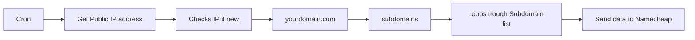

## Fluxo (.json) :

```json
{
  "id": 3,
  "name": "NameCheap Dynamic DNS (DDNS)",
  "nodes": [
    {
      "name": "Cron",
      "type": "n8n-nodes-base.cron",
      "position": [
        380,
        300
      ],
      "parameters": {
        "triggerTimes": {
          "item": [
            {
              "mode": "everyX",
              "unit": "minutes",
              "value": 15
            }
          ]
        }
      },
      "typeVersion": 1
    },
    {
      "name": "Checks IP if new",
      "type": "n8n-nodes-base.function",
      "position": [
        740,
        300
      ],
      "parameters": {
        "functionCode": "const staticData = getWorkflowStaticData('global');\nconst newItem = items.map(item => item.json[\"ip\"]);\nconst ildItem = staticData.ildItem; \n\nif (!ildItem) {\n  staticData.ildItem = newItem;\n  return items;\n}\n\n\nconst actualnewItem = newItem.filter((id) => !ildItem.includes(id));\nconst actualItem = items.filter((data) => actualnewItem.includes(data.json['ip']));\nstaticData.ildItem = [...actualnewItem, ...ildItem];\n\nreturn actualItem;"
      },
      "typeVersion": 1
    },
    {
      "name": "subdomains",
      "type": "n8n-nodes-base.function",
      "position": [
        1100,
        300
      ],
      "parameters": {
        "functionCode": "items[0].json = {\n    value: [\n        {id: \"subdomain1\"},\n        {id: \"subdomain2\"},\n        {id: \"subdomain3\"}\n    ]\n};\nreturn items;"
      },
      "typeVersion": 1
    },
    {
      "name": "Loops trough Subdomain list",
      "type": "n8n-nodes-base.function",
      "position": [
        1280,
        300
      ],
      "parameters": {
        "functionCode": "const newItems = [];\n\nfor (const item of items[0].json.value) {\n  newItems.push({json: item});\n}\n\nreturn newItems;"
      },
      "typeVersion": 1
    },
    {
      "name": "Send data to Namecheap",
      "type": "n8n-nodes-base.httpRequest",
      "position": [
        1460,
        300
      ],
      "parameters": {
        "url": "=https://dynamicdns.park-your-domain.com/update?host={{$node[\"Loops trough Subdomain list\"].parameter[\"functionCode\"]}}test&domain={{$node[\"yourdomain.com\"].parameter[\"values\"][\"string\"][0][\"value\"]}}&password={{$node[\"yourdomain.com\"].parameter[\"values\"][\"string\"][1][\"value\"]}}&ip={{$node[\"Get Public IP address\"].json[\"ip\"]}}",
        "options": {},
        "responseFormat": "string"
      },
      "typeVersion": 1
    },
    {
      "name": "Get Public IP address",
      "type": "n8n-nodes-base.httpRequest",
      "position": [
        560,
        300
      ],
      "parameters": {
        "url": "https://api.ipify.org?format=json",
        "options": {},
        "jsonParameters": true,
        "allowUnauthorizedCerts": true
      },
      "retryOnFail": true,
      "typeVersion": 1,
      "continueOnFail": true
    },
    {
      "name": "yourdomain.com",
      "type": "n8n-nodes-base.set",
      "position": [
        920,
        300
      ],
      "parameters": {
        "values": {
          "string": [
            {
              "name": "domain",
              "value": "yourdomain.com"
            },
            {
              "name": "password",
              "value": "your-namecheap-ddns-password"
            }
          ]
        },
        "options": {},
        "keepOnlySet": true
      },
      "typeVersion": 1
    }
  ],
  "active": false,
  "settings": {},
  "connections": {
    "Cron": {
      "main": [
        [
          {
            "node": "Get Public IP address",
            "type": "main",
            "index": 0
          }
        ]
      ]
    },
    "subdomains": {
      "main": [
        [
          {
            "node": "Loops trough Subdomain list",
            "type": "main",
            "index": 0
          }
        ]
      ]
    },
    "yourdomain.com": {
      "main": [
        [
          {
            "node": "subdomains",
            "type": "main",
            "index": 0
          }
        ]
      ]
    },
    "Checks IP if new": {
      "main": [
        [
          {
            "node": "yourdomain.com",
            "type": "main",
            "index": 0
          }
        ]
      ]
    },
    "Get Public IP address": {
      "main": [
        [
          {
            "node": "Checks IP if new",
            "type": "main",
            "index": 0
          }
        ]
      ]
    },
    "Loops trough Subdomain list": {
      "main": [
        [
          {
            "node": "Send data to Namecheap",
            "type": "main",
            "index": 0
          }
        ]
      ]
    }
  }
}
```

<a id="template-556"></a>

## Template 556 - Validação de email de novos contatos do Mautic

- **Nome:** Validação de email de novos contatos do Mautic
- **Descrição:** Verifica a validade de emails de contatos identificados e notifica a equipe quando o email é suspeito.
- **Funcionalidade:** • Detecção de novo contato no Mautic: inicia o fluxo quando um contato é identificado/salvo como novo.
• Filtragem para processar apenas novos contatos: garante que apenas eventos de criação prossigam.
• Extração de informações do contato: coleta nome, sobrenome, email, ID e usuário criador para uso posterior.
• Validação de email via serviço externo: consulta um serviço de verificação para obter deliverability, validade de domínio e se o email é descartável.
• Avaliação de risco do email: marca como suspeito se a entregabilidade não for boa, o domínio for inválido ou o email for descartável.
• Notificação em canal de comunicação: envia uma mensagem com detalhes e link para revisão quando o email é considerado suspeito.
- **Ferramentas:** • Mautic: plataforma de automação de marketing e gerenciamento de contatos utilizada como fonte dos eventos de contato.
• OneSimpleApi: serviço externo de validação de emails que fornece deliverability, verificação de domínio e detecção de emails descartáveis.
• Slack: plataforma de mensagens usada para enviar alertas ao time com informações do contato e link para revisão.

## Fluxo visual

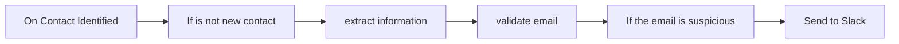

## Fluxo (.json) :

```json
{
  "id": 86,
  "name": "Check for valid Mautic contact email",
  "nodes": [
    {
      "name": "If is not new contact",
      "type": "n8n-nodes-base.if",
      "position": [
        780,
        460
      ],
      "parameters": {
        "conditions": {
          "string": [
            {
              "value1": "={{$json[\"mautic.lead_post_save_new\"]}}",
              "operation": "isEmpty"
            }
          ]
        }
      },
      "typeVersion": 1
    },
    {
      "name": "On Contact Identified",
      "type": "n8n-nodes-base.mauticTrigger",
      "position": [
        600,
        460
      ],
      "webhookId": "a3ee0f93-2870-44e2-bb2f-0175433263b3",
      "parameters": {
        "events": [
          "mautic.lead_post_save_new"
        ],
        "authentication": "oAuth2"
      },
      "credentials": {
        "mauticOAuth2Api": {
          "id": "54",
          "name": "Mautic account"
        }
      },
      "typeVersion": 1
    },
    {
      "name": "extract information",
      "type": "n8n-nodes-base.itemLists",
      "position": [
        980,
        480
      ],
      "parameters": {
        "options": {},
        "fieldToSplitOut": "mautic.lead_post_save_new"
      },
      "typeVersion": 1
    },
    {
      "name": "validate email",
      "type": "n8n-nodes-base.oneSimpleApi",
      "position": [
        1180,
        480
      ],
      "parameters": {
        "resource": "utility",
        "emailAddress": "={{$json[\"lead\"][\"fields\"][\"core\"][\"email\"][\"value\"]}}"
      },
      "credentials": {
        "oneSimpleApi": {
          "id": "33",
          "name": "One Simple account"
        }
      },
      "typeVersion": 1
    },
    {
      "name": "If the email is suspicious",
      "type": "n8n-nodes-base.if",
      "notes": "IF\ndeliverability is not good\nOR\nDomain is not valid\nOR\nEmail is Disposable",
      "position": [
        1360,
        480
      ],
      "parameters": {
        "conditions": {
          "string": [
            {
              "value1": "={{$json[\"deliverability\"]}}",
              "value2": "GOOD",
              "operation": "notEqual"
            }
          ],
          "boolean": [
            {
              "value1": "={{$json[\"is_domain_valid\"]}}"
            },
            {
              "value1": "={{$json[\"is_email_disposable\"]}}",
              "value2": true
            }
          ]
        },
        "combineOperation": "any"
      },
      "typeVersion": 1
    },
    {
      "name": "Send to Slack",
      "type": "n8n-nodes-base.slack",
      "position": [
        1560,
        460
      ],
      "parameters": {
        "text": "=:warning: New Contact with Suspicious Email :warning:\n*Name: * {{$node[\"extract information\"].json[\"contact\"][\"fields\"][\"core\"][\"firstname\"][\"normalizedValue\"]}} {{$node[\"extract information\"].json[\"contact\"][\"fields\"][\"core\"][\"lastname\"][\"normalizedValue\"]}}\n*Email: * {{$node[\"extract information\"].json[\"contact\"][\"fields\"][\"core\"][\"email\"][\"normalizedValue\"]}}\n*Link: * https://mautic.my.domain.com/s/contacts/view/{{$node[\"extract information\"].json[\"contact\"][\"id\"]}}\n*Creator: * {{$node[\"extract information\"].json[\"contact\"][\"createdByUser\"]}}",
        "channel": "#mautic-alerts",
        "attachments": [],
        "otherOptions": {}
      },
      "credentials": {
        "slackApi": {
          "id": "53",
          "name": "Slack Access Token"
        }
      },
      "typeVersion": 1
    }
  ],
  "active": false,
  "settings": {},
  "connections": {
    "validate email": {
      "main": [
        [
          {
            "node": "If the email is suspicious",
            "type": "main",
            "index": 0
          }
        ]
      ]
    },
    "extract information": {
      "main": [
        [
          {
            "node": "validate email",
            "type": "main",
            "index": 0
          }
        ]
      ]
    },
    "If is not new contact": {
      "main": [
        [],
        [
          {
            "node": "extract information",
            "type": "main",
            "index": 0
          }
        ]
      ]
    },
    "On Contact Identified": {
      "main": [
        [
          {
            "node": "If is not new contact",
            "type": "main",
            "index": 0
          }
        ]
      ]
    },
    "If the email is suspicious": {
      "main": [
        [
          {
            "node": "Send to Slack",
            "type": "main",
            "index": 0
          }
        ]
      ]
    }
  }
}
```

<a id="template-557"></a>

## Template 557 - Recuperador de workflow com QA

- **Nome:** Recuperador de workflow com QA
- **Descrição:** Fluxo que recebe uma pergunta, recupera dados de um workflow salvo e usa um modelo de linguagem para responder com base nas informações recuperadas.
- **Funcionalidade:** • Disparo manual: Inicia o fluxo quando o usuário aciona a execução.
• Definição de entrada (prompt): Permite configurar a pergunta ou consulta a ser respondida.
• Recuperação de dados de subworkflow: Obtém conteúdo ou documentos a partir de um workflow salvo identificado por um ID.
• Cadeia de Recuperação + QA: Combina o conteúdo recuperado com um mecanismo de QA para extrair respostas relevantes.
• Geração de respostas com modelo de chat: Utiliza um modelo de linguagem para formular respostas claras e contextualizadas.
• Documentação interna: Inclui notas explicativas para orientar o uso do fluxo e apontar onde substituir o ID do workflow.
- **Ferramentas:** • LangChain: Framework para orquestrar recuperação de documentos e cadeias de QA.
• OpenAI: Serviço de modelo de linguagem em formato de chat usado para gerar as respostas finais.

## Fluxo visual

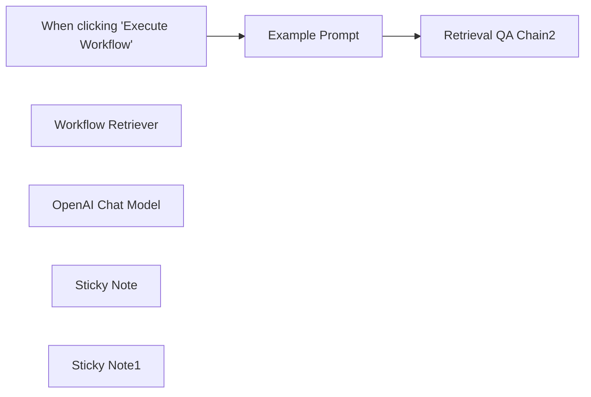

## Fluxo (.json) :

```json
{
  "id": "mjCQV12PbF6fw8hR",
  "meta": {
    "instanceId": "021d3c82ba2d3bc090cbf4fc81c9312668bcc34297e022bb3438c5c88a43a5ff"
  },
  "name": "LangChain - Example - Workflow Retriever",
  "tags": [
    {
      "id": "snf16n0p2UrGP838",
      "name": "LangChain - Example",
      "createdAt": "2023-09-25T16:21:55.962Z",
      "updatedAt": "2023-09-25T16:21:55.962Z"
    }
  ],
  "nodes": [
    {
      "id": "efdc3050-6c68-4419-9f12-f37d6fefb276",
      "name": "When clicking \"Execute Workflow\"",
      "type": "n8n-nodes-base.manualTrigger",
      "position": [
        460,
        200
      ],
      "parameters": {},
      "typeVersion": 1
    },
    {
      "id": "e0edb9ab-c59f-4d34-983d-861bb2df4f01",
      "name": "Workflow Retriever",
      "type": "@n8n/n8n-nodes-langchain.retrieverWorkflow",
      "position": [
        1120,
        440
      ],
      "parameters": {
        "workflowId": "QacfBRBnf1xOyckC"
      },
      "typeVersion": 1
    },
    {
      "id": "ba47dd13-67d0-499a-b9a2-16928099efce",
      "name": "Retrieval QA Chain2",
      "type": "@n8n/n8n-nodes-langchain.chainRetrievalQa",
      "position": [
        900,
        200
      ],
      "parameters": {},
      "typeVersion": 1
    },
    {
      "id": "f6d16571-0573-4860-aed9-611f93b050ad",
      "name": "OpenAI Chat Model",
      "type": "@n8n/n8n-nodes-langchain.lmChatOpenAi",
      "position": [
        800,
        480
      ],
      "parameters": {
        "options": {}
      },
      "credentials": {
        "openAiApi": {
          "id": "4jRB4A20cPycBqP5",
          "name": "OpenAI account - n8n"
        }
      },
      "typeVersion": 1
    },
    {
      "id": "4fd00751-3db0-489b-8c7f-4ee0fb32fb51",
      "name": "Example Prompt",
      "type": "n8n-nodes-base.set",
      "position": [
        680,
        200
      ],
      "parameters": {
        "fields": {
          "values": [
            {
              "name": "input",
              "stringValue": "What notes can you find for Jay Gatsby and what is his email address?"
            }
          ]
        },
        "options": {}
      },
      "typeVersion": 3
    },
    {
      "id": "732b6277-cb4d-4586-ab95-778ac9473fe5",
      "name": "Sticky Note",
      "type": "n8n-nodes-base.stickyNote",
      "position": [
        860,
        140
      ],
      "parameters": {
        "width": 363,
        "height": 211.90203341144422,
        "content": "### Q&A on data returned from a workflow"
      },
      "typeVersion": 1
    },
    {
      "id": "f09583a3-78e3-4888-8251-2148ffb7ab18",
      "name": "Sticky Note1",
      "type": "n8n-nodes-base.stickyNote",
      "position": [
        1040,
        400
      ],
      "parameters": {
        "width": 262.67019427016413,
        "height": 255.8330939602389,
        "content": "\n\n\n\n\n\n\n\n\n\n\n\n\n\n\nReplace \"Workflow ID\" with the ID the Subworkflow got saved as"
      },
      "typeVersion": 1
    }
  ],
  "active": false,
  "pinData": {},
  "settings": {
    "executionOrder": "v1"
  },
  "versionId": "48d3bdae-4cec-4b18-b92a-89215def0c68",
  "connections": {
    "Example Prompt": {
      "main": [
        [
          {
            "node": "Retrieval QA Chain2",
            "type": "main",
            "index": 0
          }
        ]
      ]
    },
    "OpenAI Chat Model": {
      "ai_languageModel": [
        [
          {
            "node": "Retrieval QA Chain2",
            "type": "ai_languageModel",
            "index": 0
          }
        ]
      ]
    },
    "Workflow Retriever": {
      "ai_retriever": [
        [
          {
            "node": "Retrieval QA Chain2",
            "type": "ai_retriever",
            "index": 0
          }
        ]
      ]
    },
    "When clicking \"Execute Workflow\"": {
      "main": [
        [
          {
            "node": "Example Prompt",
            "type": "main",
            "index": 0
          }
        ]
      ]
    }
  }
}
```

<a id="template-558"></a>

## Template 558 - Relatório semanal de SEO com A.I.

- **Nome:** Relatório semanal de SEO com A.I.
- **Descrição:** Coleta métricas de duas semanas do Google Analytics, solicita uma análise/comparação a um modelo de A.I. e armazena os resultados em uma tabela online.
- **Funcionalidade:** • Agendamento e execução manual: permite execução automática semanal e teste manual para disparar o fluxo.
• Coleta de métricas de engajamento de página: obtém screen/page views, usuários ativos, views por usuário e eventos para a semana atual e a semana anterior.
• Coleta de resultados de busca por página de destino: obtém cliques, impressões, posição média, CTR, sessões e métricas de engajamento para ambas as semanas.
• Coleta de visualizações por país: recupera usuários ativos, novos usuários, taxa de engajamento, sessões e eventos por país para as duas semanas.
• Parsing e normalização: scripts transformam as respostas da API em objetos simplificados e os codificam para envio à A.I.
• Análise comparativa por A.I.: envia os dados das duas semanas a um modelo LLM para gerar uma tabela em markdown e 5 sugestões de SEO.
• Armazenamento dos resultados: grava o texto gerado pela A.I. em uma tabela configurada, incluindo nome do site e timestamp.
• Suporte a credenciais: utiliza credenciais OAuth para a conta de analytics e cabeçalho de autorização (Bearer) para o serviço de A.I., além da autenticação para gravar no banco de dados.
- **Ferramentas:** • Google Analytics (GA4): fonte das métricas e dimensões (engajamento de página, resultados de busca e dados por país) usando o property ID e OAuth.
• OpenRouter (openrouter.ai): serviço de A.I. / LLM usado para comparar os dois períodos e gerar recomendações em formato markdown.
• Baserow: banco de dados online onde os resultados da A.I. são salvos em uma tabela configurada.

## Fluxo visual

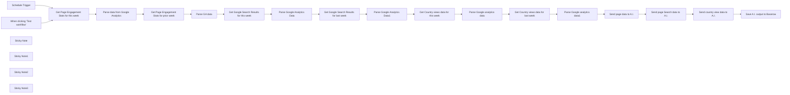

## Fluxo (.json) :

```json
{
  "id": "K3uf8aY8wipScEay",
  "meta": {
    "instanceId": "558d88703fb65b2d0e44613bc35916258b0f0bf983c5d4730c00c424b77ca36a",
    "templateCredsSetupCompleted": true
  },
  "name": "Google analytics template",
  "tags": [],
  "nodes": [
    {
      "id": "6a9fc442-d0a3-48be-8dff-94f8d9cd5cf1",
      "name": "Schedule Trigger",
      "type": "n8n-nodes-base.scheduleTrigger",
      "position": [
        460,
        460
      ],
      "parameters": {
        "rule": {
          "interval": [
            {
              "field": "weeks"
            }
          ]
        }
      },
      "typeVersion": 1.2
    },
    {
      "id": "484cbc41-f57d-4c3d-a458-e439d480d290",
      "name": "When clicking ‘Test workflow’",
      "type": "n8n-nodes-base.manualTrigger",
      "position": [
        460,
        640
      ],
      "parameters": {},
      "typeVersion": 1
    },
    {
      "id": "b1b66e9b-5fea-407b-9c1e-39bd2a9d4a90",
      "name": "Sticky Note",
      "type": "n8n-nodes-base.stickyNote",
      "position": [
        460,
        100
      ],
      "parameters": {
        "width": 714.172987012987,
        "content": "## Send Google analytics to A.I. and save results to baserow\n\nThis workflow will check for country views, page engagement and google search console results. It will take this week's data and compare it to last week's data.\n\n[You can read more about this workflow here](https://rumjahn.com/how-i-used-a-i-to-be-an-seo-expert-and-analyzed-my-google-analytics-data-in-n8n-and-make-com/)"
      },
      "typeVersion": 1
    },
    {
      "id": "adde29fc-ddb5-4b50-aa78-313ac9ede879",
      "name": "Sticky Note1",
      "type": "n8n-nodes-base.stickyNote",
      "position": [
        633.6540259740264,
        320
      ],
      "parameters": {
        "color": 4,
        "width": 2097.92831168831,
        "height": 342.6576623376624,
        "content": "## Property ID\n\n1. Create your [Google Analytics Credentials](https://docs.n8n.io/integrations/builtin/credentials/google/oauth-single-service/?utm_source=n8n_app&utm_medium=credential_settings&utm_campaign=create_new_credentials_modal)\n2. Enter your [property ID](https://developers.google.com/analytics/devguides/reporting/data/v1/property-id)."
      },
      "typeVersion": 1
    },
    {
      "id": "f2fb8535-e81e-4ca1-80df-ee68edba6386",
      "name": "Get Page Engagement Stats for this week",
      "type": "n8n-nodes-base.googleAnalytics",
      "position": [
        700,
        460
      ],
      "parameters": {
        "simple": false,
        "returnAll": true,
        "metricsGA4": {
          "metricValues": [
            {
              "name": "screenPageViews",
              "listName": "other"
            },
            {
              "name": "activeUsers",
              "listName": "other"
            },
            {
              "name": "screenPageViewsPerUser",
              "listName": "other"
            },
            {
              "name": "eventCount",
              "listName": "other"
            }
          ]
        },
        "propertyId": {
          "__rl": true,
          "mode": "id",
          "value": "460520224"
        },
        "dimensionsGA4": {
          "dimensionValues": [
            {
              "name": "unifiedScreenName",
              "listName": "other"
            }
          ]
        },
        "additionalFields": {}
      },
      "credentials": {
        "googleAnalyticsOAuth2": {
          "id": "b1GX8VBMKCUNweV1",
          "name": "Google Analytics account"
        }
      },
      "typeVersion": 2
    },
    {
      "id": "1d761425-cebf-4787-b286-b723a0851485",
      "name": "Get Page Engagement Stats for prior week",
      "type": "n8n-nodes-base.googleAnalytics",
      "position": [
        1060,
        460
      ],
      "parameters": {
        "simple": false,
        "endDate": "2024-10-23T00:00:00",
        "dateRange": "custom",
        "returnAll": true,
        "startDate": "={{$today.minus({days: 14})}}",
        "metricsGA4": {
          "metricValues": [
            {
              "name": "screenPageViews",
              "listName": "other"
            },
            {
              "name": "activeUsers",
              "listName": "other"
            },
            {
              "name": "screenPageViewsPerUser",
              "listName": "other"
            },
            {
              "name": "eventCount",
              "listName": "other"
            }
          ]
        },
        "propertyId": {
          "__rl": true,
          "mode": "id",
          "value": "460520224"
        },
        "dimensionsGA4": {
          "dimensionValues": [
            {
              "name": "unifiedScreenName",
              "listName": "other"
            }
          ]
        },
        "additionalFields": {}
      },
      "typeVersion": 2
    },
    {
      "id": "f8dac36b-9e8a-407f-b923-b4cea368f1bc",
      "name": "Parse data from Google Analytics",
      "type": "n8n-nodes-base.code",
      "position": [
        880,
        460
      ],
      "parameters": {
        "jsCode": "function transformToUrlString(items) {\n // Debug logging\n console.log('Input items:', JSON.stringify(items, null, 2));\n \n // Check if items is an array and has content\n if (!Array.isArray(items) || items.length === 0) {\n console.log('Items is not an array or is empty');\n throw new Error('Invalid data structure');\n }\n\n // Check if first item exists and has json property\n if (!items[0] || !items[0].json) {\n console.log('First item is missing or has no json property');\n throw new Error('Invalid data structure');\n }\n\n // Get the analytics data\n const analyticsData = items[0].json;\n \n // Check if analyticsData has rows\n if (!analyticsData || !Array.isArray(analyticsData.rows)) {\n console.log('Analytics data is missing or has no rows array');\n throw new Error('Invalid data structure');\n }\n \n // Map each row to a simplified object\n const simplified = analyticsData.rows.map(row => {\n if (!row.dimensionValues?.[0]?.value || !row.metricValues?.length) {\n console.log('Invalid row structure:', row);\n throw new Error('Invalid row structure');\n }\n \n return {\n page: row.dimensionValues[0].value,\n pageViews: parseInt(row.metricValues[0].value) || 0,\n activeUsers: parseInt(row.metricValues[1].value) || 0,\n viewsPerUser: parseFloat(row.metricValues[2].value) || 0,\n eventCount: parseInt(row.metricValues[3].value) || 0\n };\n });\n \n // Convert to JSON string and encode for URL\n return encodeURIComponent(JSON.stringify(simplified));\n}\n\n// Get input data and transform it\nconst urlString = transformToUrlString($input.all());\n\n// Return the result\nreturn { json: { urlString } };"
      },
      "typeVersion": 2
    },
    {
      "id": "ed880442-c92e-4347-b277-e8794aea6fbc",
      "name": "Parse GA data",
      "type": "n8n-nodes-base.code",
      "position": [
        1240,
        460
      ],
      "parameters": {
        "jsCode": "function transformToUrlString(items) {\n // Debug logging\n console.log('Input items:', JSON.stringify(items, null, 2));\n \n // Check if items is an array and has content\n if (!Array.isArray(items) || items.length === 0) {\n console.log('Items is not an array or is empty');\n throw new Error('Invalid data structure');\n }\n\n // Check if first item exists and has json property\n if (!items[0] || !items[0].json) {\n console.log('First item is missing or has no json property');\n throw new Error('Invalid data structure');\n }\n\n // Get the analytics data\n const analyticsData = items[0].json;\n \n // Check if analyticsData has rows\n if (!analyticsData || !Array.isArray(analyticsData.rows)) {\n console.log('Analytics data is missing or has no rows array');\n throw new Error('Invalid data structure');\n }\n \n // Map each row to a simplified object\n const simplified = analyticsData.rows.map(row => {\n if (!row.dimensionValues?.[0]?.value || !row.metricValues?.length) {\n console.log('Invalid row structure:', row);\n throw new Error('Invalid row structure');\n }\n \n return {\n page: row.dimensionValues[0].value,\n pageViews: parseInt(row.metricValues[0].value) || 0,\n activeUsers: parseInt(row.metricValues[1].value) || 0,\n viewsPerUser: parseFloat(row.metricValues[2].value) || 0,\n eventCount: parseInt(row.metricValues[3].value) || 0\n };\n });\n \n // Convert to JSON string and encode for URL\n return encodeURIComponent(JSON.stringify(simplified));\n}\n\n// Get input data and transform it\nconst urlString = transformToUrlString($input.all());\n\n// Return the result\nreturn { json: { urlString } };"
      },
      "typeVersion": 2
    },
    {
      "id": "46e092cc-af94-4e64-aa92-931c56345eff",
      "name": "Get Google Search Results for this week",
      "type": "n8n-nodes-base.googleAnalytics",
      "position": [
        1420,
        460
      ],
      "parameters": {
        "simple": false,
        "returnAll": true,
        "metricsGA4": {
          "metricValues": [
            {
              "name": "activeUsers",
              "listName": "other"
            },
            {
              "name": "engagedSessions",
              "listName": "other"
            },
            {
              "name": "engagementRate",
              "listName": "other"
            },
            {
              "name": "eventCount",
              "listName": "other"
            },
            {
              "name": "organicGoogleSearchAveragePosition",
              "listName": "other"
            },
            {
              "name": "organicGoogleSearchClickThroughRate",
              "listName": "other"
            },
            {
              "name": "organicGoogleSearchClicks",
              "listName": "other"
            },
            {
              "name": "organicGoogleSearchImpressions",
              "listName": "other"
            }
          ]
        },
        "propertyId": {
          "__rl": true,
          "mode": "id",
          "value": "460520224"
        },
        "dimensionsGA4": {
          "dimensionValues": [
            {
              "name": "landingPagePlusQueryString",
              "listName": "other"
            }
          ]
        },
        "additionalFields": {}
      },
      "credentials": {
        "googleAnalyticsOAuth2": {
          "id": "b1GX8VBMKCUNweV1",
          "name": "Google Analytics account"
        }
      },
      "typeVersion": 2
    },
    {
      "id": "709d0aaf-bd3d-4d83-9e66-b7df495855bd",
      "name": "Get Google Search Results for last week",
      "type": "n8n-nodes-base.googleAnalytics",
      "position": [
        1780,
        460
      ],
      "parameters": {
        "simple": false,
        "endDate": "={{$today.minus({days: 7})}}",
        "dateRange": "custom",
        "returnAll": true,
        "startDate": "={{$today.minus({days: 14})}}",
        "metricsGA4": {
          "metricValues": [
            {
              "name": "activeUsers",
              "listName": "other"
            },
            {
              "name": "engagedSessions",
              "listName": "other"
            },
            {
              "name": "engagementRate",
              "listName": "other"
            },
            {
              "name": "eventCount",
              "listName": "other"
            },
            {
              "name": "organicGoogleSearchAveragePosition",
              "listName": "other"
            },
            {
              "name": "organicGoogleSearchClickThroughRate",
              "listName": "other"
            },
            {
              "name": "organicGoogleSearchClicks",
              "listName": "other"
            },
            {
              "name": "organicGoogleSearchImpressions",
              "listName": "other"
            }
          ]
        },
        "propertyId": {
          "__rl": true,
          "mode": "id",
          "value": "460520224"
        },
        "dimensionsGA4": {
          "dimensionValues": [
            {
              "name": "landingPagePlusQueryString",
              "listName": "other"
            }
          ]
        },
        "additionalFields": {}
      },
      "credentials": {
        "googleAnalyticsOAuth2": {
          "id": "b1GX8VBMKCUNweV1",
          "name": "Google Analytics account"
        }
      },
      "typeVersion": 2
    },
    {
      "id": "7d3835d6-d1f5-4159-8e34-871871e63989",
      "name": "Parse Google Analytics Data",
      "type": "n8n-nodes-base.code",
      "position": [
        1600,
        460
      ],
      "parameters": {
        "jsCode": "function transformToUrlString(items) {\n // In n8n, we need to check if items is an array and get the json property\n const data = items[0].json;\n \n if (!data || !data.rows) {\n console.log('No valid data found');\n return encodeURIComponent(JSON.stringify([]));\n }\n \n try {\n // Process each row\n const simplified = data.rows.map(row => ({\n page: row.dimensionValues[0].value,\n activeUsers: parseInt(row.metricValues[0].value) || 0,\n engagedSessions: parseInt(row.metricValues[1].value) || 0,\n engagementRate: parseFloat(row.metricValues[2].value) || 0,\n eventCount: parseInt(row.metricValues[3].value) || 0,\n avgPosition: parseFloat(row.metricValues[4].value) || 0,\n ctr: parseFloat(row.metricValues[5].value) || 0,\n clicks: parseInt(row.metricValues[6].value) || 0,\n impressions: parseInt(row.metricValues[7].value) || 0\n }));\n \n return encodeURIComponent(JSON.stringify(simplified));\n } catch (error) {\n console.log('Error processing data:', error);\n throw new Error('Invalid data structure');\n }\n}\n\n// Get the input data\nconst items = $input.all();\n\n// Process the data\nconst result = transformToUrlString(items);\n\n// Return the result\nreturn { json: { urlString: result } };"
      },
      "typeVersion": 2
    },
    {
      "id": "c018fda4-a2e6-48f4-aabb-039c66374dc7",
      "name": "Parse Google Analytics Data1",
      "type": "n8n-nodes-base.code",
      "position": [
        1940,
        460
      ],
      "parameters": {
        "jsCode": "function transformToUrlString(items) {\n // In n8n, we need to check if items is an array and get the json property\n const data = items[0].json;\n \n if (!data || !data.rows) {\n console.log('No valid data found');\n return encodeURIComponent(JSON.stringify([]));\n }\n \n try {\n // Process each row\n const simplified = data.rows.map(row => ({\n page: row.dimensionValues[0].value,\n activeUsers: parseInt(row.metricValues[0].value) || 0,\n engagedSessions: parseInt(row.metricValues[1].value) || 0,\n engagementRate: parseFloat(row.metricValues[2].value) || 0,\n eventCount: parseInt(row.metricValues[3].value) || 0,\n avgPosition: parseFloat(row.metricValues[4].value) || 0,\n ctr: parseFloat(row.metricValues[5].value) || 0,\n clicks: parseInt(row.metricValues[6].value) || 0,\n impressions: parseInt(row.metricValues[7].value) || 0\n }));\n \n return encodeURIComponent(JSON.stringify(simplified));\n } catch (error) {\n console.log('Error processing data:', error);\n throw new Error('Invalid data structure');\n }\n}\n\n// Get the input data\nconst items = $input.all();\n\n// Process the data\nconst result = transformToUrlString(items);\n\n// Return the result\nreturn { json: { urlString: result } };"
      },
      "typeVersion": 2
    },
    {
      "id": "d8f775cd-daf9-42de-a527-d932be46d945",
      "name": "Get Country views data for this week",
      "type": "n8n-nodes-base.googleAnalytics",
      "position": [
        2120,
        460
      ],
      "parameters": {
        "simple": false,
        "returnAll": true,
        "metricsGA4": {
          "metricValues": [
            {
              "name": "activeUsers",
              "listName": "other"
            },
            {
              "name": "newUsers",
              "listName": "other"
            },
            {
              "name": "engagementRate",
              "listName": "other"
            },
            {
              "name": "engagedSessions",
              "listName": "other"
            },
            {
              "name": "eventCount",
              "listName": "other"
            },
            {
              "listName": "other"
            },
            {
              "name": "sessions",
              "listName": "other"
            }
          ]
        },
        "propertyId": {
          "__rl": true,
          "mode": "id",
          "value": "460520224"
        },
        "dimensionsGA4": {
          "dimensionValues": [
            {
              "name": "country",
              "listName": "other"
            }
          ]
        },
        "additionalFields": {}
      },
      "credentials": {
        "googleAnalyticsOAuth2": {
          "id": "b1GX8VBMKCUNweV1",
          "name": "Google Analytics account"
        }
      },
      "typeVersion": 2
    },
    {
      "id": "7119e57c-cbf4-49a9-b0c9-1f3da1fd2af3",
      "name": "Get Country views data for last week",
      "type": "n8n-nodes-base.googleAnalytics",
      "position": [
        2440,
        460
      ],
      "parameters": {
        "simple": false,
        "endDate": "={{$today.minus({days: 7})}}",
        "dateRange": "custom",
        "returnAll": true,
        "startDate": "={{$today.minus({days: 14})}}",
        "metricsGA4": {
          "metricValues": [
            {
              "name": "activeUsers",
              "listName": "other"
            },
            {
              "name": "newUsers",
              "listName": "other"
            },
            {
              "name": "engagementRate",
              "listName": "other"
            },
            {
              "name": "engagedSessions",
              "listName": "other"
            },
            {
              "name": "eventCount",
              "listName": "other"
            },
            {
              "listName": "other"
            },
            {
              "name": "sessions",
              "listName": "other"
            }
          ]
        },
        "propertyId": {
          "__rl": true,
          "mode": "id",
          "value": "460520224"
        },
        "dimensionsGA4": {
          "dimensionValues": [
            {
              "name": "country",
              "listName": "other"
            }
          ]
        },
        "additionalFields": {}
      },
      "typeVersion": 2
    },
    {
      "id": "546d6cd2-6db6-4276-be35-abbe5a7e9b6a",
      "name": "Parse Google analytics data",
      "type": "n8n-nodes-base.code",
      "position": [
        2280,
        460
      ],
      "parameters": {
        "jsCode": "function transformToUrlString(items) {\n // In n8n, we need to check if items is an array and get the json property\n const data = items[0].json;\n \n if (!data || !data.rows) {\n console.log('No valid data found');\n return encodeURIComponent(JSON.stringify([]));\n }\n \n try {\n // Process each row\n const simplified = data.rows.map(row => ({\n country: row.dimensionValues[0].value,\n activeUsers: parseInt(row.metricValues[0].value) || 0,\n newUsers: parseInt(row.metricValues[1].value) || 0,\n engagementRate: parseFloat(row.metricValues[2].value) || 0,\n engagedSessions: parseInt(row.metricValues[3].value) || 0,\n eventCount: parseInt(row.metricValues[4].value) || 0,\n totalUsers: parseInt(row.metricValues[5].value) || 0,\n sessions: parseInt(row.metricValues[6].value) || 0\n }));\n \n return encodeURIComponent(JSON.stringify(simplified));\n } catch (error) {\n console.log('Error processing data:', error);\n throw new Error('Invalid data structure');\n }\n}\n\n// Get the input data\nconst items = $input.all();\n\n// Process the data\nconst result = transformToUrlString(items);\n\n// Return the result\nreturn { json: { urlString: result } };"
      },
      "typeVersion": 2
    },
    {
      "id": "87cb137c-686d-49a5-8657-06ed0c5f5c27",
      "name": "Parse Google analytics data1",
      "type": "n8n-nodes-base.code",
      "position": [
        2600,
        460
      ],
      "parameters": {
        "jsCode": "function transformToUrlString(items) {\n // In n8n, we need to check if items is an array and get the json property\n const data = items[0].json;\n \n if (!data || !data.rows) {\n console.log('No valid data found');\n return encodeURIComponent(JSON.stringify([]));\n }\n \n try {\n // Process each row\n const simplified = data.rows.map(row => ({\n country: row.dimensionValues[0].value,\n activeUsers: parseInt(row.metricValues[0].value) || 0,\n newUsers: parseInt(row.metricValues[1].value) || 0,\n engagementRate: parseFloat(row.metricValues[2].value) || 0,\n engagedSessions: parseInt(row.metricValues[3].value) || 0,\n eventCount: parseInt(row.metricValues[4].value) || 0,\n totalUsers: parseInt(row.metricValues[5].value) || 0,\n sessions: parseInt(row.metricValues[6].value) || 0\n }));\n \n return encodeURIComponent(JSON.stringify(simplified));\n } catch (error) {\n console.log('Error processing data:', error);\n throw new Error('Invalid data structure');\n }\n}\n\n// Get the input data\nconst items = $input.all();\n\n// Process the data\nconst result = transformToUrlString(items);\n\n// Return the result\nreturn { json: { urlString: result } };"
      },
      "typeVersion": 2
    },
    {
      "id": "06c4478d-a13a-4587-9f1f-451a68798a9f",
      "name": "Send page data to A.I.",
      "type": "n8n-nodes-base.httpRequest",
      "position": [
        2760,
        460
      ],
      "parameters": {
        "url": "https://openrouter.ai/api/v1/chat/completions",
        "method": "POST",
        "options": {},
        "jsonBody": "={\n \"model\": \"meta-llama/llama-3.1-70b-instruct:free\",\n \"messages\": [\n {\n \"role\": \"user\",\n \"content\": \"You are an SEO expert. Compare the data from past 2 weeks, give me a table in markdown. Then give me 5 suggestions to improve my SEO. Output the data so that it works with markdown editors. Data from 2 weeks ago:{{ $json.urlString }} Data from last week: {{ $('Parse data from Google Analytics').item.json.urlString }}\"\n }\n ]\n}",
        "sendBody": true,
        "specifyBody": "json",
        "authentication": "genericCredentialType",
        "genericAuthType": "httpHeaderAuth"
      },
      "typeVersion": 4.2,
      "alwaysOutputData": false
    },
    {
      "id": "4ad522b0-afe4-4eff-aa16-b86cc892ead8",
      "name": "Send page Search data to A.I.",
      "type": "n8n-nodes-base.httpRequest",
      "position": [
        2920,
        460
      ],
      "parameters": {
        "url": "https://openrouter.ai/api/v1/chat/completions",
        "method": "POST",
        "options": {},
        "jsonBody": "={\n \"model\": \"meta-llama/llama-3.1-70b-instruct:free\",\n \"messages\": [\n {\n \"role\": \"user\",\n \"content\": \"You are an SEO expert. Compare the data from past 2 weeks, give me a table in markdown. Then give me 5 suggestions to improve my SEO. Output the data so that it works with markdown editors. Data from 2 weeks ago:{{ $('Parse Google Analytics Data1').item.json.urlString }} Data from last week:{{ $('Parse Google Analytics Data').item.json.urlString }}\"\n }\n ]\n}",
        "sendBody": true,
        "specifyBody": "json",
        "authentication": "genericCredentialType",
        "genericAuthType": "httpHeaderAuth"
      },
      "typeVersion": 4.2,
      "alwaysOutputData": false
    },
    {
      "id": "07e1eebf-f16a-44c0-83b5-76bf65a3d3fc",
      "name": "Send country view data to A.I.",
      "type": "n8n-nodes-base.httpRequest",
      "position": [
        3080,
        460
      ],
      "parameters": {
        "url": "https://openrouter.ai/api/v1/chat/completions",
        "method": "POST",
        "options": {},
        "jsonBody": "={\n \"model\": \"meta-llama/llama-3.1-70b-instruct:free\",\n \"messages\": [\n {\n \"role\": \"user\",\n \"content\": \"You are an SEO expert. Compare the data from past 2 weeks, give me a table in markdown. Then give me 5 suggestions to improve my SEO. Output the data so that it works with markdown editors. Data from 2 weeks ago:{{ $('Parse Google analytics data1').item.json.urlString }} Data from last week:{{ $('Parse Google analytics data').item.json.urlString }}\"\n }\n ]\n}",
        "sendBody": true,
        "specifyBody": "json",
        "authentication": "genericCredentialType",
        "genericAuthType": "httpHeaderAuth"
      },
      "typeVersion": 4.2,
      "alwaysOutputData": false
    },
    {
      "id": "c4648ad8-2377-42a0-a431-931b53631c9d",
      "name": "Save A.I. output to Baserow",
      "type": "n8n-nodes-base.baserow",
      "position": [
        3240,
        460
      ],
      "parameters": {
        "tableId": 601,
        "fieldsUi": {
          "fieldValues": [
            {
              "fieldId": 5833,
              "fieldValue": "Name of your blog"
            },
            {
              "fieldId": 5831,
              "fieldValue": "={{ $('Send page data to A.I.').item.json.choices[0].message.content }}"
            },
            {
              "fieldId": 5830,
              "fieldValue": "={{ $('Send page Search data to A.I.').item.json.choices[0].message.content }}"
            },
            {
              "fieldId": 5832,
              "fieldValue": "={{ $json.choices[0].message.content }}"
            },
            {
              "fieldId": 5829,
              "fieldValue": "={{ DateTime.now() }}"
            }
          ]
        },
        "operation": "create",
        "databaseId": 121
      },
      "typeVersion": 1
    },
    {
      "id": "e185c836-c12f-4452-92bd-0daaf33b653a",
      "name": "Sticky Note2",
      "type": "n8n-nodes-base.stickyNote",
      "position": [
        2760,
        180
      ],
      "parameters": {
        "color": 5,
        "width": 441.7412987012988,
        "height": 508.95792207792226,
        "content": "## Send data to A.I.\n\nFill in your Openrouter A.I. credentials. Use Header Auth.\n- Username: Authorization\n- Password: Bearer {insert your API key}\n\nRemember to add a space after bearer. Also, feel free to modify the prompt to A.1."
      },
      "typeVersion": 1
    },
    {
      "id": "a1de2d16-d09e-4c74-8be1-f6bab8c34246",
      "name": "Sticky Note3",
      "type": "n8n-nodes-base.stickyNote",
      "position": [
        3220,
        180
      ],
      "parameters": {
        "color": 6,
        "width": 331.32883116883124,
        "height": 474.88,
        "content": "## Send data to Baserow\n\nCreate a table first with the following columns:\n- Name\n- Country Views\n- Page Views\n- Search Report\n- Blog \n\nEnter the name of your website under \"Blog\" field."
      },
      "typeVersion": 1
    }
  ],
  "active": false,
  "pinData": {},
  "settings": {
    "executionOrder": "v1"
  },
  "versionId": "ac4b5eac-1c84-49ce-9ff7-794f857265b4",
  "connections": {
    "Parse GA data": {
      "main": [
        [
          {
            "node": "Get Google Search Results for this week",
            "type": "main",
            "index": 0
          }
        ]
      ]
    },
    "Schedule Trigger": {
      "main": [
        [
          {
            "node": "Get Page Engagement Stats for this week",
            "type": "main",
            "index": 0
          }
        ]
      ]
    },
    "Send page data to A.I.": {
      "main": [
        [
          {
            "node": "Send page Search data to A.I.",
            "type": "main",
            "index": 0
          }
        ]
      ]
    },
    "Parse Google Analytics Data": {
      "main": [
        [
          {
            "node": "Get Google Search Results for last week",
            "type": "main",
            "index": 0
          }
        ]
      ]
    },
    "Parse Google analytics data": {
      "main": [
        [
          {
            "node": "Get Country views data for last week",
            "type": "main",
            "index": 0
          }
        ]
      ]
    },
    "Parse Google Analytics Data1": {
      "main": [
        [
          {
            "node": "Get Country views data for this week",
            "type": "main",
            "index": 0
          }
        ]
      ]
    },
    "Parse Google analytics data1": {
      "main": [
        [
          {
            "node": "Send page data to A.I.",
            "type": "main",
            "index": 0
          }
        ]
      ]
    },
    "Send page Search data to A.I.": {
      "main": [
        [
          {
            "node": "Send country view data to A.I.",
            "type": "main",
            "index": 0
          }
        ]
      ]
    },
    "Send country view data to A.I.": {
      "main": [
        [
          {
            "node": "Save A.I. output to Baserow",
            "type": "main",
            "index": 0
          }
        ]
      ]
    },
    "Parse data from Google Analytics": {
      "main": [
        [
          {
            "node": "Get Page Engagement Stats for prior week",
            "type": "main",
            "index": 0
          }
        ]
      ]
    },
    "When clicking ‘Test workflow’": {
      "main": [
        [
          {
            "node": "Get Page Engagement Stats for this week",
            "type": "main",
            "index": 0
          }
        ]
      ]
    },
    "Get Country views data for last week": {
      "main": [
        [
          {
            "node": "Parse Google analytics data1",
            "type": "main",
            "index": 0
          }
        ]
      ]
    },
    "Get Country views data for this week": {
      "main": [
        [
          {
            "node": "Parse Google analytics data",
            "type": "main",
            "index": 0
          }
        ]
      ]
    },
    "Get Google Search Results for last week": {
      "main": [
        [
          {
            "node": "Parse Google Analytics Data1",
            "type": "main",
            "index": 0
          }
        ]
      ]
    },
    "Get Google Search Results for this week": {
      "main": [
        [
          {
            "node": "Parse Google Analytics Data",
            "type": "main",
            "index": 0
          }
        ]
      ]
    },
    "Get Page Engagement Stats for this week": {
      "main": [
        [
          {
            "node": "Parse data from Google Analytics",
            "type": "main",
            "index": 0
          }
        ]
      ]
    },
    "Get Page Engagement Stats for prior week": {
      "main": [
        [
          {
            "node": "Parse GA data",
            "type": "main",
            "index": 0
          }
        ]
      ]
    }
  }
}
```

<a id="template-559"></a>

## Template 559 - Remover PII de arquivos CSV no Drive

- **Nome:** Remover PII de arquivos CSV no Drive
- **Descrição:** Monitora uma pasta no Google Drive para novos arquivos CSV, identifica colunas com informações pessoais (PII), remove essas colunas e envia o arquivo sanitizado de volta para o Drive.
- **Funcionalidade:** • Monitoramento de pasta: Verifica periodicamente uma pasta específica no Google Drive em busca de novos arquivos.
• Download de arquivo: Baixa o arquivo detectado para processamento.
• Extração de conteúdo: Extrai o conteúdo tabular do arquivo para análise.
• Identificação de PII via modelo: Envia os cabeçalhos e exemplos ao modelo para identificar quais colunas contêm PII.
• Remoção de colunas PII: Remove as colunas identificadas como PII dos registros.
• Geração de CSV sanitizado: Constrói um novo arquivo CSV sem as colunas sensíveis.
• Renomeação de arquivo: Gera um novo nome baseado no original acrescentando um sufixo indicando remoção de PII.
• Upload do arquivo processado: Envia o arquivo resultante de volta para uma pasta especificada no Drive.
- **Ferramentas:** • Google Drive: Armazenamento e monitoramento de arquivos na nuvem, usado para detectar, baixar e reenviar arquivos processados.
• OpenAI (modelo de linguagem): Análise dos cabeçalhos e linhas de exemplo para identificar quais colunas contêm informações pessoalmente identificáveis (PII).

## Fluxo visual

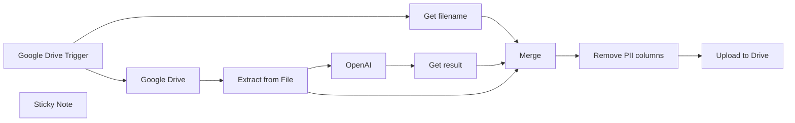

## Fluxo (.json) :

```json
{
  "meta": {
    "instanceId": "2f9460831fcdb0e9a4494f0630367cfe2968282072e2d27c6ee6ab0a4c165a36"
  },
  "nodes": [
    {
      "id": "ff4e8706-09a0-4bf1-86c1-dfb65f55ccb3",
      "name": "Google Drive Trigger",
      "type": "n8n-nodes-base.googleDriveTrigger",
      "position": [
        20,
        -140
      ],
      "parameters": {
        "event": "fileCreated",
        "options": {},
        "pollTimes": {
          "item": [
            {
              "mode": "everyMinute"
            }
          ]
        },
        "triggerOn": "specificFolder",
        "folderToWatch": {
          "__rl": true,
          "mode": "list",
          "value": "1-hRMnBRYgY6iVJ_youKMyPz83k9GAVYu",
          "cachedResultUrl": "https://drive.google.com/drive/folders/1-hRMnBRYgY6iVJ_youKMyPz83k9GAVYu",
          "cachedResultName": "nnnnnnnnnnn8n"
        }
      },
      "credentials": {
        "googleDriveOAuth2Api": {
          "id": "PlyNQuMqlwn9SuLb",
          "name": "Google Drive account"
        }
      },
      "typeVersion": 1
    },
    {
      "id": "340fb03b-3b8a-4eb4-ad4c-b0ba12b72b19",
      "name": "Google Drive",
      "type": "n8n-nodes-base.googleDrive",
      "position": [
        260,
        -140
      ],
      "parameters": {
        "fileId": {
          "__rl": true,
          "mode": "id",
          "value": "={{ $json.id }}"
        },
        "options": {
          "binaryPropertyName": "data"
        },
        "operation": "download"
      },
      "credentials": {
        "googleDriveOAuth2Api": {
          "id": "PlyNQuMqlwn9SuLb",
          "name": "Google Drive account"
        }
      },
      "typeVersion": 3
    },
    {
      "id": "4a5d037f-0103-4645-87d0-785dfdfb80d1",
      "name": "Extract from File",
      "type": "n8n-nodes-base.extractFromFile",
      "position": [
        260,
        60
      ],
      "parameters": {
        "options": {}
      },
      "typeVersion": 1,
      "alwaysOutputData": false
    },
    {
      "id": "36c7e83d-f22f-4a71-b5a2-64ed3e4ce24b",
      "name": "OpenAI",
      "type": "@n8n/n8n-nodes-langchain.openAi",
      "position": [
        -120,
        260
      ],
      "parameters": {
        "modelId": {
          "__rl": true,
          "mode": "list",
          "value": "gpt-4o-mini",
          "cachedResultName": "GPT-4O-MINI"
        },
        "options": {},
        "messages": {
          "values": [
            {
              "role": "system",
              "content": "Analyze the provided tabular data and identify the columns that contain personally identifiable information (PII). Return only the column names that contain PII, separated by commas. Key name: 'content'. Do not include any additional text or explanation."
            },
            {
              "content": "=Here is some tabular data with column headers and two example rows.\n\nHeaders: {{Object.keys($json)}}\n\nExample Row 1: {{Object.values($json)}}\n\n"
            }
          ]
        },
        "jsonOutput": true
      },
      "credentials": {
        "openAiApi": {
          "id": "Mld1OIvnEVogxjDH",
          "name": "OpenAi account"
        }
      },
      "executeOnce": true,
      "typeVersion": 1.7
    },
    {
      "id": "771c6535-47d4-4c70-b487-bd5ac602e29c",
      "name": "Merge",
      "type": "n8n-nodes-base.merge",
      "position": [
        440,
        260
      ],
      "parameters": {
        "numberInputs": 3
      },
      "typeVersion": 3
    },
    {
      "id": "1fc467fd-379d-4841-978b-89c1453b61d8",
      "name": "Upload to Drive",
      "type": "n8n-nodes-base.googleDrive",
      "position": [
        740,
        260
      ],
      "parameters": {
        "name": "={{ $json.fileName }}",
        "content": "={{ $json.content }}",
        "driveId": {
          "__rl": true,
          "mode": "list",
          "value": "My Drive"
        },
        "options": {},
        "folderId": {
          "__rl": true,
          "mode": "list",
          "value": "1F30Qu3csrmMhtcu_prMipeiGm-64VEdd",
          "cachedResultUrl": "https://drive.google.com/drive/folders/1F30Qu3csrmMhtcu_prMipeiGm-64VEdd",
          "cachedResultName": "processed"
        },
        "operation": "createFromText"
      },
      "credentials": {
        "googleDriveOAuth2Api": {
          "id": "PlyNQuMqlwn9SuLb",
          "name": "Google Drive account"
        }
      },
      "typeVersion": 3
    },
    {
      "id": "92715586-e630-4584-83a3-1af42d7cb50e",
      "name": "Get filename",
      "type": "n8n-nodes-base.splitOut",
      "position": [
        20,
        60
      ],
      "parameters": {
        "options": {
          "destinationFieldName": "originalFilename"
        },
        "fieldToSplitOut": "name"
      },
      "executeOnce": true,
      "typeVersion": 1
    },
    {
      "id": "2c4b3242-34db-4948-b835-cd2340ad7b19",
      "name": "Get result",
      "type": "n8n-nodes-base.splitOut",
      "position": [
        200,
        260
      ],
      "parameters": {
        "options": {
          "destinationFieldName": "data"
        },
        "fieldToSplitOut": "message.content.content"
      },
      "typeVersion": 1
    },
    {
      "id": "4207dc71-5b0e-4780-9f23-00f5a7fc3862",
      "name": "Remove PII columns",
      "type": "n8n-nodes-base.code",
      "position": [
        580,
        260
      ],
      "parameters": {
        "jsCode": "// Input: All items from the previous node\nconst input = $input.all();\n\n// Step 1: Extract the PII column names from the first item\nconst firstItem = input[0];\nif (!firstItem.json.data || !firstItem.json.data) {\n  throw new Error(\"PII column names are missing in the input data.\");\n}\nconst piiColumns = firstItem.json.data.split(',').map(col => col.trim());\n//console.log(\"PII Columns to Remove:\", piiColumns);\n\n// Step 2: Remove the first two items and process the remaining rows\nlet rows = input.slice(2).map(item => item.json); // Exclude the first item\n//console.log(\"Rows to convert (before skipping last):\", rows);\n\n\n// Ensure there are rows to process\nif (rows.length === 0) {\n  throw new Error(\"No rows to convert to CSV.\");\n}\n\n// Step 3: Remove PII columns from each row\nconst sanitizedRows = rows.map(row => {\n  const sanitizedRow = { ...row }; // Copy the row\n  piiColumns.forEach(column => delete sanitizedRow[column]); // Remove PII columns\n  return sanitizedRow;\n});\n//console.log(\"Sanitized Rows:\", sanitizedRows);\n\n// Step 4: Extract headers from sanitized rows\nconst headers = Object.keys(sanitizedRows[0]); // Extract updated headers\n//console.log(\"CSV Headers:\", headers);\n\n// Step 5: Convert rows to CSV format\nconst csvRows = [\n  headers.join(','), // Add header row\n  ...sanitizedRows.map(row => \n    headers.map(header => String(row[header] || '').replace(/,/g, '')).join(',') // Match headers with rows\n  )\n];\n\n// Join all rows with a newline character\nconst csvContent = csvRows.join('\\n');\n//console.log(\"CSV Content:\", csvContent);\n\nconst originalFileName = input[1].json.originalFilename;\n\n// Step 7: Generate a new filename\nconst fileExtension = originalFileName.split('.').pop();\nconst baseName = originalFileName.replace(`.${fileExtension}`, '');\nconst newFileName = `${baseName}_PII_removed.${fileExtension}`;\n//console.log(\"New Filename:\", newFileName);\n\n// Step 8: Return the CSV content and filename as JSON\nreturn [\n  {\n    json: {\n      fileName: newFileName, // New file name\n      content: csvContent // CSV content as plain text\n    }\n  }\n];\n"
      },
      "typeVersion": 2
    },
    {
      "id": "e9f25ee7-cd00-4496-9062-5d57cab5788d",
      "name": "Sticky Note",
      "type": "n8n-nodes-base.stickyNote",
      "position": [
        -300,
        -220
      ],
      "parameters": {
        "height": 260,
        "content": "## Remove PII from CSV Files\nThis workflow monitors a Google Drive folder for new CSV files, identifies and removes PII columns using OpenAI, and uploads the sanitized file back to the drive. It requires Google Drive and OpenAI integrations with API access enabled."
      },
      "typeVersion": 1
    }
  ],
  "pinData": {},
  "connections": {
    "Merge": {
      "main": [
        [
          {
            "node": "Remove PII columns",
            "type": "main",
            "index": 0
          }
        ]
      ]
    },
    "OpenAI": {
      "main": [
        [
          {
            "node": "Get result",
            "type": "main",
            "index": 0
          }
        ]
      ]
    },
    "Get result": {
      "main": [
        [
          {
            "node": "Merge",
            "type": "main",
            "index": 0
          }
        ]
      ]
    },
    "Get filename": {
      "main": [
        [
          {
            "node": "Merge",
            "type": "main",
            "index": 1
          }
        ]
      ]
    },
    "Google Drive": {
      "main": [
        [
          {
            "node": "Extract from File",
            "type": "main",
            "index": 0
          }
        ]
      ]
    },
    "Upload to Drive": {
      "main": [
        []
      ]
    },
    "Extract from File": {
      "main": [
        [
          {
            "node": "OpenAI",
            "type": "main",
            "index": 0
          },
          {
            "node": "Merge",
            "type": "main",
            "index": 2
          }
        ]
      ]
    },
    "Remove PII columns": {
      "main": [
        [
          {
            "node": "Upload to Drive",
            "type": "main",
            "index": 0
          }
        ]
      ]
    },
    "Google Drive Trigger": {
      "main": [
        [
          {
            "node": "Get filename",
            "type": "main",
            "index": 0
          },
          {
            "node": "Google Drive",
            "type": "main",
            "index": 0
          }
        ]
      ]
    }
  }
}
```

<a id="template-560"></a>

## Template 560 - Captura periódica da posição da ISS

- **Nome:** Captura periódica da posição da ISS
- **Descrição:** Consulta periodicamente a API de posição da ISS, extrai latitude, longitude e timestamp, e retorna apenas os registros novos que ainda não foram processados.
- **Funcionalidade:** • Gatilho periódico: Executa a rotina a cada minuto para buscar dados atualizados.
• Requisição de posição: Solicita à API a posição do satélite ISS para o timestamp atual.
• Extração de campos: Mapeia latitude, longitude e timestamp do resultado da API.
• Filtragem de novos itens: Compara timestamps com um registro estático e mantém somente entradas não processadas anteriormente.
• Atualização de histórico: Armazena os timestamps recebidos para evitar duplicatas futuras.
• Retorno condicional: Retorna os novos pontos quando houverem ou uma mensagem indicando que não há novos itens.
- **Ferramentas:** • api.wheretheiss.at (Where the ISS API): Serviço que fornece posições do satélite ISS (latitude, longitude e timestamp) para timestamps fornecidos via requisição HTTP.

## Fluxo visual

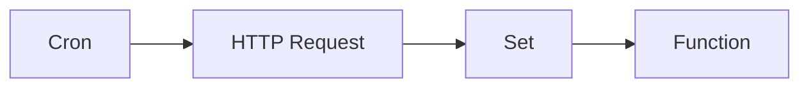

## Fluxo (.json) :

```json
{
  "nodes": [
    {
      "name": "Function",
      "type": "n8n-nodes-base.function",
      "position": [
        1470,
        380
      ],
      "parameters": {
        "functionCode": "const new_items = [];\n// Get static data stored with the workflow\nconst data = this.getWorkflowStaticData(\"node\");\ndata.timestamp = data.timestamp || [];\nfor (var i = items.length - 1; i >= 0; i--) {\n// Check if data is already present\n  if (data.timestamp.includes(items[i].json.timestamp)) {\n    break;\n  } else {\n// if new data then add it to an array\n    new_items.push({\n      json: {\n        timestamp: items[i].json.timestamp,\n        latitude: items[i].json.latitude,\n        longitude: items[i].json.longitude\n      },\n    });\n  }\n}\ndata.timestamp = items.map((item) => item.json.timestamp);\n// Check if array is empty\nif (new_items.length === 0) {\n  return [{ json: { message: \"No new items\" } }];\n} else {\n// return new items if array is not empty\nconsole.log(new_items);\n  return new_items;\n}\n"
      },
      "typeVersion": 1
    },
    {
      "name": "Set",
      "type": "n8n-nodes-base.set",
      "position": [
        1270,
        380
      ],
      "parameters": {
        "values": {
          "number": [
            {
              "name": "latitude",
              "value": "={{$node[\"HTTP Request\"].json[\"0\"][\"latitude\"]}}"
            },
            {
              "name": "longitude",
              "value": "={{$node[\"HTTP Request\"].json[\"0\"][\"longitude\"]}}"
            },
            {
              "name": "timestamp",
              "value": "={{$node[\"HTTP Request\"].json[\"0\"][\"timestamp\"]}}"
            }
          ],
          "string": []
        },
        "options": {},
        "keepOnlySet": true
      },
      "typeVersion": 1
    },
    {
      "name": "HTTP Request",
      "type": "n8n-nodes-base.httpRequest",
      "position": [
        1070,
        380
      ],
      "parameters": {
        "url": "https://api.wheretheiss.at/v1/satellites/25544/positions",
        "options": {},
        "queryParametersUi": {
          "parameter": [
            {
              "name": "timestamps",
              "value": "={{Date.now();}}"
            }
          ]
        }
      },
      "typeVersion": 1
    },
    {
      "name": "Cron",
      "type": "n8n-nodes-base.cron",
      "position": [
        870,
        380
      ],
      "parameters": {
        "triggerTimes": {
          "item": [
            {
              "mode": "everyMinute"
            }
          ]
        }
      },
      "typeVersion": 1
    }
  ],
  "connections": {
    "Set": {
      "main": [
        [
          {
            "node": "Function",
            "type": "main",
            "index": 0
          }
        ]
      ]
    },
    "Cron": {
      "main": [
        [
          {
            "node": "HTTP Request",
            "type": "main",
            "index": 0
          }
        ]
      ]
    },
    "HTTP Request": {
      "main": [
        [
          {
            "node": "Set",
            "type": "main",
            "index": 0
          }
        ]
      ]
    }
  }
}
```

<a id="template-561"></a>

## Template 561 - Encaminhar emails filtrados para Telegram

- **Nome:** Encaminhar emails filtrados para Telegram
- **Descrição:** Encaminha para um chat do Telegram apenas emails cujo assunto contenha palavras-chave específicas, extraindo remetente, assunto e trecho da mensagem.
- **Funcionalidade:** • Monitoramento periódico de email: verifica a caixa de entrada a cada minuto em busca de novas mensagens.
• Filtragem por assunto: encaminha somente emails cujo assunto contenha "Urgent" ou seja exatamente "Server Down".
• Extração de informações: captura remetente, assunto e um trecho da mensagem para compor a notificação.
• Envio formatado para Telegram: envia uma mensagem com remetente, assunto e trecho para um chat específico.
• Redução de ruído: evita notificações para emails que não correspondam aos critérios definidos.
- **Ferramentas:** • Gmail: serviço de email utilizado como fonte das mensagens a serem monitoradas.
• Telegram: aplicativo de mensagens usado para receber as notificações no chat especificado.

## Fluxo visual

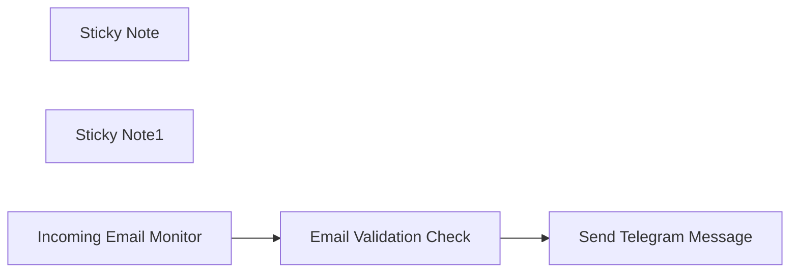

## Fluxo (.json) :

```json
{
  "id": "AvXlqUiuc1qJSwxf",
  "meta": {
    "instanceId": "14e4c77104722ab186539dfea5182e419aecc83d85963fe13f6de862c875ebfa"
  },
  "name": "Forward Filtered Gmail Notifications to Telegram Chat",
  "tags": [],
  "nodes": [
    {
      "id": "99441348-1d5d-459f-961f-48bd593144f2",
      "name": "Sticky Note",
      "type": "n8n-nodes-base.stickyNote",
      "position": [
        -60,
        0
      ],
      "parameters": {
        "color": 4,
        "width": 1000,
        "height": 300,
        "content": "# Forward Filtered Gmail Notifications to Telegram Chat\n"
      },
      "typeVersion": 1
    },
    {
      "id": "eadf565c-e753-4682-a8c2-6bc630a30a27",
      "name": "Sticky Note1",
      "type": "n8n-nodes-base.stickyNote",
      "position": [
        -60,
        320
      ],
      "parameters": {
        "color": 4,
        "width": 1000,
        "height": 200,
        "content": "## Description :\n### This n8n workflow automatically forwards incoming Gmail emails to a Telegram chat only if the email subject contains specific keywords (like \"Urgent\" or \"Server Down\"). The workflow extracts key details such as the sender, subject, and message body, and sends them as a formatted message to a specified Telegram chat. This is useful for real-time notifications, security alerts, or monitoring important emails directly from Telegram — filtering out unnecessary emails."
      },
      "typeVersion": 1
    },
    {
      "id": "bb2a78d7-91ba-4e8c-a9f1-af270a50bd8f",
      "name": "Incoming Email Monitor",
      "type": "n8n-nodes-base.gmailTrigger",
      "position": [
        20,
        100
      ],
      "parameters": {
        "filters": {},
        "pollTimes": {
          "item": [
            {
              "mode": "everyMinute"
            }
          ]
        }
      },
      "credentials": {
        "gmailOAuth2": {
          "id": "5V09QSJCeHoQoKUp",
          "name": "SM MaryP (Gmail)"
        }
      },
      "notesInFlow": false,
      "typeVersion": 1.2
    },
    {
      "id": "addffc7b-ef58-4fb5-9275-3db6fd84f4c0",
      "name": "Email Validation Check",
      "type": "n8n-nodes-base.if",
      "position": [
        340,
        100
      ],
      "parameters": {
        "options": {
          "ignoreCase": false
        },
        "conditions": {
          "options": {
            "version": 2,
            "leftValue": "",
            "caseSensitive": true,
            "typeValidation": "loose"
          },
          "combinator": "or",
          "conditions": [
            {
              "id": "2496d01f-dbd5-4e23-84c3-f78decb87697",
              "operator": {
                "type": "string",
                "operation": "contains"
              },
              "leftValue": "={{ $json.Subject }}",
              "rightValue": "Urgent"
            },
            {
              "id": "274e9e05-5c74-487e-851d-0ca62210cb99",
              "operator": {
                "name": "filter.operator.equals",
                "type": "string",
                "operation": "equals"
              },
              "leftValue": "={{ $json.Subject }}",
              "rightValue": "Server Down"
            }
          ]
        },
        "looseTypeValidation": true
      },
      "typeVersion": 2.2
    },
    {
      "id": "e87d46b6-efc6-466f-a708-bfbf34bf001b",
      "name": "Send Telegram Message",
      "type": "n8n-nodes-base.telegram",
      "position": [
        700,
        80
      ],
      "webhookId": "c8f1d16f-b698-4af9-a795-9aaa277c2bf6",
      "parameters": {
        "text": "=From : {{ $json.From }}\nSubject :{{ $json.Subject }}\nMessage : {{ $json.snippet }}\n",
        "additionalFields": {
          "appendAttribution": false
        }
      },
      "notesInFlow": false,
      "typeVersion": 1.2
    }
  ],
  "active": false,
  "pinData": {},
  "settings": {
    "executionOrder": "v1"
  },
  "versionId": "caf5eedb-4c6b-4bfa-9a0a-2d868291a83c",
  "connections": {
    "Email Validation Check": {
      "main": [
        [
          {
            "node": "Send Telegram Message",
            "type": "main",
            "index": 0
          }
        ]
      ]
    },
    "Incoming Email Monitor": {
      "main": [
        [
          {
            "node": "Email Validation Check",
            "type": "main",
            "index": 0
          }
        ]
      ]
    }
  }
}
```
